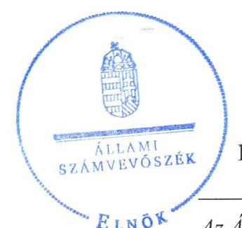
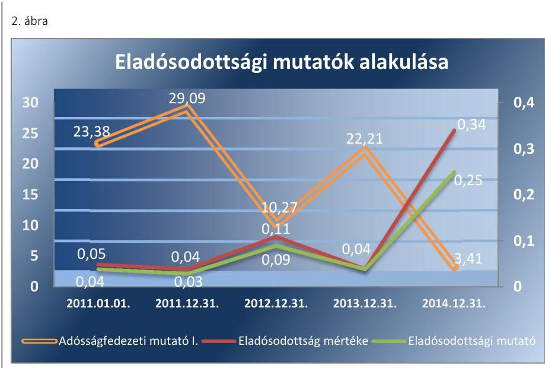

# Jelentés 

## Az önkormányzatok gazdasági társaságai

Az önkormányzatok többségi tulajdonában lévő gazdasági társaságok közfeladat ellátását érintő gazdálkodási tevékenysége szabályszerűségének ellenőrzése - Eleki Hulladékgazdálkodási Nonprofit Kft.

2016.

Az ÁSZ az államháztartáson kívül működő közfeladat-ellátó rendszerek ellenőrzéseivel hozzájárul ahhoz, hogy a közpénzeket az államháztartáson kívül működő szervezetek is átlátható, rendezett módon használják fel a közfeladatok ellátása érdekében.

---

# Jelentés 

## Az önkormányzatok gazdasági társaságai

Az önkormányzatok többségi tulajdonában lévő gazdasági társaságok közfeladat ellátását érintő gazdálkodási tevékenysége szabályszerűségének ellenőrzése - Eleki Hulladékgazdálkodási Nonprofit Kft.
2016. december hó 15. nap

16196
www.asz.hu

---

# AZ ELLENŐRZÉST FELÜGYELTE:

DR. HORVÁTH MARGIT felügyeleti vezető

## AZ ELLENŐRZÉST VEZETTE ÉS A VÉGREHAJTÁSÁÉRT FELELŐS:

GÁCSER JÓZSEF ellenőrzésvezető

## A PROGRAM ÖSSZEÁLLÍTÁSÁÉRT FELELŐS:

JANIK JÓZSEF LÁSZLÓ osztályvezető

IKTATÓSZÁM: V-1024-196/2016.

TÉMASZÁM: 2058.

ELLENŐRZÉS-AZONOSÍTÓ SZÁM: V-070736

Jelentéseink az Országgyűlés számítógépes hálózatán és az Interneten a www.asz.hu címen is olvashatóak.

---

# TARTALOMJEGYZÉK 

■ ÖSSZEGZÉS ..... 5
■ AZ ELLENŐRZÉS CÉLJA ..... 7
■ AZ ELLENŐRZÉS TERÜLETE ..... 8
■ AZ ELLENŐRZÉS HÁTTERE, INDOKOLTSÁGA ..... 10
■ A JELENTÉS LÉNYEGES KÉRDÉSKÖREI ..... 11
■ ELLENŐRZÉS HATÓKÖRE ÉS MÓDSZEREI ..... 12
■ MEGÁLLAPÍTÁSOK ..... 14
■ JAVASLATOK ..... 27
■ MELLÉKLETEK ..... 31
I. Sz. melléklet: Értelmező szótár ..... 31
II. Sz. melléklet: A működés főbb jellemzői. ..... 34
III. Sz. melléklet: A társaság főbb mérlegadatai (MFT) ..... 35
IV. Sz. melléklet: Hulladékgazdálkodási díj változása az ellenőrzött időszakban ..... 36
■ FÜGGELÉK: ÉSZREVÉTELEK ..... 37
■ RÖVIDÍTÉSEK JEGYZÉKE ..... 39

---

.

---

# ÖSSZEGZÉS 

Az Önkormányzat a hulladékgazdálkodási közszolgáltatás megszervezéséről az ellenőrzött időszakot megelőzően döntött, ugyanakkor az ellenőrzött időszakban szabályszerű közszolgáltatási szerződéssel és hulladékgazdálkodási rendelettel csak határidőn túl rendelkezett. A tulajdonosi jogok gyakorlása alapvetően szabályszerű volt.
A Társaság vagyongazdálkodása összességében nem volt szabályszerű. A Társaság árképzése nem felelt meg a jogszabályi előírásoknak, a díjak megalapozottsága nem volt biztosított annak ellenére, hogy a Társaság önköltségszámítási szabályzattal rendelkezett. A kötelezettségek állománya nem veszélyeztette a közfeladat ellátását. A bevételek és ráfordítások elszámolása nem volt megfelelő. A hátralékos követelések behajtásáról, az értékvesztés elszámolásáról sem gondoskodtak szabályszerűen.

## Az ellenőrzés társadalmi indokoltsága

Az Állami Számvevőszék stratégiájában megfogalmazta, hogy a helyi önkormányzatok gazdálkodásában rejlő pénzügyi kockázatok feltárásával, az államháztartáson kívülre nyújtott költségvetési támogatások és ingyenes vagyonjuttatások, valamint az államháztartáson kívül működő közfeladat-ellátó rendszerek ellenőrzéseivel hozzájárul ahhoz, hogy a közpénzeket az államháztartáson kívül működő szervezetek is átlátható, rendezett módon használják fel a közfeladatok szerződésben vállalt ellátása érdekében.

A Magyarországon az intézmény-centrikus közfeladat-ellátás jellemző, de egyre jelentősebb a költségvetésen kívüli feladatellátás térnyerése. Ennek legfontosabb szereplői - a nonprofit szervezetek mellett - az önkormányzati tulajdonú gazdasági társaságok. Az önkormányzatok szervezetalakítási szabadságának következménye, hogy a korábban is vállalati formában működő közszolgáltatások mellett, mind a kötelező, mind az önként vállalt feladatok ellátásában a gazdasági társaságok kiemelt fontosságú szerephez jutottak.

## Főbb megállapítások, következtetések, javaslatok

Az Önkormányzat a hulladékgazdálkodási közszolgáltatás megszervezéséről az ellenőrzött időszakot megelőzően gondoskodott. A törvényi előírásoknak megfelelő közszolgáltatási szerződéssel csak 2014. július 1-től rendelkezett. Az Önkormányzat díjrendelettel az ellenőrzött időszakban rendelkezett, ugyanakkor a törvényi előírásoknak megfelelő, érvényes hulladékgazdálkodási rendelettel csak 2013. december 18-tól.

A tulajdonosi jogok gyakorlása keretében az FB elkészítette a beszámolókhoz az írásbeli jelentését, a Képviselőtestület a Társaság beszámolóit szabályszerűen fogadta el. Hiányosság volt azonban, hogy az FB ügyrend nélkül működött és a Képviselő-testület javadalmazási szabályzatot nem alkotott. Az Önkormányzat nem élt továbbá a jogszabály által biztosított belső ellenőrzés lehetőségével.

A Társaság számviteli rendjét nem szabályszerűen alakította ki. A számviteli politika és az annak keretében készült szabályzatok teljes körűen nem feleltek meg a jogszabályi előírásoknak. Nem készítettek továbbá leltározási és értékelési szabályzatot, illetve bizonylati rendet sem.

A hulladékgazdálkodást szolgáló vagyon elkülönítését az analitikus nyilvántartás biztosította, ugyanakkor a vagyongazdálkodásában hiányosságokat tárt fel az ellenőrzés, mivel a beruházásokat a szükséges alapítói jóváhagyás nélkül végezték el, továbbá a 2014. évi esedékes mennyiségi felvétellel történő leltározást elmulasztották.

A Társaság az éves beszámolókat határidőben elkészítette és benyújtotta a Képviselő-testületnek jóváhagyásra, a letétbe helyezési kötelezettségét határidőben teljesítette, ugyanakkor a hulladékgazdálkodási tevékenységével kapcsolatos költségelszámolást, illetve önálló mérleget és eredménykimutatást nem készített. Az adatok védelmét, átláthatóságát nem biztosította, mivel a szervezeti, személyzeti, illetve a működésre és gazdálkodásra vonatkozó adatokat nem tette közzé.

A Társaságnál a bevételek, ráfordítások és a beruházások, felújítások elszámolása nem volt megfelelő. 2013. évben több esetben nem a Ht-nek megfelelő közszolgáltatási díjat érvényesítettek. A követelések behajtására az ellenőrzött időszakban szabálytalanul intézkedtek. A jegyzőnek törvényben előírt feladata volt 2011-ben és 2012-ben a díjhátralék érvényesítésének adóhatóságnál történő kezdeményezése, amelyhez az Önkormányzat a Hgt. előírásait megsértve ügyintézési díjat kötött ki és szedett be. A hátralékos követelések után értékvesztést nem számoltak el, mely az óvatosság elvét sértette.

A Társaság árképzése kalkulációk hiánya miatt nem felelt meg a jogszabályi előírásoknak, ezáltal a Képviselő-testület által meghatározott közszolgáltatási díjak sem voltak megalapozottak. A Társaság a rezsicsökkentő intézkedéseket végrehajtotta.

A Társaságnál az eladósodás mértéke, szerkezete a vizsgált időszakban nem jelentett kockázatot a működésre. Az eladósodottságot jellemző mutatók összességében kedvezőtlen alakulása azonban felhívja a figyelmet a működés felülvizsgálatának szükségességére.

---

# AZ ELLENŐRZÉS CÉLJA 

Az ellenőrzés célja annak értékelése, hogy az önkormányzat a jogszabályi előírások figyelembevételével döntött-e az ellenőrzésre kerülő közfeladat megszervezéséről; az önkormányzat/tulajdonosi joggyakorló szabályszerűen gyakorolta-e a tulajdonosi jogokat; a gazdasági társaság közfeladat-ellátása bevételeinek, ráfordításainak elszámolása, és vagyongazdálkodási tevékenysége megfelelt-e a jogszabályi, illetve a közszolgáltatási/vagyonkezelési szerződésben foglalt tulajdonosi előírásoknak, azok végrehajtása szabályszerű volt-e; a gazdasági társaság kötelezettségállománya jelent-e kockázatot a működésre, illetve a közfeladat ellátására; a közfeladatok átláthatósága és elszámoltathatósága érdekében biztosítva volt-e a közszolgáltatás díjának megalapozottsága szabályszerű önköltségszámítással.

---

# **AZ ELLENŐRZÉS TERÜLETE**

## **Elek Város Önkormányzata és a kizárólagos tulajdonában lévő Eleki Hulladékgazdálkodási Nonprofit Kft.**

Az Eleki Hulladékgazdálkodási Nonprofit Korlátolt Felelősségű Társaság 1995. január 1-jén alakult Eleki Víz- és Csatornamű Üzemeltető Korlátolt Felelősségű Társaság néven, Nonprofit gazdasági társasággá 2014. évben alakult át. 2011-2014. között a Társaság2 100%-os tulajdonosa Elek Város Önkormányzatának Képviselő-testülete volt, jegyzett tőkéje az ellenőrzött időszakban 3,0 M Ft volt. A Képviselő-testület3 kizárólag a Társaságban rendelkezett többségi tulajdoni hányaddal.

A Társaság ivóvíz- és szennyvíz-szolgáltatási alapfeladat ellátására jött létre, tevékenységi körét a Képviselő-testület 1995. december 1-vel bővítette ki a települési hulladékok kezelésével és a köztisztasági tevékenységgel.

A 2014. július 1-jétől hatályos közszolgáltatási szerződés szerint a hulladékgazdálkodási közszolgáltatásba bevont lakások száma 1989 db, önkormányzati intézmények száma 6 db, vállalkozások száma 438 db, egyéni vállalkozók és őstermelők száma 252 db volt. A Társaság a közszolgáltatási feladatokat 2014. november 4-éig kizárólag Elek város közigazgatási területén látta el. 2014. november 5-től a Társaságot a Békés Megyei Katasztrófavédelmi Igazgatóság Kevermes településen a hulladékgazdálkodási közszolgáltatás ideiglenes ellátására közérdekű szolgáltatónak kijelölte.

A Társaság az ellenőrzött időszakban a hulladékkezelésen kívüli egyéb tevékenységeket (ivóvíz-, szennyvíz-, internet és kábeltévé szolgáltatás, TV stúdió üzemeltetése, bérbeadás) is végzett. Az egyéb tevékenységek kiszervezése az ellenőrzött időszakban folyamatos volt, 2014. január 1-jétől kizárólag hulladékgazdálkodási közszolgáltatással, illetve bérbeadással foglalkozott a Társaság. A tevékenységi kör szűkülésével párhuzamosan a foglalkoztatottak száma és az értékesítés nettó árbevétele folyamatosan csökkent. Az átlagos statisztikai állományi létszám a 2011. évi 22 főről a 2014. évre 7 főre módosult. A Társaság nettó árbevételének, illetve ezen belül a hulladékgazdálkodás nettó árbevételének alakulását, illetve a kötelezettség- és követelésállományt az 1. ábra mutatja be.

---

1. táblázat

## MÉRLEGFŐÖSSZEG, SAJÁT TŐKE ÉS MÉRLEG SZERINTI EREDMÉNY (M FT)

|  | Mérleg-   főösszeg | Saját   tőke | Mérleg-   szerinti   eredményt |
| :--: | :--: | :--: | :--: |
| 2011.01 .01 . | 107,4 | 96,2 | 0,1 |
| 2011.12 .31 . | 108,0 | 96,2 | 0,0 |
| 2012.12 .31 . | 74,9 | 62,1 | 0,1 |
| 2013.12 .31 . | 74,0 | 63,9 | 1,8 |
| 2014.12 .31 . | 70,1 | 52,3 | $-11,6$ |

Forrás: a Társaság 2011-2014. évi beszámolói és főkönyvi kivonatai

A Társaság a 2011-2014. években kizárólag rövid lejáratú kötelezettséggel rendelkezett. A kötelezettségek állománya a 2010. december 31-ei 4,6 M Ft-ról a 2014. év végére közel négyszeresére, 17,8 M Ft-ra nőtt. A követelések állománya több mint másfélszeresére, 19,6 M Ft-ról 30,3 M Ft-ra emelkedett a 2011-2014. években.

A mérlegfőösszeg a 2010. december 31-ei 107,4 M Ft-hoz képest a 2014. év végére 70,1 M Ft-ra, a saját tőke 96,2 M Ft-ról 52,3 M Ft-ra csökkent (1. táblázat). A Társaság mérleg szerinti eredménye a 2011-2013. években pozitív, a 2014. évben negatív, -11,6 M Ft volt. A Társaság főbb adatait a II. sz. melléklet tartalmazza.

Az ellenőrzött időszakban az ügyvezető, a polgármester és a jegyző személye nem, a gazdasági vezető személye egyszer változott. A polgármester a 2002. évi önkormányzati választások óta tölti be tisztségét, a jegyző 2004. július 1-jétől látja el feladatait. Az ügyvezető a 129/2010 (VII.27.) számú testületi határozattal került kinevezésre a 2010. augusztus 1. és 2015. július 31. közötti időszakra.

A jelenlegi ügyvezető és helyettese 2015. augusztus 1-jétől, megbízás keretében látják el feladatukat. Az első gazdasági vezető az ellenőrzött időszak elejétől 2012. szeptember 16-ig, a második 2014. május 31-ig dolgozott a Társaságnál, ezt követően gazdasági vezetőt nem alkalmaztak. A könyvelési feladatokat 2014. június 1-jétől 2015. július 31-ig külső vállalkozó látta el.

---

# AZ ELLENŐRZÉS HÁTTERE, INDOKOLTSÁGA 

AZ ÖNKORMÁNYZATI TULAJDONÚ GAZDASÁGI TÁRSASÁGOK teljes körű ellenőrzésének lehetőségét az ÁSZ. tv. ${ }^{4}$ 2011. január 1-jétől hatályos módosítása teremtette meg. A közfeladatot ellátó gazdasági társaságok ellenőrzése kiemelten fontos a vagyon megőrzése, megóvása érdekében, valamint a kormányzati szektor elszámolásaiban megjelenő önkormányzati tulajdonú gazdálkodó szervezetek esetében, amelyekkel szemben alapvető követelmény, hogy gazdálkodásuk, működésük szabályszerű, az általuk szolgáltatott adatok minél megbízhatóbbak legyenek. A közfeladat ellátás költségeinek, ráfordításainak alakulása, színvonala hatással van a lakosság elégedettségére. A törvényalkotás számára - az észlelt problémák, szabálytalanságok, vagy egyéb nem kívánatos jelenségek felszínre kerülésével - az ellenőrzés megállapításai segítséget nyújthatnak az államháztartáson kívüli közfeladat-ellátás értékeléséhez, jogszabályi keretei pontosításához, átláthatóságot biztosító szabályozásához. Meghatározhatóvá válnak a közfeladat ellátásban részt vevő államháztartáson kívüli szervezeteknek - az önkormányzat költségvetését, pénzügyi helyzetét is befolyásoló - kockázatai, lehetővé válik ezen kockázatok csökkentése. Ellenőrzéseink feltárhatják, hogy az önkormányzat közfeladat-ellátási kötelezettségének szabályszerűen tett-e eleget, a feladatellátáshoz rendelt közvagyon működtetését a tulajdonostól elvárható gondossággal, szabályszerűen szervezte-e meg és a tulajdonosi felügyelete hozzájárult-e a közfeladat-ellátásához. Az ellenőrzés rávilágíthat arra, hogy a gazdasági társaság a közszolgáltatási szerződésben foglaltak betartásával, a közvagyon használatával biztosította-e a szolgáltatás folytatásának feltételeit, a közfeladat ellátását. Ezzel az ellenőrzöttek és a helyi döntéshozók számára visszajelzést ad feladatszervezési, feladat-ellátási kockázataikról, alapot ad a meglévő hibák megszüntetéséhez, a jobb közfeladat-ellátás biztosításához. Fokozza a fegyelmet, igazolja, hogy lejárt a következmények nélküli ellenőrzések időszaka. Az ÁSZ értékteremtő
 rend kialakításához és megőrzéséhez hozzájáruló tevékenysége pozitív hatással van a szervezetről kialakított összkép formálására.

---

# A JELENTÉS LÉNYEGES KÉRDÉSKÖREI 

1. Az Önkormányzat közfeladat megszervezéséről szóló döntése, valamint tulajdonosi joggyakorlása szabályszerű volt-e?
2. A gazdasági társaság vagyongazdálkodása szabályszerű volt-e, kötelezettségállománya jelentett-e kockázatot a működésre, illetve a közfeladat ellátásra?
3. A gazdasági társaságnál az ellátott közfeladat bevételei és ráfordításai elszámolása, valamint az önköltségszámítás és árképzés szabályszerű volt-e?

---

# ELLENŐRZÉS HATÓKÖRE ÉS MÓDSZEREI 

## Az ellenőrzés típusa

Megfelelőségi ellenőrzés

## Az ellenőrzött időszak

2011. január 1-jétől 2014. december 31-ig tartó időszak

## Az ellenőrzés tárgya

A közfeladatot gazdasági társaságokkal ellátó önkormányzatok tulajdonosi joggyakorlása, valamint gazdasági társaságok pénz- és vagyongazdálkodásának szabályozottsága és szabályszerűsége.

Az ellenőrzés kiterjed minden olyan körülményre és adatra, amely az ÁSZ jogszabályban meghatározott feladatainak teljesítéséhez, valamint a program végrehajtása folyamán felmerült újabb összefüggések feltárásához szükséges.

## Az ellenőrzött szervezet

Elek Város Önkormányzata és az
Eleki Hulladékgazdálkodási Nonprofit Kft.

## Az ellenőrzés jogalapja

Az ellenőrzés jogszabályi alapját az Állami Számvevőszékről szóló 2011. évi LXVI. törvény 5. § (3)-(4)-(5) bekezdése képezte.

## Az ellenőrzés módszerei

Az ellenőrzést a nemzetközi standardokat irányadónak tekintve az ellenőrzési program ellenőrzési kérdései, az ellenőrzött időszakban hatályos jogszabályok, az ellenőrzés szakmai szabályok és módszertanok figyelembe vételével végezzük.

Az ellenőrzés ideje alatt az ellenőrzött szervezettel történő kapcsolattartást az ÁSZ Szervezeti és Működési Szabályzatának vonatkozó előírásai alapján biztosítjuk.

---

Az ellenőrzés a kiválasztott, többségi tulajdonosi jogokat gyakorló önkormányzatra, illetve az ellenőrzésre kijelölt közfeladatot ellátó gazdasági társaság felett tulajdonosi jogokat gyakorló szervezetre és az ellenőrzött közfeladatot ellátó gazdasági társaságra terjed ki. Amennyiben a gazdasági társaságban több önkormányzat együttesen többségi tulajdonos, úgy az ellenőrzést a többségi tulajdonosi jogokat gyakorló önkormányzatnál kell lefolytatni. Az ellenőrzött gazdasági társaságnál, amennyiben az több közfeladatot is ellát, akkor az ellenőrzésre kiválasztott közfeladat-ellátást ellenőrizzük.

Az ellenőrzést a kérdésekre adott válaszok kiértékelésével, valamint a megjelölt adatforrások, a csatolt tanúsítványok felhasználásával, továbbá az adott időszakban hatályos jogszabályok figyelembe vételével kell lefolytatni. Az ellenőrzési kérdések megválaszolásához szükséges bizonyítékok megszerzése a következő ellenőrzési eljárások alkalmazásával történik: megfigyelés, kérdésfeltevés (információkérés), összehasonlítás, valamint elemző eljárás.

A bevételek és ráfordítások elszámolása, valamint a vagyonnyilvántartás terén a szabályszerű működést véletlen mintavétellel ellenőriztük. A jogszabályoknak és a belső előírásoknak megfelelőnek tekintettük az adott területet, amennyiben a minta ellenőrzésének eredménye alapján 95%-os bizonyossággal a teljes sokaságban a hibaarány kisebb volt, mint 10%, nem megfelelőnek, ha a hibaarány a 10%-ot meghaladta. Kockázatot, illetve magas kockázatot jeleztünk, amennyiben egy adott terület vonatkozásában a minta alapján a teljes sokaságban nem volt egyértelműen biztosított a jogszabályoknak és a belső szabályzatoknak megfelelő működés. A ráfordítások elszámolására és a vagyonnyilvántartásra vonatkozó véletlen mintavételt kockázati alapú kiválasztással egészítettük ki, amelynek során a három legnagyobb összegű tételt választottuk ki.

---

# 1. Az Önkormányzat közfeladat megszervezéséről szóló döntése, valamint tulajdonosi joggyakorlása szabályszerű volt-e? 

Összegző megállapítás

Az Önkormányzat a közszolgáltatás megszervezéséről az ellenőrzött időszakot megelőzően döntött, ugyanakkor szabályszerű közszolgáltatási szerződéssel és hulladékgazdálkodási rendelettel csak határidőn túl rendelkezett. A tulajdonosi jogok gyakorlása alapvetően szabályszerű volt. Az FB elkészítette a beszámolókhoz az írásbeli jelentését, a Képviselő-testület a Társaság beszámolóit szabályszerűen fogadta el.
1.1. számú megállapítás

Az Önkormányzat a hulladékgazdálkodási közszolgáltatás megszervezéséről az ellenőrzött időszakot megelőzően döntött. Az ellenőrzött időszakban nem volt jogviszony nélküli feladatellátás, ugyanakkor a törvényi előírásoknak megfelelő közszolgáltatási szerződéssel az Önkormányzat csak 2014. július 1-től rendelkezett. Az Önkormányzat díjrendelettel az ellenőrzött időszakban rendelkezett, ugyanakkor a törvényi előírásoknak megfelelő, érvényes hulladékgazdálkodási rendelettel csak 2013. december 18-tól.

A KÖZTISZTASÁG ÉS TELEPÜLÉSTISZTASÁG BIZTOSÍTÁSA, A HULLADÉKGAZDÁLKODÁS az Ötv. ${ }^{5}$ 8. § (1) bekezdése, illetve az Mötv. ${ }^{6}$ 13. § (1) bekezdés 19. pontja alapján az Önkormányzat feladata volt. Az Önkormányzat a közszolgáltatást az Ötv. 9. § (4) bekezdése, illetve az Mötv. 41. § (6) bekezdése alapján kizárólagos tulajdonú gazdasági társasága útján látta el, melyről az ellenőrzött időszakot megelőzően döntött. A közfeladat ellátásáról az alapító okiratban, a helyi hulladékgazdálkodási tervben, továbbá a 2001-ben a Társasággal megkötött megállapodásban rendelkezett.

AZ ALAPÍTÓ OKIRAT ${ }_{1,2}{ }^{7}$ tartalma megfelelt a Gt. 12. § (1) bekezdésében foglaltaknak, illetve a Ptk. ${ }^{8}$ 3:5. §-ban előírtaknak. Az alapító okirat ${ }_{2}$ elfogadásával a Társaság megfelelte a Ht. ${ }^{9}$ 90. § (8) bekezdésének, mely szerint hulladékgazdálkodási közszolgáltatást 2014. július 1-jétől csak nonprofit gazdasági társaság végezhet.

HELYI HULLADÉKGAZDÁLKODÁSI TERVÉT az Önkormányzat a Hgt. ${ }^{10}$ 35. § (1), (3) bekezdésében foglalt előírásoknak megfelelően kidolgozta és rendeletben kihirdette. Tartalma megfelelt a Hgt. 37. § (4) bekezdésében foglaltaknak.

Az Önkormányzat a Hgt. 37. § (1) bekezdésében foglaltak ellenére nem gondoskodott a háromévente esedékes beszámoló összeállításáról.

---

# A HULLADÉKKEZELÉSI KÖZSZOLGÁLTATÁST a 

Társaság a 2011. január 1. és 2014. július 1. közötti időszakban - a Hgt. 27.§ (3) bekezdésében foglalt előírásokkal szemben, közszolgáltatási szerződés nélkül - az Önkormányzat és a Társaság között 2001-ben határozatlan időre megkötött megállapodás ${ }^{11}$ alapján végezte. A hivatkozott megállapodás nem felelt meg a 224/2004. (VII.22.) Korm. rendelet ${ }^{12}$ előírásainak. A hulladékkezelési tevékenységet a 2011-2012. években a Társaság a Hgt. 14. § (2) bekezdése szerint a Tiszántúli Környezetvédelmi, Természetvédelmi és Vízügyi Felügyelőség kirendeltsége által határozatlan időre kiadott engedély birtokában látta el.

A Társaság és a Képviselő-testület a Ht. 33. § (1) bekezdése szerinti közszolgáltatási szerződést határidőben, 2014. július 1-jén megkötötte. A közszolgáltatási szerződés megkötésekor a Ht. 90. § (8) bekezdésének megfelelően a Társaság rendelkezett közszolgáltatási engedéllyel és OHÚ${ }^{13}$ minősítő okirattal. A Társaság a Ht. 62. § (2) bekezdése szerinti közszolgáltatási engedélyt azonban késedelmesen, a Ht. 90. § (4) bekezdésében meghatározott, a Ht. hatálybalépését követő 6 hónapos határidőn túl, 2013. szeptember 26-án szerezte be. A Társaság 2013. július 1-je és 2013. szeptember 26-a között a határozatlan időre kiadott korábbi működési engedély alapján látta el a közszolgáltatást, így engedély nélküli feladatellátás nem volt. A 2014. július 1-jétől 5 éves időtartamra kötött szerződés nem tartalmazta a 317/2013. (VIII.28.) Korm. rendelet ${ }^{14}$ 4. § (1) bekezdés a)-b) és d) pontjaiban előírt kötelező elemeket. A hiányosságok megszüntetése érdekében a Képviselő-testület határozattal* döntött a közszolgáltatási szerződés módosításáról, azonban ennek aláírására nem került sor.

RENDELETALKOTÁSI KÖTELEZETTSÉGÉNEK a Képviselő-testület 2013. december 17-ig teljes körűen nem tett eleget. A Képviselő-testület a Hgt. 23. § f) pontjának megfelelően az ellenőrzött időszakban díjrendeletben ${ }^{15}$ meghatározta az ingatlantulajdonost terhelő díjfizetési kötelezettséget. A díjrendelet módosításáról szóló, a 2011. évre megállapított közszolgáltatási díjat tartalmazó 16/2010. (XII.14.) Kt.sz. rendelet két eltérő tartalmú változatban állt rendelkezésre. A Társaság a Képviselőtestület elé terjesztett változatot alkalmazta.

A 2013. december 18-tól hatályos hulladékgazdálkodási rendelet ${ }^{16}$ megfelelt a Ht. 35. §-ában foglalt előírásoknak.
1.2. számú megállapítás

A tulajdonosi jogok gyakorlása alapvetően szabályszerű volt. Az FB elkészítette a beszámolókhoz az írásbeli jelentését, a Képviselő-testület a Társaság beszámolóit szabályszerűen fogadta el. Hiányosság volt, hogy az FB ügyrend nélkül működött és a Képviselő-testület javadalmazási szabályzatot nem alkotott. Az Önkormányzat nem élt a jogszabály által biztosított belső ellenőrzés lehetőségével.

A TÁRSASÁG FELETTI TULAJDONOSI JOGOK GYAKORLÁSÁNAK RENDJÉRŐL az Önkormányzat az Alapító okirat ${ }_{1,2}$-ben rendelkezett. A tulajdonosi jogokat az Alapító okirat ${ }_{1,2}$

[^0]
[^0]:    * 180/2014. (XI.24.) számú Kt. határozat

---

előírásainak megfelelően a Képviselő-testület gyakorolta, hatáskör átruházására nem került sor.

A FELÜGYELŐBIZOTTSÁG 2014. február 17-ig öt, ezt követően három tagból állt, mely a Gt. 34. § (1) bekezdésének, illetve a Ptk. 2 3:121. § (1) bekezdésének megfelelt. Az FB${ }^{17}$ ügyrendjét a Gt. 34. § (4) bekezdésében, illetve a Ptk. 2 3:122. § (3) bekezdésében foglaltak ellenére nem állapította meg. Az FB a Társaság Számv.tv. ${ }^{18}$ szerinti éves beszámolóit minden évben megtárgyalta.

A Képviselő-testület a Taktv. ${ }^{19}$ 5. § (3) bekezdésében foglaltak ellenére nem alkotott javadalmazási szabályzatot az ellenőrzött időszakban. Az ügyvezető a 2011-2014. években jutalmat, prémiumot nem kapott.

# A SZÁMV. TV. SZERINTI ÉVES BESZÁMOLÓKAT a 

Gt. 141. § (2) bekezdés a) pontja, illetve a Ptk. 2 3:109. § (2) bekezdés szerint a Képviselő-testület minden évben jóváhagyta. A könyvvizsgáló a Gt. 44. § (1) bekezdésének, valamint a Ptk. 2 3:131. § (2) bekezdésének megfelelően a beszámolókat tárgyaló üléseken részt vett. A könyvvizsgáló felhívta a figyelmet a tevékenységi kör szűkülése és a lejárt követelésállomány miatt fennálló pénzügyi kockázatokra. A jelzés nyomán az Önkormányzat 82/2014 (V.29.) számú határozatában kötelezte az ügyvezetőt az intézkedések megtervezésére. Az ügyvezető képviselő-testületi előterjesztést nyújtott be az átszervezés okairól, azok következményeiről, a szükséges tennivalókról. Az ügyvezető a 2014. évi számviteli beszámoló elfogadásakor beszámolt a megtett intézkedésekről.

OSZTALÉK KIFIZETÉSÉRŐL 2011-2014. évek vonatkozásában Képviselő-testület nem döntött, a mérleg szerinti eredményt az éves beszámolókkal, a Gt. 141. § (2) bekezdés a) pontja, illetve a Ptk. 2 3:109. § (2) bekezdés szerint jóváhagyta. A Számv. tv. 37. § (1) bekezdés a) pontjának megfelelően az előző üzleti év mérleg szerinti eredményét az eredménytartalék növekedéseként kimutatták.

A 2014. évi veszteség képződéséhez hozzájárult az, hogy 2011-2013. között a Társaság hulladékgazdálkodáson kívüli feladatait fokozatosan megszüntették. Ennek és a rezsicsökkentési intézkedések hatására az árbevétel csökkent, melyet azonban nem követte azonos ütemben a ráfordítások csökkenése. A ráfordításokon belül a hulladékártalmatlanítás díja, a lerakási járulékemelkedéshez kapcsolódóan emelkedett.

Az ellenőrzött időszakban a saját tőke/jegyzett tőke előírt szintjének biztosítása érdekében nem volt szükség a Gt. 51. § (1) bekezdésében, illetve a Ptk. 2 3:133. § (2) bekezdésében meghatározott tulajdonosi intézkedésre. Az ellenőrzött időszak alatt az Önkormányzat a Társaság részére a hulladékgazdálkodási tevékenység ellátása érdekében nem nyújtott garanciát, nem vállalt kezességet. Az Önkormányzat az Ötv. 92. § (11) bekezdés b) pontjában, illetve az Áht. ${ }^{20}$ 70. § (1) bekezdés d) pontjában foglalt ellenőrzési lehetőségével nem élt.

---

# 2. A gazdasági társaság vagyongazdálkodása szabályszerű volt-e, kötelezettségállománya jelentett-e kockázatot a működésre, illetve a közfeladat ellátásra? 

Összegző megállapítás

A Társaság vagyongazdálkodásában hiányosságokat tárt fel az ellenőrzés. A beruházásokhoz szükséges tulajdonosi hozzájárulásokat nem szerezték be, nem gondoskodtak a 2014. évben esedékes mennyiségi leltározásról. A Társaság nem készített a hulladékgazdálkodási közszolgáltatói tevékenységgel kapcsolatos költségelszámolást, illetve önálló mérleget és eredménykimutatást sem.
2.1. számú megállapítás

A Társaság számviteli rendjét nem szabályszerűen alakította ki. A számviteli politika és az annak keretében készült szabályzatok teljes körűen nem feleltek meg a jogszabályi előírásoknak. Nem készítettek leltározási-, értékelési szabályzatot és bizonylati rendet sem.

KÖZSZOLGÁLTATÓI HULLADÉKGAZDÁLKODÁSI TERVÉT a Társaság a Ht. 78. § (1) bekezdésében előírtak alapján elkészítette, mely tartalmában a Ht. 78. § (2) bekezdésében és a 438/2012. (XII.29.) Korm. rendelet ${ }^{21}$ 11. § (1) bekezdésében foglalt előírásoknak megfelelt. A Ht. 78. § (3) bekezdése
 szerint a Társaság a hulladékgazdálkodási tervet az OHÜ-nek, valamint az OKTVF²²-nek megküldte.

Az üzleti terveket és a végrehajtásukról szóló beszámolókat az ügyvezető az SZMSZ $_{12}$ előírásainak megfelelően elkészítette és azt jóváhagyásra a Képviselő-testület elé terjesztette.

A SZÁMVITELI POLITIKA $_{1,2}^{23}$ nem felelt meg a Számv. tv. 14. § (3)-(4) bekezdésben foglalt követelményeknek, mivel teljes körűen nem határozta meg a Számv. tv. végrehajtásának módszereit, eszközeit, nem rögzítette, hogy a Számv. tv.-ben biztosított választási, minősítési lehetőségek közül melyeket, milyen feltételek fennállása esetén alkalmaz:
$\longrightarrow$ Számv. tv. 96. § (2) bekezdése ellenére nem választott az egyszerűsített éves beszámoló mérlegével kapcsolatban a Számv. tv. 1. számú melléklet "A", illetve "B" változata közül.
$\longrightarrow$ az eredménykimutatás vonatkozásában a Számv. tv. 96. § (3) bekezdése ellenére a Számv. tv. 2. és 3. számú mellékletében szereplő összköltség és forgalmi költség eljárások között nem döntött.

ÖNKÖLTSÉGSZÁMÍTÁSI SZABÁLYZAT készítésére a Társaság a Számv. tv. 14. § (6) bekezdése alapján nem volt kötelezett, azonban 2012. január 10-ével elkészítették a szabályzatot a Számv. tv. 14. § (5) bekezdés c) pontja szerint a számviteli politika részeként.

---

ÉRTÉKELÉSI SZABÁLYZATOT a számviteli politika részeként a Számv. tv. 14. § (5) bekezdés b) pontja ellenére nem készítettek. A Számv. tv. 14. § (4) bekezdésében foglaltak ellenére
$\longrightarrow$ a követelések, kötelezettségek és egyéb mérlegtételek értékelési szempontjait nem határozták meg, nem rögzítették, hogy az értékelés szempontjából mit tekintenek lényegesnek, jelentősnek, nem lényegesnek, nem jelentősnek,
$\longrightarrow$ nem döntöttek arról, hogy a Számv. tv.-ben biztosított választási, minősítési lehetőségek közül melyeket, milyen feltételek fennállása esetén alkalmaznak, így arról sem, hogy a kisösszegű követelések esetében élnek-e a Számv. tv. 55. § (2) bekezdésében biztosított lehetőséggel, mely szerint az értékvesztés összege ezen követelések nyilvántartásba vételi értékének százalékában is meghatározható,
$\longrightarrow$ nem rögzítették, hogy a Számv. tv.-ben biztosított választási, minősítési lehetőségek közül melyeket, milyen feltételek fennállása esetén alkalmaznak, így azt sem, hogy élnek-e a Számv. tv. 57. (3) bekezdése szerint a piaci értéken történő értékelés lehetőségével;

A PÉNZKEZELÉSI SZABÁLYZAT $_{1}^{24}$ a Számv. tv. 14. § (8) bekezdése ellenére nem tartalmazta a napi készpénz záró állomány maximális mértékét, egyebekben megfelelt a hivatkozott bekezdés előírásainak, ahogy a pénzkezelési szabályzat $_{2}^{25}$ is.

# LELTÁRKÉSZÍTÉSI ÉS LELTÁROZÁSI SZABÁLY-

ZAT a Számv. tv. 14. § (5) bekezdés a) pontját megsértve nem készült a Társaságnál.

A SZÁMLAKERET $_{1}^{26}$ 2014. május 31-ig megfelelt a Számv. tv. 160. § (1) bekezdésében foglaltaknak, mivel teljes körűen biztosította a beszámoló elkészítéséhez szükséges alapinformációkat. A számlakeret $_{1}$ a 67. számlaosztály használatával, illetve a 9. számlaosztályban a bevételi számlák tevékenységek szerinti megbontásával a Hgt. 29. § (1) bekezdésnek megfelelően a költségelszámoláshoz szükséges adatokat biztosította, valamint a Ht. 50. § (2) bekezdése szerint a különböző tevékenységek költségeinek, ráfordításainak és bevételeinek szétválasztását lehetővé tette.

A 2014. június 1-jétől alkalmazott számlakeret $_{2}^{27}$ 6-7. számlaosztály hiányában nem biztosította a hulladékgazdálkodási közszolgáltatáshoz kapcsolódó ráfordítások teljes körű elkülönítésének lehetőségét, melyeket más belső szabályozó sem biztosított. A számlakeret $_{2}$-ben a bevételek nyilvántartásának szabályozása biztosította a Ht. 50. § (2) bekezdésben foglaltak szabályozási feltételeit.

A SZÁMLAREND $_{1,2}^{28}$ nem felelt meg a Számv. tv. előírásainak.
$\longrightarrow$ a Számv. tv. 161. § (2) bekezdés a) pontjában foglaltak ellenére nem tartalmazta minden alkalmazásra kijelölt számla számjelét és megnevezését, mivel az 1-3. számlaosztályt csak számlacsoport (2 számjegy mélységű) bontásban tartalmazta, ezzel szemben a számlakeret számlái 4 számjegyből álltak;
$\longrightarrow$ a számlarend $_{2}$-ből a Számv. tv. 161. § (2) bekezdés b) pontjában foglaltak ellenére hiányoztak továbbá a számla értéke növekedésének,

---

csökkenésének jogcímei, a számlát érintő gazdasági események, azok más számlákkal való kapcsolata;
$\longrightarrow$ a számlarend $_{2}$ nem kapcsolódott a 2014. június 1-jétől alkalmazott számlakeret2-höz, amivel megsértették a Számv. tv. 161. § (1) bekezdés előírásait, mivel a számlakeret $_{2}$ előírásainak figyelembevételével az ügyvezető nem készített olyan számlarendet, amely szerinti könyvvezetés a beszámoló készítését maradéktalanul biztosítja;
—_érvényes, aláírt, a számlarendben foglaltakat alátámasztó bizonylati rend a számlarend részeként a Számv. tv. 161. § (2) bekezdés d) pontja ellenére nem készült;

A kialakított számviteli rend nem felelt meg a Ht. 50. § (2) bekezdésének, mert nem biztosította teljes körűen az egyes tevékenységek elkülönítésének lehetőségét és nem zárta ki a keresztfinanszírozást. A ráfordítások és a vagyon vonatkozásában nem biztosította a Ht. 50. § (3) bekezdésében a hulladékgazdálkodási közszolgáltatással kapcsolatban az önálló mérleg és eredménykimutatás elkészítéséhez szükséges szabályozási alapot.

# 2.2. számú megállapítás

## 2.3. számú megállapítás

A hulladékgazdálkodást szolgáló vagyon elkülönítését az analitikus nyilvántartás biztosította, ugyanakkor a vagyongazdálkodásában hiányosságokat tárt fel az ellenőrzés, mivel a beruházásokat a szükséges alapítói jóváhagyás nélkül végezték el, továbbá a 2014. évi esedékes mennyiségi felvétellel történő leltározást elmulasztották.

A Társaság a hulladékkezelési közfeladatot saját eszközeivel látta el, üzemeltetésre, használatra átvett, illetve vagyonkezelésbe vett eszköze nem volt. A Társaság vagyona a 2011. év kivételével csökkent, a 2011. január 1-jei nyitó 107,4 M Ft-hoz képest a 2014. év végére 34,7%-kal, 37,3 M Ft-tal.

A TÁRSASÁG FŐBB MÉRLEGADATAIT a III. számú melléklet tartalmazza. A tárgyi eszközök mérlegértéke a 2011. évi nyitó adatról a 2014. év végére 56,5%-kal, 34,8 M Ft-tal csökkent, amely nem érintette a hulladékgazdálkodást. A saját tőke a 2011. évi nyitó értékéről, 96,2 M Ftról 2014. év végére 45,6%-kal, 52,3 M Ft-ra csökkent, amely érdemben nem hatott ki a hulladékgazdálkodásra.

A VAGYONGAZDÁLKODÁSI DÖNTÉSEKKEL kapcsolatban az alapító okirat $_{1}$ úgy rendelkezett, hogy az alapító kizárólagos hatásköre az olyan szerződés megkötésének jóváhagyása, mely a törzstőke értékének egynegyedét, azaz a 750 E Ft-ot meghaladja. Ugyanakkor az SZMSZ1 2.1. pontja szerint az ügyvezető a Társaság számára kötelezettséggel járó szerződést, megállapodást csak a törzstőke 20%-ig, vagyis 600 E Ftig köthetett, az ezt meghaladó ügyletekben az alapító jóváhagyása volt szükséges. Az eltérő szabályozás az alapító okirat $_{2}$ kiadásáig 2011-től 2014. február 14-ig fennállt, viszont a Társaság 2011-2013. évi beszámolóinak kiegészítő mellékleteiben rögzített információk szerint nem volt olyan beruházás, amelynek értéke 600 E Ft és 750 E Ft között volt. A 750 E Ft-ot meghaladó beruházásokkal kapcsolatban nem született alapító jóváhagyás egyetlen esetben sem, amivel megsértették az alapító okirat $_{1}$ és az SZMSZ1 előírásait is. Ezeket a beruházások összesen 20,7 mFt-ot tettek ki, melyet a 2. táblázat részletez. A Társaság főkönyvi nyilvántartásai szerint a 2014. évben nem volt 600 E Ft-ot meghaladó beruházás.

---

# A HULLADÉKGAZDÁLKODÁST SZOLGÁLÓ VAGYON ELKÜLÖNÍTÉSÉT a Ht. 50.§ (2) bekezdésének megfelelően 2013-2014. években a befektetett eszközök, készletek és követelések vonatkozásában a Társaság analitikus nyilvántartása biztosította. A szabályozási hiányosságok ellenére az elkülönítés biztosította a Ht. 50.§ (3) bekezdésében a hulladékgazdálkodási közszolgáltatás nyújtása érdekében végzett tevékenység önálló mérleg keretében történő bemutatásához szükséges adatokat.

## A MÉRLEG TÉTELEINEK ALÁTÁMASZTÁSÁHOZ A

**LELTÁRT** a Társaság a Számv. tv. 69. § (1) bekezdése alapján az ellenőrzött időszakban teljes körűen nem készítette el. 2011. év vonatkozásában a mennyiségi felvétellel történő tárgyi eszköz és készlet leltározást elvégezték. A tárgyi eszközök leltározására tárgyi eszköz kartonokat alkalmaztak. 2014. évben a mennyiségi felvétellel történő, valamint a mennyiségi leltározások közötti időszakban az értékbeli egyeztetéssel történő leltározás elmaradt, ezzel megsértették a Számv.tv. 69. § (3) bekezdésében foglaltakat.

## 2.3. számú megállapítás

**A Társaságnál az eladósodás mértéke, szerkezete a vizsgált időszakban nem jelentett kockázatot a működésre. Az eladósodottságot jellemző mutatók összességében kedvezőtlen alakulása azonban felhívja a figyelmet a működés felülvizsgálatának szükségességére.**

**A KÖTELEZETTSÉGEK** állománya a 2011. december 31-ei 3,7 M Ft-ról a 2014. év végére majdnem ötszörösére, 17,8 M Ft-ra nőtt. A kötelezettségállomány alakulását a 3. táblázat mutatja be.

1. táblázat

|  A KÖTELEZETTSÉGEK ALAKULÁSA (M FT) |  |  |  |   |
| --- | --- | --- | --- | --- |
|  Megnevezés | 2011. | 2012. | 2013. | 2014.  |
|  II. HOSSZÚ LEJÁRATÚ KÖTELEZETTSÉGEK | 0,0 | 0,0 | 0,0 | 0,0  |
|  III. RÖVID LEJÁRATÚ KÖTELEZETTSÉGEK | 3,7 | 7,0 | 2,7 | 17,8  |
|  ebből szállítók | 0,0 | 0,0 | 0,0 | 9,1  |

*Forrás: A Társaság éves beszámolói és adatszolgáltatása*

A 2014. évi főkönyvi kivonat szerint a kötelezettségek állományából 9,1 M Ft volt a szállítói tartozás, melyből 6,0 M Ft az Önkormányzat és intézményei felé állt fenn. A Társaság bankkivonatai szerint a 6,0 M Ft-os tartozásból 5,3 M Ft-ot 2014-ben a Társaság több részletben átutalt az Önkormányzatnak. Az átutalt tételeket technikai számlára könyvelték, melyet azonban év végével nem rendeztek a szállítói főkönyvi számlával szemben. Így a valóságban is megtalálható szállítói kintlévőség 5,3 M Ft-tal kevesebb volt, mint a Társaság 2014. évi beszámolójában szereplő összeg. Ezzel megsértették a Számv. tv. 15. § (3) bekezdésében foglalt valódiság elvét. A feltárt hiba azonban nem minősül a Btk.29 403. § (4) bekezdése szerint megbízható és valós képet lényegesen befolyásoló hibának.

**AZ ELADÓSODOTTSÁG MÉRTÉKE** és szerkezete nem jelentett kockázatot a közfeladat ellátásra, a mutatók kedvezőtlen alakulása azonban felhívja a figyelmet a működés felülvizsgálatának szükségességére. A mutatók alakulását a 2. ábra szemlélteti.

---

Forrás: a Társaság éves beszámolói
az adósságfedezeti mutató I. értékének romlása azt jelzi, hogy az 1 Ft adósságra jutó saját vagyon jelentősen csökkent. Ennek oka egyrészt a víziközmű vagyon 2012. évi átadása miatti saját vagyon csökkenés, másrészt a kötelezettségek állományának növekedése.
az eladósodottság mértékének 1 alatti értéke kedvezőnek mondható, azonban növekedése azt mutatja, hogy a kötelezettségek egyre nagyobb hányadát teszik ki a saját tőkének.
az eladósodottsági mutató értéke is alacsony volt, azaz az idegen tőke aránya az összes forráson belül nem volt jelentős. A mutató értékének növekedése azonban romló tendenciát jelez.
Az árbevételre vetített eladósodottság, illetve a nettó eladósodottsági mutató értéke negatív volt. A mutatók értékét torzítja, hogy a forgóeszközök részét képező követelések egy éven túl lejárt kintlévőségeket is tartalmaztak, amelyek megtérülése bizonytalan.

2011-2013. években biztosított volt a Társaság rövidlejáratú kötelezettségeinek teljesítése, 2014. évben azonban már több esetben is késedelmesen teljesítettek. A Társaság 2014-ben jelentkező pénzügyi nehézségeit jelezte az is, hogy a tulajdonos anyagi segítségére volt szüksége a Társaságnak a zavartalan működése fenntartásához. A Képviselő-testület 2,0 M Ft működési támogatást szavazott meg a határozatban szereplő konkrét feladatok elvégzésére, melyből a 2014. évben 0,9 M Ft került folyósításra.
2.4. számú megállapítás

A Társaság az éves beszámolókat elkészítette és benyújtotta a Kép-viselő-testületnek jóváhagyásra, a letétbe-helyezési kötelezettségét teljesítette, ugyanakkor a hulladékgazdálkodási tevékenységével kapcsolatos költségelszámolást, illetve önálló mérleget
 és eredménykimutatást nem készített. Az adatok védelmét, átláthatóságát nem biztosította.

A SZÁMV. TV. SZERINTI ÉVES BESZÁMOLÓKAT a Társaság minden évben, határidőben benyújtotta az Önkormányzatnak, melyhez minden évben csatolta az FB írásos jelentését, illetve a könyvvizsgálói jelentést, a Képviselő-testület a jelentések birtokában döntött a beszámolók elfogadásáról. A Társaság a Számv. tv. 153. § (1) bekezdés, és a 154. § (1) bekezdés előírásainak megfelelően a 2011-2014. évi beszámolók letétbe helyezését, közzétételét határidőben teljesítette.

A Társaság beszámolójának kiegészítő melléklete 2013-2014. között nem felelt meg a Ht. 50. § (1) és (3) bekezdésében, illetve a Számv. tv. 88. § (1) és (4) bekezdésében foglaltaknak, figyelemmel a Számv. tv. 96. § (1) és (4) bekezdésére is, mivel a 2013-2014. években nem tartalmazott a tevékenység elkülönült bemutatása érdekében önálló mérleget és eredménykimutatást és 2014. évben nem mutatta be az értékcsökkenés elszámolásának számviteli politikában meghatározott módszerét.

A Társaság a 2011-2012. években a Hgt. 29. § (1) bekezdésében előírt, részletes, hulladékgazdálkodási kötelező közszolgáltatói tevékenységével kapcsolatos költségelszámolást nem készített, azt az Önkormányzat felé nem nyújtotta be.

A könyvvizsgáló az ellenőrzött időszak minden évében hitelesítő záradékkal látta el a Számv. tv. szerinti éves beszámolókat.

A könyvvizsgáló az ellenőrzött időszakban nem észrevételezte, hogy a Társaság a Ht. 50.§ (3) bekezdésében foglaltak ellenére nem készített a hulladékgazdálkodási közszolgáltatás érdekében végzett tevékenységére vonatkozóan 2013-2014. évi önálló mérleget és eredménykimutatást.

# EGYÉB ADATSZOLGÁLTATÁSI KÖTELEZETTSÉGEIT a Társaság szabályszerűen teljesítette. A Ht. 50. § (4) bekezdésnek megfelelően a 2013-2014. évi számviteli beszámolókat a letétbe helyezéssel egyidőben megküldték a MEKH ${ }^{30}$-nek. A Ht. 91. § (2a) bekezdésében foglaltaknak eleget tettek, 2013. augusztus 15-től kezdődően minden tárgyhónapot követő hónap 15. napjáig írásban igazolták a fogyasztóvédelmi hatóságnak a rezsicsökkentéssel kapcsolatban a Ht.-ben foglalt előírások teljesülését.

AZ ADATOK VÉDELMÉRE, KÖZZÉTÉTELÉRE vonatkozó feladatokat nem teljesítették. Az ellenőrzött időszakban a Társaságnál nem volt belső adatvédelmi felelős az Avtv. ${ }^{31} 31/$A. § (1) bekezdés c) pontjában és az Info tv. 24. § (1) bekezdés c) pontjában előírtakkal szemben. 2011-2014. évek között a Társaságnál a belső adatvédelmi és adatbiztonsági szabályzatot nem készítettek, belső adatvédelmi nyilvántartást nem vezettek, ezzel megsértették az Avtv. 31/A. § (2) bekezdés d) e) pontjában és a (3) bekezdésben előírtakat, valamint az Info tv. 24. § (2) bekezdés d), e) pontjában és a (3) bekezdésében előírtakat. A Társaság a közérdekű adatok megismerésére irányuló igények teljesítésének rendjére szabályzatot az Avtv. 20. § (8) bekezdése, illetve az Info tv. ${ }^{32} 30$. § (6) bekezdése alapján a 2011-2014. években nem készített. Az ügyvezető az Eisztv. ${ }^{33}$ 6. § (1) bekezdésében, valamint az Info tv. 37. § (1) bekezdésében előírt közzétételi kötelezettségének az 1. számú mellékletben meghatározott adatok tekintetében nem tett eleget. A Társaság szervezeti, személyi, tevékenységére, működésére vonatkozó és gazdálkodási adatait honlapján nem tette közzé.

# 3. A gazdasági társaságnál az ellátott közfeladat bevételei és ráfordításai elszámolása, valamint az önköltségszámítás és árképzés szabályszerű volt-e? 

Összegző megállapítás

A közfeladat bevételei és ráfordításai elszámolása nem volt megfelelő. A Társaság árképzése nem felelt meg a jogszabályi előírásoknak, a díjak megalapozottsága nem volt biztosított. A hátralékos követelések behajtásáról, az értékvesztés elszámolásáról nem gondoskodtak szabályszerűen.
3.1. számú megállapítás

A bevételek, ráfordítások elszámolása nem volt megfelelő. 2013. évben több esetben nem a Ht.-nek megfelelő díjat érvényesítettek. A követelések behajtására az ellenőrzött időszakban szabálytalanul intézkedtek. A hátralékos követelések után értékvesztést nem számoltak el, mely az óvatosság elvét sértette.
2014. május 31-ig a közfeladatok bevételeinek és ráfordításainak egyértelmű elhatárolásához szükséges feltételeket megteremtették. 2014. évtől a Társaság a korábban végzett közszolgáltatásokat, például az ivóvíz, szennyvíz szolgáltatást már nem végezte, a bérbeadási tevékenységen túl kizárólag hulladékgazdálkodással kapcsolatos közfeladatot látott el.
2014. június 1-jén új könyvelési program került bevezetésre, mely az elkülönítés feltételeit teljes körűen nem biztosította. Az előző évről áthúzódó tételek, valamint a bérbeadási tevékenység miatt a könyvviteli rendszerben történő elkülönítés továbbra is indokolt lett volna a ráfordítások esetében. A bevételek esetében a számlakeret ${ }_{2}$ biztosította mind az áthúzódó tételek, mind a bérbeadási tevékenység elkülönített számviteli nyilvántartását. A Társaság ellenőrzött időszakban realizált bevételeit, elszámolt ráfordításait és tevékenységének eredményét az 4. táblázat szemlélteti.
4. táblázat

A TÁRSASÁG BEVÉTELEI, RÁFORDÍTÁSAI, EREDMÉNYE (M FT)

| Megnevezés | 2011. | 2012. | 2013. | 2014. |
| :-- | --: | --: | --: | --: |
| Összes bevétel | 152,6 | 154,2 | 119,1 | 32,5 |
| Összes ráfordítás | 152,5 | 154,0 | 117,1 | 44,1 |
| Adózás előtti eredmény | 0,1 | 0,2 | 2,0 | -11,6 |

A TÁRSASÁG BEVÉTELEI, RÁFORDÍTÁSAI, EREDMÉNYE (M FT)

| Megnevezés | 2013. | 2014. | 2015. |
| :-- | --: | --: | --: |
| Összes bevétel | 152,6 | 154,2 | 119,1 |
| Összes ráfordítás | 152,5 | 154,0 | 117,1 |
| Adózás előtti eredmény | 0,1 | 0,2 | 2,0 |

AZ ÉRTÉKESÍTÉS NETTÓ ÁRBEVÉTELÉNEK elszámolása nem volt megfelelő, mivel az alkalmazott díjak és a számlázás rendje nem volt szabályszerű:
—2013. januárban és februárban a Társaság több alkalommal megsértette a Ht. 91. § (2) bekezdésében foglaltakat a szolgáltatási díjak alkalmazása vonatkozásában,
— a Társaság az Áfa tv. ${ }^{34}$ 163. § (1) bekezdése és a (2) bekezdés b) pontja szerinti előírásoknak megfelelően számlázott, ugyanakkor a teljesítés dátumát szabálytalanul határozta meg, ezzel megsértette a 64/2008. (III.28.) Korm. rendelet ${ }^{35}$ 6. § (3) bekezdésében foglalt előírásokat;

5. táblázat

| ÉRTÉKCSÖKKENÉS ÉS ESZKÖZPÓTLÁS ALAKULÁSA (M FT) |  |  |
| :--: | :--: | :--: |
|  | értékcsökkenés | Eszközpótlás |
| 2011. év | 8,2 | 22,7 |
| 2012. év | 7,8 | 6,8 |
| 2013. év | 4,0 | 2,5 |
| 2014. év | 2,9 | 0,9 |
| Összesen | 22,9 | 32,9 |

Forrás: A Társaság adatszolgáltatása

## A BEVÉTELEINEK ELKÜLÖNÍTETT NYILVÁNTARTÁSÁT a Hgt. 29. § (3) bekezdés és a Ht. 50. § (2) bekezdés és a számlarend előírásainak megfelelően, a 9. számlaosztály számláinak tevékenységek szerinti megbontásával biztosították az ellenőrzött időszakban.

AZ ANYAGJELLEGŰ RÁFORDÍTÁSOK elszámolása nem volt megfelelő. Az anyagköltségeket több esetben igénybe vett szolgáltatásként, az igénybe vett szolgáltatást több esetben anyagköltségként mutatták ki, vagy a szolgáltatás számlacsoporton belül tévesen könyvelték. Ezzel megsértették a Számv. tv. 78. § (2) és (3) bekezdésében foglaltakat, illetve a számlakeret előírásait, mivel nem a megfelelő főkönyvi számlára számolták el a költségeket. Az anyagfelhasználáshoz kapcsolódó feladási bizonylatok néhány esetben nem támasztották alá megfelelően az elszámolt költségeket, mivel az alapbizonylat nem állt rendelkezésre. Ezen tételek nem feleltek meg a Számv.tv. 15.§ (3) bekezdésében foglalt valódiságra vonatkozó követelménynek.

A BERUHÁZÁSOK, FELÚJÍTÁSOK elszámolása nem volt megfelelő, mivel üzembe helyezési okmány vagy egyéb hiteles alapbizonylat nem támasztotta alá az üzembe helyezés megtörténtét, illetve annak időpontját. Ezzel megsértették Számv. tv. 52. § (2) bekezdésében foglaltakat, mivel az üzembe helyezést hitelt érdemlő módon nem dokumentálták. Az alkalmazott leírási kulcsok - a telkek kivételével - megfeleltek a Tao. tv. ${ }^{36}$ 1-2. számú mellékletében foglaltaknak. A telkek esetében a Számv. tv. 52. § (5) bekezdése ellenére értékcsökkenést számoltak el. Mivel a telkeken nem veszélyes hulladékot tároltak ezért erre nem lett volna lehetőségük. A Társaság főkönyvi kivonatai alapján a telkek állománya után kimutatott halmozott értékcsökkenés a 2011. évben 6,6 M Ft, a 2012-2014. években 6,9 M Ft volt.

A könyvvizsgáló az ellenőrzött időszakban nem észrevételezte, hogy az értékcsökkenés elszámolása nem felel meg a Számv.tv. 52.§ (2) bekezdésében foglaltaknak.

A 2012. évtől az eszközpótlásra fordított összeg nem érte el a Társaság vagyona után elszámolt értékcsökkenés összegét, összességében azonban az ellenőrzött időszak alatt meghaladta azt. Az értékcsökkenés és eszközpótlás alakulását az 5. táblázat szemlélteti.

A KÖVETELÉSEK értéke a 2011. évi 7,1 M Ft-ról a rezsicsökkentési előírások teljesítése ellenére a 2014. évre 9,9 M Ft-ra emelkedett a hulladékgazdálkodás területén. A lakossági követelések állományát a Társaság külön nem mutatta ki. A közfeladat-ellátáshoz kapcsolódó követelések alakulását lejárat szerinti bontásban a 6. táblázat mutatja be.
6. táblázat

HULLADÉKGAZDÁLKODÁSSAL KAPCSOLATOS KÖVETELÉSEK (M FT)

|  | 2011. év | 2012. év | 2013. év | 2014. év |
| :-- | :--: | :--: | :--: | :--: |
| Összesen | 7,1 | 7,0 | 8,8 | 9,9 |
| ebből 0-90 nap | 1,9 | 2,4 | 2,4 | nincs adat |
| 91-180 nap | 0,6 | 0,2 | 0,7 | nincs adat |
| 181-365 nap | 0,1 | 0,1 | 0,6 | nincs adat |
| 365 naptól | 4,5 | 4,3 | 5,1 | nincs adat |

Forrás: A Társaság által szolgáltatott adatok.

A KINTLÉVŐSÉGEK BEHAJTÁSA érdekében a Hgt. 26. § (2) bekezdésében és a Ht. 52. § (2) bekezdésében foglaltaknak megfelelően a Társaság felszólító leveleket küldött a hátralékosoknak. A Társaság a felszólítás eredménytelensége esetén a 2011-2012. években a díjhátralék adók módjára történő behajtását a Hgt. 26. § (3) bekezdése szerint a jegyzőnél kezdeményezte. A megállapodásban előírt ügyintézési díj kikötése azonban sértette a Hgt. 26. § (3), (4) bekezdéseit, ugyanis a jegyzőnek törvényi feladata volt a díjhátralék érvényesítésének adóhatóságnál történő kezdeményezése, ezzel kapcsolatban ügyintézési díjat az Önkormányzat nem számíthatott volna fel. A jegyző igazolásával, a Hgt. 26. § (6) bekezdésre hivatkozva a 2011-2013. között összesen 0,7 M Ft-ot minősítettek behajthatatlannak.

A Társaság a 2013. évtől a Ht. 52. § (3) bekezdése ellenére a 45 napnál régebben lejárt díjhátralékok behajtását a NAV ${ }^{37}$-nál nem kezdeményezte. A Társaság az ellenőrzött időszakban a díjhátralékkal összefüggésben a Hgt. 26. § (1) bekezdésében és a Ht. 52. § (1) bekezdésében foglaltak ellenére a Ptk. ${ }^{38}$ 301. § (1) bekezdése, illetve a Ptk. 6:48. § (1) bekezdése szerinti késedelmi kamatot nem állapított meg.

ÉRTÉKVESZTÉST a ki nem egyenlített hulladékgazdálkodási díjtartozások után - a Számv. tv. 55. § (1)-(2) bekezdése ellenére - 2011-2014. években a Társaság nem számolt el, a vevő követeléseket nem minősítette. Ezzel megsértette a Számv. tv. 15. § (8) bekezdésében foglalt az óvatosság elvét.

A könyvvizsgáló az ellenőrzött időszakban nem észrevételezte, hogy a vevő követelések minősítése, illetve az ahhoz kapcsolódó értékvesztés elszámolása nem felel meg a Számv.tv. 55.§ (1), (2) bekezdésében és 15. § (8) bekezdésében foglaltaknak.

# 3.2. számú megállapítás 

A Társaság árképzése kalkulációk hiánya miatt nem felelt meg a jogszabályi előírásoknak, ezáltal a Képviselő-testület által
 meghatározott közszolgáltatási díjak sem voltak megalapozottak. A Társaság a rezsicsökkentő intézkedéseket végrehajtotta.

A Társaság 2012. évtől hatályos önköltségszámítási szabályzatának I. számú melléklete tartalmazta a 2012. évi díjakat, ugyanakkor a kapcsolódó elő- és utókalkulációk a Társaságnál nem álltak rendelkezésre.

A Társaság 2011-2012. években a Hgt. 25. § (4) bekezdése ellenére nem a Hgt. 25. § (1) bekezdése szerint készítette el javaslatát a közszolgáltatás díjának az elvégzett közszolgáltatással arányos meghatározására, mivel a közszolgáltatási díj megállapítása során nem vették figyelembe a 64/2008. (III.28.) Korm. rendeletben meghatározottakat, annak 5. §-ában előírtak ellenére díjkalkulációt nem készítettek.

A javasolt közszolgáltatási díjakat és a hulladékgazdálkodással kapcsolatban várhatóan felmerülő költségeket a Társaság az üzleti tervekben mutatta be, a díjmeghatározás szabályait nem rögzítette. Az üzleti tervekben szereplő kimutatások nem feleltek meg az előírásoknak, mivel:
—_ a Képviselő-testület a 2011-2012. évre külön díjtételt állapított meg a lakossági és nem lakossági felhasználó ${ }^{39}$ részére nyújtott közszolgáltatás vonatkozásában. A 64/2008. (III.28.) Korm. rendelet 3. §

---

(2) bekezdés a)-b) pontjában meghatározott költségeket és ráfordításokat azonban nem határozták meg külön a lakossági és nem lakossági felhasználónak nyújtott közszolgáltatással kapcsolatban. Ezzel megsértették a 64/2008. (III.28.) Korm. rendelet 8. § (1) bekezdésében foglaltakat, mivel az egységnyi díjtételt nem a 3. § (2) bekezdés a)-b) pontjában meghatározott költségek és ráfordítások és a várható szolgáltatási mennyiség hányadosaként állapították meg.
a közszolgáltatási díjakat a Hgt. 25. § (2) bekezdésében foglalt lehetőséggel élve alapdíj (rendelkezésre állási díj) és ürítési díj összegeként határozták meg. A kezelt hulladék mennyiségétől függetlenül felmerülő üzemeltetési költségeket és a kezelt hulladék mennyiségétől függő költségeket nem mutatták ki. Így a közszolgáltatási díj megállapítása során megsértették a Hgt. 25. § (2) bekezdésében foglalt előírásokat, mely szerint az alapdíj a kezelt hulladék mennyiségétől függetlenül felmerülő üzemeltetési költségek, az ürítési díj a kezelt hulladék mennyiségétől függő költségek fedezetére szolgál. Megsértették a 64/2008. (III.28.) Korm. rendelet 8. § (5) bekezdésében foglaltakat is, mivel a közszolgáltatási díjat 40\%-nál magasabb rendelkezésre állási díjrésszel állapították meg.
A hulladékgazdálkodással kapcsolatos bevételek a 2011-2012. években meghaladták a tevékenység ráfordításait. Így a 2011-2012. évi közszolgáltatási díjak a 64/2008. (III.28.) Korm. rendelet 3. § (1) bekezdés a) pontjának együttesen megfeleltek. Az azonban nem volt megállapítható, hogy a 2011-2012. évi lakossági és nem lakossági felhasználói közszolgáltatási díja megfelelt-e ennek az előírásnak, a két felhasználói kör közötti keresztfinanszírozás nem volt kizárható. A Társaság díjkompenzációban sem részesült, ezért az eltérő díjszabás nem volt indokolt.

Az Önkormányzat a lakossági fogyasztók 2011. évi díját az üzleti tervben számítottnál alacsonyabb összegben határozta meg, azonban a 64/2008. (III.28.) Korm. rendelet 3. § (5) bekezdése ellenére a különbséget díjkompenzáció formájában nem térítette meg.

A Képviselő-testület díjrendeletében meghatározta a 2013. január 1-jétől, illetve a 2013. július 1-jétől alkalmazandó hatósági díjakat. 2013. január 1-jétől a díjrendelet hatályon kívül helyezéséig, 2013. szeptember 9-ig a díjrendelet a Ht. 88. § (3) bekezdés bb) alpontjába ütközött, mivel 2013. január 1-jétől jogalkotói hatáskörrel nem a települési önkormányzat képviselő-testülete, hanem a 152/2014. (VI. 6.) Korm. rendelet ${ }^{40}$ 109. § 10. pontja szerint a nemzeti fejlesztési miniszter rendelkezett.
2013. január 1-jétől 2013. június 30-ig a közszolgáltatási díj mértékét a Ht. 91.§ (1)-(2) bekezdései a 2012. december 31-i díj 4,2\%-kal megemelt összegében maximálták. Az árbefagyasztásra vonatkozó rendelkezéseknek a díjrendeletben meghatározott díjak megfeleltek. 2013. július 1-jétől 2014. december 31-ig az alkalmazott közszolgáltatási díj mértékét a Rezsi tv. ${ }^{41}$ 12. § módosította. Ennek megfelelően a Társaság a Ht. 91. § (1)-(2) bekezdéseiben előírt, 2013. július 1-jétől hatályos rezsidíj csökkentő intézkedéseket végrehajtotta, az alkalmazott lakossági díjakat a 2012. április 14-ei díj legfeljebb 4,2 százalékkal megemelt összegének 90\%-ában állapította meg.

A Társaság végrehajtotta a rezsicsökkentési intézkedéseket, és azokkal párhuzamosan több intézkedést tett az árbevétel-kiesés kompenzálására.

---

# JAVASLATOK 

Az ÁSZ tv. 33. § (1) bekezdésében foglaltak értelmében az ellenőrzött szervezet vezetője köteles a jelentésben foglalt megállapításokhoz kapcsolódó intézkedési tervet összeállítani és azt a jelentés kézhezvételétől számított 30 napon belül az ÁSZ részére megküldeni. Amennyiben az ellenőrzött szervezet vezetője nem küldi meg határidőben az intézkedési tervet, vagy továbbra sem elfogadható intézkedési tervet küld, az Állami Számvevőszék elnöke az ÁSZ tv. 33. § (3) bekezdés a) és b) pontjaiban foglaltakat érvényesítheti.
Javaslataink célja az Eleki Hulladékgazdálkodási Nonprofit Kft. gazdálkodása szabályszerűségének és gyakorlatának javítása annak érdekében, hogy a szabályozási környezet és az alkalmazott gyakorlat megfelelően tudja támogatni az átlátható működést.

## Az Eleki Hulladékgazdálkodási NKft. ügyvezetőjének

1. Intézkedjen az értékelési szabályzat, a leltárkészítési és leltározási szabályzat, illetve a bizonylati rend elkészítéséről.
((2.1. megállapítás 5. bekezdés és annak francia bekezdései, a 7. bekezdés, illetve a 10. bekezdés 4. francia bekezdése alapján)
2. Intézkedjen az SZMSZ-ben rögzített értékhatárt meghaladó beruházások végrehajtása során az alapítói jóváhagyások beszerzéséről.
(2.2. megállapítás 3. bekezdése alapján)
3. Intézkedjen a mennyiségi felvétellel és az egyeztetéssel történő leltározás szabályszerű elvégzésére, a leltározás dokumentációjának teljes körű megőrzésére annak érdekében, hogy a leltár a mérleg tételeinek alátámasztottságát ellenőrizhető módon igazolja.
(2.2. megállapítás 5. bekezdése alapján)
4. Intézkedjen az Info tv-ben előírtaknak megfelelően a belső adatvédelmi felelős kinevezéséről vagy megbízásáról.
(2.4. megállapítás 7. bekezdése alapján)
5. Intézkedjen az adatvédelmi nyilvántartás vezetéséről, az adatvédelmi és adatbiztonsági szabályzat és a közérdekű adatok megismerésére irányuló igények teljesítésének rendjére vonatkozó szabályzat elkészítéséről.
(2.4. megállapítás 7. bekezdése alapján)

---

6. Intézkedjen az Info tv. szerinti közzétételi kötelezettség teljes körű teljesítéséről, a Társaság szervezeti, személyi, illetve a tevékenységére, működésére és gazdálkodására vonatkozó adatainak a Társaság honlapján történő közzétételéről.
(2.4. megállapítás 7. bekezdése alapján)
7. Intézkedjen arról, hogy a beruházások, felújítások üzembe helyezését a számviteli törvény előírásainak megfelelően végezzék és a nem veszélyes hulladék tárolására használt telkek esetében értékcsökkenést ne számoljanak el.
(3.1. megállapítás 6. bekezdése alapján)
8. Kezdeményezze a NAV-nál a 2013. évtől keletkezett díjhátralék és a kapcsolódó késedelmi kamat adók módjára történő behajtását.
(3.1. megállapítás 11. bekezdése alapján)
9. Intézkedjen a követelések év végi minősítésének végrehajtására és az értékvesztés szabályszerű elszámolására az óvatosság elvének érvényesítése érdekében.
(3.1. megállapítás 12. bekezdése alapján)

---

# Javaslataink célja az Önkormányzat szabályszerű működésének elősegítése, továbbá az önkormányzati tulajdonosi joggyakorlás kontrolljainak erősítése. 

## Elek Város Önkormányzata Polgármesterének

1. Intézkedjen a közszolgáltatási szerződéssel kapcsolatban feltárt hiányosságok és szabálytalanságok tekintetében a munkajogi felelősség kivizsgálására irányuló eljárás megindítása iránt, és az eljárás eredményének ismeretében tegye meg a szükséges intézkedéseket.
(1.1. megállapítás 5. és 6. bekezdései alapján)
2. Hívja fel a felügyelő bizottság elnökének figyelmét az ügyrend elkészítésére és a jóváhagyás érdekében a Képviselő-testület elé történő terjesztésre.
(1.2. megállapítás 2. bekezdése alapján)
3. Kezdeményezze, hogy a Társaság Alapító Okirat szerinti legfőbb szerve, Elek Város Önkormányzat Képviselő-testülete tegyen eleget a Társaság vezető tisztségviselőire, FB tagjaira és az Mt. 208. §-ának hatálya alá tartozó munkavállalóira vonatkozó Javadalmazási szabályzat megalkotási kötelezettségének és döntsön annak elfogadásáról.
(1.2. megállapítás 3. bekezdése alapján)
4. Intézkedjen az jegyzőt érintően feltárt szabálytalanság tekintetében a munkajogi felelősség kivizsgálására irányuló eljárás megindítása iránt, és az eljárás eredményének ismeretében tegye meg a szükséges intézkedéseket.
(3.1. megállapítás 10. bekezdése alapján)

---

.

---

# MELLÉKLETEK 

- I. SZ. MELLÉKLET: ÉRTELMEZŐ SZÓTÁR
eladósodottságot jellemző mutatók
garancia
gazdasági társaság
gazdálkodó szervezet
keresztfinanszírozás tilalma
eladósodottsági mutató (tőkeáttétel): idegen tőke/összes forrás. Egészségesnek mondható egy olyan mértékű áttétel, amelyet az üzleti tervek szerint és az elmúlt időszak tapasztalatai alapján a társaság megfelelő biztonsággal ki tud termelni. Nagy eszközberuházás-igényű iparágakban értéke magasabb, azaz magasabb eladósodottság is elfogadható, de 75-85\%-ot meghaladó értéknél már itt is erős, sőt túlzott külső finanszírozottságról beszélhetünk. Általánosságban véve kedvező, ha értéke kisebb, mint 0,6 .
eladósodottság mértéke: kötelezettségek / saját tőke. Fontos szerepet játszik ez a mutató egy vállalat megítélésében. Azt mutatja, hogy a saját források a kötelezettségek hány százalékát fedezik. Törekedni kell, hogy a mutató tartósan (jelentősen) 1 alatti értéket érjen el.
nettó eladósodottság: (kötelezettségek-követelések) / saját tőke. Azt mutatja, hogy a kintlévőségekkel csökkentett kötelezettségeket milyen mértékben fedezi a saját forrás. Ez feltételezi, hogy a követelések pénzügyileg előbb realizálódnak, mint ahogy a kötelezettségeket teljesíteni kell. A mutató minél kisebb, csökkenő értéke a kedvező.
adósságfedezeti mutató I.: (befektetett eszközök+forgó eszközök) / idegen forrás. Azt mutatja, hogy 1 Ft adósságra hány Ft vagyon jut. Általánosságban véve kedvező, ha értéke 2 körül van, de nagy eszközberuházás-igényű iparágakban értéke kisebb is lehet.
árbevételre vetített eladósodottság: (kötelezettségek-forgóeszközök) / értékesítés nettó árbevétele. Az árbevételre vetített eladósodottság azt mutatja, hogy az árbevétel mekkora fedezetet nyújt a kötelezettségeknek a forgóeszközökkel csökkentett részére. Általánosságban véve kedvező, ha az árbevétel minél nagyobb arányban nyújt fedezetet a forgóeszközökkel csökkentett kötelezettségekre (értéke kisebb, mint 1, csökken az ellenőrzött időszakban).
A garancia olyan önálló, az önkormányzat nevében vállalt kötelezettség, amely alapján az önkormányzat az önkormányzati költségvetés terhére szerződésben meghatározott feltételek szerint, a kötelezett nem teljesítése esetén a jogosultnak fizetést teljesít az előzetesen rögzített összeghatárig.
Ptk. 3:88. § (1) bekezdése szerint „a gazdasági társaságok üzletszerű közös gazdasági tevékenység folytatására, a tagok vagyoni hozzájárulásával létrehozott, jogi személyiséggel rendelkező vállalkozások, amelyekben a tagok a nyereségből közösen részesednek, és a veszteséget közösen viselik".
A Ptk. 685. § c) pontja szerint gazdálkodó szervezet:
„az állami vállalat, az egyéb állami gazdálkodó szerv, a szövetkezet, a lakásszövetkezet, az európai szövetkezet, a gazdasági társaság, az európai részvénytársaság, az egyesülés, az európai gazdasági egyesülés, az európai területi együttműködési csoportosulás, az egyes jogi személyek vállalata, a leányvállalat, a vízgazdálkodási társulat, az erdő birtokossági társulat, a végrehajtói iroda, az egyéni cég, továbbá az egyéni vállalkozó." (2014. 03. 15-ig hatályos)
A közszolgáltatás díját úgy kell megállapítani, hogy az maradéktalanul fedezetet nyújtson a közszolgáltatás indokolt költségeire és ráfordításaira, valamint a közszolgáltató e tevékenységével kapcsolatos ésszerű nyereségére; az ésszerű nyereség nem tartalmazhatja a közszolgáltatáson kívül eső egyéb gazdasági tevékenységei költségeinek, ráfordításainak fedezetét.

---

kezesség

közszolgáltatás
közszolgáltató
közületi felhasználó
lakossági felhasználó
nemzeti vagyon

A kezességre vonatkozó előírásokat a Ptk. 6:416-430. §-ai tartalmazzák. Kezességi szerződéssel a kezes kötelezettséget vállal a jogosulttal szemben, hogyha a kötelezett nem teljesít, maga fog helyette a jogosultnak teljesíteni. Kezesség egy vagy több, fennálló vagy jövőbeli, feltétlen vagy feltételes, meghatározott vagy meghatározható összegű pénzkövetelés vagy pénzben kifejezhető értékkel rendelkező egyéb kötelezettség biztosítására vállalható.
A Ptk. szerint kezességet csak írásban lehet vállalni. A kezes kötelezettsége ahhoz a kötelezettséghez igazodik, amelyért kezességet vállalt. A kezes kötelezettsége nem válhat terhesebbé, mint amilyen elvállalásakor volt, kiterjed azonban a kötelezett szerződésszegésének jogkövetkezményeire és a kezesség elvállalása után esedékessé váló mellékkövetelésekre is.
A közszolgáltatás: „közcélú, illetőleg közérdekű szolgáltatást jelent, amely egy nagyobb közösség (állam, település) minden tagjára nézve megközelítőleg azonos feltételek mellett vehető igénybe, ezért valamilyen mértékig közösségi megszervezést, illetve szabályozást, ellenőrzést igényel." Az Ebktv. 3. § d) pontja a következőképpen határozza meg
 a közszolgáltatást: „szerződéskötési kötelezettség alapján a lakosság alapvető szükségleteinek ellátására irányuló szolgáltatás, így különösen a villamos energia-, gáz-, hő-, víz-, szennyvíz- és hulladékkezelési, köztisztasági, postai és távközlési szolgáltatás, továbbá a menetrend alapján közlekedő járművekkel végzett közforgalmú személyszállítás".
A közszolgáltatás ellátására feljogosított hulladékkezelő (Forrás: a 2011-2012. években a Hgt. 21. § (3) bekezdés a) pontja)
Az a hulladékgazdálkodási közszolgáltatási engedéllyel rendelkező és a Ht. szerint minősített gazdálkodó szervezet, amely a települési önkormányzattal kötött hulladékgazdálkodási közszolgáltatási szerződés alapján hulladékgazdálkodási közszolgáltatást lát el. (Forrás: a 2013-2014. években a Ht. 2. § (1) bekezdés 37. pontja).
Az a jogi személy, illetőleg jogi személyiséggel nem rendelkező gazdasági társaság, aki (amely) a meghatározott szolgáltatásra, és/vagy a keletkező hulladék elszállítására közüzemi szerződést kötött a közszolgáltatóval.
Az a természetes személy, aki az Önkormányzat közigazgatási, vagy ellátási területén ingatlannal rendelkezik, és aki a közszolgáltatóval a hulladékelszállítására szerződést kötött.
Nvt. 1. § (2) bekezdése szerint:
„az állam vagy a helyi önkormányzat kizárólagos tulajdonában álló dolgok, az a) pont hatálya alá nem tartozó, állam vagy a helyi önkormányzat tulajdonában lévő dolog,
az állam vagy a helyi önkormányzat tulajdonában lévő pénzügyi eszközök, továbbá az államot vagy a helyi önkormányzatot megillető társasági részesedések, az államot vagy a helyi önkormányzatot megillető bármely vagyoni értékkel rendelkező jogosultság, amelyet jogszabály vagyoni értékű jogként nevesít, Magyarország határa által körbezárt terület feletti légtér, az üvegházhatású gázok kibocsátási egységeinek kereskedelméről szóló törvény szerint kibocsátási egység és légiközlekedési kibocsátási egység, valamint az ENSZ Éghajlatváltozási Keretegyezménye és annak Kiotói Jegyzőkönyve végrehajtási keretrendszeréről szóló törvény szerinti kiotói egység,
állami vagy helyi önkormányzati fenntartású közgyűjtemény (muzeális intézmény, levéltár, közgyűjteményként működő kép- és hangarchívum, valamint könyvtár) saját gyűjteményében nyilvántartott kulturális javak körébe tartozó dolog, a régészeti lelet,

---

a nemzeti adatvagyon körébe tartozó állami nyilvántartások fokozottabb védelméről szóló törvény szerinti nemzeti adatvagyon." (hatályos 2012. január 1-jétől, g) pont módosult 2012. június 30-tól)
nonprofit gazdasági társaság
többségi befolyást biztosító részesedés

Ctv. 9/F. § (2) bekezdése szerint „az a gazdasági társaság minősül nonprofit gazdasági társaságnak és cégnevében az a gazdasági társaság tüntetheti fel a nonprofit jelleget, amelynek létesítő okirata tartalmazza, hogy a gazdasági társaság tevékenységéből származó nyereség a tagok között nem osztható fel, hanem az a gazdasági társaság vagyonát gyarapítja." (hatályos 2014. március 15-től)
A Ptk. 8:2. § (1) bekezdése szerint „többségi befolyás az olyan kapcsolat, amelynek révén természetes személy vagy jogi személy (befolyással rendelkező) egy jogi személyben a szavazatok több mint felével vagy meghatározó befolyással rendelkezik."

---

# II. SZ. MELLÉKLET: A MŰKÖDÉS FŐBB JELLEMZŐI 

| Megnevezés | Mérték-   egység | 2011. év | 2012. év | 2013. év | 2014. év |
| :--: | :--: | :--: | :--: | :--: | :--: |
| Tulajdonos Önkormányzat megnevezése | Elek Város Önkormányzata |  |  |  |  |
| Önkormányzat tulajdoni részesedésének aránya | \% |  | 100 |  |  |
| Önkormányzat tulajdoni részesedésének összege | M Ft | 3,0 | 3,0 | 3,0 | 3,0 |
| A tárgyévben a Társaság vagyonkezelésben lévő önkormányzati vagyon után elszámolt értékcsökkenés összege | M Ft | A Társaság nem kezelt önkormányzati vagyont |  |  |  |
| A tárgyévben a Társaság saját vagyona után elszámolt értékcsökkenés ösz-   szege teljes tevékenységre | M Ft | 8,2 | 7,8 | 4,0 | 2,9 |
| Értékesítés nettó árbevétele teljes tevékenységre | M Ft | 148,1 | 146,2 | 117,2 | 31,1 |
| ebből: Hullodékgazdálkodás | M Ft | 27,8 | 24,1 | 24,6 | 27,5 |
| Adózott eredmény teljes tevékenységre | M Ft | 0,1 | 0,0 | 0,1 | 1,8 |

Forrás: a Társaság adatszolgáltatása

---

| Megnevezés | 2011.01.01. | 2011.12.31. | 2012.12.31. | 2013.12.31. | 2014.12.31. |
| :--: | :--: | :--: | :--: | :--: | :--: |
| A. Befektetett eszközök | 61,6 | 74,4 | 35,9 | 29,5 | 26,8 |
| - ebből: II. Tárgyi eszközök | 61,6 | 74,2 | 35,8 | 29,4 | 26,8 |
| B. Forgóeszközök | 45,1 | 33,2 | 35,9 | 29,4 | 34,0 |
| - ebből: I. Készletek | 16,1 | 1,8 | 1,2 | 1,2 | 1,2 |
| - ebből: II. Követelések | 19,6 | 21,4 | 25,1 | 22,9 | 30,3 |
| C. Aktív időbeli elhatárolások | 0,7 | 0,4 | 3,1 | 15,1 | 9,3 |
| Eszközök összesen | 107,4 | 108,0 | 74,9 | 74,0 | 70,1 |
| D. Saját tőke | 96,2 | 96,2 | 62,1 | 63,9 | 52,3 |
| - ebből: I. Jegyzett tőke | 3,0 | 3,0 | 3,0 | 3,0 | 3,0 |
| - ebből: III. Tőketartalék | 93,2 | 93,2 | 58,9 | 58,9 | 58,9 |
| - ebből: VII. Mérleg szerinti eredmény | 0,1 | 0,0 | 0,1 | 1,8 | $-11,6$ |
| E. Céltartalékok | 0,0 | 0,0 | 0,0 | 0,0 | 0,0 |
| F. Kötelezettségek | 4,6 | 3,7 | 7,0 | 2,7 | 17,8 |
| G. Passzív időbeli elhatárolások | 6,6 | 8,1 | 5,8 | 7,4 | 0,0 |
| Források összesen | 107,4 | 108,0 | 74,9 | 74,0 | 70,1 |

Forrás: A Társaság 2011-2014. évi beszámolói és adatszolgáltatása

---

# - IV. SZ. MELLÉKLET: HULLADÉKGAZDÁLKODÁSI DÍJ VÁLTOZÁSA AZ ELLENŐRZÖTT IDŐSZAKBAN 

| Időszak | Lakosság |  | Nem lakosság felhasználó |  |
| :--: | :--: | :--: | :--: | :--: |
|  | Rendelkezésre állási díj | Üntési díj | Rendelkezésre állási díj | Üntési díj |
| 2011.01.01.-2011.12.31. (ÁFA-val) | $1080 \mathrm{Ft} /$ hó | $350 \mathrm{Ft} /$ hó | $1620 \mathrm{Ft} /$ hó | $525 \mathrm{Ft} /$ hó |
| 2012.01.01.-2012.12.31. (ÁFA nélkül) | $880 \mathrm{Ft} /$ hó | $281 \mathrm{Ft} /$ hó | $1321 \mathrm{Ft} /$ hó | $421 \mathrm{Ft} /$ hó |
| 2013.01.01.-2013.06.30. (ÁFA nélkül) | $917 \mathrm{Ft} /$ hó | $293 \mathrm{Ft} /$ hó | $1375 \mathrm{Ft} /$ hó | $439 \mathrm{Ft} /$ hó |
| 2013.07.01-től (ÁFA nélkül) | $825 \mathrm{Ft} /$ hó | $264 \mathrm{Ft} /$ hó | $1375 \mathrm{Ft} /$ hó | $439 \mathrm{Ft} /$ hó |
|  |  |  |  | Forrás: díjrendelet |

---

# FÜGGELÉK: ÉSZREVÉTELEK 

A jelentéstervezetet a Számvevőszék 15 napos észrevételezésre megküldte az ellenőrzött szervezetek vezetőinek az ÁSZ tv. 29. § (1) bekezdése előírásának megfelelően.
Az ellenőrzött szervezetek észrevételt nem tettek.

* 29. § (1) Az Állami Számvevőszék az ellenőrzési megállapításait megküldi az ellenőrzött szervezet vezetőjének vagy az általa megbízott személynek, és annak, akinek személyes felelősségét állapította meg.
(2) Az ellenőrzött szervezet vezetője és a felelősként megjelölt személy az ellenőrzés megállapításaira tizenöt napon belül írásban észrevételt tehet.
(3) Az Állami Számvevőszék az észrevételre a beérkezésétől számított harminc napon belül írásban válaszol. A figyelembe nem vett észrevételeket köteles a jelentésben feltüntetni, és megindokolni, hogy azokat miért nem fogadta el.

---

.

---

# RÖVIDÍTÉSEK JEGYZÉKE 

${ }^{1}$ közszolgáltatási szerződés
${ }^{2}$ Társaság
${ }^{3}$ Képviselő-testület
${ }^{4}$ ÁSZ
${ }^{5}$ Ötv.
${ }^{6}$ Mótv.
${ }^{7}$ alapító okirat ${ }_{1,2}$
${ }^{8}$ Ptk. ${ }_{2}$
${ }^{9} \mathrm{Ht}$.
${ }^{10} \mathrm{Hgt}$.
${ }^{11}$ megállapodás
${ }^{12}$ 224/2004. (VII.22.) Korm. rendelet
${ }^{13}$ OHÜ
${ }^{14}$ 317/2013. (VIII.28.) Korm. rendelet
${ }^{15}$ díjrendelet
${ }^{16}$ hulladékgazdálkodási rendelet
${ }^{17}$ FB
${ }^{18}$ Számv. tv.
${ }^{19}$ Taktv.
${ }^{20}$ Áht.
${ }^{21}$ 438/2012. (XII.29.) Korm. rendelet
${ }^{22}$ OKTVF
${ }^{23}$ számviteli politika $_{1,2}$
az Eleki Hulladékgazdálkodási Nonprofit Kft. és Elek Város Önkormányzata között létrejött szerződés az Önkormányzat területére vonatkozó nem veszélyes hulladék gyűjtése közszolgáltatás tárgyában (hatályos: 2014.07.01-től)
Eleki Víz- és Csatornamű Üzemeltető Kft./2014. február 10-től Eleki Hulladékgazdálkodási Nonprofit Kft.
Elek Város Önkormányzata Képviselő-testülete
1989. évi XXXVIII. törvény az Állami Számvevőszékről
1990. évi LXV. törvény a helyi önkormányzatokról (hatályos 2014. október 11-ig)
2011. évi CLXXXIX. törvény Magyarország helyi önkormányzatairól (hatályos
2013. január 1-jétől)

Eleki Víz- és Csatornamű Üzemeltető Kft. többször módosított alapító okirata (hatályos 2014. február 9-ig)
Eleki Hulladékgazdálkodási Nonprofit Kft. alapító okirata (hatályos 2014. február 10-től)
2013. évi V. törvény a Polgári Törvénykönyvről (hatályos 2014. március 15-től)
2012. évi CLXXXV. törvény a hulladékról (hatályos 2013. január 1-jétől)
2000. évi XLIII. törvény a hulladékgazdálkodásról (hatályos 2012. december 31-ig) az Eleki Víz- és Csatornamű Üzemeltető Kft. és Elek Város Önkormányzata között létrejött megállapodás a település szilárd hulladékgyűjtésének elvégzésére (hatályos: 2001.07.06-tól)
224/2004. (VII.22.) Korm. rendelet a hulladékkezelési közszolgáltató kiválasztásáról és a közszolgáltatási szerződésről
OHÜ Országos Hulladékgazdálkodási Ügynökség Nonprofit Kft.
317/2013. (VIII. 28.) Korm. rendelet a közszolgáltató kiválasztásáról és a hulladékgazdálkodási közszolgáltatási szerződésről
Elek Város Önkormányzata Képviselő-testülete többször módosított 20/1995. (XII.18.) Kt. sz. rendelete a települési szilárd és folyékony hulladék gyűjtésének és elhelyezésének hatósági díjáról
Elek Város Önkormányzata Képviselő-testülete 24/2013. (XII.18.) sz. önkormányzati rendelete a hulladékgazdálkodás, és a köztisztaság helyi szabályairól (hatályos 2013. december 18-tól)
Az Eleki Hulladékgazdálkodási Nonprofit Kft. Felügyelőbizottsága
2000. évi C. törvény a számvitelről
2009. évi CXXII. törvény a köztulajdonban álló gazdasági társaságok takarékosabb működéséről
2011. évi CXCV. törvény az államháztartásról (hatályos 2012. január 1-jétől)

438/2012. (XII. 29.) Korm. rendelet a közszolgáltató hulladékgazdálkodási tevékenységéről és a hulladékgazdálkodási közszolgáltatás végzésének feltételeiről (hatályos 2013. január 1-jétől)
Országos Környezetvédelmi, Természetvédelmi és Vízügyi Főfelügyelőség
Eleki Víz- és Csatornamű Üzemeltető Kft. Számlarend „A" fejezet: Számviteli politikai döntések (hatályos 2011. december 31-ig)
Eleki Víz- és Csatornamű Üzemeltető Kft. „A" fejezet: Számviteli politikai döntések (hatályos 2012. január 1-jétől)

---

${ }^{24}$ pénzkezelési szabályzat ${ }_{1}$
${ }^{25}$ pénzkezelési szabályzat ${ }_{2}$
${ }^{26}$ számlakeret $_{1}$
${ }^{27}$ számlakeret $_{2}$
${ }^{28}$ számlarend $_{1,2}$
${ }^{29}$ Btk.
${ }^{30}$ MEKH
${ }^{31}$ Avtv.
${ }^{32}$ Info tv.
${ }^{33}$ Eisztv.
${ }^{34}$ Áfa tv.
${ }^{35}$ 64/2008. (III.28.) Korm. rendelet
${ }^{36}$ Tao. tv.
${ }^{37}$ NAV
${ }^{38}$ Ptk. 1
${ }^{39}$ nem lakossági felhasználó
${ }^{40}$ 152/2014. (VI.6.) Korm. rendelet
${ }^{41}$ Rezsi tv.

Pénzkezelési szabályzat Eleki Víz- és Csatornamű Üzemeltető Kft. (hatályos 2013. február 28-ig)

Eleki Víz- és Csatornamű Üzemeltető Kft. Pénzkezelési szabályzata (hatályos 2013. március 1-jétől)

Eleki Víz- és Csatornamű Üzemeltető Kft. Számlarend „C" fejezet: Számlatükör (hatályos 2013. május 31-ig)
Eleki Hulladékgazdálkodási Nonprofit Kft. főkönyvi törzs listája (hatályos 2014. június 1-jétől)

Eleki Víz- és Csatornamű Üzemeltető Kft. Számlarend „B" fejezet: Szöveges számlarend (hatályos 2011. december 31-ig)
Eleki Víz- és Csatornamű Üzemeltető Kft. „B" fejezet: Szöveges számlarend (hatályos 2012. január 1-jétől)
2012. évi C. törvény a Büntető Törvénykönyvről (hatályos 2013. július 1-jétől)

Magyar Energetikai és Közműszabályozási Hivatalnak
1992. évi LXIII. törvény a személyes adatok védelméről és a közérdekű adatok nyilvánosságáról (hatályos 2011. december 31-ig)
2011. évi CXII. törvény az információs önrendelkezési jogról (hatályos 2011. július 27-től)
2005. évi XC. törvény az elektronikus információszabadságról

 (hatályos 2011. december 31-ig)
2007. évi CXXVII. törvény az általános forgalmi adóról

64/2008. (III. 28.) Korm. rendelet a települési hulladékkezelési közszolgáltatási díj megállapításának részletes szakmai szabályairól
1996. évi LXXXI. törvény a társasági adóról és az osztalékadóról

Nemzeti Adó- és Vámhivatal
1959. évi IV. törvény a Polgári Törvénykönyvről (hatályos 2014. március 14-ig) a díjrendeletben „közületként” vagy „egyéb felhasználóként” szerepeltetett felhasználók
152/2014. (VI. 6.) Korm. rendelet a Kormány tagjainak feladat- és hatásköréről 2013. évi LIV. törvény a rezsicsökkentések végrehajtásáról, hatályos 2013. május 10-től;

---

# ÁLLAMI SZÁMVEVŐSZÉK 

1052 Budapest, Apáczai Csere János utca 10.
Levélcím: 1364 Budapest 4. Pf. 54
Telefon: +36 14849100 Telefax: +36 14849200
www.asz.hu
