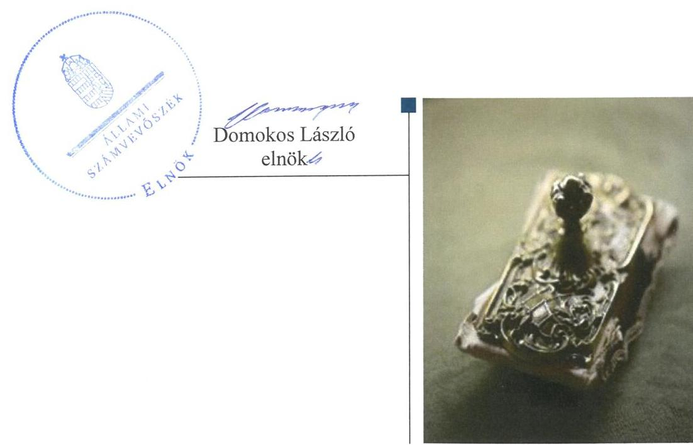
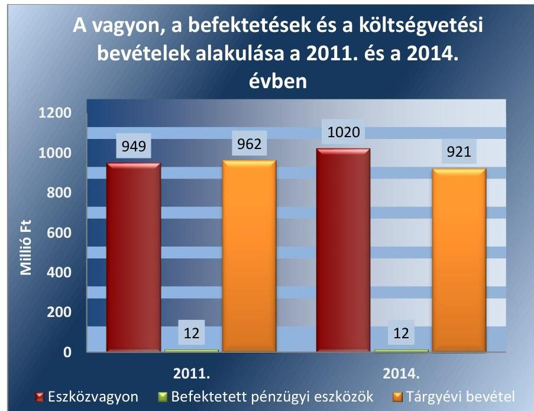
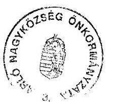
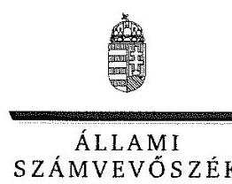
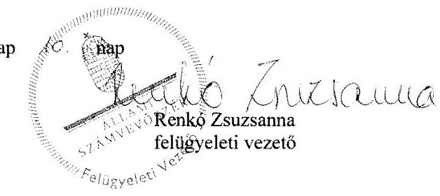

# Jelentés 

## Önkormányzatok belső kontrollrendszere

Az önkormányzatok belső kontrollrendszere kialakításának és működtetésének ellenőrzése - Arló 2016.

---

# Jelentés 

## Önkormányzatok belső kontrollrendszere

Az önkormányzatok belső
kontrollrendszere kialakításának és működtetésének ellenőrzése - Arló
2016. 12. hó 01. nap

---

# AZ ELLENŐRZÉST FELÜGYELTE:

- RENKŐ ZSUZSANNA felügyeleti vezető
- AZ ELLENŐRZÉST VEZETTE ÉS A VÉGREHAJTÁSÁÉRT FELELŐS:
  - DR. TIMÁR BALÁZS ellenőrzésvezető
  - A PROGRAM ÖSSZEÁLLÍTÁSÁÉRT FELELŐS:
    - JANIK JÓZSEF LÁSZLÓ osztályvezető

**IKTATÓSZÁM:** V-1073-132/2016.

**TÉMASZÁM:** 2107

**ELLENŐRZÉS-AZONOSÍTÓ SZÁM:** V071818, V073818

Jelentéseink az Országgyűlés számítógépes hálózatán és az Interneten a www.asz.hu címen is olvashatóak.

---

# TARTALOMJEGYZÉK 

■ ÖSSZEGZÉS ..... 5
■ AZ ELLENŐRZÉS CÉLJA ..... 6
■ AZ ELLENŐRZÉS TERÜLETE ..... 7
■ AZ ELLENŐRZÉS HÁTTERE, INDOKOLTSÁGA ..... 8
■ A JELENTÉS LÉNYEGES KÉRDÉSKÖREI ..... 11
■ ELLENŐRZÉS HATÓKÖRE ÉS MÓDSZEREI ..... 12
■ MEGÁLLAPÍTÁSOK ..... 15
■ JAVASLATOK ..... 29
■ MELLÉKLETEK ..... 31
I. sz. melléklet: Értelmező szótár ..... 31
II. sz. melléklet: Az integritás érvényesítése érdekében kialakított és működtetett kontrollrendszer ..... 34
■ FÜGGELÉK: ÉSZREVÉTELEK ..... 37
■ RÖVIDÍTÉSEK JEGYZÉKE ..... 43

---

.

---

# ÖSSZEGZÉS 

Arló Nagyközség Önkormányzata belső kontrollrendszere kialakításának és működtetésének hiányosságai miatt a közpénzfelhasználás szabályossága összességében nem volt biztosított. Az Önkormányzatnak az integritás szemlélet érvényesülése érdekében még erőfeszítéseket kell tennie.

## Az ellenőrzés társadalmi indokoltsága

Magyarország Alaptörvénye az önkormányzatoktól is elvárja a kiegyensúlyozott, átlátható és fenntartható költségvetési gazdálkodás elvének érvényesítését. A korábbi évek ellenőrzési tapasztalatai, az önkormányzatok által betöltött társadalmi szerep, az általuk kezelt közpénz nagysága, a nemzeti vagyon átruházására vagy hasznosítására vonatkozó döntéseik sokrétűsége egyaránt indokolttá tették a számvevőszéki ellenőrzések folytatását. A belső kontrollrendszer kialakítása és működtetése nélkül nem valósítható meg a közpénzek, a közvagyon szabályos, gazdaságos, hatékony és eredményes felhasználása.

Arló Nagyközség Önkormányzata 2015. április 30-án 8,7 millió Ft üzleti célú részesedéssel rendelkezett. Az üzleti célú részvényeit olyan befektetési vállalkozásnál tartotta, amelynek törvénytelen tevékenysége következtében fennállt a veszélye annak, hogy a befektetett közvagyon egészét vagy egy részét elveszítik. Felmerült, hogy a belső kontrollrendszer kialakítása és működtetése nem biztosította a közvagyon megóvását, körültekintő, biztonságos befektetését, a befektetési döntések, azok végrehajtása és számviteli elszámolása nem volt szabályszerű.

## Főbb megállapítások, következtetések, javaslatok

A belső kontrollrendszer kialakítása és működtetése nem volt szabályszerű, így a vagyonnal való felelős, rendeltetésszerű gazdálkodást nem támogatta. A teljesítésigazolási és az érvényesítési jogkörök szabálytalan gyakorlása növelte a jogosulatlan kifizetések kockázatát, mivel a kialakított kontrolltevékenységek a hibák megelőzését, feltárását nem segítették. Nem mérték fel és nem határozták meg a Hivatal tevékenységében, gazdálkodásában rejlő kockázatokat, az Önkormányzat befektetési tevékenységével összefüggő kockázatokat sem elemezték, ezáltal nem volt biztosított a vagyonnal való felelős gazdálkodás.

A befektetett pénzügyi eszközök év végi értékelését nem végezték el. Ezzel megsértették a valódiság számviteli alapelvét, mivel a beszámolóban szereplő tételek értékelése nem felelt meg az előírt értékelési elveknek és az azokhoz kapcsolódó értékelési eljárásoknak.

Az integritás szemlélet erősítése érdekében - a belső kontrollrendszer kialakításában és működésében feltárt hiányosságok és hibák megszüntetésével - az Önkormányzatnak még további intézkedéseket kell megtennie.

---

# AZ ELLENŐRZÉS CÉLJA 

Az ellenőrzés célja annak megállapítása, hogy az önkormányzat belső kontrollrendszerének kialakítása, továbbá egyes elemeinek működtetése biztosította-e a közpénz felhasználás szabályosságát. Az erőforrásokkal való szabályszerű és hatékony gazdálkodáshoz szükséges követelmények érvényesítése, számonkérése, ellenőrzése megtörtént-e az önkormányzatnál. A belső kontrollrendszer kialakítása és működtetése támogatta-e az integritás szemlélet érvényesülését. Az ellenőrzés során értékeljük a belső kontrollrendszer kialakításának és működtetésének szabályszerűségét. Feltárjuk azokat a lényeges szabályozási és működési hiányosságokat, amelyek miatt az ellenőrzött kulcskontrollok nem nyújtottak elegendő védelmet a lehetséges hibákkal szemben. Rámutatunk arra, ha a kulcskontrollok valamely hibát nem előznek meg, nem tárnak fel, vagy nem javítanak ki, valamint minősítjük működésük megfelelőségét.

Ellenőrizzük, hogy az önkormányzat egyes befektetési döntései és azok végrehajtása, elszámolása megfelelt-e a vonatkozó jogszabályoknak és belső szabályozásoknak, a kialakított kontrollrendszer támogatta-e a befektetési tevékenység szabályszerűségét.

---

# **AZ ELLENŐRZÉS TERÜLETE**

## **Arló Nagyközség Önkormányzata**

Arló Nagyközség állandó lakosainak száma 2015. január 1-jén 4 016 fő volt. Az Önkormányzat az ellenőrzött időszakban hét tagú Képviselő-testülettel rendelkezett, melynek munkáját két állandó bizottság segítette. Az Önkormányzat a Hivatalon kívül kettő intézménnyel, valamint egy 100%-ban az Önkormányzat tulajdonában álló gazdasági társasággal látta el a feladatait. A településen az ellenőrzött időszakban roma nemzetiségi önkormányzat működött.

A polgármester a 2013. április 21-i időközi önkormányzati választás óta tölti be tisztségét. A jegyző 2004. július 15. óta látja el feladatait. A Hivatal nem tagolódott szervezeti egységekre, elkülönített gazdasági szervezettel nem rendelkezett. A Hivatalban foglalkoztatott köztisztviselők száma 2014. év végén 12 fő volt. A Hivatalnál 2014. január 1-jétől szervezeti változás nem volt.

Az Önkormányzat a 2014. évi éves költségvetési beszámoló szerint 921 millió Ft költségvetési bevételt ért el, valamint 886 millió Ft költségvetési kiadást teljesített. Az eszközvagyon értéke 2014. december 31-én 1 020 millió Ft volt, a költségvetési évben esedékes kötelezettség állomány 16 millió Ft-ot, a költségvetési évet követően esedékes kötelezettség állomány 11 millió Ft-ot tett ki.

Az Önkormányzat vagyonának, befektetéseinek és a költségvetési bevételeinek alakulását a 2011. évben és a 2014. évben az 1. ábra mutatja be:

1. ábra

*Forrás: a 2011. és a 2014. évi éves költségvetési beszámolók*

---

# AZ ELLENŐRZÉS HÁTTERE, INDOKOLTSÁGA 

Az ÁSZ tv. ${ }^{1}$ szerint az ÁSZ feladata a jól irányított állam kiépítésének elősegítése. Az ÁSZ Stratégiájában ezért hangsúlyos szerepet szánt annak, hogy szilárd szakmai alapon álló, értékteremtő ellenőrzéseivel előmozdítsa a közpénzügyek átláthatóságát, rendezettségét. A számvevőszéki ellenőrzés nemzetközi alapelvei is rögzítik, hogy a megfelelő belső kontrollrendszer minimálisra csökkenti a hibák és szabálytalanságok kockázatát.

A belső kontrollrendszer azt a célt szolgálja, hogy a költségvetési szervek működésük és gazdálkodásuk során a tevékenységeket szabályszerűen, gazdaságosan, hatékonyan, eredményesen hajtsák végre, teljesítsék elszámolási kötelezettségeiket és megvédjék az erőforrásokat a veszteségektől, a károktól és a nem rendeltetésszerű használattól. A belső kontrollrendszer magában foglalja mindazon szabályokat, eljárásokat, gyakorlati módszereket és szervezeti struktúrákat, kockázatkezelési technikákat, kontrolltevékenységeket, amelyek segítséget nyújtanak a szervezetnek céljai eléréséhez. A belső kontrollrendszer szabályozása háromszintű: a törvényi előírásokat az Áht. ${ }_{2}$ és a Mötv., a rendeleti szintű szabályozást az Ávr. és a Bkr. tartalmazza, amelyeket útmutatói szinten az NGM által kiadott standardok és kézikönyvek támogatnak.

Az ellenőrzött időszak meghatározása lehetőséget teremtett a 2014. október 12-i önkormányzati választásokat megelőző és követő ciklus belső kontrollrendszere működésének elkülönült értékelésére, valamint a változások nyomon követésére.

A BELSŐ KONTROLLRENDSZER kialakításának és működtetésének általános értékelése mellett a teljesítésigazolás és érvényesítés kontrollok kiemelt ellenőrzésének szükségességét alátámasztja, hogy 2012. évtől a pénzügyi folyamatokban kulcsszerepet betöltő belső kontrollok rendszere módosult és azok működtetésében az önkormányzatoknál hiányosságok mutatkoztak a 2012. év óta elvégzett ÁSZ ellenőrzések alapján.

Az önkormányzatok belső kontrollrendszerének ellenőrzése az ÁSZ "jó kormányzással" kapcsolatos stratégiai céljainak megvalósítását is szolgálja. Az ÁSZ célja, hogy javuljon az ellenőrzött önkormányzatok belső kontrollrendszerének szabályozottsága, működésének megfelelősége, hozzájárulva ezzel az egyensúlyi helyzet fenntarthatóságának biztosításához, azaz az adósság újratermelődésének megakadályozásához. Az ÁSZ ellenőrzés nem csupán a közvetlenül ellenőrzött önkormányzatokat segíthetik, hanem a „jó gyakorlat" elterjesztésével azok az önkormányzatok is átvehetik a pozitív példákat, ahol nem végez ellenőrzést az ÁSZ.

Az MNB három befektetési szolgáltató tevékenységi engedélyét 2015. első felében visszavonta és kezdeményezte a vállalkozások felszámolását a működéssel kapcsolatos szabálytalanságok, hiányosságok miatt. A befektetési vállalkozások problémás helyzetbe kerülése jelentős veszteségekhez vezetett számos önkormányzat esetében. A korábbi évek ellenőrzési tapasztalatai alapján fennáll a lehetősége annak, hogy az önkormányzatok befektetési döntései, továbbá a döntések végrehajtása és

---

számviteli elszámolása nem voltak teljes mértékben szabályszerűek, a belső kontrollrendszer és a kapcsolódó külső ellenőrzések sem működtek minden esetben megfelelően. Az ÁSZ 2015 májusában felkérést kapott a Kormánytól arra, hogy vizsgálja meg, az érintett befektetési vállalkozásoknál értékpapír portfolióval rendelkező önkormányzatok szabályszerűen jártak-e el a szabad pénzeszközeik befektetésekor.

Magyarország Alaptörvénye az önkormányzatoktól, mint az államháztartás alanyaitól elvárja a kiegyensúlyozott, átlátható és fenntartható költségvetési gazdálkodás elvének érvényesítését. A nemzeti vagyonról szóló törvény szerint a nemzeti vagyonnal felelős módon, rendeltetésszerűen kell gazdálkodni. A nemzeti vagyongazdálkodás feladata a nemzeti vagyon rendeltetésének megfelelő, átlátható, hatékony és költségtakarékos működtetése, ugyanakkor értékének megőrzését, értéknövelő használatát, hasznosítását, gyarapítását is elvárja.

# AZ ÖNKORMÁNYZATOK ÁTMENETILEG SZABAD PÉNZESZKÖZEINEK BEFEKTETÉSÉT jogszabály nem tiltja, a pénzpiaci szolgáltatók közül az önkormányzatok a kínált szolgáltatás és annak költségei alapján, szabadon választhatnak, a veszteséges gazdálkodás kockázatai és következményei azonban az önkormányzatokat terhelik. A szabad pénzeszközök felelős hasznosítása összhangban áll az önkormányzati gazdálkodás alapelveivel. 

A közintézmények integritás alapú kultúrájának kialakítása, megerősítése és működése szorosan összefügg a belső kontrollrendszer működésével, ezért az ellenőrzés kiterjed annak értékelésére is, hogy a belső kontrollrendszer kialakítása és működtetése hogyan hatott az integritás szemlélet érvényesülésére.

Az államháztartás önkormányzati alrendszerében a 2014. év elején összesen 3177 települési önkormányzat működött: a 23 kerülettel rendelkező főváros, 345 város, 2691 község és 117 nagyközség volt. A belső kontrollrendszer kialakítása és működtetése ellenőrzését az ÁSZ által lefolytatott, kisebb településeket is érintő ellenőrzéseinek tapasztalatai, valamint a közérdekű bejelentések kockázati szempontú értékelése alapozták meg. Ezek a községek, nagyközségek gazdálkodásának, belső kontrollrendszere kialakításának és működésének hiányosságaira mutattak rá. Az ellenőrzések helyszíneinek kiválasztása során az ÁSZ célzott adatfeldolgozáson alapuló kockázatelemző rendszerére támaszkodik. Ez elősegíti, hogy azokon a területeken végezzen ellenőrzéseket, összpontosítva erőforrásait, ahol a valódi kockázatok, az aktuális problémák vannak. Az ellenőrzések helyszíneinek kiválasztása során a kockázatelemzés konkrét szempontjait az ellenőrzési programban rögzített ellenőrzési cél, az ellenőrzött időszak, az ellenőrzés által érintett fókuszterületek és a főbb ellenőrzési kérdések határozzák meg.

## AZ ELLENŐRZÉS VÁRHATÓ HASZNOSULÁSA NÉGY SZINTEN valósul meg.

A törvényalkotás számára összegzett tapasztalatok állnak rendelkezésre a belső kontrollrendszer önkormányzati területen való kialakításáról, működtetéséről és hatásairól.

---

$\longrightarrow$ Az ellenőrzött számára az ellenőrzés visszajelzést ad a belső kontrollrendszer kialakításában és működésében lévő hiányosságokról, javaslataival hozzájárul azok kiküszöböléséhez.
$\longrightarrow$ Más szervezetek is hasznosíthatják az ellenőrzés megállapításait és javaslatait a rendezett gazdálkodási keretek kialakításához.
$\longrightarrow$ A társadalom számára jelzi, hogy közpénz nem maradhat ellenőrizetlenül, az ÁSZ értékteremtő rend kialakításához és megőrzéséhez hozzájáruló tevékenysége pozitív hatással lesz a szervezetről kialakított összkép formálásában.
Az ÁSZ az ellenőrzéseivel hozzájárul ahhoz, hogy az egyes önkormányzati befektetésekkel kapcsolatos kockázatok, a szabályozási és kontroll mechanizmusok fejlesztésével mérsékelhetők legyenek. Feltárja az önkormányzati befektetési tevékenységet meghatározó szabályozások összhangjának hiányosságait, a szabályozással nem érintett gazdálkodási területeket, valamint az egyes befektetési tevékenységek esetleges szabálytalanságait.

Az ellenőrzés megállapításaival összefüggő javaslatok hasznosítása esetén javulhat az önkormányzat gazdálkodásának, egyes befektetési tevékenységének szabályozottsága, valamint a „jó gyakorlatok" terjesztésén keresztül azok az önkormányzatok is átvehetik a pozitív példákat, ahol nem végez ellenőrzést az ÁSZ.

---

# A JELENTÉS LÉNYEGES KÉRDÉSKÖREI 

1. Az önkormányzat belső kontrollrendszerének kialakítása és működtetése szabályszerű volt-e 2014. január 1. és 2015. április

 30. között, valamint a belső kontrollrendszer egyes pillérei támogatták-e a befektetési tevékenység szabályszerű végzését 2011. január 1. és 2015. április 30. között?
2. Az egyes befektetésekkel kapcsolatos döntéshozatal és a döntések végrehajtása szabályszerű volt-e?
3. Az egyes befektetések számviteli elszámolása, nyilvántartása szabályszerű volt-e?
4. Az erőforrásokkal való szabályszerű és hatékony gazdálkodáshoz szükséges követelmények érvényesítése, számonkérése, ellenőrzése megtörtént-e az önkormányzatnál?
5. Az önkormányzat belső kontrollrendszerének kialakítása és működtetése támogatta-e az integritás szemlélet érvényesülését?

---

# ELLENŐRZÉS HATÓKÖRE ÉS MÓDSZEREI 

## Az ellenőrzés típusa

Megfelelőségi ellenőrzés, a befektetési tevékenység esetében szabályszerűségi ellenőrzés.

## Az ellenőrzött időszak

A belső kontrollrendszer kialakításának és működtetésének ellenőrzése a 2014. január 1. és 2015. április 30. közötti időszakra terjedt ki. Ezen belül a belső kontrollrendszer kialakításának és működtetésének megfelelőségét a 2014. január 1. és október 12., valamint a 2014. október 13. és 2015. április 30. közötti időszakra vonatkozóan külön-külön értékeltük. Az önkormányzatok egyes befektetési tevékenységeinek ellenőrzése tekintetében az ellenőrzött időszak a 2011. január 1. - 2015. április 30. közötti időszak. Ezen felül az önkormányzat befektetésekkel kapcsolatos döntés-előkészítésének és döntéshozatalának szabályszerűségét a 2011. január 1. előtti időszakra visszanyúlóan is ellenőriztük, amennyiben a 2014. június 30-án, illetve 2015. április 30-án meglévő befektetéseire 2011. január 1-je előtt került sor. Az integritás szemlélet érvényesülését a 2014. évre vonatkozó adatszolgáltatás alapján értékeltük.

## Az ellenőrzés tárgya

A helyi önkormányzatnak, mint éves költségvetési beszámoló készítésére kötelezett szervezetnek és polgármesteri hivatalának belső kontrollrendszere. Az erőforrásokkal való szabályszerű és hatékony gazdálkodáshoz szükséges követelmények érvényesítése, számonkérés, ellenőrzése. Az integritás szemlélet érvényesülése.

Az önkormányzat 2014. június 30-án, illetve 2015. április 30-án meglévő értékpapírokban megtestesülő befektetései, lekötött betétei, valamint az önkormányzat üzleti vagyonába tartozó ingatlanok, kulturális javak (műtárgyak, műalkotások, stb.), illetve a feladatellátást nem szolgáló egyéb értéktárgyak (pl. ékszerek, befektetési nemesfém).

## Az ellenőrzött szervezet

Arló Nagyközség Önkormányzata

---

# Az ellenőrzés jogalapja 

Az ÁSZ tv. 1. § (3) bekezdésében foglaltak alapján az ÁSZ általános hatáskörrel végzi a közpénzekkel és az állami és önkormányzati vagyonnal való felelős gazdálkodás ellenőrzését. Az ÁSZ tv. 5. § (2) bekezdése alapján az államháztartás gazdálkodásának ellenőrzése keretében az ÁSZ ellenőrzi a helyi önkormányzatok gazdálkodását, valamint az ÁSZ tv. 5. § (6) bekezdése alapján ellenőrzése során értékeli az államháztartás számviteli rendjének betartását és a belső kontrollrendszer működését.

## Az ellenőrzés módszerei

Az ellenőrzést a nemzetközi standardokat irányadónak tekintve az ellenőrzési program ellenőrzési kérdései, az ellenőrzött időszakban hatályos jogszabályok, az ellenőrzés szakmai szabályok és módszertanok figyelembe vételével végeztük.

Az ellenőrzés lefolytatásához az Önkormányzat a tanúsítványok kitöltésével, valamint az ÁSZ által kért dokumentumok elektronikus megküldésével szolgáltatott adatokat. A rendelkezésre bocsátott adatok, információk kontrollja és a munkalapok kitöltése az ellenőrzés keretében történt. A jelentésben használt fogalmak magyarázatát az I. számú melléklet, az integritás érvényesítése érdekében kialakított és működtetett kontrollrendszer minősítését a II. számú melléklet tartalmazza.

A belső kontrollrendszer jogszabályi előírások szerinti kialakításának és működtetésének szabályszerűségét az erre irányuló ellenőrzési kérdésekre adott válaszok összesítése alapján külön-külön értékeltük a 2014. január 1. és október 12., valamint a 2014. október 13. és 2015. április 30. közötti időszakra. A belső kontrollrendszert egy-egy ellenőrzött időszakra pillérenként (kontrollkörnyezet, kockázatkezelési rendszer, kontrolltevékenységek, információs és kommunikációs rendszer, monitoring rendszer) és összesítetten is értékeltük.

## A BELSŐ KONTROLLRENDSZER EGYES PILLÉRE-

INEK KIALAKÍTÁSA ÉS MŰKÖDTETÉSE „szabályszerű volt", amennyiben az értékelt területen az elért és elérhető pontok százalékban kifejezett, egész számra kerekített hányadosa meghaladta a 84%-ot, „részben szabályszerű volt", ha 61-84% közé esett, „nem szabályszerű volt", ha nem haladta meg a 60%-ot. A belső kontrollrendszer összesített értékelése megegyezett a pillérenként (kontrollterületenként) alkalmazott százalékos értékelésekkel, a következő eltérésekkel. A kontrollrendszer egésze esetében a „szabályszerű" értékelésnek a százalékos értéken felül további feltétele volt, hogy egyik kontrollterület sem kaphat „nem szabályszerű" értékelést, a „részben szabályszerű" értékelés további feltétele volt, hogy legfeljebb egy ellenőrzött kontrollterület lehet „nem szabályszerű" értékelésű. Az összesített értékelés a százalékos értéktől függetlenül „nem szabályszerű volt", ha az ellenőrzött kontrollterületek közül több mint egynek „nem szabályszerű volt" az értékelése.

---

# A GAZDÁLKODÁS FOLYAMATÁBAN A KÉT 

KULCSKONTROLL - teljesítésigazolás, érvényesítés - működésének megfelelőségét a személyi juttatásokkal, a dologi kiadásokkal, a beruházási, felújítási kiadásokkal, az ellátottak pénzbeli juttatásaival kapcsolatos kifizetések esetében mintavétellel ellenőriztük. Finanszírozási kiadások kiemelt előirányzatához köthető kifizetések az Önkormányzatnál sem a 2014. január 1. és október 12., sem a 2014. október 13. és 2015. április 30. közötti időszakban nem voltak. A mintavétel során külön értékeltük a 2014. január 1. és 2014. október 12. közötti időszakban és a 2014. október 13. és 2015. április 30. közötti időszakban teljesített kifizetéseket. „Megfelelőnek" értékeltük a gazdálkodási jogkörök gyakorlását, amennyiben 95%-os bizonyossággal a teljes sokaságban a hibaarány legfeljebb 10%, „részben megfelelőnek" értékeltük, ha a hibaarány felső határa 10-30% között volt, „nem megfelelőnek" pedig akkor, ha a mintavételi eredmények alapján a sokaságbeli hibaarány felső határa meghaladta a 30%-ot.

Az integritás szemlélet érvényesülésének értékelése az önkormányzat által kitöltött tanúsítvány alapján történt.

---

# MEGÁLLAPÍTÁSOK

1. Az önkormányzat belső kontrollrendszerének kialakítása és működtetése szabályszerű volt-e 2014. január 1. és 2015. április 30. között, valamint a belső kontrollrendszer egyes pillérei támogatták-e a befektetési tevékenység szabályszerű végzését 2011. január 1. és 2015. április 30. között?

Összegző megállapítás A belső kontrollrendszer kialakítása és működtetése 2014. január 1. és 2015. április 30. közötti időszakban nem volt szabályszerű, a belső kontrollrendszer egyes pillérei közül a kockázatkezelési és a monitoring rendszer a befektetési tevékenységek szabályszerű végzését a 2011. január 1. és 2015. április 30. közötti időszakban nem támogatta.

1. táblázat

|  A BELSŐ KONTROLLRENDSZER KIALAKÍTÁSÁNAK ÉS MŰKÖDTETÉSÉNEK ÖSSZESÍTETT ÉRTÉKELÉSE |  |  |   |
| --- | --- | --- | --- |
|  Megnevezés | A gazdálkodás egészét érintően | A befektetési tevékenységet érintően |   |
|   | 2014. január 1-től 2014. október 13-től 2014. október 12-ig 2015. április 30-ig | 2011-2013. években | 2014. január 1-től 2015. április 30-ig  |
|  Kontrollkörnyezet | szabályszerű | támogatta |   |
|  Kockázatkezelési rendszer | nem szabályszerű | nem támogatta |   |
|  Kontrolltevékenységek | nem szabályszerű | az ellenőrzés erre a pillérre nem terjedt ki |   |
|  Információs és kommunikációs rendszer | szabályszerű | támogatta |   |
|  Monitoring rendszer | szabályszerű | nem támogatta |   |
|  BELSŐ KONTROLLRENDSZER | NEM SZABÁLYSZERŰ | NEM TÁMOGATTA |   |

---

### 1.1. számú megállapítás

A kontrollkörnyezet kialakítása és működtetése 2014. január 1. és 2015. április 30. közötti időszakban kisebb hiányosságok ellenére szabályszerű volt. A kialakított kontrollkörnyezet a döntéshozatali jogkör Képviselő-testület általi gyakorlása és a befektetett eszközökre vonatkozó számviteli, értékelési szabályok egyértelmű rögzítése révén támogatta a befektetési tevékenységek szabályszerű végzését a 2011. január 1. és a 2015. április 30. közötti időszakban.

## AZ ÖNKORMÁNYZAT SZERVEZETI ÉS SZABÁLYO-

ZÁSI KERETEIT a 2011. január 1. és 2015. április 30. közötti időszakban a jogszabályoknak megfelelően alakították ki, a Képviselő-testület jóváhagyta az Önkormányzat működését megalapozó dokumentumokat.

A Képviselő-testület megalkotta az Önkormányzati SZMSZ$_{1-3}$$^2$-at, amely - az Ötv. és az Mötv. előírásainak megfelelően - tartalmazta a Képviselőtestület átruházott hatásköreinek felsorolását. A befektetési tevékenységgel kapcsolatban hatáskör átruházására nem került sor. Az Önkormányzati SZMSZ$_{1-3}$-ban rögzítették az Önkormányzat szerveiről, azok jogállásáról, feladatairól, a bizottságairól szóló rendelkezéseket.

Az átlátható humánerőforrás-gazdálkodás kereteit a Bkr.-ben foglaltak szerint az Önkormányzatnál kialakították. A Képviselő-testület a Hivatal engedélyezett létszámát a költségvetési rendelet$_{1-5}$-ben meghatározta. A jegyző a Kttv.-ben meghatározott kérdésekben, valamint az általános munkáltatói szabályozási hatáskörébe tartozó kérdésekben közszolgálati szabályzatot adott ki, a 10/2013. (I.21.) Korm. rendelet$^3$ előírásai szerint meghatározta a Hivatalban dolgozó köztisztviselők teljesítményértékelésének ajánlott elemeit, és félévente elkészítette a köztisztviselők teljesítményértékelését.

A Képviselő-testület a 91/2013. (V.24.) számú határozatával hagyta jóvá a helyi nemzetiségi önkormányzattal 2013. május 17-től kötött - a 2014. január 1. és 2015. április 30. közötti időszakban hatályos - együttműködési megállapodást, mely a 2012. május 9-én létrejött együttműködési megállapodást helyezte hatályon kívül. A megállapodást a Nek. tv.$^4$ és az Áht.$_{1-2}$$^5$ előírásainak megfelelően felülvizsgálták.

A Képviselő-testület az önkormányzati vagyonnal történő gazdálkodás szabályait a teljes vagyoni körre kiterjedően a Htv. előírásával, a vagyonra vonatkozó döntési hatásköröket az Ötv. és az Mötv. előírásával összhangban vagyongazdálkodási rendelet$_{1-2}$$^6$-ben szabályozta. Az Önkormányzat befektetett pénzügyi eszközzel rendelkezett, befektetési célú tárgyi eszköz, ingatlan és forgóeszköz azonban nem volt a tulajdonában. A követelésekről való lemondás módját és eseteit a 2011. január 1. és 2012. június 30. közötti időszakban az Áht.$_{1}$ 108.§ (2) bekezdésében és az Áht.$_{2}$ 97. § (2) bekezdésében előírtak ellenére a Képviselő-testület nem határozta meg, 2012. július 1-jétől az Áht.$_{2}$-ben foglaltaknak megfelelően meghatározta. A 100 ezer Ft alatti követelésről való lemondás esetében az átruházott hatáskör gyakorlójának beszámolási kötelezettségét a Képviselőtestület a vagyongazdálkodási rendelet$_{2}$-ben írta elő.

Az Önkormányzat rendelkezett az Ötv. és az Mötv. által előírt, a Képviselő-testület által elfogadott gazdasági program$_{1-3}$$^7$-vel, a közép- és hosszú távú fejlesztési és vagyonhasznosítási elképzeléseket pedig a vagyongazdálkodási tervben$^8$ rögzítették.

---

Az Önkormányzat az Áht.$_{1,2}$ előírásának megfelelően évente rendeletben állapította meg költségvetését, melyet mellékszámításokkal megalapozott. A költségvetési rendelet$_{1-6}$ tartalmazta az Önkormányzat költségvetési bevételeit és költségvetési kiadásait előirányzat-csoportok, kiemelt előirányzatok, kötelező feladatok, önként vállalt feladatok és állami feladatok szerinti bontásban.

A HIVATAL szervezeti felépítését, jogállását, működési rendjét, engedélyezett létszámát, feladatait, szervezeti ábráját, a munkakörökhöz tartozó feladat- és hatásköröket, a hatáskörök gyakorlásának módját, a helyettesítés rendjét, az ezekhez kapcsolódó felelősségi szabályokat a Képviselő-testület által jóváhagyott Hivatali SZMSZ$_{1-6}$$^9$ és azok mellékletét képező ügyrend, valamint a munkaköri leírások - az Ámr. és az Ávr. előírásainak megfelelően - tartalmazták.

A jegyző, valamint a Hivatal pénzügy-számviteli területen dolgozó köztisztviselői a 2014. január 1. és 2015. április 30. közötti időszakban rendelkeztek munkaköri leírással, azonban a Kttv.$^{10}$ 226. § (1) bekezdésének alkalmazása mellett a Kttv. 75. § (1) bekezdésének d) pontjában foglaltak ellenére a munkakör betöltésével kapcsolatos - végzettségre, szakképesítésre, tapasztalatra vonatkozó - követelményeket a jegyző nem rögzítette.

Az etikai elvárásokat a Bkr.-ben előírtaknak megfelelően meghatározták. A Hivatal köztisztviselőire vonatkozó hivatásetikai alapelvek és az etikai eljárás szabályait a Képviselő testület a 35/2014. (II.28.) számú határozatával fogadta el. A hivatásetikai alapelvek részletes tartalmát a jegyző minden dolgozóval megismertette.

A Hivatal belső szabályozását a
 jegyző a 2011. január 1. és 2015. április 30. közötti időszakban kialakította, amely néhány hiányosság mellett megfelelt a jogszabályi előírásoknak.
A Hivatal rendelkezett a Számv. tv. és az Áhsz. ${ }_{1,2}$ által előírt tartalmú számviteli politika ${ }_{1-3}{ }^{11}$-mal és a keretében elkészítendő szabályzatokkal.
Elkészítették a leltározási és leltárkészítési szabályzat ${ }_{1-3}{ }^{12}$-at, amelyben Számv. tv. és az Áhsz. ${ }_{1,2}$ előírása szerint meghatározták az eszközök és források évenkénti leltározási kötelezettségét és az eszközök mennyiségi felvétellel történő leltározásának gyakoriságát.
—_ Az értékelési szabályzat ${ }_{1-2}{ }^{13}$-ben a befektetett pénzügyi eszközök, továbbá a követelések év végi értékelésének elveit szabályozták, a piaci értékelés lehetőségével nem éltek.
A Számv. tv. és az Áhsz. ${ }_{1,2}$ előírása szerint a jegyző által jóváhagyott számlarend ${ }_{1-2}{ }^{14}$-ben rögzítették - az egyes befektetések vonatkozásában is - az alkalmazásra kijelölt számlák számjelét és megnevezését, az analitikus nyilvántartások formáját, tartalmát, azok vezetésének módját, a kapcsolódó főkönyvi nyilvántartásokkal való egyeztetését és annak dokumentálását, valamint a főkönyvi számlák és az analitikus nyilvántartások kapcsolatát.
A pénzkezelési szabályzat ${ }_{1-3}{ }^{15}$-ben a Számv. tv. és az Áhsz. ${ }_{1,2}$ előírásainak megfelelően rendelkeztek - a pénzügyi befektetések vonatkozásában is - a pénzforgalom lebonyolításának rendjéről, a pénzkezeléssel kapcsolatos bizonylatok rendjéről és a pénzforgalommal kapcsolatos nyilvántartási szabályokról, tartalmazta a pénzkezelés

---

személyi és tárgyi feltételeit, felelősségi szabályait, a készpénzállományt érintő pénzmozgások jogcímeit, a napi készpénz záró állomány maximális mértékét.
A gazdálkodás részletes rendjét a Hivatali SZMSZ1-6-ban és azok mellékletét képező ügyrendben, valamint a gazdálkodási jogkörök szabályzata ${ }_{1-2}{ }^{16}$-ben az Ámr. és az Ávr. előírásainak megfelelő tartalommal szabályozták. A gazdálkodási jogkörök szabályzata ${ }_{1,2}$-ben rögzítették - az egyes befektetésekre is érvényesen - a kötelezettségvállalás, az ellenjegyzés, a szakmai teljesítésigazolás, a teljesítésigazolás, az érvényesítés, valamint az utalványozás gyakorlásának módjával, eljárási és dokumentációs részletszabályaival és az ezeket végző személyek kijelölésének rendjével kapcsolatos belső előírásokat, feltételeket az Áht.1,2, az Ámr., és az Ávr. előírásainak megfelelően. A gazdálkodási jogkörök szabályzata ${ }_{1,2}$ tartalmazta a 100 ezer Ft alatti kifizetések előzetes írásbeli kötelezettségvállalás nélküli teljesítésének rendjére vonatkozó az Ámr., és az Ávr. előírásainak megfelelő szabályozást is.
— Az ellenőrzési nyomvonalat a belső kontrollrendszer szabályzat ${ }^{17}$ tartalmazta, táblázatos formában megjelenítve az információs és felelősségi szinteket, kapcsolatokat, ellenőrzési folyamatokat, valamint a költségvetési szerv működési folyamatait. Az ellenőrzési nyomvonal 2014. január 1. és 2015. április 30. között - a Bkr. 6. § (3) bekezdésében előírtak ellenére - nem tartalmazta az irányítási folyamatokat.
A Hivatalban - az Önkormányzat önálló beszámolóval érintett feladataira is kiterjedően - az Mvtv. ${ }^{18}$ előírásai szerint meghatározták az egészséget nem veszélyeztető és biztonságos munkavégzés követelményei megvalósításának módját.
A Hivatal és az Önkormányzat rendelkezett a Tvtv. ${ }^{19}$-nek megfelelő tűzvédelmi szabályzattal.

# 1.2. számú megállapítás 

A jegyző a kockázatkezelési rendszert a 2014. január 1. és a 2015. április 30. közötti időszakban kialakította, azonban konkrét működési, gazdálkodási kockázatok meghatározásának hiányában a kockázatkezelési rendszer működtetése nem volt szabályszerű. 2011. január 1. és 2015. április 30. között a jegyző a befektetési tevékenységekkel kapcsolatos kockázatokat nem azonosította, nem elemezte, így a kockázatkezelési rendszer nem támogatta a befektetési tevékenységek szabályszerű végzését.

A JEGYZŐ a 2011. évben az Ámr. 157. §-ban előírtak ellenére nem végzett kockázatelemzést és nem működtette a kockázatkezelési rendszert. A Hivatal kockázatkezelési szabályzatát a jegyző 2012. március 5-től léptette hatályba.

A jegyző 2012-től 2015. április 30-ig - a Bkr. 7. § (2) bekezdésében foglalt előírás és a kockázatkezelési szabályzat rendelkezései ellenére - nem mérte fel és nem határozta meg a Hivatal tevékenységében, gazdálkodásában rejlő kockázatokat, nem határozta meg az egyes kockázatokkal kapcsolatban szükséges intézkedéseket. A konkrét kockázatok meghatározása hiányában az Önkormányzat befektetési tevékenységeivel összefüggő kockázatok azonosítása, elemzése sem történt meg.

---

# A VAGYONNYILATKOZAT-TÉTELI KÖTELEZETTEK KÖRÉT a 2014. január 1. és 2015. április 30. közötti időszakban nem a Vnytv. ${ }^{20} 3 . \S$ (3) bekezdés e) pontjában előírtak szerint határozták meg. A Hivatali SZMSZ4-6-ban a vagyonnyilatkozat-tételi kötelezettséggel járó munkaköröket meghatározták, az Önkormányzati SZMSZ2,3-ban azonban Vnytv. 4. § d) pontjában foglaltak ellenére a nem önkormányzati képviselő bizottsági tagok vagyonnyilatkozat-tételi kötelezettségét nem tüntették fel.

A képviselők vagyonnyilatkozatainak nyilvántartására, ellenőrzésére az Önkormányzati SZMSZ2,3 a Pénzügyi Bizottságot21 jelölte ki, amely az Mötv. előírásainak megfelelően nyilvántartásba vette a benyújtott képviselői vagyonnyilatkozatokat. A nyilvántartás szerint minden képviselő vagyonnyilatkozata rendelkezésre állt az Mötv.-ben előírt határidőre.

A jegyző a Vnytv.-ben foglaltaknak megfelelően a Hivatali SZMSZ4-6-ban meghatározott munkakörben alkalmazottakat tájékoztatta vagyonnyilat-kozat-tételi kötelezettségük fennállásáról és esedékességéről. A jegyző, mint őrzésért felelős a 2014. évben a Hivatali SZMSZ4-6-ban meghatározott munkakörökben alkalmazottak benyújtott vagyonnyilatkozatait nyilvántartásba vette és egyéb iratoktól elkülönítetten kezelte.
2015. évben a nem képviselő bizottsági tagok is nyújtottak be vagyonnyilatkozatot, ezeket az őrzésért felelős a Vnytv. előírásainak megfelelően nyilvántartásba vette.
1.3. számú megállapítás

A kontrolltevékenység kialakítása és működtetése a 2014. január 1. és 2015. április 30. közötti időszakban nem volt szabályszerű. A pénzügyi folyamatokban kulcsszerepet betöltő teljesítésigazolás és érvényesítés belső kontrollok működtetése a 2014. január 1. és 2014. október 12., valamint a 2014. október 13. és 2015 április 30. közötti időszakban nem felelt meg a jogszabályokban és a belső szabályzatokban foglaltaknak.

A JEGYZŐ A FOLYAMATBA ÉPÍTETT ELŐZETES, UTÓLAGOS ÉS VEZETŐI ELLENŐRZÉS szabályozását a költségvetés tervezése, a beszerzések lebonyolítása, a vagyonhasznosítási tevékenység és a támogatások elszámolása folyamatok tekintetében kialakította.

Az Önkormányzatnál a gazdálkodási jogkörök szabályzata ${ }_{2}$-ben határozták meg az engedélyezési, jóváhagyási és kontrolleljárásokat. A beszámolási feladatok teljesítésével kapcsolatos előírásokat az Ávr.-ben előírtaknak megfelelően a gazdálkodási jogkörök szabályzata ${ }_{2}$-ben, valamint a munkaköri leírásokban rögzítették.

A jegyző a Bkr. 8. § (4) bekezdés b) pontjában foglaltak ellenére nem szabályozta a dokumentumokhoz, az információkhoz való hozzáférési jogosultságokat.

A gazdálkodási jogkörökkel kapcsolatos felhatalmazások, kijelölések a gazdálkodási jogkörök szabályzata ${ }_{2}$-ben megtörténtek. A polgármester az Ávr. előírásainak megfelelően adott felhatalmazást kötelezettségvállalásra a jegyző részére az Önkormányzat kiadásaira vonatkozóan. A kötelezettségvállaló az Ávr.-ben előírtak szerint kijelölte a teljesítés igazolására jogosultakat. A Hivatal és az Önkormányzat kiadási előirányzatai terhére vállalt

---

kötelezettség érvényesítésére az Ávr.-ben foglaltaknak megfelelően kijelölt személy az előírt végzettséggel, illetve pénzügyi-, számviteli képesítéssel rendelkezett.

# A GAZDÁLKODÁSSAL KAPCSOLATOS KULCS-

KONTROLLOK MŰKÖDÉSE (teljesítésigazolás és érvényesítés) a 2014. január 1. és a 2015. április 30. közötti időszakban nem volt megfelelő. A teljesítésigazolás és érvényesítés kontrollok működését a személyi juttatásokkal, a dologi kiadásokkal, a beruházási, felújítási kiadásokkal, az ellátottak pénzbeli juttatásaival és az egyéb működési, felhalmozási célú kiadásokkal kapcsolatos kifizetéseknél ellenőriztük.

A pénzügyi folyamatokban kulcsszerepet betöltő teljesítésigazolás és érvényesítés belső kontrollok működésének ellenőrzése során feltárt hiányosságok a következők voltak.

A teljesítés igazolása:
— az Ávr. 57. § (1) bekezdésében foglaltak ellenére nem történt meg, ezáltal elmaradt a kiadások jogosságának és összegszerűségének, ellenszolgáltatást is magában foglaló kötelezettségvállalás esetében a teljesítésnek az ellenőrzése;
— az Ávr. 57. § (3) bekezdésében előírtak ellenére nem volt szabályszerű, mivel az igazolás dátumának feltüntetése nélkül igazolták a kifizetéseket;
— során az Ávr. 60. § (2) bekezdésében előírtak ellenére az összeférhetetlenségi szabályokat nem tartották be;
— során az aláírás nem egyezett meg a gazdálkodási jogkörök szabály-zata ${ }_{2}$-ben rögzített aláírás-mintával valamennyi olyan kifizetés esetében, melynek bizonylatán szerepelt a teljesítésigazoló személy aláírása, ezáltal nem volt megállapítható, hogy a teljesítést az Ávr. 57. § (3) bekezdésével összhangban az arra jogosult igazolta.

Az érvényesítés során a kifizetéseket megelőzően az Ávr. 58. § (1) bekezdésében foglaltak ellenére nem ellenőrizték, hogy a megelőző ügymenetben az Áht. 2 az Ávr., továbbá gazdálkodási jogkörök szabályzata ${ }_{2}$-ben foglaltakat betartották-e, továbbá a kifizetések jelentős részében az Ávr. 58. § (2) bekezdésében előírtak ellenére nem jelezték az utalványozónak, hogy
— a teljesítésigazolást nem végezték el, illetve hiányzott a teljesítésigazolás dátuma;
— a teljesítésigazoló személy aláírása eltért a gazdálkodási jogkörök szabályzata ${ }_{2}$-ben rögzített aláírás-mintától;
— a teljesítés igazolása során az Ávr. 60. § (2) bekezdésében előírtak ellenére az összeférhetetlenségi szabályokat nem tartották be;
— a kötelezettségvállalásra az Áht. 2 37. § (1) bekezdésének előírása ellenére nem írásban került sor, továbbá a pénzügyi ellenjegyzés nem történt meg;
— valamennyi pénztári kifizetés esetében - az Ávr. 59. § (2) bekezdésének e) pontja előírása ellenére - hiányzott a kiadás egységes rovatrend és kormányzati funkció szerinti száma, a terheléssel érintett pénzeszköz államháztartási számviteli kormányrendelet szerinti

---

# 1.4. számú megállapítás 

könyvviteli számlájának száma és a kötelezettségvállalás nyilvántartási száma.

Az információs és kommunikációs rendszer kialakítása és működtetése a 2011. január 1. és a 2015. április 30. közötti időszakban - az Iratkezelési Szabályzat kisebb hiányossága mellett - szabályszerű volt és támogatta a befektetési tevékenységek szabályszerű végzését.

AZ INFORMÁCIÓ ÁTADÁS RENDJÉT az Ámr.-nek és Bkr.-nek megfelelően kialakították, a szervezeten belüli és a szervezeten kívülre történő információáramlás, információátadás rendszerét, a beszámolási szinteket, határidőket, módokat szabályozták.

A jegyző az adatok biztonságának, védelmének érvényre juttatásához szükséges eljárási szabályokat kialakította. Az Önkormányzat az Avtv. ${ }^{22}$ és Info tv. ${ }^{23}$ előírásának megfelelően rendelkezett a jegyző által aláírt adatvédelmi és adatbiztonsági szabályzat ${ }_{1-2}{ }^{24}$-vel.

A KÖZÉRDEKŰ ADATOK megismerésére irányuló igények teljesítésének rendjét rögzítő szabályzatot a jegyző - az Avtv. 20. § (8) bekezdésében és az Info tv. 30. § (6) bekezdésének előírása ellenére - 2013. október 31-ig nem készítette el, továbbá a kötelezően közzéteendő adatok nyilvánosságra hozatalának részletes szabályait 2013. október 31-ig a jegyző - az Eisztv. 4.§ (3) bekezdésének és az Info tv. 35. § (3) bekezdésének előírása ellenére - belső szabályzatban nem állapította meg. A kötelezően közzéteendő adatok nyilvánosságra hozatalának rendjét az Info. tv., valamint az Ávr. előírásainak megfelelően 2013. november 1-től szabályozták. A közzétételi szabályzatban ${ }^{25}$ meghatározták a közérdekű adatok megismerésére irányuló kérelmek intézésének, a nyilvánosság biztosításának eszközeit, a nyilvánosságra hozatal módját, felelősét.

Az Önkormányzat elektronikus közzétételi kötelezettségének eleget tett, az Eisztv. ${ }^{26}$-ben és az Info. tv.-ben előírt adatokat a honlapján közzétette.

A Hivatal az Ltv. ${ }^{27}$-ben előírt szervek egyetértésével kiadott iratkezelési szabályzattal ${ }^{28}$ rendelkezett. Az iratkezelési szabályzat kiterjedt az iratkezelés minden fázisára, tartalmazta a papír alapú és az elektronikus iratot egyaránt tartalmazó ügyiratok egységének megőrzésére, kezelhetőségére, használhatóságára, a küldemény munkahelyről történő kivitelére, az iratok megőrzési idejére, tárolására vonatkozó előírásokat, azonban jegyző az lkr. ${ }^{29}$ 38. §-ában foglaltak ellenére a személyes adatok kezeléséhez való hozzájárulást tartalmazó kérelmek kezeléséről belső szabályzatban nem rendelkezett.

Az iratok iktatásával és az iratforgalom dokumentálásával biztosították, hogy az ügyintézés folyamata, az iratok szervezeten belüli útja pontosan követhető és ellenőrizhető legyen.

---

1.5. számú megállapítás

A monitoring rendszer kialakítása és működtetése a 2014. január 1.
 -2015. április 30. közötti időszakban szabályszerű volt. A 2011. évtől 2015. április 30-ig végzett belső és külső ellenőrzések a befektetési tevékenységek szabályszerű végzését nem támogatták, mivel a belső és a külső ellenőrzések nem érintették a befektetési tevékenységeket.

A SZERVEZETI TEVÉKENYSÉGEK ÉS CÉLOK elérésének folyamatos és eseti nyomon követésére a jegyző a belső kontrollrendszer szabályzat ${ }^{30}$ megalkotásával, a célok és követelmények meghatározásával, azok teljesítésének számonkérésével, valamint a belső ellenőrzéssel alakította ki a Bkr.-ben foglaltaknak megfelelően a monitoring rendszert. A gazdaságossági, eredményességi követelmények - a takarékos gazdálkodás, követelések állományának csökkentése - teljesítéséről a jegyző a 2014. évi zárszámadás előterjesztésében számolt be a Képviselőtestületnek.

A jegyző az Áht. 2-ben előírtaknak megfelelően, a Bkr. 1. sz. mellékletében foglaltak szerinti nyilatkozatban értékelte az Önkormányzat belső kontrollrendszerének minőségét a 2013. és 2014. évekre vonatkozóan.

A BELSŐ ELLENŐRZÉSI FELADATOK ellátásáról a jegyző a Társuláshoz ${ }^{31}$ történő csatlakozással gondoskodott. A Társulás rendelkezett a Bkr.-ben előírt, felülvizsgált és jóváhagyott belső ellenőrzési kézikönyvvel. A belső ellenőrzési kézikönyv tartalmazta a Bkr.-ben előírt tartalmi elemeket.

A belső ellenőrzést végző személyek rendelkeztek a tevékenység folytatásához az Áht. 2-ben meghatározott engedéllyel, a belső ellenőrzési vezető rendelkezett a Bkr.-ben előírt öt éves szakmai gyakorlattal.

Az Önkormányzat rendelkezett a belső ellenőrzési vezető által készített és a költségvetési szerv vezetője által jóváhagyott 2010-2014. évekre vonatkozó stratégiai ellenőrzési terv ${ }_{1}^{32}$-vel. A 2015-2018. évekre vonatkozó stratégiai ellenőrzési terv ${ }_{2}^{33}$-et a Képviselő-testület a 151/2014.(XII. 19.) számú határozatával fogadta el. A stratégiai ellenőrzési tervek tartalmazták a Ber. ${ }^{34}$-ben, illetve a Bkr.-ben előírt tartalmi elemeket.

Az Önkormányzatra vonatkozó 2014. és 2015. évi ellenőrzési terveket a Bkr.-ben előírtaknak megfelelően elkészítették, azokat a Képviselő-testület az előírt határidőig jóváhagyta. Az éves ellenőrzési tervek összeállítása a Bkr.-ben előírtaknak megfelelően a jegyző írásos véleményének figyelembevételével és kockázatelemzés alapján történt.

Az éves ellenőrzési tervekben foglalt ellenőrzéseket az Áht. 2, a Bkr. és az Mötv. rendelkezéseinek megfelelően végrehajtották, a terveket módosítani nem kellett. A végrehajtott ellenőrzésekhez a belső ellenőrzési vezető által jóváhagyott, megfelelő tartalmú ellenőrzési program készült.

Az elvégzett ellenőrzésekről készült jelentések tartalmazták az ellenőrzés típusát, tárgyát, célját, az ellenőrzött időszakot, megállapításokat, következtetéseket és javaslatokat, azonban az alkalmazott ellenőrzési eljárásokat a Bkr. 39. § (3) bekezdés i) pontjában előírtak ellenére nem jelölték meg.

Az ellenőrzések során büntető-, szabálysértési-, kártérítési-, vagy fegyelmi eljárás megindítására okot adó cselekmény gyanúja nem merült fel.

---

A belső ellenőrzés javaslatainak végrehajtása érdekében az ellenőrzött szervek a Bkr.-ben előírtaknak megfelelő tartalmú intézkedési tervet készítettek. A belső ellenőrzési vezető az elvégzett belső ellenőrzésekről a Bkr.-nek megfelelő nyilvántartást vezetett.

Az éves összefoglaló belső ellenőrzési jelentést a belső ellenőrzési vezető elkészítette, és a Bkr.-ben előírt határidőig megküldte a jegyző részére. A 2014. évről készült éves ellenőrzési jelentés a belső kontrollrendszer öt elemének értékelését tartalmazta, azonban a belső kontrollrendszer szabályszerűségének, gazdaságosságának, hatékonyságának és eredményességének növelése, javítása érdekében tett fontosabb javaslatokat a Bkr. 48. § ba) pontjában foglaltak ellenére nem tüntették fel.

KÜLSŐ ELLENŐRZÉSEKET a 2011-2015. években az ÁSZ, a Kormányhivatal ${ }^{35}$, a MÁK ${ }^{36}$ és a NAV ${ }^{37}$ végezte az Önkormányzatnál. Ezek az ellenőrzések a temető működése, a hulladékgazdálkodási közszolgáltatásra vonatkozó feladat-ellátási kötelezettség teljesítése, a központi támogatásból származó bevételek év végi elszámolása szabályszerűségének, illetve az egyes adókötelezettségek teljesítésének megállapítására irányultak.

A külső ellenőrzések nem terjedtek ki az Önkormányzat befektetési tevékenységére, az ellenőrzések során a befektetési tevékenységgel kapcsolatosan megállapítást nem fogalmaztak meg, intézkedést igénylő javaslatot nem tettek.

Az Önkormányzat megbízása alapján a 2011-2014. évek költségvetési beszámolóit a könyvvizsgáló felülvizsgálta és azokat korlátozás nélküli záradékkal fogadta el. A könyvvizsgáló jelentéseiben az Önkormányzat pénz-ügyi-számviteli nyilvántartásait megbízhatónak értékelte. A könyvvizsgáló befektetésekhez kapcsolódó tevékenységekre nem tett olyan megállapítást, amely az Önkormányzat részéről intézkedést igényelt volna, figyelemfelhívó jelzéssel sem élt a befektetett eszközök elemzésénél arra vonatkozóan, hogy az Önkormányzat nem végezte el a befektetett pénzügyi eszközeinek év végi értékelését, nem jelezte továbbá, hogy az EHEP részvényeknek a könyvviteli mérlegben a tartós hitelviszonyt megtestesítő értékpapírok között történt kimutatása nem volt megfelelő.

---

# 2. Az egyes befektetésekkel kapcsolatos döntéshozatal és a döntések végrehajtása szabályszerű volt-e? 

Összegző megállapítás

Az Önkormányzatnál a 2011. január 1. és 2015. április 30. közötti időszakban az egyes befektetésekkel kapcsolatos döntéselőkészítés, döntéshozatal és a döntés végrehajtása a jogszabályokkal és a belső szabályzatokban foglaltakkal összhangban történt.
2.1. számú megállapítás

A 2011. január 1. és 2015. április 30. közötti időszakban az Önkormányzatnál a befektetésekkel kapcsolatos döntés-előkészítés és döntéshozatal szabályszerű volt, a befektetésekkel kapcsolatos döntéseket minden esetben a Képviselő-testület hozta meg.

## A BEFEKTETÉSI CÉLÚ DÖNTÉS-ELŐKÉSZÍTÉS ÉS

DÖNTÉSHOZATAL az Önkormányzat tartós részesedéseit érintette. Az Önkormányzat 2014. június 30-án, illetve 2015. április 30-án meglévő befektetett pénzügyi eszközeinek állománya az idegen helyen tárolt EHEP ${ }^{38}$ részvények állományából, valamint a nem közfeladat-ellátásra létrehozott Kft. ${ }^{39}$ alapításához befizetett törzsbetét-rész alapján szerzett üzletrészből tevődött össze (lásd 2. táblázat).

Az Önkormányzat az ellenőrzött időszakban befektetési céllal vásárolt, üzleti vagyonba tartozó ingatlannal, kulturális javakkal, illetve a feladatellátást nem szolgáló egyéb értéktárgyakkal (pl. ékszerek, befektetési nemesfém), forgatási célú értékpapírral, hitelviszonyt megtestesítő értékpapírral, államkötvénnyel, lekötött betéttel nem rendelkezett.

Az értékpapír-befektetéssel kapcsolatos döntés-előkészítés során a polgármester - az 1997. április 22-én kelt jegyzőkönyv-kivonat tanúsága szerint - kikérte a Pénzügyi Bizottság véleményét a befektetés kockázataival kapcsolatban.

A Képviselő-testület a befektetett pénzügyi eszközökkel kapcsolatos döntések vonatkozásában sem az Önkormányzati SZMSZ ${ }_{1-3}$-ban, sem a vagyongazdálkodási rendelet ${ }_{1,2}$-ben nem ruházott át döntési hatáskört. Az EHEP részvények jegyzésére - 10080 ezer forint névértékben - a Képviselő-testület a 28/1997. (IV. 25.) számú határozatával, értékesítéséről 126 ezer forint névértékben - a 63/2007. (VI. 29.) számú határozatával, a Kft. alapításához való csatlakozásról a 103/2011. (IX. 22.) számú határozatával döntött.

A Képviselő-testületnek az EHEP részvények értékesítésére vonatkozó döntése, valamint a Kft. megalapításához való csatlakozása a gazdasági program ${ }_{1,2}$-ben és a vagyongazdálkodási tervben foglaltakkal összhangban volt.

A befektetések az Önkormányzat kötelező feladatainak ellátását nem veszélyeztették, az EHEP részvények jegyzésének fedezetét az Önkormányzat tulajdonába került ÉMÁSZ ${ }^{40}$ részvények adták.

A Pénzügyi Bizottság az Önkormányzati SZMSZ ${ }_{1-3}$-ban előírtaknak megfelelően figyelemmel kísérte a gazdálkodás folyamatát, tartozásállomá-

---

# 2.2. számú megállapítás 

nyát, értékelte a költségvetés tervezését és az Önkormányzat zárszámadását, megtárgyalta és véleményezte az Önkormányzat fejlesztési és befektetési döntéseit.

A befektetési döntések végrehajtása a jogszabályi előírások szerint történt.

A BEFEKTETÉSI CÉLÚ DÖNTÉS VÉGREHAJTÁSA során - a Kft.-ben történő részesedés szerzés tekintetében - a törzsbetét összegét a társasági szerződésben rögzítetteknek megfelelően az Önkormányzat - 2011. szeptember 22-én - befizette.

Az EHEP-részvények nyilvántartására, befektetési ügyleteihez kapcsolódó fizetési és értékpapír forgalmának lebonyolítására az Önkormányzat a Buda-Cash Brókerház Zrt.-nek adott megbízást. Az Önkormányzat és a befektetési vállalkozás között 1998. április 7-én létrejött szerződés; ${ }^{41}$ az EHEP részvények nyilvántartására vonatkozó értékpapír- és ügyfélszámla szerződés volt. A szerződések megkötését megelőzően kockázatfelmérésre, a szerződéses feltételek megtárgyalására nem került sor. A szerződés ${ }_{1}$ tartalmi elemei megfeleltek az Épt. ${ }^{42}$ előírásainak. Az alapszerződés kiegészítéseként, 2000. május 25-én az Önkormányzat értékpapírügyletek lebonyolítására kötött szerződés; ${ }^{43}$-t a befektetési vállalkozással. A megbízási keretszerződésben foglaltak az Épt. előírásaival összhangban álltak. A 2009. június 2-án értékpapír vételre és eladásra vonatkozóan létrejött szerződés; ${ }^{44}$ a Bszt. ${ }^{45}$ előírásain alapult.

## 3. Az egyes befektetések számviteli elszámolása, nyilvántartása szabályszerű volt-e?

Összegző megállapítás

Az Önkormányzatnál a 2011. január 1. és 2015. április 30. közötti időszakban a befektetések számviteli elszámolása, nyilvántartása a tulajdonosi részesedést megtestesítő értékpapírok helytelen mérlegsoron való kimutatása és az év végi értékelés elmaradása miatt részben volt szabályszerű.

A jegyző az EHEP részvényeket a 2011-2014. évek számviteli beszámolóiban a jogszabályi előírások ellenére a tartós hitelviszonyt megtestesítő értékpapírok között mutatta ki.

A BEFEKTETÉSEK KIMUTATÁSA során az EHEP részvényeket a Számv. tv. 27. § (4) bekezdésében, az Áhsz. 1 19. § (2) bekezdésében, valamint az Áhsz. 2 11. § (9) bekezdésében előírtak ellenére nem a tartós részesedések között, hanem a tartós hitelviszonyt megtestesítő értékpapírok között mutatták ki a mérlegekben. A hiba a számviteli politika 1.3-ban foglaltak alapján nem volt jelentős összegű, mivel a hibahatás egyik ellenőrzött évben sem érte el a mérleg-főösszeg 2%-át, illetve a 100 millió Ftot.

A befektetések bekerülési értékét Számv. tv. és az Áhsz. 1, 2 előírásainak megfelelően a részvények vásárlásakor fizetett vételár összegében, a Kft.

---

esetében a jegyzett tőke fedezetként a tényleges befizetésnek megfelelő összegben határozták meg.

Az Önkormányzat rendelkezett a befektetett pénzügyi eszközök nyilvántartására előírt analitikus nyilvántartásokkal, amelyeket a Számv. tv., az Áhsz. ${ }_{1,2}$, valamint a számlarend ${ }_{1,2}$ előírásainak megfelelően vezettek.
3.2. számú megállapítás

A jegyző a befektetett pénzügyi eszközök év végi értékelését a 2011-2014. években nem végezte el.

A BEFEKTETÉSEK LELTÁROZÁSÁT a Számv. tv. és az Áhsz. ${ }_{1,2}$, valamint a leltározási és leltárkészítési szabályzat ${ }_{1-3}$. előírásainak megfelelően elvégezték, a befektetések mérlegben szereplő tételeit leltárral alátámasztották.

A befektetett pénzügyi eszközök év végi értékelését a Számv. tv. 46. § (3) bekezdése, az Áhsz. ${ }_{1}$ 32. § (1) bekezdése, az Áhsz. ${ }_{2}$ 20. § (1) bekezdése, valamint a 21. § (3) bekezdése előírásai, továbbá az értékelési szabályzat ${ }_{1}$ 1.2.3.2 pontja és az értékelési szabályzat ${ }_{2}$ 2.3.1 pontjában foglaltak ellenére nem végezték el. Az EHEP részvények piaci áron való értékelése a nyilvántartott érték kb. 50%-ának megfelelő értékvesztés elszámolását tette volna indokolttá, mely érték - kb 4400 ezer forint - az Önkormányzat mérlegben kimutatott eszközvagyonához képest nem jelentős összeg.

# 4. Az erőforrásokkal való szabályszerű és hatékony gazdálkodáshoz szükséges követelmények érvényesítése, számonkérése, ellenőrzése megtörtént-e az önkormányzatnál? 

Összegző megállapítás

Az Önkormányzatnál a 2014. január 1. és 2015. április 30. közötti időszakban az erőforrásokkal való szabályszerű gazdálkodáshoz szükséges követelményeket az Önkormányzatnál érvényesítették, számon kérték és ellenőrizték. A hatékony gazdálkodás követelményeit nem írták elő.

Az Önkormányzat költségvetési szervei számára meghatározta, számon kérte és ellenőrizte az erőforrásokkal való szabályszerű gazdálkodáshoz szükséges követelményeket.

AZ ÖNKORMÁNYZAT három költségvetési szervvel látta el feladatát, amelyek az Áht. ${ }_{2}$ előírása alapján rendelkeztek jóváhagyott alapító okirattal.

A költségvetési szervek a szervezeti és működési szabályzataikat megalkották, a szabályzatokat a Képviselő testület jóváhagyta.

Az Önkormányzat rendelkezett az Ötv. és az Mötv. által előírt, a Képviselő-testület által elfogadott gazdasági program ${ }_{1,2}$-vel, a közép- és hosszú távú fejlesztési és vagyonhasznosítási elképzeléseket a vagyongazdálkodási tervben rögzítették. A gazdasági program ${ }_{1,2}$-ben az Önkormányzat várható pénzügyi helyzetének függvényében, a településfejlesztési programban foglaltakkal összhangban meghatározták azokat a célkitűzéseket, fejlesztési elképzeléseket - többek között a szennyvízcsatorna beruházás

---
 infrastruktúra továbbfejlesztését -, amelyek az Önkormányzat által nyújtandó feladatok biztosítását, színvonalának javítását szolgálták. A gazdasági program ${ }_{1,2}$-ben célul tűzték ki az önkormányzati vagyon gyarapítását, valamint a munkahelyteremtést elősegítő intézkedéseket. A gazdasági program ${ }_{1,2}$-t a Képviselő-testület az Ötv. és az MÖtv. szabályozásának megfelelően az alakuló ülését követő hat hónapon belül fogadta el.

A vagyongazdálkodási tervben az Önkormányzat az Nvtv. előírásának megfelelően rögzítette a költségtakarékos vagyon működtetése, értékének megőrzése, értéknövelő használata, hasznosítása, gyarapítása elvét, melynek megvalósítása érdekében meghatározták az önkormányzati vagyonra vonatkozó közép- és hosszú távú célkitűzéseket. A hosszú távú működési stabilitás biztosítását a vagyonmegőrzés elvének elsődlegességével kívánták biztosítani, ezért rögzítették, hogy az önkormányzati vagyon értékesítéséből származó bevételeket elsősorban fejlesztési célok megvalósítására fordítják. Az önkormányzati vagyonfejlesztés - létrehozás, bővítés, felújítás - konkrét céljait az éves költségvetési rendeletben határozták meg, a vagyonhasznosítási lehetőségek elemzése a költségvetés készítés részét képezte.

A szociális szolgáltatási koncepciót kétévente felülvizsgálták, és a Szoc.tv. ${ }^{46}$-ben előírtak alapján ütemtervet készítettek a szolgáltatások biztosításáról.

A Köv. tv. ${ }^{47}$ rendelkezései alapján kidolgozták és a Képviselő-testület határozatával elfogadta a környezetvédelmi programot, abban a település adottságait, sajátosságait és gazdasági lehetőségeit megjelenítették.

Elkészítették az Önkormányzat előirányzat-felhasználási tervét, amelyet az Áht. előírásának megfelelően a költségvetés előterjesztésekor a Képviselő-testület részére tájékoztatásul bemutattak.

Az Áht. előírásainak megfelelően a Képviselő-testület által elfogadott 2014. és a 2015. évi munkatervekben előírták a költségvetési szervek beszámolási kötelezettségét, amelynek a költségvetési szervek eleget tettek.

A jegyző az Önkormányzat által felügyelt költségvetési szervek pénz-ügyi-gazdasági ellenőrzéséről a Társulás által ellátott belső ellenőrzés keretében, valamint a beszámoltatási kötelezettség előírásával, számonkérésével gondoskodott. A belső ellenőrzés elemezte, vizsgálta és értékelte a belső kontrollrendszerek kiépítésének, működésének jogszabályoknak és szabályzatoknak való megfelelését, a rendelkezésre álló erőforrásokkal való gazdálkodást.

Az Önkormányzatnál az erőforrásokkal való hatékony gazdálkodáshoz követelményeket nem írtak elő, az erőforrásokkal való hatékony gazdálkodást nem ellenőrizték.

A KÉPVISELŐ-TESTÜLET a költségvetési szervek részére -2014-ben az Áht. 2. 9. § (1) bekezdés f) pontjában, 2015. január 1-jétől április 30-ig az Áht. 2. 9. § eb) pontjában előírtak ellenére - a közfeladataik ellátására vonatkozó hatékonysági követelményeket nem határozott meg.

---

# 5. Az önkormányzat belső kontrollrendszerének kialakítása és működtetése támogatta-e az integritás szemlélet érvényesülését? 

Összegző megállapítás: Az Önkormányzat belső kontrollrendszerének kialakítása és működtetése támogatta az integritás szemlélet érvényesülését.

AZ ÁSZ INTEGRITÁS SZEMLÉLET érvényesülésének értékeléséhez a Hivatal jelen ellenőrzés keretében szolgáltatott adatokat. Az Önkormányzat integritás értékelésének szempontjait és az értékelés eredményét részletesen a II. sz. mellékletben mutatjuk be.

---

# JAVASLATOK 

Az ÁSZ tv. 33. § (1) bekezdésében foglaltak értelmében az ellenőrzött szervezet vezetője köteles a jelentésben foglalt megállapításokhoz kapcsolódó intézkedési tervet összeállítani és azt a jelentés kézhezvételétől számított 30 napon belül az ÁSZ részére megküldeni. Amennyiben az ellenőrzött szervezet vezetője nem küldi meg határidőben az intézkedési tervet, vagy továbbra sem elfogadható intézkedési tervet küld, az Állami Számvevőszék elnöke az ÁSZ tv. 33. § (3) bekezdése a) és b) pontjaiban foglaltakat érvényesítheti.

## a polgármesternek:

1. Intézkedjen olyan képviselő-testületi szervezeti és működési szabályzat-tervezetről szóló előterjesztés Képviselő-testület elé terjesztéséről, amely tartalmazza a nem önkormányzati képviselő bizottsági tagok vagyonnyilatkozat-tételi kötelezettségét.
(1.2. számú megállapítás 3. bekezdése alapján)

## a jegyzőnek:

1. Intézkedjen a belső kontrollrendszer egyes elemei jogszabályi előírásoknak megfelelő kialakítására és működtetésére, valamint a gazdálkodási jogkörök gyakorlása során a jogszabályi előírások és a belső szabályozás betartására.
(1.1. számú megállapítás 9. bekezdése és 11. bekezdés 7. pont 2. mondata, 1.2. számú megállapítás 2. bekezdése, 1.3. számú megállapítás 3. bekezdése és 7-8. bekezdései, 1.4. számú megállapítás 5. bekezdése alapján)
2. Intézkedjen olyan képviselő-testületi szervezeti és működési szabályzat-tervezet elkészítéséről, amely tartalmazza a nem önkormányzati képviselő bizottsági tagok vagyonnyilatkozat-tételi kötelezettségét.
(1.2. számú megállapítás 3. bekezdése alapján)
3. Intézkedjen az éves költségvetési beszámoló mérlegében a tartós részesedések jogszabályi előírásoknak megfelelő kimutatásáról.
(3.1. számú megállapítás 1. bekezdése alapján)

---

4. Intézkedjen az éves költségvetési beszámoló mérlegében kimutatott befektetett pénzügyi eszközök jogszabályi előírásoknak megfelelő értékeléséről.
(3.2. számú megállapítás 2. bekezdése alapján)
5. Intézkedjen az Állami Számvevőszék ellenőrzése során feltárt hiányosságok és/vagy szabálytalanságok tekintetében a munkajogi felelősség tisztázására irányuló eljárás megindításáról, és ennek eredménye ismeretében tegye meg a szükséges intézkedéseket.
(1.3. számú megállapítás 7-8. bekezdései alapján)

---

# MELLÉKLETEK 

- I. SZ. MELLÉKLET: ÉRTELMEZŐ SZÓTÁR
befektetési szolgáltatási tevékenység
befektetési vállalkozás
betét
dematerializált értékpapír
eredendő veszélyeztetettségi tényező
értékpapír letéti számla
értékpapírszámla
forgatási célú értékpapír
hasznosítás
hitelviszonyt megtestesítő értékpapír
rendszeres gazdasági tevékenység keretében, pénzügyi eszközre vonatkozóan végzett megbízás felvétele és továbbítása, megbízás végrehajtása az ügyfél javára, sajátszámlás kereskedés, portfólió-kezelés, befektetési tanácsadás, pénzügyi eszköz elhelyezése az eszköz (értékpapír vagy egyéb pénzügyi eszköz) vételére vonatkozó kötelezettségvállalással (jegyzési garanciavállalás), pénzügyi eszköz elhelyezése az eszköz (pénzügyi eszköz) vételére vonatkozó kötelezettségvállalás nélkül, és multilaterális kereskedési rendszer működtetése (Bszt. 5. § (1) bekezdés)
a Bszt. szerinti, tevékenység végzésére jogosító engedély alapján, harmadik személy részére, ellenérték fejében, rendszeres gazdasági tevékenysége keretében befektetési szolgáltatást nyújt vagy befektetési tevékenységet végez, ide nem értve a 3. §-ban meghatározottakat (Bszt. 4. § (2) bekezdés 10. pont)
a Ptk. szerinti betétszerződés vagy a takarékbetétről szóló 1989. évi 2. törvényerejű rendelet szerinti takarékbetét-szerződés alapján fennálló tartozás, ideértve a hitelintézetnél a fizetésiszámla-szerződés alapján fennálló pozitív számlaegyenleget is (Hpt. 6. § (1) bekezdés 8. pont).
a Tpt.-ben és külön jogszabályban meghatározott módon, elektronikus úton létrehozott, rögzített, továbbított és nyilvántartott, az értékpapír tartalmi kellékeit azonosítható módon tartalmazó adatösszesség (Tpt. 5. § (1) bekezdés 29. pont)

Az eredendő veszélyeztetettségi tényezők index a szervezetek jogállásától és feladatköreitől függő eredendő veszélyeztetettség összetevőit teszi mérhetővé. Olyan tényezők határozzák meg, amelyek alakítása az alapítószerv jogalkotási hatáskörébe tartozik, így például a hatósági jogalkalmazás, a (jogi) szabályozás, vagy a különféle (oktatási, egészségügyi, szociális és kulturális) közszolgáltatások nyújtása.
az ügyfél számára vezetett, az ügyféltől letéti őrzésre átvett értékpapír nyilvántartására szolgáló számla (Bszt. 4. § (2) bekezdés 25. pont)
a dematerializált értékpapírról és a hozzá kapcsolódó jogokról az értékpapír-tulajdonos javára vezetett nyilvántartás (Tpt. 5. § (1) bekezdés 46. pont)
azok az értékpapírok, amelyeket forgatási célból, kamatbevétel, illetve árfolyamnyereség elérése érdekében szereztek be, továbbá azokat, amelyek a tárgyévet követő üzleti évben lejárnak (Számv. tv. 30. § (5) bekezdés)
a nemzeti vagyon birtoklásának, használatának, hasznok szedése jogának bármely - a tulajdonjog átruházását nem eredményező - jogcímen történő átengedése, ide nem értve a vagyonkezelésbe adást, valamint a haszonélvezeti jog alapítását (Nvtv. 3. § (1) bekezdés 4. pontja)
minden olyan értékpapír, illetve törvény által értékpapírnak minősített, jogot megtestesítő okirat, amelyben a kibocsátó (adós) meghatározott pénzösszeg rendelkezésére bocsátását elismerve arra kötelezi magát, hogy a pénz (kölcsön) összegét, valamint annak meghatározott módon számított kamatát vagy egyéb hozamát, és az általa esetleg vállalt egyéb szolgáltatásokat az értékpapír birtokosának (a hitelezőnek) a megjelölt

---

kamat

KELER Zrt.
kockázatokat mérséklő kontrollok tényezője
korrupciós veszélyeket növelő tényezők
kulturális javak
pénzügyi eszköz
portfólió
időben és módon megfizeti, illetve teljesíti. Ide tartozik különösen: a kötvény, a kincstárjegy, a letéti jegy, a pénztárjegy, a célrészjegy, a takaréklevél, a jelzáloglevél, a hajóraklevél, a közraktárjegy, az árujegy, a zálogjegy, a kárpótlási jegy, a határozott idejű befektetési alap által kibocsátott befektetési jegy (Számv. tv. (6) bekezdés 2. pont)
az adós által a kölcsönnyújtónak (betételhelyezőnek) az elfogadott betét vagy az igénybe vett kölcsön használatáért, kockázatáért fizetendő, a be-tét- vagy kölcsönösszeg százalékában meghatározott, időarányosan térítendő (elszámolandó) pénzösszeg vagy egyéb hozadék (Hpt. 6. § (1) bekezdés 52. pont)
Központi Elszámoló-ház és Értéktár Zártkörűen Működő Részvénytársaság (KELER Zrt.) Elszámoló-házi és központi szerződő fél funkciója mellett központi értéktári funkciót is ellát. (MNB)
A kockázatokat mérséklő kontrollok tényezője index azt tükrözi, hogy az adott szervezetnél léteznek-e intézményesült kontrollok, illetőleg, hogy ezek ténylegesen működnek-e, betöltik-e a rendeltetésüket. Ehhez az indexhez olyan faktorok tartoznak, mint a szervezet belső szabályozása, a belső ellenőrzés, valamint az egyéb integritás kontrollok,: etikai követelmények meghatározása, összeférhetetlenségi helyzetek kezelése, a bejelentések, panaszok kezelése, rendszeres kockázatelemzés és tudatos stratégiai menedzsment.
A korrupciós veszélyeket növelő tényezőket növelő index az egyes intézmények napi működésétől függő - az eredendő veszélyeztetettséget növelő - összetevőket jeleníti meg. Leképezi a költségvetési szervek jogi/intézményi környezetének jellemzőit, működésük kiszámíthatóságát, stabilitását, továbbá az intézmények működtetése során jelentkező - alapvetően a mindenkori menedzsment döntéseitől befolyásolt - olyan változó tényezőket, mint a stratégiai célok meghatározása, a szervezeti struktúra és kultúra alakítása, valamint a személyi és költségvetési erőforrásokkal, illetve közbeszerzésekkel való gazdálkodás.
az élettelen és élő természet keletkezésének, fejlődésének, az emberiség, a magyar nemzet, Magyarország történelmének kiemelkedő és jellemző tárgyi, képi, hangrögzített, írásos emlékei és egyéb bizonyítékai az ingatlanok kivételével -, valamint a művészeti alkotások (a kulturális örökség védelméről szóló 2001. évi LXIV. törvény)
az átruházható értékpapír, a kollektív befektetési forma által kibocsátott értékpapír, az értékpapírhoz, devizához, kamatlábhoz vagy hozamhoz kapcsolódó opció, határidős ügylet, csereügylet, határidős kamatlábmegállapodás, valamint bármely más származtatott ügylet, eszköz, pénzügyi index vagy intézkedés, amely fizikai leszállítással teljesíthető vagy pénzben kiegyenlíthető; az áruhoz kapcsolódó opció, határidős ügylet, csereügylet, határidős kamatláb-megállapodás, valamint bármely más származtatott ügylet, eszköz, amelyet pénzben kell kiegyenlíteni vagy az ügyletben résztvevő felek valamelyikének választása szerint pénzben kiegyenlíthető, ide nem értve a teljesítési határidő lejártát vagy más megszűnési okot stb. (Bszt. 6. §)
a portfólió-kezelési tevékenységet végző számára átadott eszközök, illetőleg ezen eszközökből a portfólió-kezelési tevékenységet végző által összeállított, többféle vagyonelemet tartalmazó eszközök összessége (Tpt. 5. § (1) bekezdés 105. pont)

---

részvény
tartós hitelviszonyt megtestesítő értékpapír
törzsvagyon
ügyfélszámla
üzleti vagyon
vagyongazdálkodás
a kibocsátó részvénytársaságban gyakorolható tagsági jogokat megtestesítő, névre szóló, névértékkel rendelkező, forgalomképes értékpapír (Ptk. 3:213. § (1) bekezdés)
tartós hitelviszonyt megtestesítő értékpapírként azokat a befektetési céllal beszerzett értékpapírokat kell kimutatni, amelyek lejárata, beváltása a tárgyévet követő üzleti évben még nem esedékes, és a vállalkozó azokat a tárgyévet követő üzleti évben nem szándékozik értékesíteni (Számv. tv. 27. § (7) bekezdés)

A törzsvagyon körébe tartozó tulajdon vagy forgalomképtelen, vagy korlátozottan forgalomképes. (Forrás: Ötv. 78. § és 79. §-ai)
A helyi Önkormányzat tulajdonában lévő azon vagyon, amely közvetlenül a kötelező Önkormányzati feladatkör ellátását vagy hatáskör gyakorlását szolgálja, és amelyet
a) az Nvtv. kizárólagos Önkormányzati tulajdonban álló vagyonnak minősít;
b) törvény vagy a helyi Önkormányzat rendelete nemzetgazdasági szempontból kiemelt jelentőségű nemzeti vagyonnak minősít;
c) törvény vagy a helyi Önkormányzat rendelete korlátozottan forgalomképes vagyonelemként állapít meg. (Forrás: Nvtv. 5. § (2) bekezdése)
az ügyfél pénzeszközeinek nyilvántartására szolgáló, befektetési vállalkozás, hitelintézet, árutőzsdei szolgáltató, befektetési alapkezelő által vezetett számla (Tpt. 5. § (1) bekezdés 130. pont)
a nemzeti vagyon azon része, amely nem tartozik az Önkormányzati vagyon esetén a törzsvagyonba (Nvtv. 3. § (1) bekezdés 18. pontja)
a nemzeti vagyongazdálkodás feladata a nemzeti vagyon rendeltetésének megfelelő, az állam, az Önkormányzat mindenkori teherbíró képességéhez igazodó, elsődlegesen a közfeladatok ellátásához és a mindenkori társadalmi szükségletek kielégítéséhez szükséges, egységes elveken alapuló, átlátható, hatékony és költségtakarékos
 működtetése, értékének megőrzése, állagának védelme, értéknövelő használata, hasznosítása, gyarapítása, továbbá az állam vagy a helyi Önkormányzat feladatának ellátása szempontjából feleslegessé váló vagyontárgyak elidegenítése (Nvtv. 7. § (2) bekezdése)

---

# II. SZ. MELLÉKLET: AZ INTEGRITÁS ÉRVÉNYESÍTÉSE ÉRDEKÉBEN KIALAKÍTOTT ÉS MŰKÖDTETETT KONTROLLRENDSZER 

Arló Nagyközség Önkormányzata által kitöltött tanúsítvány adatai alapján három indexérték meghatározására került sor. Ezek a következők:
Az Eredendő Veszélyeztetettségi Tényezők (EVT) index a szervezetek jogállásától és feladatköreitől függő - eredendő - veszélyeztetettség összetevőit teszi mérhetővé. Olyan tényezők határozzák meg, amelyek alakítása az alapítószerv jogalkotási hatáskörébe tartozik, így például a hatósági jogalkalmazás, a (jogi) szabályozás, vagy a különféle (oktatási, egészségügyi, szociális és kulturális) közszolgáltatások nyújtása.

A Korrupciós Veszélyeket Növelő Tényezők (KVNT) index az egyes intézmények napi működésétől függő - az eredendő veszélyeztetettséget növelő - összetevőket jeleníti meg. Leképezi a költségvetési szervek jogi/intézményi környezetének jellemzőit, működésük kiszámíthatóságát, stabilitását, továbbá az intézmények működtetése során jelentkező - alapvetően a mindenkori menedzsment döntéseitől befolyásolt - olyan változó tényezőket, mint a stratégiai célok meghatározása, a szervezeti struktúra és kultúra alakítása, valamint a személyi és költségvetési erőforrásokkal, illetve a közbeszerzésekkel való gazdálkodás.

A Kockázatokat Mérséklő Kontrollok Tényezője (KMKT) index azt tükrözi, hogy az adott szervezetnél léteznek-e intézményesült kontrollok, illetőleg, hogy ezek ténylegesen működnek-e, betöltik-e rendeltetésüket. Ehhez az indexhez olyan faktorok tartoznak, mint a szervezet belső szabályozása, a belső ellenőrzés, valamint az egyéb integritás kontrollok: etikai követelmények meghatározása, összeférhetetlenségi helyzetek kezelése, a bejelentések, panaszok kezelése, rendszeres kockázatelemzés.
Az egyes indexértékek szintjének (alacsony, közepes, magas) meghatározásához viszonyítási pontként a 2014. évi Integritás felmérésben válaszadó helyi önkormányzatokra számított indexértékek számtani átlaga szolgált.
A tanúsítványon szolgáltatott adatok alapján az ellenőrzött szervezetre kiszámolt indexértékek, illetve a 2014. évi Integritás felmérésben a helyi önkormányzatokra kalkulált átlagos mutatószámok összevetése alapján megállapítható, hogy Arló Nagyközség Önkormányzatánál:
az eredendő veszélyeztetettségi (EVT) szintje magas,
a kockázatokat növelő tényező (KVNT) szintje alacsony, illetve
a szervezetnél kiépült, kockázatok kezelésére hivatott kontrollok (KMKT) szintje magas volt.
Az ellenőrzött szervezet indexértékeit, illetve azok szintjét a 2014. évi Integritás felmérésben adatszolgáltató helyi önkormányzatokra számolt átlagos mutatószámainak tükrében az alábbi táblázat szemlélteti.

A 2014. ÉVI INTEGRITÁS FELMÉRÉSBEN VÁLASZADÓ HELYI ÖNKORMÁNYZATOK ÁTLAGOS MUTATÓSZÁMAI

| Index   neve | A 2014. évi Integritás felmérésben válaszadó helyi ön-   kormányzatok átlagos indexértékei | Arló Nagyközség Önkormányzata |  |
| :--: | :--: | :--: | :--: |
|  |  | A tanúsítványok alapján számí-   tott indexértékek | Indexértékek szintje |
| EVT | $53,76 \%$ | $63,57 \%$ | MAGAS |
| KVNT | $25,62 \%$ | $16,55 \%$ | ALACSONY |
| KMKT | $61,15 \%$ | $69,20 \%$ | MAGAS |

Az Önkormányzat indexértékei szintjének meghatározását követően külön-külön összevetettük az eredendő veszélyeztetettségi, illetve a korrupciós veszélyeztetettséget növelő tényezők szintjét a kockázatok mérséklő kontrollok szintjével. Megállapítottuk, hogy a szervezetnél jelenlévő korrupciós kockázatok, valamint az azok kezelésére kiépült kontrollok szintje között nem alakult ki egyensúly, a szervezetnél jelenlévő kockázatokat növelő tényező szintje meghaladta az azok kezelésére kiépülő kontrollok szintjét. A kiépült kontrollok a szabályozás szintjén nem képesek kezelni a kockázatokat, valamint hatékonyan támogatni a szervezet feladatellátását.

---

A mutatószámok összevetésének eredményét a következő táblázat szemlélteti.

| A 2014. ÉVI INTEGRITÁS FELMÉRÉS ÖSSZETETT MUTATÓSZÁMAINAK EREDMÉNYE |  |
| :-- | :-- |
| Összevetett   mutatószámok | A kockázati tényezők és a kiépült kontrollok szintjének együttes értékelése   (fejlesztendő, megfelelő, kiváló) |
| EVT - KMKT | KIVÁLÓ |
| KVNT - KMKT | KIVÁLÓ |

A belső kontrollrendszer kialakításának és működtetésének jelen ellenőrzése nem támasztotta alá az integritás kontrollok magas kiépítettségéről az Önkormányzat önbevalláson alapuló adatszolgáltatását.

---

.

---

# FÜGGELÉK: ÉSZREVÉTELEK 

A jelentéstervezetet a Számvevőszék 15 napos észrevételezésre megküldte az ellenőrzött szervezet vezetőjének az ÁSZ tv. 29. § (1) bekezdése előírásának megfelelően.
Az elfogadott észrevételek alapján a Számvevőszék módosította a jelentést.

A függelék tartalmazza az ellenőrzött észrevételeit, illetve az el nem fogadott észrevételek elutasításának indoklását.

[^0]
[^0]:    * 29. § (1) Az Állami Számvevőszék az ellenőrzési megállapításait megküldi az ellenőrzött szervezet vezetőjének vagy az általa megbízott személynek, és annak, akinek személyes felelősségét állapította meg.
    (2) Az ellenőrzött szervezet vezetője és a felelősként megjelölt személy az ellenőrzés megállapításaira tizenöt napon belül írásban észrevételt tehet.
    (3) Az Állami Számvevőszék az észrevételre a beérkezésétől számított harminc napon belül írásban válaszol. A figyelembe nem vett észrevételeket köteles a jelentésben feltüntetni, és megindokolni, hogy azokat miért nem fogadta el.

---

# 1442 

## Arló Nagyközség Önkormányzata 3888000, 2018. 11. 28. 2018 NUV 03. 2018

$1127-33 / 2016$.

Tárgy: Jelentéstervezetre észrevétel

## Állami Számvevőszék   Domokos László   elnök

## Budapest

Apáczai Csere János utca 10.
(1364 Budapest 4, Pf. 54.)
1052

Tisztelt Elnök Úr!
Hivatkozással a V-1073-122/2016 iktatószámú jelentéstervezetre az alábbi észrevételek fogalmazódtak meg bennem:

Rendkívül nagyra becsülve az Állami Számvevőszék feladatát és céljaival a legmesszebb menőkig egyetértve Arló. Nagyközség Önkormányzatánál folytatott összegező eredménnyel kapcsolatban bátorkodom megjegyezni, hogy nagyon súlyosnak ítélem meg a tényszerű közlést, mely szerint „Arló Nagyközség Önkormányzata belső kontrollrendszere kialakításának és működtetésének hiányosságai miatt a közpénzfelhasználás szabályossága nem volt biztosított. Az Önkormányzat az integritás szemlélet érvényesülésében nem tett erőfeszítéseket."

A megállapítás első mondatában kiemelt „nem volt biztosított" megállapítás helyett, észrevétel nélkül el tudtam volna fogadni a „nem volt teljes körűen biztosított" kifejezést, hiszen a jelentéstervezet 15. oldalán lévő táblázatban a gazdálkodás egészét érintően az a megállapítás, hogy a kontrollkörnyezet szabályszerű és támogatta a befektetési tevékenységet érintően. Az információs és kommunikációs rendszer szintén szabályszerű és támogatta a befektetési tevékenységet is.

A monitoring rendszer szintén szabályszerű volt, tehát részben megfelelt a követelményeknek, de valójában a befektetési tevékenységet a vizsgálat szerint nem támogatta.

A jelentés tervezet 16. oldalán szintén megállapításra került, hogy a vagyonnal történő gazdálkodás szabályait megfelelően szabályoztuk és 2012. július 1. napjától a követelésekről való lemondás módját és eseteit is szabályoztuk.

A hivatallal kapcsolatos megállapítások között „néhány" hiányosság mellett a belső szabályozás megfelelt a jogszabályi előírásoknak.

---

Az információs és kommunikációs rendszer kialakítása és működtetése az iratkezelési szabályzat kisebb hiányossága mellett szabályszerű volt és támogatta a befektetési tevékenységek szabályszerű végzését.

A megállapítások 2. pontja alatt az egyes befektetésekkel kapcsolatos döntéshozatal és a döntések végrehajtása minden esetben szabályszerű volt.

A 3. pontban az egyes befektetések számviteli elszámolása, nyilvántartása csak azért volt részben szabályszerű, mert helytelen mérlegsoron került kimutatásra.

A 4. sz. megállapításban az erőforrásokkal való szabályszerű gazdálkodáshoz szükséges követelményeket érvényesítettük számon kértük és ellenőriztük, bár az önkormányzatnál nem, de a költségvetési szervek számára meghatároztuk, számon kértük és ellenőriztük az erőforrásokkal való szabályszerű gazdálkodáshoz szükséges körülményeket, tehát ezen előírásnak is részben megfeleltünk.

Tisztelt Elnök Úr!
Az összegző megállapítás második mondatának értelmezésével (5. oldal) szintén bajba kerültem, mely szerint: ."Az Önkormányzat az integritás szemlélet érvényesülésében nem tett erőfeszítéseket."

Ugyanis ennek a szemlélet érvényesülésének értékelését a II. sz. mellékletben mutatja be a jelentés tervezet, amely a jelentéstervezet 34-35. oldalain található táblázatban Arló Nagyközség Önkormányzata a 2014. évi integritás felmérésben válaszadó helyi önkormányzatok átlagos index értékeivel szemben két esetben magas indexértékeket, ill. a kockázati tényezők és a kiépült kontrollok szintjének együttes értékeként kiváló mutatószám eredményeket kapott.

Tisztelt Elnök Úr!
Én 2013. április 21. napjától töltöm be polgármesteri tisztségemet a településen, ezt megelőzően több mint 40 éven át köztisztviselő voltam és büszke vagyok arra, hogy munkámat és munkatársaim munkáját a törvényesség betartása, a tisztesség jellemzi.

Elismerem, hogy az EHEP részvények kezelése viszont nem volt megfelelő, bár az előttem működő képviselő-testületnek is az volt a célja, hogy a részvények kerüljenek eladásra, de ne névérték alatt, hogy az önkormányzatot ne érje veszteség. A részvények iránt azonban kereslet nem volt. A bróker botrány pedig nem szerepelhetett a terveink között, úgymond vis-maior helyzetbe jutottunk. Ennek kirobbanásakor azonban azonnal megtettük a szükséges lépéseket.

Én magam az ún: bróker-botrány kipattanásakor tudtam meg, hogy vannak ilyen részvények, mivel a hivatal átvételekor erről nem volt tudomásom.

Tisztelt Elnök Úr!
Tájékoztatom, hogy a Javaslatok között részemre és Jegyző Asszony részére megfogalmazott 1.2. sz. megállapítás 3. bekezdése alapján már az október 28-i testületi ülés előterjesztésében szerepel az SzMSz módosítása, vagyis a nem önkormányzati képviselő bizottsági tagok vagyonnyilatkozat-tételi kötelezettségének előírása.

A Jegyző Asszony a számára tett javaslatokat szintén elfogadja, és az intézkedéseket folyamatba helyezi a végleges ellenőrzési jelentés megérkezését követően. Azonban nagyon elkeserítene, ha a vizsgálat összegző megállapítása változatlanul kerülne a végleges jelentésbe és a nyilvánosság elé, hiszen rendkívüli erőfeszítéseket teszünk a korrekt, szabályszerű gazdálkodásra, a vagyonunk megőrzésére és gyarapítására. Igyekszünk a megváltozott számviteli szabályok sokasága ellenére szabályszerűen

---

végezni feladatainkat. Az ellenőrzés során számos helyes gyakorlattal is találkoztak a vizsgálatot végző kollégák, ezek azonban nem kerültek a vizsgálati jelentésben említésre.

Kérem t. Elnök Urat, észrevételeimet szíveskedjék mérlegelni és Arló Nagyközség Önkormányzata tekintélyének megőrzését támogatni szíveskedjék azáltal, hogy „általánosságban véve" ne kerüljön megállapításra, hogy a közpénz felhasználásának szabályossága egyáltalán nem volt biztosított az Önkormányzatnál és hogy az integritás szemlélet érvényesülése érdekében nem tettünk volna erőfeszítéseket.

Arló, 2016. október 26.

Mély tisztelettel és nagyrabecsüléssel:

Vámos István
Vámos Istvánné dr.
polgármester

---

ELNÖK

Ikt. szám: V-1073-127/2016.

# Vámos István Józsefné dr. úrhölgy polgármester 

Arló Nagyközség Önkormányzata

## Arló

## Tisztelt Polgármester Úrhölgy!

Köszönettel megkaptam az „Önkormányzatok belső kontrollrendszere - Az önkormányzatok belső kontrollrendszere kialakításának és működtetésének ellenőrzése - Arló" címủ jelentéstervezet megállapításaira tett észrevételét.

Az ellenőrzési megállapításokra vonatkozó észrevételét az Állami Számvevőszékről szóló 2011. évi LXVI. törvény 29. § (2) bekezdésében meghatározott tizenöt napos határidőn belül küldte meg. Az Állami Számvevőszék észrevétellel kapcsolatos álláspontját a mellékletként csatolt, a felügyeleti vezető által készített indokolás tartalmazza.

Budapest, 2016. 77 hónap 10 nap

Tisztelettel:

Melléklet: Észrevételre adott válasz

Domokos László :"

1052 BUDAPEST, APÁCZAI CSERE JÁNOS UTCA 10. 1364 Budapest 4. Pf. 54 telefon: 4849101 fax: 4849201

---

# „Önkormányzatok belső kontrollrendszere -Az önkormányzatok belső kontrollrendszere kialakításának és működtetésének ellenőrzése - Arló" 

című jelentéstervezetre tett észrevételekre adott válasz

| Észrevétel: | Összegzés   Megállapítás: Arló Nagyközség Önkormányzata belső kontrollrendszere kialakításának és működtetésének hiányosságai miatt a közpénzfelhasználás szabályossága nem volt biztosított.   Észrevétel: A kontrollkörnyezet, az információs és kommunikációs rendszer és a monitoring rendszer szabályszerű volt. A befektetésekkel kapcsolatos döntéshozatal és a döntések végrehajtása minden esetben szabályszerű volt. A befektetések számviteli elszámolása, nyilvántartása csak azért volt részben szabályszerű, mert helytelen mérlegsoron került kimutatásra. Az erőforrásokkal való szabályszerű gazdálkodás is részben megfelelő volt. |
| :--: | :--: |
| Válasz: | Az Állami Számvevőszék az észrevételt részben elfogadja. |
| Indoklás: | A belső kontrollrendszer kialakítása és működtetése összességében nem volt szabályszerű, mivel a kontrollrendszer öt pillére közül kettő nem szabályszerűen működött, a teljesítésigazolási és az érvényesítési jogkörök szabálytalanul

 gyakorolták és a kockázatkezelési rendszert nem működtették. A megállapítást pontosítjuk. |
| Észrevétel: | Összegzés   Megállapítás: Az Önkormányzat az integritás szemlélet érvényesülésében nem tett erőfeszítéseket.   Észrevétel: Ennek a szemléletnek az érvényesülését a II. sz. melléklet mutatja be, amely szerint Arló Nagyközség Önkormányzata a 2014. évi integritás felmérésben válaszadó helyi önkormányzatok átlagos index értékeivel szemben két esetben magas indexértéket, ill. a kockázati tényezők és a kiépült kontrollok szintjének együttes értékeként kiváló mutatószám eredményeket kapott. |
| Válasz: | Az Állami Számvevőszék az észrevételt részben elfogadja. |
| Indoklás: | A belső kontrollrendszer kialakításának és működtetésének jelen ellenőrzése nem támasztotta alá az integritás kontrollok magas kiépítettségéről az Önkormányzat önbevalláson alapuló adatszolgáltatását. A megállapítást pontosítjuk. |

Tájékoztatom Polgármester Úrhölgyet, hogy az Állami Számvevőszékről szóló 2011. évi LXVI. törvény 29. § (3) bekezdése alapján az Állami Számvevőszék a figyelembe nem vett észrevételeket köteles a jelentésben feltüntetni, és megindokolni, hogy azokat miért nem fogadta el.

Budapest, 2016.

---

# RÖVIDÍTÉSEK JEGYZÉKE 

${ }^{1}$ ÁsZ tv.
${ }^{2}$ Önkormányzati SZMSZ ${ }_{1}$

Önkormányzati SZMSZ ${ }_{2}$

Önkormányzati SZMSZ ${ }_{3}$
${ }^{3}$ 10/2013. (I. 21.) Korm. rendelet
${ }^{4}$ Nek. tv.
${ }^{5}$ Áht. ${ }_{1}$

Áht. ${ }_{2}$
${ }^{6}$ vagyongazdálkodási rendelet ${ }_{1}$
vagyongazdálkodási rendelet ${ }_{2}$
${ }^{7}$ gazdasági program ${ }_{1}$
gazdasági program ${ }_{2}$
${ }^{8}$ vagyongazdálkodási terv
${ }^{9}$ Hivatali SZMSZ ${ }_{1}$

Hivatali SZMSZ ${ }_{2}$

Hivatali SZMSZ ${ }_{3}$

2011. évi LXVI. törvény az Állami Számvevőszékről

Arló Nagyközség Önkormányzat Képviselő-testületének többször módosított 14/2003 (VIII.1.) számú rendelete az önkormányzati Képviselő-testület és Hivatala szervezeti és működési szabályzatáról (hatályos 2011. április 3-ig)
Arló Nagyközség Önkormányzat Képviselő-testületének többször módosított 12/2011. (IV. 1.) önkormányzati rendelete a képviselő-testület szervezeti és működési szabályzatáról (hatályos 2011. április 4-től 2014. október 31-ig)
Arló Nagyközség Önkormányzata Képviselő-testületének 13/2014. (X.31.) önkormányzati rendelete a képviselő-testület szervezeti és működési szabályzatáról (hatályos 2014. november 1-jétől)
a közszolgálati egyéni teljesítményértékelésről szóló 10/2013. (I.21.) Korm. rendelet
2011. évi CLXXIX. törvény a nemzetiségek jogairól
1992. évi XXXVIII. törvény az államháztartásról (hatálytalan: 2012. január 1-től)
2011. évi CXCV. törvény az államháztartásról (hatályos: 2012. január 1-től)

Arló Nagyközség Önkormányzata Képviselő-testületének többször módosított 17/2004 (VI. 1.) rendelete az önkormányzat vagyonáról és a vagyongazdálkodás szabályairól (hatályos 2012. július 2-ig)
Arló Nagyközség Önkormányzata Képviselő-testületének többször módosított 9/2012. (VII. 2.) önkormányzati rendelete az Önkormányzat vagyonáról, a vagyonhasznosítás rendjéről és a vagyontárgyak feletti tulajdonosi jogok gyakorlásának szabályairól (hatályos 2012. július 3-tól)
Arló Nagyközségi Önkormányzat gazdasági programja 2011. január 1-jétől 2014. december 31-ig terjedő időszakra, melyet Arló Nagyközség Önkormányzatának Képviselő-testülete 44/2011. (III.31.) számú határozatával fogadott el
Arló Nagyközségi Önkormányzat gazdasági programja 2015. január 1-jétől 2019. december 31-ig terjedő időszakra, melyet Arló Nagyközség Önkormányzatának Képviselő-testülete 46/2015. (III.31.) számú határozatával fogadott el
Arló Nagyközség Vagyongazdálkodási Terve, melyet Arló Nagyközség Önkormányzatának Képviselő-testülete a 12/2013. (I. 25.) számú határozatával fogadott el
Arló Nagyközség Önkormányzata Képviselő-testületének 112/2009. (XI.6.) számon jóváhagyott és 68/2010. (VIII. 27.) számú határozatával módosított határozata Arló Nagyközség Önkormányzata Polgármesteri Hivatalának Szervezeti és Működési Szabályzatáról (hatályos 2009. november 6-tól 2012. május 24-ig)
Arló Nagyközség Önkormányzata Képviselő-testületének 44/2012. (V.25.) számon jóváhagyott és 101/2012. (XI. 30.) számú határozatával módosított határozata Arló Nagyközség Önkormányzata Polgármesteri Hivatalának Szervezeti és Működési Szabályzatáról (hatályos 2012. május 25-től 2013. március 1-ig)
Arló Nagyközség Önkormányzata Képviselő-testületének 46/2013. (III. 1.) számon jóváhagyott és 58/2013. (III. 29.) számú határozatával módosított

---

Hivatali SZMSZ4

Hivatali SZMSZ5

Hivatali SZMSZ6
${ }^{10}$ Kttv.
${ }^{11}$ számviteli politika 1
számviteli politika 2
számviteli politika 3
${ }^{12}$ leltározási és leltárkészítési szabályzat ${ }_{1}$
leltározási és leltárkészítési szabályzat ${ }_{2}$
leltározási és leltárkészítési szabályzat ${ }_{3}$
${ }^{13}$ értékelési szabályzat ${ }_{1}$
értékelési szabályzat ${ }_{2}$
${ }^{14}$ számlarend ${ }_{1}$
számlarend ${ }_{2}$
${ }^{15}$ pénzkezelési szabályzat ${ }_{1}$
pénzkezelési szabályzat ${ }_{2}$
${ }^{16}$ gazdálkodási jogkörök szabályzata ${ }_{1}$
gazdálkodási jogkörök szabályzata ${ }_{2}$
${ }^{17}$ belső kontrollrendszer szabályzat
${ }^{18}$ Mvtv.
${ }^{19}$ Tvtv.
${ }^{20}$ Vnytv.
${ }^{21}$ Pénzügyi Bizottság
határozata az Arlói Polgármesteri Hivatal Szervezeti és Működési Szabályzatáról (hatályos 2013. március 1-jétől 2013. november 28-ig)
Arló Nagyközség Önkormányzata Képviselő-testületének 195/2013. (XI. 29.) számú határozata az Arlói Polgármesteri Hivatal Szervezeti és Működési Szabályzatáról (hatályos 2013. november 29-től 2014. február 28-ig)
Arló Nagyközség Önkormányzata Képviselő-testületének 34/2014. (III. 1.) számon jóváhagyott és 74/2014. (VI. 27.) számú határozatával módosított határozata az Arlói Polgármesteri Hivatal Szervezeti és Működési Szabályzatáról (hatályos 2014. március 1-jétől 2014. december 18-ig)
Arló Nagyközség Önkormányzata Képviselő-testületének 149/2014. (XII. 19.) számon jóváhagyott és 48/2015. (III. 27.) számú határozatával módosított határozata az Arlói Polgármesteri Hivatal Szervezeti és Működési Szabályzatáról (hatályos 2014. december 31-től)
2011. évi CXCIX. törvény a közszolgálati tisztviselőkről

Arló Nagyközségi Önkormányzat Polgármesteri Hivatal Számviteli politika (érvényes 2011. január 1-jétől 2011. december 31-ig)
Arló Nagyközség Önkormányzat Polgármesteri Hivatal Számviteli politika (érvényes 2012. január 1-jétől 2013. december 31-ig)
Arlói Polgármesteri Hivatal Számviteli politika (érvényes 2014. január 1-jétől)
Arló Nagyközségi Önkormányzat Polgármesteri Hivatal Leltárkészítés és leltározási szabályzat (érvényes 2007. január 1-jétől 2011. december 31-ig)
Arló Nagyközségi Önkormányzat Polgármesteri Hivatal Leltárkészítés és leltározási szabályzat (érvényes 2012. január 1-jétől 2013. december 31-ig)
Arló Nagyközségi Önkormányzat Polgármesteri Hivatal Leltárkészítés és leltározási szabályzat (érvényes 2014. január 1-jétől)
Arló Nagyközségi Önkormányzat Polgármesteri Hivatal Eszközök és források értékelési szabályzata (érvényes 2011. január 1-jétől)
Arlói Polgármesteri Hivatal Eszközök és források értékelési szabályzata (érvényes 2014. január 1-jétől)
Arló Nagyközség Önkormányzat Polgármesteri Hivatala Számlarend (érvényes 2011. január 1-jétől 2013. december 31-ig)
Arlói Polgármesteri Hivatal Számlarend (érvényes 2014. január 1-jétől)
Arló Nagyközség Polgármesteri Hivatala Pénzkezelési szabályzat (érvényes 2011. január 1-jétől 2013. december 31-ig)

Arlói Polgármesteri Hivatal Pénzkezelési szabályzat (érvényes 2014. január 1-jétől)
Arló Nagyközség Önkormányzat Polgármesteri Hivatala Gazdálkodási Szabályzat a kötelezettségvállalás, pénzügyi ellenjegyzés, teljesítés igazolása, érvényesítés, utalványozás és az adatszolgáltatás rendjéről (érvényes 2011. január 1-jétől 2013. december 31-ig)
Arlói Polgármesteri Hivatal Gazdálkodási Szabályzat a kötelezettségvállalás, pénzügyi ellenjegyzés, teljesítés igazolása, érvényesítés, utalványozás és adatszolgáltatás rendjéről (érvényes 2014. január 1-jétől)
Arló Nagyközség Polgármesteri Hivatala Belső kontrollrendszer szabályzat 1993. XCIII. törvény a munkavédelemről
1996. évi XXXI. törvény a tűz elleni védekezésről, műszaki mentésről és a tűzoltóságról
2007. évi CLII. törvény az egyes vagyonnyilatkozat-tételi kötelezettségekről
Arló Nagyközség Önkormányzata Képviselő-testületének Pénzügyi és Településfejlesztési Bizottsága

---

${ }^{22}$ Avtv.
${ }^{23}$ Info tv.
${ }^{24}$ adatvédelmi és adatbiztonsági szabályzat ${ }_{1}$
adatvédelmi és adatbiztonsági szabályzat ${ }_{2}$
${ }^{25}$ közzétételi szabályzat
${ }^{26}$ Eisztv.
${ }^{27}$ Ltv.
${ }^{28}$ iratkezelési szabályzat
${ }^{29}$ lkr.
${ }^{30}$ belső kontrollrendszer szabályzat
${ }^{31}$ Társulás
${ }^{32}$ stratégiai ellenőrzési terv ${ }_{1}$
${ }^{33}$ stratégiai ellenőrzési terv ${ }_{2}$
${ }^{34}$ Ber.
${ }^{35}$ Kormányhivatal
${ }^{36}$ MÁK
${ }^{37}$ NAV
${ }^{38}$ EHEP
${ }^{39}$ Kft.
${ }^{40}$ ÉMÁSZ
${ }^{41}$ szerződés ${ }_{1}$
${ }^{42}$ Épt.
${ }^{43}$ szerződés 2
${ }^{44}$ szerződés 3
a személyes adatok védelméről és a közérdekű adatok nyilvánosságáról szóló 1992. évi LXIII. törvény
az információs önrendelkezési jogról és az információszabadságról szóló 2011. évi CXII. törvény

Arló Nagyközség Önkormányzata 8/1995. (V.11.) számú rendelete a számítástechnikai védelmi szabályzatáról (hatályos 1995. május 11-től)
Arló Nagyközség Önkormányzata Képviselő-testületének 5/2011. (II.28.) önkormányzati rendelete az önkormányzat 2011. évi költségvetéséről
A közérdekű adatok megismerésére irányuló kérelmek intézésének, és a kötelezően közzéteendő adatok nyilvánosságra hozatalának szabályzata (hatályos 2013. november 1-jétől)
2005. évi XC. törvény az elektronikus információszabadságról (hatálytalan: 2012. január 1-től)
1995. évi LXVI. törvény a köziratokról, a közlevéltárakról és a magánlevéltári anyag védelméről
Arló Nagyközség Iratkezelési Szabályzata (hatályos 2007. január 1-jétől)
335/2005. (XII.29.) Korm. rendelet a közfeladatot ellátó szervek iratkezelésének általános követelményeiről
Arló Nagyközség Polgármesteri Hivatala Belső kontrollrendszer szabályzat (hatályos 2012. január 1-jétől)
Özdi Többcélú Kistérségi Társulás
Özdi Kistérség Többcélú Társulása 2010. évi belső ellenőrzési stratégiai terve (2010-2014.)
Stratégiai ellenőrzési terv célkitűzései 2015-2018. Arló
193/2003 (XI.26.) Korm. rendelet a költségvetési szervek belső ellenőrzéséről (hatálytalan: 2012. január 1-től)
Borsod-Abaúj-Zemplén Megyei Kormányhivatal
Magyar Államkincstár
Nemzeti Adó és Vámhivatal
Első Hazai Energia-Portfólió Részvénytársaság (hatályos 2005. november 15-ig)
Első Hazai Energia Portfólió Nyilvánosan Működő Részvénytársaság (hatályos 2005. november 16-tól)
Bükki Agro Innovációs Kft.
Észak-Magyarországi Áramszolgáltató Részvénytársaság (hatályos 1991. december 31. - 2006. július 19. között)
Észak-magyarországi Áramszolgáltató Nyilvánosan Működő Részvénytársaság (hatályos 2006. július 19-től)
az Önkormányzat és a befektetési vállalkozás között létrejött határozatlan idejű Számlaszerződés értékpapír- és ügyfélszámla vezetéséről (a szerződés kelte: 1998. április 7.)
1996. évi CXI. törvény az értékpapírok forgalomba hozataláról, a befektetési szolgáltatásokról és az értékpapír-tőzsdéről (hatálytalan 2007. július 1-jétől)
az Önkormányzat és a befektetési vállalkozás között létrejött határozatlan idejű Megbízási keretszerződés értékpapírügyletek lebonyolítására (a szerződés kelte: 2000. május 25.)
az Önkormányzat és a befektetési vállalkozás között létrejött határozatlan idejű Összevont bizományosi szerződés és elszámolás (értékpapír vételre és eladásra) (a szerződés kelte: 2009. június 2.)

---

${ }^{45}$ Bszt.
${ }^{46}$ Szoc. tv.
${ }^{47}$ Köv. tv.
a befektetési vállalkozásokról és árutőzsdei szolgáltatókról, valamint az általuk végezhető tevékenységek szabályairól szóló 2007. évi CXXXVIII. törvény
a szociális igazgatásról és szociális ellátásokról szóló 1993. évi III. törvény
a környezet védelmének általános szabályairól szóló 1995. évi LIII. törvény

---

# ÁLLAMI SZÁMVEVŐSZÉK 

1052 Budapest, Apáczai Csere János utca 10.
Levélcím: 1364 Budapest 4. Pf. 54
Telefon: +36 14849100 Telefax: +36 14849200
www.asz.hu

