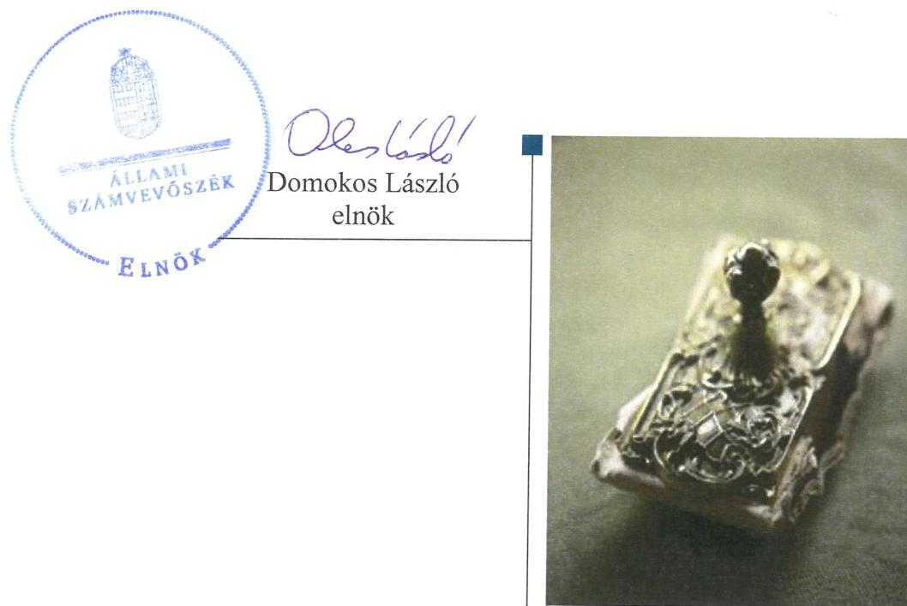
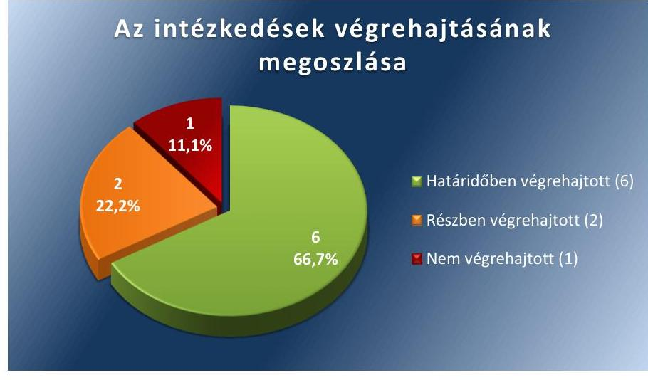

# Jelenetés 

## Utóellenőrzések

Az önkormányzatok pénzügyi gazdálkodási helyzetének, szabályszerűségének utóellenőrzése - Füzesabony 2016.

---

# Jelentés 

## Utóellenőrzések

Az önkormányzatok pénzügyi gazdálkodási helyzetének, szabályszerűségének utóellenőrzése - Füzesabony
2016. 11. hó 30. nap

---

# AZ ELLENŐRZÉST FELÜGYELTE: 

RENKÓ ZSUZSANNA felügyeleti vezető

## AZ ELLENŐRZÉST VEZETTE ÉS A VÉGREHAJTÁSÁÉRT FELELŐS:

KEREKES PÉTER ellenőrzésvezető

## A PROGRAM ÖSSZEÁLLÍTÁSÁÉRT FELELŐS:

JANIK JÓZSEF LÁSZLÓ osztályvezető

## A TÉMÁHOZ KAPCSOLÓDÓ KORÁBBI SZÁMVEVŐSZÉKI JELENTÉSEK:

- címe: Jelentés az önkormányzatok pénzügyi gazdálkodási helyzete értékelésének, és gazdálkodása szabályosságának - 2013. évben induló - ellenőrzéséről - Füzesabony
- sorszáma: 14023

IKTATÓSZÁM: V-1173-046/2016.
TÉMASZÁM: 2207
ELLENŐRZÉS-AZONOSÍTÓ SZÁM: V075522

---

# TARTALOMJEGYZÉK 

■ ÖSSZEGZÉS ..... 5
■ AZ ELLENŐRZÉS CÉLJA ..... 6
■ AZ ELLENŐRZÉS TERÜLETE ..... 7
■ AZ ELLENŐRZÉS HÁTTERE, INDOKOLTSÁGA ..... 8
■ A JELENTÉS LÉNYEGES KÉRDÉSKÖREI ..... 9
■ ELLENŐRZÉS HATÓKÖRE ÉS MÓDSZEREI ..... 10
■ MEGÁLLAPÍTÁSOK ..... 12
■ MELLÉKLETEK ..... 15
I. Sz. melléklet: Az ÁSZ 14023 számú jelentéséhez kapcsolódó intézkedési terv értékelése ..... 15
■ FÜGGELÉK: ÉSZREVÉTELEK ..... 19
■ RÖVIDÍTÉSEK JEGYZÉKE ..... 21

---

.

---

# ÖSSZEGZÉS 

Az Állami Számvevőszék az utóellenőrzés során megállapította, hogy Füzesabony Városi Önkormányzat a pénzügyi gazdálkodási helyzetével és szabályszerűségével kapcsolatban vállalt intézkedési tervét alapvetően végrehajtotta. Az Önkormányzat pénzügyi gazdálkodásával kapcsolatban tett számvevőszéki jelentés megállapításait az ellenőrzött összességében jól hasznosította, annak ellenére is, hogy a többletbevételek és a tartalékok felhasználására vonatkozó feladatot nem az intézkedési tervnek megfelelően hajtották végre.

## Az ellenőrzés társadalmi indokoltsága

Az Állami Számvevőszék stratégiájában célul tűzte ki a számvevőszéki munka hasznosulásának javítását. Ezzel összhangban ellenőrzi, hogy az ellenőrzött szervezetek megvalósították-e a korábbi ellenőrzései által feltárt hibák, hiányosságok és szabálytalanságok megszüntetése céljából kialakított intézkedési terveikben foglaltakat. A rendszeres utóellenőrzések hozzájárulnak a szükséges intézkedések tényleges végrehajtáshoz, ezáltal a közpénzügyek rendezettségének javulásához.

## Főbb megállapítások, következtetések

A polgármester ${ }^{1}$ a Képviselő-testület ${ }^{2}$ által elfogadott intézkedési tervet ${ }^{3}$ határidőben megküldte az ÁSZ ${ }^{4}$ részére.
Az intézkedési tervben meghatározott kilenc feladatból hatot határidőben végrehajtottak. Határidőben a Képvi-selő-testület elé terjesztették a bevételszerző, kiadáscsökkentő intézkedéseket, a pénzügyi reorganizációs programot, az önként vállalt és a kötelező feladatok racionalizálására készült programot és a kizárólagosan önkormányzati tulajdonú gazdasági társaságok pénzügyi stabilitására vonatkozó intézkedési tervet. A bevételek és kiadások meghatározása és a realizált árfolyamveszteség elszámolása kapcsán feltárt hiányosságokat is megszüntették. Két feladatot részben hajtottak végre: nem teljes körűen intézkedtek a szállítói számlák esedékesség szerinti kiegyenlítéséről vagy a lejárt tartozások átütemezéséről, és nem tették közzé a közbeszerzési eljárás alapján kötött szerződéseik mindegyik módosítását. Egy feladatot pedig nem hajtottak végre: a polgármester nem terjesztett a Képviselő-testület elé az Önkormányzat és a kizárólagos tulajdonában lévő gazdasági társaság kötelezettségeinek jövőbeni teljesítése és a fizetőképességének megőrzése érdekében a jegyző által készített döntési javaslatot.

Az intézkedési tervben rögzített feladatok végrehajtásáról a Bkr. ${ }^{5}$ által előírt nyilvántartást vezették.

---

# AZ ELLENŐRZÉS CÉLJA 

Az ellenőrzés célja annak értékelése, hogy a számvevőszéki jelentésben foglalt intézkedést igénylő megállapításokkal és javaslatokkal összhangban készített intézkedési tervben meghatározott feladatokat az ellenőrzött szervezet végrehajtotta-e.

---

# AZ ELLENŐRZÉS TERÜLETE 

## Füzesabony Városi Önkormányzat

Füzesabony városa Heves megyében, a Füzesabonyi járásban fekszik. Állandó lakosainak száma a $\mathrm{KSH}^{6}$ által közzétett népességi adatok szerint 2015. január 1-jén 7637 fő volt. A polgármester a 2014. évi önkormányzati választások óta tölti be tisztségét. A Képviselő-testület - a polgármesterrel együtt - az önkormányzati SZMSZ ${ }^{7}$ szerint kilenctagú, és munkáját három bizottság segíti. A jegyző ${ }^{8}$ 2011. február 23-tól látja el a feladatait. Az Önkormányzat ${ }^{9}$ a 2015. évi éves költségvetési beszámoló szerint 1579 millió Ft költségvetési bevételt ért el, valamint 1566 millió Ft költségvetési kiadást teljesített. Az Önkormányzat eszközvagyona 2015. december 31-én 4400 millió Ft volt.

Az Önkormányzat pénzügyi gazdálkodási helyzete értékelésének, és gazdálkodása szabályosságának ellenőrzését az ÁSZ a 2010. január 1. és 2013. június 30. közötti időszakra végezte el, az erről szóló 14023. számú jelentését 2014. január 31-én tette közzé. Az utóellenőrzés az ÁSZ jelentésben ${ }^{10}$ a polgármester és a jegyző részére megfogalmazott intézkedést igénylő megállapításokra és javaslatokra készített intézkedési tervben foglalt feladatok végrehajtásának ellenőrzésére, illetve értékelésére terjedt ki.

---

# AZ ELLENŐRZÉS HÁTTERE, INDOKOLTSÁGA 

AZ ÁSZ TV. ${ }^{11} 33 . \S$ (1) bekezdése értelmében a számvevőszéki jelentések intézkedést igénylő megállapításaihoz és javaslataihoz kapcsolódóan az ellenőrzött szervezet vezetője intézkedési tervet köteles összeállítani, és az ÁSZ részére megküldeni. Az intézkedési tervben foglaltak megvalósítását - az ÁSZ tv. 33. § (7) bekezdésében foglaltak alapján - az ÁSZ utóellenőrzés keretében ellenőrizheti. Az intézkedések megvalósulásának értékelése során az ÁSZ figyelembe veszi az ellenőrzött szervezetek működési feltételeiben, valamint a jogszabályi előírásokban bekövetkezett változásokat.

AZ INTÉZKEDÉSI TERVEK-ben foglalt feladatok hiányos, illetve késedelmes végrehajtása, valamint megvalósításának elmaradása azt mutatja, hogy az ellenőrzések során feltárt hibák, hiányosságok és szabálytalanságok megszüntetése nem kapott kellő hangsúlyt. Ez a szabályszerű működés és a felelős vezetői magatartás vonatkozásában kockázatot hordoz. E kockázatok feltárásával az ÁSZ utóellenőrzési rendszere fokozza a fegyelmet, és igazolja, hogy a közpénzzel való szabályos gazdálkodás felelőssége elől nem lehet kitérni.

## AZ UTÓELLENŐRZÉS NÉGY SZINTEN HASZNOSULHAT:

- A társadalom szintjén az utóellenőrzés jelzi, hogy a számvevőszéki ellenőrzés megállapításainak van következménye: a hiányosságok megszüntetésére az ellenőrzött szervezet által meghatározott intézkedések végrehajtását is számon kéri az ÁSZ.
- Az ellenőrzött terület szintjén az utóellenőrzés tájékoztatást nyújt a terület döntéshozóinak a hiányosságok kiküszöbölésének jó gyakorlatairól, ezzel lehetőséget biztosítva arra, hogy az ÁSZ ellenőrzési megállapításai, javaslatai a terület nem ellenőrzött szervezeteinek a működése során is hasznosuljanak.
- Az ellenőrzött szervezet szintjén az utóellenőrzés feltárja, hogy a szervezet az intézkedések végrehajtásával hasznosította-e a korábbi ellenőrzési jelentésben a hiányosságok megszüntetése, illetve a kockázatok kezelése érdekében megfogalmazott javaslatokat.
- Az ÁSZ szintjén az utóellenőrzés visszacsatolást ad az ellenőrzési jelentések hasznosulásáról, az intézkedések elmaradása vagy részleges megvalósulása a további ellenőrzésekhez kockázati jelzésként szolgál.

---

# A JELENTÉS LÉNYEGES KÉRDÉSKÖREI 

1. Az Önkormányzat az intézkedési tervben foglaltakat az elöirt határidőben végrehajtotta-e?

---

# ELLENŐRZÉS HATÓKÖRE ÉS MÓDSZEREI 

## Az ellenőrzés típusa

Megfelelőségi ellenőrzés

## Az ellenőrzött időszak

Az utóellenőrzés alapját képező számvevőszéki jelentés közzétételének napjától (2014. január 31.) az ellenőrzésről szóló kiértesítő levél keltének napjáig (2016. június 30.) tartó időszak.

## Az ellenőrzés tárgya

Az ÁSZ tv. 2011. július 1-jei hatálybalépését követően a számvevőszéki jelentésben foglalt intézkedést igénylő megállapításokkal és javaslatokkal összhangban - Önkormányzat által - készített intézkedési tervben foglaltak végrehajtásának ellenőrzése.

Az ellenőrzés kiterjed minden olyan körülményre és adatra, amely az ÁSZ jogszabályban meghatározott feladatainak teljesítéséhez, valamint a program végrehajtása folyamán felmerült újabb összefüggések feltárásához szükséges.

## Az ellenőrzött szervezet

Füzesabony Városi Önkormányzat

## Az ellenőrzés jogalapja

Az ÁSZ az Országgyűlés pénzügyi és gazdasági ellenőrző szerve. Az ÁSZ tv.ben meghatározott feladatkörében ellenőrzi a központi költségvetés végrehajtását, az államháztartás gazdálkodását, az államháztartásból származó források felhasználását és a nemzeti vagyon kezelését. Az ÁSZ tv. 1. § (3) bekezdése szerint az ÁSZ általános hatáskörrel végzi a közpénzekkel és az állami és önkormányzati vagyonnal való felelős gazdálkodás ellenőrzését. Az ÁSZ tv. 33. § (7) bekezdése alapján az ÁSZ tv. 33. § (1)-(2) bekezdése szerinti intézkedési tervben foglaltak megvalósítását az ÁSZ utóellenőrzés keretében ellenőrizheti.

---

# Az ellenőrzés módszerei 

Az ÁSZ az utóellenőrzést a nemzetközi standardokat irányadónak tekintve az ellenőrzési program ellenőrzési kérdései, az ellenőrzött időszakban hatályos jogszabályok, az ellenőrzés szakmai szabályok és módszertanok figyelembevételével, önállóan végezte.

Az ÁSZ az ellenőrzés ideje alatt az Önkormányzattal történő kapcsolattartást az ÁSZ SZMSZ-ének ${ }^{12}$ vonatkozó előírásai alapján biztosította.

Az utóellenőrzés megállapításait elsősorban az ÁSZ rendelkezésére álló, valamint az ellenőrzött szervezetektől elektronikusan bekért dokumentumok alapozták meg.

Az ellenőrzési bizonyítékként felhasználható adatforrások közé tartoznak egyrészt a szakmai programban felsorolt adatforrások, másrészt minden - az ellenőrzés folyamán feltárt, az ellenőrzés szempontjából információt tartalmazó - dokumentum.

Az intézkedési tervekben előírt feladatoknak, azok végrehajthatósága, illetve végrehajtása szempontjából az alábbiak szerint értékelte az ÁSZ:
"határidőben végrehajtott" a feladat, ha a teljesítés dokumentáltan, az intézkedési tervben előírt határidőben és tartalommal megtörtént;
"határidőn túl végrehajtott" a feladat, ha annak teljesítése az intézkedési tervben meghatározott módon, de az előírt határidőn túl történt meg;
"részben végrehajtott" a feladat, ha végrehajtása teljes körűen az intézkedési tervben előírt módon nem történt meg;
"nem végrehajtott" a feladat, ha a végrehajtás nem történt meg, vagy amennyiben a teljesítést nem dokumentálták;
"okafogyottá vált" a feladat, ha végrehajtására - meghatározott esemény bekövetkezése, továbbá külső körülmény, a működést érintő feltétel változása miatt - már nincs szükség, illetve lehetőség, és egyértelműen megállapítható, hogy az intézkedést szükségessé tevő körülmény a jövőben nem fordulhat elő;
"nem időszerű" az a feladat, amelynek ellenőrzési időszakon belüli végrehajtására azért nem került (kerülhetett) sor, mert az intézkedés alapjául szolgáló esemény nem következett be, de annak jövőbeni előfordulása lehetséges, a végrehajtása nem volt esedékes, vagy a végrehajtás határideje még nem járt le.
Az ellenőrzés lefolytatásához az ellenőrzött szervezet a tanúsítványok elektronikus kitöltésével, valamint az ÁSZ által kért dokumentumok elektronikus megküldésével szolgáltatott adatokat, amelyek valódiságát és teljes körűségét az ellenőrzött szervezet vezetője által tett teljességi és hitelességi nyilatkozat igazolta. Az így rendelkezésre bocsátott adatok, információk kontrollja az ellenőrzés keretében történt.

---

# MEGÁLLAPÍTÁSOK 

## 1. Az Önkormányzat az intézkedési tervben foglaltakat az előírt határidőben végrehajtotta-e?

Összegző megállapítás

Az Önkormányzat az intézkedési tervében meghatározott kilenc feladatból hatot határidőben végrehajtott, kettőt részben hajtott végre és egyet nem hajtott végre. Az intézkedési tervben rögzített feladatok végrehajtásáról a jogszabályban előírt nyilvántartást vezették.

Az intézkedési tervben meghatározott feladatokat, határidőket, az ÁSZ jelentés javaslatainak címzettjét és a feladatok végrehajtására tett intézkedéseket az I. számú melléklet mutatja be.

Az ÁSZ jelentés a polgármester részére hét, a jegyző részére kettő javaslatot fogalmazott meg. A javaslatok alapján a Képviselő-testület az intézkedési tervben a hiányosságok, szabálytalanságok megszüntetésére kilenc feladatot határozott meg: hét feladatot a polgármesternek, kettő feladatot a jegyzőnek címezve.

Az intézkedési tervben tervezett feladatok végrehajtásának értékelési kategóriák szerinti megoszlását az 1. ábra szemlélteti.

1. ábra

Forrás: ÁSZ

## HATÁRIDŐBEN VÉGREHAJTOTT feladatok:

1. A polgármester biztosította, hogy a költségvetési rendelettervezeteknek, valamint azok évközi módosításainak az előterjesztését megelőzően felmérésre kerüljenek a bevételszerző, kiadáscsökkentő intézkedések. Az ezekhez kapcsolódó - döntési javaslatokat tartalmazó - előterjesztéseket a Képviselő-testület megtárgyalta.

---

2. A polgármester az Önkormányzat gazdasági helyzetének elemzésén alapuló, a pénzügyi egyensúlyi helyzet gyors helyreállítását, hosszú távú fenntartását, valamint az adósságállomány újratermelődésének elkerülését biztosító intézkedéseket tartalmazó reorganizációs programot határidőben a Képviselő-testület elé terjesztette.
3. Az önként vállalt és a kötelező feladatok ellátásának racionalizálására készített javaslatot a polgármester határidőben a Képviselőtestület elé terjesztette.
4. Az Önkormányzat kizárólagos tulajdonában lévő gazdasági társaságok által készített, a pénzügyi stabilizálásukra vonatkozó intézkedési terveket a polgármester határidőben a Képviselő-testület elé terjesztette.
5. Az ellenőrzött időszakban a költségvetési rendelettervezetek öszszeállítása során a határidőre elkészült előterjesztésekben a bevételeket és kiadásokat az Áht. ${ }^{13}$-ben meghatározott előírások szerint határozták meg.
6. Az Önkormányzat a devizában fennálló kötvénytartozás törlesztése során realizált árfolyamveszteséget a számviteli szabályok szerint határidőre elszámolta.

# RÉSZBEN VÉGREHAJTOTT feladatok: 

7. Az intézkedési tervben meghatározott határidőket nem teljes körűen tartották be, mert 2014-ben és 2015-ben egy-egy alkalommal elmaradt a Képviselő-testület tájékoztatása a lejárt szállítói állomány alakulásáról. Az intézkedési tervben vállaltakkal ellentétben nem intézkedtek teljes körűen a szállítói számlák esedékesség szerinti kiegyenlítéséről vagy a lejárt tartozások átütemezéséről.
8. Az ellenőrzött időszakban hét olyan szerződésmódosítás történt, amely közbeszerzési eljárás alapján megkötött szerződésekhez kapcsolódott. Ezek közül a $\mathrm{Kbt}^{14}$,-ben meghatározott tájékoztató hirdetmény közzététele három esetben határidőben, három esetben csak határidőn túl történt meg, és egy esetben nem történt meg.

## NEM VÉGREHAJTOTT feladat:

9. Az intézkedési tervben foglaltak ellenére a polgármester nem terjesztett a Képviselő-testület elé az Önkormányzat és a kizárólagos tulajdonában lévő gazdasági társaság kötelezettségeinek jövőbeni teljesítése és a fizetőképességének megőrzése érdekében a jegyző által készített döntési javaslatot.

Az intézkedési tervben rögzített feladatok végrehajtásáról a Bkr. ${ }^{15}$ előírásainak megfelelő nyilvántartást vezették.

---

.

---

# MELLÉKLETEK

I. SZ. MELLÉKLET: AZ ÁSZ 14023 SZÁMÚ JELENTÉSÉHEZ KAPCSOLÓDÓ INTÉZKEDÉSI TERV ÉRTÉKELÉSE

|  Sorszám | Intézkedési terv alapján elvégzendő feladat | Az intézkedési tervben meghatározott határidő | Az ÁSZ 14023
sz. jelentése
javaslatának
címzettje | A feladat végrehajtása  |
| --- | --- | --- | --- | --- |
|   | 1. | 2. | 3. | 4.  |
|  Határidőben végrehajtott feladatok |  |  |  |   |
|  1. | 1.a.) Biztosítania kell, hogy a költségvetési rendelettervezetben, valamint annak évközi módosítása előterjesztését megelőzően kerüljenek felmérésre a bevételszerző, kiadáscsökkentő lehetőségek, majd a Htv. ${ }^{16} 140 . \S$ (1) bekezdés a) pontja alapján a jegyző által elkészített döntési javaslatot terjessze elő a Képviselő-testület elé. | 2014. április 30., ezt követően értelem szerint | polgármester | A 2015-2016. évi költségvetési rendelettervezetek, és a 2016. évi költségvetés tervezés elvi alapjai Képviselő-testületnek történt előterjesztését megelőzően felmérték és öszszegezték a bevételszerző és kiadáscsökkentő lehetőségeket. Ennek során figyelembe vették az Önkormányzat által nyújtott támogatásokat, tervezett adóbevételeket, létszámcsökkentés lehetőségét az önkormányzati intézményeknél, közös önkormányzati hivatal kialakítását Szihalom nagyközséggel. Áttekintették a gyermekétkeztetés területének problémáját és a kizárólagos önkormányzati tulajdonban lévő gazdasági társaságok éves, várható költségterveit. A költségvetési rendelettervezetek és a 2016. évi költségvetés tervezés elvi alapjai tárgyban, valamint évközben a rendkívüli önkormányzati támogatás és rendkívüli szociális támogatás pályázásával kapcsolatban készített - döntési javaslatokat is tartalmazó - előterjesztéseket a Képviselő-testület a testületi ülésen megtárgyalta.  |
|  2. | 1.b) Gondoskodnia kell arról, hogy a Képviselőtestület elé jóváhagyásra beterjesztésre kerüljön a Htv. 140. § (1) bekezdés a) pontja alapján a jegyző által elkészített, az Önkormányzat gazdasági helyzetének elemzésén alapuló, a pénzügyi egyensúlyi helyzet gyors helyreállítását, hosszú távú fenntartását, valamint az adósságállomány újratermelődésének elkerülését biztosító intézkedéseket tartalmazó reorganizációs program. | 2014.06.30 | polgármester | A polgármester a gazdasági és a gazdálkodási irodavezetők által előkészített, és a jegyző által véglegezett reorganizációs programot a Képviselő-testület elé terjesztette, amelyet az a 85/2014. (VI.26.) számú határozattal fogadott el. Az Önkormányzat gazdasági elemzését a reorganizációs program tartalmazta.
A reorganizációs programban a pénzügyi egyensúlyi helyzet gyors helyreállítása, hosszú távú fenntartása, valamint az adósságállomány újratermelődésének elkerülése érdekében feladatokat határoztak meg, határidők és felelősök megjelölésével.  |
|  3. | 1.e) Vizsgálja felül az önként vállalt feladatok finanszírozhatóságát a kötelező feladatellátás el- | 2014.06.30 | polgármester | A polgármester a feladatellátás racionalizálására készített javaslatot a Képviselő-testület elé terjesztette, melyet a Képviselő-testület a 86/2014. (VI.26.) számú határozattal fogadott el.  |

---

|  4. | 1.f) Terjessze a jegyző közreműködésével a Képviselő Testület elé jóváhagyásra az Önkormányzat kizárólagos tulajdonában lévő gazdasági társaság által, pénzügyi helyzete stabilizálása érdekében elkészített intézkedési tervet. | 2014.05.31. | polgármester | Az Önkormányzat kizárólagos tulajdonában lévő gazdasági társaságok (Füzesabonyi Városi Televíziózást Segítő Nonprofit Kft., Füzesabonyi Városüzemeltetési Kft.) elkészítették a pénzügyi stabilizálásra vonatkozó intézkedési terveket a bevételek növeléséről, a költségek racionalizálásáról, az üzleti tevékenység bővítéséről és a munkaerő hatékonyabb felhasználásáról. A polgármester által előterjesztett intézkedési terveket a Képviselő-testület a 68/2014 (V.22.) sz. határozattal elfogadta.  |
| --- | --- | --- | --- | --- |
|  5. | 1. Intézkedjen, hogy a költségvetési rendelettervezet összeállítása során a költségvetési bevételeket és a költségvetési kiadásokat az Áht. 5. § (1)-(2) bekezdéseiben foglalt előírások szerint határozzák meg. | 2014. február 5. (intézkedés végrehajtva), továbbiakban minden évben legkésőbb a költségvetési törvény hatálybalépésétől számított 45. nap | jegyző | Az Önkormányzat az ellenőrzési időszakban a 2015-2016. évi költségvetési rendelettervezetekben a költségvetési bevételeket és kiadásokat az Áht. 5. § (1)-(2) bekezdéseiben foglalt előírások szerint határozta meg.  |
|  6. | 2. Intézkedjen, hogy a devizában fennálló kötvénytartozás törlesztése során a pénzügyi-leg realizált árfolyamveszteség elszámolása az Áhsz. 44. § (3) bekezdésben foglalt elő-írás alapján a 27. § (8) bekezdés a) pontjában foglaltaknak megfelelően a pénzügyi műveletek egyéb ráfordításai között történjen. Amennyiben törlesztés során árfolyamnyereség keletkezik, azt az Áhsz. 27. § (4) bekezdés c) pontjában foglalt előírás szerint, a pénzügyi műveletek egyéb eredményszemléletű bevételei között mutassák ki. | 2014.04.30. (intézkedés végrehajtva), majd ezt követően amennyiben az önkormányzatnál keletkezik devizában fennálló kötelezettség, úgy legkésőbb az adott év zárszámadási rendeletének elfogadása (minden év április 30-ig) | jegyző | Az Önkormányzat a hatályos számviteli szabályok szerint a devizában fennálló kötvénytartozás törlesztése során realizált árfolyamveszteséget elszámolta, és ezt a 2013. évi beszámolóban szerepeltette. A 2014. évi adósságkonszolidáció keretében a fennálló devizatartozás 2014. február 28-ai dátummal megszűnt, ezért az ellenőrzött időszakban nem volt kötvénytartozás törlesztési kötelezettség, amelyhez kapcsolódóan árfolyam különbözetet kellett elszámolni.  |
|   |  |  | Részben végrehajtott feladatok |   |
|  7. | 1.d.) A szállítói kitettség és az Adósságrendezési tv.17 4. § (2) bekezdés a) – b) pontjában megjelölt helyzet kialakulásának elkerülése érdekében, meghatározott gyakorisággal számoljon be a Képviselő-testületnek az Önkormányzat lejárt a szállítói számlák kiegyenlítése és a lejárt tartozások átütemezése kapcsán értelem szerint, folyamatosan szükséges az intézkedés. A Képviselő-testület tájékoztatása a | a szállítói számlák kiegyenlítése és a lejárt tartozások átütemezése kapcsán értelem szerint, folyamatosan szükséges az intézkedés. A Képviselő-testület tájékoztatása a | polgármester | Az ellenőrzött időszakban az intézkedési terv szerint meghatározott 13 helyett összesen 11 – 2014-ben négy, 2015-ben öt és 2016-ban kettő – alkalommal készült polgármesteri tájékoztató az Önkormányzat lejárt szállítói állományának alakulásáról, amelyben megadták az Önkormányzatnál és intézményeinél meglévő 60 napon túli tartozások összegét. Az elkészült tájékoztatókat a Képviselő-testület a soros testületi ülésén tudomásul  |

---

|  8. | 2.) A közbeszerzési eljárásról szóló törvényben foglaltak maradéktalan betartása érdekében biztosítsa, hogy a közbeszerzési eljárás alapján megkötött szerződés módosítása esetén a Kbt. 30. § (1) bekezdés h) pontjában foglalt előírás alapján a szerződés módosításáról szóló tájékoztató hirdetmény útján történő közzétételre legkésőbb a Kbt. 30. § (4) bekezdése szerint, a szerződés módosításától számított 15 munkanapon belül kerüljön sor. | közbeszerzési eljárásoktól függően értelem szerint | polgármester | A feladat végrehajtása  |
| --- | --- | --- | --- | --- |
|  9. | 1.c.) Az Önkormányzat és a kizárólagos tulajdonában lévő gazdasági társaság kötelezettségeinek jövőbeni teljesítése, a fizetőképesség megőrzése érdekében elő kell terjesztenie a Képviselő-testület elé a Htv. 140. § (1) a) pontja alapján a jegyző által készített döntési javaslatot, melyben a Képviselő-testület kötelezettséget vállal arra, hogy előre meghatározott összegben és módon a realizált többletbevételeket, a meglévő és a jövőben képződő tartalékokat mindaddig a kötelezettségek rendezésére fordítja, azt nem használja más célra, amíg az Önkormányzat és a kizárólagos tulajdonában lévő gazdasági társaság pénzügyi egyensúlya rövidtávon veszélyeztetett. | 2014. június 30. |  |   |

|  Az intézkedési tervben meghatározott határidő | Az ÁSZ 14023
sz. jelentése
javaslatanak
címzettje  |
| --- | --- |
|  2. | 3.  |

|  4. |   |
| --- | --- |
|  vette. A 2014. és a 2015. évben egy-egy alkalommal elmaradt a Képviselő-testület tájékoztatása a lejárt szállítói állomány alakulásáról. Az intézkedési tervben vállaltakkal ellentétben nem intézkedtek teljes körűen a szállítói számlák esedékesség szerinti kiegyenlítéséről vagy a lejárt tartozások átütemezéséről, mert az előterjesztett tájékoztatók szerint 2014. júniusban, októberben és decemberben, 2015. áprilisban és júniusban, valamint 2016. júliusban is fennálltak 60 napon túli szállítói tartozások. Az Önkormányzatnál a közbeszerzési eljárás keretében megkötött szerződéseknél az ellenőrzött időszakban hét szerződésmódosítás történt. 2014. évben három módosítás történt, ebből egy esetben a hirdetmény feladása határidőn túl történt, kettő esetben a hirdetményt határidőben adták fel. 2015. évben is három módosítás történt, ebből egy esetben nem történt hirdetmény feladása, két esetben a szerződés módosítás időpontjához képest a hirdetmény feladására határidőn túl került sor. A 2016. évi egy szerződésmódosítás hirdetmény feladását határidőben megtették. |   |

|  Végre nem hajtott feladat |   |
| --- | --- |
|  2014. június 30. |   |

|  2014. június 30. | polgármester  |
| --- | --- |
|  |   |

|  Az intézkedési tervben megjelölt határidőig a polgármester nem terjesztett elő olyan, a jegyző által készített döntési javaslatot, amely megfelelő volna az intézkedési tervben foglaltaknak. A Képviselő-testület 2014. február 27-ei ülésén a polgármester ugyan az adott feladatra tett egy szóbeli előterjesztést - amelyet a Képviselő-testület a 27/2014. (II.27.) számú határozattal el is fogadott - ez azonban tartalmában nem felelt meg az intézkedési tervben meghatározott feladatnak. Az intézkedési tervnek megfelelő döntési javaslatot a polgármester a határidő lejárta után sem terjesztett elő. |   |

---

.

---

# FÜGGELÉK: ÉSZREVÉTELEK 

A jelentéstervezetet a Számvevőszék 15 napos észrevételezésre megküldte az ellenőrzött szervezet vezetőjének az ÁSZ tv. 29. §* (1) bekezdése előírásának megfelelően.
A polgármester az ÁSZ tv. 29. § (2) bekezdésében foglalt észrevételezési jogával nem élt.

[^0]
[^0]:    * 29. § (1) Az Állami Számvevőszék az ellenőrzési megállapításait megküldi az ellenőrzött szervezet vezetőjének vagy az általa megbízott személynek, és annak, akinek személyes felelősségét állapította meg.
    (2) Az ellenőrzött szervezet vezetője és a felelősként megjelölt személy az ellenőrzés megállapításaira tizenöt napon belül írásban észrevételt tehet.
    (3) Az Állami Számvevőszék az észrevételre a beérkezésétől számított harminc napon belül írásban válaszol. A figyelembe nem vett észrevételeket köteles a jelentésben feltüntetni, és megindokolni, hogy azokat miért nem fogadta el.

---

.

---

# RÖVIDÍTÉSEK JEGYZÉKE 

${ }^{1}$ polgármester
${ }^{2}$ Képviselő-testület
${ }^{3}$ intézkedési terv
${ }^{4}$ ÁSZ
${ }^{5}$ Bkr.
${ }^{6} \mathrm{KSH}$
${ }^{7}$ önkormányzati SZMSZ
${ }^{8}$ jegyző
${ }^{9}$ Önkormányzat
${ }^{10}$ ÁSZ jelentés
${ }^{11}$ ÁSZ tv.
${ }^{12}$ SZMSZ
${ }^{13}$ Áht.
${ }^{14}$ Kbt.
${ }^{15}$ Bkr.
${ }^{16} \mathrm{Htv}$.
${ }^{17}$ Adósságrendezési tv.

Füzesabony Városi Önkormányzat polgármestere
Füzesabony Városi Önkormányzat Képviselő-testülete
az Állami Számvevőszék által V-0203-053/2014. iktatószámon elfogadott
Füzesabony Városi Önkormányzat intézkedési terve, melyet a Képviselő-testület a 26/2014. (II.27.) számú határozatával fogadott el
Állami Számvevőszék
370/2011. (XII. 31.) Korm. rendelet a költségvetési szervek belső
kontrollrendszeréről és belső ellenőrzéséről (hatályos 2012. január 1-jétől)
Központi Statisztikai Hivatal
Füzesabony Városi Önkormányzat Képviselő-testületének 11/2014. (XI. 10.) sz. önkormányzati rendelete a Szervezeti és Müködési Szabályzatáról
Füzesabony Városi Önkormányzat jegyzője
Füzesabony Városi Önkormányzat
az Állami Számvevőszék 2014. január 31-én közzétett 14023. számú jelentése
Füzesabony Városi Önkormányzat pénzügyi gazdálkodási helyzete értékelésének, gazdálkodása szabályosságának ellenőrzéséről
2011. évi LXVI. törvény az Állami Számvevőszékről, hatályos 2011. július 1-jétől
Állami Számvevőszék Szervezeti és Müködési Szabályzata
2011. évi CXCV. törvény az államháztartásról (hatályos: 2011. december 31-től)
2011. évi CVIII. törvény a közbeszerzésekről (hatályos 2015. november 1-jéig)

370/2011. (XII. 31.) Korm. rendelet a költségvetési szervek belső
kontrollrendszeréről és belső ellenőrzéséről (hatályos 2012. január 1-jétől)
1991. évi XX. törvény a helyi önkormányzatok és szerveik, köztársasági megbízottak, valamint egyes centrális alárendeltségű szervek feladat- és hatásköreiről
1996. évi XXV. törvény a helyi önkormányzatok adósságrendezési eljárásáról

---

# ÁLLAMI SZÁMVEVŐSZÉK 

1052 Budapest, Apáczai Csere János utca 10.
Levélcím: 1364 Budapest 4. Pf. 54
Telefon: +36 14849100 Telefax: +36 14849200
www.asz.hu