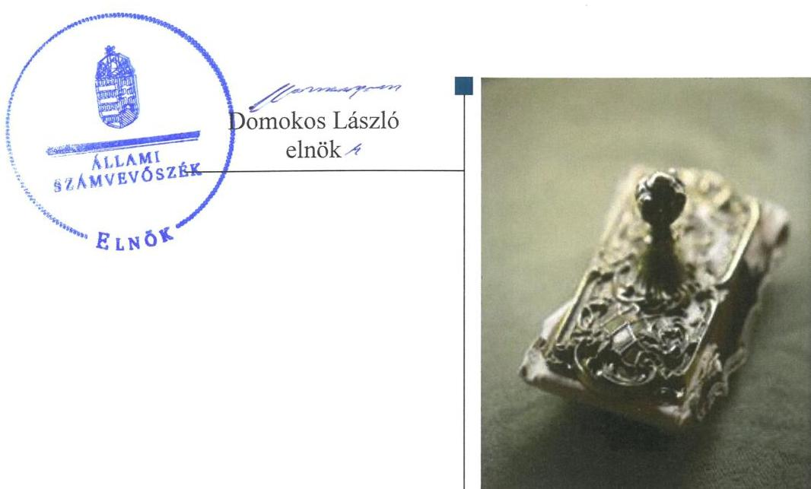
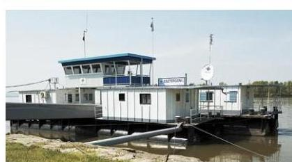
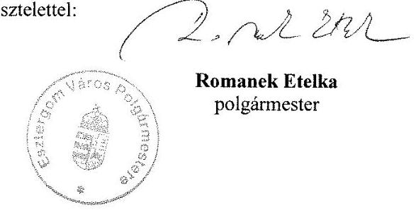
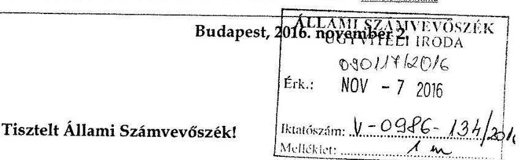
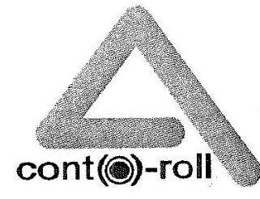
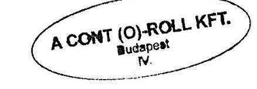
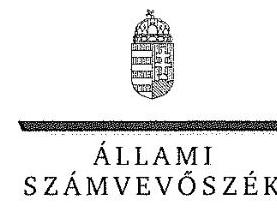
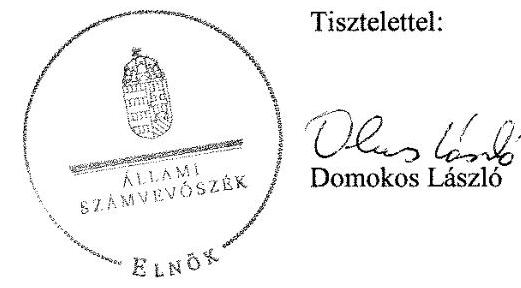
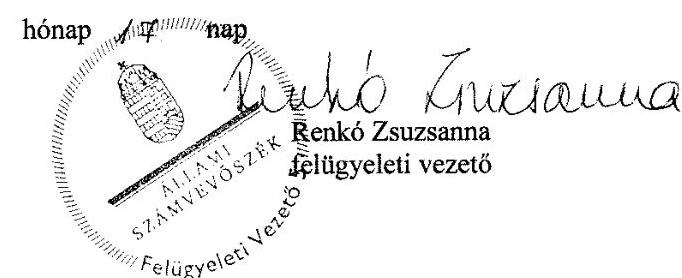

# Jelentés 

## Önkormányzati adósságrendezés ellenőrzése

Esztergom Város Önkormányzata adósságrendezési eljárásának ellenőrzése 2016. 12. hó 04. nap

---

# AZ ELLENŐRZÉST FELÜGYELTE:

- RENKŐ ZSUZSANNA felügyeleti vezető
- AZ ELLENŐRZÉST VEZETTE ÉS A VÉGREHAJTÁSÁÉRT FELELŐS:
  - BAJNAI ZSUZSANNA ellenőrzésvezető
  - A PROGRAM ÖSSZEÁLLÍTÁSÁÉRT FELELŐS:
    - JANIK JÓZSEF LÁSZLÓ osztályvezető

**IKTATÓSZÁM:** V-0986-141/2016

**TÉMASZÁM:** 2020

**ELLENŐRZÉS-AZONOSÍTÓ SZÁM:** V073902

Jelentéseink az Országgyűlés számítógépes hálózatán és az Interneten a www.asz.hu címen is olvashatóak.

---

# TARTALOMJEGYZÉK 

■ ÖSSZEGZÉS ..... 5
■ AZ ELLENŐRZÉS CÉLJA ..... 6
■ AZ ELLENŐRZÉS TERÜLETE ..... 7
■ AZ ELLENŐRZÉS HÁTTERE, INDOKOLTSÁGA ..... 8
■ A JELENTÉS LÉNYEGES KÉRDÉSKÖREI ..... 9
■ ELLENŐRZÉS HATÓKÖRE ÉS MÓDSZEREI ..... 10
■ MEGÁLLAPÍTÁSOK ..... 12
■ JAVASLATOK ..... 24
■ MELLÉKLETEK ..... 27
I. sz. melléklet: Értelmező szótár ..... 27
II. sz. melléklet: Az eszközök és források alakulása kiemelt mérlegsoronként ..... 29
III. sz. melléklet: Esztergom város önkormányzata gazdasági társaságaiban lévő részesedéseinek alakulása 2009., 2010., 2013., 2014. években ..... 30
■ FÜGGELÉK: ÉSZREVÉTELEK ..... 31
■ RÖVIDÍTÉSEK JEGYZÉKE ..... 41

---

.

---

# ÖSSZEGZÉS 

Esztergom Város Önkormányzata adósságrendezési eljárásának végrehajtása során a polgármester, a jegyző és a pénzügyi gondnok nem szabályszerű feladatellátása akadályozta az adósságrendezés céljainak elérését. A fizetőképesség helyreállítása nem történt meg, a hitelezői követelések teljes körű kielégítésére nem került sor. A pénzügyi egyensúly alakulása nem volt értékelhető az elszámolásokban feltárt ellentmondások és hiányosságok miatt.

## Az ellenőrzés társadalmi indokoltsága

Pénzügyi egyensúlyi helyzetének, fizetőképességének megromlása miatt Esztergom Város Önkormányzatánál 2010. november 25-től 2011. augusztus 01-ig adósságrendezés folyt, amely során a hitelezők 26,6 milliárd forint ki nem fizetett kötelezettség teljesítésére nyújtottak be igényt. Ez a kötelezettségállomány az önkormányzat vagyonának közel felét jelentette, így indokolt ellenőrizni, hogy az adósságrendezési eljárás elérte-e a célját, az eljárás szereplői eleget tettek-e törvényben meghatározott feladataiknak a fizetőképesség helyreállítása, a hitelezőknek hatékony jogvédelem nyújtása, és az átgondolt, felelősségteljes gazdálkodás érdekében.

## Főbb megállapítások, következtetések, javaslatok

Az adósságrendezési eljárás szabálytalan végrehajtása az eljárás törvényben meghatározott céljainak elérését veszélyeztette. Az adósságrendezés megindításakor nem került sor az önkormányzat valós vagyoni helyzetének felmérésére a vagyon számbavételének és a számviteli nyilvántartások lezárásának elmaradása miatt. Nem tárták fel, hogy milyen okok vezettek az adósságrendezési eljárás megindításához, így azok kezelésére sem alakítottak ki tervet. A pénzügyi gondnok nem kísérte figyelemmel az önkormányzat gazdálkodását, feladatainak ellátását, a válságköltségvetés időszakában kifizetések jogosulatlanul, a pénzügyi gondnok ellenjegyzése nélkül történtek. A közvagyon megőrzését veszélyeztette, hogy a hitelezőkkel megkötött egyezségben adósságrendezésbe nem vonható ingatlanokat is megjelöltek a kötelezettségek fedezetéül.

Fizetőképességének helyreállításához nem voltak elegendőek az önkormányzat saját hatáskörében végrehajtott intézkedései. A reorganizációs program, és az éves likviditási tervek hiánya is hozzájárult, hogy az egyezségi javaslatban szereplő egyes kötelezettségeket nem teljesítették. A hitelezői igények 5,6%-át, 1,5 milliárd Ft-ot az önkormányzat nem fizetett ki.

Pénzügyi egyensúlyra vonatkozó következtetést az ellenőrzés nem tudott levonni, a rendelkezésre bocsátott adatok eltérései és a költségvetési beszámolókra vonatkozó megőrzési kötelezettség megsértése miatt.

---

# AZ ELLENŐRZÉS CÉLJA 

Az ellenőrzés célja annak megállapítása, hogy az adósságrendezési eljárás megindítása, lefolytatása szabályszerű volt-e, az önkormányzat gazdálkodása az adósságrendezési eljárás alatt megfelelt-e a jogszabályi előírásoknak; az eljárás szereplői - kiemelten a pénzügyi gondnok - a jogszabályokban foglaltak szerint jártak-e el az adósságrendezés során. A lefolytatott eljárás elérte-e a törvényben kitűzött célokat; az önkormányzat teljesítette-e kötelező feladatait, a hitelezők követelését vagyonarányosan kielégítette-e, helyreállt-e fizetőképessége.

---

# AZ ELLENŐRZÉS TERÜLETE 

## Esztergom Város Önkormányzata

Esztergom város Komárom-Esztergom megyében, a Duna partján helyezkedik el. Állandó lakosainak száma 2009. január 1-jén 30539 fő, 2014. december 31-én 29863 fő volt. 2009-ben az önkormányzat ¹¹⁵ tagú képviselő-testületének ² munkáját nyolc állandó bizottság és egy részönkormányzat segítette. A 2014. évben az önkormányzati választásokat követően kilenc állandó bizottsággal és egy részönkormányzattal működött.

A gazdálkodási feladatokat az elkülönített gazdasági szervezettel nem rendelkező polgármesteri hivatal ³ látta el. 2013. július 1-jétől Dömös Község Önkormányzatával közös polgármesteri hivatal megalakításáról döntöttek a képviselő-testületek.
2009. január 1-jén a polgármesteri hivatalon kívül 30 intézmény tartozott az önkormányzat fenntartása alá. 2012-ben 10 önállóan működő, továbbá két önállóan működő és önállóan gazdálkodó intézményt átvett a magyar állam.

A jelenlegi polgármester a 2014. évi önkormányzati választások óta tölti be tisztségét, a 2009-2010. években, illetve a 2010-2014. évi időszakban is más-más személy végezte ezt a feladatot. A 2011. évtől hivatalban lévő jegyző, ⁴ tartós távolléte miatt 2011 novemberétől az aljegyző ₂₅⁵ látta el a jegyzői feladatokat. Az önkormányzat és intézményei által foglalkoztatottak létszáma - a közfoglalkoztatottakkal együtt - 2009. január 1-jén 1779 fő, 2014. december 31-én 921 fő volt.

Az önkormányzat az ellenőrzött időszak elején nyolc, 2014. év végén 10 gazdasági társaságban volt közvetlenül többségi tulajdonos. A Strigonium Zrt. ⁶-n keresztül 2009. január 1-jén 12 társaságban rendelkezett többségi befolyással, amelyek száma a 2014. év végére 18-ra nőtt.

Az önkormányzat adósságrendezési eljárását 2010. november 22-én a polgármester ⁷ kezdeményezte, az önkormányzat nagy összegű adósságállományára hivatkozva. A bíróság ⁸ végzése az adósságrendezés megindításáról 2010. november 25-én jelent meg a Cégközlönyben. Az adósságrendezés 2011. augusztus 1-jén egyezség megkötésével zárult.

A bíróság az A CONT(Ó)-ROLL Kft.-t ⁹ jelölte ki a pénzügyi gondnoki feladatok ellátására. Az A CONT(Ó)-ROLL Kft. 2014-ben kikerült a pénzügyi gondnokok névjegyzékéből.

---

# AZ ELLENŐRZÉS HÁTTERE, INDOKOLTSÁGA 

Az önkormányzatok finanszírozásának, gazdálkodásának keretei és feladatellátása jelentős változásokon ment keresztül a Har. tv. ¹⁰ hatálybalépésétől eltelt időszakban.

Az önkormányzati eladósodást 2011-ig csak az Ötv. ¹¹-ben meghatározott hitelfelvételi korlát szabályozta, a korlát megsértését azonban jogszabályok nem szankcionálták. 2012. évtől jelentős szigorítás lépett életbe. A korábbi passzív szabályozást a Stabilitási tv. ¹²-nek hatálybalépésével az aktív kontroll váltotta fel. A törvény előírásai alapján az önkormányzatok hitelfelvételei engedélykötelessé váltak.

1996-ban a hitelfelvételi korlát bevezetése mellett az önkormányzatok adósságrendezésének szabályozására is sor került. Az adósságrendezési eljárás részben a lakosság védelmét szolgálta azzal, hogy biztosította az önkormányzatok által nyújtott kötelező feladatokhoz való hozzájutást az önkormányzat fizetésképtelensége esetén is. A Har. tv. alapján - 1996 és 2013 júniusa között - ugyanakkor elenyésző számú, mindösszesen 64 adósságrendezési eljárás indult. Az eljárások közel 60%-a egyezséggel, 40%-a vagyonfelosztással zárult. Az adósságrendezés első időszakában (2009. évig) a forráshiányból eredeztethető eladósodás tette indokolttá az eljárások jelentős hányadának megindítását.

A második időszakban az eljárás alá vont önkormányzatok között megjelentek a nagyobb költségvetéssel és több intézménnyel is rendelkező települések. Az adósságrendezést szükségessé tevő problémák speciális pénzügyi elemekkel, a devizaalapú kötvényel történő finanszírozás begyűrűző hatásaival, valamint az anyagi lehetőségeket meghaladó, túlméretezett fejlesztésekkel összefüggő kötelezettségvállalásokkal egészültek ki, de a beruházások esetében fontos tényező volt a kellő szakértelem hiánya és a pénzügyi nehézségek szakszerűtlen kezelése is.

Az ÁSZ ¹³ önkormányzati alrendszert érintő ellenőrzései, elemzései során számos ponton mutatott rá azokra a területekre, ahol a „szabályozás” módosításra, korrekcióra szorul. Az ellenőrzés alapján megfogalmazott javaslatok e területen is segítséget nyújthatnak a kormányzat és az Országgyűlés törvényhozó munkájában, hozzájárulhatnak az irányítói tevékenység erősítéséhez. Az ellenőrzés során tett megállapításaink megerősíthetik egy „megelőző monitoring funkció” kialakításának szükségességét a helyi önkormányzatok fizetésképtelenségének megelőzése érdekében.

---

# A JELENTÉS LÉNYEGES KÉRDÉSKÖREI 

1. Az adósságrendezési eljárás folyamata, végrehajtása során szabályszerű volt-e az önkormányzat és a pénzügyi gondnok feladatellátása?
2. A lefolytatott adósságrendezési eljárás elérte-e a törvényben kitűzött célokat?
3. Az adósságrendezési eljárást követően biztosított és fenntartható volt-e a pénzügyi egyensúly?
4. Gondoskodott-e az önkormányzat a közfeladatot ellátó társaságai esetében a tulajdonosi jogok gyakorlásáról annak érdekében, hogy működésük ne hordozzon kockázatot az önkormányzatra nézve?

---

# ELLENŐRZÉS HATÓKÖRE ÉS MÓDSZEREI 

## Az ellenőrzés típusa

Rendszerellenőrzés.

## Az ellenőrzött időszak

A 2009. január 1. és 2015. június 30. közötti időszak, ezen belül az első kérdéskör vonatkozásában az adósságrendezési eljárás kezdeményezésétől az eljárás lezárásáig tartó időszak.

## Az ellenőrzés tárgya

A Har. tv. által szabályozott adósságrendezési eljárás.

## Az ellenőrzött szervezet

Esztergom Város Önkormányzata és a pénzügyi gondnoki feladatok ellátásával összefüggésben az A CONT(Ö)-ROLL Szolgáltató Korlátolt Felelősségű Társaság.

## Az ellenőrzés jogalapja

Az Állami Számvevőszékről szóló 2011. évi LXVI. törvény 5. § (2) bekezdése.

## Az ellenőrzés módszerei

Az ellenőrzés szakmai módszertana az ÁSZ hivatalos honlapján (www.asz.hu) közzétett szakmai szabályokon alapult, amelyek irányadónak tekintették a Legfőbb Ellenőrző Intézmények Nemzetközi Szervezete (INTOSAI) által kiadott nemzetközi (ISSAI) standardokat.

Az ellenőrzés alapját az ellenőrzött önkormányzatoktól bekért tanúsítványok, szabályzatok, szerződések, bírósági végzések, határozatok és egyéb dokumentumok, kimutatások, valamint az önkormányzati beszámolók adatai képezték. Az ellenőrzési kérdések megválaszolásához szükséges bizonyítékok megszerzése, összegyűjtése, az ellenőrzött által rendelkezésre bocsátott dokumentumok, adatok elemzés módszerével végrehajtott értékelésével történt, kiegészítve a megfigyelés, a szemle (szemrevételezés), a kérdésfeltevés (információkérés), mintavételezés módszerével.

---

Az ellenőrzés keretében értékeltük az ellenőrzéshez elkészített tanúsítványok adatainak valódiságát.

Az adósságrendezési eljárás szabályszerűségét a cégbírósági végzések, határozatok, a testületi előterjesztések, jegyzőkönyvek, határozatok, a válságköltségvetés, a beszámolók adatai, az értesítések, közzétételek, kimutatás a hitelezőkről, jelentések, vagyonfelosztási javaslat, belső szabályzatok, pénzügyi bizonylatok, kötelezettségvállalások és további releváns dokumentumok alapján végeztük. A minősítés szempontja a dokumentumok határidőben és tartalmilag a vonatkozó előírásoknak megfelelő elkészítése volt.

A kontrolltevékenység működésének ellenőrzésével értékeltük, hogy az adósságrendezési eljárás alatt vállalt kötelezettségek és teljesített kifizetések szabályszerűen történtek-e, a válságköltségvetés alatt a források szabályszerűen, rendeltetésszerűen lettek-e felhasználva a Har. tv.-ben előírt és az önkormányzat által ellátott kötelező feladatellátás során.

A kontrolltevékenységek támogató szerepét a kötelezettségvállalások és a szakmai teljesítés igazolása/utalvány ellenjegyzése, a teljesítés igazolása/érvényesítés, valamint a pénzügyi gondnok által gyakorolt ellenjegyzés működésének ellenőrzésén keresztül ítéltük meg. A véletlen minta alapján a sokaságra vonatkozó hibaarányt becsültük. „Megfelelőnek” értékeltük az ellenőrzött területet, amennyiben 95%-os bizonyossággal a teljes sokaságban a hibaarány legfeljebb 10%, „részben megfelelőnek” értékeltük, ha a hibaarány 10-30% között volt, „nem megfelelőnek” pedig akkor, ha a mintavételi eredmények alapján a sokaságbeli hibaarány meghaladta a 30%-ot. A becsült hibaaránytól függetlenül nem értékeltük szabályosnak az önkormányzatnál a válságköltségvetésen alapuló kifizetéseket, amennyiben egyetlen esetben is hiányzott a pénzügyi gondnok ellenjegyzése a kötelezettségvállalás, vagy pénzügyi kifizetés dokumentumáról.

Az önkormányzat fizetőképességének helyreállását likviditási mutatók számításával és értékelésével végeztük el. A fizetőképességet kedvezőtlennek ítéltük, ha a szállítói állomány változása növekvő tendenciát mutatott, ha az önkormányzat 60 napon túli adósságállománnyal rendelkezett, az adósságot keletkeztető ügyletek állományának változása 20% feletti volt, az egyéb visszterhes kötelezettségének aránya meghaladta a teljesített költségvetési kiadások összegének 10%-át, ha a lejárt követelések állománya nem csökkent az adósságrendezés kezdő időpontjában fennálló összeghez képest. A likviditási mutatókat megfelelőnek értékeltük, ha értékük nagyobb volt egynél.

A pénzügyi egyensúly fenntartásának értékelését a CLF módszer segítségével végeztük el. A pénzügyi egyensúly abban az esetben jött létre, ha egy adott időszakban
 a folyó bevételek fedezetet biztosítottak a folyó kiadásokra.

Az önkormányzatok adósságrendezési eljárása és az azt követő gazdálkodási tevékenysége hibáinak kijavítására, a közpénzekkel való felelős gazdálkodás segítésére irányuló javaslatok kidolgozásakor a hatályos jogszabályok voltak az irányadóak.

---

# MEGÁLLAPÍTÁSOK 

## 1. Az adósságrendezési eljárás folyamata, végrehajtása során szabályszerű volt-e az önkormányzat és a pénzügyi gondnok feladatellátása?

Összegző megállapítás

Az adósságrendezési eljárás megindítása és végrehajtása a polgármester, a jegyző és a pénzügyi gondnok feladatellátásának hiányosságai miatt nem volt szabályszerű. A működtetett belső kontrollrendszer nem biztosította a válságköltségvetésen alapuló kifizetések szabályszerű végrehajtását.
1.1. számú megállapítás

Annak ellenére nem kezdeményezték az adósságrendezési eljárás megindítását, hogy annak feltételei már az eljárás kezdeményezését megelőző - 2009. - évben is fennálltak.

1.2. számú megállapítás

Az adósságrendezési eljárás megindításának feltételei már 2009. január 1-jén fennálltak, mivel az önkormányzat esedékességet követő 60 napot meghaladó szállítói tartozása 16,4 millió Ft, ebből a 90 napon túli 10,7 millió Ft volt.

Ekkor nem tájékoztatták haladéktalanul a pénzügyi bizottságot, ${ }^{14}$ nem hívták össze a képviselő-testületet a Har. tv. 5. § (1) bekezdésében foglaltak szerint, továbbá nem kezdeményezték a Har. tv. 5. § (2) bekezdése* ellenére az adósságrendezési eljárás megindítását a képviselő-testület döntésétől függetlenül az esedékességet követő 90 napot meghaladó szállítói tartozások miatt.
2010. október 3-án a polgármester az önkormányzati választásokat követően, a polgármesteri tisztség átadás-átvételekor szerzett tudomást az önkormányzat pénzügyi helyzetéről. Az előírt határidőn belül összehívta a képviselő-testületet a fizetési kötelezettségek rendezése, vagy az adósságrendezési eljárás kezdeményezésére való felhatalmazás céljából. A képviselő-testület felhatalmazásának megfelelően tárgyalásokat folytatott a hitelezőkkel a fizetési határidők átütemezése, halasztása érdekében. A megbeszélésekről készített összefoglalójában a polgármester az adósságrendezési eljárás azonnali kezdeményezését terjesztette elő. A képviselő-testület a javaslatot nem fogadta el, határozatában a fizetési kötelezettségek rendezését írta elő a polgármesternek.

A polgármester tájékoztatási kötelezettségének nem, illetve nem a jogszabályi előírásoknak megfelelően tett eleget.

A polgármester az elismert, de az esedékességet követő 90 napon túl ki nem egyenlített szállítói tartozásokra tekintettel - a képviselő-testület

[^0]
[^0]:    * 2011. július 12-ig hatályos törvényi előírás

---

# 1.3. számú megállapítás 

döntésétől függetlenül - 2010. november 22-én adósságrendezési eljárást kezdeményezett a bíróságnál. Az adósságrendezési eljárás megindításáról szóló végzés 2010. november 25-én jelent meg a Cégközlönyben.

A polgármester az adósságrendezési eljárás kezdeményezéséről a Har. tv. 5. § (2) bekezdésében foglaltak ellenére a lakosságot nem a helyben szokásos módon - a polgármesteri hivatal hirdetőtábláján való kifüggesztéssel - és nem az eljárás kezdeményezésével egyidejűleg tájékoztatta. Az eljárás megindítását követő harmadik napon, egy helyi hírportálon jelentetett meg polgármesteri közleményt.

A polgármester nem tájékoztatta a Har. tv. 5. § (5) bekezdése ellenére az adósságrendezési eljárás megindításáról a közigazgatási hivatalt ${ }^{15}$.

A hitelezőknek szóló felhívást a jogszabályi előírásnak megfelelő tartalommal és határidőben tette közzé két országos napilapban és a helyben szokásos módon is.

A polgármester nem tájékoztatta a Har. tv. 10. § (4) bekezdésében foglaltak ellenére az adósságrendezési eljárás megindításáról a közigazgatási hivatalt, a kincstárt ${ }^{16}$, az önkormányzat költségvetési szerveinek pénzforgalmi számláit, költségvetési elszámolási számláit vezető pénzforgalmi szolgáltatót, az illetékes adó- és vámhatóságot, valamint a nyugdíjbiztosítási igazgatási- és az egészségbiztosítási szervet.

## A polgármester nem adta át a pénzügyi gondnoknak a jogszabályban előírt dokumentumokat az adósságrendezés megindítását követően.

A polgármester nem adta át a pénzügyi gondnoknak ${ }^{17}$ a Har. tv. 13. § (2) bekezdés a)-b) és d)-g) pontjainak előírása ellenére a jogszabályban rögzített határidőben és azt követően sem:
$\longrightarrow$ a kötelezően előírt, valamint önként vállalt feladatainak és hatáskörének helyi ellátási formáiról, valamint ezek pénzügyi finanszírozásáról szóló jelentését;
$\longrightarrow$ az adósságrendezés megindításának időpontját megelőző nappal készített vagyonleltárt és éves beszámolót, mert a jegyző ${ }^{18}$ nem készítette el az Áhsz. ${ }^{19}$ 13. § (1) és a Htv. ${ }^{20}$ 140. § (1) bekezdés d) pontjában meghatározott feladatkörében;
$\longrightarrow$ a folyamatban lévő bírósági, más hatósági, végrehajtási eljárásokról készített részletes összefoglalót;
$\longrightarrow$ az önkormányzat vagyonára vonatkozó, az adósságrendezési eljárás kezdő időpontját megelőző egy éven belül és azóta kötött szerződések, illetve a vagyont érintő bármely időpontban tett kötelezettségvállaló nyilatkozatokat;
$\longrightarrow$ az önkormányzat részvételével működő gazdasági társaságokról szóló részletes tájékoztatást;
$\longrightarrow$ az intézményekről, azok gazdasági helyzetéről, tartozásaikról, követeléseikről szóló részletes tájékoztatást.
A válságköltségvetési rendelettervezetet az aljegyző ${ }^{21}$ elkészítette és az a pénzügyi gondnok részére átadásra került.

---

### 1.4. számú megállapítás

Az adósságrendezési bizottság által elfogadott válságköltségvetési rendelettervezet, egyezségi javaslat tartalma nem felelt meg a törvényi előírásoknak.

Az adósságrendezési bizottság a törvényi előírás szerint határidőben - az adósságrendezés megindításának időpontját követő nyolc napon belül megalakult és megkezdte működését.

A válságköltségvetési rendelettervezetet és a reorganizációs programot az adósságrendezési bizottság megtárgyalta, és a képviselő-testületnek elfogadásra javasolta. A pénzügyi gondnok által véleményezett és a bizottság által elfogadásra javasolt, majd a képviselő-testület által határidőn belül elfogadott válságköltségvetési rendelet a Har. tv. 18. § (2) bekezdése ellenére, a Har. tv. 1. számú mellékletében és az Ötv. 8. § (4) bekezdésében meghatározott kötelező feladatokon túl önként vállalt feladat finanszírozására is tartalmazott kiadási előirányzatot.

Az adósságrendezési bizottság a pénzügyi gondnok által nyilvántartásba vett hitelezőket a követelések összege és azok lejárata alapján hét csoportba sorolta, és hitelezői csoportonként eltérő egyezségi javaslatot készített elő, azonban nem indokolták a Har. tv. 20. § (3) bekezdése ellenére a különböző csoportok tekintetében eltérő egyezségi javaslatot.

### 1.5. számú megállapítás

A képviselő-testület nem fogadta el a reorganizációs programot.
A polgármester a reorganizációs program elfogadására 2011. április 12-ére meghirdetett képviselő-testületi ülést lemondta, és erről a képviselőket írásban tájékoztatta. Ettől függetlenül 11 képviselő megjelent, tárgyalt és szavazott a reorganizációs programról. A jelenlévők nem az Ötv. 12. § (2) bekezdésében foglalt előírásoknak megfelelően összehívott képviselőtestületi ülésen vettek részt, így a reorganizációs programot a képviselőtestület nem fogadta el.

### 1.6. számú megállapítás

A pénzügyi gondnok nem látta el valamennyi jogszabály által előírt feladatát.

A pénzügyi gondnok nem értesítette a Har. tv. 22. § (1) bekezdése ellenére a hitelezőket arról, hogy a képviselő-testület a reorganizációs programot nem fogadta el, ezért hitelezői egyezségi tervet készíthetnek. A polgármester nem élt kifogással a Har. tv. 14. § (3) bekezdése alapján a pénzügyi gondnok jogszabálysértő mulasztása ellen.

A pénzügyi gondnok a Har. 14. § (2) bekezdés a) és e) pontjaiban foglaltak ellenére nem tárta fel az adósságrendezési eljárás megindításához vezető okokat, továbbá nem kezdeményezte az önkormányzat esedékessé vált követeléseinek a behajtását.

A pénzügyi gondnok hitelezőkkel történt kapcsolattartása „részben felelt meg" az előírásoknak, mivel a Har. tv. 15. § (1) bekezdése ellenére határidőn túl tájékoztatta a hitelezőket követeléseik elfogadásáról, továbbá a Har. tv. 23. § (1) bekezdésében foglalt nyolc napos határidőt követően adta postára az egyezségi tárgyalásokra szóló meghívókat.

---

### 1.7. számú megállapítás

### 1.8. számú megállapítás

Az egyezség a jogszabályi előírások ellenére adósságrendezésbe nem vonható vagyont is tartalmazott, az egyezségi okiratban nem rögzítették a végrehajtás ellenőrzési módját.

Az egyezségi javaslatot a pénzügyi gondnok határidőben terjesztette a képviselő-testület elé, amelyet az elfogadott.

Az egyezség megkötéséhez hitelezői csoportonként az adósságrendezés időpontjában fennálló követeléssel rendelkező hitelezőknek több mint a fele hozzájárult. Az egyezség megkötéséhez hozzájáruló hitelezők követelése elérte az összes bejelentett és nem vitatott hitelezői követelés kétharmadát. A 26 578,0 millió Ft összegű hitelezői igény jogosultjai közül 24 995,8 millió Ft hitelezői igény jogosultja - 94,0% - járult hozzá az egyezséghez.

Az egyezséget írásba foglalták, azonban az nem tartalmazta a Har. tv. 24. § a) pontjában előírtak ellenére az ellenőrzés módját.

Az egyezség tartalmazta a hitelezői csoportok követeléseinek kielégítési módját, de egy hitelezői csoport esetében a Har. tv. 2. § ea) pontjában előírtak ellenére adósságrendezésbe nem vonható vagyonnal - állami tulajdonból önkormányzati tulajdonba került ingatlanokkal - kívánták rendezni a tartozást.

Az egyezséget tartalmazó okiratot a pénzügyi gondnok az előírásoknak megfelelő határidőben nyújtotta be a bíróságra.

A bíróság az eljárást befejezetté nyilvánította, és elrendelte a végzés Cégközlönyben való közzétételét, amely 2011. augusztus 1-jén megtörtént.

A kontrollkörnyezet nem biztosította a kötelezettségvállalások és pénzügyi teljesítések szabályszerű ellátását az adósságrendezés során.

A képviselő-testületi működés részletes szabályait az önkormányzati SZMSZ ${ }^{22}$ tartalmazta.

A képviselő-testület az önkormányzati vagyonnal történő gazdálkodás szabályait megalkotta, azonban az Ötv. 78. § (2) bekezdése ellenére nem határozta meg a törzsvagyon körét, valamint a forgalomképtelen és korlátozottan forgalomképes vagyoni elemeket.

A polgármesteri hivatal - a 2011. évben, a válságköltségvetés végrehajtásának időszakában - rendelkezett hivatali SZMSZ ${ }^{23}$-szel, számviteli politikával ${ }^{24}$, értékelési szabályzattal ${ }^{25}$, számlarenddel ${ }^{26}$, leltározási szabályzattal ${ }^{27}$, pénzkezelési szabályzattal ${ }^{28}$ és gazdálkodási szabályzattal ${ }^{29}$. Az elkészített szabályzatok tartalmi hiányosságait az 1. táblázat ismerteti.

1. táblázat

# AZ ELKÉSZÍTETT SZABÁLYZATOK TARTALMI HIÁNYOSSÁGAI 

Sorszám Megállapított szabálytalanság
Megsértett jogszabály

1. A hivatali SZMSZ nem tartalmazta:

- a szervezeti egységek engedélyezett létszámát;
- a szervezeti egységek közötti kapcsolattartás rendjét.
Ámr. $2{ }^{20}$ 20. § (2) bekezdés e) pont
Ámr. 20. § (2) bekezdés e) pont
(2011. április 12-ig hatályos rendelkezés)
2. A számlarend nem tartalmazta a bizonylati rendet.

Számv. tv. ${ }^{21}$ 161. § (2) bekezdés
d) pont

---

| Sorszám | Megállapított szabálytalanság | Megsértett jogszabály |
| :--: | :--: | :--: |
| 3. | A gazdálkodási szabályzat   - nem tartalmazta az előzetes írásbeli kötelezettségvállalást nem igénylő kifizetések rendjét;   - nem tartalmazta a kötelezettségvállalás ellenjegyzésére vonatkozó előírásokat, a gazdálkodási jogköröket gyakorlók kijelölési rendjét;   - nem vezettek naprakész nyilvántartást a gazdálkodási jogkör ellátására jogosult személyekről és aláírás mintájukról. | Ámr. 272. § (14) bekezdés   Ámr. 2 20. § (3) bekezdés a) pont   Ámr. 2 80. § (3) bekezdés   Forrás: ÁSZ megállapítás |

1.9. számú megállapítás

A pénzügyi gondnok a jogszabály által előírt ellenjegyzési feladatait nem végezte el, a kontrolltevékenységek nem biztosították a válságköltségvetésen alapuló kifizetések szabályszerű végrehajtását.

A jegyző ${ }^{1}$ nem juttatta el a Har. vhr. ${ }^{32}$ 16. §-ában előírtak ellenére a pénzügyi gondnok ellenjegyzéshez szükséges aláírási címpéldányát az adósságrendezés megindításával egyidejűleg a számlavezető pénzügyi intézményhez.

A pénzügyi gondnok nem jegyezte ellen a Har. tv. 14. § (1) bekezdésének előírása ellenére a kötelezettségvállalásokat és a kifizetések teljesítését.

A számviteli nyilvántartásba adatot az elszámolást alátámasztó bizonylat nélkül rögzítettek a Számv. tv. 165. § (2) bekezdése ellenére.

A kifizetésekhez kapcsolódó kontrolltevékenységek - gazdálkodási jogkörök, pénzügyi gondnoki ellenjegyzés - gyakorlása „nem megfelelő" volt a válságköltségvetés időszakában.

A gazdálkodási jogkörök gyakorlásának ellenőrzése során tapasztalt további hiányosságokat a 2. táblázat tartalmazza:
2. táblázat

# A GAZDÁLKODÁSI JOGKÖRÖK GYAKORLÁSÁNAK ELLENŐRZÉSE SORÁN TAPASZTALT HIÁNYOSSÁGOK 

| Sorszám | Gazdálkodási jogkör | Megállapított szabálytalanság | Megsértett jogszabály |
| :--: | :--: | :--: | :--: |
| 1. | kötelezettségvállalás | Nem rögzítették az előzetes írásbeli kötelezettségvállalást nem

 igénylő kifizetések részletes rendjét.   A kötelezettségvállalás nem volt szabályszerű, mivel a kötelezettségvállalás dokumentumainak ellenjegyzése hiányzott. | Ámr. 2 72. § (14) bekezdés   Áht. $1^{33} 100 /$ C. § (3) bekezdés,   Ámr. 2 74. § (1) bekezdés |
| 2. | szakmai teljesítés igazolása | A szakmai teljesítés igazolását nem végezték el.   Az előzetes írásbeli kötelezettségvállalást nem igénylő kifizetések rendjének szabályozása hiányában a szakmai teljesítés igazolója szabályozott módon nem tudott eleget tenni a 100 ezer Ft-ot el nem érő kötelezettségvállalások kiadásai jogossága ellenőrzésére vonatkozó kötelezettségének. | Ámr. 2 76. § (1) bekezdés   Ámr. 2 72. § (14) bekezdés |
| 3. | érvényesítés | Az érvényesítő nem jelezte az utalványozónak, hogy a kötelezettségvállalásra nem, illetve pénzügyi ellenjegyzés nélkül került sor, és a megelőző ügymenetben a teljesítésigazolást nem, vagy nem szabályszerűen végezték.   Az érvényesítő érvényesítésre való jogosultsága - aláírásminta hiányában - nem volt megállapítható. | Ámr. 2 77. § (2) bekezdés   Ámr. 2 80. § (3) bekezdés |
| 4. | utalvány ellenjegyzése | Az utalvány ellenjegyzését nem végezték el.   Az elvégzett ellenjegyzések esetében az ellenjegyző jogosulatlanul, jegyzői kijelölés hiányában végezte feladatát. | Ámr. 2 79. § (2) bekezdés   Ámr. 2 79. § (1) bekezdés |

Forrás: ÁSZ megállapítás

---

# 1.10. számú megállapítás 

Az önkormányzat a belső ellenőrzés működtetéséről a polgármesteri hivatal munkaszervezetén belül gondoskodott.

A belső ellenőrzési vezető a - Ber. ${ }^{34}$ 32. § (1) bekezdésében foglaltak ellenére - nem tett eleget a 2010-2011. évi belső ellenőrzésekre vonatkozó nyilvántartás vezetési és dokumentum megőrzési kötelezettségének.

## 2. A lefolytatott adósságrendezési eljárás elérte-e a törvényben kitűzött célokat?

## Összegző megállapítás

2.1. számú megállapítás
2.2. számú megállapítás

A kötelező feladatok folyamatos ellátását biztosította az önkormányzat. Az egyezségben vállalt fizetési kötelezettségek 5,6\%-át az önkormányzat nem elégítette ki. Fizetőképessége az adósságrendezés befejezését követő második évben - 2013-ban - állami intézkedések hatására állt helyre.

Az adósságrendezés alatt a kötelező feladatokat folyamatosan ellátták.

Az önkormányzat a jogszabályokban előírt kötelező feladatokat teljesítette.

Az óvoda, a közoktatás, köznevelés, a települési könyvtár, a járó és fekvőbeteg ellátáshoz kapcsolódó, valamint a védőnői, a gyermekvédelmi és szociális alapszolgáltatási feladatokat saját költségvetési szervével végezte el. Gazdasági társaságokkal kötött megállapodásokkal biztosította a hulladékszállítást, a közútkezelést, a köztemető fenntartását, a parkolást, a köztisztasági, a háziorvosi teendők ellátását. A víz és csatornaszolgáltatást, közvilágítást, a tűzoltást és műszaki mentést, a kéményseprést egyéb módon oldotta meg.

Az adósságrendezés alatt intézmény átadása, átvétele, illetve átszervezése nem valósult meg.

A hitelezők felé fennálló tartozásból 1501,0 millió Ft kifizetése nem történt meg. Az egyezségben foglalt határidő be nem tartása miatt az egyik hitelező két alkalommal kezdeményezett adósságrendezési eljárást.

Az önkormányzat nem tett eleget teljes körűen az egyezségben vállalt kötelezettségeinek.

Az összesen 26 578,0 millió Ft hitelezői igény 94,4\%-a, 25 077,0 millió Ft került kiegyenlítésre az ellenőrzött időszak végéig. A kiegyenlített tartozások 87,5\%-át az állami költségvetés finanszírozta (átvállalt tartozások), a fennmaradó 12,5\% fedezetét biztosította az önkormányzat saját bevétele.

A hitelezői igények kielégítését hitelezői csoportonként az ellenőrzött időszak végéig a 3. táblázat ismerteti.

---

| A HITELEZŐI IGÉNYEK KIELÉGÍTÉSE (MILLIÓ FT) |  |  |  |  |  |
| :--: | :--: | :--: | :--: | :--: | :--: |
| Hitelezői csoport | Hitelezői csoport megnevezése | Egyezség szerinti fizetési kötelezettség | Önkormányzati teljesítés | Állam által átvállalt | Nem teljesített |
| 1. | 500000 Ft alatti hitelezői igénnyel rendelkező hitelezők | 21,9 | 17,8 | 0,0 | 4,1 |
| 2. | Ingatlan adásvételi szerződésből és ingatlan beruházásból eredő követelésekkel rendelkező hitelezők | 2509,9 | 1892,1 | 0,0 | 617,8 |
| 3. | Az önkormányzat tulajdonába tartozó, vagy a Strigonium Zrt.-n keresztül közvetetten tulajdonolt hitelezők | 709,3 | 0,0 | 0,0 | 709,3 |
| 4. | Nagy banki hitelezők - Kereskedelmi és Hitelbank Zrt. | 6349,0 | 0,0 | 6349,0 | 0,0 |
| 5. | Nagy banki hitelezők - Raiffeisen Bank Zrt. és a DEXIA Kommunalkredit Bank AG. | 15380,6 | 0,0 | 15380,6 | 0,0 |
| 6. | Vaszary Kolos Kórház hitelezői | 315,3 | 120,2 | 195,1 | 0,0 |
| 7. | Egyéb hitelezők | 1292,0 | 1122,2 | 0,0 | 168,8 |
|  | Összesen | 26578,0 | 25077,0 | 21924,7 | 1501,0 |

Forrás: Komárom-Esztergom Megyei Bíróság 4- Apk.11-10-000003/131. számú végzése, és az önkormányzat adatszolgáltatósa

Az 1. csoportba tartozó hitelezőkkel az igények 100\%-os kielégítésében állapodtak meg, az egyezség jóváhagyásának jogerőssé válásától számított 30 napon belüli határidőre. A hitelezői csoport 21,9 millió Ft értékű követelésének csak 81,3\%-át utalták át az egyezség szerinti határidőben.

A 2. és a 7. hitelezői csoport esetében az egyezség szintén a hitelezői igények 100\%-os kielégítését tartalmazta, azonban négy év alatt egyenlő részletekben. A részletfizetést a 2011. évtől kezdődően minden év szeptember 30-ig kellett teljesíteni. A harmadik részlet kivételével az átutalásokról határidőben rendelkeztek. A harmadik részlet kiegyenlítése az egyezségtől eltérőn - polgármesteri döntés eredményeként - három ütemben valósult meg, mivel a szükséges fedezet kincstári inkasszó következtében nem állt rendelkezésre. Egy társaság esetében a negyedik részlet is késve teljesült. Ez a társaság a harmadik részlet elmaradása miatt 2014. április 9-én, a negyedik részletfizetés elmaradása miatt 2014. október 1-jén adósságrendezési eljárás iránti kérelmet nyújtott be. Ekkor tartozását rendezte az önkormányzat, így a bíróság a hitelező által kezdeményezett adósságrendezési eljárást 2014. június 13-án, illetve 2015. február 26-án megszüntette.

Az ellenőrzött időszakban a 2. hitelezői csoport 2 509,9 millió Ft összegű követelésének 75,4\%-át, a 7. számú hitelezői csoport 1 292,0 millió Ft összegű követelésének 86,9\%-át egyenlítették ki.

A 3. csoportba tartozó hitelezői igények esetében is a követelés teljes tőkeösszegének kiegyenlítésében állapodtak meg, a tartozás értékének megfelelő ingatlanok tulajdonba adásával, azonban az egyezség végrehajtására vonatkozó határidőt nem rögzítették az egyezséget tartalmazó okiratban. Az ingatlanátadás az ellenőrzött időszak végéig nem valósult meg, mivel a javaslatban a Har. tv. 2. § ea) pontja ellenére adósságrendezésbe nem vonható vagyon is szerepelt.

A 4. és 5. hitelezői csoportba a hazai és külföldi pénzintézetek tartoztak. Az önkormányzat a hitelek és kötvénykibocsátásból származó kötelezettségek 100\%-ban történő visszafizetését vállalta. A 4. hitelezői csoportba tartozó bankok 2015. március végéig fizetési moratóriumot biztosítottak, a futamidő növeléséhez, a fizetési ütemezések módosításához, a kése-

---

### 2.3. számú megállapítás

2.4. számú megállapítás

## 2.4. számú megállapítás

delmi kamat elengedéséhez járultak hozzá. Az 5. hitelezői csoport esetében a hitelezők teljes hitelezői igényüket egyetlen új, 25 éves futamidejű hitellé alakították át. A 4. és az 5. csoportba tartozó hitelezők igényeinek kielégítése végül nem önkormányzati forrásból az adósságrendezési eljárás keretében történt meg, követeléseiket a magyar állam az adósságkonszolidációk keretében 2013-ban és 2014-ben átvállalta.

A 6. hitelezői csoport, a Vaszary Kolos Kórház hitelezői esetében az önkormányzat a tartozás teljes összegű, ütemterv szerinti megfizetését vállalta, a teljes összeg 39\%-át egy összegben 2011. szeptember 30-ig, a fennmaradó összeget 2015. május 31-ig a megállapodás szerinti ütemezésben. Az első részletet az önkormányzat határidőben kiegyenlítette. 2012. január 1-jétől a kórház a magyar állam tulajdonába került, az intézményt az állam a szállítói tartozásokkal együtt vette át.

Az önkormányzati bevételnövelő és kiadáscsökkentő intézkedések nem voltak jelentősek és tartós hatásúak, a megtakarítás döntően egyes intézmények állami átvételéhez kapcsolódott a személyi jellegű kiadásokat érintően.
A követelések behajtására vonatkozó intézkedések - fizetési felhívások kiküldése, letiltások kezdeményezése - nem voltak eredményesek, mert a 2009. év végi 134,4 millió Ft összegű lejárt követelés 2014. év végére 389,4 millió Ft-ra nőtt.

A bevételek növelése érdekében 2011. január 1-jétől az idegenforgalmi adó mértékét személyenként és vendégéjszakánként 410 Ft-ról 420 Ft-ra emelték. Az intézkedés 7,1 millió Ft bevételnövekedést eredményezett a 2011. évben az előző évhez képest. Az intézkedés hatása nem volt tartós; a 2012. évben 541 ezer Ft-tal csökkentek az idegenforgalmi adóbevételek.

Az önkormányzatnál és intézményeinél foglalkoztatottak létszáma a 2009. január 1-jei 1779 főről 2014. december 31-re 921 főre csökkent.

A létszámcsökkenés a személyi juttatások és munkaadókat terhelő járulékok tekintetében az ellenőrzött időszakban összesen 4113,1 millió Ft kiadáscsökkenést eredményezett. A létszámcsökkenés jelentős része nem önkormányzati döntéshez, hanem 12 intézmény állam általi átvételéhez köthető, az önkormányzati határozatok alapján kimutatható létszámmegtakarítás összesen 33 fő volt.

Az önkormányzat fizetőképessége több intézmény állami átvétele és az adósságkonszolidációk hatására állt helyre.

Az egyéb passzív pénzügyi elszámolásokat nem tartalmazó kötelezettségek a 2011. december 31-i 29 351,9 millió Ft-ról a 2012. év végére 27 403,2 millió Ft-ra csökkentek, több önkormányzati intézmény állami átvételének eredményeként. A magyar állam a 2013. évben az önkormányzat pénzintézetekkel szemben fennálló adósságállományából 11 784,9 millió Ft-ot, míg 2014. évben a teljes - 12 887,7 millió Ft összegű - adósságállományt átvállalta. Az adósságkonszolidáció pozitív következményeként a kötelezettségek a 2013. év végére 14 843,2 millió Ft-ra, majd 2014. december 31-re 783,5 millió Ft-ra csökkentek.

A 4. táblázat az önkormányzat fizetőképességének megítélésére vonatkozó időszak végi adatok és mutatók alakulását tartalmazza a 2009. évtől a

---

2. év végéig, a II. számú melléklet az eszközök és források alakulását ismerteti kiemelt mérlegsoronként.
3. táblázat

A FIZETŐKÉPESSÉG ALAKULÁSÁT JELLEMZŐ ADATOK ÉS MUTATÓK A 2009-2014. ÉVEK KÖZÖTT

|  Év | 2009. | 2010. | 2011. | 2012. | 2013. | 2014.  |
| --- | --- | --- | --- | --- | --- | --- |
|  Szállító kötelezettség (millió Ft) | 2080,4 | 2635,5 | 1451,0 | 592,6 | 332,2 | 520,5  |
|  Szállítói állomány előző évhez viszonyított változása (millió Ft) | +1588,6 | +555,1 | -1184,5 | -858,4 | -260,4 | +188,3  |
|  Adósságot keletkeztető ügyletek állománya (millió Ft) | 12117,5 | 16940,1 | 23893,6 | 23121,8 | 11384,4 | 0,0  |
|  Egyéb visszterhes kötelezettségek aránya a forrásokhoz (\%) | 0,1 | 2,1 | 1,1 | 2,1 | 3,4 | 4,1  |
|  Likviditási mutató | 0,2 | 0,1 | 0,6 | 0,7 | 2,2 | -  |
|  Pénzeszköz likviditási mutató | 0,1 | 0,1 | 0,4 | 0,5 | 1,4 | 5,5  |

Forrás: 2009-2014. évek zárszámadási rendeletei, valamint az önkormányzat adatszolgáltatása

A szállítói kötelezettségek összege 2014. év kivételével csökkenő tendenciát mutatott. A lejárt esedékességű szállítói tartozások alakulásáról nem álltak rendelkezésre megbízható adatok a 2011-2014. években.

Az adósságot keletkeztető ügyletek állománya az adósságrendezés befejezését követően a 2011. év végétől az ellenőrzött időszak végéig folyamatosan csökkent, ami az adósságkonszolidációk
 következménye.

Az egyéb visszterhes kötelezettségek forrásokhoz viszonyított aránya kedvező volt, a mutató 0,1% és 4,1% közötti értéket vett fel a 2009. és a 2014. évek között.

A likviditási és a pénzeszköz-likviditási mutatók egynél magasabb és növekvő értéket mutattak, a fizetőképesség fennállt a 2013. évtől kezdődően, ami szintén az adósságkonszolidáció hatása.

# 3. Az adósságrendezési eljárást követően biztosított és fenntartható volt-e a pénzügyi egyensúly?

## Összegző megállapítás

### 3.1. számú megállapítás

A pénzügyi egyensúly alakulásáról az adatok ellentmondásai miatt az ÁSZ következtetést nem tudott levonni.

A nettó működési jövedelem megítéléséhez szükséges adatok nem álltak rendelkezésre.

Az Áht. $_1$ 94. § (1) bekezdés f) pontjában és az Áht. $_2$$^{35}$ 10. § (1) bekezdésében meghatározott felelősségi körében a bevételek beérkezésének és a kiadások teljesítésének ütemezésére az Ámr. $_1$$^{36}$ 139. §-ában, az Ámr. $_2$ 201. § (1) és az Ávr. $^{37}$ 122.§ (2) bekezdéseinek előírása ellenére nem készítették el az önkormányzat likviditási tervét az ellenőrzött időszakban.

Az önkormányzat által az ellenőrzés rendelkezésére bocsátott - a CLF mutatók alakulásának számításához szükséges - összevont intézményi teljesített összes bevétel és teljesített összes kiadás - 2011. év kivételével - nem egyezett meg a zárszámadási rendeletek és a könyvvizsgálói jelentésekben szereplő adatokkal.

[^0] [^0]: * A mutató nevezőjének (forgóeszközök) mérlegben kimutatott tartalma szűkült, 2014-től csak a készletek és értékpapírok tartoznak oda, ezért a likviditási mutató értéke az előző évek adataival nem hasonlítható össze.

---

Az önkormányzat nem tett eleget a Számv. tv. 169. § (1) bekezdésében előírt beszámoló megőrzési kötelezettségének a 2010., 2011. és a 2013. évek költségvetési beszámolói vonatkozásában. A rendelkezésre álló adatok ellentmondásossága és hiányossága miatt a pénzügyi egyensúly alakulása nem volt értékelhető.

# 4. Gondoskodott-e az önkormányzat a közfeladatot ellátó társaságai esetében a tulajdonosi jogok gyakorlásáról annak érdekében, hogy működésük ne hordozzon kockázatot az önkormányzatra nézve? 

Összegző megállapítás

Az önkormányzat nem gondoskodott a közfeladatot ellátó gazdasági társaságai esetében a tulajdonosi felügyelet biztosításáról. A gazdasági társaságok pénzügyi és vagyoni helyzete kockázatot jelentett az önkormányzat gazdálkodására nézve.

### 4.1. számú megállapítás

A gazdasági társaságok tulajdonosi felügyelete nem volt megfelelő.
Az önkormányzat az adósságrendezési eljárás kezdeményezésének évében az év elején tíz gazdasági társaságban rendelkezett közvetlenül többségi tulajdonnal. A kizárólagos tulajdonában lévő Strigonium Zrt.-n keresztül további 17 társaságban rendelkezett többségi befolyással. Az eljárás lezárását követő második év végén (2013. év) a közvetlenül tulajdonolt cégek száma nem változott, a holdingba tartozó társaságoké pedig 18-ra nőtt. A gazdasági társaságok főbb adatait a III. számú melléklet ismerteti.

A létesítő okiratokban meghatározták a társaságok által ellátandó feladatokat, rendelkeztek a vagyoni hozzájárulás értékéről, a rendelkezésre bocsájtás módjáról és idejéről, valamint a tisztségviselők megválasztásáról. A gazdasági társaságok a törvényi előírással összhangban rendelkeztek háromfős felügyelőbizottsággal és könyvvizsgálóval.

Az önkormányzat a közvetlen többségi tulajdonában levő gazdasági társaságok közül nyolc társaság, továbbá a holdingba tartozó társaságok közül 14 társaság alapító okiratával, társasági szerződésével, illetve azok módosításaival nem rendelkezett az Ltv. $^{38}$ 9. § (1) bekezdés a) és e) pontjaiban továbbá az Lkr. $^{39}$ 9. §-ában foglaltak ellenére.

Az Nvtv. $^{40}$ 18. § (4) bekezdésében előírtak ellenére 2012. december 31-ig - illetve azt követően - nem vizsgálták felül a társasági szerződéseket az átlátható szervezetre vonatkozó előírásoknak való megfelelés érdekében.

Az önkormányzat nem kísérte figyelemmel a társaságok tevékenységét, vagyoni, pénzügyi helyzetét, a tulajdonosi ellenőrzés nem volt megfelelő.

A gazdasági társaságok közül a 2010-2014. éveket érintően négy társaság, a 2011-2014. években, illetve a 2013-2014. közötti időszakokra vonatkozóan egy-egy társaság nem tett eleget beszámoló-készítési, letétbe helyezési és közzétételi kötelezettségének az önkormányzat által teljesített adatszolgáltatás szerint.

---

Az SZMSZ 33. § (3) bekezdés a) pontja alapján a pénzügyi bizottság feladatkörébe tartozott az önkormányzati cég- és ingatlanvagyon felhasználásának ellenőrzése, amelyről az SZMSZ 33. § (9) bekezdésében foglaltak szerint a képviselő-testületet minden év első rendes ülésén tájékoztatniuk kellett. A bizottság feladata volt a gazdasági társaságok beszámolójának elfogadására vonatkozó határozati javaslat előkészítése. A pénzügyi bizottság a beszámolók hiányában nem rendelkezett információval az érintett társaságok vagyoni és jövedelmi helyzetéről. A bizottság nem látta el az SZMSZ-ben rögzített feladatát, a beszámoló-készítési és közzétételi kötelezettségek megszegéséről nem tájékoztatta a képviselő-testületet.

A kizárólagos önkormányzati tulajdonban lévő társaságok 2010-2013. évi beszámolóját a képviselő-testület a pénzügyi bizottság javaslata alapján megtárgyalta és határozattal elfogadta egy társaság kivételével, amellyel nem tett eleget a Gt. $^{41}$ 141. § (2) bekezdés a) pontjában foglaltaknak. A 2010. évi beszámolók elfogadásáról a képviselő-testület a Gt. 35. § (3) bekezdésében foglaltak ellenére a felügyelőbizottság írásbeli jelentése nélkül határozott.

A képviselő-testület megismerte a könyvvizsgálói jelentéseket, de a figyelemfelhívásokban, illetve a korlátozó záradékokban foglaltak megszüntetése érdekében a Gt. 51. § (1) bekezdése ellenére nem tett intézkedéseket a szükséges saját tőke biztosítása érdekében.

# 4.2. számú megállapítás 

A gazdasági társaságok pénzügyi és vagyoni helyzete kockázatot jelentett az önkormányzat gazdálkodására.

4.3. számú megállapítás

A gazdasági társaságok vagyoni helyzete kedvezőtlen volt az ellenőrzött időszakban, a társaságok összesített mérleg szerinti eredménye az adósságrendezés évében - 2011. év végén - 3,0 millió Ft volt, az ellenőrzött időszak többi évében veszteséget mutatott. A gazdasági társaságok összesített saját tőkéjének összege a 2009. év végi 2 395,3 millió Ft-ról a 2014. év végére 1673,8 millió Ft-ra csökkent. A 2014. év végi adatok alapján az önkormányzat közvetlen többségi tulajdonában lévő kettő gazdasági társaságot érintően, a törzstőke új Ptk. 3:189 § (1) bekezdés b) pontjában meghatározott minimális szintjének eléréséhez 154,7 millió Ft tőkefeltöltési kötelezettsége keletkezett. Az új Ptk. 3:189. § (2) bekezdése ellenére az önkormányzat nem határozott a társaságok pénzügyi vagyoni helyzetének rendezéséről, a pótbefizetés előírásáról, a törzstőke mértékét elérő saját tőke más módon való biztosításáról vagy a törzstőke leszállításáról, mindezek hiányában a társaság átalakulásáról vagy jogutód nélküli megszüntetéséről. További 10 közvetetten tulajdonolt társaságnál a tőkepótlási kötelezettség 281,1 millió Ft volt.

Egy társaság részére önkormányzati határozat alapján 2014-ben 48,9 millió Ft pótbefizetést teljesítettek, annak érdekében, hogy a társaság tőkehelyzete megfeleljen a törvényi előírásoknak.

## Az önkormányzat intézkedései a társaságok biztonságos működését nem támogatták.

Az önkormányzat a gazdasági társaságok részére összesen 32,9 millió Ft tagi kölcsönt nyújtott működési célra. 2009-ben - az adósságrendezést megelőzően - négy társaság számára összesen 22,9 millió Ft-ot, 2010-ben

---

egy társaság részére 10,0 millió Ft tagi kölcsönt adott. Írásba foglalt szerződéssel az önkormányzat nem rendelkezett, megsértve az Áht. 100/C. § (3) bekezdésének előírását. Az írásbeli szerződés hiánya miatt a kölcsönnyújtás számviteli elszámolásakor megsértették a Számv. tv. 165. § (1) bekezdésében foglalt bizonylati elvvel és bizonylati fegyelemmel kapcsolatos előírásokat. A kölcsöntartozást a társaságok az ellenőrzött időszak végéig nem fizették vissza.

Az önkormányzat az ellenőrzött időszakot megelőzően készfizető kezességet vállalt:
a Fürdő (Spa) Zrt. beruházási hiteléhez 80,0 millió Ft (lejárata 2011. április hó), és a 70,0 millió Ft összegű (lejárat 2015. december hó) folyószámla hiteléhez;
a Zöld-Út Kft. 28,7 millió Ft összegű pénzügyi lízingjéhez, lejárata 2014. szeptember 30-a volt;
az ÉP Kft. 40,0 millió Ft összegű folyószámla hiteléhez, amelyből az önkormányzatnak a kezességvállalással azonos összegű fizetési kötelezettsége keletkezett - az adósságrendezés időszakában 2011. július 21-én.

A közvetlen többségi önkormányzati tulajdonban levő cégek közül osztalékfizetésről az Eszközkezelő Kft. taggyűlése döntött a 2012. évben 10,0 millió Ft összegben, melyből az önkormányzatot megillető rész 5,1 millió Ft volt. A Strigonium Zrt. tulajdonosként összesen 337,9 millió Ft osztalékot hagyott jóvá, melyből az önkormányzatot megillető rész 269,7 millió Ft volt a 2009-2014. évek között.

Az önkormányzat nem vizsgálta a választott szervezeti megoldás hatékonyságát a gazdasági társaságok által ellátott feladatok vonatkozásában, ezzel kapcsolatos döntéseket nem hozott a 2015. I. félévének végéig.

---

# JAVASLATOK 

Az ÁSZ tv. 33. § (1) bekezdésében foglaltak értelmében az ellenőrzött szervezet vezetője köteles a jelentésben foglalt megállapításokhoz kapcsolódó intézkedési tervet összeállítani és azt a jelentés kézhezvételétől számított 30 napon belül az ÁSZ részére megküldeni. Amennyiben az ellenőrzött szervezet vezetője nem küldi meg határidőben az intézkedési tervet, vagy továbbra sem elfogadható intézkedési tervet küld, az Állami Számvevőszék elnöke az ÁSZ tv. 33. § (3) bekezdése a) és b) pontjaiban foglaltakat érvényesítheti.

## a polgármesternek:

1. Intézkedjen a lejárt esedékességű tartozások fennállása esetén a jogszabályban meghatározott feladatok teljesítéséről.
(1.1. sz. megállapítás 1-2. bekezdései alapján)
2. Kezdeményezze a képviselő-testületnél az önkormányzat közvetlen többségi tulajdonú gazdasági társaságainál a jogszabályi előírásban foglalt esetben a pótbefizetés előírását, a törzstőke mértékét elérő saját tőke más módon való biztosítását vagy a törzstőke leszállítását, mindezek hiányában a társaság átalakulását vagy jogutód nélküli megszüntetését.
(4.2. sz. megállapítás 1. bekezdés 3-4. mondatai alapján)
3. Intézkedjen a polgármesteri hivatal hatályos jogszabályi előírásoknak megfelelő tartalmú szervezeti és működési szabályzatáról szóló előterjesztés képviselő-testület elé terjesztéséről.
(1.8. sz. megállapítás 1. számú táblázat 1. pontja alapján)
4. Intézkedjen a jogszabályi előírásoknak megfelelően az önkormányzati tulajdonú gazdasági társaságokkal kapcsolatos tulajdonosi jog gyakorlásáról.
(4.1. sz. megállapítás 4. bekezdése alapján)
5. Intézkedjen az Állami Számvevőszék ellenőrzése során feltárt hiányosságok és/vagy szabálytalanságok tekintetében a munkajogi felelősség tisztázására irányuló eljárás megindításáról, és ennek eredménye ismeretében tegye meg a szükséges intézkedéseket.
(3.1. sz. megállapítás 1. bekezdése és 3. bekezdése alapján)

---

# a jegyzőnek: 

1. Intézkedjen a likviditási terv jogszabályi előírásoknak megfelelő elkészítéséről.
(3.1. sz. megállapítás 1. bekezdése alapján)
2. Intézkedjen:
a) a Polgármesteri hivatal hatályos jogszabályi előírásoknak megfelelő tartalmú szervezeti és működési szabályzata kiegészítésének előkészítéséről;
(1.8. sz. megállapítás 1. számú táblázat 1. pontja alapján)
b) a jogszabályi előírásoknak megfelelően a számlarend kiegészítéséről;
(1.8. sz. megállapítás 1. számú táblázat 2. pontja alapján)
c) az előzetes írásbeli kötelezettségvállalást nem igénylő kifizetések rendjének meghatározásáról, a kötelezettségvállalások pénzügyi ellenjegyzésére vonatkozó előírások, a gazdálkodási jogköröket gyakorlók kijelölési rendjének meghatározásáról, a gazdálkodási jogkörök ellátására jogosult személyekről és aláírás mintájukról naprakész nyilvántartás vezetéséről;
(1.8. sz. megállapítás 1. számú táblázat 3. pontja alapján)
3. Intézkedjen a belső kontrollrendszer részét képező kontrolltevékenységek jogszabályi előírásoknak megfelelő működtetéséről.
(1.9. sz. megállapítás 2. táblázat 1-3. pontjai alapján)
4. Intézkedjen a jogszabályi előírásoknak megfelelően az éves beszámolók megőrzési kötelezettségének teljesítéséről.
(3.1 sz. megállapítás 3. bekezdése alapján)
5. Intézkedjen a gazdasági események jogszabályi előírásnak megfelelő dokumentummal való alátámasztásáról.
(1.9 sz. megállapítás 3. bekezdése és a 4.3 sz. megállapítás 1. bekezdés 4. mondata alapján)

---

.

---

# MELLÉKLETEK 

- I. SZ. MELLÉKLET: ÉRTELMEZŐ SZÓTÁR
adósságkonszolidáció
adósságrendezés
adósságrendezésbe vonható vagyon
adósságrendezési bizottság
adósságrendezési eljárás
adósságrendezési eljárás kezdő időpontja
adósságrendezés megindításának időpontja
adósságot keletkeztető ügyletek
bevételi kitettség
bíróság
CLF módszer
egyezségi javaslat
egyezségi tárgyalás
egyéb visszterhes kötelezettségek
folyó bevétel
folyó kiadás
hitelező

Az önkormányzati adósságállomány állam által történő átvállalása.
Az adósságrendezési eljárás azon szakasza, amely a bíróság adósságrendezést megindító végzésének Cégközlönyben való közzétételével [10. § (1) bekezdés] kezdődik és az adósságrendezési eljárás befejezését elrendelő bírósági végzés Cégközlönyben való közzétételének napjáig tart. (Forrás: Har. tv. 2. § b)

 pontja és 32. § (6) bekezdése).

Törvényben meghatározott forgalomképtelen törzsvagyon feletti, valamint a hatósági feladatok és az alapvető lakossági szolgáltatások ellátásához szükséges vagyon feletti forgalomképes vagyonrész. (Forrás: Har. tv. 2. § f) pontja)
Az adósságrendezési eljárás megindítását követően megalakult bizottság, melynek tagjai: az önkormányzat polgármestere, a jegyző, a pénzügyi bizottság elnöke, egy önkormányzati képviselő. Elnöke a pénzügyi gondnok. (Forrás: Har. tv. 16. § (1) bekezdése)

A helyi önkormányzat székhelye szerint illetékes törvényszék (2011. XII. 31.-ig a fővárosi, megyei bíróságok) hatáskörébe tartozó nem peres eljárás, amely a helyi önkormányzatok fizetőképességének helyreállítására irányul. (Forrás: Har. tv. 3. § (1) bekezdése)

Az a nap, amelyen a kérelem a bírósághoz érkezik. (Forrás: Har. tv. 4. § (1) bekezdése)
A végzés Cégközlönyben való megjelenésének napja. (Forrás: Har. tv. 10. § (1) bekezdés d) pontja)
pénzintézeti hitelállomány és a kötvénykibocsátásból eredő kötelezettségek
Olyan függőségi viszony, ahol egy szervezet pénzügyi helyzetét meghatározó bevételek nagysága külső körülmények hatására azonnal és kedvezőtlen irányba változhat.
az adósságrendezési eljárás során eljáró törvényszék, 2011. XII. 31-ig a megyei (fővárosi) bíróság
Az önkormányzatok költségvetése elemzésének módszere, amely a pénzügyi kapacitás (nettó működési jövedelem) fogalmát helyezi a középpontba. A módszer következetesen elkülöníti a folyó és a felhalmozási költségvetés bevételeit és kiadásait, azok költségvetési egyenlegeit. Bizonyos mértékig a vállalati gazdálkodás logikai elemeit érvényesíti az önkormányzatok pénzügyi, jövedelmi helyzetének vizsgálata során.
Az adósságrendezési bizottság által készített dokumentum az önkormányzat hitelezőinek a követeléséről, mely tartalmazza az indoklással alátámasztott egyezségi javaslatot. (Forrás: Har. tv. 20. § (3) bekezdése)
A képviselőtestület által elfogadott egyezségi javaslat alapján lefolytatott tárgyalás, mely egyezséggel vagy az adósságrendezési eljárásnak vagyonfelosztással történő folytatásának bírósági elrendelésével zárulhat.
A lizingszerződésből eredő, a visszafizetési kötelezettséggel átvett pénzeszközök és a peres eljárások miatti kötelezettségek összege
Az önkormányzatok tárgyévi működési célú költségvetési bevételei.
Az önkormányzatok tárgyévi működési célú költségvetési kiadásai.
Az adósságrendezés megindításának időpontjáig az, akinek a helyi önkormányzattal, vagy annak költségvetési szervével szemben vagyoni követelése áll fenn; az adósságrendezés megindításának időpontját követően az, aki a követelését a

---

közfeladat
likviditási mutató
nettó működési jövedelem
pénzeszköz likviditási mutató
pénzügyi gondnok
reorganizációs program
teljesített bevételek
teljesített kiadások
válságköltségvetés
hitelezői igény bejelentésére nyitva álló határidő alatt bejelentette, és azt a pénzügyi gondnok elfogadta, illetve követelésének jogerős elbírálásáig az is, akinek az igénye vitatott. (Forrás: Har. tv. 2.§ c) pontja)
Jogszabályban meghatározott állami vagy önkormányzati feladat, amit az arra kötelezett közérdekből, a jogszabályban meghatározott követelményeknek és feltételeknek megfelelve végez, ideértve a lakosság közszolgáltatásokkal való ellátását, továbbá az állam nemzetközi szerződésekben vállalt kötelezettségeiből adódó közérdekű feladatokat, valamint e feladatok ellátásakor szükséges infrastruktúra biztosítását is. (Forrás: Nvtv. 3. § (1) bekezdés 7. pontja)
A likviditási mutató mutatja, hogy a rövid lejáratú fizetési kötelezettségek kiegyenlítéséhez a forgóeszközök (a készletek kivételével) milyen arányban nyújtanak fedezetet.
A nettó működési jövedelem a jövedelemtermelő képességet méri. Megmutatja a működési bevételekből a működési kiadások és a hitelek tőketörlesztésének kifizetése után fennmaradó jövedelmet.
A pénzeszköz likviditási mutató kifejezi, hogy a pénzeszközök év végi állománya milyen arányban nyújt fedezetet a rövid lejáratú fizetési kötelezettségekre
Az adósságrendezési eljárás lefolytatására, a bíróság által kijelölt, a pénzügyi gondnokok névjegyzékében szereplő szakember.
A helyi önkormányzat gazdasági helyzetét bemutató dokumentum, mely tartalmazza továbbá az adósságrendezésbe vonható vagyon hasznosítására, valamint az önkormányzat adósságrendezéssel kapcsolatosan tervezett intézkedéseire vonatkozó javaslatot annak megjelölésével, hogy ezzel milyen bevételhez juthat. (Forrás: Har. tv. 20.§ (2) bekezdése)
Az önkormányzat és intézményei tárgyévi költségvetési, finanszírozási, függő, átfutó és kiegyenlítő bevételei az egymás közötti halmozódások kiszűrésével
Az önkormányzat és intézményei tárgyévi költségvetési, finanszírozási, függő, átfutó és kiegyenlítő kiadásai az egymás közötti halmozódások kiszűrésével
A helyi önkormányzat az adósságrendezési eljárás ideje alatt a képviselő-testület által elfogadott válságköltségvetés alapján gazdálkodik. A jegyző az adósságrendezés megindításának időpontját követő 30 napon belül készíti el a válság-költségvetési rendelettervezetet. A válság-költségvetésből az önkormányzat a Har. tv. 18. § (2) bekezdésében és a 19. § (3) bekezdésében foglalt kiadásokat finanszírozhatja. Amennyiben nem kerül elfogadásra válság-költségvetés a Har. tv. 29. § (2) bekezdése alapján az önkormányzat az adósságrendezési eljárás alatt, a pénzügyi gondnok által kidolgozott működési válságterv alapján kell, hogy működjön. (Forrás: Mötv. 122. §-a, Har. tv. 18. § (1)-(2) bekezdése, 19. § (2) bekezdése, 29. § (2) bekezdése)

---

# II. SZ. MELLÉKLET: AZ ESZKÖZÖK ÉS FORRÁSOK ALAKULÁSA KIEMELT MÉRLEGSORONKÉNT

|  AZ ESZKÖZÖK ÉS FORRÁSOK ALAKULÁSA KIEMELT MÉRLEGSORONKÉNT A 2009-2014. ÉVEK KÖZÖTT (MILLIÓ FT) |  |  |  |  |  |   |
| --- | --- | --- | --- | --- | --- | --- |
|  Mérlegsor megnevezése | 2009.12.31. | 2010.12.31. | 2011.12.31. | 2012.12.31. | 2013.12.31. | 2014.12.31.  |
|  Immateriális javak | 408,1 | 374,4 | 311,4 | 239,3 | 88,6 | 70,3  |
|  Tárgyi eszközök | 45308,5 | 47065,0 | 47081,5 | 42576,0 | 37952,3 | 44992,4  |
|  ebből: Ingatlanok | 39317,1 | 39885,3 | 39585,6 | 42276,5 | 35704,9 | 41634,1  |
|  Befektetett pénzügyi eszközök | 3041,2 | 2673,0 | 2300,0 | 2284,4 | 2283,7 | 2131,2  |
|  Üzemeltetésre, kezelésre átadott eszközök | 2234,6 | 2407,0 | 2366,2 | 5712,3 | 5559,9 | -  |
|  BEFEKTETETT ESZKÖZÖK | 50992,4 | 52519,4 | 52059,1 | 50812,0 | 45884,5 | 47193,9  |
|  Készletek | 28,7 | 39,1 | 42,3 | 0,5 | 0,6 | 0,5  |
|  Követelések | 472,7 | 510,2 | 439,8 | 432,0 | 776,2 | 1196,7  |
|  Értékpapírok | 0,0 | 1,3 | 0,0 | 0,1 | 0,0 | -  |
|  Pénzeszközök | 439,5 | 1839,4 | 1603,5 | 2191,4 | 2140,7 | 3478,9  |
|  Egyéb aktív pénzügyi elszámolások | 348,8 | 339,5 | 560,2 | 436,4 | 549,0 | -  |
|  FORGÓESZKÖZÖK | 1289,7 | 2729,5 | 2645,8 | 3060,4 | 3466,5 | -  |
|  EGYÉB SAJÁTOS ESZKÖZOLDALI ELSZÁMOLÁSOK | - | - | - | - | - | 584,7  |
|  ESZKÖZÖK ÖSSZESEN | 52282,1 | 55248,9 | 54704,9 | 53872,4 | 49351,0 | 52454,7  |
|  SAJÁT TÖKE | 33084,5 | 29324,7 | 23189,2 | 23860,8 | 32231,1 | 51563,3  |
|  TARTALÉKOK | 554,8 | 52,5 | 1918,5 | 2608,4 | 2276,7 | -  |
|  Hosszú lejáratú kötelezettségek | 13080,9 | 17,9 | 24681,4 | 23154,0 | 12887,7 | 135,9  |
|  Rövid lejáratú kötelezettségek | 5328,3 | 25539,9 | 4670,5 | 4249,2 | 1542,6 | 633,1  |
|  ebből szállítók | 2080,4 | 2635,5 | 1451,0 | 592,6 | 332,2 | 520,5  |
|  Egyéb passzív elszámolások | 233,6 | 313,9 | 245,3 | 0,0 | 412,9 | -  |
|  KÖTELEZETTSÉGEK | 18642,8 | 25871,7 | 29597,2 | 27403,2 | 14843,2 | 783,5  |
|  EGYÉB SAJÁTOS FORRÁSOLDALI ELSZÁMOLÁSOK | - | - | - | - | - | 3,8  |
|  PASSZÍV IDŐBELI ELHATÁROLÁSOK | - | - | - | - | - | 104,1  |
|  FORRÁSOK ÖSSZESEN | 52282,1 | 55248,9 | 54704,9 | 53872,4 | 49351,0 | 52454,7  |

Forrás: az önkormányzat 2009-2014. évi zárcsámadási rendeletei

---

### III. SZ. MELLÉKLET: ESZTERGOM VÁROS ÖNKORMÁNYZATA GAZDASÁGI TÁRSASÁGAIBAN LÉVŐ RÉSZESEDÉSEINEK ALAKULÁSA 2009., 2010., 2013., 2014. ÉVEKBEN

|  Esztergom Város Önkormányzat részesedése | Tevékenység kör | Alapítás/ részesedés vásárlása | Tulajdoni részesedés | 2009. saját tőke | Jegyzett tőke | Tulajdoni részesedés | 2010. saját tőke | Jegyzett tőke | Tulajdoni részesedés | 2013. saját tőke | Jegyzett tőke | Tulajdoni részesedés | 2014. saját tőke | Jegyzett tőke  |
| --- | --- | --- | --- | --- | --- | --- | --- | --- | --- | --- | --- | --- | --- | --- |
|   |  |  |  |  | (millió €/t) |  |  | (millió €/t) |  |  |  |  |  | (millió €/t)  |
|  Esztergomi Vízmű Kft. | Viztermelés,-kezelés,-ellátás | 2009. év előtt | 100,0% | 98,5 | 100,0 | 100,0% | 87,1 | 100,0 | 100,0% | 85,7 | 100,0 | 100,0% | 85,4 | 100,0  |
|  Esztergomi Köztisztasági Kft. | Nem veszélyes hulladék gyűjtése | 2009. év előtt | 51,0% | 150,3 | 70,0 | 51,0% | 183,5 | 70,0 | 51,0% | 273,5 | 70,0 | 51,0% | 275,6 | 70,0  |
|  ETV Kft. | Rádió-, televízió műsorszolgáltatás | 2009. év előtt | 84,0% | -35,9 | 4,0 | 84,0% |  | 4,0 | 84,0% |  | 4,0 | 84,0% |  | 4,0  |
|  Várszínház Esztergom NKft. | Alkotó- és előadóművészet | 2009. év előtt | 100,0% | 42,8 | 3,0 | 100,0% | 62,9 | 3,0 | 100,0% | -71,8 | 3,0 | 100,0% | -14,4 | 3,0  |
|  Ister-Granum NKft. | M.n.s. egyéb oktatás | 2009.06.16 | 93,5% | -1,2 | 10,7 | 93,5% | -1,6 | 10,7 | 93,5% | -6,4 | 10,7 | 93,5% | -6,6 | 10,7  |
|  Esztergomi Fürdő (SPA) Zrt. | Fizikai közérzetet javító szolgáltatás | 2009. év előtt | 100,0% | -107,9 | 35,0 | 100,0% | -111,4 | 35,0 | 100,0% |  | 35,0 | 100,0% |  | 35,0  |
|  Regia Civitas Kft. | Épületépítési projekt szervezése | 2009. év előtt | 51,0% | -34,6 | 3,0 | 51,0% | -64,6 | 3,0 | 51,0% | -81,9 | 3,0 | 51,0% | -142,2 | 3,0  |
|  Egom-Garázs Kft. | Ingatlan bérbeadása, üzemeltetése | 2009. év előtt | 100,0% | 1,0 | 3,0 | 100,0% | -1,0 | 3,0 | 100,0% |  | 3,0 | 100,0% |  | 3,0  |
|  Esztergomi Tankönyvkiadó NKft. | Médiareklám | 2010.05.13 | 0,0% |  |  | 100,0% | 2,2 | 5,0 | 100,0% |  | 5,0 | 100,0% |  | 5,0  |
|  Strigonium Zrt. | Vagyonkezelés | 2009. év előtt | 100,0% | 1
 743,0 | 1 785,8 | 100,0% | 1 698,6 | 1 785,8 | 100,0% | 1 434,7 | 1 785,8 | 100,0% | 1 345,1 | 1 785,8  |
|  Strigonium Zrt. - részesedése |  |  |  |  |  |  |  |  |  |  |  |  |  |   |
|  Secretar Kft. | Általános épületfakarítás | 2009. év előtt | 51,0% | 7,7 | 3,0 | 51,0% |  | 3,0 | 0,0% |  |  | 0,0% |  |   |
|  Roma Foglalkoztató NKft. | M.n.s. egyéb szoc. ellátás | 2009.06.01 | 100,0% | 14,6 | 3,0 | 100,0% | 3,8 | 3,0 | 0,0% |  |  | 0,0% |  |   |
|  Esztergomi Településfejlesztési Kft. | Üzletviteli, egyéb vezetési tanácsad. | 2009. év előtt | 100,0% | 5,7 | 3,0 | 100,0% | 3,8 | 3,0 | 100,0% | -4,2 | 3,0 | 100,0% | -4,4 | 3,0  |
|  Esztergomi Ingatlankezelő Kft. | Ingatlankezelés | 2009. év előtt | 100,0% | 17,7 | 10,0 | 100,0% | 15,8 | 10,0 | 100,0% | 43,2 | 10,0 | 100,0% | 23,1 | 10,0  |
|  Esztergomi Kegyeleti Kft. | Temetkezés, temetkezést kieg. szolg. | 2009. év előtt | 100,0% | 4,8 | 0,5 | 100,0% | 3,0 | 0,5 | 100,0% | 0,5 | 0,5 | 100,0% | -6,9 | 0,5  |
|  ÉP Kft. | Lakó- és nem lakó épület építése | 2009. év előtt | 100,0% | 29,1 | 15,0 | 100,0% | 26,6 | 15,0 | 100,0% | -20,6 | 15,0 | 100,0% | -34,0 | 15,0  |
|  Gran Tours Kft. | Utazásszervezés | 2009. év előtt | 100,0% | 27,8 | 3,0 | 100,0% | -16,5 | 3,0 | 100,0% | -31,8 | 3,0 | 100,0% | -34,1 | 3,0  |
|  Zöld-Út Esztergom Kft. | Zöldterület-kezelés | 2009. év előtt | 100,0% | 146,1 | 112,4 | 100,0% | 158,4 | 134,6 | 100,0% | 134,6 | 134,6 | 100,0% | 141,7 | 134,6  |
|  EHÍR Kft. | Médiareklám | 2009. év előtt | 100,0% | 0,1 | 16,0 | 100,0% | -11,0 | 0,5 | 100,0% | -90,9 | 0,5 | 100,0% | -126,7 | 0,5  |
|  Esztergom - Mahart Kft. | Belvizi személyszállítás | 2009. év előtt | 51,0% | 43,4 | 5,0 | 51,0% | 57,7 | 5,0 | 51,0% | 31,1 | 5,0 | 51,0% | 31,1 | 5,0  |
|  Hungast Esztergom Kft. | Éttermi, mozgó vendéglátás | 2009.01.21 | 51,0% | -9,6 | 1,0 | 51,0% | 32,1 | 1,0 | 0,0% |  |  | 0,0% |  |   |
|  Védvár 2008 Zrt. | Személybiztonsági tevékenység | 2009. év előtt | 100,0% | 85,0 | 81,8 | 100,0% | -9,0 | 81,8 | 100,0% | -25,8 | 81,8 | 100,0% |  | 81,8  |
|  Port Danube Kft. | Vizi szállítást kiegészítő szolg. | 2009.05.26 | 100,0% | 101,5 | 3,1 | 100,0% | 108,1 | 3,1 | 100,0% | 140,5 | 3,1 | 100,0% | 147,7 | 3,1  |
|  Esztergom Port Kft. | Belvizi szállítás | 2009. év előtt | 100,0% | 68,4 | 83,0 | 100,0% | 27,9 | 83,0 | 100,0% | 19,7 | 83,0 | 100,0% | -12,8 | 83,0  |
|  Gran Parkoló Kft. | Szárazföldi szállítást kieg. szolg. | 2011.06.20 | 0,0% |  |  | 0,0% |  |  | 100,0% | 0,3 | 0,5 | 100,0% | 27,6 | 0,5  |
|  Gran Piac Kft. | Ingatlan bérbeadása, üzemeltetése | 2011.09.29 | 0,0% |  |  | 0,0% |  |  | 100,0% | -1,7 | 0,5 | 100,0% | -1,9 | 0,5  |
|  Esztergompont Kft. | Médiareklám | 2013.07.29 | 0,0% |  |  | 0,0% |  |  | 100,0% | 1,5 | 3,0 | 100,0% | 0,7 | 3,0  |
|  Duna Training Kft. | M.n.s. felnőtt - és egyéb oktatás | 2009.12.01 | 53,0% | -3,6 | 3,0 | 53,0% | -8,1 | 3,0 | 53,0% | -13,3 | 3,0 | 53,0% | -14,7 | 3,0  |
|  Esztergom S.r.l. | Ingatlanforgalmazás | 2009. év előtt | 100,0% |  |  | 100,0% |  |  | 100,0% |  |  | 100,0% |  |   |
|  Esztergomi Turisztikai NKft. | Szakmai érdekképviselet | 2009.08.05 | 100,0% | 0,7 | 0,5 | 100,0% | -0,8 | 0,5 | 100,0% | -15,1 | 0,5 | 100,0% | -16,3 | 0,5  |
|  Városőrség Közhazmű NKft. | Személybiztonsági tevékenység | 2010.05.17 | 0,0% |  |  | 100,0% | -10,3 | 0,5 | 100,0% | 11,0 | 0,5 | 100,0% | 10,7 | 0,5  |

---

# FÜGGELÉK: ÉSZREVÉTELEK 

A jelentéstervezetet a Számvevőszék 15 napos észrevételezésre megküldte az ellenőrzött szervezetek vezetőinek az ÁSZ tv. 29. § ${ }^{\dagger}$ (1) bekezdése előírásának megfelelően.

A függelék tartalmazza az ellenőrzöttek észrevételeit, illetve az el nem fogadott észrevételek elutasításának indoklását.

[^0]
[^0]:    ${ }^{+} 29. \S$ (1) Az Állami Számvevőszék az ellenőrzési megállapításait megküldi az ellenőrzött szervezet vezetőjének vagy az általa megbízott személynek, és annak, akinek személyes felelősségét állapította meg.
    (2) Az ellenőrzött szervezet vezetője és a felelősként megjelölt személy az ellenőrzés megállapításaira tizenöt napon belül írásban észrevételt tehet.
    (3) Az Állami Számvevőszék az észrevételre a beérkezésétől számított harminc napon belül írásban válaszol. A figyelembe nem vett észrevételeket köteles a jelentésben feltüntetni, és megindokolni, hogy azokat miért nem fogadta el.

---

# Esztergom Város Polgármestere 

Iktatószám: 8782-7/2016
Ügyintéző: Háderné Köteles Andrea ${ }^{4} 7$

Állami Számvevőszék
1052 Budapest,
Apáczai Csere János utca 10.

## Domokos László Elnök Úr részére

Tisztelt Elnök Úr!

Hivatkozva a V-0986-128/2016. iktatószámú, „Önkormányzati adósságrendezés ellenőrzése Esztergom Város Önkormányzat adósságrendezési eljárásának ellenőrzése" címủ számvevői jelentéstervezetre, tájékoztatom, hogy érdemi észrevétellel nem kívánok élni, az abban foglaltakat maradéktalanul elfogadom.

Esztergom, 2016. október 23.
Tisztelettel:

---

# A CONT(O)-ROLL SZOLGÁLTATÓ KFT. 

Fővárosi Törvényezik Cégbírósága Cg: 01-09-681843

| 1037 Budapest, Bécsi út 85., tel/fax: 06-1-336-0650 | e-mail: budapest@acont.hu |
| :--: | :--: |
| 7624 Pécs, Budai Nagy Antal utca 1. | tel: 30/230-09-32 |
| 6721 Szeged, Rózen utca 9. | tel/fax: 62/648-500 |
| 9021 Győr, Árpád út 14. Fust. 7. | tel/fax: 96/488-102 |
| 3525 Miskolc, Arany János tíz 1. H. Iph. 3/5. | tel: 70/391-80-44 |

Alulírott, Szathmáry Tibor, mint az A CONT(O)-ROLL Kft (1037 Budapest, Bécsi út 85.) ügyvezetője, az Esztergom Város Önkormányzatának adósságrendezésével kapcsolatosban kijelölt pénzügyi gondnok az Állami Számvevőszék V-0986-128/2016. iktatószámú Számvevőszéki jelentéstervezetére az alábbi észrevételeket teszem:

## 1.6. számú megállapítás:

Jelen levelemhez mellékelem, a korábban elektronikus formában is feltöltött „tájékoztatás_reorg_progr.pdf" elnevezésű dokumentumot, mely alapján a pénzügyi gondnok eleget tett a Har. tv. 22. § (1) bekezdésében foglalt kötelezettségének.

A Har. tv. 14. § (2) bekezdésben foglalt kötelezettségek teljesítése megtörtént. A törvény nem írja elő annak írásba foglalási kötelezettségét. Az adósságrendezési eljárás lebonyolítása nem is lett volna lehetséges az okok feltárása nélkül. A pénzügyi gondnok az önkormányzatnál az eljárás megindításához vezető okokat és összefüggéseket feltárta, a város gazdálkodását, pénzügyi helyzetét megismerte, a kintlévőségek kezelését felügyelte, azonban figyelembe véve az önkormányzat gazdálkodásának nagyságrendjét ezen feladat ellátására helyben, az önkormányzati dolgozók által került sor, ahogy azt az adatszolgáltatás során nyilatkozatunk IV. pontjában is jeleztük.

A Har. tv. előírásai álláspontunk szerint nincsenek összhangban az egyes települések méretével. Az előírások betartására kizárólag abban az esetben kerülhet sor maradéktalanul amennyiben egy kis gazdálkodású, kis infrastruktúrával rendelkező önkormányzatról van szó. Egy Esztergom méretű település esetén a szoros határidők betartása nem lehetséges, tekintettel arra, hogy az adatok feldolgozása jóval több időt igényel, mint amit a törvény meghatároz. A pénzügyi gondnok feladatait precízen, megalapozott adatokra támaszkodva látta el, melyhez szükségszerű volt az önkormányzat részéről hatalmas adatmennyiség feldolgozása, ellenőrzése, majd a pénzügyi gondnok részére történő adatszolgáltatása. Ezt követően kerülhetett sor a pénzügyi gondnok által a több száz hitelezői igény visszaigazolására.

---

# A CONT(O)-ROLL Szolgáltató KFT. 

Fővárosi Törvényszék Cégbírósága Cg. 01-09-681843
1037 Budapest, Bécsi út 85., tel/fax: 06-1-336-0650
e-mail: budapest@acont.hu
Főügyvédek
7624 Pécs, Budai Nagy Antal utca 1.
tel: 30/250-09-32
e-mail: pecs@acont.hu
6723 Szeged, Rózs utca 9.
tel/fax: 02/648-500
e-mail: szeged@acont.hu
9021 Győr, Árpád út 14. Fust. 7.
tel/fax: 96/488-102
e-mail: arpiul@acont.hu
3325 Miskolc, Arany János út 1. H. Iph. 3/5.
tel: 70/391-80-44
e-mail: miskolc@acont.hu

### 1.9. számú megállapítás

A pénzügyi gondnok az önkormányzat pénzforgalmi bankszámlájára aláiróként bejegyzésre került. Az eljárás ideje alatt együttes aláírás volt érvényben, az önkormányzat eredeti kettős aláírása (polgármester + pénzügyi vezető) helyett három aláírás (polgármester + pénzügyi vezető + pénzügyi gondnok) lépett életbe. Ennek megfelelően kifizetések kizárólag a pénzügyi gondnok aláírásával valósulhattak meg.

Tisztelettel kérjük, hogy a fenti észrevételeinket a vizsgálat során figyelembe venni, és adott esetben beépíteni szíveskedjenek jelentésükbe.

Szathmáry Tibor
ügyvezető

---

# A CONT(O)-ROLL Szolgáltató KFT. 

1037 Budapest, Bécsi út 85. tel/fax: 06-1-336-6650, 51, 52 - e-mail: acont1@t-online.hu
Telephelyek:
7624 Pécs, Budai Nagy Antal utca 1. tel/fax: 06-72-210-813 - e-mail: acont2@t-online.hu
7400 Kaposvár, Zárósa utca 13. tel/fax: 06-42-413-652 - e-mail: acont3@t-online.hu
6723 Szeged, Brázsió körút 3., szoba 13. tel/fax: 06-62-648-760 - e-mail: acont4@t-online.hu 0022 Örök, Kita J. u. Tök. tel/fax:06-56-526-903 - e-mail: acont5@t-online.hu
3530 Miskolc, Százhanyo u. 9/B. 1 em 6. tel/fax: 06-46-786-696 - e-mail: miskolc@acont.hu

## Tisztelt Hitelezők!

Ügyszám: 4.Apk.1110-000003

A Komárom-Esztergom Megyei Bíróság 4.Apk.11-10-000003/3. sorszámú végzésével elrendelte Esztergom Város Önkormányzata (2500 Esztergom, Széchenyi tér 1.) adósságrendezési eljárását. Társaságunk, az A CONT(O)-ROLL Kft. (1037 Budapest, Bécsi út 85.) mint a 7. számú végzéssel kijelölt pénzügyi gondnok a Har. tv. 21. § (1) bekezdésében foglaltakra is figyelemmel az alábbi
tájékoztatást
adja.
A Komárom-Esztergom Megyei Kormányhivatal 03/337/2011 ügyszám alatt törvényességi felhívást tett, mivel Esztergom Város Képviselő-testületének 2011. április 12-i ülése testületi ülésként való megtartása törvénysértő volt, ugyanis azt nem a jogszabályokban arra jogosult személy hívta össze és vezette.
2011. április 12-i ülésen Esztergom Város

 Önkormányzatának Képviselő-testülete megalkotta „Esztergom Város Önkormányzata Képviselő-testületének 16/2011.(IV.15.) önkormányzati rendeletét Esztergom Város Reorganizációs Programjáról”.

A Kormányhivatal levelében foglaltak szerint: „A képviselő-testület működése, a testület döntéshozatala akkor törvényes, ha a képviselők a jogszabályok által meghatározott eljárási rendet betartják. A képviselő-testület a 2011. április 12-i ülésen a 135., 136., 137. számú határozatokat hozott, melyek az ülés jogszabálysértő megtartása miatt szintén törvényellenesek” (Mellékelten csatoljuk a Komárom-Esztergom Megyei Kormányhivatal 03/337/2011 ügyszám alatt törvényességi felhívását.)

A helyi önkormányzatokról szóló 1990. évi LXV. törvény (Ötv.) 1.§ (3) bekezdése alapján a helyi önkormányzat döntését kizárólag Alkotmánybíróság, illetve bíróság bírálhatja felül. Az Ötv. 99.§ (1)-(2) bekezdése alapján a Kormányhivatal törvényességi ellenőrzési jogkörében a törvényellenesség megszüntetése érdekében törvényességi felhívással fordul a képviselő-testület felé. Amennyiben a képviselő-testület a törvényellenességet nem szünteti meg, az önkormányzati rendelet felülvizsgálatát és megsemmisítését a Kormányhivatal az Alkotmánybíróságnál kezdeményezheti.

Ennek megfelelően a kihirdetett és hatályba lépett törvényellenes önkormányzati rendelet addig az időpontig alkalmazandó jogszabálynak kell tekinteni, amíg azt a képviselő-testület hatályon kívül nem helyezi, vagy az Alkotmánybíróság meg nem semmisíti.

A Komárom-Esztergom Megyei Kormányhivatal 2011. május 19. napja 18 órára (60 napirendi ponttal) összehívta Esztergom Város Képviselő-testületét, mely ülés napirendi pontjai között szerepel a Kormányhivatal által jogsértőnek minősített, Esztergom Város Reorganizációs Programjáról szóló határozat módosítása is.

---

# A CONT(Ó)-ROLL SZOLGÁLTATÓ KFT. 

1037 Budapest, Bérsi út 85, tel.: 06-1-336-0650, 51, 52 - e-mail: arcont@t-online.hu

Fióktelepek:
7423 Pápa, Budai Nagy Antal utca 1. tel.: 06-72-210-813 - e-mail: arcont@t-online.hu
7450 Kapolcsár, Záráb tér 13. tel.: 06-82-413-652 - e-mail: arcont@t-online.hu
6723 Szeged, Delacsek körút 3., társasház 13. tel.: 06-62-648-500 - e-mail: arcont@t-online.hu
9022 Győr, Kisi J. u. PA. tel.: 06-96-536-905 - e-mail: arcont@t-online.hu
3130 Miskolc, Szárhegy utca 6-B. I. em. 6. tel.: 06-46-786-656 - e-mail: miskolc@aunt.hu

Felhívjuk a T. Címzettek figyelmét, hogy amennyiben a 2011. május 19. napjára összehívott ülésen nem kerül sor a Kormányhivatal által jogszabálysértőnek megjelölt határozatokkal kapcsolatos törvényellenességek orvoslására (és formailag kétséget kizáróan jogszerű elfogadására) - a fenti jogszabályhelyek szerint még ugyan érvényben levő határozatok tekintetében - a T. Hitelezők viselik annak kockázatát, hogy egy esetleges későbbi eljárás során a bíróság megállapíthatja, hogy a jelen adósságrendezési eljárásban nem jött létre a Har. törvényben meghatározottak szerinti, törvényesen elfogadott reorganizációs program.

Ezen esetre jelen tájékoztatásunkat (már most) a Har. tv. 22.§ (1) bekezdése szerinti tájékoztatásnak tekintjük és kérjük, hogy a rendelkezésre álló jogi lehetőségeket vegyék fontolóra a szükséges lépések megtétele érdekében.

Tisztelettel:

---

ELNÖK

# Szathmáry Tibor úr 

ügyvezető

A CONT(Ó)-ROLL Szolgáltató Korlátolt Felelősségű Társaság

## Budapest

## Tisztelt Ügyvezető Úr!

Köszönettel megkaptam az „Önkormányzati adósságrendezés ellenőrzése - Esztergom Város Önkormányzata adósságrendezési eljárásának ellenőrzése” című jelentéstervezet megállapításaira tett észrevételét.

Az ellenőrzési megállapításokra vonatkozó észrevételét az Állami Számvevőszékről szóló 2011. évi LXVI. törvény 29. § (2) bekezdésében meghatározott tizenöt napos határidőn belül küldte meg. Az Állami Számvevőszék észrevétellel kapcsolatos álláspontját a mellékletként csatolt, a felügyeleti vezető által készített indokolás tartalmazza.

Budapest, 2016. AA. hónap 17. nap

Melléklet: Észrevételre adott válasz

---

„Önkormányzati adósságrendezés ellenőrzése - Esztergom Város Önkormányzata adósságrendezési eljárásának ellenőrzése” című jelentéstervezetre tett észrevételekre adott válasz

| 1. észrevétel: | 1.6. számú megállapítás első bekezdés   Megállapítás: A pénzügyi gondnok nem értesítette a Har. tv. 22. § (1) bekezdése ellenére a hitelezőket arról, hogy a képviselő-testület a reorganizációs programot nem fogadta el, ezért hitelezői egyezségi tervet készíthetnek.   Észrevétel: a „tájékoztatás_reorg_progr.pdf” elnevezésű dokumentum alapján eleget tettek a Har.tv. 22. § (1) bekezdésében foglalt kötelezettségnek. |
| :--: | :--: |
| Válasz: | Az Állami Számvevőszék az észrevételt nem fogadja el. |
| Indoklás: | A pénzügyi gondnok a hitelezőket tájékoztatta arról, hogy a Kormányhivatal törvényességi felhívása szerint a reorganizációs programot elfogadó képviselő-testületi ülés összehívása törvényellenes módon történt. A levél tartalmazta az Alkotmánybíróságnál kezdeményezhető eljárásról szóló tájékoztatást is. Azonban nem arra hívta fel a hitelezők figyelmét, hogy ezért hitelezői egyezségi tervet készíthetnek, hanem, hogy a hitelezők viselik annak kockázatát, ha a bíróság kimondja, hogy nem jött létre reorganizációs program, és kérik, „a rendelkezésre álló jogi lehetőségeket vegyék fontolóra a szükséges lépések megtétele érdekében”. |
| 2. észrevétel: | 1.6. számú megállapítás második bekezdés   Megállapítás: A pénzügyi gondnok a Har. 14. § (2) bekezdés a) és e) pontjaiban foglaltak ellenére nem tárta fel az adósságrendezési eljárás megindításához vezető okokat, továbbá nem kezdeményezte az önkormányzat esedékessé vált követeléseinek a behajtását.   Észrevétel: A Har. 14. § (2) bekezdésében foglalt kötelezettségek teljesítése megtörtént. A törvény nem írja elő annak írásba foglalási kötelezettségét. Az adósságrendezéshez vezető okokat feltárta, pénzügyi helyzetét megismerte, a kintlévőségek kezelését felügyelte. |
| Válasz: | Az Állami Számvevőszék az észrevételt nem fogadja el. |
| Indoklás: | Az adósságrendezéshez vezető okok feltárásának írásba foglalása nélkül nem igazolható, hogy az megtörtént. Az okok feltárásának hiányában nem alakítottak ki tervet azok hathatós kezelésére, így a fizetőképességet nem tudták helyreállítani, a hitelezők kielégítése teljes körűen nem történt meg. A Har. tv. a követelések behajtására vonatkozó kezdeményezést kifejezetten a pénzügyi gondnok és nem az önkormányzat feladataként nevesíti. |
| 3. észrevétel: | 1.9. számú megállapítás első, második és negyedik bekezdése   Megállapítás: A jegyző nem juttatta el a Har. vhr. 16. §-ában előírtak ellenére a pénzügyi gondnok ellenjegyzéshez szükséges aláírási címpéldányát az adósságrendezés megindításával egyidejűleg a számlavezető pénzügyi intézményhez. |

---

|  | A pénzügyi gondnok nem jegyezte ellen a Har. tv. 14. § (1) bekezdésének előírása ellenére a kötelezettségvállalásokat és a kifizetések teljesítését.   Észrevétel: A pénzügyi gondnok az önkormányzat pénzforgalmi bankszámlájára aláíróként bejegyzésre került. Az eljárás ideje alatt három aláírás (polgármester, pénzügyi vezető, pénzügyi gondnok) aláírásával valósulhattak meg a kifizetések. |
| :--: | :--: |
| Válasz: | Az Állami Számvevőszék az észrevételt nem fogadja el. |
| Indoklás: | Az 1.9. számú megállapítás első bekezdésében foglaltakra az önkormányzattól nem érkezett észrevétel, amelynek okán a megállapítás megalapozott.   A megállapítás második bekezdése nem a pénzintézet által megkövetelt aláírások hiányáról szól, hanem a kötelezettségvállalások és a kifizetések teljesítésének önkormányzatnál történő ellenjegyzéséről. A mintatételek ellenőrzése során a pénzügyi gondnok nem írta alá ellenjegyzőként az utalványozási dokumentumot 9 esetben, továbbá a kötelezettségvállalási dokumentumot a 29 - jellemzően pénztári és kisösszegű kifizetések - esetében. |

Tájékoztatom Ügyvezető Urat, hogy az Állami Számvevőszékről szóló 2011. évi LXVI. törvény 29. § (3) bekezdése alapján az Állami Számvevőszék a figyelembe nem vett észrevételeket köteles a jelentésben feltüntetni, és megindokolni, hogy azokat miért nem fogadta el.

Budapest, 2016.

---

.

---

# RÖVIDÍTÉSEK JEGYZÉKE 

${ }^{1}$ önkormányzat
${ }^{2}$ képviselő-testület
${ }^{3}$ polgármesteri hivatal
${ }^{4}$ jegyző${ }_{2}$
${ }^{5}$ aljegyző${ }_{2}$
aljegyző${ }_{3}$
${ }^{6}$ Strigonium Zrt./holding
${ }^{7}$ polgármester
${ }^{8}$ bíróság
${ }^{9}$ A CONT(Ó)-ROLL Kft.
${ }^{10}$ Har. tv.
${ }^{11}$ Ötv.
${ }^{12}$ Stabilitási tv.
${ }^{13}$ ÁSZ
${ }^{14}$ pénzügyi bizottság
${ }^{15}$ közigazgatási hivatal
${ }^{16}$ kincstár
${ }^{17}$ pénzügyi gondnok
${ }^{18}$ jegyző${ }_{1}$
${ }^{19}$ Áhsz.
${ }^{20}$Htv.
${ }^{21}$aljegyző${ }_{1}$
${ }^{22}$SZMSZ
${ }^{23}$hivatali SZMSZ
${ }^{24}$számviteli politika
${ }^{25}$értékelési szabályzat

Esztergom Város Önkormányzata
Esztergom Város Önkormányzatának Képviselő-testülete
Esztergom Város Polgármesteri Hivatala
Esztergom Város Önkormányzatának jegyzője 2011. február 14-től
Esztergom Város Önkormányzatának aljegyzője, 2011. november 1-jétől 2013. szeptember 4-éig

Esztergom Város Önkormányzatának aljegyzője, 2013. szeptember 5-től
Strigonium Számviteli és Gazdasági Tanácsadó Zártkörűen Működő Részvénytársaság
Esztergom Város Önkormányzatának polgármestere 2010. október 4-től 2014. október 11-ig

Komárom-Esztergom Megyei Bíróság
A CONT(Ó)-ROLL Szolgáltató Korlátolt Felelősségű Társaság
1996. évi XXV. törvény a helyi önkormányzatok adósságrendezési eljárásáról
1990. évi LXV. törvény a helyi önkormányzatokról
2011. évi CXCIV. törvény Magyarország gazdasági stabilitásáról

Állami Számvevőszék
Esztergom Város Önkormányzata Képviselő-testületének Pénzügyi Ellenőrző és Tulajdonosi Bizottsága
Komárom-Esztergom Megyei Közigazgatási Hivatal
Magyar Államkincstár
A CONT(Ó)-ROLL Szolgáltató Korlátolt Felelősségű Társaság
Esztergom Város Önkormányzatának jegyzője 2009. január 1-jétől 2010. december 14-ig

249/2000. (XII.24.) Korm. rendelet az államháztartás szervezetei beszámolási és könyvvezetési kötelezettségének sajátosságairól (hatálytalan 2014. január 1-jétől) 1991. évi XX. törvény a helyi önkormányzatok és szerveik, a köztársasági megbízottak, valamint egyes centrális alárendeltségű szervek feladat- és hatásköreiről
Esztergom Város Önkormányzatának aljegyzője, 2009. január 1-jétől 2011. augusztus 1-jéig

Esztergom Város Önkormányzata Képviselő-testületének 18/2004. (IV.29.) önkormányzati rendelete a Képviselőtestület és szervei Szervezeti és Működési Szabályzatáról (Egységes szerkezetben a módosításokkal, hatályos 2010. szeptember 22-től)
Esztergom Város Polgármesteri Hivatalának Szervezeti és Működési Szabályzata (Egységes szerkezetben a 430/2010. (IX. 2). és a 439/2010. (IX. 16.) esztergomi öh. határozattal, hatályos 2010. szeptember 16-tól)
Esztergom Város Polgármesteri Hivatala, a Kincstár ellátási körébe tartozó önkormányzati intézmények továbbá kisebbségi önkormányzatok számviteli politikája, módosításokkal egységes szerkezetben (hatályos 2010. április 1-jétől)
Értékelési szabályzat (hatályos 2010. április 1-jétől)

---

${ }^{26}$ számlarend
${ }^{27}$ leltározási szabályzat
${ }^{28}$ pénzkezelési szabályzat
${ }^{29}$ gazdálkodási szabályzat
${ }^{30}$ Ámr. 2
${ }^{31}$ Számv. tv.
${ }^{32}$ Har. vhr.
${ }^{33}$ Áht. 1
${ }^{34}$ Ber.
${ }^{35}$ Áht. 2
${ }^{36}$ Ámr. 1
${ }^{37}$ Ávr.
${ }^{38}$ Ltv.
${ }^{39}$Ikr.
${ }^{40}$ Nvtv.
${ }^{41}$Gt.

Esztergom Város Polgármesteri Hivatala, továbbá a Kincstár ellátási körébe tartozó önkormányzati intézmények számlarendje, módosításokkal egységes szerkezetben (hatályos 2010. április 1-jétől)
Leltározási és leltárkészítési szabályzat (hatályos 2010. április 1-jétől)
Pénz- és értékkezelési szabályzat (hatályos 2010. április 1-jétől)
3/2005. (IX.1) Polgármesteri-jegyzői Együttes Utasítás a kötelezettségvállalás, érvényesítés és utalványozás rendjéről, egységes szerkezetben (hatályos 2005. szeptember 15-től)

292/2009. (XII. 19.) Korm. rendelet az államháztartás működési rendjéről (hatálytalan 2012. január 1-jétől)
2000. évi C. törvény a számvitelről

95/1996. (VII. 4.) Korm. rendelet a helyi önkormányzatok adósságrendezési eljárásáról szóló 1996. évi XXV. törvény végrehajtásának egyes kérdéseiről
1992. évi XXXVIII. törvény az államháztartásról (hatálytalan 2012. január 1-jétől)

193/2003. (XI. 26.) Korm. rendelet a költségvetési szervek ellenőrzéséről (hatálytalan 2012. január 1-jétől)
2011. évi CXCV. törvény az államháztartásról

217/1998. (XII.30.) Korm. rendelet az államháztartás működési rendjéről (hatálytalan 2010. január 1-jétől)
368/2011. (XII. 31.) Korm. rendelet az államháztartásról szóló törvény végrehajtásáról (hatályos: 2012. január 1-jétől)
1995. évi LXVI. törvény a köziratokról, a közlevéltárakról és a magánlevéltári anyag védelméről
335/2005. (XII.29.) Korm. rendelet a közfeladatot ellátó szervek iratkezelésének általános követelményeiről
2011. évi CXCVI. törvény a nemzeti vagyonról
2006. évi IV. törvény a gazdasági társaságokról (hatálytalan 2014. március 15-től)

---

# ÁLLAMI SZÁMVEVŐSZÉK 

1052 Budapest, Apáczai Csere János utca 10.
Levélcím: 1364 Budapest, Pf. 54
Telefon: +36 1 484 9100 Telefax: +36 1 484 9200
www.asz.hu

