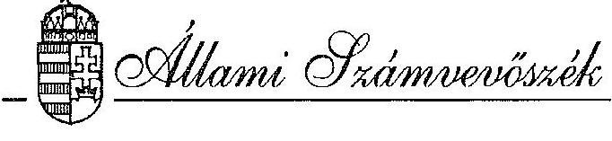
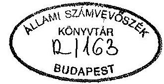
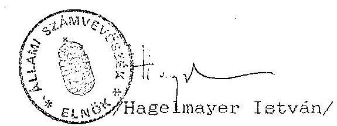

#  

## JELENTÉS

a Szabad Demokraták Szövetsége (SZDSZ)
1991. évi gazdálkodása törvényességének ellenôrzéséról

---

# Az ellenőrzést vezette: 

Dr. Elek János
osztályvezető főtanácsos

## Az ellenőrzést végezték:

Tóth István
Écsy Lajosné
Dr. Szávai Tamás
Bárczai Tibor
Gyarmati Béla
Dr. Ocsovai Sándor
Dr. Velényi János
számvevő tanácsos
számvevő
számvevő tanácsos
szakértő
szakértő
szakértő
szakértő

---

Allami Számvevõszék
$\mathrm{V}-1004-26 / 1993$

# J E L K N T E S 

a Szabad Demokraták Szövetsége
1991. évi gazdálkodása törvényességének ellenôrzésérôl

## I.

A vizsgálat célja, módszere, idôszaka, körülményei

A pártok müködéséröl és gazdálkodásáról szóló - többször módositott - 1989. évi XXXIII. tv. (továbbiakban: párttörvény) 10. 8 (1) bekezdése, valamint az Allami Számvevôszékröl szóló 1989. évi XXXVIII. tv. 5. 8-a alapján a pártok gazdálkodása törvényességének ellenôrzésére az Allami Számvevõszék jogosult. A törvènni felhatalmazás alapján az ellenôrzési tervben rögzitett ütemezésnek megfelelôen került sor a Szabad Demokraták Szövetsége (továbbiakban: SZDSZ) gazdálkodása törvényességének ellenôrzésére.

Az ellenôrzés célja annak megállapítása volt, hogy a párt müködéséhez szabályszerűen igénybevehetô forrásokat használt-e fel, a párttörvényben elôírt gazdálkodó tevékenységet folytatott-e, valamint betartotta-e a gazdalkodással összefüggõ pénzügyi-számviteli szabályokat.

A jelentés az SZDSZ Központi Irodában, az Esztergomi-, a Gyöngyösi-, Miskolci-, Dél-somogyi-, Szolnoki Koordinációs Irodákban, valamint az Esztergomi-, Gyöngyösi-, Ka-posvári-, Miskolci-, Siófoki-, Szolnoki-, Budapest I.,

---

Budapest II. kerületi helyi csoportjainál végzett vizsgálatok - a képviseletre jogosult vezetöknek átadott és általuk észrevételezett - jelentései alapján készült.

Az ellenőrzött időszak 1991. január 1 - 1991. december 31-ig tartó gazdasági év volt. A helyszíni ellenőrzések 1993. március 8 - április 30. között történtek.

Az ellenőrzés módszere szúrópróbaszerú vizsgálat volt, a helyszíneken rendelkezésre bocsátott iratok, dokumentumok alapján, figyelemmel a Magyar Közlöny 1991. évi 28. számában közzétett vizsgálati programra.

# AZ ELLENORZES MEGALLAPITASAI 

## II.

A pénzügyi zárómérleg pontossága és teljeskörüsége

## 1. Altalános megállapítások

Az 1991. évben hatályos párttörvény 9. 8. (1) bekezdése értelmében a pártok kötelesek minden év március 31-ig az előző évi gazdálkodásuk pénzügyi kimutatását a Magyar Közlönyben - a törvényben meghatározott minta szerint közzétenni. E kötelezettségének az SZDSZ eleget tett. (1. sz. melléklet)

A közzétett zárómérleget a Központi Iroda könyvelési adatai, valamint a koordinációs irodák és helyi csoportok beszámolói alapján készítették.

Az ellenőrzés megállapításai szerint az SZDSZ 1991. évi gazdálkodásáról közzétett pénzügyi kimutatás részleteiben és föösszegeiben egyaránt pontatlan. A pontatlanságok a bevételek és a kiadások halmozódásának nem teljeskörü kiszüréséből, valamint a később részletezésre kerülő egyéb hibákból és hiányosságból adódtak. A pénzügyi zárómérleg a vizsgálat részletes megállapításaiban foglaltak miatt nem teljeskörü.

---

Ugyanakkor a zárómérleg tartalmazza több, az SZDSZ által alapított - önálló jogi személy - szervezet gazdálkodási adatait is.

A helyi csoportok és koordinációs irodák által a mérlegkészítéshez a Központi Irodával közölt adatokon az összesités elött bizonylattal alá nem támasztott módosításokat hajtottak végre. Néhány esetben pedig a beszámolót nem a tényleges könyvelés alapján állitották össze. Az ellenőrzés által megvizsgált 13 szervezeti egység közül 11-nek az adatai nem voltak összhangban a könyveléssel és annak alapbizonylataival.

A pénzügyi zárómérleg elkészítése után, de még az ellenőrzés előtt a Központi Iroda könyvelésében önrevízió keretében nagyszámú módosításra került sor. Ezek a módosítások részint a beszámolási rendszerböl adódó halmozódások kiszürésére, részint pedig a könyvelési hibák helyesbítésére irányultak. A módosítások következtében gyakorlatilag - az állami támogatás sor kivételével valamennyi bevételi és kiadási mérlegadat jelentősen megváltozott. A módosítások a föösszegek jelentös mértékủ csökkenését is eredményezték.

# 2. A pénzügyi zárómérleg bevételi oldalát érintő megállapítások 

Az SZDSZ bevételeit - az állami támogatás kivételével a zárómérleg nem tartalmazza teljeskörűen, mivel a mérleg összeállításához a Helyi csoportok egy része nem szolgáltatott adatokat.
2.1. Az ellenőrzés szerint a zárómérlegben feltüntetett tagdíjbevétel az adatot szolgáltató körre vonatkozóan sem tekinthető pontosnak. A pontatlanság oka, hogy a tagdíjbevétel egy részét a helyi és kerületi csoportok a Központi Irodának átutalták, ahol azt tagdij bevételként könyvelték. Ennek a halmozódásnak a kiszürésénél elkövetett számítási hiba következtében 166.071 Ft-tal kisebb összeget vontak le, mint amit kellett volna.

---

2.2. Az SZDSZ a zárómérlegben feltüntetett adatok szerint 1991-ben különbözö jogcímeken összesen 170.983 .590 Ft állami költségvetési támogatást kapott. Ezen összeg magában foglalja a parlamenti frakció müködésére jóváhagyott, az SZDSZ-nek átutalt költségvetési összeget is. A pénzügyi zárómérlegben szereplő összeg megegyezik az SZDSZ könyvelésében szerepiö, ténylegesen átutalt összeggel. Az ASZ azonban továbbra sem tartja a párttörvénnyel összhangban lévőnek ezt a gyakorlatot.
2.3. Egyéb hozzájárulások címen az SZDSZ pénzügyi zárómérlege összesen 4.660 .418 Ft bevételt tartalmaz. Ebben az összegben azonban 1.145 .000 Ft értékben szerepel olyan bevétel - Kincstár Kft. adományozó feltüntetésével, - amelynek eredete és jogcíme nem egyértelmü. Fenti összeget ugyanis az Európai Magyarországért Alapítvány, mint adományt fizette az SZDSZ Egri Koordinációs Irodájának. Az érdekeltek nyilatkozata szerint a fizetés jogcíme a Kincstár Kft-töl szerződés alapján az SZDSZ Egri Koordinációs Irodájának járó költségtérítés, amelyet a rendelkezésre álló dokumentumok szerint a Kincstár Kft. nem fizetett meg.

Nem állapítható meg egyértelmüen a további hozzájárulások adományozók szerinti megbontása sem, tekintettel arra, hogy a könyvelésben nem került sor a zárómérleg tartalmi követelményeinek megfelelő elkülönítésre. A koordinációs irodák és helyi csoportok "Egyéb hozzájárulás" bevétele például szervezet csoportonként egyetlen adat formájában került a könyvelésben rögzítésre.

Mindezek alapján az SZDSZ 1991. évi egyéb hozzájárulás bevételének nagysága és adományozók szerinti bontása a könyvelési adatok alapján nem állapítható meg.

---

2.4. Az SZDSZ propaganda tevékenységbōl származó bevétele a könyvelés szerint 569.779 Ft, szemben a pénzügyi zárómérlegben szereplő 541.923 Ft-os összeggẹl. Az eltérés az önrevízió módosításának eredménye.
2.5. A párt gazdálkodó tevékenységéből származó bevételt a pénzügyi zárómérleg nem tartalmaz. Ugyanakkor az ellenőrzés megállapította, hogy a valóságban az SZDSZ-nek a használatában lévő irodaépületek egy részének étterem és könyvesbolt céljára szerződéssel bérbeadott helyiségei után 687.875 Ft bérleti díj bevétele volt, amit a könyvelés tartalmazott is. Ezt a bevételt az egyéb bevételek között, más bevételekkel összevonva tartalmazza a mérleg.
2.6. Egyéb bevétel címen az SZDSZ pénzügyi zárómérlege 74.506.880 Ft bevételt tartalmaz. Az ellenőrzés megállapításai szerint a könyvelésben az önrevíziót követően csak 12.576.208 Ft egyéb bevétel szerepel. Ez az összeg sem fogadható el, mivel több jogcím esetében a helyi csoportoknál és koordinációs irodáknál figyelembe vett bevétel nagysága kétséges a következõ okok miatt:

- a 30 koordinációs iroda közül 7, a 22 kerületi csoport közül 13 nem jelentett bankkamat bevételt. Ugyanakkor mindegyik szervezetnek bankszámlája van:
- a költségtérítések jogcím alatt nem a tényleges költségtérítést tartalmazza a pénzügyi zárómérleg. Pl. az SZDSZ II. kerületi Csoportja a 158.441 Ft költségtérítést jelzett beszámolójában. Ezt az összeget az összeállításnál nem vették figyelembe.
- Az SZDSZ VIII. kerületi Csoportjának beszámolója költségtérítés címen 180 E Ft bevételt tartalmaz, miközben a pénztárhiány nélkül kimutatott költségeinek összege csak 146.773 Ft volt.

---

- A XXI. kerületi Csoport 146 E Ft költségtérités bevételt mutat ki, miközben az ezzel szembe állítható kiadása csupán 55.211 Ft volt.

3. A pénzügyi zárómérleg kiadási oldalát érintő megállapítások

A bevételekhez hasonlóan a zárómérleg a kiadásokat sem tartalmazza teljeskörüen, hiányos adatszolgáltatás miatt.

A pénzügyi zárómérleg kiadási oldala hibás könyvelés és az összesítés során ki nem szürt halmozódások miatt egyik sorában sem tartalmaz a tényleges állapotnak megfelelő adatokat. Az önrevízió után az egyes kiadási jogcímek összege jelentősen megváltozott. Ennek magyarázata a kiadások többségénél az összes kiadás jelentös csökkenése a mérlegben közzétetthez képest. Néhány kiadási tétel ugyanakkor a könyvelési helyesbitések következtében számottevően növekedett, azonban az önrevízióval módosított könyvelés sem alkalmas az alábbi okok miatt arra, hogy az alapján teljeskörü és pontos mérleget lehessen készíteni:

- Számlarend és részletezõ számítás hiányában nem lehet minden esetben pontosan meghatározni, hogy melyik fôkönyvi számla tartalmát melyik mérlegsor adatának kiszámításánál kell figyelembe venni.
- Hozzájárulás a párt által fenntartott vagy támogatott intézmény számára címen kimutatott 658.418 Ft, az IDE-nek az SZDSZ Ifjúsági Szervezetének 1991. évi összes kiadásával egyenlő. Ebből azonban az ellenőrzés megállapítása szerint csak 480 E Ft az 1991. évi hozzájárulás. A többit az IDE 1990. évi pénzmaradványa fedezte.
- A könyvelésben a MHB-kal szembeni tartozás törlesztéseként szerepeltetik azt a 8000 K Ft kiadást, melyet a

---

bizonylatok szerint az Európai Magyarországért Alapítványnak utaltak át.

- Hozzájárulások juttatása más társadalmi szervezet számára cím alatt a módosított adathoz 70 E Ft külföldi szervezeteknek adott támogatást is beszámítottak. Ugyanezt az összeget a megfelelő mérlegsoron is figyelembe vették.
- Adók, illetékek címen a mérlegnek az SZDSZ belsö döntése szerint az SZDSZ által beszerzett árúk és igénybevett szolgáltatások árában felszámított Afá-t és az egyéb adójellegü kifizetéseket kellene tartalmaznia. Ilyen címen a mérlegben 798.754 Ft kiadás szerepel. Ugyanakkor az SZDSZ könyvelése 4.160 .538 Ft kiadást tartalmaz. Az ellenőrzés megállapítása szerint azonban ez az adat sem tekinthetö pontosnak és teljeskörünek. Az SZDSZ által kifizetett adók, illetékek nagyobbik hányada a mérlegben szereplő többi költség között, azokat torzítva került kimutatásra.
- Egyéb tevékenység költségei címen a könyvelésben 11.949.045 Ft kiadás található. Ez azonban az ellenőrzés megállapítása szerint 3.200 .000 Ft olyan kiadást tartalmaz, amely a helyi csoportok és a koordinációs irodák beszámolója szerint szervezeten belüli kiadást tartalmaz, de azt a központi összesítés során rossz helyre írták.

Az SZDSZ 1991. évi összes kiadása a könyvelési adatok szerint, a bank tartozás törlesztésével együtt 171.606.147 Ft a mérlegben szereplő 215.316 .708 Ft-tal szemben.

# 4. A tényleges pénzügyi helyzet ellenőrzése 

Az SZDSZ tényleges pénzügyi helyzetét, tekintettel arra, hogy a helyi csoportok és koordinációs irodák adatai a Központi Iroda könyvelésébe bekerültek; a Központi Iroda 3. "Pénzügyi elszámolások" fökönyvi számlaosztály egyenleg adatai alapján lehetne megállapítani. A tényleges helyzet megállapítását azonban nehezíti az a körül-

---

mény, hogy a helyi csoportok és a Koordinációs Irodák által közölt adatokba több esetben belejavitottak a könyvelés előtt, valamint a helyi csoportok nem mindegyike szolgáltatott adatot, illetve a közölt adatok egy részéről az ellenőrzés megállapította, hogy nem a tényleges helyzetet tükrözi.

Az önrevízióval módosított könyvelés adatai szerint az SZDSZ 1991. december 31-i halmozott bevételi többlete 34.921 .812 Ft, szemben a közzétett mérlegben szereplő $57.758 .377 \mathrm{Ft}-\mathrm{tal}$.

Tehát az SZDSZ 1991. év végi pénzállománya a könyvelés szerint 22.836 .565 Ft-tal kevesebb a közzétettnél.

A tényleges pénzügyi helyzet azonban a korábban leírt okok miatt a könyvelés alapján sem állapítható meg.

# III. 

Az SZDSZ könyvvitelének, számvitelének
és gazdálkodásának szabályszerűsége

## 1. Az SZDSZ számvitele

### 1.1. A könyvvezetési mód megválasztása

A Központi Iroda 1991. január 1-vel a korábban alkalmazott naplófőkönyv vezetéééről áttért a kettős könyvvitel alkalmazására.

A gazdasági igazgatói körlevél elöírásának megfelelően a bankszámlával rendelkező szervezetekben egyszeres könyvvitelt, a bankszámlával nem rendelkező szervezetekben pedig csak pénztárkönyvet vezetnek. Ez a kialakult gyakorlat és a gazdasági igazgatói körlevél ellentmond a párt Alapszabályában rögzitetteknek. Az Alapszabály elöírásainak megfelelően - az érvényes jogszabályi rendelkezések értelmében - a párt valamennyi szervezetének és területi irodájának minimum naplófőkönyv vezetési kötelezettsége volt a vizsgált idöszakban.

---

A Központi Iroda a könyvelést gépi adatfeldolgozással végzi. Az alkalmazott számlákról számlarendet annak ellenére nem készítettek, hogy azt az 52/1988.(XII.24.)PM rendelet 11. 3-a kötelezöen elöírja.

Az átadott érvényes számlatükör alapján az ellenőrzés megállapította, hogy a Központi Iroda könyvvezetése során jogszabálytól eltérő gyakorlatot folytatnak:

- A koordinációs irodák és a helyi csoportok gazdálkodási adatait a Központi Iroda könyvelésébe év végi feladással bekönyvelték, azoknak önálló főkönyvi számláik vannak. Ez a könyvvezetési mód ellentétes az SZDSZ alapszabályával, amely kimondja, hogy a koordinációs irodák és a helyi csoportok önálló jogi személyek. Az önálló jogi személy szervezeteknek pedig önálló könyvvezetésének kell lennie.
- A Központi Iroda által kialakított könyvviteli rendszerben bírósági bejegyzéssel rendelkező önálló jogi személy szervezetek gazdasági eseményei számára is számlákat nyitottak. Ilyen szervezetek például:
- Alapítvány az Európai Magyarországért,
- Onkormányzati Akadémia, a Magyarországí

Kormányzati Alapítvány Intézménye,

- Onkormányzati Iroda,
- IDE, az SZDSZ Ifjúsági Szervezete.

E szervezetek kiadásait az SZDSZ gyakran megelölegezte, majd az egyenleget késöbb elszámolták.

Az IDE esetében különösen a koordinációs irodáknál, ahol nem alakították ki az IDE számára az önálló pénzkezelő helyeket, a pénzek a párt pénzekkel keveredtek és gyakran a pénzfelhasználás, az elszámoltatás nyomonkövethetetlenné vált.

Ez a gyakorlat ellentmond a könyvvitel rendjéről szóló rendelet előirásának, amely kimondja, hogy

---

minden jogi személyiséggel rendelkező szervezet köteles önálló könyvvezetést folytatni.

A szabálytalan könyvvezetési gyakorlatot az IDE, az SZDSZ Ifjúsági Szervezete kivételével megszüntették. Annak gazdasági eseményei, készpénz kifizetései jelenleg is a Központi Iroda könyvvitelén keresztül bonyolódnak.

# 1.2. A könyvvezetés pontossága 

A/ A Központi Iroda könyvvezetése
Az ellenőrzés megállapítása szerint számlarend hiányában egyes számlák tartalma nem világos és egyértelmü, ezért a lekönyvelt tételekben év végén téves könyvelés miatt többszáz módosítást kellett végrehajtani.

A könyvviteli számlák számát és megnevezését tartalmazó számlatükör felépítése nem megfelelő. A kijelölt fơkönyvi számlák számjelének további tagolásával nem biztosították a könyvelés áttekinthetőségét. Igy pl. az alszámlák többségénél hiányzik a kijelölt összesitő számla.

A Központi Iroda könyvelése nem volt folyamatos. Az 1991. évi nyitótételeket csak a II. negyedév végén könyvelték, de az évközi forgalom könyvelése is több esetben nem idősorrendben történt.

Az évközben előfordult téves könyveléseket év végén igyekeztek helyesbíteni és akkor többszáz helyesbitő tételt könyveltek. Azonban az erre vonatkozó feladások egyáltalán nem felelnek meg a számviteli rend és fegyelem követelményeinek. Szöveg és bizonylat hiányában az eredeti - téves - könyvelés idópontja, a helyesbités jogcíme és indokoltsága nem állapítható meg.

A koordinációs irodák és a helyi csoportok által benyújtott éves pénzügyi beszámolókat a tárgyévet

---

követõ negyedévben összesítették és az összesítések adatait a Központi Iroda könyvelésében utólagosan lekönyvelték. A jelentetett adatokat azonban nem ellenőrizték, illetve azoknál a tételeknél, ahol egyeztetésre mód volt a Központi Iroda által kimutatott és a szervezet által jelentett összeg közötti eltérést megállapították, de az eltérés okait és a helyes összeget már nem állapították meg. Más esetekben pedig a jelentett adatokat könyvelés elött - bizonylati alátámasztás nélkül - önkényesen módosították.

Központi Irodai eligazítás hiányában minden szervezet saját elképzelése alapján sorolta az egyes bevételeket és kiadásokat az általa helyesnek ítélt bevételi, illetve kiadási fajtába.

Az 1991. december 31-i leltározásról készítettek ugyan leltározási utasítást, de az eszközállományok leltárát nem tudták az ellenőrzésnek bemutatni.

A leltározási utasításról megállapította az ellenőrzés, hogy az végrehajtása esetén sem eredményezhetett volna használható leltárokat, mert számtalan - a leltározás végrehajtására vonatkozó - kérdést nem szabályozott.

# B/ A koordinációs irodák és helyi csoportok 

## könyvvezetése

A koordinációs irodák és helyi csoportok által alkalmazott naplófőkönyv, illetve pénztárkönyv vezetés az esetek többségében nem tette lehetővé a bevételeknek és a kiadásoknak a pénzügyi zárómérleg soraival összhangban lévő nyilvántartását. Emellett a könyvvezetés során több eseben eltértek a könyvvitel rendjére vonatkozó jogszabályi elöírásoktól.

Jelentősebb hiányosságok a következök:

- A szervezet keretében müködő klubnak átadott pénzt kiadásokként könyvelték, azzal a klubot nem számoltatták el;

---

- a naplófôkönyvben a negyedéves zárásokat nem hajtották végre:a gazdasági eseményeket gyakran nem idősorrendben könyvelték;
- a naplófôkönyv a szervezet keretében müködô klub bevételeit és kiadásait nem tartalmazza;
- idegen kiadási bizonylat alapján könyveltek.

A felsorolt hiányosságok miatt sem a Központi Iroda, sem a szervezetek könyvelése nem szolgáltatott és szolgáltathatott megbízható, pontos adatokat az éves pénzügyi zárómérleg összeállításához.
2. Az analítikus nyilvántartások, a bizonylati rend és az egyéb elszámolási szabályok ellenôrzése az SZDSZ Központi Irodájánál
2.1. A koordinációs irodák és a helyi csoportok a tartós fogyóeszközökrôl és a tagdijakról vezetnek részletes analítikát. Esetenként még a szigorú számadású nyomtatványok nyilvántartását vezetik.

A Központi Irodában az állóeszközökrôl és a tartós fogyóeszközökrôl nem vezettek nyilvántartást. Az egyéb analítikus nyilvántartásokat vezették.
2.2. Az SZDSZ az általa használt szigorú számadású nyomtatványok körét Ugyviteli Szabályzatban meghatározta. Az ellenôrzés által vizsgált 13 koordinációs iroda és helyi csoport közül 8 nem vezetett elöirásszerủ nyilvántartást a szigorú számadású bizonylatokról.

A Szabályzatban meghatározott szigorú számadású nyomtatványokról a Központi Iroda számadást vezet, amelyben nyilvántartja az érintett nyomtatványokat. A bemutatott számadás az ellenôrzés megállapítása szerint a számvitel bizonylati rendjéről szóló 53/1988.(XII.24.)PM sz. rendelet elöirásainak nem felel meg.

---

(Pl. a számadás különálló lapokból áll, azok nincsenek összefüzve és hiteľesitve; számos esetben a bevezetett nyomtatványok sorszámait - föként a kiadási pénztárbizonylatoknál - úgy javitották, hogy a sorszámokat áthúzás és az új szám föléirása helyett átírták, anélkül, hogy a javítást végzõ aláírta volna; egy kiadási pénztárbizonylati tömböt két esetben is kiadtak. Elöfordult olyan eset is, hogy a számadás szerint a kérdéses kiadási tömböt nem adták ki, ennek ellenére azt 1991. július 26-tól július 31-ig terjedő idötartam alatt felhasználták.)
2.3. A Központi Iroda házipénztárára vonatkozó rendelkezéseket az 1991. évben készített Ugyvitelii Szabályzat tartalmazza. 1991. évben több esetben volt a pénztáros személyében változás - 1991.02.08, 1991.02.11, 1991.05.08. stb. - azonban a pénztárnaplóban az átadásokról írásbeli átadást nem talált az ellenőrzés, annak ellenére, hogy azt az Ugyviteli Szabályzat kötelezően elöírja.

Az 1991. évre vonatkozó pénztárnaplóban a pénztár ellenőrzésére utaló írásbeli bejegyzést nem talált az ellenőrzés, annak ellenére, hogy azt az Ugyviteli Szabályzat fökönyvelői feladatként előírja.
2.4. A pénztárbizonylatok kiállítása során a koordinációs irodáknál és a helyi csoportoknál gyakran nem tartották be a számvitel bizonylati rendjére vonatkozó előírásokat. A legjellemzőbb hiányosságok a következök:

- a bizonylatokról gyakran hiányzik az utalványozó és a pénzfelvevõ, illetve a befizető aláírása;
- egyes helyeken a kiadásokról nem állítottak ki kiadási pénztárbizonylatot;
- kiadási pénztárbizonylaton a felvételre jogosult neve helyett a bizonylat kiállításának alapjául szolgáló bizonylat kiállítójának nevét tüntették fel. Ezáltal a felvételre jogosult személye ismeretlen;

---

- a bizonylatokról esetenként hiányzik a kiállító neve és címe;
- az I. kerületben ugyanarról a pénzügyi eseményröl 2 bizonylatot állítottak ki;
- kifizetésre esetenként azt alátámasztó alapbizonylat csatolása nélkül kerül sor;
- több szervezetnél az utalványozási rendet nem szabályozták;
- a vizsgált 13 szervezet egyike sem rendelkezett az alapszabályban kötelezöen elöirt Szervezeti és Müködési Szabályzattal.

A Központi Irodában pénztárbizonylatok kiállítását általában a bizonylati fegyelem betartásával végezték. Egyes esetekben a pénztári bizonylatokon történtek olyan javítások, amelyeket nem a bizonylati fegyelem figyelembevételével végeztek.

A készpénzfelvételi utalvány töszelvényén az átvevö nem minden esetben tüntette fel a nevét. Ennek hiányában több esetben nem állapítható meg az átvevö személye.
2.5. A Központi Irodánál az eseti megbízások alapján kifizetésre kerülő munkabérekkel kapcsolatban megállapította az ellenőrzés, hogy a kiadási pénztárbizonylatok mellett a legtöbb esetben a kifizetés elbírálhatóságát biztosító megállapodás, illetve munkaszerződés nincsen csatolva, de még utalás sem történik erre.
2.6. Az Elszámolási előlegek analitikus nyilvántartása a Központi Irodában a bizonylati rend és okmányfegyelem követelményeinek nem felel meg. Az a fökönyvi könyveléssel nem egyeztethető. A többi vizsgált szervezeti egységnél az ellenőrzés nem találkozott elszámolási előlegek analitikus nyilvántartásával.

---

2.7. A gépkocsi használatáért járó költségtérítések elszámolásánál a Szervezet általában az ide vonatkozó 6/1990.(XI.17.)KHVM sz., valamint a 9/1991.(V.16.)KHVM sz. rendeletekben elöirtak figyelembevételére törekedett, azonban több rendelettel ellentétes gyakorlatot is tapasztalt az ellenörzés.

A rendeletekben elöírt normatívák betartása érdekében nyilvántartást vezetnek a saját gépkocsi használatára jogosultakról, feltüntetve a gépkocsik forgalmi rendszámát és az alkalmazható norma mennyiségét. Ez utóbbi adat változásakor a korábbi norma mennyiségét áthúzva jegyzik be az újabb normatívát, anélkül, hogy a hatálybalépés idöpontját feltüntették volna. Ennek hiányában a költségtérítések elszámolásakor az ellenőrzésnek gondot jelent megállapítani a jogszerűen elszámolható mennyiséget, különös tekintettel azon körülményre, hogy számos esetben több hónapra visszamenőleg került sor elszámolásra.

Az ellenőrzés több esetben tapasztalta, hogy a gépkocsi költségtérítések elszámolásánál a számfejtések alkalmával nem fordítottak kellö gondot a teljesítmények igazolásának a meglétére.

A hivatkozott hatályos rendeletek ugyan nem teszik lehetővé, ennek ellenére több esetben a benzin ellenértékét - menetlevél csatolása nélkül - számla alapján számolták el és fizették ki a gépkocsit igénybevevőnek.

A saját gépkocsi használatáért elszámolható költségtérítések kifizetésével kapcsolatban megállapította az ellenőrzés, hogy a benyújtott kiküldetési rendelvények, valamint a csatolt költségelszámolások számfejtésénél, azok ellenőrzésénél, a teljesítmények igazolásának a megkövetelésénél a Központi Iroda nem járt el minden esetben a megkívánt gondossággal. Ugyanez a megállapítás vonatkozik az utalványozásra is.

---

2.8. Az SZDSZ utazási devizakeretéből a Magyar Külkereskedelmi Bank 1991. év végi elszámolási listája szerint 522.029 Ft értékú devizát használtak fel. A keretböl megmaradt 5.702 .835 Ft , tehát a lehetőségnél kevesebb mint $10 \%$-ot vettek igénybe.

A külföldi utazásokhoz a bankból igényelt devizakeretet a Ft-ban felmerült költségekkel együtt könyvelték a külföldi úti- és kiküldetési költségek megnevezésű számlákon. A vásárolt devizákról vezetett elszámolási számlát évközben megszüntették. A banki elszámolásokkal egyező könyvelést csak külön kigyűjtéssel lehet ellenőrizni. Megfelelő analitika hiányában a vásárolt devizákról a tényleges felhasználás és esetenként a visszafizetés teljesítése nem követhető nyomon.

Önrevízió keretében igyekeztek a devizák nyilvántartására megoldást találni úgy, hogy a banki elszámolásokhoz csatolták a meglévő bizonylatokat. Kimutatásba foglalták a kiküldetés adatait, valamint az igényelt és visszafizetett devizák összegeit. A kimutatásból is megismerhetők az egyenként megállapított általános hiányosságok, rendellenességek.

A hibák keletkezésének alapvető oka volt, hogy a 29/1990.(XII.27.)PM rendeletben kötelezövé tett "külföldi kiküldetési utasítás és költségelszámolás" szabvány-nyomtatvány elöirásszerü használatát nem követelték meg. Általában hiányos volt a nyomtatványok kitöltése, aláírása.

A napidíjakat az összeghatáron belül számolták el. Az esetek többségében a napidíjak a megengedhető mértéknek legfeljebb 40-50 \%-át érték el. Az elszámolható költségek mértékét a rendeletben elöirt szabályzatban még nem határozták meg.

A számviteli előírások alapján kötelezö a pénztárban a külföldi fizetési eszközöket elkülönítve

---

nyilvántartani. Mégsem vezettek valutapénztári nyilvántartást. Ezért a valuta pénzforgalom helyességét nem lehetett ellenőrizni.

# IV. 

Az SZDSZ gazdálkodó tevékenységének vizsgálata a párttörvény 6. szakasza alapján

1. Az SZDSZ 1991-ben a párttörvény által engedélyezett gazdálkodó tevékenységek közül a jelvény és póló mint a pártot propagáló termékek - értékesitésével foglalkozott. Az ebből származó bevételt a könyvelésben nyilvántartják és a mérleg megfelelő sorában is szerepeltetik.
2. Az ellenőrzés megállapította, hogy a Központi Irodának az SZDSZ tulajdonában nem lévő ingatlanának étterem és könyvesbolt céljára történő bérbeadásából 1991-ben 687.875 Ft bevétele volt. Ezzel a Központi Iroda megcértette a párttörvény 6. 8 (1) bekezdés b/ pontját, amely a pártnak csak a tulajdonában álló ingatlan dí ellenében történő hasznosítását engedélyezi.

Tekintettel azonban arra, hogy az ingatlan 1992-töl a párttörvény módosításának eredményeként - az SZDSZ tulajdonába került, valamint, hogy a tiltott gazdalkodásnak a vizsgált időszakban nem volt szankciója, intézkedés kezdeményezése az ügyben nem szükséges.
3. Az SZDSZ 1991-ben 1 db egyszemélyes kft-t alapitott, de még ugyanabban az évben meg is szüntette, igy abból bevétele nem származott.
4. A gazdálkodó tevékenységet alátámasztó dokumentumokat az ellenőrzés rendelkezésére bocsátották.

---

# V. 

Az előző vizsgálat során megállapított hibák, hiányosságok kijavítására tett intézkedések ellenőrzése

1. Az előző ÁSZ vizsgálat a megállapított hibák, hiányosságok megszüntetésére - azok súlyosságánál fogva - felhívással élt. Ebben az alábbiak korrekciójára hívta fel a párt elnökét.
a/ Az SZDSZ 1990. évi gazdálkodásáról készített pénzügyi zárómérleg a teljeskörüség hiánya, tartalmi torzítások, pontatlanságok és a valós helyzettól eltérő adatközlés miatt nem volt elfogadható.

Az ellenőrzés felhívta az SZDSZ-t

- a naplófőkönyv és a területi adatszolgáltatás helyesbítésére,
- a pénzügyi zárómérleg újbóli elkészitésére és ismételt megjelentetésére.
b/ A deviza számlák forgalmának Ft összege - az analitikus nyilvántartás és könyvelés hiányában nem volt megállapítható. Ezért a felhívás a devizabetétszámlák tételes forgalmának kimutatását és a zárómérlegben való figyelembevételét írta elő.
c/ Az ellenőrzés során 7690 USD és 9758 DM értékú számitás-technikai berendezések bekerülési jogcíme - beszerzés és/vagy ajándékozás - nem volt megállapítható. Ezért az ellenőrzés felszólította a pártot fentiek tisztázására és a tényleges helyzet hiteltérdemlő tanúsítására.
d/ Az ellenőrzés idején nem tisztázták 150.000 DKM és 500 E Ft adományozóinak személyét, ezért fenti összegeket névtelen adománynak minösítette az ellenőrzés és felszólította a pártot a párttörvény 4. 8 (3) bekezdése szerinti eljárásra.

---

Tekintettel arra, hogy a felhíváshoz megkívánt intézkedések végrehajtása és végrehajtatása a Központi Iroda feladatkörébe tartozott, azok eredményét is itt vizsgálta az ellenőrzés.
2. A felhívásra tett intézkedésekkel kapcsolatban az ellenőrzés megállapításai az alábbiak:
a/ Az SZDSZ az 1990. évi átdolgozott pénzügyi zárómérleget 1992. június 29-én, a Magyar Közlöny 69. számában ismételten közzétette.

Az ellenőrzés megállapította, hogy a felhívásban szereplő korrekciók egy részét elvégezték. Az átdolgozott pénzügyi zárómérleg tartalmát tekintve azonban jelenleg sem felel meg a követelményeknek, mert változatlanul pontatlan adatokat tartalmaz és nem tekinthető teljeskörünek sem.

A zárómérleg ismételt felülvizsgálata során az ellenőrzés megállapította, hogya hibás adatok egy részét kijavították, illetve a hiányzó adatokat pótolták.

Az ellenőrzés rendelkezésére bocsátott összesitő kimutatás tartalmazza a pénzügyi zárómérleg sorainak megfelelő̉ bontásban a bevételeket és kiadásokat. Ezeknek az összesített adatoknak a központi könyveléssel történő egyeztetését a vizsgálat csak részben tudta elvégezni, mivel a kiadások jogcímenkénti bontását a naplófôkönyv adataiból a jelen vizsgálat során sem lehetett megállapítani.

Az SZDSZ ismételten megjelentetett 1990. évi pénzügyi zárómérlege átdolgozott formájában sem tükrözi teljeskörüen és pontosan a párt gazdálkodásának tényleges adatait.
b/ A devizaszámlák 1990. évi forgalmát - az MHB-tól kért nyilvántartás másolatának alapján - devizában és Ft-ban teljeskörüen elkönyvelték és a zárómérleg megfelelő̉ sorain kimutatták.

---

c/ Továbbra is rendezetlen maradt a számítástechnikai berendezések bekerülési jogcímének tanúsítása, a törvényességnek megfelelő helyzet helyreállítása.

A meglévő iratokból az állapítható meg, hogy a szóban forgó két küldeményt 1990. március 2-án vámkezeltették. A Vám- és Pénzügyőrség Országos Parancsnokságával pedig 1990. április 27 -én kelt levelükben közölték azt, hogy a küldemények külföldi társadalmi szervezet (National Institute for International Affairs, USA) ajándékai a párt részére és azok a 39/1976.(XI.10.)PM-KkM együttes rendelet 75. 3 (2) bekezdése alapján vámmentesek. E szervezettől 1990. február 20-án kelt ajándékozásról szóló levéllel rendelkeznek.

A küldemények értékét a Vám- és Pénzügyőrség Országos Parancsnokságának írt levélben és az ajándékozó levélben foglaltakkal ellentétesen az SZDSZ már korábban átutalta a szállítóknak.

A vétel vagy ajándékozás kérdésének eldöntéséhez 1992. február 27 -én kelt észrevételében az SZDSZ elnöke adott magyarázatot. E szerint az eszközök értékfedezete egy-egy nagyobb összegen belül célzott volt a párt infrastruktúrájának kialakítására, ezért ezt eredete szerint és eszközében is ajándékként kezelték. A 39/1976.(XI.10.)PM-KkM együttes rendelet 75. 8 (2) bekezdésében foglaltak szerint azonban vámmentességet csak a külföldi társadalmi szervezet által magyar társadalmi szervezet részére küldött ajándékok élveznek. Ebben az esetben pedig az eszközöket nem a külföldi társadalmi szervezet küldte, hanem a tőle kapott pénzadományból vásárolták meg.

Fentiekre való tekintettel az ASZ kezdeményezte a Vám- és Pénzügyőrség Országos Parancsnoksága véleményének kikérését, az úgy tisztázása érdekében.

---

d/ A névtelen adományokat a párt elnökének 1992. február 20-án kelt észrevétele mellé csatolt adományozó levelekkel nevesítették. A 150.000 DM-ről szóló adományozó nyilatkozatot 1992. február 20-án telefaxon megküldték a párt részére. Az 500 E Ft összeg 1992. február 20-i keltezésü adományozó levéllel szintén igazolást nyert.

# VI. 

## Összefoglaló megállapítások, felhívás a szükséges intézkedések megtételére

Az ellenőrzés az 1991. évi gazdálkodás törvényességének vizsgálata során számtalan mérlegkészítési, könyvviteli és egyéb hiányosságot állapított meg. Ezen hiányosságok zöme - ismétlődő - megegyezik az 1990. évi gazdálkodás vizsgálata során megállapítottakkal. A hiányosságok azonban még az előző jelentés elkészülte előtt történtek.

Erre, valamint arra való tekintettel, hogy az 1992-ben hivatalba lépett új vezetés menetközben már több intézkedést tett a hiányosságok kiküszöbölésére (pl. önrevízió, új szervezeti struktúra) és hogy a jogi szabályozásban időközben több változás történt, személyi felelősségre vonás kezdeményezését az ellenőrzés nem tartja szükségesnek.

Az ismétlődő szabálytalanságokra is tekintettel azonban a párttörvény 10. 8 (4) bekezdésében kapott felhatalmaalzás apján az ASZ felhívja a párt elnökét, hogy:

- az SZDSZ 1991. évi gazdálkodásáról a pénzügyi zárómérleget ismételten készíttesse el és a Magyar Közlönyben tegye közzé;

---

- az SZDSZ könyvviteli és számviteli gyakorlatát szabályozza úgy, hogy az feleljen meg a párt Alapszabálya és az 1991. évi XVIII. törvény elöírásainak;
- az ideiglenes külföldi kiküldetést teljesitők költségtérítéséröl szóló rendelet elöírásait maradéktalanul tartassa be;
- saját gépjármú hivatalos célú használatáért járó költségtérítésről szóló rendelet elöírásait maradéktalanul tartassa be, és gondoskodjon a betartás ellenőrizhetőségéről;

Budapest, 1993. augusztus 4.

Melléklet: 1 db

---

## A Szabad Demokruták Szövetségének 1991. évi pénzügyi zárómérlege

Forintban
A) Tényleges bevételek

1. Tagdijak
8661601
2. Állami költségvetésbő́l származó támogatás
$\begin{array}{ll}\text { ebből parlamenti frakció kerete } & 170983590 \\ & 24823869\end{array}$
2. összesen
170983590
3. Egyéb hozzájárulás
a) jogi személyektől
ebből 500000 Ft feletti hozzájárulás a következố belföldiektől:

- Kincstár Kft.

1145000
ebből 100000 Ft feletti értéknek megfelelő osszeg a következố külföldiektől:

- Niederlandische Middenstandsbank
b) jogi személynek nem minősülő gazdasági társaságról
c) .magán személyektől

2494352
3. összesen

4660418
4. A párt propagandatevékenységéből

541923
5. A párt gazdálkodó tevékenységéből
6. A párt által alapított vállalatok és kft. nyereségéből származó bevétel
7. Egyéb bevételek

- bankkamatok

3020636

- kedvezményes kereskedelmi akciók
támogatásának visszatérülése
- költségtérítések
- kft. törzstőkekivonás
- különféle elszámolási bev.
- nevesítés nélküli egyéb

7. összesen

74506882
Összes bevétel a.gazdasági évben
259354414

1. Hozzájárulások juttatása
a) a párt országgyúlési csoportja számára
b) a párt helyi szervei számára
c) a párt által fenntartott, vagy támogatott intézmények számára
d) más társadalmi szervezetek számára
e) külföldi intézmények, szervezetek, személyek számára

1. összesen

47657688
2. Személyzeti költségek
a) munkabérek
34464208
b) költségtéritések, napidijak
13425767
c) társadalombiztosítási hozzájárulás
17594455
d) szociális, üdülési támogatások
869503
2. összesen

66353933
3. Általános költségek
a) adók, illetékek
798754
b) épületek fenntartása, karbantartása, közüzemi díj
23436856
c) helyiségek bérlete
8871678
d) adminisztrációs és postaköltségek
21749454
e) különféle egyéb költségek
9084895
3. összesen

63941638
4. Sajtó- és propagandaköltségek

8611947
5. Választásokkal kapcsolatos költségek (időközi választások, önkormányzati választás áthúzódó költségei)

2526699
6. Egyéb tevékenységgel kapcsolatos költségek

- hitelvisszafizetés
10000000
- különféle elszámolási kiadások

16224803
6. összesen

26224803
Összes kiadás a gazdasági évben
215316708
C) Tényleges pénzügyi helyzat a gazdasági év zárásakor

Bevételek a gazdasági évben
259354414
Kiadások a gazdasági évben
215316708
Többlet a gazdasági évben
44037706
Halmozott többlet az elózó gazdasági évböl
13720671
Halmozott többlet a gazdasági év végén
57758377
Váróczi Andor s. k., Horátski Ilona s. k., igazgató
tökönnyveió