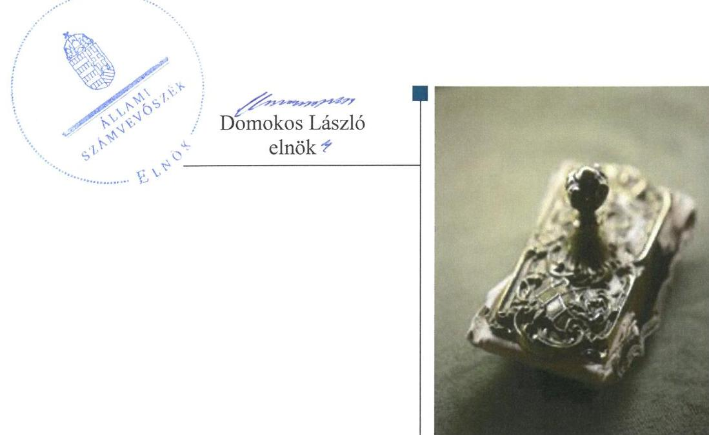

# Jelentés 

## Önkormányzati adósságrendezés ellenőrzése

Gönc Város Önkormányzata adósságrendezési eljárásának ellenőrzése 2016.

---

# Jelentés 

## Önkormányzati adósságrendezés ellenőrzése

Gönc Város Önkormányzata adósságrendezési eljárásának ellenőrzése 2016. 12. hó 01. nap

---

# AZ ELLENŐRZÉST FELÜGYELTE:

- RENKŐ ZSUZSANNA felügyeleti vezető
- AZ ELLENŐRZÉST VEZETTE ÉS A VÉGREHAJTÁSÁÉRT FELELŐS:
  - BAJNAI ZSUZSANNA ellenőrzésvezető
  - A PROGRAM ÖSSZEÁLLÍTÁSÁÉRT FELELŐS:
    - JANIK JÓZSEF LÁSZLÓ osztályvezető

**IKTATÓSZÁM:** V-1009-103/2016

**TÉMASZÁM:** 2043

**ELLENŐRZÉS-AZONOSÍTÓ SZÁM:** V073906

Jelentéseink az Országgyűlés számítógépes hálózatán és az Interneten a www.asz.hu címen is olvashatóak.

---

# TARTALOMJEGYZÉK 

■ ÖSSZEGZÉS ..... 5
■ AZ ELLENŐRZÉS CÉLJA ..... 6
■ AZ ELLENŐRZÉS TERÜLETE ..... 7
■ AZ ELLENŐRZÉS HÁTTERE, INDOKOLTSÁGA ..... 8
■ A JELENTÉS LÉNYEGES KÉRDÉSKÖREI ..... 9
■ ELLENŐRZÉS HATÓKÖRE ÉS MÓDSZEREI ..... 10
■ MEGÁLLAPÍTÁSOK ..... 12
■ JAVASLATOK ..... 23
■ MELLÉKLETEK ..... 25
I. sz. melléklet: Értelmező szótár ..... 25
II. sz. melléklet: Az eszközök és források alakulása kiemelt mérlegsoronként ..... 28
III. sz. melléklet: Bevételek és kiadások, adósságszolgálat CLF módszer szerinti kimutatása ..... 29
■ FÜGGELÉK: ÉSZREVÉTELEK ..... 31
■ RÖVIDÍTÉSEK JEGYZÉKE ..... 33

---

.

---

# ÖSSZEGZÉS 

Gönc Város Önkormányzata adósságrendezési eljárásának végrehajtása során a polgármesterek, a jegyző és a pénzügyi gondnok nem szabályszerű feladatellátása veszélyeztette az adósságrendezés céljainak elérését, mindamellett, hogy a hitelezői követeléseket kielégítették. A fizetőképesség fenntarthatósága nem volt megállapítható. A pénzügyi egyensúly az adósságrendezést követően biztosított volt, a folyó bevételek fedezték a folyó kiadásokat.

## Az ellenőrzés társadalmi indokoltsága

Pénzügyi egyensúlyi helyzetének, fizetőképességének megromlása miatt Gönc Város Önkormányzatánál 2011. április 8-tól 2011. november 29-ig adósságrendezés folyt, amely során a hitelezők 1110,1 millió Ft kötelezettség teljesítésére nyújtottak be igényt. Ez a kötelezettségállomány az önkormányzat vagyonának több mint háromnegyedét jelentette, így indokolt ellenőrizni, hogy az adósságrendezési eljárás elérte-e a célját, az eljárás szereplői eleget tettek-e törvényben meghatározott feladataiknak a fizetőképesség helyreállítása, a hitelezőknek hatékony jogvédelem nyújtása és az átgondolt, felelősségteljes gazdálkodás elősegítése érdekében.

## Főbb megállapítások, következtetések, javaslatok

Az adósságrendezési eljárás szabálytalan végrehajtása veszélyeztette az eljárás céljainak elérését. Az adósságrendezés megindításakor nem tisztázták az önkormányzat valós vagyoni helyzetét, mert nem vették számba vagyonát, nem zárták le a számviteli nyilvántartásokat. Nem tárták fel az adósságrendezési eljárás megindításához vezető okokat, így azok tudatos kezelésére sem kerülhetett sor. A pénzügyi gondnok nem kísérte figyelemmel az önkormányzat gazdálkodását, feladatainak ellátását, a válságköltségvetés időszakában kifizetések szabálytalanul, a pénzügyi gondnok ellenjegyzése nélkül történtek. A hitelezőkkel megkötött egyezség a benyújtott igények 66,3%-át tartalmazta, melyek 99,9%-át az önkormányzat saját forrásból, állami segítség nélkül rendezte.

A fizetőképesség nem volt értékelhető az ellenőrzés által feltárt a 2011-2012. évi költségvetési beszámolók kötelezettségek sorát érintő jelentős összegű hiba miatt. Az önkormányzat elismert tartozását az érintett években nem könyvelte le, illetve nem a valós összegben szerepeltette mérlegében. A 2013. évi beszámoló az említett hibát már nem tartalmazta, ennek következtében likviditási helyzete értékelhetővé vált, és megállapítható volt, hogy fizetőképessége nem állt fenn. A 2014. évben állami támogatás felhasználásával kötelezettségeit rendezte, adósságállománya csökkent, fizetőképessége ekkor állt helyre.

A pénzügyi egyensúly helyreállítása érdekében az önkormányzat reorganizációs programot fogadott el, bevételnövelő és kiadáscsökkentő intézkedéseket tett. A 2011. évtől kezdődően az Önkormányzat működési bevételei fedezték a működési kiadásait, így pénzügyi egyensúlya biztosított volt.

---

# AZ ELLENŐRZÉS CÉLJA 

Az ellenőrzés célja annak megállapítása, hogy az adósságrendezési eljárás megindítása, lefolytatása szabályszerű volt-e, az önkormányzat gazdálkodása az adósságrendezési eljárás alatt megfelelt-e a jogszabályi előírásoknak; az eljárás szereplői - kiemelten a pénzügyi gondnok - a jogszabályokban foglaltak szerint jártak-e el az adósságrendezés során. A lefolytatott eljárás elérte-e a törvényben kitűzött célokat; az önkormányzat teljesítette-e kötelező feladatait, a hitelezők követelését vagyonarányosan kielégítette-e, helyreállt-e fizetőképessége.

---

# AZ ELLENŐRZÉS TERÜLETE 

## Gönc Város Önkormányzata

Gönc Borsod-Abaúj-Zemplén megyében helyezkedik el. Állandó lakosainak száma 2009. január 1-jén 2289 fő, 2015. június 30-án 2102 fő volt.

Az önkormányzat ${ }^{1}$ képviselő-testülete ${ }^{2}$ 2009-ben tíz fővel, három állandó bizottsággal, 2015-ben hét fővel, két állandó bizottsággal látta el feladatát. A polgármester személye kétszer, a jegyzőé 2009. december 1-jén változott az ellenőrzött időszakban.

Az önkormányzat által fenntartott költségvetési szervek száma 2009. január 1-jétől 2015. június 30-ra négyről háromra csökkent.

A gazdálkodási feladatokat az elkülönített gazdasági szervezettel nem rendelkező polgármesteri hivatal ${ }^{3}$ látta el, amely 2013. január 1-jétől Abaújvár Község Önkormányzatával közös hivatallá ${ }^{4}$ alakult a képviselő-testületek döntése alapján.

A polgármesteri hivatalnál a 2009. évről a 2015. évre a foglalkoztatott köztisztviselők száma 22 főről 15 főre csökkent, az Mt. ${ }^{5}$ hatálya alá tartozók létszáma - két fő - nem változott. Közalkalmazotti jogviszonyban 2009-ben nem foglalkoztattak dolgozót, 2015-ben egy főt. Az önkormányzat 2009-ben kettő, 2015. június 30-án egy minősített többségi tulajdonú gazdasági társaságban rendelkezett üzletrésszel.

Az önkormányzat adósságrendezési eljárását 2011. március 8-án a képviselő-testület döntése alapján a polgármester kezdeményezte, az önkormányzat nagy összegű, beruházásokhoz kapcsolódó adósságállományára hivatkozva. A bíróság végzése az adósságrendezés megindításáról 2011. április 8-án jelent meg a Cégközlönyben. Az adósságrendezés 2011. november 29-én egyezséggel zárult.

A pénzügyi gondnoki feladatok ellátására a bíróság a Mátraholding Zrt.-t ${ }^{6}$ jelölte ki. A Mátraholding Zrt. 2014-ben kikerült a pénzügyi gondnokok névjegyzékéből.

---

# AZ ELLENŐRZÉS HÁTTERE, INDOKOLTSÁGA 

Az önkormányzatok finanszírozásának, gazdálkodásának keretei és feladatellátása jelentős változásokon ment keresztül a Har. tv. ${ }^{7}$ hatályba lépésétől eltelt időszakban.

Az önkormányzati eladósodást 2011-ig csak az Ötv.-ben ${ }^{8}$ meghatározott hitelfelvételi korlát szabályozta, a korlát megsértését azonban jogszabályok nem szankcionálták. A 2012. évtől jelentős szigorítás lépett életbe, a korábbi passzív szabályozást a Stabilitási tv. ${ }^{9}$ hatályba lépésével az aktív kontroll váltotta fel, a törvény előírásai alapján az önkormányzatok hitelfelvételei engedélykötelessé váltak.

1996-ban a hitelfelvételi korlát bevezetése mellett az önkormányzatok adósságrendezésének szabályozására is sor került. Az adósságrendezési eljárás részben a lakosság védelmét szolgálta azzal, hogy biztosította az önkormányzatok által nyújtott kötelező közfeladatokhoz való hozzájutást az önkormányzat fizetésképtelensége esetén is. A Har. tv. alapján - 1996 és 2013 júniusa között - ugyanakkor elenyésző számú, mindösszesen 64 adósságrendezési eljárás indult. Az eljárások közel 60%-a egyezséggel, 40%-a vagyonfelosztással zárult. Az adósságrendezés első időszakában (2009. évig) a forráshiányból eredeztethető eladósodás tette indokolttá az eljárások jelentős hányadának megindítását.

A második időszakban az eljárás alá vont önkormányzatok között megjelentek a nagyobb költségvetéssel és több intézménnyel is rendelkező települések. Az adósságrendezést szükségessé tevő problémák speciális pénzügyi elemekkel, a devizaalapú kötvénnyel történő finanszírozás begyűrűző hatásaival, valamint az anyagi lehetőségeket meghaladó, túlméretezett fejlesztésekkel összefüggő kötelezettségvállalásokkal egészültek ki, de a beruházások esetében fontos tényező volt a kellő szakértelem hiánya és a pénzügyi nehézségek szakszerűtlen kezelése is.

Az ÁSZ ${ }^{10}$ önkormányzati alrendszert érintő ellenőrzései, elemzései során számos ponton mutatott rá azokra a területekre, ahol a „szabályozás" módosításra, korrekcióra szorul. Az ellenőrzés alapján megfogalmazott javaslatok e területen is segítséget nyújthatnak a kormányzat és az Országgyűlés törvényhozó munkájában, hozzájárulhatnak az irányítói tevékenység erősítéséhez. Az ellenőrzés során tett megállapításaink megerősíthetik egy „megelőző monitoring funkció" kialakításának szükségességét a helyi önkormányzatok fizetésképtelenségének megelőzése érdekében.

---

# A JELENTÉS LÉNYEGES KÉRDÉSKÖREI 

1. Az adósságrendezési eljárás folyamata, végrehajtása során szabályszerű volt-e az önkormányzat és a pénzügyi gondnok feladatellátása?
2. A lefolytatott adósságrendezési eljárás elérte-e a törvényben kitűzött célokat?
3. Az adósságrendezési eljárást követően biztosított és fenntartható volt-e a pénzügyi egyensúly?
4. Gondoskodott-e az önkormányzat a közfeladatot ellátó társaságai esetében a tulajdonosi jogok gyakorlásáról annak érdekében, hogy működésük ne hordozzon kockázatot az önkormányzatra nézve?

---

# ELLENŐRZÉS HATÓKÖRE ÉS MÓDSZEREI 

## Az ellenőrzés típusa

Rendszerellenőrzés.

## Az ellenőrzött időszak

2009. január 1. és 2015. június 30. közötti időszak, ezen belül az első kérdéskör vonatkozásában az adósságrendezési eljárás kezdeményezésétől az eljárás lezárásáig tartó időszak.

## Az ellenőrzés tárgya

A Har. tv. által szabályozott adósságrendezési eljárás.

## Az ellenőrzött szervezet

Gönc Város Önkormányzata és a pénzügyi gondnoki feladatok ellátásával összefüggésben a Mátraholding Zrt.

## Az ellenőrzés jogalapja

Az Állami Számvevőszékről szóló 2011. évi LXVI. törvény 5. § (2) bekezdése.

## Az ellenőrzés módszerei

Az ellenőrzés szakmai módszertana az ÁSZ hivatalos honlapján (www.asz.hu) közzétett szakmai szabályokon alapult, amelyek irányadónak tekintették a Legfőbb Ellenőrző Intézmények Nemzetközi Szervezete (INTOSAI) által kiadott nemzetközi (ISSAI) standardokat.

Az ellenőrzés alapját az ellenőrzött önkormányzatoktól bekért tanúsítványok, szabályzatok, szerződések, bírósági végzések, határozatok és egyéb dokumentumok, kimutatások, valamint az önkormányzati beszámolók adatai képezték. Az ellenőrzési kérdések megválaszolásához szükséges bizonyítékok megszerzése, összegyűjtése, az ellenőrzött által rendelkezésre bocsátott dokumentumok, adatok elemzés módszerével végrehajtott értékelésével történt, kiegészítve a megfigyelés, a szemle (szemrevételezés), a kérdésfeltevés (információkérés), mintavételezés módszerével. Az ellenőrzés keretében értékeltük az ellenőrzéshez elkészített tanúsítványok adatainak valódiságát.

---

Az adósságrendezési eljárás szabályszerűségét a cégbírósági végzések, határozatok, a testületi előterjesztések, jegyzőkönyvek, határozatok, a válságköltségvetés, a beszámolók adatai, az értesítések, közzétételek, kimutatás a hitelezőkről, jelentések, vagyonfelosztási javaslat, belső szabályzatok, pénzügyi bizonylatok, kötelezettségvállalások és további releváns dokumentumok alapján végeztük. A minősítés szempontja a dokumentumok határidőben és tartalmilag a vonatkozó előírásoknak megfelelő elkészítése volt.

A kontrolltevékenység működésének ellenőrzésével értékeltük, hogy az adósságrendezési eljárás alatt vállalt kötelezettségek és teljesített kifizetések szabályszerűen történtek-e, a válságköltségvetés alatt a források szabályszerűen, rendeltetésszerűen lettek-e felhasználva a Har. tv-ben előírt és az önkormányzat által ellátott kötelező feladatellátás során.

A kontrolltevékenységek támogató szerepét a kötelezettségvállalások és a szakmai teljesítés igazolása/utalvány ellenjegyzése, a teljesítés igazolása/érvényesítés, valamint a pénzügyi gondnok által gyakorolt ellenjegyzés működésének ellenőrzésén keresztül ítéltük meg. A véletlen minta alapján a sokaságra vonatkozó hibaarányt becsültük. „Megfelelőnek" értékeltük az ellenőrzött területet, amennyiben 95%-os bizonyossággal a teljes sokaságban a hibaarány legfeljebb 10%, „részben megfelelőnek" értékeltük, ha a hibaarány 10-30% között volt, „nem megfelelőnek" pedig akkor, ha a mintavételi eredmények alapján a sokaságbeli hibaarány meghaladta a 30%-ot. A becsült hibaaránytól függetlenül nem értékeltük szabályosnak az önkormányzatnál a válságköltségvetésen alapuló kifizetéseket, amennyiben egyetlen esetben is hiányzott a pénzügyi gondnok ellenjegyzése a kötelezettségvállalás vagy pénzügyi kifizetés dokumentumáról.

Az önkormányzat fizetőképességének helyreállását likviditási mutatók számításával és értékelésével végeztük el. A fizetőképességet kedvezőtlennek ítéltük, ha a szállítói állomány változása növekvő tendenciát mutatott, ha az önkormányzat 60 napon túli adósságállománnyal rendelkezett, az adósságot keletkeztető ügyletek állományának változása 20% feletti volt, az egyéb visszterhes kötelezettségének aránya meghaladta a teljesített költségvetési kiadások összegének 10%-át, ha a lejárt követelések állománya nem csökkent az adósságrendezés kezdő időpontjában fennálló összeghez képest. A likviditási mutatókat megfelelőnek értékeltük, ha értékük nagyobb volt egynél.

A pénzügyi egyensúly fenntartásának értékelését a CLF módszer segítségével végeztük el. A pénzügyi egyensúly abban az esetben jött létre, ha egy adott időszakban a folyó bevételek fedezetet biztosítottak a folyó kiadásokra.

Az önkormányzatok adósságrendezési eljárása és az azt követő gazdálkodási tevékenysége hibáinak kijavítására, a közpénzekkel való felelős gazdálkodás segítésére irányuló javaslatok kidolgozásakor a hatályos jogszabályok voltak az irányadóak.

---

# MEGÁLLAPÍTÁSOK 

## 1. Az adósságrendezési eljárás
 folyamata, végrehajtása során szabályszerű volt-e az önkormányzat és a pénzügyi gondnok feladatellátása?

Összegző megállapítás

Az adósságrendezési eljárás megindítása és végrehajtása a polgármester ${ }_{1,2}$ a jegyző és a pénzügyi gondnok feladatellátásának hiányosságai miatt nem volt szabályszerű. A működtetett belső kontrollrendszer nem biztosította a válságköltségvetésen alapuló kifizetések szabályszerű végrehajtását.
1.1. számú megállapítás

A polgármester ${ }_{1}$ annak ellenére nem kezdeményezte az adósságrendezési eljárás megindítását, hogy annak feltételei már az eljárás kezdeményezését megelőző - 2009. - évben is fennálltak. A polgármester ${ }_{2}$ hivatalba lépését követően csak több hónapos késéssel tett eleget jogszabályban rögzített kötelezettségének az eljárás megindítására.

Az adósságrendezési eljárás megindításának feltételei már 2009. január 1-jén is fennálltak, az önkormányzat esedékességet követő 90 napot meghaladó szállítói tartozása 52,0 millió Ft volt. A polgármester ${ }_{1}{ }^{11}$ nem tájékoztatta haladéktalanul a pénzügyi bizottságot ${ }^{12}$, nem hívta össze a képviselő-testületet a Har. tv. 5. § (1) bekezdésében foglaltak szerint, továbbá nem kezdeményezte a Har. tv. 5. § (2) bekezdése* ellenére az adósságrendezési eljárás megindítását a képviselő-testület döntésétől függetlenül az esedékességet követő 90 napot meghaladó szállítói tartozások miatt.

A polgármester ${ }_{2}{ }^{13}$ sem a törvényi előírások szerint járt el, a lejárt kötelezettségek alakulásáról, több mint négy hónappal 2010. október 3-ai hivatalba lépését követően, 2011. február 17-én tájékoztatta a pénzügyi bizottságot. A képviselő-testület ugyanazon a napon megtartott ülésén határozatot hozott az adósságrendezési eljárás haladéktalan kezdeményezéséről. A polgármester ${ }_{2}$ a Har. tv. 5. § (1) bekezdése ellenére nem azonnal, hanem 2011. március 8-án kezdeményezte az adósságrendezési eljárás megindítását a bíróságnál. ${ }^{14}$ A bírósághoz benyújtott kérelem szerint az önkormányzat 60 napon túl lejárt és ki nem fizetett szállítói tartozása 159,5 millió Ft, hitelállománya 172,0 millió Ft, az ehhez tartozó kamat 17,3 millió Ft volt, továbbá 12,0 millió Ft bérhitele állt fenn.

Az adósságrendezést elrendelő jogerős bírói végzés a Cégközlönyben 2011. április 8-án jelent meg.

[^0]
[^0]:    * 2011. július 12-ig hatályos törvényi előírás

---

# 1.2. számú megállapítás 

## A polgármester ${ }_{2}$ tájékoztatási, közzétételi kötelezettségének nem, illetve nem a jogszabályi előírásoknak megfelelően tett eleget.

A polgármester ${ }_{2}$ nem tájékoztatta lakosságot a helyben szokásos módon - az önkormányzat hirdetőtábláján történő kifüggesztéssel - a Har. tv. 5. § (2) bekezdése ellenére az adósságrendezési eljárás kezdeményezésével egyidejűleg, továbbá a Har. tv. 5. § (5) bekezdésében foglaltak ellenére a törvényességi ellenőrzésért felelős szervet ${ }^{15}$ - nem az eljárás bíróság előtti kezdeményezésével egyidejűleg, hanem azt megelőzően, 2011. március 1-jén tájékoztatta.

A polgármester ${ }_{2}$ gondoskodott a hitelezőknek szóló felhívás két országos napilapban való megjelenéséről a jogszabályi előírásoknak megfelelően. A Har. tv. 10. § (3) bekezdésében előírtak ellenére a felhívás helyben szokásos módon történő kihirdetése nem volt szabályszerű, mivel az nem tartalmazta a hitelezői igény bejelentésére nyitva álló határidőt.

A polgármester ${ }_{2}$ az adósságrendezés megindításáról értesítette a törvényességi ellenőrzésért felelős szervet, a kincstárt, az illetékes adó-és vámhatóságot, a nyugdíjbiztosítási igazgatási- és az egészségbiztosítási szervet. A Har. tv. 10. § (4) bekezdés c) pontjának előírása ellenére azonban a költségvetési elszámolási számláját vezető pénzforgalmi szolgáltatót nem tájékoztatta.

## A polgármester ${ }_{2}$ nem adta át a pénzügyi gondnoknak a jogszabályban előírt dokumentumokat az adósságrendezés megindítását követően.

A polgármester ${ }_{2}$ nem adta át a pénzügyi gondnoknak a Har. tv. 13. § (2) bekezdés a-b), d-g) pontjainak előírása ellenére a jogszabályban rögzített határidőben és azt követően sem:

- a kötelezően előírt, valamint önként vállalt feladatainak és hatáskörének helyi ellátási formáiról, valamint ezek pénzügyi finanszírozásáról szóló jelentését;
- az adósságrendezés megindításának időpontját megelőző nappal készített vagyonleltárt és éves beszámolót, mert a jegyző ${ }^{16}$ nem készítette el az Áhsz. ${ }^{17}$ 13. § (1) és a Htv. ${ }^{18}$ 140. § (1) bekezdés d) pontjaiban meghatározott feladatkörében, az éves beszámoló helyett 2011. április 7-i fordulónapra zárszámadási rendelet tervezetet készített elő, amelyet a képviselő-testület 2011. május 10-i ülésén elfogadott;
- a folyamatban lévő bírósági, más hatósági- végrehajtási eljárásokról készített részletes összefoglaló;
- az önkormányzat vagyonára vonatkozó, az adósságrendezési eljárás kezdő időpontját megelőző egy éven belül, és az azóta kötött szerződéseket, illetve a vagyont érintő, bármely időpontban tett kötelezettségvállaló nyilatkozatokat;
- az önkormányzat részvételével működő gazdasági társaságokról szóló részletes tájékoztatást;
- az intézményekről, azok gazdasági helyzetéről, tartozásaikról, követeléseikről szóló részletes tájékoztatást.
A polgármester ${ }_{2}$ a válságköltségvetési rendelettervezetet határidőben átadta a pénzügyi gondnoknak.

---

### 1.4. számú megállapítás

### 1.5. számú megállapítás

1. táblázat

## BEJELENTETT HITELEZŐI IGÉNYEK (MILLIÓ FT)

|  Követelés | Összeg  |
| --- | --- |
|  Elfogadott | 1036,4  |
|  Vitatott | 73,7  |
|  Összesen | 1110,1  |

Forrás: a pénzügyi gondnok hitelezőknek küldött visszaigazolásai

### 1.6. számú megállapítás

A válságköltségvetési rendelet nem, a reorganizációs program tartalma megfelelt a törvényi előírásoknak.

Az adósságrendezési bizottság a jogszabályi előírásoknak megfelelő határidőben és összetételben megalakult. A bizottság a válságköltségvetési rendelettervezetet a 2011. május 18-ai ülésen megtárgyalta, és elfogadta.

A pénzügyi gondnok a Har. tv. 14. § (1) bekezdése ellenére írásban nem véleményezte a válságköltségvetési rendelettervezetet, álláspontját a 2011. május 19-ei képviselő-testületi ülésen szóban ismertette. Az elfogadott válságköltségvetési rendelet a Har. tv. 18. § (2) bekezdése ellenére, a Har. tv. 1. számú mellékletében és az Ötv. 8. § (4) bekezdésében meghatározott kötelező feladatokon túl önként vállalt feladat finanszírozására is tartalmazott kiadási előirányzatot.

Az adósságrendezési bizottság 2011. szeptember 29-ei ülésén tárgyalta a reorganizációs programot. A reorganizációs program tartalmazta az önkormányzat gazdasági helyzetének leírását, annak keretében az eljárást megelőzően végrehajtott és az adósságrendezés alatti bevételnövelő és kiadáscsökkentő intézkedések felsorolását. Bevételnövelő intézkedésként fogalmazták meg a bérleti díjak emelését, a helyi adók és az intézményi térítési díjak növelését. Az adósságrendezésbe vonható értékesíthető ingatlanokat, értékpapírokat meghatározták és azt is, hogy azok révén milyen bevételekhez juthatnak. A képviselő-testület által 2011. október 6-án elfogadott reorganizációs program a törvényi előírásoknak megfelelt.

A pénzügyi gondnok nem látta el valamennyi jogszabály által előírt feladatát, nem tárta fel az adósságrendezési eljárás megindításához vezető okokat, a követelések behajtása érdekében nem intézkedett.

Az adósságrendezés megindítását elrendelő végzés közzétételét követően a pénzügyi gondnok a határidőn belül jelentkező 32 hitelezőt nyilvántartásba vette. A jogszabály által meghatározott 15 napon belül tájékoztatta a hitelezőket arról, hogy követeléseiket elfogadta-e. A pénzügyi gondnok két követelést vitatottként vett nyilvántartásba. Egy hitelező a visszaigazolt összeggel kapcsolatban kifogással élt, amelynek jogosságát a pénzügyi gondnok elismerte. A bejelentett hitelezői igények összesített adatait az 1. táblázat tartalmazza.

A pénzügyi gondnok - a Har. tv. 14.§ (2) bekezdés a) és e) pontjaiban előírtak ellenére - az önkormányzat gazdálkodásának áttekintésével egyidejűleg nem tárta fel az adósságrendezési eljárás megindításához vezető okokat, továbbá nem kezdeményezte az esedékessé vált követelések behajtását.

## Az egyezség megkötése megfelelt a jogszabályi előírásoknak.

Az adósságrendezési bizottság egyezségi javaslatában a hitelezőket két csoportba sorolta; „1. Az Európai Uniós pályázatokkal kapcsolatos csoport", 2. Egyéb hitelezői igények csoportja". Az első csoportban a nyilvántartott követelés összegének 100%-os, a második csoportban 3%-os kielégítését indítványozták. Az eltérő egyezségi javaslatot az uniós pályázatok előírásaival indokolták. Az 1. csoport esetében a pályázat szerinti elszámolást vállalták, a 2. hitelezői csoport esetében a követelések kiegyenlítésé-

---

# 1.7. számú megállapítás 

nek forrását ingatlanok és értékpapírok értékesítéséből tervezték biztosítani, két éves fizetési határidővel. Az egyezségi javaslatot a képviselő-testület 2011. október 6-án fogadta el.

Az egyezségi tárgyalást 2011. október 19-re hívták össze, amelynek során nem született megállapodás, mivel a legnagyobb összegű követeléssel rendelkező hitelező nem jelent meg. A tárgyalás alatt, illetve azt követően két hitelező 3,5 millió Ft értékben visszavonta igényét.
2011. november 21-én ismét egyezségi tárgyalást tartottak. Ekkor az egyezséget az első csoportba sorolt hitelezői követelés jogosultjainak 100%-a, míg a második csoportba sorolt hitelezői követelések jogosultjainak 57,7%-a elfogadta. Az egyezséghez hozzájáruló hitelezők követelése meghaladta az összes nem vitatott hitelezői követelés kétharmadát. Az egyezséget írásba foglalták, végrehajtásának felügyeletével a jegyzőt bízták meg.

Az egyezség létrejöttét a pénzügyi gondnok határidőben bejelentette a bíróságnak. A bíróság megállapította, hogy az egyezség megfelelt a törvényi előírásoknak, így befejezettnek nyilvánította az adósságrendezési eljárását. A végzés 2011. november 29-én jelent meg a Cégközlönyben.

## A kontrollkörnyezet nem biztosította a kötelezettségvállalások és pénzügyi teljesítések szabályszerű ellátását az adósságrendezés során.

A képviselő-testületi működés részletes szabályait az önkormányzati SZMSZ ${ }_{1,2}{ }^{19}$ tartalmazta.

A képviselő-testület a vagyonrendeletben ${ }^{20}$ megalkotta az önkormányzati vagyonnal történő gazdálkodás szabályait.

A polgármesteri hivatal nem rendelkezett az adósságrendezés időszakában az Ámr. ${ }^{21}$ 20. § (1), az Áht. ${ }_{1}{ }^{22}$ 91. § (2) bekezdésében előírt szervezeti és működési szabályzattal.

A polgármesteri hivatal az adósságrendezés alatt rendelkezett számviteli politikával ${ }^{23}$, számlarenddel ${ }^{24}$, leltározási és leltárkészítési szabályzattal ${ }^{25}$, eszközök és források értékelési szabályzatával ${ }^{26}$ valamint pénzkezelési szabályzat ${ }_{1}{ }^{27}$-tal. A gazdálkodási szabályzatban ${ }_{1,2}{ }^{28}$ meghatározták a kötelezettségvállalás, a kötelezettségvállalás ellenjegyzés, a szakmai teljesítés igazolása, az érvényesítés, az utalványozás és az utalvány ellenjegyzése gyakorlásának módját és rendjét, a 100 ezer Ft alatti kifizetések előzetes írásbeli kötelezettségvállalás nélküli teljesítésének feltételeit.

A gazdálkodási szabályzat ${ }_{1,2}$ azonban nem felelt meg maradéktalanul a jogszabályi előírásoknak, a tartalmi hiányosságokat a 2. táblázat ismerteti.
2. táblázat

## A GAZDÁLKODÁSI SZABÁLYZAT TARTALMI HIÁNYOSSÁGAI

Sorszám
Megállapított szabálytalanság
Megsértett jogszabály

1. A gazdálkodási szabályzat ${ }_{1,2}$ 1. sz. mellékletét képező „Felhatalmazás" nevű dokumentumban a jegyző a polgármestert és az intézmény vezetőt, mint kötelezettségvállalás és utalvány ellenjegyzés kijelölésére jogosult személyt jelölte meg, annak ellenére, hogy a jogszabályi előírás szerint arra csak a jegyző volt jogosult.

Ámr. 16. § (7) bekezdés b) pontja és a (8) bekezdés

---

| Sorszám | Megállapított szabálytalanság | Megsértett jogszabály |
| :--: | :--: | :--: |
| 2. | A jegyző a gazdálkodási szabályzat ${ }_{12}$-ban   - kötelezettségvállalóként, a szakmai teljesítés igazolójaként, utalványozóként nem személyt jelölt ki, hanem munkakört nevezett meg;   - a pénzügyi osztályvezetőt érvényesítés kijelölésére jogosult személyként is megjelölte annak ellenére, hogy arra csak a jegyző volt jogosult;   - annak ellenére jelölte ki magát utalvány ellenjegyzésére, hogy gazdasági végzettséggel nem rendelkezett. | Ámr.16. § (7) bekezdés a) pontja   Ámr. 16. § (7) bekezdés b) pontja   Ámr. 16. § (7) bekezdés b) pontja és a (8) bekezdése, továbbá az Ámr. 17. § (4) bekezdése |
| 3. | A jegyző nem gondoskodott arról, hogy a gazdálkodási szabályzat ${ }_{2}$ 10. sz. mellékletében a pénzügyi gondnok neve mellett az aláírás mintája is szerepeljen. | Ámr. 80. § (3) bekezdés |

1.8. számú megállapítás

A pénzügyi gondnok a
 kifizetéseket nem jegyezte ellen, illetve a jogszabályban rögzített jogcímektől eltérő kifizetést engedélyezett. A kontrolltevékenységek nem biztosították a válságköltségvetésen alapuló kifizetések szabályszerű végrehajtását.

A pénzügyi gondnok a Har. tv. 14. § (1) bekezdésének előírása ellenére nem jegyezte ellen a kifizetések teljesítését, illetve a Har. tv. 18. § (2) bekezdés ellenére a Har. tv. 1. számú mellékletében nem szereplő kiadások kifizetését is engedélyezte a válságköltségvetésből.

A számviteli nyilvántartásba adatot az elszámolást alátámasztó bizonylat nélkül rögzítettek a Számv. tv. 165. § (1) bekezdése ellenére.

A kifizetésekhez kapcsolódó kontrolltevékenységek - gazdálkodási jogkörök, pénzügyi gondnoki ellenjegyzés - gyakorlása „nem megfelelő" volt a válságköltségvetés időszakában.

A gazdálkodási jogkörök gyakorlásának ellenőrzése során tapasztalt hiányosságokat a 3. táblázat tartalmazza.
3. táblázat

# A GAZDÁLKODÁSI JOGKÖRÖK GYAKORLÁSÁNAK ELLENŐRZÉSE SORÁN TAPASZTALT HIÁNYOSSÁGOK 

| Sorszám | Gazdálkodási jogkör | Megállapított szabálytalanság |  |
| :--: | :--: | :--: | :--: |
| 1. | kötelezettségvállalás | A kötelezettségvállaló jogosulatlanul, írásbeli felhatalmazás hiányában vállalt kötelezettséget.   Kötelezettségvállalásra pénzügyi ellenjegyzés nélkül került sor. | Ámr. 72. § (8) bekezdése   Áht. 1100/C § (3), Ámr.   74. § (1) bekezdései |
| 2. | szakmai teljesítés igazolása | A szakmai teljesítés igazolását nem végezték el.   Az elvégzett szakmai teljesítés igazolása nem volt szabályszerű, mert érvényes kijelöléssel nem rendelkező személy jogosulatlanul végezte. | Ámr. 76. § (1) bekezdése   Ámr. 76. § (5) bekezdése |
| 3 | érvényesítés | Az érvényesítő kijelölés hiányában, jogosulatlanul végezte feladatát.   Az érvényesítő nem jelezte az utalványozónak, hogy a kötelezettségvállaló jogosulatlanul vállalt kötelezettséget, illetve arra pénzügyi ellenjegyzés nélkül került sor, továbbá a teljesítésigazolást nem, vagy nem szabályszerűen végezték. | Ámr. 77. § (4) bekezdés   Ámr. 77. § (2) bekezdés |
| 4. | utalvány ellenjegyzése | Az utalvány ellenjegyzése szabályos kijelölés hiányában, jogosulatlanul történt.   Az utalvány ellenjegyzője nem győződött meg arról, hogy a szakmai teljesítés igazolása megtörtént-e. | Ámr. 79. § (1) bekezdése   Ámr. 79. § (2) bekezdése |

Forrás: ÁSZ megállapítás

---

# 1.9. számú megállapítás 

A belső ellenőrzés nem vizsgálta a válságköltségvetésen alapuló kifizetések szabályszerű végrehajtását.

Az önkormányzatnál az adósságrendezési eljárás alatt a belső ellenőrzési feladatokat Társulás ${ }^{29}$ látta el.

A 2011. évre szóló belső ellenőrzési terv nem tartalmazott a gazdálkodási jogkörök gyakorlására vonatkozó ellenőrzést.

## 2. A lefolytatott adósságrendezési eljárás elérte-e a törvényben kitűzött célokat?

Összegző megállapítás

### 2.1. számú megállapítás

2.2. számú megállapítás

A lefolytatott adósságrendezési eljárás alatt a kötelező feladatokat ellátták, a hitelezői igényeket kielégítették az egyezség alapján. A fizetőképesség alakulása nem volt értékelhető a 2011-2012. években az ellenőrzés által feltárt, a kötelezettségek mérlegsorát érintő jelentős összegű hiba miatt.

Az adósságrendezés alatt a kötelező feladatokat folyamatosan ellátták.

Az önkormányzat a jogszabályokban előírt kötelező feladatokat teljesítette.

A köztemető fenntartást, a szilárd hulladékszállítást és kezelést, a vízés csatornaszolgáltatást, a köztisztaság és közútkezelést az önkormányzat gazdasági társasága végezte. Társulás keretében látta el közoktatással és az óvodával kapcsolatos feladatait. Gazdasági társaságokkal kötött szerződést a közvilágítás biztosítására és házi orvosi feladatokra. A védőnőt közalkalmazotti jogviszonyban foglalkoztatták. A szociális, pénzbeli és természetbeni ellátással, a polgármesteri hivatal működtetésével, az okmányirodával, a gyámhivatallal, az építésügyi hatósággal és a közfoglalkoztatás megszervezésével kapcsolatos tevékenységet a polgármesteri hivatal végezte.

Az adósságrendezés időszakában feladatot nem adott és nem vett át.
A hitelezők felé fennálló tartozásból 0,5 millió Ft kifizetése - a hitelezők mulasztása miatt - nem történt meg.

Az 1. csoport két hitelezője az adósságrendezési eljárás megindításakor összesen 727,8 millió Ft követelést jelentett be, amely el nem számolt Európai Uniós pályázatokhoz kapcsolódott. Az igénybevett pénzeszközök felhasználásával elszámoltak a hitelező felé, így az 1. hitelezői csoport igényeinek kielégítése megtörtént.

A 2. hitelezői csoportba tartozó felszámolási eljárás alatt álló takarékszövetkezet hitelező igényét az önkormányzat 186,7 millió Ft-ra csökkentette, a pénzintézet felé fennálló 29,1 millió Ft-os követelésének beszámításával.

A 2. hitelezői csoportból - az egyezség megkötését követően - egy magánszemély lemondott követeléséről, kettő hitelező az átutaláshoz szükséges bankszámla számát nem adta meg. E három hitelező igényének kielé-

---

gítése - összesen 0,5 millió Ft összegben - nem történt meg. A többi fedezetét - az egyezség szerinti 3\%-os kielégítési mértékig - az önkormányzat költségvetési bevételei biztosították.

A hitelezői igényeknek az ellenőrzött időszak végéig történő teljesítését hitelezői csoportonként a 4. táblázat szemlélteti.
4. táblázat

| A HITELEZŐI IGÉNYEK KIEGYENLÍTÉSÉNEK ALAKULÁSA (MILLIÓ FT) |  |  |  |  |  |
| :--: | :--: | :--: | :--: | :--: | :--: |
| Hitelezői csoport | Összes hitelezői igény | Egyezség alapja | Egyezség   szerinti összeg | Kielégített hitelezői igény | Teljesítés \%-ban |
| 1. hitelezői csoport (EU pályázatokhoz kapcsolódó hitelezők) | 727,8 | 727,8 | 727,8 | 727,8 | 100,0 |
| 2. hitelezői csoport (egyéb hitelezők) | 382,3 | 276,0 | 8,3 | 7,8 | 94,0 |
| Összesen: | 1110,1 | 1003,8 | 736,1 | 735,6 | 99,9 |

2.3. számú megállapítás

Az önkormányzat kiadáscsökkentő és bevételnövelő intézkedéseket tett a fizetőképesség helyreállítása és folyamatos fenntartása érdekében.

Az önkormányzat az adósságrendezési eljárás kezdő időpontjától az alábbi kiadáscsökkentő és bevételnövelő intézkedéseket hajtotta végre:
$\longrightarrow$ a 2011 júliusában megalakult új képviselő-testület határozatot hozott arról, hogy az alpolgármester, az önkormányzati képviselők és bizottságok tagjai részére tiszteletdíjat nem állapít meg. Az előző képviselő-testületi tiszteletdíjakhoz viszonyítva ez 11,0 millió Ft kiadási megtakarítást jelentett;
$\longrightarrow$ az önkormányzat képviselő-testülete 2011. március 31. napjával megszüntette az általa alapított - idősek gondozására és szociális étkeztetés céljából létrehozott - költségvetési szervet. A Gondozási Központ megszüntetésével az önkormányzat megtakarítása éves szinten 8,6 millió Ft volt;
$\longrightarrow$ a képviselő-testület a 2011. június 8-án hozott határozatával döntött az általános iskola, az óvoda dolgozói állományának csökkentéséről. A leépítés összesen 9 főt érintett, a költségvetés bérjellegű kiadása éves szinten összesen 18,0 millió Ft-tal csökkent;
$\longrightarrow$ 2011. december 27-én határozatot hoztak a helyi iparűzési adó tekintetében az adómentességi értékhatár csökkentéséről, továbbá 2012. január 1-jétől az idegenforgalmi adó 100 Ft-tal történő emeléséről (vendégéjszakánként és személyenként). 2013. január 1-jétől ezt az adótételt ismételten növelték, továbbá rendeletet alkottak a kommunális adó 20\%-os emeléséről.

---

### 2.4. számú megállapítás

Az ellenőrzés a 2011-2012. évi költségvetési beszámolókban jelentős összegű hibát tárt fel a PPP konstrukcióhoz kapcsolódóan. A nem megfelelő összegben kimutatott kötelezettségek miatt a fizetőképesség ezekben az években nem volt minősíthető. A 2013. évi beszámoló az említett hibát már nem tartalmazta, ezért a fizetőképesség értékelhetővé vált, de nem állt fenn. Az önkormányzat likviditási helyzete a 2014. évben állami támogatás hatására rendeződött.

A jegyző a 2014. év előtt az Áht. 1 94. § (1) bekezdés f) pontja és az Áht. 2 10. § (1) bekezdésében meghatározott feladatkörében nem gondoskodott az Áhsz. 1 49. § (1) és (3) bekezdésében előírt, az Áhsz. 1 9. számú melléklet 4. da) pontja szerinti szállítókra vonatkozó, analitikus nyilvántartás vezetéséről.

Az önkormányzat a PPP konstrukciót érintő, az Áhsz. 1 26. § (5) bekezdés c) pontja szerinti, elismert kötelezettségeket nem könyvelte le, az érintett évek mérlegeiben nem, illetve nem a valós összegben szerepeltette, megsértve a Számv. tv. 15. § (2), (3) bekezdéseiben megfogalmazott teljesség, valódiság alapelveit és a Számv. tv. 16. § (4) bekezdésében foglalt lényegesség elvét. A hiba mindkét évben jelentősnek és lényegesnek minősült. A megállapított hiányosságok miatt a 2011-2012. években a kötelezettségek mérlegsorok adatai megalapozott, a fizetőképességet jellemző mutatók számítására nem voltak alkalmasak. A 2013. évben a hiba rendeződött.

Az 5. táblázat az önkormányzat fizetőképességének megítélésére vonatkozó időszak végi adatok és mutatók alakulását tartalmazza a 2009-2010., és a 2013-2014. évek között, a II. számú melléklet az eszközök és források alakulását ismerteti kiemelt mérlegsoronként.
5. táblázat

| AZ FIZETŐKÉPESSÉG ALAKULÁSÁT JELLEMZŐ ADATOK ÉS MUTATÓK A 2009-2010., 2013-2014. ÉVEK KÖZÖTT |  |  |  |  |
| :-- | :--: | :--: | :--: | :--: |
| Mutató | 2009. | 2010. | 2013. | 2014. |
| Kötelezettségek (millió Ft) | 291,1 | 343,8 | 302,9 | 14,6 |
| A kötelezettségekből az adósságot keletkeztető ügyletek állománya (millió Ft) | 140,0 | 157,0 | 0,0 | 0,0 |
| Banki kötelezettség mérlegfőösszeghez mért aránya (\%) | 10,6 | 12,5 | 0,0 | 0,0 |
| Likviditási mutató | 0,3 | 0,2 | 0,5 | - * |
| Pénzeszköz likviditási mutató | 0,02 | 0,1 | 0,4 | 0,0 |
| Eladósodási mutató (\%) | 20,2 | 27,3 | 17,2 | 0,7 |

Az adósságot keletkeztető ügyletek állománya az ellenőrzött időszakban pénzintézettől kapott hitelekből származott, amely az adósságrendezési eljárásban kielégítésre került.

Banki kötelezettség mérlegfőösszeghez mért aránya a hiteltartozás fennállásának egyik évében sem haladta meg a 15\%-ot, a hitelállomány nagyságrendje nem jelentett kockázatot.

[^0]
[^0]:    *A mutató nevezőjének (forgóeszközök) mérlegben kimutatott tartalma szűkült, 2014-től csak a készletek és értékpapírok tartoznak oda, ezért a likviditási mutató értéke az előző évek adataival nem hasonlítható össze.

---

A likviditási, a pénzeszköz likviditási mutatók, valamint az eladósodási mutató csak a 2009-2010., valamint a 2013-2014. években voltak alkalmasak a fizetőképesség értékelésére. A 2009-2010., illetve a 2013. évben mindkét likviditási mutató értéke kedvezőtlen volt, mivel sem a forgóeszközök, sem a pénzeszközök nem fedezték a rövid lejáratú kötelezettségeket.

A 2014. évben az önkormányzat állami támogatás felhasználásával rendezte a PPP konstrukcióhoz kapcsolódó tartozását, így rövid lejáratú kötelezettségei megszűntek, likviditása biztosított volt. Az eladósodási mutató az adósságrendezést megelőző - 2010. - évi 27,3\%-os értéke a 2014. év végére 0,7\%-ra csökkent, amely alapján az önkormányzat fizetőképessége fennállt.

# 3. Az adósságrendezési eljárást követően biztosított és fenntartható volt-e a pénzügyi egyensúly? 

## Összegző megállapítás

### 3.1. számú megállapítás

## A pénzügyi egyensúly az adósságrendezés lezárását követő időszakban biztosított volt.

A folyó bevételek 2011. évtől fedezetet biztosítottak a folyó kiadásokra.

A jegyző az Áht. ${ }_{1}$ 94. § (1) bekezdés f) pontjában és az Áht. ${ }_{2}{ }^{30} 10.$ § (1) bekezdése által meghatározott felelősségi körében a bevételek beérkezésének és a kiadások teljesítésének ütemezésére az Ámr. 201.§ (1) bekezdésében, az Áht. ${ }_{2}$ 78. § (2) bekezdésében, az Ávr. ${ }^{31}$ 122. § (2) bekezdésében foglalt előírások ellenére nem készítette el az önkormányzat, valamint az általa irányított költségvetési szervek likviditási tervét az ellenőrzött időszakban.

A pénzügyi egyensúlyt a CLF módszer segítségével értékeltük. Az önkormányzat összevont beszámolója alapján a CLF főbb mutatóinak alakulását a 2009-2014. évek között a 6. táblázat, a részletes adatokat a II. számú melléklet tartalmazza.

Az önkormányzat adósságkonszolidációban nem részesült.
6. táblázat

A PÉNZÜGYI EGYENSÚLYI HELYZET FŐBB MUTATÓI A 2009-2014. ÉVEK
 KÖZÖTT (MILLIÓ FT)

| Év | 2009. | 2010. | 2011. | 2012. | 2013. | 2014. |
| :--: | :--: | :--: | :--: | :--: | :--: | :--: |
| Folyó bevételek | 612,6 | 567,8 | 553,7 | 770,6 | 943,8 | 1054,3 |
| Folyó kiadások | 624,0 | 597,4 | 496,0 | 628,7 | 741,4 | 1004,7 |
| Működési jövedelem | $-11,4$ | $-29,6$ | 57,7 | 141,9 | 202,4 | 49,6 |
| Működési jövedelem ÖNHIKI nélkül | $-44,4$ | $-49,7$ | 33,1 | 118,5 | 153,6 | 44,3 |
| Felhalmozási bevételek | 326,4 | 28,3 | 6,8 | 88,6 | 498,5 | 658,6 |
| Felhalmozási kiadások | 361,1 | 7,8 | 11,2 | 61,5 | 667,9 | 676,9 |
| Felhalmozási költségvetés egyenlege | $-34,7$ | 20,5 | $-4,4$ | 27,1 | $-169,4$ | $-18,3$ |
| Finanszírozási műveletek nélküli (GFS) pozíció | $-46,1$ | $-9,1$ | 53,3 | 169,0 | 33,0 | 31,3 |
| Finanszírozási műveletek egyenlege | 35,2 | 33,4 | $-44,5$ | $-122,1$ | $-7,6$ | 13,4 |
| Tárgyévi pénzügyi pozíció | $-10,9$ | 24,3 | 8,8 | 46,9 | 25,4 | 44,7 |
| Nettó működési jövedelem | $-11,5$ | $-29,7$ | 55,9 | $-35,8$ | 202,4 | 49,6 |

---

Az adósságrendezés évéig a működési jövedelem negatív volt.
A reorganizációs programban szereplő létszámleépítéseknek és az adható juttatások, illetve a személyi és a dologi kiadások csökkentésének eredményeképpen a 2011. év folyamán a folyó bevételek fedezték a folyó kiadásokat, a pénzügyi egyensúly biztosított volt.

A 2012. és 2013. években a bevételek jelentős növekedésének köszönhetően emelkedett a működési jövedelem. A 2012. és a 2013. évben a bevételek növekedését a saját működési bevételek emelkedése, továbbá a közfoglalkoztatási program keretében kapott támogatás okozta. A 2014. évben a folyó kiadások - a személyi juttatásokhoz és a dologi kifizetésekhez kapcsolódóan - növekedtek, azonban nem haladták meg a működési bevételeket, ami pozitív működési jövedelmet eredményezett.

Az ellenőrzött időszakban bevételi kitettség miatti kockázat nem merült fel.

A felhalmozási költségvetés egyenlege a 2010. és a 2012. év kivételével hiányt mutatott. A negatív egyenleg oka a beruházások utófinanszírozása, illetve több kisebb felújítási kiadás teljesítése volt.

# 4. Gondoskodott-e az önkormányzat a közfeladatot ellátó társaságai esetében a tulajdonosi jogok gyakorlásáról annak érdekében, hogy működésük ne hordozzon kockázatot az önkormányzatra nézve? 

Összegző megállapítás

Az önkormányzat nem gondoskodott a közfeladatot ellátó gazdasági társaságai esetében a tulajdonosi felügyelet biztosításáról. A gazdasági társaságok pénzügyi és vagyoni helyzete kockázatot jelentett az önkormányzat gazdálkodására nézve.

### 4.1. számú megállapítás

A gazdasági társaságok felügyelő bizottság nélkül működtek.
Az Önkormányzat két gazdasági társaságban rendelkezett többségi tulajdonnal: a Vízmű Kft. ${ }^{32}$-ben 100\%-os, valamint az Egészségügyi Szolgáltató Nkft. ${ }^{33}$ 98,4\% tulajdoni hányaddal.

A képviselő-testület a létesítő okiratban meghatározta a vagyoni hozzájárulás mértékét, rendelkezésre bocsátás módját, a tevékenységi kört, és döntött az ügyvezetők személyéről.

A Vízmű Kft. Ttv. ${ }^{34}$ 4. § (1) bekezdése ellenére felügyelő bizottság nélkül működött.

Az Egészségügyi Szolgáltató Nkft. rendelkezett felügyelő bizottsággal, de a felügyelő bizottság nem látta el ellenőrzési feladatait, tevékenységet nem folytatott.

A képviselő-testület a Vízmű Kft. egyedüli tulajdonosként a társaság beszámolóinak elfogadásáról a felügyelő bizottság hiányában annak írásbeli jelentése nélkül döntött a Gt. ${ }^{35}$ 35. § (3) bekezdésében és a Ptk. ${ }^{36}$ 3:120. § (2) bekezdésében előírtak ellenére.

---

# 4.2. számú megállapítás 

A pénzügyi bizottság nem kísérte figyelemmel a gazdasági társaságok vagyoni, pénzügyi helyzetét annak ellenére, hogy az önkormányzati SZMSZ 2.8. pontja feladatai között azt meghatározta.

## A gazdasági társaságok vagyoni helyzete kockázatot jelentett az önkormányzat gazdálkodására nézve.

A gazdasági társaságok 2011. évtől kezdődően veszteségesen gazdálkodtak. A Vízmű Kft. saját tőkéje 2013.-2014. évben negatív értékű volt, a törzstőke emeléséről szóló döntést a képviselő-testület a jogszabályi előírásnak megfelelő határidőn belül a 2015. évben meghozta.

Az Egészségügyi Szolgáltató Nkft. saját tőkéje 2011-2012. években a törzstőke több mint felére csökkent, a 2013. évre saját tőkéje a jegyzett tőke értéke alá csökkent. Az önkormányzat a Gt. 143.§ (3) bekezdése szerinti tőkepótlást nem hajtotta végre. Az Egészségügyi Szolgáltató Nkft. 2014 januárjában a magyar állam részére átadásra került.

---

# JAVASLATOK 

Az ÁSZ tv. 33. § (1) bekezdésében foglaltak értelmében az ellenőrzött szervezet vezetője köteles a jelentésben foglalt megállapításokhoz kapcsolódó intézkedési tervet összeállítani és azt a jelentés kézhezvételétől számított 30 napon belül az ÁSZ részére megküldeni. Amennyiben az ellenőrzött szervezet vezetője nem küldi meg határidőben az intézkedési tervet, vagy továbbra sem elfogadható intézkedési tervet küld, az Állami Számvevőszék elnöke az ÁSZ tv. 33. § (3) bekezdés a) és b) pontjaiban foglaltakat érvényesítheti.

## a polgármesternek:

1. Intézkedjen a lejárt esedékességű tartozások fennállása esetén a jogszabályban meghatározott feladatok teljesítéséről.
(1.1. sz. megállapítás 1. bekezdés alapján)
2. Intézkedjen a jogszabályi előírásoknak megfelelően az önkormányzati tulajdonú gazdasági társasággal kapcsolatos tulajdonosi jogok gyakorlásáról.
(4.1. sz. megállapítás 3. és 5. bekezdései alapján)
3. Intézkedjen az Állami Számvevőszék ellenőrzése során feltárt hiányosságok tekintetében a munkajogi felelősség tisztázására irányuló eljárás kezdeményezéséről, és ennek eredménye ismeretében tegye meg a szükséges intézkedéseket.
(3.1. sz. megállapítás 1. bekezdés alapján)

## a jegyzőnek:

1. Intézkedjen a likviditási terv jogszabályi előírásoknak megfelelő elkészítéséről.
(3.1. sz. megállapítás 1. bekezdés alapján)

---

.

---

# MELLÉKLETEK 

- I. SZ. MELLÉKLET: ÉRTELMEZŐ SZÓTÁR
adósságkonszolidáció
adósságrendezés
adósságrendezési bizottság
adósságrendezési eljárás
adósságrendezési eljárás kezdő időpontja
adósságrendezés megindításának időpontja
adósságot keletkeztető ügyletek
bevételi kitettség
bíróság
CLF módszer
egyezségi javaslat
egyezségi tárgyalás
eladósodási mutató
egyéb visszterhes kötelezettségek
felhalmozási bevétel
felhalmozási kiadás
finanszírozási műveletek nélküli
(GFS) pozíció
folyó bevétel
folyó kiadás

Az önkormányzati adósságállomány állam által történő átvállalása.
Az adósságrendezési eljárás azon szakasza, amely a bíróság adósságrendezést megindító végzésének Cégközlönyben való közzétételével [10. § (1) bekezdés] kezdődik és az adósságrendezési eljárás befejezését elrendelő bírósági végzés Cégközlönyben való közzétételének napjáig tart. (Forrás: Har. tv. 2. § b) pontja és 32. § (6) bekezdése).

Az adósságrendezési eljárás megindítását követően megalakult bizottság, melynek tagjai: az önkormányzat polgármestere, a jegyző, a pénzügyi bizottság elnöke, egy önkormányzati képviselő. Elnöke a pénzügyi gondnok. (Forrás: Har. tv. 16. § (1) bekezdése)

A helyi önkormányzat székhelye szerint illetékes törvényszék (2011. XII. 31.-ig a fővárosi, megyei bíróságok) hatáskörébe tartozó nem peres eljárás, amely a helyi önkormányzatok fizetőképességének helyreállítására irányul. (Forrás: Har. tv. 3. § (1) bekezdése)
az a nap, amelyen a kérelem a bírósághoz érkezik. (Forrás: Har. tv. 4. § (1) bekezdése)
a végzés Cégközlönyben való megjelenésének napja. (Forrás: Har .tv. 10. § (1) bekezdés d) pontja)
pénzintézeti hitelállomány és a kötvénykibocsátásból eredő kötelezettségek
Olyan függőségi viszony, ahol egy szervezet pénzügyi helyzetét meghatározó bevételek nagysága külső körülmények hatására azonnal és kedvezőtlen irányba változhat.
az adósságrendezési eljárás során eljáró törvényszék, 2011. XII. 31-ig a megyei (fővárosi) bíróság
Az önkormányzatok költségvetése elemzésének módszere, amely a pénzügyi kapacitás (nettó működési jövedelem) fogalmát helyezi a középpontba. A módszer következetesen elkülöníti a folyó és a felhalmozási költségvetés bevételeit és kiadásait, azok költségvetési egyenlegeit. Bizonyos mértékig a vállalati gazdálkodás logikai elemeit érvényesíti az önkormányzatok pénzügyi, jövedelmi helyzetének vizsgálata során.
Az adósságrendezési bizottság által készített dokumentum az önkormányzat hitelezőinek a követeléséről, mely tartalmazza az indoklással alátámasztott egyezségi javaslatot. (Forrás: Har. tv. 20. § (3) bekezdése)
A képviselőtestület által elfogadott egyezségi javaslat alapján lefolytatott tárgyalás, mely egyezséggel vagy az adósságrendezési eljárásnak vagyonfelosztással történő folytatásának bírósági elrendelésével zárulhat.
A kötelezettségek aránya a forrásokon belül.
A lízingszerződésből eredő, a visszafizetési kötelezettséggel átvett pénzeszközök és a peres eljárások miatti kötelezettségek összege
Az önkormányzat tárgyévi felhalmozási célú költségvetési bevételei
Az önkormányzat tárgyévi felhalmozási célú költségvetési kiadásai
A tárgyévi folyó és felhalmozási költségvetés összevont egyenlege

Az önkormányzat tárgyévi működési célú költségvetési bevételei.
Az önkormányzat tárgyévi működési célú költségvetési kiadásai.

---

hitelező
közfeladat
likviditási mutató
működési jövedelem
nettó működési jövedelem

ÖNHIKI támogatás
önkormányzat összevont költségvetési beszámolója
pénzeszköz likviditási mutató
pénzügyi gondnok
pénzügyi pozíció
PPP (Public Private Partnership)
reorganizációs program
válságköltségvetés

Az adósságrendezés megindításának időpontjáig az, akinek a helyi önkormányzattal, vagy annak költségvetési szervével szemben vagyoni követelése áll fenn; az adósságrendezés megindításának időpontját követően az, aki a követelését a hitelezői igény bejelentésére nyitva álló határidő alatt bejelentette, és azt a pénzügyi gondnok elfogadta, illetve követelésének jogerős elbírálásáig az is, akinek az igénye vitatott. (Forrás: Har. tv. 2.§ c) pontja)
Jogszabályban meghatározott állami vagy önkormányzati feladat, amit az arra kötelezett közérdekből, a jogszabályban meghatározott követelményeknek és feltételeknek megfelelve végez, ideértve a lakosság közszolgáltatásokkal való ellátását, továbbá az állam nemzetközi szerződésekben vállalt kötelezettségeiből adódó közérdekű feladatokat, valamint e feladatok ellátásakor szükséges infrastruktúra biztosítását is. (Forrás: Nvtv. 3. § (1) bekezdés 7. pontja)
A likviditási mutató mutatja, hogy a rövid lejáratú fizetési kötelezettségek kiegyenlítéséhez a forgóeszközök (a készletek kivételével) milyen arányban nyújtanak fedezetet.
A működési jövedelem, azaz a folyó költségvetés egyenlege megmutatja, hogy az önkormányzat éves folyó bevétele fedezetet biztosít-e a feladatellátáshoz kapcsolódó éves folyó kiadásaira. A működési jövedelem tartósan negatív értéke pénzügyileg fenntarthatatlan helyzetet jelez. A mutató pozitív értéke megtakarítást mutat, amely forrásul szolgálhat az önkormányzat fennálló kötelezettségeinek teljesítéséhez, valamint fejlesztéseihez.
A nettó működési jövedelem a jövedelemtermelő képességet méri. Megmutatja a működési bevételekből a működési kiadások és a hitelek tőketörlesztésének kifizetése után fennmaradó jövedelmet.
Az önkormányzatok működőképességét szolgáló, önhibájukon kívül hátrányos helyzetben lévő települési önkormányzatok támogatása
az önkormányzat, a polgármesteri hivatal és az intézmények adatait összevontan tartalmazó beszámoló
A pénzeszköz likviditási mutató kifejezi, hogy a pénzeszközök év végi állománya milyen arányban nyújt fedezetet a rövid lejáratú fizetési kötelezettségekre
Az adósságrendezési eljárás lefolytatására, a bíróság által kijelölt, a pénzügyi gondnokok névjegyzékében szereplő szakember.
A tárgyévi GFS pozíció és a finanszírozási műveletek összevont egyenlege.
A köz- és a magánszféra együttműködésén alapuló fejlesztési konstrukció. A PPP keretében a közcél a magánszféra jelentős mértékű közreműködésével valósul meg. Az állam (önkormányzat) a közszolgáltatások létrehozását a tradicionálisnál komplexebb módon bízza a magánszférára. Az együttműködés hosszú távra szól. A magán partner felelőssége az infrastruktúra tervezésére, megépítésére, működtetésére és legalább részben a projekt finanszírozására terjed ki. Az állam (önkormányzat) és/vagy a szolgáltatások igénybe vevője szolgáltatási díjat fizet.
A helyi önkormányzat gazdasági helyzetét bemutató dokumentum, mely tartalmazza továbbá az adósságrendezésbe vonható vagyon hasznosítására, valamint az önkormányzat adósságrendezéssel kapcsolatosan tervezett intézkedéseire vonatkozó javaslatot annak megjelölésével, hogy ezzel milyen bevételhez juthat. (Forrás: Har. tv. 20.§ (2) bekezdése)
A helyi önkormányzat az adósságrendezési eljárás ideje alatt a képviselő-testület által elfogadott válság-költségvetés alapján gazdálkodik. A jegyző az adósságrendezés megindításának időpontját követő 30 napon belül készíti el a válság-költségvetési rendelettervezetet. A válság-költségvetésből az önkormányzat a Har. tv. 18. § (2) bekezdésében és a 19. § (3) bekezdésében foglalt kiadásokat finanszírozhatja. Amennyiben nem kerül elfogadásra válság-költségvetés a Har. tv. 29. § (2) bekezdése alapján az önkormányzat az adósságrendezési eljárás alatt, a

---

pénzügyi gondnok által kidolgozott működési válságterv alapján kell, hogy működjön. (Forrás: Mötv. 122. §-a,

 Har. tv. 18. § (1)–(2) bekezdése, 19. § (2) bekezdése, 29. § (2) bekezdése)

---

II. SZ. MELLÉKLET: AZ ESZKÖZÖK ÉS FORRÁSOK ALAKULÁSA KIEMELT MÉRLEGSORONKÉNT

# AZ ESZKÖZÖK ÉS FORRÁSOK ALAKULÁSA KIEMELT MÉRLEGSORONKÉNT A 2009-2014. ÉVEK KÖZÖTT (MILLIÓ FT)

|  Mérlegsorok megnevezése | 2009.12.31. | 2010.12.31. | 2011.12.31. | 2012.12.31. | 2013.12.31. | 2014.12.31.  |
| --- | --- | --- | --- | --- | --- | --- |
|  Immateriális javak | 0,7 | 0,7 | 0,5 | 0,1 | 0,7 | 0,7  |
|  Tárgyi eszközök | 1229,1 | 1181,1 | 1305,5 | 1205,4 | 1277,4 | 1833,8  |
|  ebből: Ingatlanok | 1192,0 | 1147,8 | 1249,4 | 1134,2 | 873,6 | 1165,1  |
|  Befektetett pénzügyi eszközök | 18,3 | 19,1 | 19,1 | 13,1 | 65,3 | 75,9  |
|  Üzemeltetésre, kezelésre átadott eszközök | 0,0 | 0,0 | 0,0 | 0,0 | 283,6 | 0,0  |
|  BEFEKTETETT ESZKÖZÖK | 1248,1 | 1200,9 | 1325,1 | 1218,6 | 1627,0 | 1910,4  |
|  Készletek | 0,7 | 0,0 | 0,4 | 0,8 | 1,3 | 1,7  |
|  Követelések | 24,0 | 21,7 | 31,2 | 21,0 | 25,7 | 13,9  |
|  Pénzeszközök | 4,7 | 29,0 | 43,7 | 84,8 | 109,5 | 135,8  |
|  Egyéb aktív pénzügyi elszámolások | 38,2 | 7,2 | 50,7 | 4,5 | 0,0 | -  |
|  FORGÓESZKÖZÖK | 67,6 | 57,9 | 126,0 | 111,1 | 136,5 | 137,5  |
|  EGYÉB SAJÁTOS ESZKÖZOLDALI ELSZÁMOLÁSOK | - | - | - | - | - | 17,1  |
|  ESZKÖZÖK ÖSSZESEN | 1315,7 | 1258,8 | 1451,1 | 1329,7 | 1763,5 | 2078,9  |
|  SAJÁT TÖKE | 1013,0 | 880,6 | 1168,3 | 1181,8 | 1351,1 | 1822,9  |
|  TARTALÉKOK | 11,6 | 34,4 | 93,5 | 79,0 | 109,5 | -  |
|  Hosszú lejáratú kötelezettségek | 44,0 | 44,0 | 55,7 | 0,0 | 0,0 | 13,4  |
|  Rövid lejáratú kötelezettségek | 215,8 | 299,8 | 132,7 | 58,7 | 302,9 | 0,0  |
|  ebből szállítók | 117,4 | 167,8 | 6,5 | 55,9 | 301,1 | 0,0  |
|  Egyéb passzív elszámolások | 31,3 | 0,0 | 0,9 | 10,2 | 0,0 | -  |
|  KÖTELEZETTSÉGEK | 291,1 | 343,8 | 189,3 | 68,9 | 302,9 | 14,6  |
|  PASSZÍV IDŐBELI ELHATÁROLÁSOK | - | - | - | - | - | 241,4  |
|  FORRÁSOK ÖSSZESEN | 1315,7 | 1258,8 | 1451,1 | 1329,7 | 1763,5 | 2078,9  |

Forrás: az önkormányzat 2009-2014. évi könyvviteli mérlegei

---

# III. SZ. MELLÉKLET: BEVÉTELEK ÉS KIADÁSOK, ADÓSSÁGSZOLGÁLAT CLF MÓDSZER SZERINTI KIMUTATÁSA

## BEVÉTELEK ÉS KIADÁSOK ALAKULÁSA CLF MÓDSZER SZERINT (EZER FT)

|  Megnevezés | 2009. | 2010. | 2011. | 2012. | 2013. | 2014.  |
| --- | --- | --- | --- | --- | --- | --- |
|  1. FOLYÓ KÖLTSÉGVETÉS |  |  |  |  |  |   |
|  1.1.1. Saját működési bevételek | 84731,0 | 55045,0 | 63752,0 | 160002,0 | 207197,0 | 174368,0  |
|  1.1.2. Költségvetési támogatások kiegészítő támogatások nélkül | 357213,0 | 332768,0 | 285950,0 | 255804,0 | 380693,0 | 428400,0  |
|  1.1.3. Átengedett bevételek | 91412,0 | 95973,0 | 89809,0 | 88696,0 | 3408,0 | 5483,0  |
|  1.1.4. Államháztartáson belülről kapott támogatások | 45876,0 | 63507,0 | 89288,0 | 241684,0 | 303587,0 | 439873,0  |
|  1.1.6. Hozam és kamatbevételek | 444,0 | 502,0 | 355,0 | 1013,0 | 81,0 | 908,0  |
|  1.1.7. Működőképesség megőrzését szolgáló kiegészítő támogatások | 32945,0 | 20000,0 | 24594,0 | 23403,0 | 48830,0 | 5215,0  |
|  1.1. Folyó bevételek | 612621,0 | 567795,0 | 553748,0 | 770602,0 | 943796,0 | 1054247,0  |
|  1.2.1. Működési kiadások kamat kiadások nélkül | 495181,0 | 476226,0 | 381221,0 | 514679,0 | 503732,0 | 758856,0  |
|  1.2.2. Államháztartáson belülre átadott pénzeszköz | 3635,0 | 3127,0 | 1781,0 | 5869,0 | 166676,0 | 245383,0  |
|  1.2.3. Transzferkiadások | 113186,0 | 108875,0 | 112991,0 | 108197,0 | 71018,0 | 0,0  |
|  1.2.4. Kamatkiadások | 12070,0 | 9224,0 | 66,0 | 0,0 | 0,0 | 452,0  |
|  1.2. Folyó kiadások | 624072,0 | 597452,0 | 496059,0 | 628745,0 | 741426,0 | 1004691,0  |
|  1.3. Folyó költségvetés egyenlege (működési jövedelem) | $-11451,0$ | $-29657,0$ | 57689,0 | 141857,0 | 202370,0 | 49556,0  |
|  2. FELHALMOZÁSI KÖLTSÉGVETÉS |  |  |  |  |  |   |
|  2.1.1. Saját tőkebevételek | 12043,0 | 230,0 | 0,0 | 31750,0 | 975,0 | 2314,0  |
|  2.1.2. Költségvetési támogatások | 0,0 | 1820,0 | 0,0 | 13646,0 | 19157,0 | 13146,0  |
|  2.1.3. Államháztartáson kívülről kapott bevételek | 314400,0 | 26299,0 | 6835,0 | 43225,0 | 478359,0 | 642019,0  |
|  2.1.4. Hozam és kamatbevételek | 0,0 | 0,0 | 0,0 | 0,0 | 0,0 | 1137,0  |
|  2.1. Felhalmozási bevételek | 326443,0 | 28349,0 | 6835,0 | 88621,0 | 498491,0 | 658616,0  |
|  2.2.1. Saját beruházási kiadás áfával | 29613,0 | 2898,0 | 11250,0 | 29950,0 | 498971,0 | 649600,0  |
|  2.2.2. Saját felújítási kiadás áfával | 15618,0 | 2650,0 | 0,0 | 31531,0 | 168918,0 | 16678,0  |
|  2.2.3. Államháztartáson kívülre adott pénzeszköz | 293935,0 | 1500,0 | 0,0 | 0,0 | 0,0 | 0,0  |
|  2.2.4 Befektetési célú részesedések vásárlása | 1962,0 | 788,0 | 0,0 | 0,0 | 0,0 | 10587,0  |
|  2.2.5. Kölcsönök nyújtása törlesztése | 20000,0 | 0,0 | 0,0 | 0,0 | 0,0 | 10,0  |
|  2.2. Felhalmozási kiadások | 361128,0 | 7836,0 | 11250,0 | 61481,0 | 667889,0 | 676875,0  |
|  2.3. Felhalmozási költségvetés egyenlege | $-34685,0$ | 20513,0 | $-4415,0$ | 27140,0 | $-169398,0$ | $-18259,0$  |
|  3. FINANSZÍROZÁSI MŰVELETEK NÉLKÜLI (GFS) POZÍCIÓ | $-46136,0$ | $-9144,0$ | 53274,0 | 168997,0 | 32972,0 | 31297,0  |
|  4. FINANSZÍROZÁSI MŰVELETEK |  |  |  |  |  |   |
|  4.1. Hitelfelvétel | 24463,0 | 33771,0 | 0,0 | 0,0 | 0,0 | 0,0  |
|  4.2. Hiteltörlesztés | 0,0 | 0,0 | 1772,0 | 177700,0 | 0,0 | 0,0  |
|  4.3. Egyéb finanszírozási bevételek | 2319,0 | $-31295,0$ | 860,0 | 9360,0 | $-10205,0$ | 13434,0  |
|  4.4. Egyéb finanszírozási kiadások | $-8411,0$ | $-30989,0$ | 43564,0 | $-46221,0$ | $-2663,0$ | 31,0  |
|  4.5. Finanszírozási műveletek egyenlege | 35193,0 | 33465,0 | $-44476,0$ | $-122119,0$ | $-7542,0$ | 13403,0  |
|  5. TÁRGYÉVI PÉNZÜGYI POZÍCIÓ | $-10943,0$ | 24321,0 | 8798,0 | 46878,0 | 25430,0 | 44700,0  |
|  6. NETTÓ MŰKÖDÉSI JÖVEDELEM
(1.3.-4.2.) | $-11451,0$ | $-29657,0$ | 55917,0 | $-35843,0$ | 202370,0 | 49556,0  |

Forrás: 2009-2014. évre vonatkozó összevont önkormányzati beszámolók

---

.

---

# FÜGGELÉK: ÉSZREVÉTELEK 

A jelentéstervezetet a Számvevőszék 15 napos észrevételezésre megküldte az ellenőrzött szervezetek vezetőinek az ÁSZ tv. 29. § (1) bekezdése előírásának megfelelően.

Az önkormányzat polgármestere, valamint a pénzügyi gondnoki feladatokat ellátó szervezet vezetője az ÁSZ tv. 29. § (2) bekezdésében foglalt észrevételezési jogával nem élt.

[^0]
[^0]:    ${ }^{5}$ 29. § (1) Az Állami Számvevőszék az ellenőrzési megállapításait megküldi az ellenőrzött szervezet vezetőjének vagy az általa megbízott személynek, és annak, akinek személyes felelősségét állapította meg.
    (2) Az ellenőrzött szervezet vezetője és a felelősként megjelölt személy az ellenőrzés megállapításaira tizenöt napon belül írásban észrevételt tehet.
    (3) Az Állami Számvevőszék az észrevételre a beérkezésétől számított harminc napon belül írásban válaszol. A figyelembe nem vett észrevételeket köteles a jelentésben feltüntetni, és megindokolni, hogy azokat miért nem fogadta el.

---

.

---

# RÖVIDÍTÉSEK JEGYZÉKE 

${ }^{1}$ önkormányzat
${ }^{2}$ képviselő-testület
${ }^{3}$ polgármesteri hivatal
${ }^{4}$ közös hivatal
${ }^{5} \mathrm{Mt}$.
${ }^{6}$ Mátraholding Zrt.
${ }^{7}$ Har. tv.
${ }^{8}$ Ötv.
${ }^{9}$ Stabilitási tv.
${ }^{10}$ ÁSZ
${ }^{11}$ polgármester:
${ }^{12}$ pénzügyi bizottság
${ }^{13}$ polgármester?
${ }^{14}$ bíróság
${ }^{15}$ törvényességi ellenőrzésért felelős szerv
${ }^{16}$ jegyző
${ }^{17}$ Áhsz:
${ }^{18} \mathrm{Htv}$.
${ }^{19}$ önkormányzati SZMSZ:
önkormányzati SZMSZ:
${ }^{20}$ vagyonrendelet
${ }^{21}$ Ámr.
${ }^{22}$ Áht.:
${ }^{23}$ számviteli politika
${ }^{24}$ számlarend
${ }^{25}$ leltározási és leltárkészítési szabályzat

Gönc Város Önkormányzata
Gönc Város Önkormányzatának Képviselő-testülete
Gönc Város Önkormányzata Polgármesteri Hivatala (megszűnt 2012. december 31-én)

Gönci Közös Önkormányzati Hivatal (2013. január 1-jétől)
Munkatörvénykönyv (1992. évi XXII. törvény (hatálytalan 2013. 01. 01-től), és 2012. évi I. törvény (hatályos 2012. 07. 01-től)

Mátraholding Gazdasági Tanácsadó Zártkörűen Működő Részvénytársaság
1996. évi XXV. törvény a helyi önkormányzatok adósságrendezési eljárásáról
1990. évi LXV. törvény a helyi önkormányzatokról
2011. évi CXCIV. törvény Magyarország gazdasági stabilitásáról

Állami Számvevőszék
Gönc Város Önkormányzatának polgármestere 2009. január 1. és 2010. október 2. között

Gönc Város Önkormányzata Képviselő-testületének Városfejlesztési, Pénzügyi és Gazdálkodási Bizottsága
Gönc Város Önkormányzatának polgármestere 2010. október 3. és 2014. október 12. között

Borsod-Abaúj-Zemplén megyei Bíróság
Borsod-Abaúj-Zemplén Megyei Kormányhivatal
Gönc Város Önkormányzata Polgármesteri Hivatala, valamint a Gönci Közös Önkormányzati Hivatal jegyzője 2009. december 1-jétől
249/2000. (XII. 24.) Korm. rendelet az államháztartás szervezetei beszámolási és könyvvezetési kötelezettségének sajátosságairól (hatálytalan 2014. január 1-jétől)
1991. évi XX. törvény a helyi önkormányzatok és szerveik, a köztársasági megbízottak, valamint egyes centrális alárendeltségű szervek feladat- és hatásköreiről
Gönc Város Önkormányzat Képviselő-testületének 8/2007. (V. 07.) sz. Rendelete az Önkormányzat és Szervei Szervezeti és működési szabályzatáról, 6/2011. (III. 31.) sz. rendelete a módosításról (hatályos 2011. IV. 22-ig)
Gönc Város Önkormányzat Képviselő-testületének 10/2011. (IV. 22.) sz. Rendelete Gönc Város Önkormányzatának Szervezeti és működési szabályzatáról
11/2003. (VII. 29.) sz. KT rendelet Gönc Város Önkormányzat vagyonáról, a vagyontárgyak feletti tulajdonosi jogok gyakorlásáról (hatályos 2013. VI. 20-ig)
292/2009. (XII. 19.) Korm. rendelet az államháztartás működési rendjéről (hatálytalan: 2012. január 1-jétől)
1992. évi XXXVIII. törvény
 törvény az államháztartás rendjéről (hatálytalan 2012. január 1-jétől)
Városi Polgármesteri Hivatal Számviteli politika (hatályos 2010. április 1-jétől 2012. március 31-ig)

Városi Polgármesteri Hivatal Számlarend (hatályos 2010. május 1-jétől 2012. március 31-ig)

Városi Polgármesteri Hivatal Leltározási és leltárkészítési szabályzat (hatályos 2010. április 1-jétől 2012. március 31-ig)

---

${ }^{26}$ eszközök és források értékelési szabályzat Városi Polgármesteri Hivatal Eszközök és források értékelési szabályzat (hatályos 2010. április 1-jétől 2012. március 31-ig)
${ }^{27}$ pénzkezelési szabályzat
${ }^{28}$ gazdálkodási szabályzat ${ }_{1}$ :
Városi Polgármesteri Hivatal Pénzkezelési szabályzat (hatályos 2010. április 1-jétől 2012. július 10-ig)
2012. július 10-ig)
Városi Polgármesteri Hivatal Gazdálkodási szabályzat a kötelezettségvállalás, ellenjegyzés, szakmai teljesítésigazolása, érvényesítés és az adatszolgáltatás rendjéről (hatályos 2010. április 1-jétől 2011. július 9-ig)
gazdálkodási szabályzat ${ }_{2}$  Városi Polgármesteri Hivatal Gazdálkodási szabályzat a kötelezettségvállalás, ellenjegyzés, szakmai teljesítésigazolása, érvényesítés és az adatszolgáltatás rendjéről (hatályos 2011. július 10-jétől 2012. március 31-ig)
${ }^{29}$ Társulás
Abaúj-Hegyközi Többcélú Kistérségi Társulás
${ }^{30}$ Áht ${ }_{2}$
${ }^{31}$ Ávr.
2011. évi CXCV. törvény az államháztartásról
368/2011. (XII. 31.) Korm. rendelet az államháztartásról szóló törvény végrehajtásáról (hatályos: 2012. január 1-jétől)
${ }^{32}$ Gönci Vízmű Kft.
Gönci Vízmű Korlátolt Felelősségű Társaság (
${ }^{33}$ Egészségügyi Szolgáltató Nkft.
Gönc és Térsége Egészségéért Egészségügyi Szolgáltató Közhasznú Nonprofit Korlátolt Felelősségű Társaság
${ }^{34}$ Taktv.
2009. évi CXXII. törvény a köztulajdonban álló gazdasági társaságok takarékosabb működéséről
${ }^{35}$ Gt.
2006. évi IV. törvény a gazdasági társaságokról (hatálytalan 2014. március 15-től)
${ }^{36}$ Ptk.
2013. évi V. törvény a Polgári Törvénykönyvről (hatályos 2014. március 15-től)

---

# ÁLLAMI SZÁMVEVŐSZÉK 

1052 Budapest, Apáczai Csere János utca 10.
Levélcím: 1364 Budapest 4. Pf. 54
Telefon: +36 14849100 Telefax: +36 14849200
www.asz.hu
