# Jelentés 

## Önkormányzati adósságrendezés ellenőrzése

Nagydobos Község Önkormányzata adósságrendezési eljárásának ellenőrzése 2016. 12. hó 01. nap
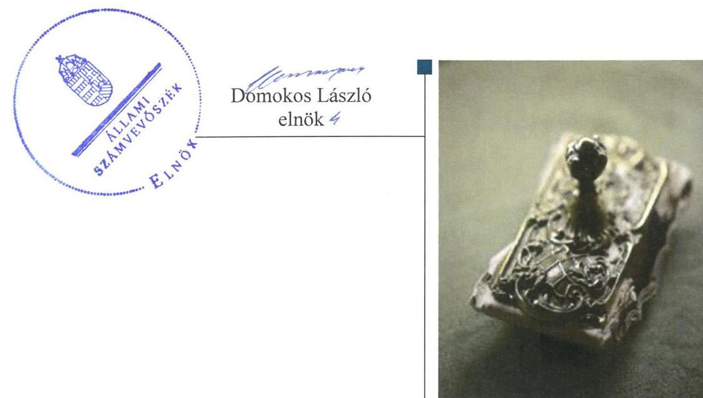

---

# AZ ELLENŐRZÉST FELÜGYELTE:

- RENKŐ ZSUZSANNA felügyeleti vezető
- AZ ELLENŐRZÉST VEZETTE ÉS A VÉGREHAJTÁSÁÉRT FELELŐS:
  - BÍRÓ ZSOLT ellenőrzésvezető
  - A PROGRAM ÖSSZEÁLLÍTÁSÁÉRT FELELŐS:
    - JANIK JÓZSEF LÁSZLÓ osztályvezető

**IKTATÓSZÁM:** V-1008-081/2016

**TÉMASZÁM:** 2042

**ELLENŐRZÉS-AZONOSÍTÓ SZÁM:** V073905

Jelentéseink az Országgyűlés számítógépes hálózatán és az Interneten a www.asz.hu címen is olvashatóak.

---

# TARTALOMJEGYZÉK 

■ ÖSSZEGZÉS ..... 5
■ AZ ELLENŐRZÉS CÉLJA ..... 6
■ AZ ELLENŐRZÉS TERÜLETE ..... 7
■ AZ ELLENŐRZÉS HÁTTERE, INDOKOLTSÁGA ..... 8
■ A JELENTÉS LÉNYEGES KÉRDÉSKÖREI ..... 9
■ ELLENŐRZÉS HATÓKÖRE ÉS MÓDSZEREI ..... 10
■ MEGÁLLAPÍTÁSOK ..... 12
■ JAVASLATOK ..... 24
■ MELLÉKLETEK ..... 25
I. sz. melléklet: Értelmező szótár ..... 25
II. sz. melléklet: Az eszközök és források alakulása kiemelt mérlegsoronként a 2009-2014. évek között (millió Ft) ..... 27
III. sz. melléklet: A pénzügyi egyensúlyi helyzet CLF módszer szerinti értékelése a 2009-2014. években (millió Ft) ..... 28
■ FÜGGELÉK: ÉSZREVÉTELEK ..... 29
■ RÖVIDÍTÉSEK JEGYZÉKE ..... 47

---

.

---

# ÖSSZEGZÉS 

Nagydobos Község Önkormányzata adósságrendezési eljárásának végrehajtása során a polgármester, a jegyző és a pénzügyi gondnok nem szabályszerű feladatellátása akadályozta az adósságrendezés céljainak elérését. Az Önkormányzat fizetőképessége helyreállt, azonban a hitelezői követelések kielégítésére nem az egyezségben vállalt ütemezés szerint került sor. Az Önkormányzatnál fenntartható pénzügyi egyensúlyt nem sikerült megteremteni.

## Az ellenőrzés társadalmi indokoltsága

Pénzügyi egyensúlyi helyzetének, fizetőképességének megromlása miatt Nagydobos Község Önkormányzatánál 2010. december 9-től 2011. szeptember 6-ig adósságrendezés folyt, amely során a hitelezők 86,1 millió Ft ki nem fizetett kötelezettség teljesítésére nyújtottak be igényt. Ez a kötelezettségállomány az Önkormányzat vagyonának tizedét jelentette, így indokolt ellenőrizni, hogy az adósságrendezési eljárás elérte-e a célját, az eljárás szereplői eleget tettek-e törvényben meghatározott feladataiknak annak érdekében, hogy az Önkormányzat fizetőképessége helyreálljon, a hitelezőknek hatékony jogvédelmet nyújtson, és elősegítse az Önkormányzat átgondolt, felelősségteljes gazdálkodását.

## Főbb megállapítások, következtetések, javaslatok

Az adósságrendezési eljárás szabálytalan végrehajtása az eljárás törvényben meghatározott céljainak elérését veszélyeztette. Az adósságrendezés megindításakor nem került sor az Önkormányzat valós vagyoni helyzetének felmérésére, mert a vagyon számbavétele nem teljes körű volt, továbbá a számviteli nyilvántartások lezárása elmaradt. A pénzügyi gondnok nem kísérte figyelemmel az önkormányzat gazdálkodását, feladatainak ellátását, a válságköltségvetés időszakában több kifizetés szabálytalanul, a pénzügyi gondnok ellenjegyzése nélkül történt.

Az önkormányzat fizetőképessége az adósságrendezési eljárás befejeződése után, az önkormányzati intézkedések és állami beavatkozások eredményeként a 2013. évben állt helyre. A hitelezői igények kiegyenlítése az egyezségben vállalt mértékben megtörtént, azonban az Önkormányzat az egyezségben vállalt ütemezésektől eltérően teljesített.

A pénzügyi egyensúly megteremtése érdekében tett bevételnövelő és kiadáscsökkentő intézkedések is hozzájárultak, hogy a 2011-2012. években működési hiány nem keletkezett. Azonban a 2013. évtől a működési bevételek az eseti állami támogatásokkal együtt sem fedezték a folyó kiadásokat, így a működési költségvetés egyensúlya az állami segítség ellenére sem volt fenntartható.

---

# AZ ELLENŐRZÉS CÉLJA 

Az ellenőrzés célja, annak értékelése, hogy az adósságrendezési eljárások megindítása, lefolytatása szabályszerű volt-e, az önkormányzat gazdálkodása az adósságrendezési eljárás alatt megfelelt-e a jogszabályi előírásoknak, az eljárás szereplői - kiemelten a pénzügyi gondnok - a jogszabályokban foglaltak szerint jártak-e el az adósságrendezés során, és a lefolytatott adósságrendezési eljárások elérték-e a törvényben kitűzött célokat.

---

# AZ ELLENŐRZÉS TERÜLETE 

## Nagydobos Község Önkormányzata

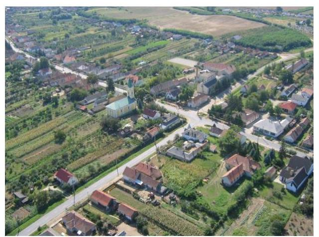

Nagydobos Község Szabolcs-Szatmár-Bereg megyében található, állandó lakosainak száma 2009. január 1-jén 2194 fő, 2014. december 31-én 2222 fő volt.

Az ellenőrzött időszakban 2014. október 20-ig a Képviselőtestület ${ }^{1}$ tíz, majd a helyi önkormányzati választásokat követően hét főből állt. Az ellenőrzött időszakban a Képviselő-testület mellett három állandó bizottság működött, melyből egy a Pénzügyi bizottság ${ }^{2}$ volt.

Az ellenőrzött időszakban a polgármester személye háromszor, a jegyző ${ }^{3}$ személye nem változott. Az Önkormányzat által fenntartott költségvetési szervek száma kettőről egyre csökkent, mivel az általános iskolát 2013. január 1-jei dátummal átadták a KLIK4-nek. Az Önkormányzat gazdasági társasággal nem rendelkezik. A gazdálkodási feladatokat az ellenőrzött időszakban a Hivatal ${ }^{5}$ látta el a költségvetési csoporton keresztül.

Az adósságrendezési eljárást az Önkormányzat polgármestere ${ }^{6}$ kezdeményezte a fennálló tartozásállomány nagysága miatt. Az adósságrendezést a Bíróság ${ }^{7}$ 2010. december 9-én megindította, és kijelölte a pénzügyi gondnoki feladatok ellátására KERSZI Zrt. ${ }^{8}$-t. Az adósságrendezési eljárást a megkötött egyezségre tekintettel a Bíróság 2011. szeptember 6-án lezárta.

A 2009-2014. években az Önkormányzat eszközeinek és forrásainak alakulását a II. sz. melléklet tartalmazza.

---

# AZ ELLENŐRZÉS HÁTTERE, INDOKOLTSÁGA 

Az önkormányzatok finanszírozásának, gazdálkodásának keretei és feladatellátása jelentős változásokon mentek keresztül a Har. tv. ${ }^{9}$ hatályba lépésétől eltelt időszakban.

Az önkormányzati eladósodást 2011-ig csak az Ötv.-ben ${ }^{10}$ meghatározott adósságfelvételi korlát szabályozta, a korlát megsértését azonban jogszabályok nem szankcionálták. 2012. évtől jelentős szigorítás lépett életbe. A korábbi passzív szabályozást a Stabilitási tv. ${ }^{11}$ hatálybalépésével az aktív kontroll váltotta fel. A törvény előírásai alapján az önkormányzatok hitelfelvételei engedélykötelessé váltak.

1996-ban az adósságfelvételi korlát bevezetése mellett az önkormányzatok adósságrendezésének szabályozására is sor került. Az adósságrendezési eljárás részben a lakosság védelmét szolgálta azzal, hogy biztosította az önkormányzatok által nyújtott kötelező közfeladatokhoz való hozzájutást az önkormányzat fizetésképtelensége esetén is. A Har. tv. alapján 1996 és 2013 júniusa között - ugyanakkor elenyésző számú, mindösszesen 64 adósságrendezési eljárás indult. Az eljárások közel 60\%-a egyezséggel, 40\%-a vagyonfelosztással zárult. Az adósságrendezés első időszakában (2009. évig) a forráshiányból eredeztethető eladósodás tette indokolttá az eljárások jelentős hányadának megindítását.

A második időszakban az eljárás alá vont önkormányzatok között megjelentek a nagyobb költségvetéssel és több intézménnyel is rendelkező települések. Az adósságrendezést szükségessé tevő problémák speciális pénzügyi elemekkel, a devizaalapú kötvénnyel történő finanszírozás begyűrűző hatásaival, valamint az anyagi lehetőségeket meghaladó, túlméretezett fejlesztésekkel összefüggő kötelezettségvállalásokkal egészültek ki, de a beruházások esetében fontos tényező volt a kellő szakértelem hiánya és a pénzügyi nehézségek szakszerűtlen kezelése is.

Az ÁSZ önkormányzati alrendszert érintő ellenőrzései, elemzései során számos ponton mutatott rá azokra a területekre, ahol a „szabályozás" módosításra, korrekcióra szorul. Az ellenőrzés alapján megfogalmazott javaslatok e területen is segítséget nyújthatnak a kormányzat és az Országgyűlés törvényhozó munkájában, hozzájárulhatnak az irányítói tevékenység erősítéséhez. Az ellenőrzés során tett megállapításaink megerősíthetik egy „megelőző monitoring funkció" kialakításának szükségességét a helyi önkormányzatok fizetésképtelenségének megelőzése érdekében.

---

# A JELENTÉS LÉNYEGES KÉRDÉSKÖREI 

1. Az adósságrendezési eljárás folyamata és végrehajtása során szabályszerű volt-e az önkormányzat és a pénzügyi gondnok feladatellátása?
2. A lefolytatott adósságrendezési eljárás elérte-e a törvényben kitűzött célokat?
3. Az adósságrendezési eljárást követően biztosított és fenntartható volt-e a pénzügyi egyensúly?

---

# ELLENŐRZÉS HATÓKÖRE ÉS MÓDSZEREI 

## Az ellenőrzés típusa

Rendszerellenőrzés

## Az ellenőrzött időszak

A 2009. január 1. és 2015. június 30. közötti időszak, ezen belül az első kérdéskör vonatkozásában az adósságrendezési eljárás kezdeményezésétől az eljárás lezárásáig tartó időszak.

## Az ellenőrzés tárgya

A Har. tv. által szabályozott adósságrendezési eljárás.

## Az ellenőrzött szervezet

Nagydobos Község Önkormányzata, és a pénzügyi gondnoki feladatok ellátásával összefüggésben KERSZI Zártkörűen Működő Részvénytársaság

## Az ellenőrzés jogalapja

Az Állami Számvevőszékről szóló 2011. évi LXVI. törvény 5. § (2) bekezdése.

## Az ellenőrzés módszerei

Az ellenőrzés szakmai módszertana az ÁSZ hivatalos honlapján (www.asz.hu) közzétett szakmai szabályokon alapult, amelyek irányadónak tekintették a Legfőbb Ellenőrző Intézmények Nemzetközi Szervezete (INTOSAI) által kiadott nemzetközi (ISSAI) standardokat.

Az önkormányzatok adósságrendezési eljárásával és az azt követő gazdálkodási tevékenysége hibáinak kijavítására, a közpénzekkel való felelős gazdálkodás segítésére irányuló javaslatok kidolgozásakor a hatályos jogszabályok az irányadóak.

Az ellenőrzés alapját az ellenőrzött önkormányzatoktól bekért tanúsítványok, szabályzatok, szerződések, bírósági végzések, határozatok és egyéb dokumentumok, kimutatások, valamint az önkormányzati beszámolók adatai képezték. Az ellenőrzési kérdések megválaszolásához szükséges bizonyítékok megszerzése, összegyűjtése az ellenőrzött által rendelkezésre bocsátott dokumentumok, adatok elemzés módszerével végrehajtott értékelésével történt, kiegészítve a kérdésfeltevés (információkérés), mintavételezés módszerével. Az ellenőrzés keretében értékeltük az ellenőrzéshez elkészített tanúsítványok adatainak valódiságát.

Az adósságrendezési eljárás szabályszerűségét a cégbírósági végzések, határozatok, testületi előterjesztések, jegyzőkönyvek, határozatok, a válságköltségvetés, beszámolók adatai, reorganizációs program, egyezségi javaslat, értesítések, közzétételek, kimutatás a hitelezőkről, jelentések, belső szabályzatok, pénzügyi bizonylatok, kötelezettségvállalások, és további releváns dokumentumok alapján végeztük. A minősítés szempontja a dokumentumok határidőben, és tartalmilag a vonatkozó előírásoknak megfelelő elkészítése volt.

A kontrolltevékenység működésének ellenőrzésével értékeltük, hogy az adósságrendezési eljárás alatt vállalt kötelezettségek és teljesített kifizetések szabályszerűen történtek-e, a válságköltségvetés alatt a források szabályszerűen, rendeltetésszerűen lettek-e felhasználva a Har. tv.-ben előírt és az önkormányzat által ellátott kötelező feladatellátás során.

A működtetett belső kontrollrendszert a kontrollkörnyezet, kontrolltevékenység és belső ellenőrzés működésén keresztül ítéltük meg. A kontrolltevékenységek támogató szerepét a kötelezettségvállalások és szakmai teljesítésigazolás/utalványellenjegyzés, valamint a pénzügyi gondnok által gyakorolt ellenjegyzés működésének ellenőrzésén keresztül ítéltük meg. A véletlen minta alapján a sokaságra vonatkozó hibaarányt becsültük. ,,Megfelelőnek" értékeltük az ellenőrzött területet, amennyiben 95\%-os bizonyossággal a teljes sokaságban a hibaarány legfeljebb 10\%, „részben megfelelőnek" értékeltük, ha a hibaarány felső határa 10-30\% között volt, "nem megfelelőnek" pedig akkor, ha a mintavételi eredmények alapján a sokaságbeli hibaarány felső határa meghaladta a 30\%-ot. A becsült hibaaránytól függetlenül nem értékeltük szabályosnak az önkormányzatnál a válságköltségvetésen alapuló kifizetéseket, amennyiben egyetlen esetben is hiányzott a pénzügyi gondnok ellenjegyzése a kötelezettségvállalás vagy pénzügyi kifizetés dokumentumáról.

Értékeltük, hogy a válságköltségvetés alapján biztosított volt-e az önkormányzat kötelező közfeladatainak folyamatos ellátása, az adósságrendezési eljárás eredményeként a hitelezők követelésének vagyonarányos kielégítése megtörtént-e, helyre állt-e az önkormányzat fizetőképessége, a pénzügyi egyensúly fenntarthatósága biztosított volt-e. Annak értékelését, hogy az adósságrendezési eljárás eredményeként helyre állt-e az önkormányzat fizetőképessége, likviditási mutatók számításával és értékelésével végeztük el. Kedvezőtlennek ítéltük, ha az önkormányzat 60 napon túli adósságállománnyal rendelkezett, adósságot keletkeztető ügyleteinek állománya 20\% feletti, ha a lejárt követelések állománya nem csökkent. Magas kockázatot jelez, ha az ÖNHIKI támogatás bevételek mért aránya 5\% feletti. A likviditási mutatókat megfelelőnek értékeltük, ha értékük nagyobb 1-nél. Az eladósodási mutató értékét kedvezőnek ítéltük, ha az értéke 10\% alatti; kedvezőtlen, ha 10\%-nál nagyobb az értéke, a 20\% feletti érték azonban már magas kockázatot jelez.

A pénzügyi egyensúly fenntartásának értékelését a CLF módszer segítségével végeztük el. A pénzügyi egyensúly abban az esetben jött létre, ha egy adott időszakban a folyó bevételek fedezetet biztosítottak a folyó kiadásokra.

---

# MEGÁLLAPÍTÁSOK 

## 1. Az adósságrendezési eljárás folyamata és végrehajtása során szabályszerű volt-e az önkormányzat és a pénzügyi gondnok feladatellátása?

Összegző megállapítás

Az adósságrendezési eljárás kezdeményezése és végrehajtása a résztvevők feladatellátásának hiányosságai következtében nem volt szabályszerű. A működtetett belső kontrollrendszer nem biztosította a válságköltségvetésen alapuló kifizetések szabályszerű végrehajtását.

### 1.1. számú megállapítás

A polgármester ${ }^{12}$ annak ellenére nem kezdeményezte az adósságrendezési eljárás megindítását, hogy annak feltételei már korábban is fennálltak.

AZ
 ADÓSSÁGRENDEZÉSI ELJÁRÁS MEGINDÍTÁSÁNAK FELTÉTELEI az Önkormányzat kimutatása alapján már 2010. október 13-án fennálltak. A 34,9 millió Ft 60 napon túli lejárt szállítói tartozásállomány, melyből 5,8 millió Ft 180 napon túli lejárt szállítói tartozás volt.

A fentiekre tekintettel a Har. tv. 5. § (1) bekezdésében foglaltakat megsértve a polgármester ${ }_{1}$ a Pénzügyi bizottságot nem tájékoztatta a 60 napon túl lejárt esedékességű tartozások fennállásáról, illetve nyolc napon belül nem hívta össze a Képviselő-testületet. Ezen túl a polgármester ${ }_{1}$ a Har. tv. 5. § (2) bekezdésében foglaltakkal ellentétben a 90 napon túl lejárt tartozások miatt a Képviselő-testület döntésétől függetlenül sem kezdeményezte az adósságrendezési eljárás megindítását.

AZ ADÓSSÁGRENDEZÉSI ELJÁRÁS megindításáról a Har. tv. alapján a polgármester ${ }_{2}$ kezdeményezésére a Képviselő-testület 2010. november 15-én döntött, mert a hitelezők felé fennálló 60 napon túl lejárt, mindösszesen 34,9 millió Ft összegű tartozását az Önkormányzat nem tudta kifizetni. Ezzel egyidejűleg a Képviselő-testület felhatalmazta a polgármester ${ }_{2}$-t az eljárás megindításával kapcsolatos teendők ellátásával.

Az adósságrendezés megindítása iránti kérelemhez a polgármester ${ }_{2}$ a Har tv. 5. § (3) bekezdés b) pontjában foglaltak ellenére nem csatolta a ki nem elégített követelésre vonatkozó okiratokat, amelyekből a követelés jogcíme, esedékessége (lejáratának időpontja) megállapítható, továbbá nem mellékelte a Cégközlönyben való közzétételért fizetendő költségtérítés befizetésének igazolását, ezért a Bíróság felhívásban hiánypótlásra szólította fel. A polgármester ${ }_{2}$ a hiánypótlási kötelezettségét határidőben teljesítette.

A Har. tv. -ben foglaltak alapján a Bíróság 2010. december 1-én elrendelte az Önkormányzat elleni adósságrendezés megindítását, amelyről a

---

1.2. számú megállapítás
1.3. számú megállapítás
1.4. számú megállapítás

## 1.2. számú megállapítás

végzés 2010. december 9-én jelent meg a Cégközlönyben. A végzés rögzítette, hogy az adósságrendezés megindításának időpontja a végzés Cégközlönyben való megjelenésének napja, továbbá kijelölte a KERSZI Zrt.-t az adósságrendezés alatt a pénzügyi gondnoki teendők ellátására.

A polgármester ${ }_{2}$ az adósságrendezési eljárás megindításával kapcsolatos tájékoztatási és közzétételi kötelezettségének a hitelezők részére szóló felhívás közzétételének kivételével szabályszerűen eleget tett.

## AZ ADÓSSÁGRENDEZÉSI ELJÁRÁS KEZDEMÉNYEZÉSÉRŐL a polgármester ${ }_{2}$ a Har. tv.-ben foglaltak szerint a lakosságot a helyben szokásos módon határidőben tájékoztatta.

A HITELEZŐKNEK SZÓLÓ FELHIVÁS megjelentetéséről a polgármester ${ }_{2}$ a Har. tv. 10. § (3) bekezdésében foglaltak ellenére két országos napilap helyett csak egy országos napilap esetében gondoskodott, illetve a felhívást a helyben szokásos módon nem hirdette ki. Az egy országos napilapban megjelentetett hitelezőknek szóló felhívás tartalmi elemei megfeleltek a jogszabályi előírásoknak.

A polgármester ${ }_{2}$ a Közigazgatási Hivatal ${ }^{13}$, a Magyar Államkincstár ${ }^{14}$, az illetékes adó és vámhatóság, az elszámolási számlát vezető pénzügyi szolgáltató, valamint a nyugdíj és egészségbiztosítási szervek felé előírt tájékoztatási kötelezettségeinek a Har. tv. előírásai alapján eleget tett.

Az Adósságrendezési Bizottság a jogszabályi előírásoknak megfelelően határidőben megalakult.

AZ ADÓSSÁGRENDEZÉSI BIZOTTSÁG ${ }^{15}$ az adósságrendezés megindítását követő nyolc napon belül a Har. tv. -ben foglaltak alapján megalakult. Tagjai a jogszabályi előírásoknak megfelelően a pénzügyi gondnok, a polgármester ${ }_{2}$, a jegyző, a Pénzügyi bizottság elnöke, illetve a Képviselő-testület által megválasztott települési képviselő volt.

Az adósságrendezés megindítását követően a polgármester ${ }_{2}$ a pénzügyi gondnok részére az éves beszámoló kivételével a jogszabályban rögzített dokumentumokat átadta, azonban a válságköltségvetési rendelettervezet átadása határidőn túl történt, illetve az átadott vagyonleltár nem felelt meg a jogszabályi előírásoknak.

A polgármester ${ }_{2}$ a Har. tv. alapján az adósságrendezés megindítását követő 30 napon belül nem teljes körűen adta át a jogszabályban meghatározott dokumentumokat. Az adósságrendezés megindítását megelőző fordulónapi éves beszámolót az elkészítés hiánya miatt a polgármester ${ }_{2}$ a Har. tv. 13. § (2) bekezdés b) pontjában előírtakkal ellentétben a pénzügyi gondnoknak nem adta át.

A helyi önkormányzat vagyonáról az adósságrendezés megindításának időpontját megelőző nappal készített vagyonleltár a polgármester ${ }_{2}$ részéről átadásra került, azonban az átadott vagyonleltár teljes körűen nem tartalmazta a Har. tv. 2. § d) pontjában meghatározott vagyonelemeket (befektetett eszközök és forgóeszközök), csak az ingatlanokat.

---

Az adósságrendezés megindítását megelőző fordulónapi éves beszámolót és a teljes körű vagyonleltárt a jegyző nem készítette el az Áhsz. ${ }^{16}$ 13. § (1) és a Htv. ${ }^{17}$ 140. § (1) bekezdés d) pontjában meghatározott feladatkörében.

A polgármester ${ }_{2}$ a Har. tv. 13. § (2) bekezdés c) pontjában foglaltak ellenére a válságköltségvetési rendelettervezetet a pénzügyi gondnoknak az elkészítés késedelme miatt az előírt határidőn túl adta át.
1.5. számú megállapítás

### 1.6. számú megállapítás

1.6. számú megállapítás

A válságköltségvetési rendelet megfelelt a jogszabályi előírásoknak, azonban a tervezetet a jegyző határidőn túl készítette el. Az előterjesztéshez a pénzügyi gondnok a véleményét nem készítette el.

## A VÁLSÁGKÖLTSÉGVETÉSI RENDELETTERVEZET

előterjesztését a jegyző a Htv. 140. § (1) a) pontja szerinti hatáskörében a Har. tv. 18. § (1) bekezdésében foglaltakkal ellentétben az adósságrendezés megkezdésétől számított 30 napos határidő lejártát követően, két napos késedelemmel 2011. január 10-én készítette el. A rendelettervezetet az Adósságrendezési Bizottság a pénzügyi gondnok részére történt átadását követő nyolc napon belül a Har. tv.-ben foglaltak szerint 2011. január 17-én megtárgyalta és elfogadta. A polgármester ${ }_{2}$ a Har. tv. 19. § (1) bekezdésében foglaltakkal ellentétben a Képviselő-testületet a bizottsági elfogadást követő 8 napon túli időpontra, 2011. január 27-re hívta össze.

A Képviselő-testület a válságköltségvetési rendelettervezetet megtárgyalta és elfogadta, azonban a polgármester a Htv. 139. § (1) bekezdés a) pontjában meghatározott hatáskörében az előterjesztéshez a pénzügyi gondnok véleményét Har. tv. 14. § (1) bekezdésben foglaltak ellenére nem csatolta, mivel a pénzügyi gondnok írásbeli véleményt a válságköltségvetési rendelettervezet előterjesztéséhez nem készített.

A válságköltségvetési rendelet a Har. tv. előírásainak megfelelt, kizárólag a kötelezően ellátandó feladatok működési bevételeit és működési kiadásait tartalmazta.

A hitelezői igénybejelentések elfogadása és nyilvántartásba vétele a pénzügyi gondnok részéről szabályszerűen történt.

A HITELEZŐI IGÉNYEK BEJELENTÉSE a pénzügyi gondnok felé a Har. tv. alapján az adósságrendezésről szóló bírósági végzés közzétételétől számított 60 napon belül megtörtént. A pénzügyi gondnokhoz 67 hitelezői igénybejelentés érkezett, melynek nyilvántartásba vételéről a pénzügyi gondnok gondoskodott. A pénzügyi gondnok a Har. tv. -ben foglaltaknak megfelelően a bejelentett követelések elfogadásáról határidőben tájékoztatta a hitelezőket.

A KÖVETELÉSEK BEHAJTÁSÁRÓL a pénzügyi gondnok a Har. tv. alapján intézkedett.

---

### 1.7. számú megállapítás

1. ábra
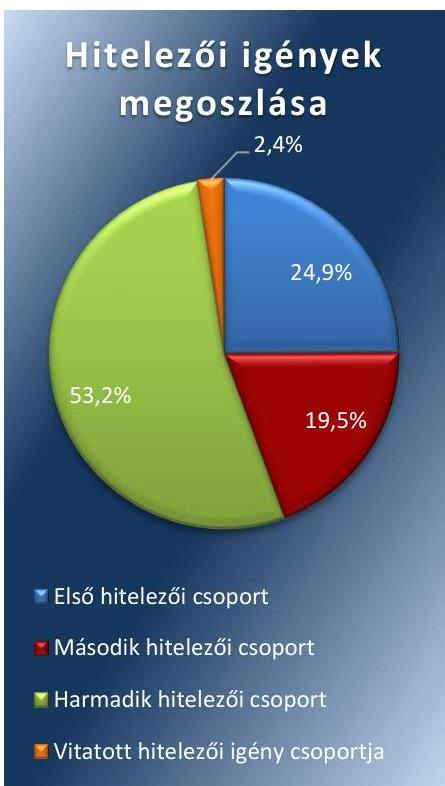

Forrás: Egyezségi javaslat

A reorganizációs program és az egyezségi javaslat megfelelt a jogszabályi előírásoknak. A pénzügyi gondnok az egyezségi tárgyalás során a hitelezők felé a tájékoztatási kötelezettségének eleget tett, azonban az egyezséget a jogszabályi előírások ellenére nem jegyezte ellen.

Az Adósságrendezési Bizottság a válságköltségvetési rendelet képviselőtestületi elfogadását követően elkészítette a reorganizációs programot és az egyezségi javaslatot, melyeket a Képviselő-testület az elkészítésüket követő nyolc napon belül megtárgyalt és elfogadott. Azonban a reorganizációs program és az egyezségi javaslat elfogadása a hitelezőkkel folytatott tárgyalások elhúzódása miatt a Har. tv. 22. § (1) bekezdésében foglaltak ellenére az adósságrendezés megindításának napjától számított 150 napon túl történt, mely tényről a pénzügyi gondnok a hitelezőket tájékoztatta.

A reorganizációs program és az egyezségi javaslat elfogadásának elhúzódása miatt a Har. tv. 25. § (5) bekezdésében meghatározott 210 napon belül nem jött létre egyezség, ezért a Képviselő-testület döntött az adósságrendezési eljárás Har. tv. 28. § szerinti meghosszabbításával kapcsolatos kérelem benyújtásáról. A Bíróság a pénzügyi gondnok kérelemére az adósságrendezést 30 nappal meghosszabbította.

A REORGANIZÁCIÓS PROGRAM a Har. tv.-ben foglaltaknak megfelelően tartalmazta az önkormányzat gazdasági helyzetének részletes leírását, meghatározásra került a reorganizációba bevonható vagyon köre, a hitelezői igényeket rendező egyezségi javaslat, valamint a hitelezői igények csoportjai. A Har. tv. előírásainak megfelelően a pénzügyi gondnok a reorganizációs programban feltárta, hogy milyen okok vezettek az adósságrendezési eljárás megindításához.

AZ EGYEZSÉGI JAVASLAT a pénzügyi gondnok által elfogadott 58 hitelezői igény figyelembe vételével készült. A pénzügyi gondnok által négy hitelezői csoport került kialakításra. Az első hitelezői csoportba a pénzintézetekkel szemben fennálló követelések, a második hitelezői csoportba a ki nem fizetett személyi jellegű kifizetésekhez kapcsolódó követelések, a harmadik hitelezői csoportba a ki nem fizetett szállítói tartozásokból keletkezett követelések, illetve a negyedik hitelezői csoportba az Önkormányzat által vitatott kamatkövetelés tartozott. A pénzügyi gondnok által kialakított egyes hitelezői csoportokhoz kapcsolódó hitelezői igények megoszlását az 1. ábra mutatja be.

Az egyezségi tárgyalásra a hitelezők meghívása a pénzügyi gondnok részéről hitelezői csoportonként történt a jogszabályi előírásoknak megfelelően.

Az egyezségi javaslatot a Har. tv. -ben rögzítettekre tekintettel írásba foglalták és tartalmazta a hitelezők által elfogadott egyezséget, a hitelezők követelésének kielégítése módját, a teljesítési határidőket, valamint az Önkormányzatnak és az egyezséget elfogadó hitelezőknek az egyezség megkötésére vonatkozó egybehangzó akaratnyilvánítását.

A HITELEZŐK ÉRTESÍTÉSE az egyezség megkötéséről megtörtént, azonban az Önkormányzatnál fellelhető egyezség a

---

### 1.8. számú megállapítás

Har. tv. 25. § (1) bekezdésében foglaltak ellenére nem tartalmazta a pénzügyi gondnok ellenjegyzését.

A Bíróság a Har. tv. alapján az adósságrendezési eljárást a megkötött egyezségre tekintettel befejezte és elrendelte a végzés Cégközlönyben való közzétételét. Az adósságrendezés eljárás 2011. szeptember 6-án fejeződött be.

## A kialakított kontrollkörnyezet nem biztosította a válságköltségvetésen alapuló kifizetések szabályszerű végrehajtását.

Az adósságrendezési eljárás ideje alatt a Képviselő-testület rendelkezett a működésének részletes szabályait tartalmazó SZMSZ ${ }^{18}$-el. Az adósságrendezési eljárás időszakában a Hivatal - mint költségvetési szerv - működésének belső rendje és módja az SZMSZ-ben szabályozásra került, azonban az Ámr. ${ }^{19}$ 20. § (2) bekezdés e) pontjában foglaltakkal ellentétben az SZMSZ nem tartalmazta a Hivatal szervezeti egységeinek megnevezését és feladatait.

Az Ámr. előírásainak megfelelően a Hivatal a gazdasági egységére vonatkozó külön Ügyrenddel ${ }^{20}$ rendelkezett az adósságrendezési eljárás alatt. A Számv. tv. ${ }^{21}$ és az Áhsz. előírásainak figyelembe vételével rendelkeztek Számviteli politikával ${ }^{22}$, Pénzkezelési szabályzattal ${ }^{23}$, Számlarenddel ${ }^{24}$, Leltározási és leltárkészítési szabályzattal ${ }^{25}$, valamint Eszközök és források értékelési szabályzatával ${ }^{26}$.

Az adósságrendezési eljárás alatt a kötelezettségvállalás, ellenjegyzés, szakmai teljesítés igazolása, érvényesítés, utalványozás és az adatszolgáltatás rendjét a Gazdálkodási szabályzat ${ }^{27}$ tartalmazta. A Gazdálkodási szabályzatban az előzetes írásbeli kötelezettségvállalást nem igénylő kifizetések rendje az Ámr. előírásainak megfelelően szabályozásra került, azonban a gazdálkodási jogkörök tekintetében az alábbi hiányosságok mutatkoztak:
— az Önkormányzat nevében vállalt kötelezettség esetében a szakmai teljesítésigazolásra jogosult személyeket az Ámr. 76. § (5) bekezdésében foglaltak ellenére a jegyző írásban nem jelölte ki.
— az Ámr. 80. § (3) bekezdésében foglalt előírás ellenére a gazdálkodási jogkör gyakorlókról vezetett nyilvántartás nem felelt meg a Gazdálkodási szabályzatban rögzítetteknek, mivel a nyilvántartás nem tartalmazta a felhatalmazásra jogosító ügyirat számát és keltét, valamint elmaradt az átvétel igazolásának rögzítése.

# 1.9. számú megállapítás 

A kontrolltevékenységek nem biztosították a válságköltségvetésen alapuló kifizetések szabályszerű végrehajtását.

A válságköltségvetés végrehajtása során a kifizetésekhez kapcsolódó kontrolltevékenységek
 - gazdálkodási jogkörök, pénzügyi gondnoki ellenjegyzés - gyakorlása „nem megfelelő" volt.

A pénzügyi gondnok ellenjegyzésével kapcsolatos hiányosságok az alábbiak voltak:
— a Har. tv. 14. § (1) bekezdését megsértve előfordult, hogy a kifizetést a pénzügyi gondnok ellenjegyzése nélkül teljesítették.
— a pénzügyi gondnok ellenjegyzése nem volt beazonosítható, mivel az aláírás nem a Har. vhr. ${ }^{28} 16 . \S$-ának meghatározott aláírási címpéldányban rögzített, hitelesített forma szerint történt.

---

A gazdálkodási jogkörök gyakorlásának ellenőrzése során tapasztalt hiányosságokat a 1. táblázat tartalmazza.

# A GAZDÁLKODÁSI JOGKÖRÖK GYAKORLÁSÁNAK ELLENŐRZÉSE SORÁN TAPASZTALT HIÁNYOSSÁGOK 

| Sorszám | Gazdálkodási jogkör | Megállapított szabálytalanság |
| :--: | :--: | :--: |
| 1. | kötelezettségvállalás | Az Ámr. 74. § (1) bekezdésében foglaltak ellenére írásbeli kötelezettségvállalás nem történt. |
| 2. | szakmai teljesítésigazolás | Az Ámr. 76. § (1) bekezdésében foglaltakat megsértve az utalványozást megelőzően a szakmai teljesítésigazolást nem végezték el.   Az elvégzett szakmai teljesítésigazolásokat jogosulatlanul végezték, mert a szakmai teljesítésigazolók az Ámr. 76. § (5) bekezdésben foglaltak ellenére jegyzői kijelölés hiányában végezték el a teljesítésigazolást. |
| 3. | utalvány ellenjegyzése | Az Ámr 79. § (2) bekezdésben foglaltak ellenére előfordult, hogy nem történt meg az utalvány ellenjegyzése.   Az utalvány ellenjegyzése nem volt beazonosítható, mivel az aláírás nem az Ámr 80. § (3) bekezdés alapján a Gazdálkodási szabályzat 10. számú mellékletében vezetett aláírás-mintának megfelelően történt. |

Forrás: ÁSZ megállapításai

### 1.10. számú megállapítás

A belső ellenőrzés a válságköltségvetésen alapuló kifizetések szabályszerű végrehajtását nem támogatta, mivel a jegyző a jogszabályi előírások ellenére nem készített intézkedési tervet.

A monitoring rendszer részét képező belső ellenőrzési feladatokat az Önkormányzatnál az adósságrendezési eljárás alatt a Társulás ${ }^{29}$ látta el. A gazdálkodási jogkörök gyakorlásának szabályszerűségével összefüggésben egy belső ellenőrzés történt az Önkormányzatnál.

Az ellenőrzés a 2011. év I. negyedévre vonatkozott és a szabályzatok, a nyilvántartások, a bank-pénztár bizonylatok elemzésére, ellenőrzésére terjedt ki. Az ellenőrzésről készült ellenőrzési jelentésben a függetlenített belső ellenőr a következő javaslatokat tette:
$\longrightarrow$ a hatályban lévő szabályzatok folyamatos karbantartása, aktualizálása a helyi sajátosságok figyelembe vételével;
$\longrightarrow$ a szabályzatok tartalmának a gazdálkodási szakterületen dolgozókkal való megismertetése és aláíratása;
$\longrightarrow$ a jegyző gondoskodjon a FEUVE működtetéséről, valamint az ezzel kapcsolatos ellenőrzések, egyeztetések (főkönyv-analitika) dokumentálására kerüljön sor.
A jegyző a Ber. ${ }^{30}$ 29. § (1) bekezdésében foglaltak ellenére a belső ellenőrzési jelentésben lévő, a belső ellenőr által tett javaslatokra intézkedési tervet nem készített.

---

# 2. A lefolytatott adósságrendezési eljárás elérte-e a törvényben kitűzött célokat? 

## Összegző megállapítás

2.1. számú megállapítás
2.2. számú megállapítás

## A lefolytatott adósságrendezési eljárás elérte a törvényben kitűzött célokat.

Az adósságrendezés alatt a kötelező feladatok ellátása biztosított volt.

Az Önkormányzat az adósságrendezési eljárás alatt a Har. tv.-ben előírt feladatokat látta el az alábbiak szerint: köztemető fenntartás, hulladékszállítás, vízgazdálkodás, közútkezelés, közvilágítás, óvodai ellátás, általános iskolai oktatás, egészségügyi alapellátás, szociális és gyermekvédelmi ellátások, gyermekétkeztetés, Hivatal működtetése, igazgatási feladatok, települési könyvtár, közművelődési intézmények működési feltételeinek biztosítása.

Az adósságrendezési eljárás ideje alatt feladat, vagy intézmény átadására, átvételére vagy átszervezésére nem került sor.

A hitelezői igények kiegyenlítése az egyezségben vállalt ütemezéstől eltérően történt meg.

## A HITELEZŐI IGÉNYEK VAGYONARÁNYOS KIELÉGÍTÉSE az adósságrendezési eljárás eredményeképpen megtörtént,

azonban a kifizetéseket az Önkormányzat az egyezségi megállapodásban meghatározott ütemezések ellenére az abban foglalt határidőkön túl teljesítette.

Az Önkormányzat a reorganizációs programjában rögzítette, hogy az elismert és kifizetésre váró, mindösszesen 70,3 millió Ft hitelezői igény kielégítését reorganizációs hitelekből, ÖNHIKI támogatásból, bevételnövelő intézkedésekből (ingatlanok értékesítése, ingatlanok hasznosítása, egyéb bevételek növelése) és kiadási megtakarításokból tervezte fedezni. A hitelezői igények fedezetként szolgáló bevételek realizálódásának elhúzódása miatt az Önkormányzat az egyezségi megállapodásban vállalt ütemezéseket nem tartotta.

A hitelezői igények kifizetésével kapcsolatban az egyezségi megállapodásban meghatározott fizetési határidőt és a tényleges kiegyenlítések időpontját a 2. táblázat foglalja össze.

---

| HITEZŐI IGÉNYEK KIFIZETÉSÉVEL KAPCSOLATOS KIMUTATÁS |  |  |  |  |  |  |
| :--: | :--: | :--: | :--: | :--: | :--: | :--: |
| Hitelezői csoport   megnevezése | A pénzügyi   gondnok által   jogosultnak   ítélt követelés   összege | A hitelezői   igény megtó-   rülésének   mértéke és   összege | Kifizetésre ke-   rült hitelezői   igény összege | Egyezségben vállalt határidő | Tényleges pénzügyi   teljesítés |
| 1 számú hitelezői   csoport |  |  |  |  |  |
| - OTP Bank Zrt | 6,9 millió Ft | $\begin{gathered} 100 \% \\ (6,9 \text { millió Ft }) \end{gathered}$ | 6,9 millió Ft | - 3,0 millió Ft megfizetése 2011. szeptember hónapban,   - ügyleti kamat megfizetése 2011. december 31-ig,   - a fennmaradó tartozás összegére 2 év türelmi idő. | - 3,0 millió Ft követelést a bank a határidő lejártát követően inkasszóval leemelte;   - 3,9 millió Ft követelés konszolidálva lett 2012. decemberben |
| - Nagyessedi Ta-   karékszövetkez-   et | 14,5 millió Ft | $\begin{gathered} 100 \% \\ (14,5 \text { millió Ft }) \end{gathered}$ | 14,5 millió Ft | - 9,0 millió Ft megfizetése 2011. szeptember hónapban,   - ügyleti kamat megfizetése 2011. december 31-ig,   - a fennmaradó tartozás összegére 2 év türelmi idő. | - a 14,5 millió Ft követelés konszolidálva lett 2012. decemberben |
| 2 számú hitelezői csoport | 16,8 millió Ft | $\begin{gathered} 100 \% \\ (16,8 \text { millió Ft }) \end{gathered}$ | 16,8 millió Ft | legkésőbb 2011. december 31. | - 10,1 millió Ft   (2011. december 31-ig)   - 1,2 millió Ft   (2012. május 17.-én)   - 5,5 millió Ft   (2013. január 9-én) |
| 3 számú hitelezői csoport | 45,8 millió Ft | $\begin{gathered} 70 \% \\ (32,1 \text { millió Ft }) \end{gathered}$ | 32,1 millió Ft | - a hitelezői igények 50\%-a legkésőbb 2011. december 31-ig,   - a fennmaradó 50\% legkésőbb 2012 december 31-ig | - 13,3 millió Ft   (2013.január 09.-én)   - 18,8 millió Ft,   (2013.július 02.-án) |
| 4 számú hitelezői csoport | 2,1 millió Ft | $\begin{gathered} 0 \% \\ (0,0 \text { millió Ft }) \end{gathered}$ | - | - | - |
| Mindösszesen: | 86,1 millió Ft | 81,6\%   (70,3 millió Ft) | 70,3 millió Ft | - | 70,3 millió Ft |

Az hitelezői igények kiegyenlítése az egyezségben vállalt megtérülési mértékben az adósságrendezési eljárás befejezését követő második évre, 2013 júliusra teljesen megtörtént.
2.3. számú megállapítás

Az Önkormányzat a fizetőképesség helyreállítása érdekében bevételnövelő és kiadáscsökkentő intézkedéseket tett.

A BEVÉTELEK NÖVELÉSÉRE, VALAMINT A KIADÁSOK CSÖKKENTÉSÉRE az adósságrendezési eljárás alatt, a 2011. évben az Önkormányzat tett intézkedéseket. A reorganizációs program alapján, a hitelezői igények kielégítése céljából a Képviselő-testület egyes forgalomképes ingatlanok értékesítéséről, ingatlanok bérbeadásáról, lakóingatlanok bérleti dijának növeléséről, illetve szolgálati lakások fűtésköltségének megtérítéséről döntött. A bevételnövelő intézkedések hatása az Önkormányzat kimutatása alapján a 2011-2014. években összesen 31,4 millió Ft volt, melynek döntő többsége ( $94,3 \%$-a, 29,6 millió Ft) ingatlanértékesítésekhez kapcsolódó egyszeri jellegű bevétel volt.

A bevételnövelő intézkedéseken túl a Képviselő-testület az adósságrendezési eljárás ideje alatt az intézményeket érintően az adható illetménykiegészítések megvonásáról döntött, illetve megszüntette a civil szervezetek

---

# 2.4. számú megállapítás 

részére nyújtott támogatásokat. A kiadáscsökkentő intézkedések hatása tartós jellegű volt és az Önkormányzat kimutatása alapján a 2011-2014. években összességében 53,2 millió Ft megtakarítást eredményezett.

## Az Önkormányzat fizetőképessége 2013. év végére helyreállt, csökkent a kötelezettségek állománya. A követelések behajtására tett intézkedések hatására a követelések állománya is csökkent.

A KÖTELEZETTSÉGEK ÁLLOMÁNYA 2009. évben 37,9 millió Ft volt, mely az adósságrendezési eljárás befejezését követően 2011. év végére 80,1 millió Ft-ra emelkedett. A 2011. évi állomány 26,1\%-a (20,9 millió Ft) hosszú lejáratú pénzintézeti kötelezettségből adódott, míg a fennmaradó 73,9\% (59,2 millió Ft) az adósságrendezéssel érintett, lejárt szállítói tartozás volt. A 2012. évre a kötelezettségek állománya az előző évhez képest a felére csökkent a pénzintézeti kötelezettségek konszolidációja illetve a hitelezői igények részleges kiegyenlítésének következtében. Az Önkormányzat 2012. év végén 18,4 millió Ft adósságkonszolidációs támogatásban részesült, melyből 17,8 millió Ft a fennálló hitelállomány tőke törlesztésére, 0,6 millió Ft a kamatkiadások fedezetére szolgált. A 2013. évre a kötelezettségek állománya tovább csökkent, mivel az adósságrendezéssel érintett hitelezői igények teljes mértékben kiegyenlítésre kerültek, melyre a pénzügyi fedezetet az ingatlanértékesítésből származó bevétel és a kapott ÖNHIKI támogatás biztosította. A 2014. évben a hosszú lejáratú kötelezettségek között a következő költségvetési évet érintő, 5,4 millió Ft összegű költségvetési támogatás került kimutatásra.

AZ ELADÓSODÁSI MUTATÓ (a kötelezettségek eszközértékhez/forrásértékhez viszonyított aránya) alakulását meghatározta az ellenőrzött időszakban a kötelezettség állomány változása. A mutató értéke a 2009. évben 4,8\% volt, mely az adósságrendezési eljárás befejezését követően, a 2011. évre a kötelezettségállomány növekedésének következtében 8,0\%-ra megemelkedett, majd a 2014. évre 0,4\%-ra mérséklődött. A kötelezettségállomány csökkenéséhez nagymértékben hozzájárult az adósságkonszolidáció, a kapott ÖNHIKI támogatások és az ingatlanértékesítésből származó bevételek, valamint az, hogy az adósságkonszolidációt követően az Önkormányzat újabb hosszú lejáratú pénzintézeti kötelezettséget nem vállalt. Az eladósodási mutató kedvező alakulása jelezte, hogy az Önkormányzat ismételten nem adósodott el.

## A LIKVIDITÁSI ÉS PÉNZESZKÖZ LIKVIDITÁSI

MUTATÓK a 2011-2014. évek között a rövid lejáratú kötelezettségállományok csökkenésének következtében javultak. Az Önkormányzat likviditási mutatójának értéke a 2011. évben 0,57 volt, mely azt jelezte, hogy a forgóeszközök állománya csak 57,3\%-ban nyújtott fedezetet a rövid lejáratú kötelezettségek állományára. A mutató értéke a 2012. évre kedvező irányba, 1,56-ra változott. A pénzeszköz likviditási mutató értéke a 2011. évben 0,27 volt, azaz a pénzeszközök állománya nem fedezte az Önkormányzat rövid lejáratú kötelezettségeit. A 2012. évre a mutató értéke javult, 1,25-re emelkedett. A 2013-2014. években az Önkormányzat rövid lejáratú kötelezettséggel már nem rendelkezett. A szállítói tartozások kifizetése a 2009-2012. évben az Önkormányzat likviditási nehézségei miatt

---

3. táblázat

| KÖVETELÉSEK ÁLLOMÁNYA (MILLIÓ FT) |  |
| :--: | :--: |
| Időpont | Összeg (ebből éven túli követelés) |
| 2009.12.31. | $7,5(7,4)$ |
| 2010.12.31. | 7,0 (6,9) |
| 2011.12.31. | $6,3(5,9)$ |
| 2012.12.31. | $6,9(6,3)$ |
| 2013.12.31. | $6,5(5,9)$ |
| 2014.12.31. | $5,8(3,9)$ |

Forrás: Önkormányzati adatszolgáltatás
nem volt biztosított, azonban a 2013-2014. években a szállítói tartozások kifizetése folyamatosan megtörtént.

Az Önkormányzatnál az adósságrendezési eljárást követően, a 2012. évben az Önkormányzat nem fizetése miatt a szolgáltató részéről megszűntetésre került a 2006. évben megkötött hőszolgáltatási szerződés. Az Önkormányzatnak a szolgáltatóval szemben a hitelezői egyezség alapján 10,4 millió Ft fizetési kötelezettsége
 volt, melyet pénzügyileg a 2013. évben rendezett. A határozott idejű szerződés lejárat előtti megszűnéséből adódóan azonban a hőszolgáltatási szerződés alapján az Önkormányzatnak további fizetési kötelezettsége keletkezett, melyet nem fizetés miatt a szolgáltató peres úton kívánt érvényesíteni. A peres eljárás le nem zárulása miatt az Önkormányzatnál a 2014. évtől kimutatásra került a peresített függő kötelezettség 44,2 millió Ft összegben, melynek jövőbeni teljesítése a fedezet meglétének hiánya miatt kockázatot jelent az Önkormányzat számára.

A KÖVETELÉSEK ÁLLOMÁNYA a 2009. évtől a 2014. évre összességében 22,7%-kal csökkent (3. táblázat) az Önkormányzat által a követelések behajtására tett intézkedések hatására.

A követelések behajtása érdekében az Önkormányzat a helyi adótartozásokkal kapcsolatban több alkalommal fizetési felhívásokat küldött postai úton az adósok részére, valamint letiltásokat kezdeményezett munkabérből és nyugdíjból. Az intézkedések eredményeként az éven túli követelések állománya a 2009. évi 7,4 millió Ft-ról a 2014. évre közel a felére, 3,9 millió Ft-ra csökkent.

# 3. Az adósságrendezési eljárást követően biztosított és fenntartható volt-e a pénzügyi egyensúly? 

## Összegző megállapítás

Az adósságrendezési eljárást követően a 2013. évtől a pénzügyi egyensúly nem volt biztosított.
3.1. számú megállapítás

Az Önkormányzatnál az adósságrendezési eljárás befejezését követően a 2013-2014. években a kapott ÖNHIKI támogatások ellenére sem volt biztosított a pénzügyi egyensúly.

A pénzügyi egyensúly értékelését a CLF-módszer segítségével végeztük el. Az Önkormányzat összevont beszámolója alapján a pénzügyi egyensúlyi helyzet CLF-módszer szerinti 2009-2014. évi adatait a III. melléklet tartalmazza. A 2012. évre vonatkozóan a táblázatban bemutatásra kerültek az adósságkonszolidációtól mentes, korrigált adatok is.

Az Önkormányzat 2009-2014. évi, CLF-módszer szerinti főbb adatait a 4. táblázat mutatja be.

---

| A PÉNZÜGYI EGYENSÚLYI HELYZET FŐBB MUTATÓI (millió Ft-ban) |  |  |  |  |  |  |  |
| :--: | :--: | :--: | :--: | :--: | :--: | :--: | :--: |
| Megnevezés | 2009.   év | $\begin{gathered} 2010 . \\ \text { év } \end{gathered}$ | $\begin{gathered} 2011 . \\ \text { év } \end{gathered}$ | $\begin{gathered} 2012 . \\ \text { év } \end{gathered}$ | adósságkonszolidáció nélkül | $\begin{gathered} 2013 . \\ \text { év } \end{gathered}$ | $\begin{gathered} 2014 . \\ \text { év } \end{gathered}$ |
| Folyó bevétel | 414,6 | 423,7 | 385,9 | 453,5 | 435,1 | 378,4 | 461,2 |
| Folyó kiadás | 439,1 | 405,6 | 360,0 | 399,2 | 398,6 | 392,8 | 512,9 |
| Működési jövedelem egyenlege | $-24,5$ | 18,1 | 25,9 | 54,3 | 36,5 | $-14,4$ | $-51,7$ |
| Felhalmozási bevétel | 77,6 | 189,9 | 39,5 | 10,3 | 10,3 | 123,7 | 303,3 |
| Felhalmozási kiadás | 65,7 | 195,6 | 36,1 | 14,8 | 14,8 | 116,5 | 232,6 |
| Felhalmozási egyenleg | 11,9 | $-5,7$ | 3,4 | $-4,5$ | $-4,5$ | 7,2 | 70,7 |
| Finanszírozási műveletek egyenlege | 16,5 | $-16,9$ | $-16,5$ | $-15,4$ | 2,4 | $-9,3$ | 5,4 |
| Nettó működési jövedelem | $-34,3$ | $-12,6$ | 25,9 | 33,5 | 33,5 | $-14,4$ | $-60,7$ |

A FOLYÓ BEVÉTELEK ÉS KIADÁSOK EGYENLEGE az adósságrendezési eljárás előtt, a 2009. évben -24,5 millió Ft hiányt mutatott, emiatt az Önkormányzat pénzügyi egyensúlyi helyzete nem volt biztosított. A 2010-2012. években a pénzügyi egyensúlyi helyzet biztosítva volt, a folyó bevételek fedezetet nyújtottak a folyó kiadásokra. Adósságkonszolidációs támogatásban az Önkormányzat a 2012. évben részesült, melynek pénzügyi hatását kiszűrve a folyó bevételek továbbra is fedezték a folyó kiadásokat. A 2013. évtől a fenntartható pénzügyi egyensúly ismét nem volt biztosított. A 2013. évben a közoktatási feladat-átadás ellenére a működési jövedelem egyenlege negatívvá vált, majd a 2014. évre tovább romlott. A működési hiány finanszírozása a 2013. évben az ingatlanértékesítésből származó felhalmozási bevételből, míg a 2014. évben az előző évi működési célú pénzmaradványból és a felhalmozási többletből történt.

Az Önkormányzat minden évben kapott a működőképességének megőrzésére kiegészítő támogatást (ÖNHIKI). Ezen kiegészítő támogatások nélkül csak a 2011-2012. években nyújtottak volna fedezetet a folyó bevételek a folyó kiadásokra. Emellett az ÖNHIKI támogatás bevételekhez mért aránya a 2012-2013. években 5% feletti volt, mely magas kockázatot jelent.

# A FELHALMOZÁSI BEVÉTELEK ÉS KIADÁSOK 

EGYENLEGÉNEK pozitív összege a 2009. évben, a 2011. évben, valamint a 2013-2014. években finanszírozási egyensúlyt jelzett. A 2010. évben és a 2012. évben a felhalmozási bevételek nem fedezték a felhalmozási kiadásokat, a felhalmozási egyenleg forráshiányt mutatott. A 2010. évben a hiány finanszírozására a működési jövedelmen túl az előző évi pénzmaradvány is szolgált, míg a 2012. évi felhalmozási hiányra a működési jövedelem elegendő fedezetet biztosított.

Az Önkormányzat a likviditás megőrzése és az óvodai beruházás finanszírozása érdekében a 2009-2010. években hiteleket vett igénybe, ezt követően a 2011-2013. években hitelfelvétele nem volt. A 2014. évben az Önkormányzat 9,0 millió Ft összegű rövid lejáratú hitelt vett fel, melynek törlesztése még abban az évben megtörtént. A 2012. évben az adósságrendezési eljárásba is bevont, a 2010. évben felvett 21,2 millió Ft-ból még fennmaradó 20,8 millió Ft hitelállományát az Önkormányzat törlesztette, melyből 3,0 millió Ft-ot a folyó bevétel, 17,8 millió Ft-ot az év végén kapott adósságkonszolidációs támogatás fedezett.

---

A NETTÓ MŰKÖDÉSI JÖVEDELEM értéke a 2011-2012. évek kivételével az ellenőrzött időszakban negatív volt, tendenciája a 2012-2014. években csökkent. A 2012. évben a folyó bevételek és folyó kiadások egyenlegéből adódó működési többlet fedezetet nyújtott a hiteltörlesztésekre is. A 2013. évben a folyó kiadások, a 2014. évben a folyó kiadások és a 2014. évben felvett rövid lejáratú hitel törlesztésének összege meghaladta a folyó bevételeket, ennek következtében a 2013. évtől a nettó működési jövedelem értéke negatívvá vált.

---

# JAVASLATOK 

Az ÁSZ tv. 33. § (1) bekezdésében foglaltak értelmében az ellenőrzött szervezet vezetője köteles a jelentésben foglalt megállapításokhoz kapcsolódó intézkedési tervet összeállítani és azt a jelentés kézhezvételétől számított 30 napon belül az ÁSZ részére megküldeni. Amennyiben az ellenőrzött szervezet vezetője nem küldi meg határidőben az intézkedési tervet, vagy továbbra sem elfogadható intézkedési tervet küld, az Állami Számvevőszék elnöke az ÁSZ tv. 33. § (3) bekezdése a) és b) pontjaiban foglaltakat érvényesítheti.

## a polgármesternek:

1. Intézkedjen a lejárt esedékességű tartozások fennállása esetén a jogszabályban meghatározott feladatok teljesítéséről.
(1.1. sz. megállapítás 2. bekezdése alapján)

## a jegyzőnek:

1. Intézkedjen a belső kontrollrendszer részét képező kontrolltevékenységek jogszabályi előírásoknak megfelelő működtetéséről.
(1.9. sz. megállapítás 1. táblázat 1-2. pontjai alapján)
2. Intézkedjen a belső ellenőrzéssel kapcsolatosan a jogszabályi előírásban foglalt intézkedési terv készítési kötelezettség teljesítéséről.
(1.10. sz. megállapítás 3. bekezdése alapján)

---

# MELLÉKLETEK 

- I. SZ. MELLÉKLET: ÉRTELMEZŐ SZÓTÁR
adósságkonszolidáció
adósságrendezés
adósságrendezési bizottság
adósságrendezési eljárás
bevételi kitettség
bíróság
CLF módszer
egyezségi javaslat
egyezségi tárgyalás
eladósodási mutató
felhalmozási bevétel
felhalmozási kiadás
folyó bevétel
folyó kiadás
folyó költségvetés egyenlege
hitelező

A helyi önkormányzatok adósságállományának részleges konszolidációjáról szóló 1540/2012. (XII.4.) Korm. határozat kihirdetését követően több ütemben lezajlott központi intézkedések, amelyek a helyi önkormányzatok adósságállományának a magyar állam által történő átvállalására irányultak. Az adósságkonszolidációs csomag releváns rendelkezéseit a 2012-2014. évi központi költségvetésről szóló törvények tartalmazták.
Az adósságrendezési eljárás azon szakasza, amely a bíróság adósságrendezést megindító végzésének Cégközlönyben való közzétételével [10. § (1) bekezdés] kezdődik és az adósságrendezési eljárás befejezését elrendelő bírósági végzés Cégközlönyben való közzétételének napjáig tart. (Forrás: Har. tv. 2. § b) pontja és 32. § (6) bekezdése).
Az adósságrendezési eljárás megindítását követően megalakult bizottság, melynek tagjai: az önkormányzat polgármestere, a jegyző, a pénzügyi bizottság elnöke, egy önkormányzati képviselő. Elnöke a pénzügyi gondnok. (Forrás: Har. tv. 16. § (1) bekezdése)
A helyi önkormányzat székhelye szerint illetékes törvényszék (2011. XII. 31.-ig a fővárosi, megyei bíróságok) hatáskörébe tartozó nem peres eljárás, amely a helyi önkormányzatok fizetőképességének helyreállítására irányul. (Forrás: Har. tv. 3. § (1) bekezdése)
Olyan függőségi viszony, ahol egy szervezet pénzügyi helyzetét meghatározó bevételek nagysága külső körülmények hatására azonnal és kedvezőtlen irányba változhat.
Az adósságrendezési eljárás során eljáró törvényszék, 2011. XII. 31-ig a megyei (fővárosi) bíróság
Az önkormányzatok költségvetése elemzésének módszere, amely a pénzügyi kapacitás (nettó működési jövedelem) fogalmát helyezi a középpontba. A módszer következetesen elkülöníti a folyó és a felhalmozási költségvetés bevételeit és kiadásait, azok költségvetési egyenlegeit. Bizonyos mértékig a vállalati gazdálkodás logikai elemeit érvényesíti az önkormányzatok pénzügyi, jövedelmi helyzetének vizsgálata során.
Az adósságrendezési bizottság által készített dokumentum az önkormányzat hitelezőinek a követeléséről, mely tartalmazza az indoklással alátámasztott egyezségi javaslatot. (Forrás: Har. tv. 20. § (3) bekezdése)
A képviselő-testület által elfogadott egyezségi javaslat alapján lefolytatott tárgyalás, mely egyezséggel vagy az adósságrendezési eljárásnak vagyonfelosztással történő folytatásának bírósági elrendelésével zárulhat.
A rövid és a hosszú lejáratú kötelezettségek összes forráshoz mért aránya
Az önkormányzatok tárgyévi felhalmozási célú bevétele
Az önkormányzatok tárgyévi felhalmozási célú kiadása
Az önkormányzatok tárgyévi működési célú költségvetési bevételei.
Az önkormányzatok tárgyévi működési célú költségvetési kiadásai.
A folyó költségvetés egyenlege, azaz a működési jövedelem megmutatja, hogy az Önkormányzat éves folyó bevétele fedezetet biztosít-e a kötelező és önként vállalt feladatellátáshoz kapcsolódó éves folyó kiadására. A működési jövedelem negatív értéke pénzügyileg fenntarthatatlan helyzetet jelez. A mutató pozitív értéke megtakarítást mutat, amely forrásul szolgálhat az Önkormányzat fennálló kötelezettségei megfizetéséhez, valamint fejlesztéseihez.
Az adósságrendezés megindításának időpontjáig az, akinek a helyi önkormányzattal, vagy annak költségvetési szervével szemben vagyoni követelése áll fenn; az adósságrendezés megindításának időpontját követően az, aki a követelését a hitelezői igény bejelentésére nyitva álló határidő alatt bejelentette, és azt a pénzügyi gondnok elfogadta, illetve követelésének jogerős elbírálásáig az is, akinek az igénye vitatott. (Forrás: Har. tv. 2.§ c) pontja)

---

közfeladat

|  | Jogszabályban meghatározott állami vagy önkormányzati feladat, amit az arra kötelezett közérdekből, a jogszabályban meghatározott követelményeknek és feltételeknek megfelelve végez, ideértve a lakosság közszolgáltatásokkal való ellátását, továbbá az állam nemzetközi szerződésekben vállalt kötelezettségeiből adódó közérdekű feladatokat, valamint e feladatok ellátásakor szükséges infrastruktúra biztosítását is. (Forrás: Nvtv. 3. § (1) bekezdés 7. pontja) |
| :--: | :--: |
| likviditási mutató | A forgóeszközök rövid lejáratú kötelezettségekhez mért aránya |
| működési jövedelem | A működési jövedelem, azaz a folyó költségvetés egyenlege megmutatja, hogy az Önkormányzat éves folyó bevétele fedezetet biztosít-e a feladatellátáshoz kapcsolódó éves folyó kiadásaira. A működési jövedelem negatív értéke pénzügyileg fenntarthatatlan helyzetet jelez. A mutató pozitív értéke megtakarítást mutat, amely forrásul szolgálhat az Önkormányzat fennálló kötelezettségeinek teljesítéséhez, valamint fejlesztéseihez. |
| nettó működési jövedelem | A nettó működési jövedelem a jövedelemtermelő képességet méri. Megmutatja a működési bevételekből a működési kiadások és a hitelek tőketörlesztésének kifizetése után fennmaradó jövedelmet. |
| ÖNHIKI támogatás | Az önkormányzatok működőképességét szolgáló, önhibájukon kívül hátrányos helyzetben levő települési önkormányzatok támogatása. |
| pénzeszköz likviditási mutató

 | A pénzeszközök rövid lejáratú kötelezettségekhez mért aránya |
| pénzügyi gondnok | Az adósságrendezési eljárás lefolytatására, a bíróság által kijelölt, a pénzügyi gondnokok névjegyzékében szereplő szakember. |
| reorganizációs hitel | A válságköltségvetés, valamint az egyezségi tárgyalás és a bíróság által elrendelt vagyonfelosztás során szabályozott eljárásban, az eljárás jogerős befejezéséig az önkormányzat, valamint a hitelezők között megkötött egyezség létrejöttének biztosításához szükséges hitel, beleértve az adósságrendezési eljárás alatt álló helyi önkormányzat lejárttá tett hiteleinek és kötvényeinek kiváltására szolgáló hitelt is. (Forrás: Har. tv. 2.§ h) pontja) |
| reorganizációs program | A helyi önkormányzat gazdasági helyzetét bemutató dokumentum, mely tartalmazza továbbá az adósságrendezésbe vonható vagyon hasznosítására, valamint az önkormányzat adósságrendezéssel kapcsolatosan tervezett intézkedéseire vonatkozó javaslatot annak megjelölésével, hogy ezzel milyen bevételhez juthat. (Forrás: Har. tv. 20.§ (2) bekezdése) |
| teljes finanszírozási igény | Az önkormányzat teljes finanszírozási igénye megegyezik a tárgyévi pénzügyi pozícióval, mely a működési jövedelem, a felhalmozási költségvetés és a finanszírozási műveletek összevont egyenlegéből származik. |
| vagyon | A Har. tv. 2 § d) pontja alapján a helyi önkormányzatnak az adósságrendezési eljárást megindításának időpontjában meglévő és az eljárás alatt szerzett azon vagyontárgyai, amelyeket a Számv. tv. befektetett eszköznek és forgóeszköznek minősít. |
| válságköltségvetés | A helyi önkormányzat az adósságrendezési eljárás ideje alatt a képviselő-testület által elfogadott válságköltségvetés alapján gazdálkodik. A jegyző az adósságrendezés megindításának időpontját követő 30 napon belül készíti el a válságköltségvetési rendelettervezetet. A válságköltségvetésből az önkormányzat a Har. tv. 18. § (2) bekezdésében és a 19. § (3) bekezdésében foglalt kiadásokat finanszírozhatja. Amennyiben nem kerül elfogadásra válságköltségvetés a Har. tv. 29. § (2) bekezdése alapján az önkormányzat az adósságrendezési eljárás alatt, a pénzügyi gondnok által kidolgozott működési válságterv alapján kell, hogy működjön. (Forrás: Mötv. 122. §-a, Har. tv. 18. § (1)-(2) bekezdése, 19. § (2) bekezdése, 29. § (2) bekezdése) |

---

II. SZ. MELLÉKLET: AZ ESZKÖZÖK ÉS FORRÁSOK ALAKULÁSA KIEMELT MÉRLEGSORONKÉNT A 2009-2014. ÉVEK KÖZÖTT (MILLIÓ FT)

| Mérlegkor megnevezése | 2009.12.31. | 2010.12.31. | 2011.12.31. | 2012.12.31. | 2013.12.31. | 2014.12.31. |
| :--: | :--: | :--: | :--: | :--: | :--: | :--: |
| Immateriális javak | 6,3 | 4,0 | 1,8 | 0,0 | 0,0 | 0,0 |
| Tárgyi eszközök | 415,7 | 640,9 | 643,4 | 637,5 | 700,4 | 1139,2 |
| ebből: Ingatlanok | 391,2 | 619,0 | 626,9 | 616,8 | 611,0 | 1091,8 |
| ebből: Gépek, berendezések, felsz. | 1,6 | 1,1 | 11,7 | 10,7 | 13,0 | 40,9 |
| Befektetett pénzügyi eszközök | 0,2 | 0,2 | 0,2 | 0,2 | 0,2 | 0,2 |
| Üzemeltetésre átadott eszközök | 351,0 | 336,5 | 322,1 | 307,6 | 298,8 | 0,0 |
| BEFEKTETETT ESZKÖZÖK | 773,2 | 981,6 | 967,5 | 945,3 | 999,4 | 1139,4 |
| Készletek | 0,5 | 0,2 | 0,2 | 0,2 | 0,3 | 0,5 |
| Követelések | 7,5 | 7,1 | 6,3 | 6,9 | 6,5 | 10,4 |
| Pénzeszközök | 7,7 | 3,2 | 16,0 | 50,4 | 34,0 | 52,7 |
| Egyéb aktív pénzügyi elszámolások | 0,2 | 0,2 | 11,4 | 5,6 | 11,6 | - |
| Egyéb sajátos eszközoldali elszámolások | - | - | - | - | - | 14,3 |
| FORGÓESZKÖZÖK | 15,9 | 10,7 | 33,9 | 63,1 | 52,4 | 67,5 |
| AKTÍV IDŐBELI ELHATÁROLÁSOK | - | - | - | - | - | 0,0 |
| ESZKÖZÖK ÖSSZESEN | 789,1 | 992,3 | 1001,4 | 1008,4 | 1051,8 | 1206,9 |
| SAJÁT TŐKE | 768,4 | 901,5 | 893,8 | 911,9 | 1006,2 | 1171,0 |
| TARTALÉKOK | $-32,8$ | $-4,8$ | 24,5 | 53,5 | 45,0 | 0,0 |
| Hosszú lejáratú köt. | 0,0 | 20,8 | 20,9 | 0,0 | 0,0 | 5,4 |
| Rövid lejáratú köt. | 37,9 | 66,6 | 59,2 | 40,5 | 0,0 | 0,0 |
| Egyéb passzív pénzügyi elsz. | 15,6 | 8,2 | 3,0 | 2,5 | 0,6 | - |
| KÖTELEZETTSÉGEK | 53,5 | 95,6 | 83,1 | 43,0 | 0,6 | 5,4 |
| Egyéb sajátos forrásoldali elszámolások | - | - | - | - | - | 0,0 |
| PASSZÍV IDŐBELI LEHATÁROLÁSOK | - | - | - | - | - | 40,9 |
| FORRÁSOK ÖSSZESEN | 789,1 | 992,3 | 1001,4 | 1008,4 | 1051,8 | 1206,9 |

---

# III. SZ. MELLÉKLET: A PÉNZÜGYI EGYENSÜLYI HELYZET CLF MÓDSZER SZERINTI ÉRTÉKELÉSE A 2009-2014. ÉVEKBEN (MILLIÓ FT)

|  NÉV | 2009. év | 2010. év | 2011. év | 2012. év | 2013. év | 2014. év  |
| --- | --- | --- | --- | --- | --- | --- |
|  1. FOLYÓ KÖLTSÉGVETÉS |  |  |  |  |  |   |
|  1.1.1. Saját működési bevételek | 24,1 | 43,9 | 15,3 | 47,3 | 47,3 | 44,4  |
|  1.1.2. Költségvetési támogatások a működőképesség megőrzését szolgáló kiegészítő támogatások nélkül | 265,0 | 240,1 | 227,5 | 229,9 | 211,5 | 206,7  |
|  1.1.3. Alengedett bevételek | 74,9 | 89,2 | 84,5 | 81,3 | 81,3 | 2,5  |
|  1.1.4. Államháztartáson belülről kapott támogatások | 25,9 | 23,7 | 38,0 | 55,2 | 55,2 | 201,1  |
|  1.1.5. EU-tól és külföldről kapott bevételek | 0,0 | 0,0 | 0,0 | 0,0 | 0,0 | 0,0  |
|  1.1.6. Államháztartáson kívülről kapott bevételek | 0,0 | 0,0 | 0,0 | 0,0 | 0,0 | 0,0  |
|  1.1.7. Hozam- és kamatbevételek | 0,3 | 0,0 | 0,0 | 0,0 | 0,0 | 0,0  |
|  1.1.8. Kölcsönök visszatérülése, igénybevétele | 0,0 | 0,0 | 0,0 | 0,0 | 0,0 | 0,0  |
|  1.1.9. Előző évi pénzmaradvány átvétel | 0,0 | 0,0 | 0,0 | 8,9 | 8,9 | 0,0  |
|  1.1.10. A működőképesség megőrzését szolgáló kiegészítő támogatások | 24,4 | 26,8 | 20,6 | 30,9 | 30,9 | 6,5  |
|  1.1. Folyó bevételek |  |  |  |  |  |   |
|  $=1.1 .1 .+1.1 .2 .+1.1 .3 .+1.1 .4 .+1.1 .5 .+1.1 .6 .+1.1 .7 .+1.1 .8 .+1.1 .9 .+1.1 .10$. | 414,6 | 423,7 | 385,9 | 453,5 | 435,1 | 461,2  |
|  1.2.1. Működési kiadások kamatkiadások nélkül | 318,8 | 297,5 | 251,9 | 277,7 | 277,7 | 505,0  |
|  1.2.2. Államháztartáson belülre átadott pénzeszközök | 4,7 | 0,0 | 2,8 | 5,8 | 5,8 | 4,8  |
|  1.2.3.1. vállalkozásoknak | 0,0 | 0,0 | 0,0 | 0,0 | 0,0 | 0,0  |
|  1.2.3.2. EU-nak, illetve külföldre | 0,0 | 0,0 | 0,0 | 0,0 | 0,0 | 0,0  |
|  1.2.3.3. magáncégeknek | 106,0 | 97,9 | 103,7 | 99,2 | 99,2 | 0,0  |
|  1.2.3.4. non-profit szervezeteknek | 3,8 | 3,5 | 0,9 | 1,6 | 1,6 | 0,0  |
|  1.2.3. Transzferkiadások ( $=1.2 .3 .1 .+1.2 .3 .2 .+1.2 .3 .3 .+1.2 .3 .4$ ) | 109,8 | 101,4 | 104,6 | 100,8 | 100,8 | 0,0  |
|  1.2.4. Kamatkiadások | 5,8 | 6,7 | 0,7 | 6,0 | 5,5 | 3,1  |
|  1.2.5. Kölcsönök nyújtása, törlesztése | 0,0 | 0,0 | 0,0 | 0,0 | 0,0 | 0,0  |
|  1.2.6. Előző évi pénzmaradvány átadás | 0,0 | 0,0 | 0,0 | 8,9 | 8,9 | 0,0  |
|  1.2. Folyó kiadások $=1.2 .1 .+1.2 .2 .+1.2 .3 .+1.2 .4 .+1.2 .5 .+1.2 .6$ | 439,1 | 405,6 | 360,0 | 399,2 | 398,6 | 512,9  |
|  1.3. Folyó költségvetés egyenlege, működési jövedelem ( $=1.1 .-1.2$.) | $-24,5$ | 18,1 | 25,9 | 54,3 | 36,5 | -41,7  |
|  2. FELHALMOZÁSI KÖLTSÉGVETÉS |  |  |  |  |  |   |
|  2.1.1. Saját tőkebevételek | 1,3 | 1,5 | 6,1 | 1,2 | 1,2 | 0,0  |
|  2.1.2. Költségvetési támogatások | 49,1 | 37,8 | 4,3 | 1,6 | 1,6 | 29,7  |
|  2.1.3. Államháztartáson kívülről kapott támogatások | 27,0 | 0,0 | 0,0 | 0,0 | 0,0 | 273,6  |
|  2.1.4. EU-tól és külföldről kapott támogatások | 0,0 | 0,0 | 0,0 | 0,0 | 0,0 | 0,0  |
|  2.1.5. Államháztartáson kívülről kapott bevételek | 0,2 | 150,5 | 29,1 | 7,5 | 7,5 | 0,0  |
|  2.1.6. Hozam- és kamatbevételek | 0,0 | 0,1 | 0,0 | 0,0 | 0,0 | 0,0  |
|  2.1.7. Kölcsönök visszatérülése, igénybevétele | 0,0 | 0,0 | 0,0 | 0,0 | 0,0 | 0,0  |
|  2.1.8. Előző évi pénzmaradvány átvétel | 0,0 | 0,0 | 0,0 | 0,0 | 0,0 | 0,0  |
|  2.1. Felhalmozási bevételek |  |  |  |  |  |   |
|  $=2.1 .1 .+2.1 .2 .+2.1 .3 .+2.1 .4 .+2.1 .5 .+2.1 .6 .+2.1 .7 .+2.1 .8$. | 77,6 | 189,9 | 39,5 | 10,3 | 10,3 | 303,3  |
|  2.2.1. Saját beruházási kiadás átalány | 65,6 | 184,3 | 36,1 | 14,8 | 14,8 |

 116,5 | 232,6  |
|  2.2.2. Saját felújítási kiadással | 0,0 | 11,3 | 0,0 | 0,0 | 0,0 | 0,0 | 0,0  |
|  2.2.3. Államháztartáson belülre átadott pénzeszközök | 0,0 | 0,0 | 0,0 | 0,0 | 0,0 | 0,0 | 0,0  |
|  2.2.4. EU-nak és külföldre adott pénzeszközök | 0,0 | 0,0 | 0,0 | 0,0 | 0,0 | 0,0 | 0,0  |
|  2.2.5. Államháztartáson kívülre adott pénzeszközök | 0,1 | 0,0 | 0,0 | 0,0 | 0,0 | 0,0 | 0,0  |
|  2.2.6. Befektetési célú részesedések vásárlása | 0,0 | 0,0 | 0,0 | 0,0 | 0,0 | 0,0 | 0,0  |
|  2.2.7. Kamatkivézások | 0,0 | 0,0 | 0,0 | 0,0 | 0,0 | 0,0 | 0,0  |
|  2.2.8. Kölcsönök nyújtása, törlesztése | 0,0 | 0,0 | 0,0 | 0,0 | 0,0 | 0,0 | 0,0  |
|  2.2.9. Előző évi pénzmaradvány átadása | 0,0 | 0,0 | 0,0 | 0,0 | 0,0 | 0,0 | 0,0  |
|  2.2.10. AFA beforételek | 0,0 | 0,0 | 0,0 | 0,0 | 0,0 | 0,0 | 0,0  |
|  2.2. Felhalmozási kiadások | 65,7 | 195,6 | 36,1 | 14,8 | 14,8 | 116,5 | 232,6  |
|  $=2.2 .1 .+2.2 .2 .+2.2 .3 .+2.2 .4 .+2.2 .5 .+2.2 .6 .+2.2 .7 .+2.2 .8 .+2.2 .9 .+2.2 .10$. | $-2,2$ | $-5,7$ | 3,4 | $-4,5$ | $-4,5$ | 7,2 | 70,7  |
|  2.3. Felhalmozási költségvetés egyenlege ( $=2.1 .-2.2$.) | 11,9 | $-5,7$ | 3,4 | $-4,5$ | $-4,5$ | 7,2 | 70,7  |
|  3. FINANSZÍROZÁSI MŰVELETEK NÉLKÜLI (GFS) POZÍCIÓ ( $=1.3 .+2.3$.) | $-12,6$ | 12,4 | 29,3 | 49,8 | 32,0 | $-7,2$ | 19,0  |
|  4. FINANSZÍROZÁSI MŰVELETEK |  |  |  |  |  |  |   |
|  4.1. Hitelfelvétel | 25,1 | 21,2 | 0,0 | 0,0 | 0,0 | 0,0 | 9,0  |
|  4.2. Hiteltörlesztés | 9,8 | 30,7 | 0,0 | 20,8 | 3,0 | 0,0 | 9,0  |
|  4.3. Forgatási és befektetési célú értékpapírok kibocsátása | 0,0 | 0,0 | 0,0 | 0,0 | 0,0 | 0,0 | 0,0  |
|  4.4. Forgatási és befektetési célú értékpapírok beváltása | 0,0 | 0,0 | 0,0 | 0,0 | 0,0 | 0,0 | 0,0  |
|  4.5. Forgatási és befektetési célú értékpapírok értékesítése | 0,0 | 0,0 | 0,0 | 0,0 | 0,0 | 0,0 | 0,0  |
|  4.6. Forgatási és befektetési célú értékpapírok vásárlása | 0,0 | 0,0 | 0,0 | 0,0 | 0,0 | 0,0 | 0,0  |
|  4.7. Egyéb finanszírozási bevételek (függő, átfutó, kiegyenlítő) | 1,2 | $-7,4$ | $-5,2$ | $-0,5$ | $-0,5$ | $-1,9$ | 5,4  |
|  4.8. Egyéb finanszírozási kiadások (függő, átfutó, kiegyenlítő) | 0,0 | 0,0 | 11,3 | $-5,9$ | $-5,9$ | 7,4 | 0,0  |
|  4.9. Finanszírozási műveletek egyenlege ( $=4.1 .-4.2 .+4.3 .-4.4 .+4.5$. | 16,5 | $-16,9$ | $-16,5$ | $-15,4$ | 2,4 | $-9,3$ | 5,4  |
|  5. TÁRVÉGI PÉNZÜGYI POZÍCIÓ ( $=1.3 .+2.3 .+4.9$.) | 3,9 | $-4,5$ | 12,8 | 34,4 | 34,4 | $-16,5$ | 24,4*  |
|  6. NETTÓ MŰKÖDÉSI JÖVEDELEM =müködési jövedelem (1.3.) - tőke- törlesztés (4.2.+4.4.) | $-34,3$ | $-12,6$ | 25,9 | 33,5 | 33,5 | $-14,4$ | $-60,7$  |

- A 2014. évi tárgyévi pénzügyi pozíció az előző években ellentétben nem egyezik meg az adott évi pénzeszköz állomány változásával, mivel az eredményszemléletű számvitelre való átállás következtében a 2014. évtől a beszámoló adataiból a pénzforgalmi egyezővéget nem lehet kimutatni. A pénzforgalmi egyezővégre az Áhsz. 17. számú mellékletének 4.a pontja ad iránymutatást. Az Önkormányzat 2014. évi pénzeszköz állományának változása (záró pénzeszközök - nyitó pénzeszközök) 18,6 M Ft volt.

---

# FÜGGELÉK: ÉSZREVÉTELEK 

A jelentéstervezetet a Számvevőszék 15 napos észrevételezésre megküldte az ellenőrzött szervezetek vezetőinek az ÁSZ tv. 29. § (1) bekezdése előírásának megfelelően.

A függelék tartalmazza az ellenőrzöttek észrevételeit, illetve az el nem fogadott észrevételek elutasításának indoklását.

[^0]
[^0]:    * 29. § (1) Az Állami Számvevőszék az ellenőrzési megállapításait megküldi az ellenőrzött szervezet vezetőjének vagy az általa megbízott személynek, és annak, akinek személyes felelősségét állapította meg.
    (2) Az ellenőrzött szervezet vezetője és a felelősként megjelölt személy az ellenőrzés megállapításaira tizenöt napon belül írásban észrevételt tehet.
    (3) Az Állami Számvevőszék az észrevételre a beérkezésétől számított harminc napon belül írásban válaszol. A figyelembe nem vett észrevételeket köteles a jelentésben feltüntetni, és megindokolni, hogy azokat miért nem fogadta el.

---

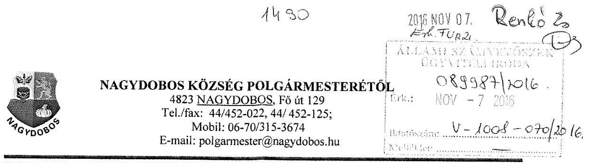
$420-6 / 2016$

Állami Számvevőszék

1052 Budapest
Apáczai Csere János utca 10.

Tárgy: Számvevőszéki jelentéstervezetre észrevétel

Iktatószám: V-1008-065/2016.
Témaszám: 2142
Ellenőrzés-azonosító szám: V073905

Tisztelt Domokos László Elnök Úr!
A 2016. 10. hó 15. napján kelt, és 2016. 10. hó 19-én megérkezett „Önkormányzati adósságrendezés ellenőrzése - Nagydobos Község Önkormányzata adósságrendezési eljárásának ellenőrzése" című jelentéstervezetben leírtakhoz a következő észrevételeket teszem:

1) Nem értünk egyet azzal az összegzö megállapítással, hogy az adósságrendezési eljárás végrehajtása során a polgármester, a jegyző és a pénzügyi gondnok nem szabályszerű feladatellátása akadályozta az adósságrendezés céljainak elérését. (Jelentéstervezet 5. oldal)

Az adósságrendezési eljárás szabályszerűen, határidőre, a bíróság jogerős végzésével lezárult. Sem az eljárás alatt, sem utána nem érkezett semmilyen panasz sem az Önkormányzathoz, sem a bírósághoz az eljárás nem szabályszerű volta miatt. A jogszabály adta kereteken belül eljárva tehát a polgármester, a jegyző és a pénzügyi gondnok munkája eredményes volt, és nem veszélyeztette az eljárás céljainak elérését.

A jelentéstervezet 2. pontja
„Összegző megállapítás - A lefolytatott adósságrendezési eljárás elérte a törvényben kitűzött célokat.
2. 1. számú megállapítása: Az adósságrendezés alatt a kötelező feladatok ellátása biztosított volt.
és 2. 3. számú megállapítás: Az Önkormányzat a fizetőképesség helyreállítása érdekében bevételnövelő és kiadáscsökkentő intézkedéseket tett.
Az 5. oldal összegző megállapítása ellentmondásos a 2.1, 2.3. számú megállapításokkal.
2) Az 1.4 számú megállapítás: Az adósságrendezés megindítását megelőző fordulónapi éves beszámolót és a teljes körű vagyonleltárt a jegyző nem készítette el az Áhsz. ${ }^{16} 13 . \S$ (1) és a Htv. ${ }^{17} 140 . \S$ (1) bekezdés d) pontjában meghatározott feladatkörében.
Egyetértünk vele, hogy ilyen formában vagyonleltár nem készült. De a pénzügyi gondnok részére átadott hatályos vagyonrendelet és annak mellékletét képező hatályos ingatlan vagyonkataszter a költségcsökkentő intézkedésekbe bevonható és be is vont ingatlanokkal kapcsolatban teljes körű és naprakész információkat

---

tartalmazott. Ezzel, nem hogy akadályozta az eljárás célját, hanem elősegítette annak eredményes lefolytatását.
A válságköltségvetési rendelettervezetet a polgármester a pénzügyi gondnoknak az elkészítés késedelme miatt határidőn túl adta át.
3) Az 1.5 számú megállapítás: A válság költségvetési rendelettervezet előterjesztését a jegyző a Htv. 140. § (1) a) pontja szerinti hatáskörében a Har. tv. 18. § (1) bekezdésében foglaltakkal ellentétben az adósságrendezés megkezdésétől számított 30 napos határidő lejártát követően, két napos késedelemmel 2011. január 10-én készítette el.

Nem hisszük, hogy a két napos késedelem érdemben befolyásolta volna az eljárás eredményes lefolytatását és céljainak elérését. Mivel a válságköltségvetés elkészítésében a pénzügyi gondnok részt vett, az ő bevonásával készült, így a benne foglaltakról tudomása volt. Ugyanakkor az 1.5 számú megállapítás is megerősíti, hogy a válságköltségvetés a jogszabályi előírásoknak megfelelt. A válságköltségvetési rendelet a Har. tv. előírásainak megfelelt, kizárólag a kötelezően ellátandó feladatok működési bevételeit és működési kiadásait tartalmazta.
4) 1.10 számú megállapítás. „A belső ellenőrzés a válságköltségvetésen alapuló kifizetések szabályszerű végrehajtását nem támogatta, mivel a jegyző a jogszabályi előírások ellenére nem készített intézkedési tervet."
Intézkedési terv valóban nem készült, de a gyakorlatban minden belső ellenőri megállapítást megvalósítottunk. A szabályzatok folyamatosan felül vannak vizsgálva, azok tartalmának megismerése és aláíratása a gazdálkodási szakterületen dolgozókkal megtörtént, ezek a dokumentumok az Önök ellenőrzése során be lettek csatolva. A FEUVE működik folyamatosan, ennek tényét a belső ellenőri jelentés is tartalmazza, szintén becsatolt dokumentum.

Bízunk abban, hogy észrevételeink alapján a tervezet megfogalmazása számunkra kedvezően módosul.
A jelentéstervezetben foglalt javaslatokkal egyetértünk, az intézkedési tervet 30 napon belül összeállítjuk, s megküldjük az Állami Számvevőszék részére.

Nagydobos, 2016. október 27.
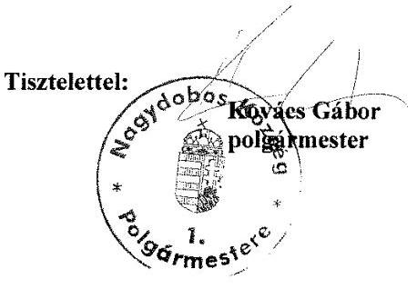

---

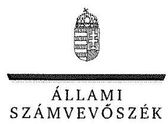

ELNÖK

Ikt. szám: V-1008-071/2016.

# Kovács Gábor úr 

polgármester

Nagydobos Község Önkormányzata

## Nagydobos

## Tisztelt Polgármester Úr!

Köszönettel megkaptam az „Önkormányzati adósságrendezés ellenőrzése - Nagydobos Község Önkormányzata adósságrendezési eljárásának ellenőrzése" címủ jelentéstervezet megállapításaira tett észrevételét.

Az ellenőrzési megállapításokra vonatkozó észrevételét az Állami Számvevőszékről szóló 2011. évi LXVI. törvény 29. § (2) bekezdésében meghatározott tizenöt napos határidőn belül küldte meg. Az Állami Számvevőszék észrevétellel kapcsolatos álláspontját a mellékletként csatolt, a felügyeleti vezető által készített indokolás tartalmazza.

Budapest, 2016. 177 hónap 44 nap

Tisztelettel:

Melléklet: Észrevételre adott válasz
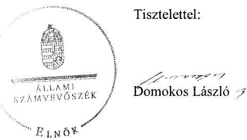

---

# „Önkormányzati adósságrendezés ellenőrzése - Nagydobos Község Önkormányzata adósságrendezési eljárásának ellenőrzése" 

című jelentéstervezetre tett észrevételekre adott válasz

| Észrevétel: | Összegzés   Megállapítás: Nagydobos Község Önkormányzata adósságrendezési eljárásának végrehajtása során a polgármester, a jegyző és a pénzügyi gondnok nem szabályszerű feladatellátása akadályozta az adósságrendezés céljainak elérését.   Észrevétel: Sem az eljárás alatt, sem utána nem érkezett semmilyen panasz sem az Önkormányzathoz, sem a bírósághoz az eljárás nem szabályszerű volta miatt. A 2. összegző megállapítás szerint „A lefolytatott adósságrendezési eljárás elérte a törvényben kitűzött célokat". A 2.1. számú megállapítás úgy fogalmaz, hogy „Az adósságrendezés alatt a kötelező feladatok ellátása biztosított volt", a 2.3. számú megállapítás alapján „Az Önkormányzat a fizetőképesség helyreállítása érdekében bevételnövelő és kiadáscsökkentő intézkedéseket tett". |
| :--: | :--: |
| Válasz: | Az Állami Számvevőszék az észrevételt nem fogadja el. |
| Indoklás: | A polgármester, a jegyző és a pénzügyi gondnok szabálytalan feladatellátása nem hiúsította meg, csak akadályozta az adósságrendezés céljainak elérését. Az Önkormányzat fizetőképessége helyreállt, azonban ez nagyrészt az állami beavatkozásnak, és nem az adósságrendezési eljárásnak az eredménye. Továbbá a hitelezői követelések kielégítésére nem az egyezségben vállalt ütemezés szerint került sor. |
| Észrevétel: | 1.4. számú megállapítás   Megállapítás: Az adósságrendezés megindítását megelőző fordulónapi éves beszámolót és a teljes körű vagyonleltárt a jegyző nem készítette el az Áhsz. 13. § (1) és a Htv. 140. § (1) bekezdés d) pontjában meghatározott feladatkörében.   Észrevétel: Egyetértenek vele, hogy ilyen formában vagyonleltár nem készült. De

 a pénzügyi gondnok részére átadott hatályos vagyonrendelet és annak mellékletét képező hatályos ingatlan vagyonkataszter a költségcsökkentő intézkedésekbe bevonható és be is vont ingatlanokkal kapcsolatban teljes körű és naprakész információkat tartalmazott. |
| Válasz: | Az Állami Számvevőszék az észrevételt nem fogadja el. |
| Indoklás: | A polgármester észrevételében nem vitatta, hogy vagyonleltár nem készült. A vagyonleltárnak nem csak az ingatlanokat, hanem a többi befektetett eszközt és a forgóeszközöket is tartalmaznia kell, ezért a vagyonrendelet és az ingatlan vagyonkataszter nem helyettesíti a vagyonleltárt. |
| Észrevétel: | 1.5. számú megállapítás   Megállapítás: A válságköltségvetési rendelettervezet előterjesztését a jegyző a Htv. 140. § (1) a) pontja szerinti hatáskörében a Har. tv. 18. § (1) bekezdésében foglaltakkal ellentétben az adósságrendezés megkezdésétől számított 30 napos határidő lejártát követően, két napos késedelemmel 2011. január 10-én készítette el. |

---

|  | Észrevétel: Nem hiszik, hogy a két napos késedelem érdemben befolyásolta volna   az eljárás eredményes lefolytatását és céljainak elérését. |
| :-- | :-- |
| Válasz: | Az Állami Számvevőszék az észrevételt nem fogadja el. |
| Indoklás: | A polgármester észrevételében nem vitatta, hogy válságköltségvetési rendelettervezet határidőn túl készült el. A megállapítás kizárólag a jogszabály szerinti határidő   betartására vonatkozik, nem minősítette a késedelemnek az eljárás eredményességére való hatását. |
| Észrevétel: | 1.10. számú megállapítás   Megállapítás: A belső ellenőrzés a válságköltségvetésen alapuló kifizetések szabályszerű végrehajtását nem támogatta, mivel a jegyző a jogszabályi előírások ellenére   nem készített intézkedési tervet.   Észrevétel: Intézkedési terv nem készült, de a gyakorlatban minden belső ellenőri   megállapítást megvalósítottunk. |
| Válasz: | Az Állami Számvevőszék az észrevételt nem fogadja el. |
| Indoklás: | A polgármester észrevételében nem vitatta, hogy a jegyző a jogszabályi előírások   ellenére nem készített intézkedési tervet, a megállapítás kizárólag a jogszabályban   előírtak elmaradását rögzíti. |

Tájékoztatom Polgármester Úrhölgyet, hogy az Állami Számvevőszékről szóló 2011. évi LXVI. törvény 29. § (3) bekezdése alapján az Állami Számvevőszék a figyelembe nem vett észrevételeket köteles a jelentésben feltüntetni, és megindokolni, hogy azokat miért nem fogadta el.

Budapest, 2016.
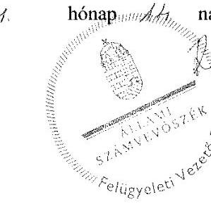

Renkó Zsuzsanna felügyeleti vezető

---

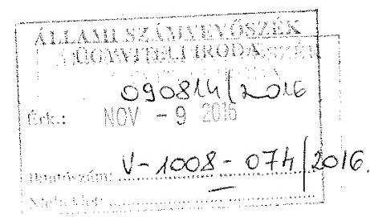

Állami Számvevőszék 1052 Budapest
Apáczai Csere János utca 10.

1511
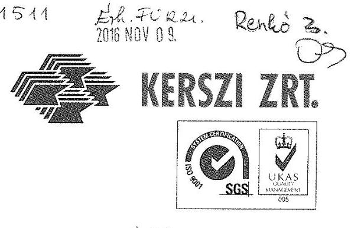

Iktsz.: K- 11.1.16/2016.

Tárgy: Észrevétel a 2016.10.15. napon kelt számvevőszéki jelentéstervezetre

Iktatószám: V-1008-065/2016
Témaszám: 2042
Ellenőrzés-azonosító szám: V073905

# Tisztelt Domokos László Elnök Úr! 

Az Állami számvevőszékről szóló 2011. évi LXVI. Törvény (a továbbiakban: ÁSZ tv.) 29 § (1) bekezdésében foglaltak alapján a 2016. október 15. napján kelt „Önkormányzati adósságrendezés ellenőrzése - Nagydobos Község Önkormányzata adósságrendezési eljárásának ellenőrzése" címú jelentéstervezetet kézhezvettük, melyre az ÁSZ tv. 29. § (2) bekezdésében biztosított 15 napon belül az alábbi észrevételt tesszük:

Nagydobos Község Önkormányzata mind földrajzi adottságából eredően, mind a lakosság jelentős kisebbségi összetételéből adódóan az egyik elmaradott térségbeli önkormányzat. Az önkormányzat a minimális technikai eszközökkel sem rendelkezett, irodai felszereltségét és infrastruktúráját tekintve jelentősen elmaradt a jelenkori modern irodai felszereltségtől.
A folyamatos kapcsolatokat tekintve a személyes jelenlét és napi e-mailváltás volt a távolság miatt a megoldható kommunikáció. Telefon, fax kikapcsolásra került, a szereplők magán mobiltelefonjai a térerő hiányában nem mindig volt alkalmazható kommunikációs eszközként.
A munkakörülményeket, valamint az önkormányzat szűkös pénzügyi lehetőségét nem lehet figyelmen kívül hagyni egy ilyen fontos eljárás során, s az egész adósságrendezési eljárás lefolytatását ennek szellemében kell vizsgálni. Mindezek ellenére igyekezett a pénzügyi gondnok a törvényben előírt kötelezettségét maradéktalanul teljesíteni, személyes jelenlétével elősegíteni az adósságrendezési eljárás lefolytatását.
Az „üres kamrának, bolond a gazdasszonya" kifejezés illik legjobban az adósságrendezési eljárás során alkalmazandó intézkedések sokaságára, a polgármester, jegyző és pénzügyi gondnok munkájára!
Mindezen körülmények előrebocsátása után részletesen kifejtjük, hogy miért nem értünk egyet, illetve milyen lényeges észrevételünk van a jelentéstervezettel.

---

1./ Az összegzés megfogalmazása tartalmában nem helytálló, így a levont következtetés félrevezetést sugall a leendő nyilvánosság számára.

Nagydobos Község Önkormányzat adósságrendezési eljárásának végrehajtása során a polgármester, a jegyző és a pénzügyi gondnok, minden tőlük telhető módon helytálltak és elősegítették az adósságrendezési eljárás sikerességét. Az adott körülmények között szabályszerű feladatellátásukkal, önzetlen munkájukkal hozzájárultak az adósságrendezési eljárás céljainak eléréséhez, az egyezség megkötéséhez, melyet a Szabolcs-Szatmár-Megyei Törvényszék végzéssel állapított meg. A Nagydobos Község Önkormányzat fizetőképessége helyreállt. Sajnos az egyezség létrejöttét követően, az Önkormányzat gazdálkodásán kívüli körülmények - világméretű gazdasági válság - befolyással volt az egyezségben vállalt kötelezettségek teljesítésére is, így annak következtében az egyezségben vállalt ütemezésekre is. A recesszió miatt az ingatlanok értékesítése csak hosszabb időszak alatt volt realizálható, amely az előzetes számításokhoz képest is jelentős késedelmet jelentettek.
Nagydobos Község Önkormányzat területén nem működnek vállalkozások, így saját bevételi forrás nem lévén a költségvetési forrásból nem tudott megtakarítást eszközölni a megállapodás teljesítésére.
Ezeket minden hitelezői fórumon, minden jelentésben, szöveges beszámolóban kellően kihangsúlyozta a Nagydobos Község Önkormányzat polgármestere, jegyzője és pénzügyi gondnoka.

Legfőképpen azzal bizonyítható ezen állításunk, hogy az adott körülmények között, a hitelezők hozzájárulásával, az egyezség mégis megköttetett, az adósságrendezési eljárás szabályszerűen, határidőre a bíróság jogerős végzésével lezárult.
Az adott adósságrendezési eljárásra vonatkozóan mindenek felett a Törvényszék döntése áll, amely sikeres eljárásról hozott végzést.
Az adósságrendezési eljárás időszaka alatt összehangolt, aktív munka folyt, ennek köszönhető a sikeres eljárás, tehát semmiképpen sem személyek mulasztásából, illetve a feladat el nem végzéséből adódott az, hogy a vállalt pénzügyi ütemezést a Nagydobos Község Önkormányzat nem tudta időben teljesíteni.
Az adósságrendezési eljárás alatt, de azt követően sem érkezett érdemi panasz Nagydobos Község Önkormányzathoz, sem a pénzügyi gondokhoz, sem a Törvényszékhez. Sem formai, sem tartalmi hiányosság nem merült fel az adósságrendezési eljárás során benyújtott és elfogadott egyezségi előterjesztéssel szemben.

A jogszabályok maradéktalan betartásával, de az adottságok figyelembe vételével végezte munkáját a polgármester, a jegyző és a pénzügyi gondnok.
Az egyezség eredményes volt és nem veszélyeztette az eljárás céljainak elérését, mint ahogyan az a jelentéstervezet 2. pontjában is helyesen kifejtésre került: „összegző megállapítás - A lefolytatott adósságrendezési eljárás elérte a törvényben kitűzött célokat."

# 2.1. számú megállapítás: „Az adósságrendezési eljárás alatt a kötelező feladatok ellátása biztosított volt."

---

# 2.3. számú megállapítás: „ Az Önkormányzat a fizetőképesség helyreállítása érdekében bevételnövelő és kiadáscsökkentő intézkedéseket tett. 

Így tehát fentiekből is megállapítható, hogy az 5. oldalon szereplő összegző megállapítás ellentmondásos a 2.1. számú, és 2.3. számú megállapításokkal.
2./ Nem értünk egyet a Számvevőszéki jelentéstervezet 5. oldalán lévő „főbb megállapítások, következtetések, javaslatok" bekezdésben pontatlanul fogalmazott mondatokkal:

- nem volt szabálytalan az adósságrendezési eljárás, erről egyetlen egy bírósági végzés sem szól, hiszen minden határidő, esemény a vonatkozó törvényben előírtak szerint történt. A törvény szerinti szabályos lefolytatásról a pénzügyi gondnok külön összefoglaló jelentést készített az ÁSZ ellenőrzése során, mely dokumentum feltöltésre került a dokumentumok között.
- nem veszélyeztette az adósságrendezési eljárás a törvényben meghatározott célok elérését, mert az eredményesen zárult, a hitelezők az egyezséghez hozzájárultak. Valamennyi egyezségi megállapodás becsatolásra került.
- kellő körültekintéssel és szakértői konzultáció keretében, költségmegtakarítás céljából és emberi erőforrás hiánya miatt döntöttünk úgy, hogy nem kerül december 9-i fordulónappal lezárásra a számviteli nyilvántartás, mivel sem a programok, sem az adott körülmény nem volt alkalmas arra, hogy 22 napra újabb költségvetési beszámoló készülhessen el. Ezért - mivel nem volt gazdasági esemény a karácsonyi és két ünnep között - került lezárásra a számviteli nyilvántartás december 31-i fordulónappal. Ez nem felelőtlenség, nem feledékenység és hanyagság, hanem olyan szakértői döntés, amely racionalizálta az egyébként szabadságolási idejüket töltő felelős pénzügyi vezető és munkatársak munkáját, illetve a mérlegbeszámoló gazdasági esemény nem lévén - azonos tartalommal való megfelelését. Ezért nem értünk egyet azzal, hogy a számviteli nyilvántartások lezárása elmaradt, mivel az adósságrendezési eljárás időpontja közel esett a december 31. napi fordulónaphoz és az teljes egészében ugyanazzal a tartalommal került elfogadásra.
- Visszautasítjuk azt a mondatot, hogy a pénzügyi gondnok nem kísérte figyelemmel az önkormányzat gazdálkodását, feladatainak ellátását, a válságköltségvetés időszakában több kifizetés szabálytalanul, a pénzügyi gondnok ellenjegyzése nélkül történt.
A pénzügyi gondnok ellenjegyzése nélkül sem utalás, sem pénzügyi kifizetés nem történt.
A banki átutaláskor a 10 pontból 6 pont érték a pénzügyi gondnok engedélyéhez volt kötve, tehát a bankszámla feletti rendelkezéseket csak és kizárólag a pénzügyi gondnok ellenjegyzésével lehetett eszközölni. Minden pénztári kifizetést személyesen utalványozott a pénzügyi gondnok és szignóval látott el.
Az eljárási rend az volt, hogy előzetesen az elfogadott költségvetési rendeletterv alapján a havi, heti és napi viszonylatban lebontott kiadásokat a pénzügyi gondnok rendelkezésére bocsájtották előzetes engedélyezésre, majd a befolyó pénzösszeg nagyságára való tekintettel kerülhetett sor a legsürgősebb és elengedhetetlen kiadásokra.

---

Amennyiben előfordul, hogy nem szerepel szignó az utalványozó rovatban, úgy annak kifizetéséről előzetes rendelkezési utalvány alapján e-mailben rendelkezett a pénzügyi gondnok. Az adósságrendezési eljárás alatt minden tevékenységről tudomása volt a pénzügyi gondnoknak, a pénzügyi gondnok személyesen ellenőrizte az alaptevékenységhez kapcsolódó intézményeket, áttekintette gazdálkodásukat, minden kiadást felügyelt és meggyőződött arról, hogy az Önkormányzat ellátja az alapvető feladatokat.

Ugyanezen bekezdésben szerepeltetett megállapításra észrevételezzük, hogy „az Önkormányzat fizetőképessége az adósságrendezési eljárás befejeződése után, az önkormányzati intézkedések és állami beavatkozások eredményeként a 2013. évben állt helyre", csaknem minden Önkormányzatra elmondható Magyarországon.
Statisztikai adatok mellőzésével is köztudott, hogy minden - nemcsak adósságrendezési eljárást eredményesen lezáró - Önkormányzatokat is meg kellett segíteni, az alapvető alaptevékenységhez évtizedek óta alulméretezett költségvetési támogatások hiánya miatt.

A Nagydobos Község Önkormányzat a vállalt kötelezettségeit teljesítette, az egyezségben vállalt kötelezettségeit a vállalt ütemezésektől eltérően - a hitelezőkkel történő kölcsönös megállapodások és egyeztetések alapján - , de teljesítette.

A 2011-2012. években működési hiány nem keletkezett. Megjegyezzük, hogy 2013-tól minden Önkormányzat - nemcsak az adósságrendezési eljárás alatt álló Önkormányzat - küzdött a hiánnyal a költségvetési válság és a költségvetési egyensúly hiánya miatt.

A Nagydobos Község Önkormányzat még mindig működőképes, még mindig fenn tudják tartani magukat, tehát végső következtetés múlt időben történő megfogalmazásával nem értünk egyet.

# 3./ Észrevétel az 1.4. számú megállapításhoz: 

Az adósságrendezési eljárás rövid időintervallumai, szakaszai nem tették lehetővé a tételes vagyonleltár felvételét. A leltározási szabályzat alapján előkészítendő vagyonleltárhoz a Nagydobos Község Önkormányzat nem rendelkezett sem anyagi, sem személyi, sem tárgyi feltétellel, az adott körülmények között nem érte volna el célját.
Nagydobos Község Önkormányzat rendelkezett hatályos vagyonrendelettel és annak mellékletét képező hatályos ingatlan vagyonkataszterrel, amelynek átadásával teljességgel megállapítható volt a bevonható vagyon nagysága, az teljes körű információt tartalmazott, kellő és elégséges bizonyíték volt a bevonható vagyonelemekről. Ezzel a teljes körű vagyonleltár átadással idő és költség megtakarítással még inkább elősegítette a Nagydobos Község Önkormányzata az eredményes előkészítő munkát, semhogy azt akadályozta volna. Úgy gondoljuk, hogy ez nem róható fel hiányosságként a szereplőknek, akik
 egyébként is 14-18 munkaórákat dolgoztak a pénzügyi gondnokkal együtt, hogy a Har.tv. előírásait időben tudják teljesíteni.

---

4./ Észrevétel az 1.5. számú megállapításhoz:
A válság költségvetési rendelettervezet két napos késedelme semmilyen körülmények között nem befolyásolta az eljárás eredményes lefolytatását és az adósságrendezési eljárás céljainak elérését. A szűkösre szabott határidők az adott körülmények között olyan mérhetetlenül nagy feladatot rótt az amúgy is nehéz körülmények között működő Nagydobos Község Önkormányzatra, hogy az nem befolyásolta a cél elérését. Annál is inkább, mivel a pénzügyi gondnok mindennapos munkája során részt vett a válságköltségvetés elkészítésében, az ő útmutatásai alapján készült el, tehát a tartalmáról tudomással bírt, a munkájában ezáltal nem volt sem korlátozva, sem akadályozva. Az, hogy a formába öntés és legépelés két nap késést eredményezett az átadás során, semmiben sem akadályozta az adósságrendezési eljárás sikerességét, hiszen az tartalmában minden követelménynek eleget tett.

Az 1.5. számú megállapítás is megerősíti, hogy a válságköltségvetés a jogszabályi előírásoknak megfelelt.
A válságköltségvetési rendelet a Har.tv. előírásainak megfelelt, kizárólag a kötelezően ellátandó feladatok működési bevételeit és működési kiadásait tartalmazta.
Ebből eredően válság költségvetési rendelettervezetnek kettő (2) nappal későbbi átadása Nagydobos Község Önkormányzata helyzetét nem befolyásolta, ezért kérjük, hogy az adott körülményeket ismerve, ne kerüljön ez negatív megvilágításba.
5./ Észrevétel az 1.7. számú megállapításhoz:

A jelentéstervezetben az 1.7. számú megállapításnál a „Hitelezők értesítése" bekezdéshez észrevételként tesszük, hogy az egyezség megkötéséről a hitelezők értesítve lettek, azonban az Önkormányzatnál fellelhető egyezség a Har.tv. 25. § (1) bekezdésében foglaltak ellenére nem tartalmazta a pénzügyi gondnok ellenjegyzését. Azonban a pénzügyi gondnok által feltöltött dokumentumokban, illetve archivált példányokon, a hitelezőknek kiküldött dokumentumokon, valamint a bírósághoz becsatolt dokumentumokon szerepelt a pénzügyi gondnok aláírása. Tehát, ezen hiányosságot ne értékeljék negatívan, hiszen nem az ellenjegyzés, hanem az egyezség hitelezők általi elfogadása a legfontosabb.
6./ Észrevétel az 1.9. számú megállapításhoz:

- nem fordult elő, hogy kifizetést a pénzügyi gondnok engedélye, ellenjegyzése nélkül teljesítettek.
- a pénzügyi gondnok szignó aláírást alkalmazott a bizonylatokon.

Az aláírási címpéldányban rögzített, hiteles forma szerinti aláírást a bírósági beadványokon, hivatalos okiratokon, megállapodásokon, levelezéseken, illetve a bankszámlák feletti rendelkezéseken alkalmazta.

---

Minden egyéb számviteli bizonylaton, kimutatáson, esetleg előirányzaton, utalványozáson, nyugtán, kiadási bizonylaton szignót alkalmazott.
7./ Észrevétel az 1.10. számú megállapításhoz:

Nagydobos Község Önkormányzata észrevételt tett.

# Tisztelt Elnök Úr! 

Kérjük, hogy a Nagydobos Község Önkormányzat adósságrendezési eljárása során ismertetett körülményekre tekintettel észrevételeinket méltányolják és az elkészített jelentéstervezet megfogalmazásait pozitívan befolyásolják, módosítsák.

A jelentéstervezet fentebb nem említett és nem észrevételezett részeivel egyetértünk.

Bízunk abban, hogy a Szabolcs-Szatmár Megyei Törvényszék és a hitelezők által is sikeresnek ítélt adósságrendezési eljárás folyamatát - az adott körülményeket ismerve - Önök is egy eredményes eljárásnak minősítik.

Az adott körülmények között Szabolcs-Szatmár Megye viszonylatában - a Törvényszék megítélésére alapozva - eredményes és példaadó adósságrendezési eljárás valósult meg a Nagydobos Község Önkormányzat adósságrendezési eljárás során.
Erről tanúskodik a Szabolcs-Szatmár Megyei Törvényszék végzése is, amely az adósságrendezési eljárás befejezéséről, az egyezség létrejöttéről szólt.

Kérjük, hogy az adott körülményekre tekintettel, a fent megfogalmazott észrevételekre figyelemmel szíveskedjenek a jelentéstervezet szövegezésében és az egyes fejezetek között a pozitív összhangot megteremteni, továbbá szíveskedjenek észrevételeinket elfogadni, különösen a végleges jelentés nyilvánosságra hozatala előtt.

Budapest, 2016. november 2.
Tisztelettel:

Molnár György, 4
vezérigazgató

---

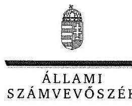

ELNÖK

Ikt. szám: V-1008-075/2016.

# Molnár György úr 

vezérigazgató

KERSZI Kereskedelmi és Pénzügyi Szervezési-Tanácsadó Zártkörűen Működő
Részvénytársaság

## Budapest

## Tisztelt Vezérigazgató Úr!

Köszönettel megkaptam az ,,Önkormányzati adósságrendezés ellenőrzése - Nagydobos Község Önkormányzata adósságrendezési eljárásának ellenőrzése" című jelentéstervezet megállapításaira tett észrevételét.

Az ellenőrzési megállapításokra vonatkozó észrevételét az Állami Számvevőszékről szóló 2011. évi LXVI. törvény 29. § (2) bekezdésében meghatározott tizenöt napos határidőn belül küldte meg. Az Állami Számvevőszék észrevétellel kapcsolatos álláspontját a mellékletként csatolt, a felügyeleti vezető által készített indokolás tartalmazza.

Budapest, 2016. 11. hónap 17. nap
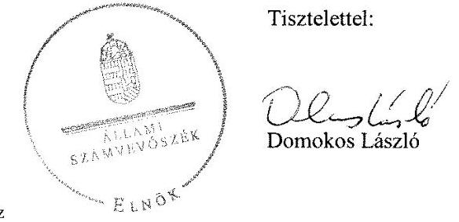

---

# „Önkormányzati adósságrendezés ellenőrzése - Nagydobos Község Önkormányzata adósságrendezési eljárásának ellenőrzése" 

című jelentéstervezetre tett észrevételekre adott válasz

| 1. észrevétel: | Összegzés   Megállapítás: Nagydobos Község Önkormányzata adósságrendezési eljárásának végrehajtása során a polgármester, a jegyző és a pénzügyi gondnok nem szabályszerű feladatellátása akadályozta az adósságrendezés céljainak elérését.   Észrevétel: Az adósságrendezési eljárás alatt, de azt követően sem érkezett érdemi panasz az Önkormányzathoz, sem a pénzügyi gondnokhoz, sem a Törvényszékhez. A 2. összegző megállapítás szerint „A lefolytatott adósságrendezési eljárás elérte a törvényben kitűzött célokat". A 2.1. számú megállapítás úgy fogalmaz, hogy „Az adósságrendezés alatt a kötelező feladatok ellátása biztosított volt", a 2.3. számú megállapítás alapján „Az Önkormányzat a fizetőképesség helyreállítása érdekében bevételnövelő és kiadáscsökkentő intézkedéseket tett". |
| :--: | :--: |
| Válasz: | Az Állami Számvevőszék az észrevételt nem fogadja el. |
| Indoklás: | A polgármester, a jegyző és a pénzügyi gondnok szabálytalan feladatellátása nem hiúsította meg, csak akadályozta az adósságrendezés céljainak elérését. Az Önkormányzat fizetőképessége helyreállt, azonban ez nagyrészt az állami beavatkozásnak, és nem az adósságrendezési eljárásnak az eredménye. Továbbá a hitelezői követelések kielégítésére nem az egyezségben vállalt ütemezés szerint került sor. |
| 2. észrevétel: | Főbb megállapítások, következtetések, javaslatok 1. bekezdés és 2. bekezdés 1. mondata   Megállapítás: Az adósságrendezési eljárás szabálytalan végrehajtása az eljárás törvényben meghatározott céljainak elérését veszélyeztette. Az adósságrendezés megindításakor nem került sor az Önkormányzat valós vagyoni helyzetének felmérésére, mert a vagyon számbavétele nem teljes körű volt, továbbá a számviteli nyilvántartások lezárása elmaradt. A pénzügyi gondnok nem kísérte figyelemmel az önkormányzat gazdálkodását, feladatainak ellátását, a válságköltségvetés időszakában több kifizetés szabálytalanul, a pénzügyi gondnok ellenjegyzése nélkül történt. Az önkormányzat fizetőképessége az adósságrendezési eljárás befejeződése után, az önkormányzati intézkedések és állami beavatkozások eredményeként a 2013. évben állt helyre.   Észrevétel: Az észrevétel szerint   a) nem volt szabálytalan az adósságrendezési eljárás, erről egyetlen bírósági végzés se szól, minden határidő, esemény a vonatkozó törvényben előírtak szerint történt.   b) nem veszélyeztette az adósságrendezési eljárás a törvényben meghatározott célok elérését, mert az eredményesen zárult, a hitelezők az egyezséghez hozzájárultak.   c) költségmegtakarítás céljából és emberi erőforrás hiánya miatt döntöttek úgy, hogy nem kerül december 9-ei fordulónappal lezárásra a számviteli nyilvántartás. |

---

|  | d) a pénzügyi gondnok ellenjegyzése nélkül sem utalás, sem pénzügyi kifizetés nem történt. Minden pénztári kifizetést személyesen utalványozott a gondnok. Amennyiben nem szerepel szignó az utalványozó rovatban, úgy annak kifizetéséről előzetes rendelkezési utalvány alapján e-mailben rendelkezett a pénzügyi gondnok.   e) Minden, nemcsak adósságrendezési eljárást eredményesen lezáró önkormányzatot meg kellett segíteni az alaptevékenységhez évtizedek óta alulméretezett költségvetési támogatások hiánya miatt. |
| :--: | :--: |
| Válasz: | Az Állami Számvevőszék az észrevételt nem fogadja el. |
| Indoklás: | Az észrevétel nem alapozza meg a jelentés módosítását:   a) az eljárás szabálytalanságáról szóló bírósági végzés hiánya az eljárás szabályosságát nem támasztja alá. Az események jogszabályi előírás szerinti végrehajtását nem támasztja alá, hogy számviteli nyilvántartások lezárása elmaradt (amit az észrevétel 2. c) pontja is elismer, illetve az, hogy a kifizetéseket a pénzügyi gondnok nem jegyezte ellen.   b) az 1. észrevétellel kapcsolatban leírt indoklás alapján.   c) számviteli nyilvántartások lezárása elmulasztását az észrevétel nem vitatja. A jogszabály nem ad mérlegelési lehetőséget, a számviteli nyilvántartások lezárása kötelező feladat.   d) az észrevétel nem vitatja, hogy a pénzügyi gondnok nem jegyezte ellen a kifizetéseket, mivel észrevétele szerint rendelkezőként járt el. A Har. vhr. 16. §-a alapján „A jegyző az adósságrendezés megindításával egyidejűleg a számlavezető pénzügyi intézményhez soron kívül eljuttatja a bírósági végzésben kijelölt pénzügyi gondnok ellenjegyzéséhez szükséges aláírási címpéldányt". A pénzügyi gondnokot tehát ellenjegyzésre és nem rendelkezésre jogosult személyként kellett bejelenteni a számlavezető pénzintézethez.   e) az észrevétel nem vitatja, hogy az önkormányzat fizetőképességének helyreállításához állami beavatkozás is hozzájárult. |
| 3. észrevétel: | 1.4. számú megállapítás 2. bekezdés   Megállapítás: A vagyonleltár teljes körűen nem tartalmazta a befektetett eszközöket és forgóeszközöket, csak az ingatlanokat.   Észrevétel: Az adósságrendezési eljárás rövid időintervallumai nem tették lehetővé a tételes vagyonleltár felvételét. Az Önkormányzat rendelkezett hatályos vagyonrendelettel és annak mellékletét képező hatályos ingatlan vagyonkataszterrel, amelynek átadásával teljességgel megállapítható volt az adósságrendezésbe bevonható vagyon nagysága. Ezzel a teljes körű vagyonleltár átadással idő és költség megtakarítással még inkább elősegítette az Önkormányzat az eredményes előkészítő munkát, semhogy akadályozta volna azt. |
| Válasz: | Az Állami Számvevőszék az észrevételt nem fogadja el. |
| Indoklás: | A vagyonleltár elkészítésének elmulasztását az észrevétel nem vitatja. A jogszabály nem ad mérlegelési lehetőséget, a vagyonleltár elkészítése kötelező feladat. Továbbá a vagyonleltárnak nem csak az ingatlanokat, hanem a többi befektetett eszközt és a forgóeszközöket is tartalmaznia kell, ezért a vagyonrendelet és az ingatlan vagyonkataszter nem helyettesíti a vagyonleltárt. |

---

| 4. észrevétel: | 1.5. számú megállapítás   Megállapítás: A válságköltségvetési rendelettervezet előterjesztését a jegyző az adósságrendezés megkezdésétől számított 30 napos határidő lejártát követően, két napos késedelemmel 2011. január 10-én készítette el.   Észrevétel: A válságköltségvetési rendelettervezet két napos késedelme semmilyen körülmények között nem befolyásolta az eljárás eredményes lefolytatását és az adósságrendezési eljárás céljainak elérését. |
| :--: | :--: |
| Válasz: | Az Állami Számvevőszék az észrevételt nem fogadja el. |
| Indoklás: | Az észrevétel nem vitatta, hogy válságköltségvetési rendelettervezet határidőn túl készült el. A megállapítás kizárólag a jogszabály szerinti határidő betartására vonatkozik, nem minősítette a késedelemnek az eljárás eredményességére való hatását. |
| 5. észrevétel: | 1.7. számú megállapítás 7. bekezdése   Megállapítás: Az Önkormányzatnál fellelhető egyezség nem tartalmazta a pénzügyi gondnok ellenjegyzését.   Észrevétel: Az egyezség megkötéséről a hitelezők értesítve lettek, azonban az Önkormányzatnál fellelhető egyezség nem tartalmazta a pénzügyi gondnok ellenjegyzését. Azonban a pénzügyi gondnok által feltöltött dokumentumokban, illetve archivált példányokon, a hitelezőknek kiküldött dokumentumokon, valamint a bírósághoz becsatolt dokumentumokon szerepelt a pénzügyi gondnok aláírása. Tehát, ezen hiányosságot ne értékeljék negatívan, hiszen nem az ellenjegyzés, hanem az egyezség hitelezők általi elfogadása a legfontosabb. |
| Válasz: | Az Állami Számvevőszék az észrevételt nem fogadja el. |
| Indoklás: | Az észrevétel nem vitatta, hogy az Önkormányzatnál fellelhető egyezség nem tartalmazta a pénzügyi gondnok ellenjegyzését, az észrevétellel érintett megállapítás is ezt rögzíti. |
| 6. észrevétel: | 1.9. számú megállapítás 2. bekezdése   Megállapítás: Előfordult, hogy a kifizetést a pénzügyi gondnok ellenjegyzése nélkül teljesítették. A pénzügyi gondnok ellenjegyzése nem volt beazonosítható, mivel az aláírás nem aláírási címpéldányban rögzített, hitelesített forma szerint történt.   Észrevétel: Nem fordult elő, hogy kifizetést a pénzügyi gondnok engedélye, ellenjegyzése nélkül teljesítettek. A pénzügyi gondnok szignó aláírást alkalmazott a bizonylatokon. |
| Válasz: | Az Állami Számvevőszék az észrevételt nem fogadja el. |
| Indoklás: |

 | Az észrevétel 2. d) pontja szerint a pénzügyi gondnok rendelkezőként és nem ellenjegyzőként járt el. A kifizetések ellenjegyzésével kapcsolatos konkrétumot, konkrét dokumentumra történő hivatkozást az észrevétel nem tartalmaz. |

---

Tájékoztatom Vezérigazgató Urat, hogy az Állami Számvevőszékről szóló 2011. évi LXVI. törvény 29. § (3) bekezdése alapján az Állami Számvevőszék a figyelembe nem vett észrevételeket köteles a jelentésben feltüntetni, és megindokolni, hogy azokat miért nem fogadta el.

Budapest, 2016.
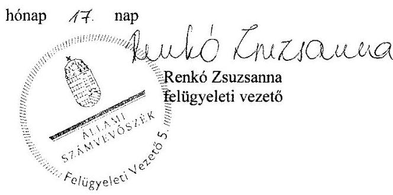

---

.

---

# RÖVIDÍTÉSEK JEGYZÉKE 

${ }^{1}$ Képviselő-testület
${ }^{2}$ Pénzügyi bizottság
${ }^{3}$ jegyző
${ }^{4}$ KLIK
${ }^{5}$ Hivatal
${ }^{6}$ polgármester ${ }_{2}$
${ }^{7}$ Bíróság
${ }^{8}$ KERSZI Zrt.
${ }^{9}$ Har. tv.
${ }^{10}$ Ötv.
${ }^{11}$ Stabilitási tv.
${ }^{12}$ polgármester ${ }_{1}$
${ }^{13}$ Közigazgatási Hivatal
${ }^{14}$ Magyar Államkincstár
${ }^{15}$ Adósságrendezési Bizottság
${ }^{16}$ Áhsz.
${ }^{17} \mathrm{Htv}$.
${ }^{18}$ SZMSZ
${ }^{19}$ Ámr.
${ }^{20}$ Ügyrend
${ }^{21}$ Számv. tv.
${ }^{22}$ Számviteli politika
${ }^{23}$ Pénzkezelési szabályzat
${ }^{24}$ Számlarend
${ }^{25}$ Leltározási és leltárkészítési szabályzat
${ }^{26}$ Eszközök és források értékelési szabályzata

Nagydobos Község Képviselő Testülete
Nagydobos Község Képviselő Testületének Pénzügyi Bizottsága
Nagydobos Község jegyzője (a teljes ellenőrzött időszakban)
Klebelsberg Intézményfenntartó Központ
Nagydobos Község Önkormányzatának Polgármesteri Hivatala
Nagydobos Község polgármestere 2010. október 4-étől 2012. december 2-áig.
Szabolcs-Szatmár-Bereg Megyei Bíróság
Kerszi Kereskedelmi és Pénzügyi, Szervezési-Tanácsadó Zrt.
a helyi önkormányzatok adósságrendezési eljárásáról szóló 1996. évi XXV. törvény
1990. évi LXV. törvény a helyi önkormányzatokról
2011. évi CXCV. törvény Magyarország gazdasági stabilitásáról

Nagydobos Község polgármestere 2006. október 1-jétől 2010. október 3-áig
Szabolcs-Szatmár-Bereg Megyei Közigazgatási Hivatal
Magyar Államkincstár Észak-alföldi Regionális Igazgatósága
Nagydobos Község Önkormányzata adósságrendezési bizottsága
249/2000. (XII. 24.) Korm. rendelet az államháztartás szervezetei beszámolási és könyvvezetési kötelezettségének sajátosságairól (hatálytalan 2014. január 1-jétől)
1991. évi XX. törvény a helyi önkormányzatok és szerveik, a köztársasági megbízottak, valamint egyes centrális alárendeltségű szervek feladat- és hatásköreiről szóló 1991. évi XX. törvény
Nagydobos Község Önkormányzatának 3/2008 (II.29.) KT. számú rendelete a Szervezeti és Működési Szabályzatáról (Hatályos: 2008. február 29-től 2014. december 08-ig)
292/2009. (XII. 19.) Korm. rendelet az államháztartás működési rendjéről (hatálytalan: 2012. január 1-jétől)
Ügyrend Nagydobos Polgármesteri Hivatal gazdasági szervezetének
gazdálkodással összefüggő feladataira (Hatályos: 2010. június 01-től)
2000. évi C. törvény a számvitelről
Nagydobos Község Polgármesteri Hivatalának (Napközi Otthonos Óvodájára, Általános Iskolájára kiterjedő) számviteli politikája (Hatályos: 2008. július 01-től)
Nagydobos Község Önkormányzat Polgármesteri Hivatalának (Cigány kisebbségi önkormányzatára, Napközi Otthonos Óvodájára, Általános Iskolájára kiterjedő) pénzkezelési szabályzata (Hatályos: 2010. november 01-től)
Nagydobos Község Önkormányzat Polgármesteri Hivatalának számlarendje (Hatályos: 2008. március 31-től)
Nagydobos Község Önkormányzat Polgármesteri Hivatalának (Napközi Otthonos Óvodájára, Általános Iskolájára kiterjedő) Leltározási és leltárkészítési szabályzata (Hatályos: 2010. április 01-től)
Nagydobos Község Önkormányzat Polgármesteri Hivatalának (Napközi Otthonos Óvodájára, Általános Iskolájára kiterjedő) Eszközök és források értékelési szabályzata (Hatályos: 2010. április 01-től)

---

${ }^{27}$ Gazdálkodási szabályzat
${ }^{28}$ Har. vhr.
${ }^{29}$ Társulás
${ }^{30}$ Ber.

Nagydobos Község Önkormányzat Polgármesteri Hivatalának (Napközi Otthonos Óvodájára, Általános Iskolájára kiterjedő) Gazdálkodási szabályzata a kötelezettségvállalás, ellenjegyzés, szakmai teljesítés igazolása, érvényesítés és az adatszolgáltatás rendjéről (Hatályos: 2010. november 01-től)
a helyi önkormányzatok adósságrendezési eljárásáról szóló 1996. évi XXV. törvény végrehajtásának egyes kérdéseiről szóló 95/1996. (VII. 4.) Korm. rendelet
Szatmári Többcélú Kistérségi Társulás
a költségvetési szervek belső ellenőrzéséről szóló 193/2003. (XI. 26.) Korm. rendelet (hatálytalan 2012. január 1-jétől)

---

# ÁLLAMI SZÁMVEVŐSZÉK 

1052 Budapest, Apáczai Csere János utca 10.
Levélcím: 1364 Budapest 4. Pf. 54
Telefon: +36 14849100 Telefax: +36 14849200
www.asz.hu
