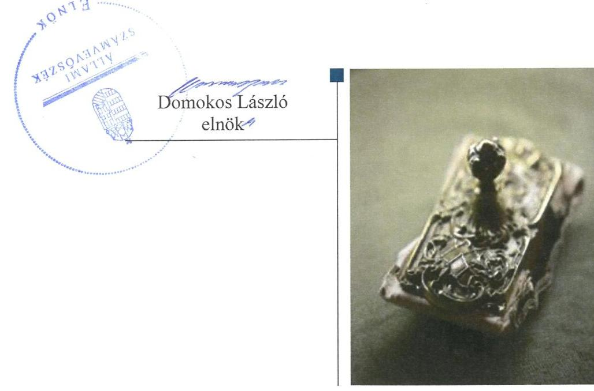
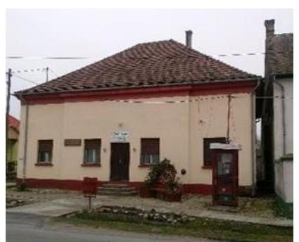
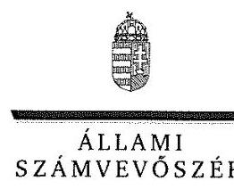
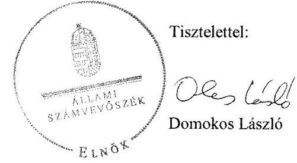
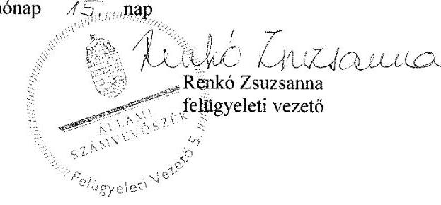

# Jelentés 

## Önkormányzati adósságrendezés ellenőrzése

Nemesvid Község Önkormányzata adósságrendezési eljárásának ellenőrzése 2016.

---

# J elentés 

## Önkormányzati adósságrendezés ellenőrzése

Nemesvid Község Önkormányzata adósságrendezési eljárásának ellenőrzése 2016. 12. hó 0.1 nap

---

# AZ ELLENŐRZÉST FELÜGYELTE:

- RENKŐ ZSUZSANNA felügyeleti vezető
- AZ ELLENŐRZÉST VEZETTE ÉS A VÉGREHAJTÁSÁÉRT FELELŐS:
  - BAJNAI ZSUZSANNA ellenőrzésvezető
  - A PROGRAM ÖSSZEÁLLÍTÁSÁÉRT FELELŐS:
    - JANIK JÓZSEF LÁSZLÓ osztályvezető

**IKTATÓSZÁM:** V-1010-090/2016

**TÉMASZÁM:** 2044

**ELLENŐRZÉS-AZONOSÍTÓ SZÁM:** V073907

Jelentéseink az Országgyűlés számítógépes hálózatán és az Interneta a www.asz.hu címen is olvashatóak.

---

# TARTALOMJEGYZÉK 

■ ÖSSZEGZÉS ..... 5
■ AZ ELLENŐRZÉS CÉLJA ..... 6
■ AZ ELLENŐRZÉS TERÜLETE ..... 7
■ AZ ELLENŐRZÉS HÁTTERE, INDOKOLTSÁGA ..... 8
■ A JELENTÉS LÉNYEGES KÉRDÉSKÖREI ..... 9
■ ELLENŐRZÉS HATÓKÖRE ÉS MÓDSZEREI ..... 10
■ MEGÁLLAPÍTÁSOK ..... 12
■ JAVASLATOK ..... 21
■ MELLÉKLETEK ..... 23
I. sz. melléklet: Értelmező szótár ..... 23
II. sz. melléklet: Bevételek és kiadások, adósságszolgálat, CLF módszer szerinti kimutatása ..... 25
■ FÜGGELÉK: ÉSZREVÉTELEK ..... 27
■ RÖVIDÍTÉSEK JEGYZÉKE ..... 35

---

.

---

# ÖSSZEGZÉS 

Nemesvid Község Önkormányzata adósságrendezési eljárásának végrehajtása során a polgármester, a jegyzők és a pénzügyi gondnok nem szabályszerű feladatellátása akadályozta az adósságrendezés céljainak elérését. A kötelezettségek rendezésére fordítható vagyon a hitelezői igények harmadára sem biztositott fedezetet. A fizetőképesség helyreállításának teljesülése megbizható adatok hiányában nem volt megállapítható. Az önkormányzat pénzügyi egyensúlya az adósságrendezési eljárás lezárását követően nem volt biztositott.

## Az ellenőrzés társadalmi indokoltsága

Pénzügyi egyensúlyi helyzetének, fizetőképességének megromlása miatt Nemesvid Község Önkormányzatánál 2010. június 15-től 2012. december 19-ig adósságrendezés folyt, amely során a hitelezők 316,4 millió Ft kötelezettség teljesítésére nyújtottak be igényt. Ez a kötelezettségállomány az önkormányzat vagyonának tizedét jelentette, így indokolt ellenőrizni, hogy az adósságrendezési eljárás elérte-e a célját, az eljárás szereplői eleget tettek-e törvényben meghatározott feladataiknak a fizetőképesség helyreállítása, a hitelezőknek hatékony jogvédelem nyújtása és az átgondolt, felelősségteljes gazdálkodás elősegítése érdekében.

## Főbb megállapítások, következtetések, javaslatok

Az adósságrendezési eljárás szabálytalan végrehajtása az eljárás törvényben meghatározott céljainak elérését, az önkormányzat átgondolt, felelősségteljes gazdálkodásának elősegítését veszélyeztette. Az adósságrendezés megindításakor nem került sor a valós vagyoni helyzet felmérésére, mert a vagyon számbavétele nem történt meg, továbbá a számviteli nyilvántartások lezárása elmaradt. A pénzügyi gondnok nem tárta fel az adósságrendezési eljárás megindításához vezető okokat, és azok kezelését sem határozták meg reorganizációs programban. A pénzügyi gondnok nem kísérte továbbá figyelemmel az önkormányzat gazdálkodását, feladatainak ellátását, mivel a válságköltségvetés időszakában a kifizetéseket ellenjegyzése nélkül, szabálytalanul teljesítettek.

Egyezségi javaslat nem készült, ezért a bíróság vagyonfelosztást rendelt el. Az önkormányzat adósságrendezésbe vonható vagyona azonban a hitelezői igények egyharmadára sem volt elegendő, a hitelezői igényeknek csak 29,0\%a került kiegyenlítésre.

Az önkormányzat fizetőképességének helyreállítására vonatkozó következtetést az ellenőrzés nem tudott levonni, mivel nem álltak rendelkezésre megbízható adatok a kötelezettségek állományára.

A pénzügyi egyensúly a 2012. és a 2014. években nem volt biztosított, a működési bevételek az eseti állami támogatásokkal együtt sem fedezték a működési kiadásokat, a 2013. évben pedig csak állami segítséggel érték el a működési költségvetés egyensúlyát.

---

# AZ ELLENŐRZÉS CÉLJA 

Az ellenőrzés célja annak megállapítása, hogy az adósságrendezési eljárás megindítása, lefolytatása szabályszerű volt-e, az önkormányzat gazdálkodása az adósságrendezési eljárás alatt megfelelt-e a jogszabályi előírásoknak; az eljárás szereplői - kiemelten a pénzügyi gondnok - a jogszabályokban foglaltak szerint jártak-e el az adósságrendezés során. A lefolytatott eljárás elérte-e a törvényben kitűzött célokat; az önkormányzat teljesítette-e kötelező feladatait, a hitelezők követelését vagyonarányosan kielé-gítette-e, helyre állt-e fizetőképessége.

---

# AZ ELLENŐRZÉS TERÜLETE 

## A Nemesvid Község Önkormányzata

Nemesvid Somogy megyében található. Állandó lakosainak száma 2009. január 1-jén 823 fő, 2014. december 31-én 798 fő volt.

Az önkormányzat ${ }^{1}$ képviselő-testülete ${ }^{2}$ 2009. január 1-jétől nyolc fővel és egy állandó bizottsággal, majd a 2010. évi önkormányzati választásokat követően öt fővel és egy állandó bizottsággal látta el feladatait. A jelenlegi polgármester 2014 óta tölti be tisztségét. A jegyző személye az ellenőrzött időszakban három alkalommal változott. 2012. december 31-ig az igazgatási feladatokat a körjegyzőség látta el, azt követően a Somogyzsitfai Közös Önkormányzati Hivatal. 2009. évről 2014. évre a foglalkoztatott köztisztviselők száma öt főről 11 főre nőtt, a közalkalmazottaké (két fő) nem változott.

Az ellenőrzött időszakban az önkormányzat általa fenntartott költségvetési szervvel nem rendelkezett.

2009-2010. években egy 0,1\%-ot meg nem haladó tulajdoni részesedésű részvénye volt.

Az önkormányzat adósságrendezési eljárását 2010. május 17-én a polgármester ${ }^{3}$ kezdeményezte, az önkormányzat nagy összegű adósságállományára hivatkozva. A bíróság ${ }^{4}$ végzése az adósságrendezés megindításáról 2010. június 15-én jelent meg a Cégközlönyben. Az adósságrendezés 2012. december 19-én vagyonfelosztással zárult.

A bíróság a VECTIGALIS Zrt.-t5 jelölte ki a pénzügyi gondnoki feladatok ellátására.

---

# AZ ELLENŐRZÉS HÁTTERE, INDOKOLTSÁGA 

Az önkormányzatok finanszírozásának, gazdálkodásának keretei és feladatellátása jelentős változásokon ment keresztül a Har. tv. ${ }^{6}$ hatálybalépésétől eltelt időszakban

Az önkormányzati eladósodást 2011-ig csak az Ötv.-ben ${ }^{7}$ meghatározott hitelfelvételi korlát szabályozta, a korlát megsértését azonban jogszabályok nem szankcionálták. 2012. évtől jelentős szigorítás lépett életbe, a korábbi passzív szabályozást a Stabilitási tv. ${ }^{8}$ hatálybalépésével az aktív kontroll váltotta fel, a törvény előírásai alapján az önkormányzatok hitelfelvételei engedélykötelessé váltak.

1996-ban a hitelfelvételi korlát bevezetése mellett az önkormányzatok adósságrendezésének szabályozására is sor került. Az adósságrendezési eljárás részben a lakosság védelmét szolgálta azzal, hogy biztosította az önkormányzatok által nyújtott kötelező közfeladatokhoz való hozzájutást az önkormányzat fizetésképtelensége esetén is. A Har. tv. alapján - 1996 és 2013 júniusa között - ugyanakkor elenyésző számú, mindösszesen 64 adósságrendezési eljárás indult. Az eljárások közel 60\%-a egyezséggel, 40\%-a vagyonfelosztással zárult. Az adósságrendezés első időszakában (2009. évig) a forráshiányból eredeztethető eladósodás tette indokolttá az eljárások jelentős hányadának megindítását.

A második időszakban az eljárás alá vont önkormányzatok között megjelentek a nagyobb költségvetéssel és több intézménnyel is rendelkező települések. Az adósságrendezést szükségessé tevő problémák speciális pénzügyi elemekkel, a devizaalapú kötvénnyel történő finanszírozás begyűrűző hatásaival, valamint az anyagi lehetőségeket meghaladó, túlméretezett fejlesztésekkel összefüggő kötelezettségvállalásokkal egészültek ki, de a beruházások esetében fontos tényező volt a kellő szakértelem hiánya és a pénzügyi nehézségek szakszerűtlen kezelése is.

Az ÁSZ ${ }^{9}$ önkormányzati alrendszert érintő ellenőrzései, elemzései során számos ponton mutatott rá azokra a területekre, ahol a „szabályozás" módosításra, korrekcióra szorul. Az ellenőrzés alapján megfogalmazott javaslatok e területen is segítséget nyújthatnak a kormányzat és az Országgyűlés törvényhozó munkájában, hozzájárulhatnak az irányítói tevékenység erősítéséhez. Az ellenőrzés során tett megállapításaink megerősíthetik egy „megelőző monitoring funkció" kialakításának szükségességét a helyi önkormányzatok fizetésképtelenségének megelőzése érdekében.

---

# A JELENTÉS LÉNYEGES KÉRDÉSKÖREI 

1. Az adósságrendezési eljárás folyamata, végrehajtása során szabályszerű volt-e az önkormányzat és a pénzügyi gondnok feladatellátása?
2. A lefolytatott adósságrendezési eljárás elérte-e a törvényben kitüzött célokat?
3. Az adósságrendezési eljárást követően biztosított és fenntartható volt-e a pénzügyi egyensúly?

---

# ELLENŐRZÉS HATÓKÖRE ÉS MÓDSZEREI 

## Az ellenőrzés típusa

Rendszerellenőrzés

## Az ellenőrzött időszak

2009. január 1. és 2015. június 30. közötti időszak, ezen belül az első kérdéskör vonatkozásában az adósságrendezési eljárás kezdeményezésétől az eljárás lezárásáig tartó időszak.

## Az ellenőrzés tárgya

A Har. tv. által szabályozott adósságrendezési eljárás.

## Az ellenőrzött szervezet

Nemesvid Község Önkormányzata, és a pénzügyi gondnoki feladatok ellátásával összefüggésben a VECTIGALIS Általános Vállalkozási Zártkörűen Müködő Részvénytársaság.

## Az ellenőrzés jogalapja

Az Állami Számvevőszékről szóló 2011. évi LXVI. törvény 5. § (2) bekezdése.

## Az ellenőrzés módszerei

Az ellenőrzés szakmai módszertana az ÁSZ hivatalos honlapján (www.asz.hu) közzétett szakmai szabályokon alapult, amelyek irányadónak tekintették a Legfőbb Ellenőrző Intézmények Nemzetközi Szervezete (INTOSAI) által kiadott nemzetközi (ISSAI) standardokat.

Az ellenőrzés alapját az ellenőrzött önkormányzatoktól bekért tanúsítványok, szabályzatok, szerződések, bírósági végzések, határozatok és egyéb dokumentumok, kimutatások, valamint az önkormányzati beszámolók adatai képezték. Az ellenőrzési kérdések megválaszolásához szükséges bizonyítékok megszerzése, összegyűjtése, az ellenőrzött által rendelkezésre bocsátott dokumentumok, adatok elemzés módszerével végrehajtott értékelésével történt, kiegészítve a megfigyelés, a szemle (szemrevételezés), a kérdésfeltevés (információkérés), mintavételezés módszerével.

---

Az ellenőrzés keretében értékeltük az ellenőrzéshez elkészített tanúsítványok adatainak valódiságát.

Az adósságrendezési eljárás szabályszerűségét a cégbírósági végzések, határozatok, a testületi előterjesztések, jegyzőkönyvek, határozatok, a válságköltségvetés, a beszámolók adatai, az értesítések, közzétételek, kimutatás a hitelezőkről, jelentések, vagyonfelosztási javaslat, belső szabályzatok, pénzügyi bizonylatok, kötelezettségvállalások és további releváns dokumentumok alapján végeztük. A minősítés szempontja a dokumentumok határidőben és tartalmilag a vonatkozó előírásoknak megfelelő elkészítése volt.

A kontrolltevékenység múködésének ellenőrzésével értékeltük, hogy az adósságrendezési eljárás alatt vállalt kötelezettségek és teljesített kifizetések szabályszerűen történtek-e, a válságköltségvetés alatt a források szabályszerűen, rendeltetésszerűen lettek-e felhasználva a Har. tv-ben előírt és az önkormányzat által ellátott kötelező feladatellátás során.

A kontrolltevékenységek támogató szerepét a kötelezettségvállalások és a szakmai teljesítés igazolása/utalvány ellenjegyzése, a teljesítés igazolása/érvényesítés, valamint a pénzügyi gondnok által gyakorolt ellenjegyzés múködésének ellenőrzésén keresztül ítéltük meg. A véletlen minta alapján a sokaságra vonatkozó hibaarányt becsültük. „Megfelelőnek" értékeltük az ellenőrzött területet, amennyiben 95\%-os bizonyossággal a teljes sokaságban a hibaarány legfeljebb 10\%, „részben megfelelőnek" értékeltük, ha a hibaarány 10-30\% között volt, „nem megfelelőnek" pedig akkor, ha a mintavételi eredmények alapján a sokaságbeli hibaarány meghaladta a 30\%-ot. A becsült hibaaránytól függetlenül nem értékeltük szabályosnak az önkormányzatnál a válságköltségvetésen alapuló kifizetéseket, amenynyiben egyetlen esetben is hiányzott a pénzügyi gondnok ellenjegyzése a kötelezettségvállalás vagy pénzügyi kifizetés dokumentumáról.

Az önkormányzat fizetőképességének helyreállását likviditási mutatók számításával és értékelésével végeztük el. A fizetőképességet kedvezőtlennek ítéltük, ha a szállítói állomány változása növekvő tendenciát mutatott, ha az önkormányzat 60 napon túli adósságállománnyal rendelkezett, az adósságot keletkeztető ügyletek állományának változása 20\% feletti volt, az egyéb visszterhes kötelezettségének aránya meghaladta a teljesített költségvetési kiadások összegének 10\%-át, ha a lejárt követelések állománya nem csökkent az adósságrendezés kezdő időpontjában fennálló öszszeghez képest. A likviditási mutatókat megfelelőnek értékeltük, ha értékük nagyobb volt egynél.

A pénzügyi egyensúly fenntartásának értékelését a CLF módszer segítségével végeztük el. A pénzügyi egyensúly abban az esetben jött létre, ha egy adott időszakban a folyó bevételek fedezetet biztosítottak a folyó kiadásokra.

Az önkormányzatok adósságrendezési eljárása és az azt követő gazdálkodási tevékenysége hibáinak kijavítására, a közpénzekkel való felelős gazdálkodás segítésére irányuló javaslatok kidolgozásakor a hatályos jogszabályok voltak az irányadóak.

---

# MEGÁLLAPÍTÁSOK 

## 1. Az adósságrendezési eljárás folyamata, végrehajtása során szabályszerű volt-e az önkormányzat és a pénzügyi gondnok feladatellátása?

Összegző megállapítás

Az adósságrendezési eljárás megindítása és végrehajtása a polgármester, a jegyző ${ }_{1,2}$ és a pénzügyi gondnok feladatellátásának hiányosságai következtében nem volt szabályszerű. A múködtetett belső kontrollrendszer nem biztosította a válságköltségvetésen alapuló kifizetések szabályszerű végrehajtását.

### 1.1. számú megállapítás

A polgármester annak ellenére nem kezdeményezte az adósságrendezési eljárás megindítását, hogy annak feltételei már az eljárás kezdeményezését megelőző - 2009. - évben is fennálltak.

Az adósságrendezési eljárás megindításának feltételei már 2009. december 31-én is fennálltak, mivel az önkormányzat éven túli lejárt szállítói tartozása 9,2 millió Ft volt. A polgármester a Har. tv. 5. § (1) bekezdésében foglalt előírás ellenére ekkor nem hívta össze a képviselő-testületet, továbbá nem kezdeményezte a Har. tv. 5. § (2) bekezdése* ellenére az adósságrendezési eljárás megindítását a képviselő-testület döntésétől függetlenül az esedékességet követő 90 napot meghaladó szállítói tartozások miatt.

A polgármester a 2010. április 28-i képviselő-testületi ülésen kezdeményezte az adósságrendezési eljárás megindítását az önkormányzat pénzügyi helyzetére való hivatkozással. A képviselő-testület nem járult hozzá az eljárás megindításához, ezért a polgármester a képviselő-testület döntésétől függetlenül kérelmezte azt. A bírósághoz írt levelében a 90 napot meghaladó szállítói tartozás összegét 0,4 millió Ft-ban, a társulási tagdíjtartozást 1,8 millió Ft-ban határozta meg. A polgármester a Har. tv. 5. § (3) bekezdés b) pontjában előírtak ellenére nem csatolta az adósságrendezési eljárás megindítása iránti kérelméhez a ki nem elégített követelésekre vonatkozó okiratokat, amelyekből a követelés jogcíme, esedékessége megállapítható, továbbá a Cégközlönyben való közzétételért fizetendő költségtérítés befizetésének igazolását, ezért a bíróság hiánypótlásra szólította fel. A felhívásnak határidőn belül eleget tett, így a bíróság - mivel annak jogszabályi feltételei fennálltak - elrendelte az adósságrendezés megindítását. A jogerős bírói végzés a Cégközlönyben 2010. június 15-én jelent meg.

[^0]
[^0]:    * 2011. július 12-ig hatályos törvényi előírás

---

### 1.2. számú megállapítás

### 1.3. számú megállapítás

1.4. számú megállapítás

A polgármester az adósságrendezési eljárás kezdeményezésével, az adósságrendezés megindításával kapcsolatos tájékoztatási, közzétételi kötelezettségének nem, illetve határidőn túl tett eleget.

A polgármester nem tájékoztatta lakosságot a helyben szokásos módon - az önkormányzat hirdetőtábláján történő kifüggesztéssel - a Har. tv. 5. § (2) bekezdése ellenére az adósságrendezési eljárás kezdeményezésével egyidejűleg, továbbá a Har. tv. 5. § (5) bekezdésében foglaltak ellenére a közigazgatási hivatalt ${ }^{10}$.

Az adósságrendezés Cégközlönyben való közzétételét követően a polgármester a Har. tv. 10. § (3) bekezdése ellenére a hitelezőknek szóló felhívás két országos napilapban való megjelenése helyett egyről - a határidő lejáratát követő napon - gondoskodott. A felhívást helyben szokásos módon nem hirdette ki a Har. tv. 10. § (3) bekezdésében előírtak ellenére.

A polgármester a Har. tv. 10. § (4) bekezdés ellenére az illetékes adó-és vámhatóságot ${ }^{11}$ nem értesítette, a közigazgatási hivatalt ${ }^{12}$, a kincstárt ${ }^{13}$, a pénzforgalmi szolgáltatót ${ }^{14}$, a nyugdíjbiztosítási igazgatási szervet ${ }^{15}$, valamint az egészségbiztosítási szervet ${ }^{16}$ a határidő lejáratát követő napon értesítette.

A polgármester nem adta át a pénzügyi gondnoknak a jogszabály által előírt dokumentumokat az adósságrendezés megindítását követően.

A polgármester nem adta át a pénzügyi gondnoknak ${ }^{17}$ a Har. tv. 13. § (2) bekezdés a-b) és d-e) pontjainak előírása ellenére a jogszabályban rögzített határidőben és azt követően sem:
$\longrightarrow$ a kötelezően előírt, valamint önként vállalt feladatainak és hatáskörének helyi ellátási formáiról, valamint ezek pénzügyi finanszírozásáról szóló jelentését;
$\longrightarrow$ az adósságrendezés megindításának időpontját megelőző nappal készített vagyonleltárt és éves beszámolót, mivel a jegyző ${ }_{1}{ }^{18}$ nem készítette el azt az Áhsz. ${ }_{1}{ }^{19} 13 . \S$ (1) és a Htv. ${ }^{20} 140 . \S$ (1) bekezdés d) pontjában meghatározott feladatkörében;
$\longrightarrow$ a folyamatban lévő bírósági, más hatósági- végrehajtási eljárásokról készített részletes összefoglalót;
$\longrightarrow$ az önkormányzat vagyonára vonatkozó, az adósságrendezési eljárás kezdő időpontját megelőző egy éven belül, és az azóta kötött szerződéseket, illetve a vagyont érintő, bármely időpontban tett kötelezettségvállaló nyilatkozatokat.
A válságköltségvetési rendelettervezetet a jegyző ${ }_{1}$ elkészítette és az a pénzügyi gondnok részére átadásra került.

A pénzügyi gondnok határidőn túl, jogtalanul vett nyilvántartásba egy követelést, és a hitelezőket késve tájékoztatta követeléseik nyilvántartásba vételéről.

A hitelezők az adósságrendezés megindítását elrendelő végzés közzétételét követően igényeiket bejelentették. A pénzügyi gondnok a rendelkezésre álló határidőig 19 hitelező igényét vette nyilvántartásba 316,4 millió Ft értékben.

---

A pénzügyi gondnok a Har. tv. 15. § (1) bekezdése ellenére a hitelezői igények bejelentésére rendelkezésre álló, Har. tv. 10. § (2) bekezdés e) pontjában meghatározott 60 napos határidőt - 2010. augusztus 14. követően az egyik hitelező 1261 Ft-os bejelentett és visszaigazolt követelésén felül további 185959 Ft, 2010. december 10-én bejelentett követelést jogtalanul vett nyilvántartásba.

A pénzügyi gondnok a hitelezőket a Har. tv. 15. § (1) bekezdése ellenére a bejelentkezésre nyitva álló határidő lejáratát követően, 2010. szeptember 17-én kelt levelében tájékoztatta követeléseik elfogadásáról.

# 1.5. számú megállapítás 

Az adósságrendezési bizottság megalakulásáról és múködéséről az ellenőrzés során dokumentumot nem adtak át. Reorganizációs program és egyezségi javaslat nem készült.

Az adósságrendezési bizottság megalakulásáról és múködéséről az ellenőrzés során dokumentumot nem adtak át..

Nem teljesült a Har. tv. 16. § (3) bekezdése, amely szerint az önkormányzat kötelezően ellátandó feladatainak és hatáskörének teljesítésével kapcsolatos valamennyi gazdasági kérdésben az adósságrendezési bizottság dönt, a képviselő-testület a 2010-2012. évi válságköltségvetési rendeleteket a Har. tv. 19. § (1) bekezdése ellenére az adósságrendezési bizottság elfogadó határozata nélkül tárgyalta és hagyta jóvá. A válságköltségvetési rendeletek képviselő-testületi előterjesztéséhez a pénzügyi gondnok a Har. tv. 14. § (1) bekezdése ellenére - a 2011. év kivételével - nem készített véleményt.

A válságköltségvetési rendeletek tartalma megfelelt az előírásoknak.
Nem készült a Har. tv. 20. § (1) bekezdésében meghatározott reorganizációs program és egyezségi javaslat. A polgármester ugyan az egyezségi javaslat kidolgozása érdekében a hitelezői igények 97\%-át birtokló hitelezővel tárgyalásokat folytatott, de azok a pénzügyi gondnok és a képviselőtestület kérelmére 2010. december 12. napjáig meghosszabbított határidőig sem vezettek eredményre. Az egyezségi javaslat és reorganizációs program elkészítésére rendelkezésre álló határidő eredménytelenült telt el, de erről a pénzügyi gondnok a Har. tv. 22. § (1) bekezdése ellenére a hitelezőket nem értesítette, 2010. december 13-án bejelentette a bíróságnak, hogy nem jött létre egyezség.

## 1.6. számú megállapítás

A pénzügyi gondnok elkészítette jelentését a vagyonfelosztást elrendelő bírósági végzést követően, de az érintetteknek a határidőt követő napon küldte meg.

A bíróság 2010. december 17-én elrendelte az adósságrendezési eljárásnak a vagyon bírósági felosztása szabályai szerinti folytatását.

A pénzügyi gondnok a Har. tv. 14. § (2) bekezdés a) pontja ellenére nem tárta fel, hogy milyen okok vezettek az adósságrendezési eljárás megindításához. Az előírások szerint meghatározta az önkormányzat jogszabályokban kötelezően előírt feladatainak és hatáskörének helyi ellátási formáit, a kötelezettségek teljesítéséhez szükséges vagyontárgyakat és a központi költségvetéstől kapott támogatásokat, valamint megállapította az adósságrendezésbe vonható vagyon körét. A jelentését a Har. tv. 29. § (4) bekezdése előírása ellenére a vagyon bírósági felosztását elrendelő végzés

---

1. táblázat

HITELEZŐI IGÉNYEK KATEGÓRIÁNKÉNT BESOROLÁSA (MILLIÓ FT)

| Hitelezői csoport | Összeg |
| :-- | --: |
| Zálogjoggal biztosított köve- | 167,0 |
| telések |  |
| Adók módjára behajtható | 0,2 |
| köztartozások |  |
| Egyéb követelések | 149,2 |
| Összesen: | $\mathbf{3 1 6 , 4}$ |

Forrás: a pénzügyi gondnok adatszolgáltatása
1.7. számú megállapítás
kézbesítését követő 30 napon túl - egy napos késedelemmel - 2011. február 3-án nyújtotta be a bíróságnak, küldte meg az önkormányzatnak, és valamennyi hitelezőnek. Jelentését 2011. február 14-én kiegészítette olyan vagyonelemekkel - ingatlanok, követelések - amelyek megítélése szerint vagyonfelosztás esetén a hitelezői igények kielégítési alapját növelhetik. A pénzügyi gondnok jelentésére az önkormányzat és a hitelezők észrevételt nem tettek, így a bíróság 2011. március 11-én jóváhagyta azt.

A pénzügyi gondnok a hitelezők követelését a törvényben meghatározott kielégítési sorrend alapján besorolta, és erről őket határidőn belül értesítette. A hitelezői igények kategóriánként történő besorolását az 1. táblázat tartalmazza.

## A vagyonfelosztási javaslatot kétszer kellett módosítani, először hitelezői kifogás miatt, másodszor a Földhivatal ${ }^{21}$ tulajdonjog bejegyzést elutasító végzése miatt.

A Har. tv. 30. § (1) bekezdés b) pontja előírása ellenére a pénzügyi gondnok nem kísérelte meg az önkormányzat adósságrendezésbe vonható vagyonának nyilvános értékesítését.

Az eljárás során az önkormányzat a Cégközlöny 2010. november 25-i és 2011. május 5-i számában tett közzé felhívást az adósságrendezésbe vonható vagyon értékesítésére. Az első pályázatra hat ajánlat érkezett, melyből a szerződések megkötését követően 1,0 millió Ft bevétel keletkezett. A második alkalom eredménytelen volt.

A pénzügyi gondnok 2011. szeptember 9-én elkészítette az adósságrendezésbe vonható vagyon - hitelezők részére történő - felosztására vonatkozó javaslatát.

A felosztható 93,6 millió Ft értékű vagyon nem nyújtott fedezetet a zálogjoggal biztosított pénzintézet követelésének teljes körű kiegyenlítésére. A bank tulajdonszerzése a felosztható vagyon részét képező termőföld tekintetében jogszabályi akadályba ütközött, ezért a termőföldet a pénzügyi gondnok négy egyéb kategóriába sorolt, tulajdonszerzésében nem korlátozott magánszemély hitelező részére javasolta felosztani, illetve 2,5 millió Ft, mint fel nem osztható vagyon az önkormányzat tulajdonában maradt.

A vagyonfelosztási javaslattal kapcsolatban az egyik hitelező kifogást terjesztett elő, mivel annak ellenére nem részesült ingatlanjuttatásban, hogy a termőföld tulajdonjogának megszerzésében nem volt korlátozott. A kifogásra tekintettel a pénzügyi gondnok 2011. október 11-i dátummal módosította a vagyonfelosztási javaslatot, amelyet a bíróság 2011. november 30-án jóváhagyott, és kötelezte a pénzügyi gondnokot annak végrehajtására.

A jóváhagyott vagyonfelosztási javaslat a termőföldről szóló 1994. évi törvény 6. § (1) bekezdése ellenére a 0,5 millió Ft értékben belterületen elhelyezkedő gyep (rét) művelési ágú ingatlan tulajdonjogának pénzintézet részére történő átadását tartalmazta, ezért a tulajdonjog bejegyzését a Földhivatal elutasította. Erre tekintettel a pénzügyi gondnok 2012. július 2-án ismételten módosította a vagyonfelosztási javaslatot, a felosztható vagyont 93,1 millió Ft-ra csökkentette.

A vagyonfelosztási javaslatokat a 2. táblázat ismerteti vagyonelemek, illetve hitelezői csoportok szerinti bontásban.

---

# VAGYONFELOSZTÁSI JAVASLAT HITELEZŐI CSOPORTOK ÉS VAGYONELEMEK SZERINTI BONTÁSBAN (MILLIÓ FT) 

| ADÓSSÁGRENOEZÉSI ELJÁRÁSBA VONHATÓ VAGYONELEMEK |  |  | VAGYONFELOSZTÁSI JAVASLAT |  |  |  |
| :--: | :--: | :--: | :--: | :--: | :--: | :--: |
| Megnevezés | Erodati | Véleleges | Hitelezői csoport | Erodati | Módosított | Véleleges |
| Pénzeszközök | 6,9 | 6,9 | Zálogjoggal biztosított követelés | 90,7 | 90,7 | 90,2 |
| Követelések | 57,6 | 57,6 | Egyéb követelés | 0,4 | 1,6 | 1,6 |
| Értékpapírok | 0,4 | 0,4 | Összesen: | 91,1 | 92,3 | 91,8 |
| Ingatlanok | 28,7 | 28,2 | Önkormányzat tulajdonában marad | 2,5 | 1,3 | 1,3 |
| Összesen: | 93,6 | 93,1 | Mindösszesen: | 93,6 | 93,6 | 93,1 |

A pénzügyi gondnok 2012. november 26-i keltezésú levelében jelentette be a bíróságnak, hogy a vagyonfelosztás megtörtént. Az eljárás befejezése a Cégközlönyben 2012. december 19-én jelent meg.
1.8. számú megállapítás

A jegyző ${ }_{1,2}$ a jogszabályi előírások ellenére nem alakította ki a megfelelő kontrollkörnyezetet, mert nem készítette el az előírt szabályzatokat az adósságrendezés időszakában.

A képviselő-testületi múködés részletes szabályait az önkormányzati SZMSZ ${ }^{22}$ tartalmazta.

A képviselő-testület az önkormányzati vagyonnal történő gazdálkodás szabályait vagyongazdálkodási rendeletében ${ }^{23}$ megállapította, azonban az Ötv. 79. § (2) bekezdése és az Nvtv. ${ }^{24}$ 5. § (2) bekezdése ellenére rendeletében nem határozta meg a törzsvagyon körét, valamint a forgalomképtelen és korlátozottan forgalomképes vagyoni elemeket.

A jegyző ${ }_{1,2}{ }^{25}$ az Áht. ${ }_{1}{ }^{26} 121 . \S$ (2) bekezdés a) pontjában és a Bkr. ${ }^{27}$ 3. § a) pontjában foglaltak ellenére nem alakította ki a megfelelő kontrollkörnyezetet.

Az önkormányzat hivatala ${ }^{28}$ nem rendelkezett a válságköltségvetés időszakában az Ámr. ${ }^{29}$ 20. § (1), az Áht. ${ }_{1} 91 . \S$ (2) és az Áht. ${ }_{2}{ }^{30} 10 . \S$ (5) bekezdésében előírt szervezeti és múködési szabályzattal.

A jegyző ${ }_{1,2}$ az Áhsz. ${ }_{1} 8 . \S$ (12) és 49. § (6) bekezdése által meghatározott felelősségi körében nem készítette el a - Számv. tv. ${ }^{31}$ 14. § (4), (5) és az Áhsz. ${ }_{1} 8 . \S$ (3), (4) bekezdéseiben előírt - számviteli politikát, annak keretében az eszközök és a források leltározási és leltárkészítési szabályzatát, az eszközök és források értékelési szabályzatát, a pénzkezelési szabályzatot, továbbá a Számv. tv. 161. § (1) és az Áhsz. ${ }_{1} 49 . \S$ (1) bekezdéseiben előírt számlarendet.

A jegyző ${ }_{1,2}$ nem rendezte belső szabályzatban - az Ámr. 20. § (3) bekezdés a) pontjában és az Ávr. ${ }^{32}$ 13. § (2) bekezdés a) pontjában foglaltak ellenére - a gazdálkodási jogkörök (a kötelezettségvállalás, ellenjegyzés, a szakmai teljesítés igazolása, az érvényesítés, utalványozás) gyakorlásának módjával, eljárási és dokumentációs részletszabályaival, valamint az ezeket végző személyek kijelölésének rendjével, és az adatszolgáltatási feladatok teljesítésével kapcsolatos belső előírásokat, feltételeket.
1.9. számú megállapítás

A pénzügyi gondnok a jogszabály által előírt ellenjegyzési feladatait nem végezte el, a kontrolltevékenységek nem biztosították a válságköltségvetésen alapuló kifizetések szabályszerű végrehajtását.

A pénzügyi gondnok a Har. tv. 14. § (1) bekezdésének előírása ellenére nem jegyezte ellen a kötelezettségvállalásokat és a kifizetések teljesítését.

---

A kifizetésekhez kapcsolódó kontrolltevékenységek - gazdálkodási jogkörök, pénzügyi gondnoki ellenjegyzés - gyakorlása „nem megfelelő" volt a válságköltségvetések időszakában.

A gazdálkodási jogkörök gyakorlásának ellenőrzése során tapasztalt hiányosságokat a 3. táblázat tartalmazza.
3. táblázat

| A GAZDÁLKODÁSI JOGKÖRÖK GYAKORLÁSÁNAK ELLENŐRZÉSE SORÁN TAPASZTALT HIÁNYOSSÁGOK |  |  |  |
| :--: | :--: | :--: | :--: |
| Sorszám | Gazdálkodási jogkor | Megállapított szabálytalanság | Megsértett jogszabály |
| 1. | kötelezettségvállalás | A kötelezettségvállaló személye nem volt beazonosítható, mivel nem vezettek nyilvántartást a kötelezettségvállalásra jogosult személyekről és aláírás-mintájukról.   A beszerzések előzetes írásbeli kötelezettségvállalás nélkül történtek. | Ámr. 80. § (3), és az Ávr. 60. § (3) bekezdései   Ámr. 74. § (1) és az Áht. 37. § (1) bekezdései |
| 2. | szakmai teljesítés igazolása / teljesítés igazolása | A szakmai teljesítés igazolását / a teljesítés igazolását nem végezték el.   Az elvégzett szakmai teljesítés igazolása / a teljesítés igazolása nem volt szabályszerű, mert érvényes kijelöléssel nem rendelkező személy jogosulatlanul végezte. | Ámr. 76. § (1) és az Ávr. 57. § (1) bekezdései   Ámr. 76. § (5) és az Ávr. 57. § (3)-(4) bekezdései |
| 3. | érvényesítés | Az érvényesítést nem végezték el.   Az elvégzett érvényesítéseknél az érvényesítő kijelölés hiányában jogosulatlanul járt el és   az érvényesítő nem jelezte az utalványozónak, hogy a kötelezettségvállalásra nem került sor, a teljesítésigazolást nem, vagy nem szabályszerűen végezték. | Ámr. 77. § (1) és az Ávr. 58. § (1) bekezdése   Ámr. 77. § (4) és az Ávr. 58. § (4) bekezdése   Ámr. 77. § (2) és az Ávr. 58. § (2) bekezdése |
| 4. | utalvány ellenjegyzése | Az utalvány ellenjegyzését nem végezték el.   Az elvégzett utalvány ellenjegyzések esetében   nem volt megállapítható, hogy az aláírás arra jogosult személytől származott-e, mivel az utalvány ellenjegyzésére jogosult személyekről és aláírás-mintájukról nem vezettek naprakész nyilvántartást és   az utalvány ellenjegyző̉e az előírtak ellenére nem győződött meg arról, hogy a szakmai teljesítés igazolása és az érvényesítés meg-történt-e. | Ámr. 79. § (2) bekezdése   Ámr. 79. § (1) és az Ámr. 80. § (3) bekezdése   Ámr. 79. § (2) bekezdése |

1.10. számú megállapítás

A belső ellenőrzési vezető az előírt nyilvántartásokat nem vezette.
Az önkormányzatnál a belső ellenőrzési feladatokat Társulás ${ }^{33}$ látta el.
A belső ellenőrzési vezető - a Ber. ${ }^{34}$ 32. § (1) és a Bkr. 50. § (1) bekezdéseiben foglaltak ellenére - nem tett eleget a 2010-2012. évi belső ellenőrzésekre vonatkozó nyilvántartás vezetési és dokumentum megőrzési kötelezettségének.

---

# 2. A lefolytatott adósságrendezési eljárás elérte-e a törvényben kitüzött célokat? 

## Összegző megállapítás

2.1. számú megállapítás

2.2. számú megállapítás

A kötelező feladatokat folyamatosan teljesítették, a hitelezői követeléseket az adósságrendezésbe vonható vagyon mértékéig kielégítették. Az adósságrendezés befejezését követően a fizetőképesség alakulása nem volt értékelhető, mivel az elemzéshez szükséges mérlegadatok nem voltak megbízhatóak az ellenőrzés által feltárt leltározási és egyéb hiányosság miatt.

Az adósságrendezés alatt a kötelező feladatokat folyamatosan ellátták.

Az önkormányzat a jogszabályokban előírt kötelező feladatokat teljesítette.

Az önkormányzat a védőnői szolgálat, a gyermekjóléti alapfeladatok, a szociális és gyermekvédelmi szakellátás, a gyermekvédelmi intézményi feladatok elvégzésére, az óvoda és az általános iskola müködtetésére társuláshoz csatlakozott. A köztemetések ellátására közszolgáltatási szerződéssel rendelkezett. Gazdasági társaságokkal kötött megállapodásokkal biztosította a kéményseprés, hulladék-szállítás, köztisztaság, közútkezelés a vízés csatornaszolgáltatás, vízgazdálkodás, közvilágítás a gyermekétkeztetés feladatainak ellátását, 2011. évtől a háziorvosi ellátást. A települési könyvtár fenntartására előírt feladatot mobil könyvtárral oldották meg.

Az adósságrendezés időszakában feladatot nem adott és nem vett át.
Az önkormányzat vagyona a hitelezői igények 29,0\%-os kielégítésére biztosított fedezetet.

A hitelezői igényeket a vagyon bírósági felosztása során 29,0\%-ban elégítették ki. A követelések nem teljes körű kiegyenlítésének oka, hogy az adósságrendezésbe vont vagyon értéke 93,1 millió Ft volt, szemben a 316,4 millió Ft hitelezői igénnyel. A hitelezői igények teljesítését a vagyonfelosztás alapján a 4. táblázat ismerteti.
4. táblázat

HITELEZŐI IGÉNYEK TELJESÍTÉSE A VAGYONFELOSZTÁS ALAPJÁN

| Hitelezői igények és teljesítése | Összesen | Hitelezői csoportok |  |  |
| :--: | :--: | :--: | :--: | :--: |
|  |  | Zálogjoggal biztosított követelés | Adók módjára befejthetto követelés | Egyéb követelés |
| Hitelezői igény (millió Ft) | 316,4 | 167,0 | 0,2 | 149,2 |
| Teljesített hitelezői igény (millió Ft) | 91,8 | 90,2 | 0,0 | 1,6 |
| - Pénzeszkózátadással (millió Ft) | 6,9 | 6,9 |  |  |
| - Követeléssel (átengedett bevétellel) (millió Ft) | 57,6 | 57,6 |  |  |
| - Értékpapírral (millió Ft) | 0,4 | 0,4 |  |  |
| - Ingatlan átadással (millió Ft) | 26,9 | 25,3 |  | 1,6 |

---

A hitelezői igények kielégítése a vagyonfelosztás alapján összesen 91,8 millió Ft értékben történt meg. Egy magánszemély nem fogadta el követelése fejében a számára felkínált ingatlant.

Az adók módjára behajtható követeléssel rendelkező hitelező igényét 0,2 millió Ft értékben a Har. tv. 31. § (1) bekezdés d) pontjának előírása ellenére a vagyonfelosztást megelőzően - 2011. január 7-én - érvényesítette.
2.3. számú megállapítás Az önkormányzat nem intézkedett a fizetőképesség megteremtése érdekében.

A bevételek növelése, a kiadások csökkentése érdekében az önkormányzat saját hatáskörben nem hozott döntéseket.

A közoktatási alapfeladatok állami fenntartásba történő átadása a 2013. évi költségvetési kiadásoknál 13,1 millió Ft-tal történő csökkenést eredményezett.

A követelések behajtására nem intézkedtek a 2009., a 2011., a 2012. és a 2014. években, azt a pénzügyi gondnok sem kezdeményezte a Har. tv. 14 § (2) bekezdés e) pontja ellenére.
2.4. számú megállapítás

A fizetőképesség helyreállításának megállapítása a mérleg tételeinek leltárral történő alátámasztására vonatkozó törvényi követelmény megsértése miatt nem volt biztosított.

A jegyző ${ }_{1-3}{ }^{35}$ az ellenőrzött időszakban nem támasztotta alá leltárral - az Áhsz. ${ }_{1}$ 37. § (1)-(2) bekezdései és az Áhsz. ${ }_{2}{ }^{36}$ 22. § (1) bekezdése előírása ellenére - a kötelezettségek és követelések év végi állományát.

A jegyző ${ }_{1,2}$ az Áht. ${ }_{1}$ 94. § (1) bekezdés f) pontja és az Áht. ${ }_{2}$ 10. § (1) bekezdésében meghatározott feladatkörében nem gondoskodott a 2009-2012. évek között az Áhsz. ${ }_{1}$ 49. § (1) bekezdése, 9. számú melléklete 4. pont da) alpontja szerinti szállítókra vonatkozó analitikus nyilvántartás vezetéséről.

A megállapított hiányosságok miatt sérült a Számv. tv. 15. § (3) bekezdése szerinti valódiság elve. Megbízható adatok nélkül a fizetőképesség helyreállítása nem volt értékelhető.

# 3. Az adósságrendezési eljárást követően biztosított és fenntartható volt-e a pénzügyi egyensúly? 

Összegző megállapítás

## A pénzügyi egyensúly az adósságrendezési eljárást követően csak a 2013. évben állt fenn.

3.1. számú megállapítás

A működési jövedelem negatív értékű volt minden ellenőrzött évben a kiegészítő állami támogatások nélkül.

A jegyző ${ }_{1-3}$ az Ámr. 201.§ (1) bekezdésében, az Mötv. 81. § (3) bekezdés c) pontjában, az Áht. ${ }_{2}$ 78. § (2) bekezdésében és az Ávr. 122. § (2) bekezdésében foglalt előírások ellenére nem készítette el a bevételek beérkezésének és a kiadások teljesítésének ütemezésére az önkormányzat, valamint

---

a 2012. évben az önkormányzata hivatala, illetve a 2013. január 1. és 2015. június 30. közötti időszakban a közös hivatal ${ }^{37}$ likviditási tervét.

A pénzügyi egyensúly értékelését a CLF módszer segítségével végeztük el. Az önkormányzat összevont beszámolója alapján a CLF táblázat főbb mutatóinak alakulását a 2009-2014. évek között az 5. táblázat, a részletes adatokat a II. számú melléklet tartalmazza.

Az önkormányzat adósságkonszolidációban nem részesült.
5. táblázat

A PÉNZÜGYI EGYENSÚLYI HELYZET FŐBB MUTATÓI A 2009-2014. ÉVEK KÖZÖTT (MILLIÓ FT)

| Év | 2009. | 2010. | 2011. | 2012. | 2013. | 2014. |
| :--: | :--: | :--: | :--: | :--: | :--: | :--: |
| Folyó bevételek | 123,3 | 126,3 | 107,3 | 111,2 | 97,0 | 73,8 |
| Folyó kiadások | 123,7 | 119,9 | 106,7 | 122,8 | 90,4 | 89,0 |
| Múködési jövedelem | $-0,4$ | 6,4 | 0,6 | $-11,6$ | 6,6 | $-15,2$ |
| Múködési jövedelem ÖNHIKI nélkül | $-21,1$ | $-11,5$ | $-7,8$ | $-13,4$ | $-9,2$ | $-16,3$ |
| Felhalmozási bevételek | 35,9 | 5,4 | 3,9 | 5,5 | 6,5 | 15,8 |
| Felhalmozási kiadások | 17,3 | 4,8 | 0,0 | 1,2 | 0,0 | 9,2 |
| Felhalmozási költségvetés egyenlege | 18,6 | 0,6 | 3,9 | 4,3 | 6,5 | 6,6 |
| Finanszírozási múveletek nélküli (GFS) pozíció | 18,2 | 7,0 | 4,5 | $-7,3$ | 13,1 | $-8,6$ |
| Finanszírozási múveletek egyenlege | $-17,5$ | 1,0 | 1,1 | $-4,8$ | 1,3 | 1,2 |
| Tárgyévi pénzügyi pozíció | 0,7 | 8,0 | 5,6 | $-12,1$ | 14,4 | $-7,4$ |
| Nettó múködési jövedelem | $-28,5$ | 2,8 | 0,7 | $-17,5$ | 6,6 | $-15,2$ |

Aztartozó öszevont önkormányzati beszámolók

Az önkormányzat bevételi kitettsége a 2012. és 2014. évek kivételével magas volt.

A múködési jövedelem negatív értékű volt a 2009., a 2012. és 2014. évben, amikor a tárgyévi folyó bevételek kiegészítő támogatásokkal sem nyújtottak fedezetet a tárgyévi folyó kiadásokra.
2013. évben - az adósságrendezést követően - a pénzügyi egyensúly fennállt.

A nettó múködési jövedelem a 2009. évben negatív értékű volt, mivel a múködési jövedelem nem fedezte a hiteltörlesztési kötelezettséget. A 2010-2011. években - az adósságrendezés időszakában - a mutató pozitív értékű volt. Az adósságrendezés lezárásának évében a folyó költségvetés hiánya és a hitel rendezése, a 2014. évben a folyó költségvetés hiánya miatt a nettó múködési jövedelem negatív értéket vett fel.

A felhalmozási bevételek elegendő forrást biztosítottak a felhalmozási kiadásokra.

---

# JAVASLATOK 

Az ÁSZ tv. 33. § (1) bekezdésében foglaltak értelmében az ellenőrzött szervezet vezetője köteles a jelentésben foglalt megállapításokhoz kapcsolódó intézkedési tervet összeállítani és azt a jelentés kézhezvételétől számított 30 napon belül az ÁSZ részére megküldeni. Amennyiben az ellenőrzött szervezet vezetője nem küldi meg határidőben az intézkedési tervet, vagy továbbra sem elfogadható intézkedési tervet küld, az Állami Számvevőszék elnöke az ÁSZ tv. 33. § (3) bekezdése a) és b) pontjaiban foglaltakat érvényesítheti.

## a polgármesternek:

1. Intézkedjen a lejárt esedékességủ tartozások fennállása esetén a jogszabályban meghatározott feladatok teljesitéséről;
(1.1. sz. megállapítás 1. bekezdés)
2. Intézkedjen a jogszabályi előírásoknak megfelelő, az önkormányzati vagyonnal történő gazdálkodás szabályairól szóló előterjesztés Képvi-selő-testület elé terjesztéséről.
(1.8. sz. megállapítás 2. bekezdése alapján)
3. Intézkedjen az Állami Számvevőszék ellenőrzése során feltárt hiányosságok tekintetében a munkajogi felelősség tisztázására irányuló eljárás kezdeményezéséről, és ennek eredménye ismeretében tegye meg a szükséges intézkedéseket.
(3.1. sz. megállapítás 1. bekezdése alapján, 2.4. sz. megállapítás 1. bekezdése alapján)

## a jegyzőnek:

1. A pénzügyi egyensúly biztositása érdekében intézkedjen a likviditási terv jogszabályi elöírásoknak megfelelő elkészitéséről.
(3.1. sz. megállapítás 1. bekezdése alapján)

---

.

---

# MELLÉKLETEK 

- I. SZ. MELLÉKLET: ÉRTELMEZŐ SZÓTÁR
adósságkonszolidáció
adósságrendezés
adósságrendezésbe vonható vagyon
adósságrendezési bizottság
adósságrendezési eljárás
adósságrendezési eljárás kezdő időpontja
adósságrendezés megindításának időpontja
bíróság
CLF módszer
felhalmozási bevétel
felhalmozási kiadás
finanszírozási múveletek nélküli
(GFS) pozíció
folyó bevétel
folyó kiadása
hitelező
kielégítési rangsor

Az önkormányzati adósságállomány állam által történő átvállalása.
Az adósságrendezési eljárás azon szakasza, amely a bíróság adósságrendezést megindító végzésének Cégközlönyben való közzétételével [10. § (1) bekezdés] kezdődik, és az adósságrendezési eljárás befejezését elrendelő bírósági végzés Cégközlönyben való közzétételének napjáig tart. (Forrás: Har. tv. 2. § b) pontja és 32. § (6) bekezdése)

Törvényben meghatározott forgalomképtelen törzsvagyon feletti, valamint a hatósági feladatok és az alapvető lakossági szolgáltatások ellátásához szükséges vagyon feletti forgalomképes vagyonrész. (Forrás: Har. tv. 2.§ f) pontja)
Az adósságrendezési eljárás megindítását követően megalakult bizottság, melynek tagjai: az önkormányzat polgármestere, a jegyző, a pénzügyi bizottság elnöke, egy önkormányzati képviselő. Elnöke a pénzügyi gondnok. (Forrás: Har. tv. 16. § (1) bekezdése)

A helyi önkormányzat székhelye szerint illetékes törvényszék (2011. XII. 31.-ig a fővárosi, megyei bíróságok) hatáskörébe tartozó nem peres eljárás, amely a helyi önkormányzatok fizetőképességének helyreállítására irányul. (Forrás: Har. tv. 3. § (1) bekezdése)
az a nap, amelyen a kérelem a bírósághoz érkezik. (Forrás: Har. tv. 4. § (1) bekezdése)
a végzés Cégközlönyben való megjelenésének napja. (Forrás: Har .tv. 10. § (1) bekezdés d) pontja)
Az adósságrendezési eljárás során eljáró törvényszék, 2011. XII. 31-ig a megyei (fővárosi) bíróság
Az önkormányzatok költségvetése elemzésének módszere, amely a pénzügyi kapacitás (nettó múködési jövedelem) fogalmát helyezi a középpontba. A módszer következetesen elkülöníti a folyó és a felhalmozási költségvetés bevételeit és kiadásait, azok költségvetési egyenlegeit. Bizonyos mértékig a vállalati gazdálkodás logikai elemeit érvényesíti az önkormányzatok pénzügyi, jövedelmi helyzetének vizsgálata során.
Az önkormányzat tárgyévi felhalmozási célú költségvetési bevételei.
Az önkormányzat tárgyévi felhalmozási célú költségvetési kiadásai.
A tárgyévi folyó és felhalmozási költségvetés összevont egyenlege.

Tárgyévi múködési célú költségvetési bevétele.
Tárgyévi múködési célú költségvetési kiadása.
Az adósságrendezés megindításának időpontjáig az, akinek a helyi önkormányzattal, vagy annak költségvetési szervével szemben vagyoni követelése áll fenn; az adósságrendezés megindításának időpontját követően az, aki a követelését a hitelezői igény bejelentésére nyitva álló határidő alatt bejelentette, és azt a pénzügyi gondnok elfogadta, illetve követelésének jogerős elbírálásáig az is, akinek az igénye vitatott. (Forrás: Har. tv. 2.§ c) pontja)
Az adósságrendezésbe vonható vagyon felosztásának sorrendje a hitelezők között. A sorrendet a Har. tv. 31. §-a tartalmazza.

---

közfeladat
működési jövedelem
nettó múködési jövedelem

ÖNHIKI támogatás
önkormányzat összevont költségvetési beszámolója
pénzügyi gondnok
pénzügyi pozíció
reorganizációs program
válságköltségvetés

Jogszabályban meghatározott állami vagy önkormányzati feladat, amit az arra kötelezett közérdekből, a jogszabályban meghatározott követelményeknek és feltételeknek megfelelve végez, ideértve a lakosság közszolgáltatásokkal való ellátását, továbbá az állam nemzetközi szerződésekben vállalt kötelezettségeiből adódó közérdekű feladatokat, valamint e feladatok ellátásakor szükséges infrastruktúra biztosítását is. (Forrás: Nvtv. 3. § (1) bekezdés 7. pontja)
A múködési jövedelem, azaz a folyó költségvetés egyenlege megmutatja, hogy az önkormányzat éves folyó bevétele fedezetet biztosít-e a feladatellátáshoz kapcsolódó éves folyó kiadásaira. A múködési jövedelem negatív értéke pénzügyileg fenntarthatatlan helyzetet jelez. A mutató pozitív értéke megtakarítást mutat, amely forrásul szolgálhat az önkormányzat fennálló kötelezettségeinek teljesítéséhez, valamint fejlesztéseihez.
A nettó múködési jövedelem a jövedelemtermelő képességet méri. Megmutatja a múködési bevételekből a múködési kiadások és a hitelek tőketörlesztésének kifizetése után fennmaradó jövedelmet.
Az önkormányzatok múködőképességét szolgáló, önhibájukon kívül hátrányos helyzetben levő települési önkormányzatok támogatása.
az önkormányzat, a polgármesteri hivatal és az intézmények adatait összevontan tartalmazó beszámoló
Az adósságrendezési eljárás lefolytatására, a bíróság által kijelölt, a pénzügyi gondnokok névjegyzékében szereplő szakember.
A tárgyévi GFS pozíció és a finanszírozási múveletek összevont egyenlege.
A helyi önkormányzat gazdasági helyzetét bemutató dokumentum, mely tartalmazza továbbá az adósságrendezésbe vonható vagyon hasznosítására, valamint az önkormányzat adósságrendezéssel kapcsolatosan tervezett intézkedéseire vonatkozó javaslatot annak megjelölésével, hogy ezzel milyen bevételhez juthat. (Forrás: Har. tv. 20.§ (2) bekezdése)
A helyi önkormányzat az adósságrendezési eljárás ideje alatt a képviselő-testület által elfogadott válságköltségvetés alapján gazdálkodik. A jegyző az adósságrendezés megindításának időpontját követő 30 napon belül készíti el a válság-költségvetési rendelettervezetet. A válságköltségvetésből az önkormányzat a Har. tv. 18. § (2) bekezdésében és a 19. § (3) bekezdésében foglalt kiadásokat finanszírozhatja. Amennyiben nem kerül elfogadásra válság-költségvetés a Har. tv. 29. § (2) bekezdése alapján az önkormányzat az adósságrendezési eljárás alatt, a pénzügyi gondnok által kidolgozott múködési válságterv alapján kell, hogy múködjön. (Forrás: Mötv. 122. §-a, Har. tv. 18. § (1)-(2) bekezdése, 19. § (2) bekezdése, 29. § (2) bekezdése)

---

# A BEVÉTELEK ÉS KIADÁSOK ALAKULÁSA A CLF MÓDSZER SZERINT (EZER FT)

|  Megnevezés | 2009. év | 2010. év | 2011. év | 2012. év | 2013. év | 2014. év  |
| --- | --- | --- | --- | --- | --- | --- |
|  1. FOLYÓ KÖLTSÉGVETÉS |  |  |  |  |  |   |
|  1.1.1. Saját működési bevételek | 8462,0 | 7633,0 | 7085,0 | 5341,0 | 8753,0 | 8171,0  |
|  1.1.2. Költségvetési támogatások, kiegészítő támogatások nélkül | 50838,0 | 54552,0 | 51437,0 | 53269,0 | 61653,0 | 47929,0  |
|  1.1.3. Átengedett bevételek | 30271,0 | 31505,0 | 30361,0 | 29920,0 | 1169,0 | 1130,0  |
|  1.1.4. Államháztartáson belülről kapott támogatások | 12214,0 | 13571,0 | 8029,0 | 19479,0 | 8326,0 | 14330,0  |
|  1.1.5. Államháztartáson kívülről kapott bevételek | 321,0 | 576,0 | 1579,0 | 1239,0 | 1107,0 | 1158,0  |
|  1.1.6. Hozam- és kamatbevételek | 499,0 | 549,0 | 251,0 | 17,0 | 203,0 | 31,0  |
|  1.1.7. Kölcsönök visszatérülése, igénybevétele | 33,0 | 75,0 | 86,0 | 145,0 | 0,0 | 0,0  |
|  1.1.8. A müködőképesség megőrzését szolgáló kiegészítő támogatások | 20723,0 | 17860,0 | 8477,0 | 1766,0 | 15776,0 | 1095,0  |
|  1.1. Folyó bevételek | 123361,0 | 126321,0 | 107305,0 | 111176,0 | 96987,0 | 73844,0  |
|  1.2.1. Működési kiadások kamatkiadások nélkül | 78429,0 | 68209,0 | 60427,0 | 75240,0 | 51718,0 | 52243,0  |
|  1.2.2. Államháztartáson belülre átadott pénzeszközök | 6307,0 | 17770,0 | 8867,0 | 16681,0 | 12128,0 | 11716,0  |
|  1.2.3. Transzferkiadások | 29066,0 | 33519,0 | 37100,0 | 30719,0 | 26524,0 | 25036,0  |
|  1.2.4. Kamatkiadások | 9919,0 | 352,0 | 69,0 | 41,0 | 0,0 | 10,0  |
|  1.2.5. Kölcsönök nyújtása, törlesztése | 0,0 | 75,0 | 191,0 | 100,0 | 0,0 | 0,0  |
|  1.2. Folyó kiadások | 123721,0 | 119925,0 | 106654,0 | 122781,0 | 90370,0 | 89005,0  |
|  1.3. Folyó költségvetés egyenlege, müködési jövedelem (1.1. - 1.2.) | $-360,0$ | 6396,0 | 651,0 | $-11605,0$ | 6617,0 | $-15161,0$  |
|  2. FELHALMOZÁSI KÖLTSÉGVETÉS |  |  |  |  |  |   |
|  2.1.1. Saját tőkebevételek | 3952,0 | 2664,0 | 3892,0 | 2870,0 | 6526,0 | 0,0  |
|  2.1.2. Költségvetési támogatások | 8618,0 | 855,0 | 0,0 | 0,0 | 0,0 | 15767,0  |
|  2.1.3. Államháztartáson belülről kapott támogatások | 1234,0 | 0,0 | 0,0 | 0,0 | 0,0 | 0,0  |
|  2.1.4. EU-tól és külföldről kapott támogatások | 5986,0 | 0,0 | 0,0 | 0,0 | 0,0 | 0,0  |
|  2.1.5. Államháztartáson kívülről kapott bevételek | 16030,0 | 1592,0 | 0,0 | 2700,0 | 0 | 0,0  |
|  2.1.6. Hozam- és kamatbevételek | 0,0 | 337,0 | 0,0 | 0,0 | 0,0 | 0,0  |
|  2.1.7. Kölcsönök visszatérülése, igénybevétele | 46,0 | 0,0 | 0,0 | 0,0 | 0,0 | 0,0  |
|  2.1. Felhalmozási bevételek | 35866,0 | 5448,0 | 3892,0 | 5570,0 | 6526,0 | 15767,0  |
|  2.2.1. Saját beruházási kiadás áfával | 10292,0 | 889,0 | 0,0 | 1242,0 | 0,0 | 0,0  |
|  2.2.2.Saját felújítási kiadás áfával | 6967,0 | 1200,0 | 0,0 | 0,0 | 0,0 | 9200,0  |
|  2.2.3. Befektetési célú részesedések vásárlása | 0,0 | 0,0 | 0,0 | 0,0 | 50,0 | 0,0  |
|  2.2.4. Kamatkiadások | 0,0 | 2738,0 | 0,0 | 0,0 | 0,0 | 0,0  |
|  2.2. Felhalmozási kiadások | 17259,0 | 4827,0 | 0,0 | 1242,0 | 50,0 | 9200,0  |
|  2.3. Felhalmozási költségvetés egyenlege (2.1-2.2) | 18607,0 | 621,0 | 3892,0 | 4328,0 | 6476,0 | 6567,0  |
|  3. FINANSZÍROZÁSI MŰVELETEK NÉLKÜLI (GFS) POZÍCIÓ (1.3 +2.3) | 18247,0 | 7017,0 | 4543,0 | $-7277,0$ | 13093,0 | $-8594,0$  |
|  4. FINANSZÍROZÁSI MŰVELETEK |  |  |  |  |  |   |
|  4.1. Hitelfelvétel | 8454,0 | 4663,0 | 0,0 | 0,0 | 0,0 | 0,0  |
|  4.2. Hiteltörlesztés | 28182,0 | 3635,0 | 0,0 | 5856,0 | 0,0 | 0,0  |
|  4.3. Egyéb finanszírozási bevételek (függő, átfutó, kiegyenlítő) | 3331,0 | $-3205,0$ | 1951,0 | $-2382,0$ | 1162,0 | 1245,0  |
|  4.4. Egyéb finanszírozási kiadások (függő, átfutó, kiegyenlítő) | 1141,0 | $-3206,0$ | 846,0 | $-3369,0$ | $-174,0$ | 0,0  |
|  4.5.Finanszírozási műveletek egyenlege (4.1-4.2+4.3-4.4) | $-17538,0$ | 1029,0 | 1105,0 | $-4869,0$ | 1336,0 | 1245,0  |
|  5. TÁRGYÉVI PÉNZÜGYI POZÍCIÓ (1.3.+2.3+4.5) | 709,0 | 8046,0 | 5648,0 | $-12146,0$ | 14429,0 | $-7349,0$  |
|  6. NETTÓ MŰKÖDÉSI JÖVEDELEM $=$ (1.3.) - (4.2) | $-28542,0$ | 2761,0 | 651,0 | $-17461,0$ | 6617,0 | $-15161,0$  |

---

.

---

# FÜGGELÉK: ÉSZREVÉTELEK 

A jelentéstervezetet a Számvevőszék 15 napos észrevételezésre megküldte az ellenőrzött szervezetek vezetőinek az ÁSZ tv. 29. § ${ }^{\dagger}$ (1) bekezdése előírásának megfelelően.

A polgármester az ÁSZ tv. 29. § (2) bekezdésében foglalt észrevételezési jogával nem élt, a jelentéstervezetre észrevételt nem tett. A függelék tartalmazza a pénzügyi gondnok észrevételeit, illetve az el nem fogadott észrevételek elutasításának indoklását.

[^0]
[^0]:    ${ }^{+} 29. \S$ (1) Az Állami Számvevőszék az ellenőrzési megállapításait megküldi az ellenőrzött szervezet vezetőjének vagy az általa megbízott személynek, és annak, akinek személyes felelősségét állapította meg.
    (2) Az ellenőrzött szervezet vezetője és a felelősként megjelölt személy az ellenőrzés megállapításaira tizenöt napon belül írásban észrevételt tehet.
    (3) Az Állami Számvevőszék az észrevételre a beérkezésétől számított harminc napon belül írásban válaszol. A figyelembe nem vett észrevételeket köteles a jelentésben feltüntetni, és megindokolni, hogy azokat miért nem fogadta el.

---

# VECTIGALIS ZRT.

8200 Veszprém, Egyetem u. 9.
Tel./fax: 88/413-370
E-mail: veszprem@vectigalisrt.hu Internet: www.vectigalisrt.hu

Kelt: Veszprém, 2016. október 28. Önöknél:
Ügyszám: VP-008-001/10. Hív.szám:
Ügyintéző: Veres-Bocskay Katalin Ügyintéző:

Tárgy: Nemesvid Község Önkormányzata adósságrendezési eljárása

Állami Számvevőszék

Budapest 4.
Pf: 54.
1364

Tisztelt Számvevőszék!

A Nemesvid Község Önkormányzatánál (8738 Nemesvid, Rákóczi F. u. 2.) 2010. június 15-től
2012. december 19-ig lezajlott adósságrendezési eljárás ellenőrzése tárgyában megküldött Számvevőszéki
jelentéstervezetre az alábbi észrevételeket tesszük.

A jelentés is rögzíti, hogy az eljárásban személy szerint részt vevők közül kizárólag a pénzügyi
gondnokkal tudták a kapcsolatot felvenni, miután az önkormányzatnál az eltelt idő alatt a polgármester és
a jegyző személyében is több esetben történt változás. Ez a tény azon szempontból sajnálatos, mert az
ellenőrzéshez szükséges dokumentumokat az önkormányzatnál nagyon hiányosan tudták rendelkezésre
bocsátani.

A jelentéstervezet első oldalán szereplő megállapítás, mely szerint a hitelezők által benyújtott 316,4
millió Ft „kötelezettségállomány az önkormányzat vagyonának tizedét jelentette", nem helytálló.

A bejelentett igények összege: 316.431.763 Ft , míg az adósságrendezési eljárásba vonható vagyon
(ingatlanok, pénzeszközök, követelések, értékpapírok) mindösszesen 93.608.437 Ft értéket képviseltek.
(1.sz. mellékletként csatolt jelentés). Amennyiben a kötelezettségállomány a vagyon tizedét képviselte
volna csak, akkor vélhetően nem került volna sor az eljárás megindítására sem, illetve az egyezség
megkötésének reális esélye lett volna. Az eljárásba nem vonható vagyon mértékéről a 2. sz. alatt csatolt
jelentésben tájékoztattuk a bíróságot. Látható, hogy ennek legnagyobb tétele pont az a szennyvízhálózat,
melynek hitelei vezettek az eljárás megindításához.

Az adósságrendezési eljárás megindításához vezető okokat a pénzügyi gondnok feltárta, erről még
a bíróság felé küldött 3. sz. mellékletként csatolt tájékoztatásban is ír érintőlegesen. A településen
korábban végrehajtott csatornaberuházás során a víziközmű társulat jelentős összegű hitelt vett fel az OTP
Banktól. A hitel visszafizetésére a csatlakozó fogyasztók egyösszegű befizetései, ezekhez kapcsolódó
lakástakarék konstrukció és a havi vízdíjak és hozzájárulások biztosítottak volna fedezetet. Problémát
jelentett, hogy a tervezetthez képest sokkal kisebb számban (az 50 %-ot sem elérő arányban) kötöttek rá a
lakósok a hálózatra, így az egyösszegű befizetések, és a havi hozzájárulások is jóval a pénzügyi tervekben

Székhely: 1097 Budapest, Könyves Kálmán körút 12-14.
Tel.: 1/484-0165 Fax: 1/484-0166 E-mail: budapest@vectigalisrt.hu Internet: www.vectigalisrt.hu

28

---

rögzített értékek alatt maradtak. A viziközmủ társulat megszűnését követően az önkormányzat volt köteles helytállni ezen fizetési kötelezettségekért.

A jelentéstervezet szerint a pénzügyi gondok az eljárás alatt nem kísérte figyelemmel az önkormányzat gazdálkodását, a kifizetéseket szabálytalanul, ellenjegyzése nélkül teljesítették. A megállapítást teljes mértékben cáfolom.

Az eljárás közzétételét követően személyesen kerestem fel az önkormányzat számlavezető pénzintézetét, és vettem át a számlák felett a kizárólagos aláírási jogot. E a gyakorlatban azt jelentette, hogy a pénzügyi gondnok saját gépére telepített Elektra terminálon keresztül egyedüli, 10 pontos aláírási joggal csak olyan kifizetések teljesítése történt meg, amit személyemben én indítottam el. Az önkormányzatnál dolgozó pénzügyi kollégák kizárólag kivonat lekérési és adatrögzítési jogosultággal rendelkeztek. Az OTP Bank Nyrt. erre vonatkozó igazolását 4. sz. mellékletként csatolom.

A jelentés tévesen rögzíti, hogy nem alakult meg az adósságrendezési bizottság. Az eljárás megindítását követően 2010. június 30 -án az adósságrendezési bizottság 5 fő taggal megalakult. A tagok Harmath István polgármester, Némethné Bedővári Mónika alpolgármester, Eső János képviselő, Pintérné Hegedűs Szilvia körjegyző és Veres-Bocskay Katalin pénzügyi gondnok. Ezen tényről a bíróságot az 5. sz. alatt csatolt levelünkben is tájékoztattuk. Az adósságrendezési bizottság ezt követően is több esetben ülésezett. 6. sz. mellékletként példaként egy jelenléti ívet csatolok. A 2010. októberében lezajlott önkormányzati képviselőválasztások során a testületben bekövetkezett személyi változásokat követően a bizottsági tagok személye is változott. Ennek igazolására 7. sz. mellékletként csatoljuk a Képviselő testületi határozatot.

Az eljárásban egyezségi javaslat nem azért nem készült, mert azt az önkormányzat, az adósságrendezési bizottság ezt nem készítette elő. 2010. novemberében tájékoztattuk a bíróságot (8.sz. melléklet), hogy az egyezségi javaslat elkészítése folyamatban van, és a jogszabályi lehetőséggel élve, ennek elkészítésére nyitva álló határidő módosítását kértük. Erről a bíróság 9. sz. alatt csatolt végzésében rendelkezett. 10. sz. mellékletként csatoljuk a hitelezői igények $97 \%$ át képviselő pénzintézet nyilatkozatát, mely szerint az egyezségkötésre nem lát esélyt. Haladéktalanul értesítettük ezen tényről a bíróságot (11.sz. melléklet), melynek következtében a 12. sz. alatt csatolt végzéssel a vagyon bírósági felosztásának szabályai szerinti folytatását rendelte el.

A jelentés 14 oldalán szereplő megállapítás szerint jogtalanul került nyilvántartásba vételre a DRV Zrt. 185.959 Ft hitelezői igénye. Az eljárás megindítását követően a DRV Zrt. határidőn belül bejelentette 1.261 Ft összegben hitelezői igényét, melyet a pénzügyi gondnok vissza is igazolt. A DRV Zrt. által nyújtott szolgáltatás jellegéből adódóan az elszámolások minden esetben utólagosak. Az adósságrendezési eljárás időpontja nem egyezett meg a vízfogyasztásra vonatkozó számlakészítés és elszámolás időpontjaival. Az eljárás alatt érkezett számlákat a DRV részére visszaküldtük és kértük, annak megbontását az eljárás előtti és alatti időszakra vonatkozóan. Ezen korrekció lezártát követően került sor a hitelezői igény pontosítására. Megítélem szerint ez a hitelezői igény nem elkésett, határidőn túli, hanem a korábbi bejelentés pontosítása. Amennyiben ezen korrekciós folyamatot nem végeztetjük el a szolgáltatóval, akkor a 185.959 Ft összeget az eljárás során kellett volna pénzügyileg teljesíteni.

A jegyzőkönyv 16. oldalán 1.9. számú megállapítást a korábbiakban már csatolt dokumentumok alapján kérem szíveskedjenek felülvizsgálni.

---

A jegyzőkönyv 19. oldalán 2.3 szám alatti megállapításra vonatkozóan a teljesség igénye nélkül 13. sz. alatt csatolok négy felszólító levelet, melyet az eljárás ideje alatt mint pénzügyi gondnok írtam a követelések behajtása érdekében.

Tisztelt Számvevőszék!
Szeretném kérni, hogy a fenti dokumentumok alapján szíveskedjenek jelentésüket pontosítani.

Tisztelettel: $\quad$ VECTIGALIS ZRL Budapest
$1 / 24-4-2$
Veres-Bocskay Katalin pénzügyi gondnok

---

ELNÖK

Ikt. szám: V-1010-086/2016.

# Weintraut József úr 

igazgató
VECTIGALIS Általános Vállalkozási Zártkörüen Müködő Részvénytársaság

## Budapest

## Tisztelt Igazgató Úr!

Köszönettel megkaptam az ,,Önkormányzati adósságrendezés ellenörzése - Nemesvid Község Önkormányzata adósságrendezési eljárásának ellenörzése" címü jelentéstervezet megállapításaira tett észrevételt.

Az ellenőrzési megállapításokra vonatkozó észrevételt az Állami Számvevőszékről szóló 2011. évi LXVI. törvény 29. § (2) bekezdésében meghatározott tizenöt napos határidőn belül küldték meg. Az Állami Számvevőszék észrevétellel kapcsolatos álláspontját a mellékletként csatolt, a felügyeleti vezető által készített indokolás tartalmazza.

Budapest, 2016. 11. hónap 15. nap

Melléklet: Észrevételre adott válasz

---

# „Önkormányzati adósságrendezés ellenörzése - Nemesvid Község Önkormányzata adósságrendezési eljárásának ellenörzése" című jelentéstervezetre tett észrevételekre adott válasz 

| 1. észrevétel: | Az ellenőrzés társadalmi indokoltsága   Megállapítás: Pénzügyi egyensúlyi helyzetének, fizetőképességének megromlása miatt Nemesvid Község Önkormányzatánál 2010. június 15 -től 2012. december 19-ig adósságrendezés folyt, amely során a hitelezők 316,4 millió Ft kötelezettség teljesítésére nyújtottak be igényt. Ez a kötelezettségállomány az önkormányzat vagyonának tizedét jelentette, így indokolt ellenőrizni, hogy az adósságrendezési eljárás elérte-e a célját.   Észrevétel: Az adósságrendezési eljárásba vonható vagyon összesen 93,6 M Ft volt. Amennyiben a kötelezettségállomány a vagyon tizedét képviselte volna, akkor vélhetően nem került volna sor az eljárás megindítására sem, illetve az egyezség megkötésének reális esélye lett volna. |
| :--: | :--: |
| Válasz: | Az Állami Számvevőszék az észrevételt nem fogadja el. |
| Indoklás: | A megállapítás nem az adósságrendezési eljárásba vonható vagyonhoz, hanem az Önkormányzat teljes vagyonához viszonyította az Önkormányzat adósságállományát, az ellenőrzés társadalmi indokoltságát ez alapozta meg. |
| 2. észrevétel: | Főbb megállapítások, következtetések, javaslatok 1. bekezdés 3. mondata   Megállapítás: A pénzügyi gondnok nem tárta fel az adósságrendezési eljárás megindításához vezető okokat, és azok kezelését sem határozták meg reorganizációs programban.   Észrevétel: Az adósságrendezési eljárás megindításához vezető okokat a pénzügyi gondnok feltárta, erről a bíróság felé küldött tájékoztatásban is írt érintőlegesen. A víziközmủ társulat megszủnését követően az Önkormányzat volt köteles helytállni a fizetési kötelezettségeiért. |
| Válasz: | Az Állami Számvevőszék az észrevételt nem fogadja el. |
| Indoklás: | Az észrevételben hivatkozott, a bíróság felé küldött tájékoztatásban nem rögzítették konkrétan az adósságrendezési eljárás megindításához vezető okokat, az okok feltárását igazoló dokumentumot az észrevétel nem tartalmaz. Az ellenőrzés során a pénzügyi gondnok által tett nyilatkozat szerint nem rendelkeznek olyan dokumentummal, amely az adósságrendezési eljáráshoz vezető okok feltárásáról szól. |
| 3. észrevétel: | Főbb megállapítások, következtetések, javaslatok 1. bekezdés 4. mondata és az 1.9. számú megállapítás 1. bekezdése   Megállapítás: A pénzügyi gondnok nem kísérte figyelemmel az önkormányzat gazdálkodását, feladatainak ellátását, mivel a válságköltségvetés időszakában a kifizetéseket ellenjegyzése nélkül, szabálytalanul teljesítették.   Észrevétel: A pénzügyi gondnok felkereste az Önkormányzat számlavezető pénzintézetét és átvette a számlák felett a kizárólagos aláírási jogot. A saját gépére telepített |

---

|  | Elektra terminálon keresztül egyedüli, 10 pontos aláírási joggal csak olyan kifizetések teljesítése történt meg, amit ő indított el. |
| :--: | :--: |
| Válasz: | Az Állami Számvevőszék az észrevételt nem fogadja el. |
| Indoklás: | Az észrevétel nem vitatja, hogy a pénzügyi gondnok nem jegyezte ellen a kifizetéseket, mivel észrevétele szerint rendelkezőként járt el. A helyi önkormányzatok adósságrendezési eljárásáról szóló 1996. évi XXV. törvény végrehajtásának egyes kérdéseiről szóló 95/1996. (VII. 4.) Korm. rendelet 16. §-a alapján „A jegyző az adósságrendezés megindításával egyidejüleg a számlavezető pénzügyi intézményhez soron kivül eljuttatja a birósági végzésben kijelölt pénzügyi gondnok ellenjegyzéséhez szükséges aláírási cimpéldányi". A pénzügyi gondnokot tehát ellenjegyzésre és nem rendelkezésre jogosult személyként kellett bejelenteni a számlavezető pénzintézethez. Továbbá a kifizetések nem mindegyike történt banki átutalással, a pénztári tételek esetében is elmaradt a pénzügyi gondnok ellenjegyzése, amit az észrevételben nem kifogásoltak. |
| 4. észrevétel: | 1.5. számú megállapítás   Megállapítás: Az adósságrendezési bizottság a jogszabályi előírás ellenére nem alakult meg, müködése hiányában nem készült reorganizációs program és egyezségi javaslat.   Észrevétel: Az eljárás megindítását követően, 2010. június 30 -án az adósságrendezési bizottság megalakult. Egyezségi javaslat nem azért nem készült, mert azt az adósságrendezési bizottság nem készittette elő. 2010. novemberében tájékoztatták a bíróságot, hogy az egyezségi javaslat elkészítése folyamatban van, kérték az elkészítésre nyitva álló határidő módosítását. A hitelező igények $97 \%$-át képviselő pénzintézet nyilatkozata szerint az egyezségkötésre nem láttak esélyt, ezért a bíróság a vagyon bírósági felosztásának szabályai szerinti folytatását rendelte el. |
| Válasz: | Az Állami Számvevőszék az észrevételt részben elfogadja. |
| Indoklás: | Az ellenőrzés során a pénzügyi gondnok által tett nyilatkozat szerint az adósságrendezési bizottság nem alakult meg, az Önkormányzat jegyzője szerint az adósságrendezési biztosság megalakulásáról szóló, hiteles, kiadmányozott jegyzőkönyv nem állt rendelkezésre. A reorganizációs program és az egyezségi javaslat elkészítésének hiánya nem az adósságrendezési bizottsági megalakulásának elmulasztására vezethető vissza, a megállapítás pontositásra került. |
| 5. észrevétel: | 1.4. számú megállapítás 2. bekezdése   Megállapítás: A pénzügyi gondnok a hitelezői igények bejelentésére rendelkezésre álló 60 napos határidőt - 2010. augusztus 14. - követően az egyik hitelező 1261 Ftos bejelentett és visszaigazolt követelésén felül további 185959 Ft, 2010. december 10 -én bejelentett követelést jogtalanul vett nyilvántartásba.   Észrevétel: Az adósságrendezési eljárás időpontja nem egyezett meg a vízfogyasztásra vonatkozó számlakészítés és elszámolás időpontjaival. Az eljárás alatt érkezett számlákat a DRV Zrt. részére visszaküldték és kérték annak megbontását az eljárás előtti és alatti időszakra vonatkozóan. Ezért megítélése szerint a hitelezői igény nem elkésett, hanem a korábbi bejelentés pontositása. |
| Válasz: | Az Állami Számvevőszék az észrevételt nem fogadja el. |

---

| Indoklás: | A Har. tv. a hitelezői igény pontositására határidőn túl nem ad lehetőséget, mivel a 11. § (4) bekezdése úgy rendelkezik, hogy a hitelezői igények bejelentésére rendelkezésre álló 60 napos határidő elmulasztása esetén igazolási kérelemnek helye nincs, a hitelezők fennálló (lejárt és le nem járt) követeléseiket beszedési megbizás benyújtása, végrehajtás és adósságrendezési eljárás kezdeményezése útján csak az adósságrendezési eljárás jogerős befejezését követő 2 év eltelte után érvényesíthetik. A Har. tv. 15. § (1) bekezdése azt rögzíti továbbá, hogy pénzügyi gondnok a 10. § (2) bekezdés e) pontjában meghatározott határidőben jelentkező hitelezőket nyilvántartásba veszi, követeléseiket megvizsgálja, majd a bejelentkezésre nyitva álló határidő lejártát követő 15 napon belül tájékoztatja a hitelezőket arról, hogy követeléseiket, illetve ezek biztosítékait elfogadja-e. |
| :--: | :--: |
| 6. észrevétel: | 2.3. számú megállapítás 3. bekezdése   Megállapítás: A követelések behajtására nem intézkedtek a 2009., a 2011., a 2012. és a 2014. években, azt a pénzügyi gondnok sem kezdeményezte a Har. tv. 14 § (2) bekezdés e) pontja ellenére.   Észrevétel: A teljesség igénye nélkül csatolt négy felszólító levelet, melyet az eljárás ideje alatt a pénzügyi gondnok írt a követelések behajtása érdekében. |
| Válasz: | Az Állami Számvevőszék az észrevételt nem fogadja el. |
| Indoklás: | A pénzügyi gondnok az észrevétel mellékleteként csatolt dokumentumokat nem bocsátotta az ellenőrzés rendelkezésére. A 2016. március 18 -án az pénzügyi gondnok által kiállított teljességi és hitelességi nyilatkozatban az észrevételhez csatolt dokumentumok nem szerepeltek. A teljességi és hitelességi nyilatkozatban a pénzügyi gondnok úgy nyilatkozott, hogy az ellenőrzött tárgykörben átadott dokumentumokon kívül más adatokkal, iratokkal nem rendelkeznek. |

Tájékoztatom Ügyvezető Urat, hogy az Állami Számvevőszékről szóló 2011. évi LXVI. törvény 29. § (3) bekezdése alapján az Állami Számvevőszék a figyelembe nem vett észrevételeket köteles a jelentésben feltüntetni, és megindokolni, hogy azokat miért nem fogadta el.

Budapest, 2016.

---

# RÖVIDÍTÉSEK JEGYZÉKE 

${ }^{1}$ önkormányzat
${ }^{2}$ képviselő-testület
${ }^{3}$ polgármester
${ }^{4}$ bíróság
${ }^{5}$ VECTIGALIS zrt.
${ }^{6}$ Har. tv.
${ }^{7}$ Ötv.
${ }^{8}$ Stabilitási tv.
${ }^{9}$ ÁSZ
${ }^{10}$ közigazgatási hivatal
${ }^{11}$ adó és vámhatóság
${ }^{12}$ közigazgatási hivatal
${ }^{13}$ kincstár
${ }^{14}$ pénzforgalmi szolgáltató
${ }^{15}$ nyugdíjbiztosítási igazgatási szerv
${ }^{16}$ egészségbiztosítási szerv
${ }^{17}$ pénzügyi gondnok
${ }^{18}$ jegyző ${ }_{1}$
${ }^{19}$ Áhsz. $1_{1}$
${ }^{20} \mathrm{Htv}$.
${ }^{21}$ Földhivatal
${ }^{22}$ önkormányzati SZMSZ
${ }^{23}$ vagyongazdálkodási rendelet
${ }^{24}$ Nvtv.
${ }^{25}$ jegyző ${ }_{2}$
${ }^{26}$ Áht. $1_{1}$
${ }^{27}$ Bkr.
${ }^{28}$ önkormányzat hivatala
${ }^{29}$ Ámr.
${ }^{30}$ Áht. 2
${ }^{31}$ Számv. tv.

Nemesvid Község Önkormányzata
Nemesvid Község Önkormányzatának Képviselő-testülete
2009. február 15-től 2012. november 22-ig hivatalban lévő polgármester

Somogy Megyei Bíróság, elnevezése 2012. január 1-től Kaposvári Törvényszék
VECTIGALIS Általános Vállalkozási Zártkörűen Működő Részvénytársaság
1996. évi XXV. törvény a helyi önkormányzatok adósságrendezési eljárásáról
1990. évi LXV. törvény a helyi önkormányzatokról (hatálytalan a 2014. évi általános önkormányzati választások napjától)
2011. évi CXCV. törvény Magyarország gazdasági stabilitásáról

Állami Számvevőszék
Dél-dunántúli Regionális Államigazgatási Hivatal
Adó- és Pénzügyi ellenőrzési Hivatal Somogy Megyei Igazgatósága
Dél-dunántúli Regionális Államigazgatási Hivatal
Magyar Államkincstár Dél-dunántúli Regionális Igazgatóság
OTP Bank Nyrt.
Dél-dunántúli Regionális Nyugdíjbiztosítási Igazgatóság
Dél-dunántúli Regionális Egészségbiztosítási Pénztár
VECTIGALIS Zrt.
Nemesvid és Somogysimonyi Községi Önkormányzatok Körjegyzősége körjegyzője 2007. július 1-jétől 2011. július 31-ig

249/2000. (XII. 24.) Korm. rendelet az államháztartás szervezetei beszámolási és könyvvezetési kötelezettségének sajátosságairól
1991. évi XX. törvény a helyi önkormányzatok és szerveik, a köztársasági megbízottak, valamint egyes centrális alárendeltségű szervek feladat- és hatásköreiről
Körzeti Földhivatal Marcali
Nemesvid Községi Önkormányzat Képviselő-testületének Szervezeti és Működési Szabályzata
Nemesvid Községi Önkormányzat Képviselőtestületének 16/2007. (XII. 28.) számú rendelete az önkormányzat vagyonáról és a vagyongazdálkodás szabályairól (hatályos: 2008. január 1-jétől)
2011. évi CXCVI. törvény a nemzeti vagyonról

Nemesvid és Somogysimonyi Községi Önkormányzatok Körjegyzősége körjegyzője 2011. július 29-től 2012. december 31-ig
1992. évi XXXVIII. törvény az államháztartásról (hatálytalan 2012. január 1-jétől) 370/2011. (XII. 31.) Korm. rendelet a költségvetési szervek belső kontrollrendszeréről és belső ellenőrzéséről (hatályos 2012. január 1-jétől)
Nemesvid és Somogysimonyi Községi Önkormányzatok Körjegyzősége (megszűnt: 2012. december 31-én

292/2009. (XII. 19.) Korm. rendelet az államháztartás működési rendjéről (hatálytalan: 2012. január 1-jétől)
2011. évi CXCV. törvény az államháztartásról
2000. évi C. törvény a számvitelről

---

${ }^{32}$ Ávr.
${ }^{33}$ Társulás
${ }^{34}$ Ber.
${ }^{35}$ jegyző ${ }_{3}$
${ }^{36}$ Áhszz
${ }^{37}$ közös hivatal

368/2011. (XII. 31.) Korm. rendelet az államháztartásról szóló törvény végrehajtásáról (hatályos: 2012. január 1-jétől)
Marcali Kistérségi Többcélú Társulás
193/2003. (XI. 26.) Kor. rendelet a költségvetési szervek ellenőrzéséről (hatálytalan 2012. január 1-jétől)
Somogyzsitfai Közös Önkormányzati Hivatal jegyzője 2013. január 1-től 2015. április 30-ig
4/2013. (I. 11.) Korm. rendelet az államháztartás számviteléről (hatályos 2014. január 1-jétől)
Somogyzsitfai Közös Önkormányzati Hivatal (2013. január 1-től)

---

# ÁLLAMI SZÁMVEVŐSZÉK 

1052 Budapest, Apáczai Csere János utca 10.
Levélcím: 1364 Budapest 4. Pf. 54
Telefon: +36 14849100 Telefax: +36 14849200
www.asz.hu