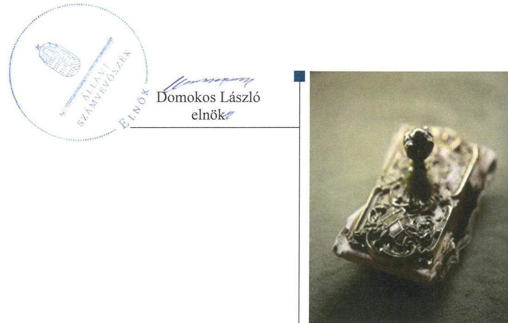

# Jelentés 

## Önkormányzati adósságrendezés ellenőrzése

Sáta Község Önkormányzata adósságrendezési eljárásának ellenőrzése 2016.

---

# Jelenetés 

## Önkormányzati adósságrendezés ellenőrzése

Sáta Község Önkormányzata adósságrendezési eljárásának ellenőrzése
2016. 12. hó 01. nap

---

# AZ ELLENŐRZÉST FELÜGYELTE:

- RENKŐ ZSUZSANNA felügyeleti vezető
- AZ ELLENŐRZÉST VEZETTE ÉS A VÉGREHAJTÁSÁÉRT FELELŐS:
  - BAJNAI ZSUZSANNA ellenőrzésvezető
  - A PROGRAM ÖSSZEÁLLÍTÁSÁÉRT FELELŐS:
    - JANIK JÓZSEF LÁSZLÓ osztályvezető

**IKTATÓSZÁM:** V-0994-135/2016

**TÉMASZÁM:** 2028

**ELLENŐRZÉS-AZONOSÍTÓ SZÁM:** V073903

Jelentéseink az Országgyűlés számítógépes hálózatán és az Interneta a www.asz.hu címen is olvashatóak.

---

# TARTALOMJEGYZÉK 

■ ÖSSZEGZÉS ..... 5
■ AZ ELLENŐRZÉS CÉLJA ..... 6
■ AZ ELLENŐRZÉS TERÜLETE ..... 7
■ AZ ELLENŐRZÉS HÁTTERE, INDOKOLTSÁGA ..... 8
■ A JELENTÉS LÉNYEGES KÉRDÉSKÖREI ..... 9
■ ELLENŐRZÉS HATÓKÖRE ÉS MÓDSZEREI ..... 10
■ MEGÁLLAPÍTÁSOK ..... 12
■ JAVASLATOK ..... 24
■ MELLÉKLETEK ..... 25
I. sz. melléklet: Értelmező szótár ..... 25
II. sz. melléklet: Az eszközök és források alakulása kiemelt mérlegsoronként ..... 27
III. sz. melléklet: Bevételek és kiadások, adósságszolgálat CLF módszer szerinti kimutatása ..... 28
■ FÜGGELÉK: ÉSZREVÉTELEK ..... 29
■ RÖVIDÍTÉSEK JEGYZÉKE ..... 31

---

.

---

# ÖSSZEGZÉS 

Sáta Község Önkormányzata adósságrendezési eljárásának végrehajtása során a polgármester, a jegyzők és a pénzügyi gondnok nem szabályszerű feladatellátása akadályozta az adósságrendezés céljainak elérését. Az eljárás során a hitelezői igények kielégítése nem történt meg, és az önkormányzat fizetőképessége az adósságrendezést követően sem állt helyre. A pénzügyi egyensúly a 2013. évtől csak állami támogatások mellett volt biztosított.

## Az ellenőrzés társadalmi indokoltsága

Pénzügyi egyensúlyi helyzetének, fizetőképességének megromlása miatt Sáta Község Önkormányzatánál 2010. április 15-től 2012. november 13-ig adósságrendezés folyt, amely során a hitelezők 75,2 millió Ft ki nem fizetett kötelezettség teljesítésére nyújtottak be igényt. Ez a kötelezettségállomány az önkormányzat vagyonának több mint 20\%-át jelentette, így indokolt ellenőrizni, hogy az adósságrendezési eljárás elérte-e a célját, az eljárás szereplői eleget tet-tek-e törvényben meghatározott feladataiknak a fizetőképesség helyreállítása, a hitelezőknek hatékony jogvédelem nyújtása és az átgondolt, felelősségteljes gazdálkodás elősegítése érdekében.

## Főbb megállapítások, következtetések, javaslatok

Az adósságrendezési eljárás szabálytalan végrehajtása az eljárás törvényben meghatározott céljainak elérését meghiúsította. Az adósságrendezés megindításakor nem került sor az önkormányzat valós vagyoni helyzetének felmérésére, mert a vagyon számbavétele nem történt meg, továbbá a számviteli nyilvántartások lezárása elmaradt. A pénzügyi gondnok nem kísérte figyelemmel az önkormányzat gazdálkodását, feladatainak ellátását, a válságköltségvetés időszakában a kifizetéseket ellenjegyzése nélkül, szabálytalanul teljesítették.

A hitelezői igények kielégítésére egyáltalán nem került sor. A törvényi előírást megsértve adósságrendezési bizottságot nem alakítottak, annak hiányában egyezségi javaslat sem készülhetett, így a bíróság vagyonfelosztást rendelt el. Az adósságrendezésbe vonható 0,4 millió Ft vagyon mindössze a hitelezői igények 0,5\%-os rendezésére nyújtott fedezetet, a rangsorban első helyen álló hitelező követelésének is csak töredéke volt.

A fizetőképességének helyreállításához nem voltak elegendőek az önkormányzat saját hatáskörben végrehajtott intézkedései. Az önkormányzat fizetőképessége az adósságrendezést követően sem állt helyre, a 2012-2014. évek végén is rendelkezett 60 napon túl lejárt szállítói kötelezettséggel.

A pénzügyi egyensúly kizárólag az adósságrendezés lezárásának évében volt biztosított, a 2013. évtől a múködési bevételek csak az eseti állami támogatásokkal együtt fedezték a folyó kiadásokat.

---

# AZ ELLENŐRZÉS CÉLJA 

Az ellenőrzés célja annak megállapítása, hogy az adósságrendezési eljárás megindítása, lefolytatása szabályszerű volt-e, az önkormányzat gazdálkodása az adósságrendezési eljárás alatt megfelelt-e a jogszabályi előírásoknak; az eljárás szereplői - kiemelten a pénzügyi gondnok - a jogszabályokban foglaltak szerint jártak-e el az adósságrendezés során. A lefolytatott eljárás elérte-e a törvényben kitűzött célokat; az önkormányzat teljesítette-e kötelező közfeladatait, a hitelezők követelését vagyonarányosan kielégítette-e, helyre állt-e fizetőképessége.

---

# AZ ELLENŐRZÉS TERÜLETE 

## Sáta Község Önkormányzata

Sáta Borsod-Abaúj-Zemplén megye nyugati részén fekszik. Állandó lakosainak száma 2009. január 1-jén 1296 fő, 2015. január 1-én 1227 fő volt.

Az önkormányzat képviselő-testülete 2009. január 1-jétől kilenc fővel és két állandó bizottsággal, majd a 2010. évi önkormányzati választásokat követően hat fővel és egy állandó bizottsággal látta el feladatait. Az ellenőrzött időszakban a polgármester személye egy, a jegyzőé négy alkalommal változott.

A gazdálkodási feladatokat 2012. december 31-ig az elkülönített gazdasági szervezettel nem rendelkező polgármesteri hivatal ${ }^{1}$ látta el, ezt követően Borsodbóta Község Önkormányzatával és Uppony Község Önkormányzatával létrehozták a Borsodbótai Közös Önkormányzati Hivatalt.

Az önkormányzat által fenntartott költségvetési szervek száma 2009. január 1-jéről 2014. december 31-ére háromról egyre csökkent. Az ellenőrzött időszakban gazdasági társasággal nem rendelkeztek.

Az adósságrendezési eljárást az önkormányzat kezdeményezte 2010. február 18-án, mivel fizetési kötelezettségeinek nem tudott eleget tenni. A bíróság ${ }^{2}$ végzése az adósságrendezés megindításáról 2010. április 15-én jelent meg a Cégközlönyben. Az eljárás a vagyon bírósági felosztásával 2012. november 13-án zárult.

A pénzügyi gondnoki feladatok ellátására a bíróság a Mátraholding Zrt. ${ }^{-}$ ${ }^{3}$ jelölte ki. A Mátraholding Zrt. 2014-ben kikerült a pénzügyi gondnokok névjegyzékéből.

---

# AZ ELLENŐRZÉS HÁTTERE, INDOKOLTSÁGA 

Az önkormányzatok finanszírozásának, gazdálkodásának keretei és feladatellátása jelentős változásokon ment keresztül a Har. tv. ${ }^{4}$ hatálybalépésétől eltelt időszakban

Az önkormányzati eladósodást 2011-ig csak az Ötv.-ben ${ }^{5}$ meghatározott hitelfelvételi korlát szabályozta, a korlát megsértését azonban jogszabályok nem szankcionálták. 2012. évtől jelentős szigorítás lépett életbe. A korábbi passzív szabályozást a Stabilitási tv. ${ }^{6}$ hatálybalépésével az aktív kontroll váltotta fel. A törvény előírásai alapján az önkormányzatok hitelfelvételei engedélykötelessé váltak.

1996-ban a hitelfelvételi korlát bevezetése mellett az önkormányzatok adósságrendezésének szabályozására is sor került. Az adósságrendezési eljárás részben a lakosság védelmét szolgálta azzal, hogy biztosította az önkormányzatok által nyújtott kötelező közfeladatokhoz való hozzájutást az önkormányzat fizetésképtelensége esetén is. A Har. tv. alapján - 1996 és 2013 júniusa között - ugyanakkor elenyésző számú, mindösszesen 64 adósságrendezési eljárás indult. Az eljárások közel 60\%-a egyezséggel, 40\%-a vagyonfelosztással zárult. Az adósságrendezés első időszakában (2009. évig) a forráshiányból eredeztethető eladósodás tette indokolttá az eljárások jelentős hányadának megindítását.

A második időszakban az eljárás alá vont önkormányzatok között megjelentek a nagyobb költségvetéssel és több intézménnyel is rendelkező települések. Az adósságrendezést szükségessé tevő problémák speciális pénzügyi elemekkel, a devizaalapú kötvénnyel történő finanszírozás begyűrűző hatásaival, valamint az anyagi lehetőségeket meghaladó, túlméretezett fejlesztésekkel összefüggő kötelezettségvállalásokkal egészültek ki, de a beruházások esetében fontos tényező volt a kellő szakértelem hiánya és a pénzügyi nehézségek szakszerűtlen kezelése is.

Az ÁSZ ${ }^{7}$ önkormányzati alrendszert érintő ellenőrzései, elemzései során számos ponton mutatott rá azokra a területekre, ahol a „szabályozás" módosításra, korrekcióra szorul. Az ellenőrzés alapján megfogalmazott javaslatok e területen is segítséget nyújthatnak a kormányzat és az Országgyűlés törvényhozó munkájában, hozzájárulhatnak az irányítói tevékenység erősítéséhez. Az ellenőrzés során tett megállapításaink megerősíthetik egy „megelőző monitoring funkció" kialakításának szükségességét a helyi önkormányzatok fizetésképtelenségének megelőzése érdekében.

---

# A JELENTÉS LÉNYEGES KÉRDÉSKÖREI 

1. Az adósságrendezési eljárás folyamata, végrehajtása során szabályszerű volt-e az önkormányzat és a pénzügyi gondnok feladatellátása?
2. A lefolytatott adósságrendezési eljárás elérte-e a törvényben kitüzött célokat?
3. Az adósságrendezési eljárást követően biztosított és fenntartható volt-e a pénzügyi egyensúly?

---

# ELLENŐRZÉS HATÓKÖRE ÉS MÓDSZEREI 

## Az ellenőrzés típusa

Rendszerellenőrzés.

## Az ellenőrzött időszak

A 2009. január 1. és 2015. június 30. közötti időszak, ezen belül az első kérdéskör vonatkozásában az adósságrendezési eljárás kezdeményezésétől az eljárás lezárásáig tartó időszak.

## Az ellenőrzés tárgya

A Har. tv. által szabályozott adósságrendezési eljárás.

## Az ellenőrzött szervezet

Sáta Község Önkormányzata és a pénzügyi gondnoki feladatok ellátásával összefüggésben Mátraholding Zrt.

## Az ellenőrzés jogalapja

Az Állami Számvevőszékről szóló 2011. évi LXVI. törvény 5. § (2) bekezdése.

## Az ellenőrzés módszerei

Az ellenőrzés szakmai módszertana az ÁSZ hivatalos honlapján (www.asz.hu) közzétett szakmai szabályokon alapult, amelyek irányadónak tekintették a Legfőbb Ellenőrző Intézmények Nemzetközi Szervezete (INTOSAI) által kiadott nemzetközi (ISSAI) standardokat.

Az ellenőrzés alapját az ellenőrzött önkormányzatoktól bekért tanúsítványok, szabályzatok, szerződések, bírósági végzések, határozatok és egyéb dokumentumok, kimutatások, valamint az önkormányzati beszámolók adatai képezték. Az ellenőrzési kérdések megválaszolásához szükséges bizonyítékok megszerzése, összegyűjtése, az ellenőrzött által rendelkezésre bocsátott dokumentumok, adatok elemzés módszerével végrehajtott értékelésével történt, kiegészítve a megfigyelés, a szemle (szemrevételezés), a kérdésfeltevés (információkérés), mintavételezés módszerével. Az ellenőrzés keretében értékeltük az ellenőrzéshez elkészített tanúsítványok adatainak valódiságát.

---

Az adósságrendezési eljárás szabályszerűségét a cégbírósági végzések, határozatok, a testületi előterjesztések, jegyzőkönyvek, határozatok, a válságköltségvetés, a beszámolók adatai, az értesítések, közzétételek, kimutatás a hitelezőkről, jelentések, vagyonfelosztási javaslat, belső szabályzatok, pénzügyi bizonylatok, kötelezettségvállalások és további releváns dokumentumok alapján végeztük. A minősítés szempontja a dokumentumok határidőben és tartalmilag a vonatkozó előírásoknak megfelelő elkészítése volt.

A kontrolltevékenység múködésének ellenőrzésével értékeltük, hogy az adósságrendezési eljárás alatt vállalt kötelezettségek és teljesített kifizetések szabályszerűen történtek-e, a válságköltségvetés alatt a források szabályszerűen, rendeltetésszerűen lettek-e felhasználva a Har. tv-ben előírt és az önkormányzat által ellátott kötelező feladatellátás során.

A kontrolltevékenységek támogató szerepét a kötelezettségvállalások és a szakmai teljesítés igazolása/utalvány ellenjegyzése, a teljesítés igazolása/érvényesítés, valamint a pénzügyi gondnok által gyakorolt ellenjegyzés múködésének ellenőrzésén keresztül ítéltük meg. A véletlen minta alapján a sokaságra vonatkozó hibaarányt becsültük. „Megfelelőnek" értékeltük az ellenőrzött területet, amennyiben 95\%-os bizonyossággal a teljes sokaságban a hibaarány legfeljebb 10\%, „részben megfelelőnek" értékeltük, ha a hibaarány 10-30\% között volt, „nem megfelelőnek" pedig akkor, ha a mintavételi eredmények alapján a sokaságbeli hibaarány meghaladta a 30\%-ot. A becsült hibaaránytól függetlenül nem értékeltük szabályosnak az önkormányzatnál a válságköltségvetésen alapuló kifizetéseket, amenynyiben egyetlen esetben is hiányzott a pénzügyi gondnok ellenjegyzése a kötelezettségvállalás vagy pénzügyi kifizetés dokumentumáról.

Az önkormányzat fizetőképességének helyreállását likviditási mutatók számításával és értékelésével végeztük el. A fizetőképességet kedvezőtlennek ítéltük, ha a szállítói állomány változása növekvő tendenciát mutatott, ha az önkormányzat 60 napon túli adósságállománnyal rendelkezett, az adósságot keletkeztető ügyletek állományának változása 20\% feletti volt, az egyéb visszterhes kötelezettségének aránya meghaladta a teljesített költségvetési kiadások összegének 10\%-át, ha a lejárt követelések állománya nem csökkent az adósságrendezés kezdő időpontjában fennálló öszszeghez képest. A likviditási mutatókat megfelelőnek értékeltük, ha értékük nagyobb volt egynél.

A pénzügyi egyensúly fenntartásának értékelését a CLF módszer segítségével végeztük el. A pénzügyi egyensúly abban az esetben jött létre, ha egy adott időszakban a folyó bevételek fedezetet biztosítottak a folyó kiadásokra.

Az önkormányzatok adósságrendezési eljárása és az azt követő gazdálkodási tevékenysége hibáinak kijavítására, a közpénzekkel való felelős gazdálkodás segítésére irányuló javaslatok kidolgozásakor a hatályos jogszabályok voltak az irányadóak.

---

# MEGÁLLAPÍTÁSOK 

## 1. Az adósságrendezési eljárás folyamata, végrehajtása során szabályszerű volt-e az önkormányzat és a pénzügyi gondnok feladatellátása?

Összegző megállapítás

Az adósságrendezési eljárás megindítása és végrehajtása a polgármester, a jegyző́ $1-3$ és a pénzügyi gondnok feladatellátásának hiányosságai következtében nem volt szabályszerű. A múködtetett belső kontrollrendszer nem biztosította a válságköltségvetésen alapuló kifizetések szabályszerű végrehajtását.

### 1.1. számú megállapítás

A polgármester annak ellenére nem kezdeményezte az adósságrendezési eljárás megindítását, hogy annak feltételei már az eljárás kezdeményezését megelőző - 2009. - évben is fennálltak.

Az adósságrendezési eljárás megindításának feltételei már 2009. január 1jén fennálltak, mivel az önkormányzat ${ }^{8}$ esedékességet követő 60 napot meghaladó szállítói tartozása 22,3 millió Ft, ebből a 90 napon túli 21,4 millió Ft volt.

A polgármester ${ }^{9}$ ekkor nem tájékoztatta haladéktalanul a pénzügyi bizottságot ${ }^{10}$ és nem hívta össze a képviselő-testületet ${ }^{11}$ a Har. tv. 5. § (1) bekezdésében foglaltak ellenére, továbbá nem kezdeményezte a Har. tv. 5. § (2) bekezdése* ellenére az adósságrendezési eljárás megindítását a képviselő-testület döntésétől függetlenül az esedékességet követő 90 napot meghaladó szállítói tartozások miatt.

A pénzügyi bizottság a 2009. I. félévi gazdálkodás áttekintésekor javasolta a polgármesternek, hogy külön testületi ülésen számoljon be az önkormányzat gazdálkodásáról és a kifizetetlen számlákról. Erre a képviselőtestület 2009. október 1-jei ülésén került sor, ahol a gazdasági ügyintéző szóban tájékoztatta a képviselőket a lejárt, kifizetetlen számlák összegéről. A pénzügyi helyzet javítása érdekében a képviselő-testület több határozatot hozott:
a 143/2009. (X. 1.) számú KT. határozatában a helyi adók és adók módjára behajtandó köztartozásokból származó kintlévőségek befizetési határidejét - a helyi adókról szóló tv. ${ }^{12}$ 42. § (2) bekezdésének előírása ellenére - 2009. december 1-jében határozta meg;
a 144/2009. (X. 1.) számú KT. határozatban felhatalmazta a jegyző ${ }_{1}{ }^{-}$ $t^{13}$ a bírósági végrehajtóval való együttműködési megállapodás aláírására a kintlévőségek behajtása érdekében;

[^0]
[^0]:    * 2011. július 12-ig hatályos törvényi előírás

---

### 1.2. számú megállapítás

1.3. számú megállapítás

A polgármester - a pénzügyi bizottság tájékoztatásának kivételével - a jogszabályi előírások szerint járt el az adósságrendezési eljárás kezdeményezésekor.

Az adósságrendezési eljárás megindításának szükségességét a pénzügyi bizottság elnöke vetette fel, a bizottság 2010. február 10-i ülésén a tárgyévi költségvetés tervezetének tárgyalásakor. A Har. tv. 5. § (1) bekezdésének előírása ellenére nem a polgármester, hanem a gazdasági ügyintéző tájékoztatta a pénzügyi bizottságot a szállítói tartozások összegéről. Azt hozzávetőlegesen 34,5 millió Ft-ra becsülte, mert a jegyző ${ }_{1}$ az Áht. ${ }^{16}$ 94. § (1) bekezdés f) pontjában meghatározott feladatkörében nem gondoskodott a szállítókra vonatkozó analitikus nyilvántartás vezetéséről az Áhsz. ${ }^{17}$ 9. melléklete 4. da) pontjának előírása ellenére a 2009-2010. években, így számviteli kimutatással alátámasztott információval a lejárt tartozások öszszegéről nem rendelkeztek.

A képviselő-testület az önkormányzat kifizetetlen számláinak összértékéről a lejárat és a szállítói összetétel részletezése nélkül 2010. február 15én szintén a gazdasági ügyintézőtől kapott szóban tájékoztatást. Ekkor a pénzügyi bizottság elnöke javaslatot tett az adósságrendezési eljárás kezdeményezésére. A képviselő-testület a 18/2010. (II. 15.) KT. határozatában megállapította, hogy fizetési kötelezettségeinek az önkormányzat nem tud eleget tenni, és felhatalmazta a polgármestert az adósságrendezési eljárás azonnali kezdeményezésére, melynek a polgármester 2010. február 18-án a bírósághoz benyújtott kérelmével eleget tett.

A bíróság a 60 napon túl lejárt, illetve jogerős fizetési meghagyáson alapuló tartozásállományt 27,1 millió Ft összegben látta bizonyítottnak. Az adósságrendezés megindításáról szóló jogerős bírói végzés a Cégközlönyben 2010. április 15-én jelent meg.

A polgármester az adósságrendezési eljárás megindításakor nem tájékoztatta a lakosságot és a közigazgatási hivatalt, majd az adósságrendezést elrendelő bírósági végzést követően pedig a további, jogszabályban meghatározott szervezeteket.

A polgármester nem tájékoztatta lakosságot a helyben szokásos módon - az önkormányzat hirdetőtábláján történő kifüggesztéssel - a Har. tv. 5. § (2) bekezdése ellenére az adósságrendezési eljárás kezdeményezésével egyidejűleg, továbbá a Har. tv. 5. § (5) bekezdésében foglaltak ellenére a közigazgatási hivatalt ${ }^{18}$ mintegy két hónapos késéssel, 2010. április 12-én tájékoztatta.

A polgármester gondoskodott a hitelezőknek szóló felhívás helyben szokásos módon történő kihirdetéséről, de az a két országos napilap közül az egyikben a Har. tv. 10. § (3) bekezdésében meghatározott 15 napos ha-

---

### 1.4. számú megállapítás

1.5. számú megállapítás

táridőt négy nappal túllépve 2010. május 4-én jelent meg. A felhívás a hitelezői igény bejelentésére nyitva álló határidőt a törvényi előírásnak megfelelően tartalmazta.

A polgármester az illetékes egészségbiztosítási szervet határidőben értesítette az adósságrendezés megindításáról, de a Har. tv. 10. § (4) bekezdés a-d) pontjaiban foglalt tájékoztatási kötelezettségének - a közigazgatási hivatal, a kincstár ${ }^{19}$, a pénzforgalmi szolgáltató, az illetékes adó és vámhatóság, valamint a nyugdíjbiztosítási igazgatási szerv vonatkozásában nem tett eleget.

A polgármester nem adta át a pénzügyi gondnoknak a jogszabályban előírt dokumentumokat az adósságrendezés megindítását követően.

A polgármester nem adta át a pénzügyi gondnoknak ${ }^{20}$ a Har. tv. 13. § (2) bekezdés a-b), d-e) és g) pontjainak előírása ellenére a jogszabályban rögzített határidőben és azt követően sem:
$\longrightarrow$ a kötelezően előírt, valamint önként vállalt feladatainak és hatáskörének helyi ellátási formáiról, valamint ezek pénzügyi finanszírozásáról szóló jelentést;
$\longrightarrow$ az adósságrendezés megindításának időpontját megelőző nappal készített vagyonleltárt és éves beszámolót, mert a jegyző; nem készítette el az Áhsz. 13. § (1) és a Htv. ${ }^{21} 140$. § (1) bekezdés d) pontjaiban meghatározott feladatkörében;
$\longrightarrow$ a folyamatban lévő bírósági, más hatósági, végrehajtási eljárásokról készített részletes összefoglalót;
$\longrightarrow$ az önkormányzat vagyonára vonatkozó, az adósságrendezési eljárás kezdő időpontját megelőző egy éven belül és az azóta kötött szerződéseket, illetve a vagyont érintő bármely időpontban tett kötelezettségvállaló nyilatkozatokat;
$\longrightarrow$ az intézményekről, azok gazdasági helyzetéről, tartozásaikról, követeléseikről szóló részletes tájékoztatást.
A válságköltségvetési rendelettervezetet a jegyző; elkészítette, és az a pénzügyi gondnok részére átadásra került.

Az adósságrendezési bizottság a jogszabályi előírás ellenére nem alakult meg, müködése hiányában nem készült reorganizációs program és egyezségi javaslat.

Az adósságrendezési bizottság a Har. tv. 16. § (1) bekezdése ellenére nem alakult meg.

Az adósságrendezési bizottság működésének hiányában nem teljesült a Har. tv. 16. § (3) bekezdése, amely szerint az önkormányzat kötelezően ellátandó feladatainak és hatáskörének teljesítésével kapcsolatos valamenynyi gazdasági kérdésben az adósságrendezési bizottság dönt, a képviselőtestület a válságköltségvetési rendeleteket a Har. tv. 19. § (1) bekezdése ellenére az adósságrendezési bizottság elfogadó határozata nélkül tárgyalta és hagyta jóvá.

Az adósságrendezési bizottság megalakulásának és múködésének hiányában a Har. tv. 20. § (1) bekezdése előírása ellenére nem készült reorganizációs program és egyezségi javaslat.

---

### 1.6. számú megállapítás

A pénzügyi gondnok nem véleményezte a válságköltségvetési rendelettervezeteket. A képviselő-testület által elfogadott rendeletek tartalma és a végrehajtásukra vonatkozó hatáskörök nem feleltek meg a jogszabályi előírásoknak.

Az adósságrendezés a 2010. évben nem zárult le, ezért a 2011. és 2012. évi költségvetések is válságköltségvetésként kerültek elfogadásra. A jegyző ${ }_{1-3}{ }^{22}$ határidőben elkészítette a válságköltségvetési rendelettervezeteket.

A válságköltségvetési rendelettervezeteket a pénzügyi gondnok nem véleményezte a Har. tv. 14. § (1) bekezdésében előírtak ellenére. A pénzügyi gondnok a Har. tv. 14. § (2) bekezdés c) pontja ellenére nem vett részt a képviselő-testület és a pénzügyi bizottság - önkormányzati vagyont érintő - ülésein, bár azokra meghívták.

A válságköltségvetési rendeletek nem feleltek meg a jogszabályi előírásoknak, mert
$\longrightarrow$ a Har. tv. 16. § (3) bekezdésében előírtak ellenére a képviselő-testület a 2010. évi és a 2011. évi válságköltségvetéséről szóló rendeletében a kötelezően ellátandó feladatok és hatáskörök teljesítésével kapcsolatos valamennyi gazdasági kérdésben az adósságrendezési bizottság helyett a költségvetés végrehajtását és az előirányzatok módosítását egymillió Ft értékhatárig a polgármester hatáskörébe utalta;
$\longrightarrow$ a Har. tv. 18. § (2) bekezdése előírása ellenére a 2010-2011. évi válságköltségvetési rendeletek a múködési kiadásokon túl felhalmozási kiadásokat is tartalmaztak;
$\longrightarrow$ a Har. tv. 18. § (2) bekezdésében foglaltak ellenére a 2010-2012. években a válságköltségvetési rendelet tartalmazta az adósságrendezés megindítása előtt felvett hitel törlesztő részleteit;
$\longrightarrow$ az Áht. 69. § (2) bekezdése előírása ellenére a 2010. évi válságköltségvetési rendelet elkülönítve nem tartalmazta a polgármesteri hivatal tárgyévi költségvetési bevételi és kiadási előirányzatait, valamint az óvoda és az általános iskola kiemelt előirányzatainak költségvetési kereteit és létszámkereteit.

## 1.7. számú megállapítás

A pénzügyi gondnok a hitelezőket nyilvántartásba vette, de követeléseik elfogadásáról a jogszabályi határidőt követően értesítette őket.

A pénzügyi gondnok azokat a hitelezőket, akik követelésüket az eljárás megindulását elrendelő végzés közzétételétől számított 60 napon belül benyújtották, nyilvántartásba vette. A Har. tv. 15. § (1) bekezdésében előírtak ellenére a hitelezőket nem a bejelentkezésre nyitva álló határidő lejártát követő 15 napon belül, hanem azon túl, a 29. napon tájékoztatta követeléseik elfogadásáról.

A határidőn túl beérkezett hitelezői igényeket elutasította.
A pénzügyi gondnok a hitelezők követelését a törvényben meghatározott kielégítési sorrend alapján besorolta, és erről őket határidőn belül értesítette. A hitelezők kategóriánként történő rangsorolását az 1. táblázat tartalmazza.

---

| HITELEZŐI RANGSOR 2012. MÁRCIUS 27. (MILLIÓ FT) |  |  |  |  |  |
| :--: | :--: | :--: | :--: | :--: | :--: |
| Sorszám | Hitelezői csoport | zálogjogga biztosított követelés | Har. tv. 31. § (1) bekezdése alapján |  | kamatkövetelések Összesen |
|  |  |  | államot   illető   összeg | egyéb követelés |  |
| 1. | pénzintézet | 40,8 |  |  | 40,8 |
| 2. | kincstár |  | 5,7 |  | 0,5 6,2 |
| 3. | vállalkozók, gazdasági társaságok |  |  | 23,9 | 4,3 28,2 |
|  | Összesen | 40,8 | 5,7 | 23,9 | 4,8 75,2 |

1.8. számú megállapítás

A pénzügyi gondnok határidőn túl jelentette be a bíróságnak, hogy nem jött létre egyezség. Jelentése csak kétszeri kiegészítést követően felelt meg az előírásoknak.

A Har. tv.-ben rögzített határidőn belül a pénzügyi gondnok hitelezői egyezségi terv elkészítésére vonatkozó felhívására három hitelező válaszolt, de az önkormányzat tartozásainak rendezésére vonatkozóan egyezségi tervet egyetlen hitelező sem készített. A legnagyobb hitelező - a számlavezető pénzforgalmi szolgáltató - a szennyvízcsatorna hálózat adósságrendezésbe történő bevonását javasolta, egy vállalkozás a mobilizálható vagyonról kért további adatokat, a kincstár pedig csak a teljes kintlévőségének megtérülését biztosító egyezséget tartotta elfogadhatónak. A pénzügyi gondnok a Har. tv. 25. § (5) bekezdésében rögzített határidő lejárta után 3 nappal, 2010. november 16-án jelentette be a bíróságnak, hogy nem jött létre egyezség.

A bíróság ezt követően rendelkezett az adósságrendezési eljárásnak a vagyon bírósági felosztásának szabályai szerinti folytatásáról. A pénzügyi gondnok 2011. február 8-ai Har. tv. 29. § (4) bekezdése szerinti jelentése a Har. tv. 29. § (3) bekezdésben előírt követelményeknek nem tett eleget, mert:
nem határozta meg a jogszabályokban kötelezően előírt feladatok és hatáskörök helyi ellátási formáit;
nem állapította meg, hogy a kötelezően előírt feladatok és hatáskörök ellátásához mely vagyontárgyak, illetve milyen központi költségvetéstől kapott támogatások szükségesek;
nem határozta meg az adósságrendezésbe vonható vagyon körét.
A bíróság új jelentés készítésére (kiegészítésre) kötelezte a pénzügyi gondnokot, melynek 2011. szeptember 7-én eleget tett. Az adósságrendezésbe bevonható vagyontárgyak köre továbbra is tisztázásra szorult, ezért a bíróság 2011. október 28-án meghallgatást tartott. A meghallgatás eredményeként a bíróság a pénzügyi gondnokot a jelentés ismételt kiegészítésére, a vagyonfelosztási eljárásba vonható ingatlanokról pontosított kimutatás készítésre hívta fel. A pénzügyi gondnok ezt 2011. november 7-én készítette el. A vagyonkimutatás pontosítását követően a bíróság a jelentést jóváhagyta, mely 2011. december 12-én emelkedett jogerőre.

---

# 1.9. számú megállapítás 

## A vagyonfelosztás megfelelt a jogszabályi előírásoknak.

Az adósságrendezésbe bevonható vagyon értékesítésére a pénzügyi gondnok pályázati felhívást kezdeményezett. A pályázati felhívás eredménytelenül végződött. Ezt követően a pénzügyi gondnok a jogszabályi előírások szerinti határidőn belül, 2012. március 27-i keltezésű előterjesztésében az adósságrendezésbe vonható vagyon felosztására tett javaslatot. A javaslat szerint az önkormányzat forgalomképes vagyona a zálogjogosult hitelező részére került volna átadásra.

A hitelezők részéről nem érkezett kifogás a vagyonfelosztási javaslatra, így azt a bíróság jóváhagyta, és kötelezte a pénzügyi gondnokot annak végrehajtására.

A végrehajtást követően az eljárást lezáró jogerős végzés a Cégközlönyben 2012. november 13-án jelent meg.

### 1.10. számú megállapítás

A kontrollkörnyezet nem biztosította a kötelezettségvállalások és pénzügyi teljesítések szabályszerű ellátását az adósságrendezés során.

A képviselő-testület rendelkezett a múködés részletes szabályait tartalmazó SZMSZ ${ }^{23}$-szel.

A képviselő-testület az önkormányzati vagyonnal történő gazdálkodás szabályait a Htv. 138. § (1) bekezdés j) pontjában előírtak ellenére nem alkotta meg.

A polgármesteri hivatal nem rendelkezett a válságköltségvetés időszakában az Ámr. ${ }^{24}$ 20. § (1), az Áht. ${ }_{1}$ 91. § (2) és az Áht. ${ }_{2}{ }^{25}$ 10. § (5) bekezdésében előírt szervezeti és múködési szabályzattal.

A jegyző ${ }_{1-3}$ az Áhsz. 8. § (12) és 49. § (6) bekezdése által meghatározott felelősségi körében nem készítette el a Számv. tv. ${ }^{26}$ 161. § (1) és az Áhsz. 49. § (1) bekezdésében előírt számlarendet, a Számv. tv. 14. § (5) bekezdés a) pontjában, és az Áhsz. 8. § (4) bekezdés a) pontjában előírt leltárkészítési és leltározási szabályzatot.

A polgármesteri hivatal rendelkezett számviteli politikával ${ }^{27}$ az eszközök és források értékelési szabályzatával ${ }^{28}$, pénzkezelési szabályzattal ${ }^{29}$, a gazdálkodási jogkörök gyakorlásának szabályairól szóló kötelezettségvállalás, utalványozás, ellenjegyzés, érvényesítés rendjének szabályzatával ${ }^{30}$, melyek - a pénzkezelési szabályzat kivételével - nem feleltek meg maradéktalanul a jogszabályi előírásoknak. Az elkészített szabályzatok tartalmi hiányosságait a 2. táblázat ismerteti.
2. táblázat

## AZ ELKÉSZÍTETT SZABÁLYZATOK TARTALMI HIÁNYOSSÁGAI

## Sorszám

## Megállapított szabálytalanság

1. A számviteli politika az Áhsz. 8. § (3) bekezdés szerinti követelményeknek nem felelt meg, mivel a jegyző ${ }_{1-3}$ az Áhsz. 8. § (12) bekezdésében meghatározott felelősségi körében a számviteli alapelveket nem a költségvetési szervek sajátosságainak megfelelően az Áhsz. 9. § (1), (4) és (10) bekezdései szerint szabályozta, továbbá
a számviteli politika nem az Áhsz. 22. § (1) bekezdés c) pontjának megfelelően határozta meg a követelések mérlegsor tartalmát, mert nem vette figyelembe, hogy a rövid lejáratú adott kölcsönök között ki kell mutatni a tartósan adott kölcsönökből a mérleg fordulónapot követő egy éven belül esedékes részletet.

---

| Sorszám | Megállapított szabálytalanság |
| :--: | :--: |
| 2. | Az eszközök és források értékelési szabályzata nem felelt meg maradéktalanul az előírásoknak, mivel jegyző́3-3 az Áhsz. 8. § (12) bekezdésében meghatározott felelősségi körében a saját tőke fogalmát nem az Áhsz. 24. § (1) bekezdése szerint határozta meg; az induló tőke fogalma 2010. január 1-től már nem volt használható, továbbá az eszközök bekerülési értékének meghatározásakor nem vette figyelembe az Áhsz. 28. § (1) bekezdésének 2010. január 1-jével történt hatályon kívül helyezését. |
| 3. | A jegyző ${ }_{1-3}$ az Ötv. 92. § (4) bekezdésében meghatározott felelősségi körében a gazdálkodási szabályzatban az Ámr. 2010. augusztus 14-ig hatályban lévő 72. § (11), az Ámr. 2010. augusztus 15-től hatályba lépő 72. § (14) és az Ávr. ${ }^{31}$ 53. § (2) bekezdéseinek előírásai ellenére nem határozta meg az előzetes írásbeli kötelezettségvállalás nélkül teljesíthető kifizetések eljárásrendjét, továbbá   a gazdálkodási szabályzathoz csatolt a szakmai teljesítés igazolására jogosult személyek kijelölése nem felelt meg az Ámr. 2010. augusztus 15-től hatályba lépő 76. § (5) bekezdése előírásának, mert a szakmai teljesítés igazolására jogosult személyeket a polgármester jelölte ki és nem a jegyző́. A szabályzat szóhasználata 2012. január 1-től nem felel meg az Ávr. 57. § (4) bekezdésnek, amely a szakmai teljesítés igazolását a teljesítés igazolására módosította. |
| 4. | Az Ámr. 80. § (3) és az Ávr. 60. § (3) bekezdéseinek előírása ellenére nem vezetettek naprakész nyilvántartást a gazdálkodási jogkörök ellátásra jogosult személyekről és aláírásmintájukról. |

Forrás: $A S Z$ megállapítás

# 1.11. számú megállapítás 

A pénzügyi gondnok a jogszabály által előírt ellenjegyzési feladatait nem végezte el, a kontrolltevékenységek nem biztosították a válságköltségvetésen alapuló kifizetések szabályszerű végrehajtását.

A jegyző ${ }_{1}$ nem juttatta el a Har. vhr. ${ }^{32}$ 16. §-ában előírtak ellenére a pénzügyi gondnok ellenjegyzéshez szükséges aláírási címpéldányát az adósságrendezés megindításával egyidejűleg a számlavezető pénzügyi intézményhez. A jegyző ${ }_{1}$ a pénzügyi gondnok aláírási címpéldányának számlavezető pénzintézethez történő eljuttatása helyett a pénzügyi gondnokot a Ktv. ${ }^{33}$ 1. § (9) bekezdésével ellentétesen - szabálytalanul - számla felett rendelkezésre jogosult személyként jelölte ki.

A pénzügyi gondnok nem jegyezte ellen a Har. tv. 14. § (1) bekezdésének előírása ellenére a kötelezettségvállalásokat és a kifizetések teljesítését.

A válságköltségvetésből a Har. tv. 18. § (2) bekezdés a) pontja* ellenére felhalmozási kiadásokat is kifizettek, továbbá az adósságrendezés megindítását megelőzően vállalt és az adósságrendezés időszaka előtt keletkezett (2009. évben leszámlázott) fizetési kötelezettséget is teljesítettek.

A kifizetésekhez kapcsolódó kontrolltevékenységek - gazdálkodási jogkörök, pénzügyi gondnoki ellenjegyzés - gyakorlása „nem megfelelő" volt a válságköltségvetések időszakában.

A gazdálkodási jogkörök gyakorlásának ellenőrzése során tapasztalt további hiányosságokat a 3. táblázat tartalmazza.

---

# A GAZDÁLKODÁSI JOGKÖRÖK GYAKORLÁSÁNAK ELLENŐRZÉSE SORÁN TAPASZTALT HIÁNYOSSÁGOK 

| Sorszám | Gazdálkodási jogkör | Megállapított szabálytalanság | Megsértett jogszabály |
| :--: | :--: | :--: | :--: |
| 1. | kötelezettségvállalás | A beszerzések előzetes írásbeli kötelezettségvállalás nélkül történtek. | Ámr. 74. § (1), Áht. 3 37. (1) bekezdése |
| 2. | szakmai teljesítés igazolása / teljesítés igazolása | A szakmai teljesítés igazolását / a teljesítés igazolását nem végezték el.   Az elvégzett szakmai teljesítésigazolás / teljesítésigazolás nem volt szabályszerű, mert 2010. augusztus 15-től 2011. december 31-ig a jegyző ${ }_{1-3}$ kijelölésével nem rendelkező személy jogosulatlanul végezte, nem tartalmazta a szakmai teljesítés igazolása / teljesítés igazolás dátumának megjelölését, illetve a feladat ellátásához nem álltak rendelkezésre ellenőrizhető okmányok. | Ámr. 76. § (1), az Áht. 2 38. § (1) és az Ávr. 57. § (1) bekezdései   Ámr. 76. § (5) bekezdése;   Ámr. 76. § (3) és az Ávr. 57. § (3) bekezdései |
| 3. | érvényesítés | Az érvényesítés nem volt szabályszerű, mivel az érvényesítő ellenőrizhető okmányok hiányában az összegszerűséget és a fedezet meglétét nem tudta ellenőrizni.   Az érvényesítő személye aláírás minta hiányában nem volt beazonosítható, illetve a készpénzes fizetések esetén nem tartalmazta az érvényesítés keltezését.   Az érvényesítő nem jelezte az utalványozónak, hogy a kötelezettségvállalásra pénzügyi ellenjegyzés nélkül került sor, és a teljesítés igazolását nem, vagy nem szabályszerűen végezték. | Ávr. 58. § (1) bekezdése   Ávr. 58. § (3) bekezdése   Ávr. 58. § (2) bekezdése |
| 4. | utalványozás | A polgármester az összeférhetetlenségi szabályokat megsértve saját maga részére utalványozott. | Ámr. 80. § (2) és az Ávr. 60. § (2) bekezdése |
| 5. | utalvány ellenjegyzése | Az utalvány ellenjegyzésére jogosult személyekről és aláírásmintájukról nem vezettek naprakész nyilvántartást, így nem volt megállapítható, hogy az aláírás, az arra jogosult személytől származott.   Az utalvány ellenjegyzője nem győződött meg arról, hogy a szakmai teljesítés igazolása megtörtént-e. | Ámr. 79. § (1) bekezdése és az Ámr. 80. § (3) bekezdése   Ámr. 79. § (2) bekezdése |

Forrás: ÁSZ megállapítás

### 1.12. számú megállapítás

A monitoring rendszer részét képező belső ellenőrzés támogatta a szabályszerű gazdálkodást az adósságrendezés alatt, azonban a jegyző ${ }_{3}$ nem követte nyomon a belső ellenőrzés által feltárt hiányosságok megszüntetésére hozott intézkedések végrehajtását.

A monitoring rendszer részét képező belső ellenőrzést a kistérségi társulás ${ }^{34}$ keretében biztosították. A kistérségi társulás az adósságrendezés időszakában egy alkalommal végzett ellenőrzést 2009-2010. évekre vonatkozóan.

A belső ellenőrzés a gazdálkodás szabályszerűségét ellenőrizte. A jelentés feltárta, hogy a belső szabályzatok kialakítására nem teljes körűen került sor, a meglévő szabályzatok esetében eltérést tapasztalt a hatályos jogszabályokhoz képest. A gazdálkodási jogkörök gyakorlása nem volt megfelelő, írásos kötelezettségvállalások nem minden esetben készültek, hiányoztak a szerződések vagy a megrendelések, ellenjegyzés nélküli kifizetések történtek, a pénzügyi gondnok nem teljesítette ellenjegyzési kötelezettségét. Az ellenőrzés javasolta - a szabályszerű kifizetések megvalósítása érdekében - a szabályzatok aktualizálását, a kötelezettségvállalások írásbeli dokumentálását, a gazdálkodási jogkörök előírások szerinti gyakorlását.

---

A belső ellenőrzési jelentésben foglalt hiányosságok felszámolására intézkedési tervet készítettek, végrehajtását azonban a Ber. ${ }^{35}$ 29/A. § (1) bekezdése és a $B k r .{ }^{36} 21 . \S$ (2) bekezdés d) pontja ellenére a jegyzős nem követte nyomon.

# 2. A lefolytatott adósságrendezési eljárás elérte-e a törvényben kitűzött célokat? 

Összegző megállapítás

### 2.1. számú megállapítás

2.2. számú megállapítás

A kötelező feladatokat folyamatosan teljesítették. A hitelezői követeléseket egyáltalán nem elégítették ki. Az adósságrendezést követően a fizetőképesség nem állt helyre.

Az adósságrendezés alatt a kötelező feladatokat folyamatosan ellátták.

Az önkormányzat a jogszabályokban előírt kötelező feladatokat teljesítette.

A polgármesteri hivatal, az általános iskola, az óvoda, a védőnői szolgálat múködtetését saját költségvetési szervével teljesítette. A gyermekjóléti alapfeladatokat, a szociális és gyermekvédelmi szakellátást társuláson keresztül végezte el. Gazdasági társaságokkal kötött megállapodásokkal biztosította a kéményseprés, hulladékszállítás, köztisztaság, közútkezelés a víz és csatornaszolgáltatás, a vízgazdálkodás, közvilágítás és a háziorvosi feladatok ellátását. A települési könyvtár fenntartására előírt feladatot a megyei, országos szintű könyvtári hálózattal kötött megállapodással oldották meg.

Az általános iskolát, mint költségvetési szervet a képviselő-testület 2011. augusztus 31 -ével jogutód nélkül megszüntette, a feladatot ezt követően egy vallási közösség látta el. Az oktatási feladatok átadásán kívül az adósságrendezés alatt más feladatátadás, illetve átszervezés nem történt.

Az önkormányzat vagyona a hitelezői igények 0,5\%-os kielégítésére biztosított fedezetet, a hitelezők követelése egyáltalán nem került kifizetésre.

Az adósságrendezési eljárás keretébe vonható ingatlanok értéke 0,4 millió Ft volt, ami a rangsorban az első helyen álló pénzintézet 40,8 millió Ft összegű hitelezői igényének részleges kielégítésére volt elegendő. A pénzügyi gondnok felhívta a hitelezőt az ingatlanok átvételére - a jóváhagyott vagyonfelosztás szerint - azonban az visszautasította. Az adósságrendezési eljárás úgy fejeződött be, hogy egyetlen forint hitelezői igény sem elégítettek ki.

Az önkormányzat nem tett bevételnövelő intézkedéseket, a fizetőképesség elérése érdekében meghozott kiadáscsökkentő intézkedések nem voltak elégségesek.

Bevételnövelő intézkedéseket nem hoztak. A kiadások csökkentése érdekében az általános iskolában a nevelési, oktatási feladatok 2011. évi átadá-

---

# 2.4. számú megállapítás 

sával az önkormányzat számítása szerint összesen 33,2 millió Ft megtakarítást ért el a 2011-2012. években. További intézkedésként egy fő köztisztviselő létszámleépítésére került sor. A létszámleépítésnek a 2011-2012. években összesen 3,1 millió Ft kiadási megtakarítás vonzata volt.

Kötelezettségeit nem a törvényi előírásoknak megfelelően tartotta nyilván az önkormányzat.

A Számv. tv. 15. § (2) bekezdésében foglalt teljesség elvét megsértve a kincstár felé fennálló 5,7 millió Ft összegű kötelezettségét a 2009-2010. évi beszámolóiban nem mutatta ki. A hiba nem minősült jelentős összegűnek.

Az önkormányzat az adósságrendezés jogerős lezárását követően - 2012. november 13-a után - nem vezette ki kötelezettségei közül a 37,9 millió Ft összegű hitelállományát a Számv. tv. 165. § (3) bekezdés b) pontjának a gazdasági események könyvekben történő rögzítési időpontjára vonatkozó előírása ellenére.
2.5. számú megállapítás Az önkormányzat fizetőképessége az adósságrendezést követően sem állt helyre.

Az önkormányzat fizetőképessége az adósságrendezést követően sem állt helyre, mivel:
$\longrightarrow$ a kötelezettségek, azon belül a rövid lejáratú kötelezettségek öszszege a 2012. év végén az előző évekhez képest csökkent, de a 2013ban ismét növekvő tendenciát mutatott;
$\longrightarrow$ a szállítói kötelezettség állománya a 2014. évben az adósságrendezési eljárás megindításának évéhez viszonyítva nem változott, de az adósságrendezést követően is rendelkezett 60 napon túl lejárt szállítói kötelezettséggel, ezek összes szállítói kötelezettséghez viszonyított aránya pedig emelkedett;
$\longrightarrow$ a lejárt követelések állománya az adósságrendezést követően változatlan maradt, azok behajtása érdekében nem intézkedtek és a Har. tv. 14. § (2) bekezdés e) pontja ellenére a pénzügyi gondnok sem kezdeményezte azt;
$\longrightarrow$ a likviditás nem volt biztosított, az önkormányzat forgóeszközei, illetve pénzeszközei nem nyújtottak fedezetet a rövid távú kötelezettségek teljesítésére.
Egyéb visszterhes kötelezettség - peres eljárásból adódóan - kizárólag a 2009. évben merült fel.

A 4. táblázat az önkormányzat fizetőképességének megítélésére vonatkozó időszak végi adatok és mutatók alakulását tartalmazza a 2009. évtől a 2014. év végéig, a II. számú melléklet az eszközök és források alakulását ismerteti kiemelt mérlegsoronként.

---

| A FIZETŐKÉPESSÉG ALAKULÁSÁT JELLEMZŐ ADATOK ÉS MUTATÓK A 2009-2014. ÉVEK KÖZÖTT |  |  |  |  |  |  |
| :--: | :--: | :--: | :--: | :--: | :--: | :--: |
| Év | 2009. | 2010. | 2011. | 2012. | 2013. | 2014. |
| Kötelezettségek (millió Ft) | 83,8 | 84,0 | 115,6 | 59,1 | 69,4 | 55,8 |
| Kötelezettségek aránya az összes forráshoz viszonyítva (\%) | 22,3 | 23,6 | 34,0 | 18,1 | 21,0 | 16,1 |
| Rövid lejáratú kötelezettségek (millió Ft) | 61,5 | 69,8 | 84,1 | 42,7 | 55,7 | 55,6 |
| Szállító kötelezettség (millió Ft) | 34,5 | 39,8 | 40,8 | 29,2 | 39,7 | 39,8 |
| Szállítói állomány előző évhez viszonyított változása (millió Ft) | - | 5,3 | 1,0 | $-11,6$ | 10,5 | 0,1 |
| 60 napon túl lejárt szállítói kötelezettségek | 29,7 | 37,3 | 39,3 | 25,1 | 35,3 | 38,5 |
| 60 napon túl lejárt szállítói kötelezettségek állományának aránya az összes kötelezettséghez (\%) | 35,4 | 44,4 | 34,0 | 42,5 | 50,9 | 69,0 |
| Egyéb visszterhes kötelezettségek aránya (\%) | 1,2 | 0,0 | 0,0 | 0,0 | 0,0 | 0,0 |
| Adósságot keletkeztető ügyletek állománya (millió Ft) | 40,2 | 42,2 | 37,8 | 0,0 | 0,0 | 0,0 |
| Banki kötelezettség mérlegfőösszeghez mért aránya (\%) | 10,7 | 11,9 | 11,1 | 0,0 | 0,0 | 0,0 |
| Lejárt követelések állománya (millió Ft) | 3,8 | 0,7 | 0,9 | 0,4 | 0,3 | 0,3 |
| Likviditási mutató | 0,5 | 0,2 | 0,2 | 0,3 | 0,6 | $-{ }^{*}$ |
| Pénzeszköz likviditási mutató | 0,2 | 0,0 | 0,1 | 0,2 | 0,4 | 0,7 |

# 3. Az adósságrendezési eljárást követően biztosított és fenntartható volt-e a pénzügyi egyensúly? 

## Összegző megállapítás

### 3.1. számú megállapítás

A pénzügyi egyensúly csak az adósságrendezés lezárásának évében volt biztosított.

A folyó bevételek - a 2012. év kivételével - csak a működőképességet megőrző kiegészítő állami támogatásokkal együtt fedezték a folyó kiadásokat.

A jegyző ${ }_{1-2}$ az Áht. ${ }_{1}$ 94. § (1) bekezdés f) pontjában és az Áht. ${ }_{2}$ 10. § (1) bekezdésében meghatározott felelősségi körében a bevételek beérkezésének és a kiadások teljesítésének ütemezésére az Ámr. 201. § (1) bekezdésének előírása ellenére a 2010. évben nem készítette el az önkormányzat likviditási tervét, a jegyző ${ }_{3}$ a 2011-2014. években készített likviditási tervek folyamatos felülvizsgálatáról és aktualizálásáról az Ámr. 201. § (1) bekezdésében, illetve az Ávr. 122. § (3) bekezdéseiben foglalt előírások ellenére nem gondoskodott.

A pénzügyi egyensúlyt a CLF módszer segítségével értékeltük. Az önkormányzat összevont beszámolója alapján a CLF táblázat főbb mutatóinak alakulását a 2009-2014. évek között az 5. táblázat tartalmazza, az adósságkonszolidáció hatásának kiszűrésével számított mutatókat az utolsó oszlop ismerteti. A részletes adatokról a III. számú melléklet ad tájékoztatást.

[^0]
[^0]:    * A mutató nevezőjének (forgóeszközök) mérlegben kimutatott tartalma szűkült, 2014-től csak a készletek és értékpapírok tartoznak oda, ezért a likviditási mutató értéke az előző évek adataival nem hasonlítható össze.

---

5. táblázat

A PÉNZÜGYI EGYENSÚLYI HELYZET FŐBB MUTATÓI A 2009-2014. ÉVEK KÖZÖTT (MILLIÓ FT)

| Év | 2009. | 2010. | 2011. | 2012. | 2013. | 2014. | 2012.   konszolidáció   nélkül |
| :-- | --: | --: | --: | --: | --: | --: | --: |
| Folyó bevételek | 230,5 | 228,0 | 186,9 | 221,7 | 238,8 | 237,9 | 183,8 |
| Folyó kiadások | 232,6 | 224,6 | 195,6 | 176,7 | 214,4 | 209,5 | 176,2 |
| Működési jövedelem | $-2,1$ | 3,4 | $-8,7$ | 45,0 | 24,4 | 28,4 | 7,6 |
| Működési jövedelem ÖNHIKI nélkül | $-15,0$ | $-3,6$ | $-14,5$ | 43,5 | $-0,6$ | $-37,8$ | 6,1 |
| Felhalmozási bevételek | 23,4 | 0,0 | 13,5 | 0,2 | 11,3 | 18,8 | 0,2 |
| Felhalmozási kiadások | 10,9 | 14,1 | 12,2 | 3,6 | 12,9 | 16,0 | 3,6 |
| Felhalmozási költségvetés egyenlege | 12,5 | $-14,1$ | 1,3 | $-3,4$ | $-1,6$ | 2,8 | $-3,4$ |
| Finanszírozási múveletek nélküli (GFS) pozíció | 10,4 | $-10,7$ | $-7,4$ | 41,6 | 22,8 | 31,2 | 4,2 |
| Finanszírozási műveletek egyenlege | $-4,1$ | 1,6 | 14,1 | $-41,1$ | $-4,7$ | 0,2 | $-3,7$ |
| Tárgyévi pénzügyi pozíció | 6,3 | $-9,1$ | 6,7 | 0,5 | 18,1 | 31,4 | 0,5 |
| Nettó múködési jövedelem | $-2,9$ | 2,4 | $-41,2$ | 6,2 | 24,4 | 28,4 | 6,2 |

Forrás: 2009-2014. évi összevont önkormányzati beszámolók

Az önkormányzat folyó bevételei és folyó kiadásai az ellenőrzött években összességében csökkentek és strukturálisan is átrendeződtek. A változásokat részben önkormányzati döntés (2011-ben az általános iskola átadása), részben jogszabályi változások (az önkormányzatok feladatainak csökkenése, a feladatfinanszírozás belépése) okozták. A folyó bevételek kiegészítő működési/ÖNHIKI támogatások nélkül a 2012. év kivételével nem fedezték az adott évi folyó kiadásokat, az önkormányzat pénzügyi egyensúlya csak állami támogatás mellett volt biztosított. Az adósságkonszolidáció hatásának kiszűrése után 2012. évi múködési jövedelme 7,6 millió Ft lett volna.

A kiegészítő működési támogatás aránya az adósságrendezést követő években bevételi kitettséget jelzett, mivel az önkormányzat bevételeinek 2013. évben 10,5\%, 2014. évben 27,8\%-a kiegészítő támogatásból származott.

A felhalmozási bevételek 2010-ben, 2012-ben és 2013-ban nem fedezték a felhalmozási kiadásokat. Az önkormányzat felhalmozási bevételeit és kiadásait alapvetően meghatározta a martinsalak felhasználása miatti lakossági kártalanításra biztosított központosított előirányzat mértéke. Az ellenőrzött időszakban a felhalmozási bevételek 97,3\%-át, összesen 65,3 millió Ft-ot a martinsalak felhasználása miatti lakossági kártalanításra biztosított központosított előirányzat tette ki, melyből az elszámolás szerint a lakosság részére az ellenőrzött években a felhalmozási kiadások 91,7\%-át, összesen 63,9 millió Ft-ot fizettek ki.

---

# JAVASLATOK 

Az ÁSZ tv. 33. § (1) bekezdésében foglaltak értelmében az ellenőrzött szervezet vezetője köteles a jelentésben foglalt megállapításokhoz kapcsolódó intézkedési tervet összeállítani és azt a jelentés kézhezvételétől számított 30 napon belül az ÁSZ részére megküldeni. Amennyiben az ellenőrzött szervezet vezetője nem küldi meg határidőben az intézkedési tervet, vagy továbbra sem elfogadható intézkedési tervet küld, az Állami Számvevőszék elnöke az ÁSZ tv. 33. § (3) bekezdése a) és b) pontjaiban foglaltakat érvényesítheti.

## a polgármesternek:

1. Intézkedjen a lejárt esedékességủ tartozások fennállása esetén a jogszabályban meghatározott feladatok teljesitéséről.
(1.1. sz. megállapítás 1-2. bekezdései alapján)
2. Intézkedjen az önkormányzati vagyonnal történő gazdálkodás szabályairól szóló előterjesztés Képviselő-testület elé terjesztéséről.
(1.10. sz. megállapítás 2. bekezdése alapján)
3. Intézkedjen az Állami Számvevőszék ellenőrzése során feltárt hiányosságok és/vagy szabálytalanságok tekintetében a munkajogi felelősség tisztázására irányuló eljárás kezdeményezéséről, és ennek eredménye ismeretében tegye meg a szükséges intézkedéseket.
(3.1. sz. megállapítás 1. bekezdése alapján)

## a jegyzőnek:

1. Intézkedjen a likviditási terv jogszabályi előírásoknak megfelelő elkészítéséről, illetve annak felülvizsgálatáról.
(3.1. sz. megállapítás 1. bekezdése alapján)
2. Intézkedjen az önkormányzati vagyonnal történő gazdálkodás szabályairól szóló előterjesztés elkészítéséről.
(1.10. sz. megállapítás 2. bekezdés alapján)
3. Intézkedjen, hogy a kötelezettségeket a számviteli nyilvántartásokban a jogszabályi előírásoknak megfelelően mutassák ki.
(2.4. sz. megállapítás 2. bekezdése alapján)

---

# MELLÉKLETEK 

- I. SZ. MELLÉKLET: ÉRTELMEZŐ SZÓTÁR
adósságkonszolidáció
adósságrendezés
adósságrendezésbe vonható vagyon
adósságrendezési bizottság
adósságrendezési eljárás
adósságrendezési eljárás kezdő időpontja
adósságrendezés megindításának időpontja
adósságot keletkeztető ügyletek
bevételi kitettség
bíróság
CLF módszer
egyezségi javaslat
egyéb visszterhes kötelezettségek
felhalmozási bevétel
felhalmozási kiadás
finanszírozási múveletek nélküli
(GFS) pozíció
folyó bevétel
folyó kiadás

Az önkormányzati adósságállomány állam által történő átvállalása.
Az adósságrendezési eljárás azon szakasza, amely a bíróság adósságrendezést megindító végzésének Cégközlönyben való közzétételével [10. § (1) bekezdés] kezdődik, és az adósságrendezési eljárás befejezését elrendelő bírósági végzés Cégközlönyben való közzétételének napjáig tart. (Forrás: Har. tv. 2.§ b) pontja és 32. § (6) bekezdése).

Törvényben meghatározott forgalomképtelen törzsvagyon feletti, valamint a hatósági feladatok és az alapvető lakossági szolgáltatások ellátásához szükséges vagyon feletti forgalomképes vagyonrész. (Forrás: Har. tv. 2.§ f) pontja)
Az adósságrendezési eljárás megindítását követően megalakult bizottság, melynek tagjai: az önkormányzat polgármestere, a jegyző, a pénzügyi bizottság elnöke, egy önkormányzati képviselő. Elnöke a pénzügyi gondnok. (Forrás: Har. tv. 16. § (1) bekezdése)

A helyi önkormányzat székhelye szerint illetékes törvényszék (2011. XII. 31.-ig a fővárosi, megyei bíróságok) hatáskörébe tartozó nem peres eljárás, amely a helyi önkormányzatok fizetőképességének helyreállítására irányul. (Forrás: Har. tv. 3. § (1) bekezdése)
Az a nap, amelyen a kérelem a bírósághoz érkezik. (Forrás: Har. tv. 4. § (1) bekezdése)
A végzés Cégközlönyben való megjelenésének napja. (Forrás: Har .tv. 10. § (1) bekezdés d) pontja)
A pénzintézeti hitelállomány és a kötvénykibocsátásból eredő kötelezettségek. Olyan függőségi viszony, ahol egy szervezet pénzügyi helyzetét meghatározó bevételek nagysága külső körülmények hatására azonnal és kedvezőtlen irányba változhat.
Az adósságrendezési eljárás során eljáró törvényszék, 2011. XII. 31-ig a megyei (fővárosi) bíróság.
Az önkormányzatok költségvetése elemzésének módszere, amely a pénzügyi kapacitás (nettó múködési jövedelem) fogalmát helyezi a középpontba. A módszer következetesen elkülöníti a folyó és a felhalmozási költségvetés bevételeit és kiadásait, azok költségvetési egyenlegeit. Bizonyos mértékig a vállalati gazdálkodás logikai elemeit érvényesíti az önkormányzatok pénzügyi, jövedelmi helyzetének vizsgálata során.
Az adósságrendezési bizottság által készített dokumentum az önkormányzat hitelezőinek a követeléséről, mely tartalmazza az indoklással alátámasztott egyezségi javaslatot. (Forrás: Har. tv. 20. § (3) bekezdése)
A lízingszerződésből eredő, a visszafizetési kötelezettséggel átvett pénzeszközök és a peres eljárások miatti kötelezettségek összege
Az önkormányzat tárgyévi felhalmozási célú költségvetési bevételei.
Az önkormányzat tárgyévi felhalmozási célú költségvetési kiadásai.
A tárgyévi folyó és felhalmozási költségvetés összevont egyenlege.

Az önkormányzatok tárgyévi múködési célú költségvetési bevételei.
Az önkormányzatok tárgyévi múködési célú költségvetési kiadásai.

---

hitelező
kielégítési rangsor
közfeladat
likviditási mutató
működési jövedelem
nettó múködési jövedelem

ÖNHIKI támogatás
önkormányzat összevont költségvetési beszámolója
pénzeszköz likviditási mutató
pénzügyi gondnok
pénzügyi pozíció
reorganizációs program
válságköltségvetés

Az adósságrendezés megindításának időpontjáig az, akinek a helyi önkormányzattal, vagy annak költségvetési szervével szemben vagyoni követelése áll fenn; az adósságrendezés megindításának időpontját követően az, aki a követelését a hitelezői igény bejelentésére nyitva álló határidő alatt bejelentette, és azt a pénzügyi gondnok elfogadta, illetve követelésének jogerős elbírálásáig az is, akinek az igénye vitatott. (Forrás: Har. tv. 2.§ c) pontja)
Az adósságrendezésbe vonható vagyon felosztásának sorrendje a hitelezők között. A sorrendet a Har. tv. 31. §-a tartalmazza.
Jogszabályban meghatározott állami vagy önkormányzati feladat, amit az arra kötelezett közérdekből, a jogszabályban meghatározott követelményeknek és feltételeknek megfelelve végez, ideértve a lakosság közszolgáltatásokkal való ellátását, továbbá az állam nemzetközi szerződésekben vállalt kötelezettségeiből adódó közérdekű feladatokat, valamint e feladatok ellátásakor szükséges infrastruktúra biztosítását is. (Forrás: Nvtv. ${ }^{37}$ 3. § (1) bekezdés 7. pontja)
A likviditási mutató mutatja, hogy a rövid lejáratú fizetési kötelezettségek kiegyenlítéséhez a forgóeszközök (a készletek kivételével) milyen arányban nyújtanak fedezetet.
A múködési jövedelem, azaz a folyó költségvetés egyenlege megmutatja, hogy az önkormányzat éves folyó bevétele fedezetet biztosít-e a feladatellátáshoz kapcsolódó éves folyó kiadásaira. A múködési jövedelem negatív értéke pénzügyileg fenntarthatatlan helyzetet jelez. A mutató pozitív értéke megtakarítást mutat, amely forrásul szolgálhat az önkormányzat fennálló kötelezettségeinek teljesítéséhez, valamint fejlesztéseihez.
A nettó múködési jövedelem a jövedelemtermelő képességet méri. Megmutatja a múködési bevételekből a múködési kiadások és a hitelek tőketörlesztésének kifizetése után fennmaradó jövedelmet.
Az önkormányzatok múködőképességét szolgáló, önhibájukon kívül hátrányos helyzetben levő települési önkormányzatok támogatása.
az önkormányzat, a polgármesteri hivatal és az intézmények adatait összevontan tartalmazó beszámoló
A pénzeszköz likviditási mutató kifejezi, hogy a pénzeszközök év végi állománya milyen arányban nyújt fedezetet a rövid lejáratú fizetési kötelezettségekre.
Az adósságrendezési eljárás lefolytatására, a bíróság által kijelölt, a pénzügyi gondnokok névjegyzékében szereplő szakember.
A tárgyévi GFS pozíció és a finanszírozási múveletek összevont egyenlege.
A helyi önkormányzat gazdasági helyzetét bemutató dokumentum, mely tartalmazza továbbá az adósságrendezésbe vonható vagyon hasznosítására, valamint az önkormányzat adósságrendezéssel kapcsolatosan tervezett intézkedéseire vonatkozó javaslatot annak megjelölésével, hogy ezzel milyen bevételhez juthat. (Forrás: Har. tv. 20.§ (2) bekezdése)
A helyi önkormányzat az adósságrendezési eljárás ideje alatt a képviselő-testület által elfogadott válságköltségvetés alapján gazdálkodik. A jegyző az adósságrendezés megindításának időpontját követő 30 napon belül készíti el a válságköltségvetési rendelettervezetet. A válságköltségvetésből az önkormányzat a Har. tv. 18. § (2) bekezdésében és a 19. § (3) bekezdésében foglalt kiadásokat finanszírozhatja. Amennyiben nem kerül elfogadásra válságköltségvetés a Har. tv. 29. § (2) bekezdése alapján az önkormányzat az adósságrendezési eljárás alatt, a pénzügyi gondnok által kidolgozott múködési válságterv alapján kell, hogy múködjön. (Forrás: Mötv. ${ }^{38}$ 122. §-a, Har. tv. 18. § (1)-(2) bekezdése, 19. § (2) bekezdése, 29. § (2) bekezdése)

---

II. SZ. MELLÉKLET: AZ ESZKÖZÖK ÉS FORRÁSOK ALAKULÁSA KIEMELT MÉRLEGSORONKÉNT

|  AZ ESZKÖZÖK ÉS FORRÁSOK ALAKULÁSA KIEMELT MÉRLEGSORONKÉNT A 2009-2014. ÉVEK KÖZÖTT (MILLIÓ FT) |  |  |  |  |  |   |
| --- | --- | --- | --- | --- | --- | --- |
|  Mérlegsor megnevezése | 2009.12.31. | 2010.12.31. | 2011.12.31. | 2012.12.31. | 2013.12.31. | 2014.12.31.  |
|  Immateriális javak | 0,2 | 0,6 | 0,3 | 0,1 | 0,0 | 0,0  |
|  Tárgyi eszközök | 99,7 | 97,7 | 95,3 | 93,6 | 88,8 | 285,4  |
|  ebből: Ingatlanok | 98,7 | 96,1 | 94,3 | 92,2 | 86,3 | 83,9  |
|  Üzemeltetésre, kezelésre átadott eszközök | 249,1 | 241,7 | 231,9 | 219,7 | 209,9 | -  |
|  BEFEKTETETT ESZKÖZÖK | 349,0 | 340,0 | 327,5 | 313,4 | 298,7 | 285,4  |
|  Készletek | 0,1 | 0,1 | 0,0 | 0,0 | 0,0 | 0,0  |
|  Követelések | 11,5 | 15,1 | 5,6 | 5,3 | 5,9 | 7,7  |
|  Pénzeszközök | 9,1 | 0,1 | 6,7 | 7,3 | 23,2 | 37,7  |
|  Egyéb aktív pénzügyi elszámolások | 6,7 | 0,0 | 0,1 | 0,2 | 2,3 | -  |
|  FORGÓESZKÖZÖK | 27,4 | 15,3 | 12,4 | 12,8 | 31,4 | 0,0  |
|  EGYÉB SAJÁTOS ESZKÖZOLDALI ELSZÁMOLÁSOK | - | - | - | - | - | 16,8  |
|  ESZKÖZÖK ÖSSZESEN | 376,4 | 355,3 | 339,9 | 326,2 | 330,1 | 347,6  |
|  SAJÁT TÖKE | 308,8 | 299,2 | 236,0 | 276,0 | 248,9 | 258,7  |
|  TARTALÉKOK | $-16,2$ | $-27,9$ | $-11,7$ | $-8,9$ | 11,8 | -  |
|  Hosszú lejáratú kötelezettségek | 15,2 | 14,2 | 12,9 | 0,0 | 0,0 | 0,2  |
|  Rövid lejáratú kötelezettségek | 61,5 | 69,8 | 84,1 | 42,7 | 55,7 | 55,6  |
|  ebből szállítók | 34,5 | 39,8 | 40,8 | 29,2 | 39,7 | 39,8  |
|  Egyéb passzív elszámolások | 7,1 | 0,0 | 18,6 | 16,4 | 13,7 | -  |
|  KÖTELEZETTSÉGEK | 83,8 | 84,0 | 115,6 | 59,1 | 69,4 | 55,8  |
|  PASSZÍV IDŐBELI ELHATÁROLÁSOK | - | - | - | - | - | 33,1  |
|  FORRÁSOK ÖSSZESEN | 376,4 | 355,3 | 339,9 | 326,2 | 330,1 | 347,6  |

Forrás: az önkormányzat 2009-2014. évi könyvviteli mérlegel

---

# III. SZ. MELLÉKLET: BEVÉTELEK ÉS KIADÁSOK, ADÓSSÁGSZOLGÁLAT CLF MÓDSZER SZERINTI KIMUTATÁSA

## BEVÉTELEK ÉS KIADÁSOK ALAKULÁSA CLF MÓDSZER SZERINT (EZER FT)

|  Megnevezés | 2009. | 2010. | 2011. | 2012. | 2013. | 2014. | 2015.
szóit  |
| --- | --- | --- | --- | --- | --- | --- | --- |
|  1. FOLYÓ KÖLTSÉGVETÉS |  |  |  |  |  |  |   |
|  1.1.1. Saját múködési bevételek | 12358 | 9194 | 16609 | 26988 | 16002 | 12559 | 26988  |
|  1.1.2. Költségvetési támogatások kiegészítő támogatások nélkül | 118667 | 134305 | 81795 | 105994 | 106218 | 87830 | 68090  |
|  1.1.3. Átengedett bevételek | 51356 | 50500 | 47909 | 46361 | 3967 | 2944 | 46361  |
|  1.1.4. Államháztartáson belülről kapott támogatások | 32465 | 26790 | 34772 | 40876 | 87365 | 67822 | 40876  |
|  1.1.5. Államháztartáson kívülről kapott bevételek | 2454 | 105 | 12 | 12 | 12 | 240 | 12  |
|  1.1.6. Hozam és kamatbevételek | 220 | 105 | 60 | 0 | 232 | 267 | 0  |
|  1.1.7. Múködőképesség megőrzését szolgáló kiegészítő támogatások | 12944 | 7000 | 5763 | 1470 | 24985 | 66180 | 1470  |
|  1.1. Folyó bevételek | 230464 | 227999 | 186920 | 221701 | 238781 | 237842 | 183797  |
|  1.2.1. Múködési kiadások kamat kiadások nélkül | 184624 | 187211 | 148469 | 126599 | 158837 | 159727 | 126599  |
|  1.2.2. Államháztartáson belülre átadott pénzeszköz | 2461 | 0 | 0 | 0 | 13933 | 7922 | 0  |
|  1.2.3. Transzferkiadások | 39422 | 32913 | 41661 | 45675 | 41642 | 41716 | 45675  |
|  1.2.4. Kamatkiadások | 6082 | 4435 | 5439 | 4431 | 0 | 93 | 3952  |
|  1.2. Folyó kiadások | 232589 | 224559 | 195569 | 176705 | 214412 | 209458 | 176226  |
|  1.3. Folyó költségvetés egyenlege (működési jövedelem) | $-2125$ | 3440 | $-8649$ | 44996 | 24369 | 28384 | 7571  |
|  2. FELHALMOZÁSI KÖLTSÉGVETÉS |  |  |  |  |  |  |   |
|  2.1.1. Saját tőkebevételek | 1644 | 0 | 0 | 0 | 0 | 0 | 0  |
|  2.1.2. Költségvetési támogatások | 21738 | 0 | 13440 | 0 | 11340 | 18816 | 0  |
|  2.1.3. Államháztartáson kívülről kapott bevételek | 0 | 74 | 78 | 172 | 25 | 0 | 172  |
|  2.1. Felhalmozási bevételek | 23382 | 74 | 13518 | 172 | 11365 | 18816 | 172  |
|  2.2.1. Saját beruházási kiadás áfával | 514 | 1237 | 0 | 857 | 1578 | 0 | 857  |
|  2.2.2. Saját felújítási kiadás áfával | 0 | 400 | 0 | 0 | 0 | 0 | 0  |
|  2.2.3. Államháztartáson kívülre adott pénzeszköz | 10394 | 12046 | 11785 | 2455 | 11340 | 15984 | 2455  |
|  2.2.4. Kamatkiadások | 0 | 495 | 459 | 265 | 0 | 0 | 265  |
|  2.2. Felhalmozási kiadások | 10908 | 14178 | 12244 | 3577 | 12918 | 15984 | 3577  |
|  2.3. Felhalmozási költségvetés egyenlege | 12474 | $-14104$ | 1274 | $-3405$ | $-1553$ | 2832 | $-3405$  |
|  3. FINANSZÍROZÁSI MÚVELETEK NÉLKÜLI (GFS) POZÍCIO | 10349 | $-10664$ | $-7375$ | 41591 | 22816 | 31216 | 4166  |
|  4. FINANSZÍROZÁSI MÚVELETEK |  |  |  |  |  |  |   |
|  4.1. Hitelfelvétel | 3499 | 2960 | 28175 | 0 | 0 | 0 | 0  |
|  4.2. Hiteltörlesztés | 759 | 1012 | 32559 | 38788 | 0 | 0 | 1363  |
|  4.3. Egyéb finanszírozási bevételek | $-248$ | $-7084$ | 18545 | $-2245$ | $-2561$ | 180 | $-2245$  |
|  4.4. Egyéb finanszírozási kiadások | 6561 | $-6682$ | 100 | 101 | 2101 | 0 | 101  |
|  4.5. Finanszírozási műveletek egyenlege | $-4069$ | 1546 | 14061 | $-41134$ | $-4662$ | 180 | $-3709$  |
|  5. TÁRGYÉVI PÉNZÜGYI POZÍCIO | 6280 | $-9118$ | 6686 | 457 | 18154 | 31396 | 457  |
|  6. NETTÓ MÚKÖDÉSI JÖVEDELEM (1.3.-4.2.) | $-2884$ | 2428 | $-41208$ | 6208 | 24369 | 28384 | 6208  |

Fonrás: 2009-2014. évre vonatkozó összevont önkormányzati beszámolók

---

# FÜGGELÉK: ÉSZREVÉTELEK 

A jelentéstervezetet a Számvevőszék 15 napos észrevételezésre megküldte az ellenőrzött szervezetek vezetőinek az ÁSZ tv. 29. § ${ }^{\dagger}$ (1) bekezdése előírásának megfelelően.

Az önkormányzat polgármestere, valamint a pénzügyi gondnoki feladatokat ellátó szervezet vezetője az ÁSZ tv. 29. § (2) bekezdésében foglalt észrevételezési jogával nem élt.

[^0]
[^0]:    ${ }^{+} 29. \S$ (1) Az Állami Számvevőszék az ellenőrzési megállapításait megküldi az ellenőrzött szervezet vezetőjének vagy az általa megbízott személynek, és annak, akinek személyes felelősségét állapította meg.
    (2) Az ellenőrzött szervezet vezetője és a felelősként megjelölt személy az ellenőrzés megállapításaira tizenöt napon belül írásban észrevételt tehet.
    (3) Az Állami Számvevőszék az észrevételre a beérkezésétől számított harminc napon belül írásban válaszol. A figyelembe nem vett észrevételeket köteles a jelentésben feltüntetni, és megindokolni, hogy azokat miért nem fogadta el.

---

.

---

# RÖVIDÍTÉSEK JEGYZÉKE 

${ }^{1}$ polgármesteri hivatal
${ }^{2}$ bíróság
${ }^{3}$ Mátraholding Zrt.
${ }^{4}$ Har. tv.
${ }^{5}$ Ötv.
${ }^{6}$ Stabilitási tv.
${ }^{7}$ ÁSZ
${ }^{8}$ önkormányzat
${ }^{9}$ polgármester
${ }^{10}$ pénzügyi bizottság
${ }^{11}$ képviselő-testület
${ }^{12}$ helyi adókról szóló tv.
${ }^{13}$ jegyző $_{1}$
${ }^{14}$ általános iskola
${ }^{15}$ óvoda
${ }^{16}$ Áht. $1 \quad$ ?
${ }^{17}$ Áhsz.
${ }^{18}$ közigazgatási hivatal
${ }^{19}$ kincstár
${ }^{20}$ pénzügyi gondnok
${ }^{21}$ Htv.
${ }^{22}$ jegyző $_{2}$
jegyző
${ }^{23}$ SZMSZ
${ }^{24}$ Ámr.
${ }^{25}$ Áht. $2 \quad$ ?
${ }^{26}$ Számv. tv.
${ }^{27}$ számviteli politika
${ }^{28}$ eszközök és források értékelési szabályzata

Sáta Község Önkormányzata Polgármesteri Hivatala
Borsod-Abaúj-Zemplén Megyei Bíróság, jogutód 2012. január 1-jétől Miskolci Törvényszék
Mátraholding Gazdasági Tanácsadó Zártkörűen Működő Részvénytársaság 1996. évi XXV. törvény a helyi önkormányzatok adósságrendezési eljárásáról 1990. évi LXV. törvény a helyi önkormányzatokról
2011. évi CXCV. törvény Magyarország gazdasági stabilitásáról

Állami Számvevőszék
Sáta Község Önkormányzata
Sáta Község Önkormányzata polgármesteri tisztségét betöltő képviselőtestületi tag 2009. január 1 - 2009. július 2. között, Sáta Község Önkormányzata választott polgármestere 2009. január 1. és 2012. december 31. között
Sáta Község Önkormányzata Képviselő-testületének Pénzügyi bizottsága
Sáta Község Önkormányzata képviselő-testülete
1990. évi C. törvény a helyi adókról

Sáta Község Önkormányzata jegyzője 2009. szeptember 1 - 2010. november 30. között

Sáta Község Önkormányzatának általános iskolája
Sáta Község Önkormányzatának napközi otthonos óvodája
1992. évi XXXVIII. törvény az államháztartásról (hatálytalan 2012. január 1jétől)
249/2000. (XII. 24.) Korm. rendelet az államháztartás szervezetei beszámolási és könyvvezetési kötelezettségének sajátosságairól
Észak-magyarországi Regionális Államigazgatási Hivatal
Magyar Államkincstár
A bíróság 2010. április 15-i keltezésű, 2. Apk. 05-2010/000001/4. számú Sáta Községi Önkormányzat adósságrendezési eljárására vonatkozó végzésében megnevezett Mátraholding Zrt.
1991. évi XX. törvény a helyi önkormányzatok és szerveik, a köztársasági megbízottak, valamint egyes centrális alárendeltségű szervek feladat- és hatásköreiről
Sáta Község Önkormányzata jegyzője 2010. december 1. - 2010. december 31. között
Sáta Község Önkormányzata jegyzője 2011. január 1-jétől
Sáta Község Önkormányzata Képviselő-testületének 1/2009. (II. 17.) sz. rendelete a Szervezeti és Müködési Szabályzatáról, hatályba lépett 2009. február 17.
292/2009. (XII. 19.) Korm. rendelet az államháztartás müködési rendjéről (hatálytalan: 2012. január 1-jétől)
2011. évi CXCV. törvény az államháztartásról
2000. évi C. törvény a számvitelről

Sáta Község Önkormányzata polgármesteri és jegyzői együttes rendelkezése a számviteli politikáról
Sáta Község Önkormányzata eszközök és források értékelési szabályzata

---

${ }^{29}$ pénzkezelési szabályzat
${ }^{30}$ gazdálkodási szabályzat
${ }^{31}$ Ávr.
${ }^{32}$ Har. vhr.
${ }^{33} \mathrm{Ktv}$.
${ }^{34}$ kistérségi társulás
${ }^{35}$ Ber.
${ }^{36} \mathrm{Bkr}$.
${ }^{37} \mathrm{Nvtv}$.
${ }^{38}$ Mötv.

Sáta Község Önkormányzata Pénzkezelési Szabályzata
3/2009. (IX. 1.) számú Polgármesteri-jegyzői Együttes Utasítás a kötelezettségvállalás, utalványozás, ellenjegyzés, érvényesítés és a szakmai teljesítés igazolás rendjének szabályzata (hatályos 2009. november 17-étől)
368/2011. (XII. 31.) Korm. rendelet az államháztartásról szóló törvény végrehajtásáról
95/1996. (VII. 4.) Korm. rendelet a helyi önkormányzatok adósságrendezési eljárásáról szóló 1996. évi XXV. törvény végrehajtásának egyes kérdéseiről
1992. évi XXIII. törvény a köztisztviselők jogállásáról (hatálytalan 2012. március 1-jétől)
Özdi Többcélú Kistérségi Társulás
193/2003. (XI. 26.) Kor. rendelet a költségvetési szervek ellenőrzéséről (hatálytalan 2012. január 1-jétől)
370/2011. (XII. 31.) Korm. rendelet a költségvetési szerek belső kontrollrendszeréről és belső ellenőrzéséről
2011. évi CXCVI. törvény a nemzeti vagyonról
2011. évi CLXXXIX. törvény Magyarország helyi önkormányzatairól szóló

---

# ÁLLAMI SZÁMVEVŐSZÉK 

1052 Budapest, Apáczai Csere János utca 10.
Levélcím: 1364 Budapest 4. Pf. 54
Telefon: +36 14849100 Telefax: +36 14849200
www.asz.hu