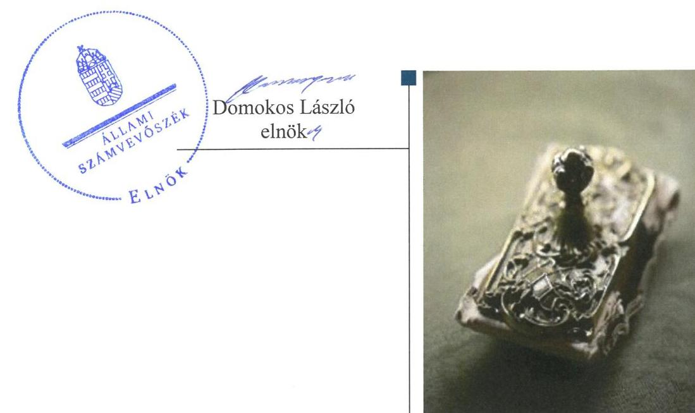
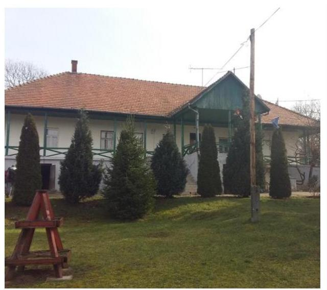
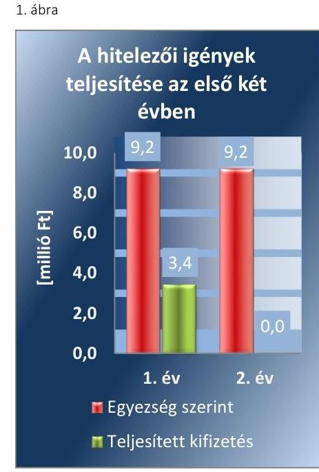

# Jelentés 

## Önkormányzati adósságrendezés ellenőrzése

Selyeb Község Önkormányzata adósságrendezési eljárásának ellenőrzése 2016. 12. hó 01. nap

---

# AZ ELLENŐRZÉST FELÜGYELTE: 

RENKÓ ZSUZSANNA felügyeleti vezető

## AZ ELLENŐRZÉST VEZETTE ÉS A VÉGREHAJTÁSÁÉRT FELELŐS:

BÍRÓ ZSOLT ellenőrzésvezető

## A PROGRAM ÖSSZEÁLLÍTÁSÁÉRT FELELŐS:

JANIK JÓZSEF LÁSZLÓ osztályvezető

IKTATÓSZÁM: V-1007-085/2016
TÉMASZÁM: 2041
ELLENŐRZÉS-AZONOSÍTÓ SZÁM: V073904

Jelentéseink az Országgyúlés számítógépes hálózatán és az Interneten a www.asz.hu címen is olvashatóak.

---

# TARTALOMJEGYZÉK 

■ ÖSSZEGZÉS ..... 5
■ AZ ELLENŐRZÉS CÉLJA ..... 6
■ AZ ELLENŐRZÉS TERÜLETE ..... 7
■ AZ ELLENŐRZÉS HÁTTERE, INDOKOLTSÁGA ..... 8
■ A JELENTÉS LÉNYEGES KÉRDÉSKÖREI ..... 9
■ ELLENŐRZÉS HATÓKÖRE ÉS MÓDSZEREI ..... 10
■ MEGÁLLAPÍTÁSOK ..... 12
■ JAVASLATOK ..... 25
■ MELLÉKLETEK ..... 27
I. sz. melléklet: Értelmező szótár ..... 27
■ FÜGGELÉK: ÉSZREVÉTELEK ..... 29
■ RÖVIDÍTÉSEK JEGYZÉKE ..... 31

---

.

---

# ÖSSZEGZÉS 

Selyeb Község Önkormányzatnál négy év alatt két adósságrendezési eljárást is lefolytattak, azonban az eljárások végrehajtásánál az polgármester, a jegyző és a pénzügyi gondnokok nem szabályszerű feladatellátása akadályozta az adósságrendezés céljainak elérését. A hitelezői követelések kielégítése az első eljárást követően részben történt meg, a második eljárásnál a dokumentumok hiánya miatt nem volt ellenőrizhető. A fizetőképesség fenntarthatósága és a pénzügyi egyensúly alakulása szintén nem volt értékelhető a hiteles dokumentumok hiánya miatt.

## Az ellenőrzés társadalmi indokoltsága

Pénzügyi egyensúlyi helyzetének, fizetőképességének megromlása miatt Selyeb Községi Önkormányzatánál 2009. október 12. – 2010. október 14., illetve 2012. november 16. – 2013. október 9. között folytattak le adósságrendezést, amely során a hitelezők 45,8 millió Ft, illetve 93,3 millió Ft ki nem fizetett kötelezettség teljesítésére nyújtottak be igényt. A két eljárás miatt indokolt ellenőrizni, hogy az adósságrendezési eljárások során az eljárás szereplői eleget tettek-e törvényben meghatározott feladataiknak annak érdekében, hogy az Önkormányzat fizetőképessége helyreálljon, a hitelezőknek hatékony jogvédelmet nyújtson, és elősegítse az Önkormányzat átgondolt, felelősségteljes gazdálkodását.

## Főbb megállapítások, következtetések, javaslatok

Az adósságrendezési eljárások szabálytalan végrehajtása az eljárás törvényben meghatározott céljainak elérését veszélyeztette. Az adósságrendezési eljárások megindításakor nem került sor az Önkormányzat valós vagyoni helyzetének felmérésére a vagyon számbavételének és a számviteli nyilvántartások lezárásának elmaradása miatt. Nem tárták fel, hogy milyen okok vezettek az adósságrendezési eljárás megindításához.

A hitelezői követelések kiegyenlítésekor az első eljárás egyezségében szerepelő követeléseknek csupán 8,8%-át (3,4 millió Ft-ot) fizették ki. A második eljárásban a hitelezői igények kielégítése a dokumentumok hiányában nem volt ellenőrizhető.

A számviteli rend megsértése - a szabálytalan könyvvezetés, a bizonylatok, dokumentumok megőrzésének hiánya - következtében a 2009-2014. évi költségvetési beszámolók nem adtak megbízható és valós összképet az Önkormányzat vagyonáról. A számviteli nyilvántartások, bizonylatok hiányában a fizetőképesség és a pénzügyi egyensúly alakulása, valamint a válságköltségvetések időszakában teljesített kifizetések jogszerűsége nem volt értékelhető.

---

# AZ ELLENŐRZÉS CÉLJA 

Az ellenőrzés célja, annak értékelése, hogy az adósságrendezési eljárások megindítása, lefolytatása szabályszerű volt-e, az Önkormányzat gazdálkodása az adósságrendezési eljárások alatt megfelelt-e a jogszabályi előírásoknak, az eljárások szereplői - kiemelten a pénzügyi gondnok - a jogszabályokban foglaltak szerint jártak-e el az adósságrendezések során, és a lefolytatott adósságrendezési eljárások elérték-e a törvényben kitűzött célokat.

---

# AZ ELLENŐRZÉS TERÜLETE 

## Selyeb Község Önkormányzata

Selyeb község Borsod-Abaúj-Zemplén megyében található. 2015. január 1-jén lakosainak száma 461 fő volt.

Az ellenőrzött időszakban a 2010. évi helyi önkormányzati választásokat megelőzően a Képviselő-testület $^{1}$ hat, azt követően öt főből állt. Az ellenőrzött időszakban a Képviselő-testület mellett 2010. október 12-éig egy állandó bizottság - ügyrendi - működött, a továbbiakban állandó bizottság nem működött, esetenként ad hoc bizottságot hoztak létre.

A polgármester $_{1}^{2}$ 2006. évi helyi önkormányzati választás óta töltötte be tisztségét. A polgármester $_{2}$ a 2014. évi helyi önkormányzati választás óta tölti be tisztségét.

A jegyző $^{3}$ személye az ellenőrzött időszakban tíz alkalommal változott. A Hivatal $^{4}$ 2013. március 1-jéig mint Selyeb-Aba-újlak-Abaújszolnok Községek Körjegyzősége működött, ezt követően Abaújlak, Abaújszolnok, Gagybátor, Gagyvendégi, Pamlény, Selyeb és Szászfa községek hivatali feladatait látta el a Selyebi Közös Önkormányzati Hivatal Selyeb székhellyel. A Selyebi Közös Önkormányzati Hivatal irányító szerve Selyeb Község Önkormányzatának Képviselő-testülete volt. A gazdálkodási feladatokat a Hivatal látta el, amely nem tagolódott szervezeti egységekre. Az Önkormányzat az ellenőrzött időszakban két intézménnyel, az Iskolával $^{5}$ és az Óvodával $^{6}$ rendelkezett. A Képviselőtestület az Iskolát 2009. június 30-án megszüntette, az Óvodát 2009. július 1-jével alapította és 2011. augusztus 31-én szüntette meg.

Az ellenőrzött időszakban az Önkormányzat $^{7}$ nem rendelkezett részesedéssel egyetlen gazdasági társaságban sem. Selyeb Község Önkormányzatánál az ellenőrzött időszakban két adósságrendezési eljárás lefolytatására került sor 2009. október 12. és 2010. október 14. között, valamint 2012. november 16. és 2013. október 9. között. Az adósságrendezési eljárásokat a polgármester $_{1}$ kezdeményezte, az elsőt a fennálló tartozásállomány nagysága miatt, a másodikat azért, mert az Önkormányzat az első eljárás során kötött egyezséget nem tudta végrehajtani. A Bíróság $^{8}$ mindkét eljárást a létrejött egyezségre tekintettel fejezte be.

A Bíróság mindkét eljárás esetében a Mátraholding Zrt.-t jelölte ki a pénzügyi gondnok $_{1,2}$ $^{9}$ feladatok ellátására. A Mátraholding Zrt. 2014-ben kikerült a pénzügyi gondnoki tevékenységet ellátó szervezetek nyilvántartásából.

---

# AZ ELLENŐRZÉS HÁTTERE, INDOKOLTSÁGA 

Az önkormányzatok finanszírozásának, gazdálkodásának keretei és feladatellátása jelentős változásokon mentek keresztül a Har. tv. hatályba lépésétől eltelt időszakban.

Az önkormányzati eladósodást 2011-ig csak az Ötv.-ben $^{10}$ meghatározott adósságfelvételi korlát szabályozta, a korlát megsértését azonban jogszabályok nem szankcionálták. 2012. évtől jelentős szigorítás lépett életbe. A korábbi passzív szabályozást a Stabilitási tv. $^{11}$ hatálybalépésével az aktív kontroll váltotta fel. A törvény előírásai alapján az önkormányzatok hitelfelvételei engedélykötelessé váltak.

1996-ban az adósságfelvételi korlát bevezetése mellett az önkormányzatok adósságrendezésének szabályozására is sor került. Az adósságrendezési eljárás részben a lakosság védelmét szolgálta azzal, hogy biztosította az önkormányzatok által nyújtott kötelező közfeladatokhoz való hozzájutást az önkormányzat fizetésképtelensége esetén is. A Har. tv. alapján 1996 és 2013 júniusa között - ugyanakkor elenyésző számú, mindösszesen 64 adósságrendezési eljárás indult. Az eljárások közel 60%-a egyezséggel, 40%-a vagyonfelosztással zárult. Az adósságrendezés első időszakában (2009. évig) a forráshiányból eredeztethető eladósodás tette indokolttá az eljárások jelentős hányadának megindítását.

A második időszakban az eljárás alá vont önkormányzatok között megjelentek a nagyobb költségvetéssel és több intézménnyel is rendelkező települések. Az adósságrendezést szükségessé tevő problémák speciális pénzügyi elemekkel, a devizaalapú kötvénnyel történő finanszírozás begyűrűző hatásaival, valamint az anyagi lehetőségeket meghaladó, túlméretezett fejlesztésekkel összefüggő kötelezettségvállalásokkal egészültek ki, de a beruházások esetében fontos tényező volt a kellő szakértelem hiánya és a pénzügyi nehézségek szakszerűtlen kezelése is.

Az ÁSZ önkormányzati alrendszert érintő ellenőrzései, elemzései során számos ponton mutatott rá azokra a területekre, ahol a „szabályozás" módosításra, korrekcióra szorul. Az ellenőrzés alapján megfogalmazott javaslatok e területen is segítséget nyújthatnak a kormányzat és az Országgyűlés törvényhozó munkájában, hozzájárulhatnak az irányítói tevékenység erősítéséhez. Az ellenőrzés során tett megállapításaink megerősíthetik egy „megelőző monitoring funkció" kialakításának szükségességét a helyi önkormányzatok fizetésképtelenségének megelőzése érdekében.

---

# A JELENTÉS LÉNYEGES KÉRDÉSKÖREI 

1. Az első adósságrendezési eljárás folyamata és végrehajtása során szabályszerű volt-e az önkormányzat és a pénzügyi gondnok feladatellátása?
2. A második adósságrendezési eljárás folyamata és végrehajtása során szabályszerű volt-e az önkormányzat és a pénzügyi gondnok feladatellátása?
3. A lefolytatott adósságrendezési eljárások elérték-e törvényben kitűzött célokat?
4. Az adósságrendezési eljárásokat követően biztosított és fenntartható volt-e a pénzügyi egyensúly?

---

# ELLENŐRZÉS HATÓKÖRE ÉS MÓDSZEREI 

## Az ellenőrzés típusa

Rendszerellenőrzés

## Az ellenőrzött időszak

A 2009. január 1. és 2015. június 30. közötti időszak, ezen belül az első kérdéskör vonatkozásában az adósságrendezési eljárás kezdeményezésétől az eljárás lezárásáig tartó időszak.

## Az ellenőrzés tárgya

A Har. tv. által szabályozott adósságrendezési eljárás.

## Az ellenőrzött szervezet

Selyeb Község Önkormányzata, és a pénzügyi gondnoki feladatok ellátásával összefüggésben a Mátraholding Gazdasági Tanácsadó Zártkörűen Működő Részvénytársaság

## Az ellenőrzés jogalapja

Az Állami Számvevőszékről szóló 2011. évi LXVI. törvény 5. § (2) bekezdése.

## Az ellenőrzés módszerei

Az ellenőrzés szakmai módszertana az ÁSZ hivatalos honlapján (www.asz.hu) közzétett szakmai szabályokon alapult, amelyek irányadónak tekintették a Legfőbb Ellenőrző Intézmények Nemzetközi Szervezete (INTOSAI) által kiadott nemzetközi (ISSAI) standardokat.

Az Önkormányzatok adósságrendezési eljárásával és az azt követő gazdálkodási tevékenysége hibáinak kijavítására, a közpénzekkel való felelős gazdálkodás segítésére irányuló javaslatok kidolgozásakor a hatályos jogszabályok az irányadóak.

Az ellenőrzés alapját az ellenőrzött Önkormányzatoktól bekért tanúsítványok, szabályzatok, szerződések, bírósági végzések, határozatok és egyéb dokumentumok, kimutatások, valamint az Önkormányzati beszámolók adatai képezték. Az ellenőrzési kérdések megválaszolásához szükséges bizonyítékok megszerzése, összegyűjtése az ellenőrzött által rendelkezésre bocsátott dokumentumok, adatok végrehajtott értékelésével történt, kiegészítve a kérdésfeltevés (információkérés), mintavételezés módszerével. Az ellenőrzés keretében értékeltük az ellenőrzéshez elkészített tanúsítványok adatainak valódiságát.

Az adósságrendezési eljárás szabályszerűségét a cégbírósági végzések, határozatok, testületi előterjesztések, jegyzőkönyvek, határozatok, a válságköltségvetés, beszámolók adatai, reorganizációs program, egyezségi javaslat, értesítések, közzétételek, kimutatás a hitelezőkről, jelentések, vagyonfelosztási javaslat, belső szabályzatok, pénzügyi bizonylatok, kötelezettségvállalások, és további releváns dokumentumok alapján végeztük. A minősítés szempontja a dokumentumok határidőben, és tartalmilag a vonatkozó előírásoknak megfelelő elkészítése volt.

A kontrolltevékenység működésének ellenőrzésével értékeltük, hogy az adósságrendezési eljárás alatt vállalt kötelezettségek és teljesített kifizetések szabályszerűen történtek-e, a válságköltségvetés alatt a források szabályszerűen, rendeltetésszerűen lettek-e felhasználva a Har. tv.-ben előírt és az önkormányzat által ellátott kötelező feladatellátás során.

A működtetett belső kontrollrendszert a kontrollkörnyezet, kontrolltevékenység és belső ellenőrzés működésén keresztül ítéltük meg. A kontrolltevékenységek támogató szerepét a kötelezettségvállalások és szakmai teljesítésigazolás/utalványellenjegyzés teljesítésigazolás/érvényesítés, valamint a pénzügyi gondnok által gyakorolt ellenjegyzés működésének ellenőrzésén keresztül ítéltük meg. A véletlen minta alapján a sokaságra vonatkozó hibaarányt becsültük. „Megfelelőnek" értékeltük az ellenőrzött területet, amennyiben 95%-os bizonyossággal a teljes sokaságban a hibaarány legfeljebb 10%, „részben megfelelőnek" értékeltük, ha a hibaarány 10-30% között volt, „nem megfelelőnek" pedig akkor, ha a mintavételi eredmények alapján a sokaságbeli hibaarány meghaladta a 30%-ot. A becsült hibaaránytól függetlenül nem értékeltük szabályosnak az önkormányzatnál a válságköltségvetésen alapuló kifizetéseket, amennyiben egyetlen esetben is hiányzott a pénzügyi gondnok ellenjegyzése a kötelezettségvállalás vagy pénzügyi kifizetés dokumentumáról.

Értékeltük, hogy a válságköltségvetés alapján biztosított volt-e az önkormányzat kötelező közfeladatainak folyamatos ellátása, az adósságrendezési eljárás eredményeként a hitelezők követelésének vagyonarányos kielégítése megtörtént-e, helyreállt-e az önkormányzat fizetőképessége, a pénzügyi egyensúly fenntarthatósága biztosított volt-e.

---

# MEGÁLLAPÍTÁSOK 

## 1. Az első adósságrendezési eljárás folyamata és végrehajtása során szabályszerű volt-e az önkormányzat és a pénzügyi gondnok feladatellátása?

Összegző megállapítás

Az adósságrendezési eljárás $^{12}$ megindítása, lefolytatása, az eljárásban a polgármester $_{1}$, a jegyző $_{4}$ és a pénzügyi gondnok $_{1}$ feladatellátása nem volt szabályszerű. A belső kontrollrendszer nem biztosította a válságköltségvetésen alapuló kifizetések szabályszerű végrehajtását.

### 1.1. számú megállapítás

A polgármester $_{1}$ 2009. szeptember 23-a előtt annak ellenére nem kezdeményezte az adósságrendezési eljárást
 }_{1}$ megindítását, hogy annak feltételei már korábban is fennálltak.

AZ ELJÁRÁS ${ }_{1}$ kezdeményezéséről a Har. tv. alapján a polgármester ${ }_{1}$ javaslatára a Képviselő-testület 2009. szeptember 23-án döntött, mert a hitelezők felé az Önkormányzat esedékességet követő 60 napot meghaladó szállítói tartozását, mindösszesen 13,5 millió Ft-ot nem tudta kifizetni. Ezzel egyidejűleg a Képviselő-testület felhatalmazta a polgármester ${ }_{1}$-et az eljárás kezdeményezésével kapcsolatos teendők ellátására.

A Har. tv. -ben foglaltak alapján a Bíróság 2009. október 1-én elrendelte az eljárás ${ }_{1}$ megindítását, amelyről a végzés 2009. október 12-én jelent meg a Cégközlönyben.

## AZ ADÓSSÁGRENDEZÉSI ELJÁRÁS MEGINDÍTÁ-

SÁNAK FELTÉTELEI a 2009. szeptember 23-ai kezdeményezést megelőzően is fennálltak, mivel Bíróságnak küldött, az Önkormányzat fennálló tartozásairól készült kimutatása alapján 2009. szeptember 23-án 13,5 millió Ft 60 napon túli lejárt szállítói tartozás állománnyal rendelkezett, melyből 6,8 millió Ft éven túli lejárt szállítói tartozás volt, azonban a polgármester ${ }_{1}$ a Har. tv. ${ }^{13} 5 . \S$ (1) bekezdésében foglaltak ellenére a 60 napon túl lejárt esedékességű tartozások fennállása miatt 2009. szeptember 23-a előtt nem hívta össze a Képviselő-testületet. Ezen túl a polgármester ${ }_{1}$ a Har. tv. 5. § (2) bekezdésében foglaltakkal ellentétben a 90 napot meghaladó szállítói tartozások miatt a Képviselő-testület döntésétől függetlenül sem kezdeményezte az adósságrendezési eljárás megindítását.
1.2. számú megállapítás

Az eljárás ${ }_{1}$ esetében a lakosság és a Közigazgatási Hivatal tájékoztatása nem történt meg.

A polgármester ${ }_{1}$ részéről az eljárás ${ }_{1}$ kezdeményezése vonatkozásában a lakosság helyben szokásos módon való tájékoztatása a Har. tv. 5. § (2) bekezdésében foglaltak ellenére nem valósult meg.

---

Az eljárás ${ }_{1}$ esetében a Közigazgatási Hivatal ${ }^{14}$ tájékoztatása az eljárás bírósági kezdeményezésével egyidejűleg a Har. tv. 5. § (5) bekezdésében foglaltak ellenére nem történt meg.
1.3. számú megállapítás

# A hitelezőknek szóló felhívás helyben szokásos módon történő kihirdetése az eljárás ${ }_{1}$ esetében nem történt meg. 

A HITELEZŐKNEK SZÓLÓ FELHÍVÁSOK legalább két országos napilapban történő megjelenéséről a polgármester ${ }_{1}$ az eljárás ${ }_{1}$ esetében a Har. tv.-ben rögzített határidőben gondoskodott, azonban a Har. tv. 10. § (3) bekezdése ellenére a közzététel megtörténtét a Bíróságnál három napon belül nem igazolta, továbbá a hitelezőknek szóló felhívás helyben szokásos módon történő kihirdetése is elmaradt.

A polgármester ${ }_{1}$ az eljárás ${ }_{1}$ megindításával kapcsolatban a Közigazgatási Hivatal, a MÁK ${ }^{15}$, az illetékes adó és vámhatóság, az elszámolási számlát vezető pénzügyi szolgáltató, valamint a nyugdíj és egészségbiztosítási szervek felé előírt tájékoztatási kötelezettségének a Har. tv. előírásainak megfelelően eleget tett.
1.4. számú megállapítás

## A polgármester ${ }_{1}$ nem adta át a pénzügyi gondnok ${ }_{1}$-nek a jogszabályban előírt dokumentumokat az adósságrendezés megindítását követően.

A polgármester ${ }_{1}$ az eljárás ${ }_{1}$ esetében nem adta át a pénzügyi gondnok ${ }_{1}$ részére a Har. tv. 13. § (2) bekezdés a-e) és g) pontjai előírása ellenére a jogszabályban rögzített határidőben és azt követően sem:
$\longrightarrow$ az Önkormányzata kötelezően előírt, valamint önként vállalt feladatainak és hatáskörének helyi ellátási formáiról, valamint ezek pénzügyi finanszírozásáról szóló jelentést;
$\longrightarrow$ az adósságrendezés megindításának időpontját megelőző nappal készített vagyonleltárt és éves beszámolót, mert a jegyző ${ }_{4}$ nem készítette el az Áhsz. ${ }_{1}{ }^{16}$ 13. § (1) és a Htv. ${ }^{17}$ 140. § (1) bekezdés d) pontjaiban meghatározott feladatkörében;
$\longrightarrow$ a válságköltségvetési rendelettervezetet;
$\longrightarrow$ a folyamatban lévő bírósági, más hatósági, végrehajtási eljárásokról készített részletes összefoglalót;
$\longrightarrow$ az önkormányzat vagyonára vonatkozó, az adósságrendezési eljárás kezdő időpontját megelőző egy éven belül és az azóta kötött szerződéseket, illetve a vagyont érintő bármely időpontban tett kötelezettségvállaló nyilatkozatokat;
$\longrightarrow$ az intézményekről, azok gazdasági helyzetéről, tartozásaikról, követeléseikről szóló részletes tájékoztatást.
1.5. számú megállapítás

Az eljárás ${ }_{1}$ esetében az adósságrendezési bizottságot létrehozták. Az eljárás ${ }_{1}$ esetében a válságköltségvetési rendelet tartalma a Har. tv. előírásainak nem felelt meg, mert a jogszabályban meghatározottakon kívül egyéb, nem tervezhető tételeket is tartalmazott.

AZ ADÓSSÁGRENDEZÉSI BIZOTTSÁGOT az eljárás ${ }_{1}$ során a Har. tv. -ben előírt határidőn belül a törvényben meghatározott tagok részvételével létrehozták.

---

A VÁLSÁGKÖLTSÉGVETÉSI RENDELETET a rendelettervezet elkészítésére nyitva álló 30 napos határidőn belül elfogadta a Képviselő-testület, a rendelettervezetet a pénzügyi gondnok ${ }_{1}$ a Har. tv.14. § (1) bekezdésében előírtak ellenére azonban nem véleményezte.

Az eljárás ${ }_{1}$ esetében az elfogadott válságköltségvetési rendelet nem felelt meg a Har. tv. 18. § (2) bekezdésében foglalt előírásoknak, mert a 2009. október-decemberi válságköltségvetésében az Önkormányzat a tervezett kiadások között a Har. tv.-ben felsorolt és a kötelezően előírt feladatok működési kiadásain túl 14,9 millió Ft finanszírozási műveletek kiadásait és 43,4 millió Ft MÁK által követelt normatíva visszafizetést tervezett.

A reorganizációs program ${ }_{1}{ }^{18}$ tartalmazta a Har. tv.-ben foglalt tartalmi elemeket, így az Önkormányzat gazdasági helyzetének részletes leírását, az adósságrendezésbe vonható vagyon hasznosítására, illetve az adósságrendezéssel kapcsolatos egyéb tervezett intézkedésekre vonatkozó javaslatot annak megjelölésével, hogy az Önkormányzat milyen bevételekhez juthat.

# 1.6. számú megállapítás 

A pénzügyi gondnok ${ }_{1}$ feladatellátása az eljárás ${ }_{1}$ esetében nem volt szabályszerű, mert a hitelezőket késedelmesen tájékoztatta, valamint a törvényi határidőn belül nem jelentette be a Bíróságnak, hogy nem jött létre egyezség.

A PÉNZÜGYI GONDNOK ${ }_{1}$ az adósságrendezési eljárás ${ }_{1}$ megindításához vezető okokat a Har. tv. előírásainak megfelelően feltárta.

A pénzügyi gondnok ${ }_{1}$ a Har. tv.-ben foglaltaknak megfelelően az eljárás esetében nyilvántartásba vette azokat a hitelezőket, akik követelésüket határidőben benyújtották. A MÁK az eljárás ${ }_{1}$ során a pénzügyi gondnok ${ }_{1}$ részére 35,3 millió Ft - jogosulatlanul igénybevett támogatás visszafizetése - követelést jelentett be, melyet a pénzügyi gondnok ${ }_{1}$ késedelmes igénybejelentés miatt nem fogadott be.

A pénzügyi gondnok ${ }_{1}$ feladatellátása az eljárás ${ }_{1}$ esetében nem volt szabályszerű, mert
$\longrightarrow$ az eljárás ${ }_{1}$ esetében a hitelezők tájékoztatása a követelések elfogadásáról a Har. tv. 15. § (1) bekezdésben foglalt 15 napos határidő lejártát követően történt meg;
$\longrightarrow$ az eljárás ${ }_{1}$ esetében a pénzügyi gondnok ${ }_{1}$ a Har. tv. 25. § (5) bekezdésének előírásainak ellenére nem jelentette be 3 napon belül a Bíróságnak, hogy nem jött létre egyezség az adósságrendezés megindításától számított 210 napon belül. A Bíróság 2010. június 8-án végzésében felhívta a pénzügyi gondnok ${ }_{1}$ figyelmét, hogy a törvényi határidő letelt. A pénzügyi gondnok ${ }_{1}$ 2010. június 17-én egyrészt arról tájékoztatta a Bíróságot, hogy 2010. május 17-én megkísérelték az egyezség létrehozását, azonban az egyezségi tárgyalás külső okok miatt (árvíz) elmaradt. A pénzügyi gondnok ${ }_{1}$ tájékoztatta a Bíróságot arról is, hogy 2010. június 15-én létrejött egy egyezség, amellyel kapcsolatban a határidő meghosszabbítását kérte. Az egyezségi dokumentumot megküldte a Bíróság részére.

---

### 1.7. számú megállapítás

Az egyezség ${ }_{1}{ }^{19}$ dokumentuma nem felelt meg a jogszabályi előírásoknak, mert nem tartalmazta az ellenőrzés módját, továbbá a polgármester ${ }_{1}$ aláírását sem.

AZ EGYEZSÉGET tartalmazó dokumentum az egyezségi tárgyalás jegyzőkönyve volt. A Bíróság az eljárás ${ }_{1}$-t a megkötött egyezségre tekintettel a Har. tv. előírásainak megfelelően befejezte, a befejezésről szóló bírósági végzés a Cégközlönyben a 2010. október 14-én jelent meg.

Az adósságrendezési bizottság a Har. tv. 20. § (1) bekezdésében rögzítettek ellenére az eljárás ${ }_{1}$ esetében nem készített egyezségi javaslatot. Az eljárás ${ }_{1}$ esetében a 2010. május 26-ai egyezségi tárgyaláson elhangzott hitelezői javaslatok alapján 2010. június 15-én jött létre az egyezség ${ }_{1}$.

Az egyezség ${ }_{1}$ megkötéséhez a Har. tv. rendelkezéseinek megfelelően a hitelezők több mint fele hozzájárult és követelésük aránya meghaladta a törvényben rögzített 2/3-os határt. Az eljárás ${ }_{1}$ esetében az egyezséghez 22 hitelezőből 12 járult hozzá, amely a 45,8 millió Ft teljes követelésből 38,6 millió Ft összeget jelentett.

Az Önkormányzatnál felelhető egyezség ${ }_{1}$ dokumentuma nem felelt meg a Har. tv. 24. § a) pontja és a 25. § (1) bekezdése előírásainak, mert az ellenőrzés módját, továbbá a polgármester ${ }_{1}$ aláírását a jegyzőkönyv nem tartalmazta. A Har. tv. előírásainak megfelelően a pénzügyi gondnok ${ }_{1}$ az írásba foglalt egyezség ${ }_{1}$-et ellenjegyezte.

## 1.8. számú megállapítás

A jegyző a jogszabályi előírások ellenére az eljárás ${ }_{1}$ időszakában nem alakította ki a megfelelő kontrollkörnyezetet, mert nem készítette el az előírt szabályzatokat.

A Képviselő-testület a jogszabályi előírásoknak megfelelő tartalommal megalkotta az SZMSZ-t ${ }^{20}$.

Az eljárás ${ }_{1}$ ideje alatt az Áht. ${ }_{1}{ }^{21}$ 120/B. § (2) bekezdés a) pontjában ellenére a jegyző az Önkormányzatnál nem alakította ki a megfelelő kontrollkörnyezetet:
$\longrightarrow$ Az Önkormányzat nem rendelkezett az Áhsz. ${ }_{1}$ 8. § (3) és (12) bekezdéseiben előírt számviteli politikával, az Áhsz. ${ }_{1}$ 8. § (4) a-b) pontjaiban meghatározott leltárkészítési és leltározási szabályzattal, eszközök és források értékelési szabályzatával.
$\longrightarrow$ Az Áht. ${ }_{1}$ 91. § (2) bekezdésében foglaltak ellenére nem határozta meg belső szabályzatban a gazdálkodás részletes rendjét.
$\longrightarrow$ A 2010. évben az Ámr. ${ }_{2}{ }^{22}$ 20. § (3) bekezdés a) pontjában foglaltak ellenére nem rögzítették belső szabályzatban a működéséhez kapcsolódó, pénzügyi kihatással bíró, jogszabályban nem szabályozott kérdéseket, így különösen a kötelezettségvállalás, ellenjegyzés, teljesítés igazolása, érvényesítés, utalványozás gyakorlásának módjával, eljárási és dokumentációs részletszabályaival, valamint az ezeket végző személyek kijelölésének rendjével kapcsolatos belső előírásokat, feltételeket.
A Képviselő-testület a 9/2007. (VII. 12.) számú rendeletben szabályozta az Önkormányzati vagyonnal történő gazdálkodás szabályait. A vagyonrendelet az Ötv. előírásainak megfelelően tartalmazta a forgalomképtelen és a forgalomképes vagyonelemeket.

---

### 1.9. számú megállapítás

Az Önkormányzat az eljárás ${ }_{1}$ időszakában megsértette a könyvvezetésre, a beszámoló készítésére, a bizonylati elvre és a bizonylati fegyelemre vonatkozó jogszabályi előírásokat.

Az eljárás ${ }_{1}$ esetében az Önkormányzat a 2009. év vonatkozásában nem rendelkezett könyvelési adatállománnyal, továbbá a 2010. év második negyedévének bizonylatait nem őrizték meg.

Az Önkormányzat az ellenőrzött időszakban folytatott könyvvezetési gyakorlatával és a dokumentumok megőrzésének elmulasztásával megsértette az Áhsz. ${ }_{1} 6 . \S$-a beszámolási kötelezettségre vonatkozó, valamint az Áhsz. ${ }_{1} 8 . \S$ (1) bekezdése könyvvezetésre vonatkozó előírásait. Az Önkormányzat megsértette továbbá a Számv. tv. ${ }^{23}$ 159. §-a könyvviteli nyilvántartás vezetésére vonatkozó, a 165. § (1)-(2) és (4) bekezdés bizonylati elvre és a bizonylati fegyelemre vonatkozó, valamint a 169. § (1)-(4) bekezdés bizonylatok megőrzésére vonatkozó előírásait. Az Önkormányzat megsértette az Áhsz. ${ }_{1} 51 . \S$-ában a bizonylati elvre és bizonylati fegyelemre vonatkozó további sajátos előírásokat is.
1.10. számú megállapítás

Az eljárás ${ }_{1}$ során a gazdálkodási jogkörök gyakorlása nem felelt meg a jogszabályi előírásoknak.

AZ ELJÁRÁS ${
 }_{1}$ időszakára vonatkozóan a gazdálkodási jogkörök gyakorlása nem felelt meg a jogszabályi előírásoknak. Az eljárás ${ }_{1}$ vonatkozásában a gazdálkodási jogkörök gyakorlásának ellenőrzése során tapasztalt hiányosságok:
$\longrightarrow$ A pénzügyi gondnok ${ }_{1}$ a Har. tv. 14. § (1) bekezdésében foglaltak ellenére a kötelezettségvállalásokat nem ellenjegyezte, valamint a kifizetések előtti ellenjegyzést - jellemzően - nem végezte el.
$\longrightarrow$ Az Ámr. 2 80. § (3) bekezdésében foglaltak ellenére nem vezettek nyilvántartást a gazdálkodási jogkörök gyakorlására jogosult személyekről és aláírás mintájukról, így nem állapítható meg, hogy a kötelezettségvállalást, a szakmai teljesítésigazolást és az utalvány ellenjegyzését az arra jogosult végezte-e.
$\longrightarrow$ Az Ámr. 2 74. § (1) bekezdésében előírtak ellenére a beszerzések előzetes írásbeli kötelezettségvállalás nélkül történtek.
$\longrightarrow$ A szakmai teljesítésigazolást az Ámr. 2 76. § (1) bekezdésében foglaltak ellenére nem végezték el.
$\longrightarrow$ Az utalvány ellenjegyzését az Ámr. 2 79. §-ában foglaltak ellenére nem végezték el.
1.11. számú megállapítás

A belső ellenőrzés a válságköltségvetésen alapuló kifizetések szabályszerű végrehajtását nem támogatta, mivel az eljárás ${ }_{1}$ során belső ellenőrzésre nem került sor.

BELSŐ ELLENŐRZÉS lefolytatására az eljárás ${ }_{1}$ során nem került sor, így a belső kontrollrendszer részét képező monitoring-rendszerhez kapcsolódó belső ellenőrzés nem nyújtott támogatást a válságköltségvetésen alapuló kifizetések szabályszerű végrehajtásához és a források felhasználásához.

---

# 2. A második adósságrendezési eljárás folyamata és végrehajtása során szabályszerű volt-e az önkormányzat és a pénzügyi gondnok feladatellátása? 

Összegző megállapítás

Az adósságrendezési eljárás ${ }_{2}{ }^{24}$ megindítása, lefolytatása, az eljárásban a polgármester ${ }_{1}$, a jegyző ${ }_{4}$ feladatellátása nem volt szabályszerű. A belső kontrollrendszer nem biztosította a válságköltségvetésen alapuló kifizetések szabályszerű végrehajtását.
2.1. számú megállapítás

A polgármester ${ }_{1}$ az eljárás ${ }_{1}$ befejezése és 2012. szeptember 13-a között annak ellenére nem kezdeményezte az adósságrendezési eljárás ${ }_{2}$ megindítását, hogy annak feltételei már korábban is fennálltak.

AZ ELJÁRÁS ${ }_{2}$ kezdeményezésekor az Önkormányzat fennálló tartozása az egyezség ${ }_{1}$ elmaradt kifizetéseiből (14,9 millió Ft, amelyből 5,7 millió Ft éven túli), valamint 0,3 millió Ft összegű egyéb kifizetetlen tartozásból állt. A polgármester ${ }_{1}$ az eljárás ${ }_{2}$ esetében nem tett eleget a Har. tv. 5. § (1) bekezdésének, mert a 60 napon túl lejárt esedékességű szállítói tartozások ellenére nem kezdeményezte a Képviselő-testület 2012. szeptember 13-a előtti összehívását.

Az eljárás ${ }_{2}$ kezdeményezéséről a Képviselő-testület 2012. szeptember 13-án a Har. tv. rendelkezéseinek megfelelően határozatot hozott. Az eljárás ${ }_{2}$ megindításának oka az volt, hogy az Önkormányzat az eljárás ${ }_{1}$ során kötött egyezséget nem tudta végrehajtani.

A Har. tv.-ben foglaltak alapján a Bíróság 2012. november 5-én elrendelte az eljárás ${ }_{2}$ megindítását, amelyről a végzés 2012. november 16-án jelent meg a Cégközlönyben.
2.2. számú megállapítás

Az eljárás ${ }_{2}$ esetében a lakosság és a Kormányhivatal tájékoztatása nem történt meg.

A polgármester ${ }_{1}$ részéről az eljárás ${ }_{2}$ kezdeményezése vonatkozásában a lakosság helyben szokásos módon való tájékoztatása a Har. tv. 5. § (2) bekezdésében foglaltak ellenére nem valósult meg.

A Kormányhivatal tájékoztatása az eljárás ${ }_{2}$ bírósági kezdeményezésével egyidejűleg a Har. tv. 5. § (5) bekezdésében foglaltak ellenére nem történt meg.
2.3. számú megállapítás

A hitelezőknek szóló felhívás helyben szokásos módon történő kihirdetése az eljárás ${ }_{2}$ esetében nem történt meg.

A HITELEZŐKNEK SZÓLÓ FELHÍVÁSOK legalább két országos napilapban történő megjelenéséről a polgármester ${ }_{1}$ az eljárás ${ }_{2}$ esetében a Har. tv.-ben rögzített határidőben gondoskodott.

Az eljárás ${ }_{2}$ esetében nem tartották be a Har. tv. 10. § (3) bekezdésében foglalt előírásokat, mert a közzététel megtörténtét a Bíróságnál négy napos késedelemmel igazolták.

---

A Har. tv. 10. § (3) bekezdése szerinti, a hitelezőknek szóló felhívás helyben szokásos módon történő kihirdetése az eljárás ${ }_{2}$ esetében nem valósult meg.

A polgármester ${ }_{1}$ az eljárás ${ }_{2}$ megindításával kapcsolatban a Kormányhivatal, a MÁK, az illetékes adó és vámhatóság, az elszámolási számlát vezető pénzügyi szolgáltató, valamint a nyugdíj és egészségbiztosítási szervek felé előírt tájékoztatási kötelezettségének a Har. tv. előírásainak megfelelően eleget tett.
2.4. számú megállapítás

A polgármester ${ }_{1}$ nem adta át a pénzügyi gondnok ${ }_{2}$-nek a jogszabályban előírt dokumentumokat az adósságrendezés megindítását követően.

A polgármester ${ }_{1}$ az eljárás ${ }_{2}$ esetében nem adta át a pénzügyi gondnok ${ }_{2}$ részére a Har. tv. 13. § (2) bekezdés a)-e) és g) pontjainak előírása ellenére a jogszabályban rögzített határidőben és azt követően sem:
$\longrightarrow$ az Önkormányzat kötelezően előírt, valamint önként vállalt feladatainak és hatáskörének helyi ellátási formáiról, valamint ezek pénzügyi finanszírozásáról szóló jelentést;
$\longrightarrow$ az adósságrendezés megindításának időpontját megelőző nappal készített vagyonleltárt és éves beszámolót, mert a jegyző ${ }_{8}$ nem készítette el az Áhsz. ${ }_{1}$ 13. § (1) és a Htv. 140. § (1) bekezdés d) pontjaiban meghatározott feladatkörében;
$\longrightarrow$ a válságköltségvetési rendelettervezetet;
$\longrightarrow$ a folyamatban lévő bírósági, más hatósági, végrehajtási eljárásokról készített részletes összefoglalót;
$\longrightarrow$ az önkormányzat vagyonára vonatkozó, az adósságrendezési eljárás kezdő időpontját megelőző egy éven belül és az azóta kötött szerződéseket, illetve a vagyont érintő bármely időpontban tett kötelezettségvállaló nyilatkozatokat;
$\longrightarrow$ az intézményekről, azok gazdasági helyzetéről, tartozásaikról, követeléseikről szóló részletes tájékoztatást.
Az eljárás ${ }_{2}$ esetében a 2011. január 1-től hatályos Áhsz. ${ }_{1}$ 10. § (15) bekezdésének előírása ellenére a jegyző nem készítette el és a polgármester ${ }_{1}$ nem küldte meg a Har. tv. 13. § (2) bekezdés b) pontja szerinti beszámolót az ÁSZ részére.
2.5. számú megállapítás

Az eljárás ${ }_{2}$ esetében az adósságrendezési bizottságot létrehozták. A válságköltségvetési rendelet tartalma a Har. tv. előírásainak megfelel.

AZ ADÓSSÁGRENDEZÉSI BIZOTTSÁGOT az eljárás ${ }_{2}$ megindítását követően a Har. tv.-ben előírt határidőn belül a törvényben meghatározott tagok részvételével létrehozták.

A VÁLSÁGKÖLTSÉGVETÉSI RENDELETET a rendelettervezet elkészítésére nyitva álló 30 napos határidőn belül elfogadta a Képviselő-testület, a rendelettervezetet a pénzügyi gondnok ${ }_{2}$ a Har. tv. 14. § (1) bekezdésében előírtak ellenére nem véleményezte.

A reorganizációs program ${ }_{2}{ }^{25}$ tartalmazta a Har. tv.-ben foglalt tartalmi elemeket, így az Önkormányzat gazdasági helyzetének részletes leírását, az

---

# 2.6. számú megállapítás 

adósságrendezésbe vonható vagyon hasznosítására, illetve az adósságrendezéssel kapcsolatos egyéb tervezett intézkedésekre vonatkozó javaslatot annak megjelölésével, hogy az Önkormányzat milyen bevételekhez juthat.

## 2.7. számú megállapítás

adósságrendezésbe vonható vagyon hasznosítására, illetve az adósságrendezéssel kapcsolatos egyéb tervezett intézkedésekre vonatkozó javaslatot annak megjelölésével, hogy az Önkormányzat milyen bevételekhez juthat.

## A pénzügyi gondnok2 feladatellátása az eljárás2 esetében szabályszerű volt.

A PÉNZÜGYI GONDNOK ${ }_{2}$ az adósságrendezési eljárás ${ }_{2}$ megindításához vezető okokat a Har. tv. előírásainak megfelelően feltárta.

A pénzügyi gondnok ${ }_{2}$ a Har. tv.-ben foglaltaknak megfelelően nyilvántartásba vette azokat a hitelezőket, akik követelésüket határidőben benyújtották.

A pénzügyi gondnok ${ }_{2}$ a Har tv. rendelkezéseinek megfelelően értesítette a hitelezőket követelésük elfogadásáról, a határidőn belüli egyezség létrejöttének meghiúsulásáról.

A pénzügyi gondnok ${ }_{2}$ a törvényi határidő vége előtt, 2013. május 28-án értesítette a Bíróságot, hogy nem jött létre egyezség, ezért kérte a vagyon bírósági felosztásának elrendelését. Az egyezség meghiúsulásának oka az volt, hogy a legnagyobb hitelezői igénnyel rendelkező hitelező (MÁK 56,5 millió Ft) csak a teljes követelése megtérülése esetén járulhatott volna hozzá az egyezséghez. A Bíróság 2013. június 5-i végzésében elrendelte az eljárás vagyonfelosztás szabályai szerinti folytatását.

A pénzügyi gondnok ${ }_{2}$ 2013. július 18-án 46 millió Ft-os reorganizációs hitelszerződés aláírásáról tájékoztatta a Bíróságot, a vagyonfelosztásra vonatkozó kérelmét a pénzügyi gondnok ${ }_{2}$ visszavonta. Az eljárás ${ }_{2}$ egyezséggel zárult, vagyonfelosztási eljárás lefolytatására nem került sor.

## Az egyezség ${ }_{2}{ }^{26}$ dokumentuma nem felelt meg a jogszabályi előírásoknak, mert nem tartalmazta az ellenőrzés módját.

AZ EGYEZSÉG ${ }_{2}$ dokumentuma az eljárás ${ }_{2}$ esetében az egyezségi tárgyalás jegyzőkönyve volt. A Bíróság az eljárás ${ }_{2}$-t a megkötött egyezség ${ }_{2}$-re tekintettel a Har. tv. előírásainak megfelelően befejezte, a befejezésről szóló bírósági végzés a Cégközlönyben 2013. október 9-én jelent meg.

Az eljárás ${ }_{2}$ esetében az adósságrendezési bizottság az egyezségi javaslatot megtárgyalta és elfogadásra javasolta, az egyezség ${ }_{2}$ 2013. augusztus 15-én létrejött.

Az egyezség ${ }_{2}$ megkötéséhez az eljárás ${ }_{2}$ esetében a Har. tv. rendelkezéseinek megfelelően a hitelezők több mint fele hozzájárult és követelésük aránya meghaladta a törvényben rögzített 2/3-os határt. Az eljárás ${ }_{2}$ esetében a 16 hitelezőből 12 fogadta el az egyezséget, ez a teljes 93,3 millió Ft-os összegből 86 millió Ft-ot tett ki.

A megkötött egyezség ${ }_{2}$ dokumentuma nem tartalmazta a Hart. tv. 24. § a) pontjában előírt, a végrehajtás és ellenőrzés módjára vonatkozó rendelkezéseket. A Har. tv. előírásainak megfelelően a pénzügyi gondnok ${ }_{2}$ az írásba foglalt egyezséget ellenjegyezte.

---

### 2.8. számú megállapítás

A jogszabályi előírások ellenére az eljárás ${ }_{2}$ időszakában nem alakították ki a megfelelő kontrollkörnyezetet, mert nem készítették el az előírt szabályzatokat.

A Képviselő-testület a jogszabályi előírásoknak megfelelő tartalommal megalkotta az SZMSZ-t ${ }^{27}$.

Az eljárás ${ }_{2}$ ideje alatt a 2012. január 1-jétől hatályos Bkr. ${ }^{28}$ 3. § (a) pontjában foglaltak ellenére a jegyző az Önkormányzatnál nem alakította ki a megfelelő kontrollkörnyezetet:
— Az Önkormányzat az eljárás ${ }_{2}$ időszakában nem rendelkezett az Áhsz ${ }_{1}$. 8. § (3) és (12) bekezdéseiben előírt számviteli politikával, az Áhsz. ${ }_{1}$ 8. § (4) a)-b) pontjaiban meghatározott leltárkészítési és leltározási szabályzattal, eszközök és források értékelési szabályzatával.
— Az Áht. ${ }^{29}$ 10. § (5) bekezdésében foglaltak ellenére nem határozták meg belső szabályzatban a gazdálkodás részletes rendjét.
— Az Ávr. ${ }^{30}$ 13. § (2) bekezdés a) pontjában foglaltak ellenére nem rögzítették belső szabályzatban a működéséhez kapcsolódó, pénzügyi kihatással bíró, jogszabályban nem szabályozott kérdéseket, így különösen a kötelezettségvállalás, ellenjegyzés, teljesítés igazolása, érvényesítés, utalványozás gyakorlásának módjával, eljárási és dokumentációs részletszabályaival, valamint az ezeket végző személyek kijelölésének rendjével kapcsolatos belső előírásokat, feltételeket.
Az eljárás ${ }_{2}$ alatt létrejött Közös Önkormányzati Hivatal 2013. évi alapítását követően a Számv tv. 14. § (11) bekezdésében foglalt rendelkezéseket megsértve a jegyző nem készítette el az Áhsz. ${ }_{1}$ 8. § (3) és (12) bekezdéseiben foglalt számviteli politikát, és a 8. § (4) bekezdése szerint elkészítendő szabályzatokat.

Az Önkormányzat az Nvtv. 2012. június 30. napjától hatályos 18. § (12) bekezdésében foglalt 2012. október 31-ig előírt rendeletmódosítási kötelezettségének nem tett eleget. Nem állapítható meg, hogy határidőt követően eleget tett-e ennek a kötelezettségének, mivel a Képviselő-testület a 2013. május 2-án kelt jegyzőkönyvben foglaltak szerint 5/2013. (V.03.) számon új vagyonrendelet alkotott, azonban a kiadmányozott vagyonrendelet kezelése, tárolása során a jegyző ${ }_{6-10}$ nem tett eleget a Levéltári tv. 9. § (1) bekezdés e) pontjában
 és (3) bekezdésében foglaltaknak, mert a vagyonrendelet visszakereshetőségét nem biztosította.
2.9. számú megállapítás

Az Önkormányzat az eljárás ${ }_{2}$ időszakában megsértette a könyvvezetésre, a beszámoló készítésére, a bizonylati elvre és a bizonylati fegyelemre vonatkozó jogszabályi előírásokat. Az eljárás ${ }_{2}$ során a gazdálkodási jogkörök gyakorlása a bizonylatok hiánya miatt nem volt értékelhető.

AZ ELJÁRÁS ${ }_{2}$ vonatkozásában a könyvelési adatok hiányosak voltak, mert a 2012. évben július 19-éig rögzítettek adatokat a könyvelésben, illetve a 2013. évre vonatkozóan átadott könyvelési állomány csak 35 tételt tartalmazott, azonban azokat sem támasztották alá dokumentumokkal, illetve bizonylatokkal. Az eljárás ${ }_{2}$ vonatkozásában a könyvelési tételek bizonylataival az Önkormányzat nem rendelkezett, a bizonylatok hiánya következtében a gazdálkodási jogkörök gyakorlása nem volt értékelhető.

---

### 2.10. számú megállapítás

Az Önkormányzat az ellenőrzött időszakban folytatott könyvvezetési gyakorlatával és a dokumentumok megőrzésének elmulasztásával megsértette az Áhsz. 6. §-a beszámolási kötelezettségre vonatkozó, valamint az Áhsz. 8. § (1) bekezdése könyvvezetésre vonatkozó előírásait. Az Önkormányzat megsértette továbbá a Számv. tv. 159. §-a könyvviteli nyilvántartás vezetésére vonatkozó, a 165. § (1)-(2) és (4) bekezdés bizonylati elvre és a bizonylati fegyelemre vonatkozó, valamint a 169. § (1)-(4) bekezdés bizonylatok megőrzésére vonatkozó előírásait. Az Önkormányzat megsértette az Áhsz. 51. §-ában a bizonylati elvre és bizonylati fegyelemre vonatkozó további sajátos előírásokat is.

A belső ellenőrzés a válságköltségvetésen alapuló kifizetések szabályszerű végrehajtását nem támogatta, mivel az eljárás ${ }_{2}$ során belső ellenőrzésre nem került sor.

BELSŐ ELLENŐRZÉS lefolytatására az eljárás ${ }_{2}$ során nem került sor, így a belső kontrollrendszer részét képező monitoring-rendszerhez kapcsolódó belső ellenőrzés nem nyújtott támogatást a válságköltségvetésen alapuló kifizetések szabályszerű végrehajtásához és a források felhasználásához.

Az Önkormányzatnál megsértették a Számv. tv.-ben foglalt előírásokat, mert a 2009-2014. évi költségvetési beszámolók nem adtak megbízható és valós összképet a pénzügyi helyzetről.

Az Önkormányzatnál a 2009-2014. évi zárás előtti főkönyvi kivonatokat nem őrizték meg, ezzel megsértették a Számv. tv. 169. § (1) bekezdése előírásait, amelyek szerint a beszámolót, valamint az azt alátámasztó értékelést, főkönyvi kivonatot, továbbá a naplófőkönyvet, vagy más, a törvény követelményeinek megfelelő nyilvántartást olvasható formában legalább 8 évig köteles őrizni.

A 2009-2014. évi beszámolók nem adtak megbízható és valós összképet az Önkormányzat vagyonáról, annak összetételéről, mert az ellenőrzött időszakban a mérleg fordulónapján meglévő eszközök és források leltározását a Számv. tv. 69. §(1) bekezdésében, a 2009-2013. években az Áhsz: 37. § (1) bekezdésében, a 2014. évben az Áhsz: ${ }^{31}$ 22. § (1) bekezdésében foglaltak ellenére nem végezték el.

Az iratok hiánya meghiúsította az Önkormányzat vagyoni és pénzügyi helyzetének áttekintését és ellenőrzését.

---

# 3. A lefolytatott adósságrendezési eljárások elérték-e törvényben kitűzött célokat? 

Összegző megállapítás

A lefolytatott eljárás ${ }_{1,2}$ nem érte el a törvényben kitűzött célokat. Az eljárás ${ }_{1}$ során a hitelezők követelésének kielégítése részben megtörtént. Az eljárás ${ }_{2}$ esetében a hitelezők követeléseinek kielégítése dokumentumok hiányában nem volt értékelhető.
3.1. számú megállapítás

A válságköltségvetések alapján ÖNHIKI ${ }^{32}$ támogatások mellett volt biztosított a kötelező közfeladatok ellátása.

A VÁLSÁGKÖLTSÉGVETÉSEK alapján az Önkormányzat az eljárás ${ }_{1,2}$ során a Har. tv. 18. § (2) bekezdésében foglalt, kötelezően előírt feladatok működési kiadásait ÖNHIKI támogatások (a 2009-2010. években 24 millió Ft, 4,2 millió Ft, a 2012-2013. években 50,5 millió Ft, 16,9 millió Ft) segítségével finanszírozta.

Az Önkormányzat a kötelező közfeladatok ellátásáról az eljárás ${ }_{1}$ alatt saját költségvetési szervével, társulás keretében, illetve vásárolt szolgáltatások útján gondoskodott.

Az ellenőrzött időszakban 2009. június 30-án megszüntették a Selyeb és Abaújszolnok Községek Önkormányzatai fenntartásával működő Iskolát. Az általános iskolai oktatást 2009. július 1. és 2011. augusztus 31. között Lak Község székhellyel intézményfenntartó társulás keretében látták el. Az óvodai nevelést az Önkormányzat 2009. július 1-jével alapított Óvodában biztosította, amelyet 2011. augusztus 31-ével megszüntetett.

Az Önkormányzat 2011. szeptember 1-jétől az óvodai nevelés-oktatás, továbbá az 1-4. osztályos általános iskolai nevelés-oktatás feladatok ellátását - az erre a célra szolgáló ingatlanok tulajdonjogával együtt - egyházi fenntartónak adta át.

Az Önkormányzatnál az ingatlanok ajándékozásával kapcsolatos gazdasági eseményt a könyvviteli nyilvántartásokban az ellenőrzött időszakban nem rögzítették. Ezzel megsértették a Számv. tv. 15. § (2) bekezdésében foglalt teljesség elvét, mert nem könyvelték a gazdasági eseményeket annak ellenére, hogy annak eszközökre és forrásokra gyakorolt hatását a beszámolóban ki kellett volna mutatni.

A feladatátvételek, -átadások és egyéb intézkedések Önkormányzati kiadásokra és bevételekre gyakorolt együttes költségvetési hatása hiteles beszámolók hiánya miatt nem volt értékelhető.
3.2. számú megállapítás

A hitelezői igények kielégítése az eljárás ${ }_{1}$ után az egyezségben vállaltaktól eltérően csak részben és nem a követelésekkel arányosan történt meg. Az eljárás ${ }_{2}$-t követően a hitelezői igények kielégítése a dokumentumok hiánya miatt nem volt ellenőrizhető.

A HITELEZŐI IGÉNYEK kielégítése az eljárás ${ }_{1}$ során részben történt meg (1. ábra), az eljárás ${ }_{2}$ esetében a dokumentumok hiánya miatt nem értékelhető.

---

Forrás: Önkormányzat által készített kimutatás
3.3. számú megállapítás
3.4. számú megállapítás

Az Önkormányzatnál az eljárás ${ }_{1}$ során a hitelezői igények kielégítésére egyezség ${ }_{1}$ jött létre. Az Önkormányzattal szemben 22 hitelező által benyújtott és pénzügyi gondnok ${ }_{1}$ által elfogadott hitelezői igény összesen 45,8 millió Ft volt. Az egyezség ${ }_{1}$-ben 12 hitelező vett részt, összesen 38,6 millió Ft követelés összeggel.

Az Önkormányzat az egyezség ${ }_{1}$ tárgyalási jegyzőkönyve alapján vállalta, hogy a bejelentett és a pénzügyi gondnok ${ }_{1}$ által elfogadott hitelezői követelések összegét 100%-ban tíz év alatt fizeti vissza.

A visszafizetés ütemezése szerint az eljárás ${ }_{1}$ jogerős befejezését követő két évben az eredeti összeg 20-20%-át, a további nyolc évben évente 7,5%-át fizeti meg az Önkormányzat, így az első két évben a fizetési kötelezettsége 9,2 millió - 9,2 millió Ft, a további nyolc évben évente 3,4 millió Ft lett volna.

Az eljárás ${ }_{1}$ után történt kifizetésekről készült önkormányzati kimutatás szerint az Önkormányzat az első évben 3,4 millió Ft kifizetéssel az esedékes 9,2 millió Ft fizetési kötelezettségét mindössze 37%-ban teljesítette és a 2. évtől az Önkormányzat nem teljesített kifizetéseket. A hitelezői igények részleges kielégítését nem arányosan teljesítette az Önkormányzat, mert 22 hitelező közül tíznek teljesítettek a vállalt kötelezettség szerint 20%-os kifizetést összesen 0,63 millió Ft összegben, háromnak részben fizettek 4,6 millió Ft helyett 2,8 millió Ft -, kilenc hitelezőnek nem teljesítettek kifizetést.

Az ellenőrzött időszakban a jegyző az Önkormányzat bevételei beérkezésének és a kiadásai teljesítésének ütemezésére a jogszabályi előírások ellenére likviditási tervet nem készített.

A jegyző ${ }_{1-9}$ az Áht ${ }_{1}$ 88. § (1) bekezdés f) pontja, 2010. augusztus 15-től Áht. ${ }_{1} 94. § (1) bekezdés f) pontja, illetve az Áht ${ }_{2}$ 10. § (1) bekezdés szerinti feladatkörében a 2009. évben az Ámr. ${ }_{1}{ }^{33}$ 139. § (1) bekezdésében, a 2010-2011. években az Ámr. ${ }_{2}$ 201. § (1) bekezdésében, a 2012-2014. években az Ávr. 122. § (1)-(2) bekezdéseiben foglaltak ellenére nem készítette el az Önkormányzat és az általa irányított költségvetési szerveinek likviditási tervét.

Az Önkormányzat az eljárás ${ }_{1}$ során a fizetőképesség megteremtése érdekében tett intézkedései a jelentésben részletezett számviteli szabálytalanságok miatt nem volt értékelhető. Az Önkormányzat az eljárás ${ }_{2}$ és azt követő időszakban a fizetőképesség helyreállítása érdekében nem tett intézkedéseket.

Az Önkormányzat az eljárás ${ }_{1}$ során a fizetőképesség megteremtése érdekében tett intézkedései a jelentés 1.9. és 2.11. számú megállapításaiban részletezett hiányosságok miatt nem volt értékelhető. Az Önkormányzat az eljárás ${ }_{2}$-höz kapcsolódó bevételnövelő és kiadáscsökkentő intézkedéseket a fizetőképesség helyreállítása érdekében nem tett.

---

# 4. Az adósságrendezési eljárásokat követően biztosított és fenntartható volt-e a pénzügyi egyensúly? 

Összegző megállapítás

Az eljárás ${ }_{1,2}$-t követően a pénzügyi egyensúly hiteles dokumentumok hiányában nem volt értékelhető.
4.1. számú megállapítás

Az eljárás ${ }_{1,2}$-t követően a pénzügyi egyensúly és a fizetőképesség fenntarthatósága nem volt értékelhető.

A pénzügyi egyensúly fenntarthatóságának és az Önkormányzat fizetőképességének értékelése a jelentés 2.9. és 2.11. számú megállapításaiban részletezett hiányosságok miatt nem volt értékelhető.

Az Önkormányzat kimutatása szerint a magyar állam az adósságkonszolidáció keretében az Önkormányzat 2012. december 31-én fennálló eljárás $_{2}$-vel kapcsolatos adósságállományának összegét 46,6 millió Ft-ot, valamint 2013. december 31-én fennálló további 12,1 millió Ft adósságállományát teljes mértékben átvállalta.

---

# JAVASLATOK 

Az ÁSZ tv. 33. § (1) bekezdésében foglaltak értelmében az ellenőrzött szervezet vezetője köteles a jelentésben foglalt megállapításokhoz kapcsolódó intézkedési tervet összeállítani és azt a jelentés kézhezvételétől számított 30 napon belül az ÁSZ részére megküldeni. Amennyiben az ellenőrzött szervezet vezetője nem küldi meg határidőben az intézkedési tervet, vagy továbbra sem elfogadható intézkedési tervet küld, az Állami Számvevőszék elnöke az ÁSZ tv. 33. § (3) bekezdése a) és b) pontjaiban foglaltakat érvényesítheti.

## a polgármesternek:

1. Intézkedjen a lejárt esedékességű tartozások fennállása esetén a jogszabályban meghatározott feladatok teljesítéséről.
(1.1. sz. megállapítás 3. bekezdése,
2.1. számú megállapítás 1. bekezdése alapján)

## a jegyzőnek:

1. Intézkedjen a jogszabályi előírásoknak megfelelően a számviteli politika, annak keretében az eszközök és források leltárkészítési és leltározási szabályzata, az eszközök és források értékelési szabályzata, az önköltségszámítás rendjére vonatkozó belső szabályzat és a pénzkezelési szabályzat elkészítéséről.
(2.8. sz. megállapítás 2. bekezdés 1. pontja és 3. bekezdése alapján)
2. Intézkedjen a gazdálkodással - így különösen a kötelezettségvállalás, ellenjegyzés, teljesítés igazolása, érvényesítés, utalványozás gyakorlásának módjával, eljárási és dokumentációs részletszabályaival, valamint az ezeket végző személyek kijelölésének rendjével kapcsolatos belső előírások, feltételek szabályozásáról.
(2.8. sz. megállapítás 2. bekezdés 2-3. pontja alapján)

---

.

---

# MELLÉKLETEK 

- I. SZ. MELLÉKLET: ÉRTELMEZŐ SZÓTÁR
adósságkonszolidáció
adósságrendezés
adósságrendezésbe vonható vagyon
adósságrendezési bizottság
adósságrendezési eljárás
bíróság
egyezségi javaslat
egyezségi tárgyalás
hitelező
kielégítési rangsor
közfeladat
nemfizetési kockázat
ÖNHIKI támogatás

A helyi önkormányzatok adósságállományának részleges konszolidációjáról szóló 1540/2012. (XII.4.) Korm. határozat kihirdetését követően több ütemben lezajlott központi intézkedések, amelyek a helyi önkormányzatok adósságállományának a magyar állam által történő átvállalására irányultak. Az adósságkonszolidációs csomag releváns rendelkezéseit a 2012-2014. évi központi költségvetésről szóló törvények tartalmazták.
Az adósságrendezési eljárás azon szakasza, amely a bíróság adósságrendezést megindító végzésének Cégközlönyben való közzétételével [10. § (1) bekezdés] kezdődik és az adósságrendezési eljárás befejezését elrendelő bírósági végzés Cégközlönyben való közzétételének napjáig tart. (Forrás: Har. tv. 2. § b) pontja és 32. § (6) bekezdése).
Törvényben meghatározott forgalomképtelen törzsvagyon feletti, valamint a hatósági feladatok és az alapvető lakossági szolgáltatások ellátásához szükséges vagyon feletti forgalomképes vagyonrész. (Forrás: Har. tv. 2.§ f) pontja)
Az adósságrendezési eljárás megindítását követően megalakult bizottság, melynek tagjai: az Önkormányzat polgármestere, a jegyző, a pénzügyi bizottság elnöke, egy Önkormányzati képviselő. Elnöke a pénzügyi gondnok. (Forrás: Har. tv. 16. § (1) bekezdése)
Az helyi Önkormányzat székhelye szerint illetékes törvényszék (2011. XII. 31.-ig a fővárosi, megyei bíróságok) hatáskörébe tartozó nem peres eljárás, amely a helyi Önkormányzatok fizetőképességének helyreállítására irányul. (Forrás:
 Har. tv. 3. § (1) bekezdése)

Az adósságrendezési eljárás során eljáró törvényszék, 2011. XII. 31-ig a megyei (fővárosi) bíróság
Az adósságrendezési bizottság által készített dokumentum az Önkormányzat hitelezőinek a követeléséről, mely tartalmazza az indoklással alátámasztott egyezségi javaslatot. (Forrás: Har. tv. 20. § (3) bekezdése)
A képviselőtestület által elfogadott egyezségi javaslat alapján lefolytatott tárgyalás, mely egyezséggel vagy az adósságrendezési eljárásnak vagyonfelosztással történő folytatásának bírósági elrendelésével zárulhat.
Az adósságrendezés megindításának időpontjáig az, akinek a helyi Önkormányzattal, vagy annak költségvetési szervével szemben vagyoni követelése áll fenn; az adósságrendezés megindításának időpontját követően az, aki a követelését a hitelezői igény bejelentésére nyitva álló határidő alatt bejelentette, és azt a pénzügyi gondnok elfogadta, illetve követelésének jogerős elbírálásáig az is, akinek az igénye vitatott. (Forrás: Har. tv. 2.§ c) pontja)
Az adósságrendezésbe vonható vagyon felosztásának sorrendje a hitelezők között. A sorrendet a Har. tv. 31. §-a tartalmazza.
Jogszabályban meghatározott állami vagy Önkormányzati feladat, amit az arra kötelezett közérdekből, a jogszabályban meghatározott követelményeknek és feltételeknek megfelelve végez, ideértve a lakosság közszolgáltatásokkal való ellátását, továbbá az állam nemzetközi szerződésekben vállalt kötelezettségeiből adódó közérdekű feladatokat, valamint e feladatok ellátásakor szükséges infrastruktúra biztosítását is. (Forrás: Nvtv. 3. § (1) bekezdés 7. pontja)
Annak kockázata, hogy a kötelezett fennálló kötelezettségét átmenetileg vagy véglegesen nem tudja határidőre megfizetni.
Az önkormányzatok működőképességét szolgáló, önhibájukon kívül hátrányos helyzetben levő települési önkormányzatok támogatása.

---

pénzügyi gondnok
reorganizációs hitel
reorganizációs program
vagyon
válságköltségvetés

Az adósságrendezési eljárás lefolytatására, a bíróság által kijelölt, a pénzügyi gondnokok névjegyzékében szereplő szakember.
A válságköltségvetés, valamint az egyezségi tárgyalás és a bíróság által elrendelt vagyonfelosztás során szabályozott eljárásban, az eljárás jogerős befejezéséig az Önkormányzat, valamint a hitelezők között megkötött egyezség létrejöttének biztosításához szükséges hitel, beleértve az adósságrendezési eljárás alatt álló helyi Önkormányzat lejárttá tett hiteleinek és kötvényeinek kiváltására szolgáló hitelt is. (Forrás: Har. tv. 2.§ h) pontja)
A helyi Önkormányzat gazdasági helyzetét bemutató dokumentum, mely tartalmazza továbbá az adósságrendezésbe vonható vagyon hasznosítására, valamint az Önkormányzat adósságrendezéssel kapcsolatosan tervezett intézkedéseire vonatkozó javaslatot annak megjelölésével, hogy ezzel milyen bevételhez juthat. (Forrás: Har. tv. 20.§ (2) bekezdése)
A Har. tv. 2. § d) pontjában foglaltak szerinti vagyon a helyi önkormányzatnak az adósságrendezés megindításának időpontjában meglévő és az eljárás alatt szerzett azon vagyontárgyai, amelyeket a számvitelről szóló törvény befektetett, vagy forgóeszköznek minősít. Az adósságrendezésbe vonható vagyon: törvényben meghatározott forgalomképtelen törzsvagyon feletti, valamint a hatósági feladatok és az alapvető lakossági szolgáltatások ellátásához szükséges vagyon feletti forgalomképes vagyonrész
A helyi Önkormányzat az adósságrendezési eljárás ideje alatt a Képviselő-testület által elfogadott válságköltségvetés alapján gazdálkodik. A jegyző az adósságrendezés megindításának időpontját követő 30 napon belül készíti el a válságköltségvetési rendelettervezetet. A válságköltségvetésből az Önkormányzat a Har. tv. 18. § (2) bekezdésében és a 19. § (3) bekezdésében foglalt kiadásokat finanszírozhatja. Amennyiben nem kerül elfogadásra válságköltségvetés a Har. tv. 29. § (2) bekezdése alapján az Önkormányzat az adósságrendezési eljárás alatt, a pénzügyi gondnok által kidolgozott működési válságterv alapján kell, hogy működjön. (Forrás: Mötv. ${ }^{14}$ 122. §-a, Har. tv. 18. § (1)-(2) bekezdése, 19. § (2) bekezdése, 29. § (2) bekezdése)

---

# FÜGGELÉK: ÉSZREVÉTELEK 

A jelentéstervezetet a Számvevőszék 15 napos észrevételezésre megküldte az ellenőrzött szervezetek vezetőinek az ÁSZ tv. 29. § (1) bekezdése előírásának megfelelően.

Az ellenőrzött szervezetek vezetői az ÁSZ tv. 29. § (2) bekezdésében foglalt észrevételezési jogukkal nem éltek, a jelentéstervezetre észrevételt nem tettek.

[^0]
[^0]:    * 29. § (1) Az Állami Számvevőszék az ellenőrzési megállapításait megküldi az ellenőrzött szervezet vezetőjének vagy az általa megbízott személynek, és annak, akinek személyes felelősségét állapította meg.
    (2) Az ellenőrzött szervezet vezetője és a felelősként megjelölt személy az ellenőrzés megállapításaira tizenöt napon belül írásban észrevételt tehet.
    (3) Az Állami Számvevőszék az észrevételre a beérkezésétől számított harminc napon belül írásban válaszol. A figyelembe nem vett észrevételeket köteles a jelentésben feltüntetni, és megindokolni, hogy azokat miért nem fogadta el.

---

.

---

# RÖVIDÍTÉSEK JEGYZÉKE 

${ }^{1}$ Képviselő-testület
${ }^{2}$ polgármester
${ }^{3}$ jegyző
${ }^{4}$ Hivatal
${ }^{5}$ Iskola
${ }^{6}$ Óvoda
${ }^{7}$ Önkormányzat
${ }^{8}$ Bíróság
${ }^{9}$ pénzügyi gondnok ${ }_{1,2}$
${ }^{10}$ Ötv.
${ }^{11}$ Stabilitási tv.
${ }^{12}$ eljárás ${ }_{1}$
${ }^{13}$ Har. tv.
${ }^{14}$ Közigazgatási Hivatal
${ }^{15}$ MÁK
${ }^{16}$ Áhsz. ${ }_{1}$.

Selyeb Község Önkormányzatának Képviselő-testülete
polgármester: Selyeb Község polgármestere az ellenőrzött időszakban a 2014. évi helyi önkormányzati választásokig
polgármester: Selyeb Község polgármestere a 2014. évi helyi önkormányzati választások óta
jegyző: kinevezett jegyző (2007.01.01-2009.04.30.)
jegyző: helyettes jegyző az új jegyző kinevezéséig (2009.05.01-2009.05.10.)
jegyző: helyettes jegyző az új jegyző kinevezéséig (2009.05.11-2009.08.07.)
jegyző: kinevezett jegyző (2009.09.11-2013.05.01.)
jegyző: helyettes jegyző, jegyző felmentési ideje alatt (2013.03.01-2013.04.15.)
jegyző: helyettes jegyző az új jegyző kinevezéséig (2013.04.16-2013.05.01.), megbízott jegyző (2013.05.01-2013.06.12.)
jegyző: megbízott jegyző (2013.06.13-2013.06.30), kinevezett jegyző 2013.07.01-től (2014.01.01-2016.03.01. között szülési szabadság és GYES)
jegyző: jegyző: helyettesítésével megbízott jegyző (2014.01.01-2015.01.31.)
jegyző: jegyzői feladatokkal megbízott köztisztviselő az új jegyző megbízásáig (2015.02.01-2015.02.28.)
jegyző: ${ }_{10}$ jegyző: helyettesítése megbízással (2015.03.01-2016.02.29.)
Selyeb-Abaújlak-Abaújszolnok Községek Körjegyzősége 2013. március 1-jéig Selyebi Közös Önkormányzati Hivatal Selyeb 2013. március 1-jétől (Abaújlak, Abaújszolnok, Gagybátor, Gagyvendégi, Pamlény, Selyeb és Szászfa községek)
Selyebi Mezőgazdasági Szakiskola, Speciális Szakiskola, Általános Iskola, Napközi Otthonos Óvoda és Könyvtár
Mesevár Óvoda Selyeb
Selyeb Község Önkormányzata
az eljárás: esetében Borsod-Abaúj-Zemplén (B-A-Z) Megyei Bíróság,
az eljárás: során (2012. január 1-jétől) Miskolci Törvényszék
pénzügyi gondnok: a 2009-2010. évi adósságrendezési eljárás pénzügyi gondnoka (Mátraholding Zrt.)
pénzügyi gondnok: a 2012-2013. évi adósságrendezési eljárás pénzügyi gondnoka (Mátraholding Zrt.)
1990. évi LXV. törvény a helyi önkormányzatokról
2011. évi CXCV. törvény Magyarország gazdasági stabilitásáról
az önkormányzat 2009. szeptember 29-én a bíróságra érkezett kérelmével indult (a megindító végzés Cégközlönyben történő megjelenése 2009. október 12.) és 2010. október 14-ig tartó adósságrendezési eljárás
1996. évi XXV. törvény a helyi önkormányzatok adósságrendezési eljárásáról (hatályos 1996. június 12-étől)
Észak-Magyarországi Regionális Államigazgatási Hivatal Miskolci Kirendeltsége (az eljárás: során)
Magyar Államkincstár
249/2000. (XII. 24.) Korm. rendelet az államháztartás szervezetei beszámolási és könyvvezetési kötelezettségének sajátosságairól

---

${ }^{17}$ Htv.
${ }^{18}$ reorganizációs program ${ }_{1}$
${ }^{19}$ egyezség ${ }_{1}$
${ }^{20}$ SZMSZ
${ }^{21}$ Áht. ${ }_{1}$
${ }^{22}$ Ámr. ${ }_{2}$
${ }^{23}$ Számv. tv.
${ }^{24}$ eljárás $_{2}$
${ }^{25}$ reorganizációs program $_{2}$
${ }^{26}$ egyezség $_{2}$
${ }^{27}$ SZMSZ
${ }^{28}$ Bkr.
${ }^{29}$ Áht. 2
${ }^{30}$ Ávr.
${ }^{31}$ Áhsz $_{2}$
${ }^{32}$ ÖNHIKI
${ }^{33}$ Ámr. $_{1}$
${ }^{34}$ Mötv.
1991. évi XX. törvény a helyi önkormányzatok és szerveik, a köztársasági megbízottak, valamint egyes centrális alárendeltségű szervek feladat- és hatásköreiről
A képviselő-testület 98/2009 (XI. 23.) sz. határozatával elfogadott Selyeb Község Önkormányzatának Reorganizációs Programja (pénzügyi gondnok által aláírva: 2009. november 23.)
az eljárás: során létrejött 2010. június 15-ei egyezség
SZMSZ: Selyeb Község Önkormányzata 12/2008. (VII. 08.) rendelete az Önkormányzat Szervezeti és Működési Szabályzatáról (hatályos 2008. július 9-től 2010. október 11-ig)

SZMSZ: Selyeb Község Önkormányzata 10/2010. (X. 12.) rendelete az Önkormányzat Szervezeti és Működési Szabályzatáról (hatályos 2010. október 12-től 2014. december 11-ig)
az 1992. évi XXXVIII. törvény az államháztartásról (hatálytalan 2012. január 1-jétől) 292/2009. (XII. 19.) Korm. rendelet az államháztartás működési rendjéről (hatálytalan 2012. január 1-jétől)
2000. évi C. törvény a számvitelről
az önkormányzat 2012. október 5-én a bíróságra érkezett kérelmével indult (a megindító végzés Cégközlönyben történő megjelenése 2012. november 16.) és 2013. október 9-ig tartó adósságrendezési eljárás
A képviselő-testület 24/2013. (VII.23.) sz. határozatával elfogadott Selyeb Község Önkormányzatának reorganizációs programja
az eljárás: során létrejött 2013. augusztus 15-ei egyezség
SZMSZ: Selyeb Község Önkormányzata 12/2008. (VII. 08.) rendelete az Önkormányzat Szervezeti és Működési Szabályzatáról (hatályos 2008. július 9-től 2010. október 11-ig)

SZMSZ: Selyeb Község Önkormányzata 10/2010. (X. 12.) rendelete az Önkormányzat Szervezeti és Működési Szabályzatáról (hatályos 2010. október 12-től 2014. december 11-ig)
370/2011. (XII. 31.) Korm. rendelet a költségvetési szervek belső kontrollrendszeréről és belső ellenőrzéséről (hatályos 2012. január 1-jétől)
az államháztartásról szóló 2011. évi CXCV. törvény (hatályos 2012. január 1-től)
368/2011. (XII. 31.) Korm. rendelet az államháztartásról szóló törvény végrehajtásáról (hatályos 2012. január 1-jétől)
4/2013. (I. 11.) Korm. rendelet az államháztartás számviteléről
az önkormányzatok működőképességét szolgáló, önhibájukon kívül hátrányos helyzetben lévő települési önkormányzatok támogatása
217/1998. (XII. 30.) Korm. rendelet az államháztartás működési rendjéről (hatálytalan 2010. január 1-jétől)
2011. évi CLXXXIX. törvény Magyarország helyi önkormányzatairól (hatályos 2012. január 1-jétől)

---

# ÁLLAMI SZÁMVEVŐSZÉK 

1052 Budapest, Apáczai Csere János utca 10.
Levélcím: 1364 Budapest 4. Pf. 54
Telefon: +36 14849100 Telefax: +36 14849200
www.asz.hu
