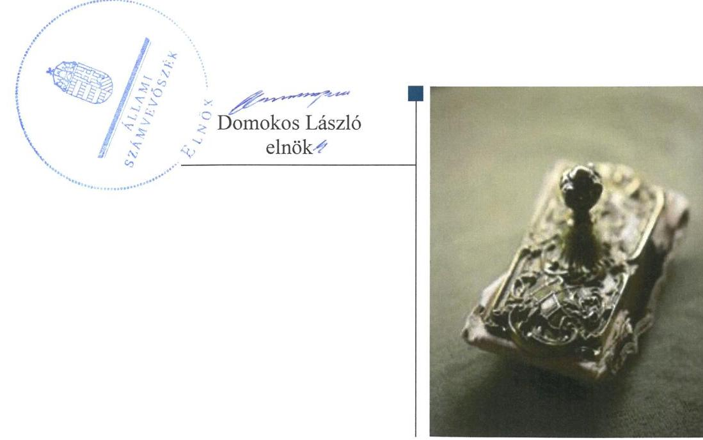
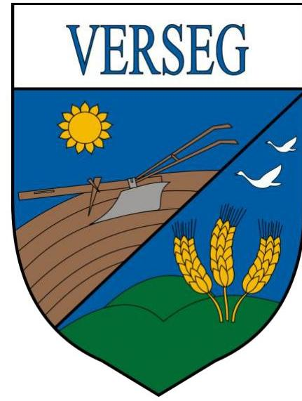
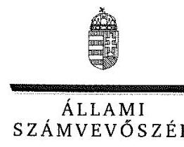

# Jelentés 

## Önkormányzati adósságrendezés ellenőrzése

Verseg Község Önkormányzata adósságrendezési eljárásának ellenőrzése 2016.

---

# Jelentés 

## Önkormányzati adósságrendezés ellenőrzése

Verseg Község Önkormányzata adósságrendezési eljárásának ellenőrzése 2016. 12. hó 01. nap

---

# AZ ELLENŐRZÉST FELÜGYELTE:

- RENKŐ ZSUZSANNA felügyeleti vezető
- AZ ELLENŐRZÉST VEZETTE ÉS A VÉGREHAJTÁSÁÉRT FELELŐS:
  - BAJNAI ZSUZSANNA ellenőrzésvezető
  - A PROGRAM ÖSSZEÁLLÍTÁSÁÉRT FELELŐS:
    - JANIK JÓZSEF LÁSZLÓ osztályvezető

**IKTATÓSZÁM:** V-0985-145/2016

**TÉMASZÁM:** 2019

**ELLENŐRZÉS-AZONOSÍTÓ SZÁM:** V073901

Jelentéseink az Országgyűlés számítógépes hálózatán és az Interneten a www.asz.hu címen is olvashatóak.

---

# TARTALOMJEGYZÉK 

■ ÖSSZEGZÉS ..... 5
■ AZ ELLENŐRZÉS CÉLJA ..... 6
■ AZ ELLENŐRZÉS TERÜLETE ..... 7
■ AZ ELLENŐRZÉS HÁTTERE, INDOKOLTSÁGA ..... 8
■ A JELENTÉS LÉNYEGES KÉRDÉSKÖREI ..... 9
■ ELLENŐRZÉS HATÓKÖRE ÉS MÓDSZEREI ..... 10
■ MEGÁLLAPÍTÁSOK ..... 12
■ JAVASLATOK ..... 22
■ MELLÉKLETEK ..... 23
I. sz. melléklet: Értelmező szótár ..... 23
II. sz. melléklet: Az eszközök és források alakulása kiemelt mérlegsoronként ..... 25
III. sz. melléklet: Bevételek és kiadások, adósságszolgálat CLF módszer szerinti kimutatása ..... 26
■ FÜGGELÉK: ÉSZREVÉTELEK ..... 27
■ RÖVIDÍTÉSEK JEGYZÉKE ..... 33

---

.

---

# ÖSSZEGZÉS 

Verseg Község Önkormányzata adósságrendezési eljárásának végrehajtása során a polgármester, a jegyző és a pénzügyi gondnok nem szabályszerű feladatellátása akadályozta az adósságrendezés céljainak elérését. A fizetőképesség helyreállítása nem történt meg, a hitelezői követelések teljes körű kielégítésére nem került sor. Az adósságrendezés nem segítette elő az átgondolt, felelősségteljes gazdálkodást, az önkormányzat pénzügyi egyensúlyát sem sikerült megteremteni, az ellenőrzött időszak végén újabb adósságrendezési eljárás indult.

## Az ellenőrzés társadalmi indokoltsága

Hitelezői kérelemre Verseg Község Önkormányzatánál 2011. március 17-től 2012. április 18-ig adósságrendezési eljárás folyt, amely során a hitelezők 258,8 millió Ft kötelezettség teljesítésére nyújtottak be igényt. Ez a kötelezettségállomány az önkormányzat vagyonának több mint felét jelentette, így indokolt ellenőrizni, hogy az adósságrendezési eljárás elérte-e a célját, az eljárás szereplői eleget tettek-e törvényben meghatározott feladataiknak a fizetőképesség helyreállítása, a hitelezőknek hatékony jogvédelem nyújtása, és az átgondolt, felelősségteljes gazdálkodás elősegítése érdekében.

## Főbb megállapítások, következtetések, javaslatok

Az adósságrendezési eljárás szabálytalan végrehajtása az eljárás törvényben meghatározott céljainak elérését veszélyeztette. Az adósságrendezés megindításakor nem került sor az önkormányzat valós vagyoni helyzetének felmérésére, mert a vagyon számbavétele nem történt meg, továbbá a számviteli nyilvántartások lezárása elmaradt. A pénzügyi gondnok nem tárta fel, hogy milyen okok vezettek az adósságrendezési eljárás megindításához, így azok kezelését sem tartalmazta a reorganizációs program. A pénzügyi gondnok nem kísérte figyelemmel az önkormányzat gazdálkodását, feladatainak ellátását, a válságköltségvetés időszakában a kifizetéseket ellenjegyzése nélkül teljesítették.

Az önkormányzat fizetőképességének helyreállítására a reorganizációs programban foglalt intézkedéseket nem valósították meg. Az egyezségben szereplő hitelezői követelések majdnem kétharmadát (27,9 millió Ft-ot) az önkormányzat nem fizette ki.

A pénzügyi egyensúly az adósságrendezést követően nem volt biztosított, a működési bevételek az eseti állami támogatásokkal együtt sem fedezték a folyó kiadásokat.

---

# AZ ELLENŐRZÉS CÉLJA 

Az ellenőrzés célja annak megállapítása, hogy az adósságrendezési eljárás megindítása, lefolytatása szabályszerű volt-e, az önkormányzat gazdálkodása az adósságrendezési eljárás alatt megfelelt-e a jogszabályi előírásoknak; az eljárás szereplői - kiemelten a pénzügyi gondnok - a jogszabályokban foglaltak szerint jártak-e el az adósságrendezés során. A lefolytatott eljárás elérte-e a törvényben kitűzött célokat; az önkormányzat teljesítette-e kötelező feladatait, a hitelezők követelését vagyonarányosan kielégítette-e, helyreállt-e fizetőképessége.

---

# AZ ELLENŐRZÉS TERÜLETE 

## Verseg Község Önkormányzata

Verseg Pest megyében található. Állandó lakosainak száma 2009. január 1-jén 1351 fő, 2015. június 30-án 1373 fő volt.

Az önkormányzat ${ }^{1}$ képviselő-testülete ${ }^{2}$ 2009. január 1-jén hét fővel, három állandó bizottsággal látta el feladatait. 2015. június 30-án szintén hét tagja volt a képviselő-testületnek, és állandó bizottság nélkül működött. A polgármester és a jegyző személye az ellenőrzött időszakban egyszer - 2014-ben - változott.
2014. december 31-ig az önkormányzat önálló, saját költségvetési szervként tartotta fenn az igazgatási feladatok ellátására a polgármesteri hivatalt³. 2015. január 1-jétől megszüntették a polgármesteri hivatalt, és Kartal Nagyközség Önkormányzatával létrehozták a Kartali Közös Önkormányzati Hivatalt.

Az önkormányzat fenntartása alá egy intézmény tartozott. Két gazdasági társaságban rendelkezett részesedéssel, tulajdoni hányada mindkettőben 24% volt.

Az önkormányzat adósságrendezési eljárását 2010. március 24-én hitelezője - egy magánszemély - kezdeményezte, mivel az önkormányzat a kapott kölcsönt a vállalt határidőre nem fizette vissza. A bíróság ${ }^{4}$ végzése az adósságrendezés megindításáról 2011. március 17-én jelent meg a Cégközlönyben. Az adósságrendezés 2012. április 18-án egyezség megkötésével zárult.

A bíróság az A CONT(Ó)-ROLL Kft. ${ }^{5}$-t jelölte ki a pénzügyi gondnoki feladatok ellátására. Az A CONT(Ó)-ROLL Kft. 2014-ben kikerült a pénzügyi gondnokok névjegyzékéből.

---

# AZ ELLENŐRZÉS HÁTTERE, INDOKOLTSÁGA 

Az önkormányzatok finanszírozásának, gazdálkodásának keretei és feladatellátása jelentős változásokon ment keresztül a Har. tv. ${ }^{6}$ hatálybalépésétől eltelt időszakban.

Az önkormányzati eladósodást 2011-ig csak az Ötv.-ben ${ }^{7}$ meghatározott hitelfelvételi korlát szabályozta, a korlát megsértését azonban jogszabályok nem szankcionálták. 2012. évtől jelentős szigorítás lépett életbe. A korábbi passzív szabályozást a Stabilitási tv. ${ }^{8}$ hatálybalépésével az aktív kontroll váltotta fel. A törvény előírásai alapján az önkormányzatok hitelfelvételei engedélykötelessé váltak.

1996-ban a hitelfelvételi korlát bevezetése mellett az önkormányzatok adósságrendezésének szabályozására is sor került. Az adósságrendezési eljárás részben a lakosság védelmét szolgálta azzal, hogy biztosította az önkormányzatok által nyújtott kötelező közfeladatokhoz való hozzájutást az önkormányzat fizetésképtelensége esetén is. A Har. tv. alapján - 1996 és 2013 júniusa között - ugyanakkor elenyésző számú, mindösszesen 64 adósságrendezési eljárás indult. Az eljárások közel 60%-a egyezséggel, 40%-a vagyonfelosztással zárult. Az adósságrendezés első időszakában (2009. évig) a forráshiányból eredeztethető eladósodás tette indokolttá az eljárások jelentős hányadának megindítását.

A második időszakban az eljárás alá vont önkormányzatok között megjelentek a nagyobb költségvetéssel és több intézménnyel is rendelkező települések. Az adósságrendezést szükségessé tevő problémák speciális pénzügyi elemekkel, a devizaalapú kötvényel történő finanszírozás begyűrűző hatásaival, valamint az anyagi lehetőségeket meghaladó, túlméretezett fejlesztésekkel összefüggő kötelezettségvállalásokkal egészültek ki, de a beruházások esetében fontos tényező volt a kellő szakértelem hiánya és a pénzügyi nehézségek szakszerűtlen kezelése is.

Az ÁSZ ${ }^{9}$ önkormányzati alrendszert érintő ellenőrzései, elemzései során számos ponton mutatott rá azokra a területekre, ahol a „szabályozás” módosításra, korrekcióra szorul. Az ellenőrzés alapján megfogalmazott javaslatok e területen is segítséget nyújthatnak a kormányzat és az Országgyűlés törvényhozó munkájában, hozzájárulhatnak az irányítói tevékenység erősítéséhez. Az ellenőrzés során tett megállapításaink megerősíthetik egy „megelőző monitoring funkció” kialakításának szükségességét a helyi önkormányzatok fizetésképtelenségének megelőzése érdekében.

---

# A JELENTÉS LÉNYEGES KÉRDÉSKÖREI 

1. Az adósságrendezési eljárás folyamata, végrehajtása során szabályszerű volt-e az önkormányzat és a pénzügyi gondnok feladatellátása?
2. A lefolytatott adósságrendezési eljárás elérte-e a törvényben kitűzött célokat?
3. Az adósságrendezési eljárást követően biztosított és fenntartható volt-e a pénzügyi egyensúly?

---

# ELLENŐRZÉS HATÓKÖRE ÉS MÓDSZEREI 

## Az ellenőrzés típusa

Rendszerellenőrzés.

## Az ellenőrzött időszak

2009. január 1. és 2015. június 30. közötti időszak, ezen belül az első kérdéskör vonatkozásában az adósságrendezési eljárás kezdeményezésétől az eljárás lezárásáig tartó időszak.

## Az ellenőrzés tárgya

A Har. tv. által szabályozott adósságrendezési eljárás.

## Az ellenőrzött szervezet

Verseg Község Önkormányzata és a pénzügyi gondnoki feladatok ellátásával összefüggésben az A CONT(Ö)-ROLL Szolgáltató Korlátolt Felelősségű Társaság.

## Az ellenőrzés jogalapja

Az Állami Számvevőszékről szóló 2011. évi LXVI. törvény 5. § (2) bekezdése.

## Az ellenőrzés módszerei

Az ellenőrzés szakmai módszertana az ÁSZ hivatalos honlapján (www.asz.hu) közzétett szakmai szabályokon alapult, amelyek irányadónak tekintették a Legfőbb Ellenőrző Intézmények Nemzetközi Szervezete (INTOSAI) által kiadott nemzetközi (ISSAI) standardokat.

Az ellenőrzés alapját az ellenőrzött önkormányzatoktól bekért tanúsítványok, szabályzatok, szerződések, bírósági végzések, határozatok és egyéb dokumentumok, kimutatások, valamint az önkormányzati beszámolók adatai képezték. Az ellenőrzési kérdések megválaszolásához szükséges bizonyítékok megszerzése, összegyűjtése, az ellenőrzött által rendelkezésre bocsátott dokumentumok, adatok elemzés módszerével végrehajtott értékelésével történt, kiegészítve a megfigyelés, a szemle (szemrevételezés), a kérdésfeltevés (információkérés), mintavételezés módszerével.

---

Az ellenőrzés keretében értékeltük az ellenőrzéshez elkészített tanúsítványok adatainak valódiságát.

Az adósságrendezési eljárás szabályszerűségét a cégbírósági végzések, határozatok, a testületi előterjesztések, jegyzőkönyvek, határozatok, a válságköltségvetés, a beszámolók adatai, az értesítések, közzétételek, kimutatás a hitelezőkről, jelentések, vagyonfelosztási javaslat, belső szabályzatok, pénzügyi bizonylatok, kötelezettségvállalások és további releváns dokumentumok alapján végeztük. A minősítés szempontja a dokumentumok határidőben és tartalmilag a vonatkozó előírásoknak megfelelő elkészítése volt.

A kontrolltevékenység működésének ellenőrzésével értékeltük, hogy az adósságrendezési eljárás alatt vállalt kötelezettségek és teljesített kifizetések szabályszerűen történtek-e, a válságköltségvetés alatt a források szabályszerűen, rendeltetésszerűen lettek-e felhasználva a Har. tv-ben előírt és az önkormányzat által ellátott kötelező feladatellátás során.

A kontrolltevékenységek támogató szerepét a kötelezettségvállalások és a szakmai teljesítés igazolása/utalvány ellenjegyzése, a teljesítés igazolása/érvényesítés, valamint a pénzügyi gondnok által gyakorolt ellenjegyzés működésének ellenőrzésén keresztül ítéltük meg. A véletlen minta alapján a sokaságra vonatkozó hibaarányt becsültük. „Megfelelőnek” értékeltük az ellenőrzött területet, amennyiben 95%-os bizonyossággal a teljes sokaságban a hibaarány legfeljebb 10%, „részben megfelelőnek” értékeltük, ha a hibaarány 10-30% között volt, „nem megfelelőnek” pedig akkor, ha a mintavételi eredmények alapján a sokaságbeli hibaarány meghaladta a 30%-ot. A becsült hibaaránytól függetlenül nem értékeltük szabályosnak az önkormányzatnál a válságköltségvetésen alapuló kifizetéseket, amennyiben egyetlen esetben is hiányzott a pénzügyi gondnok ellenjegyzése a kötelezettségvállalás vagy pénzügyi kifizetés dokumentumáról.

Az önkormányzat fizetőképességének helyreállítását likviditási mutatók számításával és értékelésével végeztük el. A fizetőképességet kedvezőtlennek ítéltük, ha a szállítói állomány változása növekvő tendenciát mutatott, ha az önkormányzat 60 napon túli adósságállománnyal rendelkezett, az adósságot keletkeztető ügyletek állományának változása 20% feletti volt, az egyéb visszterhes kötelezettségének aránya meghaladta a teljesített költségvetési kiadások összegének 10%-át, ha a lejárt követelések állománya nem csökkent az adósságrendezés kezdő időpontjában fennálló összeghez képest. A likviditási mutatókat megfelelőnek értékeltük, ha értékük nagyobb volt egynél.

A pénzügyi egyensúly fenntartásának értékelését a CLF módszer segítségével végeztük el. A pénzügyi egyensúly abban az esetben jött létre, ha egy adott időszakban a folyó bevételek fedezetet biztosítottak a folyó kiadásokra.

Az önkormányzatok adósságrendezési eljárása és az azt követő gazdálkodási tevékenysége hibáinak kijavítására, a közpénzekkel való felelős gazdálkodás segítésére irányuló javaslatok kidolgozásakor a hatályos jogszabályok voltak az irányadóak.

---

# MEGÁLLAPÍTÁSOK 

## 1. Az adósságrendezési eljárás folyamata, végrehajtása során szabályszerű volt-e az önkormányzat és a pénzügyi gondnok feladatellátása?

Összegző megállapítás

Az adósságrendezési eljárás lefolytatása a polgármester, a jegyző és a pénzügyi gondnok feladatellátásának hiányosságai következtében nem volt szabályszerű. A működtetett belső kontrollrendszer nem biztosította a válságköltségvetésen alapuló kifizetések szabályszerű végrehajtását.
1.1. számú megállapítás

A polgármester képviselő-testületi felhatalmazás nélkül nyújtott be fellebbezést a bírósághoz az adósságrendezési eljárás megindítását követően.

Az adósságrendezési eljárás hitelezői kérelemre indult 2010. március 24-én. A hitelező az önkormányzattal kötött kölcsönszerződés alapján 37,6 millió Ft tőke, továbbá a kifizetés napjáig járó ügyleti és késedelmi kamat megfizetését kérte. A kölcsönszerződés nem tartalmazta az Ámr. ${ }^{10}$ 134. § (2) bekezdésében foglaltak ellenére a kötelezettségvállalás ellenjegyzését.

A polgármester ${ }^{11}$ a hitelező kérelmében foglaltak fennállását nem
 ismerte el. Arra hivatkozott, hogy a hitelező a kölcsön folyósításakor tudta, hogy a visszafizetés fedezete külső befektetői forrás lesz, és a befektető késedelme miatt a törlesztéshez szükséges pénzösszeg nem állt rendelkezésre.

A bíróság a kölcsönszerződés tartalmát vizsgálta, és mivel az a visszafizetés forrására vonatkozóan nem tartalmazott előírást, 2010. július 9. napján kelt végzésével felhívta az önkormányzatot tartozása 15 napon belül történő kiegyenlítésére az adósságrendezés megindításának terhe mellett.

Az önkormányzat a tartozását nem fizette meg, ezért a bíróság 2010. szeptember 13-án kelt végzésével elrendelte az adósságrendezés megindítását.

A polgármester - tekintettel az önkormányzati választásokra és arra, hogy az új képviselő-testület még nem alakult meg - kérte a bíróságtól a fellebbezésre rendelkezésre álló határidő meghosszabbítását. A bíróság a kérelmet tartalma alapján fellebbezésnek minősítette, és felhívta a polgármestert, hogy csatolja a vonatkozó képviselő-testületi döntést. A bíróság 2011. február 10-én jogerősen elutasította a fellebbezést, mivel a polgármester - a Har. tv. 9. § (4) bekezdése ellenére - a képviselő-testület döntése nélkül terjesztette elő.

Az adósságrendezés megindításáról szóló végzés a Cégközlönyben 2011. március 17-én jelent meg.

---

### 1.2. számú megállapítás

1.3. számú megállapítás

A polgármester nem az előírások szerint határozta meg a hitelezőknek szóló felhívásban a hitelezői igény bejelentésének határidejét, továbbá a felhívás határidőn túl jelent meg. A polgármester egyéb tájékoztatási kötelezettségének eleget tett.

A polgármester határidőn belül gondoskodott a hitelezőknek szóló felhívás helyben szokásos módon való kihirdetéséről, valamint megrendelte a két országos napilapban való megjelenést. Az újságokban a hirdetmény a Har. tv. 10. § (3) bekezdésében meghatározott 15 napos határidőt követően négy nappal később - 2011. április 5-én - jelent meg. A felhívásban a Har. tv. 10. § (3) bekezdésében és a 10. § (2) bekezdés e) pontjában foglaltak ellenére a polgármester nem gondoskodott a hitelezői igény bejelentésére nyitva álló határidő jogszabály szerinti meghatározásáról, a hirdetményben a - 2011. március 17-ei - időpontot az adósságrendezési eljárás, és nem az adósságrendezés kezdő időpontjaként tüntette fel. A határidő előírásoktól eltérő meghatározása nem okozott hátrányt a hitelezők számára.

A polgármester az adósságrendezés megindításáról határidőn belül tájékoztatta az önkormányzat törvényességi ellenőrzéséért felelős szervet, a kincstárt, a pénzforgalmi szolgáltatókat, az illetékes adó- és vámhatóságot, valamint a nyugdíjbiztosítási igazgatási- és az egészségbiztosítási szervet.

A polgármester nem adta át a pénzügyi gondnoknak a jogszabályban előírt dokumentumokat az adósságrendezés megindítását követően.

A polgármester nem adta át a pénzügyi gondnoknak $^{12}$ a Har. tv. 13. § (2) bekezdés a)-b) és d)-g) pontjainak előírása ellenére a jogszabályban rögzített határidőben és azt követően sem:
$\longrightarrow$ a kötelezően előírt, valamint önként vállalt feladatainak és hatáskörének helyi ellátási formáiról, valamint ezek pénzügyi finanszírozásáról szóló jelentését;
$\longrightarrow$ az adósságrendezés megindításának időpontját megelőző nappal készített vagyonleltárt és éves beszámolót, mert a jegyző $^{13}$ nem készítette el az Áhsz. $^{14}$ 13. § (1) és a Htv. $^{15}$ 140. § (1) bekezdés d) pontjában meghatározott feladatkörében;
$\longrightarrow$ a folyamatban lévő bírósági, más hatósági-végrehajtási eljárásokról készített részletes összefoglalót;
$\longrightarrow$ az önkormányzat vagyonára vonatkozó, az adósságrendezési eljárás kezdő időpontját megelőző egy éven belül, és az azóta kötött szerződéseket, illetve a vagyont érintő, bármely időpontban tett kötelezettségvállaló nyilatkozatokat;
$\longrightarrow$ az önkormányzat részvételével működő gazdasági társaságokról szóló részletes tájékoztatást;
$\longrightarrow$ az intézményéről, annak gazdasági helyzetéről, tartozásairól, követeléseiről szóló részletes tájékoztatást.
A válságköltségvetési rendelettervezetet a jegyző határidőben elkészítette és az a pénzügyi gondnok részére átadásra került.

---

### 1.4. számú megállapítás

### 1.5. számú megállapítás

## A pénzügyi gondnok nem tárta fel az adósságrendezéshez vezető okokat, nem véleményezte a költségvetési előterjesztéseket. A határidőben jelentkező hitelezőket nyilvántartásba vette.

A pénzügyi gondnok nem tárta fel az adósságrendezési eljárás megindításához vezető okokat a Har. tv. 14. § (2) bekezdés a) pontjában foglaltak ellenére.

Az adósságrendezési eljárás a 2011. évben nem fejeződött be, ezért a következő, 2012. évre vonatkozóan is válságköltségvetést kellett készíteni. A válságköltségvetési rendeletek tartalma a jogszabályi előírásoknak megfelelt.

A pénzügyi gondnok a Har. tv. 14. § (1) bekezdésének előírása ellenére nem készített írásos véleményt a költségvetést érintő előterjesztésekhez.

A pénzügyi gondnok a jogszabályban rögzített határidőben jelentkező hitelezőket nyilvántartásba vette. Az eljárásban 33 hitelező jelentette be követelését a 60 napos határidőn belül. A pénzügyi gondnok 28 követelést elfogadott, ötöt jogalap hiánya, illetve folyamatban levő peres eljárás miatt vitatott. Az elfogadott követelések összege 258,8 millió Ft, a vitatott követeléseké 79,5 millió Ft volt. Az egyik vitatott követeléssel rendelkező hitelező a Har. tv. 15. § (2) bekezdésében az érvényesítésre nyitva álló 15 napos határidőn túl nyújtott be keresetlevelet a bíróságnak, ezért követelését a folyamatban lévő adósságrendezési eljárásban nem érvényesíthette.

## Az adósságrendezési bizottság az előírások szerint megalakult. A reorganizációs programot és az egyezségi javaslatot tartalmilag hiányosan készítette el, a 2012. évi válságköltségvetési rendelettervezetet nem tárgyalta.

Az adósságrendezési bizottság a jogszabályi előírásoknak megfelelő határidőben és összetételben megalakult. A 2011. évi válságköltségvetési rendelettervezetet elfogadta, a 2012. évi tervezetet a Har. tv. 19. § (1) bekezdésének előírása ellenére nem tárgyalta.

Az adósságrendezési bizottság nem szerepeltette a Har. tv. 20. § (1)-(2) bekezdésének előírása ellenére a reorganizációs programban az önkormányzat gazdasági helyzetének részletes leírását. A reorganizációs programban meghatározásra kerültek a tervezett intézkedések, azonban az adósságrendezési bizottság a Har. tv. 20. § (1)-(2) bekezdésének előírása ellenére nem számszerűsítette, hogy azok által az önkormányzat milyen bevételekhez juthat, ezért nem állapítható meg, hogy a tervezett intézkedések következtében milyen költségvetési hatással számoltak. A reorganizációs programban a következő bevételnövelő intézkedéseket tervezték:
—- bevezetik a vállalkozók kommunális adóját;

- a szemétszállítási költségeket a lakosságra hárítják;
- az önkormányzati üzletrészeket piaci áron értékesítik;
- a nem hasznosított ingatlanokat értékesítik.

Az adósságrendezési bizottság az egyezségi javaslatban a hitelezőket csoportokba sorolta. A hét különböző csoport tekintetében eltérő egyezségi javaslatot terjesztettek elő, de a Har. tv. 20. § (3) bekezdésének előírása ellenére az előterjesztés az eltérések indoklását nem tartalmazta.

---

A polgármester a reorganizációs program és az egyezségi javaslat megtárgyalására négy nappal a Har. tv. 21. §-ában rögzített határidőt követően - 2011. július 28-a helyett 2011. augusztus 3-ra - hívta össze a képviselőtestület ülését. A képviselő-testület a reorganizáció programot és az egyezségi javaslatot az adósságrendezés megindításának időpontjától számított 180 napon belül, határidőben fogadta el.

# 1.6. számú megállapítás 

Az egyezség nem tartalmazta a végrehajtás ellenőrzésének módját.
A pénzügyi gondnok az előírásoknak megfelelően valamennyi hitelező részére megküldte a képviselő-testület által elfogadott reorganizációs programot és az egyezségi javaslatot. Az előzetes egyeztetéseket, valamint az egyezségi tárgyalásokat hitelezői csoportonként tartották meg. Az egyezségi tárgyalásokra vonatkozó meghívót a pénzügyi gondnok a jogszabályban rögzített határidőben juttatta el a hitelezőkhöz.

A pénzügyi gondnok és a polgármester a képviselő-testület döntése alapján kérelmezte az egyezség létrejöttére meghatározott 210 napos határidő 30 nappal történő meghosszabbítását, amelyet a bíróság engedélyezett.

Az egyezséget írásba foglalták, amely tartalmazta az előírt elemeket a Har. tv. 24. § a) pontjában rögzített ellenőrzési mód kivételével. Az ellenőrzésre az önkormányzat jogszabályi kötelezettsége ellenére nem adott megbízást. Az egyezséghez hitelezői csoportonként az adósságrendezés időpontjában fennálló követeléssel rendelkező hitelezőknek több mint a fele hozzájárult, ezen hitelezők összes követelése elérte az összes bejelentett és nem vitatott hitelezői követelés kétharmadát.

Az egyezség alapján az önkormányzat a következő engedményeket érte el:
— fizetési haladék;
— késedelmi kamatok elengedése (az 5. hitelezői csoportban a késedelmi kamat 50%-ának, a többi hitelező csoportban a késedelmi kamat 100%-ának elengedése);
— az egyéb hitelezői csoportban a tőketartozás 40%-ának elengedése.
A pénzügyi gondnok az egyezség létrejöttét követően, 2011. november 3-án kelt beadványában az adósságrendezés befejezését kérte a bíróságtól.

A 2012. február 21. napján kelt végzésében a bíróság felhívta az adós önkormányzatot valamennyi vitatott követelés fedezetének biztosítására, melyet 2012. április 11-én bizonyított.

Az adósságrendezési eljárás befejezése a Cégközlönyben 2012. április 18-án került közzétételre a bíróság végzésének megfelelően.
1.7. számú megállapítás

A jegyző a jogszabályi előírások ellenére nem alakította ki a megfelelő kontrollkörnyezetet, mert nem készítette el az előírt szabályzatokat az adósságrendezés időszakában.

A képviselő-testület az adósságrendezés időszakában rendelkezett az önkormányzati működés részletes szabályait tartalmazó SZMSZ$^{16}$-szel.

A képviselő-testület az önkormányzati vagyonnal történő gazdálkodás szabályait a Htv. 138. § (1) bekezdés j) pontjában előírtak ellenére nem fogadta el.

---

A jegyző az Áht. $^{17}$ 121. § (2) bekezdés a) pontjában és a Bkr. $^{18}$ 3. § a) pontjában foglaltak ellenére nem alakította ki a megfelelő kontrollkörnyezetet.

A polgármesteri hivatal nem rendelkezett a válságköltségvetés időszakában az Ámr. $^{19}$ 20. § (1), az Áht. $^{20}$ 91. § (2) és az Áht. $^{21}$ 10. § (5) bekezdésében előírt szervezeti és működési szabályzattal.

A jegyző az Áhsz. 8. § (12) és 49. § (6) bekezdés által meghatározott felelősségi körében nem készítette el a - Számv. tv. $^{22}$ 14. § (4), (5) és az Áhsz. 8. § (3), (4) bekezdésében előírt - számviteli politikát, annak keretében a leltározási és leltárkészítési szabályzatot, az eszközök és források értékelési szabályzatát, a pénzkezelési szabályzatot, továbbá a Számv. tv. 161. § (1) és az Áhsz. 49. § (1) bekezdésében előírt számlarendet.

A jegyző nem rendezte belső szabályzatban - az Ámr. $^{2}$ 20. § (3) bekezdés a) pontjában és az Ávr. $^{23}$ 13. § (2) bekezdés a) pontjában foglaltak ellenére - a gazdálkodási jogkörök (a kötelezettségvállalás, ellenjegyzés, a szakmai teljesítés igazolása, az érvényesítés, utalványozás) gyakorlásának módjával, eljárási és dokumentációs részletszabályaival, valamint az ezeket végző személyek kijelölésének rendjével, és az adatszolgáltatási feladatok teljesítésével kapcsolatos belső előírásokat, feltételeket.

# 1.8. számú megállapítás 

A pénzügyi gondnok a jogszabály által előírt ellenjegyzési feladatait nem végezte el, a kontrolltevékenységek nem biztosították a válságköltségvetésen alapuló kifizetések szabályszerű végrehajtását.

A jegyző nem juttatta el a Har. vhr. $^{24}$ 16. §-ában előírtak ellenére a pénzügyi gondnok ellenjegyzéshez szükséges aláírási címpéldányát az adósságrendezés megindításával egyidejűleg a számlavezető pénzügyi intézményhez.

A pénzügyi gondnok nem jegyezte ellen a Har. tv. 14. § (1) bekezdésének előírása ellenére a kötelezettségvállalásokat és a kifizetések teljesítését.

A számviteli nyilvántartásba adatot az elszámolást alátámasztó bizonylat nélkül rögzítettek a Számv. tv. 165. § (1) bekezdése ellenére.

A Har. tv. 18. §. (2) bekezdésének előírása ellenére felhalmozási kiadást is teljesítettek, amelyre előirányzat nélkül került sor az Áht. $^{1}$ 12/A § (1) és az Áht. $^{2}$ 36. § (1) bekezdése ellenére.

A kifizetésekhez kapcsolódó kontrolltevékenységek - gazdálkodási jogkörök, pénzügyi gondnoki ellenjegyzés - gyakorlása „nem megfelelő" volt a válságköltségvetések időszakában.

A gazdálkodási jogkörök gyakorlásának ellenőrzése során tapasztalt további hiányosságokat az 1. táblázat tartalmazza.

1. táblázat

## A GAZDÁLKODÁSI JOGKÖRÖK GYAKORLÁSÁNAK ELLENŐRZÉSE SORÁN TAPASZTALT HIÁNYOSSÁGOK

| Sorszám | Gazdálkodási jogkör | Megállapított szabálytalanság | Megsértett
 jogszabály |
| :--: | :--: | :--: | :--: |
| 1. | kötelezettségvállalás | A kötelezettségvállaló személye nem volt beazonosítható, mivel   nem vezettek nyilvántartást a kötelezettségvállalásra jogosult sze-   mélyekről és aláírásmintájukról.   A beszerzések előzetes írásbeli kötelezettségvállalás nélkül történ-   tek. | Ámr. ${ }_{2}$ 80. § (3) és az Ávr. 60. §   (3) bekezdései   Ámr. ${ }_{2}$ 74. § (1) és az Áht. ${ }_{2}$ 37. §   (1) bekezdései |

---

| Sorszám | Gazdálkodási jogkör | Megállapított szabálytalanság | Megsértett jogszabály |
| :--: | :--: | :--: | :--: |
| 2. | szakmai teljesítés igazolása / teljesítés igazolása | A szakmai teljesítés igazolását / a teljesítés igazolását nem végezték el. | Ámr. 76. § (1), Áht. 100/C § (6), Áht. 38. § (1) és az Ávr. 57. § (1) bekezdései |
| 3. | érvényesítés | Az érvényesítést nem végezték el, így nem történt meg az összegszerűség, a fedezet meglétének, továbbá a jogszabályokban, illetve a belső szabályzatokban foglaltak betartásának ellenőrzése. | Ámr. 77. § (1) és az Ávr. 58. § (1) bekezdései |
| 4. | utalvány ellenjegyzése | Az utalvány ellenjegyzését nem végezték el.   Az elvégzett utalvány ellenjegyzések esetében   nem volt megállapítható, hogy az aláírás arra jogosult személytől   származott-e, mivel az utalvány ellenjegyzésére jogosult személyekről és aláírásmintájukról nem vezettek naprakész nyilvántartást, és   az utalvány ellenjegyzője az előírtak ellenére nem győződött meg arról, hogy a szakmai teljesítés igazolása és az érvényesítés megtörtént-e. | Ámr. 79. § (2) bekezdése   Ámr. 79. § (1) bekezdése   Ámr. 80. § (3) bekezdése   Ámr. 79. § (2) bekezdése |

Forrás: ÁSZ megállapítás
Az Ámr. 75. § (1) és az Ávr. 56. § (1) bekezdéseiben foglaltak előírásait megsértve a kötelezettségvállalásokról nem vezettek nyilvántartást.
1.9. számú megállapítás

Belső ellenőrzés az adósságrendezés időszakában nem történt.
Az önkormányzat a belső ellenőrzés működtetéséről társulás ${ }^{25}$ munkaszervezetének igénybevételével gondoskodott.

A társulás nem végzett belső ellenőrzést az önkormányzatnál az adósságrendezés alatt.

# 2. A lefolytatott adósságrendezési eljárás elérte-e a törvényben kitűzött célokat? 

## Összegző megállapítás

2.1. számú megállapítás

A kötelező feladatokat folyamatosan teljesítették. Az egyezségben vállalt fizetési kötelezettségek 11,5%-át az önkormányzat nem elégítette ki. Fizetőképessége állami intézkedések hatására állt helyre a 2012. évben, amelyet fenntartani nem tudott, likviditási helyzete a 2014. évben ismételten romlott.

Az adósságrendezés alatt a kötelező feladatokat folyamatosan ellátták.

Az önkormányzat a jogszabályokban előírt kötelező feladatokat teljesítette.

A kötelező feladatok közül az óvodai ellátást, az általános iskolai oktatást, a gyermekvédelem és a gyermekétkeztetést társulás keretében végezte. A köztisztasági feladatokat, a köztemető fenntartását, a védőnői szolgálatot, a szociális pénzbeli és természetbeni ellátásokat saját költségvetési szervén keresztül biztosította. További feladatait - víz- és csatornaszolgáltatást, hulladékkezelést, közvilágítást, háziorvosi szolgálatot, közművelődést - egyéb módon teljesítette.

---

Az adósságrendezés időszakában feladatot nem adott és nem vett át.

# 2.2. számú megállapítás 

A hitelezők felé fennálló tartozásból 27,9 millió Ft kifizetése nem történt meg.

A hitelezői igények 88,5%-át elégítették ki. A fennmaradó rész kifizetése - az egyezségben foglaltak ellenére - kilenc hitelező esetében - 2015. június 30-ig nem történt meg.

A teljesítést hitelezői csoportonként a 2. táblázat ismerteti.
2. táblázat

## A HITELEZŐI IGÉNYEK KIEGYENLÍTÉSÉNEK ALAKULÁSA (MILLIÓ FT)

| Hitelezői csoport | Összes hitelezői   igény | Egyezség   alapja | Fizetési határidő   egyezség szerint | Egyezség alapján   teljesített | Teljesítés %   lión |
| :-- | :--: | :--: | :--: | :--: | :--: |
| 1. Pénzintézetek hitelezői csoportja I. | 67,8 | 67,8 | 2016.03.16. | 67,8 | 100,0 |
| 2. Pénzintézetek hitelezői csoportja II. | 13,1 | 13,1 | 2016.11.30. | 13,1 | 100,0 |
| 3. Pénzintézetek hitelezői csoportja III. | 14,8 | 14,8 | 2019.07.15. | 14,8 | 100,0 |
| 4. Pénzintézetek hitelezői csoportja IV. | 3,5 | 3,5 | 2012.03.31. | 3,5 | 100,0 |
| 5. Magánszemély kölcsönnyújtó csoportja | 48,4 | 48,4 | 2011.12.31. | 38,0 | 78,5 |
| 6. Csapadékvíz-elvezetés projekt | 72,4 | 72,4 | 2012.12.31. | 61,1 | 84,4 |
| 7. Egyéb hitelezői csoport | 38,8 | 23,3 | 2013.12.31. | 17,1 | 73,4 |
| Összesen: | 258,8 | 243,3 |  | 215,4 | 88,5 |

Forrás: az önkormányzat kimutatása a hitelezői igények kiegyenlítésére vonatkozóan

A kifizetett 215,4 millió Ft hitelezői igényből az önkormányzat saját forrása 10,4 millió Ft volt, 105,0 millió Ft-ot az adósságkonszolidáció révén rendeztek a Magyarország 2013. évi központi költségvetéséről szóló 2012. évi CCIV. törvény alapján, 100,0 millió Ft-ot pedig a 2013. évben elnyert ÖNHIKI támogatásból fizettek ki.
2.3. számú megállapítás

A reorganizációs programban foglalt intézkedéseket az önkormányzat nem valósította meg.

A reorganizációs programban foglalt bevételnövelő intézkedéseket nem valósították meg. A végrehajtott kiadáscsökkentő intézkedések nem voltak jelentősek, a polgármesteri hivatal egyik munkakörét részmunkaidőben töltötték be, valamint az egyik intézmény élére nem neveztek ki szakképzett intézményvezetőt, ami összesen 0,3 millió Ft megtakarítást eredményezett az ellenőrzött időszakban.
2.4. számú megállapítás

Az önkormányzat fizetőképessége állami támogatások hatására állt helyre rövidtávon, likviditási helyzete 2014. évben romlott.

Az önkormányzat fizetőképessége a 2012. és a 2013. években az adósságkonszolidáció és a kapott ÖNHIKI támogatások eredményeképpen volt biztosított.

A 3. táblázat az önkormányzat fizetőképességének megítélésére vonatkozó időszak végi adatok és mutatók alakulását tartalmazza a 2009. évtől a 2014. év végéig, a II. számú melléklet az eszközök és források alakulását ismerteti kiemelt mérlegsoronként.

---

| A FIZETŐKÉPESSÉG ALAKULÁSÁT JELLEMZŐ ADATOK ÉS MUTATÓK 2009-2014. ÉVEK KÖZÖTT |  |  |  |  |  |  |
| :--: | :--: | :--: | :--: | :--: | :--: | :--: |
| Év | 2009. | 2010. | 2011. | 2012. | 2013. | 2014. |
| Kötelezettségek (millió Ft) | 178,8 | 125,6 | 121,9 | 3,4 | 6,2 | 103,7 |
| Adósságot keletkeztető ügyletek állománya (millió Ft) | 133,9 | 81,9 | 81,9 | 0,0 | 0,0 | 78,6 |
| Likviditási mutató | 0,7 | 0,5 | 0,9 | 20,8 | 9,7 | -* |
| Pénzeszköz likviditási mutató | 0,0 | 0,0 | 0,2 | 2,8 | 0,8 | 0,3 |
| Forrás: 2009-2014. évi mérleg adatok |  |  |  |  |  |  |

A kötelezettségek állománya az állami támogatások eredményeként jelentősen csökkent, de 2014. év végére ismét növekedett. A kötelezettségen belül a rövid lejáratú kötelezettségek állománya 2009. év végén 92,1 millió Ft, 2014-ben 102,5 millió Ft volt. A növekedés oka, hogy jogerősen lezárt peres eljárásokból az önkormányzatnak fizetési kötelezettsége keletkezett.

A bankkal szemben fennálló tartozások mérlegfőösszeghez mért aránya 2012-ben, 2013-ban - az adósságkonszolidáció hatására - kedvező volt.

A likviditási mutató értéke szerint 2012-ben és 2013-ban a forgóeszközök fedezték a rövid lejáratú kötelezettségeket, a többi évben a magas kötelezettségállomány miatt a mutató kedvezőtlenül alakult.

A pénzeszköz likviditási mutató szerint az önkormányzat pénzeszközei csak 2012-ben fedezték a rövidtávú kötelezettségeket.

A jegyző az Áht. 194. § (1) bekezdés f) pontja és az Áht. 210. § (1) bekezdésében meghatározott feladatkörében nem gondoskodott a 2009-2013. évek között a szállítói és egyéb kötelezettségek Áhsz. 49. § (1) bekezdése 9. számú melléklete 4. pont da) alpontja előírásának megfelelő analitikus nyilvántartás vezetéséről.

A követelések állománya kismértékben változott, a 2009. december 31-ei 46,0 millió Ft-ról 2014. év végére 50,7 millió Ft-ra növekedett. A lejárt követelésekről csak 2014. évi adat állt rendelkezésre, ekkor 0,4 millió Ft lejárt követelést tartott nyilván az önkormányzat.

A követelések behajtására vonatkozóan nem tettek intézkedéseket és a Har. tv. 14. § (2) bekezdés e) pontja ellenére a pénzügyi gondnok sem kezdeményezte azt.

Az eladósodási mutató - a kötelezettségek eszközértékhez viszonyított aránya - a 2011. évtől a kötelezettségek csökkenése miatt jelentősen javult, azonban 2014-ben ismét 20,0% feletti volt, amely az újabb eladósodást jelezte. Az eladósodási mutató változását a 4. táblázat tartalmazza.
2015. május 27-én az önkormányzat adósságrendezési eljárást kezdeményezett, az adósságrendezés megindításáról szóló végzés a Cégközlönyben 2015. június 5-én jelent meg.

[^0]
[^0]:    * A mutató nevezőjének (forgóeszközök) mérlegben kimutatott tartalma szűkült, 2014-től csak a készletek és értékpapírok tartoznak oda, ezért a likviditási mutató értéke az előző évek adataival nem hasonlítható össze.

---

# 3. Az adósságrendezési eljárást követően biztosított és fenntartható volt-e a pénzügyi egyensúly? 

## Összegző megállapítás

Az adósságrendezési eljárást követően - 2012. év kivételével - a pénzügyi egyensúly nem volt biztosított az állami támogatások mellett sem.

### 3.1. számú megállapítás

A folyó bevételek nem fedezték a folyó kiadásokat a 2013-2014. években.

A jegyző az Ámr. 201.§ (1) bekezdésében, az Mötv. 81. § (3) bekezdés c) pontjában, az Áht. 78. § (2) bekezdésében és az Ávr. 122. § (2) bekezdésében foglalt előírások ellenére nem készítette el a bevételek beérkezésének és a kiadások teljesítésének ütemezésére az önkormányzat, valamint a 2012-2014. években a polgármesteri hivatal, a 2013. július 1. és 2015. június 30. közötti időszakban a Versegi Napköziotthonos Óvoda, a 2015. évben a Kartali Közös Önkormányzati Hivatal likviditási tervét.

A pénzügyi egyensúlyi helyzet értékelését a CLF módszer segítségével végeztük el. Az önkormányzat összevont beszámolója alapján a CLF táblázat főbb mutatóinak alakulását a 2009-2014. évek között az 5. táblázat tartalmazza, az adósságkonszolidáció hatásának kiszűrésével számított mutatókat az utolsó oszlop ismerteti. A részletes adatokról a III. számú melléklet ad tájékoztatást.
5. táblázat

A PÉNZÜGYI EGYENSÚLYI HELYZET FŐBB MUTATÓI A 2009-2014. ÉVEK KÖZÖTT (MILLIÓ FT)

| Év | 2009. | 2010. | 2011. | 2012. | 2013. | 2014. | 2012.   konszolidáció   nélkül |
| :-- | --: | --: | --: | --: | --: | --: | --: |
| Folyó bevételek | 133,0 | 126,2 | 127,1 | 217,7 | 187,4 | 109,7 | 112,8 |
| Folyó kiadások | 152,6 | 104,8 | 105,9 | 121,3 | 201,7 | 123,6 | 121,4 |
| Működési jövedelem | -19,6 | 21,4 | 21,2 | 96,4 | -14,3 | -13,9 | -8,6 |
| Működési jövedelem ÖNHIKI nélkül | -19,6 | 21,4 | 13,1 | 96,4 | -114,3 | -23,9 | -8,6 |
| Felhalmozási bevételek | 0,3 | 25,3 | 0,1 | 0,5 | 0,2 | 44,2 | 0,5 |
| Felhalmozási kiadások | 0,0 | 4,2 | 0,5 | 0,6 | 0,0 | 0,5 | 0,6 |
| Felhalmozási költségvetés

 egyenlege | 0,3 | 21,1 | $-0,4$ | $-0,1$ | 0,2 | 43,7 | $-0,1$ |
| Finanszírozási műveletek nélküli (GFS)   pozíció | $-19,3$ | 42,5 | 20,8 | 96,3 | $-14,1$ | 29,8 | $-8,7$ |
| Finanszírozási műveletek egyenlege | $-7,4$ | $-41,8$ | $-2,0$ | $-106,6$ | 9,9 | $-6,9$ | $-1,6$ |
| Tárgyévi pénzügyi pozíció | $-26,7$ | 0,7 | 18,8 | $-10,3$ | $-4,2$ | 22,9 | $-10,3$ |
| Nettó működési jövedelem | $-59,8$ | $-30,5$ | 21,2 | $-14,5$ | $-14,3$ | $-21,9$ | $-14,5$ |

A 2010., 2011. és a 2012. években a működési bevételek fedezték a működési kiadásokat, a pénzügyi egyensúly fennállt. A 2009., 2013., 2014. években a működési jövedelem negatív értéket mutatott, a folyó bevételek nem fedezték a folyó kiadásokat. Az adósságkonszolidáció nélkül a 2012. évi működési jövedelem -8,6 millió Ft lett volna.

---

Az önkormányzat a 2011., a 2013. és a 2014. években részesült ÖNHIKI támogatásban, amely meghaladta működési bevételének 5%-át, ami magas bevételi kitettséget jelzett. A 2013. és 2014. években a működési jövedelem a rendkívüli támogatások ellenére is negatív volt, tehát működését az önkormányzat az állam támogatása ellenére sem tudta finanszírozni.

A finanszírozási műveletek nélküli GFS pozíció csak a 2009. és a 2013. években volt negatív. A többi évben a működési és felhalmozási bevételek fedezetet nyújtottak a kiadásokra.

A nettó működési jövedelem 2011. év kivételével negatív összegű volt, amely az érintett években az adósságszolgálat túlzott mértékére utalt. Az ellenőrzött időszak döntő részében a folyó költségvetés egyenlege nem biztosította a hitelek tőketörlesztésének kifizetését.

---

# JAVASLATOK 

Az ÁSZ tv. 33. § (1) bekezdésében foglaltak értelmében az ellenőrzött szervezet vezetője köteles a jelentésben foglalt megállapításokhoz kapcsolódó intézkedési tervet összeállítani és azt a jelentés kézhezvételétől számított 30 napon belül az ÁSZ részére megküldeni. Amennyiben az ellenőrzött szervezet vezetője nem küldi meg határidőben az intézkedési tervet, vagy továbbra sem elfogadható intézkedési tervet küld, az Állami Számvevőszék elnöke az ÁSZ tv. 33. § (3) bekezdése a) és b) pontjaiban foglaltakat érvényesítheti.

## a polgármesternek:

1. Intézkedjen az önkormányzati vagyonnal történő gazdálkodás szabályairól szóló előterjesztés Képviselő-testület elé terjesztéséről.
(1.7. sz. megállapítás 2. bekezdése alapján)
2. Intézkedjen az Állami Számvevőszék ellenőrzése során feltárt hiányosságok és/vagy szabálytalanságok tekintetében a munkajogi felelősség tisztázására irányuló eljárás kezdeményezéséről, és ennek eredménye ismeretében tegye meg a szükséges intézkedéseket.
(3.1. sz. megállapítás 1. bekezdése alapján)

## a jegyzőnek:

1. Intézkedjen a likviditási terv jogszabályi előírásoknak megfelelő elkészítéséről.
(3.1. sz. megállapítás 1. bekezdése alapján)
2. Intézkedjen az önkormányzati vagyonnal történő gazdálkodás szabályairól szóló előterjesztés elkészítéséről.
(1.7. sz. megállapítás 2. bekezdése alapján)

---

# MELLÉKLETEK 

- I. SZ. MELLÉKLET: ÉRTELMEZŐ SZÓTÁR
adósságkonszolidáció
adósságrendezés
adósságrendezésbe vonható vagyon
adósságrendezési bizottság
adósságrendezési eljárás
adósságrendezési eljárás kezdő időpontja
adósságrendezés megindításának időpontja
adósságot keletkeztető ügyletek
bevételi kitettség
bíróság
CLF módszer
egyezségi javaslat
egyezségi tárgyalás
eladósodási mutató
egyéb visszterhes kötelezettségek
felhalmozási bevétel
felhalmozási kiadás
finanszírozási műveletek nélküli
(GFS) pozíció

Az önkormányzati adósságállomány állam által történő átvállalása.
Az adósságrendezési eljárás azon szakasza, amely a bíróság adósságrendezést megindító végzésének Cégközlönyben való közzétételével [10. § (1) bekezdés] kezdődik, és az adósságrendezési eljárás befejezését elrendelő bírósági végzés Cégközlönyben való közzétételének napjáig tart. (Forrás: Har. tv. 2. § b) pontja és 32. § (6) bekezdése)

Törvényben meghatározott forgalomképtelen törzsvagyon feletti, valamint a hatósági feladatok és az alapvető lakossági szolgáltatások ellátásához szükséges vagyon feletti forgalomképes vagyonrész. (Forrás: Har. tv. 2.§ f) pontja)
Az adósságrendezési eljárás megindítását követően megalakult bizottság, melynek tagjai: az önkormányzat polgármestere, a jegyző, a pénzügyi bizottság elnöke, egy önkormányzati képviselő, elnöke a pénzügyi gondnok. (Forrás: Har. tv. 16. § (1) bekezdése)

A helyi önkormányzat székhelye szerint illetékes törvényszék (2011. december 31-ig a fővárosi, megyei bíróságok) hatáskörébe tartozó nem peres eljárás, amely a helyi önkormányzatok fizetőképességének helyreállítására irányul. (Forrás: Har. tv. 3. § (1) bekezdése)
Az a nap, amelyen a kérelem a bírósághoz érkezik. (Forrás: Har. tv. 4. § (1) bekezdése)
A végzés Cégközlönyben való megjelenésének napja. (Forrás: Har .tv. 10. § (1) bekezdés d) pontja)
A pénzintézeti hitelállomány és a kötvénykibocsátásból eredő kötelezettségek. Olyan függőségi viszony, ahol egy szervezet pénzügyi helyzetét meghatározó bevételek nagysága külső körülmények hatására azonnal és kedvezőtlen irányba változhat.
Az adósságrendezési eljárás során eljáró törvényszék, 2011. XII. 31-ig a megyei (fővárosi) bíróság.
Az önkormányzatok költségvetése elemzésének módszere, amely a pénzügyi kapacitás (nettó működési jövedelem) fogalmát helyezi a középpontba. A módszer következetesen elkülöníti a folyó és a felhalmozási költségvetés bevételeit és kiadásait, azok költségvetési egyenlegeit. Bizonyos mértékig a vállalati gazdálkodás logikai elemeit érvényesíti az önkormányzatok pénzügyi, jövedelmi helyzetének vizsgálata során.
Az adósságrendezési bizottság által készített dokumentum az önkormányzat hitelezőinek a követeléséről, mely tartalmazza az indoklással alátámasztott egyezségi javaslatot. (Forrás: Har. tv. 20. § (3) bekezdése)
A képviselő-testület által elfogadott egyezségi javaslat alapján lefolytatott tárgyalás, mely egyezséggel vagy az adósságrendezési eljárásnak vagyonfelosztással történő folytatásának bírósági elrendelésével zárulhat.
A kötelezettségek aránya a forrásokon belül.
A lízingszerződésből eredő, a visszafizetési kötelezettséggel átvett pénzeszközök és a peres eljárások miatti kötelezettségek összege
Az önkormányzat tárgyévi felhalmozási célú költségvetési bevételei.
Az önkormányzat tárgyévi felhalmozási célú költségvetési kiadásai.
A tárgyévi folyó és felhalmozási költségvetés összevont egyenlege.

---

folyó bevétel
folyó kiadás
hitelező
közfeladat
likviditási mutató
működési jövedelem
nettó működési jövedelem

ÖNHIKI támogatás
önkormányzat összevont költségvetési beszámolója
pénzeszköz likviditási mutató
pénzügyi gondnok
pénzügyi pozíció
reorganizációs program
válságköltségvetés

Az önkormányzat tárgyévi működési célú költségvetési bevételei.
Az önkormányzat tárgyévi működési célú költségvetési kiadásai.
Az adósságrendezés megindításának időpontjáig az, akinek a helyi önkormányzattal, vagy annak költségvetési szervével szemben vagyoni követelése áll fenn; az adósságrendezés megindításának időpontját követően az, aki a követelését a hitelezői igény bejelentésére nyitva álló határidő alatt bejelentette, és azt a pénzügyi gondnok elfogadta, illetve követelésének jogerős elbírálásáig az is, akinek az igénye vitatott. (Forrás: Har. tv. 2.§ c) pontja)
Jogszabályban meghatározott állami vagy önkormányzati feladat, amit az arra kötelezett közérdekből, a jogszabályban meghatározott követelményeknek és feltételeknek megfelelve végez, ideértve a lakosság közszolgáltatásokkal való ellátását, továbbá az állam nemzetközi szerződésekben vállalt kötelezettségeiből adódó közérdekű feladatokat, valamint e feladatok ellátásakor szükséges infrastruktúra biztosítását is. (Forrás: Nvtv. ${ }^{26}$ 3. § (1) bekezdés 7. pontja)
A likviditási mutató mutatja, hogy a rövid lejáratú fizetési kötelezettségek kiegyenlítéséhez a forgóeszközök (a készletek kivételével) milyen arányban nyújtanak fedezetet.
A működési jövedelem, azaz a folyó költségvetés egyenlege megmutatja, hogy az önkormányzat éves folyó bevétele fedezetet biztosít-e a feladatellátáshoz kapcsolódó éves folyó kiadásaira. A működési jövedelem negatív értéke pénzügyileg fenntarthatatlan helyzetet jelez. A mutató pozitív értéke megtakarítást mutat, amely forrásul szolgálhat az önkormányzat fennálló kötelezettségeinek teljesítéséhez, valamint fejlesztéseihez.
A nettó működési jövedelem a jövedelemtermelő képességet méri. Megmutatja a működési bevételekből a működési kiadások és a hitelek tőketörlesztésének kifizetése után fennmaradó jövedelmet.
Az önkormányzatok működőképességét szolgáló, önhibájukon kívül hátrányos helyzetben levő települési önkormányzatok támogatása.
az önkormányzat, a polgármesteri hivatal és az intézmények adatait összevontan tartalmazó beszámoló
A pénzeszköz likviditási mutató kifejezi, hogy a pénzeszközök év végi állománya milyen arányban nyújt fedezetet a rövid lejáratú fizetési kötelezettségekre.
A pénzügyi gondnok az adósságrendezési eljárás lefolytatására, a bíróság által kijelölt, a pénzügyi gondnokok névjegyzékében szereplő személy, vagy szervezet.
A tárgyévi GFS pozíció és a finanszírozási műveletek összevont egyenlege.
A helyi önkormányzat gazdasági helyzetét bemutató dokumentum, mely tartalmazza továbbá az adósságrendezésbe vonható vagyon hasznosítására, valamint az önkormányzat adósságrendezéssel kapcsolatosan tervezett intézkedéseire vonatkozó javaslatot annak megjelölésével, hogy ezzel milyen bevételhez juthat. (Forrás: Har. tv. 20.§ (2) bekezdése)
A helyi önkormányzat az adósságrendezési eljárás ideje alatt a képviselő-testület által elfogadott válságköltségvetés alapján gazdálkodik. A jegyző az adósságrendezés megindításának időpontját követő 30 napon belül készíti el a válság-költségvetési rendelettervezetet. A válságköltségvetésből az önkormányzat a Har. tv. 18. § (2) bekezdésében és a 19. § (3) bekezdésében foglalt kiadásokat finanszírozhatja. Amennyiben nem kerül elfogadásra válságköltségvetés a Har. tv. 29. § (2) bekezdése alapján az önkormányzat az adósságrendezési eljárás alatt, a pénzügyi gondnok által kidolgozott működési válságterv alapján kell, hogy működjön. (Forrás: Mötv. ${ }^{27}$ 122. §-a, Har. tv. 18. § (1)-(2) bekezdése, 19. § (2) bekezdése, 29. § (2) bekezdése)

---

II. SZ. MELLÉKLET: AZ ESZKÖZÖK ÉS FORRÁSOK ALAKULÁSA KIEMELT MÉRLEGSORONKÉNT

|  AZ ESZKÖZÖK ÉS FORRÁSOK ALAKULÁSA KIEMELT MÉRLEGSORONKÉNT A 2009-2014. ÉVEK KÖZÖTT (MILLIÓ FT) |  |  |  |  |  |   |
| --- | --- | --- | --- | --- | --- | --- |
|  Mérlegsor megnevezése | 2009.12.31. | 2010.12.31. | 2011.12.31. | 2012.12.31. | 2013.12.31. | 2014.12.31.  |
|  Immateriális javak | 0,0 | 0,0 | 0,5 | 0,0 | 0,0 | 0,0  |
|  Tárgyi eszközök | 429,4 | 402,1 | 387,8 | 373,1 | 357,9 | 342,9  |
|  ebből: Ingatlanok | 429,0 | 402,1 | 387,8 | 372,7 | 357,7 | 342,7  |
|  Befektetett pénzügyi eszközök | 0,0 | 0,7 | 0,7 | 0,7 | 0,7 | 0,7  |
|  BEFEKTETETT ESZKÖZÖK | 429,4 | 402,8 | 389,0 | 373,8 | 358,6 | 343,6  |
|  Követelések | 46,1 | 24,0 | 33,4 | 42,4 | 49,1 | 50,7  |
|  Pénzeszközök | 0,0 | 0,7 | 19,5 | 9,2 | 5,0 | 32,9  |
|  Egyéb aktív pénzügyi elszámolások | 14,1 | 17,6 | 20,4 | 16,3 | 6,2 | -  |
|  FORGÓESZKÖZÖK | 60,2 | 42,3 | 73,3 | 67,9 | 60,3 | 0,0  |
|  EGYÉB SALÁTOS ESZKÖZOLDALI ELSZÁMOLÁSOK | - | - | - | - | - | 0,1  |
|  ESZKÖZÖK ÖSSZESEN | 489,6 | 445,1 | 462,3 | 441,7 | 418,9 | 427,3  |
|  SALÁT TÖKE | 296,6 | 304,9 | 300,5 | 413,0 | 401,5 | 317,3  |
|  TARTALÉKOK | 14,2 | 14,6 | 39,9 | 25,3 | 11,2 | -  |
|  Hosszú lejáratú kötelezettségek | 86,7 | 40,1 | 40,1 | 0,0 | 0,0 | 1,2  |
|  Rövid lejáratú kötelezettségek | 92,1 | 81,8 | 81,8 | 3,3 | 6,2 | 102,5  |
|  Egyéb passzív elszámolások | 0,0 | 3,7 | 0,0 | 0,1 | 0,0 | -  |
|  KÖTELEZETTSÉGEK | 178,8 | 125,6 | 121,9 | 3,4 | 6,2 | 103,7  |
|  PASSZÍV IDŐBELI ELHATÁROLÁSOK | - | - | - | - | - | 6,3  |
|  FORRÁSOK ÖSSZESEN | 489,6 | 445,1 | 462,3 | 441,7 | 418,9 | 427,3  |

---

# III. SZ. MELLÉKLET: BEVÉTELEK ÉS KIADÁSOK, ADÓSSÁGSZOLGÁLAT CLF MÓDSZER SZERINTI KIMUTATÁSA

## BEVÉTELEK ÉS KIADÁSOK ALAKULÁSA CLF MÓDSZER SZERINT

 (EZER FT)

|  Megnevezés | $\begin{gathered} 2009 . \ \text { év } \end{gathered}$ | $\begin{gathered} 2010 . \ \text { év } \end{gathered}$ | $\begin{gathered} 2011 . \ \text { év } \end{gathered}$ | $\begin{gathered} 2012 . \ \text { év } \end{gathered}$ | $\begin{gathered} 2013 . \ \text { év } \end{gathered}$ | $\begin{gathered} 2014 . \ \text { év } \end{gathered}$ | $\begin{gathered} 2012 . \text { év } \ \text { konszolidáció } \ \text { nélkül } \end{gathered}$  |
| --- | --- | --- | --- | --- | --- | --- | --- |
|  1. FOLYÓ KÖLTSÉGVETÉS |  |  |  |  |  |  |   |
|  1.1.1. Saját működési bevételek | 25266,0 | 17368,0 | 19180,0 | 19150,0 | 5216,0 | 16121,0 | 19150,0  |
|  1.1.2. Költségvetési támogatások kiegészítő támogatások nélkül | 39420,0 | 41192,0 | 37578,0 | 133629,0 | 61512,0 | 57038,0 | 28629,0  |
|  1.1.3. Átengedett bevételek | 56033,0 | 54196,0 | 51671,0 | 50958,0 | 194,0 | 0,0 | 50958,0  |
|  1.1.4. Államháztartáson belülről kapott támogatások | 9173,0 | 13450,0 | 10616,0 | 12181,0 | 20430,0 | 26488,0 | 12181,0  |
|  1.1.5. Államháztartáson kívülről kapott bevételek | 3137,0 | 73,0 | 0,0 | 0,0 | 0,0 | 50,0 | 0,0  |
|  1.1.6. Hozam és kamatbevételek | 5,0 | 0,0 | 11,0 | 32,0 | 2,0 | 2,0 | 32,0  |
|  1.1.7. Működőképesség megőrzését szolgáló kiegészítő támogatások | 0,0 | 0,0 | 8100,0 | 1778,0 | 100000,0 | 10000,0 | 1778,0  |
|  1.1. Folyó bevételek | 133034,0 | 126279,0 | 127156,0 | 217728,0 | 187354,0 | 109699,0 | 112728,0  |
|  1.2.1. Működési kiad. kamat kiad. nélkül | 126859,0 | 81066,0 | 88445,0 | 88292,0 | 187401,0 | 111774,0 | 88292,0  |
|  1.2.2. Államháztartáson belülre átadott pénzeszköz | 3609,0 | 292,0 | 120,0 | 93,0 | 65,0 | 208,0 | 93,0  |
|  1.2.3. Transzferkiadások | 14840,0 | 17657,0 | 15845,0 | 17844,0 | 14093,0 | 9521,0 | 17844,0  |
|  1.2.4. Kamatkiadások | 7330,0 | 5834,0 | 1503,0 | 141,0 | 139,0 | 2119,0 | 141,0  |
|  1.2.5. Kölcsönök nyújtása, törlesztése | 0,0 | 0,0 | 0,0 | 15000,0 | 0,0 | 0,0 | 15000,0  |
|  1.2. Folyó kiadások | 152638,0 | 104849,0 | 105913,0 | 121370,0 | 201698,0 | 123622,0 | 121370,0  |
|  1.3. Folyó költségvetés egyenlege, működési jövedelem | $-19604,0$ | 21430,0 | 21243,0 | 96358,0 | $-14344,0$ | $-13923,0$ | $-8642,0$  |
|  2. FELHALMOZÁSI KÖLTSÉGVETÉS |  |  |  |  |  |  |   |
|  2.1.1. Saját tőkebevételek | 0,0 | 680,0 | 0,0 | 0,0 | 60,0 | 100,0 | 0,0  |
|  2.1.2. Költségvetési támogatások | 0,0 | 0,0 | 0,0 | 0,0 | 0,0 | 19987,0 | 0,0  |
|  2.1.3. Államháztartáson belülről kapott támogatások | 0,0 | 0,0 | 0,0 | 0,0 | 0,0 | 24111,0 | 0,0  |
|  2.1.4. EU-tól és külföldről kapott támogatások | 0,0 | 24074,0 | 0,0 | 0,0 | 0,0 | 0,0 | 0,0  |
|  2.1.5. Államháztartáson kívülről kapott bevételek | 277,0 | 569,0 | 55,0 | 488,0 | 150,0 | 0,0 | 488,0  |
|  2.1.6. Hozam- és kamatbevételek | 0,0 | 0,0 | 1,0 | 0,0 | 0,0 | 0,0 | 0,0  |
|  2.1. Felhalmozási bevételek | 277,0 | 25323,0 | 56,0 | 488,0 | 210,0 | 44198,0 | 488,0  |
|  2.2.1. Saját beruházási kiadás áfával | 0,0 | 0,0 | 499,0 | 555,0 | 0,0 | 494,0 | 555,0  |
|  2.2.2. Saját felújítási kiadás áfával | 0,0 | 362,0 | 0,0 | 0,0 | 0,0 | 0,0 | 0,0  |
|  2.2.3. Államháztartáson belülre átadott pénzeszközök | 0,0 | 72,0 | 0,0 | 0,0 | 0,0 | 0,0 | 0,0  |
|  2.2.4. Kamatkiadások | 0,0 | 3770,0 | 0,0 | 5,0 | 0,0 | 0,0 | 5,0  |
|  2.2. Felhalmozási kiadások | 0,0 | 4204,0 | 499,0 | 560,0 | 0,0 | 494,0 | 560,0  |
|  2.3. Felhalmozási költségvetés egyenlege | 277,0 | 21119,0 | $-443,0$ | $-72,0$ | 210,0 | 43704,0 | $-72,0$  |
|  3. FINANSZÍROZÁSI MŰVELETEK NÉLKÜLI (GFS) POZÍCIÓ | $-19327,0$ | 42549,0 | 20800,0 | 96286,0 | $-14134,0$ | 29781,0 | $-8714,0$  |
|  4. FINANSZÍROZÁSI MŰVELETEK |  |  |  |  |  |  |   |
|  4.1. Hitelfelvétel | 80311,0 | 9852,0 | 4539,0 | 0,0 | 0,0 | 0,0 | 0,0  |
|  4.2. Hiteltörlesztés | 40226,0 | 51979,0 | 0,0 | 110882,0 | 0,0 | 8000,0 | 5882,0  |
|  4.3. Egyéb finanszírozási bevételek | $-49772,0$ | 3770,0 | $-3770,0$ | 140,0 | $-140,0$ | 1149,0 | 140,0  |
|  4.4. Egyéb finanszírozási kiadások | $-2280,0$ | 3510,0 | 2815,0 | $-4187,0$ | $-10042,0$ | 0,0 | $-4187,0$  |
|  4.5. Finanszírozási műveletek egyenlege | $-7407,0$ | $-41867,0$ | $-2046,0$ | $-106555,0$ | 9902,0 | $-6851,0$ | $-1555,0$  |
|  5. TÁRGYÉVI PÉNZÜGYI POZÍCIÓ | $-26734,0$ | 682,0 | 18754,0 | $-10269,0$ | $-4232,0$ | 22930,0 | $-10269,0$  |
|  6. NETTÓ MŰKÖDÉSI JÖVEDELEM (1.3-4.2) | $-59830,0$ | $-30549,0$ | 21243,0 | $-14524,0$ | $-14344,0$ | $-21923,0$ | $-14524,0$  |

Fonrás: 2009-2014. évre vonatkozó összevont önkormányzati beszámolók

---

# FÜGGELÉK: ÉSZREVÉTELEK 

A jelentéstervezetet a Számvevőszék 15 napos észrevételezésre megküldte az ellenőrzött szervezetek vezetőinek az ÁSZ tv. 29. § ${ }^{\dagger}$ (1) bekezdése előírásának megfelelően.

A polgármester az ÁSZ tv. 29. § (2) bekezdésében foglalt észrevételezési jogával nem élt, a jelentéstervezetre észrevételt nem tett. A függelék tartalmazza a pénzügyi gondnok észrevételeit, illetve az el nem fogadott észrevételek elutasításának indoklását.

[^0]
[^0]:    ${ }^{+} 29. \S$ (1) Az Állami Számvevőszék az ellenőrzési megállapításait megküldi az ellenőrzött szervezet vezetőjének vagy az általa megbízott személynek, és annak, akinek személyes felelősségét állapította meg.
    (2) Az ellenőrzött szervezet vezetője és a felelősként megjelölt személy az ellenőrzés megállapításaira tizenöt napon belül írásban észrevételt tehet.
    (3) Az Állami Számvevőszék az észrevételre a beérkezésétől számított harminc napon belül írásban válaszol. A figyelembe nem vett észrevételeket köteles a jelentésben feltüntetni, és megindokolni, hogy azokat miért nem fogadta el.

---

# A CONTROLL SZOLGÁLTATÓ KFT. 

Fővárosi Törvényszék Cégbírósága Cg: 01-09-681843
1037 Budapest, Bécsi út 85., tel/fax: 06-1-336-0650
e-mail: budapest@acont.hu
Főiskolák:
7624 Pécs, Budai Nagy Antal utca 1.
6723 Szeged, Rókusi utca 9.
9021 Győr, Árpád út 14. Furt. 7.
3323 Miskolc, Arany János tér 1. H. Iph. 3/5.
tel: 30/250-09-52
tel/fax: 62/648-500
tel/fax: 96/488-102
e-mail: gport@acont.hu
3323 Miskolc, Arany János tér 1. H. Iph. 3/5. tel: 70/391-80-44
e-mail: gport@acont.hu
Budapest, 2016. november 2.
2016. FÜL 2016. NOV 08. $V-0385-146 / 2016$

Tisztelt Állami Számvevőszék!

Az A CONTROLL Kft (1037 Budapest, Bécsi út 85.), mint a Verseg Község Önkormányzatának adósságrendezésével kapcsolatosan kijelölt pénzügyi gondnok az Állami Számvevőszék V-0985-135/2016. iktatószámú Számvevőszéki jelentéstervezetére az alábbi észrevételeket teszem:

## 1.4. számú megállapítás:

A Har. tv. 14. § (2) bekezdésben foglalt kötelezettségek teljesítése megtörtént. A törvény nem írja elő annak írásba foglalási kötelezettségét. Az adósságrendezési eljárás lebonyolítása nem is lett volna lehetséges az okok feltárása nélkül. A pénzügyi gondnok az önkormányzatnál az eljárás megindításához vezető okokat és összefüggéseket feltárta, a város gazdálkodását, pénzügyi helyzetét megismerte.

## 1.4. és 1.8. számú megállapítások

A Har. tv. 14 § (1) bekezdésére nyilatkoztam, hogy tudomásom szerint Piller Zsuzsa kijelölt pénzügyi gondnok a testületi üléseken részt vett, az ott elhangzottakat szükség esetén véleményezte. Tudomásom szerint az eljárás alatt kizárólag a kézjegyével ellátott számlák kerülhettek csak kifizetésre.

Tisztelettel kérjük, hogy a fenti észrevételeinket a vizsgálat során figyelembe venni, és adott esetben beépíteni szíveskedjenek jelentésükbe.

Szathmáry Tibor
ügyvezető

---

ELNÖK

# Szathmáry Tibor úr 

ügyvezető

A CONTROLL Szolgáltató Kft.

## Budapest

## Tisztelt Ügyvezető Úr!

Köszönettel megkaptam az ,,Önkormányzati adósságrendezés ellenőrzése - Verseg Község Önkormányzata adósságrendezési eljárásának ellenőrzése " című jelentéstervezet megállapításaira tett észrevételét.

Az ellenőrzési megállapításokra vonatkozó észrevételét az Állami Számvevőszékről szóló 2011. évi LXVI. törvény 29. § (2) bekezdésében meghatározott tizenöt napos határidőn belül küldte meg. Az Állami Számvevőszék észrevétellel kapcsolatos álláspontját a mellékletként csatolt, a felügyeleti vezető által készített indokolás tartalmazza.

Budapest, 2016. $\quad 4 / \quad$ hónap $\quad 4 / \quad$ nap

Tisztelettel:

Melléklet: Észrevételre adott válasz

Domokos László

1052 BUDAPEST, APÁCZAI CSERE JÁNOS UTCA 10. 1364 Budapest 4. Pf. 54 telefon: 4849101 fax: 4849201

---

„Önkormányzati adósságrendezés ellenőrzése - Verseg Község Önkormányzata adósságrendezési eljárásának ellenőrzése" című jelentéstervezetre tett észrevételekre adott válasz

| 1. észrevétel: | 1.4. számú megállapítás   Megállapítás: A pénzügyi gondnok nem tárta fel az adósságrendezéshez vezető okokat.   Észrevétel: A Har. tv. nem írja elő, hogy az adósságrendezéshez vezető okok feltárását írásba kell foglalni, az adósságrendezési eljárás lebonyolítása nem is lett volna lehetséges az okok feltárása nélkül. A pénzügyi gondnok az eljárás megindításához vezető okokat és összefüggéseket feltárta, a város gazdálkodását, pénzügyi helyzetét megismerte. |
| :--: | :--: |
| Válasz: | Az Állami Számvevőszék az észrevételt nem fogadja el. |
| Indoklás: | Az adósságrendezéshez vezető okok feltárásának írásba foglalása nélkül nem igazolható, hogy az megtörtént. Az adósságrendezés megindításához vezető okok feltárásának elvégzését nem igazolja az, hogy az eljárást lefolytatták. Az okok feltárásának hiányában nem alakítottak ki tervet azok hathatós kezelésére, így a fizetőképességét csak rövidtávon állították helyre, a hitelezők kielégítése teljeskörűen nem történt meg. |
| 2. észrevétel: | 1.4. számú megállapítás 3. bekezdése   Megállapítás: A pénzügyi gondnok a Har. tv. 14. § (1) bekezdésének előírása ellenére nem készített írásos véleményt a költségvetést érintő előterjesztésekhez.   Észrevétel: Tudomása szerint a kijelölt pénzügyi gondnok a testületi üléseken részt vett, az ott elhangzottakat szükséges szerint véleményezte. |
| Válasz: | Az Állami Számvevőszék az észrevételt nem fogadja el. |
| Indoklás: | Az észrevétel nem vitatja, hogy

 a Har. tv. 14. § (1) bekezdésének előírásának ellenére a képviselő-testületi ülésre készült költségvetést érintő előterjesztésekhez a pénzügyi gondnok véleményét nem csatolták, mivel azokhoz a pénzügyi gondnok nem készített írásos véleményt. A pénzügyi gondnok testületi üléseken történő részvétele és hozzászólásai nem tekinthetőek előterjesztéshez csatolt véleménynek, mivel az előterjesztések írásos anyagát a testületi ülést megelőző öt, sürgős esetben kettő nappal kellett a képviselő-testületi SZMSZ szerint a képviselők rendelkezésére bocsátani. |
| 3. észrevétel: | 1.8. számú megállapítás 2. bekezdése   Megállapítás: A pénzügyi gondnok nem jegyezte ellen a Har. tv. 14. § (1) bekezdésének előírása ellenére a kötelezettségvállalásokat és a kifizetések teljesítését.   Észrevétel: Tudomása szerint az eljárás alatt kizárólag a pénzügyi gondnok kézjegyével ellátott számlák kerülhettek kifizetésre. |
| Válasz: | Az Állami Számvevőszék az észrevételt nem fogadja el. |

---

|  | A kötelezettségvállalások (szerződések, megrendelések stb. dokumentumai) pénzügyi gondnoki ellenjegyzésének hiányát az észrevétel nem vitatta. A kifizetések alapját képező, a pénzügyi gondnok kézjegyével ellátott számlákkal kapcsolatos konkrétumot, dokumentumra történő hivatkozást az észrevétel nem tartalmaz, ezért nem alapozza meg az észrevétel elfogadását. |
| :--: | :--: |

Tájékoztatom Ügyvezető Urat, hogy az Állami Számvevőszékről szóló 2011. évi LXVI. törvény 29. § (3) bekezdése alapján az Állami Számvevőszék a figyelembe nem vett észrevételeket köteles a jelentésben feltüntetni, és megindokolni, hogy azokat miért nem fogadta el.

Budapest, 2016.

---

.

---

# RÖVIDÍTÉSEK JEGYZÉKE 

${ }^{1}$ önkormányzat
${ }^{2}$ képviselő-testület
${ }^{3}$ polgármesteri hivatal
${ }^{4}$ bíróság
${ }^{5}$ A CONT(Ö)-ROLL Kft.
${ }^{6}$ Har. tv.
${ }^{7}$ Ötv.
${ }^{8}$ Stabilitási tv.
${ }^{9}$ ÁSZ
${ }^{10}$ Ámr. 1
${ }^{11}$ polgármester
${ }^{12}$ pénzügyi gondnok
${ }^{13}$ jegyző
${ }^{14}$ Áhsz.
${ }^{15}$ Htv.
${ }^{16}$ SZMSZ
${ }^{17}$ Áht. 1
${ }^{18}$ Bkr.
${ }^{19}$ Ámr. 2
${ }^{20}$ Áht. 1
${ }^{21}$ Áht. 2
${ }^{22}$ Számv. tv.
${ }^{23}$ Ávr.
${ }^{24}$ Har. vhr.
${ }^{25}$ társulás
${ }^{26}$ Nvtv.
${ }^{27}$ Mötv.

Verseg Község Önkormányzata
Verseg Község Önkormányzata Képviselő-testülete
Verseg Község Polgármesteri Hivatala
Pest megyei Bíróság, elnevezése 2012. január 1-től Budapest Környéki Törvényszékre változott
A CONT(Ö)-ROLL Szolgáltató Korlátolt Felelősségű Társaság
1996. évi XXV. törvény a helyi önkormányzatok adósságrendezési eljárásáról
1990. évi LXV. törvény a helyi önkormányzatokról (hatálytalan: a 2014. évi általános önkormányzati választások napjától)
2011. évi CXCV. törvény Magyarország gazdasági stabilitásáról

Állami Számvevőszék
217/1998. (XII. 30.) Korm. rendelet az államháztartás működési rendjéről (hatálytalan 2010. január 1-jétől)
Verseg Község Önkormányzatának polgármestere 2010. március 24. és 2014. október 12. között

A CONT(Ö)-ROLL Kft.
Verseg Község Önkormányzatának jegyzője 2010. március 24. és 2014. október 8. között
249/2000. (XII. 24.) Korm. rendelet az államháztartás szervezetei beszámolási és könyvvezetési kötelezettségének sajátosságairól (hatálytalan 2014. január 1-jétől) 1991. évi XX. törvény a helyi önkormányzatok és szerveik, a köztársasági megbízottak, valamint egyes centrális alárendeltségű szervek feladat- és hatásköreiről szóló 1991. évi XX. törvény
Verseg Község Önkormányzatának Szervezeti és Működési Szabályzata
1992. évi XXXVIII. törvény az államháztartásról (hatálytalan 2012. január 1-jétől) 370/2011. (XII. 31.) Korm. rendelet a költségvetési szervek belső kontrollrendszeréről és belső ellenőrzéséről (hatályos 2012. január 1-jétől)
292/2009. (XII. 19.) Korm. rendelet az államháztartás működési rendjéről (hatálytalan: 2012. január 1-jétől)
1992. évi XXXVII. törvény az államháztartásról (hatálytalan 2012. január 1-jétől)
2011. évi CXCV. törvény az államháztartásról
2000. évi C. törvény a számvitelről

368/2011. (XII. 31.) Korm. rendelet az államháztartásról szóló törvény végrehajtásáról (hatályos: 2012. január 1-jétől)
95/1996. (VII. 4.) Korm. rendelet a helyi önkormányzatok adósságrendezési eljárásáról szóló 1996. évi XXV. törvény végrehajtásának egyes kérdéseiről
Aszódi Kistérség Önkormányzatainak Többcélú Társulása
2011. évi CXCVI. törvény a nemzeti vagyonról
2011. évi CLXXXIX. törvény Magyarország helyi önkormányzatairól

---

# ÁLLAMI SZÁMVEVŐSZÉK 

1052 Budapest, Apáczai Csere János utca 10.
Levélcím: 1364 Budapest 4. Pf. 54
Telefon: +36 14849100 Telefax: +36 14849200
www.asz.hu
