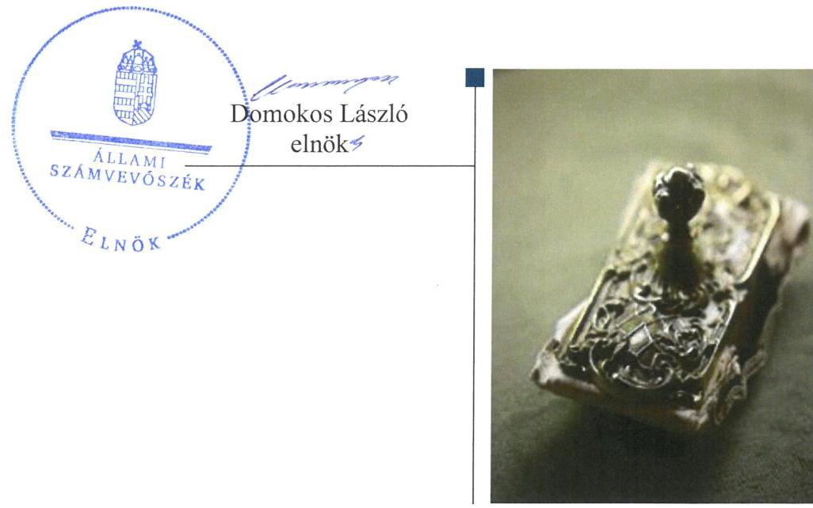
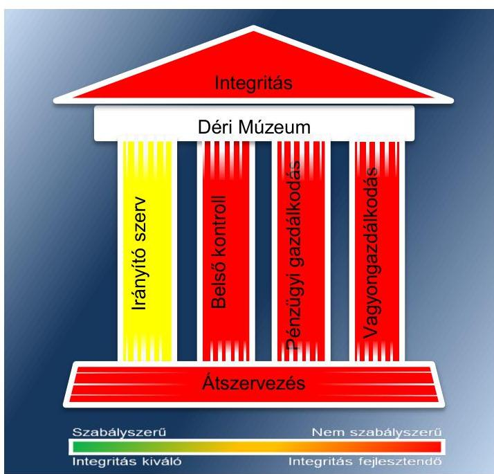
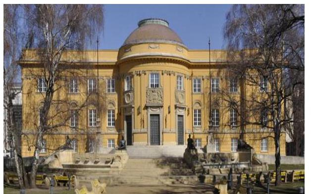
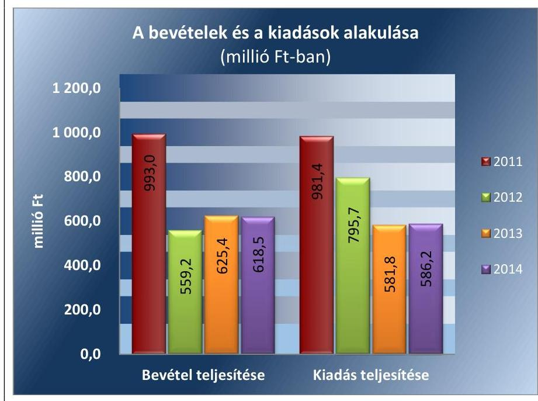
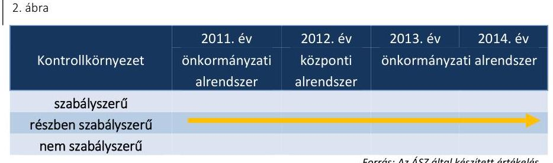
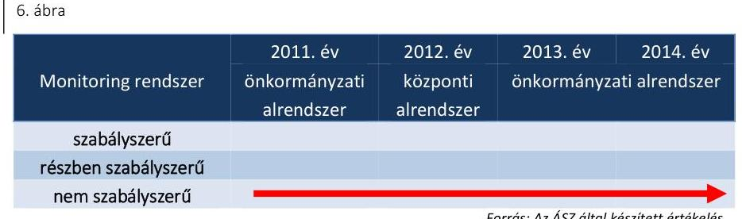

# Jelentés 

## Megyei hatókörű városi múzeumok ellenőrzése

Déri Múzeum, Debrecen
2016. december hó 8. nap

---

# AZ ELLENŐRZÉST FELÜGYELTE: 

PETŐ KRISZTINA felügyeleti vezető

## AZ ELLENŐRZÉST VEZETTE ÉS A VÉGREHAJTÁSÁÉRT FELELŐS:

DR. GYŐRI GABRIELLA ellenőrzésvezető

## A PROGRAM ÖSSZEÁLLÍTÁSÁÉRT FELELŐS:

JANIK JÓZSEF LÁSZLÓ osztályvezető

IKTATÓSZÁM: V-0947-155/2016

TÉMASZÁM: 1981

## ELLENŐRZÉS-AZONOSÍTÓ SZÁM: V073702

Jelentéseink az Országgyűlés számítógépes hálózatán és az Interneten a www.asz.hu címen is olvashatóak.

---

# TARTALOMJEGYZÉK 

■ ÖSSZEGZÉS ..... 5
■ AZ ELLENŐRZÉS CÉLJA ..... 7
■ AZ ELLENŐRZÉS TERÜLETE ..... 8
■ AZ ELLENŐRZÉS HÁTTERE, INDOKOLTSÁGA ..... 11
■ A JELENTÉS LÉNYEGES KÉRDÉSKÖREI ..... 13
■ ELLENŐRZÉS HATÓKÖRE ÉS MÓDSZEREI ..... 14
■ MEGÁLLAPÍTÁSOK ..... 17
■ JAVASLATOK ..... 35
■ MELLÉKLETEK ..... 39
I. sz. melléklet: Értelmező szótár ..... 39
II. sz. melléklet: Az Integritás érvényesítése érdekében kialakított és működtetett kontrollrendszer ..... 42
■ FÜGGELÉK: ÉSZREVÉTELEK ..... 45
■ RÖVIDÍTÉSEK JEGYZÉKE ..... 51

---

.

---

# ÖSSZEGZÉS 

A debreceni székhelyű Déri Múzeum által kialakított irányítási rendszer összességében nem biztosította az átlátható, elszámoltatható és ellenőrizhető közpénzfelhasználást. A Múzeum pénzügyi és vagyongazdálkodása nem volt szabályszerű. A Múzeum alaptevékenységének részét képező kulturális javak nyilvántartásáról gondoskodtak, azonban a kulturális javak állományvédelme és vagyonbiztonsága a kölcsönzéseknél nem volt biztosított.

## Az ellenőrzés társadalmi indokoltsága

Az Állami Számvevőszék Stratégiájának alapértéke, hogy ellenőrzései segítik az integritás alapú, átlátható és elszámoltatható közpénzfelhasználás megteremtését. Az ellenőrzés jogszabályban, vagy alapító okiratban meghatározott közfeladat ellátására létrejött, a megyei hatókörű városi muzeális intézmények gazdálkodási tevékenységére terjed ki. E szervezetek pénzügyi és vagyongazdálkodásának alapvető rendeltetése a közfeladatok (a kulturális örökséghez tartozó javak védelme, őrzése és a nyilvánosság számára történő hozzáférhetővé tétele) ellátásának biztosítása.

A megyei hatókörű városi múzeumként működő szervezetek 2011. évtől több alkalommal jelentős szervezeti és gazdálkodási átalakuláson mentek keresztül. A tulajdonosi, a vagyonkezelői és a fenntartói szerepekben, szerkezetben történt változások előkészítése, végrehajtása, illetve a múzeumi rendszer által kezelt közvagyonnal való gazdálkodás szabályszerűségének bemutatásával az ellenőrzés hozzájárul a múzeumok fenntartási és működtetési feladatainak ellátására vonatkozó megfelelő jogszabályi környezet kialakításához, a gazdálkodási gyakorlatuk javításához.

## Főbb megállapítások, következtetések

Az irányító szervek az ellenőrzött időszakban részben szabályszerűen gyakorolták alapítói jogosultságaikat. A munkáltatói jogosultságok gyakorlása során érvényesültek a jogszabályi előírások. A múzeumigazgató kinevezésére pályázat alapján, a miniszteri vélemény beszerzését követően került sor. Az egyéb irányítási, felügyeleti és ellenőrzési jogosultságok gyakorlása összességében szabályszerű volt.

A Múzeumnál kialakított irányítási rendszer összességében nem biztosította az átlátható, elszámoltatható és ellenőrizhető közpénzfelhasználást. A kontrollkörnyezet kialakítása részben volt szabályszerű, mert nem határozták meg az adatszolgáltatással, adatgazdálkodással, vagyongazdálkodással kapcsolatos feladatok munkafolyamatainak leírását, az önköltség-számítás elvein alapuló részletes számítási eljárásokat, a közbeszerzés hatálya alá nem tartozó beszerzések lebonyolításával kapcsolatos eljárásrendet. A kockázatkezelési rendszert a 2011-2012. években kialakítás hiányában nem működtették, míg a 2013-2014. években ugyan kialakították, azonban annak működtetése nem volt szabályszerű. A 2013-2014. években nem határozták meg szervezeti és működési szabályzatban a vagyonnyilatkozat-tételi kötelezettséget, a mulasztással nem intézkedtek a közélet tisztaságának biztosítása és a korrupció megelőzése érdekében. A kontrolltevékenységek kialakítása részben volt szabályszerű, mert a belső szabályozás nem biztosította a FEUVE érvényesülését a pénzügyi kihatású döntések célszerűségi, gazdaságossági, hatékonysági és eredményességi

---

szempontú megalapozottsága vonatkozásában. Az információs és kommunikációs folyamatok kialakítása során a 2011-2014. közötti időszakban a jogszabályban előírt közzétételi kötelezettségnek nem tettek eleget. A monitoring rendszer részeként a belső ellenőrzés kialakítása és működése a 2011-2014. években nem volt szabályszerű. A belső ellenőrzés szervezeti függetlenségét a 2011-2012. években nem biztosították, mert a belső ellenőrök nem a múzeumigazgatónak közvetlenül alárendelve végezték munkájukat. A 2013-2014. években a Múzeumnál a belső ellenőrzés kialakításáról és működtetéséről nem gondoskodtak. A Múzeumnál nem biztosították a gazdálkodás szabályszerűségének, a közpénzek felhasználásának ellenőrizhetőségét, mert a 2011-2014. években nem gondoskodtak a belső ellenőrzés szabályszerű kialakításáról és működtetéséről.

A Múzeum pénzügyi- és vagyongazdálkodása nem volt szabályszerű. A bevételek elszámolása nem volt jogszabályszerű, mert a vagyon hasznosítása vagyonkezelési/hasznosítási szerződés hiányában történt, továbbá nem gondoskodtak a bizonylatok jogszabályban előírt megőrzéséről. A kiadási előirányzatok felhasználása a 2011. évben nem volt szabályszerű, míg a 2012-2014. években szabályszerű volt. Szabálytalanul végezték a gazdálkodási jogkör gyakorlói munkájukat, mert a kötelezettségvállalást nem az arra jogosult végezte el, a kötelezettségvállalás pénzügyi ellenjegyzés hiányában történt, az érvényesítést a teljesítésigazolást megelőzően hajtották végre. A Múzeum a 2013-2014. években közbeszerzési eljárás lefolytatása nélkül vett igénybe szolgáltatásokat. A Múzeum a 2012. évben jogalap nélkül, a 2013-2014. években vagyonkezelési szerződés hiányában tartotta nyilván könyveiben a vagyontárgyakat. A vagyongazdálkodás során a 2013-2014. években a selejtezési tevékenység végrehajtása nem felelt meg a belső szabályozás előírásainak, mert a selejtezés megkezdése előtt nem értesítették a belső ellenőrt, mivel a Múzeumnál a belső ellenőrzés nem működött. A kulturális javak kölcsönzése során a Múzeum a 2011-2014. években több esetben nem rendelkezett határozott idejű írásbeli kölcsönzési szerződéssel. A kölcsönzési szerződések nem tartalmazták a jogszabályban rögzített kötelező tartalmi elemeket, emiatt a kölcsönzött kulturális javak állományvédelme nem volt megfelelően biztosított.

A 2011/2012. évi átszervezés során a jogszabályi előírásokat betartották. A vagyon átadására a jogszabályban meghatározott jegyzőkönyv felvételével került sor. A 2012/2013. évi központi alrendszerből önkormányzati alrendszerbe történő átszervezés során az átláthatóság sérült, mert a vagyonleltárnak nem képezte részét a kulturális javak felsorolása, továbbá annak tagintézményenkénti meghatározása.

A Múzeum az integritás szemlélet érvényesítése érdekében nem intézkedett.

---

# AZ ELLENŐRZÉS CÉLJA 

vényesülését a gazdálkodási folyamatokban.

Az ellenőrzés célja annak megállapítása volt, hogy a megyei múzeumi rendszer átalakítása, az intézményfenntartói rendszerben végbement változások előkészítése és végrehajtása megalapozottan, szabályszerűen történt-e; a megyei hatókörű városi múzeumok és jogelődjeik pénzügyi- és vagyongazdálkodása, a belső kontrollrendszer kialakítása és működtetése, valamint az intézményfenntartói feladatok ellátása szabályszerűen történt-e.

A Múzeum ¹ korrupcióval szembeni veszélyeztetettségének csökkentése érdekében kért tanúsítványi adatszolgáltatás alapján az ÁSZ² értékelte az integritási szemlélet ér-

---

# **AZ ELLENŐRZÉS TERÜLETE**

## **Déri Múzeum**

A Múzeum Debrecenben található, feladatkörében az Mtv.³ alapján gondoskodik a kulturális javak meghatározott anyagának folyamatos gyűjtéséről, nyilvántartásáról, megőrzéséről és restaurálásáról; tudományos feldolgozásáról, publikálásáról; valamint kiállításokon és más módon történő bemutatásáról; a közművelődési és közgyűjteményi feladatok ellátásáról. A Kötv.⁴ 20. § (2) bekezdése alapján területileg illetékes múzeumként régészeti feltárást végzett az ellenőrzött időszakban.

A Múzeum csak a működési engedélyében meghatározott gyűjtőkörben és gyűjtőterületen folytathatja tevékenységét. A szakmai besorolást, a rendszert megalapozó szaktörvényi kereteket az Mtv. biztosítja. Az Mtv. hatálya kiterjed a Múzeum fenntartóira, a Múzeumban foglalkoztatottakra, a kulturális örökség Múzeumban őrzött elemeire, a szolgáltatások igénybe vevőire és a kulturális örökséggel foglalkozó egyéb szervezetekre.

A Múzeum 2011. évi költségvetési engedélyezett létszáma 74 fő volt, ami a 2012. évre 75 főre változott, majd a 2013. és 2014. évekre 90 főre emelkedett. A Múzeum alkalmazottainak foglalkoztatására a Kjt.⁵ alapján került sor. Az ellenőrzött időszakban a múzeumigazgató⁶ és a gazdasági vezető személye is változott.

A Möktv.⁷ és annak végrehajtásáról szóló 258/2011. (XII. 7.) Korm. rendelet⁸ alapján 2012. január 1-jétől a megyei múzeumok központi költségvetési szervekké váltak. 2013. január 1-jétől a 2012. évi CLII. törvény⁹ és az 1311/2012. (VIII. 23.) Korm. határozat¹⁰ alapján az állami tulajdonba és fenntartásba került megyei múzeumi szervezetek a megyeszékhely megyei jogú városok fenntartásában működnek tovább. A 2011–2014. évek között a fenntartói, irányítói, középirányítói jogkörgyakorlók változását, valamint a Múzeum gazdálkodási feladatát ellátó szervezetét az 1. táblázat mutatja be.

---

1. táblázat

FENNTARTÓI, IRÁNYÍTÓI JOGKÖRGYAKORLÓK ÉS GAZDASÁGI SZERVEZET A 2011-2014. ÉVEKBEN

| Időszak | Fenntartó | Irányító szerv | Közepirányító szerv | Gazdasági szervezet |
| :--: | :--: | :--: | :--: | :--: |
| 2011. | Hajdú-Bihar   Megyei Önkormányzat | Hajdú-Bihar   Megyei   Önkormányzat   Közgyűlése | - | Hajdú-Bihar Megyei Önkormányzat Gazdasági Szolgáltató Főigazgatósága |
| 2012. | Hajdú-Bihar   Megyei Intézményfenntartó Központ | KIM ¹¹ | Hajdú-Bihar   Megyei   Intézményfenntartó Központ | Hajdú-Bihar   Megyei   Intézményfenntartó   Központ |
| $\begin{aligned} & 2013- \\ & 2014 . \end{aligned}$ | Debrecen Megyei Jogú Város Önkormányzata | Debrecen Megyei Jogú Város Önkormányzata Közgyűlése | - | Múzeum |

Forrás: A Múzeum alapító okiratai
A Múzeum jogelődjének, a Hajdú-Bihar Megyei Múzeumok Igazgatóságának a jogállása 2011. évben önállóan működő, a költségvetési előirányzatok feletti gazdálkodás szempontjából részjogkörű közintézmény volt. 2012. január 1-jétől a Múzeum önállóan működő költségvetési szerv volt. 2013. január 1-jétől a Múzeum önálló jogi személyiséggel rendelkező, saját gazdasági szervezettel működő megyei hatókörű városi múzeum, vállalkozási tevékenységet nem végzett.

A Múzeum teljesített költségvetési bevételeinek és kiadásainak alakulását az 1. ábra mutatja be. Az ábra a 2011-2012. években a Múzeum és tagintézményeinek együttes adatai, a 2013-2014. években a tagintézmények átadását követően a múzeumi adatok alapján készült.

1. ábra

Forrás: Múzeumi beszámolók a 2011-2014. évekre

---

A 2015. évi LXXV. tv. ¹² 1. § (1) bekezdése alapján az Nvtv. ¹³ 13. § (3) bekezdésében és 14. § (1) bekezdésében foglaltak alapján és az abban meghatározott feltételekkel a 2012. évi CLII. törvény 30. § (1) és (2) bekezdésében meghatározott, a megyei hatókörű városi múzeumok feladatának ellátását szolgáló egyes állami tulajdonban lévő ingatlanok a törvény hatálybalépésének napjával, a törvény erejénél fogva a kötelező közfeladatként a megyei hatókörű városi múzeumot fenntartó önkormányzatok tulajdonába kerültek. A 2015. évi LXXV. tv. 4. § (1) bekezdése alapján a kulturális örökség helyi védelme érdekében a megyei hatókörű városi múzeumok alapleltárában és jogszabály szerinti külön nyilvántartásában szereplő állami tulajdonú kulturális javak ingyenesen a megyei hatókörű városi múzeumok vagyonkezelésébe kerültek. A vagyonkezelők vagyonkezelői joga tekintetében vagyonkezelési szerződés megkötése nem szükséges. A 2015. évi LXXV. tv. 4. § (2) bekezdése szerint továbbá a kulturális örökség helyi védelme érdekében a megyei hatókörű városi múzeumok feladatának ellátását szolgáló állami tulajdonban álló ingatlanok - a törvény mellékletében meghatározott ingatlanok kivételével - ingyenesen a fenntartó önkormányzatok vagyonkezelésébe kerültek.

---

# AZ ELLENŐRZÉS HÁTTERE, INDOKOLTSÁGA

Az Alaptörvény¹⁴ rendelkezése szerint a nemzeti vagyon megőrzésének, védelmének és a nemzeti vagyonnal való felelős gazdálkodásnak a követelményeit sarkalatos törvény, az Nvtv. rögzíti. A tulajdonosi joggyakorlás és vagyonkezelés általános és speciális szabályait, az állami vagyon nyilvántartására és elszámolására vonatkozó eljárásokat, a vagyonkezelési szerződés feltételrendszerét, valamint az éves beszámoló készítési és könyvvezetési kötelezettségeket kormányrendelet írja elő.

A megyei hatókörű városi múzeumok közfeladat-ellátásának változásait, (beleértve az állami tulajdonosi joggyakorló, intézményi vagyonkezelő és önkormányzati fenntartó szervezeteket is) a közfeladatok átadásából és átvételéből adódó módosításait, előirányzat gazdálkodására ható tényezőit az Áht.,¹⁵ az Ávr.,¹⁶ a Möktv., valamint az Mtv. írja elő. A múzeumi intézményrendszer rendszerátalakulásából, megszűnéséből, intézmény átszervezéséből, belső szerkezeti korszerűsítéséből, vagy más hasonló okból adódó módosításai miatt szerepeltetendő szerkezeti változásokat, valamint a szerkezeti változásként beépült közfeladatok szintre hozásként történő számításba vételét az

 Ávr. határozza meg.

A megyei hatókörű városi múzeumok kulturális szempontból meghatározó jelentőségűek mind földrajzi elhelyezkedésüket, mind az ellátott feladatokat, valamint a látogatottságukat tekintve. Tevékenységüket törvényi szinten (Mtv.) szabályozták a jogalkotók. A megyei hatókörű városi múzeumok jelenlegi körének kialakításában, tulajdonosi és fenntartói szerkezetében rövid idő alatt több jelentős változás történt, amelyeket jogszabályi változások indukáltak. Ezen intézmények szakmai besorolásukat tekintve a 2011. évben megyei múzeumként, a 2012. évben megyei múzeumi központi költségvetési szervezetként, a 2013. évtől kezdődően megyei hatókörű városi múzeumként működtek. A szakmai besorolások változásait párhuzamosan követték a tulajdonosi, vagyonkezelői, fenntartói szerepekben történt változások.

A 2011–2014. évek között bekövetkezett fenntartói változások a vagyontárgyak és a kulturális javak tulajdonosi, vagyonkezelői és használói körében is változást indukáltak, amelyet a 2. táblázat szemléltet.

1. táblázat

|  A VAGYON TULAJDONOSI, VAGYONKEZELŐI ÉS HASZNÁLÓI KÖRÉNEK VÁLTOZÁSA 2011–2014. ÉVEKBEN |  |  |  |  |  |  |  |  |  |  |  |  |  |  |   |
| --- | --- | --- | --- | --- | --- | --- | --- | --- | --- | --- | --- | --- | --- | --- |
|   |  |  |  |  |  |  |  |  |  |  |  |  |  | 2011–2014. évek  |
|  Vagyon-
tárgy |  |  |  |  |  |  |  |  |  |  |  |  |  | vagyon-
kezelő  |
|  Ingatlan |  |  |  |  |  |  |  |  |  |  |  |  |  |   |
|  Egyéb
tárgyi esz-
közök |  |  |  |  |  |  |  |  |  |  |  |  |  |   |
|  Kulturális
javak |  |  |  |  |  |  |  |  |  |  |  |  |  |   |
|  |   |   |   |   |   |   |   |   |   |   |   |   |   |   |
|  Forrás: A Múzeum alapító okiratai, a 2012. évi CLII. tv, a 258/2011. (XII. 7) Korm. rendelet, az 1311/2012. (VIII. 23.) Korm. határozat |  |  |  |  |  |  |  |  |  |  |  |  |  |  |   |

---

Az ellenőrzés - tekintettel a megyei hatókörű városi múzeumokat (és jogelődjeit) rövid időn belül, gyors ütemben ért környezeti (tulajdonosi, fenntartói-szerkezetet érintő) változásokra - javaslatok megfogalmazásával hozzájárul a fenntartás és működtetés feladatainak ellátására vonatkozó megfelelő jogszabályi környezet - jogalkotók által történő - kialakításához. Az ÁSZ ellenőrzés a gazdálkodási gyakorlat javítását eredményezheti, több intézmény bevonásával átfogó képet ad a megyei hatókörű városi múzeumokat (és jogelődjeiket) jellemző sajátosságokról, jó gyakorlatokról.

AZ ELLENŐRZÉS EREDMÉNYEKÉPPEN nemcsak az ellenőrzött intézmények gazdálkodása javul, hanem átfogó képet kapunk a múzeumok gazdálkodásának hiányosságairól, de a jó gyakorlatokról is. Ellenőrzéseivel, javaslataival és megállapításaival az ÁSZ elősegíti a költségvetési szervek pénzügyi és vagyongazdálkodása szabályozásának javítását és hozzájárulhat a jó kormányzáshoz.

---

# A JELENTÉS LÉNYEGES KÉRDÉSKÖREI 

1. Az irányító szerv ellenőrzött múzeumra vonatkozó feladatellátása szabályszerű volt-e?
2. Szabályszerűen hajtották-e végre a múzeumot érintő szervezeti, szerkezeti átszervezéseket?
3. A belső kontrollrendszer kialakítása és működtetése megfelelt-e a jogszabályi előírásoknak?
4. A múzeum pénzügyi gazdálkodása szabályszerű volt-e?
5. A múzeum vagyongazdálkodása szabályszerű volt-e?
6. A múzeum intézkedett-e az integritás szemlélet érvényesítése érdekében?

---

# ELLENŐRZÉS HATÓKÖRE ÉS MÓDSZEREI 

## Az ellenőrzés típusa

Megfelelőségi ellenőrzés.

## Az ellenőrzött időszak

Az ellenőrzött időszak 2011. január 1-jétől 2014. december 31-ig tart.

## Az ellenőrzés tárgya

A megyei hatókörű városi múzeumok átszervezése, átalakítása előkészítése és lebonyolítása megalapozottsága, szabályszerűsége, a pénzügyi és vagyongazdálkodási tevékenység, a belső kontrollrendszer kialakítása, működtetése szabályszerűsége, valamint az irányító szervi feladatok ellátása szabályszerűsége. E tevékenységek és a kapcsolódó adatok és információk összessége, amelyeket a vonatkozó kritériumok alapján kell értékelni.

Az ellenőrzés kiterjed minden olyan körülményre és adatra, amely az ÁSZ jogszabályban meghatározott feladatainak teljesítéséhez, valamint a program végrehajtása folyamán felmerült újabb összefüggések feltárásához szükséges.

## Az ellenőrzött szervezet

Déri Múzeum, a fenntartói feladatokban érintett Hajdú-Bihar Megyei Önkormányzat valamint Debrecen Megyei Jogú Város Önkormányzata, a Hajdú-Bihar Megyei Intézményfenntartó Központ jogutódja a Szociális és Gyermekvédelmi Főigazgatóság.

Az ellenőrzésre a költségvetési szerv ellenőrzött intézményének és irányító/felügyeleti szervének, illetve középirányító szervének székhelyén és a gazdálkodási feladatait ellátó szervezetének székhelyén került sor.

## Az ellenőrzés jogalapja

Az ellenőrzés jogszabályi alapját az ÁSZ tv. ${ }^{19} 1 . \S$ (3) bekezdés, 5. § (2)-(6) bekezdései, valamint az Áht. 2 61. § (2) bekezdésének előírásai képezik.

---

# Az ellenőrzés módszerei 

Az ellenőrzést az ellenőrzési program szempontjai, az ellenőrzött időszakban hatályos jogszabályok, az ellenőrzés szakmai szabályai, az egyes ellenőrzési típusokhoz kapcsolódó ÁSZ módszertanok és nemzetközi standardok figyelembe vételével végeztük. A gazdálkodás hibáinak kijavítására, a közpénzekkel való felelős gazdálkodás segítésére irányuló javaslatok kidolgozásakor a hatályos jogszabályok az irányadóak.

Az ellenőrzési kérdések megválaszolásához szükséges bizonyítékok megszerzése a következő ellenőrzési eljárások alkalmazásával történt: kérdésfeltevés (információkérés), mintavételezés, valamint elemző eljárás. A minták kiválasztása során véletlen mintavételi eljárást alkalmaztunk.

Mintavétellel ellenőriztük a bevételek, a személyi juttatások, a dologi és felhalmozási kiadások, a régészeti bevételek és kiadások elszámolását, valamint a kulturális javak kölcsönzésének szabályszerűségét. A minta alapján a sokaságban előforduló hibaarányt becsültük. „Megfelelőnek" értékeltük az ellenőrzött területet, amennyiben 95\%-os bizonyossággal a teljes sokaságban a hibaarány legfeljebb 10\%, „részben megfelelőnek" értékeltük, ha a hibaarány felső határa 10-30\% között volt, „nem megfelelőnek" pedig akkor, ha a mintavételi eredmények alapján a sokaságbeli hibaarány felső határa meghaladta a 30\%-ot.

Az ellenőrzési bizonyítékként felhasználható adatforrások közé tartoznak egyrészt a szakmai program részletes szempontjainál felsorolt adatforrások, másrészt adatforrás lehet minden egyéb - az ellenőrzés folyamán feltárt, az ellenőrzés szempontjából releváns információt tartalmazó - dokumentum. Az ellenőrzés lefolytatásához a Múzeum a tanúsítványok elektronikus kitöltésével, valamint az ÁSZ által kért dokumentumok elektronikus megküldésével szolgáltatott adatokat. A rendelkezésre bocsátott adatok, információk kontrollja az ellenőrzés keretében történt. Az ellenőrzési kérdésekre adott válaszok alapján értékeltük, hogy az ellenőrzött időszakban az irányító szerv az ellenőrzött Múzeumra vonatkozó feladatainak szabályszerűen eleget tett-e, a Múzeum pénzügyi- és vagyongazdálkodása megfelelt-e az előírásoknak, a Múzeum átalakításának vagy átszervezésének végrehajtása szabályszerű volt-e.

A Múzeum belső kontrollrendszere jogszabályi előírások szerinti kialakításának és működtetésének szabályszerűségét az erre irányuló ellenőrzési kérdésekre adott válaszok összesítése alapján, évente pillérenként (kontrollkörnyezet, kockázatkezelési rendszer, kontrolltevékenységek, információs és kommunikációs rendszer, monitoring rendszer) és összesítetten is minősítjük. A Múzeum belső kontrollrendszere egyes pilléreinek kialakítása és működtetése „szabályszerű", amennyiben az értékelt területen az elért és elérhető pontok százalékban kifejezett, egész számra kerekített hányadosa meghaladja a 84%-ot, „részben szabályszerű", ha a 84%-ot nem haladja meg, de 60%-nál nagyobb, „nem szabályszerű", ha nem haladja meg a 60%-ot. A Múzeum belső kontrollrendszerének összesített értékelése megegyezik a pillérenként (kontrollterületenként) alkalmazott %-os értékelésekkel, a következő eltérésekkel. A kontrollrendszer egésze esetében a „szabályszerű" értékelésnek a %-os értéken felül további feltétele, hogy egyik kontrollterület sem kaphat „nem szabályszerű" értékelést, a „részben szabályszerű" értékelés további feltétele, hogy legfeljebb egy el-

---

lenőrzött kontrollterület lehet „nem szabályszerű" értékelésű. Az összesített értékelés a %-os értéktől függetlenül „nem szabályszerű", ha az ellenőrzött kontrollterületek közül több mint egynek „nem szabályszerű" az értékelése.

Az integritás szemlélet érvényesülésének értékelése a Múzeum által szolgáltatott adatok alapján történt.

---

# 1. Az irányító szerv ellenőrzött múzeumra vonatkozó feladatellátása szabályszerű volt-e? 

Összegző megállapítás

Az irányító szerv ${ }_{1-3}$ ellenőrzött Múzeumra vonatkozó feladatellátása a 2011-2014. években részben szabályszerű volt.

AZ ALAPÍTÓI JOGOSULTSÁGOK GYAKORLÁSA az ellenőrzött időszakban részben felelt meg a jogszabályi előírásoknak. Az irányító szerv ${ }_{1,3}{ }^{20}$ a 2011. és a 2013-2014. években elkészítette a Múzeum Ámr. ${ }^{21}$-nek, illetve Ávr.-nek megfelelő tartalmú alapító okiratát. Az irányító szerv ${ }_{2}$ a Múzeummal kapcsolatos alapítói jogosultságát - az alapító okirat kiadása kivételével - 2012-ben az Ávr. előírásainak megfelelően gyakorolta. A 2012-ben hatályos alapító okirat kiadására és Kincstári ${ }^{22}$ nyilvántartásba vételére a 258/2011. (XII. 7.) Korm. rendelet 21. § (6) bekezdése szerinti 2012. január 30-ai határidőn túl 2012. június 21-én került sor.

A MUNKÁLTATÓI JOGOSULTSÁGOT az irányító szerv ${ }_{1-3}$ a 2011-2014. években szabályszerűen gyakorolta.

A középirányító szerv ${ }^{23}$ 2012-ben az Mtv., az Áht. 2 és a 258/2011. (XII. 7.) Korm. rendelet előírásainak megfelelően pályázatot írt ki a Múzeum magasabb vezetői feladatainak ellátására. A középirányító szerv vezetője a miniszter ${ }^{24}$ véleményét és javaslatát elfogadva a pályázatot eredménytelenné nyilvánította és a feladatok ellátására - a pályázati eljárás eredményes befejezéséig - a korábbi igazgatót bízta meg.

Az irányító szerv ${ }_{3}$ a Múzeum igazgatói feladataira 2013. évben pályázatot írt ki, a kinevezéshez előzetesen megkérte a miniszter véleményét. Az új igazgató kiválasztásánál betartották az Mtv. szerinti szakmai képesítési követelményeket. A Múzeum gazdasági szervezetének vezetőjét az Áht. 2 előírásának megfelelően közgyűlési döntés alapján nevezték ki.

AZ EGYÉB IRÁNYÍTÁSI, FELÜGYELETI ÉS ELLENŐRZÉSI jogosultságok gyakorlása az ellenőrzött időszakban összességében szabályszerű volt.

Az irányító szerv ${ }_{1}$ az egyéb irányítási, felügyeleti és ellenőrzési jogosultságait 2011-ben szabályszerűen gyakorolta.

A 2012. évben a középirányító szerv a 258/2011. (XII. 7.) Korm. rendelet 11. § (2) bekezdés c) pontjának előírásától eltérően a közérdekű és közérdekből nyilvános adatok közzétételének, illetve igényre történő szolgáltatásának kötelező végrehajtását nem ellenőrizte.

Az irányító szerv ${ }_{3}$ az egyéb irányítási, felügyeleti és ellenőrzési jogosultságait 2013-2014. években szabályszerűen gyakorolta.

---

# 2. Szabályszerűen hajtották-e végre a múzeumot érintő szervezeti, szerkezeti átszervezéseket? 

Összegző megállapítás

2.1. számú megállapítás

A Múzeumot érintő szervezeti, szerkezeti átszervezés összességében nem volt szabályszerű.

A Múzeumot érintő - önkormányzati alrendszerből a központi alrendszerbe történő - 2012. január 1-jétől hatályos irányító szervi (fenntartói) váltás lebonyolítását szabályszerűen hajtották végre.

Az átadás-átvételi megállapodás ${ }^{25}$ megkötésére a 258/2011. (XII. 7.) Korm. rendelet 1. számú melléklete szerinti minta alapján határidőben került sor a Möktv.-ben meghatározott intézmények képviselőinek aláírásával, azonban az átadás-átvétel előkészítésének szabályszerűsége dokumentumok hiányában nem volt értékelhető.

A VAGYON TÉNYLEGES ÁTADÁSA az átadás-átvételi megállapodás
 ${ }_{1}$ elválaszthatatlan részét képező 258/2011. (XII. 7.) Korm. rendelet előírása szerint határidőben felvett jegyzőkönyvek alapján történt meg.

Az irányító szerv ${ }_{1}$ a 258/2011.(XII. 7.) Korm. rendeletben meghatározott dokumentumokat a rendeletnek megfelelő tartalommal és formában teljes körűen átadta.

A vagyonátadást hitelesített leltárral támasztották alá. A Múzeum a központi alrendszerben szabályszerűen végezte el a kiadási és bevételi előirányzatok nyitását.
A 2013. január 1-jével végrehajtott, a központi alrendszerből önkormányzati alrendszerbe történő irányító szervi (fenntartói) váltás lebonyolítása és a szervezetrendszer átalakítása nem volt szabályszerű.

A központi alrendszerből az önkormányzati alrendszerbe történő átadáshoz kapcsolódó feladatok tekintetében a 1311/2012. (VIII. 23.) Korm. határozat adott iránymutatást.
2012. október 27-én az EMMI helyettes államtitkára körlevélben értesítette a középirányító szerv vezetőjét a múzeumi szervezet átadásával kapcsolatos teendőkről, úgymint az átadásra kerülő intézmény 2013. évi szervezeti formájának meghatározása, az alapító okiratok előkészítésének koordinálása, egyeztetés az átvevő önkormányzatokkal, a Kincstár területileg illetékes szervével, valamint a múzeumi szervezet igazgatójával.

Az átszervezési folyamat részeként az irányító szerv ${ }_{3}$ Közgyűlése ${ }^{26}$ a 247/2012. (XI. 29.) számú határozattal elfogadta a Múzeum 2013. január 1-jétől hatályos alapító okiratát. Az átadás-átvétel lebonyolítására az előírt határidőn belül került sor. Ennek keretében az irányító szerv ${ }_{3}$ polgármestere ${ }^{27}$, mint átvevő aláírta a megállapodás ${ }_{2}{ }^{28}$-t, amelyet hitelesített a kormánymegbízott ${ }^{29}$ és az EMMI képviselője.

A Múzeum dokumentációinak átadás-átvételére 2013. januárjában jegyzőkönyvek felvételével került sor.

---

A VAGYONLELTÁRNAK nem képezte részét a 1311/2012. (VIII. 23.) Korm. határozat 1.8. pontja, valamint a megállapodás: IV. rész 1.2.11.2.1. pontja ellenére „az alapleltárban és külön nyilvántartásban nyilvántartott kulturális javak felsorolása".

Az Áhsz. ${ }^{30}$ előírásainak megfelelően a mérlegsorokat záró főkönyvi kivonattal, analitikus nyilvántartással és leltárral alátámasztották. Az átszervezés napjára - 2012. december 31. - az év végi feladatok között lezárásra kerültek a bevételi és kiadási forgalmi számlák, a költségvetési pénzeszközök kivezetése megtörtént. A 2012. évi éves elemi költségvetési beszámoló az Áhsz. ${ }_{1}$-nek megfelelő adattartalmú volt.

# A TAGINTÉZMÉNYEK 2013. ÉVI ÁTADÁSÁT RÖGZÍTŐ MEGÁLLAPODÁSOKAT a 2012. évi CLII. törvény 30. §

(5) bekezdésében foglaltaknak megfelelően a középirányító szerv és az átvevő települési önkormányzatok - Hajdúszoboszló város kivételével - határidőben megkötötték. A megállapodások 1.2.11.2.1. pontjában foglaltak ellenére az alapleltárban nyilvántartott kulturális javak felsorolását nem csatolták a megállapodásokhoz.

## 3. A belső kontrollrendszer kialakítása és működtetése megfelelte a jogszabályi előírásoknak?

## Összegző megállapítás

A belső kontrollrendszer kialakítása és működtetése a 2011-2014. években nem volt szabályszerű.

A belső kontrollrendszer öt elemének kialakítása és működtetése részletes értékelését a 2011-2014. évekre vonatkozóan a 3. táblázat mutatja be.
3. táblázat

A BELSŐ KONTROLLRENDSZER KIALAKÍTÁSÁNAK ÉS MŰKÖDTETÉSÉNEK ÉRTÉKELÉSE A 2011-2014. ÉVEKBEN

| Megnevezés | Kontroll-   környezet | Kockázatkezelés | Kontroll-   tevékenységek | Információ és   kommunikáció | Monitoring | Összesen |
| :--: | :--: | :--: | :--: | :--: | :--: | :--: |
| 2011. | részben   szabályszerű | nem szabályszerű | részben   szabályszerű | nem szabályszerű | nem szabályszerű | nem szabályszerű |
| 2012. | részben   szabályszerű | nem szabályszerű | részben   szabályszerű | nem szabályszerű | nem szabályszerű | nem szabályszerű |
| 2013. | részben   szabályszerű | nem szabályszerű | részben   szabályszerű | nem szabályszerű | nem szabályszerű | nem szabályszerű |
| 2014. | részben   szabályszerű | nem szabályszerű | részben   szabályszerű | nem szabályszerű | nem szabályszerű | nem szabályszerű |

Forrás: Az ÁSZ által készített értékelés

---

# 3.1. számú megállapítás 

A kontrollkörnyezet kialakítása a 2011-2014. években részben volt szabályszerű.

Forrás: Az ÁSZ által készített értékelés

A gazdasági szervezet vezetője 2011. évben rendelkezett az Ámr.-ben előírt végzettséggel, szakképesítéssel. A Múzeum és a gazdasági szervezet dolgozói rendelkeztek munkaköri leírással. A Múzeum az Ámr. 20. § (3) bekezdés b) pontjában előírt közbeszerzési értékhatár alatti beszerzések szabályozásán kívül, rendelkezett a gazdálkodását és működését meghatározó belső szabályzatokkal. A kontrollkörnyezet kialakításának megfelelőségét a belső szabályzatok következő hiányosságai befolyásolták:
$\longrightarrow$ az SZMSZ ${ }_{1}{ }^{31}$ az Ámr. 20. § (2) bekezdés h) és i) pontok előírásától eltérően nem tartalmazta teljes körűen a nevesített munkakörökhöz tartozó helyettesítés rendjét és a kapcsolódó felelősségi szabályokat, valamint a költségvetési szerv szervezeti ábráját;
$\longrightarrow$ a gazdálkodási szabályzat ${ }_{1}{ }^{32}$ az Ámr. 72. § (14) bekezdésétől eltérően annak ellenére nem tartalmazta a 100 ezer Ft alatti kifizetések előzetes írásbeli kötelezettségvállalás nélküli teljesítésének rendjét, hogy azt belső szabályozásban lehetővé tették;
$\longrightarrow$ az ellenőrzési nyomvonal ${ }_{1}{ }^{33}$ az Ámr. 156. § (2) bekezdése követelményeitől eltérően nem tartalmazta teljes körűen a Múzeum irányítási folyamatokat, valamint a felelősségi és információs szinteket, kapcsolatokat.
A kontrollkörnyezet 2012. évi kialakításában hiányosság volt, hogy a Múzeum a gazdálkodás rendjét előíró belső szabályzatokkal csak 2012. december 1-jétől rendelkezett teljes körűen. A gazdasági feladatok ellátására kijelölt középirányító szerv Pénzügyi, Gazdasági és Üzemeltetési Főosztálya az Ávr. 9. § (5) bekezdés előírásától eltérően nem rendelkezett ügyrenddel. A gazdasági szervezet feladatainak ellátására vonatkozó munkamegosztás és felelősségvállalás rendjét az Ávr. 10. § (4) bekezdésének előírása alapján a munkamegosztási megállapodás ${ }_{2}{ }^{34}$-ben 2012. december 1-jén rögzítették, amely a feladatellátást késedelemmel szabályozta. A gazdálkodási jogkörök gyakorlásának feltételeit a gazdálkodási szabályzat ${ }_{2}{ }^{35}$ tartalmazta. A középirányító szerv vezetője a Számv ${ }^{36}$. tv. 14. § (11) bekezdésének előírását figyelmen kívül hagyva késedelmesen adta ki a számviteli politika ${ }_{2}{ }^{37}$-t, a leltárszabályzat ${ }_{2}{ }^{38}$-t, az értékelési szabályzat ${ }_{2}{ }^{39}$-t, az önköltség számítási szabályzat ${ }_{2}{ }^{40}$-t, valamint a Számv. tv. 161. § (5) bekezdésében foglaltak ellenére a számlarend ${ }_{2}{ }^{41}$-t. A kontrollkörnyezet kialakításának megfelelőségét a belső szabályzatok következő hiányosságai befolyásolták:
$\longrightarrow$ a leltárszabályzat ${ }_{2}$ az Áhsz. ${ }_{1}$ 37. § (6) bekezdés előírásától eltérően nem szabályozta a használt, de a mérlegben értékkel nem szereplő immateriális javak, tárgyi eszközök, készletek leltározási módját;

---

- a gazdálkodási szabályzat ${ }_{2}$ az Ávr. 53. § (1)-(2) bekezdéseitől eltérően annak ellenére nem tartalmazta a 100 ezer Ft alatti kifizetések előzetes írásbeli kötelezettségvállalás nélküli teljesítésének rendjét, hogy azt belső szabályozásban lehetővé tették;
- az önköltség számítási szabályzat ${ }_{2}$ - Múzeumi feladatellátásra történő átdolgozását - a munkamegosztási megállapodás ${ }_{2}$ 15. 1. 3. pontjában előírtak ellenére nem végezték el;
- az ellenőrzési nyomvonal ${ }_{3}{ }^{42}$ a Bkr. ${ }^{43}$ 6. § (3) bekezdése követelményeitől eltérően nem tartalmazta teljes körűen a Múzeumot érintő irányítási és ellenőrzési folyamatokat, valamint a felelősségi és információs szinteket, kapcsolatokat.
A Múzeum gazdasági szervezetének vezetője 2013-2014. években rendelkezett az Ávr.-ben előírt képzettséggel, a dolgozók rendelkeztek munkaköri leírással. A kontrollkörnyezet 2013-2014. évi kialakításának megfelelőségét a belső szabályzatok következő hiányosságai befolyásolták:
- az SZMSZ ${ }_{2,3}{ }^{44}$ hiányossága volt, hogy az Ávr. 13. § (1) bekezdés e) pontjának előírásától eltérően nem tartalmazta a szervezeti egységek engedélyezett létszámát és a gazdasági szervezet engedélyezett létszámát;
- ügyrendben, SZMSZ-ben vagy más belső szabályzatban a múzeumigazgató nem határozta meg az Ávr. 13. § (5) bekezdésének előírásától eltérően az adatszolgáltatással, adatgazdálkodással, vagyongazdálkodással kapcsolatos feladatok munkafolyamatainak leírását;
- az értékelési szabályzat ${ }_{3}{ }^{45}$ az Áhsz. ${ }_{1}$ 8. § (17) bekezdés a) pontjának részben megfelelően tartalmazta a követelések értékelésének elveit, szempontjait, mert az Áhsz. 8 . § (17) bekezdés d) pontjától eltérően nem tartalmazta követeléstípusonként a kis összegű követelések év végi meghatározásának elveit, dokumentálásának szabályait;
- az önköltség-számítási szabályzat ${ }_{3,4}{ }^{46}$ nem felelt meg az Áhsz. ${ }_{1} 8 . \S$ (15) bekezdésében és az Áhsz. ${ }_{2}{ }^{47} 50 . \S$ (3) bekezdésében foglalt előírásoknak, mert az nem tartalmazta az önköltség számítás rendjét a Múzeum által végzett szolgáltatásnyújtás, illetve termékértékesítés teljes körére kiterjedően;
belső szabályzatban a 2013-2014. években az Ávr. 13. § (2) bekezdés b) pontjától eltérően a múzeumigazgató nem határozta meg a közbeszerzés hatálya alá nem tartozó beszerzések lebonyolításával kapcsolatos eljárásrendet;
az ellenőrzési nyomvonal ${ }_{3}{ }^{48}$ a Bkr. 6. § (3) bekezdésétől eltérően nem tartalmazta a felelősségi, információs szinteket és kapcsolatokat.
3.2. számú megállapítás

A kockázatkezelési rendszer kialakítása és működtetése a 2011-2014. években nem volt szabályszerű.

| 3. ábra |  |  |  |  |
| :--: | :--: | :--: | :--: | :--: |
| Kockázatkezelési rendszer | 2011. év   önkormányzati   alrendszer | 2012. év   központi   alrendszer | 2013. év   önkormányzati alrendszer | 2014. év   alrendszer |
| szabályszerű |  |  |  |  |
| részben szabályszerű   nem szabályszerű |  |  |  |  |

---

A múzeumigazgató a munkamegosztási megállapodás1,2, továbbá az Ámr. 157. § (1) bekezdésének, illetve a Bkr. 7. § (1) bekezdésének előírásaitól eltérően a 2011-2012. években kockázatkezelési rendszert a belső szabályozás kialakítása hiányában nem működtetett.

A Múzeum kockázatkezelési rendszerének kialakítása és működtetése a 2013-2014. években nem felelt meg a Bkr. 7. § (2) bekezdése előírásának, mert belső szabályozása tartalmilag hiányos volt. A múzeumigazgató nem határozta meg az egyes kockázatokkal kapcsolatban szükséges intézkedéseket, valamint azok teljesítésének folyamatos nyomon követésének módját.

A vagyonnyilatkozat-tételi kötelezettséget a 2013-2014. években a Vnytv ${ }^{49}$. 4. § a) pontjától eltérően a múzeumigazgató nem határozta meg a Múzeum SZMSZ ${ }_{2,3}$-ban.

# 3.3. számú megállapítás 

## A kontrolltevékenység kialakítása és működtetése a 2011-2014. években részben szabályszerű volt.

| 4. ábra |  |  |  |  |
| :--: | :--: | :--: | :--: | :--: |
| Kontrolltevékenységet | 2011. év önkormányzati alrendszer | 2012. év központi alrendszer | 2013. év önkormányzati alrendszer | 2014. év alrendszer |
| szabályszerű |  |  |  |  |
| részben szabályszerű nem szabályszerű |  |  |  |  |

Forrás: Az ÁSZ által készített értékelés
A kontrolltevékenység kialakítása 2011. évben szabályszerű volt, a működtetése nem volt szabályszerű. Az engedélyezési, jóváhagyási és kontroll eljárások rendjét ügyrendben és a munkamegosztási megállapodás ${ }_{1}$-ben határozták meg. A gazdálkodási jogköröket ellátó dolgozók kijelölésére és felhatalmazására az Ámr. előírásainak megfelelően került sor. A munkakör átadásának rendjét az SZMSZ ${ }_{1}$-ben szabályozták.

A kontrolltevékenység kialakítása 2012. évben részben volt szabályszerű, működtetése részben volt szabályszerű. A Bkr. 8. § (4) bekezdés a) pontjában meghatározott engedélyezési, jóváhagyási és kontrolleljárások rendjét tartalmazó gazdálkodási tárgyú belső szabályozásokat a középirányító szerv vezetője a gazdálkodási tevékenység megkezdését követően jelentős késéssel, 2012. IV. negyedévében adta ki, ezért csak az év egy részében volt biztosított azok alkalmazása. A gazdálkodási jogköröket ellátó dolgozók kijelölése
 és felhatalmazása az Ávr. előírásainak megfelelő volt.

A kontrolltevékenység kialakítása a 2013. évben részben volt szabályszerű, működtetése részben volt szabályszerű. Belső szabályozásban (ellenőrzési nyomvonal3-ban) a Bkr. 8. § (2) bekezdés b) pontjának előírásától eltérően, hiányosan rögzítették a folyamatba épített, előzetes, utólagos és vezetői ellenőrzés végrehajtásának leírását. Nem tartalmazott előírást a belső szabályozás a pénzügyi kihatású döntések célszerűségi, gazdaságossági, hatékonysági és eredményességi szempontú megalapozottsága vonatkozásában. Az ügyrend ${ }_{2}{ }^{30}$-ben vagy más belső szabályzatban a Bkr. 8. § (4) bekezdés a) pontjának előírásától eltérően a múzeumigazgató nem határozta meg az engedélyezési, jóváhagyási és kontroll eljárásokat. A munkakör átadásának rendjét az SZMSZ ${ }_{2,3}$-ban szabályozták.

---

A kontrolltevékenység kialakítása a 2014. évben részben volt szabályszerű, működtetése részben volt szabályszerű. A belső szabályozás a Bkr. 8. § (2) bekezdés b) pontjának előírásától eltérően nem biztosította a FEUVE érvényesülését a pénzügyi kihatású döntések célszerűségi, gazdaságossági, hatékonysági és eredményességi szempontú megalapozottsága vonatkozásában. Az engedélyezési, jóváhagyási és kontroll eljárásokat a Bkr. előírásainak megfelelően az ügyrend ${ }_{3}^{51}$-ban meghatározták. A gazdálkodási jogköröket ellátó dolgozók kijelölése és meghatalmazása a 2013–2014. években az Ávr. előírásainak megfelelő volt.

A kontrolltevékenység működtetése során feltárt hiányosságokat részletesen a 4.3. pont tartalmazza.

# 3.4. számú megállapítás Az információs és kommunikációs folyamatok kialakítása a 2011–2014. években nem volt szabályszerű. 

| 5. ábra |  |  |  |  |
| :--: | :--: | :--: | :--: | :--: |
| Információs és kommunikációs rendszer | 2011. év önkormányzati alrendszer | 2012. év   központi   alrendszer | 2013. év   önkormányzati | 2014. év alrendszer |
| szabályszerű   részben szabályszerű   nem szabályszerű |  |  |  |  |
|  |  |  |  |  |

Forrás: Az ÁSZ által készített értékelés
Az információs és kommunikációs folyamatok kialakítása a 2011–2014. években nem volt szabályszerű. Az elektronikus közzétételi kötelezettséget 2011. évben az Eitv. ${ }^{52}$ 3. § (2) bekezdésének, valamint 2012–2014. között az Info. ${ }^{53}$ tv. 33. § (1) és (3) bekezdéseinek rendelkezése ellenére nem teljesítették. Az információs rendszer keretében a beszámolási rendszer működtetése során 2011. évben az Ámr. 159. § (2) bekezdésében, 2012–2014. években a Bkr. 9. § (2) bekezdésében előírt beszámolási határidőket és módokat a múzeumigazgató nem határozta meg.

A múzeumigazgató a 2013–2014. években az Info. tv. 30. § (6) bekezdése és az Ávr. 13. § (2) bekezdés h) pontjának előírása ellenére nem szabályozta a közérdekű adatok megismerésére irányuló kérelmek intézésének rendjét.

A 2013–2014. években hatályos iratkezelési szabályzat ${ }_{2}^{54}$ nem felelt meg a jogszabályi előírásnak, mert azt a múzeumigazgató - az Ltv. ${ }^{55}$ 10. § (1) bekezdés a) pontjában foglaltak ellenére - nem az illetékes közlevéltárral egyetértésben adta ki.

---

# 3.5. számú megállapítás 

A monitoring rendszer kialakítása és működése a 2011–2014. években nem volt szabályszerű.

A Múzeumnál a monitoring rendszer részeként az operatív tevékenységek folyamatos és eseti nyomon követése a 2011. évben nem felelt meg az Ámr. 160. § (1)–(2) bekezdésében foglaltaknak. A 2012–2014. években a Bkr. 10. §-ában előírtak ellenére a múzeumigazgató nem alakította ki a monitoring rendszer részeként a szervezet tevékenységének, a célok megvalósításának nyomon követését biztosító olyan rendszert, mely az operatív tevékenységek keretében megvalósuló folyamatos és eseti nyomon követést is tartalmazta.

A 2011. évben a Ber. ${ }^{56}$ 4. § (2) bekezdésének, a 2012. évben a Bkr. 15. § (2) bekezdésének előírásától eltérően az SZMSZ ${ }_{1}$-ben nem határozták meg a belső ellenőrzést végző szervezet jogállását, feladatait. A munkamegosztási megállapodás ${ }_{1}$ tartalma a 2011. évben nem felelt meg az Áht. ${ }_{1}{ }^{57}$ 121/B. § (4) bekezdés, a Ber. 4. § (1) bekezdés előírásainak, a munkamegosztási megállapodás ${ }_{2}$ tartalma a 2012. évben nem felelt meg a Bkr. 16. § (4) bekezdés előírásának, mert a belső ellenőrzési rendszer kialakításának felelősségét elvonták a Múzeum igazgatójától.

A belső ellenőrzési feladatokat 2011. évben az Áht. ${ }_{1}$ 121/B. § (4) bekezdésének, a 2012. évben a Bkr. 18. §-ának előírásától eltérően nem a Múzeum igazgatójának közvetlenül alárendelve végezték. A belső ellenőrzési rendszer működtetése során az Áht. ${ }_{1}$ 121/B. § (4) bekezdésének előírása nem érvényesült, mert a 2011. I. félévben elvégzett ellenőrzésekről nem készültek el a jelentések, továbbá a belső ellenőri munkakör 2011. II. félévétől betöltetlen volt, emiatt a tervezett ellenőrzéseket nem hajtották teljes körűen végre. A belső ellenőrzés működtetése a 2012. évben nem volt szabályszerű, mert a 2012. évi belső ellenőrzési terv a Bkr. 32. § (2) bekezdésében foglaltak ellenére nem a tárgyévet megelőző évben készült el, hanem a tárgyévben. A Bkr. 22. § (1) bekezdés b) pontjában foglaltak ellenére nem végezték el az éves ellenőrzési terv szerinti ellenőrzéseket.

A Múzeum belső ellenőrzési rendszerének kialakítása és működtetése a 2013–2014. években nem volt szabályszerű. A Múzeum igazgatója az Áht. ${ }_{2}$ 70. § (1) bekezdésétől, a Bkr. 16. § (2) bekezdésétől eltérően a 2013–2014-ben nem gondoskodott a belső ellenőrzési feladatok ellátásáról. A múzeumi SZMSZ ${ }_{2,3}$ a Bkr. 15. § (2) bekezdésben foglaltaktól eltérően nem tartalmazta a belső ellenőrzést végző személy (vagy szervezet) jogállását. A Múzeumnál az Áht. ${ }_{2}$ 70. § (1) bekezdésének, a Bkr. 16. § (2) bekezdésének előírása ellenére a 2013–2014-ben nem alakították ki a belső ellenőrzési feladatokat ellátó szervezeti egységet és nem bíztak meg külső szervezetet sem a feladatok ellátásával. A belső ellenőrzési feladat megszervezésének hiányában, a 2013–2014. években a Bkr. 22. § (1) bekezdés b) pont-

---

jában foglaltak ellenére nem készült stratégiai ellenőrzési terv és éves ellenőrzési terv, továbbá a Bkr. 22. § (1) bekezdés a) pontjában foglaltak ellenére nem rendelkeztek belső ellenőrzési kézikönyvvel.

# 4. A múzeum pénzügyi gazdálkodása szabályszerű volt-e? 

## Összegző megállapítás

### 4.1. számú megállapítás

## A Múzeum pénzügyi gazdálkodása az ellenőrzött időszakban nem volt szabályszerű.

Az ellenőrzött években a költségvetési tervezés, a bevételi és kiadási előirányzatok megállapítása összességében megfelelt a jogszabályi előírásoknak. A bevételi és kiadási előirányzatok módosítását, a maradvány megállapítását összességében szabályszerűen hajtották végre, azok számviteli nyilvántartása megfelelt a jogszabályi előírásoknak.

A Múzeum a költségvetés tervezéshez, az előirányzatok megállapításához kapcsolódó eljárásrendet rögzítő belső szabályozásokkal a 2011. és 2013–2014. években rendelkezett. A költségvetési tervezéssel kapcsolatos ellenőrzési nyomvonal minden ellenőrzött év tekintetében - 2011-ben a HB Megyei Önkormányzat GAFI ${ }^{58}$, 2012-ben a középirányító szerv, 2013–2014-ben a Múzeum gazdasági szervezetére vonatkozóan - kialakításra került, a 2012. évben azonban azt, a középirányító szerv csak 2012. október 1-jei hatállyal adta ki. A tervezéssel kapcsolatos feladatok az érintett dolgozók munkaköri leírásaiban szerepeltek.

Az ellenőrzött időszak költségvetési előirányzatainak összegét alátámasztó mellékszámításokat készítettek.

A Múzeum éves költségvetései alapján a bevételi-kiadási főösszeg 2011-ben 245,3 M Ft, 2012-ben 293,2 M Ft, 2013-ban 296,3 M Ft, 2014-ben 565,7 M Ft volt. A Múzeum ellenőrzött időszaki éves költségvetéseit a költségvetési évre engedélyezett létszám, személyi, dologi és felhalmozási kiadások, valamint bevételek alapján tervezte meg. A Múzeumot érintő 2013. évi szervezeti átalakításból, átszervezésből adódó szerkezeti változásokat a költségvetés tervezése során figyelembe vették.

Az ellenőrzött időszakban a Múzeum az éves elemi költségvetéseit határidőben készítette el és küldte meg az irányító szerv ${ }_{1-3}$ részére.

Az irányító szerv ${ }_{3}$ Közgyűlése által elfogadott 2013. és 2014. évi költségvetések az Mtv. előírásainak megfelelően tartalmazták a Múzeum - kiemelt előirányzataiba építetten - tagintézményeként működő Medgyessy Ferenc Emlékmúzeum éves kiadásait és bevételeit.

Az előirányzat módosításokra vonatkozó előírásokat a Múzeum belső szabályzataiban - 2011-ben az ügyrend ${ }_{1}{ }^{59}$-ben, 2012-ben gazdálkodási keret szabályzat ${ }^{60}$-ban, 2013–2014. években az ügyrend ${ }_{2,3}$-ban - rögzítették.

Az ellenőrzött időszakban országgyűlési hatáskörbe tartozó módosításra nem került sor, kormányzati hatáskörű módosítást 2011-ben 0,3 M Ft összegben végeztek. Előirányzat módosításra irányító szervi és saját hatáskörben minden ellenőrzött évben sor került összesen 307,1 M Ft, illetve 1443,1 M Ft összegben.

---

Az ellenőrzött időszaki előirányzat módosítások év közben realizált működési és felhalmozási bevételekkel - pályázatokhoz kapcsolódó - támogatás értékű bevételekkel, előző évi pénzmaradvány felhasználással, kapott bérkompenzációval voltak összefüggésben.

A Múzeum előirányzat módosításai megfeleltek 2011-ben az Áht. 1 és az Ámr., 2012-ben és 2014-ben az Áht. 2 és az Ávr. vonatkozó előírásainak. A 2013. év előirányzat módosításai során az Ávr. előírásai nem érvényesültek teljes körűen.

A 2013. évi beszámoló 03. űrlap 46. - a szellemi tevékenység végzéséhez kapcsolódó kifizetés - sorában 0,0 M Ft eredeti, 6,9 M Ft-os módosított előirányzati és 5,9 M Ft-os teljesítési összeg szerepelt. Az Ávr. 43. § (4) bekezdése szerint a költségvetési szerv alaptevékenysége körében szellemi tevékenység szerződéssel, számla ellenében történő igénybevételére szolgáló kiadási előirányzat csak a személyi juttatások terhére növelhető. A Múzeum 2013. évi előirányzat módosításait tartalmazó nyilvántartása szerint a 2013. évben a dologi kiadási előirányzatot a személyi juttatásokkal szemben nem növelték, így a szellemi tevékenység szerződéssel, számla ellenében történő igénybevételére szolgáló kiadási előirányzat 6,9 M Ft-os módosítása és 5,9 M Ft teljesítési összege nem felelt meg az Ávr. 43. § (4) bekezdésében előírtaknak.

A Múzeum bevételi és kiadási előirányzat módosításainak nyilvántartásba vétele és elszámolása megfelelt 2011-ben az Áht.1, az Áhsz. 1 és az Ámr., 2012. és 2014. években az Áht.2, az Ávr., 2012-ben az Áhsz. 1 és 2014-ben az Áhsz. 2 előírásainak. A 2013. évben az intézményi bevételi és kiadási előirányzat módosítások nyilvántartásba vétele és elszámolása a szellemi tevékenység végzéséhez kapcsolódó kifizetések - Ávr. 43. § (4) bekezdésében előírtaknak nem megfelelő elszámolása - kivételével megfelelt az Áht.2, az Áhsz. 1 és az Ávr. előírásainak.

Az ellenőrzött időszak éves költségvetési beszámolóiban kimutatott maradvány megállapítása és a Múzeum jóváhagyott maradványának kimutatása - az intézményi nyilvántartások adatain alapult, amely - megfelelt 2011-ben az Áht.1, az Áhsz.1, a Számv. tv. és az Ámr., a 2012–2014. években Áht.2, a Számv. tv. és az Ávr., 2012–2013-ban az Áhsz.1, 2014-ben az Áhsz. 2 vonatkozó előírásainak.

A Múzeum maradványa 2011-ben 236,5 M Ft, 2012-ben 137,97 M Ft, 2013-ban 81,7 M Ft, 2014-ben 32,3 M Ft volt, azok teljes összegét kötelezettségvállalás terhelte.

# 4.2. számú megállapítás 

A Múzeum az ellenőrzött időszakban éves költségvetési beszámolóit a jogszabályban meghatározott határidőre és tartalommal készítette el.

Az éves költségvetési beszámolókat az elfogadott költségvetéssel összehasonlítható módon, az év utolsó napján érvényes szervezeti és besorolási rendnek megfelelően készítették el, azokat az irányító szerv ${ }_{1-3}$ felülvizsgálta.

A 2011. évi költségvetési beszámoló mérlegének záró és a 2012. évi nyitó értéke 236,6 M Ft-os - költségvetési aktív
 átfutó és kiegyenlítő elszá-

---

# 4.3. számú megállapítás 

molásokkal, illetve a költségvetési tartalékokkal összefüggő eltérést tartalmazott. A Kincstár a 2012. évi beszámoló nyitó adataiban mutatkozó eltérést - mint jogszabályi előírásokkal összhangban lévő - elfogadta. A Hajdú-Bihar Megyei Múzeumok Igazgatóságának 2012. évi költségvetési beszámoló mérlegének záró eszköz értéke 475,3 M Ft, a Déri Múzeum 2013. évi nyitó értéke 412,8 M Ft volt. A 2012. évi záró és 2013. évi nyitó mérlegek az Áhsz. ${ }_{1}$-ben foglaltakkal összhangban tartalmaztak 62,5 M Ft eltérést, amely a Hajdú-Bihar Megyei Múzeumok Igazgatóságának 2012. év végi megszűnésével függött össze, ugyanis az önállóvá váló helyi múzeumok eszközei és forrásai a Déri Múzeum nyitómérlegében már nem szerepeltek.

A bevételi előirányzatok teljesítése nem felelt meg a jogszabályokban és a belső szabályzatokban foglaltaknak. A kiadási előirányzatok felhasználása a 2011. évben nem felelt meg, a 2012-2014. években megfelelt a jogszabályi előírásoknak.

A Múzeum költségvetési beszámolói szerint bevételi előirányzatot 2011-ben 245,3 M Ft, 2012-ben 293,2 M Ft, 2013-ban 296,3 M Ft, 2014-ben 565,7 M Ft összegben terveztek, amely a tervezett összeget meghaladóan - 2011-ben 993,0 M Ft-ban, 2012-ben 559,2 M Ft-ban, 2013-ban 625,4 M Ft-ban, 2014-ben 618,5 M Ft-ban - teljesült. A módosított bevételi előirányzatok 2011-ben 94,7%-ra, 2012-ben 73,4%-ra, 2013-ban 94,3%-ra, 2014-ben 91,4%-ra teljesültek. A 2014. évben a működési bevételek összege a tervezett 213,2 M Ft-tal szemben 170,8 M Ft volt. Az elmaradást az okozta, hogy a 2014. évben kiszámlázott régészeti bevételek pénzügyileg a tárgyévet követően teljesültek.

A Múzeumnak az ellenőrzött években nem normatív jelleggel a Nemzeti Kulturális Alaptól, az EMMI-től, az irányító szerv${ }_{3}$-tól és EU${ }^{61}$-s forrásokból (TÁMOP${ }^{62}$) származó támogatásokat ítéltek meg, az intézményi kimutatások szerint összesen 108,3 M Ft összegben. A folyósított támogatási összeg visszafizetésére - meghiúsulás miatt - egy 2011. és egy 2012. évi pályázattal kapcsolatban 0,4-0,4 M Ft összegben került sor. A kapott támogatások felhasználásáról az ellenőrzött esetekben elszámoltak.

A bevételek elszámolása nem felelt meg a jogszabályok és a belső szabályzatok előírásainak.

A Múzeum által végzett termékértékesítéssel és szolgáltatásnyújtással összefüggésben, a 2011-2014. években az önköltség-számítási szabályzat${ }_{1,2}$${ }^{63}$ IX. fejezetében, V. fejezetében, az önköltség-számítási szabályzat${ }_{3,4}$ 4-5. pontjában előírt kalkuláció és önköltség meghatározás nem készült. A Múzeum régészeti munkáihoz, továbbá a múzeumi jegy és kiadvány értékesítéshez, valamint múzeumpedagógiai, rendezvény-szervezési és tárlatvezetési tevékenységhez kötődő bevételeinek elszámolása összességében a vonatkozó jogszabályok és a belső szabályzatok előírásainak megfelelően történt.

Bérbeadásból származó bevételek a 2011-2012. években eseti jellegű helyiség és műtárgy bérbeadásból származtak. A 2012. évi bérbeadási (vagyonhasznosítási) tevékenység a Vtv.${ }^{64}$ 23. § (1)-(2) bekezdésében a vagyon hasznosítására felhatalmazást adó - MNV Zrt.-vel megkötendő szerződés hiányában történt.

---

Felhalmozási bevétel 2012-ben volt 1,903 M Ft+ÁFA${ }^{65}$ nagyságrendben, eszközértékesítéssel összefüggésben. Az értékesítés szabálytalan volt, mert az értékesített vagyontárgy a 2011/2012. évi irányító szervi váltás során átadásra került, azok értékesítéséről a Múzeum már nem rendelkezhetett, tekintettel arra is, hogy az Nvtv. 11. § (8) bekezdés a) pontjában foglaltak alapján vagyonkezelésbe tartozó vagyon nem idegeníthető el.

A bevételi előirányzatok ellenőrzése alapján megállapításra került, hogy a 2011-2012. években történt műtárgy és helyiség bérbeadásával összefüggésben - a Számv. tv. 169. § (2) bekezdésében előírt bizonylat megőrzési kötelezettség, illetve a Vtv. 25. § (4) bekezdésében foglaltak ellenére - a szerződés megőrzéséről nem gondoskodtak.

A kiadási előirányzatok teljesítésével összefüggő kifizetések során a gazdálkodási jogköröket a 2011. évben nem megfelelően, 2012-2014. években megfelelően gyakorolták.

A kiadások tekintetében a gazdálkodási jogkörök gyakorlásának rendjét az Ámr. és az Ávr. előírásainak figyelembe vételével szabályozták, a feladat ellátásával megbízott személyek rendelkeztek az Ámr. és az Ávr. által előírt képesítéssel. A következő hibák, szabálytalanságok fordultak elő:
a kötelezettségvállalást a 2013-2014. években, több esetben a feladat ellátására az Ávr. 52. § (1) bekezdés a) pontjában foglalt felhatalmazással nem rendelkező személy végezte;
a 2011-2014. évi személyi juttatások esetében a Kjt. 71-72. §-ában és a 74-75. §-aiban, a 150/1992. (XI. 20.) Korm. rendelet${ }^{66}$ 20. § (4)(6) bekezdésében, illetve a Múzeum kollektív szerződésében nem szereplő - „közművelődési szakmai pótlék”- címen teljesítettek havi 1000 Ft összegű kifizetést; a 2011. évi személyi juttatások kifizetéseihez kapcsolódóan előfordult, hogy az Ámr. 72. § (1) bekezdése szerinti kötelezettségvállalási dokumentum (kinevezési okirat) - a Számv. tv. 169. § (2) bekezdésében előírt bizonylat megőrzési kötelezettség ellenére - nem állt rendelkezésre; a megbízási szerződések esetében a kötelezettségvállalás szabályszerű pénzügyi ellenjegyzés hiányában történt, mely nem felelt meg 2011-ben az Ámr. 74. § (1) bekezdésében, 2012-2014-ben az Ávr. 55. § (1) bekezdésében foglaltaknak; a szabadságokra vonatkozó nyilvántartás 2012-ben több esetben - a Számv. tv. 169. § (2) bekezdésében előírt bizonylat megőrzési kötelezettség ellenére - nem állt rendelkezésre; a megbízási szerződések 2012-2014-ben több esetben nem tartalmazták az Ávr. 50. § (1) bekezdés c) pontjában előírtak szerint a kifizetés határidejét, több év előirányzatai terhére vállalt kötelezettség esetén évenkénti ütemezésben;
a 2011. évi működési és felhalmozási kiadások esetében utalványozás hiányában történt a teljesítés, ami nem felelt meg az Áht. 1 100/C. § (6) bekezdésében foglaltaknak; a 2013-2014. évi működési és felhalmozási kiadásoknál több esetben teljesítésigazolás hiányában került sor az érvényesítésre, ami nem felelt meg az Ávr. 58. § (1) bekezdésében foglaltaknak; 2013. évben néhány esetben az utalványozás nem volt szabályszerű, mert az Ávr. 59. § (3) bekezdés f) és g) pontjában előírtak ellenére az utalványon nem szerepelt a kötelezettségvállalás nyilvántartási száma és az utalványozó aláírása, továbbá a teljesítésigazolást az Ávr. 57. § (1) bekezdésében foglaltak

---

ellenére nem végezték el; 2011-ben a működési kiadások több esetében az Ámr. 78. § (2) bekezdésében előírtak szerinti utalványozás elmaradt, érvényesítést, utalványozást és ellenjegyzést - néhány esetben teljesítésigazolást - a számla sem tartalmazott; 2012-ben működési kiadás - Ávr. 59. § (2) bekezdésében előírtak szerinti utalványozása elmaradt, érvényesítést, utalványozást a számla sem tartalmazott;
→ a Múzeumnál 2014-ben 9,7 M Ft összegben - a Kbt.${ }^{67}$ 119. §-ára figyelemmel a Kbt. 5. §-ában foglalt - közbeszerzési eljárás lefolytatási kötelezettséget elmulasztva került sor beszerzésre; a 2013. évben szolgáltatási szerződés megkötésére - a Kbt. 119. §-ára figyelemmel a Kbt. 5. §-ában, 7. § (1) bekezdésében, 10. § (1) bekezdés b) pontjában foglaltak ellenére - közbeszerzési eljárás lefolytatása nélkül került sor.
Az ellenőrzött beruházások és felújítások a közfeladat ellátását szolgálták, a beruházások lebonyolításának szabályszerűsége - az Info tv.-ben előírt közzétételi kötelezettség kivételével - biztosított volt. A 2012. évben a közzétételi kötelezettség alá eső tételek esetében a múzeumigazgató nem tett eleget az Info tv. 1. sz. melléklet III/4. pontja szerint fennálló közzétételi kötelezettségnek.

A bekerülési érték meghatározása szabályszerűen történt, az eszközök besorolása és az értékcsökkenés elszámolása összességében megfelelt a jogszabályoknak, azok a tárgyévi leltárban megtalálhatóak voltak.

A kulturális javak körébe tartozó beszerzést követően annak nyilvántartásba vételét a Kötv. és a 20/2002. (X. 4.) NKÖM${ }^{68}$ rendelet előírásai szerint elvégezték.
4.4. számú megállapítás

A régészeti feltárási tevékenység bevételeinek elszámolását a jogszabályban előírt tartalmú szerződések támasztották alá a 2011-2014. években. A régészeti tevékenység teljesített kiadásainak elszámolása részben felelt meg a jogszabályi előírásoknak a 2011-2012. években, megfelelt a 2013-2014. években. Összességében megfelelt a jogszabályi előírásoknak a 2011-2014. években.

A régészeti tevékenység bevételeit a régészeti felügyelet ellátására vonatkozó megrendelésekkel, valamint régészeti feltárásra vonatkozó szerződésekkel támasztották alá a 2011-2014. években. A szerződések megfeleltek a Kötv., illetve a 393/2012. (XII. 20.) Korm. rend.${ }^{69}$ rendelkezéseinek.

A szerződésekben egységárakat, valamint keretösszeget határoztak meg, azok alapján történt az elszámolás a beruházóval. Az egységárakat a régészeti feladatellátás költségeire vonatkozó, központilag meghatározott, ajánlás jellegű díjtételek alapján szabályszerűen állapították meg.

A 2011-2012. években a kiadást megalapozó kötelezettségvállalás dokumentuma nem minden esetben volt fellelhető az irattárban a lkr.${ }^{70}$ 5. §-ában, 6.§ a) pontjában, 14. § (4) bekezdésében, valamint az Sztv. 169. § (2) bekezdésében előírtak ellenére. A kifizetések esetében előfordult, hogy az utalványozás és a kifizetés, érvényesítés vagy teljesítésigazolás nélkül történt az Ámr. 77. § (1) bekezdésében, illetve az Ávr. 57. § (1) bekezdésében foglaltak ellenére.

---

A 2013-2014. években a régészeti tevékenységgel kapcsolatban teljesített kiadások esetében a gazdálkodási jogkörök gyakorlása az Áht. 2-nek és az Ávr.-nek megfelelően történt.

A Múzeum az 5/2010. (VIII. 18.) NEFMI rendelet${ }^{71}$-ben foglaltak alapján a régészeti célú pénzeszközök elkülönített kezelésére pénzforgalmi számlájához alszámlát vezetett és rendelkezett analitikus nyilvántartással a régészeti tevékenységre vonatkozóan.
4.5. számú megállapítás

Az ellenőrzött időszakban a pénzügyi egyensúly biztosított volt. A Múzeum zavartalan feladatellátása, a fizetőképesség folyamatos fenntartása, a likviditás javítása a 2012. évben intézkedést igényelt.

A Múzeum a folyamatos fizetőképesség biztosítása érdekében a jogszabályi előírásoknak megfelelően 2011. évben előirányzat-felhasználási tervvel, a 2012. évben likviditási tervvel rendelkezett. A 2013-2014. években az Áht. 2 78. § (2) bekezdésében előírtak ellenére a múzeumigazgató a likviditási terv elkészítéséről nem gondoskodott.

A Múzeum 2012. évi költségvetésében az intézményi működési bevételek 90,4 M Ft-os összegben kerültek megtervezésre. Az irányító szerv${ }_{2}$ döntése alapján a Múzeum költségvetési egyensúlyának biztosítása érdekében, 2012. november 7-ével 48,5 M Ft - a Hajdú-Bihar Megyei Területi Gyermekvédelmi Szolgálattól történt - előirányzat átcsoportosításra került sor.

A lejárt szállítói tartozás év végi állománya 2011-ben 46,5 M Ft, 2012-ben 13,8 M Ft, 2013-ban 14,9 M Ft, 2014-ben 60,1 M Ft volt. Az egyéb kiadási elmaradás állományát 2011-ben 26,1 M Ft, 2012-ben 0,5 M Ft, 2013-ban 0,1 M Ft összegben mutatták ki.

Az intézményi nyilvántartások adatai szerint a fizetési határidőn túli vevő és egyéb követelések év végi állománya 2012-ben 17,9 M Ft, 2013-ban 8,0 M Ft, 2014-ben 37,0 M Ft volt, 2011-ben év végi állománnyal nem rendelkeztek. A Múzeum a fennálló követeléseinek behajtása érdekében intézkedett, azonban annak bizonylatai az ellenőrzött időszakban a Számv. tv. 169. § (2) bekezdésben előírtak ellenére nem álltak minden esetben rendelkezésre. A Számv. tv.-ben és az értékelési szabályzat${ }_{3}$-ban előírtaknak megfelelően a 2013. évben behajthatatlanság címén 7,0 M Ft összegű követelést írtak le.

# 5. A múzeum vagyongazdálkodása szabályszerű volt-e? 

Összegző megállapítás

A Múzeum vagyongazdálkodása a 2011-2014. években nem volt szabályszerű.
5.1. számú megállapítás

Az eszközök és források nyilvántartása a 2011. évben megfelelt, a 2012-2014. közötti időszakban nem felelt meg a jogszabályi előírásoknak.

A 2011. évben a Múzeum által használt vagyon a Számv. tv. előírásainak megfelelően, szabályszerűen került nyilvántartásra.

---

A 2012. január 1-jei önkormányzati konszolidációt követően a tulajdonosi jogokat az állami tulajdon felett az MNV Zrt.${ }^{72}$ gyakorolta, míg a fenntartói
 jogok és kötelezettségek a középirányító szervhez kerültek. A korábban is állami tulajdonú ingatlanok (Déri Múzeum, Bocskai Várkastély és a Hajdúsági Múzeum) ingyenes használati joga a 2012. január 1-jei fenntartóváltással a $\mathrm{Ptk}^{73}$. 165. § (1) bekezdése alapján megszűnt, vagyonkezelési szerződéssel ezekre vonatkozóan a Múzeum az Nvtv. 11. § (1) bekezdésében foglaltak ellenére nem rendelkezett.

A Múzeum a feladat ellátását szolgáló vagyont 2012. évben is használta, azonban a használatra vonatkozó szerződéssel a Vtv. 25. § (4) bekezdésében foglaltak ellenére nem rendelkezett. A Számv. tv. 23. § (2) bekezdése, az Nvtv. 11. § (7)-(8) bekezdése, valamint az Áhsz. ${ }_{1} 15 . \S$ (1) bekezdésében foglaltak ellenére a kezelt vagyon kimutatására szabálytalanul a Múzeumnál került sor. A Múzeum 2012. évi beszámolójának mérlegében kimutatott állami vagyon értéke teljes egészében az Áhsz 1 5. § 10. pontja szerinti jelentős összegű hibát eredményezett, és a beszámoló mérlege a vagyon és annak összetétele vonatkozásában a megbízható és valós összképet nem mutatta be.

Az Mtv. 2013. január 1-jétől hatályos 45/A. § (2) bekezdés a) pontja szerint a megyei hatókörű városi múzeum lett a vagyonkezelője a tevékenységéhez szükséges állami vagyonnak. A 2013-2014. években a Múzeum az Nvtv. 11. § (1) és (7) bekezdésének előírása ellenére nem rendelkezett vagyonkezelési szerződéssel.

A kezelt vagyon köre és nagysága a 2013-2014. években vagyonkezelési szerződés hiányában nem volt megállapítható. Kiegészítő mellékletben a Múzeum a Számv. tv. 23. § (2) bekezdésében előírtak ellenére nem mutatta be mérlegtételek szerinti megbontásban a kezelésbe vett állami eszközöket, és az Áhsz. ${ }_{2}$ 29. § (2) bekezdés c) pontjában előírtak ellenére nem jelezte a vagyonkezelési szerződés hiányát, emiatt nem érvényesült a Számv. tv. 16. § (4) bekezdésében meghatározott „lényegesség elve".

A KULTURÁLIS JAVAK NYILVÁNTARTÁSA megfelelt a 20/2002. (X. 4.) NKÖM rendelet előírásainak. A Múzeum rendelkezett alapleltárakkal, szak- és egyéb leltárkönyvekkel, vezetett letéti naplót, kölcsönvett tárgyak naplóját, bírálati naplót, a restaurálásra átadáshoz mozgatási naplót. Az alapleltárakat a gyűjteményért felelős muzeológus hitelesítette, rendelkezésre állt a betelt és már lezárt alapnyilvántartások hitelesített, az intézményvezető aláírásával évente, lepecsételt kimutatása a 20/2002. (X. 4.) NKÖM rendeletben előírtak szerint.
2014. január 1-jétől az Áhsz. ${ }_{2}$-nek megfelelően azoknak a kulturális javaknak a nyilvántartását, amelyeknek az értéke ismert, a főkönyvi számlák alábontásával biztosították.
5.2. számú megállapítás

A költségvetési beszámoló mérlegének leltárral való alátámasztottsága, a mérlegtételek értékelése a 2011-2014. közötti időszakban összességében nem felelt meg a jogszabályi előírásoknak és a belső szabályozásnak.

A 2011-2014. között minden évben a leltározási ütemtervnek megfelelően teljes körű leltározást végeztek. Az ellenőrzött időszak éves könyvviteli

mérlegeiben kimutatott eszközök és források valódiságának leltárral alátámasztása az Áhsz. 37. § (2)-(4) bekezdésében és az Áhsz. 2 22. § (1)-(2) bekezdésében foglaltaknak nem felelt meg.

A MÉRLEGET ALÁTÁMASZTÓ LELTÁR a 2012. évben nem felelt meg az Áhsz. 1 37. § (2) és (4) bekezdésében és a Számv. tv. 69. § (1) bekezdésében foglaltaknak, mert a Múzeum az általa használt és felleltározott vagyonnak nem volt vagyonkezelője.

A mérleget alátámasztó leltár a 2013-2014. években nem felelt meg az Áhsz. 1 37. § (2) bekezdésében, az Áhsz. 2 22. § (2) bekezdés a) pontjában és a Számv. tv. 69. § (1) bekezdésében foglaltaknak. Az Áhsz. 1 37.§ (4) bekezdésében és az Áhsz. 2 22. § (2) bekezdés a) pontjában foglaltak alapján a leltárt, a vagyonkezelést végző szervezet köteles elkészíteni. A vagyonkezelői jog - az Nvtv. 11. § (7) bekezdésében foglaltak alapján -, a vagyonkezelési szerződés megkötéséig nem gyakorolható. Az Áhsz. 1 29/A. § (1) bekezdésében foglaltak értelmében, a vagyonkezelésbe vett eszköz bekerülési értékének, a vagyonkezelési szerződésben szereplő érték minősül, mely információ a szerződés hiányában nem állt rendelkezésre, az Áhsz. 2 15. § (2) bekezdésében foglaltak alapján a bekerülési érték az átadónál kimutatott bruttó érték, melyről szintén nem volt információ. A hiányosság miatt a leltárak értékadatai dokumentummal nem voltak megfelelően alátámasztva.

A MÉRLEGTÉTELEK ÉRTÉKELÉSE az ellenőrzött időszakban nem volt megfelelő, mert a követelések kötelezettek általi elismerését az értékelési szabályzat ${ }_{1}$ VII./4.1. pontja, az értékelési szabályzat ${ }_{2}$ IV/1.6. pontja, továbbá az értékelési szabályzat ${ }_{3}$ II/3. pontja előírta, azonban erre vonatkozó dokumentum nem készült. Az értékelési szabályzat ${ }_{1-3}$ és a Számv. tv. 65. § (1) bekezdésének előírása ellenére, a követeléseket - elfogadás hiányában - a mérlegben kimutatták.

Leltárhiány 2011. évben volt, a kivizsgálásáról feljegyzés készült, a szükséges korrekciókat szabályszerűen elvégezték.

Minden ellenőrzött évben volt selejtezés. A selejtezés 2011-2012-ben megfelelően, 2013-2014-ben a belső szabályozásnak nem megfelelően történt. 2013. évben a Múzeum régi kiállítási installációkat, nullára leírt és elhasználódott eszközöket selejtezett le 17,2 M Ft bruttó értékben, ezen eszközök nettó értéke 0,5 M Ft volt. 2014. évben összesen bruttó 3,0 M Ft értékben került sor selejtezésre, 0,2 M Ft immateriális javakhoz és 2,8 M Ft gépekhez, berendezésekhez, felszerelésekhez kapcsolódott. A selejtezés során az elfogadott selejtezési szabályzat ${ }_{3-4}{ }^{74}$-ben foglaltaknak megfelelően, a Múzeum igazgatója megbízta a selejtezési bizottságot, hogy a szabályzatban foglalt eljárás keretében bonyolítsák le a selejtezést. A fellelt és használhatatlan eszközökről szakvéleményt kértek, majd összeállították és hitelesítették a selejtezési jegyzőkönyvet. Az immateriális javakat, eszközöket megsemmisítési javaslatokkal dokumentáltan elszállították. A selejtezési szabályzat ${ }_{3-4}$ IV/2. pontja alapján a selejtezés lebonyolításáról a selejtezés megkezdése előtt a belső ellenőrt értesíteni kellett volna, de 2013-2014. között a Múzeumnak nem volt belső ellenőre.

A felhalmozási kiadások ellenőrzött tételei a leltárban fellelhetők voltak. A 2013. évben a felhalmozási kiadás besorolása nem felelt meg a

Számv. tv. 25. § (6) bekezdésében foglaltaknak. A beruházások üzembe helyezése és aktiválása nem a Számv. tv. 165. § (2) bekezdésének, valamint a 25. § (6) bekezdésének megfelelő okmányokkal alátámasztva történt, a 2011. és a 2013. években. A nem megfelelő besorolás miatt az értékcsökkenés elszámolása a 2013. évben az Áhsz. 1 30. § (2) bekezdésének nem felelt meg.

Értékvesztés elszámolására - a 2013. év kivételével - nem került sor. A követelések értékvesztésének elszámolása során betartották az Áhsz. 1-ben foglalt előírásokat. Az aktív és passzív pénzügyi elszámolások pénzügyi adatait az Áhsz. 1-ben előírtak szerint egyeztették.

A Múzeum az eredményszemléletű számvitelre történő áttérés feladatait a 36/2013. (IX. 13.) NGM rendelet ${ }^{75}$ előírásai szerint végrehajtotta, azonban a rendező mérleg - a leltározás előzőekben kifejtett hiányosságai miatt - nem volt szabályszerű.

# 5.3. számú megállapítás 

A kulturális javak hasznosítása és kölcsönzése az ellenőrzött időszakban nem felelt meg a jogszabályi előírásoknak. A kulturális javak vagyonbiztonságára és állományvédelmére vonatkozó előírásokat nem érvényesítették megfelelően.

A KULTURÁLIS JAVAK KÖLCSÖNZÉSE során a Múzeum a 2011-2014. években több esetben nem rendelkezett az Mtv. - 2013. október 24-ig hatályos - 38. § (6) bekezdésében, illetve az Mtv. 2013. október 25-től hatályos 38/A. § (1) bekezdésében előírt határozott idejű írásbeli kölcsönzési szerződéssel.

A kölcsönzési szerződések nem tartalmazták az Mtv. 38. § (8) bekezdésében és a 2013. október 25-től hatályos 38/A. § (2) bekezdésében rögzített kötelező tartalmi elemeket. Így a 2011-2014. között megkötött szerződésekben az Mtv. 38. § (8) bekezdés a) pontjában, illetve a 2013. október 25-től hatályos 38/A. § (2) bekezdés a) pontjában foglaltak ellenére nem rögzítették a kölcsönvevő által a kölcsönzött kulturális javaknak biztosítandó állományvédelmi követelményeket, beleértve a klimatikus viszonyokat, továbbá nem rögzítették a csomagolási-, szállítási feltételeket. A 2011-2013. között megkötött szerződésekben az Mtv. 38. § (8) bekezdés b)-c) pontjaiban foglaltak ellenére nem írták elő a kölcsönzött kulturális javak sérülése esetén követendő eljárást, valamint a kölcsönvevő által nyújtandó vagyonbiztonsági feltételeket.

Az Mtv. 38. § (9) bekezdése és a 2013. október 25-től hatályos 38./A § (5) bekezdése miniszteri hozzájáruláshoz köti a kölcsönzést, amennyiben a kölcsönbe vevő nem muzeális intézmény vagy a kölcsönzés külföldre történik. A kölcsönzések több mint felében nem muzeális intézmény részére történt a kölcsönzés és a törvényi előírás ellenére nem állt rendelkezésre miniszteri hozzájárulás. A kulturális javak külföldre történő kölcsönzése során rendelkeztek az Mtv.-ben előírt miniszteri hozzájárulással.

Az Mtv. 2013. október 25-től hatályos 38/A. § (3) bekezdés alapján a kölcsönzési szerződéshez mellékelni kell a kulturális javak kölcsönbe adás időpontjában fennálló fizikai állapotát dokumentáló szakleírást és képi ábrázolást. A törvény hatályba lépése után kötött kölcsönzési szerződésekhez a 2013-2014. években, nem kapcsolódott dokumentáló szakleírás és képi

ábrázolás, ezzel nem érvényesült az Mtv. 38/A. § (3) bekezdésének előírása.

# A KULTURÁLIS JAVAK ÖRZÉSE ÉS ÁLLOMÁNY-

VÉDELME a kölcsönzési szerződések állományvédelemmel kapcsolatos - előzőekben felsorolt - hiányosságai miatt nem volt megfelelően biztosított. A Múzeum a használatában álló épületeket, az állandó és időszakos kiállítások bemutatására alkalmas helyiségeket, gyűjteményi raktárakat elektronikus és mechanikus, továbbá élőerős védelemmel látta el a 2/2010. (I.14.) OKM rendeletben ${ }^{76}$ foglaltaknak megfelelően.

## 6. A múzeum intézkedett-e az integritás szemlélet érvényesítése érdekében?

Összegző megállapítás A múzeum nem intézkedett az integritás szemlélet érvényesítése érdekében.

Az ellenőrzés részletes megállapításait a jelentéstervezet II. számú - „Az Integritás érvényesítése érdekében kialakított és múködtetett kontrollrendszer" című - melléklete tartalmazza.

# JAVASLATOK 

Az ÁSZ tv. 33. § (1) bekezdésében foglaltak értelmében az ellenőrzött szervezet vezetője köteles a jelentésben foglalt megállapításokhoz kapcsolódó intézkedési tervet összeállítani és azt a jelentés kézhezvételétől számított 30 napon belül az ÁSZ részére megküldeni. Amennyiben az ellenőrzött szervezet vezetője nem küldi meg határidőben az intézkedési tervet, vagy továbbra sem elfogadható intézkedési tervet küld, az Állami Számvevőszék elnöke az ÁSZ tv. 33. § (3) bekezdés a) és b) pontjaiban foglaltakat érvényesítheti.

## Debrecen Megyei Jogú Város Önkormányzata polgármesterének

1. Intézkedjen a Múzeum szervezeti és működési szabályzata módosításának jóváhagyása érdekében.
(3.2. sz. megállapítás 3. bekezdése alapján)
2. Tegyen intézkedéseket a feltárt szabálytalanságok tekintetében a felelősség tisztázása érdekében, és szükség szerint intézkedjen a felelősség érvényesítéséről.
(4.3. sz. megállapítás 9. bekezdésének 1. francia bekezdése, 4.3. sz. megállapítás 9 . bekezdésének 2 . francia bekezdés 1 . mondata, 4.3. sz. megállapítás 9 . bekezdésének 3 . francia bekezdés 2 . mondata, 4.3. sz. megállapítás 9 . bekezdésének 4 . francia bekezdés 1. mondata, 5.1. sz. megállapítás 5 . bekezdése, 5.3. sz. megállapítás 1-5. bekezdése alapján)

## a Déri Múzeum igazgatójának

1. A belső kontrollrendszer szabályszerű kialakítása és működtetése érdekében intézkedjen:
a) az adatszolgáltatással, adatgazdálkodással, vagyongazdálkodással kapcsolatos feladatok munkafolyamatainak leírására;
(3.1. sz. megállapítás 3. bekezdésének 2. francia bekezdése alapján)
b) az önköltség-számítási szabályzat alkalmazása érdekében a jogszabályi előírásnak megfelelő tartalmú módosítására, termékértékesítés és szolgáltatásnyújtás esetén az előírások betartására;
(3.1. sz. megállapítás 3. bekezdésének 4. francia bekezdése, 4.3. sz. megállapítás 4. bekezdés 1. mondata alapján)

c) a közbeszerzés hatálya alá nem
 tartozó beszerzések lebonyolításával kapcsolatos eljárásrend meghatározására belső szabályzatban;
(3.1. sz. megállapítás 3. bekezdésének 5. francia bekezdése alapján)
d) a felelősségi és információs szintek, kapcsolatok meghatározására az ellenőrzési nyomvonalban;
(3.1. sz. megállapítás 3. bekezdésének 6. francia bekezdése alapján)
e) az egyes kockázatokkal kapcsolatban szükséges intézkedések, valamint azok teljesítésének folyamatos nyomon követésének módja meghatározására;
(3.2. sz. megállapítás 2. bekezdése alapján)
f) a szervezeti és működési szabályzat jogszabályi előírásnak megfelelő tartalmú módosítására és kezdeményezze annak jóváhagyását;
(3.2. sz. megállapítás 3. bekezdése alapján)
g) a kontrolltevékenység részeként a folyamatba épített, előzetes, utólagos és vezetői ellenőrzés biztosítására a pénzügyi kihatású döntések célszerűségi, gazdaságossági, hatékonysági és eredményességi szempontú megalapozottsága vonatkozásában;
(3.3. megállapítás 4. bekezdés 2. mondata alapján)
h) az elektronikus közzétételi kötelezettség teljesítésére a jogszabályi előírásoknak megfelelően;
(3.4. sz. megállapítás 1. bekezdés 2. mondata alapján)
i) a beszámolási határidők és módok jogszabályi előírásnak megfelelő meghatározására;
(3.4. sz. megállapítás 1. bekezdés 3. mondata alapján)
j) a közérdekű adatok megismerésére irányuló igények teljesítésének rendje szabályozására;
(3.4. sz. megállapítás 2. bekezdése alapján)

---

k) a jogszabályi előírásoknak megfelelő iratkezelési szabályzat kiadására;
(3.4. sz. megállapítás 3. bekezdése alapján)

l) az operatív tevékenységek jogszabályi előírásnak megfelelő folyamatos és eseti nyomon követése érdekében a szervezet tevékenységének, a célok megvalósításának nyomon követését biztosító rendszer kialakítására;
(3.5. sz. megállapítás 1. bekezdés 2. mondata alapján)
m) a jogszabályi előírásoknak megfelelő belső ellenőrzés kialakítására, működtetésére.
(3.5. sz. megállapítás 4. bekezdés 2., 4. és 5. mondatai alapján)
2. A szabályszerű pénzügyi gazdálkodás érdekében intézkedjen:
a) a kötelezettségvállalás, a pénzügyi ellenjegyzés, az érvényesítés és a teljesítésigazolás jogszabályi előírásoknak megfelelő gyakorlására;
(4.3. sz. megállapítás 9. bekezdésének 1. francia bekezdése, 4.3. sz. megállapítás 9. bekezdésének 2. francia bekezdés 3. mondata, 4.3. sz. megállapítás 9. bekezdésének 3. francia bekezdés 2. mondata alapján)
b) a jogszabályi előírásnak megfelelő illetménypótlékok kifizetésére;
(4.3. sz. megállapítás 9. bekezdésének 2. francia bekezdés 1. mondata alapján)
c) a jogszabályi előírásnak megfelelő megbízási szerződések megkötésére;
(4.3. sz. megállapítás 9. bekezdésének 2. francia bekezdés 5. mondata alapján)
d) közbeszerzési eljárás lefolytatására a jogszabályokban előírt esetekben;
(4.3. sz. megállapítás 9. bekezdésének 4. francia bekezdés 1. mondata alapján)
e) likviditási terv készítésére.
(4.5. sz. megállapítás 1. bekezdés 2. mondata alapján)

---

3. A szabályszerű vagyongazdálkodás érdekében intézkedjen:
a) a jogszabályi előírásoknak megfelelő éves költségvetési beszámoló készítésére;
(5.1. sz. megállapítás 5. bekezdése alapján)
b) a jogszabályi előírásoknak megfelelő leltár összeállítására;
(5.2. sz. megállapítás 1. bekezdés 2. mondata, 5.2. sz. megállapítás
4. bekezdése alapján)
c) a követelések kötelezettek általi elismerését alátámasztó dokumentumok készítésére, a követelések jogszabályi és a belső szabályzat előírásainak megfelelő kimutatására a mérlegben;
(5.2. sz. megállapítás 4. bekezdése alapján)
d) a belső szabályozásnak megfelelő selejtezésre;
(5.2. sz. megállapítás 6. bekezdés 1., 7. mondata alapján)
e) a kulturális javak kölcsönzése esetén a jogszabályban előírtak betartására.
(5.3. sz. megállapítás 1-5. bekezdése alapján)
5. Tegyen intézkedéseket a feltárt szabálytalanságok tekintetében a felelősség tisztázása érdekében, és szükség szerint intézkedjen a felelősség érvényesítéséről.
(4.3. sz. megállapítás 9. bekezdésének 1. francia bekezdése, 4.3. sz. megállapítás 9. bekezdésének 2. francia bekezdés 1., 3., 5. mondata, 4.3. sz. megállapítás 9. bekezdésének 3. francia bekezdés 2. mondata, 4.3. sz. megállapítás 9. bekezdésének 4. francia bekezdés 1. mondata, 5.1. sz. megállapítás 5. bekezdése, 5.2. sz. megállapítás 1. bekezdés 2. mondata, 5.3. sz. megállapítás 1-5. bekezdése alapján)

---

# MELLÉKLETEK 

- I. SZ. MELLÉKLET: ÉRTELMEZŐ SZÓTÁR
állami vagyon kezelője /vagyonkezelő

ÁSZ Integritás Projekt
belső ellenőrzés
belső kontrollrendszer
belső kontrollrendszer területei
fenntartó

Az állami vagyont az MNV Zrt. maga kezeli, vagy szerződés - így különösen bérlet, haszonbérlet, szerződésen alapuló haszonélvezet, vagyonkezelés, megbízás - alapján központi költségvetési szervnek, természetes vagy jogi személynek, illetőleg jogi személyiséggel nem rendelkező gazdasági társaságnak hasznosításra átengedi (Forrás: Vtv. 23. § (1) bekezdése, hatályos 2010. január 01-2011. december 31-ig).
Az állami vagyont az MNV Zrt. maga kezeli, vagy szerződés - így különösen bérlet, haszonbérlet, megbízás - alapján központi költségvetési szervnek, természetes vagy jogi személynek, vagy jogi személyiséggel nem rendelkező gazdálkodó szervezetnek hasznosításra átengedi." Az állami vagyonra vonatkozóan az MNV Zrt. kizárólag az Nvtv-ben meghatározott személyekkel köthet vagyonkezelési szerződést.
(Forrás: Vtv. 27. § (1) bekezdése, hatályos 2012. január 1-jétől)
Az Állami Számvevőszék 2009-ben indította el a „Korrupciós kockázatok feltérképezése - Integritás alapú közigazgatási kultúra terjesztése" című, európai uniós forrásból megvalósított kiemelt projektjét (Integritás Projekt). Az Integritás Projekt célja, hogy felmérje a közszféra intézményei korrupciós kockázatoknak való kitettségét, illetőleg az azok mérséklésére hivatott kontrollok szintjét. Az Állami Számvevőszék a projekt révén az integritás szemlélet minél szélesebb körrel történő megismertetését, gyakorlatba ültetését kívánja elérni. Az integritás követelményeinek megfelelő szervezeti működést előnyben részesítő közigazgatási kultúra elterjesztését és a korrupció elleni fellépést az ÁSZ önmagára nézve is stratégiai jelentőségű célként fogalmazta meg. A projekt a felmérésben résztvevő intézmények számára helyzetükről egyfajta „tükörképet" mutat be, ami alapot teremt a jövőbeni pozitív irányú elmozduláshoz. (Forrás: a http://integritas.asz.hu honlapon közzétett, a 2013. évi Integritás felmérés eredményeiről készült összefoglaló tanulmány)
Független, tárgyilagos bizonyosságot adó és tanácsadó tevékenység, amelynek célja, hogy az ellenőrzött szervezet működését fejlessze és eredményességét növelje, az ellenőrzött szervezet céljai elérése érdekében rendszerszemléletű megközelítéssel és módszeresen értékeli, illetve fejleszti az ellenőrzött szervezet irányítási és belső kontrollrendszerének hatékonyságát. (Forrás: Bkr. 2. § b) pontja)
A belső kontrollrendszer a kockázatok kezelése és tárgyilagos bizonyosság megszerzése érdekében kialakított folyamatrendszer, amely azt a célt szolgálja, hogy a működés és gazdálkodás során a tevékenységeket szabályszerűen, gazdaságosan, hatékonyan, eredményesen hajtsák végre, az elszámolási kötelezettségeket teljesítsék, megvédjék az erőforrásokat a veszteségektől, károktól és nem rendeltetésszerű használattól. (Forrás: Áht. 2 69. § (1) bekezdése)
A kontrollkörnyezet, a kockázatkezelési rendszer, a kontrolltevékenységek, az információs és kommunikációs rendszer, valamint a nyomon követési (monitoring) rendszer. (Forrás: Bkr. 3. §-a)
A muzeális intézmény fenntartója az a természetes személy, jogi személy, jogi személyiség nélküli gazdasági társaság, amely biztosítja a muzeális intézmény folyamatos és rendeltetésszerű működéséhez szükséges feltételeket (1997. évi CXL. tv. 50. § (1) bek.)

---

FEUVE

Információs és kommunikációs rendszer
integritás
irányító szerv/felügyeleti szerv
kockázat
kockázatkezelési rendszer
kontrollkörnyezet
kontrolltevékenységek
kötelezettségvállalás
középirányító szerv

A kontrolltevékenység részeként minden tevékenységre vonatkozóan biztosítani kell a folyamatba épített, előzetes, utólagos és vezetői ellenőrzést (FEUVE), különösen az alábbiak vonatkozásában:
a) a pénzügyi döntések dokumentumainak elkészítése (ideértve a költségvetési tervezés, a kötelezettségvállalások, a szerződések, a kifizetések, a támogatásokkal való elszámolás, a szabálytalanság miatti visszafizettetések dokumentumait is),
b) a pénzügyi kihatású döntések célszerűségi, gazdaságossági, hatékonysági és eredményességi szempontú megalapozottsága,
c) a költségvetési gazdálkodás során az előzetes és utólagos pénzügyi ellenőrzés, a pénzügyi döntések szabályszerűségi szempontból történő jóváhagyása, illetve ellenjegyzése,
d) a gazdasági események elszámolása (a hatályos jogszabályoknak megfelelő könyvvezetés és beszámolás) kontrollja. (Forrás: Bkr. 8. § (2) bekezdése)
A költségvetési szerv vezetője által kialakított és működtetett olyan rendszer, mely biztosítja, hogy a megfelelő információk a megfelelő időben eljutnak az illetékes szervezethez, szervezeti egységhez, illetve személyhez. (Forrás: Bkr. 9. § (1) bekezdés)
Az integritás az elvek, értékek, cselekvések, módszerek, intézkedések konzisztenciáját jelenti, vagyis olyan magatartásmódot, amely meghatározott értékeknek megfelel.
(Forrás: Nemzetgazdasági Minisztérium: Magyarországi államháztartási belső kontroll standardok Útmutató 1.6.1. pontja, 2012. december)
A költségvetési szerv tekintetében az e törvényben meghatározott irányítási hatáskört gyakorló szerv. (Forrás: Áht. 1 1. § 9. pontja)
A kockázat annak a valószínűségét jelenti, hogy egy vagy több esemény vagy intézkedés nem kívánt módon befolyásolja a rendszer működését, céljainak megvalósulását. (Forrás: Javaslatok a korrupciós kockázatok kezelésére - Kockázatkezelési és ellenőrzési módszertan 35. oldal, ÁSZ)
Olyan irányítási eszközök és módszerek összessége, melynek elemei a szervezeti célok elérését veszélyeztető tényezők (kockázatok) azonosítása, elemzése, csoportosítása, nyomon követése, valamint szükség esetén a kockázati kitettség mérséklése. (Forrás: Bkr. 2. § m) pontja)
A költségvetési szerv vezetője által kialakított olyan elvek, eljárások, belső szabályzatok összessége, amelyben világos a szervezeti struktúra, egyértelműek a felelősségi, hatásköri viszonyok és feladatok, meghatározottak az etikai elvárások a szervezet minden szintjén, átlátható a humánerőforrás-kezelés. (Forrás: Bkr. 6. § (1) bekezdés)
A költségvetési szerv vezetője által a szervezeten belül kialakított (kontroll) tevékenységek, melyek biztosítják a kockázatok kezelését, hozzájárulnak a szervezet céljainak eléréséhez. (Forrás: Bkr. 8. § (1) bekezdés)
A kiadási előirányzatok terhére fizetési kötelezettség vállalásáról szóló - így különösen a foglalkoztatásra irányuló jogviszony létesítésére, szerződés megkötésére, költségvetési támogatás biztosítására irányuló - szabályszerűen megtett jognyilatkozat. (Forrás: Áht. 2 2. § o) pont)
A költségvetési szerv tekintetében törvény vagy kormányrendelet alapján meghatározott, átruházott irányítási hatásköröket gyakorló szerv. (Forrás: Áht. 9 9. § (4) bekezdés)

---

megyei hatókörű városi múzeum
megyei Intézményfenntartó Központ
monitoring rendszer
tagintézmény
vagyongazdálkodás
zárolás

A megyei hatókörű városi múzeum feladata a kulturális javak helyi védelmének települési szintet meghaladó, egy megye közigazgatási területére kiterjedő biztosítása. (1997. évi CXL. tv. 45. § (1) bek.)
A megyei intézményfenntartó központ önállóan működő és gazdálkodó központi költségvetési szerv. Székhelye a megyeszékhely városban, a Pest Megyei Intézményfenntartó Központ székhelye Budapesten van. A Kormány az átvett intézmények tekintetében - a közoktatási intézmények kivételével - a megyei intézményfenntartó központot jelöli ki a 2011. évi CLIV. tv. 3. § (1) bek. és a 9. § (1) bek. szerinti feladat ellátására. (258/2011. (XII.7.) Korm. rendelet 2. § (1), (2) bek., 4. §)
A költségvetési szerv vezetője köteles olyan monitoring rendszert működtetni, mely lehetővé teszi a szervezet tevékenységének, a célok megvalósításának nyomon követését. A költségvetési szerv monitoring rendszere az operatív tevékenységek keretében megvalósuló folyamatos és eseti nyomon követésből, valamint az operatív tevékenységektől függetlenül működő belső ellenőrzésből áll. (Forrás: Ámr. 160. §, Bkr. 10. §)
A muzeális intézmény szervezeti egységeként működő, önálló működési engedéllyel rendelkező muzeális intézmény (Forrás: Mtv. 1. számú melléklet y) pontja)
A nemzeti vagyongazdálkodás feladata a nemzeti vagyon rendeltetésének megfelelő, az állam, az önkormányzat mindenkori teherbíró képességéhez igazodó, elsődlegesen a közfeladatok ellátásához és a mindenkori társadalmi szükségletek kielégítéséhez szükséges, egységes elveken alapuló, átlátható, hatékony és költségtakarékos működtetése, értékének megőrzése, állagának védelme, értéknövelő használata, hasznosítása, gyarapítása, továbbá az állam vagy a helyi önkormányzat feladatának ellátása szempontjából feleslegessé váló vagyontárgyak elidegenítése. (Forrás: Nvtv. 7. § (2) bekezdése)
A költségvetési kiadási előirányzatok felhasználásának időlegesen, feltételhez kötötten történő korlátozása, felfüggesztése. (Forrás: Áht. 2 2. § s) pont)

---

# II. SZ. MELLÉKLET: AZ INTEGRITÁS ÉRVÉNYESÍTÉSE ÉRDEKÉBEN KIALAKÍTOTT ÉS MŰKÖDTETETT KONTROLLRENDSZER 

A közintézmények korrupciós kockázatoknak való kitettségét, valamint az azzal szembeni ellenálló képességüket az ÁSZ az integritás projekt keretében feltérképezi és értékeli. A Múzeum az ÁSZ integritás projektjéhez a 2011-2014. években nem csatlakozott, kérdőívet nem töltött ki. A Múzeum az ellenőrzés során töltött ki integritás tanúsítványt. Az integritás szemlélet érvényesülésének értékelése a Múzeum által szolgáltatott adatok alapján történt.
A Múzeum által kitöltött tanúsítvány alapján három indexérték meghatározására került sor. Ezek a következők:
Az Eredendő Veszélyeztetettségi Tényezők (EVT) index a szervezetek jogállásától és feladatköreitől függő - eredendő - veszélyeztetettség összetevőit teszi mérhetővé. Olyan tényezők határozzák meg, amelyek alakítása az alapítószerv jogalkotási hatáskörébe
 tartozik, így például a hatósági jogalkalmazás, a (jogi) szabályozás, vagy a különféle (oktatási, egészségügyi, szociális és kulturális) közszolgáltatások nyújtása.

A Korrupciós Veszélyeket Növelő Tényezők (KVNT) index az egyes intézmények napi működésétől függő - az eredendő veszélyeztetettséget növelő - összetevőket jeleníti meg. Leképezi a költségvetési szervek jogi/intézményi környezetének jellemzőit, működésük kiszámíthatóságát, stabilitását, továbbá az intézmények működtetése során jelentkező - alapvetően a mindenkori menedzsment döntéseitől befolyásolt - olyan változó tényezőket, mint a stratégiai célok meghatározása, a szervezeti struktúra és kultúra alakítása, valamint a személyi és költségvetési erőforrásokkal, illetve a közbeszerzésekkel való gazdálkodás.

A Kockázatokat Mérséklő Kontrollok Tényezője (KMKT) index azt tükrözi, hogy az adott szervezetnél léteznek-e intézményesült kontrollok, illetőleg, hogy ezek ténylegesen működnek-e, betöltik-e rendeltetésüket. Ehhez az indexhez olyan faktorok tartoznak, mint a szervezet belső szabályozása, a belső ellenőrzés, valamint az egyéb integritás kontrollok: etikai követelmények meghatározása, összeférhetetlenségi helyzetek kezelése, a bejelentések, panaszok kezelése, rendszeres kockázatelemzés.

Az egyes indexértékek szintjének (alacsony, közepes, magas) meghatározásához viszonyítási pontként a 2014. évi Integritás felmérésben válaszadó Kulturális intézményekre számított indexértékek számtani átlaga szolgált.
A szolgáltatott adatok alapján az ellenőrzött szervezetre kiszámolt indexértékek, illetve a 2014. évi Integritás felmérésben a Kulturális intézményekre kalkulált átlagos mutatószámok összevetése alapján megállapítható, hogy a Múzeum:

- eredendő veszélyeztetettségi (EVT) szintje közepes, amelyet többek között az eredményezett, hogy a Múzeum EU-s támogatásban részesült, közbeszerzés alá eső beszerzésük is volt, valamint, hogy egyedi hatósági jogkörrel nem rendelkezett;
- kockázatokat növelő tényező (KVNT) szintje közepes, amely a külső szabályozási környezet, a szervezeti struktúra és felső vezetést érintő szervezeti változásokból adódott, illetve
- a szervezetnél kiépült, kockázatok kezelésére hivatott kontrollok (KMKT) szintje alacsony, amely főként a belső szabályozás és a korrupció ellenes rendszerek és eljárások hiányosságaival függött össze.

Az ellenőrzött szervezet indexértékeit, illetve azok szintjét a 2014. évi Integritás felmérésben adatot szolgáltató Kulturális intézmények átlagos mutatószámainak tükrében az alábbi táblázat szemlélteti.

| Index neve | A 2014. évi Integritás   felmérésben válaszadó   Kulturális Intézmények   átlagos indexértékei | Múzeum által kitöltött   tanúsítvány alapján   számított indexérté-   kek | Múzeum indexértéke-   inek szintje (alacsony,   közepes, magas) |
| :-- | :--: | :--: | :--: |
| Eredendő Veszélyeztetettségi Té-   nyezők (EVT) | $16,01 \%$ | $20,71 \%$ | Közepes |
| Korrupciós Veszélyeket Növelő Té-   nyezők (KVNT) | $21,43 \%$ | $18,58 \%$ | Közepes |
| Kockázatokat Mérséklő Kontrollok   Tényező (KMKT) | $59,54 \%$ | $41,15 \%$ | Alacsony |

---

A Múzeum intézkedései fejlesztendőek voltak az integritás szemlélet szervezeten belüli érvényesítése érdekében, mivel:

- a Múzeum jogállásához és feladatköreihez kapcsolódó eredendő kockázatok közepes szintje, valamint az azok kezelésére kiépített kontrollok alacsony szintje összességében „fejlesztendő",
- a Múzeum működésében rejlő korrupciós veszélyeztetettséget növelő tényezők közepes szintje és a kontrollok alacsony kiépítettségének együttes értékelése „fejlesztendő" minősítést kapott a tanúsítványban szolgáltatott adatok alapján. A mutatószámok összevetésének eredményét az alábbi ábra szemlélteti.

| Összevetett   mutatószámok | A kockázati tényezők és a kiépült kontrollok szintjének együttes értékelése   (fejlesztendő, megfelelő, kiváló) |
| :-- | :--: |
| EVT - KMKT | Fejlesztendő |
| KVNT - KMKT | Fejlesztendő |

A kockázatok és a kontrollok szintje alapján megállapítható, hogy a Múzeumnál jelenlévő kockázatokat növelő tényezők szintje meghaladja az azok kezelésére kiépült kontrollok szintjét. Mindezek alapján a szervezet integritása fejlesztendő értékelést kapott. A szabályozási és működési hiányosságok az integritás (feddhetetlenség), az átláthatósági és elszámoltathatósági követelmények teljes mértékű érvényesülését nem biztosították.

Az integritás szemlélet megfelelő szintű érvényesítését segítené az etikai elvárások meghatározása, a közzétételi kötelezettség teljes körű teljesítése, valamint a korrupciós kockázatelemzés elvégzése.

---

.

---

# FÜGGELÉK: ÉSZREVÉTELEK 

A jelentéstervezetet a Számvevőszék 15 napos észrevételezésre megküldte az ellenőrzött szervezetek vezetőinek az ÁSZ tv. 29. § (1) bekezdése előírásának megfelelően.

A Déri Múzeum igazgatója, valamint Debrecen Megyei Jogú Város Önkormányzata polgármestere az ellenőrzés megállapításaira írásban észrevételt tett. A Hajdú-Bihar Megyei Önkormányzat elnöke nemleges észrevételt tett, valamint a Szociális és Gyermekvédelmi Föigazgatóság az ÁSZ. tv. 29. § (2) bekezdésében foglalt észrevételezési jogával nem élt, a törvényes határidőn belül észrevételt nem tett.
Az elfogadott észrevétel alapján az Állami Számvevőszék módosította a jelentést.
A függelék tartalmazza az ellenőrzött szervezetek vezetőinek észrevételeit, illetve az el nem fogadott észrevételek elutasításának indoklását.

[^0]
[^0]:    * 29. § (1) Az Állami Számvevőszék az ellenőrzési megállapításait megküldi az ellenőrzött szervezet vezetőjének vagy az általa megbízott személynek, és annak, akinek személyes felelősségét állapította meg.
    (2) Az ellenőrzött szervezet vezetője és a felelősként megjelölt személy az ellenőrzés megállapításaira tizenöt napon belül írásban észrevételt tehet.
    (3) Az Állami Számvevőszék az észrevételre a beérkezésétől számított harminc napon belül írásban válaszol. A figyelembe nem vett észrevételeket köteles a jelentésben feltüntetni, és megindokolni, hogy azokat miért nem fogadta el.

---

# 1. DÉRI MÚZEUM 

## Észrevétel

„3.1. számú megállapítás (20. oldal): A Szervezeti és Működési Szabályzat nem tartalmazza a létszámot A 368/2011. (XII. 31.) Korm. rendelet 13. § (1) bekezdés e) pontjában a fenntartó által jóváhagyott közalkalmazotti létszám feltüntetése kötelező elemként nem szerepel. Ezért ennek szerepeltetéséhez ki kell kérni a fenntartó véleményét."

## El nem fogadott észrevétel indoklása

A jelentéstervezet érintett megállapítása az államháztartásról szóló törvény végrehajtásáról szóló 368/2011. (XII. 31.) Korm. rendelet (a továbbiakban: Ávr.) 13. § (1) bekezdés e) pontjában előírtakkal összhangban fogalmazza meg a szervezeti és működési szabályzat hiányosságát a szervezeti egységek és a gazdasági szervezet engedélyezett létszáma vonatkozásában. A jelentéstervezet a szabálytalanságot a 2013-2014. évre vonatkozóan tartalmazza, a jogszabály 2015. január 1-jei változásából adódóan javaslat nem került megfogalmazásra. Tekintettel arra, hogy észrevétele a jelentéstervezetben foglalt hiányosságot nem cáfolja, a megállapítást nem módosítja.

## Észrevétel

„4.1. számú megállapítás (25. oldal): A Múzeum pénzügyi gazdálkodása szabályszerű volt-e? A Múzeum előirányzat módosításai: a dologi kiadások között a 2013. évi költségvetésben számlázott szellemi tevékenység eredeti előirányzat nem lett tervezve.
A 2013. évi előirányzat módosítás egyrészt az év közben a fenntartó által engedélyezett létszámfejlesztés és ügyvédi tevékenységhez kapcsolódó (PÚ1GY-798/2013. Úgyirat) finanszírozási előirányzat módosítás révén került könyvelésre a személyi juttatások és járulékai, valamint a szellemi tevékenység dologi kiadások között, másrészt az átvett pénzeszközök a támogatási megállapodásokban foglaltaknak megfelelően."

## El nem fogadott észrevétel indoklása

Észrevétele nem vitatja, hogy a Múzeum 2013. évi előirányzat módosításait tartalmazó nyilvántartása szerint a 2013. évben a dologi kiadási előirányzatot a személyi juttatásokkal szemben nem növelték, így a szellemi tevékenység szerződéssel, számla ellenében történő igénybevételére szolgáló kiadási előirányzat 6,9 M Ft-os módosítása és 5,9 M Ft teljesítési összege nem felelt meg az Ávr. 43. § (4) bekezdésében előírtaknak. Észrevétele a megállapítást nem módosítja.

## Észrevétel

„4.3. megállapításba sorolt (28. oldal): a Kiadási előirányzatok utolsó pontjában leírt 2014-es és 2013-as elmulasztott közbeszerzési ügyekre vonatkozó megállapítások esetében nem került megjelölésre, hogy konkrétan milyen beszerzésre, ill. szolgáltatásra vonatkozik. Ezekben az ügyekben csak azért lehet tudni, miről van szó, mert az Állami Számvevőszék, az intézmény mindenféle tájékoztatása nélkül feljelentést tett a Közbeszerzési Bíróságnál, ahol az eljárások már le is futottak.
A konkrétumokat és a megfelelő súlyozást nélkülöző megállapítások nyomán olyan, helyenként eltúlzott súlyú általánosításokat fogalmaz meg a jelentéstervezet, melyek nincsenek arányban a feltárt hibákkal és hiányosságokkal, hanem egyértelműen a vizsgált intézmény negatív színben való feltüntetését szolgálják."

## El nem fogadott észrevétel indoklása

A kiadási előirányzatok teljesítését mintavétellel kiválasztott mintatételek alapján értékeltük, amelynek sokaságra történő kivetítését a számvevőszéki jelentéstervezet „Az ellenőrzés módszerei" című fejezete részletesen tartalmazza. Az ellenőrzés típusát tekintve megfelelőségi ellenőrzést végeztünk, amelynek keretében a közbeszerzések

---

szabályszerűségét a jogszabályi előírások alapján értékeltük. A közbeszerzések jogszabályi előírásoknak való megfelelőségét az Önök által rendelkezésre bocsátott dokumentumok alapján ellenőriztük és ezen dokumentumokra alapozva tettünk megállapítást. Észrevétele a megállapítást nem cáfolja, a módosítás nem indokolt.

# Észrevétel 

„4.3. megállapítás (27. oldal): Bevételek elszámolása: 2011. december 27-én jött létre a Megyei Intézményfenntartó Központ és ezzel a dátummal a korábban megyei tulajdonban lévő Hajdú-Bihar Megyei Múzeumok Igazgatósága minden vagyona elvileg átment állami tulajdonba, amit 2012-ben a Megyei Intézményfenntartó Központ kezelt, tartott fent, míg a gazdálkodást a gazdasági vezetés végezte.
A Toyota Hilux gépkocsi 2010-es beszerzés volt, amit a Múzeum vásárolt saját bevételéből az akkori fenntartó a Megyei Önkormányzat engedélyével.
A gépjármű 2012. februárjában totálkárosra tört, annak javítása egyértelműen gazdaságtalan volt.
A Generali Providencia a kárra tekintettel 2.185.200-Ft kárösszeget állapított meg és fizetett ki a Múzeum részére. Tekintettel arra, hogy a törött gépkocsi javítása gazdaságtalan volt, ezért a roncs értékesítése volt a legjobb és leggazdaságosabb megoldás, melyről tájékoztatva lett a 2012. április 11. napján kelt és iktatott levélben a MEGYEI INTÉZMÉNYFENNTARTÓ KÖZPONT vezetője és egyben az ügylet engedélyezését is kérte a Múzeum igazgatója. 2012. április 12. napján kelt és iktatott levélben a múzeum igazgatója a MEGYEI INTÉZMÉNYFENNTARTÓ KÖZPONT gazdasági igazgatójától írásban kérte a törött gépjármű értékcsökkenésének elszámolását és a könyv szerinti nyilvántartásból való kivezetését.
A márkakereskedés talált vevőt a karambolos jármű eladásához.
A MEGYEI INTÉZMÉNYFENNTARTÓ KÖZPONT vezetője 2012. 04. 25. napján kelt levelében engedélyezte az új gépjármű vásárlását, melynek vételárában elszámolásra került a biztosító által fizetett összeg, a roncs értékesítéséből befolyt összeg.
Minden az ügylettel kapcsolatos számla és szerződés eredeti példánya a MEGYEI INTÉZMÉNYFENNTARTÓ KÖZPONTnál volt, a szerződések ellenjegyzését is ők végezték, hiszen ebben az évben nem volt önálló gazdálkodási joga a Múzeumnak.
Az ügylet kapcsán tehát folyamatos volt a kapcsolattartás a Múzeum, a MEGYEI INTÉZMÉNYFENNTARTÓ KÖZPONT és a MEGYEI INTÉZMÉNYFENNTARTÓ KÖZPONT gazdasági vezetése között, ezért minden folyamat a MEGYEI INTÉZMÉNYFENNTARTÓ KÖZPONT tudtával is jóváhagyásával történt, ellenkező esetben nem kerültek volna ellenjegyzésre a szerződések, valamint a számlák kifizetését sem engedélyezte volna a MEGYEI INTÉZMÉNYFENNTARTÓ KÖZPONT.
...
Az értékesítésből a pénz befolyt a múzeum számlájára, amit átvezettek a régészeti alszámlára. Ide érkezett a Generáli Providencia Biztosítótól a biztosítási összeg is. E két forrásból és a vételárból még hiányzó részt biztosító saját bevételből került megvásárlásra az új Toyota Hilux gépjármű, amit a MEGYEI INTÉZMÉNYFENNTARTÓ KÖZPONT gazdasági vezetése be is vezetett a leltári nyilvántartásba."

## El nem fogadott észrevétel indoklása

Köszönettel vettem a 2012. évi eszközértékesítéssel kapcsolatos tájékoztatását. Észrevételét arra tekintettel nem fogadom el, hogy 2012-ben az állami tulajdont képező gépjármű értékesítésére a nemzeti vagyonról szóló 2011. évi CXCVI. törvény 11. § (8) bekezdés a) pontja előírása ellenére került sor. Észrevétele a megállapítást nem módosítja.

## Észrevétel

„5.3. számú megállapítás (32. oldal): a Kulturális javak kölcsönzésére vonatkozó részben a Kulturális javak kölcsönzésére vonatkozó részben megállapításra került, hogy az intézmény által tárgyidőszakban kötött kölcsönzési szerződések hiányosságai miatt "a kölcsönzött kulturális
 javak állományvédelme nem volt megfelelően biztosított”. A megállapítás muzeológiai szakmai szempontból téves, ugyanis a kölcsönzött tárgyak állapotára semmilyen kihatással nem volt a hiányolt passzusok kihagyása a szerződésből; a műtárgyak minden esetben sértetlen állapotban tértek vissza az intézménybe.

---

A műtárgykölcsönzés formai kritériumai a muzeális intézményekről, a nyilvános könyvtári ellátásról és a közművelődésről szóló 1997. évi CXL. tv. (jelenleg a 38/A. §-ban részletezett) irányadó rendelkezéseinek hatályba lépése előtt, a vizsgált időszak jó részében nem volt szabályozva és a szakminisztérium által jóváhagyott kölcsönzési szerződés minta is csak 2014-től volt elérhető.”

# El nem fogadott észrevétel indoklása 

A jelentéstervezet észrevétellel érintett megállapítása a muzeális intézményekről, a nyilvános könyvtári ellátásról és a közművelődésről szóló 1997. évi CXL. törvény (a továbbiakban: Mtv.) 2013. október 24-ig hatályos 38. § (8) bekezdés a) pontja, valamint a 2013. október 25-től hatályos 38/A. § (2) bekezdés a) pontja rendelkezésével összhangban tartalmazza a feltárt hiányosságot. A 2011-2014. között megkötött kölcsönzési szerződések nem tartalmazták a hivatkozott rendelkezésekben előírt kötelező tartalmi elemeket, a kölcsönvevő által a kölcsönzött kulturális javaknak biztosítandó állományvédelmi követelményeket, beleértve a klimatikus viszonyokat, továbbá nem rögzítették a csomagolási-, szállítási feltételeket. Erre tekintettel a jelentéstervezet módosítása nem indokolt.

## Észrevétel

„Az ellenőrzés területe fejezet 8. oldal: A Múzeum 2011. évi költségvetési engedélyezett létszáma 74 fő volt, ami 2012. évre 75 főre változott, majd 2013. évre 90 főre emelkedett és 2014. évre 68 főre csökkent. 2014. évben is 90 fő a jóváhagyott létszám! Kérjük a tényadatok korrekcióját!
Kérjük a fent felsorolt tényadatok figyelembe vételét a jelentés elkészítésekor!”

## Elfogadott észrevétel indoklása

A tényadatok korrekciójára vonatkozó észrevételét megköszönve - a dokumentumok felülvizsgálatát követően - a jelentéstervezet „Az ellenőrzés területe” fejezet harmadik bekezdésének első mondatát pontosítjuk.

## Észrevétel

„Észrevételezzük továbbá azt, hogy a megküldött jelentéstervezet 2011-2014. időszakot vizsgálta, azonban a jelenlegi igazgató a 2013.-2014. évben feltárt hiányosságok tekintetében felelős, ezért kérem, hogy jobban különítsék el a jelentésben az adott időszakok felelősségi köreit.”

## El nem fogadott észrevétel indoklása

A jelentéstervezet felelősségi köreinek elkülönítésére vonatkozó észrevételével kapcsolatban tájékoztatom, hogy a jelentéstervezetben szereplő megállapítások, intézkedést igénylő megállapítások tartalmazzák a feltárt szabálytalansággal érintett időszak megjelölését.

## 2. DEBRECEN MEGYEI JOGÚ VÁROS ÖNKORMÁNYZATA

## Észrevétel

„A jelentéstervezet 5. oldalán található Összegzés 1. bekezdése nem jeleníti meg egyértelműen azt, hogy a vizsgált időszak (2011-2014) alatt az intézmény 3 fenntartó irányítása alatt működött, 2 igazgató irányítása alatt. A jelentéstervezet az Ellenőrzés területe c. fejezetben ezt táblázatban ugyan bemutatja, azonban az összegzésben szereplő kezdő mondatok tekintetében ez a tény nem kerül bemutatásra. Fontosnak tartjuk ezt azért is, mert Debrecen Megyei Jogú Város Önkormányzata 2013. január 1-jétől fenntartója az intézménynek, erre az időszakra terheli felelősség a jelentéstervezetben tett megállapítások vonatkozásában.”

---

# El nem fogadott észrevétel indoklása 

A jelentéstervezet 8. oldalán „Az ellenőrzés területe” című fejezet, valamint az abban szereplő táblázat mutatja be a fenntartó, valamint az igazgató változásával kapcsolatos tényeket. Ezek alapján a felelősségi időszakok egyértelműen és világosan elhatárolhatók. Az 5. oldalon az „Összegzés” fejezet első bekezdésére tett észrevételét nem fogadtuk el, tekintettel arra, hogy észrevétele a jelentéstervezetben foglalt megállapításokat nem érinti, így a jelentéstervezet módosítása nem indokolt.

## Észrevétel

„A jelentés a Megállapítások fejezete 2. pontjának, „A Múzeumot érintő szervezeti, szerkezeti átszervezés összességében nem volt szabályszerű” 2.2. megállapítása, miszerint „A 2013. január 1-jével végrehajtott központi alrendszerből az önkormányzati alrendszerbe történő fenntartói váltás nem volt szabályszerű.”, valamint „A vagyonleltárnak nem képezte részét az alapleltárban és külön nyilvántartásban nyilvántartott kulturális javak felsorolása.”, a következő tényszerű kiegészítést kívánom megtenni:
A megyei múzeumok, könyvtárak és közművelődési intézmények fenntartásáról szóló 1311/2012. (VIII.23.) Korm. határozat 1.8. pontja szerint az átadás előkészítése a megyei intézményfenntartó központok feladata volt. A Hajdú-Bihar Megyei Múzeumok Igazgatósága nem rendelkezett a kulturális javak aktuális nyilvántartásával az átadáskor, így az erre vonatkozó felelősség őt terheli.”

## El nem fogadott észrevétel indoklása

Észrevétele a jelentéstervezet 17. oldal 2. fejezet Összegző megállapításában, a 2.2. számú megállapításában, valamint a 18. oldal első bekezdésében foglalt megállapításokat nem cáfolta, ezért a megállapításokat nem módosítja.

## Észrevétel

„A jelentés a Megállapítások 5. pontjának „A Múzeum vagyongazdálkodása a 2011-2014. években nem volt szabályszerű” 5.1. számú megállapítása 3. bekezdése szerint „2013-2014-ben a Múzeum az Nvtv. 11§ (1) és (7) bekezdésének előírása ellenére nem rendelkezett vagyonkezelési szerződéssel”.
A 2012. január 1-jén állami tulajdonba és fenntartásba került megyeszékhely megyei jogú városok területén lévő megyei múzeumok, valamint azok megyeszékhely megyei jogú városok területén lévő tagintézményei 2013. január 1-jétől a feladat ellátásához rendelkezésre álló személyi, tárgyi és pénzügyi feltételek egyidejű átadásával a megyeszékhely megyei jogú városok fenntartásába kerültek. A megyei intézményfenntartó központok helyébe az átvett vagyonnal, illetőleg intézményekkel kapcsolatos jogviszonyok tekintetében 2013. január 1-jét követően általános és egyetemleges jogutódként az új fenntartók (megyei jogú városok önkormányzatai) léptek.
A vizsgált időszakban az ingatlanok és ingóságok tulajdonosa a Magyar Állam, vagyonkezelője az intézmény, tényleges használója az intézmény volt. 2012. december eleje óta folyamatos egyeztetés történt az MNV Zrt-vel a Magyar Állam és az intézmény közötti vagyonkezelési szerződés megkötése ügyében. Az MNV Zrt. által megküldött vagyonkezelési szerződés tervezetet az Önkormányzat, mint fenntartó is véleményezte.
2014. márciusában a Megyei Jogú Városok Szövetsége kezdeményezte a múzeumok feladatellátását szolgáló ingatlan és ingó vagyon ingyenes önkormányzati tulajdonba adását.
2015. július 1. napján lépett hatályba a megyei könyvtárak és a megyei hatókörű városi múzeumok feladatának ellátását szolgáló egyes állami tulajdonú vagyontárgyak ingyenes önkormányzati tulajdonba adásáról szóló 2015. évi LXXV. törvény, mely alapján a megyei könyvtárak és a megyei hatókörű városi múzeumok feladatának ellátását szolgáló egyes állami tulajdonban lévő ingatlanok 2015. július 1. napjával, a törvény erejénél fogva a kötelező közfeladatként megyei hatókörű városi múzeumot és megyei könyvtárat fenntartó önkormányzatok tulajdonába kerültek. Az Önkormányzat tulajdonába került ingatlanokat a Közgyűlés a 196/2015. (IX. 24.) határozatával ingyenes vagyonkezelésébe adta a Déri Múzeum részére. A vagyonkezelési szerződés megkötésére 2016. 02. 01. napján került sor. Az ingatlanjuttatással egyidejűleg a közfeladat ellátására rendelkezésre álló állami tulajdonban lévő ingó vagyontárgyak - a muzeális intézmények alapleltárában és jogszabály szerinti külön nyilvántartásban szereplő kulturális javak kivételével - szintén az Önkormányzat tulajdonába kerültek.

---

A kulturális örökség helyi védelme érdekében a megyei hatókörű városi múzeumok alapleltárában és jogszabály szerinti külön nyilvántartásában szereplő állami tulajdonú kulturális javak ingyenesen a megyei hatókörű városi múzeumok vagyonkezelésébe kerültek. A vagyonkezelők vagyonkezelői joga tekintetében vagyonkezelési szerződés megkötése - a 2015. évi LXXV. törvény 4. § (1) bekezdése szerint - nem volt szükséges.
Álláspontom szerint az Önkormányzatot nem terheli felelősség amiatt, hogy 2015. július 1-ig nem került megkötésre a Magyar Állam és a Déri Múzeum között a vagyonkezelési szerződés és az alapleltárban nyilvántartott kulturális javak felsorolása nem állt rendelkezésre, ezért azokat nem csatolták a megállapodásokhoz.
Kérem a Tisztelt Elnök Urat, hogy a fent felsorolt észrevételeket szíveskedjen figyelembe venni a jelentés végleges változatának elkészítésekor.”

# El nem fogadott észrevétel indoklása 

Köszönettel vettem tájékoztatását a Déri Múzeum feladatellátását szolgáló ingatlan és ingó vagyon, valamint a kulturális javak tulajdoni/vagyonkezelői helyzetének alakulásáról. Észrevétele az ellenőrzött időszakban megállapított hiányosságokat nem cáfolta, az az ellenőrzött időszakon túlmutat, ezért a megállapításokat nem módosítja.

---

# RÖVIDÍTÉSEK JEGYZÉKE 

${ }^{1}$ Múzeum

${ }^{2}$ ÁSZ
${ }^{3}$ Mtv.
${ }^{4}$ Kötv.
${ }^{5}$ Kjt.
${ }^{6}$ múzeumigazgató
${ }^{7}$ Möktv.
${ }^{8}$ 258/2011. (XII. 7.) Korm. rendelet
${ }^{9}$ 2012. évi CLII. törvény
${ }^{10}$ 1311/2012. (VIII. 23.) Korm. határozat
${ }^{11}$ KIM
${ }^{12}$ 2015. évi LXXV. tv.
${ }^{13}$ Nvtv.
${ }^{14}$ Alaptörvény
${ }^{15}$ Áht.
${ }^{16}$ Ávr.
${ }^{17}$ HB Megyei Önkormányzat
${ }^{18}$ HBMIK
${ }^{19}$ ÁSZ tv.
${ }^{20}$ irányító szerv${ }_{1}$
irányító szerv${ }_{2}$
irányító szerv${ }_{3}$

Hajdú-Bihar Megyei Múzeumok Igazgatósága (2011. január 1-jétől 2012. december 31-ig)
Déri Múzeum (2013. január 1-jétől)
Állami Számvevőszék
1997. évi CXL. törvény a muzeális intézményekről, a nyilvános könyvtári ellátásról és a közművelődésről (hatályos: 1998. január 1-jétől)
2001. évi LXIV. törvény a kulturális örökség védelméről (hatályos: 2001. július 10-től)
1992. évi XXXIII. törvény a közalkalmazottak jogállásáról (hatályos: 1992. július 1-jétől)
Déri Múzeum (valamint a jogelőd Hajdú-Bihar Megyei Múzeumok Igazgatósága) igazgatója
2011. évi CLIV. törvény a megyei önkormányzatok konszolidációjáról, a megyei önkormányzati intézmények és a Fővárosi Önkormányzat egyes egészségügyi intézményeinek átvételéről (hatályos: 2012. január 1-jétől)
258/2011. (XII. 7.) Korm. rendelet a megyei intézményfenntartó központokról, valamint a megyei önkormányzatok konszolidációjával, a megyei önkormányzati intézmények és a Fővárosi Önkormányzat egészségügyi intézményeinek átvételével összefüggő egyes kormányrendeletek módosításáról (hatályos: 2011. december 8-tól)
2012. évi CLII. törvény a muzeális intézményekről, a nyilvános könyvtári ellátásról és a közművelődésről szóló 1997. évi CXL. törvény módosításáról (hatályos: 2012. november 2-től)

1311/2012. (VIII. 23.) Korm. határozat a megyei múzeumok, könyvtárak és közművelődési intézmények fenntartásáról
Közigazgatási és Igazságügyi Minisztérium
a megyei könyvtárak és a megyei hatókörű városi múzeumok feladatának ellátását szolgáló egyes állami tulajdonú vagyontárgyak ingyenes önkormányzati tulajdonba adásáról szóló 2015. évi LXXV. törvény (hatályos 2015. július 18-tól)
2011. évi CXCVI. törvény a nemzeti vagyonról (hatályos 2011. december 31-étől)
Magyarország Alaptörvénye
2011. évi CXCV. törvény az államháztartásról (hatályos: 2012. január 1-jétől)
az államháztartásról szóló törvény végrehajtásáról szóló
368/2011. (XII. 31.) Korm. rendelet (hatályos: 2012. január 1-jétől)
Hajdú-Bihar Megyei Önkormányzat
Hajdú-Bihar Megyei Intézményfenntartó Központ
az Állami Számvevőszékről szóló 2011. évi LVI. törvény (hatályos: 2011. július 1-jétől)
Hajdú-Bihar Megyei Önkormányzat Közgyűlése (2011. január 1-jétől 2011. december 31-ig)
Közigazgatási és Igazságügyi Minisztérium az illetékes kormányhivatal útján (2012. január 1-jétől 2012. december 31-ig)

Debrecen Megyei Jogú Város Önkormányzata Közgyűlése (2013. január 1-jétől 2014. december 31-ig)

---

${ }^{21}$ Ámr.
${ }^{22}$ Kincstár
${ }^{23}$ középirányító szerv
${ }^{24}$ miniszter
${ }^{25}$ átadás-átvételi megállapodás${ }_{1}$
${ }^{26}$ irányító szerv Közgyűlése
${ }^{27}$ irányító szerv polgármestere
${ }^{28}$ megállapodás${ }_{2}$
${ }^{29}$ kormánymegbízott
${ }^{30}$ Áhsz.
${ }^{31}$ SZMSZ${ }_{1}$
${ }^{32}$ gazdálkodási szabályzat${ }_{1}$
${ }^{33}$ ellenőrzési nyomvonal${ }_{1}$
${ }^{34}$ munkamegosztási megállapodás${ }_{2}$
${ }^{35}$ gazdálkodási szabályzat${ }_{2}$
${ }^{36}$ Számv. tv.
${ }^{37}$ számviteli politika
${ }^{38}$ leltárszabályzat${ }_{2}$
${ }^{39}$ értékelési szabályzat${ }_{1}$
értékelési szabályzat${ }_{2}$
értékelési szabályzat${ }_{3}$
értékelési szabályzat${ }_{4}$
${ }^{40}$ önköltség számítási szabályzat${ }_{2}$
${ }^{41}$ számlarend${ }_{2}$
${ }^{42}$ ellenőrzési nyomvonal${ }_{2}$

292/2009. (XII. 19.) Korm. rendelet az államháztartás működési rendjéről (hatályos: 2011. december 31-ig)
Magyar Államkincstár
Hajdú-Bihar Megyei Intézményfenntartó Központ (2012. január 1-jétől 2012. december 31-ig)
Emberi Erőforrások Minisztere
A Hajdú Bihar Megyei Önkormányzat és a Hajdú-Bihar Megyei a
Kormánymegbízott, mint a 2012. január 1-jével létrehozásra kerülő Hajdú Bihar Megyei Intézményfenntartó Központ képviselője által 2011. december 27-én aláírt átadás-átvételi megállapodás
Debrecen Megyei Jogú Város Önkormányzatának Közgyűlése
Debrecen Megyei Jogú Város polgármestere
Debrecen Megyei Jogú Város Önkormányzata, a Hajdú Bihar Megyei Intézményfenntartó Központ által 2012. december 12-én aláírt Megállapodás a fenntartói jog, illetve kötelezettség átadás-átvételéről
Hajdú-Bihar megyei kormánymegbízott
249/2000.
 (XII. 24.) Korm. rendelet az államháztartás szervezetei beszámolási és könyvvezetési kötelezettségének sajátosságairól (hatályos: 2001. január 1-jétől 2013. december 31-ig)

Hajdú-Bihar Megyei Múzeumok Igazgatósága Szervezeti és Működési Szabályzata (hatályos: 2010. május 21-től 2013. február 20-ig)
Hajdú-Bihar Megyei Önkormányzat Gazdasági Szolgáltató Főigazgatóságának gazdálkodási jogkörök szabályzata (hatályos: 2010. november 1-jétől 2011. december 31-ig)
Hajdú-Bihar Megyei Múzeumok Igazgatósága FEUVE szabályzatának I. fejezete (hatályos: 2008. július 1-jétől 2012. szeptember 30-ig)
A Múzeumok Igazgatósága és a HBMIK között létrejött feladatmegosztás dokumentuma (hatályos: 2012. december 1-jétől)
Hajdú-Bihar Megyei Intézményfenntartó Központ gazdálkodási jogkörök szabályzata (hatályos: 2012. március 1-jétől 2012. december 31-ig)
2000. évi C. törvény a számvitelről (hatályos: 2001. január 1-jétől)

Hajdú-Bihar Megyei Múzeumok Igazgatósága Számviteli Politika (hatályos: 2012. november 20-tól 2012. december 31-ig)

Hajdú-Bihar Megyei Múzeumok Igazgatósága Leltározási Szabályzat (hatályos: 2012. november 20-tól 2012. december 31-ig)

Hajdú-Bihar Megyei Önkormányzat Gazdasági Szolgáltató Főigazgatósága Eszközök és Források Értékelési szabályzata (hatályos: 2009. november 27-től 2012. november 30-ig)

Hajdú-Bihar Megyei Intézményfenntartó Központ Eszközök és források értékelési szabályzata (hatályos: 2012. december 1-jétől 2012. december 31-ig)
Déri Múzeum Gazdasági szervezetének (Egységének) értékelési szabályzata (hatályos: 2013. február 1-jétől 2014. január 31-ig)
Déri Múzeum Gazdasági szervezetének (Egységének) értékelési szabályzata (hatályos: 2014. február 1-jétől)
Hajdú-Bihar Megyei Intézményfenntartó Központ Önköltség-számítási szabályzata (hatályos: 2012. december 1-jétől 2012. december 31-ig)
Hajdú-Bihar Megyei Intézményfenntartó Központ Számviteli Politika 1. sz. melléklete Számlarend (hatályos: 2012. november 20-tól 2012. december 31-ig)
Hajdú-Bihar Megyei Intézményfenntartó Központ Ellenőrzési nyomvonala (hatályos: 2012. október 1-jétől 2013. március 12-ig)

---

${ }^{43}$ Bkr.
${ }^{44} \mathrm{SZMSZ}_{2,3}$
${ }^{45}$ értékelési szabályzat ${ }_{3}$
${ }^{46}$ önköltség-számítási szabályzat ${ }_{3,4}$
${ }^{47}$ Áhsz. 2
${ }^{48}$ ellenőrzési nyomvonal ${ }_{3}$
${ }^{49}$ Vnytv.
${ }^{50}$ ügyrend $_{2}$
${ }^{51}$ ügyrend $_{3}$
${ }^{52}$ Eitv.
${ }^{53}$ Info tv.
${ }^{54}$ iratkezelési szabályzat ${ }_{2}$
${ }^{55}$ Ltv.
${ }^{56}$ Ber.
${ }^{57}$ Áht. $1_{1}$
${ }^{58}$ HB Megyei Önkormányzat GAFI
${ }^{59}$ ügyrend $_{1}$
${ }^{60}$ gazdálkodási keretszabályzat
${ }^{61}$ EU
${ }^{62}$ TÁMOP
${ }^{63}$ önköltség-számítási szabályzat ${ }_{1,2}$
${ }^{64}$ Vtv.
${ }^{65}$ ÁFA
${ }^{66}$ 150/1992. (XI. 20.) Korm. rendelet

370/2011. (XII. 31.) Korm. rendelet a költségvetési szervek belső kontrollrendszeréről és belső ellenőrzéséről (hatályos: 2012. január 1-jétől)
Déri Múzeum Szervezeti és Működési Szabályzata (hatályos: 2013. február 21-től 2013. március 12-ig)
Déri Múzeum Szervezeti és Működési Szabályzata (hatályos: 2013. március 13-tól)
Déri Múzeum Gazdasági szervezetének (Egységének) értékelési szabályzata (hatályos: 2013. február 1-jétől 2014. január 31-ig)
Déri Múzeum Önköltség-számítási szabályzata (hatályos: 2013. február 1-jétől 2014. január 31-ig)

Déri Múzeum Önköltség-számítási szabályzata (hatályos: 2014. február 1-jétől) 4/2013. (I. 11.) Korm. rendelet az államháztartás számviteléről (hatályos: 2014. január 1-jétől)
Déri Múzeum Kockázatkezelési szabályzatának 1.4. pontja, 2. sz. melléklete és 13. sz. folyamatábra (hatályos: 2013. március 13-tól)
2007. évi CLII. törvény az egyes vagyonnyilatkozat-tételi kötelezettségekről (hatályos: 2007. december 7-től)
Déri Múzeum Gazdasági Szervezetének (Egységének) ügyrendje (hatályos: 2013. február 1-jétől 2014. január 31-ig)
Déri Múzeum Gazdasági szervezetének ügyrendje (hatályos: 2014. február 1-jétől)
2005. évi XC. törvény az elektronikus információszabadságról (hatályos: 2006. január 1-jétől 2011. december 31-ig)
az információs önrendelkezési jogról és az információszabadságról szóló 2011. évi CXII. törvény (hatályos: 2012. január 1-jétől)
Déri Múzeum iratkezelési szabályzat (hatályos: 2013. március 20-tól)
1995. évi LXVI. törvény a köziratokról, a közlevéltárakról és a magánlevéltári anyag védelméről (hatályos: 1996. január 1-jétől)
193/2003. (XI. 26.) Korm. rendelet a költségvetési szervek belső ellenőrzéséről (hatályos: 2004. január 1-jétől 2011. december 31-ig)
1992. évi XXXVIII. törvény az államháztartásról (hatályos: 1992. július 3-tól 2011. december 31-ig)
Hajdú-Bihar Megyei Önkormányzat Gazdasági Szolgáltató Főigazgatóság
Hajdú-Bihar Megyei Önkormányzat Gazdasági Szolgáltató Főigazgatóságának gazdasági ügyrendje (hatályos: 2010. november 1-jétől 2011. december 31-ig)
Hajdú-Bihar Megyei Intézményfenntartó Központ gazdálkodási keretszabályzata (hatályos: 2012. március 1-jétől 2012. december 31-ig)
Európai Unió
Társadalmi Megújulás Operatív Program
Hajdú-Bihar Megyei Önkormányzat Gazdasági Szolgáltató Főigazgatóság Önköltség-számítási szabályzata (hatályos: 2010. március 24-től 2011. december 31-ig)
Hajdú-Bihar Megyei Intézményfenntartó Központ Önköltség-számítási szabályzata (hatályos: 2012. december 1-jétől 2012. december 31-ig)
2007. évi CVI. törvény az állami vagyonról (hatályos: 2007. szeptember 25-től) általános forgalmi adó
150/1992. (XI. 20.) Korm. rendelet a közalkalmazottak jogállásáról szóló 1992. évi XXXIII. törvény a művészeti, a közművelődési és a közgyűjteményi területen foglalkoztatott közalkalmazottak jogviszonyával összefüggő egyes kérdések rendezésére (hatályos: 1992. november 28-tól)

---

${ }^{67}$ Kbt.
${ }^{68}$ 20/2002. (X. 4.) NKÖM rendelet
${ }^{69}$ 393/2012. (XII. 20.) Korm. rend.
${ }^{70}$ lkr.
${ }^{71}$ 5/2010. (VIII. 18.) NEFMI rendelet
${ }^{72}$ MNV Zrt.
${ }^{73}$ Ptk.
${ }^{74}$ selejtezési szabályzat3-4
${ }^{75}$ 36/2013. (IX. 13.) NGM rendelet
${ }^{76}$ 2/2010. (I. 14.) OKM rendelet
2011. évi CVIII. törvény a közbeszerzésekről (hatályos: 2011. augusztus 21-től) a muzeális intézmények nyilvántartási szabályzatáról szóló 20/2002. (X.4.) NKÖM rendelet (hatályos: 2003. január 1-jétől)
a régészeti örökség és a műemléki érték védelmével kapcsolatos szabályokról szóló 393/2012. (XII. 20.) Korm. rendelet (hatályos: 2013. január 1-jétől 2015. március 11-ig)
a közfeladatot ellátó szervek iratkezelésének általános követelményeiről szóló 335/2005. (XII. 29.) Korm. rendelet (hatályos: 2006. január 1-jétől)
5/2010. (VIII. 18.) NEFMI rendelet a régészeti lelőhelyek feltárásának, illetve a régészeti lelőhely, lelet megtalálója anyagi elismerésének részletes szabályairól (hatályos: 2010. augusztus 18-tól 2012. december 31-ig)
Magyar Nemzeti Vagyonkezelő Zártkörűen Működő Részvénytársaság
1959. évi IV. törvény a Magyar Köztársaság Polgári Törvénykönyvéről (hatályos: 1960. május 1-jétől 2014. március 15-ig)

Déri Múzeum Selejtezési szabályzata (hatályos: 2013. február 1-jétől 2014. január 31-ig)
Déri Múzeum Selejtezési szabályzata (hatályos: 2014. február 1-jétől)
36/2013. (IX. 13.) NGM rendelet az államháztartás számvitelének 2014. évi megváltozásával kapcsolatos feladatokról (hatályos: 2013. szeptember 14-től 2015. január 1-jéig)
2/2010. (I. 14.) OKM rendelet a muzeális intézmények működési engedélyéről (hatályos: 2010. január 22-től)

---

# ÁLLAMI SZÁMVEVŐSZÉK 

1052 Budapest, Apáczai Csere János utca 10.
Levélcím: 1364 Budapest 4. Pf. 54
Telefon: +36 14849100 Telefax: +36 14849200
www.asz.hu
