# Jelentés 

## Megyei hatókörú városi múzeumok ellenőrzése

Damjanich János Múzeum, Szolnok 2016.

---

# J elentés 

## Megyei hatókörú városi múzeumok ellenőrzése

Damjanich János Múzeum, Szolnok
2016. decembe hó 08 nap
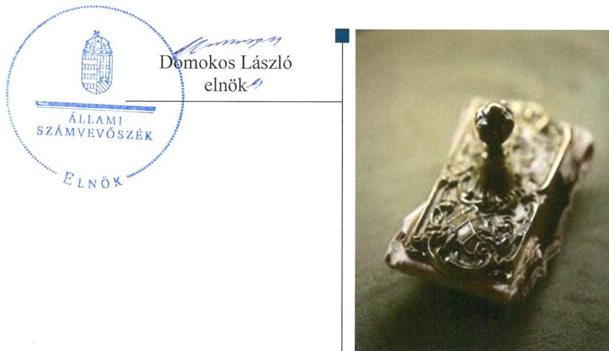

---

# AZ ELLENŐRZÉST FELÜGYELTE: 

PETŐ KRISZTINA felügyeleti vezető

## AZ ELLENŐRZÉST VEZETTE ÉS A VÉGREHAJTÁSÁÉRT FELELŐS:

DR. GYŐRI GABRIELLA ellenőrzésvezető

## A PROGRAM ÖSSZEÁLLÍTÁSÁÉRT FELELŐS:

JANIK JÓZSEF LÁSZLÓ osztályvezető

IKTATÓSZÁM: V-0946-136/2016
TÉMASZÁM: 1980
ELLENŐRZÉS-AZONOSÍTÓ SZÁM: V073701

Jelentéseink az Országgyúlés számítógépes hálózatán és az Interneten a www.asz.hu címen is olvashatóak.

---

# TARTALOMJEGYZÉK 

■ ÖSSZEGZÉS ..... 5
■ AZ ELLENŐRZÉS CÉLJA ..... 7
■ AZ ELLENŐRZÉS TERÜLETE ..... 8
■ AZ ELLENŐRZÉS HÁTTERE, INDOKOLTSÁGA ..... 11
■ A JELENTÉS LÉNYEGES KÉRDÉSKÖREI ..... 13
■ ELLENŐRZÉS HATÓKÖRE ÉS MÓDSZEREI ..... 14
■ MEGÁLLAPÍTÁSOK ..... 17
■ JAVASLATOK ..... 34
■ MELLÉKLETEK ..... 37
I. sz. melléklet: Értelmező szótár ..... 37
II. sz. melléklet: Az Integritás érvényesítése érdekében kialakított és múködtetett kontrollrendszer ..... 40
■ FÜGGELÉK: ÉSZREVÉTELEK ..... 41
■ RÖVIDÍTÉSEK JEGYZÉKE ..... 47

---

.

---

# ÖSSZEGZÉS 

A szolnoki székhelyű Damjanich János Múzeumnál kialakított irányítási rendszer összességében támogatta az átlátható, elszámoltatható és ellenőrizhető közpénzfelhasználást. A Múzeum pénzügyi- és vagyongazdálkodása nem volt szabályszerű. A Múzeum alaptevékenységének részét képező kulturális javak nyilvántartásáról gondoskodtak, azonban a kulturális javak állományvédelme és vagyonbiztonsága a kölcsönzéseknél nem volt biztositott.

## Az ellenőrzés társadalmi indokoltsága

Az Állami Számvevőszék Stratégiájának alapértéke, hogy ellenőrzései segítik az integritás alapú, átlátható és elszámoltatható közpénzfelhasználás megteremtését. Az ellenőrzés jogszabályban, vagy alapító okiratban meghatározott közfeladat ellátására létrejött, a megyei hatókörű városi muzeális intézmények gazdálkodási tevékenységére terjed ki. E szervezetek pénzügyi és vagyongazdálkodásának alapvető rendeltetése a közfeladatok (a kulturális örökséghez tartozó javak védelme, őrzése és a nyilvánosság számára történő hozzáférhetővé tétele) ellátásának biztosítása.

A megyei hatókörű városi múzeumként működő szervezetek 2011. évtől több alkalommal jelentős szervezeti és gazdálkodási átalakuláson mentek keresztül. A tulajdonosi, a vagyonkezelői és a fenntartói szerepekben, szerkezetben történt változások előkészítése, végrehajtása, illetve a múzeumi rendszer által kezelt közvagyonnal való gazdálkodás szabályszerűségének bemutatásával az ellenőrzés hozzájárul a múzeumok fenntartási és működtetési feladatainak ellátására vonatkozó megfelelő jogszabályi környezet kialakításához, a gazdálkodási gyakorlatuk javításához.

## Főbb megállapítások, következtetések

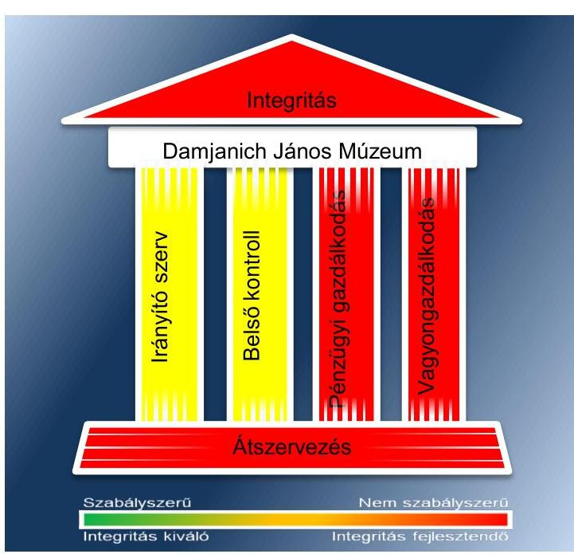

Az irányító szervek az ellenőrzött időszakban részben szabályszerűen gyakorolták alapítói jogosultságaikat. A munkáltatói jogosultságok gyakorlása során érvényesültek a jogszabályi előírások. Az egyéb irányítási, felügyeleti és ellenőrzési jogosultságok gyakorlása során a 2013-2014. években fennálló hiányosság volt, hogy Szolnok Megyei Jogú Város Közgyűlése nem határozta meg a Múzeum stratégiai tervét.

A Múzeumnál kialakított irányítási rendszer összességében biztosította az átlátható, elszámoltatható és ellenőrizhető közpénzfelhasználást. A kontrollkörnyezet kialakítása a 2012. év kivételével szabályszerű volt. A Múzeum rendelkezett a gazdálkodását és működését meghatározó - a jogszabályi előírásoknak összességében megfelelő tartalmú - belső szabályzatokkal. A kockázatkezelési rendszert szabályszerűen alakították ki és működtették. Meghatározták a kockázatok azonosításával, a kockázati kitettség csökkentésével kapcsolatos előírásokat. A kontrolltevékenység kialakítása részben volt szabályszerű, mert nem szabályozták teljes körűen az információkhoz illetve dokumentumokhoz való hozzáférést, valamint a gazdálkodási jogkörök gyakorlására jogosultak nem a jogszabályi előírásoknak megfelelően látták el a feladatukat. Az információs és kommunikációs folyamatok kialakítása során a belső szabályozás nem tartalmazta a szervezeten kívülre történő információátadás rendszerét és nem szabályozták a kötelezően közzéteendő adatok nyilvánosságra hozatalának rendjét. A monitoring rendszer részeként a belső ellenőrzés kialakítása és müködése a

---

2011-2013. években szabályszerű volt, a 2014. évben részben szabályszerű volt. Az ellenőrzési tervben foglalt ellenőrzéseket a 2014. év kivételével végrehajtották, az intézkedési tervekben foglalt feladatok hasznosulását nyomon követték.

A Múzeum pénzügyi- és vagyongazdálkodása nem volt szabályszerű. A bevételek elszámolása részben volt szabályszerű, mert a vagyon hasznosítása a 2013-2014. években vagyonkezelési/hasznosítási szerződés hiányában történt. A kiadási előirányzatok felhasználása a 2011. évben nem megfelelően, a 2012-2014. években részben megfelelően történt. A gazdálkodási jogkör gyakorlói nem a jogszabályi előírásoknak megfelelően látták el a feladatukat, mert a kötelezettségvállalás pénzügyi ellenjegyzése a 2011-2014. években nem volt szabályszerű, a 2011-2012. években a teljesítésigazolók aláírása nyilvántartás hiányában nem volt beazonosítható, a teljesítésigazolást a 2013. évben nem hajtották végre, az érvényesítést nem szabályszerűen látták el. A 2011. évben közbeszerzési eljárás lefolytatása nélkül vett igénybe szolgáltatásokat a Múzeum. A Múzeum a 2012. évben jogalap nélkül, a 2013-2014. években vagyonkezelési szerződés hiányában tartotta nyilván könyveiben a vagyontárgyakat. A kulturális javak kölcsönzése során a kölcsönzési szerződések nem tartalmazták a jogszabályban rögzített állományvédelemre és vagyonbiztonságra vonatkozó kötelező tartalmi elemeket. Emiatt a kölcsönzött kulturális javak vagyonbiztonsága nem volt megfelelően biztosított.

A 2011/2012. évi átszervezés során a jogszabályi előírásokat összességében betartották. A vagyon átadására a jogszabályban meghatározott tartalmú jegyzőkönyv felvételével került sor. A 2012/2013. évi központi alrendszerből önkormányzati alrendszerbe történő átszervezés során az átláthatóság sérült, mert a vagyonleltárnak nem képezte részét a kulturális javak felsorolása, továbbá annak tagintézményenkénti meghatározása.

A Múzeum az integritás szemlélet érvényesítése érdekében intézkedett.

---

# AZ ELLENŐRZÉS CÉLJA 

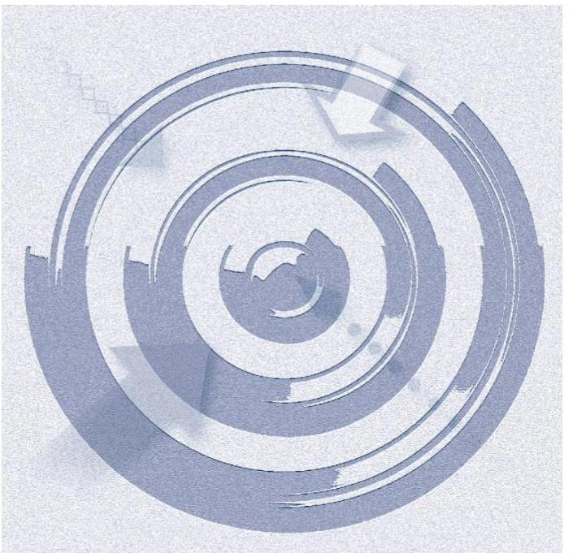
vényesülését a gazdálkodási folyamatokban.

Az ellenőrzés célja annak megállapítása volt, hogy a megyei múzeumi rendszer átalakítása, az intézményfenntartói rendszerben végbement változások előkészítése és végrehajtása megalapozottan, szabályszerűen történt-e; a megyei hatókörű városi múzeumok és jogelődjeik pénz-ügyi- és vagyongazdálkodása, a belső kontrollrendszer kialakítása és működtetése, valamint az intézményfenntartói feladatok ellátása szabályszerűen történt-e.

A Múzeum ${ }^{1}$ korrupcióval szembeni veszélyeztetettségének csökkentése érdekében kért tanúsítványi adatszolgáltatás alapján az ÁSZ² értékelte az integritási szemlélet ér-

---

# **AZ ELLENŐRZÉS TERÜLETE**

### **Damjanich János Múzeum**

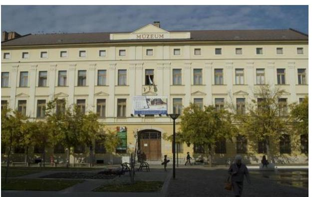

A Múzeum Szolnokon található, feladatkörében az Mtv.3 alapján gondoskodik a kulturális javak meghatározott anyagának folyamatos gyűjtéséről, nyilvántartásáról, megőrzéséről és restaurálásáról; tudományos feldolgozásáról, publikálásáról; valamint kiállításokon és más módon történő bemutatásáról; a közművelődési és közgyűjteményi feladatok ellátásáról. A Kötv.4 20. § (2) bekezdése alapján területileg illetékes múzeumként régészeti feltárást végzett az ellenőrzött időszakban.

A Múzeum csak a működési engedélyében meghatározott gyűjtőkörben és gyűjtőterületen folytathatja tevékenységét. A szakmai besorolást, a rendszert megalapozó szaktörvényi kereteket az Mtv. biztosítja. Az Mtv. hatálya kiterjed a Múzeum fenntartóira, a Múzeumban foglalkoztatottakra, a kulturális örökség Múzeumban őrzött elemeire, a szolgáltatások igénybe vevőire és a kulturális örökséggel foglalkozó egyéb szervezetekre.

A Múzeum 2011. évi költségvetési engedélyezett létszáma 73 fő volt, ami 2012. évben nem változott, majd 2013. évre 40 főre csökkent, 2014. évre 43 főre nőtt. A Múzeum alkalmazottainak foglalkoztatására a Kjt.5 alapján került sor. Az ellenőrzött időszakban a múzeumigazgató6 és a gazdasági vezető személye nem változott.

A Möktv.7 és annak végrehajtásáról szóló 258/2011. (XII. 7.) Korm. rendelet8 alapján 2012. január 1-jétől a megyei múzeumok központi költségvetési szervekké váltak. 2013. január 1-jétől a 2012. évi CLII. törvény9 és az 1311/2012. (VIII. 23.) Korm. határozat10 alapján az állami tulajdonba és fenntartásba került megyei múzeumi szervezetek a megyeszékhely megyei jogú városok fenntartásában működnek tovább. A 2011–2014. évek között a fenntartói, irányítói, középirányítói jogkörgyakorlók változását, valamint a Múzeum gazdálkodási feladatát ellátó szervezetét az 1. táblázat mutatja be.

---

1. táblázat

FENNTARTÓI, IRÁNYÍTÓI JOGKÖRGYAKORLÓK ÉS GAZDASÁGI SZERVEZET A 2011-2014. ÉVEKBEN

| Időszak | Fenntartó | Irányító szerv | Középirányító szerv | Gazdasági szervezet |
| :--: | :--: | :--: | :--: | :--: |
| 2011. | Jász-Nagykun-   Szolnok Megyei   Önkormányzat   Jász-Nagykun-   Szolnok Megyei   Önkormányzat   Közgyülése | - | Múzeum |  |
| 2012. | Jász-Nagykun-   Szolnok Megyei   Intézményfenntartó Központ | KIM $^{11}$ | Jász-Nagykun-   Szolnok Megyei   Intézményfenntartó Központ | Jász-Nagykun-   Szolnok Megyei Intézményfenntartó Központ |
| $\begin{aligned} & 2013- \\ & 2014 . \end{aligned}$ | Szolnok Megyei   Jogú Város Önkormányzata | Szolnok Megyei   Jogú Város Közgyülése | - | Múzeum |

Forrás: A Múzeum alapító okiratai
A Múzeum jogelődjének, a Jász-Nagykun-Szolnok Megyei Múzeumok Igazgatóságának a jogállása 2011. évben önállóan működő és gazdálkodó költségvetési intézmény volt. 2012. január 1-jétől a Múzeum önállóan működő költségvetési szerv volt. 2013. január 1-jétől a Múzeum önálló jogi személyiséggel rendelkező, saját gazdasági szervezettel működő megyei hatókörű városi múzeum, vállalkozási tevékenységet nem végzett.

A Múzeum teljesített költségvetési bevételeinek és kiadásaink alakulását az 1. ábra mutatja be. Az ábra a 2011-2012. években a Múzeum és tagintézményeinek együttes adatai, a 2013-2014. években a tagintézmények átadását követően a múzeumi adatok alapján készült.

1. ábra
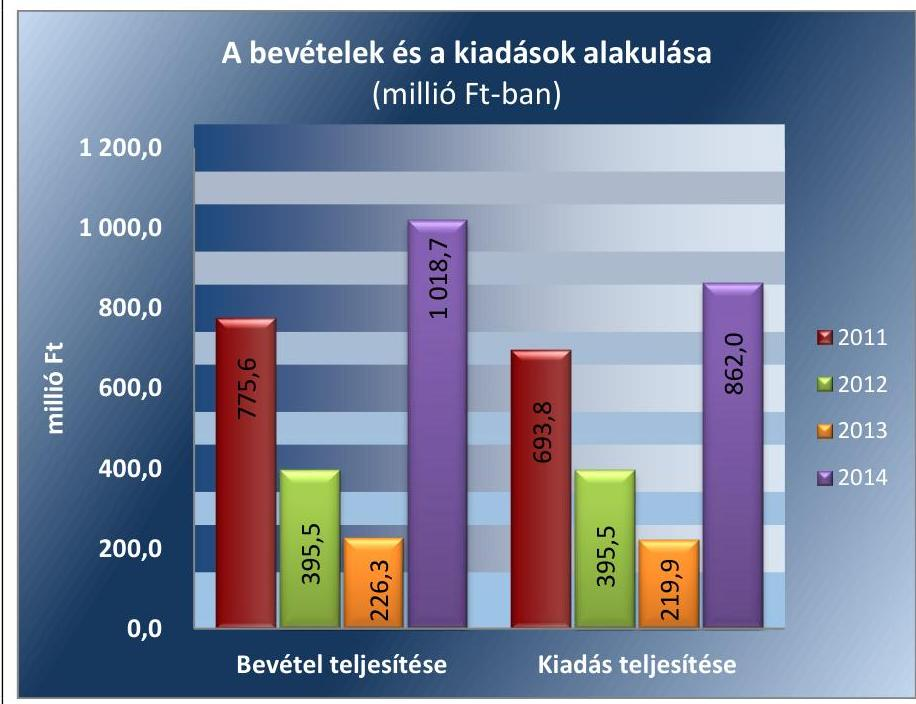

Forrás: Múzeumi beszámolók a 2011-2014. évekre
A 2015. évi LXXV. tv. ${ }^{12}$ 1. § (1) bekezdése alapján az Nvtv. ${ }^{13}$ 13. § (3) bekezdésében és 14. § (1) bekezdésében foglaltak alapján és az abban

---

meghatározott feltételekkel a 2012. évi CLII. törvény 30. § (1) és (2) bekezdésében meghatározott, a megyei hatókörű városi múzeumok feladatának ellátását szolgáló egyes állami tulajdonban lévő ingatlanok a törvény hatálybalépésének napjával, a törvény erejénél fogva a kötelező közfeladatként a megyei hatókörű városi múzeumot fenntartó önkormányzatok tulajdonába kerültek. A 2015. évi LXXV. tv. 4. § (1) bekezdése alapján a kulturális örökség helyi védelme érdekében a megyei hatókörű városi múzeumok alapleltárában és jogszabály szerinti külön nyilvántartásában szereplő állami tulajdonú kulturális javak ingyenesen a megyei hatókörű városi múzeumok vagyonkezelésébe kerültek. A vagyonkezelők vagyonkezelői joga tekintetében vagyonkezelési szerződés megkötése nem szükséges. A 2015. évi LXXV. tv. 4. § (2) bekezdése szerint továbbá a kulturális örökség helyi védelme érdekében a megyei hatókörű városi múzeumok feladatának ellátását szolgáló állami tulajdonban álló ingatlanok - a törvény mellékletében meghatározott ingatlanok kivételével - ingyenesen a fenntartó önkormányzatok vagyonkezelésébe kerültek.

---

# AZ ELLENŐRZÉS HÁTTERE, INDOKOLTSÁGA

Az Alaptörvény^{14} rendelkezése szerint a nemzeti vagyon megőrzésének, védelmének és a nemzeti vagyonnal való felelős gazdálkodásnak a követelményeit sarkalatos törvény, az Nvtv. rögzíti. A tulajdonosi joggyakorlás és vagyonkezelés általános és speciális szabályait, az állami vagyon nyilvántartására és elszámolására vonatkozó eljárásokat, a vagyonkezelési szerződés feltételrendszerét, valamint az éves beszámoló készítési és könyvvezetési kötelezettségeket kormányrendelet írja elő.

A megyei hatókörű városi múzeumok közfeladat-ellátásának változásait, (beleértve az állami tulajdonosi joggyakorló, intézményi vagyonkezelő és önkormányzati fenntartó szervezeteket is) a közfeladatok átadásából és átvételéből adódó módosításait, előirányzat gazdálkodására ható tényezőit az Áht-^{15}, az Ávr.^{16}, a Möktv., valamint az Mtv. írja elő. A múzeumi intézményrendszer rendszerátalakulásából, megszűnéséből, intézmény átszervezéséből, belső szerkezeti korszerűsítéséből, vagy más hasonló okból adódó módosításai miatt szerepeltetendő szerkezeti változásokat, valamint a szerkezeti változásként beépült közfeladatok szintre hozásként történő számításba vételét az Ávr. határozza meg.

A megyei hatókörű városi múzeumok kulturális szempontból meghatározó jelentőségűek mind földrajzi elhelyezkedésüket, mind az ellátott feladatokat, valamint a látogatottságukat tekintve. Tevékenységüket törvényi szinten (Mtv.) szabályozták a jogalkotók. A megyei hatókörű városi múzeumok jelenlegi körének kialakításában, tulajdonosi és fenntartói szerkezetében rövid idő alatt több jelentős változás történt, amelyeket jogszabályi változások indukáltak. Ezen intézmények szakmai besorolásukat tekintve a 2011. évben megyei múzeumként, a 2012. évben megyei múzeumi központi költségvetési szervezetként, a 2013. évtől kezdődően megyei hatókörű városi múzeumként működtek. A szakmai besorolások változásait párhuzamosan követték a tulajdonosi, vagyonkezelői, fenntartói szerepekben történt változások.

A 2011–2014. évek között bekövetkezett fenntartói változások a vagyontárgyak és a kulturális javak tulajdonosi, vagyonkezelői és használói körében is változást indukáltak, amelyet a 2. táblázat szemlélet.

1. táblázat

|  A VAGYON TULAJDONOSI, VAGYONKEZELŐI ÉS HASZNÁLÓI KÖRÉNEK VÁLTOZÁSA 2011–2014. ÉVEKBEN |  |  |  |  |  |  |  |  |  |  |  |  |  |  |   |
| --- | --- | --- | --- | --- | --- | --- | --- | --- | --- | --- | --- | --- | --- | --- |
|   |  | 2011. év |  |  |  | 2012. év |  |  |  | 2013–2014. évek |  |  |  |   |
|  Vagyon-
tárgy |  | vagyon-
kezelő |  | használó |  | tulajdonos |  | vagyon-
kezelők |  | használó |  |  |  |   |
|  Ingatlan |  | JNSZ Megyei
Önkormányzat^{17} |  | - |  | Múzeum |  | Állam |  | JNSZMIK^{18} | Múzeum | Állam | Múzeum | Múzeum  |
|  Egyéb
tárgyi
eszközök |  | JNSZ Megyei
Önkormányzat |  | - |  | Múzeum |  | Állam |  | JNSZMIK | Múzeum | Állam | Múzeum | Múzeum  |
|  Kulturális
javak |  | JNSZ Megyei
Önkormányzat |  | - |  | Múzeum |  | Állam |  | JNSZMIK | Múzeum | Állam | Múzeum | Múzeum  |

Forrás: A Múzeum alapító okiratai, a 2012. évi CLII. tv, a 258/2011. (XII. 7) Korm. rendelet, az 1311/2012. (VIII. 23.) Korm. határozat

---

Az ellenőrzés - tekintettel a megyei hatókörű városi múzeumokat (és jogelődjeit) rövid időn belül, gyors ütemben ért környezeti (tulajdonosi, fenntartói-szerkezetet érintő) változásokra - javaslatok megfogalmazásával hozzájárul a fenntartás és működtetés feladatainak ellátására vonatkozó megfelelő jogszabályi környezet - jogalkotók által történő - kialakításához. Az ÁSZ ellenőrzés a gazdálkodási gyakorlat javítását eredményezheti, több intézmény bevonásával átfogó képet ad a megyei hatókörű városi múzeumokat (és jogelődjeiket) jellemző sajátosságokról, jó gyakorlatokról.

AZ ELLENŐRZÉS EREDMÉNYEKÉPPEN nemcsak az ellenőrzött intézmények gazdálkodása javul, hanem átfogó képet kapunk a múzeumok gazdálkodásának hiányosságairól, de a jó gyakorlatokról is. Ellenőrzéseivel, javaslataival és megállapításaival az ÁSZ elősegíti a költségvetési szervek pénzügyi és vagyongazdálkodása szabályozásának javítását és hozzájárulhat a jó kormányzáshoz.

---

# A JELENTÉS LÉNYEGES KÉRDÉSKÖREI 

1. Az irányító szerv ellenőrzött Múzeumra vonatkozó feladatellátása szabályszerű volt-e?
2. Szabályszerüen hajtották-e végre a Múzeumot érintő szervezeti, szerkezeti átszervezéseket?
3. A belső kontrollrendszer kialakítása és müködtetése megfelelt-e a jogszabályi előírásoknak?
4. A Múzeum pénzügyi gazdálkodása szabályszerű volt-e?
5. A Múzeum vagyongazdálkodása szabályszerű volt-e?
6. A Múzeum intézkedett-e az integritás szemlélet érvényesítése érdekében?

---

# ELLENŐRZÉS HATÓKÖRE ÉS MÓDSZEREI 

## Az ellenőrzés típusa

Megfelelőségi ellenőrzés.

## Az ellenőrzött időszak

Az ellenőrzött időszak 2011. január 1-jétől 2014. december 31-ig tart.

## Az ellenőrzés tárgya

A megyei hatókörű városi múzeumok átszervezése, átalakítása előkészítése és lebonyolítása megalapozottsága, szabályszerűsége, a pénzügyi és vagyongazdálkodási tevékenység, a belső kontrollrendszer kialakítása, működtetése szabályszerűsége, valamint az irányító szervi feladatok ellátása szabályszerűsége. E tevékenységek és a kapcsolódó adatok és információk összessége, amelyeket a vonatkozó kritériumok alapján kell értékelni.

Az ellenőrzés kiterjed minden olyan körülményre és adatra, amely az ÁSZ jogszabályban meghatározott feladatainak teljesítéséhez, valamint a program végrehajtása folyamán felmerült újabb összefüggések feltárásához szükséges.

## Az ellenőrzött szervezet

Damjanich János Múzeum, a fenntartói feladatokban érintett Jász-Nagykun-Szolnok Megyei Önkormányzat valamint Szolnok Megyei Jogú Város Önkormányzata, a Jász-Nagykun-Szolnok Megyei Intézményfenntartó Központ jogutódja a Szociális és Gyermekvédelmi Főigazgatóság.

Az ellenőrzésre a költségvetési szerv ellenőrzött intézményének és irányító szervének, illetve középirányító szervének székhelyén és a gazdálkodási feladatait ellátó szervezetének székhelyén került sor.

## Az ellenőrzés jogalapja

Az ellenőrzés jogszabályi alapját az ÁSZ tv. ${ }^{19} 1 . \S$ (3) bekezdés, 5. § (2)-(6) bekezdései, valamint az Áht. 2 61. § (2) bekezdésének előírásai képezik.

---

# Az ellenőrzés módszerei 

Az ellenőrzést az ellenőrzési program szempontjai, az ellenőrzött időszakban hatályos jogszabályok, az ellenőrzés szakmai szabályai, az egyes ellenőrzési típusokhoz kapcsolódó ÁSZ módszertanok és nemzetközi standardok figyelembe vételével végeztük. A gazdálkodás hibáinak kijavítására, a közpénzekkel való felelős gazdálkodás segítésére irányuló javaslatok kidolgozásakor a hatályos jogszabályok az irányadóak.

Az ellenőrzési kérdések megválaszolásához szükséges bizonyítékok megszerzése a következő ellenőrzési eljárások alkalmazásával történt: kérdésfeltevés (információkérés), mintavételezés, valamint elemző eljárás. A minták kiválasztása során véletlen mintavételi eljárást alkalmaztunk.

Mintavétellel ellenőriztük a bevételek, a személyi juttatások, a dologi és felhalmozási kiadások, a régészeti bevételek és kiadások elszámolása-, valamint a kulturális javak kölcsönzésének szabályszerűségét. A minta alapján a sokaságban előforduló hibaarányt becsültük. „Megfelelőnek" értékeltük az ellenőrzött területet, amennyiben 95\%-os bizonyossággal a teljes sokaságban a hibaarány legfeljebb 10\%, „részben megfelelőnek" értékeltük, ha a hibaarány felső határa 10-30\% között volt, „nem megfelelőnek" pedig akkor, ha a mintavételi eredmények alapján a sokaságbeli hibaarány felső határa meghaladta a 30\%-ot.

Az ellenőrzési bizonyítékként felhasználható adatforrások közé tartoznak egyrészt a szakmai program részletes szempontjainál felsorolt adatforrások, másrészt adatforrás lehet minden egyéb - az ellenőrzés folyamán feltárt, az ellenőrzés szempontjából releváns információt tartalmazó - dokumentum. Az ellenőrzés lefolytatásához a Múzeum a tanúsítványok elektronikus kitöltésével, valamint az ÁSZ által kért dokumentumok elektronikus megküldésével szolgáltatott adatokat. A rendelkezésre bocsátott adatok, információk kontrollja az ellenőrzés keretében történt. Az ellenőrzési kérdésekre adott válaszok alapján értékeltük, hogy az ellenőrzött időszakban az irányító szerv az ellenőrzött Múzeumra vonatkozó feladatainak szabályszerűen eleget tett-e, a Múzeum pénzügyi- és vagyongazdálkodása megfelel-t-e az előírásoknak, a Múzeum átalakításának vagy átszervezésének végrehajtása szabályszerű volt-e.

A Múzeum belső kontrollrendszere jogszabályi előírások szerinti kialakításának és működtetésének szabályszerűségét az erre irányuló ellenőrzési kérdésekre adott válaszok összesítése alapján, évente pillérenként (kontrollkörnyezet, kockázatkezelési rendszer, kontrolltevékenységek, információs és kommunikációs rendszer, monitoring rendszer) és összesítetten is minősítjük. A Múzeum belső kontrollrendszere egyes pilléreinek kialakítása és működtetése „szabályszerü", amennyiben az értékelt területen az elért és elérhető pontok százalékban kifejezett, egész számra kerekített hányadosa meghaladja a 84\%-ot, „részben szabályszerű", ha a 84,0\%-ot nem haladja meg, de 60\%-nál nagyobb, „nem szabályszerű", ha nem haladja meg a 60\%-ot. A Múzeum belső kontrollrendszerének összesített értékelése megegyezik a pillérenként (kontrollterületenként) alkalmazott \%-os értékelésekkel, a következő eltérésekkel. A kontrollrendszer egésze esetében a „szabályszerű" értékelésnek a \%-os értéken felül további feltétele, hogy egyik kontrollterület sem kaphat „nem szabályszerű" értékelést, a „részben szabályszerű" értékelés további feltétele, hogy leg-

---

feljebb egy ellenőrzött kontrollterület lehet „nem szabályszerű" értékelésű. Az összesített értékelés a \%-os értéktől függetlenül „nem szabályszerű", ha az ellenőrzött kontrollterületek közül több mint egynek „nem szabályszerű" az értékelése.

Az integritás szemlélet érvényesülésének értékelése a Múzeum által szolgáltatott adatok alapján történt.

---

# 1. Az irányító szerv ellenőrzött Múzeumra vonatkozó feladatellátása szabályszerű volt-e? 

Összegző megállapítás

Az irányító szerv ${ }_{1-3}{ }^{20}$ ellenőrzött Múzeumra vonatkozó feladatellátása a 2011-2014. években részben volt szabályszerű.

AZ ALAPÍTÓI JOGOSULTSÁGOK GYAKORLÁSA az ellenőrzött időszakban részben felelt meg a jogszabályi előírásoknak. Az Múzeum az ellenőrzött időszakban rendelkezett az irányító szerv ${ }_{1-3}$ által jóváhagyott alapító okirat ${ }_{1-6}{ }^{21}$-tal. A módosítás során az egységes szerkezetet elkészítették, a miniszteri előzetes véleményt beszerezték.

Az irányító szerv ${ }_{2}$ a Múzeummal kapcsolatos alapítói jogosultságát - az alapító okirat kiadása kivételével - 2012-ben az Ávr. előírásainak megfelelően gyakorolta. A 2012-ben hatályos alapítói okirat kiadására és Kincstári ${ }^{22}$ nyilvántartásba vételére a 258/2011. (XII. 7.) Korm. rendelet 21. § (6) bekezdése szerinti 2012. január 30-ai határidőn túl 2012. július 12-én került sor.

A MUNKÁLTATÓI JOGOSULTSÁGOT az irányító szerv ${ }_{1-3}$ a 2011-2014. években szabályszerűen gyakorolta. A múzeumigazgató 2011. évi kinevezése során betartották az Áht. ${ }^{23}$ és az Mtv. előírásait. A múzeumigazgató kinevezési okirata rendelkezésre állt, a vezetői megbízás az ágazati illetékes miniszternek felterjesztésre került.

AZ EGYÉB IRÁNYÍTÁSI, FELÜGYELETI ÉS ELLENÖRZÉSI jogosultságok gyakorlása az ellenőrzött időszakban öszszességében szabályszerű volt.

Az irányító szerv ${ }_{1}$ az egyéb irányítási, felügyeleti és ellenőrzési jogosultságait 2011-ben szabályszerűen gyakorolta.

A 2012. évben a középirányító szerv ${ }^{24}$ a 258/2011. (XII. 7.) Korm. rendelet 11. § (2) bekezdés c) pontjának előírásától eltérően a közérdekű és közérdekből nyilvános adatok közzétételének, illetve igényre történő szolgáltatásának kötelező végrehajtását nem ellenőrizte.

Az irányító szerv ${ }_{3}$ - mint fenntartó - a 2013-2014. években az Mtv. 50. § (2) bekezdés a) pontja ellenére nem határozta meg és nem hagyta jóvá a Múzeum stratégiai tervét. A Múzeumra vonatkozó stratégiai fejlesztési és beruházási terv nem készült, így azt az Mtv. 45. § (5) bekezdés b) pontjában foglaltak ellenére a miniszter nem véleményezte.

---

# 2. Szabályszerüen hajtották-e végre a Múzeumot érintő szervezeti, szerkezeti átszervezéseket? 

Összegző megállapítás

2.1. számú megállapítás

A Múzeumot érintő szervezeti, szerkezeti átszervezés összességében nem volt szabályszerű.

A Múzeumot érintő önkormányzati alrendszerből a központi alrendszerbe történő 2012. január 1-jétől hatályos irányító szervi (fenntartói) váltás lebonyolítását összességében szabályszerűen hajtották végre.

Az átadás-átvételi megállapodás ${ }^{25}$ megkötésére a 258/2011. (XII. 7.) Korm. rendelet 1. számú melléklete szerinti minta alapján 2011. december 16-án határidőben került sor a Möktv.-ben meghatározott intézmények képviselőinek aláírásával, azonban az átadás-átvétel előkészítésének szabályszerűsége dokumentumok hiányában nem volt értékelhető.

A VAGYON TÉNYLEGES ÁTADÁSÁRA az átadás-átvételi megállapodás ${ }_{1}$ elválaszthatatlan részét képező jegyzőkönyv alapján került sor. Ennek elkészítésére - 2012. március 19-én - a 258/2011. (XII. 7.) Korm. rendelet 12. § (3) bekezdésben meghatározott határidőn túl került sor.

Az átadás-átvételi megállapodás ${ }_{1}$ szerinti bontásban a Megyei Önkormányzat - a betöltetlenül átadott státuszok számának megjelölése, valamint az átadott ingatlanra vonatkozó utolsó vagyonértékelés megjelölése kivételével - a 258/2011. (XII. 7.) Korm. rendelet 1. számú mellékletében foglaltaknak megfelelő tartalommal és formában átadta a dokumentumokat.

A vagyonátadást hitelesített leltárral támasztották alá. A Múzeum a központi alrendszerben szabályszerűen végezte el a kiadási és bevételi előirányzatok nyitását.

A Múzeum működési engedélyének módosítására vonatkozó kérelmet a középirányító szerv a 2/2010. (I. 14.) OKM rendelet ${ }^{26}$ 17. § (5) bekezdésben rögzített, a változás bekövetkezésétől számított 20 napon belüli határidő ellenére 2012. június 12-én küldte meg az EMMI ${ }^{27}$ Kultúráért Felelős Államtitkársága részére. A múködési engedély határidőn túli aktualizálásával a középirányító szerv nem biztosította a Múzeum törvényes müködésének feltételét.

A 2013. január 1-jével végrehajtott, a központi alrendszerből önkormányzati alrendszerbe történő irányító szervi (fenntartói) váltás lebonyolítása és a szervezetrendszer átalakítása nem volt szabályszerű.

A központi alrendszerből az önkormányzati alrendszerbe történő átadáshoz kapcsolódó feladatok tekintetében a 1311/2012. (VIII. 23.) Korm. határozat adott iránymutatást.

Az átadás-átvétel előkészítésének keretében a középirányító szerv és a Múzeum képviselőinek részvételével 2012. szeptember 11-én megtartott

---

szakmai és pénzügyi egyeztetés alapján az átadás-átvételi megállapo-dás ${ }_{2}{ }^{28}$-höz kapcsolódó dokumentumokat, azok elkészítésének határidejét és felelősét a középirányító szerv vezetője meghatározta.

Az átadás-átvételi megállapodás ${ }_{2}$ megkötésére határidőben, 2012. december 15-én került sor a középirányító szerv, mint átadó és az irányító szerv $_{3}$ mint átvevő aláírásával, valamint a kormánymegbízott ${ }^{29}$ és az EMMI képviselőjének egyetértésével. Az átadás-átvételi megállapodás ${ }_{2}$-höz tartozó mellékletek jegyzéke szerint a dokumentumok átadásra kerültek. A vagyonátadást megelőzően az Áhsz. ${ }_{1}{ }^{30}$ előírásainak megfelelően elvégezték a mérlegben szereplő eszközök és források év végi értékelését. Az elkészített beszámoló az éves elemi költségvetési beszámolónak megfelelő adattartalmú volt, a vagyonátadásra a mérlegben szereplő adatokat alátámasztó leltár alapján került sor.

Az irányító szerv $_{3}$ polgármestere ${ }^{31}$ a 2/2010. (I. 14.) OKM rendelet 17. § (5) bekezdésben rögzített 20 napos határidő ellenére 2013. február 28-án kérte a Múzeum működési engedélyének - fenntartó váltás miatt szükségessé vált - módosítását. A múködési engedély határidőn túli aktualizálásával az irányító szerv $_{3}$ nem biztosította a Múzeum törvényes múködésének feltételét.

A VAGYONLELTÁRNAK nem képezte részét a 1311/2012. (VIII. 23.) Korm. határozat 1.8. pontja, valamint az átadás-átvételi megállapodás ${ }_{2}$ IV. rész 1.2.11.2.1. pontja ellenére „az alapleltárban és külön nyilvántartásban nyilvántartott kulturális javak felsorolása".

A TAGINTÉZMÉNYEK 2013. ÉVI ÁTADÁSÁT RÖGZÍTÓ MEGÁLLAPODÁSOKAT a 2012. évi CLII. törvényben foglaltaknak megfelelően a középirányító szerv és az átvevő települési önkormányzatok - 2012. december 15-én - határidőben megkötötték. A 1311/2012. (VIII. 23.) Korm. határozat 1.8. pontjában foglaltak és a megállapodások IV. rész 1.2.11.2.1. pontjában foglaltak ellenére az alapleltárban nyilvántartott kulturális javak felsorolását nem csatolták a megállapodásokhoz.

# 3. A belső kontrollrendszer kialakítása és múködtetése megfelelte a jogszabályi előírásoknak? 

Összegző megállapítás

A belső kontrollrendszer kialakítása és múködtetése a 20112012. években részben volt szabályszerű, a 2013-2014. években szabályszerű volt.

A belső kontrollrendszer öt elemének kialakítása és múködtetése részletes értékelését a 2011-2014. évekre vonatkozóan a 3. táblázat mutatja be.

---

# A BELSŐ KONTROLLRENDSZER KIALAKÍTÁSÁNAK ÉS MŰKÖDTETÉSÉNEK ÉRTÉKELÉSE A 2011-2014. ÉVEKBEN 

| Megnevezés | Kontroll-   környezet | Kockázatkezelés | Kontroll-   tevékenyzégek | Információ és   kommunikáció | Monitoring | Összesen |
| :--: | :--: | :--: | :--: | :--: | :--: | :--: |
| 2011. | szabályszerű | szabályszerű | részben szabály-   szerű | nem szabályszerű | szabályszerű | részben szabály-   szerű |
| 2012. | részben szabály-   szerű | szabályszerű | részben szabály-   szerű | nem szabályszerű | szabályszerű | részben szabály-   szerű |
| 2013. | szabályszerű | szabályszerű | részben szabály-   szerű | részben szabály-   szerű | szabályszerű | szabályszerű |
| 2014. | szabályszerű | szabályszerű | részben szabály-   szerű | részben szabály-   szerű | részben szabály-   szerű | szabályszerű |

Forrás: Az ÁSZ által készített értékelés

### 3.1. számú megállapítás

A kontrollkörnyezet kialakítása 2011. évben és a 2013-2014. években szabályszerű volt, a 2012. évben részben volt szabályszerű.
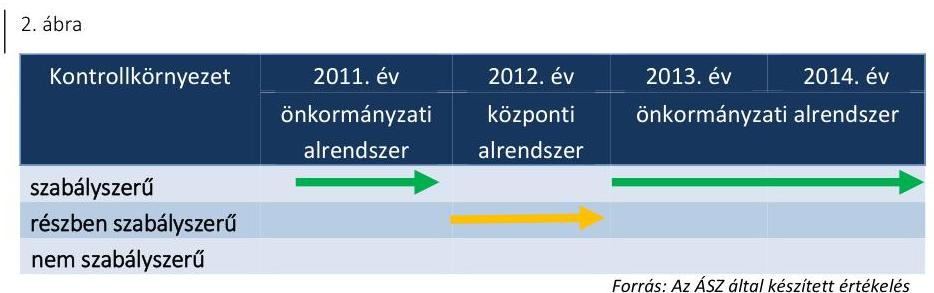

Forrás: Az ÁSZ által készített értékelés

A kontrollkörnyezet 2011. évi kialakítása szabályszerű volt. A Múzeum rendelkezett SZMSZ ${ }_{1-2}{ }^{32}$-vel valamint a gazdálkodását és működését meghatározó belső szabályzatokkal. A gazdasági szervezet vezetője rendelkezett az Ámr. ${ }^{33}$-ben előírt végzettséggel, szakképesítéssel. A kontrollkörnyezet 2011. évi kialakításában - a szabályszerű minősítés mellett - az alábbi hiányosságok fordultak elő:
— az Ámr. 20. § (2) bekezdés h) pontja ellenére az SZMSZ ${ }_{1}$ nem tartalmazta a nevesített munkakörökhöz kapcsolódó felelősségi szabályokat;
— az Ámr. 20. § (7) bekezdése ellenére az SZMSZ ${ }_{1}$, illetve a gazdasági szervezet ügyrend ${ }_{1}$-je ${ }^{34}$ vagy más belső szabályozás nem tartalmazta az adatgazdálkodással kapcsolatos feladatok munkafolyamatainak leírását és a gazdasági szervezet belső kapcsolattartásának módját, szabályait;
— a számlarend ${ }_{1}{ }^{35}$ az Áhsz. ${ }_{1}$ 49. § (3) bekezdése ellenére nem tartalmazta az analitikus nyilvántartások kapcsolódó főkönyvi nyilvántartásokkal való egyeztetésének módját;
— a múzeumigazgató nem határozta meg - az Ámr. 156. § (1) bekezdés c) pontjában foglaltak ellenére - az etikai elvárásokat a szervezet minden szintjén.
A kontrollkörnyezet 2012. évi kialakítása részben volt szabályszerű. A Múzeum gazdasági feladatainak ellátása a IX-09/30/314/2012. számú alapító okirat 7. pontja alapján a középirányító szerv hatáskörébe tartozott,

---

azonban az alapító okiratban foglaltak ellenére a gazdasági feladatokat a Múzeum állományába tartozó dolgozók látták el.

A kontrollkörnyezet 2012. évi kialakításában az alábbi hiányosságok fordultak elő:
—_ a múzeumigazgató nem határozta meg - a Bkr. ${ }^{36}$ 6. § (1) bekezdés c) pontjában foglaltak ellenére - az etikai elvárásokat a szervezet minden szintjén;
—_ az Ávr. 13. § (2) bekezdés b) pontjában foglaltak ellenére a múzeumigazgató nem gondoskodott a közbeszerzés hatálya alá nem tartozó beszerzések lebonyolításának teljes körű szabályozásáról;
—_ a számlarend ${ }_{1}$ az Áhsz. ${ }_{1}$ 49. § (3) bekezdése ellenére nem tartalmazta az analitikus nyilvántartások kapcsolódó főkönyvi nyilvántartásokkal való egyeztetésének módját.
A kontrollkörnyezet 2013-2014. évi kialakításában - a szabályszerű minősítés mellett - az alábbi hiányosságok fordultak elő:
— az Ávr. 13. § (1) bekezdés g) pontja ellenére az SZMSZ ${ }_{3,4}{ }^{37}$ nem tartalmazta a nevesített munkakörökhöz kapcsolódó felelősségi szabályokat;
—_ az Ávr. 13. § (5) bekezdése ellenére a gazdasági szervezet ügyrend ${ }_{3}{ }^{-}$ $\mathrm{ja}^{38}$, az SZMSZ ${ }_{3,4}$ vagy más belső szabályozás nem tartalmazta az adatgazdálkodással kapcsolatos feladatok munkafolyamatainak leírását és a gazdasági szervezet belső kapcsolattartásának módját, szabályait;
—_ az Áhsz. ${ }_{1}$ 8. § (5) bekezdésében és a Számv. tv. ${ }^{39}$ 14. § (4) bekezdésében foglaltak ellenére a számviteli politika ${ }^{40}$ nem tartalmazta, hogy mit tekint a számviteli elszámolás, az értékelés szempontjából lényegesnek, nem lényegesnek;
—_ a számlarend ${ }_{2}{ }^{41}$ az Áhsz. ${ }_{1}$ 49. § (3) bekezdése és az Áhsz. ${ }_{2}^{42}$ 51. § (3) bekezdése ellenére nem tartalmazta a főkönyvi számla és az analiti-kus-, illetve részletező nyilvántartások egyeztetésének módját, dokumentálását és a kapcsolódó nyilvántartás vezetésének módját.
A számviteli politika ${ }_{1,2,4}$ megfelelt az Áhsz. ${ }_{1,2}$ és a Számv. tv. előírásainak. A 2014. évben hatályos értékelési szabályzat ${ }_{3}{ }^{43}$ az Áhsz. ${ }_{2}$ 50. § (2) bekezdés b) pontja ellenére nem tartalmazta követeléstípusonként a kis összegű követelések év végi meghatározásának elveit, dokumentálásának szabályait.

# 3.2. számú megállapítás 

A kockázatkezelési rendszert a 2011-2014. években a jogszabályi előírásoknak megfelelően alakították ki és működtették.
3. ábra

| Kockázatkezelési | 2011. ev | 2012. ev | 2013. ev | 2014. ev |
| :--: | :--: | :--: | :--: | :--: |
| rendszer | önkormányzati   alrendszer | központi   alrendszer | önkormányzati alrendszer |  |
| szabályszerű |  |  |  |  |
| részben szabályszerű |  |  |  |  |
| nem szabályszerű |  |  |  |  |

Forrás: Az ÁSZ által készített értékelés

Az Ámr.-ben és a Bkr.-ben foglaltaknak megfelelően alakították ki és működtették a kockázatkezelési rendszert, amely tartalmazta a kockázatok

---

azonosításával, elemzésével, csoportosításával, nyomon követésével, illetve a kockázati kitettség csökkentésével kapcsolatos szabályokat. A tevékenységben, gazdálkodásban rejlő kockázatokat felmérték és megállapították.

# 3.3. számú megállapítás 

## 4. ábra

| Kontroll tevékeny-   ség | 2011. év   önkormányzati   alrendszer | 2012. év   központi   alrendszer | 2013. év   önkormányzati   alrendszer | 2014. év   alrendszer |
| :-- | :--: | :--: | :--: | :--: |
| szabályszerű   részben szabályszerű   nem szabályszerű | - |  |  |  |

A kontrolltevékenység 2011. évi kialakításában az alábbi hiányosságok fordultak elő: az Ámr. 158. § (2) bekezdés b)-d) pontjaiban foglaltak ellenére belső szabályzatban a felelősségi körök meghatározásával a múzeumigazgató nem szabályozta az információkhoz való hozzáférést, az informatikai rendszerekhez való hozzáférés jogosultságait, valamint a beszámolási eljárásokat.

A kontrolltevékenység 2012-2014. évi kialakításában hiányosság volt, hogy a Bkr. 8. § (4) bekezdés b)-c) pontjában foglaltak ellenére belső szabályzatban a felelősségi körök meghatározásával a múzeumigazgató nem szabályozta a dokumentumokhoz való hozzáférést, az informatikai rendszerekhez való hozzáférés jogosultságait, valamint 2012. évben a beszámolási eljárásokat.

A kontrolltevékenység 2011-2014. évi kialakításában hiányosság, hogy az lkr. ${ }^{44}$ 8. § (2) bekezdésében foglaltak ellenére az üzemeltetés és az adatbiztonság szabályozása során a múzeumigazgató csak az informatikus feladat és hatáskörét határozta meg.

A kontrolltevékenység működtetése során feltárt hiányosságokat részletesen a 4.3. pont tartalmazza.

Az információs és kommunikációs folyamatok kialakítása a 2011-2012. években nem volt szabályszerű, a 2013-2014. években részben szabályszerű volt.
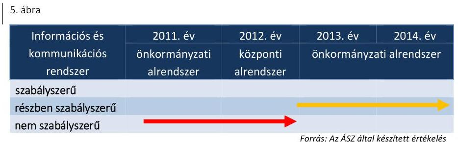
2011. évben az Ámr. 159. § (1)-(2) bekezdéseiben, 2012-ben a Bkr. 9. § (1)-(2) bekezdéseiben foglaltak ellenére a múzeumigazgató nem alakította

---

ki a Múzeummal kapcsolatos információk tekintetében a szervezeten kívülre történő információátadás rendszerét, valamint a beszámolási szinteket, határidőket, módokat. 2011. évben az Ámr. 20. § (3) bekezdés i) pontjában, 2012-ben az Info tv. ${ }^{45}$ 35. § (3) bekezdésében és az Ávr. 13. § (2) bekezdés h) pontjában előírtak ellenére a múzeumigazgató nem szabályozta a kötelezően közzéteendő adatok nyilvánosságra hozatalának rendjét. 2011-ben az Avtv. ${ }^{46}$ 20. § (8) bekezdésében, 2012. évben az Info tv. 30. § (6) bekezdésében és az Ávr. 13. § (2) bekezdés h) pontjában foglaltak ellenére nem szabályozták a közérdekú adatok megismerésére irányuló kérelmek intézésének rendjét.

Az információs és kommunikációs folyamatok 2013. és 2014. évi kialakítása részben szabályszerű volt. A Bkr. 9. § (1)-(2) bekezdéseiben foglaltak ellenére a múzeumigazgató nem alakította ki a Múzeummal kapcsolatos információk tekintetében a szervezeten kívülre történő információátadás rendszerét, valamint a beszámolási szinteket, határidőket, módokat.

A Múzeum az ellenőrzött időszakban az Áht. 1,2 előírásainak megfelelően szabályozta a beszámolási, adatszolgáltatási és egyéb tájékoztatási feladatokat.

# 3.5. számú megállapítás 

A monitoring rendszer kialakítása és múködése a 2011-2013. években szabályszerű volt, a 2014. évben részben szabályszerű volt.
6. ábra

| Monitoring rendszer | 2011. év | 2012. év | 2013. év | 2014. év |
| :--: | :--: | :--: | :--: | :--: |
| azer | önkormányzati alrendszer | bázponti alrendszer | önkormányzati alrendszer |  |
| szabályszerű |  |  |  |  |
| részben szabályszerű |  |  |  |  |
| nem szabályszerű |  |  |  |  |

Forrás: Az ÁSZ által készített értékelés
A múzeumigazgató a 2011-2014. években belső szabályzatban kialakította a rendelkezésre álló források gazdaságos, hatékony és eredményes felhasználását biztosító, a szervezeti célok elérését szolgáló feladatok/folyamatok megvalósulását mérő követelményeket és azokat a kialakításukat követően alkalmazta.

A monitoring rendszer részeként az operatív tevékenységek keretében megvalósuló folyamatos és eseti nyomon követés az ellenőrzött időszakban megfelelő volt. A monitoring rendszer részeként a 2011-2013. években megvalósult a belső ellenőrzési rendszer szabályszerű kialakítása és múködtetése, a tárgyévi ellenőrzési tervben foglalt ellenőrzéseket végrehajtották. A 2011. évben a Ber. ${ }^{47}$-ben, a 2012-2014. években a Bkr.-ben foglaltak alapján meghatározták a Múzeum SZMSZ1.4-ben a belső ellenőrzést végző szervezeti egység jogállását, feladatait, biztosították a belső ellenőrök szervezeti és funkcionális függetlenségét. A 2011. és a 2013. évben a belső ellenőrzés által tett megállapításokra és javaslatokra készült intézkedési tervekben megfogalmazott feladatok hasznosulását nyomon követték. A 2012. évben lefolytatott ellenőrzés esetében nem volt olyan javaslat, ami intézkedési terv készítését indokolta volna.

A belső ellenőrzés 2014. évben a Bkr. 15. § (1) bekezdésében foglaltak ellenére nem múködött, a tervezett ellenőrzést nem hajtották vére, ezáltal

---

a múzeumigazgató nem biztosította a gazdálkodás szabályszerűségének, a közpénzek felhasználásának ellenőrizhetőségét.

A 2011-2014. években az Ötv. ${ }^{48}$ és a Mötv. rendelkezései alapján a fenntartók gondoskodtak a Múzeum, mint felügyelt költségvetési szerv belső ellenőrzéséről.

# 4. A Múzeum pénzügyi gazdálkodása szabályszerű volt-e? 

## Összegző megállapítás

### 4.1. számú megállapítás

A Múzeum pénzügyi gazdálkodása az ellenőrzött időszakban összességében nem volt szabályszerű.

Az ellenőrzött időszakban a költségvetési tervezés, a bevételi és kiadási előirányzatok megállapítása szabályszerű volt. A bevételi és kiadási előirányzatok módosítását szabályszerűen hajtották végre, a maradvány megállapítását nem szabályszerűen hajtották végre.

A költségvetési tervezés ellenőrzési nyomvonalát kialakították, karbantartották, a tervezéssel kapcsolatos feladatokat munkaköri leírásban rögzítették.

A KÖLTSÉGVETÉSI JAVASLATOKAT az Áht.1,2-ben foglalt előírások szerint állították össze, az előirányzatok összegének megállapítását mellékszámításokkal alátámasztották. Figyelembe vették a Múzeumot érintő szervezeti átalakításból, átszervezésből adódó szerkezeti változások hatásait. A 2011., 2013-2014. évi költségvetési javaslat tervezetet a fenntartó önkormányzat ${ }_{1,2}{ }^{49}$ pénzügyi bizottsága véleményezte, azokat bizottsági határozatban elfogadásra javasolta.

A MÚZEUM ELÖIRÁNYZAT MÓDOSÍTÁSAI megfeleltek az Áht. 1,2 előírásainak és a belső szabályzatokban foglaltaknak. Az előirányzatok könyvelésének rendjét a gazdasági szervezet ügyrend ${ }_{1-3}{ }^{50}$-ban szabályozták, a könyvelés ellenőrzési nyomvonalát kialakították, karbantartották, az előirányzat könyvelési feladatokat munkaköri leírásban rögzítették.

Az ellenőrzött időszakban országgyűlési hatáskörű előirányzat módosításra nem került sor. Kormány hatáskörben előirányzat módosításra két alkalommal került sor, 2012-ben 2,5 M Ft, 2014-ben 27,3 M Ft összegben. Az előirányzatok módosítását az előirányzat nyilvántartásban rögzítették és a főkönyvi könyvelésben szabályszerűen könyvelték. Az ellenőrzött időszakban, Kormány hatáskörben egy alkalommal került sor előirányzat zárolására a Széll Kálmán Terv kiterjesztése okán. A zárolt összeget a bevételi és kiadási előirányzatokból év közben átvezették a zárolt bevételi és kiadási előirányzatok közé. A zárolt előirányzat összege a 2012. év végén Kormány hatáskörben elvonásra került.

Irányító szervi hatáskörű előirányzat módosítás a 2011., 2013. és a 2014. évben történt összesen 104,5 M Ft nagyságrendben. Az irányító szervi előirányzat változtatások döntő többsége a Múzeumnál foglalkoztatottak bérkompenzációja miatti előirányzat módosítás volt. A módosítások okát és összegét a Múzeum előirányzat analitikájában teljes körűen dokumentálták.

---

A saját hatáskörű előirányzat módosítások az ellenőrzött időszakban a Múzeum többletbevételei okán történtek, amelynek forrása saját bevételekből, központi támogatásból, európai uniós támogatásból, valamint önkormányzati támogatásból tevődött össze, összesen 2324,6 M Ft összegben. A Múzeum a 2012. évben a saját hatáskörben végrehajtott előirányzat módosításokról az intézkedés meghozatalát követő öt munkanapon belül az Ávr. 167. § (4) bekezdésében foglaltak ellenére a fejezetet irányító szervet nem tájékoztatta. Az Ávr. szerinti Kincstár tájékoztatására vonatkozó kötelezettség teljesítése a Kincstár elektronikus adattovábbítási rendszerén keresztül határidőben megvalósult.

A MARADVÁNY MEGÁLLAPÍTÁSA az irányító szerv ${ }_{1-3}$ felé teljesített adatszolgáltatás késedelme miatt nem felelt meg a jogszabályi előírásoknak. A Múzeum a költségvetési maradványáról az éves beszámoló megküldésével egyidejűleg, a 2011-2013. években az Áhsz. 1 10. § (1) bekezdésében rögzített határidőn túl, a 2014. évben pedig az Áhsz. 2 32. § (1) bekezdésében foglalt határidőn túl teljesítette az irányító szerv ${ }_{1-3}$ felé előírt kötelezettségét. Az adatszolgáltatást legkésőbb a következő költségvetési év február 28-áig kellett az irányító szervnek megküldeni. A jogszabályi rendelkezés ellenére a 2011. évről 2012. március 6-án, a 2012. évről 2013. március 7-én, a 2013. évről 2014. március 6-án, a 2014. évről 2015. március 9-én teljesítette az adatszolgáltatást a Múzeum.

A MÚZEUM MARADVÁNYA a 2011. évben 82,4 M Ft, a 2012. évben 0 Ft, a 2013. évben 18,4 M Ft, a 2014. évben 150,6 M Ft volt. Az ellenőrzött időszakban a Múzeumot meg nem illető maradvány befizetési kötelezettség nem keletkezett.
4.2. számú megállapítás

Az éves költségvetési beszámoló elkészítése - az irányító szerv ${ }_{1-3}$ részére történő megküldés késedelme - miatt nem volt szabályszerű.

AZ ÉVES KÖLTSÉGVETÉSI BESZÁMOLÓKAT folyamatosan vezetett részletező nyilvántartásokkal és könyvviteli zárlat során készített főkönyvi kivonattal, valamint leltárral alátámasztották. A 2011., 2012. és 2013. éves költségvetési beszámolókat a múzeumigazgató és a beszámoló elkészítéséért kijelölt felelős személy írta alá, az Áhsz.1-ben foglalt előírások szerint. A 2014. éves költségvetési beszámoló aláírása az Áhsz.2-nek megfelelően a múzeumigazgató és a gazdasági vezető által, a hely és a keltezés feltüntetésével szabályszerűen történt. Az éves beszámolókat az elfogadott költségvetésekkel összehasonlítható módon, az adott év utolsó napján érvényes besorolási rendnek megfelelően készítették el.

A 2011., 2012. és 2013. évi beszámolót az Áhsz. 10. § (1) bekezdésében rögzített határidőn túl, a 2014. évi beszámolót pedig az Áhsz. 2 32. § (1) bekezdésében rögzített határidőn túl küldték meg a Kincstár elektronikus adatszolgáltató rendszerén keresztül az irányító szerv ${ }_{1-3}$ részére. Az adatszolgáltatást legkésőbb a következő költségvetési év február 28-áig kellett az irányító szervnek megküldeni. A jogszabályi rendelkezés ellenére a 2011. évről 2012. március 6-án, a 2012. évről 2013. március 7-én, a 2013. évről 2014. március 6-án, a 2014. évről 2015. március 9-én teljesítette az adatszolgáltatást a Múzeum.

---

### 4.3. számú megállapítás

A bevételi előirányzatok teljesítése részben felelt meg a jogszabályokban és a belső szabályzatokban foglaltaknak. A kiadási előirányzatok felhasználása a 2011. évben nem felelt meg, a 2012-2014. években részben felelt meg a jogszabályi előírásoknak.

A Múzeum költségvetési beszámolói szerint bevételi előirányzatot 2011ben 227,2 M Ft, 2012-ben 230,1 M Ft, 2013-ban 163,3 M Ft, 2014-ben 192,1 M Ft összegben terveztek, amely a tervezett összeget meghaladóan - 2011-ben 775,6 M Ft-ban, 2012-ben 395,5 M Ft-ban, 2013-ban 226,3 M Ft-ban, 2014-ben 1012,7 M Ft-ban - teljesült. A módosított bevételi előirányzatok 2011-ben 99,9\%-ra, 2012-ben 100,2\%-ra, 2013-ban 95\%-ra, 2014-ben 54,4\%-ra teljesültek. A 2014. évben a működési bevételek öszszege a tervezett 1636,3 M Ft-tal szemben 885,7 M Ft volt. Az elmaradást az okozta, hogy a 2014. évben kiszámlázott régészeti bevételek pénzügyileg a tárgyévet követően teljesültek. A 2011., 2013-2014. években az Áht. 1 12. § (2)-(3) bekezdésében és az Áht. 2 5. § (3) bekezdésében és az Áht. 2 30. § (3) bekezdésében előírt kötelezettség ellenére az előirányzatot nem csökkentették.

A BEVÉTELEK ELSZÁMOLÁSA részben felelt meg a jogszabályoknak és a belső szabályzatok előírásainak.

A befolyt bevételek nyilvántartásba vétele az ellenőrzött időszakban az Áhsz.1,2 szerint szabályszerűen történt. A gazdasági eseményekről a bizonylatok kiállításra kerültek, a bizonylatok adatait a könyvviteli nyilvántartásokban rögzítették.

A belépődíjak és a kiadvány értékesítések vonatkozásában a Múzeum az ÁFA tv.-ben ${ }^{51}$ foglaltaknak megfelelően eleget tett a nyugta kibocsátási kötelezettségének, a termékértékesítésekkel és szolgáltatások nyújtásával kapcsolatban pedig a számla kibocsátási kötelezettségének. A bérbeadásból származó bevételek elszámolása 2014. évben egyes esetekben nem felelt meg a helyiségek bérbeadásának szabályozása ${ }^{52} 2$. pontjában rögzítetteknek, mert a gazdasági események esetében nem a szabályzatban rögzített díjtételeket alkalmazták. A bevételek összességében a megrendelőkben, szerződésekben meghatározott összegben realizálódtak.

Bérbeadásból származó bevételek a 2011., 2013-2014. években eseti jellegű helyiség bérbeadásból származtak. A 2013-2014. évi bérbeadási (vagyonhasznosítási) tevékenység a Vtv. ${ }^{53}$ 23. § (1)-(2) bekezdésében a vagyon hasznosítására felhatalmazást adó - MNV Zrt.-vel megkötendő - vagyonkezelési szerződés hiányában történt.

A terembérleti díjak kalkulációja során az önköltség számítási szabályzat ${ }_{1,2}{ }^{54}$ 3.4.6. pontjában és az önköltség számítási szabályzat ${ }_{3}{ }^{55}$ 3.2.5. pontjában foglaltak szerint az egyéb általános költségek között figyelembe kellett venni az adott épület egy négyzetméterére jutó energia (víz, gáz, villanyáram) költségét. Ezen költségek az ellenőrzött időszakban minimálisan az infláció mértékével emelkedtek, azonban a bérleti díjtételeket az önköltség számítási szabályzat ${ }_{2,3}$ előírásai ellenére nem módosították. A 2014. évben a helyiség bérbeadás során nem érvényesültek a belső szabályozás előírásai, mert a bizonylati rend ${ }_{3}{ }^{56}$ 3.1. pontja alapján kimutatás az igénybevett szolgáltatásról nem készült, így a ténylegesen teljesített időtartam nem volt megállapítható. Egy adott megrendelőben kért időtartamnál kevesebb idő került kiszámlázásra a bérbevevő részére, így az elvártnál

---

17,5 E Ft-tal kevesebb bevétel realizálódott. Ennek következtében sérült az Nvtv. 7. § (1) bekezdésében foglalt felelős gazdálkodásra vonatkozó előírása.

A KIADÁSI ELŐIRÁNYZATOK teljesítésével összefüggő kifizetések során a gazdálkodási jogköröket a 2011. évben nem megfelelően, 2012-2014. években részben megfelelően gyakorolták. A következő hiányosságok, szabálytalanságok fordultak elő:
—_ a kötelezettségvállalások ellenjegyzése a személyi juttatások, dologi kiadások és felhalmozási kiadások esetében a 2011. évben nem felelt meg az Ámr. 74. § (1) bekezdésében foglalt előírásnak, mert az ellenjegyzések nem tartalmazták az ellenjegyzés dátumát és az ellenjegyzés tényére történő utalást;
—_ a 2012-2014. közötti időszakban történt kötelezettségvállalások pénzügyi ellenjegyzése a személyi juttatások esetében nem felelt meg az Ávr. 55. § (1) bekezdésében foglalt előírásnak, mert a pénzügyi ellenjegyzések nem tartalmazták az ellenjegyzés dátumát és az ellenjegyzés tényére történő utalást;
—_ a 2013-2014. években történt kötelezettségvállalások pénzügyi ellenjegyzése a dologi kiadások, a 2012-2013. években a felhalmozási kiadások esetében nem felelt meg az Ávr. 55. § (1) bekezdésében foglalt előírásnak, mert a pénzügyi ellenjegyzések nem tartalmazták az ellenjegyzés dátumát és az ellenjegyzés tényére történő utalást;
—_ a szakmai teljesítésigazolás szabályszerűsége nem volt ellenőrizhető a külső személyi juttatások, dologi és felhalmozási kiadások esetében a 2011. évben, mert a Múzeum az Ámr. 80. § (3) bekezdésének előírása ellenére a szakmai teljesítés igazolására jogosult személyekről és aláírás mintájukról nem vezetett naprakész nyilvántartást, ezért a feladatot ellátó személyek aláírása nem volt beazonosítható;
—_ a 2012. évben a dologi kiadások esetében a teljesítést igazoló személye az Ávr. 60. § (3) bekezdése értelmében vezetett nyilvántartás alapján nem volt beazonosítható, emiatt a teljesítésigazolás szabályszerűsége nem volt ellenőrizhető; a Múzeum 2013. augusztus 14december 31. között az Ávr. 60. § (3) bekezdésében foglaltak ellenére a teljesítés igazolására jogosult személyekről és aláírás mintájukról nem vezetett naprakész nyilvántartást, ezért a külső személyi juttatások, a dologi kiadások esetében a teljesítésigazolás szabályszerűsége nem volt ellenőrizhető, mert a feladatot ellátó személy aláírása nem volt beazonosítható;
—_ a dologi kiadások és a felhalmozási kiadások esetében a 2013. évben nem minden esetben került sor az Áht. 2 38. § (1) bekezdésében és az Ávr. 57. § (1) bekezdésében előírt teljesítésigazolás elvégzésére;
— az érvényesítés a 2011. évben a külső személyi juttatások, dologi kiadások esetében nem felelt meg az Ámr. 77. § (3) bekezdésében, a 2012-2014. közötti külső személyi juttatások esetében pedig az Ávr. 58. § (3) bekezdésében foglaltaknak, mert az érvényesítés nem tartalmazta annak dátumát;
—_ a 2011. évben a dologi kiadások esetében nem tüntették fel az Ámr. 78. § (2) bekezdés a) pontjában, a felhalmozási kiadások esetében az Ámr. 78. § (2) bekezdés a), c) és g) pontjaiban foglaltakat,

---

ezért az utalványozásra szolgáló külön írásbeli rendelkezés nem tartalmazta az utalványozás keltét, a költségvetési évet, valamint a kötelezettségvállalás nyilvántartási számát;
a 2012. évben a dologi kiadások esetében az utalványozásra szolgáló külön írásbeli rendelkezés nem felelt meg az Ávr. 59. § (3) bekezdés f) pontjában foglaltaknak, a felhalmozási kiadások esetében az Ávr. 59. § (3) bekezdés f)-g) pontjaiban foglaltaknak, mert az nem tartalmazta a kötelezettségvállalás nyilvántartási számát és az utalványozó keltezéssel ellátott aláírását; a dologi kiadások 2013. évi utalványozása során, az utalványokon nem minden esetben került feltüntetésre az Ávr. 59. § (3) bekezdés b) pontjában foglaltak ellenére a költségvetési év;
a 2014. évben a dologi és a felhalmozási kiadások esetében az utalványozásra szolgáló külön írásbeli rendelkezés nem minden esetben tartalmazta az Ávr. 59. § (3) bekezdés f) pontjában előírt kötelezettségvállalás nyilvántartási számát;
a dologi kiadások vonatkozásában nem érvényesültek a Kbt. ${ }^{57}$ előírásai, mert a kifizetések előzményeként a Múzeum a 2011. évben közbeszerzési eljárás lefolytatása nélkül kötött határozatlan idejű szerződést árubeszerzésre vonatkozóan; a beszerzés Kbt. 1 36. § (1) bekezdés b) pontja szerint kiszámított becsült értéke összesen nettó 15,7 M Ft volt, ami meghaladta az árubeszerzés vonatkozásában a Kbt. 1 244. § (1) bekezdésében és a 2010. évi CLXIX. törvény ${ }^{58}$ 74. § (1) bekezdés d) pontjában meghatározott nemzeti értékhatárt.
Az eljárás mellőzésével a Múzeum nem tett eleget a Kbt. 1 240. § (1) bekezdésben előírt közbeszerzési eljárás lefolytatási kötelezettségének.

A személyi juttatások esetében a közalkalmazottak besorolása, az illet-mény- és bérpótlékok, kiegészítések megállapítása és kifizetése összességében megfelelt a Kjt.-ben ${ }^{59}$, a 150/1992. (XI. 20.) Korm. rendeletben ${ }^{60}$ valamint az Mtv.-ben meghatározott követelményeknek.

A megbízási szerződések alapján fizetett juttatások esetében a kifizetések főkönyvi elszámolása szabályszerű volt.

A dologi kiadások számviteli elszámolását alátámasztó dokumentumok megfeleltek a jogszabályi előírásoknak, a kiadások számviteli elszámolása megfelelő költségnemre történt.

A 2011-2014. években a felhalmozási kiadások esetében a Kbt. ${ }_{1,2}{ }^{61}$ hatálya alá tartozó beszerzéseknél a közbeszerzés tárgyának becsült értékét meghatározták, a lefolytatott eljárásokat dokumentálták, a szerződéseket a nyertes ajánlattevőkkel kötötték meg.

A BEKERÜLÉSI ÉRTÉK MEGHATÁROZÁSA, a beruházások állományba vétele az ellenőrzött időszakban az Áhsz. ${ }_{1,2}$ szerint történt. A beszerzett tárgyi eszközök és immateriális javak leltárba vétele megtörtént, az értékcsökkenések elszámolása a 2011-2014. közötti időszakban az Áhsz. ${ }_{1,2}$ szerint történt. A gazdasági események számviteli elszámolását alátámasztó dokumentumok megfeleltek a jogszabályi előírásoknak, a kiadások számviteli elszámolása megfelelő költségnemre történt. A felhalmozási kiadások esetében a megkötött kivitelezési szerződésekben rögzítették a Múzeum érdekeit védő garanciális elemeket a vagyonnal való

---

#### Abstract

felelős gazdálkodás Áht. 1,2-ben valamint az Nvtv.-ben rögzített követelmények érvényesítése érdekében.

A Múzeum a 2011. évben nem tett eleget az Eitv. ${ }^{62}$ 6. § (1) bekezdésében foglalt közzétételi kötelezettségének, mert a törvény melléklete szerinti gazdálkodására vonatkozó adatokat nem tette közzé. A 2012-2014. években nem tett eleget az Info tv. 37. § (1) bekezdésében rögzített közzétételi kötelezettségének, mert a törvény 1. számú melléklete szerint az ötmillió forintot elérő vagy azt meghaladó értékű árubeszerzésre, építési beruházásra, szolgáltatás megrendelésre vonatkozó szerződéseinek törvény szerint előírt adatait nem tette közzé.

A KULTURÁLIS JAVAK nyilvántartásba vétele az előírásoknak megfelelően történt. Az ellenőrzött időszakban 2012. évben került sor beszerzésre, adás-vétel keretében. A beszerzett műtárgyat a kulturális javak szakleltárkönyvébe a 20/2002. (X. 4.) NKÖM rendeletnek ${ }^{63}$ megfelelően bevezették.

# 4.4. számú megállapítás 

A régészeti feltárási tevékenység bevételeinek elszámolását a jogszabályban előírt tartalmú szerződések támasztották alá a 2011-2014. években. A régészeti tevékenység teljesített kiadásainak elszámolása nem felelt meg a jogszabályi előírásoknak a 2011-2014. években.

A régészeti tevékenység bevételeit a régészeti felügyelet ellátására vonatkozó megrendelésekkel, valamint régészeti feltárásra vonatkozó szerződésekkel támasztották alá a 2011-2014. években. A szerződések megfeleltek a Kötv., illetve a 393/2012. (XII. 20.) Korm. rendelet ${ }^{64}$ rendelkezéseinek.

A szerződésekben egységárakat, valamint keretösszeget határoztak meg, azok alapján történt az elszámolás a beruházóval. Az egységárakat a régészeti feladatellátás költségeire vonatkozó, központilag meghatározott, ajánlás jellegű díjtételek alapján szabályszerűen állapították meg.

A 2011. évben a kiadást megalapozó kötelezettségvállalás dokumentuma nem minden esetben állt rendelkezésre az lkr. 5. §-ában, 6. § a) pontjában, 14. § (4) bekezdésében, valamint az Számv. tv. 169. § (2) bekezdésében előírtak ellenére.

A dologi jellegű kiadások megrendelése, elszámolása megfelelt az Ámr. és Ávr. előírásainak. Saját dolgozóval kötött megbízási szerződések megfeleltek az Ámr. és Ávr. előírásainak, a dolgozók a feladatot pihenőidő alatt látták el és a munkaköri leírásukban rögzített tevékenységtől eltérő feladatra kötötték a megbízási szerződést. A Múzeum a feladatok nagy részében saját foglalkoztatású, állományban lévő dolgozókkal látta el a régészeti feltárást.

A gazdálkodási jogkörök gyakorlása során az alábbi hiányosságok fordultak elő:
a 2011. évben a szakmai teljesítésigazoló nem került kijelölésre az Ámr. 76. § (5) bekezdése ellenére, így a teljesítésigazolásokat felhatalmazás nélkül jogosulatlanul végezték;
2011. évben a gazdálkodási jogkört gyakorlók aláírás mintájáról a Múzeum az Ámr. 80. § (3) bekezdésében foglaltak ellenére nem vezetett naprakész nyilvántartást, így a feladatot ellátók nem voltak beazonosíthatóak;

---

- 2012. évben a belső szabályozás szerint a pénzügyi ellenjegyzésre kijelölt személy érvényesítést is végzett, de az érvényesítésre nem került kijelölésre az Ávr. 58. § (4) bekezdése előírása ellenére;
- az esetek döntő részében az érvényesítések nem tartalmazták az érvényesítés dátumát 2011-ben az Ámr. 77. § (3) bekezdésének és a 2012-2014. években az Ávr. 58. § (3) bekezdésének előírása ellenére;
- a pénzügyi ellenjegyzés nem tartalmazta az annak tényére utalást és annak dátumát 2011-ben az Ámr. 74. § (1) bekezdésének és 20122014. években az Ávr. 55. § (1) bekezdésének előírása ellenére.
A Múzeum az 5/2010. (VIII. 18.) NEFMI rendelet ${ }^{65}$-ben foglaltak alapján a régészeti célú pénzeszközök elkülönített kezelésére pénzforgalmi számlájához alszámlát vezetett és rendelkezett analitikus nyilvántartással a régészeti tevékenységre vonatkozóan.
4.5. számú megállapítás

Az ellenőrzött időszakban a pénzügyi egyensúly biztosított volt. A Múzeum zavartalan feladatellátása, a fizetőképesség folyamatos fenntartása intézkedést nem igényelt.

Az ellenőrzött időszakban a Múzeum az Áht.1,2 előírásainak megfelelő előirányzat felhasználási tervvel és likviditási tervvel rendelkezett.

A likviditás javítására vonatkozóan intézkedések megtételére az ellenőrzött időszakban nem volt szükség, keret előrehozást a Múzeum nem kért. A likviditása az ellenőrzött időszakban megfelelő, a fizetőképesség folyamatosan biztosított volt.

A szállítói állomány a 2011-2014. közötti időszakban $0-0,153 \mathrm{M}$ Ft közötti összeg volt. A Múzeum tartozásait határidőben kiegyenlítette.

A Múzeum mérlegében kimutatott követelések összege az ellenőrzött időszakban évenként növekvő tendenciát mutatott, azonban a követelésállomány nem befolyásolta a fizetőképességet. A követelések behajtása érdekében a Múzeum a vevők részére önkéntes teljesítésre felhívással negyedévente felszólító levelet küldött.

A Múzeum követeléseiből a 2013. évben 0,29 M Ft, a 2014. évben 0,072 M Ft összeg leírására került sor behajthatatlan követelés címén. A követelések leírása a fenntartó önkormányzat ${ }_{2}$ jóváhagyásával az Áhsz.1,2 előírásai alapján szabályszerűen történt.

# 5. A Múzeum vagyongazdálkodása szabályszerű volt-e? 

Összegző megállapítás

A Múzeum vagyongazdálkodása a 2011-2014. években nem volt szabályszerű.
5.1. számú megállapítás

Az eszközök és források nyilvántartása a 2011. évben megfelelt, a 2012-2014. közötti időszakban nem felelt meg a jogszabályi előírásoknak.

A 2011. évben a Múzeum által használt vagyon a Számv. tv. előírásainak megfelelően, szabályszerűen került nyilvántartásra.

---

A 2012. január 1-jei önkormányzati konszolidációt követően a tulajdonosi jogokat az állami tulajdon felett az MNV Zrt. ${ }^{66}$ gyakorolta, míg a fenntartói jogok és kötelezettségek a középirányító szervhez kerültek. A Múzeum a feladat ellátását szolgáló vagyont továbbra is használta, azonban erre vonatkozó szerződéssel a Vtv. 25. § (4) bekezdésében foglaltak ellenére nem rendelkezett. A Számv. tv. 23. § (2) bekezdésében, az Nvtv. 11. § (8) bekezdésében, valamint az Áhsz. ${ }_{1} 15 . \S$ (1) bekezdésében foglaltak ellenére a kezelt vagyon kimutatására szabálytalanul a Múzeumnál került sor. A Múzeum 2012. évi beszámolójának mérlegében kimutatott állami vagyon értéke teljes egészében az Áhsz; 5. § 10. pontja szerinti jelentős összegű hibát eredményezett, és a beszámoló mérlege a vagyon és annak összetétele vonatkozásában a megbízható és valós összképet nem mutatta be.

Az Mtv. 2013. január 1-jétől hatályos 45/A. § (2) bekezdés a) pontja szerint a megyei hatókörű városi múzeum lett a vagyonkezelője a tevékenységéhez szükséges állami vagyonnak. A 2013-2014. években a Múzeum nem rendelkezett vagyonkezelési szerződéssel, ezzel az Nvtv. 11. § (1) és (7) bekezdésének és a Vtvr. ${ }^{67}$ 8. § (6) bekezdésének előírása nem érvényesült.

A kezelt vagyon köre és nagysága a 2013-2014. években vagyonkezelési szerződés hiányában nem volt megállapítható. Kiegészítő mellékletben a Múzeum a Számv. tv. 23. § (2) bekezdésében előírtak ellenére nem mutatta be mérlegtételek szerinti megbontásban a kezelésbe vett állami eszközöket, és az Áhsz. ${ }_{2}$ 29. § (2) bekezdés c) pontjában előírtak ellenére nem jelezte a vagyonkezelési szerződés hiányát, emiatt nem érvényesült a Számv. tv. 16. § (4) bekezdésében meghatározott „lényegesség elve".

A KULTURÁLIS JAVAK NYILVÁNTARTÁSA megfelelt a 20/2002. (X. 4.) NKÖM rendelet előírásainak. A Múzeum a jogszabálynak megfelelően vezette a gyarapodási naplót, valamint a saját gyűjteményében őrzött kulturális javakról a szakleltárkönyvi nyilvántartást. A Múzeum rendelkezett szekrénykataszteri nyilvántartással.

A Múzeum gyűjteményeiből ideiglenesen kikerült kulturális javakról a mozgatási naplót papír alapon, a Múzeumon kívülre kölcsönadott tárgyak naplóját elektronikus úton vezették. Az ellenőrzött időszakban a Múzeum a kulturális javak nyilvántartását leltárkönyvek, naplók vezetésével végezte. A kulturális javak nyilvántartását teljes körűen a leltárkönyvek tartalmazták.
2014. január 1-jétől az Áhsz.2 előírásainak megfelelően azoknak a kulturális javaknak az esetében, amelyek értéke ismert, főkönyvi számlák alábontásával biztosították az elkülönített nyilvántartást.

# 5.2. számú megállapítás 

A költségvetési beszámoló mérlegének leltárral való alátámasztottsága, a mérlegtételek értékelése a 2011-2014. közötti időszakban összességében nem felelt meg a jogszabályi előírásoknak.

A könyvviteli mérlegben kimutatott eszközök és források valódiságát évente dokumentumokkal igazoltan leltárral alátámasztották. A leltározást a leltározási szabályzat ${ }_{1-3}{ }^{68}$ alapján végezték el, leltárhiányt nem állapítottak meg. A mérleget alátámasztó leltár a 2011. évben szabályszerű volt.

A MÉRLEGET ALÁTÁMASZTÓ LELTÁR a 2012. évben nem felelt meg az Áhsz. ${ }_{1} 37$. § (2) és (4) bekezdésében és a Számv. tv. 69. §

---

(1) bekezdésében foglaltaknak, mert a Múzeum az általa használt és felleltározott vagyonnak nem volt vagyonkezelője.

A Múzeum a 2013-2014. években leltározott. A mérleget alátámasztó leltár a 2013-2014. években nem felelt meg az Áhsz. 1 37. § (2) bekezdésében, az Áhsz. 2 22. § (2) bekezdés a) pontjában és a Számv. tv. 69. § (1) bekezdésében foglaltaknak, mert vagyonkezelési szerződés és az abban foglalt, az átadónál kimutatott bruttó érték hiányában a leltárak értékadatai a Múzeum által használt, de állami tulajdonban lévő vagyontárgyak tekintetében - dokumentummal nem voltak megfelelően alátámasztva. Ezen túlmenően az Nvtv. 11. § (7) bekezdésében, az Áhsz. 1 15. § (1), (2) bekezdésében, valamint az Áhsz. 2 10. § (2) bekezdésében foglaltak ellenére a Múzeum a 2013-2014. évi mérlegeiben vagyonkezelési szerződés nélkül szerepeltette az állami tulajdonban lévő vagyonelemeket.

Selejtezésre 2011-2012. években szabályszerűen került sor.
A Múzeum az eredményszemléletű számvitelre történő áttérés feladatait a 36/2013. (IX. 13.) NGM rendelet ${ }^{69}$ előírásai szerint végrehajtotta, azonban a rendező mérleg - a leltározás előzőekben kifejtett hiányosságai miatt - nem volt szabályszerű.

# 5.3. számú megállapítás 

A kulturális javak hasznosítása és kölcsönzése az ellenőrzött időszakban nem felelt meg a jogszabályi előírásoknak. A kulturális javak vagyonbiztonságára és állományvédelmére vonatkozó előírásokat nem érvényesítették megfelelően.

A KULTURÁLIS JAVAK KÖLCSÖNZÉSE során a Múzeum a 2011-2014. években rendelkezett az Mtv.-ben előírt határozott idejű írásbeli kölcsönzési szerződéssel.

A 2011-2014. között megkötött kölcsönzési szerződésekben az Mtv. 38. § (8) bekezdés a) pontjában, illetve a 2013. október 25-től hatályos 38/A. § (2) bekezdés a) pontjában foglaltak ellenére nem rögzítették a kölcsönvevő által a kölcsönzött kulturális javaknak biztosítandó állományvédelmi követelményeket, beleértve a klimatikus viszonyokat, továbbá nem rögzítették a csomagolási-, szállítási feltételeket. A 2012-2014. között megkötött szerződésekben az Mtv. 38. § (8) bekezdés c) pontjában és a 2013. október 25-től hatályos 38/A. § (2) bekezdés c) pontjában foglaltak ellenére nem írták elő a kölcsönvevő által nyújtandó vagyonbiztonsági feltételeket.

Az Mtv. - 2013. október 24-éig hatályos - 38. § (9) bekezdése miniszteri hozzájáruláshoz köti a kölcsönzést, amennyiben a kölcsönbe vevő nem muzeális intézmény, vagy a kölcsönzés külföldre történik. A 2012. évben az Mtv. 38. § (9) bekezdésében foglaltak ellenére a nem muzeális intézmény részére történő kölcsönzés esetén nem állt rendelkezésre a miniszteri hozzájárulás. A kulturális javak külföldre történő kölcsönzése során rendelkeztek az Mtv.-ben előírt miniszteri hozzájárulással.

Az Mtv. 2013. október 25-től hatályos 38/A. § (3) bekezdése alapján a kölcsönzési szerződéshez mellékelni kell a kulturális javak kölcsönbe adás időpontjában fennálló fizikai állapotát dokumentáló szakleírást és képi ábrázolást. Az Mtv. 38/A. §-a hatályba lépése után kötött kölcsönzési szerződésekhez a 2013-2014. években nem kapcsolódott dokumentáló szakleírás és képi ábrázolás, ezzel nem érvényesült az Mtv. 38/A. § (3) bekezdésének előírása.

---

# A KULTURÁLIS JAVAK ÖRZÉSE ÉS ÁLLOMÁNY- 

VÉDELME a kölcsönzési szerződések állományvédelemmel kapcsolatos - előzőekben felsorolt - hiányosságai miatt nem volt megfelelően biztosított. A Múzeum a használatában álló épületeket, az állandó és időszakos kiállítások bemutatására alkalmas helyiségeket, gyűjteményi raktárakat elektronikus és mechanikus, továbbá élőerős védelemmel látta el a 2/2010. (I. 14.) OKM rendeletben ${ }^{70}$ foglaltaknak megfelelően.

## 6. A Múzeum intézkedett-e az integritás szemlélet érvényesítése érdekében?

Összegző megállapítás A Múzeum az integritás szemlélet érvényesítése érdekében intézkedett.

Az ellenőrzés részletes megállapításait a jelentéstervezet II. számú - „Az Integritás érvényesítése érdekében kialakított és müködtetett kontrollrendszer" című - melléklete tartalmazza.

---

# JAVASLATOK 

Az ÁSZ tv. 33. § (1) bekezdésében foglaltak értelmében az ellenőrzött szervezet vezetője köteles a jelentésben foglalt megállapításokhoz kapcsolódó intézkedési tervet összeállítani és azt a jelentés kézhezvételétől számított 30 napon belül az ÁSZ részére megküldeni. Amennyiben az ellenőrzött szervezet vezetője nem küldi meg határidőben az intézkedési tervet, vagy továbbra sem elfogadható intézkedési tervet küld, az Állami Számvevőszék elnöke az ÁSZ tv. 33. § (3) bekezdése a) és b) pontjaiban foglaltakat érvényesítheti.

## Szolnok Megyei Jogú Város Önkormányzata polgármesterének

1. Intézkedjen a Múzeum stratégiai terve meghatározása és jóváhagyása érdekében.
(1. sz. megállapítás 7. bekezdésének 1. mondata alapján)
2. Intézkedjen a Múzeum szervezeti és müködési szabályzata módosításának jóváhagyása érdekében.
(3.1. sz. megállapítás 4. bekezdésének 1. francia bekezdése alapján)
3. Tegyen intézkedéseket a feltárt szabálytalanságok tekintetében a felelősség tisztázása érdekében, és szükség szerint intézkedjen a felelősség érvényesítéséről.
(4.3. sz. megállapítás 5. bekezdésének 2. mondata, 5.1. sz. megállapítás 4. bekezdésének 2. mondata, 5.3. sz. megállapítás 2. bekezdése, 5.3. sz. megállapítás 4. bekezdésének 2. mondata alapján)

## a Damjanich János Múzeum múzeumigazgatójának

1. A belső kontrollrendszer szabályszerű kialakítása és müködtetése érdekében intézkedjen:
a) a szervezeti és müködési szabályzat jogszabályi előírásnak megfelelő tartalmú módosítására és kezdeményezze annak jóváhagyását;
(3.1. sz. megállapítás 4. bekezdésének 1. francia bekezdése alapján)

---

b) a gazdasági szervezet adatgazdálkodással kapcsolatos feladatai munkafolyamatainak leírása és belső kapcsolattartásának módja, szabályai jogszabályi előírásoknak megfelelő rögzítésére, szabályozására;
(3.1. sz. megállapítás 4. bekezdésének 2. francia bekezdése alapján)
c) a jogszabályi előírásoknak megfelelő számlarend, valamint eszközök és források értékelési szabályzata elkészítésére;
(3.1. sz. megállapítás 4. bekezdésének 4. francia bekezdése, 3.1. sz. megállapítás 5. bekezdésének 2. mondata alapján)
d) a felelősségi körök meghatározásával a dokumentumokhoz és információkhoz való hozzáférés szabályozására;
(3.3. sz. megállapítás 2. bekezdése alapján)
e) az üzemeltetés és az adatbiztonság jogszabályban elöirt szabályozására;
(3.3. sz. megállapítás 3. bekezdése alapján)
f) a jogszabályi előírásnak megfelelő információs rendszer kialakítására;
(3.4. sz. megállapítás 2. bekezdésének 2. mondata alapján)
g) a belső ellenőrzés müködtetésére.
(3.5. sz. megállapítás 3. bekezdése alapján)
2. A szabályszerü pénzügyi gazdálkodás érdekében intézkedjen:
a) a Múzeum éves költségvetési beszámolója adatainak a Kincstár által müködtetett elektronikus adatszolgáltató rendszerbe történő feltöltésére a jogszabályban elöirt határidőben;
(4.1. sz. megállapítás 7. bekezdésének 2. mondata, 4.2. sz. megállapítás 2. bekezdésének 1. mondata alapján)
b) a müködési bevételi előirányzat csökkentésére a müködési bevétel tervezettől történő elmaradása esetén;
(4.3. sz. megállapítás 1. bekezdésének 5. mondata alapján)

---

c) a rögzített bérleti díjtételek alkalmazására, a szabályszerű vagyonhasznosításra, a díjtételek módosítására, a felelős gazdálkodás érvényesítésére;
(4.3. sz. megállapítás 4. bekezdésének 2. mondata, 4.3. sz. megállapítás 5. bekezdésének 2. mondata, 4.3. sz. megállapítás 6. bekezdése alapján)
d) a pénzügyi ellenjegyzés és az érvényesítés jogszabályi előírásoknak megfelelő gyakorlására;
(4.3. sz. megállapítás 7. bekezdésének 2., 3, 7. francia bekezdése, 4.4. sz. megállapítás 5. bekezdésének 4., 5. francia bekezdése alapján)
e) a külön írásbeli rendelkezésen a kötelezettségvállalás nyilvántartási száma feltüntetésére;
(4.3. sz. megállapítás 7. bekezdésének 10. francia bekezdése alapján)
f) a közzétételi kötelezettség teljesítésére a jogszabályban elöirtaknak megfelelően.
(4.3. sz. megállapítás 14. bekezdésének 2. mondata alapján)
3. A szabályszerű vagyongazdálkodás érdekében intézkedjen:
a) a jogszabályi előírásnak megfelelő éves költségvetési beszámoló készitésére;
(5.1. sz. megállapítás 4. bekezdésének 2. mondata alapján)
b) a jogszabályi előírásoknak megfelelő leltár összeállítására;
(5.2. sz. megállapítás 3. bekezdése alapján)
c) a kulturális javak hasznosítása és kölcsönzése esetén a jogszabályban elöírtak betartására.
(5.3. sz. megállapítás 2. bekezdése, 5.3. sz. megállapítás 4. bekezdésének 2. mondata alapján)
4. Tegyen intézkedéseket a feltárt szabálytalanságok tekintetében a felelősség tisztázása érdekében, és szükség szerint intézkedjen a felelősség érvényesítéséről.
(4.3. sz. megállapítás 4. bekezdésének 2. mondata, 4.3. sz. megállapítás 5. bekezdésének 2. mondata 4.3. sz. megállapítás 6. bekezdése, 4.3. sz. megállapítás 7. bekezdésének 2., 3., 7. francia bekezdése, 4.4. sz. megállapítás 5. bekezdésének 4., 5. francia bekezdése, 5.3. sz. megállapítás 2. bekezdése, 5.3. sz. megállapítás 4. bekezdésének 2. mondata alapján)

---

# MELLÉKLETEK 

- I. SZ. MELLÉKLET: ÉRTELMEZŐ SZÓTÁR
állami vagyon kezelője /vagyonkezelő

ÁSZ Integritás Projekt
belső ellenőrzés
belső kontrollrendszer
belső kontrollrendszer területei
fenntartó

Az állami vagyont az MNV Zrt. maga kezeli, vagy szerződés - így különösen bérlet, haszonbérlet, szerződésen alapuló haszonélvezet, vagyonkezelés, megbízás - alapján központi költségvetési szervnek, természetes vagy jogi személynek, illetőleg jogi személyiséggel nem rendelkező gazdasági társaságnak hasznosításra átengedi (Forrás: Vtv. 23. § (1) bekezdése, hatályos 2010. január 01 2011. december 31-ig).

Az állami vagyont az MNV Zrt. maga kezeli, vagy szerződés - így különösen bérlet, haszonbérlet, megbízás - alapján központi költségvetési szervnek, természetes vagy jogi személynek, vagy jogi személyiséggel nem rendelkező gazdálkodó szervezetnek hasznosításra átengedi." Az állami vagyonra vonatkozóan az MNV Zrt. kizárólag az Nvtv-ben meghatározott személyekkel köthet vagyonkezelési szerződést.
(Forrás: Vtv. 27. § (1) bekezdése, hatályos 2012. január 1-jétől)
Az Állami Számvevőszék 2009-ben indította el a „Korrupciós kockázatok feltérképezése - Integritás alapú közigazgatási kultúra terjesztése" című, európai uniós forrásból megvalósított kiemelt projektjét (Integritás Projekt). Az Integritás Projekt célja, hogy felmérje a közszféra intézményei korrupciós kockázatoknak való kitettségét, illetőleg az azok mérséklésére hivatott kontrollok szintjét. Az Állami Számvevőszék a projekt révén az integritás szemlélet minél szélesebb körrel történő megismertetését, gyakorlatba ültetését kívánja elérni. Az integritás követelményeinek megfelelő szervezeti működést előnyben részesítő közigazgatási kultúra elterjesztését és a korrupció elleni fellépést az ÁSZ önmagára nézve is stratégiai jelentőségű célként fogalmazta meg. A projekt a felmérésben résztvevő intézmények számára helyzetükről egyfajta „tükörképet" mutat be, ami alapot teremt a jövőbeni pozitív irányú elmozduláshoz. (Forrás: a http://integritas.asz.hu honlapon közzétett, a 2013. évi Integritás felmérés eredményeiről készült összefoglaló tanulmány)
Független, tárgyilagos bizonyosságot adó és tanácsadó tevékenység, amelynek célja, hogy az ellenőrzött szervezet múködését fejlessze és eredményességét növelje, az ellenőrzött szervezet céljai elérése érdekében rendszerszemléletű megközelítéssel és módszeresen értékeli, illetve fejleszti az ellenőrzött szervezet irányítási és belső kontrollrendszerének hatékonyságát. (Forrás: Bkr. 2. § b) pontja)
A belső kontrollrendszer a kockázatok kezelése és tárgyilagos bizonyosság megszerzése érdekében kialakított folyamatrendszer, amely azt a célt szolgálja, hogy a múködés és gazdálkodás során a tevékenységeket szabályszerűen, gazdaságosan, hatékonyan, eredményesen hajtsák végre, az elszámolási kötelezettségeket teljesítsék, megvédjék az erőforrásokat a veszteségektől, károktól és nem rendeltetésszerű használattól. (Forrás: Áht. 2 69. § (1) bekezdése)
A kontrollkörnyezet, a kockázatkezelési rendszer, a kontrolltevékenységek, az információs és kommunikációs rendszer, valamint a nyomon követési (monitoring) rendszer. (Forrás: Bkr. 3. §-a)
A muzeális intézmény fenntartója az a természetes személy, jogi személy, jogi személyiség nélküli gazdasági társaság, amely biztosítja a muzeális intézmény folyamatos és rendeltetésszerű működéséhez szükséges feltételeket (1997. évi CXL. tv. 50. § (1) bek.)

---

FEUVE

Információs és kommunikációs rendszer
integritás
irányító szerv/felügyeleti szerv
kockázat
kockázatkezelési rendszer
kontrollkörnyezet
kontrolltevékenységek
kötelezettségvállalás
középirányító szerv

A kontrolltevékenység részeként minden tevékenységre vonatkozóan biztosítani kell a folyamatba épített, előzetes, utólagos és vezetői ellenőrzést (FEUVE), különösen az alábbiak vonatkozásában:
a) a pénzügyi döntések dokumentumainak elkészítése (ideértve a költségvetési tervezés, a kötelezettségvállalások, a szerződések, a kifizetések, a támogatásokkal való elszámolás, a szabálytalanság miatti visszafizettetések dokumentumait is),
b) a pénzügyi kihatású döntések célszerűségi, gazdaságossági, hatékonysági és eredményességi szempontú megalapozottsága,
c) a költségvetési gazdálkodás során az előzetes és utólagos pénzügyi ellenőrzés, a pénzügyi döntések szabályszerűségi szempontból történő jóváhagyása, illetve ellenjegyzése,
d) a gazdasági események elszámolása (a hatályos jogszabályoknak megfelelő könyvvezetés és beszámolás) kontrollja. (Forrás: Bkr. 8. § (2) bekezdése)
A költségvetési szerv vezetője által kialakított és működtetett olyan rendszer, mely biztosítja, hogy a megfelelő információk a megfelelő időben eljutnak az illetékes szervezethez, szervezeti egységhez, illetve személyhez. (Forrás: Bkr. 9. § (1) bekezdés)
Az integritás az elvek, értékek, cselekvések, módszerek, intézkedések konzisztenciáját jelenti, vagyis olyan magatartásmódot, amely meghatározott értékeknek megfelel.
(Forrás: Nemzetgazdasági Minisztérium: Magyarországi államháztartási belső kontroll standardok Útmutató 1.6.1. pontja, 2012. december)
A költségvetési szerv tekintetében az e törvényben meghatározott irányítási hatáskört gyakorló szerv. (Forrás: Áht. 1 1. § 9. pontja)
A kockázat annak a valószínűségét jelenti, hogy egy vagy több esemény vagy intézkedés nem kívánt módon befolyásolja a rendszer múködését, céljainak megvalósulását. (Forrás: Javaslatok a korrupciós kockázatok kezelésére - Kockázatkezelési és ellenőrzési módszertan 35. oldal, ÁSZ)
Olyan irányítási eszközök és módszerek összessége, melynek elemei a szervezeti célok elérését veszélyeztető tényezők (kockázatok) azonosítása, elemzése, csoportosítása, nyomon követése, valamint szükség esetén a kockázati kitettség mérséklése. (Forrás: Bkr. 2. § m) pontja)
A költségvetési szerv vezetője által kialakított olyan elvek, eljárások, belső szabályzatok összessége, amelyben világos a szervezeti struktúra, egyértelműek a felelősségi, hatásköri viszonyok és feladatok, meghatározottak az etikai elvárások a szervezet minden szintjén, átlátható a humánerőforrás-kezelés. (Forrás: Bkr. 6. § (1) bekezdés)
A költségvetési szerv vezetője által a szervezeten belül kialakított (kontroll) tevékenységek, melyek biztosítják a kockázatok kezelését, hozzájárulnak a szervezet céljainak eléréséhez. (Forrás: Bkr. 8. § (1) bekezdés)
A kiadási előirányzatok terhére fizetési kötelezettség vállalásáról szóló - így különösen a foglalkoztatásra irányuló jogviszony létesítésére, szerződés megkötésére, költségvetési támogatás biztosítására irányuló - szabályszerűen megtett jognyilatkozat. (Forrás: Áht. 2. § o) pont)
A költségvetési szerv tekintetében törvény vagy kormányrendelet alapján meghatározott, átruházott irányítási hatásköröket gyakorló szerv. (Forrás: Áht. 9. § (4) bekezdés)

---

megyei hatókörű városi múzeum
megyei Intézményfenntartó Központ
monitoring rendszer
tagintézmény
vagyongazdálkodás
zárolás

A megyei hatókörű városi múzeum feladata a kulturális javak helyi védelmének települési szintet meghaladó, egy megye közigazgatási területére kiterjedő biztosítása. (1997. évi CXL. tv. 45. § (1) bek.)
A megyei intézményfenntartó központ önállóan működő és gazdálkodó központi költségvetési szerv. Székhelye a megyeszékhely városban, a Pest Megyei Intézményfenntartó Központ székhelye Budapesten van. A Kormány az átvett intézmények tekintetében - a közoktatási intézmények kivételével - a megyei intézményfenntartó központot jelöli ki a 2011. évi CLIV. tv. 3. § (1) bek. és a 9. § (1) bek. szerinti feladat ellátására. (258/2011. (XII. 7.) Korm. rendelet 2. § (1), (2) bek., 4. §)
A költségvetési szerv vezetője köteles olyan monitoring rendszert működtetni, mely lehetővé teszi a szervezet tevékenységének, a célok megvalósításának nyomon követését. A költségvetési szerv monitoring rendszere az operatív tevékenységek keretében megvalósuló folyamatos és eseti nyomon követésből, valamint az operatív tevékenységektől függetlenül működő belső ellenőrzésből áll. (Forrás: Ámr. 160. §, Bkr. 10. §)
A muzeális intézmény szervezeti egységeként működő, önálló működési engedéllyel rendelkező muzeális intézmény (Forrás: Mtv. 1. számú melléklet y) pontja)
A nemzeti vagyongazdálkodás feladata a nemzeti vagyon rendeltetésének megfelelő, az állam, az önkormányzat mindenkori teherbíró képességéhez igazodó, elsődlegesen a közfeladatok ellátásához és a mindenkori társadalmi szükségletek kielégítéséhez szükséges, egységes elveken alapuló, átlátható, hatékony és költségtakarékos működtetése, értékének megőrzése, állagának védelme, értéknövelő használata, hasznosítása, gyarapítása, továbbá az állam vagy a helyi önkormányzat feladatának ellátása szempontjából feleslegessé váló vagyontárgyak elidegenítése. (Forrás: Nvtv. 7. § (2) bekezdése)
A költségvetési kiadási előirányzatok felhasználásának időlegesen, feltételhez kötötten történő korlátozása, felfüggesztése. (Forrás: Áht. 2 2. § s) pont)

---

# II. SZ. MELLÉKLET: AZ INTEGRITÁS ÉRVÉNYESÍTÉSE ÉRDEKÉBEN KIALAKÍTOTT ÉS MŰKÖDTETETT KONTROLLRENDSZER 

A közintézmények korrupciós kockázatoknak való kitettségét, valamint az azzal szembeni ellenálló képességüket az ÁSZ az integritás projekt keretében feltérképezi és értékeli. A Múzeum az ÁSZ integritás projektjéhez a 2014. évben csatlakozott, az ellenőrzés során kitöltötte a rövidített integritás tanúsítványt. Az integritás szemlélet érvényesülésének értékelése a Múzeum által szolgáltatott adatok alapján történt, az értékelést az alábbi táblázat tartalmazza.

| AZ INTEGRITÁS KONTROLLRENDSZERÉNEK ÉRTÉKELÉSE |  |  |
| :--: | :--: | :--: |
| Sorszám | Megnevezés | Értékelés |
|  |  | fejlesztendő, megfelelő, kiváló |
| 1. | Összeférhetetlenség és etikai elvárások | megfelelt |
| 2. | Humánerőforrás-gazdálkodás | megfelelt |
| 3. | Szervezet vagyonának megvédésére tett intézkedések | megfelelt |
| 4. | A nemkívánatos dolgozói magatartással szembeni intézkedések és azok érvényesülése | fejlesztendő |
| 5. | Az integritás erősítése, annak tudatosítása, valamint a kockázatelemzések alkalmazása | megfelel |  |
|  | Összesitő értékelés | fejlesztendő |

Az összeférhetetlenség és etikai elvárások, a humánerőforrás-gazdálkodás, a kockázatelemzések alkalmazása, valamint a vagyon megvédésére tett intézkedések esetében az integritás kontrollok megfeleltek a követelményeknek, de a nemkívánatos dolgozói magatartással szembeni intézkedések, valamint az ellenőrzés során tapasztalt hiányosságok miatt a Múzeum integritás kontrollrendszere fejlesztendő.

---

# FÜGGELÉK: ÉSZREVÉTELEK 

A jelentéstervezetet a Számvevőszék 15 napos észrevételezésre megküldte az ellenőrzött szervezetek vezetőinek az ÁSZ tv. 29. §* (1) bekezdése előírásának megfelelően.

A Damjanich János Múzeum részéről az ellenőrzött szervezet vezetője az ellenőrzés megállapításaira írásban észrevételt tett. A Szolnok Megyei Jogú Város Önkormányzata polgármestere nemleges észrevételt tett és a Jász-Nagykun-Szolnok Megyei Önkormányzat elnöke érdemi észrevételt nem tett. A Szociális és Gyermekvédelmi Főigazgatóság föigazgatója az ÁSZ. tv. 29. § (2) bekezdésében foglalt észrevételezési jogával nem élt, a törvényes határidőn belül észrevételt nem tett.
Az elfogadott észrevétel alapján az Állami Számvevőszék módosította a jelentést.
A függelék tartalmazza az ellenőrzött Damjanich János Múzeum vezetőjének észrevételeit melléklet nélkül, illetve az el nem fogadott észrevételek elutasításának indoklását.

[^0]
[^0]:    * 29. § (1) Az Állami Számvevőszék az ellenőrzési megállapításait megküldi az ellenőrzött szervezet vezetőjének vagy az általa megbízott személynek, és annak, akinek személyes felelősségét állapította meg.
    (2) Az ellenőrzött szervezet vezetője és a felelősként megjelölt személy az ellenőrzés megállapításaira tizenöt napon belül írásban észrevételt tehet.
    (3) Az Állami Számvevőszék az észrevételre a beérkezésétől számított harminc napon belül írásban válaszol. A figyelembe nem vett észrevételeket köteles a jelentésben feltüntetni, és megindokolni, hogy azokat miért nem fogadta el.

---

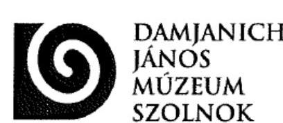

ÁLLAMI SZÁMVEVÓSZÉK
ÚGYVITELI IRODA
KL 708/2016
Érk.: OCT 14 2015

Iktatószám: V-094C-127605
5000 Szolnok, Kossuth tér 4.
53 5001 Szolnok, Pf. 128.
☎ 56/421-602 Fax: 56/510-151
E-mail: titkarsag@djm.hu
http://www.djm.hu

Iktatószám: 79/2016

Tárgy: Észrevétel a „Megyei hatókörű városi
múzeumok ellenőrzése – Damjanich
János Múzeum” című ellenőrzésről
készült számvevőszéki
jelentéstervezetre

Állami Számvevőszék
Budapest 4.
Pf.: 54.
1364

Tisztelt Állami Számvevőszék!

2016. szeptember 28-án érkezett a „Megyei hatókörű városi múzeumok ellenőrzése –
Damjanich János Múzeum” című ellenőrzésről készült számvevőszéki jelentéstervezet
megállapításaira az alábbi észrevételeket szeretnénk tenni:

A jelentéstervezet 1. számú megállapítása:

„Az irányító szerv – mint fenntartó – a 2013-2014. években az Mtv. 50. § (2) bekezdés
a) pontja ellenére nem határozta meg és nem hagyta jóvá a Múzeum stratégiai tervét. A
Múzeumra vonatkozó stratégiai fejlesztési és beruházási terv nem készült e. így azt az
Mtv. 45. § (5) bekezdés b) pontjában foglaltak ellenére a miniszter nem véleményezte.”

A Damjanich János Múzeum észrevétele az 1. számú megállapítására:

A stratégiai terv készítésével kapcsolatosan az Emberi Erőforrások Minisztériuma
Gyüjteményi Főosztályának állásfoglalását mellékelem.

A jelentéstervezet 2.2. számú megállapítása 6-7 bekezdése:

“”az alapfeltárban nyilvántartott kulturális javak felsorolását nem csatolták a
megállapodáshoz.”

A Damjanich János Múzeum észrevétele a 2.2. számú megállapítására:

Az intézmény alapfeltárában és külön nyilvántartásaiban nyilvántartott kulturális javak
száma lényegesen meghaladja az 1 millió darabot. A nyilvántartás kézzel vezetett
speciális, szakmai leltárkönyvekben, gyarapodási naplókban történik. Ezen javak tételes
felsorolása lehetetlen lett volna a megállapodás mellékleteként. Nyilatkoztam arról,
hogy a muzeális intézmények nyilvántartási szabályairól szóló 20/2002. NKÖM
rendeletnek megfelelően folyamatosan vezetett leltárkönyvek, gyarapodási naplók

---

utolsó oldalának fénymásolatát, illetve az alapleltárak nyilvántartásáról kimutatásokat mellékeltük az átadás-átvételi megállapodáshoz - melyek az Elektronikus Adatszolgáltató Rendszerbe feltöltésre is kerültek.
A jelentéstervezet 4.3. számú megállapítása 7. bekezdés 6. francia bekezdése:
.....a felhalmozási kiadások esetében a 2013-2014. években nem minden esetben került sor az Áht. 38.§ (1) bekezdésben és az Ávr. 57. § (1) bekezdésben elóirt teljesítésigazolás elvégzésére;"

A Damjanich János Múzeum észrevétele a 4.3. számú megállapítás 7. bekezdés 6. francia bekezdésére:

Az intézmény által az Elektronikus Adatszolgáltató Rendszerbe feltöltött 2014. évi felhalmozási kiadások bizonylatain (feltöltött dokumentumok jegyzéke 240-244. tételek) a teljesitésigazolás megtörtént.

# A jelentéstervezet 5.2. számú megállapítása: 

..A mérleget alátámasztó leltár a 2013-2014. években nem felelt meg az Áhsz. 37.§ (2) bekezdésében, az Áhsz. 22. § (2) bekezdés a) pontjában és a Számv. tv. 69.§ (1) bekezdésében foglaltaknak. Az Áhsz. 37.§ (2) bekezdésében, az Áhsz. 22. § (2) bekezdés a) pontjában foglaltak alapján a leltárt, a vagyonkezelést végző szervezet köteles elkészíteni."

## A Damjanich János Múzeum észrevétele az 5.2. számú megállapításra:

A muzeális intézményekről, a nyilvános könyvtári ellátásról és a közművelődésről szóló 1997. évi CXL törvény 45/A § (2) bekezdés a) pontja alapján a megyei hatókörű városi múzeum a gyűjtőterületére kiterjedően állami feladatai keretében vagyonkezelője a tevékenység ellátásához szükséges állami vagyonnak.

A Damjanich János Múzeum rajta kívülálló okok miatt nem tudott vagyonkezelési szerzódést kötni, azonban a vagyonnal való felelős gazdálkodás érdekében nyilvántartotta, leltározta, a vagyonmérlegében szerepeltette az általa használt vagyonelemeket, mivel hiteles dokumentum hiányában azoknak a könyvekből történő kivezetésére, más szervezetnek nyilvántartásra történő átadására sem volt módja.

Kérjük, hogy a fenti észrevételek figyelembe venni szíveskedjenek a végleges jelentés elkészítésekor!

Szolnok, 2016. október 11.

Tisztelettel:
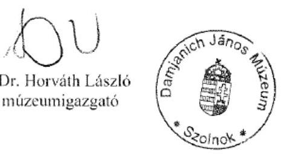

---

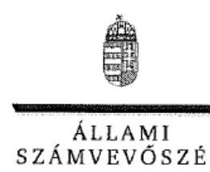

ELNÖK

Ikt.szám: V-0946-123/2016.

# Dr. Horváth László Csaba úr 

igazgató
Damjanich János Múzeum

## Szolnok

## Tisztelt Igazgató Úr!

A ,,Megyei hatókörü városi múzeumok ellenörzése - Damjanich János Múzeum" címmel készített számvevőszéki jelentéstervezetre tett észrevételét köszönettel megkaptam.
Az Állami Számvevőszék észrevételre vonatkozó álláspontjáról a felügyeleti vezető által készített részletes tájékoztatást csatoltan megküldöm.
Tájékoztatom Igazgató urat, hogy a számvevőszéki jelentésben - az Állami Számvevőszékről szóló 2011. évi LXVI. törvény 29. § (3) bekezdése alapján - a figyelembe nem vett észrevételeket szerepeltetjük az elutasítás indokának feltüntetésével.

Budapest, 2016. novenaiho hó 5 nap
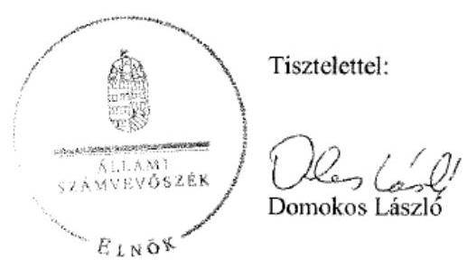

Melléklet: Tájékoztatás az elfogadott és az el nem fogadott észrevételekről

---

# Tájékoztatás az elfogadott és az el nem fogadott észrevételekröl 

A „Megyei hatókörü városi múzeumok ellenörzése - Damjanich János Múzeum" címü jelentéstervezetre a 79/2016. iktatószámú levelében tett észrevételeit áttekintettük, annak kezeléséről az alábbi tájékoztatást adom.

Az 1. számú megállapítás - jelentéstervezet 16. oldal - 7. bekezdésének megállapításaira tett észrevétele kapcsán

Köszönettel vettem levelével megküldött, az Emberi Eröforrások Minisztériuma tájékoztatóját a stratégiai fejlesztési és beruházási tervek készitésének tapasztalataival és a várható jogszabály módosítással összefüggésben. Észrevétele nem cáfolja, hogy a Szolnok Megyei Jogú Város Közgyülése - mint fenntartó - a 2013-2014. években a muzeális intézményekről, a nyilvános könyvtári ellátásról és a közmúvelődésről szóló 1997. évi CXL. törvény (továbbiakban: Mtv.) 50. § (2) bekezdés a) pontja ellenére nem határozta meg és nem hagyta jóvá a Damjanich János Múzeum (továbbiakban: Múzeum) stratégiai tervét, valamint a Múzeumra vonatkozó stratégiai fejlesztési és beruházási terv nem készült, így azt az Mtv. 45. § (5) bekezdés b) pontjában foglaltak ellenére a kultúráért felelős miniszter nem véleményezte. Észrevétele ezért a megállapításokat nem módosítja.

A 2.2. számú megállapítás - jelentéstervezet 18. oldal - 6. és 7. bekezdésének megállapításaira tett észrevétele kapcsán

Észrevétele nem vitatja, hogy a vagyonleltárnak nem képezte részét az alapleltárban és külön nyilvántartásban nyilvántartott kulturális javak felsorolása, továbbá a tagintézmények átadásával kapcsolatos megállapodásokhoz nem csatolták az alapleltárban nyilvántartott kulturális javak felsorolását. Észrevétele ezért a megállapításokat nem módosítja.

A 4.3. számú megállapítás - jelentéstervezet 26. oldal - 7. bekezdésének 6. francia bekezdése megállapítására tett észrevétele kapcsán

Észrevételét - a 2014. évi felhalmozási kiadások teljesítésigazolására vonatkozóan - a dokumentumok ismételt áttekintését követően elfogadtuk, azt a számvevőszéki jelentés készítésénél a megállapítás módosításával figyelembe vesszük.

Az 5.2. számú megállapítás - jelentéstervezet 31. oldal - 3. bekezdésének 1. és 2. megállapításaira tett észrevétele kapcsán

Észrevételét nem fogadom el, mert az megerősíti, hogy a 2013-2014. években a Múzeum nem rendelkezett vagyonkezelési szerződéssel. Az észrevételezéssel érintett megállapítások ismételt felülvizsgálatát követően a 2013-2014. évek leltárára vonatkozó megállapításokat a számvevőszéki jelentésben következők szerint szerepeltetjük:

---

„A Müzeum a 2013-2014. években leltározott. A mérleget alátámasztó leltár a 2013-2014. években nem felelt meg az Ahsz.; 37. § (2) bekezdésében, az Ahsz.; 22. § (2) bekezdés a) pontjában és a Számv. tv. 69. § (1) bekezdésében foglaltaknak, mert vagyonkezelési szerzödés és az abban foglalt, az átadónál kimutatott bruttó érték hiányában a leltárak értékadatai - a Müzeum által használt, de állami tulajdonban lévô vagyontárgyak tekintetében - dokumentummal nem voltak meglelelôen alátámasztva. Ezen túlmenôen az Nvtr. 11. § (7) bekezdésében, az Ahsz.; 15. § (1), (2) bekezdésében, valamint az Ahsz.; 10. § (2) bekezdésében foglaltak ellenére a Müzeum a 20132014. évi mérlegelben vagyonkezelési szerzödés nélkül szerepeltette az állami tulajdonban lévô vagyonelemeket."

Budapest, 2016. novem. hó 8 nap
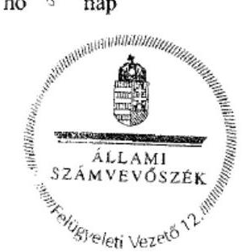

Petó Krisztina
felügyeleti vezetó

---

# RÖVIDÍTÉSEK JEGYZÉKE 

${ }^{1}$ Múzeum

${ }^{2}$ ÁSZ
${ }^{3} \mathrm{Mtv}$.
${ }^{4}$ Kötv.
${ }^{5} \mathrm{Kjt}$.
${ }^{6}$ múzeumigazgató
${ }^{7}$ Möktv.
${ }^{8}$ 258/2011. (XII. 7.) Korm. rendelet
${ }^{9}$ 2012. évi CLII. törvény
${ }^{10}$ 1311/2012. (VIII.23.) Korm. határozat
${ }^{11}$ KIM
${ }^{12}$ 2015. évi LXXV. tv.
${ }^{13}$ Nvtv.
${ }^{14}$ Alaptörvény
${ }^{15}$ Áht. 2
${ }^{16}$ Ávr.
${ }^{17}$ JNSZ Megyei Önkormányzat
${ }^{18}$ JNSZMIK
${ }^{19}$ ÁSZ tv.
${ }^{20}$ irányító szerv ${ }_{1} /$
irányításért felelős szervek
irányító szerv ${ }_{2}$
irányító szerv ${ }_{3}$

Jász-Nagykun-Szolnok Megyei Múzeumok Igazgatósága (2011. január 1.-jétől 2012. december 31-ig)

Damjanich János Múzeum (2013. január 1-jétől 2014. december 31-ig)
Állami Számvevőszék
1997. évi CXL. törvény a muzeális intézményekről, a nyilvános könyvtári ellátásról és a közművelődésről (hatályos: 1998. január 1-jétől)
2001. évi LXIV. törvény a kulturális örökség védelméről (hatályos: 2001. július 10től)
1992. évi XXXIII. törvény a közalkalmazottak jogállásáról (hatályos: 1992. július 1jétől)
Damjanich János Múzeum (valamint a jogelőd Jász-Nagykun-Szolnok Megyei Múzeumok) igazgatója
2011. évi CLIV. törvény a megyei önkormányzatok konszolidációjáról, a megyei önkormányzati intézmények és a Fővárosi Önkormányzat egyes egészségügyi intézményeinek átvételéről (hatályos: 2012. január 1-jétől)
258/2011. (XII. 7.) Korm. rendelet a megyei intézményfenntartó központokról, valamint a megyei önkormányzatok konszolidációjával, a megyei önkormányzati intézmények és a Fővárosi Önkormányzat egészségügyi intézményeinek átvételével összefüggő egyes kormányrendeletek módosításáról (hatályos: 2011. december 8-tól)
2012. évi CLII. törvény a muzeális intézményekről, a nyilvános könyvtári ellátásról és a közművelődésről szóló 1997. évi CXL. törvény módosításáról (hatályos: 2012. november 2-től)

1311/2012. (VIII. 23.) Korm. határozat a megyei múzeumok, könyvtárak és közművelődési intézmények fenntartásáról
Közigazgatási és Igazságügyi Minisztérium
a megyei könyvtárak és a megyei hatókörű városi múzeumok feladatának ellátását szolgáló egyes állami tulajdonú vagyontárgyak ingyenes önkormányzati tulajdonba adásáról szóló 2015. évi LXXV. törvény (hatályos 2015. július 18-tól) 2011. évi CXCVI. törvény a nemzeti vagyonról (hatályos 2011. december 31-étől) Magyarország Alaptörvénye
2011. évi CXCV. törvény az államháztartásról (hatályos: 2012. január 1-jétől)
az államháztartásról szóló törvény végrehajtásáról szóló
368/2011. (XII. 31.) Korm. rendelet (hatályos: 2012. január 1-jétől)
Jász-Nagykun-Szolnok Megyei Önkormányzat
Jász-Nagykun-Szolnok Megyei Intézményfenntartó Központ
Az Állami Számvevőszékről szóló 2011. évi LVI. törvény (hatályos: 2011. július 1jétől)
Jász-Nagykun-Szolnok Megyei Önkormányzat Közgyűlése (2011. január 1-jétől 2011. december 31-ig)

Közigazgatási és Igazságügyi Minisztérium az illetékes kormányhivatal útján (2012. január 1-jétől 2012. december 31-ig)

Szolnok Megyei Jogú Város Közgyűlése (2013. január 1-jétől 2014. december 31ig)

---

${ }^{21}$ alapító okirat ${ }_{1}$
alapító okirat ${ }_{2}$
alapító okirat ${ }_{3}$
alapító okirat ${ }_{4}$
alapító okirat ${ }_{5}$
alapító okirat ${ }_{6}$
${ }^{22}$ Kincstár
${ }^{23}$ Áht. ${ }_{1}$
${ }^{24}$ középirányító szerv
${ }^{25}$ átadás-átvételi megállapodás ${ }_{1}$
${ }^{26}$ 2/2010. (I. 14.) OKM rendelet
${ }^{27}$ EMMI
${ }^{28}$ átadás-átvételi megállapodás ${ }_{2}$
${ }^{29}$ kormánymegbízott
${ }^{30}$ Áhsz. ${ }_{1}$
${ }^{31}$ polgármester
${ }^{32}$ SZMSZ ${ }_{1}$

SZMSZ ${ }_{2}$
${ }^{33}$ Ámr.
${ }^{34}$ gazdasági szervezet ügyrend ${ }_{1}$
${ }^{35}$ számlarend $_{1}$
${ }^{36}$ Bkr.
${ }^{37}$ SZMSZ ${ }_{4}$

SZMSZ ${ }_{4}$
${ }^{38}$ gazdasági szervezet ügyrend ${ }_{3}$
${ }^{39}$ Számv. tv.
${ }^{40}$ számviteli politika ${ }_{1}$
a Jász-Nagykun-Szolnok Megyei Múzeumok Igazgatósága Alapító Okirata (hatályos: 2011. február 28-ig)
a Jász-Nagykun-Szolnok Megyei Múzeumok Igazgatósága Alapító Okirata (hatályos: 2011. március 1-jétől-2011. december 30-ig)
a Jász-Nagykun-Szolnok Megyei Múzeumok Igazgatósága Alapító Okirata (hatályos: 2011. december 31-től 2011. december 31-ig)
a Jász-Nagykun-Szolnok Megyei Múzeumok Igazgatósága Alapító Okirata (hatályos: 2012. január 1-jétől-2012. december 31-ig)
a Damjanich János Múzeum Alapító Okirata (hatályos: 2013. január 1-jétől-2013. december 31-ig)
a Damjanich János Múzeum Alapító Okirata (hatályos: 2014. január 1-jétől)
Magyar Államkincstár
1992. évi XXXVIII. törvény az államháztartásról (hatályos: 2011. december 31-ig)

Jász-Nagykun-Szolnok Megyei Intézményfenntartó Központ (2012. január 1-jétől 2012. december 31-ig)

A Jász-Nagykun-Szolnok Megyei Önkormányzat nem egészségügyi intézményeinek és a Jász-Nagykun-Szolnok Megyei Önkormányzat vagyonának átadás-átvételéről szóló 2011. december 16-án kelt megállapodás
2/2010. (I. 14.) OKM rendelet a muzeális intézmények múködési engedélyéről (hatályos: 2010. január 22-től)
Emberi Erőforrások Minisztériuma
Jász-Nagykun-Szolnok Megyei Intézményfenntartó Központ és Szolnok Megyei Jogú Város Önkormányzata között muzeális és könyvtári intézmények átadásátvétele tárgyában 2012. december 15-én kelt megállapodás
Jász-Nagykun-Szolnok Megyei Kormánymegbízott
249/2000. (XII. 24.) Korm. rendelet az államháztartás szervezetei beszámolási és könyvvezetési kötelezettségének sajátosságairól (hatályos: 2001. január 1-jétől 2013. december 31-ig)

Szolnok Megyei Jogú Város Önkormányzat Polgármestere
Jász-Nagykun-Szolnok Megyei Múzeumok Igazgatósága Szervezeti és Múködési Szabályzata (hatályos: 2008. január 1-jétől 2011. augusztus 31-ig)
Jász-Nagykun-Szolnok Megyei Múzeumok Igazgatósága Szervezeti és Múködési Szabályzata (hatályos: 2011. szeptember 1-jétől 2013. március 10-ig)
az államháztartás múködési rendjéről szóló 292/2009. (XI. 19.) Korm. rendelet (hatályos: 2011. december 31-ig)
a Jász-Nagykun-Szolnok Megyei Múzeumok Igazgatósága Gazdasági Szervezet Ügyrendje (hatályos: 2012. december 31-ig)
Jász-Nagykun-Szolnok Megyei Múzeumok Igazgatósága Számlarend (hatályos: 2013. március 24-ig)
a költségvetési szervek belső kontrollrendszeréről és a belső ellenőrzésről szóló 370/2011. (XII. 31.) Korm. rendelet (hatályos: 2012. január 1-jétől)
Damjanich János Múzeum Szervezeti és Múködési Szabályzata (hatályos: 2013. március 11-től 2014. március 27-ig)
Damjanich János Múzeum Szervezeti és Múködési Szabályzata (hatályos: 2014. március 28-tól)
a Damjanich János Múzeum Gazdasági Szervezet Ügyrendje (hatályos: 2013. augusztus 14-től)
a számvitelről szóló 2000. évi C. törvény (hatályos: 2000. szeptember 21-től)
Jász-Nagykun-Szolnok Megyei Múzeumok Igazgatósága számviteli politika (hatályos: 2011. december 31-ig)

---

számviteli politika $_{2}$

|  | Jász-Nagykun-Szolnok Megyei Múzeumok Igazgatósága számviteli politika (hatályos: 2012. január 1-jétől 2012. december 31-ig) |
| :--: | :--: |
| számviteli politika ${ }^{3}$ | Damjanich János Múzeum számviteli politika (hatályos: 2013. január 1-jétől 2013. december 31-ig) |
| számviteli politika ${ }^{4}$ | Damjanich János Múzeum számviteli politika (hatályos: 2014. január 1-jétől) |
| ${ }^{42}$ Áhsz. ${ }_{2}$ | Damjanich János Múzeum Számlarend (hatályos: 2013. március 25-től) |
| ${ }^{43}$ értékelési szabályzat ${ }_{3}$ | az államháztartás számviteléről szóló 4/2013. (I. 11.) Korm. rendelet (hatályos: 2014. január 1-jétől) |
| ${ }^{44}$ lkr. | Damjanich János Múzeum Eszközök és Források Értékelési Szabályzata (hatályos: 2014. január 1-jétől) |
| ${ }^{45}$ Info tv. | a közfeladatot ellátó szervek iratkezelésének általános követelményeiről szóló 335/2005. (XII. 29.) Korm. rendelet (hatályos: 2006. január 1-jétől) |
| ${ }^{46}$ Avtv. | az információs önrendelkezési jogról és az információszabadságról szóló 2011. évi CXII. törvény (hatályos: 2012. január 1-jétől) |
| ${ }^{47}$ Ber. | a személyes adatok védelméről és a közérdekú adatok nyilvánosságáról szóló 1992. évi LXIII. törvény (hatályos: 2011. december 31-ig) |
| ${ }^{48}$ Ötv. | 193/2003. (XI. 26.) Korm. rendelet a költségvetési szervek belső ellenőrzéséről (hatályos: 2011. december 31-ig) |
| ${ }^{49}$ fenntartó önkormányzat ${ }_{1}$ fenntartó önkormányzat ${ }_{2}$ | 1990. évi LXV. tv. a helyi önkormányzatokról (hatályos: az önkormányzati képviselő-testületek tagjai 1990. évi választásának napjától a 2014. évi általános önkormányzati választások napjáig) |
| ${ }^{51}$ ÁFA tv. | Jász-Nagykun-Szolnok Megyei Önkormányzat |
| ${ }^{52}$ helyiségek bérbeadásának szabályozása | Szolnok Megyei Jogú Város Önkormányzata |
| ${ }^{53}$ Vtv. | Damjanich János Múzeum Gazdasági Szervezet Úgyrendje (hatályos: 2013. január 1-jétől 2013. augusztus 13-ig) |
| ${ }^{54}$ önköltség számítási szabályzat ${ }_{3}$ | 2007. évi CXXVII. törvény az általános forgalmi adóról (hatályos: 2008. január 1jétől) |
| önköltség számítási szabályzat ${ }_{2}$ | Jász-Nagykun-Szolnok Megyei Múzeumok Igazgatósága helyiségek bérbeadásának szabályozása (hatályos: 2010. május 1-jétől) |
| ${ }^{55}$ önköltség számítási szabályzat ${ }_{3}$ | 2007. évi CVI. törvény az állami vagyonról (hatályos: 2007. szeptember 25-től) |
| ${ }^{56}$ bizonylati rend ${ }_{3}$ | Jász-Nagykun-Szolnok Megyei Múzeumok Igazgatósága Önköltség Számítási Szabályzat (hatályos: 2011. december 31-ig) |
| ${ }^{57}$ Kbt. ${ }_{1}$ | Jász-Nagykun-Szolnok Megyei Múzeumok Igazgatósága Önköltség Számítási Szabályzat (hatályos: 2012. január 1-jétől 2012. december 31-ig)) |
| ${ }^{58}$ 2010. évi CLXIX. törvény | Damjanich János Múzeum Önköltség Számítási Szabályzat (hatályos: 2013. január 1-jétől) |
| ${ }^{59}$ Kjt. | Damjanich János Múzeum Bizonylati Rend (hatályos: 2014. január 1-jétől) |
| ${ }^{60}$ 150/1922. (XI. 20.) Korm. rendelet | 2003. évi CXXIX. törvény a közbeszerzésekről (hatályos: 2011. december 31-ig) a Magyar Köztársaság 2011. évi költségvetéséről szóló 2010. évi CLXIX. törvény (hatályos: 2011. január 1-jétől-2014. december 31-ig) |
| ${ }^{61}$ Kbt. ${ }_{2}$ | 1992. évi XXXIII. törvény a közalkalmazottak jogállásáról (hatályos: 1992. július 1.jétől) |
| ${ }^{62}$ Eitv. | 150/1992. (XI. 20.) Korm. rendelet a közalkalmazottak jogállásáról szóló 1992. évi XXXIII. törvény a múvészeti, a közmúvelődési és a közgyűjteményi területen foglalkoztatott közalkalmazottak jogviszonyával összefüggő egyes kérdések rendezésére (hatályos: 1992. november 28-tól) |
| ${ }^{63}$ Kbt. ${ }_{2}$ | 2011. évi CVIII. törvény a közbeszerzésekről (hatályos: 2012. január 1-jétől) |
| ${ }^{62}$ Eitv. | 2005. évi XC. törvény az elektronikus információszabadságról (hatályos: 2011. december 31-ig) |

---

${ }^{63}$ 20/2002. (X.4.) NKÖM rendelet
${ }^{64}$ 393/2012. (XII. 20.) Korm. rendelet
${ }^{65}$ 5/2010. (VIII. 18.) NEFMI rendelet
${ }^{66}$ MNV Zrt.
${ }^{67}$ Vtvr.
${ }^{68}$ leltározási szabályzat ${ }_{1}$
leltározási szabályzat ${ }_{2}$
leltározási szabályzat ${ }_{3}$
${ }^{69}$ 36/2013. (IX. 13.) NGM rendelet
${ }^{70}$ 2/2010. (I. 14.) OKM rendelet
a muzeális intézmények nyilvántartási szabályzatáról szóló 20/2002. (X. 4.) NKÖM rendelet (hatályos: 2003. január 1-jétől)
a régészeti örökség és a műemléki érték védelmével kapcsolatos szabályokról szóló 393/2012. (XII. 20.) Korm. rendelet (hatályos: 2013. január 1-jétől)
5/2010. (VIII. 18.) NEFMI rendelet a régészeti lelőhelyek feltárásának, illetve a régészeti lelőhely, lelet megtalálója anyagi elismerésének részletes szabályairól (hatályos: 2010. augusztus 18-től-2012. december 31-ig)
Magyar Nemzeti Vagyonkezelő Zártkörűen Működő Részvénytársaság 254/2007. (X. 4.) Korm. rendelet az állami vagyonnal való gazdálkodásról (hatályos: 2007. október 4-től)
Jász-Nagykun-Szolnok Megyei Múzeumok Igazgatósága Leltározási Szabályzat (hatályos: 2012. december 31-ig)
Damjanich János Múzeum Leltárkészítési és Leltározási Szabályzat (hatályos: 2013. január 1-jétől 2013.december 31-ig)

Damjanich János Múzeum Leltárkészítési és Leltározási Szabályzat (hatályos: 2014. január 1-jétől)
36/2013. (IX. 13.) NGM rendelet az államháztartás számvitelének 2014. évi megváltozásával kapcsolatos feladatokról (hatályos: 2013. szeptember 14-től) 2/2010. (I. 14.) OKM rendelet a muzeális intézmények működési engedélyéről (hatályos: 2010. január 22-től)

---

# ÁLLAMI SZÁMVEVŐSZÉK 

1052 Budapest, Apáczai Csere János utca 10.
Levélcím: 1364 Budapest 4. Pf. 54
Telefon: +36 14849100 Telefax: +36 14849200
www.asz.hu