# Jelentés 

## Megyei hatókörű városi múzeumok ellenőrzése

Jósa András Múzeum, Nyíregyháza 2016.

---

# Jelentés 

## Megyei hatókörű városi múzeumok ellenőrzése

Jósa András Múzeum, Nyíregyháza
2016. december hó 8. nap
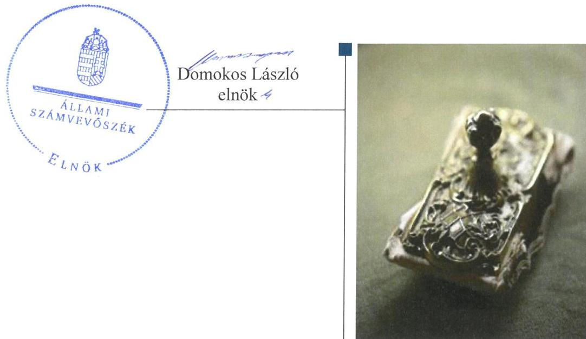

---

# AZ ELLENŐRZÉST FELÜGYELTE: 

PETŐ KRISZTINA felügyeleti vezető

## AZ ELLENŐRZÉST VEZETTE ÉS A VÉGREHAJTÁSÁÉRT FELELŐS:

DR. GYŐRI GABRIELLA ellenőrzésvezető

## A PROGRAM ÖSSZEÁLLÍTÁSÁÉRT FELELŐS:

JANIK JÓZSEF LÁSZLÓ osztályvezető

IKTATÓSZÁM: V-0953-152/2016
TÉMASZÁM: 1987
ELLENŐRZÉS-AZONOSÍTÓ SZÁM: V073708

Jelentéseink az Országgyűlés számítógépes hálózatán és az Interneten a www.asz.hu címen is olvashatóak.

---

# TARTALOMJEGYZÉK 

■ ÖSSZEGZÉS ..... 5
■ AZ ELLENŐRZÉS CÉLJA ..... 7
■ AZ ELLENŐRZÉS TERÜLETE ..... 8
■ AZ ELLENŐRZÉS HÁTTERE, INDOKOLTSÁGA ..... 10
■ A JELENTÉS LÉNYEGES KÉRDÉSKÖREI ..... 12
■ ELLENŐRZÉS HATÓKÖRE ÉS MÓDSZEREI ..... 13
■ MEGÁLLAPÍTÁSOK ..... 16
■ JAVASLATOK ..... 33
■ MELLÉKLETEK ..... 37
I. sz. melléklet: Értelmező szótár ..... 37
II. sz. melléklet: Az Integritás érvényesítése érdekében kialakított és működtetett kontrollrendszer ..... 40
■ FÜGGELÉK: ÉSZREVÉTELEK ..... 41
■ RÖVIDÍTÉSEK JEGYZÉKE ..... 47

---

.

---

# ÖSSZEGZÉS 

A nyíregyházi székhelyű Jósa András Múzeumnál kialakított irányítási rendszer összességében támogatta az átlátható, elszámoltatható és ellenőrizhető közpénzfelhasználást. A Múzeum pénzügyi- és vagyongazdálkodása nem volt szabályszerű. A Múzeum alaptevékenységének részét képező kulturális javak nyilvántartásáról teljes körűen nem gondoskodtak, ezért a kulturális javak állományvédelme és vagyonbiztonsága a kölcsönzéseknél nem volt biztosított.

## Az ellenőrzés társadalmi indokoltsága

Az Állami Számvevőszék Stratégiájának alapértéke, hogy ellenőrzései segítik az integritás alapú, átlátható és elszámoltatható közpénzfelhasználás megteremtését. Az ellenőrzés jogszabályban, vagy alapító okiratban meghatározott közfeladat ellátására létrejött, a megyei hatókörű városi muzeális intézmények gazdálkodási tevékenységére terjedt ki. E szervezetek pénzügyi és vagyongazdálkodásának alapvető rendeltetése a közfeladatok (a kulturális örökséghez tartozó javak védelme, őrzése és a nyilvánosság számára történő hozzáférhetővé tétele) ellátásának biztosítása.

A megyei hatókörű városi múzeumként működő szervezetek 2011. évtől több alkalommal jelentős szervezeti és gazdálkodási átalakuláson mentek keresztül. A tulajdonosi, a vagyonkezelői és a fenntartói szerepekben, szerkezetben történt változások előkészítése, végrehajtása, illetve a múzeumi rendszer által kezelt közvagyonnal való gazdálkodás szabályszerűségének bemutatásával az ellenőrzés hozzájárul a múzeumok fenntartási és működtetési feladatainak ellátására vonatkozó megfelelő jogszabályi környezet kialakításához, a gazdálkodási gyakorlatuk javításához.

## Főbb megállapítások, következtetések

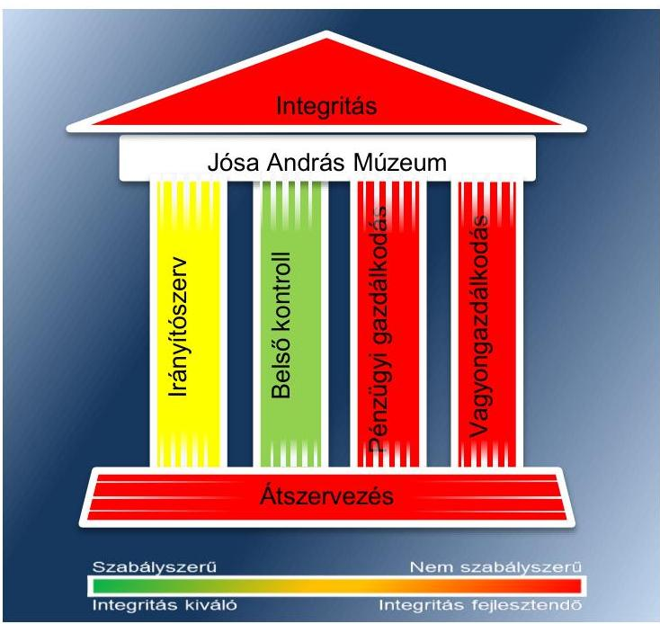

Az irányító szervek az ellenőrzött időszakban részben szabályszerűen gyakorolták alapítói jogosultságaikat. A munkáltatói jogosultságok gyakorlása során érvényesültek a jogszabályi előírások. A múzeumigazgató kinevezésére pályázat alapján, a miniszteri vélemény beszerzését követően került sor.

A Múzeumnál kialakított irányítási rendszer összességében támogatta az átlátható, elszámoltatható és ellenőrizhető közpénzfelhasználást. A kontrollkörnyezet kialakítása a 2011., 2013-2014. években szabályszerű volt, a 2012. évben részben szabályszerű volt. A Múzeum rendelkezett a működését és gazdálkodását meghatározó belső szabályozásokkal. A Múzeumnál a 2011-2014. években nem vezettek nyilvántartást a Múzeum őrzésében lévő, de nem saját gyűjteményeihez tartozó, a letétként kezelt kulturális javakról, továbbá a szakmai véleményezésre, vizsgálatra, bírálatra átvett-, valamint a gyűjteményeiből ideiglenesen kikerült (kiállításra vagy más célra kölcsönadott, vizsgálatra, restaurálásra átadott stb.) kulturális javakról. A kockázatkezelési rendszert a 2011-2014. években szabályszerűen alakították ki és működtették. Felmérték és értékelték a Múzeum tevékenységében rejlő kockázatokat és meghatározták a kockázati kitettség csökkentésével kapcsolatosan szükséges intézkedéseket. A kontrolltevékenység kialakítása és működtetése a 2011-2014. években részben szabályszerű volt. A Múzeumnál biztosították a folyamatba

---

épített előzetes, utólagos és vezetői ellenőrzést, azonban a kontrolltevékenység működtetése - a szabályozás kialakítása ellenére - részben volt szabályszerű az ellenőrzött időszakban. Az információs és kommunikációs folyamatok kialakítása a 2011. évben részben volt szabályszerű, a 2012-2014. években szabályszerű volt. A 2011. évet érintő hiányosság volt, hogy a Múzeumnál nem szabályozták a kötelezően közzéteendő adatok nyilvánosságra hozatalának rendjét. Az ellenőrzött időszak egészében fennálló hiányosság volt, hogy a Múzeum tevékenységére, működésére vonatkozó adatok közzétételét hiányosan teljesítették. A monitoring rendszer kialakítása és működtetése a 2011-2012. években részben szabályszerű volt, a 2013-2014. években szabályszerű volt. Az irányító szervek a 2011. év kivételével gondoskodtak a Múzeum, mint felügyelt költségvetési szerv belső ellenőrzéséről. A Múzeumnál a 2013. év kivételével gondoskodtak az intézmény belső ellenőrzéséről, az ellenőrzési jelentésekben megfogalmazott javaslatok alapján a jogszabályok előírásainak megfelelő tartalmú intézkedési tervet készítettek.

A Múzeum pénzügyi- és vagyongazdálkodása nem volt szabályszerű. A Múzeum az ellenőrzött időszak éves elemi költségvetéseit az előírt határidőben és szerkezetben készítette el. A költségvetési beszámolók elkészítésére vonatkozó határidőket nem tartották be minden ellenőrzött évben. A bevételek elszámolása nem volt jogszabályszerű, mert a vagyon hasznosítása az erre felhatalmazást adó vagyonkezelési/hasznosítási szerződés hiányában történt, továbbá nem gondoskodtak a bizonylatok jogszabályban előírt megőrzéséről. A kiadási előirányzatok felhasználása a 2011. évben részben felelt meg, a 2012-2014. években megfelelt a jogszabályi előírásoknak. Az ellenőrzött időszakban a kiadásokkal összefüggésben több esetben előfordult, hogy kötelezettségvállalásra pénzügyi ellenjegyzés hiányában került sor. A Múzeum a 2012. évi beszámolójában a feladat ellátását szolgáló vagyont szabálytalanul mutatta ki. A 2013-2014. években a beszámolóban kimutatott vagyon értékét vagyonkezelési szerződés nem támasztotta alá. A kulturális javak kölcsönzése során a Múzeum a 2011-2014. években nem minden esetben rendelkezett határozott idejű, írásbeli kölcsönzési szerződéssel. A kölcsönzési szerződések nem tartalmazták a jogszabályban rögzített kötelező tartalmi elemeket, emiatt a kölcsönzött kulturális javak állományvédelme nem volt megfelelően biztosított.

A Múzeumot érintő szervezeti, szerkezeti átszervezések nem voltak szabályszerűek. A 2012. január 1-jétől hatályos irányító szervi váltás során a vagyon tényleges átadására szolgáló jegyzőkönyv felvételére nem került sor. Az átadás-átvétel alapjául szolgáló dokumentációban nem rögzítették az átadott ingatlanok műszaki állapotát bemutató műszaki katasztert, továbbá az alapleltárakban és külön nyilvántartásokban nyilvántartott kulturális javak felsorolását sem. A 2012/2013. évi központi alrendszerből önkormányzati alrendszerbe történő átszervezés során az átláthatóság sérült, mert a kulturális javak felsorolása és annak tagintézményenkénti meghatározása nem készült el.

A Múzeum intézkedett az integritás szemlélet érvényesítése érdekében.

---

# AZ ELLENŐRZÉS CÉLJA 

vényesülését a gazdálkodási folyamatokban.

Az ellenőrzés célja annak megállapítása volt, hogy a megyei múzeumi rendszer átalakítása, az intézményfenntartói rendszerben végbement változások előkészítése és végrehajtása megalapozottan, szabályszerűen történt-e; a megyei hatókörű városi múzeumok és jogelődjeik pénzügyi- és vagyongazdálkodása, a belső kontrollrendszer kialakítása és működtetése, valamint az intézményfenntartói feladatok ellátása szabályszerűen történt-e.

A Múzeum ¹ korrupcióval szembeni veszélyeztetettségének csökkentése érdekében kért tanúsítványi adatszolgáltatás alapján az ÁSZ² értékelte az integritási szemlélet ér-

---

# **AZ ELLENŐRZÉS TERÜLETE**

## **Jósa András Múzeum**

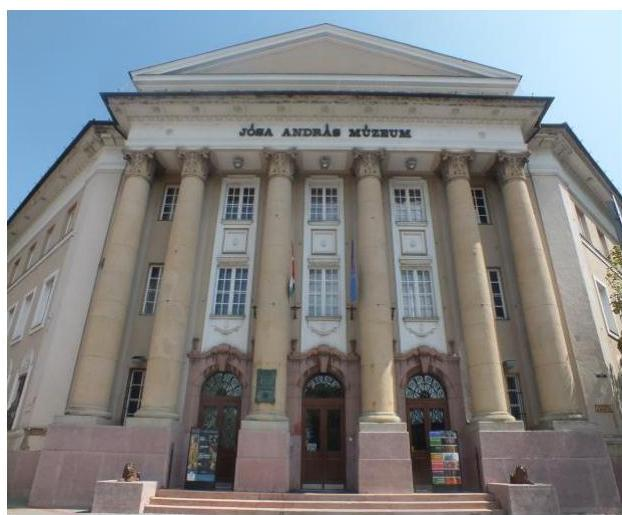

A Múzeum Nyíregyházán található, feladatkörében az Mtv.³ alapján gondoskodik a kulturális javak meghatározott anyagának folyamatos gyűjtéséről, nyilvántartásáról, megőrzéséről és restaurálásáról; tudományos feldolgozásáról, publikálásáról; valamint kiállításokon és más módon történő bemutatásáról; a közművelődési és közgyűjteményi feladatok ellátásáról. A Kötv.⁴ 20. § (2) bekezdése alapján területileg illetékes múzeumként régészeti feltárást végzett az ellenőrzött időszakban.

A Múzeum csak a működési engedélyében meghatározott gyűjtőkörben és gyűjtőterületen folytathatja tevékenységét. A szakmai besorolást, a rendszert megalapozó szaktörvényi kereteket az Mtv. biztosítja. Az Mtv. hatálya kiterjed a Múzeum fenntartóira, a Múzeumban foglalkoztatottakra, a kulturális örökség Múzeumban őrzött elemeire, a szolgáltatások igénybe vevőire és a kulturális örökséggel foglalkozó egyéb szervezetekre.

A Múzeum 2011–2012. évi költségvetési engedélyezett létszáma 103 fő volt, mely a 2013–2014. években 65 főre csökkent. A Múzeum alkalmazottainak foglalkoztatására a Kjt.⁵ alapján került sor. Az ellenőrzött időszakban a múzeumigazgató⁶ és a gazdasági vezető személye nem változott.

A Möktv.⁷ és annak végrehajtásáról szóló 258/2011. (XII. 7.) Korm. rendelet⁸ alapján 2012. január 1-jétől a megyei múzeumok központi költségvetési szervekké váltak. 2013. január 1-jétől a 2012. évi CLII. törvény⁹ és az 1311/2012. (VIII. 23.) Korm. határozat¹⁰ alapján az állami tulajdonba és fenntartásba került megyei múzeumi szervezetek a megyeszékhely megyei jogú városok fenntartásában működtek tovább. A 2011–2014. évek között a fenntartói, irányítói, középirányítói jogkörgyakorlók változását, valamint a Múzeum gazdálkodási feladatát ellátó szervezetét az 1. táblázat mutatja be.

1. táblázat

|  Időszak | Fenntartó | Irányító szerv | Középirányító szerv | Gazdasági szervezet  |
| --- | --- | --- | --- | --- |
|  2011. | Szabolcs-Szatmár-Bereg Megyei Önkormányzat | Szabolcs-Szatmár-Bereg Megyei Önkormányzat Közgyűlése | - | Múzeum  |
|  2012. | Szabolcs-Szatmár-Bereg Megyei Intézményfenntartó Központ | KIM¹¹ | Szabolcs-Szatmár-Bereg Megyei Intézményfenntartó Központ | Múzeum  |
|  2013–2014. | Nyíregyháza Megyei Jogú Város Önkormányzata | Nyíregyháza Megyei Jogú Város Közgyűlése | - | Múzeum  |

*Fenntartó, irányító, pozíció, gazdasági szervezet*

*Forrás: A Múzeum alapító okiratai*

---

A Múzeum jogelődjének, a Szabolcs-Szatmár-Bereg Megyei Múzeumok Igazgatóságának a jogállása a 2011-2013. években önállóan működő és gazdálkodó költségvetési intézmény volt. 2014. január 1-jétől a Múzeum önálló jogi személyiséggel rendelkező, saját gazdasági szervezettel működő megyei hatókörű városi múzeum, vállalkozási tevékenységet nem végzett.

A Múzeum teljesített költségvetési bevételeinek és kiadásainak alakulását az 1. ábra mutatja be. Az ábra a 2011-2012. években a Múzeum és tagintézményeinek együttes adatai, a 2013-2014. években a tagintézmények átadását követően a múzeumi adatok alapján készült:
1. ábra
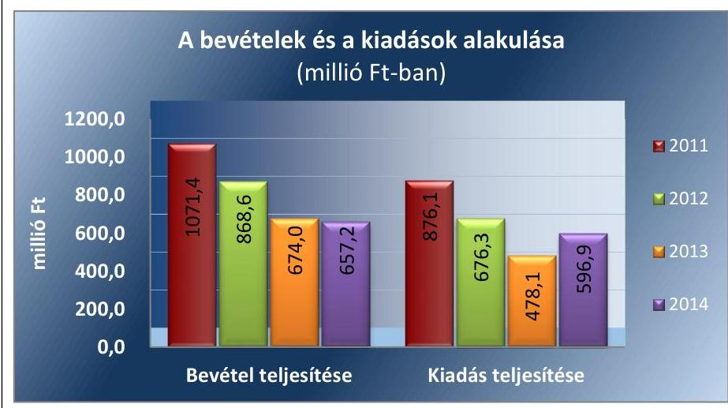

Forrás: Múzeumi beszámolók a 2011-2014. évekre
A 2015. évi LXXV. tv. ¹² 1. § (1) bekezdése alapján az Nvtv. ¹³ 13. § (3) bekezdésében és 14. § (1) bekezdésében foglaltak alapján és az abban meghatározott feltételekkel a 2012. évi CLII. törvény 30. § (1) és (2) bekezdésében meghatározott, a megyei hatókörű városi múzeumok feladatának ellátását szolgáló egyes állami tulajdonban lévő ingatlanok a törvény hatálybalépésének napjával, a törvény erejénél fogva a kötelező közfeladatként a megyei hatókörű városi múzeumot fenntartó önkormányzatok tulajdonába kerültek. A 2015. évi LXXV. tv. 4. § (1) bekezdése alapján a kulturális örökség helyi védelme érdekében a megyei hatókörű városi múzeumok alapleltárában és jogszabály szerinti külön nyilvántartásában szereplő állami tulajdonú kulturális javak ingyenesen a megyei hatókörű városi múzeumok vagyonkezelésébe kerültek. A vagyonkezelők vagyonkezelői joga tekintetében vagyonkezelési szerződés megkötése nem szükséges. A 2015. évi LXXV. tv. 4. § (2) bekezdése szerint továbbá a kulturális örökség helyi védelme érdekében a megyei hatókörű városi múzeumok feladatának ellátását szolgáló állami tulajdonban álló ingatlanok - a törvény mellékletében meghatározott ingatlanok kivételével - ingyenesen a fenntartó önkormányzatok vagyonkezelésébe kerültek.

---

# AZ ELLENŐRZÉS HÁTTERE, INDOKOLTSÁGA

Az Alaptörvény¹⁴ rendelkezése szerint a nemzeti vagyon megőrzésének, védelmének és a nemzeti vagyonnal való felelős gazdálkodásnak a követelményeit sarkalatos törvény, az Nvtv. rögzíti. A tulajdonosi joggyakorlás és vagyonkezelés általános és speciális szabályait, az állami vagyon nyilvántartására és elszámolására vonatkozó eljárásokat, a vagyonkezelési szerződés feltételrendszerét, valamint az éves beszámoló készítési és könyvvezetési kötelezettségeket kormányrendelet írja elő.

A megyei hatókörű városi múzeumok közfeladat-ellátásának változásait, (beleértve az állami tulajdonosi joggyakorló, intézményi vagyonkezelő és önkormányzati fenntartó szervezeteket is) a közfeladatok átadásából és átvételéből adódó módosításait, előirányzat gazdálkodására ható tényezőit az Áht.¹⁵, az Ávr.¹⁶, a Möktv., valamint a Mtv. írja elő. A múzeumi intézményrendszer rendszerátalakulásából, megszűnéséből, intézmény átszervezéséből, belső szerkezeti korszerűsítéséből, vagy más hasonló okból adódó módosításai miatt szerepeltetendő szerkezeti változásokat, valamint a szerkezeti változásként beépült közfeladatok szintre hozásként történő

 számításba vételét az Ávr. határozza meg.

A megyei hatókörű városi múzeumok kulturális szempontból meghatározó jelentőségűek mind földrajzi elhelyezkedésüket, mind az ellátott feladatokat, valamint a látogatottságukat tekintve. Tevékenységüket törvényi szinten (Mtv.) szabályozták a jogalkotók. A megyei hatókörű városi múzeumok jelenlegi körének kialakításában, tulajdonosi és fenntartói szerkezetében rövid idő alatt több jelentős változás történt, amelyeket jogszabályi változások indukáltak. Ezen intézmények szakmai besorolásukat tekintve a 2011. évben megyei múzeumként, a 2012. évben megyei múzeumi központi költségvetési szervezetként, a 2013. évtől kezdődően megyei hatókörű városi múzeumként működtek. A szakmai besorolások változásait párhuzamosan követték a tulajdonosi, vagyonkezelői, fenntartói szerepekben történt változások.

A 2011–2014. évek között bekövetkezett fenntartói változások a vagyontárgyak és a kulturális javak tulajdonosi, vagyonkezelői és használói körében is változást indukáltak, amelyet a 2. táblázat szemléltet.

1. táblázat

## A VAGYON TULAJDONOSI, VAGYONKEZELŐI ÉS HASZNÁLÓI KÖRÉNEK VÁLTOZÁSA 2011–2014. ÉVEKBEN

|  Vagyon-
tárgy | 2011. év |  |  | 2012. év |  |  | 2013–2014. évek |  |   |
| --- | --- | --- | --- | --- | --- | --- | --- | --- | --- |
|   | tulajdonos | vagyon-
kezelő | használó | tulajdonos | vagyon-
kezelők | használó | tulajdonos | vagyon-
kezelő | használó  |
|  Ingatlan | SZSZB Megyei
Önkormányzat¹⁷ | - | Múzeum | Állam | SZSZBMIK¹⁸ | Múzeum | Állam | Múzeum | Múzeum  |
|  Egyéb
tárgyi
eszközök | SZSZB Megyei
Önkormányzat | - | Múzeum | Állam | SZSZBMIK | Múzeum | Állam | Múzeum | Múzeum  |
|  Kulturális
javak | SZSZB Megyei
Önkormányzat | - | Múzeum | Állam | SZSZBMIK | Múzeum | Állam | Múzeum | Múzeum  |

Forrás: A Múzeum alapító okiratai, a 2012. évi CLII. tv, a 258/2011. (XII. 7) Korm. rendelet, az 1311/2012. (VIII. 23.) Korm. határozat

---

Az ellenőrzés - tekintettel a megyei hatókörű városi múzeumokat (és jogelődjeit) rövid időn belül, gyors ütemben ért környezeti (tulajdonosi, fenntartói-szerkezetet érintő) változásokra - javaslatok megfogalmazásával hozzájárul a fenntartás és működtetés feladatainak ellátására vonatkozó megfelelő jogszabályi környezet - jogalkotók által történő - kialakításához. Az ÁSZ ellenőrzés a gazdálkodási gyakorlat javítását eredményezheti, több intézmény bevonásával átfogó képet ad a megyei hatókörű városi múzeumokat (és jogelődjeiket) jellemző sajátosságokról, jó gyakorlatokról.

AZ ELLENŐRZÉS EREDMÉNYEKÉPPEN nemcsak az ellenőrzött intézmények gazdálkodása javul, hanem átfogó képet kapunk a múzeumok gazdálkodásának hiányosságairól, de a jó gyakorlatokról is. Ellenőrzéseivel, javaslataival és megállapításaival az ÁSZ elősegíti a költségvetési szervek pénzügyi és vagyongazdálkodása szabályozásának javítását és hozzájárulhat a jó kormányzáshoz.

---

# A JELENTÉS LÉNYEGES KÉRDÉSKÖREI 

1.     - Az irányító szerv ellenőrzött Múzeumra vonatkozó feladatellátása szabályszerű volt-e?
2.     - Szabályszerűen hajtották-e végre a Múzeumot érintő szervezeti, szerkezeti átszervezéseket?
3.     - A belső kontrollrendszer kialakítása és működtetése megfelelt-e a jogszabályi előírásoknak?
4.     - A Múzeum pénzügyi gazdálkodása szabályszerű volt-e?
5.     - A Múzeum vagyongazdálkodása szabályszerű volt-e?
6.     - A Múzeum intézkedett-e az integritás szemlélet érvényesítése érdekében?

---

# ELLENŐRZÉS HATÓKÖRE ÉS MÓDSZEREI 

## Az ellenőrzés típusa

Megfelelőségi ellenőrzés.

## Az ellenőrzött időszak

Az ellenőrzött időszak 2011. január 1-jétől 2014. december 31-ig tart.

## Az ellenőrzés tárgya

A megyei hatókörű városi múzeumok átszervezése, átalakítása előkészítése és lebonyolítása megalapozottsága, szabályszerűsége, a pénzügyi és vagyongazdálkodási tevékenység, a belső kontrollrendszer kialakítása, működtetése szabályszerűsége, valamint az irányító szervi feladatok ellátása szabályszerűsége. E tevékenységek és a kapcsolódó adatok és információk összessége, amelyeket a vonatkozó kritériumok alapján kell értékelni.

Az ellenőrzés kiterjed minden olyan körülményre és adatra, amely az ÁSZ jogszabályban meghatározott feladatainak teljesítéséhez, valamint a program végrehajtása folyamán felmerült újabb összefüggések feltárásához szükséges.

## Az ellenőrzött szervezet

Jósa András Múzeum, a fenntartói feladatokban érintett Szabolcs-Szatmár-Bereg Megyei Önkormányzat, valamint Nyíregyháza Megyei Jogú Város Önkormányzata, a Szabolcs-Szatmár-Bereg Megyei Intézményfenntartó Központ jogutódja a Szociális és Gyermekvédelmi Főigazgatóság.

Az ellenőrzésre a költségvetési szerv ellenőrzött intézményének és irányító szervének, illetve középirányító szervének székhelyén és a gazdálkodási feladatait ellátó szervezetének székhelyén került sor.

## Az ellenőrzés jogalapja

Az ellenőrzés jogszabályi alapját az ÁSZ tv. ¹⁹ 1. § (3) bekezdés, 5. § (2)-(6) bekezdései, valamint az Áht.² 61. § (2) bekezdésének előírásai képezik.

---

# Az ellenőrzés módszerei 

Az ellenőrzést az ellenőrzési program szempontjai, az ellenőrzött időszakban hatályos jogszabályok, az ellenőrzés szakmai szabályai, az egyes ellenőrzési típusokhoz kapcsolódó ÁSZ módszertanok és nemzetközi standardok figyelembe vételével végeztük. A gazdálkodás hibáinak kijavítására, a közpénzekkel való felelős gazdálkodás segítésére irányuló javaslatok kidolgozásakor a hatályos jogszabályok az irányadóak.

Az ellenőrzési kérdések megválaszolásához szükséges bizonyítékok megszerzése a következő ellenőrzési eljárások alkalmazásával történt: kérdésfeltevés (információkérés), mintavételezés, valamint elemző eljárás. A minták kiválasztása során véletlen mintavételi eljárást alkalmaztunk.

Mintavétellel ellenőriztük a bevételek, a személyi juttatások, a dologi és felhalmozási kiadások, a régészeti bevételek és kiadások elszámolása-, valamint a kulturális javak kölcsönzésének szabályszerűségét. A minta alapján a sokaságban előforduló hibaarányt becsültük. „Megfelelőnek" értékeltük az ellenőrzött területet, amennyiben 95%-os bizonyossággal a teljes sokaságban a hibaarány legfeljebb 10%, „részben megfelelőnek" értékeltük, ha a hibaarány felső határa 10-30% között volt, „nem megfelelőnek" pedig akkor, ha a mintavételi eredmények alapján a sokaságbeli hibaarány felső határa meghaladta a 30%-ot.

Az ellenőrzési bizonyítékként felhasználható adatforrások közé tartoznak egyrészt a szakmai program részletes szempontjainál felsorolt adatforrások, másrészt adatforrás lehet minden egyéb - az ellenőrzés folyamán feltárt, az ellenőrzés szempontjából releváns információt tartalmazó - dokumentum. Az ellenőrzés lefolytatásához a Múzeum a tanúsítványok elektronikus kitöltésével, valamint az ÁSZ által kért dokumentumok elektronikus megküldésével szolgáltatott adatokat. A rendelkezésre bocsátott adatok, információk kontrollja az ellenőrzés keretében történt. Az ellenőrzési kérdésekre adott válaszok alapján értékeltük, hogy az ellenőrzött időszakban az irányító szerv az ellenőrzött Múzeumra vonatkozó feladatainak szabályszerűen eleget tett-e, a Múzeum pénzügyi- és vagyongazdálkodása megfelelt-e az előírásoknak, a Múzeum átalakításának vagy átszervezésének végrehajtása szabályszerű volt-e.

A Múzeum belső kontrollrendszere jogszabályi előírások szerinti kialakításának és működtetésének szabályszerűségét az erre irányuló ellenőrzési kérdésekre adott válaszok összesítése alapján, évente pillérenként (kontrollkörnyezet, kockázatkezelési rendszer, kontrolltevékenységek, információs és kommunikációs rendszer, monitoring rendszer) és összesítetten is minősítjük. A Múzeum belső kontrollrendszere egyes pilléreinek kialakítása és működtetése „szabályszerű", amennyiben az értékelt területen az elért és elérhető pontok százalékban kifejezett, egész számra kerekített hányadosa meghaladja a 84%-ot, „részben szabályszerű", ha a 84%-ot nem haladja meg, de 60%-nál nagyobb, „nem szabályszerű", ha nem haladja meg a 60%-ot. A Múzeum belső kontrollrendszerének összesített értékelése megegyezik a pillérenként (kontrollterületenként) alkalmazott %-os értékelésekkel, a következő eltérésekkel. A kontrollrendszer egésze esetében a „szabályszerű" értékelésnek a %-os értéken felül további feltétele, hogy egyik kontrollterület sem kaphat „nem szabályszerű" értékelést, a „részben szabályszerű" értékelés további feltétele, hogy legfeljebb egy el-

---

lenőrzött kontrollterület lehet „nem szabályszerű" értékelésű. Az összesített értékelés a %-os értéktől függetlenül „nem szabályszerű", ha az ellenőrzött kontrollterületek közül több mint egynek „nem szabályszerű" az értékelése.

Az integritás szemlélet érvényesülésének értékelése a Múzeum által szolgáltatott adatok alapján történt.

---

# 1. Az irányító szerv ellenőrzött Múzeumra vonatkozó feladatellátása szabályszerű volt-e? 

Összegző megállapítás

Az irányító szerv ¹⁻³²⁰ ellenőrzött Múzeumra vonatkozó feladatellátása a 2011-2014. években részben szabályszerű volt.

AZ ALAPÍTÓI JOGOSULTSÁGOK GYAKORLÁSA az ellenőrzött időszakban részben felelt meg a jogszabályi előírásoknak. A Múzeum rendelkezett alapító okirat¹⁻⁴²¹-tal, amelyek módosítása - a jogszabályi és feladatváltozások alapján - a 2012. év kivételével szabályszerűen történt. A középirányító szerv²² a 258/2011. (XII. 7.) Korm. rendelet 21. § (6) bekezdésében rögzítetteket figyelmen kívül hagyva az alapító okirat² módosítását 2012. január 30-ig nem nyújtotta be a Kincstár²³ által vezetett törzskönyvi nyilvántartáshoz, mivel az alapító okirat² irányító szerv² általi kiadására 2012. július 12-én került sor.

A MUNKÁLTATÓI JOGOSULTSÁGOT az irányító szerv ¹⁻³ a 2011-2014. években szabályszerűen gyakorolta. A Múzeum igazgatójának megbízása a Möktv. alapján 2012. március 31-én megszűnt. A múzeumigazgató 2012. április 1-jétől érvényes kinevezése során betartották az Áht.² és a Möktv. előírásait.

AZ EGYÉB IRÁNYÍTÁSI, FELÜGYELETI ÉS ELLENŐRZÉSI jogosultságok gyakorlása során a jogszabályi előírások nem érvényesültek maradéktalanul. A 2012. évben az Mtv. 45/B. § (5) bekezdés d) pontjában foglaltak ellenére a fejlesztési és beruházási feladatok meghatározására nem került sor. A középirányító szerv 2012. évben a 258/2011. (XII. 7.) Korm. rendelet 11. § (1) bekezdés b)-c) pontjaiban előírtakat figyelmen kívül hagyva nem határozta meg a gazdálkodás részletes rendjét és az előirányzat felhasználására vonatkozó irányelveket. A 258/2011. (XII. 7.) Korm. rendelet 11. § (2) bekezdés c) pontjának előírása ellenére 2012. évben a középirányító szerv részéről nem került sor az államháztartással összefüggő közérdekű és közérdekből nyilvános adatok kötelező közzétételének, illetve igényre történő szolgáltatása végrehajtásának ellenőrzésére.

Az irányító szerv ¹,³ jóváhagyta a Múzeum ellenőrzött időszakban hatályos SZMSZ¹⁻⁴²⁴ módosítását. A Múzeum a 2014. évben a fenntartó Nyíregyháza Megyei Jogú Város Önkormányzatának Közgyűlése által jóváhagyott küldetésnyilatkozattal rendelkezett.

---

# 2. Szabályszerűen hajtották-e végre a Múzeumot érintő szervezeti, szerkezeti átszervezéseket? 

Összegző megállapítás

2.1. számú megállapítás

A Múzeumot érintő szervezeti, szerkezeti átszervezés összességében nem volt szabályszerű.

A Múzeumot érintő - önkormányzati alrendszerből a központi alrendszerbe történő - 2012. január 1-jétől hatályos irányító szervi (fenntartói) váltás lebonyolítása nem volt szabályszerű.

Az átadás-átvételi megállapodás¹²⁵-et az irányító szerv¹ és a középirányító szerv a Möktv.-vel összhangban, határidőben megkötötte, azonban az át-adás-átvétel előkészítésének szabályszerűsége dokumentumok hiányában nem volt értékelhető. A 258/2011. (XII. 7.) Korm. rendelet 12. § (1) bekezdésében előírt, az átadás-átvétel alapját képező, a megyei közgyűlés elnöke²⁶ által hitelesített vagyonleltárt nem készítették el.

A VAGYON TÉNYLEGES ÁTADÁSA során - a 258/2011. (XII. 7.) Korm. rendelet 12. § (3) bekezdésében foglaltak ellenére - jegyzőkönyv felvételére nem került sor.

Az átadás-átvételi megállapodás¹-et a 258/2011. (XII. 7.) Korm. rendelet 1. számú melléklete szerinti megállapodás-minta alapján kötötték meg, azonban a mellékletek teljes körűségét nem biztosították. Mellékletben nem rögzítették:

- az átadott ingatlanok műszaki állapotát bemutató műszaki katasztert;
- a Múzeum vagyonleltárát - ingatlanvagyon tekintetében - az ingatlanok adatainak, továbbá könyv szerinti értékének és az utolsó vagyonértékelésének bemutatásával;
- ingó vagyon tekintetében, az alapleltárakban és külön nyilvántartásokban nyilvántartott kulturális javak felsorolását;
- a vagyoni értékű jogok értékét;
- az intézményi költségvetés 2011. évi várható teljesüléséről szóló adatszolgáltatást.
Az éves elemi költségvetési beszámolónak megfelelő adattartalmú 2011. évi beszámolóját a Múzeum elkészítette, azonban azt, az Áhsz.²⁷ 13/A. § (1) bekezdésében rögzített előírások ellenére szabályszerű, kizárólag a Múzeumra vonatkozó leltárral és

 záró főkönyvi kivonattal nem támasztotta alá. A 2011. évi NGM módszertani útmutató ${ }^{28}$ 43. oldal 2/ba. pontjában előírtakat figyelmen kívül hagyva az átadáshoz kapcsolódó vagyonátadási jelentést és vagyonátadás-átvételi jegyzőkönyvet nem készítettek. Az eszközök és források 2012. évi nyitását szabályszerűen nem tudták végrehajtani, mivel a nyitás alapját képező vagyonátadási jelentést nem készítettek. Az állami tulajdonba került vagyonelemek számviteli nyilvántartásokból történő kivezetését az NGM módszertani útmutató 2/ba. pontjában rögzítettek ellenére nem végezték el. A vagyonátadási jelentés szabályszerű elkészítéséhez szükséges számviteli elszámolásokat, a kiadási és bevételi előirányzatok nyitását, a kötelezettségvállalások elszámolását

---

# 2.2. számú megállapítás 

szabályszerűségét, valamint az év eleji rendező tételek elszámolását alátámasztó dokumentumokkal a Múzeum a Számv. tv. ${ }^{29} 169 . \S$ (2) és (4) bekezdésében előírt iratmegőrzési kötelezettsége ellenére nem rendelkezett.

A 2013. január 1-jével végrehajtott, a központi alrendszerből önkormányzati alrendszerbe történő irányító szervi (fenntartói) váltás lebonyolítása és a szervezetrendszer átalakítása nem volt szabályszerű.

Az 1311/2012. (VIII. 23.) Korm. határozatban rögzített előírással összhangban a Múzeum átadás-átvételének lebonyolításához szükséges háromoldalú tárgyalásokat határidőben lefolytatták, amelyről az írásos dokumentum rendelkezésre állt.

Az átadás-átvételi megállapodás ${ }_{2}{ }^{30}$ megkötésére a 1311/2012. (VIII. 23.) Korm. határozatban foglalt határidőben került sor. Az átadás-átvételi megállapodás ${ }_{2}$ III/2.5. pontjában, valamint a 1.2.11. pontjában foglaltak ellenére a vagyonleltár nem képezte az átadás-átvételi megállapodás ${ }_{2}$ mellékletét. Az eszközleltárt, a 2013. március 28-án készült vagyonátadás-átvételi jegyzőkönyv mellékleteként készítették el. Az át-adás-átvételi megállapodás ${ }_{2}$ 1.2.11.2.1. pontját figyelmen kívül hagyva a kulturális javak tételes, dokumentált módon történő átadására nem került sor. Az átadás-átvételi megállapodás ${ }_{2}$ 1.2.14. pontjában a 2012. évi költségvetés várható teljesüléséről szóló adatszolgáltatási kötelezettséget előírták, azonban ilyen tartalmú dokumentumot nem készítettek. Az átadás-átvételi megállapodás ${ }_{2}$ 9/a, 9/b és 9/c mellékleteiben a 2012. december 31-én fenntartott pénzforgalmi számlaszámokat rögzítették, azonban az a számla egyenlegére vonatkozó információt nem tartalmazott.

Az Áhsz. ${ }_{1}$ 13/A. § (1) bekezdésében rögzített előírások ellenére a Múzeum a 2012. évi beszámolóját teljes körű leltárral nem támasztotta alá. A 2012. évi NGM módszertani útmutató 44. oldal 2/ba. pontjában előírtakat figyelmen kívül hagyva az átadáshoz kapcsolódó vagyonátadási jelentést nem készítettek. Az eszközök és források 2013. évi nyitását vagyonátadási jelentés hiányában szabályszerűen nem tudták végrehajtani.

A tagintézmények 2013. évi átadását rögzítő megállapodásokat a 2012. évi CLII. törvényben foglaltaknak megfelelően a középirányító szerv és az átvevő települési önkormányzatok határidőben megkötötték. A 1311/2012. (VIII. 23.) Korm. határozat 1.8. pontjában és a megállapodások IV. rész 1.2.11.2.1. pontjában foglaltak ellenére a Múzeum nyilvántartásaiban szereplő kulturális javak tagintézményenkénti felsorolását nem csatolták a megállapodásokhoz.

---

# 3. A belső kontrollrendszer kialakítása és működtetése megfelel-e a jogszabályi előírásoknak? 

## Összegző megállapítás

A belső kontrollrendszer kialakítása és működtetése a 2011-2014. években szabályszerű volt.

A belső kontrollrendszer öt elemének kialakítása és működtetése részletes értékelését a 2011-2014. évekre vonatkozóan a 3. táblázat mutatja be.
3. táblázat

## A BELSŐ KONTROLLRENDSZER KIALAKÍTÁSÁNAK ÉS MŰKÖDTETÉSÉNEK ÉRTÉKELÉSE A 2011-2014. ÉVEKBEN

| Megnevezés | Kontroll-   környezet | Kockázatkezelés | Kontroll-   tevékenységek | Információ és   kommunikáció | Monitoring | Összesen |
| :--: | :--: | :--: | :--: | :--: | :--: | :--: |
| 2011. | szabályszerű | szabályszerű | részben szabály-   szerű | részben szabály-   szerű | részben szabály-   szerű | szabályszerű |
| 2012. | részben szabály-   szerű | szabályszerű | részben szabály-   szerű | szabályszerű | részben szabály-   szerű | szabályszerű |
| 2013. | szabályszerű | szabályszerű | részben szabály-   szerű | szabályszerű | szabályszerű | szabályszerű |
| 2014. | szabályszerű | szabályszerű | részben szabály-   szerű | szabályszerű | szabályszerű | szabályszerű |

A kontrollkörnyezet kialakítása a 2011. évben és a 2013-2014. években szabályszerű volt, a 2012. évben részben volt szabályszerű.
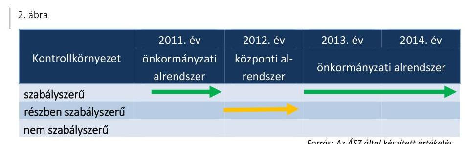

A kontrollkörnyezet 2011. évi kialakítása szabályszerű volt. A múzeumigazgató gondoskodott a Múzeum gazdálkodását és működését meghatározó belső szabályzatok elkészítéséről. A gazdasági szervezet vezetője rendelkezett az Ámr. ${ }^{31}$-ben előírt végzettséggel, szakképesítéssel. A kontrollkörnyezet 2011. évi kialakításában - a szabályszerű értékelés mellett - az alábbi hiányosságok fordultak elő:
$\longrightarrow$ az SZMSZ-ben az Ámr. 20. § (2) bekezdés c), h) pontok előírása ellenére az alaptevékenységet szabályozó jogszabályok megjelölését, illetve a nevesített munkakörökhöz tartozó helyettesítés rendjét a múzeumigazgató nem rögzítette;
$\longrightarrow$ a Számv. tv. 161. § (2) bekezdés d) pontja ellenére a múzeumigazgató nem gondoskodott a bizonylati rend elkészítéséről;

---

- a múzeumigazgató nem határozta meg - az Ámr. 156. § (1) bekezdés c) pontjában foglaltak ellenére - az etikai elvárásokat a szervezet minden szintjén.
A kontrollkörnyezet 2012. évi kialakítása részben volt szabályszerű. A kontrollkörnyezet 2012. évi kialakításában az alábbi hiányosságok fordultak elő:
a 2012. évben az SZMSZ nem került módosításra, így az Ávr. 13. § (1) bekezdés c), g) pontjainak előírása ellenére az alaptevékenységet szabályozó jogszabályok megjelölését, illetve a nevesített munkakörökhöz tartozó helyettesítés rendjét nem tartalmazta;
- a múzeumigazgató nem határozta meg - a Bkr. ${ }^{32}$ 6. § (1) bekezdés c) pontjában foglaltak ellenére - az etikai elvárásokat a szervezet minden szintjén.
A kontrollkörnyezet 2013. évi kialakítása szabályszerű volt. A Múzeum rendelkezett a működését és a gazdálkodás rendjét meghatározó szabályzatokkal, azonban a kontrollkörnyezet kialakításában - a szabályszerű értékelés mellett - az alábbi hiányosság fordult elő:
az Ávr. 13. § (1) bekezdés g) pontja ellenére az SZMSZ nem tartalmazta a nevesített munkakörökhöz kapcsolódó helyettesítés rendjét.
A kontrollkörnyezet 2014. évi kialakításában - a szabályszerű értékelés mellett - az alábbi hiányosságok fordultak elő:
az SZMSZ az Ávr. 13. § (1) bekezdés g) pontja ellenére nem tartalmazta a nevesített munkakörökhöz kapcsolódó helyettesítés rendjét, valamint az Ávr. 13. § (1) bekezdés c) pontjában foglaltak ellenére a kormányzati funkciók szerint besorolt alaptevékenységeket.
A 2012-2014. években, ügyrendben, szervezeti és működési szabályzatban vagy más belső szabályozásban a gazdasági szervezet belső és külső kapcsolattartásának módját az Ávr. 13. § (5) bekezdésében foglaltak ellenére a múzeumigazgató nem határozta meg.
3.2. számú megállapítás

A kockázatkezelési rendszert a 2011-2014. években szabályszerűen alakították ki és működtették.

| 3. ábra |  |  |  |  |
| :--: | :--: | :--: | :--: | :--: |
| Kockázatkezelési rendszer | 2011. év önkormányzati alrendszer | 2012. év   központi alrendszer | 2013. év   önkormányzati alrendszer | 2014. év   önkormányzati alrendszer |
| szabályszerű   részben szabályszerű   nem szabályszerű |  |  |  |  |

A kockázatkezelési rendszert a 2011-2014. években szabályszerűen alakították ki és működtették.
3. ábra

| Kockázatkezelési rendszer | 2011. év   önkormányzati   alrendszer | 2012. év   központi alrendszer | 2013. év   önkormányzati alrendszer |
| :--: | :--: | :--: | :--: |
| szabályszerű   részben szabályszerű   nem szabályszerű |  |  |  |  |

Forrás: Az ÁSZ által készített értékelés
Az ellenőrzött időszakban az Ámr.-ben és a Bkr.-ben foglaltaknak megfelelően alakították ki és működtették a kockázatkezelési rendszert. Felmérték és értékelték a tevékenységben rejlő kockázatokat, meghatározták a kockázati kitettség csökkentésével kapcsolatosan szükséges intézkedéseket.

---

# 3.3. számú megállapítás 

A kontrolltevékenység kialakítása és működtetése a 2011-2014. években részben szabályszerű volt.

| 4. ábra |  |  |  |  |
| :--: | :--: | :--: | :--: | :--: |
| Kontroll tevékenység | 2011. év | 2012. év | 2013. év | 2014. év |
|  | önkormányzati alrendszer | központi alrendszer | önkormányzati alrendszer |  |
| szabályszerű |  |  |  |  |
| részben szabályszerű nem szabályszerű |  |  |  |  |

Forrás: Az ÁSZ által készített értékelés
A kontrolltevékenység kialakítása során biztosították a folyamatba épített, előzetes, utólagos és vezetői ellenőrzést (FEUVE). Belső szabályzatokban a felelősségi körök meghatározásával szabályozták az engedélyezési, jóváhagyási, kontroll eljárásokat és beszámolási eljárásokat. A gazdálkodási jogkör gyakorlók felhatalmazásra, illetve kijelölésre kerültek.

A kontrolltevékenység működtetése során feltárt hiányosságokat részletesen a 4.3. pont tartalmazza.
3.4. számú megállapítás

Az információs és kommunikációs folyamatok kialakítása a 2011. évben részben volt szabályszerű, a 2012-2014. években szabályszerű volt.
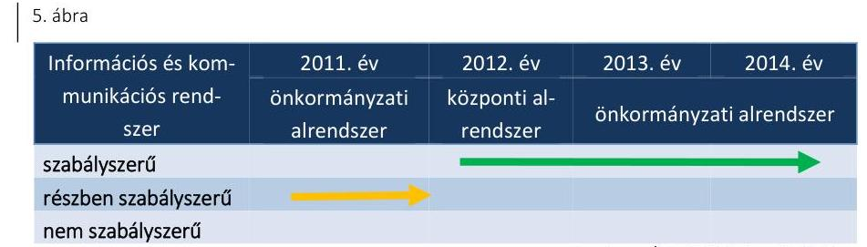

A múzeumigazgató az Ámr. és a Bkr. előírásaival összhangban kialakította információs és kommunikációs rendszerét, meghatározta a beszámolási határidőket és módokat. Hiányosság volt azonban, hogy a 2011. évben - az Ámr. 20. § (3) bekezdés i) pontja előírása ellenére - a múzeumigazgató nem szabályozta a kötelezően közzéteendő adatok nyilvánosságra hozatalának rendjét. A 2011-2014. években az Eitv. ${ }^{33}$ 3. § (2) bekezdésében, az Info tv. ${ }^{34}$ 33. § (1) és (3) bekezdéseiben és a 37. § (1) bekezdésében foglaltak ellenére az elektronikus közzétételi kötelezettséget a múzeumigazgató hiányosan teljesítette. A tevékenységre, működésre vonatkozó adatok között nem tüntette fel az Eitv. mellékletének II/1. pontjában és az Info tv. 1. melléklet II/1. pontjában meghatározott, a Múzeum alaptevékenységét meghatározó jogszabályokat. Nem tette közzé az az Eitv. mellékletének III/2. pontjában és az Info tv. 1. melléklet III/2. pontjában előírt, a Múzeumnál foglalkoztatottak létszámára vonatkozó összesített adatokat, továbbá az Eitv. mellékletének III/4. pontjában és az Info tv. 1. melléklet III/4. pontjában meghatározott, 5 M Ft-ot elérő vagy azt meghaladó összegű árubeszerzésre, szolgáltatásvásárlásra vagy építési beruházásra vonatkozó szerződések adatait.

---

# 3.5. számú megállapítás 

A monitoring rendszer kialakítása és működtetése a 2011-2012. években részben volt szabályszerű, a 2013-2014. években szabályszerű volt.
6. ábra

| Monitoring rendszer | 2011. év önkormányzati alrendszer | 2012. év központi alrendszer | 2013. év   önkormányzati alrendszer |
| :--: | :--: | :--: | :--: |
| szabályszerű |  |  |  |
| részben szabályszerű nem szabályszerű |  |  |  |

Forrás: Az ÁSZ által készített értékelés
A múzeumigazgató az Áht. 1,2 és a Bkr. előírásaival összhangban kialakította és működtette a rendelkezésre álló források szabályozott, gazdaságos, hatékony és eredményes felhasználását biztosító, a szervezeti célok elérését szolgáló feladatok, folyamatok megvalósulását mérő követelményeket.

A 2011. évben az Ötv. ${ }^{35}$ 92. § (5) bekezdésének előírása ellenére a főjegyző ${ }^{36}$ az irányító szerv belső ellenőrzése keretében nem gondoskodott a Múzeum, mint felügyelt költségvetési szerv belső ellenőrzéséről, ebben az évben a Múzeumnál ellenőrzést nem végeztek. A 2012. évben a középirányító szerv a munkaszerződések megkötésének, az illetmények, pótlékok megállapításának felülvizsgálatát végezte el. Az irányító szerv - a Mötv. előírásának eleget téve - 2013-2014. években gondoskodott a Múzeum, mint felügyelt költségvetési szerv belső ellenőrzéséről. Ennek keretében a 2013.
 évben ellenőrizte a Múzeum 2012. évi pénzmaradvány megállapítását. A 2014. évben a munkába járás költségtérítésével kapcsolatos eljárásrend ellenőrzését végezte el.

A monitoring rendszer részeként az ellenőrzött időszakban - a 2013. évi működtetés kivételével - megvalósult a belső ellenőrzési rendszer szabályszerű működtetése.

A Múzeum belső ellenőrzési feladatait a 2011-2012. évben egyéni vállalkozó végezte, megbízási szerződés alapján. A Ber. ${ }^{37}$ és a Bkr. előírásaival összhangban biztosított volt a belső ellenőrzés szervezeti és funkcionális függetlensége, érvényesültek az összeférhetetlenségi előírások. A 2014. évben a Múzeum belső ellenőrzését az irányító szerv  belső ellenőrzése látta el.

A 2013. évben az Áht. 2 70. § (1) bekezdése, valamint a Bkr. 15. § (1) bekezdése és 16. § (2) bekezdése előírásai ellenére a Múzeumnál nem végeztek belső ellenőrzést.

A belső ellenőrzési rendszer szabályozása során nem tartották be teljes körűen a jogszabályi előírásokat. Az ellenőrzött időszakban, a Múzeum SZMSZ -ben - a Ber. 4. § (2) bekezdésében és a Bkr. 15. § (2) bekezdésében foglaltak ellenére - a múzeumigazgató nem határozta meg a belső ellenőrzést végző szervezet, illetve személy jogállását, feladatait. A Múzeum a 2011-2013. években - a Ber. 5. § (1) és (3) bekezdései és a Bkr. 17. § (1) és (4) bekezdései előírása ellenére - nem rendelkezett belső ellenőrzési kézikönyvvel.

A belső ellenőrzés a Ber. és a Bkr. előírásaival összhangban végrehajtotta a tárgyévi ellenőrzési tervben foglaltakat. Az ellenőrzési javaslatok

---

végrehajtása érdekében a múzeumigazgató a Ber. és a Bkr. előírásainak megfelelő tartalmú intézkedési tervet készített.

A Ber. és a Bkr. szerinti nyilvántartás vezetésével a belső ellenőrzési jelentésekben tett megállapításokat, javaslatokat, a vonatkozó intézkedési terveket és azok végrehajtását nyomon követték.

# 4. A Múzeum pénzügyi gazdálkodása szabályszerű volt-e? 

## Összegző megállapítás

### 4.1. számú megállapítás

## A Múzeum pénzügyi gazdálkodása nem volt szabályszerű.

Az ellenőrzött időszakban a költségvetési tervezés, a bevételi és kiadási előirányzatok megállapítása megfelelt az előírásoknak. A bevételi és kiadási előirányzatok módosítása és nyilvántartása nem felelt meg a jogszabályokban és belső szabályzatokban foglaltaknak. Az előirányzat maradvány megállapítása és számviteli nyilvántartása szabályszerű volt.

A KÖLTSÉGVETÉSI TERVEZÉS eljárásrendjét a múzeumigazgató az ellenőrzött időszakban a gazdasági szervezet ügyrend -ban határozta meg.

Az ellenőrzött időszak elemi költségvetéseit az előírt határidőben és szerkezetben, a 2011. és 2014. években a fenntartó önkormányzati irányító szerv -mal egyeztetve készítették el. A Múzeum 2013. évi költségvetési javaslatát a Mötv. 120. § (1) bekezdés a) pontjában foglaltak ellenére az irányító szerv pénzügyi bizottsága nem véleményezte.

## A BEVÉTELI ÉS KIADÁSI ELŐIRÁNYZATOK MÓ-

DOSÍTÁSA és nyilvántartása nem volt szabályszerű.

Országgyűlési hatáskörű előirányzat módosítás az ellenőrzött időszakban nem volt, Kormány hatáskörű előirányzat módosításra a 2012. évben került sor 12,6 M Ft összegben.

Irányító szervi hatáskörű előirányzat módosítás mindegyik ellenőrzött évben történt, amelyek a költségvetési szervnél foglalkoztatottak bérkompenzációja, a Múzeum átszervezése, illetve többlettámogatás miatti előirányzat módosítások voltak. A 2011. évben 11,9 M Ft, a 2012. évben 44,6 M Ft, a 2013. évben 4,4 M Ft és a 2014. évben 4,6 M Ft összegben volt irányító szervi előirányzat módosítás.

Intézményi hatáskörű előirányzat módosításra múzeumi saját bevétel (régészet, bérbeadás), pályázati támogatás, valamint önkormányzati támogatás többletbevételei miatt került sor. A 2011. évben 450,3 M Ft, a 2012. évben 311,3 M Ft, a 2013. évben 296,6 M Ft és a 2014. évben 341,8 M Ft nagyságrendű volt a saját hatáskörű előirányzat módosítás. A Múzeum a 2012. évben a saját hatáskörben végrehajtott előirányzat-módosításokról az intézkedés meghozatalát követő öt munkanapon belül az Ávr. 167. § (4) bekezdésében foglaltak ellenére nem tájékoztatta a Kincstárt.

A bevételi és kiadási előirányzatok-, előirányzat-módosítások könyvviteli elszámolását a számlarend -ban és a gazdálkodási feladatot ellátó dolgozók munkaköri leírásaiban határozták meg. Az előirányzat módosításokra vonatkozó analitikus nyilvántartás formáját, tartalmát, vezetésének

---

#### 4.2. számú megállapítás

módját a 2011–2013. években belső szabályozásban az Áhsz.1 49. § (3) bekezdésben előírtak ellenére nem határozták meg. A Számv. tv. 165. § (4) bekezdésében, továbbá az Áhsz.1 49. § (1) bekezdésben előírtak ellenére, a 2011–2012. évi előirányzat-módosításról a Múzeum nem vezetett analitikus nyilvántartást, 2013-ban csak az irányító szervi módosításokról vezettek analitikus nyilvántartást. A 2014. évi nyilvántartás az Áhsz.2 14. melléklet I. pontjában előírtak ellenére nem tartalmazta az év során történt összes saját hatáskörű előirányzat módosítást.

**A MARADVÁNY MEGÁLLAPÍTÁSA**, a jóváhagyott maradvány nyilvántartása a 2012. év kivételével megfelelő volt. A Múzeum a 2011–2012. években a költségvetési maradvány megállapítására vonatkozó adatszolgáltatási kötelezettségét az irányító szerv és a középirányító szerv felé az Áhsz.1 10. § (1) bekezdésében meghatározott – költségvetési évet követő február 28-i – határidőn túl (március 2-án, illetve március 20-án) teljesítette. A 2011. évi pénzmaradvány, illetve a 2013. és a 2014. évi előirányzat–maradvány összegét az irányító szerv az Ámr.-nek illetve az Ávr.-nek megfelelően jóváhagyta. A 2012. évi maradvány megállapítása és középirányító szervi jóváhagyása az Áht.2 88. § (1) bekezdésében és a 258/2011. (XII. 7.) Korm. rendelet 11. § (2) bekezdés i) pontjában foglalt előírások ellenére nem történt meg.

**A MÚZEUM MARADVÁNYA** 2011-ben 182,9 M Ft, 2012-ben 192,4 M Ft volt, amelyből 6,4 M Ft kötelezettségvállalással terhelt, 2013-ban 200,4 M Ft teljes egészében kötelezettség vállalással terhelt, 2014-ben 60,2 M Ft teljes egészében kötelezettség vállalással terhelt volt.

#### Az éves költségvetési beszámolókat a jogszabályban meghatározott tartalommal, azonban nem határidőre készítették el.

A Múzeum a 2011. és 2013. éves elemi beszámolóját az Áhsz.1, a 2014. évi beszámolóját, az Áhsz.2 előírása szerinti bontásban állította össze. Az Áhsz.1 40. § (1) bekezdésének előírása ellenére a 2012. évi beszámoló kiegészítő mellékletének szöveges indoklását nem készítették el. Az ellenőrzött időszakban az éves költségvetési beszámolót folyamatosan vezetett részletező nyilvántartásokkal és könyvviteli zárlat során készített főkönyvi kivonattal alátámasztották.

A 2011–2012. évi beszámolót az Áhsz.1 10. § (1) bekezdésben meghatározott határidőt – a költségvetési évet követő február 28-át– követően (március 2-án, illetve március 20-án) készítették el.

A 2011., a 2013. és a 2014. évi beszámolót az irányító szerv jóváhagyta, a 2012. évi költségvetési beszámoló irányító szervi jóváhagyása az Áht.2 88. § (1) bekezdésében foglalt előírás ellenére nem történt meg.

#### 4.3. számú megállapítás

**A bevételek elszámolása során nem tartották be a jogszabályi előírásokat. A kiadási előirányzatok felhasználása a 2011. évben részben, a 2012–2014. években megfelelt a jogszabályi előírásoknak.**

Az ellenőrzött időszakban a Múzeum bevételi előirányzatainak teljesítése és elszámolása nem felelt meg a jogszabályok és belső szabályzatok előírásainak.

---

A BEVÉTELI ELŐIRÁNYZATOT a 2011. évben alulteljesítették, a 2012-2014. években teljesültek a Múzeum bevételi előirányzatai. A 2011. évben a Múzeum az 1072,9 M Ft módosított bevételi előirányzatot 1071,4 M Ft-ra (  %-ra) teljesítette, mert bár a működési bevételek előirányzatai túlteljesültek, de a támogatás értékű felhalmozási bevételek teljesítése elmaradt a módosított előirányzattól (nem teljesült 7,0 M Ft beruházási bevétel központi költségvetési szervtől).

A BEVÉTELEK ELSZÁMOLÁSA, a vagyonelemek hasznosítása (értékesítés, bérbeadás) során nem tartották be a jogszabályokban és a belső szabályzatokban foglaltakat. A következő hiányosságok, szabálytalanságok fordultak elő:
a Múzeum a 2011-2014. között hatályos önköltség-számítási szabályzat  5. §-ában, önköltség-számítási szabályzat  3. pontjában, az önköltség számítási szabályzat  III. fejezetében és az önköltség számítási szabályzat  VII. fejezetében foglaltak ellenére a múzeumi régészeti szolgáltatások-, terület bérbeadások-, saját kiadványok díjainak meghatározását nem támasztotta alá önköltségszámítással;
a bevétel beszedését alátámasztó szerződés, megállapodás megőrzéséről több esetben nem gondoskodtak a 2011-2014. éveket érintő terület-hasznosítások, bérbeadások során, ezzel nem tettek eleget a Számv. tv. 169. § (2), (4) bekezdéseiben foglaltaknak;
a Múzeum a nemzeti vagyon hasznosítására vonatkozó szerződés megkötésekor nem győződött meg arról, hogy az Nvtv. 3. § (1) bekezdés 1. pontjában foglaltak alapján a másik szerződő fél átlátható szervezetnek minősült-e.
Tárgyi eszköz értékesítésére, illetve vagyon elidegenítésére nem került sor. A működési bevételek múzeumi belépőjegyek, szolgáltatások (múzeumpedagógiai foglalkozások, építkezések régészeti felügyelete), illetve eseti helyiség- és terület bérbeadásból, saját kiadványok értékesítéséből származtak. A 2012-2014. évi bérbeadási (vagyonhasznosítási) tevékenység a Vtv.  23. § (1)-(2) bekezdésében előírt, a vagyon hasznosítására felhatalmazást adó - MNV Zrt. -vel megkötendő - vagyonkezelési/hasznosítási szerződés hiányában szabálytalanul történt.

A kiadási előirányzatok felhasználása a 2011. évben részben, a 2012-2014. években megfelelt a jogszabályi előírásoknak.

A KIADÁSI ELŐIRÁNYZATOK felhasználása során a következő hiányosságok, szabálytalanságok fordultak elő:
a 2011-2014. közötti időszakban, a dologi és a felhalmozási kiadások vonatkozásában a kötelezettségvállalásra - az Ámr. 74. § (1) bekezdésében, az Áht. 2 37. § (1) bekezdésében előírtak ellenére - több esetben ellenjegyzés, illetve pénzügyi ellenjegyzés hiányában került sor;
a 2014. évben a Múzeum a megvalósított építési beruházással kapcsolatban az Info. tv. 33. § (1) és (3) bekezdésén alapuló, az Info tv. 1. melléklet III/4. pontjában előírt szerződés adataira vonatkozó közzétételi kötelezettségének nem tett eleget;

---

- a felhalmozási kiadások teljesítése során a 2013. évben az Ávr. 52. § (1) bekezdés a) pontjában, illetve az Ávr. 58. § (4) bekezdésében előírtakat nem minden esetben tartották be, mert a kötelezettségvállaló, valamint az érvényesítő nem rendelkezett felhatalmazással, kijelöléssel a feladat ellátására;
- a 2011-2014. években az Áhsz. 1 30. § (1) bekezdésében, a Számv. tv. 52. § (2) bekezdésében, valamint a számviteli politika  III/8. pontjában, a számviteli politika  III/2. pontjában foglaltak ellenére az állományba vett és aktivált beruházások üzembe helyezését hitelt érdemlően nem dokumentálták.
A kiadások szakmai teljesítéseinek igazolása, az utalványok érvényesítése szabályszerűen történt. A beruházások a feladatellátással és a 2012-2016. évre vonatkozóan a múzeumigazgató által elkészített intézményfejlesztési stratégiával összhangban voltak, a Múzeum feladatainak ellátását szolgálták. A 2013-2014. években az Mtv. 50. § (2) bekezdés a) pontjában foglaltak ellenére a Múzeum fejlesztési és beruházási feladatait a fenntartó Nyíregyháza Megyei Jogú Város Önkormányzatának Közgyűlése nem határozta meg. A közbeszerzési kötelezettség alá tartozó beruházás során a Kbt.  III. része szerinti hirdetmény közzététele nélküli, tárgyalásos közbeszerzési eljárást bonyolítottak le. Az eljárás módját helyesen határozták meg. Az építési beruházás 2014-ben Sóstó Múzeumfaluban a Magyaros-zág-Románia határon átnyúló együttműködési program keretében valósult meg.

A régészeti feltárási tevékenység bevételeinek elszámolását megrendelések, valamint a jogszabályban előírt tartalmú szerződések támasztották alá a 2011-2014. években. A régészeti tevékenységgel összefüggésben teljesített kiadások elszámolása részben felelt meg a jogszabályi előírásoknak a 2011-2012. években, megfelelt a jogszabályi előírásoknak 2013-2014. években. Összességében a régészeti tevékenységgel összefüggésben teljesített kiadások elszámolása részben felelt meg a jogszabályi előírásoknak a 2011-2014. években.

A régészeti tevékenység bevételeit a régészeti felügyelet ellátására vonatkozó megrendelésekkel, valamint régészeti feltárásra vonatkozó szerződésekkel támasztották
 alá a 2011–2014. években. A szerződések megfeleltek a Kötv., illetve a 393/2012. (XII. 20.) Korm. rend. ${ }^{50}$ rendelkezéseinek.

A szerződésekben egységárakat, valamint keretösszeget határoztak meg, azok alapján történt az elszámolás a beruházóval. Az egységárakat a régészeti feladatellátás költségeire vonatkozó, központilag meghatározott, ajánlás jellegű díjtételek alapján állapították meg.

Néhány esetben – a 2011. és a 2013. évben – a bevételt megalapozó szerződés, illetve megrendelés dokumentummal nem volt alátámasztva az lkr. ${ }^{51}$ 6. § a) pontjában, 14. § (4) bekezdésében foglaltak ellenére, emiatt a Számv. tv. 169. § (2) bekezdésében előírt bizonylatmegőrzési kötelezettség nem érvényesült.

A régészeti tevékenységgel kapcsolatban teljesített kiadások elsősorban munkabér kifizetések voltak a 2011–2014. években. A kötelezettségvállalás és a teljesítésigazolás gyakorlása az Ámr.-nek, illetve az Áht. 1.2-nek és az Ávr.-nek megfelelően történt.

---

# 4.5. számú megállapítás 

A megbízási szerződések esetében 2011. évben előfordult, hogy a kötelezettségvállalás az Ámr. 74. § (1) bekezdésének előírása ellenére ellenjegyzés nélkül történt.

A régészeti tevékenységhez kapcsolódó egyéb működési kiadások esetében a 2011–2012. években előfordult, hogy a kifizetés az Ámr. 77. § (1) bekezdésének, illetve az Ávr. 58. § (1) bekezdésének előírása ellenére érvényesítés, valamint az Ámr. 76. § (1) bekezdése és az Ávr. 57. § (1) bekezdése ellenére szakmai teljesítésigazolás/teljesítésigazolás nélkül történt. A 2013. évben hiányosság volt, hogy egyes esetekben a kötelezettségvállalás dokumentummal nem volt alátámasztva az lkr. 6. § a) pontjában, 14. § (4) bekezdésében foglaltak ellenére, emiatt a Számv. tv. 169. § (2) bekezdésében előírt bizonylatmegőrzési kötelezettség nem érvényesült.

A Múzeum a régészeti célú pénzeszközök elkülönített kezelésére pénzforgalmi számlájához alszámlát vezetett az ellenőrzött időszakban.

A Múzeum az 5/2010. (VIII. 18.) NEFMI rendelet ${ }^{52}$ 20. § (3) bekezdése 2011. szeptember 2–2012. december 31. között hatályos előírásának megfelelően – a pénzeszközök felhasználásáról analitikus nyilvántartást vezetett a régészeti tevékenységre vonatkozóan. Az analitikus nyilvántartás ásatásonként, illetve feladattípusonként (egyéb ásatás, régészeti megfigyelés) tartalmazta a bevételeket és a kiadásokat.

## Az ellenőrzött időszakban a Múzeum pénzügyi egyensúlya biztosított volt.

A Múzeum pénzügyi egyensúlya annak ellenére biztosított volt, hogy a folyamatos fizetőképességének biztosítása érdekében az Áht. 2. 78. § (2) bekezdésének előírásával ellentétben nem készített a 2012–2014. években likviditási tervet. A likviditási terv készítésének elmulasztásával nem érvényesültek az Ávr. 122. § (2)–(3) bekezdésében előírtak.

A likviditás javítását saját bevételek növelésével (elsősorban régészeti, múzeumpedagógiai szolgáltatások értékesítése), illetve különféle pályázatokon (TIOP ${ }^{53}$, TÁMOP ${ }^{54}$, HURO ${ }^{55}$, NKA ${ }^{56}$, Patrimonium, Cult-Tour) való részvétellel próbálták elősegíteni. Keret-előrehozási igényt a 2011–2014. években nem nyújtottak be.

A Múzeum pénzügyi egyensúlya biztosított volt, fizetési kötelezettségeinek határidőben eleget tudott tenni. Nem volt sem lejárt szállítói tartozása, sem egyéb kiadási elmaradása, illetve bevétel (támogatás) visszatérítési kötelezettsége a 2011–2014. évek végén.

A Múzeum 2011. január 1-jén 33,7 M Ft lejárt határidejű követelést tartott nyilván, amely az év végére 14,0 M Ft-ra, majd 2012-ben 3,2 M Ft-ra csökkent. A 2013. év végére 40,5 M Ft-ra nőtt a követelésállomány, amelyből 33,1 M Ft lejárt határidejű volt. A 2013. évi lejárt határidejű követelésekre fizetési felszólító leveleket küldött ki a Múzeum, azonban 2014-ben nem tett ilyen intézkedést. 2014 végén az összesen 54,2 M Ft követelésből 16,4 M Ft volt lejárt esedékességű.

Az ellenőrzött időszakban az Áht. 1.2 előírásaival összhangban követeléselengedésre nem került sor.

---

# 5. A Múzeum vagyongazdálkodása szabályszerű volt-e? 

## Összegző megállapítás

5.1. számú megállapítás

## A Múzeum vagyongazdálkodása a 2011–2014. években nem volt szabályszerű.

Az eszközök és források nyilvántartása a 2011. évben megfelelt, a 2012–2014. közötti időszakban nem felelt meg a jogszabályi előírásoknak.

A 2011. évben a közfeladat ellátását szolgáló vagyon az irányító szerv ${ }_{1}$ tulajdonában és a Múzeum ingyenes használatában volt. A Múzeum a számviteli politika ${ }_{1}$-ben és a gazdasági szervezet ügyrend ${ }_{1}$-ben rendelkezett a vagyongazdálkodás, valamint a vagyon nyilvántartásának szabályairól. Az eszközöket a Múzeum az Áhsz. ${ }_{1}$ előírásának megfelelően a befektetett eszközök között mutatta ki számviteli nyilvántartásaiban.

A 2012. január 1-jei önkormányzati konszolidációt követően a tulajdonosi jogokat az állami tulajdon felett az MNV Zrt. gyakorolta, míg a fenntartói jogok és kötelezettségek a középirányító szervhez kerültek. A Múzeum a feladat ellátását szolgáló vagyont továbbra is használta, azonban erre vonatkozó szerződéssel a Vtv. 25. § (4) bekezdésében foglaltak ellenére nem rendelkezett. A Számv. tv. 23. § (2) bekezdésében, az Nvtv. ${ }^{57}$ 11. § (8) bekezdésében, valamint az Áhsz. ${ }_{1}$ 15. § (1) bekezdésében foglaltak ellenére a kezelt vagyon kimutatására szabálytalanul a Múzeumnál került sor. A Múzeum 2012. évi beszámolójának mérlegében kimutatott állami vagyon értéke teljes egészében az Áhsz. ${ }_{1}$ 5. § 8. pontja szerinti jelentős összegű hibát eredményezett és az az Áhsz. ${ }_{1}$ 5. § 10. pontjában meghatározott megbízható és valós képet lényegesen befolyásoló hiba volt.

Az Mtv. 2013. január 1-jétől hatályos 45/A. § (2) bekezdés a) pontja szerint a megyei hatókörű városi múzeum lett a vagyonkezelője a tevékenységéhez szükséges állami vagyonnak. A 2013–2014. években a Múzeum az Nvtv. 11. § (1) és (7) bekezdésének és a Vtvr. ${ }^{58}$ 8. § (6) bekezdésének előírása ellenére nem rendelkezett vagyonkezelési szerződéssel. A 2013–2014. években a Múzeum beszámolójában kimutatott vagyon értéke vagyonkezelési szerződéssel nem volt alátámasztva.

A kezelt vagyon köre és nagysága a 2013–2014. években vagyonkezelési szerződés hiányában nem volt megállapítható. Kiegészítő mellékletben – az Áhsz. ${ }_{1}$ 40. § (2) bekezdés b) pontjában és az Áhsz. ${ }_{2}$ 29. § (2) bekezdés a) és c) pontjában foglalt előírások ellenére – a Múzeum nem jelezte a vagyonkezelésbe vett eszközök körének változását és a vagyonkezelési szerződés hiányát, emiatt nem érvényesült a Számv. tv. 16. § (4) bekezdésében meghatározott „lényegesség elve”.

## A NEMZETI VAGYONBA TARTOZÓ KULTURÁLIS

JAVAK NYILVÁNTARTÁSA nem felelt meg teljes körűen a jogszabályban rögzített előírásoknak.

A 2011–2012. években, ügyrendben vagy más belső szabályzatban a 20/2002. (X. 4.) NKÖM rendelet ${ }^{59}$ 19. § (2) bekezdés előírásai ellenére a múzeumigazgató nem rögzítette a kulturális javakkal kapcsolatos külön nyilvántartások kezelésére, adataira vonatkozó szabályokat.

---

A 2011–2014. években a múzeumigazgató a 20/2002. (X. 4.) NKÖM rendelet 19. § (1) bekezdés aa), ac) és b) pontjaiban előírtak ellenére nem vezette a következő nyilvántartásokat:
$\longrightarrow$ az őrzésében lévő, de nem saját gyűjteményeihez tartozó letétként kezelt kulturális javakról a letéti naplót;
$\longrightarrow$ a szakmai véleményezésre, vizsgálatra, bírálatra átvett kulturális javakról a bírálati naplót;
a gyűjteményeiből ideiglenesen kikerült (kiállításra vagy más célra kölcsönadott, stb.) kulturális javakról (intézményen kívülre) a kölcsönadott tárgyak naplóját.
A Múzeumnál az ellenőrzött időszakban gyarapodási naplót és szakleltárkönyveket vezettek. A gyarapodási naplót év végén záradékkal ellátták, azonban a 20/2002. (X. 4.) NKÖM rendelet 1. sz. melléklet 2. pontjában foglaltak ellenére a záradék szövegében a vásárlások összértékét nem tüntették fel. A gyarapodási napló rovatainak kitöltöttsége nem volt teljes körű, nem felelt meg a 20/2002. (X. 4.) NKÖM rendelet 2. sz. melléklet XV. fejezetében foglaltaknak. A „megnevezés” rovat kitöltöttsége nem minden esetben biztosította az azonosításhoz szükséges pontosságot, részletezettséget. A szakleltárkönyvek vezetése során hiányosságok fordultak elő. A „Történeti dokumentum” leltárkönyv „Vételár” rovatát a 20/2002. (X. 4.) NKÖM rendelet 1. sz. melléklet 2. pontjában foglaltakat figyelmen kívül hagyva töltötték ki. A „Történeti adattár” leltárkönyvben az „adattári szám” képzése nem felelt meg a 20/2002. (X. 4.) NKÖM rendelet 2. sz. melléklet XIII/A. alfejezet 2. pontjában foglaltaknak, mivel az nem tartalmazta az adattári szám első jelcsoportját.

A Múzeum valamennyi használatban lévő, illetve már használaton kívül helyezett szakmai nyilvántartásról, az ott megjelölt adattartalommal számítógépes formában kimutatást vezetett, azonban a 20/2002. (X. 4.) NKÖM rendelet 20. § (3) bekezdésében foglaltak ellenére annak a múzeumigazgató aláírásával és a Múzeum körbélyegzőjével évente történő hitelesítését nem végezték el. Az ellenőrzött időszakban törlés a kulturális javak közül nem történt. A Múzeum a kulturális javakat hagyományos módon (papír alapon) tartotta nyilván.
5.2. számú megállapítás

A költségvetési beszámoló mérlegének leltárral való alátámasztottsága, a mérlegtételek értékelése a 2011–2014. közötti időszakban nem felelt meg a jogszabályi előírásoknak és a belső szabályozásnak.

A Múzeumot a 2011. és 2012. években az átszervezések miatt, a 2013. évben az eredményszemléletű számvitel bevezetéséhez kapcsolódóan teljes körű leltározási kötelezettség terhelte. Ezen kötelezettségének azonban nem teljes körűen tett eleget.

A 2011. évi NGM módszertani útmutató, valamint az Áhsz. 1. 54. § (6) bekezdése alapján a 2011. évi tevékenységről a Múzeum elkülönítetten is köteles volt elkészíteni a saját és a hozzárendelt önállóan működő költségvetési szerv éves elemi költségvetési beszámolóját. A Múzeum a 2011. évi beszámolóját elkészítette, azonban az intézményi éves költségvetési beszámoló mérlegét a Számv. tv. 69. § (1)–(2) bekezdésében, valamint az Áhsz. 1. 13/A. § (1) bekezdésében és 37. § (1)–(3) bekezdésében foglaltak

---

ellenére leltárral és záró főkönyvi kivonattal – kizárólag a Múzeumra vonatkozóan – nem támasztotta alá.

A 2012., 2013. és 2014. évi leltározáshoz a leltározási utasítások, leltározási ütemtervek rendelkezésre álltak. A leltározásban résztvevők rendelkeztek a feladat ellátásához szükséges megbízólevéllel. A Múzeumnál a leltározás személyi és tárgyi feltételei biztosítottak voltak.

A mérleget alátámasztó leltár a 2012. évben nem felelt meg az Áhsz. 1. 37. § (2) és (4) bekezdésében és a Számv. tv. 23. § (2) bekezdésében foglaltaknak, mert a Múzeum az általa használt és felleltározott vagyonnak nem volt vagyonkezelője. A leltárak, analitikus nyilvántartásokkal, főkönyvi kivonattal, mérlegtételekkel való egyezősége a leltározás hiányosságai miatt a 2012. évben nem volt teljes körűen biztosított.

A mérleget alátámasztó leltár a 2013–2014. években nem felelt meg az Áhsz. 1. 37. § (2) bekezdésében, az Áhsz. 2. 22. § (2) bekezdés a) pontjában és a Számv. tv. 69. § (1) bekezdésében foglaltaknak, mert nem tartalmazta ellenőrizhető módon az állam tulajdonában és a Múzeum vagyonkezelésében lévő vagyonelemek értékét. Az Mtv. 2013. január 1-jétől hatályos 45/A. § (2) bekezdés a) pontja alapján a Múzeum lett a vagyonkezelője a tevékenységéhez szükséges állami vagyonnak. Az Áhsz. 1. 37. § (4) bekezdésében és az Áhsz. 2. 22. § (2) bekezdés a) pontjában foglaltak alapján a leltárt, a vagyonkezelést végző szervezet köteles elkészíteni. A vagyonkezelői jog – az Nvtv. 11. § (7) bekezdésében foglaltak alapján – a vagyonkezelési szerződés megkötéséig nem gyakorolható, azonban a Múzeum gondoskodott az állami tulajdonban lévő vagyonelemek leltározásáról. Az Áhsz. ${ }_{1}$ 29/A. § (1) bekezdésében foglaltak értelmében, a vagyonkezelésbe vett eszköz bekerülési értékének, a vagyonkezelési szerződésben szereplő érték minősül, mely információ vagyonkezelői szerződés hiányában nem állt rendelkezésre, az Áhsz. 2. 15. § (2)
 bekezdésében foglaltak alapján a bekerülési érték az átadónál kimutatott bruttó érték, melyről szintén nem volt információ. A hiányosság miatt a leltárak értékadatai dokumentummal nem voltak megfelelően alátámasztva.

Eszközök selejtezésére a 2012. évi átszervezés kapcsán került sor. A selejtezés végrehajtása szabályszerűen történt.

# A mérlegben kimutatott eszközök bekerülési értékének megállapítása, állományba vétele, év végi értékelése nem az előírásoknak megfelelően történt. A 2012. 

és 2014. években a felhalmozási kiadások egyes eseteiben a bekerülési érték meghatározása nem volt szabályszerű. A Számv. tv. 47. § (1) bekezdésében foglaltak ellenére a szállítási költséget nem mutatták ki a bekerülési érték részeként. Az Áhsz. 1 30. § (1) bekezdésében, a Számv. tv. 52. § (2) bekezdésében, valamint a számviteli politika ${ }_{1,2}$ III/8. pontjában foglaltak ellenére az ellenőrzött időszakban az üzembe helyezési okmányt nem készítették el.

A Múzeum a 2011. és 2012. években az Áhsz. 1 27. § (1)-(2) bekezdéseiben, valamint 32. § (1) bekezdésében, 33. § (1) bekezdésében, 34. § (1)-(2) bekezdésében és a 36. § (1)-(2) bekezdésében foglaltak ellenére a mérlegtételek év végi értékelését dokumentált módon nem végezte el. Az el-

---

lenőrzött időszakban a terv szerinti értékcsökkenés elszámolása szabályszerűen történt, terven felüli értékcsökkenést, értékvesztést nem számoltak el.

A Múzeum az eredményszemléletű számvitelre történő áttérés feladatait a 36/2013. (IX. 13.) NGM rendelet ${ }^{60}$ előírásai szerint végrehajtotta, azonban a rendező mérleg - a leltározás előzőekben kifejtett hiányosságai miatt - nem volt szabályszerű. A rendező mérleget a 36/2013. (IX. 13.) NGM rendelet 8. § (2) bekezdés a) pontjában foglalt határidőt követően, 2014. december 4-én készítették el. A 36/2013. (IX. 13.) NGM rendelet 9. § (1) bekezdésében foglaltak ellenére a 2014. évi nyitás feladatait határidőben nem hajtották végre.
5.3. számú megállapítás

A kulturális javak hasznosítása és kölcsönzése az ellenőrzött időszakban nem felelt meg a jogszabályi előírásoknak. A kulturális javak vagyonbiztonságára és állományvédelmére vonatkozó előírásokat nem tartották be maradéktalanul.

A Múzeum a 2011-2014. években a kulturális javak kölcsönzése egyes eseteiben nem rendelkezett az Mtv. 38. § (6) bekezdésében, illetve a 2013. október 25-től hatályos 38/A. § (1) bekezdésében előírt határozott idejű írásbeli kölcsönzési szerződéssel.

A kulturális javak kölcsönzésére kötött szerződések nem tartalmazták az Mtv. - 2013. október 24-ig hatályos - 38. § (8) bekezdés a)-c) pontjában és a 2013. október 25-től hatályos 38/A. § (2) bekezdés a)-c) pontjában rögzített kötelező tartalmi elemeket. Így a kulturális javak kölcsönzéséről szóló szerződések döntő többsége nem tartalmazta a kölcsönvevő által a kölcsönzött kulturális javaknak biztosítandó állományvédelmi követelményeket, beleértve a klimatikus viszonyokat. A szerződések többségében nem rögzítették a csomagolás feltételeit, a szállítási feltételeket, valamint a kölcsönzött kulturális javak sérülése esetén követendő eljárást. A kölcsönzési szerződések többségében a kölcsönvevő által nyújtandó vagyonbiztonsági feltételeket - beleértve az esetlegesen szükséges muzeológusi, rendőrségi vagy egyéb fegyveres kíséretet is - nem írták elő.

A kulturális javak nem muzeális intézmény számára, továbbá külföldre történő kölcsönadásához az Mtv. 38. § (9) bekezdésében, illetve a 2013. október 25-től hatályos 38/A. § (5) bekezdésében foglaltak ellenére nem rendelkeztek a miniszter hozzájárulásával.

## A kulturális javak őrzése és állomány-

védelme a kölcsönzési szerződések állományvédelemmel kapcsolatos - előzőekben felsorolt - hiányosságai miatt nem volt maradéktalanul biztosított. A Múzeum a használatában álló épületeket, az állandó és időszakos kiállítások bemutatására alkalmas helyiségeket, gyűjteményi raktárakat elektronikus és mechanikus, továbbá élőerős védelemmel látta el a 2/2010. (I. 14.) OKM rendelet ${ }^{61}$-ben foglaltaknak megfelelően.

---

# 6. A Múzeum intézkedett-e az integritás szemlélet érvényesítése érdekében? 

## Összegző megállapítás

A Múzeum intézkedett az integritás szemlélet érvényesítése érdekében.

Az ellenőrzés részletes megállapításait a jelentéstervezet II. számú - „Az Integritás érvényesítése érdekében kialakított és működtetett kontrollrendszer" című - melléklete tartalmazza.

---

# JAVASLATOK 

Az ÁSZ tv. 33. § (1) bekezdésében foglaltak értelmében az ellenőrzött szervezet vezetője köteles a jelentésben foglalt megállapításokhoz kapcsolódó intézkedési tervet összeállítani és azt a jelentés kézhezvételétől számított 30 napon belül az ÁSZ részére megküldeni. Amennyiben az ellenőrzött szervezet vezetője nem küldi meg határidőben az intézkedési tervet, vagy továbbra sem elfogadható intézkedési tervet küld, az Állami Számvevőszék elnöke az ÁSZ tv. 33. § (3) bekezdése a) és b) pontjaiban foglaltakat érvényesítheti.

## Nyíregyháza Megyei Jogú Város Önkormányzatának polgármesterének

1. Intézkedjen a Múzeum szervezeti és működési szabályzata módosításának jóváhagyása érdekében.
(3.1. sz. megállapítás 4. bekezdésének 1. francia bekezdése, 3.5. sz. megállapítás 6. bekezdésének 2. mondata alapján)
2. Intézkedjen a Múzeum fejlesztési és beruházási feladatai meghatározása és jóváhagyása érdekében.
(4.3. sz. megállapítás 7. bekezdésének 3. mondata alapján)
3. Tegyen intézkedéseket a feltárt szabálytalanságok tekintetében a felelősség tisztázása érdekében, és szükség szerint intézkedjen a felelősség érvényesítéséről.
(5.1. sz. megállapítás 7. bekezdése, 5.1. sz. megállapítás 8. bekezdésének 2-6. mondata, 5.1. sz. megállapítás 9. bekezdésének 1. mondata, 5.3. sz. megállapítás 2. bekezdése, 5.3. sz. megállapítás 3. bekezdése alapján)

## a Jósa András Múzeum igazgatójának

1. A belső kontrollrendszer szabályszerű kialakítása és működtetése érdekében intézkedjen:
a) a szervezeti és működési szabályzat jogszabályi előírásoknak megfelelő tartalmú módosítására és kezdeményezze annak jóváhagyását;
(3.1. sz. megállapítás 4. bekezdésének 1. francia bekezdése, 3.5. sz. megállapítás 6. bekezdésének 2. mondata alapján)

---

b) a gazdasági szervezet Múzeumon belüli belső és azon kívüli külső kapcsolattartásának módja szabályozására;
(3.1. sz. megállapítás 5. bekezdése alapján)
c) az elektronikus közzétételi kötelezettség jogszabályi előírásnak megfelelő teljesítésére.
(3.4. sz. megállapítás 1. bekezdésének 3-5. mondata, 4.3. sz. megállapítás 6. bekezdésének 2. francia bekezdése alapján)
2. A szabályszerű pénzügyi gazdálkodás érdekében intézkedjen:
a) a saját hatáskörű előirányzat módosítások jogszabályi előírásnak megfelelő nyilvántartására;
(4.1. sz. megállapítás 7. bekezdésének 4. mondata alapján)
b) a régészeti szolgáltatás, a saját kiadványok díjainak meghatározásakor azok önköltségszámítással történő alátámasztására;
(4.3. sz. megállapítás 3. bekezdésének 1. francia bekezdése alapján)
c) a bevétel beszedését alátámasztó szerződés, megállapodás és a kötelezettségvállalás dokumentuma jogszabályi előírásnak megfelelő megőrzésére;
(4.3. sz. megállapítás 3. bekezdésének 2. francia bekezdése, 4.4. sz. megállapítás 3. bekezdése, 4.4. sz. megállapítás 6. bekezdésének 2. mondata alapján)
d) a nemzeti vagyon hasznosítására vonatkozó szerződések megkötésekor annak meggyőződésére, hogy a másik szerződő fél átlátható szervezetnek minősül-e;
(4.3. sz. megállapítás 3. bekezdésének 3. francia bekezdése alapján)
e) a szabályszerű vagyonhasznosításra;
(4.3. sz. megállapítás 4. bekezdésének 3. mondata alapján)
f) a kötelezettségvállalás jogszabályi előírásnak megfelelő gyakorlására;
(4.3. sz. megállapítás 6. bekezdésének 1. francia bekezdése alapján)

---

g) az üzembe helyezés hitelt érdemlő módon történő dokumentálására;
(4.3. sz. megállapítás 6. bekezdésének 4. francia bekezdése, 5.2. sz. megállapítás 7. bekezdésének 4. mondata alapján)
h) likviditási terv készítésére.
(4.5. sz. megállapítás 1. bekezdése alapján)
3. A szabályszerű vagyongazdálkodás érdekében intézkedjen:
a) a jogszabályi előírásnak megfelelő éves költségvetési beszámoló készítésére;
(5.1. sz. megállapítás 4. bekezdésének 2. mondata alapján)
b) a kulturális javak jogszabályi előírásoknak megfelelő nyilvántartására;
(5.1. sz. megállapítás 7. bekezdése, 5.1. sz. megállapítás 8. bekezdésének 2-6. mondata, 5.1. sz. megállapítás 9. bekezdésének 1. mondata alapján)
c) a jogszabályi előírásoknak megfelelő leltár összeállítására;
(5.2. sz. megállapítás 5. bekezdése alapján)
d) az eszközök bekerülési értéke jogszabályi előírásoknak megfelelő meghatározására;
(5.2. sz. megállapítás 7. bekezdésének 2., 3. mondata alapján)
e) a kulturális javak hasznosítása és kölcsönzése esetén a jogszabályban előírtak betartására.
(5.3. sz. megállapítás 1. bekezdése, 5.3. sz. megállapítás 2. bekezdése, 5.3. sz. megállapítás 3. bekezdése alapján)
4. Tegyen intézkedéseket a feltárt szabálytalanságok tekintetében a felelősség tisztázása érdekében, és szükség szerint intézkedjen a felelősség érvényesítéséről.
(4.3. sz. megállapítás 3. bekezdésének 1. francia bekezdése, 4.3. sz. megállapítás 6. bekezdésének 1. francia bekezdése, 5.1. sz. megállapítás 7. bekezdése, 5.1. sz. megállapítás 8. bekezdésének 2-6. mondata, 5.1. sz. megállapítás 9. bekezdésének 1. mondata, 5.3. sz. megállapítás 2. bekezdése, 5.3. sz. megállapítás 3. bekezdése alapján)

---

.

---

# MELLÉKLETEK 

- I. SZ. MELLÉKLET: ÉRTELMEZŐ SZÓTÁR
állami vagyon kezelője /vagyonkezelő

ÁSZ Integritás Projekt
belső ellenőrzés
belső kontrollrendszer
belső kontrollrendszer területei
fenntartó

Az állami vagyont az MNV Zrt. maga kezeli, vagy szerződés - így különösen bérlet, haszonbérlet, szerződésen alapuló haszonélvezet, vagyonkezelés, megbízás - alapján központi költségvetési szervnek, természetes vagy jogi személynek, illetőleg jogi személyiséggel nem rendelkező gazdasági társaságnak hasznosításra átengedi (Forrás: Vtv. 23. § (1) bekezdése, hatályos 2010. január 01-2011. december 31-ig).
Az állami vagyont az MNV Zrt. maga kezeli, vagy szerződés - így különösen bérlet, haszonbérlet, megbízás - alapján központi költségvetési szervnek, természetes vagy jogi személynek, vagy jogi személyiséggel nem rendelkező gazdálkodó szervezetnek hasznosításra átengedi." Az állami vagyonra vonatkozóan az MNV Zrt. kizárólag az Nvtv-ben meghatározott személyekkel köthet vagyonkezelési szerződést.
(Forrás: Vtv. 27. § (1) bekezdése, hatályos 2012. január 1-jétől)
Az Állami Számvevőszék 2009-ben indította el a „Korrupciós kockázatok feltérképezése - Integritás alapú közigazgatási kultúra terjesztése" című, európai uniós forrásból megvalósított kiemelt projektjét (Integritás Projekt). Az Integritás Projekt célja, hogy felmérje a közszféra intézményei korrupciós kockázatoknak való kitettségét, illetőleg az azok mérséklésére hivatott kontrollok szintjét. Az Állami Számvevőszék a projekt révén az integritás szemlélet minél szélesebb körrel történő megismertetését, gyakorlatba ültetését kívánja elérni. Az integritás követelményeinek megfelelő szervezeti működést előnyben részesítő közigazgatási kultúra elterjesztését és a korrupció elleni fellépést az ÁSZ önmagára nézve is stratégiai jelentőségű célként fogalmazta meg. A projekt a felmérésben résztvevő intézmények számára helyzetükről egyfajta „tükörképet" mutat be, ami alapot teremt a jövőbeni pozitív irányú elmozduláshoz. (Forrás: a http://integritas.asz.hu honlapon közzétett, a 2013. évi Integritás felmérés eredményeiről készült összefoglaló tanulmány)
Független, tárgyilagos bizonyosságot adó és tanácsadó tevékenység, amelynek célja, hogy az ellenőrzött szervezet működését fejlessze és eredményességét növelje, az ellenőrzött szervezet céljai elérése érdekében rendszerszemléletű megközelítéssel és módszeresen értékeli, illetve fejleszti az ellenőrzött szervezet irányítási és belső kontrollrendszerének hatékonyságát. (Forrás: Bkr. 2. § b) pontja)
A belső kontrollrendszer a kockázatok kezelése és tárgyilagos bizonyosság megszerzése érdekében kialakított folyamatrendszer, amely azt a célt szolgálja, hogy a működés és gazdálkodás során a tevékenységeket szabályszerűen, gazdaságosan, hatékonyan, eredményesen hajtsák végre, az elszámolási kötelezettségeket teljesítsék, megvédjék az erőforrásokat a veszteségektől, károktól és nem rendeltetésszerű használattól. (Forrás: Áht. 2 69. § (1) bekezdése)
A kontrollkörnyezet, a kockázatkezelési rendszer, a kontrolltevékenységek, az információs és kommunikációs rendszer, valamint a nyomon követési (monitoring) rendszer. (Forrás: Bkr. 3. §-a)
A muzeális intézmény fenntartója az a természetes személy, jogi személy, jogi személyiség nélküli gazdasági társaság, amely biztosítja a muzeális intézmény folyamatos és rendeltetésszerű működéséhez szükséges feltételeket (1997. évi CXL. tv. 50. § (1) bek.)

---

FEUVE

Információs és kommunikációs rendszer
integritás
irányító szerv/felügyeleti szerv
kockázat
kockázatkezelési rendszer
kontrollkörnyezet
kontrolltevékenységek
kötelezettségvállalás
középirányító szerv

A kontrolltevékenység részeként minden tevékenységre vonatkozóan biztosítani kell a folyamatba épített, előzetes, utólagos és vezetői ellenőrzést (FEUVE), különösen az alábbiak vonatkozásában:
a) a pénzügyi döntések dokumentumainak elkészítése (ideértve a költségvetési tervezés, a kötelezettségvállalások, a szerződések, a kifizetések, a támogatásokkal való elszámolás, a szabálytalanság miatti visszafizettetések dokumentumait is),
b) a pénzügyi kihatású döntések célszerűségi, gazdaságossági, hatékonysági és eredményességi szempontú megalapozottsága,
c) a költségvetési gazdálkodás során az
 előzetes és utólagos pénzügyi ellenőrzés, a pénzügyi döntések szabályszerűségi szempontból történő jóváhagyása, illetve ellenjegyzése,
d) a gazdasági események elszámolása (a hatályos jogszabályoknak megfelelő könyvvezetés és beszámolás) kontrollja. (Forrás: Bkr. 8. § (2) bekezdése)
A költségvetési szerv vezetője által kialakított és működtetett olyan rendszer, mely biztosítja, hogy a megfelelő információk a megfelelő időben eljutnak az illetékes szervezethez, szervezeti egységhez, illetve személyhez. (Forrás: Bkr. 9. § (1) bekezdés)
Az integritás az elvek, értékek, cselekvések, módszerek, intézkedések konzisztenciáját jelenti, vagyis olyan magatartásmódot, amely meghatározott értékeknek megfelel.
(Forrás: Nemzetgazdasági Minisztérium: Magyarországi államháztartási belső kontroll standardok Útmutató 1.6.1. pontja, 2012. december)
A költségvetési szerv tekintetében az e törvényben meghatározott irányítási hatáskört gyakorló szerv. (Forrás: Áht. 11. § 9. pontja)
A kockázat annak a valószínűségét jelenti, hogy egy vagy több esemény vagy intézkedés nem kívánt módon befolyásolja a rendszer működését, céljainak megvalósulását. (Forrás: Javaslatok a korrupciós kockázatok kezelésére - Kockázatkezelési és ellenőrzési módszertan 35. oldal, ÁSZ)
Olyan irányítási eszközök és módszerek összessége, melynek elemei a szervezeti célok elérését veszélyeztető tényezők (kockázatok) azonosítása, elemzése, csoportosítása, nyomon követése, valamint szükség esetén a kockázati kitettség mérséklése. (Forrás: Bkr. 2. § m) pontja)
A költségvetési szerv vezetője által kialakított olyan elvek, eljárások, belső szabályzatok összessége, amelyben világos a szervezeti struktúra, egyértelműek a felelősségi, hatásköri viszonyok és feladatok, meghatározottak az etikai elvárások a szervezet minden szintjén, átlátható a humánerőforrás-kezelés. (Forrás: Bkr. 6. § (1) bekezdés)
A költségvetési szerv vezetője által a szervezeten belül kialakított (kontroll) tevékenységek, melyek biztosítják a kockázatok kezelését, hozzájárulnak a szervezet céljainak eléréséhez. (Forrás: Bkr. 8. § (1) bekezdés)
A kiadási előirányzatok terhére fizetési kötelezettség vállalásáról szóló - így különösen a foglalkoztatásra irányuló jogviszony létesítésére, szerződés megkötésére, költségvetési támogatás biztosítására irányuló - szabályszerűen megtett jognyilatkozat. (Forrás: Áht. 22. § o) pont)
A költségvetési szerv tekintetében törvény vagy kormányrendelet alapján meghatározott, átruházott irányítási hatásköröket gyakorló szerv. (Forrás: Áht. 29. § (4) bekezdés)

---

megyei hatókörű városi múzeum
megyei Intézményfenntartó Központ
monitoring rendszer
tagintézmény
vagyongazdálkodás
zárolás

A megyei hatókörű városi múzeum feladata a kulturális javak helyi védelmének települési szintet meghaladó, egy megye közigazgatási területére kiterjedő biztosítása. (1997. évi CXL. tv. 45. § (1) bek.)
A megyei intézményfenntartó központ önállóan működő és gazdálkodó központi költségvetési szerv. Székhelye a megyeszékhely városban, a Pest Megyei Intézményfenntartó Központ székhelye Budapesten van. A Kormány az átvett intézmények tekintetében - a közoktatási intézmények kivételével - a megyei intézményfenntartó központot jelöli ki a 2011. évi CLIV. tv. 3. § (1) bek. és a 9. § (1) bek. szerinti feladat ellátására. (258/2011. (XII.7.) Korm. rendelet 2. § (1), (2) bek., 4. §)

A költségvetési szerv vezetője köteles olyan monitoring rendszert működtetni, mely lehetővé teszi a szervezet tevékenységének, a célok megvalósításának nyomon követését. A költségvetési szerv monitoring rendszere az operatív tevékenységek keretében megvalósuló folyamatos és eseti nyomon követésből, valamint az operatív tevékenységektől függetlenül működő belső ellenőrzésből áll. (Forrás: Ámr. 160. §, Bkr. 10. §)
A muzeális intézmény szervezeti egységeként működő, önálló működési engedéllyel rendelkező muzeális intézmény (Forrás: Mtv. 1. számú melléklet y) pontja)
A nemzeti vagyongazdálkodás feladata a nemzeti vagyon rendeltetésének megfelelő, az állam, az önkormányzat mindenkori teherbíró képességéhez igazodó, elsődlegesen a közfeladatok ellátásához és a mindenkori társadalmi szükségletek kielégítéséhez szükséges, egységes elveken alapuló, átlátható, hatékony és költségtakarékos működtetése, értékének megőrzése, állagának védelme, értéknövelő használata, hasznosítása, gyarapítása, továbbá az állam vagy a helyi önkormányzat feladatának ellátása szempontjából feleslegessé váló vagyontárgyak elidegenítése. (Forrás: Nvtv. 7. § (2) bekezdése)
A költségvetési kiadási előirányzatok felhasználásának időlegesen, feltételhez kötötten történő korlátozása, felfüggesztése. (Forrás: Áht. 22. § s) pont)

---

A közintézmények korrupciós kockázatoknak való kitettségét, valamint az azzal szembeni ellenálló képességüket az ÁSZ az integritás projekt keretében feltérképezi és értékeli. A Múzeum a felméréshez - a 2011., 2013-2014. években - csatlakozott, az ellenőrzés során kitöltötte az integritás tanúsítványt. Az integritás szemlélet érvényesülésének értékelése a Múzeum által szolgáltatott adatok alapján történt, az értékelést az alábbi táblázat tartalmazza.

# AZ INTEGRITÁS KONTROLLRENDSZERÉNEK ÉRTÉKELÉSE 

| Sorszám | Megnevezés | Értekelés |
| :--: | :--: | :--: |
|  |  | fejlesztendő, megfelelő, kiváló |
| 1. | Összeférhetetlenség és etikai elvárások | kiváló |
| 2. | Humánerőforrás-gazdálkodás | megfelelő |
| 3. | Szervezet vagyonának megvédésére tett intézkedések | fejlesztendő |
| 4. | A nemkívánatos dolgozói magatartással szembeni intézkedések és azok érvényesülése | fejlesztendő |
| 5. | Az integritás erősítése, annak tudatosítása, valamint a kockázatelemzések alkalmazása | fejlesztendő |
|  | Összesítő értékelés | fejlesztendő |

A Múzeum 2014. évi működésével kapcsolatban szolgáltatott adatok kiértékelése alapján az integritása fejlesztést igényel.

A Múzeum kiváló eredményt mutatott az összeférhetetlenség kezelése és az etikai elvárások terén. A belső szabályozásokban minden ezekkel kapcsolatos lényeges elvárást rögzítettek és a felmérési kritérium szerint a dolgozókkal szemben az utolsó három évben nem kellett eljárást indítani kötelezettségszegés miatt.

A humánerőforrás-gazdálkodás megfelelő volt. Hiányosság volt, hogy nem szabályozták a Múzeum humánpolitikai tevékenységét, és nem minden esetben pályáztatták az álláshelyre az új dolgozókat.

A Múzeum vagyonának megvédése fejlesztendő, mert nem intézkedtek a dokumentumok, pénzeszközök, kulcsok biztonságos tárolásáról, nem szabályozták a kapcsolattartást külső személyekkel, valamint nem alkalmazták a „négy szem elvét”.

Fejlesztendők a nemkívánatos dolgozói magatartással szembeni intézkedések, mert nem szabályozták a belülről érkező közérdekű bejelentések rendjét, illetve a bejelentést tevők megfelelő védelmének biztosítását, továbbá nem működtettek kívülről érkező panaszokat- és közérdekű bejelentéseket kezelő rendszert.

Az integritás erősítése, tudatosítása, a kockázatelemzések alkalmazása fejlesztendő, mert az elmúlt egy évben nem tettek integritással kapcsolatos intézkedést. Nem hangsúlyozták, nem tudatosították az alkalmazottakban az integritás fontosságát a mindennapi intézményi tevékenységben. Nem szabályozták, illetve nem hívták fel a korrupciós szempontból veszélyeztetett beosztásokban dolgozó alkalmazottak figyelmét a jellemző kockázatokra és a kockázatot megelőző intézkedésekre. Nem végeztek rendszeres korrupciós kockázatelemzést.

---

# FÜGGELÉK: ÉSZREVÉTELEK 

A jelentéstervezetet a Számvevőszék 15 napos észrevételezésre megküldte az ellenőrzött szervezetek vezetőinek az ÁSZ tv. 29. § (1) bekezdése előírásának megfelelően.

A Jósa András Múzeum részéről az ellenőrzött szervezet vezetője az ellenőrzés megállapításaira írásban észrevételt tett. Nyíregyháza Megyei Jogú Város Önkormányzata polgármestere érdemi észrevételt nem tett. A Szabolcs-Szatmár-Bereg Megyei Önkormányzat elnöke és a Szociális és Gyermekvédelmi Főigazgatóság főigazgatója az ÁSZ. tv. 29. § (2) bekezdésében foglalt észrevételezési jogával nem élt, a törvényes határidőn belül észrevételt nem tett.
A függelék tartalmazza az ellenőrzött Jósa András Múzeum vezetőjének észrevételeit, illetve az el nem fogadott észrevételek elutasításának indoklását.

[^0]
[^0]:    * 29. § (1) Az Állami Számvevőszék az ellenőrzési megállapításait megküldi az ellenőrzött szervezet vezetőjének vagy az általa megbízott személynek, és annak, akinek személyes felelősségét állapította meg.
    (2) Az ellenőrzött szervezet vezetője és a felelősként megjelölt személy az ellenőrzés megállapításaira tizenöt napon belül írásban észrevételt tehet.
    (3) Az Állami Számvevőszék az észrevételre a beérkezésétől számított harminc napon belül írásban válaszol. A figyelembe nem vett észrevételeket köteles a jelentésben feltüntetni, és megindokolni, hogy azokat miért nem fogadta el.

---

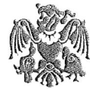

JÓSA ANDRÁS
MÚZEUM

Állami Számvevőszék

1052 Budapest
Apáczai Csere J. u. 10.sz.

Domokos László Elnök úr részére

Iktatószám: 2018-1-1 /2016.
Előzmény iktató száma: 398-1/2016.
Tárgy: Észrevétel
Melléklet:
Ügyintéző:
Telefon:
E-mail:

ÁLLAMI SZÁMVEVŐSZÉK
088-558/2016
Érkezett: 2016. OKT. 28.
Iktatószám: V-0953-142/2016
Melléklet:

Pekét Szívséginev
Csz

Tisztelt Elnök úr!

A Jósa András Múzeumba 2016. október 17-én érkezett az Önök által V-0953-133/2016. sz. alatt iktatott kisérőlevéllel a „Megyei hatókörű városi múzeumok ellenőrzése- Jósa András Múzeum” c. ellenőrzésről készült számvevőszéki jelentéstervezetük.

Először is ezúton köszönjük meg Önöknek a mindennapi gyakorlatunkban a szabályszerűség betartása érdekében hasznosítható helyes könyvelési-, dokumentálási-, joggyakorlati útmutatást.

Másodsorban pedig az alábbi észrevételeket tesszük:

- Önkormányzati fenntartású költségvetési szerv lévén minden év lezárása megtörténik leltárral, mérleggel, ez utóbbi alapján záró főkönyvi kivonattal, mivel csak ezen alapdokumentumok alapján tudjuk elkezdeni az új évek nyitását. A vizsgálatuk 2011.-2014. évekre vonatkozott, amikor is éppen fenntartó- és irányító szerv váltásokon ment keresztül intézményünk, majd 2015. áprilisában a gazdasági területünk került ki a Jósa András Múzeum szervezeti rendszeréből. Ennyi változásra-, iratmozgásra figyelemmel könnyen előfordulhat, hogy még az irattári anyagok nem kerültek a végleges helyükre. Amennyiben a jelentéstervezetben hivatkozott iratok fellelhetőkké válnak, el fogjuk juttatni Önök felé.

- Az ÁSZ vizsgálati jelentéstervezet 28. lapján, az 5.1. alatt a 4. bekezdésben megállapította, hogy 2013-2014. évben a Múzeum nem rendelkezett (végleges) vagyonkezelési szerződéssel. Ezúton jelezzük, hogy a vagyonkezelési szerződések tervezete és ezzel összefüggő levelezés rendelkezésünkre áll, bármikor be tudjuk mutatni.

- 2016. januárjától a múzeum igazgatójának rendelkezése folytán a műtárgyak mozgatása dokumentálással történik. (Jelentés 29.o./ 5.1.pont).

Jósa András Múzeum
Székhely: Nyíregyháza
Szerződésmódosítás 2016.

Tisztelt Elnök úr!

---

- A műtárgyak kölcsönzése vonatkozásában a haszonkölcsön szerződések a jövőben a jogszabály szerinti kötelező tartalmi elemeket is tartalmazni fogják. (31. o./ 5.3.pont).

Nyíregyháza, 2016. október 26.

Tisztelettel:
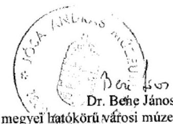
megyei hatókörű városi múzeum igazgatója

---

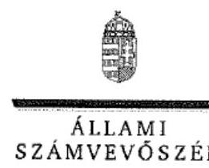

# Dr. Bene János úr 

igazgató
Jósa András Múzeum

## Nyíregyháza

## Tisztelt Igazgató Úr!

A „Megyei hatókörű városi múzeumok ellenőrzése - Jósa András Múzeum" címmel készített számvevőszéki jelentéstervezetre tett észrevételét köszönettel megkaptam.
Az Állami Számvevőszék észrevételre vonatkozó álláspontjáról a felügyeleti vezető által készített részletes tájékoztatást csatoltan megküldöm.
Tájékoztatom Igazgató urat, hogy a számvevőszéki jelentésben - az Állami Számvevőszékről szóló 2011. évi LXVI. törvény 29. § (3) bekezdése alapján - a figyelembe nem vett észrevételeket szerepeltetjük az elutasítás indokának feltüntetésével.

Budapest, 2016. november 10.
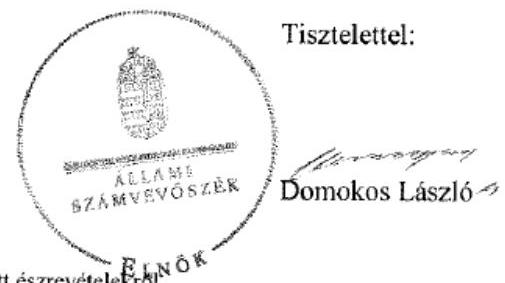

Melléklet: Tájékoztatás az el nem fogadott észrevételekről

---

# Tájékoztatás az el nem fogadott észrevételekről 

A „Megyei hatókörű városi múzeumok ellenőrzése - Jósa András Múzeum "című jelentéstervezetre a 398-1-1/2016. iktatószámú levelében tett észrevételeit áttekintettük, annak kezeléséről az alábbi tájékoztatást adom.

## 1. A jelentéstervezetre tett általános észrevétele kapcsán

Köszönettel vettem a 2011-2014. évekre vonatkozó szervezeti változásokkal összefüggő iratmozgatással, valamint az irattári anyagok elhelyezésével kapcsolatos tájékoztatását. A jelentéstervezetben hivatkozott iratanyagok fellelése esetén azok ÁSZ részére történő beküldésére - az Önök rendelkezésére álló adatszolgáltatási időszakok lezárását követően - már nincs lehetőség. Észrevétele a megállapításokat nem cáfolja, ezért azokat nem módosítja.

## 2. A jelentéstervezet 28. oldal 5.1. számú megállapítás 4. bekezdésére tett észrevétele kapcsán

Észrevételében arról tájékoztatott, hogy a vagyonkezelési szerződések tervezete és az azzal összefüggő levelezések a Jósa András Múzeumnál (továbbiakban: Múzeum) rendelkezésre állnak és be tudják mutatni azokat. Észrevételével szemben a jelentéstervezet megállapításai nem a tervezett vagyonkezelési szerződéssel, vagy annak hiányával kapcsolatos hiányosságokat mutatja be. Észrevétele nem vitatja, hogy a Múzeumnál a kezelt vagyon köre és nagysága a 2013-2014. években vagyonkezelési szerződés hiányában nem volt megállapítható. Kiegészítő mellékletben - az államháztartás szervezetei beszámolási és könyvvezetési kötelezettségének sajátosságairól szóló 249/2000. (XII. 24.) Korm. rendelet 40. § (2) bekezdés b) pontjában és az államháztartás számviteléről szóló 4/2013. (I. 11.) Korm. rendelet 29. § (2) bekezdés a) és c)
 pontjában foglalt előírások ellenére - a Múzeum nem jelezte a vagyonkezelésbe vett eszközök körének változását és a vagyonkezelési szerződés hiányát, emiatt nem érvényesült a számvitelről szóló 2000. évi C. törvény 16. § (4) bekezdésében meghatározott „lényegesség elve”. Észrevétele ezért a megállapításokat nem módosítja.

## 3. A jelentéstervezet 29. oldal 5.1. számú megállapítás 7. bekezdésének 3. francia bekezdésére tett észrevétele kapcsán

Köszönettel vettem tájékoztatását, hogy 2016. januárjától a Múzeum igazgatójának rendelkezése alapján a műtárgyak mozgatása dokumentáltan történik. Észrevétele az ellenőrzött időszakban megállapított hiányosságot nem cáfolja, az az ellenőrzött időszakon túlmutat, ezért a megállapításokat nem módosítja.

---

# 4. A jelentéstervezet 31. oldal 5.3. számú megállapítás 2. bekezdésére tett észrevétele kapcsán 

Köszönettel vettem a haszonkölcsön szerződések jövőbeni és jogszabály szerinti tartalmi elemeinek megfelelőségéről szóló tájékoztatását. Észrevétele az ellenőrzött időszakban megállapított hiányosságokat nem cáfolja, ezért a megállapításokat nem módosítja.

Budapest, 2016. 11. hó 10. nap
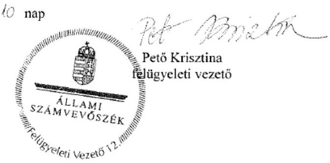

---

# RÖVIDÍTÉSEK JEGYZÉKE 

${ }^{1}$ Múzeum
${ }^{2}$ ÁSZ
${ }^{3}$ Mtv.
${ }^{4}$ Kötv.
${ }^{5} \mathrm{Kjt}$.
${ }^{6}$ múzeumigazgató
${ }^{7}$ Möktv.
${ }^{8}$ 258/2011. (XII. 7.) Korm. rendelet
${ }^{9}$ 2012. évi CLII. törvény
${ }^{10}$ 1311/2012. (VIII.23.) Korm. határozat
${ }^{11}$ KIM
${ }^{12}$ 2015. évi LXXV. tv.
${ }^{13}$ Nvtv.
${ }^{14}$ Alaptörvény
${ }^{15}$ Áht. 2
${ }^{16}$ Ávr.
${ }^{17}$ SZSZB Megyei Önkormányzat
${ }^{18}$ SZSZBMIK
${ }^{19}$ ÁSZ tv.
${ }^{20}$ irányító szerv ${ }_{1}$
irányító szerv ${ }_{2}$
irányító szerv ${ }_{3}$

Szabolcs-Szatmár-Bereg Megyei Múzeumok igazgatósága (2011. január 1-jétől 2012. december 31-ig)
Jósa András Múzeum (2013. január 1-jétől)
Állami Számvevőszék
1997. évi CXL. törvény a muzeális intézményekről, a nyilvános könyvtári ellátásról és a közművelődésről (hatályos: 1998. január 1-jétől)
2001. évi LXIV. törvény a kulturális örökség védelméről (hatályos: 2001. július 10-től)
1992. évi XXXIII. törvény a közalkalmazottak jogállásáról (hatályos: 1992. július 1-jétől)
Jósa András Múzeum (valamint a jogelőd Szabolcs-Szatmár-Bereg Megyei Múzeumok Igazgatósága) igazgatója
2011. évi CLIV. törvény a megyei önkormányzatok konszolidációjáról, a megyei önkormányzati intézmények és a Fővárosi Önkormányzat egyes egészségügyi intézményeinek átvételéről (hatályos: 2012. január 1-jétől)
258/2011. (XII. 7.) Korm. rendelet a megyei intézményfenntartó központokról, valamint a megyei önkormányzatok konszolidációjával, a megyei önkormányzati intézmények és a Fővárosi Önkormányzat egészségügyi intézményeinek átvételével összefüggő egyes kormányrendeletek módosításáról (hatályos: 2011. december 8-tól)
2012. évi CLII. törvény a muzeális intézményekről, a nyilvános könyvtári ellátásról és a közművelődésről szóló 1997. évi CXL. törvény módosításáról (hatályos: 2012. november 2-től)
1311/2012. (VIII. 23.) Korm. határozat a megyei múzeumok, könyvtárak és közművelődési intézmények fenntartásáról
Közigazgatási és Igazságügyi Minisztérium
a megyei könyvtárak és a megyei hatókörű városi múzeumok feladatának ellátását szolgáló egyes állami tulajdonú vagyontárgyak ingyenes önkormányzati tulajdonba adásáról szóló 2015. évi LXXV. törvény (hatályos 2015. július 18-tól)
2011. évi CXCVI. törvény a nemzeti vagyonról (hatályos 2011. december 31-étől) Magyarország Alaptörvénye
2011. évi CXCV. törvény az államháztartásról (hatályos: 2012. január 1-jétől)
az államháztartásról szóló törvény végrehajtásáról szóló
368/2011. (XII. 31.) Korm. rendelet (hatályos: 2012. január 1-jétől)
Szabolcs-Szatmár-Bereg Megyei Önkormányzat
Szabolcs-Szatmár-Bereg Megyei Intézményfenntartó Központ
Az Állami Számvevőszékről szóló 2011. évi LVI. törvény (hatályos: 2011. július 1-jétől)
Szabolcs-Szatmár-Bereg Megyei Önkormányzat Közgyűlése (2011. január 1-jétől 2011. december 31-ig)

Közigazgatási és Igazságügyi Minisztérium az illetékes kormányhivatal útján (2012. január 1-jétől 2012. december 31-ig)
Nyíregyháza Megyei Jogú Város Önkormányzatának Közgyűlése (2013. január 1-jétől 2014. december 31-ig)

---

${ }^{21}$ alapító okirat ${ }_{1}$

## alapító okirat ${ }_{2}$

alapító okirat ${ }_{3}$
alapító okirat ${ }_{4}$
${ }^{22}$ középirányító szerv
${ }^{23}$ Kincstár
${ }^{24}$ SZMSZ ${ }_{1}$

SZMSZ ${ }_{2}$

SZMSZ ${ }_{3}$

SZMSZ ${ }_{4}$
${ }^{25}$ átadás-átvételi megállapodás ${ }_{1}$
${ }^{26}$ megyei közgyűlés elnöke
${ }^{27}$ Áhsz. ${ }_{1}$
${ }^{28}$ NGM módszertani útmutató
${ }^{29}$ Számv. tv.
${ }^{30}$ átadás-átvételi megállapodás ${ }_{2}$
${ }^{31}$ Ámr.
${ }^{32}$ Bkr.
${ }^{33}$ Eitv.
${ }^{34}$ Info tv.
${ }^{35}$ Ötv.
${ }^{36}$ főjegyző
${ }^{37}$ Ber.
a Szabolcs-Szatmár-Bereg Megyei Múzeumok Igazgatósága Alapító Okirata (hatályos: 2011. április 1-jétől 2011. december 31-ig)
Szabolcs-Szatmár-Bereg Megyei Múzeumok Igazgatósága
IX-09/30/326/2012. okiratszámú Alapító okirata (módosításokkal egységes szerkezetben) (hatályos: 2012. január 1-jétől 2012. december 31-ig.)
a Jósa András Múzeum Alapító Okirata (hatályos: 2013. január 1-jétől 2014. február 28-ig)
a Jósa András Múzeum Alapító Okirata (hatályos: 2014. március 1-jétől)
Szabolcs-Szatmár-Bereg Megyei Intézményfenntartó Központ (2012. január 1-jétől 2012. december 31-ig)

Magyar Államkincstár
Szabolcs-Szatmár-Bereg Megyei Önkormányzat Múzeumok Igazgatóságának 22/2010. ikt. számú Szervezeti és Működési Szabályzata, amelyet a Szabolcs-Szatmár-Bereg Megyei Közgyűlés Úgyrendi és Jogi Bizottsága a 77/2010. (VI. 18.) határozatával fogadott el (hatályos: 2013. január 16-ig)
Jósa András Múzeum Szervezeti és Működési Szabályzata, amelyet Nyíregyháza Megyei Jogú Város Önkormányzatának Közgyűlés 9/2013. (I. 17) határozattal fogadott el (hatályos: 2013. január 17-től 2013. november 23-ig)
Jósa András Múzeum Szervezeti és Működési Szabályzata Nyíregyháza Megyei Jogú Város Közgyűlése Köznevelési, Kulturális és Sport Bizottsága az önkormányzati fenntartású közgyűjteményi intézmények szervezeti és működési szabályzatainak módosításáról szóló 233/2013. (XI. 25.) számú határozatával fogadott el (hatályos: 2013. november 24-től 2014. augusztus 14-ig)
Jósa András Múzeum Szervezeti és Működési Szabályzata (hatályos: 2014. augusztus 15-től)

Szabolcs-Szatmár-Bereg Megyei Önkormányzat nem egészségügyi intézményeinek átadás-átvétele tárgyában 2011. december 29-én kelt megállapodás
Szabolcs-Szatmár-Bereg Megyei Önkormányzat Közgyűlésének elnöke 249/2000. (XII. 24.) Korm. rendelet az államháztartás szervezetei beszámolási és könyvvezetési kötelezettségének sajátosságairól (hatályos: 2013. december 31-ig)
Nemzetgazdasági Minisztérium módszertani útmutató beszámoló garnitúrák összeállításához
2000. évi C. törvény a számvitelről (hatályos: 2001. január 1-jétől)

Jósa András Múzeum átadás-átvételi megállapodása, mely létrejött az Szabolcs-Szatmár-Bereg Megyei Intézményfenntartó Központ és Nyíregyháza Megyei Jogú Város Önkormányzata között, kelt 2012. december 13-án
az államháztartás működési rendjéről szóló 292/2009. (XI.19.) Korm. rendelet (hatályos: 2011. december 31-ig)
a költségvetési szervek belső kontrollrendszeréről és a belső ellenőrzésről szóló 370/2011. (XII. 31.) Korm. rendelet (hatályos: 2012. január 1-jétől)
2005. évi XC. törvény az elektronikus információszabadságról (hatályos: 2011. december 31-ig)
2011. évi CXII. törvény az információs önrendelkezési jogról és az információszabadságról (hatályos: 2011. július 27-től)
1990. évi LXV. tv. a helyi önkormányzatokról (hatályos: a 2014. évi általános önkormányzati választások napjáig)
Szabolcs-Szatmár-Bereg Megye Önkormányzatának főjegyzője 193/2003. (XI. 26.) Korm. rendelet a költségvetési szervek belső ellenőrzéséről (hatályos: 2011. december 31-ig)

---

${ }^{38}$ gazdasági szervezet ügyrend ${ }_{1}$
gazdasági szervezet ügyrend ${ }_{2}$
gazdasági szervezet ügyrend ${ }_{3}$
${ }^{39}$ számlarend ${ }_{1}$
számlarend ${ }_{2}$
számlarend ${ }_{3}$
${ }^{40}$ Áhsz. ${ }_{2}$
${ }^{41}$ önköltség számítási szabályzat ${ }_{1}$
${ }^{42}$ önköltség számítási szabályzat ${ }_{2}$
${ }^{43}$ önköltség számítási szabályzat ${ }_{3}$
${ }^{44}$ önköltség számítási szabályzat ${ }_{4}$
${ }^{45}$ Vtv.
${ }^{46}$ MNV Zrt.
${ }^{47}$ számviteli politika ${ }_{1}$
számviteli politika ${ }_{2}$
${ }^{48}$ számviteli politika ${ }_{3}$
számviteli politika ${ }_{4}$
${ }^{49}$ Kbt.
${ }^{50}$ 393/2012. (XII. 20.) Korm. rend.
${ }^{51}$ Ikr.
${ }^{52}$ 5/2010. (VIII. 18.) NEFMI rendelet
${ }^{53}$ TIOP
${ }^{54}$ TÁMOP
${ }^{55}$ HURO
${ }^{56}$ NKA
${ }^{57}$ Nvtv.
${ }^{58}$ Vtvr.
${ }^{59}$ 20/2002. (X. 4.) NKÖM rendelet
${ }^{60}$ 36/2013. (IX. 13.) NGM rendelet

Szabolcs-Szatmár-Bereg Megyei Múzeumok Igazgatósága Gazdasági Szervezetének Ügyrendje (hatályos: 2011. december 31-ig)
Szabolcs-Szatmár-Bereg Megyei Múzeumok Igazgatósága Gazdasági
Szervezetének Ügyrendje (hatályos: 2012. január 1-jétől 2012. június 28-ig)
Szabolcs-Szatmár-Bereg Megyei Múzeumok Igazgatósága Ügyrend a szervezet gazdálkodással összefüggő feladataira (hatályos: 2012. június 29-től)
Szabolcs-Szatmár-Bereg Megyei Múzeumok Igazgatósága Számlarend (hatályos: 2012. június 28-ig)

Szabolcs-Szatmár-Bereg Megyei Múzeumok Igazgatósága Számlarend (hatályos: 2012. június 29-től 2013. december 31-ig)

Jósa András Múzeum Számlakeret és Számlarend (hatályos: 2014. január 1-jétől)
4/2013. (I. 11.) Korm. rendelet az államháztartás számviteléről (hatályos: 2014. január 1-jétől)

Szabolcs-Szatmár-Bereg Megyei Múzeumok Igazgatósága Önköltség számítási Szabályzat (hatályos: 2012. június 28-ig)
Szabolcs-Szatmár-Bereg Megyei Múzeumok Igazgatósága Önköltség számítási Szabályzat (hatályos: 2012. június 29-től 2012. december 31-ig)
Jósa András Múzeum Önköltség számítási szabályzat (hatályos: 2013. január 1-jétől 2014. június 30-ig)

Jósa András Múzeum Önköltség számítási szabályzat (hatályos: 2014. július 1-jétől) 2007. évi CVI. törvény az állami vagyonról (hatályos: 2007. szeptember 25-től) Magyar Nemzeti Vagyonkezelő Zrt.
Szabolcs-Szatmár-Bereg Megyei Múzeumok Igazgatósága Számviteli Politika (hatályos: 2011. december 31-ig)
Szabolcs-Szatmár-Bereg Megyei Múzeumok Igazgatósága Számviteli Politika (hatályos: 2012. január 1-jétől 2012. december 31-ig)
Jósa András Múzeum Számviteli Politika (hatályos: 2013. január 1-jétől 2013. december 31-ig)
Jósa András Múzeum Számviteli Politika (hatályos: 2014. január 1-jétől)
2011. évi CVIII. törvény a közbeszerzésekről (hatályos: 2011. augusztus 21-től) a régészeti örökség és a műemléki érték védelmével kapcsolatos szabályokról szóló 393/2012. (XII. 20.) Korm. rendelet (hatályos: 2013. január 1-jétől 2015. március 11-ig)
a közfeladatot ellátó szervek iratkezelésének általános követelményeiről szóló 335/2005. (XII. 29.) Korm. rendelet (hatályos: 2006. január 1-jétől)
5/2010. (VIII. 18.) NEFMI rendelet a régészeti lelőhelyek feltárásának, illetve a régészeti lelőhely, lelet megtalálója anyagi elismerésének részletes szabályairól (hatályos: 2012. december 31-ig)
Társadalmi Infrastruktúra Operatív Program
Társadalmi Megújulás Operatív Program
Magyarország-Románia Határon Átnyúló Együttműködési Program
Nemzeti Kulturális Alap
2011. évi CXCVI. törvény a nemzeti vagyonról (hatályos: 2011. december 31-től) 254/2007. (X. 4.) Korm. rendelet az állami vagyonnal való gazdálkodásról (hatályos: 2007. október 4-től)

20/2002. (X. 4.) NKÖM rendelet a muzeális intézmények nyilvántartási szabályzatáról (hatályos: 2003. január 1-jétől)
36/2013. (IX. 13.) NGM rendelet az államháztartás számvitelének 2014. évi megváltozásával kapcsolatos feladatokról (hatályos: 2013. szeptember 14-től)

---

${ }^{61}$ 2/2010. (I. 14.) OKM rendelet
2/2010. (I. 14.) OKM rendelet a muzeális intézmények működési engedélyéről (hatályos: 2010. január 22-től)

---

# ÁLLAMI SZÁMVEVŐSZÉK 

1052 Budapest, Apáczai Csere János utca 10.
Levélcím: 1364 Budapest 4. Pf. 54
Telefon: +36 14849100 Telefax: +36 14849200
www.asz.hu
