# Jelentés 

## Megyei hatókörú városi múzeumok ellenőrzése

Rómer Flóris Művészeti és Történeti
Múzeum, Győr
2016.
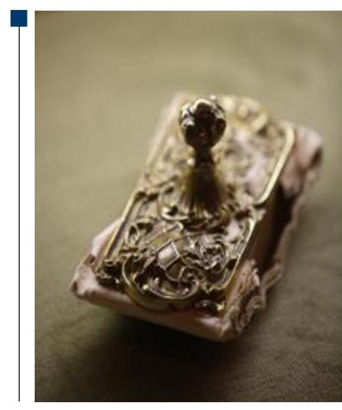

---

# Jelentés 

## Megyei hatókörú városi múzeumok ellenőrzése

Rómer Flóris Művészeti és Történeti Múzeum, Győr
2016. decauher hó 08. nap
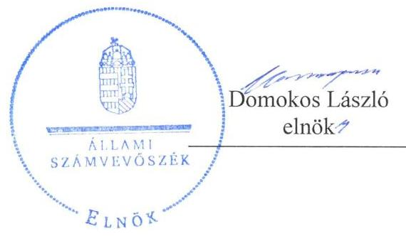
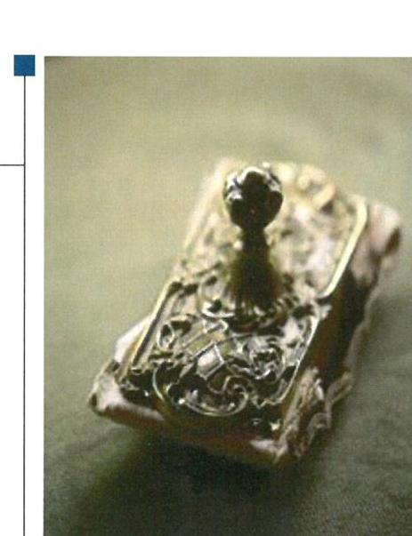

---

# AZ ELLENŐRZÉST FELÜGYELTE: 

PETŐ KRISZTINA felügyeleti vezető

## AZ ELLENŐRZÉST VEZETTE ÉS A VÉGREHAJTÁSÁÉRT FELELŐS:

DR. GYŐRI GABRIELLA ellenőrzésvezető

## A PROGRAM ÖSSZEÁLLÍTÁSÁÉRT FELELŐS:

JANIK JÓZSEF LÁSZLÓ osztályvezető

IKTATÓSZÁM: V-1006-147/2016
TÉMASZÁM: 2040
ELLENŐRZÉS-AZONOSÍTÓ SZÁM: V073715

Jelentéseink az Országgyúlés számítógépes hálózatán és az Interneten a www.asz.hu címen is olvashatóak.

---

# TARTALOMJEGYZÉK 

■ ÖSSZEGZÉS ..... 5
■ AZ ELLENŐRZÉS CÉLJA ..... 7
■ AZ ELLENŐRZÉS TERÜLETE ..... 8
■ AZ ELLENŐRZÉS HÁTTERE, INDOKOLTSÁGA ..... 11
■ A JELENTÉS LÉNYEGES KÉRDÉSKÖREI ..... 13
■ ELLENŐRZÉS HATÓKÖRE ÉS MÓDSZEREI ..... 14
■ MEGÁLLAPÍTÁSOK ..... 17
■ JAVASLATOK ..... 33
■ MELLÉKLETEK ..... 39
I. sz. melléklet: Értelmező szótár ..... 39
II. sz. melléklet: Az Integritás érvényesítése érdekében kialakított és múködtetett kontrollrendszer ..... 42
■ FÜGGELÉK: ÉSZREVÉTELEK ..... 45
■ RÖVIDÍTÉSEK JEGYZÉKE ..... 71

---

.

---

# ÖSSZEGZÉS 

A győri székhelyű Rómer Flóris Müvészeti és Történeti Múzeumnál kialakított irányítási rendszer összességében nem támogatta az átlátható, elszámoltatható és ellenőrizhető közpénzfelhasználást. A Múzeum pénzügyi- és vagyongazdálkodása nem volt szabályszerű. A Múzeum alaptevékenységének részét képező kulturális javak teljes körü nyilvántartásáról nem gondoskodtak, emiatt a kulturális javak állományvédelme és vagyonbiztonsága a kölcsönzéseknél nem volt biztositott.

## Az ellenőrzés társadalmi indokoltsága

Az Állami Számvevőszék Stratégiájának alapértéke, hogy ellenőrzései segítik az integritás alapú, átlátható és elszámoltatható közpénzfelhasználás megteremtését. Az ellenőrzés jogszabályban, vagy alapító okiratban meghatározott közfeladat ellátására létrejött, a megyei hatókörű városi muzeális intézmények gazdálkodási tevékenységére terjedt ki. E szervezetek pénzügyi és vagyongazdálkodásának alapvető rendeltetése a közfeladatok (a kulturális örökséghez tartozó javak védelme, őrzése és a nyilvánosság számára történő hozzáférhetővé tétele) ellátásának biztosítása.

A megyei hatókörű városi múzeumként működő szervezetek 2011. évtől több alkalommal jelentős szervezeti és gazdálkodási átalakuláson mentek keresztül. A tulajdonosi, a vagyonkezelői és a fenntartói szerepekben, szerkezetben történt változások előkészítése, végrehajtása, illetve a múzeumi rendszer által kezelt közvagyonnal való gazdálkodás szabályszerűségének bemutatásával az ellenőrzés hozzájárul a múzeumok fenntartási és működtetési feladatainak ellátására vonatkozó megfelelő jogszabályi környezet kialakításához, a gazdálkodási gyakorlatuk javításához.

## Főbb megállapítások, következtetések

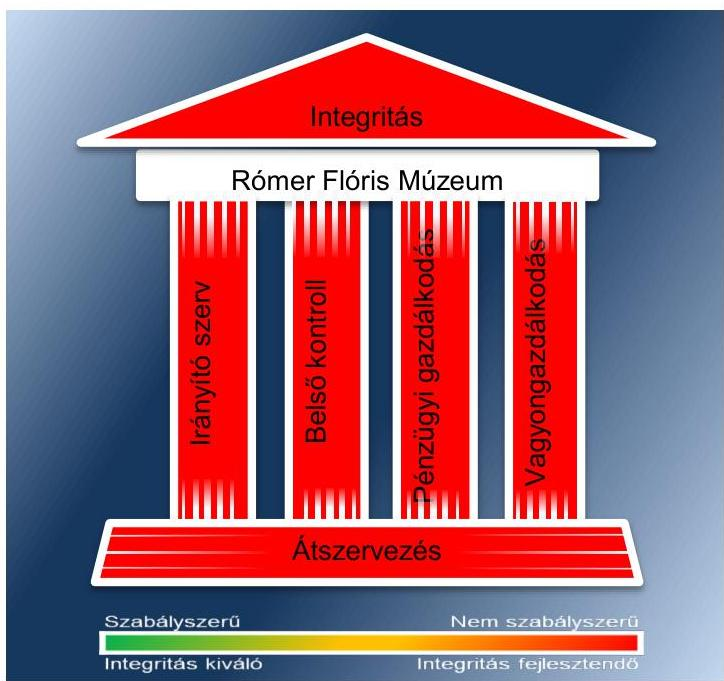

Az irányító szervek az ellenőrzött időszakban összességében nem szabályszerűen látták el az irányító szervi feladataikat. A munkáltatói jogosultságok gyakorlása során érvényesültek a jogszabályi előírások. Az egyéb irányítási, felügyeleti és ellenőrzési jogosultságok gyakorlása során a 2013-2014. években fennálló hiányosság volt, hogy az irányító szerv nem hagyta jóvá a Múzeum Szervezeti és Működési Szabályzatának módosítását.

A Múzeumnál kialakított irányítási rendszer összességében nem biztosította az átlátható, elszámoltatható és ellenőrizhető közpénzfelhasználást. A kontrollkörnyezet kialakítása a 2011-2012. évek kivételével szabályszerű volt. A Múzeum nem teljes körűen rendelkezett a gazdálkodását és múködését meghatározó belső szabályzatokkal. A kockázatkezelési rendszert a 20112012. években nem szabályszerűen alakították ki és működtették, mert nem mérték fel a Múzeum tevékenységében, gazdálkodásában rejlő kockázatokat. A kockázatkezelési rendszer kialakítása és működtetése a 2013-2014. években részben szabályszerű volt. A 20112014. években nem határozták meg a vagyonnyilatkozat-tételi kötelezettséget, a mulasztással nem intézkedtek a közélet tisztaságának biztosítása és a korrupció megelőzése érdekében. A kontrolltevékenység kialakítása és müködtetése annak ellenére részben szabályszerű volt, hogy 2011-ben, valamint 2013-2014-ben a jogszabályban foglalt

---

előírásoktól eltérően nem jelölték ki a teljesítés igazolására felhatalmazott személyeket. 2013. február 2-ától 2013. október 21-éig terjedő időszakban a gazdálkodási jogkörök gyakorlására jogosult személyekről és aláírás mintájukról nem vezettek naprakész nyilvántartást. Az információs és kommunikációs folyamatok kialakítása során 2013-2014ben nem szabályozták a kötelezően közzéteendő adatok nyilvánosságra hozatalának és a közérdekű adatok teljesítése megismerésének rendjét. Az ellenőrzött időszakban a Múzeum honlapján nem tették közzé teljes körűen a múködéshez és a gazdálkodáshoz kapcsolódó adatokat. A monitoring rendszer részeként a belső ellenőrzés kialakítása és múködtetése a 2011-2014. években nem volt szabályszerű, mert a Múzeum nem gondoskodott annak kialakításáról, ezáltal nem biztosította a gazdálkodás szabályszerűségének, a közpénzek felhasználásának ellenőrizhetőségét. A 2011-2012. évek kivételével az irányító szerv fenntartói jogkörében gondoskodott a Múzeum, mint felügyelt költségvetési szerv ellenőrzéséről, az intézkedési tervekben foglalt feladatok hasznosulását nyomon követték.

A Múzeum pénzügyi- és vagyongazdálkodása nem volt szabályszerű. A Múzeum az éves költségvetési beszámolóját a 2012. év kivételével a jogszabályban meghatározott határidőn túl készítette el. A 2012. évi költségvetési beszámoló irányító szervi jóváhagyására nem került sor. A bevételek elszámolása részben volt szabályszerű, mert a helyiségek bérbeadása során nem rendelkeztek a vagyon hasznosítására felhatalmazást adó vagyonkezelési/hasznosítási szerződéssel. A kiadási előirányzatok felhasználása a 2011-2012. években nem volt szabályszerű, a 2013-2014. években részben volt szabályszerű. A Múzeum a 2012. év kivételével nem szabályozta a teljesítés igazolásának rendjét. A gazdálkodási jogkör gyakorlói nem a jogszabályi előírásoknak megfelelően látták el a feladatukat, mert a 2011-2012. években érvényesítés, illetve utalványozás hiányában teljesítettek kifizetést, továbbá ellenjegyzés, illetve pénzügyi ellenjegyzés hiányában került sor kötelezettségvállalásra. A költségvetési beszámoló mérlegét a 2011-2013. években leltárral nem támasztották alá. A Múzeum a 2012. évi beszámolójában a feladat ellátását szolgáló vagyont szabálytalanul mutatta ki. A Múzeum 2013-2014. évi beszámolóiban kimutatott vagyon értékét vagyonkezelési szerződés nem támasztotta alá. A kulturális javak kölcsönzése során a kölcsönzési szerződések nem tartalmazták a jogszabályban rögzített állományvédelemre és vagyonbiztonságra vonatkozó kötelező tartalmi elemeket. Emiatt a kölcsönzött kulturális javak vagyonbiztonsága nem volt megfelelően biztosított.

A Múzeumot érintő szervezeti, szerkezeti átszervezések nem voltak szabályszerűek. A 2012. január 1-jétől hatályos irányító szervi váltás során a vagyon tényleges átadására szolgáló jegyzőkönyv felvételére nem került sor. A 2012/2013. évi központi alrendszerből önkormányzati alrendszerbe történő átszervezés során az átláthatóság sérült, mert a kulturális javak felsorolása és annak tagintézményenkénti meghatározása nem készült el.

A Múzeum az integritás szemlélet érvényesítése érdekében nem intézkedett.

---

# AZ ELLENŐRZÉS CÉLJA 

vényesülését a gazdálkodási folyamatokban.

Az ellenőrzés célja annak megállapítása volt, hogy a megyei múzeumi rendszer átalakítása, az intézményfenntartói rendszerben végbement változások előkészítése és végrehajtása megalapozottan, szabályszerűen történt-e; a megyei hatókörű városi múzeumok és jogelődjeik pénz-ügyi- és vagyongazdálkodása, a belső kontrollrendszer kialakítása és működtetése, valamint az intézményfenntartói feladatok ellátása szabályszerűen történt-e.

A Múzeum ${ }^{1}$ korrupcióval szembeni veszélyeztetettségének csökkentése érdekében kért tanúsítványi adatszolgáltatás alapján az ÁSZ² értékelte az integritási szemlélet ér-

---

# **Az Ellenőrzés Területe**

## **Rómer Flóris Művészeti és Történeti Múzeum**

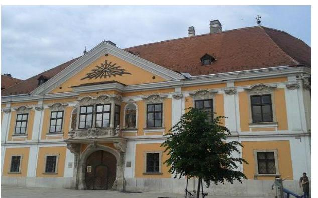

A Múzeum Győrben található, feladatkörében az Mtv.3 alapján gondoskodik a kulturális javak meghatározott anyagának folyamatos gyűjtéséről, nyilvántartásáról, megőrzéséről és restaurálásáról; tudományos feldolgozásáról, publikálásáról; valamint kiállításokon és más módon történő bemutatásáról; a közművelődési és közgyűjteményi feladatok ellátásáról. A Kötv.4 20. § (2) bekezdése alapján területileg illetékes múzeumként régészeti feltárást végzett az ellenőrzött időszakban.

A Múzeum csak a működési engedélyében meghatározott gyűjtőkörben és gyűjtőterületen folytathatja tevékenységét. A szakmai besorolást, a rendszert megalapozó szaktörvényi kereteket az Mtv. biztosítja. Az Mtv. hatálya kiterjed a Múzeum fenntartóira, a Múzeumban foglalkoztatottakra, a kulturális örökség Múzeumban őrzött elemeire, a szolgáltatások igénybe vevőire és a kulturális örökséggel foglalkozó egyéb szervezetekre.

A Múzeum 2011. évi költségvetési engedélyezett létszáma 53 fő volt, ami 2012. évben 59 főre változott, a 2013. évben 63 fő volt és 2014. évben ez további 2 fővel, 65 főre növekedett. A Múzeum alkalmazottainak foglalkoztatására a Kjt.5 alapján került sor. Az ellenőrzött időszakban a múzeumigazgató és a gazdasági vezető személye változott.

A Möktv.6 és annak végrehajtásáról szóló 258/2011. (XII. 7.) Korm. rendelet7 alapján 2012. január 1-jétől a megyei múzeumok központi költségvetési szervekké váltak. 2013. január 1-jétől a 2012. évi CLII. törvény8 és az 1311/2012. (VIII. 23.) Korm. határozat9 alapján az állami tulajdonba és fenntartásba került megyei múzeumi szervezetek a megyeszékhely megyei jogú városok fenntartásában működnek tovább. A 2011–2014. évek között a fenntartói, irányítói, középirányítói jogkörgyakorlók változását, valamint a Múzeum gazdálkodási feladatát ellátó szervezetét az 1. táblázat mutatja be.

---

1. táblázat

FENNTARTÓI, IRÁNYÍTÓI JOGKÖRGYAKORLÓK ÉS GAZDASÁGI SZERVEZET A 2011-2014. ÉVEKBEN

| Idöszak | Fennartó | irányító szerv | Középirányító szerv | Gazdasági szervezet |
| :--: | :--: | :--: | :--: | :--: |
| 2011. | Győr-Moson-   Sopron Megyei   Önkormányzat   Közgyülése | Győr-Moson-   Sopron Megyei   Önkormányzat   Közgyülése | - | Múzeum |
| 2012. | Győr-Moson-   Sopron Megyei   Intézményfenntartó Központ | KIM $^{10}$ | Győr-Moson-   Sopron Megyei   Intézményfenntartó Központ | Győr-Moson-Sopron Megyei Intézményfenntartó Központ |
| $\begin{gathered} 2013 \\ 2014 . \end{gathered}$ | Győr Megyei   Jogú Város Önkormányzata | Győr Megyei   Jogú Város Közgyülése | - | Kulturális Pénz-   ügyi-Gazdasági   Szolgáltató Köz-   pont   Forrás: a Múzeum alapító okiratai |

A Múzeum jogelődjének, a Győr-Moson-Sopron Megyei Múzeumok Igazgatóságának a jogállása 2011-2012. években önállóan működő és gazdálkodó költségvetési intézmény volt. 2013. január 1-jétől a Múzeum önállóan működő és gazdálkodó költségvetési szerv volt, 2013 júniusától a gazdálkodási feladatait megállapodás alapján a Gazdasági szervezet ${ }^{11}$ látta el. 2014. január 1-jétől a Múzeum gazdálkodási feladatait megállapodás alapján továbbra is a Gazdasági szervezet látta el, a Múzeum vállalkozási tevékenységet nem végzett.

A Múzeum teljesített költségvetési bevételeinek és kiadásaink alakulását az 1. ábra mutatja be. Az ábra a 2011-2012. években a Múzeum és tagintézményeinek együttes adatai, a 2013-2014. években a tagintézmények átadását követően a múzeumi adatok alapján készült.
1. ábra
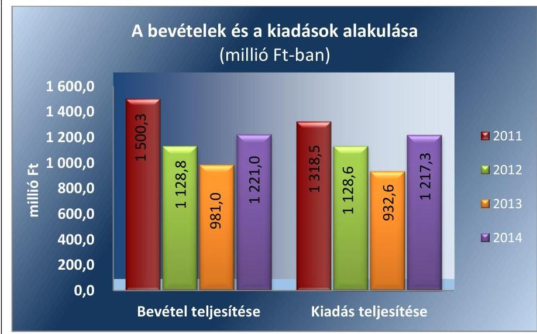

Forrás: Múzeumi beszámolók a 2011-2014. évekre
A 2015. évi LXXV. tv. ${ }^{12}$ 1. § (1) bekezdése alapján az Nvtv. ${ }^{13}$ 13. § (3) bekezdésében és 14. § (1) bekezdésében foglaltak alapján és az abban

---

meghatározott feltételekkel a 2012. évi CLII. törvény 30. § (1) és (2) bekezdésében meghatározott, a megyei hatókörű városi múzeumok feladatának ellátását szolgáló egyes állami tulajdonban lévő ingatlanok a törvény hatálybalépésének napjával, a törvény erejénél fogva a kötelező közfeladatként a megyei hatókörű városi múzeumot fenntartó önkormányzatok tulajdonába kerültek. A 2015. évi LXXV. tv. 4. § (1) bekezdése alapján a kulturális örökség helyi védelme érdekében a megyei hatókörű városi múzeumok alapleltárában és jogszabály szerinti külön nyilvántartásában szereplő állami tulajdonú kulturális javak ingyenesen a megyei hatókörű városi múzeumok vagyonkezelésébe kerültek. A vagyonkezelők vagyonkezelői joga tekintetében vagyonkezelési szerződés megkötése nem szükséges. A 2015. évi LXXV. tv. 4. § (2) bekezdése szerint továbbá a kulturális örökség helyi védelme érdekében a megyei hatókörű városi múzeumok feladatának ellátását szolgáló állami tulajdonban álló ingatlanok - a törvény mellékletében meghatározott ingatlanok kivételével - ingyenesen a fenntartó önkormányzatok vagyonkezelésébe kerültek.

---

# AZ ELLENŐRZÉS HÁTTERE, INDOKOLTSÁGA

Az Alaptörvény^{14} rendelkezése szerint a nemzeti vagyon megőrzésének, védelmének és a nemzeti vagyonnal való felelős gazdálkodásnak a követelményeit sarkalatos törvény, az Nvtv. rögzíti. A tulajdonosi joggyakorlás és vagyonkezelés általános és speciális szabályait, az állami vagyon nyilvántartására és elszámolására vonatkozó eljárásokat, a vagyonkezelési szerződés feltételrendszerét, valamint az éves beszámoló készítési és könyvvezetési kötelezettségeket kormányrendelet írja elő.

A megyei hatókörű városi múzeumok közfeladat-ellátásának változásait, (beleértve az állami tulajdonosi joggyakorló, intézményi vagyonkezelő és önkormányzati fenntartó szervezeteket is) a közfeladatok átadásából és átvételéből adódó módosításait, előirányzat gazdálkodására ható tényezőit az Áht-^{15}, az Ávr.^{16}, a Möktv., valamint az Mtv. írja elő. A múzeumi intézményrendszer rendszerátalakulásából, megszűnéséből, intézmény átszervezéséből, belső szerkezeti korszerűsítéséből, vagy más hasonló okból adódó módosításai miatt szerepeltetendő szerkezeti változásokat, valamint a szerkezeti változásként beépült közfeladatok szintre hozásként történő számításba vételét az Ávr. határozza meg.

A megyei hatókörű városi múzeumok kulturális szempontból meghatározó jelentőségűek mind földrajzi elhelyezkedésüket, mind az ellátott feladatokat, valamint a látogatottságukat tekintve. Tevékenységüket törvényi szinten (Mtv.) szabályozták a jogalkotók. A megyei hatókörű városi múzeumok jelenlegi körének kialakításában, tulajdonosi és fenntartói szerkezetében rövid idő alatt több jelentős változás történt, amelyeket jogszabályi változások indukáltak. Ezen intézmények szakmai besorolásukat tekintve a 2011. évben megyei múzeumként, a 2012. évben megyei múzeumi központi költségvetési szervezetként, a 2013. évtől kezdődően megyei hatókörű városi múzeumként működtek. A szakmai besorolások változásait párhuzamosan követték a tulajdonosi, vagyonkezelői, fenntartói szerepekben történt változások.

A 2011–2014. évek között bekövetkezett fenntartói változások a vagyontárgyak és a kulturális javak tulajdonosi, vagyonkezelői és használói körében is változást indukáltak, amelyet a 2. táblázat szemlélet.

1. táblázat

|  A VAGYON TULAJDONOSI, VAGYONKEZELŐI ÉS HASZNÁLÓI KÖRÉNEK VÁLTOZÁSA 2011–2014. ÉVEKBEN |  |  |  |  |  |  |  |  |  |  |  |  |  |  |   |
| --- | --- | --- | --- | --- | --- | --- | --- | --- | --- | --- | --- | --- | --- | --- |
|   |  |  |  |  |  |  |  |  |  |  |  |  |  | 2011–2014. ÉVEKBEN  |
|  Vagyon-
tárgy |  |  |  |  |  |  |  |  |  |  |  |  |  |   |
|   |  |  |  |  |  |  |  |  |  |  |  |  |  | 2011. év  |
|  Ingatlan |  |  |  |  |  |  |  |  |  |  |  |  |  |   |
|   | GYMS Megyei
Önkormányzat^{17} |  |  |  |  |  |  |  |  |  |  |  |  |   |
|  Egyéb
tárgyi
eszközök | GYMS Megyei
Önkormányzat |  |  |  |  |  |  |  |  |  |  |  |  |   |
|  Kulturális
javak | GYMS Megyei
Önkormányzat |  |  |  |  |  |  |  |  |  |  |  |  |   |
|   | GYMS Megyei
Önkormányzat |  |  |  |  |  |  |  |  |  |  |  |  |   |
|   |  |  |  |  |  |  |  |  |  |  |  |  |  | Forrás: a Múzeum alapító okiratai, a 2012. évi CLII. tv, a 258/2011. (XII. 7) Korm. rendelet, az 1311/2012. (VIII. 23.) Korm. határozat  |   |

---

Az ellenőrzés - tekintettel a megyei hatókörű városi múzeumokat (és jogelődjeit) rövid időn belül, gyors ütemben ért környezeti (tulajdonosi, fenntartói-szerkezetet érintő) változásokra - javaslatok megfogalmazásával hozzájárul a fenntartás és működtetés feladatainak ellátására vonatkozó megfelelő jogszabályi környezet - jogalkotók által történő - kialakításához. Az ÁSZ ellenőrzés a gazdálkodási gyakorlat javítását eredményezheti, több intézmény bevonásával átfogó képet ad a megyei hatókörű városi múzeumokat (és jogelődjeiket) jellemző sajátosságokról, jó gyakorlatokról.

AZ ELLENŐRZÉS EREDMÉNYEKÉPPEN nemcsak az ellenőrzött intézmények gazdálkodása javul, hanem átfogó képet kapunk a múzeumok gazdálkodásának hiányosságairól, de a jó gyakorlatokról is. Ellenőrzéseivel, javaslataival és megállapításaival az ÁSZ elősegíti a költségvetési szervek pénzügyi és vagyongazdálkodása szabályozásának javítását és hozzájárulhat a jó kormányzáshoz.

---

# A JELENTÉS LÉNYEGES KÉRDÉSKÖREI 

1. Az irányító szerv ellenőrzött Múzeumra vonatkozó feladatellátása szabályszerű volt-e?
2. Szabályszerüen hajtották-e végre a Múzeumot érintő szervezeti, szerkezeti átszervezéseket?
3. A belső kontrollrendszer kialakítása és müködtetése megfelelt-e a jogszabályi előírásoknak?
4. A Múzeum pénzügyi gazdálkodása szabályszerű volt-e?
5. A Múzeum vagyongazdálkodása szabályszerű volt-e?
6. A Múzeum intézkedett-e az integritás szemlélet érvényesitése érdekében?

---

# ELLENŐRZÉS HATÓKÖRE ÉS MÓDSZEREI 

## Az ellenőrzés típusa

Megfelelőségi ellenőrzés.

## Az ellenőrzött időszak

Az ellenőrzött időszak 2011. január 1-jétől 2014. december 31-ig tart.

## Az ellenőrzés tárgya

A megyei hatókörű városi múzeumok átszervezése, átalakítása előkészítése és lebonyolítása megalapozottsága, szabályszerűsége, a pénzügyi és vagyongazdálkodási tevékenység, a belső kontrollrendszer kialakítása, működtetése szabályszerűsége, valamint az irányító szervi feladatok ellátása szabályszerűsége. E tevékenységek és a kapcsolódó adatok és információk összessége, amelyeket a vonatkozó kritériumok alapján kell értékelni.

Az ellenőrzés kiterjed minden olyan körülményre és adatra, amely az ÁSZ jogszabályban meghatározott feladatainak teljesítéséhez, valamint a program végrehajtása folyamán felmerült újabb összefüggések feltárásához szükséges.

## Az ellenőrzött szervezet

Rómer Flóris Művészeti és Történeti Múzeum, a fenntartói feladatokban érintett Győr-Moson-Sopron Megyei Önkormányzat valamint Győr Megyei Jogú Város Önkormányzata, a Győr-Moson-Sopron Megyei Intézményfenntartó Központ jogutódja a Szociális és Gyermekvédelmi Főigazgatóság, valamint a gazdálkodási feladatok ellátásában érintett Kulturális Pénzügyi-Gazdasági Szolgáltató Központ.

Az ellenőrzésre a költségvetési szerv ellenőrzött intézményének és irányító szervének, illetve középirányító szervének székhelyén és a gazdálkodási feladatait ellátó szervezetének székhelyén került sor.

## Az ellenőrzés jogalapja

Az ellenőrzés jogszabályi alapját az ÁSZ tv. ${ }^{19} 1 . \S$ (3) bekezdés, 5. § (2)-(6) bekezdései, valamint az Áht. 2 61. § (2) bekezdésének előírásai képezik.

---

# Az ellenőrzés módszerei 

Az ellenőrzést az ellenőrzési program szempontjai, az ellenőrzött időszakban hatályos jogszabályok, az ellenőrzés szakmai szabályai, az egyes ellenőrzési típusokhoz kapcsolódó ÁSZ módszertanok és nemzetközi standardok figyelembe vételével végeztük. A gazdálkodás hibáinak kijavítására, a közpénzekkel való felelős gazdálkodás segítésére irányuló javaslatok kidolgozásakor a hatályos jogszabályok az irányadóak.

Az ellenőrzési kérdések megválaszolásához szükséges bizonyítékok megszerzése a következő ellenőrzési eljárások alkalmazásával történt: kérdésfeltevés (információkérés), mintavételezés, valamint elemző eljárás. A minták kiválasztása során véletlen mintavételi eljárást alkalmaztunk.

Mintavétellel ellenőriztük a bevételek, a személyi juttatások, a dologi és felhalmozási kiadások, a régészeti bevételek és kiadások elszámolása-, valamint a kulturális javak kölcsönzésének szabályszerűségét. A minta alapján a sokaságban előforduló hibaarányt becsültük. „Megfelelőnek" értékeltük az ellenőrzött területet, amennyiben 95\%-os bizonyossággal a teljes sokaságban a hibaarány legfeljebb 10\%, „részben megfelelőnek" értékeltük, ha a hibaarány felső határa 10-30\% között volt, „nem megfelelőnek" pedig akkor, ha a mintavételi eredmények alapján a sokaságbeli hibaarány felső határa meghaladta a 30\%-ot.

Az ellenőrzési bizonyítékként felhasználható adatforrások közé tartoznak egyrészt a szakmai program részletes szempontjainál felsorolt adatforrások, másrészt adatforrás lehet minden egyéb - az ellenőrzés folyamán feltárt, az ellenőrzés szempontjából releváns információt tartalmazó - dokumentum. Az ellenőrzés lefolytatásához a Múzeum a tanúsítványok elektronikus kitöltésével, valamint az ÁSZ által kért dokumentumok elektronikus megküldésével szolgáltatott adatokat. A rendelkezésre bocsátott adatok, információk kontrollja az ellenőrzés keretében történt. Az ellenőrzési kérdésekre adott válaszok alapján értékeltük, hogy az ellenőrzött időszakban az irányító szerv az ellenőrzött Múzeumra vonatkozó feladatainak szabályszerűen eleget tett-e, a Múzeum pénzügyi- és vagyongazdálkodása megfelel-t-e az előírásoknak, a Múzeum átalakításának vagy átszervezésének végrehajtása szabályszerű volt-e.

A Múzeum belső kontrollrendszere jogszabályi előírások szerinti kialakításának és működtetésének szabályszerűségét az erre irányuló ellenőrzési kérdésekre adott válaszok összesítése alapján, évente pillérenként (kontrollkörnyezet, kockázatkezelési rendszer, kontrolltevékenységek, információs és kommunikációs rendszer, monitoring rendszer) és összesítetten is minősítjük. A Múzeum belső kontrollrendszere egyes pilléreinek kialakítása és működtetése „szabályszerü", amennyiben az értékelt területen az elért és elérhető pontok százalékban kifejezett, egész számra kerekített hányadosa meghaladja a 84\%-ot, „részben szabályszerű", ha a 84\%ot nem haladja meg, de 60\%-nál nagyobb, „nem szabályszerű", ha nem haladja meg a 60\%-ot. A Múzeum belső kontrollrendszerének összesített értékelése megegyezik a pillérenként (kontrollterületenként) alkalmazott \%os értékelésekkel, a következő eltérésekkel. A kontrollrendszer egésze esetében a „szabályszerű" értékelésnek a \%-os értéken felül további feltétele, hogy egyik kontrollterület sem kaphat „nem szabályszerű" értékelést, a „részben szabályszerű" értékelés további feltétele, hogy legfeljebb egy el-

---

lenőrzött kontrollterület lehet „nem szabályszerű" értékelésű. Az összesített értékelés a \%-os értéktől függetlenül „nem szabályszerű", ha az ellenőrzött kontrollterületek közül több mint egynek „nem szabályszerű" az értékelése.

Az integritás szemlélet érvényesülésének értékelése a Múzeum által szolgáltatott adatok alapján történt.

---

# 1. Az irányító szerv ellenőrzött Múzeumra vonatkozó feladatellátása szabályszerű volt-e? 

Összegző megállapítás

Az irányító szerv $1-3^{20}$ ellenőrzött Múzeumra vonatkozó feladatellátása a 2011-2014. években nem volt szabályszerű.

AZ ALAPÍTÓI JOGOSULTSÁGOK GYAKORLÁSA az ellenőrzött időszakban részben felelt meg a jogszabályi előírásoknak. Az Múzeum az ellenőrzött időszakban rendelkezett az irányító szerv $1-3$ által jóváhagyott alapító okirat ${ }_{1-6}{ }^{21}$-tal. A módosítás során az egységes szerkezetet elkészítették, a miniszteri előzetes véleményt beszerezték.

Az irányító szerv2 a Múzeummal kapcsolatos alapítói jogosultságát - az alapító okirat kiadása kivételével - 2012-ben az Ávr. előírásainak megfelelően gyakorolta. A 2012-ben hatályos alapítói okirat ${ }_{3}$ kiadására és Kincstári ${ }^{22}$ nyilvántartásba vételére a 258/2011. (XII. 7.) Korm. rendelet 21. § (6) bekezdése szerinti 2012. január 30-ai határidőn túl 2012. július 12-én került sor.

A MUNKÁLTATÓI JOGOSULTSÁGOT az irányító szerv $1-3$ a 2011-2014. években szabályszerűen gyakorolta. A múzeum beolvadással történő átalakítása során a múzeumigazgató ${ }^{23}$ 2013. évi felmentése és az újonnan létrejött Múzeum igazgatójának kinevezése során betartották az Áht. ${ }_{2}$ és az Mtv. előírásait. A múzeumigazgatók kinevezési, felmentési és megbízási okiratai rendelkezésre álltak, a vezetői megbízás az ágazati illetékes miniszternek (EMMI ${ }^{24}$ ) felterjesztésre került.

## AZ EGYÉB IRÁNYÍTÁSI, FELÜGYELETI ÉS ELLEN-

ŐRZÉSI jogosultságok gyakorlása az ellenőrzött időszakban összességében nem volt szabályszerű.

Az irányító szerv ${ }_{1}$ az egyéb irányítási, felügyeleti és ellenőrzési jogosultságait 2011-ben szabályszerűen gyakorolta.

A 2012. évben a középirányító szerv ${ }^{25}$ a 258/2011. (XII. 7.) Korm. rendelet 11. § (2) bekezdés c) pontjának előírásától eltérően a közérdekű és közérdekből nyilvános adatok közzétételének, illetve igényre történő szolgáltatásának kötelező végrehajtását nem ellenőrizte.

Az irányító szerv $_{3}$ - mint fenntartó - a 2013-2014. években az Mtv. 50. § (2) bekezdés a) pontjának előírása ellenére nem határozta meg és nem hagyta jóvá a Múzeum stratégiai tervét. A Múzeum SZMSZ ${ }_{1}{ }^{26}$ módosítását a múzeumigazgató elkészítette, azonban a módosított SZMSZ-t az Áht. ${ }_{2}$ 9. § (1) bekezdés a) pontjának és az Mtv. 50. § (2) bekezdés b) pontjának előírásától eltérően nem az arra hatáskörrel rendelkező irányító szerv $_{3}$ hagyta jóvá, így az ellenőrzött időszak végéig az SZMSZ ${ }_{1}$ volt hatályban.

---

A 2013-2014. években a Múzeum - az Mtv. 42. § (4) bekezdés b) pontjának előírásától eltérően - nem rendelkezett a szakmai tevékenysége folytatásának alapjául szolgáló, az irányító szerv ${ }_{3}$ - mint fenntartó - által jóváhagyott küldetésnyilatkozattal.

# 2. Szabályszerúen hajtották-e végre a Múzeumot érintő szervezeti, szerkezeti átszervezéseket? 

## Összegző megállapítás

2.1. számú megállapítás

## A Múzeumot érintő szervezeti, szerkezeti átszervezés összességében nem volt szabályszerű.

A Múzeumot érintő önkormányzati alrendszerből a központi alrendszerbe történő 2012. január 1-jétől hatályos irányító szervi (fenntartói) váltás lebonyolítását nem szabályszerűen hajtották végre.

Az átadás-átvételi megállapodás ${ }_{1}^{27}$ megkötésére a 258/2011. (XII. 7.) Korm. rendelet 1. számú melléklete szerinti minta alapján határidőben került sor, a Möktv.-ben meghatározott intézmények képviselőinek aláírásával, azonban az átadás-átvétel előkészítésének szabályszerűsége dokumentumok hiányában nem volt értékelhető.

Az átadás-átvételi megállapodás ${ }_{1}$ tartalmilag hiányos volt, mert annak IV/1/11. ba) pontja előírta az alapleltárban, a külön nyilvántartásokban nyilvántartott kulturális javak felsorolását, de a kimutatást nem mellékelték a megállapodáshoz. Nem tartalmazta az átadás-átvételi megállapodás ${ }_{1}$ a 258/2011. (XII. 7.) Korm. rendelet 1. számú mellékletében foglaltak ellenére az átadott Múzeum költségvetési helyzetéről szóló dokumentumokat, továbbá az átadott ingatlanok műszaki állapotát bemutató műszaki katasztert.

A VAGYON TÉNYLEGES ÁTADÁSA során - a 258/2011. (XII. 7.) Korm. rendelet 12. § (3) bekezdésében foglaltak ellenére - jegyzőkönyv felvételére nem került sor.

A 2011. évi NGM módszertani útmutató ${ }^{28}$ 43. oldal 2/ba. pontjában előírtakat és az Áhsz. ${ }^{29}$ 13/A. § (1) és (5)-(6) bekezdéseiben foglaltakat figyelmen kívül hagyva az átadáshoz kapcsolódó vagyonátadási jelentés és vagyonátadás-átvételi jegyzőkönyv nem készült.

A 258/2011. (XII. 7.) Korm. rendelet 12. § (1) bekezdésében előírt, az átadás-átvétel alapját képező, a megyei közgyűlés elnöke ${ }^{30}$ által hitelesített vagyonleltárt nem készítették el.

## A 2013. január 1-jével végrehajtott, a központi alrendszerből önkormányzati alrendszerbe történő irányító szervi (fenntartói) váltás lebonyolítása és a szervezetrendszer átalakítása nem volt szabályszerű.

A központi alrendszerből az önkormányzati alrendszerbe történő intézmény átadáshoz kapcsolódó feladatok tekintetében a

---

1311/2012. (VIII. 23.) Korm. határozat adott iránymutatást, azonban az abban foglaltak ellenére a Múzeum átadás-átvétele előkészítésének szabályszerűsége dokumentumok hiányában nem volt értékelhető.

Az átadás-átvételi megállapodás ${ }^{31}$ megkötésére határidőben, 2012. december 14-én került sor a középirányító szerv, mint átadó és az irányító szerv3, mint átvevő aláírásával, valamint a kormánymegbízott ${ }^{32}$ és az EMMI képviselőjének egyetértésével.

# AZ ÁTADÁS-ÁTVÉTELI MEGÁLLAPODÁS2-HÖZ 

NEM MELLÉKELTE az irányító szerv2, mint átadó a Múzeum alapleltárában és a külön nyilvántartásaiban szereplő kulturális javak gyűjteményi állományát tartalmazó mellékletet az 1311/2012. (VIII. 23.) Korm. határozat 1.8 pontjában foglaltak ellenére. Nem csatolták továbbá az átadásátvételi megállapodás 1.2.14. pontjában foglaltak ellenére az átadott Múzeum 2012. évi költségvetésének várható teljesüléséről szóló dokumentumokat.

Az átadás-átvételi megállapodás ${ }_{2}$ nem tartalmazta a pénzforgalmi számlákhoz tartozó maradványok egyenlegét és a fenntartásra átadott ingatlanok műszaki állapotát bemutató műszaki katasztert, kitérve annak állapotfelmérésére.

Az elkészített beszámoló az éves elemi költségvetési beszámolónak megfelelő adattartalmú volt, de a Számv. tv. 69. § (1) bekezdése és az Áhsz. 37. § (2) bekezdése ellenére a mérlegtételek alátámasztásához leltárt nem készítettek, vagyonátadásra a mérlegben szereplő adatokat alátámasztó leltár hiányában került sor.

Az irányító szerv ${ }_{3}$ 2013. június 26-án kérte a Múzeum működési engedélyének - fenntartó váltás miatt szükségessé vált - módosítását, ezért a 2/2010. (I. 14.) OKM rendelet 23. § 2) bekezdésében előírtakra tekintettel a Múzeum 2013. július 1-jétől 2013. július 22-ig módosított működési engedéllyel nem rendelkezett. Ezen időszakban az irányító szerv ${ }_{3}$ nem biztosította a Múzeum törvényes működésének feltételét.

## A TAGINTÉZMÉNYEK 2013. ÉVI ÁTADÁSÁT RÖG-

ZÍTŐ MEGÁLLAPODÁSOKAT a 2012. évi CLII. törvényben foglaltaknak megfelelően a középirányító szerv és az átvevő települési önkormányzatok - 2012. december 13-án és december 14-én - határidőben megkötötték.

A 1311/2012. (VIII. 23.) Korm. határozat 1.8. pontjában foglaltak és a megállapodások IV. rész 1.2.11.2.1. pontjában foglaltak ellenére az alapleltárban nyilvántartott kulturális javak felsorolását nem csatolták a megállapodásokhoz. A középirányító szerv a 2012. évi NGM módszertani útmutató 44. oldal 2/ba. pontjában foglaltakat nem tartotta be, az átadáshoz kapcsolódó vagyonátadási jelentést és vagyonátadás-átvételi jegyzőkönyvet nem készített, továbbá leltár az Áhsz. 1 13/A. § (1) bekezdésében előírtak ellenére nem készült.

---

# 3. A belső kontrollrendszer kialakítása és múködtetése megfelel-te a jogszabályi elöírásoknak? 

## Összegző megállapítás

A belső kontrollrendszer kialakítása és működtetése a 20112014. években nem volt szabályszerű.

A belső kontrollrendszer kialakítása és működtetése részletes értékelését a 2011-2014. évekre vonatkozóan a 3. táblázat mutatja be.
3. táblázat

## A BELSŐ KONTROLLRENDSZER KIALAKÍTÁSÁNAK ÉS MŰKÖDTETÉSÉNEK ÉRTÉKELÉSE A 2011-2014. ÉVEKBEN

| Megnevezés | Kontroll-   környezet | Kockázatkezelés | Kontroll-   tevékenységek | Információ és   kommunikáció | Monitoring | Összesen |
| :--: | :--: | :--: | :--: | :--: | :--: | :--: |
| 2011. | részben szabály-   szerű | nem szabályszerű | részben szabály-   szerű | nem szabályszerű | nem szabályszerű | nem szabályszerű |
| 2012. | részben szabály-   szerű | nem szabályszerű | részben szabály-   szerű | nem szabályszerű | nem szabályszerű | nem szabályszerű |
| 2013. | szabályszerű | részben szabály-   szerű | részben szabály-   szerű | nem szabályszerű | nem szabályszerű | nem szabályszerű |
| 2014. | szabályszerű | részben szabály-   szerű | részben szabály-   szerű | nem szabályszerű | nem szabályszerű | nem szabályszerű |

A kontrollkörnyezet kialakítása 2011-2012. években részben volt szabályszerű a 2013-2014. években szabályszerű volt.
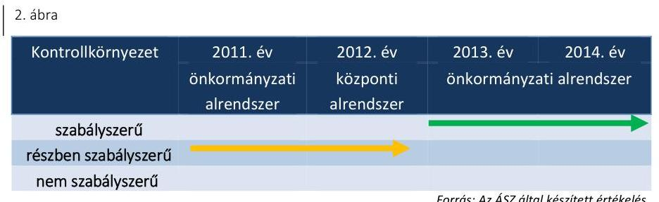

A kontrollkörnyezet 2011-2012. évi kialakítása részben volt szabályszerű. A múzeumigazgató illetve a középirányító szerv nem teljes körűen készítette el a Múzeum gazdálkodását és működését meghatározó belső szabályzatokat.

A kontrollkörnyezet 2011-2012. évi kialakításában az alábbi hiányosságok fordultak elő:
$\longrightarrow$ a múzeumigazgató nem határozta meg - 2011-ben az Ámr. ${ }^{33}$ 156. § (1) bekezdés c) pontjában, 2012-ben Bkr. ${ }^{34}$ 6. § (2) bekezdésében foglaltak ellenére - az etikai elvárásokat a szervezet minden szintjén;
$\longrightarrow$ a múzeumigazgató az SZMSZ1-ben nem határozta meg 2011-ben az Ámr. 20. § (2) bekezdése e) pontjában, 2012. évben az Ávr. 13. § (1) bekezdés e) pontjában foglaltak ellenére a szervezeti egységek engedélyezett létszámát, ezen belül a gazdasági szervezeti egység létszámát;

---

$\longrightarrow$ az SZMSZ ${ }_{1}$ nem tartalmazta 2012-ben az Ávr. 13. § (1) bekezdés b) pontjában foglaltak ellenére az aktualizált alapító okirat keltét, számát, az Ávr. 13. § (1) bekezdés c) pontjának előírásától eltérően az alaptevékenységet tartalmazó jogszabályok megjelölését, valamint az Ávr. 13. § (1) bekezdés h) pontjának előírása ellenére a munkáltatói jogkör gyakorlásának rendjét;
— 2011-ben az Ámr. 15. § (6) bekezdése, 2012-ben az Áht. 2 10. § (5) bekezdése és az Ávr. 9. § (5) bekezdése előírása ellenére a felelősségi, hatásköri viszonyokat és feladatokat meghatározó ügyrenddel a Múzeum nem rendelkezett, és a szabályozandó tárgyköröket aktualizálás hiányában az SZMSZ, illetve más belső szabályozás sem tartalmazta;
— a múzeumigazgató 2011-ben nem szabályozta a Múzeumnál az Ámr. 156. § (3) bekezdése, 2012-ben a Bkr. 6. § (4) bekezdése előírása ellenére a szabálytalanságkezelés eljárásrendjét;
A Múzeum gazdálkodási feladatait megállapodás alapján 2013 júniusától a Gazdasági szervezet látta el. A munkamegosztási megállapodás ${ }^{35}$ alapján a belső szabályozások elkészítése a Múzeum feladata volt. A kontrollkörnyezet 2013-2014. évi kialakításában - a szabályszerű minősítés mellett - az alábbi hiányosságok fordultak elő:
— a múzeumigazgató a Munka tv. ${ }^{36}$ 46. § (4) bekezdésének előírásától eltérően nem tájékoztatta határidőben és írásban a munkavállalókat a Múzeum megnevezésében, lényeges adataiban bekövetkezett változásról;
— a múzeumigazgató nem gondoskodott a jogszabályi előírásoknak teljes körűen megfelelő tartalmú eszközök források értékelési szabályzata ${ }_{2}{ }^{37}$ elkészítéséről, ezért az nem tartalmazta az Áhsz. ${ }_{1}$ 8. § (17) bekezdés d) pontja és az Áhsz. ${ }_{2}$ 50. § (2) bekezdés b) pontja előírásától eltérően követeléstípusonként a kis összegű követelések év végi meghatározásának elveit, dokumentálásának szabályait, továbbá az Áhsz. ${ }_{1}$ 8. § (18) bekezdése, az Áhsz. ${ }_{2}$ 50. § (2) bekezdés c) pontja előírásától eltérően az egyszerűsített értékelési eljárás alá vont követelések besorolásának elveit, dokumentálásának szabályait;
— a múzeumigazgató 2013. évben a Múzeum Számv. tv. hatálya alá tartozó szabályzatait (számviteli politika ${ }_{2}$, eszközök és források értékelési szabályzata ${ }_{2}$, leltározási és leltárkészítési szabályzat ${ }_{2}$, önköltség-számítási szabályzat ${ }_{2}$, továbbá pénzkezelési szabályzat ${ }_{2}{ }^{38}$ ) a Számv. tv. 14. § (11) bekezdése előírásától eltérően az előírt 90 napon túli időpontban adta ki.
A 2011-2014. években a múzeumigazgató nem gondoskodott jogszabályi előírásoknak teljes körűen megfelelő tartalmú leltározási és leltárkészítési szabályzat elkészítéséről. Emiatt a leltározási és leltárkészítési szabályzat ${ }_{1,2}{ }^{39}$ nem tartalmazta az Áhsz. ${ }_{1}$ 37. § (6) bekezdése, illetve az Áhsz. ${ }_{3}{ }^{40}$ 22. § (2) bekezdés b) pontja előírása ellenére a használt, de a mérlegben értékkel nem szereplő immateriális javak, tárgyi eszközök, készletek leltározási módját. A számviteli politika ${ }_{1-2}{ }^{41}$ nem tartalmazta az Áhsz. ${ }_{1}$ 8. § (5) bekezdésében és a Számv. tv. ${ }^{42}$ 14. § (4) bekezdésében foglaltak ellenére, hogy mit tekint a számviteli elszámolás, az értékelés szempontjából lényegesnek, nem lényegesnek. A számviteli politika ${ }_{3}$-ban a hiányosság megszüntetéséről a múzeumigazgató gondoskodott.

---

# 3.2. számú megállapítás 

A kockázatkezelési rendszert a 2011-2012. években nem szabályszerűen, a 2013-2014. években részben szabályszerűen alakították ki és müködtették.
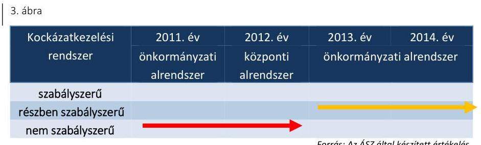

A 2011. évben az Ámr. 157. § (1) bekezdésének, 2012. évben a Bkr. 7. § (1) bekezdésének rendelkezése ellenére a múzeumigazgató a kockázatkezelési rendszer kialakításáról nem gondoskodott. A 2013-2014. években a kockázatkezelés belső szabályozásáról a Bkr.-nek megfelelően a múzeumigazgató gondoskodott.

2011-ben az Ámr. 157. § (2) bekezdésének, a 2012-2014. években a Bkr. 7. § (2) bekezdésének előírása ellenére a múzeumigazgató a kockázatkezelési rendszert nem müködtette, mert nem mérte fel és nem állapította meg a Múzeum tevékenységében, gazdálkodásában rejlő kockázatokat.

A 2011-2014. években a Vnytv. ${ }^{43}$ 4. § a) pontjának előírásától eltérően a Múzeum SZMSZ ${ }_{1}$-ben nem határozták meg a vagyonnyilatkozat-tételi kötelezettséget.

## 3.3. számú megállapítás

A kontrolltevékenység kialakítása és működtetése a 2011-2014. években részben szabályszerű volt.
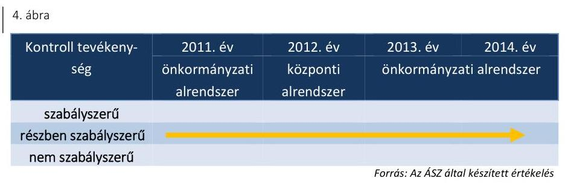

A 2011-ben az Ámr.-ben, 2012-2014. években a Bkr.-ben foglaltak alapján a Múzeum a felelősségi körök meghatározásával az SZMSZ ${ }_{1}$-ben, a FEUVE szabályzat ${ }^{44}$-ban és az informatikai szabályzat ${ }_{1,2}$-ben ${ }^{45}$ szabályozta az engedélyezési, jóváhagyási és kontrolleljárásokat, a dokumentumokhoz való hozzáférést, a hozzáférés szintjeit, az informatikai rendszerekhez való hozzáférés jogosultságait, a hozzáférés szintjeit, és a beszámolási eljárásokat.

A Múzeumnál az ellenőrzött időszakban elektronikusan történt az iktatás, azonban a múzeumigazgató az Ltv. ${ }^{46}$ 9. § (3) bekezdésében foglaltak ellenére az iktatás során nem biztosította a megfelelő tanúsítvánnyal rendelkező iratkezelési szoftver használatát.

A kontrolltevékenység működtetése során feltárt hiányosságokat részletesen a 4.3. pont tartalmazza.

---

# 3.4. számú megállapítás 

Az információs és kommunikációs folyamatok kialakítása a 2011-2014. években nem volt szabályszerű.
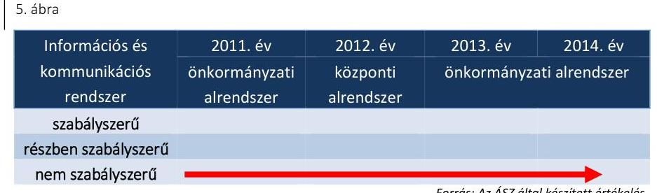

Forrás: Az ÁSZ által készített értékelés

A Múzeum a 2011-2014. években az Eitv. ${ }^{47}$ 3. § (2) bekezdése és 6. § (1) bekezdése, továbbá az Info tv. ${ }^{48}$ 33. § (3) bekezdése és a 37. § (1) bekezdése előírásától eltérően a saját, illetve a felügyeletet ellátó szerv által fenntartott honlapon a gazdálkodásra vonatkozó adatok közzétételét nem teljes körűen teljesítette. A múzeumigazgató 2011-2014. években nem gondoskodott az Eitv. melléklet III/1. pontjában és az Info tv. 1. melléklet III/1. pontjában előírt éves beszámoló közzétételéről. Továbbá az Eitv. melléklet III/4. pontjában előírt külön jogszabályban meghatározott értékű-, illetve az Info tv. 1. melléklet III/4. pontjában meghatározott 5 M Ft-ot elérő vagy azt meghaladó összegű árubeszerzésre, szolgáltatásvásárlásra vagy építési beruházásra vonatkozó szerződések adatait az ellenőrzött időszakban nem tették közzé.

A 2013-2014. években a múzeumigazgató belső szabályzatban nem szabályozta az Ávr. 13. § (2) bekezdés h) pontja előírásától eltérően a kötelezően közzéteendő adatok nyilvánosságra hozatalának rendjét, valamint a közérdekú adatok megismerésére irányuló kérelmek intézésének rendjét.

A Múzeum - 2013. október 10-étől az ellenőrzött időszak végéig hatályos - iratkezelési szabályzata nem felelt meg a jogszabályi előírásnak, mert azt a múzeumigazgató az Ltv. ${ }^{49}$ 10. § (1) bekezdés a) pontjának előírásától eltérően nem az illetékes közlevéltárral egyetértésben adta ki.
3.5. számú megállapítás

A monitoring rendszer kialakítása és múködtetése a 2011-2014. években nem volt szabályszerű.
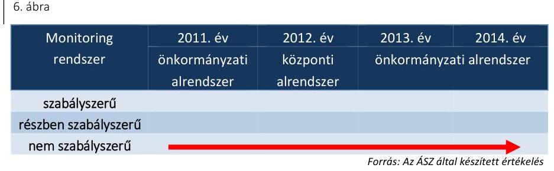

A Múzeumnál a monitoring rendszer részeként az operatív tevékenységek folyamatos és eseti nyomon követése a 2011. évben nem felelt meg az Ámr. 160. § (1)-(2) bekezdésében, a 2012-2014. években a Bkr. 10. §-ában foglaltaknak. A múzeumigazgató nem alakította ki és nem múködtette a rendelkezésre álló források szabályozott, gazdaságos, hatékony és eredményes felhasználását biztosító, a szervezeti célok elérését szolgáló feladatok, folyamatok megvalósulását mérő követelményeket 2011-ben az

---

Áht. ${ }^{50}$ 94. § (1) bekezdés b) pontjában és 121/A. § (1) bekezdésében, illetve a 2012-2014. években az Áht. ${ }_{2} 61 . \S$ (1) bekezdésében és a Bkr. 4. § a) pontjában foglaltak ellenére.

A múzeumigazgató a 2011-2012. években az Áht. ${ }_{1} 121 . \S$ (3) bekezdésében és a Bkr. 11. § (1) bekezdésében foglaltak ellenére nem értékelte nyilatkozatban a Múzeum belső kontrollrendszerének minőségét.

A múzeumigazgató a 2011-2014. években az Áht. ${ }_{1} 121 /$ B. § (4) bekezdésében és az Áht. ${ }_{2} 70 . \S$ (1) bekezdésében foglaltak ellenére nem gondoskodott a belső ellenőrzés kialakításáról.

A 2011. évben az irányító szerv ${ }_{1}$ az Ötv. ${ }^{51}$ 92. § (5) bekezdésében, az 1991. évi XX. törvény ${ }^{52}$ 111. § (1) bekezdésében, a 2012. évben a középirányító szerv a 258/2011. (XII. 7.) Korm. rendelet 11. § (2) bekezdés a) pontjában foglaltak ellenére, a Múzeum, mint felügyelt költségvetési szerv belső ellenőrzéséről nem gondoskodott.

A 2013-2014. években az irányító szerv ${ }_{3}$ a Mötv. ${ }^{53}$-ben foglaltak alapján gondoskodott a Múzeum, mint felügyelt költségvetési szerv belső ellenőrzéséről és a múzeumigazgató által készített intézkedési tervekben foglaltak megvalósulását nyomon követte.

# 4. A Múzeum pénzügyi gazdálkodása szabályszerű volt-e? 

## Összegző megállapítás

### 4.1. számú megállapítás

A Múzeum pénzügyi gazdálkodása az ellenőrzött időszakban összességében nem volt szabályszerű.

Az ellenőrzött időszakban a költségvetési tervezés, a bevételi és kiadási előirányzatok megállapítása szabályszerű volt. A Múzeum a bevételi és kiadási előirányzatok módosítását szabályszerűen, a maradvány megállapítását nem szabályszerűen hajtotta végre.

A költségvetési tervezéssel kapcsolatos feladatokat az SZMSZ1-ben és a munkamegosztási megállapodásban, továbbá 2014. évben a gazdálkodási feladatot ellátók munkaköri leírásában szabályozták.

A KÖLTSÉGVETÉSI JAVASLATOKAT az Áht.1,2-ben foglalt előírások szerint állították össze, az előirányzatok összegének megállapítását mellékszámításokkal alátámasztották. Figyelembe vették a Múzeumot érintő 2011. évi, és a 2012/2013. évi szervezeti átalakításból, átszervezésből adódó szerkezeti változások hatásait.

A MÚZEUM ELŐIRÁNYZAT MÓDOSÍTÁSAI megfeleltek az Áht. 1,2 előírásainak.

Az ellenőrzött időszakban Országgyűlési hatáskörű előirányzat módosítás nem volt, Kormány hatáskörű előirányzat módosításra a 2012. évben került sor 10,0 M Ft összegben a központi költségvetési szerveknél foglalkoztatottak bérkompenzációja miatt. Irányító szervi hatáskörű előirányzat módosítás minden évben történt, összesen 1263,2 M Ft nagyságrendben, amelyek az évközi póttámogatások, a Múzeum átszervezése, többletbevétel miatti előirányzat módosításokból adódtak. Saját hatáskörű előirányzat módosítás az ellenőrzött időszak minden évében volt, összesen

---

1347,9 M Ft nagyságrendben. A módosítások okát és összegét a Múzeum előirányzat analitikájában teljes körűen dokumentálták.

Az előirányzatok, és azok módosításainak nyilvántartása a Múzeumnál szabályszerűen megtörtént. A Múzeum rendelkezett 2011-ben az Áht.1, illetve 2012-től az Ávr. előírásai szerinti folyamatos előirányzat nyilvántartással, mely megegyezett a főkönyvi könyvelés szerinti előirányzat-változásokkal, valamint az előirányzat módosításokról vezetett analitikus nyilvántartással.

A MARADVÁNY MEGÁLLAPÍTÁSA az irányító szerv ${ }_{1,3}$ felé teljesített adatszolgáltatás késedelme miatt nem felelt meg a jogszabályi előírásoknak.

A Múzeum a költségvetési maradványáról az éves beszámoló megküldésével egyidejűleg tájékoztatta az irányító szerv ${ }_{1,3}$-at. A 2011. évi beszámolási időszakra a Múzeum az Áhsz. 1 10. § (1) bekezdésében, a 2013. és 2014. évi beszámolási időszakra vonatkozóan a Gazdasági szervezet az Áhsz. 1 10. § (1) bekezdésében, az Áhsz 2 32.§ (1) bekezdésében előírt - a költségvetési évet követő február 28-ai - határidőn túl teljesítette kötelezettségét. A 2012. évben megállapított maradványról a Múzeum az adatszolgáltatást határidőre teljesítette.

# A MÚZEUM JELENTŐSEBB ÖSSZEGŰ MARAD- 

VÁNNYAL a 2011. évben rendelkezett. 2011-ben 137,8 M Ft, 2012ben 4,5 M Ft, 2013-ban -14,0 M Ft negatív előjelű, 2014-ban 3,7 M Ft maradvány képződött a Múzeumnál.

A 2012. évi maradvány középirányító szerv általi jóváhagyása a 258/2011. (XII. 7.) Korm. rendelet 11. § (2) bekezdés i) pontjában foglalt előírás ellenére nem történt meg.

Az ellenőrzött időszakban a Múzeumot meg nem illető maradvány befizetési kötelezettség nem keletkezett.

Az éves költségvetési beszámoló elkészítése - az irányító szerv ${ }_{1,3}$ részére történő megküldés késedelme és a leltározás hiányosságai miatt - összességében nem volt szabályszerű.

AZ ÉVES KÖLTSÉGVETÉSI BESZÁMOLÓKAT folyamatosan vezetett részletező nyilvántartásokkal és könyvviteli zárlat során készített főkönyvi kivonattal alátámasztották. Az éves beszámolókat az elfogadott költségvetésekkel összehasonlítható módon, az adott év utolsó napján érvényes besorolási rendnek megfelelően készítették el.

A beszámolók leltárral való alátámasztása a 2011-2013. években nem volt megfelelő, mert a Múzeum a 2011-2013. években a Számv. tv. 69. § (3) bekezdése, az Áhsz 1 37. § (1) bekezdése és a munkamegosztási megállapodás II/5/2. pontjának előírása ellenére nem végezte el a mérlegben kimutatott eszközök és források leltározását.

A költségvetési beszámolókat a múzeumigazgató és a beszámoló elkészítéséért kijelölt felelős személy írta alá az Áhsz.1,2-ben foglalt előírások szerint.

A 2011., 2013. évi beszámolót az Áhsz. 1 10. § (1) bekezdésében rögzített határidőn túl, a 2014. évi beszámolót pedig az Áhsz. 2 32. § (1) bekezdésében rögzített határidőn túl küldte meg a Múzeum, illetve a Gazdasági

---

### 4.3. számú megállapítás

szervezet jóváhagyásra az irányító szerv ${ }_{1,3}$ részére. Az adatszolgáltatást legkésőbb a következő költségvetési év február 28-áig kellett az irányító szervnek megküldeni. A jogszabályi rendelkezés ellenére a 2011. évről 2012. március 5-én, a 2013. évről 2014. március 3-án, a 2014. évről 2015. március 6-án, teljesítette az adatszolgáltatást a Múzeum, illetve a Gazdasági szervezet.

A 2012. évi költségvetési beszámoló irányító szerv ${ }_{2}$ általi jóváhagyása az Áht. 2 88. § (1) bekezdésében foglalt előírás ellenére nem történt meg.

A bevételi előirányzatok teljesítése a 2011-2014. években részben felelt meg a jogszabályokban és a belső szabályzatokban foglaltaknak. A kiadási előirányzatok felhasználása a 2011-2012. években nem felelt meg, a 2013-2014. években részben felelt meg a jogszabályi előírásoknak.

A bevételi előirányzatok teljesítése a Múzeumnál 2011-2013. években meghaladta a módosított előirányzatokat. A 2014. évben a Múzeum az 1261,3 M Ft módosított bevételi előirányzatot 1221,0 M Ft-ra ( $96,8 \%$-ra) teljesítette, mert a működési bevételek előirányzatai teljesültek ugyan, de az irányító szervi támogatás elmaradt a módosított előirányzattól. A Múzeumnak nem kellett módosítania az előirányzatot, mert a maradvány megállapításánál ki nem utalt támogatásként szerepelt az elmaradt támogatás.

A BEVÉTELEK ELSZÁMOLÁSA részben felelt meg a jogszabályi előírásoknak, mert a vagyonelemek hasznosítása során nem tartották be maradéktalanul a jogszabályokban és a belső szabályzatokban foglalt előírásokat. A Múzeum a 2011-2014. évek között hatályos önköltség-számítási szabályzat ${ }_{1,2}{ }^{54}$ II. fejezet 2. pontjában foglaltak ellenére a múzeumi helyiségek bérleti dijának meghatározását, a régészeti feltárások és hatástanulmányok-, valamint 2013-tól a régészeti szakfelügyelet dijának meghatározását nem támasztotta alá önköltségszámítással. A bevételek teljesítése a kiszámlázott bevételek nagy részénél, a számlán előírt fizetési határidőn túl realizálódott.

A 2012-2013. évet érintő helyiség bérbeadása - a Vtv. ${ }^{55}$ 23. § (1)-(2) bekezdésében és a 25. § (4) bekezdésében előírt, a vagyon hasznosítására felhatalmazást adó - MNV Zrt. ${ }^{56}$-vel megkötendő vagyonkezelési/hasznosítási szerződés hiányában, szabálytalanul történt.

A Múzeum a módosított kiadási előirányzatait a 2012-2013. években túllépte, ami ellentétes volt az Áht. 2 36. § (1) bekezdésében foglalt előírásokkal, miszerint kötelezettség a jóváhagyott előirányzat terhére vállalt kötelezettségekkel csökkentett összegéig vállalható. A kiadási előirányzat túllépésre a többlet-bevételek fedezetet biztosítottak.

A KIADÁSI ELŐIRÁNYZATOK teljesítésével összefüggő kifizetések során a gazdálkodási jogköröket a 2011-2012. években nem megfelelően, a 2013-2014. években részben megfelelően gyakorolták. A következő hiányosságok, szabálytalanságok fordultak elő:
a múzeumigazgató 2011-ben az Ámr. 20. § (3) bekezdés a) pontjának, 2013-2014. években az Ávr. 13. § (2) bekezdése a) pontjának előírása ellenére belső szabályzatban nem rendezte a szakmai teljesítésigazolás/teljesítés igazolás gyakorlásának módjával kapcsolatos

---

belső előírásokat, továbbá 2011-ben az Ámr. 76. § (5) bekezdésének, 2013-2014-ben az Ávr. 57. § (4) bekezdésének előírásai ellenére nem jelölte ki írásban a szakmai teljesítés igazolására/teljesítésigazolásra jogosult személyeket;
—2013. február 2-ától október 21-ig az Ávr. 60. § (3) bekezdésének előírása ellenére a múzeumigazgató nem gondoskodott a kötelezettségvállalásra, pénzügyi ellenjegyzésre, érvényesítésre és utalványozásra jogosult személyeket és aláírás mintájukat tartalmazó nyilvántartás naprakész vezetéséről;
—pénztári kifizetésre 2011-ben az Ámr. 77. § (3) bekezdésének, 2012ben az Ávr. 58. § (3) bekezdésének előírása ellenére érvényesítés hiányában került sor;
—2011-ben az Ámr. 74. § (1) bekezdésnek, 2012-2013-ban az Áht. 2 37. § (1) bekezdésének előírása ellenére több esetben ellenjegyzés, illetve pénzügyi ellenjegyzés hiányában került sor kötelezettségvállalásra;
— a kiadás utalványozása - 2011-ben az Ámr. 78. § (1) bekezdésének, 2012-ben az Ávr. 59. § (1) bekezdésének előírása ellenére - nem az érvényesített okmány alapján történt;
— utalványozásra 2011-ben az Áht. 1 100/C. § (6) bekezdésében, 2012ben az Áht. 2 38. § (1) bekezdésében foglaltak ellenére több esetben nem került sor;
— a 100 ezer Ft alatti kifizetéseket, szabálytalanul előzetes írásbeli kötelezettségvállalás nélkül teljesítették, mert ennek rendjét - 2011ben az Ámr. 72. § (13) bekezdés a) pontjában, az Ámr. 72. § (14) bekezdésében, 2012-2014. évek között az Ávr. 53. § (1) bekezdés a) pontjában és az Ávr. 53. § (2) bekezdésében foglalt előírások ellenére - a Múzeum belső szabályzataiban nem rögzítették.
A közalkalmazottak besorolása, az illetmény- és bérpótlékok, kiegészítések megállapítása és kifizetése összességében megfelelt a Kjt.-ben, a 150/1992. (XI. 20.) Korm. rendeletben ${ }^{57}$, valamint az Mtv.-ben meghatározott követelményeknek. A számviteli elszámolást alátámasztó dokumentumok megfeleltek a jogszabályi előírásoknak, a kiadások számviteli elszámolása megfelelő költségnemre történt.

A 2011-2014. években a Kbt. ${ }_{1,2}{ }^{58}$ hatálya alá tartozó beszerzéseknél a közbeszerzés tárgyának becsült értékét meghatározták, a lefolytatott eljárásokat dokumentálták, a szerződéseket a nyertes ajánlattevőkkel kötötték meg.

A BEKERÜLÉSI ÉRTÉK MEGHATÁROZÁSA során az ellenőrzött időszakban elvégzett felújítások aktiválására a 2011-2012. években több esetben nem került sor, az Áhsz. 1 18. § (1)-(2) bekezdésében, és annak 9. melléklet 1. számlaosztály tartalmára vonatkozó előírásában foglalt - az eszközök bekerülési értékének meghatározására vonatkozó - előírások ellenére.

A 2011-2012. évi felújítások aktiválásának elmaradása miatt az értékcsökkenés elszámolása nem felelt meg a Számv. tv. 52. § (2) bekezdésében foglalt előírásnak, mert az nem az üzembe helyezés időpontjától történt.

---

# 4.4. számú megállapítás 

A KULTURÁLIS JAVAK nyilvántartásba vétele az előírásoknak megfelelően történt. Az ellenőrzött időszakban 2012. évben került sor beszerzésre, adás-vétel keretében. A beszerzett mútárgyat a kulturális javak szakleltárkönyvébe a 20/2002. (X. 4.) NKÖM rendeletnek ${ }^{59}$ megfelelően bevezették.

## A régészeti tevékenység bevételei érdekében teljesített kiadások elszámolása 2011-2012 években részben megfelelő volt, 20132014. években megfelelő volt, összességében részben felelt meg a jogszabályi előírásoknak.

A régészeti tevékenység bevételeit a régészeti felügyelet ellátására vonatkozó megrendelésekkel, valamint régészeti feltárásra vonatkozó szerződésekkel támasztották alá a 2011-2014. években. A szerződések megfeleltek a Kötv., illetve a 393/2012. (XII. 20.) Korm. rendelet ${ }^{60}$ rendelkezéseinek.

A költségelszámolást megalapozó dokumentumok, szerződések rendelkezésre álltak, de a felmerült kiadások nem minden esetben voltak konkrét bevételi szerződésekhez köthetők. Az ellenőrzött időszakban a régészeti feltárásokat az 5/2010. (VII. 18) NEFMI rendelet ${ }^{61}$ és a 80/2012. (XII. 28.) BM rendelet ${ }^{62}$ előírásainak megfelelő végzettségű régészek közreműködésével végezték el.

A régészeti tevékenységgel összefüggésben a gazdálkodási jogkörök gyakorlása során az alábbi hiányosságok fordultak elő:
$\longrightarrow$ a szakmai teljesítés igazolására, illetve a teljesítés igazolására jogosult személyeket a múzeumigazgató nem jelölte ki, eljárása nem felelt meg 2011-ben az Ámr. 76. § (5) bekezdésében, 2013-2014-ben az Ávr. 57. § (4) bekezdésében foglaltaknak;
—_ 2011-ben az Ámr. 76. § (1) bekezdésében, 2013-2014-ben az Ávr. 57. § (1) bekezdésében foglalt előírások ellenére szakmai teljesítésigazolás/teljesítés igazolás hiányában történtek kifizetések;
—_ 2011. évben az Ámr. 74. § (1) bekezdésében foglaltak ellenére a régészeti feltárásokhoz szükséges munkálatok elvégzésére vonatkozó kötelezettségvállalásra pénzügyi ellenjegyzés hiányában került sor;
—_ a 2011-2012. években kifizetésre érvényesítés illetve utalványozás hiányában került sor, mert az Ámr. 77. § (3) bekezdésében, illetve az Ávr. 58. § (3) bekezdésében foglaltak ellenére az érvényesítés nem tartalmazta az érvényesítő keltezéssel ellátott aláírását; továbbá az Ámr. 78. § (2) bekezdés a) pontjában illetve az Ávr. 59. § (3) bekezdés g) pontjában foglaltak ellenére a külön írásbeli rendelkezés nem tartalmazta az utalványozó aláírását.
A Múzeum az 5/2010. (VIII. 18.) NEFMI rendeletben foglaltak alapján a régészeti célú pénzeszközök elkülönített kezelésére pénzforgalmi számlájához alszámlát vezetett és rendelkezett analitikus nyilvántartással a régészeti tevékenységre vonatkozóan.

---

### 4.5. számú megállapítás

Az ellenőrzött időszakban a 2013. év kivételével a pénzügyi egyensúly biztosított volt. A Múzeum zavartalan feladatellátása, a fizetőképesség fenntartása intézkedést nem igényelt.

A Múzeum pénzügyi egyensúlya annak ellenére biztosított volt, hogy a 2012. évben az Áht. 2 78. § (2) bekezdése előírásai ellenére nem készített likviditási tervet.

A Múzeum a fizetési kötelezettségeit - a 2013. év kivételével - határidőben teljesítette. 2013. év végén 60,5 M Ft szállítói tartozása volt a Múzeumnak, ebből 16,9 M Ft 30 nap alatti és 43,6 M Ft 30-60 nap közötti tartozásállományból tevődött össze. A lejárt szállítói állomány 2014. év végére 0,5 M Ft-ra csökkent.

A múzeumigazgató a 2011-2012. években a Múzeum beszámolójában a Számv. tv. 29. § (2) bekezdésében, az értékelési szabályzat ${ }_{1}$ 1.2.7.7. pontjában foglaltak ellenére olyan vevőköveteléseket mutatott ki, amelyek vevő általi elismertetésére nem került sor. A Gazdasági szervezet vezetője a 2013-2014. években a Múzeum beszámolójában a Számv. tv. 29. § (2) bekezdésében, az értékelési szabályzat ${ }_{1}$ 1.2.7.7. pontjában, valamint az értékelési szabályzat ${ }_{2} 5$. pontjában foglaltak ellenére olyan vevőköveteléseket mutatott ki, amelyek vevő általi elismertetésére nem került sor.

A lejárt határidejű követelések behajtására 2012-ben és 2013-ban a Múzeum az értékelési szabályzat ${ }_{1}$ 1.2.7.5. pontjában és az értékelési szabályzat ${ }_{2} 5$. pontjában foglaltak ellenére nem intézkedett, nem küldött ki fizetési felszólításokat a vevőknek.

A határidőn túli követelések év végi állománya a 2011. évi 29,9 M Ft-ról 104,4 M Ft-ra növekedett 2014. év végére. A lejárt követelések összege az összes vevőkövetelés több mint kétharmadát tette ki 2013-ban, 2014-ben pedig közel felét. A követelések jellemzően régészeti tevékenységből származó vevőkövetelések voltak. A 2011-2014. években az Áht.1,2 előírásaival összhangban követelés elengedésére nem került sor.

# 5. A Múzeum vagyongazdálkodása szabályszerű volt-e? 

## Összegző megállapítás

### 5.1. számú megállapítás

A Múzeum vagyongazdálkodása a 2011-2014. években nem volt szabályszerű.

Az eszközök és források nyilvántartása a 2011-2014. közötti időszakban nem felelt meg a jogszabályi előírásoknak.

A Múzeum a 2011. évben a közfeladat ellátását szolgáló vagyont ingyenesen használta, mely a Számv. tv. és az Áhsz. 1 előírásainak megfelelően, szabályszerűen került nyilvántartásba vételre.

A 2012. január 1-jei önkormányzati konszolidációt követően a tulajdonosi jogokat az állami tulajdon felett az MNV Zrt. gyakorolta, míg a fenntartói jogok és kötelezettségek a középirányító szervhez kerültek. A Múzeum a feladat ellátását szolgáló vagyont továbbra is használta, azonban erre vonatkozó szerződéssel a Vtv. 25. § (4) bekezdésében foglaltak ellenére nem rendelkezett. Az ingatlanok a középirányító szerv vagyonkezelésébe tartoztak, így azokat a Múzeum nem mutatta ki beszámolójában. A tárgyi eszközöket és immateriális javakat azonban - a Számv. tv. 23. § (2)

---

bekezdésében, az Nvtv. 11. § (8) bekezdésében, továbbá az Áhsz. ${ }_{1} 15 . \S$ (1) bekezdésében foglaltak ellenére - a 2012. évi beszámolójában a Múzeum szabálytalanul kimutatta. A Múzeum 2012. évi beszámolójának mérlegében kimutatott állami vagyon értéke teljes egészében az Áhsz. 1 5. § 8. pontja szerinti jelentős összegű hibát eredményezett és az, az Áhsz. 1 5. § 10. pontjában meghatározott megbízható és valós képet lényegesen befolyásoló hiba volt.

Az Mtv. 2013. január 1-jétől hatályos 45/A. § (2) bekezdés a) pontja szerint a megyei hatókörű városi múzeum lett a vagyonkezelője a tevékenységéhez szükséges állami vagyonnak. A 2013-2014. években a Múzeum az Nvtv. 11. § (1) és (7) bekezdésének és a Vtvr. ${ }^{63}$ 8. § (6) bekezdésének előírása ellenére nem rendelkezett vagyonkezelési szerződéssel. A 20132014. években a Múzeum beszámolójában kimutatott vagyon értékét vagyonkezelési szerződés nem támasztotta alá. Az alapító okirat5-ben rendelkeztek azokról az ingatlan vagyonelemekről, melyeket a feladat ellátáshoz az irányító szerv3 a Múzeum használatába adott, de azok értékét nem jelölték meg. Az alapító okirat5-ben rögzítették továbbá azoknak az ingatlanoknak a körét, amire az MNV Zrt.-vel vagyonkezelési szerződést kellett volna kötni a Múzeumnak, azonban erre nem került sor.

A kezelt vagyon köre és nagysága a 2013-2014. években vagyonkezelési szerződés hiányában nem volt megállapítható. Kiegészítő mellékletben a Múzeum a Számv. tv. 23. § (2) bekezdésében előírtak ellenére nem mutatta be mérlegtételek szerinti megbontásban a kezelésbe vett állami eszközöket, és az Áhsz. 2 29. § (2) bekezdés c) pontjában előírtak ellenére nem jelezte a vagyonkezelési szerződés hiányát, emiatt nem érvényesült a Számv. tv. 16. § (4) bekezdésében meghatározott „lényegesség elve".

A KULTURÁLIS JAVAK NYILVÁNTARTÁSA a 20112014. években nem felelt meg a 20/2002. (X. 4.) NKÖM rendelet előírásainak. A múzeumigazgató a 2011-2012. években a 20/2002. (X. 4.) NKÖM rendelet 19. § (2) bekezdésének előírásától eltérően belső szabályzatban nem rögzítette a külön nyilvántartások kezelésére, adataira valamint a nyilvántartási eszközök őrzésére vonatkozó szabályokat. A múzeumigazgató a 20/2002. (X. 4.) NKÖM rendelet 19. § (1) bekezdés ab) pontjában foglalt előírások ellenére a 2011-2014. években a kölcsönvett tárgyak naplóját nem vezette. A múzeumigazgató a 2011-2014. években a gyűjteményeiből ideiglenesen kikerült kulturális javakról a kölcsönadott tárgyak naplóját nem vezette, mely nem felelt meg a 20/2002. (X. 4.) NKÖM rendelet 19. § (1) bekezdés b) pontjában foglaltaknak. A letéti napló, a gyarapodási napló, a mozgatási napló, a duplum napló és a restaurálási napló vezetéséről az ellenőrzött időszakban gondoskodtak. A kulturális javak nyilvántartását az ellenőrzött időszakban a 20/2002. (X. 4.) NKÖM rendelet alapján elektronikusan és párhuzamosan papír alapon is vezették.

# 5.2. számú megállapítás 

A költségvetési beszámoló mérlegét 2011-2013. években leltárral nem támasztották alá, 2014. évben a költségvetési beszámolót alátámasztó leltár nem felelt meg a jogszabályi előírásoknak.

A Múzeum a könyvviteli mérlegben kimutatott eszközök és források valódiságát a Számv. tv. 69. § (1) bekezdésében és az Áhsz. 1 37. § (1) bekezdésében foglalt előírások ellenére a 2011-2013. években leltárral nem támasztotta alá.

---

A 2011. és 2013. évben a Számv. tv. 65. § (1) bekezdésében, az Áhsz. ${ }_{1}$ 22. § (1) bekezdés a)-b) pontjában foglalt előírások ellenére a követeléseket a mérlegben - elismerés hiányában - mutatták ki.

A mérleget alátámasztó leltár a 2014. évben nem felelt meg az Áhsz. 2 15. § (2) bekezdésében foglaltaknak, mert a vagyonkezelésbe vett eszközök bekerülési értéke az átadónál kimutatott bruttó érték, melyről nem volt információ. Ezen hiányosság miatt a leltár értékadatai dokumentummal nem voltak megfelelően alátámasztva.

A Múzeum az eredményszemléletű számvitelre történő áttérés feladatait a 36/2013. (IX. 13.) NGM rendelet előírásai ellenére nem szabályszerűen hajtotta végre. A rendező mérlegben vevő által el nem ismert követelést mutattak ki, mely nem felelt meg a Számv. tv. 65. § (1) bekezdésében foglalt előírásnak, továbbá a 36/2013. (IX. 13.) NGM rendelet 2. § (1) bekezdésében foglalt előírások ellenére a mennyiségben és értékben nyilvántartott eszközök tényleges mennyiségi felvétellel történő leltározását a Múzeum nem végezte el.

# 5.3. számú megállapítás 

A kulturális javak hasznosítása és kölcsönzése az ellenőrzött időszakban nem felelt meg a jogszabályi előírásoknak. A kulturális javak vagyonbiztonságára és állományvédelmére vonatkozó előírásokat nem érvényesítették megfelelően.

A KULTURÁLIS JAVAK KÖLCSÖNZÉSE során a Múzeum a 2011-2014. években rendelkezett az Mtv.-ben előírt határozott idejű írásbeli kölcsönzési szerződéssel.

A 2011-2014. között megkötött kölcsönzési szerződésekben az Mtv. 38. § (8) bekezdés a) pontjában, illetve a 2013. október 25-től hatályos 38/A. § (2) bekezdés a) pontjában foglaltak ellenére nem rögzítették a kölcsönvevő által a kölcsönzött kulturális javaknak biztosítandó állományvédelmi követelményeket, beleértve a klimatikus viszonyokat, továbbá nem rögzítették a csomagolási-, szállítási feltételeket. A 2012-2014. között megkötött szerződésekben az Mtv. 38. § (8) bekezdés c) pontjában és a 2013. október 25-től hatályos 38/A. § (2) bekezdés c) pontjában foglaltak ellenére nem írták elő a kölcsönvevő által nyújtandó vagyonbiztonsági feltételeket.

Az Mtv. 38. § (9) bekezdése miniszteri hozzájáruláshoz köti a kölcsönzést, amennyiben a kölcsönbe vevő nem muzeális intézmény, vagy a kölcsönzés külföldre történik. A 2012. évben az Mtv. 38. § (9) bekezdésében foglaltak ellenére a nem muzeális intézmény részére történő kölcsönzés esetén nem állt rendelkezésre a miniszteri hozzájárulás. A 2013. augusztus 22-én külföldre történt kölcsönzés esetén az Mtv. 38. § (9) bekezdésében foglaltak ellenére nem állt rendelkezésre a miniszteri hozzájárulás.

Az Mtv. 2013. október 25-től hatályos 38/A. § (3) bekezdése alapján a kölcsönzési szerződéshez mellékelni kell a kulturális javak kölcsönbe adás időpontjában fennálló fizikai állapotát dokumentáló szakleírást és képi ábrázolást. Az Mtv. 38/A. § (3) bekezdésének hatályba lépése után kötött kölcsönzési szerződésekhez a 2013-2014. években nem kapcsolódott dokumentáló szakleírás és képi ábrázolás.

---

A KULTURÁLIS JAVAK ÖRZÉSE ÉS ÁLLOMÁNYVÉDELME a kölcsönzési szerződések állományvédelemmel kapcsolatos - előzőekben felsorolt - hiányosságai miatt nem volt megfelelően biztosított. A raktárakban elhelyezett kulturális javak állagvédelme biztosított volt. A Múzeum a használatában álló épületeket, az állandó és időszakos kiállítások bemutatására alkalmas helyiségeket, gyűjteményi raktárakat elektronikus és mechanikus, továbbá élőerős védelemmel látta el a 2/2010. (I. 14.) OKM ${ }^{64}$ rendeletben foglaltaknak megfelelően.

# 6. A Múzeum intézkedett-e az integritás szemlélet érvényesítése érdekében? 

Összegző megállapítás A Múzeum nem intézkedett integritásának fejlesztése érdekében.

Az ellenőrzés részletes megállapításait a jelentéstervezet II. számú - „Az Integritás érvényesítése érdekében kialakított és múködtetett kontrollrendszer" című - melléklete tartalmazza.

---

# JAVASLATOK 

Az ÁSZ tv. 33. § (1) bekezdésében foglaltak értelmében az ellenőrzött szervezet vezetője köteles a jelentésben foglalt megállapításokhoz kapcsolódó intézkedési tervet összeállítani és azt a jelentés kézhezvételétől számított 30 napon belül az ÁSZ részére megküldeni. Amennyiben az ellenőrzött szervezet vezetője nem küldi meg határidőben az intézkedési tervet, vagy továbbra sem elfogadható intézkedési tervet küld, az Állami Számvevőszék elnöke az ÁSZ tv. 33. § (3) bekezdése a) és b) pontjaiban foglaltakat érvényesítheti.

## Győr Megyei Jogú Város Önkormányzata polgármesterének

1. Intézkedjen a Múzeum stratégiai terve meghatározása és jóváhagyása érdekében.
(1. sz. megállapítás 7. bekezdésének 1. mondata alapján)
2. Intézkedjen a Múzeum jogszabályi előírásnak megfelelő tartalmú szervezeti és müködési szabályzata jóváhagyása érdekében.
(1. sz. megállapítás 7. bekezdésének 2. mondata alapján, 3.2. sz. megállapítás 3. bekezdése alapján)
3. Intézkedjen a Múzeum küldetésnyilatkozatának jóváhagyása érdekében.
(1. sz. megállapítás 8. bekezdése alapján)
4. Tegyen intézkedéseket a feltárt szabálytalanságok tekintetében a felelősség tisztázása érdekében, és szükség szerint intézkedjen a felelősség érvényesítéséről.
(4.3. sz. megállapítás 5. bekezdésének 1. francia bekezdése, 4.4. sz. megállapítás 3. bekezdésének 1. francia bekezdése, 4.4. sz. megállapítás 3. bekezdésének 2. francia bekezdése, 5.1. sz. megállapítás 5. bekezdésének 3., 4. mondata, 5.3. sz. megállapítás 2. bekezdése, 5.3. sz. megállapítás 4. bekezdésének 2. mondata alapján)

---

# a Kulturális Pénzügyi-Gazdasági Szolgáltató Központ igazgatójának 

1. Tegyen intézkedéseket a Múzeum éves költségvetési beszámolója adatainak a Kincstár által müködtetett elektronikus adatszolgáltató rendszerbe történő feltöltésére a jogszabályban elöirt határidőben.
(4.1. sz. megállapítás 7. bekezdésének 2. mondata, 4.2. sz. megállapítás 4. bekezdésének 1., 3. mondata alapján)
2. Tegyen intézkedéseket vevő által elismert követelések kimutatására az éves költségvetési beszámolóban.
(4.5. sz. megállapítás 3. bekezdésének 2. mondata alapján)
3. Intézkedjen a jogszabályi előírásnak megfelelő éves költségvetési beszámoló készitésére.
(5.1. sz. megállapítás 4. bekezdésének 2. mondata alapján)
4. Intézkedjen a jogszabályi előírásoknak megfelelő leltár összeállitására.
(5.2. sz. megállapítás 3. bekezdése alapján)
5. Tegyen intézkedéseket a feltárt szabálytalanságok tekintetében a felelősség tisztázása érdekében, és szükség szerint intézkedjen a felelősség érvényesitéséröl.
(5.1. sz. megállapítás 4. bekezdésének 2. mondata, 5.2. sz. megállapítás 3. bekezdése alapján)

## a Rómer Flóris Művészeti és Történeti Múzeum igazgatójának

1. A belső kontrollrendszer szabályszerű kialakítása és müködtetése érdekében intézkedjen:
a) a munkavállalók írásban történő tájékoztatására a Múzeum megnevezésében, lényeges adataiban bekövetkezett változásokról a jogszabályban elöirt határidőben;
(3.1. sz. megállapítás 3. bekezdésének 1. francia bekezdése alapján)

---

b) a Múzeum jogszabályi előírásnak megfelelő eszközök és források értékelési szabályzata és leltározási és leltárkészítési szabályzata elkészitésére;
(3.1. sz. megállapítás 3. bekezdésének 2. francia bekezdése, 3.1. sz. megállapítás 4. bekezdésének 1., 2. mondata alapján)
c) a Múzeum tevékenységében, gazdálkodásában rejlő kockázatok felmérésére és megállapítására;
(3.2. sz. megállapítás 2. bekezdése alapján)
d) a szervezeti és müködési szabályzat jogszabályi előírásnak megfelelő tartalmú módosítására és kezdeményezze annak jóváhagyását;
(1. sz. megállapítás 7. bekezdésének 2. mondata, 3.2. sz. megállapítás 3. bekezdése alapján)
e) a megfelelő tanúsítvánnyal rendelkező iratkezelési szoftver használatára;
(3.3. sz. megállapítás 2. bekezdése alapján)
f) az elektronikus közzétételi kötelezettség jogszabályi előírásoknak megfelelő teljesítésére;
(3.4. sz. megállapítás 1. bekezdése alapján)
g) a kötelezően közzéteendő adatok nyilvánosságra hozatalának rendje és a közérdekú adatok megismerésére irányuló kérelmek intézésének rendje belső szabályzatban való meghatározására;
(3.4. sz. megállapítás 2. bekezdése alapján)
h) az iratkezelési szabályzat jogszabályi előírásnak megfelelő kiadására;
(3.4. sz. megállapítás 3. bekezdése alapján)
i) az operatív tevékenységek keretében megvalósuló folyamatos és eseti nyomon követésre;
(3.5. sz. megállapítás 1. bekezdésének 1. mondata alapján)
j) a belső ellenőrzés kialakítására a jogszabályi előírás betartása érdekében.
(3.5. sz. megállapítás 3. bekezdése alapján)

---

2. A szabályszerű pénzügyi gazdálkodás érdekében intézkedjen:
a) a múzeumi helyiségek bérleti dijának, a régészeti feltárások és ha-tástanulmányok-, valamint a régészeti szakfelügyelet dijának önköltségszámitással való alátámasztására;
(4.3. sz. megállapítás 2. bekezdésének 2. mondata alapján)
b) a szabályszerű vagyonhasznosításra;
(4.3. sz. megállapítás 3. bekezdése alapján)
c) a belső szabályzatban a teljesítésigazolás gyakorlásának módjával kapcsolatos belső előirások meghatározására;
(4.3. sz. megállapítás 5. bekezdésének 1. francia bekezdése alapján)
d) a teljesítés igazolására jogosult személyek írásban történő kijelölésére;
(4.3. sz. megállapítás 5. bekezdésének 1. francia bekezdése, 4.4. sz. megállapítás 3. bekezdésének 1. francia bekezdése alapján)
e) az előzetes írásbeli kötelezettségvállalást nem igénylő kifizetések rendje szabályozására;
(4.3. sz. megállapítás 5. bekezdésének 7. francia bekezdése alapján)
f) a teljesítésigazolás jogszabályi előírásnak megfelelő gyakorlására.
(4.4. sz. megállapítás 3. bekezdésének 2. francia bekezdése alapján)
3. A szabályszerű vagyongazdálkodás érdekében intézkedjen:
a) a kölcsönvett tárgyak naplója és a kölcsönadott tárgyak naplója vezetésére a jogszabályi előírás betartása érdekében;
(5.1. sz. megállapítás 5. bekezdésének 3., 4. mondata alapján)
b) a kulturális javak kölcsönzése esetén a jogszabályban előirtak betartására.
(5.3. sz. megállapítás 2. bekezdése, 5.3. sz. megállapítás 4. bekezdésének 2. mondata alapján)

---

4. Tegyen intézkedéseket a feltárt szabálytalanságok tekintetében a felelösség tisztázása érdekében, és szükség szerint intézkedjen a felelősség érvényesitéséről.
(4.4. sz. megállapítás 3. bekezdésének 2. francia bekezdése, 5.1. sz. megállapítás 5. bekezdésének 3., 4. mondata, 5.3. sz. megállapítás 2. bekezdése, 5.3. sz. megállapítás 4. bekezdésének 2. mondata alapján)

---

.

---

# MELLÉKLETEK 

- I. SZ. MELLÉKLET: ÉRTELMEZŐ SZÓTÁR
állami vagyon kezelője /vagyonkezelő

ÁSZ Integritás Projekt
belső ellenőrzés
belső kontrollrendszer
belső kontrollrendszer területei
fenntartó

Az állami vagyont az MNV Zrt. maga kezeli, vagy szerződés - így különösen bérlet, haszonbérlet, szerződésen alapuló haszonélvezet, vagyonkezelés, megbízás - alapján központi költségvetési szervnek, természetes vagy jogi személynek, illetőleg jogi személyiséggel nem rendelkező gazdasági társaságnak hasznosításra átengedi (Forrás: Vtv. 23. § (1) bekezdése, hatályos 2010. január 01 - 2011. december 31-ig).
Az állami vagyont az MNV Zrt. maga kezeli, vagy szerződés - így különösen bérlet, haszonbérlet, megbízás - alapján központi költségvetési szervnek, természetes vagy jogi személynek, vagy jogi személyiséggel nem rendelkező gazdálkodó szervezetnek hasznosításra átengedi." Az állami vagyonra vonatkozóan az MNV Zrt. kizárólag az Nvtv-ben meghatározott személyekkel köthet vagyonkezelési szerződést.
(Forrás: Vtv. 27. § (1) bekezdése, hatályos 2012. január 1-jétől)
Az Állami Számvevőszék 2009-ben indította el a „Korrupciós kockázatok feltérképezése - Integritás alapú közigazgatási kultúra terjesztése" című, európai uniós forrásból megvalósított kiemelt projektjét (Integritás Projekt). Az Integritás Projekt célja, hogy felmérje a közszféra intézményei korrupciós kockázatoknak való kitettségét, illetőleg az azok mérséklésére hivatott kontrollok szintjét. Az Állami Számvevőszék a projekt révén az integritás szemlélet minél szélesebb körrel történő megismertetését, gyakorlatba ültetését kívánja elérni. Az integritás követelményeinek megfelelő szervezeti működést előnyben részesítő közigazgatási kultúra elterjesztését és a korrupció elleni fellépést az ÁSZ önmagára nézve is stratégiai jelentőségű célként fogalmazta meg. A projekt a felmérésben résztvevő intézmények számára helyzetükről egyfajta „tükörképet" mutat be, ami alapot teremt a jövőbeni pozitív irányú elmozduláshoz. (Forrás: a http://integritas.asz.hu honlapon közzétett, a 2013. évi Integritás felmérés eredményeiről készült összefoglaló tanulmány)
Független, tárgyilagos bizonyosságot adó és tanácsadó tevékenység, amelynek célja, hogy az ellenőrzött szervezet működését fejlessze és eredményességét növelje, az ellenőrzött szervezet céljai elérése érdekében rendszerszemléletű megközelítéssel és módszeresen értékeli, illetve fejleszti az ellenőrzött szervezet irányítási és belső kontrollrendszerének hatékonyságát. (Forrás: Bkr. 2. § b) pontja)
A belső kontrollrendszer a kockázatok kezelése és tárgyilagos bizonyosság megszerzése érdekében kialakított folyamatrendszer, amely azt a célt szolgálja, hogy a múködés és gazdálkodás során a tevékenységeket szabályszerűen, gazdaságosan, hatékonyan, eredményesen hajtsák végre, az elszámolási kötelezettségeket teljesítsék, megvédjék az erőforrásokat a veszteségektől, károktól és nem rendeltetésszerű használattól. (Forrás: Áht. 2 69. § (1) bekezdése)
A kontrollkörnyezet, a kockázatkezelési rendszer, a kontrolltevékenységek, az információs és kommunikációs rendszer, valamint a nyomon követési (monitoring) rendszer. (Forrás: Bkr. 3. §-a)
A muzeális intézmény fenntartója az a természetes személy, jogi személy, jogi személyiség nélküli gazdasági társaság, amely biztosítja a muzeális intézmény folyamatos és rendeltetésszerű múködéséhez szükséges feltételeket (1997. évi CXL. tv. 50. § (1) bek.)

---

FEUVE

Információs és kommunikációs rendszer
integritás
irányító szerv/felügyeleti szerv
kockázat
kockázatkezelési rendszer
kontrollkörnyezet
kontrolltevékenységek
kötelezettségvállalás
középirányító szerv

A kontrolltevékenység részeként minden tevékenységre vonatkozóan biztosítani kell a folyamatba épített, előzetes, utólagos és vezetői ellenőrzést (FEUVE), különösen az alábbiak vonatkozásában:
a) a pénzügyi döntések dokumentumainak elkészítése (ideértve a költségvetési tervezés, a kötelezettségvállalások, a szerződések, a kifizetések, a támogatásokkal való elszámolás, a szabálytalanság miatti visszafizettetések dokumentumait is),
b) a pénzügyi kihatású döntések célszerűségi, gazdaságossági, hatékonysági és eredményességi szempontú megalapozottsága,
c) a költségvetési gazdálkodás során az előzetes és utólagos pénzügyi ellenőrzés, a pénzügyi döntések szabályszerűségi szempontból történő jóváhagyása, illetve ellenjegyzése,
d) a gazdasági események elszámolása (a hatályos jogszabályoknak megfelelő könyvvezetés és beszámolás) kontrollja. (Forrás: Bkr. 8. § (2) bekezdése)
A költségvetési szerv vezetője által kialakított és működtetett olyan rendszer, mely biztosítja, hogy a megfelelő információk a megfelelő időben eljutnak az illetékes szervezethez, szervezeti egységhez, illetve személyhez. (Forrás: Bkr. 9. § (1) bekezdés)

Az integritás az elvek, értékek, cselekvések, módszerek, intézkedések konzisztenciáját jelenti, vagyis olyan magatartásmódot, amely meghatározott értékeknek megfelel.
(Forrás: Nemzetgazdasági Minisztérium: Magyarországi államháztartási belső kontroll standardok Útmutató 1.6.1. pontja, 2012. december)
A költségvetési szerv tekintetében az e törvényben meghatározott irányítási hatáskört gyakorló szerv. (Forrás: Áht. 1 1. § 9. pontja)
A kockázat annak a valószínűségét jelenti, hogy egy vagy több esemény vagy intézkedés nem kívánt módon befolyásolja a rendszer múködését, céljainak megvalósulását. (Forrás: Javaslatok a korrupciós kockázatok kezelésére - Kockázatkezelési és ellenőrzési módszertan 35. oldal, ÁSZ)
Olyan irányítási eszközök és módszerek összessége, melynek elemei a szervezeti célok elérését veszélyeztető tényezők (kockázatok) azonosítása, elemzése, csoportosítása, nyomon követése, valamint szükség esetén a kockázati kitettség mérséklése. (Forrás: Bkr. 2. § m) pontja)
A költségvetési szerv vezetője által kialakított olyan elvek, eljárások, belső szabályzatok összessége, amelyben világos a szervezeti struktúra, egyértelműek a felelősségi, hatásköri viszonyok és feladatok, meghatározottak az etikai elvárások a szervezet minden szintjén, átlátható a humánerőforrás-kezelés. (Forrás: Bkr. 6. § (1) bekezdés)
A költségvetési szerv vezetője által a szervezeten belül kialakított (kontroll) tevékenységek, melyek biztosítják a kockázatok kezelését, hozzájárulnak a szervezet céljainak eléréséhez. (Forrás: Bkr. 8. § (1) bekezdés)
A kiadási előirányzatok terhére fizetési kötelezettség vállalásáról szóló - így különösen a foglalkoztatásra irányuló jogviszony létesítésére, szerződés megkötésére, költségvetési támogatás biztosítására irányuló - szabályszerűen megtett jognyilatkozat. (Forrás: Áht. 2. § o) pont)
A költségvetési szerv tekintetében törvény vagy kormányrendelet alapján meghatározott, átruházott irányítási hatásköröket gyakorló szerv. (Forrás: Áht. 9. § (4) bekezdés)

---

megyei hatókörű városi múzeum
megyei Intézményfenntartó Központ
monitoring rendszer
tagintézmény
vagyongazdálkodás
zárolás

A megyei hatókörű városi múzeum feladata a kulturális javak helyi védelmének települési szintet meghaladó, egy megye közigazgatási területére kiterjedő biztosítása. (1997. évi CXL. tv. 45. § (1) bek.)
A megyei intézményfenntartó központ önállóan működő és gazdálkodó központi költségvetési szerv. Székhelye a megyeszékhely városban, a Pest Megyei Intézményfenntartó Központ székhelye Budapesten van. A Kormány az átvett intézmények tekintetében - a közoktatási intézmények kivételével - a megyei intézményfenntartó központot jelöli ki a 2011. évi CLIV. tv. 3. § (1) bek. és a 9. § (1) bek. szerinti feladat ellátására. (258/2011. (XII.7.) Korm. rendelet 2. § (1), (2) bek., 4. §)
A költségvetési szerv vezetője köteles olyan monitoring rendszert működtetni, mely lehetővé teszi a szervezet tevékenységének, a célok megvalósításának nyomon követését. A költségvetési szerv monitoring rendszere az operatív tevékenységek keretében megvalósuló folyamatos és eseti nyomon követésből, valamint az operatív tevékenységektől függetlenül működő belső ellenőrzésből áll. (Forrás: Ámr. 160. §, Bkr. 10. §)
A muzeális intézmény szervezeti egységeként működő, önálló működési engedéllyel rendelkező muzeális intézmény (Forrás: Mtv. 1. számú melléklet y) pontja)
A nemzeti vagyongazdálkodás feladata a nemzeti vagyon rendeltetésének megfelelő, az állam, az önkormányzat mindenkori teherbíró képességéhez igazodó, elsődlegesen a közfeladatok ellátásához és a mindenkori társadalmi szükségletek kielégítéséhez szükséges, egységes elveken alapuló, átlátható, hatékony és költségtakarékos működtetése, értékének megőrzése, állagának védelme, értéknövelő használata, hasznosítása, gyarapítása, továbbá az állam vagy a helyi önkormányzat feladatának ellátása szempontjából feleslegessé váló vagyontárgyak elidegenítése. (Forrás: Nvtv. 7. § (2) bekezdése)
A költségvetési kiadási előirányzatok felhasználásának időlegesen, feltételhez kötötten történő korlátozása, felfüggesztése. (Forrás: Áht. 2 2. § s) pont)

---

# II. SZ. MELLÉKLET: AZ INTEGRITÁS ÉRVÉNYESÍTÉSE ÉRDEKÉBEN KIALAKÍTOTT ÉS MŰKÖDTETETT KONTROLLRENDSZER 

A közintézmények korrupciós kockázatoknak való kitettségét, valamint az azzal szembeni ellenálló képességüket az ÁSZ az integritás projekt keretében feltérképezi és értékeli. A Múzeum az ÁSZ integritás projektjéhez a 2011-2014. években nem csatlakozott, kérdőívet nem töltött ki. A Múzeum az ellenőrzés során töltött ki integritás tanúsítványt. Az integritás szemlélet érvényesülésének értékelése a Múzeum által szolgáltatott adatok alapján történt.
A Múzeum által kitöltött tanúsítvány alapján három indexérték meghatározására került sor. Ezek a következők:
Az Eredendő Veszélyeztetettségi Tényezők (EVT) index a szervezetek jogállásától és feladatköreitől függő - eredendő - veszélyeztetettség összetevőit teszi mérhetővé. Olyan tényezők határozzák meg, amelyek alakítása az alapítószerv jogalkotási hatáskörébe tartozik, így például a hatósági jogalkalmazás, a (jogi) szabályozás, vagy a különféle (oktatási, egészségügyi, szociális és kulturális) közszolgáltatások nyújtása.

A Korrupciós Veszélyeket Növelő Tényezők (KVNT) index az egyes intézmények napi működésétől függő - az eredendő veszélyeztetettséget növelő - összetevőket jeleníti meg. Leképezi a költségvetési szervek jogi/intézményi környezetének jellemzőit, működésük kiszámíthatóságát, stabilitását, továbbá az intézmények működtetése során jelentkező - alapvetően a mindenkori menedzsment döntéseitől befolyásolt - olyan változó tényezőket, mint a stratégiai célok meghatározása, a szervezeti struktúra és kultúra alakítása, valamint a személyi és költségvetési erőforrásokkal, illetve a közbeszerzésekkel való gazdálkodás.

A Kockázatokat Mérséklő Kontrollok Tényezője (KMKT) index azt tükrözi, hogy az adott szervezetnél léteznek-e intézményesült kontrollok, illetőleg, hogy ezek ténylegesen működnek-e, betöltik-e rendeltetésüket. Ehhez az indexhez olyan faktorok tartoznak, mint a szervezet belső szabályozása, a belső ellenőrzés, valamint az egyéb integritás kontrollok: etikai követelmények meghatározása, összeférhetetlenségi helyzetek kezelése, a bejelentések, panaszok kezelése, rendszeres kockázatelemzés.

Az egyes indexértékek szintjének (alacsony, közepes, magas) meghatározásához viszonyítási pontként a 2014. évi Integritás felmérésben válaszadó Kulturális intézményekre számított indexértékek számtani átlaga szolgált.
A szolgáltatott adatok alapján az ellenőrzött Múzeumra kiszámolt indexértékek, illetve a 2014. évi Integritás felmérésben a Kulturális intézményekre kalkulált átlagos mutatószámok összevetése alapján megállapítható, hogy a Múzeum:

- eredendő veszélyeztetettségi (EVT) szintje alacsony, amelyet többek között az eredményezett, hogy a Múzeum egyedi hatósági jogkörrel nem rendelkezett;
- kockázatokat növelő tényező (KVNT) szintje közepes, amely a külső szabályozási környezet, a szervezeti struktúra és felső vezetést érintő szervezeti változásokból adódott, illetve
- a szervezetnél kiépült, kockázatok kezelésére hivatott kontrollok (KMKT) szintje alacsony, amely főként a belső szabályozás és a korrupció ellenes rendszerek és eljárások hiányosságaival függött össze.

Az ellenőrzött Múzeum indexértékeit, illetve azok szintjét a 2014. évi Integritás felmérésben adatot szolgáltató kulturális intézmények átlagos mutatószámainak tükrében az alábbi táblázat szemlélteti.

| Index neve | A 2014. évi Integritás   felmérésben válaszadó   Kulturális Intézmények   átlagos indexértékei | Múzeum által kitöltött   tanúsítvány alapján   számított indexérté-   kek | Múzeum indexértéke-   inek szintje (alacsony,   közepes, magas) |
| :-- | :--: | :--: | :--: |
| Eredendő Veszélyeztetettségi Té-   nyezők (EVT) | $16,01 \%$ | $7,86 \%$ | Alacsony |
| Korrupciós Veszélyeket Növelő Té-   nyezők (KVNT) | $21,43 \%$ | $17,23 \%$ | Közepes |
| Kockázatokat Mérséklő Kontrollok   Tényező (KMKT) | $59,54 \%$ | $42,48 \%$ | Alacsony |

---

A Múzeum intézkedései fejlesztendőek voltak az integritás szemlélet szervezeten belüli érvényesítése érdekében, mivel:

- a Múzeum jogállásához és feladatköreihez kapcsolódó eredendő kockázatok alacsony szintje, valamint az azok kezelésre kiépített kontrollok alacsony szintje összességében „megfelelő",
- a Múzeum múködésében rejlő korrupciós veszélyeztetettséget növelő tényezők közepes szintje és a kontrollok alacsony kiépítettségének együttes értékelése „fejlesztendő" minősítést kapott a tanúsítványban szolgáltatott adatok alapján. A mutatószámok összevetésének eredményét az alábbi ábra szemlélteti.

| Összevetett   mutatószámok | A kockázati tényezők és a kiépült kontrollok szintjének együttes értékelése   (fejlesztendő, megfelelő, kiváló) |
| :-- | :--: |
| EVT - KMKT | Megfelelő |
| KVNT - KMKT | Fejlesztendő |

A kockázatok és a kontrollok szintje alapján megállapítható, hogy a Múzeumnál jelenlévő kockázatokat növelő tényezők szintje meghaladja az azok kezelésére kiépült kontrollok szintjét. Mindezek alapján a szervezet integritása fejlesztendő értékelést kapott.

Az integritás szemlélet érvényesítését tovább segítené a rendszerszerű és korrupciós kockázatelemzés elvégzése, az összeférhetetlenség kérdéskörének leszabályozása, a Múzeum munkatársai számára korrupció ellenes képzések bevezetése.

---

.

---

# FÜGGELÉK: ÉSZREVÉTELEK 

A jelentéstervezetet a Számvevőszék 15 napos észrevételezésre megküldte az ellenőrzött szervezetek vezetőinek az ÁSZ tv. 29. §* (1) bekezdése előírásának megfelelően.
A Győr Megyei Jogú Város Önkormányzatának polgármestere és a Kulturális Pénzügyi-Gazdasági Szolgáltató Központ igazgatója az ellenőrzés megállapításaira írásban észrevételt tett.
A Rómer Flóris Müvészeti és Történeti Múzeum igazgatója és a Győr-Moson-Sopron Megyei Önkormányzat elnöke, valamint a Szociális és Gyermekvédelmi Főigazgatóság föigazgatója az ÁSZ. tv. 29. § (2) bekezdésében foglalt észrevételezési jogával nem élt, a törvényes határidőn belül észrevételt nem tett.
Az elfogadott észrevételek alapján az Állami Számvevőszék módosította a jelentést.
A függelék tartalmazza az ellenőrzött szervezetek vezetőinek észrevételeit mellékletek nélkül, illetve az el nem fogadott észrevételek elutasításának indoklását.

[^0]
[^0]:    * 29. § (1) Az Állami Számvevőszék az ellenőrzési megállapításait megküldi az ellenőrzött szervezet vezetőjének vagy az általa megbízott személynek, és annak, akinek személyes felelősségét állapította meg.
    (2) Az ellenőrzött szervezet vezetője és a felelősként megjelölt személy az ellenőrzés megállapításaira tizenöt napon belül írásban észrevételt tehet.
    (3) Az Állami Számvevőszék az észrevételre a beérkezésétől számított harminc napon belül írásban válaszol. A figyelembe nem vett észrevételeket köteles a jelentésben feltüntetni, és megindokolni, hogy azokat miért nem fogadta el.

---

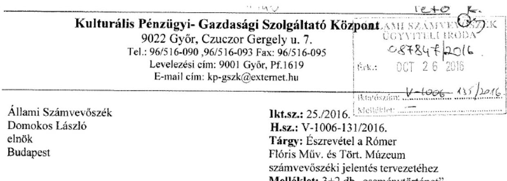

# Tisztelt Elnök Úr! 

A Rómer Flóris Művészeti és Történeti Múzeum ellenőrzéséről készült számvevőszéki jelentéstervezet 34. oldal 1-5. pontjával kapcsolatban az alábbi észrevételt teszem:

## - 1. pont

A KP-GSZK minden esetben, amikor ez lehetséges a KGR rendszerben határidőben felrögzítette és felrögzíti az intézmény adatszolgáltatását.
Ez így történt a jelentésben hivatkozott 2013. és 2014. évi beszámoló vonatkozásában is.
A KGR rendszerböl kinyomtatott „eseménytörténet" bizonyítja, hogy a 2013. évi beszámoló feladása 2014.02.25. 14 óra 12 perckor megtörtént.
Intézményünk arról nem tehetett, hogy 2014.02.27. 00 óra 45 perckor verzióváltás történt.
Ezt követően az irányító szerv vissza adta az adatszolgáltatást, mely javítást követően 2014.03.03. $10^{00}$ órakor ismételten feladásra került.

A 2014. évi beszámoló rögzítése, és mentése a KGR rendszerben - a csatolt „eseménytörténet" tanúsága szerint - 2015.02.24. napjáig megtörtént.
Hibás paraméterezés miatt nem lehetett az adatszolgáltatást feladni.
A már hivatkozott „eseménytörténet"-en látható, hogy a február 27-én, és a március 2-án történt verzióváltást követően lehetett az adatszolgáltatást 2015. március 4-én feladni.
Ezt követően március 6-án ismételt verzióváltás volt, melynek kapcsán az adatszolgáltatás „újra nyitott" státuszú lett, melyet 2015. március 6.11 óra 47 perckor ismételten feladtam.

## - 2-5. pont

A KP-GSZK az intézménnyel kötött munkamegosztási megállapodásban foglaltak alapján bizonyos feladatokat lát el, mely nem korlátozza az intézmény szakmai döntési rendszerét, önálló jogi személyiségét és felelősségét.
Fentiek alapján a KP-GSZK igazgatója intézkedési, felelősségre vonási jogosultsággal nem rendelkezik a 2-5. pontokban felsorolt esetekben.

Győr, 2016. 10.25.
Tisztelettel:
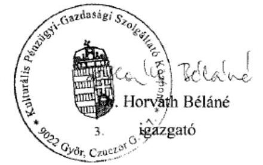

---

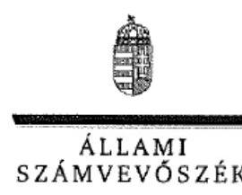

ELNÖK

Ikt.szám: V-1006-136/2016.

# Dr. Horváth Béláné úrhölgy 

igazgató
Kulturális Pénzügyi-Gazdasági Szolgáltató Központ

## Győr

## Tisztelt Igazgató Úrhölgy!

A ,,Megyei hatókörü városi múzeumok ellenörzése - Rómer Flóris Müvészeti és Történeti Múzeum " címmel készített számvevőszéki jelentéstervezetre tett észrevételét köszönettel megkaptam.
Az Állami Számvevőszék észrevételre vonatkozó álláspontjáról a felügyeleti vezető által készített részletes tájékoztatást csatoltan megküldőm.
Tájékoztatom Igazgató úrhölgyet, hogy a számvevőszéki jelentésben - az Állami Számvevőszékről szóló 2011 . évi LXVI. törvény 29. § (3) bekezdése alapján - a figyelembe nem vett észrevételeket szerepeltetjük az elutasítás indokának feltüntetésével.

Budapest, 2016. 14 hó 17 nap
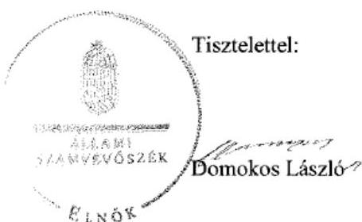

Melléklet: Tájékoztatás az elfogadott és az el nem fogadott észrevételekről

---

# Tájékoztatás az elfogadott és az el nem fogadott észrevételekról 

A „Megyei hatókörü városi múzeumok ellenörzése - Rómer Flóris Müvészeti és Történeti Múzeum" című jelentéstervezetre a 25./2016. iktatószámú levelében tett észrevételeit áttekintettük, annak kezeléséről az alábbi tájékoztatást adom.

1. A jelentéstervezet 34. oldal 1. számú javaslatot alátámasztó - 25. oldal 4.1. sz. megállapítás 7. bekezdésének 2., 26. oldal 4.2. sz. megállapítás 4. bekezdésének 1., 3. - megállapításaira tett észrevétele kapesán

Köszönettel vettem tájékoztatását a KGR rendszer verzióváltással kapcsolatban. Észrevételében arról ad tájékoztatást, hogy a 2013. évi beszámoló feladása 2014. február 25-én, illetve a javított beszámoló ismételt feladása 2014. március 3-án megtörtént, továbbá a 2014. évi beszámoló feladására 2015. március 4-én, illetve 2015. március 6-án került sor. A számvevőszéki ellenőrzés részére átadott dokumentumok felülvizsgálata ismét alátámasztotta a megállapításban foglaltakat, hogy a 2014. évi beszámoló benyújtása a jogszabályban elöírt határidőn túl, 2015. március 6-án történt. A 2013. évi adatszolgáltatás tekintetében pedig a 26. oldal 4.2. sz. megállapítás 4. bekezdésének 3. megállapításában a 2014. április 4-i dátumot 2013. március 3-ra módosítjuk.

## 2. A jelentéstervezet 34. oldal 2-5. számú javaslatokat megalapozó megállapításokra tett észrevétele kapcsán

Észrevételében arról tájékoztat, hogy az 2-5. számú javaslatok tekintetében intézkedési és felelősségre vonási jogosultsággal nem rendelkezik. Észrevételét az alábbi indokok alapján nem fogadom el:

A 2. számú javaslatot megalapozó megállapítás szerint - a jelentéstervezet 29. oldal 4.5. sz. megállapítás 3. bekezdésének 2. mondata alapján - a „Gazdasági szervezet vezetője a 2013-2014. években a Rómer Flóris Müvészeti és Történeti Múzeum (továbbiakban: Múzeum) beszámolójában a számvitelről szóló 2000. évi C. törvény (továbbiakban: Számv. tv.) 29. § (2) bekezdésében, a 2013. október 30-ig hatályos értékelési szabályzat; 1.2.7.7. pontjában, valamint a 2013. október 31-től értékelési szabályzat; 5. pontjában foglaltak ellenére olyan vevőköveteléseket mutatott ki, amelyek vevő általi elismertetésére nem került sor."

Az értékelési szabályzat 1.2.7.7. pontjában előirtak szerint a beszámoló készítése keretében a vevőköveteléseket el kell ismertetni, továbbá az értékelési szabályzat; 5. pontjában szabályozottak szerint a mérlegben az áruszállításból és szolgáltatás nyújtásából származó követelések tartozásai között a vevő által elismert követeléseket kell kimutatni. A 2013. május 31 -én aláirt és a 2013. június 3-tól hatályos - a Múzeum és a Kulturális Pénzügyi-Gazdasági Szolgáltató Központ (továbbiakban: Központ) - munkamegosztási megállapodás II. fejezet 6. részfejezetének 2. pont

---

6. francia bekezdésében foglaltak alapján a vevőszámlák feldolgozása a vevőanalitikában a Központban történik. A Központ feladata a munkamegosztási megállapodás II. fejezet 6. részfejezetének 2. pont 10. francia bekezdése szerint a fökönyvi könyvelés, a kapcsolódó kötelező kimutatások és a beszámoló készítése is.

Fentiek alapján a jogszabályi előírásoknak megfelelő beszámoló, valamint annak mérlegében a vevők által elismert követelések szerepeltetése a Központ feladata.

A 3. számú javaslatot megalapozó megállapítás szerint - a jelentéstervezet 30. oldal 5.1. sz. megállapítás 4. bekezdésének 2. mondata alapján - „Kiegészitő mellékletben a Múzeum a Számv. tv. 23. § (2) bekezdésében elöirtak ellenére nem mutatta be mérleglételek szerinti megbontásban a kezelésbe vett állami eszközöket, és az Ahsz.; 29. § (2) bekezdés c) pontjában elöirtak ellenére nem jelezte a vagyonkezelési szerzödés hiányát, emiatt nem érvényesült a Számv. tv. 16. § (4) bekezdésében meghatározott „lényegesség elve'."

A munkamegosztási megállapodás II. fejezet 6. részfejezetének 2. pont 10. francia bekezdése szerint a fökönyvi könyvelés, a kapcsolódó kötelező kimutatások és a beszámoló készítése, így ez utóbbi keretében a kiegészítő melléklet jogszabályi előírásoknak megfelelő összeállítása a Központ feladata.

A 4. számú javaslatot megalapozó megállapítás szerint - a jelentéstervezet 31. oldal 5.2. sz. megállapítás 3. bekezdése alapján - „A mérleget alátámasztó leltár a 2014. évben nem felelt meg az Ahsz.; 15. § (2) bekezdésében foglaltaknak, mert a vagyonkezelésbe vett eszközök bekerülési értéke az átadónál kimutatott bruttó érték, melyröl nem volt információ. Ezen hiányosság miatt a leltár értékadatai dokumentummal nem voltak megfelelöen alátámasztva."

A munkamegosztási megállapodás II. fejezet 5. részfejezetének 2. pontja értelmében a Múzeum készíti elő a leltárfelvételi ívek alapján a leltárfelvételt a tárgyi eszközök esetében. A Múzeum által kitöltött leltárfelvételi ívek feldolgozása, a leltár kiértékelése a Központban történik. A munkamegosztási megállapodás IV. fejezetének 1. pontjában foglaltak alapján a munkamegosztási megállapodásban nem szabályozott feladatokat a Múzeum, illetve a Központ szabályzataiban részletesen rögzíteni kell. A Múzeum 2013. november 1-jétől hatályos leltározási és leltárkészítési szabályzatának 2.4. pontja a munkamegosztási megállapodásban rögzítettek szerint írja elő a Múzeum leltározási feladatát, továbbá nevesíti a kulturális javakról vezetendő nyilvántartásokat.

Fentiek alapján, figyelemmel a Múzeum leltározási feladatára, a mérleget alátámasztó leltár öszszeállítása a Központ feladata.

Az 5. számú javaslatot megalapozó megállapításokkal kapcsolatos intézkedésre és felelósére vonásra tett észrevétele kapcsán

Az 5. számú javaslat a 3-4. számú javaslatokat megalapozó megállapításokkal összefüggésben javasolja az azokban feltárt szabálytalanságok tekintetében az intézkedések megtételét a felelősség tisztázása érdekében. A 3-4. számú javaslatokat megalapozó megállapításokra tett észrevé-

---

telek tekintetében megválaszolásra került, hogy a munkamegosztási megállapodás alapján a vonatkozó feladatok teljesítése a Központban történik, azok a központ feladatát képezik, így a feltárt szabálytalanságok tekintetében a felelősség tisztázása, továbbá szükség szerint a felelősség érvényesítése a Központ igazgatójának hatáskörébe tartozik.

Észrevétele - fenti válaszaim alapján - a megállapításokat nem módosítja.
Budapest, 2016. 4 hó 41 nap
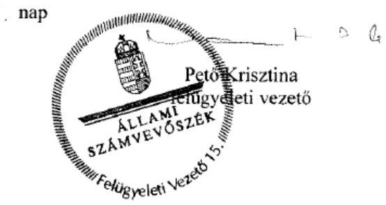

---

# GYŐR MEGYEI JOGÚ VÁROS ÖNKORMÁNYZATÁNAK POLGÁRMESTERÉTŐL Polgármesteri Hivatal 

Városház tér 1.
Tel.: (96) 500-195
9021 Győr
Fax: (96) $500-155$

Tárgy: Rómer Flóris Megyei Hatókörü Városi Múzeum

- Jelentéstervezet véleményezése.

Melléklet: 1 pld. Feljegyzés fenntartói észrevételezésről.
Ellenőrzési azonosítósáam: V073715
Állami Számvevőszék
Domonkos László elnök úr
Budapest
Apáczai Csere János u. 10.
1052

Tisztelt Elnök Úr!
ÁLLAMI SZAMVEVÓSZÉK
1) $90000 / 2016$

Érkezen: 2016 NOV 07.
Iktatószám: V-100E-140/2015
Melléklet: 11 lap

A Győr Megyei Jogú Város Önkormányzatának irányítói jogkörébe tartozó Römer Flóris Megyei Hatókörü Városi Múzeum számvevőszéki ellenőrzéséről készített jelentéstervezetüket köszönöm, melynek megállapításaihoz a csatolt mellékletben foglalt fenntartói véleményezéssel élek.

Tisztelettel kérem észrevételeink, javaslataink szíves megfontolását és azoknak jelentésük anyagában való átvezetését!

Tisztelettel:

G y ơ r, 2016. november 2.
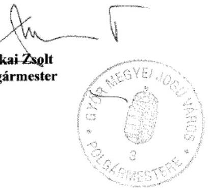

---

# GYÖR MEGYEI JOGÚ VÁROS ÖNKORMÁNYZATÁNAK POLGÁRMESTERÉTÖL   Polgármesteri Hivatal 

Városház tér 1.
Tel.: (96) 500-195
9021 Győr
Fax: (96) $500-155$

Hivatkozási szám: V-1006-132/2016
Ellenőrzési azonosítósáam: V073715

## A Rómer Flóris Megyei Hatókorú Városi Múzeum számvevöszéki jelentéstervezetének fenntartói véleményezés

## 1. A vizsgálati anyag címéhez

A vizsgált időszak egésze nem a Rómer-múzeum tevékenységéről szól, hanem fele részben a jogelőd intézményekről, ezért az anyag hiányosságra utaló konkrét és összegző megállapításai - a 2011-2012. és 2013-2014. évi időbeli elhatárolás hiányában - kizárólag a Rőmermúzeumra „vetülnek".
Javasolt cím: „A Rómer Flóris Müvészeti és Történeti Múzeum és jogelödjének vizsgálata".

## 2. Általános észrevételek

a/ A 2011-2014. évek együttes vizsgálata nem teszi lehetővé a tevékenységek megítélésének ok-okozati összefüggéseit; reálisabb képet adhatna, ha a vizsgálati anyag a 2011-2012. és 2013-2014. évi bontásban támá fel a tapasztalatokat, mely lehetővé tenné a mulasztások és felelősségi körök elkülönítését, valamint az intézményvezetők személyéhez és a fenntartókhoz kötését is.
Az ellenőrzött időszakban az ellenőrzés négy szervezetet érintett.

- Városi Művészeti Múzeum (2011-től 2013. január 31-ig)
- Győr-Moson-Sopron Megyei Múzeumok Igazgatósága (2011-től 2012. december 31-ig)
- Xántus János Megyei Hatókörü Városi Múzeum (2013. január 1-től 31-ig)
- Rómer Flóris Müvészeti és Történeti Múzeum (2013. február 1-től)
b/ 2012-ben a megyei intézmények önkormányzati fenntartásba vételéről rendelkező jogszabályok későn, sokszor már az átadás-átvételi eljárás alatt, sőt után (!) születtek meg, melyeket alkalmazni kellett, így irreálisan kevés időt biztosítottak az átadás-átvételre. A 21/2013. (III. 19.) EMMI rendelet 2013. március 24 -től módosította a 2/2010. (I. 14.) OKM rendeletet úgy, hogy azt január elsejétől kellett alkalmazni. Az 1997. CXL. törvény módosításáról szóló 2012. évi CLII. tv. 2012. november 2-án lépett részben hatályba úgy, hogy csak 8 nappal korábban jelent meg a Magyar Közlönyben, miközben 2012. december 15-i és 2013. január 1-jei határidőt szabott úgy a testületi döntések meghozatalára, mint a többoldalú fenntartói egyeztetésekre, a munkajogi intézkedések törvényi határidőben való megtételére, a megszűnő Múzeumok Igazgatósága tagszervezeteivel a vagyoni eszközök megosztására, a Magyar Államkincstár gyakorlatára az alapító és megszüntető okiratok befogadása során, a megszűnő félben lévő megyei intézménymüködtető központokkal való érdemi együttműködésre stb.

---

Ezen kívül a jogszabályok maguk is saját maguknak mondtak ellent, hiszen a 2012. évi CLII. törvény 28. §-a csak 2013. január 1-jétől adott egy napig (!) felhatalmazást a Kormánynak a megyei intézményfenntartó központoktól az önkormányzatokhoz kerülő intézmények átadásával kapcsolatos eljárás, valamint a vagyonátadásra vonatkozó szabályok megalkotására, miközben a 30. § (6) bekezdése szerint 2012. december 15. napjáig az átadást rögzítő megállapodásokat meg kellett kötni. Ez a jogszabály végül nem született meg, miközben egy jogalkotási felhatalmazás egyben kötelezettséget is jelent a jogszabály megalkotására.
c/ Bizonyos eljárásokra az átadás-átvétel kapcsán nem írt elő semmilyen jogszabály rendelkezéseket, így pl. az átadás-átvétel leltárfelvétellel való megvalósítására: Sem az 1997. CXL. törvény, a 2011. CXCVI. törvény, a 2012. évi CLII. törvény, sem ezek végrehajtására kiadott rendelet nem írta elő az átadás-átvétel kapcsán a leltárkészítés kötelezettségét. Mindez nem jelenti azt, hogy ilyen esetekben a felek ne körültekintően jártak volna el, a nemzeti vagyon megőrzése, biztosítása legmesszebbmenőkig való figyelembevételével, pl. a leltárkönyvekben szereplő vagyon alapján, megfelelő módon teljesítették az átadás-átvételt.
d/ Győr Önkormányzata az átvétel napjáig, 2013. január 1-jéig sem irányító szervi, sem fenntartói, sem vagyoni, sem pedig munkáltatói jogkör gyakorlása tekintetében semmilyen jogosultsággal nem rendelkezett, mivel még „birtokon kívül" volt, ezért az érdemi ügyintézést csak ezt követően kezdhette meg.
Emiatt a vizsgálati jelentés tervezetében megállapított több határidős mulasztás rajta kívül álló okra vezethető vissza, az nem róható fel számára.
e/ Az átadás-átvételi jegyzőkönyvek és mellékleteik semminemű, a helyi adottságokat figyelembe vevő módosítására minisztériumi intézkedés nem adott lehetőséget. A köznevelési intézmények átadás-átvételével ellentétben itt nem született erre vonatkozóan rendelet, illetve a minisztériumi szerződéstervezettől eltérést sem engedélyeztek annak ellenére, hogy ezt az önkormányzat kezdeményezte. Így elég érdekes az önkormányzatokon számon kérni azt, amire nem volt ráhatásuk.
f/ A „mulasztások" vagy „hiányosságok" jelentős részének oka az állam-önkormányzat közötti átadás-átvételt megelőző fenntartó szerv működtetési gyakorlatának hiányosságaiból következik. (Leltárok, szabályozatok, munkaügyi iratok hiányai stb.)

# Fentiek figyelembevételével a számvevöszéki jelentéstervezet alábbi véleményezése csak a Győr Megyei Jogú Város Önkormányzata általi fenntartói időszakra vonatkozik. 

## 3. Tételes észrevételek

## - 9. oldal 1. szöveges bekezdéséhez

„2014. január 1-jétől a Múzeum önálló jogi személyiséggel rendelkezö..."
A kitételből úgy tűnik, mintha korábban nem lett volna a Múzeum önálló jogi személy. A múzeum mindenkor - 2014. január 1-jét megelőzően is - önálló jogi személy volt, csak a gazdálkodási jogköre változott akkor meg.

## - 9. oldal 2. szöveges bekezdéséhez

A 2015. évi LXXV. törvény rendelkezései nem tartoznak a vizsgálati időszakhoz, így e szövegrész nem releváns a vizsgálati anyag tekintetében.

---

- 11. oldal 2. számú táblázat

2013-2014. évek „tulajdonos megnevezésü" oszlopa rosszul jelöli a tulajdonosokat, mivel az 1197. évi CXL. törvény az „egyéb tárgyi eszközöket teljességgel az önkormányzatok tulajdonába adta, míg a kulturális javak 2013. január 1-jét megelőzően állami tulajdonban levő részét állami tulajdonba, az átadás-átvételt megelőzően önkormányzati tulajdonban lévő, valamint az e napot követöen beszerzett mütárgyakat önkormányzati tulajdonnak rendelte. A régészeti leletanyag egésze állami tulajdonban maradt.

A táblázat helyesen:
2013-2014. oszlop
Ingatlan
Egyéb tárgyi eszközök
Kulturális javak

Állam
Önkormányzat
Állam + Önkormányzat

- 17. oldal utolsó bekezdése
„A Múzeum SZMSZ módosítását a múzeumigazgató elkészítette [......] eltérően nem az arra hatáskörrel rendelkező irányító szerv hagyta jóvá, így az ellenőrzött időszak végéig az SZMSZ, volt hatályban."
a/ Mivel az Önkormányzat a 2012. évi CLII. törvény 30. § (4) bekezdése szerint „általános és egyetemleges jogutódként" vette át az intézményt, ezért az érvényben lévő SZMSZ is - annak módosításáig - hatályban maradt, mint nagyon sok más dokumentum, amelyet a korábbi fenntartó(k) állítottak ki. Fontos megjegyezni, hogy az 1997, évi CXL. törvény 50. §-a nem tartalmaz időbeli kitételt, vagyis a fenntartó bármikor meghatározhatja az ott előírtakat.

Megjegyzendő, mivel a Magyar Államkincstár nem engedte azonos időpontban (2013. január 1-jével) intézmény átadását és megszüntetését, ezért 1 hónap időtartamra a megyei múzeumi feladatok ellátására az Önkormányzat továbbmüködlette a Xántus János Megyei Hatókörü Múzeumot, majd 2013. január 31. hatályú Megszüntető okirattal megszüntette a költségvetési szervet. (2013. február 1-jétől a közfeladatot jogutódként a Rómer Flóris-múzeum látja el.)
b/ Csak ezt követően kerülhetett sor az új SZMSZ, benne a szervezeti struktúra kialakítására, mely a folyamatban lévő számos azonnali és határidős intézkedést (létszámnövelés, felmentések, igazgató és gazdasági vezetői beosztás pályáztatása, miniszteri véleményezések megkérése stb.), fenntartói egyeztetéseket és testületi döntéseket követően megtörtént. Fizikai lehetetlenség is akár egy új intézmény alapításánál, akár egy beolvadással történő megszünésnél egy új struktúrát egyből kialakítani, ahhoz kell egy észszerü idő, míg a szervezet kialakításra kerül, feltehetően ezért sincs határidő a jogszabályban ezen feladathoz rendelve.
c/ A Rómer-múzeum SZMSZ-ét az Önkormányzat 2013. december 10-i, majd annak módosítását 2014. július 1-i keltezéssel jóváhagyta, melynek aláírása az aláírás napján hatályos önkormányzati SZMSZ és kiadmányozási szabályzatban foglalt hatáskörrel biró felhatalmazású aláírással történt. (1/A. és 1/B. számú melléklet.)

# - 18. oldal 1. bekezdése 

„A 2013-2014. években Múzeum [...] nem rendelkezett [...] az irányító szerv - mint fenntartó - által jóváhagyott küldetésnyilatkozattal."

---

A megfogalmazás nem pontos, mivel a Múzeum 2013. június 24. keltezéssel kiadta a „küldetésnyilatkozatát", és azt előzetes véleményezésre megküldte a miniszternek is.
Ezt követően a küldetésnyilatkozatnak - a fenntartó képviseletében - polgármesteri jóváhagyó aláírása elmaradt. (2. számú melléklet.)

# - 19. oldal 2. bekezdése 

... az 1311/2012. (VIII. 23.) Korm. határozatl. 8 pontjában foglaltak" kapcsán
A Korm. határozat a minisztereknek tartalmaz feladatokat. Önkormányzatnak feladatot csak törvényben lehet megállapítani az Alaptörvény 34. cikk (1) bekezdése szerint. Így az itt meghatározott előírás az önkormányzatokra nem vonatkozott, azt rajta az átadás-átvétel kapcsán számon kérni nem lehet.

## - 19. oldal 4. bekezdése

... az Ahsz 13/A. § (1) és (4) bekezdésének és 37. § (2) bekezdésének elöírásaitól eltérően leltár hiányában nem végeztek ..." kapcsán
A 249/2000. (XII. 24.) Korm. rendelet alkalmazása téves, hiszen a 13/A. § (1) és (4) bekezdése „Az átszervezéssel .... illetve a jogutód nélkül véglegesen megszünő ..." államháztartási szervezetek kapcsán ír elő feladatokat, itt viszont fenntartóváltás következett be, ami nem minősül sem átszervezéssel, sem jogutód nélküli megszüntetésnek. A 2012. évi CLII. törvény 30. § (4) bekezdése épp ellenkezőleg, általános és egyetemleges jogutódként új fenntartók belépéséről szól. Így nem kellett ezeket az átadás-átvételi megállapodáshoz mellékelni.

## - 19. oldal 5. bekezdése

„Az irányító szerv a 2/2010. (I. 14.) OKM rendelet 17.§ (5) bekezdésében rögzitett a változás bekövetkeztétől számított 20 napon belüli határidő ellenére 2013. június 26-án kérte a Múzeum müködési engedélyének [...] módosítását."
A 2/2010. (I. 14.) OKM rendelet 17. § (5) bekezdésének alkalmazásának számonkérése téves, tekintettel arra, hogy e rendelet 23. § (1)-(2) bekezdése alapján ezt a feladatot 2013. június 30. napjáig kellett elvégezni, azaz féléves haladékot adott a jogalkotó az alapító okiratok módosításának kezdeményezésére, melynek az Önkormányzat eleget tett.

## -21. oldal 4. pontja és 34. oldal utolsó megállapítása

„... a múzeumigazgató a Munka tv. 46. § (4) bekezdésének elöírásától eltérően nem tájékoztatta határidőben és írásban a munkavállalókat..."
Az Mt. 46. § (4) rendelkezés alkalmazása téves, mivel az az Mt. VII. fejezetébe, A munkaviszony létesítésébe tartozik, és arra vonatkozik.
A Múzeum esetében fenntartó váltás történt, ami még munkajogi tekintetben jogutódlásnak sem tekinthető, hiszen munkáltató ugyanaz a szerv volt a fenntartóváltás előtt és után is, a fenntartóváltáskor névváltás következett be. (2012. évi CLII. törvény 30. §) Így nem jöttek létre új foglalkoztatási jogviszonyok.
Ennek megfelelően a közalkalmazottak jogállásáról szóló 1992. évi XXXIII törvény 24. § (3) bekezdése és az Mt. 265. §-a szerint eljárva a Városi Művészeti Múzeum és az abba beolvadással megszűnő Xántus János Megyei Hatókörű Múzeum igazgatói 2013. január 8-án - közös jegyzőkönyvvel hitelesítve - eleget tettek kötelezettségüknek.

---

A Magyar Államkincstár illetményszámfejtő rendszerében (KIR) valamennyi közalkalmazott kinevezésének módosításával megtörtént a munkáltató lényeges adatainak átvezetése.
Az új jogviszonyok létesítése, a kinevezések módosítása, az átsorolások és felmentések során a munkavállalók is átvették példányaikat. (3. számú melléklet.)

# 23. oldal utolsó bekezdés 

„A múzeumigazgató nem alakitotta ki és nem müködtette a rendelkezésre álló források szabályozott, gazdaságos, hatékony és eredményes felhasználását biztositó, a szervezeti célok elérését szolgáló feladatok, folyamatok megvalósulását mérö ..."
A megállapítás kapcsán nem világos, hogy az milyen tényeken és jogi előírásokon alapul, hiszen a hivatkozott Ámr. és Bkr. bekezdés részletes rendelkezéseket nem tartalmaz annak módjára nézve (így például mérőszámok meghatározását nem írja elő jogszabály). A belső ellenőrzési rendszer müködtetése például a nyomon követést szolgálja. Megemlitendő az is, hogy a jelenleg hatályos Bkr. 10. §-a 2016. október1-jei hatállyal még megengedőbben fogalmazza, hiszen azt mondja, hogy ,, a költségvetési szerv vezetője köteles kialakítani a szervezet tevékenységének, a célok megvalósitásának nyomon követését biztositó rendszert, mely az operativ tevékenységek keretében megvalósuló folyamatos és eseti nyomon követésböl, valamint az operativ tevékenységektől függetlenül müködő belső ellenörzésböl állhat". A fentiekre tekintettel 2013-2014. év vonatkozásában nem tartalmaz jogszabály olyan konkrét elöírást, aminek ne tett volna eleget a Múzeum, illetve annak vezetője.

## - 24. oldal 2. bekezdése

,.. az Áht. 70. § (1) bekezdésében foglaltak ellenére nem gondoskodott a belső ellenörzés kialakításáról."
A 370/2011. (XII. 31.) Korm. rendelet 15. § (7) bekezdésének a) pontja alapján, az önkormányzati költségvetési szerveknél a belső ellenőrzést elláthatja az irányító szerv által foglalkoztatásra irányuló jogviszonyban alkalmazott, vagy polgári jogi szerződés keretében foglalkoztatott belső ellenőr. A Múzeumnál így történik a belső ellenőrzési tevékenység ellátása, így téves a jelentés tervezet erre vonatkozó megállapítása 2013-2014. viszonylatában.

## - 24. oldal 4.1. számú megállapítása

„A 2013-2014. évi költségvetési javaslatot az irányitó szerv pénzügyi bizottsága nem véleményezte"
Győr Megyei Jogú Város Önkormányzatának 2013. évi költségvetés koncepcióját a Közgyülés Pénzügyi Bizottsága 2012. november 30-án, 2014. évi költségvetési koncepcióját 2013. október 24-én véleményezte. A dokumentumok feltöltésre kerültek 7.2.13 szám alatt. Az önkormányzat költségvetése tartalmazza az önkormányzat által irányított költségvetési szervek költségvetését (bevételeit, kiadásait, engedélyezett létszám stb.) a 2011. évi CXCV. törvény 23. § (2) bekezdés b) pontja szerint. Így amikor az Önkormányzat költségvetését a Pénzügyi Bizottság tárgyalta 2013-ban és 2014-ben (2013. február 14., illetve 2014. február 13. napja), annak része volt a Múzeum költségvetése is, így azt is megtárgyalta.

## - 33-37. oldal-Javaslatok

A Javaslatok pontjaiban foglalt hiányosságok megszüntetésére már korábban az ÁSZ ellenőrzése előtt fenntartói intézkedés történt a belső ellenőrzési jelentések (2013., 2014. és 2015. év) alapján, melyek megvalósulását részben utóellenőrzés keretében is vizsgálta, illetve

---

vizsgálja a fenntartó. Itt érdemes lenne csak azon hiányosságok megszüntetésére felhívni a figyelmet, amely 2015. és 2016. évben sem került esetlegesen megszüntetésre, hiszen a javaslatok nagy része, ha nem az egésze, így idejét múlt lesz.
A felelősség visszamenőleges megállapítására vonatkozó javaslatok (főleg a megszűnt fenntartó szerv és vezetői megbízások stb. miatt) nagy része mára értelmezhetetlenek, illetve ilyen intézkedés megtételére az Önkormányzat nem jogosult (pl. megyei önkormányzat, megyei intézményfenntartó központ kapcsán).
Győr Megyei Jogú Város Önkormányzatának szándéka, hogy a múzeum mára konszolidálódott müködését megőrizze, és szakmai színvonalában fejlessze.

# 4. A múzeum igazgatójának nyilatkozata alapján 

-36. oldal 1. pont j) alpontja szerinti javaslat

A belső ellenőrzés az intézménynél a 12. sz. nyilatkozatban foglaltak szerint történik.
(4. számú melléklet.)

- 36. oldal 3. számú javaslat

A kölcsönadott és kölcsönvett mütárgyak nyilvántartása nem maradt el, annak rögzítése a Mozgatási naplóban és az intézményi iktatásban minden esetben megtörtént. 2015-tól a naplók vezetése teljes körü.

- 37. oldal 4. számú javaslat

A mütárgyak kölcsönadásának módszere és dokumentálása egységesítésre került a hatályos törvényi előírásoknak megfelelően. 2015. évtől a hiányosság megszüntetésére vonatkozó javaslat nem releváns.

## 5. A Kulturális Pénzügyi-Gazdasági Szolgáltató Központ (KP-GSZK) igazgatójának nyilatkozata alapján

- 54. oldal 1. számú javaslat

A KP-GSZK minden esetben, amikor ez azt a KGR rendszer (melyet a Magyar Államkincstár müködtet) lehetővé tette határidőben rögzítette és rögzíti a múzeum adatszolgáltatását. Ez a jelentéstervezetben hivatkozott 2013. és 2014. évi beszámoló vonatkozásában is így volt.
A 2013. évi beszámoló feladása 2014. február 25-én 14.12 órakor megtörtént, melyet a KGR rendszerből kinyomtatott „eseménytörténet" bizonyít. Az intézményen kívülálló ok, hogy a rendszerben 2014. február 27-én 00.45 órakor verzióváltást hajtottak végre és ezt követően az irányító szerv visszaadta az adatszolgáltatást, melynek javított változata 2014.március 3-án került ismét feladásra.
A 2014. évi beszámoló rögzítése és mentése a KGR rendszerben a csatolt eseménytörténet szerint határidőben megtörtént, azonban hibás paraméterezés miatt nem lehetett az adatszolgáltatást feladni, melyre 2015. február 27-én és március 2-én történt verzióváltást követően nyílt lehetőség. Ezt követően március 6-án ismételt verzióváltás történt, mely miatt az adatszolgáltatás ismét „nyitott státuszú" lett. Az ismételt adatfeladásra 2015. március 6-án 11.47 órakor nyílt lehetőség. (5. sz. melléklet)

---

- 34. oldal 2-5. számú javaslatok

A KP-GSZK az intézményekkel kötött munkamegosztási megállapodásban foglaltak szerint látja el feladatait. Az intézmények önálló jogi személyiséggel bíró költségvetési szervek, a KP-GSZK nem korlátozhatja az intézmények szakmai müködési döntési rendszerét és felelősségét. Ennek megfelelően intézkedési, felelősségre vonási jogosultsággal sem rendelkezik.

Győr, 2016. november 2.
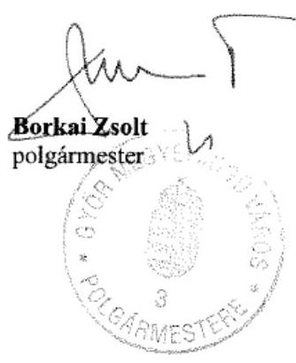

---

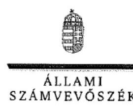

ELNÖK

Ikt.szám: V-1006-142/2016.

# Borkai Zsolt úr 

polgármester
Győr Megyei Jogú Város Önkormányzata

## Győr

## Tisztelt Polgármester Úr!

A .. Megyei hatókörü városi múzeumok ellenörzése - Rómer Flóris Müvészeti és Történeti Múzeum " címmel készített számvevőszéki jelentéstervezetre tett észrevételét köszönettel megkaptam.
Az Állami Számvevőszék észrevételre vonatkozó álláspontjáról a felügyeleti vezető által készített részletes tájékoztatást csatoltan megküldőm.
Tájékoztatom Polgármester urat, hogy a számvevőszéki jelentésben - az Állami Számvevőszékről szóló 2011. évi LXVI. törvény 29. § (3) bekezdése alapján - a figyelembe nem vett észrevételeket szerepeltetjük az elutasítás indokának feltüntetésével.

Budapest, 2016. 41 hó 18 nap
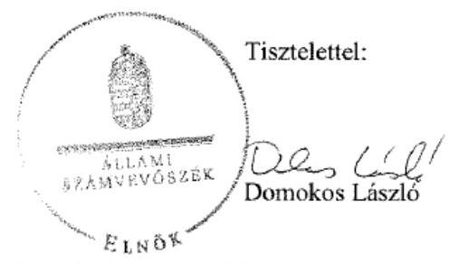

Melléklet: Tájékoztatás az elfogadott és az el nem fogadott észrevételekről

---

# Tájékoztatás az elfogadott és az el nem fogadott észrevételekröl 

A „Megyei hatókörü városi múzeumok ellenörzése - Rómer Flóris Müvészeti és Történeti Múzeum "címủ jelentéstervezetre tett és 2016. november 2-án aláirt levelével megküldött észrevételeit áttekintettük, annak kezeléséről az alábbi tájékoztatást adom.

## 1. A jelentéstervezet címére tett észrevétele kapesán

Észrevételét a jelentés címére vonatkozóan nem fogadtuk el. Az Állami Számvevőszék (továbbiakban: ÁSZ) a Rómer Flóris Müvészeti és Történeti Múzeumot (továbbiakban: Múzeum), mint megyei hatókörü városi múzeumot ellenőrizte a 2011-2014. évek tekintetében, ami magában foglalja a Múzeum jogelődjének ellenőrzését is és ez a tény jelentéstervezet „A rövidítések jegyzéke" című mellékletben bemutatásra került. Észrevétele a jelentéstervezet módosítását nem indokolja.

## 2. A jelentéstervezetre tett általános észrevételei kapesán

2.a) Észrevételét, amelyben javasolja, hogy reálisabb képet adhatna, ha a vizsgálati anyag a 2011-2012. és 2013-2014. évi bontásban tárná fel a tapasztalatokat, mely lehetővé tenné a mulasztások és felelősségi körök elkülönítését, valamint az intézményvezetők személyéhez és a fenntartók kötését is, nem fogadtuk el. A számvevőszéki ellenőrzést a „Megyei hatókörü városi múzeumok ellenörzése" című ellenőrzési program alapján végeztük és az ellenőrzött témaköröket az ellenőrzési kérdésekre adott válaszok alapján értékeltük, amelyet a jelentéstervezetben „Az ellenőrzés módszerei" címủ fejezet részletesen tartalmaz. Ezen túlmenően a jelentéstervezet „Rövidítések jegyzéke" címủ melléklete időszakkal megjelölve mutatja be ellenőrzött évek fenntartóit és a múzeumigazgatóit. Észrevétele a megállapításokat nem cáfolja, ezért azokat nem módosítja.
2.b) Köszönettel vettem tájékoztatását a 2012/2013. évi központi alrendszerből önkormányzati alrendszerbe történő átszervezésre vonatkozó jogszabályok hatályba lépésével és alkalmazásukkal kapcsolatos tapasztalatokról. Észrevétele a megállapításokat nem vitatja, ezért azokat nem módosítja.
2.c) Észrevételét, amelyben arról tájékoztat, hogy semmilyen jogszabály nem ír elő az átadásátvétel kapcsán bizonyos rendelkezéseket, így például az átadás-átvétel leltárfelvétellel való megvalósítására sem, nem fogadtuk el. Az államháztartás szervezetei beszámolási és könyvvezetési kötelezettségének sajátosságairól szóló 249/2000. (XII. 24.) Korm. rendelet (továbbiakban: Áhsz.1) 13/A. §-a ad iránymutatást az átszervezéssel kapcsolatos számviteli szabályok alkalmazásához. Az Áhsz.: 13/A. § (7a) bekezdése értelmében, amennyiben az államháztartás szervezete nem szünik meg, de év közben más államháztartási alrendszerbe kerül átsorolásra irányító szerv váltásával, akkor a 10. § (1) bekezdése szerinti éves elemi költségvetési beszámoló készítési kötelezettség mellett törtidőszakokra január 1-je és az átszervezés

---

fordulónapja, illetve az átszervezés fordulónapja és december 31-e közötti idótartamra is beszámolási kötelezettség terheli. A múzeumoknál az átszervezés fordulónapja 2012. december 31-e volt. Az Áhsz.; 37. § (1) bekezdése pedig a költségvetési évről, december 31-ei fordulónappal készített könyvviteli mérlegben kimutatott eszközök és források évenkénti leltározását írja elő. A megyei múzeumok, könyvtárak és közművelődési intézmények fenntartásáról szóló 1311/2012. (VIII. 23.) Korm. határozat (továbbiakban: 1311/2012. (VIII. 23.) Korm. határozat) 1.8. pontjában az átadáshoz kapcsolódó előírások alapján pedig, rendelkezni kell a muzeális intézmények leltárában szereplő kulturális javak és az egyéb vagyonelemek tagintézményenkénti meghatározásáról.
A Nemzetgazdasági Minisztérium 2012. évi éves elemi költségvetési beszámoló összeállítására szolgáló módszertani útmutatójának (továbbiakban: módszertani útmutató) 2/ba. pontjában foglaltak alapján év végi irányító szervi váltás és egyben alrendszer váltás esetében az adott teljes évi tevékenységéről éves elemi költségvetési beszámolót kell készíteni, amelyhez vagyonátadási jelentést kell összeállítani. Ez lesz az alapja az irányító szervek közötti elszámoltatásnak, illetve az államháztartási információs rendszerben az alrendszerek közötti intézményi vagyon-mozgatásának. A hivatkozott módszertani útmutató 52. oldalán rögzítettek értelmében a központi költségvetési szerv az éves zárásra vonatkozó szabályok szerint készíti el az éves elemi költségvetési beszámolót, a vagyonátadási jelentést, továbbá az éves elemi költségvetési beszámolót leltárral és fökönyvi kivonattal kell alátámasztani.
Fentiekre tekintettel a múzeumoknak 2012. december 31-i fordulónappal, leltárral alátámasztott beszámolót kellett készíteni, így a múzeum átadásával együtt a leltárral alátámasztott beszámoló is átadásra került. A kulturális javak leltárkönyveinek átadása önmagában nem jelenti a vagyon teljes körű átadását. Észrevétele a megállapításokat nem cáfolja, ezért azokat nem módosítja.
2.d) Észrevételében jelzettek szerint a jelentéstervezetben megállapított több határidős mulasztás Győr Megyei Jogú Város Önkormányzatán (továbbiakban: Önkormányzat) kívül álló okokra vezethető vissza, az nem röható fel számára. Általánosságban tett észrevétele a jelentéstervezet konkrét megállapításait nem nevesíti, így azokat nem cáfolja, ezért azokat nem módosítja.
2.e) Köszönettel vettem tájékoztatását az átadás-átvételi jegyzőkönyvekre és mellékleteikre vonatkozóan. Általánosságban tett észrevétele a jelentéstervezet konkrét megállapításait nem nevesíti, így azokat nem cáfolja, ezért azokat nem módosítja.
2.f) A „mulasztások" vagy „hiányosságok" jelentős részének okát bemutató észrevétele a jelentéstervezet megállapításait nem vitatja, ezért azokat nem módosítja.

---

# 3. A jelentéstervezetre tett tételes észrevételei kapcsán 

3/1. A jelentéstervezet 9. oldal „Az ellenörzés területe" fejezet 1. bekezdésének megállapításaira tett észrevétele kapcsán

Észrevételében jelzettek szerint a Múzeum 2014. január 1-jét megelőzően is önálló jogi személy volt, a hivatkozott bekezdés első kettő megállapítása félreérthető. Észrevételét elfogadtuk, azt a számvevőszéki jelentés készítésénél a megállapítás módosításával figyelembe veszzük.

## 3/2. A jelentéstervezet 9. oldal „Az ellenörzés területe" fejezet 2. bekezdésének megállapításaira tett észrevétele kapcsán

Észrevételét a megyei könyvtárak és a megyei hatókörű városi múzeumok feladatának ellátását szolgáló egyes állami tulajdonú vagyontárgyak ingyenes önkormányzati tulajdonba adásáról szóló 2015. évi LXXV. törvény rendelkezéseivel kapcsolatban nem fogadtuk el, mert a jelentéstervezet megállapításainak hasznosulásával összefüggő releváns információkat tartalmaz. Észrevétele az ellenőrzött időszakban megállapított hiányosságot nem cáfolta, ezért a megállapításokat nem módosítja.

## 3/3. A jelentéstervezet 11. oldal „Az ellenörzés háttere, indokoltsága" fejezet 2. táblázatára tett észrevétele kapcsán

Észrevételét a kulturális javak 2013-2014. évi tulajdonosi körére vonatkozóan nem fogadtuk el, mert a hivatkozott táblázat a jogszabályokon alapulva mutatja be a vagyon tulajdonosi, vagyonkezelői és használói körének változását a 2011-2014. évekre vonatkozóan, az atipikus jellemzőket nem kezeli. Észrevétele nem érinti a jelentéstervezet megállapításait, így azokat nem módosítja.

## 3/4. A jelentéstervezet 17. oldal 1. számú megállapítás 7. bekezdésének 2. megállapítására tett észrevétele kapcsán

Köszönettel vettem tájékoztatását a Magyar Államkincstárnak az intézmény átadással és megszüntetésével kapcsolatos gyakorlatára vonatkozóan. Észrevételében foglaltak szerint a Múzeum szervezeti és működési szabályzata 2013. december 10-i, majd annak módosításának 2014. július 1-jei jóváhagyása az aláírás napján hatályos önkormányzati szervezeti és müködési szabályzat és kiadmányozási szabályzatban foglalt hatáskörrel bíró felhatalmazású aláírással történt. Észrevételét a dokumentumok ismételt áttekintését követően nem fogadtuk el. A jelentéstervezet 17. oldal 1. számú megállapítás 7. bekezdésének 2. megállapítása megalapozott, amely szerint a módosított szervezeti és müködési szabályzatot nem az arra határkörrel rendelkező Győr Megyei Jogú Város Önkormányzatának Közgyűlése hagyta jóvá. Észrevétele ezért a megállapítást nem módosítja.

---

# 3/5. A jelentéstervezet 18. oldal 1. számú megállapítás 8. bekezdésének megállapítására tett észrevétele kapcsán 

Észrevétele megerósiti a megállapításban foglaltakat, hogy a Múzeum a 2013-2014. években - a muzeális intézményekről, a nyilvános könyvtári ellátásról és a közmúvelődésről szóló 1997. évi CXL. törvény (továbbiakban: Mtv.) 42. § (4) bekezdés b) pontjának előírásától eltérően - nem rendelkezett a szakmai tevékenysége folytatásának alapjául szolgáló, Győr Megyei Jogú Város Önkormányzatának Közgyűlése által jóváhagyott küldetésnyilatkozattal. Észrevétele ezért a megállapítást nem módosítja.

## 3/6. A jelentéstervezet 19. oldal 2.2. számú megállapítás 3. bekezdésének 1. megállapítására tett észrevétele kapcsán

Észrevételét, hogy a 1311/2012. (VIII. 23.) Korm. határozat a miniszternek tartalmaz feladatot elfogadtuk, azt a számvevőszéki jelentés készítésénél a megállapítás módosításával figyelembe vesszük.

## 3/7. A jelentéstervezet 19. oldal 2.2. számú megállapítás 5. bekezdésének 1., 2. megállapításaira tett észrevétele kapcsán

Észrevételét a 2013. január 1-jével végrehajtott, a központi alrendszerből önkormányzati alrendszerbe történő irányító szervi (fenntartói) váltás lebonyolítása és a szervezetrendszer átalakításával kapcsolatban a 2.c) pontban leírt indokok alapján nem fogadtuk el. Az észrevételezéssel érintett megállapítások ismételt felülvizsgálatát követően azonban a jelentéstervezet 19. oldal 2.2. számú megállapítás 5. bekezdésének 1., 2. megállapításait a számvevőszéki jelentésben következők szerint szerepeltetjük:
„Az elkészitett beszámoló az éves elemi költségvetési beszámolónak megfelelő adattartalmú volt, de a Számv. tv. 69. § (1) bekezdése és az Ahsz. 1 37. § (2) bekezdése ellenére a mérlegiételek alátámasztásáhaz leltárt nem készitettek, vagyonátadásra a mérlegben szereplő adatokat alátámasztó leltár hiányában került sor."

## 3/8. A jelentéstervezet 19. oldal 2.2. számú megállapítás 6. bekezdésének 1., 2. megállapításaira tett észrevétele kapcsán

Észrevételét, amelyben foglaltak alapján a muzeális intézmények működési engedélyéről szóló 2/2010. (I. 14.) OKM rendelet (továbbiakban: 2/2010. (I. 14.) OKM rendelet) 17. § (5) bekezdésének alkalmazásának számonkérése téves, tekintettel arra, hogy e rendelet 23. § (1)(2) bekezdése alapján ezt a feladatot 2013. június 30. napjáig kellett elvégezni, azaz féléves haladékot adott a jogalkotó az alapító okiratok módosításának kezdeményezésére, melynek az önkormányzat eleget tett, nem fogadtuk el.
A 2/2010. (I. 14.) OKM rendelet 23. § 2) bekezdése alapján a „2013. január 1-jén önkormányzati fenntartásba került muzeális intézmények müködési engedélye - a 17. §-ban foglaltaktól eltérően - a módosított müködési engedély kiadásáig, de legkésöbb 2013. június 30-ig hatályos. "A hivatkozott jogszabályi rendelkezés alapján nem 2013. június 30 -ig kellett meg-

---

kérni a müködési engedélyt, hanem 2013. július 1-jéig kellett a módosított müködési engedélyt megkapni, tekintettel arra, hogy az önkormányzati fenntartásba került muzeális intézmények müködési engedélye 2013. június 30 -ig volt hatályos. A dokumentumok ismételt áttekintését követően a Múzeum módosított müködési engedélyeit 2013. július 23-24-ei dátummal adták ki. Az észrevételezéssel érintett megállapítások ismételt felülvizsgálatát követően a jelentéstervezet 19. oldal 2.2. számú megállapítás 6. bekezdésének 1., 2. megállapításait a számvevőszéki jelentésben következök szerint szerepeltetjük:
„Az irányitó szerv) 2013. június 26-án kérte a Múzeum müködési engedélyének - fenntartó váltás miatt szükségessé vált - módosítását, ezért a 2/2010. (I. 14.) OKM rendelet 23. § 2) bekezdésében elöirtakra tekintettel a Múzeum 2013. július 1-jétöl 2013. július 22-ig módosított müködési engedéllyel nem rendelkezett. Ezen idöszakban az irányitó szerv) nem biztositotta a Múzeum törvényes müködésének feltételét."

# 3/9. A jelentéstervezet 21. oldal 3.1. számú megállapítás 3. bekezdés 1. francia bekezdésének megállapítására tett észrevétele kapcsán 

Észrevételében jelzettek szerint a jelentéstervezet 21. oldal 3.1. számú megállapítás 3. bekezdés 1. francia bekezdésének megállapításában - „a múzeumigazgató a Munka tv. 46. § (4) bekezdésének elöirásától eltérően nem tájékoztatta határidőben és írásban a munkavállalókat a Múzeum megnevezésében, lényeges adataiban bekövetkezett változásról;" - „a munka törvénykönyvéól szóló 2012. évi I. törvény (továbbiakban: Mt.) 46. § (4) rendelkezés alkalmazása téves, mivel az az Mt. VII. fejezetébe A munkaviszony létesitésébe tartozik, és arra vonatkozik. A Múzeum esetében fenntartó váltás történt, ami még munkajogi tekintetben jogutódlásnak sem tekinthető, hiszen munkáltató ugyanaz a szerv volt a fenntartóváltás előtt és utána is, igy nem jöttek létre új foglalkoztatási jogviszonyok.
Ennek megfelelően a közalkalmazottak jogállásáról szóló 1992. évi XXXIII. törvény -24. § (3) bekezdése és az Mt. 265. §-a szerint eljárva a Városi Müvészeti Múzeum és az abba beolvadással megszünő Xántus János Megyei Hatókörü Múzeum igazgatói 2013. január 8-án közös jegyzőkönyvvel hitelesitve eleget tettek kötelezettségüknek."
Észrevételét nem fogadtuk el, mert az Mt. VII. „A munkaviszony létesitése" fejezet „26. A munkáltató írásbeli tájékoztatási kötelezettsége" alclın alatt az Mt. 46. § (1) bekezdése szabályozza a munkáltató írásbeli tájékoztatási kötelezettségét munkaviszony létesítésekor legkésőbb a munkaviszony kezdetétől számított tizenöt napon belül. Az Mt. 46. § (4) bekezdése elöírása nem a munkaviszony létesítésekor ír elő tájékoztatási kötelezettséget, hanem generálisan írja elő a munkáltató tájékoztatási kötelezettségét, kiemelten munkáltató megnevezésének, lényeges adatainak változása kapcsán. Az észrevételéhez csatolt jegyzőkönyvet teljességi nyilatkozatuk az átadott dokumentumokról nem tartalmazza, így nem áll módunkban azt figyelembe venni, mert annak hitelességéről nem tudunk meggyőződni. Megjegyzem továbbá, hogy a jegyzőkönyvben foglaltak, azaz az érintett Közalkalmazotti Tanácsok tájékoztatása önmagában nem jelenti az Mt. 46. § (4) bekezdésében elöírt, a munkavállaló tájékoztatásának teljesítését a változást követő tizenöt napon belül.
Észrevétele - fenti válaszom alapján - a megállapításokat nem módosítja.

---

# 3/10. A jelentéstervezet 23. oldal 3.5. számú megállapítás 1. bekezdésének 2. megállapítására tett észrevétele kapcsán 

Köszönettel vettem tájékoztatását a jogszabályi rendelkezésekröl. Észrevételét a dokumentumok ismételt áttekintését követöen nem fogadtuk el, az észrevétellel érintett megállapítás ,,A múzeumigazgató nem alakitotta ki és nem müködtette a rendelkezésre álló források szabályozott, gazdaságos, hatékony és eredményes felhasználását biztositó, a szervezeti célok elérését szolgáló feladatok, folyamatok megvalósulását mérö követelményeket 2011-ben az államháztartásról szóló 1992. évi XXXVIII. törvény 4. § (1) bekezdés b) pontjában és 121/A. § (1) bekezdésében, illetve a 2012-2014. években az államháztartásról szóló 2011. évi CXCV. törvény 61. § (1) bekezdésében és a költségvetési szervek belső kontrollrendszeréröl és a belső ellenörzésröl szóló 370/2011. (XII. 31.) Korm. rendelet (továbbiakban: Bkr.) 4. § a) pontjában foglaltak ellenére." - megalapozott. A 2016. május 25 -én a múzeumigazgató, a gazdasági vezetők, valamint a gazdasági osztályvezető által aláirt 159-30/2016. iktatószámú nyilatkozat értelmében:
„A múzeumigazgató által kiadott belső utasitás, vezetöi intézkedés vagy egyéb dokumentum, mely a rendelkezésre álló források gazdaságos, hatékony és eredményes felhasználását biztositó, a szervezeti célok elérését szolgáló feladatok/folyamatok megvalósulását mérö követelmények, szabályozásokat, indikátorokat, szakfeladatokhoz rendelt feladatmutatókat, teljesitménymutatókat tartalmazó dokumentummal, belső szabályzattal, továbbá a követelmények teljesitését értékelö beszámolóval, tájékoztatás dokumentumával, az intézmény nem rendelkezik."

Észrevétele a megállapítást nem módosítja.

## 3/11. A jelentéstervezet 24. oldal 3.5. számú megállapítás 3. bekezdésének megállapítására tett észrevétele kapcsán

Észrevételét, amelyben arról tájékoztat, hogy a Bkr. 15. § (7) bekezdésének a) pontja alapján, az önkormányzati költségvetési szerveknél a belső ellenőrzést elláthatja az irányító szerv által foglalkoztatásra irányuló jogviszonyban alkalmazott, vagy polgári jogi szerződés keretében foglalkoztatott belső ellenőr, továbbá a Múzeumnál így történik a belső ellenőrzési tevékenység ellátása, így téves a jelentés tervezet erre vonatkozó megállapítása 2013-2014. viszonylatában, nem fogadtuk el, mert a dokumentumok felülvizsgálata alátámasztotta, hogy a jelentés vonatkozó megállapítása - „A múzeumigazgató a 2011-2014. években az Aht.) 121/B. § (4) bekezdésében és az Aht.; 70. § (1) bekezdésében foglaltak ellenére nem gondoskodott a belső ellenörzés kialakításáról." - megalapozott. A számvevőszéki ellenőrzéshez nem bocsátották rendelkezésre a múzeumigazgatója által aláirt, a Múzeum 2013-2014. évekre vonatkozó éves ellenőrzési terveit, továbbá a belső ellenőrzési feladatok ellátására vonatkozó megállapodást.
A 2013-2014. években a GYMJV Önkormányzata a Magyarország helyi önkormányzatiról szóló 2011. évi CLXXXIX. törvény 119. § (4) bekezdése elöírása alapján - „A helyi önkormányzat belső ellenörzése keretében gondoskodni kell a felügyelt költségvetési szervek ellenörzéséről is." - gondoskodott a Múzeum belső ellenőrzési feladatainak az ellátásáról. Ezt támasztja alá, hogy a GYMJV 2013-2014. évi ellenőrzési terveinek előterjesztése az ellenőrzésre kiválasztott intézmények felügyeleti ellenőrzését rögzíti. Ennek keretében a

---

231/2012. (X. 26.) határozattal jóváhagyott, majd módosított GYMJV 2013. évi ellenörzési terve, továbbá a 294/2013. (XII. 20.) határozattal elfogadott GYMJV 2014. évi ellenörzési terve alapján a 2013-2014. években a számvevőszéki ellenőrzés részére rendelkezésre bocsátott nyilvántartás szerint a Múzeumnál összesen három ellenőrzésre került sor.
Észrevétele - fenti válaszom alapján - a megállapítást nem módosítja.
3/12. A jelentéstervezet 24. oldal 4.1. számú megállapítás 2. bekezdésének 3. megállapítására tett észrevétele kapcsán

Észrevételét, hogy a Közgyűlés Pénzügyi Bizottsága tárgyalta az Önkormányzat 2013-2014. évek költségvetési koncepcióit, költségvetési rendelet tervezeteit és azok része volt a Múzeum költségvetése is, a dokumentumok ismételt felülvizsgálatát követően elfogadtuk, és a számvevőszéki jelentés összeállításánál figyelembe vesszük.

# 3/13. A jelentéstervezet 33-37. oldal javaslataira tett észrevétele kapcsán 

Köszönettel vettem tájékoztatását a javaslatok pontjaiban foglalt hiányosságok megszüntetésére vonatkozó fenntartói intézkedésekről. Észrevételével szemben a feltárt szabálytalanságok tekintetében a felelősség tisztázására és szükség szerint a felelősség érvényesítésére tett javaslatok, az azokat alátámasztó intézkedési megállapításokra figyelemmel a felelősség olyan érvényesítésére vonatkozik, amelyre a javaslat címzettnek jogosultsága van, illetve az érvényesítés feltételei fennállnak. Észrevétele a megállapításokat nem cáfolja, ezért azokat nem módosítja.

## 4. A Múzeum igazgatójának nyilatkozata alapján tett észrevételei kapcsán

## 4/1. A jelentéstervezet 36. oldal 1.j) számú javaslatot megalapozó megállapításra tett észrevétele kapcsán

Észrevétele alapján a belső ellenőrzés az intézménynél a 12. számú nyilatkozatban foglaltak szerint történik. A 2016. május 24 -én a múzeumigazgató, a gazdasági vezetők, valamint a gazdasági osztályvezető által aláirt 159-10/2016. iktatószámú nyilatkozat értelmében:
„A múzeum belső ellenört közalkalmazotti jogviszonyban és külső megbizási szerzödéssel nem alkalmaz. Az intézmény belső ellenörzéseit 2011. évben a Győr-Moson-Sopron Megyei Önkormányzat végezte. Az intézmény belső ellenörzéseit 2012. évben a Megyei intézményfenntartó Központ végezte. Az intézmény belső ellenörzéseit 2013-2014. évben a Győr Megyei Jogú Város Önkormányzatának Ellenörzési Osztálya végzi."
Az 1.j) számú javaslatot megalapozó megállapítás szerint - jelentéstervezet 24. oldal 3.5. számú megállapítás 3. bekezdésének megállapítása alapján - „A múzeumigazgató a 2011-2014. években az Áht.; 121/B. § (4) bekezdésében és az Áht. 2 70. § (1) bekezdésében foglaltak ellenére nem gondoskodott a belső ellenőrzés kialakításáról."
A dokumentumok ismételt felülvizsgálatát követően észrevételét nem fogadtuk el, a megállapítás megalapozott. A számvevőszéki ellenőrzés részére az adatszolgáltatás keretében nem

---

bocsátották rendelkezésre a múzeumigazgatója által aláirt, a Múzeum 2011-2014. évekre vonatkozó éves ellenőrzési terveit, továbbá a belső ellenőrzési feladatok ellátására vonatkozó megállapodásokat.
A Győr-Moson-Sopron Megyei Önkormányzat 2011. évi belső ellenőrzési tervében, amely a 173/2010. (IX. 17.) számú határozattal került jóváhagyásra, a felügyelt költségvetési szervek és az önkormányzati hivatal belső ellenőrzéséről rendelkezik. A felügyelt költségvetési szervek ellenőrzése ebben az esetben a helyi önkormányzatokról szóló 1990. évi LXV. törvény 95. § (5) bekezdésében elóirtaknak - „A helyi önkormányzat belső ellenörzése keretében gondoskodni kell a felügyelt költségvetési szervek ellenörzéséről is." - felett meg. A hivatkozott belső ellenőrzési terv a Múzeum ellenőrzésére feladatot nem tervezett. A 2011. évben terven felüli ellenőrzésre került sor a Múzeumnál, a Múzeum 2010. évi beszámolójában kimutatott szállítói állomány és pénzmaradvány megalapozottságának ellenőrzése tárgyában.
A Múzeum 2012. évi belső ellenőrzésével kapcsolatban a Szociális és Gyermekvédelmi Föigazgatóság Győr-Moson-Sopron Megyei Kirendeltségének igazgatója 2016. május 30-án kelt nyilatkozatában nyilatkozott arról, hogy 2012. évben tudomása szerint a Múzeumnál belső ellenőrzésre nem került sor.
A 2013-2014. években a GYMJV Önkormányzata a Magyarország helyi önkormányzatiról szóló 2011. évi CLXXXIX. törvény 119. § (4) bekezdése elóirása alapján - „A helyi önkormányzat belső ellenörzése keretében gondoskodni kell a felügyelt költségvetési szervek ellenőrzéséről is." - gondoskodott a Múzeum belső ellenőrzési feladatainak az ellátásáról. Ezt támasztja alá, hogy a GYMJV 2013-2014. évi ellenőrzési terveinek előterjesztése az ellenőrzésre kiválasztott intézmények felügyeleti ellenőrzését rögzíti. Ennek keretében a 231/2012. (X. 26.) határozattal jóváhagyott, majd módosított GYMJV 2013. évi ellenőrzési terve, továbbá a 294/2013. (XII. 20.) határozattal elfogadott GYMJV 2014. évi ellenőrzési terve alapján a 2013-2014. években a számvevőszéki ellenőrzés részére rendelkezésre bocsátott nyilvántartás szerint a Múzeumnál összesen három ellenőrzésre került sor.
Észrevétele - fenti válaszaim alapján - a megállapításokat nem módosítja.
4/2. A jelentéstervezet 36. oldal 3.a) számú javaslatot (észrevételében hivatkozott 3. számú javaslat) megalapozó megállapításra tett észrevétele kapcsán

A 3.a) számú javaslatot megalapozó megállapítás szerint - jelentéstervezet 30. oldal 5.1. számú megállapítás 5 . bekezdésének 3-4. megállapítása alapján - „A múzeumigazgató a 20/2002. (X. 4.) NKÖM rendelet 19. § (1) bekezdés ab) pontjában foglalt elöírások ellenére a 2011-2014. években a kölcsönvett tárgyak naplóját nem vezette. A múzeumigazgató a 20112014. években a gyüjteményelböl ideiglenesen kikerült kulturális javakról a kölcsönadott tárgyak naplóját nem vezette, mely nem felett meg a 20/2002. (X. 4.) NKÖM rendelet 19. § (1) bekezdés b) pontjában foglaltaknak.".

Köszönettel vettem tájékoztatását, hogy a kölcsönadott és kölcsönvett mútárgyakat a Mozgatási naplóban és az intézményi iktatásban tartották nyilván, továbbá 2015 évtől a naplók vezetése teljes körü. A kölcsönadott és kölcsönvett mútárgyak nyilvántartása a Mozgatási naplóban és az intézményi iktatásban nem felelt meg a muzeális intézmények nyilvántartási sza-

---

bályzatáról szóló 20/2002. (X. 4.) NKÖM rendelet 19. § (1) bekezdés ab) és a 19. § (1) bekezdés b) pontjában foglalt rendelkezéseknek. Észrevétele a megállapításokat nem cáfolja, az az ellenőrzött időszakon túlmutat, ezért a megállapításokat nem módosítja.

4/3. A jelentéstervezet 37. oldal 3.b) számú javaslatot (észrevételében hivatkozott 4. számú javaslat) megalapozó megállapításra tett észrevétele kapcsán

Köszönettel vettem tájékoztatását, hogy a Mútárgyak kölcsönadásának módszere és dokumentálása egységesítésre került a hatályos törvényi elöírásoknak megfelelően. Észrevétele a megállapításokat nem cáfolja, az az ellenőrzött időszakon túlmutat, ezért a megállapításokat nem módosítja.

# 5. A Kulturális Pénzügyi-gazdasági Szolgáltató Központ (továbbiakban: Központ) igazgatójának nyilatkozata alapján tett észrevételei kapcsán 

Tájékoztatom arról, hogy az 5. ponthoz tartozó észrevételeit a Központ igazgatója saját észrevételeként - majdnem szószerinti azonossággal - már megküldte az Állami Számvevőszék részére.

5/1. A jelentéstervezet 34. oldal 1. számú javaslatot alátámasztó - 25. oldal 4.1. sz. megállapítás 7. bekezdésének 2., 26. oldal 4.2. sz. megállapítás 4. bekezdésének 1., 3. - megállapításaira tett észrevétele kapcsán

Köszönettel vettem tájékoztatását a KGR rendszer verzióváltással kapcsolatban. Észrevételében arról ad tájékoztatást, hogy a 2013. évi beszámoló feladása 2014. február 25-én, illetve a javított beszámoló ismételt feladása 2014. március 3-án megtörtént, továbbá a 2014. évi beszámoló feladására 2015. március 4-én, illetve 2015. március 6-án került sor. A számvevőszéki ellenőrzés részére átadott dokumentumok felülvizsgálata ismét alátámasztotta a megállapításban foglaltakat, hogy a 2014. évi beszámoló benyújtása a jogszabályban elöírt határidőn túl, 2015. március 6-án történt. A 2013. évi adatszolgáltatás tekintetében pedig a 26. oldal 4.2. sz. megállapítás 4. bekezdésének 3. megállapításában a 2014. április 4-i dátumot 2014. március 3-ra módosítjuk.

## 5/2. A jelentéstervezet 34. oldal 2-5. számú javaslatokat megalapozó megállapításokra tett észrevétele kapcsán

Észrevételében arról tájékoztat, hogy az 2-5. számú javaslatok tekintetében intézkedési és felelősségre vonási jogosultsággal a Központ igazgatója nem rendelkezik. Észrevételét az alábbi indokok alapján nem fogadom el:
A 2. számú javaslatot megalapozó megállapítás szerint - a jelentéstervezet 29. oldal 4.5. sz. megállapítás 3. bekezdésének 2. mondata alapján - a „Gazdasági szervezet vezetője a 2013-2014. években a Römer Flóris Müvészeti és Történeti Múzeum (továbbiakban: Múzeum) beszámolójában a számvitelről szóló 2000. évi C. törvény (továbbiakban: Számv. tv.)

---

29. § (2) bekezdésében, a 2013. október 30-ig hatályos értékelési szabályzat, 1.2.7.7. pontjában, valamint a 2013. október 31-töl értékelési szabályzat, 5. pontjában foglaltak ellenére olyan vevököveteléseket mutatott ki, amelyek vevő általi elismertetésére nem került sor."
Az értékelési szabályzat 1.2.7.7. pontjában elöirtak szerint a beszámoló készítése keretében a vevököveteléseket el kell ismertetni, továbbá az értékelési szabályzat, 5. pontjában szabályozottak szerint a mérlegben az áruszállításból és szolgáltatás nyújtásából származó követelések tartozásai között a vevő által elismert követeléseket kell kimutatni. A 2013. május 31én aláirt és a 2013. június 3-tól hatályos - a Múzeum és a Kulturális Pénzügyi-Gazdasági Szolgáltató Központ (továbbiakban: Központ) - munkamegosztási megállapodás II. fejezet 6. részfejezetének 2. pont 6. francia bekezdésében foglaltak alapján a vevőszámlák feldolgozása a vevőanalítikában a Központban történik. A Központ feladata a munkamegosztási megállapodás II. fejezet 6. részfejezetének 2. pont 10. francia bekezdése szerint a fökönyvi könyvelés, a kapcsolódó kötelező kimutatások és a beszámoló készítése is.
Fentiek alapján a jogszabályi előírásoknak megfelelő beszámoló, valamint annak mérlegében a vevők által elismert követelések szerepeltetése a Központ feladata.
A 3. számú javaslatot megalapozó megállapítás szerint - a jelentéstervezet 30 . oldal 5.1. sz. megállapítás 4. bekezdésének 2. mondata alapján - „Kiegészitő mellékletben a Múzeum a Számv. tv. 23. § (2) bekezdésében elöirtak ellenére nem mutatta be mérlegiételek szerinti megbontásban a kezelésbe vett állami eszközöket, és az Ahsz.; 29. § (2) bekezdés c) pontjában elöirtak ellenére nem jelezte a vagyonkezelési szerzödés hiányát, emiatt nem érvényesült a Számv. tv. 16. § (4) bekezdésében meghatározott „lényegesség elve""
A munkamegosztási megállapodás II. fejezet 6. részfejezetének 2. pont 10. francia bekezdése szerint a fökönyvi könyvelés, a kapcsolódó kötelező kimutatások és a beszámoló készítése, így ez utóbbi keretében a kiegészítő melléklet jogszabályi előírásoknak megfelelő összeállítása a Központ feladata.
A 4. számú javaslatot megalapozó megállapítás szerint - a jelentéstervezet 31. oldal 5.2. sz. megállapítás 3. bekezdése alapján - „A mérleget alátámasztó leltár a 2014. évben nem felelt meg az Ahsz.; 15. § (2) bekezdésében foglaltaknak, mert a vagyonkezelésbe vett eszközök bekerülési értéke az átadónál kimutatott brutió érték, melyröl nem volt információ. Ezen hiányosság miatt a leltár értékadatai dokumentummal nem voltak megfelelöen alátámasztva."
A munkamegosztási megállapodás II. fejezet 5. részfejezetének 2. pontja értelmében a Múzeum készíti elő a leltárfelvételi ívek alapján a leltárfelvételt a tárgyi eszközök esetében. A Múzeum által kitöltött leltárfelvételi ívek feldolgozása, a leltár kiértékelése a Központban történik. A munkamegosztási megállapodás IV. fejezetének 1. pontjában foglaltak alapján a munkamegosztási megállapodásban nem szabályozott feladatokat a Múzeum, illetve a Központ szabályzataiban részletesen rögzíteni kell. A Múzeum 2013. november 1-jétól hatályos leltározási és leltárkészítési szabályzatának 2.4. pontja a munkamegosztási megállapodásban rögzítettek szerint írja elő a Múzeum leltározási feladatát, továbbá nevesíti a kulturális javakról vezetendő nyilvántartásokat.
Fentiek alapján, figyelemmel a Múzeum leltározási feladatára, a mérleget alátámasztó leltár összeállítása a Központ feladata.

---

# Az 5. számú javaslatot megalapozó megállapításokkal kapcsolatos intézkedésre és felelósére vonásra tett észrevétele kapcsán 

Az 5. számú javaslat a 3-4. számú javaslatokat megalapozó megállapításokkal összefüggésben javasolja az azokban feltárt szabálytalanságok tekintetében az intézkedések megtételét a felelősség tisztázása érdekében. A 3-4. számú javaslatokat megalapozó megállapításokra tett észrevételek tekintetében megválaszolásra került, hogy a munkamegosztási megállapodás alapján a vonatkozó feladatok teljesítése a Központban történik, azok a központ feladatát képezik, így a feltárt szabálytalanságok tekintetében a felelősség tisztázása, továbbá szükség szerint a felelősség érvényesítése a Központ igazgatójának hatáskörébe tartozik.
Észrevétele - fenti válaszaim alapján - a megállapításokat nem módosítja.

Budapest, 2016.
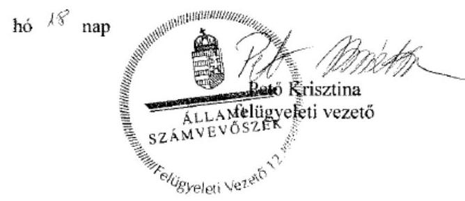

---

# RÖVIDÍTÉSEK JEGYZÉKE 

${ }^{1}$ Múzeum

${ }^{2}$ ÁSZ
${ }^{3}$ Mtv.
${ }^{4}$ Kötv.
${ }^{5} \mathrm{Kjt}$.
${ }^{6}$ Möktv.
${ }^{7}$ 258/2011. (XII. 7.) Korm. rendelet
${ }^{8}$ 2012. évi CLII. törvény
${ }^{9}$ 1311/2012. (VIII.23.) Korm. határozat
${ }^{10}$ KIM
${ }^{11}$ Gazdasági szervezet
${ }^{12}$ 2015. évi LXXV. tv.
${ }^{13}$ Nvtv.
${ }^{14}$ Alaptörvény
${ }^{15}$ Áht. 2
${ }^{16}$ Ávr.
${ }^{17}$ GYMS Megyei Önkormányzat
${ }^{18}$ GYMSMIK
${ }^{19}$ ÁSZ tv.
${ }^{20}$ irányító szerv:/ irányításért felelős szervek irányító szerv2

Győr-Moson-Sopron Megyei Múzeumok Igazgatósága (2011. január 1-jétől 2012. december 31-ig)

Xantus János Megyei Hatókörű Városi Múzeum (2013. január 1-jétől 2013. január 31-ig)
Rómer Flóris Művészeti és Történeti Múzeum (2013. február 2-ától 2014. december 31-ig)
Állami Számvevőszék
1997. évi CXL. törvény a muzeális intézményekről, a nyilvános könyvtári ellátásról és a közművelődésről (hatályos: 1998. január 1-jétől)
2001. évi LXIV. törvény a kulturális örökség védelméről (hatályos: 2001. július 10től)
1992. évi XXXIII. törvény a közalkalmazottak jogállásáról (hatályos: 1992. július 1jétől)
2011. évi CLIV. törvény a megyei önkormányzatok konszolidációjáról, a megyei önkormányzati intézmények és a Fővárosi Önkormányzat egyes egészségügyi intézményeinek átvételéről (hatályos: 2012. január 1-jétől)
258/2011. (XII. 7.) Korm. rendelet a megyei intézményfenntartó központokról, valamint a megyei önkormányzatok konszolidációjával, a megyei önkormányzati intézmények és a Fővárosi Önkormányzat egészségügyi intézményeinek átvételével összefüggő egyes kormányrendeletek módosításáról (hatályos: 2011. december 8-tól)
2012. évi CLII. törvény a muzeális intézményekről, a nyilvános könyvtári ellátásról és a közművelődésről szóló 1997. évi CXL. törvény módosításáról (hatályos: 2012. november 2-től)

1311/2012. (VIII. 23.) Korm. határozat a megyei múzeumok, könyvtárak és közművelődési intézmények fenntartásáról
Közigazgatási és Igazságügyi Minisztérium
Kulturális Pénzügyi-Gazdasági Szolgáltató Központ
a megyei könyvtárak és a megyei hatókörű városi múzeumok feladatának ellátását szolgáló egyes állami tulajdonú vagyontárgyak ingyenes önkormányzati tulajdonba adásáról szóló 2015. évi LXXV. törvény (hatályos 2015. július 18-tól) 2011. évi CXCVI. törvény a nemzeti vagyonról (hatályos 2011. december 31-étől) Magyarország Alaptörvénye
2011. évi CXCV. törvény az államháztartásról (hatályos: 2012. január 1-jétől) az államháztartásról szóló törvény végrehajtásáról szóló 368/2011. (XII. 31.) Korm. rendelet (hatályos: 2012. január 1-jétől)
Győr-Moson-Sopron Megyei Önkormányzat
Győr-Moson-Sopron Megyei Intézményfenntartó Központ
Az Állami Számvevőszékről szóló 2011. évi LVI. törvény (hatályos: 2011. július 1jétől)
Győr-Moson-Sopron Megyei Önkormányzat Közgyűlése (2011. január 1-jétől 2011. december 31-ig)

Közigazgatási és Igazságügyi Minisztérium az illetékes kormányhivatal útján (2012. január 1-jétől 2012. december 31-ig)

---

| irányító szerv3 | Győr Megyei Jogú Város Önkormányzatának Közgyűlése (2013. január 1-jétől 2014. december 31-ig) |
| :--: | :--: |
| ${ }^{21}$ alapító okirat3 | a Győr-Moson-Sopron Megyei Múzeumok Igazgatósága Alapító Okirata (hatályos: 2011. május 4-ig) |
| alapító okirat2 | a Győr-Moson-Sopron Megyei Múzeumok Igazgatósága Alapító Okirata (hatályos: 2011. május 5-től 2011. december 31-ig) |
| alapító okirat3 | a Győr-Moson-Sopron Megyei Múzeumok Igazgatósága Alapító Okirata (hatályos: 2012. január 1-jétől 2012. december 31-ig) |
| alapító okirat4 | a Xantus János Megyei Hatókörú Városi Múzeum Alapító Okirata (hatályos: 2013. január 1-jétől 2013. január 31-éig) |
| alapító okirat5 | a Rómer Flóris Művészeti és Történeti Múzeum Alapító Okirata (hatályos: 2013. február 2-ától 2014. február 20-ig) |
| alapító okirat6 | a Rómer Flóris Múvészeti és Történeti Múzeum Alapító Okirata (hatályos: 2014. február 21-től) |
| ${ }^{22}$ Kincstár | Magyar Államkincstár |
| ${ }^{23}$ múzeumigazgató | Rómer Flóris Múvészeti és Történeti Múzeum (valamint jogelődje a Győr-Moson-Sopron Megyei Múzeumok) igazgatója |
| ${ }^{24}$ EMMI | Emberi Erőforrások Minisztériuma |
| ${ }^{25}$ középirányító szerv | Győr-Moson-Sopron Megyei Intézményfenntartó Központ (2012. január 1-jétől 2012. december 31-ig) |
| ${ }^{26}$ SZMSZ1 | Győr-Moson-Sopron Megyei Múzeumok Igazgatósága Szervezeti és Működési Szabályzata |
| ${ }^{27}$ átadás-átvételi megállapodás ${ }_{1}$ | Győ-Moson-Sopron Megyei Önkormányzat és a Győr-Moson-Sopron Megyei Intézményfenntartó Központ között muzeális és könyvtári intézmények átadásátvétele tárgyában 2011. decemberében kelt megállapodás |
| ${ }^{28}$ NGM módszertani útmutató | Nemzetgazdasági Minisztérium módszertani útmutató beszámoló garnitúrák összeállításához |
| ${ }^{29}$ Áhsz. 1 | 249/2000. (XII. 24.) Korm. rendelet az államháztartás szervezetei beszámolási és könyvvezetési kötelezettségének sajátosságairól (hatályos: 2001. január 1-jétől 2013. december 31-ig) |
| ${ }^{30}$ megyei közgyűlés elnöke | Győr-Moson-Sopron Megyei Önkormányzat Közgyűlésének elnöke |
| ${ }^{31}$ átadás-átvételi megállapodás ${ }_{2}$ | Győr Megyei Jogú Város Önkormányzat és a Győr-Moson-Sopron Megyei Intézményfenntartó Központ között muzeális és könyvtári intézmények átadásátvétele tárgyában 2012. december 14-én kelt megállapodás |
| ${ }^{32}$ kormánymegbízott | Győr-Moson-Sopron Megyei Kormányhivatal vezetője |
| ${ }^{33}$ Ámr. | az államháztartás múködési rendjéről szóló 292/2009. (XI. 19.) Korm. rendelet (hatályos: 2011. december 31-ig) |
| ${ }^{34}$ Bkr. | a költségvetési szervek belső kontrollrendszeréről és a belső ellenőrzésről szóló 370/2011. (XII. 31.) Korm. rendelet (hatályos: 2012. január 1-jétől) |
| ${ }^{35}$ munkamegosztási megállapodás | Munkamegosztási megállapodás, mely létrejött a Kulturális Pénzügyi-Gazdasági Szolgáltató Központ és a Rómer Flóris Múvészeti és Történeti Múzeum között 2013. május 31-én |
| ${ }^{36}$ Munka tv. | a munka törvénykönyvéről szóló 2012. évi I. törvény (hatályos: 2012. július 1jétől) |
| ${ }^{37}$ eszközök források értékelési szabályzata ${ }_{1}$ | Győr-Moson-Sopron Megyei Múzeumok Igazgatósága eszközök és források értékelési szabályzata (hatályos: 2011. május 1-jétől 2013. október 30-ig) |
| eszközök források értékelési szabályzata ${ }_{2}$ | Rómer Flóris Múvészeti és Történeti Múzeum Eszközök és Források Értékelési Szabályzata (hatályos: 2013. október 31-től) |
| ${ }^{38}$ pénzkezelési szabályzat ${ }_{1}$ | Győr-Moson-Sopron Megyei Múzeumok Igazgatósága Pénzkezelési szabályzat (hatályos: 2011. május 1-jétől 2012. október 30-ig) |

---

pénzkezelési szabályzat ${ }_{2}$

Rómer Flóris Művészeti és Történeti Múzeum Pénzkezelési szabályzat (hatályos: 2013. október 31-től)
${ }^{39}$ leltározási és leltárkészítési szabályzat ${ }_{1}$
Győr-Moson-Sopron Megyei Múzeumok Igazgatósága Leltározási és Leltárkészítési szabályzata (hatályos: 2011. május 1-jétől 2013. október 30-ig)
leltározási és leltárkészítési szabályzat ${ }_{2}$
Rómer Flóris Művészeti és Történeti Múzeum Leltározási és Leltárkészítési szabályzata (hatályos: 2013. október 31-től 2014. december 31-ig)
${ }^{40}$ Áhsz. ${ }_{12}$
${ }^{41}$ számviteli politika
42 4/2013. (I. 11.) Korm. rendelet az államháztartás számviteléről
számviteli politika ${ }_{2}$
Győr-Moson-Sopron Megyei Múzeumok Igazgatósága Számviteli politika (hatályos: 2011. május 1-jétől 2013. október 30-ig)
számviteli politika ${ }_{3}$
Rómer Flóris Művészeti és Történeti Múzeum Számviteli Politika (hatályos: 2013. október 31-től 2014. május 29-ig)
${ }^{42}$ Számv. tv.
Rómer Flóris Művészeti és Történeti Múzeum Számviteli Politika (hatályos: 2014. május 30-tól)
${ }^{44}$ FEUVE szabályzat
a számvitelről szóló 2000. évi C. törvény (hatályos: 2000. szeptember 21-től) 2007. évi CLII. törvény az egyes vagyonnyilatkozat-tételi kötelezettségekről (hatályos: 2007. december 7-től)
informatikai szabályzat ${ }_{1}$
Rómer Flóris Művészeti és Történeti Múzeum folyamatba épített előzetes és utólagos vezetői ellenőrzés rendszere (hatályos: 2013. október 31-től)
informatikai szabályzat ${ }_{2}$
Győr-Moson-Sopron Megyei Múzeumok Igazgatósága Informatikai Szabályzata (hatályos: 2011. január 1-jétől 2013. október 31-éig)
${ }^{46}$ Ltv.
Rómer Flóris Művészeti és Történeti Múzeum Informatikai Szabályzata (hatályos: 2013. november 1-jétől)
${ }^{47}$ Eitv.
1995. évi LXVI. törvény a közokiratokról, a közlevéltárakról és a magánlevéltári anyag védelméről (hatályos: 1996. január 1-jétől)
${ }^{48}$ Info tv.
2005. évi XC. törvény az elektronikus információszabadságról (hatályos: 2006. január 1-jétől 2011. december 31-ig)
${ }^{50}$ Áht. ${ }_{1}$
2011. évi CXII. törvény az információs önrendelkezési jogról és az információszabadságról (hatályos: 2011. július 27-től)
${ }^{51}$ Ötv.
1995. évi LXVI. törvény a közokiratokról, a közlevéltárakról és a magánlevéltári anyag védelméről (hatályos: 1996. január 1-jétől)
${ }^{52}$ 1991. évi XX. törvény a államháztartásról (hatályos: 2011. december 31-ig) 1990. évi LXV. tv. a helyi önkormányzatokról (hatályos: az önkormányzati képviselő-testületek tagjai 1990. évi választásának napjától a 2014. évi általános önkormányzati választások napjáig)
${ }^{53}$ Mötv.
1991. évi XX. törvény a helyi önkormányzatok és szerveik, a köztársasági megbízottak, valamint egyes centrális alárendeltségú szervek feladat- és hatásköreiről (hatályos: 1991. július 22-től)
2011. évi CLXXXIX. törvény Magyarország helyi önkormányzatairól (hatályos 2012. január 1-jétől)

Győr-Moson-Sopron Megyei Múzeumok Igazgatósága Önköltség-számítási Szabályzata (hatályos: 2011. május 1-jétől 2013. október 31-ig)
Rómer Flóris Múvészeti és Történeti Múzeum Önköltség-számítási Szabályzata (hatályos: 2013. november 1-jétől)
2007. évi CVI. törvény az állami vagyonról (hatályos: 2007. szeptember 25-től) Magyar Nemzeti Vagyonkezelő Zrt.
150/1992. (XI. 20.) Korm. rendelet a közalkalmazottak jogállásáról szóló 1992. évi XXXIII. törvény a múvészeti, a közművelődési és a közgyűjteményi területen foglalkoztatott közalkalmazottak jogviszonyával összefüggő egyes kérdések rendezésére (hatályos: 1992. november 28-tól)

---

${ }^{58} \mathrm{Kbt} .1$

Kbt. 2
${ }^{59}$ 20/2002. (X. 4.) NKÖM rendelet
${ }^{60}$ 393/2012. (XII. 20.) Korm. rendelet
${ }^{61}$ 5/2010. (VIII. 18.) NEFMI rendelet
${ }^{62}$ 80/2012. (XII.28.) BM rendelet
${ }^{63}$ Vtvr.
${ }^{64}$ 2/2010. (I. 14.) OKM rendelet
2003. évi CXXIX. törvény a közbeszerzésekről (hatályos: 2004. január 1-jétől 2011. december 31-ig)

2011. évi CVIII. törvény a közbeszerzésekről (hatályos: 2012. január 1-jétől) a muzeális intézmények nyilvántartási szabályzatáról szóló 20/2002. (X. 4.) NKÖM rendelet (hatályos. 2003. január 1-jétől)
a régészeti örökség és a műemléki érték védelmével kapcsolatos szabályokról szóló 393/2012. (XII. 20.) Korm. rendelet (hatályos: 2013. január 1-től 2015. március 11-ig)
5/2010. (VIII. 18.) NEFMI rendelet a régészeti lelőhelyek feltárásának, illetve a régészeti lelőhely, lelet megtalálója anyagi elismerésének részletes szabályairól (hatályos: 2010. augusztus 18-tól 2012. december 31-ig)
80/2012.(XII.28.) BM rendelet a régészeti lelőhely és a múemléki érték védetté nyilvánításáról, nyilvántartásáról és a régészeti feltárás részletes szabályairól (hatályos: 2013. január 1-jétől 2015. március 12-ig)
254/2007. (X. 4.) Korm. rendelet az állami vagyonnal való gazdálkodásról (hatályos: 2007. október 4-től)
2/2010. (I. 14.) OKM rendelet a muzeális intézmények múködési engedélyéről (hatályos: 2010. január 22-től)

---

# ÁLLAMI SZÁMVEVŐSZÉK 

1052 Budapest, Apáczai Csere János utca 10.
Levélcím: 1364 Budapest 4. Pf. 54
Telefon: +36 14849100 Telefax: +36 14849200
www.asz.hu