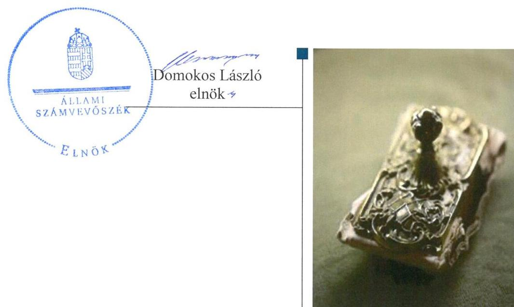
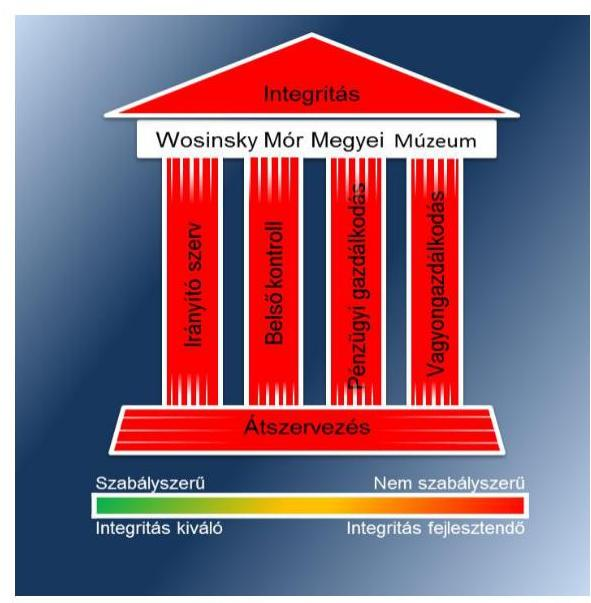
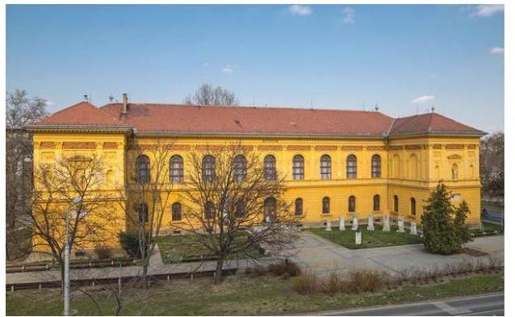
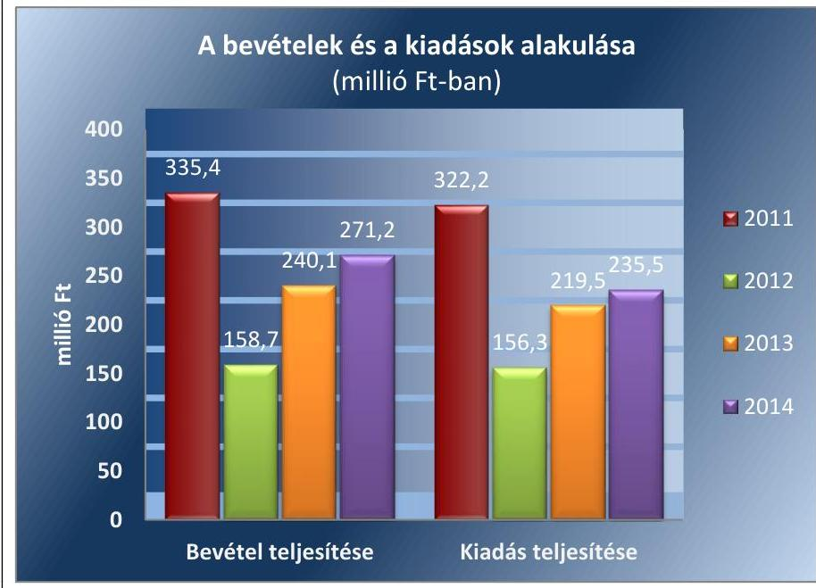
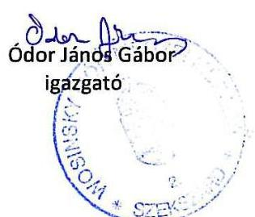
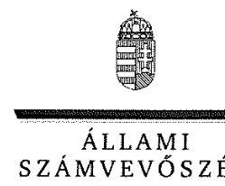
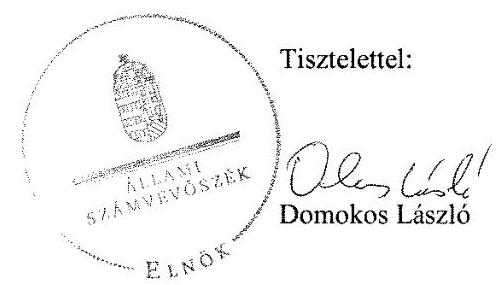
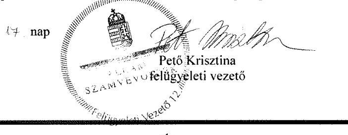

# Jelentés 

## Megyei hatókörú városi múzeumok ellenőrzése

Wosinsky Mór Megyei Múzeum, Szekszárd
2016.

---

# Jellentés 

## Megyei hatókörú városi múzeumok ellenőrzése

Wosinsky Mór Megyei Múzeum, Szekszárd
2016. decenter hó 08. nap

---

# AZ ELLENŐRZÉST FELÜGYELTE: 

PETŐ KRISZTINA felügyeleti vezető

## AZ ELLENŐRZÉST VEZETTE ÉS A VÉGREHAJTÁSÁÉRT FELELŐS:

BREBÁN ANDREA ellenőrzésvezető
KAKAS SÁNDOR ellenőrzésvezető

## A PROGRAM ÖSSZEÁLLÍTÁSÁÉRT FELELŐS:

JANIK JÓZSEF LÁSZLÓ osztályvezető

IKTATÓSZÁM: V-1065-104/2016.
TÉMASZÁM: 1984
ELLENŐRZÉS-AZONOSÍTÓ SZÁM: V073718

---

# TARTALOMJEGYZÉK 

■ ÖSSZEGZÉS ..... 5
■ AZ ELLENŐRZÉS CÉLJA ..... 7
■ AZ ELLENŐRZÉS TERÜLETE ..... 8
■ AZ ELLENŐRZÉS HÁTTERE, INDOKOLTSÁGA ..... 11
■ A JELENTÉS LÉNYEGES KÉRDÉSKÖREI ..... 13
■ ELLENŐRZÉS HATÓKÖRE ÉS MÓDSZEREI ..... 14
■ MEGÁLLAPÍTÁSOK ..... 17
■ JAVASLATOK ..... 30
■ MELLÉKLETEK ..... 35
I. sz. melléklet: Értelmező szótár ..... 35
II. sz. melléklet: Az Integritás érvényesítése érdekében kialakított és múködtetett kontrollrendszer ..... 38
■ FÜGGELÉK: ÉSZREVÉTELEK ..... 41
■ RÖVIDÍTÉSEK JEGYZÉKE ..... 51

---

.

---

# ÖSSZEGZÉS 

A szekszárdi székhelyű Wosinsky Mór Megyei Múzeumra vonatkozó irányító szervi feladatellátás összességében nem volt szabályszerű. A Múzeumnál kialakított irányítási rendszer nem biztositotta az átlátható, elszámoltatható és ellenőrizhető közpénzfelhasználást. A Múzeum pénzügyi és vagyongazdálkodása nem volt szabályszerű. A Múzeum alaptevékenységének részét képező kulturális javak nyilvántartásáról nem gondoskodtak, a kulturális javak állományvédelme és vagyonbiztonsága a kölcsönzéseknél nem volt biztositott.

## Az ellenőrzés társadalmi indokoltsága

Az Állami Számvevőszék Stratégiájának alapértéke, hogy ellenőrzései segítik az integritás alapú, átlátható és elszámoltatható közpénzfelhasználás megteremtését. Az ellenőrzés jogszabályban, vagy alapító okiratban meghatározott közfeladat ellátására létrejött, a megyei hatókörű városi muzeális intézmények gazdálkodási tevékenységére terjed ki. E szervezetek pénzügyi és vagyongazdálkodásának alapvető rendeltetése a közfeladatok (a kulturális örökséghez tartozó javak védelme, őrzése és a nyilvánosság számára történő hozzáférhetővé tétele) ellátásának biztosítása.

A megyei hatókörű városi múzeumként működő szervezetek 2011. évtől több alkalommal jelentős szervezeti és gazdálkodási átalakuláson mentek keresztül. A tulajdonosi, a vagyonkezelői és a fenntartói szerepekben, szerkezetben történt változások előkészítése, végrehajtása, illetve a múzeumi rendszer által kezelt közvagyonnal való gazdálkodás szabályszerűségének bemutatásával az ellenőrzés hozzájárul a múzeumok fenntartási és működtetési feladatainak ellátására vonatkozó megfelelő jogszabályi környezet kialakításához, a gazdálkodási gyakorlatuk javításához.

## Főbb megállapítások, következtetések

Az irányító szervek az ellenőrzött időszakban összességében nem szabályszerűen gyakorolták alapítói jogosultságaikat. A 2014. évben az irányító szervi hatáskörök nem érvényesültek, mert a múzeumigazgató elvonta az irányító szerv hatáskörét, amikor szabálytalanul nevezte ki a gazdasági vezetőt, így a gazdálkodással összefüggő feladatok ellátásáért felelős szervezetet érvényes kinevezéssel nem rendelkező személy irányította.

A Múzeumnál a közpénzekkel való átlátható és ellenőrizhető gazdálkodás garanciáit nem teremtették meg. A közbeszerzések rendjének szabályait nem határozták meg, a beszerzések lebonyolításával kapcsolatos eljárásrendet belső szabályzatban nem rendezték. Ellenőrzési nyomvonal a jogszabályi előírások ellenére nem készült. A Múzeum az ellenőrzési nyomvonal elkészítésének elmulasztásával nem tette lehetővé a múzeum működési folyamatainak, a felelősségi és információs szintek, kapcsolatok, továbbá az irányítási, valamint ellenőrzési folyamatok nyomon követhetőségét és utólagos ellenőrizhetőségét. A 2011. évben nem készítették el a szabálytalanságok kezelésének eljárásrendjét. A va-gyonnyilatkozat-tételi kötelezettség az SZMSZ-ben feltüntetésre került, azonban az ellenőrzött időszakban a gazdasági vezető, illetve a szakmai igazgatóhelyettes vagyonnyilatkozatot nem tett. A kontrolltevékenységek kialakítása és működtetése az ellenőrzött időszakban nem volt szabályszerű. A 2011-2014. években az érvényesítési feladatokra történő kijelölés nem volt szabályszerű, mert a gazdasági vezető helyett a múzeumigazgató jelölte ki az érvényesítésre jogosult személyeket. Az információs és kommunikációs folyamatok kialakítása nem volt szabályszerű, mert a

---

Múzeumnál nem készítettek adatvédelmi és adatbiztonsági szabályzatot, nem szabályozták a kötelezően közzéteendő adatok nyilvánosságra hozatalának rendjét, valamint a közérdekű adatok megismerésére irányuló kérelmek intézésének rendjét. A Múzeum tevékenységének, a célok megvalósításának nyomon követését biztosító rendszert a 2011-2014. években az intézmény nem működtette. A belső ellenőrzés működtetése a 2012-2014. években nem valósult meg.

A Múzeum pénzügyi- és vagyongazdálkodása nem volt szabályszerű. A bevételek elszámolása nem volt szabályszerű, mert a vagyon hasznosítása vagyonkezelési szerződés hiányában történt. A kiadási előirányzatok felhasználása a 2011-2014. években nem volt szabályszerű. A kötelezettségvállalásra pénzügyi ellenjegyzés hiányában került sor, a felhalmozási kiadásokat alátámasztó számviteli bizonylatok nem feleltek meg a jogszabályi előírásoknak, valamint a személyi juttatások esetében a munkavállalónak szabálytalanul kerültek pótlékok folyósításra. A közfeladat ellátását szolgáló vagyont a Múzeum a 2012. évi beszámolójában vagyonkezelési szerződés hiányában jogalap nélkül mutatta ki. A 2014. évben nem érvényesült a „lényegesség" számviteli alapelv, mert kiegészítő mellékletben a Múzeum nem mutatta be mérlegtételek szerinti megbontásban a kezelésbe vett állami eszközöket. A kulturális javak kölcsönzése során a Múzeum nem tartotta be a jogszabályi előírásokat, mert a kölcsönzési szerződések nem tartalmazták a jogszabályban rögzített kötelező tartalmi elemeket, emiatt a kölcsönzött kulturális javak állományvédelme nem volt megfelelően biztosított.

A Múzeumot érintő önkormányzati alrendszerből a központi alrendszerbe történő 2012. január 1-jétől hatályos irányító szervi (fenntartói) váltás lebonyolítása nem volt szabályszerű. A 2013. január 1-jével végrehajtott, a központi alrendszerből önkormányzati alrendszerbe történő irányító szervi (fenntartói) váltás lebonyolítása és a szervezetrendszer átalakítása szabályszerű volt.

A Múzeum az integritás szemlélet érvényesítése érdekében nem intézkedett.

---

# AZ ELLENŐRZÉS CÉLJA 

vényesülését a gazdálkodási folyamatokban.

Az ellenőrzés célja annak megállapítása volt, hogy a megyei múzeumi rendszer átalakítása, az intézményfenntartói rendszerben végbement változások előkészítése és végrehajtása megalapozottan, szabályszerűen történt-e; a megyei hatókörű városi múzeumok és jogelődjeik pénz-ügyi- és vagyongazdálkodása, a belső kontrollrendszer kialakítása és működtetése, valamint az intézményfenntartói feladatok ellátása szabályszerűen történt-e.

A Múzeum ${ }^{1}$ korrupcióval szembeni veszélyeztetettségének csökkentése érdekében kért tanúsítványi adatszolgáltatás alapján az ÁSZ² értékelte az integritási szemlélet ér-

---

# **AZ ELLENŐRZÉS TERÜLETE**

## **Wosinsky Mór Megyei Múzeum**

A Múzeum Szekszárdon található, feladatkörében az Mtv.^{3} alapján gondoskodik a kulturális javak meghatározott anyagának folyamatos gyűjtéséről, nyilvántartásáról, megőrzéséről és restaurálásáról; tudományos feldolgozásáról, publikálásáról; valamint kiállításokon és más módon történő bemutatásáról; a közművelődési és közgyűjteményi feladatok ellátásáról. A Kötv.^{4} 20. § (2) bekezdése alapján területileg illetékes múzeumként az ellenőrzött időszakban régészeti feltárást végzett.

A Múzeum csak a működési engedélyében meghatározott gyűjtőkörben és gyűjtőterületen folytathatja tevékenységét. A szakmai besorolást, a rendszert megalapozó szaktörvényi kereteket az Mtv. biztosítja. Az Mtv. hatálya kiterjed a Múzeum fenntartóira, a Múzeumban foglalkoztatottakra, a kulturális örökség Múzeumban őrzött elemeire, a szolgáltatások igénybe vevőire és a kulturális örökséggel foglalkozó egyéb szervezetekre.

A Múzeum 2011. évi költségvetési engedélyezett létszáma 65 fő volt, ami az ellenőrzött időszakban csökkenő tendenciát mutatott, a 2012. évben 40 fő, a 2013. évben 38 fő, a 2014. évben pedig 36 fő volt. A Múzeum alkalmazottainak foglalkoztatására a Kjt.^{5} alapján került sor. Az ellenőrzött időszakban a múzeumigazgató^{6} és a gazdasági vezető személye is változott.

A Möktv.^{7} és annak végrehajtásáról szóló 258/2011. (XII. 7.) Korm. rendelet^{8} alapján 2012. január 1-jétől a megyei múzeumok központi költségvetési szervekké váltak. 2013. január 1-jétől a 2012. évi CLII. törvény^{9}, valamint a 1311/2012. (VIII. 23.) Korm. határozat^{10} alapján az állami tulajdonba és fenntartásba került megyei múzeumi szervezetek a megyeszékhely megyei jogú városok fenntartásában működnek tovább. A 2011–2014. évek között a fenntartói, irányítói, középirányítói jogkörgyakorlók változását, valamint a Múzeum gazdálkodási feladatát ellátó szervezetét az 1. táblázat mutatja be:

^{1} táblázat

|  Időszak | Fenntartó | Irányító szerv | Középirányító
szerv | Gazdasági
szervezet  |
| --- | --- | --- | --- | --- |
|  2011. | TMÖ^{11} | TMÖ
Közgyűlése | - | Múzeum  |
|  2012. | TMIK^{12} | KIM^{13} | TMIK | Múzeum  |
|  2013–2014. | Szekszárd MIVÖ^{14} | Szekszárd MIVÖ
Közgyűlése | - | Múzeum  |

*Fenntartó: A Múzeum alapító okiratai*

**FENNTARTÓI, IRÁNYÍTÓI JOGKÖRGYAKORLÓK ÉS GAZDASÁGI SZERVEZET A 2011–2014. ÉVEKBEN**

---

A Múzeum jogállása a 2011. évtől önállóan működő és gazdálkodó költségvetési szerv volt. 2014. július 1-jétől a Múzeum önálló jogi személyiséggel rendelkező, saját gazdasági szervezettel működő megyei hatókörű városi múzeum, vállalkozási tevékenységet nem végzett.

A megyei könyvtárak és a megyei hatókörű városi múzeumok feladatának ellátását szolgáló egyes állami tulajdonú vagyontárgyak ingyenes önkormányzati tulajdonba adásáról szóló 2015. évi LXXV. tv. 4. § (1) bekezdése alapján a kulturális örökség helyi védelme érdekében a megyei hatókörű városi múzeumok alapleltárában és jogszabály szerinti külön nyilvántartásában szereplő állami tulajdonú kulturális javak ingyenesen a megyei hatókörű városi múzeumok vagyonkezelésébe kerültek. A vagyonkezelők vagyonkezelői joga tekintetében vagyonkezelési szerződés megkötése nem szükséges. A hivatkozott törvény 4. § (2) bekezdése szerint továbbá a kulturális örökség helyi védelme érdekében a megyei hatókörű városi múzeumok feladatának ellátását szolgáló állami tulajdonban álló ingatlanok a törvényben meghatározott ingatlanok kivételével - ingyenesen a fenntartó önkormányzatok vagyonkezelésébe kerültek.

A Múzeum teljesített költségvetési bevételeinek és kiadásaink alakulását az 1. ábra mutatja be. Az ábra a 2011-2012. években a Múzeum és tagintézményeinek együttes adatai, a 2013-2014. években a tagintézmények átadását követően a múzeumi adatok alapján készült.
1. ábra

Forrás: Múzeumi beszámolók a 2011-2014. évekre
A 2015. évi LXXV. tv. ${ }^{15}$ 1. § (1) bekezdése alapján az Nvtv. ${ }^{16}$ 13. § (3) bekezdésében és 14. § (1) bekezdésében foglaltak alapján és az abban meghatározott feltételekkel a 2012. évi CLII. törvény 30. § (1) és (2) bekezdésében meghatározott, a megyei hatókörű városi múzeumok feladatának ellátását szolgáló egyes állami tulajdonban lévő ingatlanok a törvény hatálybalépésének napjával, a törvény erejénél fogva a kötelező közfeladatként a megyei hatókörű városi múzeumot fenntartó önkormányzatok tulajdonába kerültek. A 2015. évi LXXV. tv. 4. § (1) bekezdése alapján a kulturális örökség helyi védelme érdekében a megyei hatókörű városi múze-

---

umok alapleltárában és jogszabály szerinti külön nyilvántartásában szereplő állami tulajdonú kulturális javak ingyenesen a megyei hatókörű városi múzeumok vagyonkezelésébe kerültek. A vagyonkezelők vagyonkezelői joga tekintetében vagyonkezelési szerződés megkötése nem szükséges. A 2015. évi LXXV. tv. 4. § (2) bekezdése szerint továbbá a kulturális örökség helyi védelme érdekében a megyei hatókörű városi múzeumok feladatának ellátását szolgáló állami tulajdonban álló ingatlanok - a törvény mellékletében meghatározott ingatlanok kivételével - ingyenesen a fenntartó önkormányzatok vagyonkezelésébe kerültek.

---

# AZ ELLENŐRZÉS HÁTTERE, INDOKOLTSÁGA

Az Alaptörvény^{17} rendelkezése szerint a nemzeti vagyon megőrzésének, védelmének és a nemzeti vagyonnal való felelős gazdálkodásnak a követelményeit sarkalatos törvény, az Nvtv. rögzíti. A tulajdonosi joggyakorlás és vagyonkezelés általános és speciális szabályait, az állami vagyon nyilvántartására és elszámolására vonatkozó eljárásokat, a vagyonkezelési szerződés feltételrendszerét, valamint az éves beszámoló készítési és könyvvezetési kötelezettségeket kormányrendelet írja elő.

A megyei hatókörű városi múzeumok közfeladat-ellátásának változásait, (beleértve az állami tulajdonosi joggyakorló, intézményi vagyonkezelő és önkormányzati fenntartó szervezeteket is) a közfeladatok átadásából és átvételéből adódó módosításait, előirányzat gazdálkodására ható tényezőit az Áht-^{18}, az Ávr.^{19}, a Möktv., valamint az Mtv. írja elő. A múzeumi intézményrendszer rendszerátalakulásából, megszűnéséből, intézmény átszervezéséből, belső szerkezeti korszerűsítéséből, vagy más hasonló okból adódó módosításai miatt szerepeltetendő szerkezeti változásokat, valamint a szerkezeti változásként beépült közfeladatok szintre hozásként történő számításba vételét az Ávr. határozza meg.

A megyei hatókörű városi múzeumok kulturális szempontból meghatározó jelentőségűek mind földrajzi elhelyezkedésüket, mind az ellátott feladatokat, valamint a látogatottságukat tekintve. Tevékenységüket törvényi szinten (Mtv.) szabályozták a jogalkotók. A megyei hatókörű városi múzeumok jelenlegi körének kialakításában, tulajdonosi és fenntartói szerkezetében rövid idő alatt több jelentős változás történt, amelyeket jogszabályi változások indukáltak. Ezen intézmények szakmai besorolásukat tekintve a 2011. évben megyei múzeumként, a 2012. évben megyei múzeumi központi költségvetési szervezetként, a 2013. évtől kezdődően megyei hatókörű városi múzeumként működtek. A szakmai besorolások változásait párhuzamosan követték a tulajdonosi, vagyonkezelői, fenntartói szerepekben történt változások.

A 2011–2014. évek között bekövetkezett fenntartói változások a vagyontárgyak és a kulturális javak tulajdonosi, vagyonkezelői és használói körében is változást indukáltak, amelyet a 2. táblázat szemlélet.

1. táblázat

|  A VAGYON TULAJDONOSI, VAGYONKEZELŐI ÉS HASZNÁLÓI KÖRÉNEK VÁLTOZÁSA 2011–2014. ÉVEKBEN |  |  |  |  |  |  |  |  |   |
| --- | --- | --- | --- | --- | --- | --- | --- | --- | --- |
|  Vagyontárgy |  | 2011. év |  |  | 2012. év |  |  | 2013-2014. évek |   |
|   |  | vagyonkezelő | használó | tulajdonos | vagyonkezelő | használó | tulajdonos | vagyonkezelő | használó  |
|  Ingatlan | TMÖ | - | Múzeum | Állam | TMIK | Múzeum | Állam | Múzeum | Múzeum  |
|  Egyéb tárgyi eszközök | TMÖ | - | Múzeum | Állam | TMIK | Múzeum | Állam | Múzeum | Múzeum  |
|  Kulturális javak | TMÖ | - | Múzeum | Állam | TMIK | Múzeum | Állam | Múzeum | Múzeum  |

*2. táblázat*

*Forrás: A Múzeum alapító okiratai, a 2012. évi CLII. tv, a 258/2011. (XII. 7) Korm. rendelet, az 1311/2012. (VIII. 23.) Korm. határozat*

---

Az ellenőrzés - tekintettel a megyei hatókörű városi múzeumokat (és jogelődjeit) rövid időn belül, gyors ütemben ért környezeti (tulajdonosi, fenntartói-szerkezetet érintő) változásokra - javaslatok megfogalmazásával hozzájárul a fenntartás és működtetés feladatainak ellátására vonatkozó megfelelő jogszabályi környezet - jogalkotók által történő - kialakításához. Az ÁSZ ellenőrzés a gazdálkodási gyakorlat javítását eredményezheti, több intézmény bevonásával átfogó képet ad a megyei hatókörű városi múzeumokat (és jogelődjeiket) jellemző sajátosságokról, jó gyakorlatokról.

AZ ELLENŐRZÉS EREDMÉNYEKÉPPEN nemcsak az ellenőrzött intézmények gazdálkodása javul, hanem átfogó képet kapunk a múzeumok gazdálkodásának hiányosságairól, de a jó gyakorlatokról is. Ellenőrzéseivel, javaslataival és megállapításaival az ÁSZ elősegíti a költségvetési szervek pénzügyi és vagyongazdálkodása szabályozásának javítását és hozzájárulhat a jó kormányzáshoz.

---

# A JELENTÉS LÉNYEGES KÉRDÉSKÖREI 

1. Az irányító szerv Múzeumra vonatkozó feladatellátása szabályszerű volt-e?
2. Szabályszerüen hajtották-e végre a Múzeumot érintő szervezeti, szerkezeti átszervezéseket?
3. A belső kontrollrendszer kialakítása és müködtetése megfelelt-e a jogszabályi előírásoknak?
4. A Múzeum pénzügyi gazdálkodása szabályszerű volt-e?
5. A Múzeum vagyongazdálkodása szabályszerű volt-e?
6. A Múzeum intézkedett-e az integritás szemlélet érvényesitése érdekében?

---

# ELLENŐRZÉS HATÓKÖRE ÉS MÓDSZEREI 

## Az ellenőrzés típusa

Megfelelőségi ellenőrzés.

## Az ellenőrzött időszak

Az ellenőrzött időszak 2011. január 1-jétől 2014. december 31-ig tart.

## Az ellenőrzés tárgya

A megyei hatókörű városi múzeumok átszervezése, átalakítása előkészítése és lebonyolítása megalapozottsága, szabályszerűsége, a pénzügyi és vagyongazdálkodási tevékenység, a belső kontrollrendszer kialakítása, működtetése szabályszerűsége, valamint az irányító szervi feladatok ellátása szabályszerűsége. E tevékenységek és a kapcsolódó adatok és információk összessége, amelyeket a vonatkozó kritériumok alapján kell értékelni.

Az ellenőrzés kiterjed minden olyan körülményre és adatra, amely az ÁSZ jogszabályban meghatározott feladatainak teljesítéséhez, valamint a program végrehajtása folyamán felmerült újabb összefüggések feltárásához szükséges.

## Az ellenőrzött szervezet

A Wosinsky Mór Megyei Múzeum, a fenntartói feladatokban érintett Tolna Megyei Önkormányzat, valamint Szekszárd Megyei Jogú Város Önkormányzata, a Tolna Megyei Intézményfenntartó Központ jogutódja a Szociális és Gyermekvédelmi Főigazgatóság.

Az ellenőrzésre a költségvetési szerv ellenőrzött intézményének és irányító/felügyeleti szervének, illetve középirányító szervének székhelyén és a gazdálkodási feladatait ellátó szervezetének székhelyén került sor.

## Az ellenőrzés jogalapja

Az ellenőrzés jogszabályi alapját az ÁSZ tv. ${ }^{30}$ 1. § (3) bekezdés, 5. § (2)-(6) bekezdései, valamint az Áht. 2 61. § (2) bekezdésének előírásai képezik.

---

# Az ellenőrzés módszerei 

Az ellenőrzést az ellenőrzési program szempontjai, az ellenőrzött időszakban hatályos jogszabályok, az ellenőrzés szakmai szabályai, az egyes ellenőrzési típusokhoz kapcsolódó ÁSZ módszertanok és nemzetközi standardok figyelembe vételével végeztük. A gazdálkodás hibáinak kijavítására, a közpénzekkel való felelős gazdálkodás segítésére irányuló javaslatok kidolgozásakor a hatályos jogszabályok az irányadóak.

Az ellenőrzési kérdések megválaszolásához szükséges bizonyítékok megszerzése a következő ellenőrzési eljárások alkalmazásával történt: kérdésfeltevés (információkérés), mintavételezés, valamint elemző eljárás. A minták kiválasztása során véletlen mintavételi eljárást alkalmaztunk.

Mintavétellel ellenőriztük a bevételek, a személyi juttatások, a dologi és felhalmozási kiadások, a régészeti bevételek és kiadások elszámolása-, valamint a kulturális javak kölcsönzésének szabályszerűségét. A minta alapján a sokaságban előforduló hibaarányt becsültük. „Megfelelőnek" értékeltük az ellenőrzött területet, amennyiben 95\%-os bizonyossággal a teljes sokaságban a hibaarány legfeljebb 10\%, „részben megfelelőnek" értékeltük, ha a hibaarány felső határa 10-30\% között volt, „nem megfelelőnek" pedig akkor, ha a mintavételi eredmények alapján a sokaságbeli hibaarány felső határa meghaladta a 30\%-ot.

Az ellenőrzési bizonyítékként felhasználható adatforrások közé tartoznak egyrészt a szakmai program részletes szempontjainál felsorolt adatforrások, másrészt adatforrás lehet minden egyéb - az ellenőrzés folyamán feltárt, az ellenőrzés szempontjából releváns információt tartalmazó - dokumentum. Az ellenőrzés lefolytatásához a Múzeum a tanúsítványok elektronikus kitöltésével, valamint az ÁSZ által kért dokumentumok elektronikus megküldésével szolgáltatott adatokat. A rendelkezésre bocsátott adatok, információk kontrollja az ellenőrzés keretében történt. Az ellenőrzési kérdésekre adott válaszok alapján értékeltük, hogy az ellenőrzött időszakban az irányító szerv az ellenőrzött Múzeumra vonatkozó feladatainak szabályszerűen eleget tett-e, a Múzeum pénzügyi- és vagyongazdálkodása megfelel-t-e az előírásoknak, a Múzeum átalakításának vagy átszervezésének végrehajtása szabályszerű volt-e.

A Múzeum belső kontrollrendszere jogszabályi előírások szerinti kialakításának és működtetésének szabályszerűségét az erre irányuló ellenőrzési kérdésekre adott válaszok összesítése alapján, évente pillérenként (kontrollkörnyezet, kockázatkezelési rendszer, kontrolltevékenységek, információs és kommunikációs rendszer, monitoring rendszer) és összesítetten is minősítjük. A Múzeum belső kontrollrendszere egyes pilléreinek kialakítása és működtetése „szabályszerü", amennyiben az értékelt területen az elért és elérhető pontok százalékban kifejezett, egész számra kerekített hányadosa meghaladja a 84\%-ot, „részben szabályszerű", ha a 84\%ot nem haladja meg, de 60\%-nál nagyobb, „nem szabályszerű", ha nem haladja meg a 60\%-ot. A Múzeum belső kontrollrendszerének összesített értékelése megegyezik a pillérenként (kontrollterületenként) alkalmazott \%os értékelésekkel, a következő eltérésekkel. A kontrollrendszer egésze esetében a „szabályszerű" értékelésnek a \%-os értéken felül további feltétele, hogy egyik kontrollterület sem kaphat „nem szabályszerű" értékelést, a „részben szabályszerű" értékelés további feltétele, hogy legfeljebb egy el-

---

lenőrzött kontrollterület lehet „nem szabályszerű" értékelésű. Az összesített értékelés a \%-os értéktől függetlenül „nem szabályszerű", ha az ellenőrzött kontrollterületek közül több mint egynek „nem szabályszerű" az értékelése.

Az integritás szemlélet érvényesülésének értékelése a Múzeum tanúsítványi adatszolgáltatása alapján történt.

---

# 1. Az irányító szerv Múzeumra vonatkozó feladatellátása szabályszerű volt-e? 

Összegző megállapítás

Az irányító szerv ${ }_{1-3}{ }^{21}$ Múzeumra vonatkozó feladatellátása összességében nem volt szabályszerű.

AZ ALAPÍTÓI JOGOSULTSÁGOK GYAKORLÁSA során hiányosság volt, hogy az alapító okiratok módosításai során - a 2012. január 1-jétől hatályos előírás ellenére - a 2012. évben az Mtv. 45/B. § (3) bekezdésben, a 2013. évben az Mtv. 45. § (5) bekezdés a) pontjában előírtak nem teljesültek, mert az alapító okiratok módosításához a kultúráért felelős miniszter előzetes véleményét nem kérték meg. A Múzeum a 20112014. években rendelkezett az Áht. ${ }_{1,2}$-ben előírtaknak megfelelően Alapító okirat ${ }_{1-4}{ }^{22}$-gyel. Az Alapító okirat ${ }_{1-4}$ tartalma megfelelt az Áht. ${ }_{2}{ }^{23}$, valamint az Ávr.-ben előírt tartalmi követelményeknek. Az Alapító okirat ${ }_{1-4}$-et annak módosításakor az Ámr. ${ }^{24}$ és az Ávr. előírásainak megfelelően minden esetben egységes szerkezetbe foglalták. A 2014. évben az Alapító okirat ${ }_{4}$-et az Ávr. szerint a kormányzati funkció szerinti megjelöléssel módosították. 2012-ben az Alapítói okirat ${ }_{2}$ kiadására és kincstári ${ }^{25}$ nyilvántartásba vételére a 258/2011. (XII. 7.) Korm. rendelet 21. § (6) bekezdése szerinti 2012. január 30-ai határidőn túl 2012. június 12-én került sor.

A MUNKÁLTATÓI JOGOSULTSÁG gyakorlása során a múzeumigazgatót a jogszabályi előírások betartásával nevezték ki. A kinevezett múzeumigazgató rendelkezett az Mtv.-ben meghatározott szakmai képesítési követelményekkel, a megbízáshoz rendelkeztek a miniszter ${ }^{26}$ írásbeli egyetértésével. A gazdasági vezetö ${ }_{1}{ }^{27}$-et az irányító szerv ${ }_{1}$ vezetője az Áht. ${ }_{1}$ előírásainak figyelembevételével nevezte ki. A 2014. évben a gazdasági vezetö ${ }_{2}$-t az Áht. ${ }_{2} 9 . \S$ (1) bekezdés c) pontjával ellentétesen nem az irányító szerv ${ }_{3}$, hanem a Múzeum igazgatója nevezte ki.

AZ EGYÉB IRÁNYÍTÁSI, FELÜGYELETI ÉS ELLENŐRZÉSI jogosultságok gyakorlása során hiányosság volt, hogy

- 2012-ben a 258/2011. Korm. rendelet 11. § (2) bekezdés c) pontja ellenére a középirányító szerv nem ellenőrizte az államháztartással összefüggő közérdekű és közérdekből nyilvános adatok kötelező közzétételének, illetve igényre történő szolgáltatásának végrehajtását;
- a 2012-2014. években a Múzeum kezelésében lévő közérdekű adatokat és közérdekből nyilvános adatokat, valamint az Áht. ${ }_{2} 9 . \S$ (1) bekezdés b), c) és f)-i) pont szerinti irányítási hatáskörök gyakorlásához szükséges, törvényben meghatározott személyes adatokat nem kezelte az irányító szerv ${ }_{2,3}$ az Áht. ${ }_{2} 9 . \S$ (1) bekezdés j) pontjában előírtak ellenére.

---

# 2. Szabályszerüen hajtották-e végre a Múzeumot érintő szervezeti, szerkezeti átszervezéseket? 

Összegző megállapítás

2.1. számú megállapítás

A Múzeumot és tagintézményeit érintő szervezeti, szerkezeti átszervezések végrehajtása nem volt szabályszerű.

A Múzeumot érintő önkormányzati alrendszerből a központi alrendszerbe történő 2012. január 1-jétől hatályos irányító szervi (fenntartói) váltás lebonyolítását nem szabályszerűen hajtották végre.

AZ ÁTADÁS-ÁTVÉTELI MEGÁLLAPODÁS ${ }^{28}$ megkötésére a 258/2011. (XII. 7.) Korm. rendelet 1. számú melléklete szerinti minta alapján határidőben került sor a Möktv.-ben meghatározott intézmények képviselőinek aláírásával.

A fenntartó ${ }^{29}$, mint átvevő kedvezményezett a 258/2011. (XII. 7.) Korm. rendelet 13. § (2) bekezdés előírása ellenére a Múzeum európai uniós társfinanszírozású projektjei tekintetében a támogatásban érintett közremüködő szervezetnél a projekt átadás-átvételi dokumentációját mellékelve a jogszabályban előírt időintervallumon belül a támogatási szerződés módosítását nem kezdeményezte.

A tényleges vagyon átadás-átvétel a 2011. évi elemi költségvetési beszámoló és a vagyonátadási jelentés elkészítésével valósult meg az Áhsz. ${ }^{30}$ 7. § (12) és 13/A. § (1)-(2) bekezdésének megfelelően. A Múzeum a központi alrendszerben szabályszerűen végezte el a kiadási és bevételi előirányzatok nyitását. A vagyon tényleges átadásához - a 258/2011. (XII.7.) Korm. rendelet 12. § (3) bekezdésében szereplő előírást figyelmen kívül hagyva - jegyzőkönyvet nem készítettek.

Vagyonkezelési szerződést az MNV Zrt. ${ }^{31}$ és a fenntartó 2012. október 25-én írta alá, túllépve a 258/2011. (XII. 7.) Korm. rendelet 1. melléklet V. részében meghatározott, a megállapodás aláírásától, de legkorábban 2012. január 1-jétől számított 30 napos határidőt. A Múzeummal, mint a vagyont közfeladat ellátására hasznosítóval a Vtv. ${ }^{32}$ 25. § (4) bekezdésében foglaltak ellenére vagyonhasznosítási szerződést nem kötöttek.

A 2013. január 1-jével végrehajtott, a központi alrendszerből önkormányzati alrendszerbe történő irányító szervi (fenntartói) váltás lebonyolítása és a szervezetrendszer átalakítása összességében szabályszerű volt.

AZ ÁTADÁS-ÁTVÉTELI MEGÁLLAPODÁS ${ }^{33}$ előkészítése során az átadás-átvétel lebonyolításához a szükséges tárgyalást a 1311/2012. (VIII.23.) Korm. határozat szerint lefolytatták. A megyei hatókörű városi múzeum átadásáról a megállapodást a 2012. évi CLII. törvény 30. § (5) bekezdésében megjelölt határidőre 2012. december 14-én megkötötték. Az átadás-átvételi megállapodás ${ }_{2}$-t a 1311/2012. (VIII.23.) Korm. határozatban foglaltak szerint Szekszárd MJV polgármestere, mint a fenntartó ${ }_{3}$ képviselője és a fenntartó ${ }_{2}$ vezetője írták alá, a kormánymegbízott ${ }^{34}$ és az EMMI megbízott képviselője egyetértésével. Az átadás-átvételi megállapodás ${ }_{2}$-vel a jogutód fenntartó részére a

---

fenntartói jogok gyakorlásához és az irányító szervi feladatok ellátásához szükséges adatok átadásra-átvételre kerültek.

A MÚZEUM TAGINTÉZMÉNYE 2013. január 1-jei hatállyal a feladat ellátásához rendelkezésre álló személyi, tárgyi és pénzügyi feltételek egyidejű átadásával a múködési engedélyében meghatározott székhely szerint illetékes települési önkormányzat fenntartásába került a 1311/2012. (VIII. 23) Korm. határozat 1.4 pontja előírása alapján. Az átszervezés lebonyolításához a fenntartó - a 1311/2012. (VIII. 23.) Korm. határozat 1.8. pontjában foglalt előírás ellenére - nem rendelkezett a Múzeum nyilvántartásaiban szereplő kulturális javak tagintézményi meghatározásával. Az átadás-átvételi megállapodás ${ }_{3}{ }^{35}$-t a fenntartó a 2013. január 1-jével a megyei múzeumi intézményből kikerült tagintézmény vonatkozásában 2012. december 28-án Simontornya Város Önkormányzatával megkötötte. Az átadás-átvételi megállapodás ${ }_{3}$ 1.2.11.2.1. pontjában foglaltak ellenére az alapleltárban nyilvántartott kulturális javak felsorolását nem csatolták.

# AZ ÁTSZERVEZÉSHEZ KAPCSOLÓDÓ SZÁMVITELI FELADATOKAT a jogszabályi előírások szerint végrehajtották. A vagyonátadásra a mérlegben szereplő adatokat alátámasztó leltár és főkönyvi kivonat, valamint analitikus kimutatások alapján került sor. A vagyonátadási jelentést a Múzeum az Áhsz. ${ }_{3}$ 13/A. § (4) bekezdésében foglalt előírás figyelembe vételével a 2012. december 31-ei fordulónapra vonatkozóan készítette el. A vagyonátadási jelentésben szereplő adatokat leltárral, analitikus nyilvántartásokkal és kimutatásokkal támasztották alá.

## 3. A belső kontrollrendszer kialakítása és múködtetése megfelel-e a jogszabályi elöírásoknak?

## Összegző megállapítás

A belső kontrollrendszer kialakítása és múködtetése a 20112014. években nem volt szabályszerű.

A belső kontrollrendszer kialakítása és múködtetése részletes értékelését a 2011-2014. évekre vonatkozóan a 3. táblázat mutatja be. 3. táblázat

|  A BELSŐ KONTROLLRENDSZER KIALAKÍTÁSÁNAK ÉS MŰKÖDTETÉSÉNEK ÉRTÉKELÉSE |  |  |  |  |  |   |
| --- | --- | --- | --- | --- | --- | --- |
|  A 2011-2014. ÉVEKBEN |  |  |  |  |  |   |
|  Megnevezés | Kontroll-
környezet | Kockázatkezelés | Kontroll-
tevékenységek | Információ és
kommunikáció | Monitoring | Összesen  |
|  2011. | részben
szabályszerű | nem szabályszerű | nem szabályszerű | nem szabályszerű | nem szabályszerű | nem szabályszerű  |
|  2012. | részben
szabályszerű | nem szabályszerű | nem szabályszerű | nem szabályszerű | nem szabályszerű | nem szabályszerű  |
|  2013. | részben
szabályszerű | nem szabályszerű | nem szabályszerű | nem szabályszerű | nem szabályszerű | nem szabályszerű  |
|  2014. | részben
szabályszerű | nem szabályszerű | nem szabályszerű | nem szabályszerű | nem szabályszerű | nem szabályszerű  |

---

# 3.1. számú megállapítás 

A kontrollkörnyezet kialakítása a 2011-2014. években részben volt szabályszerű.

A kontrollkörnyezet kialakításának évenkénti értékelését a 2. ábra mutatja be:
2. ábra

| Kontrollkörnyezet | 2011. év | 2012. év | 2013. év | 2014. év |
| :--: | :--: | :--: | :--: | :--: |
|  | önkormányzati alrendszer | központi alrendszer | önkormányzati alrendszer |  |
| szabályszerű |  |  |  |  |
| részben szabályszerű nem szabályszerű |  |  |  |  |

Forrás: ÁSZ ellenőrzés megállapításai
Az SZMSZ $_{1,2}$-t az Áht. ${ }_{1}$ előírásai alapján elkészítették. Az SZMSZ $_{2}$ módosítását a feladat- és jogszabályváltozások ellenére a 2012-2014. években nem végezték el, így az SZMSZ 2 a 2012-2014. években az Ávr. 13. § (1) bekezdés b) pontjával ellentétesen nem tartalmazta a Múzeum hatályos Alapító okirat ${ }_{2-4}$-ének keltét és számát.

A Múzeum az ellenőrzött időszakban rendelkezett számviteli politika ${ }_{1}$. ${ }_{3}-\mathrm{mal}^{36}$ a Számv. tv. ${ }^{37}$ 14. § (3) bekezdés előírása szerint. A számviteli poli-tika ${ }_{1-3}$-ta Számv. tv. és a Vtvr. ${ }^{38}$ előírásainak megfelelően készítették el.

A Múzeum rendelkezett számlarend ${ }_{1-3}$-mal ${ }^{39}$ a 2011-2014. évekre vonatkozóan a Számv. tv. 161. (1) bekezdés előírásának megfelelően. A számlarend $_{1-3}$ a Számv. tv. 161. § (2) bekezdés a) pontja előírása ellenére nem tartalmazta minden alkalmazásra kijelölt számla számjelét.

A Múzeum a Számv. tv.-ben és az Áhsz. ${ }_{1-2}{ }^{40}$-ben előírtaknak megfelelően leltározási szabályzat ${ }_{1-3}$-mal ${ }^{41}$ rendelkezett a 2011-2014. években. Az eszközök és források értékelési szabályzatával a 2011-2014. években rendelkezett a Múzeum. Az értékelési szabályzat ${ }_{1-3}{ }^{42}$ az Áhsz. ${ }_{1,2}$ szerint tartalmazta a követelések értékelésének elveit, szempontjait, valamint az egyszerűsített értékelési eljárás alá vont követelések besorolásának elveit, dokumentálásának szabályait.

A pénzkezelési szabályzat ${ }_{1-3}$-at ${ }^{43}$ a 2011-2014. évekre vonatkozóan a Számv. tv.-ben és az Áhsz. ${ }_{1,2}$-ben előírtaknak megfelelően elkészítették.

Önköltségszámítási szabályzat ${ }_{1-3}$-mal ${ }^{44}$ a 2011-2014. években rendelkezett a Múzeum. Az önköltségszámítási szabályzat ${ }_{1-3}$-ban meghatározták az önköltségszámítás területeit, kalkulációs sémáit és az önköltségi kategóriákat.

A gazdálkodás részletes rendjét a 2011-2014. években a gazdálkodási szabályzat ${ }_{1-3}$-ban ${ }^{45}$ határozták meg. A gazdálkodási szabályzat ${ }_{1-3}$ tartalmazta a kötelezettségvállalás, a kötelezettségvállalás ellenjegyzése, a teljesítésigazolás, az érvényesítés, az utalványozás és az utalványozás ellenjegyzése gyakorlásának módjával, eljárási és dokumentációs részletszabályaival, valamint az ezeket végző személyek kijelölésének rendjével kapcsolatos belső előírásokat.

A múzeumigazgató az etikai elvárásokat az Ámr. 156. § (1) bekezdés c) pontja, illetve a Bkr. ${ }^{46}$ 6. § (1) bekezdés c) pontja előírásának megfelelően meghatározta. A gazdasági vezető ${ }_{1,2}$ az Ámr.-ben és az Ávr.-ben előírt végzettséggel, szakképesítéssel rendelkezett.

---

A múzeumigazgató a közbeszerzések rendjének szabályait az ellenőrzött időszakban a Kbt. ${ }^{47}$ 6. § (1) bekezdése és a Kbt. ${ }^{48}$ 22. § (1)-(2) bekezdése előírásainak ellenére nem határozta meg. A múzeumigazgató az ellenőrzött időszakban az Ámr. 20. § (3) bekezdés b) pontja és az Ávr. 13. § (2) bekezdés b) pontja ellenére belső szabályzatban a beszerzések lebonyolításával kapcsolatos eljárásrendet nem rendezte.

Az ellenőrzési nyomvonalat az ellenőrzött időszakban az Ámr. 156. § (2) bekezdése, illetve a Bkr. 6. § (3) bekezdése előírása ellenére a múzeumigazgató nem készítette el.

A szabálytalanságok kezelésének eljárásrendjét a múzeumigazgató a 2011. évben nem készítette el az Ámr. 156. § (3) bekezdésében foglaltak ellenére. A 2012-2014. évben hatályos szabályzat a Bkr.-ben előírt tartalommal készült el.

# 3.2. számú megállapítás 

## A kockázatkezelési rendszer kialakítása és múködtetése összességében nem volt szabályszerű a 2011-2014. években.

A kockázatkezelési rendszer kialakításának és működtetésének évenkénti értékelését a 3. ábra mutatja be:
3. ábra

| Kockázatkezelési | 2011. év | 2012. év | 2013. év | 2014. év |
| :--: | :--: | :--: | :--: | :--: |
| rendszer | önkormányzati   alrendszer | központi   alrendszer | önkormányzati alrendszer |  |
| szabályszerű |  |  |  |  |
| részben szabályszerű   nem szabályszerű |  |  |  |  |

A KOCKÁZATKEZELÉSI RENDSZERT a múzeumigazgató az ellenőrzött időszakban kialakította, azonban a 2011. évben az Ámr. 157. § (1) bekezdése, illetve a 2012-2014. években a Bkr. 3. § b) pont és 7. § (1) bekezdés előírásai ellenére a kockázatkezelési rendszert nem múködtette.

A vagyonnyilatkozat-tételi kötelezettség a Vnytv. ${ }^{49}$ 4. § a) pontjában foglalt előírás alapján a 2011. szeptember 1.-2014. december 31. közötti időszakban az SZMSZ ${ }_{2}$-ben feltüntetésre került. Az ellenőrzött időszakban a múzeumigazgató vagyonnyilatkozat-tételi kötelezettségének eleget tett. Az ellenőrzött időszakban a Vnytv. 3. § (1) bekezdés c) pontjában foglalt előírás ellenére a gazdasági vezetö ${ }_{1,2}$, illetve a szakmai igazgatóhelyettes vagyonnyilatkozatot nem tett.
3.3. számú megállapítás

A kontrolltevékenység kialakítása és múködtetése a 20112014. években nem volt szabályszerű.

A kontrolltevékenységek évenkénti értékelését a 4. ábra mutatja be:
4. ábra

| Kontrolltevékenységek | 2011. év   önkormányzati   alrendszer | 2012. év   központi   alrendszer | 2013. év   önkormányzati   alrendszer | 2014. év   2015. év   2016. év |
| :--: | :--: | :--: | :--: | :--: |
| szabályszerű |  |  |  |  |
| részben szabályszerű   nem szabályszerű |  |  |  |  |

---

A KONTROLLTEVÉKENYSÉGEK keretében a Múzeum belső szabályzataiban a múzeumigazgató a 2011. évben az Ámr. 158. § (2) bekezdés b) pontjának ellenére nem szabályozta az információkhoz való hozzáférést, valamint a 2012-2014. években a Bkr. 8. § (4) bekezdés b) pontjának előírásai ellenére a felelősségi körök meghatározásával a dokumentumokhoz és információkhoz való hozzáférést.

A múzeumigazgató az ellenőrzött időszakban az Áht. 1 121/A. § (4) bekezdés b) pontjának és a Bkr. 8. § (2) bekezdés b) pontjának előírásai ellenére a kontrolltevékenység részeként a FEUVE-t ${ }^{50}$ a pénzügyi kihatású döntések célszerűségi, gazdaságossági, hatékonysági és eredményességi szempontú megalapozottsága vonatkozásában nem biztosította.

A múzeumigazgató az lkr. ${ }^{51}$ 8. § (1)-(2) bekezdések előírása ellenére a 2011-2014. években nem határozta meg az üzemeltetési és adatbiztonsági feladatokat és hatásköröket. A 2012-2014. években az Info. tv. ${ }^{52}$ 7. § (2)-(3) bekezdéseinek előírása ellenére a múzeumigazgató nem alakította ki az adatok biztonságának, védelmének érvényre juttatásához szükséges eljárási szabályokat.

A 2011-2014. években az érvényesítési feladatokra történő kijelölés nem volt szabályszerű, mert az Ámr. 74. § (2) bekezdés a) pontja, illetve az Ávr. 58. § (4) bekezdés előírásai ellenére a gazdasági vezető helyett a múzeumigazgató jelölte ki az érvényesítésre jogosult személyeket.

# 3.4. számú megállapítás 

Az információs és kommunikációs folyamatok kialakítása a 20112014. években nem volt szabályszerű.

Az információs és kommunikációs rendszer évenkénti értékelését az 5. ábra mutatja be:
5. ábra

| Információs és kommunikációs rendszer | 2011. év önkormányzati alrendszer | 2012. év központi alrendszer | 2013. év   önkormányzati alrendszer | 2014. év   önkormányzati alrendszer |
| :--: | :--: | :--: | :--: | :--: |
| szabályszerű |  |  |  |  |
| részben szabályszerű nem szabályszerű |  |  |  |  |

Forrás: ÁSZ ellenőrzés megállapításai

AZ INFORMÁCIÓKKAL KAPCSOLATOS szervezeten belüli információáramlás és a szervezeten kívüli információátadás rendszerét a 2011-2014. években szabályozták az Ámr. 159. § (1) bekezdés, illetve a Bkr. 9. § (1) bekezdés előírásainak megfelelően, a szervezeten belüli és kívülre történő információ-áramlás rendszerét kialakították.

A múzeumigazgató az ellenőrzött időszakban az Avtv. ${ }^{53}$ 31/A. § (3) bekezdés, illetve az Info tv. 24. § (3) bekezdés előírása ellenére az adatvédelmi és adatbiztonsági szabályzatot nem készítette el, valamint belső szabályzatban nem rendezte a közérdekú adatok megismerésére irányuló kérelmek intézésének, továbbá a kötelezően közzéteendő adatok nyilvánosságra hozatalának rendjét az Ámr. 20. § (3) bekezdés i) pontja, illetve az Ávr. 13. § (2) bekezdés h) pontja ellenére.

A Múzeum a 2011. évben az Ltv. ${ }^{54}$ 9. § (4) bekezdésében foglaltak ellenére nem rendelkezett iratkezelési szabályzattal. A 2012-2014. években hatályos iratkezelési szabályzat nem felelt meg a jogszabályi előírásnak,

---

# 3.5. számú megállapítás 

mert azt az Ltv. 10. § (1) bekezdés a) pontjában foglaltak ellenére a múzeumigazgató nem az illetékes közlevéltárral egyetértésben adta ki.

A monitoring rendszer kialakítása és múködtetése a 2011-2014. években nem volt szabályszerű.

A monitoring rendszer évenkénti értékelését a 6. ábra mutatja be:
6. ábra

| Monitoring rendszer | 2011. év   önkormányzati   alrendszer | 2012. év   központi   alrendszer | 2013. év   önkormányzati alrendszer |
| :--: | :--: | :--: | :--: |
| szabályszerű |  |  |  |
| részben szabályszerű   nem szabályszerű |  |  |  |

A Múzeum tevékenységének, a célok megvalósításának nyomon követését biztosító rendszert a múzeumigazgató a 2011. évben az Ámr. 160. § előírása ellenére nem működtette, valamint a 2012-2014. években a Bkr. 10. § bekezdésében foglaltak ellenére nem alakította ki és a 3. § e) pontjának előírása ellenére nem működtette.

A belső ellenőrzés kialakítása szabályszerű volt, működtetése az Áht. 2 70. § (1) bekezdés, illetve a Bkr. 15. § (1) bekezdés előírása ellenére a 2012-2014. években nem valósult meg, mert az SZMSZ ${ }_{2}$-ben a belső ellenőrzési tevékenység ellátására létrehozott szervezeti egység belső ellenőrzéseket nem folytatott le. A múzeumigazgató, mint a költségvetési szerv vezetője gondoskodott a belső ellenőrzés kialakításáról. A Ber. ${ }^{55}$ és a Bkr. előírásainak megfelelően az SZMSZ ${ }_{1-2}$ tartalmazta a belső ellenőrzés jogállását, feladatait. A 2011. évi belső ellenőrzés során tett megállapításokra a múzeumigazgató a Ber. előírásainak megfelelően intézkedési tervet készített és az abban foglaltakat az előírt határidőre végrehajtották.

Az ellenőrzött években külső ellenőrzés nem volt.

## 4. A Múzeum pénzügyi gazdálkodása szabályszerű volt-e?

## Összegző megállapítás

### 4.1. számú megállapítás

## A Múzeum pénzügyi gazdálkodása az ellenőrzött időszakban nem volt szabályszerű.

Az ellenőrzött időszakban a költségvetési tervezés, a bevételi és kiadási előirányzatok megállapítása, a bevételi és kiadási előirányzatok módosítása és nyilvántartása megfelelt a jogszabályi előírásoknak. Az előirányzat maradvány megállapítása és számviteli nyilvántartása szabályszerű volt.

A KÖLTSÉGVETÉS TERVEZÉSSEL kapcsolatos feladatokat a Múzeumnál a gazdasági vezető feladataként az SZMSZ ${ }_{1,2}$-ben szabályozták.

A költségvetés tervezése, az előirányzatok meghatározása során a Múzeum a 2011. és 2013-2014. években az irányító szerv ${ }_{1,3}$ által kiadott

---

utasításokat figyelembe vette. A Múzeum a költségvetési javaslat elkészítése során az előirányzatok megállapításakor a szervezeti átalakításból, átszervezésből adódó szerkezeti változások és szintre hozások hatásait figyelembe vette. A költségvetésben rögzített előirányzatokat a 2011. évben az Ámr. 46. § (2) bekezdésében előírtaknak megfelelően részletes számításokkal, a 2012-2014. években az Ávr. 15. § (3) bekezdésében előírtak alapján a szintre hozást részletes számításokkal támasztották alá. Az ellenőrzött időszakban az éves elemi költségvetéseket a vonatkozó jogszabályok szerinti tartalommal és szerkezetben az irányító szerv ${ }_{1-3}$-mal egyeztetve készítették el

ELŐIRÁNYZAT-MÓDOSÍTÁSOKRA kormány, irányítószervi és saját hatáskörben került sor a Múzeumnál. Az előirányzat módosításokat szabályszerűen végezték el. Az előirányzatok nyilvántartásba vétele és elszámolása megfelelt a jogszabályi előírásoknak. A Múzeum a 2012. évben az Ávr. 167. § (4) bekezdés előírása ellenére a saját hatáskörében végrehajtott előirányzat-módosításokról, átcsoportosításokról az intézkedést követő öt munkanapon belül nem tájékoztatta a Kincstárt, valamint az irányító szerv $2^{-t}$.

A MARADVÁNY megállapítása, és a jóváhagyott maradvány számviteli nyilvántartása szabályszerű volt. A kötelezettségvállalással terhelt maradvány megállapítása megfelelt az előírásoknak. A Múzeum az előírt adatszolgáltatási kötelezettségét a maradványáról az éves beszámoló megküldésével egyidejűleg, a 2011-2014. évben az Áhsz. 1 10. § (1) bekezdésben, illetve az Áhsz. 2 32. § (1) bekezdésben rögzített határidőn túl teljesítette.
4.2. számú megállapítás

# A Múzeum az ellenőrzött időszakban az éves költségvetési beszámolóit a jogszabályban előírt határidőn túl készítette el. 

AZ ÉVES KÖLTSÉGVETÉSI BESZÁMOLÓK összeállítása a 2011-2013. években az Áhsz.1, a 2014. évben az Áhsz. 2 szerinti bontásban történt.

A Múzeum 2011-2014. évi költségvetési beszámolóját az Áhsz. 1 10. § (1) bekezdésében, illetve az Áhsz. 2 32. § (1) bekezdésében foglalt határidőn túl készítette el és nyújtotta be az irányító szerv $1_{1-3}$-nak. A 2011. évi beszámolót 2013. március 3-án, a 2012. évi beszámolót 2013. március 12-én, a 2013. évi beszámolót 2014. március 10-én, a 2014. évi beszámolót 2015. március 10-én készítették el.

A 2011-2013. évi költségvetési beszámolókat a múzeumigazgató és a gazdasági vezetö1 az Áhsz. 1 előírásának megfelelően írta alá. A 2014. évi beszámolót a múzeumigazgató és a szabálytalanul kinevezett gazdasági vezetö2 írta alá.
4.3. számú megállapítás

A bevételi előirányzatok teljesítése, valamint a kiadási előirányzatok felhasználása a 2011-2014. években nem felelt meg a jogszabályi előírásoknak.

A BEVÉTELI ELŐIRÁNYZAT a módosított bevételi előirányzathoz viszonyítva 2011-ben 97\%-ban, 2012-ben 99\%-ban, 2013-ban 97,7 \%-ban, 2014-ben 86,7\%-ban teljesült. A Múzeumnál a kiemelt bevételi előirányzatok a múködési költségvetés bevételeit, irányító szervi támogatást,

---

a saját alaptevékenység bevételeit tartalmazták. A Múzeum bevételei alapvetően a régészeti feltárásokból, a múzeumi belépő jegyértékesítéséből, valamint kiadvány értékesítésekből származtak.

A BEVÉTELEK ELSZÁMOLÁSA nem felelt meg a jogszabályok és a belső szabályzatok előírásainak, mert az állami tulajdonú vagyontárgyak hasznosítására a 2012. évben a Vtv. 25. § (4) bekezdés szerinti vagyonhasznosításra feljogosító, a 2013-2014. években az Nvtv. 11. § (7) bekezdés szerinti vagyonkezelői szerződés nélkül került sor. A Múzeum által végzett helyiség bérbeadással összefüggésben, a 2011-2012. években az önköltségszámítási szabályzat ${ }_{1,2}$ I. fejezetének 1.7-1.8 pontjában előírt kalkuláció és önköltség meghatározás nem készült.

A bevételek nyilvántartásba vétele megfelelte az Áhsz. ${ }_{1,2}$ előírásainak. A bevételek az Áfa. tv. ${ }^{56}$ 159. § (1) bekezdésében és a 166. § (1) bekezdésében foglaltak szerint kibocsátott számla, vagy nyugta alapján, az abban meghatározott értékben teljesültek és kerültek elszámolásra.

A KÖLTSÉGVETÉSI KIADÁSAIT a Múzeum a 2011-2014. években a jóváhagyott módosított előirányzaton belül teljesítette.

A KIADÁSI ELŐIRÁNYZATOK felhasználása során a következő hiányosságok, szabálytalanságok fordultak elő:

- a 2011. évben a kötelezettségvállalásra az Áht. 1 100/C. § (3) bekezdésében foglaltak ellenére ellenjegyzés, a 2012-2014. években az Áht. 2 37. § (1) bekezdésében foglaltak ellenére pénzügyi ellenjegyzés nélkül került sor;
- a 2013-2014. években a felhalmozási kiadások esetében a gazdasági eseményt alátámasztó számviteli bizonylatok nem feleltek meg a Számv. tv. 165. § (2) bekezdése előírásainak, a számviteli nyilvántartásokba történt bejegyzésekhez kiállított bizonylatok nem álltak rendelkezésre, az utalványok, az üzembe helyezést igazoló dokumentumok, állománybavételi dokumentumok hiányoztak;
- a 2011-2014. években az érvényesítési feladatokra történő kijelölés nem volt szabályszerű, mert az Ámr. 74. § (2) bekezdés a) pontja, illetve az Ávr. 58. § (4) bekezdés előírásai ellenére a gazdasági vezetö; helyett a múzeumigazgató jelölte ki az érvényesítésre jogosult személyeket;
- a 2011. évben a Múzeum állományába tartozó személy részére megbízási szerződés alapján fizetett megbízási díj esetében a megbízási szerződés az Ámr. 90. § (6) bekezdése ellenére nem tartalmazta azt a kikötést, hogy a díj kizárólag abban az esetben illeti meg a költségvetési szerv állományába tartozó személyt, ha a szerződésben rögzített feladat mellett a munkakörébe tartozó feladatainak is maradéktalanul eleget tett;
- a 2011-2014. években a személyi juttatások esetében a munkavállalóknak egészségügyi pótlékot folyósítottak, azonban a munkáltató az ellenőrzött időszakban a Kjt. 72. § (2) bekezdése ellenére nem állapította meg az egészségügyi pótlékra jogosító munkaköröket;
- a 2011-2014. években a személyi juttatások esetében a munkavállalóknak idegen nyelvi pótlékot folyósítottak. A Kjt. 74. § (2) bekez-

---

dése alapján az idegennyelv-tudási pótlékra jogosító idegen nyelveket és munkaköröket a kollektív szerződés, ennek hiányában a munkáltató állapítja meg. Kollektív szerződés nem volt a Múzeumnál. A munkáltató az idegennyelv-tudási pótlékra jogosító nyelveket és munkaköröket nem nevesítette. Az SZMSZ ${ }_{2}$ alapján az a munkavállaló jogosult idegennyelv-tudási pótlékra, aki munkaköri leírásában szabályozott módon idegen nyelv tudását használja és megfelel a Kjt. az erre vonatkozó szabályainak. A Kjt. 74. § (1) bekezdése szerint idegennyelv-tudási pótlékra az a közalkalmazott jogosult, aki olyan munkakört tölt be, amelyben a magyar nyelv mellett meghatározott idegen nyelv rendszeres használata indokolt. Az SZMSZ ${ }_{2}$ és a Kjt. 74. § (1) bekezdése ellenére a dolgozók munkaköri leírásában nem szerepelt, hogy az adott idegen nyelv tudást használják.
Az ellenőrzött időszakban teljesített beruházások összhangban voltak a Múzeum feladatellátásával, a beruházások lebonyolításának szabályszerűsége biztosított volt. A közbeszerzési értékhatárt elérő beruházásoknál lefolytatták a közbeszerzési eljárásokat. Az eljárásokat megfelelően dokumentálták, a szerződést a közbeszerzési eljárás nyertesével kötötték meg.
4.4. számú megállapítás

A régészeti feltárási tevékenység bevételeinek elszámolását a jogszabályban előírt tartalmú szerződések támasztották alá a 20112014. években. A régészeti tevékenység teljesített kiadásainak elszámolása nem felelt meg a jogszabályi előírásoknak a 2011-2014. években.

A RÉGÉSZETI FELTÁRÁSI TEVÉKENYSÉG BEVÉ-
TELEINEK elszámolását a 2011-2012. években a Kötv., a 2013-2014. években a Kötv., valamint a 393/2012. (XII. 20.) Korm. rendelet ${ }^{57}$ rendelkezéseinek megfelelő tartalmú szerződések alátámasztották. A szerződésekben vállalt feladatok végrehajtását a szakfelügyeleti tevékenységnél az építési napló megrendelő által igazolt bejegyzései, az egyéb tevékenységeknél a megrendelő által kiállított teljesítésigazolás biztosította. A számlát a teljesítést igazoló dokumentum és az utalvány alapján szabályszerűen állították ki, az utalványon feltüntették a bevételi főkönyvi számla számát. A számviteli elszámolás az Áhsz. 1,2 szerint a megfelelő bevételi számlára történt. A gazdasági eseményt alátámasztó számviteli bizonylat adatai alakilag és tartalmilag megfeleltek a Számv. tv. 166. § (1)-(2) bekezdés előírásainak.

Hiányosságként került megállapításra:
A szerződések 2011-ben nem kerültek ellenjegyzésre az Ámr. 72. § (1) bekezdésében és a 74. § (1) bekezdésében foglaltaknak megfelelően.

A RÉGÉSZETI KIADÁSOK nyilvántartása az ellenőrzött időszakban külön főkönyvi számlán, havi könyveléssel történt. A régészeti kiadások felhasználása során a 4.3. fejezetben ismertetett hibák fordultak elő.

---

# 4.5. számú megállapítás 

Az ellenőrzött időszakban a pénzügyi egyensúly biztosított volt. A Múzeum fizetőképességének fenntartása érdekében a lejárt határidejú követelések behajtására nem intézkedett.

A múzeumigazgató a folyamatos fizetőképesség biztosítása érdekében a 2011. évben az Áht. 1 100/C. § (1) bekezdésében előírtak ellenére előirány-zat-felhasználási terv, a 2012-2014. évben az Áht. 78. § (2) bekezdésében előírtak ellenére likviditási terv készítéséről nem gondoskodott.

Az ellenőrzött időszakban a Múzeumnak 30 napon túli lejárt szállítói tartozása nem volt. A lejárt határidejú szállítói tartozások összege a 2011. évben 0,5 M Ft, 2012. évben 0,3 M Ft, 2013. évben 0,3 M Ft, a 2014. évben 1,1 M Ft volt. A 2011-2014. években a Múzeum határidőn túli vevőköveteléseinek év végi állománya a 2011. évi 0,5 M Ft-ról 2014. év végére 16,2 M Ft-ra növekedett.

## 5. A Múzeum vagyongazdálkodása szabályszerű volt-e?

## Összegző megállapítás

### 5.1. számú megállapítás

## A Múzeum vagyongazdálkodása nem volt szabályszerű.

Az eszközök és források nyilvántartása a 2011. évben megfelelt, a 2012-2014. közötti időszakban nem felelt meg a jogszabályi előírásoknak.

A MÚZEUM ÁLTAL HASZNÁLT VAGYON használati jogát a 2011. évben az irányító szerv ${ }_{1}$ biztosította. A Múzeum által használt vagyon a Számv. tv. előírásainak megfelelően, szabályszerűen került nyilvántartásra.

A 2012. január 1-jei önkormányzati konszolidációt követően a tulajdonosi jogokat az állami tulajdon felett az MNV Zrt. gyakorolta, míg a fenntartói jogok és kötelezettségek a TMIK-hoz kerültek. A Múzeum a feladat ellátását szolgáló vagyont továbbra is használta, azonban erre vonatkozó szerződéssel a Vtv. 25. § (4) bekezdésében foglaltak ellenére nem rendelkezett. A Számv. tv. 23. § (2) bekezdésében, az Nvtv. 11. § (8) bekezdésében, valamint az Áhsz. 1 15. § (1) bekezdésében foglaltak ellenére a kezelt vagyon kimutatására szabálytalanul a Múzeumnál került sor. A Múzeum 2012. évi beszámolójának mérlegében kimutatott állami vagyon értéke teljes egészében az Áhsz. 1 5. § 10. pontja szerinti jelentős összegű hibát eredményezett, és a beszámoló mérlege a vagyon és annak összetétele vonatkozásában a megbízható és valós összképet nem mutatta be.

Az Mtv. 2013. január 1-jétől hatályos 45/A. § (2) bekezdés a) pontja szerint a megyei hatókörű városi múzeum lett a vagyonkezelője a tevékenységéhez szükséges állami vagyonnak. A 2013-2014. években a Múzeum nem rendelkezett vagyonkezelési szerződéssel, ezzel az Nvtv. 11. § (1) és (7) bekezdésének és a Vtvr. 8. § (6) bekezdésének előírása nem érvényesült.

A kezelt vagyon köre és nagysága a 2013-2014. években vagyonkezelési szerződés hiányában nem volt megállapítható. Kiegészítő mellékletben a Múzeum a Számv. tv 23. § (2) bekezdésében előírtak ellenére nem mutatta be mérlegtételek szerinti megbontásban a kezelésbe vett állami eszközöket, és az Áhsz. 2 29. § (2) bekezdés c) pontjában előírtak ellenére nem

---

jelezte a vagyonkezelési szerződés hiányát, emiatt nem érvényesült a Számv. tv. 16. § (4) bekezdésében meghatározott „lényegesség elve".

# A KULTURÁLIS JAVAK NYILVÁNTARTÁSÁT a 

20/2002. (X. 4.) NKÖM rendelet ${ }^{58}$ szerint összességében szabályosan vezették. A Múzeum a 20/2002. (X. 4.) NKÖM rendeletnek megfelelően a kulturális javak vonatkozásában hagyományos nyilvántartási formákat alkalmazott. A nemzeti vagyonba tartozó kulturális javakat folyamatosan vezetett szakleltárkönyvekben és leltárkönyvben, gyarapodási naplóban tartották nyilván a 20/2002. (X. 4.) NKÖM rendelet alapján. A Múzeum az ellenőrzött időszakban szekrénykataszteri nyilvántartást a néprajzi gyűjtemények esetében nem vezetett, ami nem felelt meg 20/2002. (X. 4.) NKÖM rendelet 6. § (1)-(2) bekezdésében foglalt előírásnak. Ezen gyűjtemények muzeológiai szempontból egyedileg nem kezelhető, illetve egyedi értéket külön-külön nem képviselő kulturális javainak nyilvántartása egyéb módon sem volt biztosított. A Múzeum az ellenőrzött időszakban a 20/2002. (X. 4.) NKÖM rendelet 20.§ (3) bekezdés előírása ellenére valamennyi használatban lévő, illetve már használaton kívül helyezett szakmai nyilvántartásáról - „hagyományos" vagy számítógépről kinyomtatott formájú, tételenként folyamatosan sorszámozott, a múzeumigazgató aláírásával és a Múzeum körbélyegzőjével évente hitelesített - kimutatást nem vezetett.
5.2. számú megállapítás

A költségvetési beszámoló mérlegének leltárral való alátámasztottsága, a mérlegtételek értékelése a 2011-2014. közötti időszakban nem felelt meg az előírásoknak.

A könyvviteli mérlegben kimutatott eszközök és források valódiságát évente a Számv. tv. 69. § (1) bekezdésében foglaltakkal ellentétben előíásszerű leltárral nem támasztották alá, mivel a leltározási szabályzat ${ }_{1-3}$ alapján végrehajtott leltározást követően - a leltározási szabályzat ${ }_{1-3} 9$. pontjában foglaltakkal ellentétesen - nem került sor a leltárak kiértékelésére, így azok nem tartalmazták tételesen, ellenőrizhető módon a Múzeum mérleg fordulónapján meglévő eszközeit és forrásait mennyiségben és értékben.

Selejtezésre a 2013. évben szabályszerűen került sor.
AZ EREDMÉNY SZEMLÉLETŰ SZÁMVITELRE történő áttérés feladatait a 36/2013. (IX. 13.) NGM rendelet ${ }^{59}$ előírásai szerint végrehajtotta, azonban a rendező mérleg - a leltározás előzőekben kifejtett hiányosságai miatt - nem volt szabályszerű.
5.3. számú megállapítás

A kulturális javak hasznosítása és kölcsönzése az ellenőrzött időszakban nem felelt meg a jogszabályi előírásoknak. A kulturális javak állományvédelmére és vagyonbiztonságára vonatkozó előírásokat a kölcsönzéseknél nem tartották be.

KÖLCSÖNZÉSI TEVÉKENYSÉGET a Múzeum az ellenőrzött években végzett, amelynek során hazai és külföldi muzeális intézménynek, nem muzeális tevékenységet végző szervezetnek, önkormányzatoknak, magánszemélyeknek adott át kiállításra műtárgyakat.

---

KÖLCSÖNZÉSI SZERZŐDÉS megkötésére minden esetben sor került az Mtv. 38. § (6) bekezdésében és 2013. október 25-től az Mtv. 38/A. § (1) bekezdésében előírtaknak megfelelően.

A kölcsönzési szerződésekkel kapcsolatban az alábbi hiányosságok kerültek megállapításra:
$\longrightarrow$ Az ellenőrzött időszakban a Múzeum által nem muzeális intézmények részére történő kölcsönzés esetén nem kérték meg a miniszter hozzájárulását az Mtv. 38. § (9) bekezdése, 2013. október 25-től az Mtv. 38/A. § (5) bekezdésében előírtak ellenére.
$\longrightarrow$ Az Mtv. 2013. október 25-től hatályba lépett 38/A. § (3) bekezdésében előírtak ellenére - a jogszabályi rendelkezés hatályba lépésének időpontjától az ellenőrzött időszak végéig - a kölcsönbe adás időpontjában fennálló fizikai állapotot dokumentáló szakleírást a képi ábrázolással együtt a megkötött kölcsönzési szerződésekhez nem mellékelték.
A kölcsönzési tevékenységhez kapcsolódó szerződések hiányosságai miatt a kulturális javak állományának fizikai védelme a kölcsönzéseknél nem volt biztosított.

A KULTURÁLIS JAVAK ÖRZÉSE biztosított volt. A Múzeum a kulturális javak őrzésére külső szolgáltatóval vagyonvédelmi és riasztási szerződés kötött. A 2/2010. (I.14.) OKM rendelet 8. § b) pontjában meghatározott követelményeknek megfelelően a Múzeum biztosította az állandó és időszakos kiállítás bemutatására alkalmas kiállító helyiségekben, gyűjteményi raktárakban az épületek elektronikus és mechanikus, továbbá élőerős védelemét.

# 6. A Múzeum intézkedett-e az integritás szemlélet érvényesítése érdekében? 

## Összegző megállapítás

A Múzeum nem intézkedett az integritás szemlélet érvényesítése érdekében.

Az ellenőrzés részletes megállapításait a jelentéstervezet II. számú - „Az Integritás érvényesítése érdekében kialakított és müködtetett kontrollrendszer" című - melléklete tartalmazza.

---

# JAVASLATOK 

Az ÁSZ tv. 33. § (1) bekezdésében foglaltak értelmében az ellenőrzött szervezet vezetője köteles a jelentésben foglalt megállapításokhoz kapcsolódó intézkedési tervet összeállítani és azt a jelentés kézhezvételétől számított 30 napon belül az ÁSZ részére megküldeni. Amennyiben az ellenőrzött szervezet vezetője nem küldi meg határidőben az intézkedési tervet, vagy továbbra sem elfogadható intézkedési tervet küld, az Állami Számvevőszék elnöke az ÁSZ tv. 33. § (3) bekezdése a) és b) pontjaiban foglaltakat érvényesítheti.

## Szekszárd Megyei Jogú Város Önkormányzata polgármesterének

1. Intézkedjen a gazdasági vezető jogszabályi előírásnak megfelelő kinevezése érdekében.
(1. sz. megállapítás 2. bekezdés 4. mondata alapján)
2. Intézkedjen a Múzeum kezelésében lévő közérdekü adatok és közérdekből nyilvános adatok, valamint az irányítási hatáskörök gyakorlásához szükséges, törvényben meghatározott személyes adatok jogszabályi előírásnak megfelelő kezelése érdekében.
(1. sz. megállapítás 3. bekezdésének 2. francia bekezdése alapján)
3. Intézkedjen a Múzeum szervezeti és müködési szabályzata módosításának jóváhagyása érdekében.
(3.1. sz. megállapítás 2. bekezdésének 2. mondata)
4. Intézkedjen a vagyonnyilatkozat tételi kötelezettség teljesitése érdekében.
(3.2. sz. megállapítás 3. bekezdésének 3. mondata alapján)
5. Tegyen intézkedéseket a feltárt hiányosságok és/vagy szabálytalanságok tekintetében a felelősség tisztázása érdekében, és szükség szerint intézkedjen a felelősség érvényesitéséről.
(1. sz. megállapítás 2. bekezdés 3. mondata, 3.2. sz. megállapítás 3. bekezdésének 3. mondata, 5.1. sz. megállapítás 4. bekezdésének 2. mondata, 5.1. sz. megállapítás 5. bekezdésének 4., 5. és 6. mondata, 5.3. sz. megállapítás 3. bekezdésének 1. és 2. francia bekezdése alapján)

---

# a Wosinsky Mór Megyei Múzeum igazgatójának 

1. A belső kontrollrendszer szabályszerű kialakítása és müködtetése érdekében intézkedjen:
a) a szervezeti és müködési szabályzat jogszabályi előírásnak megfelelő tartalmú módosítására és kezdeményezze annak jóváhagyását;
(3.1. sz. megállapítás 2. bekezdésének 2. mondata)
b) a számlarend jogszabályi előírásnak megfelelő tartalmú módosítása érdekében;
(3.1. sz. megállapítás 4. bekezdésének 2. mondata alapján)
c) a közbeszerzési eljárások rendjének meghatározására;
(3.1. sz. megállapítás 10. bekezdésének 1. mondata alapján)
d) a beszerzések lebonyolításával kapcsolatos eljárásrend belső szabályzatban történő rendezésére;
(3.1. sz. megállapítás 10. bekezdésének 2. mondata alapján)
e) az ellenőrzési nyomvonal elkészitésére;
(3.1. sz. megállapítás 11. bekezdése alapján)
f) a kockázatkezelési rendszer müködtetésére;
(3.2. sz. megállapítás 2. bekezdése alapján)
g) a vagyonnyilatkozat tételi kötelezettség teljesítése érdekében;
(3.2. sz. megállapítás 3. bekezdésének 3. mondata alapján)
h) a felelősségi körök meghatározásával a dokumentumokhoz és információkhoz való hozzáférés szabályozására;
(3.3. sz. megállapítás 2. bekezdése alapján)
i) a szervezeti célok elérését veszélyeztető kockázatok csökkentésére irányuló kontrollok a döntések célszerüségi, gazdaságossági, hatékonysági és eredményességi szempontú megalapozottsága vonatkozásában történő kiépítésének biztosítására;
(3.3. sz. megállapítás 3. bekezdése alapján)

---

j) az üzemeltetés és adatbiztonság szabályozása során a feladatok és hatáskörök jogszabályi előírásoknak megfelelő meghatározására, az adatok biztonságának, védelmének érvényre juttatásához szükséges eljárási szabályok kialakítására;
(3.3. sz. megállapítás 4. bekezdése alapján)
k) az érvényesitési feladatokra történő szabályszerű kijelölések érdekében;
(3.3. sz. megállapítás 5. bekezdése, 4.3. sz. megállapítás 5. bekezdés 3. francia bekezdése alapján)
l) az adatvédelmi és adatbiztonsági szabályzat, a közérdekü adatok megismerésére irányuló kérelmek intézésének rendjét rögzítő szabályzat elkészitésére, továbbá a kötelezően közzéteendő adatok nyilvánosságra hozatalának rendje belső szabályzatban történő rendezésére;
(3.4. sz. megállapítás 3. bekezdése alapján)
m) az iratkezelési szabályzat jogszabályi előírásnak megfelelő kiadására;
(3.4. sz. megállapítás 4. bekezdésének 2. mondata alapján)
n) a szervezet tevékenységének, a célok megvalósitásának nyomon követését biztositó rendszer kialakítására és müködtetésére;
(3.5. sz. megállapítás 2. bekezdése alapján)
o) a belső ellenőrzés müködtetésére.
(3.5. sz. megállapítás 3. bekezdésének 1. mondata alapján)
2. A szabályszerü pénzügyi gazdálkodás érdekében intézkedjen:
a) az éves költségvetési beszámoló határidőben történő elkészitésére és benyújtására;
(4.1. sz. megállapítás 4. bekezdésének 3. mondata, 4.2. sz. megállapítás 2. bekezdésének 1. mondata alapján)
b) a kötelezettségvállalás jogszabályi előírásnak megfelelő gyakorlására;
(4.3. sz. megállapítás 5. bekezdésének 1. francia bekezdése alapján)

---

c) az előírásoknak megfelelő munkaköri leírások érdekében;
(4.3. sz. megállapítás 5. bekezdésének 6. francia bekezdés utolsó mondata alapján)
d) likviditási terv készitésére.
(4.5. sz. megállapítás 1. bekezdése alapján)
3. A szabályszerű vagyongazdálkodás érdekében intézkedjen:
a) a jogszabályi előírásnak megfelelő éves költségvetési beszámoló készitésére;
(5.1. sz. megállapítás 4. bekezdésének 2. mondata alapján)
b) a szekrénykataszteri nyilvántartás vezetésére, továbbá valamennyi használatban lévő, illetve már használaton kívül helyezett szakmai nyilvántartásról történő kimutatás vezetésére;
(5.1. sz. megállapítás 5. bekezdésének 4., 5. és 6. mondata alapján)
c) a jogszabály és a belső szabályozás előírásainak megfelelő leltár összeállítására;
(5.2. sz. megállapítás 1. bekezdése alapján)
d) a kulturális javak hasznosítása és kölcsönzése esetén a jogszabályban előírtak betartására.
(5.3. sz. megállapítás 3. bekezdésének 1. és 2. francia bekezdése)
4. Tegyen intézkedéseket a feltárt szabálytalanságok tekintetében a felelősség tisztázása érdekében, és szükség szerint intézkedjen a felelősség érvényesítéséről.
(3.2. sz. megállapítás 3. bekezdésének 3. mondata, 5.2. sz. megállapítás 1. bekezdése alapján)

---

.

---

# MELLÉKLETEK 

- I. SZ. MELLÉKLET: ÉRTELMEZŐ SZÓTÁR
állami vagyon kezelője /vagyonkezelő

ÁSZ Integritás Projekt
belső ellenőrzés
belső kontrollrendszer
belső kontrollrendszer területei
fenntartó

Az állami vagyont az MNV Zrt. maga kezeli, vagy szerződés - így különösen bérlet, haszonbérlet, szerződésen alapuló haszonélvezet, vagyonkezelés, megbízás - alapján központi költségvetési szervnek, természetes vagy jogi személynek, illetőleg jogi személyiséggel nem rendelkező gazdasági társaságnak hasznosításra átengedi (Forrás: Vtv. 23. § (1) bekezdése, hatályos 2010. január 01 - 2011. december 31-ig).
Az állami vagyont az MNV Zrt. maga kezeli, vagy szerződés - így különösen bérlet, haszonbérlet, megbízás - alapján központi költségvetési szervnek, természetes vagy jogi személynek, vagy jogi személyiséggel nem rendelkező gazdálkodó szervezetnek hasznosításra átengedi." Az állami vagyonra vonatkozóan az MNV Zrt. kizárólag az Nvtv-ben meghatározott személyekkel köthet vagyonkezelési szerződést.
(Forrás: Vtv. 27. § (1) bekezdése, hatályos 2012. január 1-jétől)
Az Állami Számvevőszék 2009-ben indította el a „Korrupciós kockázatok feltérképezése - Integritás alapú közigazgatási kultúra terjesztése" című, európai uniós forrásból megvalósított kiemelt projektjét (Integritás Projekt). Az Integritás Projekt célja, hogy felmérje a közszféra intézményei korrupciós kockázatoknak való kitettségét, illetőleg az azok mérséklésére hivatott kontrollok szintjét. Az Állami Számvevőszék a projekt révén az integritás szemlélet minél szélesebb körrel történő megismertetését, gyakorlatba ültetését kívánja elérni. Az integritás követelményeinek megfelelő szervezeti működést előnyben részesítő közigazgatási kultúra elterjesztését és a korrupció elleni fellépést az ÁSZ önmagára nézve is stratégiai jelentőségű célként fogalmazta meg. A projekt a felmérésben résztvevő intézmények számára helyzetükről egyfajta „tükörképet" mutat be, ami alapot teremt a jövőbeni pozitív irányú elmozduláshoz. (Forrás: a http://integritas.asz.hu honlapon közzétett, a 2013. évi Integritás felmérés eredményeiről készült összefoglaló tanulmány)
Független, tárgyilagos bizonyosságot adó és tanácsadó tevékenység, amelynek célja, hogy az ellenőrzött szervezet múködését fejlessze és eredményességét növelje, az ellenőrzött szervezet céljai elérése érdekében rendszerszemléletű megközelítéssel és módszeresen értékeli, illetve fejleszti az ellenőrzött szervezet irányítási és belső kontrollrendszerének hatékonyságát. (Forrás: Bkr. 2. § b) pontja)
A belső kontrollrendszer a kockázatok kezelése és tárgyilagos bizonyosság megszerzése érdekében kialakított folyamatrendszer, amely azt a célt szolgálja, hogy a múködés és gazdálkodás során a tevékenységeket szabályszerűen, gazdaságosan, hatékonyan, eredményesen hajtsák végre, az elszámolási kötelezettségeket teljesítsék, megvédjék az erőforrásokat a veszteségektől, károktól és nem rendeltetésszerű használattól. (Forrás: Áht. 2 69. § (1) bekezdése)
A kontrollkörnyezet, a kockázatkezelési rendszer, a kontrolltevékenységek, az információs és kommunikációs rendszer, valamint a nyomon követési (monitoring) rendszer. (Forrás: Bkr. 3. §-a)
A muzeális intézmény fenntartója az a természetes személy, jogi személy, jogi személyiség nélküli gazdasági társaság, amely biztosítja a muzeális intézmény folyamatos és rendeltetésszerű működéséhez szükséges feltételeket (1997. évi CXL. tv. 50. § (1) bek.)

---

információs és kommunikációs rendszer
integritás
irányító szerv/felügyeleti szerv
kockázat
kockázatkezelési rendszer
kontrollkörnyezet
kontrolltevékenységek
kötelezettségvállalás
középirányító szerv
megyei hatókörű városi múzeum
megyei Intézményfenntartó Központ
monitoring rendszer

A költségvetési szerv vezetője által kialakított és múködtetett olyan rendszer, mely biztosítja, hogy a megfelelő információk a megfelelő időben eljutnak az illetékes szervezethez, szervezeti egységhez, illetve személyhez. (Forrás: Bkr. 9. § (1) bekezdés)
Az integritás az elvek, értékek, cselekvések, módszerek, intézkedések konzisztenciáját jelenti, vagyis olyan magatartásmódot, amely meghatározott értékeknek megfelel.
(Forrás: Nemzetgazdasági Minisztérium: Magyarországi államháztartási belső kontroll standardok Útmutató 1.6.1. pontja, 2012. december)
A költségvetési szerv tekintetében az e törvényben meghatározott irányítási hatáskört gyakorló szerv. (Forrás: Áht. 1 1. § 9. pontja)
A kockázat annak a valószínűségét jelenti, hogy egy vagy több esemény vagy intézkedés nem kívánt módon befolyásolja a rendszer múködését, céljainak megvalósulását. (Forrás: Javaslatok a korrupciós kockázatok kezelésére - Kockázatkezelési és ellenőrzési módszertan 35. oldal, ÁSZ)
Olyan irányítási eszközök és módszerek összessége, melynek elemei a szervezeti célok elérését veszélyeztető tényezők (kockázatok) azonosítása, elemzése, csoportosítása, nyomon követése, valamint szükség esetén a kockázati kitettség mérséklése. (Forrás: Bkr. 2. § m) pontja)
A költségvetési szerv vezetője által kialakított olyan elvek, eljárások, belső szabályzatok összessége, amelyben világos a szervezeti struktúra, egyértelműek a felelősségi, hatásköri viszonyok és feladatok, meghatározottak az etikai elvárások a szervezet minden szintjén, átlátható a humánerőforrás-kezelés. (Forrás: Bkr. 6. § (1) bekezdés)
A költségvetési szerv vezetője által a szervezeten belül kialakított (kontroll) tevékenységek, melyek biztosítják a kockázatok kezelését, hozzájárulnak a szervezet céljainak eléréséhez. (Forrás: Bkr. 8. § (1) bekezdés)
A kiadási előirányzatok terhére fizetési kötelezettség vállalásáról szóló - így különösen a foglalkoztatásra irányuló jogviszony létesítésére, szerződés megkötésére, költségvetési támogatás biztosítására irányuló - szabályszerűen megtett jognyilatkozat. (Forrás: Áht. 2 2. § o) pont)
A költségvetési szerv tekintetében törvény vagy kormányrendelet alapján meghatározott, átruházott irányítási hatásköröket gyakorló szerv. (Forrás: Áht. 2 9. § (4) bekezdés)

A megyei hatókörű városi múzeum feladata a kulturális javak helyi védelmének települési szintet meghaladó, egy megye közigazgatási területére kiterjedő biztosítása. (1997. évi CXL. tv. 45. § (1) bek.)
A megyei intézményfenntartó központ önállóan működő és gazdálkodó központi költségvetési szerv. Székhelye a megyeszékhely városban, a Pest Megyei Intézményfenntartó Központ székhelye Budapesten van. A Kormány az átvett intézmények tekintetében - a közoktatási intézmények kivételével - a megyei intézményfenntartó központot jelöli ki a 2011. évi CLIV. tv. 3. § (1) bek. és a 9. § (1) bek. szerinti feladat ellátására. (258/2011. (XII.7.) Korm. rendelet 2. § (1), (2) bek., 4. §)
A költségvetési szerv vezetője köteles olyan monitoring rendszert múködtetni, mely lehetővé teszi a szervezet tevékenységének, a célok megvalósításának nyomon követését. A költségvetési szerv monitoring rendszere az operatív tevékenységek keretében megvalósuló folyamatos és eseti nyomon követésből, valamint az operatív tevékenységektől függetlenül múködő belső ellenőrzésből áll. (Forrás: Ámr. 160. §, Bkr. 10. §)

---

tagintézmény

vagyongazdálkodás

A muzeális intézmény szervezeti egységeként múködő, önálló múködési engedéllyel rendelkező muzeális intézmény (Forrás: Mtv. 1. számú melléklet y) pontja)
A nemzeti vagyongazdálkodás feladata a nemzeti vagyon rendeltetésének megfelelő, az állam, az önkormányzat mindenkori teherbíró képességéhez igazodó, elsődlegesen a közfeladatok ellátásához és a mindenkori társadalmi szükségletek kielégítéséhez szükséges, egységes elveken alapuló, átlátható, hatékony és költségtakarékos múködtetése, értékének megőrzése, állagának védelme, értéknövelő használata, hasznosítása, gyarapítása, továbbá az állam vagy a helyi önkormányzat feladatának ellátása szempontjából feleslegessé váló vagyontárgyak elidegenítése. (Forrás: Nvtv. 7. § (2) bekezdése)

---

# II. SZ. MELLÉKLET: AZ INTEGRITÁS ÉRVÉNYESÍTÉSE ÉRDEKÉBEN KIALAKÍTOTT ÉS MŰKÖDTETETT KONTROLLRENDSZER 

Az ÁSZ 2009-ben indította el azóta bővülő Integritás Projektjét, amelynek célja az integritás szemlélet erősítése. A Múzeum az integritás értékeléshez a 2011-2014. években nem csatlakozott, kérdőívet nem töltött ki, hanem az ellenőrzés során töltött ki integritás tanúsítványt. A Múzeumnál az integritás szemlélet érvényesítéséről kitöltött integritás tanúsítvány értékelése - az intézménycsoporti átlag figyelembevételével - az észlelt hiányosságok miatt fejlesztendő volt. Az eredmény azt mutatja, hogy a Múzeum nem intézkedett az integritás szemlélet érvényesítése érdekében, és további intézkedések szükségesek az integritás kontroll rendszer fejlesztése érdekében. Az Integritás értékelés három indexérték meghatározásával történt, amelyek a következők:

Az Eredendő Veszélyeztetettségi Tényezők (EVT) index a szervezetek jogállásától és feladatköreitől függő - eredendő - veszélyeztetettség összetevőit teszi mérhetővé. Olyan tényezők határozzák meg, amelyek alakítása az alapítószerv jogalkotási hatáskörébe tartozik, így például a hatósági jogalkalmazás, a (jogi) szabályozás, vagy a különféle (oktatási, egészségügyi, szociális és kulturális) közszolgáltatások nyújtása.

A Korrupciós Veszélyeket Növelő Tényezők (KVNT) index az egyes intézmények napi működésétől függő - az eredendő veszélyeztetettséget növelő - összetevőket jeleníti meg. Leképezi a költségvetési szervek jogi/intézményi környezetének jellemzőit, működésük kiszámíthatóságát, stabilitását, továbbá az intézmények működtetése során jelentkező - alapvetően a mindenkori menedzsment döntéseitől befolyásolt - olyan változó tényezőket, mint a stratégiai célok meghatározása, a szervezeti struktúra és kultúra alakítása, valamint a személyi és költségvetési erőforrásokkal, illetve a közbeszerzésekkel való gazdálkodás.

A Kockázatokat Mérséklő Kontrollok Tényezője (KMKT) index azt tükrözi, hogy az adott szervezetnél léteznek-e intézményesült kontrollok, illetőleg, hogy ezek ténylegesen működnek-e, betöltik-e rendeltetésüket. Ehhez az indexhez olyan faktorok tartoznak, mint a szervezet belső szabályozása, a belső ellenőrzés, valamint az egyéb integritás kontrollok: etikai követelmények meghatározása, összeférhetetlenségi helyzetek kezelése, a bejelentések, panaszok kezelése, rendszeres kockázatelemzés.

Az egyes indexértékek szintjének (alacsony, közepes, magas) meghatározásához viszonyítási pontként a 2014. évi Integritás felmérésben válaszadó kulturális intézmények számított indexértékeinek számtani átlaga szolgált. Az ellenőrzött szervezet indexértékeit, illetve azok szintjét a 2014. évi Integritás felmérésben adatszolgáltató kulturális intézményekre számolt átlagos mutatószámainak tükrében az alábbi táblázat szemlélteti:

| Index neve | A 2014. évi Integritás   felmérésben válaszadó   Kulturális Intézmények   átlagos indexértékei | Múzeum által kitöltött   tanúsítvány alapján   számított indexérté-   kek | Múzeum indexértéke-   inek szintje (alacsony,   közepes, magas) |
| :-- | :--: | :--: | :--: |
| Eredendő Veszélyeztetettségi Té-   nyezők (EVT) | $16,01 \%$ | $17,14 \%$ | Közepes |
| Korrupciós Veszélyeket Növelő Té-   nyezők (KVNT) | $21,43 \%$ | $6,08 \%$ | Alacsony |
| Kockázatokat Mérséklő Kontrollok   Tényező (KMKT) | $59,54 \%$ | $29,20 \%$ | Alacsony |

Az ellenőrzött szervezet indexértékei szintjének meghatározását követően külön-külön összevetésre került az eredendő veszélyeztetettségi, illetve a korrupciós veszélyeztetettséget növelő tényezők szintje a kockázatokat mérséklő kontrollok szintjével. Megállapítottuk, hogy a szervezetnél jelenlévő veszélyeztetettségi tényezők, valamint az azok kezelésére kiépült kontrollok szintje között nincs egyensúly. A kiépült kontrollok nem képesek megfelelően kezelni a kockázatokat, valamint hatékonyan támogatni a szervezet feladatellátását.

---

A mutatószámok összevetésének eredményét az alábbi ábra szemlélteti:

| Összevetett   mutatószámok | A kockázati tényezők és a kiépült kontrollok szintjének együttes értékelése   (fejlesztendő, megfelelő, kiváló) |
| :-- | :--: |
| EVT - KMKT | Fejlesztendő |
| KVNT - KMKT | Megfelelő |

---

.

---

# FÜGGELÉK: ÉSZREVÉTELEK 

A jelentéstervezetet a Számvevőszék 15 napos észrevételezésre megküldte az ellenőrzött szervezetek vezetőinek az ÁSZ tv. 29. §* (1) bekezdése előírásának megfelelően.
A Wosinsky Mór Megyei Múzeum részéről az ellenőrzött szervezet vezetője az ellenőrzés megállapításaira írásban észrevételt tett.
A Tolna Megyei Önkormányzat elnöke nemleges észrevételt tett, valamint a Szociális és Gyermekvédelmi Föigazgatóság föigazgatója és a Szekszárd Megyei Jogú Város Önkormányzatának polgármestere az ÁSZ. tv. 29. § (2) bekezdésében foglalt észrevételezési jogával nem élt, a törvényes határidőn belül észrevételt nem tett.
Az elfogadott észrevétel alapján az Állami Számvevőszék módosította a jelentést.
A függelék tartalmazza az ellenőrzött Wosinsky Mór Megyei Múzeum vezetőjének észrevételeit, illetve az elfogadott és az el nem fogadott észrevételek elutasításának indoklását.

[^0]
[^0]:    * 29. § (1) Az Állami Számvevőszék az ellenőrzési megállapításait megküldi az ellenőrzött szervezet vezetőjének vagy az általa megbízott személynek, és annak, akinek személyes felelősségét állapította meg.
    (2) Az ellenőrzött szervezet vezetője és a felelősként megjelölt személy az ellenőrzés megállapításaira tizenöt napon belül írásban észrevételt tehet.
    (3) Az Állami Számvevőszék az észrevételre a beérkezésétől számított harminc napon belül írásban válaszol. A figyelembe nem vett észrevételeket köteles a jelentésben feltüntetni, és megindokolni, hogy azokat miért nem fogadta el.

---

# WOSINSKY MÓR MEGYEI MÚZEUM 

H-7100 SZEKSZÁRD
SZENT ISTVÁN TÉR 26.
E-mail: wmmm@terrasoft.hu * Honlap: www.wmmm.hu
Tel/Fax: +36 74/316 222 * Számlaszám: 11746005-15416449

Domokos László
Ikt. szám: 18-5/2016.
Elnök Úr
Állami Számvevőszék
Budapest 1052
Apáczai Csere János utca 10.
Tárgy: Megyei hatókörű városi múzeumok ellenőrzése - Wosinsky Mór Megyei Múzeum (ikt. sz.: V-1065-091/2016.) jelentéstervezet véleményezése

Tisztelt Elnök Úr!
Az Állami Számvevőszék 1984 témaszámú, V073718 ellenőrzés-azonosító számú ellenőrzése keretében idén vizsgálta a Wosinsky Mór Megyei Múzeum 2011-2014 évek közötti működését. A 2016. október 14-én megküldött jelentéstervezet lesújtó képet fest az intézmény akkori gazdasági szabályozottságára vonatkozóan. A vizsgálatnak mind az összegző, mind a részkérdésekre vonatkozó summázata alapján intézményünk az ÁSZ kritériumrendszerének nem felelt meg. Ezen vizsgálatok jellegükből adódóan nem azt nézték, hogy milyen belső szabályokkal rendelkeztünk akkoriban, hanem hogy a korabeli teljes, sűrűn változó jogszabályozási elvárásokból mi hiányzott, illetve hogy meglévők közül mi nem volt szabályszerű. Különösen sajnálatos a pénzügyi gazdálkodásra, vagyongazdálkodásra és integritásra vonatkozó 4., 5. és 6. kérdéskörére adott „nem megfelelt" minősítés, hiszen a részletekből leginkább az derül ki, hogy ezeken a területeken inkább a kisebb hibák - határidő túllépések, típushibák nagy számban - voltak a jellemzőek.

Általánosságban szeretném leszögezni, hogy tudatosan egyetlen esetben sem kívántunk elkövetni törvénysértést, a kimutatott hibák gyenge lábakon álló szabályozottságot mutatnak, mindezek ellenére pénzügyi visszaélés nem történt, ilyen esetet nem tártak fel intézményünkben. Ugyancsak fontosnak tartom megjegyezni, hogy igazgatóságom alatt (2011. május 1-jétől) a múzeum megöröklött belső szabályzatait, munkaköri leírásait, kölcsönszerződéseit folyamatosan megújítottuk, kibővítettük. Belső szabályzatainkat külsős szakemberrel újítattuk meg. Pénzügyi beszámolóinkat negyedévente, szakmai beszámolóinkat évente megküldtük a kijelölt szervezeteknek. Jelentéseinket elfogadták, ezekkel kapcsolatban soha nem érkezett negatív visszajelzés. A fenntartóváltások időszakában a sokszor pár napos adatszolgáltatási határidőket betartottuk. Negyedéves ÁFA bevallásaink szintén időben beadásra kerültek, a NAV ellenőrzései nem tártak fel szabálytalanságot. Az EMMI eseti szakfelügyeleti vizsgálatai szintén nem hoztak felszínre súlyos hibákat, legfeljebb rövid úton orvosolható problémákat.

A múzeum osztályvezetői rangban, 2014-től alkalmazott gazdasági vezetőjének szabálytalan kinevezése több helyen is megtalálható az anyagban (5. oldal 3. bekezdés, 1. megállapítás 2. bekezdés, 4.2 megállapítás 3. bekezdés). Vizsgálatuk alapján nem kétséges, hogy a kinevezés szabálytalan volt, de ezzel akkor nem voltam tisztában. Nem háríthatom át a felelősséget, de szükségesnek tartom rögzíteni, hogy a fenntartóváltás (TMIK - Szekszárd

---

MJV) után és az álláshely meghirdetését megelőzően több alkalommal konzultáltam fenntartónk képviselőivel az eljárással kapcsolatban. Érdemi segítséget nem kaptam a lebonyolításra vonatkozóan. 2013-ban új fenntartónk intézkedése hiányában - nem tudatos törvénysértő módon -, magam írtam alá a kinevezést, mellyel egy szükségszerű helyzetet kellett kezelni és megoldani.

A számomra négy pontban és 24 alpontban megfogalmazott javaslatok (30-33. oldal) közül jó néhány okafogyott, ezt a vizsgálatot végző ÁSZ munkatársaknak is jeleztem. Az ÁHT vonatkozó előírása alapján ( 100 főnél kisebb a szervezetünk), megszűnt gazdasági önállóságunk 2015. július 1-jével. Gazdasági feladatainkat a fenntartó Szekszárd Megyei Jogú Város Polgármesteri Hivatala látja el közvetlenül feladat megosztási megállapodás alapján. Vizsgálatuk jövőre vonatkozó hasznosíthatósága ezért sajnos csak részben ér cél, ezt a tényt az ellenőrzés háttere, indokoltsága fejezetben (10-11. oldal) megemlíteném.

A múzeumot érintő átszervezésnél, a 2.2. megállapítás 18. oldalon szereplő indoklásához a következőket fűzöm. A megyei múzeumi szervezet lebontása idejében egyetlen egykori filiálénk, Simontornya esetében nem kerültek átadásra alapleltárkönyveinkben szereplő kulturális javak, melyet a vizsgálat kifogásol. Ennek oka az, hogy a Simontornyai Vár kiállítóhelyként müködött, de saját gyűjteménnyel nem rendelkezett ez a kiszervezett egységünk. Párhuzamosan az átadás-átvétellel kölcsönzési szerződéseket írtunk alá az új fenntartóval a simontornyai kiállításokban szereplő műtárgyak vonatkozásában.

A belső kontrollrendszer kockázatkezeléssel kapcsolatos 3.2. megállapítás 20. oldalon szereplő megállapítás szerint vagyonnyilatkozatot nem tett a gazdasági vezető, illetve a szakmai helyettes. Vagyonnyilatkozat tételre a 2011-2012. évben, változó fenntartóink közül a megyei önkormányzat és a TMIK idejében került sor, akkor is csak az igazgató esetében. Korábban, 2010-ig a fenntartó a szakmai helyettestől és a gazdasági vezetőtől kért nyilatkozatot, ezt követően már nem kértek. A vagyonnyilatkozat adás szükségességéről, kötelező voltáról a fenntartók az igazgatót nem értesítették, a múzeum gazdasági vezetője és a szakmai helyettes vonatkozásában.

A 3.3 számú megállapítás 21. oldal 4. bekezdésében szereplő megállapítás is nyilván megállja a helyét. A munkatársaim által előkészített, érvényesítésre jogosult személyek kinevezését annak szabálytalan voltáról nem tudva írtam alá.

A vizsgálat megállapítása szerint a múzeum pénzügyi gazdálkodása nem volt szabályszerű, annak ellenére, hogy a költségvetés tervezésével, előirányzat módosításokkal, maradvány kezelésével kapcsolatban nem találtak hibát (4.1 megállapítás). Az éves költségvetési beszámolóknál lekésett határidőket jegyeztek fel (4.2. megállapítás). A 4.3. megállapítás a bevételi előirányzatok felhasználását tartja szabálytalannak, mert az intézmény nem rendelkezett vagyonhasznosításra feljogosító szerződéssel és kimutatással a bérbeadásról. Az állami vagyonkezelés vonatkozásában nem voltunk vele tisztában, hogy a szerződés megkötése múzeumi feladat. 2012-ben az MNV Zrt. részéről több előkészített, háromoldalú (állami tulajdonos - fenntartó - vagyonkezelő múzeum) szerződéstervezetet több alkalommal is véleményeztem. Ezek aláírására nem került sor, de nem a múzeum vezetése miatt.

A kiadási előirányzatok felhasználásával összefüggésben nem részletezi a jelentés, hány esetben nem volt pénzügyi ellenjegyzés. Tudtommal kellett volna lennie ellenjegyzésnek. A vizsgált időszakban munkatársaknak folyósított, korábbi években bérbe beépült egészségügyi és nyelvvizsgapótlék szabályozottságának szabályosságáról megvoltunk

---

győződve. A pótlékok teljes körű leszabályozottságát, munkaköri leírásokba történő beépítését természetesen pótoljuk.

A régészeti feltárások bevételeivel foglalkozó 4.4. számú megállapítás szabálytalannak ítéli az intézmény gyakorlatát. Hibát a megkötött egyes szerződések ellenjegyzésének hiánya, és a régészeti alszámla használatának elhanyagolása miatt (2011. szeptember - 2012. szeptember közötti időszakban) találtak. Tudtommal ebben az időszakban is múködött alszámlánk, legfeljebb pénzmozgás nem történt rajta, a 2011-2012. évek fenntartótól induló költségvetési elvonások következtében. Régészeti alszámlánk egyébként azóta is múködik, a korábbi felhasználásának feltételivel, noha a jogszabályi előírások közül ennek használati kötelezettsége kikerült.

A 4.5. számú megállapítás szerint a határidőn túli követelései állományának növekedését mutatja. A megállapítás nem tartalmazza, hogy ez a növekedés miből adódott. Az év végén kiállított, de csak következő évben kifizetett számlák összegét be kellett állítani a költségvetésünkbe, emiatt számszakilag szerepeltek fenti összegek. Azt viszont rosszul sugallja a megállapítás, hogy nem intézkedtünk volna a követelések behajtásáról, hiszen a számlákat időben kiküldtük a szerződéses partnereinknek.

Az 5.1. számú megállapítás az intézmény vagyongazdálkodásával összefüggésében megállapítja, hogy 2012. évben a múzeum szerepeltette a TMIK helyett az általa kezelt vagyonelemeket. Ennek tisztázására akkori fenntartónktól semmilyen instrukciót nem kaptunk, pedig a vonatkozó törvények értelmében feltehetően fenntartónknál kellett volna szerepelni ezen adatoknak. A 2013-2014. évi vagyonkezelési szerződések hiányáról már fentebb értekeztem: nem rajtunk múlt annak aláírása. A vagyonkezelési szerződés hiányát jelenteni kellett volna a vizsgálat alapján - ezzel sajnos nem voltunk tisztában.

A kulturális javak nyilvántartásáról szóló megállapításrész (27. oldal) megállapításként írja, hogy 20/2002 NKÖM rendelet 6. § (1)-(2) bekezdésére hivatkozik, hogy régészeti és numizmatikai gyűjteményünkben nem vezettünk szekrénykataszteri nyilvántartást. A hivatkozott rendelet (1) bekezdése így szól: „A muzeális intézmény saját gyűjteményeiben őrzött, muzeológiai szempontból egyedileg nem kezelhető, illetve egyedi értéket külön-külön nem képviselő javakat - tudományos meghatározásuk után - szekrénykataszterben lehet nyilvántartani." A rendelet tehát lehetőségként rögzíti a szekrénykataszteri nyilvántartást, nem pedig kötelező elemként. Régészeti gyűjteményünkben a műtárgyak jellegüknél fogva eleve nem alkalmasak erre a típusú nyilvántartásra. Numizmatikai gyűjteményünkben leltározás a vizsgálat időszakában nem történt. A vizsgált elem második felében feltárt hiányosság sajnos valódi hibára mutat rá. Rossz gyakorlatot továbbörökítve valóban nem vezettünk be 2002-től előírt módon egy gyűjteményi leltárkönyveink felett álló nyilvántartó leltárkönyvet, csak gyűjteményi szinten tartottuk nyilván ezeket. Természetesen ezt soron kívül beszerezzük és bevezetjük.

Az 5.2. számú megállapítás tartalmazza, hogy intézményünk a könyvviteli mérlegben kimutatott eszközök és források valódiságát nem támasztottuk alá leltárral. Kollégáim elmondása alapján ilyen típusú dokumentummal rendelkeztünk, azonban a 2015. évi gazdasági részlegünk megszüntetésekor irattárunkban olyan mértékű keveredés állt elő, hogy ezeket a vizsgálat számára nem tudtuk bemutatni.

Az 5.3. számú megállapítás a kulturális javak kölcsönzésében talált hibákat taglalja. A vizsgált időszak előttről datálható műtárgy-kölcsönzési szerződéseket folyamatosan felülvizsgáltuk lejártuk során, azonban maradhattak köztük a jogszabályoknak csak részben megfelelő szerződések. Ezek felülvizsgálatára soron kívül sor kerül, melyre ütemtervet készítünk. Miniszter jóváhagyását igénylő - és azzal nem rendelkező - kölcsönszerződéseik

---

aránya nem haladta meg az $5 \%$-ot. A 2013. október 25 -től hatályba lépett, fotós dokumentációt előíró rendelkezésnek fizikailag nem tudtunk egyelőre eleget tenni. Ennek oka az elmúlt 15 évben múzeumi alapleltárba leltározott, települési tájházakban összegyűjtött anyagok feldolgozottságában és nagyságában (több ezer mütárgyról van szó) keresendő. A néprajzi gyűjteménybe került darabok fizikailag nem a múzeumból jutottak ki kölcsönzéssel jelenlegi helyükre, hanem helyi közösségek gyűjtötték össze és helyben kerültek hozzánk beleltározásra. Ezt követően készültek el az adott önkormányzat és a múzeum közötti kölcsönszerződések. Ezt a fajta gyűjteménygyarapítást és műtárgy megőrzési gyakorlatot a NEFMI 10 éve példaértékűnek tartotta. Nevezett tárgyakról folyamatosan készültek és készülnek tárgyfotók, a kölcsönzési szerződésekhez mellékelendő fotódokumentációs elmaradást folyamatosan igyekszünk pótolni. Az a megállapítás, hogy az állami tulajdonú műtárgyak fizikai védelme nem lett volna biztosított, erősnek tűnik. Kölcsönszerződéseinkben erre vonatkozóan szerepel előírás, azoknak állapotát, környezetét évente ellenőrizzük.

A 6. számú kérdésre vonatkozó megállapítás szerint az integritás szemlélet érvényesítése érdekében a múzeum nem rendelkezett. A jelentés II. számú melléklete értékeli a szekszárdi múzeum helyzetét, melyből számomra az derül ki, bár valóban nem csatlakoztunk az egyébként nem kötelező ÁSZ integritás projekthez, hogy intézményünk jobban teljesített az átlagosnál. A múzeum EVT indexe közepes (éppen csak az átlag feletti), a KVNT és a KMKT indexünk alacsony volt, a II. melléklet 38. oldalán mégis pirossal jelezték utóbbit. Ezen alapokból kiindulva nem értem, hogyan jött ki a 39. oldal mutatószámainak összegzése: EVT-KMKT fejlesztendő, KVNT-KMKT megfelelő értékelése, illetve a 28. oldal sarkos és negatív megállapítása.

Fenti megjegyzésekkel és kiegészítésekkel az ÁSZ jelentéstervezetét elfogadom.

Tisztelettel,
Szekszárd, 2016. október 28.

---

ELNÖK

# Ódor János Gábor úr 

igazgató
Wosinsky Mór Megyei Múzeum

## Szekszárd

## Tisztelt Igazgató Úr!

A „Megyei hatókörü városi múzeumok ellenőrzése - Wosinsky Mór Megyei Múzeum" címmel készített számvevőszéki jelentéstervezetre tett észrevételét köszönettel megkaptam.
Az Állami Számvevőszék észrevételre vonatkozó álláspontjáról a felügyeleti vezető által készített részletes tájékoztatást csatoltan megküldöm.
Tájékoztatom Igazgató urat, hogy a számvevőszéki jelentésben - az Állami Számvevőszékről szóló 2011. évi LXVI. törvény 29. § (3) bekezdése alapján - a figyelembe nem vett észrevételeket szerepeltetjük az elutasítás indokának feltüntetésével.

Budapest, 2016. 122222 hó 17 nap

Melléklet: Tájékoztatás az elfogadott és az el nem fogadott észrevételekről

---

# Tájékoztatás az elfogadott és az el nem fogadott észrevételekról 

A „Megyei hatókörü városi múzeumok ellenörzése - Wosinsky Mór Megyei Múzeum" címủ jelentéstervezetre 18-5/2016. iktatószámú levelében tett észrevételeit áttekintettük, annak kezeléséről az alábbi tájékoztatást adom.

A gazdasági vezető kinevezéséhez kapcsolódó - az 5. oldal 3. bekezdéséhez, az 1. megállapítás 2. bekezdéséhez, a 4.2. megállapítás 3. bekezdéséhez tett - észrevétel

A gazdasági vezető kinevezéséhez kapcsolódó tájékoztatása a kinevezés szabálytalanságát nem cáfolja, ezért a megállapítást nem módosítja.

## A múzeumigazgatónak címzett javaslatokhoz kapcsolódó észrevétel

Tájékoztatását, amely szerint a gazdasági feladatokat 2015. július 1-jétől a Szekszárd Megyei Jogú Város Polgármesteri Hivatala (továbbiakban: Hivatal) látja el köszönöm. Tekintettel arra, hogy az ÁSZ az ellenőrzést a 2011. január 1-jétől 2014. december 31-ig tartó időszakra vonatkozóan végezte el, a megfogalmazott javaslatok kialakítása is ennek megfelelően történt az ellenőrzött szervezetek vezetői részére. Tájékoztatása szerint a gazdasági feladatokat az ÁSZ által ellenőrzött időszakot követően megváltozott és 2015. július 1-jétől a Hivatala látja el. A megállapítások hasznosulása az ÁSZ kiemelt stratégiai célja. Jelen esetben a gazdasági feladatok Hivatal általi ellátása nem zárja ki, hogy a vonatkozó javaslatok hasznosulása érdekében intézkedjen a Hivatal felé a feltárt hiányosság megszüntetése érdekében.
Fentiekre tekintettel a jelentéstervezet módosítása nem indokolt.
Az alapleltárban nyilvántartott kulturális javak felsorolásához - 2.2. megállapítás 18. oldal kapcsolódó észrevétel
Tekintettel arra, hogy a megállapítás azt rögzíti, hogy az alapleltárban nyilvántartott kulturális javak felsorolását az átadás-átvételi megállapodásban foglaltak ellenére nem csatolták, az észrevétele a megállapítást nem cáfolja, módosítása ezért nem indokolt.
A vagyonnyilatkozat tételre vonatkozó - 3.2. megállapítás 20. oldal - észrevétel
A megállapításban megfogalmazottakra tekintettel, miszerint a vagyonnyilatkozat tételi kötelezettséget a Múzeum Szervezeti és Müködési Szabályzata is tartalmazta az ellenőrzött időszakban, észrevétele a megállapítást nem cáfolja. Ezért módosítása nem indokolt.
Az érvényesítési feladatokra történő kijelöléssel - 3.3. megállapítás 21. oldal - kapcsolatos észrevétel
Észrevételében foglaltak a megállapítást nem cáfolják, erre tekintettel a megállapítás módosítása nem indokolt.

---

# A pénzügyi gazdálkodással kapcsolatos - 4.1., 4.2. és 4.3. megállapítást érintő - észrevétel 

Az észrevételével érintett 4.1. megállapítás az előirányzat-módosításokra, valamint a maradványra vonatkozóan a jogszabályban meghatározott tájékoztatási és adatszolgáltatási kötelezettség határidejének túllépésével megvalósuló szabálytalanságokat rögzíti. A 4.2. megállapítás az éves költségvetési beszámoló elkészítése és az irányító szerv részére történő megküldése vonatkozásában a szintén jogszabályban meghatározott határidő túllépése miatti szabálytalanságot rögzíti. A 4.3. megállapításhoz kapcsolódó tájékoztatása a megállapításban foglaltakat nem cáfolja. Fentiekre tekintettel észrevételei a megállapításokat nem módosítják.
A kiadási előirányzatok felhasználáshoz - 4.3. megállapítás 24. oldal - kapcsolódó észrevétel
A kiadási előirányzatok felhasználásának szabályszerűségét mintavétellel kiválasztott mintatételek alapján értékeltük, amelynek sokaságra történő kivetítését a számvevőszéki jelentéstervezet „Az ellenörzés módszerei" című fejezet részletesen tartalmazza. Észrevétele a megállapításokat nem cáfolja, azok módosítása nem indokolt.

## A régészeti alszámlához - 4.4. megállapítás 25. oldal - kapcsolódó észrevétel

A dokumentumok ismételt felülvizsgálatát követően észrevételét elfogadom, azt a számvevőszéki jelentés készítésénél figyelembe vesszük.

## A határidőn túli követelésekhez - 4.5. megállapítás 26. oldal - kapcsolódó észrevétel

A jelentéstervezet észrevétellel érintett része a rendelkezésre álló dokumentumok tényadatain alapulva rögzíti a lejárt határidejű szállítói tartozások éves alakulását. Észrevételének további, a lejárt határidejű követelések behajtásával kapcsolatos része arra tekintettel nem fogadható el, hogy az államháztartásról szóló 1992. évi XXXVIII. törvény (továbbiakban: Áht.:) 108. § (2) bekezdése alapján az államháztartás alrendszereinek követeléseiről lemondani csak törvényben, a helyi önkormányzatnál a helyi önkormányzat rendeletében meghatározott módon és esetekben lehet. Az államháztartásról szóló 2011. évi CXCV. törvény (továbbiakban: Áht.:) 2012. január 1-jétől hatályos 97. § (1) és (2) bekezdése ugyancsak arról rendelkezik, hogy követelésről lemondani csak törvényben vagy a (2) bekezdésben foglaltakra figyelemmel helyi önkormányzati rendeletben meghatározott esetekben és módon lehet. Fenti rendelkezések előírásaira tekintettel a számlák időben történő kiküldése önmagában nem értelmezhető a követelések behajtása érdekében tett intézkedésként. Észrevétele a megállapításokban foglaltakat nem cáfolja, a megállapítások módosítása nem indokolt.

## A vagyonelemek nyilvántartásához, a vagyonkezelési szerződésekhez - 5.1. megállapítás 26. oldal - kapcsolódó észrevétel

A vagyonelemek nyilvántartását, a vagyonkezelési szerződéseket érintő észrevétele a megállapításokban foglaltakat nem vitatja, nem cáfolja. A megállapításokat nem módosítja.
A kulturális javak nyilvántartásához - 5.1. megállapítás 27. oldal - kapcsolódó észrevétel
Észrevételét a jelentéstervezet 5.1. számú megállapítás 5. bekezdésének negyedik megállapítására „A Múzeum az ellenőrzött időszakban szekrénykataszteri nyilvántartást a régészeti, numizmatikai és néprajzi gyüjtemények esetében nem vezetett, ami nem felelt meg 20/2002. (X, 4.) NKÖM rendelet 6. § (1)-(2) bekezdésében foglalt elöirásnak." - részben elfogadtuk. Észrevételében arról tájékoztatott, hogy régészeti gyüjteményükben a műtárgyak jellegüknél fogva eleve nem alkalmasak a szekrénykataszteri nyilvántartásra, numizmatikai gyüjteményünkben pedig leltározás a vizsgálat idősza-

---

kában nem történt. Észrevétele nem cáfolja, hogy a néprajzi gyüjtemények esetében szekrénykataszteri nyilvántartást nem vezettek, ami a hivatkozott jogszabályi előírásnak nem felelt meg. Részben elfogadott észrevételét a számvevőszéki jelentés összeállításánál figyelembe vesszük.

# A könyvviteli mérlegben kimutatott eszközök és források valódiságához - 5.2. megállapítás 27. oldal - kapcsolódó észrevétele 

A könyvviteli mérlegben kimutatott eszközök és források valódiságát érintő megállapításhoz kapcsolódó észrevétele megerősíti, hogy ezen terület ellenőrzéséhez a leltár dokumentumai nem kerültek átadásra az ÁSZ részére. Észrevétele ezért a megállapítást nem módosítja.

## A kulturális javak kölcsönzéséhez - 5.3. megállapítás 27-28. oldal - kapcsolódó észrevétel

A kulturális javak kölcsönzésével kapcsolatos, valamint a soron kívüli felülvizsgálat elvégzésére vonatkozó tájékoztatását köszönjük. A kulturális javak kölcsönzésének szabályszerűségét mintavétellel kiválasztott mintatételek alapján értékeltük, amelynek sokaságra történő kivetítését a számvevőszéki jelentéstervezet „Az ellenörzés módszerei" című fejezet részletesen tartalmazza.
A kulturális javak hasznosításának és kölcsönzésének, valamint állományvédelmének és vagyonbiztonságának szabályszerűségét az ÁSZ a rendelkezésre bocsátott dokumentumok alapján ellenőrizte. Ezek alapján a nem muzeális intézmények részére történő kölcsönzés esetén elmaradt a miniszteri hozzájárulás megkérése a muzeális intézményekről, a nyilvános könyvtári ellátásról és a közművelődésről szóló 1997. évi CXL. törvény (továbbiakban: Mtv.) 38. § (9) bekezdése, 2013. október 25től az Mtv. 38/A. § (5) bekezdésében előirtak ellenére, továbbá az Mtv. 2013. október 25 -től hatályba lépett 38/A. § (3) bekezdésében előirtak ellenére a kölcsönbe adás időpontjában fennálló fizikai állapotot dokumentáló szakleírást a képi ábrázolással együtt a megkötött kölcsönzési szerződésekhez nem mellékelték. Észrevétele a megállapításokban foglaltakat nem cáfolja, ezért azok módosítása nem indokolt.

A kölcsönzési szerződések mellékleteit - fizikai állapotot dokumentáló szakleírást és képi ábrázolást - érintő hiányosságokon alapuló, a kulturális javak állománya fizikai védelmének nem megfelelő biztosítására vonatkozó megállapításhoz tett észrevétele nem fogadható el. Az észrevétel az ÁSZ megállapítását megerősítve rögzíti, hogy a kölcsönzési szerződések mellékleteiként a fotós dokumentációnak egyelőre nem tudtak eleget tenni, továbbá a fotódokumentációs elmaradást folyamatosan igyekeznek pótolni. Észrevétele ezért a megállapítást nem módosítja.

## Az integritás szemlélet érvényesítéséhez - 6. megállapítás, 28. oldal - kapcsolódó észrevétel

A megállapítás szerint a Múzeum nem intézkedett az integritás szemlélet érvényesítése érdekében. A közintézmények korrupciós kockázatoknak való kitettségét, valamint az azzal szembeni ellenálló képességüket az ÁSZ az integritás projekt keretében feltérképezi és értékeli. A Múzeum az ÁSZ integritás projektjéhez a 2011-2014. években nem csatlakozott, kérdőívet nem töltött ki. A Múzeum az ellenőrzés során töltött ki integritás tanúsítványt. Az integritás szemlélet érvényesülésének értékelése a Múzeum által szolgáltatott adatok alapján történt, a válaszokat az ÁSZ nem ellenőrizte. Ennek eredménye eltér a Múzeum által rendelkezésre bocsátott dokumentumokkal alátámasztott számvevőszéki ellenőrzés megállapításaitól. Erre tekintettel észrevétele a megállapítást nem módosítja.
Budapest, 2016. técsellé
hó 17 nap

---

.

---

# RÖVIDÍTÉSEK JEGYZÉKE 

${ }^{1}$ Múzeum
${ }^{2}$ ÁSZ
${ }^{3}$ Mtv.
${ }^{4}$ Kötv.
${ }^{5}$ Kjt.
${ }^{6}$ múzeumigazgató
${ }^{7}$ Möktv.
${ }^{8}$ 258/2011. (XII. 7.) Korm. rendelet
${ }^{9}$ 2012. évi CLII. tv.
${ }^{10}$ 1311/2012. (VIII.23.) Korm. határozat
${ }^{11}$ TMÖ
${ }^{12}$ TMIK
${ }^{13}$ KIM
${ }^{14}$ Szekszárd MJVÖ
${ }^{15}$ 2015. évi LXXV. tv.
${ }^{16}$ Nvtv.
${ }^{17}$ Alaptörvény
${ }^{18}$ Áht. 2
${ }^{19}$ Ávr.
${ }^{20}$ ÁSZ tv.
${ }^{21}$ irányító szerv ${ }_{1}$
irányító szerv ${ }_{2}$
irányító szerv ${ }_{3}$
${ }^{22}$ Alapító okirat ${ }_{1}$

Alapító okirat ${ }_{2}$

Wosinsky Mór Megyei Múzeum
Állami Számvevőszék
1997. évi CXL. törvény a muzeális intézményekről, a nyilvános könyvtári ellátásról és a közművelődésről (hatályos: 1998. január 1-jétől)
2001. évi LXIV. törvény a kulturális örökség védelméről (hatályos: 2001. július 10től)
1992. évi XXXIII. törvény a közalkalmazottak jogállásáról (hatályos: 1992. július 1jétől)
Wosinsky Mór Megyei Múzeum igazgatója
2011. évi CLIV. törvény a megyei önkormányzatok konszolidációjáról, a megyei önkormányzati intézmények és a Fővárosi Önkormányzat egyes egészségügyi intézményeinek átvételéről (hatályos: 2012. január 1-jétől)
258/2011. (XII. 7.) Korm. rendelet a megyei intézményfenntartó központokról, valamint a megyei önkormányzatok konszolidációjával, a megyei önkormányzati intézmények és a Fővárosi Önkormányzat egészségügyi intézményeinek átvételével összefüggő egyes kormányrendeletek módosításáról (hatályos: 2011. december 8 -tól)
2012. évi CLII. törvény a muzeális intézményekről, a nyilvános könyvtári ellátásról és a közművelődésről szóló 1997. évi CXL. törvény módosításáról (hatályos: 2012. november 3-tól)

1311/2012. (VIII. 23.) Korm. határozat a megyei múzeumok, könyvtárak és közművelődési intézmények fenntartásáról
Tolna Megyei Önkormányzat
Tolna Megyei Intézményfenntartó Központ
Közigazgatási és Igazságügyi Minisztérium
Szekszárd Megyei Jogú Város Önkormányzata
a megyei könyvtárak és a megyei hatókörű városi múzeumok feladatának ellátását szolgáló egyes állami tulajdonú vagyontárgyak ingyenes önkormányzati tulajdonba adásáról szóló 2015. évi LXXV. törvény (hatályos 2015. július 18-tól)
2011. évi CXCVI. törvény a nemzeti vagyonról (hatályos 2011. december 31-étől)

Magyarország Alaptörvénye
2011. évi CXCV. törvény az államháztartásról (hatályos: 2012. január 1-jétől) az államháztartásról szóló törvény végrehajtásáról szóló 368/2011. (XII. 31.) Korm. rendelet (hatályos: 2012. január 1-jétől)
2011. évi LXVI. törvény az Állami Számvevőszékről (hatályos: 2011. július 1-jétől) Tolna Megyei Önkormányzat Közgyűlése (2011. január 1-jétől 2011. december 31-ig)
Közigazgatási és Igazságügyi Minisztérium az illetékes kormányhivatal útján (2012. január 1-jétől 2012. december 31-ig)

Szekszárd Megyei Jogú Város Önkormányzatának Közgyűlése (2013. január 1-jétől-2014. december 31-ig)
Wosinsky Mór Megyei Múzeum Alapító okirata (hatályos: 2011. március 1-jétől 2011. december 31-ig)

Wosinsky Mór Megyei Múzeum Alapító okirata (hatályos: 2012. január 1-jétől 2012. december 31-ig)

---

Alapító okirat3

Alapító okirat4
${ }^{23}$ Áht. 1
${ }^{24}$ Ámr.
${ }^{25}$ Kincstár
${ }^{26}$ miniszter
${ }^{27}$ gazdasági vezetö1
gazdasági vezetö2
${ }^{28}$ átadás-átvételi megállapodás ${ }_{1}$
${ }^{29}$ fenntartó ${ }_{1}$
fenntartó ${ }_{2}$
fenntartó ${ }_{3}$
${ }^{30}$ Áhsz. 1
${ }^{31}$ MNV Zrt.
${ }^{32}$ Vtv.
${ }^{33}$ átadás-átvételi megállapodás ${ }_{2}$
${ }^{34}$ kormánymegbízott
${ }^{35}$ átadás-átvételi megállapodás ${ }_{3}$
${ }^{36}$ számviteli politika $_{1}$
számviteli politika2
számviteli politika3
${ }^{37}$ Számv. tv.
${ }^{38}$ Vtvr.
${ }^{39}$ számlarend ${ }_{1}$
számlarend ${ }_{2}$
számlarend ${ }_{3}$
${ }^{40}$ Áhsz. 2
${ }^{41}$ leltározási szabályzat ${ }_{1}$
leltározási szabályzat ${ }_{2}$
leltározási szabályzat3

Wosinsky Mór Megyei Múzeum Alapító okirata (hatályos: 2013. január 1-jétől 2014. június 30-ig)

Wosinsky Mór Megyei Múzeum Alapító okirata (hatályos: 2014. július 1-jétől) 1992. évi XXXVIII. törvény az államháztartásról (hatályos: 2011. december 31-ig) 292/2009. (XII. 19.) Korm. rendelet az államháztartás múködési rendjéről (hatályos: 2011. december 31-ig)
Magyar Államkincstár
Emberi Erőforrások Minisztere
Wosinsky Mór Megyei Múzeum gazdasági vezetője, kinevezve 2011. január 1-jén
Wosinsky Mór Megyei Múzeum gazdasági vezetője, kinevezve 2014. november 1-jén
Tolna Megyei Önkormányzat, a Tolna Megyei Kormánymegbízott, az MNV Zrt., valamint a Nemzeti Földalapkezelő Szervezet által 2011. decemberében aláírt átadás-átvételi megállapodás
Tolna Megyei Önkormányzat (2011.01.01-tól 2011.12.31-ig)
Tolna Megyei Intézményfenntartó Központ (2012.01.01-tól 2012.12.31-ig)
Szekszárd Megyei Jogú Város Önkormányzata (2013.01.01-tól)
249/2010. (XII.24.) Korm. rendelet az államháztartás szervezetei beszámolási és könyvvezetési kötelezettségének sajátosságairól (hatályos: 2013. december 31ig)
Magyar Nemzeti Vagyonkezelő Zártkörűen Müködő Részvénytársaság
2007. évi CVI. törvény az állami vagyonról (hatályos: 2007. szeptember 25-től)

Tolna Megyei Intézményfenntartó Központ és Simontornya Város Önkormányzata által 2012. december 14-én aláírt megállapodás által 2012. december 14-én aláírt megállapodás
Tolna Megyei kormánymegbízott
Szekszárd Megyei Jogú Város Önkormányzata és a Tolna Megyei Intézményfenntartó Központ által 2012. december 28-án aláírt megállapodás
Wosinsky Mór Megyei Múzeum Számviteli Politikája (hatályos: 2012. február 29ig)
Wosinsky Mór Megyei Múzeum Számviteli Politikája (hatályos 2012. március 1jétől 2013. december 31-ig)
Wosinsky Mór Megyei Múzeum Számviteli Politikája (hatályos 2014. január 1jétől)
2000. évi C. törvény a számvitelről (hatályos: 2011. január 1-jétől)

254/2007. (X. 4.) Korm. rendelet az állami vagyonnal való gazdálkodásról (hatályos: 2007. október 4-től)
Wosinsky Mór Megyei Múzeum Számlarendje (hatályos: 2012. február 29-ig)
Wosinsky Mór Megyei Múzeum Számlarendje (hatályos: 2012. március 1-jétől 2013. december 31-ig)

Wosinsky Mór Megyei Múzeum Számlarendje (hatályos: 2014. január 1-jétől) 4/2013. (I.11.) Korm. rendelet az államháztartás számviteléről (hatályos: 2014. január 1-jétől)
Wosinsky Mór Megyei Múzeum Leltározási és Leltárkészítési Szabályzata (hatályos: 2012. február 29-ig)
Wosinsky Mór Megyei Múzeum Leltározási és Leltárkészítési Szabályzata (hatályos: 2012. március 1-jétől 2013. december 31-ig)
Wosinsky Mór Megyei Múzeum Leltározási és Leltárkészítési Szabályzata (hatályos: 2014. január 1-jétől)

---

| 42 értékelési szabályzat ${ }_{1}$ | Wosinsky Mór Megyei Múzeum Eszközök és Források Értékelési Szabályzata (hatályos: 2012. február 29-ig) |
| :--: | :--: |
| értékelési szabályzat ${ }_{2}$ | Wosinsky Mór Megyei Múzeum Eszközök és Források Értékelési Szabályzata hatályos: 2012. március 1-jétől 2013. december 31-ig) |
| értékelési szabályzat ${ }_{3}$ | Wosinsky Mór Megyei Múzeum Eszközök és Források Értékelési Szabályzata (hatályos: 2014. január 1-jétől) |
| ${ }^{43}$ pénzkelési szabályzat ${ }_{1}$ | Wosinsky Mór Megyei Múzeum Pénzkezelési Szabályzata (hatályos: 2012. február 29-ig) |
| pénzkelési szabályzat ${ }_{2}$ | Wosinsky Mór Megyei Múzeum Pénzkezelési Szabályzata (hatályos: 2012. március 1-jétől 2013. december 31-ig) |
| pénzkelési szabályzat ${ }_{3}$ | Wosinsky Mór Megyei Múzeum Pénzkezelési Szabályzata (hatályos: 2014. január 1-jétől) |
| ${ }^{44}$ önköltségszámítási szabályzat ${ }_{1}$ | Wosinsky Mór Megyei Múzeum Önköltségszámítási Szabályzata (hatályos: 2012. február 29-ig) |
| önköltségszámítási szabályzat ${ }_{2}$ | Wosinsky Mór Megyei Múzeum Önköltségszámítási Szabályzata (hatályos: 2012. március 1-jétől 2013. december 31-ig) |
| önköltségszámítási szabályzat ${ }_{3}$ | Wosinsky Mór Megyei Múzeum Önköltségszámítási Szabályzata (hatályos: 2014. január 1-jétől) |
| ${ }^{45}$ gazdálkodási szabályzat ${ }_{1}$ | Wosinsky Mór Megyei Múzeum Gazdálkodási Szabályzata (hatályos: 2012. február 29-ig) |
| gazdálkodási szabályzat ${ }_{2}$ | Wosinsky Mór Megyei Múzeum Gazdálkodási Szabályzata (hatályos: 2012. március 1-jétől 2013. december 31-ig) |
| gazdálkodási szabályzat ${ }_{3}$ | Wosinsky Mór Megyei Múzeum Gazdálkodási Szabályzata (hatályos: 2014. január 1-jétől) |
| ${ }^{46} \mathrm{Bkr}$. |  |
| ${ }^{47} \mathrm{Kbt}_{1} .{ }^{48} \mathrm{Kbt}_{2} .{ }^{49} \mathrm{Vnytv}$. | a költségvetési szervek belső kontrollrendszeréről és belső ellenőrzéséről szóló 370/2011. (XII. 31.) Korm. rendelet |
| ${ }^{50}$ FEUVE | 2003. évi CXXIX. törvény a közbeszerzésekről (hatályos: 2011. december 31-ig) |
| ${ }^{51}$ lkr. | 2011. évi CVIII. törvény a közbeszerzésekről (hatályos: 2011. augusztus 21-től) |
| ${ }^{52}$ Info tv. | 2007. évi CLII. törvény az egyes vagyonnyilatkozat-tételi kötelezettségekről (hatályos: 2007. december 7-től) |
| ${ }^{53}$ Avtv. | Folyamatba épített, előzetes, utólagos és vezetői ellenőrzés |
| ${ }^{54}$ Ltv. | 335/2005. (XII. 29.) Korm. rendelet a közfeladatot ellátó szervek iratkezelésének általános követelményeiről (hatályos: 2006. január 1-jétől) |
| ${ }^{55}$ Ber. | 2011. évi CXII. törvény az információs önrendelkezési jogról és az információszabadságról (hatályos: 2012. január 1-jétől) |
| ${ }^{56}$ Áfa tv. | 1992. évi LXIII. törvény a személyes adatok védelméről és a közérdekú adatok nyilvánosságáról (hatályos: 2011. december 31-ig) |
| ${ }^{57}$ 393/2012. (XII. 20.) Korm. rendelet | 1995. évi LXVI. törvény a köziratokról, a közlevéltárakról és a magánlevéltári anyag védelméről (hatályos: 1996. január 1-jétől) |
| ${ }^{58}$ 20/2002. (X. 4.) NKÖM rendelet | 193/2003. (XI. 26.) Korm. rendelet a költségvetési szervek belső ellenőrzéséről (hatályos: 2011. december 31-ig) |
| ${ }^{59}$ 36/2013. (IX. 13.) NGM rendelet | 2007. évi CXXVII. törvény az általános forgalmi adóról (hatályos: 2008. január 1jétől) |
|  | 393/2012. (XII. 20.) Korm. rendelet a régészeti örökség és a múemléki érték védelmével kapcsolatos szabályokról (hatályos: 2013. január 1-jétől) |
|  | a muzeális intézmények nyilvántartási szabályzatáról szóló 20/2002. (X.4.) NKÖM rendelet (hatályos: 2003. január 1-jétől) |
|  | 36/2013. (IX. 13.) NGM rendelet az államháztartás számvitelének 2014. évi megváltozásával kapcsolatos feladatokról (hatályos: 2013. szeptember 14-től) |

---

# ÁLLAMI SZÁMVEVŐSZÉK 

1052 Budapest, Apáczai Csere János utca 10.
Levélcím: 1364 Budapest 4. Pf. 54
Telefon: +36 14849100 Telefax: +36 14849200
www.asz.hu