# Jelentés 

## Megyei hatókörú városi múzeumok ellenőrzése

Ferenczy Múzeum, Szentendre 2016.

16211
www.asz.hu

---

# Jellentés 

## Megyei hatókörü városi múzeumok ellenőrzése

Ferenczy Múzeum, Szentendre
2016. skizuitor hó 08. nap
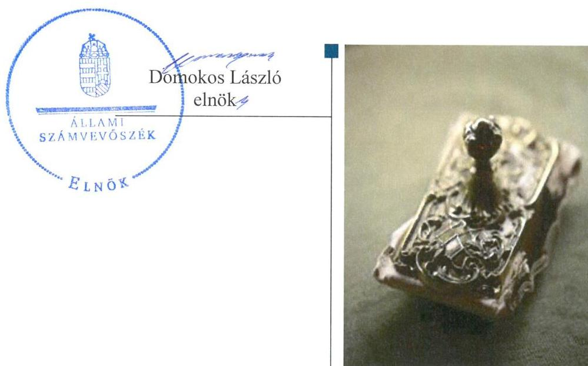

---

# AZ ELLENŐRZÉST FELÜGYELTE: 

PETŐ KRISZTINA felügyeleti vezető

## AZ ELLENŐRZÉST VEZETTE ÉS A VÉGREHAJTÁSÁÉRT FELELŐS:

BÍRÓ ZSOLT ellenőrzésvezető

## A PROGRAM ÖSSZEÁLLÍTÁSÁÉRT FELELŐS:

JANIK JÓZSEF LÁSZLÓ osztályvezető

IKTATÓSZÁM: V-0944-145/2016

TÉMASZÁM: 1978

## ELLENŐRZÉS-AZONOSÍTÓ SZÁM: V073704

Jelentéseink az Országgyúlés számítógépes hálózatán és az Interneten a www.asz.hu címen is olvashatóak.

---

# TARTALOMJEGYZÉK 

■ ÖSSZEGZÉS ..... 5
■ AZ ELLENŐRZÉS CÉLJA ..... 7
■ AZ ELLENŐRZÉS TERÜLETE ..... 8
■ AZ ELLENŐRZÉS HÁTTERE, INDOKOLTSÁGA ..... 10
■ A JELENTÉS LÉNYEGES KÉRDÉSKÖREI ..... 12
■ ELLENŐRZÉS HATÓKÖRE ÉS MÓDSZEREI ..... 13
■ MEGÁLLAPÍTÁSOK ..... 16
■ JAVASLATOK ..... 33
■ MELLÉKLETEK ..... 35
I. sz. melléklet: Értelmező szótár ..... 35
II. sz. melléklet: Az integritás érvényesítése érdekében kialakított és múködtetett kontrollrendszer ..... 38
■ FÜGGELÉK: ÉSZREVÉTELEK ..... 41
■ RÖVIDÍTÉSEK JEGYZÉKE ..... 47

---

.

---

# **ÖSSZEGZÉS**

*A szentendrei székhelyű Ferenczy Múzeumra vonatkozó irányító szervi feladatellátás öszszességben szabályszerű volt. A Múzeumnál kialakított irányítási rendszer 2013–2014-ben már támogatta az átlátható, elszámoltatható és ellenőrizhető közpénzfelhasználást. A Múzeum pénzügyi és vagyongazdálkodása nem volt szabályszerű. A Múzeum közfeladatának részét képező kulturális javak állományvédelme a kölcsönzéseknél nem volt biztosított.*

## **Az ellenőrzés társadalmi indokoltsága**

Az Állami Számvevőszék Stratégiájának alapértéke, hogy ellenőrzései segítik az integritás alapú, átlátható és elszámoltatható közpénzfelhasználás megteremtését. Az ellenőrzés jogszabályban, vagy alapító okiratban meghatározott közfeladat ellátására létrejött, a megyei hatókörű városi muzeális intézmények gazdálkodási tevékenységére terjedt ki. E szervezetek pénzügyi és vagyongazdálkodásának alapvető rendeltetése a múzeumi közfeladatok ellátásának biztosítása.

A megyei hatókörű városi múzeumként működő szervezetek 2011. évtől több alkalommal jelentős szervezeti és gazdálkodási átalakuláson mentek keresztül. A tulajdonosi, a vagyonkezelői és a fenntartói szerepekben, szerkezetben történt változások előkészítése, végrehajtása, illetve a múzeumi rendszer által kezelt közvagyonnal való gazdálkodás szabályszerűségének bemutatásával az ellenőrzés hozzájárul a múzeumok fenntartási és működtetési feladatainak ellátására vonatkozó megfelelő jogszabályi környezet kialakításához, a gazdálkodási gyakorlatuk javításához.

## **Főbb megállapítások, következtetések**

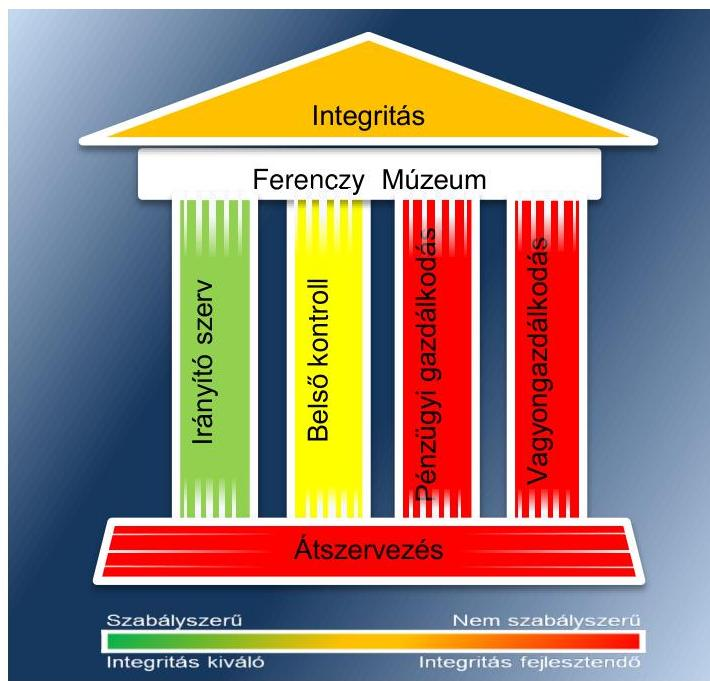

A Múzeumra vonatkozó irányító szervi feladatellátás összességben szabályszerű volt. Hiányosság volt azonban, hogy az irányító szerv – mint fenntartó – a 2013–2014. években az emberi erőforrások miniszterének előzetes véleményezését az alapító okiratoknál nem kezdeményezte, továbbá a 2013–2014. években nem határozta meg a Múzeum stratégiai tervét, valamint nem nyújtotta be előzetes véleményezésre a miniszter felé a Múzeum stratégiai fejlesztési és beruházási tervét, éves szakmai feladatait, munkatervét, a beszámolóját, a feladatalapú költségvetését, a teljesítményértékelését.

A Múzeumnál kialakított irányítási rendszer 2013-2014-ben már támogatta az átlátható, elszámoltatható és ellenőrizhető közpénzfelhasználást. A belső kontrollrendszer kialakítása és működtetése az ellenőrzött időszakban javuló tendenciát mutatott, a 2011–2012. években részben szabályszerűen, míg 2013–2014. években szabályszerűen történt. A kontrollkörnyezet 2014. évi kialakítása során hiányosság volt, hogy az etikai elvárásokat nem határozták meg a Múzeum szervezetének egyes szintjeire. A kontrolltevékenység kialakítása és működtetése az ellenőrzött években szabályszerűen történt. Az információs és kommunikációs folyamatok kialakítása során a Múzeumnál az ellenőrzött időszakban nem gondoskodtak az adatvédelmi és adatbiztonsági szabályzat elkészítésé-

---

ről. A 2013-2014. évben a monitoring rendszer működtetése szabályszerű volt, megvalósult a belső ellenőrzési rendszer szabályszerű kialakítása. Hiányosság volt azonban, hogy a Múzeum nem gondoskodott a 2012-2014. években a külső ellenőrzések javaslatai alapján készült intézkedési tervek végrehajtásának nyilvántartásáról.

A Múzeum pénzügyi és vagyongazdálkodása nem volt szabályszerű. A Múzeum bevételeinek elszámolása során a 2013. évi bérbeadási (vagyonhasznosítási) tevékenység esetében előfordult, hogy a vagyon hasznosítására felhatalmazást adó szerződés hiányában került sor. A Múzeum kiadási előirányzatai felhasználása a 2011-2013. években részben megfelelő volt, mivel a teljesítésigazolás elmaradt, valamint a 2011-2012. években a számlák befogadása és kifizetése ellentétes volt a jogszabályban foglaltakkal, mivel a Múzeum nem rendelkezett a kifizetéseket alátámasztó szerződésekkel. A Múzeum pénzügyi egyensúlya az ellenőrzött időszakban nem volt biztosított, a likviditás javítására a 2012. és a 2014. években a fenntartók intézkedéseket tettek. A 2012-2014. években a múzeumi vagyon nyilvántartása nem felelt meg a jogszabályi előírásoknak. A Múzeum a 2012. évben jogalap nélkül, a 2013-2014. években vagyonkezelési szerződés hiányában tartotta nyilván könyveiben a vagyontárgyakat. A 2011-2014 közötti időszakban a költségvetési beszámoló mérlegének leltárral való alátámasztottsága, a mérlegtételek értékelése nem felelt meg a jogszabályi előírásoknak. A Múzeum az állományába tartozó kulturális javak kölcsönzése során nem érvényesítette az állományvédelmi követelményeket.

A Múzeumot érintő szervezeti, szerkezeti átszervezések végrehajtása nem volt szabályszerű, nem volt biztosított az átláthatóság. A 2011/2012. évi átszervezés során nem csatolták a megállapodáshoz az alapleltárakban és külön nyilvántartásokban nyilvántartott kulturális javak vagyonleltárát, a vagyoni értékű jogok, szellemi termékek kimutatását és a pénzforgalmi számlaszámokhoz tartozó pénzmaradványok összegét. A vagyonátadáshoz készített 2011. évi könyvviteli mérleget leltár nem teljes körűen támasztotta alá. A 2012/2013. évi központi alrendszerből önkormányzati alrendszerbe történő átszervezést szabályszerűen hajtották végre.

A Múzeum nem intézkedett az integritás szemlélet érvényesítése érdekében.

---

# AZ ELLENŐRZÉS CÉLJA 

vényesülését a gazdálkodási folyamatokban.

Az ellenőrzés célja annak megállapítása volt, hogy a megyei múzeumi rendszer átalakítása, az intézményfenntartói rendszerben végbement változások előkészítése és végrehajtása megalapozottan, szabályszerűen történt-e; a megyei hatókörű városi múzeumok és jogelődjeik pénz-ügyi- és vagyongazdálkodása, a belső kontrollrendszer kialakítása és működtetése, valamint az intézményfenntartói feladatok ellátása szabályszerűen történt-e.

A Múzeum ${ }^{1}$ korrupcióval szembeni veszélyeztetettségének csökkentése érdekében kért tanúsítványi adatszolgáltatás alapján az ÁSZ² értékelte az integritási szemlélet ér-

---

# **AZ ELLENŐRZÉS TERÜLETE**

## **Ferenczy Múzeum**

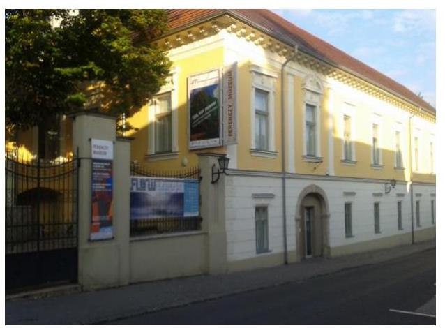

A Múzeum Szentendrén található, feladatkörében az Mtv.^{3} alapján gondoskodik a kulturális javak meghatározott anyagának folyamatos gyűjtéséről, nyilvántartásáról, megőrzéséről és restaurálásáról; tudományos feldolgozásáról, publikálásáról; valamint kiállításokon és más módon történő bemutatásáról; a közművelődési és közgyűjteményi feladatok ellátásáról. A Kötv.^{4} 20. § (2) bekezdése alapján területileg illetékes múzeumként régészeti feltárást végzett az ellenőrzött időszakban.

A Múzeum csak a működési engedélyében meghatározott gyűjtőkörben és gyűjtőterületen folytathatja tevékenységét. A szakmai besorolást, a rendszert megalapozó szaktörvényi kereteket az Mtv. biztosítja. Az Mtv. hatálya kiterjed a Múzeum fenntartóira, a Múzeumban foglalkoztatottakra, a kulturális örökség Múzeumban őrzött elemeire, a szolgáltatások igénybe vevőire és a kulturális örökséggel foglalkozó egyéb szervezetekre.

A Múzeum 2011. évi költségvetési engedélyezett létszáma 153 fő volt, ami 2012. évre 198 főre emelkedett, majd 2013. évre 145 főre csökkent, amely a 2014. évre nem változott. A Múzeum alkalmazottainak foglalkoztatására a Kjt.^{5} alapján került sor. Az ellenőrzött időszakban a múzeumigazgató^{6} és a gazdasági vezető személye nem változott. A Múzeum neve 2016. márciusától Ferenczy Múzeum Centrumra változott.

A Möktv.^{7} és annak végrehajtásáról szóló 258/2011. (XII. 7.) Korm. rendelet^{8} alapján 2012. január 1-jétől a megyei múzeumok központi költségvetési szervekké váltak. 2013. január 1-jétől az 1311/2012. (VIII. 23.) Korm. határozat^{9} és a 2012. évi CLII. törvény^{10} alapján az állami tulajdonba és fenntartásba került megyei múzeumi szervezetek a megyeszékhely megyei jogú városok – Pest megyében Szentendre Város Önkormányzata, Komárom-Esztergom megyében Tata Város Önkormányzata – fenntartásában működnek tovább.

A 2011–2014. évek között a fenntartói, irányítói, középirányítói jogkörgyakorlók változását, valamint a Múzeum gazdálkodási feladatát ellátó szervezetét az 1. táblázat mutatja be:

^{1. táblázat}

|  Mószak | Fenntartó | Irányító szerv | Középirányító szerv | Gazdasági szervezet  |
| --- | --- | --- | --- | --- |
|  2011. | Megyei Önkormányzat^{11} | Közgyűlés^{12} | - | Múzeum  |
|  2012. | PMIK^{13} | KIM^{14} | PMIK | Múzeum  |
|  2013–2014. | Önkormányzat^{15} | Képviselő-testület^{16} | - | Múzeum  |

*Fenntartó: A Múzeum alapító okiratai*

Fenntartó, irányító szerv

^{1} 2013. évi CLII. törvény

^{2} 2014. évi CLII. törvény

^{3} 2015. évi CLII. törvény

^{4} 2016. évi CLII. törvény

^{5} 2017. évi CLII. törvény

^{6} 2018. évi CLII. törvény

^{7} 2019. évi CLII. törvény

^{8} 2020. évi CLII. törvény

^{9} 2021. évi CLII. törvény

^{10} 2022. évi CLII. törvény

^{11} 2023. évi CLII. törvény

^{12} 2024. évi CLII. törvény

^{13} 2025. évi CLII. törvény

^{14} 2026. évi CLII. törvény

^{15} 2027. évi CLII. törvény

^{16} 2028. évi CLII. törvény

^{17} 2029. évi CLII. törvény

^{18} 2030. évi CLII. törvény

^{19} 2031. évi CLII. törvény

^{20} 2032. évi CLII. törvény

^{21} 2033. évi CLII. törvény

^{22} 2034. évi CLII. törvény

^{23} 2035. évi CLII. törvény

^{24} 2036. évi CLII. törvény

^{25} 2037. évi CLII. törvény

^{26} 2038. évi CLII. törvény

^{27} 2039. évi CLII. törvény

^{28} 2040. évi CLII. törvény

^{29} 2041. évi CLII. törvény

^{30} 2042. évi CLII. törvény

^{31} 2043. évi CLII. törvény

^{32} 2044. évi CLII. törvény

^{33} 2045. évi CLII. törvény

^{34} 2046. évi CLII. törvény

^{35} 2047. évi CLII. törvény

^{36} 2048. évi CLII. törvény

^{37} 2049. évi CLII. törvény

^{38} 2050. évi CLII. törvény

^{39} 2051. évi CLII. törvény

^{40} 2052. évi CLII. törvény

^{41} 2053. évi CLII. törvény

^{42} 2054. évi CLII. törvény

^{43} 2055. évi CLII. törvény

^{44} 2056. évi CLII. törvény

^{45} 2057. évi CLII. törvény

^{46} 2058. évi CLII. törvény

^{47} 2059. évi CLII. törvény

^{48} 2060. évi CLII. törvény

^{49} 2061. évi CLII. törvény

^{50} 2062. évi CLII. törvény

^{51} 2063. évi CLII. törvény

^{52} 2064. évi CLII. törvény

^{53} 2065. évi CLII. törvény

^{54} 2066. évi CLII. törvény

^{55} 2067. évi CLII. törvény

^{56} 2068. évi CLII. törvény

^{57} 2069. évi CLII. törvény

^{58} 2070. évi CLII. törvény

^{59} 2071. évi CLII. törvény

^{60} 2072. évi CLII. törvény

^{61} 2073. évi CLII. törvény

^{62} 2074. évi CLII. törvény

^{63} 2075. évi CLII. törvény

^{64} 2076. évi CLII. törvény

^{65} 2077. évi CLII. törvény

^{66} 2078. évi CLII. törvény

^{67} 2079. évi CLII. törvény

^{68} 2080. évi CLII. törvény

^{69} 2081. évi CLII. törvény

^{70} 2082. évi CLII. törvény

^{71} 2083. évi CLII. törvény

^{72} 2084. évi CLII. törvény

^{73} 2085. évi CLII. törvény

^{74} 2086. évi CLII. törvény

^{75} 2087. évi CLII. törvény

^{76} 2088. évi CLII. törvény

^{77} 2089. évi CLII. törvény

^{78} 2090. évi CLII. törvény

^{79} 2091. évi CLII. törvény

^{80} 2092. évi CLII. törvény

^{81} 2093. évi CLII. törvény

^{82} 2094. évi CLII. törvény

^{83} 2095. évi CLII. törvény

^{84} 2096. évi CLII. törvény

^{85} 2097. évi CLII. törvény

^{86} 2098. évi CLII. törvény

^{87} 2099. évi CLII. törvény

^{88} 2100. évi CLII. törvény

^{89} 2101. évi CLII. törvény

^{90} 2102. évi CLII. törvény

^{91} 2103. évi CLII. törvény

^{92} 2104. évi CLII. törvény

^{93} 2105. évi CLII. törvény

^{94} 2106. évi CLII. törvény

^{95} 2107. évi CLII. törvény

^{96} 2108. évi CLII. törvény

^{97} 2109. évi CLII. törvény

^{98} 2110. évi CLII. törvény

^{99} 2111. évi CLII. törvény

^{100} 2112. évi CLII. törvény

^{101} 2113. évi CLII. törvény

^{102} 2114. évi CLII. törvény

^{103} 2115. évi CLII. törvény

^{104} 2116. évi CLII. törvény

^{105} 2117. évi CLII. törvény

^{106} 2118. évi CLII. törvény

^{107} 2119. évi CLII. törvény

^{108} 2120. évi CLII. törvény

^{109} 2110. évi CLII. törvény

^{110} 2111. évi CLII. törvény

^{111} 2112. évi CLII. törvény

^{112} 2113. évi CLII. törvény

^{113} 2114. évi CLII. törvény

^{114} 2115. évi CLII. törvény

^{115} 2116. évi CLII. törvény

^{116} 2117. évi CLII. törvény

^{117} 2118. évi CLII. törvény

^{118} 2122. évi CLII. törvény

^{119} 2110. évi CLII. törvény

^{120} 2111. évi CLII. törvény

^{121} 2112. évi CLII. törvény

^{122} 2113. évi CLII. törvény

^{123} 2114. évi CLII. törvény

^{124} 2115. évi CLII. törvény

^{125} 2116. évi CLII. törvény

^{126} 2117. évi CLII. törvény

^{127} 2118. évi CLII. törvény

^{128} 2119. évi CLII. törvény

^{129} 2120. évi CLII. törvény

^{130} 2111. évi CLII. törvény

^{131} 2112. évi CLII. törvény

^{132} 2113. évi CLII. törvény

^{133} 2114. évi CLII. törvény

^{134} 2115. évi CLII. törvény

^{135} 2116. évi CLII. törvény

^{136} 2117. évi CLII. törvény

^{137} 2118. évi CLII. törvény

^{138} 2119. évi CLII. törvény

^{139} 2120. évi CLII. törvény

^{140} 2111. évi CLII. törvény

^{141} 2112. évi CLII. törvény

^{142} 2113. évi CLII. törvény

^{143} 2115. évi CLII. törvény

^{144} 2116. évi CLII. törvény

^{145} 2117. évi CLII. törvény

^{146} 2118. évi CLII. törvény

^{147} 2119. évi CLII. törvény

^{148} 2120. évi CLII. törvény

^{149} 2110. évi CLII. törvény

^{150} 2112. évi CLII. törvény

^{151} 2113. évi CLII. törvény

^{152} 2114. évi CLII. törvény

^{153} 2115. évi CLII. törvény

^{154} 2116. évi CLII. törvény

^{155} 2117. évi CLII. törvény

^{156} 2118. évi CLII. törvény

^{157} 2119. évi CLII. törvény

^{158} 2120. évi CLII. törvény

^{159} 2110. évi CLII. törvény

^{160} 2111. évi CLII.敦

---

A Múzeum jogelődjének, a Pest Megyei Múzeumok Igazgatóságának a jogállása 2011-2012. években önállóan működő és gazdálkodó költségvetési intézmény volt. 2013. január 1-jétől a Múzeum önállóan működő és gazdálkodó költségvetési intézmény volt. 2014. január 1-jétől a Múzeum önálló jogi személyiséggel rendelkező, saját gazdasági szervezettel működő megyei hatókörű városi múzeum, vállalkozási tevékenységet nem végzett.

A Múzeum teljesített költségvetési bevételeinek és kiadásainak alakulását az 1. ábra mutatja be. Az ábra a 2011-2012. években a Múzeum és tagintézményeinek együttes adatai, a 2013-2014. években a tagintézmények átadását követően a múzeumi adatok alapján készült.
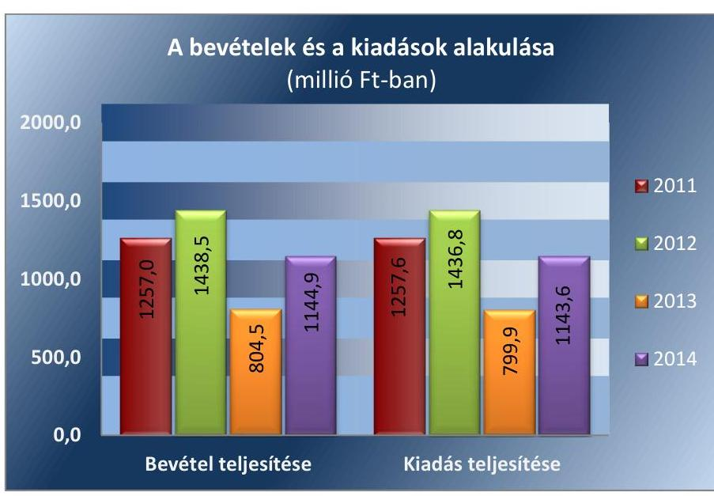

Forrás: A Múzeum 2011-2014. évi költségvetési beszámolói

A 2015. évi LXXV. tv. ${ }^{17}$ 1. § (1) bekezdése alapján az Nvtv. ${ }^{18}$ 13. § (3) bekezdésében és 14. § (1) bekezdésében foglaltak alapján és az abban meghatározott feltételekkel a 2012. évi CLII. törvény 30. § (1) és (2) bekezdésében meghatározott, a megyei hatókörű városi múzeumok feladatának ellátását szolgáló egyes állami tulajdonban lévő ingatlanok a törvény hatálybalépésének napjával, a törvény erejénél fogva a kötelező közfeladatként a megyei hatókörű városi múzeumot fenntartó önkormányzatok tulajdonába kerültek. A 2015. évi LXXV. tv. 4. § (1) bekezdése alapján a kulturális örökség helyi védelme érdekében a megyei hatókörű városi múzeumok alapleltárában és jogszabály szerinti külön nyilvántartásában szereplő állami tulajdonú kulturális javak ingyenesen a megyei hatókörű városi múzeumok vagyonkezelésébe kerültek. A vagyonkezelők vagyonkezelői joga tekintetében vagyonkezelési szerződés megkötése nem szükséges. A 2015. évi LXXV. tv. 4. § (2) bekezdése szerint továbbá a kulturális örökség helyi védelme érdekében a megyei hatókörű városi múzeumok feladatának ellátását szolgáló állami tulajdonban álló ingatlanok - a törvény mellékletében meghatározott ingatlanok kivételével - ingyenesen a fenntartó önkormányzatok vagyonkezelésébe kerültek.

---

# AZ ELLENŐRZÉS HÁTTERE, INDOKOLTSÁGA

Az Alaptörvény^{19} rendelkezése szerint a nemzeti vagyon megőrzésének, védelmének és a nemzeti vagyonnal való felelős gazdálkodásnak a követelményeit sarkalatos törvény, az Nvtv. rögzíti. A tulajdonosi joggyakorlás és vagyonkezelés általános és speciális szabályait, az állami vagyon nyilvántartására és elszámolására vonatkozó eljárásokat, a vagyonkezelési szerződés feltételrendszerét, valamint az éves beszámoló készítési és könyvvezetési kötelezettségeket kormányrendelet írja elő.

A megyei hatókörű városi múzeumok közfeladat-ellátásának változásait (beleértve az állami tulajdonosi joggyakorló, intézményi vagyonkezelő és önkormányzati fenntartó szervezeteket is), a közfeladatok átadásából és átvételéből adódó módosításait, előirányzat gazdálkodására ható tényezőit az Áht-2^{20}, az Ávr.^{21}, a Möktv.^{22}, valamint az Mtv. írja elő. A múzeumi intézményrendszer rendszerátalakulásából, megszűnéséből, intézmény átszervezéséből, belső szerkezeti korszerűsítéséből, vagy más hasonló okból adódó módosításai miatt szerepeltetendő szerkezeti változásokat, valamint a szerkezeti változásként beépült közfeladatok szintre hozásként történő számításba vételét az Ávr. határozta meg.

A megyei hatókörű városi múzeumok kulturális szempontból meghatározó jelentőségűek mind földrajzi elhelyezkedésüket, mind az ellátott feladatokat, valamint a látogatottságukat tekintve. Tevékenységüket törvényi szinten (Mtv.) szabályozták a jogalkotók. A megyei hatókörű városi múzeumok jelenlegi körének kialakításában, tulajdonosi és fenntartói szerkezetében rövid idő alatt több jelentős változás történt, amelyeket jogszabályi változások indukáltak. Ezen intézmények szakmai besorolásukat tekintve a 2011. évben megyei múzeumként, a 2012. évben megyei múzeumi központi költségvetési szervezetként, a 2013. évtől kezdődően megyei hatókörű városi múzeumként működtek. A szakmai besorolások változásait párhuzamosan követték a tulajdonosi, vagyonkezelői, fenntartói szerepekben történt változások.

A 2011–2014. évek között bekövetkezett fenntartói változások a vagyontárgyak és a kulturális javak tulajdonosi, vagyonkezelői és használói körében is változást indukáltak, amelyet a 2. táblázat szemlélet.

1. táblázat

|  A VAGYON TULAJDONOSI, VAGYONKEZELŐI ÉS HASZNÁLÓI KÖRÉNEK VÁLTOZÁSA 2011–2014. ÉVEKBEN |  |  |  |  |  |  |  |  |   |
| --- | --- | --- | --- | --- | --- | --- | --- | --- | --- |
|  Vagyon-
tárgy | 2011. év |  |  | 2012. év |  |  | 2013–2014. évek |  |   |
|   | tulajdonos | vagyon-
kezelő | használó | tulajdonos | vagyon-
kezelők | használó | tulajdonos | vagyon-
kezelő | használó  |
|  Ingatlan | Megyei Önkormányzat | - | Múzeum | Állam | PMIK | Múzeum | Állam | Múzeum | Múzeum  |
|  Egyéb tárgyi eszközök | Megyei Önkormányzat | - | Múzeum | Állam | PMIK | Múzeum | Állam | Múzeum | Múzeum  |
|  Kulturális javak | Megyei Önkormányzat | - | Múzeum | Állam | PMIK | Múzeum | Állam | Múzeum | Múzeum  |

*Forrás: A Múzeum alapító okiratai, a 2012. évi CLII. tv, a 258/2011. (XII. 7) Korm. rendelet, az 1311/2012. (VIII. 23.) Korm. határozat*

---

Az ellenőrzés - tekintettel a megyei hatókörű városi múzeumokat (és jogelődjeit) rövid időn belül, gyors ütemben ért környezeti (tulajdonosi, fenntartói-szerkezetet érintő) változásokra - javaslatok megfogalmazásával hozzájárul a fenntartás és működtetés feladatainak ellátására vonatkozó megfelelő jogszabályi környezet - jogalkotók által történő - kialakításához. Az ÁSZ ellenőrzésével átfogó képet ad a megyei hatókörű városi múzeumok (és jogelődjeik) jellemző sajátosságokról, jó gyakorlatokról.

AZ ELLENŐRZÉS EREDMÉNYEKÉPPEN nemcsak az ellenőrzött múzeumok gazdálkodása javulhat, hanem átfogó képet kapunk a gazdálkodásának hiányosságairól, de a jó gyakorlatokról is. Ellenőrzéseivel, javaslataival és megállapításaival az ÁSZ elősegíti a költségvetési szervek pénzügyi és vagyongazdálkodása szabályozásának javítását és hozzájárul a jó kormányzáshoz.

---

# A JELENTÉS LÉNYEGES KÉRDÉSKÖREI 

1.     - Az irányító szerv ellenőrzött Múzeumra vonatkozó feladatellátása szabályszerű volt-e?
2.     - Szabályszerüen hajtották-e végre a Múzeumot érintő szervezeti, szerkezeti átszervezéseket?
3.     - A belső kontrollrendszer kialakítása és müködtetése megfelelt-e a jogszabályi előírásoknak?
4.     - A Múzeum pénzügyi gazdálkodása szabályszerű volt-e?
5.     - A Múzeum vagyongazdálkodása szabályszerű volt-e?
6.     - A Múzeum intézkedett-e az integritás szemlélet érvényesitése érdekében?

---

# ELLENŐRZÉS HATÓKÖRE ÉS MÓDSZEREI 

## Az ellenőrzés típusa

Megfelelőségi ellenőrzés.

## Az ellenőrzött időszak

Az ellenőrzött időszak 2011. január 1-jétől 2014. december 31-éig tart.

## Az ellenőrzés tárgya

A megyei hatókörű városi múzeumok átszervezése, átalakítása előkészítése és lebonyolítása megalapozottsága, szabályszerűsége, a pénzügyi és vagyongazdálkodási tevékenység, a belső kontrollrendszer kialakítása, működtetése szabályszerűsége, valamint az irányító szervi feladatok ellátása szabályszerűsége. E tevékenységek és a kapcsolódó adatok és információk összessége, amelyeket a vonatkozó kritériumok alapján kell értékelni.

Az ellenőrzés kiterjedt minden olyan körülményre és adatra, amely az ÁSZ jogszabályban meghatározott feladatainak teljesítéséhez, valamint a program végrehajtása folyamán felmerült újabb összefüggések feltárásához szükséges.

## Az ellenőrzött szervezet

Ferenczy Múzeum és jogelődje a Pest Megyei Múzeumok Igazgatósága, a fenntartói feladatokban érintett Pest Megye Önkormányzata, Pest Megyei Intézményfenntartói Központ jogutódja a Szociális és Gyermekvédelmi Főigazgatóság, valamint Szentendre Város Önkormányzata.

Az ellenőrzésre a költségvetési szerv ellenőrzött intézményének és irányító/felügyeleti szervének, illetve középirányító szervének székhelyén, a gazdálkodási feladatait ellátó szervezetének székhelyén került sor.

## Az ellenőrzés jogalapja

Az ellenőrzés jogszabályi alapját az ÁSZ tv. 1. § (3) bekezdés, 5. § (2)-(6) bekezdései, valamint az Áht. 2 61. § (2) bekezdésének előírásai képezik.

---

# Az ellenőrzés módszerei 

Az ellenőrzést az ellenőrzési program szempontjai, az ellenőrzött időszakban hatályos jogszabályok, az ellenőrzés szakmai szabályai, az egyes ellenőrzési típusokhoz kapcsolódó ÁSZ módszertanok és nemzetközi standardokat figyelembe vételével végeztük. A gazdálkodás hibáinak kijavítására, a közpénzekkel való felelős gazdálkodás segítésére irányuló javaslatok kidolgozásakor a hatályos jogszabályok az irányadóak.

Az ellenőrzési kérdések megválaszolásához szükséges bizonyítékok megszerzése a következő ellenőrzési eljárások alkalmazásával történik: kérdésfeltevés (információkérés), mintavételezés, valamint elemző eljárás. A minták kiválasztása során véletlen mintavételi eljárást alkalmazunk.

Mintavétellel ellenőriztük a bevételek, a személyi juttatások, a külső személyi juttatások, a dologi és felhalmozási kiadások, a régészeti kiadások valamint a kulturális javak kölcsönzésének szabályszerűségét. A minta alapján a sokaságban előforduló hibaarányt becsültük. ,,Megfelelőnek" értékeltük az ellenőrzött területet, amennyiben 95\%-os bizonyossággal a teljes sokaságban a hibaarány legfeljebb 10\%, ,,részben megfelelőnek" értékeltük, ha a hibaarány felső határa 10-30\% között volt, ,,nem megfelelőnek" pedig akkor, ha a mintavételi eredmények alapján a sokaságbeli hibaarány felső határa meghaladta a 30\%-ot.

Az ellenőrzési bizonyítékként felhasználható adatforrások közé tartoznak egyrészt a szakmai program részletes szempontjainál felsorolt adatforrások, másrészt adatforrás lehet minden egyéb - az ellenőrzés folyamán feltárt, az ellenőrzés szempontjából releváns információt tartalmazó - dokumentum.

Az ellenőrzés lefolytatásához az intézmény a tanúsítványok elektronikus kitöltésével, valamint az ÁSZ által kért dokumentumok elektronikus megküldésével szolgáltat adatokat. A rendelkezésre bocsátott adatok, információk kontrollja az ellenőrzés keretében történik.

Az ellenőrzési kérdésekre adott válaszok alapján értékeljük, hogy az ellenőrzött időszakban az irányító szerv az ellenőrzött intézményre vonatkozó feladatainak szabályszerűen eleget tett-e, az intézmény pénzügyi és vagyongazdálkodása megfelelt-e az előírásoknak, az intézmény átalakításának vagy átszervezésének végrehajtása szabályszerű volt-e.

Az intézmény belső kontrollrendszere jogszabályi előírások szerinti kialakításának és működtetésének szabályszerűségét az erre irányuló ellenőrzési kérdésekre adott válaszok összesítése alapján, évente pillérenként (kontrollkörnyezet, kockázatkezelési rendszer, kontrolltevékenységek, információs és kommunikációs rendszer, monitoring rendszer) és összesítetten is minősítjük. Az intézmény belső kontrollrendszere egyes pilléreinek kialakítása és működtetése „szabályszerü", amennyiben az értékelt területen az elért és elérhető pontok százalékban kifejezett, egész számra kerekített hányadosa meghaladja a 84\%-ot, „részben szabályszerű", ha a 84\%ot nem haladja meg, de 60\%-nál nagyobb, „nem szabályszerű", ha nem haladja meg a 60\%-ot. Az intézmény belső kontrollrendszerének összesített értékelése megegyezik a pillérenként (kontrollterületenként) alkalmazott \%-os értékelésekkel, a következő eltérésekkel. A kontrollrendszer egésze esetében a „szabályszerű" értékelésnek a \%-os értéken felül további feltétele, hogy egyik kontrollterület sem kaphat „nem szabályszerű" értékelést,

---

a „részben szabályszerű" értékelés további feltétele, hogy legfeljebb egy ellenőrzött kontrollterület lehet „nem szabályszerű" értékelésű. Az összesített értékelés a \%-os értéktől függetlenül „nem szabályszerű", ha az ellenőrzött kontrollterületek közül több mint egynek „nem szabályszerű" az értékelése.

Az integritás szemlélet érvényesülésének értékelése a Múzeum által szolgáltatott adatok alapján történt.

---

# 1. Az irányító szerv ellenőrzött Múzeumra vonatkozó feladatellátása szabályszerű volt-e? 

Összegző megállapítás

Az irányító szerv ${ }_{1-3}{ }^{23}$ Múzeumra vonatkozó feladatellátása összességében szabályszerű volt.

AZ ALAPÍTÓI JOGOSULTSÁGOK gyakorlása a Múzeumnál 2011-2014. években megfelelt a jogszabályi előírásoknak.

Az alapítói jogosultságok gyakorlása során a 2011-2014. év egészében a Múzeum rendelkezett az Áht. ${ }_{1,2}$ az Ámr. ${ }^{24}$, illetve az Ávr. által előírtaknak megfelelően alapító okirat ${ }_{3-9}{ }^{25}$-tal, amelyek módosítása a jogszabályi és feladatváltozások alapján megtörtént. Az egységes szerkezetbe foglalt alapító okiratot is elkészítették. Tartalmuk megfelelt az Áht. ${ }^{26}$-ben és az Ávr.-ben foglalt előírásoknak. Az irányító szerv ${ }_{3}$ - mint fenntartó - a 2013-2014. években az EMMI ${ }^{27}$ miniszterének előzetes véleményezését - az Mtv. 45. § (5) bekezdés a) pontjában előírtak ellenére - az alapító okirat ${ }_{4-9}$-nél nem kezdeményezte.

A MUNKÁLTATÓI JOGOSULTSÁGAIT az irányító szerv ${ }_{1-3}$ a 2011-2014. években szabályszerűen gyakorolta.

Az ellenőrzött időszakon belül 2011. évben az irányító szerv ${ }_{1}$, illetve 2012. évben a középirányító szerv ${ }^{28}$ a munkáltatói jogosultságait szabályszerűen gyakorolta. A múzeumigazgató 2011. évi kinevezése, 2012. évben kinevezésének módosítása során betartották az Áht. ${ }_{1}$ és a Mtv. előírásait. A múzeumigazgató kinevezési okiratai rendelkezésre álltak, a vezetői megbízás az illetékes ágazati miniszternek felterjesztésre került.

## AZ EGYÉB IRÁNYÍTÁSI, FELÜGYELETI ÉS ELLENÖRZÉSI JOGOSULTSÁGOK gyakorlása összességében szabályszerűen történt.

Az ellenőrzött időszakban az irányító szerv ${ }_{1-3}$ az egyéb irányítási, felügyeleti és ellenőrzési jogosultságait - az Áht. ${ }_{1,2}$, a Mótv. ${ }^{29}$, az Mtv., az Ötv. ${ }^{30}$, a 258/2011. (XII. 7.) Korm. rendelet előírásainak, valamint a KIM Utasításban ${ }^{31}$ foglaltaknak - összességében megfelelően gyakorolta. Megállapította és jóváhagyta a Múzeum létszám-előirányzatát, figyelte az előirányzatokkal való gazdálkodást, beszámoltatta a szakmai feladatellátásról, gondoskodott a belső ellenőrzéséről. Jóváhagyta az irányító szerv ${ }_{1}$ az $\mathrm{SzMSz}_{1}{ }^{32}$-t, 2014. évben az irányító szerv ${ }_{3}$ az $\mathrm{SzMSz}_{2-3}{ }^{33}$-t.

Figyelembe véve az Mtv.-ben, valamint a 2/2010. (I. 14) OKM rendeletben ${ }^{34}$ foglaltakat 2012-2014. években az irányító szerv ${ }_{2-3}$ kezdeményezte és az EMMI-től megkérte a múködési engedélyeket. 2012. évben a középirányító szerv - a 258/2011. (XII. 7.) Korm. rendeletben előírtaknak megfelelően - a Múzeum költségvetési javaslatát megküldte az EMMI miniszter-

---

nek, Központvezetői Utasításban ${ }^{35}$ meghatározta a gazdálkodás és elő-irányzat-felhasználás szabályait. A 2013-2014. években az irányító szerv ${ }_{3}$ jóváhagyta a Múzeum küldetésnyilatkozatát, munkatervét, meghatározta a beruházási fejlesztési feladatait. 2011. és 2013-2014. években az irányító szerv $_{1,3}$ a Múzeum - az Ávr.-ben foglaltaknak megfelelve - az egyes évek költségvetési rendeleteit egyeztette.

Az irányító szerv ${ }_{2}$ a Múzeum aktualizált SzMSz-ét - a Múzeum által történő előkészítésének hiányában - nem tudta jóváhagyni, nem érvényesült az Áht. 2 9. § (1) bekezdés e) pontjában foglalt előírás.

Az irányító szerv $_{3}$-nál - mint fenntartónál - az egyéb irányítási, felügyeleti jogosultságok gyakorlásával összefüggésben további hiányosság volt:

- 2013-2014. években az Mtv. 50. § (2) bekezdés a) pontja ellenére nem határozta meg és hagyta jóvá a Múzeum stratégiai tervét;
- 2013-2014. évben nem tartotta be Mtv. 45. § (5) bekezdés b), c) pontjaiban foglalt előírásokat, mert nem nyújtotta be előzetesen véleményezésre a miniszter felé a Múzeum stratégiai fejlesztési és beruházási tervét, éves szakmai feladatait;
- 2014. évben nem tartotta be Mtv. 45. § (5) bekezdés d), e), f) pontjaiban foglalt előírásokat, mert nem nyújtotta be előzetesen véleményezésre a miniszter felé a Múzeum munkatervét, a beszámolóját, a feladatalapú költségvetését, valamint a teljesítményértékelését;

# 2. Szabályszerűen hajtották-e végre a Múzeumot érintő szervezeti, szerkezeti átszervezéseket? 

## Összegző megállapítás

2.1. számú megállapítás

A Múzeumot érintő szervezeti, szerkezeti átszervezéseket nem szabályszerűen hajtották végre.

A Múzeumot érintő önkormányzati alrendszerből a központi alrendszerbe történő 2012. január 1-jétől hatályos irányítószervi (fenntartói) váltás lebonyolítása nem volt szabályszerű, az átláthatóság nem volt biztosított.

A MEGÁLLAPODÁS ${ }^{36}$ megkötésére a 258/2011. (XII. 7.) Korm. rendelet 1. számú melléklete szerinti minta alapján 2011. decemberében került sor a Megyei Önkormányzat és a Kormánymegbízott ${ }^{37}$ aláírásával. A Megállapodás ${ }_{1}$-t az MNV Zrt. ${ }^{38}$ és az NFA ${ }^{39}$ - a Möktv. 6. § (3) bekezdésben előírtak ellenére - 2011. december 31-ei határidőig nem írta alá. Az MNV Zrt. vezérigazgatója 2012. május 31-én, az NFA általi aláírásra 2012. július 10-én került sor.

Az MNV Zrt. és a középirányító szerv a 258/2011. (XII.7.) Korm. rendelet 1. melléklet V. részben előírtakat nem tartotta be, mert a vagyonkezelési szerződés ${ }_{1}^{40}$-t a Megállapodás ${ }_{1}$ aláírásától, de legkorábban 2012. január 1jétől számított 30 napon belül nem kötötte meg. A vagyonkezelési szerződést határidőn túl az MNV Zrt. 2012 október 30-án, a középirányító szerv 2012. november 5-én írta alá, az irányító szerv ${ }_{2}$ 2012. november 20-án záradékolta

---

Figyelmen kívül hagyva a 258/2011. (XII. 7.) Korm. rendelet 12. § (3) bekezdésében előírtakat, a vagyon tényleges átadásához jegyzőkönyv felvételére - a fenntartó; ${ }^{41}$ és a fenntartó; között - a Megállapodás; megkötését követő egy héten belül és azt követően sem került sor.

A Kormány - a 1094/2012. (IV. 3.) Korm. határozatban ${ }^{42}$ előírt - döntését az EMMI államtitkára végrehajtotta. Bekérte (2012. április 10-i határidővel) a középirányító szervtől a Múzeum intézményegységei legfontosabb alap-, illetve költségvetési adatait és a 2012. év végi várható hiányt. A kért adatszolgáltatást a középirányító szerv határidőben teljesítette.

A Kincstár ${ }^{43}$ a Múzeum törzskönyvi kivonatát 2012. szeptember 27-én kiadta. A Megállapodás ${ }_{1}$ nem teljes körűen tartalmazta a 258/2011. (XII. 7.) Korm. rendeletben foglalt átadási dokumentumokat.

A Megállapodás ${ }_{1}$-hez nem csatolták a 258/2011. (XII. 7.) Korm. rendeletben foglaltak ellenére:
$\longrightarrow$ az 1. számú melléklet III. rész e) pontja szerinti 2011. évi beszámoló mérlegében szereplő vagyoni értékű jogok, szellemi termékek kimutatását;
$\longrightarrow$ az 1. számú melléklet IV. rész 1.3) pontjában foglalt 2011. évi normatív támogatás igénylésére, módosítására, lemondására vonatkozó adatokat;
$\longrightarrow$ az 1. számú melléklet IV. rész 1.11) ba) alpontjában előírt alapleltárakban és külön nyilvántartásokban nyilvántartott kulturális javak vagyonleltárát;
$\longrightarrow$ az 1. számú melléklet IV. rész 1.13). pontjában foglalt 2011. december 31-én fenntartott pénzforgalmi számlaszámokhoz tartozó pénzmaradványok összegét.
Az Áhsz. ${ }^{44}$-ben előírtaknak megfelelően a mérlegsorokat, záró főkönyvi kivonattal, analitikus nyilvántartással támasztották alá. A vagyonátadáshoz készített 2011. évi könyvviteli mérlegben kimutatott eszközök valódiságát az Áhsz. ${ }_{1}$ 37. § (2) bekezdésében foglaltak ellenére nem teljes körűen támasztották alá leltárral, mert nem leltározták a készletek mérlegsoron szereplő árukat.

# 2.2. számú megállapítás 

A 2013. január 1-jével végrehajtott, a központi alrendszerből önkormányzati alrendszerbe történő irányítószervi (fenntartói) váltás lebonyolítását és a szervezetrendszer átalakítását szabályszerűen, az átláthatóság biztosításával hajtották végre.

A Kormány a 1094/2012. (IV. 3.) Korm. határozatban elvi döntést hozott arról, hogy az állami tulajdonba és fenntartásba lévő Múzeum a 2012. évi CLII. törvény alapján a fenntartó ${ }_{3}$ fenntartásába kerüljön. A központi alrendszerből az önkormányzati alrendszerbe történő átadáshoz kapcsolódó feladatok tekintetében a 1311/2012. (VIII. 23.) Korm. határozat adott iránymutatást, azonban az elvégzendő feladatokat - a 2012. évi CLII. törvény 28. §-ában kapott felhatalmazás ellenére - a Kormány részletesen nem határozta meg. Az átadás-átvételi megállapodás tartalmi elemeit a KIM által kiadott megállapodás-tervezett tartalmazta.

A 1311/2012. (VIII. 23.) Korm. határozatban előírtaknak megfelelően a fenntartó ${ }_{3}$, a fenntartó ${ }_{2}$ és az EMMI lefolytatták az átadás-átvétel lebonyolításához a szükséges háromoldalú egyeztetéseket. A 2012 augusztusától

---

megkezdett levelezés során a Múzeum jövőbeni működésének finanszírozását, három település múzeumának tagintézményként történő csatlakozását (Tápiószele, Verőce, Zebegény), valamit a szentendrei Pajor Kúria felújításának finanszírozását egyeztették. 2012 szeptemberében a múzeumigazgató nyilatkozott arról, hogy az átadás-átvételhez szükséges dokumentumokat mely határidőben tudja rendelkezésre bocsátani.

A MEGÁLLAPODÁS ${ }^{45}$ megkötésére 2012. december 14-én került sor a fenntartó ${ }_{2}$, mint átadó és a fenntartó ${ }_{3}$, mint átvevő aláírásával, valamint a Kormánymegbízott és az EMMI képviselőjének egyetértésével. A Megállapodás ${ }_{2}$ formailag megfelelt a KIM által megküldött végleges változatú megállapodás-tervezet mintának. A Megállapodás ${ }_{2}$ III. és IV. 1. pontjaiban hivatkozott mellékletek dokumentumai - a 2012. évi költségvetés végrehajtása kivételével - átadásra kerültek. A IV. 1.2.13. pontban foglaltak ellenére a csatolt 9. számú melléklet nem a 2012. december 31-én, hanem a 2012. szeptember 30-án fenntartott pénzforgalmi számlaszámokat tartalmazta. A fenntartó ${ }_{2}$, a fenntartó ${ }_{3}$ és Múzeum között 2013. január 30-án kelt átadás-átvételi jegyzőkönyvvel megtörtént a tényleges vagyonátadás (birtokbavétel).

Az Áhsz.3-ben előírtaknak megfelelően a mérlegsorokat, záró főkönyvi kivonattal, analitikus nyilvántartással támasztották alá. A 2012. évi beszámoló az éves elemi költségvetési beszámolónak megfelelő adattartalmú volt.

A fenntartó - a 2013. évi átszervezéssel összefüggő szakmai és számviteli, továbbá vagyonátadási feladatok keretében - a tagintézményeket a települési önkormányzatoknak ${ }^{46}$ közvetlenül átadta. A 2012. évi CLII. törvénynek megfelelően 2012. december 15-éig a fenntartó és a települési önkormányzatok a megállapodás ${ }_{3}{ }^{47}$-okat megkötötték, amelyek tartalmukban megegyeztek az EMMI-nek jóváhagyásra felterjesztett megállapodástervezetekkel.

A 1311/2012. (VIII. 23.) Korm. határozatot betartva a megállapodás ${ }_{3}$-ok 6. számú és számozatlan mellékleteiben meghatározták az egyes tagintézményekhez rendelt létszámot, a leltárában szereplő kulturális javakat és a leltárában szereplő egyéb vagyonelemeket. A fenntartó ${ }_{2}$ és a fenntartó kilenc települési önkormányzat között - a 2013 januárjában aláírt jegyzőkönyv, ${ }^{48}$-ekkel - a tagintézmények átadás-átvételei megtörténtek.

Három település képviselő-testülete ${ }^{49}$ az átvételek előtt döntött, hogy 2013. január 1-jétől a tagintézményei a Múzeumhoz csatlakozva (a településeknek nyújtott múzeumi célú központi költségvetési támogatás Múzeumnak átadásával) múködjenek tovább. Az irányító szerv3 a 2012. november 22-ei ülésén döntött ${ }^{50}$ a tagintézmények átvételéről. A Kincstárral történt egyeztetések alapján egy eljárás keretében nem volt mód a tagintézményeinek átvételére és egyben átadására, ezért - az első lépésben átvett - tagintézmények csatlakozásáról a képviselő-testületek újból döntöttek ${ }^{51}$. A tagintézmények Szentendre város fenntartásba átadásai a jegyzőkönyv, ${ }^{52}$-kel megtörténtek.

---

# 3. A belső kontrollrendszer kialakítása és múködtetése megfelel-e a jogszabályi előírásoknak? 

## Összegző megállapítás

A belső kontrollrendszer kialakítása és működtetése 2011-2012. években részben szabályszerű, 2013-2014. években szabályszerű volt.

A belső kontrollrendszer kialakítása és működtetése részletes értékelését a 2011-2014. évekre vonatkozóan a 3. táblázat mutatja be.
3. táblázat

## A BELSŐ KONTROLLRENDSZER KIALAKÍTÁSÁNAK ÉS MŰKÖDTETÉSÉNEK ÉRTÉKELÉSE A 2011-2014. ÉVEKBEN

| Megnevezés | Kontroll-   környezet | Kockázatkezelés | Kontroll-   tevékenységek | Információ és   kommunikáció | Monitoring | Összesen |
| :--: | :--: | :--: | :--: | :--: | :--: | :--: |
| 2011. | részben szabály-   szerú | részben szabály-   szerú | szabályszerű | részben szabály-   szerú | nem szabályszerű | részben szabály-   szerú |
| 2012. | részben szabály-   szerú | részben szabály-   szerú | szabályszerű | részben szabály-   szerú | részben szabály-   szerú | részben szabály-   szerú |
| 2013. | szabályszerű | szabályszerű | szabályszerű | részben szabály-   szerú | szabályszerű | szabályszerű |
| 2014. | szabályszerű | szabályszerű | szabályszerű | szabályszerű | szabályszerű | szabályszerű |

Forrás: Az ÁSZ által készített értékelés
3.1. számú megállapítás

A kontrollkörnyezet kialakítása 2011-2012. években részben volt szabályszerű, 2013-2014. évben szabályszerű volt.
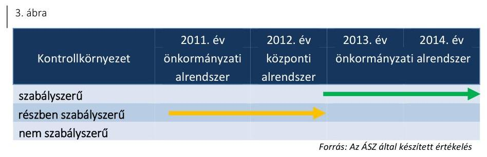

Az ellenőrzött időszakban a Múzeum megalkotta a szükséges szabályzatokat, a gazdasági szervezet vezetője rendelkezett az előírt végzettséggel, szakképesítéssel.

A kontrollkörnyezet 2011. évi kialakítása során hiányosság volt, hogy a 2011. április 29-ei alapító okirat ${ }_{2}{ }_{\text {„III. }}$ 3. A költségvetési szerv alaptevékenységei" fejezetében bekövetkezett változásait az Ámr. 20. § (2) bekezdés c) pontjában foglaltak ellenére az $\mathrm{SzMSz}_{1}$ nem tartalmazta.

A 2012. évben a kontrollkörnyezet kialakításánál hiányosság volt, hogy az Ávr. 13. § (1) bekezdés b) pontjában foglaltak ellenére 2012. július 12én kelt alapító okirat ${ }_{3}$ keltét és számát az $\mathrm{SzMSz}_{1}$ nem tartalmazta

A Múzeum 2011-2012. években a Számv. tv. ${ }^{53}$ 161. § (2) bekezdés d) pontja ellenére bizonylati renddel nem rendelkezett, azt a 2013. évben a

---

# 3.2. számú megállapítás 

gazdasági vezető elkészítette, amely megfelelt az Áhsz ${ }_{1}$ és Áhsz ${ }_{2}{ }^{54}$ előírásainak.

2011-2014-ben a kontrollkörnyezet további hiányossága volt, hogy a múzeumigazgató a Múzeum értékelési szabályzatát ${ }^{55}$ nem aktualizálta, mert az nem tartalmazta az Áhsz. 1 8. § (17) bekezdés a) pontjában előírtak ellenére a jogszabályon alapuló követelések év végi értékelésének elveit, az Áhsz. 2 50. § (2) bekezdésének a) pontjában foglaltak ellenére a követelések értékelésének elveit, szempontjait. Az értékelési szabályzat nem tartalmazta továbbá az Áhsz. 1 8. § (17) bekezdésének d) pontjában és az Áhsz. 2 50. § (2) bekezdésének b) pontjában foglaltak ellenére követeléstípusonként a kis összegű követelések év végi meghatározásának elveit, dokumentálásának szabályait. A 2011-2014. években a Múzeum rendelkezett a Kbt. ${ }_{1}^{56}$-ben és a Kbt. ${ }_{2}^{57}$-ben előírt közbeszerzési szabályzattal ${ }^{58}$.

A 2011. évben az Ámr. 156. § (2) bekezdése, 2012-2013-ban a Bkr. 6. § (3) bekezdése előírásai ellenére az ellenőrzési nyomvonal nem tartalmazta a tervezési folyamatokat, a tervezési folyamatokat is tartalmazó ellenőrzési nyomvonala 2014-re elkészült.

A 2011-2014. években a múzeumigazgató az etikai elvárásokat - az Ámr. 156. § (1) bekezdés c) pontjában, illetve a Bkr. ${ }^{59}$ 6. § (1) bekezdés c) pontjában foglaltak ellenére - nem határozta meg a Múzeum szervezetének egyes szintjeire.

A kockázatkezelési rendszer kialakítása és múködtetése a 2011-2012. években részben szabályszerű, 2013-2014. években szabályszerű volt.

| 4. ábra |  |  |  |  |
| :--: | :--: | :--: | :--: | :--: |
| Kockázatkezelési rendszer | 2011. év önkormányzati alrendszer | 2012. év   központi   alrendszer | 2013. év   önkormányzati | 2014. év   alrendszer |
| szabályszerű |  |  |  |  |
| részben szabályszerű   nem szabályszerű |  |  |  |  |

A Múzeum az Ámr.-ben, illetve a Bkr.-ben foglaltaknak megfelelően alakította ki a kockázatkezelési rendszerét, amely tartalmazta a kockázatok azonosításával, elemzésével, csoportosításával, nyomon követésével, illetve a kockázati kitettség csökkentésével kapcsolatos szabályokat. A Múzeumnál felmérték és megállapították a Múzeum tevékenységében, gazdálkodásában rejlő kockázatokat. A vagyonnyilatkozat-tételi kötelezettséggel járó munkaköröket a Vnytv. ${ }^{60}$ 4. § a) pontja előírása ellenére 2011-2013. években SZMSZ ${ }_{1}$-ben nem rögzítették. A múzeumigazgató a 2013. évben a vagyonnyilatkozatok kezelése szabályzatban ${ }^{61}$, a 2014. évben a vagyonnyilatkozat-tételre kötelezettek körét az SZMSZ ${ }_{2-3}$ rögzítette.

---

# 3.3. számú megállapítás 

## 3.4. számú megállapítás

## A kontrolltevékenység kialakítása és múködtetése a 2011-2014. években szabályszerű volt.

| 5. ábra |  |  |  |  |
| :--: | :--: | :--: | :--: | :--: |
|  | 2011. év | 2012. év | 2013. év | 2014. év |
| Kontrolltevékenységek | önkormányzati alrendszer | központi alrendszer | önkormányzati alrendszer |  |
| szabályszerű |  |  |  | $\rightarrow$ |
| részben szabályszerű nem szabályszerű |  |  |  |  |

A kontrolltevékenység kialakítása és működtetése az ellenőrzött időszakban szabályszerű volt. A Múzeumnál a kontrolltevékenység részeként a folyamatba épített előzetes, utólagos és vezetői ellenőrzést az Áht ${ }_{1}$ és a Bkr. előírásainak megfelelően biztosították.

A kontrolltevékenység működtetése során feltárt hiányosságokat részletesen a 4.3. pont tartalmazza.

Az információs és kommunikációs folyamatok kialakítása a 2011-2013. években részben szabályszerű, a 2014. évben szabályszerű volt.
6. ábra

| Információs és kommunikációs rendszer | 2011. év   önkormányzati alrendszer | 2012. év   központi alrendszer | 2013. év   önkormányzati alrendszer | 2014. év |
| :--: | :--: | :--: | :--: | :--: |
| szabályszerű |  |  |  | $\rightarrow$ |
| részben szabályszerű nem szabályszerű |  |  |  |  |

A 2011-2013. években az információs és kommunikációs folyamatok kialakítása részben volt szabályszerű. A 2011. évben az Ámr. 159. § (1) bekezdésében, a 2012-2013. években a Bkr. 9. § (1) bekezdésében foglaltak ellenére a múzeumigazgató nem alakította ki a Múzeummal kapcsolatos információk tekintetében a szervezeten kívülre történő információátadás rendszerét, amely biztosítja, hogy a külső felek (illetékes szervezetek) részére a megfelelő információk a megfelelő időben eljussanak.

2014-ben az információs és kommunikációs folyamatok kialakítása szabályszerű volt.

Az ellenőrzött időszakban a múzeumigazgató nem gondoskodott az Avtv. ${ }^{62}$ 31/A. § (3) bekezdésének, illetve az Info tv. ${ }^{63}$ 24. § (3) bekezdésének ellenére adatvédelmi és adatbiztonsági szabályzat készítéséről.

A Múzeum az ellenőrzött időszakban az Áht. 1,2 előírásainak megfelelően az SZMSZ1-3-ban, gazdálkodási szabályzat ${ }_{1,2}$-ben, valamint az adatvédelmi és adatbiztonsági előírásokkal szabályozta a beszámolási, adatszolgáltatási és egyéb tájékoztatási feladatokat.

---

# 3.5. számú megállapítás 

A monitoring rendszer kialakítása és múködtetése a 2011. évben nem volt szabályszerű, a 2012. évben részben szabályszerű, a 2013-2014. években szabályszerű volt.
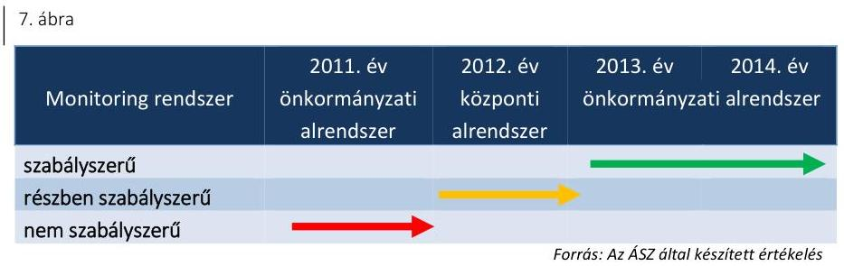

A múzeumigazgató az Áht ${ }_{1,2}$ előírásainak megfelelően a Múzeum Belső kontroll kézikönyv ${ }^{64}$-ben kialakította a rendelkezésre álló források gazdaságos, hatékony és eredményes felhasználását biztosító, a szervezeti célok elérését szolgáló feladatok, folyamatok megvalósulását mérő követelményeket és azokat a kialakításukat követően alkalmazta. A monitoring rendszer részeként megvalósult a belső ellenőrzési rendszer szabályszerű kialakítása.

2011-ben a monitoring rendszer kialakítása és múködtetése területén szabálytalanság volt, hogy a belső ellenőrzés javaslatainak végrehajtása érdekében az ellenőrzött szervezeti egységek vezetői nem készítettek intézkedési tervet a Ber. ${ }^{65}$ 29. § (1) bekezdés előírása ellenére. A szervezeti egységek vezetői a Ber. 29/A. § (1) bekezdésében foglaltak ellenére a belső ellenőrzési jelentésekben tett megállapítások és javaslatok hasznosulásának és végrehajtásának nyomon követésére nem vezettek nyilvántartást.

A 2012. évben a monitoring rendszer kialakítása és múködtetése részben volt szabályszerű, mert a belső ellenőrzés javaslatainak végrehajtása érdekében az ellenőrzött szervezeti egységek vezetői nem készítettek megfelelő tartalmú intézkedési tervet a Bkr. 28. § c) pontja előírásainak ellenére.

A 2013-2014. években a monitoring rendszer kialakítása és múködtetése szabályszerű volt. A Múzeum szervezeti egységeinek vezetői a Bkr. előírásainak megfelelően belső ellenőrzés javaslatainak végrehajtása érdekében intézkedési tervet készítettek, a belső ellenőrzés nyilvántartotta és nyomon követte a belső ellenőrzési jelentések alapján meg tett intézkedéséket.

A múzeumigazgató a 2012-2014. években nem gondoskodott a Bkr. 14. § (1) bekezdésében foglalt előírás ellenére a külső ellenőrzések javaslatai alapján készült intézkedési tervek végrehajtásának nyilvántartásáról.

---

# 4. A Múzeum pénzügyi gazdálkodása szabályszerű volt-e? 

## Összegző megállapítás

### 4.1. számú megállapítás

## A Múzeum pénzügyi gazdálkodása nem volt szabályszerű.

Az ellenőrzött időszakban a költségvetési tervezés, a bevételi és kiadási előirányzatok megállapítása, módosítása és a maradvány megállapítása, azok számviteli nyilvántartása megfelelt a jogszabályi előírásoknak és a belső szabályzatokban foglaltaknak.

Az ellenőrzött időszakban a múzeumigazgató szabályozta a költségvetés tervezéssel, a gazdálkodással, az ellenőrzési adatszolgáltatási és beszámolási feladatok teljesítésével kapcsolatos belső előírásokat, feltételeket. A tervezéssel kapcsolatos feladatokat munkaköri leírásban rögzítették.

Az elemi költségvetéseket a 2011-2014. években az irányító szerv $1_{1-3}$ által megjelölt határidőben elkészítették és az irányító szerv $1_{1-3}$ részére megküldték. A költségvetési javaslatokat az Áht.1,2-ben foglalt előírások szerint állították össze, az előirányzatok összegének megállapítását mellékszámításokkal alátámasztották.

A 2011. évi költségvetési javaslat tervezetet a fenntartó; Gazdasági és Pénzügyi Bizottsága véleményezte. A 2013. és 2014. évi költségvetési javaslat tervezeteket a fenntartó ${ }_{3}$ Jogi és Pénzügyi Bizottsága az Mötv.-ben foglaltaknak megfelelően véleményezte, azokat bizottsági határozatban elfogadásra javasolta. A 2012. évi költségvetési előirányzatot a fenntartó; a Múzeum által szolgáltatott adatok figyelembe vételével tervezte meg. A költségvetési javaslatok elkészítése során az előirányzatok megállapításakor figyelembe vették a Múzeumot érintő szervezeti átalakításból, átszervezésből adódó szerkezeti változások hatásait. Az ellenőrzött időszakban évközi feladatváltozásból adódó szintre hozás nem történt.

## A BEVÉTELI ÉS KIADÁSI ELŐIRÁNYZATOK MÓ-

DOSÍTÁSA megfelelt az Áht.1,2 előírásainak és a belső szabályzatokban foglaltaknak.

Az ellenőrzött időszakban a múzeumigazgató szabályozta az előirányzatok könyvelésének rendjét. A Múzeum által vezetett előirányzat analitika adatai megfeleltek az adott évi költségvetési beszámolók megfelelő űrlapjain rögzített adatoknak, a költségvetési előirányzatok egyeztetése megfelelt az Áhsz. ${ }_{1}$ előírásainak.

Országgyűlési és Kormány hatáskörű előirányzat módosítás a 2011-2014. években nem történt. Az előirányzatok módosítását az előirányzat nyilvántartásban és a főkönyvi könyvelésben szabályszerűen könyvelték. Az ellenőrzött időszakban előirányzat zárolás, elvonás a Múzeumnál nem volt.

Irányító szervi hatáskörű előirányzat módosítás 2011-2014-ben minden évben történt. Az irányító szervi előirányzat változtatások indoka a költségvetési szervnél foglalkoztatottak bérkompenzációja miatti előirányzat módosítás mellett a Múzeum feladatellátásának biztosítása volt. Az előirányzatok változásáról analitikus nyilvántartást vezettek.

A Múzeum a saját hatáskörében végrehajtott előirányzat módosításokról a Kincstárat az elektronikus adattovábbítási rendszeren keresztül az Ávr. előírásainak megfelelően tájékoztatta.

---

Az irányítószervi és az intézményi hatáskörű előirányzat módosítások a 2011. évben az Áht.1-ben, a 2012-2014. években az Áht.2-ben foglaltaknak megfelelően történtek.

A MARADVÁNYOK, az előirányzat maradvány, a költségvetési maradvány és pénzmaradvány számviteli nyilvántartása az ellenőrzött években megfelelt a jogszabályi előírásoknak, az ellenőrzött időszakban a Múzeumot meg nem illető maradvány miatt befizetési kötelezettség nem keletkezett.

A 2011. évben az irányító szerv1 az Ámr.-ben foglaltak, a 2013. és 2014. évben az irányító szerv3 az Ávr.-ben foglaltak szerint a zárszámadási rendeletével egy időben állapította meg a Múzeum kötelezettséggel terhelt maradványát. Az irányító szerv ${ }_{2}$ - az Ávr. előírásainak megfelelően - a zárszámadással egyidejűleg döntött a Múzeum 2012. évi maradványáról.

# 4.2. számú megállapítás 

Az éves költségvetési beszámolót a jogszabályban meghatározott tartalommal készítették el.

A Múzeum a 2011., 2012., 2013. éves elemi beszámolóját az Áhsz.1, a 2014. évi beszámolóját az Áhsz. 2 előírása szerinti bontásban állította össze. Az ellenőrzött időszakban az éves költségvetési beszámolókat a könyvviteli zárlat során készített főkönyvi kivonatok alapján állították össze. A 2011., 2012. és 2013. éves költségvetési beszámolókat a múzeumigazgató és a beszámoló elkészítéséért kijelölt felelős személy írta alá, az Áhsz.1-ben foglalt előírások szerint. A 2014. éves költségvetési beszámoló aláírása az Áhsz.2-nek megfelelően a múzeumigazgató és gazdasági vezető által, a hely és a keltezés feltüntetésével szabályszerűen történt. Az éves beszámolókat az elfogadott költségvetésekkel összehasonlítható módon, az adott év utolsó napján érvényes besorolási rendnek megfelelően készítették el.

Az éves beszámolókat a Múzeum a Kincstár elektronikus adatszolgáltató rendszerén keresztül küldte meg az irányító szerv ${ }_{1-3}$ részére.
4.3. számú megállapítás

A bevételi előirányzatok teljesítése a 2011-2014. években megfelelt a jogszabályokban és a belső szabályzatokban foglaltaknak. A kiadási előirányzatok felhasználása a 2011-2013. években részben felelt meg, a 2014. évben megfelelt a jogszabályi előírásoknak.

BEVÉTELI ELŐIRÁNYZATÁT a Múzeum a 2012. évben teljesítette, az ellenőrzött időszak további éveiben a teljesítés elmaradt a módosított előirányzattól. A módosított bevételi előirányzatnak a 2011. évben 79,5\%-a, 2012-ben 101,8\%-a, 2013-ban 99,0\%-a, 2014-ben 91,8\%-a teljesült. Az ellenőrzött időszakban a Múzeum régészeti tevékenységéből származó bevétele folyamatosan csökkent.

A BEVÉTELEK ELSZÁMOLÁSA a 2011-2014. években megfelelt a jogszabályoknak és a belső szabályzatok előírásainak, az Áht.1,2, az Számv. tv., az Mtv. előírásait összességében betartották. A 2013. évi bérbeadási (vagyonhasznosítási) tevékenység esetében előfordult, hogy a Vtv. ${ }^{66}$ 23. § (1)-(2) bekezdésében a vagyon hasznosítására felhatalmazást adó szerződés hiányában került sor. A bevételt kiszámlázták, illetve amenynyiben saját tevékenységből származott, arról belső bizonylatot állítottak

---

ki, a szerződéskötési, nyilvántartási és elszámolási feladatokat szabályszerűen elvégezték. A kiállított teljesítésigazolások megfeleltek az Ávr., Ámr. előírásainak és a belső szabályzatokban foglaltaknak.

A saját kiadványok és a régészeti feltárások tekintetében az önköltségszámítási szabályzatban ${ }^{67}$ rögzítettek szerint jártak el. Az MNV Zrt. engedélyéhez kötött értékesítés a 2012-2014. években nem történt.

A MÚZEUM KIADÁSI ELŐIRÁNYZATAI felhasználása a 2011-2013. években részben megfelelő, a 2014. évben megfelelő volt.

A megbízási szerződések esetében - a 2012. év kivételével - az Áhsz.1,2, az Ámr. és az Ávr. előírásait betartották. A megbízási szerződéseket a kötelezettségvállalásra jogosult írta alá, a kötelezettségvállalás (pénzügyi) ellenjegyzése megtörtént. A szerződés tartalmazta a szakmai, műszaki teljesítés mennyiségi és minőségi jellemzőinek meghatározását, határidejét és a kifizetendő összeget vagy a számlázás alapjául szolgáló egységárat, a kifizetés devizanemét, módját és feltételeit, valamint a kifizetés határidejét. A keltezéssel ellátott pénzügyi ellenjegyzés megtörtént, a teljesítést az arra jogosult igazolta. A megbízási díj számfejtése megfelelt a szerződésben és a teljesítésigazolásban foglaltaknak, a főkönyvi elszámolás szabályszerű volt. A 2012. évben több esetben, az Ávr. 57. § (1) bekezdésében foglaltak ellenére a teljesítésigazolást nem végezték el.

A dologi kiadásoknál 2011-2013-as időszakban esetenként nem állt rendelkezésre a számviteli elszámolást megalapozó bizonylat (számla), ami ellentétes a Számv. tv. 165. § (1)-(2) bekezdés előírásaival. A szakmai teljesítésigazolás a 2011. évben az Ámr. 76. § (1) bekezdésében, a 2012-2013. években a teljesítésigazolás számos esetben elmaradt az Ávr. 57. § (1) bekezdésében foglaltak ellenére. Ebben az időszakban esetenként az érvényesítés az Ámr. 77. § (3) bekezdése és az Ávr. 58. § (3) bekezdése ellenére nem volt szabályszerű, mert az aláírás nem az Ámr. 80. § (3) bekezdése, illetve az Ávr. 60. § (3) bekezdése szerint vezetett naprakész nyilvántartásban szereplő aláírás-mintának megfelelően történt. A 2011-2013. években a kiállított (adatokkal, iktatószámmal ellátott) utalványon a szakmai teljesítésigazoló, a teljesítésigazoló, az érvényesítő aláírása és a dátum nem szerepelt, az Ámr. 76. § (3) bekezdésében, az Ámr. 77. § (3) bekezdésében, valamint az Ávr. 57. § (3) bekezdésében és az Ávr. 58. § (3) bekezdésében foglaltak ellenére.

A 2011-2012. években a kiadási előirányzat felhasználás ellenőrzése során a számlák befogadása és kifizetése ellentétes volt a Számv. tv. 165. § (1)-(2) bekezdéseiben és a 166. § (1) bekezdésében foglaltakkal, mivel a Múzeum nem rendelkezett a kifizetéseket alátámasztó szerződésekkel.

2014-ben a kiadási előirányzatok felhasználása megfelelt az Számv. tv., az Áht. 1,2 , illetve az Ávr. és az Áhsz. előírásainak.

Az ingatlanokhoz kapcsolódó beruházások és felújítások a 2011. évet megelőzően kezdődtek meg, a Pajor Kúria felújítása kivételével, amely a 2011. évben indult. A további tárgyi eszköz beszerzés a kiállítási és régészeti tevékenység folytatásához kötődött.

A beszerzések összességükben szabályosan, a Számv. tv., az Áht.1,2, az Áhsz.1,2, az Ámr. és az Ávr előírásainak megfelelően történtek, a szerződések néhány kivételtől eltekintve tartalmaztak garanciális elemeket. A tárgyi

---

eszköz kartonok vezetése szabályos volt. A tárgyi eszköz leltárak az ellenőrzött beszerzéseket tartalmazták. A kifizetések során a gazdálkodási jogkörök gyakorlása szabályos volt. A 2011-2012. években a számla és a szerződés megőrzési kötelezettségének a Múzeum nem tett eleget a Számv. tv. 169. § (2) bekezdésében foglaltak ellenére.

Az értékcsökkenési leírások elszámolása néhány esetben a 2011. évben az Áhsz. 1 30. § (2) bekezdése, 2014. évben a számviteli politika ${ }^{68}$ VII. fejezetének 5. pontjában meghatározott előírásainak nem felelt meg, mert a 2011. évben az értékcsökkenést negyedévenként nem számolták el, a 2014. évben a tárgyi eszköz kartonon a tárgyévi értékcsökkenés negyedéves elszámolását nem tüntették fel. A közbeszerzési értékhatárt meghaladó beruházások esetén a közbeszerzési eljárást minden esetben lefolytatták.

Az 5 M Ft összeghatár fölötti szerződések adatai közzétételi kötelezettségének a Múzeum a 2011-2014. években az Avtv. és az Info tv. előírásai szerint megfelelt.

A 2011-2014. években a beruházás és felújítás a feladatellátással összhangban volt, a beruházás lebonyolításának szabályszerűsége a kisebb hiányosságok ellenére biztosított volt.

A régészeti célú bevételi előirányzatok teljesítése során a jogszabályi előírásokat betartották, a régészeti kiadási előirányzatok felhasználása a 2011-2014. években nem volt megfelelő.
3. táblázat

# A RÉGÉSZETI BEVÉTELEK BEMUTATÁSA (MFT) 

| Megnevezés | 2011. év | 2012. év | 2013. év | 2014. év |
| :-- | :--: | :--: | :--: | :--: |
| Összes bevétel | 1257,0 | 1438,5 | 804,5 | 1144,9 |
| Régészeti bevétel | 603,7 | 100,1 | 202,8 | 83,9 |
| Régészeti bevétel/bevétel (\%) | 48,0 | 7,0 | 25,2 | 7,3 |

Forrás: Az Önkormányzat adatszolgáltatás
A 2011. és a 2013. évben magas régészeti tevékenységből származó bevételek oka az időszakban végzett nagyberuházások, autópálya építések miatt végzett feltárási tevékenység volt.

A Múzeum a régészeti feltárásokra vonatkozó szerződéseket szabályszerűen, a Kötv. és a 393/2012. (XII. 20.) Korm. rendelet ${ }^{69}$ előírásaival összhangban kötötte meg a beruházást végző megbízókkal. Az ajánlattételek esetében a költségszámítás alapjául a Forster Központ ${ }^{70}$ adatszolgáltatásait és 2011-2012-ben a Magyar Nemzeti Múzeum honlapján akkor megtalálható aktuális árlistájában, 2013-ban és 2014-ben az adott évre kiadott BM közlemény ${ }_{1,2}$-ben $^{71}$ meghatározott árakat vették figyelembe.

A Múzeum a régészeti feltárási tevékenységgel kapcsolatban az 5/2010. (VIII. 18.) NEFMI ${ }^{72}$ rendelet 20. § (3) bekezdésében foglaltak ellenére 2011. szeptember 2-a és 2012. december 31-e között a pénzeszközök felhasználásáról analitikus nyilvántartást nem vezetett. A régészeti tevékenységet főkönyvi könyvelésben különítették el.

A Múzeum a teljes ellenőrzött időszakban a régészeti tevékenységhez elkülönített bankszámlával rendelkezett. A számla kezelésére vonatkozó belső előírásokat a pénzkezelési szabályzat ${ }_{1,2}{ }^{73}$ tartalmazta.

---

A Múzeum 2013-2014-ben a feltárási tevékenységhez kapcsolódó kézi, illetve gépi földmunkákra folytatott le közbeszerzési eljárást. A közbeszerzés alá nem tartozó munkáknál ajánlattétel készült a bevételi szerződések figyelembe vételével. A Múzeum az ellenőrzött időszakban a megelőző feltárási tevékenység teljesítése érdekében kötött szerződéseket az Ávr. előírásainak megfelelően. A szolgáltatások teljesítését az Ávr.-nek megfelelő teljesítésigazolások támasztották alá.

A régészeti megfigyelési, szakfelügyeleti tevékenységeket a Múzeum régészei látták el, külön juttatás, céljuttatás kitűzése nélkül, a havi járandóságuk terhére. A Múzeum a régészek bérét a régészeti szervezeti egységkódra könyvelte. A Múzeum e régészeti tevékenységekre a közvetett költségek felosztását a Számv. tv-nek megfelelő önköltségszámítási szabályzathoz igazodva nem alkalmazta, így a kiválasztott tételekhez felmerült kiadások összege - a havi bérek arányos része - a 2011-2014. időszakban nem állapítható meg.

A Múzeum a Számv. tv. 169. § (2) bekezdéseiben előírt bizonylat-megőrzési kötelezettsége ellenére előfordult, hogy a 2011. évben a vállalkozási szerződéshez a számlát, teljesítésigazolást, utalványrendeletet, bankkivonatot a 2012. évi megbízási szerződéshez tartozó utalványrendeletet és bankkivonatot nem őrizte meg.

# 4.5. számú megállapítás 

A Múzeum pénzügyi egyensúlya nem volt biztosított, likviditás javítását, a zavartalan feladatellátást és a fizetőképesség fenntartását a fenntartó $2-3$ egyensúlyjavító intézkedésekkel biztosította.

A fizetőképesség folyamatos biztosítása érdekében a Múzeum az Áht. 1,2 előírásainak megfelelően 2011-ben előirányzat-felhasználási tervvel, 2012-ben és 2014-ben likviditási tervvel rendelkezett. 2013-ban az Áht. 2 . 78. § (2) bekezdésében előírt rendelkezés ellenére a Múzeum likviditási tervet nem készített.

Az ellenőrzött időszakban két alkalommal, 2012-ben és 2014-ben került sor pénzügyi forrás biztosítására a pénzügyi egyensúly javítása érdekében, a Múzeum tartozásállományának felhalmozódása miatt. A Múzeumnak tartozás-átütemezése nem volt.

A fenntartó 2 a Múzeum részére a 2012. évben szállítói kötelezettségek kiegyenlítésére 224,0 M Ft forrást biztosított. A Múzeum a 2012. évet érintően 40,0 M Ft keret-előrehozást kért, melyet az év második felében várható bevételekkel szemben az év során egyenletesen jelentkező kötelezettségek fennállásával indokoltak.

A fenntartó 3 a Múzeum szállítói tartozásai rendezésére a 2014. évben a megyei önkormányzati tartalékból nyújtott támogatásokról és rendkívüli önkormányzati támogatásokról szóló 7/2014. (I. 31.) számú BM rendelet alapján 169,0 M Ft rendkívüli támogatást kapott, amelyet a Múzeum számára tartozásainak rendezésére biztosított.

A pénzügyi egyensúly, a szállítói számlák, egyéb kötelezettségek határidőben történő kiegyenlítése a Múzeumnál a 2011-től 2014-ig terjedő időszakban nem volt biztosított.

A Múzeum követelésállománya az ellenőrzött időszakban a 2012. évben volt a legmagasabb 99,0 MFt. A követelésállomány a 2013-2014. években csökkenést mutatott 2013. évre 54,3 MFt-ra, 2014. évre 12,1 MFt-ra

---

változott. A követelésállomány 2014. évi csökkenésének oka, hogy a folyamatban lévő peres eljárások egy része a tárgyévben sikeresen lezárult, a lejárt vevőköveteléseket 2014-ben értékelték, a (pl. az adós felszámolása, megszűnése miatt) behajthatatlannak ítélt követeléseket leírták.

# 5. A Múzeum vagyongazdálkodása szabályszerű volt-e? 

## Összegző megállapítás

### 5.1. számú megállapítás

A Múzeum vagyongazdálkodása a 2011-2014. években nem volt szabályszerű.

Az eszközök és források nyilvántartása a 2011. évben megfelelt, a 2012-2014. közötti időszakban nem felelt meg a jogszabályi előírásoknak.

A VAGYONGAZDÁLKODÁSSAL kapcsolatos feladatok munkafolyamatai leírását az ellenőrzött időszakban - az Ámr.-ben, Ávr.-ben előírtaknak megfelelően - a gazdasági szervezet ügyrend ${ }_{1,2}$ tartalmazta.

A Múzeum az eszközök és források nyilvántartásának előírásait a számviteli politika ${ }_{1,2}{ }^{74}$, a leltározási szabályzat ${ }_{1,2}{ }^{75}$, illetve az értékelési szabályzatban rögzítette.

A Múzeum a kulturális javak nyilvántartását - a 20/2002. (X. 4.) NKÖM rendeletben ${ }^{76}$ foglaltaknak megfelelően - a nyilvántartási szabályzatban ${ }^{77}$ határozta meg, amely tartalmazta a nyilvántartott kulturális javak őrzésének, törlésének módját, és a leltározás eljárásrendjét.

A 2011. évben a Múzeum által használt vagyon a fenntartó ${ }_{1}$ tulajdonában volt, ezért a vagyonnal összefüggő szabályokat a vagyongazdálkodási rendelet ${ }^{78}$ tartalmazta. A 2011. évben az Önkormányzat a saját tulajdonú Művészetmalom ingatlan hasznosítása érdekében - az Ötv. alapján - vagyonkezelői jogot alapított, amelynek használatát pályázat útján a Múzeum nyerte meg. A pályázatnak megfelelően a vagyonkezelési szerződészt ${ }^{79}$ 2011. december 22-én megkötötték. Az Önkormányzattól vagyonkezelésbe vett Művészetmalom számviteli nyilvántartása során a 2012. évben a Múzeum nem tartotta be az Áhsz. ${ }_{1} 20 . \S$ (2) bekezdésben foglaltakat, mert a bruttó 154 M Ft értékű vagyont a tárgyi eszközök mérlegsoron és nem a vagyonkezelésbe vett eszközök között mutatta ki.

A 2012. január 1-jei önkormányzati konszolidációt követően a tulajdonosi jogokat az állami tulajdon felett az MNV Zrt. gyakorolta, míg a fenntartói jogok és kötelezettségek a fenntartó ${ }_{2}$-höz kerültek. A Múzeum a feladat ellátását szolgáló vagyont továbbra is használta, azonban erre vonatkozó szerződéssel a Vtv. 25. § (4) bekezdésében foglaltak ellenére nem rendelkezett. A Számv. tv. 23. § (2) bekezdése, az Nvtv. 11. § (8) bekezdése, valamint az Áhsz. ${ }_{1} 15 . \S$ (1) bekezdésében foglaltak ellenére a kezelt vagyon kimutatására szabálytalanul a Múzeumnál került sor. A Múzeum 2012. évi beszámolójának mérlegében kimutatott állami vagyon értéke teljes egészében az Áhsz ${ }_{1}$ 5. § 10. pontja szerinti jelentős összegű hibát eredményezett, és a beszámoló mérlege a vagyon és annak összetétele vonatkozásában a megbízható és valós összképet nem mutatta be.

Az Mtv. 2013. január 1-jétől hatályos 45/A. § (2) bekezdés a) pontja szerint a megyei hatókörű városi múzeum lett a vagyonkezelője a tevékenységéhez szükséges állami vagyonnak. A 2013-2014. években a Múzeum nem

---

rendelkezett vagyonkezelési szerződéssel, ezzel az Nvtv. 11. § (1) és (7) bekezdésének és a Vtvr. ${ }^{80}$ 8. § (6) bekezdésének előírása nem érvényesült.

A kezelt vagyon köre és nagysága a 2013-2014. években vagyonkezelési szerződés hiányában nem volt megállapítható. Kiegészítő mellékletben a Múzeum a 2013-2014. években a Számv. tv. 23. § (2) bekezdésében előírtak ellenére nem mutatta be mérlegtételek szerinti bontásban a kezelésébe vett állami eszközöket és a 2014. évben az Áhsz. 2 29. § (2) bekezdés c) pontjában előírtak ellenére nem jelezte a vagyonkezelésbe vett eszközök körének változását és a vagyonkezelési szerződés hiányát, emiatt nem érvényesült a Számv. tv. 16. § (4) bekezdésében meghatározott „lényegesség elve".

# A NEMZETI VAGYONBA TARTOZÓ KULTURÁLIS 

JAVAK NYILVÁNTARTÁSÁT a Múzeum - a 20/2002. (X. 4) NKÖM rendeletben előírtak szerint - a műtárgyakról szóló szakleírás és képi ábrázolás, valamint az egyes nyilvántartó naplók vezetésével biztosította, amelyhez hagyományos (papír alapú) módot alkalmaztak. A gyűjteményekben bekövetkezett változásokról az irányító szervet a Múzeum a teljesítmény alapú beszámolójában tájékoztatta.

Az 20/2002. (X. 4.) NKÖM rendelet 1. számú mellékletnek megfelelően a Múzeumnál vezették a gyarapodási naplót a saját gyűjteményébe beérkező kulturális javakról. A saját gyűjteményében őrzött tudományosan meghatározott kulturális javak szakleltárkönyvi (iparművészet, képzőművészet) nyilvántartása megfelelt az 1. számú mellékletben előírtaknak. Szekrénykataszteri nyilvántartást nem alkalmazták, mert a műtárgyakat egyedileg kezelték. Az alapleltárakat - a 20/2002. (X. 4.) NKÖM rendeletben foglaltaknak megfelelően - a gyűjteményért felelős muzeológus hitelesítette. Az ellenőrzött időszakban a kulturális javak közül törlésre nem került sor.
2014. január 1-jétől az Áhsz. 2 előírásainak megfelelően azon kulturális javaknak az esetében, amelyek értéke ismert, főkönyvi számlák alábontásával biztosították az elkülönített nyilvántartást.

### 5.2. számú megállapítás

A 2011-2014. közötti időszakban a költségvetési beszámoló mérlegének leltárral való alátámasztottsága, a mérlegtételek értékelése nem felelt meg a jogszabályi előírásoknak.

A felhalmozási kiadások ellenőrzése alapján a bekerülési érték meghatározása, állományba vétele, nyilvántartása, értékcsökkenés elszámolása a Számv. tv., valamint az Áhsz.1,2 előírásainak megfelelően történt. A leltárak tartalmazták az ellenőrzött tételeket.

A leltározás előtt a Múzeum a 2011. évben hajtott végre selejtezést, amelynél betartotta a selejtezési szabályzat ${ }^{81}$ előírásait.

Az immateriális javaknál és tárgyi eszközöknél elszámolták a terv szerinti értékcsökkenéseket. A 2011. évi értékvesztés elszámolása során betartották az Áhsz.1-ben foglalt előírásokat. Az aktív és passzív pénzügyi elszámolások adatait az Áhsz.1,2-ben előírtak szerint egyeztették.

A MÉRLEGET ALÁTÁMASZTÓ LELTÁR a 2011. és a 20132014. években nem felelt meg a Számv. tv. 69. §-ában, az Áhsz. 1 37. § (1)-

---

(2) és (3) bekezdéseiben, valamint az Áhsz. ${ }_{2}$ 22. § (1) bekezdésében előírtaknak, mivel a 2011. és 2013. években nem leltározták a készletek mérlegsoron szereplő árukat, továbbá 2013. évben a tárgyi eszközök között kimutatott jármúveket, valamint a 2014. évben a költségvetési évben esedékes kötelezettségek személyi juttatásokra mérleg tételt.

A Múzeum a 2011. és 2013. években az Áhsz ${ }_{1}$ 32. § (1) és (8) bekezdéseiben foglaltak ellenére a készletek mérlegsoron szereplő áruk év végi értékelését nem végezte el.

A mérleget alátámasztó leltár a 2012. évben nem felelt meg az Áhsz. ${ }_{1}$ 37. § (2) bekezdésében foglaltaknak, mert a Múzeum az általa használt és felleltározott állami vagyonnak nem volt vagyonkezelője.

A mérleget alátámasztó leltár a 2013-2014. években az állami vagyon tekintetében nem felelt meg az Áhsz. ${ }_{1}$ 37. § (2) bekezdésében és a Számv. tv. 69. § (1) bekezdésében foglaltaknak, mert az Áhsz. ${ }_{1}$ 29/A. § (1) bekezdésében foglaltak értelmében, a vagyonkezelésbe vett eszköz bekerülési értékének, a vagyonkezelési szerződésben szereplő érték minősül, mely információ a szerződés hiányában nem állt rendelkezésre, az Áhsz. ${ }_{2}$ 15. § (2) bekezdésében foglaltak alapján a bekerülési érték az átadónál kimutatott bruttó érték, melyről szintén nem volt információ. A hiányosság miatt a leltárak értékadatai dokumentummal nem voltak megfelelően alátámasztva.

A Múzeum eredményszemléletű számvitelre történő áttérés rendező mérlegét - a 36/2013. (IX. 13.) NGM rendelet ${ }^{82}$ előírásai szerint - a fenntartó3 független könyvvizsgálói készítették el. Az eredményszemléletű számvitel bevezetésével kapcsolatos 2013. év végi könyvelési bizonylatok megőrzéséről a Számv. tv. 169. § (1) bekezdésben foglaltak ellenére nem gondoskodtak. A rendező mérleget a 36/2013. (IX. 13.) NGM rendeletben előírt formátumban, tartalommal, határidőben készítették el. Tartalmazta a múzeum igazgatójának aláírását, az elkészítéséért felelős könyvvizsgáló keltezéssel ellátott aláírását és a kamarai tagsági számát.

# 5.3. számú megállapítás 

A kulturális javak hasznosítása és kölcsönzése nem felelt meg a jogszabályok előírásainak, a kulturális javak őrzését biztosították, az állományvédelemre vonatkozó előírásokat nem tartották be.

A KULTURÁLIS JAVAK KÖLCSÖNZÉSE során a Múzeum az ellenőrzött időszakban hazai muzeális intézmény, valamint egyéb szervezet, illetve külföldi múzeum részére kölcsönzött kulturális javakat.

A Múzeum a 2014. május 10-től hatályos 29/2014. (IV. 10.) EMMI rendeletben ${ }^{83}$ foglalt lehetőséggel nem élt, a kölcsönzési szerződés megkötését megelőzően az állományvédelmi feltételek fennállását nem ellenőrizte.

A Múzeum által kölcsönzött kulturális javak kölcsönszerződéseinek ellenőrzése során az alábbi hiányosságokat tártuk fel:
$\longrightarrow$ a 2011-2014. években a 2013. október 24-ig hatályos Mtv. 38. § (6) bekezdésében, illetve a 2013. október 25-től hatályos Mtv. 38/A § (1) bekezdésében foglaltak ellenére szerződés hiányában engedett át használatra kulturális javakat;
$\longrightarrow$ a 2013-2014. években a 2013. október 25-től hatályos Mtv. 38/A. § (3) bekezdésben foglaltak ellenére a kölcsönzési szerződéshez nem csatolták a kölcsönbe adás időpontjában fennálló fizikai állapotot dokumentáló szakleírást és vele együtt a képi ábrázolást;

---

$\longrightarrow$ a 2011-2014. években a 2013. október 24-ig hatályos a Mtv. 38. § (9) bekezdésében, illetve 2013. október 25-től hatályos 38/A. § (5) bekezdésben foglaltak ellenére a nem muzeális intézmény részére történő kölcsönzés esetén nem állt rendelkezésre a miniszteri hozzájárulás;
$\longrightarrow$ a 2011-2014. években a 2013. október 24-ig hatályos Mtv. 38. § (8) bekezdés a), illetve a 2013. október 25-től hatályos 38/A. § (2) bekezdés a) pontjában előírtak ellenére a szerződések nem tartalmazták az állományvédelmi követelményeket, a klimatikus viszonyokat és a csomagolás feltételeit.
A kulturális javak vagyonbiztonsága, őrzése a kiállítóterekben és az egyéb helyiségekben biztosított volt, a nyitva tartás alatt őrzéssel, 24 órás portaszolgálattal, egyéb időszakban vonulásos távfelügyelettel.

# 6. A Múzeum intézkedett-e az integritás szemlélet érvényesítése érdekében? 

## Összegző megállapítás

A Múzeum nem intézkedett az integritás szemlélet érvényesítése érdekében.

A Múzeum nem vett részt az ÁSZ 2014. évi integritás projektében, ezért a helyszíni ellenőrzés keretében került sor egy tanúsítvány (kérdőív) kitöltésére. Ennek kiértékelését a II. számú melléklet tartalmazza.

---

# JAVASLATOK 

Az ÁSZ tv. 33. § (1) bekezdésében foglaltak értelmében az ellenőrzött szervezet vezetője köteles a jelentésben foglalt megállapításokhoz kapcsolódó intézkedési tervet összeállítani és azt a jelentés kézhezvételétől számított 30 napon belül az ÁSZ részére megküldeni. Amennyiben az ellenőrzött szervezet vezetője nem küldi meg határidőben az intézkedési tervet, vagy továbbra sem elfogadható intézkedési tervet küld, az Állami Számvevőszék elnöke az ÁSZ tv. 33. § (3) bekezdése a) és b) pontjaiban foglaltakat érvényesítheti.

## Szentendre Város Önkormányzata polgármesterének

1. Intézkedjen a Múzeum stratégiai terve meghatározása és jóváhagyása, valamint alapító okirata, stratégiai fejlesztési és beruházási terve, éves szakmai feladatai, munkaterve, beszámolója, feladatalapú költségvetése, valamint teljesítményértékelése tekintetében a miniszter előzetes véleményezése érdekében.
(1. sz. megállapítás 2. bekezdésének 4. mondata, 1. sz. megállapítás 9. bekezdésének 1-3. francia bekezdése alapján)
2. Tegyen intézkedéseket a feltárt szabálytalanságok tekintetében a felelősség tisztázása érdekében, és szükség szerint intézkedjen a felelősség érvényesítéséről.
(5.3. sz. megállapítás 3. bekezdésének 2-4. francia bekezdései alapján)

## a Ferenczy Múzeumi Centrum igazgatójának

1. A belső kontrollrendszer szabályszerű kialakítása és müködtetése érdekében intézkedjen:
a) az eszközök és források értékelési szabályzata aktualizálására a jogszabályi előírásnak való megfelelés érdekében;
(3.1. sz. megállapítás 5. bekezdésének 1., 2. mondata alapján)
b) az etikai elvárások meghatározására, ismertetésére, elfogadására a szervezet minden szintjén;
(3.1. sz. megállapítás utolsó bekezdése alapján)
c) adatvédelmi és adatbiztonsági szabályzat készitésére;
(3.4. sz. megállapítás 3. bekezdése alapján)

---

d) jogszabályban előírt tartalmú nyilvántartás vezetésére a külső ellenőrzések javaslatai alapján készült intézkedési tervek végrehajtásáról éves bontásban.
(3.5. sz. megállapítás utolsó bekezdése alapján)
2. A szabályszerű pénzügyi gazdálkodás érdekében intézkedjen az értékcsökkenés belső szabályozás előírásainak megfelelő elszámolására.
(4.3 sz. megállapítás 11. bekezdésének 1. mondata alapján)
3. A szabályszerű vagyongazdálkodás érdekében intézkedjen:
a) a jogszabályi előírásnak megfelelő éves költségvetési beszámoló készitésére;
(5.1. sz. megállapítás 7. bekezdése alapján)
b) a jogszabályi előírásoknak megfelelő leltár összeállítására;
(5.2. sz. megállapítás 7. bekezdése alapján)
c) a kulturális javak kölcsönzése esetén a jogszabályban előirtak betartására.
(5.3. sz. megállapítás 3. bekezdésének 2-4. francia bekezdése alapján)
4. Tegyen intézkedéseket a feltárt szabálytalanságok tekintetében a felelősség tisztázása érdekében, és szükség szerint intézkedjen a felelősség érvényesítéséről.
(4.3 sz. megállapítás 11. bekezdésének 1. mondata, 5.3. sz. megállapítás 3. bekezdésének 2-4. francia bekezdései alapján)

---

# MELLÉKLETEK 

- I. SZ. MELLÉKLET: ÉRTELMEZŐ SZÓTÁR
alapleltár
állami vagyon
ÁSZ Integritás Projekt
belső ellenőrzés
belső kontrollrendszer
belső kontrollrendszer területei
muzeális intézmény kulturális javakról vezetett nyilvántartása, melyek őrzésében, kezelésében, illetve birtokában vannak. (Forrás: 20/2002. (X. 4) NKÖM rendelet 1.§, 3. §)

Állami vagyonnak minősül:
a) az állam tulajdonában lévő dolog, valamint a dolog módjára hasznosítható természeti erő,
b) az a) pont hatálya alá nem tartozó mindazon vagyon, amely vonatkozásában törvény az állam kizárólagos tulajdonjogát nevesíti,
c) az állam tulajdonában lévő tagsági jogviszonyt megtestesítő értékpapír, illetve az államot megillető egyéb társasági részesedés,
d) az államot megillető olyan immateriális, vagyoni értékkel rendelkező jogosultság, amelyet jogszabály vagyoni értékű jogként nevesít
(Forrás: Vtv. 1. § (2) bekezdése)
Az Állami Számvevőszék 2009-ben indította el a „Korrupciós kockázatok feltérképezése - Integritás alapú közigazgatási kultúra terjesztése" című, európai uniós forrásból megvalósított kiemelt projektjét (Integritás Projekt). Az Integritás Projekt célja, hogy felmérje a közszféra intézményei korrupciós kockázatoknak való kitettségét, illetőleg az azok mérséklésére hivatott kontrollok szintjét. Az Állami Számvevőszék a projekt révén az integritás szemlélet minél szélesebb körrel történő megismertetését, gyakorlatba ültetését kívánja elérni. Az integritás követelményeinek megfelelő szervezeti működést előnyben részesítő közigazgatási kultúra elterjesztését és a korrupció elleni fellépést az ÁSZ önmagára nézve is stratégiai jelentőségű célként fogalmazta meg. A projekt a felmérésben résztvevő intézmények számára helyzetükről egyfajta „tükörképet" mutat be, ami alapot teremt a jövőbeni pozitív irányú elmozduláshoz. (Forrás: a http://integritas.asz.hu honlapon közzétett, a 2013. évi Integritás felmérés eredményeiről készült összefoglaló tanulmány)
Független, tárgyilagos bizonyosságot adó és tanácsadó tevékenység, amelynek célja, hogy az ellenőrzött szervezet működését fejlessze és eredményességét növelje, az ellenőrzött szervezet céljai elérése érdekében rendszerszemléletű megközelítéssel és módszeresen értékeli, illetve fejleszti az ellenőrzött szervezet irányítási és belső kontrollrendszerének hatékonyságát. (Forrás: Bkr. 2. § b) pontja)
A belső kontrollrendszer a kockázatok kezelése és tárgyilagos bizonyosság megszerzése érdekében kialakított folyamatrendszer, amely azt a célt szolgálja, hogy a működés és gazdálkodás során a tevékenységeket szabályszerűen, gazdaságosan, hatékonyan, eredményesen hajtsák végre, az elszámolási kötelezettségeket teljesítsék, megvédjék az erőforrásokat a veszteségektől, károktól és nem rendeltetésszerű használattól. (Forrás: Áht. 2 69. § (1) bekezdése)
A kontrollkörnyezet, a kockázatkezelési rendszer, a kontrolltevékenységek, az információs és kommunikációs rendszer, valamint a nyomon követési (monitoring) rendszer. (Forrás: Bkr. 3. §-a)

---

fenntartó
gyarapodási napló
információs és kommunikációs rendszer
integritás
irányító szerv/felügyeleti szerv
kockázat
kockázatkezelési rendszer
kontrollkörnyezet
kontrolltevékenységek
kötelezettségvállalás
középirányító szerv
likviditási mutató
közfeladat

A muzeális intézmény fenntartója az a természetes személy, jogi személy, jogi személyiség nélküli gazdasági társaság, amely biztosítja a muzeális intézmény folyamatos és rendeltetésszerű müködéséhez szükséges feltételeket (1997. évi CXL. tv. 50. § (1) bek.)
A muzeális intézmény saját gyűjteményei számára beérkező, egyedileg kezelhető kulturális javak első nyilvántartásba vételére - azok további feldolgozásáig - szolgáló napló. (Forrás:20/2002. X. 4.) NKÖM rendelet 4.§ (1) bekezdés)

A költségvetési szerv vezetője által kialakított és müködtetett olyan rendszer, mely biztosítja, hogy a megfelelő információk a megfelelő időben eljutnak az illetékes szervezethez, szervezeti egységhez, illetve személyhez. (Forrás: Bkr. 9. § (1) bekezdés)
Az integritás az elvek, értékek, cselekvések, módszerek, intézkedések konzisztenciáját jelenti, vagyis olyan magatartásmódot, amely meghatározott értékeknek megfelel.
(Forrás: Nemzetgazdasági Minisztérium: Magyarországi államháztartási belső kontroll standardok Útmutató 1.6.1. pontja, 2012. december)
A költségvetési szerv tekintetében az e törvényben meghatározott irányítási hatáskört gyakorló szerv. (Forrás: Áht. 2 1. § 9. pontja)
A kockázat annak a valószínűségét jelenti, hogy egy vagy több esemény vagy intézkedés nem kívánt módon befolyásolja a rendszer működését, céljainak megvalósulását. (Forrás: Javaslatok a korrupciós kockázatok kezelésére - Kockázatkezelési és ellenőrzési módszertan 35. oldal, ÁSZ)
Olyan irányítási eszközök és módszerek összessége, melynek elemei a szervezeti célok elérését veszélyeztető tényezők (kockázatok) azonosítása, elemzése, csoportosítása, nyomon követése, valamint szükség esetén a kockázati kitettség mérséklése. (Forrás: Bkr. 2. § m) pontja)
A költségvetési szerv vezetője által kialakított olyan elvek, eljárások, belső szabályzatok összessége, amelyben világos a szervezeti struktúra, egyértelműek a felelősségi, hatásköri viszonyok és feladatok, meghatározottak az etikai elvárások a szervezet minden szintjén, átlátható a hu-mánerőforrás-kezelés. (Forrás: Bkr. 6. § (1) bekezdés)
A költségvetési szerv vezetője által a szervezeten belül kialakított (kontroll) tevékenységek, melyek biztosítják a kockázatok kezelését, hozzájárulnak a szervezet céljainak eléréséhez. (Forrás: Bkr. 8. § (1) bekezdés)
A kiadási előirányzatok terhére fizetési kötelezettség vállalásáról szóló - így különösen a foglalkoztatásra irányuló jogviszony létesítésére, szerződés megkötésére, költségvetési támogatás biztosítására irányuló szabályszerűen megtett jognyilatkozat. (Forrás: Áht. 2 2. § o) pont)
A költségvetési szerv tekintetében törvény vagy kormányrendelet alapján meghatározott, átruházott irányítási hatásköröket gyakorló szerv. (Forrás: Áht. 2 9. § (4) bekezdés)
Forgóeszközök összesen/Rövid lejáratú kötelezettségek összesen
Jogszabályban meghatározott állami vagy önkormányzati feladat, amit az arra kötelezett közérdekből, a jogszabályban meghatározott követelményeknek és feltételeknek megfelelve végez, ideértve a lakosság közszolgáltatásokkal való ellátását, továbbá az állam nemzetközi szerződésekben vállalt kötelezettségeiből adódó közérdekű feladatokat, valamint e feladatok ellátásakor szükséges infrastruktúra biztosítását is.
(Forrás: Nvtv. 3. § (1) bekezdés 7. pontja)

---

megyei hatókörű városi múzeum

Megyei Intézmény
fenntartó Központ
maradvány
monitoring-rendszer
pénzeszköz likviditási mutató
tulajdonosi joggyakorló
szekrénykataszteri nyilvántartás
tagintézmény
vagyongazdálkodás
zárolás

A megyei hatókörű városi múzeum feladata a kulturális javak helyi védelmének települési szintet meghaladó, egy megye közigazgatási területére kiterjedő biztosítása. (1997. évi CXL. tv. 45. § (1) bek.)
A megyei intézményfenntartó központ önállóan működő és gazdálkodó központi költségvetési szerv. Székhelye a megyeszékhely városban, a Pest Megyei Intézményfenntartó Központ székhelye Budapesten van. A Kormány az átvett intézmények tekintetében - a közoktatási intézmények kivételével - a megyei intézményfenntartó központot jelöli ki a 2011. évi CLIV. tv. 3. § (1) bek. és a 9. § (1) bek. szerinti feladat ellátására. (258/2011. (XII.7.) Korm. rendelet 2. § (1), (2) bek., 4. §)
A költségvetési év során a bevételek és kiadások különbözete, amely az alaptevékenység bevételei és kiadásai tekintetében a költségvetési maradvány, a vállalkozási tevékenység bevételei és kiadásai tekintetében a vállalkozási maradvány. (Forrás: Áht. 2 . § m) pont)
A költségvetési szerv vezetője köteles olyan monitoring rendszert müködtetni, mely lehetővé teszi a szervezet tevékenységének, a célok megvalósításának nyomon követését. A költségvetési szerv monitoring rendszere az operatív tevékenységek keretében megvalósuló folyamatos és eseti nyomon követésből, valamint az operatív tevékenységektől függetlenül működő belső ellenőrzésből áll. (Forrás: Ámr. 2 160. §, Bkr. 10. §)

Pénzeszközök összesen/Rövid lejáratú kötelezettségek összesen
Aki a nemzeti vagyon felett az államot vagy a helyi önkormányzatot megillető tulajdonosi jogok és kötelezettségek összességének gyakorlására jogosult. (Forrás: Nvtv. 3. § (1) bekezdés 17. pontja)
A muzeális intézmény saját gyűjteményeiben őrzött, muzeológiai szempontból egyedileg nem kezelhető, illetve egyedi értéket külön-külön nem képviselő kulturális javak - tudományos meghatározásuk után nyilvántartására szolgáló kimutatás. (Forrás:20/2002. X. 4.) NKÖM rendelet 6.§ (1) bekezdés)
A muzeális intézmény szervezeti egységeként működő, önálló működési engedéllyel rendelkező muzeális intézmény (Forrás: Mtv. 1. számú melléklet y) pontja)
A nemzeti vagyongazdálkodás feladata a nemzeti vagyon rendeltetésének megfelelő, az állam, az önkormányzat mindenkori teherbíró képességéhez igazodó, elsődlegesen a közfeladatok ellátásához és a mindenkori társadalmi szükségletek kielégítéséhez szükséges, egységes elveken alapuló, átlátható, hatékony és költségtakarékos müködtetése, értékének megőrzése, állagának védelme, értéknövelő használata, hasznosítása, gyarapítása, továbbá az állam vagy a helyi önkormányzat feladatának ellátása szempontjából feleslegessé váló vagyontárgyak elidegenítése. (Forrás: Nvtv. 7. § (2) bekezdése)
A költségvetési kiadási előirányzatok felhasználásának időlegesen, feltételhez kötötten történő korlátozása, felfüggesztése. (Forrás: Áht. 2 2. § s) pont

---

A közintézmények korrupciós kockázatoknak való kitettségét, valamint az azzal szembeni ellenálló képességüket az ÁSZ az integritás projekt keretében feltérképezi és értékeli. A Múzeum az integritás projekthez a 2011-2014. években nem csatlakozott, kérdőívet nem töltött ki. A Múzeum az ellenőrzés során töltött ki integritás tanúsítványt. Az integritás szemlélet érvényesülésének értékelése a Múzeum által kitöltött tanúsítványa alapján történt.

A Múzeum által kitöltött tanúsítvány alapján három indexérték meghatározására került sor. Ezek a következők:
Az Eredendő Veszélyeztetettségi Tényezők (EVT) index a szervezetek jogállásától és feladatköreitől függő - eredendő - veszélyeztetettség összetevőit teszi mérhetővé. Olyan tényezők határozzák meg, amelyek alakítása az alapítószerv jogalkotási hatáskörébe tartozik, így például a hatósági jogalkalmazás, a (jogi) szabályozás, vagy a különféle (oktatási, egészségügyi, szociális és kulturális) közszolgáltatások nyújtása.

A Korrupciós Veszélyeket Növelő Tényezők (KVNT) index az egyes intézmények napi működésétől függő - az eredendő veszélyeztetettséget növelő - összetevőket jeleníti meg. Leképezi a költségvetési szervek jogi/intézményi környezetének jellemzőit, működésük kiszámíthatóságát, stabilitását, továbbá az intézmények működtetése során jelentkező - alapvetően a mindenkori menedzsment döntéseitől befolyásolt - olyan változó tényezőket, mint a stratégiai célok meghatározása, a szervezeti struktúra és kultúra alakítása, valamint a személyi és költségvetési erőforrásokkal, illetve a közbeszerzésekkel való gazdálkodás.

A Kockázatokat Mérséklő Kontrollok Tényezője (KMKT) index azt tükrözi, hogy az adott szervezetnél léteznek-e intézményesült kontrollok, illetőleg, hogy ezek ténylegesen működnek-e, betöltik-e rendeltetésüket. Ehhez az indexhez olyan faktorok tartoznak, mint a szervezet belső szabályozása, a belső ellenőrzés, valamint az egyéb integritás kontrollok: etikai követelmények meghatározása, összeférhetetlenségi helyzetek kezelése, a bejelentések, panaszok kezelése, rendszeres kockázatelemzés.

Az egyes indexértékek szintjének (alacsony, közepes, magas) meghatározásához viszonyítási pontként a 2014. évi Integritás felmérésben válaszadó Kulturális intézményekre számított indexértékek számtani átlaga szolgált.

A tanúsítványon szolgáltatott adatok alapján a Múzeumra kiszámolt indexértékek, illetve a 2014. évi Integritás felmérésben a Kulturális intézményekre kalkulált átlagos mutatószámok összevetése alapján megállapítható, hogy a Múzeum:

- az eredendő veszélyeztetettségi (EVT) szintje közepes, amelyet többek között az eredményezett, hogy a Múzeumnak közbeszerzés alá eső beszerzésük is volt, valamint, hogy egyedi hatósági jogkörrel nem rendelkezett,
- a kockázatokat növelő tényező (KVNT) szintje közepes, amely a külső szabályozási környezet és a szervezeti struktúra változásaiból adódott, illetve
- a szervezetnél kiépült, kockázatok kezelésére hivatott kontrollok (KMKT) szintje közepes, amely főként a belső szabályozás és a korrupció ellenes rendszerek és eljárások hiányosságaival függött össze.

A Múzeum indexértékeit, illetve azok szintjét a 2014. évi Integritás felmérésben adatszolgáltató a Kulturális intézmények átlagos mutatószámainak tükrében az alábbi táblázat szemlélteti.

| Index neve | A 2014. évi Integritás felmérésben válaszadó Kulturális Intézmények átlagos indexértékei | Múzeum által kitöltött tanúsítvány alapján számított indexértékek | Múzeum indexértékeinek szintje (alacsony, közepes, magas) |
| :--: | :--: | :--: | :--: |
| Eredendő Veszélyeztetettségi Tényezők (EVT) | $16,01 \%$ | $12,86 \%$ | KÖZEPES |
| Korrupciós Veszélyeket Növelő Tényezők (KVNT) | $21,43 \%$ | $18,24 \%$ | KÖZEPES |
| Kockázatokat Mérséklő Kontrollok Tényező (KMKT) | $59,54 \%$ | $62,5 \%$ | KÖZEPES |

---

A Múzeum indexértékei szintjének meghatározását követően külön-külön összevetettük az eredendő veszélyeztetettségi, illetve a korrupciós veszélyeztetettséget növelő tényezők szintjét a kockázatok mérséklő kontrollok szintjével. Megállapítottuk, hogy a szervezetnél jelenlévő korrupciós kockázatok, valamint az azok kezelésére kiépült kontrollok szintje között egyensúly van. A mutatószámok összevetésének eredményét a következő ábra szemlélteti.

| Összevetett   mutatószámok | A kockázati tényezők és a kiépült kontrollok szintjének együttes értékelése   (fejlesztendő, megfelelő, kiváló) |
| :--: | :--: |
| EVT - KMKT | Megfelelő |
| KVNT - KMKT | Megfelelő |

---

.

---

# FÜGGELÉK: ÉSZREVÉTELEK 

A jelentéstervezetet a Számvevőszék 15 napos észrevételezésre megküldte az ellenőrzött szervezetek vezetőinek az ÁSZ tv. 29. §* (1) bekezdése előírásának megfelelően.
A Ferenczy Múzeum részéről a Szociális és Gyermekvédelmi Főigazgatóság az ellenőrzés megállapításaira írásban észrevételt tett.
A Ferenczy Múzeum igazgatója, a Szentendre Város Önkormányzatának polgármestere és a Pest Megyei Önkormányzat elnöke az ÁSZ. tv. 29. § (2) bekezdésében foglalt észrevételezési jogával nem élt, a törvényes határidőn belül észrevételt nem tett.
A függelék tartalmazza az ellenőrzött Szociális és Gyermekvédelmi Főigazgatóság észrevételeit, illetve az el nem fogadott észrevételek indoklását.

[^0]
[^0]:    * 29. § (1) Az Állami Számvevőszék az ellenőrzési megállapításait megküldi az ellenőrzött szervezet vezetőjének vagy az általa megbízott személynek, és annak, akinek személyes felelősségét állapította meg.
    (2) Az ellenőrzött szervezet vezetője és a felelősként megjelölt személy az ellenőrzés megállapításaira tizenöt napon belül írásban észrevételt tehet.
    (3) Az Állami Számvevőszék az észrevételre a beérkezésétől számított harminc napon belül írásban válaszol. A figyelembe nem vett észrevételeket köteles a jelentésben feltüntetni, és megindokolni, hogy azokat miért nem fogadta el.

---

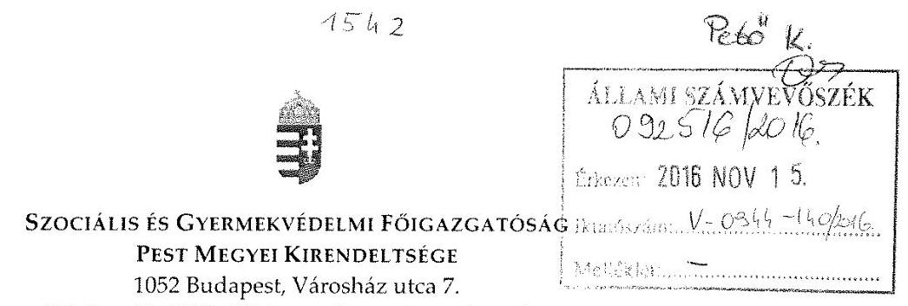

Iktatószám: PMK-1648-4/2016.

Tárgy: Ferenczy Múzeum - észrevétel az ÁSZ ellenőrzési jelentéstervezetére Hivatkozási szám: V-0944-132/2016. Melléklet: elektronikus és postai úton keriil megküldésre

# Domokos László úr 

elnök

Állami Számvevőszék
Budapest
Apáczai Csere János u. 10
1052

## Tisztelt Elnök Úr!

Hivatkozással a V-0944-132/2016. iktatószámú, a Ferenczy Múzeum vonatkozásában a „Megyei hatókörü városi múzeumok ellenörzése - Ferenczy Múzeum" címú ellenőrzés során készült jelentéstervezetre, Bátori Zsolt főigazgató úr meghatalmazása alapján az alábbi észrevételt teszem.

Az 5.1. számú megállapítás szerint „Az eszközök és források nyilvántartása a 2011. évben megfelelt, a 2012-2014. közötti időszakban nem felelt meg a jogszabályi előírásoknak".

A megyei önkormányzatok konszolidációjáról, a megyei önkormányzati intézmények és a Fövárosi Önkormányzat egyes egészségügyi intézményeinek átvételéről szóló 2011. évi CLIV. törvény (a továbbiakban: MÖK tv.) 3. § (2) bekezdése, a nemzeti vagyonról szóló 2011. évi CXCVI. törvény 11. § (7) bekezdésének, valamint az állami vagyonnal való gazdálkodásról szóló 254/2007. (X.4.) Korm. rendelet 8. §. (6) bekezdésének megfelelően a Vagyonkezelő - annak érdekében, hogy a vagyonkezelői jogát gyakorolhassa köteles a Nemzeti Vagyonkezelő Zártkörűen Müködő Részvénytársasággal (továbbiakban: MNV Zrt.) vagyonkezelési szerződést kötni.
Az MNV Zrt. és a vagyonkezelő Pest Megyei Intézményfenntartó Központ (továbbiakban: PMIK) között a vagyonkezelési szerződés záradékolására 2012.

---

november 20. napján, a PMIK és Szentendre Város Önkormányzata között az átadásátvételi megállapodás aláírására 2012. december 14. napján került sor, ezáltal a PMIK-nek, mint fenntartónak a vagyon átvezetésére a 2012. év vonatkozásában idő hiányában lehetősége nem volt.

Segítő együttműködését köszönöm.
Budapest, 2016. november 11.
Tisztelettel:
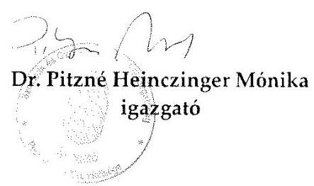

---

# Szociális és GyermekvédeLmi FőigazgatósáG FŐIGAZGATÓ 

1132 Budapest, Visegrádi u. 49.
Telefon: (06 1) 412-9742, e-mail cím: titkarsag@szgyf.gov.hu

## MEGHATALMAZÁs

A megyei intézményfenntartó központokról, valamint a megyei önkormányzatok konszolidációjával, a megyei önkormányzati intézmények és a Fővárosi Önkormányzat egészségügyi intézményeinek átvételével összefüggő egyes kormányrendeletek módosításáról szóló 258/2011. (XII.7.) Korm. rendelet 18. § (2) bekezdése szerint a megyei intézményfenntartó központok 2013. március 31. napján a Szociális és Gyermekvédelmi Főigazgatóságba történt beolvadással megszűntek. A Szociális és Gyermekvédelmi Főigazgatóság ugyanezen jogszabályhely szerint a megyei intézményfenntartó központok általános és egyetemleges jogutódja.

Alulírott Bátori Zsolt, a Szociális és Gyermekvédelmi Főigazgatóság (1132 Budapest, Visegrádi út 49., adószáma: 15802107-2-41, statisztikai számjele: 15802107-8412-312-01) főigazgatója a Szociális és Gyermekvédelmi Főigazgatóság nevében és képviseletében eljárva
meghatalmazom
dr. Pitzné Heinczinger Mónikát, a Szociális és Gyermekvédelmi Főigazgatóság Pest Megyei Kirendeltségének (cím: 1052 Budapest, Városház u. 7.) igazgatóját, hogy az Állami Számvevőszék „Megyei hatáskörü városi múzeumok ellenörzése" vizsgálatában a Ferenczy Múzeum vonatkozásában helyettem és nevemben eljárjon. A meghatalmazás a vizsgálathoz kapcsolódó adatszolgáltatásra és a szükséges nyilatkozatok aláirására terjed ki, és a vizsgálat lezárultáig tart.

Budapest, 2015. október 28.
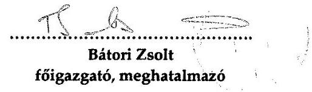

A meghatalmazást elfogadom:
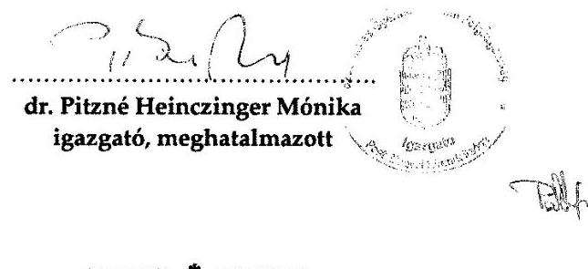

---

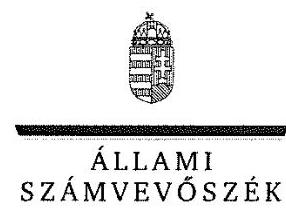

ELNÖK

# Bátori Zsolt úr 

föigazgató
Szociális és Gyermekvédelmi Főigazgatóság

## Budapest

## Tisztelt Föigazgató Úr!

A „Megyei hatókörü városi múzeumok ellenörzése - Ferenczy Múzeum, Szentendre" címmel készített számvevőszéki jelentéstervezetre tett észrevételét köszönettel megkaptam.
Az Állami Számvevőszék észrevételre vonatkozó álláspontjáról a felügyeleti vezető által készített részletes tájékoztatást csatoltan megküldöm.
Tájékoztatom Főigazgató urat, hogy a számvevőszéki jelentésben - az Állami Számvevőszékről szóló 2011. évi LXVI. törvény 29. § (3) bekezdése alapján - a figyelembe nem vett észrevételeket szerepeltetjük az elutasítás indokának feltüntetésével.

Budapest, 2016. 17 hó 22 nap
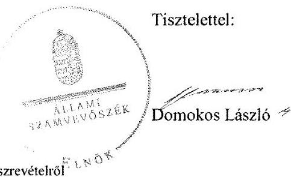

Melléklet: Tájékoztatás az el nem fogadott észrevételról

---

# Tájékoztatás az el nem fogadott észrevételről 

A „Megyei hatókörü városi múzeumok ellenörzése - Ferenczy Múzeum, Szentendre "címủ jelentéstervezetre a PMK-1648-4/2016. iktatószámú levelében tett észrevételeit áttekintettük, annak kezeléséről az alábbi tájékoztatást adom.

## 1. A jelentéstervezet 29. oldal 5.1. számú megállapítására, valamint az 5.1. számú megállapítás ötödik bekezdésének 3., 4. mondatára tett észrevétele kapcsán

Észrevételében arról tájékoztatott, hogy - a megyei önkormányzatok konszolidációjáról, a megyei önkormányzati intézmények és a Fővárosi Önkormányzat egyes egészségügyi intézményeinek átvételéről szóló 2011 évi CLIV. törvény 3. § (2) bekezdése, a nemzeti vagyonról szóló 2011. évi CXCVl. törvény 11. § (7) bekezdésének, valamint az állami vagyonnal való gazdálkodásról szóló 254/2007. (X. 4.) Korm. rendelet 8. §. (6) bekezdésének megfelelően - a vagyonkezelő annak érdekében, hogy a vagyonkezelői jogát gyakorolhassa, köteles a Nemzeti Vagyonkezelő Zártkörűen Müködő Részvénytársasággal (továbbiakban: MNV Zrt.-vel) vagyonkezelési szerződést kötni. Az MNV Zrt. és a vagyonkezelő Pest Megyei Intézményfenntartó Központ (továbbiakban: PMIK) között a vagyonkezelési szerződés záradékolására 2012. november 20án, a PMIK és Szentendre Város Önkormányzata között az átadás-átvételi megállapodás aláírására 2012. december 14-én, ezáltal a PMIK-nek, mint fenntartónak a vagyon átvezetésére a 2012. év vonatkozásában idő hiányában lehetősége nem volt.
Észrevétele az ellenőrzött időszakban megállapított hiányosságot nem cáfolja, hogy az eszközök és források nyilvántartása a 2011. évben megfelelt, a 2012-2014. közötti időszakban nem felelt meg a jogszabályi előírásoknak, továbbá Múzeum 2012. évi beszámolójának mérlegében kimutatott állami vagyon értéke teljes egészében az államháztartás szervezetei beszámolási és könyvvezetési kötelezettségének sajátosságairól szóló 249/2000. (XII. 24.) Korm. rendelet 5. § 10. pontja szerinti jelentős összegű hibát eredményezett, és a beszámoló mérlege a vagyon és annak összetétele vonatkozásában a megbízható és valós összképet nem mutatta be.
Észrevétele ezért a megállapítást nem módosítja.
Budapest, 2016.
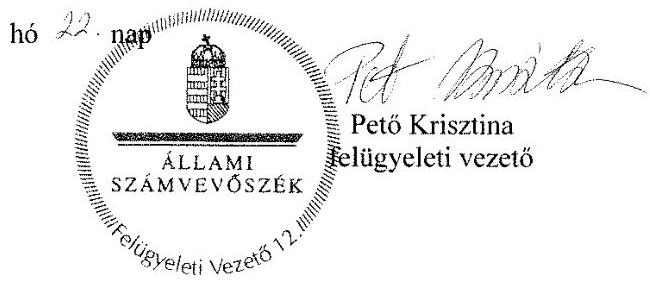

---

# RÖVIDÍTÉSEK JEGYZÉKE 

${ }^{1}$ Múzeum

${ }^{2}$ ÁSZ
${ }^{3} \mathrm{Mtv}$.
${ }^{4}$ Kötv.
${ }^{5}$ Kjt.
${ }^{6}$ múzeumigazgató
${ }^{7}$ Möktv.
${ }^{8}$ 258/2011. (XII. 7.) Korm. rendelet
${ }^{9}$ 1311/2012. (VIII.23.) Korm. határozat
${ }^{10}$ 2012. évi CLII. tv.
${ }^{11}$ Megyei Önkormányzat
${ }^{12}$ Közgyűlés
${ }^{13}$ PMIK
${ }^{14}$ KIM
${ }^{15}$ Önkormányzat
${ }^{16}$ Képviselő-testület
${ }^{17}$ 2015. évi LXXV. tv.
${ }^{18} \mathrm{Nvtv}$.
${ }^{19}$ Alaptörvény
${ }^{20}$ Áht. 3
${ }^{21}$ Ávr.
${ }^{22}$ Möktv.
${ }^{23}$ irányító szerv $_{1-3}$
irányító szerv $_{1}$

Pest Megyei Múzeumok Igazgatósága (2011. január 1. - 2012. december 31. közötti időszakban)
Ferenczy Múzeum (2013. január 1. - 2014. december 31. közötti időszakban)
Állami Számvevőszék
1997. évi CXL. törvény a muzeális intézményekről, a nyilvános könyvtári ellátásról és a közművelődésről (hatályos 1998. január 1-jétől)
2001. évi LXIV. törvény a kulturális örökség védelméről (hatályos 2001. július 1től)
1992. évi XXXIII. törvény a közalkalmazottak jogállásáról (hatályos 1992. július 1jétől)
Ferenczy Múzeum, valamint a jogelőd Pest Megyei Múzeumok Igazgatóságának igazgatója
2011. évi CLIV. törvény a megyei önkormányzatok konszolidációjáról, a megyei önkormányzati intézmények és a Fővárosi Önkormányzat egyes egészségügyi intézményeinek átvételéről (hatályos 2012. január 1-jétől)
258/2011. (XII. 7.) Korm. rendelet a megyei intézményfenntartó központokról, valamint a megyei önkormányzatok konszolidációjával, a megyei önkormányzati intézmények és a Fővárosi Önkormányzat egészségügyi intézményeinek átvételével összefüggő egyes kormányrendeletek módosításáról (hatályos 2011. december 8-tól)
1311/2012. (VIII. 23.) Korm. határozat a megyei múzeumok, könyvtárak és közművelődési intézmények fenntartásáról
2012. évi CLII. törvény a muzeális intézményekről, a nyilvános könyvtári ellátásról és a közművelődésről szóló 1997. évi CXL. törvény módosításáról
Pest Megye Önkormányzata
Pest Megyei Önkormányzat Közgyűlése
Pest Megyei Intézményfenntartó Központ
Közigazgatási és Igazságügyi Minisztérium
Szentendre Város Önkormányzata
Szentendre Város Önkormányzatának Képviselő-testülete
a megyei könyvtárak és a megyei hatókörű városi múzeumok feladatának ellátását szolgáló egyes állami tulajdonú vagyontárgyak ingyenes önkormányzati tulajdonba adásáról szóló 2015. évi LXXV. törvény (hatályos 2015. július 18-tól) 2011. évi CXCVI. törvény a nemzeti vagyonról (hatályos 2011. december 31-étől) Magyarország Alaptörvénye (hatályos 2011. április 25-től)
2011. évi CXCV. törvény az államháztartásról (hatályos 2012. január 1-jétől) 368/2011. (XII. 31.) Korm. rendelet az államháztartásról szóló törvény végrehajtásáról (hatályos 2012. január 1-jétől)
2011. évi CLIV. törvény a megyei önkormányzatok konszolidációjáról, a megyei önkormányzati intézmények és a Fővárosi Önkormányzat egyes egészségügyi intézményeinek átvételéről (hatályos 2011. november 25-től)

Pest Megye Önkormányzatának Közgyűlése (2011. január 1-jétől-2011. december 31-ig)

---

irányító szerv $_{2}$
irányító szerv $_{3}$
${ }^{24}$ Ámr.
${ }_{25}$ alapító okirat $_{1-9}$
alapító okirat $_{1}$
alapító okirat $_{2}$
alapító okirat $_{3}$
alapító okirat $_{4}$
alapító okirat $_{5}$
alapító okirat $_{6}$
alapító okirat $_{7}$
alapító okirat $_{8}$
alapító okirat $_{9}$
${ }^{26}$ Áht. $1_{1}$
${ }^{27}$ EMMI
${ }^{28}$ középirányító szerv
${ }^{29}$ Mötv.
${ }^{30}$ Ötv.
${ }^{31}$ KIM Utasítás
${ }^{32} \mathrm{SzMSz}_{1}$
${ }^{33} \mathrm{SzMSz}_{2-3}$
SzMSz $_{2}$
SzMSz $_{3}$
${ }^{34}$ 2/2010. (I. 14.) OKM rendelet
${ }^{35}$ Központvezetői Utasítás
${ }^{36}$ Megállapodás $_{1}$
a Közigazgatási és Igazságügyi Minisztérium(2012. január 1-től-2012. december 31-ig)
Szentendre Város Önkormányzatának Képviselő-testülete (2013. január 1-től2014. december 31-ig)
az államháztartás múködési rendjéről szóló 292/2009. (XI. 19.) Korm. rendelet (hatálytalan 2012. január 1-jétől)

Pest Megyei Múzeumok Igazgatósága alapító okirata (hatályos 2010. október 29-től - 2011. április 28-ig)
Pest Megyei Múzeumok Igazgatósága alapító okirata (hatályos 2011. április 29-től - 2012. július 11-ig)
Pest Megyei Múzeumok Igazgatósága alapító okirata (hatályos:2012. július 12-től - 2013. január 1-jéig)

Ferenczy Múzeum alapító okirata (hatályos 2013. január 1-jétől - 2013. március 31-ig)
Ferenczy Múzeum alapító okirata (hatályos 2013. április 1-jétől - 2013. április 30-ig)
Ferenczy Múzeum alapító okirata (hatályos 2013. május 1-jétől- 2014. január 29-ig)
Ferenczy Múzeum alapító okirata (hatályos 2014. január 30-tól - 2014. április 16-ig)
Ferenczy Múzeum alapító okirata (hatályos 2014. április 17-étől - 2014. május 15-ig)
Ferenczy Múzeum alapító okirata (hatályos 2014. május 16-tól)
1992. évi XXXVIII. törvény az államháztartásról (hatálytalan 2012. január 1-jétől)

Emberi Erőforrások Minisztériuma
Pest Megyei Intézményfenntartó Központ (2012. január 1-jétől - 2012. december 31-ig)
2011. évi CLXXXIX. törvény Magyarország helyi önkormányzatairól (hatályos 2012. január 1-jétől)
1990. évi LXV. törvény a helyi önkormányzatokról (hatálytalan 2014. október 12től)
78/2011. (XII. 30.) KIM utasítás a Megyei Intézményfenntartó Központok ideiglenes Szervezeti és Múködési Szabályzatáról
Pest Megyei Múzeumok Igazgatósága Szervezeti és Működési Szabályzata (hatályos 2010. június 1-jétől - 2014. március 11-ig)

Ferenczy Múzeum Szervezeti és Múködési Szabályzata (hatályos 2014. március 12-től - 2014. október 1-jéig)
Ferenczy Múzeum Szervezeti és Múködési Szabályzata (hatályos 2014. október 1-jétől)
2/2010. (I. 14.) OKM rendelet a muzeális intézmények múködési engedélyéről 24/2012. (VII. 18.) számú Központvezetői Utasítás a Pest Megyei Intézményfenntartó Központ gazdálkodási keretszabályainak kialakításáról
Pest Megyei Önkormányzat, a Kormánymegbízott, mint 2012. január 1-jével létrehozásra kerülő Pest Megyei Intézményfenntartó Központ képviselője által 2011 decemberében megkötött Átadás-átvételi megállapodás, amelyet aláírt 2012. május 31-én az MNV Zrt. vezérigazgatója, valamint 2012. július 10-én az NFA szervezet elnöke
Pest Megyei Kormánymegbízott

---

${ }^{38}$ MNV Zrt.
${ }^{39}$ NFA
${ }^{40}$ vagyonkezelési szerződés ${ }_{1}$
${ }^{41}$ fenntartó ${ }_{1}$
${ }^{42}$ 1094/2012. (IV. 3.) Korm. határozat
${ }^{43}$ Kincstár
${ }^{44}$ Áhsz $_{1}$
${ }^{45}$ Megállapodás ${ }_{2}$
${ }^{46}$ települési önkormányzatok
${ }^{47}$ megállapodás ${ }_{3}$-ok
${ }^{48}$ jegyzőkönyv $_{1}$-ek
${ }^{49}$ képviselő-testületek döntései
${ }^{50}$ 359/2012. (XI. 22.) Kt. számú határozat
${ }^{51}$ képviselő-testületek újbóli döntései
${ }^{52}$ jegyzőkönyv $_{2}$-ek
${ }^{53}$ Számv. tv.
${ }^{54}$ Áhsz $_{2}$
${ }^{55}$ értékelési szabályzat
${ }^{56} \mathrm{Kbt} .{ }_{1}$
${ }^{57} \mathrm{Kbt} .{ }_{2}$
${ }^{58}$ közbeszerzési szabályzat

Magyar Nemzeti Vagyonkezelő Zártkörűen Működő Részvénytársaság (a Vtv. 23. § (1) alapján az állami vagyonnal tulajdonosi joggyakorlóként maga gazdálkodik)
Nemzeti Földalapkezelő Szervezet
az SZT-38596 számú, az MNV Zrt. részéről 2012. október 30-án, a Pest Megyei Intézményfenntartó központ és a kormánymegbízott által november 5-én aláírt, valamint a KIM részéről 2012. november 20-án záradékolt Vagyonkezelési szerződés
Pest Megye Önkormányzata
1094/2012. (IV. 3.) Korm. határozat a megyei múzeumok, könyvtárak és közművelődési intézmények további fenntartásáról, valamint a települési önkormányzatok kötelező kulturális feladatairól
Magyar Államkincstár
249/2000. (XII. 24.) Korm. rendelet az államháztartás szervezetei beszámolási és könyvvezetési kötelezettségének sajátosságairól (hatálytalan 2014. január 1-jétől)
Szentendre Város Önkormányzata a Pest Megyei Intézményfenntartó Központ, valamint az Emberi Erőforrások Minisztériuma által 2012. december 14-én aláírt Megállapodás fenntartói jog, illetve kötelezettség átadás-átvételről
Aszód, Cegléd, Nagykőrös, Ráckeve, Szob, Tápiószele, Vác, Verőce, Zebegény
Pest Megyei Intézményfenntartó Központ és Aszód, Cegléd, Nagykőrös, Ráckeve, Szob, Tápiószele, Vác, Verőce, Zebegény települési önkormányzatok között 2015. december 15-én megkötött Megállapodások fenntartói jog, illetve kötelezettség átadás-átvételéről
Pest Megyei Intézményfenntartó Központ Aszód, Cegléd, Nagykőrös, Ráckeve, Szob, Tápiószele, Vác, Verőce, Zebegény települési önkormányzatok között 2013 januárjában aláírt Átadás-étvételi jegyzőkönyvek.
Tápiószele Város Önkormányzatának Képviselő-testülete 126/2012 (X. 4.) számú, Verőce Község Önkormányzatának Képviselő-testülete 174/2012. (XII. 19.) számú, Zebegény Község Önkormányzatának Képviselő-testülete 145/2012. (X. 25.) számú határozata

1. pontjában Szentendre Város Önkormányzatának Képviselő-testülete döntött, hogy 2013. január elsejétől fenntartásba kerülő a Ferenczy Múzeum tagintézményeként kívánja működtetni a Blaskovich Múzeumot (Tápiószele Múzeum út 13.) a Gorka Kerámia Kiállítást (Verőcze, Szamos utca 22.), és a Szőnyi István Emlékmúzeumot (Zebegény, Bartóky József u. 7.)
Tápiószele Város Önkormányzatának Képviselő-testülete 50/2013 (III. 14.) számú, Verőce Község Önkormányzatának Képviselő-testülete 59/2013. (IV. 16.) számú, Zebegény Község Önkormányzatának Képviselő-testülete 57/2013. (III. 28.) számú határozata
Szentendre Város Önkormányzata és Tápiószele Város Önkormányzat között 2013 januárjában, Verőce Község Önkormányzata és Zebegény Község Önkormányzata között 2013. január 10-én aláírt Átadás-átvételi jegyzőkönyv 2000. évi C. törvény a számvitelről
az államháztartás számviteléről szóló 4/2013. (I. 11.) Korm. rendelet (hatályos 2014. január 1-jétől)

Pest Megyei Múzeumok Igazgatósága értékelési szabályzata
2003. évi CXXIX. törvény a közbeszerzésekről (hatályos 2011. december 31-ig) 2011. évi CVIII. törvény a közbeszerzésekről (hatályos 2011. augusztus 21-től)

Pest Megyei Múzeumok Igazgatósága közbeszerzési szabályzata (hatályos 2011. február 1-jétől)

---

${ }^{59}$ Bkr.
${ }^{60}$ Vnytv.
${ }^{61}$ vagyonnyilatkozatok kezelési szabályzat
${ }^{62}$ Avtv.
${ }^{63}$ Info. tv.
${ }^{64}$ Belső kontroll kézikönyv
${ }^{65}$ Ber.
${ }^{66} \mathrm{Vtv}$.
${ }^{67}$ önköltségszámítási szabályzat
${ }^{68}$ számviteli politika2
${ }^{69}$ 393/2012. (XII. 20.) Korm rendelet
${ }^{70}$ Forster Központ
${ }^{71}$ BM közlemény ${ }_{1,2}$
${ }^{72}$ 5/2010. (VIII. 18.) NEFMI rendelet
${ }^{73}$ pénzkezelési szabályzat ${ }_{1,2}$
${ }^{74}$ számviteli politika 1
${ }^{75}$ leltározási szabályzat ${ }_{1,2}$
${ }^{76}$ 20/2002. (X. 4.) NKÖM rendelet
${ }^{77}$ nyilvántartási szabályzat
${ }^{78}$ vagyongazdálkodási rendelet
${ }^{79}$ vagyonkezelési szerződés ${ }_{2}$

370/2011. (XII. 31.) Korm. rendelet a költségvetési szervek belső kontrollrendszeréről és belső ellenőrzésről (hatályos 2012. január 1-jétől)
2007. évi CLII. törvény az egyes vagyonnyilatkozat-tételi kötelezettségekről 8/2013.számú szabályzat Ferenczy Múzeum vagyonnyilatkozatok kezelésének szabályzata (hatályos 2013 június 1-jétől)
1992. évi LXIII. törvény a személyes adatok védelméről és a közérdekű adatok nyilvánosságáról (hatálytalan 2012. január 1-jétől)
2011. évi CXII. törvény az információs önrendelkezési jogról és az információszabadságról (hatályos 2012. január 1-jétől)
Pest Megyei Múzeumok Igazgatósága Belső kontrollrendszer (hatályos 2011. június 11-től-2013. április 30-ig.)

5/2013. számú szabályzat Ferenczy Múzeum Belső kontroll kézikönyve (hatályos 2013. május 1-jétől)

193/2003. (XI. 26.) Korm. rendelet a költségvetési szervek belső ellenőrzéséről (hatálytalan 2012. január 1-jétől)
2007. évi CVI. törvény az állami vagyonról
a Múzeum önköltségszámítási szabályzata
10/2013. számú szabályzat Ferenczy Múzeum számviteli politikája (hatályos 2013. június 1-jétől)

393/2012. (XII. 20.) Korm. rendelet a régészeti örökség és a műemléki érték védelmével kapcsolatos szabályokról (hatályos 2013. január 1-jétől)
Forster Gyula Nemzeti Örökségvédelmi és Vagyongazdálkodási Központ
a Belügyminisztérium 2013. március 25-ei, illetve 2014. február 21-ei
közleménye a nagyberuházás vagy kisajátítás esetén folytatott régészeti feltárás tervezési és egyéb szakmai szempontjairól
a régészeti lelőhelyek feltárásának, illetve a régészeti lelőhely, lelet megtalálója anyagi elismerésének részletes szabályairól szóló NEFMI rendelet (hatálytalan 2013. január 1-jétől)

Pest Megyei Múzeumok Igazgatósága pénzkezelési szabályzata (hatályos 2014. augusztus 31-ig)
Ferenczy Múzeum 11/2014. számú pénzkezelési szabályzata (hatályos 2014. szeptember 1-jétől)
Pest Megyei Múzeumok Igazgatóságának számviteli politika, számlarend a mérlegben szereplő adatok értékelése (hatályos 2013. május 31-ig)

Pest Megyei Múzeumok Igazgatósága szervezeti és működési szabályzatának 35. függeléke a leltározás rendjéről (hatályos 2014. május 14-ig)
7/2014. számú szabályzat a Ferenczy Múzeum leltározás és leltárkészítési szabályzata (hatályos 2014. május 15-től)
20/2002. (X. 4.) NKÖM rendelet a muzeális intézmények nyilvántartási szabályzatáról
Pest Megyei Múzeumok Igazgatósága Nyilvántartási Szabályzat (hatályos 2004. szeptember 15-től)
Pest Megye Közgyűlésének 11/2003. (VI. 20.) számú rendelete az önkormányzat vagyonáról a vagyongazdálkodás szabályairól (hatályos 2003. július 1-jétől)
a 2211 hrsz-ú „Művészetmalom" ingatlanra Szentendre Város Önkormányzata és a Múzeum részéről 2011. december 22-én aláírt Vagyonkezelési szerződés

---

${ }^{80}$ Vtvr.
${ }^{81}$ selejtezési szabályzat
${ }^{82}$ 36/2013. (IX. 13.) NGM rendelet
${ }^{83}$ 29/2014. (IV. 10.) EMMI rendelet
254/2007. (X. 4.) Korm. rendelet az állami vagyonnal való gazdálkodásról (hatályos: 2007. október 4-től)
Pest Megyei Múzeumok Igazgatósága szervezeti és működési szabályzatának 15. számú függeléke a feleslegessé vált vagyontárgyak selejtezési és hasznosítási rendjéről (hatályos 2014. május 15-ig)
36/2013. (IX. 13.) NGM rendelet az államháztartás számvitelének 2014. évi megváltozásával kapcsolatos feladatokról
29/2014. (IV. 10.) EMMI rendelet a muzeális intézményekben őrzött kulturális javak kölcsönzéséről, valamint a kijelölési eljárásról (hatályos 2014. május 10-től)

---

# ÁLLAMI SZÁMVEVŐSZÉK 

1052 Budapest, Apáczai Csere János utca 10.
Levélcím: 1364 Budapest 4. Pf. 54
Telefon: +36 14849100 Telefax: +36 14849200
www.asz.hu