# Jelentés 

## Az önkormányzatok gazdasági társaságai

Az önkormányzatok többségi tulajdonában lévő gazdasági társaságok gazdálkodásának ellenőrzése - TETTYE FORRÁSHÁZ Pécsi Városi Víziközmú Üzemeltetési Zrt.
2016.

---

# J elentés 

## Az önkormányzatok gazdasági társaságai

Az önkormányzatok többségi tulajdonában lévő gazdasági társaságok gazdálkodásának ellenőrzése - TETTYE FORRÁSHÁZ Pécsi Városi Víziközmú Üzemeltetési Zrt.
2016. 11. hó 22. nap
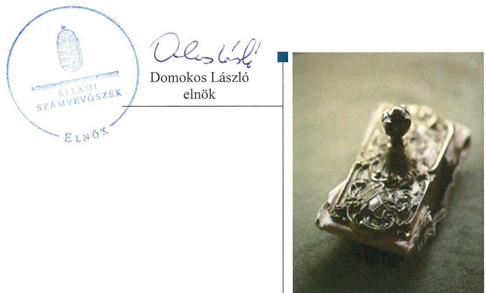

---

Jelentéseink az Országgyúlés számítógépes hálózatán és az Interneten a www.asz.hu címen is olvashatóak.

## AZ ELLENŐRZÉST FELÜGYELTE:

MAKKAI MÁRIA felügyeleti vezető

## AZ ELLENŐRZÉST VEZETTE ÉS A VÉGREHAJTÁSÁÉRT FELELŐS:

VALASTYÁNNÉ DR. VÍZHÁNYÓ JÚLIA ellenőrzésvezető

## A PROGRAM ÖSSZEÁLLÍTÁSÁÉRT FELELŐS:

JANIK JÓZSEF osztályvezető

## A TÉMÁHOZ KAPCSOLÓDÓ KORÁBBI SZÁMVEVŐSZÉKI JELENTÉSEK:

- címe:

Jelentés Az önkormányzatok gazdasági társaságai Az önkormányzatok többségi tulajdonában lévő gazdasági társaságok közfeladat ellátását érintő gazdálkodási tevékenysége szabályszerűségének ellenőrzése - PÉTÁV Pécsi Távfütő Korlátolt Felelősségű Társaság

- sorszáma: $\quad 15058$
- címe: $\quad$ Jelentés Az önkormányzatok gazdasági társaságai Az önkormányzatok többségi tulajdonában lévő gazdasági társaságok közfeladat ellátását érintő gazdálkodási tevékenysége szabályszerűségének ellenőrzése - BIOKOM Pécsi Városüzemeltetési és Környezetgazdálkodási Kft.
- sorszáma: $\quad 15020$

IKTATÓSZÁM: V-1091-151/2016.
TÉMASZÁM: 2125
ELLENŐRZÉS-AZONOSÍTÓ SZÁM: V070755

---

# TARTALOMJEGYZÉK 

■ ÖSSZEGZÉS ..... 5
■ AZ ELLENŐRZÉS CÉLJA ..... 6
■ AZ ELLENŐRZÉS TERÜLETE ..... 7
■ AZ ELLENŐRZÉS HÁTTERE, INDOKOLTSÁGA ..... 9
■ FÓKUSZKÉRDÉSEK ..... 10
■ ELLENŐRZÉS HATÓKÖRE ÉS MÓDSZEREI ..... 11
■ MEGÁLLAPÍTÁSOK ..... 13
■ JAVASLATOK ..... 25
■ MELLÉKLETEK ..... 27
I. Sz. melléklet: Értelmező szótár ..... 27
II. Sz. melléklet: A múködés főbb jellemzői. ..... 30
■ FÜGGELÉK: ÉSZREVÉTELEK ..... 31
■ RÖVIDÍTÉSEK JEGYZÉKE ..... 39

---

.

---

# ÖSSZEGZÉS 

Az Állami Számvevőszék a Tettye Forrásház Pécsi Városi Víziközmú Üzemeltetési Zrt. ellenőrzése során megállapította, hogy a tulajdonosi joggyakorlás szabályszerű volt. A Tettye Forrásház Zrt. vagyongazdálkodása megfelelő volt. Az ivóvízellátás és szennyvízkezelés közfeladat bevételeinek és ráfordításainak elszámolása megfelelő volt. A Társaság a jogszabályoknak és belső előirásoknak megfelelően végezte az önköltségszámítást és alakította ki az árait.

## Az ellenőrzés társadalmi indokoltsága

Az Állami Számvevőszék kiemelt célja, hogy a helyi önkormányzatok gazdálkodásában rejlő pénzügyi kockázatok feltárásával, az államháztartáson kívülre nyújtott költségvetési támogatások és ingyenes vagyonjuttatások, valamint az államháztartáson kívül múködő feladat-ellátó rendszerek ellenőrzéseivel hozzájáruljon ahhoz, hogy a közpénzeket az államháztartáson kívül múködő szervezetek is átlátható, rendezett módon használják fel.

Magyarországon az intézmény-centrikus közfeladat-ellátás jellemző, de egyre jelentősebb a költségvetésen kívüli feladatellátás térnyerése. Ennek legfontosabb szereplői - a nonprofit szervezetek mellett - az önkormányzati tulajdonú gazdasági társaságok. Az önkormányzatok szervezetalakítási szabadságának következménye, hogy a korábban is vállalati formában múködő közszolgáltatások mellett, mind a kötelező, mind az önként vállalt feladatok ellátásában a gazdasági társaságok kiemelt fontosságú szerephez jutottak. Az ellenőrzés lehetőséget biztosít annak bemutatására, hogy a közszolgáltatás visszavétele, és a Tettye Forrásház Zrt. megbízása annak ellátására, biztosította-e a közfeladat megfelelő ellátását.

## Főbb megállapítások, következtetések, javaslatok

Pécs Megyei Jogú Város Önkormányzata, a Pécs Holding Városi Vagyonkezelő Zrt., valamint a Tettye Forrásház Zrt. az ellenőrzött időszakot megelőzően - 2009. október 1-jén üzemeltetési szerződést kötöttek a víziközmű szolgáltatás ellátására. Az üzemeltetésre átadott víziközmű vagyon részben az Önkormányzat, részben a Pécs Holding Városi Vagyonkezelő Zrt. tulajdonát képezte. A háromoldalú üzemeltetési szerződés célja, a folyamatos ivóvíz-szolgáltatás, a szennyvízelvezetés és - tisztítás szolgáltatás biztosítása Pécs Megyei Jogú Város, továbbá 18 környező település területén.

Az Önkormányzat az ellenőrzött időszakban a közfeladat-ellátásának feltételeit biztosította, szabályszerűen gondoskodott a közfeladat-ellátás megszervezéséről. Az Önkormányzat a tulajdonosi joggyakorlása során szabályszerűen járt el. A Társaság a javadalmazási szabályzat kivételével rendelkezett a múködéséhez szükséges szabályzatokkal. A Társaság vagyongazdálkodása megfelelő volt. A Tettye Forrásház Zrt. kötelezettségeinek állománya a múködést és a közfeladat ellátást nem veszélyeztette. A Társaság az előírt beszámolási és adatszolgáltatási kötelezettségeit teljesítette. A Tettye Forrásház Zrt. által ellátott közfeladat bevételeinek és ráfordításainak elszámolása megfelelő volt. Az önköltségszámítás és az árképzés szabályszerű volt.

---

# AZ ELLENŐRZÉS CÉLJA 

## Az önkormányzatok gazdasági társaságai - Az önkormányzatok tulajdonában lévő gazdasági társaságok gazdálkodásának ellenőrzése - Tettye Forrásház Pécsi Városi Víziközmú Üzemeltetési Zrt.

Az ellenőrzés célja annak értékelése volt, hogy az Önkormányzat vagyongazdálkodási tevékenysége során szabályszerűen gyakorolta-e tulajdonosi jogait; a gazdasági társaság szabályozottsága, gazdálkodása és vagyongazdálkodási tevékenysége, bevételeinek és ráfordításainak elszámolása megfelelt-e a jogszabályi és tulajdonosi előírásoknak; a gazdasági társaság kötelezettségállománya jelent-e kockázatot a múködésre, valamint a gazdálkodás átláthatósága és elszámoltathatósága érdekében biztosítva volt-e a szolgáltatás dijának megalapozottsága szabályszerű önköltségszámítással.

---

# AZ ELLENŐRZÉS TERÜLETE 

## Pécs Megyei Jogú Város Önkormányzata és a többségi tulajdonában álló Tettye Forrásház Pécsi Városi Víziközmú Üzemeltetési Zrt.

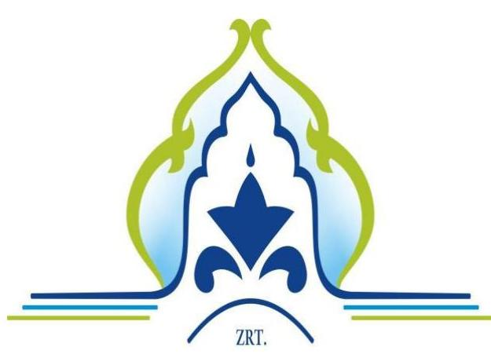

## TETTYE FORRÁSHÁZ

PÉCS MEGYEI JOGÚ VÁROS ÖNKORMÁNYZATA ${ }^{1}$ a Tettye Forrásház Zrt. ${ }^{2}$-t 2009. október 1. napján határozatlan időre, jogelőd nélkül, egyedüli részvényesként hozta létre 5,0 M Ft jegyzett tőkével. 2011. június 3-án a Tettye Forrásház Zrt. többszemélyessé vált, mivel 14 környező település önkormányzata 1-1 db 10 E Ft névértékú „B" osztályú részvényt jegyzett. A 14 település: Aranyosgadány, Bakonya, Bicsérd, Boda, Cserkút, Gyód, Keszü, Kökény, Kővágószőlős, Kővágótöttös, Pellérd, Turony, Zók községek és Kozármisleny Város Önkormányzata. 2011. október 14-én további 110000 db 1 Ft névértékú részvényt bocsátottak ki alaptőke emelés címén, amiből a 14 környező önkormányzat egyenlő arányban részesedett. A Tettye Forrásház Zrt. Közgyűlésének ${ }^{3}$ határozata; ${ }^{4}$ alapján, a Tettye Forrásház Zrt. részvényesi körét tovább bővítette Bogád, Nagykozár, Romonya és Szalánta községek önkormányzataival. Így az Önkormányzaton kívül a Tettye Forrásház Zrt.-nek további 18 kisebbségi részvényese volt. Az Önkormányzat tulajdoni hányada 2014. évben 99,944 \%-volt.

A TETTYE FORRÁSHÁZ ZRT. fő tevékenysége az Alapító ok-irata ${ }^{5}$ szerint víztermelés,- kezelés,- ellátás. A Tettye Forrásház Zrt. jegyzett tőkéjét 2011. január 1-je és 2014. december 31. között 444,0 M Ft-tal emelték, így az 510,0 M Ft-ra változott. A Tettye Forrásház Zrt. vagyona 2011. január 1. és 2014. december 31. között 2576,0 M Ft-tal emelkedett, mérleg főösszege az ellenőrzött időszak végén összesen 5328,9 M Ft-ot tett ki. 2014-ben az értékesítés nettó árbevétele 4954,6 M Ft, az üzemi tevékenység eredménye 54,3 M Ft, az adózott eredmény 14,0 M Ft volt. A Tettye Forrásház Zrt. a 2014. év végén három leányvállalattal rendelkezett, amelyek közül a Tettye Vízház Kft.-ben 100,00\%, a Sió-Víz Kft.-ben 48,99\%, míg a PKKE Egyesülésben 33,33\%-os tulajdoni hányadot birtokolt.

Az 1. ábra a Tettye Forrásház Zrt. egyes gazdálkodási adatait mutatja be a 2011. és 2014. évek összehasonlításában.

---

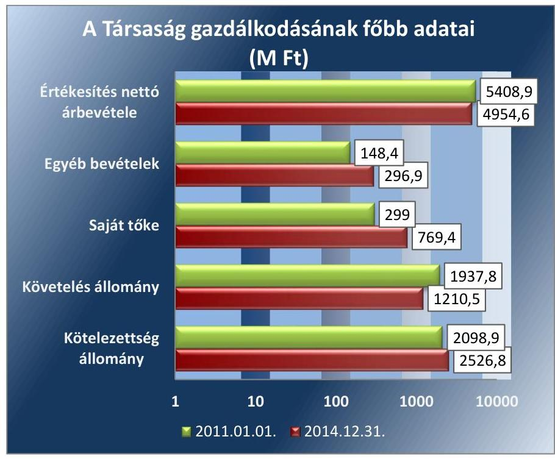

Forrás: A Tettye Forrásház Zrt. adatszolgáltatása alapján
Az ellenőrzött időszakban a polgármester ${ }^{6}$ személye nem, a jegyző ${ }^{7}$ személye egy alkalommal változott. A polgármester az 2010. évi önkormányzati választások óta tölti be tisztségét, a helyszíni ellenőrzés időszakában a munkakört betöltő jegyző 2011. május 1-jétől látja el feladatait. Az ellenőrzött időszakban a vezérigazgató személye nem változott, 2010. november 4-től töltötte be posztját. A gazdasági igazgató személye a 2011 2014. évi időszakban egy alkalommal változott.

A Társaság 2011. évben a 479/2009/EK rendelet ${ }^{8}$, 2012 - 2014. években pedig az Áht. ${ }^{9} 2 . \S$ (1) bekezdés I) pontja alapján nem minősült kormányzati szektorba sorolt egyéb szervezetnek.

---

# AZ ELLENŐRZÉS HÁTTERE, INDOKOLTSÁGA 

Objektív kép kialakítása a Pécs Megyei Jogú Város Önkormányzata által a víziközmú-szolgáltatás megszervezéséről, a többségi tulajdonában lévő Tettye Forrásház Zrt. gazdálkodási tevékenységének szabályszerűségről és a tulajdonosi joggyakorlásáról.

AZ ÖNKORMÁNYZATI TULAJDONÚ GAZDASÁGI TÁRSASÁGOK ellenőrzése kiemelten fontos a vagyon megőrzése, megóvása érdekében, valamint a kormányzati szektor elszámolásaiban megjelenő önkormányzati tulajdonú gazdálkodó szervezetek esetében, amelyekkel szemben alapvető követelmény, hogy gazdálkodásuk, müködésük szabályszerű, az általuk szolgáltatott adatok minél megbízhatóbbak legyenek. A közfeladat-ellátás költségeinek, ráfordításainak alakulása, színvonala hatással van a lakosság elégedettségére.

A TÖRVÉNYALKOTÁS SZÁMÁRA - az észlelt problémák, szabálytalanságok, vagy egyéb nem kívánatos jelenségek felszínre kerülésével - az ellenőrzés megállapításai segítséget nyújthatnak az államháztartáson kívüli közfeladat-ellátás értékeléséhez, jogszabályi keretei pontosításához, átláthatóságot biztosító szabályozásához. Meghatározhatóvá válnak az önkormányzati feladatellátásban részt vevő államháztartáson kívüli szervezeteknek - az önkormányzat költségvetését, pénzügyi helyzetét is befolyásoló - kockázatai, lehetővé válik ezen kockázatok csökkentése. Ellenőrzéseink feltárhatják, hogy az önkormányzat feladat-ellátási kötelezettségének szabályszerűen tett-e eleget, a feladatellátáshoz rendelt vagyonkezelésbe vett és saját vagyon müködtetését az elvárható gondossággal, szabályszerűen szervezte-e meg és a tulajdonosi felügyelete hozzájárult-e a feladatellátásához. Az ellenőrzés rávilágíthat arra, hogy a gazdasági társaság a feladat-ellátási, közszolgáltatási szerződésben foglaltak betartásával, a vagyon használatával biztosította-e a szolgáltatás folytatásának feltételeit, a feladat ellátását. Ezzel az ellenőrzöttek és a helyi döntéshozók számára visszajelzést ad feladatszervezési, feladat-ellátási kockázataikról, alapot ad a meglévő hibák megszüntetéséhez, a jobb feladatellátás biztosításához. Fokozza a fegyelmet, igazolja, hogy lejárt a következmények nélküli ellenőrzések idő-szaka. Az ÁSZ értékteremtő rend kialakításához és megőrzéséhez hozzájáruló tevékenysége pozitív hatással van a szervezetről kialakított összkép formálására.

---

# FÓKUSZKÉRDÉSEK 

1.     - Az önkormányzat által ellátott közfeladat megszervezése, valamint tulajdonosi joggyakorlása szabályszerű volt-e?
2.     - A gazdasági társaság vagyongazdálkodása szabályszerű volt-e, kötelezettségállománya jelentett-e kockázatot a müködésre, illetve a közfeladat ellátására?
3.     - A gazdasági társaságnál a közfeladat bevételei és ráfordításai elszámolása, valamint az önköltségszámítás és árképzés szabályszerű volt-e?

---

# ELLENŐRZÉS HATÓKÖRE ÉS MÓDSZEREI 

## Az ellenőrzés típusa

Megfelelőségi ellenőrzés

## Az ellenőrzött időszak

Az ellenőrzött időszak 2011. január 1-jétől 2014. december 31-ig.

## Az ellenőrzés tárgya

A gazdasági társaság feletti tulajdonosi joggyakorlás, valamint a gazdasági társaság gazdálkodásának szabályozottsága és szabályszerűsége.

Az ellenőrzés kiterjed minden olyan körülményre és adatra, amely az ÁSZ jogszabályban meghatározott feladatainak teljesítéséhez, valamint a program végrehajtása folyamán felmerült újabb összefüggések feltárásához szükséges.

## Az ellenőrzött szervezet

Az ellenőrzött szervezetek:
Pécs Megyei Jogú Város Önkormányzata
$\longrightarrow$ Tettye Forrásház Pécsi Városi Víziközmű Üzemeltetési Zrt.

## Az ellenőrzés jogalapja

Az ellenőrzés jogszabályi alapját az ÁSZ tv. 1. § (3) bekezdése és 5. § (3)-(4)-(5) bekezdései képezik.

## Az ellenőrzés módszerei

Az ellenőrzést a nemzetközi standardokat irányadónak tekintve az ellenőrzési program ellenőrzési kérdései, az ellenőrzött időszakban hatályos jogszabályok, az ellenőrzés szakmai szabályok és módszertanok figyelembevételével végeztük.

Az ellenőrzés ideje alatt az ellenőrzött szervezettel történő kapcsolattartást az ÁSZ Szervezeti és Múködési Szabályzatának vonatkozó előírásai alapján történt.

---

Az ellenőrzés a tulajdonosi jogokat gyakorló Pécs Megyei Jogú Város Önkormányzatára, és a Tettye Forrásház Zrt. - re terjedt ki.

Az ellenőrzési kérdések megválaszolásához szükséges bizonyítékok megszerzése a következő ellenőrzési eljárások alkalmazásával történt: megfigyelés, kérdésfeltevés (információkérés), összehasonlítás, valamint elemző eljárás. Az ellenőrzési bizonyítékként felhasználható adatforrások közé tartoztak egyrészt a szakmai programban felsorolt adatforrások, másrészt adatforrás lehetett még minden - az ellenőrzés folyamán - feltárt, az ellenőrzés szempontjából információkat tartalmazó dokumentum.

Az ellenőrzést a kérdésekre adott válaszok kiértékelésével, valamint a megjelölt adatforrások, a csatolt tanúsítványok felhasználásával, továbbá az adott időszakban hatályos jogszabályok figyelembe vételével került lefolytatásra.

A bevételek és ráfordítások elszámolása, valamint a vagyonnyilvántartás terén a szabályszerű működést véletlen mintavétellel ellenőriztük. A mintavétellel ellenőrzött területek esetében minden egyes tétel vonatkozásában a szabályszerűségre vonatkozó kérdéseket tettünk fel, amelyek eredménye összesítésre került. „Megfelelőnek" értékeltünk egy ellenőrzött területet, amennyiben 95\%-os bizonyossággal a teljes sokaságban a hibaarány legfeljebb $10 \%$ volt.

A ráfordítások elszámolására és a vagyonnyilvántartásra vonatkozó véletlen mintavételt kockázati alapú kiválasztással egészítettük ki, amelynek során évente a három legnagyobb összegű tételt választottuk ki.

---

# 1. Az önkormányzat által ellátott közfeladat megszervezése, valamint tulajdonosi joggyakorlása szabályszerű volt-e? 

Összegző megállapítás

Az Önkormányzat az ellenőrzött időszakban a Társaság számára a közfeladat-ellátásának feltételeit biztosította. A tulajdonosi jogok gyakorlása szabályszerű volt.
1.1. számú megállapítás

Az Önkormányzat a jogszabályokban foglalt előírásoknak megfelelően alakította ki a közfeladat-ellátás feltételrendszerét, szabályszerűen gondoskodott a közfeladat-ellátás megszervezéséről.

Az Önkormányzat az Ötv. ${ }^{10}$, az Mötv. ${ }^{11}$, majd 2013. január 01-jétől a Vksztv. ${ }^{12}$-ben foglaltaknak megfelelően alakította ki a víziközmű szolgáltatással kapcsolatos feladatait, a közszolgáltatás feltételrendszerét.

A GAZDASÁGI PROGRAMOT ${ }^{13}$ az Önkormányzat az Ötv. 91. § (6) bekezdés szerint szabályszerűen elkészítette. A Közgyűlés ${ }^{14}$ által elfogadott 2011 - 2014. évekre vonatkozó gazdasági program a közszolgáltatások rendszerének ésszerűsítését és bevételek realizálását helyezte a középpontba. A víziközmű szolgáltatásra vonatkozó elképzelésekről az Önkormányzat az ellenőrzési időszakot megelőzően döntött, és a közfeladat ellátás feltételeit biztosította.

A TELEPÜLÉSFEJLESZTÉSI KONCEPCIÓT ${ }^{15}$ a Közgyűlés az ellenőrzött időszakot megelőzően fogadta el. A koncepcióban a városi infrastruktúra fejlesztési céljai között szerepelt a víz- és csatornahálózat hiányosságainak pótlása, az ellátási hiányosságok megszüntetése, az elavult infrastruktúra differenciált felújítása.

## A TELEPÜLÉSI KÖRNYEZETVÉDELMI PROGRAMOT16 a 2012 - 2016. évekre a Közgyűlés szabályszerűen fogadta el. A program a Tettye-vízbázis védelmének megoldásához célként határozta meg a vízbázisok védterületein a beépített és a beépítésre szánt területeken a szennyvízcsatorna-hálózat teljes körű kiépítését és a rákötések teljes körűvé tételét, a vízbázisok karbantartását, amit közreműködőként a Tettye Forrásház Zrt.-vel kívánt megvalósítani.

GÖRDÜLŐ FEJLESZTÉSI TERVET ${ }^{17}$ a víziközmű vagyonra vonatkozóan a Tettye Forrásház Zrt. készített a Vksztv. 11. § (1) bekezdésében foglaltaknak megfelelően, amelyet a Közgyűlés elfogadott. A gördülő fejlesztési terv felújítási, pótlási, valamint beruházási tervekből állt. A Tettye Forrásház Zrt. az előírások végrehajtására felkészülve a Vksztv. hatályba lépésekor 3 éves felújítási tervet készített, amelyet a Pénzügyi Gaz-

---

dasági Bizottság határozat ${ }_{2}{ }^{18}$ - tal fogadott el. A 3 éves felújítási terv megvalósítását évente az üzleti tervek ${ }_{1,2,3,4}{ }^{19}$ elfogadásának keretében értékelték.

KÖZÉP- ÉS HOSSZÚ TÁVÚ VAGYONGAZDÁLKODÁSI TERVET ${ }^{20}$ az Önkormányzat 2012. január 1. és 2013. február 7. között nem készített, amivel megsértette az Nvtv. ${ }^{21}$ 9. § (1) bekezdésben előírtakat. Az Önkormányzat az Nvtv. 9. § (1) bekezdésének megfelelően a 2013 - 2016. évekre vonatkozóan a már elkészítette a közép- és hosszú távú vagyongazdálkodási tervét, amelyet a Közgyűlés is szabályszerűen elfogadott.

A VÍZIKÖZMŰ-SZOLGÁLTATÁS KÖZFELADAT ellátásáról a Közgyűlés az ellenőrzött időszakot megelőzően döntött. Az Önkormányzat az egészséges ivóvízellátást az Ötv., illetve a Mötv. -ben meghatározottak szerint a Tettye Forrásház Zrt. közszolgáltató útján biztosította.

A TETTYE FORRÁSHÁZ ZRT. fő tevékenységét az Alapító okirat és az Alapszabály Gt. ${ }^{22}$ 12. § (1) bekezdés c) pontjának, a Ptk. ${ }^{23}$ 54. § (2) bekezdésének és a Ptk. ${ }^{24}$ 3:5. §-nak megfelelően tartalmazta, amely az ellenőrzött időszakban nem változott.

AZ ÜZEMELTETÉSI SZERZŐDÉS ${ }^{25}$ az Önkormányzat, a Pécs Holding Városi Vagyonkezelő Zrt., valamint Tettye Forrásház Zrt. között az ellenőrzött időszakot megelőzően 2009. október 1-jén jött létre, amelyet 2011 - 2014. években öt alkalommal módosítottak. Az üzemeltetési szerződés szerint az üzemeltetésre átadott víziközmű vagyon részben az Önkormányzat, részben a Pécs Holding Városi Vagyonkezelő Zrt. tulajdonát képezte. Az üzemeltetési szerződés célja a folyamatos ivóvíz-szolgáltatás, a szennyvízelvezetés és - tisztítás szolgáltatás biztosítása Pécs Megyei Jogú Város területén, melyre a Tettye Forrásház Zrt.-nek, mint üzemeltetőnek kizárólagos joga volt. Az üzemeltetési szerződés tárgya a szerződés 1. mellékletében felsorolt közművek (tárgyi eszközök) bérlete és a víziközmű szolgáltatás céljára történő üzemeltetése.

Az üzemeltetési szerződés tartalmazta annak időtartamát, a teljesítendő szolgáltatási kötelezettségeket, az ellátási területet, a szerződés módosításának és felmondásának szabályait, szerződés megszűnésének esetére a bérelt eszközöknek az Önkormányzat részére történő visszaszolgáltatás módját.

Az üzemeltetési szerződés 2011. január 27-ei módosítása az Önkormányzat víziközműveivel kapcsolatos ISPA/KA Projekt ${ }^{26}$ során beszerzett, és ezáltal a szerződés 1. mellékletében felsorolt üzemeltetett tárgyi eszközök és bérleti díjak változtatását érintette.

Az üzemeltetési szerződés 2011. június 7-ei módosítása az Önkormányzat és a Tettye Forrásház Zrt. közötti elszámolási gyakoriság módosítására, illetve a víziközmű vagyonra vonatkozó bérleti díjak kiszámlázásának rendjére vonatkozott.

A Vksztv. 6. § (1) bekezdésének 2012. július 15. napjával történő hatályba lépésével - annak megfelelése érdekében - az üzemeltetési szerződés 2012. december 20-án módosult. A jogszabályváltozásnak megfelel-

---

Iően 2013. január 1-jétől a víziközmű vagyon Pécs Holding Városi Vagyonkezelő Zrt. tulajdonában lévő része az Önkormányzat törzsvagyonába került át. Ezzel a Pécs Holding Városi Vagyonkezelő Zrt. üzemeltetési szerződéses jogviszonya megszűnt.
A szerződésmódosítás érintette továbbá az ellátási terület növekedését, az adatszolgáltatási, nyilvántartási, fejlesztési feladatok, a finanszírozási feltételek, a jogok és a kötelezettségek változását, valamint az üzemeltetett vagyon kibővült Pécs város közigazgatási területén kívüli vagyonelemekkel.

A KÖZSZOLGÁLTATÁSI SZERZŐDÉS ${ }_{1}{ }^{27}$ aláírására az Önkormányzat és a Tettye Forrásház Zrt. között az ellenőrzött időszakot megelőzően 2010. március 19-én került sor. A szerződés tárgya a települési folyékony hulladék kezelésére irányuló közfeladat kötelező közszolgáltatás ellátása volt Pécs Megyei Jogú Város területén. A szerződés határozott időre, 3 évre jött létre. A közszolgáltatási szerződés; a jogszabályi előírásoknak megfelelt.

A közszolgáltatási szerződés;-t a jogszabályoknak megfelelően egy alkalommal, 2012. május 21-én, módosították. A módosítás során pontosították a közfeladat ellátást, és a közszolgáltatási díj meghatározása is változott.

A közszolgáltatási szerződés; határozott idejű hatályának lejáratakor az Önkormányzat és a Tettye Forrásház Zrt. a Mötv. 13. § (1) bekezdés 11., 19. pontjainak és a 2013. január 1-jétől módosult Vízgazd. tv. 44/C. §-nak megfelelően 2013. március 19-én kötöttek. A közszolgáltatási szerződés ${ }_{2}{ }^{28}$-ben a Tettye Forrásház Zrt. a nem közművel összegyűjtött háztartási szennyvíz begyűjtésével kapcsolatos önkormányzati közfeladat ellátásának feltételeit a jogszabályi előírásoknak megfelelően alakították ki. A szerződés időbeli hatályát 5 évben határozták meg. A közszolgáltatási szerződés ${ }_{3}{ }^{29}$-t 2014. augusztus 27-én kötötte az Önkormányzat és a Tettye Forrásház Zrt. a jogszabályi változásoknak való megfelelés érdekében. A Vksztv. 2. § 22. és 24. pontjának megfelelően szerződés keretén belül kialakították a víziközmű-szolgáltatási és víziközmű működtetői feladatok feltételrendszerét az Magyar Energetikai és Közmű-szabályozási Hivatal erre kijelölő határozata alapján.

ÜZLETSZABÁLYZATOT $1,2,3,4,5^{30}$ a Tettye Forrásház Zrt. a Vksztv. 47. § (1) és (2) bekezdésének megfelelően készített, amelyet a Magyar Energetikai és Közmű-szabályozási Hivatal 2013. november 7-én elfogadott és záradékával látta el. Az üzletszabályzat $1,2,3,4,5$ megfelelt a Víziközmű Vhr. ${ }^{31} 7$. melléklet 3. pontjában meghatározott kötelező tartalmi követelményeknek.

Az Önkormányzat a tulajdonosi joggyakorlása során szabályszerűen járt el.

A TULAJDONOSI JOGOK GYAKORLÁSÁNAK
RENDJÉT a Közgyűlés az Ötv. 80. §(1) bekezdésében és az Mötv. 107. §-ában kapott felhatalmazás alapján a Vagyonrendelet ${ }_{1,2}{ }^{32}$ ben szabályozta. A Vagyonrendelet ${ }_{1,2}$ szerint a tulajdonosi jogokat a Közgyűlés és a polgármester gyakorolta. A tulajdonosi joggyakorlás szabályszerűen történt.

---

A FB ${ }^{33}$ a Gt. 34. § (1) bekezdésének megfelelően az Alapító okiratban és az Alapszabályban foglaltak szerint öt tagból állt. Az FB megtárgyalta, határozataiban elfogadta a Tettye Forrásház Zrt. éves beszámolóit a Gt.-ben és a Ptk. 2 -ban foglaltaknak megfelelően. Az FB elkészítette az ügyrendjét, amelyet a Közgyűlés elfogadott.

AZ IGAZGATÓSÁG ${ }^{34}$ létszámát az Alapító okiratban és az Alapszabályban az ellenőrzött időszakban három fő természetes személyben határozta meg a Gt. 243. § (1), illetve a Ptk. 2 3:282. § (1) bekezdésében foglaltaknak megfelelően.

AZ ANYAGI ÖSZTÖNZÉSI RENDSZERT a Taktv. ${ }^{35}$ 5. § (3) bekezdésben foglaltak ellenére belső szabályzatban nem szabályozták.

A KÖZSZOLGÁLTATÁS DÍ JAIT a Közgyűlés 2011. január 1. és 2012. december 31. között az Ártv. ${ }^{36}$ 7. § (1) bekezdésének megfelelően Rendelet ${ }_{1,2}$-ben ${ }^{37}$ szabályozta, melyet az ellenőrzött időszakban egyszer módosított. A 2013. január 1-jétől érvényes közszolgáltatási díjakat a Vksztv. 76. § (1) bekezdése alapján határozta meg a Tettye Forrásház Zrt.

ELLENŐRZÉST az Önkormányzat a Tettye Forrásház Zrt. -nél egy alkalommal végzett az ellenőrzött időszakban. Az ellenőrzés az új integrált ügyviteli rendszer működésére terjedt ki. Az ellenőrzést lefolytató ideiglenes bizottság a Tettye Forrásház Zrt. részére ajánlásokat fogalmazott meg, melyeket a Közgyűlése elfogadott. A Közgyűlés utasította a Tettye Forrásház Zrt. vezérigazgatóját, hogy gondoskodjon az önkormányzati rendeletben szabályozott számlázási gyakorlat alkalmazásáról és folyamatos betartásáról.

# A TETTYE FORRÁSHÁZ ZRT. ÉVES BESZÁMOLÓIT 

a Vagyonrendelet ${ }_{1,2}$ előírásai alapján a Pénzügyi Gazdasági Bizottság megtárgyalta. A 2011 - 2014. évi előterjesztett számviteli éves beszámolókat, illetve az eredmény felosztásra vonatkozó előterjesztéseket elfogadásra javasolta a polgármesternek. A Társaság Közgyűlése a 2011 - 2014. évi éves beszámolóit a Gt. 19. § (3) bekezdésében és a Gt. 231. § (2) bekezdés e) pontjában, valamint a Ptk 2 3:109. § (2) bekezdésében foglaltak alapján hagyta jóvá, az FB írásos jelentése alapján.

GARANCIA- ÉS KEZESSÉGVÁLLALÁST az Önkormányzat az ellenőrzött időszakban több esetben vállalt, mivel a Tettye Forrásház Zrt. az ellenőrzött időszakban több alkalommal vett fel hitelt. Az ellenőrzött időszakban a hitel kiváltásához kapcsolódóan a garancia és a kezesség nem került érvényesítésre.

---

# 2. A gazdasági társaság vagyongazdálkodása szabályszerű volt-e, kötelezettségállománya jelentett-e kockázatot a múködésre, illetve a közfeladat ellátására? 

Összegző megállapítás

A Tettye Forrásház Zrt. vagyongazdálkodása megfelelő volt, a kötelezettség állománya a múködést és a közfeladat ellátást nem veszélyeztette.

### 2.1. számú megállapítás

A Tettye Forrásház Zrt. a javadalmazási szabályzat kivételével rendelkezett a múködéshez szükséges szabályzatokkal.

AZ ÜZLETI TERVEKET $_{1,2,3,4}$ a Tettye Forrásház Zrt. a költség-ráfordítás-haszon elv szerint dolgozta ki.

Az üzleti terveket ${ }_{1,2,3,4}$ a Tettye Forrásház Zrt. a 2011 - 2014. években az éves beszámolóval egyidejűleg elkészítette. A 2011. évben üzleti terv ${ }_{1}$ készítési kötelezettsége nem volt, mert jogszabály vagy a Közgyűlés azt nem írta elő részére. A Közgyűlés határozatban írta elő a Társaság részére a 2012. évtől kezdődően az üzleti terv készítésének kötelezettségét. Az üzleti terveket ${ }_{2,3,4}$ a Pénzügyi és Gazdasági Bizottság megtárgyalta, és a Társaság Közgyűlése a Gt. 19. § (3), illetve a Ptk. 2 3:109. § (2) bekezdésében foglaltaknak megfelelően jóváhagyta.

SZÁMVITELI SZABÁLYZATOKKAL a Tettye Forrásház Zrt. a Számv. tv. ${ }^{38}$ 14. § (5) bekezdésének megfelelően a 2011 - 2014. években rendelkezett.

A Tettye Forrásház Zrt. az ellenőrzött időszakban rendelkezett hatályos számviteli politika ${ }_{1,2,3}$-val ${ }^{39}$, melynek keretében elkészítette a Számv. tv. 14. § (5) és (7) bekezdésekben foglaltaknak megfelelően a leltározási szabályzatot ${ }_{1,2}{ }^{40}$, az önköltség-számítási szabályzatot ${ }_{1,2,3}{ }^{41}$, valamint a pénzkezelési szabályzatot ${ }_{1,2,3,4}{ }^{42}$ is, továbbá az értékelési szabályzatot. A Számv. tv. 16. § (1) bekezdés ellenére az egyedi értékelésre vonatkozó elveket 2012. szeptember 30-ig értékelési szabályzatában nem teljes körűen rögzítette. A hiányosságokat a 2012. október 1-jétől hatályos számviteli politika ${ }_{2}$-ben kijavították, és a szabályzat megfelelt a Számv. tv. 46-68. § előírásainak. A Tettye Forrásház Zrt. a Vksztv. 49. §-nak megfelelően, a Számv. tv. 161/A. § (1)-(2) bekezdésekkel összhangban alakította ki a számviteli elszámolásait, így a közszolgáltatással kapcsolatos elkülönítési kötelezettségének eleget tett.

A leltározási szabályzat ${ }_{1}$-ban a Számv. tv. 69. § (3) bekezdésével ellentétesen határozták meg a leltározás gyakoriságát, amelyet csak a 2013. május 23-tól hatályos leltározási szabályzat ${ }_{2}$-ban hoztak összhangba a Számv. tv.-ben foglaltakkal.

JAVADALMAZÁSI ILLETVE JUTTATÁSI SZABÁLYZATTAL a Tettye Forrásház Zrt. a 2011 - 2014. évek közötti időszakban nem rendelkezett, amivel megsértette a Taktv. 5. § (3) bekezdésében foglaltakat.

---

ADATVÉDELMI SZABÁLYZATTAL ${ }^{43}$ a Tettye Forrásház Zrt. az Avtv. ${ }^{44}$ 31/A. § (2) bekezdés d) és (3) bekezdés ellenére 2011. július 1. és 2011. november 9. közötti időszakban nem rendelkezett. Az adatvédelmi szabályzat 2011. november 10. napján lépett hatályba, melyet az Info tv ${ }^{45}$. 2012. január 1-jei hatálybalépésével aktualizáltak.

# 2.2. számú megállapítás 

A Tettye Forrásház Zrt. vagyongazdálkodása megfelelő volt.

VAGYONKEZELŐI JOGGAL a Tettye Forrásház Zrt. nem rendelkezett, mert a víziközmű vagyont üzemeltetési szerződés keretében használta a Vksztv. 31. §-ának megfelelően. A Tettye Forrásház Zrt. a számviteli nyilvántartásait a Számv. tv. 69. § (3) bekezdésével és a számlarendjének előírásaival összhangban vezette. A Tettye Forrásház Zrt. az eszközök tekintetében a közszolgáltatással kapcsolatos elkülönítési kötelezettségének eleget tett, az eszközök bekerülési értékét a Számv. tv. 47-51. §-ainak, valamint a számviteli politika ${ }_{1,2,3}$ elöírásainak megfelelően állapította meg.

A Tettye Forrásház Zrt. saját vagyonának elkülönített nyilvántartása megfelelt a Számv. tv. 12. § (1) bekezdésének, valamint a Víziközmű vhr. 91 - 94. § -ainak, illetve a számviteli politika ${ }_{1,2,3}$ elöírásainak. Saját tulajdonú vagyontárgyainak állományát a Számv. tv. 69. § (1) bekezdése szerint minden ellenőrzött évben leltárral támasztotta alá. A Tettye Forrásház Zrt. részére üzemeltetésre átadott vagyontárgyakról a nyilvántartást a Számv. tv. szerint a tulajdonosnak kellett vezetnie, ezért az üzemeltetett vagyonra vonatkozóan a Tettye Forrásház Zrt.-nek adatszolgáltatási kötelezettsége volt. Az üzemeltetési szerződés; 1. számú melléklete a Vksztv. 12. § (2) bekezdésének megfelelően tartalmazta az üzemeltetett közművagyon értékelését. A Társaság éves beszámolóinak főbb mérlegadatait az 1. táblázat szemlélteti.

1. táblázat

TETTYE FORRÁSHÁZ ZRT. MÉRLEGÉNEK KIEMELT ADATAI (M FT)

| Megnevezés | 2011.01 .01 | 2011.12 .31 | 2012.12 .31 | 2013.12 .31 | 2014.12 .31 |
| :--: | :--: | :--: | :--: | :--: | :--: |
| I. Befektetett eszközök | 455,8 | 474,7 | 369,1 | 828,4 | 2481,1 |
| - ebből: Tárgyi eszközök | 196,2 | 168,7 | 136,9 | 246,1 | 2196,5 |
| II. Forgó eszközök | 1709,4 | 1967,3 | 2177,4 | 2111,3 | 2724,0 |
| - ebből: Követelések | 1643,6 | 1937,8 | 2033,9 | 1235,5 | 1210,5 |
| - ebből: Pénzeszközök | 9,4 | 9,7 | 118,2 | 847,3 | 1481,7 |
| III. Aktív időbeli elhatárolások | 587,7 | 379,4 | 169,5 | 147,9 | 123,9 |
| Eszközök összesen | 2752,9 | 2821,5 | 2716,0 | 3087,7 | 5328,9 |
| IV. Saját tőke | 121,8 | 299,0 | 415,2 | 422,2 | 769,4 |
| - ebből: Jegyzett tőke | 66,0 | 66,0 | 116,0 | 116,0 | 510,0 |
| - ebből Mérleg szerinti eredmény | 53,2 | 177,2 | 116,2 | 7,0 | 13,9 |
| V. Céltartalékok | 0,0 | 0,0 | 0,0 | 0,0 | 29,8 |
| VI. Kötelezettségek | 2291,9 | 2098,9 | 1857,5 | 2465,3 | 2526,8 |
| - ebből Hosszú lejáratú | 1196,3 | 934,5 | 16,3 | 398,1 | 659,4 |
| VII. Passzív időbeli elhatárolások | 339,2 | 423,6 | 443,3 | 200,2 | 2002,8 |
| Források összesen | 2752,9 | 2821,5 | 2716,0 | 3087,7 | 5328,9 |

AZ ESZKÖZÖK állományváltozása a 2011. évről a 2014. évre 2576 M Ft volt, ami 93,57\%-os emelkedést jelent. A tárgyi eszközök legnagyobb mértékű változását a 2000 M Ft értékű, a 2014. évben végrehajtott támogatásból megvalósított beruházás okozta.

---

A FORRÁSOK 2002,8 M Ft-os jelentős összegű emelkedése a pályázati pénzből történő beruházáshoz kapcsolódik. Az eszközállomány emelkedésével együtt a halasztott bevételek (passzív időbeli elhatárolások) is emelkedtek. A Tettye Forrásház Zrt. jegyzett tőkéje az ellenőrzött időszak alatt majdnem nyolcszorosára emelkedett, 66,0 MFt-ról 510,0 M Ftra nőtt. A kötelezettség állomány nagyobb részét 2014-ben az Önkormányzattal szemben fennálló, 1429,8 M Ft-os tartozás tette ki. A követelések állománya 2014. év végén 1210,5 M Ft volt.

AZ ÜZEMELTETÉSRE átvett eszközök megőrzésére, hasznosítására, megterhelésére vonatkozó szabályokat a Tettye Forrásház Zrt. az ellenőrzött időszak egészében betartotta. Az üzemeltetésre átvett eszközök gyarapítása érdekében végrehajtott beruházások során a Tettye Forrásház Zrt. a Vksztv. 10. §-nak megfelelően végezte a fejlesztéseket. A beruházások ellenértékének fedezete az Önkormányzatnál az üzemeltetési szerződések szerinti bérleti díj volt. Az üzemeltetési szerződés előírásai szerint a Tettye Forrásház Zrt. - nek bérleti díj fizetési kötelezettsége volt az Önkormányzat és a Pécs Holding Városi Vagyonkezelő Zrt. felé az üzemeltetésre átvett eszközök után. Az Önkormányzat és a Pécs Holding Városi Vagyonkezelő Zrt. a bérleti díjat negyedévente számlázta a Társaság részére. A Társaság a beruházások ellenértékét számlázta az Önkormányzat és a Pécs Holding Városi Vagyonkezelő Zrt. részére. A Felek a bérleti díj és a beruházások ellenértékének különbözetét voltak kötelesek megfizetni egymásnak. A megvalósult beruházásokat a Vksztv. 10. § (2) bekezdésnek megfelelően az Önkormányzat aktiválta.

A TETTYE FORRÁSHÁZ ZRT. az ellenőrzött időszakban nyereségesen gazdálkodott, a saját tőkéjének összege mindig meghaladta a jegyzett tőke összegét. A minimális saját tőke összegére vonatkozó Gt. 51. § (1) és a Ptk.; 3:212. § (2) bekezdés szerinti szabályokat a Tettye Forrásház Zrt. az ellenőrzött időszakban betartotta, tulajdonosi intézkedésre nem volt szükség.
2. ábra
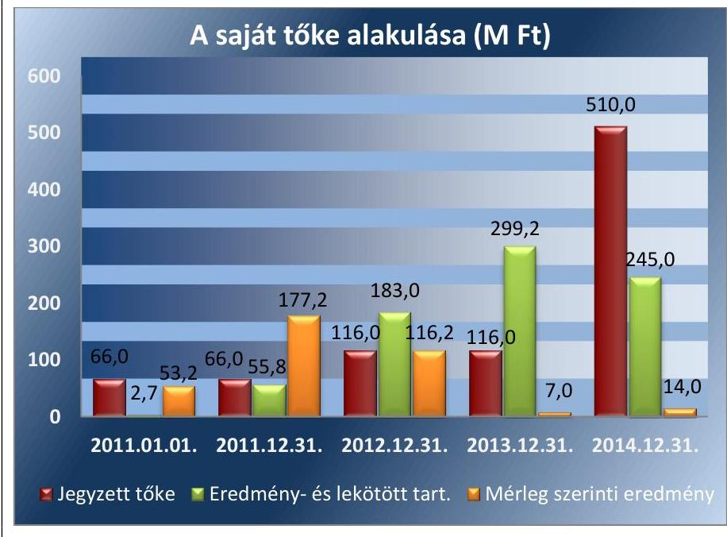

---

# 2.3. számú megállapítás 

## A Tettye Forrásház Zrt. kötelezettségeinek állománya a múködést és a közfeladat ellátást nem veszélyeztette.

A TETTYE FORRÁSHÁZ ZRT. rövid és hosszú lejáratú kötelezettségeinek összértéke a 2014. év végén 2526,8 M Ft volt. A kötelezettségállomány döntő részét kapcsolt vállalkozással (Önkormányzattal) szembeni 1429,8 M Ft kötelezettség, illetve beruházási és fejlesztési hitelek 659,4 M Ft tették ki. Az Önkormányzat által biztosított alapításkori 5,0 M Ft jegyzett tőke összege, a müködéséhez nem volt elegendő. A Társaság a müködését a 2011 - 2013. években folyamatosan banki hitelekkel biztosította. Az üzemeltetési szerződés alapján átadott eszközök után járó bérleti díjakat a Társaság határidőn belül nem fizette meg, azokat az Önkormányzat nem engedte el. Az elmaradt bérleti díjak összege a 2014. év végén 1429,8 M Ft-ot tett ki. Az ellenőrzött időszak végére a Tettye Forrásház Zrt. pénzeszközeinek állománya összesen 1481,6 M Ft - ra növekedett. A kötelezettségek állománya a müködést és a közfeladat ellátást nem veszélyeztette.
2. táblázat

| A KÖTELEZETTSÉG ÁLLOMÁNY ALAKULÁSA (M FT) |  |  |  |  |  |
| :--: | :--: | :--: | :--: | :--: | :--: |
| Megnevezés | 2011. | 2011. | 2012. | 2013. | 2014. |
|  | 01.01. | 12.31. | 12.31. | 12.31. | 12.31. |
| Rövid lejáratú kötelezettségek | 1095,6 | 1164,4 | 1841,2 | 2067,2 | 1867,4 |
| ebből rövid lejáratú hitelek | 8,9 | 335,1 | 1134,2 | 812,4 | 93,4 |
| ebből szállítók | 677,3 | 411,8 | 265,9 | 373,7 | 186,3 |
| ebből kötelezettségek kapcsolt vállalkozással szemben (tulajdonos és egyéb kapcsolt vállalkozás) | 10,9 | - | 63,0 | 549,8 | 1429,8 |
| Hosszú lejáratú kötelezettségek | 1196,2 | 934,5 | 16,3 | 398,1 | 659,4 |
| Beruházási és fejlesztési hitelek | 800,0 | 800,0 | 0,0 | 0,0 | 659,4 |
| Egyéb hosszú lejáratú hitelek | 396,3 | 134,5 | 16,3 | 4,1 | 0,0 |
| Tartós kötelezettség kapcsolt vállalkozással szemben | - | - | - | 394,0 | - |
| Kötelezettség összesen | 2291,9 | 2098,9 | 1857,5 | 2465,3 | 2526,8 |

A 2014. évben a saját források aránya lényegesen növekedett az idegen források változatlansága mellett. A saját források növekedését az Önkormányzat által 2013. évben végrehajtott 394,0 M Ft-os tőkeemelés, továbbá a szennyvízkezelési technológia kialakítására kapott 1351,8 M Ft összegű fejlesztési támogatás befolyásolta. A támogatás a KEOP-4.4.0/11-2011-0038 azonosító számú projekthez kapcsolódott.

A szállítói tartozások állománya 2011 - 2014. években folyamatosan emelkedett, különös tekintettel, az Önkormányzattal szembeni bérleti díjból eredő kötelezettségekre. Korosított bontásban az állományok a 2012. évtől álltak rendelkezésre. A Tettye Forrásház Zrt. szállítói állományának alakulását az ellenőrzött időszakban a 3. táblázat szemlélteti. Az adatok tartalmazzák a kapcsolt vállalkozással (Önkormányzat) szembeni kötelezettségeket is.

---

|  | Nem lejárt | 1-30 nap | 31-60 nap | 61-90 nap | 91-365 nap | 366 napon túli | Lejárt kötele-   zettség összesen | Összesen |
| :-- | :--: | :--: | :--: | :--: | :--: | :--: | :--: | :--: |
| 2011.12.31. | - | - | - | - | - | - | - | 411,8 |
| 2012.12.31. | 223,7 | 25,6 | 7,3 | 16,5 | 54,4 | 1,4 | 105,2 | 328,9 |
| 2013.12.31. | 607,1 | 101,9 | 32,6 | 0,7 | 65,5 | 115,7 | 316,4 | 923,5 |
| 2014.12.31. | 508,7 | 11,1 | 1,8 | 5,5 | 1033,6 | 55,4 | 1107,4 | 1616,1 |

2.4. számú megállapítás

A Tettye Forrásház Zrt. előírt beszámolási, adatszolgáltatási kötelezettséget teljesítette.

A BESZÁMOLÁSI ÉS ADATSZOLGÁLTATÁSI kötelezettségének a Tettye Forrásház Zrt. az ellenőrzött időszakban a Számv. tv. 153. § - 154. §- aiban, a számviteli politika ${ }_{1,2,3}$ - ban, és a közérdekú adatok közzétételére vonatkozó szabályzatában foglaltaknak megfelelően eleget tett.

Az Önkormányzat a Tettye Forrásház Zrt.-t az üzemeltetési szerződés ${ }_{1,2,3}$ -ben és egyedi döntéseiben kötelezte az önkormányzati tulajdonban lévő bérbe vett vagyonban és készletekben történt változásokról szóló adatszolgáltatásra, amelynek eleget tettek. Az üzemeltetési szerződés ${ }_{1,2,3}$ -ben foglaltaknak megfelelően a Társaság a gazdálkodásáról havi rendszerességgel tájékoztatta az Önkormányzatot.

A Társaság a Háztartási szennyvízrendelet ${ }^{46}$-nek eleget téve szolgáltatott adatot a háztartási szennyvíz mennyiségéről, annak költségéről, valamint a talajterhelési díj megállapításához szükséges adatokról. Negyedévente szolgáltattak adatot az elvégzett felújítási és rekonstrukciós munkák elszámolásáról, és a selejtezések állományáról.

A Tettye Forrásház Zrt. a Számv. tv. 17. § - 95. § előírásainak megfelelően elkészítette a 2011 - 2014. évekre vonatkozó leltárral alátámasztott éves beszámolóit, amelyeket a Társaság Közgyűlése a Számv. tv. előírása szerinti időpontig jóváhagyott. A Társaság a Számv. tv. 153. § és 154/B. § (2) bekezdésben foglaltaknak megfelelően gondoskodott a beszámolók letétbe helyezéséről, illetve elektronikus közzétételéről.

A könyvvizsgáló az ellenőrzött időszak minden évében hitelesítő záradékkal látta el a Tettye Forrásház Zrt. beszámolóit.

A Tettye Forrásház Zrt. az Avtv. 19. §, 20. § (8) bekezdésében, a 31/A. § (1) bekezdés c) pontjában és (2)-(3) bekezdésében, az Info tv. 24. §, 26. §, 30. § (6) bekezdésében, a 32-37. §- aiban, valamint a Taktv. 2. §-ában meghatározott adatközléseket határidőben teljesítette. A Társaság az Info tv. 1. számú melléklete szerinti adatokat a honlapján, határidőben közzétette.

---

# 3. A gazdasági társaságnál a közfeladat bevételei és ráfordításai elszámolása, valamint az önköltségszámítás és árképzés szabályszerű volt-e? 

Összegző megállapítás

### 3.1. számú megállapítás

3. ábra

Az ellenőrzés megállapítása
A gazdasági társaság elővetkánynak szabályszerű elszámolása területén

Ameggalapú ráfordítások
MEGFELELŐ
Beruházások, felújítások
MEGFELELŐ
Ertékcsabákmós
MEGFELELŐ
A gazdasági társaság bevételeinek szabályszerű elszámolása területén

Ertékesítés nettó árkevétele
MEGFELELŐ

A Tettye Forrásház Zrt. által ellátott közfeladat bevételei és ráfordításainak elszámolása megfelelő volt. Az önköltségszámítás és az árképzés szabályszerű volt.

A Tettye Forrásház Zrt. által ellátott közfeladat bevételeinek és ráfordításainak elszámolása megfelelő volt.

A KÖZFELADATOK BEVÉTELEINEK ÉS RÁFORDÍTÁSAINAK elhatárolását a Társaság a Számv. tv. 51. § és a 161/A. §, valamint a Vksztv. 49. § (3) bekezdés előírásainak figyelembe vételével alakította ki. A Tettye Forrásház Zrt. a teljes ellenőrzött időszakban a számviteli politika ${ }_{1,2,3}$ keretében elkészített önköltség-számítási szabályzat ${ }_{1,2,3}$ ban, a számlarendjében és a kialakított munkaszámok rendszerében rögzítette a bevételek és a ráfordítások elhatárolásának szabályait. A számlarendben a közfeladatok és az egyéb ellátott feladatok bevételeinek, költségeinek és ráfordításainak szétválasztásáról szabályszerűen gondoskodott. A Tettye Forrásház Zrt. az alkalmazott főkönyvi szintű elkülönítés kialakított módszerével a bevételek tekintetében biztosította a beszámoló alátámasztásának részletezettségét. A költségek és ráfordítások esetében a munkaszámos gyűjtés módszerével választotta szét a közfeladatokhoz kapcsolódó költségeket és ráfordításokat.

AZ ANYAGJELLEGŰ KÖLTSÉGEK és ráfordítások elszámolása az ellenőrzött időszakban megfelelő volt. A kiadásokat az ellenőrzött időszak egészében a megfelelő közfeladatra, költséghelyre és a számlarend szerinti megfelelő főkönyvi számlákra számolták el, amely megfelelt a Számv. tv. előírásainak.

A BERUHÁZÁSOK, FELÚJÍTÁSOK elszámolása megfelelt a Számv. tv.-ben foglaltaknak.

A BEVÉTELEK ELSZÁMOLÁSA megfelelő volt. A Tettye Forrásház Zrt. a 2011 - 2014. években az üzletszabályzat ${ }_{1,2,3,4,5}$-ban rendelkezett a bevételek elszámolásának szabályairól. A bevételek kiszámlázása az ellenőrzött időszak egészében az üzletszabályzatnak ${ }_{1,2,3,4,5}$ megfelelően történt.

AZ EGYSÉGÁRAK alkalmazása a víz és a szennyvíz szolgáltatási üzletágban az Önkormányzati rendeletekben meghatározott fogyasztói árak alapján történt a 2011. január 1. - 2013. július 1. közötti időszakban. 2013. július 1-jétől a Vksztv. alapján a víziközmű-szolgáltatásért felelős miniszter rendeletben állapította meg a hatósági árakat, a bevételek számlázása ennek megfelelően történt.

---

A SZÁMVITELI SZÉTVÁLASZTÁS során a bevételeket a 2011 - 2014. években a számviteli politika ${ }_{1,2,3}$ keretében elkészített számlarendben meghatározott elvek alapján elkülönítették köz-, és egyéb feladatokra. A Tettye Forrásház Zrt. a közfeladat bevételeit főkönyvi bontásban, ivóvíz szolgáltatás, szennyvízelvezetés szolgáltatás, valamint a szippantott és egyéb szennyvíz árbevételeként tartotta nyilván.

AZ ÉRTÉKCSÖKKENÉS ELSZÁMOLÁSA a Számv. tv. 52. - 53. §- aiban és a számviteli politika ${ }_{1,2,3}$-ban előírtaknak megfelelően történt.

A Társaságnak nem volt vagyonkezelt vagyona. A Tettye Forrásház Zrt. a 2011 - 2014. években a saját vagyona után elszámolt 527,0 M Ft összegű értékcsökkenésből keletkezett forrásokat meghaladó mértékben valósított meg fejlesztést.

# A LAKOSSÁGGAL SZEMBENI KÖVETELÉSEK ÉRTÉKÉT a Tettye Forrásház Zrt. a Számv. tv. 29. § (1)-(2) bekezdései és a

65. § (6)-(7) bekezdései szerint mutatta ki az ellenőrzött időszakban. A lakossággal szembeni követelések állományának összege 2013. évről 2014. évre 8,5\%-kal, 54,3 M Ft-tal növekedett.

A Társaság az ellenőrzött időszakban az általa nyújtott szolgáltatásokból, termékértékesítésekből és egyéb működésből eredő pénzkövetelések hatékony kezelése érdekében Kintlévőség kezelési szabályzat ${ }_{1,2,3}{ }^{47}$ - tal rendelkezett.

Az ellenőrzött időszak végén a követelések összesen 1210,5 M Ft-ot tettek ki. Az összes alaptevékenységből származó lakossági követelés 2014. december 31-én 694,0 M Ft volt. A Társaság üzletszabályzata és a kintlévőség kezelési szabályzat előírásai szerint minden esetben eljárást indítottak a 30 napot meghaladó tartozást felhalmozó vevővel szemben. A 360 napon túli követelések állománya dinamikusan nőtt az ellenőrzött időszakban. A követeléseket az üzletszabályzat és a kintlévőség kezelési szabályzat szerint ügyvédi felszólító levelek és fizetési meghagyás kibocsátása útján próbálták behajtani. A behajthatatlan követeléseket a PKKE Pécsi Követeléskezelő Egyesületnek adták át. A vevőkövetelések után a kintlévőség kezelési szabályzatnak megfelelően értékvesztést számoltak el. A lakossági vevőkövetelések lejárat szerinti alakulását és az elszámolt értékvesztés összegét a 4. táblázat mutatja.
4. táblázat

| A LAKOSSÁGI VEVŐKÖVETELÉSEK LEJÁRAT SZERINTI ALAKULÁSA (M FT) |  |  |  |  |  |  |  |  |  |
| :--: | :--: | :--: | :--: | :--: | :--: | :--: | :--: | :--: | :--: |
|  | Nem   lejárt | 1-30 nap | 31-90 nap | 91-120   nap | 121-360   nap | 360 napon   túli | Lejárt   követelés   összesen | Összesen | Tárgyalvi   értékvesz-   tás (vonal) |
| 2011.12.31. | 391,2 | 203,4 | 123,5 | 25,0 | 84,7 | 54,2 | 494,0 | 885,1 | 148,1 |
| 2012.12.31. | 446,3 | 85,1 | 88,5 | 20,6 | 80,0 | 98,0 | 372,8 | 819,1 | 84,5 |
| 2013.12.31. | 192,3 | 131,7 | 59,3 | 18,7 | 72,3 | 165,0 | 447,5 | 639,7 | 98,3 |
| 2014.12.31. | 216,3 | 106,5 | 52,7 | 25,1 | 66,5 | 226,8 | 477,6 | 694,0 | 101,1 |

---

# 3.2. számú megállapítás 

A Tettye Forrásház Zrt. a jogszabályoknak és belső előírásoknak megfelelően végezte az önköltségszámítást és alakította ki az árait.

ÖNKÖLTSÉG-SZÁMÍTÁSI SZABÁLYZATÁT $1,2,3$ a Társaság a Számv. tv. 14. § (5) bekezdés c) pontja alapján elkészítette és az ellenőrzött időszakban felülvizsgálta, valamint 2011 - 2013. években módosította. Az önköltség-számítási szabályzat ${ }_{1,2,3}$ tartalmazta a Vksztv. 49. § (2) - (3) bekezdései, valamint a Viziközmű Vhr. 91. § - a szerinti számviteli szétválasztási szabályokat.

AZ ÁRMEGÁLLAPÍTÁS során az Önkormányzat a 2011. január 1. - 2013. január 31. közötti időszakban az önköltség-számítási szabályok alapján döntött az alkalmazandó árakról. Az önköltség megállapítása utókalkulációval történt, a Társaság a díjait megalapozó önköltségszámítás szabályzzerűen a Számv. tv. 14. § (7) bekezdésének és az önköltség-számítási szabályzatnak megfelelően történt.
2013. január 31-től az árakat a víziközmú-szolgáltatásért felelős miniszter határozta meg.

A Tettye Forrásház Zrt. által alkalmazott árak megállapítása az önkölt-ség-számítási szabályzat előírásai szerint költségelemek figyelembevételével történt 2012. december 31-ig, így az összhangban volt az előírásokkal.

Az Önkormányzat a Társaság önköltség-számítási szabályzat ${ }_{1,2,3}$ alapján kiszámított ár-előterjesztés alapján hagyta jóvá a hatósági díjakat. 2013. január 1-jétől a Vksztv. 76. § (1) bekezdése alapján határozták meg a fogyasztói árakat, amely 4,2\%-os díjemelést engedélyezett a Társaságnak. 2013. július 1.-jétől a Rezsi tv 4. § (1) bekezdése szabályozta a hatósági árakat, mely szerint a 2013. január 31-én érvényes ár 90\%-ában maximálta azokat. A hatósági árak 2013. július 1. óta nem változtak.

A Társaság a központi intézkedéseket (árcsökkentés) a Rezsi tv. 4. § (1) bekezdése alapján végrehajtotta.

---

# JAVASLATOK 

Az ÁSZ tv. ${ }^{48}$ 33. § (1) bekezdésében foglaltak értelmében az ellenőrzött szervezet vezetője köteles a jelentésben foglalt megállapításokhoz kapcsolódó intézkedési tervet összeállítani és azt a jelentés kézhezvételétől számított 30 napon belül az ÁSZ részére megküldeni. Amennyiben az intézkedési tervet határidőre nem küldi meg a szervezet, vagy amennyiben az nem elfogadható, az ÁSZ elnöke az ÁSZ tv. 33. § (3) bekezdés a)-b) pontjaiban foglaltakat érvényesítheti.

## A Tettye Forrásház Zrt. Igazgatósága elnökének

1. Kezdeményezze a Tettye Forrásház Zrt. közgyülésénél a vezető tisztségviselők, felügyelőbizottsági tagok, valamint az Mt. 208. §-ának hatálya alá eső munkavállalók javadalmazása, valamint a jogviszony megszünése esetére biztosított juttatások módjának, mértékének elveire, annak rendszerére vonatkozó szabályzat megalkotását.
(2.1. sz. megállapítás 6. bekezdése alapján)

---

.

---

# MELLÉKLETEK 

- I. SZ. MELLÉKLET: ÉRTELMEZŐ SZÓTÁR
eladósodottságot jellemző mutatók
garancia
gazdasági társaság
eladósodottsági mutató (tőkeáttétel): idegen tőke/összes forrás.
Egészségesnek mondható egy olyan mértékű áttétel, amelyet az üzleti tervek szerint és az elmúlt időszak tapasztalatai alapján a társaság megfelelő biztonsággal ki tud termelni. Nagy eszközberuházás-igényű iparágakban értéke magasabb, azaz magasabb eladósodottság is elfogadható, de 75-85\%-ot meghaladó értéknél már itt is erős, sőt túlzott külső finanszírozottságról beszélhetünk. Általánosságban véve kedvező, ha értéke kisebb, mint 0,6.
eladósodottság mértéke: kötelezettségek / saját tőke.
Fontos szerepet játszik ez a mutató egy vállalat megítélésében. Azt mutatja, hogy a saját források a kötelezettségek hány százalékát fedezik. Törekedni kell, hogy a mutató tartósan (jelentősen) 1 alatti értéket érjen el.
nettó eladósodottság: (kötelezettségek-követelések) / saját tőke.
Azt mutatja, hogy a kintlévőségekkel csökkentett kötelezettségeket milyen mértékben fedezi a saját forrás. Ez feltételezi, hogy a követelések pénzügyileg előbb realizálódnak, mint ahogy a kötelezettségeket teljesíteni kell. A mutató minél kisebb, csökkenő értéke a kedvező.
adósságfedezeti mutató I.: (befektetett eszközök+forgó eszközök) / idegen forrás.
Azt mutatja, hogy 1 Ft adósságra hány Ft vagyon jut. Általánosságban véve kedvező, ha értéke 2 körül van, de nagy eszközberuházás-igényű iparágakban értéke kisebb is lehet.
adósságfedezeti mutató II.: működési cash flow / hosszú lejáratú kötelezettségek.
A mutató azt jelzi, hogy az adott gazdálkodási időszak múködési pénzáramainak eredményeként realizált cash flow révén a vállalkozás mennyiben lenne képes valamenynyi hosszú lejáratú kötelezettségének eleget tenni. Ennek vizsgálatára viszonylag ritkán kerül sor, az elsősorban a veszélyhelyzetbe került vállalkozások esetében lehet érdekes. Általánosságban véve kedvező, ha a múködési cash flow minél nagyobb arányban nyújt fedezetet a hosszú lejáratú kötelezettségre (értéke nagyobb, mint 1, nő az ellenőrzött időszakban).
árbevételre vetített eladósodottság: (kötelezettségek - forgóeszközök) / értékesítés nettó árbevétele.
Az árbevételre vetített eladósodottság azt mutatja, hogy az árbevétel mekkora fedezetet nyújt a kötelezettségeknek a forgóeszközökkel csökkentett részére. Általánosságban véve kedvező, ha az árbevétel minél nagyobb arányban nyújt fedezetet a forgóeszközökkel csökkentett kötelezettségekre (értéke kisebb, mint 1, csökken az ellenőrzött időszakban).
A garancia olyan önálló, az önkormányzat nevében vállalt kötelezettség, amely alapján az önkormányzat az önkormányzati költségvetés terhére szerződésben meghatározott feltételek szerint, a kötelezett nem teljesítése esetén a jogosultnak fizetést teljesít az előzetesen rögzített összeghatárig.
Ptk. 3.88. § (1) bekezdése szerint „a gazdasági társaságok üzletszerű közös gazdasági tevékenység folytatására, a tagok vagyoni hozzájárulásával létrehozott, jogi személyiséggel rendelkező vállalkozások, amelyekben a tagok a nyereségből közösen részesednek, és a veszteséget közösen viselik".

---

gazdálkodó szervezet
kezesség
közfeladat
közszolgáltatás
nemzeti vagyon

A Ptk. 1 685. § c) pontja szerint gazdálkodó szervezet: „az állami vállalat, az egyéb állami gazdálkodó szerv, a szövetkezet, a lakásszövetkezet, az európai szövetkezet, a gazdasági társaság, az európai részvénytársaság, az egyesülés, az európai gazdasági egyesülés, az európai területi együttműködési csoportosulás, az egyes jogi személyek vállalata, a leányvállalat, a vízgazdálkodási társulat, az erdő birtokossági társulat, a végrehajtói iroda, az egyéni cég, továbbá az egyéni vállalkozó." (Hatályos: 2014. március 15-éig) A Hgt. 2 2. § (1) bekezdés 15. pontja szerint „a polgári perrendtartásról szóló törvényben meghatározott gazdálkodó szervezet, ide nem értve azt a költségvetési szervet, amelyet az államháztartásról szóló törvény szerint közfeladat ellátására hoztak létre." (hatályos: 2014. március 15-től)
A kezességre vonatkozó előírásokat a Ptk. 2 6:416-430. §-ai tartalmazzák. Kezességi szerződéssel a kezes kötelezettséget vállal a jogosulttal szemben, hogyha a kötelezett nem teljesít, maga fog helyette a jogosultnak teljesíteni. Kezesség egy vagy több, fennálló vagy jövőbeli, feltétlen vagy feltételes, meghatározott vagy meghatározható összegű pénzkövetelés vagy pénzben kifejezhető értékkel rendelkező egyéb kötelezettség biztosítására vállalható.
A Ptk. 1 szerint kezességet csak írásban lehet vállalni. A kezes kötelezettsége ahhoz a kötelezettséghez igazodik, amelyért kezességet vállalt. A kezes kötelezettsége nem válhat terhesebbé, mint amilyen elvállalásakor volt, kiterjed azonban a kötelezett szerződésszegésének jogkövetkezményeire és a kezesség elvállalása után esedékessé váló mellékkövetelésekre is.
Jogszabályban meghatározott állami vagy önkormányzati feladat, amit az arra kötelezett közérdekből, jogszabályban meghatározott követelményeknek és feltételeknek megfelelve végez, ideértve a lakosság közszolgáltatásokkal való ellátását, továbbá az állam nemzetközi szerződésekben vállalt kötelezettségeiből adódó közérdekű feladatokat, valamint e feladatok ellátásához szükséges infrastruktúra biztosítását is (Nvtv. 3. § (1) bekezdés 7. pont).
A közszolgáltatás: „közcélú, illetőleg közérdekű szolgáltatást jelent, amely egy nagyobb közösség (állam, település) minden tagjára nézve megközelítőleg azonos feltételek mellett vehető igénybe, ezért valamilyen mértékig közösségi megszervezést, illetve szabályozást, ellenőrzést igényel." Az Ebktv. ${ }^{49}$ 3. § d) pontja a következőképpen határozza meg a közszolgáltatást: „szerződéskötési kötelezettség alapján a lakosság alapvető szükségleteinek ellátására irányuló szolgáltatás, így különösen a villamos energia-, gáz-, hő-, víz-, szennyvíz- és hulladékkezelési, köztisztasági, postai és távközlési szolgáltatás, továbbá a menetrend alapján közlekedő járművekkel végzett közforgalmú személyszállítás".
Nvtv. 1. § (2) bekezdése szerint:
„az állam vagy a helyi önkormányzat kizárólagos tulajdonában álló dolgok, az a) pont hatálya alá nem tartozó, állam vagy a helyi önkormányzat tulajdonában lévő dolog,
az állam vagy a helyi önkormányzatot tulajdonában lévő pénzügyi eszközök, továbbá az államot vagy a helyi önkormányzatot megillető társasági részesedések,
az államot vagy a helyi önkormányzatot megillető bármely vagyoni értékkel rendelkező jogosultság, amelyet jogszabály vagyoni értékű jogként nevesít,
Magyarország határa által körbezárt terület feletti légtér,
az üvegházhatású gázok kibocsátási egységeinek kereskedelméről szóló törvény szerint kibocsátási egység és légiközlekedési kibocsátási egység, valamint az ENSZ Éghajlat változási Keretegyezménye és annak Kiotói Jegyzőkönyve végrehajtási keretrendszeréről szóló törvény szerinti kiotói egység,

---

többségi befolyást biztosító részesedés
tulajdonosi joggyakorló
állami vagy helyi önkormányzati fenntartású közgyűjtemény (muzeális intézmény, levéltár, közgyűjteményként működő kép- és hangarchívum, valamint könyvtár) saját gyűjteményében nyilvántartott kulturális javak körébe tartozó dolog, a régészeti lelet,
a nemzeti adatvagyon körébe tartozó állami nyilvántartások fokozottabb védelméről szóló törvény szerinti nemzeti adatvagyon." (hatályos 2012. január 1-jétől, g) pont módosult 2012. június 30-ától)
A Ptk. 2 8:2. § (1) bekezdése szerint „többségi befolyás az olyan kapcsolat, amelynek révén természetes személy vagy jogi személy (befolyással rendelkező) egy jogi személyben a szavazatok több mint felével vagy meghatározó befolyással rendelkezik." Aki a nemzeti vagyon felett az államot vagy a helyi önkormányzatot megillető tulajdonosi jogok és kötelezettségek összességének gyakorlására jogosult. (Nvtv. 3. § (1) bekezdés 17. pont).

---

II. SZ. MELLÉKLET: A MŰKÖDÉS FŐBB JELLEMZŐI

|  |   |   |   |   |
| --- | --- | --- | --- | --- |
|  PÉNZÜGYI MUTATÓSZÁMOK ALAKULÁSA 2011-2014. KÖZÖTT |  |  |  |   |
|   | 2011. | 2012. | 2013. | 2014.  |
|  Eladósodottság mértéke kötelezettségek**/saját tőke | 7,02 | 4,47 | 5,84 | 3,28  |
|  Nettó eladósodottság (kötelezettségek** követelések)/saját tőke | 0,54 | $-0,42$ | 2,91 | 1,71  |
|  Adósságfedezeti mutató I. (befektetett eszközök+forgóeszközök)/idegen forrás | 1,16 | 1,37 | 1,19 | 2,06  |
|  Árbevételre vetített eladósodottság (kötelezettségek**- forgóeszközök)/értékesítés nettó árbevétele | 0,02 | $-0,06$ | 0,07 | $-0,04$  |

Fonrás: Tettye Forrásház Zrt. 2011-2014. évi beszámolói

---

# FÜGGELÉK: ÉSZREVÉTELEK 

A jelentéstervezetet a Számvevőszék 15 napos észrevételezésre megküldte az ellenőrzött szervezet vezetőjének az ÁSZ tv. 29. §* (1) bekezdése előírásának megfelelően.

Az ÁSZ a jelentéstervezetet észrevételezésre megküldte Pécs Megyei Jogú Város polgármesterének és a Tettye Forrásház Pécsi Városi Víziközmű Üzemeltetési Zrt. vezérigazgatójának.
Pécs Megyei Jogú Város polgármesterének és a Tettye Forrásház Pécsi Városi Víziközmű Üzemeltetési Zrt. vezérigazgatójának észrevételét és az arra adott választ a függelék alább tartalmazza.

[^0]
[^0]:    * 29. § (1) Az Állami Számvevőszék az ellenőrzési megállapításait megküldi az ellenőrzött szervezet vezetőjének vagy az általa megbízott személynek, és annak, akinek személyes felelősségét állapította meg.
    (2) Az ellenőrzött szervezet vezetője és a felelősként megjelölt személy az ellenőrzés megállapításaira tizenöt napon belül írásban észrevételt tehet.
    (3) Az Állami Számvevőszék az észrevételre a beérkezésétől számított harminc napon belül írásban válaszol. A figyelembe nem vett észrevételeket köteles a jelentésben feltüntetni, és megindokolni, hogy azokat miért nem fogadta el.

---

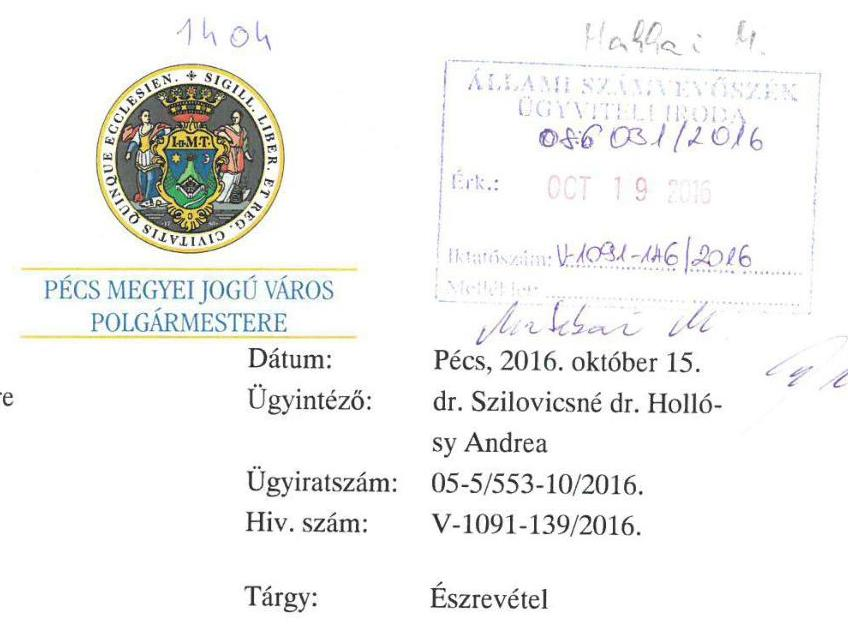

Tisztelt Elnök Úr!

Hivatkozva V-1091-139/2016. számú jelentéstervezet megküldéséről szóló tájékoztató levelében foglaltakra, - amely a Tettye Forrásház Pécsi Városi Víziközmű Üzemeltetési Zrt. gazdálkodásának ellenőrzése tárgyában készült, az alábbi észrevételemet juttatom el Önhöz, további szíves felhasználása.
A jelentés tervezetben foglalt megállapításokat, javaslatokat, kollégái segitő együttműködését ez úton is szeretném megköszönni. A tervezetben foglaltakat az illetékes munkatársaim részére eljuttattam annak érdekében, hogy az abban foglaltak maradéktalanul a közfeladat ellátásának jobb megszervezésére, végrehajtására kerüljenek alkalmazásra, végrehajtásra, a rögzített vizsgálati célok megvalósulása érdekében.
A tervezetben foglaltakkal egyetértek, megállapításait, köztük a túlnyomó többségben lévő pozitív visszajelzését megköszönöm.
Az esetlegesen feltárt hiányosságok mielőbbi pótlása érdekében minden szükséges intézkedést haladéktalanul megtesznek illetékes kollégáim.

A jelentés 14. oldalán tett megállapítás /továbbá valamennyi vizsgált társaság tekintetében fennáll/ kapcsán - amely a Közép és- Hosszútávú vagyongazdálkodási terv elfogadásának késedelmes időpontját rögzít az alábbi kiegészítést, tájékoztatást szeretném adni.
A terv megalkotását előiró Nvtv. Parlament általi elfogadása és 2012. 01.01-jei hatályba lépése között mindössze pár nap telt el. A törvény - eltérően egyéb kötelezettség teljesítésére megállapított határidőktől - nem rendelkezett a terv elfogadására nyitva álló határidő megjelöléséről. E kérdésben Hivatalom a Kormányhivataltól - amely az illetékes Minisztériumot is megkereste - kért állásfoglalást, útmutatást.

---

Ezen előzmények kapcsán azt kellett megállapítanom, hogy a Közép és- hosszútávú vagyongazdálkodási terv előkészítésére, megfelelő szakértelemmel rendelkező külső szakértő beszerzési eljárással történő bevonására a törvény nem biztosította a szükséges felkészülési időt azzal, hogy a hatálybalépés időpontjában várta el a terv megalkotását, amely álláspontom szerint nem volt kivitelezhető. Kérem, hogy ezen észrevételemet valamennyi vizsgálati jelentés tervezete kapcsán vegyék figyelembe.

A jelentés 16. és 17. oldala megállapította, hogy a társaság a vizsgált időszakban nem rendelkezett javadalmazási, juttatási szabályzattal. E tárgyban a társaság 2016. január 29-én, azaz az ellenőrzés megkezdésének időpontja előtt, a hiányt már pótolta.

Az ellenőrzés során tanúsított mindvégig segítő hozzáállásukat, hasznos megállapításaikat ismételten megköszönöm.
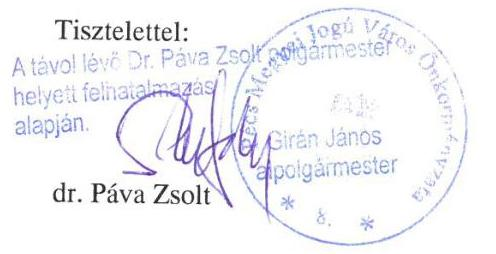

[^0]
[^0]:    H-7621 PÉCS Széchenyi tér 1. Postacím: H-7621 PF. 58
    Telefon: +36 (72) 533-800 Fax: +36 (72) 224-172
    Internet: http $\%$ www.pecs.hu E-mail: citydev@ph.pecs.hu

---

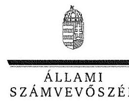

# Dr. Páva Zsolt úr 

polgármester
Pécs Megyei Jogú Város Önkormányzata

## Pécs

## Tisztelt Polgármester Úr!

„Az önkormányzatok gazdasági társaságai - Az önkormányzatok többségi tulajdonában lévő gazdasági társaságok gazdálkodásának ellenőrzése - TETTYE FORRÁSHÁZ Pécsi Városi Víziközmü Üzemeltetési Zrt." címmel készített számvevőszéki jelentéstervezetre tett észrevételét köszönettel megkaptam.

Az Állami Számvevőszék észrevételre vonatkozó álláspontjáról a felügyeleti vezető által készített részletes tájékoztatást csatoltan megküldöm.

Tájékoztatom Polgármester urat, hogy a számvevőszéki jelentésben - az Állami Számvevőszékről szóló 2011. évi LXVI. törvény 29. § (3) bekezdése alapján - a figyelembe nem vett észrevételeket szerepeltetjük az elutasítás indokának feltüntetésével.

Budapest, 2016. 10 hó 28 nap
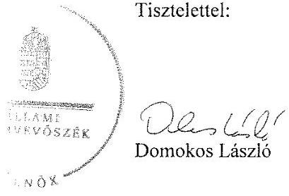

Melléklet: Tájékoztatás az el nem fogadott észrevételekről

---

# Tájékoztatás   az el nem fogadott észrevételekről 

„Az önkormányzatok gazdasági társaságai - Az önkormányzatok többségi tulajdonában lévő gazdasági társaságok gazdálkodásának ellenörzése - TETTYE FORRÁSHÁZ Pécsi Városi Viziiközmü Üzemeltetési Zrt. "címủ jelentéstervezetre 2016. október 19-én érkezett észrevételét áttekintettük, annak kezelésével kapcsolatban a következő tájékoztatást adom.

## 1. Jelentéstervezet 14. oldal, a közép- és hosszú távú fejlesztési tervvel kapcsolatos megállapítás

A nemzeti vagyonról szóló 2011. évi CXCVL törvény (Nvtv.) 9. § (1) bekezdése előírja, hogy a helyi önkormányzat közép- és hosszú távú fejlesztési tervet köteles készíteni. Az észrevételben leírtak megerősítik a jelentéstervezet megállapítását, miszerint Pécs Megyer Jogú Város Önkormányzata 2012. január 1. és 2013. február 7. között nem rendelkezett közép- és hosszú távú fejlesztési tervvel. Ezért a jelentéstervezet megállapítása helytálló, annak módosítása nem indokolt.

## 2. Jelentéstervezet 16. és 17. oldal, a javadalmazási, juttatási szabályzattal kapcsolatos megállapítás

A javadalmazási, juttatási szabályzat ellenőrzött időszakot követő elkészítésére vonatkozó tájékoztatását köszönöm. A hiányosság megszüntetése érdekében az ellenőrzött időszakot követően megtett intézkedést az intézkedési terv összeállítása során indokolt figyelembe venni. A fentiek alapján a jelentéstervezet megállapításának módosítása nem indokolt.

Budapest, 2016. 10. hó 28 .nap

Makkai Mária
felügyeleti vezető

---

TETTYE FORRÁSHÁZ

## 00858 C(00)

Tank Nive, PL 33
TELEFON: 71-421-700
ZOZOZAM: 40-441-111
FAX: 71-421-701
003344-0001.CALAT:
MANNUNG: 003344
verz@tettysforrashazg.hu
PÉCS: 000000000000
GÉSZPINÁSÁGAT:
Cg. 02-10-000334
AUSTKOSZTÁS:
00111000000000000000
NAB: 04-0000011

Tárgy: észrevétel az ellenőrzés megállapítására
Melléklet: 2 db
Úgyiratunk száma: 14-1-99-36/K-1/2016

## ÁLLAMI SZÁMVEVŐSZÉK

BUDAPEST
PF. 54.
1364

Úgyiratuk száma: V-1091-140/2016.

Tisztelt Állami Számvevőszék!

Alulírott Sándor Zsolt, a TETTYE FORRÁSHÁZ Zrt. (7634 Pécs, Nyugati ipari út 8., Cg. 02-10-060354) vezérigazgatója a V-1091-140/2016. iktatószámú, 2016. október 5-én kézhez vett levelükre válaszul mellékelten küldöm Önöknek a korábban, a vizsgálat során már benyújtott, 1/2010. (01. 15.) számú tulajdonosi határozatot a TETTYE FORRÁSHÁZ Zrt. juttatási szabályzatáról. Tájékoztatom Önöket továbbá, hogy 2016. január 29-én a Társaság közgyűlése a mellékelt javadalmazási szabályzatot fogadta el.

Pécs, 2016. október 14.

Üdvözlettel,
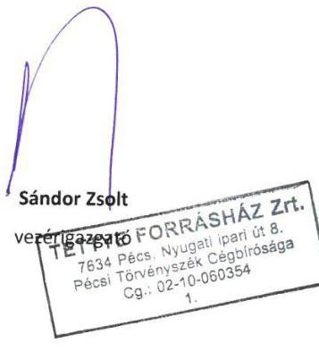

---

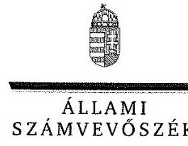

# Sándor Zsolt úr 

vezérigazgató
TETTYE FORRÁSHÁZ Pécsi Városi
Víziközmú Üzemeltetési Zrt.

## Pécs

## Tisztelt Vezérigazgató Úr!

..Az önkormányzatok gazdasági társaságai - Az önkormányzatok többségi tulajdonában lévő gazdasági társaságok gazdálkodásának ellenörzése - TETTYE FORRÁSHÁZ Pécsi Városi Víziközmü Üzemeltetési Zrt." címmel készített számvevőszéki jelentéstervezetre tett észrevételét köszönettel megkaptam.

Az Állami Számvevőszék észrevételre vonatkozó álláspontjáról a felügyeleti vezető által készített részletes tájékoztatást csatoltan megküldöm.

Tájékoztatom Vezérigazgató urat, hogy a számvevőszéki jelentésben - az Állami Számvevőszékről szóló 2011. évi LXVI. törvény 29. § (3) bekezdése alapján - a figyelembe nem vett észrevételeket szerepeltetjük az elutasítás indokának feltüntetésével.

Budapest, 2016. 10 hó 23 nap
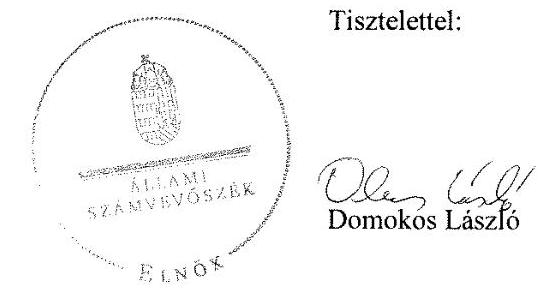

Melléklet: Tájékoztatás az el nem fogadott észrevételről

---

# Tájékoztatás   az el nem fogadott észrevételről 

...Az önkormányzatok gazdasági társaságai - Az önkormányzatok többségi tulajdonában lévő gazdasági társaságok gazdálkodásának ellenörzése - TETTYE FORRÁSHÁZ Pécsi Városi Víziközmü Üzemeltetési Zrt. `címủ jelentéstervezetre 2016. október 18-án érkezett észrevételét áttekintettük, annak kezelésével kapcsolatban a következő tájékoztatást adom.

## A 2.1. számú megállapítás 6. bekezdése megállapításához érkezett észrevételre adott válasz

A köztulajdonban álló gazdasági társaságok takarékosabb müködéséről szóló 2009. évi CXXII. törvény 5. § (3) bekezdése szerint a köztulajdonban álló gazdasági társaság legfőbb szerve e törvény és más jogszabályok keretei között köteles szabályzatot alkotni a vezető tisztségviselők, felügyelőbizottsági tagok, valamint az Mt. 208. §-ának hatálya alá eső munkavállalók javadalmazása, valamint a jogviszony megszủnése esetére biztosított juttatások módjának, mértékének elveiről, annak rendszeréről.
A Tettye Forrásház Pécsi Városi Víziközmú Üzemeltetési Zrt. az ellenőrzött időszakban nem rendelkezett a gazdasági társaság legfőbb szerve (közgyülés) által elfogadott javadalmazási és juttatási szabályzattal. A 3/2016. (01. 29.) számú Javadalmazási Szabályzatot az ellenőrzött időszakot követően fogadta el a közgyűlés. A hiányosság megszüntetése érdekében az ellenőrzött időszakot követően megtett intézkedést az intézkedési terv összeállítása során indokolt figyelembe venni. A fentiek alapján a jelentéstervezet megállapítása helytálló, annak módosítása nem indokolt.

Budapest, 2016. io hó 28 nap
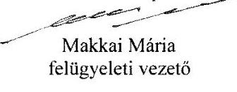

---

# RÖVIDÍTÉSEK JEGYZÉKE 

${ }^{1}$ Önkormányzat
${ }^{2}$ Tettye Forrásház Zrt./Társaság
${ }^{3}$ Tettye Forrásház Közgyűlése
${ }^{4}$ határozat ${ }_{1}$
${ }^{5}$ Alapító okirat
${ }^{6}$ polgármester
${ }^{7}$ jegyző
${ }^{8} 479 / 2009 /$ EK rendelet
${ }^{9}$ Áht. 2
${ }^{10}$ Ötv.
${ }^{11}$ Mötv
${ }^{12}$ Vksztv.
${ }^{13}$ Gazdasági program
${ }^{14}$ Közgyűlés
${ }^{15}$ Településfejlesztési koncepció
${ }^{16}$ Települési környezetvédelmi program
${ }^{17}$ Gördülő fejlesztési terv
${ }^{18}$ határozat ${ }_{2}$
${ }^{19}$ Üzleti tervek ${ }_{1,2,3,4}$
${ }^{20}$ Vagyongazdálkodási terv
${ }^{21}$ Nvtv.
${ }^{22} \mathrm{Gt}$.
${ }^{23} \mathrm{Ptk}_{1}$
${ }^{24} \mathrm{Ptk}_{2}$
${ }^{25}$ üzemeltetési szerződés ${ }_{1,2,3,4,5}$

Pécs Megyei Jogú Város Önkormányzata
Tettye Forrásház Pécsi Városi Víziközmű Üzemeltetési Zrt.
A Tettye Forrásház Zrt. részvényeseinek közgyűlése
Pécs Megyei Jogú Város Önkormányzat Közgyűlésének 7/2014. (04. 24.) számú határozata
A Tettye Forrásház Zrt. 2010. november 24. napján kelt Alapító okirata
Pécs Megyei Jogú Város Önkormányzatának Polgármestere
Pécs Megyei Jogú Város Önkormányzatának Jegyzője
az Európai Közösséget létrehozó szerződéshez csatolt, a túlzott hiány esetén követendő eljárásról szóló jegyzőkönyv alkalmazásáról szóló 479/2009/EK rendelet
az államháztartásról szóló 2011. évi CXCV. törvény (hatályos 2011. december 31től)
a helyi önkormányzatokról szóló 1990. évi LXV. törvény (hatályos 2011. december 31-ig)
Magyarország helyi önkormányzatairól szóló 2011. évi CLXXXIX. törvény (hatályos 2012. január 1-jétől)

2011. évi CCIX. törvény a víziközmű szolgáltatásról (hatályos 2012. január 1-jétől)
Pécs Megyei Jogú Város Önkormányzatának gazdasági programja (159/2011. (04.21.) határozat, hatályos 2011-2014. évekre

Pécs Megyei Jogú Város Önkormányzatának Közgyűlése
546/2009. (11.26.) számú határozattal elfogadott Pécs Megyei Jogú Város Önkormányzatának településfejlesztési koncepciója
A Közgyűlés a 66/2012. (02.23.) számú határozatával elfogadott Pécs Megyei Jogú Város Önkormányzatának Települési környezetvédelmi programja
A Közgyűlés 261/2014. (09. 24.) határozatával a Városfejlesztési koncepció részeként elfogadott Pécs Megyei Jogú Város Önkormányzatának Gördülő fejlesztési terve
Pécs Megyei Jogú Város Önkormányzat közgyűlésének 295/2012. (08. 01.) számú határozata
A Tettye Forrásház Zrt. 2011-2014. évi üzleti tervei
Pécs Megyei Jogú Város Önkormányzatának Közép- és hosszú távú vagyongazdálkodási terve
a nemzeti vagyonról szóló 2011. évi CXCVI. törvény (hatályos 2012. január 1jétől)
A gazdasági társaságokról szóló 2006. évi IV. törvény (hatályos 2014. március 14ig)
A Polgári Törvénykönyvről szóló 1959. évi IV. törvény (hatályos 2014. március 14ig)
A Polgári Törvénykönyvről szóló 2013. évi V. törvény (hatályos 2014. március 15től)
Pécs Megyei Jogú Város, Pécs Holding Városi Vagyonkezelő Zrt (Vagyonkezelő) és a Tettye Forrásház Zrt (Üzemeltető) között 2009. október 1-jén létrejött és az ellenőrzött időszak alatt négyszer módosított (2011. január 27-én, 2011. június

---

7-én, 2012. december 20-án és 2014. augusztus 27-én) üzemeltetési szerződés. A 2012.12.20-tól a szerződő felek közül kikerült a Pécs Holding Zrt. a szerződés kétoldalú szerződéssé változott.

Pécs Megyei Jogú Város Önkormányzatának a városi közüzemi szennyvízcsatornahálózat jelentős mértékű kiterjesztésére, valamint egy a város és a környező települések ivóvízbázisának védelmét biztosító monitoring rendszer létesítésére benyújtott pályázatát 2001-ben az Európai Bizottság támogatásra érdemesnek találta, melynek eredményeképpen aláírásra került a "Pécs sérülékeny vízbázisának védelme és szennyvízcsatorna hálózatának bővítése" elnevezésű, 2001/HU/16/P/PE/009 intézkedési számú ISPA/Kohéziós Alap projektre vonatkozó Pénzügyi Megállapodás és Támogatási Szerződés. A projekt révén megvalósult beruházások, közművek üzemeltetése az Üzemeltetési Szerződések 2,3,4,5 tárgyát képezi.

Tettye Forrásház Zrt. és az Önkormányzat között 2010. március 19-én létrejött szerződés

Tettye Forrásház Zrt. és az Önkormányzat között 2013. március 19-én létrejött szerződés

Tettye Forrásház Zrt. és az Önkormányzat között 2014. augusztus 27-én létrejött szerződés

Tettye Forrásház Zrt. Üzletszabályzata 2009. október 1-jétől 2011. november 30-ig

Tettye Forrásház Zrt. Üzletszabályzata 2011. december 1-jétől 2012. január 9-ig
Tettye Forrásház Zrt. Üzletszabályzata 2012. január 10-től 2012. augusztus 31-ig
Tettye Forrásház Zrt. Üzletszabályzata 2012. szeptember 1-jétől 2013. november 6-ig

Tettye Forrásház Zrt. Üzletszabályzata 2013. november 7-től jelenleg is
58/2013.(II.27) Kormányrendelet a víziközmű szolgáltatásról szóló 2011. évi CCIX. törvény egyes rendelkezéseinek végrehajtásáról (hatályos 2013. március 1-jétől)

Pécs Megyei Jogú Város Önkormányzata Közgyűlésének a többször módosított 40/2008. (XI. 26.) önkormányzati rendelete az Önkormányzat vagyonával kapcsolatos tulajdonosi jogok gyakorlásának szabályairól (hatályos 2012. február 24-ig)

Pécs Megyei Jogú Város Önkormányzata Közgyűlésének többször módosított 11/2012. (II.24.) önkormányzati rendelete az Önkormányzat vagyonával kapcsolatos tulajdonosi jogok gyakorlásának szabályairól (hatályos 2012. február 24-től)

A Tettye Forrásház Zrt. felügyelő bizottsága
A Tettye Forrásház Zrt. igazgatósága
a köztulajdonban álló gazdasági társaságok takarékosabb működéséről szóló 2009. évi CXXII. törvény (hatályos 2009. december 4-től)
az árak megállapításáról szóló 1990. évi LXXXVII. tv.
Az önkormányzati tulajdonú közüzemi vízműből szolgáltatott ivóvízért, illetőleg az önkormányzati tulajdonú közüzemi csatornamű használatáért fizetendő díjakról szóló 38/1996. (VI.29.) önkormányzati rendelet. (Módosította a Pécs Megyei Jogú Város Önkormányzata Közgyűlésének 65/2011. (XII.20.) önkormányzati rendelete)
a számvitelről szóló 2000. évi C. törvény
Tettye Forrásház Zrt. számviteli politikája (hatályos 2009. december 17-től 2012. december 31-ig)

Tettye Forrásház Zrt. számviteli politikája (hatályos 2013. január 1-jétől - 2013. október 27-ig)

---

|  | Tettye Forrásház Zrt. számviteli politikája (hatályos 2013. október 28-tól - 2015.   szeptember 29-ig) |
| :--: | :--: |
| ${ }^{40}$ Leltározási szabályzat ${ }_{1,2}$ | Tettye Forrásház Zrt. leltározási szabályzata (hatályos 2009. december 17-től 2013. május 22-ig) |
|  | Tettye Forrásház Zrt. leltározási szabályzata (hatályos 2013. május 23-tól jelenleg is) |
| ${ }^{41}$ Önköltség-számítási szabályzat ${ }_{1,2,3}$ | Tettye Forrásház Zrt. önköltség-számítási szabályzata (hatályos 2011. január 1-jétől - 2011. december 31-ig) |
|  | Tettye Forrásház Zrt. önköltség-számítási szabályzata (hatályos 2012. január 1-jétől - 2012. december 31-ig) |
|  | Tettye Forrásház Zrt. önköltség-számítási szabályzata (hatályos 2013. január 1jétől - jelenleg is) |
| ${ }^{42}$ Pénzkezelési szabályzatot ${ }_{1,2,3,4}$ | Tettye Forrásház Zrt. házipénztár vezetési szabályzata (hatályos 2009. december 17-től - 2011. november 17-ig) |
|  | Tettye Forrásház Zrt. házipénztár vezetési szabályzata (hatályos 2011. november 18-tól - 2013. május 22-ig) |
|  | Tettye Forrásház Zrt. házipénztár vezetési szabályzata (hatályos 2013. május 23tól - 2013. július 29-ig) |
|  | Tettye Forrásház Zrt. házipénztár vezetési szabályzata (hatályos 2013. július 30tól - 2015. augusztus 4-ig) |
| ${ }^{43}$ Adatvédelmi szabályzat | Tettye Forrásház Zrt. Adatvédelmi szabályzata |
| ${ }^{44}$ Avtv | a személyes adatok védelméről és a közérdekú adatok nyilvánosságáról szóló 1992. évi LXIII. törvény (hatályos 2011. december 31-éig) |
| ${ }^{45}$ Info tv. | az információs önrendelkezési jogról és az információszabadságról szóló 2011.   évi CXII. törvény (hatályos 2012. január 1-jétől) |
| ${ }^{46}$ Háztartási szennyvízrendelet | Pécs Megyei Jogú Város Önkormányzata Közgyűlésének 8/2013 (III.18.) önkormányzati rendelete a nem közmúvel összegyújtött háztartási szennyvíz begyűjtésére vonatkozó közszolgáltatásról |
| ${ }^{47}$ Kinnlévőség-kezelési szabályzat ${ }_{1,2,3}$ | Tettye Forrásház Zrt. 5/2010. számú Vezérigazgatói utasítása (hatályos 2012. február 15-ig) |
|  | Tettye Forrásház Zrt.3/2012. számú Vezérigazgatói utasítása (hatályos 2012. február 16-tól 2014. május 8-ig) |
|  | Tettye Forrásház Zrt.14/2014. számú Vezérigazgatói utasítása (hatályos 2014. május 9-től) |
| ${ }^{48}$ ÁSZ tv. | 2011. évi LXVI. törvény az Állami Számvevőszékről (hatályos 2011. július 1-jétől) |
| ${ }^{49}$ Ebktv. | az egyenlő bánásmódról és az esélyegyenlőség előmozdításáról szóló 2003. évi CXXV. törvény |

---

# ÁLLAMI SZÁMVEVŐSZÉK 

1052 Budapest, Apáczai Csere János utca 10.
Levélcím: 1364 Budapest 4. Pf. 54
Telefon: +36 14849100 Telefax: +36 14849200
www.asz.hu