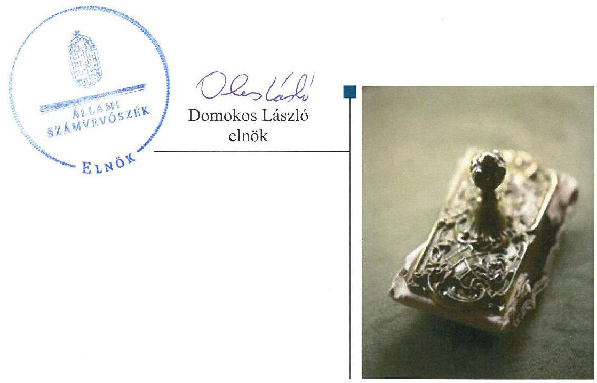
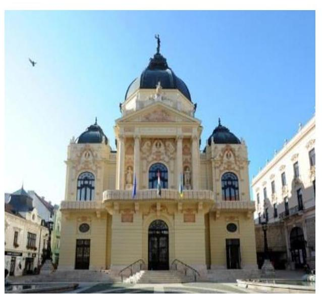
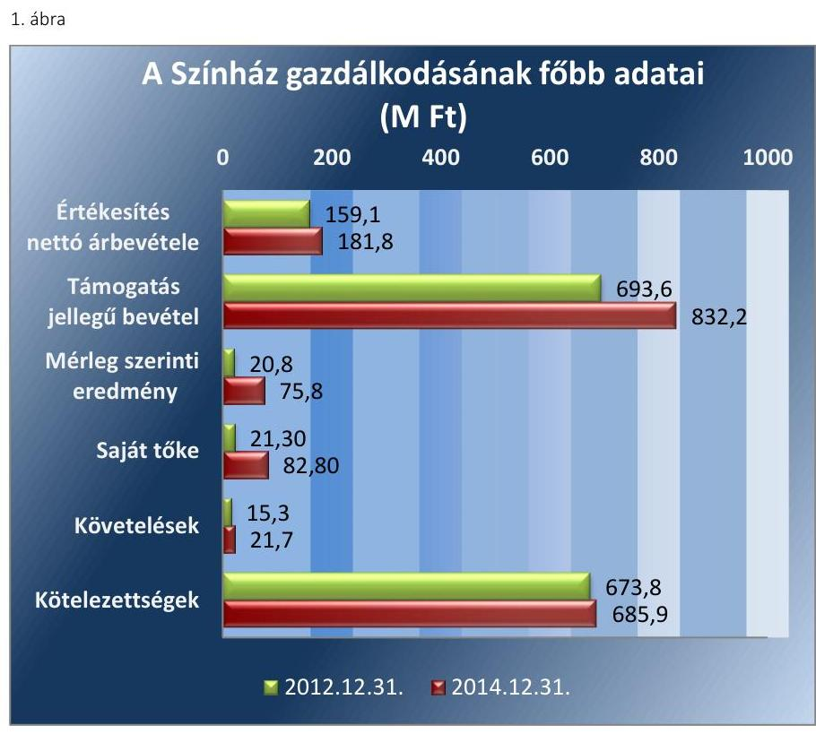
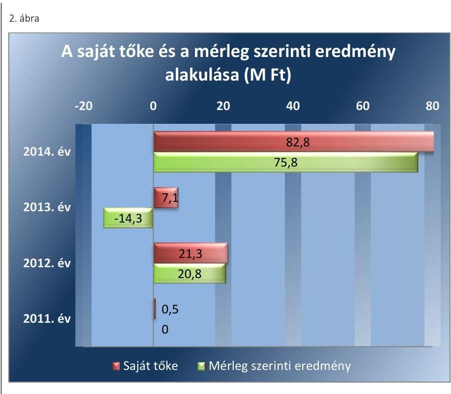
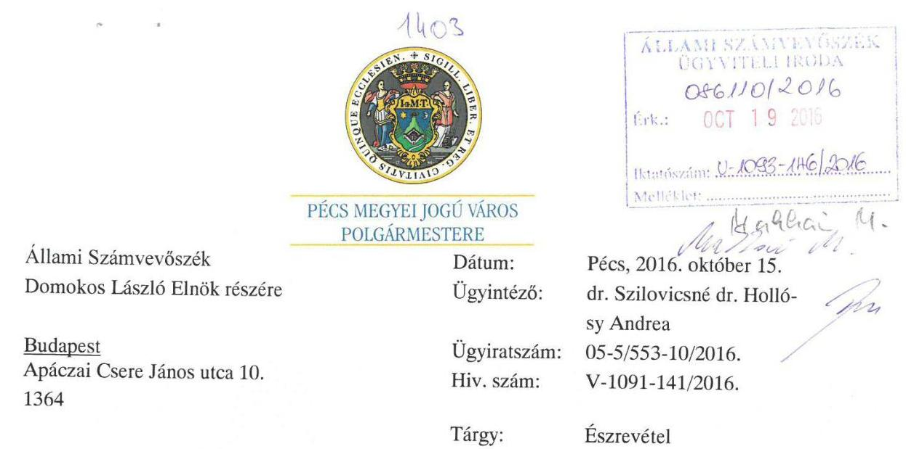
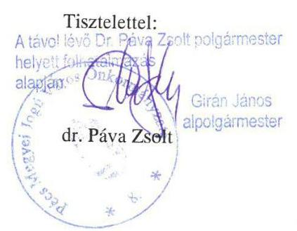
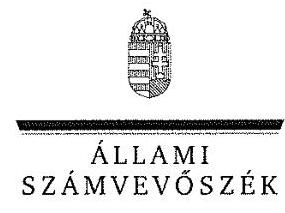
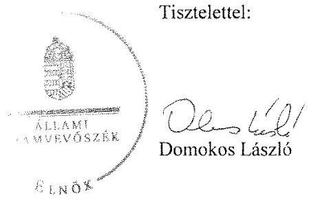

# Jelentés 

## Az önkormányzatok gazdasági társaságai

Az önkormányzatok többségi tulajdonában lévő gazdasági társaságok gazdálkodásának ellenőrzése - Pécsi Nemzeti Színház Nonprofit Kft.
2016.

---

# Jelentés 

## Az önkormányzatok gazdasági társaságai

Az önkormányzatok többségi tulajdonában lévő gazdasági társaságok gazdálkodásának ellenőrzése - Pécsi Nemzeti Színház Nonprofit Kft.
2016. 11. hó 24. nap

---

Jelentéseink az Országgyúlés számítógépes hálózatán és az Interneten a www.asz.hu címen is olvashatóak.

## AZ ELLENŐRZÉST FELÜGYELTE:

MAKKAI MÁRIA felügyeleti vezető

## AZ ELLENŐRZÉST VEZETTE ÉS A VÉGREHAJTÁSÁÉRT FELELŐS:

VALASTYÁNNÉ DR. VÍZHÁNYÓ JÚLIA ellenőrzésvezető

## A PROGRAM ÖSSZEÁLLÍTÁSÁÉRT FELELŐS:

JANIK JÓZSEF osztályvezető

## A TÉMÁHOZ KAPCSOLÓDÓ KORÁBBI SZÁMVEVŐSZÉKI JELENTÉSEK:

- címe:

Jelentés Az önkormányzatok gazdasági társaságai Az önkormányzatok többségi tulajdonában lévő gazdasági társaságok közfeladat ellátását érintő gazdálkodási tevékenysége szabályszerűségének ellenőrzése - PÉTÁV Pécsi Távfütő Korlátolt Felelősségű Társaság

- sorszáma: $\quad 15058$
- címe: $\quad$ Jelentés Az önkormányzatok gazdasági társaságai Az önkormányzatok többségi tulajdonában lévő gazdasági társaságok közfeladat ellátását érintő gazdálkodási tevékenysége szabályszerűségének ellenőrzése - BIOKOM Pécsi Városüzemeltetési és Környezetgazdálkodási Kft.
- sorszáma: $\quad 15020$

IKTATÓSZÁM: V-1093-150/2016.
TÉMASZÁM: 2127
ELLENŐRZÉS-AZONOSÍTÓ SZÁM: V070757

---

# TARTALOMJEGYZÉK 

■ ÖSSZEGZÉS ..... 5
■ AZ ELLENŐRZÉS CÉLJA ..... 6
■ AZ ELLENŐRZÉS TERÜLETE ..... 7
■ AZ ELLENŐRZÉS HÁTTERE, INDOKOLTSÁGA ..... 9
■ FÓKUSZKÉRDÉSEK ..... 10
■ ELLENŐRZÉS HATÓKÖRE ÉS MÓDSZEREI ..... 11
■ MEGÁLLAPÍTÁSOK ..... 13
■ JAVASLATOK ..... 23
■ MELLÉKLETEK ..... 25
I. Sz. melléklet: Értelmező szótár. ..... 25
II. Sz. melléklet: A gazdasági társaság müködéséről ..... 28
■ FÜGGELÉK: ÉSZREVÉTELEK ..... 29
■ RÖVIDÍTÉSEK JEGYZÉKE ..... 35

---

.

---

# ÖSSZEGZÉS 

Az Állami Számvevőszék a kizárólagos önkormányzati tulajdonú Pécsi Nemzeti Színház Nonprofit Kft. gazdálkodását ellenőrizte és megállapította, hogy Pécs Megyei Jogú Város Önkormányzata a közfeladat ellátását biztosította, tulajdonosi jogait összességében szabályszerűen gyakorolta. A Színház vagyongazdálkodása alapvetően szabályszerű, a közfeladat bevételeinek és a ráfordításainak elszámolása megfelelő volt, a mérleg szerinti vagyon növekedett.

## Az ellenőrzés társadalmi indokoltsága

Az Állami Számvevőszék kiemelt célja, hogy a helyi önkormányzatok gazdálkodásában rejlő pénzügyi kockázatok feltárásával, az államháztartáson kívülre nyújtott költségvetési támogatások és ingyenes vagyonjuttatások, valamint az államháztartáson kívül múködő feladat-ellátó rendszerek ellenőrzéseivel hozzájáruljon ahhoz, hogy a közpénzeket az államháztartáson kívül múködő szervezetek is átlátható, rendezett módon használják fel.

Magyarországon az intézmény-centrikus közfeladat-ellátás jellemző, de egyre jelentősebb a költségvetésen kívüli feladatellátás térnyerése. Ennek legfontosabb szereplői - a nonprofit szervezetek mellett - az önkormányzati tulajdonú gazdasági társaságok. Az önkormányzatok szervezetalakítási szabadságának következménye, hogy a korábban is vállalati formában múködő közszolgáltatások mellett, mind a kötelező, mind az önként vállalt feladatok ellátásában a gazdasági társaságok kiemelt fontosságú szerephez jutottak. Az ÁSZ korábban 17 önkormányzati tulajdonban lévő társasági formában múködő színház gazdálkodását ellenőrizte. A jelenlegi ellenőrzés lehetőséget biztosít annak bemutatására, hogy a színházi ellenőrzések tapasztalatai az eddig még nem ellenőrzött intézménynél hasznosultak-e.

## Főbb megállapítások, következtetések, javaslatok

Az Önkormányzat szabályszerűen szervezte meg az előadó-művészeti szervezet támogatása közfeladat ellátását, biztosította annak feltételeit. Az Önkormányzat a közművelődéssel és előadó-művészeti tevékenységgel kapcsolatos céljainak és feladatainak meghatározására törvényi előírásoknak megfelelően rendeletet alkotott.

Az Önkormányzat a Pécsi Nemzeti Színház Nonprofit Kft.-t egyedüli tagként, határozatlan időre hozta létre. Tulajdonosi szerkezete az ellenőrzött időszakban nem változott. A tulajdonosi joggyakorlás összességében megfelelő volt. Az Önkormányzat vagyonkezelési szerződést 2011. november 30-án kötött a Színházzal, melynek keretében 2012. január 1-jével vagyonkezelésbe adta a közfeladat ellátását szolgáló ingatlanokat és eszközöket.

A Színház a beszámolási kötelezettségeit teljesítette. A Színház könyvvizsgálója az éves beszámolókat hitelesítő záradékkal látta el az ellenőrzött években. A kötelezettségállomány a múködésre, közfeladat ellátásra nem jelentett kockázatot. A Színház a múködéséhez szükséges, a jogszabályi előírásoknak megfelelő szabályzatokkal rendelkezett. A Színház vagyongazdálkodása, vagyonnyilvántartása, vagyonkezelése, hasznosítása a jogszabályi és belső előírásoknak összességében megfelelt. A vagyonkezelt vagyon tekintetében fennálló beszámolási kötelezettségének a Színház az Önkormányzat felé minden ellenőrzött évben határidőben eleget tett.

A bevételek és anyagjellegú ráfordítások elszámolása során a jogszabályok és belső szabályok előírásai érvényesültek, a beruházások és felújítások elszámolása megfelelő volt. Az értékcsökkenési leírás elszámolása megfelelő volt. A Színház önköltség-számítási szabályzat készítésére nem volt kötelezett, de 2014. január 1-jétől készített. A szabályzat megfelelt a Számv. tv. előírásainak.

---

# AZ ELLENŐRZÉS CÉLJA 

## A Színház gazdálkodásának ellenőrzése

Az ellenőrzés célja annak értékelése volt, hogy az önkormányzat vagyongazdálkodási tevékenysége során szabályszerűen gyakorolta-e tulajdonosi jogait; a gazdasági társaság szabályozottsága, gazdálkodása és vagyongazdálkodási tevékenysége, bevételeinek és ráfordításainak elszámolása megfelelt-e a jogszabályi és tulajdonosi előírásoknak; a gazdasági társaság kötelezettségállománya jelent-e kockázatot a múködésre, valamint a gazdálkodás átláthatósága és elszámoltathatósága érdekében biztosítva volt-e a szolgáltatás dijának megalapozottsága szabályszerű önköltségszámítással.

---

# AZ ELLENŐRZÉS TERÜLETE 

## Pécs Megyei Jogú Város Önkormányzata és a kizárólagos tulajdonában lévő Pécsi Nemzeti Színház Nonprofit Kft.

PÉCS MEGYEI JOGÚ VÁROS ÖNKORMÁNYZATA a költségvetési szervként múködő Pécsi Nemzeti Színházat 2011. december 31. napján megszüntette. Az Önkormányzat ${ }^{1}$ a Pécsi Nemzeti Színház Nonprofit Kft.-t egyedüli tagként, határozatlan időre 2011. november 24-én hozta létre. A Színház² a múködését 2012. január 1jén kezdte meg. Tulajdonosi szerkezete az ellenőrzött időszakban nem változott. A Színház jegyzett tőkéje 0,5 M Ft, mely teljes egészében pénzbeli betétből állt, a jegyzett tőke összege az ellenőrzött időszakban nem változott.

A SZÍNHÁZ fő tevékenysége kulturális szolgáltatás, elő-adó-művészeti tevékenység. Az Önkormányzat a Mötv. ${ }^{3}$ 13. § (1) bekezdés 7. pontja szerinti feladatát a közösségi tér biztosításával, valamint a Színház tevékenységének támogatásával látta el. Az Önkormányzat a kulturális feladatok ellátását szol-
gáló, a tulajdonát képező ingatlanokat és eszközöket 2012. január 1-jével a Színház részére vagyonkezelésbe adta.

A Színház feladata a megszűnt Pécsi Nemzeti Színház intézmény feladatainak ellátása, közösségi tér biztosítása, közművelődési, tudományos, művészeti tevékenység támogatása közfeladatok maradéktalan ellátása Pécs városában. További feladata, hogy céljainak elérése érdekében intenzív közönség toborzást végezzen, hozzon létre állandó társulatot, valamint meghívott művészekkel magas színvonalú színházi múködést valósítson meg, biztosítsa a színházi műhelymunka lehetőségeit a produkcióra szerveződő művészeti alkotó közösségek számára. A Pécsi Nemzeti Színház az ország egyik legnagyobb színháza, prózai, opera- és balett tagozattal múködik. Az 570 fős nézőtérrel rendelkező nagyszínházon kívül a 300 fős kamaraszínházban, illetve a 80-80 fős stúdió-, valamint szobaszínházban is játszik a társulat. Az alkalmazottak átlagos állományi létszáma 2014. december 31én 197 fő volt.

A Színház 2011 - 2014. évi gazdálkodásának főbb adatait az 1. ábra szemlélteti.

---

Forrás: A Színház 2012-2014. évi beszámolói
Az értékesítés nettó árbevétele 2012. és 2014. között 14\%-kal növekedett. A Színház működésében a részére nyújtott támogatások mértéke meghatározó súllyal bírt az ellenőrzött időszakban. A támogatások összege 2012 - 2014. években összesen 2327,5 M Ft volt, melynek 49\%-át a központi költségvetési támogatások tették ki. Az Önkormányzat által biztosított támogatások aránya $34,1 \%$, a vállalkozások, magánszemélyektől érkezett támogatási összegek aránya 14,6 \% volt. A Színház gazdálkodása, a 2013. év kivételével, nyereséges volt. A kötelezettségek állományát döntően a vagyonkezelésbe vett eszközökkel összefüggő hosszú lejáratú kötelezettségek tették ki.

Az ügyvezető a Színház megalakulása óta tölti be tisztségét, az ellenőrzött időszakban személye nem változott.

A polgármester ${ }^{4}$ a 2010. évi önkormányzati választások óta tölti be tisztségét, a helyszíni ellenőrzés időszakában a munkakört betöltő jegyző ${ }^{5}$ 2011. május 1-jétől látja el feladatait.

A Színház nem minősült az Áht. ${ }_{2}{ }^{6}$ 2. § (1) bekezdés I) pontja, valamint a 479/2009/EK rendelet ${ }^{7}$ szerint nevesített kormányzati szektorba sorolt egyéb szervezetnek, ezért adatszolgáltatási kötelezettség az ellenőrzött időszakban nem terhelte.

---

# AZ ELLENŐRZÉS HÁTTERE, INDOKOLTSÁGA 

Objektív vélemény kialakítása Pécs Megyei Jogú Város Önkormányzata előadó-művészeti szervezet támogatási közfeladatának megszervezéséről, tulajdonosi joggyakorlásáról, valamint a kizárólagos tulajdonában lévő Pécsi Nemzeti Színház Nonprofit Kft. közfeladat ellátását érintő gazdálkodásáról.

## Az önkormányzatok közfeladat-ellátásában egyre jelentősebb a gazdasági társaságok útján történő feladatellátás térnyerése

AZ ÖNKORMÁNYZATI TULAJDONÚ GAZDASÁGI TÁRSASÁGOK ellenőrzése kiemelten fontos a vagyon megőrzése, megóvása érdekében, valamint a kormányzati szektor elszámolásaiban megjelenő önkormányzati tulajdonú gazdálkodó szervezetek esetében, amelyekkel szemben alapvető követelmény, hogy gazdálkodásuk, működésük szabályszerű, az általuk szolgáltatott adatok minél megbízhatóbbak legyenek. A feladat/közfeladat-ellátás költségeinek, ráfordításainak alakulása, színvonala hatással van a lakosság elégedettségére.

A TÖRVÉNYALKOTÁS SZÁMÁRA - az észlelt problémák, szabálytalanságok, vagy egyéb nem kívánatos jelenségek felszínre kerülésével - az ellenőrzés megállapításai segítséget nyújthatnak az államháztartáson kívüli feladat/közfeladat-ellátás értékeléséhez, jogszabályi keretei pontosításához, átláthatóságot biztosító szabályozásához. Meghatározhatóvá válnak az önkormányzati feladatellátásban részt vevő államháztartáson kívüli szervezeteknek - az önkormányzat költségvetését, pénzügyi helyzetét is befolyásoló - kockázatai, lehetővé válik ezen kockázatok csökkentése. Ellenőrzéseink feltárhatják, hogy az önkormányzat feladat-ellátási kötelezettségének szabályszerűen tett-e eleget, a feladatellátáshoz rendelt vagyonkezelésbe vett és saját vagyon működtetését az elvárható gondossággal, szabályszerűen szervezte-e meg és a tulajdonosi felügyelete hozzájárult-e a feladatellátásához. Az ellenőrzés rávilágíthat arra, hogy a gazdasági társaság a feladat-ellátási, közszolgáltatási szerződésben foglaltak betartásával, a vagyon használatával biztosította-e a szolgáltatás folytatásának feltételeit, a feladat ellátását. Ezzel az ellenőrzöttek és a helyi döntéshozók számára visszajelzést ad feladatszervezési, feladat-ellátási kockázataikról, alapot ad a meglévő hibák megszüntetéséhez, a jobb feladatellátás biztosításához. Fokozza a fegyelmet, igazolja, hogy lejárt a következmények nélküli ellenőrzések idő-szaka. Az ÁSZ értékteremtő rend kialakításához és megőrzéséhez hozzájáruló tevékenysége pozitív hatással van a szervezetről kialakított összkép formálására.

---

# FÓKUSZKÉRDÉSEK 

1.     - Az önkormányzat közfeladat megszervezéséről szóló döntése, valamint tulajdonosi joggyakorlása szabályszerű volt-e?
2.     - A gazdasági társaság vagyongazdálkodása szabályszerű volt-e, kötelezettségállománya jelent-e kockázatot a müködésre, illetve a közfeladat ellátására?
3.     - A gazdasági társaságnál az ellátott közfeladat bevételei és ráfordításai elszámolása, valamint az önköltségszámitás és árképzés szabályszerű volt-e?

---

# ELLENŐRZÉS HATÓKÖRE ÉS MÓDSZEREI 

## Az ellenőrzés típusa

Megfelelőségi ellenőrzés

## Az ellenőrzött időszak

- Pécs Megyei Jogú Város Önkormányzata vonatkozásában 2011. november 24 -től 2014. december 31-ig,
- A Pécsi Nemzeti Színház Nonprofit Kft. vonatkozásában 2011. november 24 -től 2014. december 31-ig.

## Az ellenőrzés tárgya

A gazdasági társaság feletti tulajdonosi joggyakorlás, valamint gazdasági társaság gazdálkodásának szabályozottsága és szabályszerűsége.

Az ellenőrzés kiterjed minden olyan körülményre és adatra, amely az ÁSZ jogszabályban meghatározott feladatainak teljesítéséhez, valamint a program végrehajtása folyamán felmerült újabb összefüggések feltárásához szükséges.

## Az ellenőrzött szervezet

Az ellenőrzött szervezetek:
Pécs Megyei Jogú Város Önkormányzata
Pécsi Nemzeti Színház Nonprofit Kft.

## Az ellenőrzés jogalapja

Az ellenőrzés jogszabályi alapját az ÁSZ tv. 1. § (3) bekezdése és 5. § (3)-(4)-(5) bekezdései képezik.

## Az ellenőrzés módszerei

Az ellenőrzést a nemzetközi standardokat irányadónak tekintve az ellenőrzési program ellenőrzési kérdései, az ellenőrzött időszakban hatályos jogszabályok, az ellenőrzés szakmai szabályok és módszertanok figyelembevételével végeztük.

---

Az ellenőrzés ideje alatt az ellenőrzött szervezettel történő kapcsolattartást az ÁSZ Szervezeti és Működési Szabályzatának vonatkozó előírásai alapján biztosítottuk.

Az ellenőrzés a kiválasztott, tulajdonosi jogokat gyakorló Pécs Megyei Jogú Város Önkormányzatára, illetve a közfeladatot ellátó Pécsi Nemzeti Színház Nonprofit Kft.-re terjedt ki.

Az ellenőrzési kérdések megválaszolásához szükséges bizonyítékok megszerzése a következő ellenőrzési eljárások alkalmazásával történt: megfigyelés, kérdésfeltevés (információkérés), összehasonlítás, valamint elemző eljárás. Az ellenőrzési bizonyítékként felhasználható adatforrások közé tartoznak egyrészt a szakmai programban felsorolt adatforrások, másrészt adatforrás lehet még minden - az ellenőrzés folyamán - feltárt, az ellenőrzés szempontjából információkat tartalmazó dokumentumok.

Az ellenőrzést a kérdésekre adott válaszok kiértékelésével, valamint a megjelölt adatforrások, a csatolt tanúsítványok felhasználásával, továbbá az adott időszakban hatályos jogszabályok figyelembe vételével folytattuk le.

A bevételek és ráfordítások elszámolása, valamint a vagyonnyilvántartás terén a szabályszerű múködést véletlen mintavétellel ellenőriztük. A mintavétellel ellenőrzött területek esetében minden egyes tétel vonatkozásában a szabályszerűségre vonatkozó kérdéseket tettünk fel, amelyek eredménye összesítésre került. „Megfelelőnek" értékeltünk egy ellenőrzött területet, amennyiben 95\%-os bizonyossággal a teljes sokaságban a hibaarány legfeljebb $10 \%$ volt.

A ráfordítások elszámolására és a vagyonnyilvántartásra vonatkozó véletlen mintavételt kockázati alapú kiválasztással egészítettük ki, amelynek során évente a három legnagyobb összegű tételt választottuk ki.

---

# 1. Az önkormányzat közfeladat megszervezéséről szóló döntése, valamint tulajdonosi joggyakorlása szabályszerű volt-e? 

Összegző megállapítás

Az Önkormányzat a jogszabályi előírásoknak megfelelően szervezte meg az előadó-művészeti tevékenység támogatása közfeladatának ellátását. A tulajdonosi joggyakorlás összességében szabályszerű volt.
1.1. számú megállapítás

Az Önkormányzat a jogszabályi előírásoknak megfelelően szervezte meg az előadó-művészeti tevékenység támogatása közfeladatának ellátását.

GAZDASÁGI PROGRAMMAL ${ }^{8}$ az ellenőrzött időszakban az Önkormányzat rendelkezett az Ötv. ${ }^{9}$ 91. § (6) bekezdés, Mötv. 116. § (3) (4) bekezdésekben meghatározottak szerint. Az Önkormányzat az ellenőrzött időszakban rendelkezett elfogadott Középtávú Kulturális Stratégiával. A Középtávú Kulturális Stratégia a művelődési és alkotóművészeti lehetőségeinek bővítését tűzte ki célul.

A TELEPÜLÉSFEJLESZTÉSI KONCEPCIÓ ${ }^{10}$ célként határozta meg a közművelődés és a művészeti élet további erősítését, amely megvalósításában a Színház és a hozzá kapcsolódó POSZT11 fesztivál kiemelt szerepet töltött be.

KÖZÉP- ÉS HOSSZÚ TÁVÚ VAGYONGAZDÁLKODÁSI TERVET ${ }^{12}$ az Önkormányzat 2012. január 1. és 2013. február 7. között nem készített az Nvtv. ${ }^{13}$ 9. § (1) bekezdésben előírtak ellenére. Az Nvtv. 7. § (2) bekezdésének megfelelően a 2013 - 2016. évekre vonatkozóan már elkészítette a közép- és hosszú távú vagyongazdálkodási tervét.

KÖZMŰVELŐDÉSI RENDELETET ${ }^{14}$ az Önkormányzat a Közm. tv. ${ }^{15}$ 77. §-ban előírtaknak megfelelően alkotott. A Közművelődési rendeletben - a Közm. tv. 76. §-ban meghatározott kötelező feladatai ellátása érdekében - az Önkormányzat meghatározta a Színház a közművelődéssel és az előadó-művészeti tevékenységgel kapcsolatos céljait és feladatait, a feladat ellátás módját és formáját, a közművelődési és előadóművészeti feladatellátás szervezeti kereteit, a feladatellátás tárgyi és személyi feltételeit és finanszírozását.

AZ ALAPÍTÓ OKIRAT ${ }^{16}$ a Gt. ${ }^{17}$ és a Ptk. ${ }^{18}$ előírásainak megfelelő tartalommal készült. Az Alapító Okirat módosítására öt alkalommal került sor az ellenőrzött időszakban. A módosítások nem érintették a feladatellátást, és a tulajdonosi jogok gyakorlását. Az Alapító Okirat szerint a legfőbb

---

szerv hatáskörét az Önkormányzat Közgyűlése, mint egyedüli tag gyakorolta. A Gt., Ptk. 2 -vel összhangban az Alapító kizárólagos hatáskörébe sorolta az éves beszámoló-, a közhasznúsági jelentés jóváhagyását, a mérleg szerinti nyereség felosztását, az $\mathrm{FB}^{19}$ tagjainak megválasztását, visszahívását, díjazásának megállapítását, az ügyvezető és a könyvvizsgáló megbízását és visszahívását, díjazásának megállapítását.

KÖZSZOLGÁLTATÁSI SZERZŐDÉS120- t 2011. november 30-án kötött a Színház és az Önkormányzat. A közszolgáltatási szerződés két alkalommal módosult az ellenőrzött időszakban. A szerződésben az Emtv. ${ }^{21}$-vel összhangban meghatározták a tevékenység ellátására vonatkozó követelményeket, feladatmutatókat.

KÖZSZOLGÁLTATÁSI SZERZŐDÉS222 - t a Nemzeti Erőforrás Minisztériummal 2012. május 2-án kötött a Színház a közszolgáltatási szerződésben meghatározott előadó-művészeti szolgáltatások tartós biztosítása érdekében. A közszolgáltatási szerződés a nemzeti előadó-művészeti szervezeti minősítés feltétele. A közszolgáltatási szerződést 2012. május 1-jétől 2015. december 31-ig terjedő időszakra kötötték.

Az Emtv. szerinti központi költségvetési támogatás tartós biztosítása érdekében a Színház az Önkormányzattal 2012. október 25-én 2013. január 1-jétől 2015. december 31-ig terjedő időszakra vonatkozóan fenntartói megállapodás ${ }^{23}$ - t kötött.

VAGYONKEZELÉSI SZERZŐDÉS ${ }^{24}$ - t az Önkormányzat 2011. november 30-án kötött a Színházzal, melynek keretében az Önkormányzat 2012. január 1-jével a kulturális feladatok ellátását szolgáló, a tulajdonát képező ingatlanokat és eszközöket a Színház részére vagyonkezelésbe adta. A vagyonkezelési szerződésben rendelkeztek a felek a szerződéskötéskor hatályos Áht. ${ }^{25}$ 105/B. § előírásainak megfelelően a kezelt vagyon felújításáról, pótlólagos beruházásáról való gondoskodás kötelezettségéről. A vagyonkezelési szerződésben rögzítették, hogy a Színház a vagyonkezelésbe vett vagyon után az elszámolt értékcsökkenés összegének felhasználásáról évente köteles beszámolni.

# 1.2. számú megállapítás 

A tulajdonosi joggyakorlás rendjének kialakítása és a közfeladat ellátás felügyelete összességében megfelelő volt.

A TULAJ DONOSI JOGOK gyakorlásának rendjét a Közgyűlés az Ötv. 80. § (1) bekezdésében és az Mótv. 107. § -ában kapott felhatalmazás alapján a Vagyonrendelet ${ }_{1,2}{ }^{26}$-ben szabályozta. A Vagyonrendelet ${ }_{1,2}$ szerint a tulajdonosi jogok gyakorlására a Közgyűlés és a polgármester kapott felhatalmazást. A Színház feletti tulajdonosi jogokat a polgármester a Vagyonrendelet ${ }_{1,2}$ szerint gyakorolta.

Az Önkormányzat SZMSZ ${ }_{1,2}{ }^{27}$ - ében és Alapító Okiratban rögzített fel-adat- és hatáskörök a Gt. és Ptk. ${ }_{2}$ előírásainak megfeleltek.

AZ FB az Alapító Okiratban foglaltak szerint három tagból állt a Gt., valamint a Ptk. ${ }_{2}$-ben foglaltakkal összhangban. A Gt. 34. § (4) bekezdés és a Ptk. ${ }_{2}$ 3:122. § (3) bekezdésében foglaltak ellenére az FB az ügyrendjét nem

---

állapította meg. Az FB az ellenőrzött időszak minden évében a Színház beszámolóiról írásos jelentést készített, a Gt. 35. § (3) bekezdése és a Ptk. 3 :120. § (2) bekezdésének megfelelően.

AZ ANYAGI ÖSZTÖNZÉSI RENDSZERT a Taktv. ${ }^{28}$ 5. § (3) bekezdésében foglaltaknak megfelelően a Közgyűlés által elfogadott javadalmazási szabályzat ${ }^{29}$ - ban rögzítették.

A BESZÁMOLTATÁS RENDJÉT az Alapító Okiratban és a közszolgáltatási szerződésben rögzítették. A szerződésben előírták az ügyvezető részére, a színházi évad ${ }^{30}$ lezárását követő közhasznú tevékenységéről szóló beszámoló készítési kötelezettségét. Az ügyvezető által benyújtott szakmai beszámolók, szöveges és számszaki adatokat tartalmazva mutatták be a közszolgáltatási szerződésben meghatározott követelmények betartását. Azok az adott év munkájának értékelése mellett, tartalmazták a következő évad terveit is.

ELLENŐRZÉST a Polgármesteri Hivatal Ellenőrzési Osztálya az önkormányzati tulajdonban lévő gazdasági társaságokkal kötött 2012. évre vonatkozó közszolgáltatási szerződések és közfeladat átadási megállapodások tárgyú ellenőrzése keretében a 2014. évben végzett. Az ellenőrzés megállapította, hogy a közszolgáltatási szerződés; az 2012. március 31-től 2014. december 31-ig nem felelt meg az Emtv. 13. § (2) bekezdés h) és j) pontjában foglaltaknak, mert nem tartalmazta a gyermek- és ifjúsági korosztály védelmét szolgáló nézőtájékoztatási, a jegyrendszerre vonatkozó előírásokat, a szerződésben meghatározott kötelezettségek megszegése esetére vonatkozó jogkövetkezményeket. A javaslatok alapján előírt intézkedések végrehajtási határidőit az ellenőrzött időszakon túli időpontban határozták meg. Az Önkormányzat megbízásán alapuló külső szakértői ellenőrzést nem hajtottak végre.

GARANCIA- ÉS KEZESSÉGVÁLLALÁST az Önkormányzat az ellenőrzött időszakban nem vállalt. A Színház az ellenőrzött időszakban hitelt nem vett fel, kötvényt nem bocsátott ki, részéről egyéb, adósságot keletkeztető ügylet kötelezettségvállalására nem került sor.

# 2. A gazdasági társaság vagyongazdálkodása szabályszerű volt-e, kötelezettségállománya jelent-e kockázatot a múködésre, illetve a közfeladat ellátására? 

Összegző megállapítás

A Színház vagyongazdálkodása szabályszerű volt, beszámolási kötelezettségét teljesítette, a kötelezettségállomány a múködést nem veszélyeztette.

### 2.1. számú megállapítás

A Színház a múködéséhez szükséges, a jogszabályi előírásoknak megfelelő szabályzatokkal rendelkezett.

ÜZLETI TERV készítésének kötelezettségét a Színház számára az Alapító Okirat és a közszolgáltatási szerződés határozta meg. A Színház

---

a 2012., a 2013. és a 2014. évekre vonatkozó üzleti terveit elkészítette, azokat az FB jóváhagyta. Az üzleti tervekben a művészeti működés célkitűzései összhangban álltak az Önkormányzat 2008 - 2013. évekre szóló Kulturális Stratégiájával. A Gt. 19. § (3) bekezdésének, valamint a Ptk. 2 3:109. § (2) bekezdésének megfelelően az alapító az üzleti terveket Alapító határozatokban jóváhagyta.

A SZÁMVITELI POLITIKA készítési kötelezettségének a Színház a Számv. tv.-ben foglaltaknak megfelelően eleget tett. A számviteli politikája ${ }_{1,2,3}{ }^{31}$ keretében - a Számv. tv. 14. § (5) bekezdésének megfelelően - elkészítette az eszközök és források leltárkészítési és leltározási szabályzatát ${ }_{1,2}{ }^{32}$, az eszközök és források értékelési szabályzatát ${ }_{1,2}{ }^{33}$ a pénzkezelési szabályzatát ${ }_{1,2,3}{ }^{34}$. A Színház az ellenőrzött időszakban külön szabályozta a felesleges vagyontárgyak hasznosításának és selejtezésének eljárásrendjét ${ }_{1,2}{ }^{35}$ is.

A számviteli politika ${ }_{1,2,3}$ a Számv. tv. 14. § (4) bekezdésben foglalt előírásoknak megfelelt, azt a jogszabály-változásoknak megfelelően aktualizálták.

# AZ ESZKÖZÖK ÉS FORRÁSOK LELTÁRKÉSZÍTÉSI 

ÉS LELTÁROZÁSI SZABÁLYZATA ${ }_{1,2}$ a mérleg alátámasztására szolgáló leltárak elkészítésének szabályait a Számv. tv. 69. § (1)(2) bekezdésével összhangban rögzítette. Mennyiségi leltározási kötelezettséget - 2012. január 1-jétől - a Számv. tv. 69. § (3) bekezdésével összhangban évenkénti gyakorisággal írtak elő. Az eszközök és források értékelési szabályzata ${ }_{1,2}$ tartalmazta az eszközök és források bekerülési értékének, valamint értékelésének szabályait.

A PÉNZKEZELÉSI SZABÁLYZATBAN ${ }_{1,2,3}$ a Számv. tv. 14. § (8) bekezdésében előírtaknak megfelelően - többek között - rendelkeztek a pénzforgalom lebonyolításának rendjéről, a készpénzben és a bankszámlán tartott pénzeszközök közötti forgalomról, a bankkártya használat rendjéről, a készpénzállomány ellenőrzésekor követendő eljárásról, az ellenőrzés gyakoriságáról.

A SZÁMLARENDJÉT ${ }_{1,2}{ }^{36}$ a Színház a Számv. tv. 161. § (1) és (2) bekezdése szerint elkészítette. A bevételek, a támogatások, juttatások elkülönítését a főkönyvi számlák alábontásával végezte a társaság. A befektetett eszközök között a társaság a vagyonkezelésbe vett vagyonelemeket külön főkönyvi számlán tartotta nyilván, ehhez kapcsolódó struktúrában történt az értékcsökkenés elszámolása is.

ÖNKÖLTSÉG-SZÁMÍTÁSI SZABÁLYZAT ${ }^{37}$ készítésére a Számv. tv. 14. § (7) bekezdése alapján a Színház nem volt kötelezett az ellenőrzött időszakban, de ennek ellenére 2014. január 1-jétől készített.

---

# 2.2. számú megállapítás 

## A Színház vagyongazdálkodása a jogszabályi és belső előírásoknak megfelelően történt.

A Színház a saját és a vagyonkezelésben lévő vagyonára vonatkozóan rendelkezett naprakész vagyonnyilvántartással. A vagyonkezelésre átvett eszközöket a vagyonkezelési szerződésben előírtak szerint, a saját vagyonától elkülönítetten tartotta nyilván.

## A VAGYONKEZELT ESZKÖZÖK LELTÁROZÁSÁT

a Színház a leltárkészítési és leltározási szabályzatának ${ }_{1,2}$ megfelelően minden évben elvégezte. A vagyonkezelési szerződés előírásainak megfelelően a vagyon megterhelésére, elidegenítésére, ingyenes átruházására nem került sor.

A Színház a vagyonkezelésébe átvett immateriális javak és tárgyi eszközökre az ellenőrzött időszakban 93,3 M Ft értékcsökkenést számolt el. A Színház a vagyonkezelésbe átvett eszközök pótlására az ellenőrzött időszakban 50,1 M Ft összegben a Mötv. 109. § (6) bekezdése szerint, valamint a vagyonkezelési szerződésnek megfelelően számolt el felújítási költséget, illetve valósított meg beruházást.

Az immateriális javak és a tárgyi eszközök értékének alakulását az 1. táblázat mutatja be.

1. táblázat

## AZ IMMATERIÁLIS JAVAK ÉS A TÁRGYI ESZKÖZÖK ÉRTÉKÉNEK ALAKULÁSA (M FT)

| Megnevezés | 2012. év | 2013. év | 2014. év |
| :--: | :--: | :--: | :--: |
| Bruttó érték | 1382,3 | 1458,5 | 1629,6 |
| - ebből vagyonkezelésbe átvett ingatlanok, eszközök | 1298,7 | 1292,5 | 1300,2 |
| - saját vagyon | 92,6 | 166,0 | 329,4 |
| Halmozott értékcsökkenés | 689,7 | 739,2 | 800,6 |
| - ebből vagyonkezelésbe átvett ingatlanok, eszközök | 677,7 | 706,1 | 718,2 |
| - saját vagyon | 12,0 | 33,0 | 82,4 |
| Nettó érték | 692,6 | 719,3 | 829,0 |
| - ebből vagyonkezelésbe átvett ingatlanok, eszközök | 612,0 | 586,4 | 582,0 |
| - saját vagyon | 80,6 | 132,9 | 247,0 |

A vagyonkezelési szerződésben az Önkormányzat a Színház részére előírta a vagyonkezelésbe vett és a saját tulajdonában lévő vagyoni eszközökre vonatkozó felújítási és rekonstrukciós ütemterv készítését és annak a tulajdonossal történő véleményeztetését. A Színház az ellenőrzött időszakra vonatkozóan a vagyonkezelési szerződés 16. pontjában előírt ütemtervet készített.

A Színház a tárgyi eszközök mennyiségi felvétellel történő leltározását az ellenőrzött időszakban a Számv. tv. 69. § (3) bekezdésében, valamint a leltárkészítési és leltározási szabályzat ${ }_{1,2}$-ban előírtakkal összhangban elvégezte.

---

A Színház mérlegének kiemelt adatait a 2. táblázat tartalmazza.
2. táblázat

| A SZÍNHÁZ MÉRLEGÉNEK KIEMELT ADATAI (M FT) |  |  |  |  |
| :--: | :--: | :--: | :--: | :--: |
| Megnevezés | 2011-12-31. | 2012-12-31. | 2013-12-31. | 2014-12-31. |
| I. Befektetett eszközök | 0,0 | 692,6 | 719,3 | 829,0 |
| - ebből: Tárgyi eszközök | 0,0 | 658,3 | 653,9 | 725,2 |
| II. Forgó eszközök | 0,5 | 49,9 | 43,3 | 32,9 |
| - ebből: Követelések | 0,0 | 15,3 | 13,9 | 21,7 |
| III. Aktív időbeli elhatárolások | 0,0 | 1,1 | 0,1 | 4,2 |
| Eszközök összesen | 0,5 | 743,6 | 762,7 | 866,1 |
| IV. Saját tőke | 0,5 | 21,3 | 7,1 | 82,8 |
| - ebből: Jegyzett tőke | 0,5 | 0,5 | 0,5 | 0,5 |
| - ebből Mérleg szerinti eredmény | 0,0 | 20,8 | $-14,3$ | 75,8 |
| V. Céltartalékok | 0,0 | 0,0 | 0,0 | 0,0 |
| VI. Kötelezettségek | 0,0 | 673,8 | 698,5 | 685,9 |
| - ebből Hosszú lejáratú kötelezettség | 0,0 | 644,7 | 645,6 | 645,6 |
| VII. Passzív időbeli elhatárolások | 0,0 | 48,5 | 57,1 | 97,4 |
| Források összesen | 0,5 | 743,6 | 762,7 | 866,1 |

AZ ESZKÖZÖK állományának jelentős részét az Önkormányzattól a közfeladat ellátása érdekében vagyonkezelésbe átvett vagyon tette ki. A vagyonkezelt ingatlanok és eszközök értékét a Színház a vagyonkezelési szerződés mellékletében rögzített értéken vette nyilvántartásba. A befektetett eszközök állománya a színházi bemutatók előtti színrevitel költségeinek és a díszletnek minősülő tárgyi eszközök aktiválása következtében növekedett. A mérleg főösszeg 2014. év végére az alapításkori 0,5 M Ft-ról 866,1 M Ft-ra emelkedett. Ennek fő oka a feladatellátáshoz szükséges eszközök vagyonkezelésbe adása volt.

A FORRÁSOK között a vagyonkezelésbe átvett eszközök miatti hoszszú lejáratú kötelezettség a legnagyobb tétel. A mérleg szerinti eredményből a Színház saját tőkéje az ellenőrzött időszakban 82,3 M Ft-tal növekedett.

# A SAJÁT TÖKE ÉS A MÉRLEG SZERINTI EREDMÉNY alakulását a 2. ábra mutatja be.

---

A Színház jegyzett tőkéje az ellenőrzött időszakban 0,5 M Ft volt, ami megfelelt a Gt.-ben és a Ptk. 2 -ban számára előírt minimális összegnek. Az ellenőrzött időszakban a Színház a saját tőkére vonatkozó kritériumokat teljesítette.
2.3. számú megállapítás

A kötelezettségek állománya a közfeladat ellátására, a Színház múködésére nem jelentett kockázatot.

A SZÍNHÁZ KÖTELEZETTSÉGEINEK állománya az ellenőrzött időszakban 2012. évről 2014. évre 12,1 M Ft-tal, 1,8 \%-kal emelkedett. A rövidlejáratú kötelezettségek a 2012. évi 29,1 M Ft-ról 2014. évre 40,3 M Ft-ra növekedett. A rövid lejáratú kötelezettségekből a nagyobb arányt az adó és járulék befizetési kötelezettségek tették ki, a szállítók felé fennálló kötelezettség aránya 2012 - 2014. években $7,0 \%$, és $20,1 \%$ között volt. A Színház az ellenőrzött időszakban szerződésen alapuló rövid lejáratú kötelezettségeit határidőre teljesítette. A Színház hosszú lejáratú kötelezettségei kizárólag a vagyonkezelési szerződés teljesítéséből eredtek.

Az ellenőrzött időszakban a számított eladósodottsági mutatók kedvezőtlen értéke a vagyonkezelésbe átvett eszközök számviteli elszámolásának szabályaiból adódott. Az eladósodottsági mutató 2012. és 2013. években $0,9,2014$-ben 0,8 volt.

A kötelezettségek állomány a közfeladat ellátására, a társaság múködésére nem jelentett kockázatot.

---

A kötelezettség állomány alakulását a 4. táblázat szemlélteti.
4. táblázat

| A KÖTELEZETTSÉG ÁLLOMÁNY ALAKULÁSA (M FT) |  |  |  |  |
| :--: | :--: | :--: | :--: | :--: |
| Megkevezés | $\begin{gathered} 2011 . \\ 12.31 . \end{gathered}$ | $\begin{gathered} 2012 . \\ 12.31 . \end{gathered}$ | $\begin{gathered} 2013 . \\ 12.31 . \end{gathered}$ | $\begin{gathered} 2014 . \\ 12.31 . \end{gathered}$ |
| Rövid lejáratú kötelezettségek | 0 | 29,1 | 53,0 | 40,3 |
| - Szállítók | 0 | 2,0 | 6,5 | 8,1 |
| - Egyéb rövid lejáratú kötelezettségek | 0 | 27,1 | 46,5 | 32,2 |
| Hosszú lejáratú kötelezettségek | 0 | 644,7 | 645,6 | 645,6 |
| ebből Önkormányzattal szembeni kötelezettség | 0 | 644,7 | 645,6 | 645,6 |
| Kötelezettség összesen | 0 | 673,8 | 698,5 | 685,9 |

2.4. számú megállapítás

A Színház a beszámolási kötelezettségének a jogszabályi előírásoknak és belső szabályozásnak megfelelően eleget tett.

# A KÖZFELADAT ELLÁTÁSSAL KAPCSOLATBAN 

az Önkormányzat a közszolgáltatási szerződésben előírta a Színház részére a színházi évad lezárását követően szakmai értékelés készítését, valamint annak minden naptári év szeptember 30-ig történő megküldését. Az ellenőrzött időszakban a Színház a 2012 - 2013., a 2013 - 2014., továbbá a 2014 - 2015.-ös évadokra vonatkozóan elkészítette a művészeti beszámolóit, valamint megküldte azokat az Önkormányzat részére.

A vagyonkezelési szerződés 20., 21., 22. és 23. pontjai alapján a Színháznak a vagyonkezelésbe átvett eszközök és ingatlan vonatkozásában adatszolgáltatási, illetve beszámolási kötelezettsége volt, melyet az ellenőrzött időszakban határidőre teljesített.

A Színház a Számv. tv. 19. § (1) bekezdésében előírt tartalommal az ellenőrzött időszakra vonatkozóan az éves beszámolókat elkészítette, és a mérlegtételeket a Számv. tv. 69. § (1) bekezdésének megfelelően leltárral alátámasztotta. Az ellenőrzött időszakban a Civil tv. ${ }^{38}$ 46. § (1) bekezdésében előírt közhasznúsági mellékleteket is elkészítette. A Színház a Számv. tv. 155. § (2) bekezdésében előírtak szerint az ellenőrzött időszakban könyvvizsgálatra volt kötelezett. A Gt. 40. § (1) bekezdése - a 2014. évtől a Ptk.2. 3:129. § -előírásoknak megfelelően a könyvvizsgáló az ellenőrzött években elkészítette jelentését az éves beszámoló felülvizsgálatáról. A könyvvizsgáló az ellenőrzött időszakban a beszámolókat hitelesítő záradékkal látta el. Az ellenőrzött időszakban az FB a Színház beszámolóit a Gt. 35. § (3), illetve a Ptk. 3 :120. § (2) bekezdése és az Alapítói Okirat 9.6 pontban előírtak alapján megtárgyalta és jóváhagyta, amelyekről írásos jelentést készített.

AZ ÉVES BESZÁMOLÓKAT és a közhasznúsági mellékleteket az Önkormányzat Alapítói határozatokban elfogadta. A Színház az ellenőrzött időszakra vonatkozó éves beszámolókat a Számv. tv. 153. § (1) bekezdésében, valamint a Civil tv. 46. § (1) bekezdésének megfelelően a közhasznúsági mellékletet határidőben letétbe helyezte. Az ellenőrzött időszakban a Színház a Számv. tv. 154. § (7) és a Civil tv. 46. § (1) bekezdéseinek megfelelően a beszámolók és a közhasznúsági jelentés Céginformációs szolgálatnak történő megküldésével, eleget tett a közzétételi kötelezettségének.

---

A Színház az ellenőrzött időszakban rendelkezett az Info tv. ${ }^{39}$-ben előírt közérdekú adatok megismerésére irányuló igények teljesítési rendjét rögzítő szabályzattal. A Színház a kötelezően közzéteendő közérdekú adatait az Info tv.-ben meghatározott tartalommal az ellenőrzött időszak minden évében internetes honlapjára feltöltötte.

# 3. A gazdasági társaságnál az ellátott közfeladat bevételei és ráfordításai elszámolása, valamint az önköltségszámítás és árképzés szabályszerű volt-e? 

## Összegző megállapítás

3.1. számú megállapítás
3. ábra

Az ellenőrzés megállapítása
A gazdasági társasáa ráfordításainak szabályszerű elszámolása területén

Anyagjellegú ráfordítások
Beruházások, felújítások
Értékcsökkenés
A gazdasági társasáa bevételeinek szabályszerú elszámolása területén

- Értékesítés nettó árbevétele

A Színház által ellátott közfeladat bevételeinek és ráfordításainak elszámolása megfelelő volt. Önköltség-számítási szabályzat készítésére nem volt kötelezett.

A bevételek és anyagjellegú ráfordítások elszámolása megfelelő volt. A beruházások és felújítások elszámolása megfelelő volt.

Az ellenőrzött időszakban a Színház részére a számviteli szétválasztási szabályokat az Emtv., valamint az Önkormányzat az Alapító okiratában, a közszolgáltatási és a vagyonkezelési szerződésben írták elő. A Színház részére továbbá a Civil tv. VII. fejezet 14. címben előírt közhasznúsági melléklet készítési kötelezettségével összefüggésben a közhasznú tevékenységéből származó bevételei és ráfordításai elkülönítése is előírás volt.

AZ ÉRTÉKESÍTÉS NETTÓ ÁRBEVÉTELE elszámolása megfelelő volt. A bevételek közhasznú tevékenység, cél szerinti és vállalkozási tevékenységenkénti szétválasztását a Színház az ellenőrzött időszakban a Számv. tv. 161/A. § (1) bekezdésének megfelelően és az ágazati sajátosságok figyelembe vételével (bevételek előadásonkénti kimutatása) kialakított számviteli nyilvántartással, a főkönyvi számlák alábontásával biztosította. A Színház összes bevétele 2012. évben 853,8 M Ft-ról 2013. évre 979,3 M Ft-ra, majd 2014. évben 1015,8 M Ft-ra növekedett. A közhasznú tevékenységből származó nettó árbevétele 2012. évben 135,8 M Ft-ról 2013. évre 157,2 M Ft-ra, majd a 2014. évben 159,8 M Ft-ra növekedett. A bevételeket a Számv. tv. -ben előírtak szerint a megfelelő számlacsoportban számolták el.

AZ ANYAGJELLEGÚ RÁFORDÍTÁSOK elszámolása megfelelő volt. A költségek és ráfordítások közfeladat ellátásával, közhasznú tevékenységével és a vállalkozási tevékenységével kapcsolatos elkülönítését a Színház a Számv. tv.-nek megfelelően az előadó-művészeti tevékenység sajátosságai figyelembe vételével kialakított nyilvántartása biztosította. Az ellenőrzés a kiválasztott mintatételek alapján megállapította, hogy az ellenőrzött időszakban az anyagjellegú ráfordításokat szabályszerűen számolták el. A költségeket megalapozó számviteli dokumentumok rendelkezésre álltak, betartották a Számviteli politiká ${ }_{1,2,3}$-ban előírtakat, a költségeket a megfelelő költségnemre számolták el.

---

A BERUHÁZÁSOK, FELÚJÍTÁSOK elszámolása megfelelő volt. A költségelszámolást megalapozó dokumentumok, a szerződés, a megrendelés és a számlák rendelkezésre álltak, a pénzügyi teljesítés a szerződés szerinti összegben történt. A bekerülési érték meghatározása a Színház számviteli politikája ${ }_{1,2,3}$ szerint szabályszerű volt, az üzembe helyezést megfelelően dokumentálták. A beszerzett eszközök a tárgyévi leltárban megtalálhatóak voltak.

AZ ÉRTÉKCSÖKKENÉSI LEÍRÁS elszámolása megfelelő volt. A számviteli politiká ${ }_{1,2,3}$-ban rögzített amortizációs szabályok megfeleltek a Számv. tv. előírásainak az ellenőrzött időszakban. A számviteli politiká ${ }_{1,2,3}$-ban előírtaknak megfelelően negyedévente számolták el és mutatták ki az eszközök után az értékcsökkenési leírást. Az 2012 - 2014. évi éves beszámolók kiegészítő mellékleteiben a Számv. tv. 92. § (3) bekezdése szerinti előírásnak megfelelően állománycsoportonként mutatta be az értékcsökkenést és a bruttó érték változását. A Színház az ellenőrzött időszakban a Számv. tv. 53. §-a és a számviteli politika ${ }_{1,2,3}$-ában foglaltak alapján a 2013. és a 2014. évben számolt el terven felüli értékcsökkenést a nem hasznosítható díszletek selejtezésével összefüggésben.

A KÖVETELÉSÁLLOMÁNY a 2012. évben 15,3 M Ft, a 2013. évben 13,9 M Ft, a 2014. évben 21,6 M Ft volt. A követelések között az ellenőrzött időszakban a NAV-val szemben fennállt követelések 9,0 15,6 M Ft között voltak. A vevő-követelések a 2012. évi 2,1 M Ft-ról 2014. évre 4,3 M Ft-ra emelkedtek. A határidőn túli követelések a 2012. évi 2,1 M Ft összegről a 2014. évre 0,2 M Ft-ra csökkent.

A Színház a lejárt követelések állomány csökkentése érdekében 2012. március 20-án hatályba lépett Igazgatói utasítás ${ }^{40}$-ban szabályozta a követeléskezelés folyamatát. Az ellenőrzött időszakban a Színháznak nem volt behajtás alatt lévő hátralékos követelése.

# 3.2. számú megállapítás 

Az ellenőrzött közfeladathoz kapcsolódóan az árképzés megfelelő volt.

A Színház által folytatott tevékenységgel kapcsolatos, jogszabályban meghatározott, illetve a tulajdonos Önkormányzat által meghatározott, árképzéssel kapcsolatos előírások az ellenőrzött időszakban nem voltak.

ÖNKÖLTSÉG-SZÁMÍTÁSI SZABÁLYZAT készítésére a Színház a Számv. tv. előírása alapján nem volt kötelezett. A Színház árképzésével kapcsolatban az Önkormányzat elvárásokat nem fogalmazott meg. Önköltség-számítási szabályzatot a Színház 2014. január 1-jével készített, a színházi produkciók bekerülési értékének megállapításához. A szabályzat megfelelt a Számv. tv. 51. §-ában foglaltaknak, az előadó-művészeti tevékenység sajátosságait megjelenítette. A Színház az egyes színházi produkciók bekerülési értékét a szabályzatának megfelelően határozta meg. Az önköltséget a pótlékoló kalkuláció módszerével állapította meg.

---

# JAVASLATOK 

Az ÁSZ tv. ${ }^{41}$ 33. § (1) bekezdésében foglaltak értelmében az ellenőrzött szervezet vezetője köteles a jelentésben foglalt megállapításokhoz kapcsolódó intézkedési tervet összeállítani és azt a jelentés kézhezvételétől számított 30 napon belül az ÁSZ részére megküldeni. Amennyiben az intézkedési tervet határidőre nem küldi meg a szervezet, vagy amennyiben az nem elfogadható, az ÁSZ elnöke az ÁSZ tv. 33. § (3) bekezdés a)-b) pontjaiban foglaltakat érvényesítheti.

## A Pécs Megyei Jogú Város polgármesterének

1. Kezdeményezze, hogy a Társaság Felügyelőbizottsága állapítsa meg az ügyrendjét, és intézkedjen az ügyrend Közgyülés elé terjesztéséről.
(1.2. sz. megállapítás 3. bekezdés alapján)

---

.

---

# MELLÉKLETEK 

## I. SZ. MELLÉKLET: ÉRTELMEZŐ SZÓTÁR

adósságfedezeti mutató I.
adósságfedezeti mutató II.

Adósságot keletkeztető ügylet
árbevételre vetített eladósodottság
eladósodottság mértéke
(befektetett eszközök + forgó eszközök) / idegen forrás
Azt mutatja, hogy 1 Ft adósságra hány Ft vagyon jut. Általánosságban véve kedvező, ha értéke 2 körül van, de nagy eszközberuházás-igényű iparágakban értéke kisebb is lehet.
működési cash flow / hosszú lejáratú kötelezettségek
A mutató azt jelzi, hogy az adott gazdálkodási időszak működési pénzáramainak eredményeként realizált cash flow révén a vállalkozás mennyiben lenne képes valamennyi hosszú lejáratú kötelezettségének eleget tenni. Ennek vizsgálatára viszonylag ritkán kerül sor, az elsősorban a veszélyhelyzetbe került vállalkozások esetében lehet érdekes. Általánosságban véve kedvező, ha a működési cash flow minél nagyobb arányban nyújt fedezetet a hosszú lejáratú kötelezettségre (értéke nagyobb, mint 1, nő az ellenőrzött időszakban).
Adósságot keletkeztető ügylet és annak értéke:
a) hitel, kölcsön felvétele, átvállalása a folyósítás, átvállalás napjától a végtörlesztés napjáig, és annak aktuális tőketartozása,
b) a Számv. tv. szerinti hitelviszonyt megtestesítő értékpapír forgalomba hozatala a forgalomba hozatal napjától a beváltás napjáig, kamatozó értékpapír esetén annak névértéke, egyéb értékpapír esetén annak vételára,
c) váltó kibocsátása a kibocsátás napjától a beváltás napjáig, és annak a váltóval kiváltott kötelezettséggel megegyező, kamatot nem tartalmazó értéke,
d) a Számv. tv. szerint pénzügyi lízing lízingbevevői félként történő megkötése a lízing futamideje alatt, és a lízingszerződésben kikötött tőkerész hátralévő összege,
e) a visszavásárlási kötelezettség kikötésével megkötött adásvételi szerződés eladói félként történő megkötése - ideértve a Számv. tv. szerinti valódi penziós és óvadéki repóügyleteket is - a visszavásárlásig, és a kikötött visszavásárlási ár,
f) a szerződésben kapott, legalább háromszázhatvanöt nap időtartamú halasztott fizetés, részletfizetés, és a még ki nem fizetett ellenérték,
g) hitelintézetek által, származékos műveletek különbözeteként az Államadósság Kezelő Központ Zrt.-nél elhelyezett fedezeti betétek, és azok összege.
Forrás: Stabilitási tv. 3. § (1) bekezdése
(kötelezettségek - forgóeszközök) / értékesítés nettó árbevétele
Az árbevételre vetített eladósodottság azt mutatja, hogy az árbevétel mekkora fedezet nyújt a kötelezettségeknek a forgóeszközökkel csökkentett részére. Általánosságban véve kedvező, ha az árbevétel minél nagyobb arányban nyújt fedezetet a forgóeszközökkel csökkentett kötelezettségekre (értéke kisebb, mint 1, csökken az ellenőrzött időszakban).
Kötelezettségek / saját tőke
Fontos szerepet játszik ez a mutató egy vállalat megítélésében. Azt mutatja, hogy a saját források a kötelezettségek hány százalékát fedezik. Törekedni kell, hogy a mutató tartósan (jelentősen) 1 alatti értéket érjen el.

---

eladósodottsági mutató (tőkeáttétel)
garancia
gazdasági társaság
gazdálkodó szervezet
kezesség

Kormányzati szektorba sorolt egyéb szervezet
közfeladat
idegen tőke / összes forrás
Egészségesnek mondható egy olyan mértékű áttétel, amelyet az üzleti tervek szerint és az elmúlt időszak tapasztalatai alapján a társaság megfelelő biztonsággal ki tud termelni. Nagy eszközberuházás-igényű iparágakban értéke magasabb, azaz magasabb eladósodottság is elfogadható, de 75-85 \%-ot meghaladó értéknél már itt is erős, sőt túlzott külső finanszírozottságról beszélhetünk. Általánosságban véve kedvező, ha értéke kisebb, mint 0.
A garancia olyan önálló, az önkormányzat nevében vállalt kötelezettség, amely alapján az önkormányzat az önkormányzati költségvetés terhére szerződésben meghatározott feltételek szerint, a kötelezett nem teljesítése esetén a jogosultnak fizetést teljesít az előzetesen rögzített összeghatárig.
Ptk.: 3:88. § (1) A gazdasági társaságok üzletszerű közös gazdasági tevékenység folytatására, a tagok vagyoni hozzájárulásával létrehozott, jogi személyiséggel rendelkező vállalkozások, amelyekben a tagok a nyereségből közösen részesednek, és a veszteséget közösen viselik.
A Ptk. 685. § c) pontja szerint gazdálkodó szervezet:„az állami vállalat, az egyéb állami gazdálkodó szerv, a szövetkezet, a lakásszövetkezet, az európai szövetkezet, a gazdasági társaság, az európai részvénytársaság, az egyesülés, az európai gazdasági egyesülés, az európai területi együttműködési csoportosulás, az egyes jogi személyek vállalata, a leányvállalat, a vízgazdálkodási társulat, az erdő birtokossági társulat, a végrehajtói iroda, az egyéni cég, továbbá az egyéni vállalkozó."
A kezességre vonatkozó előírásokat a Ptk. 6:416-430. §-ai tartalmazzák. Kezességi szerződéssel a kezes kötelezettséget vállal a jogosulttal szemben, hogyha a kötelezett nem teljesít, maga fog helyette a jogosultnak teljesíteni. Kezesség egy vagy több, fennálló vagy jövőbeli, feltétlen vagy feltételes, meghatározott vagy meghatározható összegű pénzkövetelés vagy pénzben kifejezhető értékkel rendelkező egyéb kötelezettség biztosítására vállalható. A Ptk. szerint kezességet csak írásban lehet vállalni. A kezes kötelezettsége ahhoz a kötelezettséghez igazodik, amelyért kezességet vállalt. A kezes kötelezettsége nem válhat terhesebbé, mint amilyen elvállalásakor volt, kiterjed azonban a kötelezett szerződésszegésének jogkövetkezményeire és a kezesség elvállalása után esedékessé váló mellékkövetelésekre is.
Az a szervezet, amely az Áht.: alapján nem része az államháztartásnak, azonban az Európai Közösséget létrehozó szerződéshez csatolt, a túlzott hiány esetén követendő eljárásról szóló jegyzőkönyv alkalmazásáról szóló 2009. május 25-i 479/2009/EK rendelet szerint a kormányzati szektorba tartozik. A nemzetgazdasági miniszter 2013. június 26-án megjelent Közleményben tette közé ezen szervezetek listáját.
Jogszabályban meghatározott állami vagy önkormányzati feladat, amit az arra kötelezett közérdekből, jogszabályban meghatározott követelményeknek és feltételeknek megfelelve végez, ideértve a lakosság közszolgáltatásokkal való ellátását, továbbá az állam nemzetközi szerződésekben vállalt kötelezettségeiből adódó közérdekű feladatokat, valamint e feladatok ellátásához szükséges infrastruktúra biztosítását is (Nvtv. 3. § (1) bekezdés 7. pont).

---

közszolgáltatás

Közvetett tulajdon, illetve közvetett befolyás
nemzeti vagyon
nettó eladósodottság

Nonprofit gazdasági társaság

Tulajdonosi joggyakorló

A közszolgáltatás: „közcélú, illetőleg közérdekü szolgáltatást jelent, amely egy nagyobb közösség (állam, település) minden tagjára nézve megközelítőleg azonos feltételek mellett vehető igénybe, ezért valamilyen mértékig közösségi megszervezést, illetve szabályozást, ellenőrzést igényel." Az Ebktv. 3. § d) pontja a következőképpen határozza meg a közszolgáltatást: „szerződéskötési kötelezettség alapján a lakosság alapvető szükségleteinek ellátására irányuló szolgáltatás, így különösen a villamos energia-, gáz-, hő-, víz-, szennyvíz- és hulladékkezelési, köztisztasági, postai és távközlési szolgáltatás, továbbá a menetrend alapján közlekedő jármúvekkel végzett közforgalmú személyszállitás"
Egy vállalkozás tulajdoni hányadának, illetőleg szavazati jogának a vállalkozásban tulajdoni részesedéssel, illetőleg szavazati joggal rendelkező más vállalkozás (köztes vállalkozás) tulajdoni hányadán, szavazati jogán keresztül történő gyakorlása. A közvetett tulajdon, a közvetett befolyás arányának megállapításához a közvetett tulajdonnal, közvetett befolyással rendelkezőnek a köztes vállalkozásban fennálló szavazati jogát vagy tulajdoni hányadát meg kell szorozni a köztes vállalkozásnak a vállalkozásban fennálló szavazati vagy tulajdoni hányada közül azzal, amelyik a nagyobb. Ha a köztes vállalkozásban fennálló szavazati vagy tulajdoni hányad az ötven százalékot meghaladja, akkor azt egy egészként kell figyelembe venni (a tőkepiacról szóló 2001. évi CXX. törvény 5. § (1) bekezdés 84. pont).
Az Nvtv. 1. § (2) bekezdés c) pontja szerint „az állam vagy a helyi önkormányzatot tulajdonában lévő pénzügyi eszközök, továbbá az államot vagy a helyi önkormányzatot megillető társasági részesedések"
(kötelezettségek - követelések) / saját tőke
Azt mutatja, hogy a kintlévőségekkel csökkentett kötelezettségeket milyen mértékben fedezi saját forrás. Ez feltételezi, hogy a követelések pénzügyileg előbb realizálódnak, mint ahogy a kötelezettségeket teljesíteni kell. A mutató minél kisebb, csökkenő értéke kedvező.
Gt. 4. § (1) bekezdése szerint „gazdasági társaság nem jövedelemszerzésre irányuló közös gazdasági tevékenység folytatására is alapítható (nonprofit gazdasági társaság). Nonprofit gazdasági társaság bármely társasági formában alapítható és múködtethető. A gazdasági társaság nonprofit jellegét a gazdasági társaság cégnevében a társasági forma megjelölésénél fel kell tüntetni."
Aki a nemzeti vagyon felett az államot vagy a helyi önkormányzatot megillető tulajdonosi jogok és kötelezettségek összességének gyakorlására jogosult (Vagyon tv. 3. § (1) bekezdés 17. pont).

---

II. SZ. MELLÉKLET: A GAZDASÁGI TÁRSASÁG MŰKÖDÉSÉRŐL

| A PÉCSI NEMZETI SZÍNHÁZ NONPROFIT KFT. MŰKÖDÉSÉNEK FŐBB JELLEMZŐI (M Ft, \%) |  |  |  |  |  |  |
| :--: | :--: | :--: | :--: | :--: | :--: | :--: |
| Sorszám | Megnevezés |  | 2011. év | 2012. év | 2013. év | 2014. év |
| 1. | A gazdasági társaság tulajdonosi összetétele: |  |  |  |  |  |
| 2. | Az Önkormányzat megnevezése |  | Pécs Megyei Jogú Város Önkormányzata |  |  |  |
| 3. | Az Önkormányzat tulajdoni részesedésének aránya | $\%$ | 100,0 |  |  |  |
| 4. | Az Önkormányzat tulajdoni részesedésének összege | M Ft |  | 0,5 |  |  |
| 5. | A tárgyévben a gazdasági társaság vagyonkezelésben lévő önkormányzati vagyon után elszámolt értékcsökkenés összege | M Ft | - | 32,7 | 32,5 | 28,1 |
| 6. | A tárgyévben az önkormányzati tulajdonú, gazdasági társaság által vagyonkezelésbe vett eszközök pótlására elszámolt költség | M Ft | - | 6,0 | 14,0 | 30,1 |
| 7. | A tárgyévben a gazdasági társaság saját vagyona után elszámolt értékcsökkenés összege | M Ft | - | 12,0 | 45,2 | 92,8 |
| 8. | A tárgyévben a saját tulajdonú eszközök pótlására elszámolt költség | M Ft | - | 7,4 | 6,7 | 7,5 |
| 9. | Értékesítés nettó árbevétele | M Ft | - | 159,1 | 176,6 | 181,8 |

---

# FÜGGELÉK: ÉSZREVÉTELEK 

A jelentéstervezetet a Számvevőszék 15 napos észrevételezésre megküldte az ellenőrzött szervezet vezetőjének az ÁSZ tv. 29. §* (1) bekezdése előírásának megfelelően.

Az ÁSZ a jelentéstervezetet észrevételezésre megküldte Pécs Megyei Jogú Város polgármesterének és a Pécsi Nemzeti Színház Nonprofit Kft. ügyvezetőjének.
Pécs Megyei Jogú Város polgármesterének észrevételét és az arra adott választ, valamint a Pécsi Nemzeti Színház Nonprofit Kft. ügyvezetőjének nemleges észrevételét a függelék alább tartalmazza.

[^0]
[^0]:    * 29. § (1) Az Állami Számvevőszék az ellenőrzési megállapításait megküldi az ellenőrzött szervezet vezetőjének vagy az általa megbízott személynek, és annak, akinek személyes felelősségét állapította meg.
    (2) Az ellenőrzött szervezet vezetője és a felelősként megjelölt személy az ellenőrzés megállapításaira tizenöt napon belül írásban észrevételt tehet.
    (3) Az Állami Számvevőszék az észrevételre a beérkezésétől számított harminc napon belül írásban válaszol. A figyelembe nem vett észrevételeket köteles a jelentésben feltüntetni, és megindokolni, hogy azokat miért nem fogadta el.

---

Tisztelt Elnök Úr!

Hivatkozva V-1091-141/2016. számú jelentéstervezet megküldéséről szóló tájékoztató levelében foglaltakra, - amely a Pécsi Nemzeti Színház Nonprofit Kft. gazdálkodásának ellenőrzése tárgyában készült, az alábbi észrevételemet juttatom el Önhöz, további szíves felhasználása.
A jelentés tervezetben foglalt megállapításokat, javaslatokat, kollégái segitő együttműködését ez úton is szeretném megköszönni. A tervezetben foglaltakat az illetékes munkatársaim részére eljuttattam annak érdekében, hogy az abban foglaltak maradéktalanul a közfeladat ellátásának jobb megszervezésére, végrehajtására kerüljenek alkalmazásra, végrehajtásra, a rögzített vizsgálati célok megvalósulása érdekében.
A tervezetben foglaltakkal egyetértek, megállapításait, köztük a túlnyomó többségben lévő pozitív visszajelzését megköszönöm.
Az esetlegesen feltárt hiányosságok mielőbbi pótlása érdekében minden szükséges intézkedést haladéktalanul megtesznek illetékes kollégáim.

A jelentés 13. oldalán tett megállapítás /továbbá valamennyi vizsgált társaság tekintetében fennáll/ kapcsán - amely a Közép és- Hosszútávú vagyongazdálkodási terv elfogadásának késedelmes időpontját rögzít az alábbi kiegészítést, tájékoztatást szeretném adni.
A terv megalkotását előiró Nvtv. Parlament általi elfogadása és 2012. 01.01-jei hatályba lépése között mindössze pár nap telt el. A törvény - eltérően egyéb kötelezettség teljesítésére megállapított határidőktől - nem rendelkezett a terv elfogadására nyitva álló határidő megjelöléséről. E kérdésben Hivatalom a Kormányhivataltól - amely az illetékes Minisztériumot is megkereste - kért állásfoglalást, útmutatást.

---

Ezen előzmények kapcsán azt kellett megállapítanom, hogy a Közép és- hosszútávú vagyongazdálkodási terv előkészítésére, megfelelő szakértelemmel rendelkező külső szakértő beszerzési eljárással történő bevonására a törvény nem biztosította a szükséges felkészülési időt azzal, hogy a hatálybalépés időpontjában várta el a terv megalkotását, amely álláspontom szerint nem volt kivitelezhető. Kérem, hogy ezen észrevételemet valamennyi vizsgálati jelentés tervezete kapcsán vegyék figyelembe.

A jelentéstervezet 23. oldalán lévő javaslat szerint kezdeményeztem, hogy a Felügyelőbizottság állapítsa meg ügyrendjét. Az intézkedést a Felügyelőbizottság megtette, részemre 2016. október 14. napján az ügyrendjét megküldte. A javaslat szerinti, az ügyrend Közgyűlés elé terjesztésére azonban nincs szükség tekintettel arra, hogy az Önkormányzat vagyonával kapcsolatos tulajdonosi jogok gyakorlásának szabályairól szóló 11/2012. (II.24.) Ör. 32. § (6) bekezdésének megfelelően e tárgyban a polgármester dönt, melynek megfelelően az alapítói határozatot 2016. október 14-én kiadtam. Levelem mellékleteként az ügyrendet és határozatot csatoltan megküldöm.

Az ellenőrzés során tanúsított mindvégig segítő hozzáállásukat, hasznos megállapításaikat ismételten megköszönöm.

---

ELNÖK

Ikt.szám: V-1093-147/2016.

Dr. Páva Zsolt úr
polgármester
Pécs Megyei Jogú Város Önkormányzata

Pécs

# Tisztelt Polgármester Úr! 

,,Az önkormányzatok gazdasági társaságai - Az önkormányzatok többségi tulajdonábon lévô gazdasági társaságok gazdálkodásának ellenörzése - Pécsi Nemzeti Szinház Nonprofit Kft." címmel készített számvevőszéki jelentéstervezetre tett észrevételét köszönettel megkaptam.

Az Állami Számvevőszék észrevételre vonatkozó álláspontjáról a felügyeleti vezető által készített részletes tájékoztatást csatoltan megküldöm.

Tájékoztatom Polgármester urat, hogy a számvevőszéki jelentésben - az Állami Számvevőszékről szóló 2011. évi LXVI. törvény 29. § (3) bekezdése alapján - a figyelembe nem vett észrevételeket szerepeltetjük az elutasítás indokának feltüntetésével.

Budapest, 2016. 10. hó 24. nap

Melléklet: Tájékoztatás az el nem fogadott észrevételekről

---

# Tájékoztatás   az el nem fogadott észrevételekról 

„Az önkormányzatok gazdasági társaságai - Az önkormányzatok többségi tulajdonában lévő gazdasági társaságok gazdálkodásának ellenörzése - Pécsi Nemzeti Szinhiz Nonprofit Kft. "címủ jelentéstervezetre 2016. október 19-én érkezett észrevételét áttekintettük, annak kezelésével kapcsolatban a következő tájékoztatást adom.

## 1. Jelentéstervezet 13. oldal, a közép- és hosszú távú fejlesztési tervvel kapcsolatos megállapítás

A nemzeti vagyonról szóló 2011. évi CXCVI. törvény (Nvtv.) 9. § (1) bekezdése előírja, hogy a helyi önkormányzat közép- és hosszú távú fejlesztési tervet köteles készíteni. Az észrevételben leírtak megerősítik a jelentéstervezet megállapítását, miszerint Pécs Megyei Jogú Város Önkormányzata 2012. január 1. és 2013. február 7. között nem rendelkezett közép- és hosszú távú fejlesztési tervvel. Ezért a jelentéstervezet megállapítása helytálló, annak módosítása nem indokolt.

## 2. Jelentéstervezet 23. oldal Pécs Megyei Jogú Város polgármesterének tett javaslat

A Pécsi Nemzeti Színház Nonprofit Kft. Felügyelő Bizottsága Ügyrendjének ellenőrzött időszakot követő elkészítésére vonatkozó tájékoztatását köszönöm. A hiányosság megszüntetése érdekében az ellenőrzött időszakot követően megtett intézkedést az intézkedési terv összeállítása során indokolt figyelembe venni. A fentiek alapján a jelentéstervezet módosítása nem indokolt.

Budapest, 2016. 10. hó l6. nap

Makkai Mária
felügyeleti vezető

---

# PÉCSI NEMZETI SZÍNHÁZ NONPROFIT KIT

7621 Pécs, Színház tér 1.

|  Állami Számvevőszék | Tárgy: A V-1093-142/2016. számú  |
| --- | --- |
|  Domokos László elnök úr | számvevőszéki jelentés észrevételezése  |
|  részére |   |

Tisztelt Elnök Úr!

ÁLLAMI SZÁMVEVŐSZÉK

CÉSÍNÁLSZÉK

Érkezett: 2016 OKT 1 2.

Iktalósza: 0-1093-142/2016.

Melléklet: ....................................

Köszönettel vettem a V-1093-142/2016 számon megküldött „Az önkormányzatok gazdasági társaságainak – Az önkormányzatok többségi tulajdonában lévő gazdasági társaságok gazdálkodásának ellenőrzése – Pécsi Nemzeti Színház Nonprofit Kft.” címmel készített számvevőszéki jelentéstervezetet.

Tájékoztatom Elnök urat, hogy megállapításaikat és javaslataikat elfogadjuk, a jelentéstervezetre észrevételt nem teszünk.

Pécs, 2016. október 7.

Rázga Miklós ügyvezető igazgató

Pécsi Nemzeti Színház Nonprofit Kft

A Baranya Megyei Bíróság mint Cégbíróság által Cg. 02-09-078213 szám alatt bejegyzett Pécsi Nemzeti Színház Nonprofit Korlátolt Felelősségű Társaság Telefon: +3672/512-660 Fax: +3672/317-185

---

# RÖVIDÍTÉSEK JEGYZÉKE 

${ }^{1}$ Önkormányzat
${ }^{2}$ Színház
${ }^{3}$ Mötv.
${ }^{4}$ polgármester
${ }^{5}$ jegyző
${ }^{6}$ Áht ${ }_{2}$
${ }^{7}$ 479/2009/EK rendelet
${ }^{8}$ Gazdasági program
${ }^{9}$ Ötv.
${ }^{10}$ Településfejlesztési koncepció
${ }^{11}$ POSZT
${ }^{12}$ Közép- és hosszú távú vagyongazdálkodási terv
${ }^{13}$ Nvtv.
${ }^{14}$ Közművelődési rendelet
${ }^{15}$ Közm. tv
${ }^{16}$ Alapító okirat
${ }^{17}$ Gt.
${ }^{18}$ Ptk. ${ }_{2}$
${ }^{19}$ FB
${ }^{20}$ közszolgáltatási szerződés ${ }_{1}$
${ }^{21}$ Emtv.
${ }^{22}$ közszolgáltatási szerződés ${ }_{2}$
${ }^{23}$ fenntartói megállapodás
${ }^{24}$ vagyonkezelési szerződés

Pécs Megyei Jogú Város Önkormányzata
Pécsi Nemzeti Színház Nonprofit Kft.
Magyarország helyi önkormányzatairól szóló 2011. évi CLXXXIX. törvény
Pécs Megyei Jogú Város Önkormányzatának polgármestere
Pécs Megyei Jogú Város Önkormányzatának jegyzője
az államháztartásról szóló 2011. évi CXCV. törvény, hatályos 2012.01.01-jétől
a TANÁCS 2009. május 25-1 479/2009/EK RENDELETE az Európai Közösséget létrehozó szerződéshez csatolt, a túlzott hiány esetén követendő eljárásról szóló jegyzőkönyv alkalmazásáról
Pécs Megyei Jogú Város Önkormányzatának gazdasági programja
A helyi önkormányzatokról szóló 1990. évi LXV. törvény
546/2009. (11.26.) számú határozattal elfogadott Pécs Megyei Jogú Város Önkormányzatának településfejlesztési koncepciója
Pécsi Országos Színházi Találkozó
Pécs Megyei Jogú Város Önkormányzatának Közép- és hosszú távú vagyongazdálkodási terve
a nemzeti vagyonról szóló 2011. évi CXCVI. törvény
az Önkormányzat közművelődési feladatairól szóló 2/2002. (II.15) önkormányzati rendelet
a muzeális intézményekről, a nyilvános könyvtári ellátásról és a közművelődésről szóló 1997. évi CXL. törvény
Pécsi Nemzeti Színház Nonprofit Kft. 2011. november 24-én aláírt, és az ellenőrzött időszakban öt alkalommal módosított (2011.12.12-én, 2012.02.23-án, 2012.05.17-én, 2012.11.15-én, 2013.10.29-én) Alapító okirata
a gazdasági társaságokról szóló 2006. évi IV. törvény (hatálytalan: 2014. március 15-étől)
a Polgári Törvénykönyvről szóló 2013. évi V. törvény (hatályos: 2014. március 15étől)
a Pécsi Nemzeti Színház Nonprofit Kft. felügyelő bizottsága
Pécsi Nemzeti Színház Nonprofit Kft. és Pécs Megyei Jogú Város Önkormányzata között 2011. november 30-án létrejött, és az ellenőrzött időszakban két alkalommal módosított (2011.12.15-én, 2012.09.15-én) Közszolgáltatási szerződés
az előadó-művészeti szervezetek támogatásáról és sajátos foglalkoztatási szabályairól szóló 2008. évi XCIX. törvény
Pécsi Nemzeti Színház Nonprofit Kft. és Nemzeti Erőforrás Minisztériuma között 2012. május 1-jén hatályba lépett közszolgáltatási szerződés
Pécsi Nemzeti Színház Nonprofit Kft. és Pécs Megyei Jogú Város Önkormányzata 2012. október 25-én kötött fenntartói megállapodása (hatálya: 2013. január 1jétől 2015. december 31-ig)
A Pécsi Nemzeti Színház Nonprofit Kft és a Pécs Megyei Jogú Város Önkormányzata között 2011. november 30-án létrejött, és az ellenőrzött időszakban három alkalommal módosított (2012. január 1-jén, 2012. szeptember 17-én, 2013. május 16-án) vagyonkezelési szerződés

---

# ÁLLAMI SZÁMVEVŐSZÉK 

1052 Budapest, Apáczai Csere János utca 10.
Levélcím: 1364 Budapest 4. Pf. 54
Telefon: +36 14849100 Telefax: +36 14849200
www.asz.hu