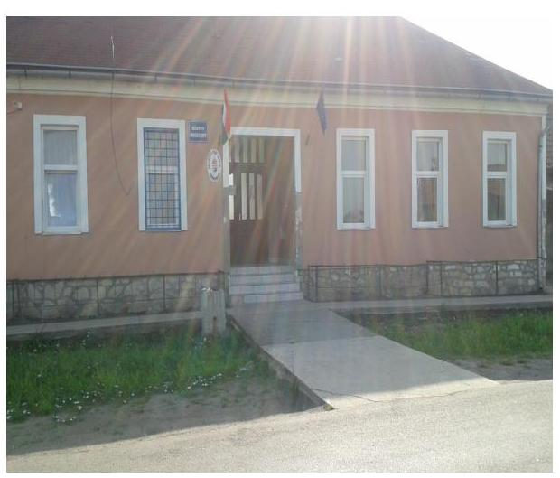
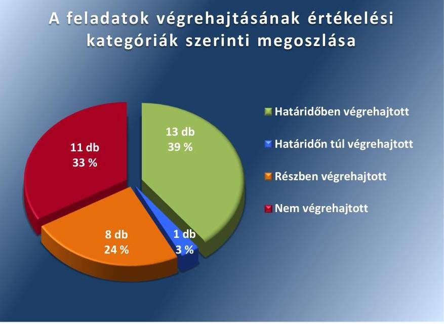

# Jelentés 

## Utóellenőrzések

Tarnabod Községi Önkormányzat belső kontrollrendszere kialakításának, egyes kontrolltevékenységek és a belső ellenőrzés múködésének utóellenőrzése
2016.

---

# Jelentés 

## Utóellenőrzések

Tarnabod Községi Önkormányzat belső kontrollrendszere kialakításának, egyes kontrolltevékenységek és a belső ellenőrzés múködésének utóellenőrzése
2016. november hó 25 nap

---

|  J | AZ ELLENŐRZÉST FELÜGYELTE:  |
| --- | --- |
|   | DR. NÉMETH ERZSÉBET felügyeleti vezető  |
|   | AZ ELLENŐRZÉST VEZETTE ÉS A VÉGREHAJTÁSÁÉRT FELELŐS:  |
|   | CSORDÁS PÉTERNÉ ellenőrzésvezető  |
|   | A PROGRAM ÖSSZEÁLLÍTÁSÁÉRT FELELŐS:  |
|   | JANIK JÓZSEF LÁSZLÓ osztályvezető  |
|   | A TÉMÁHOZ KAPCSOLÓDÓ KORÁBBI SZÁMVEVŐSZÉKI JELENTÉSEK:  |
|   | - címe: Jelentés Tarnabod Község Önkormányzata belső kontrollrendszerének kialakítása, valamint egyes kontrolltevékenységek és a belső ellenőrzés működése ellenőrzéséről  |
|  Jelentéseink az Országgyűlés számítógépes hálózatán és az Interneten a www.asz.hu címen is olvashatóak. | - sorszáma: 13050  |
|   | IKTATÓSZÁM: V-1143-047/2016.  |
|   | TÉMASZÁM: 2177  |
|   | ELLENŐRZÉS-AZONOSÍTÓ SZÁM: V075511  |

---

# TARTALOMJEGYZÉK 

■ ÖSSZEGZÉS ..... 5
■ AZ ELLENŐRZÉS CÉLJA ..... 6
■ AZ ELLENŐRZÉS TERÜLETE ..... 7
■ AZ ELLENŐRZÉS HÁTTERE, INDOKOLTSÁGA ..... 8
■ A JELENTÉS LÉNYEGES KÉRDÉSKÖREI ..... 9
■ ELLENŐRZÉS HATÓKÖRE ÉS MÓDSZEREI ..... 10
■ MEGÁLLAPÍTÁSOK ..... 13
■ MELLÉKLETEK ..... 17
I. Sz. melléklet: Az ÁSZ 13050 számú jelentéséhez kapcsolódó intézkedési terv végrehajtása ..... 17
■ FÜGGELÉK: ÉSZREVÉTELEK ..... 25
■ RÖVIDÍTÉSEK JEGYZÉKE ..... 27

---

.

---

# ÖSSZEGZÉS 

Az utóellenőrzés megállapította, hogy az intézkedési tervben foglalt feladatokat Tarnabod Községi Önkormányzat nem hajtotta végre teljes körűen. A belső kontrollrendszer szabályozottsága javult ugyan, de több feladat tekintetében az Önkormányzat nem tett megfelelő lépéseket az Állami Számvevőszék által korábban feltárt, a belső kontrollrendszert érintő hiányosságok megszüntetésére. Mindez veszélyt jelent az Önkormányzat szabályozott és szabályszerű müködésében és gazdálkodásában, valamint a felelős vezetői magatartásban.

## Az ellenőrzés társadalmi indokoltsága

Az ÁSZ ${ }^{1}$ stratégiájában célul tűzte ki a számvevőszéki munka hasznosulásának javítását. Ezzel összhangban ellenőrzi, hogy az ellenőrzött szervezetek megvalósították-e a korábbi ellenőrzései által feltárt hibák, hiányosságok és szabálytalanságok megszüntetése céljából elkészített intézkedési terveikben foglaltakat. A rendszeres utóellenőrzések hozzájárulnak a szükséges intézkedések tényleges végrehajtáshoz, ezáltal a közpénzügyek rendezettségének javulásához.

## Főbb megállapítások, következtetések

A polgármester² az intézkedési tervet ${ }^{3}$ az ÁSZ tv. ${ }^{4}$-ben rögzített határidőben küldte meg az ÁSZ részére. Az intézkedési tervben rögzített feladatok végrehajtásáról a Bkr. ${ }^{5}$-ben előírt nyilvántartást nem vezették.

Az intézkedési tervben meghatározott 33 feladatból 13-at határidőben, egyet határidőn túl, nyolcat részben, 11et pedig nem hajtottak végre. Több esetben a belső szabályzást nem készítették el, vagy hiányosan alakították ki, a belső ellenőrzés működtetéséről nem gondoskodtak teljes körűen. Nem megfelelően működtették a pénzügyi folyamatokban kulcsszerepet betöltő kontrollokat, illetve nem intézkedtek a kontrollok müködésével összefüggő kijelölési és nyilvántartási tevékenységek maradéktalan ellátásáról.

Megállapítható, hogy az ÁSZ által az Önkormányzat ${ }^{6}$ belső kontrollrendszerének kialakítása, valamint az egyes kontrolltevékenységek és a belső ellenőrzés müködésének területén korábban azonosított hiányosságok egy részét megszüntették, javult a belső kontrollrendszer szabályozottsága. Mindemellett több feladat tekintetében az Önkormányzat nem tett megfelelő lépéseket az ÁSZ által korábban feltárt hiányosságok megszüntetésére. A részben végrehajtott, illetve a nem végrehajtott feladatok veszélyt jelentenek az Önkormányzat jogszabályoknak megfelelő szabályozásában, müködésének szabályosságában, amelyek kezelése a vezetői felelősség körébe tartozik.

---

# AZ ELLENŐRZÉS CÉLJA

Az ellenőrzés célja annak értékelése volt, hogy a számvevőszéki jelentésben foglalt intézkedést igénylő megállapításokkal és javaslatokkal összhangban készített intézkedési tervben meghatározott feladatokat az ellenőrzött szervezet végrehajtotta-e.

---

# AZ ELLENŐRZÉS TERÜLETE 

## Az Önkormányzat

Tarnabod község Heves megyében, a Hevesi járásban - Heves megye déli részén, Egertől 32 kilométer távolságra - található. Tarnabod község állandó lakosainak száma a $\mathrm{KSH}^{7}$ által közzétett népességi adatok szerint 2015. január 1-én 629 fő volt. Az Önkormányzat és Tarnazsadány Községi Önkormányzat 2012. december 19-én hozott határozatában 2013. január 1-jei dátummal alapította meg a Tarnazsadányi Közös Önkormányzati Hivatalt. Az utóellenőrzés időszakában a hivatalban lévő polgármester és jegyző személye nem változott.

Az Önkormányzat belső kontrollrendszerének kialakítását, valamint az egyes kontrolltevékenységek és a belső ellenőrzés múködésének ellenőrzését az ÁSZ a 2009. január 1. és 2011. december 31. közötti időszak vonatkozásában végezte el, az erről szóló 13050. számú jelentését ${ }^{8}$ 2013. június 25.-én tette közzé. Az ellenőrzés célja annak értékelése volt, hogy az Önkormányzat a jogszabályi előírásoknak megfelelően alakította-e ki a belső kontrollrendszert; megfelelően múködtette-e a gazdálkodás folyamatában kulcsszerepet betöltő szakmai teljesítésigazolás és utalvány ellenjegyzés kontrolltevékenységeit; biztosította-e a belső ellenőrzés szabályos és eredményes múködését.

Az utóellenőrzés - a 2013. június 25-től 2016. június 8-ig végrehajtott feladatokat figyelembe véve - a polgármester és a jegyző ${ }^{9}$ részére megfogalmazott javaslatok hasznosulása céljából készített intézkedési terv végrehajtásának ellenőrzésére, illetve értékelésére terjedt ki.

---

# AZ ELLENŐRZÉS HÁTTERE, INDOKOLTSÁGA 

Az ÁSZ tv. 33. § (1) bekezdése értelmében a számvevőszéki jelentések intézkedést igénylő megállapításaihoz és javaslataihoz kapcsolódóan az ellenőrzött szervezet vezetője intézkedési tervet köteles összeállítani, és az ÁSZ részére megküldeni. Az intézkedési tervben foglaltak megvalósítását az ÁSZ tv. 33. § (7) bekezdésében foglaltak alapján - az ÁSZ utóellenőrzés keretében ellenőrizheti. Az intézkedések megvalósulásának értékelése során az ÁSZ figyelembe veszi az ellenőrzött szervezetek működési feltételeiben, valamint a jogszabályi előírásokban bekövetkezett változásokat.

Az intézkedési tervekben foglalt feladatok hiányos, illetve késedelmes végrehajtása, valamint megvalósításának elmaradása azt mutatja, hogy az ellenőrzések során feltárt hibák, hiányosságok és szabálytalanságok megszüntetése nem kapott kellő hangsúlyt. Ez a szabályszerű működés és a felelős vezetői magatartás vonatkozásában kockázatot hordoz. E kockázatok feltárásával az ÁSZ utóellenőrzési rendszere fokozza a fegyelmet, és igazolja, hogy a közpénzzel való szabályos gazdálkodás felelőssége elől nem lehet kitérni.

## AZ UTÓELLENŐRZÉS VÁRHATÓ HASZNOSULÁSA

Az utóellenőrzés négy szinten hasznosulhat:
$\longrightarrow$ A társadalom szintjén az utóellenőrzés jelzi, hogy a számvevőszéki ellenőrzés megállapításainak van következménye: a hiányosságok megszüntetésére az ellenőrzött szervezet által meghatározott intézkedések végrehajtását is számon kéri az ÁSZ.
$\longrightarrow$ Az ellenőrzött terület szintjén az utóellenőrzés tájékoztatást nyújt a terület döntéshozóinak a hiányosságok kiküszöbölésének jó gyakorlatairól, ezzel lehetőséget biztosítva arra, hogy az ÁSZ ellenőrzési megállapításai, javaslatai a terület nem ellenőrzött szervezeteinek a működése során is hasznosuljanak.
$\longrightarrow$ Az ellenőrzött szervezet szintjén az utóellenőrzés feltárja, hogy a szervezet az intézkedések végrehajtásával hasznosította-e a korábbi ellenőrzési jelentésben a hiányosságok megszüntetése, illetve a kockázatok kezelése érdekében megfogalmazott javaslatokat.
$\longrightarrow$ Az ÁSZ szintjén az utóellenőrzés visszacsatolást ad az ellenőrzési jelentések hasznosulásáról, az intézkedések elmaradása vagy részleges megvalósulása a további ellenőrzésekhez kockázati jelzésként szolgál.

---

# A JELENTÉS LÉNYEGES KÉRDÉSKÖREI 

Az Önkormányzat az intézkedési tervben foglaltakat az elöirt határidőben végrehajtotta-e?

---

# ELLENŐRZÉS HATÓKÖRE ÉS MÓDSZEREI 

## Az ellenőrzés típusa

Megfelelőségi ellenőrzés

## Az ellenőrzött időszak

Az utóellenőrzés alapját képező ÁSZ jelentés közzétételének napjától (2013. június 25.) az ellenőrzésről szóló kiértesítő levél keltének napjáig (2016. június 8.) tartó időszak.

## Az ellenőrzés tárgya

A számvevőszéki jelentésben foglalt intézkedést igénylő megállapításokkal és javaslatokkal összhangban - az Önkormányzat által - készített intézkedési tervben foglaltak végrehajtásának ellenőrzése.

Az ellenőrzés kiterjedt minden olyan körülményre és adatra, amely az ÁSZ jogszabályban meghatározott feladatainak teljesítéséhez, valamint a program végrehajtása folyamán felmerült újabb összefüggések feltárásához szükséges.

## Az ellenőrzött szervezet

Tarnabod Községi Önkormányzat

## Az ellenőrzés jogalapja

Az ÁSZ törvényben meghatározott feladatkörében ellenőrzi a központi költségvetés végrehajtását, az államháztartás gazdálkodását, az államháztartásból származó források felhasználását és a nemzeti vagyon kezelését.

Az ÁSZ tv. 1. § (3) bekezdése szerint az ÁSZ általános hatáskörrel végzi a közpénzekkel és az állami és önkormányzati vagyonnal való felelős gazdálkodás ellenőrzését.

Az ÁSZ tv. 33. § (7) bekezdése alapján az ÁSZ tv. 33. § (1)-(2) bekezdése szerinti intézkedési tervben foglaltak megvalósítását az ÁSZ utóellenőrzés keretében ellenőrizheti.

---

# Az ellenőrzés módszerei 

Az ÁSZ az utóellenőrzést a nemzetközi standardokat irányadónak tekintve az ellenőrzési program ellenőrzési kérdései, az ellenőrzött időszakban hatályos jogszabályok, az ellenőrzés szakmai szabályok és módszertanok figyelembevételével, önálló ellenőrzés keretében végezte.

Az ÁSZ az ellenőrzés ideje alatt az Önkormányzattal történő kapcsolattartást az ÁSZ SZMSZ ${ }^{10}$-ének vonatkozó előírásai alapján biztosította.

Az utóellenőrzés megállapításait elsősorban az ÁSZ rendelkezésére álló, valamint az Önkormányzattól elektronikusan bekért dokumentumok alapozták meg.

Az ellenőrzési bizonyítékként felhasználható adatforrások közé tartoznak egyrészt a szakmai programban felsorolt adatforrások, másrészt minden - az ellenőrzés folyamán feltárt, az ellenőrzés szempontjából információt tartalmazó - dokumentum.

A pénzügyi folyamatokban kulcsszerepet betöltő kontrollokra vonatkozóan az intézkedési tervben foglalt feladatok végrehajtását az állományba nem tartozók megbízási díjainál, a külső szolgáltatók által végzett karbantartási, kisjavítási munkákkal kapcsolatos kifizetéseknél, az egyéb üzemeltetési, fenntartási, szolgáltatási kiadásokkal, továbbá a rendszeres szociális segélyekkel kapcsolatos kifizetéseknél 10 elemú véletlen mintavétellel kiválasztott tételek alapján értékelte az ÁSZ. A kiválasztott tételek esetében azt ellenőrizte, hogy az Önkormányzat az intézkedési tervben meghatározott feladatok végrehajtása érdekében biztosította-e a jogszabályok és a belső szabályzatok előírásainak megfelelő múködtetést.

Az intézkedési tervekben előírt feladatok értékelését, azok végrehajthatósága, illetve végrehajtása szempontjából az alábbiak szerint végezte az ÁSZ:
$\longrightarrow$ „határidőben végrehajtott" a feladat, ha a teljesítés dokumentáltan, az intézkedési tervben előírt határidőben és tartalommal megtörtént;
$\longrightarrow$ „határidőn túl végrehajtott" a feladat, ha annak teljesítése az intézkedési tervben meghatározott módon, de az előírt határidőn túl történt meg;
$\longrightarrow$ „részben végrehajtott" a feladat, ha végrehajtása teljes körűen az intézkedési tervben előírt módon nem történt meg;
$\longrightarrow$ „nem végrehajtott" a feladat, ha a végrehajtás nem történt meg, vagy amennyiben a teljesítést nem dokumentálták;
$\longrightarrow$ „okafogyottá vált" a feladat, ha végrehajtására - meghatározott esemény bekövetkezése, továbbá külső körülmény, a múködést érintő feltétel változása miatt - már nincs szükség, illetve lehetőség, és egyértelműen megállapítható, hogy az intézkedést szükségessé tevő körülmény a jövőben nem fordulhat elő;
$\longrightarrow$ „nem időszerü" az a feladat, amelynek ellenőrzési időszakon belüli végrehajtására azért nem került (kerülhetett) sor, mert az intézkedés alapjául szolgáló esemény nem következett be, de annak jövőbeni előfordulása lehetséges, a végrehajtása nem volt esedékes, vagy a végrehajtás határideje még nem járt le.

---

Az ellenőrzés lefolytatásához az Önkormányzat a tanúsítványok elektronikus kitöltésével, valamint az ÁSZ által kért dokumentumok elektronikus megküldésével szolgáltatott adatokat, amelyek valódiságát és teljes körűségét a polgármester által tett teljességi és hitelességi nyilatkozat igazolta. Az így rendelkezésre bocsátott adatok, információk kontrollja az ellenőrzés keretében történt.

---

# MEGÁLLAPÍTÁSOK 

## Az Önkormányzat az intézkedési tervben foglaltakat az előírt határidőben végrehajtotta-e?

Összegző megállapítás

Az Önkormányzat az intézkedési tervben meghatározott 33 feladatból 13-at határidőben, egyet határidőn túl, nyolcat részben, 11-et pedig nem hajtott végre. Az intézkedési tervben rögzített feladatok végrehajtásáról a Bkr. által előírt nyilvántartást nem vezették.

Az ÁSZ a jelentésében a polgármester részére 4, a jegyző részére 29 javaslatot fogalmazott meg. A polgármester által összeállított és az ÁSZ részére megküldött intézkedési tervben a hiányosságok, szabálytalanságok megszüntetésére 33 feladatot határoztak meg. A feladatok elvégzésének felelőseként 4 esetben a polgármestert, 29 esetben pedig a jegyzőt jelölték meg.

Az ÁSZ javaslatai alapján készített intézkedési tervben rögzített feladatok végrehajtásáról a jegyző a Bkr. 14. §-ában és a 47. § (2) bekezdésében előírt nyilvántartást nem vezette.

Az intézkedési tervben meghatározott feladatokat, határidőket, az ÁSZ jelentés javaslatainak címzettjét és a feladatok végrehajtását az I. számú melléklet mutatja be.

Az intézkedési tervben vállalt feladatok végrehajtásának értékelési kategóriák szerinti megoszlását az 1. ábra szemlélteti.
1. ábra

A feladatok végrehajtásának értékelési kategóriák szerinti megoszlása

---

# HATÁRIDŐBEN VÉGREHAJTOTT feladat: 

1. A polgármester a Képviselő-testület ${ }^{11}$ elé terjesztette a gazdasági program jegyző által előkészített tervezetét.
2. A polgármester gondoskodott a jegyző munkaköri leírásának elkészítéséről, valamint a kinevezési okmányhoz történő csatolásáról.
3. A jegyző elkészítette a Közös Hivatal ${ }^{12}$ Belső kontrollrendszere szabályzatának ${ }^{13}$ keretében a szabálytalanságkezelés eljárásrendjét, és a Bkr.-ben előírt ellenőrzési nyomvonalat.
4. A jegyző elkészítette a biztonságos munkavégzés körülményeit szabályozó Munkavédelmi szabályzatot ${ }^{14}$, és a Nemdohányzók védelméről és a dohánytermékek fogyasztásának és forgalmazásának szabályairól szóló szabályzatot ${ }^{15}$.
5. A jegyző meghatározta a Közös Hivatal köztisztviselőinek teljesítményértékelés alapját képező teljesítménykövetelmény rendszerét.
6. A jegyző a kockázatkezelési szabályzatot ${ }^{16}$ határidőben elkészítette, gondoskodott a vagyonnyilatkozat tételi kötelezettség szabályozásáról.
7. A jegyző gondoskodott a vagyonnyilatkozat tételi kötelezettség belső szabályzatban történő szabályozásáról, e kötelezettséget és az érintettek körét az SZMSZ-ben ${ }^{17}$ rögzítették.
8. A jegyző elkészítette a folyamatba épített, előzetes, utólagos és vezetői ellenőrzés szabályzatát ${ }^{18}$, és 2013. május 1-jétől hatályba léptette.
9. A jegyző elkészítette a kötelezettségvállalás, ellenjegyzés, utalványozás, érvényesítés szabályzatot ${ }^{19}$, valamint meghatározta a gazdálkodási jogkörök gyakorlására jogosult személyek körét.
10. A jegyző elkészítette az adatvédelmi és adatbiztonsági szabályzatot ${ }^{20}$.
11. A jegyző az összeférhetetlenséget az Ávr. ${ }^{21}$ alapján szabályozta a kötelezettségvállalás, ellenjegyzés, utalványozás, érvényesítés szabályzatban.
12. A jegyző gondoskodott arról, hogy a gazdasági események számviteli (könyvviteli) nyilvántartásokban történő bejegyzésére kizárólag bizonylat alapján került sor.
13. A jegyző az Önkormányzat közhatalmi, irányítási, ellenőrzési és felügyeleti, valamint ügyviteli feladatai ellátására kizárólag közszolgálati jogviszonyt létesített.

## HATÁRIDŐN TÚL VÉGREHAJTOTT feladatok:

14. A jegyző az intézkedési tervben meghatározott 2013. szeptember 16-ai határidőn túl, 2014. január 1-jével intézkedett valamennyi köztisztviselő munkaköri leírásának elkészítéséről.

---

# RÉSZBEN VÉGREHAJTOTT feladat: 

15. A jegyző gondoskodott a belső ellenőrzés kialakításáról, valamint 2015. és a 2016. években annak működtetéséről, azonban nem intézkedett a Bkr. előírásai ellenére a 2014. évi éves ellenőrzési terv elkészítéséről.
16. A jegyző a Közös Hivatal SZMSZ-ének elkészítésével kapcsolatos feladatát részben hajtotta végre, mivel az SZMSZ-t elkészítette, de az az Ávr. 13. § (1) bekezdés e) pontjában foglaltak ellenére nem tartalmazta a Közös Önkormányzati Hivatal szervezeti ábráját.
17. A jegyző a Számviteli Politika ${ }^{22}$ keretében elkészítendő pénzkezelési szabályzatot ${ }^{23}$, az eszközök és források értékelésének szabályzatát ${ }^{24}$, illetve a leltározási és leltárkészítési szabályzatát ${ }^{25}$ elkészítette, azonban a jegyző nem gondoskodott az Áhsz ${ }_{1}{ }^{26}$, illetve az Áhsz ${ }_{2}{ }^{27}$ által előírt Számviteli Politika kiadásáról.
18. A jegyző a Bizonylati rendet ${ }^{28}$ elkészítette, a Számv. tv. ${ }^{29}$ és az Áhsz. ${ }_{1}$ és Áhsz. ${ }_{2}$ által előírt Számlarend ${ }^{30}$ kiadásáról azonban nem gondoskodott.
19. A jegyző által elkészített Közös Hivatal helyi Adatvédelmi és Adatbiztonsági szabályzata tartalmazta az egyes rendszerekhez való hozzáférési jogosultságok típusait és az azokhoz kapcsolódó személyeket, valamint az egyes programok, rendszerek felelőseit, azonban az adatbiztonság érvényesülés biztosításának, és a hozzáférési jogosultságok ellenőrzésével kapcsolatos dokumentumokkal, valamint az adatok kezelése, feldolgozása, tárolása és mentése eljárásrendjével a Közös Hivatal nem rendelkezett.
20. A jegyző a Hivatal ${ }^{31}$ tevékenységének, a célok megvalósításának nyomon követését biztosító rendszert kialakította, azonban a kialakított rendszert a Bkr. előírásai ellenére nem múködtette.
21. A jegyző gondoskodott a 2014-2017. évi stratégiai terv, valamint a 2015-2016. évi ellenőrzési terv elkészítéséről. A 2015. évi ellenőrzési tervben foglalt ellenőrzéseket végrehajtották, azonban a Bkr. előírása ellenére a 2014. évre éves ellenőrzési tervet nem készítettek, valamint a 2014-2017. évi stratégiai tervet és a 2015. évi éves ellenőrzési tervet kockázatelemzéssel nem támasztották alá.
22. A jegyző kijelölte az érvényesítésre jogosult személyeket a kötelezettségvállalás, ellenjegyzés, utalványozás, érvényesítés szabályzatban, az Ávr. előírásai ellenére ugyanezen szabályzatban jelölte ki a teljesítésigazolásra jogosult személyeket is.

## NEM VÉGREHAJTOTT feladatok:

23. A polgármester nem intézkedett arról, hogy az Önkormányzat nevében történő kötelezettségvállalásokra kizárólag a pénzügyi ellenjegyzést követően, a pénzügyi teljesítés esedékességét megelőzően, írásban kerüljön sor, így az operatív gazdálkodás során nem teljesültek az új Áht. ${ }^{32}$ és az Ávr. pénzügyi ellenjegyzésre vonatkozó előírásai.
24. A polgármester a Mötv.-ben ${ }^{33}$ foglaltak ellenére nem kísérte figyelemmel az Önkormányzat gazdálkodásának szabályszerűségét. A

---

belső kontrollrendszerre és a belső ellenőrzés működésére vonatkozó, valamint a szakmai teljesítésigazolás, illetve utalvány ellenjegyzés kontrolokkal összefüggésben feltárt hiányosságok, valamint a szabálytalanul megkötött szerződés tekintetében a munkajogi felelősséggel kapcsolatos körülményeket nem vizsgálta ki.
25. A jegyző - a Tvtv.-ben ${ }^{34}$ foglaltakkal ellentétben - a Közös Hivatal tűzvédelmi szabályzatát nem készítette el.
26. A jegyző a Bkr. előírásainak ellenére nem szabályozta a Közös Hivatal beszámolási eljárásainak rendjét.
27. A jegyző nem készítette el az Ávr., valamint az Info tv.-ben ${ }^{35}$ előírt közérdekű adatok megismerésére irányuló igények teljesítésének és a kötelezően közzéteendő adatok nyilvánosságra hozatalának eljárásrendjét.
28. A jegyző nem gondoskodott a teljesítésigazolás Ávr.-ben előírtak szerinti elvégzéséről, mivel a kifizetéseket megelőzően nem történt meg a teljesítésigazolás.
29. A jegyző nem intézkedett az érvényesítés Ávr. szerinti szabályszerű végrehajtásáról, mivel az érvényesítést teljesítésigazolás hiányában végezték, továbbá nem ellenőrizték a megelőző ügymenetben az új Áht., az Áhsz.1,2 és az Ávr., valamint a kötelezettségvállalás, ellenjegyzés, utalványozás, érvényesítés szabályzat előírásainak betartását.
30. A jegyző nem intézkedett arról, hogy a Hivatal kötelezettségvállalására kizárólag a pénzügyi ellenjegyzést követően, a pénzügyi teljesítés esedékességét megelőzően, írásban kerüljön sor, így a pénzügyi ellenjegyzés nem felelt meg új Áht. és az Ávr. előírásainak.
31. A jegyző nem gondoskodott arról, hogy a kötelezettségvállalások nyilvántartását az Ávr.-ben előírt módon vezessék, és az utalványrendeleteken a kötelezettségvállalás nyilvántartásba vételi sorszámát az Ávr.-ben foglaltaknak megfelelően feltüntessék.
32. A Bkr. előírása ellenére a jegyző nem gondoskodott a belső ellenőrzést végző személy, szervezet jogállásának, feladatainak előírásáról a Közös Hivatali SZMSZ-ben.
33. A jegyző nem intézkedett a Bkr. szerinti belső ellenőrzési kézikönyv elkészítése érdekében.

---

# MELLÉKLETEK

- I. SZ. MELLÉKLET: AZ ÁSZ 13050 SZÁMÚ JELENTÉSÉHEZ KAPCSOLÓDÓ INTÉZKEDÉSI TERV VÉGREHAJTÁSA

|  Sorszám | Az Önkormányzat által az intézkedési tervben rögzített feladatok
1. | Az intézkedési tervben meghatározott határidő | Az intézkedési tervben foglalt feladatok felelősei
3. | A feladat végrehajtása  |
| --- | --- | --- | --- | --- |
|   |  | 2. | 3. | 4.  |
|  Határidőben végrehajtott feladatok |  |  |  |   |
|  1. | „A jegyző által elkészített gazdasági programot a Képviselő-testület elé beterjesztésre kerül a Mótv. 116. § (1) és (5) bekezdés alapján a 116. § (3)-(4) bekezdésben foglalt tartalommal." | 2013. szeptember 30. | polgármester | A polgármester határidőben a Képviselő-testület elé terjesztette a gazdasági program, jegyző által elkészített tervezetét a Mótv. 116. § (3)-(4) bekezdéseiben foglalt tartalommal. A Képviselő-testület a 2014-2019. évre szóló gazdasági programot a 22/2013.(IX. 16.) számú határozatával elfogadta.  |
|  2. | „A Kttv.36 43.§ (4) bekezdés alapján a jegyző munkaköri leírása elkészült a kinevezési okmányokhoz csatolásra került." | 2013. szeptember 16. | polgármester | A polgármester határidőben, 2013. március 1-én gondoskodott a jegyző munkaköri leírásának elkészítéséről, valamint a kinevezési okmányhoz történő csatolásáról  |
|  3. | „A Bkr. 6. § (3)-(4) bekezdésben előírtaknak megfelelően az ellenőrzési nyomvonalat és szabálytalanságok kezelésének eljárásrendje szabályozásra került." | 2013. december 31. | jegyző | A jegyző a Bkr 6.§ (3)-(4) bekezdéseiben előírt ellenőrzési nyomvonalat és szabálytalanságok kezelésének eljárásrendjét elkészítette, azokat a 21/2013. számú Tarnazsadányi Közös Hivatal Belső kontrollrendszere szabályzat tartalmazta, melyet a Közös Képviselő Testület a 9/2013. (IX.26.) sz. határozattal, 2013. október 1-jei hatállyal, határidőben fogadott el.  |
|  4. | „Mvtv ${ }^{37}$. 2. § (3) bekezdés alapján a biztonságos munkavégzés körülményinek megvalósításának rendje folyamatosan készül." | 2013. december 31. | jegyző | Az jegyző a biztonságos munkavégzéssel kapcsolatban két szabályzatot határidőben készített el. A 16/2013. sz. Nemdohányzók védelméről és a dohánytermékek fogyasztásának forgalmazásának szabályairól szóló törvényben foglaltakkal kapcsolatos intézkedésekről szóló szabályzatot, illetve a 12/2013. számú Munkavédelmi szabályzatot a Közös Képviselő Testület a 9/2013. sz. (IX.26.) sz. határozattal fogadta el. A szabályzatok 2013. október 1-től léptek hatályba.  |
|  5. | „Az új TÉR rendszernek megfelelő teljesítménykövetelmény rendszer a Kttv. 130. § (1)-(3) bekezdésekben előírtaknak megfelelően 2013. július 31- re elkészült." | 2013. szeptember 16. | jegyző | A jegyző az intézkedési tervben előírt teljesítményértékelés alapját képező teljesítménykövetelmény-rendszert az intézkedési terv időpontja előtt, 2013. július 31.-ig meghatározta. Az alkalmazottak teljesítményértékelésének alapját képező teljesítménykövetelmények meghatározásra kerültek, az értékeléseket a jegyző elvégezte.  |

---

|  6. | „a Bkr. 3.§ b) pontja és 7. § alapján a kockázatkezelési szabályzat, vagyonnyilatkozat tételi kötelezettség elkészült 1/2013 számon hatályos 2013.03.01től." | 2013. szeptember 16. | jegyző | A jegyző a Közös Hivatal 1/2013. számú kockázatkezelés szabályzatát 2013. március 1jei hatállyal, határidőben elkészítette, a vagyonnyilatkozat tételi kötelezettség előírásáról pedig az intézkedési terv határideje előtt, 2012. december 19.-én gondoskodott.  |
| --- | --- | --- | --- | --- |
|  7. | „A vagyonnyilatkozat tételéről szóló tv 4. §-ában foglaltak alapján a vagyonnyilatkozat tétele belső szabályzatban szabályozásra kerül." | 2013. december 31. | jegyző | A jegyző a vagyonnyilatkozat tételi kötelezettség belső szabályzatban történő szabályozását határidőben elkészítette, azt a Közös Hivatal 2013. január 1-jétől hatályos 36/2012. (XII.19.) sz. határozatokkal jóváhagyott – SZMSZ-ének 11.§-a szabályozta, amely alapján vagyonnyilatkozat tételre kötelezett köztisztviselők a jegyző, illetve valamennyi beosztott köztisztviselő.  |
|  8. | „A közös hivatal FEUVE szabályzata elkészült 5/2013. számon hatályos 2013.05.01-től." | 2013. szeptember 16. | jegyző | A jegyző a folyamatba épített, előzetes, utólagos és vezetői ellenőrzés eljárásrendjét határidőben elkészítette. A Közös Hivatal – a Bkr. 6. § (4) bekezdése szerinti – a folyamatba épített előzetes és utólagos vezetői ellenőrzési rendszer (FEUVE) 5/2013. számú szabályzatát a Képviselő Testület 6/2013 (IV.16.) sz. határozatával fogadta el és 2013. május 1-jétől lépett hatályba.  |
|  9. | „Az Ávr. 13. § (2) bekezdése alapján a kötelezettségvállalás ellenjegyzés szakmai teljesítés érvényesítés és utalványozás rendjéről szóló szabályzat elkészült 4/2013. számon hatályos 2013.05.01 -től a személyek az előírásoknak megfelelően kijelölésre kerültek." | 2013. szeptember 16. | jegyző | A Közös Hivatal 2013. május 1-jétől hatályos, 4/2013. számú Kötelezettségvállalás, ellenjegyzés, utalványozás, érvényesítés szabályzata határidőben elkészült, amelyet a Képviselő Testület 6/2013. (IV.16) sz. határozatával hagyott jóvá. A szabályzatban a gazdálkodási jogkörök gyakorlására jogosult személyeket a jegyző kijelölte.  |
|  10. | „Az Info tv. 24. § (3) bekezdése alapján az adatvédelmi és adatbiztonsági szabályzat elkészült 3/2013 számon hatályos: 2013.03.01-től." | 2013. szeptember 16. | jegyző | A jegyző a Közös Hivatal adatvédelmi és adatbiztonsági szabályzatát az intézkedési tervben meghatározott határidő előtt – 2013. március 1.-i hatállyal - 3/2013. számon elkészítette.  |
|  11. | „Az összeférhetetlenség az Ávr. 60. § (1)-(2) bekezdése alapján szabályozásra került." | 2013. szeptember 16. utána folyamatos | jegyző | Az összeférhetetlenség az Ávr. 60. § (1)-(2) bekezdése alapján határidőben (2013. május 1.) szabályozásra került a Kötelezettségvállalás, ellenjegyzés, utalványozás, érvényesítés szabályzatban.  |
|  12. | „Az intézkedés megtörtént annak érdekében, hogy, a Számv. tv. 165. § (2) foglaltak szerinti kizárólag minden esetben bizonylatok alapján történjen meg a gazdasági események a számviteli nyilvántartásba vétel." | 2013. szeptember 16. utána folyamatos | jegyző | A jegyző intézkedésének köszönhetően az ellenőrzött dokumentumok alapján a gazdasági események számviteli (könyvviteli) nyilvántartásokban történő bejegyzésére a Számv. tv. 165. § (2) bekezdésének megfelelően kizárólag bizonylat alapján került sor. A kifizetések az azt megalapozó bizonylatok alapján történtek.  |

---

|  13. | „Az intézkedés megtörtént a Kttv. 8. § (1)-(2) foglaltak szerinti betartatására, a közigazgatási szervek közhatalmi, irányítási, ellenőrzési és felügyeleti hatáskörének gyakorlásával közvetlenül összefüggő, valamint ügyviteli feladatok ellátására kizárólag közszolgálati jogviszonyt létesítsünk." | 2013. szeptember 16. utána folyamatos | jegyző | A jegyző az ellenőrzött dokumentumok alapján határidőben gondoskodott arról, hogy a Közös Hivatal, mint közigazgatási szerv közhatalmi, irányítási, ellenőrzési és felügyeleti hatáskörének gyakorlásával közvetlenül összefüggő, valamint ügyviteli feladat ellátására kizárólag kormányzati szolgálati, illetve közszolgálati jogviszonyt létesítsenek. Az ÁSZ rendelkezésére bocsátott dokumentumok alapján (ügyrend, ${ }^{38}$ köztisztviselők munkaköri leírásai, teljesítményértékelései) biztosították az intézkedés végrehajtását a Kttv. 8. § (1)-(2) bekezdése előírásainak megfelelően.  |
| --- | --- | --- | --- | --- |
|  14. | „A Ktv. 11. § (6) a Közös Hivatalban dolgozó köztisztviselők részére 2013.03.01.-dikei kinevezésem után a munkaköri leírások elkészültek, átadásra és csatolásra kerültek." | 2013. szeptember 16. | jegyző | A rendelkezésre bocsátott dokumentumok alapján megállapítható, hogy a jegyző a Közös Hivatalban az Önkormányzat ügyeit már 2013 évben is ellátó 1 fő köztisztviselő 2013. évre vonatkozó munkaköri leírása nem készült el az intézkedés tervben meghatározott határidőig, azt a jegyző csak 2014. január 1-jével készítette el. A jegyző tehát határidőn túl tett csak eleget teljes körűen a munkaköri leírások elkészítésével kapcsolatos kötelezettsééének.  |
|  15. | „Az új Áht. 70. § (1) bekezdése és a Mótv. 119. § (4) bekezdése alapján a belső ellenőrzés kialakítása és megfelelő működtetése 2013. október 01 megoldásra kerül." | 2013. október 1. | jegyző | - Határidőben végrehajtott feladat:
A jegyző az új Áht. 70. § (1) bekezdése szerint megbízási szerződéssel határidőben, 2013. október 1-jétől gondoskodott a belső ellenőrzés kialakításáról, valamint 2015. és a 2016. évben annak működtetéséről. A függetlenség biztosítása érdekében külső szervezettel megbízási szerződés került megkötésre, 2013. október 1-jén a 2013-2014. évekre, valamint 2015. augusztus 27-én a 2015-2019. évekre. A 2015-2016. évekre kiadott ellenőrzési tervekben 2-2 belső ellenőrzés került meghatározásra.
- Nem végrehajtott feladat:
A jegyző a belső ellenőrzés kialakításáról részben gondoskodott, mivel a Bkr. 22. § (1) bekezdés b) pontja, a 29. § (1) bekezdése, valamint a 31. § (1)-(2) bekezdés előírása ellenére nem intézkedett a 2014. évi éves ellenőrzési terv készítéséről.  |
|  16. | „Tarnazsadány Közös Önkormányzati Hivatalának SZMSZ- e elkészült." | 2013. szeptember 16. | jegyző | - Határidőben végrehajtott feladat:
A jegyző elkészítette az Önkormányzat és a Tarnazsadány Községi Önkormányzat képviselő testületei a Közös Önkormányzati Hivatal 2013. január 1-jétől hatályos SZMSZét, amelyet a 36/2012. (XII.19.) sz. határozattal hagytak jóvá.  |

---

|  17. | „Az Áhsz. 8. § (3) bekezdése és az Áhsz. 8. § (4) bekezdés a), b). c) pontjának előírásai alapján a Közös Hivatal pénzkezelési szabályzata elkészült 7/2013 számon hatályos 2013. május 1-től. A leltározási és leltárkészítési szabályzatunk gépelés alatt van. Az eszközök és források értékelési szabályzata folyamatosan készül." | 2013. december 31. | jegyző | - Határidőben végrehajtott feladat:
A Számviteli Politika keretében elkészítendő Pénzkezelési szabályzatot, az Eszközök és források értékelésének szabályozását, illetve a Leltározási és leltárkészítési szabályzatot a jegyző határidőben elkészítette. A Képviselő Testület az intézkedési tervben nevezett 7/2013 számú Pénzkezelési szabályzatot a 6/2013. (V.16) sz. határozatával hagyta jóvá, 2013. május 1-jei hatállyal, a 14/2013 számú Leltározási és leltárkészítési szabályzatot és a 15/2013 számú Eszközök és források értékelési szabályzatot pedig 2013. október 1-jei hatállyal - a Közös Képviselő Testület a 9/2013 (IX.26.) sz. határozatával fogadta el.
- Nem végrehajtott feladat:
A Közös Hivatal Számviteli Politikájának I. pontja szerint a számviteli politika részét képzi az eszközök és források leltárkészítési és leltározási szabályzata, az eszközök és források értékelésének szabályzata, az önköltségszámítás rendjére vonatkozó szabályzat, a pénzkezelési szabályzat. A jegyző a Számviteli Politikát nem írta alá, így nem gondoskodott a Számviteli Politika szabályos kialakításáról az Áhsz. 8. § (3) (4), illetve az Áhsz. 50. § (1) bekezdéseiben foglaltak ellenére.  |
| --- | --- | --- | --- |
|  18. | „Számv. tv. 161.§ (2) és az Áhsz. 49. § (1) bekezdés alapján a számlarend és a Számv. tv. 161. § (2) bekezdés d) pontja alapján bizonylati rend folyamatosan készül." | 2013. december 31. | jegyző  |
|  19. | „Az Info tv. 7.§ (2)-(3) bekezdésének megfelelően az adatbiztonság érvényesülése biztosításra került, a hozzáférési jogosultságokkal kapcsolatos feladatok, jogosultságok, módosítások, azok betartásának ellenőrzése, nyilvántartás vezetése szabályozásra | 2013. szeptember 16. | jegyző  |

---

|  1. | Az Önkormányzat által az intézkedési tervben rögzített feladatok | Az intézkedési tervben meghatározott határidő | Az intézkedési tervben foglalt feladatok felelősei | A feladat végrehajtása  |
| --- | --- | --- | --- | --- |
|   | 1. | 2. | 3. | 4.  |
|   | kerültek. Az adatok kezelése feldolgozása, tárolása és mentésének eljárás rendje szabályozásra került." |  |  | - Nem végrehajtott feladat:
Az intézkedési tervben vállalt, az adatbiztonság érvényesülés biztosításának, a hozzáférési jogosultságok ellenőrzésének dokumentumaival, valamint az adatok kezelése feldolgozása, tárolása és mentése eljárásrendjével a Közös Hivatal nem rendelkezett.  |
|  20. | „A Bkr. 3. §. e) pontja és 10. § foglaltak alapján a Hivatal tevékenységének, a célok nyomon követésének. amelynek része az operatív tevékenységek keretében megvalósuló folyamatos és eseti nyomon követése kialakítása folyamatosan készül." | 2013. december 31. | jegyző | - Határidőben végrehajtott feladat:
A jegyző a Hivatal tevékenységének, a célok megvalósításának nyomon követését biztosító rendszert határidőben, 2013. október 1-jén a Belső kontrollrendszer szabályzatban kialakította.
- Nem végrehajtott feladat:
A jegyző a kialakított nyomon követési rendszert a Bkr. 3. § e) pontjában és 10. §-ában foglaltak ellenére nem müködtette.  |
|  21. | „Bkr. 22. § (1) bekezdés b) pontja és a 29. § (1) bekezdés valamint a 31. § (1)-(2) bekezdése alapján kockázatelemzéssel alátámasztott stratégiai és éves ellenőrzési tervet, valamint az ellenőrzési tervben foglaltakat elvégzésre kerülnek." | 2013. december 31. | jegyző | - Határidőben végrehajtott feladat:
A jegyző a 2014-2017. évi stratégiai tervet határidőben 2013. november 25-én elkészíttette. A jegyző gondoskodott a 2015-2016. évi ellenőrzési tervek elkészítéséről, amelyeket a Képviselő-testület elfogadott, a 2015. évi ellenőrzési tervben foglalt ellenőrzések végrehajtásra kerültek, a 2016. évi ellenőrzési terv kockázatelemzéssel alátámasztásra került.
- Nem végrehajtott feladat:
A jegyző a Bkr. 22. § (1) bekezdés b) pontja, a 29. § (1) bekezdése, valamint a 31. § (1)(2) bekezdés előírása ellenére nem intézkedett a 2014. évi éves ellenőrzési terv készítéséről, valamint a 2014-2017. évi stratégiai terv és a 2015. évi éves ellenőrzési terv kockázatelemzéssel történő alátámasztásáról.  |
|  22. | „Az Ávr. 55. § (2) az 57. § (4) és az 57.§ (4) bekezdésének megfelelően a teljesítésigazolásra és az érvényesítésre jogosult személyek kijelölésre kerültek 4/2013 számú szabályzatban." | 2013. szeptember 16. | jegyző | - Határidőben végrehajtott feladat:
A jegyző a Közös Hivatal 2013. május 1-jétől hatályos 4/2013. számú, Kötelezettségvállalás, ellenjegyzés, utalványozás, érvényesítés szabályzatának 3-4. sz. mellékleteiben jelölte ki az érvényesítésre jogosultakat.
- Nem végrehajtott feladat:
A jegyző a Közös Hivatal 2013. május 1-jétől hatályos 4/2013. számú, Kötelezettségvállalás, ellenjegyzés, utalványozás, érvényesítés szabályzatának 3-4. sz. mellékleteiben jelölte ki a teljesítésigazolásra jogosultakat is az Ávr. 57.§ (4) bekezdésében foglaltak ellenére, amely szerint a teljesítésigazolásra jogosult személyeket a kötelezettségvállalónak kell kijelölnie.  |

---

|  23. | „Intézkedés megtörtént arról, hogy az Önkormányzat nevében történő kötelezettségvállalásra az új Áht. 37. § (1) bekezdésben foglaltaknak megfelelően az Ávr. 53. §-ában meghatározottak kivételével - kizárólag a pénzügyi ellenjegyzés után, a pénzügyi teljesítés esedékességét megelőzően -. írásban kerüljön sor." | 2013. szeptember 16. utána folyamatos | polgármester | A polgármester az ellenőrzött dokumentumok alapján nem gondoskodott arról, hogy az Önkormányzat kötelezettségvállalásai megfeleljenek az új Áht. 37. § (1) bekezdésében foglaltaknak, mert a kötelezettségvállalást nem előzte meg pénzügyi ellenjegyzés, illetve nem állt rendelkezésre a kötelezettségvállalás dokumentuma.  |
| --- | --- | --- | --- | --- |
|  24. | „A Mótv. 115.§(1) bekezdésben foglaltak alapján figyelemmel kísérem az önkormányzati gazdálkodás szabályszerűségét. A Mótv. 67. § f) pontja alapján gondoskodom a belső kontrollrendszerre és a belső ellenőrzés működésére vonatkozó jogszabályi rendelkezések be nem tartása, valamint a szakmai teljesítésigazolás, illetve utalvány ellenjegyzés kontrolokkal összefüggésben feltárt hiányosságok, szabálytalanságok, valamint a szabálytalanul megkötött szerződés tekintetében az esteleges munkajogi felelősséggel kapcsolatos körülmények kivizsgálásáról. és vizsgálat eredményének függvényében a szükséges munkajogi intézkedéseket megteszem." | 2013. december 31. | polgármester | A polgármester dokumentáltan nem kísérte figyelemmel az önkormányzati gazdálkodás szabályszerűségét. A polgármester a Mótv. 67. § f) pontja alapján nem gondoskodott a belső kontrollrendszerre és a belső ellenőrzés működésére vonatkozó jogszabályi rendelkezések be nem tartása, valamint a szakmai teljesítésigazolás, illetve utalvány ellenjegyzés kontrolokkal összefüggésben feltárt hiányosságok, szabálytalanságok, valamint a szabálytalanul megkötött szerződés tekintetében a jegyző esteleges munkajogi felelősségével kapcsolatos körülmények kivizsgálásáról. A polgármester az intézkedések hiányát nyilatkozatban ismerte el.  |
|  25. | „A Tvtv. 19. §. (1) bekezdése alapján a Tűzvédelmi szabályzat Önkormányzati szinten rendelkezésre állt a Közös Hivatal vonatkozásában folyamatosan készül." | 2013. december 31. | jegyző | A jegyző - a Tvtv. 19. § (1) bekezdésében foglaltakkal ellentétben - a Közös Hivatal tűzvédelmi Szabályzatát nem készítette el.  |
|  26. | „A Bkr. 8. § (4) bekezdés c) pontja alapján a Hivatal beszámolási kötelezettsége szabályozásra kerül." | 2013. december 31. | jegyző | A jegyző nem szabályozta a Bkr. 8. § (4) bekezdés c) pontjának előírása ellenére a Közös Hivatal beszámolási eljárásainak rendjét.  |

---

|  27. | „Szabályozásra került az Ávr. 13.§ (2) bekezdés h) pontja valamint az Info tv. 30. § (6) és 35. § (3) bekezdései alapján a közérdekű adatok megismerésére irányuló igények teljesítésének és a kötelezően közzéteendő adatok nyilvánosságra hozatalának rendje." | 2013. szeptember 16. | jegyző | A jegyző az intézkedési tervben foglaltak ellenére nem készítette el az Ávr. 13.§ (2) bekezdés h) pontja, valamint az Info tv. 30. § (6) és 35. § (3) bekezdései alapján a közérdekű adatok megismerésére irányuló igények teljesítésének és a kötelezően közzéteendő adatok nyilvánosságra hozatalának rendjét.  |
| --- | --- | --- | --- | --- |
|  28. | „A teljesítésigazolásra és kötelezettségvállaló által kijelölt személy az Áht. 38. § (1) bekezdés és az Ávr. 57. § (1) és (3) bekezdése alapján ellenőrzik a kiadások teljesítésének jogosságát, összegszerűségét, ellenszolgáltatást is magában foglaló kötelezettségvállalás esetén a szerződés, megrendelés teljesítését aláírásukkal igazolják." | 2013. szeptember 16. utána folyamatos | jegyző | A jegyző az ellenőrzött dokumentumok alapján nem gondoskodott a teljesítésigazolás szabályszerű elvégzéséről. Az Ávr. 57. § (1) és (3) bekezdéseiben szereplő előírást figyelmen kívül hagyva a teljesítésigazolásra jogosult személy aláírásával nem igazolta a kifizetés jogosságát, összegszerűségét, ellenszolgáltatást is magába foglaló kötelezettségvállalás esetén a szerződés, megrendelés teljesítését.  |
|  29. | „A kifizetéseket megelőzően - az Ávr. 58. § (1) bekezdése szerint- a teljesítésigazolás alapján - az Ávr. 57. § (3) bekezdése szerinti esetben annak hiányában is - az összegszerűségnek, a fedezet meglétének és a megelőző ügymenetben az új Áht. az Áhsz., az Ávr. előírásainak és a belső szabályokban foglaltak szerint történik." | 2013. szeptember 16. utána folyamatos | jegyző | A jegyző az ellenőrzött dokumentumok alapján nem intézkedett annak érdekében, hogy az érvényesítés megfeleljen az Ávr. 58. § (1) bekezdésében foglalt előírásoknak, mivel az érvényesítést teljesítésigazolás hiányában végezték. Továbbá a megelőző ügymenetben az új Áht., az Áhsz.,1,2, az Ávr. előírásainak, valamint a kötelezettségvállalás, ellenjegyzés, utalványozás, érvényesítés szabályzatban foglaltak betartásának ellenőrzését nem végezték el, mert az érvényesítő nem jelezte azt, hogy a kötelezettségvállalást nem előzte meg pénzügyi ellenjegyzés, a teljesítésigazolás nem történt meg, valamint, hogy a kötelezettségvállalás nyilvántartás számot nem tüntették fel.  |
|  30. | „Az új Áht. 37. § (1) és az Ávr. 55. § (1) bekezdésben foglaltaknak megfelelően, kötelezettségvállalásra az Ávr. 53. §-ában meghatározott kivételekkel pénzügyi ellenjegyzés után kerül sor, valamint a pénzügyi ellenjegyző meggyőződik arról, hogy a kötelezettségvállalás nem sérti a gazdálkodás szabályait." | 2013. szeptember 16. utána folyamatos | jegyző | A jegyző az ellenőrzött dokumentumok alapján nem gondoskodott arról, hogy a Hivatal kötelezettségvállalásainak pénzügyi ellenjegyzései megfeleljenek az új Áht. 37. § (1) bekezdésében foglaltaknak, mert a kötelezettségvállalást nem előzte meg pénzügyi ellenjegyzés, illetve nem állt rendelkezésre a kötelezettségvállalás dokumentuma.  |

---

|  Az Önkormányzat által az intézkedési tervben rögzített feladatok |  | Az intézkedési tervben meghatározott határidő | Az intézkedési tervben foglalt feladatok felelősei | A feladat végrehajtása  |
| --- | --- | --- | --- | --- |
|  1. |  | 2. | 3. | 4.  |
|  31. | „Kötelezettségvállalási nyilvántartás vezetése az Ávr. 56. § (1) bekezdés szerint vezetésre kerül és az utalványrendeleteken a kötelezettségvállalás nyilvántartási számát az Ávr. 59. § (3) bekezdés f) pontja alapján feltüntetésre került." | 2013. szeptember 16. utána folyamatos |  | jegyző  |
|  32. | „A Közös Hivatal SZMSZ a megoldást követően módosításra kerül a Bkr. 15. § (2) bekezdésben foglaltak szerint a belső ellenőrzést végző szervezet jogállása és feladatai előírásra kerülnek. " | 2013. december 31. |  | jegyző  |
|  33. | „A Bkr. 17.§ (1)-(2) bekezdése és 22. § (1) bekezdés a) pontja alapján a belső ellenőrzési kézikönyv elkészítésre kerül." | 2013. december 31. |  | jegyző  |

Forrás: ÁSZ által készített táblázat

---

# FÜGGELÉK: ÉSZREVÉTELEK 

A jelentéstervezetet a Számvevőszék 15 napos észrevételezésre megküldte az ellenőrzött szervezet vezetőjének az ÁSZ tv. 29. §* (1) bekezdése előírásának megfelelően.
Az ellenőrzött szervezet vezetője az ÁSZ tv. 29. § (2) bekezdésében foglalt észrevételezési jogával nem élt, a jelentéstervezetre nem tett észrevételt.

[^0]
[^0]:    * 29. § (1) Az Állami Számvevőszék az ellenőrzési megállapításait megküldi az ellenőrzött szervezet vezetőjének vagy az általa megbízott személynek, és annak, akinek személyes felelősségét állapította meg.
    (2) Az ellenőrzött szervezet vezetője és a felelősként megjelölt személy az ellenőrzés megállapításaira tizenöt napon belül írásban észrevételt tehet.
    (3) Az Állami Számvevőszék az észrevételre a beérkezésétől számított harminc napon belül írásban válaszol. A figyelembe nem vett észrevételeket köteles a jelentésben feltüntetni, és megindokolni, hogy azokat miért nem fogadta el.

---

.

---

# RÖVIDÍTÉSEK JEGYZÉKE 

${ }^{1}$ ÁSZ
${ }^{2}$ polgármester
${ }^{3}$ intézkedési terv
${ }^{4}$ ÁSZ tv.
${ }^{5}$ Bkr.
${ }^{6}$ Önkormányzat
${ }^{7}$ KSH
${ }^{8}$ jelentés
${ }^{9}$ jegyző
${ }^{10}$ ÁSZ SZMSZ
${ }^{11}$ Képviselő-testület
${ }^{12}$ Közös Hivatal
${ }^{13}$ Belső kontrollrendszer szabályzat
${ }^{14}$ Munkavédelmi szabályzat
${ }^{15}$ Nemdohányzók védelméről és a forgalmazásának szabályairól szóló szabályzat
${ }^{16}$ Kockázatkezelési szabályzat
${ }^{17}$ SZMSZ
${ }^{18}$ Folyamatba épített előzetes és utólagos vezetői ellenőrzési rendszer szabályzat (FEUVE)
${ }^{19}$ Kötelezettségvállalás, ellenjegyzés, utalványozás, érvényesítés szabályzat
${ }^{20}$ Adatvédelmi és adatbiztonsági szabályzat
${ }^{21}$ Ávr.
${ }^{22}$ Számviteli Politika
${ }^{23}$ Pénzkezelési szabályzat
${ }^{24}$ Eszközök és források értékelésének szabályzata

Állami Számvevőszék
Tarnabod Községi Önkormányzat polgármestere
Tarnabod Községi Önkormányzat Képviselő-testületének 20/2013. (IX.16.) határozatával elfogadott intézkedési terve
2011. évi LXVI. törvény az Állami Számvevőszékről (hatályos 2011. július 1.-jétől) 370/2011. (XII.31.) Korm. rendelet a költségvetési szervek belső kontrollrendszeréről és belső ellenőrzéséről (hatályos: 2012. január 1-jétől) Tarnabod Községi Önkormányzat
Központi Statisztikai Hivatal
Az ÁSZ 13050. számú jelentése - Jelentés Tarnabod Község Önkormányzata belső kontrollrendszerének kialakítása, valamint egyes kontrolltevékenységek és a belső ellenőrzés múködése ellenőrzéséről (elérhető a www.asz.hu honlapon) Tarnazsadány és Tarnabod Községek 2013. március 1-jétől megbízott jegyzője Állami Számvevőszék Szervezeti és Működési Szabályzata
Tarnabod Községi Önkormányzat Képviselő-testülete
Tarnazsadányi Közös Önkormányzati Hivatal
21/2013. sz. Tarnazsadányi Közös Önkormányzati Hivatal Belső kontrollrendszere (hatályos: 2013. október 1-jétől)
12/2013. sz. Tarnazsadányi Közös Önkormányzati Hivatal Munkavédelmi szabályzata (hatályos:2013. október 1-jétől)
16/2013. sz. Tarnazsadányi Közös Önkormányzati Hivatal nemdohányzók védelméről és a dohánytermékek fogyasztásának dohánytermékek fogyasztásának és forgalmazásának szabályairól szóló törvényben foglaltakkal kapcsolatos intézkedésekről szóló szabályzat (hatályos: 2013. október 1-jétől) 1/2013. sz. kockázatkezelési szabályzatát (hatályos: 2013. március 1-jétől) Tarnazsadányi Közös Önkormányzati Hivatal Szervezeti és Múködési Szabályzata (hatályos 2013. január 1-jétől)
5/2013. sz. Tarnazsadányi Közös Önkormányzati Hivatal folyamatba épített előzetes és utólagos vezetői ellenőrzési rendszer (FEUVE) szabályzata (hatályos: 2013. május 1-jétől)
4/2013. sz. Tarnazsadányi Közös Önkormányzati Hivatal kötelezettségvállalás ellenjegyzés, utalványozás, érvényesítés szabályzata (hatályos:2013.május 1-jétől)
3/2013. sz. Tarnazsadányi Közös Önkormányzati Hivatal helyi adatvédelmi és adatbiztonsági szabályzata (hatályos: 2013. március 1-jétől)
368/2011. (XII. 31.) Korm. rendelet az államháztartásról szóló törvény végrehajtásáról (hatályos: 2012. január 1-jétől)
Tarnazsadányi Közös Önkormányzati Hivatal Számviteli Politika kiterjesztve az önkormányzatokra és intézményekre (készült:2016. február 17.-én)
7/2013 sz. Tarnazsadányi Közös Önkormányzati Hivatal pénzkezelési szabályzata (hatályos:2013.május 1-jétől)
15/2013. sz. Tarnazsadányi Közös Önkormányzati Hivatal eszközök és források értékelésének szabályzata (hatályos:2013.október 1-jétől)

---

${ }^{25}$ Leltározási és leltárkészítési szabályzat
${ }^{26}$ Áhsz $_{1}$
${ }^{27}$ Áhsz $_{2}$
${ }^{28}$ Bizonylati rend
${ }^{29}$ Számv. tv.
${ }^{30}$ Számlarend
${ }^{31}$ Hivatal
${ }^{32}$ új Áht.
${ }^{33}$ Mötv.
${ }^{34}$ Tvtv.
${ }^{35}$ Info tv.
${ }^{36} \mathrm{Kttv}$.
${ }^{37}$ Mvtv.
${ }^{38}$ Ügyrend
14/2013. sz. Tarnazsadányi Közös Önkormányzati Hivatal leltározási és leltárkészítési szabályzata (hatályos:2013.október 1- jétől)
249/2000. (XII.24.) Korm. rendelet az államháztartás szervezeti beszámolási és könyvvezetési kötelezettségéneknek sajátosságairól (hatálytalan 2014. január 1jétől)
4/2013. (I. 11.) Korm. rendelet az államháztartás számviteléről (hatályos 2014. január 1-jétől)
17/2013. sz. Tarnazsadányi Közös Önkormányzati Hivatal Bizonylati rendje 2000. évi C. törvény a számvitelről

Tarnazsadányi Közös Önkormányzati Hivatal Számlarendje kiterjesztve az önkormányzatokra és intézményekre (készült:2016. február 17.-én)
Tarnazsadányi Közös Önkormányzati Hivatal
2011. évi CXCV. törvény az államháztartásról (hatályos 2012. január 1-jétől)
2011. évi CLXXXIX. törvény Magyarország helyi önkormányzatairól (hatályos 2012. január 1-jétől)

1996. évi XXXI. törvény a tűz elleni védekezésről
2011. évi CXII. törvény az információs önrendelkezési jogról és az információszabadságról (hatályos 2012. január 1-jétől)
2011. évi CXCIX. törvény a közszolgálati tisztviselőkről (hatályos 2012. március 1jétől)
1993. évi XCIII. törvény a munkavédelemről

Tarnazsadány Közös Önkormányzati Hivatalának 2/2013. sz. gazdasági szervezetének ügyrendje (hatályos 2013. március 1-jétől)

---

# ÁLLAMI SZÁMVEVŐSZÉK 

1052 Budapest, Apáczai Csere János utca 10.
Levélcím: 1364 Budapest 4. Pf. 54
Telefon: +36 14849100 Telefax: +36 14849200
www.asz.hu