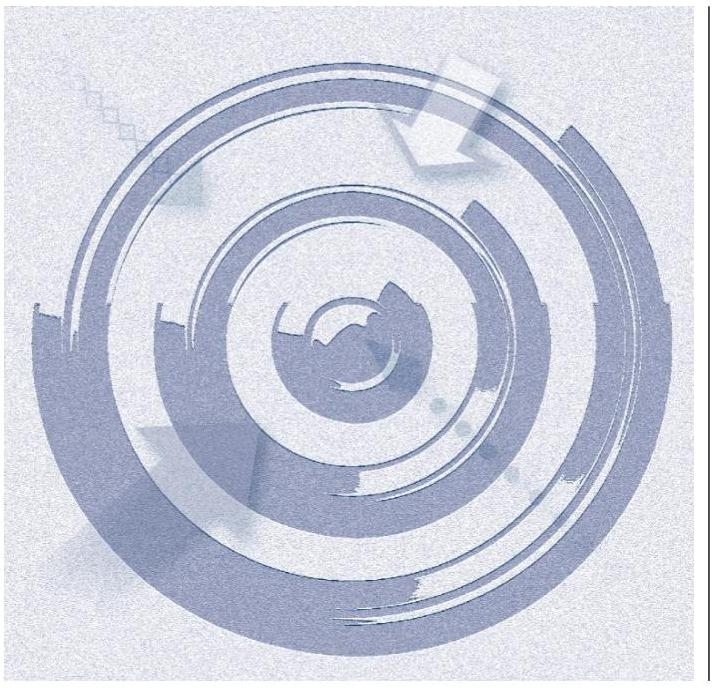

ÁLLAMI
SZÁMVEVŐSZÉK

# Jelentés 

## Utóellenőrzések

Cibakháza Nagyközségi Önkormányzat belső kontrollrendszere kialakításának, egyes kontrolltevékenységek és a belső ellenőrzés múködésének utóellenőrzése
2016.

---

# Jelentés 

## Utóellenőrzések

Cibakháza Nagyközségi Önkormányzat belső kontrollrendszere kialakításának, egyes
kontrolltevékenységek és a belső ellenőrzés múködésének utóellenőrzése
2016. november hó 25 nap

---

|  J | AZ ELLENŐRZÉST FELÜGYELTE:  |
| --- | --- |
|   | DR. NÉMETH ERZSÉBET felügyeleti vezető  |
|   | AZ ELLENŐRZÉST VEZETTE ÉS A VÉGREHAJTÁSÁÉRT FELELŐS:  |
|   | DR. PELLEI TAMÁS ellenőrzésvezető  |
|   | A PROGRAM ÖSSZEÁLLÍTÁSÁÉRT FELELŐS:  |
|   | JANIK JÓZSEF LÁSZLÓ osztályvezető  |
|   | A TÉMÁHOZ KAPCSOLÓDÓ KORÁBBI SZÁMVEVŐSZÉKI JELENTÉSEK:  |
|   | - címe: Jelentés Cibakháza Nagyközség Önkormányzata belső kontrollrendszerének kialakítása, valamint egyes kontrolltevékenységek és a belső ellenőrzés működése ellenőrzéséről  |
|  J | sorszáma: 13041  |
|   | IKTATÓSZÁM: V-1142-043/2016.  |
|   | TÉMASZÁM: 2176  |
|   | ELLENŐRZÉS-AZONOSÍTÓ SZÁM: V075509  |

---

# TARTALOMJEGYZÉK 

■ ÖSSZEGZÉS ..... 5
■ AZ ELLENŐRZÉS CÉLJA ..... 6
■ AZ ELLENŐRZÉS TERÜLETE ..... 7
■ AZ ELLENŐRZÉS HÁTTERE, INDOKOLTSÁGA ..... 8
■ A JELENTÉS LÉNYEGES KÉRDÉSKÖREI ..... 9
■ ELLENŐRZÉS HATÓKÖRE ÉS MÓDSZEREI ..... 10
■ MEGÁLLAPÍTÁSOK ..... 13
■ MELLÉKLETEK ..... 17
I. sz. melléklet: Az ÁSZ 13041. számú jelentéséhez kapcsolódó intézkedési terv végrehajtása ..... 17
■ FÜGGELÉK: ÉSZREVÉTELEK ..... 23
■ RÖVIDÍTÉSEK JEGYZÉKE ..... 25

---

.

---

# ÖSSZEGZÉS 

Az utóellenőrzés megállapította, hogy az intézkedési tervben foglalt feladatokat Cibakháza Nagyközségi Önkormányzat nem teljes körűen hajtotta végre, így nem tett megfelelő lépéseket az ÁSZ ${ }^{1}$ által korábban feltárt, a belső kontrollrendszert és belső ellenőrzést érintő hiányosságok megszüntetésére. Számos esetben a szabályozottság javult, de a felelős vezetői magatartás elmaradásának következtében hiányosságok mutatkoztak a belső kontrollrendszer és a gazdálkodási jogkörök müködtetése terén. Mindez veszélyt jelentett az Önkormányzat ${ }^{2}$ szabályozott müködésére és a szabályszerű gazdálkodására.

## Az ellenőrzés társadalmi indokoltsága

Az ÁSZ stratégiájában célul tűzte ki a számvevőszéki munka hasznosulásának javítását. Ezzel összhangban ellenőrzi, hogy az ellenőrzött szervezetek megvalósították-e a korábbi ellenőrzései által feltárt hibák, hiányosságok és szabálytalanságok megszüntetése céljából elkészített intézkedési terveikben foglaltakat. A rendszeres utóellenőrzések hozzájárulnak a szükséges intézkedések tényleges végrehajtáshoz, ezáltal a közpénzügyek rendezettségének javulásához.

## Főbb megállapítások, következtetések

A polgármester ${ }^{3}$ az intézkedési tervet határidőben megküldte az ÁSZ részére. Az intézkedési tervben rögzített feladatok végrehajtásáról vezették a Bkr. ${ }^{4}$ előírásainak megfelelő nyilvántartást.

Az intézkedési tervben meghatározott 27 feladatból 13-at határidőben, ötöt határidőn túl, kettőt részben hajtottak végre, valamint hét feladat végrehajtása nem történt meg.

A belső szabályozottság javulást mutatott, mindemellett több esetben hiányosság volt, hogy a megfelelő szabályozás keretében kialakított kontrollrendszereket nem működtették. Nem gondoskodtak teljes körűen a pénzügyi folyamatokban kulcsszerepet betöltő kontrollokkal kapcsolatos tevékenységek szabályszerű ellátásáról.

Bár a megtett intézkedések javították az Önkormányzat működésének szabályozottságát, az ÁSZ által korábban az Önkormányzat belső kontrollrendszerének kialakítása, valamint az egyes kontrolltevékenységek és a belső ellenőrzés működésének területén azonosított hiányosságok jelentős része továbbra is fennáll.

A részben végrehajtott, illetve a nem végrehajtott feladatok veszélyt jelentenek az Önkormányzat jogszabályoknak megfelelő szabályozásában, működésének szabályosságában, amelyek kezelése a vezetői felelősség körébe tartozik.

---

# AZ ELLENŐRZÉS CÉLJA 

Az ellenőrzés célja annak értékelése volt, hogy a számvevőszéki jelentésben ${ }^{5}$ foglalt intézkedést igénylő megállapításokkal és javaslatokkal összhangban készített intézkedési tervben meghatározott feladatokat az ellenőrzött szervezet végrehajtotta-e.

---

# AZ ELLENŐRZÉS TERÜLETE 

## Az Önkormányzat

Cibakháza nagyközség Jász-Nagykun-Szolnok megyében, a Kunszentmártoni járás közigazgatási területén fekszik. 2013. március 1-jétől létrehozták Cibakháza nagyközség, valamint Tiszainoka község önkormányzatai részvételével a Cibakházi Közös Önkormányzati Hivatal ${ }^{6}$-t. Lakónépességének száma a KSH által közzétett népességi adatok ${ }^{7}$ szerint 2015. január 1-jén 4117 fő volt. A polgármester 2006. október 1-jétől tölti be tisztségét. A jegyző személyében az ellenőrzött időszakban változás történt, a jegyző ${ }^{8}$ 2012. december 31-étől 2016. február 29-éig látta el feladatait. Az eseti megbízás alapján helyettesként eljáró jegyző 2016. március 1-jétől látja el feladatait.

Az Önkormányzat a 2015. évi zárszámadási rendelete szerint 1239,6 millió Ft költségvetési bevételt ért el, és 1165 millió Ft költségvetési kiadást teljesített. A 2015. december 31-ei könyvviteli mérleg szerint eszközei 2 142,4 millió Ft-ot tettek ki.

Az ÁSZ az Önkormányzat belső kontrollrendszer kialakításának és múködésének megfelelőségét a 2011. évre vonatkozóan, míg a belső ellenőrzés múködésének szabályosságát és eredményességét a 2009-2011. éveket figyelembe véve értékelte

Az ÁSZ 2013-ban ellenőrizte az Önkormányzat belső kontrollrendszerének kialakítását, valamint egyes kontrolltevékenységek és a belső ellenőrzés múködését, az erről szóló 13041. számú jelentését 2013. június 18-án tette közzé. Az Önkormányzat belső kontrollrendszere kialakításának és múködésének megfelelőségét a 2011. évre, a belső ellenőrzés múködésének szabályosságát és eredményességét a 2009-2011. évekre vonatkozóan értékelte az ÁSZ. Az ellenőrzés célja annak értékelése volt, hogy az Önkormányzat a jogszabályi előírásoknak megfelelően alakította-e ki a belső kontrollrendszert, megfelelően múködtette-e a gazdálkodás folyamatában kulcsszerepet betöltő szakmai teljesítésigazolás és utalvány ellenjegyzés kontrollokat, biztosította-e a belső ellenőrzés szabályos és eredményes múködését.

Az utóellenőrzés az ÁSZ jelentésben a polgármester és a jegyző részére megfogalmazott, intézkedést igénylő megállapításokra és javaslatokra készített, az ÁSZ részére megküldött intézkedési terv végrehajtására fókuszált.

---

# AZ ELLENŐRZÉS HÁTTERE, INDOKOLTSÁGA 

Az ÁSZ tv. ${ }^{9}$ 33. § (1) bekezdése értelmében a számvevőszéki jelentések intézkedést igénylő megállapításaihoz és javaslataihoz kapcsolódóan az ellenőrzött szervezet vezetője intézkedési tervet köteles összeállítani, és az ÁSZ részére megküldeni. Az intézkedési tervben foglaltak megvalósítását az ÁSZ tv. 33. § (7) bekezdésében foglaltak alapján - az ÁSZ utóellenőrzés keretében ellenőrizheti. Az intézkedések megvalósulásának értékelése során az ÁSZ figyelembe veszi az ellenőrzött szervezetek működési feltételeiben, valamint a jogszabályi előírásokban bekövetkezett változásokat.

Az intézkedési tervekben foglalt feladatok hiányos, illetve késedelmes végrehajtása, valamint megvalósításának elmaradása azt mutatja, hogy az ellenőrzések során feltárt hibák, hiányosságok és szabálytalanságok megszüntetése nem kapott kellő hangsúlyt. Ez a szabályszerű működés és a felelős vezetői magatartás vonatkozásában kockázatot hordoz. E kockázatok feltárásával az ÁSZ utóellenőrzési rendszere fokozza a fegyelmet, és igazolja, hogy a közpénzzel való szabályos gazdálkodás felelőssége elől nem lehet kitérni.

## AZ UTÓELLENŐRZÉS VÁRHATÓ HASZNOSULÁSA

Az utóellenőrzés négy szinten hasznosulhat:
$\longrightarrow$ A társadalom szintjén az utóellenőrzés jelzi, hogy a számvevőszéki ellenőrzés megállapításainak van következménye: a hiányosságok megszüntetésére az ellenőrzött szervezet által meghatározott intézkedések végrehajtását is számon kéri az ÁSZ.
$\longrightarrow$ Az ellenőrzött terület szintjén az utóellenőrzés tájékoztatást nyújt a terület döntéshozóinak a hiányosságok kiküszöbölésének jó gyakorlatairól, ezzel lehetőséget biztosítva arra, hogy az ÁSZ ellenőrzési megállapításai, javaslatai a terület nem ellenőrzött szervezeteinek a működése során is hasznosuljanak.
$\longrightarrow$ Az ellenőrzött szervezet szintjén az utóellenőrzés feltárja, hogy a szervezet az intézkedések végrehajtásával hasznosította-e a korábbi ellenőrzési jelentésben a hiányosságok megszüntetése, illetve a kockázatok kezelése érdekében megfogalmazott javaslatokat.
$\longrightarrow$ Az ÁSZ szintjén az utóellenőrzés visszacsatolást ad az ellenőrzési jelentések hasznosulásáról, az intézkedések elmaradása vagy részleges megvalósulása a további ellenőrzésekhez kockázati jelzésként szolgál.

---

# A JELENTÉS LÉNYEGES KÉRDÉSKÖREI 

Az Önkormányzat az intézkedési tervben foglaltakat az elöirt határidőben végrehajtotta-e?

---

# ELLENŐRZÉS HATÓKÖRE ÉS MÓDSZEREI 

## Az ellenőrzés típusa

Megfelelőségi ellenőrzés

## Az ellenőrzött időszak

Az utóellenőrzés alapját képező ÁSZ jelentés közzétételének napjától (2013. június 18.) az ellenőrzésről szóló kiértesítő levél keltének napjáig (2016. június 3.) tartó időszak.

## Az ellenőrzés tárgya

A számvevőszéki jelentésben foglalt intézkedést igénylő megállapításokkal és javaslatokkal összhangban - az Önkormányzat által - készített intézkedési tervben foglaltak végrehajtásának ellenőrzése.

Az ellenőrzés kiterjed minden olyan körülményre és adatra, amely az ÁSZ jogszabályban meghatározott feladatainak teljesítéséhez, valamint a program végrehajtása folyamán felmerült újabb összefüggések feltárásához szükséges.

## Az ellenőrzött szervezet

Cibakháza Nagyközségi Önkormányzat

## Az ellenőrzés jogalapja

Az ÁSZ az Országgyűlés pénzügyi és gazdasági ellenőrző szerve. Az ÁSZ törvényben meghatározott feladatkörében ellenőrzi a központi költségvetés végrehajtását, az államháztartás gazdálkodását, az államháztartásból származó források felhasználását és a nemzeti vagyon kezelését.

Az ÁSZ tv. 1. § (3) bekezdése szerint az ÁSZ általános hatáskörrel végzi a közpénzekkel és az állami és önkormányzati vagyonnal való felelős gazdálkodás ellenőrzését.

Az ÁSZ tv. 33. § (7) bekezdése alapján az ÁSZ tv. 33. § (1)-(2) bekezdése szerinti intézkedési tervben foglaltak megvalósítását az ÁSZ utóellenőrzés keretében ellenőrizheti.

---

# Az ellenőrzés módszerei 

Az ÁSZ az utóellenőrzést a nemzetközi standardokat irányadónak tekintve az ellenőrzési program ellenőrzési kérdései, az ellenőrzött időszakban hatályos jogszabályok, az ellenőrzés szakmai szabályok és módszertanok figyelembevételével, önálló ellenőrzés keretében végezte.

Az ÁSZ az ellenőrzés ideje alatt az Önkormányzattal történő kapcsolattartást az ÁSZ SZMSZ ${ }^{10}$-ének vonatkozó előírásai alapján biztosította.

Az utóellenőrzés megállapításait elsősorban az ÁSZ rendelkezésére álló, valamint az ellenőrzött szervezetektől elektronikusan bekért dokumentumok alapozták meg.

Az ellenőrzési bizonyítékként felhasználható adatforrások közé tartoznak egyrészt az ellenőrzés szakmai programjában felsorolt adatforrások, másrészt minden - az ellenőrzés folyamán feltárt, az ellenőrzés szempontjából információt tartalmazó - dokumentum.

A pénzügyi folyamatokban kulcsszerepet betöltő kontrollokra vonatkozóan az intézkedési tervben foglalt feladatok végrehajtását az államháztartáson kívülre teljesített működési célú pénzeszközátadásoknál, az állományba nem tartozók megbízási díjainál, továbbá a külső szolgáltatók által végzett karbantartási, kisjavítási munkákkal kapcsolatos kifizetéseknél 10 elemú véletlen mintavétellel kiválasztott tételek alapján értékelte az ÁSZ. A kiválasztott tételek esetében azt ellenőrizte, hogy az Önkormányzat az intézkedési tervben meghatározott feladatok végrehajtása érdekében biz-tosította-e a jogszabályok és a belső szabályzatok előírásainak megfelelő múködtetést.

Az intézkedési tervekben előírt feladatokat, azok végrehajthatósága, illetve végrehajtása szempontjából az alábbiak szerint értékelte az ÁSZ:
"határidőben végrehajtott" a feladat, ha a teljesítés dokumentáltan, az intézkedési tervben előírt határidőben és tartalommal megtörtént;
"határidőn túl végrehajtott" a feladat, ha annak teljesítése az intézkedési tervben meghatározott módon, de az előírt határidőn túl történt meg;
"részben végrehajtott" a feladat, ha végrehajtása teljes körűen az intézkedési tervben előírt módon nem történt meg;
"nem végrehajtott" a feladat, ha a végrehajtás nem történt meg, vagy amennyiben a teljesítést nem dokumentálták;
"okafogyottá vált" a feladat, ha végrehajtására - meghatározott esemény bekövetkezése, továbbá külső körülmény, a múködést érintő feltétel változása miatt - már nincs szükség, illetve lehetőség, és egyértelmúen megállapítható, hogy az intézkedést szükségessé tevő körülmény a jövőben nem fordulhat elő;
"nem időszerü" az a feladat, amelynek ellenőrzési időszakon belüli végrehajtására azért nem került (kerülhetett) sor, mert az intézkedés alapjául szolgáló esemény nem következett be, de annak jövőbeni előfordulása lehetséges, a végrehajtása nem volt esedékes, vagy a végrehajtás határideje még nem járt le.

---

Az ellenőrzés lefolytatásához az ellenőrzött szervezet a tanúsítványok elektronikus kitöltésével, valamint az ÁSZ által kért dokumentumok elektronikus megküldésével szolgáltatott adatokat, amelyek valódiságát és teljes körűségét az ellenőrzött szervezet vezetője által tett teljességi és hitelességi nyilatkozat igazolta. Az így rendelkezésre bocsátott adatok, információk kontrollja az ellenőrzés keretében történt.

---

# MEGÁLLAPÍTÁSOK 

## Az Önkormányzat az intézkedési tervben foglaltakat az előírt határidőben végrehajtotta-e?

Összegző megállapítás

Az Önkormányzat az intézkedési tervben meghatározott 27 feladatból 13-at határidőben, ötöt határidőn túl, kettőt részben és hetet nem hajtott végre. Az intézkedési tervben rögzített feladatok végrehajtásáról a Bkr.-ben előírt nyilvántartást vezették.

Az ÁSZ a jelentésében a polgármester részére négy, a jegyző részére 23 javaslatot fogalmazott meg. A polgármester és a jegyző az ÁSZ részére megküldött intézkedési tervben a hiányosságok, szabálytalanságok megszüntetésére 27 feladatot határozott meg, a feladatok elvégzésének felelőseként négy esetben a polgármestert, 23 esetben pedig a jegyzőt jelölték meg.

Az ÁSZ javaslatai alapján készített intézkedési tervben rögzített feladatok végrehajtásáról a jegyző vezette a Bkr. előírásainak megfelelő nyilvántartást.

Az intézkedési tervben meghatározott feladatokat, határidőket, a feladatok elvégzésének felelősét és a feladatok végrehajtását az I. számú melléklet mutatja be.

Az intézkedési tervben tervezett feladatok végrehajtásának értékelési kategóriák szerinti megoszlását az 1. ábra szemlélteti.
1. ábra

A feladatok végrehajtásának
értékelési kategóriák szerinti
megoszlása

* Határidőben végrehajtott
* Határidőn túl végrehajtott
* Részben végrehajtott
* Nem végrehajtott

---

# HATÁRIDŐBEN VÉGREHAJTOTT feladat: 

1. A jegyző kialakította a Hivatalra vonatkozó beszámolási eljárásokat, amelyet a 2013. október 15-étől hatályos belső kontrollrendszer szabályzatban ${ }^{11}$ és a hivatali SZMSZ-ben rögzített.
2. A jegyző a 2013. március 1-jétől hatályos adatvédelmi szabályzatban ${ }^{12}$ meghatározta a kötelezően közzéteendő adatok nyilvánosságra hozatalának rendjét.
3. A jegyző az operatív gazdálkodás során gondoskodott arról, hogy az összeférhetetlenségi szabályok az Ávr.-ben foglaltaknak megfelelően érvényesüljenek.
4. A jegyző intézkedett arról, hogy a belső ellenőrzési tevékenység megszervezésére vonatkozó megállapodás tartalmazza a belső ellenőrzésre vonatkozó tevékenységek és kötelességek ellátásának módját.
5. A jegyző gondoskodott arról, hogy a 2014. évi éves belső ellenőrzési terv kockázatelemzésen alapuljon.
6. A jegyző kezdeményezte, hogy az ellenőrzési programokat a belső ellenőrzési vezető hagyja jóvá, továbbá azt, hogy a jelentések tartalmazzák a Bkr.-ben előírt tartalmi elemeket.
7. A jegyző kezdeményezte, hogy a belső ellenőrzési vezető az ellenőrzésekről készített ellenőrzési jelentéseket az előírt aláírásokat követően hagyja jóvá és azokat küldje meg a költségvetési szerv vezetője részére.
8. A jegyző kezdeményezte, hogy a belső ellenőrzésekről készült jelentésekben rögzített hiányosságok felszámolására intézkedési terv készüljön.
9. A jegyző kezdeményezte a belső ellenőrzési jelentésekben tett megállapításokról, javaslatokról, intézkedési tervekről szóló nyilvántartás vezetését és nyomon követték azok végrehajtását.
10. A jegyző intézkedett arról, hogy a polgármester a 2013. évi éves ellenőrzési jelentést - a 2013. évi zárszámadási rendelettervezettel egyidejűleg - a Képviselő-testület elé terjessze.
11. A polgármester a 2013. évi éves ellenőrzési jelentést a 2013. évi zárszámadási rendelettervezettel egyidejűleg a Képviselő-testület elé terjesztette.
12. A jegyző intézkedett arról, hogy a Képviselő-testület az éves ellenőrzési tervet az előírt határidőn belül jóváhagyja.
13. A jegyző a 2014. november 30-án hatályba léptetett informatikai szabályzat keretében biztosította az adatbiztonság érvényesülését, az Info tv. előírásainak megfelelően.

## HATÁRIDŐN TÚL VÉGREHAJTOTT feladatok:

14. A jegyző az intézkedési tervben meghatározott határidőt követően - több mint egy év elteltével - gondoskodott Htv. ${ }^{13}$ előírásai alapján a gazdasági program Mötv. ${ }^{14}$ által előírt tartalommal történő előkészítéséről.

---

15. A polgármester az intézkedési tervben megjelölt 2014. márciusi határidőt követően 2015. április 2-án terjesztette a Képviselő-testület elé a gazdasági programot, amelyet a Képviselő-testület 2015. április 29-én, a 26/2015. (IV.29.) számú határozatával hagyott jóvá.
16. A jegyző az intézkedési tervben meghatározott 2013. szeptember 30-ai határidőt követően, 2013. október 11-én készítette el a Számv. tv. ${ }^{15}$ előírásainak megfelelően a Hivatal bizonylati rendjét ${ }^{16}$.
17. A jegyző az intézkedési tervben rögzített 2013. szeptember 30-ai határidőt követően a 2013. október 15-től hatályos belső kontrollrendszer szabályzatban határozta meg a folyamatba épített, előzetes, utólagos vezetői ellenőrzés rendszerét.

# RÉSZBEN VÉGREHAJTOTT feladatok: 

18. A jegyző gondoskodott a hivatali SZMSZ módosításáról, azonban a 2013. május 2-ától hatályos hivatali SZMSZ az Ávr. előírása ellenére nem tartalmazta az alaptevékenységeket szabályozó jogszabályok megjelölését, valamint a Hivatalhoz rendelt más költségvetési szervek felsorolását. A hivatali SZMSZ-t a Képviselő-testület a 25/2013. (IV. 25.) számú határozatával jóváhagyta.
19. A jegyző a 2013. október 15-én hatályba léptetett belső kontrollrendszer szabályzatban kialakította a Bkr. előírása szerinti kockázatkezelési rendszert, azonban annak működtetéséről nem a Bkr. előírásainak megfelelően gondoskodott.
20. A jegyző a 2013. október 15-én hatályba léptetett belső kontrollrendszer szabályzatban a Bkr. előírásainak megfelelően kialakította a Hivatal tevékenységének, a célok megvalósításának nyomon követését biztosító rendszert, azonban a monitoring rendszer működtetéséről - az operatív tevékenységtől függetlenül működő belső ellenőrzés kivételével - nem gondoskodott.

## NEM VÉGREHAJTOTT feladatok:

21. A polgármester az Áht. ${ }^{17}$ előírásai ellenére nem intézkedett arról, hogy az Önkormányzat nevében történő kötelezettségvállalásra kizárólag pénzügyi ellenjegyzés után, a pénzügyi teljesítés esedékességét megelőzően kerüljön sor.
22. A jegyző nem gondoskodott a teljesítésigazolás Ávr. szerinti szabályszerű elvégzéséről, mivel a kifizetéseket megelőzően nem történt meg a teljesítésigazolás, a teljesítéseket nem az igazolás dátumának feltüntetésével és nem az arra jogosult aláírásával igazolták.
23. A jegyző nem intézkedett az érvényesítés Ávr. szerinti szabályszerű végrehajtásáról, mivel az érvényesítést teljesítésigazolás hiányában végezték, továbbá az érvényesítő nem tett eleget az Ávr.-ben meghatározott ellenőrzési kötelezettségségnek.
24. A jegyző nem gondoskodott arról, hogy a kötelezettségvállalások nyilvántartását az Ávr.-ben és az Áhsz. ${ }^{18}$-ben előírt módon napra-

---

készen vezessék, és az utalványrendeleteken a kötelezettségvállalás nyilvántartásba vételi sorszámát az Ávr.-ben foglaltaknak megfelelően feltüntessék.
25. A polgármester az Mötv. előírása alapján nem gondoskodott az Önkormányzat gazdálkodása szabályszerűségének figyelemmel kíséréséről, továbbá a belső kontrollrendszerrel és a belső ellenőrzés múködésével, illetve a teljesítésigazolás, utalvány ellenjegyzés kontrollokkal összefüggésben feltárt hiányosságok, szabálytalanságok tekintetében az esetleges munkajogi felelősséggel kapcsolatos körülmények kivizsgálásáról.
26. A jegyző nem gondoskodott arról, hogy a belső ellenőrzési vezető a hatályos jogszabályoknak megfelelően készítse el a belső ellenőrzési kézikönyvet.
27. A jegyző a 8kr. előírása ellenére nem készítette el az ellenőrzési nyomvonalakat.

---

# MELLÉKLETEK

- I. SZ. MELLÉKLET: AZ ÁSZ 13041. SZÁMÚ JELENTÉSÉHEZ KAPCSOLÓDÓ INTÉZKEDÉSI TERV VÉGREHAJTÁSA

|  ㅇ | Az intézkedési terv alapján elvégzendő feladat | Az intézkedési tervben meghatározott határidő | Az intézkedési tervben rögzített feladatok elvégzésének felelőse | A feladat végrehajtása  |
| --- | --- | --- | --- | --- |
|  Határidőben végrehajtott feladatok |  |  |  |   |
|  1. | Szabályozza a kontrolltevékenységekkel kapcsolatos beszámolási eljárásokat. | 2013. november 30. | jegyző | A jegyző a 2013. október 15-étől hatályos belső kontrollrendszer szabályzat III. fejezet 1.3. pontjában - a Bkr. 8. § (4) bekezdés c) pontjában előírt szabályozási kötelezettségnek megfelelően - kialakította a Hivatal tevékenységeire vonatkozó, a kontrolltevékenységekkel kapcsolatos beszámolási eljárásokat. A jegyző szabályozta továbbá a beszámolási eljárásokat a hivatali SZMSZ 7.1. és a 8.1. pontjaiban.  |
|  2. | Szabályozza a kötelezően közzéteendő adatok nyilvánosságra hozatali rendjét. | 2013. november 30. | jegyző | A jegyző az Ávr. 13. § (2) bekezdés h) pontja és az Info tv. 30. § (6), valamint a 35. § (3) bekezdéseiben foglaltaknak megfelelően a 2013. március 1-jén hatályba léptetett adatvédelmi szabályzat XVIII. pontjában szabályozta a kötelezően közzéteendő adatok nyilvánosságra hozatali rendjét.  |
|  3. | Az összeférhetetlenségi szabályok a hatályos jogszabályoknak megfelelően érvényesüljenek. | folyamatos | jegyző | A jegyző gondoskodott az Ávr. 60. § (1)-(2) bekezdésében foglalt összeférhetetlenségi szabályok érvényesüléséről. A gazdálkodási jogkörökkel kapcsolatos kijelöléseknél, felhatalmazásoknál figyelembe vették az Ávr. előírásait, amelyek betartásáról az ellenőrzött dokumentumok alapján - az operatív gazdálkodás során gondoskodtak.  |
|  4. | A belső ellenőrzési tevékenység megszervezésére vonatkozó megállapodásban rendelkezzenek a belső ellenőrzésre vonatkozó tevékenységek és kötelességek ellátásának módjáról. | 2013. november 30. | jegyző | A belső ellenőrzési tevékenység megszervezésére vonatkozó, 2013. május 6-án megkötött megállapodásban, a Bkr. 16. § (4) bekezdésében foglaltaknak megfelelően rendelkeztek a belső ellenőrzésre vonatkozó tevékenységek és kötelességek ellátásának módjáról.  |
|  5. | Az éves ellenőrzési terv kockázat elemzésen alapuljon, a belső ellenőrzési vezető a jegyző írásos véleményének figyelembevételével készítse el. | 2013. november 30. | jegyző | A 2013. november 20-án kelt, 101/2013. (XI. 20.) számú Képviselő-testületi határozattal elfogadott 2014. évi éves ellenőrzési tervet kockázatelemzéssel támasztották alá, az ellenőrzési terv megalapozására vonatkozóan kockázatelemzés készült. Az éves ellenőrzési terv jegyzői írásos vélemény figyelembevételével történő elkészítése okafogyottá vált, mert az önkormányzati belső ellenőrzési feladatok ellátása 2013. május 6-ától nem társulás formájában történik, ezért az Önkormányzatra nem  |

---

|  5. | Az intézkedési terv alapján elvégzendő feladat | Az intézkedési tervben meghatározott határidő | Az intézkedési tervben rögzített feladatok elvégzésének felelőse | A feladat végrehajtása  |
| --- | --- | --- | --- | --- |
|   |  |  |  | vonatkozik a Bkr. 56. § (2) bekezdésében részletezett, a belső ellenőrzési feladatok társulás formájában történő ellátására vonatkozó különös szabály.  |
|  6. | Kezdeményezze, hogy a belső ellenőrzési vezető hagyja jóvá az ellenőrzési programot, továbbá a jelentések tartalmazzák a jogszabálynak megfelelő tartalmi elemeket. | 2013. november 30. | jegyző | A jegyző a belső ellenőrzési kézikönyv jóváhagyásával és 2013. október 15-étől történő hatályba léptetésével kezdeményezte, hogy a Bkr. 33. § (2) bekezdésében foglaltaknak megfelelően a belső ellenőrzési vezető hagyja jóvá az ellenőrzési programokat, továbbá azt, hogy a belső ellenőrzési jelentések tartalmazzák a Bkr. 39. § (3) bekezdésében foglalt tartalmi elemeket. A bemutatott ellenőrzési programot a belső ellenőrzési vezető jóváhagyta, továbbá a belső ellenőrzési jelentés tartalmazta a Bkr. 39. § (3) bekezdésében meghatározott tartalmi elemeket.  |
|  7. | Kezdeményezze, hogy a belső ellenőrzési vezető az ellenőrzésről készített ellenőrzési jelentéseket az előírt aláírásokat követően hagyja jóvá és küldje meg a jegyző részére. | 2013. november 30. | jegyző | A jegyző a belső ellenőrzési kézikönyv jóváhagyásával és 2013. október 15-étől történő hatályba léptetésével kezdeményezte, hogy a lefolytatott ellenőrzésekről készített belső ellenőrzési jelentéseket a belső ellenőrzési vezető a Bkr. 43. § (4) bekezdése alapján az előírt aláírásokat követően jóváhagyja és azokat a költségvetési szerv vezetője részére megküldje. A bemutatott ellenőrzési jelentés tartalmazta a belső ellenőrzési vezető és a jegyző aláírását.  |
|  8. | Kezdeményezze, hogy a belső ellenőrzés során feltárt hiányosságok felszámolására intézkedési terv készüljön. | Lezárt ellenőrzési jelentés kézhezvételétől számított 8 napon belül | jegyző | A jegyző a belső ellenőrzési kézikönyv jóváhagyásával és 2013. október 15-étől történő hatályba léptetésével kezdeményezte, hogy a belső ellenőrzésekről készült jelentésekben rögzített hiányosságok felszámolására a Bkr. 45. §-nak megfelelően a lezárt ellenőrzési jelentés kézhezvételt követően 8 napon belül intézkedési terv készüljön.  |
|  9. | Kezdeményezze, hogy a belső ellenőrzési jelentésekben tett megállapításokról, javaslatokról, intézkedési tervekről vezessenek nyilvántartást és kövessék nyomon azok végrehajtását. | folyamatos | jegyző | A jegyző a belső ellenőrzési kézikönyv jóváhagyásával és 2013. október 15-étől történő hatályba léptetésével a Bkr. 46-47. § és az 50. § előírásai alapján kezdeményezte a belső ellenőrzési jelentésekben tett megállapításokról, javaslatokról, intézkedési tervekről történő nyilvántartás vezetését, valamint nyomon követték azok végrehajtását.  |
|  10. | Intézkedjen, hogy a polgármester az éves ellenőrzési jelentést a zárszámadási rendelettervezettel egyidejűleg terjessze a Képviselő-testület elé. | 2014. április | jegyző | A jegyző intézkedett arról, hogy a polgármester a Bkr. 49. § (3a) bekezdésében előírtaknak megfelelően a 2013. évi éves ellenőrzési jelentést - a 2013. évi zárszámadási rendelettervezettel egyidejűleg - a Képviselő-testület elé terjessze.  |
|  11. | Az éves belső ellenőrzési jelentést a zárszámadási rendelettervezettel egyidejűleg terjessze a Képviselő-testület elé. | 2014. április 30. | polgármester | A polgármester a Bkr. 49. § (3a) bekezdésében előírtaknak megfelelően a 2013. évi belső ellenőri jelentést a zárszámadási rendelettervezettel egyidejűleg terjesztette a Képviselő-testület elé. A Képviselő-testület 2014. április 24-ei ülésén a 4. napirendi  |

---

|  12. | Intézkedjen arról, hogy a Képviselő Testület az előírt határidőn belül hagyja jóvá az éves ellenőrzési tervet. | 2013. november 15. | jegyző | A 2014. évi éves ellenőrzési tervet a Képviselő-testület a Bkr. 32. § (4) bekezdésében és az Mótv. 119. § (5) bekezdésében előírt tárgyévet megelőző év december 31-ei határidőn belül a 2013. november 20-án kelt, 101/2013. (XI. 20.) számú határozatával jóváhagyta.  |
| --- | --- | --- | --- | --- |
|  13. | Biztosítsa az adatbiztonság érvényesülését az Info tv. 7. § (2)-(3) bekezdéseinek megfelelően. | folyamatos | jegyző | A jegyző az adatbiztonság érvényesülését a 2014. november 30-án hatályba léptetett informatikai biztonsági szabályzat keretében biztosította, az Info tv. 7. § (2)-(3) bekezdéseinek megfelelően.  |
|  Határidőn túl végrehajtott feladatok |  |  |  |   |
|  14. | Gazdasági program előkészítése. | 2014. március | jegyző | A jegyző a Htv. 140. § (1) bekezdés a) pontjában foglaltak alapján gondoskodott a gazdasági program Mótv. 116. § (3)-(4) bekezdésében foglalt tartalommal történő előkészítéséről, azonban erre az intézkedési tervben meghatározott határidőt követően került sor.  |
|  15. | A Képviselő Testület elé kell terjeszteni a gazdasági programot. | 2014. március | polgármester | A polgármester a gazdasági programot 2015. április 2-án terjesztette a Képviselőtestület elé. A gazdasági programot a Képviselő-testület a 2015. április 29-én kelt, 26/2015. (IV.29.) számú határozatával jóváhagyta.  |
|  16. | A számviteli törvénynek megfelelően készítse el a Közös Önkormányzati Hivatal bizonylati rendjét. | 2013. szeptember 30. | jegyző | A jegyző 2013. október 11-én készítette el a Számv. tv. előírásainak megfelelően a Hivatal bizonylati rendjét, amelyet 2013. október 15. napján léptetett hatályba.  |
|  17. | Biztosítsa minden tevékenységre vonatkozóan a folyamatba épített, előzetes, utólagos vezetői ellenőrzést. | 2013. szeptember 30. | jegyző | A jegyző a 2013. október 15-én hatályba léptetett belső kontrollrendszer szabályzatban rögzítette a folyamatba épített, előzetes, utólagos és vezetői ellenőrzés rendszerét.  |
|  Részben végrehajtott feladatok |  |  |  |   |
|  18. | Módosítsa a Cibakházi Közös Önkormányzati Hivatal Szervezeti és Működési Szabályzatát az Ávr. 13. § (1) bekezdésének c), e), g) és i) pontjában foglaltaknak megfelelően. | 2013. szeptember 30. | jegyző | • Végrehajtott feladat: A hivatali SZMSZ tartalmazta az Ávr. 13. § (1) bekezdés c) pontjában felsoroltak közül az ellátandó, és a szakfeladatrend szerint szakfeladat számmal és megnevezéssel besorolt alaptevékenységek, rendszeresen ellátott vállalkozási tevékenységek megjelölését, illetve az e) és g) pontjaiban foglaltakat. A hivatali SZMSZ-t a Képviselő-testület a 25/2013. (IV. 25.) számú határozatával jóváhagyta.  |

---

|  1. | Az intézkedési terv alapján elvégzendő feladat | Az intézkedési tervben meghatározott határidő | Az intézkedési tervben rögzített feladatok elvégzésének felelőse | A feladat végrehajtása  |
| --- | --- | --- | --- | --- |
|   |  |  |  | - Nem végrehajtott feladat:
A jegyző a hivatali SZMSZ-ben nem rögzítette az Ávr. 13. § (1) bekezdés c) pontjában felsoroltak közül az alaptevékenységet szabályozó jogszabályok megjelölését, valamint az i) pontban foglaltak ellenére az irányító szerv által a 10. § (1)-(3) bekezdése szerint a költségvetési szervhez rendelt más költségvetési szervek felsorolását.  |
|  19. | Alakítsa ki és müködtesse a kockázatkezelési rendszert. | 2013. szeptember 30. | jegyző | - Végrehajtott feladat:
A jegyző a Bkr. 3. § b) pontjában foglalt előírás alapján a 2013. szeptember 30-án elkészített és 2013. október 15-én hatályba léptetett belső kontrollrendszer szabályzatban rögzítette a kockázatkezelés elvi szabályait, a kapcsolódó fogalmakat és az elvégzendő feladatokat. A Bkr. 7. § (2) bekezdésében foglalt előírás szerint - a Bkr. 7. § (1) bekezdésben előírt tevékenység során - felmérte és meghatározta a költségvetési szerv tevékenységében, gazdálkodásában rejlő kockázatokat, valamint meghatározta az egyes kockázatokkal kapcsolatban szükséges intézkedéseket.
- Nem végrehajtott feladat:
A jegyző a Bkr. 7. § (2) bekezdésében foglalt előírás ellenére - a Bkr. 7. § (1) bekezdésben előírt tevékenység során - nem gondoskodott az egyes kockázatokkal kapcsolatban szükséges intézkedések teljesítésének folyamatos nyomon követéséről.  |
|  20. | Alakítsa ki és müködtesse a Közös Önkormányzati Hivatal tevékenységének, a célok megvalósításának nyomon követését biztosító rendszert. | 2013. november 30. | jegyző | - Végrehajtott feladat:
A jegyző a Bkr. 3. § e) pontjában és a 10. §-ában foglalt előírások alapján a 2013. október 15-én hatályba léptetett belső kontrollrendszer szabályzatban kialakította a Hivatal tevékenységének, a célok megvalósításának nyomon követését biztosító rendszerét, amely az operatív tevékenységek keretében megvalósuló folyamatos és eseti nyomon követésből, valamint az operatív tevékenységektől függetlenül működő belső ellenőrzésből áll. Az operatív tevékenységektől függetlenül működő belső ellenőrzés működését dokumentáltan igazolták.
- Nem végrehajtott feladat:
Az ellenőrzés számára átadott dokumentumok alapján nem igazolható, hogy a jegyző gondoskodott a Bkr. 3. § e) pontjában és a 10. §-ában előírtak alapján az operatív tevékenységek keretében megvalósuló folyamatos és eseti nyomon követési rendszer működtetéséről.  |

---

|  5 | Az intézkedési terv alapján elvégzendő feladat | Az intézkedési tervben meghatározott határidő | Az intézkedési tervben rögzített feladatok elvégzésének felelőse  |
| --- | --- | --- | --- |
|  51 |  |  |   |
|  21. | Az önkormányzat nevében történő kötelezettségvállalás kizárólag a pénzügyi ellenjegyzés után, a pénzügyi teljesítés esedékességét megelőzően írásban kerüljön sor. | folyamatos | polgármester  |
|  22. | Intézkedjen arról, hogy a szakmai teljesítés igazolása az igazolás dátumának feltüntetésével, a teljesítés tényére történő utalással, az arra jogosult személy aláírásával történjen. | folyamatos | jegyző  |
|  23. | Intézkedjen arról, hogy a kifizetéseket megelőzően, a teljesítésigazolás alapján, az összegszerűségnek, a fedezet meglétének és a megelőző ügymenetben a hatályos jogszabályok előírásai, valamint a belső szabályzatban foglaltak betartásának ellenőrzése megtörténjen. | folyamatos | jegyző  |
|  24. | Intézkedjen arról, hogy a kötelezettségvállalás nyilvántartását a hatályos jogszabályoknak megfelelően naprakészen vezessék, és az utalványon tüntessék fel a kötelezettségvállalás nyilvántartási számát. | folyamatos | jegyző  |

|  Az intézkedési tervben rögzített feladatok elvégzésének felelőse | A feladat végrehajtása  |
| --- | --- |
|  |   |

|  A feladat végrehajtása |   |
| --- | --- |
|  |   |

|  Az ellenőrzött dokumentumok alapján a polgármester által az önkormányzati kiadások előirányzatának terhére írásban történő kötelezettségvállalásokra – az Áht. 37. § (1) bekezdés előírásainak ellenére – előzetes pénzügyi ellenjegyzés nélkül került sor. |   |
| --- | --- |
|  |   |

|  A jegyző az ellenőrzött dokumentumok alapján nem intézkedett annak érdekében, hogy a teljesítés igazolása az igazolás dátumának feltüntetésével, a teljesítés tényére történő utalással, az arra jogosult személy aláírásával történjen, ugyanis az Ávr. 57. § (1) bekezdésében foglaltak ellenére a kifizetéseket megelőzően nem minden esetben történt meg a teljesítésigazolás, illetve az Ávr. 57. § (3) bekezdésében foglaltak ellenére a teljesítéseket nem az igazolás dátumának feltüntetésével, valamint nem az arra jogosult aláírásával igazolták. |   |
| --- | --- |
|  |   |

|  A jegyző az ellenőrzött dokumentumok alapján nem intézkedett az érvényesítés szabályszerű végrehajtásáról, mert az érvényesítést teljesítésigazolás hiányában végezték. Az érvényesítő az Ávr. 58. § (1) bekezdésében foglaltak ellenére ellenőrzési kötelezettségének nem tett eleget, mert nem jelezte, hogy a teljesítés igazolása nem szabályszerűen történt, valamint, hogy az önkormányzati kiadások előirányzatának terhére írásban történő kötelezettségvállalásokra – az Áht. 37. § (1) bekezdés előírásainak ellenére – előzetes pénzügyi ellenjegyzés nélkül került sor. |   |
| --- | --- |
|  |   |

|  A kötelezettségvállalás nyilvántartása 2013. évben nem felelt meg az Ávr. 56. (1) bekezdésében foglaltaknak, mivel nem tartalmazta a kötelezettségvállaló nevét, a kötelezettségvállalás tárgyát, a kifizetési határidőket, valamint a teljesítési adatokat. A nyilvántartás a 2014-2015. évekre vonatkozóan nem tartalmazta az Áhsz 14. melléklet II/4. a) pontban meghatározott pénzügyi ellenjegyzésre vonatkozó adatokat, e) pontban meghatározott a kötelezettségvállalás, más fizetési kötelezettség évek szerinti megoszlását, valamint a h), i) és k) pontokban foglaltakat. Továbbá nem tartalmazta az Áhsz 14. melléklet II/5. a)-e) pontjaiban foglaltakat. Az utalványrendeleteken a kötelezettségvállalás nyilvántartásba vételi sorszámát nem tüntették fel az Ávr. 59. § (3) bekezdés f) pontjában foglaltak ellenére. | |

---

|  25. | Az Mótv. 115. § (1) bekezdése alapján kísérje figyelemmel az Önkormányzat gazdálkodásának szabályszerűségét és az Mótv. 67. § f) pontja alapján gondoskodjon a belső kontrollrendszerre és a belső ellenőrzés működésére vonatkozó jogszabályi rendelkezések be nem tartása, valamint a szakmai teljesítés, illetve utalvány ellenjegyzés kontrollokkal összefüggésben feltárt hiányosságok, szabálytalanságok tekintetében az esetleges munkajogi felelősséggel kapcsolatos körülmények kivizsgálásáról, majd a vizsgálat eredményének függvényében tegye meg a szükséges munkajogi intézkedéseket. | folyamatos | polgármester | A polgármester nem gondoskodott az Önkormányzat gazdálkodása szabályszerűségének Mótv. 115. § (1) bekezdésében foglalt előírás alapján történő figyelemmel kíséréséről, mert az operatív gazdálkodással kapcsolatos feladatok ellátása nem felelt meg az Áht., az Ávr., valamint az Áhsz. előírásainak. Az Mótv. 67. § f) pontja alapján a belső kontrollrendszerrel, a belső ellenőrzés működésével, illetve a teljesítésigazolás, utalvány ellenjegyzés kontrollokkal összefüggésben feltárt hiányosságok, szabálytalanságok tekintetében az esetleges munkajogi felelősséggel kapcsolatos körülményeket nem vizsgálta ki.  |
| --- | --- | --- | --- | --- |
|  26. | A belső ellenőrzési vezető a hatályos jogszabályoknak megfelelően készítse el a belső ellenőrzési kézikönyvet. | folyamatos | jegyző | A jegyző nem intézkedett arról, hogy a belső ellenőrzési vezető a hatályos jogszabályoknak megfelelően készítse el a belső ellenőrzési kézikönyvet. A 2013. október 15-étől hatályba léptetett belső ellenőrzési kézikönyv több esetben hatályon kívül helyezett jogszabályokra hivatkozik, így annak 28. és 29. oldalán a Büntető Törvénykönyvről szóló 1978. évi IV. törvény rendelkezéseire történő hivatkozásokat rögzítettek, amelyek 2013. július 1-jétől hatályukat vesztették. A belső ellenőrzési kézikönyv 14. és 15. számú iratmintájában a költségvetési szervek belső ellenőrzéséről szóló 193/2003. (XI. 26.) Korm. rendeletre történő hivatkozást rögzítettek. A kormányrendelet 2012. január 1-jétől hatályát vesztette. Továbbá a belső ellenőrzési kézikönyv nem tartalmazta a Bkr. 31. § (4) bekezdésének h), k), l) pontjait.  |
|  27. | Ellenőrzési nyomvonal a Bkr. 6. § (3) bekezdésében foglaltaknak megfelelően készüljön el. | 2013. szeptember 30. | jegyző | A jegyző a Bkr. 6. § (3) bekezdésében foglaltak ellenére nem készítette el az ellenőrzési nyomvonalakat.  |

*Forrás: ÁSZ által készített táblázat*

---

# FÜGGELÉK: ÉSZREVÉTELEK 

A jelentéstervezetet a Számvevőszék 15 napos észrevételezésre megküldte az ellenőrzött szervezet vezetőjének az ÁSZ tv. 29. §* (1) bekezdése előírásának megfelelően.
Az ellenőrzött szervezet vezetője az ÁSZ tv. 29. § (2) bekezdésében foglalt észrevételezési jogával nem élt, a jelentéstervezetre nem tett észrevételt.

[^0]
[^0]:    * 29. § (1) Az Állami Számvevőszék az ellenőrzési megállapításait megküldi az ellenőrzött szervezet vezetőjének vagy az általa megbízott személynek, és annak, akinek személyes felelősségét állapította meg.
    (2) Az ellenőrzött szervezet vezetője és a felelősként megjelölt személy az ellenőrzés megállapításaira tizenöt napon belül írásban észrevételt tehet.
    (3) Az Állami Számvevőszék az észrevételre a beérkezésétől számított harminc napon belül írásban válaszol. A figyelembe nem vett észrevételeket köteles a jelentésben feltüntetni, és megindokolni, hogy azokat miért nem fogadta el.

---

.

---

# RÖVIDÍTÉSEK JEGYZÉKE 

${ }^{1}$ ÁSZ
${ }^{2}$ Önkormányzat
${ }^{3}$ polgármester
${ }^{4}$ Bkr.
${ }^{5}$ számvevőszéki jelentés
${ }^{6}$ Hivatal
${ }^{7}$ KSH által közzétett népességi adatok
${ }^{8}$ jegyző
${ }^{9}$ ÁSZ tv.
${ }^{10}$ ÁSZ SZMSZ
${ }^{11}$ belső kontrollrendszer szabályzat
${ }^{12}$ adatvédelmi szabályzat
${ }^{13} \mathrm{Htv}$.
${ }^{14}$ Mötv.
${ }^{15}$ Számv. tv.
${ }^{16}$ bizonylati rend
${ }^{17}$ Áht.
${ }^{18}$ Áhsz.

Állami Számvevőszék
Cibakháza Nagyközségi Önkormányzat
Cibakháza Nagyközségi Önkormányzat polgármestere
370/2011. (XII.31.) Korm. rendelet a költségvetési szervek belső
kontrollrendszeréről és belső ellenőrzéséről (hatályos: 2012. január 1-jétől)
Az ÁSZ 13041. számú jelentése - Jelentés Cibakháza Nagyközség Önkormányzata belső kontrollrendszerének kialakítása, valamint egyes kontrolltevékenységek és a belső ellenőrzés müködése ellenőrzéséről (elérhető a www.asz.hu honlapon)
Cibakházi Közös Önkormányzati Hivatal
Központi Statisztikai Hivatal, Magyarország Közigazgatási Helységnévkönyvének 2015. január 1-jei adatai

Cibakházi Közös Önkormányzati Hivatal jegyzője
Az Állami Számvevőszékről szóló 2011. évi LXVI. törvény (hatályos 2011. július 1.jétől)
Az Állami Számvevőszék elnökének 3/2015. (XII.30.) ÁSZ utasítása az Állami Számvevőszék Szervezeti és Müködési Szabályzatáról (hatályos: 2016. január 1jétől)
Cibakháza Nagyközség Önkormányzata Belső Kontrollrendszer (hatályos: 2013. október 15-étől)
Cibakházi Közös Önkormányzati Hivatal Adatvédelmi és adatbiztonsági szabályzata (hatályos: 2013. március 1-jétől)
1991. évi XX. törvény a helyi önkormányzatok és szerveik, a köztársasági megbízottak, valamint egyes centrális alárendeltségű szervek feladat- és hatásköreiről
2011. évi CLXXXIX. törvény Magyarország helyi önkormányzatairól (hatályos: 2012. január 1-jétől)

A számvitelről szóló 2000. évi C. törvény (hatályos: 2001. január 1-jétől)
Cibakházi Közös Önkormányzati Hivatal Bizonylati Rend és Bizonylati Album (hatályos: 2013. október 15-étől)
2011. évi CXCV. törvény az államháztartásról (hatályos 2012. január 1-jétől)

4/2013. (I.11.) Korm. rendelet az államháztartás számviteléről (hatályos 2014. január 1-jétől)

---

# ÁLLAMI SZÁMVEVŐSZÉK 

1052 Budapest, Apáczai Csere János utca 10.
Levélcím: 1364 Budapest 4. Pf. 54
Telefon: +36 14849100 Telefax: +36 14849200
www.asz.hu