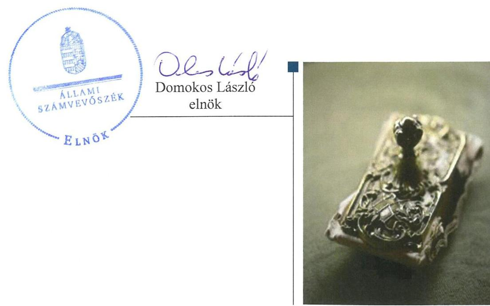
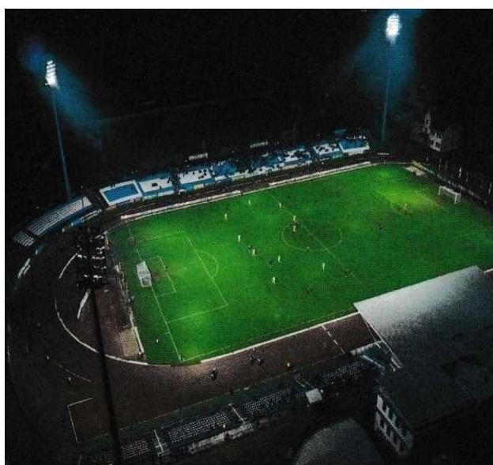
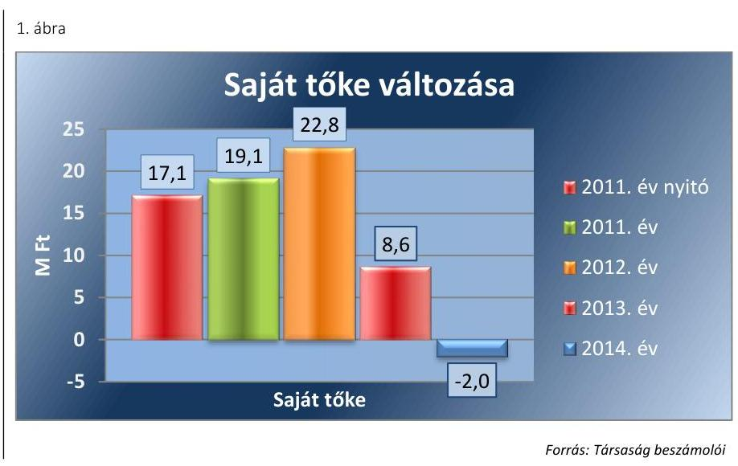
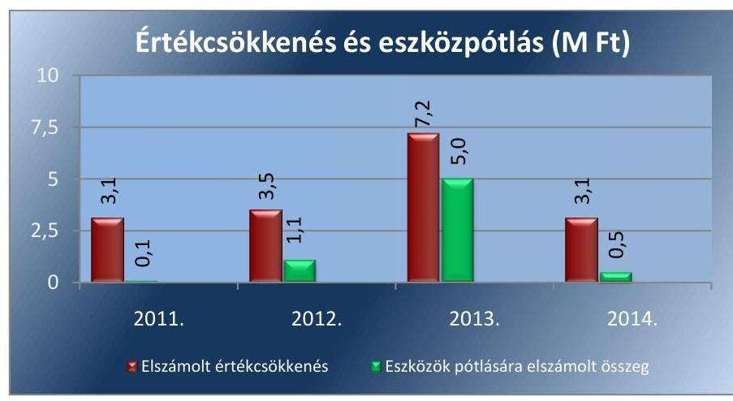
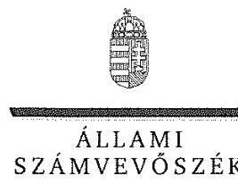
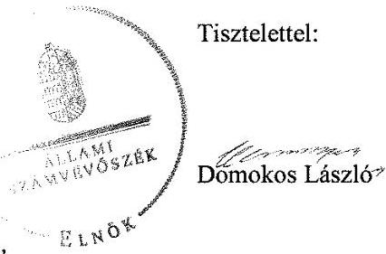

# Jelentés 

## Az önkormányzatok gazdasági társaságai

Az önkormányzatok többségi tulajdonában lévő gazdasági társaságok gazdálkodásának ellenőrzése - STADION Sportlétesítményeket Múködtető Nonprofit Közhasznú Kft.
2016.

---

# Jelentés 

## Az önkormányzatok gazdasági társaságai

Az önkormányzatok többségi tulajdonában lévő gazdasági társaságok gazdálkodásának ellenőrzése - STADION Sportlétesítményeket Múködtető Nonprofit Közhasznú Kft.
2016. november hó 22. nap

---

# AZ ELLENŐRZÉST FELÜGYELTE:

- BÖRÖCZ IMRE felügyeleti vezető

- AZ ELLENŐRZÉST VEZETTE ÉS A VÉGREHAJTÁSÁÉRT FELELŐS:
  - DR. NAGY IMRE ellenőrzésvezető
  - A PROGRAM ÖSSZEÁLLÍTÁSÁÉRT FELELŐS:
    - JANIK JÓZSEF osztályvezető

- IKTATÓSZÁM: V-1109-122/2016.
- TÉMASZÁM: 2143
- ELLENŐRZÉS-AZONOSÍTÓ SZÁM: V070774

Jelentéseink az Országgyűlés számítógépes hálózatán és az Interneta a www.asz.hu címen is olvashatóak.

---

# TARTALOMJEGYZÉK 

■ ÖSSZEGZÉS ..... 5
■ AZ ELLENŐRZÉS CÉLJA ..... 6
■ AZ ELLENŐRZÉS TERÜLETE ..... 7
■ AZ ELLENŐRZÉS HÁTTERE, INDOKOLTSÁGA ..... 8
■ A JELENTÉS LÉNYEGES KÉRDÉSKÖREI ..... 9
■ ELLENŐRZÉS HATÓKÖRE ÉS MÓDSZEREI ..... 10
■ MEGÁLLAPÍTÁSOK ..... 12
■ MELLÉKLETEK ..... 23
I. Sz. melléklet: Értelmező szótár. ..... 23
■ FÜGGELÉK: ÉSZREVÉTELEK ..... 27
■ RÖVIDÍTÉSEK JEGYZÉKE ..... 31

---

.

---

# ÖSSZEGZÉS 

Az Állami Számvevőszék 2011-2014. évekre kiterjedő ellenőrzése megállapította, hogy Kecskemét Megyei Jogú Város Önkormányzata a sportlétesítmények müködtetésének közfeladat ellátását szabályszerűen alakította ki, és tulajdonosi jogait a jogszabályoknak megfelelően gyakorolta.
A STADION Sportlétesítményeket Müködtető Nonprofit Kft. vagyongazdálkodása alapvetően szabályszerű volt. A Társaságnál a bevételek elszámolása megfelelően történt, de a ráfordítások, a beruházások és az értékcsökkenési leírás elszámolása nem megfelelő volt.

## Az ellenőrzés társadalmi indokoltsága

Az Állami Számvevőszék kiemelt célja, hogy a helyi önkormányzatok gazdálkodásában rejlő pénzügyi kockázatok feltárásával, az államháztartáson kívülre nyújtott költségvetési támogatások és ingyenes vagyonjuttatások, valamint az államháztartáson kívül múködő feladat-ellátó rendszerek ellenőrzéseivel hozzájáruljon ahhoz, hogy a közpénzeket az államháztartáson kívül múködő szervezetek is átlátható, rendezett módon használják fel.

Magyarországon az intézmény-centrikus közfeladat-ellátás jellemző, de egyre jelentősebb a költségvetésen kívüli feladatellátás térnyerése. Ennek legfontosabb szereplői - a nonprofit szervezetek mellett - az önkormányzati tulajdonú gazdasági társaságok. Az önkormányzatok szervezetalakítási szabadságának következménye, hogy a korábban is vállalati formában múködő közszolgáltatások mellett, mind a kötelező, mind az önként vállalt feladatok ellátásában a gazdasági társaságok kiemelt fontosságú szerephez jutottak.

## Főbb megállapítások, következtetések

Az Önkormányzat ${ }^{1}$ sportlétesítmény múködtetési közfeladat-ellátásának megszervezése szabályszerű volt, a közfeladatra vonatkozó rendeletalkotási kötelezettségének az Önkormányzat eleget tett. A tulajdonosi joggyakorlás rendjének kialakítása megfelelő volt, az Önkormányzat részéről a tulajdonosi jogok gyakorlása pedig megfelelt a jogszabályi előírásoknak.

A Társaság² vagyongazdálkodása a belső szabályzatok hiányosságai mellett alapvetően szabályszerű volt. A Társaság rendelkezett a múködéshez szükséges szabályzatokkal, azonban azok nem teljes körűen tartalmazták a számviteli előírások alkalmazásához szükséges belső szabályokat. A vagyon hasznosítása nem felelt meg minden esetben a belső előírásoknak. A Társaság beszámolási és közzétételi kötelezettségeinek szabályszerűen eleget tett, de a beszámolót tárgyaló taggyűlésre a könyvvizsgálót 2011. év kivételével nem hívták meg. A Társaság kötelezettségállománya, eladósodottságának mértéke és szerkezete kockázatot jelentett a közfeladat ellátására és a Társaság múködésére.

A Társaság által ellátott közfeladat bevételeinek elszámolása megfelelő volt. Ezzel szemben a ráfordítások nyilvántartása a jogszabályi előírásokkal ellenétesen nem elkülönítetten történt, a beruházások, felújítások és az értékcsökkenési leírás elszámolása tekintetében pedig nem tartották be teljes körűen a jogszabályi és belső előírásokat. Az önköltségszámítás és az árképzés szabályozására a Társaság nem volt kötelezett.

---

# AZ ELLENŐRZÉS CÉLJA 

Az ellenőrzés célja annak értékelése, hogy az önkormányzat vagyongazdálkodási tevékenysége során szabályszerűen gyakorolta-e tulajdonosi jogait; a gazdasági társaság szabályozottsága, gazdálkodása és vagyongazdálkodási tevékenysége, bevételeinek és ráfordításainak elszámolása megfelelt-e a jogszabályi és tulajdonosi előírásoknak; a gazdasági társaság kötelezettségállománya jelentett-e kockázatot a múködésre, valamint a gazdálkodás átláthatósága és elszámoltathatósága érdekében biztosítva volte a szolgáltatás dijának megalapozottsága szabályszerű önköltségszámítással.

---

# AZ ELLENŐRZÉS TERÜLETE

## Kecskemét Megyei Jogú Város Önkormányzata és a többségi tulajdonában lévő STADION Sportlétesítményeket Működtető Nonprofit Kft.

A **KECSKEMÉT MEGYEI JOGÚ VÁROS ÖNKORMÁNYZATA** többségi tulajdonában lévő Társaságot 2006. május 12-én alapították, 2009. május 30-án pedig nonprofit társasággá alakult. Az Önkormányzat tulajdoni részesedése 51,0%, a fennmaradó tulajdoni részesedés a Kecskeméti TE Labdarúgó Kft. (37,0%-ban) és a Kecskeméti Atlétikai és Rugby Klub tulajdonában (12,0%-ban) van. A Társaság feladata az önkormányzati tulajdonban lévő Széktói Stadion üzemeltetése, a létesítményt használó sportágak, sportolók számára a felkészüléshez és versenyzéshez szükséges feltételek megteremtése és folyamatos biztosítása. A Társaság feladata a sportlétesítmény működtetésen túl a helyi közszolgáltatások körében a gyermek és ifjúsági feladatokról való gondoskodás, a közösségi tér biztosítása, a sport támogatása, az egészséges életmód közösségi feltételeinek elősegítése. A gazdasági társaságnak nem volt más gazdasági társaságban tulajdonosi részesedése. Az ellenőrzött időszakban a vezető személyében változás nem történt. A foglalkoztatottak száma 2011. évben 8 fő, 2012. évben 6 fő, 2013. és 2014. évben 10 fő volt. A Társaság 2016. szeptember 23-tól végelszámolás alatt áll.

A Társaság gazdálkodásának egyes adatait a 2011-2014. közötti évek vonatkozásában az 1. táblázat szemlélteti.

1. táblázat

|  A TÁRSASÁG FŐBB GAZDÁLKODÁSI MUTATÓINAK ALAKULÁSA 2011-2014. ÉVEK KÖZÖTT (M FT) |  |  |  |   |
| --- | --- | --- | --- | --- |
|   | 2011 | 2012 | 2013 | 2014  |
|  Mérlegfőösszeg | 29,8 | 45,2 | 25,2 | 20,5  |
|  Mérleg szerinti eredmény | 2,0 | 3,7 | -14,2 | -10,6  |

*Forrás: A Társaság éves beszámolói*

Az Önkormányzat tekintetében 2013. évben a jegyző, 2014. évben a polgármester személye változott.

---

# AZ ELLENŐRZÉS HÁTTERE, INDOKOLTSÁGA 

Objektív kép kialakítása Kecskemét Megyei Jogú Város Önkormányzata tekintetében a sportlétesítmények fenntartása, üzemeltetése közfeladatának megszervezéséről, tulajdonosi joggyakorlásáról, valamint a többségi tulajdonában lévő STADION Sportlétesítményeket Müködtető Nonprofit Kft. közfeladat-ellátását érintő gazdálkodási tevékenységének szabályszerűségéről.

AZ ÖNKORMÁNYZATI TULAJDONÚ GAZDASÁGI TÁRSASÁGOK ellenőrzése kiemelten fontos a vagyon megőrzése, megóvása érdekében, valamint a kormányzati szektor elszámolásaiban megjelenő önkormányzati tulajdonú gazdálkodó szervezetek esetében, amelyekkel szemben alapvető követelmény, hogy gazdálkodásuk, múködésük szabályszerű, az általuk szolgáltatott adatok minél megbízhatóbbak legyenek. A közfeladat-ellátás költségeinek, ráfordításainak alakulása, színvonala hatással van a lakosság elégedettségére.

A törvényalkotás számára - az észlelt problémák, szabálytalanságok, vagy egyéb nem kívánatos jelenségek felszínre kerülésével - az ellenőrzés megállapításai segítséget nyújthatnak az államháztartáson kívüli közfel-adat-ellátás értékeléséhez, jogszabályi keretei pontosításához, átláthatóságot biztosító szabályozásához. Meghatározhatóvá válnak az önkormányzati feladatellátásban részt vevő államháztartáson kívüli szervezeteknek az önkormányzat költségvetését, pénzügyi helyzetét is befolyásoló - kockázatai, lehetővé válik ezen kockázatok csökkentése. Ellenőrzéseink feltárhatják, hogy az önkormányzat feladat-ellátási kötelezettségének szabályszerűen tett-e eleget, a feladatellátáshoz rendelt vagyonkezelésbe vett és saját vagyon múködtetését az elvárható gondossággal, szabályszerűen szervezte-e meg és a tulajdonosi felügyelete hozzájárult-e a feladatellátásához. Az ellenőrzés rávilágíthat arra, hogy a gazdasági társaság a feladatellátási, közszolgáltatási szerződésben foglaltak betartásával, a vagyon használatával biztosította-e a szolgáltatás folytatásának feltételeit, a feladat ellátását. Ezzel az ellenőrzöttek és a helyi döntéshozók számára viszszajelzést ad feladatszervezési, feladat-ellátási kockázataikról, alapot ad a meglévő hibák megszüntetéséhez, a jobb feladatellátás biztosításához. Fokozza a fegyelmet, igazolja, hogy lejárt a következmények nélküli ellenőrzések időszaka.

---

# A JELENTÉS LÉNYEGES KÉRDÉSKÖREI 

1. Az önkormányzat közfeladat megszervezéséről szóló döntése, valamint tulajdonosi joggyakorlása szabályszerű volt-e?
2. A gazdasági társaság vagyongazdálkodása szabályszerű volt-e, kötelezettségállománya jelentett-e kockázatot a müködésre, illetve közfeladat ellátására?
3. A gazdasági társaságnál az ellátott közfeladat bevételeinek és ráfordításainak elszámolása szabályszerű volt-e?

---

# ELLENŐRZÉS HATÓKÖRE ÉS MÓDSZEREI 

## Az ellenőrzés típusa

Megfelelőségi ellenőrzés.

## Az ellenőrzött időszak

2011. január 1-jétől 2014. december 31-ig tart.

## Az ellenőrzés tárgya

A gazdasági társaság feletti tulajdonosi joggyakorlás, valamint a gazdasági társaság gazdálkodásának szabályozottsága és szabályszerűsége.

Az ellenőrzés kiterjed minden olyan körülményre és adatra, amely az ÁSZ jogszabályban meghatározott feladatainak teljesítéséhez, valamint a program végrehajtása folyamán felmerült újabb összefüggések feltárásához szükséges.

## Az ellenőrzött szervezet

Az ellenőrzött szervezetek:
$\longrightarrow$ Kecskemét Megyei Jogú Város Önkormányzata,
$\longrightarrow$ STADION Sportlétesítményeket Múködtető Nonprofit Kft.

## Az ellenőrzés jogalapja

Az ellenőrzés jogszabályi alapját az ÁSZ tv. ${ }^{3} 1 . \S$ (3) bekezdése és 5. § (3)(4)-(5) bekezdései képezik.

## Az ellenőrzés módszerei

Az ellenőrzést a nemzetközi standardokat irányadónak tekintve az ellenőrzési program ellenőrzési kérdései, az ellenőrzött időszakban hatályos jogszabályok, az ellenőrzés szakmai szabályok és módszertanok figyelembevételével végeztük.

Az ellenőrzés ideje alatt az ellenőrzött szervezettel történő kapcsolattartást az ÁSZ Szervezeti és Múködési Szabályzatának vonatkozó előírásai alapján biztosítottuk.

---

Az ellenőrzés a kiválasztott, tulajdonosi jogokat gyakorló önkormányzatra, illetve az ellenőrzésre kijelölt gazdasági társaság felett tulajdonosi jogokat gyakorló szervezetre és az ellenőrzött gazdasági társaságra terjedt ki.

Az ellenőrzési kérdések megválaszolásához szükséges bizonyítékok megszerzése a következő ellenőrzési eljárások alkalmazásával történt: megfigyelés, kérdésfeltevés (információkérés), összehasonlítás, valamint elemző eljárás. Az ellenőrzési bizonyítékként felhasználható adatforrások közé tartoznak egyrészt a szakmai programban felsorolt adatforrások, másrészt adatforrás lehet még minden - az ellenőrzés folyamán - feltárt, az ellenőrzés szempontjából információkat tartalmazó dokumentum.

Az ellenőrzést a kérdésekre adott válaszok kiértékelésével, valamint a megjelölt adatforrások, a csatolt tanúsítványok felhasználásával, továbbá az adott időszakban hatályos jogszabályok figyelembevételével folytattuk le.

A bevételek és ráfordítások elszámolása, valamint a vagyonnyilvántartás terén a szabályszerű működést véletlen mintavétellel ellenőriztük. A mintavétellel ellenőrzött területek esetében minden egyes tétel vonatkozásában a szabályszerűségre vonatkozó kérdéseket tettünk fel, amelyek eredménye összesítésre került. A jogszabályoknak és a belső előírásoknak megfelelőnek tekintettük az adott területet, amennyiben a minta ellenőrzésének eredménye alapján 95\%-os bizonyossággal a teljes sokaságban a hibaarány kisebb volt, mint 10\%, nem megfelelőnek, ha a hibaarány a 10\%ot meghaladta. Részben megfelelő minősítést adtunk, amennyiben egy adott terület vonatkozásában a minta alapján a teljes sokaságban nem volt egyértelműen biztosított a jogszabályoknak és a belső szabályzatoknak megfelelő működés.

---

# 1. Az önkormányzat közfeladat megszervezéséről szóló döntése, valamint tulajdonosi joggyakorlása szabályszerű volt-e? 

Összegző megállapítás

Az Önkormányzat a sportlétesítmény működtetési közfel-adat-ellátást szabályszerűen szervezte meg, a tulajdonosi jogok gyakorlása megfelelt a jogszabályi előírásoknak.
1.1. számú megállapítás

Az Önkormányzat sportlétesítmény működtetési közfeladat-ellátásának megszervezése szabályszerű volt. Az Önkormányzat a közfeladatra vonatkozó rendeletalkotási kötelezettségének eleget tett.

GAZDASÁGI PROGRAMMAL ${ }^{4}$ az Önkormányzat az Ötv. ${ }^{5}$ 91. § (1) bekezdése, 2013. január 1-jétől az Mötv. ${ }^{6}$ 116. § (1) bekezdése rendelkezéseinek megfelelően rendelkezett. A Gazdasági program szerint a sportvagyon célja, hogy gazdaságos működtetésével lehetőséget biztosítson a verseny-, a szabadidő, a diáksport, valamint a fogyatékos sport területén tevékenykedők számára, valamint a sport és egyéb rendezvények lebonyolítása céljából biztosítsa a megfelelő létesítményeket.

Az Nvtv. ${ }^{7}$ 9. § (1) bekezdése 2012. január 1-jétől előírta közép- és hoszszú távú vagyongazdálkodási terv készítését, az Önkormányzat a kötelezettségének azonban csak 2013. évtől tett eleget. A Vagyongazdálkodási terv ${ }^{8}$ szerint a kizárólagos és többségi önkormányzati tulajdonban álló gazdasági társaságok múködését és vagyongazdálkodását kiemelt figyelemmel kell kísérni a társaságok rendelkezésére bocsátott önkormányzati vagyon értékének megőrzése, növelése, eredményesebb működtetése érdekében.

Rendeletalkotási kötelezettsége az Önkormányzatnak a közfeladat ellátással kapcsolatban a Sporttörvény ${ }^{9}$ 55. § (6) bekezdése alapján volt. Az Önkormányzat a 8/2009. (I.30.) közgyűlési rendelettel módosított 23/2004. (VI. 1.) közgyűlési rendelettel a helyi jogszabály-alkotási kötelezettségének eleget tett.

Az Önkormányzat a sporttal kapcsolatos helyi célkitűzéseket és feladatokat a 170/2008. (IV. 24.) közgyűlési határozattal elfogadott Középtávú Testnevelési és Sportfejlesztési Koncepcióban határozta meg.

Az Önkormányzat a közfeladat ellátását szabályozta, a sportlétesítmények működtetése az SZMSZ ${ }^{10}$-ének mellékletében kötelező feladatként szerepelt.

Az Önkormányzat és a Társaság között Közhasznúsági és közszolgáltatási megállapodás ${ }^{11}$ jött létre, amelyet a jogszabályi változásoknak és a költségvetési kereteknek megfelelően évente aktualizáltak.

---

A Társaságnak nyújtott múködési célú támogatást az Önkormányzat évente támogatási szerződés keretében, elszámolási kötelezettség meghatározásával adta át.

Az Önkormányzat évente előírta üzleti terv készítését. A Társaság az Önkormányzat által meghatározott tartalmi és formai követelményeknek megfelelően elkészítette az üzleti terveket.

# 1.2. számú megállapítás 

A tulajdonosi joggyakorlás rendjének kialakítása megfelelő volt, a tulajdonosi jogok gyakorlása megfelelt a jogszabályi előírásoknak.

A TULAJ DONOSI JOGGYAKORLÁS RENDJÉT az Önkormányzat Közgyűlése az Önkormányzat SZMSZ-ében, valamint a Vagyonrendeletben ${ }_{1,2}{ }^{12}$ szabályozta. A Vagyonrendelet ${ }_{1,2}$ - a jogszabályban meghatározottakon túl - előírta a nonprofit gazdasági társaságok részére, hogy az éves beszámoló mellett félévenkénti beszámolót is készítsenek. A Vagyonrendelet ${ }_{1,2}$ szerint a nem kizárólag az Önkormányzat tulajdonában lévő gazdasági társaságok legfőbb szervének ülésén az Önkormányzatot a polgármester képviseli.

A TÁRSASÁGI SZERZŐDÉS ${ }^{13}$ szerint a Taggyűlés feladata az éves beszámolók jóváhagyása, a közhasznú tevékenység folytatásának feltételeiről kötött szerződés jóváhagyása, illetve a Felügyelő bizottságnak az írásbeli jelentés készítése az éves beszámolókról és a lényeges üzletpolitikai jelentés felülvizsgálata.

A társasági szerződés szabályozta a Taggyűlésben, és Felügyelő bizottságában való képviseletre kijelölt személyek képviselettel összefüggő feladatait, beszámolási kötelezettségét.

A FELÜGYELŐ BIZOTTSÁG a Gt. ${ }^{14}$ 34. § (1) bekezdésében, valamint a Ptk. ${ }^{15}$ 3:121. § (1) bekezdésében előírtakat figyelembe véve három tagból állt. A Felügyelő bizottság a 416/2011. (XII. 15.) KH ${ }^{16}$ határozat ellenére nem számolt be a 2011. és 2014. évben lefolytatott ellenőrzéseiről a KVB ${ }^{17}$ részére.

A FÜGGETLEN KÖNYVVIZSGÁLÓI JELENTÉSEK a féléves és az éves beszámolókról elkészültek. A Taggyűlés megismerte a könyvvizsgálói jelentésben foglaltakat.

Az Önkormányzat KVB.-a és VPB.-a ${ }^{18}$ megtárgyalta a Társaság éves beszámolóját és javasolta a Társaság Taggyűlésének elfogadásra. A Taggyűlés a beszámolókat elfogadta.

AZ ÖNKORMÁNYZAT BELSŐ ELLENŐRZÉSE a Társasággal kapcsolatban lefolytatott ellenőrzései során nem vizsgálta a közfeladat ellátását biztosító vagyongazdálkodást, illetőleg a támogatási szerződés teljesítését.

---

# 2. A gazdasági társaság vagyongazdálkodása szabályszerű volt-e, kötelezettségállománya jelentett-e kockázatot a múködésre, illetve közfeladat ellátására? 

Összegző megállapítás

2.1. számú megállapítás

A Társaság vagyongazdálkodása a szabályozás és a vagyonhasznosítás hiányosságai miatt nem felelt meg teljes körűen a jogszabályi és belső előírásoknak, kötelezettségállománya és eladósodottsága kockázatot jelentett a Társaság múködésére és a közfeladat ellátásra.

A Társaság rendelkezett a múködéshez szükséges szabályzatokkal, azonban azok nem feleltek meg teljes körűen a jogszabályi előírásoknak.

A Társaság az ellenőrzött időszakban rendelkezett a Számv. tv. ${ }^{19}$ 14. § (3) bekezdésben előírt Számviteli politikával ${ }^{20}$, valamint a Számv. tv. 14. § (5) bekezdés előírásának megfelelően Leltározási szabályzattal ${ }^{21}$, Értékelési szabályzattal ${ }^{22}$, és Pénzkezelési szabályzattal ${ }^{23}$. A Társaság a 2011-2014. években önköltségszámítás rendjére vonatkozó szabályzattal nem rendelkezett, készítésére a Számv. tv. 14. § (6)-(7) bekezdései alapján nem volt kötelezett.

A SZÁMVITELI POLITIKÁBAN a Számv. tv. 14. § (4) bekezdésében előírtak ellenére nem határozták meg
$\longrightarrow$ a Számv. tv. 47. § (9) bekezdése szerint az eszközök kalkulált bekerülési értékének tényleges bekerülési értékre történő módosítása szempontjából jelentős eltérés összegét, valamint
$\longrightarrow$ az amortizációs politika legfőbb elemeit, ezen belül a Számv. tv. 3. § (4) bekezdésének 5)-6) pontjai, illetőleg a Számv. tv. 52. § (1)-(2) bekezdéseinek figyelembevételével az egyes eszközök hasznos élettartamát, maradványértékét, a leírás módszerét és kulcsait, továbbá, hogy az egyes eszközök maradványértékét mikor nem tekinti jelentősnek.
Továbbá a Számviteli politikában a Számv. tv. 14. § (4) bekezdésében előírtak ellenére nem rögzítették a Számv. tv. 56. § (1)-(3) bekezdéseiben foglalt előírások végrehajtása érdekében a készletek piaci értékének és a fajlagos kis értékű készleteknek a fogalmát.

A LELTÁROZÁSI SZABÁLYZAT nem tartalmazta az egyes eszközök mennyiségi leltározásának gyakoriságát, ezért a szabályozás a 2012-2014. években nem felelt meg a Számv. tv. 69. § (3) bekezdésében előírtaknak, mely szerint a leltározást a Leltározási szabályzatban meghatározott gyakorisággal kell elvégezni.

AZ ÉRTÉKELÉSI SZABÁLYZAT a Számv. tv. előírásaival összhangban biztosította a vagyon értékének meghatározását, azonban a devizaszámlán lévő deviza év végi értékelésénél az árfolyamnyereséget nem a Számv. tv. 60. § (3) bekezdés b) pontjának előírtak szerint határozta meg.

---

A PÉNZKEZELÉSI SZABÁLYZAT és módosításai a Számv. tv. 14. § (8) bekezdésének előírásaival összhangban határozta meg a készpénzzel való gazdálkodást.

A SZÁMLARENDET ${ }^{24}$, a Társaság a Számv. tv. 161. § (1) bekezdésében előírtaknak megfelelően a Számv. tv. 161. § (2) bekezdés a-c) pontok szerinti tartalommal elkészítette. A számlarendet alátámasztó Bizonylati rendet ${ }^{25}$ önálló szabályzatban állapította meg. A Számv. tv. 160.§-ában meghatározott tartalmú számlatükröt a Társaság az ellenőrzött időszakban évente módosította.

JAVADALMAZÁSI SZABÁLYZATOT a Taktv. ${ }^{26}$ 5. § (3) bekezdésében foglaltak ellenére a 2011-2012. évekre a Taggyúlés nem fogadott el. A Taggyúlés által elfogadott, 2013. május 14-től hatályos szabályzat a Taktv. előírásainak megfelelően tartalmazta az Ügyvezető, a vezető állású munkavállalók, valamint a Felügyelő bizottsági tagok javadalmazására vonatkozó szabályokat.

# 2.2. számú megállapítás 

A Társaság vagyongazdálkodása alapvetően szabályszerű volt, de a vagyon hasznosítása nem felelt meg minden esetben a belső előírásoknak.

A Társaság tevékenységét elsősorban saját eszközeivel látta el, önkormányzati tulajdonban lévő vagyontárgyak vagyonkezelésbe vételére az ellenőrzött időszakban nem került sor.

A Társaság az Önkormányzat tulajdonában álló Széktói stadion ingatlant használati szerződés keretében ingyenes üzemeltetésbe vette át az ellenőrzött időszakot megelőzően.

Az üzemeltetésbe átvett ingatlan egyes helyiségeit a Társaság az ellenőrzött időszakban intézmények és vállalkozók számára bérbe adta, azonban a Használati szerződés ${ }^{27}$ II. 2. pontjában foglaltakkal ellentétben nem került sor minden esetben a bérleti jogviszony létrejötte előtt az Önkormányzattal való egyeztetésre.

A Társaság az éves beszámoló mérleg sorait alátámasztó, számviteli nyilvántartásokban szereplő saját vagyonának leltározását a 2011-2014. években a Számv. tv. 69. § (1) bekezdésében foglaltaknak megfelelően minden évben teljes körű leltározással - végezte. Az üzemeltetésre átvett ingatlant a tulajdonos Önkormányzat leltározta.

A Társaság főbb mérlegadatait a 2. táblázat tartalmazza.
2. táblázat

A TÁRSASÁG FŐBB MÉRLEGADATAI (M FT)

|  | 2011 | 2011 | 2012 | 2013 | 2014 |
| :-- | --: | --: | --: | --: | --: |
|  | 01.01 | 12.31 | 12.31 | 12.31 | 12.31 |
| I. Befektetett eszközök | 24,1 | 21,1 | 18,3 | 15,3 | 12,2 |
| - ebből: Tárgyi eszközök | 24,1 | 21,1 | 18,3 | 15,3 | 12,2 |
| II. Forgó eszközök | 9,1 | 8,7 | 26,9 | 9,9 | 8,3 |
| - ebből: Követelések | 3,4 | 2,8 | 3,9 | 7,2 | 4,7 |
| - ebből: Pénzeszközök | 5,7 | 5,9 | 23,0 | 2,7 | 3,6 |
| III. Aktív időbeli elhatárolások | 0 | 0 | 0 | 0 | 0 |
| Eszközök összesen | 33,2 | 29,8 | 45,2 | 25,2 | 20,5 |

---

|  | $\mathbf{2 0 1 1}$   $\mathbf{0 1 . 0 1}$ | $\mathbf{2 0 1 1}$   $\mathbf{1 2 . 3 1}$ | $\mathbf{2 0 1 2}$   $\mathbf{1 2 . 3 1}$ | $\mathbf{2 0 1 3}$   $\mathbf{1 2 . 3 1}$ | $\mathbf{2 0 1 4}$   $\mathbf{1 2 . 3 1}$ |
| :-- | --: | --: | --: | --: | --: |
| IV. Saját tőke | 17,1 | 19,1 | 22,8 | 8,6 | $-2,0$ |
| - ebből: Jegyzett tőke | 3,0 | 3,0 | 3,0 | 3,0 | 3,0 |
| - ebből: Mérleg szerinti eredmény | 14,1 | 2,0 | 3,7 | $-14,2$ | $-10,6$ |
| V. Céltartalékok | 0 | 0 | 0 | 0 | 0 |
| VI. Kötelezettségek | 6,8 | 2,5 | 11,3 | 10,4 | 15,3 |
| - ebből: szállítókkal szembeni kötele-   zettség | - | 1,4 | 10,1 | 8,9 | 15,3 |
| VII. Passzív időbeli elhatárolások | 9,3 | 8,2 | 11,1 | 6,2 | 7,2 |
| Források összesen | 33,2 | 29,8 | 45,2 | 25,2 | 20,5 |

A TÁRSASÁG VAGYONA az ellenőrzött időszakban folyamatosan csökkent, a 2014. év végére 38,3\%-kal, 12,7 M Ft-tal volt alacsonyabb a 2011. évi nyitó értéknél. A befektetett eszközöket kitevő tárgyi eszközök állománya 49,4\%-kal, 11,9 M Ft-tal csökkent az ellenőrzött időszak végére, elsősorban az elszámolt értékcsökkenésnél kisebb összegben megvalósított fejlesztések következtében. A forgó eszközök állománya 8,8\%-kal - a befektetett eszközöknél alacsonyabb mértékben - 0,8 M Ft-tal csökkent, elsősorban a pénzeszközök 36,8\%-os, 2,1 M Ft-os csökkenése miatt. A követelések állománya az ellenőrzött időszakban 38,2\%-kal, 1,3 M Ft-tal nőtt.

A Társaság mérlegében a forrásoldal szerkezete a 2011-2014. években átalakult. A saját tőke részaránya jelentősen csökkent, míg a kötelezettségek aránya és állománya jelentősen növekedett. A saját tőke nagysága a 2011. évi nyitó összeghez képest 2014. év végére 19,1 M Ft-tal volt alacsonyabb, mely a 2013-2014. évek mérleg szerinti veszteségének a következménye. A 2013. és 2014. évi veszteséget az eszközök fenntartási költségeinek növekedése okozta, melyre a Társaság árbevétele és támogatásai nem nyújtottak fedezetet. A kötelezettségek állományát kizárólag éven belüli tartozások tették ki.

A Társaság a tulajdonában lévő eszközöket nem idegenítette el, azokat nem terhelte meg. Üzemeltetésre átvett és saját vagyontárgyaira vonatkozó fejlesztésekhez az Önkormányzat hozzájárulási előírást nem fogalmazott meg.

A saját tőke összege a 2011-2013. években lényegesen meghaladta a jegyzett tőke 3,0 M Ft-os összegét. A 2014. évben a Társaság saját tőkéje a 2013-2014. évek veszteségének hatására a jegyzett tőke alá csökkent. A saját tőke változását a 1. ábra szemlélteti.

---

Fonrás: Társaság beszámolói
2.3. számú megállapítás

A Társaság kötelezettségállománya, eladósodottságának mértéke és szerkezete kockázatot jelentett a közfeladat ellátására és a Társaság múködésére.

A KÖTELEZETTSÉGEK állománya a 2011. évi 6,8 M Ft nyitó összegről a 2014. év végére 125\%-kal 15,3 M Ft-ra nőtt. A Társaság kötelezettségei rövid lejáratú kötelezettségek voltak, hosszú lejáratú kötelezettséggel a 2011-2014. években nem rendelkezett. A rövid lejáratú kötelezettségeket elsősorban szállítói tartozások, valamint adó- és járulékterhek tették ki. A kötelezettségek alakulását a 2011-2014. években a 3. táblázat mutatja.
3. táblázat

KÖTELEZETTSÉGEK ALAKULÁSA (M FT)

|  | 2011. | 2012. | 2013. | 2014. |
| :-- | --: | --: | --: | --: |
| Hosszú lejáratú kötelezettségek összesen | 0 | 0 | 0 | 0 |
| Rövid lejáratú kötelezettségek összesen | 2,5 | 11,3 | 10,4 | 15,3 |
| Ebből rövid lejáratú hitel | 0 | 0 | 0 | 0 |
| szállítói kötelezettség | 1,4 | 10,1 | 8,9 | 15,3 |
| egyéb rövid lejáratú kötelezettség | 1,1 | 1,2 | 1,5 | 0 |

A Társaság szállítói kötelezettsége - melynek a mérlegfőösszeghez viszonyított mértéke 2012-ben 22,3\%, 2013-ban 35,3\%, 2014-ben 74,6\% volt - veszélyeztette a fizetőképességet és kockázatot jelentett a Társaság múködésére, valamint a közfeladat ellátására. Az ellenőrzött időszak utolsó három évében a rövid lejáratú kötelezettségeit nem teljesítette határidőben. A 2011. évben a Társaságnak nem voltak lejárt határidejű tartozásai, a határidőn túli szállítói tartozások összege a 2012. évben 7,8 M Ft, a 2013. évben 5,0 M Ft volt, a 2014. évben elérte a 15,2 M Ft-ot.

AZ ELADÓSODOTTSÁG mértéke és szerkezete kockázatot jelentett a közfeladat ellátására. A mutatók alakulását a 4. táblázat szemlélteti.

---

| ELADÓSODOTTSÁGI MUTATÓK ALAKULÁSA (ARÁNY) |  |  |  |  |
| :--: | :--: | :--: | :--: | :--: |
| Mutató megnevezése | 2011. | 2012. | 2013. | 2014. |
| Eladósodottsági mutató   (idegen tőke/összes forrás) | 0,08 | 0,25 | 0,41 | 0,75 |
| Eladósodottság mértéke   (kötelezettségek/saját tőke) | 0,13 | 0,50 | 1,2 | $-7,6$ |
| Nettó eladósodottság   (kötelezettségek- követelések/saját tőke) | $-0,02$ | 0,32 | 0,37 | $-5,27$ |
| Adósságfedezeti mutató I.(befektetett eszközök+forgóeszközök/idegen forrás) | 12,16 | 3,99 | 2,42 | 1,34 |
| Árbevételre vetített eladósodottság (kötele-zettségek-forgóeszközök/ért. nettó árbevétele) | $-1,30$ | $-1,45$ | 0,07 | 1,16 |

Fonrás: Társaság adatszolgáltatása

Az eladósodottsági mutató értékei folyamatosan növekedtek az ellenőrzött időszakban, ami azt mutatta, hogy a Társaságot egyre jobban terhelték az idegen tőkével kapcsolatos kötelezettségek.

Az eladósodottság mértékének növekedése az ellenőrzött időszak utolsó két évében azt jelentette, hogy a kötelezettségek a saját tőke egyre nagyobb hányadát kötötték le, aminek az idegen tőke (kötelezettségek) magas értéke és a folyamatosan csökkenő, 2014. évben a jegyzett tőke alá eső saját tőke volt az oka. Emiatt az eladósodottság mértéke a 2014. évben negatív értéket mutat.

A nettó eladósodottság mutató értéke alapján a kintlévőségek a 2011. évben nem fedezték a kötelezettségek összegét, a 2014. évben a saját tőke csökkenése miatt vált negatívvá.

Az adósságfedezeti mutató I. értéke tendenciáját tekintve romlott az ellenőrzött években, míg a 2011. évben 1 Ft adósságra még 12,16 Ft, 2014-ben már csak 1,34 Ft vagyon jutott.

Az árbevételre vetített eladósodottság azt mutatja, hogy az árbevétel mekkora fedezetet nyújtott a kötelezettségekre. A mutató értéke kedvezőtlenül alakult a 2013-2014. években, mivel a forgóeszközök állománya nem nyújtott fedezetet a kötelezettségekre.

# 2.4. számú megállapítás 

A Társaság beszámolási kötelezettségének a jogszabályi és belső előírásoknak megfelelően eleget tett, de a beszámolót tárgyaló taggyűlésre a könyvvizsgálót nem minden évben hívták meg. Az adatvédelem, adatnyilvánosság tekintetében a Társaság szabályszerűen járt el.

A Társaság beszámolási, adatszolgáltatási kötelezettségét a Vagyonrende-let ${ }_{1,2}$ szabályozta. Az éves üzleti terveket és a pénzügyi működésről szóló, az Önkormányzat által előírt féléves beszámolókat a Társaság határidőben elkészítette.

AZ ÉVES BESZÁMOLÓKAT ${ }^{28}$ a Társaság a 2011-2014. évekre vonatkozóan a Számv. tv. 19. § (1) bekezdésében és a Vagyonrendelet-ben ${ }_{1,2}$ meghatározottak szerint elkészítette. A Gt. 141. § (2) bekezdés a) pontjában, a Ptk. 3:109. § (2) bekezdésében, az 1997. évi CLVI. tv. ${ }^{29}$ 19. §ban, a Civil tv. ${ }^{30}$ 46. § (1) bekezdésében, valamint a Társasági szerződés-

---

ben, és az SzMSz-ben előírtaknak megfelelően a Számv. tv. szerinti beszámolókat és 2011-ben a közhasznúsági jelentést, 2012-2014. években a közhasznúsági mellékleteket a Taggyúlés az előírt határidőben jóváhagyta. A letétbe helyezésre és a közzétételre a 2011. év kivételével a Számv. tv. előírásainak megfelelően került sor. A Társaság a Számv. tv. 153. § (1) bekezdésének előírása ellenére a 2011. évi beszámolót a Taggyúlés döntését megelőzően helyezte letétbe, valamint nem történt meg a 2011. évi adózott eredmény felhasználására vonatkozó határozat letétbe helyezése.

A Taggyúlés az éves beszámolókról a Gt. és a Ptk. vonatkozó előírásainak megfelelően a Felügyelő bizottság írásbeli jelentésének és a könyvvizsgáló hitelesítő záradékkal ellátott jelentésének birtokában határozott. Az ügyvezető az éves beszámolót tárgyaló Taggyúlés ülésére - a 2011. év kivételével - a könyvvizsgálót nem hívta meg, amely ellentétes a Gt. 44. § (1) bekezdésében, illetve a Ptk. 3:131. § (2) bekezdésében foglaltakkal.

A Felügyelő bizottság és a könyvvizsgáló a Taggyúlés összehívását az ellenőrzött időszakban nem kezdeményezte, mivel a Gt. 35. § (4) bekezdésében, 44. § (2) bekezdésében, a Ptk. 3:120. § (3) bekezdésében, és a Számv. tv. 157. § (2) bekezdésében előírt esetek nem álltak fenn.

AZ ADATOK VÉDELMÉRE, NYILVÁNOSSÁGÁRA vonatkozóan a Társaság szabályszerűen járt el, az Avtv. ${ }^{31}$ 19. §, 20. § (8) bekezdése, valamint az Info tv. ${ }^{32}$ 26. §, 32-37. §-ban meghatározottaknak az ellenőrzött időszakban eleget tett. Az Avtv. 31/A. § (1) bekezdése, valamint az Info tv. 24. § (1) bekezdése értelmében a Társaságnál belső adatvédelmi felelőst jelöltek ki, aki az Avtv. 31/A. § (3) bekezdésében, valamint az Info tv. 24. § (3) bekezdésében meghatározott kötelezettségének eleget téve elkészítette az adatvédelmi szabályzatot ${ }^{33}$. A Társaság a 20112014. években az Eisztv. ${ }^{34}$ 6. § (1) bekezdésében, valamint az Info tv. 33. § (2) bekezdésében előírt közzétételi kötelezettségének - saját honlapján eleget tett.

# 3. A gazdasági társaságnál az ellátott közfeladat bevételeinek és ráfordításainak elszámolása szabályszerű volt-e? 

Összegző megállapítás

A Társaságnál az ellátott közfeladat bevételeinek elszámolása megfelelő, a ráfordítások, a beruházások és az értékcsökkenési leírás elszámolása nem megfelelő volt.

A Társaság a bevételek vonatkozásában a közfeladat egyértelmú elhatárolását az évente frissített Számlatükörben ${ }^{35}$ határozta meg.

A ráfordításai esetében azonban a Társaság a könyvvezetésre, bizonylatolásra vonatkozó részletes belső szabályait - a Számv. tv. 161/A. § (1) bekezdése ellenére - nem úgy alakította ki, hogy a kiegészítő melléklet 1997. évi CLVI. törvény 18. § (1) bekezdése, Civil tv. 29. § (4)-(5) bekezdései szerinti - adatainak alátámasztására is alkalmas legyen.

AZ ANYAGJELLEGŰ RÁFORDÍTÁSOK elszámolása nem volt megfelelő. A költségelszámolást megalapozó dokumentumok rendelkezésre álltak, a költségeket a Számlatükörben megjelölt költség-

---

számlákra könyvelték. Ugyanakkor a Számv. tv. 161/A. § (1) bekezdésében foglalt szabályozás hiánya mellett a Társaság a könyvvezetési rendszerét - a Számv. tv. 161/A. § (2) bekezdése ellenére - nem részletezte tovább oly módon, hogy abból az 1997. évi CLVI. törvény 18. § (1) bekezdése, valamint a Civil tv. 29. § (4)-(7) bekezdése szerinti adatok rendelkezésre álljanak.

# AZ ÉRTÉKESÍTÉS NETTÓ ÁRBEVÉTELÉNEK ELSZÁMOLÁSA megfelelő volt. A bevételek előírása és kiszámlázása megfelelően történt. A bevételeket feladatonként elkülönítve, a megfelelő számlacsoportba számolták el. 

A BERUHÁZÁSOK, FELÚJÍTÁSOK elszámolásának szabályszerűsége nem volt megfelelő. A kontírozás, a besorolás és a bekerülési érték meghatározása során a Számv. tv. 47. §-a, a Számviteli politika és az értékelési szabályzat előírásait alkalmazták, azonban az aktiválás dátuma több kisösszegű tétel esetében nem egyezett meg az analitikában és a főkönyvi számlákon, mivel az aktiválás nem a Számviteli politika 17. pontjában megjelölt időben és módon történt.

## AZ ÉRTÉKCSÖKKENÉSI LEÍRÁS ELSZÁMOLÁSA

nem volt megfelelő. Ennek oka egyrészt, hogy a beruházások aktiválási dátuma nem a Számviteli politika 17. pontjában megjelölt időben és módon került meghatározásra. Másrészt az, hogy több kisösszegű tételnél az értékcsökkenést nem a használatba vételkor számolták el, megsértve ezzel a Számv. tv. 80. § (2) bekezdését. A kisösszegű tételek az adott éven belül leírásra kerültek, így az a beszámolók mérlegsorait nem érintette. Egy esetben az értékcsökkenés a meghatározott 2 év helyett 1,5 alatt került leírásra, megsértve ezzel a Számv. tv. 52. § (2) bekezdésében és a Számviteli politika 14. pontjában foglaltakat.

Saját vagyona tekintetében az eszközök visszapótlása minden évben kisebb volt, mint az azokra elszámolt értékcsökkenés összege, mivel a Társaság 2011-2014. évek között nem hajtott végre jelentős felújítást, beruházást. Emiatt a tárgyi eszközök nettó könyv szerinti értéke a 2011. év végi 21.071,4 M Ft-ról a 2014. év végére 12.220,0 M Ft-ra csökkent.

Az 2. ábra az ellenőrzött évek alatti értékcsökkenés és eszközpótlás alakulását mutatja be.
2. ábra

---

Az eszközpótlás a Társaság legjelentősebb tárgyi eszközeinél a használhatósági fok és az átlagos életkor mutatókkal került minősítésre, melyet az 5. táblázat szemléltet.
5. táblázat

TÁRGYI ESZKÖZÖK HASZNÁLHATÓSÁGI FOKA (\%), ÁTLAGOS ÉLETKORA (ÉV)

| Tárgyi eszköz | Mutató | 2011. | 2012. | 2013. | 2014. |
| :--: | :--: | :--: | :--: | :--: | :--: |
| Öntözőrendszer | használhatósági fok (\%) | 80,0 | 70,0 | 60,0 | 50,0 |
|  | átlagos életkor (év) | 2,0 | 3,0 | 4,0 | 5,0 |
| Világitás | használhatósági fok (\%) | 72,7 | 64,7 | 56,7 | 48,7 |
|  | átlagos életkor (év) | 3,4 | 4,4 | 5,4 | 6,4 |
| Termelésben | használhatósági fok (\%) | 55,5 | 43,6 | 30,5 | 17,4 |
| résztvevő gépek | átlagos életkor (év) | 3,1 | 3,9 | 4,8 | 5,7 |

Az ellenőrzött időszakban valamennyi eszköz használhatósági foka romlott, ezzel párhuzamosan az átlagos életkoruk nőtt, mivel a pótlások nem a saját vagyon elhasználódásának megfelelő mértékben történtek. Ennek következtében a közfeladat ellátását biztosító eszközvagyon értéke 2011. és 2014. évek között csökkent.

Éves eredmény eszközpótlásra, felújításra történő felhasználásáról és osztalékfizetésről szóló tulajdonosi döntés nem volt az ellenőrzött időszak alatt. Ilyen nem is történt a nyereséges 2011. és 2012. években, 2013. és 2014. évben pedig a Társaság eredménye negatív volt.

A KÖVETELÉSÁLLOMÁNY, ezen belül a vevőkövetelések 2011-2014. évek közötti alakulását a 6. táblázat mutatja.
6. táblázat

A TÁRSASÁG KÖVETELÉSEI (EZER FT)

|  | 2011. | 2012. | 2013. | 2014. |
| :--: | :--: | :--: | :--: | :--: |
| Követelések áruszállításból és szolgáltatásból (vevők) | 321,3 | 681,7 | 425,8 | 1,0 |
| Egyéb követelések | 2484,4 | 3259,9 | 6746,8 | 4687,8 |
| Követelések összesen | 2805,7 | 3941,6 | 7172,6 | 4688,8 |

A Társaság vevőállománya 2011. évhez képest az ellenőrzött időszak végére csökkent. Korosított vevőállományában egy vevővel szemben tartott nyilván éveken keresztül 21 ezer Ft értékben lejárt követelést, mely 2014. év végére sem folyt be teljes összegben. Az ellenőrzött időszak alatt értékvesztést nem számolt el. A Társaság a követelésállomány csökkentésére nem intézkedett. 2011-2014. között a Társaság lakossággal szembeni követeléssel nem rendelkezett.

---

.

---

# MELLÉKLETEK 

## I. SZ. MELLÉKLET: ÉRTELMEZŐ SZÓTÁR

garancia

gazdasági társaság
gazdálkodó szervezet
kezesség
nemzeti vagyon
nonprofit gazdasági társaság
társaság
többségi befolyást biztosító részesedés

A garancia olyan önálló, az önkormányzat nevében vállalt kötelezettség, amely alapján az önkormányzat az önkormányzati költségvetés terhére szerződésben meghatározott feltételek szerint, a kötelezett nem teljesítése esetén a jogosultnak fizetést teljesít az előzetesen rögzített összeghatárig. Ptk. 3.88. § (1) bekezdése szerint „a gazdasági társaságok üzletszerű közös gazdasági tevékenység folytatására, a tagok vagyoni hozzájárulásával létrehozott, jogi személyiséggel rendelkező vállalkozások, amelyekben a tagok a nyereségből közösen részesednek, és a veszteséget közösen viselik".
A Ptk. 685. § c) pontja szerint gazdálkodó szervezet:
„az állami vállalat, az egyéb állami gazdálkodó szerv, a szövetkezet, a lakásszövetkezet, az európai szövetkezet, a gazdasági társaság, az európai részvénytársaság, az egyesülés, az európai gazdasági egyesülés, az európai területi együttműködési csoportosulás, az egyes jogi személyek vállalata, a leányvállalat, a vízgazdálkodási társulat, az erdő birtokossági társulat, a végrehajtói iroda, az egyéni cég, továbbá az egyéni vállalkozó." (2014. 03.15-ig hatályos)
A kezességre vonatkozó előírásokat a Ptk. 6:416-430. §-ai tartalmazzák. Kezességi szerződéssel a kezes kötelezettséget vállal a jogosulttal szemben, hogyha a kötelezett nem teljesít, maga fog helyette a jogosultnak teljesíteni. Kezesség egy vagy több, fennálló vagy jövőbeli, feltétlen vagy feltételes, meghatározott vagy meghatározható összegű pénzkövetelés vagy pénzben kifejezhető értékkel rendelkező egyéb kötelezettség biztosítására vállalható.
A Ptk. szerint kezességet csak írásban lehet vállalni. A kezes kötelezettsége ahhoz a kötelezettséghez igazodik, amelyért kezességet vállalt. A kezes kötelezettsége nem válhat terhesebbé, mint amilyen elvállalásakor volt, kiterjed azonban a kötelezett szerződésszegésének jogkövetkezményeire és a kezesség elvállalása után esedékessé váló mellékkövetelésekre is.
Nvt. 1. § (2) bekezdése szerint:
„az állam vagy a helyi önkormányzat kizárólagos tulajdonában álló dolgok,
az a) pont hatálya alá nem tartozó, állam vagy a helyi önkormányzat tulajdonában lévő dolog,
az állam vagy a helyi önkormányzatot tulajdonában lévő pénzügyi eszközök, továbbá az államot vagy a helyi önkormányzatot megillető társasági részesedések,
az államot vagy a helyi önkormányzatot megillető bármely vagyoni értékkel rendelkező jogosultság, amelyet jogszabály vagyoni értékű jogként nevesít,
Magyarország határa által körbezárt terület feletti légtér,
az üvegházhatású gázok kibocsátási egységeinek kereskedelméről szóló törvény szerint kibocsátási egység és légközlekedési kibocsátási egység, valamint az ENSZ Éghajlat változási Keretegyezménye és annak Kiotói Jegyzőkönyve végrehajtási keretrendszeréről szóló törvény szerinti kiotói egység, állami vagy helyi önkormányzati fenntartású közgyűjtemény (muzeális intézmény, levéltár, közgyűjteményként működő kép- és hangarchívum, valamint könyvtár) saját gyűjteményében nyilvántartott kulturális javak körébe tartozó dolog,
a régészeti lelet,
a nemzeti adatvagyon körébe tartozó állami nyilvántartások fokozottabb védelméről szóló törvény szerinti nemzeti adatvagyon." (hatályos 2012. január 1-jétől, g) pont módosult 2012. június 30-tól)
Ctv. 9/F Ctv. 9/F. § (2) bekezdése szerint „az a gazdasági társaság minősül nonprofit gazdasági társaságnak és cégnevében az a gazdasági társaság tüntetheti fel a nonprofit jelleget, amelynek létesítő okirata tartalmazza, hogy a gazdasági társaság tevékenységéből származó nyereség a tagok között nem osztható fel, hanem az a gazdasági társaság vagyonát gyarapítja." (hatályos 2014. március 15től)
A Ptk. 8:2. § (1) bekezdése szerint „többségi befolyás az olyan kapcsolat, amelynek révén természetes személy vagy jogi személy (befolyással rendelkező) egy jogi személyben a szavazatok több mint felével vagy meghatározó befolyással rendelkezik."

---

eladósodottságot jellemző mutatók
keresztfinanszírozás tilalma
közszolgáltatás
közszolgáltató
közszolgáltató
közületi felhasználó
lakossági felhasználó
nemzeti vagyon
eladósodottsági mutató (tőkeáttétel): idegen tőke/összes forrás. Egészségesnek mondható egy olyan mértékű áttétel, amelyet az üzleti tervek szerint és az elmúlt időszak tapasztalatai alapján a társaság megfelelő biztonsággal ki tud termelni. Nagy eszközberuházás-igényű iparágakban értéke magasabb, azaz magasabb eladósodottság is elfogadható, de 75-85\%-ot meghaladó értéknél már itt is erős, sőt túlzott külső finanszírozottságról beszélhetünk. Általánosságban véve kedvező, ha értéke kisebb, mint 0,6 .
eladósodottság mértéke: kötelezettségek / saját tőke. Fontos szerepet játszik ez a mutató egy vállalat megítélésében. Azt mutatja, hogy a saját források a kötelezettségek hány százalékát fedezik. Törekedni kell, hogy a mutató tartósan (jelentősen) 1 alatti értéket érjen el.
nettó eladósodottság: (kötelezettségek-követelések) / saját tőke. Azt mutatja, hogy a kintlévőségekkel csökkentett kötelezettségeket milyen mértékben fedezi a saját forrás. Ez feltételezi, hogy a követelések pénzügyileg előbb realizálódnak, mint ahogy a kötelezettségeket teljesíteni kell. A mutató minél kisebb, csökkenő értéke a kedvező.
adósságfedezeti mutató I.: (befektetett eszközök+forgó eszközök) / idegen forrás. Azt mutatja, hogy 1 Ft adósságra hány Ft vagyon jut. Általánosságban véve kedvező, ha értéke 2 körül van, de nagy eszközberuházás-igényű iparágakban értéke kisebb is lehet.
adósságfedezeti mutató II.: működési cash flow / hosszú lejáratú kötelezettségek. A mutató azt jelzi, hogy az adott gazdálkodási időszak működési pénzáramainak eredményeként realizált cash flow révén a vállalkozás mennyiben lenne képes valamennyi hosszú lejáratú kötelezettségének eleget tenni. Ennek vizsgálatára viszonylag ritkán kerül sor, az elsősorban a veszélyhelyzetbe került vállalkozások esetében lehet érdekes. Általánosságban véve kedvező, ha a működési cash flow minél nagyobb arányban nyújt fedezetet a hosszú lejáratú kötelezettségre (értéke nagyobb, mint 1, nő az ellenőrzött időszakban).
árbevételre vetített eladósodottság: (kötelezettségek-forgóeszközök) / értékesítés nettó árbevétele. Az árbevételre vetített eladósodottság azt mutatja, hogy az árbevétel mekkora fedezetet nyújt a kötelezettségeknek a forgóeszközökkel csökkentett részére. Általánosságban véve kedvező, ha az árbevétel minél nagyobb arányban nyújt fedezetet a forgóeszközökkel csökkentett kötelezettségekre (értéke kisebb, mint 1, csökken az ellenőrzött időszakban).
A közszolgáltatás díját úgy kell megállapítani, hogy az maradéktalanul fedezetet nyújtson a közszolgáltatás indokolt költségeire és ráfordításaira, valamint a közszolgáltató e tevékenységével kapcsolatos ésszerű nyereségére; az ésszerű nyereség nem tartalmazhatja a közszolgáltatáson kívül eső egyéb gazdasági tevékenységei költségeinek, ráfordításainak fedezetét.
A közszolgáltatás: „közcélú, illetőleg közérdekű szolgáltatást jelent, amely egy nagyobb közösség (állam, település) minden tagjára nézve megközelítőleg azonos feltételek mellett vehető igénybe, ezért valamilyen mértékig közösségi megszervezést, illetve szabályozást, ellenőrzést igényel." Az Ebktv. 3. § d) pontja a következőképpen határozza meg a közszolgáltatást: „szerződéskötési kötelezettség alapján a lakosság alapvető szükségleteinek ellátására irányuló szolgáltatás, így különösen a villamos ener-gia-, gáz-, hő-, víz-, szennyvíz- és hulladékkezelési, köztisztasági, postai és távközlési szolgáltatás, továbbá a menetrend alapján közlekedő járművekkel végzett közforgalmú személyszállítás".
A közszolgáltatás ellátására feljogosított hulladékkezelő (Forrás: a 2011-2012. években a Hgt. 21. § (3) bekezdés a) pontja)
Az a hulladékgazdálkodási közszolgáltatási engedéllyel rendelkező és a Ht. szerint minősített gazdálkodó szervezet, amely a települési önkormányzattal kötött hulladékgazdálkodási közszolgáltatási szerződés alapján hulladékgazdálkodási közszolgáltatást lát el. (Forrás: a 2013-2014. években a Ht. 2. § (1) bekezdés 37. pontja).
Az a jogi személy, illetőleg jogi személyiséggel nem rendelkező gazdasági társaság, aki (amely) a meghatározott szolgáltatásra, és/vagy a keletkező hulladék elszállítására közüzemi szerződést kötött a közszolgáltatóval.
Az a természetes személy, aki az Önkormányzat közigazgatási, vagy ellátási területén ingatlannal rendelkezik, és aki a közszolgáltatóval a hulladékelszállítására szerződést kötött.
Nvt. 1. § (2) bekezdése szerint:
„az állam vagy a helyi önkormányzat kizárólagos tulajdonában álló dolgok,

---

az a) pont hatálya alá nem tartozó, állam vagy a helyi önkormányzat tulajdonában lévő dolog, az állam vagy a helyi önkormányzatot tulajdonában lévő pénzügyi eszközök, továbbá az államot vagy a helyi önkormányzatot megillető társasági részesedések,
az államot vagy a helyi önkormányzatot megillető bármely vagyoni értékkel rendelkező jogosultság, amelyet jogszabály vagyoni értékű jogként nevesít,
Magyarország határa által körbezárt terület feletti légtér,
az üvegházhatású gázok kibocsátási egységeinek kereskedelméről szóló törvény szerint kibocsátási egység és légiközlekedési kibocsátási egység, valamint az ENSZ Éghajlat változási Keretegyezménye és annak Kiotói Jegyzőkönyv végrehajtási keretrendszeréről szóló törvény szerinti kiotói egység, állami vagy helyi önkormányzati fenntartású közgyűjtemény (muzeális intézmény, levéltár, közgyűjteményként működő kép- és hangarchívum, valamint könyvtár) saját gyűjteményében nyilvántartott kulturális javak körébe tartozó dolog,
a régészeti lelet,
a nemzeti adatvagyon körébe tartozó állami nyilvántartások fokozottabb védelméről szóló törvény szerinti nemzeti adatvagyon." (hatályos 2012. január 1-jétől, g) pont módosult 2012. június 30-tól)
közfeladat

Jogszabályban meghatározott állami vagy önkormányzati feladat, amit az arra kötelezett közérdekből, jogszabályban meghatározott követelményeknek és feltételeknek megfelelve végez, ideértve a lakosság közszolgáltatásokkal való ellátását, továbbá az állam nemzetközi szerződésekben vállalt kötelezettségeiből adódó közérdekű feladatokat, valamint e feladatok ellátásához szükséges infrastruktúra biztosítását is (Nvtv. 3. § (1) bekezdés 7. pont).

---

.

---

# FÜGGELÉK: ÉSZREVÉTELEK 

A jelentéstervezetet a Számvevőszék 15 napos észrevételezésre megküldte az ellenőrzött szervezet vezetőjének az ÁSZ tv. 29. §* (1) bekezdése előírásának megfelelően.
Az elfogadott észrevételek alapján a Számvevőszék módosította a jelentést.

A függelék tartalmazza az ellenőrzött észrevételeit, illetve az el nem fogadott észrevételek elutasításának indoklását.
$\longrightarrow$ Kecskemét Megyei Jogú Város Önkormányzata polgármesterének írásban tett észrevétele
$\longrightarrow$ Tájékoztatás a polgármesternek az észrevételek kezeléséről

[^0]
[^0]:    * 29. § (1) Az Állami Számvevőszék az ellenőrzési megállapításait megküldi az ellenőrzött szervezet vezetőjének vagy az általa megbízott személynek, és annak, akinek személyes felelősségét állapította meg.
    (2) Az ellenőrzött szervezet vezetője és a felelősként megjelölt személy az ellenőrzés megállapításaira tizenöt napon belül írásban észrevételt tehet.
    (3) Az Állami Számvevőszék az észrevételre a beérkezésétől számított harminc napon belül írásban válaszol. A figyelembe nem vett észrevételeket köteles a jelentésben feltüntetni, és megindokolni, hogy azokat miért nem fogadta el.

---

# Kecskemét Megyei Jogú Város Polgármestere

**Úgyiratszám:** 6222-16/2016.
**Tárgy:** STADION Sportlétesítményeket Működítéző Nonprofit
**Úgyintéző:** dr. Szappanos Csilla
**Kft. ellenőrzési jelentéstervezete**
**Melléklet:** Cégbírósági végzés

**Állami Számvevőszék**
**Domokos László elnök részére**

**Budapest**
Apáczai Csere János u. 10.
1052

**Állami Számvevőszék**
**616 340 12616**
**Érkezés:** 2016 OKT 2.0.
**Iktatószám:** 2-1103-111/2016.
**Melléklet:**

Tisztelt Elnök Úr!

Kecskemét Megyei Jogú Város Önkormányzata megkapta „Az önkormányzatok gazdasági társaságai - Az önkormányzatok többségi tulajdonában lévő gazdasági társaságok gazdálkodásának ellenőrzése – STADION Sportlétesítményeket Működítéző Nonprofit Kft.” címmel készített számvevőszéki ellenőrzéshez készült jelentéstervezetet.

A jelentéstervezet Kecskemét Megyei Jogú Város Polgármestere számára megfogalmazott javaslatára, valamint az annak alapjául szolgáló 2.4. számú megállapítás 3. bekezdésére az alábbi észrevételt tesszük.

A Polgári Törvénykönyvről szóló 2013. évi V. törvény (a továbbiakban: Ptk.) 3:109. § (1)-(3) bekezdései alapján a gazdasági társaság tagjainak döntéshozó szerve a legfőbb szerv, melynek feladata a társaság alapvető üzleti és személyi kérdéseiben való döntéshozatal, valamint döntési jogot gyakorol a vezető tisztségviselővel szembeni kártérítési igény érvényesítéséről. A Ptk. 3:188. § (1) bekezdése szerint a korlátolt felelősségű társaság legfőbb szerve a taggyűlés. Tekintettel arra, hogy a társaság nem áll kizárólagos önkormányzati tulajdonban, hanem az önkormányzat mellett tagja a Kecskeméti Tornaegylet Labdarúgó Kft. és a Kecskeméti Atlétika és Rugby Club, az ügyvezető felelősségre vonása érdekében szükséges intézkedés megtételéről nem a polgármester, hanem a taggyűlés lenne jogosult dönteni.

Hangsúlyozandó azonban, hogy a taggyűlés már korábban döntött a társaság jogutód nélküli megszűnéséről, a végelszámolás kezdő időpontját 2016. szeptember 1. napjában meghatározva, melyre tekintettel a Kecskeméti Törvényszék Cégbírósága a Cg.03-09-118399/40. számú végzésével 2016. szeptember 29. napján kelt bejegyzésével elrendelte a társaság végelszámolását. Ennek következtében az ügyvezetői megbízatás megszűnt, feladatát a továbbiakban végelszámoló látja el.

A fent hivatkozott jogszabályi keretek között a polgármester nem jogosult intézkedni az ügyvezetővel szembeni felelősségre vonásról.

Kecskemét, 2016. október 12.

Tisztelettel:

Szemereyné Pataki Klaudia
polgármester §.

Ügyintézés helye:

Kecskemét Megyei Jogú Város Polgármesteri Hivatala
Szervezési és Jogi Iroda
Jogi Osztály
Vagyongazdálkodási Csoport
☎ 6000 Kecskemét, Kossuth tér 1.
76/513-513/2381 ügyintéző telefonszáma Fax: 76/513-538 e-mail: szappanos.csilla@kecskemet.hu

---

ELNÖK

# Szemereyné Pataki Klaudia asszony 

polgármester
Kecskemét Megyei Jogú Város Önkormányzata

## Kecskemét

## Tisztelt Polgármester Asszony!

„Az önkormányzatok gazdasági társaságai - Az önkormányzatok többségi tulajdonában lévő gazdasági társaságok gazdálkodásának ellenörzése - Stadion Sportlétesitményeket Mikódtető Nonprofit Kft." címmel készített számvevőszéki jelentéstervezetre tett észrevételét köszönettel megkaptam.
Az Állami Számvevőszék észrevételre vonatkozó álláspontjáról a felügyeleti vezető által készített részletes tájékoztatást mellékelten megküldöm.

Budapest, 2016. 17 hó nap

Melléklet: Tájékoztatás az észrevétel kezeléséről

---

# Tájékoztatás   az észrevétel kezeléséről 

„Az önkormányzatok gazdasági társaságai - Az önkormányzatok többségi tulajdonában lévő gazdasági társaságok gazdálkodásának ellenörzése - Stadion Sportlétesítményeket Müködtető Nonprofit Kft." címü jelentéstervezetre tett észrevételét áttekintettük, annak kezelésével kapcsolatban a következő tájékoztatást adom.
Az észrevétel a Polgármester számára megfogalmazott javaslatra, valamint az azt alátámasztó 2.4. számú megállapítás 3. bekezdésére irányult, mely szerint az ügyvezető az éves beszámolót tárgyaló taggyűlési ülésre nem hívta meg a könyvvizsgálót, ezért javasolt a Polgármester intézkedése az ügyvezetői felelősség tisztázása érdekében.
Az észrevételben foglalt tájékoztatás alapján a Kecskeméti Törvényszék Cégbírósága a Cg.03-09-118399/40. számú végzésével elrendelte a társaság végelszámolását. A cégnyilvánosságról, a bírósági cégeljárásról és a végelszámolásról szóló 2006. évi V. törvény 98. § (2) bekezdése szerint a végelszámolás kezdő időpontjában a cég vezető tisztségviselőjének megbízatása megszűnik, továbbá a végelszámolás kezdő időpontjától a cég önálló képviseleti joggal rendelkező vezető tisztségviselőjének a végelszámoló minősül. Ezért a jelentéstervezetből az észrevétellel érintett javaslat - továbbá a végelszámolás miatt a többi javaslat is - törlésre kerül.
Tájékoztatom, hogy a számvevőszéki jelentés függelékeként szerepeltetjük a jelentéstervezethez tett észrevételét, valamint az arra adott válaszunkat.

Budapest, 2016. 11 hó 12 nap

Böröcz Imre felügyeleti vezető

---

# RÖVIDÍTÉSEK JEGYZÉKE 

${ }^{1}$ Önkormányzat
${ }^{2}$ Társaság
${ }^{3}$ ÁSZ tv.
${ }^{4}$ Gazdasági program
${ }^{5}$ Ötv.
${ }^{6}$ Mötv.
${ }^{7}$ Nvtv.
${ }^{8}$ Vagyongazdálkodási terv
${ }^{9}$ Sporttörvény
${ }^{10}$ SZMSZ
${ }^{11}$ Közhasznúsági és közszolgáltatási megállapodás
${ }^{12}$ Vagyonrendelet ${ }_{1,2}$
${ }^{13}$ Társasági szerződés
${ }^{14} \mathrm{Gt}$.
${ }^{15}$ Ptk.
${ }^{16} \mathrm{KH}$
${ }^{17}$ KVB.
${ }^{18}$ VPB.
${ }^{19}$ Számv. tv.
${ }^{20}$ Számviteli politika
${ }^{21}$ Leltározási szabályzat
${ }^{22}$ Értékelési szabályzat
${ }^{23}$ Pénzkezelési szabályzat
${ }^{24}$ Számlarend

Kecskemét Megyei Jogú Város Önkormányzata
STADION Sportlétesítményeket Múködtető Nonprofit Kft.
az Állami Számvevőszékről szóló 2011. évi LXVI. törvény
Kecskemét Város Gazdasági programja 2007-2013.
a helyi önkormányzatokról szóló 1990. évi LXV. törvény (hatálytalan: a 2014. október 12-től)

Magyarország helyi önkormányzatairól szóló 2011. évi CLXXXIX. törvény (hatályos: 2012. január 1-jétől)
a nemzeti vagyonról szóló 2011. évi CXCVI. törvény (hatályos: 2012. január 1-től)
151/2013. (VI. 27.) közgyűlési határozattal elfogadott közép- és hosszú távú vagyongazdálkodási terv 2013-2020. közötti időszakra
a sportról szóló 2004. évi I. törvény
Szervezeti és Múködési Szabályzat
2007. március 29-én létrejött, többször módosított Közhasznúsági és közszolgáltatási megállapodás
Kecskemét Megyei Jogú Város Önkormányzata vagyonáról és vagyongazdálkodásáról szóló 25/2003. (VI. 2.) önkormányzati rendelet (hatályos: 2003. 06. 02-tól-2013. 07. 31-ig)
Kecskemét Megyei Jogú Város Önkormányzata vagyonáról és vagyongazdálkodásáról szóló 19/2013. (VI. 27.) önkormányzati rendelet (hatályos: 2013. 08. 01-től)
STADION Sportlétesítményeket Múködtető Nonprofit Kft. társasági szerződése (hatályos: 2009. május 30-tól) és módosításai
2006. évi IV. törvény a gazdasági társaságokról (hatálytalan: 2014. március 15 -től)
2013. évi V. törvény a Polgári Törvénykönyvről (hatályos: 2014. március 15 -től)
Közgyűlési Határozat
Költségvetési és Vagyongazdálkodási Bizottság (2011-2013)
Városstratégiai és Pénzügyi Bizottság (2014. január 1-től)
2000. évi C. törvény a számvitelről, hatályos 2001. január 1-jétől

STADION Sportlétesítményeket Múködtető Nonprofit Kft. számviteli politikája és módosítása (hatályos: 2009. szeptember 1-jétől)
STADION Sportlétesítményeket Múködtető Nonprofit Kft. leltározási szabályzata (hatályos: 2009. augusztus 1-jétől)
STADION Sportlétesítményeket Múködtető Nonprofit Kft. értékelési szabályzata (hatályos: 2009. augusztus 1-jétől)
STADION Sportlétesítményeket Múködtető Nonprofit Kft. pénzkezelési szabályzata (hatályos: 2009. augusztus 1-jétől, módosításai: 2012. január 3-tól, 2012. december 1-től)
STADION Sportlétesítményeket Múködtető Nonprofit Kft. számlarendje (hatályos: 2010. október 1-jétől)

---

${ }^{25}$ Bizonylati rend
${ }^{26}$ Taktv.
${ }^{27}$ Használati szerződés
${ }^{28}$ Éves beszámoló
${ }^{29}$ 1997. CLVI. tv.
${ }^{30}$ Civil tv.
${ }^{31}$ Avtv.
${ }^{32}$ Info tv.
${ }^{33}$ Adatvédelmi szabályzat
${ }^{34}$ Eisztv.
${ }^{35}$ Számlatükör

STADION Sportlétesítményeket Múködtető Nonprofit Kft. bizonylati rendje (hatályos: 2009. augusztus 1-jétől)
a köztulajdonban álló gazdasági társaságok takarékosabb múködéséről szóló 2009. évi CXXII. törvény (hatályos: 2009. december 4-től)
STADION Sportlétesítményeket Múködtető Nonprofit Kft. és Kecskemét Megyei Jogú Város Közgyűlése között létrejött, a Széktói STADION használatba adásáról szóló szerződés (hatályos: 2006. november 7-től)
STADION Sportlétesítményeket Múködtető Nonprofit Kft. 2011-2014. évi éves beszámolói
1997. évi CLVI. törvény a közhasznú szervezetekről (hatályos: 2011. december 31-ig)
2011. évi CLXXV. törvény az egyesülési jogról, a közhasznú jogállásról, valamint a civil szervezetek múködéséről és támogatásáról (hatályos: 2012. január 1-től)
1992. évi LXIII. törvény a személyes adatok védelméről és a közérdekú adatok nyilvánosságáról (hatályos: 2011. december 31-ig)
2011. évi CXII. törvény az információs önrendelkezési jogról (hatályos: 2011. július 27-től)

Sportlétesítményeket Múködtető Nonprofit Kft. adatkezelési szabályzata (hatályos: 2011. január 2-től)
2005. évi XC. törvény az elektronikus információszabadságról (hatályos: 2011. december 31-ig)

Számlatükör 2011., Számlatükör 2012., Számlatükör 2013., Számlatükör 2014.

---

ÁLLAMI SZÁMVEVŐSZÉK
1052 Budapest, Apáczai Csere János utca 10.
Levélcím: 1364 Budapest 4. Pf. 54
Telefon: +36 14849100 Telefax: +36 14849200
www.asz.hu