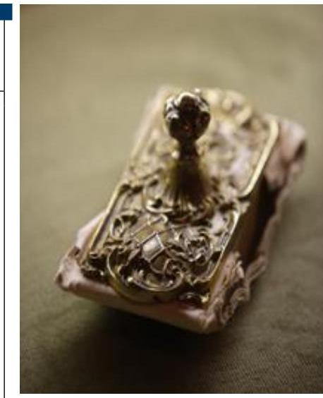
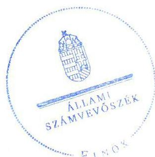
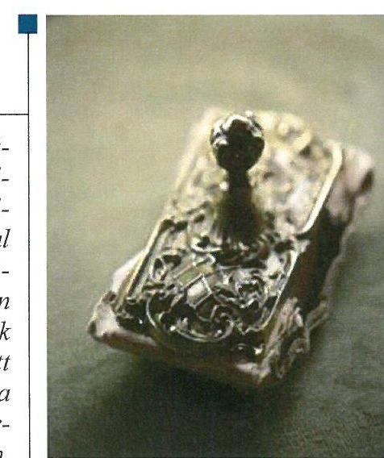
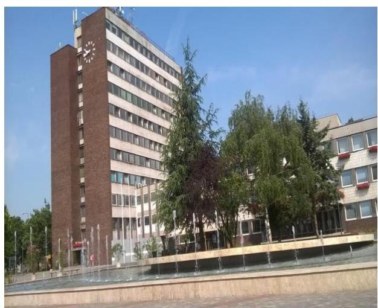
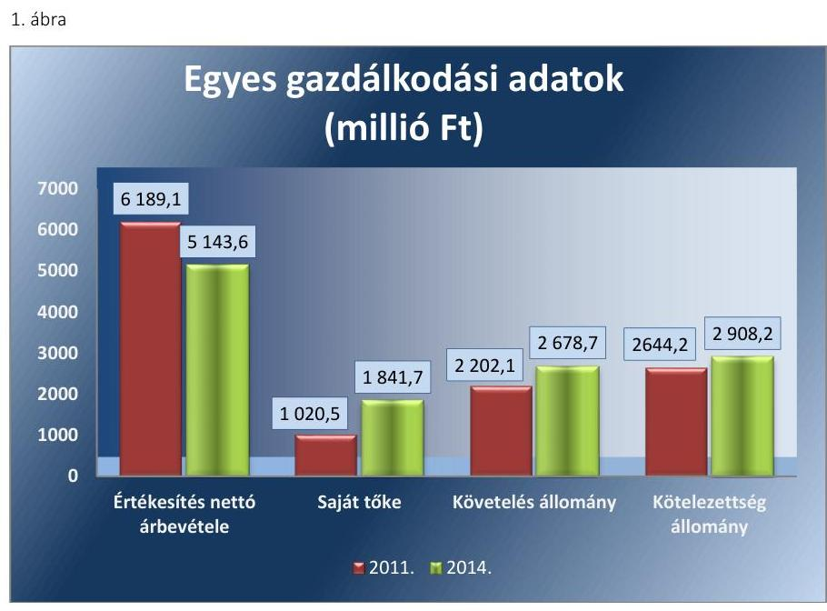
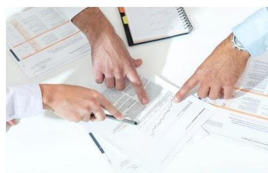

# Jelentés 

## Az önkormányzatok gazdasági társaságai

Az önkormányzatok többségi tulajdonában lévő gazdasági társaságok gazdálkodásának ellenőrzése - Dunaújvárosi Víz-, CsatornaHőszolgáltató Kft.
2016.

Az ÁSZ az államháztartáson kívül müködő közfel-adat-ellátó rendszerek el-lenőrzéseivel hozzájárul ahhoz, hogy a közpénze-
ket az államháztartáson kívül müködő szervezetek
is átlátható, rendezett módon használják fel a közfeladatok ellátása érdekében.

---

# Jelentés 

## Az önkormányzatok gazdasági társaságai

Az önkormányzatok többségi tulajdonában lévő gazdasági társaságok gazdálkodásának ellenőrzése - Dunaújvárosi Víz-, CsatornaHőszolgáltató Kft.
2016. 12. hó 07. nap

16217
www.asz.hu

## 000000

Domokos László elnök

Az ÁSZ az államháztartáson kivïl müködő közfel-adat-ellátó rendszerek ellenörzéseivel hozzájárul ahhoz, hogy a közpénzeket az államháztartáson kivül müködő szervezetek is átlátható, rendezett módon használják fel a közfeladatok ellátása érdekében.

---

# AZ ELLENŐRZÉST FELÜGYELTE:

## MAKKAI MÁRIA felügyeleti vezető

## AZ ELLENŐRZÉST VEZETTE ÉS A VÉGREHAJTÁSÁÉRT FELELŐS:

### NEMESVÁRI-HORTHY ESZTER ellenőrzésvezető

### KLINGA LÁSZLÓ ellenőrzésvezető

## A PROGRAM ÖSSZEÁLLÍTÁSÁÉRT FELELŐS:

### JANIK JÓZSEF LÁSZLÓ osztályvezető

---

**IKTATÓSZÁM:** V-1100-127/2016.

**TÉMASZÁM:** 2134

**ELLENŐRZÉS-AZONOSÍTÓ SZÁM:** V070763

---

Jelentéseink az Országgyűlés számítógépes hálózatán és az Interneta a www.asz.hu címen is olvashatóak.

---

# TARTALOMJEGYZÉK 

■ ÖSSZEGZÉS ..... 5
■ AZ ELLENŐRZÉS CÉLJA ..... 6
■ AZ ELLENŐRZÉS TERÜLETE ..... 7
■ AZ ELLENŐRZÉS HÁTTERE, INDOKOLTSÁGA ..... 9
■ A JELENTÉS LÉNYEGES KÉRDÉSKÖREI ..... 10
■ ELLENŐRZÉS HATÓKÖRE ÉS MÓDSZEREI ..... 11
■ MEGÁLLAPÍTÁSOK ..... 13
■ JAVASLATOK ..... 24
■ MELLÉKLETEK ..... 25
I. sz. melléklet: Értelmező szótár ..... 25
■ FÜGGELÉK: ÉSZREVÉTELEK ..... 29
■ RÖVIDÍTÉSEK JEGYZÉKE ..... 31

---

.

---

# ÖSSZEGZÉS 

Dunaújváros Megyei Jogú Város Önkormányzata a távhőszolgáltatás közfeladatának ellátását szabályosan szervezte meg. A DVG Dunaújvárosi Vagyonkezelő Zrt. a többségi tulajdonosi jogokat szabályszerűen gyakorolta. A Dunaújvárosi Viz-, Csatorna- Hőszolgáltató Kft. 2011-2014. évi vagyongazdálkodása összességében szabályszerű volt. A taggyülés a 2013-2014.évi beszámolókat nem fogadta el. A közfeladat bevételeinek és ráfordításainak elszámolása megfelelő volt. Az önköltségszámitás szabályait meghatározták, az árképzés szabályszerű volt.

## Az ellenőrzés társadalmi indokoltsága

Az Állami Számvevőszék kiemelt célja, hogy a helyi önkormányzatok gazdálkodásában rejlő pénzügyi kockázatok feltárásával, az államháztartáson kívülre nyújtott költségvetési támogatások és ingyenes vagyonjuttatások, valamint az államháztartáson kívül múködő feladat-ellátó rendszerek ellenőrzéseivel hozzájáruljon ahhoz, hogy a közpénzeket az államháztartáson kívül múködő szervezetek is átlátható, rendezett módon használják fel.

Magyarországon az intézmény-centrikus közfeladat-ellátás jellemző, de egyre jelentősebb a költségvetésen kívüli feladatellátás térnyerése. Ennek legfontosabb szereplői - a nonprofit szervezetek mellett - az önkormányzati tulajdonú gazdasági társaságok. Az önkormányzatok szervezetalakítási szabadságának következménye, hogy a korábban is vállalati formában múködő közszolgáltatások mellett, mind a kötelező, mind az önként vállalt feladatok ellátásában a gazdasági társaságok kiemelt fontosságú szerephez jutottak.

## Főbb megállapítások, következtetések, javaslatok

Az Önkormányzat a távhőszolgáltatási közfeladat-ellátást szabályszerűen megszervezte. A távhőszolgáltatással öszszefüggő rendeletalkotási kötelezettségének eleget tett, annak tartalma megfelelt az előírásoknak. A DVG Zrt. az SZMSZ-ében szabályszerűen előírta a többségi befolyású tulajdonában lévő DVCSH Kft. feletti tulajdonosi jogok képviseletének rendjét. Az FB az ellenőrzött időszakban ügyrenddel nem rendelkezett.

A Társaság rendelkezett a Számv. tv.-ben előírt szabályzatokkal, azonban a leltározási szabályzat a Számv. tv. 2012. január 1-jétől hatályos változását nem követte. A távhőtermelői és a távhőszolgáltatási tevékenységek szétválasztási szabályait előírták. A DVCSH Kft. legfőbb szerve a Taktv. előírásával ellentétben a javadalmazással összefüggő szabályzatot nem alkotott. A beszámolók alátámasztását szolgáló leltározást nem szabályszerűen végezték el, mivel a Számv. tv. előírása ellenére háromévente mennyiségi leltárfelvétel nem volt. A vevőköveteléseknél alkalmazott kulcsok eltértek a Számviteli politika ${ }_{1-5}$-ben előírtaktól.

A Társaság távhőszolgáltatással összefüggő tevékenysége veszteséges volt, amit a víziközmű (ivóvíz, csatorna) szolgáltatás és az egyéb tevékenységek nyeresége kompenzált, így biztosítva ezzel a nyereséges gazdálkodást. A taggyűlés a 2013-2014. évi beszámolókat nem fogadta el. A Társaság a Számv. tv.-ben előírtakat figyelmen kívül hagyta, mivel a jóváhagyásra jogosult testület által el nem fogadott éves beszámolókat helyezte letétbe. A Társaság adatvédelmi és adatbiztonsági szabályzattal rendelkezett és belső adatvédelmi felelőst nevezett ki. A közérdekú adatok nyilvánosságra hozatalát a 2012. évtől kezdődően teljesítette. A Társaságnál a bevételek, költségek és ráfordítások elszámolása megfelelő volt, figyelembe véve a jogszabályok és a belső szabályozás előírásait. Az önköltségszámitás szabályozása megfelelt az előírásoknak, amely alapján az alkalmazott módszer biztosította a közszolgáltatás dijának megalapozottságát és a szabályszerű árképzést.

---

# AZ ELLENŐRZÉS CÉLJA 

pozottsága szabályszerű önköltségszámítással.

Az ellenőrzés célja annak értékelése volt, hogy az Önkormányzat vagyongazdálkodási tevékenysége során szabályszerűen gyakorolta-e tulajdonosi jogait.

Ellenőriztük, hogy a gazdasági társaság szabályozottsága, gazdálkodása és vagyongazdálkodási tevékenysége, bevételeinek és ráfordításainak elszámolása megfelelt-e a jogszabályi és tulajdonosi előírásoknak.

Értékeltük továbbá, hogy a gazdasági társaság kötelezettségállománya jelentett-e kockázatot a múködésre, valamint a gazdálkodás átláthatósága és elszámoltathatósága érdekében biztosítva volt-e a szolgáltatás díjának megala-

---

# **AZ ELLENŐRZÉS TERÜLETE**

## **Dunaújváros Megyei Jogú Város Önkormányzata, a DVG Dunaújvárosi Vagyonkezelő Zrt. és a Dunaújvárosi Víz-, Csatorna- Hőszolgáltató Kft.**

**A DUNAÚJVÁROSI VÍZ-, CSATORNA- HŐSZOLGÁLTATÓ KFT.** a 2011-2014 években az Önkormányzat 100%-os tulajdonában lévő DVG Dunaújvárosi Vagyonkezelő Zrt. (50,5%-os többségi befolyás), az ENERGOTT Fejlesztő és Vagyonkezelő Kft. (47,5%-os, majd 2012. januártól 45%-os jelentős befolyás), az ALFANOVA Kft. (2%), továbbá 2012 januárjától az ENERGO-HAUSE GmbH (2,5%) tulajdonában állt. A tagokat megillető szavazati jog mértéke a törzsbetétek arányában került meghatározásra. A Dunaújvárosi Víz-, Csatorna- Hőszolgáltató Kft. jegyzett tőkéje a 2011-2014. években nem változott, 650,0 millió Ft volt.

A Dunaújvárosi Víz-, Csatorna- Hőszolgáltató Kft. főtevékenysége gőzellátás, légkondicionálás (távhőszolgáltatás) volt. A főtevékenységen kívül víz- és csatorna-szolgáltatási-, folyékony szennyvíz elszállítási-, építési-, uszodaszolgáltatási-, és egyéb tevékenységet végzett a Társaság. A távhőszolgáltatást a Dunaújvárosi Víz- Csatorna- Hőszolgáltató Kft. a DVG Dunaújvárosi Vagyonkezelő Zrt. tulajdonában lévő közművekkel, valamint saját tulajdonában lévő eszközökkel látta el. A távhőszolgáltatáshoz szükséges közművagyonra a Dunaújvárosi Vagyonkezelő Zrt.-vel, mint közműtulajdonossal évente bérleti szerződést kötött. Az Önkormányzattól vagyonkezelésbe nem kapott vagyont.

Dunaújváros népessége 2011-ben 47 357 fő, 2014-ben 46 320 fő volt*. A Dunaújvárosi Víz-, Csatorna- Hőszolgáltató Kft. a 2014. évben 19 195 lakossági és 1392 közületi fogyasztót látott el távhővel a város közigazgatási területén. A 2014. évben a távhővezeték hossza 61,7 km, a felhasználói hőközpontok száma 488 db volt*.

A Dunaújvárosi Víz-, Csatorna- Hőszolgáltató Kft. gazdálkodásának főbb adatait az 1. ábra mutatja be.

* Központi Statisztikai Hivatal adatai
* 2014. évi Központi Statisztikai jelentés adatai

---

Forrás: 2011-2014. évi beszámoló
A Dunaújvárosi Víz-, Csatorna- Hőszolgáltató Kft.-ben többségi befolyással rendelkező DVG Dunaújvárosi Vagyonkezelő Zrt.-nél az öttagú igazgatóság személyi összetételében három alkalommal történt változás. Az el-nök-vezérigazgató személye két alkalommal változott, a jelenlegi elnök-vezérigazgató 2012. június 1. óta tölti be tisztségét. A polgármester ${ }^{1}$ személyében nem, a jegyző személyében egy alkalommal, 2014. április 10-étől történt változás. A polgármester a 2010. évi önkormányzati választások óta tölti be tisztségét. A Dunaújvárosi Víz-, Csatorna- Hőszolgáltató Kft. ügyvezetőjének személye a 2011-2014. évek között egy alkalommal változott. A jelenlegi ügyvezető 2014. július 11. óta tölti be tisztségét.

A DVCSH Kft. nem minősült az Áht. ${ }^{2}$ 2. § I) pontja, valamint a 479/2009/EK rendelet ${ }^{3}$ szerint nevesített kormányzati szektorba sorolt egyéb szervezetnek, ezért adatszolgáltatási kötelezettség az ellenőrzött időszakban nem terhelte.

---

# AZ ELLENŐRZÉS HÁTTERE, INDOKOLTSÁGA 

Az önkormányzatok közfeladat-ellátásában egyre jelentősebb a gazdasági társaságok útján történő feladatellátás térnyerése.

AZ ÖNKORMÁNYZATI TULAJDONÚ GAZDASÁGI TÁRSASÁGOK teljes körű ellenőrzésének lehetőségét az Állami Számvevőszékről szóló 1989. évi XXXVIII. törvény 2011. január 1-jétől hatályos módosítása teremtette meg. Az önkormányzati tulajdonú gazdasági társaságok ellenőrzése kiemelten fontos a vagyon megőrzése, megóvása érdekében, valamint a kormányzati szektor elszámolásaiban megjelenő önkormányzati tulajdonú gazdálkodó szervezetek esetében, amelyekkel szemben alapvető követelmény, hogy gazdálkodásuk, működésük szabályszerű, az általuk szolgáltatott adatok minél megbízhatóbbak legyenek. A feladat/közfeladat ellátás költségeinek, ráfordításainak alakulása, színvonala hatással van a lakosság elégedettségére.

## AZ ELLENŐRZÉS VÁRHATÓ HASZNOSULÁSA-

KÉNT az ÁSZ ${ }^{4}$ a megállapításaival segítséget nyújthat az államháztartáson kívüli közfeladat-ellátás értékeléséhez, jogszabályi keretei pontosításához, átláthatóságot biztosító szabályozásához. Meghatározhatóvá válnak az önkormányzati feladatellátásban részt vevő államháztartáson kívüli szervezeteknek - az önkormányzat költségvetését, pénzügyi helyzetét is befolyásoló - kockázatai, lehetővé válik ezen kockázatok csökkentése. Ellenőrzéseink feltárhatják, hogy az önkormányzat feladat-ellátási kötelezettségének szabályszerűen tett-e eleget, a feladatellátáshoz rendelt vagyonkezelésbe vett és saját vagyon működtetését az elvárható gondossággal, szabályszerűen szervezte-e meg és a tulajdonosi felügyelete hozzájárult-e a feladatellátásához. Értékelhetővé válik, hogy a gazdasági társaság a feladat-ellátási, közszolgáltatási szerződésben foglaltak betartásával, a vagyon használatával biztosította-e a szolgáltatás folytatásának feltételeit. Ezzel az ellenőrzöttek és a helyi döntéshozók számára az ÁSZ visszajelzést ad feladatszervezési, feladat-ellátási kockázataikról, alapot ad a meglévő hibák megszüntetéséhez, a jobb feladat-ellátás biztosításához. Mindezeken keresztül az ÁSZ hozzájárul Magyarország közpénzügyi helyzetének javításához, a közpénzek mérhető módon történő, a döntéshozók által meghatározott célok szerinti felhasználásához.

---

# A JELENTÉS LÉNYEGES KÉRDÉSKÖREI 

1.     - Az önkormányzat közfeladat megszervezéséről szóló döntése, valamint tulajdonosi joggyakorlása szabályszerű volt-e?
2.     - A gazdasági társaság vagyongazdálkodása szabályszerű volt-e, kötelezettségállománya jelent-e kockázatot a müködésre, illetve a közfeladat ellátására?
3.     - A gazdasági társaságnál az ellátott közfeladat bevételei és ráfordításai elszámolása, valamint az önköltségszámitás és árképzés szabályszerű volt-e?

---

# ELLENŐRZÉS HATÓKÖRE ÉS MÓDSZEREI 

## Az ellenőrzés típusa

Megfelelőségi ellenőrzés

## Az ellenőrzött időszak

2011. január 1-jétől 2014. december 31-ig terjedő időszak

## Az ellenőrzés tárgya

A gazdasági társaság feletti tulajdonosi joggyakorlás, valamint a gazdasági társaság gazdálkodásának szabályozottsága és szabályszerűsége.

Az ellenőrzés kiterjed minden olyan körülményre és adatra, amely az ÁSZ jogszabályban meghatározott feladatainak teljesítéséhez, valamint a program végrehajtása folyamán felmerült újabb összefüggések feltárásához szükséges.

## Az ellenőrzött szervezet

Dunaújváros Megyei Jogú Város Önkormányzata, a DVG Dunaújvárosi Vagyonkezelő Zrt. és a Dunaújvárosi Víz-, Csatorna- Hőszolgáltató Kft.

## Az ellenőrzés jogalapja

Az ellenőrzés jogszabályi alapját az ÁSZ tv. 1. § (3) bekezdése és 5. § (3)-(4)-(5) bekezdései képezték.

## Az ellenőrzés módszerei

Az ellenőrzést a nemzetközi standardokat irányadónak tekintve az ellenőrzési program ellenőrzési kérdései, az ellenőrzött időszakban hatályos jogszabályok, az ellenőrzés szakmai szabályok és módszertanok figyelembe vételével végeztük.

Az ellenőrzés ideje alatt az ellenőrzött szervezettel történő kapcsolattartást az ÁSZ Szervezeti és Múködési Szabályzatának vonatkozó előírásai alapján biztosítottuk.

Az ellenőrzés a kiválasztott, tulajdonosi jogokat gyakorló önkormányzatra, illetve az ellenőrzésre kijelölt gazdasági társaságra terjedt ki.

---

Az ellenőrzési kérdések megválaszolásához szükséges bizonyítékok megszerzése a következő ellenőrzési eljárások alkalmazásával történt: megfigyelés, kérdésfeltevés (információkérés), összehasonlítás, valamint elemző eljárás. Az ellenőrzési bizonyítékként felhasználható adatforrások közé tartoztak egyrészt a szakmai programban felsorolt adatforrások, másrészt adatforrás lehetett még minden - az ellenőrzés folyamán - feltárt, az ellenőrzés szempontjából információkat tartalmazó dokumentum.

Az ellenőrzést a kérdésekre adott válaszok kiértékelésével, valamint a megjelölt adatforrások, a csatolt tanúsítványok felhasználásával, továbbá az adott időszakban hatályos jogszabályok figyelembe vételével folytattuk le.

A bevételek és ráfordítások elszámolása, valamint a vagyonnyilvántartás terén a szabályszerű működést véletlen mintavétellel ellenőriztük. A mintavétellel ellenőrzött területek esetében minden egyes tétel vonatkozásában a szabályszerűségre vonatkozó kérdéseket tettünk fel, amelyek eredménye összesítésre került. Megfelelőnek értékeltünk egy ellenőrzött területet, amennyiben 95\%-os bizonyossággal a teljes sokaságban a hibaarány legfeljebb 10\%, nem megfelelőnek, amennyiben 10\%-nál magasabb arányt képviselt. Abban az esetben, ha a teljes sokaság tekintetében a 10\%os hibaarányhoz való viszony megítélésnek megbízhatósága nem érte el a 95\%-ot, annak elérése érdekében értékelésünket további szempontokkal egészítettük ki, és figyelembe vettük a feltárt hibák típusát és súlyát. A ráfordítások elszámolására és a vagyonnyilvántartásra vonatkozó véletlen mintavételt kockázati alapú kiválasztással egészítettük ki, amelynek során évente a három legnagyobb összegű tételt választottuk ki.

---

# 1. Az önkormányzat közfeladat megszervezéséről szóló döntése, valamint tulajdonosi joggyakorlása szabályszerű volt-e? 

Összegző megállapítás

Az Önkormányzat a jogszabályok és a helyi szabályozás betartásával szervezte meg a távhőszolgáltatást. A többségi befolyással összefüggő tulajdonosi jogokat a DVG. Zrt. szabályszerűen gyakorolta.

Az Önkormányzat a távhőszolgáltatási közfeladat-ellátást szabályszerűen megszervezte. A távhőszolgáltatással összefüggő rendeletalkotási kötelezettségét szabályszerűen teljesítette.

GAZDASÁGI PROGRAMMAL az Önkormányzat ${ }^{5}$ a 20112014. években nem rendelkezett az Ötv. ${ }^{6}$ 91. § (1) bekezdésében, illetve az Mötv. ${ }^{7}$ 116. § (1) bekezdésében előírtak ellenére.

## A KÖZÉP- ÉS HOSSZÚ TÁVÚ VAGYONGAZDÁLKO-

DÁSI TERVET az Önkormányzat az Nvtv. ${ }^{8}$ 2012. január 1-jétől hatályba lépő 9. § (1) bekezdésében előírtak alapján a 2013-2018. évekre vonatkozóan elkészítette, amelyet a Közgyűlés ${ }^{9}$ határozatával elfogadott.

A TÁVHŐSZOLGÁLTATÁS ellátására a DVG Zrt. ${ }^{10}$ és a DVCSH Kft. ${ }^{11}$ jogelődje 1998-ban, 25 évre szóló Üzemeltetési-vállalkozási szerződést ${ }^{12}$ kötött, amelyet harmadik félként az Önkormányzat - mint az árképzésre garanciát vállaló - is aláírt.

A távhőszolgáltatáshoz szükséges közművek biztosítására a DVCSH Kft. a DVG Zrt.-vel, mint közműtulajdonossal az üzemeltetésre átvett eszközökre évente vagyonbérleti szerződést kötött. A vagyonbérleti díjat az elvégzett beruházások és felújítások összegével csökkentve számlázták a Társaságnak. A távhőszolgáltatást érintő fejlesztések tekintetében rendelkeztek tulajdonosi hozzájárulással.

A DVCSH Kft. távhőszolgáltatói működési engedéllyel rendelkezett, amelyet a 2011. évre a Tszt. ${ }^{13}$ 7. § b) pontjával összhangban Székesfehérvár Megyei Jogú Város jegyzője, a 2012-2014. években a Tszt. 16. § (1) bekezdése alapján a MEKH ${ }^{14}$ adott ki.

## A TÁVHŐSZOLGÁLTATÁSSAL ÖSSZEFÜGGŐ REN-

DELETALKOTÁSI KÖTELEZETTSÉGÉNEK az Önkormányzat a Tszt. 6. § (2) bekezdés a)-i) pontjaival összhangban eleget tett. A Közgyűlés a Távhőrendelet ${ }_{1}{ }^{15}{ }_{2}{ }^{16}$-ben meghatározta a távhőszolgáltatás részletes szabályait. Az Önkormányzat a Tszt. 6. § (2) bekezdés c) pontjában előírtak alapján a Távhőrendelet ${ }_{1,2}$-ben kijelölte azokat a területeket, ahol területfejlesztési, környezetvédelmi és levegő-tisztaságvédelmi szempontok alapján célszerű a távhőszolgáltatás fejlesztése. Az ármegállapítás

---

jogával élve az Önkormányzat a Távhőrendelet1-ben meghatározta az árképzési előírásokat, a lakossági távhőszolgáltatási díjak fajtáit, tartalmát. Az Önkormányzat a Tszt. 57/D. § (1) bekezdésében előírtak figyelembe vételével a távhőrendelet ${ }_{1}$-et módosította, mivel a hatósági ár bevezetésével az ármegállapítási jogköre - a csatlakozási díj kivételével - 2012. április 15. napjával megszűnt.

A DVCSH Kft. a távhőszolgáltatást a 2014. évben egy esetben - a 124/2012. sz. távhőszolgáltatói múködési engedély I.1.1, I.1.2. és I.1.4. pontja ellenére - nem biztosította, amikor önkormányzati tulajdonú intézményekben az intézményvezető kérése ellenére nem indította el a távfütést. A polgármester jelzésére a MEKH 2014. október 22-én levélben szólította fel a Társaságot a folyamatos távhőszolgáltatás biztosítására.

A DVCSH KFT. TÁRSASÁGI SZERZŐDÉSÉBEN ${ }^{17}$ meghatározták a Gt. ${ }^{18} 12 . \S$ (1) bekezdésében, illetve a Ptk. ${ }^{19}$ 54. § (2) bekezdésében foglalt előírásokat, így többek között a Társaság ${ }^{20}$ cégnevét, székhelyét, tagjait, főtevékenységét, a jegyzett tőke összegét. A Társasági szerződés módosítására a 2011-2014. években a DVCSH Kft. tagjaiban, az $\mathrm{FB}^{21}$ tagok, valamint az ügyvezető személyében történt változások miatt került sor.

# 1.2. számú megállapítás 

A tulajdonosi jogok gyakorlásának szabályait meghatározták, a tulajdonosi jogokat szabályszerűen gyakorolták.

A DVG ZRT. SZMSZ-ében ${ }^{22}$ rögzítették a tulajdonosi joggyakorlással kapcsolatos előírásokat. Az SZMSZ 7.2 pontja alapján a képviseletet ellátó személy az Igazgatóság ${ }^{23}$ elnöke, illetve a DVG Zrt. elnök-vezérigazgatója volt, aki a DVCSH Kft.-nél ellátta a tulajdonosi képviseletet. Az SZMSZ és azzal összhangban a DVG Zrt. Igazgatóságának Ügyrendje ${ }^{24}$ a tulajdonosi képviseletet ellátó személy részére előírta a tulajdonosi szándék - az Igazgatóság által adott mandátum alapján - cégcsoport vállalatai felé történő közvetítését.

A DVCSH KFT. legfőbb döntéshozó szerve ${ }^{25}$ a taggyűlés ${ }^{26}$ volt. A taggyűlés kizárólagos hatáskörébe tartozott - többek között - a Gt. 141. § (2) bekezdésében és a Ptk. ${ }^{27}$ 3:109. § (2) bekezdésében előírtakkal összhangban a számviteli beszámoló elfogadása, jóváhagyása és a nyereségről való döntés. A taggyűlésben gyakorolható szavazati jog mértéke a tagok vagyoni hozzájárulásához igazodott, amit a Társasági szerződésben rögzítettek.

## A TULAJDONOSI JOGOK GYAKORLÁSÁNAK

RENDJÉT a Közgyűlés a Vagyongazdálkodási rendeletben ${ }^{28}$ határozta meg. Rögzítették a Közgyűlés kizárólagos, továbbá az Önkormányzat egyszemélyes, illetőleg 50\%-ot meghaladó tulajdoni részesedéssel rendelkező gazdasági társaságai esetében a hatáskörébe tartozó jogokat.

A DVCSH KFT. FB-je a Gt. 34. § (1) bekezdésében, valamint a Ptk. 2 3:121. § (1) bekezdésében előírtakat figyelembe véve, a Társasági szerződés XI. pontjának megfelelően öt, 2011. április 1. és december 13. között hat főből állt.

---

Az FB a 2011-2014. években a Gt. 34. § (4) bekezdésében, illetve a Ptk. 2 3:122. § (3) bekezdésében foglaltakkal ellentétben ügyrenddel nem rendelkezett.

A BESZÁMOLTATÁSI RENDSZER keretében az Üzemelte-tési-vállalkozási szerződés 2. számú mellékletében előírták, hogy a DVCSH Kft. az Önkormányzat felé éves beszámolót készít a végzett tevékenységéről és az üzleti terv végrehajtásáról. A DVG Zrt. az SZMSZ 7.2 pontjában írt elő beszámolási kötelezettséget a DVCSH Kft. felé.

A DVCSH Kft. taggyűlése a 2012. évben határozatban a 2008., a 2009. és a 2010. évi, összesen 237,6 millió Ft osztalék 2012. december 31-ig történő készpénzben, vagy kompenzálás formájában történő kifizetéséről döntött. A 2011. évi beszámoló elfogadását követően további 19,8 millió Ft osztalék kifizetéséről rendelkeztek. A döntéseket követően 2012-ben az ENERGOTT Kft.-vel szemben fennálló követelés kompenzálása történt meg (nem pénzbeli hozzájárulásként) 84,6 millió Ft összegben. A 2013. évben pénzforgalommal járó - kifizetés a DVG Zrt. részére történt 19,2 millió Ft összegben. A tulajdonosokkal szemben fennálló osztalékfizetési kötelezettség a 2014. év végén 153,5 millió Ft volt.

A saját tőke minden ellenőrzött évben jelentősen meghaladta a jegyzett tőkét, ezért a Gt. 143. § (2) bekezdés a) pontja, illetve a Ptk. 2 3:189. § (1) bekezdése miatti intézkedés megtétele nem vált szükségessé.

# 2. A gazdasági társaság vagyongazdálkodása szabályszerű volt-e, kötelezettségállománya jelent-e kockázatot a múködésre, illetve a közfeladat ellátására? 

Összegző megállapítás

## 2.1. számú megállapítás

A DVCSH Kft. vagyongazdálkodása összességében szabályszerű volt. Háromévente a Számv. tv. előírása ellenére menynyiségben nem leltároztak. A kötelezettségállomány a múködésre és a közfeladat-ellátására nem jelentett kockázatot.

A Társaság rendelkezett a Számv. tv.-ben előírt szabályzatokkal, azonban a leltározási szabályzat a Számv. tv. 2012. január 1-jétől hatályos változását nem követte. Javadalmazási szabályzatot a legfőbb szerv nem alkotott.

A DVCSH Kft. rendelkezett számviteli politika ${ }_{1-5}$-val ${ }^{29}$, valamint annak keretében a Számv. tv. ${ }^{30} 14 . \S$ (5) bekezdés a)-d) pontjai szerint eszközök és források leltárkészítési és leltározási szabályzattal, értékelési szabályzattal, az önköltségszámítás rendjére vonatkozó szabályzattal, valamint pénzkezelési szabályzattal.

A Társaság rendelkezett továbbá a Számv. tv. 161. § (1) bekezdésében előírt számlarend ${ }_{1,2}$-del ${ }^{31}$. A számlarend ${ }_{1,2}$ a Számv. tv. 161. § (2) bekezdés a)-c) pontjaiban foglaltaknak megfelelően tartalmazta minden alkalmazásra kijelölt számla számjelét és megnevezését, azok tartalmát, értékük növekedésének, csökkenésének jogcímeit, a főkönyvi számla és az analitikus nyilvántartás kapcsolatát. A számlarendet alátámasztó bizonylati rendet külön szabályzatban, a bizonylati szabályzat ${ }_{1-5}{ }^{32}$-ban rögzítették.

---

A SZÁMVITELI POLITIKA ${ }_{1-5}$ a Számv. tv. 14. § (4) bekezdése előírásainak megfelelően tartalmazta - többek között - azokat a Társaságra jellemző szabályokat, előírásokat, módszereket, amelyekkel meghatározták, hogy mit tekintenek a számviteli elszámolás, értékelés szempontjából lényegesnek, jelentősnek, valamint azt, hogy a törvényben biztosított választási, minősítési lehetőségek közül melyeket alkalmazzák.

A LELTÁROZÁSI SZABÁLYZAT ${ }_{1}{ }^{33}-2^{34}$ tartalmazta a leltározás előkészítésének feladatait, a leltározásért felelős személyeket, a leltározás módját, fordulónapját. A Társaság az eszközeiről folyamatos mennyiségi nyilvántartást vezetett. A leltározási szabályzat nem tartalmazott a mennyiségi felvétellel történő leltározás elvégzésének gyakoriságára vonatkozó rendelkezést, ezért nem felelt meg a Számv. tv. 69. § (3) bekezdése 2012. január 1-jétől hatályos előírásának, amely szerint a leltárba bekerülő adatok valódiságáról leltározással kell meggyőződni és azt legalább háromévente mennyiségi felvétellel kell elvégezni.

AZ ÉRTÉKELÉSI SZABÁLYZAT ${ }_{1-3}{ }^{35}$ a Számv. tv. 55. § (1)(2) bekezdésének előírásaival összhangban szabályozta a követelések minősítésének szabályait, továbbá összhangban állt a Számv. tv. 57. § (1) bekezdésében foglalt elvekkel.

AZ ÖNKÖLTSÉGSZÁMÍTÁSI SZABÁLYZAT ${ }_{1-5}{ }^{36}$ készítésére a Társaság a Számv. tv. 14. § (7) bekezdése alapján kötelezett volt. Az elszámolás módjaként rögzítették, hogy a felmerült költségek számviteli elszámolására az 5. számlaosztályt alkalmazzák, e mellett „munkaszám", illetve „költséghely" rendszer biztosítja a költségek tevékenységenkénti elkülönítését.

A PÉNZKEZELÉSI SZABÁLYZAT ${ }_{1,2}{ }^{37}$-ban a Számv. tv. 14. § (8) bekezdésében előírtak ellenére nem rendelkezett a pénzforgalom bankszámlán történő lebonyolításának rendjéről, illetve a készpénzállomány ellenőrzésének gyakoriságáról.

# A SZÁMVITELI SZÉTVÁLASZTÁSI SZABÁLY- 

$\mathbf{Z A T}_{1,2}$-ban ${ }^{38}$ - a Tszt. 2012. január 1-jétől hatályos 18/A. § (2) bekezdésében előírtaknak megfelelően - szabályozták a távhőtermelői és távhőszolgáltatói tevékenységek szétválasztásának szabályait. A Társaság a Számv. tv. 161/A. § (1) és (2) bekezdésében foglaltak szerint belső szabályait oly módon alakította ki, hogy azok a mérleg és eredménykimutatás alátámasztásán túlmenően a kiegészítő melléklet adatainak közvetlen alátámasztására is alkalmasak voltak.

ÜZLETSZABÁLYZATTAL a 2011. január 1. és 2012. december 31. közötti időszakban a Tszt. 3. § (v) pontja ellenére nem rendelkeztek, azt csak 2013. január 1-jén léptették hatályba. A jegyző ${ }^{39}$ a Társaság üzletszabályzatát a Tszt. 7. § (1) bekezdés a) és b) pontjában előírtak ellenére a fogyasztóvédelmi hatóságnak véleményezésre nem küldte meg és nem hagyta jóvá.

JAVADALMAZÁSI SZABÁLYZATOT a Társaság legfőbb szerve a Taktv. ${ }^{40}$ 5. § (3) bekezdésében foglaltak ellenére nem alkotott, így

---

a vezető tisztségviselők, felügyelőbizottsági tagok, valamint az Mt. ${ }^{41}$ 208. §-ának hatálya alá eső munkavállalók javadalmazása, valamint a jogviszony megszűnése esetére biztosított juttatások módjának, mértékének elveiről, annak rendszeréről nem rendelkeztek.

# 2.2. számú megállapítás 

A DVCSH Kft. vagyongazdálkodása összességében megfelelő volt. A leltározást nem szabályszerűen végezték, mivel mennyiségi leltárfelvétel nem volt.

## A SAJÁT VAGYONHOZ KAPCSOLÓDÓ NYILVÁNT

ARTÁSAIT a Társaság szabályszerűen vezette a 2011-2014. években a számviteli politika ${ }_{1-5}$-ban, a számlarend ${ }_{1,2}$-ben előírtak szerint.

LELTÁRRAL az éves beszámolókat alátámasztották. A főkönyvi könyvelés és az analitikus nyilvántartások közötti egyeztetést szabályszerűen elvégezték. A beszámoló alátámasztását szolgáló leltározást nem szabályszerűen végezték el, mivel a saját vagyon tekintetében mennyiségi leltárfelvétel nem történt. Ezzel megsértették a Számv. tv. 2012. január 1-jétől hatályos 69. § (3) bekezdésében foglalt előírást, mert háromévente nem végezték el a mennyiségi leltározást.

A DVG Zrt.-től üzemeltetésre átvett vagyont a DVCSH Kft. az Üzemelte-tési-vállalkozási szerződés 6.3 pontjában foglaltak szerint elkülönítetten analitikusan nyilvántartásba vette, azok leltározása az ellenőrzött időszakban megtörtént.

A DVCSH Kft. a 2012. évben élt a vagyoni értékű javak mérlegben szereplő értékének meghatározásakor a Számv. tv. 57. § (3) bekezdése szerinti piaci értéken történő értékelés lehetőségével. Az értékhelyesbítés elszámolása a Számv. tv. 59. § (2) bekezdésének előírtaknak megfelelően történt.

A DVCSH Kft. főbb mérlegadatait az 1. táblázat mutatja be.

1. táblázat

A DVCSH KFT. FŐBB MÉRLEG ADATAI (MILLIÓ FT)

| Megnevezés | $\begin{gathered} 2011 . \\ 01 .01 \end{gathered}$ | $\begin{gathered} 2011 . \\ 12 .31 \end{gathered}$ | $\begin{gathered} 2012 . \\ 12 .31 \end{gathered}$ | $\begin{gathered} 2013 . \\ 12 .31 \end{gathered}$ | $\begin{gathered} 2014 . \\ 12 .31 \end{gathered}$ |
| :--: | :--: | :--: | :--: | :--: | :--: |
| I. Befektetett eszközök | 2100,7 | 2144,0 | 2911,5 | 2750,7 | 2502,7 |
| -ebből tárgyi eszközök | 2084,3 | 2127,7 | 1991,9 | 1915,9 | 1753,4 |
| II. Forgóeszközök | 2261,6 | 3034,7 | 3474,7 | 2875,1 | 2970,4 |
| -ebből követelések | 2202,1 | 2919,8 | 3313,7 | 2691,2 | 2678,7 |
| III. Aktív időbeli elhatárolások | 865,6 | 496,5 | 266,8 | 494,0 | 277,1 |
| Eszközök összesen | 5227,9 | 5675,2 | 6653,0 | 6119,8 | 5750,2 |
| IV. Saját tőke | 1020,5 | 1043,9 | 2004,8 | 1922,5 | 1841,7 |
| - ebből: Jegyzett tőke | 650,0 | 650,0 | 650,0 | 650,0 | 650,0 |
| - ebből: értékelési tartalék | - | - | 903,5 | 817,4 | 731,4 |
| - ebből Mérleg szerinti eredmény | 10,2 | 23,3 | 57,4 | 3,8 | 5,2 |
| V. Céltartalékok | - | - | - | - | 18,9 |
| VI. Kötelezettségek | 2644,2 | 2517,4 | 2373,2 | 2998,4 | 2908,2 |
| VII. Passzív időbeli elhatárolások | 1563,2 | 2113,9 | 2275,0 | 1198,9 | 981,4 |
| Források összesen | 5227,9 | 5675,2 | 6653,0 | 6119,8 | 5750,2 |

Forrás: A Társaság adatszolgáltatása

---

AZ ESZKÖZÉRTÉK a 2011. január 1-jei nyitó értékről 2014. december 31-ére 522,3 millió Ft-tal ( $9,9 \%$-kal) növekedett. A befektetett eszközök értéke a 2011. évi nyitó állományról a 2012. év végére 38,6\%-kal növekedett, melyet döntően a távhő- és melegvíz-szolgáltatáshoz kapcsolódó, vagyoni értékű jog értékeléséhez kapcsolódó, 903,5 millió Ft összegű értékhelyesbítés elszámolása okozta. A befektetett eszközök értéke a 2012. évről a 2014. évre 14,0\%-kal csökkent. A 2011-2014. években a forgóeszközök jelentős részét (90,2-96,2\%-át) a követelések alkották. A követelések értéke a 2011. január 1-i értékhez képest a 2014. évre 21,6\%-kal nőtt. A saját tőke a 2011. évi nyitó értékről a 2014. év végére 821,2 millió Ft-tal ( $80,5 \%$-kal) növekedett az elszámolt értékhelyesbítés miatt.

A DVCSH Kft. nettó árbevételének tevékenységenkénti alakulását a 2. táblázat mutatja be.
2. táblázat

A DVCSH KFT. NETTÓ ÁRBEVÉTELE ÉS A TEVÉKENYSÉGEK EREDMÉNYE (MILLIÓ FT)

| Megnevezés | 2011. | 2012. | 2013. | 2014. |
| :--: | :--: | :--: | :--: | :--: |
| Értékesítés nettó árbevétele | 6189,1 | 6021,8 | 5543,3 | 5143,6 |
| ebből: távhőszolgáltatás nettó árbevétele | 3829,6 | 3624,4 | 3242,8 | 2866,3 |
| ebből: vízi közmú szolgáltatás nettó árbevétele (ivóvíz, csatorna) | 1060,8 | 959,3 | 1031,6 | 989,5 |
| ebből: egyéb tevékenység nettó árbevétele | 1298,7 | 1428,1 | 1218,9 | 1275,1 |
| Távhőszolgáltatás eredménye | nincs adat ${ }^{3}$ | $-74,6$ | $-279,0$ | $-193,7$ |
| Vízi közmú szolgáltatás eredménye | nincs adat | 34,9 | 132,8 | 115,1 |
| Egyéb tevékenységek eredménye | nincs adat | 97,1 | 150,0 | 83,8 |

Forrás: A Társaság 2011-2014. évi éves beszámolói

A távhőszolgáltatás nettó árbevétele a 2011. évi 3829,6 millió Ft-ról a 2014. évre 2866,3 millió Ft-ra ( $25,2 \%$-kal) csökkent, amelynek fő oka a lakossági távhőszolgáltatási díjakat érintő csökkenés volt. A DVCSH Kft. a MAVIR Zrt. ${ }^{42}$-től az ellenőrzött időszakban 4684,0 millió Ft (2011. évben 244,2 millió Ft, 2012. évben 1021,7 millió Ft, 2013. évben 2027,6 millió Ft, 2014. évben 1390,5 millió Ft) támogatást kapott, amelyet szabályszerűen egyéb bevételként számoltak el. Ennek ellenére a távhőszolgáltatással veszteséges (a 2012. évben -74,6 millió Ft, a 2013. évben -279,0 millió Ft, a 2014. évben -193,7 millió Ft) volt. A vízi közmű szolgáltatások (ivóvíz, csatorna) és az egyéb tevékenységek eredménye a távhőszolgáltatásból eredő veszteségét kompenzálta, biztosítva ezzel a Társaság nyereségét.

[^0]
[^0]:    ${ }^{3}$ A szétválasztási szabályokat 2012. január 1-jétől kellett alkalmazni.

---

# 2.3. számú megállapítás 

A kötelezettségek állománya a Társaság közfeladat-ellátására, múködésére nem jelentett kockázatot.

A KÖTELEZETTSÉGEK ÁLLOMÁNYA a 2011. évi nyitó értékről a 2014. év végére 264,0 millió Ft-tal (10,0\%-kal) emelkedett döntően a rövid lejáratú kötelezettségek növekedése miatt. A kötelezettségek között a Számv. tv. előírásaival összhangban hosszú lejáratú kötelezettségként mutatták ki a közművesítés, víz- és csatornahálózat kiépítésére az ellenőrzött időszakot megelőzően felvett beruházási hitelt, valamint az ellenőrzött időszakot megelőzően kötött szippantós gépjárművek nyíltvégű pénzügyi lízing szerződésből eredő kötelezettségeit.

A DVCSH Kft. kötelezettségeinek alakulását a 2011-2014. években a 3. táblázat mutatja.
3. táblázat

A TÁRSASÁG KÖTELEZETTSÉGEINEK ALAKULÁSA A 2011-2014. ÉVEKBEN (MILLIÓ FT)

| Megnevezés | 2011.01.01. | 2011.12.31. | 2012.12.31. | 2013.12.31. | 2014.12.31. |
| :--: | :--: | :--: | :--: | :--: | :--: |
| Hosszú lejáratú kötelezettségek | 126,2 | 113,7 | 37,5 | 183,9 | 122,8 |
| Rövid lejáratú kötelezettségek | 2517,9 | 2403,7 | 2335,7 | 2814,5 | 2785,4 |
| - ebből: távhőszolgáltatással kapcsolatos rövid lejáratú kötelezettségek | nincs adat | nincs adat | 469,0 | 489,0 | 919,6 |
| - ebből: vízi közműszolgáltatással kapcsolatos rövid lejáratú kötelezettségek | nincs adat | nincs adat | 165,6 | 506,3 | 260,2 |
| - ebből: egyéb tevékenységgel kapcsolatos rövid lejáratú kötelezettségek | nincs adat | nincs adat | 1701,1 | 1819,2 | 1605,6 |
| Kötelezettségek összesen: | 2644,2 | 2517,4 | 2373,2 | 2998,4 | 2908,2 |
| Kötelezettségek a mérlegfőösszeg arányában | $50,6 \%$ | $44,3 \%$ | $35,6 \%$ | $48,9 \%$ | $50,5 \%$ |

A rövid lejáratú kötelezettségek a 2014. évben 10,6\%-kal haladták meg a 2011. évi nyitó állományi értéket. A rövid lejáratú kötelezettségekből a távhőszolgáltatási közfeladatra vonatkozó kötelezettségek a 2014. év végére közel kétszeresére emelkedtek a 2012. év végi értékhez képest. A rövid lejáratú kötelezettségek jelentős részét az egyéb tevékenységgel öszszefüggő kötelezettségek tették ki.

A rövid lejáratú kötelezettségeket a DVCSH Kft. határidőben nem teljesítette a 2011-2014. években. A Társaság ebből adódóan a 2011. évben 48,7 millió Ft, a 2012. évben 68,4 millió Ft, a 2013. évben 56,2 millió Ft, a 2014. évben 68,1 millió Ft késedelmi kamatot fizetett. A kamatfizetési kötelezettségek összege az összes rövid lejáratú kötelezettség 1,9\%-2,9\%a között mozgott. A likviditási helyzetet jellemezte, hogy a rövid lejáratú kötelezettségek értéke az ellenőrzött időszakban a 2013. év kivételével a forgóeszközök értéke alatt volt, így a DVCSH Kft. likviditására kockázatot nem jelentett.

AZ ELADÓSODOTTSÁGI MUTATÓ (tőkeáttétel) a 2011. évi 0,44-es értékhez képest a 2014. évre 0,51-es értékre nőtt. A növekvő tendencia ellenére a mutató a 2011-2014. években meghaladta a kritikus 0,6os értéket. Az adósságfedezeti mutató I. értéke kedvezően alakult, mivel a 2011-2014. években az értéke 2 körüli (2,1-1,8) volt. A nettó eladósodottságot jellemző mutató kedvezően alakult (-0,47-0,12 között), a legmagasabb értéket a 2012. évben érte el.

---

# 2.4. számú megállapítás 

A 2013-2014. évi beszámolókat a taggyúlés nem fogadta el, a letétbe helyezés annak ellenére megtörtént. A 2012. évtől az adatok közzététele biztosított volt.

## BESZÁMOLÓ KÉSZÍTÉSI KÖTELEZETTSÉGÉNEK

a Társaság a Számv. tv. 9. § (1) bekezdése szerint 2011-2014. évekre eleget tett. A Társaság a Tsztv. 18/A.§ (4) bekezdésének megfelelően a 20122014. évi éves beszámoló kiegészítő mellékletében a számviteli szétválasztás szabályainak eleget tett.

A KÖNYVVIZSGÁLÓ a Gt. 40. § (1) bekezdésében és a Ptk. 2 3:129. § (11) bekezdésében előírtaknak megfelelően az éves beszámolókra vonatkozóan a könyvvizsgálatot elvégezte, a 2011-2014. évi éves beszámolókat hitelesítő záradékkal látta el. A 2012-2014. évi könyvvizsgálói jelentés a Tszt. 18/8. § (1) bekezdésének megfelelően tartalmazta, hogy a vállalkozás által kidolgozott és alkalmazott számviteli szétválasztási szabályok, valamint az egyes tevékenységek közötti tranzakciók árazása biztosították a vállalkozás tevékenységei közötti keresztfinanszírozás mentességet. A mennyiségi leltározás elmaradását nem kifogásolta.

A BESZÁMOLÁSI RENDSZER KERETÉBEN a taggyúlés a Gt. 141. § (2) bekezdés a) pontjában, illetve az Ptk. 3 3:109. § (2) bekezdésében foglaltak ellenére a 2013-2014. éves beszámolót nem hagyta jóvá, a nyereség felosztásáról nem döntött.

A 2013. és 2014. évi éves beszámolókat a taggyúlés tárgyalta, de nem fogadta el, ennek ellenére a letétbe helyezés megtörtént. A Társaság a Számv. tv. 153. § (1) bekezdésében előírtakat figyelmen kívül hagyta, mivel a jóváhagyásra jogosult testület által el nem fogadott elfogadott éves beszámolókat helyezte letétbe.

A DVCSH Kft. nem helyezte letétbe a 2013. és 2014. évi adózott eredmény felhasználásáról szóló határozatot.

A DVCSH Kft. ügyvezetője nem teljesítette az Üzemeltetési-vállalkozási szerződés 2. számú melléklet 2. pontjában előírt adatszolgáltatási kötelezettségét az Önkormányzat felé, mivel nem küldte meg a 2011-2014. évi tevékenységéről szóló beszámolót.

## ADATVÉDELMI ÉS ADATBIZTONSÁGI SZABÁLY-

ZATTAL és belső adatvédelmi nyilvántartással a DVCSH Kft. rendelkezett a 2011-2014. években az Avtv. ${ }^{43}$ 31/A. § (2) bekezdés d) és e) pontjában, a (3) bekezdésében, valamint az Info tv. ${ }^{44}$ 24. § (2) bekezdés d) és e) pontjában, illetve a (3) bekezdésében előírtakkal összhangban. A Társaságnál az Avtv. 31/A. § (1) bekezdés c) pontjában és az Info tv. 24. § (1) bekezdés c) pontjában előírtaknak megfelelően belső adatvédelmi felelőst neveztek ki.

## A KÖZÉRDEKŰ ADATOK NYILVÁNOSSÁGRA HO-

ZATALÁVAL kapcsolatos kötelezettségnek a DVCSH Kft. eleget tett. A Tszt. 57/C. § (4) bekezdésében előírt üzletszabályzatot - 2013. január 1jét követően - közzétették, a Taktv. 2. § (1) bekezdés szerinti vezető tisztségviselők, a felügyelőbizottsági tagok adataira vonatkozó közzétételi kötelezettség teljesült. A 2011. évben az Eisztv. 6. § (1) bekezdésében előírt

---

közzétételi kötelezettséget a Társaság nem teljesítette, a 2012-2014. években az Info tv. 33. (3) bekezdésében előírtak és annak 1. melléklet szerinti szervezeti, személyi adatait, a tevékenységre, működésre vonatkozó és gazdálkodási adatait honlapján közzétette.

# 3. A gazdasági társaságnál az ellátott közfeladat bevételei és ráfordításai elszámolása, valamint az önköltségszámítás és árképzés szabályszerű volt-e? 

Összegző megállapítás

A távhőszolgáltatás bevételei, ráfordításai, továbbá a beruházások, felújítások elszámolása megfelelő volt. Az árképzés gyakorlata megfelelt az előírásoknak.
3.1. számú megállapítás

A bevételek, a ráfordítások, valamint a beruházások, felújítások elszámolása megfelelt a jogszabályi előírásoknak.

Az ellátott feladatok bevételeinek és ráfordításainak elhatárolásához szükséges előírásokat meghatározták. A 2011-2014. években az egyes tevékenységekből származó árbevételek könyvelésére külön-külön főkönyvi számlákat hoztak létre, míg a költségek és ráfordítások elkülönített nyilvántartása céljából munkaszám és költséghely-rendszert alakítottak ki.

AZ ÉRTÉKESÍTÉS NETTÓ ÁRBEVÉTELE ELSZÁMOLÁSÁNAK szabályszerűsége megfelelő volt. A bevételeket a Számlarend ${ }_{1,2}$-nek és a számlatükörnek megfelelő számlacsoportba számolták el, azokat az egyes feladatokhoz kapcsolódóan elkülönítették.

AZ ANYAGJELLEGŰ RÁFORDÍTÁSOK ELSZÁMOLÁSÁNAK szabályszerűsége megfelelő volt. A költségeket a Számv. tv. 78. §-ának megfelelő költségnemre számolták el, azok egyes tevékenységekhez kapcsolódó elkülönítése megtörtént. A ráfordítások elszámolását a Számv. tv. 166. § (1)-(3) bekezdései előírásának megfelelő bizonylat alátámasztotta.

A BERUHÁZÁSOK, FELÚJÍTÁSOK KIADÁSAI ÉS AZ ÉRTÉKCSÖKKENÉSI LEÍRÁS ELSZÁMOLÁSÁNAK szabályszerűsége megfelelő volt. Az értékcsökkenési leírást a Számv. tv. 52. § (1)-(7) bekezdéseiben és a Számviteli politika ${ }_{1-5}$-ban foglaltaknak megfelelően számolták el, saját beruházás esetében az üzembe helyezés napjától, vásárolt eszközök esetében a számlán szereplő teljesítés időpontjától lineáris módon. A 2012-2014 években az elszámolt értékcsökkenés meghaladta a tárgyi eszközök és immateriális javak bruttó értékének növekedését (az elszámolt értékhelyesbítés figyelmen kívül hagyása mellett). Az ellenőrzött időszakban a DVCSH Kft. összességében 740,6 millió Ft értékben hajtott végre beruházást, felújítást, melynek összege elmaradt a 2011-2014. évek alatt elszámolt 842,4 millió Ft értékcsökkenés mértékétől.

---

# A KÖVETELÉSÁLLOMÁNY CSÖKKENTÉSE érdekében 

a DVCSH Kft. a hátralékos követelések behajtását nem szabályozta, arra jogszabályi előírás nem kötelezte. A közszolgáltatási díjak számlázását, és az ezekből származó követelések kezelését kiszervezte az ellenőrzött években egy gazdasági társaságnak. A követeléskezelő cég minden üzleti év zárásakor megküldte a Társaság részére a lakossági és közületi vevők korosított díjtartozását. A lejárt lakossági és közületi díjak összege a 2011. évi 871,4 millió Ft-ról a 2014. évre 1124,3 millió Ft-ra változott, mely 29,0\%os növekedést jelentett. A behajthatatlannak minősített követelésállomány a 2011-2013. években évről évre folyamatosan emelkedett, majd 2014-ben enyhe csökkenést mutatott.

A DVCSH Kft. által a vevőköveteléseknél alkalmazott értékvesztési kulcsok eltértek a Számviteli politika ${ }_{1-5}$ 10.3. pontjában előírtaktól. A Számviteli politika ${ }_{1-5} 10.3$. pontja a lakossági vevők esetében a 180 napon túli állományra 15\%-os értékvesztés képzést, a nem lakossági vevők esetében a 90 napon túli állományra egyedi értékelés alapú értékvesztés képzést írt elő. A gyakorlatban azonban a lejárt lakossági és közületi díjakra képzett értékvesztés mértéke a 90-180 nap közötti állományra 5\%, a 181-360 nap közötti állományra a 2011-2012. években 15\%, majd a 2013. évtől 10\% volt. Az ellenőrzött időszakban az évenként elszámolt értékvesztés összege 70 -150 millió Ft között volt.

### 3.2. számú megállapítás

Az önköltségszámítás szabályait meghatározták, az árképzés a jogszabályi előírásoknak megfelelően történt.

AZ ÖNKÖLTSÉGSZÁMÍTÁSI SZABÁLYZATOT a DVCSH Kft. a Számv. tv. 14. § (5) bekezdés c) pontjában, illetve (7) bekezdésében előírtak szerint elkészítette. Az Önköltségszámítási szabályzatban elkülönítették a közvetlen és közvetett költségeket, tartalmazta a távfűtés és melegvíz-szolgáltatás alapdíja és hő díja utókalkulációjának felépítését, az egyes kalkulációs sorok részletes tartalmát. A felosztandó költségek vetítési alapjaként az árbevételt határozták meg.

A TÁVHŐSZOLGÁLTATÁS DÍJAIT 2011. április 15-étől a Tszt. 57/D. § (1) bekezdése alapján, mint legmagasabb hatósági árat, azok szerkezetét és alkalmazási feltételeit - a MEKH javaslatának figyelembevételével - a miniszter rendeletben állapította meg. A közszolgáltatások ára a DVCSH Kft.-nél az ellenőrzött időszakban megegyezett a Tszt. 57/D. § (1) bekezdése alapján meghatározott hatósági árakkal. A Társaság a távhőszolgáltatási díjakat 2011-ben az 50/2011. (IX. 30.) NFM rendelet előírásaival összhangban a lakosság és a külön kezelt intézmények számára nem emelte. 2012. január 1-jétől az 50/2011. (IX. 30.) NFM rendelet 3. § (1) bekezdésében és a 83/2011. (XII. 29.) NFM rendelet ${ }^{45}$ 20. §-ában foglaltak szerinti 4,2\%-os díjemelést érvényesítette mind a lakossági, mind a külön kezelt intézmények, mind a közületi felhasználók esetében. A rezsicsökkentés keretében a díjakat 2013. január 1-jével az előző évihez képest 10\%-kal (78/2012. (XII. 22.) számú NFM rendelet ${ }^{46}$ ), majd 2013. november 1-jétől további 11,1\%-kal (Rezsi tv. 3. § (1) bekezdés) csökkentették. A harmadik rezsicsökkentés keretében 2014. október 1. napjától 3,3\%-kal csökkentették a hő- és alapdíjat, a Rezsi tv. 3. § (1) bekezdésének, valamint az 50/2011. (IX. 30.) NFM rendelet 3. § (2) bekezdésének megfelelően.

---

A Társaság lakosságra és közötti fogyasztókra vonatkozó alapdíjait, illetve hő díjait és használati melegvíz díjait - fajlagos díjtételekkel - időszaki bontásban a 4. táblázat mutatja be.
4. táblázat

| A DVCSH KFT. ÁLTAL ALKALMAZOTT DÍJTÉTELEK ALAKULÁSA |  |  |  |  |  |  |
| :--: | :--: | :--: | :--: | :--: | :--: | :--: |
| Idózatk | Lakossági |  |  | Közületi |  |  |
|  | Hódij   (H/Gl) | Alapdij   (H/Im²/ev) | Használati melegvíz hódij (H/ $\mathrm{mm}^{2}$ ) | Hódij   (H/Gl) | Alapdij   (H/Im²/ev) | Használati melegvíz hódij (H/ $\mathrm{mm}^{2}$ ) |
| 2011.01.01.-   2011.12.31. | 3364,31 | 354,84 | 3364,31 | 3364,31 | 381,60 | 3364,31 |
| 2012.01.01.-   2012.12.31. | 3505,61 | 369,72 | 3505,61 | 3505,61 | 397,68 | 3505,61 |
| 2013.01.01.-   2013.10.31. | 3155,05 | 332,76 | 3155,05 | 3505,61 | 397,68 | 3505,61 |
| 2013.11.01.-   2014.09.30. | 2804,48 | 295,68 | 2804,48 | 4206,73 | 477,12 | 4206,73 |
| 2014.10.01.- | 2711,93 | 285,84 | 2711,93 | 4622,94 | 618,96 | 4622,94 |

---

# JAVASLATOK 

Az ÁSZ tv. 33. § (1) bekezdésében foglaltak értelmében az ellenőrzött szervezet vezetője köteles a jelentésben foglalt megállapításokhoz kapcsolódó intézkedési tervet összeállítani és azt a jelentés kézhezvételétől számított 30 napon belül az ÁSZ részére megküldeni. Amennyiben az intézkedési tervet az ellenőrzött szervezet vezetője nem küldi meg határidőben, vagy továbbra sem elfogadható intézkedési tervet küld, az ÁSZ elnöke az ÁSZ törvény 33. § (3) bekezdés a)-b) pontjaiban foglaltakat érvényesítheti.

## A DVG Dunaújvárosi Vagyonkezelő Zrt. elnökvezérigazgatójának

1. Kezdeményezze, hogy a DVCSH Kft. Felügyelőbizottsága feladatainak és tevékenységének ellátásához állapítsa meg az ügyrendjét.
(1.2. sz. megállapítás 5. bekezdése alapján)
2. Kezdeményezze a DVG Zrt. többségi szavazati joga alapján, hogy a DVCSH Kft. taggyülése a vezető tisztségviselők, felügyelőbizottsági tagok, valamint az Mt. 208. §-ának hatálya alá eső munkavállalók javadalmazása, valamint a jogviszony megszünése esetére biztosított juttatások módjának, mértékének elveire, annak rendszerére vonatkozó szabályzatot elkészítse.
(2.1. sz. megállapítás 10. bekezdése alapján)

## A Dunaújvárosi Víz-, Csatorna- Hőszolgáltató Kft. ügyvezetőjének

1. Intézkedjen annak érdekében, hogy a leltározási szabályzat, valamint a leltározási tevékenység teljes körüen megfeleljen a Számv. tv. előírásainak.
(2.1. sz. megállapítás 4. bekezdése és a 2.2. számú megállapítás 2. bekezdése alapján)
2. Intézkedjen az éves beszámolók szabályszerű letétbe helyezéséről.
(2.4. sz. megállapítás 4. bekezdése alapján)

---

# MELLÉKLETEK 

- I. SZ. MELLÉKLET: ÉRTELMEZŐ SZÓTÁR
eladósodottságot jellemző mutatók
eladósodottsági mutató (tőkeáttétel): idegen tőke/összes forrás.
Egészségesnek mondható egy olyan mértékű áttétel, amelyet az üzleti tervek szerint és az elmúlt időszak tapasztalatai alapján a társaság megfelelő biztonsággal ki tud termelni. Nagy eszközberuházás-igényű iparágakban értéke magasabb, azaz magasabb eladósodottság is elfogadható, de 75-85\%-ot meghaladó értéknél már itt is erős, sőt túlzott külső finanszírozottságról beszélhetünk. Általánosságban véve kedvező, ha értéke kisebb, mint 0,6 .
eladósodottság mértéke: kötelezettségek / saját tőke.
Fontos szerepet játszik ez a mutató egy vállalat megítélésében. Azt mutatja, hogy a saját források a kötelezettségek hány százalékát fedezik. Törekedni kell, hogy a mutató tartósan (jelentősen) 1 alatti értéket érjen el.
nettó eladósodottság: (kötelezettségek-követelések) / saját tőke.
Azt mutatja, hogy a kintlévőségekkel csökkentett kötelezettségeket milyen mértékben fedezi a saját forrás. Ez feltételezi, hogy a követelések pénzügyileg előbb realizálódnak, mint ahogy a kötelezettségeket teljesíteni kell. A mutató minél kisebb, csökkenő értéke a kedvező.
adósságfedezeti mutató I.: (befektetett eszközök+forgó eszközök) / idegen forrás.
Azt mutatja, hogy 1 Ft adósságra hány Ft vagyon jut. Általánosságban véve kedvező, ha értéke 2 körül van, de nagy eszközberuházás-igényű iparágakban értéke kisebb is lehet.
adósságfedezeti mutató II.: működési cash flow / hosszú lejáratú kötelezettségek.
A mutató azt jelzi, hogy az adott gazdálkodási időszak múködési pénzáramainak eredményeként realizált cash flow révén a vállalkozás mennyiben lenne képes valamenynyi hosszú lejáratú kötelezettségének eleget tenni. Ennek vizsgálatára viszonylag ritkán kerül sor, az elsősorban a veszélyhelyzetbe került vállalkozások esetében lehet érdekes. Általánosságban véve kedvező, ha a múködési cash flow minél nagyobb arányban nyújt fedezetet a hosszú lejáratú kötelezettségre (értéke nagyobb, mint 1, nő az ellenőrzött időszakban).
árbevételre vetített eladósodottság: (kötelezettségek - forgóeszközök) / értékesítés nettó árbevétele.
Az árbevételre vetített eladósodottság azt mutatja, hogy az árbevétel mekkora fedezetet nyújt a kötelezettségeknek a forgóeszközökkel csökkentett részére. Általánosságban véve kedvező, ha az árbevétel minél nagyobb arányban nyújt fedezetet a forgóeszközökkel csökkentett kötelezettségekre (értéke kisebb, mint 1, csökken az ellenőrzött időszakban).
engedélyes
A távhőtermelő létesítmény létesítésére, távhőtermelésre, valamint a távhőszolgáltatásra engedéllyel rendelkező (Tszt. 3. § c) pont)
garancia
A garancia olyan önálló, az önkormányzat nevében vállalt kötelezettség, amely alapján az önkormányzat az önkormányzati költségvetés terhére szerződésben meghatározott feltételek szerint, a kötelezett nem teljesítése esetén a jogosultnak fizetést teljesít az előzetesen rögzített összeghatárig.

---

gazdasági társaság
gazdálkodó szervezet
hatósági feladatok ellátása
keresztfinanszírozás tilalma
kezesség
közfeladat
közszolgáltatás
közvetett tulajdon, illetve
közvetett befolyás

Ptk. 2 3.88. § (1) bekezdése szerint „a gazdasági társaságok üzletszerű közös gazdasági tevékenység folytatására, a tagok vagyoni hozzájárulásával létrehozott, jogi személyiséggel rendelkező vállalkozások, amelyekben a tagok a nyereségből közösen részesednek, és a veszteséget közösen viselik".
A Ptk. 1 685. § c) pontja szerint gazdálkodó szervezet: „az állami vállalat, az egyéb állami gazdálkodó szerv, a szövetkezet, a lakásszövetkezet, az európai szövetkezet, a gazdasági társaság, az európai részvénytársaság, az egyesülés, az európai gazdasági egyesülés, az európai területi együttmúködési csoportosulás, az egyes jogi személyek vállalata, a leányvállalat, a vízgazdálkodási társulat, az erdő birtokossági társulat, a végrehajtói iroda, az egyéni cég, továbbá az egyéni vállalkozó." (hatályos: 2014. március 15-éig)
A Vksztv. 3. § (1) Az e törvényben meghatározott hatósági feladatokat - a (2) bekezdésben foglalt kivételekkel - a Magyar Energetikai és Közmű-szabályozási Hivatal (a továbbiakban: Hivatal) látja el 2012. július 13-tól, előtte Magyar Energia Hivatal.
A közszolgáltatás díját úgy kell megállapítani, hogy az maradéktalanul fedezetet nyújtson a közszolgáltatás indokolt költségeire és ráfordításaira, valamint a közszolgáltató e tevékenységével kapcsolatos ésszerű nyereségére; az ésszerű nyereség nem tartalmazhatja a közszolgáltatáson kívül eső egyéb gazdasági tevékenységei költségeinek, ráfordításainak fedezetét
A kezességre vonatkozó előírásokat a Ptk. 2 6:416-430. §-ai tartalmazzák. Kezességi szerződéssel a kezes kötelezettséget vállal a jogosulttal szemben, hogyha a kötelezett nem teljesít, maga fog helyette a jogosultnak teljesíteni. Kezesség egy vagy több, fennálló vagy jövőbeli, feltétlen vagy feltételes, meghatározott vagy meghatározható összegű pénzkövetelés vagy pénzben kifejezhető értékkel rendelkező egyéb kötelezettség biztosítására vállalható.
A Ptk. 2 szerint kezességet csak írásban lehet vállalni. A kezes kötelezettsége ahhoz a kötelezettséghez igazodik, amelyért kezességet vállalt. A kezes kötelezettsége nem válhat terhesebbé, mint amilyen elvállalásakor volt, kiterjed azonban a kötelezett szerződésszegésének jogkövetkezményeire és a kezesség elvállalása után esedékessé váló mellékkövetelésekre is. A Ptk.1. 272.§ (1) szerint Kezességi szerződéssel a kezes arra vállal kötelezettséget, hogy amennyiben a kötelezett nem teljesít, maga fog helyette a jogosultnak teljesíteni. A Ptk.1. 272.§ (2) szerint kezességet csak írásban lehet érvényesen vállalni.
Jogszabályban meghatározott állami vagy önkormányzati feladat, amit az arra kötelezett közérdekből, jogszabályban meghatározott követelményeknek és feltételeknek megfelelve végez, ideértve a lakosság közszolgáltatásokkal való ellátását, továbbá az állam nemzetközi szerződésekben vállalt kötelezettségeiből adódó közérdekű feladatokat, valamint e feladatok ellátásához szükséges infrastruktúra biztosítását is (Vagyon tv. 3. § (1) bekezdés 7. pont).
Az Ebktv. ${ }^{47}$ 3. § d) pontja a következőképpen határozza meg a közszolgáltatást: „szerződéskötési kötelezettség alapján a lakosság alapvető szükségleteinek ellátására irányuló szolgáltatás, így különösen a villamos energia-, gáz-, hő-, víz-, szennyvíz- és hulladékkezelési, köztisztasági, postai és távközlési szolgáltatás, továbbá a menetrend alapján közlekedő járművekkel végzett közforgalmú személyszállítás".
Egy vállalkozás tulajdoni hányadának, illetőleg szavazati jogának a vállalkozásban tulajdoni részesedéssel, illetőleg szavazati joggal rendelkező más vállalkozás (köztes vállalkozás) tulajdoni hányadán, szavazati jogán keresztül történő gyakorlása. A közvetett tulajdon, a közvetett befolyás arányának megállapításához a közvetett tulajdonnal, közvetett befolyással rendelkezőnek a köztes vállalkozásban fennálló szavazati jogát vagy tulajdoni hányadát meg kell szorozni a köztes vállalkozásnak a

---

többségi befolyás
meghatározó befolyás
minősített többséget biztosító részesedés
nemzeti vagyon
saját tőke
vállalkozásban fennálló szavazati vagy tulajdoni hányada közül azzal, amelyik a nagyobb. Ha a köztes vállalkozásban fennálló szavazati vagy tulajdoni hányad az ötven százalékot meghaladja, akkor azt egy egészként kell figyelembe venni (a tőkepiacról szóló 2001. évi CXX. törvény 5. § (1) bekezdés 84. pont).
A Ptk. 2 8:2. § (1) bekezdése szerint „többségi befolyás az olyan kapcsolat, amelynek révén természetes személy vagy jogi személy (befolyással rendelkező) egy jogi személyben a szavazatok több mint felével vagy meghatározó befolyással rendelkezik."
A Ptk. 2 8:2. § (2) bekezdése szerint „A befolyással rendelkező akkor rendelkezik egy jogi személyben meghatározó befolyással, ha annak tagja vagy részvényese, és
a) jogosult e jogi személy vezető tisztségviselői vagy felügyelőbizottsága tagjai többségének megválasztására, illetve visszahívására; vagy
b) a jogi személy más tagjai, illetve részvényesei a befolyással rendelkezővel kötött megállapodás alapján a befolyással rendelkezővel azonos tartalommal szavaznak, vagy a befolyással rendelkezőn keresztül gyakorolják szavazati jogukat, feltéve, hogy együtt a szavazatok több mint felével rendelkeznek."
A minősített befolyásszerző az ellenőrzött társaságban a szavazatok legalább hetvenöt százalékával rendelkezik. (Ptk.2. 3:324. §) A Gt. 52. § (2) szerint minősített többséget biztosító befolyásnak számít, ha a minősített befolyásszerző az ellenőrzött társaságban - közvetlenül vagy közvetve - a szavazatok legalább hetvenöt százalékával rendelkezik. A közvetett befolyást a Ptk. 685/B. § (3) bekezdése szerint kell megállapítani.
Nvtv. 1. § (2) bekezdése szerint többek között:
„az állam vagy a helyi önkormányzat kizárólagos tulajdonában álló dolgok, az a) pont hatálya alá nem tartozó, állam vagy a helyi önkormányzat tulajdonában lévő dolog, az állam vagy a helyi önkormányzat tulajdonában lévő pénzügyi eszközök, továbbá az államot vagy a helyi önkormányzatot megillető társasági részesedések,az államot vagy a helyi önkormányzatot megillető bármely vagyoni értékkel rendelkező jogosultság, amelyet jogszabály vagyoni értékű jogként nevesít."
A saját tőke a - a jegyzett, de még be nem fizetett tőkével csökkentett- jegyzett tőkéből, tőketartalékból, az eredménytartalékból, a lekötött tartalékból, az értékelési tartalékból és a tárgyév mérleg szerinti eredményéből tevődik össze.

---

.

---

# FÜGGELÉK: ÉSZREVÉTELEK 

A jelentéstervezetet a Számvevőszék 15 napos észrevételezésre megküldte az ellenőrzött szervezet vezetőjének az ÁSZ tv. 29. §§ (1) bekezdése előírásának megfelelően.

Az ÁSZ a jelentéstervezetet észrevételezésre megküldte Dunaújváros Megyei Jogú Város polgármesterének, a DVG Dunaújvárosi Vagyonkezelő Zrt. elnök-vezérigazgatójának és a Dunaújvárosi Víz-, Csatorna- Hőszolgáltató Kft. ügyvezetőjének.
Dunaújváros Megyei Jogú Város polgármestere, a DVG Dunaújvárosi Vagyonkezelő Zrt. elnök-vezérigazgatója és a Dunaújvárosi Víz-, Csatorna- Hőszolgáltató Kft. ügyvezetője az ÁSZ tv. 29. § (2) bekezdésében foglalt észrevételezési jogával nem élt, a törvényes határidőn belül észrevételt nem tett.

[^0]
[^0]:    § 29. § (1) Az Állami Számvevőszék az ellenőrzési megállapításait megküldi az ellenőrzött szervezet vezetőjének vagy az általa megbízott személynek, és annak, akinek személyes felelősségét állapította meg.
    (2) Az ellenőrzött szervezet vezetője és a felelősként megjelölt személy az ellenőrzés megállapításaira tizenöt napon belül írásban észrevételt tehet.
    (3) Az Állami Számvevőszék az észrevételre a beérkezésétől számított harminc napon belül írásban válaszol. A figyelembe nem vett észrevételeket köteles a jelentésben feltüntetni, és megindokolni, hogy azokat miért nem fogadta el.

---

.

---

# RÖVIDÍTÉSEK JEGYZÉKE 

${ }^{1}$ polgármester
${ }^{2}$ Áht. 2
${ }^{3} 479 / 2009 /$ EK rendelet
${ }^{4}$ ÁSZ
${ }^{5}$ Önkormányzat
${ }^{6}$ Ötv.
${ }^{7}$ Mötv.
${ }^{8}$ Nvtv.
${ }^{9}$ Közgyűlés
${ }^{10}$ DVG Zrt.
${ }^{11}$ DVCSH Kft.
${ }^{12}$ Üzemeltetési-vállalkozási szerződés
${ }^{13}$ Tszt.
${ }^{14}$ MEKH
${ }^{15}$ Távhőrendelet ${ }_{1}$
${ }^{16}$ Távhőrendelet ${ }_{2}$
${ }^{17}$ Társasági szerződés
${ }^{18} \mathrm{Gt}$.
${ }^{19}$ Ptk. 1
${ }^{20}$ Társaság
${ }^{21} \mathrm{FB}$
${ }^{22}$ SZMSZ
${ }^{23}$ Igazgatóság
${ }^{24}$ DVG Zrt. Igazgatóságának ügyrendje
${ }^{25}$ legfőbb döntéshozó szerv

Dunaújváros Megyei Jogú Város polgármestere
az államháztartásról szóló 2011. évi CXCV. törvény (hatályos 2012. január 1-jétől) a TANÁCS 2009. május 25-1 479/2009/EK RENDELETE az Európai Közösséget létrehozó szerződéshez csatolt, a túlzott hiány esetén követendő eljárásról szóló jegyzőkönyv alkalmazásáról
Állami Számvevőszék
Dunaújváros Megyei Jogú Város Önkormányzata
a helyi önkormányzatokról szóló 1990. évi LXV. törvény (hatálytalan: 2014. október 12-étől)
Magyarország helyi önkormányzatairól szóló 2011. évi CLXXXIX. törvény
a nemzeti vagyonról szóló 2011. évi CXCVI törvény (hatályos: 2011. december 31-étől, kivéve a 20. § (2) bekezdésében meghatározott paragrafusok, amelyek 2012. január 1-jétől, a (3) bekezdésében meghatározott paragrafus 2013. január 1-jétől, a (4) bekezdésében meghatározott paragrafus 2012. március 2-ától léptek hatályba)
Dunaújváros Megyei Jogú Város Közgyűlése
DVG Dunaújvárosi Vagyonkezelő Zrt.
Dunaújvárosi Víz-, Csatorna- Hőszolgáltató Kft.
1998. június 12-én kötött Üzemeltetési-vállalkozási szerződés a dunaújvárosi távhőellátó közművek működtetésének átengedéséről (hatályos 2023. június 30áig)
a távhőszolgáltatásról szóló 2005. évi XVIII. törvény
Magyar Energetikai és Közmű-szabályozási Hivatal
a távhőszolgáltatásról, a lakossági távhőszolgáltatás legmagasabb hatósági díjának megállapításáról és a díjalkalmazás feltételeiről szóló 10/2007. (II. 16.) számú rendelet (hatálytalan: 2012. április 14-étől)
a távhőszolgáltatásról, a lakossági távhőszolgáltatás díjalkalmazásának feltételeiről szóló 20/2012. (IV. 13.) számú rendelet (hatályos: 2012. április 14étől)
Dunaújvárosi Víz-, Csatorna- Hőszolgáltató Kft. Alapító Okirata és Társasági szerződése egységes szerkezetben
a gazdasági társaságokról szóló 2006. évi IV. törvény (hatálytalan: 2014. március 15-étől)
a Polgári Törvénykönyvről szóló 1959. évi IV. törvény (hatálytalan: 2014. március 15-étől)
Dunaújvárosi Víz-, Csatorna- Hőszolgáltató Kft.
a Dunaújvárosi Víz-, Csatorna- Hőszolgáltató Kft. felügyelőbizottsága
Dunaújvárosi Vagyonkezelő Zrt. ellenőrzött időszakban hatályos Szervezeti és működési szabályzata (kelt: 2011. november 15-én, illetve 2014. július 16-án)
a Dunaújvárosi Vagyonkezelő Zrt. Igazgatósága
a Dunaújvárosi Vagyonkezelő Zrt. Igazgatóságának ellenőrzött időszakban hatályos ügyrendje
a Dunaújvárosi Víz-, Csatorna- Hőszolgáltató Kft. taggyűlése

---

${ }^{26}$ taggyúlés
${ }^{27}$ Ptk. 2
${ }^{28}$ Vagyongazdálkodási rendelet
${ }^{29}$ számviteli politika $_{1}$
${ }^{30}$ Számv. tv.
${ }^{31}$ számlarend $1,2$
${ }^{32}$ bizonylati szabályzat ${ }_{1-5}$
${ }^{33}$ leltározási szabályzat ${ }_{1}$
${ }^{34}$ leltározási szabályzat ${ }_{2}$
${ }^{35}$ értékelési szabályzat ${ }_{1-3}$
${ }^{36}$ önköltségszámítási szabályzat ${ }_{1-5}$
${ }^{37}$ pénzkezelési szabályzat
${ }^{38}$ szétválasztási szabályzat ${ }_{1,2}$
${ }^{39}$ jegyző
${ }^{40}$ Taktv.
${ }^{41}$ Mt.
${ }^{42}$ MAVIR Zrt.
${ }^{43}$ Avtv.
${ }^{44}$ Info tv.
${ }^{45}$ 83/2011. (XII. 29.) NFM rendelet
${ }^{46}$ 78/2012. (XII. 22.) NFM rendelet
${ }^{47}$ Ebktv.
a Dunaújvárosi Víz-, Csatorna- Hőszolgáltató Kft. tulajdonosaiból álló legfőbb döntéshozó szerv
a Polgári Törvénykönyvről szóló 2013. évi V. törvény (hatályos: 2014. március 15étől)
Dunaújváros Megyei Jogú Város Közgyűlése 1/2008. (I. 18.) számú rendelete az önkormányzat gazdálkodásának rendjéről
a DVCSH Kft. Számviteli politikája (1: hatályos: 2011. december 31-éig, 2: hatályos: 2012. december 31-éig, 3: hatályos: 2013. december 31-éig, 4: hatályos: 2014. július 31-éig, 5: hatályos: 2014. december 31-éig)
a számvitelről szóló 2000. évi C. törvény
a DVCSH Kft. számlarendje (1: hatályos 2011. december 31-ig, 2: hatályos 2012. január 1-jétől)
a DVCSH Kft. Bizonylati szabályzata (1: hatályos 2011.01.01-2011.12.31. között, 2: hatályos 2012.01.01-2012.12.31. között, 3: hatályos 2013.01.01-2013.12.31. között, 4: hatályos 2014.01.01-2014.07.31. között, 5: hatályos 2014.08.012014.12.31. között)
a DVCSH Kft. 2011. január 1-jétől hatályos Leltározási és leltárkészítési szabályzata
a DVCSH Kft. 2014. augusztus 1-jétől hatályos Leltározási és leltárkészítési szabályzata
a DVCSH Kft. Értékelési szabályzata (hatályos:2011. december 31-éig, hatályos: 2012. január 1-től 2014. július 31-éig, hatályos: 2014. augusztus 1-jétől)
a DVCSH Kft. Önköltségszámítási szabályzata (1: hatályos 2011.01.01-2011.12.31. között, 2: hatályos 2012.01.01-2012.12.31. között, 3: hatályos 2013.01.012013.12.31. között, 4: hatályos 2014.01.01-2014.07.31. között, 5: hatályos 2014.08.01-2014.12.31. között)
a DVCSH Kft. Pénzkezelési szabályzata (1: hatályos: 2013. december 31-éig, 2: hatályos 2014. január 1-jétől)
a DVCSH Kft. Távhőszolgáltatás engedélyes tevékenység számviteli szétválasztási módszertana (1: hatályos: 2012.01.01-2014.07.31. között, 2: hatályos: 2014.08.01-jétől

Dunaújváros Megyei Jogú Város Önkormányzatának jegyzője
a köztulajdonban álló gazdasági társaságok takarékosabb müködéséről szóló 2009. évi CXXII. törvény (hatályos: 2009. december 4-étől)
a Munka törvénykönyvéről szóló 2012. évi I. törvény
MAVIR Magyar Villamosenergia-ipari Átviteli Rendszerirányító Zártkörűen Müködő Részvénytársaság
a személyes adatok védelméről és közérdekú adatok nyilvánosságáról szóló 1992. évi LXIII. törvény (hatálytalan: 2012. január 1-jétől)
az információs önrendelkezési jogról és az információ szabadságról szóló 2011. évi CXII törvény (hatályos: 2011. július 26-ától)
a villamos energia és a földgáz egyetemes szolgáltatás, valamint a távhő árának meghatározásával, a vízügyi igazgatás átalakításával és az energiastatisztikai feladatok ellátásával összefüggő egyes energetikai tárgyú miniszteri rendeletek módosításáról
az egyes energetikai tárgyú árszabályozással összefüggő miniszteri rendeletek módosításáról
az egyenlő bánásmódról és az esélyegyenlőség előmozdításáról szóló 2003. évi CXXV. törvény (hatályos 2004. január 27-étől)

---

# ÁLLAMI SZÁMVEVŐSZÉK 

1052 Budapest, Apáczai Csere János utca 10.
Levélcím: 1364 Budapest 4. Pf. 54
Telefon: +36 14849100 Telefax: +36 14849200
www.asz.hu