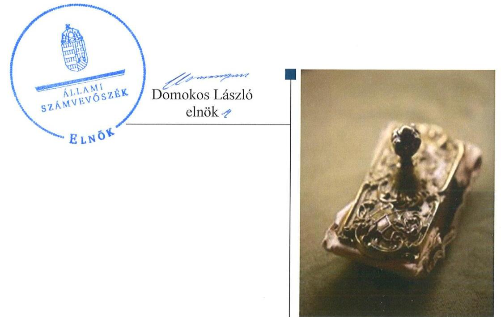
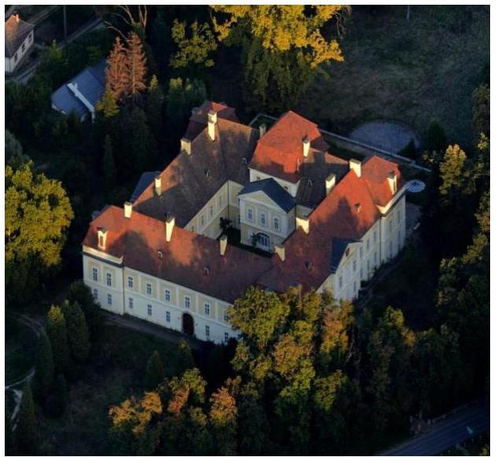
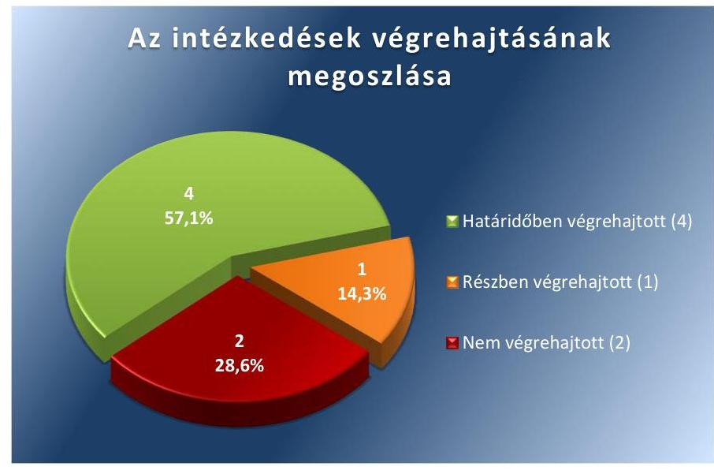
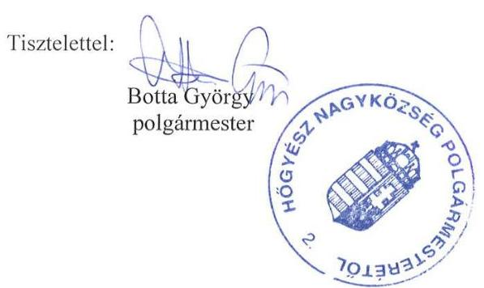
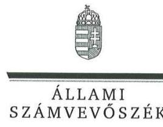
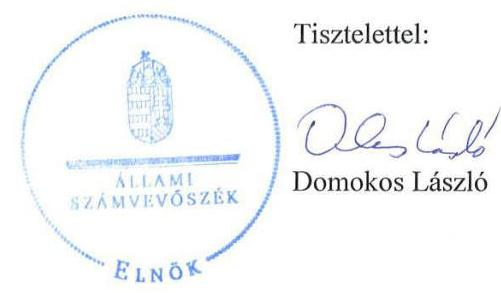
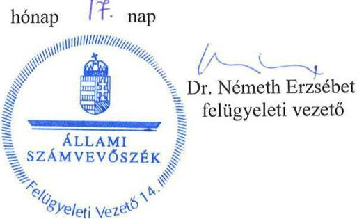

# Jelentés 

## Utóellenőrzések

Hőgyész Nagyközség Önkormányzata vagyongazdálkodása
szabályszerúségének utóellenőrzése 2016.

---

# Jelentés 

## Utóellenőrzések

Hőgyész Nagyközség Önkormányzata vagyongazdálkodása
szabályszerűségének utóellenőrzése
2016. november hó 30 nap

---

# AZ ELLENŐRZÉST FELÜGYELTE: 

DR. NÉMETH ERZSÉBET felügyeleti vezető

## AZ ELLENŐRZÉST VEZETTE ÉS A VÉGREHAJTÁSÁÉRT FELELŐS:

KEREKES PÉTER ellenőrzésvezető

## A PROGRAM ÖSSZEÁLLÍTÁSÁÉRT FELELŐS:

JANIK JÓZSEF LÁSZLÓ osztályvezető

## A TÉMÁHOZ KAPCSOLÓDÓ KORÁBBI SZÁMVEVŐSZÉKI JELENTÉSEK:

- címe: Jelentés az önkormányzati vagyongazdálkodás szabályszerűségi ellenőrzéséről - Hőgyész
- sorszáma: 13158

Jelentéseink az Országgyúlés számítógépes hálózatán és az Interneten a www.asz.hu címen is olvashatóak.

IKTATÓSZÁM: V-1167-056/2016.
TÉMASZÁM: 2201
ELLENŐRZÉS-AZONOSÍTÓ SZÁM: V075512

---

# TARTALOMJEGYZÉK 

■ ÖSSZEGZÉS ..... 5
■ AZ ELLENŐRZÉS CÉLJA ..... 6
■ AZ ELLENŐRZÉS TERÜLETE ..... 7
■ AZ ELLENŐRZÉS HÁTTERE, INDOKOLTSÁGA ..... 8
■ FÓKUSZKÉRDÉS ..... 9
■ ELLENŐRZÉS HATÓKÖRE ÉS MÓDSZEREI ..... 10
■ MEGÁLLAPÍTÁSOK ..... 12
■ MELLÉKLETEK ..... 15
I. Sz. melléklet: Az ÁSZ 13158. számú jelentéséhez kapcsolódó intézkedési terv értékelése. ..... 15
■ FÜGGELÉK: ÉSZREVÉTELEK ..... 17
■ RÖVIDÍTÉSEK JEGYZÉKE ..... 23

---

.

---

# ÖSSZEGZÉS 

Az utóellenőrzés megállapította, hogy az intézkedési tervben foglalt feladatokat Hőgyész Nagyközség Önkormányzata többségében végrehajtotta, de nem teljes körűen. Ezért az Önkormányzat vagyongazdálkodásában és müködési szabályosságában az Állami Számvevőszék által korábban feltárt veszélyek részben még fennállnak.

## Az ellenőrzés társadalmi indokoltsága

Az Állami Számvevőszék stratégiájában célul tűzte ki a számvevőszéki munka hasznosulásának javítását. Ezzel összhangban ellenőrzi, hogy az ellenőrzött szervezetek megvalósították-e a korábbi ellenőrzései által feltárt hibák, hiányosságok és szabálytalanságok megszüntetése céljából kialakított intézkedési terveikben foglaltakat. A rendszeres utóellenőrzések hozzájárulnak a szükséges intézkedések tényleges végrehajtáshoz, ezáltal a közpénzügyek rendezettségének javulásához.

## Főbb megállapítások, következtetések

A polgármester ${ }^{1}$ a Képviselő-testület ${ }^{2}$ által elfogadott intézkedési tervet határidőben megküldte az Állami Számvevőszék részére.

Az intézkedési tervben meghatározott hét feladatból négyet határidőben végrehajtottak: intézkedtek a teljesítésigazolók és érvényesítők kijelöléséről, a pénzügyi ellenjegyzői, a teljesítésigazolói és az érvényesítői feladatok elvégzéséről, a kötelezettségvállalások analitikus nyilvántartásba vételéről, a szervezeti és működési szabályzat és a vagyongazdálkodási rendelet összhangjának megteremtéséről. Egy feladatot részben hajtottak végre, mivel nem gondoskodtak teljes körűen a közérdekű adatok közzétételéről, aktualizálásáról. Kettő feladatot pedig nem hajtottak végre: nem vizsgálták ki a feltárt hiányosságok, szabálytalanságok okait és nem gondoskodtak az üzemeltetésre átadott eszközleltárak beszerzéséről.

Az intézkedési tervben rögzített feladatok végrehajtásáról a Bkr. ${ }^{3}$-ben előírt nyilvántartást nem vezették.

---

# AZ ELLENŐRZÉS CÉLJA 

Az ellenőrzés célja annak értékelése volt, hogy a számvevőszéki jelentésben ${ }^{4}$ foglalt intézkedést igénylő megállapításokkal és javaslatokkal összhangban készített intézkedési tervben meghatározott feladatokat az ellenőrzött szervezet végrehajtotta-e.

---

# **AZ ELLENŐRZÉS TERÜLETE**

## **Hőgyész Nagyközség Önkormányzata**

Hőgyész nagyközség Tolna megyében, a Tamási járásban található. Állandó lakosainak száma a KSH5 által közzétett népességi adatok szerint 2015. január 1-jén 2858 fő volt.

A polgármester a 2010. évi önkormányzati választások óta tölti be tisztségét. A Képviselő-testület a polgármesterrel együtt héttagú, munkáját az önkormányzati SZMSZ6 szerint egy bizottság segíti. A jegyző7 2010. március 1. óta látja el feladatait.

Az Önkormányzat eszközvagyona 2015. december 31-én 2131,3 millió Ft volt. Az Önkormányzat 2015-ben 467,9 millió Ft költségvetési bevételt ért el, valamint 455,4 millió Ft költségvetési kiadást teljesített.

Az ÁSZ8 elvégezte a 2007-2011 évek közötti időszakra az önkormányzati vagyongazdálkodás szabályszerűségi ellenőrzését az Önkormányzatnál, az erről szóló 13158. számú számvevőszéki jelentést 2013. december 5-én tette közzé.

Az utóellenőrzés – a 2013. december 5-től 2016. június 13-ig végrehajtott intézkedéseket figyelembe véve – az ÁSZ jelentésben megfogalmazott javaslatokra az Önkormányzat által készített intézkedési tervben foglalt feladatok végrehajtására irányult.

---

# AZ ELLENŐRZÉS HÁTTERE, INDOKOLTSÁGA 

AZ ÁSZ TV. ${ }^{9}$ 33. § (1) bekezdése értelmében a számvevőszéki jelentések intézkedést igénylő megállapításaihoz és javaslataihoz kapcsolódóan az ellenőrzött szervezet vezetője intézkedési tervet köteles összeállítani, és az Állami Számvevőszék részére megküldeni. Az intézkedési tervben foglaltak megvalósítását - az ÁSZ tv. 33. § (7) bekezdésében foglaltak alapján - az ÁSZ utóellenőrzés keretében ellenőrizheti. Az intézkedések megvalósulásának értékelése során az ÁSZ figyelembe veszi az ellenőrzött szervezetek működési feltételeiben, valamint a jogszabályi előírásokban bekövetkezett változásokat.

AZ INTÉZKEDÉSI TERVEKBEN foglalt feladatok hiányos, illetve késedelmes végrehajtása, valamint megvalósításának elmaradása azt mutatja, hogy az ellenőrzések során feltárt hibák, hiányosságok és szabálytalanságok megszüntetése nem kapott kellő hangsúlyt. Ez a szabályszerű működés és a felelős vezetői magatartás vonatkozásában kockázatot hordoz. E kockázatok feltárásával az Állami Számvevőszék utóellenőrzési rendszere fokozza a fegyelmet, és igazolja, hogy a közpénzzel való szabályos gazdálkodás felelőssége elől nem lehet kitérni.

## AZ UTÓELLENŐRZÉS NÉGY SZINTEN HASZNOSULHAT:

- A társadalom szintjén az utóellenőrzés jelzi, hogy a számvevőszéki ellenőrzés megállapításainak van következménye: a hiányosságok megszüntetésére az ellenőrzött szervezet által meghatározott intézkedések végrehajtását is számon kéri az ÁSZ.
- Az ellenőrzött terület szintjén az utóellenőrzés tájékoztatást nyújt a terület döntéshozóinak a hiányosságok kiküszöbölésének jó gyakorlatairól, ezzel lehetőséget biztosítva arra, hogy az ÁSZ ellenőrzési megállapításai, javaslatai a terület nem ellenőrzött szervezeteinek a működése során is hasznosuljanak.
- Az ellenőrzött szervezet szintjén az utóellenőrzés feltárja, hogy a szervezet az intézkedések végrehajtásával hasznosította-e a korábbi ellenőrzési jelentésben a hiányosságok megszüntetése, illetve a kockázatok kezelése érdekében megfogalmazott javaslatokat.
- Az ÁSZ szintjén az utóellenőrzés visszacsatolást ad az ellenőrzési jelentések hasznosulásáról, az intézkedések elmaradása vagy részleges megvalósulása a további ellenőrzésekhez kockázati jelzésként szolgál.

---

# FÓKUSZKÉRDÉS 

1. Az Önkormányzat az intézkedési tervben foglaltakat az előirt határidőben végrehajtotta-e?

---

# ELLENŐRZÉS HATÓKÖRE ÉS MÓDSZEREI 

## Az ellenőrzés típusa

Megfelelőségi ellenőrzés

## Az ellenőrzött időszak

Az utóellenőrzés alapját képező számvevőszéki jelentés közzétételének napjától (2013. december 5.) az utóellenőrzésről szóló kiértesítő levél keltének napjáig (2016. június 13.) tartó időszak.

## Az ellenőrzés tárgya

Az ÁSZ tv. 2011. július 1-jei hatálybalépését követően a számvevőszéki jelentésben foglalt intézkedést igénylő megállapításokkal és javaslatokkal összhangban - az Önkormányzat által - készített intézkedési tervben foglaltak végrehajtásának ellenőrzése.

Az ellenőrzés kiterjed minden olyan körülményre és adatra, amely az ÁSZ jogszabályban meghatározott feladatainak teljesítéséhez, valamint az ellenőrzési program végrehajtása folyamán felmerült újabb összefüggések feltárásához szükséges.

## Az ellenőrzött szervezet

Hőgyész Nagyközség Önkormányzata

## Az ellenőrzés jogalapja

Az ÁSZ az Országgyűlés pénzügyi és gazdasági ellenőrző szerve. Az ÁSZ törvényben meghatározott feladatkörében ellenőrzi a központi költségvetés végrehajtását, az államháztartás gazdálkodását, az államháztartásból származó források felhasználását és a nemzeti vagyon kezelését. Az ÁSZ tv. 1. § (3) bekezdése szerint az ÁSZ általános hatáskörrel végzi a közpénzekkel és az állami és önkormányzati vagyonnal való felelős gazdálkodás ellenőrzését. Az ÁSZ tv. 33. § (7) bekezdése alapján az - ÁSZ tv. 33. § (1)-(2) bekezdése szerinti - intézkedési tervben foglaltak megvalósítását az ÁSZ utóellenőrzés keretében ellenőrizheti.

---

# Az ellenőrzés módszerei 

Az ÁSZ az ellenőrzést a nemzetközi standardokat irányadónak tekintve az ellenőrzési program kérdései, az ellenőrzött időszakban hatályos jogszabályok, az ellenőrzés szakmai szabályok és módszertanok figyelembevételével végezte.

Az ÁSZ az ellenőrzés ideje alatt az Önkormányzattal történő kapcsolattartást az ÁSZ SZMSZ ${ }^{10}$-ének vonatkozó előírásai alapján biztosította.

Az utóellenőrzés megállapításait az ÁSZ rendelkezésére álló, valamint az ellenőrzött szervezetektől elektronikusan bekért dokumentumok alapozták meg.

Az ellenőrzési bizonyítékként felhasználható adatforrások közé tartoztak egyrészt a szakmai programban felsorolt adatforrások, másrészt minden - az ellenőrzés folyamán feltárt, az ellenőrzés szempontjából információt tartalmazó - dokumentum.

Az intézkedési tervekben előírt feladatokat, azok végrehajthatósága, illetve végrehajtása szempontjából az alábbiak szerint értékelte az ÁSZ:
"határidőben végrehajtott" a feladat, ha a teljesítés dokumentáltan, az intézkedési tervben előírt határidőben és tartalommal megtörtént;
"határidőn túl végrehajtott" a feladat, ha annak teljesítése az intézkedési tervben meghatározott módon, de az előírt határidőn túl történt meg;
"részben végrehajtott" a feladat, ha végrehajtása teljes körűen az intézkedési tervben előírt módon nem történt meg;
"nem végrehajtott" a feladat, ha a végrehajtás nem történt meg, vagy amennyiben a teljesítést nem dokumentálták;
"okafogyottá vált" a feladat, ha végrehajtására - meghatározott esemény bekövetkezése, továbbá külső körülmény, a működést érintő feltétel változása miatt - már nincs szükség, illetve lehetőség, és egyértelműen megállapítható, hogy az intézkedést szükségessé tevő körülmény a jövőben nem fordulhat elő;
"nem időszerű" az a feladat, amelynek ellenőrzési időszakon belüli végrehajtására azért nem került (kerülhetett) sor, mert az intézkedés alapjául szolgáló esemény nem következett be, de annak jövőbeni előfordulása lehetséges, a végrehajtása nem volt esedékes, vagy a végrehajtás határideje még nem járt le.
Az ellenőrzés lefolytatásához az ellenőrzött szervezet a tanúsítványok kitöltésével, valamint az ÁSZ által kért dokumentumok megküldésével szolgáltatott adatokat, amelyek valódiságát és teljes körűségét az ellenőrzött szervezet vezetője által tett teljességi és hitelességi nyilatkozat igazolta. Az így rendelkezésre bocsátott adatok, információk kontrollja az ellenőrzés keretében történt. A gazdálkodási jogkörök gyakorlásának ellenőrzése mintavétel alkalmazásával valósult meg.

---

# MEGÁLLAPÍTÁSOK 

## 1. Az Önkormányzat az intézkedési tervben foglaltakat az előírt határidőben végrehajtotta-e??

Összegző megállapítás

Az Önkormányzat az intézkedési tervében meghatározott hét feladatból négyet határidőben végrehajtott, egyet részben hajtott végre, és kettőt nem hajtott végre. Az intézkedési tervben rögzített feladatok végrehajtásáról a jogszabályban előírt nyilvántartást nem vezették.

Az ÁSZ a 13158. számú jelentésében a polgármester részére egy, a jegyző részére hat javaslatot fogalmazott meg. A javaslatok alapján az Önkormányzat Képviselő-testülete az ÁSZ részére megküldött intézkedési tervében a hiányosságok, szabálytalanságok megszüntetésére hét feladatot határozott meg: egy feladatot a polgármesternek és hat feladatot a jegyzőnek címezve.

Az intézkedési tervben rögzített feladatok végrehajtásáról a Bkr. 14. § (1) bekezdése előírásainak megfelelő nyilvántartást nem vezették.

Az intézkedési tervben vállalt feladatok végrehajtási kategóriák szerinti megoszlását az 1. ábra szemlélteti.

1. ábra

Ferrás: ÁSZ
Az intézkedési tervben meghatározott feladatokat, határidőket, a feladatok végrehajtásáért felelős személyeket és a feladatok végrehajtását az I. számú melléklet mutatja be.

---

# HATÁRIDŐBEN VÉGREHAJTOTT feladatok: 

1. A jegyző intézkedett, hogy az intézkedési tervben meghatározott határidőn belül a kötelezettségvállaló írásban kijelölje a teljesítésigazolókat, továbbá kijelölte az érvényesítési feladatokat ellátó személyeket.
2. A jegyző gondoskodott arról, hogy a pénzügyi ellenjegyző, a teljesítésigazoló és az érvényesítő az ellenőrzési feladatait elvégezze. A jegyző 2014. január 1-jei hatállyal kiadta a gazdálkodási szabályzatot ${ }^{11}$, meghatározta a teljesítésigazoló, a pénzügyi ellenjegyző és az érvényesítő feladatainak rendjét.
3. A jegyző - a kötelezettségvállalás rendjét szabályozó gazdálkodási szabályzat 2014. január 1-jei hatályba léptetésével - intézkedett arról, hogy a kötelezettségvállalásokat követően az analitikus nyilvántartásba vétel megtörténjen. A kötelezettségvállalások nyilvántartásba vétele a 2014-2015-2016. évekre vezetett nyilvántartások dokumentumaival is igazolt.
4. A Képviselő-testület által elfogadott, 2013. november 29-én hatályba lépő módosított önkormányzati SZMSZ-ben és a 2013. február 1-jétől hatályos vagyongazdálkodási rendeletben a vagyongazdálkodási feladatokhoz kapcsolódó átruházott hatáskörök öszszeghatárai - az intézkedési tervnek megfelelően - összhangba kerültek.

## RÉSZBEN VÉGREHAJTOTT feladat:

5. A jegyző 2014-ben intézkedett az Info tv. ${ }^{12}$-ben meghatározott közérdekú adatok közzétételéről, de 2015-ben és 2016-ban az ellenőrzött időszakban nem gondoskodott teljes körűen a közzétett adatok folyamatos frissítéséről, karbantartásáról.

## NEM VÉGREHAJTOTT feladatok:

6. A polgármester dokumentumokkal nem tudta alátámasztani, hogy kivizsgálta a gazdálkodási jogkörök gyakorlásával összefüggésben feltárt hiányosságokat, szabálytalanságokat, valamint annak okait, hogy miért maradt el a közérdekú adatok közzététele, és a belső ellenőrzések javaslatainak hasznosulása.
7. A jegyző nem gondoskodott arról, hogy az üzemeltetésre átadott eszközökről - a Számv. tv. ${ }^{13}$ és az Áhsz. ${ }^{14}$ elöírásainak megfelelően - a könyvviteli mérleg alátámasztásához az üzemeltetők által elvégzett és hitelesített leltárak álljanak rendelkezésre.

---

.

---

# MELLÉKLETEK

- I. SZ. MELLÉKLET: AZ ÁSZ 13158. SZÁMÚ JELENTÉSÉHEZ KAPCSOLÓDÓ INTÉZKEDÉSI TERV ÉRTÉKELÉSE

|  Sorszám | Intézkedési terv alapján elvégzendő feladat | Az intézkedési tervben meghatározott határidő | Az intézkedési tervben meghatározott felelős | A feladat végrehajtása  |
| --- | --- | --- | --- | --- |
|   | 1. | 2. | 3. | 4.  |
|  Határidőben végrehajtott feladat |  |  |  |   |
|  1. | A jegyző intézkedjen, hogy a kötelezettségvállaló jelölje ki a szakmai teljesítésigazolásra, valamint az érvényesítésre jogosult személyeket. | 2014. július 30. | jegyző | A kötelezettségvállaló az Ávr. ${ }^{15}$ 57. § (4) bekezdése előírásának megfelelően kijelölte a teljesítésigazolót. Az Önkormányzatnál nem müködik gazdasági szervezet, ezért a szervezet vezetőjének (jegyzőnek) a feladata volt, hogy a szervezet állományából kijelölje a megfelelő iskolai végzettséggel rendelkező érvényesítésre jogosult személyeket. A jegyző az intézkedési tervben előírt határidőben az Ávr. 58. § (4) bekezdése előírásainak megfelelően, az Ávr. 55. § (2) bekezdés d) pontja alapján kijelölte az érvényesítőt.  |
|  2. | A jegyző gondoskodjon arról, hogy a pénzügyi ellenjegyző, a teljesítésigazoló és az érvényesítő végezze el az ellenőrzési feladatait. | 2014. július 30. | jegyző | A jegyző gondoskodott arról, hogy a pénzügyi ellenjegyző, a teljesítésigazoló és az érvényesítő az ellenőrzési feladatait elvégezze. A jegyző 2014. január 1-jei hatállyal kiadta a gazdálkodási szabályzatot a kötelezettségvállalás, pénzügyi ellenjegyzés, teljesítésigazolás, érvényesítés, utalványozás és az adatszolgáltatás rendjéről. A szabályzat III. fejezete a kötelezettségvállalás pénzügyi ellenjegyzésének, a IV. fejezet a teljesítésigazolás, az V. fejezet az érvényesítés rendjét szabályozta. A pénzügyi ellenjegyző, a teljesítésigazoló és az érvényesítő ellenőrzési feladatai gyakorlati alkalmazásának ellenőrzése mintavétel alapján történt. A pénzügyi ellenjegyző, a teljesítésigazoló és az érvényesítő ellenőrzési feladatainak ellátása az Áht. ${ }^{16}$ 37. § (1), az Ávr. 57. § (1), (3)-(4), valamint az Ávr. 58. § (1), (3) és (4) bekezdései szerint igazolható volt, így az intézkedés határidőben végrehajtottnak minősíthető.  |
|  3. | A jegyző intézkedjen, hogy a kötelezettségvállalásokat követően gondoskodjanak azok analitikus nyilvántartásba vételéről. | 2014. július 30. | jegyző | A 2014-2015-2016. évi kötelezettségvállalás nyilvántartások rendelkezésre álltak, a mintatételek ellenőrzése is megerősítette a nyilvántartásba vétel gyakorlati alkalmazását, így az intézkedés az Ávr. 56. § (1) bekezdésének megfelelően, határidőben végrehajtottnak minősíthető.  |
|  4. | A jegyző készítse elő az SZMSZ és a vagyongazdálkodási rendelet módosítását és kezdeményezze annak képviselő-testületi elfogadását annak érdekében, hogy az átruházott hatáskörök összeghatárai összhangba legyenek. | 2014. július 30. | jegyző | A Képviselő - testület 2013. február 1-jétől hatályos új vagyongazdálkodási rendeletet alkotott és 2013. november 28-i ülésén elfogadta az SZMSZ módosításáról szóló 16/2013. (XI.29.) önkormányzati rendeletet. Ezzel megszüntette az SZMSZ-ben és az Önkormányzat vagyongazdálkodási rendeletében az átruházott hatáskörök összeghatárai közötti ellentmondásokat.  |

---

|  5. | A jegyző intézkedjen a törvényben meghatározott közérdekű adatok közzétételéről. | 2014. július 30. | jegyző  |
| --- | --- | --- | --- |
|  |   |   |   |

|  Az intézkedési
tervben meghatározott határidő | Az intézkedési
tervben meghatározott felelős | A feladat végrehajtása  |
| --- | --- | --- |
|  1. | 2. | 3.  |

## Részben végrehajtott feladat

Az Önkormányzat honlapján közzétett, illetve az onnan eltávolított közérdekű adatokról a 305/2005. (XII. 25.) Korm. rendelet17 7. § (1) bekezdése szerinti naplózás nem történt meg, ezért a honlapon közzétett adatokat csak az aktuális állapotuk szerint tudtuk vizsgálni.

A jegyző az intézkedési tervnek megfelelően intézkedett, hogy a honlapon közzétegyék az Info tv.37.§ (1) bekezdésében meghatározott közérdekű adatokat 2013-2014-re. Ezek az adatok az utóellenőrzés indításakor is fenn voltak a honlapon. Az intézkedés végrehajtását a Képviselő-testület a 68/2014 (XI.25) számú határozatával elfogadta. Az Önkormányzatnál 2015-ben végzett belső ellenőri vizsgálat18 a 2014-es évre vonatkozóan a közérdekű adatok közzétételét rendben találta.

2014-et követően azonban már nem teljes körűen tették közzé az Info tv. 37.§ (1) bekezdésében meghatározott közérdekű adatokat. Hőgyész nagyközség honlapján a 2016. július 12-i állapot szerint nem volt közzétéve a 2016. évi költségvetési rendelet, elemi költségvetés; a 2015. évi beszámoló és zárszámadási rendelet; a nettó 5 millió forintot elérő, vagy azt meghaladó értékű szerződésekre vonatkozó adatok 2015-2016. évekre. Hőgyész honlapján a 2015-ös évre vonatkozó adatok részben voltak elérhetők, a 2016-ra vonatkozó közérdekű adatok nem voltak fellelhetők.

## Nem végrehajtott feladat

|  6. | A polgármester vizsgálja ki a gazdálkodási jogkörök gyakorlásával összefüggésben feltárt hiányosságokat, szabálytalanságokat, a közérdekű adatok közzétételének elmaradását, valamint a belső ellenőrzések javaslatai hasznosulásának elmaradását, és a vizsgálat eredményének függvényében tegye meg a szükséges munkajogi intézkedéseket. | 2014. július 30. | polgármester  |
| --- | --- | --- | --- |
|  |   |   |   |

|  A polgármester által a képviselő-testület számára előterjesztett – és a testület által a 21/2014 (II.27) és a 68/2014 (XI.25) számú határozatokban elfogadott – feljegyzésben arról nyilatkozott, hogy az intézkedési tervben számára előírt vizsgálatot lefolytatta. Viszont a vizsgálat lefolytatásának tényét és a vizsgálat eredményeit nem támasztotta alá olyan dokumentummal (vizsgálóbiztosi megbízás, jegyzőkönyv, jelentés, záradék), amelyekből megállapítható, hogy ki, mikor, mit vizsgált, milyen ténymegállapításokat tett, és hogy történt-e károkozás. Az előterjesztett feljegyzésben a következő megállapítás szerepel: "a korábban jogviszonyban lévő jegyzők esetében munkajogi intézkedésre lehetőség nincs, a jelenleg jogviszonyban álló jegyző esetében pedig ilyenre nincs szükség." | | 7. | A jegyző intézkedjen, hogy az üzemeltetés-re átadott eszközökről a könyvviteli mérleg alátámasztásához, az üzemeltetők által elvégzett és hitelesített leltárak álljanak rendelkezésre. | 2014. július 30. | jegyző |

A jegyző 2014. január 15-i keltezéssel megkeresést küldött az üzemeltetők részére a könyvviteli mérleg alátámasztásához szükséges hitelesített leltárak bekérésére.

Az üzemeltetésre átadott eszközökről készített, a Számv. tv 69.§-ban és az Áhsz. 22.§-ban előírt leltárak a 2013-2014-2015. évekre vonatkozóan nem állnak rendelkezésre, ezek beszerzésére további intézkedést nem tettek.

---

# FÜGGELÉK: ÉSZREVÉTELEK 

A jelentéstervezetet a Számvevőszék 15 napos észrevételezésre megküldte az ellenőrzött szervezet vezetőjének az ÁSZ tv. 29. §* (1) bekezdése előírásának megfelelően.
A polgármester, mint az ellenőrzött szervezet vezetője az ÁSZ tv. 29. § (2) bekezdésében foglalt észrevételezési jogával élt, az ellenőrzés megállapításaira észrevételt tett.
A függelék tartalmazza az Önkormányzat észrevételeit és az ÁSZ tv. 29. § (3) bekezdésében előírtaknak megfelelően a figyelembe nem vett észrevételeket és azok indokairól szóló tájékoztatást.

[^0]
[^0]:    * 29. § (1) Az Állami Számvevőszék az ellenőrzési megállapításait megküldi az ellenőrzött szervezet vezetőjének vagy az általa megbízott személynek, és annak, akinek személyes felelősségét állapította meg.
    (2) Az ellenőrzött szervezet vezetője és a felelősként megjelölt személy az ellenőrzés megállapításaira tizenöt napon belül írásban észrevételt tehet.
    (3) Az Állami Számvevőszék az észrevételre a beérkezésétől számított harminc napon belül írásban válaszol. A figyelembe nem vett észrevételeket köteles a jelentésben feltüntetni, és megindokolni, hogy azokat miért nem fogadta el.

---

# 1465 

## HÖGYÉSZ NAGYKÖZSÉG POLGÁRMESTERE

7191 Hőgyész, Kossuth L. u. 1.
Tel. és fax: +36-74-588-060,
E-mail: titkarsag@hogyesz.hu

Szám: 2015-2/2016.

Hiv. szám: V-1167-052/2016.

Állami Számvevőszék
Domokos László elnök

## Budapest 4.

Pf. 54.
1364 .

## Tisztelt Elnök Úr!

Hivatkozott számon megküldött „Högyész Nagyközség Önkormányzata vagyongazdálkodása szabályszerűségének utóellenőrzése" című számvevőszéki jelentéstervezet kapcsán az alábbi észrevételeket teszem:
1.) A jegyző a 2015. és 2016. évi közérdekủ adatok közzétételi kötelezettségének önhibáján kívül nem tudott eleget tenni, ugyanis az önkormányzati honlapot kezelő informatikus kollégánk 2015. februárban távozott az önkormányzattól, akinek a pótlása sajnos nem sikerült. Kívülálló vállalkozóval kellett megoldani a feladatot, amelynek költségvetési fedezetét a 2016. márciusában elfogadott költségvetésben sikerült csak megteremteni, majd ezt követően került sor az erre irányuló megállapodásra. Az előírt adatok folyamatosan feltöltésre kerültek, illetve kerülnek a honlapra.
2.) A gazdálkodási jogkörök gyakorlásával összefüggésben feltárt hiányosságokért felelős korábbi jegyzők a 2013-as ÁSZ ellenőrzéskor már nem álltak jogviszonyban az önkormányzattal, így - a felelősség megállapításán túl - érdemi munkajogi intézkedésre és annak dokumentálására nem volt lehetőség.
3.) Az „üzemeltetésre átadott eszközökön" - ahogyan azt az ellenőrzés során is jeleztük a volt megyei vízmủ egyes vagyontárgyainak a régi önkormányzati törvény által a megye összes (mintegy 108) önkormányzata közti - az 1991- 92-es években történt felosztását és tulajdonba adását kell érteni. (Ez a vagyon Hőgyész esetében az átadáskor is csak néhány tízezer forintos értéket jelentett, ami mostanra - az értékcsökkenés elszámolásával - nullára csökkent.) Miután ez a vagyonközösség a törvény erejénél fogva jött létre, így erre semmilyen szerződés vagy megállapodás nem készült.

---

Az ingatlanok „üzemeltetője" az elmúlt időszakban többször változott, hol a fekvése szerinti önkormányzat végezte, hol átadta valamilyen saját - általában vízműves gazdasági társaságának, így nehéz volt megtalálni az „illetékest".
Ígéretet kaptunk arra, hogy a szóban forgó leltárak egy-egy példányát megküldik az önkormányzatunknak a mérleg alátámasztáshoz.

Hőgyész, 2016. október 26.

---

ELNÖK

Ikt.szám: V-1167-054/2016.

# Botta György 

polgármester

Hőgyész Nagyközség Önkormányzata

## Hőgyész

## Tisztelt Polgármester Úr!

„Högyész Nagyközség Önkormányzata vagyongazdálkodása szabályszerüségének utóellenörzése "címủ jelentéstervezetre tett észrevételeit köszönettel megkaptam.

Az ellenőrzési megállapításokra vonatkozó észrevételét az Állami Számvevőszékről szóló 2011. évi LXVI. törvény 29. § (2) bekezdésében meghatározott tizenöt napos határidőn belül küldte meg. Az Állami Számvevőszék észrevétellel kapcsolatos álláspontját a mellékletként csatolt, a felügyeleti vezető által készített indokolás tartalmazza.

Budapest, 2016. notemhe hó 14 nap

Melléklet: Észrevételre adott válasz

---

„Högyész Nagyközség Önkormányzata vagyongazdálkodása szabályszerüségének utóellenörzése" címü jelentéstervezetre tett észrevételre adott válasz

| Észrevétel: | 5. számú megállapításra   „A jegyző a 2015. és 2016. évi közérdekü adatok közzétételi kötelezettségének önhibáján kivül nem tudott eleget tenni, ugyanis az önkormányzati honlapot kezelő informatikus kollégánk 2015. februárjában távozott az önkormányzatiól, akinek a pótlása sajnos nem sikerült, Kivülálló vállalkozóval kellett megoldani a feladatot, amelynek költségvetési fedezetét a 2016. márciusában elfogadott költségvetésben sikerült csak megteremteni, majd ezt követően került sor az erre irányuló megállapodásra. Az elölrt adatok folyamatosan feltöltésre kerültek, illetve kerülnek a honlapra." |
| :--: | :--: |
| Válasz: | Az Állami Számvevőszék az észrevételt nem fogadja el. |
| Indoklás: | Az Info tv. 37.§ (1) bekezdésében az Önkormányzatra telepített közzétételi kötelezettség teljesítéséhez szükséges személyi és tárgyi feltételeket az Önkormányzatnak kell biztosítania. A jogszabálynak megfelelő jövőbeni gyakorlat kialakítása nem befolyásolja az ellenőrzési időszakot érintően tett megállapítást. |
| Észrevétel: | 6. számú megállapításra   „A gazdálkodási jogkörök gyakorlásával összefüggésben feltárt hiányosságokért felelős korábbi jegyzök a 2013-as ÁSZ ellenőrzéskor már nem álltak jogviszonyban az önkormányzattal, igy - a felelősség megállapításán túl - érdemi munkajogi intézkedésre és annak dokumentálására nem volt lehetőség" |
| Válasz: | Az Állami Számvevőszék az észrevételt nem fogadja el. |
| Indoklás: | AZ ÁSZ megállapítása arra vonatkozik, hogy a polgármester dokumentumokkal nem tudta alátámasztani, hogy kivizsgálta a gazdálkodási jogkörök gyakorlásával összefüggésben feltárt hiányosságokat, szabálytalanságokat, valamint annak okait, hogy miért maradt el a közérdekủ adatok közzététele, és a belső ellenőrzések javaslatainak hasznosulása.   Mindez szükséges feltétele a munkajogi felelősség megállapításának, amely ennek hiányában meg sem történhetett - a munkaviszonnyal rendelkező alkalmazottak tekintetében sem. |
| Észrevétel: | 7. számú megállapításra   „Az ,,üzemeltetésre átadott eszközökön" - ahogyan azt az ellenőrzés során is jeleztük a volt megyei vizmü egyes vagyontárgyainak a régi önkormányzati törvény által a megye összes (mintegy 108) önkormányzata közti - az 1991 - 92-es években történt felosztását és tulajdonba adását kell érteni. (Ez a vagyon Högyész esetében az átadáskor is csak néhány tízezer forintos értéket jelentett, ami mostanra - az értékcsökkenés elszámolásával nullára - csökkent.) Miután ez a vagyonközösség a törvényerejénél fogva jött létre igy erre semmilyen szerzödés vagy megállapodás nem készült. Az ingatlanok üzemeltetöje az elmúlt időszakban többször változott, hol fek- |

---

|  | vése szerinti önkormányzat végezte, hol átadta valamilyen saját - általában vizmüves - gazdasági társaságnak, igy nehéz volt megtalálni az illetékest. Ígéretet kaptunk arra, hogy a szóban forgó leltárak egy-egy példányát megküldik az önkormányzatunknak a mérleg alátámasztásához." |
| :--: | :--: |
| Válasz: | Az Állami Számvevôszék az észrevételt nem fogadja el. |
| Indoklás: | Az Önkormányzat által tett észrevétel is megerôsiti, hogy az üzemeltetésre átadott eszközökrôl a könyvviteli mérleg alátámasztásához az üzemeltetők által elvégzett és hitelesített leltárak nem álltak rendelkezésre. A leltárak beszerzésére vonatkozó intézkedések az ellenôrzési idôszakra tett megállapítást nem befolyásolják. |

Tájékoztatom Polgármester Urat, hogy az Állami Számvevőszékről szóló 2011. évi LXVI. törvény 29. § (3) bekezdése alapján az Állami Számvevőszék a figyelembe nem vett észrevételeket köteles a jelentésben feltüntetni, és megindokolni, hogy azokat miért nem fogadta el.

Budapest, 2016. momektl hónap 17. nap

---

# RÖVIDÍTÉSEK JEGYZÉKE 

${ }^{1}$ polgármester
${ }^{2}$ Képviselő-testület
${ }^{3} \mathrm{Bkr}$.
${ }^{4}$ számvevőszéki jelentés
${ }^{5} \mathrm{KSH}$
${ }^{6}$ önkormányzati SZMSZ
${ }^{7}$ jegyző
${ }^{8}$ ÁSZ
${ }^{9}$ ÁSZ tv.
${ }^{10}$ ÁSZ SZMSZ
${ }^{11}$ gazdálkodási szabályzat
${ }^{12}$ Info tv.
${ }^{13}$ Számv. tv.
${ }^{14}$ Áhsz.
${ }^{15}$ Ávr.
${ }^{16}$ Áht.
${ }^{17}$ 305/2005. (XII. 25.) Korm. rendelet
${ }^{18}$ belső ellenőri vizsgálat

Hőgyész Nagyközség Önkormányzatának polgármestere
Hőgyész Nagyközség Önkormányzata Képviselő-testülete
370/2011. (XII.31.) Korm. rendelet a költségvetési szervek belső kontrollrendszeréről és belső ellenőrzéséről (hatályos: 2012. január 1-jétől)
Az Állami Számvevőszék 2013. december 5-én nyilvánosságra hozott 13158 számú jelentése: „Jelentés az önkormányzati vagyongazdálkodás szabályszerűségi ellenőrzéséről - Hőgyész". A jelentés az interneten a www.asz.hu címen elérhető.
Központi Statisztikai Hivatal
Hőgyész Nagyközség Önkormányzati Képviselő-testületének 6/2011. (IV.29.) önkormányzati rendelete az önkormányzat szervezeti és működési szabályzatáról (hatályos: 2011. június 1-jétől)
Hőgyész Nagyközség Önkormányzatának jegyzője
Állami Számvevőszék
2011. évi LXVI. törvény az Állami Számvevőszékről (hatályos 2011. július 1-jétől)

Az Állami Számvevőszék elnökének 3/2015. (XII.30.) ÁSZ utasítása az Állami Számvevőszék Szervezeti és Múködési Szabályzatáról (hatályos: 2016. január 1jétől)
Hőgyész Közös Önkormányzati Hivatal Gazdálkodási szabályzata a kötelezettségvállalás, pénzügyi ellenjegyzés, teljesítésigazolás, érvényesítés, utalványozás és az adatszolgáltatás rendjéről (hatályos: 2014. január 1-jétől)
2011. évi CXII. törvény az információs önrendelkezési jogról és az információszabadságról (hatályos: 2011. június 27-től)
2000. évi C. törvény a számvitelről (hatályos: 2001. január 1-jétől)

4/2013. (I. 11.) Korm. rendelet az államháztartás számviteléről (hatályos: 2014. január 1-jétől)
368/2011. (XII. 31.) Korm. rendelet az államháztartásról szóló törvény végrehajtásáról (hatályos: 2012. január 1-jétől)
2011. évi CXCV. törvény az államháztartásról (hatályos: 2011. december 31-től)

305/2005. (XII. 25.) Korm. rendelet a közérdekű adatok elektronikus közzétételére, az egységes közadatkereső rendszerre, valamint a központi jegyzék adattartalmára, az adatintegrációra vonatkozó részletes szabályokról (hatályos: 2006. január 1-jétől)

Hőgyész Nagyközség Önkormányzatának megbízásából a Vincent Auditor Kft által lefolytatott belső ellenőri vizsgálat a Hőgyészi Közös Önkormányzati Hivatalnál „Közpénzek felhasználása, »üvegzseb«" tárgyában. Az ellenőrzött időszak a 2014es év.

---

# ÁLLAMI SZÁMVEVŐSZÉK 

1052 Budapest, Apáczai Csere János utca 10.
Levélcím: 1364 Budapest 4. Pf. 54
Telefon: +36 14849100 Telefax: +36 14849200
www.asz.hu