# Jelentés 

## Utóellenőrzések

Jánossomorja Város Önkormányzata vagyongazdálkodása
szabályszerűségének utóellenőrzése 2016.

---

# Jelentés 

## Utóellenőrzések

Jánossomorja Város Önkormányzata vagyongazdálkodása
szabályszerűségének utóellenőrzése
2016. december hó 0. nap
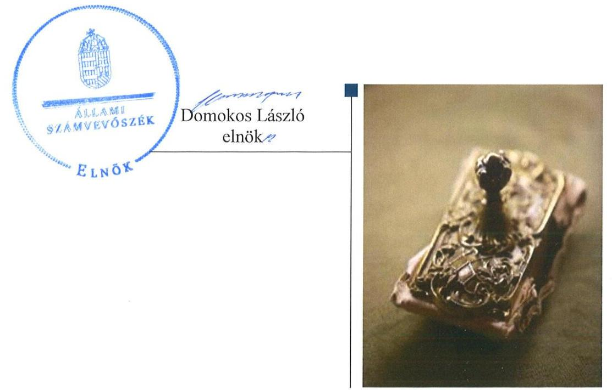

---

# AZ ELLENŐRZÉST FELÜGYELTE: 

DR. NÉMETH ERZSÉBET felügyeleti vezető

## AZ ELLENŐRZÉST VEZETTE ÉS A VÉGREHAJTÁSÁÉRT FELELŐS:

SZALAY NAGY JÁNOS ellenőrzésvezető

## A PROGRAM ÖSSZEÁLLÍTÁSÁÉRT FELELŐS:

JANIK JÓZSEF osztályvezető

## A TÉMÁHOZ KAPCSOLÓDÓ KORÁBBI SZÁMVEVŐSZÉKI JELENTÉSEK:

- címe: Jelentés az önkormányzati vagyongazdálkodás szabályszerűségi ellenőrzéséről Jánossomorja
- sorszáma: 13161

Jelentéseink az Országgyúlés számítógépes hálózatán és az Interneten a www.asz.hu címen is olvashatóak.

IKTATÓSZÁM: V-1161-050/2016
TÉMASZÁM: 2195
ELLENŐRZÉS-AZONOSÍTÓ SZÁM: V-075515

---

# TARTALOMJEGYZÉK 

■ ÖSSZEGZÉS ..... 5
■ AZ ELLENŐRZÉS CÉLJA ..... 6
■ AZ ELLENŐRZÉS TERÜLETE ..... 7
■ AZ ELLENŐRZÉS HÁTTERE, INDOKOLTSÁGA ..... 8
■ FÓKUSZKÉRDÉS ..... 9
■ ELLENŐRZÉS HATÓKÖRE ÉS MÓDSZEREI ..... 10
■ MEGÁLLAPÍTÁSOK ..... 12
■ MELLÉKLETEK ..... 15
I. sz. melléklet: az ÁSZ 13161 számú jelentéséhez kapcsolódó intézkedési terv végrehajtása ..... 15
■ FÜGGELÉK: ÉSZREVÉTELEK ..... 19
■ RÖVIDÍTÉSEK JEGYZÉKE ..... 33

---

.

---

# ÖSSZEGZÉS 

Az utóellenőrzés megállapította, hogy az intézkedési tervben foglalt feladatokat Jánossomorja Város Önkormányzata többségében nem hajtotta végre. Ezért az Önkormányzat vagyongazdálkodásában és működési szabályosságában az Állami Számvevőszék által korábban feltárt kockázatok nagy részben még fennállnak.

## Az ellenőrzés társadalmi indokoltsága

Az ÁSZ ${ }^{1}$ stratégiájában célul tűzte ki a számvevőszéki munka hasznosulásának javítását. Ezzel összhangban ellenőrzi, hogy az ellenőrzött szervezetek megvalósították-e a korábbi ellenőrzései által feltárt hibák, hiányosságok és szabálytalanságok megszüntetése céljából kialakított intézkedési terveikben foglaltakat. A rendszeres utóellenőrzések hozzájárulnak a szükséges intézkedések tényleges végrehajtásához, ezáltal a közpénzügyek rendezettségének javulásához.

## Főbb megállapítások, következtetések

Az Önkormányzat² az intézkedési tervet ${ }^{3}$ határidőben megküldte az ÁSZ részére. Az Önkormányzat a Bkr. ${ }^{4}$-ben foglaltaknak megfelelően az intézkedési terv végrehajtásáról nyilvántartást vezetett. Az intézkedési tervben meghatározott hat feladatból kettőt határidőben végrehajtottak, négyet nem hajtottak végre.

A nem végrehajtott feladatok esetében hiányosság volt, hogy a vagyonkimutatás szerkezete nem volt alkalmas annak megállapítására, hogy a vagyonkezelésbe adott eszközök teljeskörűen tartalmazták-e az önkormányzati forrásból megvalósult fejlesztések eszközeit. A jegyző nem gondoskodott arról, hogy a könyvviteli mérleg alátámasztásához az üzemeltetők által évente elvégzett és hitelesített leltárak álljanak rendelkezésre, továbbá a jegyző nem biztosította, hogy a pénzügyi ellenjegyző, a teljesítést igazoló és az érvényesítő teljes körűen, a szabályoknak megfelelően végezze el ellenőrzési feladatait, és nem intézkedett a közérdekű adatok jogszabály szerinti közzétételéről.

Mivel az Önkormányzat az intézkedési tervében vállalt feladatainak többségét nem hajtotta végre, ezért a vagyongazdálkodás területén megállapított hiányosságok továbbra is fennállnak.

A nem végrehajtott feladatok kockázatot jelentenek az Önkormányzat működésének szabályosságával, a vagyoni helyzet átláthatóságával és a közpénzfelhasználás nyomon követhetőségével kapcsolatban, amelyek kezelése vezetői felelősség körébe tartozik.

---

# AZ ELLENŐRZÉS CÉLJA

Az ellenőrzés célja annak értékelése volt, hogy a számvevőszéki jelentésben foglalt intézkedést igénylő megállapításokkal és javaslatokkal összhangban készített intézkedési tervben meghatározott feladatokat az Önkormányzat végrehajtotta-e.

---

# **AZ ELLENŐRZÉS TERÜLETE**

## **Jánossomorja Város Önkormányzata**

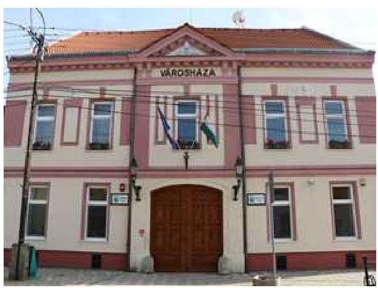

Jánossomorja Város Győr-Moson-Sopron megye nyugati részén, közvetlenül az osztrák határ mellett található. A KSH5 által közzétett statisztikai adatok szerint állandó lakosainak száma 2015. január 1-én 6 052 fő, közigazgatási területe 14 891 hektár volt.

Az ÁSZ 2013-ban ellenőrizte az Önkormányzat vagyongazdálkodásának szabályszerűségét a 2007. január 1. és 2011. december 31. közötti időszak vonatkozásában. A számvevőszéki jelentés6 az Önkormányzat részére a vagyongazdálkodás szabályszerű működésének biztosítása érdekében intézkedést igénylő javaslatokat fogalmazott meg. Az Önkormányzat a javaslatok hasznosítása érdekében intézkedési tervet készített. Az utóellenőrzés keretében az ÁSZ az intézkedési tervben előírt feladatok végrehajtásának ellenőrzését végezte el.

Az ÁSZ 2013-ban lefolytatott ellenőrzése óta a polgármester7 és a jegyző8 személye is változott. A polgármester 2014. október 12-től tölti be hivatalát, a jegyző 2013. szeptember 15-től látja el feladatait. A kilenctagú Képviselő-testület9 munkáját három állandó Bizottság segíti.

Az Önkormányzat a Polgármesteri hivatalon10 kívül négy intézménnyel rendelkezik (Balassi Bálint Művelődési Ház és Könyvtár, Jánossomorjai Aranykapu Óvoda, Kék Bagoly Bölcsőde, Városüzemeltetési és Műszaki Ellátó Szervezet).

Az Önkormányzat a 2015. évi költségvetési beszámolója szerint 1324,18 M Ft költségvetési bevételt ért el, valamint 977,07 M Ft költségvetési kiadást teljesített, a mérlegfőösszege 3485,16 M Ft, ezen belül a nemzeti vagyonba tartozó befektetett eszköze 3059,95 M Ft volt. A 2015. évi egyszerűsített mérlege szerint a követelések állománya 60,03 M Ft, míg a kötelezettségek állománya 25,35 M Ft volt.

---

# AZ ELLENŐRZÉS HÁTTERE, INDOKOLTSÁGA 

Az ÁSZ tv. ${ }^{11}$ 33. § (1) bekezdése értelmében a számvevőszéki jelentések intézkedést igénylő megállapításaihoz és javaslataihoz kapcsolódóan az ellenőrzött szervezet vezetője intézkedési tervet köteles összeállítani, és az Állami Számvevőszék részére megküldeni. Az intézkedési tervben foglaltak megvalósítását - az ÁSZ tv. 33. § (7) bekezdésében foglaltak alapján - az Állami Számvevőszék utóellenőrzés keretében ellenőrizheti. Az intézkedések megvalósulásának értékelése során az Állami Számvevőszék figyelembe veszi az ellenőrzött szervezetek működési feltételeiben, valamint a jogszabályi előírásokban bekövetkezett változásokat.

Az intézkedési tervekben foglalt feladatok hiányos, illetve késedelmes végrehajtása, valamint megvalósításának elmaradása azt mutatja, hogy az ellenőrzések során feltárt hibák, hiányosságok és szabálytalanságok megszüntetése nem kapott kellő hangsúlyt. Ez a szabályszerű működés és a felelős vezetői magatartás vonatkozásában kockázatot hordoz. E kockázatok feltárásával az Állami Számvevőszék utóellenőrzési rendszere fokozza a fegyelmet, és igazolja, hogy a közpénzzel való szabályos gazdálkodás felelőssége elől nem lehet kitérni.

## AZ UTÓELLENŐRZÉS VÁRHATÓ HASZNOSULÁSA

Az utóellenőrzés négy szinten hasznosulhat:
$\longrightarrow$ A társadalom szintjén az utóellenőrzés jelzi, hogy a számvevőszéki ellenőrzés megállapításainak van következménye: a hiányosságok megszüntetésére az ellenőrzött szervezet által meghatározott intézkedések végrehajtását is számon kéri az ÁSZ.
$\longrightarrow$ Az ellenőrzött terület szintjén az utóellenőrzés tájékoztatást nyújt a terület döntéshozóinak a hiányosságok kiküszöbölésének jó gyakorlatairól, ezzel lehetőséget biztosítva arra, hogy az ÁSZ ellenőrzési megállapításai, javaslatai a terület nem ellenőrzött szervezeteinek a működése során is hasznosuljanak.
$\longrightarrow$ Az ellenőrzött szervezet szintjén az utóellenőrzés feltárja, hogy a szervezet az intézkedések végrehajtásával hasznosította-e a korábbi ellenőrzési jelentésben a hiányosságok megszüntetése, illetve a kockázatok kezelése érdekében megfogalmazott javaslatokat.
$\longrightarrow$ Az ÁSZ szintjén az utóellenőrzés visszacsatolást ad az ellenőrzési jelentések hasznosulásáról, az intézkedések elmaradása vagy részleges megvalósulása a további ellenőrzésekhez kockázati jelzésként szolgál.

---

# FÓKUSZKÉRDÉS 

Az Önkormányzat az intézkedési tervben foglaltakat az előírt határidőben végrehajtotta-e?

---

# ELLENŐRZÉS HATÓKÖRE ÉS MÓDSZEREI 

## Az ellenőrzés típusa

Megfelelőségi ellenőrzés.

## Az ellenőrzött időszak

Az utóellenőrzés alapját képező ÁSZ jelentés közzétételének (2013. december 5.) napjától az ellenőrzésről szóló kiértesítő levél keltének (2016. június 23.) napjáig tartó időszak volt.

## Az ellenőrzés tárgya

Az ÁSZ tv. 2011. július 1-jei hatálybalépését követően a számvevőszéki jelentésben foglalt intézkedést igénylő megállapításokkal és javaslatokkal összhangban - az ellenőrzött szervezet által-készített intézkedési tervben foglaltak végrehajtásának ellenőrzése.

Az ellenőrzés kiterjedt minden olyan körülményre és adatra, amely az ÁSZ jogszabályban meghatározott feladatainak teljesítéséhez, valamint a program végrehajtása folyamán felmerült újabb összefüggések feltárásához szükséges volt.

## Az ellenőrzött szervezet

Jánossomorja Város Önkormányzata

## Az ellenőrzés jogalapja

Az ÁSZ, törvényben meghatározott feladatkörében ellenőrzi a központi költségvetés végrehajtását, az államháztartás gazdálkodását, az államháztartásból származó források felhasználását és a nemzeti vagyon kezelését. Az ÁSZ tv. 1. § (3) bekezdése szerint az ÁSZ általános hatáskörrel végzi a közpénzekkel és az állami és önkormányzati vagyonnal való felelős gazdálkodás ellenőrzését. Az ÁSZ tv. 33. § (7) bekezdése alapján a 33. § (1)-(2) bekezdés szerinti intézkedési tervben foglaltak megvalósítását az ÁSZ utóellenőrzés keretében ellenőrizheti.

---

# Az ellenőrzés módszerei 

Az ellenőrzést a nemzetközi standardokat irányadónak tekintve az ellenőrzési program ellenőrzési kérdései, az ellenőrzött időszakban hatályos jogszabályok, az ellenőrzés szakmai szabályok és módszertanok figyelembevételével, önálló ellenőrzés keretében végeztük.

Az ellenőrzés ideje alatt az ellenőrzött szervezettel történő kapcsolattartást az ÁSZ SZMSZ ${ }^{12}$-ének vonatkozó előírásai alapján biztosítottuk.

Az utóellenőrzés megállapításait elsősorban az ÁSZ rendelkezésére álló, valamint az ellenőrzött szervezetektől elektronikusan bekért dokumentumok alapozták meg.

Az ellenőrzési bizonyítékként felhasznált adatforrások közé tartoztak egyrészt a szakmai programban felsorolt adatforrások, másrészt minden az ellenőrzés folyamán feltárt, az ellenőrzés szempontjából információt tartalmazó - dokumentum.

A pénzügyi folyamatokban kulcsszerepet betöltő kontrollok közül a pénzügyi ellenjegyzésre, a teljesítésigazolásra és az érvényesítésre vonatkozóan az intézkedési tervben foglalt feladat végrehajtását tíz elemű, véletlen mintavétellel kiválasztott tételek alapján értékeltük.

Az intézkedési tervben előírt feladatokat azok végrehajthatósága, illetve végrehajtása szempontjából az alábbiak szerint értékeltük ki:
$\longrightarrow$ „határidőben végrehajtott" a feladat, ha a teljesítés dokumentáltan, az intézkedési tervben előírt határidőben és tartalommal megtörtént;
$\longrightarrow$ „határidőn túl végrehajtott" a feladat, ha annak teljesítése az intézkedési tervben meghatározott módon, de az előírt határidőn túl történt meg;
$\longrightarrow$ „részben végrehajtott" a feladat, ha végrehajtása teljes körűen az intézkedési tervben előírt módon nem történt meg;
$\longrightarrow$ „nem végrehajtott" ha a végrehajtás nem történt meg, vagy amennyiben a teljesítést nem dokumentálták;
$\longrightarrow$ „okafogyottá vált" a feladat, ha végrehajtására - meghatározott esemény bekövetkezése, továbbá külső körülmény, a működést érintő feltétel változása miatt - már nincs szükség, illetve lehetőség, és egyértelműen megállapítható, hogy az intézkedést szükségessé tevő körülmény a jövőben nem fordulhat elő;
$\longrightarrow$ „nem időszerű" az a feladat, amelynek ellenőrzött időszakon belüli végrehajtására azért nem került (kerülhetett) sor, mert az intézkedés alapjául szolgáló esemény nem következett be, de annak jövőbeni előfordulása lehetséges, a végrehajtása nem volt esedékes, vagy a végrehajtás határideje még nem járt le.
Az ellenőrzés lefolytatásához az ellenőrzött szervezet a tanúsítványok elektronikus kitöltésével, valamint az ÁSZ által kért dokumentumok elektronikus megküldésével szolgáltatott adatokat, amelyek valódiságát és teljes körűségét az ellenőrzött szervezet vezetője által tett teljességi és hitelességi nyilatkozat igazolja. Az így rendelkezésre bocsátott adatok, információk kontrollja az ellenőrzés keretében történt.

---

# MEGÁLLAPÍTÁSOK 

## Az Önkormányzat az intézkedési tervben foglaltakat az előírt határidőben végrehajtotta-e?

Összegző megállapítás

Az Önkormányzat az intézkedési tervben meghatározott hat feladatból kettőt határidőben végrehajtott, négyet nem hajtott végre. Az intézkedési tervben rögzített feladatok végrehajtásáról vezették a Bkr.-ben előírt nyilvántartást.

Az Önkormányzat az intézkedési tervet az ÁSZ tv. szerinti határidőben, 2014. január 7-én megküldte az ÁSZ részére.

Az ÁSZ a jelentésében a polgármester részére egy, a jegyző részére öt javaslatot fogalmazott meg, amelynek hasznosítására a polgármester és a jegyző által összeállított intézkedési terv összesen hat feladatot határozott meg. A feladatok elvégzésének felelőseként egy intézkedés esetében a polgármestert, öt esetében pedig a jegyzőt jelölték meg.

Az intézkedési tervben meghatározott feladatokat, határidőket, felelősöket és a feladatok végrehajtását az I. számú melléklet mutatja be.

A jegyző a Bkr.-ben foglalt előírásoknak megfelelően az intézkedési terv végrehajtásáról nyilvántartást vezetett.

Az intézkedési tervben meghatározott feladatok végrehajtásának értékelési kategóriák szerinti megoszlását az 1. ábra szemlélteti.

1. ábra

Az intézkedések végrehajtásának
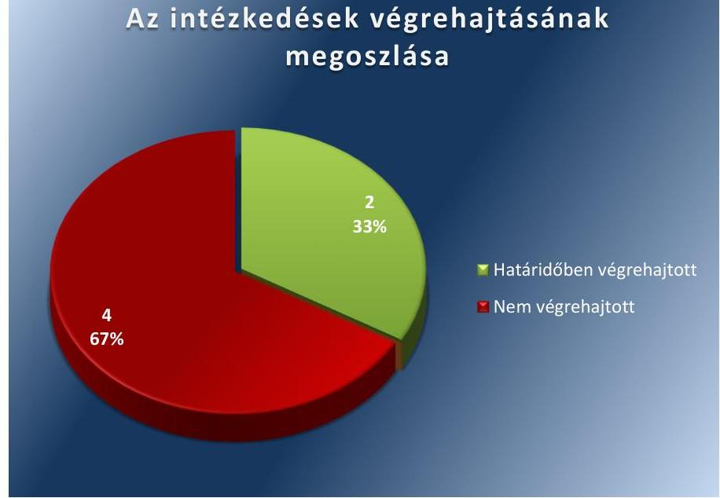

Forrás: ÁSZ

---

# HATÁRIDŐBEN VÉGREHAJTOTT feladatok: 

1. A Pénzügyi és Gazdasági Bizottság ${ }^{13}$ megvizsgálta, hogy a számvevőszéki jelentésben feltárt szabálytalanságokkal összefüggésben történt-e károkozás.
2. A polgármester a 2013. évi belső ellenőrzési jelentést a 2013. évi zárszámadással egyidejűleg a Képviselő-testület elé beterjesztette.

## NEM VÉGREHAJTOTT feladatok:

3. A 2013. évi vagyonkimutatás szerkezete nem alkalmas annak megállapítására, hogy a vagyonkezelésbe
 adott eszközök teljeskörűen tartalmazzák-e a szolgáltató ${ }^{14}$ kivitelezésében, önkormányzati forrásból megvalósult fejlesztések eszközeit.
4. A jegyző nem gondoskodott arról, hogy a vagyonkezelésbe adott eszközökről a könyvviteli mérleg alátámasztásához az Áhsz ${ }^{15}$ 37. § (4) bekezdése és az Áhsz ${ }^{16}$ 22. § (2) bekezdése a) pontja szerinti, a vagyonkezelők által évente elkészített és hitelesített, a Számv. tv. ${ }^{17}$ 69. § (1) bekezdésében foglalt követelményeknek megfelelő, leltárak álljanak rendelkezésre.
5. A jegyző nem biztosította, hogy a pénzügyi ellenjegyző, a teljesítést igazoló és az érvényesítő teljes körűen - az Áht. ${ }^{18}$ 37. § (1) bekezdés, az Ávr. ${ }^{19}$ 57. § (1) bekezdése és az Ávr. 58. § (1) bekezdése előírásainak megfelelően - végezze el ellenőrzési feladatait.
6. A jegyző nem intézkedett az Info tv. ${ }^{20}$ 37. § (1) bekezdésében foglaltak ellenére az Info tv. 1. számú mellékletében szereplő adatok közzétételéről.

---

.

---

# MELLÉKLETEK

- I. SZ. MELLÉKLET: AZ ÁSZ 13161 SZÁMÚ JELENTÉSÉHEZ KAPCSOLÓDÓ INTÉZKEDÉSI TERV VÉGREHAJTÁSA

|  Sorszám | Intézkedési terv alapján elvégzendő feladat
1. | Az intézkedési tervben meghatározott határidő
2. | Az intézkedési tervben meghatározott felelős
3. | A feladat végrehajtása
4.  |
| --- | --- | --- | --- | --- |
|  1. | „Meg kell vizsgálni, hogy a Számvevőszéki jelentésben feltárt szabálytalanságokkal összefüggésben történt-e károkozás, és a károkozás feltárása esetén a szükséges lépések megtételéről gondoskodni kell." | 2014. február 28 | polgármester | A Pénzügyi és Gazdasági Bizottság a 2014. február 10-i ülésén megtárgyalta az ÁSZ jelentést, a vállalt határidőn belül megvizsgálta, hogy az abban feltárt szabálytalanságokkal összefüggésben történt-e károkozás. A Bizottság a (3/2014. II.10.) számú határozatában rögzítette, hogy károkozás nem történt és felelősségre vonásra nincs szükség.  |
|  2. | „Gondoskodni kell a Bkr. 56. § (8) bekezdésének megfelelően az éves ellenőrzési jelentésnek megfelelően - a zárszámadással egyidejűleg - a Képviselőtestület elé történő beterjesztéséről a Polgármester által." | 2014. április 30. | jegyző | A polgármester az intézkedési tervben foglalt határidőn belül - 2014. április 23-án - a 2013. évi belső ellenőrzési jelentést a Bkr.-nek megfelelően, a 2013. évi zárszámadással egyidejűleg a Képviselő-testület elé beterjesztette.  |
|  3. | „Az ellenőrzés megállapítása szerint az Önkormányzatnál a 2010-2011. években elkészített vagyonkimutatás nem felel meg az Áhsz. 44/A. § (2)(3) bekezdésében előírt tartalmi követelményeknek, mert nem tartalmazta az Önkormányzat üzemeltetésre átadott vízi közművei közül a szolgáltató kivitelezésében (önkormányzati forrásból) megvalósult fejlesztések eszközeinek felsorolását és értékét. A hivatkozott eszközök térítés nélküli átadására 2013. január 1. keltezéssel került sor, melyek állományba vétele 2013. évben megtörtént, így az Önkormányzat 2013. évi vagyonkimutatása ezen eszközöket teljes körűen tartalmazni fogja." | 2014. április 30. | jegyző | Az ellenőrzés számára átadott 2013. évi vagyonkimutatás szerkezete nem alkalmas annak megállapítására, hogy a vagyonkezelésbe adott eszközök teljeskörűen tartalmazzák-e a szolgáltató kivitelezésében önkormányzati forrásból megvalósult fejlesztések eszközeit.
A 2013. évi vagyonkimutatás (a 2013. évi zárszámadási rendelet 4/a. sz. melléklete) a IV. pontban tartalmazza az "Üzemeltetésre, kezelésre átadott koncesszióba adott, vagyonkezelésbe vett eszközök"-et 1405 351,0 M Ft bruttó értékben, de azok között a szolgáltató kivitelezésében, önkormányzati forrásból megvalósult eszközök elkülönítve, az intézkedés végrehajtását ellenőrizhetővé tevő módon feltüntetésre nem kerültek.  |

---

|  4. | „Gondoskodni kell arról, hogy az üzemeltetésre átadott (vagyonkezelésbe adott) eszközökről a könyvviteli mérleg alátámasztásához, az Áhsz. 37. § (4) bekezdése előírásának megfelelően, az üzemeltetők által évente elvégzett és hitelesített leltárak álljanak rendelkezésre." | 2014. február. 28. | Jegyző | A jegyző nem gondoskodott a feladat végrehajtásáról. Az Önkormányzat többször is felszólította az Aqua Kft-t, mint vagyonkezelőt a hitelesített, tételes leltárak elkészítésére, de az nem járt eredménnyel, mert az leltárakat nem küldött, így azok nem álltak rendelkezésre a könyvviteli mérleg alátámasztásához. A vagyonkezelő által az Önkormányzat részére megküldött dokumentumok, amelyeket az ellenőrzés rendelkezésére bocsátottak, nem tartalmaztak leltárt. A megküldött dokumentumok nem feleltek meg az Áhsz. 37. § (4) bekezdése és az Áhsz. 22. § (2) bekezdése a) pontja szerinti, a vagyonkezelők által évente elkészített és hitelesített leltárnak, és nem feleltek meg a Számv. tv. 69. § (1) bekezdésében foglalt követelményeknek.  |
| --- | --- | --- | --- | --- |
|  5. | „Teljes körűen biztosítani kell, hogy a pénzügyi ellenjegyző, a teljesítést igazoló és az érvényesítő - az Áht. 37. § (1) bekezdés, az Ávr. 57. § (1) bekezdése és az Ávr. 58. § (1) bekezdése előírásainak megfelelően - végezze el ellenőrzési feladatait." | folyamatos | jegyző | A jegyző az intézkedési tervben előírtakat nem biztosította teljes körűen, mert:
- az Ávr. 55. § (1) bekezdésében foglaltak ellenére a tíz darab mintatételből egyik sem tartalmazta a pénzügyi ellenjegyzés dátumát, ezért nem igazolt, hogy az Áht. 37. § (1) bekezdésének megfelelően a kötelezettségvállalásra a pénzügyi ellenjegyzést követően került sor,
- az Ávr. 57. § (1) bekezdésében foglaltak ellenére egy mintatételnél a teljesítés igazolására az ellenszolgáltatás tényleges teljesítését megelőző dátummal került sor,
- az Ávr. 58. § (1) bekezdésében előírtak ellenére az érvényesítő a tíz mintatétel egyikénél sem ellenőrizte, hogy az Áht., az Áhsz., az Ávr. előírásait és a belső szabályzatban foglaltakat betartották-e, mert az Ávr. 58. § (2) bekezdése ellenére nem jelezte az utalványozónak, hogy:
- minden mintatételnél hiányzott az Ávr. 55. § (1) bekezdésében foglaltak ellenére a pénzügyi ellenjegyzés dátuma,
- egy esetben a pénzügyi ellenjegyzőnek nem volt az Ávr. 55. § (2) bekezdés f) alpontja szerinti kijelölése,
- három esetben nem volt a szakmai teljesítés igazolónak az Ávr. 57. § (4) bekezdése szerinti írásbeli kijelölése,
- öt mintatétel esetében a kötelezettségvállalás dokumentuma nem felelt meg a Gazdálkodási szabályzat ${ }^{21}$ 1.2. pontjában megfogalmazott előírásoknak,
- négy esetben a teljesítésigazolást olyan személy végezte el, aki a Gazdálkodási szabályzat nyilvántartási táblázata alapján nem volt beazonosítható.
Négy esetben az érvényesítőnek nem volt az Ávr. 58. § (4) bekezdése szerinti, írásbeli kijelölése.  |

---

|  5. | Intézkedési terv alapján elvégzendő feladat | Az intézkedési tervben meghatározott határidő | Az intézkedési tervben meghatározott felelős | A feladat végrehajtása  |
| --- | --- | --- | --- | --- |
|   | 1. | 2. | 3. | 4.  |
|  6. | „Intézkedni kell az Info tv. 37. § (1) bekezdés alapján az 1. számú mellékletben meghatározott adatok közzétételéről." | folyamatos | jegyző | Az Önkormányzat nem bocsátott az ellenőrzés rendelkezésére a jegyző intézkedését igazoló dokumentumot, amely az Info tv. 37. § (1) bekezdés alapján az Info tv. 1. számú mellékletében szereplő adatok közzétételi kötelezettségének teljesítésére vonatkozott. Az Önkormányzat archív állománnyal sem rendelkezett a 2016. május 30-ig használt honlapján közzétett dokumentumokról, amellyel igazolta volna az Info tv. 37. § (1) bekezdés 1. számú mellékletében meghatározott dokumentumok közzétételét.  |

---

.

---

# FÜGGELÉK: ÉSZREVÉTELEK 

A jelentéstervezetet a Számvevőszék 15 napos észrevételezésre megküldte az ellenőrzött szervezet vezetőjének az ÁSZ tv. 29. §* (1) bekezdése előírásának megfelelően.
A polgármester, mint az ellenőrzött szervezet vezetője az ÁSZ tv. 29. § (2) bekezdésében foglalt észrevételezési jogával élt, az ellenőrzés megállapításaira észrevételt tett.

A függelék tartalmazza az Önkormányzat észrevételeit és az ÁSZ tv. 29. § (3) bekezdésében előírtaknak megfelelően a figyelembe nem vett észrevételeket és azok indokairól szóló tájékoztatást.

[^0]
[^0]:    * 29. § (1) Az Állami Számvevőszék az ellenőrzési megállapításait megküldi az ellenőrzött szervezet vezetőjének vagy az általa megbízott személynek, és annak, akinek személyes felelősségét állapította meg.
    (2) Az ellenőrzött szervezet vezetője és a felelősként megjelölt személy az ellenőrzés megállapításaira tizenöt napon belül írásban észrevételt tehet.
    (3) Az Állami Számvevőszék az észrevételre a beérkezésétől számított harminc napon belül írásban válaszol. A figyelembe nem vett észrevételeket köteles a jelentésben feltüntetni, és megindokolni, hogy azokat miért nem fogadta el.

---

# JÁNOSSOMORJA VÁROS ÖNKORMÁNYZATA 

9241 JÁNOSSOMORJA, SZABADSÁG 13, 39, TEL: $+36-96-565-240$ TAX: $+36-96-226-145$ E-MAIL: HIVATAL@JANOSSOMORJA.HU WWW.JANOSSOMORJA.HU

Iktatószám: 5108-11/2016

Tárgy: ellenőrzés megállapításaira észrevétel küldése
Hiv.sz: V-1161-046/2016

## Állami Számvevőszék   Domokos László elnök részére   1052 Budapest   Apáczai Csere János u. 10.

Tisztelt Elnök Úr!
ÁLLAMI SZÁMVEVŐSZÉK 0896172016

## Erkezé: 2016. NOV 04

Iktarószám: 11-1161-046/2016
Melléklet:

A 2016. október 17-én érkezett "Jánossomorja Város Önkormányzata vagyongazdálkodása szabályszerűségének utóellenőrzése" című jelentéstervezethez Lőrincz György polgármester az ÁSZ tv. 29. § (2) bekezdésére hivatkozva az ellenőrzés megállapításaira az alábbi észrevételeket teszem:

## NEM VÉGREHAJTOTT FELADATOK:

1. „A 2013. évi vagyonkimutatás szerkezete nem alkalmas annak megállapítására, hogy a vagyonkezelésbe adott eszközök teljeskörűen tartalmazzák-e a szolgáltató kivitelezésében, önkormányzati forrásból megvalósult fejlesztések eszközeit."

Véleményünk szerint az önkormányzat 2013. december 31-ei mérlege teljeskörűen tartalmazza a vagyonkezelésbe adott eszközök értékét, melyet az alábbiakkal kívánunk alátámasztani:

A 2012. évi beszámoló mérleg 27. sora, „üzemeltetésre, kezelésre átadott eszközök", értéke 688.112.- eFt, melyből 417.235.- eFt az Aqua Kft eszközeinek értéke.
2013. évben ez az érték átvezetésre került a vagyonkezelésbe átadott eszközök közé (2013.12.31. beszámoló mérlege 29. sorába), melynek értéke 540.293.-eFt. Ebben az összegben szerepel a 417.235.-eFt átvezetése (1.sz. melléklet), a 110.380.-eFt az ÁSZ jelentésben feltárt eltérés összege (2.sz. melléklet), valamint 12.678.-eFt a 2013. évi Aqua Kft által közölt beruházás, felújítás összege (3.sz. melléklet).
A 2013. december 31-i mérleg 21. sorában a 2013. nyitó és záró érték között 94.972.eFt volumen változás található, mivel a volumen változás értéke tartalmazza a + 110.380.-eFt növekedést, valamint a -28.086.-eFt üzemeltetésre átadott eszközök értékcsökkenését. (az analitikus számításokat tartalmazó 1-3 sz. mellékleteket jelen levél mellékleteként újra megküldjük)

Fentiekre tekintettel véleményünk szerint az intézkedési tervben foglaltak végrehajtásra kerültek.

---

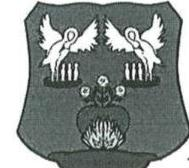

JÁNOSSOMORJA VÁROS ÖNKORMÁNYZATA
9241 JÁNOSSOMORJA, SZABADSÁG D. 39. TEL: +36-96-565-249 FAX: +36-96-226-145
E-MAIL: HIVATAL@JANOSSOMORJA.HU WWW.JANOSSOMORJA.HU

2. A jegyző nem gondoskodott arról, hogy a vagyonkezelésbe adott eszközökről a szolgáltatók által jogszabályban meghatározott hiteles leltár álljon rendelkezésre:

A 2014. évet megelőzően többször került sor arra, hogy az Önkormányzat felszólítást küldött a szolgáltatónak, melyben kérte a vagyonkezelésbe adott eszközök hitelesített leltárának megküldését.

Több alkalommal történt felszólítást követően az Aqua Kft. a 2013. év tekintetében 2014. május 7-én az Önöknek elektronikusan feltöltött leltárt bocsátotta az önkormányzat rendelkezésére.

3. A jegyző nem biztosította, hogy a pénzügyi ellenjegyző, a teljesítést igazoló és az érvényesítő teljes körűen végezze ellenőrzési feladatait.

A pénzügyi ellenjegyző, a teljesítést igazoló és az érvényesítő véleményünk szerint elvégezte az Áht. 37. § (1) bekezdés, az Ávr. 57.§ (1) bekezdése és az Ávr. 58. § (1) bekezdésének megfelelően az ellenőrzési feladatait, melyről az elektronikus rendszerben
 2 db nyilatkozatot csatoltunk 2016. július 20. és 2016. július 21. keltezéssel. (a nyilatkozatokat jelen levél mellékleteként csatoljuk)

A CGR könyvelő program által szolgáltatott utalványrendeleten és a kötelezettség-nyilvántartási bizonylaton a dátum a kötelezettségvállaló, szakmai teljesítés igazoló, érvényesítő és pénzügyi ellenjegyző felett szerepel.

4. Az Önkormányzat nem bocsátott az ellenőrzés rendelkezésére a jegyző intézkedését igazoló dokumentumot, mely az Info tv-ben foglalt kötelezettségek teljesítésére vonatkozott.

Az intézkedési terv alapján elvégzendő feladat az adatok közzététele, mely véleményünk szerint nem határidőben végrehajtott volt.

Az Önkormányzat 2016-ban döntött arról (költségvetésében), hogy új honlapot kíván készíttetni. Az új honlap 2016. júniusában indult (a tartalmi feltöltés 2016. januárjától folyamatosan történt), mely az előzőhöz hasonlóan tartalmazza a tv-ben előírt adatok közzétételét. Kétségtelen, hogy ezen időpontot megelőzően, tekintettel arra, hogy a régebbi honlap archiváltan nem tudta megjeleníteni a feltöltés dátumát, nem lehet azt bizonyítani, hogy mikor történt a közzététel. 2016. júniust követően azonban az új honlap már a feltöltés dátumát is jelzi, így ezen időpontot követően már dokumentáltan végrehajtásra került az intézkedési tervben foglalt feladat.

Kérjük Önöket, hogy fenti észrevételeket, megállapításokat végleges jelentésük elkészítésénél szíveskedjenek figyelembe venni.

Jánossomorja, 2016. 10. 25.

Tisztelettel!

Jánossomorja Város Önkormányzata
képviseletében Lőrincz György
polgármester

---

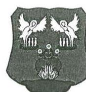

JÁNOSSOMORIAI KÖZÖS
ÖNKORMÁNYZATI HIVATAL
9241 JÁNOSSOMORIA, SZABÁDSÁG U. 39.
TEL.: +36-96-365-240 FAX: +36-96-226-145
WWW.JANOSSOMORIA.HU
HIVATAL@JANOSSOMORIA.HU

JEGYZŐ

JEGYZO@JANOSSOMORIA.HU

# NYILATKOZAT

Alulírott, dr. Péntek Tímea Jánossomorja Város jegyzője nyilatkozom, hogy Tóth Piroska adó- és pénzügyi osztályvezető a jogszabályokban, a munkaköri leírásában és a belső szabályzatban foglaltak szerint a pénzügyi ellenjegyzést megelőzően teljes körűen megvizsgálja, hogy a kötelezettségvállalás az Áht. 37. § (1) bekezdés előírásainak megfelel.

A pénzügyi ellenjegyzést megelőzően az alábbi feladatokat végzi (meggyőződve arról, hogy a kifizetendő tétel – házipénztár és banki kifizetés tekintetében is – az Áht 37. § (1) bekezdésének és a gazdálkodási szabályzatunknak megfelel, nem sérti a gazdálkodásra vonatkozó szabályokat):

1. A szabad előirányzat rendelkezésére állásának vizsgálatát akként végzi, hogy a költségvetési rendeletben megnézi, van-e rá szabad előirányzat.
2. CGR programban megvizsgálja, hogy van-e rá szabad kötelezettségvállalás.
3. Megvizsgálja, hogy a kifizetés időpontjában a pénzügyi fedezet biztosított-e: megnézi a költségvetési szerv pénzállományát az OTP Bank Electra rendszerében, majd összeveti a már vállalt, de ki nem fizetett kötelezettségekkel, és így meggyőződik arról, van-e szabad pénzeszköze a költségvetési szervnek.
4. Megvizsgálja, hogy a kötelezettségvállalás megfelel-e az Áht. és a gazdálkodási szabályzat előírásainak, a kötelezettségvállalás nem sérti-e a gazdálkodási szabályokat.

Amennyiben a kötelezettségvállalás megfelel az összes előírásnak, csak azután jegyzi pénzügyileg ellen a kötelezettségvállalást.

Jánossomorja, 2016. július 20.

A pénzügyi ellenjegyzést fenti nyilatkozatban foglaltak szerint végzem:

Jánossomorja, 2016. július 20.

Tóth Piroska adó-és pénzügyi osztályvezető

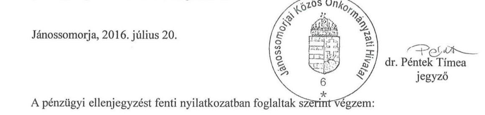

---

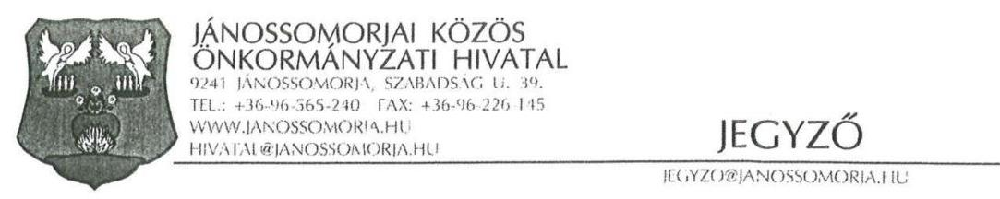

# NYILATKOZAT 

Alulírott, dr. Péntek Tímea Jánossomorja Város jegyzője nyilatkozom, hogy Tóth Piroska adóés pénzügyi osztályvezető a jogszabályokban, a munkaköri leírásában és a belső szabályzatban foglaltak szerint az érvényesítést megelőzően teljes körűen megvizsgálja, hogy az érvényesítés az Ávr. 58. § (1) bekezdés előírásainak megfelel.

Az érvényesítést megelőzően az alábbi feladatokat végzi (meggyőződve arról, hogy a kifizetendő tétel - házipénztár és banki kifizetés tekintetében is - az Ávr. 58. § (1) bekezdésének és a gazdálkodási szabályzatunknak megfelel, nem sérti a gazdálkodásra vonatkozó szabályokat):

1. A szabad előirányzat rendelkezésére állásának vizsgálatát akként végzi, hogy a költségvetési rendeletben megnézi, van-e rá szabad előirányzat.
2. Megvizsgálja, hogy a kifizetés időpontjában a pénzügyi fedezet biztosított-e: megnézi a költségvetési szerv pénzállományát az OTP Bank Electra rendszerében, majd összeveti a már vállalt, de ki nem fizetett kötelezettségekkel, és így meggyőződik arról, van-e szabad pénzeszköze a költségvetési szervnek.
3. Meggyőződik a számla és a megrendelő/szerződés összegszerű egyezőségéről.
4. Megvizsgálja, hogy az érvényesítés megfelel-e az Áht., az Ávr., az államháztartási számviteli kormányrendelet és a gazdálkodási szabályzat előírásainak.

Amennyiben megfelel az összes előírásnak, csak azután érvényesíti a tételt a kifizetésnárgátán.

Jánossomorja, 2016. július 21.
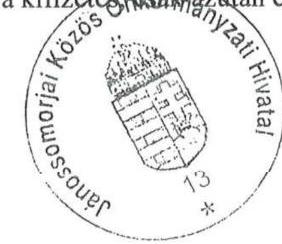
dr. Péntek Tímea
jegyző
Az érvényesítést a fenti nyilatkozatban foglaltak szerint végzem:
Jánossomorja, 2016. július 21.
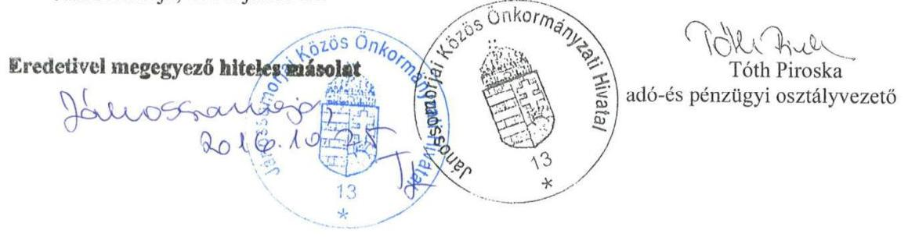

---

Függelék: Észrevételek

Aqua eszk. nyilv.

|  Üzemeltetésről áttett eszk: |  |  |  |  | 1.sz. melléklet  |
| --- | --- | --- | --- | --- | --- |
|   |  | Kartonlap szár | bruttó | eddig elszállt | Nettó 2013.12.31 |
|  Üz.átad. gép szennyvíz |  | 620/00001 | 59 714 176 | 59 714 176 | 0  |
|  Gép össz: |  |  |  |  |   |
|  Üz.átad. szám.tech.eszk. |  | 621/00001 | 1 600 000 | 1 600 000 | 0  |
|  Ügyv.eszk.össz |  |  |  |  |   |
|  Síplóz t.u. szennyvíz |  | 610/00036 | 13 505 000 | 3 242 031 | 10 262 969  |
|  Síplóz t.u. Ivóvízáterelő |  | 610/00037 | 3 750 000 | 900 224 | 2 849 776  |
|  Ivóvízrendszer J.somorja |  | 610/00038 | 11 534 001 | 6 931 008 | 4 602 993  |
|  Vízműtelep V.sz.kút |  | 610/00039 | 9 796 001 | 6 386 828 | 3 409 173  |
|  Szennyvíz építmény |  | 610/00005 | 418 000 | 201 713 | 216 287  |
|  Szennyvíz építmény |  | 610/00006 | 1 509 000 | 724 592 | 784 408  |
|  Szennyvíz építmény |  | 610/00007 | 236 759 611 | 114 446 619 | 122 312 992  |
|  Szennyvíz építmény |  | 610/00008 | 14 675 000 | 7 056 434 | 7 618 566  |
|  Ivóvízbázis építmény |  | 610/00040 | 277 724 937 | 25 012 333 | 252 712 604  |
|  Építmény össz: |  |  | 569 671 550 | 164 901 782 | 404 769 768  |
|  Szennyvíz épület |  | 610/00009 | 12 105 909 | 4 526 657 | 7 579 252  |
|  Szennyvíz épület |  | 610/00010 | 5 377 000 | 2 010 731 | 3 366 269  |
|  Épület össz: |  |  | 17 482 909 | 6 537 388 | 10 945 521  |
|  Ivóvízbázis ing.kapcs. v.jpg |  | 260/00001 | 1 670 000 | 150 401 | 1 519 599  |
|  Vagyonértékű jog össz: |  |  | 1 670 000 | 150 401 | 1 519 599  |
|   |  |  | 588 824 459 | 171 589 571 | 417 234 888  |

Oldal 1

---

### 2.sz. melléklet

|  Megnevezés |  |  |  |   |
| --- | --- | --- | --- | --- |
|  J.somorja vízműtelep iroda épület |  |  |  |   |
|  J.somorja szennyvíztisztító Gépház |  |  |  |   |
|  Épület össz: |  |  |  |   |
|  H.iget vízműtelep vízforrásfejlesztés |  |  |  |   |
|  H.iget ivóvízhálózat Akirás vízmérő |  |  |  |   |
|  J.somorja ivóvízhálózat Akirás vízmérő |  |  |  |   |
|  J.somorja ivóvízhálózat Bekötés |  |  |  |   |
|  J.somorja ivóvízhálózat Elosztóhálózat |  |  |  |   |
|  J.somorja vízműtelep térvilágítás |  |  |  |   |
|  J.somorja vízműtelep betét határoló |  |  |  |   |
|  J.somorja vízműtelep kutak |  |  |  |   |
|  J.somorja szennyvíztisztító Iszap |  |  |  |   |
|  J.somorja szennyvíztisztító Tech.vezérlés |  |  |  |   |
|  J.s. Szennyvíztisztító Csatorna |  |  |  |   |
|  Építmény össz: |  |  |  |   |
|  H.iget vízműtelep szivattyú |  |  |  |   |
|  H.iget ivóvízhálózat Hydro-rádió |  |  |  |   |
|  J.somorja ivóvízhálózat Kísérleti |  |  |  |   |
|  J.somorja ivóvízhálózat Gépsátor |  |  |  |   |
|  J.somorja ivóvízhálózat Hydro-rádió |  |  |  |   |
|  J.somorja vízműtelep kísérleti |  |  |  |   |
|  J.somorja vízműtelep gép |  |  |  |   |
|  J.somorja szennyvíztisztító Kísérleti |  |  |  |   |
|  J.somorja szennyvíztisztító Gép |  |  |  |   |
|  J.somorja szennyvíztisztító Búvárkeverő |  |  |  |   |
|  J.somorja szennyvíztisztító Szűrőcsiga |  |  |  |   |
|  J.s. Szennyvíztisztító Vált.kapcsolás |  |  |  |   |
|  J.s. Szennyvíztisztító Szivattyú |  |  |  |   |
|  Gép össz: |  |  |  |   |
|  H.iget vízműtelep hardver |  |  |  |   |
|  J.somorja ivóvízhálózat Hardver |  |  |  |   |

### 25

### Aqua eszk. nyilv.

|  Kimutatás vagyonkezelésre átadott eszközök |  |  |  |   |
| --- | --- | --- | --- | --- |
|  2013. december 31. |  |  |  |   |
|  Karton adatok |  |  |  |   |
|  bruttó | eddig elszállt | Nettó 2013.12.31 |  |   |
|  611/00001 | 5 095 221 | 1 792 503 | 3 302 718 |   |
|  611/00002 | 9 620 064 | 779 021 | 8 841 043 |   |
|  14 715 285 | 2 571 524 | 12 143 761 |  |   |

 761 |  |   |
|  612/00001 | 2 208 930 | 470 378 | 1 738 552 |   |
|  612/00002 | 732 180 | 731 270 | 910 |   |
|  612/00003 | 9 299 001 | 7 848 363 | 1 450 638 |   |
|  612/00004 | 24 431 857 | 7 741 666 | 16 690 191 |   |
|  612/00005 | 45 100 824 | 16 679 171 | 28 421 653 |   |
|  612/00006 | 1 355 872 | 1 303 556 | 52 316 |   |
|  612/00007 | 831 325 | 412 306 | 419 019 |   |
|  612/00008 | 5 125 290 | 1 829 634 | 3 295 656 |   |
|  612/00009 | 26 642 198 | 4 100 991 | 22 541 207 |   |
|  612/00010 | 18 573 879 | 2 175 168 | 16 398 711 |   |
|  612/00011 | 2 435 120 | 736 782 | 1 698 338 |   |
|  136 736 476 | 44 029 285 | 92 707 191 |  |   |
|  622/00001 | 1 110 280 | 1 023 611 | 86 669 |   |
|  622/00002 | 682 078 | 348 861 | 333 217 |   |
|  622/00003 | 142 792 | 142 792 | 0 |   |
|  622/00004 | 393 400 | 390 263 | 3 137 |   |
|  622/00005 | 1 561 841 | 810 274 | 751 567 |   |
|  622/00006 | 672 504 | 672 504 | 0 |   |
|  622/00007 | 6 485 579 | 6 485 579 | 0 |   |
|  622/00008 | 829 038 | 829 038 | 0 |   |
|  622/00009 | 22 841 644 | 21 575 547 | 1 266 097 |   |
|  622/00010 | 1 682 096 | 1 160 550 | 521 546 |   |
|  622/00011 | 6 948 119 | 5 851 649 | 1 096 470 |   |
|  622/00012 | 3 030 286 | 3 030 286 | 0 |   |
|  622/00013 | 5 454 913 | 4 890 047 | 564 866 |   |
|  51 834 570 | 47 211 001 | 4 623 569 |  |   |
|  623/00001 | 247 860 | 247 860 | 0 |   |
|  623/00002 | 3 559 400 | 3 559 400 | 0 |   |

Oldal 1

---

|   |  |  |  | Aqua eszk. nyúlv. |   |
| --- | --- | --- | --- | --- | --- |
|  J.somorja vízműtelep úgyv. |  | 623/00003 | 3 496 615 | 3 496 615 | 0  |
|  J.somorja szennyvíztisztító úgyv. |  | 623/00004 | 11 849 015 | 11 849 015 | 0  |
|  J.s. Szennyvízelv. Irányító hardver |  | 623/00005 | 1 741 695 | 1 741 695 | 0  |
|  ügyv.eszk.összesen |  |  | 20 894 585 | 20 894 585 | 0  |
|  H.liget vízműtelep szoftver |  | 640/00001 | 2 554 000 | 2 554 000 | 0  |
|  J.somorja ivóvíztisztító digit térkép |  | 640/00002 | 1 275 000 | 1 275 000 | 0  |
|  J.somorja vízműtelep szoftver |  | 640/00003 | 6 175 202 | 6 175 202 | 0  |
|  J.somorja szennyvíztisztító tervek |  | 640/00004 | 2 068 484 | 1 556 649 | 511 835  |
|  J.somorja szennyvíztisztító szoftver |  | 640/00005 | 3 291 915 | 3 291 915 | 0  |
|  J.s. Szennyvízelv. Szoftver |  | 640/00006 | 1 844 096 | 1 579 159 | 264 937  |
|  Immat.javak összesen |  |  | 17 208 697 | 16 431 925 | 776 772  |
|  J.v. Szennyvízelv. Hálózat hozzájárulás |  | 641/00001 | 488 417 | 360 086 | 128 331  |
|  Vagyonértékű jog összesen: |  |  | 488 417 | 360 086 | 128 331  |
|   |  |  | 241 878 030 | 131 498 406 | 110 379 824  |

---

|  Aqua Kft-tól kapott kartonadatok |  |  |  |  |  |  |  |  |  |   |
| --- | --- | --- | --- | --- | --- | --- | --- | --- | --- | --- |
|  Megnevezés |  | Karton adatok |  |  |  |  |  |  |  |   |
|  J.somorja általános beruházás | 104-10 | 612/00012 |  | 1326531 |  | 36900 | 1189631 | 40124 | 77024 | 1249507  |
|  H.liget vízsziklasztó | 104-11 | 612/00013 |  | 1878300 |  | 50846 | 1639454 | 56812 | 107658 | 1770642  |
|  Várbalog ivókút megszüntetése | 104-12 | 612/00014 |  | 1500000 |  | 40610 | 1309390 | 45368 | 85978 | 141402  |
|  Építmény összesen: |  |  |  | 4704831 |  | 128356 | 4138475 | 142304 | 270660 | 42477  |
|  AMB-Pez vezetéképítés | 104-81 | 611/00003 |  | 3525796 |  | 41150 | 3484646 | 71098 | 112246 | 3413550  |
|  Pakett bővítés | 104-82 | 611/00004 |  | 737280 |  | 8603 | 728677 | 14868 | 23471 | 713809  |
|  Vásárlót bővítés | 104-83 | 611/00005 |  | 895096 |  | 10444 | 884652 | 18048 | 28492 | 868604  |
|  5 kül kifolyó | 104-84 | 611/00006 |  | 209395 |  | 2444 | 206951 | 4224 | 6888 | 202727  |
|  J.somorja csőkötéskeresés | 104-87 | 611/00007 |  | 597041 |  | 6967 | 590074 | 12040 | 19007 | 578034  |
|  J.somorja tűzcsap csere | 104-88 | 611/00008 |  | 1849188 |  | 21582 | 1827606 | 37288 | 58870 | 1780315  |
|  Épület összesen: |  |  |  | 7813796 |  | 91190 | 7722606 | 157564 | 248754 | 70184  |
|  J.s szennyvíztisztító telep tűzsz. | 104-85 | 622/00014 |  | 81160 |  | 6865 | 74295 | 11864 | 18729 | 62431  |
|  J.s inform fejlesztés | 104-86 | 622/00015 |  | 801492 |  | 67817 | 733675 | 117172 | 184989 | 616502  |
|  Gép összesen: |  |  |  | 882652 |  | 74682 | 807970 | 129036 | 203718 | 61719  |
|  Mindösszesen: |  |  |  | 13401279 |  | 294228 | 12669051 | 428904 |  | 11777  |

---

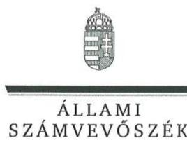

ELNÖK

Ikt.szám: V-1161-048/2016.

# Lőrincz György 

polgármester
Jánossomorja Város Önkormányzata

## Jánossomorja

## Tisztelt Polgármester Úr!

"Jánossomorja Város Önkormányzata vagyongazdálkodása szabályszerűségének utóellenőrzése" című jelentéstervezetre tett észrevételeit köszönettel megkaptam.

Az ellenőrzési megállapításokra vonatkozó észrevételét az Állami Számvevőszékről szóló 2011. évi LXVI. törvény 29. § (2) bekezdésében meghatározott tizenöt napos határidőn belül küldte meg. Az Állami Számvevőszék észrevétellel kapcsolatos álláspontját a mellékletként csatolt, a felügyeleti vezető által készített indokolás tartalmazza.

Budapest, 2016. november 17. nap

Tisztelettel:

## Densliz

Melléklet: Észrevételre adott válasz

---

"Jánossomorja Város Önkormányzata vagyongazdálkodása szabályszerűségének utóellenőrzése" című jelentéstervezetre tett észrevételre adott válaszok

| Észrevétel: | 3. számú megállapításhoz (vagyonkimutatás):   „Véleményünk szerint az önkormányzat 2013. december 31-i mérlege teljeskörűen tartalmazza a vagyonkezelésbe adott eszközök értékét, melyet az alábbiakkal kívánunk alátámasztani: A 2012. évi beszámoló mérleg 27. sor, ,,üzemeltetésre, kezelésre átadott eszközök", értéke 688.112.-eFt, melyből 417.235.-eFt az Aqua Kft. eszközeinek értéke. 2013. évben ez az érték átvezetésre került a vagyonkezelésbe átadott eszközök közé (2013.12.31. beszámoló mérlege 29. sorába), melynek értéke 540.293.-e Ft. Ebben az összegben szerepel a 417.235.-eFt átvezetése (1.sz. melléklet), a 110.380.-eFt az ÁSZ jelentésben feltárt eltérés összege (2.sz. melléklet), valamint 12.678.-eFt a 2013. évi Aqua Kft. által közölt beruházás, felújítás összege (3.sz. melléklet). A 2013. december 31-i mérleg 21. sorában a 2013. nyitó és záró érték között 94.972.-eFt volumenváltozás található, mivel a volumenváltozás értéke tartalmazza a + 110.380.-eFt növekedést, valamint a -28.086.-eFt üzemeltetésre átadott eszközök értékcsökkenését. (az analitikus számításokat tartalmazó 1-3 sz. mellékleteket jelen levél mellékleteként újra megküldjük)   Fentiekre tekintettel véleményünk szerint az intézkedési tervben foglaltak végrehajtásra kerültek." |
| :--: | :--: |
| Válasz: | Az Állami Számvevőszék az észrevételt nem fogadja el. |
| Indoklás: | Az Önkormányzat által az Állami Számvevőszék részére elektronikusan feltöltött „vagyonkimutatás 2013."pdf file (a 2013. évi zárszámadási rendelet 4/a. sz. melléklete) a IV. pontban tartalmazza az „Üzemeltetésre, kezelésre átadott, koncesszióba adott, vagyonkezelésbe vett eszközöket" 1405351 e Ft bruttó értékben, de azok között a szolgáltató kivitelezésében, önkormányzati forrásból megvalósult eszközök nem kerültek feltüntetésre. Az Áhsz; 44/a. §-a rendelkezett az önkormányzati vagyonkimutatás szerkezetéről, melynek kapcsán a (2) bekezdése kimondta, hogy az Áhsz; 1. számú mellékletében előírt főbb tartalmi-szerkezeti elemeken felül a vagyonkimutatás további részletezését, tételes alábontását az erre vonatkozó önkormányzati rendelet szabályozza. Az Önkormányzat az Intézkedési Tervben foglaltak ellenére nem határozott meg a 2013. évi vagyonkimutatásában az „IV. Üzemeltetésre, kezelésre átadott, koncesszióba adott, vagyonkezelésbe
 vett eszközök" eszközcsoporton belül „Vagyonkezelő kivitelezésében önkormányzati forrásból megvalósult fejlesztések" elnevezéssel eszközcsoportot, amelyből a vagyonkezelő kivitelezésében, önkormányzati forrásból megvalósult eszközök megállapíthatók lettek volna. |
| Észrevétel: | 4. számú megállapításhoz (vagyonkezelésbe adott eszközök leltározása):   „A 2014. évet megelőzően többször került sor arra, hogy az Önkormányzat felszólítást küldött a szolgáltatónak, melyben kérte a vagyonkezelésbe adott eszközök hitelesített leltárának megküldését. Több alkalommal történt felszólítást követően az Aqua Kft. a 2013. év tekintetében 2014. május 7-én az Önöknek elektronikusan feltöltött leltárt bocsátotta az önkormányzat rendelkezésére." |

---

| Válasz: | Az Állami Számvevőszék az észrevételt nem fogadja el. |
| :--: | :--: |
| Indoklás: | Az Önkormányzat által az Állami Számvevőszék részére elektronikusan feltöltött „Aqua 2013. leltár" megnevezésű, 2014. május 7-i keltezésű, 68 oldalt kitevő pdf file „Eszköz összesítő", „Aktiválási jegyzőkönyv" és „Jánossomorja tárgyi eszköz lista" dokumentumokat tartalmaz. A megküldött dokumentumok leltárt nem foglaltak magukban, mivel - a Számv. tv. 69. § (1) bekezdésében foglaltak ellenére - nem tartalmazták tételesen és ellenőrizhető módon a vagyonkezelésbe adott eszközöket mennyiségben és értékben a mérleg fordulónapján. |
| Észrevétel: | 5. számú megállapításhoz (operatív gazdálkodási jogkörök gyakorlása):   „A pénzügyi ellenjegyző, a teljesítést igazoló és az érvényesítő véleményünk szerint elvégezte az Áht. 37. § (1) bekezdés, az Ávr. 57. § (1) bekezdés és az Ávr. 58. § (1) bekezdésének megfelelően az ellenőrzési feladatait, melyről az elektronikus rendszerben 2 db nyilatkozatot csatoltunk 2016. július 20. és 2016. július 21. keltezéssel. (a nyilatkozatokat jelen levél mellékleteként csatoljuk)   A CGR könyvelő program által szolgáltatott utalványrendeleten és a kötelezettségnyilvántartási bizonylaton a dátum a kötelezettség vállaló, szakmai teljesítést igazoló, érvényesítő és pénzügyi ellenjegyző felett szerepel." |
| Válasz: | Az Állami Számvevőszék az észrevételt nem fogadja el. |
| Indoklás: | A gazdálkodási jogkörök ellenőrzése során az ÁSZ megállapította, hogy a tíz ellenőrzött mintatételnél egy esetben sem érvényesült az Intézkedési Tervben megfogalmazott feladatok teljesítése.   Az ellenőrzött mintatételek esetében a kötelezettségvállalás dokumentumain (vállalkozói szerződés, megrendelő, szállítási szerződés stb.) a kötelezettségvállalás pénzügyi ellenjegyzése - az Ávr. 55. § (1) bekezdésében foglaltak ellenére - dátumot egyik esetben sem tartalmazott, ezért nem állapítható meg, hogy a kötelezettségvállalás a pénzügyi ellenjegyzés után történt.   Egy mintatételnél a teljesítés igazolására - az Ávr. 57. § (1) bekezdésében foglaltak ellenére - az ellenszolgáltatás tényleges teljesítését megelőző dátummal került sor, így a teljesítés igazoló nem ellenőrizte a kiadás jogosságát, összegszerűségét és az ellenszolgáltatást is magában foglaló kötelezettségvállalás teljesítését.   Az érvényesítő - az Ávr. 58. § (1) bekezdésében foglaltak ellenére - nem ellenőrizte, hogy a megelőző ügymenetben a jogszabályokat és a belső szabályzatokban foglaltakat megtartották-e, és az Ávr. 58. § (2) bekezdésében foglaltak ellenére nem jelezte az utalványozónak, hogy a pénzügyi ellenjegyzés dátuma - az Ávr. 55. § (1) bekezdése ellenére - a mintatételek mindegyikénél hiányzik. Az érvényesítő nem ellenőrizte továbbá és nem jelezte az utalványozónak, hogy a pénzügyi ellenjegyző egy esetben nem rendelkezett az Ávr. 55. § (2) bekezdés f) pontja szerinti kijelöléssel, valamint három esetben a teljesítés igazoló nem rendelkezett az Ávr. 57. § (4) bekezdésében meghatározott kötelezettségvállaló általi írásbeli kijelöléssel, és négy mintatételnél a teljesítés igazolást a Gazdálkodási szabályzat ₄ számú mellékletében felsorolt, nem beazonosítható személy végezte el.   Az észrevételhez csatolt 2016. július 20-i és 2016. július 21-i keltezésű jegyzői nyilatkozatok a jelentéstervezet észrevételeit nem befolyásolják. |

---

| Észrevétel: | 6. számú megállapításhoz (közzétételi kötelezettség):   „Az intézkedési terv alapján elvégzendő feladat az adatok közzététele, mely véleményünk szerint nem határidőben végrehajtott volt. Az Önkormányzat 2016-ban döntött arról (költségvetésében), hogy új honlapot kíván készíttetni. Az új honlap 2016 júniusában indult (a tartalmi feltöltés 2016 januárjától folyamatosan történt), mely az előzőhöz hasonlóan tartalmazza a tv-ben előírt adatok közzétételét. Kétségtelen, hogy ezen időpontot megelőzően, tekintettel arra, hogy a régebbi honlap archiváltan nem tudta megjeleníteni a feltöltés dátumát, nem lehet azt bizonyítani, hogy mikor történt a közzététel. 2016 júniusát követően azonban az új honlap már a feltöltés dátumát is jelzi, így ezen időpontot követően már dokumentáltan végrehajtásra került az intézkedési tervben foglalt feladat." |
| :--: | :--: |
| Válasz: | Az Állami Számvevőszék az észrevételt nem fogadja el. |
| Indoklás: | Az Intézkedési Tervben foglaltak ellenére az Önkormányzat nem bocsátott az ellenőrzés rendelkezésére a jegyző intézkedését igazoló dokumentumot, amely az Info tv. 37. § (1) bekezdés alapján az Info tv. 1. számú mellékletében szereplő adatok közzétételi kötelezettségének teljesítésére vonatkozott.   Az Önkormányzat polgármesterének 2016. július 6-i keltezésű nyilatkozata szerint az 5 millió Ft feletti pályázati forrásból megvalósult szerződéseket nem tették közzé a 2014. évben, továbbá, hogy archív állománnyal nem rendelkeznek a régi honlapra feltöltött adatokról. |

Tájékoztatom Polgármester Urat, hogy az Állami Számvevőszékről szóló 2011. évi LXVI. törvény 29. § (3) bekezdése alapján az Állami Számvevőszék a figyelembe nem vett észrevételeket köteles a jelentésben feltüntetni, és megindokolni, hogy azokat miért nem fogadta el.

Budapest, 2016. november hónap
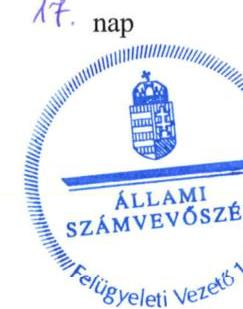

Dr. Németh Erzsébet felügyeleti vezető

---

.

---

# RÖVIDÍTÉSEK JEGYZÉKE 

${ }^{1}$ ÁSZ
${ }^{2}$ Önkormányzat
${ }^{3}$ intézkedési terv
${ }^{4}$ Bkr.
${ }^{5} \mathrm{KSH}$
${ }^{6}$ jelentés
${ }^{7}$ polgármester
${ }^{8}$ jegyző
${ }^{9}$ Képviselő-testület
${ }^{10}$ Polgármesteri hivatal
${ }^{11}$ ÁSZ tv.
${ }^{12}$ ÁSZ SZMSZ
${ }^{13}$ Pénzügyi és Gazdasági Bizottság
${ }^{14}$ szolgáltató
${ }^{15}$ Áhsz. 1
${ }^{16}$ Áhsz. 2
${ }^{17}$ Számv. tv.
${ }^{18}$ Áht.
${ }^{19}$ Ávr.
${ }^{20}$ Info tv.
${ }^{21}$ Gazdálkodási szabályzat

Állami Számvevőszék
Jánossomorja Város Önkormányzata
Jánossomorja Város Önkormányzatának polgármestere és a jegyzője által 2014. január 6-án aláírt intézkedési terve
370/2011. (XII.31.) Korm. rendelet a költségvetési szervek belső
kontrollrendszeréről és belső ellenőrzéséről (hatályos 2012.január 1-jétől)
Központi Statisztikai Hivatal
a 13161 számú Jelentés az önkormányzati vagyongazdálkodás szabályszerűségi ellenőrzéséről Jánossomorja (közzétéve 2013. december 5.)
Jánossomorja Város Önkormányzatának polgármestere
Jánossomorja Város Önkormányzatának jegyzője
Jánossomorja Város Önkormányzatának Képviselő-testülete
Jánossomorja Város Önkormányzatának Polgármesteri hivatala
2011. évi LXVI. törvény az Állami Számvevőszékről (hatályos 2011. július 1-jétől)
az Állami Számvevőszék Szervezeti és Működési Szabályzata
Jánossomorja Város Önkormányzata Képviselő-testületének Pénzügyi és
Gazdasági Bizottsága
„PANNON- VÍZ" Víz, Csatornamű és Fürdő Részvénytársaság (2010. december 31éig)
Aqua Szolgáltató Korlátolt Felelősségű Társaság (2011. január 1-jétől)
249/2000. (XII.24.) Korm. rendelet az államháztartás szervezetei beszámolási és könyvvezetési kötelezettségének sajátosságairól (hatálytalan 2014. január 1jétől)
4/2013. (I.11.) Korm. rendelet az államháztartás számviteléről (hatályos: 2014. január 1-jétől)
2000. évi C törvény a számvitelről (hatályos 2001. január 1-jétől)
2011. évi CXCV. törvény az államháztartásról (hatályos 2011. december 31-étől) 368/2011. (XII.31.) Korm. rendelet - az államháztartásról szóló törvény végrehajtásáról (hatályos 2012.január 1-jétől)
2011. évi CXII. törvény az információs önrendelkezési jogról és az információszabadságról (hatályos 2012. január 1-jétől)
Jánossomorja Város Önkormányzatának Gazdálkodási szabályzata (hatályos 2015. szeptember 30-áig)

---

# ÁLLAMI SZÁMVEVŐSZÉK 

1052 Budapest, Apáczai Csere János utca 10.
Levélcím: 1364 Budapest 4. Pf. 54
Telefon: +36 14849100 Telefax: +36 14849200
www.asz.hu
