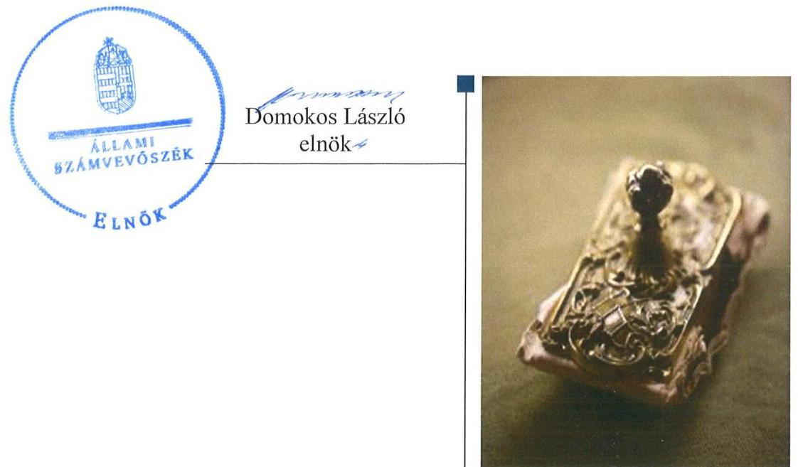
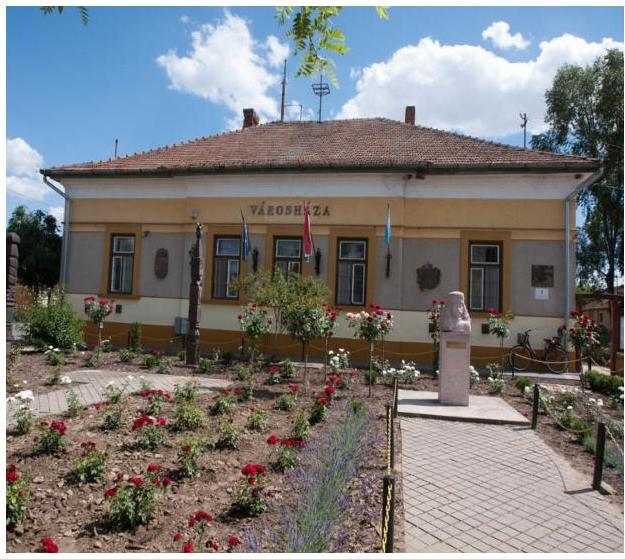
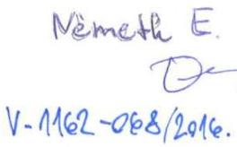
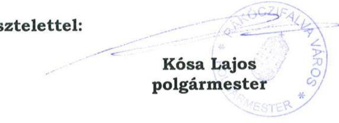
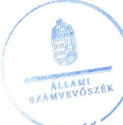

# Jelentés 

## Utóellenőrzések

Rákóczifalva Városi Önkormányzat vagyongazdálkodása
szabályszerúségének utóellenőrzése 2016.

---

# J elentés 

## Utóellenőrzések

Rákóczifalva Városi Önkormányzat vagyongazdálkodása
szabályszerúségének utóellenőrzése
2016. levember hó 06 nap

---

# AZ ELLENŐRZÉST FELÜGYELTE:

DR. NÉMETH ERZSÉBET felügyeleti vezető

## AZ ELLENŐRZÉST VEZETTE ÉS A VÉGREHAJTÁSÁÉRT FELELŐS:

DR. SIMON JÓZSEF ellenőrzésvezető

## A PROGRAM ÖSSZEÁLLÍTÁSÁÉRT FELELŐS:

JANIK JÓZSEF LÁSZLÓ osztályvezető

IKTATÓSZÁM: V-1162-071/2016.

TÉMASZÁM: 2196

ELLENŐRZÉS-AZONOSÍTÓ SZÁM: V075514

Jelentéseink az Országgyűlés számítógépes hálózatán és az Interneta a www.asz.hu címen is olvashatóak.

---

# TARTALOMJEGYZÉK 

■ ÖSSZEGZÉS ..... 5
■ AZ ELLENŐRZÉS CÉLJA ..... 6
■ AZ ELLENŐRZÉS TERÜLETE ..... 7
■ AZ ELLENŐRZÉS HÁTTERE, INDOKOLTSÁGA ..... 8
■ FÓKUSZKÉRDÉS ..... 9
■ ELLENŐRZÉS HATÓKÖRE ÉS MÓDSZEREI ..... 10
■ MEGÁLLAPÍTÁSOK ..... 13
■ MELLÉKLETEK ..... 17
I. sz. melléklet: Az ÁSZ 13074 számú jelentéséhez kapcsolódó intézkedési terv végrehajtása ..... 17
■ FÜGGELÉK: ÉSZREVÉTELEK ..... 21
■ RÖVIDÍTÉSEK JEGYZÉKE ..... 25

---

.

---

# ÖSSZEGZÉS 

Az utóellenőrzés megállapította, hogy az intézkedési tervben foglalt feladatokat Rákóczifalva Városi Önkormányzat nem hajtotta végre, így nem tett megfelelő lépéseket az ÁSZ által korábban feltárt, a vagyongazdálkodási területet érintő hiányosságok megszüntetésére. Mindez veszélyt jelent az Önkormányzat vagyongazdálkodásának szabályozására és müködtetésének szabályosságra.

## Az ellenőrzés társadalmi indokoltsága

Az ÁSZ ${ }^{1}$ stratégiájában célul tűzte ki a számvevőszéki munka hasznosulásának javítását. Ezzel összhangban utóellenőrzések keretében ellenőrzi, hogy az ellenőrzött szervezetek megvalósították-e a korábbi ellenőrzések által feltárt hibák, hiányosságok és szabálytalanságok megszüntetése céljából kialakított intézkedési terveikben foglaltakat. A rendszeres utóellenőrzések hozzájárulnak a szükséges intézkedések tényleges végrehajtáshoz, ezáltal a közpénzügyek rendezettségének javulásához és azok szabályszerű felhasználásához.

## Főbb megállapítások, következtetések

A polgármester ${ }^{2}$ az ÁSZ jelentésben ${ }^{3}$ foglalt intézkedést igénylő megállapításokhoz kapcsolódóan összeállított intézkedési tervet az előírt határidőn belül megküldte az ÁSZ-nak. Az Önkormányzat ${ }^{4}$ az intézkedési terv feladatainak végrehajtásáról a Bkr. ${ }^{5}$ által előírt nyilvántartást nem vezette.

Az intézkedési tervben meghatározott 6 feladat végrehajtása nem történt meg.
A nem végrehajtott feladatok esetében nem gondoskodtak az ingatlanvagyon-kataszter, a földhivatal illetve 2014. január 1-ét követően a megyei kormányhivatal ingatlan-nyilvántartásának egyezőségéről. Nem gondoskodtak továbbá teljes körűen a gazdálkodási jogkörökkel kapcsolatos tevékenységek szabályszerű ellátásáról, nem intézkedtek a vagyonkimutatás jogszabályoknak megfelelő elkészítése érdekében, nem történt meg a könyvviteli mérleg leltárral való alátámasztása. Ezen kívül elmaradt a közérdekú adatok teljes körú közzététele, valamint nem készítettek intézkedési tervet a belső ellenőrzés vagyongazdálkodásra vonatkozó javaslatai alapján.

Mivel az Önkormányzat az intézkedési tervben megfogalmazott feladatok közül egyet sem hajtott végre, a vagyongazdálkodás területén tapasztalt hiányosságok továbbra is fennállnak.

A nem végrehajtott feladatok kockázatot jelentenek az Önkormányzat jogszabályoknak megfelelő szabályozásában, múködésének szabályosságában, amelyek kezelése vezetői felelősség körébe tartozik.

---

# AZ ELLENŐRZÉS CÉLJA 

Az ellenőrzés célja annak értékelése, hogy az Önkormányzat vagyongazdálkodása szabályszerűségének ellenőrzéséről készült ÁSZ jelentésben foglalt intézkedést igénylő megállapításokkal és javaslatokkal összhangban készített intézkedési tervben meghatározott feladatokat az Önkormányzat végrehajtotta-e.

---

# **AZ ELLENŐRZÉS TERÜLETE**

## **Rákóczifalva Városi Önkormányzat**

Rákóczifalva Városi Önkormányzat Jász-Nagykun-Szolnok megyében a szolnoki járásban fekszik, állandó lakosainak száma a KSH által közzétett népességi adatok szerint 2015. január 1-én 5307 fő* volt. Az Önkormányzat, valamint Tiszavárkony Község Polgármesteri Hivatala 2013. január 1-jétől közös önkormányzati hivatalt hoztak létre.

Az utóellenőrzés időszaka alatt a polgármester személye 2014 októberében változott, a jegyző6 feladatait 2016. június 1-jétől az aljegyző látta el.

Az ellenőrzött időszakban az önkormányzati feladatok ellátásában négy költségvetési szerv vett részt, gazdasági társaságot az Önkormányzat nem működtetett. Az Önkormányzat tagja volt a Szolnoki Kistérség Többcélú Társulásnak, melyet a települések egyes szociális, egészségügyi feladatok ellátására, közszolgáltatások biztosítására, intézmények fenntartására, illetve a településfejlesztés összehangolására hoztak létre.

Az Önkormányzat vagyona 2013-ban 2493,6 M Ft, a 2015. évben 2152,5 M Ft volt7. A negatív vagyonváltozást jellemzően a tárgyi eszközök értékének 5%-os (1385,6 M Ft-ról 1317,8 M Ft-ra történő) csökkenése valamint a befektetett pénzügyi eszközök állományának (662,0 M Ft értékben történt) megszűnése okozta.

A Képviselő-testület7 a 2013. évi zárszámadási rendeletben 550,0 M Ft bevételt és 524,2 M Ft kiadást, a 2014. évben 781,7 M Ft bevételt és 751,0 M Ft kiadást, a 2015. évben pedig 600,0 M Ft bevételt és 529,1 M Ft kiadást hagyott jóvá. A bevétel 2015-ben nagyságrendileg 9%-kal, a kiadás pedig közel 1%-kal haladta meg a 2013. évi összeget.

Az utóellenőrzés8 az ÁSZ jelentésben a jegyző részére megfogalmazott intézkedést igénylő megállapításokra és javaslatokra készített – az ÁSZ elnöke által elfogadott – intézkedési tervben foglalt feladatok végrehajtásának ellenőrzésére, illetve értékelésére terjedt ki. Az ÁSZ jelentés a jegyzőnek 6 javaslatot fogalmazott meg.

* Forrás: Központi Statisztikai Hivatal, Magyarország Közigazgatási Helységnévkönyve, Rákóczifalva Város 2015. január 1-jei adatai

7 Forrás: Zárszámadási rendeletek, Rákóczifalva Városi Önkormányzat

---

# AZ ELLENŐRZÉS HÁTTERE, INDOKOLTSÁGA 

AZ ÁSZ TÖRVÉNY 33. § (1) bekezdése értelmében a számvevőszéki jelentések intézkedést igénylő megállapításaihoz és javaslataihoz kapcsolódóan az ellenőrzött szervezet vezetője intézkedési tervet köteles összeállítani, és az Állami Számvevőszék részére megküldeni. Az intézkedési tervben foglaltak megvalósítását - az ÁSZ tv. 33. § (7) bekezdésében foglaltak alapján - az Állami Számvevőszék utóellenőrzés keretében ellenőrizheti. Az intézkedések megvalósulásának értékelése során az Állami Számvevőszék figyelembe veszi az ellenőrzött szervezetek működési feltételeiben, valamint a jogszabályi előírásokban bekövetkezett változásokat.

AZ INTÉZKEDÉSI TERVEK-ben foglalt feladatok hiányos, illetve késedelmes végrehajtása, valamint megvalósításának elmaradása azt mutatja, hogy az ellenőrzések során feltárt hibák, hiányosságok és szabálytalanságok megszüntetése nem kapott kellő hangsúlyt. Ez a szabályszerű működés és a felelős vezetői magatartás vonatkozásában kockázatot hordoz. E kockázatok feltárásával az Állami Számvevőszék utóellenőrzési rendszere fokozza a fegyelmet, és igazolja, hogy a közpénzzel való szabályos gazdálkodás felelőssége elől nem lehet kitérni.

## AZ UTÓELLENŐRZÉS NÉGY SZINTEN HASZNOSULHAT:

- A társadalom szintjén az utóellenőrzés jelzi, hogy a számvevőszéki ellenőrzés megállapításainak van következménye: a hiányosságok megszüntetésére az ellenőrzött szervezet által meghatározott intézkedések végrehajtását is számon kéri az ÁSZ.
- Az ellenőrzött terület szintjén az utóellenőrzés tájékoztatást nyújt a terület döntéshozóinak a hiányosságok kiküszöbölésének jó gyakorlatairól, ezzel lehetőséget biztosítva arra, hogy az ÁSZ ellenőrzési megállapításai, javaslatai a terület nem ellenőrzött szervezeteinek a működése során is hasznosuljanak.
- Az ellenőrzött szervezet szintjén az utóellenőrzés feltárja, hogy a szervezet az intézkedések végrehajtásával hasznosította-e a korábbi ellenőrzési jelentésben a hiányosságok megszüntetése, illetve a kockázatok kezelése érdekében megfogalmazott javaslatokat.
- Az ÁSZ szintjén az utóellenőrzés visszacsatolást ad az ellenőrzési jelentések hasznosulásáról, az intézkedések elmaradása vagy részleges megvalósulása a további ellenőrzésekhez kockázati jelzésként szolgál.

---

# FÓKUSZKÉRDÉS 

1. Az ellenőrzött szervezet az intézkedési tervben foglaltakat az elöírt határidőben végrehajtotta-e?

---

# ELLENŐRZÉS HATÓKÖRE ÉS MÓDSZEREI 

## Az ellenőrzés típusa

Megfelelőségi ellenőrzés

## Az ellenőrzött időszak

Az utóellenőrzés alapját képező számvevőszéki jelentés közzétételének napjától (2013. október 1.) az ellenőrzésről szóló kiértesítő levél keltének napjáig (2016. június 13.) tartó időszak.

## Az ellenőrzés tárgya

Az ÁSZ tv. 2011. július 1-jei hatálybalépését követően a számvevőszéki jelentésben foglalt intézkedést igénylő megállapításokkal és javaslatokkal összhangban - az ellenőrzött szervezet által - készített intézkedési tervben foglaltak végrehajtásának ellenőrzése.

Az ellenőrzés kiterjed minden olyan körülményre és adatra, amely az ÁSZ jogszabályban meghatározott feladatainak teljesítéséhez, valamint a program végrehajtása folyamán felmerült újabb összefüggések feltárásához szükséges.

## Az ellenőrzött szervezet

Rákóczifalva Városi Önkormányzat

## Az ellenőrzés jogalapja

Az ÁSZ az Országgyűlés pénzügyi és gazdasági ellenőrző szerve. Az ÁSZ törvényben meghatározott feladatkörében ellenőrzi a központi költségvetés végrehajtását, az államháztartás gazdálkodását, az államháztartásból származó források felhasználását és a nemzeti vagyon kezelését. Az ÁSZ tv. 1. § (3) bekezdése szerint az ÁSZ általános hatáskörrel végzi a közpénzekkel és az állami és önkormányzati vagyonnal való felelős gazdálkodás ellenőrzését. A 33. § (7) bekezdése alapján az ÁSZ tv. 33. § (1)-(2) bekezdése szerinti intézkedési tervben foglaltak megvalósítását az ÁSZ utóellenőrzés keretében ellenőrizheti.

---

# Az ellenőrzés módszerei 

Az ellenőrzést a nemzetközi standardokat irányadónak tekintve az ellenőrzési program ellenőrzési kérdései, az ellenőrzött időszakban hatályos jogszabályok, az ellenőrzés szakmai szabályok és módszertanok figyelembevételével, önálló ellenőrzés keretében végezzük.

Az ellenőrzés ideje alatt az ellenőrzött szervezettel történő kapcsolattartást az ÁSZ SZMSZ ${ }^{\circledR}$-ének vonatkozó előírásai alapján biztosítottuk.

Az utóellenőrzés megállapításait elsősorban az ÁSZ rendelkezésére álló, valamint az ellenőrzött szervezetektől elektronikusan bekért dokumentumok alapozzák meg, amely szükség esetén helyszíni ellenőrzéssel egészülhet ki. Az ÁSZ az ellenőrzés keretében egyes esetekben teljesítményellenőrzés tervezéséhez is kérhet adatokat.

Az ellenőrzési bizonyítékként felhasználható adatforrások közé tartoznak egyrészt a szakmai programban felsorolt adatforrások, másrészt minden - az ellenőrzés folyamán feltárt, az ellenőrzés szempontjából információt tartalmazó - dokumentum.

Az intézkedési tervekben előírt feladatokat azok végrehajthatósága, illetve végrehajtása szempontjából az alábbiak szerint kell értékelni:
"határidőben végrehajtott" a feladat, ha a teljesítés dokumentáltan, az intézkedési tervben előírt határidőben és tartalommal megtörtént;
"határidőn túl végrehajtott" a feladat, ha annak teljesítése az intézkedési tervben meghatározott módon, de az előírt határidőn túl történt meg;
"részben végrehajtott" a feladat, ha végrehajtása teljes körűen az intézkedési tervben előírt módon nem történt meg;
"nem végrehajtott" ha a végrehajtás nem történt meg, vagy amenynyiben a teljesítést nem dokumentálták;
"okafogyottá vált" a feladat, ha végrehajtására - meghatározott esemény bekövetkezése, továbbá külső körülmény, a működést érintő feltétel változása miatt - már nincs szükség, illetve lehetőség, és egyértelműen megállapítható, hogy az intézkedést szükségessé tevő körülmény a jövőben nem fordulhat elő;
"nem időszerű" az a feladat, amelynek ellenőrzési időszakon belüli végrehajtására azért nem került (kerülhetett) sor, mert az intézkedés alapjául szolgáló esemény nem következett be, de annak jövőbeni előfordulása lehetséges, a végrehajtása nem volt esedékes, vagy a végrehajtás határideje még nem járt le.
Az utóellenőrzésre az Önkormányzat elektronikus adatszolgáltatása alapján került sor, helyszíni ellenőrzést nem végeztünk. Az Önkormányzat által szolgáltatott adatok és dokumentumok valódiságát és teljes körűségét a polgármester által kiállított teljességi és hitelességi nyilatkozat igazolta.

A gazdálkodási jogkörök gyakorlására vonatkozó intézkedés megvalósítását mintavételes ellenőrzéssel értékeltük. Az utóellenőrzés jellege miatt a mintatételek ellenőrzésével nem az adott terület szabályszerűségéről

---

mondtunk véleményt, hanem arról, hogy a múködési hiányosságok felszámolására az intézkedési tervben rögzítetteket végrehajtották-e az ellenőrzött mintatételek esetében.

---

# MEGÁLLAPÍTÁSOK 

## 1. Az ellenőrzött szervezet az intézkedési tervben foglaltakat az elöírt határidőben végrehajtotta-e?

Összegző megállapítás

Az Önkormányzat az intézkedési tervben foglalt feladatokat nem hajtotta végre. Az intézkedési terv végrehajtásáról nem vezették a kötelező nyilvántartást.

### 1.1. számú megállapítás

Az intézkedési tervben szereplő 6 feladat közül egyet sem hajtott végre az Önkormányzat.

Az ÁSZ jelentés a jegyző részére hat javaslatot fogalmazott meg. A javaslatok alapján a polgármester az ÁSZ részére megküldött intézkedési tervében hat feladat teljesítését vállalta. A polgármester az intézkedési tervet határidőben megküldte. A polgármester által az ÁSZ rendelkezésére bocsátott 1. számú tanúsítványban ugyanakkor úgy nyilatkozott, hogy az Önkormányzat nem hajtotta végre a vállalt feladatokat.

Az ellenőrzés megállapította, hogy az intézkedési tervben szereplő hat feladat közül egyet sem hajtott végre az Önkormányzat.

Az ÁSZ által elfogadott intézkedési tervben foglalt feladatok végrehajtásának értékelését a következő ábra foglalja össze:

1. ábra

## Az intézkedések végrehajtásának megoszlása

Nem végrehajtott 6 -Dol 6 feladat

## NEM VÉGREHAJTOTT FELADATOK:

1. A jegyző 2013. december 31-ig nem biztosította az ingatlanva-gyon-kataszter és a földhivatal ingatlan-nyilvántartás adatai közötti egyezőséget, megsértve ezzel a 147/1992. (XI.6.) Korm. rendelet 1. § (2) bekezdése rendelkezéseit. Az egyezőség biztosítása -

---

a 147/1992. (XI.6.) Korm. rendelet 1. § (2) bekezdésében és az Áhsz. ${ }^{10}$ 30. § (4) bekezdésében foglaltak ellenére - 2014. január 1-ét követően sem történt meg. Az Önkormányzat mindössze a Takaros ${ }^{11}$ 1.3. nyilvántartó programból kinyomtatott „Földkönyv Földrészletek" kivonatát, az egyes évekre vonatkozó vagyonkataszteri lapokat és az egyeztetésről szóló feljegyzést csatolta. A feljegyzések azonban nem támasztják alá a feladat végrehajtását, továbbá nem tartalmazzák az egyeztetés elvégzését tanúsító információkat.
2. A mintatételek ellenőrzése alapján megállapítható, hogy - a kiadások teljesítése során - a pénzügyi ellenjegyző, a teljesítés igazoló, az érvényesítő és az utalványozó az ellenőrzött időszakban nem végezték el az Áht. ${ }^{12}$ 37. § (1) bekezdésében, valamint az Ávr. ${ }^{13}$ 55. § (1), 57. § (1), 58. § (1) és 59. § (2) bekezdéseiben meghatározott feladataikat. Jellemzően hiányzott a kiadások teljesítésével kapcsolatos dokumentumokon az adott gazdálkodási jogkör gyakorlójának aláírása. Az Önkormányzat Gazdálkodási Szabályzatának ${ }^{14}$ felülvizsgálata 2014. április 30-ig nem történt meg. A jegyző nem intézkedett a Gazdálkodási Szabályzatban; illetve a Gazdálkodási Szabályzat a kötelezettségvállalás, utalványozás, ellenjegyzés, érvényesítés rendjére vonatkozó szabályzatában ${ }^{15}$ foglaltak ellenére arról, hogy a gazdálkodási jogkörök gyakorlására jogosult személyek írásban kijelölésre kerüljenek, megsértve ezzel az Ávr. 55. § (2) bekezdés, 57. § (4) bekezdés, 58. § (4) bekezdés, 59. § (1) bekezdés rendelkezéseit. Az Önkormányzat az Ávr. 60. § (3) bekezdésében meghatározott gazdálkodási jogkörgyakorlók aláírás mintájáról naprakész nyilvántartást nem vezetett. A jegyzői utasítás ${ }^{16}$ ellenére a jegyző és az aljegyző dokumentált módon nem ellenőrizte havonta a gazdálkodási jogkörök gyakorlásának teljesülését.
3. A jegyző az Mötv. ${ }^{17}$ 110. § (2) bekezdésében foglalt előírások ellenére nem intézkedett az éves zárszámadáshoz csatolt vagyonkimutatás 2013. december 31-ig az Áhsz. ${ }^{18}$ 44/A. § (2) bekezdése illetve 2014. január 1-ét követően az Áhsz. ${ }_{2}$ 30. § (1)-(3) bekezdései szerinti elkészítése érdekében. A 2013. és 2015. évi zárszámadási rendeletekhez csatolt önkormányzati vagyon forgalomképtelen, korlátozottan forgalomképes és üzleti (forgalomképes) vagyonkimutatása nem felelt meg 2013-ban az Áhsz. ${ }_{1}$ 44/A. § (2) bekezdésében, 2015-ben pedig az Áhsz. ${ }_{2}$ 30. § (2) bekezdés előírásainak, mivel nem az előírt mérleg szerinti tagolásban és egységes rendben tartalmazta az Önkormányzat vagyonát. Az Önkormányzat a 2014. évi zárszámadási rendelethez az ingatlanvagyonra vonatkozó 6. számú mellékletet nem csatolta. A vagyonkimutatás könyvvizsgáló által történő véleményezése érdekében a jegyző 2014. április 30 -ig nem tett intézkedéseket.
4. A jegyző nem intézkedett az ellenőrzött időszakban arról, hogy a könyvviteli mérleg leltárral legyen alátámasztva, megsértve ezzel a Számv. tv. ${ }^{19}$ 46. § (3) bekezdése, 69. § (1) bekezdése, az Áhsz. ${ }_{1}$ 37. § (1)-(2) bekezdései, valamint az Áhsz. ${ }_{2}$ 22. § (1)-(2) bekezdései rendelkezéseit. A leltárak szabályszerű elkészítését a belső ellenőrzés 2014. december 31-ig nem ellenőrizte.

---

5. A jegyző - az Info tv. ${ }^{20}$ 37. § (1) bekezdésben valamint az 1. melléklet III/4. pontjában foglaltak ellenére - nem intézkedett arról, hogy a nettó 5 M Ft-ot elérő vagy azt meghaladó szerződések adatait teljes körűen nyilvánosságra hozzák. Továbbá nem gondoskodott az Info tv. 1. számú mellékletében felsorolt adatok - az Info tv. 33. § (3) bekezdésében meghatározott honlapon való - közzététele érdekében. A jegyző továbbá nem gondoskodott a közérdekú adatok megismerhetőségére vonatkozóan az Info tv. 1. számú melléklete által kötelezően előírt archívum vezetéséről.
6. A jegyző nem készített a Bkr. 28. § c) pontjában és a 45. § (1)-(3) bekezdéseiben előírtaknak megfelelő, a belső ellenőrzés vagyongazdálkodásra vonatkozó javaslatai alapján - a végrehajtásért felelősöket és a végrehajtás határidejét feltüntető - intézkedési tervet.

---

.

---

# MELLÉKLETEK

- I. SZ. MELLÉKLET: AZ ÁSZ 13074 SZÁMÚ JELENTÉSÉHEZ KAPCSOLÓDÓ INTÉZKEDÉSI TERV VÉGREHAJTÁSA

|  Intézkedési terv alapján elvégzendő feladat | Az intézkedési tervben meghatározott határidő 2. | Az intézkedési tervben rögzített feladatok elvégzésnek felelőse 3. | A feladat végrehajtása  |
| --- | --- | --- | --- |
|  1. | Végre nem hajtott feladat |  |   |
|  1. Az ingatlanvagyon kataszter és a földhivatali nyilvántartás azonos tartalmú adatai közötti egyezőség megteremtése érdekében: El kell végezni az önkormányzatok tulajdonában lévő ingatlanvagyon nyilvántartási és adatszolgáltatási rendjéről szóló 147/1992. (XI. 6.) Korm. rendelet 1. § (2) bekezdésének megfelelően az ingatlanvagyon kataszter adatainak és a földhivatal ingatlan-nyilvántartás azonos tartalmú adatainak az egyeztetését, hogy a földhivatali nyilvántartás adatai és az önkormányzati nyilvántartás közötti egyezőség biztosított legyen. | 2013. december 31. | jegyző | A jegyző 2013. december 31-ig nem biztosította az ingatlanvagyon-kataszter és a földhivatal ingatlan-nyilvántartás adatai közötti egyezőséget, megsértve ezzel a 147/1992. (XI.6.) Korm. rendelet 1. § (2) bekezdése rendelkezéseit. Az egyezőség biztosítása - a 147/1992. (XI.6.) Korm. rendelet 1. § (2) bekezdésében és az Áhsz. 30. § (4) bekezdésében foglaltak ellenére - 2014. január 1-ét követően sem történt meg. Az Önkormányzat mindössze a Takaros 1.3. nyilvántartó programból kinyomtatott „Földkönyv Földrészletek" kivonatát, az egyes évekre vonatkozó vagyonkataszteri lapokat és az egyeztetésről szóló feljegyzést csatolta. Az egyes évek egyeztetési feladatairól készített feljegyzések azonban nem támasztják alá a feladat elvégzését, továbbá nem tartalmazzák az egyeztetés elvégzését tanúsító információkat.  |
|  2. A pénzügyi ellenjegyző, a szakmai teljesítésigazolására kijelölt személy, az érvényesítő és az utalványozó, jogszabályokban előírt ellenőrzési feladatainak elvégzése érdekében: A kiadási kötelezettségek teljesítése alkalmával a kötelezettségvállalás ellenjegyzése megvalósításához a pénzügyi ellenjegyző, a teljesítés igazolására kijelölt személy, az érvényesítő és az utalványozó végezze el az államháztartásról szóló 2011. évi CXCV. törvényben és az államháztartásról szóló törvény végrehajtásáról szóló 368/2011. (XII. 31.) Kormányrendeletben előírtak szerint az ellenőrzési feladatait. Felül kell vizsgálni az önkormányzat kötelezettségvállalás, utalványozás, ellenjegyzés, érvényesítés rendjére vonatkozó szabályzatát. A jegyző és az aljegyző havonta ellenőrzi az ellenjegyzés, a szakmai teljesítésigazolás, az érvényesítés és az utalványozás meglétét. | 2014. április 30. | jegyző | A gazdálkodási jogkörök gyakorlásának szabályszerűségét 10 elemű minta ellenőrzésével értékeltük és megállapítottuk, hogy - a kiadások teljesítése során - a pénzügyi ellenjegyző, a teljesítés igazoló, az érvényesítő és az utalványozó az ellenőrzött időszakban nem végezték el az Áht. 37. § (1), az Ávr. 55. § (1), az 57. § (1), az 58. § (1) és az Ávr. 59. § (2) bekezdéseiben meghatározott feladataikat.
A jegyző nem intézkedett a Gazdálkodási Szabályzatban ${ }_{1}$ illetve a Gazdálkodási Szabályzat a kötelezettségvállalás, utalványozás, ellenjegyzés, érvényesítés rendjére vonatkozó szabályzatában ${ }_{2}$ foglaltak ellenére arról, hogy a gazdálkodási jogkörök gyakorlására jogosult személyek írásban történő kijelöléséről, megsértve ezzel az Ávr. 55. § (2) bekezdés f) pont, 57. § (4) bekezdés, 58. § (4) bekezdés, 59. § (1) bekezdés rendelkezéseit. Az Önkormányzat - a beküldött nyilatkozat alapján - az Ávr. 60. § (3) bekezdésében meghatározott gazdálkodási jogkörgyakorlók aláírás mintájáról az ellenőrzött időszakban nem vezetett naprakész nyilvántartást. Ezáltal a gazdálkodási jogkörök gyakorlása során nem volt beazonosítható, hogy a megfelelő személy végezte-e el a pénzügyi ellenjegyzést, a teljesítés igazolást, az érvényesítést és az utalványozást.
A pénzügyi ellenjegyzés az ellenőrzött mintatételek 90\%-ánál - az Áht. 37. § (1) bekezdésében foglaltak ellenére - elmaradt.  |

---

|  3. | Az önkormányzat által készített vagyonkimutatás jogszabályban előírt tartalmi követelményének való megfelelése érdekében: A vagyonkimutatásokat oly módon el kell készíteni, hogy azok megfeleljenek az államháztartás szervezetei beszámolási és könyvvezetési kötelezettségének sajátosságairól szóló 249/2000. (XII. 24.) Korm. rendelet 44/A. § (2) bekezdésében előírt tartalmi követelményeknek. A vagyonkimutatást - a képviselő-testületi jóváhagyást megelőzően - független könyvvizsgáló véleményezze, hogy az megfelel-e a jogszabályi követelményeknek. | 2014. április 30. | Jegyző  |
| --- | --- | --- | --- |
|  |   |   |   |

A feladat végrehajtása

A teljesítés igazolása 10-ből 8 esetben nem az intézkedési tervben rögzített Ávr. 57. § (1) bekezdésében foglaltak szerint történt, mert a teljesítést igazolók kötelezettségvállalási, valamint átvételt igazoló dokumentumok hiányában nem tudták ellenőrizni és igazolni a kiadások teljesítésének jogosságát, összegszerűségét és az ellenszolgáltatás teljesítését. Az érvényesítés nem az Ávr. 58. § (1) bekezdésében foglaltak szerint történt, mert az ellenőrzött mintatételek esetében a kifizetés annak ellenére érvényesítésre került, hogy a megelőző ügymenetben a jogszabályokban és a belső szabályzatban foglaltakat nem tartották be. Az utalványozás az ellenőrzött mintatételek $90 \%$-ánál nem az intézkedési tervben rögzített Ávr. 59. § (2) bekezdésében foglaltak szerint történt, mert nem volt beazonosítható az utalványozás ténye vagy az utalványozó személye. A Gazdálkodási Szabályzat; felülvizsgálata 2014. április 30-ig nem történt meg. A szabályzat módosított változata határidőn túl, 2016. március 1-jétől lépett hatályba. A jegyző 2014. március 12-én utasítást adott ki az ellenjegyzés, kötelezettségvállalás, érvényesítés és utalványozás ellenőrzésének rendjéről. A jegyző és az aljegyző azonban dokumentált módon nem ellenőrizte havonta a gazdálkodási jogkörök gyakorlásának jogszerűségét, az utasításba foglalt feladatok teljesítése nem történt meg. A jegyző az Mötv. 110. § (2) bekezdésében foglalt előírások ellenére nem intézkedett az éves zárszámadáshoz csatolt vagyonkimutatás 2013. december 31-ig az Áhsz.; 44/A. § (2) bekezdése illetve 2014. január 1-ét követően az Áhsz.; 30. § (1)-(3) bekezdései szerinti elkészítése érdekében. A 2013. és 2015. évi zárszámadási rendeletekhez csatolt önkormányzati vagyon forgalomképtelen, korlátozottan forgalomképes és üzleti (forgalomképes) vagyonkimutatása nem felelt meg 2013-ban az Áhsz.; 44/A. § (2) bekezdésében, 2015-ben pedig az Áhsz.; 30. § (2) bekezdés előírásainak, mivel nem az előírt mérleg szerinti tagolásban és egységes rendben tartalmazta az Önkormányzat vagyonát. Az Önkormányzat a 2014. évi zárszámadási rendelethez az ingatlanvagyonra vonatkozó 6. számú mellékletet nem csatolta. Az Önkormányzat a 147/2013. (X. 24.) számú határozatával jóváhagyta az Önkormányzat vagyonkimutatásának független könyvvizsgáló általi véleményezését. A vagyonkimutatás könyvvizsgáló által történő véleményezése érdekében azonban 2014. április 30-ig a jegyző nem tett intézkedéseket, könyvvizsgáló megbízására nem került sor.

---

|  4 | A tárgyi eszköz leltárak értékadatainak, a könyvviteli mérlegben kimutatott eszközök értékének valódiságát szabályos leltárral történő alátámasztása érdekében: A számvitelről szóló 2000. évi C törvény 69. § (1)-(2) bekezdése, és az államháztartás szervezetei beszámolási és könyvvezetési kötelezettségének sajátosságairól szóló 249/2000. (XII. 24.) Korm. rendelet 37. § (2) bekezdése majd az államháztartás számviteléről szóló 4/2013. (I. 11.) Korm. rendelet 22. § (1) bekezdésében előírtaknak megfelelő leltárt kell elkészíteni. A leltárakban fel kell tüntetni tételesen a tárgyi eszközöket mennyiségben és értékben, forrásait értékben. A kiértékeléseket el kell végezni. A könyvviteli mérlegben kimutatott eszközök valódiságát leltárral alá kell támasztani. A leltárak szabályosságának ellenőrzését 2014. évben a belső ellenőrzés végezze el. | 2014. január 31. 2014. december 31. | jegyző | A jegyző nem intézkedett arról, hogy a könyvviteli mérleg leltárral legyen alátámasztva, megsértve ezzel a Számv. tv. 46. § (3) bekezdése, 69. § (1) bekezdése, az Áhsz.; 37. § (1)-(2) bekezdése, valamint az Áhsz.; 22. § (1)-(2) bekezdéseinek rendelkezéseit. Az ellenőrzött időszakban nem történt leltározási tevékenység az Önkormányzatnál. Mindezt az Önkormányzat az 1. számú tanúsítványban illetve külön nyilatkozatban is megerősítette. A leltárak szabályszerű elkészítését a belső ellenőrzés 2014. december 31-ig nem ellenőrizte. A jegyző nem gondoskodott a leltárak szabályszerű elkészítésének belső ellenőrzés általi ellenőrzéséről.  |
| --- | --- | --- | --- |
|  5. | A nettó 5 millió Ft-ot elérő vagy az azt meghaladó értékű szerződések közzététele érdekében: Az önkormányzat www.rakoczifalva.hu honlapján közzé kell tenni 2007-2010. években a nettó 5 millió Ft-ot elérő vagy az azt meghaladó értékű vagyonnal való gazdálkodással összefüggő szerződések megnevezését, tárgyát, a szerződést kötő felek nevét és a szerződés értékét. Intézkedni kell, hogy az információs önrendelkezési jogról és az információs szabadságról szóló 2011. évi CXII. törvény 1. számú mellékletében meghatározott adatok közzétételre kerüljenek. | 2013. december 31. | jegyző | A jegyző – az Info tv. 37. § (1) bekezdésében valamint az 1. melléklet III/4. pontjában foglaltak ellenére – nem intézkedett arról, hogy a nettó 5 M Ft-ot elérő vagy azt meghaladó szerződések adatai teljes körűen nyilvánosságra hozzák. A 2014-2016. évi kötelezettségvállalás nyilvántartások szerint 12 db 5 M Ft feletti végleges kötelezettségvállalási értékű szerződés esetében elmaradt a közzététel az Önkormányzat honlapján. A jegyző nem tett intézkedéseket az Info tv. 1. számú mellékletében felsorolt adatok – az Info tv. 33. § (3) bekezdésében meghatározott honlapon való – közzététele érdekében. Az I. Szervezeti, személyzeti adatok, a II. Tevékenységre, működésre vonatkozó adatok és a III. Gazdálkodási adatok közzététele jellemzően nem történt meg. A Szervezeti, személyzeti adatok közül a közfeladatot ellátó szerv által alapított költségvetési szerv adatainak, a Tevékenységre, működésre vonatkozó adatok közül a testületi ülések, a pályázatok és a közérdekű adatok megismerésére vonatkozó információinak megjelentetése szintén elmaradt. A Gazdálkodási adatok között a Jegyző nem intézkedett a nyújtott támogatásokkal, a közbeszerzésekkel és az uniós fejlesztések szerződéseivel kapcsolatos adatok feltöltéséről valamint az éves zárszámadások megjelentetéséről. A jegyző nem gondoskodott a közérdekű adatok megismerhetőségére vonatkozóan az Info tv. 1. számú melléklete által kötelezően előírt, archívum vezetéséről.  |

---

|  5. | Intézkedési terv alapján elvégzendő feladat | Az intézkedési tervben meghatározott határidő | Az intézkedési tervben rögzített feladatok elvégzésnek felelőse | A feladat végrehajtása  |
| --- | --- | --- | --- | --- |
|   | 1. | 2. | 3. | 4.  |
|  6. | Intézkedési tervek készítése érdekében a belső ellenőrzés által a vagyongazdálkodás területén feltárt (szabályozási, nyilvántartási) hiányosságok megszüntetésére, továbbá az intézkedési tervekben foglaltak végrehajtásához: El kell készíteni a költségvetési szervek belső kontroll-rendszeréről és belső ellenőrzéséről szóló 370/2011.(XII.31.) Korm. rendelet 28. § c) pontjában előírtaknak megfelelően a belső ellenőrzés megállapításai és javaslatai alapján a végrehajtásért felelősöket és a végrehajtás határidejét feltüntető intézkedési tervet. Az intézkedési tervben foglaltakat végre kell hajtani. Az intézkedési tervben foglalt feladatok végrehajtásához szükséges pénzügyi fedezetet a 2013. évi és a 2014. évi önkormányzati költségvetésben biztosítani kell. | 2013. december 31. | jegyző | A jegyző – a beküldött 1. számú tanúsítvány és külön nyilatkozat alapján – nem készített a 8kr. 28. § c) pontjában és a 45. § (1)–(3) bekezdéseiben előírtaknak megfelelő, a belső ellenőrzés vagyongazdálkodásra vonatkozó javaslatai alapján – a végrehajtásért felelősöket és a végrehajtás határidejét feltüntető – intézkedési tervet.  |

---

# FÜGGELÉK: ÉSZREVÉTELEK 

A jelentéstervezetet a Számvevőszék 15 napos észrevételezésre megküldte az ellenőrzött szervezet vezetőjének az ÁSZ tv. 29. § ${ }^{\text {I }}$ (1) bekezdése előírásának megfelelően.

A polgármester, mint az ellenőrzött szervezet vezetője az ÁSZ tv. 29. § (2) bekezdésében foglalt észrevételezési jogával élt, az ellenőrzés megállapításaira észrevételt tett.
Az elfogadott észrevételek alapján az ÁSZ módosította a jelentést.

[^0]
[^0]:    ${ }^{1}$ 29. § (1) Az Állami Számvevőszék az ellenőrzési megállapításait megküldi az ellenőrzött szervezet vezetőjének vagy az általa megbízott személynek, és annak, akinek személyes felelősségét állapította meg.
    (2) Az ellenőrzött szervezet vezetője és a felelősként megjelölt személy az ellenőrzés megállapításaira tizenöt napon belül írásban észrevételt tehet.
    (3) Az Állami Számvevőszék az észrevételre a beérkezésétől számított harminc napon belül írásban válaszol. A figyelembe nem vett észrevételeket köteles a jelentésben feltüntetni, és megindokolni, hogy azokat miért nem fogadta el.

---

# 1h 27 

RÁKÓCZIFALVA VÁROS ÖNKORMÁNYZATA

Ikt.szám: 1494- 26 /2016. ügyintéző: dr. Molnár György
tárgy: észrevétel az ellenőrzés megállapításaira
ügyiratszám: V-1162-066/2016.

Állami Számvevőszék
Domokos László elnök
részére

Budapest 4.
Pf. 54
1364

## Tisztelt Elnök Úr!

Rákóczifalva Városi Önkormányzat vagyongazdálkodása szabályszerűségének utóellenőrzésével kapcsolatban az észrevételt tesz:

Kérem, hogy amennyiben lehetséges a jelentéstervezet 7. oldalán a második mondatot szíveskedjenek javítani az alábbira:
Az Önkormányzat és Tiszavárkony Község Önkormányzata 2013. január 1jétől közös önkormányzati hivatalt hoztak létre.

Az ellenőrzött időszak (2013-2016) alatt más személy töltötte be a polgármesteri és a jegyzői pozíciót és ez nem derül ki a jelentésből, kérem, hogy ez is kerüljön pontosításra, tekintettel arra, hogy az új polgármesterre és az új jegyzőre ez kedvezőtlenül hat.

Együttműködését köszönöm.

Rákóczifalva, 2016. október 27.
Tisztelettel:

5085 Rákóczifalva, Szabadság tér 2.
telefon: (56) 889-700 fax: (56) 441-542 e-mail: titkarsag@rakoczifalva.hu
Grafi@fugaskus: Herfő 889-1699; Kedd szünetel: Szerda 739-1639; Csütőriök szünetel: Péntek 899-1299

---

ELNÖK

Ikt.szám: V-1162-069/2016.

# Kósa Lajos 

polgármester
Rákóczifalva Városi Önkormányzat

## Rákóczifalva

## Tisztelt Polgármester Úr!

„Rákóczifalva Városi Önkormányzat vagyongazdálkodása szabályszerüségének utóellenörzése" címủ jelentéstervezetre tett észrevételeit köszönettel megkaptam.

Az ellenőrzési megállapításokra vonatkozó észrevételét az Állami Számvevőszékről szóló 2011. évi LXVI. törvény 29. § (2) bekezdésében meghatározott tizenöt napos határidőn belül küldte meg. Az Állami Számvevőszék észrevétellel kapcsolatos álláspontját a mellékletként csatolt, a felügyeleti vezető által készített indokolás tartalmazza.

Budapest, 2016. mcuemlet hó 17 nap

Tisztelettel:

Domokos László

Melléklet: Észrevételre adott válasz

---

„Rákóczifalva Városi Önkormányzat vagyongazdálkodása szabályszerüségének utóellenörzése" címủ jelentéstervezetre tett észrevételre adott válasz

| Észrevétel: | „Kérem, hogy amennyiben lehetséges a jelentéstervezet 7. oldalán a második mon-   datot szíveskedjenek javítani az alábbira: Az Önkormányzat és Tiszavárkony Község   Önkormányzata 2013. január 1-jétől közös önkormányzati hivatalt hoztak létre." |
| :-- | :-- |
| Válasz: | Az Állami Számvevőszék az észrevételt elfogadja. |
| Indokolás: | Indokolt, hogy a jelentésben a közös hivatal létrehozásának dátumát helyesen szere-   peltesse az ÁSZ. |
| Észrevétel: | „Az ellenőrzött időszak (2013-2016) alatt más személy töltötte be a polgármesteri   és a jegyzői pozíciót és ez nem derül ki a jelentésből, kérem, hogy ez is kerüljön   pontosításra, tekintettel arra, hogy az új polgármesterre és az új jegyzőre ez kedve-   zötlenül hat." |
| Válasz: | Az Állami Számvevőszék az észrevételt elfogadja. |
| Indoklás: | A jelentés kiegészítésre kerül a polgármester és a jegyző személyében bekövetkezett   változásokkal. Ez azonban a megállapításokon és azok minősítésén nem változtat. |

Tájékoztatom Polgármester Urat, hogy az Állami Számvevőszékről szóló 2011. évi LXVI. törvény 29. § (3) bekezdése alapján az Állami Számvevőszék a figyelembe nem vett észrevételeket köteles a jelentésben feltüntetni, és megindokolni, hogy azokat miért nem fogadta el.

Budapest, 2016.

---

# RÖVIDÍTÉSEK JEGYZÉKE 

${ }^{1}$ ÁSZ
${ }^{2}$ polgármester
${ }^{3}$ ÁSZ jelentés
${ }^{4}$ Önkormányzat
${ }^{5}$ Bkr.
${ }^{6}$ jegyző
${ }^{7}$ Képviselő-testület
${ }^{8}$ utóellenőrzés
${ }^{9}$ ÁSZ SZMSZ
${ }^{10}$ Áhsz. 2
${ }^{11}$ Takaros
${ }^{12}$ Áht.
${ }^{13}$ Ávr.
${ }^{14}$ Gazdálkodási Szabályzat:
${ }^{15}$ Gazdálkodási Szabályzat:

[^0]Állami Számvevőszék
Rákóczifalva Városi Önkormányzat polgármestere
13074 Állami Számvevőszék - Jelentés az önkormányzati vagyongazdálkodás szabályszerűségi ellenőrzéséről - Rákóczifalva
Rákóczifalva Városi Önkormányzat
a költségvetési szervek belső kontrollrendszeréről és belső ellenőrzéséről szóló 370/2011. (XII. 31.) Korm. rendelet (hatályos 2012. január 1-jétől)
Rákóczifalva Városi Önkormányzat jegyzője
Rákóczifalva Városi Önkormányzatának Képviselő-testülete
az ÁSZ 13074 számú jelentésében foglalt megállapításokhoz kapcsolódóan összeállított intézkedési tervben foglaltak megvalósításának ellenőrzése
Állami Számvevőszék elnökének 3/2015. (XII.30.) ÁSZ utasítása az Állami Számvevőszék Szervezeti és Múködési Szabályzatáról
az államháztartás számviteléről szóló 4/2013. (I. 11.) Korm. rendelet (hatályos 2014. január 1-jétől)
az ingatlanvagyon nyilvántartási adatok nyilvántartására és lekérdezésére szolgáló elektronikus földhivatali rendszer
az államháztartásról szóló 2011. évi CXCV. törvény (hatályos 2011. december 31től)
az államháztartásról szóló törvény végrehajtásáról szóló 368/2011. (XII. 31.) Korm. rendelet (hatályos 2012. január 1-jétől)
Rákóczifalva Városi Önkormányzat Gazdálkodási Szabályzat (hatályos 2013. október 1-jétől)
Rákóczifalva Városi Önkormányzat Gazdálkodási Szabályzat a kötelezettségvállalás, pénzügyi ellenjegyzés, teljesítésigazolás, érvényesítés, utalványozás és adatszolgáltatás rendjéről (hatályos 2016. március 1-jétől)
az 1057-2/2014. számú jegyzői utasítás az ellenjegyzés, kötelezettségvállalás, érvényesítés és utalványozás ellenőrzésének rendjéről
Magyarország helyi önkormányzatairól szóló 2011. évi CLXXXIX. törvény
az államháztartás szervezetei beszámolási és könyvvezetési kötelezettségének sajátosságairól szóló 249/2000. (XII. 24.) Korm. rendelet (hatályos 2014. január 1jéig)
a számvitelről szóló 2000. évi C. törvény
az információs önrendelkezési jogról és az információszabadságról szóló 2011. évi CXII. törvény (hatályos 2011. július 27-től)

[^0]:    ${ }^{19}$ Számv. tv.
    ${ }^{20}$ Info tv.

---

# ÁLLAMI SZÁMVEVŐSZÉK 

1052 Budapest, Apáczai Csere János utca 10.
Levélcím: 1364 Budapest 4. Pf. 54
Telefon: +36 14849100 Telefax: +36 14849200
www.asz.hu