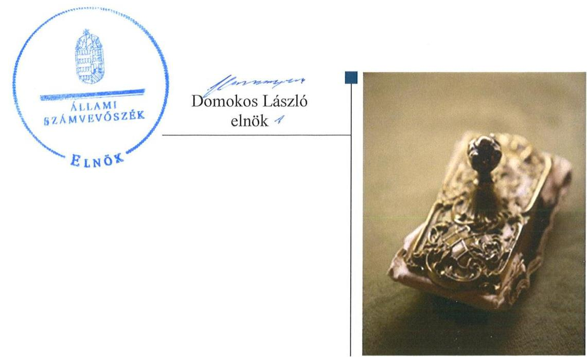
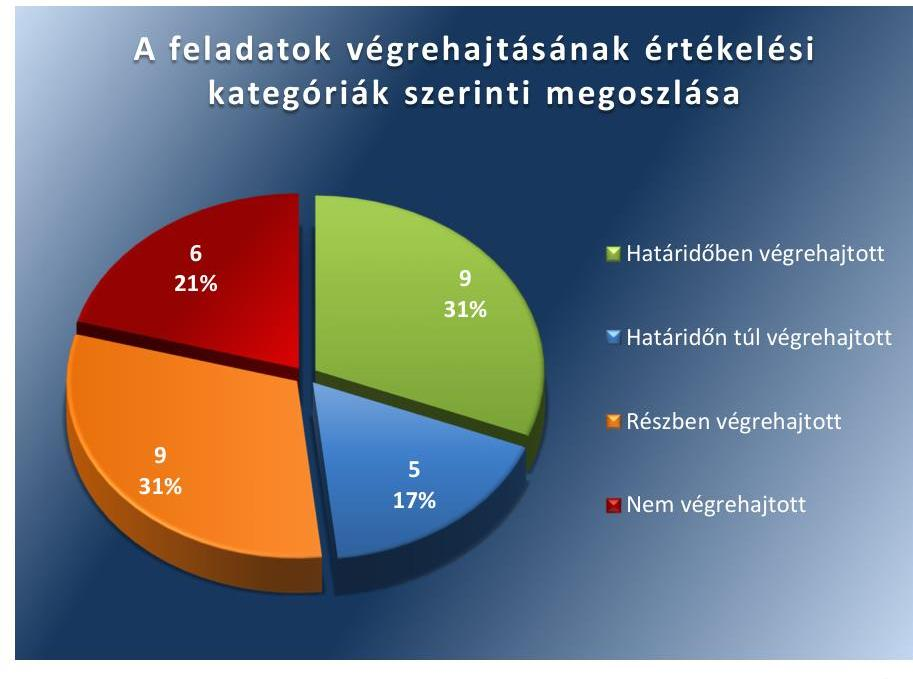
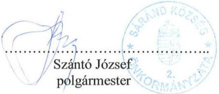
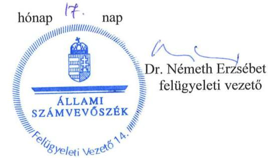

ÁLLAMI
SZÁMVEVŐSZÉK

# Jelentés 

## Utóellenőrzések

Sáránd Község Önkormányzata belső
kontrollrendszere kialakításának, egyes
kontrolltevékenységek és a belső ellenőrzés
működésének utóellenőrzése
2016.

---

# Jelentés 

## Utóellenőrzések

Sáránd Község Önkormányzata belső kontrollrendszere kialakításának, egyes kontrolltevékenységek és a belső ellenőrzés működésének utóellenőrzése
2016. november hó 50 nap

---

|  J | AZ ELLENŐRZÉST FELÜGYELTE:  |
| --- | --- |
|   | DR. NÉMETH ERZSÉBET felügyeleti vezető  |
|   | AZ ELLENŐRZÉST VEZETTE ÉS A VÉGREHAJTÁSÁÉRT FELELŐS:  |
|   | DR. PELLEI TAMÁS ellenőrzésvezető  |
|   | A PROGRAM ÖSSZEÁLLÍTÁSÁÉRT FELELŐS:  |
|   | JANIK JÓZSEF LÁSZLÓ osztályvezető  |
|   | A TÉMÁHOZ KAPCSOLÓDÓ KORÁBBI SZÁMVEVŐSZÉKI JELENTÉSEK:  |
|   | - címe: Jelentés Sáránd Község Önkormányzata belső kontrollrendszerének kialakítása, valamint egyes kontrolltevékenységek és a belső ellenőrzés működése ellenőrzéséről  |
|  J | sorszáma: 13010  |
|   | IKTATÓSZÁM: V-1141-047/2016.  |
|   | TÉMASZÁM: 2175  |
|   | ELLENŐRZÉS-AZONOSÍTÓ SZÁM: V075510  |

---

# TARTALOMJEGYZÉK 

■ ÖSSZEGZÉS ..... 5
■ AZ ELLENŐRZÉS CÉLJA ..... 6
■ AZ ELLENŐRZÉS TERÜLETE ..... 7
■ AZ ELLENŐRZÉS HÁTTERE, INDOKOLTSÁGA ..... 8
■ FÓKUSZKÉRDÉS ..... 9
■ ELLENŐRZÉS HATÓKÖRE ÉS MÓDSZEREI ..... 10
■ MEGÁLLAPÍTÁSOK ..... 13
■ MELLÉKLETEK ..... 19
I. Sz. melléklet: Az ÁSZ 13010. számú jelentéséhez kapcsolódó intézkedési terv végrehajtása ..... 19
■ FÜGGELÉK: ÉSZREVÉTELEK ..... 29
■ RÖVIDÍTÉSEK JEGYZÉKE ..... 35

---

.

---

# ÖSSZEGZÉS 

Az utóellenőrzés megállapította, hogy az intézkedési tervben foglalt feladatok jelentős részét Sáránd Község Önkormányzata nem hajtotta végre, így nem tett megfelelő lépéseket az ÁSZ ${ }^{1}$ által korábban feltárt, a belső kontrollrendszert érintő hiányosságok megszüntetésére. Egyes esetekben a szabályozottság javult, de a felelős vezetői magatartás elmaradásának következtében hiányosságok mutatkoztak a belső kontrollrendszer, a gazdálkodási jogkörök és a belső ellenőrzés működtetése terén. Mindez veszélyt jelentett az Önkormányzat szabályozott működésére és a szabályszerű gazdálkodásra.

## Az ellenőrzés társadalmi indokoltsága

Az ÁSZ stratégiájában célul tűzte ki a számvevőszéki munka hasznosulásának javítását. Ezzel összhangban ellenőrzi, hogy az ellenőrzött szervezetek megvalósították-e a korábbi ellenőrzései által feltárt hibák, hiányosságok és szabálytalanságok megszüntetése céljából elkészített intézkedési terveikben foglaltakat. A rendszeres utóellenőrzések hozzájárulnak a szükséges intézkedések tényleges végrehajtáshoz, ezáltal a közpénzügyek rendezettségének javulásához.

## Főbb megállapítások, következtetések

A polgármester ${ }^{3}$ az intézkedési tervet határidőben megküldte az ÁSZ részére. Az intézkedési tervben rögzített feladatok végrehajtásáról a Bkr. ${ }^{4}$-ben előírt nyilvántartást nem vezették.

Az intézkedési tervben meghatározott 29 feladatból kilenc feladatot határidőben, öt feladatot határidőn túl, kilenc feladatot részben hajtottak végre, hat feladat végrehajtása nem történt meg. A belső szabályozottság javulást mutatott, mindemellett több esetben előfordult, hogy belső szabályzást hiányosan alakították ki, illetve a belső szabályozást kialakították, de a kapcsolódó tevékenységet nem vagy nem a szabályozásnak megfelelően végezték el. Nem megfelelően működtették a pénzügyi folyamatokban kulcsszerepet betöltő kontrollokat. Nem biztosították teljes körűen a belső ellenőrzés szabályszerű működését.

Megállapítható, hogy az ÁSZ által az Önkormányzat belső kontrollrendszerének kialakítása, valamint az egyes kontrolltevékenységek és a belső ellenőrzés működésének területén korábban azonosított hiányosságok jelentős része továbbra is fennáll.

A részben végrehajtott, illetve a nem végrehajtott feladatok veszélyt jelentenek az Önkormányzat jogszabályoknak megfelelő szabályozásában, működésének szabályosságában, amelyek kezelése a vezetői felelősség körébe tartozik.

---

# AZ ELLENŐRZÉS CÉLJA 

Az ellenőrzés célja annak értékelése volt, hogy a számvevőszéki jelentésben ${ }^{5}$ foglalt intézkedést igénylő megállapításokkal és javaslatokkal összhangban készített intézkedési tervben meghatározott feladatokat az ellenőrzött szervezet végrehajtotta-e.

---

# AZ ELLENŐRZÉS TERÜLETE

## Az Önkormányzat

Sáránd község Hajdú-Bihar megyében, a Derecskei járás közigazgatási területén fekszik. 2015. január 1-jével Sáránd község, valamint Tépe község önkormányzatai részvételével hozták létre a Sárándi Közös Önkormányzati Hivatal6-t. Lakónépességének száma a KSH által közzétett népességi adatok7 szerint 2015. január 1-jén 2225 fő volt. A polgármester személyében az ellenőrzött időszakban változás történt: a polgármester1 1995. január 1-jétől, a polgármester2 2014. október 13-ától tölti be tisztségét. A jegyző8 2010. január 1-jétől látja el feladatait.

Az Önkormányzat a 2015. éves költségvetésének végrehajtásáról szóló beszámoló szerint 514,1 millió Ft költségvetési bevételt ért el, valamint 408,6 millió Ft költségvetési kiadást teljesített, befektetett eszközeinek értéke 1052,2 millió Ft, összes eszközértéke 1155,6 millió Ft volt.

Az ÁSZ 2013-ban ellenőrizte az Önkormányzat belső kontrollrendszerének kialakítását, valamint egyes kontrolltevékenységek és a belső ellenőrzés működését, az erről szóló 13010. számú jelentését 2013. február 18-án tette közzé. Az Önkormányzat belső kontrollrendszere kialakításának és működésének megfelelőségét a 2011. évre, a belső ellenőrzés működésének szabályosságát és eredményességét a 2009-2011. évekre vonatkozóan értékelte az ÁSZ. Az ellenőrzés célja annak értékelése volt, hogy az Önkormányzat a jogszabályi előírásoknak megfelelően alakította-e ki a belső kontrollrendszert, megfelelően működtette-e a gazdálkodás folyamatában kulcsszerepet betöltő szakmai teljesítésigazolás és utalvány ellenjegyzés kontrollokat, biztosította-e a belső ellenőrzés szabályos és eredményes működését.

Az utóellenőrzés az ÁSZ jelentésben a polgármester1 és a jegyző részére megfogalmazott, intézkedést igénylő megállapításokra és javaslatokra készített, az ÁSZ részére megküldött intézkedési terv végrehajtására fókuszált.

---

# AZ ELLENŐRZÉS HÁTTERE, INDOKOLTSÁGA 

Az ÁSZ tv. ${ }^{10}$ 33. § (1) bekezdése értelmében a számvevőszéki jelentések intézkedést igénylő megállapításaihoz és javaslataihoz kapcsolódóan az ellenőrzött szervezet vezetője intézkedési tervet köteles összeállítani, és az ÁSZ részére megküldeni. Az intézkedési tervben foglaltak megvalósítását az ÁSZ tv. 33. § (7) bekezdésében foglaltak alapján - az ÁSZ utóellenőrzés keretében ellenőrizheti. Az intézkedések megvalósulásának értékelése során az ÁSZ figyelembe veszi az ellenőrzött szervezetek működési feltételeiben, valamint a jogszabályi előírásokban bekövetkezett változásokat.

Az intézkedési tervekben foglalt feladatok hiányos, illetve késedelmes végrehajtása, valamint megvalósításának elmaradása azt mutatja, hogy az ellenőrzések során feltárt hibák, hiányosságok és szabálytalanságok megszüntetése nem kapott kellő hangsúlyt. Ez a szabályszerű működés és a felelős vezetői magatartás vonatkozásában kockázatot hordoz. E kockázatok feltárásával az ÁSZ utóellenőrzési rendszere fokozza a fegyelmet, és igazolja, hogy a közpénzzel való szabályos gazdálkodás felelőssége elől nem lehet kitérni.

## AZ UTÓELLENŐRZÉS VÁRHATÓ HASZNOSULÁSA

Az utóellenőrzés négy szinten hasznosulhat:
$\longrightarrow$ A társadalom szintjén az utóellenőrzés jelzi, hogy a számvevőszéki ellenőrzés megállapításainak van következménye: a hiányosságok megszüntetésére az ellenőrzött szervezet által meghatározott intézkedések végrehajtását is számon kéri az ÁSZ.
$\longrightarrow$ Az ellenőrzött terület szintjén az utóellenőrzés tájékoztatást nyújt a terület döntéshozóinak a hiányosságok kiküszöbölésének jó gyakorlatairól, ezzel lehetőséget biztosítva arra, hogy az ÁSZ ellenőrzési megállapításai, javaslatai a terület nem ellenőrzött szervezeteinek a működése során is hasznosuljanak.
$\longrightarrow$ Az ellenőrzött szervezet szintjén az utóellenőrzés feltárja, hogy a szervezet az intézkedések végrehajtásával hasznosította-e a korábbi ellenőrzési jelentésben a hiányosságok megszüntetése, illetve a kockázatok kezelése érdekében megfogalmazott javaslatokat.
$\longrightarrow$ Az ÁSZ szintjén az utóellenőrzés visszacsatolást ad az ellenőrzési jelentések hasznosulásáról, az intézkedések elmaradása vagy részleges megvalósulása a további ellenőrzésekhez kockázati jelzésként szolgál.

---

# FÓKUSZKÉRDÉS 

Az Önkormányzat az intézkedési tervben foglaltakat az előírt határidőben végrehajtotta-e?

---

# ELLENŐRZÉS HATÓKÖRE ÉS MÓDSZEREI 

## Az ellenőrzés típusa

Megfelelőségi ellenőrzés

## Az ellenőrzött időszak

Az utóellenőrzés alapját képező ÁSZ jelentés közzétételének napjától (2013. február 18.) az ellenőrzésről szóló kiértesítő levél keltének napjáig (2016. június 3.) tartó időszak.

## Az ellenőrzés tárgya

A számvevőszéki jelentésben foglalt intézkedést igénylő megállapításokkal és javaslatokkal összhangban - az Önkormányzat által - készített intézkedési tervben foglaltak végrehajtásának ellenőrzése.

Az ellenőrzés kiterjed minden olyan körülményre és adatra, amely az ÁSZ jogszabályban meghatározott feladatainak teljesítéséhez, valamint a program végrehajtása folyamán felmerült újabb összefüggések feltárásához szükséges.

## Az ellenőrzött szervezet

Sáránd Község Önkormányzata

## Az ellenőrzés jogalapja

Az ÁSZ az Országgyűlés pénzügyi és gazdasági ellenőrző szerve. Az ÁSZ törvényben meghatározott feladatkörében ellenőrzi a központi költségvetés végrehajtását, az államháztartás gazdálkodását, az államháztartásból származó források felhasználását és a nemzeti vagyon kezelését.

Az ÁSZ tv. 1. § (3) bekezdése szerint az ÁSZ általános hatáskörrel végzi a közpénzekkel és az állami és önkormányzati vagyonnal való felelős gazdálkodás ellenőrzését.

Az ÁSZ tv. 33. § (7) bekezdése alapján az ÁSZ tv. 33. § (1)-(2) bekezdése szerinti intézkedési tervben foglaltak megvalósítását az ÁSZ utóellenőrzés keretében ellenőrizheti.

---

# Az ellenőrzés módszerei 

Az ÁSZ az utóellenőrzést a nemzetközi standardokat irányadónak tekintve az ellenőrzési program ellenőrzési kérdései, az ellenőrzött időszakban hatályos jogszabályok, az ellenőrzés szakmai szabályok és módszertanok figyelembevételével, önálló ellenőrzés keretében végezte.

Az ÁSZ az ellenőrzés ideje alatt az Önkormányzattal történő kapcsolattartást az ÁSZ SZMSZ ${ }^{11}$-ének vonatkozó előírásai alapján biztosította.

Az utóellenőrzés megállapításait elsősorban az ÁSZ rendelkezésére álló, valamint az ellenőrzött szervezetektől elektronikusan bekért dokumentumok alapozták meg.

Az ellenőrzési bizonyítékként felhasználható adatforrások közé tartoznak egyrészt az ellenőrzési szakmai programban felsorolt adatforrások, másrészt minden - az ellenőrzés folyamán feltárt, az ellenőrzés szempontjából információt tartalmazó - dokumentum.

A pénzügyi folyamatokban kulcsszerepet betöltő kontrollokra vonatkozóan az intézkedési tervben foglalt feladatok végrehajtását az államháztartáson kívülre teljesített működési célú pénzeszközátadásoknál, az állományba nem tartozók megbízási díjainál, továbbá a külső szolgáltatók által végzett karbantartási, kisjavítási munkákkal kapcsolatos kifizetéseknél 10 elemű véletlen mintavétellel kiválasztott tételek alapján értékelte az ÁSZ. A kiválasztott tételek esetében azt ellenőrizte, hogy az Önkormányzat az intézkedési tervben meghatározott feladatok végrehajtása érdekében biztosította-e a jogszabályok és a belső szabályzatok előírásainak megfelelő működtetést.

Az intézkedési tervekben előírt feladatoknak, azok végrehajthatósága, illetve végrehajtása szempontjából az alábbiak szerint értékelte az ÁSZ:
"határidőben végrehajtott" a feladat, ha a teljesítés dokumentáltan, az intézkedési tervben előírt határidőben és tartalommal megtörtént;
"határidőn túl végrehajtott" a feladat, ha annak teljesítése az intézkedési tervben meghatározott módon, de az előírt határidőn túl történt meg;
"részben végrehajtott" a feladat, ha végrehajtása teljes körűen az intézkedési tervben előírt módon nem történt meg;
"nem végrehajtott" a feladat, ha a végrehajtás nem történt meg, vagy amennyiben a teljesítést nem dokumentálták;
"okafogyottá vált" a feladat, ha végrehajtására - meghatározott esemény bekövetkezése, továbbá külső körülmény, a működést érintő feltétel változása miatt - már nincs szükség, illetve lehetőség, és egyértelműen megállapítható, hogy az intézkedést szükségessé tevő körülmény a jövőben nem fordulhat elő;
"nem időszerű" az a feladat, amelynek ellenőrzési időszakon belüli végrehajtására azért nem került (kerülhetett) sor, mert az intézkedés alapjául szolgáló esemény nem következett be, de annak jövőbeni előfordulása lehetséges, a végrehajtása nem volt esedékes, vagy a végrehajtás határideje még nem járt le.

---

Az ellenőrzés lefolytatásához az ellenőrzött szervezet a tanúsítványok elektronikus kitöltésével, valamint az ÁSZ által kért dokumentumok elektronikus megküldésével szolgáltatott adatokat, amelyek valódiságát és teljes körűségét az ellenőrzött szervezet vezetője által tett teljességi és hitelességi nyilatkozat igazolta. Az így rendelkezésre bocsátott adatok, információk kontrollja az ellenőrzés keretében történt.

---

# MEGÁLLAPÍTÁSOK 

## Az Önkormányzat az intézkedési tervben foglaltakat az előírt határidőben végrehajtotta-e?

Összegző megállapítás

Az Önkormányzat az intézkedési tervben meghatározott 29 feladatból kilencet határidőben, ötöt határidőn túl, kilencet részben és hatot nem hajtott végre. Az intézkedési tervben rögzített feladatok végrehajtásáról a Bkr.-ben előírt nyilvántartást
 nem vezették.

Az ÁSZ a jelentésében a polgármester részére három, a jegyző részére 20 javaslatot fogalmazott meg. A polgármester és a jegyző az ÁSZ részére megküldött intézkedési tervben a hiányosságok, szabálytalanságok megszüntetésére 29 feladatot határozott meg, a feladatok elvégzésének felelőseként három esetben a polgármestert, 26 esetben pedig a jegyzőt jelölték meg.

Az ÁSZ javaslatai alapján készített intézkedési tervben rögzített feladatok végrehajtásáról a jegyző a Bkr. előírásainak megfelelő nyilvántartást nem vezetett.

Az intézkedési tervben meghatározott feladatokat, határidőket, a feladatok elvégzésének felelősét és a feladatok végrehajtását az I. számú melléklet mutatja be.

Az intézkedési tervben tervezett feladatok végrehajtásának értékelési kategóriák szerinti megoszlását az 1. ábra szemlélteti.
1. ábra

---

# HATÁRIDŐBEN VÉGREHAJTOTT feladat: 

1.  A jegyző gondoskodott az iratkezelési feladatok folyamatba épített, előzetes, utólagos és vezetői ellenőrzésének kialakításáról, amelyet a belső kontroll szabályzatban rögzített.
2.  A jegyző a belső kontroll szabályzatban rögzítette a Hivatal tevékenységeire vonatkozó beszámolási eljárásokat.
3.  A jegyző az adatvédelmi szabályzatban rögzítette a közérdekű adatok megismerésére vonatkozó eljárás szabályait, amelynek keretében - az Ávr. előírásai szerint - meghatározta a közérdekű adatok megismerésére vonatkozó igények teljesítésének eljárásrendjét.
4.  A jegyző gondoskodott arról, hogy a teljesítésigazolás során a jogosság, az összegszerűség és a teljesítés ellenőrzésére vonatkozó kötelezettség az Ávr. előírásai alapján a gazdálkodási szabályzatban rögzítésre kerüljön.
5.  A jegyző az Ávr. előírásai alapján gondoskodott az ellenjegyzés, utalványozás, érvényesítés menete és a jogosultságok gazdálkodási szabályzatban történő rögzítéséről. Az összeférhetetlenségi szabályok az utalványozás és ellenjegyzés menetének rendszeres ellenőrzése során a gazdálkodási szabályzatban foglaltaknak megfelelően érvényesültek.
6.  A jegyző a Bkr. előírásai alapján - a költségvetési gazdálkodás és a gazdasági események elszámolása során alkalmazott kontrollokra is kiterjedően - a 2012. április 20-án hatályba léptetett belső kontroll szabályzatban, valamint a 2015. október 1-jén hatályba léptetett belső kontroll szabályzatban meghatározta a folyamatba épített előzetes, utólagos és vezetői ellenőrzés szabályait és kialakította a célok megvalósításának nyomon követését biztosító rendszert.
7.  A jegyző az operatív tevékenységek keretében megvalósuló folyamatos és eseti nyomon követésből álló, az Önkormányzat tevékenységének, a célok megvalósulásának nyomon követését biztosító monitoring rendszert a belső kontroll szabályzatban alakította ki.
8.  A polgármester intézkedett arról, hogy a kötelezettségvállalás, a pénzügyi ellenjegyzés, a teljesítésigazolás, az érvényesítés és az utalványozás szabályait az Áht.-ban foglalt előírásoknak megfelelően a gazdálkodási szabályzatban rögzítsék. A pénzügyi ellenjegyző feladatát az Ávr. előírásai szerint végezte.
9.  A jegyző az Ávr. előírásának megfelelően a pénzügyi-gazdasági feladatok ellátásért felelős dolgozók helyettesítési rendjét a hivatali SZMSZ-ben rögzítette.

## HATÁRIDŐN TÚL VÉGREHAJTOTT feladatok:

10. A jegyző gondoskodott az etikai szabályzat felülvizsgálatáról, de a felülvizsgálat eredményeképpen elkészített új etikai szabályzat köztisztviselőkkel történő megismertetésére az intézkedési tervben meghatározott 2013. május 31-ei határidőt követően került sor.

---

11. A jegyző 2013. június 20-án elkészített és 2013. július 1-jével hatályba léptetett kockázatkezelési szabályzatban rögzítette az egyes kockázati tényezők csökkentése érdekében tett intézkedések megvalósításának nyomon követésének rendszerét. A kockázati tűréshatár felett elhelyezkedő kockázatok kezelésére alkalmas intézkedéseket az intézkedési tervben előírt 2013. június 30-ai határidőt követően, 2013. október 31-én kelt kockázatértékelési dokumentációban határozta meg.
12. A jegyző a 2013. június 20-án elkészített és 2013. július 1-jével hatályba léptetett kockázatkezelési szabályzatban, valamint a 2013. június 14-én elkészített Kockázatértékelés dokumentum keretében gondoskodott az Önkormányzat tevékenységében, gazdálkodásában rejlő kockázatok összegyűjtéséről, feltérképezéséről, elemzéséről, az egyes folyamatok meghatározásáról, azonban a költségvetési szerv kockázati tűréshatárát az intézkedési tervben rögzített határidőt követően, a 2013. október 31-én elkészített Kockázatértékelési dokumentációban határozta meg.
13. A jegyző az Önkormányzatnál és a Hivatalnál használt szabályzatok - különös figyelemmel az Ávr.-ben meghatározott szabályzatokra - felülvizsgálatáról és szükség szerinti aktualizálásáról - az ügyrend kivételével - az intézkedési tervben meghatározott 2013. május 31-ei határidőt követően gondosodott.
14. A jegyző 2013. május 31-én az Ávr.-ben foglaltaknak megfelelően aktualizálta és kiegészítette a hivatali SZMSZ-t. A hivatali SZMSZ az intézkedési tervben foglalt 2013. május 31-ei határidőn belüli Kép-viselő-testület elé terjesztését dokumentált módon nem igazolták, azonban a hivatali SZMSZ-t a Képviselő testület a 2013. június 28-án kelt, 55/2013. (VI.28) KT sz. határozatával elfogadta. A jegyző a Bkr. előírása szerint a belső ellenőrzést végző személy vagy szervezet jogállását, feladatait az intézkedési tervben meghatározott 2013. május 31-ei határidőt követően, a 2015. január 1-jétől hatályos közös hivatali SZMSZ-ben határozta meg.

# RÉSZBEN VÉGREHAJTOTT feladatok: 

15. A jegyző a Bkr. előírása szerint a közös hivatali SZMSZ-ben meghatározta a belső ellenőrzést végző személy vagy szervezet jogállását, feladatait. Ugyanakkor a jegyző dokumentált módon nem igazolta, hogy a belső ellenőrzési vezető a Bkr. előírásai alapján jóváhagyta a belső ellenőrzési programot és azt, hogy a program végrehajtását felügyelte.
16. A jegyző intézkedett a bizonylati szabályzat és bizonylati album aktualizálásáról, azonban a Számv. tv. és az Áhsz. előírásai ellenére a számlarendet nem aktualizálta.
17. A jegyző az Info tv. előírásainak megfelelően a 2013. június 1-jétől hatályos adatvédelmi szabályzatban és a 2014. július 1-jétől hatályos informatikai szabályzatban határozta meg a hozzáférési jogosultságokkal kapcsolatos feladatokat, a mentési eljárásokat és kijelölte a mentések felelősét, azonban az Info tv. előírásai ellenére az informatikai szabályzatban nem rögzítette a pénzügyi-számviteli

---

szoftverváltozások ellenőrzésére és tesztelésre vonatkozó eljárásokat.
18. A jegyző intézkedett arról, hogy az éves belső ellenőrzési tervek kidolgozását kockázatelemzések alapozzák meg, azonban a jegyző a Bkr. előírása ellenére nem készítette el a stratégiai ellenőrzési tervet, továbbá a 2014. és 2015. évi éves ellenőrzési tervekhez a jegyzői írásos véleményeket.
19. A polgármester gondosodott arról, hogy a Bkr.-ben foglaltaknak megfelelően a 2012. április 20-án a jegyző által hatályba léptetett belső kontrollrendszer szabályzatban határozzák meg az éves ellenőrzési jelentés Képviselő-testület elé terjesztésének menetét, azonban a Bkr.-ben előírtak ellenére a szabályzat nem tartalmazta az éves ellenőrzési jelentés elkészítésének módját, illetve a társult önkormányzatoknak történő megküldés menetét. A feladat végrehajtása 2015. február 13-ától okafogyottá vált, mert ezen időponttól kezdődően az önkormányzati belső ellenőrzési feladatok ellátása nem társulás formájában történt. A polgármester a Bkr. előírása ellenére a 2012. évi éves ellenőrzési jelentést a 2012. évi zárszámadási rendelettervezettel egyidejűleg nem terjesztette a Kép-viselő-testület elé.
20. A jegyző nem gondoskodott arról, hogy a belső ellenőrzési jelentések tartalmazzák a Bkr.-ben előírt valamennyi tartalmi elemet.
21. A polgármester intézkedett az ellenjegyzési, kötelezettségvállalási, utalványozási szabályzat számvevőszéki jelentés megállapításainak megfelelő felülvizsgálatáról. Az ellenőrzött bizonylatok alapján nem intézkedett azonban arról, hogy a teljesítésigazolás és az utalványozás során az Ávr.-ben előírt szabályok megfelelően érvényesüljenek, így az operatív gazdálkodás során nem teljesültek az Ávr. előírásai. A polgármester a szabálytalanságok kivizsgálásáról írásban nem intézkedett.
22. A jegyző nem gondosodott arról, hogy a Bkr.-ben megfogalmazott elemeket teljes körűen tartalmazzák az éves belső ellenőrzési tervek. A jegyző a Bkr. előírása ellenére stratégiai ellenőrzési tervet nem készített.
23. A jegyző az adatvédelmi szabályzatban és az informatikai szabályzatban gondoskodott a Hivatalnál kezelt adatok felsorolásáról, az adatok forrásának, valamint az adatkezelés céljának és jogalapjának meghatározásáról, azonban az intézkedési tervben meghatározott feladat ellenére nem tett intézkedéseket az Önkormányzatnál kezelt adatok belső szabályzatban történő felsorolásáról, csoportosításáról, az adatok forrásának, valamint az adatkezelés céljának és jogalapjának meghatározásáról.

# NEM VÉGREHAJTOTT feladatok: 

24. A jegyző az intézkedési tervben meghatározott feladat ellenére nem gondoskodott a beazonosított kockázati tényezők adatbázisban történő rögzítéséről.

---

25. A jegyző az ellenőrzött dokumentumok alapján nem gondoskodott a teljesítésigazolás Ávr. szerinti elvégzéséről, mivel a kifizetéseket megelőzően nem történt meg a teljesítésigazolás, vagy a teljesítéseket nem az arra jogosult személy igazolta aláírásával.
26. A jegyző az ellenőrzött dokumentumok alapján nem intézkedett az érvényesítés Ávr. és a gazdálkodási szabályzat szerinti szabályszerű végrehajtásáról, mivel az érvényesítést szabályszerű teljesítésigazolás hiányában végezték, illetve az érvényesítő nem tett eleget az Ávr.-ben meghatározott ellenőrzési kötelezettségének.
27. A jegyző az ellenőrzött dokumentumok alapján nem minden esetben gondoskodott arról, hogy a pénzügyi ellenjegyző az Áht.-ben foglalt előírásoknak megfelelően ellenőrizze az írásbeli kötelezettségvállalási dokumentum elkészítését és a gazdálkodási szabályok betartását.
28. A jegyző a Bkr. előírása ellenére nem készített intézkedési terveket a belső ellenőrzési jelentésekben megfogalmazott hiányosságok felszámolására vonatkozóan.
29. A jegyző nem gondoskodott arról, hogy az intézkedési tervekről a belső ellenőrzési vezető a Bkr.-ben előírt nyilvántartást vezesse.

---

.

---

# MELLÉKLETEK

I. SZ. MELLÉKLET: AZ ÁSZ 13010. SZÁMÚ JELENTÉSÉHEZ KAPCSOLÓDÓ INTÉZKEDÉSI TERV VÉGREHAJTÁSA

|  ㅇ | Az intézkedési terv alapján elvégzendő feladat | Az intézkedési tervben meghatározott határidő | Az intézkedési tervben rögzített feladatok elvégzésének felelőse | A feladat végrehajtása  |
| --- | --- | --- | --- | --- |
|  Határidőben végrehajtott feladatok |  |  |  |   |
|  1. | „Az iratkezelési feladatok folyamatba épített, előzetes, utólagos és vezetői ellenőrzésének kialakítása a Bkr. 8. § (2) bekezdés szerint." | 2013. augusztus 31. | jegyző | A jegyző gondoskodott az iratkezelési feladatok folyamatba épített, előzetes, utólagos és vezetői ellenőrzésének Bkr. 8. § (2) bekezdés szerinti kialakításáról. A 2012. április 20-án hatályba léptetett belső kontroll szabályzat 3.6. és 3.7. pontjai tartalmazták az iratkezelési feladatok folyamatba épített, előzetes, utólagos és vezetői ellenőrzésének meghatározását.  |
|  2. | „A Polgármesteri Hivatal tevékenységeire vonatkozó beszámolási eljárás kialakítása a Bkr. 8. § (4) bekezdés c) pontnak megfelelően." | 2013. augusztus 31. | jegyző | A jegyző az intézkedési tervben rögzített határidőt megelőzően elkészített és 2012. április 20-án hatályba léptetett belső kontroll szabályzatban rögzítette a Bkr. 8. § (4) bekezdés c) pontjában foglaltaknak megfelelően a Hivatal tevékenységeire vonatkozó beszámolási eljárást.  |
|  3. | „A közérdekű adatok megismerésére vonatkozó eljárás külön szabályzatban való rögzítése, a közérdekű adatok megismerésére vonatkozó igények teljesítésének eljárásrendje az Ávr. 13. § (2) bekezdés h) pont szerint." | 2013. augusztus 31. | jegyző | A jegyző a 2013. június 1-jétől hatályos adatvédelmi szabályzatban rögzítette a közérdekű adatok megismerésére vonatkozó eljárás szabályait. A szabályzat az Ávr. 13. § (2) bekezdés h) pontjában foglaltaknak megfelelően tartalmazza a közérdekű adatok megismerésére vonatkozó igények teljesítésének eljárásrendjét.  |
|  4. | „A gazdálkodási jogkörök esetében a teljesítés igazolás során a jogosság, az összegszerűség, a teljesítés ellenőrzésére vonatkozó kötelezettség szabályzatban történő rögzítése az |
 Ávr. 57. § (1), (2), (3), (4) bekezdései alapján." | 2013. augusztus 31. | jegyző | A 2013. április 1-jétől hatályos gazdálkodási szabályzat ${ }_{1}$-ban és a 2013. július 1-jétől hatályos gazdálkodási szabályzat ${ }_{2}$-ban az Ávr. 57. § (1), (2), (3), (4) bekezdései alapján meghatározták, hogy a teljesítésigazolás során ellenőrizni kell a kiadások teljesítésének jogosságát, összegszerűségét, ellenszolgáltatást is magában foglaló kötelezettségvállalás esetén a kötelezettség teljesítését, továbbá rögzítették a teljesítés ellenőrzésére vonatkozó kötelezettséget.  |
|  5. | „Az ellenjegyzés, utalványozás, érvényesítés menetének, a jogosultságoknak belső szabályzatban történő rögzítése az Ávr. 60. § (1), (2), (3) bekezdésekben foglaltaknak megfelelően. Az | azonnali, folyamatos | jegyző | A 2013. április 1-jétől hatályos gazdálkodási szabályzat ${ }_{1}$-ban és a 2013. július 1-jétől hatályos gazdálkodási szabályzat ${ }_{2}$-ban az Ávr. 60. § (1), (2) bekezdéseiben foglaltaknak megfelelően rögzítették az ellenjegyzés, utalványozás, érvényesítés menetét, a jogosultságokat,  |

---

|  5. | Az intézkedési terv alapján elvégzendő feladat | Az intézkedési tervben meghatározott határidő | Az intézkedési tervben rögzített feladatok elvégzésének felelőse | A feladat végrehajtása  |
| --- | --- | --- | --- | --- |
|   | összeférhetetlenségi szabályok, az utalványozás és az ellenjegyzés menetének rendszeres ellenőrzése a belső szabályzatban meghatározott módon." |  |  | a kapcsolódó összeférhetetlenségi szabályokat, valamint az Ávr. 60. § (3) bekezdésében foglaltaknak megfelelően gazdálkodási jogkör gyakorlóiról vezetendő nyilvántartással kapcsolatos előírásokat. Az ellenőrzött dokumentumok alapján az összeférhetetlenségi szabályok az utalványozás és ellenjegyzés menetének rendszeres ellenőrzése során a gazdálkodási szabályzat ${ }_{2}$-ban foglaltaknak megfelelően érvényesültek.  |
|  6. | „A számvevőszéki jelentésben feltárt hibák további megelőzése érdekében a belső szabályzatban meg kell erősíteni a folyamatba épített előzetes, utólagos és vezetői ellenőrzést (FEUVE), különösen a költségvetési gazdálkodás és a gazdasági események elszámolása során végzett kontrollok esetében a Bkr. 8. § (2) bekezdés és a 10. § előírásai alapján." | azonnali, folyamatos | jegyző | A jegyző a Bkr. 8. § (2) bekezdés előírásainak megfelelően a 2012. április 20-án és a 2015. október 1-jén hatályba léptetett belső kontrollrendszer szabályzatban ${ }_{1,2}$-ban meghatározta - a költségvetési gazdálkodás és a gazdasági események elszámolása során alkalmazott kontrollokra is kiterjedően - a folyamatba épített előzetes, utólagos és vezetői ellenőrzés szabályait. A szabályzatokban a Bkr. 10. § előírásainak megfelelően kialakította a célok megvalósításának nyomon követését biztosító rendszert.  |
|  7. | „Az operatív tevékenységek keretében megvalósuló folyamatos és eseti nyomon követésből álló, az Önkormányzat tevékenységének, a célok megvalósulásának nyomon követését biztosító monitoring rendszer kialakítása a Bkr. 10. §-ban foglaltaknak megfelelően." | 2013. szeptember 30. | jegyző | A jegyző a Bkr. 10. §-ában foglaltaknak megfelelően a 2012. április 20-án hatályba léptetett belső kontroll szabályzat ${ }_{1}$-ban gondoskodott az operatív tevékenységek keretében megvalósuló folyamatos és eseti nyomon követésből álló, az Önkormányzat tevékenységének, a célok megvalósulásának nyomon követését biztosító monitoring rendszer kialakításáról.  |
|  8. | „Belső szabályzatban rögzíteni kell, hogy a kötelezettségvállalás, a pénzügyi ellenjegyzés, a teljesítésigazolás, az érvényesítés és az utalványozás az Áht. 36-38. §-okban rögzített előírásoknak megfelelően történjen. A pénzügyi ellenjegyző feladatát az Ávr. 54. §-ban foglalt rendelkezéseknek megfelelően végzi." | folyamatos | polgármester | A polgármester ${ }_{1}$ gondoskodott arról, hogy a gazdálkodási szabályzat ${ }_{1,2}$-ban az Áht. 36-38. §-aiban meghatározott előírásoknak megfelelően rögzítsék a kötelezettségvállalás, a pénzügyi ellenjegyzés, a teljesítésigazolás, az érvényesítés és az utalványozás szabályait. Az ellenőrzött dokumentumok alapján a pénzügyi ellenjegyző a feladatát az Ávr. 54. § (3) bekezdésében foglalt rendelkezéseknek megfelelően végezte.  |
|  9. | „Az ügyrend kiegészítése a pénzügyi-gazdasági feladatok ellátásért felelős dolgozók helyettesítési rendjével az Ávr. 13. § (5) bekezdésben foglaltak szerint." | 2013. május 31. | jegyző | A jegyző az Ávr. 13. § (5) bekezdése alapján a hivatali SZMSZ-ben rögzítette a pénzügyi-gazdasági feladatok ellátásért felelős dolgozók helyettesítésének rendjét.  |

---

|  10. | „Az 1/2011. számú Köztisztviselőkkel szembeni Etikai elvárások szabályzat felülvizsgálata és a köztisztviselőkkel történő megismertetése." | 2013. május 31. |  |  |  |  |  |  |  |  |  |  |  |  |  |  |  |  |  |  |  |  |  |  |  |  |  |  |  |  |  |  |  |  |  |  |  |  |  |  |  |  |  |  |  |  |  |  |  |  |  |  |  |  |  |  |  |  |  |  |  |  |  |  |  |  |  |  |  |  |  |  |  |  |  |  |  |  |  |  |  |  |  |  |  |  |  |  |  |  |  |  |  |  |  |  |  |  |  |  |  | 

---

|  14. | „Sáránd Község Önkormányzat Polgármesteri Hivatala Szervezeti és Működési szabályzatának aktualizálása, valamint kiegészítése:
- a szakfeladat-rend szerint besorolt alaptevékenységekkel és az azokat tartalmazó Képviselő-testületi határozattal az Ávr. 13. § (1) bekezdés c) pontnak megfelelően,
- a munkakörökhöz tartozó feladat- és hatáskörökkel, a hatáskörök gyakorlásának módjával, a helyettesítés rendjével, valamint az ezekhez kapcsolódó egyértelmű felelősségi szabályokkal az Ávr. 13. § (1) bekezdés g) pontnak megfelelően,
- a belső ellenőrzést végző szervezet jogállásával és feladataival a Bkr. 15. § (2) bekezdésnek megfelelően.
A módosított SZMSZ Képviselő-testület elé terjesztése." | 2013. május 31. | jegyző | A 2013. május 31-én elkészített hivatali SZMSZ tartalmazta az Ávr. 13. § (1) bekezdés c) pontjának megfelelően a szakfeladat-rend szerint besorolt alaptevékenységeket, az Ávr. 13. § (1) bekezdés g) pontjának megfelelően a hivatali SZMSZ-ben nevesített munkakörökhöz tartozó feladat- és hatásköröket, hatáskörök gyakorlásának módját, a helyettesítés rendjét és a kapcsolódó felelősségi szabályokat. A jegyző az intézkedési tervben foglalt határidőn túl gondoskodott a hivatali SZMSZ Képviselő-testület elé történő terjesztéséről, mert a hivatali SZMSZ-t a Képviselő testület 2013. június 28-án az 55/2013. (VI.28) KT sz. határozatával fogadta el. A jegyző a Bkr. 15. § (2) bekezdése alapján a belső ellenőrzést végző személy vagy szervezet jogállását, feladatait a 2015. január 1-jétől hatályos közös hivatali SZMSZ-ben meghatározta.  |
| --- | --- | --- | --- | --- |
|  15. | „A belső ellenőrzési vezető személyének, jogállásának, feladatainak rögzítése a Polgármesteri Hivatal SzMSz-ében a Bkr. 15. § (2) bekezdés értelmében. A belső ellenőrzési programot a belső ellenőrzési vezető jóváhagyja, a program végrehajtását pedig felügyeli a Bkr. 33. § (2), (3) bekezdések előírásainak megfelelően." | 2013. május 31., illetve folyamatos | jegyző | - Végrehajtott feladat:
A jegyző a Bkr. 15. § (2) bekezdése alapján a belső ellenőrzést végző személy vagy szervezet jogállását, feladatait a 2015. január 1-jétől hatályos közös hivatali SZMSZ-ben meghatározta.
- Nem végrehajtott feladat:
A jegyző dokumentált módon nem igazolta, hogy a belső ellenőrzési vezető a Bkr. 33. § (2), (3) bekezdéseinek előírásai alapján hagyta jóvá a belső ellenőrzési programot és azt, hogy a program végrehajtását felügyelte.  |
|  16. | „A számlarend, a bizonylati szabályzat és a bizonylati album aktualizálása a Számv. tv. 161. § (2) bekezdés és az Áhsz. 9. § (6) bekezdés előírásai szerint." | 2013. május 31. | jegyző | - Végrehajtott feladat:
A jegyző a Számv. tv. 161. § (2) bekezdése d) pontja alapján 2013. június 28-án aktualizálta és 2013. július 1-jével hatályba léptette a bizonylati szabályzatot, amelynek 3. számú mellékletét képezte a bizonylati album.
- Nem végrehajtott feladat:
A jegyző a Számv. tv. 161. § (2) bekezdése és az Áhsz. 49. § (6) pontjában meghatározott számlarend aktualizálását dokumentált módon nem igazolta.  |

---

|  17. | „Az informatikai szabályzat kiegészítése a hozzáférési jogosultságok meghatározásával, a pénzügyi-számviteli szoftverváltozások ellenőrzésével, a tesztelésre vonatkozó eljárásokkal, a mentési eljárásokkal és a mentések felelőseivel az Info tv. 7. § (2), (3) bekezdéseiben foglaltak szerint. | 2013. augusztus 31. | jegyző | - Végrehajtott feladat:
A jegyző az Info tv. 7. § (2)-(3) bekezdéseiben előírtak szerint a 2013. június 1-jétől hatályos adatvédelmi szabályzatban és a 2014. július 1-jétől hatályos informatikai szabályzatban rögzítette a hozzáférési jogosultságok meghatározásával kapcsolatos feladatokat, meghatározta a mentési eljárások rendjét és kijelölte a mentések felelősét.
- Nem végrehajtott feladat:
A jegyző az Info tv. 7. § (2) bekezdésében foglaltak ellenére a pénzügyi-számviteli szoftverváltozások ellenőrzésére, tesztelésére vonatkozó eljárásokat az informatikai szabályzatban nem rögzítette.  |
| --- | --- | --- | --- | --- |
|  18. | „Kockázatelemzésen alapuló írásos jegyzői vélemény és annak figyelembevételével megtervezett stratégiai ellenőrzési terv és éves belső ellenőrzési terv elkészítése a Bkr. 29. § (1) bekezdés szerint, továbbá a társulásban történő feladatellátás miatt a Bkr. 56. § (2) bekezdés szerint." | 2013. május 31., illetve folyamatos | jegyző | - Végrehajtott feladat:
A 2014., a 2015. és a 2016. évi éves belső ellenőrzési tervek kidolgozásához a Bkr. 29. § (1) bekezdés alapján kockázatelemzéseket készítettek, amelyek az éves belső ellenőrzési tervek elkészítésének alapját képezték.
- Nem végrehajtott feladat:
A Bkr. 29. § (1) bekezdés előírása ellenére stratégiai ellenőrzési tervet nem készítettek. A Bkr. 56 § (2) bekezdésében előírtak ellenére a 2014. és 2015. évi éves ellenőrzési tervek összeállítását megelőző írásos jegyzői véleményeket nem készítették el, figyelemmel arra, hogy a 2013. február 18-ától 2015. február 13-áig terjedő időszakban a belső ellenőrzési feladatokat a Derecske-Létavértesi Kistérségi Társulás keretein belül látták el.  |
|  19. | „A belső kontroll kézikönyvben rögzíteni kell a Bkr. 56. § (8), (9) bekezdéseknek megfelelően az éves ellenőrzési jelentés elkészítésének, a társult önkormányzatoknak történő megküldésének és a Képviselő-testületek elé terjesztésének menetét. A 2012. évre vonatkozóan az éves ellenőrzési jelentés a zárszámadással egyidejűleg lett beterjesztve a Képviselő-testület elé 2013. március 27-én." | folyamatos | polgármester | - Végrehajtott feladat:
A Bkr. 56. § (8) bekezdésében előírtak alapján a 2012. április 20-án hatályba léptetett belső kontrollrendszer szabályzatban rögzítették az éves ellenőrzési jelentés Képviselő-testületek elé terjesztésének menetét.  |

---

|  20. | „A belső ellenőrzési jelentéseknek tartalmazniuk kell a Bkr. 39. § (3) bekezdésben meghatározott elemeket, különösen az alkalmazott ellenőrzési módszereket és eljárásokat, a programnak megfelelő megállapításokat, következtetéseket, javaslatokat, továbbá a köztük fennálló összefüggéseket." | 2013. május 31., illetve folyamatos | jegyző |  Nem végrehajtott feladat: A belső kontrollrendszer szabályzatban nem rögzítették a Bkr. 56. § (9) bekezdésében előírt, az éves ellenőrzési jelentés elkészítésének módját. A szabályzat nem tartalmazta a társult önkormányzatoknak történő megküldés menetét. A 2012. évi éves ellenőrzési jelentést a Képviselő-testület a 2013. május 23-án kelt, 43/2013. (V. 23.) KT. sz. határozatával elfogadta, azonban a Bkr. 56. § (8) bekezdésének előírása ellenére a polgármester által az éves ellenőrzési jelentés 2012. évi zárszámadási rendelettervezettel egyidejű előterjesztését dokumentumokkal nem támasztották alá.  Okafogyott feladat: Az éves ellenőrzési jelentés elkészítésének, a társult önkormányzatoknak történő megküldésének és a Képviselő-testületek elé terjesztés menetének rögzítése 2015. február 13-ától okafogyottá vált, mert az önkormányzati belső ellenőrzési feladatok ellátása ezen időponttól kezdődően nem társulás formájában történt, ezért az Önkormányzatra nem vonatkozik a Bkr. 56. § (8), (9) bekezdéseiben részletezett, a belső ellenőrzési feladatok társulás formájában történő ellátására vonatkozó különös szabály.  |
| --- | --- | --- | --- | --- |
|  20. | „A belső ellenőrzési jelentéseknek tartalmazniuk kell a Bkr. 39. § (3) bekezdésben meghatározott elemeket, különösen az alkalmazott ellenőrzési módszereket és eljárásokat, a programnak megfelelő megállapításokat, következtetéseket, javaslatokat, továbbá a köztük fennálló összefüggéseket." | 2013. május 31., illetve folyamatos | jegyző |  Végrehajtott feladat: A 2013. évi ellenőrzési jelentések tartalmazták a Bkr. 39. § (3) bekezdés a)-c), d)- f), h), i), k), l) pontjaiban meghatározott tartalmi elemeket és az m) pontban felsoroltak közül a jelentés dátumát. A 2/2013. és 3/2013. számú ellenőrzési jelentések tartalmazták továbbá a Bkr. 39. § (3) bekezdés g) pontjában foglalt tartalmi elemet. A 3/2013. számú ellenőrzési jelentés tartalmazta a Bkr. 39. § (3) bekezdés m) pontban felsoroltak közül az ellenőrzésben közreműködött ellenőr nevét. A 2015. és a 2016. évben elkészített ellenőrzési jelentések tartalmazták a Bkr. 39. § (3) bekezdés a)-e), g), h), k), l), m) pontjaiban meghatározott tartalmi elemeket. Továbbá a jelentések – a 2/2015. számú ellenőrzési jelentés kivételével – tartalmazták a Bkr. 39. § (3) bekezdés f) pontjában meghatározott tartalmi elemet.  |

---

|  2013. | Az intézkedési terv alapján elvégzendő feladat | Az intézkedési tervben meghatározott határidő | Az intézkedési tervben rögzített feladatok elvégzésének felelőse | A feladat végrehajtása  |
| --- | --- | --- | --- | --- |
|   |  |  |  | - Nem végrehajtott feladat:
A 2013. évi ellenőrzési jelentések nem tartalmazták a Bkr. 39. § (3) bekezdés j) pontjában foglaltakat. Az 1/2013. számú ellenőrzési jelentés nem tartalmazta a Bkr. 39. § (3) bekezdés g) pontjában meghatározott tartalmi elemet, az 1/2013. és a 2/2013. számú ellenőrzési jelentések nem tartalmazták a Bkr. 39. § (3) bekezdés m) pontjában felsoroltak közül az ellenőrzésben közreműködött ellenőr nevét és aláírását. A 3/2013. számú ellenőrzési jelentés nem tartalmazta a Bkr. 39. § (3) bekezdés m) pontjában meghatározott, az ellenőrzésben közreműködött ellenőrök aláírását. A 2015. és a 2016. évben elkészített ellenőrzési jelentések nem tartalmazták a Bkr. 39. § (3) bekezdés i), j) pontjaiban meghatározott tartalmi elemeket. Továbbá a 2/2015. számú ellenőrzési jelentés nem tartalmazta a Bkr. 39. § (3) bekezdés f) pontjában meghatározott tartalmi elemet.
A 2014. évben elvégzett belső ellenőrzésekhez kapcsolódóan dokumentumot nem bocsátottak a rendelkezésünkre.  |
|  21. | „Az ellenjegyzés, kötelezettségvállalás, utalványozás szabályzat felülvizsgálata a számvevőszéki jelentés megállapításainak megfelelően. Az utalványozásnál és a szakmai teljesítésigazolásnál az Ávr. 57-60. §-okban előírt szabályokat kell érvényesíteni. Az Ávr. 60. § (2) bekezdés előírása ellenére az utalványozó a maga javára látta el az utalvány ellenjegyzését. A szabálytalanság kivizsgálásáról a polgármester írásban intézkedett." | folyamatos | polgármester | - Végrehajtott feladat:
A polgármester gondoskodott az ellenjegyzés, kötelezettségvállalás, utalványozás szabályozás felülvizsgálatáról, mivel a 2013. április 1-jétől hatályos gazdálkodási szabályzatban és a 2013. július 1-jétől hatályos gazdálkodási szabályzatban a számvevőszéki jelentés megállapításainak megfelelően részletesen előírták a kötelezettségvállalás, teljesítésigazolás, érvényesítés, pénzügyi ellenjegyzés, utalványozás során ellátandó feladatokat. Szabályozták a gazdálkodási jogköröket érintő összeférhetetlenségi előírásokat, valamint az utalványozás és a teljesítésigazolás jogkörök gyakorlóiról szóló nyilvántartás vezetésével kapcsolatos szabályokat.
- Nem végrehajtott feladat:
Az Önkormányzatnál az utalványozásnál és a teljesítésigazolásnál az Ávr. 5760. §-okban előírt szabályokat az operatív gazdálkodás során nem teljes körűen érvényesítették. Az Ávr. 57. § (1), (3) bekezdéseiben foglalt előírások ellenére a kifizetéseket megelőzően nem történt meg a teljesítésigazolás, vagy a teljesítéseket nem az arra jogosult személy igazolta aláírásával. Az ellenőr-  |

---

|  22. | „A stratégiai tervnek tartalmaznia kell a Bkr. 30. § bekezdésben rögzített elemeket, az éves ellenőrzési tervnek pedig tartalmaznia kell a Bkr. 31. § (4) bekezdésben megfogalmazott elemeket, különös tekintettel az ellenőrzés céljára, az ellenőrzési kapacitásra és az ellenőrzés típusának meghatározására." | 2013. május 31., illetve folyamatos |  | jegyző | - Végrehajtott feladat:
A 2013. és 2014. éves ellenőrzési tervek tartalmazták a Bkr. 31. § (4) bekezdés b), d), g) pontjainak előírásait. A 2015. és a 2016. évi éves ellenőrzési tervek tartalmazták a Bkr. 31. § (4) bekezdésében a b) és g) pontjaiban rögzített előírásokat.
- Nem végrehajtott feladat:
A jegyző nem gondoskodott a stratégiai ellenőrzési terv Bkr. 30. § (1)-(2) bekezdése alapján történő elkészítéséről, felülvizsgálatáról. A 2013. és 2014. éves ellenőrzési tervek nem tartalmazták a Bkr. 31. § (4) bekezdés a), c), e), f), h)-i) pontjainak előírásait. A 2015. és a 2016. évi éves ellenőrzési tervek nem tartalmazták a Bkr. 31. § (4) bekezdés a), c)-f), h)-i) pontjaiban foglalt előírásokat. Továbbá a 2016. évi éves ellenőrzési terv nem tartalmazta a Bkr. 31. § (4) bekezdés d) pontjában foglalt tartalmi elemet.  |
| --- | --- | --- | --- | --- | --- |
|  23. | „Az Önkormányzatnál és a Polgármesteri Hivatalnál kezelt adatok belső szabályzatban történő felsorolása, csoportosítása (személyes, közérdekű, titkos), az adatok forrásának, valamint az adatkezelés céljának és jogalapjának meghatározása." | 2013. augusztus 31. |  | jegyző | - Végrehajtott feladat:
A jegyző a Hivatal tekintetében a 2013. június 1-jén hatályba helyezett adatvédelmi szabályzatban és a 2014. július 1-jétől hatályos informatikai szabályzatban gondoskodott a kezelt adatok felsorolásáról, fogalmi csoportosításáról, az adatok forrásának, valamint az adatkezelés céljának és jogalapjának meghatározásáról.  |

---

|  24. | „A beazonosított kockázati tényezők erre a célra létrehozott adatbázisban történő rögzítése." | 2013. június 30. | jegyző | A jegyző az intézkedési tervben meghatározott feladat ellenére nem gondoskodott a beazonosított kockázati tényezők erre a célra létrehozott adatbázisban történő rögzítéséről, mivel dokumentált módon a beazonosított kockázati tényezők adatbázisban történő rögzítésének tényét nem igazolta.  |
| --- | --- | --- | --- | --- |
|  25. | „Az ellenjegyzés, utalványozás szabályzatban teljesítésigazolásra kijelölt személyek a kiadások teljesítésének jogosságát, összegszerűségét, a kötelezettségvállalás teljesítését ellenőrizhető okmányok alapján ellenőrizzék az Ávr. 57. § (1), (3) bekezdésének megfelelően." | azonnali, folyamatos | jegyző | A jegyző az ellenőrzött dokumentumok alapján nem intézkedett annak érdekében, hogy a teljesítésigazolásra kijelölt személyek a kiadások teljesítésének jogosságát, összegszerűségét, a kötelezettségvállalás teljesítését ellenőrizhető okmányok alapján az Ávr. 57. § (1), (3) bekezdéseiben foglaltaknak megfelelően ellenőrizzék, mert a kifizetéseket megelőzően nem történt meg a teljesítésigazolás, vagy a teljesítéseket nem az arra jogosult személy igazolta aláírásával.  |
|  26. | „Az érvényesítő a kifizetést megelőzően ellenőrizze a teljesítésigazolás alapján az összegszerűséget, a fedezet meglétét és a szabályzatban leírtak betartását az Ávr. 58. § (1) bekezdésben foglaltak szerint." | azonnali, folyamatos | jegyző | A jegyző az ellenőrzött dokumentumok alapján nem intézkedett annak érdekében, hogy az érvényesítés az Ávr. 58. § (1) bekezdésben és a gazdálkodási szabályzatban ${ }_{2}$-ban foglaltaknak megfelelően történjen, mivel az érvényesítést szabályszerű teljesítésigazolás hiányában végezték. Az érvényesítő a gazdálkodási szabályzatban ${ }_{2}$-ban leírtak betartásának ellenőrzését nem végezte el, mert az Ávr. teljesítésigazolás elvégzésére, a kötelezettségvállalás módjára vonatkozó előírásait nem tartották be.  |
|  27. | „A pénzügyi ellenjegyző ellenőrizze az írásbeli kötelezettségvállalási dokumentum elkészítését, a kötelezettségvállalások ellenjegyzését, a gazdálkodási szabályok betartását az Áht. 37. § (1) bekezdésének megfelelően." | azonnali, folyamatos | jegyző | A jegyző az ellenőrzött dokumentumok alapján nem intézkedett annak érdekében, hogy a pénzügyi ellenjegyző ellenőrizze az írásbeli kötelezettségvállalási dokumentum elkészítését, a gazdálkodási szabályok betartását, mert az Áht. 37. § (1) bekezdésének előírása ellenére nem történt írásbeli kötelezettségvállalás, illetve több esetben a kötelezettségvállalást nem előzte meg pénzügyi ellenjegyzés.  |

---

|  28. | „A belső ellenőrzési jelentésekben szereplő hiányosságok felszámolására a Bkr. 45. § (1) bekezdés alapján jegyzői intézkedési tervet kell készíteni a belső ellenőrzési vezető véleményének kikérésével." | 2013. május 31., illetve folyamatos | jegyző | A jegyző a 2013. és 2015. években elkészített belső ellenőrzési jelentések megállapításai alapján a Bkr. 45. § (1) bekezdése ellenére nem gondoskodott a belső ellenőrzési jelentésekben megfogalmazott hiányosságok felszámolására vonatkozó intézkedési tervek elkészítéséről.  |
| --- | --- | --- | --- | --- |
|  29. | „Az intézkedési tervekről a belső ellenőrzési vezető nyilvántartást kell vezet a Bkr. 47. § (1), (2) bekezdésekben és a Bkr. 50. § (1), (2) bekezdésekben előírt módon. A nyilvántartásnak tartalmaznia kell az ellenőrzési jelentésben szereplő javaslatokat, az elfogadott intézkedési tervet, a végrehajtott intézkedéseket, valamint a végre nem hajtott intézkedések okát." | 2013. május 31., illetve folyamatos | jegyző | A jegyző nem gondoskodott a Bkr. 47. § (1), (2) és a Bkr. 50. § (1), (2) bekezdéseiben meghatározott nyilvántartások vezetéséről, mivel a nyilvántartások elkészítését és vezetését dokumentált módon nem igazolták.  |

*Forrás: ÁSZ által készített táblázat*

---

# FÜGGELÉK: ÉSZREVÉTELEK 

A jelentéstervezetet a Számvevőszék 15 napos észrevételezésre megküldte az ellenőrzött szervezet vezetőjének az ÁSZ tv. 29. § (1) bekezdése előírásának megfelelően.
A polgármester, mint az ellenőrzött szervezet vezetője az ÁSZ tv. 29. § (2) bekezdésében foglalt
 észrevételezési jogával élt, az ellenőrzés megállapításaira észrevételt tett.
A függelék tartalmazza az Önkormányzat észrevételeit és az ÁSZ tv. 29. § (3) bekezdésében előírtaknak megfelelően a figyelembe nem vett észrevételeket és azok indokairól szóló tájékoztatást.

[^0]
[^0]:    * 29. § (1) Az Állami Számvevőszék az ellenőrzési megállapításait megküldi az ellenőrzött szervezet vezetőjének vagy az általa megbízott személynek, és annak, akinek személyes felelősségét állapította meg.
    (2) Az ellenőrzött szervezet vezetője és a felelősként megjelölt személy az ellenőrzés megállapításaira tizenöt napon belül írásban észrevételt tehet.
    (3) Az Állami Számvevőszék az észrevételre a beérkezésétől számított harminc napon belül írásban válaszol. A figyelembe nem vett észrevételeket köteles a jelentésben feltüntetni, és megindokolni, hogy azokat miért nem fogadta el.

---

# Sáránd Község Önkormányzata 

4272 Sáránd, Nagy u. 44.
Tel: (52) 374-104 Fax: (52) 567-209
E-mail: sarandpb@t-online.hu

Iktatószám: $1 / 108-7 / 2016$

Tárgy: ÁSZ utóellenőrzéssel kapcsolatos észrevételezés

Állami Számvevőszék Budapest 4. 1364 Pf: 54.

Dr. Németh Erzsébet felügyeleti vezető részére

## Tisztelt Felügyeleti Vezető Asszony!

A Sáránd Község Önkormányzata és szervezeti egységeinél végzett, „Sáránd Község Önkormányzata belső kontrollrendszere kialakításának, egyes kontrolltevékenységek és a belső ellenőrzés működésének utóellenőrzése" elnevezésű ellenőrzés Számvevőszéki jelentéstervezetével kapcsolatban az Ász tv. 29.§ (2) bekezdés alapján a jogszabályban meghatározott határidőn belül az alábbi észrevételeket tesszük.

1. Nem végrehajtott feladat 24 . ponttal kapcsolatosan:

A 2013. június 30. nappal hatályba lépett kockázatkezelési szabályzathoz elkészült a kockázatértékelési dokumentáció, de a 2015. október 1. naptól hatályos új szabályzatban nem történt meg a kockázatok nyilvántartásban való rögzítése. Ezt haladéktalanul pótoljuk.
2. Nem végrehajtott feladat 25 . ponttal kapcsolatban:

Egyes esetekben pl. megrendelések, pályázati beszerzések, a számlához csatolt külön teljesítésigazolást a polgármester írta alá. Az aláírásra jogosult személy - a jegyző - ebben az esetben is a bizonylaton (számlán, bérjegyzéken) igazolta a szakmai teljesítést „Szakmai teljesítést igazolom" bélyegző aláírásával. Így valójában két teljesítésigazolás volt. Ezt a gyakorlatot számtalan esetben a pályázatok ellenőrzése során az ellenőrző szervek ( Magyar Államkincstár, Mezőgazdasági és Vidékfejlesztési Hivatal, EMMI ) elfogadták. Amennyiben a gyakorlat nem megfelelő, a továbbiakban intézkedni fogunk a megváltoztatásáról.

---

# 3. Nem végrehajtott feladat 26 . ponttal kapcsolatban: 

A 2. pontban megfogalmazottak alapján véleményünk szerint az érvényesítést is szabályszerűen végezték el.

## 4. Nem végrehajtott feladat 27. ponttal kapcsolatban:

A 2013. és 2014. évben kétszer is átálltunk más típusú könyvelőprogramra. Emiatt nem volt lehetőség a kötelezettségvállalás megfelelő kimutatására. A 2014. évben - a mellékelt „Nyilatkozat a 2014 évi utalványrendeletek felhasználásáról" dokumentumban leírt okok miatt - a gépi utalványrendeletek nem kerültek aláírásra, mivel ezek utólag lettek kinyomtatva a rendszerből, míg a manuális utalványrendeletek igen, így ezen esetekben nem látjuk indokoltnak a megállapított szabályszerűtlenséget.

A jogszabályok gyakori módosítása, a személyi állomány fluktuációja és a közös hivatali dolgozók bérezésére fordítható korlátozott keret mellett nagy kihívás megfelelni a belső kontrollrendszerről szóló kormányrendelet rendelkezéseinek. A Hivatal személyi állománya jelenleg 8 fő, valamennyien osztott munkakörben dolgoznak. Informatikus végzettségű dolgozó alkalmazására nincs lehetőség. A napi szintű feladatok ellátása mellett komoly problémát jelent a belső szabályzatok koherenciájának vizsgálata, a folyamatba tett intézkedések nyomon követése, a nyilvántartások folyamatos vezetése vagy az új alkalmazottak munkájának rendszeres felügyelete. Kérem, hogy a végleges jelentés kialakításánál vegyék figyelembe ezeket a tényezőket is.

Sáránd, 2016.10.28.

---

ELNÖK

Ikt.szám: V-1141-046/2016.

# Szántó József 

polgármester
Sáránd Község Önkormányzata

## Sáránd

## Tisztelt Polgármester Úr!

"Sáránd Község Önkormányzata belső kontrollrendszere kialakításának, egyes kontrolltevékenységek és a belső ellenőrzés működésének utóellenőrzése" című jelentéstervezetre tett észrevételeit köszönettel megkaptam.

Az ellenőrzési megállapításokra vonatkozó észrevételét az Állami Számvevőszékről szóló 2011. évi LXVI. törvény 29. § (2) bekezdésében meghatározott tizenöt napos határidőn belül küldte meg. Az Állami Számvevőszék észrevétellel kapcsolatos álláspontját a mellékletként csatolt, a felügyeleti vezető által készített indokolás tartalmazza.

Budapest, 2016. november hó 17 nap

Tisztelettel:

Melléklet: Észrevételre adott válasz

Domokos László

---

"Sáránd Község Önkormányzata belső kontrollrendszere kialakításának, egyes kontrolltevékenységek és a belső ellenőrzés működésének utóellenőrzése" című jelentéstervezetre tett észrevételre adott válasz

| Észrevétel: | ,, A 2013. június 30. nappal hatályba lépett kockázatkezelés szabályzathoz elkészült a kockázatértékelési dokumentáció, de a 2015. október 1. naptól hatályos új szabályzatban nem történt meg a kockázatok nyilvántartásban való rögzítése. Ezt haladéktalanul pótoljuk." |
| :--: | :--: |
| Válasz: | Az Állami Számvevőszék az észrevételt nem fogadja el. |
| Indokolás: | Az intézkedési tervben vállalt feladat "A beazonosított kockázati tényezők erre a célra létrehozott adatbázisban történő rögzítése." volt. A hivatkozott kockázatértékelési dokumentáció a kockázati tényezők értékelését, a kockázatok kezelésére alkalmas intézkedések meghatározását tartalmazza, azonban adatbázisnak nem tekinthető. |
| Észrevétel: | ,,Egyes esetekben pl. megrendelések, pályázati beszerzések, számlához csatolt külön teljesítésigazolást a polgármester írta alá. Az aláírásra jogosult személy - a jegyző - ebben az esetben is a bizonylaton (számlán, bérjegyzéken) igazolta a szakmai teljesítést „,Szakmai teljesítést igazolom" bélyegző aláírásával. Így valójában két teljesítésigazolás volt. Ezt a gyakorlatot számtalan esetben a pályázatok ellenőrzése során az ellenőrző szervek (Magyar Államkincstár, Mezőgazdasági és Vidékfejlesztési Hivatal, EMMI) elfogadták. Amennyiben a gyakorlat nem megfelelő, a továbbiakban intézkedni fogunk a megváltoztatásáról." |
| Válasz: | Az Állami Számvevőszék az észrevételt nem fogadja el. |
| Indoklás: | A jelentéstervezetben foglalt megállapítás helytálló, tekintettel az alábbiakra: Nem történt meg a teljesítésigazolás a 2. és az 5. számú mintatétel esetében. Nem volt érvényes kijelölése a teljesítést igazolónak a 3. mintatétel esetében (egy alkalmazott volt a teljesítésigazoló, de a kijelölése csupán tisztítószer, gyógyszer, vegyszer és reprezentációs anyagok beszerzésére vonatkozott.) A 6. és 7. mintatételek esetében a jegyző végezte el a teljesítésigazolást, de érvényes kijelöléssel nem rendelkezett. A jegyző által elvégzett teljesítésigazolások esetében a polgármester volt a kötelezettségvállaló és nem a jegyző. |
| Észrevétel | ,, A 2. pontban megfogalmazottak alapján véleményünk szerint az érvényesítést is szabályszerűen végezték el." |
| Válasz: | Az Állami Számvevőszék az észrevételt nem fogadja el. |
| Indokolás: | Az előző pontban foglalt indokolásra tekintettel a jelentéstervezetben foglalt megállapítás helytálló, módosítást nem igényel. Az érvényesítő - az Ávr. 58. § (1) bekezdésében foglaltak ellenére nem ellenőrizte, hogy a megelőző ügymenetben a jogszabályokat és a belső szabályzatokban foglaltakat megtartották-e. Az érvényesítő nem ellenőrizte és nem jelezte utalványozónak azt, amikor nem történt teljesítésigazolás, és amikor a teljesítés igazoló nem rendelkezett az Ávr. 57. § (4) bekezdésében meghatározott kötelezettségvállaló általi írásbeli kijelöléssel. |

---

| Észrevétel: | „A 2013. 2014. évben kétszer is átálltunk más típusú könyvelőprogramra. Emiatt   nem volt lehetőség a kötelezettségvállalás megfelelő kimutatására. A 2014. évben -   a mellékelt „Nyilatkozat a 2014 évi utalványrendeletek felhasználásáról" dokumentumban leírt okok miatt - gépi utalványrendeletek nem kerültek aláírásra, mivel ezek   utólag lettek kinyomtatva a rendszerből, míg a manuális utalványrendeletek igen,   így ezen esetekben nem látjuk indokoltnak a megállapított szabályszerütlenséget" |
| :--: | :--: |
| Válasz: | Az Állami Számvevőszék az észrevételt nem fogadja el. |
| Indokolás: | Az Áht. 37. § (1) bekezdése alapján kötelezettséget vállalni - a Kormány rendeletében foglalt kivételekkel - csak pénzügyi ellenjegyzés után, a pénzügyi teljesítés esedékességét megelőzően, írásban lehet.   A jelentéstervezet azt a hiányosságot állapította meg, hogy a kötelezettségvállalást   nem előzte meg pénzügyi ellenjegyzés, ez így történt az 1. mintatétel, a 2. mintatétel,   a 4. mintatétel, a 7. mintatétel, a 8. mintatétel esetében. |

Tájékoztatom Polgármester Urat, hogy az Állami Számvevőszékről szóló 2011. évi LXVI. törvény 29. § (3) bekezdése alapján az Állami Számvevőszék a figyelembe nem vett észrevételeket köteles a jelentésben feltüntetni, és megindokolni, hogy azokat miért nem fogadta el.

Budapest, 2016. november hó 17 nap

---

# RÖVIDÍTÉSEK JEGYZÉKE 

${ }^{1}$ ÁSZ
${ }^{2}$ Önkormányzat
${ }^{3}$ polgármester ${ }_{1}$
${ }^{4}$ Bkr.
${ }^{5}$ számvevőszéki jelentés
${ }^{6}$ közös Hivatal
${ }^{7}$ KSH által közzétett népességi adatok
${ }^{8}$ polgármester ${ }_{2}$
${ }^{9}$ jegyző
${ }^{10}$ ÁSZ tv.
${ }^{11}$ SZMSZ
${ }^{12}$ belső kontroll szabályzat ${ }_{1}$
${ }^{13}$ Hivatal
${ }^{14}$ adatvédelmi szabályzat
${ }^{15}$ Ávr.
${ }^{16}$ gazdálkodási szabályzat ${ }_{1}$
${ }^{17}$ gazdálkodási szabályzat ${ }_{2}$
${ }^{18}$ belső kontroll szabályzat ${ }_{2}$
${ }^{19}$ Áht.
${ }^{20}$ hivatali SZMSZ
${ }^{21}$ etikai szabályzat
${ }^{22}$ új etikai szabályzat
${ }^{23}$ kockázatkezelési szabályzat ${ }_{1}$
${ }^{24}$ ügyrend
${ }^{25}$ közös hivatali SZMSZ

Állami Számvevőszék
Sáránd Község Önkormányzata
Sáránd Község Önkormányzatának polgármestere 1995. január 1-jétől
370/2011. (XII.31.) Korm. rendelet a költségvetési szervek belső
kontrollrendszeréről és belső ellenőrzéséről (hatályos: 2012. január 1-jétől)
Az ÁSZ 13010. számú jelentése - Jelentés Sáránd Község Önkormányzata belső
kontrollrendszerének kialakítása, valamint egyes kontrolltevékenységek és a belső ellenőrzés működése ellenőrzéséről (elérhető a www.asz.hu honlapon)
Sárándi Közös Önkormányzati Hivatal
Központi Statisztikai Hivatal, Magyarország Közigazgatási Helységnévkönyvének 2015. január 1-jei adatai

Sáránd Község Önkormányzatának polgármestere 2014. október 13-ától
Sáránd Község Önkormányzatának jegyzője
2011. évi LXVI. törvény az Állami Számvevőszékről (hatályos: 2011. július 1.-jétől)

Az Állami Számvevőszék elnökének 3/2015. (XII.30.) ÁSZ utasítása az Állami
Számvevőszék Szervezeti és Működési Szabályzatáról (hatályos: 2016. január 1jétől)
2/2012. számú szabályzat Sáránd Község Polgármesteri Hivatalának Belső
Kontroll Rendszere (hatályos: 2012. április 20-ától)
Sárándi Polgármesteri Hivatal
Sárándi Polgármesteri Hivatal Adatvédelmi és Adatbiztonsági Szabályzat (hatályos: 2013. június 1-jétől)
368/2011. (XII. 31.) Korm. rendelet az államháztartásról szóló törvény végrehajtásáról (hatályos: 2012. január 1-jétől)
Szabályzat az Önkormányzati Kötelezettségvállalás, Ellenjegyzés, Utalványozás és Érvényesítés Rendjéről (hatályos: 2013. április 1-jétől)
Sáránd Község Önkormányzata Szabályzat a pénzgazdálkodással kapcsolatos kötelezettségvállalás, utalványozás, érvényesítés és ellenjegyzés hatásköri rendjéről (hatályos: 2013. július 1-jétől)
Sárándi Közös Önkormányzati Hivatal Belső Kontrollrendszer (hatályos: 2015. október 1-jétől)
2011. évi CXCV. törvény az államháztartásról (hatályos: 2012. január 1-jétől)

A Sárándi Polgármesteri Hivatal Szervezeti és Működési Szabályzata (hatálytalan: 2015. január 1-jétől)

1/2011. számú Szabályzat Köztisztviselőkkel szembeni Etikai elvárások
Sáránd Község Önkormányzat Képviselő-testületének 108/2015. (VIII. 10.) számú határozata a köztisztviselőkkel szembeni hivatásetikai alapelvek részletes tartalmának, valamint az etikai eljárás szabályainak megállapítására (hatályos: 2015. augusztus 10-étől)

Sárándi Polgármesteri Hivatal Kockázatkezelési Szabályzata (hatálytalan: 2015. október 1-jétől)
Sárándi Polgármesteri Hivatal Gazdasági Szervezet Ügyrendje (hatálytalan: 2015. január 1-jétől)
A Sárándi Közös Önkormányzati Hivatal Szervezeti és Működési Szabályzata (hatályos: 2015. január 1-jétől)

---

${ }^{26}$ Számv. tv.
${ }^{27}$ Áhsz.
${ }^{28}$ Info tv.
${ }^{29}$ informatikai szabályzat
${ }^{30}$ beszerzési szabályzat
${ }^{31}$ kiküldetési szabályzat
${ }^{32}$ anyag és eszközgazdálkodási szabályzat
${ }^{33}$ reprezentációs szabályzat
${ }^{34}$ gépjármű üzemeltetési szabályzat
${ }^{35}$ telefonok használatának szabályzata

A számvitelről szóló 2000. évi C. törvény (hatályos: 2001. január 1-jétől)
249/2000. (XII.24.) Korm. rendelet az államháztartás szervezeti beszámolási és könyvvezetési kötelezettségeinek sajátosságairól (hatálytalan: 2014. január 1jétől)
Az információs önrendelkezési jogról és az információszabadságról szóló 2011. évi CXII. törvény (hatályos: 2012. január 1-jétől)
Sáránd Község Polgármesteri Hivatal Adatvédelmi és Informatikai Biztonsági Szabályzata 2014. (hatályos: 2014. július 1-jétől)
Sáránd Község Önkormányzat Beszerzések lebonyolításának szabályzata (hatályos: 2015. október 1-jétől)
Sárándi Közös Önkormányzati Hivatal kiküldetési Szabályzat (hatályos: 2015. október 1-jétől)
Sáránd Község Önkormányzat Anyag- és Eszközgazdálkodási Szabályzat (hatályos: 2015. október 1-jétől)

Sáránd Község Önkormányzat Reprezentációs Kiadások Felosztásának, azok Teljesítésének és Elszámolásának Szabályzata (hatályos: 2015. október 1-jétől)
Sáránd Község Önkormányzata Gépjármű üzemeltetési szabályzat (hatályos: 2014. november 1-jétől)

Sáránd Község Önkormányzata Vezetékes és Rádiótelefonok Használatának Szabályzata (hatályos: 2015. október 1-jétől)

---

# ÁLLAMI SZÁMVEVŐSZÉK 

1052 Budapest, Apáczai Csere János utca 10.
Levélcím: 1364 Budapest 4. Pf. 54
Telefon: +36 1 484 9100 Telefax: +36 1 484 9200
www.asz.hu
