# Jelentés 

## Az önkormányzatok gazdasági társaságai

Az önkormányzatok többségi tulajdonában lévő gazdasági társaságok gazdálkodásának ellenőrzése Kaposvári Hulladékgazdálkodási Kft. 2016.

Az ÁSZ az államháztartáson kívül működő közfeladat-ellátó rendszerek ellenőrzéseivel hozzájárul ahhoz, hogy a közpénzeket az államháztartáson kívül működő szervezetek is átlátható, rendezett módon használják fel a közfeladatok ellátása érdekében.

---

# Jelentés 

## Az önkormányzatok gazdasági társaságai

Az önkormányzatok többségi tulajdonában lévő gazdasági társaságok gazdálkodásának ellenőrzése Kaposvári Hulladékgazdálkodási Kft.
2016. 12 hó 07 nap
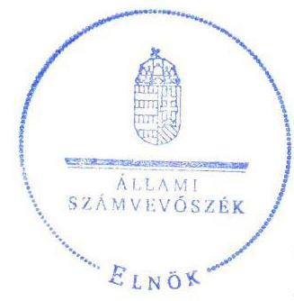

16222
www.asz.hu

Dömokos László elnök

Az ÁSZ az államháztartáson kívül működő közfeladat-ellátó rendszerek ellenőrzéseivel hozzájárul ahhoz, hogy a közpénzeket az államháztartáson kívül működő szervezetek is átlátható, rendezett módon használják fel a közfeladatok ellátása érdekében.
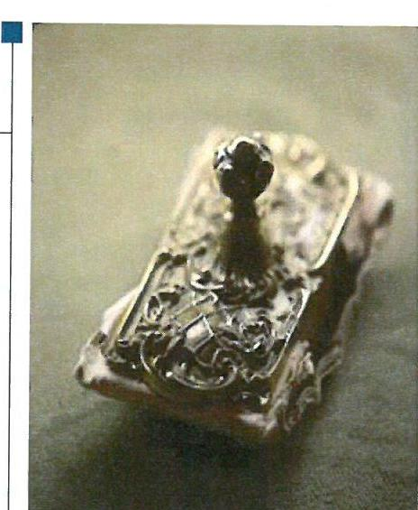

---

# AZ ELLENŐRZÉST FELÜGYELTE: 

MAKKAI MÁRIA felügyeleti vezető

## AZ ELLENŐRZÉST VEZETTE ÉS A VÉGREHAJTÁSÁÉRT FELELŐS:

SALI SÁNDORNÉ ellenőrzésvezető

## A PROGRAM ÖSSZEÁLLÍTÁSÁÉRT FELELŐS:

JANIK JÓZSEF osztályvezető

## A TÉMÁHOZ KAPCSOLÓDÓ KORÁBBI SZÁMVEVŐSZÉKI JELENTÉSEK:

- címe: Jelentés Az önkormányzatok gazdasági társaságai Az önkormányzatok többségi tulajdonában lévő gazdasági társaságok közfeladat ellátását érintő gazdálkodási tevékenysége szabályszerűségének ellenőrzése - Kaposvári Önkormányzati Vagyonkezelő és Szolgáltató Zrt.
- sorszáma: 15066

IKTATÓSZÁM: V-1107-091/2016.
TÉMASZÁM: 2141
ELLENŐRZÉS-AZONOSÍTÓ SZÁM: V070771

---

# TARTALOMJEGYZÉK 

■ ÖSSZEGZÉS ..... 5
■ AZ ELLENŐRZÉS CÉLJA ..... 6
■ AZ ELLENŐRZÉS TERÜLETE ..... 7
■ AZ ELLENŐRZÉS HÁTTERE, INDOKOLTSÁGA ..... 9
■ A JELENTÉS LÉNYEGES KÉRDÉSKÖREI ..... 10
■ ELLENŐRZÉS HATÓKÖRE ÉS MÓDSZEREI ..... 11
■ MEGÁLLAPÍTÁSOK ..... 13
■ JAVASLATOK ..... 23
■ MELLÉKLETEK ..... 25
I. Sz. melléklet: Értelmező szótár ..... 25
II. Sz. melléklet: Működés főbb jellemzői ..... 27
■ FÜGGELÉK: ÉSZREVÉTELEK ..... 29
■ RÖVIDÍTÉSEK JEGYZÉKE ..... 35

---

.

---

# ÖSSZEGZÉS 

A 2011-2014. évek közötti időszakban a Kaposvár Megyei Jogú Város Önkormányzat közfeladat-ellátás megszervezéséről szóló döntése, valamint a Kapos Holding Közszolgáltató Zrt. tulajdonosi joggyakorlása a Kaposvári Hulladékgazdálkodási Kft.-nél szabályszerű volt. A Társaság vagyongazdálkodása összességében szabályos volt. A bevételek és ráfordítások elszámolása megfelelő volt. A Társaság a beszámolási kötelezettségének nem teljes körűen tett eleget. Az ügyvezető a közzétételi kötelezettségét hiányosságokkal teljesítette, ezzel nem biztosította működésének a jogszabályoknak megfelelő átláthatóságát. A közfeladat-ellátással kapcsolatos árképzés szabályszerű volt.

## Az ellenőrzés társadalmi indokoltsága

Az Állami Számvevőszék középtávra szóló stratégiájában megfogalmazta, hogy a helyi önkormányzatok gazdálkodásában rejlő pénzügyi kockázatok feltárásával, az államháztartáson kívülre nyújtott költségvetési támogatások és ingyenes vagyonjuttatások, valamint az államháztartáson kívül működő közfeladat-ellátó rendszerek ellenőrzéseivel hozzájárul ahhoz, hogy a közpénzeket az államháztartáson kívül működő szervezetek is átlátható, rendezett módon használják fel a közfeladatok szerződésben vállalt ellátása érdekében.

Magyarországon az intézmény-centrikus közfeladat-ellátás jellemző, de egyre jelentősebb a költségvetésen kívüli feladatellátás térnyerése. Ennek legfontosabb szereplői - a nonprofit szervezetek mellett - az önkormányzati tulajdonú gazdasági társaságok. Az önkormányzatok szervezetalakítási szabadságának következménye, hogy a korábban is vállalati formában működő közszolgáltatások mellett, mind a kötelező, mind az önként vállalt feladatok ellátásában a gazdasági társaságok kiemelt fontosságú szerephez jutottak.

## Főbb megállapítások, következtetések, javaslatok

Az Önkormányzat közfeladat-ellátás megszervezéséről szóló döntése, valamint a Holding tulajdonosi joggyakorlása szabályszerű volt. Az Önkormányzat a szabályszerű környezetet biztosította a közfeladat-ellátáshoz, terv- és rendeletalkotási kötelezettségének eleget tett, a közszolgáltatási szerződéseket megkötötte. Az FB írásbeli jelentést készített a Holding részére a Társaság éves beszámolóinak elfogadásához.

A Társaság vagyongazdálkodása összességében szabályszerű volt. A kötelezettségállomány a közfeladat- és feladat ellátását, illetve a Társaság működését nem veszélyeztette. A Társaság 2012. február végéig nem rendelkezett a Számv. tv.-ben előírt belső szabályzatokkal, ezt követően kialakította, megalkotta azokat, amelyek a számlarend kivételével megfeleltek a jogszabályi követelményeknek. A számlarend a 2013-2014. években nem tartalmazta teljes körűen minden alkalmazásra kijelölt számla számjelét és megnevezését. A beszámoló mérlegtételei leltárral alátámasztottak voltak az ellenőrzött időszakban. Az adatszolgáltatási kötelezettségének eleget tett. A beszámolási kötelezettségét hiányosságokkal teljesítette, mert a 2013., 2014. évi beszámolók kiegészítő mellékletei nem tartalmazták a közszolgáltatási tevékenység elkülönült bemutatását, arra vonatkozóan önálló mérleget és eredménykimutatást nem készített. A Társaság a közérdekű adatok közzétételének rendjét nem szabályozta és közzétételi kötelezettségének az ügyvezető nem teljes körűen tett eleget 2012. március 1-jétől.

Az ellátott közfeladat bevételeinek és ráfordításainak elszámolása megfelelt az előírásoknak, ugyanakkor az általános költségek felosztását nem szabályozták és nem alkalmazták. A közfeladat-ellátással kapcsolatos árképzés szabályos volt.

---

# AZ ELLENŐRZÉS CÉLJA 

Az ellenőrzés célja annak értékelése volt, hogy az önkormányzat vagyongazdálkodási tevékenysége során szabályszerűen gyakorolta-e tulajdonosi jogait; a gazdasági társaság szabályozottsága, gazdálkodása és vagyongazdálkodási tevékenysége, bevételeinek és ráfordításainak elszámolása megfelelt-e a jogszabályi és tulajdonosi előírásoknak; a gazdasági társaság kötelezettségállománya jelentett-e kockázatot a működésre, valamint a gazdálkodás átláthatósága és elszámoltathatósága érdekében biztosítva volt-e a szolgáltatás díjának megalapozottsága szabályszerű önköltségszámítással.

---

# AZ ELLENŐRZÉS TERÜLETE 

## Kaposvár Megyei Jogú Város Önkormányzata, a Kapos Holding Közszolgáltató Zrt. és a kizárólagos tulajdonában lévő Kaposvári Hulladékgazdálkodási Kft.

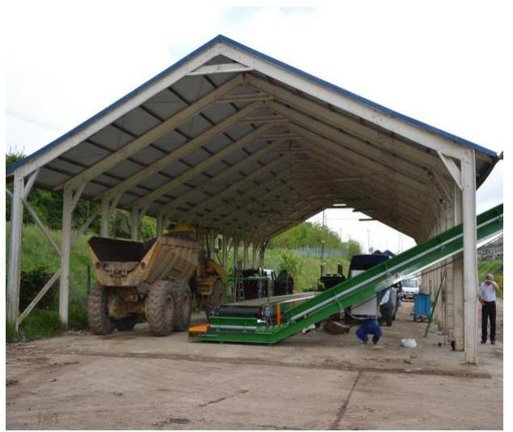

## A KAPOS HOLDING KÖZSZOLGÁLTATÓ

ZRT. egyszemélyes társaságaként 2011. július 6-án kelt Alapító okirattal ${ }^{1}$ határozatlan időtartamra hozta létre a Kaposvári Hulladékgazdálkodási Kft.-t. A tulajdonosi jogokat a Holding ${ }^{2}$ gyakorolta. A Társaság ${ }^{3}$ törzstőkéje az ellenőrzött időszak alatt változatlanul 0,5 M Ft ${ }^{4}$ pénzbeli hozzájárulásból állt.

A HULLADÉKGAZDÁLKODÁSI KFT. fő tevékenysége a kaposvári és Kaposváron kívüli háztartásokban, gazdálkodó szervezeteknél keletkező kommunális hulladék fogadása és ártalmatlanítása volt, ezzel biztosítva a kaposvári regionális hulladéklerakó egyenletes feltöltését. A foglalkoztatottak átlagos statisztikai állományi létszáma 2014. évben 18 fő volt. A Társaság más gazdasági társaságban tulajdoni hányaddal nem rendelkezett. Az Önkormányzat ${ }^{5}$ vagyonkezelésre nem adott át eszközöket a Társaság részére.

A Társaság közszolgáltatást, közszolgáltatáson kívüli más hulladékkezelési közfeladatot, valamint egyéb tevékenységet is ellátott. A Társaság közszolgáltatásként a regionális hulladéklerakót üzemeltette 2012. március 1-jétől 2014. július 2-áig az Önkormányzattal megkötött közszolgáltatási szerződés ${ }^{6}$ alapján. A Mernye Község Önkormányzatával megkötött közszolgáltatási szerződés ${ }^{7}$-ben foglaltak szerint 2013. november 7. és 2014. december 31-e között a települési szilárd hulladék gyűjtését, szállítását és ártalmatlanítását látta el. Közszolgáltatáson kívüli közfeladatként 2013. január 23-ától a Kapos Konzorcium ${ }^{8}$ tagjaként építési és bontási hulladéklerakó telepet, valamint a DDH Nonprofit Kft.-vel ${ }^{9}$ közös konzorcium keretében a 2014. július 2-án megkötött Közszolgáltatási és üzemeltetési szerződés ${ }^{10}$ alapján regionális hulladéklerakót üzemeltetett.

A Társaság 2011. évben tevékenységet még nem végzett, árbevételt nem realizált, követelés és kötelezettségállománya nem volt. A Társaság 2012-2014. évi gazdálkodásának főbb adatait az 1. ábra mutatja.

---

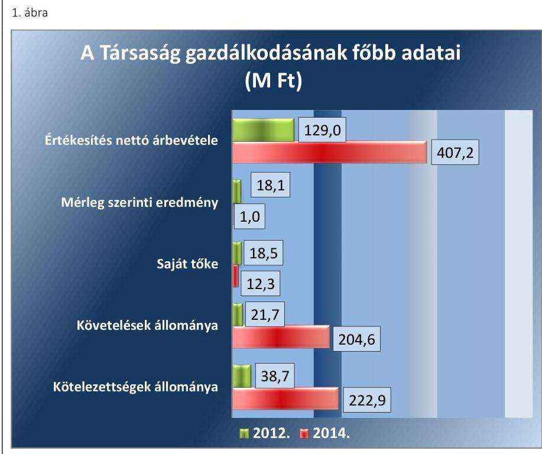

Fornós: A Társaság 2012-2014. évi beszámolói
A Társaság mérlegfőösszege 2012-ben 57,2 M Ft, 2014-ben 272,9 M Ft volt. A követelések állománya a 2012. december 31-e és 2014. december 31-e közötti időszakban 182,9 M Ft-tal, a kötelezettségek állománya 15,8 M Ft-tal nőtt, a saját tőke 6,2 M Ft-tal csökkent. A Társaság tevékenysége nyereséges volt. A 2012-2014. évek között az értékesítés nettó árbevétele 278,2 M Ft-tal nőtt. A jegyzett tőke összege 500 ezer Ft, mely az ellenőrzött időszak alatt nem változott.

Az ellenőrzött időszakban a polgármester és a jegyző személye nem, az ügyvezető igazgató személye változott. A polgármester az 1994. évtől, a jegyző az 1990. évi önkormányzati választások óta látja el feladatait. Az ügyvezető 2015. október 12-e óta tölti be tisztségét.

A Társaság az ellenőrzött időszakban a 479/2009/EK rendelet ${ }^{11}$ alapján 2011. évben, az Áht. ${ }^{12}$ 109. § (8) bekezdése szerint a 2012-2014. években nem minősült a kormányzati alszektorba sorolt társaságnak.

A Társaság működésének főbb jellemzőit a II. sz. melléklet mutatja be.

---

# AZ ELLENŐRZÉS HÁTTERE, INDOKOLTSÁGA 

Az önkormányzatok közfeladat ellátásában egyre jelentősebb a gazdasági társaságok útján történő feladatellátás térnyerése.

AZ ÖNKORMÁNYZATI TULAJDONÚ GAZDASÁGI TÁRSASÁGOK ellenőrzése kiemelten fontos a vagyon megőrzése, megóvása érdekében, amelyekkel szemben alapvető követelmény, hogy gazdálkodásuk, működésük szabályszerű, az általuk szolgáltatott adatok minél megbízhatóbbak legyenek. A közfeladat, illetve a feladatellátás költségeinek, ráfordításainak alakulása, színvonala hatással van a lakosság elégedettségére.

## AZ ELLENŐRZÉS VÁRHATÓ HASZNOSULÁSA-

KÉNT az ÁSZ ${ }^{13}$ a megállapításaival segítséget nyújthat az államháztartáson kívüli közfeladat-ellátás értékeléséhez, jogszabályi keretei pontosításához, átláthatóságot biztosító szabályozásához. Meghatározhatóvá válnak az önkormányzati feladatellátásban résztvevő államháztartáson kívüli szervezeteknek - az Önkormányzat költségvetését, pénzügyi helyzetét is befolyásoló - kockázatai, lehetővé válik ezen kockázatok csökkentése. Ellenőrzéseink feltárhatják, hogy az Önkormányzat feladatellátási kötelezettségének szabályszerűen tett-e eleget, a feladatellátáshoz rendelt vagyonkezelésbe vett és saját vagyon működtetését az elvárható gondossággal, szabályszerűen szervezte-e meg és a tulajdonosi felügyelete hozzájárult-e a feladatellátásához. Az ellenőrzés rávilágíthat arra, hogy a gazdasági társaság a feladatellátási, közszolgáltatási szerződésben foglaltak betartásával, a vagyon használatával biztosította-e a szolgáltatás folytatásának feltételeit, a feladat ellátását. Ezzel az ellenőrzöttek és a helyi döntéshozók számára visszajelzést ad feladatszervezési, feladatellátási kockázataikról, alapot ad a meglévő hibák megszüntetéséhez, a jobb feladatellátás biztosításához. Fokozza a fegyelmet, igazolja, hogy lejárt a következmények nélküli ellenőrzések időszaka. Az ÁSZ értékteremtő rend kialakításához és megőrzéséhez hozzájáruló tevékenysége pozitív hatással van a szervezetről kialakított összkép formálására.

---

# A JELENTÉS LÉNYEGES KÉRDÉSKÖREI 

1. Az Önkormányzat feladat- és közfeladat megszervezéséről szóló döntése, valamint a tulajdonosi joggyakorlás szabályszerű volt-e?
2. A Társaság vagyongazdálkodása szabályszerű volt-e, kötelezettségállománya jelentett-e kockázatot a működésre, illetve a közfeladat-ellátásra?
3. A Társaságnál az ellátott feladat és közfeladat bevételei és ráfordításai elszámolása, valamint az önköltségszámítás és árképzés szabályszerű volt-e?

---

# ELLENŐRZÉS HATÓKÖRE ÉS MÓDSZEREI 

## Az ellenőrzés típusa

Megfelelőségi ellenőrzés

## Az ellenőrzött időszak

A 2011. július 6-ától 2014. december 31-éig terjedő időszak.

## Az ellenőrzés tárgya

A gazdasági társaság feletti tulajdonosi joggyakorlás, valamint a gazdasági társaság gazdálkodásának szabályozottsága és szabályszerűsége.

Az ellenőrzés kiterjed minden olyan körülményre és adatra, amely az ÁSZ jogszabályban meghatározott feladatainak teljesítéséhez, valamint a program végrehajtása folyamán felmerült újabb összefüggések feltárásához szükséges.

## Az ellenőrzött szervezet

Kaposvár Megyei Jogú Város Önkormányzata
Kapos Holding Közszolgáltató Zrt.
Kaposvári Hulladékgazdálkodási Kft.

## Az ellenőrzés jogalapja

Az ellenőrzés végrehajtásának jogszabályi alapját az Állami Számvevőszékről szóló 2011. évi LXVI. törvény 1. § (3) bekezdése és az 5. § (3)-(4)-(5) bekezdései képezték.

## Az ellenőrzés módszerei

Az ellenőrzést a nemzetközi standardokat irányadónak tekintve az ellenőrzési program ellenőrzési kérdései, az ellenőrzött időszakban hatályos jogszabályok, az ellenőrzés szakmai szabályok és módszertanok figyelembevételével végeztük.

Az ellenőrzés ideje alatt az ellenőrzött szervezettel történő kapcsolattartást az ÁSZ Szervezeti és Működési Szabályzatának vonatkozó előírásai alapján biztosítottuk.

---

Az ellenőrzés a többségi tulajdonosi jogokat gyakorló Kaposvár Megyei Jogú Város Önkormányzatára, a Kapos Holding Közszolgáltató Zrt.-re, illetve az ellenőrzött közfeladatot ellátó Kaposvári Hulladékgazdálkodási Kft.-re terjedt ki.

Az ellenőrzési kérdések megválaszolásához szükséges bizonyítékok megszerzése a következő ellenőrzési eljárások alkalmazásával történt: megfigyelés, kérdésfeltevés (információkérés), összehasonlítás, valamint elemző eljárás. Az ellenőrzési bizonyítékként felhasználható adatforrások közé tartoztak egyrészt a szakmai programban felsorolt adatforrások, másrészt az ellenőrzés folyamán feltárt, az ellenőrzés szempontjából információkat tartalmazó dokumentumok.

Az ellenőrzést a kérdésekre adott válaszok kiértékelésével, valamint a megjelölt adatforrások, a csatolt tanúsítványok felhasználásával, továbbá az adott időszakban hatályos jogszabályok figyelembevételével folytattuk le.

A bevételek és ráfordítások elszámolása, valamint a vagyonnyilvántartás terén az egyes területek szabályszerű működését mintavétellel és irányított kiválasztással ellenőriztük, egyrészt a
 sokaságokban előforduló hibás tételek arányát becsültük a mintatételek értékelése alapján, másrészt az irányítottan kiválasztott tételeket értékeltük. A jogszabályoknak és a belső előírásoknak megfelelőnek, azaz szabályszerűnek tekintettük a mintavétellel kiválasztott bevételek és ráfordítások elszámolását, a vagyonnyilvántartást, amennyiben a minta ellenőrzésének eredménye alapján 95\%-os bizonyossággal a teljes sokaságban a hibaarány kisebb volt, mint 10\%, nem megfelelőnek értékeltük, ha a hibás tételek aránya a 10\%-ot meghaladta.

---

# 1. Az Önkormányzat feladat- és közfeladat megszervezéséről szóló döntése, valamint a tulajdonosi joggyakorlás szabályszerű volt-e? 

Összegző megállapítás

Az Önkormányzat a közfeladat-ellátás megszervezéséről szóló döntése, valamint a Holding tulajdonosi joggyakorlása szabályszerű volt.

### 1.1. számú megállapítás

Az Önkormányzat közfeladat-ellátás megszervezéséről szóló döntése szabályszerű volt, valamint a szabályszerű környezetet biztosította a közfeladat-ellátáshoz.

GAZDASÁGI PROGRAMJÁBAN ${ }^{14}$ az Önkormányzat a 2010. évben meghatározta a hulladékgazdálkodás, mint kötelező feladat biztosítására, fejlesztésére vonatkozó célkitűzéseket. A Közgyűlés ${ }^{15}$ a gazdasági programot a 187/2010. (X. 14.) számú önkormányzati határozatával fogadta el. Az Önkormányzat vagyongazdálkodási koncepcióját a Közép- és hosszútávú vagyongazdálkodási tervében rögzítette.

RENDELETALKOTÁSI KÖTELEZETTSÉGÉNEK az Önkormányzat az ellenőrzött időszakban eleget tett. Megalkotta a hatályos vagyongazdálkodási rendelet ${ }_{1,2,3}{ }^{16}$-at. Az Önkormányzat az 54/2001. (XII. 6.) számú rendeletében ${ }^{17}$ szabályozta a köztisztaság fenntartásának, a települési szilárd hulladék kezelésének, a hulladékok szelektív gyűjtésének és ártalommentes elhelyezésének részleteit, amelyet az ellenőrzött időszak alatt két alkalommal a szemétszállítás és ártalmatlanítási szolgáltatási díjak változása, egy alkalommal a közszolgáltatók személyében bekövetkezett változás miatt módosított.

HULLADÉKGAZDÁLKODÁSI TERVÉT az Önkormányzat a $\mathrm{Hgt}_{.1}{ }^{18}$ 35. § (1) bekezdésében foglaltaknak megfelelően - az ellenőrzési időszak előtt - kidolgozta. A 2013. január 1-jétől a Hgt. ${ }^{19}$ 78. § (1) bekezdésében foglaltak alapján a közszolgáltató feladataként írta elő a hulladékgazdálkodási terv elkészítését, melynek a Társaság eleget tett.

## A KÖZTISZTASÁG ÉS TELEPÜLÉSTISZTASÁG

BIZTOSÍTÁSA az Ötv. ${ }^{20}$ 8. § (1) bekezdése, illetve a Mötv. ${ }^{21}$ 13. § (1) bekezdés 19. pontja alapján az Önkormányzat törvényi kötelezettsége volt. A hulladékgazdálkodással kapcsolatos közfeladatot a Városgazdálkodási Zrt. ${ }^{22}$ látta el 2011. decemberéig. A Társaság 2011. évben megalakult, de még tevékenysége nem volt.

A Közgyűlés 2011. decemberében döntött a települési szilárd hulladék begyűjtésének és ártalmatlanításának két külön gazdasági társaság általi folytatásáról, ezzel megosztotta a feladatellátást két társasága között. A

---

Közgyűlés a 266/2011. (XII. 15.) önkormányzati határozatával jóváhagyta a Városgazdálkodási Zrt. részéről a települési szilárd hulladék ártalmatlanítási és kezelési tevékenység megszüntetését és a Társasággal való megállapodás megkötését. Ennek megfelelően a hulladék begyűjtése és szállítása a Városgazdálkodási Zrt. feladata maradt, míg a hulladékudvar üzemeltetése és az ártalmatlanítás a Társaság feladatát képezte. A Holding a Társaság 2011. június 6-tól hatályos Alapító okirat 3.1. pontjában főtevékenységként a nem veszélyes hulladék kezelését, ártalmatlanítását jelölte meg, az egyéb tevékenységi köreit a 3.2. pontban sorolta fel a Gt. ${ }^{23}$ 12. § (1) bekezdésében foglaltaknak megfelelően.

Az Önkormányzat a feladatellátás keretszabályait, követelményeit az 54/2001. (XII. 6.) önkormányzati rendeletben, a közszolgáltatási szerző-dés ${ }_{1,2}$-ben, illetve a Közszolgáltatási és üzemeltetési szerződésben szabályozta.

KÖZSZOLGÁLTATÁSI SZERZŐDÉS ${ }_{1}$ szabályszerű volt, ennek alapján a Társaság 2012. március 1-jétől a kötelező közfeladat-ellátás keretében üzemeltette a regionális hulladéklerakó telephelyet 2014. július 1-jéig. A közszolgáltatási szerződés ${ }_{1}$ megszűnését követően a Hgt. ${ }_{2}$ törvényi változása miatt - a közszolgáltató csak minősített nonprofit gazdasági társaság lehetett - az Önkormányzat Közszolgáltatási és üzemeltetési szerződést kötött a DDH Nonprofit Kft.-vel. Ettől kezdve a Hgt. ${ }_{2}$ 2. § (1) bekezdés 37. pontja szerinti közszolgáltató a DDH Nonprofit Kft. volt. A Társaság konzorciumi tagként a kapcsolódó Konzorciumi szerződés ${ }^{24}$ alapján közfeladatként továbbra is ellátta a hulladékkezelési, ártalmatlanítási és a hulladéklerakó üzemeltetési feladatokat, azonban nem minősült közszolgáltatónak. A Konzorciumi szerződésben rögzítették többek között a konzorciumi tagok közötti feladatmegosztást és a megvalósításban való részvétel arányát.

A Mernye Község Önkormányzatával megkötött közszolgáltatási szerző-dés ${ }_{2}$-ben foglaltak szerint 2013. november 7-től Mernye település szilárd hulladék gyűjtését, szállítását, és ártalmatlanítását végezte. A szerződés szabályszerűen meghatározta a Mernye Község Önkormányzata és a közszolgáltató kötelezettségeit, a közszolgáltatási díj mértékét és a szolgáltatási szerződés időtartamát, továbbá a szerződés megszűnésének, valamint felmondásának feltételeit.

Az Önkormányzat a közszolgáltatási szerződés ${ }_{1,2}$-ben és a Közszolgáltatási és üzemeltetési szerződésben évente adatszolgáltatási kötelezettséget írt elő a szilárd hulladéklerakó üzemeltetési tapasztalatokról, a beszállított hulladékok mennyiségéről, beszállítási köréről.

# 1.2. számú megállapítás 

## A Holding tulajdonosi joggyakorlása szabályszerű volt.

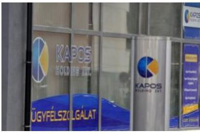

A TULAJDONOSI JOGOK gyakorlásának rendjét, ezen belül a Társaság képviseletére kijelölt személyek feladatait a Társaság Alapító okirata tartalmazta. A Holding további követelményeket nem határozott meg a tulajdonosi képviseletre kijelölt személyek részére. A Holding tulajdonosi joggyakorlása keretében belső utasításban határozta meg a monitoring tevékenységét, amelynek keretében a Társaságra a 2012. év áprilisától havi kontrolling jelentést, 2012. év második negyedévétől évközi negyedéves beszámolót készített.

---

AZ FB ${ }^{25}$ az Alapító okiratban foglaltak alapján három tagból állt. Az FB rendelkezett a jogszabályokban előírt ügyrenddel. A Társaság az FB-nek az üzleti tevékenységéről negyedévenként jelentés formájában számolt be. Az FB a Gt. 35. § (3), illetve a Ptk. ${ }^{26}$ 3:120. § (2) bekezdéseinek megfelelően minden évben írásbeli jelentést készített a Társaság éves beszámolóinak elfogadásához.

ANYAGI ÖSZTÖNZÉSI RENDSZER keretében a Társaság a 2011. július 6-ai megalakulását követően 2012. február 29-ig a Taktv. ${ }^{27}$ 5. § (2)-(3) bekezdéseiben előírtakat megsértve nem rendelkezett a javadalmazásokkal összefüggő szabályzattal. A 2012. március 1-jén elkészült a Holding által elfogadott javadalmazási szabályzat ${ }^{28}$, mely megfelelt a Taktv.ben előírtaknak.

A BESZÁMOLTATÁSI RENDSZER keretében az FB évközi ellenőrzéseiről szóló jelentéseket a Holding megkapta és a Társaság gazdálkodásának értékelésekor figyelembe vette az FB évközi ellenőrzéseinek megállapításait, intézkedéseit.

A Holding az ellenőrzött időszakban megtárgyalta a Társaság éves beszámolóit, döntött az éves eredményfelosztásra vonatkozóan. A nyereséget - a 2013. év kivételével - az eredménytartalékba helyezte. A 2013. évben osztalék kifizetésére került sor.

# 2. A Társaság vagyongazdálkodása szabályszerű volt-e, kötelezettségállománya jelentett-e kockázatot a működésre, illetve a közfeladat-ellátásra? 

Összegző megállapítás

### 2.1. számú megállapítás

A Társaság vagyongazdálkodása összességében szabályszerű volt. A kötelezettségállomány a közfeladat- és feladat ellátását, illetve a Társaság működését nem veszélyeztette. A beszámolási és adatszolgáltatási kötelezettségének eleget tett, a közzétételi kötelezettségét hiányosságokkal teljesítette.

A Társaság 2012. február végéig nem rendelkezett a Számv. tv. ${ }^{29}$ ben előírt belső szabályzatokkal, ezt követően kialakította, mely a számlarend kivételével megfelelt a jogszabályi követelményeknek.

ÜZLETI TERVÉT a Társaság az ellenőrzött időszakban elkészítette, amelyet jóváhagyásra benyújtott a tulajdonosi joggyakorló felé. Az üzleti terv készítési kötelezettségét a Társaság Alapító okirata írta elő. A benyújtott üzleti terveket a Holding határozattal elfogadta. Az üzleti tervek tartalmazták a szolgáltatás, az árbevétel, a ráfordítások és az eredmény tervezését. A 2013. évtől a Hgt. 78. § (1) bekezdése a közszolgáltató feladatként írta elő a hulladékgazdálkodási terv elkészítését, melynek a Társaság eleget tett. Ezt megelőzően az Önkormányzat a Hgt. ${ }^{30}$ 35. § (1) bekezdésében foglaltaknak megfelelően - az ellenőrzési időszak előtt - kidolgozta a hulladékgazdálkodási tervet.

---

SZÁMVITELI POLITIKÁT és ennek keretében elkészítendő szabályzatokat - az eszközök és források leltárkészítési és leltározási szabályzatát, az eszközök és források értékelési szabályzatát és a pénzkezelési szabályzatot - a Társaság a 2011. évi megalakulását követően 2012. február 29-ig a Számv. tv. 14. § (11) bekezdésében foglaltakat megsértve - 90 napon belül - nem készített.

Számviteli politikával ${ }^{31}$ 2012. március 1-jétől rendelkezett, amely megfelelt a Számv. tv. előírásainak.

A Társaság 2012. március 1-jén készítette el a leltározási szabályzat ${ }_{1}^{32}$-et, melynek a 2. pontja a teljes tárgyi eszköz állományra vonatkozóan háromévenkénti, az egyéb gépek, berendezések, felszerelések vonatkozásában, valamint a készletekre évenkénti - fordulónappal történő - tényleges mennyiségi leltárfelvételi kötelezettséget írt elő. A leltározási szabályzat ${ }_{1}$ a mennyiségi felvétel gyakoriságára vonatkozó előírásai megfeleltek a Számv. tv. 2012. január 1-jétől hatályos előírásainak. A 2013. január 1-jétől hatályos leltározási szabályzat ${ }_{2}^{33}$ tartalmában azonos maradt az előző szabályzattal, a módosítást az ügyvezető személyének változása indokolta.

A 2012. március 1-jén hatályba lépett pénzkezelési szabályzata ${ }_{1,2}{ }^{34,35}$ megfelel a Számv. tv. előírásainak.

ESZKÖZÖK ÉS FORRÁSOK ÉRTÉKELÉSI SZABÁLYZATÁT a számviteli politika keretében nem készítette el az ellenőrzött időszakban a Társaság a Számv. tv. 14. § (5) bekezdés b) pontjában foglaltak ellenére. Mindemellett az eszközök és források értékelésének részletes szabályait a számviteli politikájában, és a számlarend ${ }^{36}$-jében a jogszabály által előírt tartalommal meghatározta.

SZÁMLARENDJÉT a Társaság a 2011. évi megalakulását követően 2012. február 29-ig a Számv. tv. 161. § (5) bekezdésében foglaltakat megsértve - 90 napon belül - nem alakította ki. A Társaság számlarendje 2012. március 1-jén lépett hatályba, amely tartalmában a 2012. évre vonatkozóan megfelelt a Számv. tv. 161. § (2) bekezdésében szereplő előírásoknak.

A Társaság a 2013-2014. években a számlarend részét képező számlatükör ${ }_{3,4}{ }^{37}$-ben az építési és bontási hulladéklerakó üzemeltetéséhez kapcsolódó költségeihez (7-es számlaosztály) és bevételeihez (9-es számlaosztály) külön főkönyvi számlát rendelt, ugyanakkor a számlarendje a változásoknak megfelelően nem került módosításra. Ezzel a Társaság megsértette a Számv. tv. 161. § (2) bekezdés a) pontjában foglaltakat, amely szerint a számlarendnek tartalmaznia kell minden alkalmazásra kijelölt számla számjelét és megnevezését.

# 2.2. számú megállapítás 

A vagyongazdálkodás megfelelt a jogszabályi előírásoknak, a beszámoló mérlegtételei leltárral alátámasztottak voltak.

A Társaság közfeladatát, feladatát a saját tulajdonában lévő vagyonnal, valamint bérelt eszközökkel látta el.

SZABÁLYSZERŰ LELTÁRRAL támasztották alá a beszámolóban és a számviteli nyilvántartásokban lévő vagyontárgyak állományát az ellenőrzött időszakban.

---

A Társaság a tulajdonában lévő, elsősorban közfeladat ellátását szolgáló vagyonelemeken karbantartást végzett, értéknövelő felújítást és beruházást hajtott végre. A Társaság a fejlesztéseket önerőből, illetve pályázati forrásból valósította meg. A fejlesztések eredményeképp a Társaság vagyona az ellenőrzött időszakban emelkedett. A 2014. évi beruházásként megvalósult szilárd hulladékválogató rendszer beszerzéséhez a Társaság pályázaton 27,9 M Ft vissza nem térítendő támogatást kapott, továbbá a tulajdonos is hozzájárult.

A Társaság éves beszámolóinak főbb mérlegadatait az 1. táblázat szemlélteti.

1. táblázat

| A TÁRSASÁG FŐBB MÉRLEGADATAI (M Ft-BAN) |  |  |  |  |
| :--: | :--: | :--: | :--: | :--: |
| Megnevezés | 2011.12.31. | 2012.12.31. | 2013.12.31. | 2014.12.31. |
| I. Befektetett eszközök | 0,0 | 34,8 | 40,2 | 65,4 |
| - ebből: Tárgyi eszközök | 0,0 | 34,8 | 40,2 | 65,2 |
| II. Forgó eszközök | 0,5 | 22,3 | 53,8 | 207,2 |
| - ebből: Követelések | 0,0 | 21,7 | 53,0 | 204,6 |
| III. Aktív időbeli elhatárolások | 0,0 |

 0,1 | 1,3 | 0,3 |
| Eszközök összesen | 0,5 | 57,2 | 95,3 | 272,9 |
| IV. Saját tőke | 0,5 | 18,5 | 11,4 | 12,3 |
| - ebből: Jegyzett tőke | 0,5 | 0,5 | 0,5 | 0,5 |
| - ebből Mérleg szerinti eredmény | 0,0 | 18,1 | 0,0 | 1,0 |
| V. Céltartalékok | 0,0 | 0,0 | 0,0 | 11,7 |
| VI. Kötelezettségek | 0,0 | 38,7 | 83,9 | 222,9 |
| VII. Passzív időbeli elhatárolások | 0,0 | 0,0 | 0,0 | 26,0 |
| Források összesen | 0,5 | 57,2 | 95,3 | 272,9 |

A VAGYON az ellenőrzött időszakban jelentősen nőtt, melyet részben a tárgyi eszközök növekedése, továbbá a forgóeszközök növekedése okozott. A forgóeszközök mérlegértéke több mint kilencszeresére nőtt, a vevőkövetelések és a kapcsolt vállalkozással szembeni követelések növekedése miatt. Az eszközök értékcsökkenése a számviteli politikában meghatározottak szerint elszámolásra került. Az éves beruházások, eszközbeszerzések és értéknövelő felújítások a vizsgált időszakban minden évben meghaladták az értékcsökkenési leírás összegét.

A SAJÁT TŐKE nem csökkent a kötelezően előírt jegyzett tőke szintje alá, a Társaság az ellenőrzött időszak alatt nyereségesen gazdálkodott. A 2013. évben osztalék kifizetésére került sor.

# 2.3. számú megállapítás 

A kötelezettségállomány a közfeladat-ellátásra, illetve a működésre nem jelentett kockázatot.

AZ ELADÓSODOTTSÁGOT jellemző eladósodottsági mutató a Társaságnál 2012. évben 0,7 volt, a 2013-2014. években ettől kedvezőtlenebbül alakult. Az eladósodottság mértéke a 2012. évben 2,1 volt, amely a 2013-2014. években nagymértékben tovább emelkedett. A kötelezettségek növekedésének fő oka a 2013. évtől bevezetett hulladék lerakói járulék

---

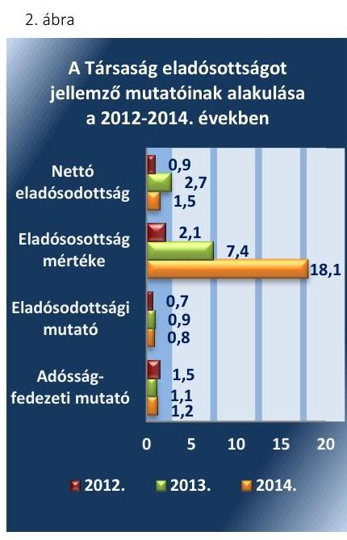

Fonrás: 3. számú tanúsítvány
volt. A járuléktartozás az összes kötelezettségnek a 2013. évben 27,2%-át (22,8 M Ft), a 2014. évben 61,0%-át (136,0 M Ft) tette ki. A nettó eladósodottság a 2012. évben kedvező volt, azonban 2013. évben nagymértékben romlott, majd 2014. évben javult. A nettó eladósodás alakulásából látható, hogy az kötelezettségek emelkedésénél nagyobb mértékben nőtt a Társaság kintlévőségeinek összege.

A Társaság az ellenőrzött időszak első évében tevékenységet nem végzett, az eladósodottságot jellemző mutatók alakulását a 2012-2014. évekre vonatkozóan a 2. ábra mutatja.

KÖTELEZETTSÉGEK esedékes törlesztő részleteinek határidőben történő teljesítése biztosított volt. A hosszú lejáratú kötelezettséget 2013. január 30-án a Kaposvár-Car Kft.-vel kötött nyílt végű lízing szerződéses kötelezettség jelentette, mely 2013. évben 2,8 M Ft, 2014. évben 1,7 M Ft volt. A Társaság - mint a Holding érdekeltségéhez tartozó cég 2011. június 11-én az OTP Bank Nyrt.-vel kötött „OTP CASH-POOL Szolgáltatási Szerződés" egyik Szerződő tagvállalata volt. A Társaság a szerződés szerint tagszámlával rendelkezett, folyószámla hitelkerettel azonban nem. A Társaság kötelezettségállományát a 2. táblázat mutatja.
2. táblázat

A TÁRSASÁG KÖTELEZETTSÉGÁLLOMÁNYÁNAK ALAKULÁSA 2012-2014. ÉVEKBEN (M Ft-BAN)

| Megnevezés | 2012 | 2013 | 2014 |
| :-- | --: | --: | --: |
| HOSSZÚ LEJÁRATÚ KÖTELEZETTSÉGEK | 0,0 | 2,8 | 1,7 |
| RÖVID LEJÁRATÚ KÖTELEZETTSÉGEK | 38,7 | 81,1 | 221,2 |
| Kötelez. áruszállításból és szolgáltatásból   (szállítók) | 17,1 | 14,2 | 38,8 |
| Rövid lej. kötelez. kapcsolt vállalkozással   szemben | 12,2 | 26,0 | 24,5 |
| - ebből szállítói tartozás | 12,2 | 13,0 | 11,5 |
| - ebből egyéb rövid lej. kötelezettség | 0,0 | 13,0 | 13,0 |
| Egyéb rövid lejáratú kötelezettségek | 9,4 | 40,9 | 157,9 |
| Kötelezettségek összesen | 38,7 | 83,9 | 222,9 |

A kötelezettségek állománya a 2012. évi 38,7 M Ft-ról 2014. év végére 184,2 M Ft-tal, 222,9 M Ft-ra nőtt. A kötelezettségek jelentős részét a rövid lejáratú kötelezettségek tették ki, melyek több mint ötszörösére emelkedtek. A rövid lejáratú kötelezettségeken belül meghatározóak voltak a szállítói, a kapcsolt vállalkozással szembeni szállítói kötelezettségek, valamint a hulladék lerakói járulék.

Az éves beszámolók jelentős határidőn túli kötelezettségeket tartalmaztak. A lejárt kötelezettségeken belül a 31-180 napos kötelezettség aránya az összes kötelezettséghez viszonyítva 2012. évben 36,5%, 2013. évben 32,4%, 2014. évben 40,8% volt. A szállítói kötelezettség lejárat szerinti bontását a 3. táblázat mutatja.

---

3. táblázat

# A TÁRSASÁG SZÁLLÍTÓI KÖTELEZETTSÉGEINEK LEJÁRAT SZERINTI ALAKULÁSA 2012-2014. ÉVEKBEN (M Ft-BAN) 

| Megnevezés | 2012.12.31 | 2013.12.31 | 2014.12.31 |
| :-- | --: | --: | --: |
| Határidőn belüli szállítói kötele-   zettségek | 12,1 | 15,2 | 21,4 |
| Lejárt szállítói kötelezettségek   (0-30 nap) | 6,5 | 3,2 | 8,4 |
| Lejárt szállítói kötelezettségek   (31-180 nap) | 10,7 | 8,8 | 20,5 |
| Összes kötelezettség | 29,3 | 27,2 | 50,3 |

2.4. számú megállapítás

A Társaság a beszámolási és adatszolgáltatási kötelezettségének eleget tett, de a kiegészítő melléklet nem mindenben felelt meg a Számv. tv. előírásainak a 2013-2014. években. A közérdekű adatok közzétételének rendjét nem szabályozta és közzétételi kötelezettségének nem teljes körűen tett eleget.

BESZÁMOLÁSI KÖTELEZETTSÉGÉNEK a Társaság a Számv. tv. 153. § (1) bekezdésében előírt határidőben eleget tett. A beszámolókat a Holding elfogadta. Az éves beszámolók jóváhagyásakor a felügyelő bizottsági és a könyvvizsgálói jelentések rendelkezésre álltak.

A Társaság a 2013. és 2014. évi beszámoló készítésénél nem tett eleget a Hgt.: 50. § (3) bekezdésében megfogalmazott követelménynek, amely szerint a hulladékgazdálkodási közszolgáltatás nyújtása érdekében végzett tevékenységet éves beszámolója kiegészítő mellékletében oly módon kell bemutatnia, mintha azt önálló vállalkozás keretében végezte volna. A tevékenység elkülönült bemutatására önálló mérleget és eredménykimutatást nem készített. A bemutatási hiányosság nem befolyásolta a 2013. és 2014. évi beszámoló mérlegének valódiságát.

A KÖNYVVIZSGÁLÓ az éves beszámolókról korlátozás nélküli jelentést adott. A 2014. üzleti évről szóló jelentésében figyelemfelhívással élt a felhalmozott hulladéklerakói járulék hátralék kötelezettség miatt. A Társaság az Alapító okirata, valamint a Számv. tv. 155. § (3) bekezdése alapján az ellenőrzött időszak alatti években nem volt könyvvizsgálatra kötelezett, a beszámolóit ugyanakkor a 2012. évtől kezdődően független könyvvizsgáló auditálta.

A KÖZÉRDEKŰ ADATOK nyilvánosságra hozatalával, az adatok védelmével kapcsolatos kötelezettségének a Társaság 2012. március 1-jétől, a közfeladata megkezdésének időpontjától nem tett eleget. Az Info tv. $^{38}$ 24. § (1) bekezdésében foglaltak ellenére nem jelölt ki a belső adatvédelmi felelőst, nem biztosította az Info tv. 24. § (2) bekezdésében foglalt feladatok teljesítését, továbbá nem készített az Info tv. 24. § (3) bekezdésében előírt adatvédelmi és adatbiztonsági szabályzatot.

A Társaság 2012. március 1-jétől az Info tv. 30. § (6) bekezdésében foglaltak ellenére nem készítette el a közérdekű adatok megismerésére irányuló igények teljesítésének rendjét rögzítő szabályzatot.

A Társaság ügyvezetője, mint az Info tv. 35. § (1) bekezdése szerinti az elektronikus közzétételre kötelezett adatfelelős szerv vezetője az Info tv.

---

35. § (3) bekezdésében foglaltak ellenére 2012. március 1-jétől nem készítette el az Info tv. 37. §-ában meghatározott közzétételi listákon szereplő adatok közzétételének és az adatközlőnek való megküldésének részletes belső szabályzatát.

A Társaság 2012. március 1-jétől a kötelezően közzéteendő közérdekű adatokat internetes honlapján, illetve a Holding honlapján digitális formában, bárki számára, korlátozástól mentesen nem teljes körűen tette közzé, amely ellentétes az Info tv. 33. § (1) és a (3), a 37. § (1) bekezdéseiben, valamint az 1. számú mellékletében foglaltakkal. A honlapon nem tette közzé az 1. számú melléklet II. Tevékenységre, működésre vonatkozó, valamint III. Gazdálkodási adatokat.

Az Info tv. 1. számú melléklet I. Szervezeti és személyzeti adatok fejezetben foglaltaknak megfelelően közzétételre került a szervezeti ábra, a szervezeti egységek feladatai, a vezetők neve, e-mail címe, telefonszáma.

# 3. A Társaságnál az ellátott feladat és közfeladat bevételei és ráfordításai elszámolása, valamint az önköltségszámítás és árképzés szabályszerű volt-e? 

Összegző megállapítás

### 3.1. számú megállapítás

3. ábra
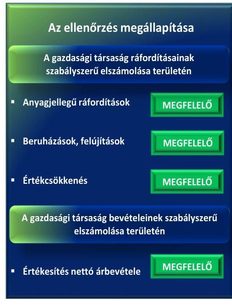

A Társaságnál az ellátott közfeladat bevételeinek és ráfordításainak elszámolása összességében megfelelt az előírásoknak, az általános költségek felosztásának kivételével. A közfeladatellátással kapcsolatos árképzést szabályszerűen alkalmazták.

Az ellátott közfeladat bevételeinek és ráfordításainak elszámolása megfelelt az előírásoknak, ugyanakkor az általános költségek felosztását nem szabályozták és nem alkalmazták.

A 2012-2014. években a közvetlenül a tevékenységhez nem rendelhető általános költségeket elkülönített számlán tartották nyilván, azonban nem határozták meg a költségek felosztásának szabályait és nem is alkalmazták, ezáltal az átláthatóságot teljes körűen nem biztosították. A Társaság eljárása nem felelt meg a Számv. tv. 161/A. § (2), valamint a Hgt. 1 29. § (3), továbbá a Hgt. 2 50. § (2) bekezdéseiben foglalt előírásoknak, melyek szerint a könyvvezetés részletes belső szabályait úgy kell kialakítani, hogy az egyes tevékenységeire olyan elkülönült nyilvántartást vezessen, amely biztosítja az egyes tevékenységek átláthatóságát, valamint kizárja a keresztfinanszírozást. A mintavétellel ellenőrzött területek értékelését a 3. ábra mutatja.

AZ ÉRTÉKESÍTÉS NETTÓ ÁRBEVÉTELEINEK elszámolása megfelelt a jogszabályi előírásoknak. A bevételek előírása és kiszámlázása, valamint a bevételek elkülönítése szabályszerű volt.

AZ ANYAGJELLEGŰ RÁFORDÍTÁSOK elszámolása megfelelt a jogszabályi előírásoknak. A költségeket jellemzően a számlarendben, illetve a számlatükör$_{1-4}$-ben rögzített, a könyvviteli eseménynek megfelelő főkönyvi számlára számolták el.

---

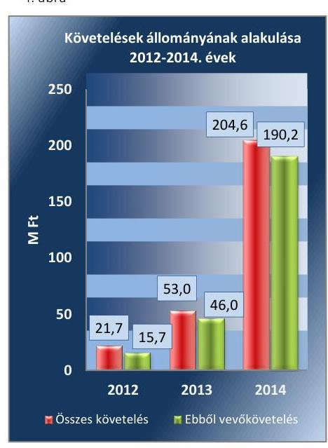

Fonrás: 2012-2014. évi beszámolók, 3. számú tanúsítvány

### 3.2. számú megállapítás

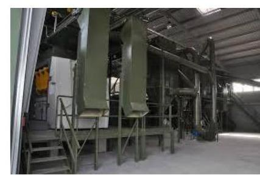

## A BERUHÁZÁSOK, FELÚJÍTÁSOK KIADÁSAI ÉS AZ ÉRTÉKCSÖKKENÉSI LEÍRÁS elszámolása megfelel a jogszabályi előírásoknak. A beszerzett immateriális javak, a tárgyi eszközök üzembe helyezése, állományba vétele, a bekerülési érték meghatározása, az eszközök besorolása és nyilvántartása, valamint az értékcsökkenés elszámolása megfelelt a Számv. tv. és a belső szabályozásban foglaltaknak.

Az eszközök pótlása, felújítása, karbantartása a saját vagyon után elszámolt értékcsökkenést meghaladóan valósult meg. Mindemellett megállapítható, hogy az eszközök átlagos életkora a termelésben résztvevő valamennyi eszközcsoport esetében nőtt (műszaki gépek, berendezések, felszereléseknél 0,5-1,4 év, a számítástechnikai eszközöknél 0,1-1,9 év és a járműveknél 0,6-2,6 év).

A KÖVETELÉSEK ÁLLOMÁNYA 21,7 M Ft-ról 204,6 M Ft-ra, több mint kilencszeresére nőtt. A vevőkövetelések a 2012. évről 2013. évre közel háromszorosára, 46,0 M Ft-ra, a 2014. évre több mint 12-szeresére, 190,2 M Ft-ra nőttek. Ennek fő oka a kapcsolt vállalkozások, ezen belül a 2013. évben a Városgazdálkodási Zrt., a 2014. évben a DDH Nonprofit Kft., és a Városgazdálkodási Zrt. vevőkövetelések késedelmes teljesítése volt. Az ellenőrzött időszakban emelkedett a nem vitatott, jogszerű követelések határidőre be nem folyt összege. A Társaság határidőn túli követeléseinek kezelését a Holding végezte. A 2012-2013. években egyedi felszólító leveleket küldött ki. A 4. ábra a követelések állományának alakulását mutatja 2012-2014. években.

A Társaságnak a Hgt. 1 26. § (1) bekezdése, 2013. január 1-jétől a Hgt. 2 52. § (1) bekezdése értelmében adók módjára behajtandó köztartozásnak minősülő hulladékkezelési közszolgáltatásból származó követelése nem volt az ellenőrzött időszakban. A Kintlévőség kezelési szabályzatát 2013. január 9-én elkészítette, melyben előírta a közszolgáltatási díjhátralék, illetve az egyéb kintlévőségek kezelésének eljárásrendjét a Hgt. 2 52. §-ával összhangban.

## A közfeladat-ellátással kapcsolatos árképzést szabályszerűen
 alkalmazták.

AZ ÁRAKAT az Önkormányzat határozta meg. A közszolgáltatási szerződésben előírta a Társaság részére, hogy a kötelező közszolgáltatás ártalmatlanítási díjára vonatkozó díjemelési javaslatát minden év szeptember 15-éig kellett benyújtania az Önkormányzatnak, melyet az Önkormányzat a benyújtott kalkuláció alapján határozatban elfogadott. A Hgt. 2 17. § (5) bekezdésében foglaltak szerint 2013. január 1-jétől az ártalmatlanítási, kezelési díjat az üzemeltető Társaság határozta meg. Mindezek mellett a Közgyűlés fenntartotta a jogot a díj testületi hatáskörű eldöntésére a közszolgáltatási szerződésben előírtaknak megfelelően.

ÖNKÖLTSÉGSZÁMÍTÁS RENDJÉRE vonatkozó belső szabályzat készítésére a Társaság a Számv. tv. 14. § (6)-(7) bekezdésekben foglaltak alapján nem volt kötelezett a 2011-2014. években, mivel egyszerűsített beszámolót készíthetett, továbbá a korrigált nettó árbevétele ${ }^{39}$ az egymilliárd forintot, a költségek együttes összege az ötszázmillió forintot nem haladta meg.

---

A Társaság 2012. március 1-je és 2012. december 30-a közötti időszakban önkormányzati határozat, illetve önkormányzati rendelet hiányában a saját maga által kialakított ártalmatlanítási díjakat alkalmazta. A Társaság a 2012-2013. években benyújtott ártalmatlanítási díjakra vonatkozó díjemelési javaslatát díjkalkulációval alátámasztotta.

A Hgt. 2 által 2013. január 1-jétől előírt hulladék lerakói járulékfizetési kötelezettség miatt a Társaság 2013. április 4-én újabb javaslatot nyújtott be az ártalmatlanítási díjakra vonatkozóan, melyben érvényesítette a megnövekedett költségeit, valamennyi díjkategória díjainak tonnánként 3000 Ft-tal történő megemelésével. Az Önkormányzat 2013. május 1-jétől a 70/2013. (IV. 25.) önkormányzati határozatban hagyta azt jóvá egy új díjkategória (vidéki beszállítás) bevezetésével.

HULLADÉKKEZELÉSI KÖZSZOLGÁLTATÁS keretében a Társaság Mernye település területén ellátta a szilárd hulladék gyűjtését, szállítását és ártalmatlanítását a közszolgáltatási szerződésben foglalt egységárakon. A rezsicsökkentés a 2013. évi végrehajtásához kapcsolódóan a Társaságnak kötelezettsége nem volt, mert a tevékenységet később vette át. A közszolgáltatási szerződés ${ }_{2}$ meghatározta a szolgáltatás lakosság által fizetendő díjait, melyek az ellenőrzés ideje alatt nem változtak.

---

# JAVASLATOK 

Az ÁSZ tv. 33. § (1) bekezdésében foglaltak értelmében az ellenőrzött szervezet vezetője köteles a jelentésben foglalt megállapításokhoz kapcsolódó intézkedési tervet összeállítani és azt a jelentés kézhezvételétől számított 30 napon belül az ÁSZ részére megküldeni. Amennyiben az ellenőrzött szervezet vezetője nem küldi meg határidőben az intézkedési tervet, vagy továbbra sem elfogadható intézkedési tervet küld, az Állami Számvevőszék elnöke az ÁSZ tv. 33. § (3) bekezdése a) és b) pontjaiban foglaltakat érvényesítheti.

## A Kaposvári Hulladékgazdálkodási Kft. ügyvezetőjének

1. Intézkedjen az eszközök és források értékelési szabályzatának elkészítéséről.
(2.1. sz. megállapítás 6. bekezdése alapján)
2. Intézkedjen annak érdekében, hogy a számlarend megfeleljen a jogszabályi előírásoknak.
(2.1. sz. megállapítás 8. bekezdése alapján)
3. Intézkedjen a hulladékgazdálkodási közszolgáltatás nyújtása érdekében végzett tevékenységnek az éves beszámoló kiegészítő mellékletében oly módon történő bemutatásáról, mintha azt a Társaság önálló vállalkozás keretében végezte volna.
(2.4. sz. megállapítás 2. bekezdése alapján)
4. Intézkedjen belső adatvédelmi felelős kinevezéséről vagy megbízásáról, a belső adatvédelmi felelős jogszabályban előírt feladatainak teljesítéséről, valamint az adatvédelmi és adatbiztonsági szabályzat elkészítéséről.
(2.4. sz. megállapítás 4. bekezdése alapján)
5. Intézkedjen a közérdekű adatok megismerésére irányuló igények teljesítésének rendjét rögzítő szabályzat elkészítéséről.
(2.4. sz. megállapítás 5. bekezdése alapján)
6. Intézkedjen a jogszabályban meghatározott közzétételi listákon szereplő adatok közzététele és az adatközlőnek történő megküldése részletes szabályainak belső szabályzatban történő megállapításáról, továbbá a kötelezően közzéteendő közérdekű adatok teljes körű közzétételéről.
(2.4. sz. megállapítás 6-7. bekezdése alapján)

---

.

---

# MELLÉKLETEK 

- I. SZ. MELLÉKLET: ÉRTELMEZŐ SZÓTÁR
cash-pool
eladósodottságot jellemző mutatók
gazdasági társaság
hulladékgazdálkodás
hulladékgazdálkodási közszolgáltatás
kötelezően ellátandó közszolgáltatás
folyamat, melyet pénzintézetek végeznek, mikor az ügyfelük több pénzforgalmi számláját összevonják egy számlára, hogy kedvezőbb kondíciókat biztosítsanak
eladósodottsági mutató (tőkeáttétel): idegen tőke/összes forrás.
Egészségesnek mondható egy olyan mértékű áttétel, amelyet az üzleti tervek szerint és az elmúlt időszak tapasztalatai alapján a társaság megfelelő biztonsággal ki tud termelni. Nagy eszközberuházás-igényű iparágakban értéke magasabb, azaz magasabb eladósodottság is elfogadható, de 75-85\%-ot meghaladó értéknél már itt is erős, sőt túlzott külső finanszírozottságról beszélhetünk. Általánosságban véve kedvező, ha értéke kisebb, mint 0,6 .
eladósodottság mértéke: kötelezettségek/saját tőke.
Fontos szerepet játszik ez a mutató egy vállalat megítélésében. Azt mutatja, hogy a saját források a kötelezettségek hány százalékát fedezik. Törekedni kell, hogy a mutató tartósan (jelentősen) 1 alatti értéket érjen el.
nettó eladósodottság: (kötelezettségek-követelések)/saját tőke.
Azt mutatja, hogy a kintlévőségekkel csökkentett kötelezettségeket milyen mértékben fedezi a saját forrás. Ez feltételezi, hogy a követelések pénzügyileg előbb realizálódnak, mint ahogy a kötelezettségeket teljesíteni kell. A mutató minél kisebb, csökkenő értéke a kedvező.
adósságfedezeti mutató I.: (befektetett eszközök+forgó eszközök)/idegen forrás.
Azt mutatja, hogy 1 Ft adósságra hány Ft vagyon jut. Általánosságban véve kedvező, ha értéke 2 körül van, de nagy eszközberuházás-igényű iparágakban értéke kisebb is lehet.
Ptk. 3:88. § (1) bekezdése szerint „a gazdasági társaságok üzletszerű közös gazdasági tevékenység folytatására, a tagok vagyoni hozzájárulásával létrehozott, jogi személyiséggel rendelkező vállalkozások, amelyekben a tagok a nyereségből közösen részesednek, és a veszteséget közösen viselik".
A Hgt.: 3. § h) pont: a hulladékkal összefüggő tevékenységek rendszere, beleértve a hulladék keletkezésének megelőzését, mennyiségének és veszélyességének csökkentését, kezelését, ezek tervezését és ellenőrzését, a kezelő berendezések és létesítmények üzemeltetését, bezárását, utógondozását, a működés felhagyását követő vizsgálatokat, valamint az ezekhez kapcsolódó szaktanácsadást és oktatást.
A Hgt.: 2. § (1) bekezdés 26. pont: a hulladék gyűjtése, szállítása, kezelése, az ilyen műveletek felügyelete, a kereskedőként vagy közvetítőként végzett tevékenység, továbbá a hulladékgazdálkodási létesítmények és berendezések üzemeltetése, valamint a hulladékkezelő létesítmények utógondozása.
A Hgt.: 2. § (1) bekezdés 27. pont: a közszolgáltatás körébe tartozó hulladék átvételét, elszállítását, kezelését, valamint a hulladékgazdálkodási közszolgáltatással érintett hulladékgazdálkodási létesítmény fenntartását, üzemeltetését biztosító, kötelező jelleggel igénybe veendő szolgáltatás.
Hgt.: 33. § (1) A települési önkormányzat a hulladékgazdálkodási közszolgáltatás ellátását a közszolgáltatóval kötött hulladékgazdálkodási közszolgáltatási szerződés útján biztosítja.
Hgt.: 21. § (1) bekezdés: A települési önkormányzat kötelezően ellátandó közszolgáltatásként az ingatlantulajdonosoknál keletkező települési hulladék kezelésére hulladékkezelési közszolgáltatást (a továbbiakban: közszolgáltatás) szervez, és tart fenn.

---

közszolgáltatás

közszolgáltatási szerződés
közszolgáltató

Közszolgáltatás
tulajdonosi joggyakorló

Hgt.: 27. § (1) A települési hulladékkezelési közszolgáltatást ellátó közszolgáltató feladata (...) a települési hulladék ingatlantulajdonosoktól történő begyűjtése, elszállítása a települési hulladékkezelő telepre, illetőleg a települési hulladék kezelése, kezelő létesítmény üzemeltetése, a szolgáltatás folyamatosságának biztosítása.
A közszolgáltatás: „közcélú, illetőleg közérdekű szolgáltatást jelent, amely egy nagyobb közösség (állam, település) minden tagjára nézve megközelítőleg azonos feltételek mellett vehető igénybe, ezért valamilyen mértékig közösségi megszervezést, illetve szabályozást, ellenőrzést igényel." Az Ebktv. ${ }^{40}$ 3. § d) pontja a következőképpen határozza meg a közszolgáltatást: „szerződéskötési kötelezettség alapján a lakosság alapvető szükségleteinek ellátására irányuló szolgáltatás, így különösen a villamos energia-, gáz-, hő-, víz-, szennyvíz- és hulladékkezelési, köztisztasági, postai és távközlési szolgáltatás, továbbá a menetrend alapján közlekedő járművekkel végzett közforgalmú személyszállítás".
Hgt.: 28. § (1) bekezdés: A települési önkormányzat képviselő-testülete a közszolgáltatás ellátására szerződést köt.
Hgt.: 34. § (1) A települési önkormányzat a hulladékgazdálkodási közszolgáltatás ellátására a közszolgáltatóval írásbeli szerződést köt.
A közszolgáltatás ellátására feljogosított hulladékkezelő (Forrás: a 2011-2012. években a Hgt.: 21. § (3) bekezdés a) pontja).
Az a hulladékgazdálkodási közszolgáltatási engedéllyel rendelkező és a Hgt.: szerint minősített gazdálkodó szervezet, amely a települési önkormányzattal kötött hulladékgazdálkodási közszolgáltatási szerződés alapján hulladékgazdálkodási közszolgáltatást lát el. (Forrás: a 2013-2014. években a Hgt.: 2. § (1) bekezdés 37. pontja).
Ctv. ${ }^{41}$ 9/F. § (2) bekezdése szerint „az a gazdasági társaság minősül nonprofit gazdasági társaságnak és cégnevében az a gazdasági társaság tüntetheti fel a nonprofit jelleget, amelynek létesítő okirata tartalmazza, hogy a gazdasági társaság tevékenységéből származó nyereség a tagok között nem osztható fel, hanem az a gazdasági társaság vagyonát gyarapítja." (hatályos 2014. március 15-től)
Aki a nemzeti vagyon felett az államot vagy a helyi önkormányzatot megillető tulajdonosi jogok és kötelezettségek összességének gyakorlására jogosult. (Nvtv. ${ }^{42}$ 3. § (1) bekezdés 17. pont).

---

II. SZ. MELLÉKLET: MŰKÖDÉS FŐBB JELLEMZŐI

| A TÁRSASÁG MŰKÖDÉSÉNEK FŐBB JELLEMZŐI (M Ft, \%) |  |  |  |  |  |  |
| :--: | :--: | :--: | :--: | :--: | :--: | :--: |
| Sorszám | Megnevezés |  | 2011. | 2012. | 2013. | 2014. |
|  | A gazdasági társaság tulajdonosi összetétele: |  |  |  |  |  |
| 1. | Gazdasági társaság neve |  |  | Kapos Holding Közszolgáltató Zrt. |  |  |
| 2. | Gazdasági társaság tulajdoni részesedésének aránya | \% |  | 100,0 |  |  |
| 3. | Gazdasági társaság tulajdoni részesedésének összege | M Ft |  | 0,5 |  |  |
| 4. | A tárgyévben a gazdasági társaság vagyonkezelésben lévő önkormányzati vagyon után elszámolt értékcsökkenés összege | M Ft |  | Nem kezelt önkormányzati vagyont |  |  |
| 5. | A tárgyévben a saját tulajdonú eszközök pótlására (karbantartás, felújítás, beruházás) elszámolt költség | M Ft | 0,0 | 40,1 | 21,0 | 52,4 |
| 6. | Értékesítés nettó árbevétele | M Ft | 0,0 | 129,0 | 264,9 | 407,2 |
| 7. | Adózott eredmény | M Ft | 0,0 | 18,1 | 5,8 | 1,0 |

---

.

---

# FÜGGELÉK: ÉSZREVÉTELEK 

A jelentéstervezetet a Számvevőszék 15 napos észrevételezésre megküldte az ellenőrzött szervezet vezetőjének az ÁSZ tv. 29. § (1) bekezdése előírásának megfelelően.
A függelék tartalmazza az ellenőrzött észrevételét, illetve az el nem fogadott észrevétel elutasításának indoklását.

Az ÁSZ a jelentéstervezetet észrevételezésre megküldte Kaposvár Megyei Jogú Város polgármesterének, a Kapos Holding Közszolgáltató Zrt. elnök-vezérigazgatójának és a Kaposvári Hulladékgazdálkodási Kft. ügyvezetőjének.
A Kaposvár Megyei Jogú Város polgármestere és a Kapos Holding Közszolgáltató Zrt. elnök-vezérigazgatója a jelentéstervezetre észrevételt nem tett.
A Kaposvári Hulladékgazdálkodási Kft. ügyvezetőjének észrevételét és az arra adott választ a függelék alább tartalmazza.

[^0]
[^0]:    * 29. § (1) Az Állami Számvevőszék az ellenőrzési megállapításait megküldi az ellenőrzött szervezet vezetőjének vagy az általa megbízott személynek, és annak, akinek személyes felelősségét állapította meg.
    (2) Az ellenőrzött szervezet vezetője és a felelősként megjelölt személy az ellenőrzés megállapításaira tizenöt napon belül írásban észrevételt tehet.
    (3) Az Állami Számvevőszék az észrevételre a beérkezésétől számított harminc napon belül írásban válaszol. A figyelembe nem vett észrevételeket köteles a jelentésben feltüntetni, és megindokolni, hogy azokat miért nem fogadta el.

---

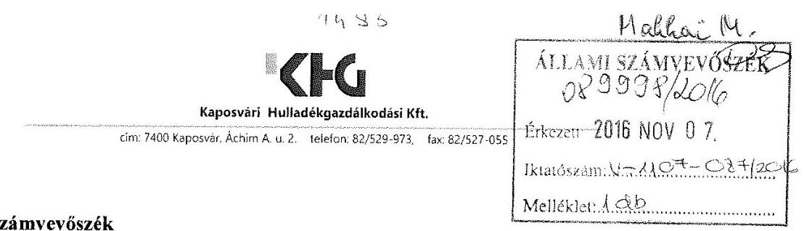

# Állami Számvevőszék 

Domokos László
elnök

1052 Budapest
Apáczai Csere János u. 10.

Tárgy: Észrevétel a V-1107-084/2016. iktatószámú levélre

Tisztelt Elnök Úr!
Köszönettel vettük kézhez az Állami Számvevőszékről szóló 2011. évi LXVI. törvény 1.§. (3), 5.§. (3)-(4)-(5) bekezdése alapján észrevételezés céljából megküldött, a Kaposvári Hulladékgazdálkodási Kft. részére 2016.10.20-án érkezett „Az önkormányzatok többségi tulajdonában lévő gazdasági társaságok gazdálkodásának ellenőrzése - Kaposvári Hulladékgazdálkodási Kft. 2016." című ellenőrzéséről készült számvevőszéki jelentéstervezet, melyre a hivatkozott jogszabályi felhatalmazás
 alapján az alábbi észrevételeket tesszük:

Az Állami számvevőszék jelentéstervezet 1. sz. javaslata a Kaposvári Hulladékgazdálkodási Kft. ügyvezetőjének:
Intézkedjen az eszközök és források értékelési szabályzatának elkészítéséről a (2.1. sz. megállapítás 6. bekezdése alapján).

A jelentéstervezet 1.sz. javaslatára vonatkozóan a Kft. észrevétele:
A 2000. évi C. törvény a számvitelről 14§. (5) b) szerint a számviteli politika keretében kell elkészíteni az eszközök és források értékelési szabályzatát.
A számviteli politika szerves részeként, annak elválaszthatatlan részét képezi a Kft. eszközök és források értékelési szabályozása, a számviteli politika keretében készítette el, amelyet az Állami Számvevőszék 2.1. megállapítása is rögzít az „Eszközök és Források értékelési szabályzata" cím alatt.
A számviteli szakmai gyakorlatban számos helyen nem önálló, fizikailag elkülönített szabályzatban (iratanyagban, dokumentációban), hanem a számviteli politikában rögzítik a vállalkozás működésére ható, értékelésre vonatkozó döntéseket, amelyet a Kft. is alkalmazott.

Ismételten csatoljuk az ügyvezető nyilatkozatát az eszközök és források értékelésére vonatkozó szabályozására vonatkozóan.

Tisztelettel kérjük az eszközök és források értékelésének számviteli politikában rögzített részletes szabályozásának elfogadását.

---

# KH 

Kaposvári Hulladékgazdálkodási Kft.
cím: 7400 Kaposvár, Áchim A. u. 2. telefon: 82/529-973, fax: 82/527-055

Tájékoztatjuk a Tisztelt Számvevőszéket, hogy a KAPOS HOLDING Zrt-nél 2015. november 1. napjával lépett hatályba a tagvállalatokra egységesen alkalmazandó - az adatigénylés rendjét is szabályozó - közzétételi szabályzat, melynek alapján álláspontunk szerint a társaság közzétételi kötelezettségére vonatkozó szabályozásának ezen időponttól eleget tesz.

Kaposvár, 2016.11.02.
Tisztelettel:
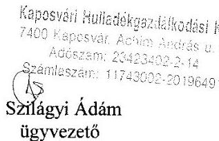

---

# Kaposvári Hulladékgazdálkodási Kft. 

## V-1107-001/2016. Állami számvevőszéki ellenőrzés

## NYILATKOZAT

Alulírott Szilágyi Ádám, mint a Kaposvári Hulladékgazdálkodási Kft. (7400 Kaposvár, Áchim András u. 2., adószám: 23423402-2-14) ügyvezetője ezúton nyilatkozom, hogy a Kaposvári Hulladékgazdálkodási Kft. eszközök és források értékelésére vonatkozó szabályozást a társaság számviteli politikája és számlarendje tartalmazza.

Kaposvár, 2016.02.17.

Szilágyi Ádám
ügyvezető
Kaposvári Hulladékgazdálkodási Kft.
7400 Kaposvár, Áchim András u. 2.
Adószám: 23423402-2-14
Számlaszám: 11743002-20196491

---

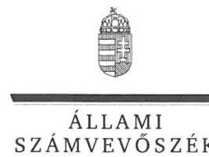

ELNÖK

Ikt.szám: V-1107-088/2016.

# Szilágyi Ádám úr 

ügyvezető

## Kaposvári Hulladékgazdálkodási Kft.

## Kaposvár

## Tisztelt Ügyvezető Úr!

„Az önkormányzatok gazdasági társaságai - Az önkormányzatok többségi tulajdonában lévő gazdasági társaságok gazdálkodásának ellenőrzése - Kaposvári Hulladékgazdálkodási Kft." címmel készített számvevőszéki jelentéstervezetre tett észrevételét köszönettel megkaptam.

Az Állami Számvevőszék észrevételre vonatkozó álláspontjáról a felügyeleti vezető által készített részletes tájékoztatást csatoltan megküldöm.

Tájékoztatom Ügyvezető urat, hogy a számvevőszéki jelentésben - az Állami Számvevőszékről szóló 2011. évi LXVI. törvény 29. § (3) bekezdése alapján - a figyelembe nem vett észrevételeket szerepeltetjük az elutasítás indokának feltüntetésével.

Budapest, 2016. 71. hó 7. nap
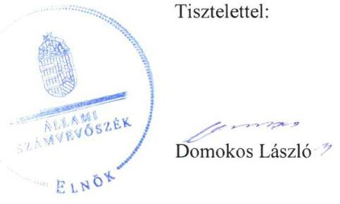

Melléklet: Tájékoztatás az el nem fogadott észrevételről

---

# Tájékoztatás   az el nem fogadott észrevételről 

...Az önkormányzatok gazdasági társaságai - Az önkormányzatok többségi tulajdonában lévő gazdasági társaságok gazdálkodásának ellenőrzése - Kaposvári Hulladékgazdálkodási Kft." című jelentéstervezetre 2016. november 7-én érkezett észrevételét áttekintettük, annak kezelésével kapcsolatban a következő tájékoztatást adom.

1. A Számv. tv. 14. § (5) bekezdés b) pontja azt rögzíti, hogy az eszközök és források értékelési szabályzatát a számviteli politika keretében kell elkészíteni. A Társaság a kötelezően előírt szabályzattal nem rendelkezik, amelyet az észrevételben leírtak megerősítenek. Ezért a megállapítás és az ahhoz kapcsolódó javaslat helytálló, módosításuk nem indokolt.
2. A közérdekű adatok megismerésére irányuló igények teljesítésének rendjét rögzítő szabályzat elkészítésével kapcsolatos tájékoztatásukat köszönettel vettük, azonban a jelentéstervezet módosítása nem indokolt, tekintettel arra, hogy az intézkedés az ellenőrzött időszakon túlnyúlik. A megtett intézkedést az intézkedési terv összeállítása során indokolt figyelembe venni.

Budapest, 2016. 71. hó 14. nap

Makkai Mária
felügyeleti vezető

---

# RÖVIDÍTÉSEK JEGYZÉKE 

${ }^{1}$ Alapító okirat
${ }^{2}$ Holding
${ }^{3}$ Társaság
${ }^{4} \mathrm{M} F \mathrm{~F}$
${ }^{5}$ Önkormányzat
${ }^{6}$ közszolgáltatási szerződés ${ }_{1}$
${ }^{7}$ közszolgáltatási szerződés2
${ }^{8}$ Kapos Konzorcium
${ }^{9}$ DDH Nonprofit Kft.
${ }^{10}$ Közszolgáltatási és üzemeltetési szerződés
${ }^{11} 479 / 2009 /$ EK rendelet
${ }^{12}$ Áht.
${ }^{13}$ ÁSZ
${ }^{14}$ gazdasági program
${ }^{15}$ Közgyűlés
${ }^{16}$ vagyongazdálkodási rendelet

Kaposvári Hulladékgazdálkodási Kft. Alapító okirata
Kaposvár Megyei Jogú Város Önkormányzata 100%-os tulajdonában álló gazdasági társaság, 2011. december 15-ig Kaposvári Közszolgáltató Holding Zártkörűen Működő Részvénytársaság, 2011. december 15-től KAPOS HOLDING Közszolgáltató Zártkörűen Működő Részvénytársaság
Kaposvári Hulladékgazdálkodási Kft.
millió forint
Kaposvár Megyei Jogú Város Önkormányzata
Közszolgáltatási szerződés a települési szilárd hulladék ártalmatlanítására Kaposvár Megyei Jogú Város területén és szilárd hulladéklerakó üzemeltetésére Kaposvár Megyei Jogú Város Önkormányzata és a Hulladékgazdálkodási Kft. között (kelt: 2012. március 1.)
Mernye Község Önkormányzata és a Kaposvári Hulladékgazdálkodási Kft. között létrejött hulladékgazdálkodási közszolgáltatási szerződés (kelt: 2013. november 7.)
a Kaposvári Hulladékgazdálkodási Kft. és a Kaposvári Városgazdálkodási Zrt. között létrejött szerződéses jogviszony
Dél-Dunántúli Hulladékkezelő Nonprofit Kft.
Hulladékgazdálkodási közszolgáltatási és regionális hulladéklerakóüzemeltetési szerződés Kaposvár Megyei Jogú Város Önkormányzata és a Dél-Dunántúli Hulladékkezelő Nonprofit Kft., mint a Konzorcium vezető tagja között (kelt: 2014. július 2-án)
az Európai Közösséget létrehozó szerződéshez csatolt, a túlzott hiány esetén követendő eljárásról szóló 479/2009/EK rendelet
az államháztartásról szóló 2011. évi CXCV. törvény (hatályos: 2011. december 31-től)
Állami Számvevőszék
gazdasági program1: 2011-2014. évekre szóló „Kaposvár a legfontosabb" nevet viselő gazdasági program
gazdasági program2: „Hiszünk egymásban a kaposváriak programja 2014." nevet viselő várospolitikai célokat megfogalmazó program, amelyet az Önkormányzat közgyűlése a 213/2014. (X. 30.) önkormányzati határozatával jóváhagyott
Kaposvár Megyei Jogú Város Önkormányzatának Közgyűlése
vagyongazdálkodási rendelet1: Kaposvár Megyei Jogú Város Önkormányzatának többször módosított 34/2005. (VI. 24.) számú rendelete az önkormányzat vagyonáról, a vagyongazdálkodás szabályairól, valamint a nem lakáscélú helyiségek bérletéről (hatályos: 2011. február 28-ig)
vagyongazdálkodási rendelet2: Kaposvár Megyei Jogú Város Önkormányzatának többször módosított 9/2011. (II. 25.) számú rendelete az önkormányzat vagyonáról, a vagyongazdálkodás szabályairól, valamint a nem lakáscélú helyiségek bérletéről (hatályos: 2011. március 1-jétől 2012. október 14-éig)

---

vagyongazdálkodási rendelet3: Kaposvár Megyei Jogú Város Önkormányzatának többször módosított 59/2012. (X. 03.) számú rendelete az önkormányzati vagyongazdálkodásról (hatályos: 2012. október 15-étől)
${ }^{17}$ 54/2001. (XII. 6.) önkormányzati rendelet
${ }^{18} \mathrm{Hgt}_{.1}$
${ }^{19} \mathrm{Hgt}_{.2}$
${ }^{20}$ Ötv.
${ }^{21}$ Mötv.
${ }^{22}$ Városgazdálkodási Zrt.
${ }^{23} \mathrm{Gt}$.
${ }^{24}$ Konzorciumi szerződés
${ }^{25} \mathrm{FB}$
${ }^{26}$ Ptk.
${ }^{27}$ Taktv.
${ }^{28}$ javadalmazási szabályzat
${ }^{29}$ Számv. tv.
${ }^{30} \mathrm{Hgt}_{.1}$
${ }^{31}$ számviteli politika
${ }^{32}$ leltározási szabályzat ${ }_{1}$
${ }^{33}$ leltározási szabályzat ${ }_{2}$
${ }^{34}$ pénzkezelési szabályzat ${ }_{1}$
${ }^{35}$ pénzkezelési szabályzat ${ }_{2}$
${ }^{36}$ számlarend
${ }^{37}$ számaltükör $1,2,3,4$
${ }^{38}$ Info tv.
${ }^{39}$ korrigált nettó árbevétel
${ }^{40}$ Ebktv.
Kaposvár Megyei Jogú Város Önkormányzatának 54/2001. (XII. 6). önkormányzati rendelete a köztisztaság fenntartásáról, a települési szilárd hulladék kezeléséről, a hulladék szelektív gyűjtéséről és ártalommentes elhelyezéséről
a hulladékgazdálkodásról szóló 2000. évi XLIII. törvény (hatálytalan: 2013. január 1-jétől)
a hulladékról szóló 2012. évi CLXXXV. törvény (hatályos: 2013. január 1-jétől)
a helyi önkormányzatokról szóló 1990. évi LXV. törvény (hatálytalan: 2014. október 12-től)
Magyarország helyi önkormányzatairól szóló 2011. évi CLXXXIX. törvény (hatályos: 2012. január 1-jétől)
Kaposvári Városgazdálkodási Zrt.
a gazdasági társaságokról szóló 2006. évi IV. törvény (hatálytalan: 2014. március 15-től)
a Dél-Dunántúli Hulladékkezelő Nonprofit Kft. és a Kaposvári Hulladékgazdálkodási Kft. között 2014. június 18-án aláírt szerződés
a Kaposvári Hulladékgazdálkodási Kft. felügyelő bizottsága
a Polgári Törvénykönyvről szóló 2013. évi V. törvény (hatályos: 2014. március 15-től)
a köztulajdonban álló Társaságok takarékosabb működéséről szóló 2009. évi CXXII. törvény (hatályos: 2009. december 4-től)
a Hulladékgazdálkodási Kft. javadalmazási szabályzata (hatályos: 2012. március 1-jétől, az Alapító által 1/2011. (XII. 15.) számú határozattal elfogadva)
a számvitelről szóló 2000. évi C. törvény
a hulladékgazdálkodásról szóló 2000. évi XLIII. törvény (hatálytalan: 2013. január 1-jétől)
a Hulladékgazdálkodási Kft. Számviteli politikája (hatályos: 2012. március 1-jétől)
a Hulladékgazdálkodási Kft. leltározási szabályzata (hatályos: 2012. március 1-jétől 2012. december 31-éig)
a Hulladékgazdálkodási Kft. leltározási szabályzata (hatályos: 2013. január 1-jétől)
a Hulladékgazdálkodási Kft. pénzkezelési szabályzata (hatályos: 2012. március 1-jétől 2014. január 31-éig)
a Hulladékgazdálkodási Kft. pénzkezelési szabályzata (hatályos: 2014. február 1-jétől)
a Hulladékgazdálkodási Kft. Számlarendje (hatályos: 2012. március 1-jétől)
a Hulladékgazdálkodási Kft. Számlatükre 2011. év, 2012. év, 2013. év, 2014. év
az információs önrendelkezési jogról és az információszabadságról szóló 2011. évi CXII. törvény (hatályos: 2011. július 27-étől)
az értékesítés árbevétele csökkentve az eladott áruk beszerzési értékével és a közvetített szolgáltatások értékével
az egyenlő bánásmódról és az esélyegyenlőség előmozdításáról szóló 2003. évi CXXV. törvény (hatályos: 2004. január 27-től)

---

${ }^{41}$ Ctv.
${ }^{42} \mathrm{Nvtv}$.
az egyesülési jogról, a közhasznú jogállásról, valamint a civil szervezetek működéséről és támogatásáról szóló 2011. évi CLXXV. törvény (hatályos: 2011. december 22-étől)
a nemzeti vagyonról szóló 2011. évi CXCVI. törvény (hatályos: 2012. január 1-jétől)

---

# ÁLLAMI SZÁMVEVŐSZÉK 

1052 Budapest, Apáczai Csere János utca 10.
Levélcím: 1364 Budapest 4. Pf. 54
Telefon: +36 14849100 Telefax: +36 14849200
www.asz.hu
