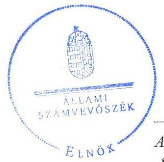
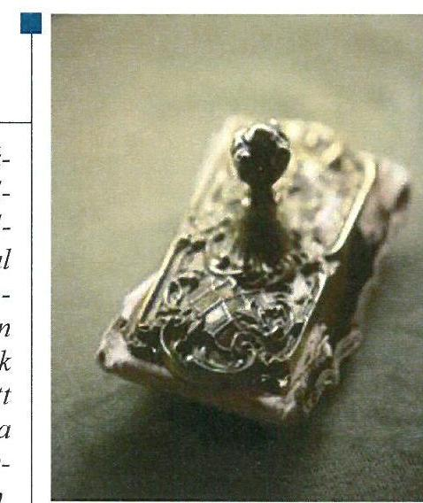
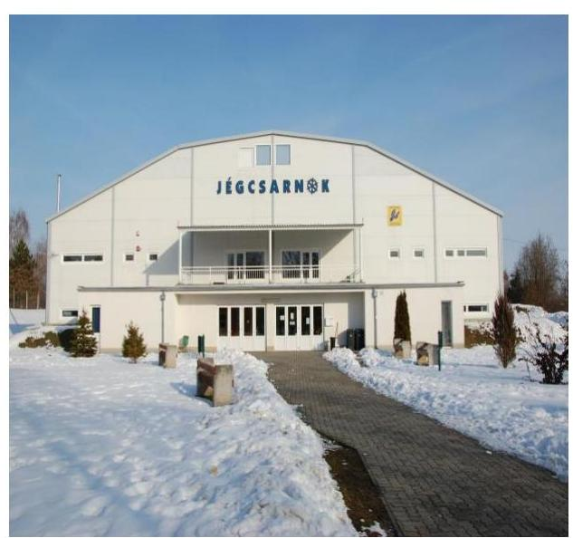
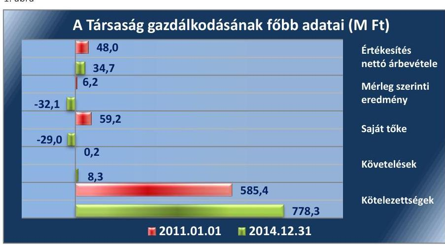
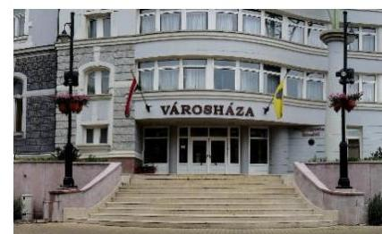
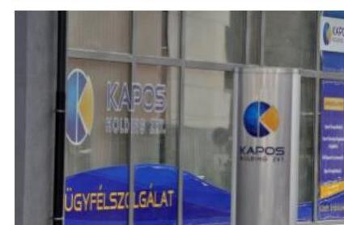
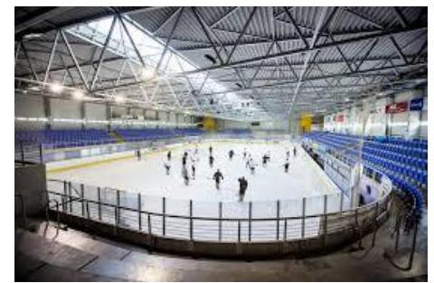
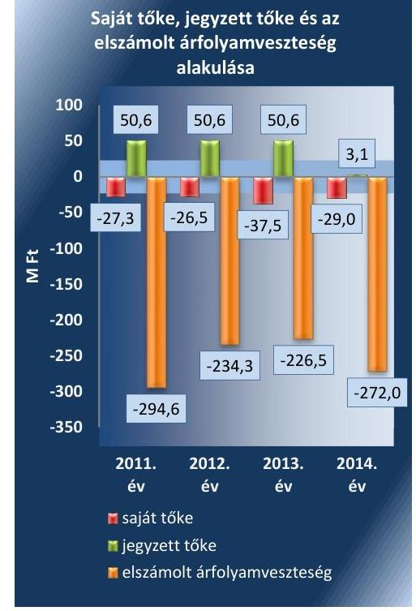
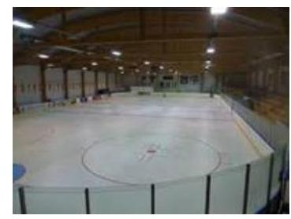
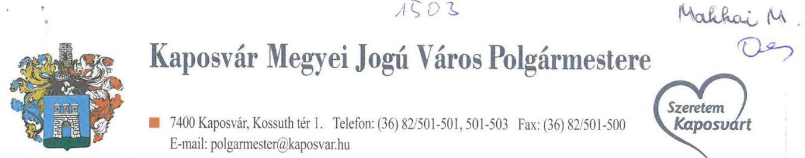

# Jelentés 

## Az önkormányzatok gazdasági társaságai

Az önkormányzatok többségi tulajdonában lévő gazdasági társaságok gazdálkodásának ellenőrzése - Kaposvár Jégcsarnok Fejlesztő és Üzemeltető Kft.
2016.

Az ÁSZ az államháztartáson kívül működő közfeladat-ellátó rendszerek ellenőrzéseivel hozzájárul ahhoz, hogy a közpénzeket az államháztartáson kívül működő szervezetek is átlátható, rendezett módon használják fel a közfeladatok ellátása érdekében.

---

# Jelentés 

## Az önkormányzatok gazdasági társaságai

Az önkormányzatok többségi tulajdonában lévő gazdasági társaságok gazdálkodásának ellenőrzése - Kaposvár Jégcsarnok Fejlesztő és Üzemeltető Kft.
2016. 12. hó 07. nap

Domokos László elnök $\rightarrow$

Az ÁSZ az államháztartáson kívül működő közfeladat-ellátó rendszerek ellenőrzéseivel hozzájárul ahhoz, hogy a közpénzeket az államháztartáson kívül működő szervezetek is átlátható, rendezett módon használják fel a közfeladatok ellátása érdekében.

---

# AZ ELLENŐRZÉST FELÜGYELTE: 

MAKKAI MÁRIA felügyeleti vezető

## AZ ELLENŐRZÉST VEZETTE ÉS A VÉGREHAJTÁSÁÉRT FELELŐS:

SALI SÁNDORNÉ ellenőrzésvezető

## A PROGRAM ÖSSZEÁLLÍTÁSÁÉRT FELELŐS:

JANIK JÓZSEF osztályvezető

## A TÉMÁHOZ KAPCSOLÓDÓ KORÁBBI SZÁMVEVŐSZÉKI JELENTÉSEK:

- címe: Jelentés Az önkormányzatok gazdasági társaságai Az önkormányzatok többségi tulajdonában lévő gazdasági társaságok közfeladat ellátását érintő gazdálkodási tevékenysége szabályszerűségének ellenőrzése - Kaposvári Önkormányzati Vagyonkezelő és Szolgáltató Zrt.
- sorszáma: 15066

IKTATÓSZÁM: V-1106-130/2016.
TÉMASZÁM: 2140
ELLENŐRZÉS-AZONOSÍTÓ SZÁM: V070770

---

# TARTALOMJEGYZÉK 

■ ÖSSZEGZÉS ..... 5
■ AZ ELLENŐRZÉS CÉLJA ..... 6
■ AZ ELLENŐRZÉS TERÜLETE ..... 7
■ AZ ELLENŐRZÉS HÁTTERE, INDOKOLTSÁGA ..... 9
■ A JELENTÉS LÉNYEGES KÉRDÉSKÖREI ..... 10
■ ELLENŐRZÉS HATÓKÖRE ÉS MÓDSZEREI ..... 11
■ MEGÁLLAPÍTÁSOK ..... 13
■ JAVASLATOK ..... 22
■ MELLÉKLETEK ..... 23
I. Sz. melléklet: Értelmező szótár ..... 23
II. Sz. melléklet: A működés főbb jellemzői. ..... 24
■ FÜGGELÉK: ÉSZREVÉTELEK ..... 25
■ RÖVIDÍTÉSEK JEGYZÉKE ..... 27

---

.

---

# ÖSSZEGZÉS 

A 2011-2014. évek közötti időszakban Kaposvár Megyei Jogú Város Önkormányzata a Kaposvár Jégcsarnok Fejlesztő és Üzemeltető Kft.-nél a közfeladat-ellátás feltételeit biztosította. A Társaságnál az Önkormányzat és a Kapos Holding Közszolgáltató Zrt. tulajdonosi joggyakorlása összességében szabályos volt. A Kft. vagyongazdálkodása nem volt szabályszerű, mert a 2011-2012. évi mérleg nem volt teljes körűen leltárral alátámasztva, valamint szabályozási hiányosságok voltak. A kötelezettségállomány veszélyeztette a közfeladat- és feladatellátást, valamint a működést. A bevételek és ráfordítások elszámolása megfelelt a jogszabályi előírásoknak. Az ügyvezető közzétételi kötelezettségének a 2012-2014. években nem tett eleget maradéktalanul, ezzel nem biztosította a közfeladat-ellátás jogszabályoknak megfelelő átláthatóságát.

## Az ellenőrzés társadalmi indokoltsága

Az Állami Számvevőszék középtávra szóló stratégiájában megfogalmazta, hogy a helyi önkormányzatok gazdálkodásában rejlő pénzügyi kockázatok feltárásával, az államháztartáson kívülre nyújtott költségvetési támogatások és ingyenes vagyonjuttatások, valamint az államháztartáson kívül működő közfeladat-ellátó rendszerek ellenőrzéseivel hozzájárul ahhoz, hogy a közpénzeket az államháztartáson kívül működő szervezetek is átlátható, rendezett módon használják fel a közfeladatok szerződésben vállalt ellátása érdekében.

Magyarországon az intézmény-centrikus közfeladat-ellátás jellemző, de egyre jelentősebb a költségvetésen kívüli feladatellátás térnyerése. Ennek legfontosabb szereplői - a nonprofit szervezetek mellett - az önkormányzati tulajdonú gazdasági társaságok. Az önkormányzatok szervezetalakítási szabadságának következménye, hogy a korábban is vállalati formában működő közszolgáltatások mellett, mind a kötelező, mind az önként vállalt feladatok ellátásában a gazdasági társaságok kiemelt fontosságú szerephez jutottak.

## Főbb megállapítások, következtetések, javaslatok

Az Önkormányzat közfeladat megszervezéséről szóló döntése szabályszerű volt, valamint a közfeladat-ellátással kapcsolatos terv- és rendeletalkotási kötelezettségének a vonatkozó jogszabályi előírásoknak megfelelően eleget tett. Az Önkormányzat és ezt követően a Holding tulajdonosi joggyakorlása szabályszerű volt. Az Önkormányzat a közszolgáltatás ellátására vonatkozóan 2012. január 1-jei hatállyal közszolgáltatási szerződést kötött, melynek tartalma az előírásokkal összhangban volt. Az FB feladatát ellátta, de az FB ülését az elnök legalább negyedévente nem hívta össze az Alapító Okirat ${ }_{2-5}$-ben előírtak szerint. A beszámoltatási rendszert a tulajdonosi joggyakorlók szabályszerűen működtették.

A Társaság vagyongazdálkodása nem volt szabályszerű, mert a 2011-2012. évi beszámoló mérlege nem volt teljes körűen leltárral alátámasztott. A vagyongazdálkodás szabályozása összességében megfelelt a jogszabályi előírásoknak a pénzkezelési szabályzat ${ }_{1,2}$ kivételével. A Társaság a jogszabályokban és a közszolgáltatási szerződésben foglalt beszámolási és adatszolgáltatási kötelezettségét szabályszerűen teljesítette. Az ellátott feladat, illetve közfeladat bevételeinek és ráfordításainak elszámolása megfelelt a jogszabályi előírásnak. A Jégcsarnok térítési díjait az Önkormányzat rendeletben állapította meg. A közérdekű adatok megismerésének rendjét nem szabályozta, valamint iratkezelési szabályzattal nem rendelkezett. Az ügyvezető a közzétételi kötelezettségének nem teljes körűen tett eleget a 2012-2014. években.

A kötelezettségek állománya veszélyeztette a közfeladat- és feladat ellátását, valamint a működését. A Társaság saját bevételei nem nyújtottak fedezetet a kötelezettségek teljesítésére, az Önkormányzat támogatás nyújtásával biztosította a közfeladat ellátását.

---

# AZ ELLENŐRZÉS CÉLJA 

Az ellenőrzés célja annak értékelése volt, hogy az önkormányzat vagyongazdálkodási tevékenysége során szabályszerűen gyakorolta-e tulajdonosi jogait; a gazdasági társaság szabályozottsága, gazdálkodása és vagyongazdálkodási tevékenysége, bevételeinek és ráfordításainak elszámolása megfelelt-e a jogszabályi és tulajdonosi előírásoknak; a gazdasági társaság kötelezettségállománya jelentett-e kockázatot a működésre, valamint a gazdálkodás átláthatósága és elszámoltathatósága érdekében biztosítva volt-e a szolgáltatás díjának megalapozottsága szabályszerű önköltségszámítással.

---

# AZ ELLENŐRZÉS TERÜLETE 

## Kaposvár Megyei Jogú Város Önkormányzata, a Kapos Holding Közszolgáltató Zrt. és a 100\%-os tulajdonában lévő Kaposvár Jégcsarnok Fejlesztő és Üzemeltető Kft.

KAPOSVÁR MEGYEI JOGÚ VÁROS ÖNKORMÁNYZATA 2006. évben megvásárolta a Kaposvár Jégcsarnok Fejlesztő és Üzemeltető Kft.-t. Az Önkormányzat ${ }^{1}$ 2011. március 22-ig, ezt követően a Kapos Holding Közszolgáltató Zrt. volt a Társaság ${ }^{2}$ tulajdonosa. A tulajdonosi joggyakorlást az ellenőrzött időszakban az Önkormányzat és a Holding ${ }^{3}$ látta el. Az Önkormányzat 100\%-ban tulajdonosa a Holdingnak.

## A KAPOSVÁR JÉGCSARNOK FEJLESZTŐ

ÉS ÜZEMELTETŐ KFT. főtevékenysége ingatlan bérbeadása és üzemeltetése volt. A 2011. évben közfeladatot nem látott el, a 45,0 M Ft ${ }^{4}$ értékesítés nettó árbevétele bérbeadásból származott. Az Önkormányzat közgyűlése ${ }^{5}$ a Kaposvári Sportközpont és Sportiskola 2011. évi átszervezése kapcsán döntött arról, hogy a Jégcsarnok ${ }^{6}$-ot a továbbiakban a Társaság üzemelteti. 2012. január 1-jétől a Társaság közfeladatot látott el közszolgáltatási szerződés alapján. A szerződés célja a gyermek és ifjúsági feladatokról való gondoskodás, sport támogatása és az egészséges életmód közösségi feltételeinek elősegítése, a közfeladatok hatékony és költségtakarékos ellátása volt. A Társaság lizingszerződés keretében finanszírozta a Jégcsarnok épületének és az ahhoz tartozó földterületnek a megvásárlását, melynek futamideje 20 év.

A Társaság jegyzett tőkéje 2011. január 1-jén 50,6 M Ft, 2014. december 31-én 3,1 M Ft volt. Az Önkormányzat vagyonkezelésre nem adott át eszközöket, továbbá nem bocsátott önkormányzati vagyont a Társaság rendelkezésére.

A Társaság gazdálkodásának egyes adatait az 1. ábra szemlélteti.
1. ábra

---

A Társaság mérlegfőösszege 2011. január 1-jén 644,6 M Ft, 2014. december 31-én 867,3 M Ft volt. A mérleg szerinti eredmény a 2012. év kivételével veszteség volt. A saját tőke összege 2011. január 1-jei 59,2 M Ft-ról a 2014. év végére -29,0 M Ft-ra csökkent. A Társaság átlagos statisztikai állományi létszáma 2011. december 31-én egy fő, 2014. december 31-én hét fő volt.

Az ellenőrzött időszakban a polgármester és a jegyző személye nem, az ügyvezető igazgató személye pedig egyszer változott. A polgármester az 1994. évi, a jegyző az 1990. évi önkormányzati választások óta látja el feladatait. A jelenlegi ügyvezető igazgató 2012. január 1-jétől tölti be tisztségét.

A Társaság az ellenőrzött időszakban a 479/2009/EK rendelet ${ }^{7}$ alapján 2011. évben, az Áht. ${ }^{8}$ 109. § (8) bekezdése szerint a 2012-2014. években nem minősült a kormányzati alszektorba sorolt társaságnak.

A Társaság működésének főbb jellemzőit a II. sz. melléklet mutatja be.

---

# AZ ELLENŐRZÉS HÁTTERE, INDOKOLTSÁGA 

Az önkormányzatok közfeladat ellátásában egyre jelentősebb a gazdasági társaságok útján történő feladatellátás térnyerése.

AZ ÖNKORMÁNYZATI TULAJDONÚ GAZDASÁGI TÁRSASÁGOK ellenőrzése kiemelten fontos a vagyon megőrzése, megóvása érdekében, amelyekkel szemben alapvető követelmény, hogy gazdálkodásuk, működésük szabályszerű, az általuk szolgáltatott adatok minél megbízhatóbbak legyenek. A közfeladat, illetve a feladatellátás költségeinek, ráfordításainak alakulása, színvonala hatással van a lakosság elégedettségére.

## AZ ELLENŐRZÉS VÁRHATÓ HASZNOSULÁSA-

KÉNT az ÁSZ ${ }^{9}$ a megállapításaival segítséget nyújthat az államháztartáson kívüli közfeladat-ellátás értékeléséhez, jogszabályi keretei pontosításához, átláthatóságot biztosító szabályozásához. Meghatározhatóvá válnak az önkormányzati feladatellátásban résztvevő államháztartáson kívüli szervezeteknek - az Önkormányzat költségvetését, pénzügyi helyzetét is befolyásoló - kockázatai, lehetővé válik ezen kockázatok csökkentése. Ellenőrzéseink feltárhatják, hogy az Önkormányzat feladatellátási kötelezettségének szabályszerűen tett-e eleget, a feladatellátáshoz rendelt vagyonkezelésbe vett és saját vagyon működtetését az elvárható gondossággal, szabályszerűen szervezte-e meg és a tulajdonosi felügyelete hozzájárult-e a feladatellátásához. Az ellenőrzés rávilágíthat arra, hogy a gazdasági társaság a feladatellátási, közszolgáltatási szerződésben foglaltak betartásával, a vagyon használatával biztosította-e a szolgáltatás folytatásának feltételeit, a feladat ellátását. Ezzel az ellenőrzöttek és a helyi döntéshozók számára visszajelzést ad feladatszervezési, feladatellátási kockázataikról, alapot ad a meglévő hibák megszüntetéséhez, a jobb feladatellátás biztosításához. Fokozza a fegyelmet, igazolja, hogy lejárt a következmények nélküli ellenőrzések időszaka. Az ÁSZ értékteremtő rend kialakításához és megőrzéséhez hozzájáruló tevékenysége pozitív hatással van a szervezetről kialakított összkép formálására.

---

# A JELENTÉS LÉNYEGES KÉRDÉSKÖREI 

1. Az Önkormányzat feladat- és közfeladat megszervezéséről szóló döntése, valamint a tulajdonosi joggyakorlás szabályszerű volt-e?
2. A Társaság vagyongazdálkodása szabályszerű volt-e, kötelezettségállománya jelentett-e kockázatot a működésre, illetve a közfeladat-ellátásra?
3. A Társaságnál az ellátott feladat és közfeladat bevételei és ráfordításai elszámolása, valamint az önköltségszámítás és árképzés szabályszerű volt-e?

---

# ELLENŐRZÉS HATÓKÖRE ÉS MÓDSZEREI 

## Az ellenőrzés típusa

Megfelelőségi ellenőrzés

## Az ellenőrzött időszak

A 2011. január 1-jétől 2014. december 31-éig terjedő időszak.

## Az ellenőrzés tárgya

A gazdasági társaság feletti tulajdonosi joggyakorlás, valamint a gazdasági társaság gazdálkodásának szabályozottsága és szabályszerűsége.

Az ellenőrzés kiterjed minden olyan körülményre és adatra, amely az ÁSZ jogszabályban meghatározott feladatainak teljesítéséhez, valamint a program végrehajtása folyamán felmerült újabb összefüggések feltárásához szükséges.

## Az ellenőrzött szervezet

Kaposvár Megyei Jogú Város Önkormányzata és a Kapos Holding Közszolgáltató Zrt., továbbá a Kaposvár Jégcsarnok Fejlesztő és Üzemeltető Kft.

## Az ellenőrzés jogalapja

Az ellenőrzés végrehajtásának jogszabályi alapját az Állami Számvevőszékről szóló 2011. évi LXVI. törvény 1. § (3) és 5. § (3)-(4)-(5) bekezdései képezték.

## Az ellenőrzés módszerei

Az ellenőrzést a nemzetközi standardokat irányadónak tekintve az ellenőrzési program ellenőrzési kérdései, az ellenőrzött időszakban hatályos jogszabályok, az ellenőrzés szakmai szabályok és módszertanok figyelembevételével végeztük.

Az ellenőrzés ideje alatt az ellenőrzött szervezettel történő kapcsolattartást az ÁSZ Szervezeti és Működési Szabályzatának vonatkozó előírásai alapján biztosítottuk.

---

Az ellenőrzés a többségi tulajdonosi jogokat gyakorló Kaposvár Megyei Jogú Város Önkormányzatára, a Kapos Holding Közszolgáltató Zrt.-re, illetve az ellenőrzött közfeladatot ellátó a Kaposvár Jégcsarnok Fejlesztő és Üzemeltető Kft.-re terjedt ki.

Az ellenőrzési kérdések megválaszolásához szükséges bizonyítékok megszerzése a következő ellenőrzési eljárások alkalmazásával történt: megfigyelés, kérdésfeltevés (információkérés), összehasonlítás, valamint elemző eljárás. Az ellenőrzési bizonyítékként felhasználható adatforrások közé tartoztak egyrészt a szakmai programban felsorolt adatforrások, másrészt az ellenőrzés folyamán feltárt, az ellenőrzés szempontjából információkat tartalmazó dokumentumok.

Az ellenőrzést a kérdésekre adott válaszok kiértékelésével, valamint a megjelölt adatforrások, a csatolt tanúsítványok felhasználásával, továbbá az adott időszakban hatályos jogszabályok figyelembevételével folytattuk le.

A bevételek és ráfordítások elszámolása, valamint a
 vagyonnyilvántartás terén az egyes területek szabályszerű működését mintavétellel és irányított kiválasztással ellenőriztük, és egyrészt a sokaságokban előforduló hibás tételek arányát becsültük a mintatételek értékelése alapján, másrészt az irányítottan kiválasztott tételeket értékeltük. A jogszabályoknak és a belső előírásoknak megfelelőnek, azaz szabályszerűnek tekintettük a mintavétellel kiválasztott bevételek és ráfordítások elszámolását, a vagyonnyilvántartást, amennyiben a minta ellenőrzésének eredménye alapján 95%-os bizonyossággal a teljes sokaságban a hibaarány kisebb volt, mint 10%, nem megfelelőnek értékeltük, ha a hibás tételek aránya a 10%-ot meghaladta.

---

# 1. Az Önkormányzat feladat- és közfeladat megszervezéséről szóló döntése, valamint a tulajdonosi joggyakorlás szabályszerű volt-e? 

Összegző megállapítás

Az Önkormányzat közfeladat megszervezéséről szóló döntése, valamint a feltételek biztosítása szabályszerű volt. Az Önkormányzat és a Holding tulajdonosi joggyakorlása szabályszerű volt.

### 1.1. számú megállapítás

Az Önkormányzat közfeladat megszervezéséről szóló döntése szabályszerű volt, valamint a közfeladat-ellátással kapcsolatos terv- és rendeletalkotási kötelezettségének a vonatkozó jogszabályi előírásoknak megfelelően eleget tett, a közszolgáltatásra vonatkozó szerződést megkötötte.

GAZDASÁGI PROGRAM 1.2-jét1011 az Önkormányzat elkészítette, melyben meghatározta, hogy támogatni kívánja a diáksport és a szabadidősport fejlesztését. Ennek megfelelően az Önkormányzat az Ötv.12 8. § (1) bekezdése, valamint a Mötv.13 13. § (1) bekezdésének 15. pontjában megfogalmazott sport és ifjúsági ügyekkel kapcsolatos közfeladat ellátását, az Ötv. 9. § (4) bekezdésével összhangban a Jégcsarnok Kft. útján biztosította.

RENDELETALKOTÁSI KÖTELEZETTSÉGÉNEK eleget tett az Önkormányzat, megalkotta a hatályos vagyongazdálkodási rendelet141516-at, valamint a 2013. évben elkészítette és az Önkormányzat közgyűlése elfogadta a vagyongazdálkodási tervet. Az Önkormányzat a Társaság Alapító Okirat17-ben és a Holding az Alapító Okirat18192021-ben szabályszerűen meghatározta az ügyvezető feladatát és hatáskörét.

KÖZSZOLGÁLTATÁSI SZERZŐDÉST kötött a Társasággal az Önkormányzat az Ötv. 8. § (1) bekezdésében előírtaknak megfelelően a gyermek és ifjúsági feladatokról való gondoskodás, a sport támogatása, az egészséges életmód közösségi feltételeinek elősegítése érdekében 2011. december 21-én 10 év határozott időtartamra a Jégcsarnok üzemeltetésére és hasznosítására. A közszolgáltatási szerződés alapján támogatási szerződés keretében az Önkormányzat 171,0 M Ft támogatást nyújtott összesen a 2012-2014. években a Társaság részére a sportlétesítmény üzemeltetési feladatainak ellátására.

---

# A tulajdonosi jogok gyakorlása összességében szabályszerű volt. 

A TULAJDONOSI JOGOK gyakorlásának rendjét a tulajdonosi joggyakorló22 a Gt.23 és az Ötv. előírásainak megfelelően az SZMSZ rendelet2425-ben, valamint a Társaság Alapító Okirat17-ben határozta meg. Az Önkormányzat közgyűlése a 2010. évben megalapította a Holdingot, majd döntött többek között a Társaság Holdingba történő apportálásáról 59,2 M Ft értékben. A döntés értelmében a Társaság feletti tulajdonosi jogokat 2011. március 23-ától a tulajdonosi joggyakorló26 gyakorolta a Holdingot képviselő elnök-vezérigazgató útján. A tulajdonosi joggyakorló22 joggyakorlása az ellenőrzött időszakban szabályszerű volt.

AZ FB27 három tagból állt, feladatait és beszámolási kötelezettségét a tulajdonosi joggyakorló26 a Társaság Alapító Okirat18192021-ben és az FB ügyrend28-jében írta elő. Az FB a Gt. 35. § (3) bekezdésének, illetve a Ptk.29 3:120. § (2) bekezdésének megfelelően minden évben írásbeli jelentést készített a Társaság éves beszámolóinak elfogadásához.

Az FB elnöke az ellenőrzött időszakban az Alapító Okirat1821 13. i), valamint az Alapító Okirat1920 12. i) pontjában előírtak ellenére, az FB legalább negyedévente történő összehívásáról nem intézkedett.

AZ ANYAGI ÖSZTÖNZÉSI RENDSZERT a javadalmazási szabályzat3031-ben határozták meg. A javadalmazási szabályzat30 2012. július 12-ig nem tartalmazta teljes körűen a Taktv.32 6. §-ában foglalt jövedelemkorlátokat, a javadalmazási szabályzat31 már tartalmazta. A javadalmazási szabályzat3031 a Társaság első számú vezetőjére és a választott tisztségviselőkre terjedt ki. Az FB tagjait és elnökét tiszteletdíj és egyéb juttatás nem illette meg, ami összhangban volt a Taktv.-ben foglaltakkal.

A BESZÁMOLTATÁSI RENDSZER keretében a tulajdonosi joggyakorló22 az ügyvezetőt évente beszámoltatta a gazdálkodásról, valamint a tevékenységéről. Az ellenőrzött időszakban a Társaság éves beszámolóit - az FB előzetes írásbeli véleményezését követően - a tulajdonosi joggyakorló22 a Gt.-ben, illetve a Ptk.-ben előírtaknak megfelelően elfogadta, a beszámolókkal kapcsolatban elkészített független könyvvizsgálói jelentések rendelkezésre álltak. A Holding a 2012. év első negyedévétől évközi negyedéves beszámolót, továbbá a 2012. év áprilisától havi kontrolling jelentés készítését írta elő.

A SAJÁT TÖKE az ellenőrzött időszak minden évében negatív összegű volt. A 2013. évi beszámoló elfogadását követően a Holdingnak a tőkepótlási kötelezettsége fennállt, melynek rendezése megfelelt a jogszabályi előírásnak, a Társaság törzstőkéjét lecsökkentette.

---

# 2. A Társaság vagyongazdálkodása szabályszerű volt-e, kötelezettségállománya jelentett-e kockázatot a működésre, illetve a közfeladat-ellátásra? 

Összegző megállapítás

A Társaság vagyongazdálkodása nem volt szabályszerű, mert a 2011. és a 2012. évi mérleg leltárral nem teljes körűen volt alátámasztott. A kötelezettségállománya veszélyt jelentett a Társaság közfeladat- és feladatellátására, valamint a működésére.
2.1. számú megállapítás

A Társaság vagyongazdálkodásának szabályozása - a pénzkezelési szabályzat4243 kivételével - megfelelt a jogszabályi előírásoknak.

ÜZLETI TERVKÉSZÍTÉSI kötelezettséget a Társaság 2011. április 13-tól hatályos Alapító Okirat18192021 határozott meg. A tulajdonosi joggyakorló26 belső utasításban előírta a Társaság részére az üzleti terv elkészítésének határidejét és adattartalmát. A Társaság a 2011. évre vonatkozóan üzleti terv helyett pénzügyi tervet készített, amelyet a tulajdonosi joggyakorló22 nem hagyott jóvá. A 2012. évtől a tulajdonosi joggyakorló26 előírásaival összhangban részletes adattartalmú tervek készültek. A 2012-2014. évekre vonatkozóan a Holding az elkészült üzleti terveket alapítói határozataival jóváhagyta.

A SZÁMVITELI POLITIKA3334 tartalma megfelelt a Számv. tv.35-ben foglaltaknak. A számviteli politika3334-ben meghatározták a beszámoló készítés és a könyvvezetés módját, az értékelési elveket és eljárásokat, az eszközök és források értékelésének módszerét, az értékcsökkenési leírás módját és a leírási kulcsokat, a terven felüli értékcsökkenés elszámolásának szabályait, az értékvesztés elszámolását, a behajthatatlan követelések esetében alkalmazandó szabályokat, a jelentős összegű hiba kritériumát és a hibás könyvelés esetén követendő eljárásokat, valamint a kiegészítő melléklet adattartalmát.

A SZÁMLAREND36 2011. évben nem felelt meg a Számv. tv. 161. § (2) bekezdésének d) pontjában foglaltaknak, mivel a számlarend36-et alátámasztó bizonylati rendet nem szabályozta, és arra külön szabályzatot sem készítettek. A számlarend37 2012. január 1-jétől megfelelt a Számv. tv. előírásainak, mert meghatározta a számlák adattartalmát, a főkönyvi számla és az analitikus nyilvántartások kapcsolatát, valamint a számlarend37-ben foglaltakat alátámasztó bizonylati rendet is. A számlarend37 a Számv. tv. rendelkezéseinek megfelelően a közfeladat-ellátás elkülönített nyilvántartási kötelezettségét szabályozta.

A LELTÁROZÁSI SZABÁLYZAT3839-jét a Számv. tv. előírásainak megfelelően a számviteli politika3334 I. számú mellékleteként készítette el. A leltározási szabályzat3839-ben meghatározták a leltározás módját, a leltározás időpontját és rendjét, rögzítették továbbá a feleslegessé vált eszközök feltárásának, hasznosításának és a selejtezés folyamatának me-

---

2.2. számú megállapítás

netét. A Társaság az eszközeiről és forrásairól folyamatos mennyiségi nyilvántartást vezet, ezért a Számv. tv. előírásának megfelelően háromévente mennyiségi felvételt, illetve az értékben kimutatott eszközöknél és kötelezettségeknél évente egyeztetéssel történő leltározást írt elő.

AZ ÉRTÉKELÉSI SZABÁLYZAT4041-jében a számviteli politika3334 részeként meghatározták a bekerülési érték tartalmát, az eszközök és források értékelését, megjelenésüket a mérlegben, a külföldi pénznemben fennálló követelések, kötelezettségek és pénzeszközök választott pénzintézetének alkalmazását, valamint az immateriális javak és tárgyi eszközök terv szerinti és terven felüli értékcsökkenésének szabályait.

A PÉNZKEZELÉSI SZABÁLYZAT4243 a Számv. tv. 14. § (8) bekezdésében foglaltak ellenére nem rögzítette a készpénzállomány ellenőrzésekor követendő eljárást, valamint az ellenőrzés gyakoriságát.

A Társaság vagyongazdálkodása 2011-2012. évben nem felelt meg a jogszabályi előírásoknak, mert az éves beszámoló mérlege nem volt teljes körűen leltárral alátámasztott, ezt követően szabályszerű volt.

Az analitikus és főkönyvi nyilvántartási rendszer a Társaság vagyonának nyilvántartására, a bekövetkezett változások folyamatos nyomon követésére alkalmas volt. A vagyonnyilvántartás átlátható és naprakész volt, megfelelt a Számv. tv. és a számviteli politika3334-ben, valamint az értékelési szabályzat4041-ben foglaltaknak. A Társaság éves beszámolóinak főbb mérlegadatait az 1. táblázat szemlélteti.

# A TÁRSASÁG FŐBB MÉRLEGADATAI (M FT) 

| Megnevezés | 2011.01.01. | 2011.12.31. | 2012.12.31. | 2013.12.31. | 2014.12.31. |
| :--: | :--: | :--: | :--: | :--: | :--: |
| Befektetett eszközök | 632,7 | 616,2 | 604,5 | 593,7 | 583,2 |
| - ebből: Tárgyi eszközök | 632,7 | 616,2 | 604,5 | 593,7 | 583,2 |
| Forgóeszközök | 11,9 | 2,0 | 8,1 | 12,3 | 10,5 |
| - ebből: Követelések | 0,2 | 0,1 | 5,8 | 7,6 | 8,3 |
| Aktív időbeli elhatárolások | 0,0 | 294,6 | 234,3 | 226,5 | 273,6 |
| ESZKÖZÖK ÖSSZESEN | 644,6 | 912,8 | 846,9 | 832,5 | 867,3 |
| Saját tőke | 59,2 | $-27,3$ | $-26,4$ | $-37,5$ | $-29,0$ |
| - ebből: Jegyzett tőke | 50,6 | 50,6 | 50,6 | 50,6 | 3,1 |
| - ebből: Mérleg szerinti eredmény | 6,2 | $-86,4$ | 0,8 | $-11,0$ | $-32,1$ |
| Céltartalékok | 0,0 | 83,3 | 77,9 | 86,7 | 117,6 |
| Kötelezettségek | 585,4 | 856,8 | 795,2 | 783,1 | 778,3 |
| Passzív időbeli elhatárolások | 0,0 | 0,0 | 0,2 | 0,2 | 0,4 |
| FORRÁSOK ÖSSZESEN | 644,6 | 912,8 | 846,9 | 832,5 | 867,3 |

Forrás: a Társaság 2011-2014. évi beszámolói

---

2. ábra

Forrás: a Társaság 2011-2014. évi beszámolói

AZ ESZKÖZVAGYON a 2011. január 1-jei 644,6 M Ft-ról 2014. december 31-ére 867,3 M Ft-ra növekedett. A növekedés oka a lízing kötelezettség nem realizált árfolyamveszteségének aktív időbeli elhatárolása volt. Az eszközöket a Számv. tv.-ben és a számviteli politika3334-ben előírtaknak megfelelően bekerülési értéken vette állományba. Az értékcsökkenés elszámolása a Számv. tv.-ben előírtaknak megfelelően a maradványértékkel csökkentett bruttó érték után, a hasznos időtartam függvényében aktiváláskor került meghatározásra. A Számv. tv. 53. §-ának megfelelően a feleslegessé vált, megrongálódott eszközöket selejtezték, az eszközök kivezetése a selejtezési javaslat és jegyzőkönyv alapján szabályszerű volt.

A befektetett eszközök értéke folyamatosan csökkent az elszámolt értékcsökkenés következtében, fejlesztések nem történtek. Az ellenőrzött időszakban kizárólag kisösszegű eszközbeszerzéseket valósított meg, amelyhez tulajdonosi hozzájárulást nem kellett kérnie. A 2012. évben 0,2 M Ft értékben, a 2013. évben 0,1 M Ft, valamint a 2014. évben 0,2 M Ft értékben valósított meg eszközbeszerzést. A Jégcsarnok épülete a lízinget nyújtó bank tulajdona volt, melyet a
 Társaság a Számv. tv. rendelkezéseinek megfelelően nyilvántartásba vett. Az ingatlanok bruttó értéke a vizsgált időszakban nem változott, a nettó értéke az elszámolt értékcsökkenési leírás miatt folyamatosan csökkent, ennek következtében a használhatósági fok a 2011. évi 91,2%-ról a 2014. évi 86,6%-ra csökkent.

A BESZÁMOLÓT ALÁTÁMASZTÓ LELTÁR a 2011. és 2012. években nem volt teljes körű, mert a Számv. tv. 69. § (1) bekezdésében foglaltak ellenére a 2011. évi leltár nem tartalmazta a gépek, berendezések, felszerelések leltárát 1,5 M Ft, továbbá a 2012. évi leltár nem tartalmazta a pénzeszközök mennyiségi felvétellel elkészített leltárát 1,1 M Ft értékben. A feltárt hiányosságok 2011. évben a mérlegfőösszeg 0,2%-a, 2012-ben 0,1%-a, mely a Számv. tv. 3. § (3) bekezdés 3. pontjában előírtak alapján nem minősül jelentős összegű hibának. Az éves beszámolók mérlegsorai - 2011. évben a gépek, berendezések, felszerelések sora, 2012. évben a pénzeszközök sora - leltárral nem alátámasztottak, a 2011. és a 2012. évi mérleg nem a valós állapotot tükrözték. A 2013. és 2014. években az éves beszámolók leltárai a Számv. tv. előírásaival összhangban voltak.

A FORRÁSOK alakulását jelentősen befolyásolta a jegyzett tőke csökkenése, a saját tőke a 2011. január 1-jei 59,2 M Ft-ról az ellenőrzött időszak végére -29,0 M Ft-ra csökkent. A Holding a jegyzett tőkét a jogszabályi előírásnak megfelelően 2014. évben 3,1 M Ft-ra leszállította, egyúttal a törzstőke különbözetét, 47,5 M Ft-ot eredménytartalékba helyezett. A vonatkozó határozattal egyidejűleg a Holding kötelezettséget vállalt a vagyoni hozzájárulás teljesítésre, amelyet három részletben bocsátott a Társaság rendelkezésére (2014. június 26-án 38,4 M Ft, 2014. október 30-án 2,1 M Ft, 2014. november 19-én 0,1 M Ft). A kötelezettségek állománya a 2011. január 1-jei 585,4 M Ft-ról 2014. december 31-re 778,3 M Ft-ra növekedett (33%), ezen belül a hosszú lejáratú kötelezettségek a 2011. január 1-jei 561,0 M Ft-ról 2014. december 31-re 725,7 M Ft-ra növekedtek (29,4%), míg a rövid lejáratú kötelezettségek több mint kétszeresére növekedtek.

---

A Társaság kötelezettség állományának alakulását lényegesen meghatározta az ellenőrzött időszak előtt 20 éves futamidőre megkötött 780,0 M Ft svájci frank alapú lizingszerződés. A svájci frank árfolyamának kedvezőtlen változása miatt a törlesztések ellenére a kötelezettségek állománya jelentősen nem csökkent, 2014. év végén a lízingkötelezettség 756,9 M Ft. A lízingkötelezettségre elszámolt árfolyamveszteség jelentős mértékben hozzájárult ahhoz, hogy a Társaság eredménye az ellenőrzött időszakban - a 2012. év kivételével - veszteség volt.

A saját tőke, jegyzett tőke és az elszámolt árfolyamveszteség alakulását a 2. ábra mutatja.

# 2.3. számú megállapítás 

## A kötelezettségek állománya veszélyeztette a Társaság közfeladatának feladatellátását, valamint a működését.

AZ ELADÓSODOTTSÁG mértéke magas volt az ellenőrzött időszakban, mert a saját források összege a kintlévőségekkel csökkentett kötelezettségeket nem fedezte. A Társaság kötelezettségeit a saját bevételei nem finanszírozták. A lízingkötelezettsége törlesztésére a Társaság éves árbevételei nem nyújtottak fedezetet, az Önkormányzat támogatása és a Holding tőkepótlása biztosította a tevékenység ellátását.

A HOSSZÚ LEJÁRATÚ KÖTELEZETTSÉGEK esedékes törlesztő részleteit a Társaság határidőben megfizette, kizárólag az Önkormányzat által évente nyújtott támogatás volt a fedezete a pénzügyi teljesítésnek. A Számv. tv. rendelkezéseinek megfelelően a külföldi pénzértékre szóló kötelezettséget a mérlegfordulónapra vonatkozó devizaárfolyamon számított értéken mutatták ki aktív időbeli elhatárolásként, valamint a hitel futamidejének arányában céltartalékot képeztek. Az aktív időbeli elhatárolások és a céltartalékok értékének különbözete magas kockázatot jelentett az ellenőrzött időszakban, továbbá ezt követően is kockázatot jelent, mert ehhez kapcsolódóan a Társaság még nem számolt el 156,0 M Ft értékű veszteséget. Az el nem számolt veszteség a következő években a Számv. tv. 41. § (1) bekezdése alapján terheli a Társaságot, így a tulajdonosi joggyakorló$_{1,2}$ tőkepótlási kötelezettsége a lízing fennmaradó futamideje alatt folyamatosan minden évben fenn fog állni.

A RÖVID LEJÁRATÚ KÖTELEZETTSÉGEK határidőben történő teljesítése az önkormányzati támogatással volt biztosított. A 2013. évi beszámolóban kimutatott hosszú lejáratú lízing kötelezettség következő évben esedékes törlesztésének rövid lejáratú kötelezettségek közé történő átsorolása helytelen összegben történt, rossz árfolyamot alkalmaztak, mely nem felelt meg a Számv. tv. 42. § (3) bekezdésében előírtaknak. A 2014. évi lízingdíj tőketörlesztő részlete 153 832,3 CHF, a 2013. év végi svájci frank 242,1 HUF/CHF árfolyamon értékelve 37,2 M Ft, ezzel szemben a Társaság 15,4 M Ft-ot sorolt át a rövid lejáratú kötelezettségek közé.

---

### 2.4. számú megállapítás

A Társaság beszámolási és adatszolgáltatási kötelezettségének teljesítése összességében megfelelt a jogszabályi előírásoknak. A közérdekű adatok megismerését nem szabályozta és közzétételi kötelezettségének nem teljes körűen tett eleget a 2012-2014. években.

AZ ÉVES BESZÁMOLÓ vonatkozásában a számviteli politika$_{1}$ a 2011. évben egyszerűsített éves beszámoló készítését rögzítette, a számviteli politika$_{2}$ a 2012-2014. évekre éves beszámoló készítését írta elő a Társaság számára. A Társaság a Számv. tv. előírásainak megfelelően, de a számviteli politikájában foglaltaktól eltérően a 2012-2013. években egyszerűsített éves beszámolót készített.

Az éves beszámoló tulajdonosi joggyakorló$_{1,2}$ általi elfogadásakor az FB és a könyvvizsgálói jelentések rendelkezésre álltak. A könyvvizsgáló a 2012-2014. évek jelentéseit hitelesítő záradékkal látta el és véleményének korlátozása nélkül felhívta a tulajdonosok figyelmét a tőkepótlás szükségességére. A Társaság tulajdonosi joggyakorló$_{1,2}$ a beszámolókat határidőben elfogadta. Az éves beszámoló letétbe helyezése és közzététele a Számv. tv. előírásai szerinti határidőben megtörtént. A Társaság 2011. évi beszámolóját könyvvizsgáló nem ellenőrizte, mert a Számv. tv. előírásai alapján a Társaság nem volt könyvvizsgálatra kötelezett.

A támogatási összeg felhasználásáról féléves és éves beszámolójában kellett elszámolnia az Önkormányzat felé. Az önkormányzati támogatást a Társaság a sportlétesítmény üzemeltetési és az egyéb szórakoztatási, szabadidős tevékenységének feladataival összefüggő kiadásaira fordíthatta.

A Társaság a 2012. évben nem tett eleget az Önkormányzat felé a támogatás felhasználására vonatkozó beszámolási kötelezettségének. A 2013-2014. években negyedévente elkészítette és benyújtotta az Önkormányzat felé a támogatás felhasználásáról szóló beszámolót. A Jégcsarnok Kft. teljesítette az éves beszámoló készítési, a havi kontrolling adatszolgáltatási, valamint a negyedéves FB-jelentési kötelezettségét.

A Társaság 2012-től rendelkezett adatvédelmi szabályzattal$^{44}$. A Társaság az adatvédelmi szabályzatban szabályozta a személyes adatok kezelésének rendjét is.

A Társaság az Ltv.$^{45}$ 9. § (4) bekezdésének előírása ellenére 2012. január 1-jétől, a közfeladat-ellátása kezdetétől egyedi iratkezelési szabályzatot nem készített, továbbá részére a Holding sem írta elő az iratkezelési szabályzatának az alkalmazását.

A Társaság 2012-2014. években az Info tv.$^{46}$ 37. § (1) bekezdésében, valamint az 1. mellékletében foglalt közérdekű adatok közzétételét, valamint az Info tv. 30. § (6) bekezdésében foglalt közérdekű adatok megismerésére irányuló igények teljesítésének rendjét rögzítő szabályzat készítési kötelezettségét nem teljesítette.

---

# 3. A Társaságnál az ellátott feladat és közfeladat bevételei és ráfordításai elszámolása, valamint az önköltségszámítás és árképzés szabályszerű volt-e? 

Összegző megállapítás

### 3.1. számú megállapítás

3. ábra

## Az ellenőrzés megállapítása

A gazdasági társaság ráfordításainak szabályszerű elszámolása területén

A Anyagjellegű ráfordítások
MEGFELEL
A Beruházások, felújítások
MEGFELEL
A Értékcsökkenés
MEGFELEL
A gazdasági társaság bevételeinek szabályszerű elszámolása területén

A Értékesítés nettó árbevétele
MEGFELEL

A Társaságnál az ellátott közfeladat bevételei és ráfordításai elszámolása megfelelt a jogszabályi előírásoknak. Az Önkormányzat határozta meg az alkalmazott térítési díjakat.

A bevételek és ráfordítások elszámolása megfelelt a jogszabályi előírásoknak.

A Társaság 2011. évben nem látott el közfeladatot, bevételei és költségei elszámolása megfelelt a számviteli politikában$_{1}$ foglaltaknak. A 2012. évtől a közszolgáltatási szerződés 4.8. pontja meghatározta, hogy a Társaság a 105/2003. (VII. 18.) Korm. rendelet$^{47}$ szerint speciális, elkülönített elszámolás vezetésére kötelezett. Ezzel összefüggésben előírták a számlarend$_{2}$ben az egyes tételek közfeladathoz való hozzárendelésének módszerét, valamint a ráfordítások és bevételek egyértelmű elhatárolását.

A mintavétellel ellenőrzött területek értékelését a 3. ábra mutatja.
AZ ÉRTÉKESÍTÉS NETTÓ ÁRBEVÉTELÉNEK elszámolása megfelelt a jogszabályi előírásnak. A bevétel kiszámlázása szabályszerű volt. A bevételt a megfelelő számlacsoportban és számlaszámokra számolták el. A számla kijelöléssel, számlaszámok bontásával és a számlasorszámok alkalmazásával biztosították a közfeladat bevételeinek elkülönítését.

AZ ANYAGJELLEGŰ RÁFORDÍTÁSOK elszámolása megfelelt a jogszabályi előírásnak. A Társaság a különböző tevékenységek ráfordításainak elkülönítését a számlarend$_{1,2}$ előírásaival összhangban biztosította.

AZ ÉRTÉKCSÖKKENÉS elszámolása megfelelt a Számv. tv. és a számviteli politika$_{1,2}$ előírásainak. Az értékcsökkenést havonta, a megfelelő értékben számolták el. A Társaság a 2011-2014. években az éves beszámolók kiegészítő mellékleteiben a Számv. tv. előírásainak megfelelően bemutatta az elszámolt értékcsökkenési leírást, az immateriális javak, a tárgyi eszközök nyitó bruttó értékét, annak növekedését, csökkenését, záró bruttó értékét, továbbá a halmozott értékcsökkenés nyitó értékét, tárgyévi növekedését, csökkenését, záró értékét, a tárgyévi értékcsökkenési leírás összegét legalább a mérlegtételek szerinti bontásban.

BERUHÁZÁS, FELÚJÍTÁS elszámolása szabályszerű volt, összesen 0,5 M Ft kisértékű eszköz beszerzés valósult meg, az elszámolt értékcsökkenési leírás összesen 49,8 M Ft volt. Az elszámolt értékcsökkenésnek nem megfelelő mértékű eszközpótlás valósult meg.

A KÖVETELÉSEK ÁLLOMÁNYÁBAN a 2011-ben lejárt követelést nem tartottak nyilván, 2012. évben 1182,1 ezer Ft, 2013. évben 354,4 ezer Ft, 2014. évben 91,4 ezer Ft lejárt követelést tartottak nyilván.

---

# 3.2. számú megállapítás 

A lejárt követelésekből a 180-360 napon belül lejárt követelés 2012. évben nem volt, 2013. évben 30,5 ezer Ft és 2014. év végére az állomány 91,4 ezer Ft-ra növekedett. A követelés állomány a jégpálya különböző egyesületeknek történő bérbeadásához kapcsolódott. Ügyvédi felszólításra a partner teljesítette fizetési kötelezettségét. Értékvesztés elszámolására, behajthatatlan követelés leírására nem került sor. A Társaság a követelések behajtására vonatkozó belső szabályait betartotta.

## Az Önkormányzat által meghatározott térítési díjakat alkalmazta a Társaság.

ÖNKÖLTSÉGSZÁMÍTÁSI SZABÁLYZAT készítésére a Társaság a Számv. tv. 14. § (6) és (7) bekezdése alapján nem volt kötelezett a 2011-2014. években, mivel a korrigált nettó árbevétel$^{48}$ az egymilliárd forintot, a költségek együttes összege az ötszázmillió forintot nem haladta meg.

AZ ÁRKÉPZÉS SZABÁLYAIT jogszabály nem írta elő, a Társaság által ellátott közfeladat nem tartozott a hatósági áras szolgáltatások körébe. Az Önkormányzat a Jégcsarnok térítési díjának differenciált megállapítására vonatkozó döntési jogosultságát az ellenőrzött időszak minden évében fenntartotta magának. Az alkalmazott díjakat az Önkormányzat közgyűlése önkormányzati rendeletben határozta meg, abban változás csak az Áfa tv.$^{49}$ előírásainak módosítása miatt történt. Az Önkormányzat az árakat a Társaság költségviselő képességéhez, illetve elő- és utókalkulációhoz nem kötötte.

---

# JAVASLATOK 

Az ÁSZ tv. 33. § (1) bekezdésében foglaltak értelmében az ellenőrzött szervezet vezetője köteles a jelentésben foglalt megállapításokhoz kapcsolódó intézkedési tervet összeállítani és azt a jelentés kézhezvételétől számított 30 napon belül az ÁSZ részére megküldeni. Amennyiben az ellenőrzött szervezet vezetője nem küldi meg határidőben az intézkedési tervet, vagy továbbra sem elfogadható intézkedési tervet küld, az Állami Számvevőszék elnöke az ÁSZ tv. 33. § (3) bekezdés a) és b) pontjaiban foglaltakat érvényesítheti.

## A KAPOS HOLDING Közszolgáltató Zrt. elnök-vezérigazgatójának

1. Kezdeményezze, hogy a Kaposvár Jégcsarnok Fejlesztő és Üzemeltető Kft. Felügyelőbizottságának
 elnöke a hatályban lévő Alapító Okiratban rögzítetteknek megfelelő gyakorisággal hívja össze a Felügyelőbizottságot.
(1.2. sz. megállapítás 3. bekezdése alapján)

## A Kaposvári Jégcsarnok Fejlesztő és Üzemeltető Kft. ügyvezetőjének

1. Intézkedjen annak érdekében, hogy a pénzkezelési szabályzat megfeleljen a jogszabályi előírásnak.
(2.1. sz. megállapítás 6. bekezdése alapján)
2. Intézkedjen a jogszabályi előírásoknak megfelelően az iratkezelési szabályzat elkészítéséről.
(2.4. sz. megállapítás 6. bekezdése alapján)
3. Intézkedjen a közérdekű adatok megismerésére irányuló igények teljesítésének rendjét rögzítő szabályzat elkészítéséről, továbbá a kötelezően közzéteendő adatok teljes körű közzétételéről.
(2.4. sz. megállapítás 7. bekezdése alapján)

---

# MELLÉKLETEK 

- I. SZ. MELLÉKLET: ÉRTELMEZŐ SZÓTÁR
eladósodottságot jellemző mutatók
közfeladat
közszolgáltatás
társaság
tulajdonosi joggyakorló
eladósodottság mértéke: kötelezettségek/saját tőke.
Fontos szerepet játszik ez a mutató egy vállalat megítélésében. Azt mutatja, hogy a saját források a kötelezettségek hány százalékát fedezik. Törekedni kell, hogy a mutató tartósan (jelentősen) 1 alatti értéket érjen el.
Jogszabályban meghatározott állami vagy önkormányzati feladat, amit az arra kötelezett közérdekből, jogszabályban meghatározott követelményeknek és feltételeknek megfelelve végez, ideértve a lakosság közszolgáltatásokkal való ellátását, továbbá az állam nemzetközi szerződésekben vállalt kötelezettségeiből adódó közérdekű feladatokat, valamint e feladatok ellátásához szükséges infrastruktúra biztosítását is (Nvtv. ${ }^{50} 3 . \S$ (1) bekezdés 7. pont).
A közszolgáltatás: „közcélú, illetőleg közérdekű szolgáltatást jelent, amely egy nagyobb közösség (állam, település) minden tagjára nézve megközelítőleg azonos feltételek mellett vehető igénybe, ezért valamilyen mértékig közösségi megszervezést, illetve szabályozást, ellenőrzést igényel." Az Ebktv. ${ }^{51}$ 3. § d) pontja a következőképpen határozza meg a közszolgáltatást: „szerződéskötési kötelezettség alapján a lakosság alapvető szükségleteinek ellátására irányuló szolgáltatás, így különösen a villamosenergia-, gáz-, hő-, víz-, szennyvíz- és hulladékkezelési, köztisztasági, postai és távközlési szolgáltatás, továbbá a menetrend alapján közlekedő járművekkel végzett közforgalmú személyszállítás".
Ptk. 3:88. § (1) bekezdése szerint „a társaságok üzletszerű közös gazdasági tevékenység folytatására, a tagok vagyoni hozzájárulásával létrehozott, jogi személyiséggel rendelkező vállalkozások, amelyekben a tagok a nyereségből közösen részesednek, és a veszteséget közösen viselik".
Aki a nemzeti vagyon felett az államot vagy a helyi önkormányzatot megillető tulajdonosi jogok és kötelezettségek összességének gyakorlására jogosult (Nvtv. 3. § (1) bekezdés 17. pont).

---

II. SZ. MELLÉKLET: A MŰKÖDÉS FŐBB JELLEMZŐI

| A TÁRSASÁG MŰKÖDÉSÉNEK FŐBB JELLEMZŐI (M Ft, \%) |  |  |  |  |  |  |
| :--: | :--: | :--: | :--: | :--: | :--: | :--: |
| Sorszám | Megnevezés |  | 2011. | 2012. | 2013. | 2014. |
|  | A Társaság tulajdonosi összetétele: |  |  |  |  |  |
|  | Gazdasági társaság neve: |  | Kapos Holding Közszolgáltató Zrt. |  |  |  |
| 1. | Gazdasági társaság tulajdoni részesedésének aránya | \% | 100,0 |  |  |  |
| 2. | Gazdasági társaság tulajdoni részesedésének összege | M Ft | 50,6 | 50,6 | 50,6 | 3,1 |
| 3. | A Társaság működése a vizsgált évek során megszűnt-e? (IGEN/NEM) |  | NEM |  |  |  |
| 4. | A tárgyévben a Társaság saját vagyona után elszámolt értékcsökkenés összege | M Ft | 16,6 | 11,9 | 10,8 | 10,6 |
| 5. | A tárgyévben a saját tulajdonú eszközök pótlására (karbantartás, felújítás, beruházás) elszámolt költség | M Ft | - | 1,2 | 3,6 | 3,9 |
| 6. | Értékesítés nettó árbevétele | M Ft | 45,0 | 33,2 | 29,1 | 34,7 |

---

# FÜGGELÉK: ÉSZREVÉTELEK 

A jelentéstervezetet a Számvevőszék 15 napos észrevételezésre megküldte az ellenőrzött szervezetek vezetőinek az ÁSZ tv. 29. § (1) bekezdése előírásának megfelelően.

Az ÁSZ a jelentéstervezetet észrevételezésre megküldte Kaposvár Megyei Jogú Város polgármesterének, a Kapos Holding Közszolgáltató Zrt. elnök-vezérigazgatójának és a Kaposvár Jégcsarnok Fejlesztő és Üzemeltető Kft. ügyvezetőjének.

A Kapos Holding Közszolgáltató Zrt. elnök-vezérigazgatója és a Kaposvár Jégcsarnok Fejlesztő és Üzemeltető Kft. ügyvezetője az ÁSZ tv. 29. § (2) bekezdésében foglalt észrevételezési jogával nem élt, a törvényes határidőn belül észrevételt nem tett. Kaposvár Megyei Jogú Város polgármesterének nemleges észrevételét a függelék alább tartalmazza.

[^0]
[^0]:    * 29. § (1) Az Állami Számvevőszék az ellenőrzési megállapításait megküldi az ellenőrzött szervezet vezetőjének vagy az általa megbízott személynek, és annak, akinek személyes felelősségét állapította meg.
    (2) Az ellenőrzött szervezet vezetője és a felelősként megjelölt személy az ellenőrzés megállapításaira tizenöt napon belül írásban észrevételt tehet.
    (3) Az Állami Számvevőszék az észrevételre a beérkezésétől számított harminc napon belül írásban válaszol. A figyelembe nem vett észrevételeket köteles a jelentésben feltüntetni, és megindokolni, hogy azokat miért nem fogadta el.

---

ügyiratszám: G/196-15/16.

Állami Számvevőszék
Domokos László
elnök

Budapest 4.
Pf. 54
1364

# Tisztelt Elnök Úr! 

A V-1107-082/2016., valamint a V-1106-125/2016. iktatószámú leveleiben megküldött. ..Az önkormányzatok gazdasági társasággal - Az önkormányzatok többségi tulajdonában lévő gazdasági társaságok gazdálkodásának ellenőrzése - Kaposvári Hulladékgazdálkodási Kft" és „Az önkormányzatok gazdasági társaságai - Az önkormányzatok többségi tulajdonában lévő gazdasági társaságok gazdálkodásának ellenőrzése - Kaposvári Jégcsarnok Kft" címmel készített számvevőszéki jelentéstervezeteket megkaptam. Azokra észrevételt nem kívánok tenni.

Engedje meg, hogy ezúton is megköszönjem számvevő munkatársainak az ellenőrzés során végzett alapos és lelkiismeretes munkáját.

Kaposvár, 2016. október 28.

---

# RÖVIDÍTÉSEK JEGYZÉKE 

${ }^{1}$ Önkormányzat
${ }^{2}$ Társaság/Jégcsarnok Kft.
${ }^{3}$ Holding
${ }^{4}$ M Ft
${ }^{5}$ Önkormányzat közgyűlése
${ }^{6}$ Jégcsarnok
${ }^{7}$ 479/2009/EK rendelet
${ }^{8}$ Áht.
${ }^{9}$ ÁSZ
${ }^{10}$ gazdasági program ${ }_{1}$
${ }^{11}$ gazdasági program ${ }_{2}$
${ }^{12}$ Ötv.
${ }^{13}$ Mötv.
${ }^{14}$ vagyongazdálkodási rendelet ${ }_{1}$
${ }^{15}$ vagyongazdálkodási rendelet ${ }_{2}$
${ }^{16}$ vagyongazdálkodási rendelet ${ }_{3}$
${ }^{17}$ Alapító Okirat ${ }_{1}$
${ }^{18}$ Alapító Okirat ${ }_{2}$
${ }^{19}$ Alapító Okirat ${ }_{3}$
${ }^{20}$ Alapító Okirat ${ }_{4}$
${ }^{21}$ Alapító Okirat ${ }_{5}$

Kaposvár Megyei Jogú Város Önkormányzata
Kaposvár Jégcsarnok Fejlesztő és Üzemeltető Kft.
KAPOS HOLDING Közszolgáltató Zártkörűen Működő Részvénytársaság (2011. március 23-tól)
millió forint
Kaposvár Megyei Jogú Város Önkormányzatának Közgyűlése
Kaposvár Jégcsarnok Fejlesztő és Üzemeltető Kft. által üzemeltetett sportlétesítmény
az Európai Közösséget létrehozó szerződéshez csatolt, a túlzott hiány esetén követendő eljárásról szóló 479/2009/EK rendelet
az államháztartásról szóló 2011. évi CXCV. törvény (hatályos: 2011. december 31-től)
Állami Számvevőszék
2011-2014. évekre szóló „Kaposvár a legfontosabb" nevet viselő gazdasági program
„Hiszünk egymásban a kaposváriak programja - 2014." nevet viselő várospolitikai célokat megfogalmazó program, amelyet az Önkormányzat közgyűlése a 213/2014. (X. 30.) önkormányzati határozatával jóváhagyott
a helyi önkormányzatokról szóló 1990. évi LXV. törvény (hatálytalan: 2014. október 12-től)
Magyarország helyi önkormányzatairól szóló 2011. évi CLXXXIX. törvény (hatályos: 2012. január 1-jétől)

Kaposvár Megyei Jogú Város Önkormányzatának többször módosított 34/2005. (VI. 24.) számú rendelete az önkormányzat vagyonáról, a vagyongazdálkodás szabályairól, valamint a nem lakáscélú helyiségek bérletéről (hatályos: 2011. február 28-áig)
Kaposvár Megyei Jogú Város Önkormányzatának többször módosított 9/2011. (II. 25.) számú rendelete az önkormányzat vagyonáról, a vagyongazdálkodás szabályairól, valamint a nem lakáscélú helyiségek bérletéről (hatályos: 2011. március 1-jétől 2012. október 14-éig)
Kaposvár Megyei Jogú Város Önkormányzatának többször módosított 59/2012. (X. 03.) számú rendelete az önkormányzati vagyongazdálkodásról (hatályos: 2012. október 15-től)
Kaposvár Jégcsarnok Fejlesztő és Üzemeltető Korlátolt Felelősségű Társaság módosításokkal egységes szerkezetbe foglalt Alapító Okirata (hatályos: 2011. január 1-jétől 2011. április 12-ig)
Alapító Okirat egységes szerkezetben Kaposvár Jégcsarnok Fejlesztő és Üzemeltető Korlátolt Felelősségű Társaság (hatályos: 2011. április 13-tól 2011. december 31-ig)
Alapító Okirat egységes szerkezetben Kaposvár Jégcsarnok Fejlesztő és Üzemeltető Korlátolt Felelősségű Társaság (hatályos: 2012. január 1-jétől 2013. január 23-ig)
Alapító Okirat (hatályos: 2013. január 24-től 2014. június 25-ig)
Alapító Okirat (hatályos: 2014. június 26-tól)

---

${ }^{22}$ tulajdonosi joggyakorló:
${ }^{23}$ Gt.
${ }^{24}$ SZMSZ rendelet ${ }_{1}$
${ }^{25}$ SZMSZ rendelet ${ }_{2}$
${ }^{26}$ tulajdonosi joggyakorló:
${ }^{27}$ FB
${ }^{28}$ FB ügyrend
${ }^{29}$ Ptk.
${ }^{30}$ javadalmazási szabályzat ${ }_{1}$
${ }^{31}$ javadalmazási szabályzat ${ }_{2}$
${ }^{32}$ Taktv.
${ }^{33}$ számviteli politika ${ }_{1}$
${ }^{34}$ számviteli politika ${ }_{2}$
${ }^{35}$ Számv. tv.
${ }^{36}$ számlarend ${ }_{1}$
${ }^{37}$ számlarend ${ }_{2}$
${ }^{38}$ leltározási szabályzat ${ }_{1}$
${ }^{39}$ leltározási szabályzat ${ }_{2}$
${ }^{40}$ értékelési szabályzat ${ }_{1}$
${ }^{41}$ értékelési szabályzat ${ }_{2}$
${ }^{42}$ pénzkezelési szabályzat ${ }_{1}$
${ }^{43}$ pénzkezelési szabályzat ${ }_{2}$
${ }^{44}$ adatvédelmi szabályzat
${ }^{45}$ Ltv.
${ }^{46}$ Info tv.
${ }^{47}$ 105/2003. (VII. 18.) Korm. rendelet

Kaposvár Megyei Jogú Város Önkormányzata (2011. január 1-től 2011. március 22-ig)
a gazdasági társaságokról szóló 2006. évi IV. törvény (hatálytalan: 2014. március 15-től)
Kaposvár Megyei Jogú Város Önkormányzatának többször módosított 4/1997. (I. 21.) számú rendelete a Közgyűlés és Szervei Szervezeti és Működési Szabályzatáról (hatályos: 2012. december 31-éig)
Kaposvár Megyei Jogú Város Önkormányzatának többször módosított 85/2012. (XII. 17.) számú rendelete a Közgyűlés és Szervei Szervezeti és Működési Szabályzatáról (hatályos: 2013. január 1-jétől)
KAPOS HOLDING Közszolgáltató Zártkörűen Működő Részvénytársaság (2011. március 23-tól)
Kaposvár Jégcsarnok Fejlesztő és Üzemeltető Kft. Felügyelő Bizottsága
Kaposvár Jégcsarnok Fejlesztő és Üzemeltető Kft. Felügyelő Bizottságának Ügyrendje
a Polgári Törvénykönyvről szóló 2013. évi V. törvény
Kaposvár Jégcsarnok Kft. javadalmazási szabályzata (hatályos: 2010. január 18-tól)
Kaposvár Jégcsarnok Fejlesztő és Üzemeltető Kft. javadalmazási szabályzata (hatályos: 2012. július 12-től)
a köztulajdonban álló gazdasági társaságok takarékosabb működéséről szóló 2009. évi CXXII. törvény (hatályos: 2009. december 4-től)
Számviteli politika Kaposvár Jégcsarnok Kft. (hatályos: 2007. január 1-jétől)
Kaposvár Jégcsarnok Fejlesztő és Üzemeltető Kft. Számviteli politikája (hatályos: 2012. január 1-jétől)
a számvitelről szóló 2000. évi C. törvény
Számviteli politika Kaposvár Jégcsarnok Kft. tartalmazza a számlarend ${ }_{1}$-et (hatályos: 2007. január 1-jétől)
Kaposvár Jégcsarnok Fejlesztő és Üzemeltető Kft. Számlarendje (hatályos: 2012. január 1-jétől)
Számviteli politika Kaposvár Jégcsarnok Kft. I. sz. melléklete tartalmazza a leltározási és leltárkészítési szabályzatot ${ }_{1}$ (hatályos: 2007. január 1-jétől)
Kaposvár Jégcsarnok Fejlesztő és Üzemeltető Kft. leltározási szabályzata (hatályos: 2012. január 1-jétől)

Számviteli politika Kaposvár Jégcsarnok Kft. tartalmazza az eszközök és források értékelési szabályzatát ${ }_{1}$ (hatályos: 2007. január 1-jétől)
Az eszközök és források értékelési szabályzata Kaposvár Jégcsarnok Fejlesztő és Üzemeltető Kft. (hatályos: 2012. január 1-jétől)
Kaposvár Jégcsarnok Kft. Pénzkezelési szabályzata (hatályos: 2007. február 15-től)
Kaposvár Jégcsarnok Fejlesztő és Üzemeltető Kft. Pénzkezelési szabályzata (hatályos: 2012. január 1-jétől)
Kaposvár Jégcsarnok Kft. adatvédelmi és számítástechnikai biztonsági szabályzata (hatályos: 2012. január 1-jétől)
a közokiratokról, a közlevéltárakról és a magánlevéltári anyag védelméről szóló 1995. évi LXVI. törvény (hatályos: 1996. január 1-jétől)
az információs önrendelkezési jogról és az információszabadságról szóló 2011. évi CXII. törvény (hatályos: 2011. július 27-étől)
az államháztartási szervek és a közvállalkozások közötti pénzügyi kapcsolatok átláthatóságáról, valamint az egyes vállalkozásokon belüli pénzügyi átláthatóságról (hatályos: 2004. május 1-jétől 2015. július 7-ig)

---

${ }^{48}$ korrigált nettó árbevétel
${ }^{49}$ Áfa tv.
${ }^{50}$ Nvtv.
${ }^{51}$ Ebktv.
az értékesítés árbevétele csökkentve az eladott áruk beszerzési értékével és a közvetített szolgáltatások értékével
az általános forgalmi adóról szóló 2007. évi CXXVII. törvény (hatályos: 2008. január 1-jétől)
a nemzeti vagyonról szóló 2011. évi CXCVI. törvény (hatályos: 2012. január 1-jétől) az egyenlő
 bánásmódról és az esélyegyenlőség előmozdításáról szóló 2003. évi CXXV. törvény (hatályos: 2004. január 27-től)

---

# ÁLLAMI SZÁMVEVŐSZÉK 

1052 Budapest, Apáczai Csere János utca 10.
Levélcím: 1364 Budapest Pf. 54
Telefon: +36 1 4849100 Telefax: +36 1 4849200
www.asz.hu
