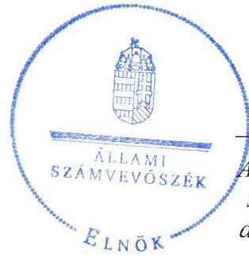
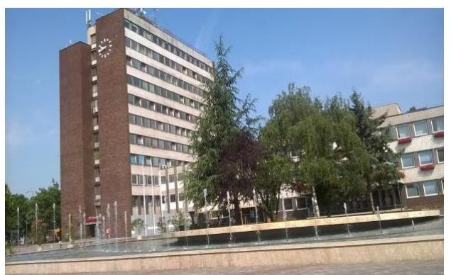
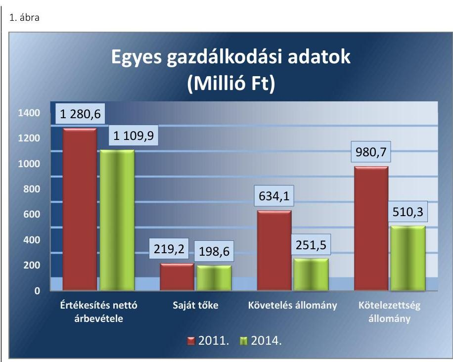
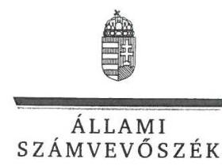

# Jelentés 

## Az önkormányzatok gazdasági társaságai

Az önkormányzatok többségi tulajdonában lévő gazdasági társaságok gazdálkodásának ellenőrzése - Dunanett Dunaújvárosi Regionális Köztisztasági és Hulladékkezelő, Szolgáltató Nonprofit Kft.
2016.

Az ÁSZ az államháztartáson kívül működő közfeladat-ellátó rendszerek ellenőrzéseivel hozzájárul ahhoz, hogy a közpénzeket az államháztartáson kívül működő szervezetek is átlátható, rendezett módon használják fel a közfeladatok ellátása érdekében.

---

# Jelentés 

## Az önkormányzatok gazdasági társaságai

Az önkormányzatok többségi tulajdonában lévő gazdasági társaságok gazdálkodásának ellenőrzése - Dunanett Dunaújvárosi Regionális Köztisztasági és Hulladékkezelő, Szolgáltató Nonprofit Kft.
2016. 12. hó 04. nap

16224
www.asz.hu

---

# AZ ELLENŐRZÉST FELÜGYELTE:

## MAKKAI MÁRIA felügyeleti vezető

## AZ ELLENŐRZÉST VEZETTE ÉS A VÉGREHAJTÁSÁÉRT FELELŐS:

## NEMESVÁRI-HORTHY ESZTER ellenőrzésvezető

## KLINGA LÁSZLÓ ellenőrzésvezető

## A PROGRAM ÖSSZEÁLLÍTÁSÁÉRT FELELŐS:

## JANIK JÓZSEF LÁSZLÓ osztályvezető

---

**IKTATÓSZÁM:** V-1097-124/2016.

**TÉMASZÁM:** 2131

**ELLENŐRZÉS-AZONOSÍTÓ SZÁM:** V070761

---

Jelentéseink az Országgyűlés számítógépes hálózatán és az Interneten a www.asz.hu címen is olvashatóak.

---

# TARTALOMJEGYZÉK 

■ ÖSSZEGZÉS ..... 5
■ AZ ELLENŐRZÉS CÉLJA ..... 7
■ AZ ELLENŐRZÉS TERÜLETE ..... 8
■ AZ ELLENŐRZÉS HÁTTERE, INDOKOLTSÁGA ..... 10
■ A JELENTÉS LÉNYEGES KÉRDÉSKÖREI ..... 11
■ ELLENŐRZÉS HATÓKÖRE ÉS MÓDSZEREI ..... 12
■ MEGÁLLAPÍTÁSOK ..... 14
■ JAVASLATOK ..... 24
■ MELLÉKLETEK ..... 27
I. sz. melléklet: Értelmező szótár ..... 27
■ FÜGGELÉK: ÉSZREVÉTELEK ..... 31
■ RÖVIDÍTÉSEK JEGYZÉKE ..... 39

---

.

---

# ÖSSZEGZÉS 

Dunaújváros Megyei Jogú Város Önkormányzata a hulladékgazdálkodás közfeladatának ellátását szabályosan szervezte meg, a tulajdonosi jogokat szabályszerűen gyakorolta. A Dunanett Dunaújvárosi Regionális Köztisztasági és Hulladékkezelő, Szolgáltató Nonprofit Kft. 2011-2014. évi vagyongazdálkodása összességében szabályszerű volt. A kötelezettségállomány veszélyt jelentett a közfeladat ellátására és a működésre. A Társaság az adatok közzétételi kötelezettségét nem teljesítette, így az ügyvezető nem biztosította a Társaság működése jogszabályoknak megfelelő átláthatóságát. A közfeladat bevételeinek és ráfordításainak elszámolása megfelelő volt. Az önköltségszámítás szabályait az előírás ellenére nem határozták meg.

## Az ellenőrzés társadalmi indokoltsága

Az Állami Számvevőszék kiemelt célja, hogy a helyi önkormányzatok gazdálkodásában rejlő pénzügyi kockázatok feltárásával, az államháztartáson kívülre nyújtott költségvetési támogatások és ingyenes vagyonjuttatások, valamint az államháztartáson kívül működő feladat-ellátó rendszerek ellenőrzéseivel hozzájáruljon ahhoz, hogy a közpénzeket az államháztartáson kívül működő szervezetek is átlátható, rendezett módon használják fel.

Magyarországon az intézmény-centrikus közfeladat-ellátás jellemző, de egyre jelentősebb a költségvetésen kívüli feladatellátás térnyerése. Ennek legfontosabb szereplői - a nonprofit szervezetek mellett - az önkormányzati tulajdonú gazdasági társaságok. Az önkormányzatok szervezetalakítási szabadságának következménye, hogy a korábban is vállalati formában működő közszolgáltatások mellett, mind a kötelező, mind az önként vállalt feladatok ellátásában a gazdasági társaságok kiemelt fontosságú szerephez jutottak.

## Főbb megállapítások, következtetések, javaslatok

Az Önkormányzat a hulladékgazdálkodás közfeladatának megszervezéséről a jogszabályi előírásoknak megfelelően döntött, annak ellátásáról gondoskodott. Az Önkormányzat a Hgt.1,2 szerinti hulladékgazdálkodással összefüggő rendeletalkotási kötelezettségének eleget tett, annak tartalma megfelelt az előírásoknak. Az Önkormányzat a hulladékgazdálkodási közszolgáltatás ellátására Közszolgáltatási szerződés ${ }_{1,2,3}$-t kötött, amelyek tartalma megfelelő volt. A tulajdonosi jogok gyakorlása szabályszerű volt.

A DVG Zrt. az SZMSZ-ében szabályszerűen előírta a többségi befolyású, majd kizárólagos tulajdonában lévő Dunanett NKft. feletti tulajdonosi képviselet rendjét. A Taktv.-ben előírtak ellenére a javadalmazással összefüggő szabályzatot nem alkottak. Az FB a 2011-2014. években jóváhagyott ügyrenddel rendelkezett, az előírásoknak megfelelően az éves beszámolókról írásbeli jelentést készített.

A közfeladat-ellátását szolgáló vagyonnal való gazdálkodás összességében szabályszerű volt, azonban az előírások ellenére a tárgyi eszközökre vonatkozóan a 2011., és a 2013-2014. években mennyiségi leltárt nem készítettek. Társaság a Számv. tv. előírásai ellenére nem rendelkezett számlarenddel, önköltségszámítási szabályzattal és bizonylati renddel. A szabályozási hiányosságok miatt a szabályszerű gazdálkodás feltételei teljes körűen nem voltak biztosítottak. A kötelezettségek állományának csökkenése ellenére, azok év végi állománya jelentősen meghaladta a forgóeszközök összegét, így a közfeladat ellátására és működésre kockázatot jelentett. A 2013. évi beszámolót és üzleti jelentést a taggyűlés nem fogadta el, azonban a jóváhagyásra jogosult testület elfogadó határozata nélkül letétbe helyezték. A Dunanett NKft. a közérdekű adatok megismerésére irányuló kérelmek intézésének, igények teljesítésének rendjére vonatkozó szabályzatot az Avtv.-ben és az Info tv.-ben előírtak ellenére nem készített. Az előírások ellenére

---

adatvédelmi felelőst nem jelöltek ki, adatvédelmi és adatbiztonsági szabályzattal nem rendelkeztek, belső adatvédelmi nyilvántartást nem vezettek. A Társaság a szervezeti, személyi és gazdálkodási adatait az Eisztv.-ben, az Info tv.-ben előírtak ellenére honlapján nem tette közzé.

A Társaságnál a közfeladat bevételeinek és anyagjellegű ráfordításainak, továbbá a beruházások, felújítások és az értékcsökkenési leírás elszámolása megfelelő volt. Az önköltségszámítás szabályait nem határozták meg, így az árképzés a 2011-2012. években nem volt megalapozott.

---

# AZ ELLENŐRZÉS CÉLJA 

pozottsága szabályszerű önköltségszámítással.

Az ellenőrzés célja annak értékelése volt, hogy az Önkormányzat vagyongazdálkodási tevékenysége során szabályszerűen gyakorolta-e tulajdonosi jogait.

Ellenőriztük, hogy a gazdasági társaság szabályozottsága, gazdálkodása és vagyongazdálkodási tevékenysége, bevételeinek és ráfordításainak elszámolása megfelelt-e a jogszabályi és tulajdonosi előírásoknak.

Értékeltük továbbá, hogy a gazdasági társaság kötelezettségállománya jelentett-e kockázatot a működésre, valamint a gazdálkodás átláthatósága és elszámoltathatósága érdekében biztosítva volt-e a szolgáltatás díjának megala-

---

# **AZ ELLENŐRZÉS TERÜLETE**

## **Dunaújváros Megyei Jogú Város Önkormányzata, a DVG Dunaújvárosi Vagyonkezelő Zrt. és a Dunanett Dunaújvárosi Regionális Köztisztasági és Hulladékkezelő, Szolgáltató Nonprofit Kft.**

**A DUNANETT DUNAÚJVÁROSI REGIONÁLIS KÖZTISZTASÁGI ÉS HULLADÉKKEZELŐ, SZOLGÁLTATÓ NONPROFIT KFT.-**t 30,0 millió Ft jegyzett tőkével az Önkormányzat 100%-os tulajdonában álló DVG Dunaújvárosi Vagyonkezelő Zrt. jogelődje, a DVG Városgazdálkodási Rt. alapította 1996. december 31-ei hatállyal. Az alapítást követően a Bio-Pannónia Kft. üzletrész adásvételi szerződéssel megszerezte a Dunanett NKft. 49,9%-os tulajdonrészét, majd a tulajdonostársak által végrehajtott tőkeemelés következtében a jegyzett tőke 60,0 millió Ft-ra nőtt, mely 2011. január 1-jétől az ellenőrzött időszak végéig nem változott.

A Dunanett NKft.-ben a Bio-Pannónia Kft. üzletrészét az ENERGOTT Fejlesztő és Vagyonkezelő Kft. 2012. január 24-én megvásárolta. A DVG Zrt. az ENERGOTT Fejlesztő és Vagyonkezelő Kft. 49,9%-os tulajdoni hányadát az Önkormányzat által nyújtott kamatmentes kölcsönből vásárolta meg, így az 2014. augusztus 14-étől a 100%-os önkormányzati tulajdonú DVG Zrt. 100%-os tulajdonába került. 2014. november 25-én a Dunanett NKft.-t a DVG Zrt.-től az Önkormányzat megvásárolta, ezzel kizárólagos tulajdonossá vált. A Társaság nonprofit Kft.-ként 2014. július 1-jétől működik.

**A DUNANETT NKFT. FŐTEVÉKENYSÉGE** az ellenőrzött időszak alatt a nem veszélyes hulladék gyűjtése volt. A Dunanett NKft. a hulladékgazdálkodási közfeladatot a 2011. évben 22, a 2014. évben 21 településen látta el. A közszolgáltatásba bevont települések lakosságszáma 2011-ben 121 457 fő, 2014-ben 122 209 fő volt, az ingatlanok száma az ellenőrzött időszak eleji 47 555 db-ról a 2014. év végére 53 034 db-ra nőtt. A teljes munkaidőben foglalkoztatott átlagos munkavállalói létszám 2011. december 31-én 158 fő, 2014. december 31-én 118 fő volt. A Dunanett NKft. a hulladékgazdálkodási közszolgáltatást saját, lízingelt és bérelt eszközökkel látta el.

A Dunanett NKft. gazdálkodásának főbb adatait a 2011. és 2014. évek vonatkozásában az 1. ábra szemlélteti.

---

Forrás: a Társaság adatszolgáltatása
A Dunanett NKft. 100%-os tulajdonában volt a 2014. január 13-án 0,5 millió Ft törzstőkével bejegyzett Dednett Vagyonkezelő Kft. (későbbi nevén Dunanett Vagyonkezelő Kft.), amelynek főtevékenysége a közúti áruszállítás volt. A Társaság továbbá 2006-tól alapító tagként tartós részesedéssel rendelkezett a Közép-Duna Vidéke Hulladékgazdálkodási Vagyonkezelő és Közszolgáltató Zrt.-ben 13,6%-os tulajdoni hányaddal.

A DVG Zrt.-nél az öt-tagú Igazgatóság személyi összetételében három alkalommal történt változás, az elnök-vezérigazgató személye két alkalommal változott, a jelenlegi vezérigazgató 2012. június 1. óta tölti be tisztségét. A polgármester személyében nem, a jegyző személyében egy alkalommal, 2014. április 10-étől volt változás. A polgármester a 2010. évi önkormányzati választásoktól tölti be tisztségét. A Dunanett NKft. ügyeinek intézését és képviseletét 2011. január 1. és 2014. november 25. között egyidejűleg két ügyvezető látta el, ez időszak alatt személyük többször változott. Az Önkormányzat 100%-os tulajdonosként 2014. november 30-ától egy ügyvezetőt jelölt ki az ügyvezetői feladat ellátására, aki tisztségét a helyszíni ellenőrzés időszaka alatt is betöltötte. A gazdasági igazgató személye az ellenőrzött időszak alatt nem változott.

A Dunanett NKft. nem minősült az Áht. ${ }^{1}$ 2. § I) pontja, valamint a 479/2009/EK rendelet² szerint nevesített kormányzati szektorba sorolt egyéb szervezetnek, ezért adatszolgáltatási kötelezettség az ellenőrzött időszakban nem terhelte.

---

# **AZ ELLENŐRZÉS HÁTTERE, INDOKOLTSÁGA**

*Az önkormányzatok közfeladat-ellátásában egyre jelentősebb a gazdasági társaságok útján történő feladatellátás térnyerése.*

**AZ ÖNKORMÁNYZATI TULAJDONÚ GAZDASÁGI TÁRSASÁGOK** teljes körű ellenőrzésének lehetőségét az Állami Számvevőszékről szóló 1989. évi XXXVIII. törvény 2011. január 1-jétől hatályos módosítása teremtette meg. Az önkormányzati tulajdonú gazdasági társaságok ellenőrzése kiemelten fontos a vagyon megőrzése, megóvása érdekében, valamint a kormányzati szektor elszámolásaiban megjelenő önkormányzati tulajdonú gazdálkodó szervezetek esetében, amelyekkel szemben alapvető követelmény, hogy gazdálkodásuk, működésük szabályszerű, az általuk szolgáltatott adatok minél megbízhatóbbak legyenek. A feladat/közfeladat ellátás költségeinek, ráfordításainak alakulása, színvonala hatással van a lakosság elégedettségére.

**AZ ELLENŐRZÉS VÁRHATÓ HASZNOSULÁSA-KÉNT** az ÁSZ3 a megállapításaival segítséget nyújthat az államháztartáson kívüli közfeladat-ellátás értékeléséhez, jogszabályi keretei pontosításához, átláthatóságot biztosító szabályozásához. Meghatározhatóvá válnak az önkormányzati feladatellátásban részt vevő államháztartáson kívüli szervezeteknek – az önkormányzat költségvetését, pénzügyi helyzetét is befolyásoló – kockázatai, lehetővé válik ezen kockázatok csökkentése. Ellenőrzéseink feltárhatják, hogy az önkormányzat feladat-ellátási kötelezettségének szabályszerűen tett-e eleget, a feladatellátáshoz rendelt vagyonkezelésbe vett és saját vagyon működtetését az elvárható gondossággal, szabályszerűen szervezte-e meg és a tulajdonosi felügyelete hozzájárult-e a feladatellátásához. Értékelhetővé válik, hogy a gazdasági társaság a feladat-ellátási, közszolgáltatási szerződésben foglaltak betartásával, a vagyon használatával biztosította-e a szolgáltatás folytatásának feltételeit. Ezzel az ellenőrzöttek és a helyi döntéshozók számára az ÁSZ visszajelzést ad feladatszervezési, feladat-ellátási kockázataikról, alapot ad a meglévő hibák megszüntetéséhez, a jobb feladat-ellátás biztosításához. Mindezeken keresztül az ÁSZ hozzájárul Magyarország közpénzügyi helyzetének javításához, a közpénzek mérhető módon történő, a döntéshozók által meghatározott célok szerinti felhasználásához.

---

# A JELENTÉS LÉNYEGES KÉRDÉSKÖREI 

1. Az önkormányzat közfeladat megszervezéséről szóló döntése, valamint tulajdonosi joggyakorlása szabályszerű volt-e?
2. A gazdasági társaság vagyongazdálkodása szabályszerű volt-e, kötelezettségállománya jelent-e kockázatot a működésre, illetve a közfeladat ellátására?
3. A gazdasági társaságnál az ellátott közfeladat bevételei és ráfordításai elszámolása, valamint az önköltségszámítás és az árképzés szabályszerű volt-e?

---

# ELLENŐRZÉS HATÓKÖRE ÉS MÓDSZEREI 

## Az ellenőrzés típusa

Megfelelőségi ellenőrzés

## Az ellenőrzött időszak

2011. január 1-jétől 2014. december 31-ig terjedő időszak

## Az ellenőrzés tárgya

A gazdasági társaság feletti tulajdonosi joggyakorlás, valamint a gazdasági társaság gazdálkodásának szabályozottsága és szabályszerűsége.

Az ellenőrzés kiterjed minden olyan körülményre és adatra, amely az ÁSZ jogszabályban meghatározott feladatainak teljesítéséhez, valamint a program végrehajtása folyamán felmerült újabb összefüggések feltárásához szükséges.

## Az ellenőrzött szervezet

Dunaújváros Megyei Jogú Város Önkormányzata, a DVG Dunaújvárosi Vagyonkezelő Zrt. és a Dunanett Dunaújvárosi Regionális Köztisztasági és Hulladékkezelő, Szolgáltató Nonprofit Kft.

## Az ellenőrzés jogalapja

Az ellenőrzés jogszabályi alapját az ÁSZ tv. 1. § (3) bekezdése és 5. § (3)(4)-(5) bekezdései képezték.

## Az ellenőrzés módszerei

Az ellenőrzést a nemzetközi standardokat irányadónak tekintve az ellenőrzési program ellenőrzési kérdései, az ellenőrzött időszakban hatályos jogszabályok, az ellenőrzés szakmai szabályok és
 módszertanok figyelembe vételével végeztük.

Az ellenőrzés ideje alatt az ellenőrzött szervezettel történő kapcsolattartást az ÁSZ Szervezeti és Működési Szabályzatának vonatkozó előírásai alapján biztosítottuk.

Az ellenőrzés a kiválasztott, tulajdonosi jogokat gyakorló önkormányzatra, illetve az ellenőrzésre kijelölt gazdasági társaságra terjedt ki.

---

Az ellenőrzési kérdések megválaszolásához szükséges bizonyítékok megszerzése a következő ellenőrzési eljárások alkalmazásával történt: megfigyelés, kérdésfeltevés (információkérés), összehasonlítás, valamint elemző eljárás. Az ellenőrzési bizonyítékként felhasználható adatforrások közé tartoztak egyrészt a szakmai programban felsorolt adatforrások, másrészt adatforrás lehetett még minden - az ellenőrzés folyamán - feltárt, az ellenőrzés szempontjából információkat tartalmazó dokumentum.

Az ellenőrzést a kérdésekre adott válaszok kiértékelésével, valamint a megjelölt adatforrások, a csatolt tanúsítványok felhasználásával, továbbá az adott időszakban hatályos jogszabályok figyelembe vételével folytattuk le.

A bevételek és ráfordítások elszámolása, valamint a vagyonnyilvántartás terén a szabályszerű működést véletlen mintavétellel ellenőriztük. A mintavétellel ellenőrzött területek esetében minden egyes tétel vonatkozásában a szabályszerűségre vonatkozó kérdéseket tettünk fel, amelyek eredménye összesítésre került. Megfelelőnek értékeltünk egy ellenőrzött területet, amennyiben 95%-os bizonyossággal a teljes sokaságban a hibaarány legfeljebb 10%, nem megfelelőnek, amennyiben 10%-nál magasabb arányt képviselt. Abban az esetben, ha a teljes sokaság tekintetében a 10%-os hibaarányhoz való viszony megítélésének megbízhatósága nem érte el a 95%-ot, annak elérése érdekében értékelésünket további szempontokkal egészítettük ki, és figyelembe vettük a feltárt hibák típusát és súlyát. A ráfordítások elszámolására és a vagyonnyilvántartásra vonatkozó véletlen mintavételt kockázati alapú kiválasztással egészítettük ki, amelynek során évente a három legnagyobb összegű tételt választottuk ki.

---

# 1. Az önkormányzat közfeladat megszervezéséről szóló döntése, valamint tulajdonosi joggyakorlása szabályszerű volt-e? 

Összegző megállapítás

Az Önkormányzat a jogszabályok és a helyi szabályozás betartásával szervezte meg a hulladékgazdálkodást. A DVG Zrt. és az Önkormányzat tulajdonosi joggyakorlása szabályszerű volt.
1.1. számú megállapítás

A közfeladat-ellátás megszervezése szabályszerű volt. Az Önkormányzat a hulladékgazdálkodással összefüggő terv- és rendeletalkotási kötelezettségének a vonatkozó jogszabályi előírásoknak megfelelően eleget tett.

GAZDASÁGI PROGRAMMAL az Önkormányzat ${ }^{4}$ a 2011-2014. években nem rendelkezett az Ötv. 91. § (1) bekezdése, illetve az Mötv. 116. § (1) bekezdésében előírtak ellenére.

## A KÖZÉP- ÉS HOSSZÚ TÁVÚ VAGYONGAZDÁLKO-

DÁSI TERVET az Önkormányzat az Nvtv. ${ }^{5}$ 2012. január 1-jétől hatályba lépő 9. § (1) bekezdésében előírtak szerint a 2013-2018. évekre vonatkozóan elkészítette, amelyet a Közgyűlés ${ }^{6}$ határozatával elfogadott.

Az Önkormányzat a 2011-2012. évekre a Hgt. ${ }_{1}{ }^{7}$ 35. §. (1) bekezdésében előírtaknak megfelelően hulladékgazdálkodási tervvel rendelkezett.

## A HULLADÉKGAZDÁLKODÁSI KÖZSZOLGÁLTATÁS biztosítására az Önkormányzat Közszolgáltatási szerződés ${ }_{1,2,3}$-t ${ }^{8}$ kötött. A Közszolgáltatási szerződés ${ }_{1}$-t az Önkormányzat 2002. december 20-án 10 éves időtartamra kötötte a Dunanett NKft. jogelődjével a települési szilárd hulladék gyűjtésére, szállítására és elhelyezésére a Hgt. ${ }_{1} 28$. § (1) bekezdés előírása alapján. A Közszolgáltatási szerződés ${ }_{2}$-t az Önkormányzat 2011. december 28-án kötötte meg, amit 2013. július 27-én 6 hónapos felmondási határidővel felmondtak. A Közszolgáltatási szerződés ${ }_{3}$-at 2014. január 24-én 10 éves időtartamra kötötték meg.

A Közszolgáltatási szerződés ${ }_{1,2}$ tartalma megfelelt a Hgt. ${ }_{1} 28$. § (3) bekezdésében és a 224/2004. (VII. 22.) számú Korm. rendelet ${ }^{9}$ 12-13. §-aiban előírtaknak. A Közszolgáltatási szerződés ${ }_{3}$ a Hgt. ${ }_{2}{ }^{10} 34$. § (5) bekezdésének és a 317/2013. (VIII. 28) számú Korm. rendelet ${ }^{11} 4$. § (1) bekezdésének megfelelően a kötelező tartalmi elemeket tartalmazta.

## A HULLADÉKGAZDÁLKODÁSSAL ÖSSZEFÜGGŐ

RENDELET alkotási kötelezettségének az Önkormányzat eleget tett. A Hulladékgazdálkodási rendelet ${ }_{1}{ }^{12}{ }_{2}{ }^{13}$ tartalma a Hgt. ${ }_{1} 23$. § a)-h) pontjaiban, valamint a Hgt. ${ }_{2} 35$. § a)-g) pontjaiban foglaltaknak megfelelt. A Hulladékgazdálkodási rendelet ${ }_{1,2}$-ben az előírásoknak megfelelően meghatá-

---

rozták - többek között - a helyi közszolgáltatás tartalmát, a közszolgáltatással ellátott terület határait, a közszolgáltató megnevezését, a közszolgáltatás ellátásának rendjét és módját, a közszolgáltató és az ingatlantulajdonos ezzel összefüggő jogait és kötelezettségeit, a közszolgáltatás keretében kötött szerződés létrejöttének módját. Az Önkormányzat 2012. január 1. és 2012. április 14. között a Hgt. ${ }_{1}$ 57. § (1) bekezdését betartotta, mivel a hulladékkezelési közszolgáltatási díj legmagasabb mértéke nem haladta meg a Közgyűlés által rendeletben 2011. évre megállapított hulladékkezelési közszolgáltatási díj legmagasabb mértékét.
2013. január 1-jétől a hulladékgazdálkodási díjat a MEKH ${ }^{14}$ javaslatának figyelembe vételével a miniszter* rendeletben állapítja meg.

# A TÁRSASÁGI SZERZŐDÉS ${ }_{1-8}{ }^{15}$ ÉS AZ ALAPÍTÓ 

OKIRAT ${ }_{1-2}{ }^{16}$ a Gt. ${ }^{17}$ 12. § (1) bekezdés c) pontjának, a Ptk. ${ }^{18}$ 54. § (1)(2) bekezdésének, valamint a Ptk. ${ }^{19}$ 3:5. §-ában előírtaknak megfelelően tartalmazta a Dunanett NKft. fő tevékenységét. A Dunanett NKft. legfőbb szerve 2011. január 1. és 2014. augusztus 14. között a taggyűlés volt. Ezt követően, mint kizárólagos tulajdonos a taggyűlés jogait az alapító DVG Zrt. ${ }^{20}$, majd 2014. november 25-étől az Önkormányzat Közgyűlése gyakorolta. A Hgt. ${ }_{2}$ 90. § (8) bekezdése alapján a Társaságot nonprofit gazdasági társasággá alakították át, amely megfelelt a Ctv. ${ }^{21}$ 9/F. § (2) és (3) bekezdésében rögzített előírásoknak.

### 1.2. számú megállapítás

A tulajdonosi jogok gyakorlása szabályszerű volt.
A DVG ZRT. SZMSZ-ében ${ }^{22}$ rögzítették a tulajdonosi joggyakorlással kapcsolatos előírásokat. Az SZMSZ 7.2. pontja alapján a képviseletet ellátó személy az Igazgatóság ${ }^{23}$ elnöke, illetve a DVG Zrt. legmagasabb vezető beosztású munkavállalója az elnök-vezérigazgató volt, aki az összes leányvállalatnál, így a Dunanett NKft.-nél is ellátta a tulajdonosi képviseletet. Az SZMSZ és azzal összhangban a DVG Zrt. Igazgatóságának Ügyrendje ${ }^{24}$ a tulajdonosi képviseletet ellátó személy részére előírta a tulajdonosi szándék - az Igazgatóság által adott mandátum alapján - cégcsoport vállalatai felé való közvetítését.

A DVG Zrt. elnök-vezérigazgatója, vagy meghatalmazottja útján a Dunanett NKft.-nél részt vett a taggyűlési üléseken és az SZMSZ előírásai szerint gyakorolta tulajdonosi jogait. A Dunanett NKft. egyszemélyes társasággá alakulását követően, 2014. augusztus 14-étől a DVG Zrt. gyakorolta a taggyűlés jogait, határozatait az ügyvezető igazgatóval írásban közölte.

## A TULAJDONOSI JOGOK GYAKORLÁSÁNAK

RENDJÉT a Közgyűlés a Vagyongazdálkodási rendeletben ${ }^{25}$ határozta meg. Rögzítették a Közgyűlés kizárólagos, továbbá az Önkormányzat egyszemélyes, illetőleg 50%-ot meghaladó tulajdoni részesedéssel rendelkező gazdasági társaságai esetében a hatáskörébe tartozó jogokat. A Vagyongazdálkodási rendeletben a gazdasági társaságok képviseletét ellátó személy esetében előírta, hogy az köteles a tulajdonos állásfoglalását kikérni a társaság éves beszámolójának, üzleti tervének elfogadásában. Az Önkormányzat a Társaság feletti tulajdonosi jogokat 2014. november 25-étől

[^0]
[^0]:    * Nemzeti Fejlesztési Miniszter

---

a Vagyongazdálkodási rendeletben foglaltak szerint, szabályosan gyakorolta.

A DUNANETT NKFT. legfőbb döntéshozó szerve a taggyűlés volt. A taggyűlés kizárólagos hatáskörébe tartozott - többek között - a Gt. 141. § (2) bekezdésében illetve a Ptk.: 3:109. § (2)-(3) bekezdéseiben előírtakkal összhangban a számviteli törvény szerinti beszámoló elfogadása - ideértve az adózott eredmény felhasználására vonatkozó döntést - az éves gazdálkodási terv jóváhagyása, a törzstőke felemelése/leszállítása, hitelfelvétel elhatározása, ügyvezető megválasztása/visszahívása, a társasági szerződés módosítása, javadalmazási szabályzat alkotása.

AZ FB ${ }^{26}$ a Dunanett NKft.-nél a Gt. 33. § (1) bekezdésének valamint a Ptk. 3:121. §-ában rögzítetteknek megfelelően 3 fővel működött. Az FB a 2011-2014. években a Gt. 34. § (4) bekezdésében, illetve a Ptk. 3:122. § (3) bekezdésében foglaltakkal összhangban rendelkezett a taggyűlés által jóváhagyott ügyrenddel. Az FB a Gt. 35. § (3) bekezdésének, illetve a Ptk. 3:120. § (2) bekezdésének megfelelően minden évben írásbeli jelentést készített a Társaság Számv. tv. ${ }^{27}$ 4. § (1) bekezdése szerint összeállított számviteli beszámolójáról.

# A BESZÁMOLTATÁSI RENDSZER KERETÉBEN 

a Dunanett NKft. a 2011-2012. és a 2014. évi éves szakmai és számviteli beszámolóit - az FB és a könyvvizsgáló előzetes írásbeli véleményezését követően - a taggyűlés a Gt. 35. § (3) bekezdésének, illetve a Ptk. 3:120. § (2) bekezdésében előírtaknak megfelelően fogadta el.

A saját tőke minden ellenőrzött évben jelentősen meghaladta a jegyzett tőkét, ezért a Gt. 143. § (2) bekezdés a) pontja, illetve a Ptk. 3:189. § (1) bekezdése miatti intézkedés megtétele nem vált szükségessé.

## 2. A gazdasági társaság vagyongazdálkodása szabályszerű volt-e, kötelezettségállománya jelent-e kockázatot a működésre, illetve a közfeladat ellátására?

Összegző megállapítás

A Társaság vagyongazdálkodása összességében szabályszerű volt. A kötelezettségállomány kockázatot jelentett a működésre, a közfeladat ellátására.
2.1. számú megállapítás

A Dunanett NKft. a Számv. tv.-ben foglaltak ellenére számlarendet, az önköltségszámítás rendjére vonatkozó szabályzatot, bizonylati rendet nem készített. A legfőbb döntéshozó szerv javadalmazással összefüggő szabályzatot nem alkotott.

A HULLADÉKGAZDÁLKODÁSI TERVET ${ }^{28}$ a Dunanett NKft. a Hgt. ${ }_{2}$ 78. § (1) bekezdésében előírtaknak megfelelően elkészítette, azt a Hgt. ${ }_{2}$ 78. § (3) bekezdése szerint az Országos Környezetvédelmi, Természetvédelmi és Vízügyi Főfelügyelőségnek megküldte, amely azt 2013. május 23-án jóváhagyta.

---

ÜZLETI TERVET a Dunanett NKft. a Közszolgáltatási szerződésekben előírtak alapján az ellenőrzött időszakban készített.

A Társaság rendelkezett a Számv. tv. 14. § (4) bekezdésében előírtak szerint számviteli politika ${ }_{1}^{29}{ }_{2}^{30}$-vel, valamint annak keretében a Számv. tv. 14. § (5) bekezdés a), b) és d) pontjai szerint eszközök és források leltárkészítési és leltározási szabályzattal, értékelési szabályzattal, valamint pénzkezelési szabályzattal.

A Dunanett NKft. az ellenőrzött időszakban a Számv. tv. 161. § (1) bekezdésében előírtak ellenére számlarendet, továbbá a Számv. tv. 14. § (5) bekezdés c) pontjában foglaltak ellenére az önköltségszámítás rendjére vonatkozó szabályzatot nem készített. A Társaság a Számv. tv. 14. § (6) és (7) bekezdései alapján nem mentesült az önköltségszámítás rendjére vonatkozó belső szabályzat készítésének kötelezettsége alól.

A Társaság a Számv. tv. 161. § (2) bekezdés d) pontjában foglaltak ellenére bizonylati renddel nem rendelkezett.

A SZÁMVITELI POLITIKA ${ }_{1,2}$ tartalmazta - többek között azokat a Társaságra jellemző szabályokat, előírásokat, módszereket, amelyekkel meghatározták, hogy mit tekintenek a számviteli elszámolás, értékelés szempontjából lényegesnek, jelentősnek, valamint azt, hogy a törvényben biztosított választási, minősítési lehetőségek közül melyeket alkalmazzák. A számviteli politika ${ }_{1,2}$ mellékletét képező számlatükör elkülönítetten tartalmazta az egyes településekhez tartozó lakossági és közületi hulladékgazdálkodással összefüggő közszolgáltatási díjbevételek, illetve az egyéb tevékenységekhez tartozó bevételek főkönyvi számláit.

A LELTÁROZÁSI SZABÁLYZAT ${ }_{1}{ }^{31,2}{ }^{32}$ tartalmazta a leltározás előkészítésének, végrehajtásának, azok ellenőrzésének feladatait, a leltározásért felelős személyeket, a leltározás módját, fordulónapját, gyakoriságát. A leltározási szabályzat ${ }_{1}$ a tárgyi eszközök esetében négyévenkénti, a készletek esetében évenkénti mennyiségi felvétellel történő leltározást írta elő. A leltározási szabályzat ${ }_{2}$ az eszközök - kivéve az immateriális javakat, a követeléseket, illetve az aktív időbeli elhatárolásokat - kétévente történő mennyiségi felvételét rögzítette. A leltározási szabályzat ${ }_{2}$ előírása megfelelt a Számv. tv. 69. § (3) bekezdésének
 2012. január 1-jétől hatályos előírásainak. A Társaság az eszközeiről és azok állományában bekövetkezett változásokról folyamatosan részletező nyilvántartást vezetett mennyiségben és értékben.

AZ ÉRTÉKELÉSI SZABÁLYZAT ${ }^{33}$ a Számv. tv. 55. § (1)(2) bekezdésének előírásaival összhangban tartalmazta a követelések minősítésének szabályait.

A PÉNZKEZELÉSI SZABÁLYZAT ${ }^{34}$ a Számv. tv. 14. § (8) bekezdésével összhangban tartalmazta a pénzforgalom lebonyolításának rendjét, valamint a pénzforgalommal kapcsolatos nyilvántartási szabályokat.

A Dunanett NKft. a hulladékgazdálkodási közfeladattal kapcsolatos költségek, ráfordítások számviteli szétválasztása rendjének belső szabályait

---

nem határozta meg, ezzel nem tett eleget a Számv. tv. 161/A. § (1) bekezdésében foglaltaknak, mivel nem alakította ki úgy belső szabályait, hogy azok a mérleg és eredménykimutatás alátámasztásán túlmenően a kiegészítő melléklet adatainak közvetlen alátámasztására is alkalmasak legyenek.

A Társaság a Számv. tv. 161/A. § (2) bekezdésében előírtaknak - a szabályozási hiányosságok ellenére - megfelelt, mivel a gyakorlatban a költségek, ráfordítások elkülönítésére ún. munkaszám rendszert alakított ki, megteremtve ezzel a közpénzek felhasználásának és a köztulajdon használatának nyilvánosságát és ellenőrizhetőségét, így a vonatkozó külön jogszabályban ${ }^{\dagger}$ meghatározott adatok rendelkezésre álltak. A Társaság a munkaszám kódok alkalmazásával megteremtette a hulladékgazdálkodási közfeladathoz kapcsolódó költségek és ráfordítások elkülönített nyilvántartásának lehetőségét, ezzel eleget tett a 64/2008. (III. 28.) Korm. rendelet 5. §-a, valamint a Hgt. ${ }_{1}$ 29. § (3) bekezdése, illetve a Hgt. ${ }_{2}$ 50. § (2) bekezdésében előírtaknak.

JAVADALMAZÁSSAL ÖSSZEFÜGGŐ SZABÁLYZATOT a legfőbb döntéshozó szerv a Taktv. ${ }^{35}$ 5. § (3) bekezdésében foglaltak ellenére a Dunanett NKft. vonatkozásában nem alkotott.
2.2. számú megállapítás

A Társaság vagyongazdálkodása összességében szabályszerű volt. azonban a 2011., 2013-2014. években a mennyiségi felvétellel történő leltározást a tárgyi eszközök esetében nem végezték.

LELTÁRRAL az éves beszámolókat alátámasztották. A főkönyvi könyvelés és az analitikus nyilvántartások adatai közötti egyeztetést a 2011-2014. üzleti évek mérleg fordulónapjára vonatkozóan szabályszerűen elvégezték. A leltározási szabályzat ${ }_{1}$ 1.3. pontja előírása ellenére a 2011. évben, a leltározási szabályzat ${ }_{2}$ 2.3. pontja előírása ellenére a 2013. évben a tárgyi eszközöket mennyiségi felvétellel nem leltározták. Nem tartották be továbbá a Számv. tv. 2012. január 1-jétől hatályos 69. § (3) bekezdésében foglalt előírását, mivel mennyiségi felvétellel történő leltározást a tárgyi eszközök esetében a 2012-2014. évek között nem végezték. A készleteket és a házipénztár állományt mennyiségi felvétellel minden ellenőrzött üzleti év fordulónapjára vonatkozóan mennyiségben leltározták. A leltárakat kiértékelték, annak értékadatai az éves beszámolók adataival egyezőek voltak.

A Dunanett NKft. vagyoni helyzetét jellemző, főbb könyvviteli mérleg szerinti kiemelt adatait az 1. táblázat mutatja be.

[^0]
[^0]:    ${ }^{\dagger}$ A Hgt. 2-ben szabályozták.

---

| A DUNANETT NKFT. FŐBB MÉRLEG ADATAI (MILLIÓ FORINT) |  |  |  |  |  |
| :--: | :--: | :--: | :--: | :--: | :--: |
| Megnevezés | $\begin{aligned} & 2011 \\ & 01.01 \end{aligned}$ | $\begin{aligned} & 2011 \\ & 12.31 \end{aligned}$ | $\begin{aligned} & 2012 \\ & 12.31 \end{aligned}$ | $\begin{aligned} & 2013 \\ & 12.31 \end{aligned}$ | $\begin{aligned} & 2014 \\ & 12.31 \end{aligned}$ |
| I. Befektetett eszközök | 633,3 | 695,1 | 706,2 | 658,8 | 632,6 |
| - ebből: Tárgyi eszközök | 631,0 | 692,9 | 704,0 | 656,0 | 624,3 |
| II. Forgóeszközök | 710,8 | 500,9 | 348,7 | 425,8 | 318,8 |
| - ebből: Követelések | 634,1 | 443,4 | 305,4 | 379,7 | 251,5 |
| III. Aktív időbeli elhatárolások | 1,0 | 4,9 | 0,9 | 1,3 | 16,4 |
| Eszközök összesen | 1345,1 | 1200,9 | 1055,8 | 1085,9 | 967,8 |
| IV. Saját tőke | 219,2 | 225,3 | 253,2 | 270,4 | 198,6 |
| - ebből: Jegyzett tőke | 60,0 | 60,0 | 60,0 | 60,0 | 60,0 |
| - ebből Mérleg szerinti eredmény | 0,0 | 6,1 | 27,9 | 17,2 | $-71,9$ |
| V. Céltartalékok | 57,2 | 84,8 | 92,1 | 131,0 | 127,5 |
| VI. Kötelezettségek | 980,7 | 779,6 | 564,9 | 530,1 | 510,3 |
| VII. Passzív időbeli elhatárolások | 88,0 | 111,2 | 145,6 | 154,4 | 131,4 |
| Források összesen | 1345,1 | 1200,9 | 1055,8 | 1085,9 | 967,8 |

Forrás: A Társaság 2011-2014. évi beszámolói

AZ ESZKÖZÉRTÉK a 2011. évi nyitó állományról a 2014. év végére összességében 377,3 millió Ft-tal (28,1%-kal) csökkent. A befektetett eszközök könyv szerinti értéke 2011. január 1. és 2014. december 31. között 0,7 millió Ft-tal, az állományban jelentős arányt képviselő tárgyi eszközök 6,7 millió Ft-tal csökkentek. Az eszközérték csökkenését döntően a forgóeszközök, ezen belül a követelések 382,6 millió Ft-tal (60,3%-kal) történő csökkenése okozta. A követelések csökkenését a megrendelések állományának, az ellátandó területnek a csökkenése, valamint a rezsicsökkentési előírások végrehajtása eredményezték. A 2013. évben a közfeladatra eső követelés az összes követelés 91,6%-át, a 2014. évben 97,7%-át jelentette. A saját tőke a 2011. évi nyitó értékről a 2014. év végére 20,6 millió Ft-tal (9,4%-kal) csökkent, melyet a 2014. évi negatív mérleg szerinti eredmény okozott. Az adózott eredményre 2014-ben negatív hatást gyakorolt az útdíj növekedése, a lerakási díj emelkedése, az árbevétel csökkenése (11 település hulladékszállítás közszolgáltatását elvesztették, mivel a kiírt közbeszerzési pályázaton nem indultak a feltételek miatt), valamint a közszolgáltatók részére előírt hatósági díjfizetési kötelezettség.

AZ ÉRTÉKESÍTÉS NETTÓ ÁRBEVÉTELE a 2011-2014. évek között 170,7 millió Ft-al (13,3%-kal) csökkent. A hulladékgazdálkodási közfeladat értékesítésének nettó árbevétele a 2013. évről a 2014. évre 104,5 millió Ft-tal (8,8%-kal) csökkent. A hulladékgazdálkodás közfeladat ellátása a 2014. évben 11 településre vonatkozóan megszűnt.

### 2.3. számú megállapítás

A kötelezettségek állománya a közfeladat ellátásra és a működésre veszélyt jelentett.

A KÖTELEZETTSÉGEK állománya a 2011. évi nyitó értékről a 2014. év végére 470,4 millió Ft-tal (48,0%-kal) csökkent. Ennek ellenére a rövid lejáratú kötelezettségek értéke az ellenőrzött időszakban meghaladta a forgóeszközök értékét, így a likviditására, a közfeladat ellátására és a működésre veszélyt jelentett.

---

A KÖTELEZETTSÉGEK állományán belül a hosszú lejáratú kötelezettségek 2011. január 1-jei nyitó állománya a 2014. év végére kivezetésre került. Ennek oka, hogy a Dunanett NKft. hosszú lejáratú lízingszerződései és beruházási hitele 2014-ben, valamint a tartós bérletek 2013-ban lejártak.

A rövid lejáratú kötelezettségek állománya a 2011. évi nyitó értékről a 2014. év végére 264,6 millió Ft-tal (34,1%-kal) csökkent, azonban a határidőben történő teljesítése nem volt biztosított.

AZ ELADÓSODOTTSÁG mértéke, szerkezete a magas kötelezettség állomány és ezen belül a magas lejárt szállítói tartozás miatt kockázatot jelentett a közfeladat ellátására, a Dunanett NKft. működésére az ellenőrzött időszakban. A hosszú lejáratú kötelezettségeket a rövidlejáratú kötelezettségek fizetésének elhalasztásával és jelentős késedelmi kamatfizetések vállalásával - ami 2011-2014 között 88,9 millió Ft-ot tett ki - teljesítették. A rövid lejáratú kötelezettségek határidőben történő teljesítése nem volt biztosított. A Dunanett NKft. folyamatos likviditási problémákkal küzdött, jelentős szállítói kötelezettség állományát a 2011-2012. években csak engedményezés útján tudta csökkenteni, de ezt követően is a szállítói tartozáson belül a lejárt határidejű tartozás aránya magas volt, a 2013. évben 69,5%, a 2014. évben 65,6%.

# 2.4. számú megállapítás 

A Társaság a 2013. évi beszámolót a jóváhagyásra jogosult testület elfogadó határozata nélkül helyezte letétbe. A közzétételi kötelezettséget a jogszabályi előírások ellenére nem teljesítették.

AZ ÉVES BESZÁMOLÓKAT a Számv. tv. 4. § (1) bekezdésének megfelelően a 19. § (1) bekezdésében előírt tartalommal elkészítették. A Hgt. 2 50. (3) bekezdésének megfelelően a 2013-2014. évi éves beszámoló részét képezte az önálló mérleg és eredménykimutatás a hulladékgazdálkodási közszolgáltatási tevékenység elkülönült bemutatására.

A Dunanett NKft. Számv. tv. szerint készített beszámolóinak elfogadásáról a legfőbb szerv - 2014. augusztus 14-éig a taggyűlés, 2014. november 25-éig a DVG. Zrt. képviseletét ellátó személy, 2014. november 25-étől az Önkormányzat Közgyűlése - döntött. A 2011-2012. évi éves beszámolókat az FB írásbeli jelentésének birtokában a taggyűlés elfogadta és az adózott eredmény eredménytartalékba helyezéséről döntött. A taggyűlés a 2013. évi adózott eredmény felhasználására vonatkozóan nem döntött, annak ellenére, hogy a Ptk. 3 3:109. § (2) bekezdése alapján a legfőbb szerv hatáskörébe tartozik a Számv. tv. szerint a nyereség felosztásáról való döntés. Az FB a 2013. évi Számv. tv. szerint készített beszámolót elfogadta a Gt. 35. § (3) bekezdésében, illetve a Ptk. 2 3:120. § (2) bekezdésében előírtaknak megfelelően. A 2014. évi beszámolót az Önkormányzat Közgyűlése az FB írásbeli jelentésének birtokában tárgyalta és fogadta el.

A Társaság 2013. évi beszámolóját és üzleti jelentését a taggyűlés 2014. március 21-én tartott ülésén nem fogadta el. A 2013. évi beszámolót a DVG Zrt. 2014. augusztus 25-én, mint egyszemélyi tulajdonos hagyta jóvá. A 2013. évi éves beszámolót a Számv. tv. 153. § (1) bekezdésével ellentétben a jóváhagyásra jogosult testület elfogadó határozata nélkül, 2014. május 30-án letétbe helyezték.

---

A 2011-2012. és 2014. évi éves beszámolók letétbe helyezése és közzététele megfelelt a Számv. tv. 153. § (1) bekezdésében, a 154. § (1) bekezdésében foglaltaknak.

A KÖNYVVIZSGÁLÓ a könyvvizsgálat keretében a 2011-2014. évi éves beszámolókat hitelesítő záradékkal látta el és figyelemfelhívó megjegyzést tett. A könyvvizsgáló az ellenőrzött időszak alatt a 2011-2012. években felhívta a figyelmet az eladósodottság mértékének a kockázatára, ami veszélyeztette a vállalkozás folytatásának elvét. A 2013-2014. években a könyvvizsgáló felhívta a figyelmet a magas rövid lejáratú kötelezettség állományra, amely a vállalkozás folytatásának elvére továbbra is kockázatos volt, továbbá a kockázat csökkentése érdekében intézkedések megtételét javasolta.

A könyvvizsgáló figyelemfelhívó megjegyzéseiben nem tett észrevételt arra vonatkozóan, hogy a Számv. tv. 14. § (5) bekezdés c) pontja és (7) bekezdése, valamint 161. § (1) bekezdése szerint önköltségszámítás rendjére vonatkozó szabályzatot és számlarendet a Társaság nem készített.

AZ ADATVÉDELEM, AZ ADATOK NYILVÁNOS-
SÁGA nem volt megfelelő. A Dunanett NKft. a közérdekű adatok megismerésére irányuló igények teljesítésének rendjét rögzítő szabályzatot az Avtv. ${ }^{36}$ 20. § (8) bekezdésében, az Info tv. ${ }^{37}$ 30. § (6) bekezdésében előírtak alapján a 2011-2014. években nem készített. Belső adatvédelmi felelőst az Avtv. 31/A. § (1) bekezdés c) pontjában és az Info tv. 24. § (1) bekezdés c) pontjában foglaltak ellenére nem jelöltek ki. Adatvédelmi és adatbiztonsági szabályzattal nem rendelkeztek, belső adatvédelmi nyilvántartást nem vezettek az Avtv. 31/A. § (2) bekezdés d) és e) pontjaiban és a (3) bekezdésében előírtak, valamint az Info tv. 24. § (2) bekezdés d) és e) pontjaiban, valamint a (3) bekezdésében előírtak ellenére.

A Társaság az
 ellenőrzött időszakban a szervezeti, személyi adatait és gazdálkodási adatait az Eüsztv ${ }^{38}$. 6. § (1) bekezdésében, az Infotv. 33. § (3) bekezdésében előírtak ellenére, annak 1. mellékletében meghatározott részletezettségben honlapján nem tette közzé.

# 3. A gazdasági társaságnál az ellátott közfeladat bevételei és ráfordításai elszámolása, valamint az önköltségszámítás és az árképzés szabályszerű volt-e? 

Összegző megállapítás

A közfeladat bevételeinek, ráfordításainak, továbbá a beruházások, felújítások elszámolása megfelelő volt. A közszolgáltatás díja szabályszerű önköltségszámítással a 2011-2012. években nem volt megalapozva. Az árképzés szabályszerű volt.
3.1. számú megállapítás

A bevételek, a ráfordítások, valamint a beruházások, felújítások elszámolása megfelelt a jogszabályi előírásoknak.

AZ ÉRTÉKESÍTÉS NETTÓ ÁRBEVÉTELÉNEK ELSZÁ-
MOLÁSÁNAK szabályszerűsége megfelelő volt. Az árbevételt a Hgt.;

---

29. § (3) bekezdése, valamint a Hgt. 2 50. § (2)-(3) bekezdései alapján elkülönítetten számolták el a megfelelő közfeladatra főkönyvi számlák alkalmazásával, településenként, lakossági és közületi megbontásban. A közszolgáltatási díjak számlázása az előírtak alapján történt. 2013. július 1-ét követően a Rezsi tv. ${ }^{39}$ 5-6. §-ai és a Hgt. 2 91. §-a alapján számított díjtételek kerültek számlázásra.

# AZ ANYAGJELLEGŰ RÁFORDÍTÁSOK ELSZÁMOLÁSÁNAK szabályszerűsége megfelelő volt. A költségeket a Számv. tv. 

78. §-ának megfelelő költségnemre számolták el, azok egyes tevékenységekhez kapcsolódó elkülönítése munkaszámokon megtörtént. Az anyagjellegű ráfordítások elszámolását a Számv. tv. 166. § (1)-(3) bekezdései előírásának megfelelő bizonylat alátámasztotta. A Dunanett NKft. nevére kiállított számlák rendelkezésre álltak, illetve szükséges esetben szerződések is alátámasztották a könyvelési tételeket.

## A BERUHÁZÁSOK, FELÚJÍTÁSOK KIADÁSAI ÉS AZ ÉRTÉKCSÖKKENÉSI LEÍRÁS ELSZÁMOLÁSÁ-

NAK szabályszerűsége megfelelő volt. A számviteli politika ${ }_{1,2}$-ban foglaltak alapján és a Számv. tv. 80. § (2) bekezdése szerint a 100 ezer Ft egyedi beszerzési érték alatti tárgyi eszközök értékcsökkenését egy összegben számolták el. A Számv. tv. 52. § (2) bekezdésében előírtaknak megfelelően az eszközök üzembe helyezését hitelt érdemlően dokumentálták. Az értékcsökkenést havonta számolták el és rögzítették a főkönyvi könyvelésben.

AZ ESZKÖZÖK PÓTLÁSA az elszámolt értékcsökkenésből képzett forrásoknak megfelelő mértékben valósult meg, erre vonatkozóan jogszabály nem írt elő kötelezettséget. A saját vagyon után elszámolt értékcsökkenésnek megfelelő mértékű pótlás a 2013-2014. években nem történt meg, azonban összességében a 2011-2014. években a tárgyi eszközök és immateriális javak bruttó értékének növekedése (187,9 millió Ft) meghaladta az elszámolt értékcsökkenést (184,0 millió Ft). Az immateriális javak és tárgyi eszközök nettó értéke az ellenőrzött időszakban nem változott jelentősen, a 2011. január 1-jei 631,1 millió Ft-ról a 2014. év végére 629,4 millió Ft-ra csökkent. Az eszközök használhatósági foka - a járművek 2012. évi értékét kivéve - minden ellenőrzött eszközcsoportban romlott a 2011-2014. években. A 2012. üzleti év során 46,9 millió Ft beszerzési értékű járművet helyeztek üzembe, ami javította az eszközcsoport használhatósági fokának értékét.

## A VEVŐKÖVETELÉSEK ÁLLOMÁNYÁNAK CSÖK-

KENTÉSE érdekében a Dunanett NKft. a hátralékos követelések behajtását nem szabályozta, arra jogszabályi előírás nem kötelezte. A vevőkövetelés állományának összetétele egyrészt a közszolgáltatási tevékenységből származó bevételekből, másrészt az egyéb köztisztasági, hulladékszállítási tevékenység bevételeiből állt. A Hgt. 1 26.§ (3) bekezdése, továbbá a Hgt. 2 52. § (3) bekezdése alapján a lejárt követelések behajtása adók módjára behajtandó köztartozásnak minősült. A fizetési felszólításokat a 2011-2012. években a Hgt. 1 26.§ (2)-(3) bekezdései alapján a Dunanett NKft. ügyfélszolgálata kezelte és juttatta el a feladatellátást megrendelő helyi önkormányzatokhoz. A 2013-2014. években a végrehajtási

---

kérelmeket a Dunanett NKft. megküldte a NAV-nak a Hgt. 2 52. § (2)-(3) bekezdései szerint. Az egyéb hulladékkezelési, szelektív hulladékgyűjtési, köztisztasági, illetve bérleti tevékenység bevételeiből származó kinnlevőségek esetében a fizetési határidő lejártát követően fizetési emlékeztető került kiküldésre, majd a továbbra is fennálló hátralékos kinnlevőség behajtása átadásra került a megbízott ügyvédi irodák részére. Behajthatatlan követelésként a 2011-2014. években összesen 49,7 millió Ft-ot számoltak el.

A közszolgáltatási, illetve egyéb tevékenységből származó lejárt követelések összege a 2011. évi 334,4 millió Ft-ról 2014. évre 234,6 millió Ft-ra változott, amely 29,8%-os csökkenést jelentett döntően a behajthatatlan követelések összege és a Rezsi tv. rendelkezéseinek végrehajtása miatt.

A 2013. évben az előző évhez viszonyítva 40,2%-kal nőtt a lakossággal szembeni követelésállomány, majd a 2014. év végére részben a rezsicsökkentési előírások végrehajtása következtében 31,9%-kal csökkent.

# 3.2. számú megállapítás 

A közszolgáltatás díjának meghatározása szabályszerű önköltségszámítással a 2011-2012. években nem volt megalapozva.

A KÖZSZOLGÁLTATÁSOK ÁRÁNAK 2011. évi megállapítása érdekében a Dunanett NKft. elkészítette a Hulladékgazdálkodási rendelet ${ }_{1}$ 16. § (2) bekezdésében előírt javaslatot. A díj megállapításához készített javaslatban figyelembe vették a 64/2008. (III.28.) Korm. rendelet ${ }^{40}$ 3. § (1) bekezdés a) pontját és a díjat úgy határozták meg, hogy a közszolgáltatást működtető szolgáltató hatékony működéséhez szükséges folyamatos költségek és ráfordítások megtérülésének, valamint a közszolgáltatás fejleszthető fenntartásához szükséges költségek és ráfordítások fedezetének biztosítására alkalmas legyen. A helyi közszolgáltatás igénybevételének díját a Hulladékgazdálkodási rendelet ${ }_{1}$ 15/A. §-ában foglaltak szerint az ingatlanra rendelkezésre bocsátott gyűjtőtartályok számának, a tartályok űrméretétől függő egyszeri ürítési díjának és az ürítések számának szorzataként állapították meg. A közszolgáltatási díjat a 64/2008. (III.28.) Korm. rendelet 4. § (1) és (2) bekezdéseiben foglaltak szerint egységnyi díjtételek alapján határozták meg. A 2011. évre vonatkozóan a közszolgáltatás díjának 2,5%-os átlagos emelését javasolták, amelyet az Önkormányzat elfogadott. A 2011. évre elfogadott díjak 2012. december 31-éig érvényben voltak. A közszolgáltatás díjának meghatározása szabályszerű önköltségszámítással - a szabályozás hiányában - a 2011-2012. években nem volt megalapozva.

A Hgt. 2 91. § (1)-(2) bekezdései alapján 2013. július 1-jét követően a közszolgáltatási díj legfeljebb a 2012. április 14-én alkalmazott díj 4,2%-kal növelt összegének 90%-a lehetett lakossági hulladékkezelés, illetve a 2012. december 31-én alkalmazott díj 4,2%-kal növelt értéke lehetett közületi hulladékkezelés esetén. A Dunanett NKft. a 2013. július 1. és 2014. december 31. közötti időszakban a Hgt. 2 91. § (1)-(2) bekezdéseiben foglalt előírások szerint csökkentette a szolgáltatási díjait.

---

# JAVASLATOK 

Az ÁSZ tv. 33. § (1) bekezdésében foglaltak értelmében az ellenőrzött szervezet vezetője köteles a jelentésben foglalt megállapításokhoz kapcsolódó intézkedési tervet összeállítani és azt a jelentés kézhezvételétől számított 30 napon belül az ÁSZ részére megküldeni. Amennyiben az ellenőrzött szervezet vezetője nem küldi meg határidőben az intézkedési tervet, vagy továbbra sem elfogadható intézkedési tervet küld, az Állami Számvevőszék elnöke az ÁSZ tv. 33. § (3) bekezdés a) és b) pontjaiban foglaltakat érvényesítheti.

## Dunaújváros Megyei Jogú Város polgármesterének

1. Intézkedjen a vezető tisztségviselők, felügyelőbizottsági tagok, valamint az Mt. 208. §-ának hatálya alá eső munkavállalók javadalmazása, valamint a jogviszony megszünése esetére biztosított juttatások módjának, mértékének elveire, annak rendszerére vonatkozó szabályzat elkészítéséről.
(2.1. sz. megállapítás 12. bekezdése alapján)

## A Dunanett Dunaújvárosi Regionális Köztisztasági és Hulladékkezelő, Szolgáltató Nonprofit Kft. ügyvezetőjének

1. Intézkedjen a számlarend, a bizonylati rend és az önköltségszámítás rendjére vonatkozó belső szabályzat elkészítéséről.
(2.1. sz. megállapítás 4-5. bekezdése alapján)
2. Intézkedjen a hulladékgazdálkodási közfeladattal kapcsolatos költségek, ráfordítások számviteli szétválasztása rendjének belső szabályzatban történő meghatározásáról.
(2.1. sz. megállapítás 10. bekezdése alapján)
3. Intézkedjen a leltározás a jogszabályi előírásoknak és a belső szabályzatokban foglaltaknak megfelelő végrehajtásáról.
(2.2. sz. megállapítás 1. bekezdése alapján)
4. Intézkedjen a közérdekű adatok megismerésére irányuló igények teljesítésének rendjét rögzítő szabályzat elkészítéséről.
(2.4. sz. megállapítás 7. bekezdése alapján)

---

5. Intézkedjen belső adatvédelmi felelős kinevezéséről vagy megbízásáról, a belső adatvédelmi és adatbiztonsági szabályzat elkészítéséről, valamint belső adatvédelmi nyilvántartás vezetéséről.
(2.4. sz. megállapítás 7. bekezdése alapján)

---

.

---

# MELLÉKLETEK 

- I. SZ. MELLÉKLET: ÉRTELMEZŐ SZÓTÁR
eladósodottságot jellemző mutatók
egyéb felhasználó
garancia
eladósodottsági mutató (tőkeáttétel): idegen tőke/összes forrás.
Egészségesnek mondható egy olyan mértékű áttétel, amelyet az üzleti tervek szerint és az elmúlt időszak tapasztalatai alapján a társaság megfelelő biztonsággal ki tud termelni. Nagy eszközberuházás-igényű iparágakban értéke magasabb, azaz magasabb eladósodottság is elfogadható, de 75-85%-ot meghaladó értéknél már itt is erős, sőt túlzott külső finanszírozottságról beszélhetünk. Általánosságban véve kedvező, ha értéke kisebb, mint 0,6.
eladósodottság mértéke: kötelezettségek / saját tőke.
Fontos szerepet játszik ez a mutató egy vállalat megítélésében. Azt mutatja, hogy a saját források a kötelezettségek hány százalékát fedezik. Törekedni kell, hogy a mutató tartósan (jelentősen) 1 alatti értéket érjen el.
nettó eladósodottság: (kötelezettségek-követelések) / saját tőke.
Azt mutatja, hogy a kintlévőségekkel csökkentett kötelezettségeket milyen mértékben fedezi a saját forrás. Ez feltételezi, hogy a követelések pénzügyileg előbb realizálódnak, mint ahogy a kötelezettségeket teljesíteni kell. A mutató minél kisebb, csökkenő értéke a kedvező.
adósságfedezeti mutató I.: (befektetett eszközök+forgó eszközök) / idegen forrás.
Azt mutatja, hogy 1 Ft adósságra hány Ft vagyon jut. Általánosságban véve kedvező, ha értéke 2 körül van, de nagy eszközberuházás-igényű iparágakban értéke kisebb is lehet.
adósságfedezeti mutató II.: működési cash flow / hosszú lejáratú kötelezettségek.
A mutató azt jelzi, hogy az adott gazdálkodási időszak működési pénzáramainak eredményeként realizált cash flow révén a vállalkozás mennyiben lenne képes valamenynyi hosszú lejáratú kötelezettségének eleget tenni. Ennek vizsgálatára viszonylag ritkán kerül sor, az elsősorban a veszélyhelyzetbe került vállalkozások esetében lehet érdekes. Általánosságban véve kedvező, ha a működési cash flow minél nagyobb arányban nyújt fedezetet a hosszú lejáratú kötelezettségre (értéke nagyobb, mint 1, nő az ellenőrzött időszakban).
árbevételre vetített eladósodottság: (kötelezettségek - forgóeszközök) / értékesítés nettó árbevétele.
Az árbevételre vetített eladósodottság azt mutatja, hogy az árbevétel mekkora fedezetet nyújt a kötelezettségeknek a forgóeszközökkel csökkentett részére. Általánosságban véve kedvező, ha az árbevétel minél nagyobb arányban nyújt fedezetet a forgóeszközökkel csökkentett kötelezettségekre (értéke kisebb, mint 1, csökken az ellenőrzött időszakban).
Az a jogi személy, illetőleg jogi személyiséggel nem rendelkező gazdasági társaság, aki (amely) a meghatározott szolgáltatásra, és/vagy a keletkező hulladék elszállítására közüzemi szerződést kötött a közszolgáltatóval.
A garancia olyan önálló, az önkormányzat nevében vállalt kötelezettség, amely alapján az önkormányzat az önkormányzati költségvetés terhére szerződésben meghatározott feltételek szerint, a kötelezett nem teljesítése esetén a jogosultnak fizetést teljesít az előzetesen rögzített összeghatárig.

---

gazdasági társaság
gazdálkodó szervezet
keresztfinanszírozás tilalma
kezesség
közfeladat
közszolgáltatás
közvetett tulajdon, illetve
közvetett befolyás

Ptk. 2. 3.88. § (1) bekezdése szerint „a gazdasági társaságok üzletszerű közös gazdasági tevékenység folytatására, a tagok vagyoni hozzájárulásával létrehozott, jogi személyiséggel rendelkező vállalkozások, amelyekben a tagok a nyereségből közösen részesednek, és a veszteséget közösen viselik".
A Ptk. 685. § c) pontja szerint gazdálkodó szervezet: „az állami vállalat, az egyéb állami gazdálkodó szerv, a szövetkezet, a lakásszövetkezet, az európai szövetkezet, a gazdasági társaság, az európai részvénytársaság, az egyesülés, az európai gazdasági egyesülés, az európai területi együttműködési csoportosulás, az egyes jogi személyek vállalata, a leányvállalat, a vízgazdálkodási társulat, az erdő birtokossági társulat, a végrehajtói iroda, az egyéni cég, továbbá az egyéni vállalkozó." (2014. 03. 15-ig hatályos)
A közszolgáltatás díját úgy kell megállapítani, hogy az maradéktalanul fedezetet nyújtson a közszolgáltatás indokolt költségeire és ráfordításaira, valamint a közszolgáltató e tevékenységével kapcsolatos ésszerű nyereségére; az ésszerű nyereség nem tartalmazhatja a
 közszolgáltatáson kívül eső egyéb gazdasági tevékenységeinek költségeinek, ráfordításainak fedezetét
A kezességre vonatkozó előírásokat a Ptk. 2. 6:416-430. §-ai tartalmazzák. Kezességi szerződéssel a kezes kötelezettséget vállal a jogosulttal szemben, hogyha a kötelezett nem teljesít, maga fog helyette a jogosultnak teljesíteni. Kezesség egy vagy több, fennálló vagy jövőbeli, feltétlen vagy feltételes, meghatározott vagy meghatározható összegű pénzkövetelés vagy pénzben kifejezhető értékkel rendelkező egyéb kötelezettség biztosítására vállalható.
A Ptk. 3. szerint kezességet csak írásban lehet vállalni. A kezes kötelezettsége ahhoz a kötelezettséghez igazodik, amelyért kezességet vállalt. A kezes kötelezettsége nem válhat terhesebbé, mint amilyen elvállalásakor volt, kiterjed azonban a kötelezett szerződésszegésének jogkövetkezményeire és a kezesség elvállalása után esedékessé váló mellékkövetelésekre is. A Ptk. 1. 272.§ (1) szerint Kezességi szerződéssel a kezes arra vállal kötelezettséget, hogy amennyiben a kötelezett nem teljesít, maga fog helyette a jogosultnak teljesíteni. A Ptk. 1. 272.§ (2) szerint kezességet csak írásban lehet érvényesen vállalni.
Jogszabályban meghatározott állami vagy önkormányzati feladat, amit az arra kötelezett közérdekből, jogszabályban meghatározott követelményeknek és feltételeknek megfelelve végez, ideértve a lakosság közszolgáltatásokkal való ellátását, továbbá az állam nemzetközi szerződésekben vállalt kötelezettségeiből adódó közérdekű feladatokat, valamint e feladatok ellátásához szükséges infrastruktúra biztosítását is (Vagyon tv. 3. § (1) bekezdés 7. pont).
Az Ebktv. ${ }^{41}$ 3. § d) pontja a következőképpen határozza meg a közszolgáltatást: „szerződéskötési kötelezettség alapján a lakosság alapvető szükségleteinek ellátására irányuló szolgáltatás, így különösen a villamos energia-, gáz-, hő-, víz-, szennyvíz- és hulladékkezelési, köztisztasági, postai és távközlési szolgáltatás, továbbá a menetrend alapján közlekedő járművekkel végzett közforgalmú személyszállítás".
Egy vállalkozás tulajdoni hányadának, illetőleg szavazati jogának a vállalkozásban tulajdoni részesedéssel, illetőleg szavazati joggal rendelkező más vállalkozás (köztes vállalkozás) tulajdoni hányadán, szavazati jogán keresztül történő gyakorlása. A közvetett tulajdon, a közvetett befolyás arányának megállapításához a közvetett tulajdonnal, közvetett befolyással rendelkezőnek a köztes vállalkozásban fennálló szavazati jogát vagy tulajdoni hányadát meg kell szorozni a köztes vállalkozásnak a vállalkozásban fennálló szavazati vagy tulajdoni hányada közül azzal, amelyik a nagyobb. Ha a köztes vállalkozásban fennálló szavazati vagy tulajdoni hányad a

---

meghatározó befolyás
minősített többséget biztosító részesedés
nemzeti vagyon
nonprofit gazdasági társaság
saját tőke
tulajdonosi joggyakorló
ötven százalékot meghaladja, akkor azt egy egészként kell figyelembe venni (a tőkepiacról szóló 2001. évi CXX. törvény 5. § (1) bekezdés 84. pont).
A Ptk. 2. 8:2. § (2) bekezdése szerint „A befolyással rendelkező akkor rendelkezik egy jogi személyben meghatározó befolyással, ha annak tagja vagy részvényese, és
a) jogosult e jogi személy vezető tisztségviselői vagy felügyelőbizottsága tagjainak többségének megválasztására, illetve visszahívására; vagy
b) a jogi személy más tagjai, illetve részvényesei a befolyással rendelkezővel kötött megállapodás alapján a befolyással rendelkezővel azonos tartalommal szavaznak, vagy a befolyással rendelkezőn keresztül gyakorolják szavazati jogukat, feltéve, hogy együtt a szavazatok több mint felével rendelkeznek."
A minősített befolyásszerző az ellenőrzött társaságban a szavazatok legalább hetvenöt százalékával rendelkezik. (Ptk. 2. 3:324. §) A Gt. 52. § (2) szerint minősített többséget biztosító befolyásnak számít, ha a minősített befolyásszerző az ellenőrzött társaságban - közvetlenül vagy közvetve - a szavazatok legalább hetvenöt százalékával rendelkezik. A közvetett befolyást a Ptk. 1. 685/B. § (3) bekezdése szerint kell megállapítani.
Nvtv. 1. § (2) bekezdése szerint többek között:
„az állam vagy a helyi önkormányzat kizárólagos tulajdonában álló dolgok, az a) pont hatálya alá nem tartozó, állam vagy a helyi önkormányzat tulajdonában lévő dolog, az állam vagy a helyi önkormányzat tulajdonában lévő pénzügyi eszközök, továbbá az államot vagy a helyi önkormányzatot megillető társasági részesedések, az államot vagy a helyi önkormányzatot megillető bármely vagyoni értékkel rendelkező jogosultság, amelyet jogszabály vagyoni értékű jogként nevesít."
Ctv. 9/F. § (2) bekezdése szerint „az a gazdasági társaság minősül nonprofit gazdasági társaságnak és cégnevében az a gazdasági társaság tüntetheti fel a nonprofit jelleget, amelynek létesítő okirata tartalmazza, hogy a gazdasági társaság tevékenységéből származó nyereség a tagok között nem osztható fel, hanem az a gazdasági társaság vagyonát gyarapítja." (hatályos: 2014. március 15-étől)
A saját tőke a - a jegyzett, de még be nem fizetett tőkével csökkentett - jegyzett tőkéből, tőketartalékból, az eredménytartalékból, a lekötött tartalékból, az értékelési tartalékból és a tárgyév mérleg szerinti eredményéből tevődik össze.
Aki a nemzeti vagyon felett az államot vagy a helyi önkormányzatot megillető tulajdonosi jogok és kötelezettségek összességének gyakorlására jogosult (Nvtv. 3. § (1) bekezdés 17. pont).

---

.

---

# FÜGGELÉK: ÉSZREVÉTELEK 

A jelentéstervezetet a Számvevőszék 15 napos észrevételezésre megküldte az ellenőrzött szervezetek vezetőinek az ÁSZ tv. 29. § (1) bekezdése előírásának megfelelően.

Az ÁSZ a jelentéstervezetet észrevételezésre megküldte Dunaújváros Megyei Jogú Város polgármesterének, a DVG Dunaújvárosi Vagyonkezelő Zrt. elnök-vezérigazgatójának és a Dunanett Dunaújvárosi Regionális Köztisztasági és Hulladékkezelő, Szolgáltató Nonprofit Kft. ügyvezetőjének.

Dunaújváros Megyei Jogú Város polgármestere és a DVG Dunaújvárosi Vagyonkezelő Zrt. elnök-vezérigazgatója az ÁSZ tv. 29. § (2) bekezdésében foglalt észrevételezési jogával nem élt, a törvényes határidőn belül észrevételt nem tett. A Dunanett Dunaújvárosi Regionális Köztisztasági és Hulladékkezelő, Szolgáltató Nonprofit Kft. ügyvezetője észrevételeit és az arra adott választ a függelék alább tartalmazza.

[^0]
[^0]:    ${ }^{5}$ 29. § (1) Az Állami Számvevőszék az ellenőrzési megállapításait megküldi az ellenőrzött szervezet vezetőjének vagy az általa megbízott személynek, és annak, akinek személyes felelősségét állapította meg.
    (2) Az ellenőrzött szervezet vezetője és a felelősként megjelölt személy az ellenőrzés megállapításaira tizenöt napon belül írásban észrevételt tehet.
    (3) Az Állami Számvevőszék az észrevételre a beérkezésétől számított harminc napon belül írásban válaszol. A figyelembe nem vett észrevételeket köteles a jelentésben feltüntetni, és megindokolni, hogy azokat miért nem fogadta el.

---

# DUNANETT 

## Nonprofit Kft.

Állami Számvevőszék
Domokos László Úr
Elnök részére

Budapest 4.
Pf. 54.
1364.

Tárgy: Észrevétel „Számvevőszéki jelentéstervezethez”

## ÁLLAMI SZÁMVEVŐSZÉK 08915512016

Érkezés: 2016. OKT. 27.
Iktatószám: V-1097-17/2016
Melléklet:
Dátum: $\quad 2016.10.26$.
Iktatószám: $\quad 33320-1000/2016$
Úgyintéző: Veresné Grosz Hilda
Előzmény: 4618

## 

## Tisztelt Domokos László Elnök Úr!

Hivatkozva a V-1097-117/2016 iktatószámon társaságunk részére megküldött „Az önkormányzatok többségi tulajdonában lévő gazdasági társaságok gazdálkodásának ellenőrzése - Dunanett Nonprofit Kft. „ címmel készített jelentéstervezetre ezúton élünk véleményezési jogunkkal, melyet ezen levél mellékletében küldünk meg.

Tisztelettel,

## DUNANETT

Dunaújvárosi Regionális, Köztisztasági és Hulladékkezelő, Szolgáltató

## Korlátolt Felelősségű Társaság

Ferencz Kornél
ügyvezető igazgató

Dunanett Dunaújvárosi Regionális Köztisztasági és Hulladékkezelő, Szolgáltató Nonprofit
Korlátolt Felelősségű Társaság
Cím: 2400 Dunaújváros. Budai N. A. út 2. Telefon: 06 25 436 535 | Fax: 06 25 430 852 www.dunanett.hu | dunanett@dunanett.hu Cégjegyzékszám: 07-09-004838

---

# Észrevételek 

A jelentés főbb megállapításaira:

1. A jelentéstervezet összegzés részében tett megállapítás: „A Társaság az adatok közzétételi kötelezettségét nem teljesítette, így az ügyvezető nem biztosította a Társaság működésének jogszabályoknak megfelelő átláthatóságát."

## Észrevételünk:

Társaságunk az adatok közzétételi kötelezettségének oly módon tett eleget, hogy határidőben az Éves beszámolókat a Céginformációs Szolgálat részére megküldte. Így biztosított mindenki részére visszamenőlegesen is az ingyenes hozzáférési lehetőséget.
2. A jelentéstervezet összegzés részében tett megállapítás: „Az önköltségszámítás szabályait az előírás ellenére nem határozták meg." A jelentéstervezet 16. oldalán tett megállapítás: „A Dunanett Nkft. a Számv.tv.-ben foglaltak ellenére az önköltségszámítás rendjére vonatkozó szabályzatot nem készített."

## Észrevételünk:

Az önköltségszámítás szabályait társaságunk meghatározta, alkalmazta, de szabályzat formájában 2014. január 1-jétől rögzítette. Ezt az ellenőrzés során a számvevők rendelkezésére bocsátottuk. Társaságunk az önköltségét a Hgt. 299 (1-3) és a 64/2008 (kr.) 7-95 alapján dolgozta ki és határozta meg. Kialakításra kerültek a hulladékgazdálkodásra, és az elkülönítésre vonatkozó vetítési alapok (fuvaróra, km, lerakott hulladék mennyiség, stb.) a fajlagos költségek meghatározására. Társaságunk továbbá a munkaszám-rendszer kialakításával biztosította a közfeladatokhoz tartozó bevételek és költségek szétválasztását, nyilvántartását a hatályos jogszabályok és engedélyek alapján és figyelembevételével. Ezen költségelemzések táblázata mellékelve lett a számvevők részére.

Így az Intézkedési terv 1. Pontjában Az Önköltségszámítás Rendjére vonatkozó Szabályzat készítését társaságunk már 2014. 01. 01-ével teljesítette!
3. A jelentéstervezet főbb megállapítások, következtetések, javaslatok részben tett megállapítás: „az előírások ellenére a 2011., és a 2013-2014. években mennyiségi leltárt nem készítettek."

## Észrevételünk:

Az 5. Oldalon felvetett mennyiségi leltár hiányát nem tudjuk elfogadni, egyrészt a készletekről minden évben készül mennyiségi leltár, a tárgyi eszközökről a Leltárkészítési szabályzat alapján 2 évente kell legalább egyeztető leltárt készíteni. Társaságunk a tárgyi eszközökről folyamatosan vezeti a számviteli alapelveknek megfelelő mennyiségi és értékbeni nyilvántartásokat. Egyeztető mennyiségi leltár 2010. és 2013. évben készült.
Ellentmondást érzünk a jelentéstervezet alábbi részeiben:
A jelentéstervezet 5. oldala szerint: „az előírások ellenére a 2011., és a 2013-2014. években mennyiségi leltárt nem készítettek." A jelentéstervezet 17. oldalán: „A Társaság az eszközeiről és

Dunanett Dunaújvárosi Regionális Köztisztasági és Hulladékkezelő, Szolgáltató Nonprofit Korlátolt Felelősségű Társaság
Cím: 2400 Dunaújváros. Budai N. A. út 2. Telefon: 06 25 436 535 | Fax: 06 25 430 852 www.dunanett.hu | dunanett@dunanett.hu Cégjegyzékszám: 07-09-004838

---

# DUNANETT 

Nonprofit Kft.
azok állományában bekövetkezett változásokról folyamatosan részletező nyilvántartást vezetett mennyiségben és értékben." A jelentéstervezet 18. oldalán: „azonban a 2011., 2013-2014. években a mennyiségi felvétellel történő leltározást a tárgyi eszközök esetében nem végeztek." Szintén a jelentéstervezet 18. oldalán pár sorral lejjebb: „Nem tartották be továbbá a Számv. tv. 2012. január 1-jétől hatályos 69.§ (3) bekezdésében foglalt előírását, mivel mennyiségi felvétellel történő leltározást a tárgyi eszközök esetében a 2012-2014. évek között nem végeztek." Észrevételünk

Véleményünk szerint nincs összhangban a leltározás témakörben leírt megállapítások. Véleményünk szerint nem kötelező az évenkénti tárgyi eszközök leltára.
„Ha a vállalkozó a tárgyi eszközökről a számviteli alapelveknek megfelelő egyedi nyilvántartást vezet mennyiségben is és értékben is, továbbá ha ezen a nyilvántartáson rögzíti a terv szerinti értékcsökkenési leírást, a terven felüli értékcsökkenést, illetve annak visszaírásának adatait, akkor a leltár készítésekor a tárgyi eszközök az analitikus nyilvántartásokból felvehetők a leltárba a mérleg fordulónapi értéken (nettó érték).

A megfelelő nyilvántartások folyamatos vezetése esetén tehát nincs a tárgyi eszközöknél évenkénti mennyiségi felvétellel történő leltározási kötelezettség. A leltározás gyakoriságának szabályait a vállalkozó maga határozza meg, de legalább háromévente mennyiségi felvétellel kell elkészíteni a tárgyi eszközök leltárát."
4. A jelentéstervezet 20. oldalán tett megállapítás: „A Társaság a 2013. évi beszámolót a jóváhagyásra jogosult testület elfogadó határozata nélkül helyezte letétbe. A közzétételi kötelezettséget a jogszabályi előírások ellenére nem teljesítették."

## Észrevételünk

A Felügyelőbizottság a beszámolót elfogadta. A tulajdonosok a mérlegbeszámoló számszaki adatait nem kifogásolták, a beszámoló elfogadásának elhúzódása egyéb okokra vezethető vissza. Viszont a beszámoló közzétételének elmulasztása súlyos és visszafordíthatatlan következményekkel járt volna társaságunkra is, a tulajdonosokra és városunk valamint a környező települések lakosságára is, mivel hulladékgyűjtési közfeladatokat látunk el. (mulasztási bírság, adószám felfüggesztés, törlés, cég megszüntetésének kezdeményezése, ...)
Az alábbi jogszabályokban leírtak szerinti következmények elkerülése érdekében tettük közzé a 2013. évi beszámolót:
2003. évi XCII. tv. az adózás rendjéről: 174/A§
2006. évi V. tv. A cégnyilvánosságról, a bírósági cégeljárásról és a végelszámolásról: 87§ (1), (2), (3) 2000. évi C. tv. A számvitelről: 154§ 5 (11)
1978. évi IV. tv. A Büntető törvénykönyvről: 289§ (1), (6), 298/A§, 299§

 (1),(2)
5. A jelentéstervezet 23. oldalán tett megállapítás: „A közszolgáltatás díjának meghatározása szabályszerű önköltségszámítással - a szabályozás hiányában - a 2011-2012. években nem volt megalapozva."

## Észrevételünk

[^0]

[^0]:    Dunanett Dunaújvárosi Regionális Köztisztasági és Hulladékkezelő, Szolgáltató Nonprofit Korlátolt Felelősségű Társaság
    Cím: 2400 Dunaújváros, Budai N. A. út 2. Telefon: 0625436535 | Fax: 0625430882 www.dunanett.hu | dunanett@dunanett.hu Cégjegyzékszám: 0709004838

---

# DUNANETT 

Társaságunk az önköltségszámítás szabályait meghatározta és ugyanazon elveket alkalmazta ezekben az években is. Ezt szabályzat formájában nem rögzítette ugyan, de a költségelemzésben mindezeket alkalmazta, és a díjképzéshez is ezt használta. A 2011. évből mintavételszerűen került átadásra a számvevőknek, de a 2012. évi díjközlése és árképzése teljes körűen került átadásra a számvevők részére. Az önkormányzatok részére minden év november 30.-ig a törvényben előírtaknak megfelelően megküldésre kerültek az elemzéssel egybekötött díjközlések. Sajnos azonban ezek másolatai megsemmisültek az elmúlt években.
6. A jelentéstervezet 16. oldalán tett megállapítás: „A Dunanett Nkft. a Számv. tv.-ben foglaltak ellenére számlarendet nem készített."

## Észrevételünk

A Társaságunk integrált ügyviteli rendszerként a Cobra Conto Win programot alkalmazta, amely egy moduláris felépítésű egységes könyvelési és nyilvántartási rendszer. A rögzített törzsadatok a program bármely moduljában láthatók, a tranzakciós adatok elérését pedig a program biztosítja a többi modul számára. Az adatok modulok közötti átvitele automatikusan történik. A főkönyvi könyvelés modul végzi az értékkönyvelési feladatokat, az analitikus nyilvántartás pedig a többi modul feladata. Az ügyviteli rendszerek alkalmazásának előnye a hagyományos rendszerekkel szemben a felesleges papírmunka és a felesleges mentések elkerülése.

A Társaság ügyviteli rendszerében az egységes felépítés kialakításának része az Szt. szerinti számlarend alapján a főkönyvi számlák (igen részletes, a Hgt. megbontása szerinti könyvelési tételeinek is megfelelő) paraméterezése, a kapcsolódások lekövetése, az analitika és a főkönyv egyezőségének biztosítása.
A program bevezetésével ez kialakításra került, a Társaságnál az analitikus és a főkönyvi könyvelés a számviteli törvény szerint történt.
Véleményünk szerint a papír alapú számlarend készítését társaságunk kiváltotta az előzőekben leírt program bevezetéséhez szükséges számlarend kialakításával.

Tisztelt Elnök Úr!
Kérjük, hogy az előzőekben megfogalmazott észrevételeinket elfogadni szíveskedjenek.

Dunaújváros, 2016. október 26.

Dunanett Dunaújvárosi Regionális Köztisztasági és Hulladékkezelő, Szolgáltató Nonprofit Korlátolt Felelősségű Társaság
Cím: 2400 Dunaújváros Budai N. A. út 2. Telefon: 0625436535 | Fax: 0625430852 www.dunanett.hu | dunanett@dunanett.hu Cégjegyzékszám: 07-09-004838

---

ELNÖK

Ikt.szám: V-1097-121/2016.

# Ferencz Kornél úr 

ügyvezető
Dunanett Dunaújvárosi Regionális
Köztisztasági és Hulladékkezelő,
Szolgáltató Nonprofit Kft

## Dunaújváros

## Tisztelt Ügyvezető Úr!

„Az önkormányzatok gazdasági társaságai - Az önkormányzatok többségi tulajdonában lévő gazdasági társaságok gazdálkodásának ellenőrzése - Dunanett Dunaújvárosi Regionális Köztisztasági és Hulladékkezelő, Szolgáltató Nonprofit Kft. " címmel készített számvevőszéki jelentéstervezetre tett észrevételeit köszönettel megkaptam.

Az Állami Számvevőszék észrevételekre vonatkozó álláspontjáról a felügyeleti vezető által készített részletes tájékoztatást csatoltan megküldöm.

Tájékoztatom Ügyvezető urat, hogy a számvevőszéki jelentésben - az Állami Számvevőszékről szóló 2011. évi LXVI. törvény 29. § (3) bekezdése alapján - a figyelembe nem vett észrevételeket szerepeltetjük az el nem fogadás indokának feltüntetésével.

Budapest, 2016. november 1.

Tisztelettel:

Melléklet: Tájékoztatás az el nem fogadott észrevételekről

---

# Tájékoztatás   az el nem fogadott észrevételekről 

„Az önkormányzatok gazdasági társaságai - Az önkormányzatok többségi tulajdonában lévő gazdasági társaságok gazdálkodásának ellenőrzése - Dunanett Dunaújvárosi Regionális Köztisztasági és Hulladékkezelő, Szolgáltató Nonprofit Kft." címü jelentéstervezetre 2016. október 27-én érkezett észrevételeit áttekintettük, azok kezelésével kapcsolatban a következő tájékoztatást adom.

1. A jelentéstervezet összegzés részében tett megállapítás: „A Társaság az adatok közzétételi kötelezettségét nem teljesítette, így az ügyvezető nem biztosította a Társaság működésének jogszabályoknak megfelelő átláthatóságát."
A Társaságnak 2011. évben az elektronikus információszabadságról szóló 2005. évi XC. törvény 6. § (1) bekezdése, 2012. évtől az információs önrendelkezési jogról és az információszabadságról szóló 2011. évi CXII. törvény 33. § (3) bekezdése alapján az ezen jogszabályokban meghatározott adatokat közzé kellett tennie. A Társaság a szervezeti, személyi és gazdálkodási adatait honlapon nem tette közzé. Ezért a megállapítás helytálló, annak módosítása nem indokolt.
2. A jelentéstervezet összegzés részében tett megállapítás: „Az önköltségszámítás szabályait az előírás ellenére nem határozták meg." A jelentéstervezet 16. oldalán tett megállapítás: „A Dunanett Nkft. a Számv. tv.-ben foglaltak ellenére az önköltségszámítás rendjére vonatkozó szabályzatot nem készített." (A 2.1. számú megállapításra is vonatkozik.)
Az ellenőrzés rendelkezésére bocsátott „ÖNKÖLTSÉG SZÁMÍTÁSI SZABÁLYZAT" című dokumentumot a felelős vezető nem írta alá, nem látta el bélyegző lenyomattal, valamint a dokumentum nem tartalmazza a hatályba lépés keltét. Tehát a Társaság az ellenőrzött időszakban érvényes, az önköltség számítás rendjére vonatkozó szabályzattal nem rendelkezett. Ezért a megállapítás helytálló, annak módosítása nem indokolt.
3. A jelentéstervezet főbb megállapítások, következtetések, javaslatok részben tett megállapítás: „az előírások ellenére a 2011. és a 2013-2014. években mennyiségi leltárt nem készítettek." (A 2.2. számú megállapítás 1. bekezdésére is vonatkozik.)
A számvitelről szóló 2000. évi C. törvény 69. § (3) bekezdése szerint, ha a vállalkozó a számviteli alapelveknek megfelelő folyamatos mennyiségi nyilvántartást vezet, a leltárba bekerülő adatok valódiságáról - a leltár összeállítását megelőzően - leltározással köteles meggyőződni, és azt az eszközök és a források leltárkészítési és leltározási szabályzatában meghatározott időszakonként, de legalább háromévente mennyiségi felvétellel... kell elvégeznie.

---

A Társaság 2011. évben hatályban lévő leltározási szabályzatának 1.3. pontja szerint minden természetes mértékegységben is számba vehető eszközt évente legalább egyszer, tényleges mennyiségi felvétellel indokolt leltározni. Ennek ellenére 2011-ben nem történt mennyiségi leltárfelvétel a tárgyi eszközökre vonatkozóan. A 2012. évtől érvényes leltározási szabályzat 2.3. pontja szerint a Társaság a mennyiségi felvétellel történő leltározást két évenként hajtja végre. Az ellenőrzés rendelkezésére bocsátott dokumentumok alapján mennyiségi felvétellel történő leltározást a tárgyi eszközök esetében a 2013-2014. években nem végeztek.

A jelentéstervezet főbb megállapítások, következtetések, javaslatok fejezet 3. bekezdés első mondatát az alábbiak szerint pontosítottuk:
„A közfeladat-ellátását szolgáló vagyonnal való gazdálkodás összességében szabályszerű volt, azonban az előírások ellenére a tárgyi eszközökre vonatkozóan a 2011. és a 2013-2014. években mennyiségi leltárt nem készítettek."
4. A jelentéstervezet 20. oldalán tett megállapítás: „A Társaság a 2013. évi beszámolót a jóváhagyásra jogosult testület elfogadó határozata nélkül helyezte letétbe. A közzétételi kötelezettséget a jogszabályi előírások ellenére nem teljesítették."
Az észrevételben leírtak megerősítik a jelentéstervezet megállapítását, miszerint a 2013. évi beszámolót a jóváhagyásra jogosult testület elfogadó határozata nélkül helyezték letétbe, ezért a megállapítás módosítása nem szükséges.
5. A jelentéstervezet 23. oldalán tett megállapítás: „A közszolgáltatás díjának meghatározása szabályszerű önköltségszámítással - a szabályozás hiányában - a 2011-2012. évben nem volt megalapozva."

Az észrevételben leírtak összhangban vannak a jelentéstervezetnek azzal a megállapításával, hogy az önköltségszámítás szabályai nem voltak szabályzatban rögzítve. Ennek következtében az önköltségszámítás nem szabályozott keretek között történt, nem volt megalapozott. Ezért a jelentéstervezet megállapítása helytálló, módosítása nem indokolt.
6. A jelentéstervezet 16. oldalán tett 2.1. számú megállapítás: „A Dunanett Nkft. a Számv. tv.-ben foglaltak ellenére számlarendet nem készített."
A számvitelről szóló 2000. évi C. törvény 161. § (1) bekezdése szerint a kettős könyvvitelt vezető gazdálkodó köteles számlarendet készíteni, a (2) bekezdés előírja a számlarend kötelező tartalmát. A Társaság számlarenddel nem rendelkezik, ezt az észrevételben leírtak megerősítik. Ezért a megállapítás helytálló, módosítása nem indokolt.
Budapest, 2016. november 6.

Makkai Mária
felügyeleti vezető

---

# RÖVIDÍTÉSEK JEGYZÉKE 

${ }^{1}$ Áht. 2
${ }^{2} 479 / 2009 /$ EK rendelet
${ }^{3}$ ÁSZ
${ }^{4}$ Önkormányzat
${ }^{5}$ Nvtv.

6 Közgyűlés
${ }^{7}$ Hgt. 1
${ }^{8}$ Közszolgáltatási szerződés1

Közszolgáltatási szerződés2

Közszolgáltatási szerződés3
${ }^{9} 224 / 2004$.(VII.22.) számú Korm. rendelet
${ }^{10}$ Hgt. 2
${ }^{11} 317 / 2013$. (VIII. 28) Korm. rendelet
${ }^{12}$ Hulladékgazdálkodási rendelet1
${ }^{13}$ Hulladékgazdálkodási rendelet2
${ }^{14}$ MEKH
${ }^{15}$ Társasági szerződés1

Társasági szerződés2

Társasági szerződés3

Társasági szerződés4
az államháztartásról szóló 2011. évi CXCV. törvény (hatályos 2012. január 1-jétől) a TANÁCS 2009. május 25-i 479/2009/EK RENDELETE az Európai Közösséget létrehozó szerződéshez csatolt, a túlzott hiány esetén követendő eljárásról szóló jegyzőkönyv alkalmazásáról
Állami Számvevőszék
Dunaújváros Megyei Jogú Város Önkormányzata
a nemzeti vagyonról szóló 2011. évi CXCVI. törvény (hatályos 2011. december 31-től, kivéve a 20. § (2) bekezdésében meghatározott paragrafusok, amelyek 2012. január 1-jétől, a (3) bekezdésében meghatározott paragrafus 2013. január 1-jétől, a (4) bekezdésében meghatározott paragrafus 2012. március 2-ától léptek hatályba.)
Dunaújváros Megyei Jogú Város Közgyűlése
a hulladékgazdálkodásról szóló 2000. évi XLIII. törvény (hatálytalan: 2013. január 1-jétől)
a 2002. december 20-án 2003. január 1. napjától 2012. december 31. napjáig kötött Közszolgáltatási szerződése
a 2011. december 28-án 2013. január 1. napjától kötött Közszolgáltatási szerződés
a 2014. január 27. napjától 10 évre kötött Közszolgáltatási szerződés
a hulladékkezelési közszolgáltató kiválasztásáról és a közszolgáltatási szerződésről (hatálytalan 2013. szeptember 5-étől)
a hulladékról szóló 2012. évi CLXXXV. törvény (hatályos: 2013. január 1-jétől)
a közszolgáltató kiválasztásáról és a hulladékgazdálkodási közszolgáltatási szerződésről
Dunaújváros Megyei Jogú Város Önkormányzata Közgyűlésének 39/2012. (VII. 06.) önkormányzati rendelettel módosított 41/2002. (XII. 20.) egységes szerkezetbe foglalt önkormányzati rendelete a települési szilárd hulladékkal kapcsolatos hulladékkezelési helyi közszolgáltatásról és annak legmagasabb díjáról (hatályos 2014. június 1-jéig)
Dunaújváros Megyei Jogú Város Önkormányzata Közgyűlésének 10/2014. (V. 30.) számú önkormányzati rendelete a hulladékgazdálkodási közszolgáltatásról (hatályos: 2014. június 1-jétől)
Magyar Energetikai és Közmű-szabályozási Hivatal
a Dunanett Dunaújvárosi Regionális Köztisztasági és Hulladékkezelő, Szolgáltató Korlátolt Felelősségű Társaság Társasági szerződése (hatályos: 2010. december 7-től),
a Dunanett Dunaújvárosi Regionális Köztisztasági és Hulladékkezelő, Szolgáltató Korlátolt Felelősségű Társaság Társasági szerződése (hatályos: 2011. december 5-étől),
a Dunanett Dunaújvárosi Regionális Köztisztasági és Hulladékkezelő, Szolgáltató Korlátolt Felelősségű Társaság Társasági szerződése (hatályos: 2012. január 24-étől),
a Dunanett Dunaújvárosi Regionális Köztisztasági és Hulladékkezelő, Szolgáltató Korlátolt Felelősségű Társaság Társasági szerződése (hatályos: 2012. augusztus 21-étől),

---

Társasági szerződés5

Társasági szerződés6

Társasági szerződés7

Társasági szerződés8
${ }^{16}$ Alapító Okirat1-2
${ }^{17} \mathrm{Gt}$.
${ }^{18}$ Ptk. 1
${ }^{19}$ Ptk. 2
${ }^{20}$ DVG Zrt.
${ }^{21}$ Ctv.
${ }^{22}$ SZMSZ
${ }^{23}$ Igazgatóság
${ }^{24}$ DVG Zrt. Igazgatóságának ügyrendje
${ }^{25}$ Vagyongazdálkodási rendelet
${ }^{26} \mathrm{FB}$
${ }^{27}$ Számv. tv.
${ }^{28}$ hulladékgazdálkodási terv
${ }^{29}$ számviteli politika1
${ }^{30}$ számviteli politika2
${ }^{31}$ leltározási szabályzat1
${ }^{32}$ leltározási szabályzat2
${ }^{33}$ értékelési szabályzat
${ }^{34}$ pénzkezelési szabályzat
${ }^{35}$ Taktv.
a Dunanett Dunaújvárosi Regionális Köztisztasági és Hulladékkezelő, Szolgáltató Korlátolt Felelősségű Társaság Társasági szerződése (hatályos: 2013. április 12-étől),
a Dunanett Dunaújvárosi Regionális Köztisztasági és Hulladékkezelő, Szolgáltató Korlátolt Felelősségű Társaság Társasági szerződése (hatályos: 2013. június 28-ától),
a Dunanett Dunaújvárosi Regionális Köztisztasági és Hulladékkezelő, Szolgáltató Korlátolt Felelősségű Társaság Társasági szerződése (hatályos: 2013. július 24-étől),
a Dunanett Dunaújvárosi Regionális Köztisztasági és Hulladékkezelő, Szolgáltató Nonprofit Korlátolt Felelősségű Társaság Társasági szerződése (hatályos: 2014. június 26-ától),
a Dunanett Dunaújvárosi Regionális Köztisztasági és Hulladékkezelő, Szolgáltató Nonprofit Korlátolt Felelősségű Társaság Alapító Okirata1 (hatályos: 2014. augusztus 14-étől), (Alapító Okirata2, hatályos: 2014. december 11-étől)
a gazdasági társaságokról szóló 2006. évi IV. törvény (hatálytalan 2014. március 15-étől)
a Polgári Törvénykönyvről szóló 1959. évi IV. törvény (hatálytalan: 2014. március 15-étől)
a Polgári Törvénykönyvről szóló 2013. évi V. törvény (hatályos: 2014. március 15-étől)
DVG Dunaújvárosi Vagyonkezelő Zártkörűen Működő Részvénytársaság
az egyesülési jogról, a közhasznú jogállásról, valamint a civil szervezetek működéséről és támogatásáról

 szóló 2011. évi CLXXV. törvény (hatályos: 2011. december 22-étől)
Dunaújvárosi Vagyonkezelő Zrt. ellenőrzött időszakban hatályos Szervezeti és működési szabályzata (kelt: 2011. november 15-én, illetve 2014. július 16-án)
a Dunaújvárosi Vagyonkezelő Zrt. Igazgatósága
a Dunaújvárosi Vagyonkezelő Zrt. Igazgatóságának ellenőrzött időszakban hatályos ügyrendje
Dunaújváros Megyei Jogú Város Közgyűlése 1/2008. (I. 18.) számú rendelete az önkormányzat gazdálkodásának rendjéről
a Dunanett Dunaújvárosi Regionális Köztisztasági és Hulladékkezelő Szolgáltató Korlátolt Felelősségű Társaság (2014. július 1-jétől Nonprofit Korlátolt Felelősségű Társaság) Felügyelő Bizottsága
a számvitelről szóló 2000. évi C. törvény
a Dunanett NKft. hulladékgazdálkodási terve (hatályos: 2013. május 23-ától)
a Dunanett NKft. Számviteli politikája és módosításai (hatályos: 2001. január 1-jétől 2011. december 31-éig)
a Dunanett NKft. Számviteli politikája (hatályos: 2012. január 1-jétől)
a Dunanett NKft. Leltárkészítési és leltározási szabályzata (hatályos: 2001. január 1-jétől 2011. december 31-éig)
a Dunanett NKft. Leltárkészítési és leltározási szabályzata (hatályos: 2012. január 1-jétől)
a Dunanett NKft. Eszközök és források értékelési szabályzata (hatályos: 2001. január 1-jétől)
a Dunanett NKft. Pénzkezelési szabályzata (hatályos: 2011. január 1-jétől)
a köztulajdonban álló gazdasági társaságok takarékosabb működéséről szóló 2009. évi CXXII. törvény (hatályos: 2009. december 4-étől)

---

${ }^{36}$ Avtv.
${ }^{37}$ Info tv.
${ }^{38}$ Eisztv.
${ }^{39}$ Rezsi tv.
${ }^{40}$ 64/2008. (III. 28.) számú
Korm. rendelet
${ }^{41}$ Ebktv.
a személyes adatok védelméről és a közérdekű adatok nyilvánosságáról szóló 1992. évi LXIII. törvény (hatályos: 2011. december 31-éig)
az információs önrendelkezési jogról szóló 2011. évi CXII. törvény (hatályos: 2011. július 27-étől)
az elektronikus információszabadságról szóló 2005. évi XC. törvény (hatályos: 2011. december 31-éig)
a rezsicsökkentések végrehajtásáról szóló 2013. évi LIV. törvény (hatályos: 2013. május 10-étől)
a települési hulladékkezelési közszolgáltatási díj megállapításának részletes szakmai szabályairól (hatályos 2008. március 31-étől)
egyenlő bánásmódról és az esélyegyenlőség előmozdításáról szóló 2003. évi CXXV. törvény hatályos 2004.01.27-étől.

---

# ÁLLAMI SZÁMVEVŐSZÉK 

1052 Budapest, Apáczai Csere János utca 10.
Levélcím: 1364 Budapest 4. Pf. 54
Telefon: +36 14849100 Telefax: +36 14849200
www.asz.hu
