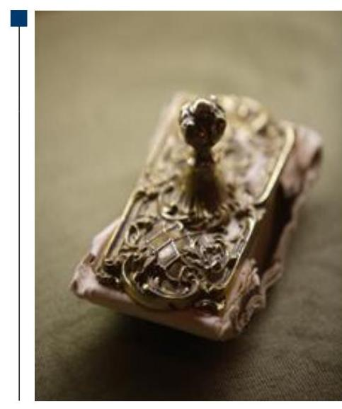
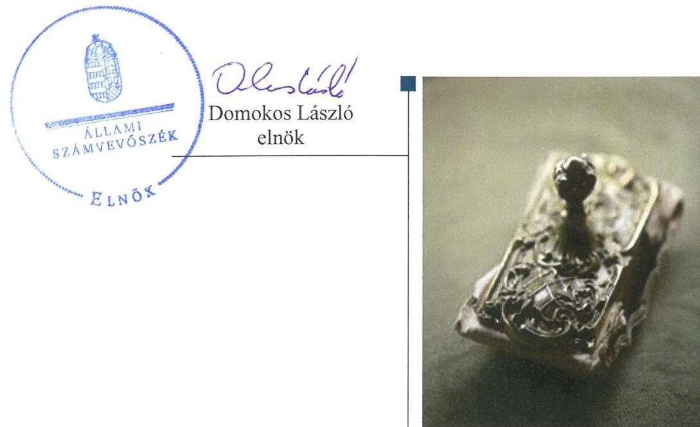
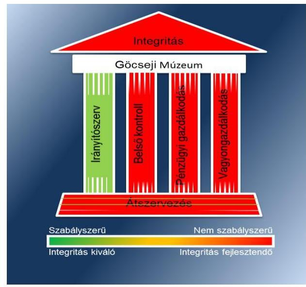
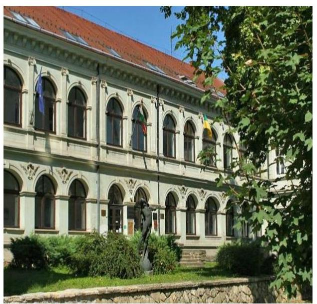
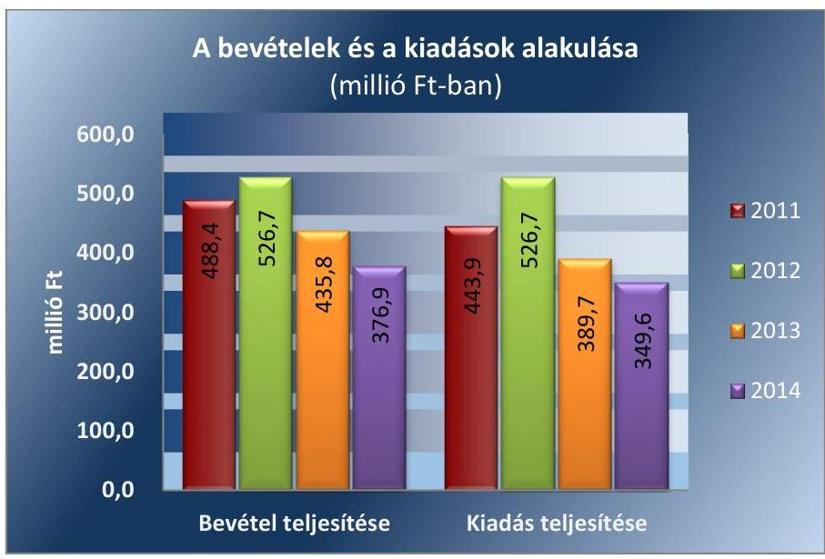

# Jelentés 

## Megyei hatókörú városi múzeumok ellenőrzése

Göcseji Múzeum, Zalaegerszeg 2016.

---

# Jellentés 

## Megyei hatókörú városi múzeumok ellenőrzése

Göcseji Múzeum, Zalaegerszeg
2016. deumbe hó 14 nap

---

# AZ ELLENŐRZÉST FELÜGYELTE: 

PETŐ KRISZTINA felügyeleti vezető

## AZ ELLENŐRZÉST VEZETTE ÉS A VÉGREHAJTÁSÁÉRT FELELŐS:

BREBÁN ANDREA ellenőrzésvezető
KAKAS SÁNDOR ellenőrzésvezető

A PROGRAM ÖSSZEÁLLÍTÁSÁÉRT FELELŐS:
JANIK JÓZSEF LÁSZLÓ osztályvezető

IKTATÓSZÁM: V-0950-161/2016.
TÉMASZÁM: 1984
ELLENŐRZÉS-AZONOSÍTÓ SZÁM: V073705

---

# TARTALOMJEGYZÉK 

■ ÖSSZEGZÉS ..... 5
■ AZ ELLENŐRZÉS CÉLJA ..... 7
■ AZ ELLENŐRZÉS TERÜLETE ..... 8
■ AZ ELLENŐRZÉS HÁTTERE, INDOKOLTSÁGA ..... 10
■ A JELENTÉS LÉNYEGES KÉRDÉSKÖREI ..... 12
■ ELLENŐRZÉS HATÓKÖRE ÉS MÓDSZEREI ..... 13
■ MEGÁLLAPÍTÁSOK ..... 16
■ JAVASLATOK ..... 30
■ MELLÉKLETEK ..... 35
I. sz. melléklet: Értelmező szótár ..... 35
II. sz. melléklet: Az integritás érvényesítése érdekében kialakított és múködtetett kontrollrendszer ..... 38
■ FÜGGELÉK: ÉSZREVÉTELEK ..... 41
■ RÖVIDÍTÉSEK JEGYZÉKE ..... 43

---

.

---

# ÖSSZEGZÉS 

A zalaegerszegi Göcseji Múzeumra vonatkozó irányító szervi feladatellátás összességében szabályszerű volt. A Múzeumnál kialakított irányítási rendszer nem biztosította az átlátható, elszámoltatható és ellenőrizhető közpénzfelhasználást. A Múzeum pénzügyi és vagyongazdálkodása nem volt szabályszerű. A Múzeum közfeladatának részét képező kulturális javak nyilvántartásáról gondoskodtak, azonban a kulturális javak állományának fizikai védelme a kölcsönzéseknél nem volt biztositott.

## Az ellenőrzés társadalmi indokoltsága

Az Állami Számvevőszék Stratégiájának alapértéke, hogy ellenőrzései segítik az integritás alapú, átlátható és elszámoltatható közpénzfelhasználás megteremtését. Az ellenőrzés jogszabályban, vagy alapító okiratban meghatározott közfeladat ellátására létrejött, a megyei hatókörű városi muzeális intézmények gazdálkodási tevékenységére terjed ki. E szervezetek pénzügyi és vagyongazdálkodásának alapvető rendeltetése a közfeladatok (a kulturális örökséghez tartozó javak védelme, őrzése és a nyilvánosság számára történő hozzáférhetővé tétele) ellátásának biztosítása.

A megyei hatókörű városi múzeumként működő szervezetek 2011. évtől több alkalommal jelentős szervezeti és gazdálkodási átalakuláson mentek keresztül. A tulajdonosi, a vagyonkezelői és a fenntartói szerepekben, szerkezetben történt változások előkészítése, végrehajtása, illetve a múzeumi rendszer által kezelt közvagyonnal való gazdálkodás szabályszerűségének bemutatásával az ellenőrzés hozzájárul a múzeumok fenntartási és működtetési feladatainak ellátására vonatkozó megfelelő jogszabályi környezet kialakításához, a gazdálkodási gyakorlatuk javításához.

## Főbb megállapítások, következtetések

Az irányító szervek Múzeumra vonatkozó feladatellátása öszszességében szabályszerű volt

A Múzeumnál kialakított irányítási rendszer nem biztosította az átlátható, elszámoltatható és ellenőrizhető közpénzfelhasználást. A Múzeum belső kontrollrendszerének kialakítása és működtetése nem felelt meg a jogszabályi előírásoknak. A kontrollkörnyezet kialakítása részben volt szabályszerű, mert nem határozták meg az etikai elvárásokat a szervezet minden szintjén, a számviteli politika és a számlarend tartalma nem felelt meg teljes körűen a jogszabályi előírásoknak, valamint nem készült ellenőrzési nyomvonal a jogszabályi előírások ellenére. A Múzeumnál a kockázatkezelési rendszert nem alakították ki és nem működtették a 2011-2014. években. Az információs és kommunikációs folyamatok kialakítása nem volt szabályszerű, mert a Múzeumnál nem készítettek adatvédelmi és adatbiztonsági szabályzatot, valamint nem szabályozták a közérdekű adatok megismerésére irányuló igények teljesítésének rendjét. A Múzeum nem tett eleget a jogszabályban előírt gazdálkodási adatok közzétételére vonatkozó kötelezettségének. A monitoring rendszer részeként az ellenőrzött időszakban a belső ellenőrzés kialakításáról az intézmény nem gondoskodott.

A Múzeum pénzügyi és vagyongazdálkodása nem volt szabályszerű. A 2012. évben jogalap nélkül, a vagyontárgyak hasznosítására vagyonhasznosításra feljogosító szerződés, a 2013-2014. években vagyonkezelői szerződés nélkül került sor. Az ellenőrzött időszakban kötelezettségvállalási nyilvántartást a Múzeum nem vezetett, valamint kötelezett-

---

séget a 2011. évben ellenjegyzés, a 2012-2014. években pénzügyi ellenjegyzés nélkül vállaltak. A Múzeumnál a kölcsönbe adott kulturális javak esetében megkötött szerződésekben a vagyon- és állományvédelmi követelmények nem érvényesültek teljes körűen, mivel a klimatikus viszonyokat tartalmazó előírásokat nem rögzítették a jogszabályi előírások ellenére. A 2013. október 25-től a kölcsönbe adás időpontjában fennálló fizikai állapotot dokumentáló szakleírást a képi ábrázolással együtt a szerződésekhez nem mellékeltek. A kölcsönzési tevékenységhez kapcsolódó szerződések hiányosságai miatt a kulturális javak állományának fizikai védelme a kölcsönzéseknél nem volt biztosított.

A Múzeumot érintő szervezeti, szerkezeti átszervezés végrehajtása nem volt szabályszerű, nem volt biztosított az átláthatóság. A 2011/2012. évi átszervezés során nem került teljes körűen átadásra a vagyonleltár az ingatlanvagyon, az ingó vagyon, a szellemi termékek tekintetében. Az átszervezéshez kapcsolódó számviteli feladatokat hiányosan hajtották végre, a mérlegtételek alátámasztásához leltárt nem készítettek. A 2012/2013. évi központi alrendszerből önkormányzati alrendszerbe történő átszervezést az átláthatóság biztosításával hajtották végre.

A Múzeum nem intézkedett az integritás szemlélet érvényesítése érdekében.

---

# AZ ELLENŐRZÉS CÉLJA 

vényesülését a gazdálkodási folyamatokban.

Az ellenőrzés célja annak megállapítása volt, hogy a megyei múzeumi rendszer átalakítása, az intézményfenntartói rendszerben végbement változások előkészítése és végrehajtása megalapozottan, szabályszerűen történt-e; a megyei hatókörű városi múzeumok és jogelődjeik pénz-ügyi- és vagyongazdálkodása, a belső kontrollrendszer kialakítása és működtetése, valamint az intézményfenntartói feladatok ellátása szabályszerűen történt-e.

A Múzeum ${ }^{1}$ korrupcióval szembeni veszélyeztetettségének csökkentése érdekében kért tanúsítványi adatszolgáltatás alapján az ÁSZ² értékelte az integritási szemlélet ér-

---

# **AZ ELLENŐRZÉS TERÜLETE**

## **Göcseji Múzeum**

A Múzeum Zalaegerszegen található, feladatkörében az Mtv.^{3} alapján gondoskodik a kulturális javak meghatározott anyagának folyamatos gyűjtéséről, nyilvántartásáról, megőrzéséről és restaurálásáról; tudományos feldolgozásáról és publikálásáról; valamint kiállításokon és más módon történő bemutatásáról; a közművelődési és közgyűjteményi feladatok ellátásáról. A Kötv.^{4} 20. § (2) bekezdése alapján területileg illetékes múzeumként régészeti feltárást végzett az ellenőrzött időszakban.

A Múzeum csak a működési engedélyében meghatározott gyűjtőkörben és gyűjtőterületen folytathatja tevékenységét. A szakmai besorolást, a rendszert megalapozó szaktörvényi kereteket az Mtv. biztosítja. Az Mtv. hatálya kiterjed a Múzeum fenntartóira, a Múzeumban foglalkoztatottakra, a kulturális örökség Múzeumban őrzött elemeire, a szolgáltatásokat igénybe vevőire, és a kulturális örökséggel foglalkozó egyéb szervezetekre.

A Múzeum 2011. évi költségvetési engedélyezett létszáma 54 fő volt, ami 2012. évre 90 főre emelkedett, majd a 2013. évi 66 főről a 2014. évre 62 főre csökkent. A Múzeum alkalmazottainak foglalkoztatására a Kjt.^{5} alapján került sor. Az ellenőrzött időszakban a múzeumigazgató^{6} és a gazdasági vezető személye is változott.

A Möktv.^{7} és annak végrehajtásáról szóló 258/2011. (XII. 7.) Korm. rendelet alapján 2012. január 1-jétől a megyei múzeumok központi költségvetési szervekké váltak. 2013. január 1-jétől a 2012. évi CLII. törvény^{8}, valamint az 1311/2012. (VIII. 23.) Korm. határozat^{9} alapján az állami tulajdonba és fenntartásba került megyei múzeumi szervezetek a megyeszékhely megyei jogú városok fenntartásában működnek tovább.

A 2011–2014. évek között a fenntartói, irányítói, középirányítói jogkörgyakorlók változását, valamint a Múzeum gazdálkodási feladatát ellátó szervezetét az 1. táblázat mutatja be:

^{1} táblázat

|  Idő
szak | Fenntartó | Irányító szerv | Középirányító
szerv | Gazdasági
szervezet  |
| --- | --- | --- | --- | --- |
|  2011. | Zala Megyei Önkormányzat | Zala Megyei Önkormányzat Közgyűlése | - | Múzeum  |
|  2012. | Zala Megyei Intézményfenntartó Központ | KIM^{10} | Zala Megyei Intézményfenntartó Központ | Múzeum  |
|  2013–2014. | Zalaegerszeg Megyei Jogú Város Önkormányzata | Zalaegerszeg Megyei Jogú Város Közgyűlése | - | Múzeum  |

*Forrás: a Múzeum alapító okiratai*

---

A Múzeum jogelődjének, a Zala Megyei Múzeumok Igazgatóságának jogállása 2011. évben önállóan működő és gazdálkodó, önálló jogi személyiséggel rendelkező költségvetési intézmény volt. 2012. január 1-jétől a Múzeum jogállása önállóan működő és gazdálkodó, önálló jogi személyiséggel rendelkező költségvetési intézmény volt. 2013. január 1-jétől a Múzeum önálló jogi személyiséggel rendelkező, saját gazdasági szervezettel működő megyei hatókörű városi múzeum, vállalkozási tevékenységet nem végzett.

A Múzeum teljesített költségvetési bevételeinek és kiadásainak alakulását az 1. ábra mutatja be.
1. ábra

Forrás: A Múzeum 2011-2014. évi beszámolói
A 2015. évi LXXV. tv. ${ }^{11}$ 1. § (1) bekezdése alapján az Nvtv. ${ }^{12}$ 13. § (3) bekezdésében és 14. § (1) bekezdésében foglaltak alapján és az abban meghatározott feltételekkel a 2012. évi CLII. törvény 30. § (1) és (2) bekezdésében meghatározott, a megyei hatókörű városi múzeumok feladatának ellátását szolgáló egyes állami tulajdonban lévő ingatlanok a törvény hatálybalépésének napjával, a törvény erejénél fogva a kötelező közfeladatként a megyei hatókörű városi múzeumot fenntartó önkormányzatok tulajdonába kerültek. A 2015. évi LXXV. tv. 4. § (1) bekezdése alapján a kulturális örökség helyi védelme érdekében a megyei hatókörű városi múzeumok alapleltárában és jogszabály szerinti külön nyilvántartásában szereplő állami tulajdonú kulturális javak ingyenesen a megyei hatókörű városi múzeumok vagyonkezelésébe kerültek. A vagyonkezelők vagyonkezelői joga tekintetében vagyonkezelési szerződés megkötése nem szükséges. A 2015. évi LXXV. tv. 4. § (2) bekezdése szerint továbbá a kulturális örökség helyi védelme érdekében a megyei hatókörű városi múzeumok feladatának ellátását szolgáló állami tulajdonban álló ingatlanok - a törvény mellékletében meghatározott ingatlanok kivételével - ingyenesen a fenntartó önkormányzatok vagyonkezelésébe kerültek.

---

# AZ ELLENŐRZÉS HÁTTERE, INDOKOLTSÁGA 

Az Alaptörvény ${ }^{13}$ rendelkezése szerint a nemzeti vagyon megőrzésének, védelmének és a nemzeti vagyonnal való felelős gazdálkodásnak a követelményeit sarkalatos törvény, az Nvtv. rögzíti. A tulajdonosi joggyakorlás és vagyonkezelés általános és speciális szabályait, az állami vagyon nyilvántartására és elszámolására vonatkozó eljárásokat, a vagyonkezelési szerződés feltételrendszerét, valamint az éves beszámoló készítési és könyvvezetési kötelezettségeket kormányrendelet írja elő.

A megyei hatókörű városi múzeumok közfeladat-ellátásának változásait, (beleértve az állami tulajdonosi joggyakorló, intézményi vagyonkezelő és önkormányzati fenntartó szervezeteket is) a közfeladatok átadásából és átvételéből adódó módosításait, előirányzat gazdálkodására ható tényezőit az Áht. ${ }^{14}$, az Ávr. ${ }^{15}$, a Möktv., valamint a Mtv. írja elő. A múzeumi intézményrendszer átalakulásából megszűnéséből, intézmény átszervezéséből, belső szerkezeti korszerűsítéséből, vagy más hasonló okból adódó módosításai miatt szerepeltetendő szerkezeti változásokat, valamint a szerkezeti változásként beépült közfeladatok szintre hozásként történő számításba vételét az Ávr. határozza meg.

Az ellenőrzés - tekintettel a megyei hatókörű városi múzeumokat (és jogelődjeit) rövid időn belül, gyors ütemben ért környezeti (tulajdonosi, fenntartói-szerkezetet érintő) változásokra - javaslatok megfogalmazásával hozzájárul a fenntartás és működtetés feladatainak ellátására vonatkozó megfelelő jogszabályi környezet - jogalkotók által történő - kialakításához.

A megyei hatókörű városi múzeumok kulturális szempontból meghatározó jelentőségűek mind földrajzi elhelyezkedésüket, mind az ellátott feladatokat, valamint a látogatottságukat tekintve. Tevékenységüket törvényi szinten (Mtv.) szabályozták a jogalkotók. A megyei hatókörű városi múzeumok jelenlegi körének kialakításában, tulajdonosi és fenntartói szerkezetében rövid idő alatt több jelentős változás történt, amelyeket jogszabályi változások indukáltak. Ezen intézmények szakmai besorolásukat tekintve a 2011. évben megyei múzeumként, a 2012. évben megyei múzeumi központi költségvetési szervezetként, a 2013. évtől kezdődően megyei hatókörű városi múzeumként működtek. A szakmai besorolások változásait párhuzamosan követték a tulajdonosi, vagyonkezelői, fenntartói szerepekben történt változások.

A 2011-2014. évek között bekövetkezett fenntartói változás a vagyontárgyak és a kulturális javak tulajdonosi, vagyonkezelői és használói körében is változást indukáltak, amelyet a 2. táblázat szemléltet.

---

2. táblázat

A VAGYON TULAJDONOSI, VAGYONKEZELŐI ÉS HASZNÁLÓI KÖRÉNEK VÁLTOZÁSA 2011-2014. ÉVEKBEN

| Vagyon-   tárgy | tulajdonos | 2011. év   vagyon-   kezelő | használó | tulajdonos | 2012. év   vagyon-   kezelők | használó | tulajdonos | 2013-2014. év   vagyon-   kezelő | használó |
| :-- | :--: | :--: | :--: | :--: | :--: | :--: | :--: | :--: | :--: |
| Ingatlan | ZMÖ $^{16}$ | - | Múzeum | Állam | ZMIK ${ }^{17}$ | Múzeum | Állam | Múzeum | Múzeum |
| Egyéb   tárgyi   eszköszök | ZMÖ | - | Múzeum | Állam | ZMIK | Múzeum | Állam | Múzeum | Múzeum |
| Kulturális   javak | ZMŐ | - | Múzeum | Állam | ZMIK | Múzeum | Állam | Múzeum | Múzeum |

A Z ELLENÖRZÉS EREDMÉNYEKÉPPEN javul az ellenőrzött intézmények gazdálkodása, átfogó képet kapunk a múzeumok gazdálkodásának hiányosságairól, de a jó gyakorlatokról is. Ellenőrzéseivel, javaslataival és megállapításaival az ÁSZ elősegíti a költségvetési szervek pénzügyi és vagyongazdálkodása szabályozásának javítását és hozzájárul a jó kormányzáshoz.

---

# A JELENTÉS LÉNYEGES KÉRDÉSKÖREI 

1.     - Az irányító szerv Múzeumra vonatkozó feladatellátása szabályszerű volt-e?
2.     - Szabályszerüen hajtották-e végre a Múzeumot érintő szervezeti, szerkezeti átszervezéseket?
3.     - A belső kontrollrendszer kialakítása és müködtetése megfelelt-e a jogszabályi előírásoknak?
4.     - A Múzeum pénzügyi gazdálkodása szabályszerű volt-e?
5.     - A Múzeum vagyongazdálkodása szabályszerű volt-e?
6.     - A Múzeum intézkedett-e az integritás szemlélet érvényesitése érdekében?

---

# ELLENŐRZÉS HATÓKÖRE ÉS MÓDSZEREI 

## Az ellenőrzés típusa

Megfelelőségi ellenőrzés.

## Az ellenőrzött időszak

Az ellenőrzött időszak 2011. január 1-jétől 2014. december 31-ig tart.

## Az ellenőrzés tárgya

A megyei hatókörű városi múzeumok átszervezése, átalakítása előkészítése és lebonyolítása megalapozottsága, szabályszerűsége, a pénzügyi és vagyongazdálkodási tevékenység, a belső kontroll rendszer kialakítása, működtetése szabályszerűsége, valamint az irányító szervi feladatok ellátása szabályszerűsége. E tevékenységek és a kapcsolódó adatok és információk összessége, amelyeket a vonatkozó kritériumok alapján kell értékelni.

Az ellenőrzés kiterjed minden olyan körülményre és adatra, amely az ÁSZ jogszabályban meghatározott feladatainak teljesítéséhez, valamint a program végrehajtása folyamán felmerült újabb összefüggések feltárásához szükséges.

## Az ellenőrzött szervezet

A Göcseji Múzeum (és jogelődje a Zala Megyei Múzeumok Igazgatósága), a fenntartói feladatokban érintett Zala Megyei Önkormányzat, a Zala Megyei Intézményfenntartói Központ jogutódja a Szociális és Gyermekvédelmi Főigazgatóság, valamint Zalaegerszeg Megyei Jogú Város Önkormányzata.

Az ellenőrzésre a költségvetési szerv ellenőrzött intézményének és irányító/felügyeleti szervének székhelyén, illetve középirányító szerv jogútodjának telephelyén került sor.

## Az ellenőrzés jogalapja

Az ellenőrzés jogszabályi alapját az ÁSZ tv. ${ }^{18}$ 1. § (3) bekezdés, 5. § (2)-(6) bekezdései, valamint az Áht. 2 61. § (2) bekezdésének előírásai képezik.

---

# Az ellenőrzés módszerei 

Az ellenőrzést az ellenőrzési program szempontjai, az ellenőrzött időszakban hatályos jogszabályok, az ellenőrzés szakmai szabályai, az egyes ellenőrzési típusokhoz kapcsolódó ÁSZ módszertanok és nemzetközi standardok figyelembe vételével végeztük. A gazdálkodás hibáinak kijavítására, a közpénzekkel való felelős gazdálkodás segítésére irányuló javaslatok kidolgozásakor a hatályos jogszabályok voltak az irányadóak.

Az ellenőrzési kérdések megválaszolásához szükséges bizonyítékok megszerzése a következő ellenőrzési eljárások alkalmazásával történt, mint az összehasonlítás, a kérdésfeltevés (információkérés), a mintavételezés, valamint az elemző eljárás. A minták kiválasztása során véletlen mintavételi eljárást alkalmaztunk.

Az ellenőrzési bizonyítékként felhasználható adatforrások közé tartoznak egyrészt a szakmai program részletes szempontjainál felsorolt adatforrások, másrészt adatforrás lehet minden egyéb - az ellenőrzés folyamán feltárt, az ellenőrzés szempontjából releváns információt tartalmazó - dokumentum.

Az ellenőrzés lefolytatásához az ellenőrzött szervezetek tanúsítványok elektronikus kitöltésével, valamint az ÁSZ által kért dokumentumok elektronikus megküldésével szolgáltattak adatokat. A rendelkezésre bocsátott adatok, információk kontrollja az ellenőrzés keretében történt meg.

Az ellenőrzési kérdésekre adott válaszok alapján értékeltük, hogy az ellenőrzött időszakban az irányító szerv az ellenőrzött intézményre vonatkozó feladatainak szabályszerűen eleget tett-e, az intézmény pénzügyi és vagyongazdálkodása megfelelt-e az előírásoknak, az intézmény átalakításának vagy átszervezésének végrehajtása szabályszerű volt-e.

Az intézmény belső kontrollrendszere jogszabályi előírások szerinti kialakításának és működtetésének szabályszerűségét az erre irányuló ellenőrzési kérdésekre adott válaszok összesítése alapján, évente pillérenként (kontrollkörnyezet, kockázatkezelési rendszer, kontrolltevékenységek, információs és kommunikációs rendszer, monitoring rendszer) és összesítetten is minősítettük. Az intézmény belső kontrollrendszere egyes pilléreinek kialakítása és működtetése „szabályszerü", amennyiben az értékelt területen az elért és elérhető pontok százalékban kifejezett, egész számra kerekített hányadosa meghaladta a $84 \%$-ot, „részben szabályszerü", ha a $84 \%$ ot nem haladta meg, de 60\%-nál nagyobb, „nem szabályszerű", ha nem haladta meg a 60\%-ot. Az intézmény belső kontrollrendszerének összesített értékelése megegyezett a pillérenként (kontrollterületenként) alkalmazott \%-os értékelésekkel, a következő eltérésekkel. A kontrollrendszer egésze esetében a „szabályszerü" értékelésnek a \%-os értéken felül további feltétele volt, hogy egyik kontrollterület sem kaphatott „nem szabályszerű" értékelést. A „részben szabályszerű" értékelés további feltétele volt, hogy legfeljebb egy ellenőrzött kontrollterület lehetett „nem szabályszerű" értékelésű. Az összesített értékelés a \%-os értéktől függetlenül „nem szabályszerű", ha az ellenőrzött kontrollterületek közül több, mint egynek „nem szabályszerű" az értékelése.

Mintavétellel ellenőriztük a bevételek, a személyi juttatások, dologi és felhalmozási és régészeti feltáráshoz kapcsolódó kiadások, valamint a kul-

---

turális javak kölcsönzésének szabályszerűségét. A minta alapján a sokaságban előforduló hibaarányt becsültük. „Megfelelőnek" értékeltük az ellenőrzött területet, amennyiben 95\%-os bizonyossággal a teljes sokaságban a hibaarány legfeljebb 10\%, „részben megfelelőnek" értékeltük, ha a hibaarány felső határa 10-30\% között volt, „nem megfelelőnek" pedig akkor, ha a mintavételi eredmények alapján a sokaságbeli hibaarány felső határa meghaladta a 30\%-ot.

Az integritás szemlélet érvényesülésének értékelése a Múzeum tanúsítványi adatszolgáltatása alapján történt.

---

# 1. Az irányító szerv Múzeumra vonatkozó feladatellátása szabályszerű volt-e? 

Összegző megállapítás

Az irányító szervek Múzeumra vonatkozó feladatellátása öszszességében szabályszerű volt.

AZ ALAPÍTÓI JOGOSULTSÁGOK GYAKORLÁSA során a Múzeum a teljes időszakra rendelkezett alapító okirattal ${ }^{19}$. A Múzeum 2011-2014. években hatályos alapító okiratainak tartalma megfelelt az Áht. ${ }^{20}$-ben, valamint az Ávr.-ben előírt tartalmi követelményeknek. Az alapító okirat ${ }_{1-5}$-t módosításakor az Ámr. ${ }^{21}$ és az Ávr. előírásainak megfelelően minden esetben egységes szerkezetbe foglalták. Az irányító szerv ${ }_{2,3}{ }^{22}$ az alapító okirat ${ }_{3,4}$ módosításaihoz nem rendelkezett a kultúráért felelős miniszter előzetes egyetértésével a 2012. évben az Mtv. 45/B. § (3) bekezdésben foglaltak ellenére. További hiányosság volt, hogy az alapító okirat ${ }_{3,4}$ az Ávr. 5. § (1) a) pontjában előírtak ellenére nem tartalmazta a Múzeum Zalaegerszeg, Göcseji út 24. szám alatti telephelyét.

## A MUNKÁLTATÓI JOGOSULTSÁG GYAKORLÁSA

során a múzeumigazgatót 2011. októberben az Mtv.-nek megfelelően nevezték ki, a miniszter írásbeli egyetértésének beszerzése mellett. A kinevezés során betartották az Mtv.-ben meghatározott szakmai képesítési követelményeket. A gazdasági vezetö2 megbízása 2013. márciusában az irányító szerv ${ }_{3}$ vezetője által az Áht. ${ }_{2}$ előírásainak figyelembevételével történt, a gazdasági vezető ${ }^{23}$ rendelkezett a jogszabályban előírt végzettséggel és jogosító engedéllyel.

AZ EGYÉB IRÁNYÍTÁS, FELÜGYELETI ÉS ELLENŐRZÉSI JOGOSULTSÁGOK gyakorlása során hiányosság volt, hogy
$\longrightarrow$ a Múzeum kezelésében lévő közérdekú adatok és közérdekből nyilvános adatok, valamint az Áht. ${ }_{2}$-ben meghatározott az irányítási jogkörök gyakorlásához szükséges, törvényben nevesített személyes adatokat nem kezelték 2012-2014. években az Áht. ${ }_{2}$ 9. § (1) bekezdés j) pontjában előírtak ellenére;
$\longrightarrow$ az államháztartással összefüggő közérdekú és közérdekből nyilvános adatok kötelező közzétételének végrehajtását 2011-ben az Áht. ${ }_{1}$ 49. § (5) e) pontjában, 2012-ben a 258/2011. (XII. 7.) Korm. rendelet ${ }^{24}$ 11. § (2) bekezdés c) pontjában előírtak ellenére nem ellenőrizte a fenntartó ${ }_{1,2}{ }^{25}$;
$\longrightarrow$ az irányító szerv ${ }_{1-3}$ nem érvényesítette a Múzeum közfeladat ellátására, az erőforrásokkal való szabályszerű és hatékony gazdálkodáshoz szükséges követelményeket az Áht. ${ }_{1}$ 49. § (5) bekezdés f) pont, illetve az Áht. ${ }_{2}$ 9. § (1) bekezdés f) pontjában foglaltak ellenére;

---

- a Múzeum fejlesztési és beruházási feladatait 2013-2014. években a fenntartó3 az Mtv. 50. § (2) bekezdés a) pontjában előírtak ellenére nem határozta meg és nem hagyta jóvá.
Működési engedélyekkel a Múzeum rendelkezett, azok módosításaihoz az irányító szerv ${ }_{1-3}$ megkérte a kulturáért felelős miniszter engedélyét.

# 2. Szabályszerűen hajtották-e végre a Múzeumot érintő szervezeti, szerkezeti átszervezéseket? 

Összegző megállapítás

A Múzeumot és tagintézményeit érintő szervezeti, szerkezeti átszervezések végrehajtása nem volt szabályszerű.
2.1. számú megállapítás

A Múzeumot érintő önkormányzati alrendszerből a központi alrendszerbe történő 2012. január 1-jétől hatályos irányítószervi (fenntartói) váltás lebonyolítását nem szabályszerűen, az átláthatóság sérülése mellett hajtották végre.

AZ ÁTADÁS-ÁTVÉTEL ELŐKÉSZÍTÉSÉRE a Möktv. 6. § (1), (2) bekezdése alapján megjelölt átadás-átvételi bizottság múködése eredményeként az átadás-átvételi megállapodás ${ }_{1}$-et $^{26}$ megkötötték a Möktv. 2. § (4) bekezdésében meghatározott személyek. A megállapodás megkötésére az átadó és átvevő között a Möktv. 6. § (3) bekezdésének előírása szerinti határidőig sor került.

AZ ÁTADÁS-ÁTVÉTELI MEGÁLLAPODÁS1-ET a jogutódláshoz kapcsolódó feladat és vagyon átadás-átvételéhez a 258/2011. (XII. 7.) Korm. rendelet 12. § (1) bekezdés szerint, de a Korm. rendelet 1. melléklet III. és IV. rész előírásaitól eltérően, hiányosan készítette el a fenntartó ${ }_{1}$, a fenntartó ${ }_{2}$ a megállapodás hiányosságait nem kifogásolva írta azt alá. A 258/2011. (XII. 7.) Korm. rendelet 1. melléklet előírása ellenére nem kerültek átadásra
—az átadás-átvétel napján hatályos kötelezettségvállalásokról és az egyéb kötelezettséget alapító intézkedésekről szóló iratok és a szükséges magyarázatokkal ellátott kimutatások (III. rész b) pont);
—_ a Múzeum költségvetési helyzetéről szóló dokumentumok, a 2011. évi költségvetés végrehajtásáról szóló dokumentumok (III. rész f) pont);
—_ a Múzeum feladatellátása helyének rögzítése (IV. rész 1/2. pont);
—_ a Múzeum 2011. évi normatív támogatás igénylésére, módosítására, lemondására vonatkozó összegszerűen részletezett adatok (IV. rész 1/3. pont);
— az átadott ingatlanok műszaki állapotát bemutató műszaki kataszter (IV. rész 1/10. pont);
—_ a Múzeum vagyonleltára az ingatlanvagyon tekintetében az ingatlanok adatainak, továbbá könyv szerinti értékének és az utolsó vagyonértékelésének bemutatása, az eszközkarton csatolása (IV. rész $1 / 11 /$ a) pont);

---

- a Múzeum vagyonleltára, az ingó vagyon tekintetében a csatolt eszközkarton (IV. rész 1/11/b) pont);
- a Múzeum vagyonleltára az ingó vagyon tekintetében az alapleltárakban és külön nyilvántartásokban nyilvántartott kulturális javak felsorolása (IV. rész 1/11/ba) pont);
- a Múzeum vagyonleltára a szellemi termékek tekintetében (IV. rész $1 / 11 /$ e) pont);
- a Múzeum költségvetése várható teljesüléséről szóló, 2011. december 31-ei fordulónappal elkészített adatszolgáltatás (IV. rész 1/14. pont);
- a Múzeum szállítói tartozásainak és egyéb kötelezettségeinek kimutatása (IV. rész 1/15. pont).
Az irányító szerv1 a 258/2011. (XII.7.) Korm. rendelet 1. melléklet IV. rész $1 / 15$. pontjában foglaltak ellenére az átadás-átvételi megállapodás ${ }_{1}$ aláírását követő 3 munkanapon belül nem tájékoztatta a ZMIK-t a múködőképesség fenntartása érdekében szükséges azonnali teendők megtételéről és határidejéről. Jegyzőkönyv az átadás-átvételről, a dokumentumok, a feladatok és a vagyon tényleges átadásáról - a 258/2011. (XII. 7.) Korm. rendelet 12. § (3) bekezdésében szereplő előírást figyelmen kívül hagyva - nem készült.

Az átszervezéshez kapcsolódó számviteli feladatokat hiányosan hajtották végre. A vagyonátadási jelentés ${ }_{1}-t^{27}$ a Múzeum 2011. december 31-ei fordulónappal az éves elemi költségvetési beszámolóval azonos tartalommal készítette el, amelyet záró főkönyvi kivonattal alátámasztott. Az átszervezés napjára a bevételi és kiadási forgalmi számlákat lezárták. A átadásra került vagyont és a mérlegben szereplő adatokat nem támasztotta alá leltár megsértve a 258/2011. (XII. 7.) Korm. rendelet 1. melléklet III. e) pontjában előírtakat.

Vagyonkezelési szerződést az MNV Zrt. ${ }^{28}$ és a ZMIK 2012. október 18án írta alá, túllépve a 258/2011. (XII. 7.) Korm. rendelet 1. melléklet V. részében meghatározott, a megállapodás aláírásától, de legkorábban 2012. január 1-jétől számított 30 napos határidőt. A vagyonkezelői szerződés nem tartalmazta a Nvtv. 11. § (11) bekezdése ellenére a vagyonkezelésbe vett vagyonnal kapcsolatos nyilvántartási és adatszolgáltatási kötelezettségekre vonatkozó előírásokat.
2.2. számú megállapítás

A 2013. január 1-jével végrehajtott központi alrendszerből önkormányzati alrendszerbe történő irányító szervi (fenntartói) váltás lebonyolítását és a szervezetrendszer átalakítását, az átláthatóság biztosításával hajtották végre.

AZ ÁTADÁS-ÁTVÉTELI MEGÁLLAPODÁS ${ }_{2}{ }^{29}$ előkészítése során a ZMIK vezetője meghatározta az előkészítés felelősét. A megfelelő előkészítés eredményeként a 2012. évi CLII. törvény 30. § (5) bekezdésében megjelölt határidőre 2012. december 15-én a megyei hatókörű városi múzeum átadásáról a megállapodást megkötötték. A megállapodást a 1311/2012. (VIII. 23.) Korm. határozatban foglaltak szerint ZMJV ${ }^{30}$ polgármestere és a ZMIK vezetője írták alá. Az átadás-átvételi megállapodás ${ }_{2}$ vel a jogutód fenntartó részére a fenntartói jogok gyakorlásához és az irányító szervi feladatok ellátásához szükséges adatok átadásra-átvételre kerültek.

---

# A NEM MEGYESZÉKHELY SZERINTI TAGINTÉZ- 

MÉNYEK 2013. január 1-jei hatállyal a feladat ellátásához rendelkezésre álló személyi, tárgyi és pénzügyi feltételek egyidejű átadásával a múködési engedélyükben meghatározott székhely szerint illetékes települési önkormányzatok fenntartásába kerültek a 1311/2012. (VIII. 23) Korm. határozat 1.4 pontja előírása alapján. Az átszervezés lebonyolításához a ZMIK - a 1311/2012. (VIII. 23.) Korm. határozat 1.8. pontjában foglalt előírás szerint - rendelkezett a muzeális intézmények létszámának, a leltárban szereplő kulturális javaknak és egyéb vagyonelemeknek az emberi erőforrások miniszterének egyetértésével történő tagintézményenkénti meghatározásával. Az átadás-átvételi megállapodást a ZMIK a 2013. január 1-jével a megyei múzeumi intézményből kikerült két tagintézmény vonatkozásában 2012. decemberében az érintett települések önkormányzataival megkötötte.

AZ ÁTSZERVEZÉSHEZ KAPCSOLÓDÓ SZÁMVITELI FELADATOKAT a jogszabályi előírások szerint végrehajtották. A vagyonátadásra a mérlegben szereplő adatokat alátámasztó leltár és főkönyvi kivonat, valamint analitikus kimutatások alapján került sor. A vagyonátadási jelentés ${ }_{2}$-t ${ }^{31}$ a Múzeum az Áhsz. ${ }_{1}$ 13/A. § (4) bekezdésében foglalt előírást figyelembe vételével a 2012. december 31-ei fordulónapra vonatkozóan készítette el. A jelentésben szereplő adatokat leltárral, analitikus nyilvántartásokkal és kimutatásokkal támasztották alá.

## 3. A belső kontrollrendszer kialakítása és múködtetése megfelel-te a jogszabályi elöírásoknak?

## Összegző megállapítás

A belső kontrollrendszer kialakítása és múködtetése a 20112014. években nem volt szabályszerű.

A belső kontrollrendszer kialakítása és múködtetése részletes értékelését a 2011-2014. évekre vonatkozóan a 3. táblázat mutatja be.
3. táblázat

A BELSŐ KONTROLLRENSZER KIALAKÍTÁSÁNAK ÉS MŰKÖDTETÉSÉNEK ÉRTÉKELÉSE A 2011-2014. ÉVEKBEN

| Mégnevezés | Kontrollkárnyezet | Kódszázkezelési rendszer | Kontrollkevékenységek | Információ és kommunikáció | Monitoring rendszer | Összesen |
| :--: | :--: | :--: | :--: | :--: | :--: | :--: |
| 2011. | részben szabályszerű | nem szabályszerű | részben szabályszerű | nem szabályszerű | nem szabályszerű | nem szabályszerű |
| 2012. | részben szabályszerű | nem szabályszerű | részben szabályszerű | nem szabályszerű | nem szabályszerű | nem szabályszerű |
| 2013. | részben szabályszerű | nem szabályszerű | részben szabályszerű | nem szabályszerű | nem szabályszerű | nem szabályszerű |
| 2014. | részben szabályszerű | nem szabályszerű | részben szabályszerű | nem szabályszerű | nem szabályszerű | nem szabályszerű |

---

# 3.1. számú megállapítás 

A kontrollkörnyezet kialakítása részben szabályszerű volt a 20112014. években.

A kontrollkörnyezet kialakításának évenkénti értékelését a 2. ábra mutatja be:
2. ábra

| Kontrollkörnyezet | 2011. 2 v önkormányzati alrendszer | 2012. 6 v   központi alrendszer | 2013. 6 v   önkormányzati alrendszer | 2014. 2 v   alrendszer |
| :--: | :--: | :--: | :--: | :--: |
| szabályszerű |  |  |  |  |
| részben szabályszerű nem szabályszerű |  |  |  |  |

Forrás: ÁSZ ellenőrzés megállapításai
Az SZMSZ ${ }_{1,2}$-t $^{32}$ az Áht. ${ }_{1,2}$ előírásai alapján elkészítették. Az SZMSZ ${ }_{2}$ a Múzeum szervezeti egységeinek engedélyezett létszámát az Ávr. 13. § (1) bekezdés e) pontjában előírtak ellenére nem tartalmazta a 2013-2014. években. A belső ellenőrzést végző személy vagy szervezet, vagy szervezeti egység jogállását, feladatait az SZMSZ ${ }_{1,2}$-ben nem írták elő a Ber. ${ }^{33} 4$. § (2) bekezdésében és a Bkr. ${ }^{34} 15$. § (2) bekezdésében foglaltak ellenére a teljes ellenőrzött időszakban. Az alapító okirat ${ }_{5}$-ben rögzített kormányzati funkció szerint besorolt alaptevékenységeket az SZMSZ ${ }_{2}$ az Ávr. 13. § (1) bekezdés c) pontja szerint nem tartalmazta, az SZMSZ aktualizálásának elmaradása miatt.

A múzeumigazgató az Ámr. 156. § (1) bekezdés c) pontjában, illetve a Bkr. 6. § (1) bekezdés c) pontjában foglaltak ellenére nem határozott meg etikai elvárásokat a szervezet minden szintjén a 2011-2014. években.

A számviteli politika ${ }_{1,2,3,4}{ }^{35}$-gyel a Múzeum rendelkezett a jogszabályi előírások alapján. Hiányosság volt, hogy
$\longrightarrow$ a múzeumigazgató nem módosította a 2014. évben a számviteli po-litika ${ }_{4}$-et a Számv. tv. ${ }^{36} 14$. § (11) bekezdésében foglaltak ellenére, a kulturális javak mérlegben való kimutatásával kapcsolatos az Áhsz. ${ }_{2}^{37}$ 10. § (1) bekezdés szerinti előírás bevezetésére tekintettel;
$\longrightarrow$ a beszerzett, előállított immateriális javak, illetve a tárgyi eszközök üzembe helyezésének dokumentálási szabályait az Áhsz. ${ }_{1}^{38}$ 8. § (7) bekezdésében foglaltak ellenére a számviteli politika ${ }_{1}$ nem tartalmazta.
A számlarend ${ }_{3}^{39}$ az Áhsz. ${ }_{1}$-ben előírtak szerinti tartalmú volt. A számlarend $_{2}$ az Áhsz. ${ }_{2}$ 51. § (3) bekezdésében foglaltak ellenére nem rendelkezett a részletező nyilvántartások vezetésének módjáról, azoknak a kapcsolódó könyvviteli és nyilvántartási számlákkal való egyeztetéséről, dokumentálásról, valamint a részletező nyilvántartások és az egységes rovatrend rovataihoz kapcsolódóan vezetett nyilvántartási számlák adataiból a pénzügyi könyvvezetéshez készült feladások elkészítésének rendjéről. A számlarend $_{1,2}$ a Számv. tv. 161. § (2) bekezdés c) pontjában foglalt főkönyvi számlák és analitikus nyilvántartások kapcsolata keretében nem rendelkezett a 20/2002. (X. 4.) NKÖM rendelet ${ }^{40}$ előírása alapján vezetett a kulturális javakkal kapcsolatos külön analitikus nyilvántartásokról.

Az értékelési szabályzat ${ }_{1,2}{ }^{41}$ nem tartalmazta a kötelezettségek 30, illetve a 60 napon túli állomány megállapítására vonatkozó szabályokat az Áhsz. ${ }_{1}$ 9. sz. melléklet 4. da) pontjában foglaltak ellenére.

---

A leltározási szabályzat ${ }_{1,2,3}{ }^{42}$-at a Számv. tv.-ben és az Áhsz. ${ }_{1,2}$-ben foglaltak alapján elkészítették.

Az ellenőrzési nyomvonalat az ellenőrzött időszakban a múzeumigazgató az Ámr. 156. § (2) bekezdése és a Bkr. 6. § (3) bekezdésében foglaltak ellenére nem készítette el.

A szabálytalanságok kezelésének eljárásrendjét az múzeumigazgató nem készítette el az Ámr. 156. § (3) bekezdése és a Bkr. 6. § (4) bekezdésében foglaltak ellenére a 2011-2012. években. A 2013-2014. években hatályos szabályzat a Bkr.-ben előírt tartalommal készült el.

Egyebekben a közbeszerzési szabályzat ${ }_{1,2}{ }^{43}$, a pénzkezelési szabály$z^{12}{ }_{1,2,3}{ }^{44}$ és a gazdálkodási szabályzat ${ }_{1,2,3}{ }^{45}$ a jogszabályi előírásoknak megfelelő tartalommal kerültek elkészítésre. Az önköltség-számítás szabály$z^{46}$ a Számv. tv. és az Áhsz. ${ }_{1,2}$-ben előírt tartalommal a termékértékesítés és szolgáltatásnyújtás önköltségszámítás rendjére vonatkozó általános belső szabályzást tartalmazta. A gazdasági szervezet ügyrendje ${ }_{1,2,3}{ }^{47}$-ban rögzítették a gazdasági szervezet feladatellátásának részletes belső rendjét és módját a jogszabályi előírásoknak megfelelően.

# 3.2. számú megállapítás 

## A kockázatkezelési rendszer kialakítása és múködtetése nem volt szabályszerű a 2011-2014. években.

A kockázatkezelési rendszer évenkénti értékelését a 3. ábra mutatja be:
3. ábra

| Kockázatkezelési rendszer | 2011. év önkormányzati alrendszer | 2012. év központi alrendszer | 2013. év önkormányzati alrendszer | 2014. év alrendszer |
| :--: | :--: | :--: | :--: | :--: |
| szabályszerű |  |  |  |  |
| részben szabályszerű nem szabályszerű |  |  |  |  |

A múzeumigazgató a kockázatkezelési rendszert nem alakította ki a Bkr. 3. § b) pontja alapján, illetve nem működtette az Ámr. 157. § (1) bekezdés, illetve a Bkr. 7. § (1) bekezdés előírása ellenére az ellenőrzött időszakban. Nem mérték fel ás állapították meg a költségvetési szerv tevékenységében, gazdálkodásában rejlő kockázatokat, valamint nem határozták meg az egyes kockázatokkal kapcsolatban szükséges intézkedéseket, valamint azok teljesítésének folyamatos nyomon követésének módját.

## 3.3. számú megállapítás

## A kontrolltevékenység kialakítása és múködtetése részben volt szabályszerű a 2011-2014. években.

A kontrolltevékenység évenkénti értékelését a 4. ábra mutatja be:
4. ábra

| Kontroll   tevékenység | 2011. év   önkormányzati   alrendszer | 2012. év   központi al-   rendszer | 2013. év   önkormányzati | 2014. év   alrendszer |
| :--: | :--: | :--: | :--: | :--: |
| szabályszerű   részben szabályszerű   nem szabályszerű |  |  |  |  |

Fonrás: ÁSZ ellenőrzés megállapításai

---

Belső szabályzatokban a felelősségi körök meghatározásával szabályozták az engedélyezési, jóváhagyási, kontrolleljárásokat és beszámolási eljárásokat. A gazdálkodási jogkör gyakorlók felhatalmazása és kijelölése az arra jogosultak által írásban megtörtént. A gazdálkodási jogkörök gyakorlásán keresztül végzett kontrolltevékenység nem volt megfelelő, mivel a kiadási előirányzatok felhasználása során kötelezettségvállalásra a 2011. évben ellenjegyzés, a 2012-2014. években pénzügyi ellenjegyzés hiányában került sor (részletesen a 4.3. fejezet mutatja be). A kontrolltevékenység keretében hiányosságként jelentkezett, hogy a múzeumigazgató által
$\longrightarrow$ a pénzügyi kihatású döntések célszerűségi, gazdaságossági, hatékonysági és eredményességi szempontú megalapozottsága érdekében nem volt biztosított az Áht. ${ }_{1}$ 121/A. § (4) bekezdés b) pontjának és a Bkr. 8. § (2) bekezdés b) pontjának előírásai ellenére a folyamatba épített, előzetes és utólagos és vezetői ellenőrzés a teljes ellenőrzött időszakban;
az információkhoz való hozzáférést nem szabályozta a 2011-2014. években az Ámr. 158. § (2) bekezdés b) pontja és a Bkr. 8. § (4) bekezdés b) pontja ellenére;
az informatikai rendszer szabályozása során az adatok biztonságának, védelmének érvényre juttatásához szükséges szabályzatot az Avtv. ${ }^{48}$ 31/A. § (3) bekezdés ellenére nem készítettek a 2011. évben, illetve eljárási szabályokat az Info. tv. ${ }^{49}$ 7. § (2) bekezdésében foglaltak ellenére nem alakította ki 2012-2014. évben.

# 3.4. számú megállapítás 

Az információs és kommunikációs folyamatok kialakítása nem volt szabályszerű a 2011-2014. években.

Az információs és kommunikációs rendszer évenkénti értékelését az 5. ábra mutatja be:
5. ábra

| Információs és   kommunikációs   rendszer | 2011. év   önkormányzati   alrendszer | 2012. év   központi al-   rendszer | 2013. év   önkormányzati alrendszer | 2014. év |
| :--: | :--: | :--: | :--: | :--: |
| szabályszerű |  |  |  |  |
| részben szabályszerű   nem szabályszerű |  |  |  |  |

A szabályozás nem felelt meg a teljes ellenőrzött időszakban, mert a múzeumigazgató
$\longrightarrow$ nem alakított ki és nem múködtetett olyan rendszert az Ámr. 159. § (1) bekezdésben és a Bkr. 9. § (1) bekezdésben foglaltak ellenére amely biztosította, hogy az információk eljussanak a szervezeti egységekhez, személyekhez;
$\longrightarrow$ nem készítette el az adatvédelmi és adatbiztonsági szabályzatot az Avtv. 31/A. § (3) bekezdésében és az Info tv. 24. § (3) bekezdésében foglaltak ellenére;
$\longrightarrow$ nem szabályozta a közérdekú adatok megismerésére irányuló igények teljesítésének rendjét az Avtv. 20. § (8) bekezdésében és az Info tv. 30. § (6) bekezdésében foglalt előírások ellenére.

---

# 3.5. számú megállapítás 

A múzeumigazgató nem tett eleget az Áht. 1 15/B. § (1) bekezdés, az Eisztv. ${ }^{50}$ 6. § (1) bekezdés és a melléklet III. részében, illetve az Info. tv. 37. § (1) bekezdés és 1. mellékletének III. részében megjelölt gazdálkodási adatok közzétételére vonatkozó kötelezettségének. A Múzeum rendelkezett az Eisztv. 4. § (3) bekezdésében előírt belső szabályzattal a közzétételről.

## A monitoring rendszer kialakítása és múködtetése a jogszabályi előírásoknak nem felelt meg, nem volt szabályszerű a 2011-2014. években.

A monitoring rendszer évenkénti értékelését a 6. ábra mutatja be:
6. ábra

| Monitoring rendszer | 2011. év   önkormányzati alrendszer | 2012. év központi alrendszer | 2013. év   önkormányzati alrendszer |
| :--: | :--: | :--: | :--: |

## szabályszerű

$\qquad$
$\qquad$
$\qquad$
részben szabályszerű
nem szabályszerű

Forrás: ÁSZ ellenőrzés megállapításai

A múzeumigazgató a célok megvalósításának nyomon követését biztosító rendszert a 2011. évben az Ámr. 160. §-ában foglalt előírás ellenére nem működtette, illetve a 2012-2014. években nem alakította ki a Bkr. 10. §-ában foglalt előírás ellenére. A 2011. évben az Áht. 1 121/A. § (1) bekezdése, a 2012-2014. években a Bkr. 6. § (2) bekezdés előírása ellenére nem adott ki olyan szabályzatokat, nem alakított ki és működtetett olyan folyamatokat a szervezeten belül, amelyek biztosították a rendelkezésre álló források gazdaságos, hatékony és az eredményes felhasználását.

A teljes ellenőrzött időszakban a belső ellenőrzés kialakításáról, a szükséges források biztosításáról a múzeumigazgató az Áht. 1 121/B. § (4) bekezdésében, valamint a Ber. 4. § (1) bekezdésében és a Bkr. 15. § (1) bekezdésében foglaltak ellenére nem gondoskodott.

Az irányító szerv ${ }_{3}$ a Múzeum ellenőrzéséről a 2013-2014. években gondoskodott az Mötv. ${ }^{51}$ előírásának megfelelően. A külső ellenőrzések javaslatai alapján a múzeumigazgató intézkedési tervet készített, az abban foglaltakat azonban nem hajtotta végre. A külső ellenőrzések javaslatai alapján készült intézkedési tervek végrehajtásáról a Bkr. 14. § (1) bekezdés szerinti nyilvántartást nem vezette a múzeumigazgató. A belső ellenőrzési vezető nem vezetett éves bontásban nyilvántartást, amellyel a belső ellenőrzési jelentésben tett megállapításokat, javaslatokat, a vonatkozó intézkedési terveket és azok végrehajtását nyomon követte a Ber. 29/A. § (1) bekezdésben és a Bkr. 47. § (1) bekezdésben foglaltak ellenére.

---

# 4. A Múzeum pénzügyi gazdálkodása szabályszerű volt-e? 

## Összegző megállapítás

### 4.1. számú megállapítás

## A Múzeum pénzügyi gazdálkodása nem volt szabályszerű.

A költségvetés tervezése szabályszerűen történt, a bevételi és kiadási előirányzatok megállapítása, módosítása, a maradvány megállapítása és azok számviteli nyilvántartása megfelelt a jogszabályi előírásoknak.

A költségvetés tervezés feladatait a gazdasági szervezet ügyrendje ${ }_{1,2,3}$-ban, valamint a feladattal megbízottak munkaköri leírásaiban határozták meg. A költségvetés tervezése, az előirányzatok meghatározása során a Múzeum a 2011. és 2013-2014. években az irányító szerv ${ }_{1,3}$ által kiadott utasításokat figyelembe vette. A 2012. évben a ZMIK a 2013. évi költségvetési előirányzatát a Múzeum által szolgáltatott adatok alapján tervezte. A Múzeum a költségvetési javaslat elkészítése során az előirányzatok megállapításakor a szervezeti átalakításból, átszervezésből adódó szerkezeti változások és szintre hozások hatásait figyelembe vette. A költségvetésben rögzített előirányzatokat a 2011. évben az Ámr. 46. § (2) bekezdésében előírtaknak megfelelően részletes számításokkal, a 2012-2014. években az Ávr. 15. § (3) bekezdésében előírtak alapján a szintrehozást részletes számításokkal támasztották alá. Az ellenőrzött időszakban az éves elemi költségvetéseket a vonatkozó jogszabályok szerinti tartalommal és szerkezetben az irányító szerv ${ }_{1,2,3}$-al egyeztetve készítették el.

Előirányzat-módosításokra Kormány, irányítószervi és saját hatáskörben került sor a Múzeumnál. Az előirányzat módosításokat szabályszerűen végezték el. Az előirányzatok nyilvántartásba vétele és elszámolása megfelelt a jogszabályi előírásoknak. Az előirányzatok könyvelésének, az elő-irányzat-módosítások nyilvántartásba vételének rendjét a gazdasági szervezet ügyrendje ${ }_{1,2,3}$-ban, és munkaköri leírásokban meghatározták.

A maradvány megállapítása, és a jóváhagyott maradvány számviteli nyilvántartása szabályszerű volt. A kötelezettséggel terhelt maradvány megállapítása megfelelt az előírásoknak. A Múzeum az előírt adatszolgáltatási kötelezettségét a maradványáról az éves beszámoló megküldésével egyidejűleg, a 2011. évben az Áhsz. 1 10. § (1) bekezdésében rögzített határidőn túl teljesítette. A maradvány jóváhagyásáról az irányító szerv ${ }_{1,2,3}$ a jogszabályi előírásoknak megfelelően döntött.

Az éves költségvetési beszámolót a jogszabályban meghatározott szerkezetben készítették el, a 2011. évre vonatkozó beszámolót az irányító szerv részére határidőn túl küldték meg.

Az éves költségvetési beszámolókat a Múzeumnál az előírásoknak megfelelő szerkezetben és bontásban állították össze. A Múzeum éves költségvetési beszámolóinak adatait az előírásoknak megfelelően főkönyvi kivonatok, továbbá a könyvviteli számlákhoz kapcsolódó folyamatosan vezetett részletező nyilvántartások, a 2012-2014. években leltárak alátámasztották. Az éves költségvetési beszámoló mérlegét a 2011. évben leltár nem támasztotta alá a Számv. tv. 69. § (1) bekezdésében foglaltak ellenére, így sérült a Számv. tv. 15. § (3) bekezdésében meghatározott valódiság elve.

---

### 4.3. számú megállapítás

4. táblázat

## A BEVÉTELEK ÉS KIADÁSOK ÉRTÉKELÉSE

|  Mintaszkáság | Minđ̃otás  |
| --- | --- |
|  Bevételek 2011- | részben megfelelő  |
|  2014. évek |   |
|  Kiadások 2011. év | megfelelő  |
|  Kiadások 2012. év | megfelelő  |
|  Kiadások 2013. év | megfelelő  |
|  Kiadások 2014. év | megfelelő  |

A beszámolók, az elemi költségvetések, pénzforgalmi, illetve a költségvetési jelentések és a pénzforgalmi kimutatások közti összehasonlíthatóságát biztosították. A beszámolók irányítószervek általi jóváhagyásai megtörténtek. A Múzeum 2011. éves elemi költségvetési beszámolóját az Áhsz. 1 10. § (1) bekezdésében foglalt - tárgyévet követő február 28-át követően - határidőn túl 2012. március 5-én állították össze.

## A bevételi előirányzatok teljesítése során a jogszabályi előírásokat nem tartották be, a kiadási előirányzatok felhasználása során a jogszabályi előírásokat érvényesítették.

A MÚZEUM BEVÉTELEI intézményi múködési bevételekből, felhalmozási bevételekből, irányító szervi támogatásból, múködési és felhalmozási célú támogatásokból, államháztartáson belülről, illetve államháztartáson kívülről átvett pénzeszközökből álltak. A múködési bevételek belépőjegyekből, kiadványok értékesítéséből, régészeti megfigyelésből, ásatási szolgáltatási díj bevételekből és bérbeadási bevételekből származtak. A bevételi előirányzatok módosított előirányzathoz viszonyítva a 2011. évben 77,4\%-ra, 2012-ben 93,3\%-ra, 2013-ban 99,8\%-ára 2014-ben 104,2\%ra teljesültek.

A bevételek elszámolása során a teljes ellenőrzött időszakban az egyes bevételi díjakat az önköltség-számítási szabályzat kalkulációs sémájának rögzítése és a 3.1. pontjának előírása ellenére önköltség számítások, kalkulációk nem támasztották alá, ami miatt a bevételi előirányzatok tervezésének átláthatósága sérült. A Múzeum betartotta - az Ávr. 57. § (2) bekezdésében előírt - a bevételek teljesítésigazolásra vonatkozó kötelezettségét. Az intézményi bevételek az Áfa. tv. ${ }^{52}$ 159. § (1) bekezdésében és a 166. § (1) bekezdésében foglaltak szerint kibocsátott számla, vagy nyugta alapján, az abban meghatározott értékben teljesültek és kerültek elszámolásra.

Vagyontárgyak hasznosítására ingatlan terület bérbeadásával és a feleslegessé vált tárgyi eszközök értékesítésével került sor. A vagyontárgyak hasznosítása során a Múzeum a 2012. évben a Vtv. ${ }^{53}$ 25. § (4) bekezdés szerinti, a vagyon hasznosítására irányuló szerződéssel nem rendelkezett, a vagyon hasznosítására a 2013-2014. években az Nvtv. 11. § (7) bekezdés szerinti vagyonkezelői szerződés nélkül került sor.

A költségvetési kiadásait a Múzeum a jóváhagyott módosított előirányzaton belül teljesítette. A személyi juttatások, a dologi kiadások kifizetését alátámasztó kötelezettségvállalási dokumentumok rendelkezésre álltak, számviteli elszámolásuk az Áhsz.1,2-ben előírtaknak megfelelt.

A felhalmozási kiadások előirányzat felhasználása során az eszközök bekerülési értékének meghatározását és az eszközök besorolását szabályszerűen végezték, az üzembe-helyezés a megfelelő okmányokkal alátámasztva megtörtént. Az aktiválás és az értékcsökkenések számviteli elszámolása szabályszerű volt. A beruházás és felújítás a feladatellátással összhangban volt. A beruházások lebonyolításának szabályszerűsége biztosított volt. Közbeszerzési értékhatárt meghaladó beruházások esetén a közbeszerzési eljárást minden esetben a Kbt. ${ }_{1,2}{ }^{54}$ előírásainak és a közbeszerzési szabályzat ${ }_{1,2}$-nek megfelelően lefolytatták.

A kiadási előirányzatok felhasználása ellenőrzése alapján szabálytalanság volt, hogy a kötelezettségvállalási nyilvántartást az Ámr. 75. § (1) bekezdés, illetve Ávr. 56. § (1) bekezdés előírása ellenére nem vezették a

---

# 4.4. számú megállapítás 

5. táblázat

## A RÉGÉSZETI KIADÁSOK ÉRTÉKELÉSE

| Míntosokaság |  | Minősítés |
| :--: | :--: | :--: |
| Kiadások   2012. évek | 2011- | megfelelő |
| Kiadások   2014. évek | 2013- | megfelelő |
| Kiadások   2014. évek | 2011- | megfelelő |
|  |  | Forrás: ÁSZ kiértékelés |

2011-2014. években. Ezen túl kötelezettségvállalást szabálytalanul a 2011. évben az Áht. 1 100/C. § (3) bekezdésében foglaltaktól eltérően ellenjegyzés nélkül, a 2012-2014. években az Áht. 2 37. § (1) bekezdésében foglaltak ellenére pénzügyi ellenjegyzés nélkül vállaltak, a 2011. évben az Ámr. 74. § (1) bekezdésének előírása ellenére az ellenjegyzést, valamint a 2012-2014. években az Ávr. 55. § (1) bekezdésben foglaltak ellenére a pénzügyi ellenjegyzést elmulasztották.

## A régészeti feltárás bevételek szerződései, a bevételek felhasználása során teljesített kiadások elszámolása a jogszabályi előírásoknak megfelelt.

A régészeti feltárási tevékenység bevételeinek elszámolását a 2011-2012. években a Kötv. 22. § (3) bekezdése, a 2013-2014. években a Kötv. 22. § (4) bekezdése, valamint a 393/2012. (XII. 20.) Korm. rendelet ${ }^{55}$ 32. § (3) bekezdése rendelkezéseinek megfelelő tartalmú szerződések alátámasztották. A régészeti feltárási engedélyek rendelkezésre álltak. A régészeti feltárás engedélyezése iránti kérelemhez a Múzeum elkészítette a régészeti feltárás keretében tervezett tevékenységek költségkalkulációit, amelyek a 2011-2012. években az 5/2010. (VIII. 18.) NEFMI rendelet ${ }^{56}$ 3. § (2)(3) bekezdéseiben, a 2013-2014. években a 393/2012. (XII. 20.) Korm. rendelet 31. § (1) bekezdésében részletezett tartalommal készültek.

A Múzeum a teljes ellenőrzött időszakban rendelkezett régészeti céleIszámolási forint számlával, melyen a régészeti célú pénzeszközöket elkülönítetten kezelte, erről a pénzkezelési szabályzat ${ }_{1,2,3}$-ban rendelkezett. A régészeti céleIszámolási forint számlát a Múzeum 2011. november 2. - 2012. szeptember 14. között az 5/2010. (VIII. 18.) NEFMI rendelet 20. § (3) bekezdése szerint vezette.

A Múzeum a 2011-2012. években a régészeti feltárások bevételeinek felhasználásáról elszámolt a fenntartó ${ }_{1,2}$ felé megküldött éves beszámolóiban a Kötv. 23. § (1) bekezdése szerint. A Múzeum és a beruházók közötti elszámolás teljesítésigazolások és záró jegyzőkönyvek kiállításával, és a felek általi elfogadásával történt meg szabályosan a teljes ellenőrzött időszakban.

A régészeti tevékenység bevételeinek teljesítése érdekében teljesített kiadások elszámolása megfelelt a jogszabályi előírásoknak. Az elszámolást megalapozó, a régészeti feltárás teljesítése érdekében harmadik személyekkel kötött szerződések megfeleltek a jogszabályi előírásnak. A 20132014. években a megelőző régészeti szolgáltatásokra kötött szerződések alapján teljesített kifizetések megfeleltek a 393/2012. (XII. 20.) Korm. rendelet 31. § (1) bekezdésében meghatározott tevékenységeknek.

A Múzeum a 2011-2012. években az 5/2010. (VIII. 18.) NEFMI rendelet 20. § (3) bekezdésében foglaltaknak megfelelően a pénzeszközök felhasználásáról analitikus nyilvántartást vezetett. A 2013-2014. években célszerűségi szempontból került sor az analitikus nyilvántartások vezetésére, a régészeti bevételek felhasználásának nyomon követhetősége, és az azokkal történő elszámolhatóság érdekében. A Múzeum projektenként elkülönítetten kezelte a bevételeket és a kiadásokat, a több évre áthúzódó szerződéseket figyelembe vették a költségvetés tervezésénél.

A kiadásokat alátámasztó számviteli bizonylatok a Számv. tv. előírásainak megfeleltek, a kiadások számviteli elszámolása a megfelelő

---

# 4.5. számú megállapítás 

## A pénzügyi egyensúly a 2011. év kivételével biztosított volt. A Múzeum zavartalan feladatellátásához a fizetőképesség folyamatos fennállása, a likviditás javítása érdekében intézkedtek.

A folyamatos fizetőképesség biztosítása érdekében a Múzeum a bevételek és a kiadások rendelkezésre állásának folyamatos nyomon követése céljából a 2011. évben az Áht. 1 100/C. § (1) bekezdésében előírtak szerint elő-irányzat-felhasználási tervet, a 2012-2014. évben az Áht. 2 78. § (2) bekezdése alapján, az előírtak szerinti likviditási tervet készített.

A 2011. évben a fennálló likviditási problémákat az előirányzat-felhasználási tervben foglaltak végrehajtásával kezelték, keret előrehozást nem kértek. A kiadásokat a költségvetési forrásokon túl a 2011. évben pályázati forrásokból eredő bevételekből is fedezték. A 2012-2014. évben a pénzügyi egyensúly biztosított volt, a kötelezettségek teljesítése határidőben megtörtént. A fizetőképesség fenntartása érdekében az előírásoknak megfelelően a Múzeum intézkedett a követeléseinek behajtására, a vevők részére felszólító leveleket küldött ki. A követelések nyilvántartásában rögzítette a behajtási intézkedésekhez kapcsolódó adatokat.

## 5. A Múzeum vagyongazdálkodása szabályszerű volt-e?

## Összegző megállapítás

### 5.1. számú megállapítás

## A Múzeum vagyongazdálkodása nem volt szabályszerű.

Az eszközök és források nyilvántartása a 2011. évben megfelelt, a 2012-2014. közötti időszakban nem felelt meg a jogszabályi előírásoknak.

A 2011. évben a Múzeum által használt vagyon a Számv. tv. előírásainak megfelelően, szabályszerűen került nyilvántartásra.

A 2012. január 1-jei önkormányzati konszolidációt követően a tulajdonosi jogokat az állami tulajdon felett az MNV Zrt. gyakorolta, míg a fenntartói jogok és kötelezettségek a ZMIK-hez kerültek. A Múzeum a feladat ellátását szolgáló vagyont továbbra is használta, azonban erre vonatkozó szerződéssel a Vtv. 25. § (4) bekezdésében foglaltak ellenére nem rendelkezett. A Számv. tv. 23. § (2) bekezdésében, az Nvtv. 11. § (8) bekezdésében, valamint az Áhsz. 1 15. § (1) bekezdésében foglaltak ellenére a kezelt vagyon kimutatására szabálytalanul a Múzeumnál került sor. A Múzeum 2012. évi beszámolójának mérlegében kimutatott állami vagyon értéke teljes egészében az Áhsz. 1 5. § 10. pontja szerinti jelentős összegű hibát eredményezett, és a beszámoló mérlege a vagyon és annak összetétele vonatkozásában a megbízható és valós összképet nem mutatta be.

Az Mtv. 2013. január 1-jétől hatályos 45/A. § (2) bekezdés a) pontja szerint a megyei hatókörű városi múzeum lett a vagyonkezelője a tevékenységéhez szükséges állami vagyonnak. A 2013-2014. években a Múzeum nem rendelkezett vagyonkezelési szerződéssel, ezzel az Nvtv. 11. § (1) és (7) bekezdésének és a Vtvr. ${ }^{57}$ 8. § (6) bekezdésének előírása nem érvényesült.

A kezelt vagyon köre és nagysága a 2013-2014. években vagyonkezelési szerződés hiányában nem volt megállapítható. Kiegészítő mellékletben

---

a Múzeum 2013-2014. években a Számv. tv. 23. § (2) bekezdésében előírtak ellenére nem mutatta be mérlegtételek szerinti megbontásban a kezelésbe vett állami eszközöket, és 2014. január 1-jétől az Áhsz. 2 29. § (2) bekezdés c) pontjában előírtak ellenére nem jelezte a vagyonkezelési szerződés hiányát, emiatt nem érvényesült a Számv. tv. 16. § (4) bekezdésében meghatározott „lényegesség elve".

A kulturális javak nyilvántartása megfelelt a 20/2002. (X. 4.) NKÖM rendelet előírásainak. A kulturális javakat folyamatosan vezetett szakleltárkönyvekben és leltárkönyvben, gyarapodási naplóban, szekrénykataszterben, letéti naplóban, restaurálási naplóban tartották nyilván a 20/2002. (X.4.) NKÖM rendelet alapján. 2014. január 1-jétől az Áhsz. 2 előírásainak megfelelően azoknak a kulturális javaknak az esetében, amelyek értéke ismert, főkönyvi számlák alábontásával biztosították az elkülönített nyilvántartást.

# 5.2. számú megállapítás 

## A költségvetési beszámoló mérlegének leltárral való alátámasztottsága, a mérlegtételek értékelése a 2011-2014. közötti időszakban összességében nem felelt meg a jogszabályi előírásoknak.

A 2011. évi beszámoló mérlegét leltár nem támasztotta alá, ami miatt a beszámolónál sérült a Számv. tv. 15. § (3) bekezdésben foglalt valódiság elve.

A mérleget alátámasztó leltár a 2012. évben nem felelt meg az Áhsz. 1 37. § (2) bekezdésében foglaltaknak, mert a Múzeum az általa használt és felleltározott vagyonnak nem volt vagyonkezelője.

A mérleget alátámasztó leltár a 2013-2014. években nem felelt meg az Áhsz. 1 37. § (2) bekezdésében és a Számv. tv. 69. § (1) bekezdésében foglaltaknak, mert az Áhsz. 1 29/A. § (1) bekezdésében foglaltak értelmében, a vagyonkezelésbe vett eszköz bekerülési értékének, a vagyonkezelési szerződésben szereplő érték minősül, mely információ a szerződés hiányában nem állt rendelkezésre, az Áhsz. 2 15. § (2) bekezdésében foglaltak alapján a bekerülési érték az átadónál kimutatott bruttó érték, melyről szintén nem volt információ. A hiányosság miatt a leltárak értékadatai dokumentummal nem voltak megfelelően alátámasztva.

Eszközök selejtezésére az ellenőrzött időszakban nem került sor, a kulturális javakból az ellenőrzött időszakban törlés nem volt.

A Múzeum az eredményszemléletű számvitelre történő áttérés feladatait a 36/2013. (IX. 13.) NGM rendelet ${ }^{58}$ előírásai szerint végrehajtotta, azonban a rendező mérleg - a leltározás előzőekben kifejtett hiányosságai miatt - nem volt szabályszerű. A rendezőmérleget 2014. március 31. helyett 2014. április 28-án, határidőn túl készítették el a 36/2013. (IX. 13.) NGM rendelet 8. § (2) bekezdésének előírása ellenére.
5.3. számú megállapítás

A kulturális javak hasznosítása és kölcsönzése nem felelt meg a jogszabályi előírásoknak. A Múzeum a kulturális javak vagyonbiztonságára és állományvédelmére vonatkozó előírásokat nem tartotta be.

KÖLCSÖNZÉSI TEVÉKENYSÉGET a Múzeum rendszeresen, az összes ellenőrzött évben végzett, amelynek során hazai állami és nem állami muzeális intézménynek, nem muzeális tevékenységet végző

---

szervezetnek, önkormányzatoknak adott át kiállításra műtárgyakat. A kölcsönzési tevékenység a 2011-2014. években nem megfelelő minősítésű.

KÖLCSÖNZÉSI SZERZŐDÉS megkötésére minden esetben sor került a Mtv. 38. § (6) bekezdésében és 2013. október 25-től Mtv. 38/A. § (1) bekezdésében előírtaknak megfelelően. Az ellenőrzött időszakban a nem muzeális intézmény számára, továbbá külföldre történő kölcsönadásához az Mtv. 38. § (9) bekezdése szerinti miniszteri engedélyek rendelkezésre álltak, 2013. október 25-től Mtv. 38/A. § (5) bekezdésében előírtaknak megfelelően.

A múzeumigazgató által megkötött szerződéssel kölcsönbe adott kulturális javaknál a vagyon és állományvédelmi követelemények nem érvényesültek teljes körűen, mivel a klimatikus viszonyokat tartalmazó előírásokat nem rögzítették az Mtv. 38. § (8) bekezdés a) pontja illetve 2013. október 25 -től az Mtv. 38/A. § (2) bekezdés a) pontok ellenére. A 2013. október 25től hatályba lépő szabályozás alapján a kölcsönbe adás időpontjában fennálló fizikai állapotot dokumentáló szakleírást a képi ábrázolással együtt a szerződésekhez nem mellékelték, megsértve ezzel a Mtv. 38/A. § (3) bekezdés szerinti előírást. A kölcsönzési tevékenységhez kapcsolódó szerződések hiányosságai miatt a kulturális javak állományának fizikai védelme a kölcsönzéseknél nem volt biztosított.

A KULTURÁLIS JAVAK FIZIKAI ŐRZÉSE biztosított volt. A 2/2010. (I.14.) OKM rendelet ${ }^{59}$ 8. § b) pontjában meghatározott követelményeknek megfelelően a Múzeum biztosította az állandó és időszakos kiállítás bemutatására alkalmas kiállító helyiségekben, gyűjteményi raktárakban az épületek elektronikus és mechanikus, továbbá élőerős védelmét.

# 6. A Múzeum intézkedett-e az integritás szemlélet érvényesítése érdekében? 

## Összegző megállapítás

A Múzeum az integritás szemlélet érvényesítése érdekében nem intézkedett.

Az ellenőrzés részletes megállapításait a jelentéstervezet II. számú - „Az Integritás érvényesítése érdekében kialakított és müködtetett kontrollrendszer" című - melléklete tartalmazza.

---

# JAVASLATOK 

Az ÁSZ tv. 33. § (1) bekezdésében foglaltak értelmében az ellenőrzött szervezet vezetője köteles a jelentésben foglalt megállapításokhoz kapcsolódó intézkedési tervet összeállítani és azt a jelentés kézhezvételétől számított 30 napon belül az ÁSZ részére megküldeni. Amennyiben az ellenőrzött szervezet vezetője nem küldi meg határidőben az intézkedési tervet, vagy továbbra sem elfogadható intézkedési tervet küld, az Állami Számvevőszék elnöke az ÁSZ tv. 33. § (3) bekezdése a) és b) pontjaiban foglaltakat érvényesítheti.

## Zalaegerszeg Megyei Jogú Város Önkormányzata polgármesterének

1. Intézkedjen a Múzeum kezelésében lévő közérdekü adatok és közérdekből nyilvános adatok, valamint a jogszabályban elöirtak szerinti irányítási hatáskörök gyakorlásához szükséges, törvényben meghatározott személyes adatok kezelése érdekében.
(1. sz. megállapítás 3. bekezdésének 1. francia bekezdése alapján)
2. Intézkedjen a Múzeum fejlesztési és beruházási feladatai meghatározása és jóváhagyása érdekében.
(1. sz. megállapítás 3. bekezdésének 4. francia bekezdése alapján)
3. Intézkedjen a Múzeum szervezeti és müködési szabályzata módosításának jóváhagyása érdekében.
(3.1. sz. megállapítás 2. bekezdésének 3., 4 mondata alapján)
4. Tegyen intézkedéseket a feltárt szabálytalanságok tekintetében a felelősség tisztázása érdekében, és szükség szerint intézkedjen a felelősség érvényesítéséről.
(4.3. sz. megállapítás 3. bekezdésének 2. mondata, 5.1. sz. megállapítás 4. bekezdésének 2. mondata 5.3 sz. megállapítás 3. bekezdésének 1., 2. mondata alapján)

---

# a Göcseji Múzeum igazgatójának 

1. A belső kontrollrendszer szabályszerű kialakítása és müködtetése érdekében intézkedjen:
a) a szervezeti és müködési szabályzat jogszabályi előírásoknak megfelelő tartalmú módosítása érdekében és kezdeményezze annak jóváhagyását;
(3.1. sz. megállapítás 2. bekezdésének 3., 4 mondata alapján)
b) az etikai elvárások jogszabályi előírásnak megfelelő meghatározására;
(3.1. sz. megállapítás 3. bekezdése alapján)
c) számviteli politika módosítására a kulturális javak mérlegben való kimutatásával kapcsolatos jogszabályi előírás bevezetésére tekintettel;
(3.1. sz. megállapítás 4. bekezdésének 1. francia bekezdése alapján)
d) a számlarend jogszabályi előírásoknak megfelelő kialakítására;
(3.1. sz. megállapítás 5. bekezdésének 2., 3. mondata alapján)
e) a jogszabályi előírásnak megfelelő ellenőrzési nyomvonal elkészítésére;
(3.1. sz. megállapítás 8. bekezdése alapján)
f) a jogszabályban előírt integrált kockázatkezelési rendszer kialakítására és müködtetésére;
(3.2. sz. megállapítás 2. bekezdése alapján)
g) a döntések célszerűségi, gazdaságossági, hatékonysági és eredményességi szempontú megalapozottsága vonatkozásában a szervezeti célok elérését veszélyeztető kockázatok csökkentésére irányuló kontrollok kiépítése biztosítására;
(3.3. sz. megállapítás 2. bekezdésének 1. francia bekezdése alapján)

---

h) a felelősségi körök meghatározásával az információkhoz való hozzáférés szabályozására;
(3.3. sz. megállapítás 2. bekezdésének 2. francia bekezdése alapján)
i) az adatok biztonságának, védelmének érvényre juttatásához szükséges, jogszabályi előírásnak megfelelő eljárási szabályok kialakítására;
(3.3. sz. megállapítás 2. bekezdésének 3. francia bekezdése alapján)
j) a jogszabályi előírásnak megfelelő információs és kommunikációs rendszer kialakítására és müködtetésére;
(3.4. sz. megállapítás 2. bekezdésének 1. francia bekezdése alapján)
k) a jogszabályi előírásnak megfelelő adatvédelmi és adatbiztonsági szabályzat készitésére;
(3.4. sz. megállapítás 2. bekezdésének 2. francia bekezdése alapján)

1) a közérdekú adatok megismerésére irányuló igények teljesitésének rendje szabályozására;
(3.4. sz. megállapítás 2. bekezdésének 3. francia bekezdése alapján)
m) az elektronikus közzétételi kötelezettség jogszabályi előírásoknak megfelelő teljesitésére;
(3.4. sz. megállapítás 3. bekezdésének 1. mondata alapján
n) a szervezet tevékenységének, a célok megvalósitásának nyomon követését biztositó rendszer kialakítására;
(3.5. sz. megállapítás 2. bekezdésének 1. mondata alapján
o) olyan szabályzatok kiadására, folyamatok kialakítására és müködtetésére a szervezeten belül, amelyek biztositják a rendelkezésre álló források átlátható, szabályszerü, szabályozott, gazdaságos, hatékony és eredményes felhasználását;
(3.5. sz. megállapítás 2. bekezdésének 2. mondata alapján)

---

p) a belső ellenőrzés kialakítására és a müködéséhez szükséges források biztositására;
(3.5. sz. megállapítás 3. bekezdése alapján)
q) a jogszabályban elöirt tartalmú nyilvántartás vezetésére a külső ellenőrzések javaslatai alapján készült intézkedési tervek végrehajtásáról éves bontásban;
(3.5. sz. megállapítás 4. bekezdésének 3. mondata alapján)
r) a belső ellenőrzési vezető általi éves bontásban nyilvántartás vezetésére, amellyel a belső ellenőrzési jelentésekben tett megállapításokat, javaslatokat, a vonatkozó intézkedési terveket és azok végrehajtása nyomon követhető.
(3.5. sz. megállapítás 4. bekezdésének 4. mondata alapján)
2. A szabályszerű pénzügyi gazdálkodás érdekében intézkedjen:
a) a bevételi díjak önköltség-számitási szabályzat előírásainak megfelelő alátámasztására;
(4.3. sz. megállapítás 2. bekezdésének 1. mondata alapján)
b) a szabályszerű vagyonhasznosításra;
(4.3. sz. megállapítás 3. bekezdésének 2. mondata alapján)
c) a kötelezettségvállalás nyilvántartásba vételére a jogszabályi előírás betartása érdekében;
(4.3. sz. megállapítás 6. bekezdésének 1. mondata alapján)
d) a pénzügyi ellenjegyzés jogszabályi előírásnak megfelelő gyakorlására.
(4.3. sz. megállapítás 6. bekezdésének 2. mondata alapján)
3. A szabályszerű vagyongazdálkodás érdekében intézkedjen:
a) a jogszabályi előírásnak megfelelő éves költségvetési beszámoló készitésére;
(5.1. sz. megállapítás 4. bekezdésének 2. mondata alapján)

---

b) a jogszabályi előírásoknak megfelelő leltár összeállítására;
(5.2. sz. megállapítás 3. bekezdése alapján)
c) a kulturális javak hasznosítása és kölcsönzése esetén a jogszabályban előírtak betartására.
(5.3. sz. 3. bekezdésének 1., 2. mondata alapján)
4. Tegyen intézkedéseket a feltárt szabálytalanságok tekintetében a felelősség tisztázása érdekében, és szükség szerint intézkedjen a felelősség érvényesítéséről.
(5.3. sz. 3. bekezdésének 1., 2. mondata alapján)

---

# MELLÉKLETEK 

- I. SZ. MELLÉKLET: ÉRTELMEZŐ SZÓTÁR

ÁSZ Integritás Projekt
átalakítás
belső ellenőrzés
belső kontrollrendszer
belső kontrollrendszer területei
fenntartó
felújítás
hasznosítás
információs és kommunikációs rendszer

Az ÁSZ 2009-ben indította el a „Korrupciós kockázatok feltérképezése - Integritás alapú közigazgatási kultúra terjesztése" című, európai uniós forrásból megvalósított kiemelt projektjét (Integritás Projekt). Az Integritás Projekt célja, hogy felmérje a közszféra intézményei korrupciós kockázatoknak való kitettségét, illetőleg az azok mérséklésére hivatott kontrollok szintjét. Az Állami Számvevőszék a projekt révén az integritás szemlélet minél szélesebb körrel történő megismertetését, gyakorlatba ültetését kívánja elérni. Az integritás követelményeinek megfelelő szervezeti működést előnyben részesítő közigazgatási kultúra elterjesztését és a korrupció elleni fellépést az ÁSZ önmagára nézve is stratégiai jelentőségű célként fogalmazta meg. A projekt a felmérésben résztvevő intézmények számára helyzetükről egyfajta „tükörképet" mutat be, ami alapot teremt a jövőbeni pozitív irányú elmozduláshoz. (Forrás: a http://integritas.asz.hu honlapon közzétett, a 2014. évi Integritás felmérés eredményeiről készült összefoglaló tanulmány)
Az általános jogutódlással történő megszüntetés átalakítással történhet. Az átalakítás lehet egyesítés vagy különválás. Az egyesítés lehet beolvadás vagy összeolvadás. (Forrás: Áht. 1 95. §-a, Áht. 2 11. §-a)
Független, tárgyilagos bizonyosságot adó és tanácsadó tevékenység, amelynek célja, hogy az ellenőrzött szervezet működését fejlessze és eredményességét növelje, az ellenőrzött szervezet céljai elérése érdekében rendszerszemléletű megközelítéssel és módszeresen értékeli, illetve fejleszti az ellenőrzött szervezet irányítási és belső kontrollrendszerének hatékonyságát. (Forrás: Bkr. 2. § b) pontja)
A belső kontrollrendszer a kockázatok kezelése és tárgyilagos bizonyosság megszerzése érdekében kialakított folyamatrendszer, amely azt a célt szolgálja, hogy a múködés és gazdálkodás során a tevékenységeket szabályszerűen, gazdaságosan, hatékonyan, eredményesen hajtsák végre, az elszámolási kötelezettségeket teljesítsék, megvédjék az erőforrásokat a veszteségektől, károktól és nem rendeltetésszerű használattól. (Forrás: Áht. 2 69. § (1) bekezdése)
A kontrollkörnyezet, a kockázatkezelési rendszer, a kontrolltevékenységek, az információs és kommunikációs rendszer, valamint a nyomon követési (monitoring) rendszer. (Forrás: Bkr. 3. §-a)
A muzeális intézmény fenntartója az a természetes személy, jogi személy, jogi személyiség nélküli gazdasági társaság, amely biztosítja a muzeális intézmény folyamatos és rendeltetésszerű működéséhez szükséges feltételeket (Mtv. 50. § (1) bekezdése)
Az elhasználódott tárgyi eszköz eredeti állaga (kapacitása, pontossága) helyreállítását szolgáló időszakonként visszatérő olyan tevékenység, amelynek során az eszköz élettartama megnövekszik, minősége, használata jelentősen javul, így a pótlólagos ráfordításból a jövőben gazdasági előnyök származnak. (Forrás: Számv. tv. 3. § (4) bekezdés 8. pontja)
A nemzeti vagyon birtoklásának, használatának, hasznok szedése jogának bármely a tulajdonjog átruházását nem eredményező - jogcímen történő átengedése, ide nem értve a vagyonkezelésbe adást, valamint a haszonélvezeti jog alapítását. (Forrás: Nvtv. 3. § (1) bekezdés 4. pontja)
A költségvetési szerv vezetője által kialakított és működtetett olyan rendszer, amely biztosítja, hogy a megfelelő információk a megfelelő időben eljutnak az illetékes szervezethez, szervezeti egységhez, illetve személyhez. (Forrás: Bkr. 9. § (1) bekezdés)

---

integritás
integritás értékelésére szolgáló indexértékek
irányító szerv/felügyeleti szerv
kincstári költségvetés
kockázat
kockázatkezelési rendszer
kontrollkörnyezet
kontrolltevékenységek

Az integritás az elvek, értékek, cselekvések, módszerek, intézkedések konzisztenciáját jelenti, vagyis olyan magatartásmódot, amely meghatározott értékeknek megfelel.
(Forrás: Nemzetgazdasági Minisztérium: Magyarországi államháztartási belső kontroll standardok Útmutató 1.6.1. pontja, 2012. december)
Az Eredendő Veszélyeztetettségi Tényezők (EVT) index a szervezetek jogállásától és feladatköreitől függő - eredendő - veszélyeztetettség összetevőit teszi mérhetővé. Olyan tényezők határozzák meg, amelyek alakítása az alapítószerv jogalkotási hatáskörébe tartozik, így például a hatósági jogalkalmazás, a (jogi) szabályozás, vagy a különféle (oktatási, egészségügyi, szociális és kulturális) közszolgáltatások nyújtása.
A Korrupciós Veszélyeket Növelő Tényezők (KVNT) index az egyes intézmények napi működésétől függő - az eredendő veszélyeztetettséget növelő - összetevőket jeleníti meg. Leképezi a költségvetési szervek jogi/intézményi környezetének jellemzőit, működésük kiszámíthatóságát, stabilitását, továbbá az intézmények működtetése során jelentkező - alapvetően a mindenkori menedzsment döntéseitől befolyásolt olyan változó tényezőket, mint a stratégiai célok meghatározása, a szervezeti struktúra és kultúra alakítása, valamint a személyi és költségvetési erőforrásokkal, illetve a közbeszerzésekkel való gazdálkodás.
A Kockázatokat Mérséklő Kontrollok Tényezője (KMKT) index azt tükrözi, hogy az adott szervezetnél léteznek-e intézményesült kontrollok, illetőleg, hogy ezek ténylegesen működnek-e, betöltik-e rendeltetésüket. Ehhez az indexhez olyan faktorok tartoznak, mint a szervezet belső szabályozása, a belső ellenőrzés, valamint az egyéb integritás kontrollok: etikai követelmények meghatározása, összeférhetetlenségi helyzetek kezelése, a bejelentések, panaszok kezelése, rendszeres kockázatelemzés. (Forrás: http://integritas.asz.hu/uploads/files/elemzes-a-2014-evi-integritas-felmeres-kulturalis-intezmenyek-intezmenycsoportban-mert-eredmenyeirol.pdf )
A költségvetési szerv tekintetében az e törvényben meghatározott irányítási hatáskört gyakorló szerv. (Forrás: Áht. 1. § 9. pontja)
A központi költségvetésről szóló törvény elfogadását követően a fejezetet irányító szerv az államháztartás központi alrendszerébe tartozó költségvetési szerv és a fejezeti kezelésű előirányzat kiemelt előirányzatait, valamint az elkülönített állami pénzalapok és a társadalombiztosítás pénzügyi alapjai jogszabályi előírás szerinti bevételeit és kiadásait kincstári költségvetés kiadásával állapítja meg. (Forrás: Áht. 1 24. § (3) bekezdés, Áht. 2 28. § (2) bekezdés)
A kockázat annak a valószínűségét jelenti, hogy egy vagy több esemény vagy intézkedés nem kívánt módon befolyásolja a rendszer múködését, céljainak megvalósulását. (Forrás: Javaslatok a korrupciós kockázatok kezelésére - Kockázatkezelési és ellenőrzési módszertan 35. oldal, ÁSZ)
Olyan irányítási eszközök és módszerek összessége, amelynek elemei a szervezeti célok elérését veszélyeztető tényezők (kockázatok) azonosítása, elemzése, csoportosítása, nyomon követése, valamint szükség esetén a kockázati kitettség mérséklése. (Forrás: Bkr. 2. § m) pontja)
A költségvetési szerv vezetője által kialakított olyan elvek, eljárások, belső szabályzatok összessége, amelyben világos a szervezeti struktúra, egyértelműek a felelősségi, hatásköri viszonyok és feladatok, meghatározottak az etikai elvárások a szervezet minden szintjén, átlátható a humánerőforrás-kezelés. (Forrás: Bkr. 6. § (1) bekezdés) A költségvetési szerv vezetője által a szervezeten belül kialakított (kontroll) tevékenységek, amelyek biztosítják a kockázatok kezelését, hozzájárulnak a szervezet céljainak eléréséhez. (Forrás: Bkr. 8. § (1) bekezdés)

---

| kommunikáció | Az a tevékenység, amelynek során információ továbbítása valósul meg. A kommunikációs folyamat résztvevői között tájékoztatás történik, amely során tényeket, ezek magyarázatát közlik. |
| :--: | :--: |
| középirányító szerv | A költségvetési szerv tekintetében törvény vagy kormányrendelet alapján meghatározott, átruházott irányítási hatásköröket gyakorló szerv. (Forrás: Áht. 2 9. § (4) bekezdés) |
| közfeladat | Jogszabályban meghatározott állami vagy önkormányzati feladat, amit az arra kötelezett közérdekből, a jogszabályban meghatározott követelményeknek és feltételeknek megfelelve végez, ideértve a lakosság közszolgáltatásokkal való ellátását, továbbá az állam nemzetközi szerződésekben vállalt kötelezettségeiből adódó közérdekű feladatokat, valamint e feladatok ellátásakor szükséges infrastruktúra biztosítását is.   (Forrás: Nvtv. 3. § (1) bekezdés 7. pontja) |
| likviditási mutató, pénzeszköz likviditási mutató | A pénzügyi helyzet elemzésének mutatói, likviditási mutató = Forgóeszközök összesen/Rövid lejáratú kötelezettségek összesen;   pénzeszköz likviditási mutató = Pénzeszközök összesen/Rövid lejáratú kötelezettségek összesen,   A mutatók azt fejezik ki, hogy a Múzeum forgóeszközei, illetve pénzeszközei milyen mértékben képesek fedezni a rövid távú kötelezettségeket.   A mutatók értéke akkor jó, ha 1-nél nagyobb értékűek, és akkor fejeznek ki pozitív tendenciát, ha az értékük évről-évre növekszik. |
| megyei hatókörű városi múzeum | A megyei hatókörű városi múzeum feladata a kulturális javak helyi védelmének települési szintet meghaladó, egy megye közigazgatási területére kiterjedő biztosítása. (Mtv. 45. § (1) bekezdés) |
| Megyei Intézmény fenntartó Központ | A megyei intézményfenntartó központ önállóan működő és gazdálkodó központi költségvetési szerv. Székhelye a megyeszékhely városban, a Pest Megyei Intézményfenntartó Központ székhelye Budapesten van. A Kormány az átvett intézmények tekintetében - a közoktatási intézmények kivételével - a megyei intézményfenntartó központot jelöli ki a Möktv. 3. § (1) bekezdése és a 9. § (1) bekezdése szerinti feladat ellátására. (258/2011. (XII.7.) Korm. rendelet 2. § (1), (2) bekezdés, 4. §) |
| monitoring-rendszer | A költségvetési szerv vezetője köteles olyan monitoring rendszert működtetni, amely lehetővé teszi a szervezet tevékenységének, a célok megvalósításának nyomon követését. A költségvetési szerv monitoring rendszere az operatív tevékenységek keretében megvalósuló folyamatos és eseti nyomon követésből, valamint az operatív tevékenységektől függetlenül működő belső ellenőrzésből áll. (Forrás: Ámr. 2 160. §, Bkr. 10. §) |
| tagintézmény | muzeális intézmény szervezeti egységeként működő, önálló működési engedéllyel rendelkező muzeális intézmény (Forrás: Mtv. 1. számú melléklet y) pontja) |
| vagyongazdálkodás | A nemzeti vagyongazdálkodás feladata a nemzeti vagyon rendeltetésének megfelelő, az állam, az önkormányzat mindenkori teherbíró képességéhez igazodó, elsődlegesen a közfeladatok ellátásához és a mindenkori társadalmi szükségletek kielégítéséhez szükséges, egységes elveken alapuló, átlátható, hatékony és költségtakarékos működtetése, értékének megőrzése, állagának védelme, értéknövelő használata, hasznosítása, gyarapítása, továbbá az állam vagy a helyi önkormányzat feladatának ellátása szempontjából feleslegessé váló vagyontárgyak elidegenítése. (Forrás: Nvtv. 7. § (2) bekezdése) |

---

# II. SZ. MELLÉKLET: AZ INTEGRITÁS ÉRVÉNYESÍTÉSE ÉRDEKÉBEN KIALAKÍTOTT ÉS MŰKÖDTETETT KONTROLLRENDSZER 

Az ÁSZ 2009-ben indította el azóta bővülő Integritás Projektjét, amelynek célja az integritás szemlélet erősítése. A Múzeum az integritás értékeléshez a 2011-2014. években nem csatlakozott, kérdőívet nem töltött ki, hanem az ellenőrzés során töltött ki integritás tanúsítványt. A Múzeumnál az integritás szemlélet érvényesítéséről kitöltött integritás tanúsítvány értékelése - az intézménycsoporti átlag figyelembevételével - a következő területeken tapasztaltak és az észlelt hiányosságok miatt fejlesztendő volt. Az eredmény azt mutatja, hogy a Múzeum nem intézkedett az integritás szemlélet érvényesítése érdekében, és további intézkedések szükségesek az integritás kontroll rendszer fejlesztése érdekében. Az Integritás értékelés három indexérték meghatározásával történt, amelyek a következők:

Az Eredendő Veszélyeztetettségi Tényezők (EVT) index a szervezetek jogállásától és feladatköreitől függő - eredendő - veszélyeztetettség összetevőit teszi mérhetővé. Olyan tényezők határozzák meg, amelyek alakítása az alapítószerv jogalkotási hatáskörébe tartozik, így például a hatósági jogalkalmazás, a (jogi) szabályozás, vagy a különféle (oktatási, egészségügyi, szociális és kulturális) közszolgáltatások nyújtása.

A Korrupciós Veszélyeket Növelő Tényezők (KVNT) index az egyes intézmények napi működésétől függő - az eredendő veszélyeztetettséget növelő - összetevőket jeleníti meg. Leképezi a költségvetési szervek jogi/intézményi környezetének jellemzőit, működésük kiszámíthatóságát, stabilitását, továbbá az intézmények működtetése során jelentkező - alapvetően a mindenkori menedzsment döntéseitől befolyásolt - olyan változó tényezőket, mint a stratégiai célok meghatározása, a szervezeti struktúra és kultúra alakítása, valamint a személyi és költségvetési erőforrásokkal, illetve a közbeszerzésekkel való gazdálkodás.

A Kockázatokat Mérséklő Kontrollok Tényezője (KMKT) index azt tükrözi, hogy az adott szervezetnél léteznek-e intézményesült kontrollok, illetőleg, hogy ezek ténylegesen működnek-e, betöltik-e rendeltetésüket. Ehhez az indexhez olyan faktorok tartoznak, mint a szervezet belső szabályozása, a belső ellenőrzés, valamint az egyéb integritás kontrollok: etikai követelmények meghatározása, összeférhetetlenségi helyzetek kezelése, a bejelentések, panaszok kezelése, rendszeres kockázatelemzés.

Az egyes indexértékek szintjének (alacsony, közepes, magas) meghatározásához viszonyítási pontként a 2014. évi Integritás felmérésben válaszadó kulturális intézmények számított indexértékeinek számtani átlaga szolgált. Az ellenőrzött szervezet indexértékeit, illetve azok szintjét a 2014. évi Integritás felmérésben adatszolgáltató kulturális intézményekre számolt átlagos mutatószámainak tükrében az alábbi táblázat szemlélteti:

| Index neve | A 2014. évi Integritás felmérésben válaszadó Kulturális intézmények átlagos indexértékei | A Göcseji Múzeum által kitöltött tanúsítvány alapján számított indexértékek | A Göcseji Múzeum indexértékeinek szintje (alacsony, közepes, magas) |
| :--: | :--: | :--: | :--: |
| Eredendő Veszélyeztetettségi Tényezők (EVT) | $16,01 \%$ | $20,71 \%$ | KÖZEPES |
| Korrupciós Veszélyeket Növelő Tényezők (KVNT) | $21,43 \%$ | $21,28 \%$ | KÖZEPES |
| Kockázatokat Mérséklő Kontrollok Tényező (KMKT) | $59,54 \%$ | $46,02 \%$ | ALACSONY |

---

Az ellenőrzött szervezet indexértékei szintjének meghatározását követően külön-külön összevetésre került az eredendő veszélyeztetettségi, illetve a korrupciós veszélyeztetettséget növelő tényezők szintje a kockázatokat mérséklő kontrollok szintjével. Megállapítottuk, hogy a szervezetnél jelenlévő korrupciós kockázatok, valamint az azok kezelésére kiépült kontrollok szintje között nincs egyensúly. A kiépült kontrollok nem képesek kezelni a kockázatokat, valamint hatékonyan támogatni a szervezet feladatellátását.

| Összevetett   mutatószámok | A kockázati tényezők és a kiépült kontrollok szintjének együttes értékelése   (fejlesztendő, megfelelő, kiváló) |
| :-- | :-- |
| EVT - KMKT | FEJLESZTENDŐ |
| KVNT - KMKT | FEJLESZTENDŐ |

---

.

---

# FÜGGELÉK: ÉSZREVÉTELEK 

A jelentéstervezetet a Számvevőszék 15 napos észrevételezésre megküldte az ellenőrzött szervezet vezetőjének az ÁSZ tv. 29. §* (1) bekezdése előírásának megfelelően.
A Zala Megyei Önkormányzat elnöke nemleges észrevételt tett, a Göcseji Múzeum igazgatója, a Szociális és Gyermekvédelmi Főigazgatóság föigazgatója és a Zalaegerszeg Megyei Jogú Város Önkormányzatának polgármestere az ÁSZ. tv. 29. § (2) bekezdésében foglalt észrevételezési jogával nem élt, a törvényes határidőn belül észrevételt nem tett.

[^0]
[^0]:    * 29. § (1) Az Állami Számvevőszék az ellenőrzési megállapításait megküldi az ellenőrzött szervezet vezetőjének vagy az általa megbízott személynek, és annak, akinek személyes felelősségét állapította meg.
    (2) Az ellenőrzött szervezet vezetője és a felelősként megjelölt személy az ellenőrzés megállapításaira tizenöt napon belül írásban észrevételt tehet.
    (3) Az Állami Számvevőszék az észrevételre a beérkezésétől számított harminc napon belül írásban válaszol. A figyelembe nem vett észrevételeket köteles a jelentésben feltüntetni, és megindokolni, hogy azokat miért nem fogadta el.

---

.

---

# RÖVIDÍTÉSEK JEGYZÉKE 

${ }^{1}$ Múzeum

${ }^{2}$ ÁSZ
${ }^{3} \mathrm{Mtv}$.
${ }^{4}$ Kötv.
${ }^{5} \mathrm{Kjt}$.
${ }^{6}$ múzeumigazgató
${ }^{7}$ Möktv.
${ }^{8}$ 2012. évi CLII. tv.
${ }^{9}$ 1311/2012. (VIII.23.) Korm. határozat
${ }^{10}$ KIM
${ }^{11}$ 2015. évi LXXV. tv.
${ }^{12}$ Nvtv.
${ }^{13}$ Alaptörvény
${ }^{14}$ Áht. 2
${ }^{15}$ Ávr.
${ }^{16}$ ZMÖ
${ }^{17}$ ZMIK
${ }^{18}$ ÁSZ tv.
${ }^{19}$ alapító okirat1 alapító okirat2 alapító okirat3 alapító okirat4 alapító okirat5
${ }^{20}$ Áht. 1
${ }^{21}$ Ámr.
${ }^{22}$ irányító szerv 1 irányító szerv 2 irányító szerv3

Zala Megyei Múzeumok Igazgatósága (2011. január 1. - 2012. december 31. közötti időszakban)
Göcseji Múzeum (2013. január 1. - 2014. december 31. közötti időszakban)
Állami Számvevőszék
1997. évi CXL. törvény a muzeális intézményekről, a nyilvános könyvtári ellátásról és a közművelődésről (hatályos: 1998. január 1-jétől)
2001. évi LXIV. törvény a kulturális örökség védelméről (hatályos: 2001. július 1tól)
1992. évi XXXIII. törvény a közalkalmazottak jogállásáról (hatályos: 1992. július 1jétől)
Göcseji Múzeum, valamint a jogelőd Zala Megyei Múzeumi Igazgatóság igazgatója
2011. évi CLIV. törvény a megyei önkormányzatok konszolidációjáról, a megyei önkormányzati intézmények és a Fővárosi Önkormányzat egyes egészségügyi intézményeinek átvételéről (hatályos: 2012. január 1-jétől)
2012. évi CLII. törvény a muzeális intézményekről, a nyilvános könyvtári ellátásról és a közművelődésről szóló 1997. évi CXL. törvény módosításáról (hatályos: 2012. november 3-tól)
1311/2012. (VIII. 23.) Korm. határozat a megyei múzeumok, könyvtárak és közművelődési intézmények fenntartásáról (hatályos: 2012. augusztus 24-től) Közigazgatási és Igazgatásügyi Minisztérium
a megyei könyvtárak és a megyei hatókörű városi múzeumok feladatának ellátását szolgáló egyes állami tulajdonú vagyontárgyak ingyenes önkormányzati tulajdonba adásáról szóló 2015. évi LXXV. törvény (hatályos 2015. július 18-tól) 2011. évi CXCVI. törvény a nemzeti vagyonról (hatályos 2011. december 31-étől) Magyarország Alaptörvénye (hatályos: 2012. január 1-jétől)
2011. évi CXCV. törvény az államháztartásról (hatályos: 2012. január 1-jétől) 368/2011. (XII. 31.) Korm. rendelet az államháztartásról szóló törvény végrehajtásáról (hatályos: 2012. január 1-jétől)
Zala Megyei Önkormányzat
Zala Megyei Intézményfenntartó Központ
2011. évi LXVI. törvény az Állami Számvevőszékről (hatályos: 2011. július 1-jétől)

Alapító okirat (hatályos: 2011. november 24-ig)
Alapító okirat (hatályos: 2011. november 25-től 2011. december 31-ig)
Alapító okirat (hatályos: 2012. január 1-jétől 2012. december 31-ig)
Alapító okirat (hatályos: 2013. január 1-jétől 2014. március 31-ig)
Alapító okirat (hatályos: 2014. április 1-jétől)
1992. évi XXXVIII. törvény az államháztartásról (hatályos: 2011. december 31-ig) 292/2009. (XII. 19.) Korm. rendelet az államháztartás működési rendjéről (hatályos: 2011. december 31-ig)
Zala Megyei Önkormányzat Közgyűlése
Közigazgatási és Igazságügyi Minisztérium
Zalaegerszeg Megyei Jogú Város Közgyűlése

---

${ }^{23}$ gazdasági vezető 1 gazdasági vezetö2
${ }^{24}$ 258/2011. (XII. 7.) Korm. rendelet
${ }^{25}$ fenntartó 1
fenntartó 2
fenntartó 3
${ }^{26}$ átadás-átvételi megállapodás ${ }_{1}$
${ }^{27}$ vagyonátadási jelentés ${ }_{1}$
${ }^{28}$ MNV Zrt.
${ }^{29}$ átadás-átvételi megállapodás ${ }_{2}$
${ }^{30}$ ZMJV
${ }^{31}$ vagyonátadási jelentés ${ }_{2}$
${ }^{32}$ SZMSZ ${ }_{1}$

SZMSZ ${ }_{2}$
${ }^{33}$ Ber.
${ }^{34}$ Bkr.
${ }^{35}$ számviteli politika ${ }_{1}$
számviteli politika ${ }_{2}$
számviteli politika ${ }_{3}$
számviteli politika ${ }_{4}$
${ }^{36}$ Számv. tv.
${ }^{37}$ Áhsz. 2
${ }^{38}$ Áhsz. 1
${ }^{39}$ számlarend $_{1}$
számlarend $_{2}$
${ }^{40}$ 20/2002. (X. 4.) NKÖM rendelet

Zala megyei Múzeumi Igazgatóság gazdasági vezetője 2013. február 28-ig
Göcseji Múzeum 2013. március 1-jétől kinevezett gazdasági vezetője
258/2011. (XII. 7.) Korm. rendelet a megyei intézményfenntartó központokról, valamint a megyei önkormányzatok konszolidációjával, a megyei önkormányzati intézmények és a Fővárosi Önkormányzat egészségügyi intézményeinek átvételével összefüggő egyes kormányrendeletek módosításáról (hatályos: 2011. december 8-tól)
Zala Megyei Önkormányzat (2011. december 31-ig)
Zala Megyei Intézményfenntartó Központ (2012. január 1. - 2012. december 31.)
Zalaegerszeg Megyei Jogú Város Önkormányzata (2013. január 1-jétől)
2012. január 1-jétől hatályos átszervezéshez megkötött megállapodás

Az átszervezéssel, illetve jogutód nélkül véglegesen megszűnő államháztartási szervezet által - a megszüntető szervezet által meghatározott fordulónapra vonatkozóan - elkészített az éves elemi költségvetési beszámolónak megfelelő adattartalmú - leltárral és záró főkönyvi kivonattal alátámasztott - beszámoló (Áhsz: 13/A. § (1). bekezdés), a 2012. január 1-jétől hatályos átszervezéshez készített
Magyar Nemzeti Vagyonkezelő Zártkörűen Működő Részvénytársaság
2013. január 1-jétől hatályos átszervezéshez megkötött megállapodás

Zalaegerszeg Megyei Jogú Város
Az átszervezéssel, illetve jogutód nélkül véglegesen megszűnő államháztartási szervezet által - a megszüntető szervezet által meghatározott fordulónapra vonatkozóan - elkészített az éves elemi költségvetési beszámolónak megfelelő adattartalmú - leltárral és záró főkönyvi kivonattal alátámasztott - beszámoló (Áhsz: 13/A. § (1). bekezdés), a 2013. január 1-jétől hatályos átszervezéshez készített
Zala Megyei Múzeumok Igazgatósága Szervezeti és Működési Szabályzata (hatályos: 2012. december 31-ig)
Göcseji Múzeum Szervezeti és Működési Szabályzata (hatályos: 2013. január 1jétől)
193/2003. (XI. 26.) Korm rendelet a költségvetési szervek belső ellenőrzéséről (hatályos: 2011. december 31-ig)
370/2011. (XII. 31.) Korm. rendelet a költségvetési szervek belső
kontrollrendszeréről és a belső ellenőrzésről (hatályos: 2012. január 1-jétől)
Számviteli Politika (hatályos: 2011. október 31-ig)
Számviteli Politika (hatályos: 2011. november 1-jétől 2013. október 31-ig)
Számviteli Politika (hatályos: 2013. november 1-jétől 2013. december 31-ig)
Számviteli Politika (hatályos: 2014. január 1-jétől)
2000. évi C. törvény a számvitelről (hatályos: 2001. január 1-jétől)

4/2013. (I. 11.) Korm. rendelet az államháztartás számviteléről (hatályos: 2014. január 1-jétől)
249/2000. (XII. 24.) Korm. rendelet az államháztartás szervezetei beszámolási és könyvvezetési kötelezettségének sajátosságairól (hatályos: 2013. december 31ig)
Számlarend (hatályos: 2013. december 31-ig)
Számlarend (hatályos: 2014. január 1-jétől)
20/2002. (X. 4.) NKÖM rendelet a muzeális intézmények nyilvántartási szabályzatáról (hatályos: 2003. január 1-jétől)

---

${ }^{41}$ értékelési szabályzat ${ }_{1}$ értékelési szabályzat ${ }_{2}$
${ }^{42}$ leltározási szabályzat ${ }_{1}$ leltározási szabályzat ${ }_{2}$
leltározási szabályzat ${ }_{3}$
${ }^{43}$ közbeszerzési szabályzat ${ }_{1}$ közbeszerzési szabályzat ${ }_{2}$
${ }^{44}$ pénzkezelési szabályzat ${ }_{1}$ pénzkezelési szabályzat ${ }_{2}$ pénzkezelési szabályzat ${ }_{3}$
${ }^{45}$ gazdálkodási szabályzat ${ }_{1}$ gazdálkodási szabályzat ${ }_{2}$ gazdálkodási szabályzat ${ }_{3}$
${ }^{46}$ önköltség-számítás szabályzat
${ }^{47}$ gazdasági szervezet ügyrendje ${ }_{1}$ gazdasági szervezet ügyrendje ${ }_{2}$
gazdasági szervezet ügyrendje ${ }_{3}$
${ }^{48}$ Avtv.
${ }^{49}$ Info tv.
${ }^{50}$ Eisztv.
${ }^{51}$ Mötv.
${ }^{52}$ Áfa tv.
${ }^{53} \mathrm{Vtv}$.
${ }^{54} \mathrm{Kbt}_{.1}$
Kbt. 2
${ }^{55}$ 393/2012. (XII. 20.) Korm. rendelet
${ }^{56}$ 5/2010. (VIII. 18.) NEFMI rendelet
${ }^{57}$ Vtvr.
${ }^{58}$ 36/2013. (IX. 13.) NGM rendelet
${ }^{59}$ 2/2010. (I. 14.) OKM rendelet

Eszközök és források értékelési szabályzata (hatályos: 2011. október 31-ig) Eszközök és források értékelési szabályzata (hatályos: 2011. november 1-jétől) Leltározási és leltárkészítési szabályzat (hatályos: 2011. október 31-ig) Leltározási és leltárkészítési szabályzat (hatályos: 2011. november 1-jétől 2013. augusztus 31-ig)
Leltározási és leltárkészítési szabályzat (hatályos: 2013. szeptember 1-jétől) Közbeszerzési szabályzat (hatályos: 2012. május 14-ig) Közbeszerzési szabályzat (hatályos: 2012. május 15-től) Pénzkezelési Szabályzat (hatályos: 2011. október 31-ig) Pénzkezelési Szabályzat (hatályos: 2011. november 1-jétől 2013. július 31-ig) Pénzkezelési Szabályzat (hatályos: 2013. augusztus 1-jétől) Kötelezettségvállalási Szabályzat (hatályos: 2011. október 31-ig) Gazdálkodási Szabályzat (hatályos: 2011. november 1-jétől 2013. július 31-ig) Gazdálkodási Szabályzat (hatályos: 2013. augusztus 1-jétől) Önköltség-számítási Szabályzat (hatályos: 2006. január 1-jétől) Gazdasági Szervezet Ügyrendje (hatályos: 2011. október 31-ig) Gazdasági Szervezet Ügyrendje (hatályos: 2011. november 1-jétől 2013. november 30-ig)
Gazdasági Szervezet Ügyrendje (hatályos: 2013. december 1-jétől)
1992. évi LXIII. törvény a személyes adatok védelméről és a közérdekú adatok nyilvánosságáról (hatályos: 2011. december 31-ig)
2011. évi CXII. törvény az információs önrendelkezési jogról és az információszabadságról (hatályos: 2012. január 1-jétől)
2005. évi XC. törvény az elektronikus információszabadságról (hatályos: 2011. december 31-ig)
2011. évi CLXXXIX. törvény Magyarország helyi önkormányzatairól (hatályos: 2012. január 1-jétől)
2007. évi CXXVII. törvény az általános forgalmi adóról (hatályos: 2008. január 1jétől)
2007. évi CVI. törvény az állami vagyonról (hatályos: 2007. szeptember 25-től) 2003. évi CXXIX. törvény a közbeszerzésekről (hatályos: 2011. december 31-ig) 2011. évi CVIII. törvény a közbeszerzésekről (hatályos: 2011. augusztus 21-től) 393/2012. (XII. 20.) Korm. rendelet a régészeti örökség és a múemléki érték védelmével kapcsolatos szabályokról (hatályos: 2013. január 1-jétől 2015. március 12-ig)
5/2010. (VIII. 18.) NEFMI rendelet a régészeti lelőhelyek feltárásának, illetve a régészeti lelőhely lelet megtalálója anyagi elismerésének részletes szabályairól (hatályos 2012. december 31-ig)
254/2007. (X. 4.) Korm. rendelet az állami vagyonnal való gazdálkodásról (hatályos: 2007. október 4-től)
36/2013. (IX. 13.) NGM rendelet az államháztartás számvitelének 2014. évi megváltozásával kapcsolatos feladatokról (hatályos: 2013. szeptember 14-től2015. január 1-jéig)
2/2010. (I. 14.) OKM rendelet a muzeális intézmények múködési engedélyéről, (hatályos: 2010. január 22-től)

---

# ÁLLAMI SZÁMVEVŐSZÉK 

1052 Budapest, Apáczai Csere János utca 10.
Levélcím: 1364 Budapest 4. Pf. 54
Telefon: +36 14849100 Telefax: +36 14849200
www.asz.hu