# Jelentés 

## Megyei hatókörű városi múzeumok ellenőrzése

Kuny Domokos Múzeum, Tata 2016.

---

# ÁLLAMI   SZÁMVEVŐSZÉK 

## Jelentés

## Megyei hatókörű városi múzeumok ellenőrzése

Kuny Domokos Múzeum, Tata
2016. december 14. nap
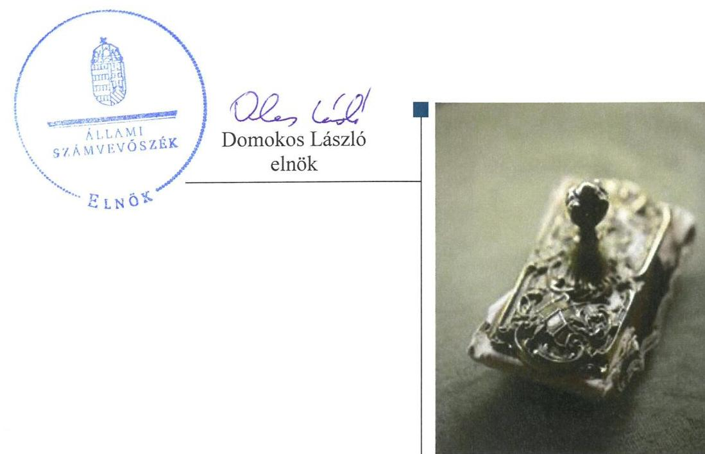

---

# AZ ELLENŐRZÉST FELÜGYELTE: 

PETŐ KRISZTINA felügyeleti vezető

## AZ ELLENŐRZÉST VEZETTE ÉS A VÉGREHAJTÁSÁÉRT FELELŐS:

BREBÁN ANDREA ellenőrzésvezető
KAKAS SÁNDOR ellenőrzésvezető

A PROGRAM ÖSSZEÁLLÍTÁSÁÉRT FELELŐS:
JANIK JÓZSEF LÁSZLÓ osztályvezető

IKTATÓSZÁM: V-0955-148/2016.
TÉMASZÁM: 1989
ELLENŐRZÉS-AZONOSÍTÓ SZÁM: V073710

---

# TARTALOMJEGYZÉK 

■ ÖSSZEGZÉS ..... 5
■ AZ ELLENŐRZÉS CÉLJA ..... 7
■ AZ ELLENŐRZÉS TERÜLETE ..... 8
■ AZ ELLENŐRZÉS HÁTTERE, INDOKOLTSÁGA ..... 10
■ A JELENTÉS LÉNYEGES KÉRDÉSKÖREI ..... 12
■ ELLENŐRZÉS HATÓKÖRE ÉS MÓDSZEREI ..... 13
■ MEGÁLLAPÍTÁSOK ..... 16
■ JAVASLATOK ..... 32
■ MELLÉKLETEK ..... 37
I. sz. melléklet: Értelmező szótár ..... 37
II. sz. melléklet: Az integritás érvényesítése érdekében kialakított és működtetett kontrollrendszer ..... 40
■ FÜGGELÉK: ÉSZREVÉTELEK ..... 43
■ RÖVIDÍTÉSEK JEGYZÉKE ..... 57

---

.

---

# ÖSSZEGZÉS 

A tatai székhelyű Kuny Domokos Múzeumra vonatkozó irányító szervi feladatellátás összességében nem volt szabályszerű. A Múzeumnál kialakított irányítási rendszer nem biztosította az átlátható, elszámoltatható és ellenőrizhető közpénzfelhasználást. A Múzeum pénzügyi és vagyongazdálkodása szabálytalan volt. A Múzeum közfeladatát képező kulturális javak szabályszerű nyilvántartásáról nem gondoskodtak, valamint a kulturális javak vagyonbiztonsága és állományvédelme a kölcsönzéseknél nem volt biztosított.

## Az ellenőrzés társadalmi indokoltsága

Az Állami Számvevőszék Stratégiája szerinti küldetése, hogy értékteremtő ellenőrzéseivel előmozdítsa a közpénzügyek átláthatóságát és az elszámoltatható közpénzfelhasználást. Az ÁSZ kulturális területen történő múzeumi ellenőrzését indokolta, hogy a közfeladatot ellátó megyei hatókörű városi múzeumok 2011. évtől több alkalommal jelentős szervezeti és gazdálkodási átalakuláson mentek keresztül. Az ellenőrzés eredményei a Magyarországon működő múzeumok gazdálkodását, azok fenntartási feladatai ellátására vonatkozó jogszabályi környezet megfelelőségének javítását segítik.

## Főbb megállapítások, következtetések

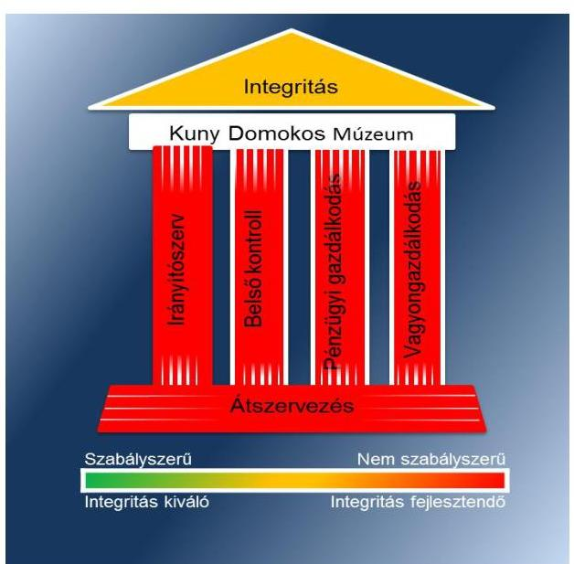

A Múzeumra vonatkozó irányító szervi feladatellátás összességében nem volt szabályszerű, mert az irányító szerv nem bízta meg a 2012. évben és nem nevezte ki a 2014. évben a gazdasági vezetőt. A múzeumigazgató elvonta az irányító szerv hatáskörét, amikor szabálytalanul kinevezte a gazdasági vezetőt.

A Múzeumnál kialakított irányítási rendszer nem biztosította az átlátható, elszámoltatható és ellenőrizhető közpénzfelhasználást. A Múzeum belső kontrollrendszerének kialakítása és működtetése nem felelt meg a jogszabályi előírásoknak. A szervezeti és működési szabályzatban a vagyonnyilatkozat-tételi kötelezettséget nem tüntették fel. A vagyonnyilatkozat-tételi kötelezettség feltüntetésének elmulasztásával nem intézkedtek a közélet tisztaságának biztosítása és a korrupció megelőzése érdekében. A Múzeumnál a kockázatkezelési rendszert nem működtették a 2011-2014. években. A kontrolltevékenység kialakítása és működtetése az ellenőrzött időszak utolsó két évében nem volt szabályszerű. Az információs és kommunikációs folyamatok
kialakítása során nem készítették el az adatvédelmi és adatbiztonsági szabályzatot, továbbá nem tettek eleget a jogszabályban előírt gazdálkodási adatok vonatkozásában a közzétételi kötelezettségnek. A monitoring rendszer kialakítása és működtetése a 2011-2014. években összességében nem volt szabályszerű.

A Múzeum pénzügyi és vagyongazdálkodása nem volt szabályszerű. A beszámolók irányító szerv részére történő elkészítése és megküldése a jogszabályban előírt határidőre nem történt meg. A bevételi előirányzatok teljesítése nem szabályszerűen történt, mert a bevételek elszámolását alátámasztó szerződések nem álltak teljes körűen rendelkezésre, továbbá a 2012. évben jogalap nélkül, a vagyontárgyak hasznosítására vagyonhasznosításra feljogosító szerződés, a 2013-2014. években vagyonkezelői szerződés hiányában került sor. A bérleti szerződéseket a versenyeztetés mellőzésével kötötték meg, valamint nem vizsgálták, hogy a szerződő fél jogszabály szerint átláthatónak

---

minősül-e. A kiadási előirányzatok felhasználása során a gazdálkodási jogkörök gyakorlása szabálytalan volt. A régészeti feltárási tevékenység bevételeinek elszámolását a jogszabályi előírásoknak megfelelő tartalmú szerződések nem támasztották alá. A Múzeum 2012. évi beszámolójának mérlege a vagyon és annak összetétele kapcsán a megbízható és valós összképet nem mutatta be. A 2013-2014. évi beszámolókban sérült a lényegesség számviteli alapelv. A vevőkövetelések értékelését a könyvviteli zárlathoz kapcsolódó feladatok keretében a Múzeumnál nem végezték el, ezzel sérült az egyedi értékelés számviteli alapelv. A Múzeum a nemzeti vagyonba tartozó kulturális javakról nem a jogszabályi előírásoknak megfelelően vezette az előírt nyilvántartásokat, azok kölcsönzéséről szóló szerződései nem voltak szabályszerűek. A nem muzeális intézmény számára, továbbá külföldre történő kölcsönadáshoz a Múzeum több esetben nem rendelkezett a miniszter hozzájárulásával.

A Múzeumot érintő szervezeti, szerkezeti átszervezések végrehajtása nem volt szabályszerű, nem volt biztosított az átláthatóság. A 2011/2012. évi átszervezés során nem készült jegyzőkönyv az átadás-átvételről és a vagyon tényleges átadásáról, ezért a vagyon tényleges átadása nem történt meg. A 2012/2013. évi központi alrendszerből önkormányzati alrendszerbe történő átszervezés során a számviteli feladatokat hiányosan hajtották végre, mert nem készítették el a vagyonátadási jelentést. A Múzeum két tagintézményének átadásakor az átszervezés lebonyolításához a fenntartó részére dokumentáltan nem állt rendelkezésre a muzeális intézmények létszámának, a leltárban szereplő kulturális javak tagintézményenkénti meghatározása.

A Múzeum nem intézkedett az integritás szemlélet érvényesítése érdekében.

---

# AZ ELLENŐRZÉS CÉLJA 

vényesülését a gazdálkodási folyamatokban.

Az ellenőrzés célja annak megállapítása volt, hogy a megyei múzeumi rendszer átalakítása, az intézményfenntartói rendszerben végbement változások előkészítése és végrehajtása megalapozottan, szabályszerűen történt-e; a megyei hatókörű városi múzeumok és jogelődjeik pénzügyi- és vagyongazdálkodása, a belső kontrollrendszer kialakítása és működtetése, valamint az intézményfenntartói feladatok ellátása szabályszerűen történt-e.

A Múzeum ${ }^{1}$ korrupcióval szembeni veszélyeztetettségének csökkentése érdekében kért tanúsítványi adatszolgáltatás alapján az ÁSZ² értékelte az integritási szemlélet ér-

---

# **AZ ELLENŐRZÉS TERÜLETE**

### **Kuny Domokos Múzeum**

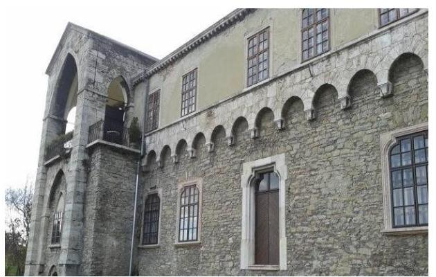

A Múzeum Tatán található, feladatkörében az Mtv.^{3} alapján gondoskodik a kulturális javak meghatározott anyagának folyamatos gyűjtéséről, nyilvántartásáról, megőrzéséről és restaurálásáról; tudományos feldolgozásáról, publikálásáról; valamint kiállításokon és más módon történő bemutatásáról; a közművelődési és közgyűjteményi feladatok ellátásáról. A Kötv.^{4} 20. § (2) bekezdése alapján területileg illetékes múzeumként régészeti feltárást végzett az ellenőrzött időszakban.

A Múzeum csak a működési engedélyében meghatározott gyűjtőkörben és gyűjtőterületen folytathatja tevékenységét. A szakmai besorolást, a rendszert megalapozó szaktörvényi kereteket az Mtv. biztosítja. Az Mtv. hatálya kiterjed a Múzeum fenntartóira, a Múzeumban foglalkoztatottakra, a kulturális örökség Múzeumban őrzött elemeire, a szolgáltatások igénybe vevőire és a kulturális örökséggel foglalkozó egyéb szervezetekre.

A Múzeum 2011. évi költségvetési engedélyezett létszáma 37 fő volt, ami az ellenőrzött időszak alatt nem változott. A Múzeum alkalmazottainak foglalkoztatására a Kjt.^{5} alapján került sor. Az ellenőrzött időszakban a múzeumigazgató^{6} és a gazdasági vezető személye is változott.

A Möktv.^{7} és annak végrehajtásáról szóló 258/2011. (XII. 7.) Korm. rendelet^{8} alapján 2012. január 1-jétől a megyei múzeumok központi költségvetési szervekké váltak. 2013. január 1-jétől a 2012. évi CLII. törvény^{9}, valamint az 1311/2012. (VIII. 23.) Korm. határozat^{10} alapján az állami tulajdonba és fenntartásba került megyei múzeumi szervezetek a megyeszékhely megyei jogú városok fenntartásában működnek tovább. A 2011–2014. évek között a fenntartói, irányítói, középirányítói jogkörgyakorlók változását, valamint a Múzeum gazdálkodási feladatát ellátó szervezetét az 1. táblázat mutatja be:

1. táblázat

|  Időszak | Fenntartó | Irányító szerv | Közgeirányító szerv | Gazdasági szervezet  |
| --- | --- | --- | --- | --- |
|  2011. | Komárom-Esztergom Megyei Önkormányzat | Komárom-Esztergom Megyei Önkormányzat Közgyűlése | - | Múzeum  |
|  2012. | Komárom-Esztergom Megyei Intézményfenntartó Központ | KIM^{11} | Komárom-Esztergom Megyei Intézményfenntartó Központ | Múzeum  |
|  2013–2014. | Tata Város Önkormányzata | Tata Város Közgyűlése | - | Múzeum  |

#### **FENNTARTÓI, IRÁNYÍTÓI JOGKÖRGYAKORLÓK ÉS GAZDASÁGI SZERVEZET A 2011–2014. ÉVEKBEN**

*Forrás: A Múzeum alapító okiratai*

---

A Múzeum jogállása a 2011. évtől önállóan működő és gazdálkodó költségvetési szerv volt. 2014. július 1-jétől a Múzeum önálló jogi személyiséggel rendelkező, saját gazdasági szervezettel működő megyei hatókörű városi múzeum, vállalkozási tevékenységet nem végzett.

A Múzeum teljesített költségvetési bevételeinek és kiadásainak alakulását az 1. ábra mutatja be. Az ábra a 2011-2012. években a Múzeum és tagintézményeinek együttes adatai, a 2013-2014. években a tagintézmények átadását követően a múzeumi adatok alapján készült.
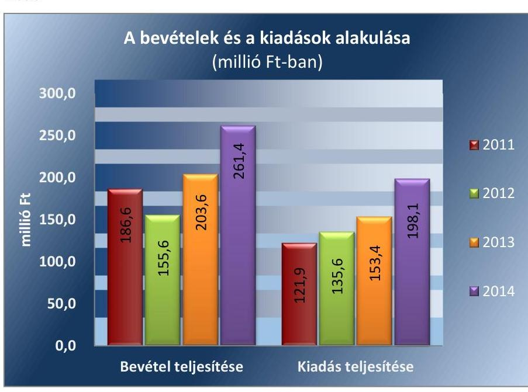

Forrás: Múzeumi beszámolók a 2011-2014. évekre
A 2015. évi LXXV. tv. ${ }^{12}$ 1. § (1) bekezdése alapján az Nvtv. ${ }^{13}$ 13. § (3) bekezdésében és 14. § (1) bekezdésében foglaltak alapján és az abban meghatározott feltételekkel a 2012. évi CLII. törvény 30. § (1) és (2) bekezdésében meghatározott, a megyei hatókörű városi múzeumok feladatának ellátását szolgáló egyes állami tulajdonban lévő ingatlanok a törvény hatálybalépésének napjával, a törvény erejénél fogva a kötelező közfeladatként a megyei hatókörű városi múzeumot fenntartó önkormányzatok tulajdonába kerültek. A 2015. évi LXXV. tv. 4. § (1) bekezdése alapján a kulturális örökség helyi védelme érdekében a megyei hatókörű városi múzeumok alapleltárában és jogszabály szerinti külön nyilvántartásában szereplő állami tulajdonú kulturális javak ingyenesen a megyei hatókörű városi múzeumok vagyonkezelésébe kerültek. A vagyonkezelők vagyonkezelői joga tekintetében vagyonkezelési szerződés megkötése nem szükséges. A 2015. évi LXXV. tv. 4. § (2) bekezdése szerint továbbá a kulturális örökség helyi védelme érdekében a megyei hatókörű városi múzeumok feladatának ellátását szolgáló állami tulajdonban álló ingatlanok - a törvény mellékletében meghatározott ingatlanok kivételével - ingyenesen a fenntartó önkormányzatok vagyonkezelésébe kerültek.

---

# AZ ELLENŐRZÉS HÁTTERE, INDOKOLTSÁGA

Az Alaptörvény14 rendelkezése szerint a nemzeti vagyon megőrzésének, védelmének és a nemzeti vagyonnal való felelős gazdálkodásnak a követelményeit sarkalatos törvény, az Nvtv. rögzíti. A tulajdonosi joggyakorlás és vagyonkezelés általános és speciális szabályait, az állami vagyon nyilvántartására és elszámolására vonatkozó eljárásokat, a vagyonkezelési szerződés feltételrendszerét, valamint az éves beszámoló készítési és könyvvezetési kötelezettségeket kormányrendelet írja elő.

A megyei hatókörű városi múzeumok közfeladat-ellátásának változásait, (beleértve az állami tulajdonosi joggyakorló, intézményi vagyonkezelő és önkormányzati fenntartó szervezeteket is) a közfeladatok átadásából és átvételéből adódó módosításait, előirányzat gazdálkodására ható tényezőit az Áht.215, az Ávr.16, a Möktv., valamint az Mtv. írja elő. A múzeumi intézményrendszer rendszerátalakulásából, megszűnéséből, intézmény átszervezéséből, belső szerkezeti korszerűsítéséből, vagy más hasonló okból adódó módosításai miatt szerepeltetendő szerkezeti változásokat, valamint a szerkezeti változásként beépült közfeladatok szintre hozásként történő számításba vételét az Ávr. határozza meg.

A megyei hatókörű városi múzeumok kulturális szempontból meghatározó jelentőségűek mind földrajzi elhelyezkedésüket, mind az ellátott feladatokat, valamint a látogatottságukat tekintve. Tevékenységüket törvényi szinten (Mtv.) szabályozták a jogalkotók. A megyei hatókörű városi múzeumok jelenlegi körének kialakításában, tulajdonosi és fenntartói szerkezetében rövid idő alatt több jelentős változás történt, amelyeket jogszabályi változások indukáltak. Ezen intézmények szakmai besorolásukat tekintve a 2011. évben megyei múzeumként, a 2012. évben megyei múzeumi központi költségvetési szervezetként, a 2013. évtől kezdődően megyei hatókörű városi múzeumként működtek. A szakmai besorolások változásait párhuzamosan követték a tulajdonosi, vagyonkezelői, fenntartói szerepekben történt változások.

A 2011–2014. évek között bekövetkezett fenntartói változások a vagyontárgyak és a kulturális javak tulajdonosi, vagyonkezelői és használói körében is változást indukáltak, amelyet a 2. táblázat szemléltet.

1. táblázat

|  A VAGYON TULAJDONOSI, VAGYONKEZELŐI ÉS HASZNÁLÓI KÖRÉNEK VÁLTOZÁSA 2011–2014. ÉVEKBEN |  |  |  |  |  |  |  |  |  

 |
| --- | --- | --- | --- | --- | --- | --- | --- | --- | --- |
|  Vagyontárgy |  | 2011. év |  |  | 2012. év |  |  | 2013-2014. évek |   |
|   | tulajdonos | vagyon-kezelő | használó | tulajdonos | vagyon-kezelő | használó | tulajdonos | vagyon-kezelő | használó  |
|  Ingatlan | KEMŐ17 | - | Múzeum | Állam | KEMIK18 | Múzeum | Állam | Múzeum | Múzeum  |
|  Egyéb tárgyi eszközök | KEMŐ | - | Múzeum | Állam | KEMIK | Múzeum | Állam | Múzeum | Múzeum  |
|  Kulturális javak | KEMŐ | - | Múzeum | Állam | KEMIK | Múzeum | Állam | Múzeum | Múzeum  |

*Forrás: A Múzeum alapító okiratai, a 2012. évi CLII. tv, a 258/2011. (XII. 7) Korm. rendelet, az 1311/2012. (VIII. 23.) Korm. határozat*

---

Az ellenőrzés - tekintettel a megyei hatókörű városi múzeumokat (és jogelődjeit) rövid időn belül, gyors ütemben ért környezeti (tulajdonosi, fenntartói-szerkezetet érintő) változásokra - javaslatok megfogalmazásával hozzájárul a fenntartás és működtetés feladatainak ellátására vonatkozó megfelelő jogszabályi környezet - jogalkotók által történő - kialakításához. Az ÁSZ ellenőrzés a gazdálkodási gyakorlat javítását eredményezheti, több intézmény bevonásával átfogó képet ad a megyei hatókörű városi múzeumokat (és jogelődjeiket) jellemző sajátosságokról, jó gyakorlatokról.

AZ ELLENŐRZÉS EREDMÉNYEKÉPPEN nemcsak az ellenőrzött intézmények gazdálkodása javul, hanem átfogó képet kapunk a múzeumok gazdálkodásának hiányosságairól, de a jó gyakorlatokról is. Ellenőrzéseivel, javaslataival és megállapításaival az ÁSZ elősegíti a költségvetési szervek pénzügyi és vagyongazdálkodása szabályozásának javítását és hozzájárulhat a jó kormányzáshoz.

---

# A JELENTÉS LÉNYEGES KÉRDÉSKÖREI 

1.     - Az irányító szerv Múzeumra vonatkozó feladatellátása szabályszerű volt-e?
2.     - Szabályszerűen hajtották-e végre a Múzeumot érintő szervezeti, szerkezeti átszervezéseket?
3.     - A belső kontrollrendszer kialakítása és működtetése megfelelt-e a jogszabályi előírásoknak?
4.     - A Múzeum pénzügyi gazdálkodása szabályszerű volt-e?
5.     - A Múzeum vagyongazdálkodása szabályszerű volt-e?
6.     - A Múzeum intézkedett-e az integritás szemlélet érvényesítése érdekében?

---

# ELLENŐRZÉS HATÓKÖRE ÉS MÓDSZEREI 

## Az ellenőrzés típusa

Megfelelőségi ellenőrzés.

## Az ellenőrzött időszak

Az ellenőrzött időszak 2011. január 1-jétől 2014. december 31-ig tart.

## Az ellenőrzés tárgya

A megyei hatókörű városi múzeumok átszervezése, átalakítása előkészítése és lebonyolítása megalapozottsága, szabályszerűsége, a pénzügyi és vagyongazdálkodási tevékenység, a belső kontrollrendszer kialakítása, működtetése szabályszerűsége, valamint az irányító szervi feladatok ellátása szabályszerűsége. E tevékenységek és a kapcsolódó adatok és információk összessége, amelyeket a vonatkozó kritériumok alapján kell értékelni.

Az ellenőrzés kiterjed minden olyan körülményre és adatra, amely az ÁSZ jogszabályban meghatározott feladatainak teljesítéséhez, valamint a program végrehajtása folyamán felmerült újabb összefüggések feltárásához szükséges.

## Az ellenőrzött szervezet

A Kuny Domokos Múzeum (és jogelődje a Komárom-Esztergom Megyei Múzeumok Igazgatósága), a fenntartói feladatokban érintett Komárom-Esztergom Megyei Önkormányzat, valamint Tata Város Önkormányzata, a Komárom-Esztergom Megyei Intézményfenntartói Központ általános és egyetemleges jogutóda a Szociális és Gyermekvédelmi Főigazgatóság.

Az ellenőrzésre Múzeum és irányító/felügyeleti szervének, illetve középirányító szervének székhelyén került sor.

## Az ellenőrzés jogalapja

Az ellenőrzés jogszabályi alapját az ÁSZ tv. ${ }^{19}$ 1. § (3) bekezdés, 5. § (2)-(6) bekezdései, valamint az Áht. 2 61. § (2) bekezdésének előírásai képezik.

---

# Az ellenőrzés módszerei 

Az ellenőrzést az ellenőrzési program szempontjai, az ellenőrzött időszakban hatályos jogszabályok, az ellenőrzés szakmai szabályai, az egyes ellenőrzési típusokhoz kapcsolódó ÁSZ módszertanok és nemzetközi standardok figyelembe vételével végeztük. A gazdálkodás hibáinak kijavítására, a közpénzekkel való felelős gazdálkodás segítésére irányuló javaslatok kidolgozásakor a hatályos jogszabályok az irányadóak.

Az ellenőrzési kérdések megválaszolásához szükséges bizonyítékok megszerzése a következő ellenőrzési eljárások alkalmazásával történt: kérdésfeltevés (információkérés), mintavételezés, valamint elemző eljárás. A minták kiválasztása során véletlen mintavételi eljárást alkalmaztunk.

Mintavétellel ellenőriztük a bevételek, a személyi juttatások, a dologi és felhalmozási kiadások, a régészeti bevételek és kiadások elszámolása-, valamint a kulturális javak kölcsönzésének szabályszerűségét. A minta alapján a sokaságban előforduló hibaarányt becsültük. „Megfelelőnek" értékeltük az ellenőrzött területet, amennyiben 95\%-os bizonyossággal a teljes sokaságban a hibaarány legfeljebb 10\%, „részben megfelelőnek" értékeltük, ha a hibaarány felső határa 10-30\% között volt, „nem megfelelőnek" pedig akkor, ha a mintavételi eredmények alapján a sokaságbeli hibaarány felső határa meghaladta a 30\%-ot.

Az ellenőrzési bizonyítékként felhasználható adatforrások közé tartoznak egyrészt a szakmai program részletes szempontjainál felsorolt adatforrások, másrészt adatforrás lehet minden egyéb - az ellenőrzés folyamán feltárt, az ellenőrzés szempontjából releváns információt tartalmazó - dokumentum. Az ellenőrzés lefolytatásához a Múzeum a tanúsítványok elektronikus kitöltésével, valamint az ÁSZ által kért dokumentumok elektronikus megküldésével szolgáltatott adatokat. A rendelkezésre bocsátott adatok, információk kontrollja az ellenőrzés keretében történt. Az ellenőrzési kérdésekre adott válaszok alapján értékeltük, hogy az ellenőrzött időszakban az irányító szerv az ellenőrzött Múzeumra vonatkozó feladatainak szabályszerűen eleget tett-e, a Múzeum pénzügyi- és vagyongazdálkodása megfelelt-e az előírásoknak, a Múzeum átalakításának vagy átszervezésének végrehajtása szabályszerű volt-e.

A Múzeum belső kontrollrendszere jogszabályi előírások szerinti kialakításának és működtetésének szabályszerűségét az erre irányuló ellenőrzési kérdésekre adott válaszok összesítése alapján, évente pillérenként (kontrollkörnyezet, kockázatkezelési rendszer, kontrolltevékenységek, információs és kommunikációs rendszer, monitoring rendszer) és összesítetten is minősítjük. A Múzeum belső kontrollrendszere egyes pilléreinek kialakítása és működtetése „szabályszerű", amennyiben az értékelt területen az elért és elérhető pontok százalékban kifejezett, egész számra kerekített hányadosa meghaladja a 84\%-ot, „részben szabályszerű", ha a 84\%ot nem haladja meg, de 60\%-nál nagyobb, „nem szabályszerű", ha nem haladja meg a 60\%-ot. A Múzeum belső kontrollrendszerének összesített értékelése megegyezik a pillérenként (kontrollterületenként) alkalmazott \%os értékelésekkel, a következő eltérésekkel. A kontrollrendszer egésze esetében a „szabályszerű" értékelésnek a \%-os értéken felül további feltétele, hogy egyik kontrollterület sem kaphat „nem szabályszerű" értékelést, a „részben szabályszerű" értékelés további feltétele, hogy legfeljebb egy el-

---

lenőrzött kontrollterület lehet „nem szabályszerű" értékelésű. Az összesített értékelés a \%-os értéktől függetlenül „nem szabályszerű", ha az ellenőrzött kontrollterületek közül több mint egynek „nem szabályszerű" az értékelése.

Az integritás szemlélet érvényesülésének értékelése a Múzeum tanúsítványi adatszolgáltatása alapján történt.

---

# 1. Az irányító szerv Múzeumra vonatkozó feladatellátása szabályszerű volt-e? 

Összegző megállapítás

Az irányító szerv $1,2,3^{20}$ Múzeumra vonatkozó feladatellátása összességében nem volt szabályszerű.

A Múzeum rendelkezett alapító okirattal${ }_{1,2,3}{ }^{21}$, amely módosítása a jogszabályi és feladatváltozások alapján megtörtént. Az egységes szerkezetű alapító okiratokat elkészítették, melyek az előírt tartalmi elemeket tartalmazták. Az alapító okirat${ }_{2,3}$ módosításaihoz a kultúráért felelős miniszter előzetes egyetértését megadta az Mtv. 45/B. § (3) bekezdésben valamint az Mtv. 45.§ (5) bekezdés a) pontjában foglaltak szerint. Az alapító okirat${ }_{3}$ kiegészítését 2014. évben a kormányzati funkciók szerinti besorolással elvégezték az Ávr. 180. § (2)-(3) bekezdéseiben foglaltak szerint.

A múzeumigazgató az irányító szerv${ }_{2,3}$ helyett a gazdasági vezetőt a 2012. évben szabálytalanul bízta meg és a 2014. évben szabálytalanul nevezte ki az Áht. 2 9. § (1) bekezdés c) pontjában foglaltak ellenére. A gazdasági vezetői állás betöltésére vonatkozó pályázatot az SZMSZ${ }_{2}{ }^{22}$ hatályba lépését - 2012. szeptember 17-ét - követően nem írták ki az SZMSZ${ }_{2}$ IV/3. pontjában foglaltak ellenére.

Az egyéb irányítási, felügyeleti és ellenőrzési jogosultságok gyakorlása során hiányosság volt, hogy
$\longrightarrow$ a teljes ellenőrzött időszakban az irányító szerv${ }_{1,2,3}$ a Múzeum által ellátandó közfeladatok ellátására vonatkozó, és az erőforrásokkal való szabályszerű és hatékony gazdálkodáshoz szükséges követelmények érvényesítése, számonkérése, ellenőrzése tárgyban nem gyakorolta hatáskörét az Áht. 1 49. § (5) bekezdés f) pont, illetve az Áht. 2 9. § (1) bekezdés f) pontjában foglaltak ellenére;
$\longrightarrow$ 2012-ben a 258/2011. Korm. rendelet${ }^{23}$ 11. § (2) bekezdés c) pontja ellenére a középirányító szerv nem ellenőrizte az államháztartással összefüggő közérdekű és közérdekből nyilvános adatok kötelező közzétételének, illetve igényre történő szolgáltatásának végrehajtását;
$\longrightarrow$ a 2012-2014. években a Múzeum kezelésében lévő közérdekű adatokat és a közérdekből nyilvános adatokat, valamint az Áht. 2 9. § (1) bekezdés b), c) és f)-i) pont szerinti irányítási jogkörök gyakorlásához szükséges, törvényben meghatározott személyes adatokat nem kezelte az irányító szerv${ }_{2,3}$ az Áht. 2 9. § (1) bekezdés j) pontjában előírtak ellenére;
$\longrightarrow$ a 2013-2014. években a fenntartó${ }^{24}$ az Mtv. 50. § (2) bekezdés a) pontjában foglaltak ellenére nem határozta meg a Múzeum stratégiai tervét, munkatervét.

---

# 2. Szabályszerűen hajtották-e végre a Múzeumot érintő szervezeti, szerkezeti átszervezéseket? 

Összegző megállapítás

2.1. számú megállapítás

A Múzeumot és tagintézményeit érintő szervezeti, szerkezeti átszervezések végrehajtása nem volt szabályszerű.

A Múzeumot érintő önkormányzati alrendszerből a központi alrendszerbe történő 2012. január 1-jétől hatályos irányító szervi (fenntartói) váltás lebonyolítását szabálytalanul, az átláthatóság sérülésével hajtották végre.

AZ ÁTADÁS-ÁTVÉTEL ELŐKÉSZÍTÉSE érdekében a Möktv. 6. § (1), (2) bekezdései alapján megjelölt átadás-átvételi bizottság működése eredményeként az átadás-átvételi megállapodást${ }_{1}{ }^{25}$ a Möktv. 2. § (4) bekezdésében meghatározott személyek, így a kormánymegbízott, a fenntartó${ }_{1}$ elnöke, illetve az MNV Zrt.${ }^{26}$ és az NFA${ }^{27}$ képviselői 2011. december 31-éig megkötötték.

AZ ÁTADÁS-ÁTVÉTELI MEGÁLLAPODÁSBAN a Múzeum európai uniós társfinanszírozású projektjére vonatkozó dokumentáció átadás-átvételéről rendelkeztek. Mivel a projekt kedvezményezettje a Múzeum volt, ezért a támogatási szerződés módosítása nem volt indokolt. Az átadás-átvételi megállapodás a 258/2011. (XII. 7.) Korm. rendelet 1. melléklet III. és IV. részben előírtak szerinti tartalommal került összeállításra azzal az eltéréssel, hogy a pénzforgalmi számlákhoz tartozó 2011. december 31-ei pénzmaradványok összege a - 258/2011. (XII. 7.) Korm. rendelet 1. melléklet IV. rész 1/13. pontjában előírtak ellenére - nem szerepelt benne. Az átadás-átvételi megállapodás mellékleteiben szereplő vagyonkimutatás a 2011. december 31-ei állapotnak megfelelően került összeállításra. Jegyzőkönyvet az átadás-átvételről és a vagyon tényleges átadásáról - a 258/2011. (XII.7.) Korm. rendelet 12. § (3) bekezdésében szereplő előírást figyelmen kívül hagyva - a fenntartó${ }_{1}$ és a fenntartó${ }_{2}$ nem készített, a vagyon tényleges átadása nem történt meg.

A Múzeum Alapító okiratának módosítását a fenntartó 2012. január 30-ig nem nyújtotta be a Kincstárhoz a törzskönyvi nyilvántartásba vétel céljából a 258/2011. (XII. 7.) Korm. rendelet 21. § (6) bekezdésben előírtak ellenére. Az alapító okirat és a módosító okirat tervezetek Kincstár részére történő megküldésére 2012. április 6-án került sor.

AZ ÁTSZERVEZÉSHEZ KAPCSOLÓDÓ SZÁMVITELI FELADATOKAT szabályosan végrehajtották. A vagyonátadási jelentést${ }^{28}$ a Múzeum 2011. december 31-ei fordulónappal az éves elemi költségvetési beszámolóval azonos tartalommal készítette el, melyet záró főkönyvi kivonattal, analitikus nyilvántartással és leltárral szabályszerűen alátámasztott. Az átszervezés napjára a bevételi és kiadási forgalmi számlákat lezárták. A vagyonátadásra a mérlegben

 szereplő adatokat alátámasztó leltár alapján került sor.

---

### 2.2. számú megállapítás

3. táblázat

JOGSZABÁLYI HÁTTÉR

|  Hatály | Jogszabály  |
| --- | --- |
|  2012. április 4.- | 1094/2012. (IV. 3.)  |
|  2012. augusztus 23. | Korm. határozat  |
|  2012. augusztus 24. | 1311/2012. (VIII. 23.) Korm. határozat  |
|  től |  |

A VAGYONKEZELÉSI SZERZŐDÉST a fenntartó az MNV Zrt.-vel nem a 258/2011. (XII.7.) Korm. rendelet 1. melléklet V. részében foglalt előírás szerint az átadás-átvételi megállapodás aláírásától - de legkorábban 2012. január 1-jétől - számított 30 napon belül, hanem annál későbbi időpontban, 2012. október 29-én kötötte meg.

A 2013. január 1-jével végrehajtott a központi alrendszerből önkormányzati alrendszerbe történő irányító szervi (fenntartói) váltás végrehajtását és a szervezet-rendszer átalakítását szabálytalanul, a kapcsolódó számviteli feladatok szabálytalansága miatt az átláthatóság sérülésével hajtották végre.

AZ ÁTADÁS-ÁTVÉTELI MEGÁLLAPODÁS ${ }^{29}$ előkészítése során a fenntartó ${ }_{2}$ vezetője és Tata Város polgármestere kijelölték a kapcsolattartókat az átadás-átvétellel összefüggő teendők egyeztetésére, illetve a szükséges döntések előkészítésére. A megfelelő előkészítés eredményeként a 2012. évi CLII. törvény 30. § (5) bekezdésében megjelölt határidőre 2012. december 13-án megkötötték a megállapodást, melyet a 1311/2012. (VIII. 23.) Korm. határozat foglaltak szerint Tata Város polgármestere és a fenntartó ${ }_{2}$ vezetője írták alá.

Az átadás-átvételi megállapodással a jogutód fenntartó a fenntartói jogok gyakorlásához és az irányító szervi feladatok ellátásához átadott adatokat, dokumentumokat átvette. Az átadás-átvételi megállapodással átadásra kerültek a kötelezettségvállalásokról és az egyéb kötelezettséget alapító intézkedésekről szóló iratok, a tételes eszköz kimutatás dokumentumai, valamint az ingó vagyon tekintetében az alapleltárakban és külön nyilvántartásokban nyilvántartott kulturális javak. A fenntartó ${ }_{2}$ átadta a Múzeum rövid és hosszú lejáratú kötelezettségállomány kimutatását, a hatályos szerződéseket, illetve az átadott intézmény költségvetési helyzetéről szóló dokumentumokat. Az átadás-átvételi megállapodás tartalmazta továbbá az átadott intézményi létszámot intézményenként, a betöltetlenül átadott státuszok számát, a 2012. december 31-én fenntartott pénzforgalmi számlaszámok megjelölését és az átadás-átvételi eljárás alól kivételt képező tagintézmények körének meghatározását. A fenntartó ${ }_{2}$, a fenntartó ${ }_{3}$, illetve a Múzeum részvételével 2013. január 7-én megtörtént a Múzeum által használt és a Magyar Állam tulajdonában álló ingatlanok birtokba adása, melyről jegyzőkönyv készült.

## A NEM MEGYESZÉKHELY SZERINTI TAGINTÉZ-

MÉNYEK 2013. január 1-jei hatállyal a feladat ellátásához rendelkezésre álló személyi, tárgyi és pénzügyi feltételek egyidejű átadásával a működési engedélyükben meghatározott székhely szerint illetékes települési önkormányzatok fenntartásába kerültek a 1311/2012. (VIII. 23) Korm. határozat 1.4 pontja előírása alapján. A Múzeum esetében két tagintézmény ${ }^{30}$ került átadásra. Az átszervezés lebonyolításához - a 1311/2012. (VIII. 23.) Korm. határozat 1.8. pontjában foglalt előírás ellenére - a fenntartó részére dokumentáltan nem állt rendelkezésre a muzeális intézmények létszámának, a leltárban szereplő kulturális javaknak tagintézményenkénti meghatározása. Az átadás-átvételi megállapodásokat a fenntartó a 2013. január 1-jével a megyei múzeumi intézményből kikerült két tagintézmény vonatkozásában megkötötte. Az ellenőrzésre rendelkezé-

---

sére bocsátott megállapodások mellékletei hiányoztak, ezért nem megállapítható megállapodásokból a ténylegesen átadott létszám és a vagyon mértéke.

# AZ ÁTSZERVEZÉSHEZ KAPCSOLÓDÓ SZÁMVITELI FELADATOKAT hiányosan hajtották végre. A vagyonátadási jelentést a Múzeum az Áhsz.; 13/A. § (7) bekezdésében foglalt előírást figyelmen kívül hagyva a 2012. december 31-ei fordulónapra vonatkozóan nem készítette el. A tagintézményi vagyonátadáshoz a mérlegben szereplő adatokat alátámasztó leltárt és főkönyvi kivonatot összeállították a kulturális javakon kívüli egyéb vagyonelemek tekintetében.

## 3. A belső kontrollrendszer kialakítása és működtetése megfelelte a jogszabályi előírásoknak?

## Összegző megállapítás

A belső kontrollrendszer kialakítása és működtetése a 2011-2014. években nem volt szabályszerű.

A belső kontrollrendszer kialakítása és működtetése részletes értékelését a 2011-2014. évekre vonatkozóan a 4. táblázat mutatja be.
4. táblázat

## A BELSŐ KONTROLLRENDSZER KIALAKÍTÁSÁNAK ÉS MŰKÖDTETÉSÉNEK ÉRTÉKELÉSE A 2011-2014. ÉVEKBEN

| Megnevezés | Kontroll-   környezet | Kockázatkezelés | Kontroll-   tevékenységek | Információ és   kommunikáció | Monitoring | Összesen |
| :--: | :--: | :--: | :--: | :--: | :--: | :--: |
| 2011. | részben   szabályszerű | nem szabályszerű | részben   szabályszerű | nem szabályszerű | nem szabályszerű | nem szabályszerű |
| 2012. | részben   szabályszerű | nem szabályszerű | részben   szabályszerű | nem szabályszerű | nem szabályszerű | nem szabályszerű |
| 2013. | szabályszerű | nem szabályszerű | nem szabályszerű | részben   szabályszerű | nem szabályszerű | nem szabályszerű |
| 2014. | szabályszerű | nem szabályszerű | nem szabályszerű | részben   szabályszerű | nem szabályszerű | nem szabályszerű |

3.1. számú megállapítás

A kontrollkörnyezet kialakítása a 2011-2012. években részben szabályszerű, a 2013-2014. években szabályszerű volt.

A kontrollkörnyezet kialakításának évenkénti értékelését a 2. ábra mutatja be:
2. ábra

| Kontrollkörnyezet | 2011. év   önkormányzati   alrendszer | 2012. év   központi   alrendszer | 2013. év   önkormányzati alrendszer |
| :--: | :--: | :--: | :--: |
| szabályszerű |  |  |  |
| részben szabályszerű   nem szabályszerű |  |  |  |

Forrás: ÁSZ ellenőrzés megállapításai

---

AZ SZMSZ 1,2,3,4 az Áht. ${ }^{31}$ 91. § (2) bekezdése, az Áht. 2 10. § (5) bekezdése alapján rendelkezésre állt. A 2011-2014. években a vagyonnyilatkozat-tételi kötelezettséget a Vnytv. ${ }^{32}$ 4. § a) pontjában foglaltak ellenére az SZMSZ 1,2,3,4-ben nem tüntették fel. Az SZMSZ 1 ezen túl nem tartalmazta:
$\longrightarrow$ az alaptevékenységek szakfeladatrend szerinti, szakfeladat számmal és megnevezéssel történő besorolását az Ámr. ${ }^{33} 20$. § (2) bekezdés c) pontja ellenére;
$\longrightarrow$ teljes körűen a nevesített munkakörökhöz és helyettesítésükhöz tartozó feladat- és hatásköröket, valamint a hatáskörök gyakorlásának módját, a helyettesítés rendjéhez kapcsolódó felelősségi szabályokat az Ámr. 20. § (2) bekezdés h) pontja ellenére;
$\longrightarrow$ a munkáltatói jogok gyakorlásának rendjét az Ámr. 20. § (2) bekezdés j) pontja ellenére.

A GAZDASÁGI SZERVEZET ÜGYRENDDEL nem rendelkezett az Ámr. 15. § (6) bekezdés, illetve az Ávr 9. § (5) bekezdés előírása ellenére az ellenőrzött időszakban. A Múzeum gazdasági szervezetére vonatkozó szabályokat az Áht. 1 91. § (2) bekezdésben, Áht. 2 10. § (5) bekezdésben foglaltak alapján az SZMSZ 2,2,3,4 illetve annak függelékeként készített más belső szabályzatok tartalmazták. Hiányosság volt a 2011-2012. években, hogy az Ámr. 20. § (7) bekezdés, Ávr. 13. § (5) bekezdés előírásai ellenére a gazdasági ügyintéző feladat- és hatáskörét, valamint a gazdasági szervezet Múzeumon kívüli külső kapcsolattartásának módját, szabályait nem határozták meg.

ETIKAI ELVÁRÁSOKAT a kontrollkörnyezet kialakítása keretében a múzeumigazgató nem határozott meg a szervezet minden szintjén az Ámr. 156. § (1) bekezdés c) pont, illetve a Bkr. ${ }^{34}$ 6. § (1) bekezdés c) pont előírása ellenére az ellenőrzött időszakban. A gazdálkodási feladatokat ellátók közül több személy kinevezési okmánya nem tartalmazta a munkakör megjelölését a Kjt. 21. § (3) bekezdésében foglaltak ellenére.

A SZÁMVITELI POLITIKÁJÁT a Múzeum - a Számv. tv. ${ }^{35}$ 14. § (3)-(4) bekezdés alapján - kialakította, jóváhagyott számviteli politika 1,2,3${ }^{36}$-mal rendelkezett. Hiányosság volt, hogy
$\longrightarrow$ 2013-ban a számviteli politika ${ }_{2}$ az Áhsz. ${ }^{37}$ 8. § (5) bekezdés a) pont előírása ellenére a vagyoni értékű jogok minősítését nem tartalmazta.

A SZÁMLAREND 1,2${ }^{38}$-vel a Számv. tv. 161. § (1) bekezdésben előírtak szerint rendelkezett a Múzeum.

# A LELTÁROZÁSI ÉS LELTÁRKÉSZÍTÉSI SZABÁLY-

ZAT 1,2${ }^{39}$-vel a Múzeum a Számv. tv. 14. § (5) bekezdés a) pontjában előírtak szerint rendelkezett.

## AZ ESZKÖZÖK ÉS FORRÁSOK ÉRTÉKELÉSI SZABÁLYZAT 1,2,3${ }^{40}$-at a Számv. tv. 14. § (5) bekezdés b) pontjában foglaltak alapján elkészítették. A 2011-2013. években szabályozási hiányosság, hogy az eszközök és források értékelési szabályzata 1,2 az Áhsz. 1 8. § (18)

---

bekezdés által előírt egyszerűsített értékelési eljárás alá vont követelések besorolásának elveit, dokumentálásának szabályait nem tartalmazta.

AZ ÖNKÖLTSÉG-SZÁMÍTÁSI SZABÁLYZAT 1,2,3${ }^{41}$ a 2011-2014. években a Számv. tv. 14. § (5) bekezdés c) pontja alapján kiadásra került. Az önköltség-számítási szabályzat 1,2 nem terjedt ki minden rendszeresen nyújtott szolgáltatásra az Áhsz. ${ }_{1} 8$. § (4) bekezdés előírása ellenére. A 2014. évben az önköltség számítási szabályzat ${ }_{3}$ minden rendszeresen végzett tevékenységre, szolgáltatásra kiterjedt a jogszabályi előírásnak megfelelően.

KÖZBESZERZÉSI SZABÁLYZATTAL a Múzeum a Kbt. ${ }^{42}$ 6. § (1) és (3) bekezdései és a Kbt. ${ }^{43}$ 22. § (1)-(2) bekezdései előírásai ellenére az ellenőrzött időszakban nem rendelkezett.

AZ ELLENŐRZÉSI NYOMVONALAT a Múzeum a 2011-2012. években a jogszabályban foglaltak szerinti tartalommal szabályszerűen elkészítette. A 2013-2014. években a múzeumigazgató a Bkr. 6. § (3) bekezdésben foglaltak ellenére az ellenőrzési nyomvonalat nem aktualizálta.

Egyebekben a 2011-2014. években a pénzkezelési szabályzat 1,2,3${ }^{44}$ a Számv. tv. 14. § (5) bekezdés d) pontban foglaltaknak megfelelő tartalommal készült el. A szabálytalanságkezelési eljárásrend 1,2${ }^{45}$ megfelelt az Ámr. 156. § (3) bekezdés, Bkr. 6. § (4) bekezdés előírásának. A gazdálkodás részletes rendjét 2011-2014. években az Áht. ${ }_{1} 91$. § (2) bekezdés, Áht. ${ }_{2} 10$. § (5) bekezdés alapján gazdálkodási szabályzat 1,2,3${ }^{46}$-ban meghatározták.

# 3.2. számú megállapítás 

A kockázatkezelési rendszer kialakítása és működtetése összességében nem volt szabályszerű a 2011-2014. években.

A kockázatkezelési rendszer évenkénti értékelését a 3. ábra mutatja be:
3. ábra

| Kockázatkezelési rendszer | 2011. év   önkormányzati   alrendszer | 2012. év   központi   alrendszer | 2013. év   önkormányzati alrendszer | 2014. év   önkormányzati alrendszer |
| :--: | :--: | :--: | :--: | :--: |
| szabályszerű |  |  |  |  |
| részben szabályszerű nem szabályszerű |  |  |  |  |

A kockázatkezelési rendszert a múzeumigazgató az ellenőrzött időszakban szabályszerűen kialakította, azonban az Ámr. 157. § (1) bekezdése és a Bkr. 7. § (1) bekezdés előírása ellenére az ellenőrzött időszakban nem működtette. A múzeumigazgató a 2011-2014. években nem végzett a kockázati tényezők figyelembe vételével kockázatelemzést, nem mérte fel és nem állapította meg a Múzeum tevékenységében, gazdálkodásában rejlő kockázatokat az Ámr. 157. § (1) bekezdése és a Bkr. 7. § (2) bekezdés előírásai ellenére.

---

# 3.3. számú megállapítás 

A kontrolltevékenység kialakítása és működtetése a 2011-2012. években részben szabályszerű volt, a 2013-2014. években nem volt szabályszerű.

A kontrolltevékenység évenkénti értékelését a 4. ábra mutatja be:
4. ábra
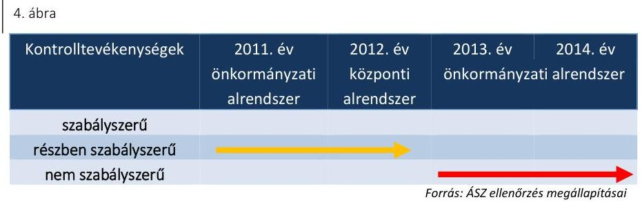

Az operatív gazdálkodási jogkörökre a kijelöléseket, felhatalmazásokat az arra jogosultak írásban adták ki. A gazdálkodási jogkörök gyakorlásán keresztül végzett kontrolltevékenység nem volt szabályszerű (részletesen a 4.3. fejezetben).

Hiányosság volt, hogy az ellenőrzött időszakban a múzeumigazgató az engedélyezési és jóváhagyási eljárásokat az Ámr. 158. § (2) bekezdés a) pont, illetve
 a Bkr. 8. § (4) bekezdés a) pont előírása ellenére nem szabályozta, valamint az üzemeltetés és az adatbiztonság szabályozásáról az Lkr. ${ }^{47}$ 8. § (2) bekezdésben előírtak ellenére nem intézkedett.

## 3.4. számú megállapítás

Az információs és kommunikációs folyamatok kialakítása a 2011–2012. években nem volt szabályszerű, a 2013–2014. években részben volt szabályszerű.

Az információs és kommunikációs rendszer évenkénti értékelését az 5. ábra mutatja be:
5. ábra
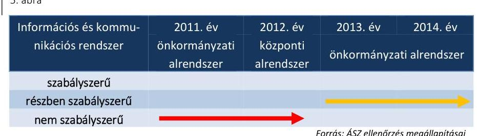

A múzeumigazgató a 2011–2014. években az Ámr. 159. § (1) bekezdésben, Bkr. 9. § (1) bekezdésben előírtak ellenére a szervezeten belüli és kívüli információáramlás rendszerét szabálytalanul alakította ki. Hiányosság volt, hogy
$\longrightarrow$ az adatvédelmi és adatbiztonsági szabályzatot a 2011–2014. években az Avtv. ${ }^{48}$ 31/A. § (3) bekezdésben, az Info tv. ${ }^{49}$ 24. § (3) bekezdésben előírtak ellenére nem készítettek;
$\longrightarrow$ a múzeumigazgató a közérdekű adatok megismerésére irányuló kérelmek intézésének, továbbá a kötelezően közzéteendő adatok nyilvánosságra hozatalának rendjével a 2011–2012. években az Ámr. 20. § (3) bekezdés i) pontjában, Ávr. 13. § (2) bekezdés h) pontjában előírtak ellenére nem rendelkezett. A 2013. és 2014. évben a közérdekű és kötelezően közzéteendő adatok rendje ${ }_{1,2}$ kiadásra került.

---

- iratkezelési szabályzat ${ }_{1,2}{ }^{50}$ az Ltv. ${ }^{51}$-ben foglaltak szerint kiadásra került, azonban az Ltv. 10. § (1) bekezdés a) pontjában előírtak ellenére az illetékes közlevéltár egyetértésével a Múzeum nem rendelkezett, a Múzeum nem tartozott az Ltv.-ben foglalt kivételek közé.
A múzeumigazgató az ellenőrzött időszakban az Eitv. ${ }^{52}$ 6. § (1) bekezdésében előírtak ellenére a törvény melléklete II. részének 13. pontjában, illetve III. részében, az Info tv. 37. § (1) bekezdésének előírása ellenére a törvény 1. mellékletének II. rész 13. pontjában, illetve a III. részében megjelölt - a közérdekű adatok megismerésére irányuló igények intézésének rendjére és a gazdálkodási adatokra vonatkozó - közzétételi kötelezettségének nem tett eleget.
3.5. számú megállapítás

A monitoring rendszer kialakítása és működtetése a 2011–2014. években összességében nem volt szabályszerű.

A monitoring rendszer évenkénti értékelését a 6. ábra mutatja be:
6. ábra

| Monitoring rendszer | 2011. év   önkormányzati   alrendszer | 2012. év   központi   alrendszer | 2013. év   önkormányzati alrendszer |
| :--: | :--: | :--: | :--: |

| szabályszerű |  |  |  |
| :--: | :--: | :--: | :--: |
| részben szabályszerű   nem szabályszerű |  |  |  |

A 2011–2012. években az operatív tevékenységek folyamatos nyomon követési rendszerét a múzeumigazgató kialakította. A 2013–2014. években a múzeumigazgató a Bkr. 10. §-ban foglaltak ellenére a szervezet tevékenységének, a célok megvalósításának nyomon követését biztosító rendszert nem alakította ki, mely az operatív tevékenységek keretében megvalósuló folyamatos és eseti nyomon követést biztosította volna. A 2011. évben a múzeumigazgató nem gondoskodott a Múzeum működésében és gazdálkodásában a gazdaságosság, a hatékonyság és az eredményesség követelményeinek érvényesítéséről az Áht. 194. § (1) bekezdés b) pontjában, illetve a múzeumigazgató a 2012–2014. években a Bkr. 6. § (2) bekezdésben előírtak ellenére nem adott ki szabályzatot, nem alakított ki és működtetett folyamatokat, amelyek biztosították a rendelkezésre álló források szabályszerű, szabályozott, gazdaságos, hatékony és eredményes felhasználását.

A belső ellenőrzést a 2011. és 2013–2014. években az irányító szerv ${ }_{1,3}$, 2012. évben a KEMIK állományába tartozó belső ellenőrök látták el. A belső ellenőrzést végző személy szervezeti és funkcionális függetlenségét a Ber. ${ }^{53}$ 6. § (1) bekezdés, Bkr. 19. § előírásának megfelelően biztosították. Az irányító szerv ${ }_{1,3}$ a 2011. és 2013–2014. években, illetve a KEMIK a Ber. 5. § (1) és (3) bekezdés, Bkr. 17. § (1) és (4) bekezdés előírásai alapján felülvizsgált belső ellenőrzési kézikönyvet elkészítette, amit a Múzeumra is kiterjesztett.

Az irányító szerv ${ }_{1,3}$ a 2011. és 2014. években, illetve a KEMIK a 2012. évben gondoskodott a Múzeum ellenőrzéséről. A 2013. évben az éves ellenőrzési terv nem tartalmazott belső ellenőrzést a Múzeum vonatkozásában. A hiányosságok megszüntetésére a belső ellenőrzés által tett meg-

---

állapításokra és javaslatokra készült intézkedési tervet a Bkr. 45. § (1) bekezdésben előírtaknak megfelelően készítettek. A Múzeumnál az ellenőrzött időszakban külső ellenőrzés nem történt.

A 2011. évben a Ber. 29/A. § (1) bekezdés előírása ellenére az ellenőrzésekről a nyilvántartást nem vezették, a 2012–2014. években az ellenőrzésekről éves bontásban a Bkr. 21. § (2) bekezdés d) pontjában előírtaknak megfelelően vezettek nyilvántartást.

# 4. A Múzeum pénzügyi gazdálkodása szabályszerű volt-e? 

## Összegző megállapítás

### 4.1. számú megállapítás

## A Múzeum pénzügyi gazdálkodása nem volt szabályszerű.

A költségvetés tervezése a szabályozási hiányosságok ellenére szabályszerűen történt, a bevételi és kiadási előirányzatok megállapítása, módosítása, a maradvány megállapítása és azok számviteli nyilvántartása megfelelt a jogszabályi előírásoknak.

A TERVEZÉS FELADATAINAK elvégzésével kapcsolatos feladatokat a munkaköri leírások tartalmazták.

A KÖLTSÉGVETÉS TERVEZÉSE az ellenőrzött időszakban az éves költségvetést a fenntartó által a költségvetés tervezésével kapcsolatban kiadott utasításokban és segédletekben, valamint a kapcsolódó egyeztetési dokumentumokban foglaltak figyelembe vételével végezték el, az irányító szerv ${ }_{1,2,3}$ által kért adatszolgáltatást teljesítették. A Múzeum a költségvetési javaslat elkészítése során az előirányzatok megállapításakor az intézményt érintő szervezeti átalakításból, átszervezésből adódó szerkezeti változások és szintre hozások hatásait figyelembe vette az irányítószerv által kiadott útmutatásokban foglaltaknak megfelelően. A költségvetési javaslat az Áht ${ }_{1,2}$ szerinti szerkezetben és bontásban tartalmazta a Múzeum költségvetési bevételeit és költségvetési kiadásait. A költségvetésben rögzített előirányzatokat a 2011. évben az Ámr. 46. § (2) bekezdésében előírtaknak megfelelően részletes számításokkal, a 2012–2014. években az Ávr. 15. § (3) bekezdésében előírtak alapján a szintrehozást részletes számításokkal támasztották alá. Az ellenőrzött időszakban az éves elemi költségvetéseket a vonatkozó jogszabályok szerinti tartalommal és szerkezetben az irányító szerv ${ }_{1,2,3}$-mal egyeztetve készítették el.

ELŐIRÁNYZAT MÓDOSÍTÁSOK kormány, irányítószervi és saját hatáskörben történtek. Az előirányzat módosításokat szabályszerűen végezték el. Az előirányzatok nyilvántartásba vétele és elszámolása megfelelt a jogszabályi előírásoknak. Múzeum belső szabályzatokban és a dolgozók munkaköri leírásaiban határozott meg feladatokat az előirányzatok módosítására, nyilvántartására vonatkozóan.

A MARADVÁNY megállapítása, és a jóváhagyott maradvány számviteli nyilvántartása szabályszerű volt. A kötelezettségvállalással terhelt maradvány megállapítása megfelelt az előírásoknak. A Múzeum az előírt adatszolgáltatási kötelezettségét a maradványáról az éves beszámoló megküldésével egyidejűleg, a 2012–2014. évekre vonatkozóan az Áhsz. 10. § (1)

---

bekezdésben, illetve az Áhsz. 232. § (1) bekezdésben rögzített határidőn túl teljesítette.

# 4.2. számú megállapítás 

Az éves költségvetési beszámolót a jogszabályban meghatározott tartalommal, a 2012–2014. évekre vonatkozóan határidőn túl készítették el.

Az éves költségvetési beszámolók ${ }^{54}$ összeállítása a 2011–2013. években az Áhsz. 111. § (1) bekezdés szerinti bontásban, szabályszerűen történt. A 2014. évben az éves költségvetési beszámoló aláírása nem felelt meg az Áhsz. 231. § (1) bekezdésében foglalt előírásnak, mert azt a szabálytalanul kinevezett gazdasági vezető ${ }_{4}$ írta alá. A beszámolót részletes nyilvántartásokkal és a könyvviteli zárlat során készített főkönyvi kivonattal, valamint leltárral támasztották alá a Számv. tv. 69. § (1), az Áhsz. 137. § (2), az Áhsz. 222. § (1) bekezdéseiben foglaltaknak megfelelően, az elfogadott költségvetéssel összehasonlítható módon.

A beszámolók irányítószerv részére történő elkészítése és megküldése az Áhsz. 110. § (1) bekezdése, illetve az Áhsz. 232. § (1) bekezdése szerinti - költségvetési évet követő év február 28. - határidőre nem történt meg. A 2012. évi beszámolót 2013. március 18-án, a 2013. évi beszámolót 2014. március 10-én, a 2014. évi beszámolót 2015. március 30-án készítették el. 2011. évre vonatkozó beszámoló elkészítésének időpontja, keltezés hiányában nem megállapítható. Az irányító szerv ${ }_{1,2,3}$ felé a beszámolók megküldésének időpontjai nem dokumentáltak.

## 4.3. számú megállapítás

4. táblázat

## A BEVÉTELEK ÉS KIADÁSOK ÉRTÉKELÉSE

| Móntaszkaság | Minőzítés |
| :-- | :-- |
| Bevételek 2011– | nem megfelelő |
| 2014. évek |  |
| Kiadások 2011. év | nem megfelelő |
| Kiadások 2012. év | nem megfelelő |
| Kiadások 2013. év | nem megfelelő |
| Kiadások 2014. év | nem megfelelő |

Forrás: ÁSZ ellenőrzés megállapításai
A bevételi előirányzatok teljesítése és a kiadási előirányzatok felhasználása során a jogszabályi előírásokat nem tartották be.

A MÚZEUM BEVÉTELEI intézményi működési bevételek, felhalmozási bevételek, irányítószeri támogatás, működési és felhalmozási célú támogatások, pénzeszköz átvételek államháztartáson belülről, illetve államháztartáson kívülről átvett pénzeszközökből álltak. A Múzeum működési bevételeket belépőjegyekből, kiadványok értékesítéséből, régészeti megfigyelésből, ásatási szolgáltatási díj bevételekből és bérbeadási bevételekből, felhalmozási célú bevételeket többek között bérbeadásból realizált. A bevételi előirányzatok módosított előirányzathoz viszonyítva a 2011. évben 108,6%-ra, 2012-ben 102,2%-ra, 2013-ban 100%-ra, 2014-ben 96%-ra teljesültek.

A bevételek az Áfa. tv. ${ }^{55}$ 159. § (1) bekezdésében és a 166. § (1) bekezdésében foglaltak szerint kibocsátott számla, vagy nyugta alapján, az abban meghatározott értékben teljesültek és kerültek elszámolásra. Az ellenőrzött időszakban a bérbeadáshoz kapcsolódó bevételek elszámolását megalapozó szerződéseket - megőrzés hiányában - nem bocsátották az ÁSZ rendelkezésére teljes körűen, megsértve ezzel a Számv. tv. 169. § (2) bekezdésében foglalt előírást.

Vagyontárgyak hasznosítására, értékesítésére ingatlan terület bérbeadásával és a feleslegessé vált tárgyi eszközök értékesítésével került sor. A 2012. évben vagyonkezelői szerződéssel a fenntartó rendelkezett, így a Múzeumnál a 2012. évben a vagyontárgyak hasznosítására a Vtv. ${ }^{56}$ 25. § (4) bekezdés szerinti vagyonhasznosításra feljogosító szerződés, a 2013–2014. években az Nvtv. 11. § (7) bekezdés szerinti vagyonkezelői szerződés nélkül került sor.

---

A vagyonelemek bérbeadása során nem érvényesítették a bérleti szerződések megkötését megelőzően a versenyeztetés Vtv. 24. §-ban foglalt szabályait. A bérleti szerződések megkötésénél a szerződő fél Nvtv. 11. § (10) bekezdés szerinti átláthatóságot nem vizsgálták. A bevételek számviteli nyilvántartása és elszámolása megfelelt a belső előírásoknak.

A személyi juttatások, dologi kiadások számviteli elszámolása a megfelelő költségnem/rovatazonosítóra történt, a gazdasági eseményt alátámasztó számviteli bizonylat adatai megfeleltek a Számv. tv. előírásainak. A felhalmozási kiadások elszámolása szabályszerűen történt. A gazdasági eseményt alátámasztó számviteli bizonylat adatai, a bekerülési érték és a besorolás meghatározása megfelelt a jogszabályi előírásoknak. A tárgyi eszközök és immateriális javak - ezen belül a szoftverek - üzembe helyezését nem dokumentálták minden esetben a Számv. tv. 52. § (2) bekezdésben foglaltak ellenére. A beruházás és a felújítás a feladatellátással összhangban volt. A Kbt. 1.2 hatálya alá tartozó beszerzések során a közbeszerzés tárgyának becsült értékét meghatározták, a lefolytatott eljárásokat dokumentálták, a szerződéseket a nyertes ajánlattevőkkel kötötték meg.

A jogszabályi előírásoknak megfelelően az egyes gazdálkodási jogkörök gyakorlói kijelölésre kerültek, rendelkeztek megfelelő végzettséggel és emellett megfelelő pénzügyi-számviteli gyakorlattal. A múzeumigazgató gyakorolta a kötelezettségvállalás, a teljesítésigazolás és az utalványozás jogkörét, a gazdasági vezető pedig az ellenjegyzés és érvényesítés jogkört
 látta el. A kiadási előirányzatok felhasználása során szabálytalanság volt a 2011-2014. években, hogy
$\longrightarrow$ a kötelezettségvállalásra, a (pénzügyi) ellenjegyzésre, a (szakmai) teljesítés igazolására, az érvényesítésre, az utalványozásra jogosult személyekről és aláírás-mintájukról naprakész nyilvántartást nem vezették az Ámr. 80. § (3) bekezdése, az Ávr. 60. § (3) bekezdése előírása ellenére;
$\longrightarrow$ a Múzeum élt az Ámr. 72. § (13) bekezdése a)-c) pontjában és az Ávr. 53. § (1) bekezdés a)-c) pontjában foglalt előzetes írásbeli kötelezettségvállalás mellőzésének lehetőségével, azonban ennek rendjét a múzeumigazgató belső szabályzatban nem határozta meg az Ámr. 72. § (14) és az Ávr. 53. § (2) bekezdéseiben foglaltak ellenére;
—írásbeli kötelezettségvállalás több esetben nem történt az Ámr. 72. § (3) bekezdés a) pontjában, és az Ávr. 52. § (1) bekezdés a) pontjában foglaltak ellenére;
$\longrightarrow$ a kötelezettségvállalás dokumentumain az ellenjegyzést / a pénzügyi ellenjegyzést a gazdasági vezető az Ámr. 74. § (1) bekezdés, az Ávr 55. § (1) bekezdés előírása ellenére nem végezte el;
$\longrightarrow$ az érvényesítés során a gazdasági vezető az Ámr. 77. § (3) és az Ávr. 58. § (3) bekezdés előírása ellenére nem szerepeltette az érvényesítés dátumát;
$\longrightarrow$ az utalványon nem tüntették fel az Ámr. 78. § (2) bekezdés f) és g) pontok ellenére a megterhelendő számlaszámot és a kötelezettségvállalás nyilvántartási számát, illetve az Ávr. 59. § (3) bekezdés b) és f) pontok ellenére a költségvetési évet és a kötelezettségvállalás nyilvántartási számát;

---

# 4.4. számú megállapítás 

a kiadások teljesítésének jogosságát az Ámr. 76. § (1) bekezdés, az Ávr. 57. § (1) bekezdései szerint nem igazolta a teljesítésigazoló múzeumigazgató.

A régészeti feltárás bevételek szerződései, valamint a bevételek felhasználása során teljesített kiadások elszámolása a jogszabályi előírásoknak nem feleltek meg.

## RÉGÉSZETI FELTÁRÁSI TEVÉKENYSÉG BEVÉTE-

LEINEK elszámolását a 2011-2012. években a Kötv. 22. § (3) bekezdése, a 2013-2014. években a Kötv. 22. § (4) bekezdése, valamint a 393/2012. (XII. 20.) Korm. rendelet ${ }^{57}$ 32. § (3) bekezdése rendelkezéseinek megfelelő tartalmú szerződések nem minden esetben álltak rendelkezésre. A szerződések a feltárás időtartamát, a feltárásra jogosult szerv által végzendő régészeti szolgáltatás és a beruházó által végzendő kapcsolódó régészeti földmunka költségét nem minden esetben tartalmazták.

A Múzeum régészeti célelszámolási forint számlát nyitott, vezetett 2011. szeptember 2. - 2012. szeptember 14. között az 5/2010. (VIII. 18.) NEFMI rendelet ${ }^{58}$ 20. § (3) bekezdése szerint. A Múzeum költségvetési beszámolóinak adatai tartalmazták a régészeti felhasználás adatait, a beszámolókban a régészeti célú pénzeszközökkel való elszámolás megtörtént a 2011-2012-ben a Kötv. 23. § (1) bekezdésben előírtakkal összhangban, a beruházó felé való elszámolást dokumentum igazolta.

A RÉGÉSZETI TEVÉKENYSÉG kiadásainak elszámolása nem felelt meg a jogszabályi előírásoknak. Írásbeli kötelezettségvállalás a 2012-2014. évben több esetben nem történt az Ávr. 52. § (1) bekezdés a) pont előírása ellenére. A 2013-2014. években a rendelkezésre álló, a megelőző régészeti szolgáltatásokra kötött szerződések alapján teljesített kifizetések megfeleltek a 393/2012. (XII. 20.) Korm. rendelet 31. § (1) bekezdésében meghatározott tevékenységeknek.

A Múzeum 2011. szeptember 2. - 2012. december 31. között az 5/2010. (VIII. 18.) NEFMI rendelet 20. § (3) bekezdésében foglaltaknak megfelelően a pénzeszközök felhasználásáról analitikus nyilvántartást vezetett.

A kiadásokat alátámasztó számviteli bizonylatok a Számv. tv. előírásainak megfeleltek, a kiadások számviteli elszámolása a megfelelő költségnemre, rovatazonosítóra történt. A régészeti kiadások felhasználása során a 4.3. fejezetben már ismertetett hibák fordultak elő.
4.5. számú megállapítás

## A pénzügyi egyensúly biztosított volt, intézkedtek a Múzeum zavartalan feladatellátásához a fizetőképesség folyamatos fennállása, a likviditás javítása érdekében.

A folyamatos fizetőképesség biztosítása érdekében a Múzeum a jogszabályi előírásoknak megfelelően készített 2011-ben előirányzat-felhasználási és a 2012. évtől likviditási tervet, melynek segítségével kifizetéseit ütemezte. Az intézménynél biztosított volt a szállítói számlák, egyéb kötelezettségek határidőben történő kiegyenlítése, azok az ellenőrzött időszak egyik évében sem halmozódtak fel év végére.

Pénzügyi egyensúlya stabil volt, a Múzeum likviditási hitelt nem vett igénybe, az ellenőrzött években, a beszámolási időszakok év végi szállítói

---

kötelezettség-állománya nem volt számottevő és folyamatosan csökkenő tendenciát mutatott.

# 5. A Múzeum vagyongazdálkodása szabályszerű volt-e? 

## Összegző megállapítás

### 5.1. számú megállapítás

## A Múzeum vagyongazdálkodása nem volt szabályszerű.

Az eszközök és források nyilvántartása nem felelt meg a jogszabályi előírásoknak.

A Múzeum által használt vagyon használati jogát a 2011. évben a fenntartó rendeletben biztosította.

A 2012. január 1-jei önkormányzati konszolidációt követően a tulajdonosi jogokat az állami tulajdon felett az MNV Zrt. gyakorolta, míg a fenntartói jogok és kötelezettségek a KEMIK-hez kerültek. A Múzeum a feladat ellátását szolgáló vagyont továbbra is használta, azonban erre vonatkozó szerződéssel a Vtv. 25. § (4) bekezdésében foglaltak ellenére nem rendelkezett. A Számv. tv. 23. § (2) bekezdésében, az Nvtv. 11. § (8) bekezdésében, valamint az Áhsz. 15. § (1) bekezdésében foglaltak ellenére a kezelt vagyon kimutatására szabálytalanul a Múzeumnál került sor. A Múzeum 2012. évi beszámolójának mérlegében kimutatott állami vagyon értéke teljes egészében az Áhsz. 5. § 10. pontja szerinti jelentős összegű hibát eredményezett, és a beszámoló mérlege a vagyon és annak összetétele vonatkozásában a megbízható és valós összképet nem mutatta be.

Az Mtv. 2013. január 1-jétől hatályos 45/A. § (2) bekezdés a) pont szerint a Múzeum lett a vagyonkezelője a tevékenységéhez szükséges állami vagyonnak. A 2013-2014. években a Múzeum nem rendelkezett vagyonkezelői szerződéssel, ezzel az Nvtv. 11. § (1) és (7) bekezdésének és a Vtvr. ${ }^{59}$ 8. § (6) bekezdésének előírása nem érvényesült.

A kezelt vagyon köre és nagysága a 2013-2014. években vagyonkezelési szerződés hiányában nem volt megállapítható. Kiegészítő mellékletben a Múzeum a Számv. tv. 23. § (2) bekezdésében előírtak ellenére nem mutatta be mérlegtételek szerinti megbontásban a kezelésbe vett állami eszközöket, és az Áhsz. 29. § (2) bekezdés c) pontjában előírtak ellenére nem jelezte a vagyonkezelési szerződés hiányát, emiatt nem érvényesült a Számv. tv. 16. § (4) bekezdésében meghatározott „lényegesség elve".

A kulturális javak nyilvántartását a 20/2002. (X. 4.) NKÖM rendelet ${ }^{60}$ előírásai alapján hagyományos módon vezette. Hiányosság volt, hogy
$\longrightarrow$ a gyarapodási naplóban a naptári év végén szereplő záradékok nem tartalmazták a vásárlások összértékét, illetve a 2013. és 2014. évi záradék esetében a naplót kezelő muzeológus és az intézményvezető aláírását a 20/2002. (X. 4.) NKÖM rendelet 1. számú mellékletének 2. pontjában foglalt előírás ellenére;
$\longrightarrow$ a saját gyűjteményében őrzött, muzeológiai szempontból egyedileg nem kezelhető, illetve egyedi értéket külön-külön nem képviselő kulturális javak nyilvántartására szolgáló szekrénykataszterrel az Intézmény nem rendelkezett az ellenőrzött időszakban, a 20/2002. (X. 4.) NKÖM rendelet 6. § (1) bekezdésében előírtak ellenére;

---

- a betelt és már lezárt alapnyilvántartások intézményvezető aláírásával évente hitelesített, lepecsételt kimutatása nem állt rendelkezésre a Múzeumnál a 20/2002. (X. 4.) NKÖM rendelet 20. § (2)-(3) bekezdéseiben foglalt előírások ellenére.
A Múzeum a saját gyűjteményei számára beérkező, egyedileg kezelhető kulturális javak nyilvántartásba vételére - azok további feldolgozásáig - a gyarapodási naplót, valamint a saját gyűjteményében őrzött, már tudományosan meghatározott kulturális javakról a szakleltárkönyvi nyilvántartást vezetett szabályosan. A Múzeum iparművészeti, képzőművészeti, régészeti és történeti szakleltárkönyvekkel rendelkezett, melyekben nyilvántartotta a saját gyűjteményében őrzött tudományosan meghatározott kulturális javakat. A gyarapodási napló és a szakleltárkönyvek hitelesítése az első oldalukon az előírásoknak megfelelően megtörtént. A múzeum az ellenőrzött időszakban a gyűjtőkörébe tartozóan nem vett át letétbe kulturális javakat, továbbá nem történt törlés a kulturális javak közül.

# 5.2. számú megállapítás 

A költségvetési beszámoló mérlegének leltárral való alátámasztottsága, a mérlegtételek értékelése összességében nem felelt meg a jogszabályi előírásoknak.

A könyvviteli mérlegben kimutatott eszközök és források valódiságát a 2011. évben a Számv. tv. 69. § (1) bekezdésében foglaltakkal ellentétben előírásszerű leltárral nem támasztották alá, mivel a leltározási szabályzat alapján végrehajtott leltározást követően - a leltározási szabályzat 9. pontjában foglaltakkal ellentétesen - nem került sor a leltárjegyzőkönyv felvételére, a leltár kiértékelésére.

A leltár a 2012. évben nem felelt meg az Áhsz. 37. § (2) bekezdésében foglaltaknak, mert a Múzeum az általa használt és felleltározott vagyonnak nem volt vagyonkezelője.

A mérleget alátámasztó leltár a 2013-2014. években nem felelt meg az Áhsz. 37. § (2) bekezdésében és a Számv. tv. 69. § (1) bekezdésében foglaltaknak, mert az Áhsz. 29/A. § (1) bekezdésében foglaltak értelmében, a vagyonkezelésbe vett eszköz bekerülési értékének, a vagyonkezelési szerződésben szereplő érték minősül, mely információ a szerződés hiányában nem állt rendelkezésre, az Áhsz. 15. § (2) bekezdésében foglaltak alapján a bekerülési érték az átadónál kimutatott bruttó érték, melyről szintén nem volt információ. A hiányosság miatt a leltárak értékadatai dokumentummal nem voltak megfelelően alátámasztva.

Selejtezésre 2011-2013. években, szabályszerűen került sor.
A 2011-2012. években a vevőkövetelések értékelését a Számv. tv. 164. § (1) bekezdésében szereplő könyvviteli zárlathoz kapcsolódó feladatok keretében a Múzeumnál nem végezték el, ezzel megsértették a Számv. tv. 16. § (1) bekezdésében foglalt egyedi értékelés elvét. A 2011-2012. években az adósok minősítése alapján a pénzügyileg nem rendezett követeléseknél, amelyeknél a mérlegkészítés időpontjában rendelkezésre álló információk alapján a követelés könyvszerinti értéke és a követelés várhatóan megtérülő összege közötti veszteségjellegű különbözet tartósnak mutatkozott és jelentős összegű volt, értékvesztést nem számoltak el a Számv. tv. 55. § (1), az Áhsz. 31. § (2) és az Áhsz. 18. § (1) bekezdésében foglalt előírások ellenére. A hibák évenkénti mértéke nem volt jelentős, a beszámolókban valós képet lényegesen befolyásoló hibát nem okoztak.

---

Az eredményszemléletű számvitel bevezetésével kapcsolatos 2013. év végi feladatok keretében a rendezőmérleget a jogszabályban előírt formátumban és tartalommal, az előírt átrendezéseknek megfelelően készítették el, azonban a rendezőmérleg - a leltározás előzőekben kifejtett hiányosságai miatt - nem volt szabályszerű. A rendezőmérleget 2014. március 31. helyett 2014. április 25-én határidőn túl készítették el a 36/2013. (IX. 13.) NGM rendelet ${ }^{61}$ 8. § (2) bekezdésének előírása ellenére. Az Áhsz. szerinti költségvetési számvitel nyilvántartási számlái közül a követelések, kötelezettségvállalások, más fizetési kötelezettségek és teljesítések nyilvántartási számláit, valamint a 01-04. számlacsoport nyilvántartási számláit a Múzeum a 36/2013. (IX. 13.) NGM rendelet 9. § (1) bekezdésében szereplő előírás ellenére 2014. január 31-ig nem nyitotta meg.
5.3. számú megállapítás

A kulturális javak hasznosítása és kölcsönzése nem felelt meg a jogszabályi előírásoknak. A Múzeum a kulturális javak vagyonbiztonságára és állományvédelmére vonatkozó előírásokat nem tartotta be.

KÖLCSÖNZÉSI TEVÉKENYSÉGET a Múzeum rendszeresen végzett, amely során kulturális javakat kölcsönzött más szervezetek részére. Kölcsönzött hazai állami és nem állami muzeális intézménynek, hazai nem muzeális tevékenységet végző szervezetnek, illetve külföldi múzeumnak. A kölcsönzési tevékenység a 2011-2014. években nem megfelelő minősítésű.

KÖLCSÖNZÉSI SZERZŐDÉS
 megkötésére minden esetben sor került a Mtv. 38. § (6) bekezdésében és 2013. október 25-től Mtv. 38/A. § (1) bekezdésében előírtaknak megfelelően. A Múzeum érdekeit védő garanciális elemként jelent meg több ellenőrzött szerződésben, hogy a lejárati határidőig vissza nem szállított műtárgyakért a kölcsönadó napi 10 ezer Ft késedelmi díjat számolhat föl. A kulturális javak múzeumigazgató által megkötött kölcsönzési szerződéseinek hiányosságai nem biztosították több esetben és teljes körűen az állomány fizikai védelmét. Hiányosság volt, hogy:
$\longrightarrow$ a 2014. május 10-étől hatályos 29/2014. (IV. 10.) EMMI rendelet ${ }^{62}$ 3. § (1) bekezdése alapján a kölcsönbe vevő az elhelyezési dokumentációt nem készítette el a szükséges esetekben;
$\longrightarrow$ a nem muzeális intézmény számára, továbbá külföldre történő kölcsönadásához az Mtv. 38. § (9) bekezdése, illetve 2013. október 25-től Mtv. 38/A. § (5) bekezdése ellenére a miniszter nem járult hozzá, a hozzájárulást dokumentum nem igazolja;
$\longrightarrow$ nem mindegyik szerződésben rögzítették az Mtv. 38. § (8) bekezdés a), b) pontjaiban, illetve a 2013. október 25-től hatályos 38/A. § (2) bekezdés a) és b) pontjaiban foglaltak ellenére a csomagolás és szállítás feltételeit, illetve a kölcsönzött kulturális javak sérülése esetén követendő eljárást;
$\longrightarrow$ nem rögzítették minden szerződésben az Mtv. 38. § (8) bekezdés a) pont, illetve 38/A. § (2) bekezdés a) pont szerinti előírás ellenére a kölcsönzött kulturális javaknak biztosítandó állományvédelmi követelmények közül a klimatikus viszonyokat.

---

Kölcsönzési díjat a jogszabályban lehetőségként megjelölt esetekben állapítottak meg szabályszerűen.

A KULTURÁLIS JAVAK FIZIKAI ŐRZÉSÉT a 2/2010. (I.14.) OKM rendelet ${ }^{65}$ 8. § b) pontjában meghatározott követelményeknek megfelelően a Múzeum biztosította az állandó és időszakos kiállítás bemutatására alkalmas kiállító helyiségekben, gyűjteményi raktárakban az épületek elektronikus és mechanikus, továbbá élőerős védelmét.

# 6. A Múzeum intézkedett-e az integritás szemlélet érvényesítése érdekében? 

## Összegző megállapítás

A Múzeum az integritás szemlélet érvényesítése érdekében nem intézkedett.

Az ellenőrzés részletes megállapításait, az értékelést a jelentéstervezet II. számú - „Az integritás érvényesítése érdekében kialakított és működtetett kontrollrendszer" című - melléklete tartalmazza.

---

# JAVASLATOK 

Az ÁSZ tv. 33. § (1) bekezdésében foglaltak értelmében az ellenőrzött szervezet vezetője köteles a jelentésben foglalt megállapításokhoz kapcsolódó intézkedési tervet összeállítani és azt a jelentés kézhezvételétől számított 30 napon belül az ÁSZ részére megküldeni. Amennyiben az ellenőrzött szervezet vezetője nem küldi meg határidőben az intézkedési tervet, vagy továbbra sem elfogadható intézkedési tervet küld, az Állami Számvevőszék elnöke az ÁSZ tv. 33. § (3) bekezdés a) és b) pontjaiban foglaltakat érvényesítheti.

## Tata Város Önkormányzata polgármesterének

1. Intézkedjen a gazdasági vezető jogszabályi előírásnak megfelelő kinevezésére.
(1. sz. megállapítás 2. bekezdésének 1. mondata alapján)
2. Intézkedjen a hatékony gazdálkodásra irányuló ellenőrzések elvégzése érdekében.
(1. sz. megállapítás 3. bekezdésének 1. francia bekezdése alapján)
3. Intézkedjen a Múzeum kezelésében lévő közérdekű és közérdekből nyilvános adatok, valamint a jogszabályban előírtak szerinti irányítási jogkörök gyakorlásához szükséges, törvényben meghatározott személyes adatok kezelése érdekében.
(1. sz. megállapítás 3. bekezdésének 3. francia bekezdése alapján)
4. Intézkedjen a Múzeum stratégiai terve és munkaterve meghatározása és jóváhagyása érdekében.
(1. sz. megállapítás 3. bekezdésének 4. francia bekezdése alapján)
5. Intézkedjen a Múzeum szervezeti és működési szabályzata módosításának jóváhagyása érdekében.
(3.1. sz. megállapítás 2. bekezdésének 2. mondata alapján)

---

6. Tegyen intézkedéseket a feltárt szabálytalanságok tekintetében a felelősség tisztázása érdekében és szükség szerint intézkedjen a felelősség érvényesítéséről.
(1. sz. megállapítás 2. bekezdésének 1. mondata, 4.3. sz. megállapítás 3. bekezdésének 2. mondata, 4.3. sz. megállapítás 6. bekezdésének 3., 7. francia bekezdése, 4.4. sz. megállapítás 1. bekezdése, 4.4. sz. megállapítás 3. bekezdésének 2. mondata, 5.1. sz. megállapítás 4. bekezdésének 2. mondata, 5.1. sz. megállapítás 5. bekezdésének 1-3. francia bekezdése, 5.3. sz. megállapítás 2. bekezdésének 3., 4. mondata, 5.3. sz. megállapítás 2. bekezdésének 1-4. francia bekezdése alapján)

# a Kuny Domokos Múzeum igazgatójának 

1. A belső kontrollrendszer szabályszerű kialakítása és működtetése érdekében intézkedjen:
a) a szervezeti és működési szabályzat jogszabályi előírásnak megfelelő tartalmú módosítására és kezdeményezze annak jóváhagyását;
(3.1. sz. megállapítás 2. bekezdésének 2. mondata alapján)
b) az etikai elvárások jogszabályi előírásnak megfelelő meghatározására, ismertetésére és elfogadására;
(3.1. sz. megállapítás 4. bekezdésének 1. mondata alapján)
c) a gazdálkodási feladatokat ellátó több személy kinevezési okmányában a közalkalmazott munkaköre meghatározására;
(3.1. sz. megállapítás 4. bekezdésének 2. mondata alapján)
d) közbeszerzési szabályzat készítésére a jogszabályi előírások betartása érdekében;
(3.1. sz. megállapítás 10. bekezdése alapján)
e) az ellenőrzési nyomvonal jogszabályi előírásnak megfelelő aktualizálására;
(3.1. sz. megállapítás 11. bekezdésének 2. mondata alapján)

---

f) integrált kockázatkezelési működtetésére, ennek során a Múzeum tevékenységében rejlő és szervezeti célokkal összefüggő kockázatok felmérésére, megállapítására;
(3.2. sz. megállapítás 2. bekezdése alapján)
g) a felelősségi körök meghatározásával az engedélyezési, jóváhagyási eljárások szabályozására;
(3.3. sz. megállapítás 3. bekezdése alapján)
h) az üzemeltetés és az adatbiztonság jogszabályban előírt szabályozására;
(3.3. sz. megállapítás 3. bekezdése alapján)
i) az adatvédelmi és adatbiztonsági szabályzat készítésére;
(3.4. sz. megállapítás 2. bekezdésének 1. francia bekezdése alapján)
j) az iratkezelési szabályzat jogszabályi előírásnak megfelelő kiadására;
(3.4. sz. megállapítás 2. bekezdésének 3. francia bekezdése alapján)
k) az elektronikus közzétételi kötelezettség jogszabályi előírásoknak megfelelő teljesítésére;
(3.4. sz. megállapítás 3. bekezdése alapján)
l) a szervezet tevékenységének, a célok megvalósításának nyomon követését biztosító rendszer kialakítására;
(3.5. sz. megállapítás 2. bekezdésének 2. mondata alapján)
m) olyan szabályzatok kiadására, folyamatok kialakítására és működtetésére a Múzeumon belül, amelyek biztosítják a rendelkezésre álló források átlátható, szabályszerű, szabályozott, gazdaságos, hatékony és eredményes felhasználását.
(3.5. sz. megállapítás 2. bekezdésének 3. mondata alapján)

---

2. A szabályszerű pénzügyi gazdálkodás érdekében intézkedjen:
a) a Múzeum éves költségvetési beszámolója adatainak a költségvetési évet követő év február 28-áig történő feltöltésére a Kincstár által működtetett elektronikus adatszolgáltató rendszerbe az irányító szervi jóváhagyás érdekében;
(4.1. sz. megállapítás 4. bekezdésének 3. mondata, 4.2. sz. megállapítás 2. bekezdésének 1., 2. mondata alapján)
b) a bevételeket megalapozó szerződések teljes körű megőrzésére a jogszabályi előírás betartása érdekében;
(4.3. sz. megállapítás 2. bekezdésének 2. mondata alapján)
c) a szabályszerű vagyonhasznosításra;
(4.3. sz. megállapítás 3. bekezdésének 2. mondata alapján)
d) a versenyeztetés útján történő bérleti szerződés megkötésére a jogszabályi előírásoknak megfelelő esetekben;
(4.3. sz. megállapítás 4. bekezdésének 1. mondata alapján)
e) a szerződések megkötése előtt az átláthatósági követelmények érvényesítésére;
(4.3. sz. megállapítás 4. bekezdésének 2. mondata alapján)
f) az üzembe helyezés hitelt érdemlő módon történő dokumentálására;
(4.3. sz. megállapítás 5. bekezdésének 4. mondata alapján)
g) a kötelezettségvállalásra, a pénzügyi ellenjegyzésre, a teljesítés igazolására, az érvényesítésre, az utalványozásra jogosult személyekről és aláírás-mintájukról naprakész nyilvántartás vezetésére;
(4.3. sz. megállapítás 6. bekezdésének 1. francia bekezdése alapján)
h) az előzetes írásbeli kötelezettségvállalást nem igénylő kifizetések rendje szabályozására;
(4.3. sz. megállapítás 6. bekezdésének 2. francia bekezdése alapján)

---

i) az írásban történő, a jogszabályi előírásoknak megfelelő kötelezettségvállalásra;
(4.3. sz. megállapítás 6. bekezdésének 3. francia bekezdése, 4.4. sz. megállapítás 3. bekezdésének 2. mondata alapján)
j) a pénzügyi ellenjegyzés, az érvényesítés, a teljesítésigazolás jogszabályi előírásoknak megfelelő gyakorlására;
(4.3. sz. megállapítás 6. bekezdésének 4., 5. és 7. francia bekezdése alapján)
k) a külön írásbeli rendelkezésen a jogszabályban előírtak teljes körű feltüntetésére;
(4.3. sz. megállapítás 6. bekezdésének 6. francia bekezdése alapján)

l) a régészeti feltárási tevékenységre vonatkozó jövőbeni szerződések jogszabályi előírásoknak megfelelő tartalmú megkötésére.
(4.4. sz. megállapítás 1. bekezdése alapján)
3. A szabályszerű vagyongazdálkodás érdekében intézkedjen:
a) a jogszabályi előírásoknak megfelelő éves költségvetési beszámoló készítésére;
(5.1. sz. megállapítás 4. bekezdésének 2. mondata alapján)
b) a kulturális javak jogszabályi előírásoknak megfelelő nyilvántartására;
(5.1. sz. megállapítás 5. bekezdésének 1-3. francia bekezdése alapján)
c) a kulturális javak kölcsönzése esetén a jogszabályi előírások betartására.
(5.3. sz. megállapítás 2. bekezdésének 3., 4. mondata, 5.3. sz. megállapítás 2. bekezdésének 1-4. francia bekezdése alapján)
4. Tegyen intézkedéseket a feltárt szabálytalanságok tekintetében a felelősség tisztázása érdekében, és szükség szerint intézkedjen a felelősség érvényesítéséről.
(4.3. sz. megállapítás 3. bekezdésének 2. mondata, 4.3. sz. megállapítás 6. bekezdésének 4-6. francia bekezdése alapján)

---

# MELLÉKLETEK 

- I. SZ. MELLÉKLET: ÉRTELMEZŐ SZÓTÁR

ÁSZ Integritás Projekt
átalakítás
belső ellenőrzés
belső kontrollrendszer
belső kontrollrendszer területei
fenntartó
felújítás
hasznosítás
információs és kommunikációs rendszer

Az ÁSZ 2009-ben indította el a „Korrupciós kockázatok feltérképezése - Integritás alapú közigazgatási kultúra terjesztése" című, európai uniós forrásból megvalósított kiemelt projektjét (Integritás Projekt). Az Integritás Projekt célja, hogy felmérje a közszféra intézményei korrupciós kockázatoknak való kitettségét, illetőleg az azok mérséklésére hivatott kontrollok szintjét. Az Állami Számvevőszék a projekt révén az integritás szemlélet minél szélesebb körrel történő megismertetését, gyakorlatba ültetését kívánja elérni. Az integritás követelményeinek megfelelő szervezeti működést előnyben részesítő közigazgatási kultúra elterjesztését és a korrupció elleni fellépést az ÁSZ önmagára nézve is stratégiai jelentőségű célként fogalmazta meg. A projekt a felmérésben résztvevő intézmények számára helyzetükről egyfajta „tükörképet" mutat be, ami alapot teremt a jövőbeni pozitív irányú elmozduláshoz. (Forrás: a http://integritas.asz.hu honlapon közzétett, a 2014. évi Integritás felmérés eredményeiről készült összefoglaló tanulmány)
Az általános jogutódlással történő megszüntetés átalakítással történhet. Az átalakítás lehet egyesítés vagy különválás. Az egyesítés lehet beolvadás vagy összeolvadás. (Forrás: Áht. 1 95. §-a, Áht. 2 11. §-a)
Független, tárgyilagos bizonyosságot adó és tanácsadó tevékenység, amelynek célja, hogy az ellenőrzött szervezet működését fejlessze és eredményességét növelje, az ellenőrzött szervezet céljai elérése érdekében rendszerszemléletű megközelítéssel és módszeresen értékeli, illetve fejleszti az ellenőrzött szervezet irányítási és belső kontrollrendszerének hatékonyságát. (Forrás: Bkr. 2. § b) pontja)
A belső kontrollrendszer a kockázatok kezelése és tárgyilagos bizonyosság megszerzése érdekében kialakított folyamatrendszer, amely azt a célt szolgálja, hogy a működés és gazdálkodás során a tevékenységeket szabályszerűen, gazdaságosan, hatékonyan, eredményesen hajtsák végre, az elszámolási kötelezettségeket teljesítsék, megvédjék az erőforrásokat a veszteségektől, károktól és nem rendeltetésszerű használattól. (Forrás: Áht. 2 69. § (1) bekezdése)
A kontrollkörnyezet, a kockázatkezelési rendszer, a kontrolltevékenységek, az információs és kommunikációs rendszer, valamint a nyomon követési (monitoring) rendszer. (Forrás: Bkr. 3. §-a)
A muzeális intézmény fenntartója az a természetes személy, jogi személy, jogi személyiség nélküli gazdasági társaság, amely biztosítja a muzeális intézmény folyamatos és rendeltetésszerű működéséhez szükséges feltételeket (Mtv. 50. § (1) bekezdése)
Az elhasználódott tárgyi eszköz eredeti állaga (kapacitása, pontossága) helyreállítását szolgáló időszakonként visszatérő olyan tevékenység, amelynek során az eszköz élettartama megnövekszik, minősége, használata jelentősen javul, így a pótlólagos ráfordításból a jövőben gazdasági előnyök származnak. (Forrás: Számv. tv. 3. § (4) bekezdés 8. pontja)
A nemzeti vagyon birtoklásának, használatának, hasznok szedése jogának bármely a tulajdonjog átruházását nem eredményező - jogcímen történő átengedése, ide nem értve a vagyonkezelésbe adást, valamint a haszonélvezeti jog alapítását. (Forrás: Nvtv. 3. § (1) bekezdés 4. pontja)
A költségvetési szerv vezetője által kialakított és működtetett olyan rendszer, amely biztosítja, hogy a megfelelő információk a megfelelő időben eljutnak az illetékes szervezethez, szervezeti egységhez, illetve személyhez. (Forrás: Bkr. 9. § (1) bekezdés)

---

integritás
integritás értékelésére szolgáló indexértékek
irányító szerv/felügyeleti szerv
kincstári költségvetés
kockázat
kockázatkezelési rendszer
kontrollkörnyezet
kontrolltevékenységek

Az integritás az elvek, értékek, cselekvések, módszerek, intézkedések konzisztenciáját jelenti, vagyis olyan magatartásmódot, amely meghatározott értékeknek megfelel.
(Forrás: Nemzetgazdasági Minisztérium: Magyarországi államháztartási belső kontroll standardok Útmutató 1.6.1. pontja, 2012. december)
Az Eredendő
 Veszélyeztetettségi Tényezők (EVT) index a szervezetek jogállásától és feladatköreitől függő - eredendő - veszélyeztetettség összetevőit teszi mérhetővé. Olyan tényezők határozzák meg, amelyek alakítása az alapítószerv jogalkotási hatáskörébe tartozik, így például a hatósági jogalkalmazás, a (jogi) szabályozás, vagy a különféle (oktatási, egészségügyi, szociális és kulturális) közszolgáltatások nyújtása.
A Korrupciós Veszélyeket Növelő Tényezők (KVNT) index az egyes intézmények napi működésétől függő - az eredendő veszélyeztetettséget növelő - összetevőket jeleníti meg. Leképezi a költségvetési szervek jogi/intézményi környezetének jellemzőit, működésük kiszámíthatóságát, stabilitását, továbbá az intézmények működtetése során jelentkező - alapvetően a mindenkori menedzsment döntéseitől befolyásolt - olyan változó tényezőket, mint a stratégiai célok meghatározása, a szervezeti struktúra és kultúra alakítása, valamint a személyi és költségvetési erőforrásokkal, illetve a közbeszerzésekkel való gazdálkodás.
A Kockázatokat Mérséklő Kontrollok Tényezője (KMKT) index azt tükrözi, hogy az adott szervezetnél léteznek-e intézményesült kontrollok, illetőleg, hogy ezek ténylegesen működnek-e, betöltik-e rendeltetésüket. Ehhez az indexhez olyan faktorok tartoznak, mint a szervezet belső szabályozása, a belső ellenőrzés, valamint az egyéb integritás kontrollok: etikai követelmények meghatározása, összeférhetetlenségi helyzetek kezelése, a bejelentések, panaszok kezelése, rendszeres kockázatelemzés. (Forrás: http://integritas.asz.hu/uploads/files/elemzes-a-2014-evi-integritas-felmeres-kulturalis-intezmenyek-intezmenycsoportban-mert-eredmenyeirol.pdf )
A költségvetési szerv tekintetében az e törvényben meghatározott irányítási hatáskört gyakorló szerv. (Forrás: Áht. 1. § 9. pontja)
A központi költségvetésről szóló törvény elfogadását követően a fejezetet irányító szerv az államháztartás központi alrendszerébe tartozó költségvetési szerv és a fejezeti kezelésű előirányzat kiemelt előirányzatait, valamint az elkülönített állami pénzalapok és a társadalombiztosítás pénzügyi alapjai jogszabályi előírás szerinti bevételeit és kiadásait kincstári költségvetés kiadásával állapítja meg. (Forrás: Áht. 1. 24. § (3) bekezdés, Áht. 2. 28. § (2) bekezdés)
A kockázat annak a valószínűségét jelenti, hogy egy vagy több esemény vagy intézkedés nem kívánt módon befolyásolja a rendszer működését, céljainak megvalósulását. (Forrás: Javaslatok a korrupciós kockázatok kezelésére - Kockázatkezelési és ellenőrzési módszertan 35. oldal, ÁSZ)
Olyan irányítási eszközök és módszerek összessége, amelynek elemei a szervezeti célok elérését veszélyeztető tényezők (kockázatok) azonosítása, elemzése, csoportosítása, nyomon követése, valamint szükség esetén a kockázati kitettség mérséklése. (Forrás: Bkr. 2. § m) pontja)
A költségvetési szerv vezetője által kialakított olyan elvek, eljárások, belső szabályzatok összessége, amelyben világos a szervezeti struktúra, egyértelműek a felelősségi, hatásköri viszonyok és feladatok, meghatározottak az etikai elvárások a szervezet minden szintjén, átlátható a humánerőforrás-kezelés. (Forrás: Bkr. 6. § (1) bekezdés) A költségvetési szerv vezetője által a szervezeten belül kialakított (kontroll) tevékenységek, amelyek biztosítják a kockázatok kezelését, hozzájárulnak a szervezet céljainak eléréséhez. (Forrás: Bkr. 8. § (1) bekezdés)

---

| kommunikáció | Az a tevékenység, amelynek során információ továbbítása valósul meg. A kommunikációs folyamat résztvevői között tájékoztatás történik, amely során tényeket, ezek magyarázatát közlik. |
| :--: | :--: |
| középirányító szerv | A költségvetési szerv tekintetében törvény vagy kormányrendelet alapján meghatározott, átruházott irányítási hatásköröket gyakorló szerv. (Forrás: Áht. 2. 9. § (4) bekezdés) |
| közfeladat | Jogszabályban meghatározott állami vagy önkormányzati feladat, amit az arra kötelezett közérdekből, a jogszabályban meghatározott követelményeknek és feltételeknek megfelelve végez, ideértve a lakosság közszolgáltatásokkal való ellátását, továbbá az állam nemzetközi szerződésekben vállalt kötelezettségeiből adódó közérdekű feladatokat, valamint e feladatok ellátásakor szükséges infrastruktúra biztosítását is.   (Forrás: Nvtv. 3. § (1) bekezdés 7. pontja) |
| likviditási mutató, pénzeszköz likviditási mutató | A pénzügyi helyzet elemzésének mutatói, likviditási mutató = Forgóeszközök összesen/Rövid lejáratú kötelezettségek összesen;   pénzeszköz likviditási mutató = Pénzeszközök összesen/Rövid lejáratú kötelezettségek összesen,   A mutatók azt fejezik ki, hogy a Múzeum forgóeszközei, illetve pénzeszközei milyen mértékben képesek fedezni a rövid távú kötelezettségeket. A mutatók értéke akkor jó, ha 1-nél nagyobb értékűek, és akkor fejeznek ki pozitív tendenciát, ha az értékük évről-évre növekszik. |
| megyei hatókörű városi múzeum | A megyei hatókörű városi múzeum feladata a kulturális javak helyi védelmének települési szintet meghaladó, egy megye közigazgatási területére kiterjedő biztosítása. (Mtv. 45. § (1) bekezdés) |
| Megyei Intézmény fenntartó Központ | A megyei intézményfenntartó központ önállóan működő és gazdálkodó központi költségvetési szerv. Székhelye a megyeszékhely városban, a Pest Megyei Intézményfenntartó Központ székhelye Budapesten van. A Kormány az átvett intézmények tekintetében - a közoktatási intézmények kivételével - a megyei intézményfenntartó központot jelöli ki a Möktv. 3. § (1) bekezdése és a 9. § (1) bekezdése szerinti feladat ellátására. (258/2011. (XII.7.) Korm. rendelet 2. § (1), (2) bekezdés, 4. §) |
| monitoring-rendszer | A költségvetési szerv vezetője köteles olyan monitoring rendszert működtetni, amely lehetővé teszi a szervezet tevékenységének, a célok megvalósításának nyomon követését. A költségvetési szerv monitoring rendszere az operatív tevékenységek keretében megvalósuló folyamatos és eseti nyomon követésből, valamint az operatív tevékenységektől függetlenül működő belső ellenőrzésből áll. (Forrás: Ámr. 2. 160. §, Bkr. 10. §) |
| tagintézmény | muzeális intézmény szervezeti egységeként működő, önálló működési engedéllyel rendelkező muzeális intézmény (Forrás: Mtv. 1. számú melléklet y) pontja) |
| vagyongazdálkodás | A nemzeti vagyongazdálkodás feladata a nemzeti vagyon rendeltetésének megfelelő, az állam, az önkormányzat mindenkori teherbíró képességéhez igazodó, elsődlegesen a közfeladatok ellátásához és a mindenkori társadalmi szükségletek kielégítéséhez szükséges, egységes elveken alapuló, átlátható, hatékony és költségtakarékos működtetése, értékének megőrzése, állagának védelme, értéknövelő használata, hasznosítása, gyarapítása, továbbá az állam vagy a helyi önkormányzat feladatának ellátása szempontjából feleslegessé váló vagyontárgyak elidegenítése. (Forrás: Nvtv. 7. § (2) bekezdése) |

---

# II. SZ. MELLÉKLET: AZ INTEGRITÁS ÉRVÉNYESÍTÉSE ÉRDEKÉBEN KIALAKÍTOTT ÉS MŰKÖDTETETT KONTROLLRENDSZER 

Az ÁSZ 2009-ben indította el azóta bővülő Integritás Projektjét, amelynek célja az integritás szemlélet erősítése. A Múzeum az integritás értékeléshez a 2011-2014. években nem csatlakozott, kérdőívet nem töltött ki, hanem az ellenőrzés során töltött ki integritás tanúsítványt. A Múzeum által kitöltött integritás tanúsítvány értékelése - az intézménycsoporti átlag figyelembevételével - megfelelő minősítésű volt. Az Integritás értékelés három indexérték meghatározásával történt, amelyek a következők:

Az Eredendő Veszélyeztetettségi Tényezők (EVT) index a szervezetek jogállásától és feladatköreitől függő - eredendő - veszélyeztetettség összetevőit teszi mérhetővé. Olyan tényezők határozzák meg, amelyek alakítása az alapítószerv jogalkotási hatáskörébe tartozik, így például a hatósági jogalkalmazás, a (jogi) szabályozás, vagy a különféle (oktatási, egészségügyi, szociális és kulturális) közszolgáltatások nyújtása.

A Korrupciós Veszélyeket Növelő Tényezők (KVNT) index az egyes intézmények napi működésétől függő - az eredendő veszélyeztetettséget növelő - összetevőket jeleníti meg. Leképezi a költségvetési szervek jogi/intézményi környezetének jellemzőit, működésük kiszámíthatóságát, stabilitását, továbbá az intézmények működtetése során jelentkező - alapvetően a mindenkori menedzsment döntéseitől befolyásolt - olyan változó tényezőket, mint a stratégiai célok meghatározása, a szervezeti struktúra és kultúra alakítása, valamint a személyi és költségvetési erőforrásokkal, illetve a közbeszerzésekkel való gazdálkodás.

A Kockázatokat Mérséklő Kontrollok Tényezője (KMKT) index azt tükrözi, hogy az adott szervezetnél léteznek-e intézményesült kontrollok, illetőleg, hogy ezek ténylegesen működnek-e, betöltik-e rendeltetésüket. Ehhez az indexhez olyan faktorok tartoznak, mint a szervezet belső szabályozása, a belső ellenőrzés, valamint az egyéb integritás kontrollok: etikai követelmények meghatározása, összeférhetetlenségi helyzetek kezelése, a bejelentések, panaszok kezelése, rendszeres kockázatelemzés.

Az egyes indexértékek szintjének (alacsony, közepes, magas) meghatározásához viszonyítási pontként a 2014. évi Integritás felmérésben válaszadó kulturális intézmények számított indexértékeinek számtani átlaga szolgált. Az ellenőrzött szervezet indexértékeit, illetve azok szintjét a 2014. évi Integritás felmérésben adatszolgáltató kulturális intézményekre számolt átlagos mutatószámainak tükrében az alábbi táblázat szemlélteti:

| Index neve | A 2014. évi Integritás felmérésben válaszadó Kulturális intézmények átlagos indexértékei | A Kuny Domokos Múzeum által kitöltött tanúsítvány alapján számított indexértékek | A Kuny Domokos Múzeum indexértékeinek szintje (alacsony, közepes, magas) |
| :--: | :--: | :--: | :--: |
| Eredendő Veszélyeztetettségi Tényezők (EVT) | $16,01 \%$ | $11,43 \%$ | KÖZEPES |
| Korrupciós Veszélyeket Növelő Tényezők (KVNT) | $21,43 \%$ | $8,33 \%$ | ALACSONY |
| Kockázatokat Mérséklő Kontrollok Tényező (KMKT) | $59,54 \%$ | $57,14 \%$ | KÖZEPES |

Az ellenőrzött szervezet indexértékei szintjének meghatározását követően külön-külön összevetésre került az eredendő veszélyeztetettségi, illetve a korrupciós veszélyeztetettséget növelő tényezők szintje a kockázatokat mérséklő kontrollok szintjével. Megállapítottuk, hogy a kiépült kontrollok képesek támogatni a szervezet feladatellátását.

---

| Összevetett   mutatószámok | A kockázati tényezők és a kiépült kontrollok szintjének együttes értékelése   (fejlesztendő, megfelelő, kiváló) |
| :-- | :--: |
| EVT - KMKT | MEGFELELŐ |
| KVNT - KMKT | KIVÁLÓ |

Az ellenőrzés által feltárt hiányosságok miatt a Múzeum integritás kontroll rendszerének fejlesztéséhez további erőfeszítések szükségesek.

---

.

---

# FÜGGELÉK: ÉSZREVÉTELEK 

A jelentéstervezetet a Számvevőszék 15 napos észrevételezésre megküldte az ellenőrzött szervezetek vezetőinek az ÁSZ tv. 29. § (1) bekezdése előírásának megfelelően.

Tata Város Önkormányzatának polgármestere és a Komárom-Esztergom Megyei Önkormányzat elnöke az ellenőrzés megállapításaira írásban észrevételt tett. A Kuny Domokos Múzeum igazgatója és a Szociális és Gyermekvédelmi Főigazgatóság főigazgatója az ÁSZ. tv. 29. § (2) bekezdésében foglalt észrevételezési jogával nem élt, a törvényes határidőn belül észrevételt nem tett.
A függelék tartalmazza az ellenőrzött szervezetek vezetőinek észrevételeit, illetve az el nem fogadott észrevételek elutasításának indoklását.

[^0]
[^0]:    * 29. § (1) Az Állami Számvevőszék az ellenőrzési megállapításait megküldi az ellenőrzött szervezet vezetőjének vagy az általa megbízott személynek, és annak, akinek személyes felelősségét állapította meg.
    (2) Az ellenőrzött szervezet vezetője és a felelősként megjelölt személy az ellenőrzés megállapításaira tizenöt napon belül írásban észrevételt tehet.
    (3) Az Állami Számvevőszék az észrevételre a beérkezésétől számított harminc napon belül írásban válaszol. A figyelembe nem vett észrevételeket köteles a jelentésben feltüntetni, és megindokolni, hogy azokat miért nem fogadta el.

---

# Tata Város Polgármesterétől 

H-2890 Tata, Kossuth tér 1. (36) (34) 588-600 Fax: (36) (34) 586-620 E-mail: polgarmester@tata.hu

Szám: III/263-A/2016.
Előadó: Keresztesné Csizmók Ágnes

Állami Számvevőszék
1052 Budapest, Apáczai Csere János u. 10.
Domokos László elnök

Tárgy: Kuny Domokos Múzeum ellenőrzése
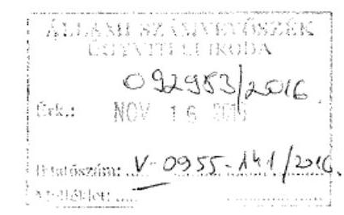

## Tisztelt Elnök Úr!

Mindenekelőtt szeretném megköszönni Önnek és munkatársainak a tatai Kuny Domokos Múzeum elmúlt évi ellenőrzését, mely során rendkívül alapos és komoly feltáró munkát végeztek a Múzeum gazdálkodását és a fenntartói feladatok ellátására vonatkozó jogszabályi előírások betartását illetően.

Ugyanakkor azt is szeretném rögzíteni, hogy - mint minden közfeladatot ellátó megyei hatókörű városi múzeum - a Kuny Domokos Múzeum is 2011. évtől több alkalommal jelentős szervezeti és gazdálkodási átalakuláson ment keresztül.

A tatai Kuny Domokos Múzeum 2013. január 1-től áll Tata város fenntartásában, miután a Komárom-Esztergom Megyei Intézményfenntartó Központtól átadásra került az intézmény. A város számára az intézmény átvétele egy teljesen új feladatot jelentett, melyet kezdetben a többszöri intézményvezetői váltás, illetve - a gazdasági hatékonyság érdekében is - a múzeum irodáinak gyakori költözése nehezített.

A Tatai Közös Önkormányzati Hivatalhoz 2016. október 28-án érkezett a "Megyei
 hatókörű városi múzeumok ellenőrzése - Kuny Domokos Múzeum" című ellenőrzésről készült számvevőszéki jelentéstervezetében szereplő megállapítások több pontjával egyetértek és ezek tekintetében intézkedtem, hogy a Múzeum igazgatója rövid határidővel készítsen ütemtervet a szabálytalanságok megszüntetésére, a hiányosságok pótlására.

Ugyanakkor a jelentéstervezetben szerepelnek olyan észrevételek, mely problémák jelenleg mára már megoldottak, illetve amelyekre az alábbiakban szeretnék reagálni:

## 1. "Intézkedjen a gazdasági vezető jogszabályi előírásnak megfelelő kinevezésére":

Az államháztartásról szóló 2011. évi CXCV. törvény 2015. január 1-jén hatályba lépett 10. § (4a)(4b) bekezdése értelmében azon költségvetési szervek, amelyek átlagos statisztikai állományi létszáma a 100 főt nem éri el, önálló gazdasági szervezetet nem működtethetnek. Tekintettel arra, hogy ez a jogszabályi előírás érintette a Kuny Domokos Múzeumot, 2015. április 1-től ezen intézményünk gazdasági szervezeti feladatait az Önkormányzat által alapított intézménygazdálkodásért felelős költségvetési szerv, az Intézmények Gazdasági Hivatala látja el. Az átszervezésnek köszönhetően ettől az időponttól kezdve gazdasági vezetője a Múzeumnak nincs.

---

# 2. "Intézkedjen a hatékony gazdálkodásra irányuló ellenőrzések elvégzése érdekében": 

A fenti pontban ismertetett átszervezést követően az Intézmények Gazdasági Hivatala a Kuny Domokos Múzeum szabályszerű és hatékony gazdálkodásához szükséges követelményeket érvényesíti, számon kéri és ellenőrzi. Emellett fenntartóként a jövőben az Önkormányzat hivatalán keresztül is nagyobb figyelmet fordítunk a Múzeum gazdálkodásának ellenőrzésére, ezért elrendeltem, hogy belső ellenőrzés keretében évente ellenőrizzük az intézmény szabályszerű gazdálkodását. Itt kívánom megjegyezni, hogy 2015-ben a belső ellenőrzési munkatervünkben szerepelt a Múzeum ellenőrzése, melyre az Állami Számvevőszék vizsgálata miatt végül nem került sor.

## 3. "Intézkedjen a Múzeum kezelésében lévő közérdekű és közérdekből nyilvános adatok, valamint a jogszabályban előírtak szerinti irányítási jogkörök gyakorlásához szükséges, törvényben meghatározott személyes adatok kezelése érdekében":

Az információs önrendelkezési jogról és az információszabadságról szóló 2011. évi CXII. törvény 1. sz. mellékletében szereplő adatok teljes körű közzétételéről és a személyes adatok kezeléséről haladéktalanul intézkedtünk.

## 4. "Intézkedjen a Múzeum stratégiai terve és munkaterve meghatározása és jóváhagyása érdekében":

Tata Város Önkormányzat Képviselő-testülete 2013-ban és 2014-ben is elfogadta a Kuny Domokos Múzeum következő évi munkatervét: 2013-ban a 284/2013 (V. 30.) Tata Kt. határozatával, 2014-ben a 31/2014 (II. 19.) Tata Kt. HÜB határozatával hagyta jóvá a Képviselő-testület, illetve annak Humán és Ügyrendi Bizottsága a Múzeum munkatervét. A döntésről szóló hiteles jegyzőkönyvi kivonatokat az Állami Számvevőszék 2015. novemberi ellenőrzésekor feltöltöttük a Számvevőszék által kért informatikai felületre. A Múzeum 2013. évi munkatervének a közművelődésről szóló 1997. évi CXL. törvényben foglaltak szerinti miniszteri egyetértését a miniszter 2013. július 4-én kelt levelében, a 2014. évi munkatervének jóváhagyását pedig a miniszter 2014. április 15-én kelt levelében kaptuk meg. (A miniszteri levelek szintén feltöltésre kerültek az ellenőrzés időpontjában.)

2015-ben Tata Város Önkormányzata elkészítette a város hosszú távú stratégiáját meghatározó ún. Magyary Terv 2.0. Ez a városfejlesztési dokumentum külön fejezetet szentel a Kuny Domokos Múzeum ingatlanjaira vonatkozó közép- és hosszú távú fejlesztési elképzeléseknek, melyeket évente felülvizsgálunk és aktualizálunk.

## 5. "Intézkedjen a Múzeum szervezeti és működési szabályzata módosításának jóváhagyása érdekében":

Az egyes vagyonnyilatkozat-tételi kötelezettségekről szóló 2007. évi CLII. törvény 4. § a) pontjában előírt vagyonnyilatkozat-tételi kötelezettségre vonatkozó előírást a Kuny Domokos Múzeum Szervezeti és Működési Szabályzatának soron következő módosításába belefoglaljuk.

## 6. Vagyonkezelési szerződés hiánya:

Véleményünk szerint az Önkormányzat és a Múzeum a vagyonkezelési szerződés hiánya miatt nem elmarasztalható, tekintettel arra, hogy Önkormányzatunk már 2012. december 14-én levélben kezdeményezte a vagyonra vonatkozó megállapodás megkötését a Magyar Nemzeti Vagyonkezelő Zrt.-nél, mely szerződést többszöri kérés ellenére sem juttatott el hozzánk a tulajdonos MNV Zrt. Az erre vonatkozó levelezéseket az Állami Számvevőszék ellenőrzésekor feltöltöttük a Számvevőszék által kért elektronikus felületre.

---

7. "Tegyen intézkedéseket a feltárt szabálytalanságok tekintetében a felelősség tisztázása érdekében és szükség szerint intézkedjen a felelősség érvényesítéséről":

A jelentéstervezetben feltárt szabálytalanságok miatt az intézményvezető irányába a szükséges fegyelmi intézkedést megteszem.

A jelentéstervezetben a Kuny Domokos Múzeum igazgatójának jelzett észrevételekre vonatkozóan az intézmény vezetője a következő kiegészítéseket kívánja tenni:
"A szabályszerű pénzügyi gazdálkodás érdekében intézkedjen a Múzeum éves költségvetési beszámolója adatainak a költségvetési évet követő év február 28-ig történő feltöltésére a Kincstár által működtetett elektronikus adatszolgáltató rendszerbe az irányító szervi jóváhagyás érdekében" (2/a. és 3/a pont):

Minden költségvetési évben a fenntartó felé az adatszolgáltatás határidőre megtörtént, majd a fenntartói jóváhagyás után - határidőre - az adatok feltöltése a Kincstár által működtetett elektronikus rendszerbe megtörtént. (A Kincstári rendszerbe történő feltöltésre akkor van lehetőség, mikor a Kincstár ezt a rendszert felnyitja.) 2015. április 1-jét követően az adatszolgáltatást az Intézmények Gazdasági Hivatala látja el.

Tata, 2016. november 11.
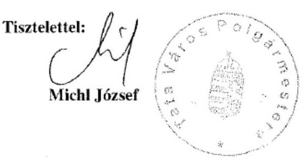

---

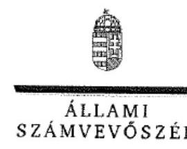

ELNÖK

Ikt.szám: V-0955-139/2016.

Michl József Imre úr
polgármester
Tata Város Önkormányzata

Tata

# Tisztelt Polgármester Úr! 

A ,,Megyei hatókörű városi múzeumok ellenőrzése - Kuny Domokos Múzeum, Tata" címmel készített számvevőszéki jelentéstervezetre tett észrevételét köszönettel megkaptam.
Az Állami Számvevőszék észrevételre vonatkozó álláspontjáról a felügyeleti vezető által készített részletes tájékoztatást csatoltan megküldöm.
Tájékoztatom Polgármester urat, hogy a számvevőszéki jelentésben - az Állami Számvevőszékről szóló 2011. évi LXVI. törvény 29. § (3) bekezdése alapján - a figyelembe nem vett észrevételeket szerepeltetjük az elutasítás indokának feltüntetésével.

Budapest, 2016. 14. hó 13. nap
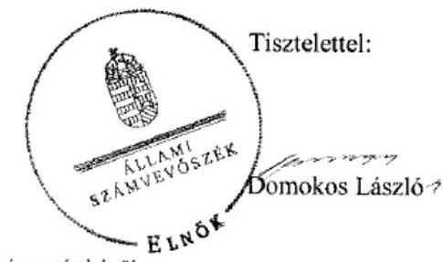

Melléklet: Tájékoztatás az el nem fogadott észrevételekről

---

# Tájékoztatás az el nem fogadott észrevételekről 

A „Megyei hatókörű városi múzeumok ellenőrzése - Kuny Domokos Múzeum, Tata" című jelentéstervezetre tett és 2016. november 11 -én aláírt III/263-1/2016. iktatószámú levelével megküldött észrevételeit áttekintettük, annak kezeléséről az alábbi tájékoztatást adom.

## A jelentéstervezetre tett általános észrevételei kapcsán

Köszönettel vettem tájékoztatását a Kuny Domokos Múzeum (továbbiakban: Múzeum) szervezeti és gazdálkodási átalakításairól, továbbá arról, hogy a jelentéstervezet több pontjával egyetért, és ezek tekintetében már intézkedett is. Észrevétele a jelentéstervezet megállapításait nem módosítja.

1. A jelentéstervezet 32. oldal 1. számú javaslatot alátámasztó - 16. oldal 1. sz. megállapítás 2. bekezdésének 1. - megállapítására tett észrevétele kapcsán

Észrevételében arról tájékoztatott, hogy a Múzeum gazdasági szervezete feladatait 2015. április 1-jétől Tata Város Önkormányzata (továbbiakban: Önkormányzat) által alapított intézménygazdálkodásért felelős költségvetési szerv, az Intézmények Gazdasági Hivatala látja el, így a Múzeumnak gazdasági vezetője nincs. Észrevétele a megállapított hiányosságot nem cáfolja, az az ellenőrzött időszakon túlmutat, ezért a megállapítást nem módosítja.
2. A jelentéstervezet 32. oldal 2. számú javaslatot alátámasztó - 16. oldal 1. sz. megállapítás 3. bekezdés 1. francia bekezdésének - megállapítására tett észrevétele kapcsán

Köszönettel vettem tájékoztatását, hogy a 2015. évi átszervezést követően mind az Intézmények Gazdasági Hivatala, mind pedig az Önkormányzat nagyobb figyelmet fordít a Múzeum gazdálkodásának ellenőrzésére, ezért elrendelte, hogy belső ellenőrzés keretében évente kell ellenőrizni az intézmény szabályszerű gazdálkodását. Észrevétele nem vitatja a jelentéstervezet 1. számú megállapítás 3. bekezdés 1. francia bekezdésének megállapítását - ,,a teljes ellenőrzött időszakban az irányító szerv a Múzeum által ellátandó közfeladatok ellátására vonatkozó, és az erőforrásokkal való szabályszerű és hatékony gazdálkodáshoz szükséges követelmények érvényesítése, számonkérés, ellenőrzése tárgyban nem gyakorolta hatáskörét az Áht. 49. § (5) bekezdés f) pont, illetve az Aht. 9. § (1) bekezdés f) pontjában foglaltak ellenére; " - ezért azt nem módosítja.
3. A jelentéstervezet 32. oldal 3. számú javaslatot alátámasztó - 16. oldal 1. sz. megállapítás 3. bekezdés 3. francia bekezdésének - megállapítására tett észrevétele kapcsán

Köszönettel vettem tájékoztatását, hogy az információs önrendelkezési jogról és az információszabadságról szóló 2011. évi CXII. törvény 1. mellékletében szereplő adatok teljes körű közzétételéről és a személyes adatok kezeléséről haladéktalanul intézkedtek. Észrevétele a jelentéstervezet 1. számú megállapítás 3. bekezdés 3. francia bekezdésének megállapítását - ,,a 2012-2014. években a Múzeum kezelésében lévő közérdekű adatokat és a közérdekből nyilvános adatokat, valamint az Aht. 9. § (1) bekezdés b), c) és f)-i) pont szerinti irányítási jogkörök gyakorlásához szükséges, törvényben meghatározott személyes adatokat nem kezelte az irányító szerv az Aht. 9. § (1) bekezdés j) pontjában előírtak ellenére;" - nem cáfolja, ezért azt nem módosítja.

---

# 4. A jelentéstervezet 32. oldal 4. számú javaslatot alátámasztó - 16. oldal 1. sz. megállapítás 3. bekezdés 4. francia bekezdésének - megállapítására tett észrevétele kapcsán 

Észrevételében arról tájékoztatott, hogy az Önkormányzat Képviselő-testülete 2013-ban és 2014-ben is elfogadta Múzeum következő évi munkatervét. 2013-ban a 284/2013 (V. 30.) Tata Kt. határozatával, 2014-ben a 31/2014 (II. 19.) Tata Kt. HÜB határozatával hagyta jóvá a Képviselő-testület, illetve annak Humán és Ügyrendi Bizottsága a Múzeum munkatervét. A döntésről szóló hiteles jegyzőkönyvi kivonatokat az Állami Számvevőszék (továbbiakban: ÁSZ) 2015. novemberi ellenőrzésekor feltöltötték az ÁSZ által kért informatikai felületre. A Múzeum 2013. évi munkatervének a közművelődésről szóló 1997. évi CXL. törvényben foglaltak szerinti miniszteri egyetértését a miniszter 2013. július 4-én kelt levelében, a 2014. évi munkatervének jóváhagyását pedig a miniszter 2014. április 15-én kelt levelében kapták meg, amelyek szintén feltöltésre kerültek a hivatkozott informatikai felületre.
Észrevételét a jelentéstervezet 1. számú megállapítás 3. bekezdés 4. francia bekezdésének megállapítása - „a 2013-2014. években a fenntartó az Mtv. 50. § (2) bekezdés a) pontjában foglaltak ellenére nem határozta meg a Múzeum stratégiai tervét, munkatervét." - kapcsán nem fogadom el. A dokumentumok ismételt felülvizsgálatát követően a megállapítás megalapozott, mert a hivatkozott, a munkaterveket elfogadó határozatokról szóló hiteles jegyzőkönyvi kivonatokat a számvevőszéki ellenőrzés részére nem adták át, a hivatkozott informatikai felületre nem került feltöltésre, továbbá a 2015. november 12-én aláírt teljességi és hitelességi nyilatkozatuk sem tartalmazza átadott dokumentumként a hivatkozott jegyzőkönyvi kivonatokat.
Észrevételében arról tájékoztatott továbbá, hogy 2015-ben az Önkormányzat elkészítette a város hosszú távú stratégiáját meghatározó ún. Magyary Terv 2.0.-át, és a hivatkozott dokumentum külön fejezetet szentel a Múzeum ingatlanjaira vonatkozó közép- és hosszú távú fejlesztési elképzeléseknek, amelyeket évente felülvizsgálnak és aktualizálják. Észrevétele nem cáfolja, hogy a Múzeum stratégiai tervét nem határozták meg, az az ellenőrzött időszakon túlmutat.
Észrevétele - fenti válaszaim alapján - a megállapítást nem módosítja.
5. A jelentéstervezet 32. oldal 4. számú javaslatot alátámasztó - 16. oldal 3.1. sz. megállapítás 2. bekezdésének 2. - megállapítására tett észrevétele kapcsán
Köszönettel vettem tájékoztatását, hogy az egyes vagyonnyilatkozat-tételi kötelezettségekről szóló 2007. évi CLII. törvény 4. § a) pontjában előírt vagyonnyilatkozat-tételi kötelezettségre vonatkozó előírást a Múzeum Szervezeti és Működési Szabályzatának soron következő módosításába belefoglalják. Észrevétele a jelentéstervezet 3.1. sz. megállapítás 2. bekezdésének 2. megállapítását - „A 2011-2014. években a vagyonnyilatkozat-tételi kötelezettséget a Vnyiv. 4. § a) pontjában foglaltak ellenére az $SZMSZ_{3.2.3.s}$-ben nem tüntették fel." - nem vitatja, az ellenőrzött időszakon túlmutat, ezért a megállapítás nem módosítja.

## 6. A jelentéstervezet 28. oldal 5.1. számú megállapítás 3. bekezdésének 2. megállapítására tett észrevétele kapcsán

Észrevételében arról tájékoztatott, hogy az Önkormányzat és a

 Múzeum a vagyonkezelési szerződés hiánya miatt nem elmarasztalható, tekintettel arra, hogy az Önkormányzat már 2012. december 14-én levélben kezdeményezte a vagyonra vonatkozó megállapodás megkötését a Magyar Nemzeti Vagyonkezelő Zrt.-nél (továbbiakban: MNV Zrt.). Az MNV Zrt. a szerződést többszöri

---

kérés ellenére sem juttatta el az Önkormányzathoz, továbbá az erre vonatkozó levelezéseket az ÁSZ által kért elektronikus felületre feltöltötték. A jelentéstervezet 28. oldal 5.1. számú megállapítás 3. bekezdésének 2. megállapítását - „A 2013-2014. években a Múzeum nem rendelkezett vagyonkezelői szerződéssel, ezzel az Nviv. 11. § (1) és (7) bekezdésének és a Vtvr. 8. § (6) bekezdésének előírása nem érvényesült." - észrevétele nem cáfolja, ezért azt nem módosítja.

# 7. A jelentéstervezet 33. oldal 4. számú javaslatot alátámasztó megállapításokra tett észrevétele kapcsán 

Köszönettel vettem tájékoztatását, hogy a feltárt szabálytalanságok miatt a szükséges fegyelmi intézkedést megteszik. Észrevétele a megállapításokat nem cáfolja, ezért azokat nem módosítja.
A Múzeum igazgatójának kiegészítése - a jelentéstervezet 35. oldal 2. a) számú javaslatot alátámasztó megállapítások - alapján tett észrevétele kapcsán
Észrevételében jelezte, hogy minden költségvetési évben az adatszolgáltatás a fenntartó felé határidőre megtörtént, majd a fenntartói jóváhagyás után - határidőre - az adatokat a Magyar Államkincstár (továbbiakban: Kincstár) által működtetett elektronikus rendszerbe feltöltötték. 2015. április 1-jét követően az adatszolgáltatást az Intézmények Gazdasági Hivatala látja el.

Észrevételét a dokumentumok ismételt felülvizsgálatát követően nem fogadtuk el, mert a jelentéstervezet 24. oldal 4.1. számú megállapítás 4. bekezdésének 3. megállapítása - „A Múzeum az előírt adatszolgáltatási kötelezettségét a maradványáról az éves beszámoló megküldésével egyidejűleg, a 2012-2014. évekre vonatkozóan az Ahsz. 10. § (1) bekezdésben, illetve az Ahsz. 32. §(1) bekezdésben rögzített határidőn túl teljesítette." -, valamint a 25. oldal 4.2. számú megállapítás 1-2. megállapítása - „A beszámolók irányítószerv részére történő elkészítése és megküldése az Ahsz. 10. § (1) bekezdése, illetve az Ahsz. 32. § (1) bekezdése szerinti - költségvetési évet követő év február 28. - határidőre nem történt meg. A 2012. évi beszámolót 2013. március 18-án, a 2013. évi beszámolót 2014. március 10-én, a 2014. évi beszámolót 2015. március 30-án készítették el." - megalapozott.
A felülvizsgált dokumentumok alapján a Kincstár által működtetett elektronikus rendszerbe a 2012. évi beszámoló feltöltésére 2013. március 11-én, a 2013. évi beszámoló feltöltésére 2014. március 5-én, valamint a 2014. évi beszámoló feltöltésére 2015. március 3-án került sor. A beszámolók irányító szerv részére történő elkészítése, aláírása a 2012. évi beszámolónál 2013. március 18-án, a 2013. évi beszámolónál 2014. március 10-én, a 2014. évi beszámolónál 2015. március 30-án történt.
Észrevétele - fenti válaszaim alapján - a megállapítást nem módosítja.

Budapest, 2016.
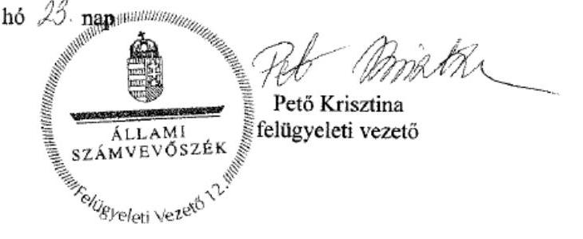

---

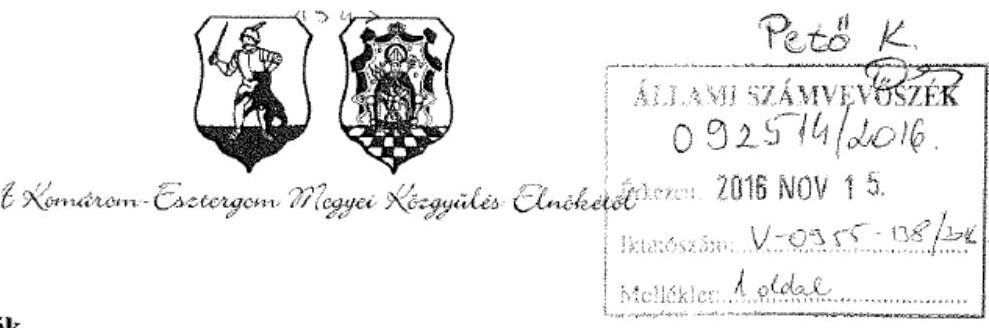

Állami Számvevőszék

Budapest.
Apáczai Csere János u. 10.
1052

Domokos László Elnök Úr
részére

Tárgy: észrevételek megküldése

Hivatkozás: V-0955-127/2016. ikt. sz.

Tisztelt Elnök Úr!

A Komárom-Esztergom Megyei Önkormányzati Hivatalhoz 2016. október 28-án érkezett a „Megyei hatókörű városi múzeumok ellenőrzése - Kuny Domokos Múzeum” című ellenőrzésről készült számvevőszéki jelentéstervezetében szereplő megállapításokkal kapcsolatban a következő észrevételeket teszem:

Mindenekelőtt szeretném megköszönni Önnek és munkatársainak a tatai Kuny Domokos Múzeum ellenőrzését, melynek során alapos vizsgálat eredményeként megszületett értékes javaslatokkal segítik elő a Múzeum hatékony és szabályszerű működését.

A Kuny Domokos Múzeum 2011. december 31-ig állt a Komárom-Esztergom Megyei Önkormányzat fenntartásában, így észrevételeinket csak az eddig terjedő időszak vonatkozásában tesszük meg.

I. Az irányítószerv hatáskörgyakorlásával kapcsolatban

A jelentéstervezet 1. pontjának indokolása során rögzíti, hogy a teljes ellenőrzött időszakban az irányító szerv 1,2,3 nem gyakorolta hatáskörét a hatékony gazdálkodáshoz szükséges követelmények érvényesítése, számonkérése, ellenőrzése tárgyában.

A jelentéstervezet szövege alapján – további indokok megjelölésének hiányában - nem egyértelmű, hogy az ÁSZ mire alapozza ezt a megállapítást a Megyei Önkormányzat vonatkozásában. Önkormányzatunk nehéz anyagi helyzete folytán folyamatosan vizsgálta a működés és gazdálkodás hatékonyságát, sok esetben kemény konfliktusokat is felvállalva. Ezt példázza, hogy a 2011. évben a Komárom-Esztergom Megyei Közgyűlés épp a hatékony és takarékos működtetés jegyében döntött arról, hogy a megyei múzeumok, így a Kuny Domokos Múzeum is a 2011-2012. év fűtési időszakában is szünetelteti nyitva tartását, valamint a költségek további csökkentése érdekében határozott a tatai telephelynek a Megyeháza épületébe történő ideiglenes átköltöztetéséről (Id. a 190/2011. (IX. 29.) számú közgyűlési határozat 2. és 3. pontját. Az erről szóló határozati kivonatot mellékeljük).

Komárom-Esztergom Megyei Önkormányzat
2800 Tatabánya, Fő tér 4. Sz.: 04/201-101. Fax: 04/201-490. E-mail: elnok@kmu.h.hu

51

---

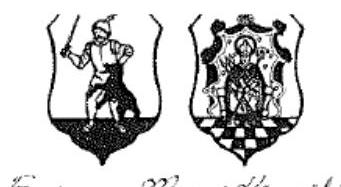

A Komárom-Esztergom Megyei Közgyűlés Elnökének

Továbbá előadjuk, hogy a közgyűlés időszakonként beszámoltatta a Múzeumot tevékenységéről, a 2011. évben a beszámoló tárgya a Komárom-Esztergom Megyei Önkormányzat Múzeumainak Igazgatósága közművelődési szakmai tanácsadási és szolgáltatási feladatok ellátása volt. A beszámoló megtárgyalására a Közgyűlés 2011. november 24-i ülésén került sor.

A leírtakra tekintettel, kérjük a jelentés szövegének módosítását a 2011. év, illetve a Komárom-Esztergom Megyei Önkormányzat vonatkozásában.

# II. A vagyonátadással kapcsolatban 

Az Összegzés és a 2.1. megállapítás alatt is tartalmazza a jelentés tervezet, hogy jegyzőkönyvet az átadás-átvételről és a vagyon tényleges átadásáról a 258/2011 Korm.rendelet 12.§ (3) bekezdését figyelmen kívül hagyva a Fenntartó1 és Fenntartó 2 nem készített, a vagyon tényleges átadása nem történt meg.

Hangsúlyozzuk, hogy készült átadás-átvételi megállapodás, mely a jelentés tervezet szerint is a 258/2011. (XII.7.) Korm. rendeletnek megfelelően került összeállításra. A megállapodás melléklete tartalmaz vagyonkimutatást.

Minderre tekintettel álláspontunk szerint azt megállapítani, hogy a vagyon tényleges átadása nem történt meg, nem helytálló; legfeljebb azt tartjuk megállapíthatónak, hogy a vagyonátadás dokumentálása hiányos volt.

## III.Egyéb megjegyzések

A Komárom-Esztergom Megyei Önkormányzat több közgyűlésén is foglalkozott a megyei önkormányzatok konszolidációjáról, a megyei önkormányzati intézmények és a Fővárosi Önkormányzat egyes egészségügyi intézményeinek átvételéről szóló 2011. évi CLIV. törvény végrehajtásának kérdéseivel, a törvényben foglaltaknak igyekezett megfelelni, azonban az átadásra kerülő vagyontömeg nagysága és komplexitása, valamint az átadás-átvételre nyitva álló rövid határidők komoly kihívás elé állították a lebonyolítást végző apparátust.

Kérem, hogy a végleges ellenőrzési jelentés elkészítésénél a fentieket szíveskedjenek figyelembe venni.

Tatabánya, 2016. november 11.
Tisztelettel:
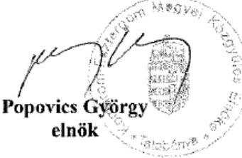

---

# KIVONAT   a Komárom-Esztergom Megyei Közgyűlés 2011. szeptember 29-i ülésének jegyzőkönyvéből 

## 190/2011. (IX. 29.) számú közgyűlési határozat

A Komárom-Esztergom Megyei Közgyűlés

1. Megállapítja, hogy a fenntartásában működő múzeumok nyitvatartási rendjét, a belépőjegyek és a látogatáshoz kapcsolódó egyéb dijköteles szolgáltatások árát a Komárom-Esztergom Megyei Önkormányzat Múzeumainak Igazgatósága Szervezeti és Működési Szabályzatában kell megállapítani, melynek jóváhagyására átruházott hatáskörben a Komárom-Esztergom Megyei Közgyűlés elnöke jogosult a Komárom-Esztergom Megyei Önkormányzat hatályos Szervezeti és Működési Szabályzatának 8. számú melléklete alapján.

Határidő: 2011. október 31.
Felelős: Popovics György, a közgyűlés elnöke,
Dr. Fülöp Éva Mária intézményvezető
2. Tudomásul veszi, hogy a Komárom-Esztergom Megyei Múzeumok Igazgatóságának négy telephelye, a Kuny Domokos Megyei Múzeum, a Német Nemzetiségi Múzeum és a Görög-Római Szobormásolatok kiállítóhely, valamint a Klapka György Múzeum három közérdekű muzeális kiállítóhelye - Czibor Zoltán emlékszoba, Dr. Juba Ferenc Tengerészeti kiállítás és a Római kori kőtár, lapidárium - a 2011-2012. év fűtési időszakában is szünetelteti nyitva tartását.
3. Tudomásul veszi továbbá, hogy a Komárom-Esztergom Megyei Múzeumok Igazgatósága tatai telephelyein dolgozók a 2. pont szerinti nyitva tartás szüneteltetésének időtartamára átköltöztetésre kerülnek alapvetően a Komárom-Esztergom Megyei Önkormányzat székház épületébe (Tatabánya, Fő tér 4.).

Határidő: a téli fűtési szezon kezdete
Felelős: az átköltözésért: Popovics György, a közgyűlés elnöke,
Dr. Fülöp Éva Mária intézményvezető
4. Hatályon kívül helyezi a kedvezményes múzeumi belépési lehetőséget biztosító 71/2008. (IV. 24.) számú közgyűlési határozatot, valamint a 136/2009 (V. 28.) számú, a Komárom-Esztergom Megyei Önkormányzat Múzeumainak Igazgatósága tagintézményeinek nyitvatartási rendjáról, a belépőjegyek és a látogatáshoz kapcsolódó egyéb dijköteles szolgáltatásainak áráról, a nyitva tartáshoz szükséges létszámról szóló közgyűlési határozatot 2011. november 1-jétől.

Határidő: 2011. november 1.
Felelős: Popovics György, a közgyűlés elnöke
Hivatali végrehajtásért felelős: Dr. Imre Eszter szociális és közművelődési referens
Tatabánya, 2016. november 11.
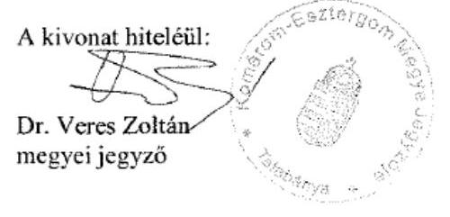

---

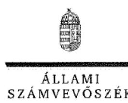

# ELNÖK 

## Popovics György úr

elnök
Komárom-Esztergom Megyei Önkormányzat

## Tatabánya

## Tisztelt Elnök Úr!

A „Megyei hatókörű városi múzeumok ellenőrzése - Kuny Domokos Múzeum, Tata" címmel készített számvevőszéki jelentéstervezetre tett észrevételét köszönettel megkaptam.
Az Állami Számvevőszék észrevételre vonatkozó álláspontjáról a felügyeleti vezető által készített részletes tájékoztatást csatoltan megküldöm.
Tájékoztatom Elnök urat, hogy a számvevőszéki jelentésben - az Állami Számvevőszékről szóló 2011. évi LXVI. törvény 29. § (3) bekezdése alapján - a figyelembe nem vett észrevételeket szerepeltetjük az elutasítás indokának feltüntetésével.

Budapest, 2016. november 23.
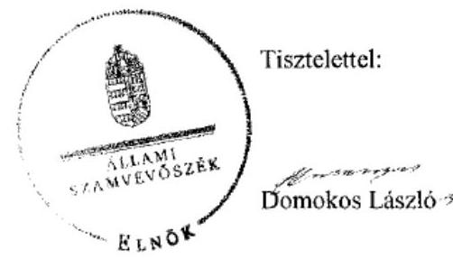

Melléklet: Tájékoztatás az el nem fogadott észrevételekről

---

# Tájékoztatás az el nem fogadott észrevételekről 

A „Megyei hatókörű városi múzeumok ellenőrzése - Kuny Domokos Múzeum, Tata" című jelentéstervezetre tett és 2016. november 11-én aláírt levelével megküldött észrevételeit áttekintettük, annak kezeléséről az alábbi tájékoztatást adom.

## I. Jelentéstervezet 16. oldal 1. sz. megállapítás 3. bekezdés 1. francia bekezdésének megállapítására tett észrevétele kapcsán

Észrevételét a jelentéstervezet 16. oldal 1. sz. megállapítás 3. bekezdés 1. francia bekezdésének megállapítására - „a teljes ellenőrzött időszakban az irányító szerv 1,2,3 a Múzeum által ellátandó közfeladatok ellátására vonatkozó, és az erőforrásokkal való szabályszerű és hatékony gazdálkodáshoz szükséges követelmények érvényesítése, számonkérés, ellenőrzése tárgyban nem gyakorolta hatáskörét az Áht. 149. § (5) bekezdés f) pont, illetve az Áht. 29. § (1) bekezdés f) pontjában foglaltak ellenére;" - nem fogadtuk el. Az észrevételében jelzettek - hogy a 2011. évben a Komárom-Esztergom Megyei Közgyűlés döntése értelmében a Kuny Domokos Múzeum a 2011-2012. év fűtési időszakában szünetelteti nyitva tartását, valamint a költségek további csökkentése érdekében a tatai telephelyet ideiglenesen a Megyeháza épületébe költöztetik, továbbá a Közgyűlés időszakonként beszámoltatta a Múzeumot a tevékenységéről -, önmagukban nem jelentik a Kuny Domokos Múzeum által ellátandó közfeladatok ellátására vonatkozó, és az erőforrásokkal való szabályszerű és hatékony gazdálkodáshoz szükséges követelmények érvényesítését, számonkérését, ellenőrzését. Észrevétele ezért a megállapítást nem módosítja.
II. Jelentéstervezet 6. oldal második bekezdés 2. megállapítására, valamint a 17. oldal 2.1. számú megállapítás 2. bekezdésének 5. megállapítására tett észrevétele kapcsán

Észrevételében arról tájékoztat, hogy készült átadás-átvételi megállapodás, mely a jelentéstervezet szerint is a megyei intézményfenntartó központokról, valamint a megyei önkormányzatok konszolidációjával, a megyei önkormányzati intézmények és a Fővárosi Önkormányzat egészségügyi intézményeinek átvételével összefüggő egyes kormányrendeletek módosításáról szóló 258/2011. (XII. 7.) Korm. rendeletnek (továbbiakban: 258/2011. (XII. 7.) Korm. rendelet) megfelelően került összeállításra, továbbá a megállapodás melléklete tartalmaz vagyonkimutatást. Álláspontja szerint azt megállapítani, hogy a vagyon tényleges átadása nem történt meg, nem helytálló; legfeljebb azt tartja megállapíthatónak, hogy a vagyonátadás dokumentálása hiányos volt.
A 258/2011. (XII. 7.) Korm. rendelet 12. § (3) bekezdése rendelkezik arról, hogy a „megállapodás alapján a vagyon tényleges átadása jegyzőkönyv felvételével történik, melyre a megállapodás megkötését követő egy héten belül, de legkorábban 2012. január 1-jén kerül sor".
Észrevételében nem cáfolja, hogy jegyzőkönyvet nem készítettek, ezért nem módosítja a jelentéstervezet
 6. oldal második bekezdés 2. - „A 2011/2012. évi átszervezés során nem készült jegyzőkönyv az átadás-átvételről és a vagyon tényleges átadásáról, ezért a vagyon tényleges átadása nem történt meg." - megállapítását, valamint a 17. oldal 2.1. számú megállapítás 2. bekezdésének 5. - „Jegyzőkönyvet az átadás-átvételről és a vagyon tényleges átadásáról - a

---

258/2011. (XII.7.) Korm. rendelet 12. § (3) bekezdésében szereplő előírást figyelmen kívül hagyva - a fenntartó; és a fenntartó; nem készített, a vagyon tényleges átadása nem történt meg." - megállapítását.

# III. Egyéb megjegyzésként tett észrevétele kapcsán 

Észrevételében arról tájékoztatott, hogy a Komárom-Esztergom Megyei Önkormányzat több közgyűlésén is foglalkozott a megyei önkormányzatok konszolidációjáról, a megyei önkormányzati intézmények és a Fővárosi Önkormányzat egyes egészségügyi intézményeinek átvételéről szóló 2011. évi CLIV. törvény végrehajtásának kérdéseivel, a törvényben foglaltaknak igyekezett megfelelni, azonban az átadásra kerülő vagyontömeg nagysága és komplexitása, valamint az átadás-átvételre nyitva álló rövid határidők komoly kihívás elé állították a lebonyolítást végző apparátust. Észrevétele a megállapításokat nem vitatja, így azokat nem cáfolja.

Budapest, 2016.
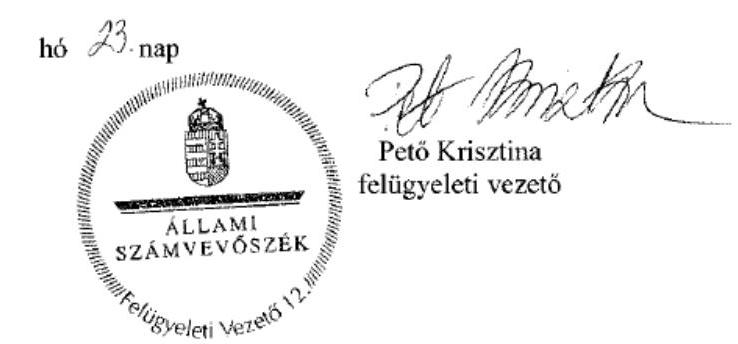

---

# RÖVIDÍTÉSEK JEGYZÉKE 

${ }^{1}$ Múzeum
${ }^{2}$ ÁSZ
${ }^{3}$ Mtv.
${ }^{4}$ Kötv.
${ }^{5}$ Kjt.
${ }^{6}$ múzeumigazgató
${ }^{7}$ Möktv.
${ }^{8}$ 258/2011. (XII. 7.) Korm. rendelet
${ }^{9}$ 2012. évi CLII. tv.
${ }^{10}$ 1311/2012. (VIII.23.) Korm. határozat
${ }^{11}$ KIM
${ }^{12}$ 2015. évi LXXV. tv.
${ }^{13}$ Nvtv.
${ }^{14}$ Alaptörvény
${ }^{15}$ Áht. 2
${ }^{16}$ Ávr.
${ }^{17}$ KEMÖ
${ }^{18}$ KEMIK
${ }^{19}$ ÁSZ tv.
${ }^{20}$ irányító szerv: irányító szerv: irányító szerv ${ }_{3}$
${ }^{21}$ alapító okirat:
alapító okirat: ${ }_{2}$

Kuny Domokos Múzeum
Állami Számvevőszék
1997. évi CXL. törvény a muzeális intézményekről, a nyilvános könyvtári ellátásról és a közművelődésről (hatályos: 1998. január 1-jétől)
2001. évi LXIV. törvény a kulturális örökség védelméről (hatályos: 2001. július 10-től)
1992. évi XXXIII. törvény a közalkalmazottak jogállásáról (hatályos: 1992. július 1-jétől)
Kuny Domokos Múzeum (valamint jogelődje a Komárom-Esztergom Megyei Múzeumok Igazgatósága) igazgatója
2011. évi CLIV. törvény a megyei önkormányzatok konszolidációjáról, a megyei önkormányzati intézmények és a Fővárosi Önkormányzat egyes egészségügyi intézményeinek átvételéről (hatályos: 2012. január 1-jétől)
258/2011. (XII. 7.) Korm. rendelet a megyei intézményfenntartó központokról, valamint a megyei önkormányzatok konszolidációjával, a megyei önkormányzati intézmények és a Fővárosi Önkormányzat egészségügyi intézményeinek átvételével összefüggő egyes kormányrendeletek módosításáról (hatályos: 2011. december 8-tól)
2012. évi CLII. törvény a muzeális intézményekről, a nyilvános könyvtári ellátásról és a közművelődésről szóló 1997. évi CXL. törvény módosításáról (hatályos: 2012. november 3-tól)
1311/2012. (VIII. 23.) Korm. határozat a megyei múzeumok, könyvtárak és közművelődési intézmények fenntartásáról (hatályos: 2012. augusztus 24-től)
Közigazgatási és Igazságügyi Minisztérium
a megyei könyvtárak és a megyei hatókörű városi múzeumok feladatának ellátását szolgáló egyes állami tulajdonú vagyontárgyak ingyenes önkormányzati tulajdonba adásáról szóló 2015. évi LXXV. törvény (hatályos 2015. július 18-tól)
2011. évi CXCVI. törvény a nemzeti vagyonról (hatályos 2011. december 31-étől)
Magyarország Alaptörvénye
2011. évi CXCV. törvény az államháztartásról (hatályos: 2012. január 1-jétől)
368/2011. (XII. 31.) Korm. rendelet az államháztartásról szóló törvény végrehajtásáról (hatályos: 2012. január 1-jétől)
Komárom-Esztergom Megyei Önkormányzat
Komárom-Esztergom Megyei Intézményfenntartó Központ
2011. évi LXVI. törvény az Állami Számvevőszékről (hatályos: 2011. július 1-jétől)
Komárom-Esztergom Megyei Önkormányzat Közgyűlése
Közigazgatási és Igazságügyi Minisztérium az illetékes kormányhivatal útján
Tata Város Önkormányzat Közgyűlése
Komárom-Esztergom Megyei Önkormányzat Múzeumainak Igazgatósága alapító okirat (hatályos: 2010. július 1-jétől 2011. december 31-ig)
Komárom-Esztergom Megyei Múzeumok Igazgatósága alapító okirata (hatályos: 2012. január 1-jétől 2012. december 31-ig)

---

alapító okirat3
${ }^{22}$ SZMSZ ${ }_{1}$

SZMSZ ${ }_{2}$
SZMSZ ${ }_{3}$
SZMSZ ${ }_{4}$
${ }^{23}$ 258/2011. Korm. rendelet
${ }^{24}$ fenntartó ${ }_{1}$
fenntartó ${ }_{2}$
fenntartó ${ }_{3}$
${ }^{25}$ átadás-átvételi megállapodás ${ }_{1}$
${ }^{26}$ MNV Zrt.
${ }^{27}$ NFA
${ }^{28}$ vagyonátadási jelentés
${ }^{29}$ átadás-átvételi megállapodás ${ }_{2}$
${ }^{30}$ tagintézmény
${ }^{31}$ Áht. ${ }_{1}$
${ }^{32}$ Vnytv.
${ }^{33}$ Ámr.
${ }^{34}$ Bkr.
${ }^{35}$ Számv. tv.
${ }^{36}$ számviteli politika ${ }_{1}$
számviteli politika ${ }_{2}$
számviteli politika ${ }_{3}$
${ }^{37}$ Áhsz. 1

Kuny Domokos Múzeum alapító okirata (hatályos: 2013. január 1-jétől)
Szervezeti és Működési Szabályzat (hatályos: 2011. február 23-tól 2012. szeptember 16-ig)
Szervezeti és Működési Szabályzat (hatályos: 2012. szeptember 17-től 2013. május 31-ig)
Szervezeti és Működési Szabályzat (hatályos: 2013. június 1-jétől 2013. október 31-ig)
Szervezeti és Működési Szabályzat (hatályos: 2013. november 1-jétől)
258/2011. (XII. 7.) Korm. rendelet a megyei intézményfenntartó központokról, valamint a megyei önkormányzatok konszolidációjával, a megyei önkormányzati intézmények és a Fővárosi Önkormányzat egészségügyi intézményeinek átvételével összefüggő egyes kormányrendeletek módosításáról (hatályos: 2011. december 8-tól)
Komárom-Esztergom Megyei Önkormányzat
Komárom-Esztergom Megyei Intézményfenntartó Központ
Tata Város Önkormányzata
Komárom-Esztergom Megyei Önkormányzat, Komárom-Esztergom Megyei Kormánymegbízott, Magyar Nemzeti Vagyonkezelő Zrt. és Nemzeti Földalapkezelő Szervezet által 2011. decemberében aláírt átadás-átvételi megállapodás
Magyar Nemzeti Vagyonkezelő Zrt.
Nemzeti Földalapkezelő Szervezet
Az átszervezéssel, illetve jogutód nélkül véglegesen megszűnő államháztartási szervezet által - a megszüntető szervezet által meghatározott fordulónapra vonatkozóan - elkészített az éves elemi költségvetési beszámolónak megfelelő adattartalmú - leltárral és záró főkönyvi kivonattal alátámasztott - beszámoló (Áhsz. 1 13/A. § (1). bekezdés).
Komárom-Esztergom Megyei Intézményfenntartó Központ, Tata Város Önkormányzata által 2012. december 13-án aláírt átadás-átvételi megállapodás
a Klapka György Múzeum Komáromban, illetve a Jászai Mari Emlékház Ászár községben
1992. évi XXXVIII. törvény az államháztartásról (hatályos: 2011. december 31-ig)
2007. évi CLII. törvény az egyes vagyonnyilatkozat-tételi kötelezettségekről (hatályos: 2007. december 7-től)
292/2009. (XII. 19.) Korm. rendelet az államháztartás működési rendjéről (hatályos: 2011. december 31-ig)
370/2011. (XII. 31.) Korm. rendelet a költségvetési szervek belső kontrollrendszeréről és belső ellenőrzésről (hatályos: 2012. január 1-jétől)
2000. évi C. törvény a számvitelről (hatályos: 2001. január 1-jétől)

Komárom-Esztergom Megyei Múzeumok Igazgatósága Számviteli Politikája (hatályos: 2013. július 31-ig)
Kuny Domokos Múzeum Számviteli Politikája (hatályos: 2013. augusztus 1-jétől 2013. december 31-ig)
számviteli politika (hatályos: 2014. január 1-jétől)
249/2000. (XII. 24.) Korm. rendelet az államháztartás szervezetei beszámolási és könyvvezetési kötelezettségének sajátosságairól (hatályos: 2013. december 31-ig)

---

${ }^{38}$ számlarend: számlarend: ${ }^{39}$ leltározási és leltárkészítési szabályzat: leltározási és leltárkészítési szabályzat: ${ }^{40}$ eszközök és források értékelési szabályzata: eszközök és források értékelési szabályzata: eszközök és források értékelési szabályzata: ${ }^{41}$ önköltség-számítási szabályzat: önköltség-számítási szabályzat: önköltség-számítási szabályzat: ${ }^{42} \mathrm{Kbt}$. ${ }^{43} \mathrm{Kbt} .2$
${ }^{44}$ pénzkezelési szabályzat: pénzkezelési szabályzat: pénzkezelési szabályzat: pénzkezelési szabályzat: ${ }^{45}$ szabálytalanságkezelési eljárásrend: ${ }^{46}$ gazdálkodási szabályzat: gazdálkodási szabályzat: gazdálkodási szabályzat: ${ }^{47}$ lkr.
${ }^{48}$ Avtv.
${ }^{49}$ Info tv.
${ }^{50}$ iratkezelési szabályzat: iratkezelési szabályzat:

Komárom-Esztergom Megyei Múzeumok Igazgatósága Számlarendje (hatályos: 2008. január 1-jétől 2013. december 31-ig)
Kuny Domokos Múzeum Számlarend (hatályos: 2014. január 1-jétől)
Komárom-Esztergom Megyei Múzeumok Igazgatósága Leltározási és Leltárkészítési Szabályzata (hatályos: 2013. július 31-ig)
Kuny Domokos Múzeum Leltározási és Leltárkészítési Szabályzata (hatályos: 2013. augusztus 1-jétől)

Komárom-Esztergom Megyei Múzeumok Igazgatósága Eszközök és források értékelési szabályzata (hatályos: 2013. július 31-ig)
Kuny Domokos Múzeum Eszközök és Források Értékelési Szabályzata (hatályos: 2013. augusztus 1-jétől 2013. december 31-ig)
Kuny Domokos Múzeum Eszközök és Források Értékelési Szabályzata (hatályos: 2014. január 1-jétől)
Komárom-Esztergom Megyei Múzeumok Igazgatósága Önköltségszámítási Szabályzata (hatályos: 2013. július 31-ig)
Kuny Domokos Múzeum Önköltségszámítási Szabályzata (hatályos: 2013. augusztus 1-jétől 2013. december 31-ig)
Kuny Domokos Múzeum Önköltségszámítási Szabályzata (hatályos: 2014. január 1-jétől)
2003. évi CXXIX. törvény a közbeszerzésekről (hatályos: 2011. december 31-ig)
2011. évi CVIII. törvény a közbeszerzésekről (hatályos: 2011. augusztus 21-től)
Komárom-Esztergom Megyei Múzeumok Igazgatósága Pénz- és Értékkezelési Szabályzata (hatályos: 2012. december 31-ig)
Kuny Domokos Múzeum Pénz- és Értékkezelési Szabályzata (hatályos: 2013. január 1-jétől 2014. március 31-ig)
Kuny Domokos Múzeum Pénzkezelés Szabályzat (hatályos: 2014. április 1-jétől)
Komárom-Esztergom Megyei Múzeumok Igazgatósága Szabálytalanságok Kezelésének Szabályzata (hatályos: 2013. július 31-ig)
Kuny Domokos Múzeum Szabálytalanságok Kezelésének Szabályzata (hatályos: 2013. augusztus 1-jétől)
Komárom-Esztergom Megyei Múzeumok Igazgatósága Gazdálkodási Szabályzata (hatályos: 2013. július 31-ig)
Kuny Domokos Múzeum Gazdálkodási Szabályzata (hatályos: 2013. augusztus 1-jétől 2013. december 31-ig)
Kuny Domokos Múzeum Gazdálkodási Szabályzata (hatályos: 2014. január 1-jétől)
335/2005. (XII. 29.) Korm. rendelet a közfeladatot ellátó szervek iratkezelésének általános követelményeiről (hatályos: 2006. január 1-jétől)
1992. évi LXIII. törvény a személyes adatok védelméről és a közérdekű adatok nyilvánosságáról (hatályos: 2011. december 31-ig)
2011. évi CXII. törvény az információs önrendelkezési jogról és az információszabadságról (hatályos: 2011. július 27-től)
Komárom-Esztergom Megyei Múzeumok Igazgatósága Iratkezelési Szabályzata (hatályos: 2012. december 31-ig)
Kuny Domokos Múzeum Iratkezelési Szabályzata (hatályos: 2013. január 1-jétől)

---

${ }^{51}$ Ltv.
${ }^{52}$ Eitv.
${ }^{53}$ Ber.
${ }^{54}$ éves költségvetési beszámoló
${ }^{55}$ Áfa tv.
${ }^{56}$ Vtv.
${ }^{57}$ 393/2012. (XII. 20.) Korm. rendelet
${ }^{58}$ 5/2010. (VIII. 18.) NEFMI rendelet
${ }^{59}$ Vtvr.
${ }^{60}$ 20/2002. (X. 4.) NKÖM rendelet
${ }^{61}$ 36/2013. (IX. 13.) Korm. rendelet
${ }^{62}$ 29/2014. (IV. 10.) EMMI rendelet
${ }^{63}$ 2/2010. (I. 14.) OKM rendelet
1995. évi LXVI. törvény a közokiratokról, a közlevéltárakról és a magánlevéltári anyag védelméről (hatályos: 1996. január 1-jétől)
2005. évi XC. törvény az elektronikus információszabadságról (hatályos: 2011. december 31-ig)
193/2003. (XI. 26.) Korm. rendelet a költségvetési szervek belső ellenőrzéséről (hatályos: 2011. december 31-ig)
elemi költségvetési beszámoló
2007. évi CXXVII. törvény az általános forgalmi adóról (hatályos: 2008. január 1-jétől)
2007. évi CVI. törvény az állami vagyonról (hatályos: 2007. szeptember 25-től)
393/2012. (XII. 20.) Korm. rendelet a régészeti örökség és a műemléki érték védelmével kapcsolatos szabályokról (hatályos: 2013. január 1-jétől)
5/2010. (VIII. 18.) NEFMI rendelet a régészeti lelőhelyek feltárásának, illetve a régészeti lelőhely lelet megtalálója anyagi elismerésének részletes szabályairól (hatályos: 2012. december 31-ig)
254/2007. (X. 4.) Korm. rendelet az állami vagyonnal való gazdálkodásról (hatályos: 2007. október 4-től)
20/2002. (X. 4.) NKÖM rendelet a muzeális intézmények nyilvántartási szabályzatáról
36/2013. (IX. 13.) NGM rendelet az államháztartás számvitelének 2014. évi megváltozásával kapcsolatos feladatokról (hatályos: 2013. október 14-től 2014. december 31-ig)
29/2014. (IV. 10.) EMMI rendelet a muzeális intézményekben őrzött kulturális javak kölcsönzéséről, valamint a kijelölési eljárásról (hatályos: 2014. május 10-től)
2/2010. (I. 14.) OKM rendelet a muzeális intézmények működési engedélyéről (hatályos: 2010. január 22-től)

---

# ÁLLAMI SZÁMVEVŐSZÉK 

1052 Budapest, Apáczai Csere János utca 10.
Levélcím: 1364 Budapest 4. Pf. 54
Telefon: +36 14849100 Telefax: +36 14849200
www.asz.hu

