# Jelentés 

## Megyei hatókörű városi múzeumok ellenőrzése

Móra Ferenc Múzeum, Szeged 2016.

---

# Jelentés 

## Megyei hatókörű városi múzeumok ellenőrzése

Móra Ferenc Múzeum, Szeged
2016. december 14. nap
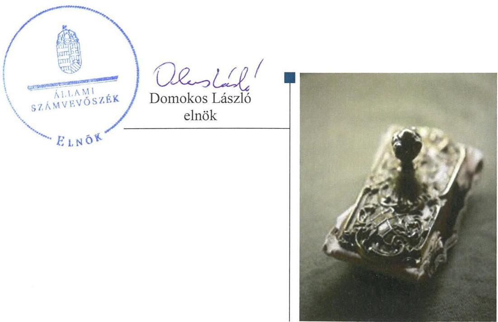

---

# AZ ELLENŐRZÉST FELÜGYELTE: 

PETŐ KRISZTINA felügyeleti vezető

## AZ ELLENŐRZÉST VEZETTE ÉS A VÉGREHAJTÁSÁÉRT FELELŐS:

BREBÁN ANDREA ellenőrzésvezető
KAKAS SÁNDOR ellenőrzésvezető

A PROGRAM ÖSSZEÁLLÍTÁSÁÉRT FELELŐS:
JANIK JÓZSEF LÁSZLÓ osztályvezető

IKTATÓSZÁM: V-0957-154/2016.
TÉMASZÁM: 1991
ELLENŐRZÉS-AZONOSÍTÓ SZÁM: V073712

---

# TARTALOMJEGYZÉK 

■ ÖSSZEGZÉS ..... 5
■ AZ ELLENŐRZÉS CÉLJA ..... 7
■ AZ ELLENŐRZÉS TERÜLETE ..... 8
■ AZ ELLENŐRZÉS HÁTTERE, INDOKOLTSÁGA ..... 10
■ A JELENTÉS LÉNYEGES KÉRDÉSKÖREI ..... 12
■ ELLENŐRZÉS HATÓKÖRE ÉS MÓDSZEREI ..... 13
■ MEGÁLLAPÍTÁSOK ..... 16
■ JAVASLATOK ..... 32
■ MELLÉKLETEK ..... 37
I. sz. melléklet: Értelmező szótár ..... 37
II. sz. melléklet: Az integritás érvényesítése érdekében kialakított és működtetett kontrollrendszer ..... 40
■ FÜGGELÉK: ÉSZREVÉTELEK ..... 43
■ RÖVIDÍTÉSEK JEGYZÉKE ..... 83

---

.

---

# ÖSSZEGZÉS 

A szegedi székhelyű Móra Ferenc Múzeumra vonatkozó irányító szervi feladatellátás nem volt szabályszerű. A Múzeumnál kialakított irányítási rendszer nem biztosította az átlátható, elszámoltatható és ellenőrizhető közpénzfelhasználást. A Múzeum pénzügyi és vagyongazdálkodása nem volt szabályszerű. A Múzeum közfeladatának részét képező kulturális javak nyilvántartásáról teljes körűen nem gondoskodtak, továbbá a kulturális javak állományvédelme és vagyonbiztonsága a kölcsönzéseknél nem volt biztosított.

## Az ellenőrzés társadalmi indokoltsága

Az Állami Számvevőszék Stratégiájának alapértéke, hogy ellenőrzései segítik az integritás alapú, átlátható és elszámoltatható közpénzfelhasználás megteremtését. Az ellenőrzés jogszabályban, vagy alapító okiratban meghatározott közfeladat ellátására létrejött, a megyei hatókörű városi muzeális intézmények gazdálkodási tevékenységére terjed ki. E szervezetek pénzügyi és vagyongazdálkodásának alapvető rendeltetése a közfeladatok (a kulturális örökséghez tartozó javak védelme, őrzése és a nyilvánosság számára történő hozzáférhetővé tétele) ellátásának biztosítása.

A megyei hatókörű városi múzeumként működő szervezetek 2011. évtől több alkalommal jelentős szervezeti és gazdálkodási átalakuláson mentek keresztül. A tulajdonosi, a vagyonkezelői és a fenntartói szerepekben, szerkezetben történt változások előkészítése, végrehajtása, illetve a múzeumi rendszer által kezelt közvagyonnal való gazdálkodás szabályszerűségének bemutatásával az ellenőrzés hozzájárul a múzeumok fenntartási és működtetési feladatainak ellátására vonatkozó megfelelő jogszabályi környezet kialakításához, a gazdálkodási gyakorlatuk javításához.

## Főbb megállapítások, következtetések

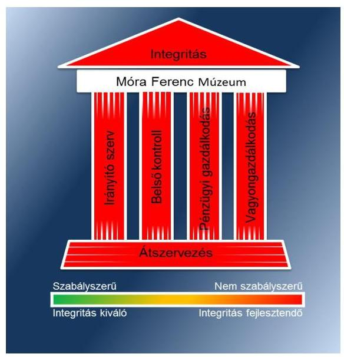

Az irányító szervek az ellenőrzött időszakban összességében nem gyakorolták szabályszerűen alapítói jogosultságaikat. A Múzeum nem rendelkezett a jogszabályi előírásoknak megfelelő tartalmú alapító okiratokkal.

A Múzeumnál kialakított irányítási rendszer nem biztosította az átlátható, elszámoltatható és ellenőrizhető közpénzfelhasználást. A Múzeum belső kontrollrendszerének kialakítása és működtetése nem felelt meg a jogszabályi előírásoknak. A kontrollkörnyezet kialakítása részben volt szabályszerű, mert nem határozták meg a belső ellenőrzést végző személy vagy szervezet jogállását, feladatait a szervezeti és működési szabályzatban, továbbá etikai elvárásokat a szervezet minden szintjén. A számviteli politika és a számlarend tartalma nem felelt meg teljes körűen a jogszabályi előírásoknak. A kockázatkezelési rendszert nem működtették a 2011-2014. években. A kontrolltevékenység kialakítása és működtetése az ellenőrzött időszakban részben volt szabályszerű. Az információs és kommunikációs folyamatok kialakítása nem volt szabályszerű, mert nem készítettek adatvédelmi és adatbiztonsági szabályzatot a 2011-2012. években, valamint nem szabályozták a közérdekű adatok megismerésére irányuló igények teljesítésének rendjét az ellenőrzött időszakban. A Múzeum nem tett eleget a jogszabályban előírt gazdálkodási adatok közzétételére vonatkozó kötelezettségének. A monitoring rendszer részeként a 2012. és a 2013. év I. félévében a belső ellenőrzés kialakításáról és működtetéséről nem gondoskodtak. A belső ellenőrzésekről a jogszabály szerinti nyilvántartást nem vezették, a belső ellenőrzési jelentésekben tett megállapításokra készített intézkedési terveket és azok végrehajtását nem követték nyomon.

---

A Múzeum pénzügyi és vagyongazdálkodása nem volt szabályszerű. A bevételek elszámolása során a 2012. évben a vagyontárgyak hasznosítására vagyonhasznosításra feljogosító szerződés, a 2013-2014. években vagyonkezelői szerződés nélkül került sor. A Múzeum 2012. évi beszámolójának mérlege a vagyon és annak összetétele kapcsán a megbízható és valós összképet nem mutatta be. A 2013-2014. évi beszámolókban sérült a lényegesség számviteli alapelve. A Múzeum a nemzeti vagyonba tartozó kulturális javakról nem a jogszabályi előírásoknak megfelelően vezette az előírt nyilvántartásokat, azok kölcsönzéséről szóló szerződései nem voltak szabályszerűek.

A Múzeumot érintő önkormányzati alrendszerből a központi alrendszerbe történő 2012. január 1-jétől hatályos irányító szervi (fenntartói) váltás lebonyolítása nem volt szabályszerű. A 2013. január 1-jével végrehajtott, a központi alrendszerből önkormányzati alrendszerbe történő irányító szervi (fenntartói) váltás lebonyolítása és a szervezetrendszer átalakítása szabályszerű volt.

A Múzeum nem intézkedett az integritás szemlélet érvényesítése érdekében.

---

# AZ ELLENŐRZÉS CÉLJA 

vényesülését a gazdálkodási folyamatokban.

Az ellenőrzés célja annak megállapítása volt, hogy a megyei múzeumi rendszer átalakítása, az intézményfenntartói rendszerben végbement változások előkészítése és végrehajtása megalapozottan, szabályszerűen történt-e; a megyei hatókörű városi múzeumok és jogelődjeik pénzügyi és vagyongazdálkodása, a belső kontrollrendszer kialakítása és működtetése, valamint az intézményfenntartói feladatok ellátása szabályszerűen történt-e.

A Múzeum ${ }^{1}$ korrupcióval szembeni veszélyeztetettségének csökkentése érdekében kért tanúsítványi adatszolgáltatás alapján az ÁSZ² értékelte az integritási szemlélet ér-

---

# **AZ ELLENŐRZÉS TERÜLETE**

## **Móra Ferenc Múzeum**

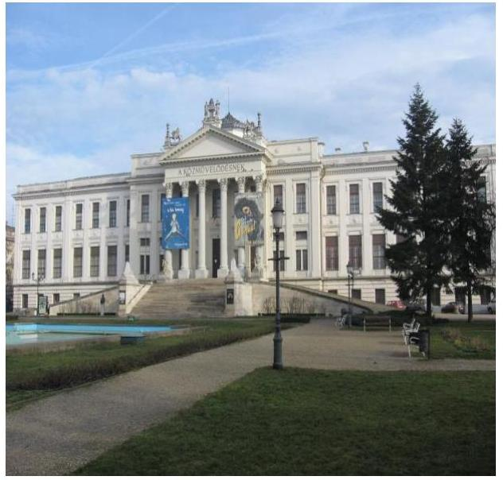

A Múzeum Szegeden található, feladatkörében az Mtv.^{3} alapján gondoskodik a kulturális javak meghatározott anyagának folyamatos gyűjtéséről, nyilvántartásáról, megőrzéséről és restaurálásáról; tudományos feldolgozásáról és publikálásáról; valamint kiállításokon és más módon történő bemutatásáról; a közművelődési és közgyűjteményi feladatok ellátásáról. A Kötv.^{4} 20. § (2) bekezdése alapján területileg illetékes múzeumként régészeti feltárást végzett az ellenőrzött időszakban.

A Múzeum csak a működési engedélyében meghatározott gyűjtőkörben és gyűjtőterületen folytathatja tevékenységét. A szakmai besorolást, a rendszert megalapozó szaktörvényi kereteket az Mtv. biztosítja. Az Mtv. hatálya kiterjed a Múzeum fenntartóira, a Múzeumban foglalkoztatottakra, a kulturális örökség Múzeumban őrzött elemeire, a szolgáltatások igénybevevőire és a kulturális örökséggel foglalkozó egyéb szervezetekre.

A Múzeum 2011. évi költségvetési engedélyezett létszáma 99 fő volt, ami 2012. évre 51 főre csökkent, majd a 2013. évi 89 főről a 2014. évre 93 főre nőtt. A Múzeum alkalmazottainak foglalkoztatására a Kjt.^{5} alapján került sor. Az ellenőrzött időszakban a múzeumigazgató^{6} és a gazdasági vezető személye is változott.

A Möktv.^{7} és annak végrehajtásáról szóló 258/2011. (XII. 7.) Korm. rendelet^{8} alapján 2012. január 1-jétől a megyei múzeumok központi költségvetési szervekké váltak. 2013. január 1-jétől a 2012. évi CLII. törvény^{9}, valamint a 1311/2012. (VIII. 23.) Korm. határozat^{10} alapján az állami tulajdonba és fenntartásba került megyei múzeumi szervezetek a megyeszékhely megyei jogú városok fenntartásában működnek tovább. A 2011–2014. évek között a fenntartói, irányítói, középirányítói jogkörgyakorlók változását, valamint a Múzeum gazdálkodási feladatát ellátó szervezetét az 1. táblázat mutatja be:

^{1} táblázat

|  Időszak | Fenntartó | Irányító szerv | Közgeirányító szerv | Gazdasági szervezet  |
| --- | --- | --- | --- | --- |
|  2011 | CSMÖ^{11} | CSMÖ Közgyűlése | - | Múzeum, CSMÖGK^{12}  |
|  2012 | CSMIK^{13} | KIM^{14} | CSMIK | CSMIK  |
|  2013–2014 | SZMJVÖ^{15} | SZMJVÖ Közgyűlése | - | Múzeum  |

*Fonrás: a Múzeum alapító iratai*

---

A Múzeum jogelődjének, a Csongrád Megyei Múzeumok Igazgatóságának jogállása 2011. I. negyedévben önállóan működő és gazdálkodó, önálló jogi személyiséggel rendelkező költségvetési intézmény volt, 2011. II. negyedévétől 2012. december 31-ig a Múzeum jogállása önállóan működő, önálló jogi személyiséggel rendelkező költségvetési intézmény volt. 2013. január 1-jétől a Múzeum önállóan működő és gazdálkodó költségvetési szerv volt, 2014. január 1-jétől önálló jogi személyiséggel rendelkező költségvetési intézmény, saját gazdasági szervezettel működő megyei hatókörű városi múzeum, vállalkozási tevékenységet nem végzett. A Múzeum teljesített költségvetési bevételeinek és kiadásainak alakulását az 1. ábra mutatja be. Az ábra a 2011-2012. években a Múzeum és tagintézményeinek együttes adatai, a 2013-2014. években a tagintézmények átadását követően a múzeumi adatok alapján készült.
1. ábra
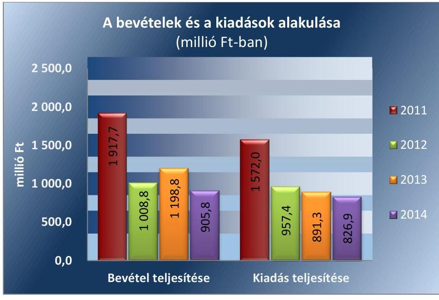

Forrás: Múzeumi beszámolók 2011-2014. évekre
A 2015. évi LXXV. tv. ${ }^{16}$ 1. § (1) bekezdése alapján az Nvtv. ${ }^{17}$ 13. § (3) bekezdésében és 14. § (1) bekezdésében foglaltak alapján és az abban meghatározott feltételekkel a 2012. évi CLII. törvény 30. § (1) és (2) bekezdésében meghatározott, a megyei hatókörű városi múzeumok feladatának ellátását szolgáló egyes állami tulajdonban lévő ingatlanok a törvény hatálybalépésének napjával, a törvény erejénél fogva a kötelező közfeladatként a megyei hatókörű városi múzeumot fenntartó önkormányzatok tulajdonába kerültek. A 2015. évi LXXV. tv. 4. § (1) bekezdése alapján a kulturális örökség helyi védelme érdekében a megyei hatókörű városi múzeumok alapleltárában és jogszabály szerinti külön nyilvántartásában szereplő állami tulajdonú kulturális javak ingyenesen a megyei hatókörű városi múzeumok vagyonkezelésébe kerültek. A vagyonkezelők vagyonkezelői joga tekintetében vagyonkezelési szerződés megkötése nem szükséges. A 2015. évi LXXV. tv. 4. § (2) bekezdése szerint továbbá a kulturális örökség helyi védelme érdekében a megyei hatókörű városi múzeumok feladatának ellátását szolgáló állami tulajdonban álló ingatlanok - a törvény mellékletében meghatározott ingatlanok kivételével - ingyenesen a fenntartó önkormányzatok vagyonkezelésébe kerültek.

---

# AZ ELLENŐRZÉS HÁTTERE, INDOKOLTSÁGA

Az Alaptörvény18 rendelkezése szerint a nemzeti vagyon megőrzésének, védelmének és a nemzeti vagyonnal való felelős gazdálkodásnak a követelményeit sarkalatos törvény, az Nvtv. rögzíti. A tulajdonosi joggyakorlás és vagyonkezelés általános és speciális szabályait, az állami vagyon nyilvántartására és elszámolására vonatkozó eljárásokat, a vagyonkezelési szerződés feltételrendszerét, valamint az éves beszámoló készítési és könyvvezetési kötelezettségeket kormányrendelet írja elő.

A megyei hatókörű városi múzeumok közfeladat-ellátásának változásait, (beleértve az állami tulajdonosi joggyakorló, intézményi vagyonkezelő és önkormányzati fenntartó szervezeteket is) a közfeladatok átadásából és átvételéből adódó módosításait, előirányzat gazdálkodására ható tényezőit az Áht.219, az Ávr.20, a Möktv., valamint az Mtv. írja elő. A múzeumi intézményrendszer átalakulásából megszűnéséből, intézmény átszervezéséből, belső szerkezeti korszerűsítéséből, vagy más hasonló okból adódó módosításai miatt szerepeltetendő szerkezeti változásokat, valamint a szerkezeti változásként beépült közfeladatok szintre hozásként történő számításba vételét az Ávr. határozza meg.

A megyei hatókörű városi múzeumok kulturális szempontból meghatározó jelentőségűek mind földrajzi elhelyezkedésüket, mind az ellátott feladatokat, valamint a látogatottságukat tekintve. Tevékenységüket törvényi szinten (Mtv.) szabályozták a jogalkotók. A megyei hatókörű városi múzeumok jelenlegi körének kialakításában, tulajdonosi és fenntartói szerkezetében rövid idő alatt több jelentős változás történt, amelyeket jogszabályi változások indukáltak. Ezen intézmények szakmai besorolásukat tekintve a 2011. évben megyei múzeumként, a 2012. évben megyei múzeumi központi költségvetési szervezetként, a 2013. évtől kezdődően megyei hatókörű városi múzeumként működtek. A szakmai besorolások változásait párhuzamosan követték a tulajdonosi, vagyonkezelői, fenntartói szerepekben történt változások.

A 2011–2014. évek között bekövetkezett fenntartói változás a vagyontárgyak és a kulturális javak tulajdonosi, vagyonkezelői és használói körében is változást indukáltak, amelyet a 2. táblázat szemléltet.

2. táblázat

## A VAGYON TULAJDONOSI, VAGYONKEZELŐI ÉS HASZNÁLÓI KÖRÉNEK VÁLTOZÁSA 2011–2014. ÉVEKBEN

|  Vagyon-
tárgy |  | 2011. év |  |  | 2012. év |  |  | 2013–2014. évek |   |
| --- | --- | --- | --- | --- | --- | --- | --- | --- | --- |
| 

  | tulajdonos | vagyon-kezelő | használó | tulajdonos | vagyon-kezelő | használó | tulajdonos | vagyon-kezelő | használó  |
|  Ingatlan | CSMÖ | - | Múzeum | Állam | CSMIK | Múzeum | Állam | Múzeum | Múzeum  |
|  Egyéb tárgyi eszközök | CSMÖ | - | Múzeum | Állam | CSMIK | Múzeum | Állam | Múzeum | Múzeum  |
|  Kulturális javak | CSMÖ | - | Múzeum | Állam | CSMIK | Múzeum | Állam | Múzeum | Múzeum  |

Forrás: a Múzeum alapító okiratai, a 2012. évi CLII. tv, a 258/2011. (XII. 7) Korm. rendelet, az 1311/2012. (VIII. 23.) Korm. határozat

---

Az ellenőrzés - tekintettel a megyei hatókörű városi múzeumokat (és jogelődjeit) rövid időn belül, gyors ütemben ért környezeti (tulajdonosi, fenntartói-szerkezetet érintő) változásokra - javaslatok megfogalmazásával hozzájárul a fenntartás és működtetés feladatainak ellátására vonatkozó megfelelő jogszabályi környezet - jogalkotók által történő - kialakításához. Az ÁSZ ellenőrzés a gazdálkodási gyakorlat javítását eredményezheti, több intézmény bevonásával átfogó képet ad a megyei hatókörű városi múzeumokat (és jogelődjeiket) jellemző sajátosságokról, jó gyakorlatokról.

AZ ELLENŐRZÉS EREDMÉNYEKÉPPEN javul az ellenőrzött intézmények gazdálkodása, átfogó képet kapunk a múzeumok gazdálkodásának hiányosságairól, de a jó gyakorlatokról is. Ellenőrzéseivel, javaslataival és megállapításaival az ÁSZ elősegíti a költségvetési szervek pénzügyi és vagyongazdálkodása szabályozásának javítását és hozzájárul a jó kormányzáshoz.

---

# A JELENTÉS LÉNYEGES KÉRDÉSKÖREI 

1.     - Az irányító szerv Múzeumra vonatkozó feladatellátása szabályszerű volt-e?
2.     - Szabályszerűen hajtották-e végre a Múzeumot érintő szervezeti, szerkezeti átszervezéseket?
3.     - A belső kontrollrendszer kialakítása és működtetése megfelelt-e a jogszabályi előírásoknak?
4.     - A Múzeum pénzügyi gazdálkodása szabályszerű volt-e?
5.     - A Múzeum vagyongazdálkodása szabályszerű volt-e?
6.     - A Múzeum intézkedett-e az integritás szemlélet érvényesítése érdekében?

---

# ELLENŐRZÉS HATÓKÖRE ÉS MÓDSZEREI 

## Az ellenőrzés típusa

Megfelelőségi ellenőrzés.

## Az ellenőrzött időszak

Az ellenőrzött időszak 2011. január 1-jétől 2014. december 31-ig tart.

## Az ellenőrzés tárgya

A megyei hatókörű városi múzeumok átszervezése, átalakítása előkészítése és lebonyolítása megalapozottsága, szabályszerűsége, a pénzügyi és vagyongazdálkodási tevékenység, a belső kontroll rendszer kialakítása, működtetése szabályszerűsége, valamint az irányító szervi feladatok ellátása szabályszerűsége. E tevékenységek és a kapcsolódó adatok és információk összessége, amelyeket a vonatkozó kritériumok alapján kell értékelni.

Az ellenőrzés kiterjed minden olyan körülményre és adatra, amely az ÁSZ jogszabályban meghatározott feladatainak teljesítéséhez, valamint a program végrehajtása folyamán felmerült újabb összefüggések feltárásához szükséges.

## Az ellenőrzött szervezet

A Móra Ferenc Múzeum (és jogelődje a Csongrád Megyei Múzeumi Igazgatóság), a fenntartói feladatokban érintett Csongrád Megyei Önkormányzat, a Csongrád Megyei Intézményfenntartói Központ jogutódja a Szociális és Gyermekvédelmi Főigazgatóság, valamint Szeged Megyei Jogú Város Önkormányzata.

Az ellenőrzésre a költségvetési szerv ellenőrzött intézményének és irányító/felügyeleti szervének, illetve középirányító szervének székhelyén került sor.

## Az ellenőrzés jogalapja

Az ÁSZ tv 21. § (3) bekezdés, 5. § (2)-(6) bekezdései, valamint az Áht. 2 61. § (2) bekezdése.

---

# Az ellenőrzés módszerei 

Az ellenőrzést az ellenőrzési program szempontjai, az ellenőrzött időszakban hatályos jogszabályok, az ellenőrzés szakmai szabályai, az egyes ellenőrzési típusokhoz kapcsolódó ÁSZ módszertanok és nemzetközi standardok figyelembe vételével végeztük. A gazdálkodás hibáinak kijavítására, a közpénzekkel való felelős gazdálkodás segítésére irányuló javaslatok kidolgozásakor a hatályos jogszabályok az irányadóak.

Az ellenőrzési kérdések megválaszolásához szükséges bizonyítékok megszerzése a következő ellenőrzési eljárások alkalmazásával történt: kérdésfeltevés (információkérés), mintavételezés, valamint elemző eljárás. A minták kiválasztása során véletlen mintavételi eljárást alkalmaztunk.

Mintavétellel ellenőriztük a bevételek, a személyi juttatások, a dologi és felhalmozási kiadások, a régészeti bevételek és kiadások elszámolása-, valamint a kulturális javak kölcsönzésének szabályszerűségét. A minta alapján a sokaságban előforduló hibaarányt becsültük. „Megfelelőnek" értékeltük az ellenőrzött területet, amennyiben 95%-os bizonyossággal a teljes sokaságban a hibaarány legfeljebb 10%, „részben megfelelőnek" értékeltük, ha a hibaarány felső határa 10-30% között volt, „nem megfelelőnek" pedig akkor, ha a mintavételi eredmények alapján a sokaságbeli hibaarány felső határa meghaladta a 30%-ot.

Az ellenőrzési bizonyítékként felhasználható adatforrások közé tartoznak egyrészt a szakmai program részletes szempontjainál felsorolt adatforrások, másrészt adatforrás lehet minden egyéb - az ellenőrzés folyamán feltárt, az ellenőrzés szempontjából releváns információt tartalmazó - dokumentum. Az ellenőrzés lefolytatásához a Múzeum a tanúsítványok elektronikus kitöltésével, valamint az ÁSZ által kért dokumentumok elektronikus megküldésével szolgáltatott adatokat. A rendelkezésre bocsátott adatok, információk kontrollja az ellenőrzés keretében történt. Az ellenőrzési kérdésekre adott válaszok alapján értékeltük, hogy az ellenőrzött időszakban az irányító szerv az ellenőrzött Múzeumra vonatkozó feladatainak szabályszerűen eleget tett-e, a Múzeum pénzügyi- és vagyongazdálkodása megfelelt-e az előírásoknak, a Múzeum átalakításának vagy átszervezésének végrehajtása szabályszerű volt-e.

A Múzeum belső kontrollrendszere jogszabályi előírások szerinti kialakításának és működtetésének szabályszerűségét az erre irányuló ellenőrzési kérdésekre adott válaszok összesítése alapján, évente pillérenként (kontrollkörnyezet, kockázatkezelési rendszer, kontrolltevékenységek, információs és kommunikációs rendszer, monitoring rendszer) és összesítetten is minősítjük. A Múzeum belső kontrollrendszere egyes pilléreinek kialakítása és működtetése „szabályszerű", amennyiben az értékelt területen az elért és elérhető pontok százalékban kifejezett, egész számra kerekített hányadosa meghaladja a 84%-ot, „részben szabályszerű", ha a 84%-ot nem haladja meg, de 60%-nál nagyobb, „nem szabályszerű", ha nem haladja meg a 60%-ot. A Múzeum belső kontrollrendszerének összesített értékelése megegyezik a pillérenként (kontrollterületenként) alkalmazott %-os értékelésekkel, a következő eltérésekkel. A kontrollrendszer egésze esetében a „szabályszerű" értékelésnek a %-os értéken felül további feltétele, hogy egyik kontrollterület sem kaphat „nem szabályszerű" értékelést, a „részben szabályszerű" értékelés további feltétele, hogy legfeljebb egy el-

---

lenőrzött kontrollterület lehet „nem szabályszerű" értékelésű. Az összesített értékelés a %-os értéktől függetlenül „nem szabályszerű", ha az ellenőrzött kontrollterületek közül több mint egynek „nem szabályszerű" az értékelése.

Az integritás szemlélet érvényesülésének értékelése a Múzeum tanúsítványi adatszolgáltatása alapján történt.

---

# 1. Az irányító szerv Múzeumra vonatkozó feladatellátása szabályszerű volt-e? 

Összegző megállapítás

Az irányító szervek Múzeumra vonatkozó feladatellátása nem volt szabályszerű.

AZ ALAPÍTÓI JOGOK GYAKORLÁSA során hiányosság volt, hogy a kultúráért felelős miniszter előzetes egyetértését nem adta meg az alapító okirat³ módosításához a 2012. évben, így az Mtv. 45/B. § (3) bekezdésben foglalt előírás nem érvényesült, továbbá az alapító okirat¹,² az Ámr. ²² 14. § (1) bekezdésében foglaltak ellenére nem tartalmazta az egyes irányítói jogok gyakorlására jogosultakat. A Múzeum a 2011-2014. években rendelkezett alapító okirat¹⁻⁵²³-tel. Az alapító okiratot annak módosításakor minden esetben egységes szerkezetbe foglalták az Ámr. és az Ávr. előírásainak megfelelően.

A MUNKÁLTATÓI JOGOSULTSÁGOK gyakorlása során hiányosság volt, hogy 2013. március 8-13. között nem volt kinevezett gazdasági vezető, az irányító szerv⁷²⁴ - az Áht.² 9. § (1) bekezdés c) pontja ellenére - nem intézkedett gazdasági vezető kinevezéséről, megbízásáról. A múzeumigazgatót a jogszabályi előírásoknak megfelelően nevezték ki, a kinevezés során figyelembe vették az Mtv.-ben meghatározott szakmai képesítési követelményeket. A gazdasági vezetők²⁵ kinevezése az irányító szerv által - az Áht.¹,²²⁶ és a 258/2011. (XII. 7.) Korm. rend. előírásainak figyelembevételével - történt. A gazdasági vezetők rendelkeztek a jogszabályban előírt végzettséggel.

AZ EGYÉB IRÁNYÍTÁSI, FELÜGYELETI ÉS ELLENŐRZÉSI jogosultságok gyakorlása során hiányosság volt, hogy
→ az irányító szerv² a 2012. évben a közérdekű és közérdekből nyilvános adatok, valamint az Áht.² -ben meghatározott irányítási jogkörök gyakorlásához szükséges személyes adatokat nem kezelte az Áht.² 9. § (1) bekezdés j) pontjának előírása ellenére;
→ a középirányító szerv²⁷ a közérdekű és közérdekből nyilvános adatok kötelező, illetve igényre történő szolgáltatásának végrehajtását nem ellenőrizte a 2012. évben a 258/2011.(XII. 7.) Korm. rendelet 11. § (2) bekezdés c) pontjában előírtak ellenére;
→ az irányító szerv³ - mint fenntartó³²⁸ - az Mtv. 50. § (2) bekezdés a) pontok előírásai ellenére a 2013-2014. években a Múzeum fejlesztési és beruházási feladatait nem határozta meg.

---

# 2. Szabályszerűen hajtották-e végre a Múzeumot érintő szervezeti, szerkezeti átszervezéseket? 

Összegző megállapítás

2.1. számú megállapítás

A Múzeumot és tagintézményeit is érintő szervezeti, szerkezeti átszervezések végrehajtása nem volt szabályszerű, nem volt biztosított az átláthatóság.

Az intézményt érintő önkormányzati alrendszerből a központi alrendszerbe történő 2012. január 1-jétől hatályos irányító szervi (fenntartói) váltás végrehajtása nem volt szabályszerű, az átláthatóság nem volt biztosított.

AZ ÁTADÁS-ÁTVÉTEL ELŐKÉSZÍTÉSÉRE a Möktv. 6. § (1)-(2) bekezdés alapján megjelölt átadás-átvételi bizottság működése eredményeként az átadás-átvételi megállapodást megkötötték a Möktv. 2. § (4) bekezdésében meghatározott személyek. A megállapodás megkötésére a Möktv. 6. § (3) bekezdésének előírása szerinti határidőig (2011. december 21.) sor került.

AZ ÁTADÁS-ÁTVÉTELI MEGÁLLAPODÁS¹-ET²⁹ a jogutódláshoz kapcsolódó feladat és vagyon átadás-átvételéhez a 258/2011. (XII. 7.) Korm. rendelet 12. § (1) bekezdés szerint, de a Korm. rendelet 1. számú melléklet III. és IV. rész előírásaitól eltérően, hiányosan készítette el a fenntartó¹ a fenntartó² a hiányosságokat nem kifogásolva írta azt alá. A 258/2011. (XII. 7.) Korm. rendelet 1. melléklet előírása ellenére a Múzeum feladatellátási helyét nem jelölték meg a megállapodásban (IV. rész 1/2. pont), továbbá a Múzeum 2011. évi normatív támogatás igénylésére, módosítására, lemondására vonatkozó összegszerűen részletezett adatok (IV. rész 1/3. pont), valamint az átadott ingatlanok műszaki állapotát bemutató műszaki kataszter (IV. rész 1/10. pont) nem került átadásra. A vagyon tényleges átadása - a 258/2011. (XII. 7.) Korm. rendelet 12. § (3) bekezdésben meghatározott egy hetes határidőn túl - 2012. január 16-án felvett jegyzőkönyv alapján történt meg. A jegyzőkönyvet a 258/2011. (XII. 7.) Korm. rendeletnek megfelelően a CSMÖ elnöke és a kormánymegbízott írta alá. Az intézmények működtetéséhez, fenntartásához kapcsolódó dokumentumok teljes körűen átadásra kerültek.

A vagyonátadási jelentés:³⁰ összeállítását az Áhsz.:³¹ 13/A. § (4) bekezdésében foglalt előírás figyelembe vételével elvégezték, az elkészített beszámoló az éves elemi költségvetési beszámolónak megfelelő adattartalmú volt. Az átszervezés napjára a bevételi és kiadási forgalmi számlákat, a közgazdasági és a funkcionális osztályozás szerint lezárták.

Vagyonkezelési szerződést az MNV Zrt.³² és a fenntartó 2012. szeptember 27-én írta alá, túllépve a 258/2011. (XII. 7.) Korm. rendelet 1. melléklet V. részében meghatározott, a megállapodás aláírásától, de legkorábban 2012. január 1-jétől számított 30 napos határidőt. A Múzeummal, mint a vagyont közfeladat ellátására hasznosítóval a Vtv.³³ 25. § (4) bekezdésében foglaltak ellenére vagyonhasznosítási szerződést nem kötöttek.

---

### 2.2. számú megállapítás

A 2013. január 1-jével végrehajtott a központi alrendszerből önkormányzati alrendszerbe történő irányítószervi (fenntartói) váltás végrehajtása és a szervezetrendszer átalakítása szabályszerű volt.

AZ ÁTADÁS-ÁTVÉTELI MEGÁLLAPODÁS³⁴ előkészítése érdekében a 1311/2012.(VIII.
 23.) Korm. határozat 1.11. pontjában előírtak szerint egyeztető tárgyalásokat lefolytatták, amelynek eredményeként a 2012. évi CLII. törvény 30. § (5) bekezdésében megjelölt határidőre (2012. december 6-án) a megállapodást megkötötték. A megállapodást a 1311/2012. (VIII. 23.) Korm. határozat foglaltak alapján Szeged Megyei Jogú Város polgármestere és a CSMIK vezetője írták alá. Az átadás-átvételi megállapodással a jogutód fenntartó részére a fenntartói jogok gyakorlásához és az irányító szervi feladatok ellátásához szükséges adatok, dokumentumok átadásra-átvételre kerültek.

## A NEM MEGYESZÉKHELY SZERINTI TAGINTÉZ-

MÉNYEK 2013. január 1-jei hatállyal a feladat ellátásához rendelkezésre álló személyi, tárgyi és pénzügyi feltételek egyidejű átadásával a működési engedélyükben meghatározott székhely szerint illetékes települési önkormányzatok fenntartásába kerültek a 1311/2012. (VIII. 23) Korm. határozat 1.4. pontja előírása alapján. Az átszervezés lebonyolítása során a 1311/2012. (VIII. 23.) Korm. határozat 1.8. pontjában foglalt előírás szerint rendelkeztek a tag intézmények létszámának, a leltárban szereplő kulturális javaknak és egyéb vagyonelemeknek az emberi erőforrások miniszterének egyetértésével történő tagintézményenkénti meghatározásával. A CSMIK az átadás-átvételi megállapodásokat a 2013. január 1-jével a megyei múzeumi intézményből kikerült négy tagintézmény vonatkozásában 2012. decemberében az érintett települések önkormányzataival megkötötte. A megállapodások alapján a muzeális intézmények létszámát, a leltárban szereplő kulturális javakat és egyéb vagyonelemeket a CSMIK az érintett önkormányzatoknak átadta.

A vagyonátadási jelentés ${ }_{2}$ - $t^{35}$ az Áhsz. ${ }_{1}$ 13/A. § (4) bekezdésében foglalt előírást figyelembe vételével a 2012. december 31-ei fordulónapra vonatkozóan elkészítették. A vagyonátadási jelentés ${ }_{2}$-ben szereplő adatokat leltárral, analitikus nyilvántartásokkal támasztották alá.

---

# 3. A belső kontrollrendszer kialakítása és működtetése megfelel-te a jogszabályi előírásoknak? 

## Összegző megállapítás

A belső kontrollrendszer kialakítása és működtetése a 2011-2014. években nem volt szabályszerű.

A belső kontrollrendszer kialakítása és működtetése részletes értékelését a 2011-2014. évekre vonatkozóan a 3. táblázat mutatja be.
3. táblázat

A BELSŐ KONTROLLRENSZER KIALAKÍTÁSÁNAK ÉS MŰKÖDTETÉSÉNEK ÉRTÉKELÉSE A 2011-2014. ÉVEKBEN

| Megnevezés | Kontrollkörnyezet | Kockázatkezelési rendszer | Kontrolltevékenységek | Információ és kommunikáció | Monitoring rendszer | Összesen |
| :--: | :--: | :--: | :--: | :--: | :--: | :--: |
| 2011. | részben szabályszerű | nem szabályszerű | részben szabályszerű | nem szabályszerű | nem szabályszerű | nem szabályszerű |
| 2012. | részben szabályszerű | nem szabályszerű | részben szabályszerű | nem szabályszerű | nem szabályszerű | nem szabályszerű |
| 2013. | részben szabályszerű | nem szabályszerű | részben szabályszerű | nem szabályszerű | nem szabályszerű | nem szabályszerű |
| 2014. | részben szabályszerű | nem szabályszerű | részben szabályszerű | nem szabályszerű | nem szabályszerű | nem szabályszerű |

Forrás: az ÁSZ által készített kiértékelés
3.1. számú megállapítás

A kontrollkörnyezet kialakítása a 2011-2014. években részben volt szabályszerű.

A kontrollkörnyezet kialakításának évenkénti értékelését a 2. ábra mutatja:
2. ábra

| Kontrollkörnyezet | 2011. év   önkormányzati   alrendszer | 2012. év   központi   alrendszer | 2013. év   önkormányzati alrendszer |
| :--: | :--: | :--: | :--: |
| szabályszerű |  |  |  |
| részben szabályszerű   nem szabályszerű |  |  |  |

Forrás: ÁSZ ellenőrzés megállapításai
Az SZMSZ ${ }_{1-4}{ }^{36}$ az Áht. ${ }_{1}$ illetve az Áht. ${ }_{2}$ előírásainak alapján rendelkezésre állt, azonban tartalma részben felelt meg az Ámr. és Ávr. előírásainak. Hiányosság volt, hogy a múzeumigazgató nem rögzítette

- 2011-ben az SZMSZ ${ }_{1,2}$-ben a költségvetési szerv törzskönyvi azonosító számát, alapító okiratának keltét, az alapító okirat számát és az alapítás időpontját az Ámr. 20. § (2) bekezdés b) pontjában foglaltak ellenére;
- 2011-ben az SZMSZ ${ }_{1,2}$-ben a szervezeti egységek engedélyezett létszámát az Ámr. 20. § (2) bekezdésének e) pontja ellenére;
- 2011-2014. években az SZMSZ ${ }_{1-4}$-ben a helyettesítés rendjét az Ámr. 20. § (2) bekezdés h) pontja és az Ávr. 13. § (1) bekezdés g) pontjában előírtaktól eltérően;
- 2011-2014. években az SZMSZ ${ }_{1-4}$-ben a független belső ellenőrzést végző személy, illetve szervezet jogállását, feladatait a Ber. ${ }^{37}$ 4. §(2) bekezdés és a Bkr. ${ }^{38}$ 15. § (2) bekezdésében foglaltak ellenére.

---

Etikai elvárásokat a múzeumigazgató az Ámr. 156. § (1) bekezdés c) pontjában és a Bkr. 6. § (1) bekezdés c) pontjában foglaltak ellenére a szervezet minden szintjén az ellenőrzött időszakban nem határozott meg.

A számviteli politika ${ }_{1-3}{ }^{39}$-t a múzeumigazgató elkészítette a jogszabályi előírások alapján. Hiányosság volt, hogy a múzeumigazgató
a 2011. évben nem határozta meg a beszerzett, előállított immateriális javak, illetve a tárgyi eszközök üzembe helyezésének dokumentálási szabályait az Áhsz. ${ }_{1} 8 . \S$ (7) bekezdésében foglaltak ellenére;
a 2014. évben a kulturális javak mérlegben való kimutatásával kapcsolatos szabályokat az Áhsz. ${ }_{2}{ }^{40} 10 . \S$ (1) bekezdés szerinti előírás hatálybalépésére tekintettel nem rögzítette a Számv. tv. 14. § (11) bekezdésben előírtak ellenére.
A számlarendet ${ }^{41}$ a múzeumigazgató a Számv. tv. 161. § (4) bekezdés előírása szerint elkészítette. A számlarendet a jogszabályi előírások változása (pl. az Áhsz. ${ }_{2}$ hatálybaléptetése) miatt változó szabályokra tekintettel nem aktualizálták az ellenőrzött időszakban. Hiányosság volt, hogy a szabályzat
a 2011-2012. években a Számv. tv 161. § (2) bekezdésének d) pontjában foglaltak ellenére nem tartalmazta a számlarendet alátámasztó bizonylati rendet (2013. januártól a múzeumigazgató önálló Bizonylati rendet ${ }^{42}$ adott ki);
a 2011-2012. években a Számv. tv. 161. § (2) bekezdés c) pontjában és a 161/A. § (2) bekezdésében foglaltak alapján a főkönyvi számlák és analitikus nyilvántartások kapcsolata keretében nem rendelkezett a 20/2002. (X. 4.) NKÖM rendelet ${ }^{43}$ előírása alapján vezetett, értékkel nem rendelkező kulturális javakkal kapcsolatos külön nyilvántartások és a főkönyvi nyilvántartás kapcsolatáról.
A leltározási szabályzatot ${ }_{1,2}{ }^{44}$ a Számv. tv.-ben és az Áhsz. ${ }_{1}$-ben, valamint az Áhsz. ${ }_{2}$-ben foglaltak alapján elkészítették.

Értékelési szabályzat ${ }_{1,2}{ }^{45}$ készítési kötelezettségének a múzeumigazgató eleget tett a Számv. tv. előírása szerint. Hiányosság volt, hogy a 2011-2012. években az értékelési szabályzat ${ }_{1}$ nem rögzítette a kis összegű követelések év végi meghatározásának elveit az Áhsz. ${ }_{1} 8 . \S$ (17) bekezdés d) pontjában foglaltak ellenére.

A pénzkezelési szabályzat ${ }_{1,2}{ }^{46}$-at a Számv. tv. előírásainak részben megfelelően készítette el a múzeumigazgató. A pénzkezelési szabályzat ${ }_{1,2}$ a Számv. tv. 14. § (8) bekezdésben foglaltaktól eltérően az ellenőrzött időszakban nem tartalmazta teljes körűen a készpénzállományt érintő pénzmozgások jogcímeit és eljárásrendjét, illetve a 2013-2014. években nem került meghatározásra a pénzforgalom bankszámlán történő lebonyolításának rendje. Az ellenőrzött időszakban nem az Áhsz. ${ }_{1} 8 . \S$ (22) bekezdés és az Áhsz. ${ }_{2}$ 50. § (6) bekezdésében foglaltaknak megfelelően szabályozta a napi készpénz záró állomány maximális mértékét.

Az önköltségszámítás rendjére vonatkozó szabályzat ${ }_{1,2}{ }^{47}$ részben felelt meg a jogszabályi előírásoknak. Hiányosság volt, hogy a 2011-2013. években nem tartalmazta a közérdekű adatszolgáltatáshoz kapcsolódó költségtérítés összege megállapításának szabályait az Áhsz. ${ }_{1} 8 . \S$ (16) bekezdésében foglaltak ellenére.

Az ellenőrzési nyomvonalat a múzeumigazgató a FEUVE szabályzat ${ }^{48}$ részeként elkészítette az Ámr. előírásainak megfelelően. Az ellenőrzési

---

# Megállapítások 

nyomvonal aktualizálásáról az intézményi átszervezések során bekövetkezett változások ellenére a múzeumigazgató az ellenőrzött időszakban nem gondoskodott, így az Ámr. 156. § (2) bekezdésében és a Bkr. 6. § (3) bekezdésében foglaltak nem érvényesültek.

A szabálytalanságok kezelésének eljárásrendjét nem szabályozta a múzeumigazgató az Ámr. 156. § (3) bekezdése és a Bkr. 6. § (4) bekezdésében foglaltak ellenére a 2011-2014. években.

Egyebekben az ügyrend ${ }_{1-2}{ }^{49}$ a Múzeum gazdasági szervezetére vonatkozóan 2011-ben és 2013-2014-ben rögzítette a felelősségi és hatásköri viszonyokat az Áht. 1 91. § (2) bekezdésében és az Áht. 2 10. § (5) bekezdésében foglaltaknak megfelelően. Együttműködési megállapodás ${ }^{50}$ határozta meg a Múzeum és a gazdasági szervezet feladatait ellátó költségvetési szerv munkamegosztási és felelősségvállalási rendjét 2011-ben az Ámr. előírásaival összhangban. Közbeszerzési szabályzattal ${ }_{1,2}{ }^{51}$ a Múzeum a Kbt. ${ }_{1,2}{ }^{52}$ előírásainak megfelelően az ellenőrzött időszakban rendelkezett.

## 3.2. számú megállapítás

A kockázatkezelési rendszer kialakítása és működtetése a 2011-2014. években összességében nem volt szabályszerű.

A kockázatkezelési rendszer évenkénti értékelését a 3. ábra mutatja be:
3. ábra

| Kockázatkezelési rendszer | 2011. év önkormányzati alrendszer | 2012. év központi alrendszer | 2013. év | 2014. év önkormányzati alrendszer |
| :--: | :--: | :--: | :--: | :--: |
| szabályszerű |  |  |  |  |
| részben szabályszerű nem szabályszerű |  |  |  |  |

A kockázatkezelési rendszert a múzeumigazgató kialakította, azonban a 2011. évben az Ámr. 157. § (1) bekezdése, illetve a 2012-2014. években a Bkr. 3. § b) pontja és 7. § (1) bekezdés előírásai ellenére nem működtette.

A Vnytv. ${ }^{53}$ 4. § a) pontjában foglaltak ellenére a múzeumigazgató nem tüntette fel az SZMSZ ${ }_{1-4}$-ben a vagyonnyilatkozat-tételi kötelezettséget.

## 3.3. számú megállapítás

A kontrolltevékenység kialakítása és működtetése részben volt szabályszerű a 2011-2014. években.

A kontrolltevékenység évenkénti értékelését a 4. ábra mutatja be:
4. ábra

| Kontrolltevékenység | 2011. év   önkormányzati   alrendszer | 2012. év   központi   alrendszer | 2013. év | 2014. év   önkormányzati alrendszer |
| :-- | :--: | :--: | :--: | :--: |
| szabályszerű   részben szabályszerű   nem szabályszerű |  |  |  |  |

A kontrolltevékenység keretében meghatározták a gazdálkodási jogkörök gyakorlásával, valamint az ezeket végző személyek kijelölésének rendjével kapcsolatos előírásokat. Az operatív gazdálkodási jogkörökre a

---

kijelölések, felhatalmazások gyakorlata részben felelt meg a szabályzatban foglaltaknak (részletesen a 4.3. fejezetben).

A kontrolltevékenység keretében hiányosságként jelentkezett, hogy
$\longrightarrow$ 2011-2012. években a múzeumigazgató nem szabályozta az üzemeltetés és adatbiztonság feladatait és a hatásköröket az lkr. ${ }^{54} 8 . \S$ (2) bekezdésében foglaltak ellenére;
$\longrightarrow$ a múzeumigazgató az ellenőrzött időszakban nem szabályozta a beszámolási eljárásokat az Ámr. 158. § (2) bekezdés d) pont és a Bkr. 8. § (4) bekezdés c) pont előírása ellenére;
$\longrightarrow$ a múzeumigazgató 2011. évben nem rögzítette az Ámr. 158. § (2) bekezdés b) pont előírása ellenére az információkhoz, a 2012. évben a Bkr. 8. § (4) bekezdés b) pontok előírása ellenére a dokumentumokhoz és információkhoz való hozzáférés szabályait.

# 3.4. számú megállapítás 

Az információs és kommunikációs folyamatok kialakítása nem volt szabályszerű 2011-2014. években.

Az információs és kommunikációs rendszer évenkénti értékelését az 5. ábra mutatja be:
5. ábra

| információs és kommunikációs rendszer | 2011. év önkormányzati alrendszer | 2012. év központi alrendszer | 2013. év önkormányzati alrendszer | 2014. év   önkormányzati alrendszer |
|

 :--: | :--: | :--: | :--: | :--: |
| szabályszerű |  |  |  |  |
| részben szabályszerű | nem szabályszerű |  |  |  |

Forrás: ÁSZ ellenőrzés megállapításai

Az információs és kommunikációs rendszer szabályozása nem felelt meg a jogszabályi előírásoknak. Hiányosság volt, hogy a múzeumigazgató
$\longrightarrow$ 2011-2014. években nem alakított ki és nem működtetett olyan rendszert az Ámr. 159. § (1) bekezdésben és a Bkr. 9. § (1) bekezdésben foglaltak ellenére, amely biztosította, hogy az információk eljussanak a szervezeti egységekhez, személyekhez;
$\longrightarrow$ 2011-2014. években a múzeumigazgató a beszámolási rendszereket nem működtette úgy, hogy a beszámolási szintek, határidők és módok világosan legyenek meghatározva az Ámr. 159. § (2) bekezdés és a Bkr. 9. § (2) bekezdéseiben foglaltak ellenére;
$\longrightarrow$ 2011-2014. években nem szabályozta a közérdekű adatok megismerésére irányuló igények teljesítésének rendjét az Avtv. ${ }^{55}$ 20. § (8) bekezdésében és az Info tv. ${ }^{56}$ 30. § (6) bekezdésében foglaltak ellenére;
$\longrightarrow$ 2011-2012. években nem készítette el az adatvédelmi és adatbiztonsági szabályzatot az Avtv. 31/A. § (3) bekezdésében és az Info tv. 24. § (3) bekezdésében foglaltak ellenére;
$\longrightarrow$ a 2011-2014. években az elektronikus közzétételi kötelezettségnek nem tett eleget az Eitv. ${ }^{57}$ 6. § (1) bekezdés és melléklete III. Gazdálkodási adatok, illetve az Info tv. 37. § (1) bekezdés és az 1. számú melléklete III. Gazdálkodási adatok 1. és 4. pontjai vonatkozásában;

---

- 2011-2012. években nem készített iratkezelési szabályzatot az Ltv. ${ }^{58}$ 10. § (1) bekezdés a) pontjában foglaltak ellenére;
- 2011. évben az Eitv. 4. § (3) bekezdésében előírtak ellenére nem szabályozta a közzétételi kötelezettség teljesítésének részletes szabályait.

# 3.5. számú megállapítás 

A monitoring rendszer kialakítása és működtetése nem volt szabályszerű a 2011-2014. években.

A monitoring rendszer évenkénti értékelését a 6. ábra mutatja be:
6. ábra

| Monitoring rendszer | 2011. év önkormányzati alrendszer | 2012. év központi alrendszer | 2013. év   önkormányzati alrendszer | 2014. év   önkormányzati alrendszer |
| :--: | :--: | :--: | :--: | :--: |
| szabályszerű   részben szabályszerű   nem szabályszerű |  |  |  |  |

A Múzeum tevékenységének, a célok megvalósításának nyomon követését biztosító rendszert a múzeumigazgató a 2011. évben az Ámr. 160. § előírása ellenére nem működtette, a 2012-2014. években a Bkr. 10. § előírásának ellenére nem alakította ki.

A Múzeum belső ellenőrzési feladatait 2011-ben az irányító szerv által kijelölt szervezeti egység, a fenntartó belső ellenőrzési osztálya, 2013. II. félévétől, megbízási szerződés alapján külső vállalkozó látta el. A múzeumigazgató a 2012. január 1. - 2013. június 30. közötti időszakban nem gondoskodott a belső ellenőrzés kialakításáról és működtetéséről az Áht. 2 70. § (1) bekezdés, a Bkr. 15. § (1)-(2) bekezdései, 16. § (2) bekezdésében foglaltak ellenére. A Múzeum a 2011. évben a Ber. 5. § (1) és (3) bekezdése, 2012-2013. években a Bkr. 17. § (1) bekezdése ellenére belső ellenőrzési kézikönyvvel nem rendelkezett, azt a 2014. évben elkészítették. Belső ellenőrzést a 2011-2012. években nem végeztek.

A 2012. évben a középirányító szerv belső ellenőrzési osztálya rendelkezett jóváhagyott éves ellenőrzési tervvel, azonban a tárgyévi ellenőrzési tervben foglalt Múzeumra vonatkozó ellenőrzéseket nem hajtotta végre és ezzel nem tartotta be a Bkr. 22. § (1) bekezdés b) pontját. Az irányító szerv${ }_{3}$ belső ellenőrzési osztálya a 2013-2014. években az Mötv. ${ }^{59}$ 119. § (4) bekezdés előírása szerint belső ellenőrzése keretében gondoskodott a Múzeum ellenőrzéséről.

A belső ellenőrzési vezető a 2013-2014. években a Bkr. 50. § (1) bekezdés előírása ellenére az elvégzett belső ellenőrzésekről és a 47. § (1) bekezdés előírása ellenére a belső ellenőrzési jelentésekben tett megállapítások, javaslatok, a vonatkozó intézkedési tervek és azok végrehajtásának nyomonkövetéséről szóló nyilvántartást nem vezetett.

---

# 4. A Múzeum pénzügyi gazdálkodása szabályszerű volt-e? 

## Összegző megállapítás

### 4.1. számú megállapítás

## A Múzeum pénzügyi gazdálkodása nem volt szabályszerű.

A költségvetés tervezése, a bevételi és kiadási előirányzatok megállapítása szabályszerű volt, a maradvány megállapítása megfelelt, az előirányzatok módosításának nyilvántartása nem felelt meg a jogszabályi előírásoknak.

A KÖLTSÉGVETÉS TERVEZÉSSEL kapcsolatos feladatokat belső szabályzatokban, valamint a feladattal megbízottak munkaköri leírásaiban határozták meg. A költségvetés tervezése, az előirányzatok meghatározása során a Múzeum a 2011. és a 2013-2014. években a fenntartó ${ }_{1,3}$ által kiadott utasításokat figyelembe vette. A 2012. évben a tervezést és az előirányzatok meghatározását a középirányító szerv iránymutatását figyelembe véve végezte el a Múzeum. A költségvetésben rögzített előirányzatokat a 2011. évben az Ámr. 46. § (2) bekezdésében előírtaknak megfelelően részletes számításokkal, a 2012-2014. években az Ávr. 15. § (3) bekezdésében előírtak alapján a szintrehozást részletes számításokkal támasztották alá. Az ellenőrzött időszakban az éves elemi költségvetéseket a vonatkozó jogszabályok szerinti tartalommal és szerkezetben az irányító szerv$_{1-3}$-al egyeztetve készítették el.

ELŐIRÁNYZAT-MÓDOSÍTÁSOKRA kormány, irányítószervi és saját hatáskörben került sor a Múzeumnál. A kormány és az irányító szervi előirányzat-módosításokat a döntéseknek megfelelően vették nyilvántartásba és hajtották végre. A bevételi és kiadási előirányzatok módosításának nyilvántartása során a 2011-2012. években szabálytalanul az Áhsz. 1 49. § (1) bekezdésének megfelelő tartalmú, az előirányzat-módosítást alátámasztó analitikus nyilvántartást nem vezették. A 2013-2014. években az Áhsz. 1-2 alapján az előirányzat-módosításhoz kapcsolódó analitikus nyilvántartást vezették. Az előirányzat-módosításokat az intézménynél a főkönyvi könyvelésben szabályszerűen könyvelték.

A MARADVÁNY kimutatása a 2011-2014. évi beszámolókban és a kimutatott maradvány főkönyvi számviteli nyilvántartásba vétele megfelelő volt. A maradványról a Múzeum a beszámoló benyújtásával egyidejűleg tájékoztatta az irányító szervet, amely annak elfogadásáról ezt követően döntött. A Múzeum a 2011. évi és 2013. évi maradványról az Áhsz. 1 10. § (1) bekezdésében rögzített határidő után nyújtott tájékoztatást (a 2011. évi maradványról 2012. március 5-én, a 2013. évi maradványról 2014. március 7-én).
4.2. számú megállapítás

A 2013-2014. évi költségvetési beszámolók nem a Múzeum valós pénzügyi helyzetét tükröző adatokat tartalmaztak, a 2011. és 2013. évi beszámolókat az irányító szerv részére határidőn túl küldték meg.

Az éves költségvetési beszámoló ${ }^{60}$ összeállítására a 2011-2013. években az Áhsz. 1 11. § (1) bekezdése, a 2014. évben az Áhsz. 2 6. § (2) bekezdésében meghatározott szerkezetben, a Kincstár ${ }^{61}$ által kibocsátott űrlapok felhasználásával került sor. A 2013-2014. éves beszámolók mérlegei nem a Múzeum valós pénzügyi helyzetét tükröző adatokat tartalmaztak, sérült a Számv. tv. 15. § (2)-(3) bekezdésben foglalt teljesség és valódiság elve (részletezés a jelentéstervezet 5.1. pontjában).

Az éves költségvetési beszámolókat az elfogadott költségvetéssel, a pénzforgalmi illetve a költségvetési jelentések és a pénzforgalmi kimutatások közti összehasonlíthatóságot biztosítva állították össze. A költségvetési beszámolókat az irányítószerv$_{1-3}$ felülvizsgálta. Az éves költségvetési beszámolók aláírással való hitelesítése szabályszerűen történt. A beszámolókat az irányítószerv$_{1-3}$ jóváhagyta. A 2011. és a 2013. évi beszámolókat az Áhsz. ${ }_{1} 10 . \S$ (1) bekezdésében foglalt határidőt - tárgyévet követő év február 28. - követően készítették el, és küldték meg az irányító szerv$_{1,3}$ részére.

## A pénzgazdálkodás, a bevételi előirányzatok teljesítése és a kiadási előirányzatok felhasználása során a jogszabályi és belső szabályozási előírásokat nem tartották be.

A MÚZEUM BEVÉTELEI intézményi működési bevételekből, felhalmozási bevételekből, irányító szervi támogatásból, működési és felhalmozási célú támogatásokból, államháztartáson belülről, illetve államháztartáson kívülről átvett pénzeszközökből álltak. A működési bevételek régészeti feltárásból, belépőjegyekből, kiadványok értékesítéséből, és bérbeadási bevételekből származtak. A módosított bevételi előirányzathoz viszonyítva 2011-ben 105,1 %-ban, 2012-ben 85,3\%-ban, 2013-ban 101,3 \%ban, 2014-ben 98,5 %-ban realizálódtak. A bevételek számviteli nyilvántartása megfelelt az Áhsz. ${ }_{1,2}$ előírásainak.

Vagyontárgyak hasznosítására bérbeadás és felesleges tárgyi eszközök értékesítése útján került sor. A 2012. évben vagyonkezelési szerződéssel a fenntartó 2 rendelkezett. A Múzeumnál a 2012. évben az állami tulajdonú vagyontárgyak hasznosítására, jogalap nélkül, a Vtv. 25. § (4) bekezdés szerinti vagyonhasznosításra feljogosító, a 2013-2014. években az Nvtv. 11. § (7) bekezdés szerinti vagyonkezelési szerződés nélkül került sor. A Múzeum szabálytalanul járt el továbbá azért, mivel a feleslegessé vált tárgyi eszközök értékesítése során a selejtezési szabályzat$_{1,2}$ III. fejezetében előírt nyilvános meghirdetési kötelezettség ellenére hirdetmény nélkül került sor az értékesítésre.

A KIADÁSI ELŐIRÁNYZATOK felhasználása során a személyi juttatások elszámolása nem volt szabályszerű. Az idegennyelv-tudási pótlékok a 2011., 2013. és 2014. években úgy kerültek kifizetésre, hogy az adott munkakörben a Kjt. 74. § (1) bekezdésben előírtak ellenére a magyar nyelv mellett meghatározott idegen nyelv rendszeres használata nem volt indokolt. A dologi kiadásoknál a 2011. évben egy esetben a Kbt. ${ }_{1}$ 240. § (1) bekezdésében előírtak szerinti közbeszerzést nem folytatta le a Múzeum, mivel a Kbt. ${ }_{1} 37 . \S$ (3) bekezdés szerinti egybeszámítási szabály alkalmazását elmulasztották.

A felhalmozási kiadások elszámolásakor a 2011. évben a Számv. tv. 52. § (2) bekezdésében foglaltak ellenére az üzembe-helyezést nem dokumentálták, a 2012-2014. években azt szabályszerűen elvégezték. A 2011-2012. és 2014. években az eszközök bekerülési értékének meghatározása

---

és elszámolása megfelelt a jogszabályi előírásoknak. A 2013. évben a bekerülési értéket nem megfelelően határozták meg, mert a kis értékű immateriális javak értékét több esetben az Áhsz. 1 17. § (3) bekezdésében és a számviteli politika$_{2}$-ben foglaltak ellenére nem dologi kiadásként számolták el. A 2013. évben az épület felújítás során beszerzett berendezési tárgyakat az Áhsz. 1 18. § (3) bekezdése ellenére nem a gépek, berendezések, felszerelések között vették nyilvántartásba, hanem az épület értékében aktiválták. A Múzeum a felhalmozási kiadásait a feladatellátással összhangban teljesítette, a beruházások illeszkedtek a tevékenységéhez. A múzeumigazgató a nettó ötmillió Ft-ot elérő vagy azt meghaladó értékű beszerzésre irányuló szerződései esetében - az Info. tv. 37. § (1) bekezdésben és az 1. melléklet III. 4. pontjában előírt - közzétételi kötelezettségének nem tett eleget a 2012-2014. években.

A kiadási előirányzatok felhasználása során a következő szabálytalanságok fordultak elő:
$\longrightarrow$ a 2011-2012. években az érvényesítő nem rendelkezett az Ámr. 77. § (4) bekezdésében, illetve az Ávr. 55. § (2) bekezdésében foglaltak ellenére írásbeli kijelöléssel;
$\longrightarrow$ a 2013-2014. években a kötelezettségvállalás pénzügyi ellenjegyzését több esetben végző személy az Ávr. 55. § (2) bekezdés a) pontjában foglaltak ellenére írásbeli kijelöléssel nem rendelkezett;
$\longrightarrow$ a pénzügyi ellenjegyzésnél a 2011. évben az Ámr. 74. § (1) bekezdésében, a 2012-2014. években az Ávr. 55. § (1) bekezdésében előírtak ellenére a pénzügyi ellenjegyzés tényére utalást és az ellenjegyzés dátumát a kötelezettségvállalásokon nem szerepeltették;
$\longrightarrow$ a kötelezettségvállalási nyilvántartást a 2013-2014. években az Ámr. 75. § (1) bekezdés, illetve Ávr. 56.
 § (1) bekezdés előírása ellenére nem vezették;
$\longrightarrow$ a 2011. évben a szakmai teljesítésigazolást az Ámr. 76. § (1) bekezdés előírása ellenére, a 2012-2014. években a teljesítésigazolást az Ávr. 57. (1) bekezdés előírása ellenére nem végezték el;
$\longrightarrow$ a 2011-2014. években több esetben a kiadások utalványozását nem az Ámr. 78. § (2) bekezdés a) pontjában, illetve az Ávr. 59. § (3) bekezdés g) pontjában foglaltaknak megfelelően végezték, mert az utalványozás keltezését nem tüntették fel.
4.4. számú megállapítás

A régészeti feltárási tevékenység bevételeinek elszámolását a jogszabályban előírt tartalmú szerződések támasztották alá a 2011-2014. években. A régészeti tevékenység teljesített kiadásainak elszámolása nem felelt meg a jogszabályi előírásoknak a 2011-2014. években.

# A RÉGÉSZETI FELTÁRÁSI TEVÉKENYSÉG BEVÉ-

TELEINEK elszámolását a 2012. évben a Kötv. 22. § (3) bekezdése, a 2013-2014. években a Kötv. 22. § (4) bekezdése, valamint a 393/2012. (XII. 20.) Korm. rendelet ${ }^{62}$ 32. § (3) bekezdése rendelkezéseinek megfelelő tartalmú szerződések alátámasztották. A Múzeum a régészeti feltárási tevékenységéhez elkészítette a költségterveket, amely kötelező melléklete volt a feltárási kérelmeknek, illetve az ásatási dokumentációknak. A Múzeum régészeti célelszámolási forint számlát az 5/2010. (VIII. 18.) NEFMI rendelet 20. § (3) bekezdése szerint megnyitotta 2011. szeptember 2. - 2012.

---

5. táblázat

| A RÉGÉSZETI KIADÁSOK ÉRTÉKELÉSE |  |  |
| :--: | :--: | :--: |
| Mintaszkaság |  | Minősítés |
| Kiadások   2012. évek | 2011- | nem megfelelő |
| Kiadások   2014. évek | 2013- | részben megfelelő |
| Kiadások   2014. évek | 2011- | nem megfelelő |

A RÉGÉSZETI KIADÁSOK elszámolását megalapozó dokumentumok rendelkezésre álltak, a régészeti szolgáltatásokra kötött szerződések alapján teljesített kifizetések megfeleltek a 393/2012. (XII. 20.) Korm. rend. 31. § (1) bekezdésben meghatározott tevékenységeknek.

A Múzeum 2011. szeptember 2. - 2012. december 31. között az 5/2010. (VIII. 18.) NEFMI rendelet 20. § (3) bekezdésében foglaltak ellenére a pénzeszközök felhasználásáról analitikus nyilvántartást nem vezetett. Mindezek alapján a Múzeum jelentős működési bevételét adó régészeti feltárásokkal kapcsolatos források felhasználása nem volt átlátható. A régészeti kiadások felhasználása során a 4.3. fejezetben már ismertetett hibák fordultak elő.

# 4.5. számú megállapítás 

## A pénzügyi egyensúly biztosított volt, a zavartalan feladatellátás biztosítása érdekében a Múzeum tett intézkedéseket a fizetőképesség fenntartása, a likviditás javítása érdekében.

A múzeumigazgató a folyamatos fizetőképesség biztosítása érdekében a 2011. évben az Áht.: 100/C. § (1) bekezdésében előírtak ellenére előirányzat-felhasználási terv, a 2013-2014. években az Áht.: 78. § (2) bekezdésében előírtak ellenére likviditási terv készítéséről nem gondoskodott. A 2012. évben a kifizetéseket likviditási tervben ütemezték.

A Múzeumnál az ellenőrzött időszakban likviditási problémák nem jelentkeztek, elsősorban a jelentős régészeti feltárással kapcsolatos bevételek miatt. A fizetőképesség fenntartása érdekében az előírásoknak megfelelően a Múzeum a lejárt határidejú követeléseinek behajtására 2011. évben tett intézkedéseket. A múzeumigazgató a követelések alapján fizetési felszólításokat küldött a lejárt határidejú számlák behajtására. Amennyiben az ismételt felszólítások sem jártak eredménnyel, a Múzeum a követelés jogi úton történő behajtásáról intézkedett. A kötelezettségek állományát nem követte folyamatosan, mivel a 2013. évben az Áhsz.: 9. számú melléklet 4. db) pontjában előírtak ellenére szabálytalanul a Múzeum nem vezette a szállítói kötelezettségek analitikus nyilvántartását.

## 5. A Múzeum vagyongazdálkodása szabályszerű volt-e?

## Összegző megállapítás

### 5.1. számú megállapítás

## A Múzeum vagyongazdálkodása nem volt szabályszerű.

## Az eszközök és források nyilvántartása nem felelt meg a jogszabályi előírásoknak.

A MÚZEUM ÁLTAL HASZNÁLT VAGYON használati jogát a 2011. évben az irányítószerv biztosította.

A 2012. január 1-jei önkormányzati konszolidációt követően a tulajdonosi jogokat az állami tulajdon felett az MNV Zrt. gyakorolta, míg a fenntartói jogok és kötelezettségek a fenntartóhoz kerültek. A Múzeum a fel-

---

adat ellátását szolgáló vagyont továbbra is használta, azonban erre vonatkozó szerződéssel a Vtv. 25. § (4) bekezdésében foglaltak ellenére nem rendelkezett. A Számv. tv. 23. § (2) bekezdésében, az Nvtv. 11. § (8) bekezdésében, valamint az Áhsz. 15. § (1) bekezdésében foglaltak ellenére a kezelt vagyon kimutatására szabálytalanul a Múzeumnál került sor. A Múzeum 2012. évi beszámolójának mérlegében kimutatott állami vagyon értéke teljes egészében az Áhsz. 15. § 10. pontja szerinti jelentős összegű hibát eredményezett, és a beszámoló mérlege a vagyon és annak összetétele vonatkozásában a megbízható és valós összképet nem mutatta be.

Az Mtv. 2013. január 1-jétől hatályos 45/A. § (2) bekezdés a) pontja szerint a megyei hatókörű városi múzeum lett a vagyonkezelője a tevékenységéhez szükséges állami vagyonnak. A 2013-2014. években a Múzeum nem rendelkezett vagyonkezelési szerződéssel, ezzel az Nvtv. 11. § (1) és (7) bekezdésének és a Vtvr. 8. § (6) bekezdésének előírása nem érvényesült.

A kezelt vagyon köre és nagysága a 2013-2014. években vagyonkezelési szerződés hiányában nem volt megállapítható. Kiegészítő mellékletben a Múzeum a 2013-2014. években a Számv. tv. 23. § (2) bekezdésében előírtak ellenére nem mutatta be mérlegtételek szerinti megbontásban a kezelésbe vett állami eszközöket, és a 2014. évben az Áhsz. 229. § (2) bekezdés c) pontjában előírtak ellenére nem jelezte a vagyonkezelési szerződés hiányát, emiatt nem érvényesült a Számv. tv. 16. § (4) bekezdésében meghatározott „lényegesség elve".

# A MÉRLEGBEN KIMUTATOTT VAGYON NYILVÁNT

TARTÁSA nem volt szabályszerű, a szabálytalanságok miatt a 2013-2014. évi beszámolóban a Számv. tv. 15. § (2)-(3) bekezdés szerinti teljesség és valódiság elve nem érvényesült. Szabálytalan volt, hogy
$\longrightarrow$ a Számv. tv. 69. § (2) bekezdésében foglaltak ellenére a főkönyvi könyvelés és az analitikus nyilvántartások adatai közötti egyeztetést 2013. december 31-ére vonatkozóan nem végezték el, a vevőkből származó követelések állományát a főkönyvi kivonatban és a Múzeum mérlegében annak ellenére nulla értékkel szerepeltették, hogy az analitikus nyilvántartásban kimutatott vevőállomány a mérleg fordulónapján 103,4 millió Ft volt;
a 2013. évben az Áhsz. 19. számú melléklet 4. db) pontjában előírtak ellenére nem vezették szállítók analitikus nyilvántartását. Az Áhsz. 126. § (1) bekezdésben rögzítettektől eltérően a mérlegben nem mutatták ki a szállítók felé fennálló kötelezettségeket, azt nulla értéken szerepeltették. A leltározási szabályzat 2.1. és 2.3. B pontjában foglaltaktól eltérően, mint értékben nyilvántartott forrást a kötelezettségeket egyeztetéssel nem leltározták, emiatt a leltározás során a szállítók analitikus nyilvántartásának hiánya nem került feltárásra;
a 2014. évben az analitikus nyilvántartásokban a szállítók 35,9 millió Ft-os mérleg fordulónapi értékét a Számv. tv. 42. § (1) bekezdése ellenére passzív időbeli elhatárolásként, a vevők 188,9 millió Ft-os összegét a Számv. tv. 29. § (2) bekezdése ellenére követelés helyett aktív időbeli elhatárolásként szerepeltették a mérlegben;
a Számv. tv. 55. § (1), az Áhsz. 131. § (2) és az Áhsz. 218. § (1) bekezdésében foglalt előírások ellenére év végén a pénzügyileg nem rendezett követeléseket nem minősítette, az értékvesztés elszámolásának feltételeit nem vizsgáltak, ezért annak elszámolására sem került

---

sor. Így nem volt biztosított a Számv. tv. 16. § (1) bekezdésében meghatározott egyedi értékelés elvének az érvényesülése. A Múzeumnak egy munkavállalóval szemben 2012. évben 1,7 millió Ft összegben fennálló járulékkövetelés kapcsán az egy alkalommal való felszólítást követően a befizetés hiánya ellenére nem intézkedtek a követelés érvényesítése érdekében a helyszíni ellenőrzés végéig.
A nemzeti vagyonba tartozó kulturális javak nyilvántartása - a 20/2002. (X. 4) NKÖM rendeletben előírtak szerint - hagyományos módon volt biztosított. Az alapnyilvántartásokat a 20/2002. (X. 4) NKÖM rendelet szerint, továbbá 2013. január 1-jétől a gyűjteménykezelési szabályzatban foglaltak figyelembevételével vezették. A 20/2002. (X. 4.) NKÖM rendelet 1. számú mellékletnek megfelelően vezették a gyarapodási naplót a saját gyűjtménybe beérkező kulturális javakról. A 20/2002. (X. 4.) NKÖM rendelet 7. § (1) bekezdés előírása ellenére duplum naplóval a Múzeum nem rendelkezett. A letétbe vett tárgyakról a 20/2002. (X. 4.) NKÖM rendelet 19. § (1) bekezdés aa) pontjában foglaltak, valamint a 2013. január 1-jétől hatályos gyűjteménykezelési szabályzatban ${ }^{63}$ foglaltak ellenére letéti naplót nem vezettek.

# 5.2. számú megállapítás 

A mérlegtételek értékelése nem felelt meg a jogszabályi előírásoknak. A költségvetési beszámoló mérlegének leltárral való alátámasztottsága a 2011-2014. közötti időszakban nem felelt meg az előírásoknak.

LELTÁRRAL a mérleget a 2011. évben a Számv. tv. és az Áhsz. előírásainak megfelelően alátámasztották.

A mérleget alátámasztó leltár a 2012. évben nem felelt meg az Áhsz. 37. § (2) bekezdésében foglaltaknak, mert a Múzeum az általa használt és felleltározott vagyonnak nem volt vagyonkezelője.

A 2013. évi beszámoló mérlegében szerepeltetett eszközök értékének alátámasztásához a gazdasági vezető nem állította össze a Számv. tv. 69. § (1) bekezdésében foglaltak ellenére a leltárt, amely tételesen, ellenőrizhető módon tartalmazta a mérleg fordulónapján a Múzeum meglévő eszközeit és forrásait, mennyiségben és értékben. A 2013. évben a leltár nem támasztotta alá a követelések, a kötelezettségek, az aktív és passzív pénzügyi eszközök értékét, továbbá a pénzeszközök között a bankbetétben tartott összeget.

A 2013-2014. években a Számv. tv. 69. § (2) bekezdésében foglaltak ellenére a főkönyvi könyvelés és az analitikus nyilvántartások adatai közötti egyeztetést nem végezték el. Az egyeztetés hiánya miatt az értékelések elmaradtak és a beszámolóban tévesen kerültek kimutatásra adatok (a hibák részletezését az 5.1. pontja tartalmazza).

A LELTÁROZÁS nem volt szabályszerű. A 2011-2012. években nem tartották be leltározási szabályzatban rögzített eljárási szabályokat, mert leltári ütemterv, megbízólevelek, nyitó és záró jegyzőkönyvek nem készültek. A 2013. évben a leltározás az Áhsz. 37. § (3) és a 36/2013. (IX. 13.) NGM rendelet ${ }^{64}$ 2. § (1) bekezdéseiben foglaltak ellenére nem terjedt ki az értékben nyilvántartott eszközökre, így a pénzeszközökre, követelésekre. Selejtezést a mérleget alátámasztó leltározás előtt hajtott végre a Múzeum a 2011-2013. években, a selejtezést dokumentumok alátámasztották.

---

AZ EREDMÉNYSZEMLÉLETŰ SZÁMVITEL bevezetésével kapcsolatos 2013. év végi feladatok keretében a rendezőmérleget a jogszabályban előírt formátumban és szerkezetben készítették el. Az eredményszemléletű számvitel bevezetésével kapcsolatos feladatokat hiányosságokkal hajtották végre, mivel
— nem rögzítették a számviteli nyilvántartásokban a 36/2013. (IX. 13.) NGM rendelet 5. § (1)-(2) bekezdéseiben előírt valamennyi rendező technikai tételt, mivel a támogatási programok előfinanszírozása miatt fennálló kötelezettségeket átvezetése nem történt meg;
— a rendezőmérleg elkészítését megelőzően a 36/2013. (IX. 13.) NGM rendelet 2. § (1)-(2) bekezdéseiben előírtak ellenére a követeléseket egyeztetéssel nem leltározták, értékét a 9. § (1) bekezdése ellenére a nyitó mérlegben nem szerepeltették;
— a munkavállalókkal kapcsolatos átfutó kiadások közül 36/2013. (IX. 13.) NGM 1. számú mellékletében előírtak ellenére a rendező mérlegben nyitó tételként a követelés jellegű sajátos elszámolások közé nem vezették át egy volt munkavállalóval szemben fennálló 1,7 millió Ft követelés összegét;
— a 36/2013. (IX. 13.)
 NGM rendelet 9. § (1) bekezdés előírásának ellenére a követelések, kötelezettségvállalások és más fizetési kötelezettségek teljesítésének nyilvántartási számláit 2014. január 31-ig nem nyitották meg, arra csak 2014. májusában került sor;
— a rendezőmérleget a 36/2013. (IX. 13.) NGM rendelet 8. § (2) bekezdésének előírása ellenére a Múzeum 2014. március 31. helyett 2014. április 28-án készítette el.
5.3. számú megállapítás

A kulturális javak hasznosítása és kölcsönzése nem felelt meg a jogszabályi előírásoknak. A Múzeum a kulturális javak vagyonbiztonságára és állományvédelmére vonatkozó előírásokat nem tartotta be.

Kölcsönzési tevékenységet a Múzeum rendszeresen, az összes ellenőrzött évben végzett, amelynek során hazai állami és nem állami muzeális intézménynek, önkormányzatoknak adott át kiállításra műtárgyakat. A kölcsönzési tevékenység a 2011-2014. évek között nem megfelelő minőségű.

Kölcsönzési szerződés megkötésére nem minden esetben került sor 2013. október 24-éig az Mtv. 38. § (6) bekezdése, 2013. október 25-től az Mtv. 38/A. § (1) bekezdése előírásának ellenére. A Múzeum más muzeális intézmény részére aláírás nélküli szerződéssel, szerződés nélkül átvételi elismervény aláírásával is adott kölcsön kulturális javakat. A Múzeum a kulturális javak külföldre történő kölcsönzéséhez a miniszter hozzájárulásával az Mtv. 38/A. § (5) bekezdésében foglaltak szerint rendelkezett. Az ellenőrzött időszakban a Múzeum által nem muzeális intézmények részére történő kölcsönzés esetén nem kérték meg a miniszter hozzájárulását az Mtv. 38. § (9) bekezdése, 2013. október 25-től az Mtv. 38/A. § (5) bekezdésében előírtak ellenére.

Az Mtv. 2013. október 25-től hatályba lépett 38/A. § (3) bekezdésében előírtak ellenére - a jogszabályi rendelkezés hatálybalépésének időpont-

---

jától az ellenőrzött időszak végéig - a kölcsönbe adás időpontjában fennálló fizikai állapotot dokumentáló szakleírást a képi ábrázolással együtt a megkötött kölcsönzési szerződésekhez nem mellékelték.

A kölcsönzési szerződésekben - 2013. október 24-ig az Mtv. 38. § (8) bekezdése, 2013. október 25-től az Mtv. 38/A. § (2) bekezdésében előírtak ellenére - az esetek többségében nem rögzítették a biztosítandó állományvédelmi követelményeket, a csomagolás és szállítás feltételeit, valamint a kölcsönvevő által nyújtandó vagyonbiztonsági és őrzési feltételeket. A 2013. október 24-ig hatályos Mtv. 38. § (8) bekezdés a), illetve a 2013. október 25-től hatályos 38/A. § (2) bekezdés a) pontjában előírtakat figyelmen kívül hagyva a szerződések többségénél az állományvédelmi követelmények között nem határozták meg a klimatikus viszonyokat.

A kulturális javak fizikai őrzését szervezett formában valósította meg (restaurálás, 24 órás portaszolgálat, rendvédelmi szervekhez bekötött füst- és mozgásérzékelős riasztórendszer). A 2/2010. (I.14.) OKM rendelet 8. § b) pontjában meghatározott követelményeknek megfelelően a Múzeum biztosította a kiállítás bemutatására alkalmas kiállító helyiségekben, gyűjteményi raktárakban az épületek elektronikus és mechanikus, továbbá élőerős védelmét.

# 6. A Múzeum intézkedett-e az integritás szemlélet érvényesítése érdekében? 

## Összegző megállapítás

A Múzeum nem intézkedett az integritás szemlélet érvényesítése érdekében.

Az ellenőrzés részletes megállapításait a jelentéstervezet II. számú - „Az Integritás érvényesítése érdekében kialakított és működtetett kontrollrendszer" című - melléklete tartalmazza.

---

# JAVASLATOK 

Az ÁSZ tv. 33. § (1) bekezdésében foglaltak értelmében az ellenőrzött szervezet vezetője köteles a jelentésben foglalt megállapításokhoz kapcsolódó intézkedési tervet összeállítani és azt a jelentés kézhezvételétől számított 30 napon belül az ÁSZ részére megküldeni. Amennyiben az ellenőrzött szervezet vezetője nem küldi meg határidőben az intézkedési tervet, vagy továbbra sem elfogadható intézkedési tervet küld, az Állami Számvevőszék elnöke az ÁSZ tv. 33. § (3) bekezdés a) és b) pontjaiban foglaltakat érvényesítheti.

## Szeged Megyei Jogú Város Önkormányzata polgármesterének

1. Intézkedjen a Múzeum fejlesztési és beruházási feladatai meghatározása és jóváhagyása érdekében.
(1. sz. megállapítás 3. bekezdésének 3. francia bekezdése alapján)
2. Intézkedjen a Múzeum szervezeti és működési szabályzata módosításának jóváhagyása érdekében.
(3.1. sz. megállapítás 2. bekezdésének 3., 4. francia bekezdése, 3.2. sz. megállapítás 3. bekezdése alapján)
3. Tegyen intézkedéseket a feltárt szabálytalanságok tekintetében a felelősség tisztázása érdekében, és szükség szerint intézkedjen a felelősség érvényesítéséről.
(4.2. sz. megállapítás 1. bekezdésének 2. mondata, 4.3. sz. megállapítás 2. bekezdésének 2-3. mondata, 4.3. sz. megállapítás 5. bekezdésének 5., 6. francia bekezdése, 5.1. sz. megállapítás 4. bekezdésének 2. mondata, 5.1. sz. megállapítás 5. bekezdésének 1. mondata, 5.1. sz. megállapítás 5. bekezdésének 3. francia bekezdése, 5.1. sz. megállapítás 6. bekezdésének 4., 5. mondata, 5.2. sz. megállapítás 4. bekezdése, 5.3. sz. megállapítás 2. bekezdésének 1., 2., 4. mondata, 5.3. sz. megállapítás 3., 4. bekezdése alapján)

---

# a Móra Ferenc Múzeum igazgatójának 

1. A belső kontrollrendszer szabályszerű kialakítása és működtetése érdekében intézkedjen:
a) a szervezeti és működési szabályzat jogszabályi előírásoknak megfelelő tartalmú módosítása érdekében és kezdeményezze annak jóváhagyását;
(3.1. sz. megállapítás 2. bekezdésének 3., 4. francia bekezdése, 3.2. sz. megállapítás 3. bekezdése alapján)
b) az etikai elvárások meghatározására, ismertetésére, elfogadására a jogszabályi előírás betartása érdekében;
(3.1. sz. megállapítás 3. bekezdése alapján)
c) a számviteli politika módosítására a kulturális javak mérlegben való kimutatásával kapcsolatos jogszabályi előírás bevezetésére tekintettel;
(3.1. sz. megállapítás 4. bekezdésének 2. francia bekezdése alapján)
d) a pénzkezelési szabályzatban a pénzforgalom bankszámlán történő lebonyolításának rendje, a készpénzállományt érintő pénzmozgások minden jogcíme és eljárásrendje meghatározására, valamint a napi készpénz záró állomány maximális mértéke jogszabályi előírásnak megfelelő szabályozására;
3.1. sz. megállapítás 8. bekezdés 2., 3. mondata alapján)
e) az ellenőrzési nyomvonal jogszabályi előírás szerinti aktualizálására;
(3.1. sz. megállapítás 10. bekezdésének 2. mondata alapján)
f) a szervezeti integritást sértő események kezelésének eljárásrendje szabályozására;
(3.1. sz. megállapítás 11. bekezdése alapján)
g) a jogszabályban előírt integrált kockázatkezelési rendszer működtetésére;
(3.2. sz. megállapítás 2. bekezdése alapján)

---

h) a felelősségi körök meghatározásával a beszámolási eljárások szabályozására;
(3.3. sz. megállapítás 3. bekezdésének 2. francia bekezdése alapján)
i) a jogszabályi előírásnak megfelelő információs és kommunikációs rendszer kialakítására és működtetésére;
(3.4. sz. megállapítás 2. bekezdésének 1., 2. francia bekezdése alapján)
j) a közérdekű adatok megismerésére irányuló igények teljesítésének rendje szabályozására;
(3.4. sz. megállapítás 2. bekezdésének 3. francia bekezdése alapján)
k) az elektronikus közzétételi kötelezettség jogszabályi előírásnak megfelelő teljesítésére;
(3.4. sz. megállapítás 2. bekezdésének 5. francia bekezdése, 4.3. sz. megállapítás 4. bekezdésének utolsó mondata alapján)

l) a szervezet tevékenységének, a célok megvalósításának nyomon követését biztosító rendszer kialakítására;
(3.5. sz. megállapítás 2. bekezdése alapján)
m) a belső ellenőrzési vezető általi, a jogszabályi előírásoknak megfelelő nyilvántartások vezetésére.
(3.5. sz. megállapítás 5. bekezdése alapján)
2. A szabályszerű pénzügyi gazdálkodás érdekében intézkedjen:
a) a jogszabályi előírásoknak megfelelő éves költségvetési beszámoló készítésére;
(4.2. sz. megállapítás 1. bekezdés 2. mondata, 5.1. sz. megállapítás 4. bekezdésének 2. mondata, 5.1. sz. megállapítás 5. bekezdésének 1. mondata, 5.1. sz. megállapítás 5. bekezdésének 3. francia bekezdése alapján)
b) a szabályszerű vagyonhasznosításra;
(4.3. sz. megállapítás 2. bekezdésének 2-3. mondata alapján)

---

c) a személyi juttatások szabályszerű elszámolására;
(4.3. sz. megállapítás 3. bekezdésének 1. mondata alapján)
d) a pénzügyi ellenjegyzés, a teljesítésigazolás, az utalványozás jogszabályi előírásoknak megfelelő gyakorlására;
(4.3. sz. megállapítás 5. bekezdésének 2., 3., 5., 6. francia bekezdése alapján)
e) a kötelezettségvállalás nyilvántartásba vételére a jogszabályi előírás betartása érdekében;
(4.3. sz. megállapítás 5. bekezdésének 4. francia bekezdése alapján)
f) likviditási terv készítésére.
(4.5. sz. megállapítás 1. bekezdésének 1. mondata alapján)
3. A szabályszerű vagyongazdálkodás érdekében intézkedjen:
a) a jogszabályi előírásoknak megfelelő értékvesztés elszámolására az egyedi értékelés elvének érvényesülése érdekében;
(5.1. sz. megállapítás 5. bekezdés 4. francia bekezdésének 1., 2. mondata alapján)
b) duplumnapló és letéti napló vezetésére;
(5.1. sz. megállapítás 6. bekezdésének 4., 5. mondata alapján)
c) a főkönyvi könyvelés és az analitikus nyilvántartások adatai közötti egyeztetésre az év mérlegfordulónapjára vonatkozóan;
(5.2. sz. megállapítás 4. bekezdése alapján)
d) a kulturális javak hasznosítása és kölcsönzése esetén a jogszabályban előírtak betartására.
(5.3. sz. megállapítás 2. bekezdésének 1., 2., 4. mondata, 5.3. sz. megállapítás 3., 4. bekezdése alapján)
4. Tegyen intézkedéseket a feltárt szabálytalanságok tekintetében a felelősség tisztázása érdekében, és szükség szerint intézkedjen a felelősség érvényesítéséről.
(4.3. sz. megállapítás 5. bekezdésének 2., 3. francia bekezdése, 5.1. sz. megállapítás 5. bekezdés 4. francia bekezdésének 1., 2. mondata, 5.2. sz. megállapítás 4. bekezdése alapján)

---

.

---

# MELLÉKLETEK 

- I. SZ. MELLÉKLET: ÉRTELMEZŐ SZÓTÁR

ÁSZ Integritás Projekt
átalakítás
belső ellenőrzés
belső kontrollrendszer
belső kontrollrendszer területei
fenntartó
felújítás
hasznosítás
információs és kommunikációs rendszer

Az ÁSZ 2009-ben indította el a „Korrupciós kockázatok feltérképezése - Integritás alapú közigazgatási kultúra terjesztése" című, európai uniós forrásból megvalósított kiemelt projektjét (Integritás Projekt). Az Integritás Projekt célja, hogy felmérje a közszféra intézményei korrupciós kockázatoknak való kitettségét, illetőleg az azok mérséklésére hivatott kontrollok szintjét. Az Állami Számvevőszék a projekt révén az integritás szemlélet minél szélesebb körrel történő megismertetését, gyakorlatba ültetését kívánja elérni. Az integritás követelményeinek megfelelő szervezeti működést előnyben részesítő közigazgatási kultúra elterjesztését és a korrupció elleni fellépést az ÁSZ önmagára nézve is stratégiai jelentőségű célként fogalmazta meg. A projekt a felmérésben résztvevő intézmények számára helyzetükről egyfajta „tükörképet" mutat be, ami alapot teremt a jövőbeni pozitív irányú elmozduláshoz. (Forrás: a http://integritas.asz.hu honlapon közzétett, a 2014. évi Integritás felmérés eredményeiről készült összefoglaló tanulmány)
Az általános jogutódlással történő megszüntetés átalakítással történhet. Az átalakítás lehet egyesítés vagy különválás. Az egyesítés lehet beolvadás vagy összeolvadás. (Forrás: Áht. 1 95. §-a, Áht. 2 11. §-a)
Független, tárgyilagos bizonyosságot adó és tanácsadó tevékenység, amelynek célja, hogy az ellenőrzött szervezet működését fejlessze és eredményességét növelje, az ellenőrzött szervezet céljai elérése érdekében rendszerszemléletű megközelítéssel és módszeresen értékeli, illetve fejleszti az ellenőrzött szervezet irányítási és belső kontrollrendszerének hatékonyságát. (Forrás: Bkr. 2. § b) pontja)
A belső kontrollrendszer a kockázatok kezelése és tárgyilagos bizonyosság megszerzése érdekében kialakított folyamatrendszer, amely azt a célt szolgálja, hogy a működés és gazdálkodás során a tevékenységeket szabályszerűen, gazdaságosan, hatékonyan, eredményesen hajtsák végre, az elszámolási kötelezettségeket teljesítsék, megvédjék az erőforrásokat a veszteségektől, károktól és nem rendeltetésszerű használattól. (Forrás: Áht. 2 69. § (1) bekezdése)
A kontrollkörnyezet, a kockázatkezelési rendszer, a kontrolltevékenységek, az információs és kommunikációs rendszer, valamint a nyomon követési (monitoring) rendszer. (Forrás: Bkr. 3. §-a)
A muzeális intézmény fenntartója az a természetes személy, jogi személy, jogi személyiség nélküli gazdasági társaság, amely biztosítja a muzeális intézmény folyamatos és rendeltetésszerű működéséhez szükséges feltételeket (Mtv. 50. § (1) bekezdése)
Az elhasználódott tárgyi eszköz eredeti állaga (kapacitása, pontossága) helyreállítását szolgáló időszakonként visszatérő olyan tevékenység, amelynek során az eszköz élettartama megnövekszik, minősége, használata jelentősen javul, így a pótlólagos ráfordításból a jövőben gazdasági előnyök származnak. (Forrás: Számv. tv. 3. § (4) bekezdés 8. pontja)
A nemzeti vagyon birtoklásának, használatának, hasznok szedése jogának bármely a tulajdonjog átruházását nem eredményező - jogcímen történő átengedése, ide nem értve a vagyonkezelésbe adást, valamint a haszonélvezeti jog alapítását. (Forrás: Nvtv. 3. § (1) bekezdés 4. pontja)
A költségvetési szerv vezetője által kialakított és működtetett olyan rendszer, amely biztosítja, hogy a megfelelő információk a megfelelő időben eljutnak az illetékes szervezethez, szervezeti egységhez, illetve személyhez. (Forrás: Bkr. 9. § (1) bekezdés)

---

integritás
integritás értékelésére szolgáló indexértékek
irányító szerv/felügyeleti szerv
kincstári költségvetés
kockázat
kockázatkezelési rendszer
kontrollkörnyezet
kontrolltevékenységek

Az integritás az elvek, értékek, cselekvések, módszerek, intézkedések konzisztenciáját jelenti, vagyis olyan magatartásmódot, amely meghatározott értékeknek
 megfelel.
(Forrás: Nemzetgazdasági Minisztérium: Magyarországi államháztartási belső kontroll standardok Útmutató 1.6.1. pontja, 2012. december)
Az Eredendő Veszélyeztetettségi Tényezők (EVT) index a szervezetek jogállásától és feladatköreitől függő - eredendő - veszélyeztetettség összetevőit teszi mérhetővé. Olyan tényezők határozzák meg, amelyek alakítása az alapítószerv jogalkotási hatáskörébe tartozik, így például a hatósági jogalkalmazás, a (jogi) szabályozás, vagy a különféle (oktatási, egészségügyi, szociális és kulturális) közszolgáltatások nyújtása.
A Korrupciós Veszélyeket Növelő Tényezők (KVNT) index az egyes intézmények napi működésétől függő - az eredendő veszélyeztetettséget növelő - összetevőket jeleníti meg. Leképezi a költségvetési szervek jogi/intézményi környezetének jellemzőit, működésük kiszámíthatóságát, stabilitását, továbbá az intézmények működtetése során jelentkező - alapvetően a mindenkori menedzsment döntéseitől befolyásolt - olyan változó tényezőket, mint a stratégiai célok meghatározása, a szervezeti struktúra és kultúra alakítása, valamint a személyi és költségvetési erőforrásokkal, illetve a közbeszerzésekkel való gazdálkodás.
A Kockázatokat Mérséklő Kontrollok Tényezője (KMKT) index azt tükrözi, hogy az adott szervezetnél léteznek-e intézményesült kontrollok, illetőleg, hogy ezek ténylegesen működnek-e, betöltik-e rendeltetésüket. Ehhez az indexhez olyan faktorok tartoznak, mint a szervezet belső szabályozása, a belső ellenőrzés, valamint az egyéb integritás kontrollok: etikai követelmények meghatározása, összeférhetetlenségi helyzetek kezelése, a bejelentések, panaszok kezelése, rendszeres kockázatelemzés. (Forrás: http://integritas.asz.hu/uploads/files/elemzes-a-2014-evi-integritas-felmeres-kulturalis-intezmenyek-intezmenycsoportban-mert-eredmenyeirol.pdf )
A költségvetési szerv tekintetében az e törvényben meghatározott irányítási hatáskört gyakorló szerv. (Forrás: Áht. 1. § 9. pontja)
A központi költségvetésről szóló törvény elfogadását követően a fejezetet irányító szerv az államháztartás központi alrendszerébe tartozó költségvetési szerv és a fejezeti kezelésű előirányzat kiemelt előirányzatait, valamint az elkülönített állami pénzalapok és a társadalombiztosítás pénzügyi alapjai jogszabályi előírás szerinti bevételeit és kiadásait kincstári költségvetés kiadásával állapítja meg. (Forrás: Áht. 1. 24. § (3) bekezdés, Áht. 2. 28. § (2) bekezdés)
A kockázat annak a valószínűségét jelenti, hogy egy vagy több esemény vagy intézkedés nem kívánt módon befolyásolja a rendszer működését, céljainak megvalósulását. (Forrás: Javaslatok a korrupciós kockázatok kezelésére - Kockázatkezelési és ellenőrzési módszertan 35. oldal, ÁSZ)
Olyan irányítási eszközök és módszerek összessége, amelynek elemei a szervezeti célok elérését veszélyeztető tényezők (kockázatok) azonosítása, elemzése, csoportosítása, nyomon követése, valamint szükség esetén a kockázati kitettség mérséklése. (Forrás: Bkr. 2. § m) pontja)
A költségvetési szerv vezetője által kialakított olyan elvek, eljárások, belső szabályzatok összessége, amelyben világos a szervezeti struktúra, egyértelműek a felelősségi, hatásköri viszonyok és feladatok, meghatározottak az etikai elvárások a szervezet minden szintjén, átlátható a humánerőforrás-kezelés. (Forrás: Bkr. 6. § (1) bekezdés) A költségvetési szerv vezetője által a szervezeten belül kialakított (kontroll) tevékenységek, amelyek biztosítják a kockázatok kezelését, hozzájárulnak a szervezet céljainak eléréséhez. (Forrás: Bkr. 8. § (1) bekezdés)

---

| kommunikáció | Az a tevékenység, amelynek során információ továbbítása valósul meg. A kommunikációs folyamat résztvevői között tájékoztatás történik, amely során tényeket, ezek magyarázatát közlik. |
| :--: | :--: |
| középirányító szerv | A költségvetési szerv tekintetében törvény vagy kormányrendelet alapján meghatározott, átruházott irányítási hatásköröket gyakorló szerv. (Forrás: Áht. 2. 9. § (4) bekezdés) |
| közfeladat | Jogszabályban meghatározott állami vagy önkormányzati feladat, amit az arra kötelezett közérdekből, a jogszabályban meghatározott követelményeknek és feltételeknek megfelelve végez, ideértve a lakosság közszolgáltatásokkal való ellátását, továbbá az állam nemzetközi szerződésekben vállalt kötelezettségeiből adódó közérdekű feladatokat, valamint e feladatok ellátásakor szükséges infrastruktúra biztosítását is.   (Forrás: Nvtv. 3. § (1) bekezdés 7. pontja) |
| likviditási mutató, pénzeszköz likviditási mutató | A pénzügyi helyzet elemzésének mutatói, likviditási mutató = Forgóeszközök összesen/Rövid lejáratú kötelezettségek összesen;   pénzeszköz likviditási mutató = Pénzeszközök összesen/Rövid lejáratú kötelezettségek összesen,   A mutatók azt fejezik ki, hogy a Múzeum forgóeszközei, illetve pénzeszközei milyen mértékben képesek fedezni a rövid távú kötelezettségeket.   A mutatók értéke akkor jó, ha 1-nél nagyobb értékűek, és akkor fejeznek ki pozitív tendenciát, ha az értékük évről-évre növekszik. |
| megyei hatókörű városi múzeum | A megyei hatókörű városi múzeum feladata a kulturális javak helyi védelmének települési szintet meghaladó, egy megye közigazgatási területére kiterjedő biztosítása. (Mtv. 45. § (1) bekezdés) |
| Megyei Intézmény fenntartó Központ | A megyei intézményfenntartó központ önállóan működő és gazdálkodó központi költségvetési szerv. Székhelye a megyeszékhely városban, a Pest Megyei Intézményfenntartó Központ székhelye Budapesten van. A Kormány az átvett intézmények tekintetében - a közoktatási intézmények kivételével - a megyei intézményfenntartó központot jelöli ki a Möktv. 3. § (1) bekezdése és a 9. § (1) bekezdése szerinti feladat ellátására. (258/2011. (XII.7.) Korm. rendelet 2. § (1), (2) bekezdés, 4. §) |
| monitoring-rendszer | A költségvetési szerv vezetője köteles olyan monitoring rendszert működtetni, amely lehetővé teszi a szervezet tevékenységének, a célok megvalósításának nyomon követését. A költségvetési szerv monitoring rendszere az operatív tevékenységek keretében megvalósuló folyamatos és eseti nyomon követésből, valamint az operatív tevékenységektől függetlenül működő belső ellenőrzésből áll. (Forrás: Ámr. 2. 160. §, Bkr. 10. §) |
| tagintézmény | muzeális intézmény szervezeti egységeként működő, önálló működési engedéllyel rendelkező muzeális intézmény (Forrás: Mtv. 1. számú melléklet y) pontja) |
| vagyongazdálkodás | A nemzeti vagyongazdálkodás feladata a nemzeti vagyon rendeltetésének megfelelő, az állam, az önkormányzat mindenkori teherbíró képességéhez igazodó, elsődlegesen a közfeladatok ellátásához és a mindenkori társadalmi szükségletek kielégítéséhez szükséges, egységes elveken alapuló, átlátható, hatékony és költségtakarékos működtetése, értékének megőrzése, állagának védelme, értéknövelő használata, hasznosítása, gyarapítása, továbbá az állam vagy a helyi önkormányzat feladatának ellátása szempontjából feleslegessé váló vagyontárgyak elidegenítése. (Forrás: Nvtv. 7. § (2) bekezdése) |

---

# II. SZ. MELLÉKLET: AZ INTEGRITÁS ÉRVÉNYESÍTÉSE ÉRDEKÉBEN KIALAKÍTOTT ÉS MŰKÖDTETETT KONTROLLRENDSZER 

Az ÁSZ 2009-ben indította el azóta bővülő Integritás Projektjét, amelynek célja az integritás szemlélet erősítése. A Múzeum az integritás értékeléshez a 2011-2014. években nem csatlakozott, kérdőívet nem töltött ki, hanem az ellenőrzés során töltött ki integritás tanúsítványt. A Múzeumnál az integritás szemlélet érvényesítéséről kitöltött integritás tanúsítvány értékelése - az intézménycsoporti átlag figyelembevételével - az észlelt hiányosságok miatt fejlesztendő volt. Az eredmény azt mutatja, hogy a Múzeum nem intézkedett az integritás szemlélet érvényesítése érdekében, további intézkedések szükségesek az integritás kontroll rendszer fejlesztése érdekében. Az Integritás értékelés három indexérték meghatározásával történt, amelyek a következők:

Az Eredendő Veszélyeztetettségi Tényezők (EVT) index a szervezetek jogállásától és feladatköreitől függő - eredendő - veszélyeztetettség összetevőit teszi mérhetővé. Olyan tényezők határozzák meg, amelyek alakítása az alapítószerv jogalkotási hatáskörébe tartozik, így például a hatósági jogalkalmazás, a (jogi) szabályozás, vagy a különféle (oktatási, egészségügyi, szociális és kulturális) közszolgáltatások nyújtása.

A Korrupciós Veszélyeket Növelő Tényezők (KVNT) index az egyes intézmények napi működésétől függő - az eredendő veszélyeztetettséget növelő - összetevőket jeleníti meg. Leképezi a költségvetési szervek jogi/intézményi környezetének jellemzőit, működésük kiszámíthatóságát, stabilitását, továbbá az intézmények működtetése során jelentkező - alapvetően a mindenkori menedzsment döntéseitől befolyásolt - olyan változó tényezőket, mint a stratégiai célok meghatározása, a szervezeti struktúra és kultúra alakítása, valamint a személyi és költségvetési erőforrásokkal, illetve a közbeszerzésekkel való gazdálkodás.

A Kockázatokat Mérséklő Kontrollok Tényezője (KMKT) index azt tükrözi, hogy az adott szervezetnél léteznek-e intézményesült kontrollok, illetőleg, hogy ezek ténylegesen működnek-e, betöltik-e rendeltetésüket. Ehhez az indexhez olyan faktorok tartoznak, mint a szervezet belső szabályozása, a belső ellenőrzés, valamint az egyéb integritás kontrollok: etikai követelmények meghatározása, összeférhetetlenségi helyzetek kezelése, a bejelentések, panaszok kezelése, rendszeres kockázatelemzés.

Az egyes indexértékek szintjének (alacsony, közepes, magas) meghatározásához viszonyítási pontként a 2014. évi Integritás felmérésben válaszadó kulturális intézmények számított indexértékeinek számtani átlaga szolgált. Az ellenőrzött szervezet indexértékeit, illetve azok szintjét a 2014. évi Integritás felmérésben adatszolgáltató kulturális intézményekre számolt átlagos mutatószámainak tükrében az alábbi táblázat szemlélteti:

| Index neve | A 2014. évi Integritás felmérésben válaszadó Kulturális intézmények átlagos indexértékei | A Móra Ferenc Múzeum által kitöltött tanúsítvány alapján számított indexértékek | A Móra Ferenc Múzeum indexértékeinek szintje (alacsony, közepes, magas) |
| :--: | :--: | :--: | :--: |
| Eredendő Veszélyeztetettségi Tényezők (EVT) | $16,01 \%$ | $10,71 \%$ | ALACSONY |
| Korrupciós Veszélyeket   Növelő Tényezők   (KVNT) | $21,43 \%$ | $20,27 \%$ | KÖZEPES |
| Kockázatokat Mérséklő Kontrollok Tényező (KMKT) | $59,54 \%$ | $46,43 \%$ | ALACSONY |

Az ellenőrzött szervezet indexértékei szintjének meghatározását követően külön-külön összevetésre került az eredendő veszélyeztetettségi, illetve a korrupciós veszélyeztetettséget növelő tényezők szintje a kockázatokat mérséklő kontrollok szintjével. Megállapítottuk, hogy a szervezetnél jelenlévő korrupciós kockázatok, valamint az azok kezelésére kiépült kontrollok szintje között nincs egyensúly. A kiépült kontrollok nem képesek kezelni a kockázatokat, valamint hatékonyan támogatni a szervezet feladatellátását.

---

| Összevetett   mutatószámok | A kockázati tényezők és a kiépült kontrollok szintjének együttes értékelése   (fejlesztendő, megfelelő, kiváló) |
| :-- | :-- |
| EVT - KMKT | MEGFELELŐ |
| KVNT - KMKT | FEJLESZTENDŐ |

---

.

---

# FÜGGELÉK: ÉSZREVÉTELEK 

A jelentéstervezetet a Számvevőszék 15 napos észrevételezésre megküldte az ellenőrzött szervezetek vezetőinek az ÁSZ tv. 29. § (1) bekezdése előírásának megfelelően.
A Móra Ferenc Múzeum részéről az ellenőrzött szervezet vezetője és a Szeged Megyei Jogú Város Önkormányzatának polgármestere az ellenőrzés megállapításaira írásban észrevételt tett.
A Szociális és Gyermekvédelmi Főigazgatóság főigazgatója és a Csongrád Megyei Önkormányzat elnöke az ÁSZ. tv. 29. § (2) bekezdésében foglalt észrevételezési jogával nem élt, a törvényes határidőn belül észrevételt nem tett.
Az elfogadott észrevétel alapján az Állami Számvevőszék módosította a jelentést.
A függelék tartalmazza az ellenőrzött Móra Ferenc Múzeum igazgatójának és a Szeged Megyei Jogú Város Önkormányzata polgármesterének észrevételeit, illetve az el nem fogadott észrevételek indoklását.

[^0]
[^0]:    * 29. § (1) Az Állami Számvevőszék az ellenőrzési megállapításait megküldi az ellenőrzött szervezet vezetőjének vagy az általa megbízott személynek, és annak, akinek személyes felelősségét állapította meg.
    (2) Az ellenőrzött szervezet vezetője és a felelősként megjelölt személy az ellenőrzés megállapításaira tizenöt napon belül írásban észrevételt tehet.
    (3) Az Állami Számvevőszék az észrevételre a beérkezésétől számított harminc napon belül írásban válaszol. A figyelembe nem vett észrevételeket köteles a jelentésben feltüntetni, és megindokolni, hogy azokat miért nem fogadta el.

---

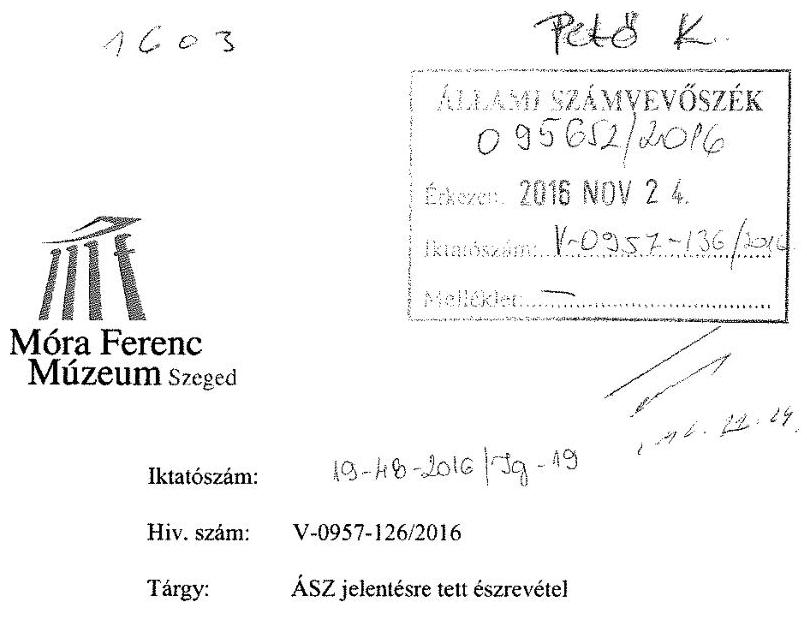

Tisztelt Állami Számvevőszék!

Az Állami Számvevőszéktől 2016. november 09-én megkaptuk a „Megyei hatókörű városi múzeumok ellenőrzése" tárgyban lefolytatott ellenőrzéséről készített jelentéstervezetét, melyre az alábbi észrevételeket kívánjuk tenni. Észrevételeinket a jelentéstervezetben felvetett kérdéskörök sorendjében, azok sorszámozásának betartásával állítottuk össze.

# ÖSSZEGZÉS 

## Főbb megállapítások, következtetések, javaslatok

- Az összefoglalóban tett megállapítások teljességére jellemző, hogy a részletezésben tárgyalt kisebb szabálytalanságokra hivatkozva olyan túlzó megállapításokat tesznek, melyek messze nincsenek összhangban az elkövetett vétségek szintjével, ráadásul sokszor általánosító jellegűek, konkrétumok nélkül. A jelentéstervezettel kapcsolatban továbbá megjegyezzük, hogy a jelentés lényeges kérdéskörei - különösen a 2.1, 3., 4.1, 4.3, 5.5.3,
 és 6. - összegző megállapításai, illetve megállapításai olyan, a Múzeumra nézve súlyos és hátrányos tényállításokat, minősítéseket tartalmaznak, amelyek - tudomásul véve és elismerve a Tisztelt Számvevőszék által alkalmazott értékelési rendszert - álláspontunk szerint nem következnek a kifejtésben leírtakból, esetenként azokkal ellentétesek, önmaguknak ellentmondóak.
- A jelentés tervezet első bekezdésében nem kerül megfogalmazásra, hogy a múzeum a vizsgált időszak mely részében, és melyik fenntartó működtetése alatt nem rendelkezett megfelelő tartalmú alapító okirattal.
2012. évben a múzeum nem volt önállóan működő és gazdálkodó intézmény. Ebben az időszakban a pénzügyi és vagyongazdálkodási feladatok szabályszerű végzését a Csongrád Megyei Intézményfenntartó Központ gyakorolta. Az ezzel összefüggő szabályzatoknak és azoknak a hatályban lévő jogszabályokkal történő megfeleltetése, aktualizálása a Csongrád Megyei Intézményfenntartó Központ feladata volt. A Múzeum

---

a szakmai feladatok zavartalan ellátását biztosította a költségvetésben meghatározott keretekhez igazodva.

# MEGÁLLAPÍTÁSOK 

## 1. Az irányító szerv Múzeumra vonatkozó feladatellátása szabályszerű volt-e?

- A munkáltatói jogosultságok 1. mondata szerint: 2013. március 8-án próbaidő lejártakor a gazdasági vezető jogviszonya megszüntetésre került. A fenntartó által a gazdaságvezetői álláshely betöltéséhez a pályázat kiírásra került. A kifogásolt 2013. március 8-13. közötti időszak alatt a pályázati elbírálás folyamatban volt.

2. Szabályszerűen hajtották-e végre a Múzeumot érintő szervezeti, szerkezeti átszervezéseket?

- 2. pont összegzésében megállapításra került, hogy az intézményt érintő önkormányzati alrendszerből, a központi alrendszerbe történő 2012. január 1-től hatályos irányítószervi váltás végrehajtása nem volt szabályszerű. Ugyanakkor az ellenőrzés a 2.2. pontban a 2013. január 1-vel végrehajtott fenntartóváltást szabályszerűnek minősítette. A két megállapítás összegzéseként azonban az került megállapításra, hogy az intézményváltás nem volt szabályszerű, az átláthatóság nem volt biztosított, így az összegzés kizárólag a múzeumra hátrányos megállapítás alapjául szolgáló időszakot vette figyelembe.

3. A belső kontrollrendszer kialakítása és működtetése megfelelt-e a jogszabályi előírásoknak?

- A 3. pont összegzésében rögzítésre került, hogy a belső kontrollrendszer 2011-2014. években nem volt szabályszerű. A megállapítás itt is teljes mértékben figyelmen kívül hagyja a kifejtésben rögzített tényeket, amelyek sorra veszik, hogy:
- az SZMSZ az Áht. rendelkezései szerint rendelkezésre állt,
- a számlarendet az igazgató elkészítette, 2013-ban pedig kiadásra került a számlarendet alátámasztó bizonylati rend is,
- a leltározási szabályzat a hatályos jogszabályok szerint elkészült,
- mint ahogy az értékelési szabályzat is,
- a pénzkezelési szabályzat szintén a Számviteli tv. rendelkezéseinek megfelelő volt,
- mint ahogy a FEUVE szabályzat is,
- az ügyrend megfelelően rögzítette a felelősségi és hatásköri viszonyokat.

Fentiek ellenére a megállapítás akként állítja be, mintha a múzeum teljes mértékben jogszabálysértően működne. A megállapítást az ellenőrzés olyan, a fenti jelentős és meghatározó szabályszerűséget alátámasztó tényekkel szemben jelentéktelen adminisztratív hivatkozásokkal indokolja, mint például, hogy az SZMSZ nem tartalmazza a Múzeum költségvetési törzskönyvi azonosító számát, az alapító okirat keltét, nem került szabályozásra az értékkel nem rendelkező kulturális javakkal kapcsolatos külön nyilvántartások és a főkönyvi nyilvántartás kapcsolata.
Álláspontunk szerint a Múzeum működésére nagy hatást gyakorló, egyébként az ellenőrzés által is megállapítottan jogszerű körülményekkel szemben a kontrollrendszerre elhanyagolható befolyással bíró hiányosságokból nem lehet levonni azt a következ-

---

tetést, hogy a teljes belső kontrollrendszer kialakítása és működtetése nem felelt meg a jogszabályi előírásoknak.

- 3.1. számú megállapítás 2. bekezdésének 3. francia bekezdéséhez: A helyettesítés rendje a Móra Ferenc Múzeum Gazdálkodási szabályzatában került szabályozásra. A következő SZMSZ módosítás során a helyettesítés rendje beemelésre kerül.
- 3.1. számú megállapítás 2. bekezdésének 4. francia bekezdéséhez: 2012-ben a múzeum nem volt önállóan működő és gazdálkodó szervezet. Ebből kifolyólag a fenntartó és a gazdálkodási jogkör gyakorlója rendelkezett a belső ellenőrzést végző személy, szervezet kinevezéséről. A múzeum a belső ellenőrzést 2013. II. félévében külső vállalkozóval megkötött megbízási szerződés alapján látta el. A szerződés visszamenőleges hatállyal került megkötésre, így nem volt akadályoztatva, hogy a belső ellenőrzés 2013. I. félévére vonatkozóan is lefolytatásra kerüljön.
- 3.2. számú megállapítás 3. bekezdéséhez: A múzeum működéséből adódóan a vagyonnyilatkozat tételére kötelezetteknél a vagyonnyilatkozati eljárást a jogszabálynak megfelelően lefolytatta. A vagyonnyilatkozatok a személyi anyaghoz csatolásra kerültek. A vagyonnyilatkozat-tételi kötelezettségre vonatkozó szabályozások az SZMSZ következő módosítása során annak rendelkezései közé beemelésre kerülnek.
- 3.4. számú megállapítás 2. bekezdés 1. francia bekezdéséhez: A vizsgált időszakban a múzeumban kialakított kommunikációs, információs rendszer alapját a kiépített belső informatikai rendszer adta. Ezen a hálózaton keresztül minden érintett szervezeti egységhez és személyekhez eljutott a számára szükséges információ. A múzeum középvezetői részére a múzeum vezetője minden hónapban vezetői értekezletet hív össze, az értekezletekről jegyzőkönyv készül, melyet minden vezető írásba megkap.
- 3.5. számú megállapításához: A 2012. évben a múzeum nem volt önállóan működő és gazdálkodó szervezet. Ebből kifolyólag fenntartó és a gazdálkodási jogkör gyakorlója rendelkezett a belső ellenőrzést végző személy, szervezet kinevezéséről. A múzeum a belső ellenőrzést 2013. II. félévében külső vállalkozóval megkötött megbízási szerződés alapján látta el. A szerződés visszamenőleges hatállyal került megkötésre, így nem volt akadályoztatva a belső ellenőrzés 2013. I. félévére vonatkozó lebonyolítása.

# 4. A Múzeum pénzügyi gazdálkodása szabályszerű volt-e? 

- A 4. pont összegzésében megállapításra került, hogy a múzeum pénzügyi gazdálkodása nem volt szabályszerű. Az összegző megállapítás rendkívül elmarasztaló annak ellenére, hogy ebben a pontban megállapításra került, hogy:
- a költségvetés tervezése, a bevételi és kiadási előirányzatok megállapítása szabályszerű volt,
- a maradvány kimutatása megfelelő volt,
- az éves beszámolókat, az elfogadott költségvetéssel, a pénzforgalmi illetve költségvetési jelentések és a pénzforgalmi kimutatások közti összehasonlíthatóságot biztosítva állította össze a Múzeum,
- a bevételek számviteli nyilvántartása megfelelt az Áhsz. előírásainak,
- a felhalmozási kiadások elszámolása 2012-2014. években megfelelő volt,
- az eszközök bekerülési értékének meghatározása és azok elszámolása szabályszerűen történt,

---

- A pénzügyi egyensúly biztosított volt,
- A zavartalan feladatellátás érdekében a Múzeum tett intézkedéseket a fizetőképesség fenntartására,
- A Múzeumnál az ellenőrzött időszakban likviditási problémák nem jelentkeztek,
- A múzeumi igazgató a követelések alapján fizetési felszólításokat küldött. Amennyiben az ismételt felszólítások nem jártak eredménnyel, a Múzeum a követelések jogi úton történő behajtásáról intézkedett.

Fentiek ellenére az összegző megállapítás azt a következtetést vonta le, hogy a pénzügyi gazdálkodás nem volt szabályszerű, csak mert az előirányzat-módosítások nyilvántartása nem volt megfelelő. Álláspontunk szerint a Múzeum működésére hatást gyakorló, egyébként az ellenőrzés által is megállapítottan jogszerű körülményekkel szemben nem lehet ezt a következtetést levonni. A vizsgálat egyetlen esetben sem állapított meg hiányt, vagy bármilyen jellegű, a Múzeumot ért kárt, indokolatlan költséget, vagy kiadást. Álláspontunk szerint a fentiekben idézett megállapítások egymásnak ellentmondóak és a részletes leírásokból nem következnek a megállapításban foglalt negatív értékelések.

- 4.1. számú megállapítás 2. bekezdésének 3. mondatához: 2012. évi Áhsz. 149 (1) bekezdésében előírt adattartalmú előirányzat-módosítást alátámasztó analitikus nyilvántartás vezetése a Csongrád Megyei Intézményfenntartó Központ feladata volt.
- 4.1. számú megállapítás 3. bekezdésének 3. mondatához: A Múzeum a 2013. évi maradványáról az Áhsz.-ben előírt határidőre tájékoztatta az irányító szervezetét. Ennek a KGR beszámoló rendszer 2013. évi beszámolójának 2014.02.26-i mentésével tett eleget. A rendszerben az irányítószévvel egyeztetett beszámolóadatok kerültek feladásra. Kinyomtatásra, aláírásra 2014. március 7. került sor. A múzeum a 2011. évi beszámoló űrlapjainak 2012.02.28-i feladásával a fenntartó felé történő tájékoztatási kötelezettségének eleget tett. A beszámolót a fenntartó 2012.02.29-én visszautasította ugyan, de a múzeum részéről ugyanezen a napon ismételten feladásra került. A fenntartó 2012.03.01-én a beszámolót jóváhagyta. A KGR rendszerből a beszámoló kinyomtatása és aláírása 2012.03.05-én történt meg.
- 4.2. számú megállapítás 1. bekezdésének 2. mondatához: 2013-ban az átadás-átvétel során a múzeum rendelkezett olyan vagyonelemmel, melynek az átadás-átvétel kapcsán vagyonkezelése 2013-ban nem volt tisztázott. A vagyonelem a folytonosság elvét követve nyilvántartási értéken a mérlegben bemutatásra került. További megállapításokra tett további észrevételeinket az 5.1 pontban részletezzük.
- 4.3. számú megállapítás 2. bekezdésének 2-3. mondatához: A megállapítás nem részletezi, hogy 2012-ben mely állami tulajdonú vagyontárgyak kerültek jogalap nélküli hasznosításra. A Csongrád Megyei Intézményfenntartó Központ vagyonhasznosítás jogszerűtlenségére nem hívta fel a múzeum vezetésének figyelmét. Ezen pontban az is megállapításra került, hogy 2013-2014. évben állami tulajdonú vagyontárgyak hasznosítása vagyonkezelési szerződés nélkül történt, azonban ezen megállapítás kifejtésére sem került sor, így konkrétumot egyáltalán nem tartalmaz. Megjegyezzük, hogy a kifogásolt időszakban a hatályos jogszabályok nem rendelkeztek egyértelműen a vagyonkezelői kérdésekről, ezért nem jogos, hogy ennek hátrányos következményeit a múzeum terhére rója fel az ellenőrzés.

---

- 4.3. számú megállapítás 3. bekezdésének 2. mondatához: A múzeumnál 4 fő muzeológus, 1 fő kulturális szervező részére lett megállapítva idegen nyelvpótlék. Az általuk végzett tudományos, kutató és szervező munka mindennapos végzéséhez elengedhetetlen az idegen nyelvhasználat. A fentieken felül 1 fő teremőr rendelkezik idegen nyelv használata címen illetménypótlékkal. Szeged az ország 3. legnagyobb lakosságszámmal rendelkező városa, ezen felül kiemelt egyetemi város, ahol sok külföldi diák tanul, és emellett nagy idegenforgalommal is rendelkezik. Ennek következtében - nem kis örömünkre és a megfeszített munkánk elismerésére - sok külföldi látogató keresi fel a múzeumot. Az európai szintű normákhoz való közelítéshez elengedhetetlen, hogy legalább 1 fő teremőr rendelkezzen az idegen nyelv használatának képességével. A fenti esetekben, véleményünk szerint az indokoltság kérdésének vitatása fel sem merülhet.
- 4.3. számú megállapítás 3. bekezdésének 3. mondatához: A kiadások felhasználásának ellenőrzése során a dologi kiadásoknál 2011-ben egy esetben kifogásolta a Kbt. 37.§ (3) bekezdés szerinti egybeszámítási szabály alkalmazásának elmulasztását. A jelentés tervezetben nem kerül részletezésre, hogy konkrétan mely esetre vonatkozóan került a megállapítás a tervezetbe, így ezt sem elismerni, sem megcáfolni nem lehetséges.
- 4.3. számú megállapítás 5. bekezdésének 5. francia bekezdéséhez: A beszerzések teljesítésigazolása a számlákra túlnyomó részben rávezetésre kerültek. A vizsgált időszakban eszközölt beszerzések szakmai teljesítésigazolásának hiánya csak részben merült fel. Ezen megállapítás vonatkozásában előadjuk, hogy a Múzeum által kötött szerződésekre, utalványozásokra általánosságban nem alkalmazható, a vizsgálat által feltárt rendkívül csekély számú esetleges hibákból a megállapításban meghatározott általános hatályú túlzott következtetés.
- 4.3. számú megállapítás 5. bekezdésének 6. francia bekezdéséhez: A múzeumnál könyvvezetésére alkalmazott integrált informatikai rendszer használatával kiállított utalványrendeleteken a dátum minden esetben rögzítésre került.
- 4.4. számú megállapítás: A régészeti tevékenység vizsgálata során feltárt hiányosságok, hibahatások véleményünk szerint megközelítőleg sem akkora súlyúak, hogy az egész régészeti tevékenység jogszabályi előírásoknak való megfelelése „nem megfelel" minősítést kapjon.
- 4.4. számú megállapítás, Régészeti kiadások, 2. bekezdés: A 2011. szeptember 2. 2012. december 31. közötti időre vonatkoztatott 5/2010. (VIII. 18) NEFMI rendelet 20. § (3). a régészeti feltárási tevékenység munkafolyamatát szabályozza, a pénzeszközök felhasználásáról vezetendő analitikus nyilvántartásról nem rendelkezik. A régészeti kiadások felhasználása során megállapításra került további konkrét hibákat sem e fejezet, sem a 4.3 fejezet nem sorolja fel. Szintén ebben a pontban került megállapításra az is, hogy bár

 a régészeti feltárási tevékenység bevételeinek elszámolását a jogszabályokban előírt tartalmú szerződések támasztották alá, a kiadások elszámolása nem felelt meg a jogszabályi előírásoknak.
A megállapítás annak ellenére negatív, hogy:
- a Múzeum a hatályos jogszabályoknak megfelelően elkészítette a költségterveket, illetve az ásatási dokumentációt,
- az elszámolási forintszámlát szintén szabályszerűen megnyitotta,

---

- a részletezés azt is megállapította, hogy a régészeti kiadások elszámolását megalapozó dokumentumok rendelkezésre álltak,
- a régészeti szolgáltatásokra kötött szerződések alapján teljesített kifizetések megfeleltek a jogszabályi előírásoknak.

Álláspontunk szerint az ellenőrzés által is megállapítottan jogszerű körülményekkel szemben felhozott, nem a pénzügyi elszámolásról szóló, hanem a régészeti feladatellátást részletező jogszabályi hivatkozásra alapozva nem lehet levonni azt a következtetést, hogy a Múzeum jelentős működési bevételét adó régészeti feltárásokkal kapcsolatos források felhasználása nem volt átlátható.

# 5. A Múzeum vagyongazdálkodása szabályszerű volt-e? 

- A 5. pont összegzésében szerepel az a súlyos megállapítás, hogy a Múzeum vagyongazdálkodása nem volt szabályszerű, az 5.1. pontban pedig az, hogy az eszközök és a források nyilvántartása nem felelt meg a jogszabályi előírásoknak. A kifejtésben a fenti megállapításokat az ellenőrzés azzal indokolta, hogy a kezelt vagyon kimutatására szabálytalanul a Múzeumnál került sor. A szabálytalanság vonatkozásában az ellenőrzés a Számv.tv. 23. § (2) bekezdésére, az Nvtv 11. § (8) bekezdésére, valamint az Áhsz. 15. § (1) bekezdésére hivatkozik. Értelmezésünk szerint a felhívott jogszabályhelyek egyáltalán nem tartalmaznak olyan szabályokat, amelyeket a Múzeum megsértett volna.
- 5.1. számú megállapítás 4. bekezdésének 2. mondatához: A vizsgált időszakban nem volt tisztázott a vagyonkezelő személye. Az MNV Zrt. a beszámoló elkészítéséig a múzeummal nem kötött vagyonkezelési szerződést. A múzeum ezen vagyonelemeket az állami vagyon megőrzésének érdekében szerepeltette a mérlegében.
- 5.1. számú megállapítás 5. bekezdésének 1. mondatához: Ezen pontban megállapításra került, hogy a mérlegben kimutatott vagyon nyilvántartása nem volt megfelelő, aminek következtében nem érvényesült a Számviteli tv. 15. § (2) és (3) bekezdése szerinti teljesség és valódiság elve, mivel mindössze két tétel (35,9 M forint és $188,9 \mathrm{M}$ forint) az ellenőrzés szerint nem megfelelően került a passzív, illetve aktív időbeli elhatárolásként szerepeltetve. A felhívott törvényhely (2) bekezdése szerint: A gazdálkodónak könyvelnie kell mindazon gazdasági eseményeket, amelyeknek az eszközökre és a forrásokra, illetve a tárgyévi eredményre gyakorolt hatását a beszámolóban ki kell mutatni, ideértve azokat a gazdasági eseményeket is, amelyek az adott üzleti évre vonatkoznak, amelyek egyrészt a mérleg fordulónapját követően, de még a mérleg elkészítését megelőzően váltak ismertté, másrészt azokat is, amelyek a mérleg fordulónapjával lezárt üzleti év gazdasági eseményeiből erednek, a mérleg fordulónapja előtt még nem következtek be, de a mérleg elkészítését megelőzően ismertté váltak (a teljesség elve). A (3) bekezdés szerint: A könyvvitelben rögzített és a beszámolóban szereplő tételeknek a valóságban is megtalálhatóknak, bizonyíthatóknak, külsőállók által is megállapíthatóknak kell lenniük. Értékelésük meg kell, hogy feleljen az e törvényben előírt értékelési elveknek és az azokhoz kapcsolódó értékelési eljárásoknak (a valódiság elve). Álláspontunk szerint a Számviteli törvény mindkét elve érvényesült a Múzeum könyvvitelében, a kifogásolt passzív és aktív időbeli elhatárolások esetleges nem megfelelő szerepeltetéséből, egyéb törvényi feltételek hiányában egyáltalán nem következik a két elv sérülése. Egyéb körülményt (hiányt, többletet) az ellenőrzés nem igazolt, így a negatív megállapítás véleményünk szerint nem releváns és túlzott.

---

- 5.1. számú megállapítás 5. bekezdésének 3. francia bekezdéséhez: A 2014. évben az analitikus nyilvántartásokban bemutatott a szállítók mérleg fordulónapi értéke tévesen nem a kötelezettségek, hanem a passzív időbeli elhatárolások között, a vevők fordulónapi értéke nem a követelések, hanem az aktív időbeli elhatárolások közé került beállításra. A rossz mérlegsoron történő kimutatás a mérleg főösszegét nem befolyásolja. A 2014. évben bevezetésre került új számviteli elvek ellentmondásosan értelmezhetőek voltak. Az új könyvviteli elvek még 2015-ben is jelentős változásokon mentek keresztül. Ebből kifolyólag kerülhetett az aktív és a passzív elhatárolások között kimutatandó vagyonelemek köre téves értelmezésre.
- 5.1. számú megállapítás 5. bekezdésének 4. francia bekezdéséhez: A 2012. évben a múzeum nem volt önállóan működő és gazdálkodó intézmény. Erre az időszakra a pénzügyi és vagyongazdálkodási feladatokat a Csongrád Megyei Intézményfenntartó Központ gyakorolta. A 2012-ben kiküldött felszólítás utáni befizetést a Csongrád Megyei Intézményfenntartó Központ ellenőrizte. A Múzeum felé a felszólítás kiküldése után az akkori fenntartó nem jelezte, hogy a követelés nem érkezett be a számlára, majd a 2013. évi átadás-átvételi dokumentumokban sem tüntette fel az összeget, mint be nem hajtott követelést.
- 5.1. számú megállapítás 6. bekezdésének 4-5. mondatához: A 20/2002 (X.4.) NKÖM rendelet szerint duplumnaplót az alábbi tárgyakról kell vezetni: „a gyűjteményekben már megtalálható példányokkal azonos, azokkal minden tartalmi adatukban megegyező kulturális javakról (pl. sorozatban előállított numizmatikai anyag vagy iparművészeti alkotás, sokszorosított grafika, plakát, röplap), amelyek megtartása ideiglenesen, cserealap képzése, közművelődési felhasználás céljából vagy más okból indokolt." A múzeum működési gyakorlatában - például kifejezetten a történeti gyűjtemény szempontjából - azonos tárgyakból 3 példányt vagy darabot leltározunk be, vagyis a hivatalos leltárban, a leltárkönyvben maximum 3 azonosnak tekinthető tárgy szerepel. Ezek a kvázi duplumok esetében azonban a csere lehetősége fel sem merül, hiszen a gyűjtemény egyenjogú részei lesznek az azonos jellegű tárgyak, dokumentumok is. Értelmezésünk szerint akkor kell a közgyűjteménynek külön duplumnaplót vezetnie, ha a napi múzeumi működés része a más intézményekkel való tárgy- vagy dokumentumcsere lehetősége. A szegedi Móra Ferenc Múzeumban évtizedekre visszamenően ilyen gyakorlat nincs. A régészetben a duplum tárgy kifejezés nem értelmezhető, hiszen minden örökségvédelmet érintő tárgy egyedinek számít. Szintén nincs szakmai relevanciája sem a képzőművészeti, sem az irodalomtörténeti, sem a természettudományi gyűjtemény esetén az azonos jellegű tárgy fogalmának, hiszen minden érintett tárgy vagy dokumentum sajátos plusz információt hordoz a múltról. A múzeumi éremtárban kétszáz darabnyi modernkori pénz- és jelvény duplum szekrénykataszteri nyilvántartásban szerepel. A néprajzi gyűjteménybe került tárgyakat, amennyiben azonos küllemű darabokról van szó, a leltárkönyvben tartjuk nyilván: ilyenkor a tárgyleírás mellett az adott darabszám szerepel. Egyedi nyilvántartásba kerülnek az eltérő időben, eltérő helyről bekerült, esetleg korábbiakkal azonosnak tűnő tárgyak is. Az egyedileg történő nyilvántartásba vételt az is indokolja, hogy így tudjuk dokumentálni a használat körülményeit, a bekerült tárgyegyüttesek összefüggéseit. Az egyes tárgyak ezáltal nincsenek kiszakítva társadalmi/történeti környezetükből. A gyűjtemény jellegéből adódóan nincs duplumként meghatározható műtárgyunk, mivel a tudományos szempontból kevéssé értékelhető darabokat nem fogadjuk be. A múzeumi tárgyak cseréje intézményünkben nem nyert jogosultságot. Amennyiben a fenntartó vagy más hatóság

---

részéről közvetlen elvárásként fogalmazódik meg, akkor a múzeum hivatalos döntést hoz a duplumnapló használatáról, de életszerűen ez egy üres nyilvántartó napló lenne. A múzeum gyűjteményéhez kapcsolódóan az éremtárban van jelen markáns mennyiségű - önállóan számon tartható - letéti anyag. Az éremtárban letétet kezelünk, de ezek komplett gyűjtemények (vidéki múzeumok itt letétben lévő gyűjteményei), amely gyűjteményegyütteseknek a múzeumunkban őrizzük leltárkönyveit is, így külön letéti naplóra e gyűjteményi területen nincs szükség. A többi gyűjtemény esetén - különös tekintettel a képzőművészeti gyűjteményre - a múzeumi igazgató intézkedett a letéti napló, mint jogszabályban meghatározott úgynevezett külön nyilvántartás vezetéséről. Megjegyezzük továbbá, hogy maga az ellenőrzés is megállapította, hogy a nemzeti vagyonba tartozó kulturális javak nyilvántartása a Múzeumnál a 20/2002 (X.4.) NKÖM rendelet szerint hagyományos módon biztosítva volt.

- Az 5.2. pont összegzése megállapította, hogy a mérlegtételek értékelése, illetve a költségvetési beszámoló mérlegének leltárral való alátámasztása nem felel meg a jogszabályoknak. Ezt a megállapítást a részletezés - megállapítva azt, hogy 2011. évben a Múzeum eljárása megfelelt a hatályos jogszabályoknak - azzal indokolta, hogy bár elismerten volt mérleget alátámasztó leltár, azonban a leltárban szereplő vagyonnak a Múzeum nem volt a vagyonkezelője. Álláspontunk szerint a részletezés és a megállapítás között itt sem fedezhető fel okozati összefüggés. Egyrészt a leltárban szereplő vagyont - mint ahogy azt az ellenőrzés is elismerte - a Múzeum használta, másrészt az, hogy a használó, illetve a vagyonkezelő esetlegesen nem azonos (bár ez nyilvánvalóan vita tárgyát képezi) nem jelenti azt, hogy a vezetett és vitán felül rendelkezésre álló leltár nem alkalmas a költségvetési beszámoló mérlegének leltárral való alátámasztására.
- 5.2. számú megállapítás 4. bekezdésének: A 2013-2014. évben a főkönyvi könyvelés és az analitikus nyilvántartások adatai közötti egyeztetést a gazdaságvezető nem ellenőrizte. Ebből adódó hiányosságokat a későbbi belső ellenőrzés feltárta. A hiányosságok súlya maga után vonta a gazdaságvezető munkaviszonyának megszüntetését. A bekezdésben felsorolt hiányosságok a 2015. évi beszámoló elkészítése során rendezésre kerültek.
- 5.2. számú megállapítás 5. bekezdésében foglaltak önmaguknak is ellentmondóak, hiszen míg az első bekezdésben megállapításra került, hogy 2011. évben a leltár és annak mérleggel alátámasztottsága megfelelő volt, az 5. bekezdésben már megállapításként kerül rögzítésre, hogy 2011-2012. évben a leltár nem volt szabályos. Hivatkozunk arra is, hogy ezen megállapítás is kizárólag formai hibákkal és hiányosságokkal került indoklásra, az, hogy a leltár egyebekben ne lett volna valós, nem került megállapításra.
- 5.3. pont 1. és 2. bekezdéséhez: A múzeum a 29/2014. /IV. 10/ EMMI rendelet (a muzeális intézményekben őrzött kulturális javak kölcsönzéséről, valamint a kijelölési eljárásról szóló rendelete) alapján felülvizsgálta a kölcsönzésekkel kapcsolatos szerződéseket, eljárásokat. Ennek eredményeként az addig külön-külön a gyűjtemények által kezelt kölcsönzési szerződések egy központosított belső rendszerbe kerültek. A kölcsönzési szerződések iktatásán kívül 2014-től külön adminisztráció is zajlik ezen szerződésekkel kapcsolatban. A kölcsönözhető tárgyak közé a múzeum történeti, iparművészeti, képzőművészeti, irodalomtörténeti, numizmatikai, néprajzi, régészeti, természettudományi és fotó gyűjteményének darabjai tartoznak. Egy ennyire szerteágazó, széles spektrumú gyűjteménnyel rendelkezve egy egységes, mindenre kiterjedő és

---

mindenkinek megfelelő kölcsönzési rendszer (szerződés-tervezet forma) megalkotása egy folyamat eredménye volt. A múzeum 2014-től egységesítette a műtárgykölcsönzési szerződések formáját, figyelembe véve a hivatkozott rendelet előírásait. Jelenleg az EMMI Közgyűjteményi Főosztálya által ajánlott szerződésformulát a korábbival összehangolva, néhány ponton kiegészítve (felhasználva a vizsgálat során felmerült szempontokat is) használjuk. A jelenleg érvényes szerződési forma megfelel a jogszabályi előírásoknak és a fenntartó elvárásainak is. A múzeum mostanra rendelkezik egy olyan szerződési formával, amely teljes mértékben megfelel a kulturális javak állományvédelmi, vagyonbiztonsági és a bemutathatósági feltételeinek (reprezentációs bemutatás). A múzeum a korábbi, 2014-et megelőző működés során a jogszabályi elvek közül a legutóbbit, a bemutathatósági szempontokat tartotta kiemelt prioritásnak. A 29/2014. (IV. 10) EMMI rendelet megjelenése óta a Móra Ferenc Múzeum mindent megtesz annak érdekében, hogy az őrzésében levő kulturális javak a szóban forgó rendeletben foglaltaknak megfelelően kerüljenek kölcsönzésre, de ezzel párhuzamosan továbbra is fontos hangsúlyt fektet a bemutathatósági szempontokra, ugyanakkor emellett teljes körű körültekintéssel jár el az állományvédelmi és vagyonbiztonsági szempontokat illetően,
 különösen a nem muzeális intézmények és a külföldre történő kölcsönzés esetén. A raktárainkban őrzött kulturális javak kiállításra történő esetenkénti kölcsönadását (reprezentációs bemutatását) a hivatkozott rendelet 2. §-ának c) pontja értelmében közfeladatnak tekintjük. Intézményünk a régió kiemelkedő közgyűjteménye, szinte egyedüliként rendelkezik olyan kulturális javakkal, amelyek közzététele (kiállítása) az érintett területek lakóinak művelődését, identitásának megőrzését segíthetik. A felmerült kifogások a kölcsönszerződések csekély hányadát érintik, amelyek a korábbi, átmeneti időszakban keletkeztek.

- 5.3. pont 3. és 4. bekezdéséhez: elismerjük, hogy elvétve előfordult, hogy a kölcsönzéssel kapcsolatos adminisztráció nem volt pontos, de a Múzeum által kölcsönadott kulturális javak soha nem voltak veszélyben, a kölcsönvevő Múzeumokkal az állományvédelmi intézkedések, a szállítás, a csomagolás, az őrzés védelme, a klimatikus viszonyok egyeztetésre kerültek, és azok minden esetben a hatályos jogszabályok és a kulturális javak teljes biztonságát szolgálva kerültek teljesítésre. Ezt bizonyítja, hogy a múzeum által kölcsönadott kulturális javak a kölcsönzési idő lejártát követően kivétel nélkül, épségben, sérülésmentesen visszakerültek a Múzeumba.
Az ellenőrzés által feltárt adminisztrációs hiányosságokból álláspontunk szerint nem lehet azt a következtetést levonni, hogy a hasznosítás jogszabályellenes volt, a vagyonbiztonságra és az állományvédelemre vonatkozó előírások generálisan nem kerültek betartásra.

# 6. A Múzeum intézkedett-e az integritás szemlélet érvényesítése érdekében? 

- A 6. pont összegzésében megállapításra került, hogy a Múzeum nem intézkedett az integritási szemlélet érvényesítése érdekében. Ismereteink szerint az Integritási projekt egy, az ÁSZ által a 2014. évben indított program, melynek kötelező bevezetéséről jogszabály nem rendelkezik.

## II. számú melléklet

- A Múzeum integritásának vizsgálatát bemutató indexértékek táblázatba foglalása számunkra nem mutatja egyértelműen, hogy az itt feltüntetett indexértékek összehasonlítása a Gőcseji Múzeummal milyen viszonyítási szemlélet szerint történt.

---

# Összefoglalva: 

Általánosságban álláspontunk szerint a megállapítások és az összegző megállapítások sajnálatos módon nem veszik figyelembe azon tényt, hogy a múzeum a kifejtésben leírt néhány, sok esetben teljesen jelentéktelen szabályszegéstől eltekintve szabályosan működik, a szabályszegések az azokért felelős gazdasági igazgató jogviszonyának megszüntetésével megszüntek. Ennek megfelelően álláspontunk szerint a megállapítások és az összegző megállapítások nem alkotnak objektív képet a múzeumról.

A megállapítások azt sem veszik figyelembe és a kifejtésben sem került rögzítésre, hogy a volt gazdasági igazgató jogviszonyának megszünését követően a vizsgálat nem tárt fel szabálytalanságot.

Szeged, 2016. november 21.

Tisztelettel:
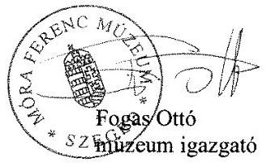

---

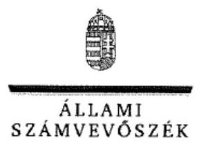

ELNÖK

Ikt.szám: V-0957-138/2016.

# Fogas Ottó úr 

igazgató
Móra Ferenc Múzeum

## Szeged

## Tisztelt Igazgató Úr!

A „Megyei hatókörű városi múzeumok ellenőrzése - Móra Ferenc Múzeum, Szeged" címmel készített számvevőszéki jelentéstervezetre tett észrevételét köszönettel megkaptam.
Az Állami Számvevőszék észrevételre vonatkozó álláspontjáról a felügyeleti vezető által készített részletes tájékoztatást csatoltan megküldöm.
Tájékoztatom Igazgató urat, hogy a számvevőszéki jelentésben - az Állami Számvevőszékről szóló 2011. évi LXVI. törvény 29. § (3) bekezdése alapján - a figyelembe nem vett észrevételeket szerepeltetjük az elutasítás indokának feltüntetésével.

Budapest, 2016. 12. hó 0. nap
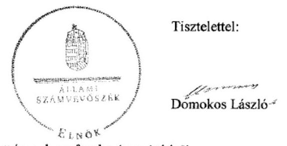

Melléklet: Tájékoztatás az elfogadott és az el nem fogadott észrevételekről

---

# Tájékoztatás az elfogadott és az el nem fogadott észrevételekről 

A „Megyei hatókörű városi múzeumok ellenőrzése - Móra Ferenc Múzeum, Szeged"című jelentéstervezetre a 19-48-2016/1g-19 iktatószámú levelében tett észrevételeit áttekintettük, annak kezeléséről az alábbi tájékoztatást adom

## 1. ÖSSZEGZÉS

## 1. A jelentéstervezet 5. oldal „Összegzés" fejezet megállapításaira, valamint jelentéstervezetre tett általános észrevétele kapcsán

Észrevételében foglaltak szerint az „Összegzés" fejezet a részletezésben tárgyalt kisebb szabálytalanságokra hivatkozva olyan túlzó megállapításokat tartalmaz, amelyek messze nincsenek összhangban az elkövetett vétségek szintjével, ráadásul sokszor általánosító jellegűek, konkrétumok nélkül. A jelentéstervezettel kapcsolatban továbbá megjegyezte, hogy a jelentés lényeges kérdéskörei különösen a 2.1., 3., 4.1., 4.3., 5., 5.3. és 6. összegző megállapításai, illetve az azokat alátámasztó megállapítások a Móra Ferenc Múzeumra (továbbiakban: Múzeum) nézve súlyos és hátrányos tényállításokat, minősítéseket tartalmaznak. Észrevételét nem fogadtuk el, mert a Múzeum gazdálkodását az ellenőrzött időszakban az ellenőrzési kérdésekre adott válaszok alapján értékeltük, amelyet „Az ellenőrzés módszerei" című fejezet részletesen tartalmazza. Az ellenőrzés típusát tekintve megfelelőségi ellenőrzést végeztünk, amelynek keretében a Múzeum gazdálkodását a jogszabályi előírások alapján értékeltük. A jelentéstervezet „Megállapítások" fejezete tartalmazza, hogy mely jogszabályi rendelkezést nem tartotta be a Múzeum. Észrevétele a megállapításokat nem cáfolja, ezért azokat nem módosítja.

## 2. A jelentéstervezet 5. oldal „Főbb megállapítások, következtetések, javaslatok" fejezet 1. és 2. bekezdésének megállapításaira tett észrevétele kapcsán

A hivatkozott fejezet első bekezdésére tett észrevételét - amely szerint nem került megfogalmazásra, hogy a múzeum a vizsgált időszak mely részében, és melyik fenntartó működtetése alatt nem rendelkezett megfelelő tartalmú alapító okirattal - nem fogadtuk el, mert a jelentéstervezet „Az ellenőrzés területe fejezet" 1. táblázata, valamint a Rövidítések jegyzéke nevesíti az ellenőrzött évekhez hozzárendelve és indexelve a fenntartókat, továbbá a jelentéstervezet 1. számú megállapításának első bekezdése évenként és alapító okiratonként, azokat alsó index használatával megkülönböztetve mutatja be a feltárt hiányosságokat. Észrevétele a megállapításokat nem módosítja.

A második bekezdés megállapításaihoz kapcsolódó észrevételében tett tájékoztatását - a Múzeum 2012. évben nem volt önállóan működő és gazdálkodó intézmény, pénzügyi és vagyongazdálkodási feladatainak szabályszerű végzését a Csongrád Megyei Intézményfenntartó Központ gyakorolta, továbbá a Múzeum a szakmai feladatok zavartalan ellátását biztosította - köszönettel vettem. Észrevétele a megállapításokat nem cáfolja, ezért azokat nem módosítja.

---

# II. MEGÁLLAPÍTÁSOK 

II/1. A jelentéstervezet 16. oldal 1. számú megállapítás 2. bekezdésének 1. megállapításaira tett észrevétele kapcsán

Észrevétele megerősítette a jelentéstervezet 16. oldal 1. számú megállapítás 2. bekezdésének 1. megállapításában foglaltakat, hogy „2013. március 8-13. között nem volt kinevezett gazdasági vezető, az irányító szerv! ¹⁴ - az Aht.; 9. § (1) bekezdés c) pontja ellenére - nem intézkedett gazdasági vezető kinevezéséről, megbízásáról”, észrevétele ezért a megállapítást nem módosítja.

## II/2. A jelentéstervezet 17. oldal 2. számú megállapítására tett észrevétele kapcsán

Észrevételében jelzi, hogy a 2.1. számú és a 2.2. számú megállapítás eltérő minősítést tartalmaz a Múzeumot érintő szervezeti, szerkezeti átszervezéseket érintően, ezzel szemben a fejezet 2. számú összegző megállapítása a szervezeti, szerkezeti átszervezéseket összességében nem szabályszerűnek minősíti. Észrevételét nem fogadtuk el, mert a számvevőszéki ellenőrzést a „Megyei hatókörű városi múzeumok ellenőrzése" című ellenőrzési program alapján végeztük és a Múzeumot érintő szervezeti, szerkezeti átszervezéseket az ellenőrzési kérdésekre adott válaszok alapján értékeltük, amelyet a jelentéstervezetben „Az ellenőrzés módszerei" című fejezet részletesen tartalmaz. Észrevétele ezért a megállapításokat nem módosítja.

## II/3. A jelentéstervezet 19. oldal 3. számú megállapítására tett észrevétele kapcsán

Észrevételét a jelentéstervezet 19. oldal 3. számú megállapítására, hogy a jelentéstervezet a kontrollrendszerre elhanyagolható befolyással bíró hiányosságokból vonja le az összesített megállapítást, amely szerint a „belső kontrollrendszer kialakítása és működtetése a 2011-2014. években nem volt szabályszerű”, nem fogadtuk el. A belső kontrollrendszer kialakítását és működtetését az ellenőrzött témakörhöz tartozó ellenőrzési kérdésekre adott válaszok alapján értékeltük, amelyet a jelentéstervezetben „Az ellenőrzés módszerei" című fejezet részletesen tartalmaz. Észrevétele ezért a megállapítást nem módosítja.

## II/4. A jelentéstervezet 19. oldal 3.1. számú megállapítás 2. bekezdés 3. francia bekezdésének megállapítására tett észrevétele kapcsán

Köszönettel vettem tájékoztatását, hogy a szervezeti és működési szabályzatot módosítják, hogy az tartalmazza a helyettesítés rendjét. Észrevétele a megállapítást nem cáfolja, ezért azt nem módosítja.

## II/5. A jelentéstervezet 19. oldal 3.1. számú megállapítás 2. bekezdés 4. francia bekezdésének megállapítására tett észrevétele kapcsán

Köszönettel vettem tájékoztatását, hogy 2012-ben a múzeum nem volt önállóan működő és gazdálkodó szervezet, így a fenntartó és a gazdálkodási jogkör gyakorlója rendelkezett a belső ellenőrzést végző személy, szervezet kinevezéséről, továbbá a múzeum a belső ellenőrzést 2013. II. félévében külső vállalkozóval megkötött megbízási szerződés alapján látta el. Észrevétele nem vitatja a jelentéstervezet 19. oldal 3.1. számú megállapítás 2. bekezdés 4. francia bekezdésének megállapítását - „2011-2014. években az SZMSZ¹¹-ben a független belső ellenőrzést

---

végző személy, illetve szervezet jogállását, feladatait a Ber. ³⁷ 4. §(2) bekezdés és a Bkr. ³⁸ 15. § (2) bekezdésében foglaltak ellenére" - ezért azt nem módosítja.

# II/6. A jelentéstervezet 21. oldal 3.2. számú megállapítás 3. bekezdésének megállapítására tett észrevétele kapcsán 

Köszönettel vettem tájékoztatását, hogy a szervezeti és működési szabályzatot módosítják, hogy az tartalmazza a vagyonnyilatkozat-tételi kötelezettséget. Észrevétele a megállapítást nem vitatja, ezért azt nem módosítja.

## II/7. A jelentéstervezet 22. oldal 3.4. számú megállapítás 2. bekezdés 1. francia bekezdésének megállapítására tett észrevétele kapcsán

Észrevételét a jelentéstervezet 22. oldal 3.4. számú megállapítás 2. bekezdés 1. francia bekezdésének megállapítására - „2011-2014. években nem alakított ki és nem működtetett olyan rendszert az Amr. 159. § (1) bekezdésben és a Bkr. 9. § (1) bekezdésben foglaltak ellenére amely biztosította, hogy az információk eljussanak a szervezeti egységekhez, személyekhez" - nem fogadtuk el. A kiépített belső informatikai rendszer és a havonként megtartott vezetői értekezlet, illetve az arról készült jegyzőkönyv együttvéve sem jelentik az információs, kommunikációs folyamatok olyan kialakítását és működtetését, amely biztosítja a szervezeti egységekhez, személyekhez a szükséges információk eljutását. Észrevétele azért a megállapítást nem módosítja.

## II/8. A jelentéstervezet 23. oldal 3.5. számú megállapítás 3. bekezdésének 2. megállapítására tett észrevétele kapcsán

Észrevételében jelzi, hogy 2012-ben fenntartó és a gazdálkodási jogkör gyakorlója rendelkezett a belső ellenőrzést végző személy, szervezet kinevezéséről, továbbá a Múzeum a belső ellenőrzést 2013. II. félévében külső vállalkozóval megkötött megbízási szerződés alapján látta el. A szerződés visszamenőleges hatállyal került megkötésre, így nem volt akadályoztatva a belső ellenőrzés 2013. I. félévére vonatkozó lebonyolítása. Észrevételét nem fogadtuk el, mert a Szociális és Gyermekvédelmi Főigazgatóság Csongrád Megyei Kirendeltségének 2015. február 1-jei nyilatkozata alapján a Múzeumnál belső ellenőrzést nem végeztek, továbbá a számvevőszéki ellenőrzés rendelkezésére bocsátott, észrevételében hivatkozott szerződést 2013. június 14-én írták alá. A jelentéstervezet 23. oldal 3.5. számú megállapítás 3. bekezdésének 2. megállapítása - „A múzeumigazgató a 2012. január 1. - 2013. június 30. közötti időszakban nem gondoskodott a belső ellenőrzés kialakításáról és működtetéséről az Ábt. 70. § (1) bekezdés, a Bkr. 15. § (1)(2) bekezdései, 16. § (2) bekezdésében foglaltak ellenére.”- megalapozott, észrevétele a megállapítást nem módosítja.

## II/9. A jelentéstervezet 24. oldal 4. számú megállapítására tett észrevétele kapcsán

Észrevételében arról tájékoztat, hogy a 4. számú megállapítást mindössze az előirányzat módosítások nyilvántartása nem megfelelősége támasztja alá, az ellenőrzés egyetlen esetben sem állapított meg hiányt, vagy bármilyen jellegű, a Múzeumot ért kárt, indokolatlan költséget, vagy kiadást, így álláspontjuk szerint a részletes megállapításokból nem következnek a megállapítás-

---

ban foglalt negatív értékelések. Észrevételét nem fogadtuk el, mert a Múzeum pénzügyi gazdálkodását az ellenőrzött témakörhöz tartozó ellenőrzési kérdésekre adott válaszok alapján értékeltük, amelyet a jelentéstervezetben ,,Az ellenőrzés módszerei" című fejezet részletesen tartalmaz. A 4. számú megállapítást megalapozó megállapításokat a 4. számú fejezet mutatja be. A 4. számú megállapításunk - „A Múzeum pénzügyi gazdálkodása nem
 volt szabályszerű." - megalapozott, észrevétele a megállapítást nem módosítja.

# II/10. A jelentéstervezet 24. oldal 4.1. számú megállapítás 2. bekezdésének 3. megállapítására tett észrevétele kapcsán 

Észrevételében arról tájékoztatott, hogy a 2012-ben előirányzat módosítást alátámasztó analitikus nyilvántartás vezetése a Csongrád Megyei Intézményfenntartó Központ feladata volt. Észrevétele a megállapítást nem vitatja, ezért azt nem módosítja.

## II/11. A jelentéstervezet 24. oldal 4.1. számú megállapítás 3. bekezdésének 3. megállapítására tett észrevétele kapcsán

Észrevételében foglaltak alapján a Múzeum a 2013. évi maradványáról irányító szervi tájékoztatási kötelezettségének a KGR beszámoló rendszer 2013. évi beszámolójának 2014. február 26-i mentésével tett eleget, továbbá a beszámoló aláírására 2014. március 7-én került sor. A Múzeum a 2011. évi beszámoló űrlapjainak 2012. február 29-i ismételt és elfogadott feladásával a fenntartó felé történő tájékoztatási kötelezettségének eleget tett, a beszámoló aláírása 2012. március 5-én történt meg. Észrevételét nem fogadtuk el, mert a 2011. évi maradvány 2012. február 29-i elfogadott feladása és a 2013. évi maradvány feladása a Magyar Államkincstár által üzemeltett KGR elektronikus rendszerbe önmagában nem felel meg az államháztartás szervezetei beszámolási és könyvvezetési kötelezettségének sajátosságairól szóló 249/2000. (XII. 24.) Korm. rendelet (továbbiakban: Áhsz.1) 10. § (1) bekezdése előírásának. Észrevétele megerősíti a jelentéstervezet 24. oldal 4.1. számú megállapítás 3. bekezdésének 3. megállapítását - „A Múzeum a 2011. évi és 2013. évi maradványról az Áhsz.1 10. § (1) bekezdésében rögzített határidő után nyújtott tájékoztatást (a 2011. évi maradványról 2012. március 5-én, a 2013. évi maradványról 2014. március 7-én)." - ezért a megállapítást nem módosítja.

## II/12. A jelentéstervezet 24. oldal 4.2. számú megállapítás 1. bekezdésének 2. megállapítására tett észrevétele kapcsán

Észrevételében arról tájékoztat, hogy 2013-ban az átadás-átvétel során a múzeum rendelkezett olyan vagyonelemmel, amelynek vagyonkezelése 2013-ban az átadás-átvétel kapcsán nem volt tisztázott. A vagyonelem a folytonosság elvét követve nyilvántartási értéken a mérlegben bemutatásra került. Észrevételét nem fogadtuk el, mert a folytonosság elvének - „Az üzleti év nyitóadatainak meg kell egyezniük az előző üzleti év megfelelő záróadataival. Az egymást követő években az eszközök és a források értékelése, az eredmény számba vétele csak e törvényben meghatározott szabályok szerint változhat (a folytonosság elve)" - betartása nem jelenti a számvitelről szóló 2000. évi C. törvény 15. § (2) és (3) bekezdésében előírt teljesség és valódiság elvének érvényesülését is. Észrevétele a jelentéstervezet 24. oldal 4.2. számú megállapítás 1. bekezdésének 2. megállapítását - „A 2013-2014. éves beszámolók mérlegei nem a Múzeum valós pénzügyi helyzetét tükröző adatokat tartalmaztak, sérül a Számv. tv. 15. § (2)-(3) bekezdésben foglalt

---

teljesség és valódiság elve (részletezés a jelentéstervezet 5.1. pontjában)." - nem cáfolja, ezért nem módosítja.

# II/13. A jelentéstervezet 25. oldal 4.3. számú megállapítás 2. bekezdésének 2., 3. megállapítására tett észrevétele kapcsán 

Észrevételében jelzi, hogy a megállapítás nem részletezi, hogy 2012-ben mely állami tulajdonú vagyontárgyak kerültek jogalap nélküli hasznosításra, továbbá a Csongrád Megyei Intézményfenntartó Központ vagyonhasznosítás jogszerűtlenségére nem hívta fel a Múzeum vezetésének figyelmét. Ezen pontban az is megállapításra került, hogy 2013-2014. évben állami tulajdonú vagyontárgyak hasznosítása vagyonkezelési szerződés nélkül történt, azonban ezen megállapítás kifejtésére sem került sor, így konkrétumot egyáltalán nem tartalmaz. Megjegyezte, hogy a kifogásolt időszakban a hatályos jogszabályok nem rendelkeztek egyértelműen a vagyonkezelői kérdésekről, ezért nem jogos, hogy ennek hátrányos következményeit a Múzeum terhére rója fel az ellenőrzés.

Észrevételét a megállapítások további részletezésére, hogy például 2012-ben mely állami tulajdonú vagyontárgyak kerültek jogalap nélküli hasznosításra, nem fogadtuk el, mert a bevételeknél a dokumentálás és elszámolás szabályszerűségét mintavétellel kiválasztott mintatételek alapján értékeltük, amelynek sokaságra történő kivetítését a számvevőszéki jelentéstervezet „Az ellenőrzés módszerei" című fejezet részletesen tartalmazza. A megállapításokat a számvevőszéki ellenőrzés rendelkezésére bocsátott dokumentumok alapozták meg. Észrevételét a vagyonkezelésre vonatkozóan szintén nem fogadtuk el, mert 2012-ben a Csongrád Megyei Intézményfenntartói Központ - a megyei intézményfenntartó központokról, valamint a megyei önkormányzatok konszolidációjával, a megyei önkormányzati intézmények és a Fővárosi Önkormányzat egészségügyi intézményeinek átvételével összefüggő egyes kormányrendeletek módosításáról szóló 258/2011. (XII. 7.) Korm. rendelet 10. § (1) bekezdésének b) pontja alapján - vagyonkezelőként látta el az átvett intézményi vagyon, mint állami tulajdonba került vagyon tekintetében a vagyonkezelői feladatokat. A muzeális intézményekről, a nyilvános könyvtári ellátásról és a közművelődésről szóló 1997. évi CXL. törvény 2013. január 1-jétől hatályos 45/A. § (2) bekezdésének a) pontja rendelkezése alapján pedig a Múzeum „vagyonkezelője a tevékenység ellátásához szükséges állami vagyonnak".

Észrevétele jelentéstervezet 25. oldal 4.3. számú megállapítás 2. bekezdésének 2., 3. megállapítását - „A 2012. évben vagyonkezelési szerződéssel a fenntartó, rendelkezett. A Múzeumnál a 2012. évben az állami tulajdonú vagyontárgyak hasznosítására, jogalap nélkül, a Vtv. 25. § (4) bekezdés szerinti vagyonhasznosításra feljogosító, a 2013-2014. években az Nvtv. 11. § (7) bekezdés szerinti vagyonkezelési szerződés nélkül került sor." - nem cáfolja, ezért azokat nem módosítja.

## II/14. A jelentéstervezet 25. oldal 4.3. számú megállapítás 3. bekezdésének 2. megállapítására tett észrevétele kapcsán

Észrevételében arról tájékoztatott, hogy Múzeumnál 4 fő főmuzeológus, 1 fő kulturális szervező részére lett megállapítva idegen nyelvpótlék. Az általuk végzett tudományos, kutató és szervező munka mindennapos végzéséhez elengedhetetlen az idegen nyelvhasználat. A fentieken felül 1

---

fő teremőr rendelkezik idegen nyelv használata címen illetménypótlékkal. Észrevételét nem fogadtuk el, mert a személyi juttatások tekintetében a dokumentálás és elszámolás szabályszerűségét mintavétellel kiválasztott mintatételek alapján értékeltük, amelynek sokaságra történő kivetítését a számvevőszéki jelentéstervezet „Az ellenőrzés módszerei" című fejezet részletesen tartalmazza. A megállapításokat az Állami Számvevőszék (továbbiakban: ÁSZ) részére rendelkezésre bocsátott dokumentumok alapján ellenőriztük és ezen dokumentumokra alapozva állapítottuk meg, hogy az „idegennyelv-tudási pótlékok a 2011., 2013. és 2014. években úgy kerültek kifizetésre, hogy az adott munkakörben a Kjt. 74. § (1) bekezdésben előírtak ellenére a magyar nyelv mellett meghatározott idegen nyelv rendszeres használata nem volt indokolt,". A számvevőszéki ellenőrzés rendelkezésére bocsátott dokumentumok nem tartalmazták a nyelvpótlék juttatásához kapcsolódó feladatot és feltételeket. Észrevétele a megállapítást nem módosítja.

# II/15. A jelentéstervezet 25. oldal 4.3. számú megállapítás 3. bekezdésének 3. megállapítására tett észrevétele kapcsán 

Észrevételében arról tájékoztat, hogy a kiadások felhasználásának ellenőrzése során a dologi kiadásoknál 2011-ben egy esetben kifogásolta az ellenőrzés a Kbt. 37. § (3) bekezdés szerinti egybeszámítási szabály alkalmazásának elmulasztását, továbbá a jelentéstervezetben nem került részletezésre, hogy konkrétan mely esetre vonatkozik a megállapítás, így ezt sem elismerni, sem megcáfolni nem lehetséges. Észrevételét a jelentéstervezet 25. oldal 4.3. számú megállapítás 3. bekezdésének 3. megállapítására - „A dologi kiadásoknál a 2011. évben egy esetben a Kbt. 1240. § (1) bekezdésében előírtak szerinti közbeszerzési nem folytatta le a Múzeum, mivel a Kbt. 37. § (3) bekezdés szerinti egybeszámítási szabály alkalmazását elmulasztották." - nem fogadtuk el. A megállapítást a számvevőszéki ellenőrzés rendelkezésére bocsátott dokumentumok alapján ellenőriztük, amelyek ismételt felülvizsgálata alapján a megállapítás megalapozott. Észrevétele a megállapítást nem módosítja.

## II/16. A jelentéstervezet 25. oldal 4.3. számú megállapítás 5. bekezdés 5. francia bekezdésének megállapítására tett észrevétele kapcsán

Észrevételében jelzi, hogy a beszerzések teljesítésigazolása a számlákra túlnyomó részben rávezetésre kerültek, valamint a vizsgált időszakban eszközölt beszerzések szakmai teljesítésigazolásának hiánya csak részben merült fel. A Múzeum által kötött szerződésekre, utalványozásokra általánosságban nem alkalmazható - a vizsgálat által feltárt rendkívül csekély számú esetleges hibák miatt - a megállapításban meghatározott általános hatályú túlzott következtetés.

Észrevételét nem fogadtuk el, mert a kiadások tekintetében a dokumentálás és elszámolás szabályszerűségét mintavétellel kiválasztott mintatételek alapján értékeltük, amelynek sokaságra történő kivetítését a számvevőszéki jelentéstervezet „Az ellenőrzés módszerei" című fejezet részletesen tartalmazza. A megállapításokat az ÁSZ részére rendelkezésre bocsátott dokumentumok alapján ellenőriztük és ezen dokumentumokra alapozva állapítottuk meg, hogy ,,a 2011. évben a szakmai teljesítésigazolást az Ámr. 76. § (1) bekezdés előírása ellenére, a 2012-2014. években a teljesítésigazolást az Ávr. 57. (1) bekezdés előírása ellenére nem végezték el". Észrevétele a megállapítást nem módosítja.

---

# II/17. A jelentéstervezet 25. oldal 4.3. számú megállapítás 5. bekezdés 6. francia bekezdésének megállapítására tett észrevétele kapcsán 

Észrevétele alapján a könyvvezetésre alkalmazott integrált informatikai rendszer használatával kiállított utalványrendeleteken a dátum minden esetben rögzítésre került. Észrevételét nem fogadtuk el, mert a kinyomtatott utalványon, nem az utalványozó aláírásához tartozó, nyomtatva feltüntetett dátum önmagában nem jelenti azt, hogy az utalványozó az utalványt a dátummal megjelölt napon a kifizetések előtt írta alá. Észrevétele a jelentéstervezet 25. oldal 4.3. számú megállapítás 5. bekezdés 6. francia bekezdésének megállapítását - „a 2011-2014. években több esetben a kiadások utalványozását nem az Ámr. 78. § (2) bekezdés a) pontjában, illetve az Ávr. 59. § (3) bekezdés g) pontjában foglaltaknak megfelelően végezték, mert az utalványozás keltezését nem tüntették fel." - nem módosítja.

## II/18. A jelentéstervezet 26. oldal 4.4. számú megállapításra tett észrevétele kapcsán

Észrevétele alapján a régészeti tevékenység vizsgálata során feltárt hiányosságok, hibahatások megközelítőleg sem akkora súlyúak, hogy az egész régészeti tevékenység jogszabályi előírásoknak való megfelelése „nem megfelel" minősítést kapjon. Észrevételét nem fogadtuk el, mert a hivatkozott 4.4. számú megállapításban nem az egész régészeti tevékenység, hanem „A régészeti tevékenység teljesített kiadásainak elszámolása nem felelt meg a jogszabályi előírásoknak a 2011-2014. években". A megállapítás megalapozását a 4.4. számú megállapítás 2. és 3. bekezdései tartalmazzák, kiemelve, hogy „a régészeti kiadások felhasználása során a 4.3. fejezetben már ismertetett hibák fordultak elő". A régészeti kiadások tekintetében a dokumentálás és elszámolás szabályszerűségét mintavétellel kiválasztott mintatételek alapján értékeltük, amelynek sokaságra történő kivetítését a számvevőszéki jelentéstervezet „Az ellenőrzés módszerei" című fejezet részletesen tartalmazza. Észrevétele a megállapítást nem módosítja.

## II/19. A jelentéstervezet 26. oldal 4.4. számú megállapítás 3. bekezdésének 1. megállapítására tett észrevétele kapcsán

Észrevételében arról tájékoztat, hogy a 2011. szeptember 2. - 2012. december 31. közötti időre vonatkoztatott 5/2010. (VIII. 18.) NEFMI rendelet 20. § (3) a régészeti feltárási tevékenység munkafolyamatát szabályozza, a pénzeszközök felhasználásáról vezetendő analitikus nyilvántartásról nem rendelkezik, továbbá az ellenőrzés által is megállapítottan jogszerű körülményekkel szemben felhozott, nem a pénzügyi elszámolásról szóló, hanem a régészeti feladatellátást részletező jogszabályi hivatkozásra alapozva nem lehet levonni azt a következtetést, hogy a Múzeum jelentős működési bevételét adó régészeti feltárásokkal kapcsolatos források felhasználása nem volt átlátható. Észrevételét nem fogadtuk el, mert az 5/2010. (VIII. 18.) NEFMI rendelet 20. § (3) bekezdése értelmében (2012. december 31-én hatályos szöveggel) „A megyei múzeum (a fővárosban a Budapesti Történeti Múzeum), a Kötv. 22. § (3) bekezdésében és 23. §-ában meghatározottak alapján, a területileg illetékes múzeumi feladatkörében átvett régészeti célú pénzeszközök felhasználásáról analitikus nyilvántartást vezet."
 A 2016. március 17-én és március 22-én készült és a Múzeum képviselői, valamint a számvevőszéki ellenőrzésben résztvevő ellenőrök által aláírt jegyzőkönyv szerint a Múzeum a pénzeszközök felhasználásáról jogszabályi előírás hiányában analitikát nem vezetett. Észrevétele a jelentéstervezet 26. oldal 4.4. számú

---

megállapítás 3. bekezdésének 1. megállapítását - „A Múzeum 2011. szeptember 2. - 2012. december 31. között az 5/2010. (VIII. 18.) NEFMI rendelet 20. § (3) bekezdésében foglaltak ellenére a pénzeszközök felhasználásáról analitikus nyilvántartást nem vezetett." - nem módosítja.

# II/20. A jelentéstervezet 27. oldal 5. számú megállapításra és az 5.1. számú megállapítás 2. bekezdésének megállapításaira tett észrevétele kapcsán 

Észrevételében foglaltak szerint az 5. számú megállapítás, hogy „A Múzeum vagyongazdálkodása nem volt szabályszerű.", valamint az 5.1. számú megállapítás, amely szerint „Az eszközök és források nyilvántartása nem felelt meg a jogszabályi előírásoknak." súlyos megállapítások, továbbá a hivatkozott megállapításokat az ellenőrzés azzal indokolta, hogy a kezelt vagyon kimutatására szabálytalanul a Múzeumnál került sor. Kiemelte, hogy a „szabálytalanság vonatkozásában az ellenőrzés a Számv.tv. 23. § (2) bekezdésére, az Nviv 11. § (8) bekezdésére, valamint az Ahsz. 15. § (1) bekezdésére hivatkozik", amely jogszabályhelyek értelmezése szerint nem tartalmaznak olyan szabályokat, amelyeket a Múzeum megsértett volna. Észrevételét nem fogadtuk el, mert az 5. számú megállapítást a fejezetben bemutatott, a feltárt hiányosságokat tartalmazó megállapítások támasztják alá, valamint az 5.1. számú megállapítás 2. bekezdésének megállapításai a hivatkozott jogszabályhelyek rendelkezései alapján megalapozottak. Észrevétele a megállapításokat nem módosítja.

## II/21. A jelentéstervezet 27. oldal 5.1. számú megállapítás 4. bekezdésének 2. megállapítására tett észrevétele kapcsán

Észrevételében kiemeli, hogy a vizsgált időszakban nem volt tisztázott a vagyonkezelő személye és az „MNV Zrt. a beszámoló elkészítéséig a múzeummal nem kötött vagyonkezelési szerződést", továbbá, hogy a Múzeum ezen vagyonelemeket az állami vagyon megőrzésének érdekében szerepeltette a mérlegében. Észrevételét nem fogadtuk el, mert a hivatkozott megállapítás nem azt kifogásolja, hogy az állami tulajdonú vagyonelemeket a Múzeum az állami vagyon megőrzésének érdekében szerepeltette a mérlegében, hanem azt, hogy „kiegészítő mellékletben a Múzeum a 2013-2014. években a Számv. tv. 23. § (2) bekezdésében előírtak ellenére nem mutatta be mérlegtételek szerinti megbontásban a kezelésbe vett állami eszközöket, és a 2014. évben az Ahsz. 29. § (2) bekezdés c) pontjában előírtak ellenére nem jelezte a vagyonkezelési szerződés hiányát, emiatt nem érvényesült a Számv. tv. 16. § (4) bekezdésében meghatározott „lényegesség elve"." Észrevétele a megállapítást nem módosítja.

## II/22. A jelentéstervezet 27. oldal 5.1. számú megállapítás 5. bekezdésének 1. megállapítására tett észrevétele kapcsán

Észrevételében jelzi, hogy a jelentéstervezet 5.1. számú megállapítás 5. bekezdés 3. francia bekezdésének megállapítása - „a 2014. évben az analitikus nyilvántartásokban a szállítók 35,9 millió Ft-os mérleg fordulónapi értékét a Számv. tv. 42. § (1) bekezdése ellenére passzív időbeli elhatárolásként, a vevők 188,9 millió Ft-os összegét a Számv. tv. 29. § (2) bekezdése ellenére követelés helyett aktív időbeli elhatárolásként szerepeltették a mérlegben" -, alapján nem lehet levonni az 5.1. számú megállapítás 5. bekezdésének 1. megállapításában foglaltakat, amely szerint „A MÉRLEGBEN KIMUTATOTT VAGYON NYILVÁNTARTÁSA nem volt szabályszerű, a szabálytalanságok miatt a 2013-2014. évi beszámolóban a Számv. tv. 15. § (2)-(3) bekezdés szerinti

---

teljesség és valódiság elve nem érvényesült." Észrevételét nem fogadtuk el, mert az 5.1. számú megállapítás 5. bekezdés 1. megállapításában foglaltakat nem csak a hivatkozott francia bekezdés megállapítása, hanem azon felül a jelentéstervezet 5.1. számú megállapítás 5. bekezdés 1., 2. és 4. francia bekezdésében bemutatott, a számvevőszéki ellenőrzés által feltárt hiányosságok is alátámasztják, ezért a jelentéstervezet 5.1. számú megállapítás 5. bekezdésének 1. megállapítása megalapozott. Észrevétele a megállapításokat nem módosítja.

# II/23. A jelentéstervezet 27. oldal 5.1. számú megállapítás 5. bekezdés 3. francia bekezdésének megállapításaira tett észrevétele kapcsán 

Észrevételében jelzi, hogy a 2014. évben bevezetésre került új számviteli elvek ellentmondásosak voltak és az új könyvviteli elvek még 2015-ben is jelentős változásokon mentek keresztül, amelyből adódóan kerülhetett sor az aktív és a passzív elhatárolások között kimutatandó vagyonelemek köre téves értelmezésére. Észrevétele a jelentéstervezet megállapítását nem vitatja, ezért nem módosítja.

## II/24. A jelentéstervezet 27. oldal 5.1. számú megállapítás 5. bekezdés 4. francia bekezdésének megállapításaira tett észrevétele kapcsán

Észrevételében arról tájékoztat, hogy 2012-ben kiküldött felszólítás utáni befizetést a Csongrád Megyei Intézményfenntartó Központ ellenőrizte és a Múzeum felé a felszólítás kiküldése után nem jelezte, hogy a követelés nem érkezett be a számlára, majd a 2013. évi átadás-átvételi dokumentumokban sem tüntette fel az összeget, mint be nem hajtott követelést. Észrevétele a jelentéstervezet 27. oldal 5.1. számú megállapítás 5. bekezdés 4. francia bekezdésének megállapításait - „a Számv. tv. 55. § (1), az Ahsz. 31. § (2) és az Ahsz. 18. § (1) bekezdésében foglalt előírások ellenére év végén a pénzügyileg nem rendezett követeléseket nem minősítette, az értékvesztés elszámolásának feltételeit nem vizsgálták, ezért annak elszámolására sem került sor. Így nem volt biztosított a Számv. tv. 16. § (1) bekezdésében meghatározott egyedi értékelés elvének az érvényesülése. A Múzeumnak egy munkavállalóval szemben 2012. évben 1,7 millió Ft összegben fennálló járulékkövetelés kapcsán az egy alkalommal való felszólítást követően a befizetés hiánya ellenére nem intézkedtek a követelés érvényesítése érdekében a helyszíni ellenőrzés végéig." - nem cáfolja, azokat nem módosítja.

## II/25. A jelentéstervezet 27. oldal 5.1. számú megállapítás 6. bekezdésének 4., 5. megállapítására tett észrevétele kapcsán

Észrevételében, amely megerősíti a hivatkozott megállapításban foglaltakat, arról tájékoztat, hogy a Múzeum működési gyakorlatában - például kifejezetten a történeti gyűjtemény szempontjából - azonos tárgyakból 3 példányt vagy darabot leltároztak be, vagyis a hivatalos leltárban, a leltárkönyvben maximum 3 azonosnak tekinthető tárgy szerepel és „amennyiben a fenntartó vagy más hatóság közvetlen elvárásként fogalmazódik meg, akkor a múzeum hivatalos döntést hoz a duplumnapló használatáról".

Észrevételében - a hivatkozott megállapításokat megerősítve - jelzi továbbá, hogy „a Múzeum gyűjteményéhez kapcsolódóan az éremtárban van jelen markáns mennyiségű - önállóan számon tartható - letéti anyag. Az éremtárban letétet kezelünk, de ezek komplett gyűjtemények (vidéki

---

múzeumok itt letétben lévő gyűjteményei), amely gyűjteményegyütteseknek a múzeumunkban őrizzük leltárkönyveit is, így külön letéti naplóra e gyűjteményi területen nincs szükség. A többi gyűjtemény esetén - különös tekintettel a képzőművészeti gyűjteményre - a múzeumigazgató intézkedett a letéti napló, mint jogszabályban meghatározott úgynevezett külön nyilvántartás vezetéséről."

Ez utóbbi észrevétele kapcsán köszönöm tájékoztatását, hogy a képzőművészeti gyűjtemény tekintetében intézkedett a letéti napló vezetéséről.

Észrevétele nem cáfolja a jelentéstervezet 27. oldal 5.1. számú megállapítás 6. bekezdésének 4., 5. megállapításait - „A 20/2002. (X. 4.) NKÖM rendelet 7. § (1) bekezdés előírása ellenére duplum naplóval a Múzeum nem rendelkezett. A letétbe vett tárgyakról a 20/2002. (X. 4.) NKÖM rendelet 19. § (1) bekezdés aa) pontjában foglaltak, valamint a 2013. január 1-jétől hatályos gyűjteménykezelési szabályzatban³³ foglaltak ellenére letéti naplót nem vezettek." - ezért azokat nem módosítja.

# II/26. A jelentéstervezet 29. oldal 5.2. számú megállapításra és az 5.2. számú megállapítás 2. bekezdésének megállapítására tett észrevétele kapcsán 

Észrevételét nem fogadtuk el, mert tévesen értelmezte a 2. bekezdés megállapításában foglaltakat, tekintettel arra, hogy az 5.2. számú megállapítás 1. bekezdése szerint „LELTÁRRAL a mérleget a 2011. évben a Számv. tv. és az Ahsz. 1 előírásainak megfelelően alátámasztották.", ugyanakkor a 2. bekezdés megállapítása tartalmazza, hogy „A mérleget alátámasztó leltár a 2012. évben nem felelt meg az Ahsz. 37. § (2) bekezdésében foglaltaknak, mert a Múzeum az általa használt és leltározott vagyonnak nem volt vagyonkezelője. ". Az Áhsz. 37. § (4) bekezdésében foglaltak alapján a leltárt a vagyonkezelést végző szervezet köteles elkészíteni, ezért a második bekezdés megállapítása megalapozott. Az 5.2. számú megállapításra tett észrevételét sem fogadtuk el, mert a megállapítást a részfejezet - feltárt hiányosságokat bemutató - megállapításai alátámasztják. Észrevétele a megállapításokat nem módosítja.

## II/27. A jelentéstervezet 29. oldal 5.2. számú megállapítás 4. bekezdésének megállapítására tett észrevétele kapcsán

Köszönettel vettem tájékoztatását, hogy a számvevőszéki ellenőrzés által feltárt hiányosságokat a későbbi belső ellenőrzés is feltárta és a hivatkozott bekezdés megállapításaiban bemutatott hiányosságok a 2015. évi beszámoló elkészítése során rendezésre kerültek.

## II/28. A jelentéstervezet 29. oldal 5.2. számú megállapítás 5. bekezdésének megállapításaira tett észrevétele kapcsán

Észrevételében foglaltak szerint az 5.2. számú megállapítás 1. bekezdésben megállapításra került, hogy 2011. évben a leltár és annak mérleggel alátámasztottsága megfelelő volt, míg az 5. bekezdésben már megállapításként kerül rögzítésre, hogy 2011-2012. évben a leltár nem volt szabályos, továbbá ezen megállapítás is kizárólag formai hibákkal és hiányosságokkal került indoklásra, az, hogy a leltár egyebekben ne lett volna valós, nem került megállapításra. Észrevételében foglaltakat köszönettel vettem, azonban az nem cáfolja a jelentéstervezet 29. oldal

---

5.2. számú megállapítás 5. bekezdésének megállapításait - „A leltározás nem volt szabályszerű. A 2011-2012. években nem tartották be leltározási szabályzatban rögzített eljárási szabályokat, mert leltári ütemterv, megbízólevelek, nyitó és záró jegyzőkönyvek nem készültek. A 2013. évben a leltározás az Ahsz. 37. § (3) és a 36/2013. (IX. 13.) NGM rendelet⁵⁴ 2. § (1) bekezdésében foglaltak ellenére nem terjedt ki az értékben nyilvántartott eszközökre, így a pénzeszközökre, követelésekre. Selejtezést a mérleget alátámasztó leltározás előtt hajtott végre a Múzeum a 2011-2013. években, a selejtezést dokumentumok alátámasztották." - ezért azokat nem módosítja.

# II/29. A jelentéstervezet 30. oldal 5.3. számú megállapítás 1., 2. bekezdésének megállapításaira tett észrevétele kapcsán 

Köszönettel vettem tájékoztatását, hogy a „jelenleg érvényes szerződési forma megfelel a jogszabályi előírásoknak és a fenntartó elvárásainak is. A múzeum mostanra rendelkezik egy olyan szerződési formával, amely teljes mértékben megfelel a kulturális javak állományvédelmi, vagyonbiztonsági és a bemutathatóság feltételeinek (reprezentációs bemutatás).", továbbá a „29/2014. (IV. 10) EMMI rendelet megjelenése óta a Móra Ferenc Múzeum mindent megtesz annak érdekében, hogy az őrzésében levő kulturális javak a szóban forgó rendeletben foglaltaknak megfelelően kerüljenek kölcsönzésre." Észrevétele a jelentéstervezet 30. oldal 5.3. számú megállapítás 1., 2. bekezdésének megállapításait nem cáfolja, így azokat nem módosítja.

## II/30. A jelentéstervezet 30. oldal 5.3. számú megállapítás 3., 4. bekezdésének megállapításaira tett észrevétele kapcsán

Észrevételében arról tájékoztat, hogy elismerik, hogy elvétve előfordult, hogy a kölcsönzéssel kapcsolatos adminisztráció nem volt pontos, de a Múzeum által kölcsönadott kulturális javak soha nem voltak veszélyben, a kölcsönvevő Múzeumokkal az állományvédelmi intézkedések, a szállítás, a csomagolás, az őrzés védelem, a klimatikus viszonyok egyeztetésre kerültek, és azok minden esetben a hatályos jogszabályok és a kulturális javak teljes biztonságát szolgálva kerültek teljesítésre. Ezt bizonyítja, hogy a múzeum
 által kölcsönadott kulturális javak a kölcsönzési idő lejártát követően kivétel nélkül, épségben, sérülésmentesen visszakerültek a Múzeumba. Az ellenőrzés által feltárt adminisztrációs hiányosságokból álláspontja szerint nem lehet azt a következtetést levonni, hogy a hasznosítás jogszabályellenes volt, a vagyonbiztonságra és az állományvédelemre vonatkozó előírások generálisan nem kerültek betartásra.

Észrevételéhez kapcsolódóan megjegyzem, hogy a számvevőszéki ellenőrzés a szerződések jogszabályban előírt tartalmi követelményeinek betartására és nem a kölcsönvevő múzeumokkal való egyeztetésre, valamint az egyeztetésben foglaltak betartására irányult.

Észrevételét nem fogadom el, mert a kulturális javak kölcsönzésének szabályszerűségét mintavétellel kiválasztott mintatételek alapján értékeltük, amelynek sokaságra történő kivetítését a számvevőszéki jelentéstervezet „Az ellenőrzés módszerei" című fejezet részletesen tartalmazza. A megállapításokat az ÁSZ részére rendelkezésre bocsátott dokumentumok alapján ellenőriztük és ezen dokumentumokra alapozva állapítottuk meg, hogy „Az Mtv. 2013. október 25-től hatályba lépett 38/A. § (3) bekezdésében előírtak ellenére - a jogszabályi rendelkezés hatályba lépésének időpontjától az ellenőrzött időszak végéig - a kölcsönbe adás időpontjában fennálló

---

fizikai állapotot dokumentáló szakleírást a képi ábrázolással együtt a megkötött kölcsönzési szerződésekhez nem mellékelték. A kölcsönzési szerződésekben - 2013. október 24-ig az Mtv. 38. § (8) bekezdése, 2013. október 25-től az Mtv. 38/A. § (2) bekezdésében előírtak ellenére - az esetek többségében nem rögzítették a biztosítandó állományvédelmi követelményeket, a csomagolás és szállítás feltételeit, valamint a kölcsönvevő által nyújtandó vagyonbiztonsági és őrzési feltételeket. A 2013. október 24-ig hatályos Mtv. 38. § (8) bekezdés a), illetve a 2013. október 25-től hatályos 38/A. § (2) bekezdés a) pontjában előírtakat figyelmen kívül hagyva a szerződések többségénél az állományvédelmi követelmények között nem határozták meg a klimatikus viszonyokat."

# II/31. A jelentéstervezet 31. oldal 6. számú megállapítására észrevétele kapcsán 

Észrevételében jelzi, hogy az „Integritási projekt egy, az ÁSZ által a 2014. évben indított program, melynek kötelező bevezetéséről jogszabály nem rendelkezik." Észrevétele nem vitatja a jelentéstervezet 31. oldal 6. számú megállapítását - „A Múzeum nem intézkedett az integritás szemlélet érvényesítése érdekében." - ezért azt nem módosítja.

## II/32. a II. számú melléklet - Az integritás érvényesítése érdekében kialakított és működtetett kontrollrendszer - megállapításaira tett észrevétele kapcsán

Észrevételét a II. számú melléklet táblázat szövegére elfogadtuk és a számvevőszéki jelentés összeállításánál figyelembe vesszük.

## II/33. a jelentéstervezet megállapításaira tett összefoglaló észrevétele kapcsán

Észrevételében álláspontja szerint a megállapítások és az összegzö megállapítások nem alkotnak objektív képet a Múzeumról, továbbá a megállapítások azt sem veszik figyelembe és a kifejtésben sem került rögzítésre, hogy a volt gazdasági igazgató jogviszonyának megszünését követően a vizsgálat nem tárt fel szabálytalanságot. Észrevételét nem fogadtuk el, mert a számvevőszéki ellenőrzést a „Megyei hatókörű városi múzeumok ellenőrzése" című ellenőrzési program alapján végeztük és az ellenőrzési témaköröket az ellenőrzési kérdésekre adott válaszok alapján értékeltük, amelyet a jelentéstervezetben „Az ellenőrzés módszerei" című fejezet részletesen tartalmaz. Észrevétele a megállapításokat nem módosítja.

Budapest, 2016.
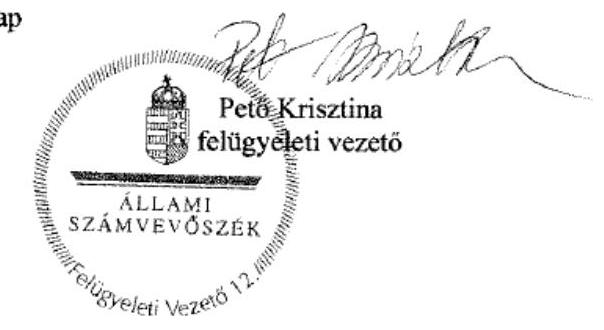

---

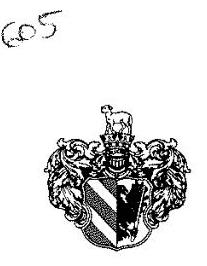

ÁLLAMI SZÁMVEVŐSZÉK
095353/2016
Érkezés: 2016. NOV 25.
Iktatószám: V-0957-137/2016
Melléklet: $\qquad$
Szeged Megyei Jogú Város Polgármesterétől és Címzetes Főjegyzőjétől
6745 Szeged, Pf. 473.

Állami Számvevőszék
Elnöke
Domokos László
Budapest

Tisztelt Elnök Úr!

Ikt.sz.: 6238-5/2016
ÁSZ iktatószáma: V-0957-127/2016.
Témaszám: 1991
Ellenőrzés-azonosítószám: V073712

Pekto Kainatians
11. 11. 11. 15

A V-0957-132/2016. ikt.sz. „Megyei hatókörű városi múzeumok ellenőrzése - Móra Ferenc Múzeum Szeged" ellenőrzéséről készült számvevőszéki jelentéstervezetben foglaltakra a következő észrevételezést tesszük.
1./

Szeged Megyei Jogú Város Önkormányzata a Móra Ferenc Múzeumot a 2013. január 1-jétől vette át fenntartásba a 2012. évi CLII. törvény valamint a 1311/2012. (VIII.23.) kormányhatározat alapján, így önkormányzatunk csak ezen időszak vonatkozásában érintett.

A jelentéstervezet főbb megállapításaiban folyamatosan összevonja a vizsgált időszak - négy év - három fenntartójának, illetve a múzeumnak a három fenntartó alatti működésére vonatkozó megállapításokat, így olyan érzetet kelt, mintha a „nem megfelelő", „nem szabályszerű" megállapítások mindhárom fenntartóra egyformán vonatkoznának.

A tervezet a 14. oldalon bemutatja a vizsgálat módszereit, a „megfelelőség" ill. a „szabályszerűség" kritériumait százalékos arányban, azonban az anyagban ehhez kapcsolódóan a vizsgált területek vonatkozásában semmilyen számszerű adat, ill. százalékos arány (pl. vizsgált dokumentumok száma, hibaarány) nem található sem fenntartói időszakonként, sem összesítve. Így nem kapnak az érintettek arról visszajelzést, hogy mely területeken és milyen mértékben maradtak el az elvárható szinttől.

Az Állami Számvevőszékről szóló 2011. évi LXVI. törvény (Ásztv.) 24. § d) pontja szerint „az ellenőrzések eredményeinek, a megállapításoknak alátámasztottnak, a következtetéseknek okszerűnek és megalapozottnak kell lenniük".
A jelentéstervezet jobbára csak általános megállapításokból, ill. javaslatokból áll. A megállapítások alátámasztására vonatkozóan alig tartalmaz érdemi és konkrét információt (pl. milyen problémánál mely vizsgált dokumentum mely részére alapozza az állítást), így csak igen korlátozottan lehet érdemi észrevételeket tenni az egyes megállapításokra.

Fentebbire való tekintettel, valamint azért, hogy az intézmény és a fenntartó valós képet kapjon működéséről és a javítandó területekről és az Ásztv. 33.§ (1) bekezdésében foglaltaknak megfelelően

---

intézkedési tervet tudjon készíteni, kérjük hogy:

- a megállapítások fenntartói időszakonként elkülönítve is szerepeljenek,
- a megállapítások alátámasztására szolgáló valamennyi információ konkrétan álljon az érintettek rendelkezésére,
- fenntartónként és vizsgált területenként legyen visszajelzés a „megfelelőségre" és a „szabályszerűségre" vonatkozó számszerű adatokról és százalékos arányokról.

Bár 2013-2014-ben a vagyonnal kapcsolatos jogi szabályozás nem volt egyértelmű, a jelentéstervezet egyáltalán nem említi ezt a tényt, nem foglalkozik a jogszabályalkotó és az MNV Zrt. felelősségével, a vagyonkezeléssel kapcsolatos hiányosságokért kizárólag a Múzeumot teszi felelőssé.
2./

Az 5. oldal 1. bekezdés első mondatát kérjük a következőre módosítani, mivel az ellentmondásban van a jelentéstervezet 6. oldal 2. bekezdés 3. mondatával is, mely szerint a 2013. január 1-jével végrehajtott, a központi alrendszerből önkormányzati alrendszerbe történő irányítószervi (fenntartói) váltás lebonyolítása és szervezetrendszer átalakítása szabályszerű volt, így egyedül Szeged Megyei Jogú Város Önkormányzata volt jogszabálykövető:
„A szegedi székhelyű Móra Ferenc Múzeumra vonatkozó irányítószervi feladatellátás nem volt szabályszerű a Csongrád Megyei Önkormányzat és a Csongrád Megyei Intézményfenntartó Központ esetében."
3./

Az 5. oldal 4. bekezdését kérjük a következőre módosítani, mivel az ellentmondásban van a jelentéstervezet 16. oldal 1. bekezdés 2. és 3. mondatával, mely szerint a Múzeum a 2011-2014. években rendelkezett alapító okirattal, valamint az alapító okiratot annak módosításakor minden esetben egységes szerkezetbe foglalták az Ámr. és az Ávr. előírásainak megfelelően, így Szeged Megyei Jogú Város Önkormányzata jogszabálykövető volt:

A Csongrád Megyei Önkormányzat és a Csongrád Megyei Intézményfenntartó Központ az ellenőrzött időszakban összességében nem gyakorolta szabályszerűen alapítói jogosultságukat. A Múzeum 2012-ig nem rendelkezett a jogszabályi előírásoknak megfelelő tartalmú alapító okiratokkal."
4./
A 6. oldal 1. bekezdésének második mondatát a vizsgálatot vezetők számára többször feltárt és dokumentált indokoknál fogva kérjük kiegészíteni:
„A bevételek elszámolása során a 2012. évben a vagyontárgyak hasznosítására feljogosító szerződés, a 2013-2014. években vagyonkezelői szerződés nélkül került sor jogszabályi paragrafus ütközés, valamint a Magyar Nemzeti Vagyonkezelő Zrt. által el nem készített vagyonkezelési szerződés hiánya miatt."

A 2012. évi CLII. törvény 30.§ (4) bekezdésre alapján megyei intézményfenntartó központok helyébe az átvett vagyonnal, illetőleg intézményekkel kapcsolatos jogviszonyok tekintetében 2013. január 1-jét követően általános és egyetemleges jogutódként az új fenntartók léptek. (Az Önkormányzat és a Csongrád Megyei Intézményfenntartó Központ között 2012 decemberében létrejött átadás-átvételi megállapodás IV/2. pontja kimondta, hogy a Felek a Múzeum bevonásával a vagyonra vonatkozó kérdéseket az MNV Zrt.-vel külön megállapodásban később rendezik.)

---

Az 1997. évi CXL. törvény 45/A § (2) bekezdése viszont azt mondta ki, hogy a megyei hatókörű városi múzeum 2013. január 1-jétől az állami feladatai keretében vagyonkezelője lett a tevékenység ellátásához szükséges állami vagyonnak.

# Azaz a törvényhozó két vagyonkezelőt jelölt ki egyszerre. 

Az állami tulajdonosi jogok gyakorlójaként eljáró MNV Zrt. a jelzett jogszabályi ellentmondással kapcsolatban egyértelmű állásfoglalást nem tudott adni az Önkormányzatnak, továbbá a folyamatosan változó jogszabályok miatt több esetben kérte a vagyonkezelési szerződés tervezetek aláírásának átgondolását:

2013. március 11-i keltezésű, MNV/01/29130/1/2013 iktatószámú MNV Zrt. által a Polgármester részére megfogalmazott levélben maga az MNV Zrt. is felsorakoztatta a vonatkozó jogszabályok (Módosító tv., Kult. Törvény) vagyonkezelő kilétére vonatkozó, egymástól különböző tartalommal bíró szakaszait (30. § (4) bekezdés; 45/A. § (2) bekezdés), majd együttes értelmezéssel megállapította, hogy 2013. január 1-jétől az Önkormányzat a vagyonkezelő. Mindkét hivatkozott jogszabályi előírás ugyanazon Módosító törvényben került előírásra, és ugyanazon időponttól (2013. január 1-jétől) lépett életbe. E levélben kifejtésre kerül, hogy Kult. tv. sem hagyható figyelmen kívül, mert hosszú távon a jogalkotó nem az Önkormányzatokat, „...hanem magukat a feladatokat végző intézményeket kívánta az érintett vagyoni kör vagyonkezelésével megbízni." Ezzel párhuzamosan az MNV Zrt. a következő lépésként határozta meg ,...az MNV Zrt. és az Önkormányzat között - jogutódlás folytán fennálló vagyonkezelői jogviszony" megszüntetését, majd az érintett vagyonelemek vagyonkezelésbe adását a megyei hatókörű múzeum részére.

- 2013. augusztus 12. MNV/01/29130/3/2013 iktatószámú MNV Zrt levélben tájékoztatták az Önkormányzatot, hogy a jogszabályváltozások következtében előállt helyzet (visszapótlási kötelezettség, vagyonkezelői díj fizetés törvényhozó rendezetlensége) miatt kénytelenek függőben tartani a vagyonkezelési megállapodások megkötését.
2013. december 4-i keltezésű, MNV/01/29130/6/2013 iktatószámú levélben az MNV Zrt. ismételten tájékoztatta az Múzeumot és az Önkormányzatot a Módosító tv.-ben foglaltakról, amely szerint az Önkormányzat jogutódként a CSOMIK helyébe lépett. Ezen levél mellékleteként egy olyan háromoldalú vagyonkezelési szerződés tervezet került csatolásra, amelyben a tulajdonost képviselő MNV Zrt. mellett a Móra Ferenc Múzeum mint Vagyonkezelő és az Önkormányzat mint jogutód került feltüntetésre. (Megjegyzés: a levél tartalmában nem hivatkozik a Kult. tv. 45/A § (2) bekezdésére miszerint a vagyonkezelői jog a Múzeumot illetné meg, így valójában a mellékelt vagyonkezelési szerződéstervezet - amely szerint a Múzeum a Vagyonkezelő - nincs összhangban az MNV Zrt. levelében foglalt tájékoztatással.)
2014. január 16-i keltezésű, MNV/01/3800/2014. MNV Zrt. által a Polgármester részére megküldött levél arról adott tájékoztatást, hogy 2014. január 1-jétől történő jogszabályváltozások a vagyonkezelőkkel kötendő vagyonkezelési szerződés konstrukcióját is érintik, ezért az új vagyonkezelési szerződés tervezetek összeállításáig kérte az érintettek türelmét.
2014. március 25-i e-mailben az MNV Zrt. megküldte a vagyonkezelési szerződés tervezetét, amelyben a „Felek" a 2013. december 4. keltezésű levél mellékletében megküldött tervezet szerint kerültek meghatározásra, azaz a Móra Ferenc Múzeum mint Vagyonkezelő került feltüntetésre a tervezetben.
2014. május 28-i keltezésű levelében a Hivatal több okra hivatkozva vitatta a vagyonkezelői jog önkormányzati jogutódlását a Kult. tv. 45/A § (2) bekezdésének a)

---

pontjára történő hivatkozással, az átadás-átvételi megállapodásban a vagyonkezelői szerződés feltüntetésének, eszközkartonok átadásának elmaradása miatt.

- 2015. február 17. 14145-1/2015 iktatószámú önkormányzati levél, melyben az Önkormányzat tájékoztatást kér az MNV Zrt-től a Cserje sori telek és a hozzá tartozó épület számviteli mérlegben történő szerepeltetésével kapcsolatban. A mai napig nem jött válasz az MNV Zrt.-től.
- 2015. február 25. 14145-2/2015 iktatószámú önkormányzati levélben az Önkormányzat tájékoztatta Múzeumot, hogy amennyiben a 2014. évi beszámoló elkészítésének határidejéig nem érkezik válasz az MNV Zrt-től (mai napig nem
 jött válasz), akkor idegen tulajdonként szükséges szerepeltetniük mérlegükben az adott ingatlan.

Fenti levelezésünket a vizsgálat során csatoltuk.
Véleményünk szerint a jelentéstervezet hibásan az Önkormányzatot, illetve a Múzeumot teszi felelőssé a vagyonkezelési szerződés hiányáért, és nem tesz említést a jogszabályi ellentmondásról, az ebből fakadó vagyoni helyzet körüli bizonytalanságról, továbbá a magyar állam nevében tulajdonosként eljáró MNV Zrt. felelősségéről.

A fenti törvényhozó jogszabályi pontatlanságot és anomáliát rendezte a törvényhozó 2015. június 18-án a LXXV. számú törvényben, ahogy ezt a jelentés is írja a 9. oldal utolsó bekezdésében - igazolva ezzel Szeged Megyei Jogú Város Önkormányzatának állásfoglalását:
„A 2015. évi LXXV. tv. 4. § (1) bekezdése alapján a kulturális örökség helyi védelme érdekében a megyei hatókörű városi múzeumok alapfeltárásban és jogszabály szerinti külön nyilvántartásában szereplő állami tulajdonú kulturális javak ingyenesen a megyei hatókörű városi múzeumok vagyonkezelésébe kerültek. A vagyonkezelők vagyonkezelői joga tekintetében vagyonkezelői szerződés megkötése nem szükséges. A hivatkozott törvény 4. § (2) bekezdése szerint továbbá a kulturális örökség helyi védelme érdekében a megyei hatókörű városi múzeumok feladatának ellátását szolgáló állami tulajdonban álló ingatlanok - a törvényben meghatározott ingatlanok kivételével - ingyenesen a fenntartó önkormányzatok vagyonkezelésébe kerültek."
5./
A 6. oldal 2. bekezdését a következőkre kérjük pontosítani, mivel a jelentéstervezet 2.2 pontja szerint is Szeged Megyei Jogú Város Önkormányzata jogszabályszerűen járt el:
„A Múzeumot érintő megyei önkormányzati alrendszerből a központi alrendszerbe történő 2012. január 1-jétől hatályos irányító szervi (fenntartói) váltás lebonyolítása nem volt szabályszerű. A 2013. január 1-jével végrehajtott, a központi alrendszerből a települési önkormányzati alrendszerbe történő irányítószervi (fenntartói) váltás lebonyolítása és a szervezetrendszer átalakítása szabályszerű volt."
6./
A 16. oldal 2. bekezdésének első mondatát kérjük az alábbiakra módosítani:
„A munkáltatói jogosultságok gyakorlása során hiányosság volt, hogy 2013. március 8-13. között nem volt kinevezett gazdasági vezető [...]"

A 2013. március 8. napján a Múzeum vezetője felmentette a gazdasági vezetőt a próbaidő utolsó napján. Az Önkormányzat a Múzeum 2013. január 1-jei átvételét követően a gazdasági vezető pályáztatásáról a lehető legrövidebb határidővel, jogszabályoknak megfelelően intézkedett, még 2013. januárban pályázatot írt ki. A pályáztatás során a jogszabályban meghatározott legszorosabb határidőket figyelembe véve lett az új gazdasági vezető kinevezve 2013. március 13-án.

A napi ügyek során a Múzeum helyettesítési rendjének szabályzata szerinti helyettesítés meg volt oldva.
7./
A 16. oldal 3. bekezdés 3. pontját kérjük törölni, a következő indokok miatt:
A jelentéstervezet 2. sz. táblázata és a 5.1. pontja szerint is ebben az időszakban a tulajdonosi jogokat a MNV Zrt. gyakorolta, a vagyonkezelést a múzeum végezte. Ezért az Önkormányzat nem volt jogosult rendelkezni a vagyon felett, így számára nem vonatkozhatott a beruházási és fejlesztési feladatok előírása.
8./

A 17. oldal Összegző megállapítását kérjük módosítani, mivel a szabálytalansági megállapítás csak a 2011-2012. évre vonatkozik, ill. a jelentéstervezet 2.2 pontja szerint is a 2013. január 1-jével végrehajtott központi alrendszerből Szeged Megyei Jogú Város Önkormányzatának irányítószervi fenntartói körébe történő váltás végrehajtása és szervezetrendszer átalakítása szabályszerű volt.
„A Múzeumot és tagintézményeit is érintő szervezeti, szerkezeti átszervezések végrehajtása a 2011-2012. évben a Csongrád Megyei Önkormányzat és a Csongrád Megyei Intézményfenntartó Központ részéről nem volt szabályszerű, nem volt biztosított az átláthatóság."
9./
A 17. oldal 2. bekezdés 2.1. számú megállapítás összefoglaló részét javasoljuk a következőkre átírni, mivel a jelentéstervezet 2.2 pontja szerint is a 2013. január 1-jével végrehajtott központi alrendszerből Szeged Megyei Jogú Város Önkormányzatának irányítószervi fenntartói körébe történő váltás végrehajtása és szervezetrendszer átalakítása szabályszerű volt:
„Az intézményt érintő megyei önkormányzati alrendszerből a központi alrendszerbe történő 2012. január 1-jétől hatályos irányítószervi (fenntartói) váltás végrehajtása nem volt szabályszerű, az átláthatóság nem volt biztosított."
10./
A 18. oldal 1. bekezdés 2.2. számú megállapítás összefoglaló részét javasoljuk a következőkre átírni:
„A 2013. január 1-jével végrehajtott központi alrendszerből települési önkormányzati alrendszerbe történő irányítószervi (fenntartói) váltás végrehajtása és szervezetrendszer átalakítása szabályszerű volt."
11./
A 19. oldalon a 3.1. számú valamint a 3.2. számú megállapításokat figyelembe véve az Önkormányzat a Múzeum SZMSZ-ével kapcsolatban kiegészítéseket fog elfogadni.

12./
A 24. oldal 4.1. számú megállapítás összefoglaló részét javasoljuk a következőkre átírni, mivel a jelentéstervezet 4.1. pontjának 2. bekezdés 4. és 5. mondata is megállapítja, hogy „A 2013-2014. években az Áhsz alapján az előirányzat módosításhoz kapcsolódó analitikus nyilvántartást vezették. Az előirányzat-módosításokat az intézménynél a főkönyvi könyvelésben szabályszerűen könyvelték.", azaz Szeged Megyei Jogú Város Önkormányzata jogszabályszerűen járt el:

A költségvetés tervezése, a bevételi és kiadási előirányzatok megállapítása szabályszerű volt, a maradvány megállapítása megfelelt, a 2011-2012. években az előirányzatok módosításának nyilvántartása nem felelt meg a jogszabályi előírásoknak.
13./

A 24. oldal 4.1. számú megállapítás 3. bekezdésének 3. mondat maradványra vonatkozó részét kérjük módosítani, mivel Szeged Megyei Jogú Város Önkormányzata számára a Múzeum a Magyar Államkincstár KGR elektronikus rendszerében feltöltötte az adatokat a fenntartó számára 2014.02.26-án, ahogy ez a Kincstár KGR naplófájljában is látszik. Megjegyezzük, hogy a Magyar Államkincstár 2014. február 27-én a beszámoló rendszer szoftverében még módosított, ami kihatással járhatott az adatközlésre.
„A Múzeum a 2011. évi maradványáról az Áhsz; 10. § (1) bekezdésében rögzített határidő után nyújtott tájékoztatást (a 2011. évi maradványról 2012. március 5-én).
(Megjegyezzük, hogy az Áhsz; 10. § paragrafusára való hivatkozás nem releváns a 2013. évben.)
14./
A 25. oldal 1. bekezdés 5. mondat beszámolóra vonatkozó részt kérjük módosítani, mivel Szeged Megyei Jogú Város Önkormányzata számára a Múzeum a Magyar Államkincstár KGR elektronikus rendszerében feltöltötte az adatokat a fenntartó számára 2014.02.26-án, ahogy ez a Kincstár KGR naplófájljában is látszik. Megjegyezzük, hogy a Magyar Államkincstár 2014. február 27-én a beszámoló rendszer szoftverében még módosított, ami kihatással járhatott az adatközlésre.
„A 2011. évi beszámolókat az Áhsz; 10. § (1) bekezdésében rögzített határidőt - tárgyévet követő év február 28. - követően készítették el, és küldték meg az irányítószerv 1 részére.
(Megjegyezzük, hogy az Áhsz; 10. § paragrafusára való hivatkozás nem releváns a 2013. évben.)
15./
25. oldal 4.3. számú megállapítás 2. bekezdés 3. mondatát kérjük javítani, mivel - ahogy ezt a 4./ pontban is jeleztük - a törvényhozó által létrejött jogszabályi ütközés az Önkormányzat hatókörén kívül esett:
„A Múzeumnál a 2012. évben az állami tulajdonú vagyontárgyak hasznosítására, jogalap nélkül, a Vtv. 25. § (4) bekezdés szerinti vagyonhasznosításra feljogosító szerződés nélkül került sor. A 2013-2014. években az Nvtv. 11. § (7) bekezdés szerinti vagyonkezelési szerződés nem lett kötve a Magyar Nemzeti Vagyonkezelő Zrt.-vel történt egyeztetések elhúzódása és a jogszabályi ütközés miatt."

16./
A 4./ pontban kifejtettek alapján a 28. oldal 2. bekezdésének 2. mondatát kérjük kiegészíteni, mivel a 2011-2012. évben a korábbi fenntartók adatnyilvántartási hiányossága, szervezetlensége, a tulajdonos Magyar Nemzeti Vagyonkezelő Zrt. egyeztetési eljárása miatt sem az Önkormányzat sem a Múzeum nem rendelkezhetett vagyonkezelői szerződéssel:

A 2013-2014. években a Múzeum nem rendelkezett vagyonkezelési szerződéssel, ezzel az Nvtv. 11. § (1) és (7) bekezdésének és Vtvr. 8. § (6) bekezdésének előírása nem érvényesült, mivel a jogszabályok egymásnak ellentmondtak és a Magyar Nemzeti Vagyonkezelő Zrt. nem tudta elkészíteni a vagyonkezelési szerződést."
17./
A 4./ pontban kifejtettek alapján a 28. oldal 2. bekezdését (4.3. pont utolsó bekezdése) kérjük módosítani a következőkre, mivel a 2011-2012. évben a korábbi fenntartók adatnyilvántartási hiányossága, szervezetlensége, a tulajdonos Magyar Nemzeti Vagyonkezelő Zrt. egyeztetési eljárása miatt sem az Önkormányzat sem a Múzeum nem rendelkezhetett megfelelő nyilvántartással. Ugyanakkor a Múzeum a számviteli óvatosság és folytonosság elve miatt az eszközöket értékkel szerepeltette a mérlegben:
„A kezelt vagyon körének és nagyságának analitikus alátámasztása hiányos volt, mert a Csongrád Megyei Önkormányzat és a Csongrád Megyei Intézményfenntartó Központ a nyilvántartásokat és az eszközkartonokat nem adta át hivatalosan, valamint a Magyar Nemzeti Vagyonkezelő Zrt. nem készítette el a vagyonkezelési szerződést. A Múzeum a számviteli óvatosság és folytonosság elve miatt mérlegében értékkel szerepeltette az állami vagyont. Az előzőek miatt a Kiegészítő mellékletben a Múzeum a 2013-2014. években a Számv. tv. 23. § (2) bekezdésében előírtak szerint nem tudta bemutatni mérlegtételek alapjáni megbontásban a kezelésbe vett állami eszközöket."

Kérjük a fentiek szíves tudomásul vételét és kérjük a hivatkozott pontok módosítását.
Szeged, 2016. november 22.

Tisztelettel:
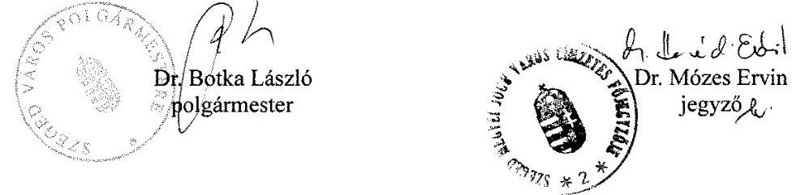

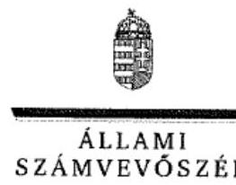

ELNÖK

# Dr. Botka László István úr 

polgármester
Szeged Megyei Jogú Város Önkormányzata

## Szeged

## Tisztelt Polgármester Úr!

A „Megyei hatókörű városi múzeumok ellenőrzése - Móra Ferenc Múzeum, Szeged" címmel készített számvevőszéki jelentéstervezetre tett észrevételét köszönettel megkaptam.
Az Állami Számvevőszék észrevételre vonatkozó álláspontjáról a felügyeleti vezető által készített részletes tájékoztatást csatoltan megküldöm.
Tájékoztatom Polgármester urat, hogy a számvevőszéki jelentésben - az Állami Számvevőszékről szóló 2011. évi LXVI. törvény 29. § (3) bekezdése alapján - a figyelembe nem vett észrevételeket szerepeltetjük az elutasítás indokának feltüntetésével.

Budapest, 2016. 1) hó c\& nap
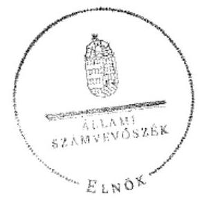

Tisztelettel:

Dómokos László ${ }^{\circ}$

Melléklet: Tájékoztatás az el nem fogadott észrevételekről

# Tájékoztatás az el nem fogadott észrevételekről 

A „Megyei hatókörű városi múzeumok ellenőrzése - Móra Ferenc Múzeum, Szeged"című jelentéstervezetre a 6238-5/2016 iktatószámú levelében tett észrevételeit áttekintettük, annak kezeléséről az alábbi tájékoztatást adom

## 1. A jelentéstervezetre tett általános észrevétele kapcsán

Észrevételében jelzi kiemelten, hogy a jelentéstervezet főbb megállapításaiban folyamatosan összevonja a vizsgált időszak - négy év - három fenntartójának, illetve a múzeumnak a három fenntartó alatti működésére vonatkozó megállapításokat, így olyan érzetet kelt, mintha a „nem megfelelő", „nem szabályszerű" megállapítások mindhárom fenntartóra egyformán vonatkoznának. Észrevételezi, hogy a jelentéstervezet a megállapítások alátámasztására vonatkozóan alig tartalmaz érdemi és konkrét információt (pl. milyen problémánál mely vizsgált dokumentum mely részére alapozza az állítást), így csak igen korlátozottan lehet érdemi észrevételeket tenni az egyes megállapításokra, továbbá 2013-2014-ben a vagyonnal kapcsolatos jogi szabályozás nem volt egyértelmű, a jelentéstervezet egyáltalán nem említi ezt a tényt, nem foglalkozik a jogszabályalkotó és a Magyar Nemzeti Vagyonkezelő Zrt. (továbbiakban: MNV Zrt.) felelősségével, a vagyonkezeléssel kapcsolatos hiányosságokért kizárólag a Móra Ferenc Múzeumot (továbbiakban: Múzeum) teszi felelőssé.

Észrevételét nem fogadtuk el, mert az ellenőrzést az ellenőrzési program szempontjai, az ellenőrzött időszakban hatályos jogszabályok, az ellenőrzés szakmai szabályai, a jelen ellenőrzésre irányadó ÁSZ módszertan és a nemzetközi standardok figyelembevételével végeztük. A Múzeum gazdálkodását az ellenőrzött időszakban az ellenőrzési kérdésekre adott válaszok alapján értékeltük, amelyet „Az ellenőrzés módszerei" című fejezet részletesen tartalmaz. A jelentéstervezet „Az ellenőrzés területe" fejezet 1. táblázata, valamint a Rövidítések jegyzéke nevesíti az ellenőrzött évekhez hozzárendelve és indexelve a fenntartókat. A megállapítások jellegükből következően és értelemszerűen minden esetben nevesítik azoknak a dokumentumoknak a hiányát, vagy a dokumentumokra vonatkozó feltárt hiányosságokat, amelyekre a megállapítások vonatkoznak. Tekintettel arra, hogy az MNV Zrt. nem volt ellenőrzött szervezet, így a jelentéstervezet megállapításai annyiban érintik tevékenységét, amennyiben az ellenőrzött kör programkérdéseire adott válaszok indokolják. Észrevétele a jelentéstervezet megállapításait nem cáfolja, ezért
 azokat nem módosítja.

---

# 2. A jelentéstervezet 5. oldal „ÖSSZEGZÉS" fejezet 1. megállapítására tett észrevétele kapcsán 

Észrevételében szövegjavaslatot tesz a jelentéstervezet 5. oldal „ÖSSZEGZÉS" fejezet 1. megállapítására.

Az ellenőrzést az ellenőrzési program szempontjai, az ellenőrzött időszakban hatályos jogszabályok, az ellenőrzés szakmai szabályai, a jelen ellenőrzésre irányadó ÁSZ módszertan és a nemzetközi standardok figyelembevételével végeztük. Ezért szövegjavaslatát nem áll módunkban elfogadni. Észrevétele a jelentéstervezet megállapítását - „A szegedi székhelyű Móra Ferenc Múzeumra vonatkozó irányító szervi feladatellátás nem volt szabályszerű." - nem módosítja.

## 3. A jelentéstervezet 5. oldal 4. bekezdésének megállapításaira tett észrevétele kapcsán

Észrevételében kéri a jelentéstervezet 5. oldal 4. bekezdésének megállapításai - „Az irányító szervek az ellenőrzött időszakban összességében nem gyakorolták szabályszerűen alapító jogosultságaikat. A Múzeum nem rendelkezett a jogszabályi előírásoknak megfelelő tartalmú alapító okiratokkal." - módosítását, tekintettel arra, hogy a jelentéstervezet 16. oldal 1. bekezdésének 2., 3. megállapításai alapján a Szeged Megyei Jogú Város Önkormányzata (továbbiakban: Önkormányzat) jogszabálykövető volt. Észrevételében továbbá szövegjavaslatot tesz az észrevételezett megállapításokra.

Észrevételét és szövegjavaslatát nem fogadtuk el, mert az ellenőrzést az ellenőrzési program szempontjai, az ellenőrzött időszakban hatályos jogszabályok, az ellenőrzés szakmai szabályai, a jelen ellenőrzésre irányadó ÁSZ módszertan és a nemzetközi standardok figyelembevételével végeztük. A hivatkozott megállapítás egy összefoglaló megállapítás, amelynek részletes kifejtését az 1. számú fejezet tartalmazza. Észrevétele a jelentéstervezet megállapításait nem módosítja.

## 4. A jelentéstervezet 6. oldal 1. bekezdésének 2. megállapítására tett észrevétele kapcsán

Köszönettel vettem tájékoztatását a hivatkozott jogszabályok ellentmondásos rendelkezéseiről, valamint az MNV Zrt.-vel folytatott együttműködésről és levélváltásokról a vagyonkezelési szerződés megkötése érdekében. Észrevételében a jelentéstervezet 6. oldal 1. bekezdésének 2. megállapítása - A bevételek elszámolása során a 2012. évben a vagyontárgyak hasznosítására vagyonhasznosításra feljogosító szerződés, a 2013-2014. években vagyonkezelői szerződés nélkül került sor. - kiegészítését kérte, amelyre szövegjavaslatot is tett.

Tekintettel arra, hogy az ellenőrzést az ellenőrzési program szempontjai, az ellenőrzött időszakban hatályos jogszabályok, az ellenőrzés szakmai szabályai, a jelen ellenőrzésre irányadó ÁSZ módszertan és a nemzetközi standardok figyelembevételével végeztük, ezért szövegjavaslatát nem áll módunkban elfogadni. Észrevétele a jelentéstervezet megállapítását nem módosítja.

---

# 5. A jelentéstervezet 6. oldal 2. bekezdésének megállapításaira tett észrevétele kapcsán 

Észrevételében a jelentéstervezet 6. oldal 2. bekezdésének megállapításai - „A Múzeumot érintő önkormányzati alrendszerből a központi alrendszerbe történő 2012. január 1-jétől hatályos irányító szervi (fenntartói) váltás lebonyolítása nem volt szabályszerű. A 2013. január 1-jével végrehajtott, a központi alrendszerből önkormányzati alrendszerbe történő irányító szervi (fenntartói) váltás lebonyolítása és a szervezetrendszer átalakítása szabályszerű volt." - módosítását kéri, tekintettel arra, hogy a jelentéstervezet 2.2. pontja szerint az Önkormányzat szabályszerűen járt el.

Észrevételét nem fogadtuk el. A hivatkozott bekezdés második megállapítása egyértelműen tartalmazza, hogy „A 2013. január 1-jével végrehajtott, a központi alrendszerből önkormányzati alrendszerbe történő irányító szervi (fenntartói) váltás lebonyolítása és a szervezetrendszer átalakítása szabályszerű volt." Észrevétele a jelentéstervezet megállapításait nem módosítja.

## 6. A jelentéstervezet 16. oldal 1. számú megállapítás 2. bekezdésének 1. megállapítására tett észrevétele kapcsán

Észrevételében arról tájékoztat, hogy a gazdasági vezetői munkakör betöltésének pályázati kiírására 2013. januárjában került sor, a gazdasági vezetőt a próbaidő utolsó napján március 8-án felmentették, és a helyettesítést a helyettesítés rendjének szabályzata szerint megoldották. A pályázati kiírás és a helyettesítés megoldása nem jelenti, hogy a Múzeum 2013. március 8-13. között kinevezett gazdasági vezetővel rendelkezett. Észrevétele megerősíti a jelentéstervezet 16. oldal 1. számú megállapítás 2. bekezdésének 1. megállapításában foglaltakat, hogy „2013. március 8-13. között nem volt kinevezett gazdasági vezető, az irányítószerv – az Aht. 9. § (1) bekezdés c) pontja ellenére – nem intézkedett gazdasági vezető kinevezéséről, megbízásáról", észrevétele ezért a megállapítást nem módosítja.

## 7. A jelentéstervezet 16. oldal 1. számú megállapítás 3. bekezdés 3. francia bekezdésének megállapítására tett észrevétele kapcsán

Észrevételében arról tájékoztat, hogy a jelentéstervezet 2. sz. táblázata és az 5.1. pontja szerint is ebben az időszakban a tulajdonosi jogokat az MNV Zrt. gyakorolta, a vagyonkezelést a múzeum végezte, ezért az Önkormányzat nem volt jogosult rendelkezni a vagyon felett, így számára nem vonatkozhatott a beruházási és fejlesztési feladatok előírása.

Észrevételét nem fogadtuk el, mert a muzeális intézményekről, a nyilvános könyvtári ellátásról és a közművelődésről szóló 1997. évi CXL. törvény (továbbiakban: Mtv.) 50. § (2) bekezdésének a) pontja rendelkezésének értelmében „A fenntartó az e törvényben foglaltak alapján a) meghatározza és jóváhagyja a muzeális intézmény éves és középtávú feladatait, így különösen stratégiai tervét, munkatervét és beszámolóját, fejlesztési és beruházási feladatait". Észrevétele a jelentéstervezet 16. oldal 1. számú megállapítás 3. bekezdés 3. francia bekezdésének megállapítását - „az irányító szerv, – mint fenntartó – az Mtv. 50. § (2) bekezdés a) pont elõírásai ellenére a 2013-2014. években a Múzeum fejlesztési és beruházási feladatait nem határozta meg." - nem módosítja.

---

# 8. A jelentéstervezet 17. oldal 2. számú megállapítására tett észrevétele kapcsán 

Észrevételében a 2. számú megállapítás pontosítását kéri, mivel a megállapítás csak a 2011-2012. évre vonatkozik, illetve a jelentéstervezet 2.2. pontja szerint is a 2013. január 1-jével végrehajtott központi alrendszerből az Önkormányzat irányító szervi fenntartói körébe történő váltás végrehajtása és szervezetrendszer átalakítása szabályszerű volt. Észrevételét a jelentéstervezet 2. számú megállapítására - „A Múzeumot és tagintézményeit is érintő szervezeti, szerkezeti átszervezések végrehajtása nem volt szabályszerű, nem volt biztosított az átláthatóság." - nem fogadtuk el. A Múzeumot érintő szervezeti, szerkezeti átszervezéseket az ellenőrzött témakörhöz tartozó ellenőrzési kérdésekre adott válaszok alapján értékeltük, amelyet a jelentéstervezetben „Az ellenőrzés módszerei" című fejezet részletesen tartalmaz. A hivatkozott megállapítás egy összegző megállapítás, amelyet a 2. számú fejezet megállapításai támasztanak alá. Észrevétele ezért a megállapítást nem módosítja.

## 9. A jelentéstervezet 17. oldal 2.1. számú megállapítására tett észrevétele kapcsán

Észrevételében a 2.1. számú megállapítás pontosítását kéri, mivel a jelentéstervezet 2.2 pontja szerint is a 2013. január 1-jével végrehajtott központi alrendszerből az Önkormányzat irányító szervi fenntartói körébe történő váltás végrehajtása és szervezetrendszer átalakítása szabályszerű volt.

Szövegjavaslatát nem áll módunkban elfogadni, tekintettel arra, hogy az ellenőrzést az ellenőrzési program szempontjai, az ellenőrzött időszakban hatályos jogszabályok, az ellenőrzés szakmai szabályai, a jelen ellenőrzésre irányadó ÁSZ módszertan és a nemzetközi standardok figyelembevételével végeztük. Az államháztartásról szóló 1992. évi XXXVIII. törvény (továbbiakban: Áht.) 2. § (1) bekezdése, valamint az államháztartásról szóló 2011. évi CXCV. törvény (továbbiakban: Áht.2) 3. § (1) bekezdése értelmében az államháztartás központi és önkormányzati alrendszerből áll, „megyei" és „települési" alrendszert nem nevesít. Észrevétele a jelentéstervezet 17. oldal 2.1. számú megállapítását - „Az intézményt érintő önkormányzati alrendszerből a központi alrendszerbe történő 2012. január 1-jétől hatályos irányítószervi (fenntartói) váltás végrehajtása nem volt szabályszerű, az átláthatóság nem volt biztosított." - nem módosítja.

## 10. A jelentéstervezet 18. oldal 2.2. számú megállapítására tett észrevétele kapcsán

Észrevételében szövegjavaslattal a 2.2. számú megállapítás pontosítását kéri. Figyelemmel arra, hogy az ellenőrzést az ellenőrzési program szempontjai, az ellenőrzött időszakban hatályos jogszabályok, az ellenőrzés szakmai szabályai, a jelen ellenőrzésre irányadó ÁSZ módszertan és a nemzetközi standardok figyelembevételével végeztük, így szövegjavaslatát nem áll módunkban elfogadni. Az Áht. 2. § (1) bekezdése, valamint az Áht. 2 3. § (1) bekezdése értelmében az államháztartás központi és önkormányzati alrendszerből áll, „megyei" és „települési" alrendszert nem nevesít. Észrevétele a jelentéstervezet 18. oldal 2.2. számú megállapítását - „A 2013. január 1-jével végrehajtott a központi alrendszerből önkormányzati alrendszerbe történő irányítószervi (fenntartói) váltás végrehajtása és a szervezetrendszer átalakítása szabályszerű volt." - nem módosítja.

---

# 11. A jelentéstervezet 19. oldal 3.1. számú megállapítás 2. bekezdésének 2., 3. francia bekezdés megállapításaira és a 3.2. számú megállapítás 3. bekezdésének megállapítására tett észrevétele kapcsán 

Köszönettel vettem tájékoztatását, hogy a hivatkozott megállapításokban feltárt hiányosságokat figyelembe véve az Önkormányzat a Múzeum szervezeti és működési szabályzatát módosítani fogja.

## 12. A jelentéstervezet 24. oldal 4.1. számú megállapítására tett észrevétele kapcsán

Észrevételében a 4.1. számú megállapítás pontosítását kéri, mivel a jelentéstervezet 4.1. számú megállapítás 2. bekezdésének 4. és 5. mondata is megállapítja, hogy „A 2013-2014. években az Áhsz. alapján az előirányzat módosításhoz kapcsolódó analitikus nyilvántartást vezették. Az előirányzat-módosításokat az intézménynél a főkönyvi könyvelésben szabályszerűen könyvelték.", azaz az Önkormányzat jogszabályszerűen járt el.

Szövegjavaslatát nem áll módunkban elfogadni, mert az ellenőrzést az ellenőrzési program szempontjai, az ellenőrzött időszakban hatályos jogszabályok, az ellenőrzés szakmai szabályai, a jelen ellenőrzésre irányadó ÁSZ módszertan és a nemzetközi standardok figyelembevételével végeztük. Az észrevételezett megállapítás egy összegző megállapítás, amelyet a 4.1. számú fejezet megállapításai támasztanak alá. Észrevétele a jelentéstervezet 24. oldal 4.1. számú megállapítását - „A költségvetés tervezése, a bevételi és kiadási előirányzatok megállapítása szabályszerű volt, a maradvány megállapítása megfelelt, az előirányzatok módosításának nyilvántartása nem felelt meg a jogszabályi előírásoknak." - nem módosítja.

## 13. A jelentéstervezet 24. oldal 4.1. számú megállapítás 3. bekezdésének 3. megállapítására tett észrevétele kapcsán

Észrevételében arról tájékoztat, hogy az Önkormányzata számára a Múzeum a Magyar Államkincstár (továbbiakban: Kincstár) KGR elektronikus rendszerében feltöltötte a maradványra vonatkozó adatokat a fenntartó számára 2014. február 26-án, ahogy ez a Kincstár KGR naplófájlban is látszik. Megjegyezte, hogy a Kincstár 2014. február 27-én a beszámoló rendszer szoftverében még módosított, ami kihatással járhatott az adatközlésre, továbbá az államháztartás szervezetei beszámolási és könyvvezetési kötelezettségének sajátosságairól szóló 249/2000. (XII. 24.) Korm. rendelet (továbbiakban: Áhsz.) 10. § paragrafusára való hivatkozás nem releváns a 2013. évben.

Észrevételét nem fogadtuk el, mert a 2013. évi maradvány feladása a Kincstár által üzemeltetett KGR elektronikus rendszerbe önmagában nem felel meg az Áhsz. 10. § (1) bekezdése előírásának, amely bekezdés 2. mondata értelmében „A féléves elemi költségvetési beszámolót legkésőbb július 31-éig, az éves elemi költségvetési beszámolót legkésőbb a következő költségvetési év február 28-áig kell az 1. § (1) bekezdésének a)-b), d)-g) és i)-j) pontjában foglalt államháztartás szervezeteinek az irányító, illetve felügyeleti szervnek, a k) pontjában foglalt államháztartás szervezeteinek a területfejlesztésért felelős miniszternek, illetve leadott hatáskör esetén a középirányító szervnek – megküldeni. ". Megjegyzem továbbá, hogy a 2014. január 1-jétől hatályos az

---

államháztartás számviteléről szóló 4/2013. (I. 11.) Korm. rendelet 56. § (1) bekezdésében előírtak szerint a „2013. évre vonatkozó beszámolási kötelezettséget a 2013. december 31-én hatályos szabályok szerint kell teljesíteni." Észrevétele a jelentéstervezet 24. oldal 4.1. számú megállapítás 3. bekezdésének 3. megállapítását - „A Múzeum a 2011. évi és 2013. évi maradványról az Áhsz. 10. § (1) bekezdésében rögzített határidő után nyújtott tájékoztatást (a 2011. évi maradványról 2012. március 5-én, a 2013. évi maradványról 2014. március 7-én)." - nem módosítja.

# 14. A jelentéstervezet
 24. oldal 4.2. számú megállapítás 2. bekezdésének 5. megállapítására tett észrevétele kapcsán 

Észrevételében kéri a beszámolóra vonatkozó megállapítás módosítását, mivel az Önkormányzat számára a Múzeum a Kincstár KGR elektronikus rendszerében feltöltötte az adatokat a fenntartó számára 2014. február 26-án, ahogy ez a Kincstár KGR naplófájlban is látszik. Megjegyezte, hogy a Kincstár 2014. február 27-én a beszámoló rendszer szoftverében még módosított, ami kihatással járhatott az adatközlésre.

Észrevételét nem fogadtuk el, mert a Kincstár KGR elektronikus rendszerében az adatok feltöltése a fenntartó számára önmagában nem felel meg az Áhsz. 10. § (1) bekezdése előírásának. Észrevétele a jelentéstervezet 24. oldal 4.2. számú megállapítás 2. bekezdésének 5. megállapítását - „A 2011. és a 2013. évi beszámolókat az Áhsz. 10. § (1) bekezdésében foglalt határidőt tárgyévet követő év február 28. - követően készítették el, és küldték meg az irányító szerv1,3 részére." - nem módosítja.

## 15. A jelentéstervezet 25. oldal 4.3. számú megállapítás 2. bekezdésének 3. megállapítására tett észrevétele kapcsán

Észrevételében kéri a jelentéstervezet 25. oldal 4.3. számú megállapítás 2. bekezdésének 3. megállapításának módosítását, mivel - ahogy ezt a 4./ pontban is jelezte - a törvényhozó által létrejött jogszabályi ütközés az Önkormányzat hatókörén kívül esett. Észrevétele nem cáfolja a jelentéstervezet 25. oldal 4.3. számú megállapítás 2. bekezdésének 3. megállapítását, hogy a „Múzeumnál a 2012. évben az állami tulajdonú vagyontárgyak hasznosítására, jogalap nélkül, a Vtv. 25. § (4) bekezdés szerinti vagyonhasznosításra feljogosító, a 2013-2014. években az Nvtv. 11. § (7) bekezdés szerinti vagyonkezelési szerződés nélkül került sor.", észrevétele ezért a megállapítást nem módosítja.

## 16. A jelentéstervezet 27. oldal 5.1. számú megállapítás 3. bekezdésének 2. megállapítására tett észrevétele kapcsán

Észrevételében szövegjavaslattal kéri a hivatkozott megállapítás kiegészítését, mivel a 2011-2012. évben a korábbi fenntartók adat-nyilvántartási hiányossága, szervezetlensége, a tulajdonos MNV Zrt. egyeztetési eljárása miatt sem az Önkormányzat sem a Múzeum nem rendelkezhetett vagyonkezelői szerződéssel. Észrevétele nem cáfolja a jelentéstervezet 27. oldal 5.1. számú megállapítás 3. bekezdésének 2. megállapítását - „A 2013-2014. években a Múzeum nem rendelkezett vagyonkezelési szerződéssel, ezzel az Nvtv. 11. § (1) és (7) bekezdésének és a Vtvr. 8. § (6) bekezdésének előírása nem érvényesült." - ezért azt nem módosítja.

---

# 17. A jelentéstervezet 27. oldal 5.1. számú megállapítás 4. bekezdésének megállapításaira tett észrevétele kapcsán 

Észrevételében szövegjavaslattal kéri a jelentéstervezet 27. oldal 5.1. számú megállapítás 4. bekezdésének megállapításai (megjegyzésem: nem a 4.3. számú megállapítás utolsó bekezdésének megállapításai) módosítását, mivel a 2011-2012. évben a korábbi fenntartók adat-nyilvántartási hiányossága, szervezetlensége, a tulajdonos MNV Zrt. egyeztetési eljárása miatt sem az Önkormányzat sem a Múzeum nem rendelkezhetett megfelelő nyilvántartással. Ugyanakkor a Múzeum a számviteli óvatosság és folytonosság elve miatt az eszközöket értékkel szerepeltette a mérlegben.

Észrevételét nem fogadom el, mert az óvatosság elvének - „Nem lehet eredményt kimutatni akkor, ha az árbevétel, a bevétel pénzügyi realizálása bizonytalan. A tárgyévi eredmény meghatározása során az értékvesztés elszámolásával, a céltartalék képzésével kell figyelembe venni az előrelátható kockázatot és feltételezhető veszteséget akkor is, ha az az üzleti év mérlegének fordulónapja és a mérlegkészítés időpontja között vált ismertté. Az értékcsökkenéseket, az értékvesztéseket és a céltartalékokat el kell számolni, függetlenül attól, hogy az üzleti év eredménye nyereség vagy veszteség (az óvatosság elve)" - valamint a folytonosság elvének - „Az üzleti év nyitóadatainak meg kell egyezniük az előző üzleti év megfelelő záróadataival. Az egymást követő években az eszközök és a források értékelése, az eredmény számba vétele csak e törvényben meghatározott szabályok szerint változhat (a folytonosság elve)" - betartása nem jelenti a számvitelről szóló 2000. évi C. törvény 16. § (4) bekezdésében előírt „lényegesség elve" érvényesülését is. Észrevétele nem cáfolja a jelentéstervezet 27. oldal 5.1. számú megállapítás 4. bekezdésének megállapításait - „A kezelt vagyon köre és nagysága a 2013-2014. években vagyonkezelési szerződés hiányában nem volt megállapítható. Kiegészítő mellékletben a Múzeum a 2013-2014. években a Számv. tv. 23. § (2) bekezdésében előírtak ellenére nem mutatta be mérlegtételek szerinti megbontásban a kezelésbe vett állami eszközöket, és a 2014. évben az Áhsz. 29. § (2) bekezdés c) pontjában előírtak ellenére nem jelezte a vagyonkezelési szerződés hiányát, emiatt nem érvényesült a Számv. tv. 16. § (4) bekezdésében meghatározott „lényegesség elve"." - ezért azokat nem módosítja.

Budapest, 2016.
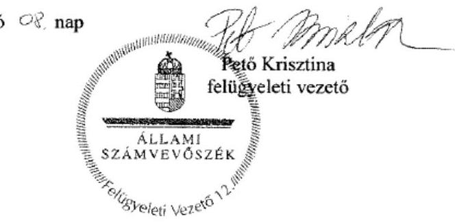

---

.

---

# RÖVIDÍTÉSEK JEGYZÉKE 

${ }^{1}$ Múzeum
${ }^{2}$ ÁSZ
${ }^{3}$ Mtv.
${ }^{4}$ Kötv.
${ }^{5}$ Kjt.
${ }^{6}$ múzeumigazgató
${ }^{7}$ Möktv.
${ }^{8}$ 258/2011. (XII. 7.) Korm. rendelet
${ }^{9}$ 2012. évi CLII. tv.
${ }^{10}$ 1311/2012. (VIII.23.) Korm. határozat
${ }^{11}$ CSMÖ
${ }^{12}$ CSMÖGK
${ }^{13}$ CSMIK
${ }^{14}$ KIM
${ }^{15}$ SZMJVÖ
${ }^{16}$ 2015. évi LXXV. tv.
${ }^{17}$ Nvtv.
${ }^{18}$ Alaptörvény
${ }^{19}$ Áht. 2
${ }^{20}$ Ávr.
${ }^{21}$ ÁSZ tv.
${ }^{22}$ Ámr.
${ }^{23}$ alapító okirat1 alapító okirat2 alapító okirat3 alapító okirat4

Móra Móra Ferenc Múzeum, illetve a Csongrád Megyei Múzeumok Igazgatósága a 2011. január 1-je és a 2012. december 31. közötti időszakban
Állami Számvevőszék
1997. évi CXL. törvény a muzeális intézményekről, a nyilvános könyvtári ellátásról és a közművelődésről
2001. évi LXIV. törvény a kulturális örökség védelméről (hatályos: 2001. július 10-től)
1992. évi XXXIII. törvény a közalkalmazottak jogállásáról (hatályos: 1992. július 1-jétől)
a Móra Ferenc Múzeum (valamint a jogelőd Csongrád Megyei Múzeumok Igazgatósága) igazgatója
2011. évi CLIV. törvény a megyei önkormányzatok konszolidációjáról, a megyei önkormányzati intézmények és a Fővárosi Önkormányzat egyes egészségügyi intézményeinek átvételéről (hatályos: 2012. január 1-jétől)
258/2011. (XII. 7.) Korm. rendelet a megyei intézményfenntartó központokról, valamint a megyei önkormányzatok konszolidációjával, a megyei önkormányzati intézmények és a Fővárosi Önkormányzat egészségügyi intézményeinek átvételével összefüggő egyes kormányrendeletek módosításáról (hatályos: 2011. december 8-tól)
2012. évi CLII. törvény a muzeális intézményekről, a nyilvános könyvtári ellátásról és a közművelődésről szóló 1997. évi CXL. törvény módosításáról (hatályos: 2012. november 3-tól)

1311/2012. (VIII. 23.) Korm. határozat a megyei múzeumok, könyvtárak és közművelődési intézmények fenntartásáról
Csongrád Megyei Önkormányzat
Csongrád Megyei Önkormányzat Gazdasági Központja
Csongrád Megyei Intézményfenntartó Központ
Közigazgatási és Igazságügyi Minisztérium
Szeged Megyei Jogú Város Önkormányzata
a megyei könyvtárak és a megyei hatókörű városi múzeumok feladatának ellátását szolgáló egyes állami tulajdonú vagyontárgyak ingyenes önkormányzati tulajdonba adásáról szóló 2015. évi LXXV. törvény (hatályos 2015. július 18-tól)
2011. évi CXCVI. törvény a nemzeti vagyonról (hatályos 2011. december 31-étől) Magyarország Alaptörvénye (2011. április 25.), hatályos: 2012. január 1-jétől 2011. évi CXCV. törvény az államháztartásról, hatályos: 2012. január 1-jétől 368/2011. (XII. 31.) Korm. rendelet az államháztartásról szóló törvény végrehajtásáról ,hatályos: 2012. január 1-jétől
2011. évi LXVI. törvény az Állami Számvevőszékről, hatályos 2011. július 1-jétől 292/2009. (XII. 19.) Korm. rendelet az államháztartás működési rendjéről, hatályos 2011. december 31-ig
az Intézmény Alapító okirata, hatályos 2009. 07. 01-től 2011. 03. 31-ig az Intézmény Alapító okirata, hatályos 2011. 04. 01-től 2011. december 31-ig az Intézmény Alapító okirata, hatályos 2012. 01. 01-től 2012. 12. 31-ig az Intézmény Alapító okirata, hatályos 2013. 01. 01-től 2013. 06. 14-ig

---

alapító okirat5
${ }^{24}$ irányító szerv ${ }_{1}$
irányító szerv $_{2}$
irányító szerv $_{3}$
${ }^{25}$ gazdasági vezető1
gazdasági vezető ${ }_{2}$
gazdasági vezető ${ }_{3}$
gazdasági vezető ${ }_{4}$
gazdasági vezető ${ }_{5}$
${ }^{26}$ Áht. $1_{1}$
${ }^{27}$ középirányító szerv
${ }^{28}$ fenntartó ${ }_{1}$
fenntartó $_{2}$
fenntartó $_{3}$
${ }^{29}$ átadás-átvételi megállapodás ${ }_{1}$
${ }^{30}$ vagyonátadási jelentés $_{1}$
${ }^{31}$ Áhsz. $1_{1}$
${ }^{32}$ MNV Zrt.
${ }^{33}$ Vtv.
${ }^{34}$ átadás-átvételi megállapodás ${ }_{2}$
${ }^{35}$ vagyonátadási jelentés $_{2}$
${ }^{36}$ SZMSZ $_{1}$

SZMSZ $_{2}$

SZMSZ $_{3}$
SZMSZ $_{4}$
${ }^{37}$ Ber.
${ }^{38}$ Bkr.
${ }^{39}$ számviteli politika $_{1}$
számviteli politika $_{2}$
az Intézmény Alapító okirata, hatályos 2013. 06. 15-től
2011. évben a Csongrád Megyei Önkormányzat Közgyűlése
2012. évben a Közigazgatási és Igazságügyi Minisztérium

2013-2014. évben Szeged Megyei Jogú Város Közgyűlése
Móra Ferenc Múzeum gazdasági vezetője 2011. március 31-ig
Móra Ferenc Múzeum gazdasági vezetője 2011. április 16-tól
Csongrád Megyei Intézményfenntartó Központ gazdasági vezetője 2012. február 1-től

Móra Ferenc Múzeum gazdasági osztályvezetője 2012. december 17. - 2012. december 31. között (Móra Ferenc Múzeum mb. gazdasági igazgatója 2013. január 1. - 2013. március 8. között)
Móra Ferenc Múzeum gazdasági vezetője 2013. március 13. - 2015. augusztus 31. között
1992. évi XXXVIII. törvény az államháztartásról, hatályos 2011. december 31-ig

Csongrád Megyei Intézményfenntartói Központ
2011. évben a Csongrád Megyei Önkormányzat
2012. évben Csongrád Megyei Intézményfenntartói Központ
2013-2014. években Szeged Megyei Jogú Város Önkormányzata
2012. január 1-jétől hatályos átszervezéshez megkötött megállapodás
Az átszervezéssel, illetve jogutód nélkül véglegesen megszűnő államháztartási szervezet által - a megszüntető szervezet által meghatározott fordulónapra vonatkozóan - elkészített az éves elemi költségvetési beszámolónak megfelelő adattartalmú - leltárral és záró főkönyvi kivonattal alátámasztott - beszámoló (Áhsz: 13/A. § (1). bekezdés), a 2012. január 1-jétől hatályos átszervezéshez készített
249/2000. (XII. 24.) Korm. rendelet az államháztartás szervezetei beszámolási és könyvvezetési kötelezettségének sajátosságairól (hatálytalan 2014. január 1-jétől)
Magyar Nemzeti Vagyonkezelő Zártkörűen Működő Részvénytársaság
2007. évi CVI. törvény az állami vagyonról (hatályos: 2007. szeptember 25-től)
2013. január 1-jétől hatályos átszervezéshez megkötött megállapodás

Az átszervezéssel, illetve jogutód nélkül véglegesen megszűnő államháztartási szervezet által - a megszüntető szervezet által meghatározott fordulónapra vonatkozóan - elkészített az éves elemi költségvetési beszámolónak megfelelő adattartalmú - leltárral és záró főkönyvi kivonattal alátámasztott - beszámoló (Áhsz: 13/A. § (1). bekezdés), a 2013. január 1-jétől hatályos átszervezéshez készített
Móra Ferenc Múzeum Csongrád Megyei Önkormányzat Megyei Múzeuma Szervezeti és Működési Szabályzata hatályos 2010. 04. 20-2011. 06. 23. között
Móra Ferenc Múzeum Csongrád Megyei Önkormányzat Megyei Múzeuma Szervezeti és Működési Szabályzata hatályos 2011. 06. 24-2013. 05. 14. között
Móra Ferenc Múzeum Szervezeti és Működési Szabályzata hatályos 2013. 05. 15-2014. 03. 04. között

Móra Ferenc Múzeum Szervezeti és Működési Szabályzata hatályos 2014. 03. 05-től
193/2003. (XI. 26.) Korm. rendelet a költségvetési szervek belső ellenőrzéséről 370/2011. (XII. 31.) Korm. rendelet a költségvetési szervek belső kontrollrendszeréről és a belső ellenőrzésről, hatályos 2012. január 1-jétől Móra Ferenc Múzeum Számviteli politikája, hatályos 2010. 04. 01-től MIK számviteli politikája, hatályos 2012. 01. 01-től

---

számviteli politika ${ }_{3}$
${ }^{40}$ Áhsz. 2
${ }^{41}$ számlarend
${ }^{42}$ bizonylati rend
${ }^{43}$ 20/2002. (X. 4.) NKÖM rendelet
${ }^{44}$ leltározási szabályzat ${ }_{1}$
leltározási szabályzat ${ }_{2}$
${ }^{45}$ értékelési szabályzat ${ }_{1}$
értékelési szabályzat ${ }_{2}$
${ }^{46}$ pénzkezelési Szabályzat ${ }_{1}$
pénzkezelési Szabályzat ${ }_{2}$
${ }^{47}$ önköltségszámítási szabályzat ${ }_{1}$
önköltségszámítási szabályzat ${ }_{2}$
${ }^{48}$ FEUVE szabályzat
${ }^{49}$ ügyrend ${ }_{1}$
ügyrend $_{2}$
${ }^{50}$ együttműködési megállapodás
együttműködési megállapodás ${ }_{2}$
${ }^{51}$ közbeszerzési szabályzat ${ }_{1}$
közbeszerzési szabályzat ${ }_{2}$
${ }^{52}$ Kbt. 1
Kbt. 2
${ }^{53}$ Vnytv.
${ }^{54}$ lkr.
${ }^{55}$ Avtv.
${ }^{56}$ Info.tv.
${ }^{57}$ Eitv.
${ }^{58}$ Ltv.
${ }^{59}$ Mötv.
${ }^{60}$ éves költségvetési beszámoló
${ }^{61}$ Kincstár
${ }^{62}$ 393/2012. (XII. 20.) Korm. rendelet

Móra Ferenc Múzeum Számviteli politikája, hatályos 2013. 01. 01-től
4/2013. (I. 11.) Korm. rendelet az államháztartás számviteléről (hatályos: 2014. január 1-jétől)
Móra Ferenc Múzeum Számlarendje, hatályos 2008. 09. 30-tól
Móra Ferenc Múzeum Bizonylati rendje, hatályos 2013. 01. 01-től
20/2002. (X. 4.) NKÖM rendelet a muzeális intézmények nyilvántartási szabályzatáról
Móra Ferenc Múzeum Leltárkészítési és leltározási szabályzata, hatályos 2010. 01. 01-2012. 12. 31. között

Móra
 Ferenc Múzeum Leltárkészítési és leltározási szabályzata, hatályos 2013.01.01-től

Móra Ferenc Múzeum Eszközök és Források értékelési szabályzata, hatályos 2009.03.31-től

Móra Ferenc Múzeum Eszközök és Források értékelési szabályzata, hatályos 2013.01.01-től

Móra Ferenc Múzeum Pénzkezelési szabályzata, hatályos 2009.01.05-től
Móra Ferenc Múzeum Pénzkezelési szabályzata, hatályos 2013.01.01-től
Móra Ferenc Múzeum önköltségszámítási szabályzata, hatályos 2005.01.01-től
Móra Ferenc Múzeum önköltségszámítási szabályzata, hatályos 2013.01.01-től
Móra Ferenc Múzeum Folyamatba épített előzetes utólagos vezetői ellenőrzés szabályzata
Móra Ferenc Múzeum ügyrendje, hatályos 2009.10.01-től
Móra Ferenc Múzeum ügyrendje, hatályos 2013.01.01-től
Együttműködési megállapodás CSMÖGK és a Móra Ferenc Múzeum között, hatályos 2011.04.01-2011.12.31 között
Együttműködési megállapodás CsMIK és a Móra Ferenc Múzeum között, hatályos 2012.01.01-2012.12.31 között
Móra Ferenc Múzeum közbeszerzési szabályzata, hatályos 2009.07.10-től
Móra Ferenc Múzeum közbeszerzési szabályzata, hatályos 2013.01.01-től
2003. évi CXXIX. törvény a közbeszerzésekről, hatályos 2011. december 31-ig
2011. évi CVIII. törvény a közbeszerzésekről, hatályos: 2011. augusztus 21-től
2007. évi CLII. törvény az egyes vagyonnyilatkozat-tételi kötelezettségekről, 335/2005. (XII. 29.) Korm. rendelet a közfeladatot ellátó szervek iratkezelésének általános követelményeiről
1992. évi LXIII. törvény a személyes védelemről és a közérdekű adatok nyilvánosságáról
az információs önrendelkezési jogról és az információszabadságról szóló 2011. évi CXII. törvény
2005. évi XC. törvény az elektronikus információszabadságról
1995. évi LXVI. törvény a köziratokról, a közlevéltárakról és a magánlevéltári anyag védelméről
2011. évi CLXXXIX. törvény Magyarország helyi önkormányzatairól, hatályos 2012. január 1-jétől
elemi költségvetési beszámoló
Magyar Államkincstár
393/2012. (XII. 20.) Korm. rendelet a régészeti örökség és a műemléki érték védelmével kapcsolatos szabályokról, hatályos 2013. január 1-jétől 2015. március 12-ig

---

${ }^{63}$ gyűjteménykezelési szabályzat
${ }^{64} 36/2013$. (IX. 13.) NGM rendelet

Móra Ferenc Múzeum gyűjteménykezelési rendje, hatályos: 2013. január 1-jétől, 36/2013. (IX. 13.) NGM rendelet az államháztartás számvitelének 2014. évi megváltozásával kapcsolatos feladatokról (hatályos 2013. október 14-től 2014. december 31-ig)

---

# ÁLLAMI SZÁMVEVŐSZÉK 

1052 Budapest, Apáczai Csere János utca 10.
Levélcím: 1364 Budapest 4. Pf. 54
Telefon: +36 14849100 Telefax: +36 14849200
www.asz.hu
