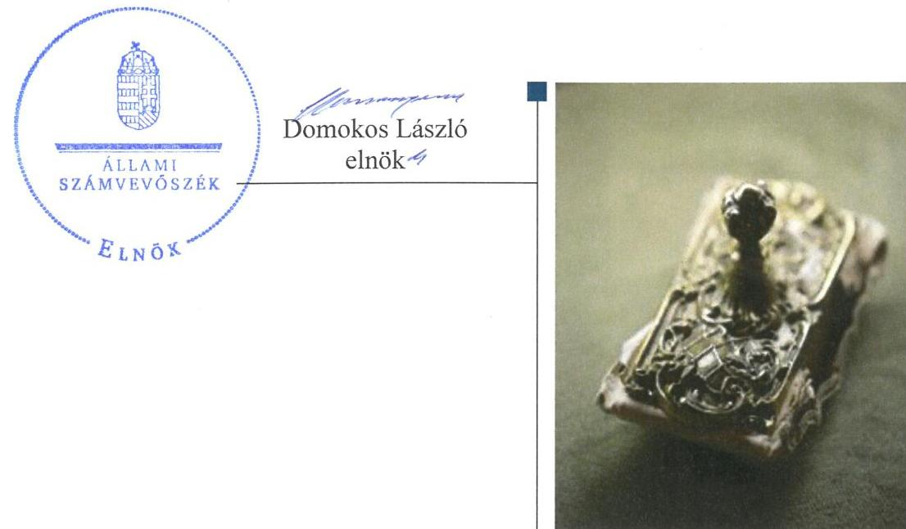
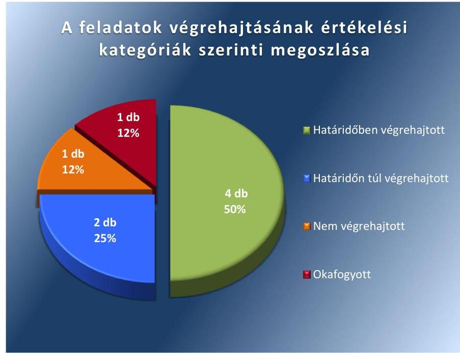
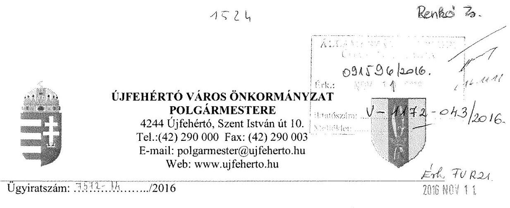
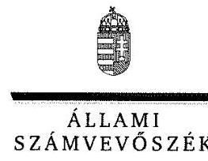
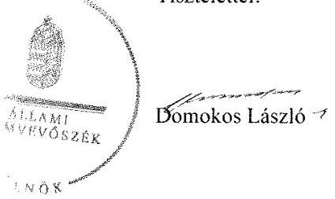
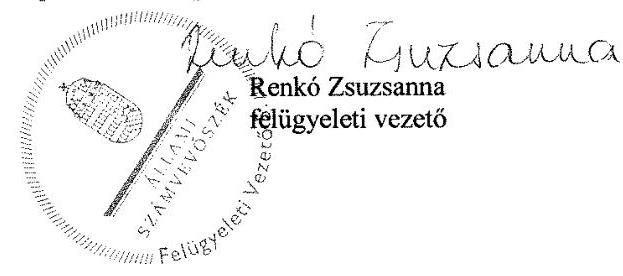

# Jelentés 

## Utóellenőrzések

Az önkormányzatok pénzügyi gazdálkodási helyzetének, szabályszerűségének utóellenőrzése - Újfehértó
2016.

---

# J elentés 

## Utóellenőrzések

Az önkormányzatok pénzügyi gazdálkodási helyzetének, szabályszerűségének utóellenőrzése - Újfehértó
2016. 12. hó 12. nap

---

# AZ ELLENŐRZÉST FELÜGYELTE: 

RENKŐ ZSUZSANNA felügyeleti vezető

## AZ ELLENŐRZÉST VEZETTE ÉS A VÉGREHAJTÁSÁÉRT FELELŐS:

CSORDÁS PÉTERNÉ ellenőrzésvezető

## A PROGRAM ÖSSZEÁLLÍTÁSÁÉRT FELELŐS:

JANIK JÓZSEF LÁSZLÓ osztályvezető

## A TÉMÁHOZ KAPCSOLÓDÓ KORÁBBI SZÁMVEVŐSZÉKI JELENTÉSEK:

- címe: Jelentés az önkormányzatok pénzügyi gazdálkodási helyzete értékelésének, és gazdálkodása szabályosságának - 2013. évben induló - ellenőrzéséről Újfehértó
- sorszáma: 14024

IKTATÓSZÁM: V-1172-052/2016.
TÉMASZÁM: 2206
ELLENŐRZÉS-AZONOSÍTÓ SZÁM: V075521

---

# TARTALOMJEGYZÉK 

■ ÖSSZEGZÉS ..... 5
■ AZ ELLENŐRZÉS CÉLJA ..... 6
■ AZ ELLENŐRZÉS TERÜLETE ..... 7
■ AZ ELLENŐRZÉS HÁTTERE, INDOKOLTSÁGA ..... 8
■ A JELENTÉS LÉNYEGES KÉRDÉSKÖREI ..... 9
■ ELLENŐRZÉS HATÓKÖRE ÉS MÓDSZEREI ..... 10
■ MEGÁLLAPÍTÁSOK ..... 12
■ MELLÉKLETEK ..... 15
I. Sz. melléklet: Az ÁSZ 14024 számú jelentéséhez kapcsolódó intézkedési terv végrehajtása ..... 15
■ FÜGGELÉK: ÉSZREVÉTELEK ..... 19
■ RÖVIDÍTÉSEK JEGYZÉKE ..... 27

---

.

---

# ÖSSZEGZÉS 

Üjfehértó Város Önkormányzata az intézkedési tervben foglalt feladatokat összességében végrehajtotta. Az Állami Számvevőszék pénzügyi egyensúly megteremtésére és megtartására, a gazdálkodás szabályosságára irányuló intézkedést igénylő megállapításai alapvetően hasznosultak.

## Az ellenőrzés társadalmi indokoltsága

Az ÁSZ ${ }^{1}$ stratégiájában célul tűzte ki a számvevőszéki munka hasznosulásának javítását. Ezzel összhangban ellenőrzi, hogy az ellenőrzött szervezetek megvalósították-e a korábbi ellenőrzései által feltárt hibák, hiányosságok és szabálytalanságok megszüntetése céljából elkészített intézkedési terveikben foglaltakat. A rendszeres utóellenőrzések hozzájárulnak a szükséges intézkedések tényleges végrehajtáshoz, ezáltal a közpénzügyek rendezettségének javulásához.

Az Önkormányzat² pénzügyi egyensúlya 2010. január 1. - 2013. június 30. közötti időszakban nem volt biztosított, továbbá a gazdálkodási feladatok ellátásában szabályszerűségi hibák fordultak elő, amelyek jövőbeni elkerülése indokolttá tette a tervezett intézkedések utóellenőrzésének elvégzését.

## Főbb megállapítások, következtetések

A polgármester ${ }^{3}$ az intézkedési tervet ${ }^{4}$ az ÁSZ tv. ${ }^{5}$-ben rögzített határidőben küldte meg az ÁSZ részére. Az intézkedési tervben rögzített feladatok végrehajtásáról a Bkr. ${ }^{6}$-ben előírt nyilvántartást részben megfelelően vezették.

A négy határidőben végrehajtott feladat mellett - miszerint döntési javaslat született, amelyben a Képviselő-testület kötelezettséget vállalt, hogy a többletbevételeket, tartalékokat a kötelezettségek rendezésére fordítja, illetve hitelfelvétel és kötvénykibocsátás fedezeteként törzsvagyonba tartozó ingatlan nem került felhasználásra, továbbá felmérték a kiadáscsökkentő lehetőségeket és erről, valamint a lejárt szállítói állományáról beszámoltak a Képviselőtestületnek - kettőt határidőn túl hajtottak végre, mivel a reorganizációs programot, illetve a feladatellátás racionalizálására vonatkozó javaslatot a vállalt határidőn túl terjesztették a Képviselő-testület elé. Egy feladat tekintetében az Önkormányzat nem tett megfelelő lépéseket az ÁSZ által korábban feltárt hiányosság megszüntetésére, ugyanis a bevételeket továbbra sem a jogszabályi előírásoknak megfelelően határozták meg, az Önkormányzat 2015-ben és 2016-ban is központi kiegészítő támogatás figyelembevételével tervezte meg azokat. A korlátozottan forgalomképes törzsvagyonba tartozó, megterhelt ingatlanokra bejegyzett jelzálog törlésére előírt feladat végrehajtása okafogyottá vált, mivel a jelzálog törlésre került azt követően, hogy az állam átvállalta az Önkormányzat adósságát.

---

# AZ ELLENŐRZÉS CÉLJA 

Az ellenőrzés célja annak értékelése volt, hogy a számvevőszéki jelentésben foglalt intézkedést igénylő megállapításokkal és javaslatokkal összhangban készített intézkedési tervben meghatározott feladatokat az ellenőrzött szervezet végrehajtotta-e.

---

# AZ ELLENŐRZÉS TERÜLETE 

## Az Önkormányzat

Újfehértó Szabolcs-Szatmár-Bereg megyében fekszik, 2012ben kapott városi címet. Állandó lakosainak száma a $\mathrm{KSH}^{7}$ által közzétett népességi adatok szerint 2015. január 1-jén 12736 fő volt. Az utóellenőrzés időszakában hivatalban lévő polgármester a 2010. évi önkormányzati választások óta tölti be tisztségét, a jegyző 2014. ősz óta látja el közszolgálati feladatait. Az Önkormányzat 11 fős képviselő-testülettel múködik, munkáját három bizottság segíti.

Az Önkormányzat a 2015. évi költségvetési beszámoló szerint 2157,6 millió Ft költségvetési bevételt ért el, illetve 2047,9 millió Ft költségvetési kiadást teljesített. Az eszközvagyon értéke 2015. december 31-én könyv szerinti értéken 8 738, 5 millió Ft volt.

Az ÁSZ a 2013. évben ellenőrizte az Önkormányzat pénzügyi gazdálkodása helyzetét és szabályszerűségét, amelyről a 14024. számú jelentését ${ }^{8}$ 2014. január 31-én tette közzé. Az ellenőrzés célja annak értékelése volt, hogy a 2010. január 1. és 2013. június 30. közötti időszakban az Önkormányzat kötelező és önként vállalt feladatainak ellátása és az ellátást biztosító szervezeti formák változása milyen hatást gyakorolt a pénzügyi egyensúlyi helyzetre, az egyensúly milyen irányban változott és milyen intézkedéseket tettek az egyensúly biztosítása, illetve javítása érdekében.

Az utóellenőrzés - a 2014. január 31-től 2016. június 13-ig végrehajtott feladatokat figyelembe véve - a polgármester és a jegyző számára megfogalmazott javaslatok hasznosulása céljából készített intézkedési terv végrehajtásának ellenőrzésére, illetve értékelésére terjedt ki.

---

# AZ ELLENŐRZÉS HÁTTERE, INDOKOLTSÁGA 

Az ÁSZ tv. 33. § (1) bekezdése értelmében a számvevőszéki jelentések intézkedést igénylő megállapításaihoz és javaslataihoz kapcsolódóan az ellenőrzött szervezet vezetője intézkedési tervet köteles összeállítani, és az ÁSZ részére megküldeni. Az intézkedési tervben foglaltak megvalósítását az ÁSZ tv. 33. § (7) bekezdésében foglaltak alapján - az ÁSZ utóellenőrzés keretében ellenőrizheti. Az intézkedések megvalósulásának értékelése során az ÁSZ figyelembe veszi az ellenőrzött szervezetek működési feltételeiben, valamint a jogszabályi előírásokban bekövetkezett változásokat.

Az intézkedési tervekben foglalt feladatok hiányos, illetve késedelmes végrehajtása, valamint megvalósításának elmaradása azt mutatja, hogy az ellenőrzések során feltárt hibák, hiányosságok és szabálytalanságok megszüntetése nem kapott kellő hangsúlyt. Ez a szabályszerű működés és a felelős vezetői magatartás vonatkozásában kockázatot hordoz. E kockázatok feltárásával az ÁSZ utóellenőrzési rendszere fokozza a fegyelmet, és igazolja, hogy a közpénzzel való szabályos gazdálkodás felelőssége elől nem lehet kitérni.

## AZ UTÓELLENŐRZÉS VÁRHATÓ HASZNOSULÁSA

Az utóellenőrzés négy szinten hasznosulhat:
$\longrightarrow$ A társadalom szintjén az utóellenőrzés jelzi, hogy a számvevőszéki ellenőrzés megállapításainak van következménye: a hiányosságok megszüntetésére az ellenőrzött szervezet által meghatározott intézkedések végrehajtását is számon kéri az ÁSZ.
$\longrightarrow$ Az ellenőrzött terület szintjén az utóellenőrzés tájékoztatást nyújt a terület döntéshozóinak a hiányosságok kiküszöbölésének jó gyakorlatairól, ezzel lehetőséget biztosítva arra, hogy az ÁSZ ellenőrzési megállapításai, javaslatai a terület nem ellenőrzött szervezeteinek a működése során is hasznosuljanak.
$\longrightarrow$ Az ellenőrzött szervezet szintjén az utóellenőrzés feltárja, hogy a szervezet az intézkedések végrehajtásával hasznosította-e a korábbi ellenőrzési jelentésben a hiányosságok megszüntetése, illetve a kockázatok kezelése érdekében megfogalmazott javaslatokat.
$\longrightarrow$ Az ÁSZ szintjén az utóellenőrzés visszacsatolást ad az ellenőrzési jelentések hasznosulásáról, az intézkedések elmaradása vagy részleges megvalósulása a további ellenőrzésekhez kockázati jelzésként szolgál.

---

# A JELENTÉS LÉNYEGES KÉRDÉSKÖREI 

Az Önkormányzat az intézkedési tervben foglaltakat az elöirt határidőben végrehajtotta-e?

---

# ELLENŐRZÉS HATÓKÖRE ÉS MÓDSZEREI 

## Az ellenőrzés típusa

Megfelelőségi ellenőrzés

## Az ellenőrzött időszak

Az utóellenőrzés alapját képező ÁSZ jelentés közzétételének napjától (2014. január 31.) az ellenőrzésről szóló kiértesítő levél keltének napjáig (2016. június 13.) tartó időszak.

## Az ellenőrzés tárgya

A számvevőszéki jelentésben foglalt intézkedést igénylő megállapításokkal és javaslatokkal összhangban - az Önkormányzat által - készített intézkedési tervben foglaltak végrehajtásának ellenőrzése.

Az ellenőrzés kiterjedt minden olyan körülményre és adatra, amely az ÁSZ jogszabályban meghatározott feladatainak teljesítéséhez, valamint a program végrehajtása folyamán felmerült újabb összefüggések feltárásához szükséges.

## Az ellenőrzött szervezet

Újfehértó Város Önkormányzata

## Az ellenőrzés jogalapja

Az ÁSZ tv. 1. § (3) bekezdése szerint az ÁSZ általános hatáskörrel végzi a közpénzekkel és az állami és önkormányzati vagyonnal való felelős gazdálkodás ellenőrzését.

Az ÁSZ tv. 33. § (7) bekezdése alapján az ÁSZ tv. 33. § (1)-(2) bekezdése szerinti intézkedési tervben foglaltak megvalósítását az ÁSZ utóellenőrzés keretében ellenőrizheti.

## Az ellenőrzés módszerei

Az ÁSZ az utóellenőrzést a nemzetközi standardokat irányadónak tekintve az ellenőrzési program ellenőrzési kérdései, az ellenőrzött időszakban hatályos jogszabályok, az ellenőrzés szakmai szabályok és módszertanok figyelembevételével, önálló ellenőrzés keretében végezte.

---

Az ÁSZ az ellenőrzés ideje alatt az Önkormányzattal történő kapcsolattartást az ÁSZ SZMSZ²-ének vonatkozó előírásai alapján biztosította.

Az utóellenőrzés megállapításait elsősorban az ÁSZ rendelkezésére álló, valamint az Önkormányzattól elektronikusan bekért dokumentumok alapozták meg.

Az ellenőrzési bizonyítékként felhasználható adatforrások közé tartoznak egyrészt a szakmai programban felsorolt adatforrások, másrészt minden - az ellenőrzés folyamán feltárt, az ellenőrzés szempontjából információt tartalmazó - dokumentum.

Az intézkedési tervekben előírt feladatok értékelését, azok végrehajthatósága, illetve végrehajtása szempontjából az alábbiak szerint végezte az ÁSZ:
$\longrightarrow$ „határidőben végrehajtott" a feladat, ha a teljesítés dokumentáltan, az intézkedési tervben előírt határidőben és tartalommal megtörtént;
$\longrightarrow$ „határidőn túl végrehajtott" a feladat, ha annak teljesítése az intézkedési tervben meghatározott módon, de az előírt határidőn túl történt meg;
$\longrightarrow$ „részben végrehajtott" a feladat, ha végrehajtása teljes körűen az intézkedési tervben előírt módon nem történt meg;
$\longrightarrow$ „nem végrehajtott" a feladat, ha a végrehajtás nem történt meg, vagy amennyiben a teljesítést nem dokumentálták;
$\longrightarrow$ „okafogyottá vált" a feladat, ha végrehajtására - meghatározott esemény bekövetkezése, továbbá külső körülmény, a múködést érintő feltétel változása miatt - már nincs szükség, illetve lehetőség, és egyértelműen megállapítható, hogy az intézkedést szükségessé tevő körülmény a jövőben nem fordulhat elő;
$\longrightarrow$ „nem időszerü" az a feladat, amelynek ellenőrzési időszakon belüli végrehajtására azért nem került (kerülhetett) sor, mert az intézkedés alapjául szolgáló esemény nem következett be, de annak jövőbeni előfordulása lehetséges, a végrehajtása nem volt esedékes, vagy a végrehajtás határideje még nem járt le.
Az ellenőrzés lefolytatásához az Önkormányzat a tanúsítványok elektronikus kitöltésével, valamint az ÁSZ által kért dokumentumok elektronikus megküldésével szolgáltatott adatokat, amelyek valódiságát és teljes körűségét a polgármester által tett teljességi és hitelességi nyilatkozat igazolta. Az így rendelkezésre bocsátott adatok, információk kontrollja az ellenőrzés keretében történt.

---

# MEGÁLLAPÍTÁSOK 

## Az Önkormányzat az intézkedési tervben foglaltakat az előírt határidőben végrehajtotta-e?

Összegző megállapítás

Az Önkormányzat az intézkedési tervben meghatározott nyolc feladatból négyet határidőben, kettőt határidőn túl, és egyet nem hajtott végre, egy feladat pedig okafogyottá vált. Az intézkedési tervben rögzített feladatok végrehajtásáról a Bkr. által előírt nyilvántartást részben megfelelően vezették.

Az ÁSZ a jelentésében a polgármester részére hét, a jegyző részére egy javaslatot fogalmazott meg. A polgármester által összeállított és az ÁSZ részére megküldött intézkedési tervben a hiányosságok, szabálytalanságok megszüntetésére nyolc feladatot határoztak meg. A feladatok elvégzésének felelőseként négy esetben a polgármestert, három esetben a polgármestert és a jegyzőt együtt, egy esetben pedig a jegyzőt jelölték meg.

Az intézkedési tervben meghatározott feladatokat, határidőket, az ÁSZ jelentés javaslatainak címzettjét és a feladatok végrehajtását az I. számú melléklet mutatja be.

Az intézkedési tervben tervezett feladatok végrehajtásának értékelési kategóriák szerinti megoszlását az 1. ábra szemlélteti.

1. ábra

Forrás: ÁSZ

---

# HATÁRIDŐBEN VÉGREHAJTOTT feladatok: 

1. A jegyző elkészítette, és a polgármester határidőben, 2014. június 25-én jóváhagyásra előterjesztette azt a döntési javaslatot, amelyben a Képviselő-testület ${ }^{10}$ kötelezettséget vállalt arra, hogy előre meghatározott összegben és módon a realizált többletbevételeket, a meglévő és a jövőben képződő tartalékokat mindaddig a kötelezettségek rendezésére fordítja, azt nem használja más célra, amíg az Önkormányzat pénzügyi egyensúlya rövidtávon veszélyeztetett.
2. A polgármester intézkedett arról, hogy a hitelfelvétel és kötvénykibocsátás fedezeteként az Áht. ${ }^{11}$-ban előírtak szerint a törzsvagyon körébe tartozó ingatlan ne kerüljön felhasználásra.
3. A jegyző a költségvetési rendelettervezet, valamint annak évközi módosításainak előterjesztését megelőzően, határidőben megindította a bevételnövelő és kiadáscsökkentő lehetőségek felmérését, és a polgármester a kialakított javaslatokat folyamatosan a Képviselő-testületet elé terjesztette.
4. A polgármester intézkedett a szállítói számlák esedékesség szerinti kiegyenlítéséről, illetve a lejárt tartozások folyamatos átütemezéséről, és eleget tett a lejárt szállítói állomány alakulásáról vállalt beszámolási feladatának a Képviselő-testület rendes ülésein.

## HATÁRIDŐN TÚL VÉGREHAJTOTT feladatok:

5. A polgármester az intézkedési tervben rögzített 2014. július 31-ei határidőn túl, 2014. december 16-án terjesztette a Képviselő-testület elé az Önkormányzat gazdasági helyzetének elemzésén alapuló, a pénzügyi egyensúlyi helyzet gyors helyreállítását, hosszú távú fenntartását, valamint az adósságállomány újratermelődésének elkerülését biztosító intézkedéseket tartalmazó reorganizációs programot.
6. A polgármester-felülvizsgálva az önként vállalt feladatok finanszírozhatóságát a kötelező feladatellátás elsődlegességének biztosításával - az intézkedési tervben szabott 2014. július 31-ei határidőn túl, 2015. január 26-án tett javaslatot a Képviselő-testületnek a feladatellátás racionalizálására.

## NEM VÉGREHAJTOTT feladat:

7. A jegyző nem intézkedett arról, hogy a bevételeket az Áht. 12. § (1) bekezdésének megfelelően, közgazdaságilag megalapozottan határozzák meg, ugyanis az Önkormányzat 2015-ben és 2016-ban is központi kiegészítő támogatás figyelembevételével tervezte meg a bevételeket.

## OKAFOGYOTTÁ VÁLT feladat:

8. Az Önkormányzat korlátozottan forgalomképes törzsvagyonába tartozó, megterhelt ingatlanok kiváltási lehetőségének vizsgálata okafogyottá vált, mivel a Magyarország 2014. évi központi költségvetésről szóló 2013. évi CCXXX. törvény 67. § (1) bekezdése szerinti adósságkonszolidáció során az Önkormányzat adósságát az állam

---

átvállalta, így a törzsvagyonba tartozó ingatlanokra bejegyzett jelzálog törlésre került.

Az ÁSZ javaslatai alapján készített intézkedési tervben rögzített feladatok végrehajtásáról a jegyző által készített nyilvántartás nem felelt meg maradéktalanul a Bkr. 47. § (2) bekezdésében foglaltaknak, mivel hiányzott a megtett intézkedések rövid leírása, a végre nem hajtott intézkedés okának megjelölése, továbbá a nyilvántartás nem tartalmazta a 2014. évet követő intézkedések nyomon követését.

---

# MELLÉKLETEK

- I. SZ. MELLÉKLET: AZ ÁSZ 14024 SZÁMÚ JELENTÉSÉHEZ KAPCSOLÓDÓ INTÉZKEDÉSI TERV VÉGREHAJTÁSA

|  1. | Az Önkormányzat által az intézkedési
tervben rögzített feladatok
1. | Az intézkedési terv-
ben meghatározott
határidő
2. | Az ÁSZ 14024-es
számú jelentés
javaslatának
címzettje
3.  |
| --- | --- | --- | --- |
|   |  |  | 4.  |
|  1. | Az Önkormányzat kötelezettségeinek jövőbeni teljesítését, a fizetőképesség megőrzését célzó, a Képviselő-testület kötelezettségvállalására irányuló döntési javaslat elkészítése és Képviselő-testület elé terjesztése arra, hogy előre meghatározott összegben és módon a realizált többletbevételeket, a meglévő és a jövőben képződő tartalékokat mindaddig a kötelezettségek rendezésére fordítja, azt nem használja más célra, amíg az Önkormányzat pénzügyi egyensúlya rövidtávon veszélyeztetett. | 2014. június 30. | polgármester és
jegyző  |
|  2. | A polgármester intézkedjen, hogy jövőbeni hitelfelvétel és kötvénykibocsátás fedezeteként az Áht. 84. § (4) bekezdésében előírtak szerint a törzsvagyon körébe tartozó ingatlan ne kerüljön felhasználásra. | 2014. május 28., ezt követően folyamatosan | polgármester  |

A feladat végrehajtása 4.

A polgármester határidőben, 2014. június 25-én előterjesztette - a Htv. ${ }^{12} 140 . \S$ (1) bekezdés a) pontja alapján a jegyző által elkészített - „Többletbevételek, valamint a jövőben képződő tartalékok felhasználásáról szóló kötelezettségvállalásról" szóló döntési javaslatot, amelyben a Képviselő-testület kötelezettséget vállalt arra, hogy előre meghatározott összegben és módon a realizált többletbevételeket, a meglévő és a jövőben képződő tartalékokat mindaddig a kötelezettségek rendezésére fordítja, azt nem használja más célra, amíg az Önkormányzat pénzügyi egyensúlya rövidtávon veszélyeztetett. A Képviselő-testület az előterjesztést a 89/2014. (VI.25.) számú határozatával egyhangúan elfogadta. 2014. május 28., ezt követően folyamatosan polgármester

A Polgármester intézkedett, hogy a hitelfelvétel és kötvénykibocsátás fedezeteként az Áht. 84. § (4) bekezdésében előírtak szerint a törzsvagyon körébe tartozó, korlátozottan forgalomképes ingatlan ne kerüljön felhasználásra. A Képviselő-testület a 150/2015. (VII.30.) számú határozatával a PPP konstrukcióban ${ }^{13}$ épült újfehértői Tornacsarnok tulajdonjogának megszerzése érdekében 330 millió Ft - jelzálogszerződés melletti - hitel felvételéről döntött, amelyhez a Kormány az 1832/2015. (XI.24.) Korm. határozattal hozzájárult. A hitel fedezetét forgalomképes önkormányzati tulajdonban lévő ingatlan képezte.

---

|  Az Önkormányzat által az intézkedési tervben rögzített feladatok | Az intézkedési tervben meghatározott határidő | Az ÁSZ 14024-es számú jellentés javaslatának címzettje | A feladat végrehajtása  |
| --- | --- | --- | --- |
|  1. | 2. | 3. | 4.  |
|  3. A költségvetési rendelettervezet, valamint annak évközi módosításainak előterjesztését megelőzően fel kell mérni a bevételszerző, kiadáscsökkentő lehetőségeket, és a Képviselő-testület elé kell terjeszteni a bevételek növelését, a kiadások csökkentését célzó intézkedések bevezetéséhez szükséges - a Htv. 140. § (1) bekezdés a) pontja alapján a jegyző által elkészített - döntési javaslatot. | A 2014. évi költségvetési rendelettervezet és az évközi módosítások előterjesztését megelőzően folyamatosan.
A 2014. évet követően a tárgyévi költségvetési rendelettervezet előterjesztését, illetve az évközi módosítások előterjesztését megelőzően folyamatosan | polgármester és jegyző | A jegyző a költségvetési rendelettervezet, valamint annak évközi módosításainak előterjesztését megelőzően határidőben megindította a bevételnövelő és kiadáscsökkentő lehetőségek felmérését, és a polgármester, a Htv. 140. § (1) bekezdés a) pontja alapján a jegyző által készített döntési javaslatokat a Képviselő-testület elé terjesztette.
A polgármester 2014. február 24-ei 3-42/2014. számú előterjesztésében szerepelt a bevételnövelő és kiadáscsökkentő lehetőségek felmérésének szükségessége. A Képvi-selő-testület az ÁSZ vizsgálathoz kapcsolódó bevételszerző és kiadáscsökkentő intézkedésekről szóló 88/2014. (VI.25.) számú határozata és a jegyző 5/2014. (VI.27.) számú utasítása pontokba szedte a szükséges előkészítő, helyzetfelmérő jellegű feladatokat. A polgármester 2014. december 13-án kelt 3-265/2014. számú képviselő-testületi előterjesztésében, és az egyes bevétel- és költségelemekkel kapcsolatos részintézkedések - döntések, határozatok, rendeletek meghozatala - esetében a 2015. és 2016. években folyamatosan tájékoztatta a Képviselő-testületet a megtett bevételnövelő, illetve kiadáscsökkentő intézkedések eredményeiről és a további tennivalókról.  |
|  4. A polgármester havonta számoljon be a szállítói kitettség és az adósságrendezési tv. 4. § (2) bekezdés a)-b) pontjaiban megjelölt helyzet kialakulásának elkerülése érdekében a Képviselő-testületnek az Önkormányzat lejárt szállítói állománya alakulásáról. Intézkedjen a szállítói számlák esedékesség szerinti kiegyenlítéséről vagy a lejárt tartozások átütemezéséről. | A beszámoló havonta a Képviselő-testület rendes ülésén. A szállítói számlák esedékesség szerinti kiegyenlítése, a lejárt tartozások átütemezésének kezdeményezése a pénzügyi lehetőségek figyelembevételével, folyamatosan. | polgármester | A polgármester a szállítói kitettség és a helyi önkormányzatok adósságrendezési eljárásáról szóló 1996. évi XXV. törvény 4. § (2) bekezdés a)-b) pontjaiban megjelölt helyzet kialakulásának elkerülése érdekében a Képviselő-testület rendes ülésein a megelőző testületi ülés óta történt eseményekről, tárgyalásokról szóló előterjesztés keretében számolt be az Önkormányzat lejárt szállítói állománya alakulásáról. A polgármester intézkedett a szállítói számlák pénzügyi lehetőségek szerinti folyamatos kiegyenlítéséről, illetve a lejárt tartozások folyamatos átütemezéséről.  |
|  Határidőn túl végrehajtott feladat |  |  |   |
|  5. Az Önkormányzat gazdasági helyzetének elemzésén alapuló, a pénzügyi egyensúlyi helyzet gyors helyreállítását, hosszú távú fenntartását, valamint az adósságállomány újratermelődésének elkerülését biztosító intézkedéseket tartalmazó reorganizációs prog- | 2014. július 31. | polgármester és jegyző | A polgármester határidőn túl, 2014. december 16-án terjesztette a Képviselő-testület elé - a Htv. 140. § (1) bekezdés a) pontja alapján a jegyző által elkészített - az Önkormányzat gazdasági helyzetének elemzésén alapuló, a pénzügyi egyensúlyi helyzet gyors helyreállítását, hosszú távú fenntartását, valamint az adósságállomány újratermelődésének elkerülését biztosító intézkedéseket tartalmazó reorganizációs progra-  |

---

|  Az Önkormányzat által az intézkedési tervben rögzített feladatok | Az intézkedési tervben meghatározott határidő | Az ÁSZ 14024-es számú jélőntés javaslatának címzettje  |
| --- | --- | --- |
|  1. | 2. | 3.  |

|  4. |   |
| --- | --- |
|  |   |

|  6. | Az önként vállalt feladatok finanszírozhatóságának felülvizsgálata a kötelező feladatellátás elsődlegességének biztosítása érdekében, és ennek függvényében javaslat tétele a Képviselő-testületnek a feladatellátás racionalizálására.  |
| --- | --- |
|  |   |

|  7. | A jegyző intézkedjen, hogy a költségvetési rendelettervezetben az működési költségvetés Mötv.14 111. § (4) bekezdésében előírt egyensúlyának biztosításakor a bevételeket az Áht. 12. § (1) bekezdésének megfelelően, közgazdaságilag megalapozottan határozzák meg.  |
| --- | --- |
|  |   |

|  2014. július 31 | polgármester  |
| --- | --- |
|  |   |

|  2014. július 31 | polgármester  |
| --- | --- |
|  |   |

|  2014. július 31 | polgármester  |
| --- | --- |
|  |   |

|  2014. július 31 | polgármester  |
| --- | --- |
|  |   |

|  2014. július 31 | polgármester  |
| --- | --- |
|  |   |

|  2014. július 31 | polgármester  |
| --- | --- |
|  |   |

|  2014. július 31 | polgármester  |
| --- | --- |
|  |   |

|  2014. július 31 | polgármester  |
| --- | --- |
|  |   |

|  2014. július 31 | polgármester  |
| --- | --- |
|  |   |

|  2014. július 31 | polgármester  |
| --- | --- |
|  |   |

|  2014. július 31 | polgármester  |
| --- | --- |
|  |   |

|  2014. július 31 | polgármester  |
| --- | --- |
|  |   |

|  2014. július 31 | polgármester  |
| --- | --- |
|  |   |

|  2014. július 31 | polgármester  |
| --- | --- |
|  |   |

|  2014. július 31 | polgármester  |
| --- | --- |
|  |   |

|  2014. július 31 | polgármester  |
| --- | --- |
|  |   |

|  2014. július 31 | polgármester  |
| --- | --- |
|  |   |

|  2014. július 31 | polgármester  |
| --- | --- |
|  |   |

|  2014. július 31 | polgármester  |
| --- | --- |
|  |   |

|  2014. július 31 | polgármester  |
| --- | --- |
|  |   |

|  2014. július 31 | polgármester  |
| --- | --- |
|  |   |

|  2014. július 31 | polgármester  |
| --- | --- |
|  |   |

|  2014. július 31 | polgármester  |
| --- | --- |
|  |   |

|  2014. július 31 | polgármester  |
| --- | --- |
|  |   |

|  2014. július 31 | polgármester  |
| --- | --- |
|  |   |

|  2014. július 31 | polgármester  |
| --- | --- |
|  |   |

|  2014. július 31 | polgármester  |
| --- | --- |
|  |   |

|  2014. július 31 | polgármester  |
| --- | --- |
|  |   |

|  2014. július 31 | polgármester  |
| --- | --- |
|  |   |

|  2014. július 31 | polgármester  |
| --- | --- |
|  |   |

|  2014. július 31 | polgármester  |

---

|  Az Önkormányzat által az intézkedési tervben rögzített feladatok | Az intézkedési tervben meghatározott határidő | Az ÁSZ 14024-es számú jelentés javaslatának címzettje | A feladat végrehajtása  |
| --- | --- | --- | --- |
|  1. | 2. | 3. | 4.  |
|   |  |  | pénzügyi egyensúlyi helyzetében alapvető változás nem következett be. Az Önkormányzat a kiegészítő támogatás figyelembevételével tervezte meg a költségvetési múködési kiadásait és bevételeit a 6/2014. (IV.24.) számú, 7/2015. (III.6.) számú és 2/2016. (II.03.) számú költségvetési rendeleteinek elkészítése során.  |
|   |  |  | **Okafogyottá vált feladat**  |
|  8. A megterhelt, korlátozottan forgalomképes törzsvagyonba tartozó ingatlanok kiváltása lehetőségének vizsgálata, és javaslat előterjesztése a Képviselő-testület elé a jogszerűen biztosítékba adható önkormányzati vagyontárgyakkal való kiváltásról. | 2014. május 31. | polgármester | Magyarország 2014. évi központi költségvetésről szóló 2013. évi CCXXX. törvény 67. § (1) bekezdése szerinti adósságkonszolidáció során az Önkormányzat adósságát az állam átvállalta, így a törzsvagyonba tartozó ingatlanokra bejegyzett jelzálog törlésre került 2014 május 29-én. A polgármester a 2014. május 28-ai előterjesztésében tájékoztatta a Képviselő-testületet, hogy a megterhelt, korlátozottan forgalomképes törzsvagyonba tartozó ingatlanok kiváltási lehetőségének megvizsgálása okafogyottá vált, mivel az adósság állam általi átvállalásával az ingatlanokon még fennálló jelzálogjog törlése megtörtént.  |

*Forrás: ÁSZ által készített táblázat*

---

# FÜGGELÉK: ÉSZREVÉTELEK 

A jelentéstervezetet a Számvevőszék 15 napos észrevételezésre megküldte az ellenőrzött szervezet vezetőjének az ÁSZ tv. 29. §* (1) bekezdése előírásának megfelelően.
A függelék tartalmazza az ellenőrzött észrevételeit, illetve az el nem fogadott észrevételek elutasításának indoklását.

[^0]
[^0]:    * 29. § (1) Az Állami Számvevőszék az ellenőrzési megállapításait megküldi az ellenőrzött szervezet vezetőjének vagy az általa megbízott személynek, és annak, akinek személyes felelősségét állapította meg.
    (2) Az ellenőrzött szervezet vezetője és a felelősként megjelölt személy az ellenőrzés megállapításaira tizenöt napon belül írásban észrevételt tehet.
    (3) Az Állami Számvevőszék az észrevételre a beérkezésétől számított harminc napon belül írásban válaszol. A figyelembe nem vett észrevételeket köteles a jelentésben feltüntetni, és megindokolni, hogy azokat miért nem fogadta el.

---

# Domokos László 

Állami Számvevőszék Elnöke részére

## 1052 Budapest

Apáczai Csere János u. 10.

## Tisztelt Elnök Úr!

Az Állami Számvevőszék Újfehértő Város Önkormányzata pénzügyi gazdálkodási helyzete és gazdálkodása szabályosságát ellenőrizte 2010 január 1-jétől 2013. június 30 -ig terjedő időszakra.

Az ellenőrzést lezáró számvevőszéki jelentésben foglalt intézkedést igénylő megállapításokkal és javaslatokkal összhangban - az Önkormányzat a 81/2014. (V.28.) számú határozatával intézkedési tervet fogadott el.
Az intézkedési tervben megállapított feladatok végrehajtásának utóellenőrzését az Állami Számvevőszék 2016. június 14 -én kezdte meg. Az Állami Számvevőszék Elnöke a V-1172038/2016. számú átiratában Újfehértő Város Önkormányzata pénzügyi gazdálkodási helyzet értékelésének és gazdálkodása szabályosságának utóellenőrzése címủ utóellenőrzési jelentéstervezetet 2016. október 25. napján küldte meg az önkormányzat részére.

Az Állami Számvevőszékről szóló 2011. évi LXVI. törvény 29. § (2) bekezdése alapján:
Az ellenőrzött szervezet vezetője és a felelősként megjelölt személy az ellenőrzés megállapításaira tizenöt napon belül írásban észrevételt tehet.

A fenti rendelkezések alapján, az utóellenőrzési jelentés megállapításaival kapcsolatban az alábbi észrevételeket teszem:

Az Önkormányzat nem ért egyet azzal a megállapítással, hogy az intézkedési tervben foglalt feladatok hiányos, illetve késedelmes végrehajtása, valamint megvalósításának elmaradása azt mutatja, hogy az ellenőrzések során feltárt hibák, hiányosságok és szabálytalanságok megszüntetése nem kapott kellő súlyt.

A megállapított 8 intézkedési feladatból, egy okafogyottá vált, 4 intézkedés határidőben végrehajtásra került, míg két intézkedés végrehajtására határidőn túl került sor.

---

Az önkormányzat a határidóben végrehajtott feladatokról az alábbi döntéseket hozta:
Az Önkormányzat kötelezettségeinek jövőbeni teljesítése, a fizetőképesség megőrzése érdekében beterjesztésre került a Képviselő-testület elé -a Htv. 140. § (1) bekezdés a) pontja alapján elkészített-döntési javaslat, amelyben a Képviselő-testület kötelezettséget vállalt arra, hogy előre meghatározott összegben és módon a realizált többletbevételeket, a meglévő és a jövőben képződő tartalékokat mindaddig a kötelezettségek rendezésére fordítja, azt nem használja más célra, amíg az Önkormányzat pénzügyi egyensúlya rövidtávon veszélyeztetett.

Intézkedésre került sor, hogy a jövőbeni hitelfelvétel és kötvénykibocsátás fedezeteként az Áht. 84. § (4) bekezdésében előírtak szerint a törzsvagyon körébe tartozó ingatlan ne kerüljön felhasználásra.

A költségvetési rendelettervezet, valamint annak évközi módosításainak előterjesztését megelőzően, határidőben felmérésre kerültek a bevételnövelő és kiadáscsökkentő lehetőségek. Számos döntési javaslat készült, amelyekről a Képviselő-testület határozataiban döntött. A határozatban foglaltak folyamatos nyomon követése és végrehajtása megtörtént.

A Polgármester a szállítói kitettség és az Adósságrendezési tv. 4. § (2) bekezdés a)-b) pontjaiban megjelölt helyzet kialakulásának elkerülése érdekében, havonta beszámolt a Képviselő-testületnek az Önkormányzat lejárt szállítói állománya alakulásáról. Intézkedés történt a szállítói számlák esedékesség szerinti kiegyenlítéséről vagy a lejárt tartozások átütemezéséről.

Két intézkedési feladat határidőn - 2014. július 31. - túl került végrehajtásra, így az önkormányzat gazdasági helyzetének elemzésén alapuló, a pénzügyi egyensúlyi helyzet gyors helyreállítását, hosszú távú fenntartását, valamint az adósságállomány újratermelődésének elkerülését biztosító intézkedéseket tartalmazó reorganizációs programot 2014. december 16án fogadta el a Képviselő- testület, míg az önként vállalt feladatok felülvizsgálatával a feladatellátás racionalizálásáról szóló döntés 2015. január 26-án született meg.

A 2014. októberi önkormányzati választásokra tekintettel, az önkormányzat vezetése a következő önkormányzati ciklust alapjaiban befolyásoló döntést nem kívánt a választásokat megelőzően a leköszönő Képviselő- testület elé terjeszteni, kész helyzet elé állítva ezzel az új polgármestert és Képviselő-testületet. A 2014. évi önkormányzati választás lebonyolítását, az alakuló ülés megtartását követően a reorganizációs terv és az önként vállalt feladatok felülvizsgálatának előkészítése haladéktalanul elkezdődött és a Képviselő-testület elé megtárgyalásra előterjesztésre került, az abban foglalt valamennyi feladat végrehajtása megtörtént.

Nem került végrehajtásra az az intézkedés, amely szerint a költségvetési rendelettervezetben a működési költségvetés Mötv. 111.§(4) bekezdésében előírt egyensúlyának biztosításakor a bevételeket az Áht. 12. §(1) bekezdésének megfelelően, közgazdaságilag megalapozottan kell meghatározni.

Az elnöki figyelemfelhívás szerint a végre nem hajtott intézkedés kockázatot hordoz, mert a bevételek közgazdaságilag meglapozott tervezésének elmaradása, azaz a kormányzati jóváhagyó döntés nélkül bevételi előirányzatként figyelembe vett kiegészítő támogatás a múködési költségvetés egyensúlyának biztosítását veszélyeztette.

---

Az önkormányzat a megállapítással részben ért egyet.
A 2014. évi költségvetés bevétele és kiadása 1.386 .374 eFt összegben lett megállapítva, amelyet 2014. március 06-án fogadott el a Képviselő-testület, a kiadási és bevételi egyensúly megtartásával (3/2014. (III.06) rendelet).
2014. április 24-én került sor a 3/2014. (III.06.) önkormányzati rendelet módosítására, mivel az intézményeknél egyre több olyan kiadás volt, amelyre nem tudtak kötelezettséget vállalni, mert a költségvetési keret nem tette lehetővé (ilyen kiadások voltak a közüzemi és az egyéb intézmény üzemeltetési kiadások). A költségvetési rendelet módosítása során került sor 404.105 eFt kiegészítő támogatás beemelésére.

Az önkormányzat 2015. évi költségvetési bevétele 1.469 .612 e, költségvetési kiadása 1.936.612 e Ft . A bevétellel nem fedezett kiadás összege 467.000 e Ft.

Finanszírozási bevétel 500.000 e Ft és finanszírozási kiadás 33.000 e Ft a finanszírozási többlet 467.000 e Ft. Ez alapján a finanszírozási többletből finanszírozható a költségvetési bevétellel nem fedezett költségvetési kiadás összege. Abban az esetben, ha nem számolunk a települési önkormányzatok müködőképessége megőrzését szolgáló kiegészítő támogatással, a költségvetési bevétel 1.151 .783 e Ft költségvetési kiadás 1.936 .612 e Ft , a költségvetési bevétellel nem fedezett költségvetési kiadás összege 784.829 e Ft. A finanszírozási többlettel csökkentett fedezetlen kiadás összege így 317.829 e Ft.

Az önkormányzat a 2016. évi költségvetési bevételét- 2.054.653 eFt föösszegben állapította meg.
az összes bevételéből:
a) Költségvetési müködési bevétel:
$1.947 .653 \mathrm{eFt}$
b) Költségvetési felhalmozási bevétel:
20.000 eFt

Költségvetési bevételek összesen:
$1.967 .653 \mathrm{eFt}$
c) Belső müködési célú finanszírozási bevétel (pénzmaradvány)
0 eFt
d) Belső felhalmozási célú finanszírozási bevétel (pénzmaradvány)
87.000 eFt

Belső finanszírozási bevételek összesen:
$\mathbf{8 7 . 0 0 0} \mathbf{~ e F t}$
e) Külső müködési célú finanszírozási bevétel (hitelfelvétel)
0 eFt
f) Külső felhalmozási célú finanszírozási bevétel (hitelfelvétel)
0 eFt
Külső finanszírozási bevételek összesen:
0 eFt

A Képviselő-testület a 2016. évi költségvetésének fenti a) pontja szerinti bevételeit:
a) 1.607 .172 eFt . Költségvetési bevétel, mely nem tartalmazza a kiegészítő támogatás bevételét, és
b) 340.481 eFt. Kiegészítő támogatási bevétel szerinti bontásban állapította meg

Az önkormányzat 2016. évi költségvetésének összes kiadását: 2.054.653 eFt. föösszeggel állapította meg, melyből:
a) Költségvetési müködési kiadás:
$1.947 .653 \mathrm{eFt}$
b) Költségvetési felhalmozási kiadás:
8.000 eFt

Költségvetési kiadások összesen:
$1.955 .653 \mathrm{eFt}$
c) Külső müködési célú finanszírozási kiadás (hiteltőrlesztés)
0 eFt
d) Külső felhalmozási célú finanszírozási kiadás (hiteltőrlesztés)
99.000 eFt

Külső finanszírozási kiadások összesen:
99.000 eFt

A fedezetlen kiadás összege így 2016. évre 340.481 eFt.

---

Magyarország helyi önkormányzatairól szóló 2011. évi CLXXXIX. törvény 111§. (4) bekezdése alapján: A költségvetési rendeletben müködési hiány nem tervezhető.

Az államháztartásról szóló 2011. évi CXCV. törvény 23.§. (4) bekezdése alapján: a Mötv. 111. § (4) bekezdésének alkalmazásában müködési hiányon az Áht. 23.§. (2) bekezdés e) pontja szerinti külső finanszírozású müködési célú költségvetési hiányt kell érteni.

Ahogyan azt a költségvetési rendelet-tervezetet tartalmazó előterjesztéshez csatolt könyvvizsgálói és jegyzői írásbeli észrevétel is tartalmazta, a 2014. áprilisában, 2015. és 2016. években elfogadott költségvetési rendeletek a fenti rendelkezéseknek nem felelnek meg.

Nem ért egyet azonban az önkormányzat azzal, hogy a tervezés a költségvetési egyensúly biztosítását veszélyeztette.

Az önkormányzat mindhárom évben a költségvetés tervezés készítésével egy időben írásban kereste meg a Belügyminisztérium Önkormányzati Államtitkárságát, és a Nemzetgazdasági Minisztérium illetékes Főosztályát, a törvény szerinti költségvetési tervezés végrehajthatatlanságáról. A válaszok alapján, az elemi költségvetési garnitúrában jelzett „helyi önkormányzatok kiegészítő támogatásai" előirányzat beemelésével biztosítottuk a költségvetés egyensúlyát.

A rendkívüli önkormányzati támogatás betervezésével egyidejűleg a rendeletben, a hiány arányában zároltuk az intézmények költségvetési kiadásait, mindhárom költségvetési évben, annak érdekében, hogy időarányosan a költségvetési rendeletben megállapított keretet ne lépje túl egyik intézmény illetve az önkormányzat sem.

Valamennyi költségvetési évben nagyon átgondolt, felelősségteljes gazdálkodás folyt az önkormányzatnál. A bevételnövelő és kiadáscsökkentő intézkedéseket folyamatosan vizsgáljuk és végrehajtjuk annak érdekében, hogy likvidhitel felvételére ne kerüljön sor, illetve az önkormányzat gazdálkodásának egyensúlyát folyamatosan biztosítsuk. Az intézkedések végrehajtásának köszönhetően, 2014-2015 évben költségvetési pénzmaradvánnyal zártunk.

Tájékoztatom továbbá Tisztelt Elnök Urat, hogy a Bkr-ben előírt nyilvántartás pontosítása az észrevétel megtételéig megtörtént.

Kérem az észrevételek tudomásul vételét!
Újfehértő, 2016. november 09.

Nagy Sándor polgármester

---

# ELNÖK 

Ikt. szám: V-1172-047/2016.

## Nagy Sándor úr

polgármester

Újfehértó Város Önkormányzata

## Újfehértó

## Tisztelt Polgármester Úr!

Köszönettel megkaptam ,,Utóellenörzések - Újfehértó Város Önkormányzata pénzügyi, gazdálkodási helyzetének, szabályszerüségének utóellenörzése " címú jelentéstervezet megállapításaira tett észrevételét.

Az ellenőrzési megállapításokra vonatkozó észrevételét az Állami Számvevőszékről szóló 2011. évi LXVI. törvény 29. § (2) bekezdésében meghatározott tizenöt napos határidőn belül küldte meg. Az Állami Számvevőszék észrevétellel kapcsolatos álláspontját a mellékletként csatolt, a felügyeleti vezető által készített indokolás tartalmazza.

Budapest, 2016. 117 hónap 27 nap

Tisztelettel:

Melléklet: Észrevételre adott válasz

---

„Utóellenörzések - Újfehértó Város Önkormányzata pénzügyi, gazdálkodási helyzetének, szabályszerüségének utóellenörzése" címú jelentéstervezetre tett észrevételekre adott válasz

| Észrevétel: | Ellenőrzés háttere, indokoltsága (2. bekezdés első mondata): Az intézkedési ter-   vekben foglalt feladatok hiányos, illetve késedelmes végrehajtása, valamint megva-   lósításának elmaradása azt mutatja, hogy az ellenőrzések során feltárt hibák, hiá-   nyosságok és szabálytalanságok megszüntetése nem kapott kellő hangsúlyt.   Észrevétel: Nem értenek egyet a megállapítással. |
| :--: | :--: |
| Válasz: | Az Állami Számvevőszék az észrevételt nem fogadja. |
| Indoklás: | A vitatott mondat általánosságban fogalmazza meg az Utóellenörzések indokoltsá-   gát, nem tartozik az önkormányzat ellenőrzési megállapításai közé. Ezért található   az „Ellenörzés háttere, indokoltsága" és nem a „Megállapitások" résznél. |
| Észrevétel: | Figyelemfelhívó levél 2. pont 2. mondat: A végre nem hajtott intézkedés kockáza-   tot hordoz, mert a bevételek közgazdaságilag megalapozott tervezésének elmara-   dása, azaz a kormányzati jóváhagyó döntés nélkül bevételi elöirányzatként figye-   lembe vett kiegészítő támogatás a müködési költségvetés egyensúlyának biztosítását   veszélyeztette.   Észrevétel: A figyelemfelhívásban foglaltakkal részben értenek egyet, azonban nem   értenek egyet azzal, hogy a tervezés a költségvetési egyensúly biztosítását veszé-   lyeztette. |
| Válasz: | Az Állami Számvevőszék az észrevételt nem fogadja el. |
| Indoklás: | Az ÁSZ tv. 29. § (2) bekezdése szerint az ellenőrzött szervezet vezetője az ellenőrzés   megállapításaira tehetett írásban észrevételt. A vitatott mondat az elnöki figyelem-   felhívásban szerepelt. A nem végrehajtott feladattal kapcsolatban olyan észrevételt   nem tettek, amely a megállapítás minősitését befolyásolja. |
| Észrevétel: | Megállapítások utolsó bekezdése: Az ÁSZ javaslatai alapján készített intézkedési   tervben rögzített feladatok végrehajtásáról a jegyző által készített nyilvántartás nem   felelt meg maradéktalanul a Bkr. 47. § (2) bekezdésében foglaltaknak, mivel hiány-   zott a megtett intézkedések rövid leírása, a végre nem hajtott intézkedés okának meg-   jelölése, továbbá a nyilvántartás nem tartalmazta a 2014. évet követő intézkedések   nyomon követését.   Észrevétel: A Bkr.-ben elöírt nyilvántartás pontosítása az észrevétel megtételéig   megtörtént. |
| Válasz: | Az Állami Számvevőszék az észrevételt nem fogadja el. |
| Indoklás: | A Bkr.-ben elöírt nyilvántartás vezetésére vonatkozó megállapítást nem vitatják. Az   észrevételben jelzett pontosítás ellenőrzési időszakon túl történt, ezért a megállapítás   megalapozottsága helytálló. |

---

Tájékoztatom Polgármester Urat, hogy az Állami Számvevőszékről szóló 2011. évi LXVI. törvény 29. § (3) bekezdése alapján az Állami Számvevőszék a figyelembe nem vett észrevételeket köteles a jelentésben feltüntetni, és megindokolni, hogy azokat miért nem fogadta el.

Budapest, 2016. 11 hónap 21 nap

---

# RÖVIDÍTÉSEK JEGYZÉKE 

${ }^{1}$ ÁSZ
${ }^{2}$ Önkormányzat
${ }^{3}$ polgármester
${ }^{4}$ intézkedési terv
${ }^{5}$ ÁSZ tv.
${ }^{6}$ Bkr.
${ }^{7}$ KSH
${ }^{8}$ jelentés
${ }^{9}$ ÁSZ SZMSZ
${ }^{10}$ Képviselő-testület
${ }^{11}$ Áht.
${ }^{12} \mathrm{Htv}$.
${ }^{13}$ PPP konstrukció
${ }^{14}$ Mötv.

Állami Számvevőszék
Újfehértó Város Önkormányzata
Újfehértó Város Önkormányzatának polgármestere
Újfehértó Város Önkormányzata Képviselő-testületének 81/2014. (V.28.) határozatával elfogadott intézkedési terve
2011. évi LXVI. törvény az Állami Számvevőszékről (hatályos 2011. július 1.-jétől) 370/2011. (XII.31.) Korm. rendelet a költségvetési szervek belső kontrollrendszeréről és belső ellenőrzéséről (hatályos: 2012. január 1-jétől) Központi Statisztikai Hivatal
Az ÁSZ 14024. számú jelentése - Jelentés az önkormányzatok pénzügyi gazdálkodási helyzete értékelésének, és gazdálkodása szabályosságának - 2013. évben induló - ellenőrzéséről Újfehértó (elérhető a www.asz.hu honlapon)
Állami Számvevőszék Szervezeti és Működési Szabályzata
Újfehértó Város Önkormányzatának képviselő-testülete
2011. évi CXCV. törvény az államháztartásról
1991. évi XX. törvény a helyi önkormányzatok és szerveik, a köztársasági megbízottak, valamint egyes centrális alárendeltségű szervek feladat. és hatásköreiről
Köz- és magánszféra partnersége angolul, rövidítve. A köz- és magánszféra együttműködésén alapuló konstrukció
2011. évi CLXXXIX. törvény Magyarország helyi önkormányzatairól

---

# ÁLLAMI SZÁMVEVŐSZÉK 

1052 Budapest, Apáczai Csere János utca 10.
Levélcím: 1364 Budapest 4. Pf. 54
Telefon: +36 14849100 Telefax: +36 14849200
www.asz.hu