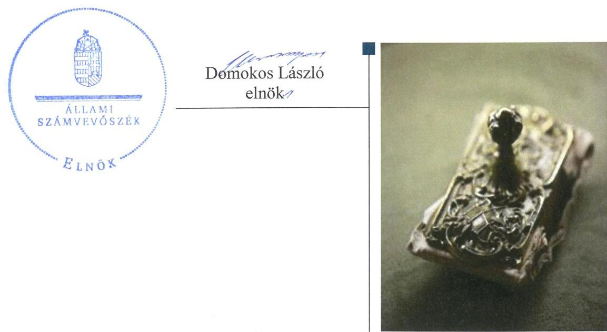
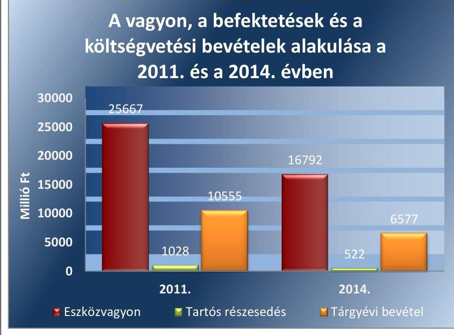
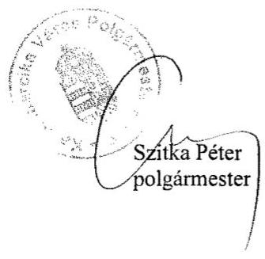
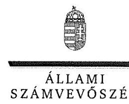
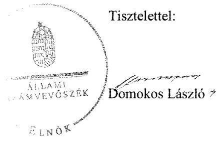
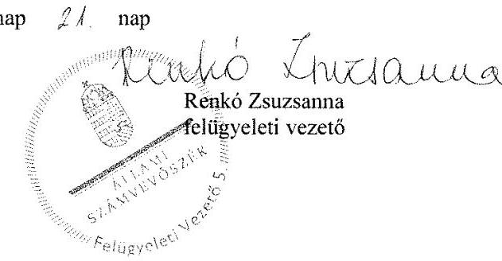

# Jelenetés 

## Önkormányzatok belső kontrollrendszere

Az önkormányzatok belső kontrollrendszere kialakításának és működtetésének ellenőrzése - Kazincbarcika 2016.

---

# Jelenetés 

## Önkormányzatok belső kontrollrendszere

Az önkormányzatok belső kontrollrendszere kialakításának és működtetésének ellenőrzése - Kazincbarcika
2016. 12. hó 13. nap

---

# AZ ELLENŐRZÉST FELÜGYELTE: 

RENKÓ ZSUZSANNA felügyeleti vezető

## AZ ELLENŐRZÉST VEZETTE ÉS A VÉGREHAJTÁSÁÉRT FELELŐS:

DR. TIMÁR BALÁZS ellenőrzésvezető

## A PROGRAM ÖSSZEÁLLÍTÁSÁÉRT FELELŐS:

JANIK JÓZSEF LÁSZLÓ osztályvezető

IKTATÓSZÁM: V-1076-143/2016.
TÉMASZÁM: 2110

## ELLENŐRZÉS-AZONOSÍTÓ SZÁM: V071821, V073821

Jelentéseink az Országgyűlés számítógépes hálózatán és az Interneten a www.asz.hu címen is olvashatóak.

---

# TARTALOMJEGYZÉK 

■ ÖSSZEGZÉS ..... 5
■ AZ ELLENŐRZÉS CÉLJA ..... 6
■ AZ ELLENŐRZÉS TERÜLETE ..... 7
■ AZ ELLENŐRZÉS HÁTTERE, INDOKOLTSÁGA ..... 8
■ A JELENTÉS LÉNYEGES KÉRDÉSKÖREI ..... 11
■ ELLENŐRZÉS HATÓKÖRE ÉS MÓDSZEREI ..... 12
■ MEGÁLLAPÍTÁSOK ..... 15
■ JAVASLATOK ..... 32
■ MELLÉKLETEK ..... 35
I. sz. melléklet: Értelmező szótár ..... 35
II. sz. melléklet: A számviteli eltérések bemutatása a 2011 - 2014. évek mérlegbeszámolóiban (Ft) ..... 38
III. sz. melléklet: Az integritás érvényesítése érdekében kialakított és működtetett kontrollrendszer ..... 39
■ FÜGGELÉK: ÉSZREVÉTELEK ..... 41
■ RÖVIDÍTÉSEK JEGYZÉKE ..... 61

---

.

---

# ÖSSZEGZÉS 

Kazincbarcika Város Önkormányzata belső kontrollrendszerét hiányosan alakították ki és működtették. Az egyes befektetésekkel kapcsolatos döntés előkészítés és döntéshozatal az ellenőrzött időszakban nem volt szabályszerű, egyes döntéseket képviselő-testületi jóváhagyás mellőzésével hoztak meg, illetve hajtottak végre. Az Önkormányzat beszámolója nem a valóságnak megfelelően mutatta be a befektetett közvagyon nagyságát. Az Önkormányzat az integritás szemlélet érvényesülése érdekében nem tett erőfeszítéseket.

## Az ellenőrzés társadalmi indokoltsága

Magyarország Alaptörvénye az önkormányzatoktól is elvárja a kiegyensúlyozott, átlátható és fenntartható költségvetési gazdálkodás elvének érvényesítését. A korábbi évek ellenőrzési tapasztalatai, az önkormányzatok által betöltött társadalmi szerep, az általuk kezelt közpénz nagysága, a nemzeti vagyon átruházására vagy hasznosítására vonatkozó döntéseik sokrétűsége egyaránt indokolttá tették a számvevőszéki ellenőrzések folytatását. A belső kontrollrendszer kialakítása és működtetése nélkül nem valósítható meg a közpénzek, a közvagyon szabályos, gazdaságos, hatékony és eredményes felhasználása.

Kazincbarcika Város Önkormányzata 2015. április 30-án 49 millió Ft üzleti célú részesedéssel, valamint 3,2 millió Ft üzleti vagyonba tartozó - ipari park kialakítása céljából vásárolt - földterülettel rendelkezett. Az üzleti célú részvények egy részét olyan befektetési vállalkozásnál tartotta, amelynek törvénytelen tevékenysége következtében fennállt a veszélye annak, hogy a befektetett közvagyon egészét vagy egy részét elveszítik. Felmerült, hogy a belső kontrollrendszer kialakítása és működtetése nem biztosította a közvagyon megóvását, körültekintő, biztonságos befektetését, a befektetési döntések, azok végrehajtása és számviteli elszámolása nem volt szabályszerű.

## Főbb megállapítások, következtetések, javaslatok

A belső kontrollrendszer kialakítása és működtetése részben volt szabályszerű, így maradéktalanul nem támogatta a közpénzfelhasználás szabályosságát. A teljesítésigazolási, az érvényesítési és a kötelezettségvállalás ellenjegyzési jogkörök szabálytalan gyakorlása következtében a kialakított kontrolltevékenységek a hibák megelőzését, feltárását nem segítették. Az Önkormányzat befektetési tevékenységével összefüggő kockázatokat nem elemezték, ezáltal nem volt biztosított a vagyonnal való felelős gazdálkodás.

A befektetett pénzügyi eszközök év végi értékelését nem végezték el. Ezzel megsértették a valódiság számviteli alapelvét, mivel a beszámolóban szereplő tételek értékelése nem felelt meg az előírt értékelési elveknek és az azokhoz kapcsolódó értékelési eljárásoknak.

Az egyes befektetések számviteli nyilvántartási értékének helytelen megállapítása, a részletező nyilvántartás nem megfelelő vezetése, valamint a leltározás szabálytalan elvégzése következtében az önkormányzat beszámolója vagyonáról nem a valós összképet mutatta.

Az integritás szemlélet erősítése érdekében - a belső kontrollrendszer kialakításában és működésében feltárt hiányosságok és hibák megszüntetésével - az Önkormányzatnak még további intézkedéseket kell megtennie.

---

# AZ ELLENŐRZÉS CÉLJA 

Az ellenőrzés célja annak megállapítása, hogy az önkormányzat belső kontrollrendszerének kialakítása, továbbá egyes elemeinek működtetése biztosította-e a közpénz felhasználás szabályosságát. Az erőforrásokkal való szabályszerű és hatékony gazdálkodáshoz szükséges követelmények érvényesítése, számonkérése, ellenőrzése megtörtént-e az önkormányzatnál. A belső kontrollrendszer kialakítása és működtetése támogatta-e az integritás szemlélet érvényesülését. Az ellenőrzés során értékeljük a belső kontrollrendszer kialakításának és működtetésének szabályszerűségét. Feltárjuk azokat a lényeges szabályozási és működési hiányosságokat, amelyek miatt az ellenőrzött kulcskontrollok nem nyújtottak elegendő védelmet a lehetséges hibákkal szemben. Rámutatunk arra, ha a kulcskontrollok valamely hibát nem előznek meg, nem tárnak fel, vagy nem javítanak ki, valamint minősítjük működésük megfelelőségét.

Ellenőrizzük, hogy az önkormányzat egyes befektetési döntései és azok végrehajtása, elszámolása megfelelt-e a vonatkozó jogszabályoknak és belső szabályozásoknak, a kialakított kontrollrendszer támogatta-e a befektetési tevékenység szabályszerűségét.

---

# **AZ ELLENŐRZÉS TERÜLETE**

### **Kazincbarcika Város Önkormányzata**

Kazincbarcika város állandó lakosainak száma 2015. január 1-jén 29 227 fő volt. Az Önkormányzat 15 tagú Képviselőtestületének munkáját 2014-ben négy, 2015-ben három állandó bizottság segítette. Az Önkormányzat a Hivatalon1 kívül öt intézménnyel, valamint hét többségi tulajdoni részesedésű gazdasági társasággal látta el a feladatait.

A Polgármester2 a 2006. évi Önkormányzati választások óta tölti be tisztségét. A Jegyző3 2013 óta látja el feladatait. A Hivatal négy fő szervezeti egységre tagolódott, elkülönített gazdasági szervezettel rendelkezett. A gazdasági szervezet feladatait a Gazdálkodási Osztály látta el, a gazdasági szervezet vezetője az osztályvezető volt. A Hivatalban foglalkoztatott köztisztviselők száma 2014. év végén 72 fő volt. A Hivatalnál 2014. január 1-jétől szervezeti változás nem volt.

Az Önkormányzat a 2014. évi éves költségvetési beszámoló szerint 6,6 milliárd Ft költségvetési bevételt ért el, valamint 5,9 milliárd Ft költségvetési kiadást teljesített. Az Önkormányzat vagyona 2014. december 31-én 16,8 milliárd Ft volt, a költségvetési évben esedékes kötelezettség állomány 385 millió Ft-ot, a költségvetési évet követően esedékes kötelezettség állomány 74 millió Ft-ot tett ki.

Az Önkormányzat vagyonának, befektetéseinek és a költségvetési bevételeinek alakulását a 2011. évben és a 2014. évben az 1. ábra mutatja be:

1. ábra

*Forrás: a 2011. és a 2014. évi éves költségvetési beszámolók*

---

# AZ ELLENŐRZÉS HÁTTERE, INDOKOLTSÁGA 

Az ÁSZ tv. szerint az ÁSZ feladata a jól irányított állam kiépítésének elősegítése. Az ÁSZ Stratégiájában ezért hangsúlyos szerepet szánt annak, hogy szilárd szakmai alapon álló, értékteremtő ellenőrzéseivel előmozdítsa a közpénzügyek átláthatóságát, rendezettségét. A számvevőszéki ellenőrzés nemzetközi alapelvei is rögzítik, hogy a megfelelő belső kontrollrendszer minimálisra csökkenti a hibák és szabálytalanságok kockázatát. A belső kontrollrendszer azt a célt szolgálja, hogy a költségvetési szervek működésük és gazdálkodásuk során a tevékenységeket szabályszerűen, gazdaságosan, hatékonyan, eredményesen hajtsák végre, teljesítsék elszámolási kötelezettségeiket és megvédjék az erőforrásokat a veszteségektől, a károktól és a nem rendeltetésszerű használattól. A belső kontrollrendszer magában foglalja mindazon szabályokat, eljárásokat, gyakorlati módszereket és szervezeti struktúrákat, kockázatkezelési technikákat, kontrolltevékenységeket, amelyek segítséget nyújtanak a szervezetnek céljai eléréséhez. A belső kontrollrendszer szabályozása háromszintű: a törvényi előírásokat az Áht. 2 és a Mötv., a rendeleti szintű szabályozást az Ávr. és a Bkr. tartalmazza, amelyeket útmutatói szinten az NGM ${ }^{4}$ által kiadott standardok és kézikönyvek támogatnak. Az ellenőrzött időszak meghatározása lehetőséget teremtett a 2014. október 12-i önkormányzati választásokat megelőző és követő ciklus belső kontrollrendszere működésének elkülönült értékelésére, valamint a változások nyomon követésére.

A BELSŐ KONTROLLRENDSZER kialakításának és működtetésének általános értékelése mellett a teljesítésigazolás és érvényesítés kontrollok kiemelt ellenőrzésének szükségességét alátámasztja, hogy 2012. évtől a pénzügyi folyamatokban kulcsszerepet betöltő belső kontrollok rendszere módosult és azok működtetésében az önkormányzatoknál hiányosságok mutatkoztak a 2012. év óta elvégzett ÁSZ ellenőrzések alapján.

Az önkormányzatok belső kontrollrendszerének ellenőrzése az ÁSZ "jó kormányzással" kapcsolatos stratégiai céljainak megvalósítását is szolgálja. Az ÁSZ célja, hogy javuljon az ellenőrzött önkormányzatok belső kontrollrendszerének szabályozottsága, működésének megfelelősége, hozzájárulva ezzel az egyensúlyi helyzet fenntarthatóságának biztosításához, azaz az adósság újratermelődésének megakadályozásához. Az ÁSZ ellenőrzés nem csupán a közvetlenül ellenőrzött önkormányzatokat segíthetik, hanem a „jó gyakorlat" elterjesztésével azok az önkormányzatok is átvehetik a pozitív példákat, ahol nem végez ellenőrzést az ÁSZ.

Az MNB három befektetési szolgáltató tevékenységi engedélyét 2015. első felében visszavonta és kezdeményezte a vállalkozások felszámolását a működéssel kapcsolatos szabálytalanságok, hiányosságok miatt. A befektetési vállalkozások problémás helyzetbe kerülése jelentős veszteségekhez vezetett számos önkormányzat esetében. A korábbi évek ellenőrzési tapasztalatai alapján fennáll a lehetősége annak, hogy az önkormányzatok befektetési döntései, továbbá a döntések végrehajtása és számviteli elszámolása nem voltak teljes mértékben szabályszerűek, a belső kontrollrendszer és a kapcsolódó külső ellenőrzések sem működtek

---

minden esetben megfelelően. Az ÁSZ 2015 májusában felkérést kapott a Kormánytól arra, hogy vizsgálja meg, az érintett befektetési vállalkozásoknál értékpapír portfolióval rendelkező önkormányzatok szabályszerűen jártak-e el a szabad pénzeszközeik befektetésekor.

Magyarország Alaptörvénye az önkormányzatoktól, mint az államháztartás alanyaitól elvárja a kiegyensúlyozott, átlátható és fenntartható költségvetési gazdálkodás elvének érvényesítését. A nemzeti vagyonról szóló törvény szerint a nemzeti vagyonnal felelős módon, rendeltetésszerűen kell gazdálkodni. A nemzeti vagyongazdálkodás feladata a nemzeti vagyon rendeltetésének megfelelő, átlátható, hatékony és költségtakarékos működtetése, ugyanakkor értékének megőrzését, értéknövelő használatát, hasznosítását, gyarapítását is elvárja.

# AZ ÖNKORMÁNYZATOK ÁTMENETILEG SZABAD 

PÉNZESZKÖZEINEK BEFEKTETÉSÉT jogszabály nem tiltja, a pénzpiaci szolgáltatók közül az önkormányzatok a kínált szolgáltatás és annak költségei alapján, szabadon választhatnak, a veszteséges gazdálkodás kockázatai és következményei azonban az önkormányzatokat terhelik. A szabad pénzeszközök felelős hasznosítása összhangban áll az önkormányzati gazdálkodás alapelveivel.

A közintézmények integritás alapú kultúrájának kialakítása, megerősítése és működése szorosan összefügg a belső kontrollrendszer működésével, ezért az ellenőrzés kiterjed annak értékelésére is, hogy a belső kontrollrendszer kialakítása és működtetése hogyan hatott az integritás szemlélet érvényesülésére.

Az államháztartás önkormányzati alrendszerében a 2014. év elején összesen 3177 települési önkormányzat működött: a 23 kerülettel rendelkező főváros, 345 város, 2691 község és 117 nagyközség volt. A belső kontrollrendszer kialakítása és működtetése ellenőrzését az ÁSZ által lefolytatott, kisebb településeket is érintő ellenőrzéseinek tapasztalatai, valamint a közérdekű bejelentések kockázati szempontú értékelése alapozták meg. Ezek a községek, nagyközségek gazdálkodásának, belső kontrollrendszere kialakításának és működésének hiányosságaira mutattak rá. Az ellenőrzések helyszíneinek kiválasztása során az ÁSZ célzott adatfeldolgozáson alapuló kockázatelemző rendszerére támaszkodik. Ez elősegíti, hogy azokon a területeken végezzen ellenőrzéseket, összpontosítva erőforrásait, ahol a valódi kockázatok, az aktuális problémák vannak. Az ellenőrzések helyszíneinek kiválasztása során a kockázatelemzés konkrét szempontjait az ellenőrzési programban rögzített ellenőrzési cél, az ellenőrzött időszak, az ellenőrzés által érintett fókuszterületek és a főbb ellenőrzési kérdések határozzák meg.

## AZ ELLENŐRZÉS VÁRHATÓ HASZNOSULÁSA

NÉGY SZINTEN valósul meg. A törvényalkotás számára összegzett tapasztalatok állnak rendelkezésre a belső kontrollrendszer önkormányzati területen való kialakításáról, működtetéséről és hatásairól. Az ellenőrzés az ellenőrzött számára visszajelzést ad a belső kontrollrendszer kialakításában és működésében lévő hiányosságokról, javaslataival hozzájárul azok kiküszöböléséhez. Az ellenőrzés megállapításait és javaslatait más szervezetek is hasznosíthatják a rendezett gazdálkodási keretek kialakításához. A társadalom számára jelzi, hogy közpénz nem maradhat ellenőrizetlenül, az

---

ÁSZ értékteremtő rend kialakításához és megőrzéséhez hozzájáruló tevékenysége pozitív hatással lesz a szervezetről kialakított összkép formálásában. Az ÁSZ az ellenőrzéseivel hozzájárul ahhoz, hogy az egyes önkormányzati befektetésekkel kapcsolatos kockázatok, a szabályozási és kontroll mechanizmusok fejlesztésével mérsékelhetők legyenek. Feltárja az önkormányzati befektetési tevékenységet meghatározó szabályozások összhangjának hiányosságait, a szabályozással nem érintett gazdálkodási
 területeket, valamint az egyes befektetési tevékenységek esetleges szabálytalanságait.

Az ellenőrzés megállapításaival összefüggő javaslatok hasznosítása esetén javulhat az önkormányzat gazdálkodásának, egyes befektetési tevékenységének szabályozottsága, valamint a „jó gyakorlatok" terjesztésén keresztül azok az önkormányzatok is átvehetik a pozitív példákat, ahol nem végez ellenőrzést az ÁSZ.

---

# A JELENTÉS LÉNYEGES KÉRDÉSKÖREI 

1. Az önkormányzat belső kontrollrendszerének kialakítása és működtetése szabályszerű volt-e 2014. január 1. és 2015. április 30. között, valamint a belső kontrollrendszer egyes pillérei támogat-ták-e a befektetési tevékenység szabályszerű végzését 2011. január 1. és 2015. április 30. között?
2. Az egyes befektetésekkel kapcsolatos döntéshozatal és a döntések végrehajtása szabályszerű volt-e?
3. Az egyes befektetések számviteli elszámolása, nyilvántartása szabályszerű volt-e?
4. Az erőforrásokkal való szabályszerű és hatékony gazdálkodáshoz szükséges követelmények érvényesítése, számonkérése, ellenőrzése megtörtént-e az önkormányzatnál?
5. Az önkormányzat belső kontrollrendszerének kialakítása és működtetése támogatta-e az integritás szemlélet érvényesülését?

---

# ELLENŐRZÉS HATÓKÖRE ÉS MÓDSZEREI 

## Az ellenőrzés típusa

Megfelelőségi ellenőrzés, a befektetési tevékenység esetében szabályszerűségi ellenőrzés.

## Az ellenőrzött időszak

A belső kontrollrendszer kialakításának és működtetésének ellenőrzése a 2014. január 1. és 2015. április 30. közötti időszakra terjedt ki. Ezen belül a belső kontrollrendszer kialakításának és működtetésének megfelelőségét a 2014. január 1. és október 12., valamint a 2014. október 13. és 2015. április 30. közötti időszakra vonatkozóan külön-külön értékeltük. Az önkormányzatok egyes befektetési tevékenységeinek ellenőrzése tekintetében az ellenőrzött időszak a 2011. január 1. - 2015. április 30. közötti időszak. Ezen felül az önkormányzat befektetésekkel kapcsolatos döntés-előkészítésének és döntéshozatalának szabályszerűségét a 2011. január 1. előtti időszakra visszanyúlóan is ellenőriztük, amennyiben a 2014. június 30-án, illetve 2015. április 30-án meglévő befektetéseire 2011. január 1-je előtt került sor. Az integritás szemlélet érvényesülését a 2014. évre vonatkozó adatszolgáltatás alapján értékeltük.

## Az ellenőrzés tárgya

A helyi önkormányzatnak, mint éves költségvetési beszámoló készítésére kötelezett szervezetnek és polgármesteri hivatalának belső kontrollrendszere. Az erőforrásokkal való szabályszerű és hatékony gazdálkodáshoz szükséges követelmények érvényesítése, számonkérés, ellenőrzése. Az integritás szemlélet érvényesülése.

Az önkormányzat 2014. június 30-án, illetve 2015. április 30-án meglévő értékpapírokban megtestesülő befektetései, lekötött betétei, valamint az önkormányzat üzleti vagyonába tartozó ingatlanok, kulturális javak (műtárgyak, műalkotások, stb.), illetve a feladatellátást nem szolgáló egyéb értéktárgyak (pl. ékszerek, befektetési nemesfém).

## Az ellenőrzött szervezet

Kazincbarcika Város Önkormányzata

---

# Az ellenőrzés jogalapja 

Az ÁSZ tv. 1. § (3) bekezdésében foglaltak alapján az ÁSZ általános hatáskörrel végzi a közpénzekkel és az állami és önkormányzati vagyonnal való felelős gazdálkodás ellenőrzését. Az ÁSZ tv. 5. § (2) bekezdése alapján az államháztartás gazdálkodásának ellenőrzése keretében az ÁSZ ellenőrzi a helyi önkormányzatok gazdálkodását, valamint az ÁSZ tv. 5. § (6) bekezdése alapján ellenőrzése során értékeli az államháztartás számviteli rendjének betartását és a belső kontrollrendszer működését.

## Az ellenőrzés módszerei

Az ellenőrzést a nemzetközi standardokat irányadónak tekintve az ellenőrzési program ellenőrzési kérdései, az ellenőrzött időszakban hatályos jogszabályok, az ellenőrzés szakmai szabályok és módszertanok figyelembe vételével végeztük.

Az ellenőrzés lefolytatásához az Önkormányzat a tanúsítványok kitöltésével, valamint az ÁSZ által kért dokumentumok elektronikus megküldésével szolgáltatott adatokat. A rendelkezésre bocsátott adatok, információk kontrollja és a munkalapok kitöltése az ellenőrzés keretében történt. A jelentésben használt fogalmak magyarázatát az I. számú melléklet, az integritás érvényesítése érdekében kialakított és működtetett kontrollrendszer minősítését a II. számú melléklet tartalmazza.

A belső kontrollrendszer jogszabályi előírások szerinti kialakításának és működtetésének szabályszerűségét az erre irányuló ellenőrzési kérdésekre adott válaszok összesítése alapján külön-külön értékeltük a 2014. január 1. és október 12., valamint a 2014. október 13. és 2015. április 30. közötti időszakra. A belső kontrollrendszert egy-egy ellenőrzött időszakra pillérenként (kontrollkörnyezet, kockázatkezelési rendszer, kontrolltevékenységek, információs és kommunikációs rendszer, monitoring rendszer) és összesítetten is értékeltük.

## A BELSŐ KONTROLLRENDSZER EGYES PILLÉRE-

INEK KIALAKÍTÁSA ÉS MŰKÖDTETÉSE „szabályszerű volt", amennyiben az értékelt területen az elért és elérhető pontok százalékban kifejezett, egész számra kerekített hányadosa meghaladta a 84%-ot, „részben szabályszerű volt", ha 61-84% közé esett, „nem szabályszerű volt", ha nem haladta meg a 60%-ot. A belső kontrollrendszer összesített értékelése megegyezett a pillérenként (kontrollterületenként) alkalmazott százalékos értékelésekkel, a következő eltérésekkel. A kontrollrendszer egésze esetében a „szabályszerű" értékelésnek a százalékos értéken felül további feltétele volt, hogy egyik kontrollterület sem kaphat „nem szabályszerű" értékelést, a „részben szabályszerű" értékelés további feltétele volt, hogy legfeljebb egy ellenőrzött kontrollterület lehet „nem szabályszerű" értékelésű. Az összesített értékelés a százalékos értéktől függetlenül „nem szabályszerű volt", ha az ellenőrzött kontrollterületek közül több mint egynek „nem szabályszerű volt" az értékelése.

---

# A GAZDÁLKODÁS FOLYAMATÁBAN A KÉT 

KULCSKONTROLL - teljesítésigazolás, érvényesítés - működésének megfelelőségét a személyi juttatásokkal, a dologi kiadásokkal, a beruházási, felújítási kiadásokkal, az ellátottak pénzbeli juttatásaival kapcsolatos kifizetések esetében mintavétellel ellenőriztük. Finanszírozási kiadások kiemelt előirányzatához köthető kifizetések az Önkormányzatnál sem a 2014. január 1. és október 12., sem a 2014. október 13. és 2015. április 30. közötti időszakban nem voltak. A mintavétel során külön értékeltük a 2014. január 1. és 2014. október 12. közötti időszakban és a 2014. október 13. és 2015. április 30. közötti időszakban teljesített kifizetéseket. „Megfelelőnek" értékeltük a gazdálkodási jogkörök gyakorlását, amennyiben 95%-os bizonyossággal a teljes sokaságban a hibaarány legfeljebb 10%, „részben megfelelőnek" értékeltük, ha a hibaarány felső határa 10-30% között volt, „nem megfelelőnek" pedig akkor, ha a mintavételi eredmények alapján a sokaságbeli hibaarány felső határa meghaladta a 30%-ot.

Az integritás szemlélet érvényesülésének értékelése az önkormányzat által kitöltött tanúsítvány alapján történt.

---

# MEGÁLLAPÍTÁSOK

1. Az önkormányzat belső kontrollrendszerének kialakítása és működtetése szabályszerű volt-e 2014. január 1. és 2015. április 30. között, valamint a belső kontrollrendszer egyes pillérei támogatták-e a befektetési tevékenység szabályszerű végzését 2011. január 1. és 2015. április 30. között?

Összegző megállapítás A belső kontrollrendszer kialakítása és működtetése 2014. január 1. és 2015. április 30. között részben volt szabályszerű, a belső kontrollrendszer egyes pillérei nem támogatták a befektetési tevékenységek szabályszerű végzését 2011. január 1. és 2015. április 30. között.

1. táblázat

|  A BELSŐ KONTROLLRENDSZER KIALAKÍTÁSÁNAK ÉS MŰKÖDTETÉSÉNEK ÖSSZESÍTETT ÉRTÉKELÉSE |  |  |   |
| --- | --- | --- | --- |
|  Megnevezés | A gazdálkodás egészét érintően |  | A befektetési tevékenységet érintően  |
|   | 2014. január 1-től | 2014. október 13-től | 2011-2013. években  |
|   | 2014. október 13-ig | 2015. április 30-ig | 2015. április 30-ig  |
|  Kontrollkörnyezet | részben szabályszerű |  |   |
|  Kockázatkezelési rendszer | részben szabályszerű |  |   |
|  Kontrolltevékenységek | nem szabályszerű |  | nem támogatta*  |
|  Információs és kommunikációs rendszer | szabályszerű |  |   |
|  Monitoring | részben szabályszerű |  |   |
|  BELSŐ KONTROLLRENDSZER | RÉSZBEN SZABÁLYSZERŰ |  | NEM TÁMOGATTA  |

- Az ellenőrzés a kontrolltevékenységek esetében nem terjed ki arra, hogy az támogatta-e a befektetési tevékenységek szabályszerű végzését a 2011. január 1. és 2015. április 30. közötti időszakban.

---

### 1.1. számú megállapítás

A kontrollkörnyezet kialakítása és működtetése a 2014. január 1. és 2015. április 30. közötti időszakban részben volt szabályszerű. 2011. január 1. és 2015. április 30. között az Önkormányzat nem rendelkezett minden, a jogszabályok által előírt szabályzattal, valamint egyes szabályzatok a jogszabályi előírásokkal ellentétes rendelkezéseket tartalmaztak, ezért a kontrollkörnyezet nem támogatta a befektetési tevékenységek szabályszerű végzését.

## A SZERVEZETI ÉS SZABÁLYOZÁSI KERETEKET a

Képviselő-testület 2011. január 1. és 2015. április 30. közötti időszakra kialakította, ezen belül
— az Ötv. ${ }^{5}$, valamint az Mötv. ${ }^{6}$ előírásainak megfelelően megalkotta működésének részletes szabályait az Önkormányzati SZMSZ ${ }_{1,2}$-ben ${ }^{7}$. Az Önkormányzati SZMSZ ${ }_{1,2}$ tartalmazta az Önkormányzat szerveiről, azok jogállásáról, feladatairól, valamint a Képviselő-testület bizottságairól szóló rendelkezéseket az Ötv., valamint az Mötv. rendelkezéseinek megfelelően. Az Önkormányzati SZMSZ ${ }_{2}$ az Mötv.-nek megfelelően a Polgármesterre és egyes bizottságokra ruházott át hatásköröket. A befektetésekkel kapcsolatban nem történt hatáskör átruházás.
— a Htv. ${ }^{8}$ előírásainak megfelelően elfogadta az Önkormányzati vagyonnal történő gazdálkodás szabályait. Az Ötv., valamint az Nvtv. ${ }^{9}$ rendelkezéseinek megfelelően a vagyonrendelet ${ }_{1,2}{ }^{10}$-ben meghatározta a törzsvagyon körét, valamint elkülönítette a forgalomképtelen és a korlátozottan forgalomképes vagyonelemeket. A Képviselőtestület a szabályozás során meghatározta a vagyonnal való rendelkezési, döntési hatásköröket, meghatározta azt az értékhatárt, amely felett csak nyilvános versenyeztetés útján lehet a vagyont értékesíteni, vagyonkezelésbe adni, a használat jogát átengedni az Ötv., az Mötv., az Áht. ${ }^{11}$ és az Nvtv. rendelkezéseinek megfelelően.
— a Képviselő-testület - az Ötv. 91. § (7) bekezdésének előírása ellenére - az alakuló ülését követő hat hónapon belül nem vizsgálta felül, nem egészítette ki és nem módosította legalább a ciklusidő végéig a gazdasági program ${ }^{12}$-ot a 2011. évben. Az Önkormányzatnak - a Mötv. 116. § (1) és (5) bekezdésében foglaltak ellenére - nem volt gazdasági programja a 2014. január 1. és 2015. április 30. közötti időszakban.
— az Ötv. és az Mötv. rendelkezéseinek megfelelően rendeletben állapította meg az Önkormányzat költségvetéseit. A költségvetési rendeletek az Áht.1,2-nek megfelelően tartalmazták az Önkormányzat költségvetési bevételeit és kiadásait kiemelt előirányzatok szerinti bontásban, a költségvetési egyenleg összegét, a pénzmaradvány, vállalkozási maradvány igénybevételét, a finanszírozási célú műveletek bevételeit, kiadásait, valamint létszámadatokat. A költségvetéseket mellékszámításokkal alapozták meg az Áht. ${ }_{2}$-nek megfelelően.

---

A HIVATAL BELSŐ SZABÁLYOZÁSÁT a Jegyző 2011. január 1. és 2015. április 30. között - az alább megjelölt hiányosságok mellett - kialakította:

- az Áht. ${ }^{13}$ 91. § (2) bekezdésének, 94. § (1) bekezdés e) pontjának, az Áht. ${ }^{14} 10. § (1) és (5) bekezdéseinek előírása ellenére nem készítette el a Hivatal, mint költségvetési szerv SZMSZ-ét a 2011-2012. években. A Képviselő-testület 2013. november 1-jei hatállyal hagyta jóvá a Hivatali SZMSZ ${ }^{15}$-t, amely megfelelt az Áht. ${ }_{2}$-nek. A Hivatali SZMSZ az Ávr. ${ }^{16}$-ben foglaltaknak megfelelően tartalmazta a Hivatal szervezeti felépítését, működési rendjét, a szervezeti egységek megnevezését, engedélyezett létszámát, feladatait és szervezeti ábráját, valamint a munkakörökhöz tartozó feladat- és hatásköröket, a hatáskörök gyakorlásának módját, a helyettesítés rendjét, az ezekhez kapcsolódó felelősségi szabályokat.
- az Áht. ${ }_{1,2}$ és az Ámr. ${ }^{17}$, Ávr. követelményei alapján gazdálkodási szabályzatban határozta meg a kötelezettségvállalási, kötelezettségvállalás pénzügyi ellenjegyzési, a teljesítésigazolási, érvényesítési, és az utalványozási jogkörök gyakorlásának módjával, eljárási és dokumentációs részletszabályaival, valamint az ezeket végző személyek kijelölésének rendjével kapcsolatos, jogszabályban nem szabályozott belső előírásokat, feltételeket.
- a gazdálkodási szabályzatban a 100000 Ft alatti kifizetések teljesítéséhez nem írt
 előírásokkal. A Jegyző az Ávr. 53. § (2) bekezdésének előírása ellenére nem szabályozta az előzetes írásbeli kötelezettségvállalást nem igénylő kifizetések rendjét a 2014. január 1. és 2015. április 30. közötti időszakban.
- a Számv. tv. ${ }^{18}$ előírásainak megfelelően kialakította a számviteli politikát${ }^{19}$. A számviteli politika tartalmazta a Számv. tv. alapján azt, hogy a számviteli elszámolás és az értékelés szempontjából az Önkormányzat mit tekintett lényegesnek, jelentősnek.
- az Áhsz. ${ }_{1}{ }^{20}{ }_{2}$ szerinti egységes számlakeret alapján kialakította a Számv. tv.-nek megfelelően a számlarendet${ }^{21}$. A számlarend tartalmazta a Számv. tv. rendelkezéseinek megfelelően a főkönyvi számla és az analitikus nyilvántartások kapcsolatát, az analitikus nyilvántartás és a főkönyvi könyvelés közötti értékadatok számszerű egyeztetésének feladatait, és az Áhsz. ${ }_{2}$ alapján a részletező nyilvántartásoknak a kapcsolódó könyvviteli és nyilvántartási számlákkal való egyeztetését, annak dokumentálását. A számlarend nem tartalmazta az Áhsz. ${ }_{2}$ 51. § (3) bekezdése ellenére a részletező nyilvántartások vezetésének módját és az összesítő bizonylat tartalmi és formai követelményeit.
—_ kialakította a pénzkezelési szabályzatot${ }^{22}$ a Számv. tv.-nek és az Áhsz. ${ }_{1,2}$-nek eleget téve. A pénzkezelési szabályzatban meghatározta a Számv. tv.-ben foglaltaknak megfelelően a pénzforgalom lebonyolításának rendjét, valamint a pénzkezeléssel kapcsolatos bizonylatok rendjét, és a pénzforgalommal kapcsolatos nyilvántartási szabályokat.
—_ kialakította a Számv. tv.-ben foglalt előírásoknak megfelelő leltározási és leltárkészítési szabályzatot${ }^{23}$. A szabályzat az Áhsz. ${ }_{1,2}$-nek megfelelően tartalmazta a könyvviteli mérlegben kimutatott eszközök és források évenkénti leltározási kötelezettségét. A Jegyző a

---

tényleges mennyiségi felvétellel történő leltározás gyakoriságát minden esetben egy évben határozta meg.
az Áhsz. ${ }_{1,2}$-nek megfelelő tartalommal elkészítette az eszközök és források értékelési szabályzatát${ }^{24}$. Az eszközök és források értékelési szabályzata az Áhsz. ${ }_{2}$ alapján tartalmazta a követelések értékelésének elveit, szempontjait, a vagyonkezelésbe adott eszközök vagyonértékelése során alkalmazott értékelési eljárás elveit, módszerét, dokumentálásának szabályait, felelőseit. Az értékelési szabályzat 1.2.3.2. pontjában a befektetett pénzügyi eszközök értékvesztése elszámolásának alapjául szolgáló „tartósság" időtartamát a Számv. tv. 46. § (4) bekezdésében rögzített 1 év időtartam helyett, azzal ellentétesen - két évben határozta meg.
elkészítette a Számv. tv., valamint az Áhsz. ${ }_{2}$ szerinti önköltség-számítási szabályzatot${ }^{25}$.
kialakította a Számv. tv. és az Áhsz. ${ }_{1,2}$ követelményeinek megfelelő bizonylati rendet${ }^{26}$. A bizonylati rend a Számv. tv. 161. § (2) bekezdése d) pontjában foglalt követelmények ellenére azonban nem tartalmazott előírásokat az Önkormányzat, mint önálló beszámoló készítésére kötelezett szerv vonatkozásában.
az Önkormányzatnál selejtezési szabályzatban${ }^{27}$ határozta meg az eszközök hasznosításának, selejtezésének szabályait.
A számviteli politika és az annak keretében elkészítendő szabályzatok aktualizálása a Számv. tv. 14. § (11) bekezdése és az Áhsz. 2 50. § (1) bekezdése ellenére nem történt meg a 2014. évben, így a Számv. tv. 40/A. § 2014. március 15-től hatályos - kezelt vagyonra vonatkozó új szabályai sem kerültek be az Önkormányzat számviteli politikájába.

A Hivatal rendelkezett az Áht. ${ }_{1}$ és az Ámr., illetve az Áht. ${ }_{2}$ és az Ávr. szerinti gazdasági szervezettel. A gazdasági szervezet ügyrendjét az Ámr., illetve az Áht. ${ }_{2}$ és az Ávr. rendelkezéseinek megfelelően elkészítették. Az ügyrendben${ }^{28}$ szabályozásra kerültek az Ámr., illetve az Ávr. alapján a gazdálkodással kapcsolatos feladatok munkafolyamatainak leírásai, a gazdasági szervezet vezetőinek és tagjainak feladata és hatáskörei, a helyettesítés rendje, a belső és külső kapcsolattartás szabályai. A gazdasági szervezet vezetője rendelkezett az Ámr.-ben, az Ávr.-ben, a Számv. tv.-ben, az Áhsz.-ben és az Áhsz. ${ }^{29}$-ben előírt végzettséggel, szakképesítéssel és a könyvviteli szolgáltatás körébe tartozó tevékenység ellátására jogosító engedéllyel.

A Jegyző és a Hivatal pénzügyi-számviteli területen dolgozó köztisztviselői egyaránt rendelkeztek a Kttv. ${ }^{30}$ alapján munkaköri leírással. A 2014. január 1. és 2015. április 30. közötti időszakban a köztisztviselők munkaköri leírásában - a Kttv. 226. § (1) bekezdésének alkalmazása mellett a Kttv. 75. § (1) bekezdés d) pontjában szabályozott követelmény ellenére - a Jegyző nem határozta meg egyértelműen a munkakör betöltésével kapcsolatos követelményeket.

A Jegyző közszolgálati szabályzatot adott ki a Kttv.-ben meghatározott, valamint az általános munkáltatói szabályozási hatáskörébe tartozó kérdésekben. A Jegyző meghatározta a köztisztviselők teljesítmény-értékelésének ajánlott elemeit, és elkészítette a Hivatalban dolgozó köztisztviselők teljesítmény-értékelését a Kttv.-ben és a 10/2013. (I. 21.) Korm. rendelet${ }^{31}$ ben meghatározott kötelezettsége szerint.

---

A Jegyző a Kttv.-nek megfelelően 2014. március 31-től etikai szabályzatban${ }^{32}$ határozta meg a Hivatalra vonatkozó etikai elvárásokat, melyet a Képviselő-testület határozattal elfogadott.

A Bkr. ${ }^{33}$ alapján meghatározták a Hivatal szabálytalanság-kezelési eljárásrendjét, amely tartalmazta a szabálytalanság fogalmát, a szabálytalanságok észlelését, az intézkedések (eljárások) meghatározását, az intézkedések (eljárások) nyomon követését, a szabálytalanság/intézkedés nyilvántartását.

Az Mvtv. ${ }^{34}$-nek megfelelően - munkavédelmi szabályzatban határozták meg az egészséget nem veszélyeztető és biztonságos munkavégzés követelményei megvalósításának módját. A Hivatal rendelkezett a Tvtv. ${ }^{35}$ alapján kiadott tüzvédelmi szabályzattal.

A 2014. január 1. és 2015. április 30. közötti időszakban a Hivatal ellenőrzési nyomvonala a Bkr.-nek megfelelően tartalmazta az információs, felelősségi szinteket és kapcsolatokat, ellenőrzési folyamatokat, a költségvetési szerv működési folyamatait szöveges táblázatokkal. A Jegyző - a Bkr. 6. § (3) bekezdésben foglaltak ellenére - az ellenőrzési nyomvonal elkészítése során azonban nem gondoskodott az irányítási folyamatoknak az ellenőrzési nyomvonalban való bemutatásáról.

A kockázatkezelési rendszer kialakítása és működtetése a 2014. január 1. és 2015. április 30. között konkrét intézkedések meghatározásának hiányában részben volt szabályszerű. A kockázatkezelési rendszer működtetése nem terjedt ki a befektetésekre, így az nem támogatta az Önkormányzat befektetési tevékenységének szabályszerű végzését a 2011. január 1. és 2015. április 30. közötti időszakban.

A Jegyző által elvégzett kockázatelemzés az Ámr. 157. § (1) bekezdése, illetve a Bkr. 7. § (2) bekezdése ellenére nem terjedt ki a befektetésekkel kapcsolatos kockázatokra, továbbá az Ámr. 157. § (3) bekezdésének ellenére nem határozta meg a 2011. évben az egyes kockázatokkal kapcsolatban szükséges intézkedéseket és megtételük módját, valamint a 2012. január 1. és 2015. április 30. közötti időszakban - a Bkr. 7. § (2) bekezdésének előírása ellenére - az intézkedések teljesítésének folyamatos nyomon követésének módját.

# A VAGYONNYILATKOZAT-TÉTELI KÖTELEZETTSÉGGEL járó munkakörök a Hivatali SZMSZ-ben a Vnytv. ${ }^{36}$ követelményeinek megfelelően meghatározásra kerültek. A Képviselő-testület az Önkormányzati SZMSZ-ben a Vnytv. 4. § d) pontja ellenére nem rögzítette az Önkormányzati bizottságok nem képviselő tagjainak vagyonnyilatkozat-tételre vonatkozó kötelezettségét. 

A Jegyző a Vnytv.-nek megfelelően a Hivatal köztisztviselői vonatkozásában a vagyonnyilatkozatok kezeléséről szóló szabályzat megalkotásával állapította meg a vagyonnyilatkozat átadására, nyilvántartására, a vagyonnyilatkozatban foglalt személyes adatok védelmére vonatkozó további szabályokat. A nem képviselő bizottsági tagok esetében a vagyonnyilatkozatok őrzéséért az Önkormányzati SZMSZ-ben rögzítettek szerint felelős Ügyrendi, Jogi és Közbiztonsági Bizottság - a Vnytv. 11. § (6) bekezdésének ren-

---

delkezése ellenére - a vagyonnyilatkozat átadására, nyilvántartására, a vagyonnyilatkozatban foglalt személyes adatok védelmére belső szabályzatban további szabályokat nem állapított meg.

A vagyonnyilatkozat-tételi kötelezettség fennállásáról és esedékességéről a Jegyző a Vnytv.-nek megfelelően tájékoztatta a Hivatali SZMSZ-ben meghatározott munkakörökben alkalmazott munkavállalókat. A nem képviselő bizottsági tagok esetében a vagyonnyilatkozatok őrzéséért felelős nem adott a 8. § (4) bekezdésében foglaltaknak megfelelő tájékoztatást.

A Hivatali SZMSZ-ben meghatározott munkakörökben alkalmazottak esetében az előírt határidőre - a Vnytv. követelményének megfelelően minden kötelezett vagyonnyilatkozata rendelkezésre állt. A Vnytv. 5. § (1) bekezdésének cb) pontjában és 10. § (1) bekezdésében foglaltak ellenére a nem képviselő bizottsági tagok vagyonnyilatkozatai sem a benyújtásra előírt határidőre, sem azt követően nem álltak rendelkezésre, a nem képviselő bizottsági tagokat a vagyonnyilatkozatok őrzéséért felelős - szintén a Vnytv. 5. § (1) bekezdésének cb) pontjában és 10. § (1) bekezdése előírásának ellenére - írásban nem felszólította fel, hogy vagyonnyilatkozat-tételi kötelezettségeiknek az írásbeli felszólítás kézhezvételétől számított nyolc napon belül tegyenek eleget.

A Jegyző a Vnytv.-nek megfelelően nyilvántartásba vette és az egyéb iratoktól elkülönítetten kezelte a Hivatali SZMSZ-ben meghatározott munkakörökben alkalmazottak esetében a benyújtott vagyonnyilatkozatokat.

Az Önkormányzathoz a 2014. január 1. és 2015. április 30. közötti időszakban köztartozás miatti méltatlanná válásra vonatkozó jelzés nem érkezett.
1.3. számú megállapítás

A kontrolltevékenység kialakítása és működtetése a 2014. január 1. és 2015. április 30. közötti időszakban nem volt szabályszerű. A pénzügyi folyamatokban kulcsszerepet betöltő teljesítésigazolás és érvényesítés belső kontrollokat a 2014. január 1. és 2014. október 12., valamint a 2014. október 13. és 2015. április 30. közötti időszakban nem a jogszabályokban és a belső szabályzatokban foglaltaknak megfelelően működtették.

AZ ELLENŐRZÉSI NYOMVONAL a Bkr. rendelkezéseinek megfelelően előírta a pénzügyi döntések dokumentumainak előkészítése tekintetében - a költségvetés tervezése, a beszerzések lebonyolítása, a vagyonhasznosítási tevékenység, a támogatások elszámolása folyamatai vonatkozásában - a folyamatba épített, előzetes, utólagos és vezetői ellenőrzést.

A Jegyző a kontrolltevékenységek kialakítása körében
$\longrightarrow$ a gazdasági szervezet ügyrendjében a felelősségi körök meghatározásával szabályozta - a Bkr. előírásainak megfelelően - az engedélyezési, jóváhagyási és kontrolleljárásokat.
a Bkr.-ben foglalt követelmények szerint iratkezelési szabályzatban alakította ki a dokumentumokhoz való hozzáférést és a hozzáférés szintjeit, valamint szabályozta az információs rendszerhez történő hozzáférési jogosultságokat és hozzáférési szinteket. A Jegyző a gazdasági szervezet ügyrendjében írta elő a beszámolási eljárásokat a Bkr.-ben meghatározottak szerint.

---

- a gazdasági szervezet ügyrendjében az Ávr. követelményeinek megfelelően szabályozta a gazdasági feladatokat ellátó vezetők és az alkalmazottak helyettesítésének rendjét.
—_ az Ávr. követelményeinek megfelelően gazdálkodási szabályzat megalkotásával szabályozta a kötelezettségvállalási, pénzügyi ellenjegyzési, teljesítésigazolási, érvényesítési és utalványozási feladatokat, jogköröket.
A Polgármester az Ávr. előírása alapján adott felhatalmazást kötelezettségvállalásra. Pénzügyi ellenjegyzésre az Ávr. előírásának megfelelően a gazdasági szervezet vezetője és egy köztisztviselő volt jogosult. A pénzügyi ellenjegyzők rendelkeztek az Ávr.-ben előírt végzettséggel.

A kötelezettségvállaló az Ávr.-nek megfelelően kijelölte a teljesítésigazolásra jogosultakat.

Az Ávr. 55. § (2) bekezdés f) pontjának és 58. § (4) bekezdésének előírása ellenére nem a gazdasági szervezet vezetője jelölte ki az érvényesítőket, hanem a Jegyző a 2014. január 1. és 2014. október 12. közötti időszakra vonatkozóan. A 2014. október 13. és 2015. április 30. közötti időszak tekintetében az Ávr.-nek megfelelően a gazdasági vezető jelölte ki érvényesítési feladatokra a Hivatal állományába tartozó köztisztviselőket. Az érvényesítők rendelkeztek az Ávr.-ben előírt végzettséggel.

A Polgármester az Ávr.-nek megfelelően adott felhatalmazást utalványozásra.

A 2014. január 1. és 2015. április 30. közötti időszakban a kulcskontrollok működtetése nem felelt meg a jogszabályi előírásoknak. A pénzügyi folyamatokban kulcsszerepet betöltő teljesítésigazolás és érvényesítés belső kontrollok működtetésének hiányosságai a következők voltak.

A teljesítés igazolása:
— több esetben nem történt
 meg az Ávr. 57. § (1) és (3) bekezdésének előírása ellenére.
—_ során a 100 ezer Ft alatti, előzetes írásbeli kötelezettségvállalás nélküli kifizetések esetében az Ávr. 57. § (1) bekezdésének előírása ellenére nem tudták szabályszerűen ellenőrizni a kiadások teljesítésének jogosságát, összegszerűségét, mivel a 100 ezer Ft alatti, előzetes írásbeli kötelezettségvállalás nélküli kifizetések rendjét a jegyző az Ávr. 53. § (2) bekezdésében foglaltak ellenére belső szabályzatban nem rögzítette.
—_ során volt olyan kifizetés, ahol a kiadás jogosságának és összegszerűségének szabályszerű ellenőrzése az Ávr. 57. § (1) bekezdésében foglaltak szerint - kötelezettségvállalási dokumentum és számla hiányában - nem volt igazolható.
Az érvényesítés:
—_ több esetben az utalványrendeleten - az Ávr. 58. § (3) bekezdésben és az Ávr. 59. § (1) bekezdésben foglaltak ellenére - nem történt meg.
—_ során az Ávr. 58. § (2) bekezdésében foglaltak ellenére több esetben nem jelezték az utalványozónak, hogy a kötelezettségvállalásra az Áht.: 37. § (1) bekezdésében és az Ávr. 55. § (1) bekezdésében foglaltak ellenére pénzügyi ellenjegyzés nélkül, továbbá az Ávr. 57. § (1) és (3) bekezdésének előírása ellenére a teljesítésigazolásra nem, illetve kötelezettségvállalási dokumentum hiányában került sor.
A Polgármester az Áht. 87. § (1) bekezdésében foglaltak ellenére a megadott határidőig nem tájékoztatta Képviselő-testületet az Önkormányzat gazdálkodásának első félévi helyzetéről a 2014. évben. A tájékoztatás késve, szeptember 30-án történt meg a képviselő-testületi előterjesztés szerint.

A Hivatalban a munkakör változása, valamint közszolgálati jogviszony megszűnése esetén a munkakör átadásának rendjét a Jegyző az lkr. 37-nek és a Kttv.-nek megfelelően szabályozta. A 2014. január 1. és 2015. április 30. közötti időszakot tekintve a Jegyző, valamint a Polgármester személyében változás nem történt. A pénzügyi-számviteli területen foglalkoztatott köztisztviselők közül a gazdasági szervezet vezetőjének személyében történő változások eseteiben a munkakör átadás-átvétel jegyzőkönyvben dokumentáltan megtörtént a közszolgálati szabályzat és a Kttv. követelményeinek megfelelően.
1.4. számú megállapítás

Az információs és kommunikációs rendszer kialakítása és működtetése a 2014. január 1. és 2015. április 30. közötti időszakban kisebb hiányosságok mellett szabályszerű volt, a 2011. január 1. és a 2015. április 30. közötti időszakban kialakított belső szabályozás nem támogatta a befektetési tevékenységek szabályszerű végzését.

A Jegyző - a Bkr. 3. § d) pontjában foglalt követelmények ellenére - a Hivatal egészére nem alakította ki teljeskörűen az információs és kommunikációs rendszert. A Jegyző által kialakított rendszer - a Bkr. 9. § (1) bekezdésében foglalt követelmények ellenére - nem biztosította megfelelően, hogy a Hivatal egésze tekintetében a külső felek (illetékes szervezetek) részére a megfelelő információk a megfelelő időben eljussanak. A Jegyző a 2011. január 1. és 2015. április 30. közötti időszakban az Önkormányzat befektetési tevékenységére, illetve a 2014. január 1. és 2015. április 30. közötti időszakban a Hivatal egészére vonatkozóan a - az Ámr. 158. § (2) bekezdésének d) pontjában és a Bkr. 8. § (4) bekezdésének c) pontjában előírtak ellenére - nem szabályozta a beszámolási eljárásokat, továbbá - az Ámr. 159. § (2) bekezdésének és a Bkr. 9. § (2) bekezdésének előírásai ellenére - nem gondoskodott a beszámolási rendszerek megfelelő működtetéséről.

A Hivatal rendelkezett az Info. tv. 38-nak megfelelő adatvédelmi szabályzattal. A Jegyző az Info. tv.-nek megfelelően meghatározta az adatok biztonságának, védelmének érvényre juttatásához szükséges eljárási szabályokat. A Jegyző az lkr.-nek megfelelően szabályozási szinten biztosította az iratkezelési szoftver által kezelt adatok biztonságát, meghatározta az üzembiztonsági, adatvédelmi szabályok érvényre juttatásához szükséges eljárási szabályokat.

A Jegyző az Info. tv.-ben és az Ávr.-ben előírtaknak megfelelve szabályozta a közérdekű adatok közzétételi eljárásának, nyilvánosságra hozatalának rendjét. Az Önkormányzat az Info tv.-ben foglaltaknak megfelelően elektronikus formában, bárki számára hozzáférhetően tette közzé a 2014. és 2015. évre vonatkozóan az éves költségvetését, az előző év költségvetési beszámolóját, valamint a Képviselő-testület a 2014. január 1. és 2015. április 30. közötti időszak hatályban lévő rendeleteit.

A Jegyző az Info. tv.-ben, az Ávr.-ben és az Ikr.-ben előírtaknak megfelelve szabályozta a közérdekű adatok megismerésére irányuló igények teljesítésének rendjét.

A Hivatal rendelkezett az Ltv. 39-ben előírt, az iratkezelési szabályzat mellékletét képező irattári tervvel. A Jegyző az iratkezelési szabályzatot az Ltv.-ben előírtak alapján - a Magyar Nemzeti Levéltár, illetve az illetékes megyei kormányhivatal egyetértésével adta ki. Az iratkezelési szabályzatban meghatározásra kerültek az lkr. követelményeinek megfelelően
$\longrightarrow$ az iratkezelés minden fázisára azok az előírások, amelyek biztosítják a papír alapú és az elektronikus iratot egyaránt tartalmazó ügyiratok egységének megőrzését, kezelhetőségét, használhatóságát,
$\longrightarrow$ a küldemény munkahelyről történő kivitelével, munkahelyen kívüli tanulmányozásával, feldolgozásával, tárolásával kapcsolatos előírások,
$\longrightarrow$ az iratok megőrzési idejére, tárolására vonatkozó előírások.
Az lkr. 38. § előírása ellenére az iratkezelés eljárási rendjének kialakításakor a Jegyző a személyes adatok kezeléséhez való hozzájárulást tartalmazó kérelmek kezeléséről belső szabályzatban nem rendelkezett.

A Hivatalban az lkr. követelményének megfelelően biztosított volt az iratok szervezeten belüli útjának, az ügyintézés folyamatának nyomon követése, és ellenőrizhetősége, az iratok hollétének naprakészsége.

# 1.5. számú megállapítás 

A monitoring rendszer kialakítása és működtetése a 2014. január 1. és 2015. április 30. közötti időszakban az ellenőrzési tervek tartalmi hiányosságai miatt részben volt szabályszerű. A belső és külső ellenőrzések a 2011. január 1. és 2015. április 30. közötti időszakban a befektetési tevékenységre nem terjedtek ki, ezért nem támogatták azok szabályszerű, átlátható és elszámoltatható működését.

A Jegyző a Bkr. 10. §-ában foglalt követelményének ellenére nem alakította ki a szervezet tevékenységének, a célok megvalósításának nyomon követését biztosító rendszer keretében az operatív tevékenységek keretében megvalósuló folyamatos és eseti nyomon követést. A képviselő-testületi döntések előkészítéséhez nem készültek jelentések, feljegyzések.

A Jegyző a Bkr. követelményei szerint, az abban foglaltak alapján nyilatkozatban értékelte a Hivatal 2013. és 2014. évekre vonatkozó belső kontrollrendszerének minőségét.

A Jegyző az Áht. 2 és a Bkr.-ben előírt módon társuláshoz való csatlakozással (a társulás által közszolgálati jogviszonyban alkalmazott belső ellenőrök foglalkoztatásával) gondoskodott a belső ellenőrzés kialakításáról. A belső ellenőrök rendelkeztek a tevékenység folytatásához az Áht. 2-ben meghatározott engedéllyel. A kijelölt belső ellenőrzési vezető a Bkr. előírásainak megfelelően rendelkezett legalább öt éves szakmai gyakorlattal.

A belső ellenőrzést ellátó társulás rendelkezett a belső ellenőrzési vezető által a Bkr. előírásainak megfelelő, rendszeresen felülvizsgált, aktualizált belső ellenőrzési kézikönyvvel. A belső ellenőrzési kézikönyvet a társulás munkaszervezeti feladatait ellátó költségvetési szerv vezetője a Bkr.-ben előírt módon jóváhagyta.

Az Önkormányzat rendelkezett - a Bkr. előírásainak megfelelő - a belső ellenőrzési vezető által készített és a Képviselő-testület által elfogadott stratégiai ellenőrzési tervvel.

A 2014. és 2015. évi ellenőrzési tervek összeállítását megelőzően a Bkr.-nek megfelelően kockázatelemzés készült. A 2014. és 2015. évi ellenőrzési tervek a Bkr. előírásának megfelelően a stratégiai ellenőrzési tervben és a kockázatelemzés alapján felállított prioritásokon alapultak. A belső ellenőrzési vezető - a Bkr. előírásainak megfelelően - elkészítette a 2014. és 2015. évi ellenőrzési terveket. A befektetési tevékenységekre sem a kockázatelemzés sem a belső ellenőrzés nem terjedt ki, ezért - a Bkr. 21. § (1) bekezdése ellenére - a belső ellenőrzés nem terjedt ki az Önkormányzat minden tevékenységére. Az éves ellenőrzési tervek a Bkr.-nek megfelelően tartalmazták a tervezett ellenőrzések tárgyát, az ellenőrzések célját, az ellenőrizendő időszakot, a rendelkezésre álló és a szükséges ellenőrzési kapacitás meghatározását, az ellenőrzések típusát, az ellenőrzések tervezett ütemezését, az ellenőrizendő szerv, illetve szervezeti egységek megnevezését. A 2014. és 2015. évi ellenőrzési tervek - a Bkr. 31. § (4) bekezdés a) pontja előírásának ellenére - nem tartalmazták az ellenőrzési tervet megalapozó elemzések és a kockázatelemzés eredményének összefoglaló bemutatását. A Képviselő-testület a Mötv.-nek és a Bkr.-nek megfelelően határidőre jóváhagyta a 2014. és 2015. évi ellenőrzési terveket. A társult feladatellátásra tekintettel a Bkr. előírásának megfelelően a Jegyző írásos véleményének figyelembevételével történt a 2014. évi és 2015. évi ellenőrzési tervek összeállítása.

A 2014. és 2015. évi ellenőrzési tervekben foglalt ellenőrzések az Áht. 2, Bkr., és a Mötv. szerint kerültek végrehajtásra. Az éves ellenőrzési tervhez képest ellenőrzés elhagyása, vagy új ellenőrzés indítása esetén a Bkr.-nek megfelelően megtörtént az ellenőrzési tervek módosítása. A végrehajtott ellenőrzésekhez a Bkr.-nek megfelelő tartalmú ellenőrzési program készült, melyeket a belső ellenőrzési vezető a Bkr. előírásának megfelelően jóváhagyott.

Az elvégzett ellenőrzésekről a Bkr. követelményeinek megfelelő jelentések készültek.

A 2014. január 1. - 2014. október 12. közötti időszakban rendkívüli ellenőrzés során kártérítési eljárás megindítására okot adó cselekmény gyanúja merült fel, mely gyanúról a Bkr.-nek megfelelően haladéktalanul jelentést tettek a belső ellenőrzési vezetőnek. A belső ellenőrzési vezető a Bkr. követelménye szerint eleget tett a költségvetési szerv vezetője felé a tájékoztatási és javaslattételi kötelezettségének. A kár az ellenőrzés alatt megtérült. A 2014. október 13. - 2015. április 30. közötti ellenőrzési időszakban végrehajtott ellenőrzések során a Bkr.-nek megfelelő büntető-szabálysértési-, kártérítési-, vagy fegyelmi eljárás megindítására okot adó cselekmény gyanúja nem merült fel.

A belső ellenőrzés javaslatainak végrehajtása érdekében az ellenőrzött szervek, szervezeti egységek vezetői a Bkr.-nek megfelelő tartalmú intézkedési terveket készítettek.

A belső ellenőrzési vezető éves bontásban a Bkr.-nek megfelelő nyilvántartást vezetett, amellyel nyomon követte a belső ellenőrzési jelentésekben tett megállapításokat, javaslatokat, a vonatkozó intézkedési terveket és azok végrehajtását.

A belső ellenőrzési vezető a 2014. évi ellenőrzésekhez kapcsolódó éves (összefoglaló) ellenőrzési jelentést a Bkr. előírásai szerint elkészítette és azt a Bkr.-nek megfelelő határidőben megküldte a Jegyzőnek. A 2014. évi ellenőrzésekhez kapcsolódó éves (összefoglaló) ellenőrzési jelentés tartalmazta a Bkr. előírásai szerint a belső kontrollrendszer szabályszerűségének, gazdaságosságának, hatékonyságának és eredményességének növelése, javítása érdekében tett fontosabb javaslatokat, valamint a belső kontrollrendszer öt elemének értékelését.

Az Önkormányzatnál a 2014. január 1. - 2015. április 30. közötti időszakban több szervezet is végzett külső ellenőrzést, azonban ezek az ellenőrzések nem érintették az Önkormányzat befektetési tevékenységét. A Jegyző - a Bkr. 14. § (1) bekezdésében előírtak ellenére - a külső ellenőrzési jelentések javaslatai alapján készített intézkedési tervek végrehajtásáról nyilvántartást nem vezetett.

Az Önkormányzat beszámolóit 2011. és 2014. között minden évben könyvvizsgáló ellenőrizte és minden alkalommal korlátozás nélküli elfogadó véleményt bocsátott ki.

# 2. Az egyes befektetésekkel kapcsolatos döntéshozatal és a döntések végrehajtása szabályszerű volt-e? 

## Összegző megállapítás

Az Önkormányzatnál a befektetésekkel kapcsolatos döntéselőkészítés, döntéshozatal részben volt szabályszerű. A döntések végrehajtása szabályszerű volt.

### 2.1. számú megállapítás

Az ingatlanvásárlásokra kötött szerződések ellenjegyzése, pénzügyi ellenjegyzése a kötelezettségvállalást megelőzően nem történt meg.

## 2. táblázat

NEM KÖZVETLENÜL KÖZFELADATELLÁTÁS CÉLJÁBÓL SZERZETT RÉSZESEDÉSEK NYILVÁNTARTOTT ÉRTÉKE

| Részese-   dás (szer-   zés éve) | 2014.06.30.   (eFt) | 2015.04.30.   (eFt) |
| :-- | :--: | :--: |
| ÉMÁSZ |  |  |
| Nyrt.   (1996.) | 3000 | 3000 |
| UTVASUT   Rt. (1994.) | 740 | 740 |

 |
| EHEP Nyrt.   (1997.) | 7461 | 7461 |
| Gemer In-   West a.s.   (2005.) | 279 | 279 |
| KÖZVIL Zrt.   (2006.) | 32450 | 37195 |
| Start Marketing Kft.   (1991.) | 300 | 300 |
| Összesen | 44230 | 48975 |

2.2. számú megállapítás

## Az Önkormányzatnál a befektetésekkel kapcsolatos döntéselőkészítés, döntéshozatal részben volt szabályszerű. A döntések végrehajtása szabályszerű volt.

Az ingatlanvásárlásokra kötött szerződések ellenjegyzése, pénzügyi ellenjegyzése a kötelezettségvállalást megelőzően nem történt meg.

Az Önkormányzat befektetései (nem közvetlenül közfeladat ellátása céljából szerzett) tartós részesedések - melyeket a 2. táblázatban ${ }^{4}$ mutatunk be -, valamint 3,2 millió Ft értékben ingatlan befektetések voltak. Az Önkormányzat nem rendelkezett forgatási célú hitelviszonyt megtestesítő értékpapírral, lekötött betéttel, valamint kulturális javakkal és egyéb befektetési célból vásárolt értéktárgyakkal.

Az Önkormányzat két értékpapírszámla szerződéssel (OTP Nyrt. és Buda-Cash Zrt.) és egy értékpapír-ügyletek lebonyolítására vonatkozó megbízási keretszerződéssel (Buda-Cash Zrt.) rendelkezett.

A tartós részesedések és a befektetési célú ingatlanok megszerzésével kapcsolatos döntéseket az Ötv., az Mötv. és a vagyonrendelet előírásainak megfelelően a Képviselő-testület hozta meg.

Az értékpapírszámla szerződéseket, valamint az értékpapír-ügyletek lebonyolítására vonatkozó megbízási keretszerződést - az Ötv. 9. § (1) bekezdésének, valamint a vagyonrendelet 16. § (9) bekezdésének előírása ellenére - a 2001. és 2005. években a polgármester a Képviselő-testület jóváhagyása nélkül kötötte meg.

Az Ámr.-nek és az Áht. 2-nek megfelelően megtörtént a tartós részesedések megszerzésére vonatkozóan kötött szerződések ellenjegyzése. A befektetési célú ingatlanok esetében a kötelezettségvállalások ellenjegyzése, pénzügyi ellenjegyzése nem történt meg az Ámr. 74. § (1) bekezdésének, valamint az Áht. 2 37. § (1) bekezdésének előírásának ellenére.

A tartós részesedés, valamint a befektetési célú ingatlanok megvásárlása az Önkormányzat kötelező feladatainak ellátását nem veszélyeztette.

Az egyes befektetésekkel kapcsolatos döntések végrehajtása szabályszerűen történt, a befektetési vállalkozóval megkötött szerződések megfeleltek a jogszabályi előírásoknak.

Az Önkormányzat megbízási keretszerződést kötött a Buda-Cash Zrt.-vel értékpapír-ügyletek lebonyolítására a 2001. évben, amelyet az Épt. előírásának megfelelően írásba foglaltak.

A befektetési vállalkozóval megkötött szerződés alapján a befektetési vállalkozó kizárólag az Önkormányzat megbízása alapján volt jogosult értékpapír-ügyletek lebonyolítására az Ötv. és az Mötv. előírásainak megfelelően. A befektetési vállalkozó nem végzett befektetési tevékenységet, mert az Önkormányzat nem adott rá utasítást.

Az Önkormányzat rendelkezett ügyfélszámlával. Az EHEP részvényeket a Buda-Cash Zrt.-nél helyezte el az Önkormányzat a 2001-ben kötött, értékpapír- és ügyfélszámla vezetéséről szóló számla-szerződés alapján. Az OTP Bank Nyrt.-vel 2005-ben kötött összevont értékpapírszámla szerződést, ami alapján az ÉMÁSZ részvényei kerültek elhelyezésre. A szerződések megfeleltek a Tpt. előírásainak.

Az értékpapírszámla szerződés szerinti, számla feletti rendelkezési jogosultság biztosította, hogy az Önkormányzat a befektetéseivel kapcsolatos tevékenységek esetében megfelelő döntési, illetve cselekvési jogkörrel rendelkezzen az Ötv., a Tpt. és az Áhsz. 1, valamint a Bkr. előírásainak megfelelően.

# 3. Az egyes befektetések számviteli elszámolása, nyilvántartása szabályszerű volt-e? 

Összegző megállapítás

Az Önkormányzatnál a 2011. január 1. és 2015. április 30. közötti időszakban a befektetések számviteli elszámolása, nyilvántartása a bekerülési érték helytelen megállapítása, 2014. évben a részletező nyilvántartások nem megfelelő vezetése, az év végi értékelések elmaradása és leltározások jogszabálytól eltérő végrehajtása miatt nem volt szabályszerű.
3.1. számú megállapítás

A KÖZVIL Zrt. részvények bekerülési értékének meghatározása a 2011. január 1. és 2015. április 30. közötti időszakban nem volt szabályszerű.

Az Önkormányzat a befektetett pénzügyi eszközök között mutatta ki a mérlegben a tartós részesedéseket a Számv. tv.-nek és az Áhsz. 1, 2-nek megfelelően. A befektetési célú ingatlanokat a tárgyi eszközök között mutatta ki az Önkormányzat a mérlegében a Számv. tv. és az Áhsz. 1, 2 előírásai alapján. Az Önkormányzat a befektetési célú ingatlanokat az üzleti vagyonán belül tartotta nyilván az Mötv. és az Nvtv. rendelkezéseinek megfelelően.

A mérlegben a befektetési célú ingatlanokat (földterületeket) bekerülési értéken mutatták ki az Áhsz. 1, 2-nek megfelelően. Értékcsökkenés elszámolására nem került sor a Számv. tv. és az Áhsz. 1, 2-nek megfelelően.

Az Önkormányzat a Számv. tv. 49. § (3) bekezdésének, az Áhsz. 1 29. § (1) bekezdésének, valamint az Áhsz. 2 16. § (5) bekezdésének előírása ellenére a KÖZVIL Zrt. részvények bekerülési értékét nem a szerződés szerinti vételár alapján, hanem a névértéken határozta meg. Az eltérés a 2011-2014. években összesen 18272 ezer Ft volt (a hibásan kimutatott tételek miatti különbözetek évenkénti összegeit lásd a II. sz. mellékletben).

Az Áhsz. 1 49. § (1) bekezdése és 9. számú melléklet 1. h) pontja és az Áhsz. 2 39. § (3) bekezdése és 14. melléklet VIII. 2. pontja ellenére a KÖZVIL Zrt. részvényekről analitikus (részletező) nyilvántartást nem vezettek, a többi részesedéshez, illetve az ingatlanokhoz az Áhsz. 1, 2 előírásai szerint analitikus (részletező) nyilvántartások kapcsolódtak. Az Áhsz. 1-nek megfelelően az analitikus nyilvántartások és a kapcsolódó főkönyvi számlák év végi értékadatai számszerűen megegyeztek a tartós részesedések esetében a 2011-2013. években.

Az EHEP-részvények után a jogszabályi előírások ellenére el nem számolt értékvesztés miatt a 2011-2014. években a pénzügyi beszámolók a részvényvagyont nem a valós értéknek megfelelően mutatták ki.

A mérlegben szereplő tartós részesedéseket - a KÖZVIL Zrt. részvények kivételével - leltárral támasztották alá a 2011-2014. években, a leltárkimutatások a Számv. tv. és az Áhsz. 1, 2 előírásainak megfelelően minden részvény esetében tartalmazták a mennyiségi és értékadatokat, valamint az egyéb részesedés esetében az értékadatokat. A Számv. tv. 69. § (3) bekezdésében, az Áhsz. 1 37. § (3) bekezdésében foglaltak ellenére a 2012-2014. évre vonatkozó leltározások során nem egyeztette az Önkormányzat az idegen helyen (Buda-Cash Zrt.-nél) tárolt - letétbe helyezett részvényei (EHEP Nyrt. részvények) darabszámát. A leltározás során az év közben kapott egyenlegértesítők alapján tüntették fel a részvények mennyiségét (figyelembe véve, hogy az Önkormányzat nem adott megbízást a részvénnyel történő kereskedésre).

A 2014. évben, az Áhsz. 2 5. § (1) bekezdése ellenére a KÖZVIL Zrt. részvényekhez kapcsolódó részletező nyilvántartást nem vezették folyamatosan, ezért annak adatait - a Számv. tv. 69. § (2) bekezdése ellenére - a leltározás keretében nem tudták egyeztetni a főkönyvi könyvelés adataival.

Értékvesztés elszámolására, értékvesztés visszaírására nem került sor a 2011-2014. években. A részvények értékelése során az értékelés eredménye alapján az EHEP részvények esetében a könyv szerinti érték és piaci érték közötti - veszteségjellegű - különbözet a Számv. tv. 46. § (4) bekezdése és az Áhsz. 1 32. § (1) bekezdése alapján tartósnak, az Áhsz. 2 18. § (2) bekezdése, valamint az eszközök és források értékelési szabályzata alapján jelentősnek minősült. Az Önkormányzat a Számv. tv. 54. § (1) bekezdésének, az Áhsz. 1 31. § (1) bekezdésének, valamint az Áhsz. 2 18. § (1) bekezdésének előírása ellenére nem számolta el az értékvesztést a részvény esetében. Az eszközök és források értékelési szabályzata alapján az értékvesztés - a Számv. tv. 46. § (4) bekezdésével ellentétesen - nem minősült tartósnak. Az elszámolandó értékvesztés összege az Önkormányzat értékelésében szereplő árfolyamgrafikon alapján kb. 3700 ezer Ft lett volna.

Az Önkormányzat a végelszámolás alatt lévő UTVASUT Rt.-ben való részesedéseinek értékelésekor a Számv. tv. 54. § (2) bekezdés b) pontjának előírása ellenére nem határozta meg a gazdasági társaság megszűnésekor várható megtérülés összegét, hanem továbbra is bekerülési értéken értékelte a részesedést. Az UTVASUT Rt. a 2013. évben megszűnt, az Önkormányzat azonban - a Számv. tv. 27. § (4) bekezdésének és az Áhsz. 1 19. § (2) bekezdésének előírásai ellenére - továbbra is kimutatta a részesedést a könyveiben annak ellenére, hogy a befektetés az Önkormányzat, mint tulajdonos érdekeit tovább nem szolgálta, illetve jövedelmet vagy befolyásolási, irányítási, ellenőrzési lehetőséget az Önkormányzat számára nem biztosított.

A Számv. tv. és az Áhsz. 1, 2-nek megfelelően a mérlegben szereplő ingatlan befektetések értékét dokumentumokkal igazoltan leltárral támasztották alá. Az ingatlanok leltározásának módja a leltározási és leltárkészítési szabályzatban foglaltaknak megfelelt.

A befektetési célú ingatlanok (földterületek) év végi értékelésére a Számv. tv., az Áhsz. 1, 2 előírásainak megfelelően bekerülési értéken került sor. A Számv. tv-nek és az Áhsz. 1, 2-nek megfelelően értékcsökkenés, illetve értékvesztés elszámolására nem került sor.

Az éves mérlegbeszámolókban szereplő számviteli eltéréseket befektetésenként és összesítve a II. melléklet mutatja be. Az összesített eltérés egyik ellenőrzött évben sem minősült jelentős összegű hibának.

# 4. Az erőforrásokkal való szabályszerű és hatékony gazdálkodáshoz szükséges követelmények érvényesítése, számonkérése, ellenőrzése megtörtént-e az önkormányzatnál? 

Összegző megállapítás

Az Önkormányzat irányítása alá tartozó költségvetési szerveknél az erőforrásokkal való szabályszerű gazdálkodáshoz szükséges követelményeket nem teljes körűen határozták meg, a követelmények számonkérése nem volt biztosított. A hatékony gazdálkodáshoz szükséges követelményeket nem írták elő.

Az Önkormányzat a 2014. január 1. és 2015. április 30. közötti időszakban gazdasági programmal nem rendelkezett, a költségvetési szervek közfeladat-ellátása vonatkozásában hosszú távú fejlesztési terv, célkitűzések, feladatok nem kerültek meghatározásra.

A költségvetési szervek rendelkeztek a vizsgált időszakban alapító okirattal, szervezeti és működési szabályzattal, amelyeket az Áht. 2-nek megfelelően a Képviselő-testület hagyott jóvá. A költségvetési szerveknek volt kinevezett vezetőjük az Áht. 2-nek megfelelően.

A Hivatal rendelkezett gazdasági szervezettel, amelynek volt kinevezett gazdasági vezetője az Áht. 2-ben foglaltaknak megfelelően.

A 2014. január 1. és 2015. április 30. közötti időszakban hatályos gazdasági programot a polgármester nem terjesztett a Képviselő-testület elé. Emiatt a Képviselő-testület által ebben az időszakban hatályos gazdasági program a Mötv. 116. § (1) és (5) bekezdésben foglaltak ellenére nem került elfogadásra.

Az Nvtv. szerinti közép- és hosszú távú vagyongazdálkodási tervvel rendelkezett az Önkormányzat, amely a 2013-2020 időszakra vonatkozott. A vagyongazdálkodási tervben célul tűzték ki, hogy a vagyongazdálkodás elősegítse a város folyamatos fejlődését, a fejlődés feltételrendszerének megteremtését és a vagyon megőrzését illetve gyarapítását.

Az Önkormányzat rendelkezett szociális szolgáltatástervezési koncepcióval, amelyben meghatározták a szolgáltatások működtetési, finanszírozási és fejlesztési feladatait, azonban a koncepció nem tartalmazott ütemtervet a szolgáltatások biztosításáról a szociális igazgatásról és szociális ellátásokról szóló 1993. évi III. törvény 92. § (4) bekezdés b) pontjában foglaltak ellenére.

A környezet védelmének általános szabályairól szóló 1995. évi LIII. törvény szerinti környezetvédelmi programot kidolgozták a 2012-2017. időszakra, amelyet a Képviselő-testület elfogadott.

A jegyző elkészítette és - a költségvetés előterjesztésekor - a polgármester a Képviselő-testületnek bemutatta az Önkormányzat előirányzatfelhasználási tervét az Áht. 2-nek megfelelően.

Az Áht. 2-ben foglaltaknak megfelelően az Egressy Béni Városi Könyvtár, a Kazincbarcika Város Önkormányzata, a Kazincbarcikai Polgármesteri Hivatal, a Kazincbarcikai Szociális Szolgáltató Központ és a Gazdasági Ellátó Szervezete vonatkozásában előírásra került a beszámolási kötelezettség a 2014. évre vonatkozóan. A Képviselő-testület a 2014. évre vonatkozó munkatervében költségvetési szervei közül a Kazincbarcikai Összevont Óvodák vonatkozásában nem élt az Áht. 2 9. § (1) bekezdés i) pontjában foglalt jogával és nem írt elő számára beszámolási kötelezettséget. A
 2015. év vonatkozásában a Képviselő-testület az Áht. 2. szerinti beszámolási kötelezettséget valamennyi költségvetési szerv esetében előírta. A költségvetési szervek a beszámolási kötelezettségüket teljesítették és a beszámolók – a szakbizottsági véleményezést követően – elfogadásra kerültek a Képviselő-testület által.

A Képviselő-testület az Áht. 2. szerinti soron kívüli jelentéstételre vagy beszámolóra a költségvetési szerveket nem kötelezte. A Képviselő-testület, a Polgármester, valamint a Jegyző sem határozott meg a költségvetési szervek részére hatékonysági, gazdaságossági, eredményességi követelményeket.

# 4.2. számú megállapítás 

Az erőforrásokkal való hatékony gazdálkodáshoz szükséges követelményeket nem írtak elő.

A KÉPVISELŐ-TESTÜLET a költségvetési szervek részére – 2014-ben az Áht. 2. 9. § (1) bekezdés f) pontjában, 2015. január 1-jétől április 30-ig az Áht. 2. 9. § eb) pontjában előírtak ellenére – a közfeladataik ellátására vonatkozó hatékonysági követelményeket nem határozott meg.

A pénzügyi bizottság véleményezte a költségvetési javaslatot és a végrehajtásáról szóló beszámoló tervezeteit. A költségvetési bevételek alakulását, a vagyonváltozás alakulását, illetve az előidéző okokat a Mötv. 120. § (1) bekezdésben foglaltaknak ellenére nem kísérte figyelemmel.

Adósságot keletkeztető kötelezettségvállalás nem történt az Önkormányzatnál.

---

# 5. Az önkormányzat belső kontrollrendszerének kialakítása és működtetése támogatta-e az integritás szemlélet érvényesülését? 

Összegző megállapítás Az Önkormányzat belső kontrollrendszerének kialakítása és működtetése nem támogatta az integritás szemlélet érvényesítését.

Az integritás szemlélet érvényesülésének felmérése céljából a Hivatal jelen ellenőrzés keretében szolgáltatott adatot. Az Önkormányzat integritás értékelésének részletes szempontjait és eredményét a III. sz. mellékletben mutatjuk be.

---

# JAVASLATOK 

Az ÁSZ tv. 33. § (1) bekezdésében foglaltak értelmében az ellenőrzött szervezet vezetője köteles a jelentésben foglalt megállapításokhoz kapcsolódó intézkedési tervet összeállítani és azt a jelentés kézhezvételétől számított 30 napon belül az ÁSZ részére megküldeni. Amennyiben az ellenőrzött szervezet vezetője nem küldi meg határidőben az intézkedési tervet, vagy továbbra sem elfogadható intézkedési tervet küld, az Állami Számvevőszék elnöke az ÁSZ tv. 33. § (3) bekezdés a) és b) pontjaiban foglaltakat érvényesítheti.

## a polgármesternek:

1. Intézkedjen a gazdasági programról szóló előterjesztés Képviselő-testület elé terjesztéséről.
(1.1. számú megállapítás 1. bekezdés 3. pont 3. mondata, 4.1. számú megállapítás 3. bekezdése alapján)
2. Intézkedjen olyan képviselő-testületi szervezeti és működési szabályzat-tervezetről szóló előterjesztés Képviselő-testület elé terjesztéséről, amely tartalmazza az önkormányzati bizottságok nem képviselő tagjai vagyonnyilatkozat-tételi kötelezettségét.
(1.2. számú megállapítás 2. bekezdés 2. mondata alapján)
3. Intézkedjen a befektetésekkel kapcsolatos döntések meghozatalával kapcsolatosan a jogszabályok betartásáról.
(2.1. számú megállapítás 4. bekezdése alapján)
4. Intézkedjen a jogszabályi előírásnak való megfelelés érdekében szociális szolgáltatástervezetési koncepcióról szóló előterjesztés Képviselőtestület elé terjesztéséről.
(4.1. számú megállapítás 5. bekezdése alapján)
5. Intézkedjen az Állami Számvevőszék ellenőrzése során feltárt hiányosságok tekintetében a munkajogi felelősség tisztázására irányuló eljárás megindításáról, és ennek eredménye ismeretében tegye meg a szükséges intézkedéseket.
(1.1. számú megállapítás 2. bekezdés 3. pont 2. mondata, 5. pont 3. mondata, 10. pont 2. mondata, 3. bekezdése, 5. bekezdés 2. mondata, 1.2. számú megállapítás 1. bekezdése, 1.4. számú megállapítás 1. és 6. bekezdése, 1.5. számú megállapítás 1. bekezdés 1. mondata és 13. bekezdés 2. mondata alapján)

---

# a jegyzőnek: 

1. Intézkedjen a belső kontrollrendszer egyes elemei jogszabályi előírásoknak megfelelő kialakítására és működtetésére, valamint a befektetésekkel kapcsolatos döntések előkészítése és végrehajtása, illetve a gazdálkodási jogkörök gyakorlása során a jogszabályi előírások és a belső szabályozás betartására.
(1.1. számú megállapítás 2. bekezdés 3. pont 2. mondata, 5. pont 3. mondata, 10. pont 2. mondata, 3. bekezdése, 5. bekezdés 2. mondata és 10. bekezdés 2. mondata, 1.2. számú megállapítás 1. bekezdése, 1.3. számú megállapítás 8-9. bekezdései, 1.4. számú megállapítás 1. és 6. bekezdése, 1.5. számú megállapítás 1. bekezdés 1. mondata és 13. bekezdés 2. mondata, 2.1. számú megállapítás 5. bekezdés 2. mondata alapján)
2. Intézkedjen a gazdasági programról szóló előterjesztés elkészítéséről.
(1.1. számú megállapítás 1. bekezdés 3. pont 3. mondata, 4.1. számú megállapítás 3. bekezdése alapján)
3. Intézkedjen olyan képviselő-testületi szervezeti és működési szabályzat-tervezet elkészítéséről, amely tartalmazza az önkormányzati bizottságok nem képviselő tagjai vagyonnyilatkozat-tételi kötelezettségét.
(1.2. számú megállapítás 2. bekezdés 2. mondata alapján)
4. Intézkedjen az éves költségvetési beszámoló mérlegében a tartós részesedések jogszabályi előírásoknak megfelelő kimutatásáról.
(3.1. számú megállapítás 3. bekezdés 1. mondata, 3.2. számú megállapítás 4. bekezdés 2. mondata alapján)
5. Intézkedjen a jogszabályban előírt részletező nyilvántartás folyamatos vezetéséről.
(3.1. számú megállapítás 4. bekezdés 1. mondata alapján)
6. Intézkedjen az éves költségvetési beszámoló mérlegében kimutatott idegen helyen tárolt, letétbe helyezett részvények jogszabályi előírásoknak megfelelő leltározásáról.
(3.2. számú megállapítás 1. bekezdés 2. mondata alapján)

---

7. Intézkedjen az éves költségvetési beszámoló mérlegében kimutatott befektetett pénzügyi eszközök jogszabályi előírásoknak megfelelő értékeléséről.
(3.2. számú megállapítás 3. bekezdés 3. mondata és 4. bekezdés 1. mondata alapján)
8. Intézkedjen a jogszabályi előírásnak való megfelelés érdekében szociális szolgáltatástervezetési koncepcióról szóló előterjesztés elkészítéséről.
(4.1. számú megállapítás 5. bekezdése alapján)
9. Intézkedjen az Állami Számvevőszék ellenőrzése során feltárt hiányosságok és/vagy szabálytalanságok tekintetében a munkajogi felelősség tisztázására irányuló eljárás megindításáról, és ennek eredménye ismeretében tegye meg a szükséges intézkedéseket.
(1.3. számú megállapítás 8-9. bekezdései, 3.1. számú megállapítás 3. bekezdése és 4. bekezdés 1. mondata, 3.2. számú megállapítás 3. bekezdés 3. mondata és 4. bekezdése alapján)

---

# MELLÉKLETEK 

- I. SZ. MELLÉKLET: ÉRTELMEZŐ SZÓTÁR
befektetési szolgáltatási tevékenység
befektetési vállalkozás
betét
dematerializált értékpapír
eredendő veszélyeztetettségi tényező
értékpapír letéti számla
értékpapírszámla
forgatási célú értékpapír
hasznosítás
hitelviszonyt megtestesítő értékpapír
rendszeres gazdasági tevékenység keretében, pénzügyi eszközre vonatkozóan végzett megbízás felvétele és továbbítása, megbízás végrehajtása az ügyfél javára, sajátszámlás kereskedés, portfólió-kezelés, befektetési tanácsadás, pénzügyi eszköz elhelyezése az eszköz (értékpapír vagy egyéb pénzügyi eszköz) vételére vonatkozó kötelezettségvállalással (jegyzési garanciavállalás), pénzügyi eszköz elhelyezése az eszköz (pénzügyi eszköz) vételére vonatkozó kötelezettségvállalás nélkül, és multilaterális kereskedési rendszer működtetése (Bszt. 5. § (1) bekezdés)
a Bszt. szerinti, tevékenység végzésére jogosító engedély alapján, harmadik személy részére, ellenérték fejében, rendszeres gazdasági tevékenysége keretében befektetési szolgáltatást nyújt vagy befektetési tevékenységet végez, ide nem értve a 3. §-ban meghatározottakat (Bszt. 4. § (2) bekezdés 10. pont)
a Ptk. szerinti betétszerződés vagy a takarékbetétről szóló 1989. évi II. törvényerejű rendelet szerinti takarékbetét-szerződés alapján fennálló tartozás, ideértve a hitelintézetnél a fizetésiszámla-szerződés alapján fennálló pozitív számlaegyenleget is (Hpt. 6. § (1) bekezdés 8. pont).
a Tpt.-ben és külön jogszabályban meghatározott módon, elektronikus úton létrehozott, rögzített, továbbított és nyilvántartott, az értékpapír tartalmi kellékeit azonosítható módon tartalmazó adatösszesség (Tpt. 5. § (1) bekezdés 29. pont)

Az eredendő veszélyeztetettségi tényezők index a szervezetek jogállásától és feladatköreitől függő eredendő veszélyeztetettség összetevőit teszi mérhetővé. Olyan tényezők határozzák meg, amelyek alakítása az alapítószerv jogalkotási hatáskörébe tartozik, így például a hatósági jogalkalmazás, a (jogi) szabályozás, vagy a különféle (oktatási, egészségügyi, szociális és kulturális) közszolgáltatások nyújtása.
az ügyfél számára vezetett, az ügyféltől letéti őrzésre átvett értékpapír nyilvántartására szolgáló számla (Bszt. 4. § (2) bekezdés 25. pont)
a dematerializált értékpapírról és a hozzá kapcsolódó jogokról az értékpapír-tulajdonos javára vezetett nyilvántartás (Tpt. 5. § (1) bekezdés 46. pont)
azok az értékpapírok, amelyeket forgatási célból, kamatbevétel, illetve árfolyamnyereség elérése érdekében szereztek be, továbbá azokat, amelyek a tárgyévet követő üzleti évben lejárnak (Számv. tv. 30. § (5) bekezdés)
a nemzeti vagyon birtoklásának, használatának, hasznok szedése jogának bármely – a tulajdonjog átruházását nem eredményező – jogcímen történő átengedése, ide nem értve a vagyonkezelésbe adást, valamint a haszonélvezeti jog alapítását (Nvtv. 3. § (1) bekezdés 4. pontja)
minden olyan értékpapír, illetve törvény által értékpapírnak minősített, jogot megtestesítő okirat, amelyben a kibocsátó (adós) meghatározott pénzösszeg rendelkezésére bocsátását elismerve arra kötelezi magát, hogy a pénz (kölcsön) összegét, valamint annak meghatározott módon számított kamatát vagy egyéb hozamát, és az általa esetleg vállalt egyéb szolgáltatásokat az értékpapír birtokosának (a hitelezőnek) a megjelölt

---

kamat

KELER Zrt.
kockázatokat mérséklő kontrollok tényezője
kormupciós veszélyeket növelő tényezők
kulturális javak
pénzügyi eszköz
portfólió
időben és módon megfizeti, illetve teljesíti. Ide tartozik különösen: a kötvény, a kincstárjegy, a letéti jegy, a pénztárjegy, a célrészjegy, a takaréklevél, a jelzáloglevél, a hajóraklevél, a közraktárjegy, az árujegy, a zálogjegy, a kárpótlási jegy, a határozott idejű befektetési alap által kibocsátott befektetési jegy (Számv. tv. (6) bekezdés 2. pont)
az adós által a kölcsönnyújtónak (betételhelyezőnek) az elfogadott betét vagy az igénybe vett kölcsön használatáért, kockázatáért fizetendő, a be-tét- vagy kölcsönösszeg százalékában meghatározott, időarányosan térítendő (elszámolandó) pénzösszeg vagy egyéb hozadék (Hpt. 6. § (1) bekezdés 52. pont)
Központi Elszámolóház és Értéktár Zártkörűen Működő Részvénytársaság (KELER Zrt.) Elszámolóházi és központi szerződő fél funkciója mellett központi értéktári funkciót is ellát. (MNB)
A kockázatokat mérséklő kontrollok tényezője index azt tükrözi, hogy az adott szervezetnél léteznek-e intézményesült kontrollok, illetőleg, hogy ezek ténylegesen működnek-e, betöltik-e a rendeltetésüket. Ehhez az indexhez olyan faktorok tartoznak, mint a szervezet belső szabályozása, a belső ellenőrzés, valamint az egyéb integritás kontrollok: etikai követelmények meghatározása, összeférhetetlenségi helyzetek kezelése, a bejelentések, panaszok kezelése, rendszeres kockázatelemzés és tudatos stratégiai menedzsment.
A korrupciós veszélyeket növelő tényezőket növelő index az egyes intézmények napi működésétől függő – az eredendő veszélyeztetettséget növelő – összetevőket jeleníti meg. Leképezi a költségvetési szervek jogi/intézményi környezetének jellemzőit, működésük kiszámíthatóságát, stabilitását, továbbá az intézmények működtetése során jelentkező – alapvetően a mindenkori menedzsment döntéseitől befolyásolt – olyan változó tényezőket, mint a stratégiai célok meghatározása, a szervezeti struktúra és kultúra alakítása, valamint a személyi és költségvetési erőforrásokkal, illetve közbeszerzésekkel való gazdálkodás.
az élettelen és élő természet keletkezésének, fejlődésének, az emberiség, a magyar nemzet, Magyarország történelmének kiemelkedő és jellemző tárgyi, képi, hangrögzített, írásos emlékei és egyéb bizonyítékai az ingatlanok kivételével –, valamint a művészeti alkotások (a kulturális örökség védelméről szóló 2001. évi LXIV. törvény)
az átruházható értékpapír, a kollektív befektetési forma által kibocsátott értékpapír, az értékpapírhoz, devizához, kamatlábhoz vagy hozamhoz kapcsolódó opció, határidős ügylet, csereügylet, határidős kamatlábmegállapodás, valamint bármely más származtatott ügylet, eszköz, pénzügyi index vagy intézkedés, amely fizikai leszállítással teljesíthető vagy pénzben kiegyenlíthető; az áruhoz kapcsolódó opció, határidős ügylet, csereügylet, határidős kamatláb-megállapodás, valamint bármely más származtatott ügylet, eszköz, amelyet pénzben kell kiegyenlíteni vagy az ügyletben résztvevő felek valamelyikének választása szerint pénzben kiegyenlíthető, ide nem értve a teljesítési határidő lejártát vagy más megszűnési okot stb. (Bszt. 6. §)
a portfólió-kezelési tevékenységet végző számára átadott eszközök, illetőleg ezen eszközökből a portfólió-kezelési tevékenységet végző által összeállított, többféle vagyonelemet tartalmazó eszközök összessége (Tpt. 5. § (1) bekezdés 105. pont)

---

részvény
tartós hitelviszonyt megtestesítő értékpapír
törzsvagyon
ügyfélszámla
üzleti vagyon
vagyongazdálkodás
a kibocsátó részvénytársaságban gyakorolható tagsági jogokat megtestesítő, névre szóló, névértékkel rendelkező, forgalomképes értékpapír (Ptk. 3:213. § (1) bekezdés)
tartós hitelviszonyt megtestesítő értékpapírként azokat a befektetési céllal beszerzett értékpapírokat kell kimutatni, amelyek lejárata, beváltása a tárgyévet követő üzleti évben még nem esedékes, és a vállalkozó azokat a tárgyévet követő üzleti évben nem szándékozik értékesíteni (Számv. tv. 27. § (7) bekezdés)

A törzsvagyon körébe tartozó tulajdon vagy forgalomképtelen, vagy korlátozottan forgalomképes. (Forrás:
 Ötv. 78. § és 79. §-ai)
A helyi Önkormányzat tulajdonában lévő azon vagyon, amely közvetlenül a kötelező Önkormányzati feladatkör ellátását vagy hatáskör gyakorlását szolgálja, és amelyet
a) az Nvtv. kizárólagos Önkormányzati tulajdonban álló vagyonnak minősít;
b) törvény vagy a helyi Önkormányzat rendelete nemzetgazdasági szempontból kiemelt jelentőségű nemzeti vagyonnak minősít;
c) törvény vagy a helyi Önkormányzat rendelete korlátozottan forgalomképes vagyonelemként állapít meg. (Forrás: Nvtv. 5. § (2) bekezdése)
az ügyfél pénzeszközeinek nyilvántartására szolgáló, befektetési vállalkozás, hitelintézet, árutőzsdei szolgáltató, befektetési alapkezelő által vezetett számla (Tpt. 5. § (1) bekezdés 130. pont)
a nemzeti vagyon azon része, amely nem tartozik az Önkormányzati vagyon esetén a törzsvagyonba (Nvtv. 3. § (1) bekezdés 18. pontja)
a nemzeti vagyongazdálkodás feladata a nemzeti vagyon rendeltetésének megfelelő, az állam, az Önkormányzat mindenkori teherbíró képességéhez igazodó, elsődlegesen a közfeladatok ellátásához és a mindenkori társadalmi szükségletek kielégítéséhez szükséges, egységes elveken alapuló, átlátható, hatékony és költségtakarékos működtetése, értékének megőrzése, állagának védelme, értéknövelő használata, hasznosítása, gyarapítása, továbbá az állam vagy a helyi Önkormányzat feladatának ellátása szempontjából feleslegessé váló vagyontárgyak elidegenítése (Nvtv. 7. § (2) bekezdése)

---

II. SZ. MELLÉKLET: A SZÁMVITELI ELTÉRÉSEK BEMUTATÁSA A 2011-2014. ÉVEK MÉRLEGBESZÁMOLÓIBAN (FT)

|   | 2011. év | 2012. év | 2013. év | 2014. év  |
| --- | --- | --- | --- | --- |
|  I. |  | KÖZVIL Zrt. |  |   |
|  névérték | 4380000 | 5630000 | 6860000 | 8010000  |
|  vételár | 10160268 | 10597164 | 11021052 | 11373720  |
|  eltérés | 5780268 | 4967164 | 4161052 | 3363720  |
|  II. EHEP Nyrt. |  |  |  |   |
|  könyv szerinti érték | 7461000 | 7461000 | 7461000 | 7461000  |
|  elszámolandó értékvesztés | kb. 3700000 | kb. 3700000 | kb. 3700000 | kb. 3700000  |
|  eltérés | kb. 3761000 | kb. 3761000 | kb. 3761000 | kb. 3761000  |
|  III. UTVASUT Rt. |  |  |  |   |
|  könyv szerinti érték | 740000 | 740000 | 740000 | 740000  |
|  elszámolandó értékvesztés | kb. 740000 | kb. 740000 | 740000 | 740000  |
|  eltérés | kb. 740000 | kb. 740000 | 740000 | 740000  |
|  IV. Gemer-In-West a. s. |  |  |  |   |
|  könyv szerinti érték | 279390 | 279390 | 279390 | 279390  |
|  elszámolandó értékvesztés | esetleges, és nem számszerűsíthető, mert nem végezte el az értékelést az Önkormányzat (összege maximum 279 390 Ft/év) |  |  |   |
|  eltérés | esetleges, és nem számszerűsíthető, mert nem végezte el az értékelést az Önkormányzat (összege maximum 279 390 Ft/év) |  |  |   |
|  Eltérés összesen | kb. 10281268 | kb. 9468164 | kb. 8662052 | kb. 7864720  |
|  Mérlegfőösszeg (e Ft) | 25667126 | 17910311 | 19662940 | 16792325  |
|  Hibahatár (2\%) | 513342 | 358206 | 393258 | 335846  |
|  Az eltérés eléri a jelentős összegű hibahatárt? | nem | nem | nem | nem  |

---

# III. SZ. MELLÉKLET: AZ INTEGRITÁS ÉRVÉNYESÍTÉSE ÉRDEKÉBEN KIALAKÍTOTT ÉS MŰKÖDTETETT KONTROLLRENDSZER 

Kazincbarcika Város Önkormányzata által kitöltött tanúsítvány adatai alapján három indexérték meghatározására került sor. Ezek a következők:
Az Eredendő Veszélyeztetettségi Tényezők (EVT) index a szervezetek jogállásától és feladatköreitől függő - eredendő - veszélyeztetettség összetevőit teszi mérhetővé. Olyan tényezők határozzák meg, amelyek alakítása az alapítószerv jogalkotási hatáskörébe tartozik, így például a hatósági jogalkalmazás, a (jogi) szabályozás, vagy a különféle (oktatási, egészségügyi, szociális és kulturális) közszolgáltatások nyújtása.

A Korrupciós Veszélyeket Növelő Tényezők (KVNT) index az egyes intézmények napi működésétől függő - az eredendő veszélyeztetettséget növelő - összetevőket jeleníti meg. Leképezi a költségvetési szervek jogi/intézményi környezetének jellemzőit, működésük kiszámíthatóságát, stabilitását, továbbá az intézmények működtetése során jelentkező - alapvetően a mindenkori menedzsment döntéseitől befolyásolt - olyan változó tényezőket, mint a stratégiai célok meghatározása, a szervezeti struktúra és kultúra alakítása, valamint a személyi és költségvetési erőforrásokkal, illetve a közbeszerzésekkel való gazdálkodás.

A Kockázatokat Mérséklő Kontrollok Tényezője (KMKT) index azt tükrözi, hogy az adott szervezetnél léteznek-e intézményesült kontrollok, illetőleg, hogy ezek ténylegesen működnek-e, betöltik-e rendeltetésüket. Ehhez az indexhez olyan faktorok tartoznak, mint a szervezet belső szabályozása, a belső ellenőrzés, valamint az egyéb integritás kontrollok: etikai követelmények meghatározása, összeférhetetlenségi helyzetek kezelése, a bejelentések, panaszok kezelése, rendszeres kockázatelemzés.
Az egyes indexértékek szintjének (alacsony, közepes, magas) meghatározásához viszonyítási pontként a 2014. évi Integritás felmérésben válaszadó helyi önkormányzatokra számított indexértékek számtani átlaga szolgált.
A tanúsítványon szolgáltatott adatok alapján az ellenőrzött szervezetre kiszámolt indexértékek, illetve a 2014. évi Integritás felmérésben a helyi önkormányzatokra kalkulált átlagos mutatószámok összevetése alapján megállapítható, hogy Kazincbarcika Város Önkormányzatánál:
az eredendő veszélyeztetettségi (EVT) szintje magas,
a kockázatokat növelő tényező (KVNT) szintje magas, illetve
a szervezetnél kiépült, kockázatok kezelésére hivatott kontrollok (KMKT) szintje közepes volt.
Az ellenőrzött szervezet indexértékeit, illetve azok szintjét a 2014. évi Integritás felmérésben adatszolgáltató helyi önkormányzatokra számolt átlagos mutatószámainak tükrében az alábbi táblázat szemlélteti.

A 2014. ÉVI INTEGRITÁS FELMÉRÉSBEN VÁLASZADÓ HELYI ÖNKORMÁNYZATOK ÁTLAGOS MUTATÓSZÁMAI

| Index   neve | A 2014. évi Integritás felmérésben válaszadó helyi ön-   kormányzatok átlagos indexértékei | Kazincbarcika Város Önkormányzata |  |
| :--: | :--: | :--: | :--: |
|  |  | A tanúsítványok alapján számí-   tott indexértékek | Indexértékek szintje |
| EVT | $53,76 \%$ | $62,14 \%$ | MAGAS |
| KVNT | $25,62 \%$ | $46,96 \%$ | MAGAS |
| KMKT | $61,15 \%$ | $59,73 \%$ | KÖZEPES |

Az Önkormányzat indexértékei szintjének meghatározását követően külön-külön összevetettük az eredendő veszélyeztetettségi, illetve a korrupciós veszélyeztetettséget növelő tényezők szintjét a kockázatok mérséklő kontrollok szintjével. Megállapítottuk, hogy a szervezetnél jelenlévő korrupciós kockázatok, valamint az azok kezelésére kiépült kontrollok szintje között nem alakult ki egyensúly, a szervezetnél jelenlévő kockázatokat növelő tényező szintje meghaladta az azok kezelésére kiépülő kontrollok szintjét. A kiépült kontrollok a szabályozás szintjén nem képesek kezelni a kockázatokat, valamint hatékonyan támogatni a szervezet feladatellátását, ezért az Önkormányzatnak az integritás szemlélet érvényesüléséhez további erőfeszítéseket szükséges tennie.

---

A mutatószámok összevetésének eredményét a következő táblázat szemlélteti.

| A 2014. ÉVI INTEGRITÁS FELMÉRÉS ÖSSZETETT MUTATÓSZÁMAINAK EREDMÉNYE |  |
| :-- | :-- |
| Összevetett   mutatószámok | A kockázati tényezők és a kiépült kontrollok szintjének együttes értékelése   (fejlesztendő, megfelelő, kiváló) |
| EVT - KMKT | FEJLESZTENDŐ |
| KVNT - KMKT | FEJLESZTENDŐ |

Az ellenőrzés során a kontrollrendszer kialakításában és működtetésében feltárt hiányosságok, a pénzügyi folyamatokban kulcsszerepet betöltő belső kontrollok (teljesítésigazolás és érvényesítés) működésében feltárt hibák arra utalnak, hogy az Önkormányzatnak még fejlődést kell elérni az integritás szemlélet érvényesülésében.

---

# FÜGGELÉK: ÉSZREVÉTELEK 

A jelentéstervezetet a Számvevőszék 15 napos észrevételezésre megküldte az ellenőrzött szervezet vezetőjének az ÁSZ tv. 29. § (1) bekezdése előírásának megfelelően.
Az elfogadott észrevételek alapján a Számvevőszék módosította a jelentést.

A függelék tartalmazza az ellenőrzött észrevételeit, illetve az el nem fogadott észrevételek elutasításának indoklását.

[^0]
[^0]:    ${ }^{5}$ 29. § (1) Az Állami Számvevőszék az ellenőrzési megállapításait megküldi az ellenőrzött szervezet vezetőjének vagy az általa megbízott személynek, és annak, akinek személyes felelősségét állapította meg.
    (2) Az ellenőrzött szervezet vezetője és a felelősként megjelölt személy az ellenőrzés megállapításaira tizenöt napon belül írásban észrevételt tehet.
    (3) Az Állami Számvevőszék az észrevételre a beérkezésétől számított harminc napon belül írásban válaszol. A figyelembe nem vett észrevételeket köteles a jelentésben feltüntetni, és megindokolni, hogy azokat miért nem fogadta el.

---

# 1433 

## 

KAZINCBARCIKA VÁROS POLGÁRMESTERE
203701 Kazincbarcika, Fő tér 4.
T 48/514-731; Fax: 48/514-733
e-mail: szitka.peter@kazincbarcika.hu

15199-20/2016/IK

## Állami Számvevőszék

1052 Budapest
Apáczai Csere János utca 10

Tárgy: V-1076-133/2016-os iktatószámú jelentés tervezettel kapcsolatos észrevételek

Tisztelt Domokos László úr!
Kazincbarcika Város Önkormányzat tevékenységének Állami Számvevőszék által történő ellenőrzéséről szóló tájékoztató levelét 2016. február 2-án kaptuk kézhez.

A V-1076-001/2016 iktatószámú levelében jelezte, hogy az Állami Számvevőszékről szóló 2011. évi LXVI. törvény alapján „Az önkormányzatok belső kontrollrendszere kialakításának és működtetésének ellenőrzése", továbbá „Az önkormányzatok egyes befektetési tevékenységének ellenőrzése" keretében kerül sor Önkormányzatunk ellenőrzésére.

Az adatgyűjtés időtartama alatt (az adatszolgáltatás megkezdésétől a jelentéstervezet megküldéséig) Önkormányzatunk adatszolgáltatási kötelezettségének eleget tett. A vizsgálat lefolytatásához szükséges dokumentumokat a kért formában (elektronikusan vagy papíralapon megküldve) a kért adattartalommal, az előírt határidőnek megfelelően, hiánytalanul biztosította.

Hivatkozva a 2016. október 17-én átvett, V-1076-133/2016 iktatószámú jelentéstervezetükre, az alábbiakban foglaljuk össze az azzal kapcsolatos észrevételeinket.

1. Kazincbarcika Város Önkormányzata belső kontrollrendszerének kialakítása és működtetése szabályszerű volt-e 2014. január 1. és 2015. április 30. között, valamint a belső kontrollrendszer egyes pillérei támogatták-e a befektetési tevékenység szabályszerű végzését 2011. január 1. és 2015. április 30. között?

### 1.1. számú megállapítás:

A kontrollkörnyezet kialakítása és működtetése a 2014. január 1. és 2015. április 30. közötti időszakban részben volt szabályszerű. 2011. január 1. és 2015. április 30. között az Önkormányzat nem rendelkezett minden, a jogszabályok által előírt

---

szabályzattal, valamint egyes szabályzatok a jogszabályi előírásokkal ellentétes rendelkezéseket tartalmaztak, ezért a kontrollkörnyezet nem támogatta a befektetési tevékenységek szabályszerű végzését.

Az 1.1. számú megállapítás 1.-12. alpontjaiban tett megállapítások ellen észrevételt nem kívánunk tenni, csupán az alábbiakkal egészítjük ki:

- az 1.1./3. alpont megállapításaihoz megjegyezni kívánjuk, hogy időközben felülvizsgálva belső működésünket, a hiányosságot észlelve, ez korrigálásra került. Kazincbarcika Város Önkormányzat Képviselő-testülete a 112/2015. (V.29.) határozatával fogadta el Kazincbarcika Város Önkormányzatának 2015-2019-ig szóló Gazdasági Programját. A határozat rendelkezései szerint a Gazdasági Program kitűzött céljaihoz és a fejlesztési programok megvalósításához szükséges Önkormányzati saját forrásokat az éves költségvetés készítésekor tervezte és biztosította, valamint a jövőben is tervezni és biztosítani fogja.
- az 1.1./7. alpont megállapításaihoz megjegyezni kívánjuk, hogy Önkormányzatunk az államháztartásról szóló törvény végrehajtásáról szóló 368/2011. (XII.31.) Korm. rendelet 53. § (1) és (2) bekezdésének megfelelően rögzítette a 9/2013., valamint a 2/2014. sz. Gazdálkodási szabályzatában, hogy mely esetekben nem kell írásbeli kötelezettségvállalás, valamint azt, hogy a nem írásban vállalt kötelezettségvállalásnak milyen dokumentumai fogadhatók el, azonban a kifizetések rendje sajnálatos módon nem került rögzítésre.

Gazdálkodási szabályzat szerint nem kell írásbeli kötelezettségvállalás:

- gazdasági eseményenként százezer forintot el nem érő kifizetéseknél,
- pénzügyi szolgáltatás igénybevételéhez kapcsolódó kifizetésekhez,
- jogszabályon, jogerős vagy fellebbezésre tekintett nélkül végrehajtható bírósági, hatósági döntésen, vagy más fizetési kötelezettség
 összegét vagy az összeg megállapításának módját, továbbá a felek valamennyi jogát és kötelezettségét megállapító kötelező előíráson alapuló fizetési kötelezettséghez,

Gazdálkodási szabályzat szerinti bizonylatai:

- számla
- számlát helyettesítő okmány
- az 1.1./9. alpont megállapításaihoz megjegyezni kívánjuk, hogy a vizsgált időszakban érvényben lévő számlarendünk sajnálatos módon nem tartalmazta a 4/2013. (I.11.) Korm. rendelet vonatkozó előírásait, időközben azonban a szabályzataink - köztük a számlarendre vonatkozó szabályzat is - aktualizálásra kerültek, melyek tartalmukban már megfelelnek a vonatkozó hatályos jogszabályi előírásoknak.

A köztisztviselők munkaköri leírásai nem tartalmazták a munkakör betöltésével kapcsolatos követelményeket, kompetenciákat, melyről azonban a Hatósági és Jogi Osztály személyzeti feladatokat ellátó ügyintézőjét a jegyző írásban tájékoztatta 2015. augusztus 28-án. Az azóta eltelt időszakban a munkaköri leírások felülvizsgálata megtörtént.

---

# 1.2. számú megállapítás: 

A kockázatkezelési rendszer kialakítása és működtetése a 2014. január 1. és 2015. április 30. között konkrét intézkedések meghatározásának hiányában részben volt szabályszerű. A kockázatkezelési rendszer működtetése nem terjedt ki a befektetésekre, így az nem támogatta az Önkormányzat befektetési tevékenységének szabályszerű végzését a 2011. január 1. és 2015. április 30. közötti időszakban.

A vagyonnyilatkozat-tételi kötelezettséggel kapcsolatos észrevételére vonatkozóan a következőket adjuk elő:
Az egyes vagyonnyilatkozat-tételi kötelezettségekről szóló 2007. évi CLII. törvény hivatkozott rendelkezései a bizottságok nem képviselő tagjaira is vonatkoztathatóak, de a később hatályba lépett Mötv. fent hivatkozott rendelkezései erre vonatkozóan nem állapítottak meg egzakt szabályokat, így álláspontunk szerint a jogszabályi környezet erre vonatkozóan nem volt egyértelmű.

Magyarország helyi önkormányzatairól szóló 2011. évi CLXXXIX. törvény (Mötv.) 39.§-a rendelkezik az önkormányzati képviselők vagyonnyilatkozat-tételi eljárásáról.

A 2. melléklet címe szintén csak az önkormányzati képviselőkre utal.
A Mötv. 40. §-a tartalmazza a képviselő-testület bizottságának nem képviselő tagjaira vonatkozó külön szabályokat.

Ezen szakasz nem utal arra, hogy a vagyonnyilatkozat-tételi eljárás Mötv-ben rögzített szabályait a bizottságok nem képviselő tagjaira is alkalmazni kell.

A Mötv. 53. §-a rendelkezik a Képviselő-testület működésének részletes szabályait tartalmazó Szervezeti és Működési Szabályzat tartalmi elemeiről. Ebben szintén nincs rendelkezés arra vonatkozóan, hogy a nem képviselő bizottsági tagok vagyonnyilatkozat-tételi eljárását ebben kellene szabályozni.
Amennyiben az Állami Számvevőszék erre vonatkozó javaslata a továbbiakban is az lesz, hogy ezt a Szervezeti és Működési Szabályzatban rögzíteni szükséges az erre vonatkozó előterjesztést a Képviselő-testület elé fogom terjeszteni.

### 1.3. számú megállapítás

A kontrolltevékenység kialakítása és működtetése a 2014. január 1. és 2015. április 30. közötti időszakban nem volt szabályszerű. A pénzügyi folyamatokban kulcsszerepet betöltő teljesítésigazolás és érvényesítés belső kontrollokat a 2014. január 1. és 2014. október 12., valamint a 2014. október 13. és 2015. április 30. közötti időszakban nem a jogszabályokban és a belső szabályzatokban foglaltaknak megfelelően működtették.

A teljesítés igazolásra, illetve az érvényesítésre vonatkozó megállapításaikkal kapcsolatban észrevételt tenni nem áll módunkban, tekintettel arra, hogy a jelentéstervezetben nem került

---

pontosan megjelölésre azon gazdasági esemény, amely kapcsán a hiányosság megállapításra került.

Az ellenőrzés során tudomásunk szerint egy esetben fordult elő, hogy a kijelölt mintavételben szereplő bizonylatot alátámasztó eredeti számlát nem tudtuk becsatolni, de annak hiteles másolatát időközben beszereztük, mellyel igazoltuk a kiadás összegszerűségének jogosságát.

A Polgármester az Önkormányzat 2014. évi I. félév gazdálkodására vonatkozó tájékoztatóját a Képviselő-testület elé sajnálatos módon valóban késve, az eredendően 2014. szeptember hónapban előterjeszteni tervezett helyett, 2014. október 3-án terjesztette be, tekintettel arra, hogy munkarend szerinti testületi ülés tartására szeptember hónapban nem került sor.

# 1.4. számú megállapítás 

Az információs és kommunikációs rendszer kialakítása és működtetése a 2014. január 1. és 2015. április 30. közötti időszakban kisebb hiányosságok mellett szabályszerű volt, a 2011. január 1. és a 2015. április 30. közötti időszakban kialakított belső szabályozás nem támogatta a befektetési tevékenységek szabályszerű végzését.

A leírt megállapításokra észrevételt nem teszünk, azokkal egyetértünk s törekszünk azok mielőbbi pótlására, a hiányosságok felszámolására.

### 1.5. számú megállapítás

A monitoring rendszer kialakítása és működtetése a 2014. január 1. és 2015. április 30. közötti időszakban az ellenőrzési tervek és a 2014. évi (összefoglaló) ellenőrzési jelentés tartalmi hiányosságai miatt részben volt szabályszerű. A belső és külső ellenőrzések a 2011. január 1. és a 2015. április 30. közötti időszakban a befektetési tevékenységre nem terjedtek ki, ezért nem támogatták azok szabályszerű, átlátható és elszámoltatható működését.

Azon megállapításukhoz kapcsolódóan, mely szerint a Képviselő-testületi döntések előkészítéséhez nem készülnek jelentések, feljegyzések, az alábbi észrevétellel élünk:

Valamennyi testületi előterjesztés tartalmazza a megalapozott döntés meghozatalához szükséges információkat: az előzmény ismertetését és/vagy dokumentumait, a befolyásoló körülményeket, a jogszabályi hátteret, esetlegesen igénybe vett szakértőket, azok megállapításait, a tárgykörben folytatott döntést segítő levelezésekre való hivatkozást, az elérni kívánt célt, az elérni kívánt cél várható hatásait, a döntési lehetőségeket, és a határozati javaslatot.

Azon megállapításuk kapcsán, mely szerint a 2014. és a 2015. évi ellenőrzési tervek nem tartalmazták az ellenőrzési tervet megalapozó elemzések és a kockázatelemzés eredményének összefoglaló bemutatását, az alábbi észrevétellel élünk:
Az ellenőrzéshez szükséges dokumentumok jegyzékének megfelelően, azaz a vizsgált időszakokra vonatkozó kockázatelemzésekhez kapcsolódóan kért dokumentumok csatolásra

---

kerültek. Adatszolgáltatási kötelezettségünknek eleget téve elektronikusan feltöltésre került a kockázatelemzés dokumentuma 2014 pdf, és a kockázatelemzés dokumentuma 2015 pdf. file néven.

Azon megállapításuk kapcsán, mely szerint a 2014. évi ellenőrzésekhez kapcsolódó éves (összefoglaló) ellenőrzési jelentés nem tartalmazza a Bkr. 48. § b) pontjában leírt követelményeket, az alábbi észrevétellel élünk:
Véleményünk szerint a 2014. évi összefoglaló ellenőrzési jelentés felépítése a Bkr. vonatkozó jogszabályát követi, tartalmazza a javaslatokat és a végén értékeli azt.

A külső ellenőrzési jelentések javaslatai alapján készített intézkedési tervek végrehajtásáról nyilvántartással nem rendelkezünk, pótlásáról és annak folyamatos vezetéséről a jövőben gondoskodunk.

# 2. Az egyes befektetésekkel kapcsolatos döntéshozatal és a döntések végrehajtása szabályszerű volt-e? 

### 2.1. számú megállapítás

Az ingatlanvásárlásokra kötött szerződések ellenjegyzése, pénzügyi ellenjegyzése a kötelezettségvállalást megelőzően nem történt meg.

Az értékpapírszámla szerződéseket, valamint az értékpapír-ügyletek lebonyolítására vonatkozó keretszerződés megkötésére 2001. és 2005. években került sor. A napjainkban fellelhető és megismerhető információk és adatok birtokában nincs tudomásunk arról, hogy a döntés a Képviselő-testület jóváhagyásával vagy anélkül született-e meg. A vizsgált időszakban értékpapír-ügylet lebonyolítására vonatkozó megbízási szerződés megkötésére nem került sor.

A befektetési célú ingatlanvásárlással kapcsolatos döntéseket a vonatkozó jogszabályoknak megfelelően a Képviselő-testület hozta meg, mely kiadáshoz a költségvetésben a forrás biztosított volt. A megkötött szerződések jogi ellenjegyzése megtörtént, pénzügyi ellenjegyzésre nem került sor.

## 3. Az egyes befektetések számviteli elszámolása, nyilvántartása szabályszerű volt-e?

### 3.1. számú megállapítás

A KÖZVIL Zrt. részvények bekerülési értékének meghatározása a 2011. január 1. és 2015. április 30. közötti időszakban nem volt szabályszerű.

Azon megállapításuk kapcsán, mely szerint az Önkormányzat a KÖZVIL Zrt. részvények bekerülési értékét nem a szerződés szerinti vételár alapján, hanem a névértéken határozta meg, észrevétellel nem kívánunk élni.
A részvények vételára és a névértéke közötti különbség nem éri el a jelentős mértékű hibahatárt. A befektetett pénzügyi eszközök nyilvántartására vonatkozó jogszabályi előírásoknak megfelelő korrigálásra ez év végén sor kerül.

---

Azon megállapításukkal, mely szerint a KÖZVIL Zrt részvényeiről nyilvántartást nem vezettünk, nem áll módunkban egyetérteni, mivel a nyilvántartás elektronikusan feltöltésre került a II/4 Egyes befektetések számviteli elszámolása, nyilvántartása menü pont alá. Leltározási értékelés 2011.pdf, Leltározási értékelés 2012.pdf, Leltározási értékelés 2013.pdf, Leltározási értékelés 2014.pdf. elnevezésű fájlként. A nyilvántartás évenkénti bontásban tartalmazta a tulajdonunkban lévő részvények sorszámát és névértékét.

# 3.2. számú megállapítás 

Az EHEP részvények után a jogszabályi előírások ellenére el nem számolt értékvesztés miatt a 2011-2014. években a pénzügyi beszámolók a részvagyont nem a valós értéknek megfelelően mutatták ki.

Azon megállapításukkal, mely szerint a mérlegben szereplő tartós részesedéseket a KÖZVIL Zrt. részvények kivételével leltárral támasztottuk alá 2011-2014. évben, nem értünk egyet, mivel a KÖZVIL Zrt. részvényeiről is készült leltár.

Elfogadjuk azon megállapításukat, hogy a KÖZVIL Zrt. részvényeiről készült leltár 2014. évben nem volt megfelelő, mivel a mérlegbeszámolóban kimutatott értéktől eltért, azt nem támasztotta alá. A feltárt hiba javítására 2016. évi beszámolóban kerül sor.

Tudomásul vesszük azon megállapításukat is, mely szerint nem a törvényi előírásoknak megfelelően végeztük el az értékvesztés elszámolásra és visszaírására vonatkozó feladatunkat a 2014. évi beszámoló elkészítésekor, melynek korrigálására a 2016. évi beszámoló készítésekor kerül sor.
4. Az erőforrásokkal való szabályszerű és hatékony gazdálkodáshoz szükséges követelmények érvényesítése, számonkérése, ellenőrzése megtörtént-e az Önkormányzatnál?

### 4.1. számú megállapítás

Az Önkormányzat a 2014. január 1. és 2015. április 30. közötti időszakban gazdasági programmal nem rendelkezett, a költségvetési szervek közfeladatellátása vonatkozásában hosszú távú fejlesztési terv, célkitűzések, feladatok nem kerültek meghatározásra.

Azon megállapításuk kapcsán, mely szerint az Önkormányzatunk rendelkezett Szociális Szolgáltatástervezési koncepcióval, azonban a koncepció nem tartalmazott ütemtervet a szolgáltatások biztosításáról, az alábbi észrevétellel élünk:

Kazincbarcika Város Önkormányzata a 162/2005. (VII.07.) számú ökt. határozatával fogadta el Szociális Szolgáltatástervezési Koncepcióját, mely a 98/2015. (V.22.) önkormányzati határozattal került felülvizsgálatra és elfogadásra. A szociális igazgatásról és szociális ellátásokról szóló 1993. évi III. törvény 92. § (4) bekezdésében szerepel, hogy „a koncepció tartalmazza különösen [...] az ellátási kötelezettség teljesítésének helyzetét, az ütemtervet a szolgáltatások biztosításáról". Kazincbarcika Város Önkormányzata a Kazincbarcikai Szociális Szolgáltató Központon és intézményegységein keresztül látja el a Mötv-ben előírt

---

szociális feladatokat. Az intézmények működése egész évben folyamatos. A koncepcióban leírt tervek a pénzügyi és pályázati kiírások tekintetében kerülnek megvalósításra, melyeket folyamatosan monitoringozunk. Azért nem készült ütemterv a koncepcióhoz, mert a jogszabályokban rögzített kötelező feladatok és demográfiai adatok folyamatos monitoringjának figyelembevételével kívánja Kazincbarcika Város Önkormányzata a feladatokat megvalósítani.

A Kazincbarcikai Összevont Óvodák vonatkozásában az államháztartásról szóló 2011. évi CXCV. törvény 9. § (1) bekezdés 1.) pontjában leírt jogával 2014. évben a Képviselő-testület nem élt. A Képviselő-testület 2013. december 19-ei ülésének jegyzőkönyve szerint az ezt megelőző évben került sor az óvodai beszámoló elfogadására, ezt követően pedig az intézményvezető nyugállományba vonulása miatt pályázat került kiírásra, ennek okán a Képviselő-testület képviselői indítványra úgy döntött a 290/2013.(XII.19.) számú határozatával elfogadott 2014. évi munkaterve kapcsán, hogy az újonnan kinevezendő intézményvezetőt adott évről még nem célszerű beszámoltatni.

A nemzeti köznevelésről szóló 2011. évi CXC. törvény 70. § (2) bekezdés d.) pontja szerint „a nevelőtestület [...] a beszámolók elfogadásáról [...] dönt." Erre az éves értékelési tervben sor is került. Az intézményi beszámoló adatai az ezt követő évi óvodai beszámolóban kerültek bemutatásra.

Azon megállapításuk kapcsán, mely szerint a Képviselő-testület, a Polgármester, valamint a Jegyző sem határozott meg a költségvetési szervek részére hatékonysági, gazdaságossági, eredményességi követelményeket, az alábbi észrevétellel élünk:
Konkrét meghatározás a költségvetési szervek részére nem történt, azonban az adott intézményt, költségvetési szervet érintő, elfogadott költségvetési előirányzatokat közlő levélben, valamint szóban az év során több alkalommal mind a hatékonyság, mind a gazdaságosság, mind az eredményesség elvére külön-külön felhívjuk az intézményvezetők figyelmét.

# 4.2. számú megállapítás 

Az erőforrásokkal való hatékony gazdálkodáshoz szükséges követelményeket nem
 írtak elő.
Azon megállapításuk kapcsán, mely szerint a Képviselő-testület a költségvetési szervek részére 2014-ben a közfeladataik ellátására vonatkozón hatékonysági követelményeket nem határozott meg, az alábbi észrevétellel élünk:
A költségvetési szervek beszámolóját a Képviselő-testület az Önkormányzat beszámolójának részeként megtárgyalja, azzal kapcsolatosan annak tárgyalásakor véleményt nyilvánít, javaslatot, észrevételt tesz – adott esetben hatékonyságra vonatkozóan is –, mely követelmények a Képviselő-testületi ülések jegyzőkönyveiben szerepelnek, s a költségvetési szervek számára kötelezettséget jelentenek.

Azon megállapításuk kapcsán, mely szerint a pénzügyi bizottság nem kíséri figyelemmel a költségvetési bevételek és a vagyonváltozás alakulását, illetve az előidéző okokat, az alábbi észrevétellel élünk:
A megállapítással nem áll módunkban, teljes mértékben egyetérteni, mivel a pénzügyi bizottság valamennyi bevétellel illetve vagyonváltozással érdemben összefüggő testületi

---

előterjesztést megtárgyal, azok kapcsán véleményt nyilvánít, javaslatot, észrevételt tesz, dönt minden olyan a vonatkozó kapcsolódó rendelet, határozat elfogadásáról, melyek befolyásolják a költségvetési bevételek alakulását és a vagyon változását.
5. Az Önkormányzat belső kontrollrendszerének kialakítása és működtetése támogatta-e az integritás szemlélet érvényesülését?

Megállapításuk kapcsán jelezni kívánjuk, hogy Önkormányzatunk folyamatos jelleggel törekszik arra és törekedni is fog, hogy belső szabályzatai, alkalmazott belső kontrollrendszere az integritás szemlélet érvényesülését is elősegítse.

# Összegzés: 

A Kazincbarcika Város Önkormányzata belső kontrollrendszerét hiányosan alakították ki és működtették. Az egyes befektetésekkel kapcsolatos döntés előkészítése és döntéshozatal az ellenőrzött időszakban nem volt szabályszerű, egyes döntéseket képviselő-testületi jóváhagyás nélkül hozták meg, illetve hajtottak végre. Az Önkormányzat beszámolója nem a valóságnak megfelelően mutatta be a befektetett közvagyon nagyságát. Az Önkormányzat az integritás szemlélet érvényesülése érdekében nem tett erőfeszítéseket.
2011. január 1. és 2015. április 30. közötti időszakban Önkormányzatunknak pénzügyi befektetéssel kapcsolatos döntés előkészítése és döntéshozatal nem volt. A 2011. évben a befektetési célú ingatlanok megszerzésével kapcsolatos döntéseket az Önök megállapítása szerint is az Ötv., Mötv. és a vagyonrendelet előírásainak megfelelően hozta a Képviselőtestület.

Az Önkormányzat 2014. évi beszámolójában szerepeltetett egyes eszközök valóban nem a valóságnak megfelelően mutatták be a befektetett közvagyon nagyságát, azonban a torzítás mértéke nem számottevő, hiszen a jelentéstervezet megállapítása szerint sem éri el a jelentős összegű hibahatárt.

Az ellenőrzés időtartama alatt tanúsított pozitív hozzáállásukat, segítőkészségüket, egyes ellenőrzött eseményhez, tárgyhoz fűzött támogató magyarázatukat, egyéb tájékoztatásukat, figyelemfelhívó jogszabályi hivatkozásaikat ezúton is köszönjük, melyekből a levont tanulságokat a jövőben a hatékony és a vonatkozó jogszabályoknak megfelelő munkavégzésünk során alkalmazni fogjuk.

Kazincbarcika, 2016. október 26.

---

ELNÖK

# Szitka Péter úr 

polgármester

Kazincbarcika Város Önkormányzata

## Kazincbarcika

## Tisztelt Polgármester Úr!

Köszönettel megkaptam az ,,Önkormányzatok belső kontrollrendszere - Az önkormányzatok belső kontrollrendszere kialakításának és működtetésének ellenőrzése - Kazincbarcika" című jelentéstervezet javaslatokra és azt megalapozó megállapításokra tett észrevételeit.

Az ellenőrzési megállapításokra vonatkozó észrevételeit az Állami Számvevőszékről szóló 2011. évi LXVI. törvény 29. § (2) bekezdésében meghatározott tizenöt napos határidőn belül küldte meg. Az Állami Számvevőszék észrevételekkel kapcsolatos álláspontját a mellékletként csatolt, a felügyeleti vezető által készített indokolás tartalmazza.

Budapest, 2016. 77 hónap 77 nap

Melléklet: Észrevételekre adott válasz

---

# „Önkormányzatok belső kontrollrendszere -Az önkormányzatok belső kontrollrendszere kialakításának és működtetésének ellenőrzése - Kazincbarcika" 

című jelentéstervezetre tett észrevételekre adott válasz

| Észrevétel: | 1.1. számú megállapítás 1. bekezdés 3. pont   Megállapítás: Az Önkormányzatnak - a Mötv. 116. § (1) és (5) bekezdésében foglaltak ellenére - nem volt gazdasági programja a 2014. január 1. és 2015. április 30. közötti időszakban.   Észrevétel: Észrevételt a megállapítással kapcsolatban nem tettek, csupán kiegészítést tettek, mely szerint időközben a hiányosságot észlelve a Képviselő-testület 112/2015. (V.29.) határozatával elfogadta a 2015-2019. évekre szóló gazdasági programot. |
| :--: | :--: |
| Válasz: | Az Állami Számvevőszék az észrevételt nem fogadja el. |
| Indoklás: | A megállapítást az észrevétel nem vitatta. |
| Észrevétel: | 1.1. számú megállapítás 2. bekezdés 3. pont   Megállapítás: A Jegyző az Ávr. 53. § (2) bekezdésének előírása ellenére nem szabályozta az előzetes írásbeli kötelezettségvállalást nem igénylő kifizetések rendjét a 2014. január 1. és 2015. április 30. közötti időszakban.   Észrevétel: Észrevételt a megállapítással kapcsolatban nem tettek, elismerték, hogy az előzetes írásbeli kötelezettségvállalást nem igénylő kifizetések rendjét nem rögzítették. |
| Válasz: | Az Állami Számvevőszék az észrevételt nem fogadja el. |
| Indoklás: | A megállapítást az észrevétel nem vitatta. |
| Észrevétel: | 1.1. számú megállapítás 2. bekezdés 5. pont   Megállapítás: A számlarend₂ nem tartalmazta az Áhsz. 2 51. § (3) bekezdése ellenére a részletező nyilvántartások vezetésének módját és az összesítő bizonylat tartalmi és formai követelményeit.   Észrevétel: Észrevételt a megállapítással kapcsolatban nem tettek, elismerték, hogy a számlarend₂ nem tartalmazta az Áhsz. 2 51. § (3) bekezdésében előírtakat. A szabályzat időközben aktualizálásra került. |
| Válasz: | Az Állami Számvevőszék az észrevételt nem fogadja el. |
| Indoklás: | A megállapítást az észrevétel nem vitatta. |

---

|  | 1.1. számú megállapítás 5. bekezdés 2. mondat   Megállapítás: A 2014. január 1. és 2015. április 30. közötti időszakban a köztisztviselők munkaköri leírásában - a Kttv. 226. § (1) bekezdésének alkalmazása mellett a Kttv. 75. § (1) bekezdés d) pontjában szabályozott követelmény ellenére - a Jegyző nem határozta meg egyértelműen a munkakör betöltésével kapcsolatos követelményeket.   Észrevétel: Észrevételt a megállapítással kapcsolatban nem tettek, azonban megjegyezték, hogy a munkaköri leírások felülvizsgálata 2015. augusztus 28-át követően megtörtént. |
| :--: | :--: |
| Válasz: | Az Állami Számvevőszék az észrevételt nem fogadja el. |
| Indoklás: | A megállapítást az észrevétel nem vitatta. |
|  | 1.2. számú megállapítás 2. bekezdés 2. mondata   Megállapítás: A Képviselő-testület az Önkormányzati SZMSZ2-ben a Vnytv. 4. § d) pontja ellenére nem rögzítette az Önkormányzati bizottságok nem képviselő tagjainak vagyonnyilatkozat-tételre vonatkozó kötelezettségét.   Észrevétel: Az Mötv. 40. §-a tartalmazza a képviselő-testület bizottságának nem képviselő tagjaira vonatkozó külön szabályokat. Ez a szakasz nem utal arra, hogy a vagyonnyilatkozat-tételi eljárás Mötv.-ben rögzített szabályait a bizottságok nem képviselő tagjaira is alkalmazni kell. Az Mötv. 53. §-a nem tartalmaz arra vonatkozó rendelkezést, hogy a nem képviselő bizottsági tagok vagyonnyilatkozat-tételi eljárását a Képviselő-testület működésének részletes szabályait tartalmazó szervezeti és működési szabályzatban kellene szabályozni. |
| Válasz: | Az Állami Számvevőszék az észrevételt nem fogadja el. |
| Indoklás: | Az Mötv. valóban nem írja elő, hogy a nem képviselő bizottsági tagok vagyonnyilatkozat-tételi eljárását a Képviselő-testület működésének részletes szabályait tartalmazó szervezeti és működési szabályzatban kellene szabályozni, de nem is zárja ki azt. A jelentésben hivatkozott Vnytv. 4. § d) pontja egyértelműen rögzíti, hogy azon közszolgálatban nem álló személyek esetében, akik - önállóan vagy testület tagjaként - javaslattételre, döntésre, illetve ellenőrzésre jogosultak a vagyonnyilatkozattételi kötelezettséget az őket ilyen minőségükben alkalmazó szervezet szervezeti és működési szabályzatában fel kell tüntetni. |
|  | 1.3. számú megállapítás 8-9. bekezdései   Megállapítás: A teljesítés igazolása:   - több esetben nem történt meg az Ávr. 57. § (1) és (3) bekezdésének előírása ellenére.   - során a 100 ezer Ft alatti, előzetes írásbeli kötelezettségvállalás nélküli kifizetések esetében az Ávr. 57. § (1) bekezdésének előírása ellenére nem tudták szabályszerűen ellenőrizni a kiadások teljesítésének jogosságát, összegszerűségét, mivel a 100 ezer Ft alatti, előzetes írásbeli kötelezettségvállalás nélküli kifizetések rendjét a jegyző az Ávr. 53. § (2) bekezdésében foglaltak ellenére belső szabályzatban nem rögzítette.   - során volt olyan kifizetés, ahol a kiadás jogosságának és összegszerűségének szabályszerű ellenőrzése az Ávr. 57. § (1) bekezdésében foglaltak szerint - |

---

|  | kötelezettségvállalási dokumentum és számla hiányában - nem volt igazolható.   Az érvényesítés:   - több esetben az utalványrendeleten - az Ávr. 58. § (3) bekezdésben és az Ávr. 59. § (1) bekezdésben foglaltak ellenére - nem történt meg.   - során az Ávr. 58. § (2) bekezdésében foglaltak ellenére több esetben nem jelezték az utalványozónak, hogy a kötelezettségvállalásra az Áht. 2 37. § (1) bekezdésében és az Ávr. 55. § (1) bekezdésében foglaltak ellenére pénzügyi ellenjegyzés nélkül, továbbá az Ávr. 57. § (1) és (3) bekezdésének előírása ellenére a teljesítésigazolásra nem, illetve kötelezettségvállalási dokumentum hiányában került sor.   Észrevétel: Észrevételt a megállapítással kapcsolatban nem tettek tekintettel arra, hogy a jelentéstervezetben nem került pontosan megjelölésre azon gazdasági esemény, amely kapcsán a hiányosság megállapításra került. |
| :--: | :--: |
| Válasz: | Az Állami Számvevőszék az észrevételt nem fogadja el. |
| Indoklás: | A megállapítást az észrevétel nem vitatta. |
| Észrevétel: | 1.3. számú megállapítás 10. bekezdése   Megállapítás: A Polgármester az Áht. 2 87. § (1) bekezdésében foglaltak ellenére a megadott határidőig nem tájékoztatta a Képviselő-testületet az Önkormányzat gazdálkodásának első félévi helyzetéről a 2014. évben. A tájékoztatás késve történt meg a képviselő-testületi előterjesztés szerint.   Észrevétel: Észrevételt a megállapítással kapcsolatban nem tettek, megjegyezték, hogy a munkarend szerinti testületi ülés tartására szeptember hónapban nem került sor. |
| Válasz: | Az Állami Számvevőszék az észrevételt nem fogadja el. |
| Indoklás: | A megállapítást az észrevétel nem vitatta. |
| Észrevétel: | 1.4. számú megállapítás   Megállapítás: Az információs és kommunikációs rendszer kialakítása és működtetése a 2014. január 1. és 2015. április 30. közötti időszakban kisebb hiányosságok mellett szabályszerű volt, a 2011. január 1. és a 2015. április 30. közötti időszakban kialakított belső szabályozás nem támogatta a befektetési tevékenységek szabályszerű végzését.   Észrevétel: A megállapítással egyetértenek, az észrevétel szerint törekednek a mielőbbi pótlásra, a hiányosságok felszámolására. |
| Válasz: | Az Állami Számvevőszék az észrevételt nem fogadja el. |
| Indoklás: | A megállapítást az észrevétel nem vitatta, a megállapításokat megerősítette. |
| Észrevétel: | 1.5. számú megállapítás 1. bekezdés 2. mondata   Megállapítás: A képviselő-testületi döntések előkészítéséhez nem készültek jelentések, feljegyzések. |

---

|  | Észrevétel: Valamennyi testületi előterjesztés tartalmazza a megalapozott döntés meghozatalához szükséges információkat: az előzmény ismertetését és/vagy dokumentumait, a befolyásoló körülményeket, a jogszabályi hátteret, esetlegesen igénybe vett szakértőket, azok megállapításait, a tárgykörben folytatott döntést segítő levelezésekre való hivatkozást, az elérni kívánt célt, annak várható hatásait, a döntési lehetőségeket és a határozati javaslatot. |
| :--: | :--: |
| Válasz: | Az Állami Számvevőszék az észrevételt nem fogadja el. |
| Indoklás: | A képviselő-testületi döntések előkészítésével kapcsolatos konkrétumot, dokumentumra történő hivatkozást az észrevétel nem tartalmaz. |
| Észrevétel: | 1.5. számú megállapítás 6. bekezdés 6. mondata   Megállapítás: A 2014. és 2015. évi ellenőrzési tervek - a Bkr. 31. § (4) bekezdés a) pontja előírásának ellenére - nem tartalmazták az ellenőrzési tervet megalapozó elemzések és a kockázatelemzés eredményének összefoglaló

 bemutatását.   Észrevétel: A kockázatelemzésekhez kapcsolódóan kért dokumentumok csatolásra, elektronikusan feltöltésre kerültek. |
| Válasz: | Az Állami Számvevőszék az észrevételt nem fogadja el. |
| Indoklás: | A 2014. és 2015. évi ellenőrzési tervek összeállítását megelőzően a Bkr.-nek megfelelően kockázatelemzés készült, amit a jelentés is rögzít. Azonban a 2014. és 2015. évi ellenőrzési tervekben nem szerepelt az ellenőrzési tervet megalapozó elemzések és a kockázatelemzés eredményének összefoglaló bemutatása, amit az észrevétel sem vitat. |
| Észrevétel: | 1.5. számú megállapítás 12. bekezdés 2. mondata   Megállapítás: A 2014. évi ellenőrzésekhez kapcsolódó éves (összefoglaló) ellenőrzési jelentés nem tartalmazta a belső kontrollrendszer szabályszerűségének, gazdaságosságának, hatékonyságának és eredményességének növelése, javítása érdekében tett fontosabb javaslatokat, valamint a belső kontrollrendszer öt elemének értékelését.   Észrevétel: A 2014. évi összefoglaló ellenőrzési jelentés felépítése a Bkr. vonatkozó jogszabályát követi, tartalmazza a javaslatokat és a végén értékeli azt. |
| Válasz: | Az Állami Számvevőszék az észrevételt elfogadja. |
| Indoklás: | A megállapítás felülvizsgálata során megállapítást nyert, hogy a 2014. évi ellenőrzésekhez kapcsolódó éves (összefoglaló) ellenőrzési jelentés tartalmazta az ellenőrzési tapasztalatok alapján a belső kontrollrendszer szabályszerűségének, gazdaságosságának, hatékonyságának és eredményességének növelése, javítása érdekében tett fontosabb javaslatok, a belső kontrollrendszer öt elemének értékelését. A jelentés módosításra került. |
| Észrevétel: | 1.5. számú megállapítás 13. bekezdés 2. mondata   Megállapítás: A Jegyző - a Bkr. 14. § (1) bekezdésében előírtak ellenére - a külső ellenőrzési jelentések javaslatai alapján készített intézkedési tervek végrehajtásáról nyilvántartást nem vezetett. |

---

|  | Észrevétel: Észrevételt a megállapítással kapcsolatban nem tettek, megjegyezték, hogy a külső ellenőrzési jelentések javaslatai alapján készített intézkedési tervek végrehajtásáról nyilvántartással nem rendelkeztek, pótlásáról és annak folyamatos vezetéséről a jövőben gondoskodnak. |
| :--: | :--: |
| Válasz: | Az Állami Számvevőszék az észrevételt nem fogadja el. |
| Indoklás: | Az észrevétel a megállapítást nem vitatta. |
| Észrevétel: | 2.1. számú megállapítás 4-5. bekezdései   Megállapítás: Az értékpapírszámla szerződéseket, valamint az értékpapír-ügyletek lebonyolítására vonatkozó megbízási keretszerződést - az Ötv. 9. § (1) bekezdésének, valamint a vagyonrendelet; 6. § (9) bekezdésének előírása ellenére - a 2001. és 2005. években a polgármester a Képviselő-testület jóváhagyása nélkül kötötte meg. Az Ámr.-nek és az Áht.3-nek megfelelően megtörtént a tartós részesedések megszerzésére vonatkozóan kötött szerződések ellenjegyzése. A befektetési célú ingatlanok esetében a kötelezettségvállalások ellenjegyzése, pénzügyi ellenjegyzése nem történt meg az Ámr. 74. § (1) bekezdésének, valamint az Áht. 37. § (1) bekezdésének előírásának ellenére.   Észrevétel: Az értékpapírszámla szerződéseket, valamint az értékpapír-ügyletek lebonyolítására vonatkozó keretszerződés megkötésére 2001. és 2005. években került sor. Az észrevétel szerint a napjainkban fellelhető és megismerhető információk és adatok birtokában nincs tudomásuk arról, hogy a döntés a Képviselő-testület jóváhagyásával vagy anélkül született-e meg. A vizsgált időszakban értékpapír-ügylet lebonyolítására vonatkozó megbízási szerződés megkötésére nem került sor.   A befektetési célú ingatlanvásárlással kapcsolatos döntéseket a vonatkozó jogszabályoknak megfelelően a Képviselő-testület hozta meg, mely kiadáshoz a költségvetésben a forrás biztosított volt. A megkötött szerződések jogi ellenjegyzése megtörtént, pénzügyi ellenjegyzésre nem került sor. |
| Válasz: | Az Állami Számvevőszék az észrevételt nem fogadja el. |
| Indoklás: | Az észrevétel a megállapítást nem vitatta. |
| Észrevétel: | 3.1. számú megállapítás 3. bekezdés 1. mondata   Megállapítás: Az Önkormányzat a Számv. tv. 49. § (3) bekezdésének, az Áhsz. 1 29. § (1) bekezdésének, valamint az Áhsz. 2 16. § (5) bekezdésének előírása ellenére a KÖZVIL Zrt. részvények bekerülési értékét nem a szerződés szerinti vételár alapján, hanem a névértéken határozta meg.   Észrevétel: Azon megállapításuk kapcsán, mely szerint az Önkormányzat a KÖZVIL Zrt. részvények bekerülési értékét nem a szerződés szerinti vételár alapján, hanem a névértéken határozta meg, észrevétellel nem éltek. Megjegyezték, hogy a részvények vételára és a névértéke közötti különbség nem éri el a jelentős mértékű hibahatárt. A befektetett pénzügyi eszközök nyilvántartására vonatkozó jogszabályi előírásoknak megfelelő korrigálásra - az észrevétel szerint - ez év végén sor kerül. |
| Válasz: | Az Állami Számvevőszék az észrevételt nem fogadja el. |
| Indoklás: | Az észrevétel a megállapítást nem vitatta. |

---

| Észrevétel: | 3.1. számú megállapítás 4. bekezdés 1. mondata   Megállapítás: A KÖZVIL Zrt. részvényekről analitikus (részletező) nyilvántartást   nem vezettek.   Észrevétel: A nyilvántartás elektronikusan feltöltésre került, évenként bontásban tar-   talmazta a tulajdonukban lévő részvények sorszámát és névértékét. |
| :--: | :--: |
| Válasz: | Az Állami Számvevőszék az észrevételt nem fogadja el. |
| Indoklás: | A hivatkozott dokumentumok az Áhsz.; 49. § (1) bekezdése és 9. számú melléklet   1. h) pontja és az Áhsz. 39. § (3) bekezdése és 14. melléklet VIII. 2. pontja szerinti   tartalommal vezetett analitikus (részletező) nyilvántartást nem tartalmaznak. |
| Észrevétel: | 3.2. számú megállapítás 1. bekezdés 1. mondata   Megállapítás: A mérlegben szereplő tartós részesedéseket - a KÖZVIL Zrt. részvé-   nyek kivételével - leltárral támasztották alá a 2011-2014. években.   Észrevétel: A KÖZVII. Zrt. részvényeiről is készült leltár. Elfogadják, hogy a   KÖZVII. Zrt. részvényeiről készült leltár 2014. évben nem volt megfelelő, mivel a   beszámolóban kimutatott értéktől eltér. |
| Válasz: | Az Állami Számvevőszék az észrevételt nem fogadja el. |
| Indoklás: | A Számv. tv. 69. § (2) bekezdése szerint a leltározási kötelezettség teljesítése keret-   tében a vállalkozónak a főkönyvi könyvelés és az analitikus nyilvántartások adatai   közötti egyeztetést az üzleti év mérleg-fordulónapjára vonatkozóan el kell végeznie.   Az Önkormányzat az Áhsz.; 49. § (1) bekezdése és 9. számú melléklet 1. h) pontja   és az Áhsz. 39. § (3) bekezdése és 14. melléklet VIII. 2. pontja szerinti tartalommal   analitikus (részletező) nyilvántartást nem vezetett, így a leltározást sem végezte el a   jogszabályi előírás szerint. |
| Észrevétel: | 3.2. számú megállapítás 3. bekezdés 3. mondata   Megállapítás: Az Önkormányzat a Számv. tv. 54. § (1) bekezdésének, az Áhsz. 131.   § (1) bekezdésének, valamint az Áhsz. 2 18. § (1) bekezdésének előírása ellenére   nem számolta el az értékvesztést a részvény esetében.   Észrevétel: Tudomásul vették azt a megállapítást, mely szerint nem a törvényi elő-   írásoknak megfelelően végezték el az értékvesztés elszámolására és visszaírására vo-   natkozó feladatukat a 2014. évi beszámoló elkészítésekor, melynek korrigálására a   2016. évi beszámoló készítésekor kerül sor. |
| Válasz: | Az Állami Számvevőszék az észrevételt nem fogadja el. |
| Indoklás: | Az észrevétel a megállapítást nem vitatta. |
| Észrevétel: | 4.1. számú megállapítás 5. bekezdése   Megállapítás: Az Önkormányzat rendelkezett szociális szolgáltatástervezési koncep-   cióval, amelyben meghatározták a szolgáltatások működtetési, finanszírozási és fej-   lesztési feladatait, azonban a koncepció nem tartalmazott ütemtervet a szolgáltatások   biztosításáról. |

---

|  | Észrevétel: Azért nem készült ütemterv a koncepcióhoz, mert a jogszabályokban   rögzített kötelező feladatok és demográfiai adatok folyamatos monitoringjának figyelembevételével kívánja az Önkormányzat a feladatokat megvalósítani. |
| :--: | :--: |
| Válasz: | Az Állami Számvevőszék az észrevételt nem fogadja el. |
| Indoklás: | Az ütemterv hiányát az észrevételben nem vitatták, a megállapítást az észrevételben megerősítették. |
| Észrevétel: | 4.1. számú megállapítás 9. bekezdés 2. mondata   Megállapítás: A Képviselő-testület, a Polgármester, valamint a Jegyző sem határozott meg a költségvetési szervek részére hatékonysági, gazdaságossági, eredményességi követelményeket.   Észrevétel: Konkrét meghatározás a költségvetési szervek részére nem történt, azonban az adott intézményt, költségvetési szervet érintő, elfogadott költségvetési előirányzatokat közlő levélben, valamint szóban az év során több alkalommal mind a hatékonyság, mind a gazdaságosság, mind az eredményesség elvére külön-külön felhívják az intézményvezetők figyelmét. |
| Válasz: | Az Állami Számvevőszék az észrevételt nem fogadja el. |
| Indoklás: | A hatékonysági, gazdaságossági, eredményességi követelmények meghatározásának hiányát az észrevételben nem vitatták, a megállapítást az észrevételben megerősítették. |
| Észrevétel: | 4.2. számú megállapítás 1. bekezdése   Megállapítás: A Képviselő-testület a költségvetési szervek részére a közfeladataik ellátására vonatkozó hatékonysági követelményeket nem határozott meg.   Észrevétel: A költségvetési szervek beszámolóját a Képviselő-testület az Önkormányzat beszámolójának részeként megtárgyalja, azzal kapcsolatban annak tárgyalásakor véleményt nyilvánít, javaslatot, észrevételt tesz - adott esetben hatékonyságra vonatkozóan is -, mely követelmények a Képviselő-testületi ülések jegyzőkönyveiben szerepelnek, s a költségvetési szervek számára kötelezettséget jelentenek. |
| Válasz: | Az Állami Számvevőszék az észrevételt nem fogadja el. |
| Indoklás: | A hatékonysági követelmények meghatározásával kapcsolatban konkrét előírásokra az észrevételben nem hivatkoztak. |
| Észrevétel: | 4.2. számú megállapítás 2. bekezdés 2. mondata   Megállapítás: A pénzügyi bizottság költségvetési bevételek alakulását, a vagyonváltozás alakulását, illetve az előidéző okokat nem kísérte figyelemmel.   Észrevétel: A pénzügyi bizottság valamennyi bevétellel, illetve vagyonváltozással érdemben összefüggő testületi előterjesztést megtárgyal, azok kapcsán véleményt nyilvánít, javaslatot, észrevételt tesz, dönt minden olyan kapcsolódó rendelet, határozat elfogadásáról, melyek befolyásolják a bevételek alakulását és a vagyon változását. |

---

| Válasz: | Az Állami Számvevőszék az észrevételt nem fogadja el. |
| :--: | :--: |
| Indoklás: | A pénzügyi bizottság döntéseivel, vélemény-nyilvánításával, észrevételével kapcsolatos konkrétumokra az észrevételben nem hivatkoztak. |
| Észrevétel: | 5. számú megállapítás   Megállapítás: Az Önkormányzat belső kontrollrendszerének kialakítása és működtetése nem támogatta az integritás szemlélet érvényesítését.   Észrevétel: Az észrevételben megjegyezték, hogy az Önkormányzat folyamatos jelleggel törekszik és törekedni fog arra, hogy belső szabályzatai, alkalmazott belső kontrollrendszere az integritás szemlélet érvényesülését elősegítse. |
| Válasz: | Az Állami Számvevőszék az észrevételt nem fogadja el. |
| Indoklás: | Az észrevétel a megállapítást nem vitatta. |
| Észrevétel: | Összegzés   Megállapítás: Az egyes befektetésekkel kapcsolatos döntés előkészítés és döntéshozatal az ellenőrzött időszakban nem volt szabályszerű, egyes döntéseket képviselőtestületi jóváhagyás mellőzésével hoztak meg, illetve hajtottak végre.   Észrevétel: 2011. január 1. és 2015. április 30. közötti időszakban az Önkormányzatnak pénzügyi befektetéssel kapcsolatos döntés előkészítése és döntéshozatal nem volt. |
| Válasz: | Az Állami Számvevőszék az észrevételt nem fogadja el. |
| Indoklás: | A jelentés ellenőrzött időszak része rögzíti, hogy az Önkormányzat befektetésekkel kapcsolatos döntés-előkészítésének és döntéshozatalának szabályszerűségét a 2011. január 1. előtti időszakra visszanyúlóan is ellenőriztük, amennyiben a 2014. június 30-án, illetve 2015. április 30-án meglévő befektetéseire 2011. január 1-je előtt került sor. |
| Észrevétel: | Összegzés   Megállapítás: Az Önkormányzat beszámolója nem a valóságnak megfelelően mutatta be a befektetett közvagyon nagyságát.   Észrevétel: Az Önkormányzat 2014. évi beszámolójában szerepeltetett egyes eszközök valóban nem a valóságnak megfelelően
 mutatták be a befektetett közvagyon nagyságát, azonban a torzítás mértéke nem számottevő, nem éri el a jelentős összegű hibahatárt. |
| Válasz: | Az Állami Számvevőszék az észrevételt nem fogadja el. |
| Indoklás: | A befektetések számviteli elszámolása és nyilvántartása a bekerülési érték helytelen megállapítása, az év végi értékelések elmaradása miatt nem volt szabályszerű, így nem mutatta a valóságnak megfelelően a közvagyon nagyságát. |

---

Tájékoztatom Polgármester Urat, hogy az Állami Számvevőszékről szóló 2011. évi LXVI. törvény 29. § (3) bekezdése alapján az Állami Számvevőszék a figyelembe nem vett észrevételeket köteles a jelentésben feltüntetni, és megindokolni, hogy azokat miért nem fogadta el.

Budapest, 2016.

---

.

---

# RÖVIDÍTÉSEK JEGYZÉKE 

${ }^{1}$ Hivatal
${ }^{2}$ Polgármester
${ }^{3}$ Jegyző
${ }^{4}$ NGM
${ }^{5}$ Ötv.
${ }^{6}$ Mötv.
${ }^{7}$ Önkormányzati SZMSZ ${ }_{1}$

Önkormányzati SZMSZ ${ }_{2}$
${ }^{8} \mathrm{Htv}$.
${ }^{9}$ Nvtv.
${ }^{10}$ vagyonrendelet ${ }_{1}$
vagyonrendelet ${ }_{2}$
${ }^{11}$ Áht. ${ }_{1}$
${ }^{12}$ gazdasági program
${ }^{13}$ Áht ${ }_{1}$.
${ }^{14}$ Áht ${ }_{2}$.
${ }^{15}$ Hivatali SZMSZ
${ }^{16}$ Ávr.
${ }^{17}$ Ámr.
${ }^{18}$ Számv. tv.
${ }^{19}$ számviteli politika ${ }_{1}$
számviteli politika ${ }_{2}$
${ }^{20}$ Áhsz. ${ }_{1}$
${ }^{21}$ számlarend $_{1}$
számlarend $_{2}$
${ }^{22}$ pénzkezelési szabályzat ${ }_{1}$

Kazincbarcika Város Önkormányzatának Polgármesteri Hivatala
Kazincbarcika Város Önkormányzatának polgármestere
Kazincbarcika Város Önkormányzatának jegyzője
Nemzetgazdasági Minisztérium
a helyi Önkormányzatokról szóló 1990. évi LXV. törvény
Magyarország helyi Önkormányzatairól szóló 2011. évi CLXXXIX. törvény
Kazincbarcika Város Önkormányzatának 1/1995. (I. 20.) sz. rendelete Kazincbarcika Város Önkormányzatának szervezeti és működési szabályzatáról
Kazincbarcika Város Önkormányzat Képviselő-testületének 8/2013. (IV.19.) sz. rendelete a Képviselő-testület szervezeti és működési szabályzatáról
a helyi Önkormányzatok és szerveik, a köztársasági megbízottak, valamint egyes centrális alárendeltségű szervek feladat- és hatásköreiről szóló 1991. évi XX. törvény
a nemzeti vagyonról szóló 2011. évi CXCVI. törvény
Kazincbarcika Város Önkormányzatának többször módosított 29/2004 (IX.03.) sz. rendelete az önkormányzat vagyonáról és a vagyongazdálkodás szabályairól (hatálytalan: 2014. július 1-től)
Kazincbarcika Város Önkormányzatának többször módosított 32/2014 (VI.27.) sz. rendelete az önkormányzat vagyonáról, a vagyonhasznosítás rendjéről és a vagyontárgyak feletti tulajdonosi jogok gyakorlásának szabályairól (hatályos: 2014. július 1-től)
az államháztartásról szóló 1992. évi XXXVIII. törvény (hatálytalan 2012. január 1-jétől)
Kazincbarcika Város Önkormányzata 195/2007 (VI.29.) sz. Ökt. határozattal elfogadott gazdasági programja (2007-2010)
az államháztartásról szóló 1992. évi XXXVIII. törvény (hatálytalan 2012. január 1-jétől)
az államháztartásról szóló 2011. évi CXCV. törvény (hatályos 2012. január 1-jétől)
a 216/2013. (X. 25.) Ökt. határozat melléklete - a Kazincbarcikai Polgármesteri Hivatal Szervezeti és Működési Szabályzata
Az államháztartásról szóló törvény végrehajtásáról szóló 368/2011. (XII. 31.) Korm. rendelet (hatályos 2012. január 1-jétől)
Az államháztartás működési rendjéről szóló 292/2009. (XII. 19.) Korm. rendelet (hatályos 2010. január 1-jétől 2011. december 31-éig)
a számvitelről szóló 2000. évi C. törvény
6/2009. sz. Polgármesteri és Jegyzői együttes rendelkezés a számviteli politikáról 15/2013. sz. Polgármesteri és Jegyzői együttes rendelkezés a számviteli politikáról az államháztartás szervezetei beszámolási és könyvvezetési kötelezettségének sajátosságairól szóló 249/2000. (XII. 24.) Korm. rendelet (hatálytalan 2014. január 1-jétől)
11/2010. sz. Polgármesteri és Jegyzői együttes rendelkezés a számlarendről 16/2013. sz. Polgármesteri és Jegyzői együttes rendelkezés a számlarendről 3/2009. sz. Polgármesteri és Jegyzői együttes rendelkezés a pénzkezelési szabályzatról

---

pénzkezelési szabályzat ${ }_{2}$
${ }^{23}$ leltározási és leltárkészítési szabályzat
${ }^{24}$ eszközök és források értékelési szabályzata ${ }_{1}$
eszközök és források értékelési
szabályzata ${ }_{2}$
${ }^{25}$ önköltségszámítási szabályzat
${ }^{26}$ bizonylati rend
${ }^{27}$ selejtezési szabályzat
${ }^{28}$ ügyrend $_{1}$
ügyrend $_{2}$
ügyrend $_{3}$
${ }^{29}$ Áhsz. 2
${ }^{30} \mathrm{Kttv}$.
${ }^{31}$ 10/2013. (I. 21.) Korm. rendelet
${ }^{32}$ etikai szabályzat
${ }^{33}$ Bkr.
${ }^{34}$ Mvtv.
${ }^{35}$ Tvtv.
${ }^{36}$ Vnytv.
${ }^{37}$ lkr.
${ }^{38}$ Info. tv.
${ }^{39}$ Ltv.
8/2012. sz. Polgármesteri és Jegyzői együttes rendelkezés a pénzkezelési szabályzatról
13/2008. sz. Polgármesteri és Jegyzői együttes rendelkezés a leltározási és leltárkészítési szabályzatról

7/2009. sz. Polgármesteri és Jegyzői együttes rendelkezés az eszközök és források értékelési szabályzatáról

8/2013. sz. Polgármesteri és Jegyzői együttes rendelkezés az eszközök és források értékelési szabályzatáról
10/2013 számú Jegyzői rendelkezés Önköltség-számítási szabályzat Polgármesteri Hivatal Kazincbarcika
4/2009. sz. Polgármesteri és Jegyzői együttes rendelkezés a bizonylati szabályzatról
8/2013 számú Jegyzői rendelkezés Felesleges vagyontárgyak hasznosításának selejtezési szabályzata
a 3/2011 és a 7/2010. számú jegyzői rendelkezéssel módosított 8/2009. számú jegyzői rendelkezés Kazincbarcika Város Önkormányzat Polgármesteri Hivatala a gazdasági szervezetének ügyrendjéről (hatályos 2012. június 12-ig)
7/2012. számú jegyzői rendelkezés Kazincbarcika Város Önkormányzat Polgármesteri Hivatala gazdasági szervezetének Ügyrendjéről (hatályos: 2013. augusztus 22-ig)

11/2013. számú jegyzői rendelkezés Kazincbarcika Város Önkormányzat Polgármesteri Hivatala gazdasági szervezetének Ügyrendjéről
az államháztartás számviteléről szóló 4/2013. (I. 11.) Korm. rendelet (hatályos 2014. január 1-jétől)
a közszolgálati tisztviselőkről szóló 2011. évi CXCIX. törvény
a közszolgálati egyéni teljesítményértékelésről szóló 10/2013. (I. 21.) Korm. rendelet
A polgármesteri hivatal köztisztviselőire vonatkozó hivatásetikai alapelvek és az etikai eljárás szabályairól (Kazincbarcika Város képviselő-testülete 75/2014. (III.31) határozatával elfogadva)
a költségvetési szervek belső kontrollrendszeréről és belső ellenőrzéséről szóló 370/2011. (XII. 31.) Korm. rendelet (hatályos 2012. január 1-jétől)
a munkavédelemről szóló 1993. évi XCIII. törvény
a tűz elleni védekezésről, a műszaki mentésről és a tűzoltóságról szóló 1996. évi XXXI. törvény
egyes vagyonnyilatkozat-tételi kötelezettségekről szóló 2007. évi CLII. törvény
a közfeladatot ellátó szervek iratkezelésének általános követelményeiről szóló 335/2005 (XII.29.) Korm. rendelet
az információs önrendelkezési jogról és az információszabadságról szóló 2011. évi CXII. törvény (hatályos 2012. január 1-jétől)
a köziratokról, a közlevéltárakról és a magánlevéltári anyag védelméről szóló 1995. évi LXVI. törvény

---

# ÁLLAMI SZÁMVEVŐSZÉK 

1052 Budapest, Apáczai Csere János utca 10.
Levélcím: 1364 Budapest 4. Pf. 54
Telefon: +36 14849100 Telefax: +36 14849200
www.asz.hu
