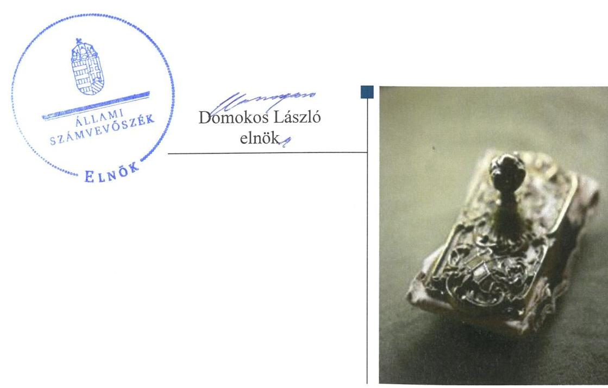
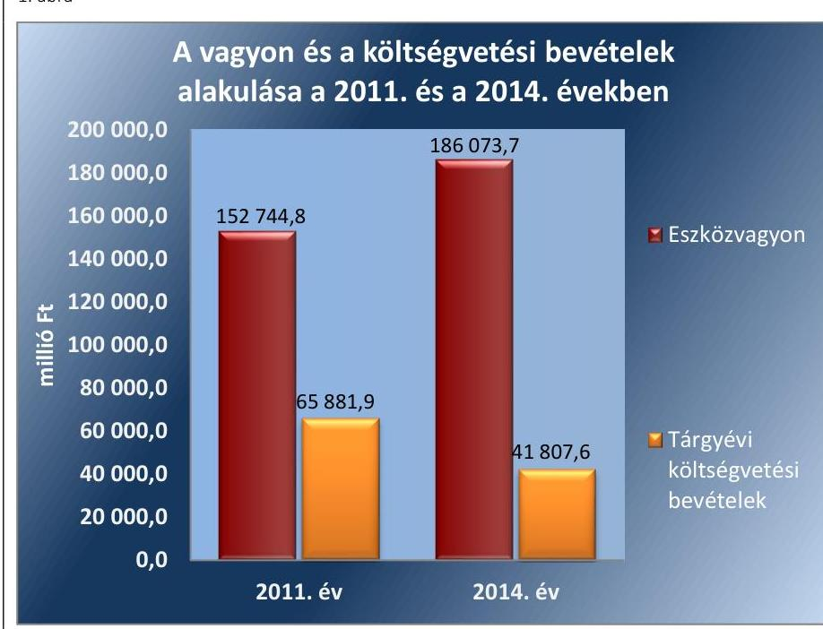
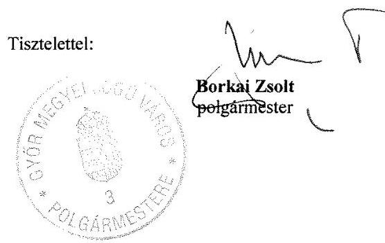
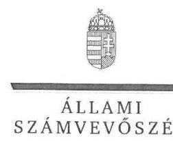
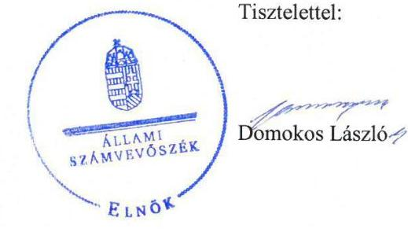
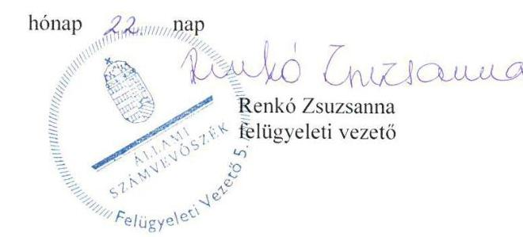

# Jelentés 

## Önkormányzatok belső kontrollrendszere

Az önkormányzatok belső kontrollrendszere kialakításának és működtetésének ellenőrzése - Győr 2016.

---

# Jelentés 

## Önkormányzatok belső kontrollrendszere

Az önkormányzatok belső
kontrollrendszere kialakításának és működtetésének ellenőrzése - Győr
2016. 12. hó 13. nap

---

# AZ ELLENŐRZÉST FELÜGYELTE:

- RENKŐ ZSUZSANNA felügyeleti vezető
- AZ ELLENŐRZÉST VEZETTE ÉS A VÉGREHAJTÁSÁÉRT FELELŐS:
  - DÉR LÍVIA ellenőrzésvezető
  - A PROGRAM ÖSSZEÁLLÍTÁSÁÉRT FELELŐS:
    - JANIK JÓZSEF osztályvezető

- IKTATÓSZÁM: V-0989-118/2016.
- TÉMASZÁM: 2023
- ELLENŐRZÉS-AZONOSÍTÓ SZÁM: V-07186

Jelentéseink az Országgyűlés számítógépes hálózatán és az Interneten a www.asz.hu címen is olvashatóak.

---

# TARTALOMJEGYZÉK 

■ ÖSSZEGZÉS ..... 5
■ AZ ELLENŐRZÉS CÉLJA ..... 6
■ AZ ELLENŐRZÉS TERÜLETE ..... 7
■ AZ ELLENŐRZÉS HÁTTERE, INDOKOLTSÁGA ..... 9
■ A JELENTÉS LÉNYEGES KÉRDÉSKÖREI ..... 12
■ ELLENŐRZÉS HATÓKÖRE ÉS MÓDSZEREI ..... 13
■ MEGÁLLAPÍTÁSOK ..... 16
■ JAVASLATOK ..... 31
■ MELLÉKLETEK ..... 33
I. Sz. melléklet: Értelmező szótár ..... 33
II. Sz. melléklet: Az integritás szemlélet érvényesítése érdekében kialakított és működtetett kontrollrendszer ..... 37
■ FÜGGELÉK: ÉSZREVÉTELEK ..... 39
■ RÖVIDÍTÉSEK JEGYZÉKE ..... 53

---

.

---

# ÖSSZEGZÉS 

Győr Megyei Jogú Város Önkormányzata belső kontrollrendszerének kialakítása és működtetése összességében szabályszerű volt, a befektetési tevékenységeket szabályszerűen végezték. Az Önkormányzatnak az integritás szemlélet érvényesülése érdekében a speciális korrupciós kontrollok kiépítésével még erőfeszítéseket kell tennie.

## Az ellenőrzés társadalmi indokoltsága

Magyarország Alaptörvénye az önkormányzatoktól is elvárja a kiegyensúlyozott, átlátható és fenntartható költségvetési gazdálkodás elvének érvényesítését. Az önkormányzatok által betöltött társadalmi szerep, az általuk kezelt közpénz nagysága, a nemzeti vagyon átruházására vagy hasznosítására vonatkozó döntéseik sokrétűsége indokolttá teszik a számvevőszéki ellenőrzéseket. A belső kontrollrendszer kialakítása és működtetése nélkül nem valósítható meg a közpénzek, a közvagyon szabályos, gazdaságos, hatékony és eredményes felhasználása.

Győr Megyei Jogú Város Önkormányzata 2015. április 30-án 999,9 millió Ft névértékű államkötvénnyel és 11400 millió Ft lekötött betéttel rendelkezett. Az Önkormányzat egyik pénzügyi szolgáltatójának törvénytelen tevékenysége következtében fennállt a veszélye annak, hogy a befektetett közvagyon egy részét elveszítik. Felmerült, hogy a belső kontrollrendszer kialakítása és működtetése nem biztosította a közvagyon megóvását, körültekintő, biztonságos befektetését, a befektetési döntések, azok végrehajtása és számviteli elszámolása nem volt szabályszerű.

## Főbb megállapítások, következtetések, javaslatok

A belső kontrollrendszer kialakításában és működtetésében feltárt hiányosságok miatt a kockázatkezelési rendszer és a kontrolltevékenységek nem segítették elő a szervezeti célok elérését. A befektetési döntések előkészítésekor a kockázatokat teljes körűen nem mérték fel, azonban a szolgáltató esetleges nem teljesítése esetére a KELER Zrt.-nél elkülönített értékpapír-alszámla megnyitásáról gondoskodtak. A befektetésekkel kapcsolatos döntések végrehajtása szabályszerűen történt.

Az integritás szemlélet erősítése érdekében az Önkormányzatnak még erőfeszítéseket kell tennie. A belső kontrollrendszer részét képező integritáskontrollokat kiépítették, de a korrupció elleni speciális kontrollok kiépítettsége hiányos volt.

---

# AZ ELLENŐRZÉS CÉLJA 

Az ellenőrzés célja annak megállapítása volt, hogy az önkormányzat belső kontrollrendszerének kialakítása, továbbá egyes elemeinek működtetése biztosította-e az önkormányzatnál a közpénzfelhasználás szabályosságát. Az erőforrásokkal való szabályszerű és hatékony gazdálkodáshoz szükséges követelmények érvényesítése, számonkérése, ellenőrzése megtörtént-e az önkormányzatnál. A belső kontrollrendszer kialakítása és működtetése támogatta-e az integritás szemlélet érvényesülését. Az ellenőrzés során értékeltük a belső kontrollrendszer kialakításának és működtetésének szabályszerűségét. Bemutatjuk azokat a lényeges szabályozási hiányosságokat, amelyek miatt az ellenőrzött kulcskontrollok nem nyújtottak elegendő védelmet a lehetséges hibákkal szemben. Rámutattunk arra, ha a kulcskontrollok valamely hibát nem előztek meg, nem tártak fel vagy nem javítottak ki, valamint minősítjük működésük megfelelőségét. Ellenőriztük, hogy az önkormányzat egyes befektetési döntései és azok végrehajtása, elszámolása megfelelt-e a vonatkozó jogszabályoknak és belső szabályozásoknak, a kialakított kontrollrendszer támogatta-e a befektetési tevékenység szabályszerűségét.

---

# **AZ ELLENŐRZÉS TERÜLETE**

## **Győr Megyei Jogú Város Önkormányzata**

Győr város állandó lakosainak száma 2015. január 1-jén 126 204 fő volt. Az Önkormányzat 24 tagú Közgyűlésének1 munkáját hat állandó bizottság segítette. Az Önkormányzat a Hivatalon2 kívül 36 intézménnyel, valamint hét többségi (ebből öt 100%-os) tulajdoni részesedésű gazdasági társasággal látta el a feladatait. A településen a nemzetiségi önkormányzati képviselők 2014. évi általános választásáig lengyel, roma, örmény, német, román és horvát, azt követően roma, román, német, örmény és lengyel helyi nemzetiségi önkormányzat működött.

A polgármester3 a 2006. évi önkormányzati választások óta tölti be tisztségét. A jegyző4 2008 óta látja el feladatait. A Hivatal hat szervezeti egységre tagolódott (Jegyzői kabinet, Gazdálkodási Főosztály, Humánpolitikai Főosztály, Hatósági Főosztály, Településfejlesztési Főosztály, Városmarketing, Kulturális és Sport Főosztály), elkülönített gazdasági szervezettel rendelkezett. A gazdasági szervezet feladatait a Gazdálkodási Főosztályon belül a Pénzügyi Osztály látta el, a gazdasági szervezet vezetője a Gazdálkodási Főosztály vezetője volt. A Hivatalban foglalkoztatott köztisztviselők száma 2014. év végén 305 fő volt. A Hivatalban szervezeti változás 2014. január 1-jétől nem történt.

Az Önkormányzat a 2014. évi éves költségvetési beszámoló szerint 41 807,6 millió Ft költségvetési bevételt ért el, valamint 40 886,7 millió Ft költségvetési kiadást teljesített.

Az eszközvagyon értéke 186 073,7 millió Ft, a befektetett pénzügyi eszközök értéke 8 448,4 millió Ft volt. Forgatási célú hitelviszonyt megtestesítő értékpapírokkal, lekötött betétekkel a 2014. év végén nem rendelkeztek. A forrásokon belül 2014. évben esedékes kötelezettségállomány 1057,3 millió Ft, a költségvetési évet követően esedékes kötelezettségállomány 735,5 millió Ft volt, pénzintézettel szembeni kötelezettségük nem volt. Az Önkormányzat 2013-ban 3 392,2 millió Ft, 2014 évben 4 345,3 millió Ft adósságkonszolidációban részesült.

---

Az Önkormányzat vagyonának és költségvetési bevételeinek alakulását a 2011. évben és a 2014. évben az 1. ábra mutatja be:

1. ábra

*Forrás: Győr Megyei Jogú Város Önkormányzata 2011. és a 2014. évi éves költségvetési beszámolói*

---

# AZ ELLENŐRZÉS HÁTTERE, INDOKOLTSÁGA 

Az ÁSZ tv. ${ }^{5}$ szerint az ÁSZ ${ }^{6}$ feladata a jól irányított állam kiépítésének elősegítése. Az ÁSZ Stratégiájában ezért hangsúlyos szerepet szánt annak, hogy szilárd szakmai alapon álló, értékteremtő ellenőrzéseivel előmozdítsa a közpénzügyek átláthatóságát, rendezettségét. A számvevőszéki ellenőrzés nemzetközi alapelvei is rögzítik, hogy a megfelelő belső kontrollrendszer minimálisra csökkenti a hibák és szabálytalanságok kockázatát.

A belső kontrollrendszer azt a célt szolgálja, hogy a költségvetési szervek működésük és gazdálkodásuk során a tevékenységeket szabályszerűen, gazdaságosan, hatékonyan, eredményesen hajtsák végre, teljesítsék elszámolási kötelezettségeiket és megvédjék az erőforrásokat a veszteségektől, a károktól és a nem rendeltetésszerű használattól. A belső kontrollrendszer magában foglalja mindazon szabályokat, eljárásokat, gyakorlati módszereket és szervezeti struktúrákat, kockázatkezelési technikákat, kontrolltevékenységeket, amelyek segítséget nyújtanak a szervezetnek céljai eléréséhez. A belső kontrollrendszer szabályozása háromszintű: a törvényi előírásokat az Áht. ${ }^{7}$ és a Mötv. ${ }^{8}$, a rendeleti szintű szabályozást az Ávr. ${ }^{9}$ és a Bkr. ${ }^{10}$ tartalmazza, amelyeket útmutatói szinten az NGM ${ }^{11}$ által kiadott standardok és kézikönyvek támogatnak.

Az ellenőrzött időszak meghatározása lehetőséget teremt a 2014. október 12-i önkormányzati választásokat megelőző és követő ciklus belső kontrollrendszere működésének elkülönült értékelésére, valamint a változások nyomon követésére.

A BELSŐ KONTROLLRENDSZER kialakításának és működtetésének általános értékelése mellett a teljesítésigazolás és érvényesítés kontrollok kiemelt ellenőrzésének szükségességét alátámasztja, hogy 2012-től a pénzügyi folyamatokban kulcsszerepet betöltő belső kontrollok rendszere módosult és azok működtetésében az önkormányzatoknál hiányosságok mutatkoztak a 2012. óta elvégzett ÁSZ ellenőrzések alapján.

Az önkormányzatok belső kontrollrendszerének ellenőrzése az ÁSZ „jó kormányzással" kapcsolatos stratégiai céljainak megvalósítását is szolgálja. Az ÁSZ célja, hogy javuljon az ellenőrzött önkormányzatok belső kontrollrendszerének szabályozottsága, működésének megfelelősége, hozzájárulva ezzel az egyensúlyi helyzet fenntarthatóságának biztosításához, azaz az adósság újratermelődésének megakadályozásához. Az ÁSZ ellenőrzés tapasztalatai nem csupán a közvetlenül ellenőrzött önkormányzatokat segíthetik, hanem a „jó gyakorlat" elterjesztésével azok az önkormányzatok is átvehetik a pozitív példákat, ahol nem végez ellenőrzést az ÁSZ.

Az MNB három befektetési szolgáltató tevékenységi engedélyét 2015. első felében visszavonta és kezdeményezte a vállalkozások felszámolását a működéssel kapcsolatos szabálytalanságok, hiányosságok miatt. A korábbi évek ellenőrzési tapasztalatai alapján fennáll a lehetősége annak, hogy az önkormányzatok befektetési döntései, továbbá a döntések végrehajtása és számviteli elszámolása nem voltak teljes mértékben szabályszerűek, és a kapcsolódó külső ellenőrzések és a belső kontrollrendszer sem működtek minden esetben megfelelően.

---

Magyarország Alaptörvénye ${ }^{12}$ az önkormányzatoktól, mint az államháztartás alanyaitól elvárja a kiegyensúlyozott, átlátható és fenntartható költségvetési gazdálkodás elvének érvényesítését. A nemzeti vagyonról szóló törvény szerint a nemzeti vagyonnal felelős módon, rendeltetésszerűen kell gazdálkodni. A nemzeti vagyongazdálkodás feladata a nemzeti vagyon rendeltetésének megfelelő, átlátható, hatékony és költségtakarékos működtetése, ugyanakkor értékének megőrzését, értéknövelő használatát, hasznosítását, gyarapítását is elvárja.

# AZ ÖNKORMÁNYZATOK ÁTMENETILEG SZABAD PÉNZESZKÖZEINEK BEFEKTETÉSÉT jogszabály nem 

tiltja, a pénzpiaci szolgáltatók közül az önkormányzatok a kínált szolgáltatás és annak költségei alapján, szabadon választhatnak, a veszteséges gazdálkodás kockázatai és következményei azonban az önkormányzatokat terhelik. A szabad pénzeszközök felelős hasznosítása összhangban áll az önkormányzati gazdálkodás alapelveivel.

A közintézmények integritás alapú kultúrájának kialakítása, megerősítése és működése szorosan összefügg a belső kontrollrendszer működésével, ezért az ellenőrzés kiterjed annak értékelésére is, hogy a belső kontrollrendszer kialakítása és működtetése hogyan hatott az integritás szemlélet érvényesülésére.

Az államháztartás önkormányzati alrendszerében a 2014. év elején összesen 3177 települési önkormányzat működött: a 23 kerülettel rendelkező főváros, 345 város, 2691 község és 117 nagyközség volt. A belső kontrollrendszer kialakítása és működtetése ellenőrzését az ÁSZ által lefolytatott, kisebb településeket is érintő ellenőrzéseinek tapasztalatai, valamint a közérdekű bejelentések kockázati szempontú értékelése alapozták meg. Ezek a községek, nagyközségek gazdálkodásának, belső kontrollrendszere kialakításának és működésének hiányosságaira mutattak rá. Az ellenőrzések helyszíneinek kiválasztása során az ÁSZ célzott adatfeldolgozáson alapuló kockázatelemző rendszerére támaszkodik. Ez elősegíti, hogy azokon a területeken végezzen ellenőrzéseket, összpontosítva erőforrásait, ahol a valódi kockázatok, az aktuális problémák vannak. Az ellenőrzések helyszíneinek kiválasztása során a kockázatelemzés konkrét szempontjait az ellenőrzési programban rögzített ellenőrzési cél, az ellenőrzött időszak, az ellenőrzés által érintett fókuszterületek és a főbb ellenőrzési kérdések határozzák meg.

## AZ ELLENŐRZÉS VÁRHATÓ HASZNOSULÁSA NÉGY SZINTEN valósul meg.

A törvényalkotás számára összegzett tapasztalatok állnak rendelkezésre a belső kontrollrendszer önkormányzati területen való kialakításáról, működtetéséről és hatásairól. Az ÁSZ az ellenőrzéseivel hozzájárul ahhoz, hogy az egyes önkormányzati befektetésekkel kapcsolatos kockázatok a szabályozási és kontroll mechanizmusok fejlesztésével mérsékelhetők legyenek.

Az ellenőrzés az ellenőrzött számára visszajelzést ad a belső kontrollrendszer kialakításában és működésében lévő hiányosságokról, javaslataival hozzájárul azok kiküszöböléséhez. Feltárja az önkormányzati befekte-

---

tési tevékenységet meghatározó szabályozások összhangjának hiányosságait, a szabályozással nem érintett gazdálkodási területeket, valamint az egyes befektetési tevékenységek esetleges szabálytalanságait.

Az ellenőrzés megállapításait és javaslatait más szervezetek is hasznosíthatják a rendezett gazdálkodási keretek kialakításához.

A társadalom számára jelzi, hogy közpénz nem maradhat ellenőrizetlenül, az ÁSZ értékteremtő rend kialakításához és megőrzéséhez hozzájáruló tevékenysége így pozitív hatással lesz a szervezetről kialakított összkép formálásában.

---

# A JELENTÉS LÉNYEGES KÉRDÉSKÖREI 

1.     - Az önkormányzat belső kontrollrendszerének kialakítása és működtetése szabályszerű volt-e 2014. január 1. és 2015. április 30. között, valamint a belső kontrollrendszer egyes pillérei támogatták-e a befektetési tevékenység szabályszerű
 végzését 2011. január 1. és 2015. április 30. között?
2.     - Az egyes befektetésekkel kapcsolatos döntéshozatal és a döntések végrehajtása szabályszerű volt-e?
3.     - Az egyes befektetések számviteli elszámolása, nyilvántartása szabályszerű volt-e?
4.     - Az erőforrásokkal való szabályszerű és hatékony gazdálkodáshoz szükséges követelmények érvényesítése, számonkérése, ellenőrzése megtörtént-e az önkormányzatnál?
5.     - Az önkormányzat belső kontrollrendszerének kialakítása és működtetése támogatta-e az integritás szemlélet érvényesülését?

---

# ELLENŐRZÉS HATÓKÖRE ÉS MÓDSZEREI 

## Az ellenőrzés típusa

Megfelelőségi ellenőrzés, a befektetési tevékenység esetében szabályszerűségi ellenőrzés.

## Az ellenőrzött időszak

A belső kontrollrendszer kialakításának és működtetésének ellenőrzése a 2014. január 1. és 2015. április 30. közötti időszakra terjedt ki. Ezen belül a belső kontrollrendszer kialakításának és működtetésének megfelelőségét a 2014. január 1. és október 12., valamint a 2014. október 13. és 2015. április 30. közötti időszakra vonatkozóan külön-külön értékeltük. Az önkormányzatok egyes befektetési tevékenységeinek ellenőrzése tekintetében az ellenőrzött időszak a 2011. január 1. - 2015. április 30. közötti időszak. Ezen felül az önkormányzat befektetésekkel kapcsolatos döntés-előkészítésének és döntéshozatalának szabályszerűségét a 2011. január 1. előtti időszakra visszanyúlóan is ellenőriztük, amennyiben a 2014. június 30-án, illetve 2015. április 30-án meglévő befektetéseire 2011. január 1-je előtt került sor. Az integritás szemlélet érvényesülését a 2014. évre vonatkozó adatszolgáltatás alapján értékeltük.

## Az ellenőrzés tárgya

A helyi önkormányzatnak, mint éves költségvetési beszámoló készítésére kötelezett szervezetnek és polgármesteri hivatalának belső kontrollrendszere. Az önkormányzat 2014. június 30-án, illetve 2015. április 30-án meglévő értékpapírokban megtestesülő befektetései, lekötött betétei, valamint az önkormányzat üzleti vagyonába tartozó ingatlanok, kulturális javak (műtárgyak, műalkotások, stb.), illetve a feladatellátást nem szolgáló egyéb értéktárgyak (pl. ékszerek, befektetési nemesfém). Az erőforrásokkal való szabályszerű és hatékony gazdálkodáshoz szükséges követelmények érvényesítése, számonkérése, ellenőrzése. Az integritás szemlélet érvényesülése.

## Az ellenőrzött szervezet

Győr Megyei Jogú Város Önkormányzata és az önkormányzati működéshez kapcsolódó feladatokat ellátó Hivatal.

---

# Az ellenőrzés jogalapja 

Az ÁSZ tv. 1. § (3) bekezdésében foglaltak alapján az ÁSZ általános hatáskörrel végzi a közpénzekkel és az állami és önkormányzati vagyonnal való felelős gazdálkodás ellenőrzését. Az ÁSZ tv. 5. § (2) bekezdése alapján az államháztartás gazdálkodásának ellenőrzése keretében az ÁSZ ellenőrzi a helyi önkormányzatok gazdálkodását, valamint az ÁSZ tv. 5. § (6) bekezdése alapján ellenőrzése során értékeli az államháztartás számviteli rendjének betartását és a belső kontrollrendszer működését.

## Az ellenőrzés módszerei

Az ellenőrzést a nemzetközi standardokat irányadónak tekintve az ellenőrzési program ellenőrzési kérdései, az ellenőrzött időszakban hatályos jogszabályok, az ellenőrzés szakmai szabályok és módszertanok figyelembe vételével végeztük.

Az ellenőrzés lefolytatásához az Önkormányzat a tanúsítványok kitöltésével, valamint az ÁSZ által kért dokumentumok elektronikus megküldésével szolgáltatott adatokat. A rendelkezésre bocsátott adatok, információk kontrollja és a munkalapok kitöltése az ellenőrzés keretében történt. A jelentésben használt fogalmak magyarázatát az I. számú melléklet, az integritás érvényesítése érdekében kialakított és működtetett kontrollrendszer minősítését a II. számú melléklet tartalmazza.

A belső kontrollrendszer jogszabályi előírások szerinti kialakításának és működtetésének szabályszerűségét az erre irányuló ellenőrzési kérdésekre adott válaszok összesítése alapján külön-külön értékeltük a 2014. január 1. és október 12., valamint a 2014. október 13. és 2015. április 30. közötti időszakra. A belső kontrollrendszert egy-egy ellenőrzött időszakra pillérenként (kontrollkörnyezet, kockázatkezelési rendszer, kontrolltevékenységek, információs és kommunikációs rendszer, monitoring rendszer) és összesítetten is értékeltük.

## A BELSŐ KONTROLLRENDSZER EGYES PILLÉRE-

INEK KIALAKÍTÁSA ÉS MŰKÖDTETÉSE „szabályszerű volt", amennyiben az értékelt területen az elért és elérhető pontok százalékban kifejezett, egész számra kerekített hányadosa meghaladta a 84%-ot, „részben szabályszerű volt", ha 61-84% közé esett, „nem szabályszerű volt", ha nem haladta meg a 60%-ot. A belső kontrollrendszer összesített értékelése megegyezett a pillérenként (kontrollterületenként) alkalmazott százalékos értékelésekkel, a következő eltérésekkel. A kontrollrendszer egésze esetében a „szabályszerű" értékelésnek a százalékos értéken felül további feltétele volt, hogy egyik kontrollterület sem kaphat „nem szabályszerű" értékelést, a „részben szabályszerű" értékelés további feltétele volt, hogy legfeljebb egy ellenőrzött kontrollterület lehet „nem szabályszerű" értékelésű. Az összesített értékelés a százalékos értéktől függetlenül „nem szabályszerű volt", ha az ellenőrzött kontrollterületek közül több mint egynek „nem szabályszerű volt" az értékelése.

---

# A GAZDÁLKODÁS FOLYAMATÁBAN A KÉT 

KULCSKONTROLL - teljesítésigazolás, érvényesítés - működésének megfelelőségét a személyi juttatásokkal, a dologi kiadásokkal, a beruházási, felújítási kiadásokkal, az ellátottak pénzbeli juttatásaival és az egyéb működési, felhalmozási célú, valamint a finanszírozási kiadásokkal kapcsolatos kifizetések esetében mintavétellel ellenőriztük. A mintavétel során külön értékeltük a 2014. január 1. és 2014. október 12. közötti időszakban és a 2014. október 13. és 2015. április 30. közötti időszakban teljesített kifizetéseket. „Megfelelőnek" értékeltük a gazdálkodási jogkörök gyakorlását, amennyiben 95%-os bizonyossággal a teljes sokaságban a hibaarány legfeljebb 10%, „részben megfelelőnek" értékeltük, ha a hibaarány felső határa 10-30% között volt, „nem megfelelőnek" pedig akkor, ha a mintavételi eredmények alapján a sokaságbeli hibaarány felső határa meghaladta a 30%-ot.

Az integritás szemlélet érvényesülésének értékelése az önkormányzat által kitöltött tanúsítvány alapján történt.

---

# MEGÁLLAPÍTÁSOK

## 1. Az önkormányzat belső kontrollrendszerének kialakítása és működtetése szabályszerű volt-e 2014. január 1. és 2015. április 30. között, valamint a belső kontrollrendszer egyes pillérei támogatták-e a befektetési tevékenység szabályszerű végzését 2011. január 1. és 2015. április 30. között?

|  Összegző megállapítás | A belső kontrollrendszer kialakítása és működtetése 2014. január 1. és 2015. április 30. között az összesített értékelés alapján részben volt szabályszerű a kockázatkezelési rendszer, valamint a kontrolltevékenység hiányosságai miatt. A belső kontrollrendszer kialakítása és működtetése a - feltárt hiányosságok mellett - 2011. január 1. és 2015. április 30. között támogatta az egyes befektetési tevékenységek szabályszerű, elszámoltatható végzését.  |
| --- | --- |
|   | A belső kontrollrendszer kialakításának és működtetésének összesített értékelését az 1. táblázat mutatja be:  |

1. táblázat

|  A BELSŐ KONTROLLRENDSZER KIALAKÍTÁSÁNAK ÉS MŰKÖDTETÉSÉNEK ÖSSZESÍTETT ÉRTÉKELÉSE |  |  |   |
| --- | --- | --- | --- |
|  Megnevezés | A gazdálkodás egészét érintően: | A befektetési tevékenységet érintően: |   |
|   | 2014. január 1-tól | 2014. október 13-tól | 2013. 2013. években  |
|   | 2014. október 12-ig | 2015. április 30-ig | 2015. április 30-ig  |
|  Kontrollkörnyezet | szabályszerű | támogatta |   |
|  Kockázatkezelési rendszer | nem szabályszerű | nem támogatta |   |
|  Kontrolltevékenységek | részben szabályszerű | támogatta |   |
|  Információs és kommunikációs rendszer | szabályszerű | támogatta |   |
|  Monitoring | részben szabályszerű | nem támogatta |   |
|  BELSŐ KONTROLLRENDSZER | RÉSZBEN SZABÁLYSZERŰ | TÁMOGATTA |   |
|   |  |  | Forrás: ÁSZ  |

1.1. számú megállapítás

A kontrollkörnyezet kialakítása és működtetése szabályszerű volt, a befektetési tevékenységhez kapcsolódó jogköröket, a belső eljárási rendet kialakították.

## A SZERVEZETI ÉS A SZABÁLYOZÁSI KERETEKET

a Közgyűlés 2011. január 1. és 2015. április 30. között az alábbiak szerint alakította ki: az önkormányzati SZMSZ-ben; meghatározta a szervezeti kereteit, a feladat és hatásköreit, valamint tartalmazta a bizottságokra és a polgármesterre átruházott hatásköröket;

---

- a vagyongazdálkodási rendeletben rögzítette az önkormányzati vagyonnal történő gazdálkodás részletes feltételeit, a tagsági jogokat megtestesítő értékpapírokra kiterjedően is, a vagyon értékesítésének és hasznosításának, továbbá a versenyeztetés szabályait;
- a gazdasági programban meghatározta azokat a célkitűzéseket, fejlesztési elképzeléseket, amelyek az önkormányzat által nyújtandó feladatok biztosítását, színvonalának javítását szolgálták;
- 2013-ban az Nvtv.-ben előírtaknak megfelelően elfogadta az Önkormányzat közép és hosszú távú vagyongazdálkodási tervét;
- a 2011-2015. évi költségvetési rendeleteket a jogszabályi előírásoknak megfelelő részletezettségben hagyta jóvá. A 2011-2015. évi költségvetési rendeletekben a Közgyűlés felhatalmazta a polgármestert az átmenetileg szabad pénzeszközök feletti rendelkezési joggal.

A HIVATAL BELSŐ SZABÁLYOZÁSÁT a jegyző 2011. január 1. és 2015. április 30. között kialakította:
—_ a hivatali SZMSZ tartalmazta a szervezeti felépítést, a működési rendjét, a szervezeti egységek - ezen belül a gazdasági szervezet megnevezését, feladatait, a költségvetési szerv szervezeti ábráját. A hivatali SZMSZ-ben rögzítette a nevesített munkakörökhöz tartozó feladat- és hatásköröket, a hatáskörök gyakorlásának módját, a helyettesítés rendjét, az ezekhez kapcsolódó felelősségi szabályokat, azonban nem tartalmazta - az Ámr. 20. § (2) bekezdés e) pontja, illetve az Ávr. 13. § (1) bekezdés e) pontja ellenére 2014. december 31-ig - a szervezeti egységek - ezen belül a gazdasági szervezet - engedélyezett létszámát. A hivatali SZMSZ rögzítette, hogy a Gazdálkodási Főosztály Pénzügyi Osztálya készíti elő az átmenetileg szabad pénzeszközök hasznosítására irányuló polgármesteri döntést.
—_ a számlarend az egyes befektetések vonatkozásában is meghatározta az alkalmazásra kijelölt számla számjelét és megnevezését, az analitikus nyilvántartások - ideértve az egyéb kiegészítő és részletező számviteli nyilvántartásokat is - formáját, tartalmát, azok vezetésének módját, a kapcsolódó főkönyvi nyilvántartásokkal való egyeztetését és annak dokumentálását, a főkönyvi számla és az analitikus nyilvántartások kapcsolatát;
—_ a pénzkezelési szabályzatban rögzítették a pénzforgalom lebonyolításának szabályait, a bizonylatolás és a pénzforgalmi nyilvántartások rendjét;
—_ a leltározási szabályzat valamint értékelési szabályzat mindkét ellenőrzött időszakban tartalmazta a befektetett pénzügyi eszközök és a forgatási célú értékpapírok értékelésére és leltározására vonatkozó előírásokat;
—_ a gazdálkodási jogkörök szabályzatában rögzítették a kötelezettségvállalás (ezen belül a 100 ezer Ft alatti kifizetések előzetes írásbeli kötelezettségvállalás nélküli teljesítése), az ellenjegyzés, a teljesítésigazolás, az érvényesítés, az utalványozás gyakorlásának módjával, eljárási és dokumentációs részletszabályaival, valamint az ezeket végző személyek kijelölésének rendjével kapcsolatos belső előírásokat és feltételeket.

---

- a FEUVE szabályzat mellékleteként kiadott ellenőrzési nyomvonal tartalmazta az információs, felelősségi szinteket és kapcsolatokat, az irányítási folyamatokat, az ellenőrzési folyamatokat, továbbá a költségvetési szerv működési folyamatait táblázatokkal szemléltetett formában, és kiterjedt az értékpapírokkal kapcsolatos műveletekre is.
- rendelkeztek a szabálytalanságok kezelésének eljárásrendjéről, melyben rögzítették a szabálytalanságok megelőzésére, észlelésére, jelzésére és a megfelelő intézkedésekre vonatkozó szabályokat;
A kontrollkörnyezet kialakítása 2011. január 1. és 2013. december 31., valamint 2014. január 1. és 2015. április 30. közötti időszakokban támogatta a befektetési tevékenységek szabályszerű végzését.

A kontrollkörnyezet kialakítása az értékelés szempontjából 2014. január 1. és 2014. október 12., valamint 2014. október 13. és 2015. április 30. közötti időszakokban szabályszerű volt.

# 1.2. számú megállapítás 

A kockázatkezelési rendszert szabályozták, de működtetése nem volt szabályszerű. Az Önkormányzat tevékenységében rejlő kockázatokat nem mérték
 fel, nem határozták meg az egyes kockázatokkal kapcsolatban szükséges intézkedéseket, valamint azok teljesítése nyomon követésének módját, emiatt nem támogatta az egyes befektetési tevékenységek végzését.

A kockázatkezelési rendszert a jegyző a FEUVE szabályzat ${ }_{1-2}$ részeként szabályozta, amely általánosságban tartalmazta a kockázatok azonosításával, elemzésével, csoportosításával, nyomon követésével, illetve a kockázati kitettség csökkentésével kapcsolatos előírásokat.

A jegyző az ellenőrzött időszakban a 8kr. 7. § (1)-(2) bekezdésében előírtak ellenére dokumentáltan nem végzett kockázatelemzést és nem működtette a kockázatkezelési rendszert. Nem mérték fel az Önkormányzat tevékenységében és gazdálkodásában, így a befektetési tevékenységben rejlő kockázatokat, nem határozták meg egyes kockázatokkal kapcsolatban a szükséges intézkedéseket, valamint azok teljesítésének folyamatos nyomon követési módját.

Az aljegyző 2012-ben jogtanácsosi állásfoglalásokban értékelte az egyes befektetési formákkal kapcsolatos megtérülési kockázatokat. Az elemzés kitért a befektetési szolgáltatók tevékenységéből eredő kockázatokra is (pl. felszámolás).

A gyakorlatban ugyanakkor az Önkormányzat mérsékelte a felmerülő kockázatokat azzal, hogy diverzifikálta a befektetéseit, szabad pénzeszközeit elsősorban a számlavezető pénzintézeténél rövid lejáratú betétként helyezte el. Az állampapír-vásárlás - bár a betétlekötéseknél nagyobb kamattal valósult meg - összegszerűségében (2013. évben 35,1 millió Ft, 2014. évben 36,5 millió) és arányaiban (2013. évben 7,6%, 2014. évben 15,4%) nem jelentettek meghatározó tételt az Önkormányzat befektetésekből származó bevételei vonatkozásában.

## A vagyonnyilatkozat-tételi kötelezettséget és annak eljárási szabályait a köztisztviselők esetében a hivatali

---

SZMSZ $_{1-4}$-ben rögzítették. A vagyonnyilatkozat tételre kötelezett köztisztviselők a kötelezettségüknek eleget tettek. A Közgyűlés az önkormányzati SZMSZ $_{1,2}$ 2. melléklet 2.4.1.-2.4.3. pontjaiban a Közigazgatási és Közrendvédelmi Bizottságot jelölte ki a polgármester, a képviselők és a nem képviselő bizottsági tagok vagyonnyilatkozatainak nyilvántartására és vizsgálatára, valamint képviselők és a Közgyűlés bizottsága nem képviselő tagja összeférhetetlenségi ügyének kivizsgálására.

A bizottság nyilvántartásba vette a benyújtott képviselői vagyonnyilatkozatokat, a nyilvántartás szerint a képviselők az előírt határidőre eleget tettek kötelezettségüknek.

A nem képviselő bizottsági tagok vagyonnyilatkozata 2014. január 1. és 2014. október 12. közötti időszakban egy fő kivételével határidőben rendelkezésre állt. Az őrzésért felelős személy felszólította a kötelezettet a vagyonnyilatkozat-tételi kötelezettség teljesítésére, de időközben bizottsági tagsága megszűnt.

A kockázatkezelési rendszer kialakítása és működtetése a 2014. január 1. és 2014. október 12., valamint a 2014. október 13. és 2015. április 30. közötti időszakokban a 2. számú táblázatban részletezett hiányosságok miatt nem volt szabályszerű.

A kockázatkezelési rendszer 2011. január 1. és 2013. december 31., valamint 2014. január 1. és 2015. április 30. közötti időszakokban a kockázatokkal kapcsolatban szükséges intézkedések, valamint azok teljesítésének folyamatos nyomon követési módja meghatározásának hiányosságai miatt a befektetési tevékenységek szabályszerű végzését nem támogatta.
2. táblázat

# A kockázatkezelési rendszer működtetésének hiányosságai 

Sorszám Részmegállapítás
A jegyző - a 2011. évben az Áht ${ }_{1}$ 121. § (2) bekezdés b) pontjában és az Ámr. 157. § (1)-(3) bekezdéseiben, a 2012. évtől 2015. április 30-ig terjedő időszakban a Bkr. 7. § (2) bekezdésében foglaltak ellenére nem mérte fel a tevékenységében, gazdálkodásában, így a befektetési tevékenységekben rejlő kockázatokat, nem határozta meg az egyes kockázatokkal kapcsolatban szükséges intézkedéseket, valamint azok teljesítésének folyamatos nyomon követésének módját.

Forrás: ÁSZ

### 1.3. számú megállapítás

A pénzügyi folyamatokban kulcsszerepet betöltő teljesítésigazolás és érvényesítés kontrollok működése részben felelt meg a jogszabályokban és belső szabályzatokban foglaltaknak, ezáltal maradéktalanul nem biztosították a hibák megelőzését és feltárását.

A kontrolltevékenységek kialakítása során a FEUVE szabályzatban és az annak részét képező ellenőrzési nyomvonalban biztosították a költségvetés tervezése, a beszerzések lebonyolítása, a vagyonhasznosítási tevékenység és a támogatások elszámolása tekintetében a folyamatba épített, előzetes, utólagos és vezetői ellenőrzés működését. A felelősségi körök meghatározásával szabályozták az engedélyezési, jóváhagyási és kontroll eljárásokat, a dokumentumokhoz való hozzáférést és a hozzáférés szintjeit, valamint a beszámolási eljárásokat. A jegyző utasításban szabályozta a munkakör átadás-átvétel rendjét.

A kötelezettségvállalók írásban kijelölték a teljesítésigazolására jogosult személyeket. A gazdasági vezető írásban kijelölte a pénzügyi ellenjegyzési és érvényesítési feladatra a Hivatal állományába tartozó köztisztviselőket,

---

akik rendelkeztek az előírt iskolai végzettséggel, valamint pénzügyi, számviteli képesítéssel.

A kötelezettséget vállaló szerv az Ávr. 60.§ (3) bekezdésében foglaltaktól eltérően a kötelezettségvállalásra, pénzügyi ellenjegyzésre, teljesítés igazolására, érvényesítésre, utalványozásra jogosult személyek aláírásmintájáról nem vezetett naprakész nyilvántartást.

# A gazdálkodással kapcsolatos kulcs-

kontrollok működése 2014. január 1. és 2014. október 12., illetve 2014. október 13. és 2015. április 30. közötti időszakokban részben felelt meg az Áht.-ben, az Ávr.-ben és a gazdálkodási jogkörök szabályzata ${ }_{1,2}$-ben foglalt előírásoknak.

Az érvényesítés belső kontroll működésének ellenőrzése során feltárt hiányosságok a következők voltak:
$\longrightarrow$ a finanszírozási kiadások kivételével minden ellenőrzött kiadáscsoportot érintően az Áht. 38.§ (1) bekezdést, illetve az Ávr. 58.§(3) bekezdést megsértve az érvényesítésre az utalványozást követően került sor;
$\longrightarrow$ az Ávr. 58. § (2) bekezdésében foglaltak ellenére az érvényesítés során nem jelezték az utalványozónak, hogy az utalványon minden ellenőrzött kiadáscsoportot érintően az Ávr. 59.§ (3) bekezdés e) pontjában előírtak ellenére nem tüntették fel a terheléssel érintett pénzeszköz Áhsz. ${ }_{2}$ szerinti könyvviteli számlájának, valamint a kiadás kormányzati funkció szerinti megnevezését, továbbá nem rögzítették a kiadás egységes rovatrend szerinti számát és megnevezését. 2015. január 1-től (a jogszabályi előírások egyszerűsítésével összefüggésben, változatlan gyakorlat mellett) valamennyi jogcímmel kapcsolatos kifizetések utalványai nem tartalmazták a kiadás egységes rovatrend szerinti számát.
A kontrolltevékenységek során a belső kontrollok 2011. január 1. és 2015. április 30. közötti időszakban a 2.2. pontban részletezett megállapítások alapján támogatták a befektetési tevékenység szabályszerű végzését.

Az érvényesítés működésének ellenőrzése során 2014. január 1. és 2015. április 30. között feltárt hiányosságokat a 3. táblázat összevontan tartalmazza.
3. táblázat

## A kontrolltevékenység kialakításának és működtetésének hiányosságai

## Sorszám

1. A kötelezettséget vállaló szerv az Ávr. 60.§ (3) bekezdésében foglaltaktól eltérően a kötelezettségvállalásra, pénzügyi ellenjegyzésre, teljesítés igazolására, érvényesítésre, utalványozásra jogosult személyek aláírás-mintájáról nem vezetett naprakész nyilvántartást.

## Érvényesítés

Az érvényesítésre - az Áht. 38.§ (1) bekezdést, illetve az Ávr. 58.§(3) bekezdést megsértve az utalványozást követően került sor.
2. Az érvényesítés során az Ávr. 58. § (2) bekezdésében előírtak ellenére nem jelezték az utalványozónak, hogy az Ávr. 59. § (3) bekezdés e) pontjában előírtak ellenére az utalványokról hiányzott 2014-ben az egységes rovatrend száma és megnevezése, könyvviteli számla, valamint a kormányzati funkció (COFOG) szám megnevezése, 2015-ben az egységes rovatrend száma.

---

### 1.4. számú megállapítás

Az információs és kommunikációs rendszer kialakítása szabályszerű volt. A közérdekű adatok közzétételével a jegyző gondoskodott a nyilvánosság tájékoztatásáról, a befektetési tevékenységek átláthatóságát és nyilvánosságát biztosította.

Az információáramlás rendszerét szervezeten belülre és külső felek részére az információs rendszerek keretében kialakították. A szervezeten belüli információáramlás és a szervezeten kívülre történő információátadás rendszerét az önkormányzati SZMSZ ${ }_{1,2}$-ben, a hivatali SZMSZ ${ }_{1,2}$-ben, valamint az egyes munkaköri leírásokban, továbbá az informatikai biztonsági szabályzat ${ }^{25}$-ban, a közzétételi szabályzat ${ }^{26}$-ban, és az iratkezelési szabályzat ${ }^{27}$-ban határozták meg.

A kötelezően közzétéendő adatok nyilvánosságra hozatalának és a közérdekű adatok megismerésére irányuló igények teljesítésének módját és felelősét a jegyző és a polgármester a közzétételi szabályzatban és az adatvédelmi szabályzatban ${ }_{1,2}$-ben szabályozta.

Az Önkormányzat a közérdekű adatok elektronikus közzétételi kötelezettségének a honlapján (www.gyor.hu) eleget tett. Közzétették a szervezeti és személyi adatok, a tevékenységre és működésre vonatkozó adatok, továbbá a gazdálkodási adatok, utóbbin belül a vagyonnal való gazdálkodással, a költségvetéssel és zárszámadással kapcsolatos adatokat. Közzétették továbbá az ellenőrzött időszakokban az öt millió Ft-ot meghaladó értékpapírok, ingatlanok vásárlására kötött szerződéseik megnevezését (típusát), tárgyát, a szerződést kötő felek nevét, a szerződés értékét, határozott időre kötött szerződései esetében annak időtartamát, valamint az említett adatok változásait.

A Hivatal rendelkezett iratkezelési szabályzattal ${ }_{1-3}$, amelyben biztosították az iratok iktatásának, a bejövő és a hivatalon belül keletkezett ügyiratok nyomon követhetőségének, az iratok fellelhetőségének folyamatát.

Az információs és kommunikációs rendszer kialakítása és működtetése 2014. január 1. és 2014. október 12. között, valamint 2014. október 13. és 2015. április 30. közötti időszakban szabályszerű volt.

Az információs és kommunikációs rendszer 2011. január 1. és 2015. április 30. közötti időszakban támogatta a befektetési tevékenység szabályszerű végzését.
1.5. számú megállapítás

A monitoring rendszer kialakítása és működtetése a feltárt hiányosságok alapján részben szabályszerű volt. A 2011. évtől 2015. április 30-ig végzett belső és külső ellenőrzések nem járultak hozzá a befektetési tevékenység szabályszerű végzéséhez, mivel az ellenőrzések nem érintették a befektetési tevékenységeket.

Az operatív monitoring-rendszert a szervezeti tevékenységek és célok elérésének folyamatos és eseti nyomon követésére a jegyző a Bkr. 10. §-ában foglaltak ellenére nem alakította ki. Rendszerszerűen nem határozta meg, hogy mely operatív tevékenységekre terjed ki a monitoring-tevékenység, nem jelölte ki a monitoring-feladatokat ellátó személyeket és nem határozta meg feladatuk tartalmát, a beszámolás formáját. Nem határoztak meg indikátorokat, nem alakították ki azok alkalmazásának, nyomon követésének, értékelésének rendjét, felelőseit. A

---

monitoring heti vezetői értekezletek alapján valósult meg, amiről feljegyzések készültek. A Hivatal belső kontrollrendszerének minőségét a jegyző az ellenőrzött évekre vonatkozóan a Bkr. 1. számú melléklete szerinti nyilatkozataiban megfelelőnek értékelte.

A belső ellenőrzési feladatok ellátásáról a jegyző közvetlen irányítása alatt álló belső ellenőrzési egység útján gondoskodott. A Belső Ellenőrzési Kézikönyv1-2 tartalmazta az eljárási szabályokat, a belső ellenőrzés hatáskörét, céljait és feladatait, a kockázatelemzés módszertanát, a dokumentumok formai követelményeit, valamint az ellenőrzési megállapítások hasznosításának nyomon követését.

A jegyző az Önkormányzat 2013-2016. évekre vonatkozó stratégiai ellenőrzési tervét 2013. januárjában hagyta jóvá, amely tartalmazta a hosszú távú célkitűzéseket, stratégiai célokat, a belső kontrollrendszer általános értékelését, a kockázati tényezőket és értékelésüket, a belső ellenőrzésre vonatkozó fejlesztési és képzési tervet, a szükséges erőforrások felmérését elsősorban a létszám, képzettség, tárgyi feltételek tekintetében. A stratégiai ellenőrzési terv az ellenőrzési prioritásokat és az ellenőrzési gyakoriságot nem tartalmazta és így nem szolgálhatta teljes körűen az éves ellenőrzési tervek megalapozását. Az ellenőrzési terveket minden intézményre kiterjedően, ütemezetten állították össze.

A belső ellenőrzési vezető által jóváhagyott ellenőrzési programok alapján készült jelentések tartalma a Bkr. előírásainak megfelelt. Az ellenőrzések javaslatainak végrehajtása érdekében az ellenőrzött szervezetek intézkedési terveket készítettek. A belső ellenőrzés utóellenőrzések keretében vizsgálta az intézkedési tervben foglaltak végrehajtását. A belső ellenőrzési vezető a 2013. évi és 2014. évi - a Bkr. 48. §-ában előírt, tartalmilag megfelelő - az Önkormányzat belső kontrollrendszerének működését is értékelő, összefoglaló jelentését a Közgyűlés megtárgyalta és elfogadta.

A 2014. és a 2015. évi ellenőrzési tervet kockázatelemzéssel támasztották alá, amely a befektetési tevékenységekkel kapcsolatos kockázatokra nem terjedt ki. Az Önkormányzat 2014. és 2015. évi ellenőrzési terve nem tartalmazott a befektetésekkel kapcsolatos tevékenységekre vonatkozó ellenőrzést. A belső ellenőrzés a vizsgált időszakban nem ellenőrizte a befektetésekkel kapcsolatos tevékenységeket.

A monitoring-rendszer kialakítása és működtetése 2014. január 1. és 2014. október 12., valamint 2014. október 13. és 2015. április 30. közötti időszakokban a feltárt hiányosságok mellett szabályszerű volt.

A külső
 ELLENŐRZÉSEKRE vonatkozóan a jegyző kialakította és megfelelően működtette az intézkedési terv készítésére, annak végrehajtására, az ellenőrzések nyilvántartására, illetve a megtett intézkedésekről történő beszámolásra vonatkozó eljárásrendet.

Az Önkormányzatnál az ellenőrzött időszakban a befektetésekkel, a velük való gazdálkodással kapcsolatos külső ellenőrzéseket nem végeztek. A Kormányhivatal éves munkaterv alapján 2011. és a 2012. évben két, a 2013. évben kilenc, a 2014. évben nyolc és a 2015. április 30-ig terjedő időszakban két törvényességi felügyeleti eljárást végzett, amelyek nem érintették az Önkormányzat egyes befektetési tevékenységeit. Az Önkormányzatnál az ellenőrzött időszakban ellenőrzést folytatott az Állami

---

Számvevőszék, a Nyugat-dunántúli Regionális Fejlesztési Ügynökség Közhasznú Nonprofit Kft., a Nemzeti Környezetvédelmi és Energia Központ Nkft., a Kiksz Közlekedésfejlesztési Zrt., az ESZA Nonprofit Kft., az EUTAF ${ }^{28}$, Nemzeti Fejlesztési Minisztérium és a Magyar Államkincstár, de az ellenőrzések a befektetési tevékenységre nem terjedtek ki.

A könyvvizsgáló az ellenőrzött időszakban nem tett olyan megállapítást és nem fogalmazott meg olyan javaslatot, amely az Önkormányzat befektetési tevékenységeihez kapcsolódott. A könyvvizsgálói jelentés az Önkormányzat 2011., 2012. és a 2013. évi költségvetésének végrehajtásáról szóló rendelettervezetre, valamint a 2011. 2012. és 2013. évi egyszerűsített éves költségvetési beszámoló felülvizsgálatára terjedt ki. A könyvvizsgáló a jelentéseket hitelesítő záradékkal látta el.

A 2011. évtől 2015. április 30-ig a belső és külső ellenőrzések nem támogatták a befektetési tevékenységek szabályszerűségét.

A monitoring kialakítása és működtetése során feltárt hiányosságot a 4. táblázat tartalmazza.
4. táblázat

# A MONITORING KIALAKÍTÁSÁNAK ÉS MŰKÖDTETÉSÉNEK HIÁNYOSSÁGAI 

Sorszám
Részmegállapítás
1. A jegyző a 8kr. 10. §-ában foglaltak ellenére nem alakította ki a szervezet tevékenységének, a célok megvalósításának nyomon követését biztosító rendszert.

Forrás: ÁSZ

## 2. Az egyes befektetésekkel kapcsolatos döntéshozatal és a döntések végrehajtása szabályszerű volt-e?

Összegző megállapítás
Az egyes befektetésekkel kapcsolatos döntéshozatal és a döntések végrehajtása szabályszerűen történt.
2.1. számú megállapítás

Az Önkormányzat egyes befektetéseivel kapcsolatos döntés-előkészítés és döntéshozatal megfelelt a jogszabályoknak és a helyi rendeletekben foglaltaknak.

AZ ÁTMENETILEG SZABAD PÉNZESZKÖZEIT az Önkormányzat a 2011. január 1. és 2015. április 30. közötti időszakban forgatási célú értékpapírokban és lekötött betétekben helyezte el.

Az Önkormányzat Quaestor Értékpapír Nyrt.-nél 2014. június 30-án két szerződéssel 999,9 millió Ft, 2015. április 30-án egy szerződéssel 999,9 millió Ft vételáron vásárolt államkötvénnyel rendelkezett.
2014. június 30-án hat rövid lejáratú bankbetéttel rendelkeztek összesen 9450,0 millió Ft összegben, 2015. április 30-án hét bankbetétjük volt összesen 11 400,0 millió Ft összegben. Emellett a bevétel maximalizálása érdekében a napi zárás és nyitás közötti időszakra a számlaegyenleg teljes összegét a számlavezető pénzintézeténél betétként helyezték el.

Az ellenőrzött időszakban befektetési céllal két ingatlant vásároltak, két ingatlan telekrendezéssel összefüggő megosztással került az Önkormányzat tulajdonába.

---

Az Önkormányzat 2011. január 1. és 2015. április 30. közötti időszakban befektetési céllal kulturális javakat, feladatellátást nem szolgáló egyéb értéktárgyakat nem szerzett be, azzal nem rendelkezett.

A Közgyűlés a költségvetési rendeletekben ${ }^{29}{ }_{1-5}$ adott felhatalmazást összeghatár megjelölése nélkül - a polgármester részére, hogy az átmenetileg szabad pénzeszközöket utólagos tájékoztatás mellett betétként elhelyezze, illetve 2013-tól kezdődően államilag garantált értékpapírt vásároljon. A szabályozást az önkormányzati SZMSZ ${ }_{1,2}$-ben a polgármester részére átruházott hatáskörök között felsorolva is rögzítették.

# A KÖLTSÉGVETÉSI RENDELETEK SZERINTI FEL-

HATALMAZÁS jogi szempontból megfelelő volt, a döntés nem volt ellentétes az Önkormányzat vagyongazdálkodási rendeletével, gazdasági programjával, fejlesztési koncepciójával, nem veszélyeztette az Önkormányzat kötelező feladatainak ellátását. A befektetett pénzeszközök forrása egyes helyi adóbevételek (iparűzésiadó-előleg, építményadó stb.) évenkénti két befizetési időszaka között jelentkező, a folyókiadásokat meghaladó bevételek voltak.

A befektetési szolgáltatók kiválasztására pályáztatási kötelezettséget nem írtak elő. Az állampapír-befektetések előkészítése során a gazdálkodási főosztályvezető feljegyzést készített a döntéshozó számára, amelyben részletezte a kapott befektetési ajánlatokat, az elérhető hozamok mértékét. A betéteket a különböző időszakokra a számlavezető pénzintézetnél, annak egyedileg (szóban) tett ajánlata szerinti kamatfeltételek mellett kötötték le. A betételhelyezések előkészítése során a polgármester részére írásos előterjesztés készült, amelyben feltüntették a betét összegét, kamatát, futamidejét.

A DÖNTÉSHOZATAL SORÁN az állampapír-vásárlások és a lekötött betétek esetében a polgármester a költségvetési rendelet felhatalmazása alapján jogszerűen járt el. A gazdálkodási főosztályvezető javaslatára döntött, amelyet dokumentáltak. A polgármester az egyes befektetésekkel kapcsolatos döntéséről a kondíciók részleteit is rögzítve határozatban rendelkezett.

A vagyongazdálkodási rendelet ${ }_{1}$ szerint az Önkormányzat vagyongyarapítása a Közgyűlés egyedi döntése alapján, vagy az éves költségvetési előirányzat terhére valósulhat meg. Az ellenőrzött befektetési célú ingatlanvásárlások pénzügyi forrását a Közgyűlés a költségvetési rendeleteiben a településfejlesztési, ezen belül a városfejlesztési, beruházási, stratégiai kiadások előirányzatai címen biztosította. Az ingatlanvásárlásokról a vagyongazdálkodási rendelet ${ }_{1}$, valamint az önkormányzati SZMSZ ${ }_{1,2}$ felhatalmazása alapján a polgármester rendelkezett.

A polgármester a befektetett eszközök alakulásáról, hozamáról a Költségvetési rendeleteknek megfelelően utólagosan, a féléves és éves beszámolás keretében a Közgyűlésnek beszámolt.

A Pénzügyi Bizottság véleményezte a költségvetési javaslatot és a végrehajtásáról szóló féléves és éves beszámoló tervezeteit, valamint figyelemmel kísérte a költségvetési bevételek és a vagyonváltozás alakulását.

---

# 2.2. számú megállapítás 

Az egyes befektetésekkel kapcsolatos döntések végrehajtása szabályszerűen történt, és érvényesültek a belső kontrollok.

## AZ ÉRTÉKPAPÍRSZÁMLA- ÉS ÜGYFÉLSZÁMLASZERZŐDÉSSEL az Önkormányzat 2000. február 18-óta rendelkezett, amelyet a számlavezető pénzintézeténél az OTP Bank Nyrt.-nél vezettetett. Az ellenőrzött időszakon belül eső első állampapír vásárlását megelőzően a polgármester 2013. március 29-én egy második értékpapírszámla nyitásáról döntött, amelyet a Quaestor Értékpapír Nyrt.-nél nyitott. A szerződést a belső szabályozásnak megfelelően a polgármester írta alá, amelyet a gazdálkodási főosztályvezető pénzügyileg ellenjegyzett.

Az Önkormányzatnál nem vizsgálták, hogy a Quaestor Értékpapír Nyrt. átlátható szervezet-e, annak ellenére, hogy az Alaptörvény ${ }^{30}$ 38. cikk (4) bekezdése alapján a nemzeti vagyon átruházására vagy hasznosítására vonatkozó szerződés csak olyan szervezettel köthető, amelyek tulajdonosi szerkezete, felépítése, valamint az átruházott vagy hasznosításra átengedett nemzeti vagyon kezelésére vonatkozó tevékenysége átlátható.

A számlavezetési szerződés megkötése megfelelt a jogszabályban előírtaknak. A szerződés alapján a pénzügyi szolgáltató ügyfélszámlát, értékpapírszámlát és értékpapír-nyilvántartási számlát nyitott az Önkormányzat részére. A számla feletti rendelkezési jogosultság biztosította, hogy az Önkormányzat a befektetéseivel kapcsolatos tevékenységek esetében megfelelő döntési, illetve cselekvési jogkörrel rendelkezzen. A szerződésben a tranzakciókkal kapcsolatos számlakivonatról az Önkormányzat lemondott, a megbízás szerinti teljesülésről a havi gyakoriságú számlakivonat alapján győződtek meg.

A szerződések formai és tartalmi szempontból megfelelőek voltak, tartalmazták a szerződő felek szándékai érvényesítéséhez szükséges elemeket, valamint a megvásárolt értékpapír megnevezését, névértékét, árfolyamát, felhalmozott kamatát, hozamát a joggyakorlás határidejét és a joggyakorlás módját. A tranzakciók során egy korábban kibocsátott állampapír adott időszak alatti tulajdonlását foglalták szerződésekbe oly módon, hogy az értékpapírok megvételével egyidejűleg az adott határnapra vonatkozó eladásokról külön szerződésekben rendelkeztek. Annak érdekében, hogy a pénzügyi szolgáltató esetleges nem teljesítése esetén az Önkormányzat a biztosítékként elhelyezett értékpapír-állomány feletti rendelkezése megnyíljon került sor a KELER Zrt. ${ }^{31}$-nél az Önkormányzat nevére szóló nevesített értékpapír-alszámla megnyitására, melyen a megvásárolt állampapírállomány elhelyezésre került. A nevesített értékpapírok alszámlán történt elhelyezésről az Önkormányzat a pénzügyi szolgáltatón keresztül több alkalommal megbizonyosodott. Az elkülönítésnek köszönhetően a felszámoló a 2015. január 16. teljesítési időponttal kötött 999,9 millió Ft összegben vásárolt értékpapírt így beazonosított ügyfélvagyonként kezelte, melynek kiadására 2015. december 8-án került sor.

BANKSZÁMLASZERZŐDÉST az OTP Bank Nyrt.-vel az Önkormányzat 2004. január 19-én kötött. A bankszámlaszerződéssel egyidejűleg az Önkormányzat a pénzintézettel betéti szerződést kötött a napvégi betét elhelyezésére. A pénzügyi konstrukció keretében 2011-ben 55,6 millió Ft, 2012-ben 65,9 millió Ft, 2013-ban 54,2 millió Ft bevételt realizáltak. A kamatok csökkenésével a bevétel is mérséklődött, 2014-ben 8,3 millió Ft volt, 2015. április 30-ig pedig 57 ezer Ft bevétel folyt be ezen a címen.

---

Az Önkormányzat az ellenőrzött időszakban hosszú lejáratú betéti szerződéssel nem rendelkezett, rövid lejáratú betételhelyezésekre eseti megbízás alapján került sor. A betét elhelyezésére vonatkozó tranzakciókat a gazdálkodási főosztályvezető a polgármester határozata alapján írásban kezdeményezte a számlavezető pénzintézetnél. A megbízások teljesítését a pénzintézet által kiállított visszaigazolások támasztották alá. A pénzintézet által visszaigazolt megbízások megegyeztek a polgármester által írásban jóváhagyott betételhelyezési feltételekkel.

AZ INGATLAN ADÁSVÉTELI SZERZŐDÉSEK megfelelőek voltak, rendelkeztek az önkormányzat érdekeit védő elemekről, a használatbavétel feltételeiről, a tulajdonba vétel feltételeiről, a vételár megfizetéséről. A szerződéskötés előtt a vagyongazdálkodási rendelet; előírása szerint értékbecslést készíttettek. A pénzügyi teljesítést követően az ingatlanok a tulajdoni lapokon, illetve a vagyonkataszteri nyilvántartásban átvezetésre kerültek.

A BELSŐ KONTROLL az ellenőrzött tételek esetében megfelelően működött. Az ellenőrzött befektetések kifizetéseinek teljesítésigazolása, érvényesítése és utalványozása megfelelt a belső szabályozásnak. A kötelezettségvállalások pénzügyi ellenjegyzése megtörtént. Az értékpapír- és ingatlanvásárlások szerződéseit a kötelezettségvállalás nyilvántartásba bevezették. A 2014. június 30-án fennálló betétállomány vonatkozásában a kötelezettségvállalás nyilvántartásba vétele elmaradt, a nyilvántartásba vételi kötelezettséget az Áhsz. 2 2014. november 21-től hatályos módosítása megszüntette.

Az egyes befektetésekkel kapcsolatos döntések végrehajtásának hiányosságát a 2011. január 1. és 2015. április 30. közötti időszakban az 5. táblázat tartalmazza.
5. táblázat

# BEFEKTETÉSEKKEL KAPCSOLATOS DÖNTÉSEK VÉGREHAJTÁSÁNAK HIÁNYOSSÁGAI 

## Sorszám

1. Az Önkormányzat nem tett eleget az Alaptörvény 38. cikk (4) bekezdésében foglaltaknak, mert nem vizsgálta, hogy átlátható szervezettel kötött-e szerződést.

Forrás: $A 52$

## 3. Az egyes befektetések számviteli elszámolása, nyilvántartása szabályszerű volt-e?

Összegző megállapítás
Az egyes befektetések számviteli elszámolása, nyilvántartása szabályszerű volt.

### 3.1. számú megállapítás

Az egyes befektetések számviteli elszámolása (besorolása, bekerülési érték meghatározása, analitikus nyilvántartása) megfelelt a jogszabályoknak és a belső szabályozásnak.

A BEFEKTETÉSEK SZÁMVITELI BESOROLÁSA megfelelt a jogszabályi előírásoknak és a számviteli politika ${ }^{32}{ }_{1-3}$ előírásainak. Az

---

Önkormányzat a számviteli nyilvántartásaiban forgóeszközként (2014. január 1. - 2015. április 30. közötti időszakban nemzeti vagyonba tartozó) és azon belül a forgatási célú hitelviszonyt megtestesítő értékpapírok között tartotta nyilván az állampapír állományát.

A közfeladat-ellátást szolgáló, valamint a nem közfeladat-ellátást szolgáló ingatlanokat a mérlegben a tárgyi eszközök között az ingatlanok mérlegsorban összevontan mutatták ki a Számv. tv. ${ }^{33}$, valamint az Áhsz. ${ }^{34}{ }_{2}$ előírásainak megfelelően. A befektetési céllal tartott ingatlanokat az ingatlan-vagyon-kataszterében az üzleti vagyonon belül tartották nyilván az Mötv. valamint az Nvtv. rendelkezései szerint.

A BEFEKTETÉSEK BEKERÜLÉSI ÉRTÉKÉT a jogszabályi előírásoknak és az értékelési szabályzat ${ }^{35}{ }_{1,3}$ előírásainak megfelelően határozták meg.

A forgatási célú értékpapírokat bekerülési értéken mutatták ki. A lekötött betétek bekerülési értékeként a befizetett, jóváírt összeget tartották nyilván. Az ingatlanokat bekerülési értéken értékelték, csökkentve az elszámolt értékcsökkenéssel az Áhsz. ${ }_{1,2}$ előírásainak megfelelően. Egy vásárolt ingatlanon lévő épületeknek a 2013. évben történő lebontása miatt terven felüli értékcsökkenést -a Számv.tv. 53. § (2) bekezdésében foglaltak ellenére - az épületek értékének kivezetése előtt nem számoltak el.

# AZ ANALITIKUS NYILVÁNTARTÁSOK KIALAKÍ-

TÁSA ÉS VEZETÉSE megfelelt a jogszabályoknak és a belső szabályzatoknak. A forgatási célú értékpapírokról a könyvelési bizonylatok alapján az Áhsz ${ }^{36}{ }_{1,2}$-ben előírt tartalmú egyedi nyilvántartó lapokat vezettek. Az ingatlanokról vezetett analitikus nyilvántartás megfelelt a Számv.
 tv. által támasztott követelményeknek, megállapíthatóak voltak az egyedi értékeléshez szükséges adatok (bruttó érték, terv szerinti és terven felüli értékcsökkenés, értékhelyesbítés, visszaírások). Az analitikus nyilvántartásokat a számlarend ${ }_{1,2}$ előírása szerint negyedévente a főkönyvi nyilvántartásokkal egyeztették és az egyeztetést dokumentálták.

## A BEFEKTETÉSEKHEZ KAPCSOLÓDÓ KIADÁSOK

ÉS BEVÉTELEK SZÁMVITELI ELSZÁMOLÁSA megfelelt a jogszabályi előírásoknak.

2013-ban az Áhsz ${ }_{1}$ előírása szerint forgatási célú finanszírozási műveletek között számolták el a hitelviszonyt megtestesítő értékpapírokkal kapcsolatos kiadásokat, illetve a bevételeket. 2014-től az Áhsz. ${ }_{2}$-ben foglaltak szerint a pénzügyi műveletek ráfordításai között számolták el a kamatkiadásokat és az egyéb pénzügyi műveletek kiadásait (névérték felett vásárolt hitelviszonyt megtestesítő értékpapír névértéke és vételára közötti különbözetet), a pénzügyi műveletek eredményszemléletű bevételei közt a kamatbevételeket és az egyéb pénzügyi műveletek bevételeit (a vásárolt hitelviszonyt megtestesítő értékpapírok értékesítésekor a könyv szerinti érték és az eladási ár közötti nyereségjellegű különbözetet).

Az állampapír-műveletekkel 2013-ban 35,1 millió Ft-ot, 2014-ben 36,5 millió Ft hozamból származó bevételt realizált az Önkormányzat.

A pénzeszközök lekötött betétként elhelyezése elszámolása megfelelt az Áhsz. ${ }_{2}$ szerinti rovatrendnek. A lekötött betétek esetében a működési bevételek között számolták el a kapott kamatot. A lekötött betétek után a

---

2011. évben 197,0 millió Ft, a 2012. évben 538,0 millió Ft, a 2013. évben 426,6 millió Ft, a 2014. évben 200,0 millió Ft, 2015. április 30-áig 37,7 millió Ft kamatbevételt értek el.

Az ingatlanbefektetésből származó nyereség nem realizálódott, mivel az ellenőrzött 2011. január 1-jét követően befektetési céllal beszerzett ingatlanokat az ellenőrzött időszak végéig nem értékesítették.
3.2. számú megállapítás

Az egyes befektetések év végi számviteli elszámolási feladatai (leltározás, értékelés) megfelelt a jogszabályoknak és a belső szabályozásnak.

A BEFEKTETÉSEK LELTÁROZÁSÁT az Önkormányzat a leltározási szabályzat ${ }^{37}{ }_{1,2}$-ban határozta meg. A szabályozásnak megfelelően a mérlegben szereplő ingatlanok értékét leltárral támasztották alá. A leltározást a 2012-2013. években mennyiségi felvétellel, a 2011. és 2014. években egyeztetéssel végezték, amelyhez rendelkeztek a Közgyűlés rendeleti szabályozásával.

Az Önkormányzat az ellenőrzött időszakban év végén értékpapír- és lekötöttbetét-állománnyal nem rendelkezett, ezért év végi zárási feladatokat ebben a körben nem végzett.

# 4. Az erőforrásokkal való szabályszerű és hatékony gazdálkodáshoz szükséges követelmények érvényesítése, számonkérése, ellenőrzése megtörtént-e az önkormányzatnál? 

Összegző megállapítás

Az Önkormányzat irányítása alá tartozó költségvetési szerveknél az erőforrásokkal való szabályszerű és hatékony gazdálkodáshoz szükséges követelmények érvényesítése, számonkérés, ellenőrzése megvalósult.
4.1. számú megállapítás

Az erőforrásokkal való szabályszerű gazdálkodáshoz szükséges követelmények érvényesítése az Önkormányzatnál megtörtént.

Az erőforrásokkal való szabályszerű gazdálkodás követelményeihez a Közgyűlés a következőkről döntött:
$\longrightarrow$ a 2011-2014. évi és a 2015-2020. évi gazdasági programokban a költségvetési lehetőségekkel összhangban meghatározta az egyes közszolgáltatások biztosítására, színvonalának javítására vonatkozó fejlesztési elképzeléseket,
$\longrightarrow$ a szociális szolgáltatási tervezési koncepcióban készítettek ütemtervet a szolgáltatások biztosításáról, meghatározták a szolgáltatások működtetési, finanszírozási és fejlesztési feladatait;
$\longrightarrow$ a közép- és hosszú távú vagyongazdálkodási tervben általános vagyongazdálkodási alapelveket írt elő vagyonelemek szerinti bontásban;
$\longrightarrow$ jóváhagyta a település adottságaival, sajátosságaival és gazdasági lehetőségeivel összhangban a környezetvédelmi programot;
$\longrightarrow$ jóváhagyta a költségvetési intézmények alapító okiratát;

---

$\longrightarrow$ az intézmények vezetőit kinevezte.
A Közgyűlés az ellenőrzött időszakra vonatkozó munkaterveiben hét költségvetési szerv részére határozott meg beszámolási kötelezettséget, amelyet - a Hivatal 2013. évi szakmai beszámolóját kivéve - teljesítettek. A Közgyűlés az önkormányzati SZMSZ 2. számú mellékletében a kulturális intézmények beszámoltatási kötelezettségét átruházta az OKSTB ${ }^{38}$-ra. Az OKSTB a 2014. I. félévi munkatervében írt elő az intézmények részére a beszámolási kötelezettséget, amelynek eleget tettek. A Közgyűlés nem kötelezte soron kívül jelentéstételre vagy beszámolóra a költségvetési szerveit.

Az intézmények önálló munkaterveiket elkészítették, szakmai beszámolóikat összeállították. A jegyző az éves költségvetési rendeletek és azok módosításainak előterjesztésekor a Közgyűlés részére bemutatta az Önkormányzat előirányzat-felhasználási tervét.

Az intézményi SZMSZ-ek jóváhagyása megfelelt a jogszabályi előírásoknak.

# 4.2. számú megállapítás 

Az erőforrásokkal való hatékony gazdálkodáshoz szükséges követelmények előírása, számonkérése és ellenőrzése megtörtént.

A Közgyűlés a fenntartásában lévő költségvetési szervek részére az erőforrásokkal való hatékony gazdálkodás érdekében a 2014. évi és a 2015. évi költségvetési rendeletében a létszámgazdálkodással kapcsolatban közalkalmazotti létszámzárlatot rendelt el, valamint meghatározta a 120 napot meghaladó üres álláshelyek felülvizsgálatát, továbbá a létszámkeret további csökkentését.

A hatékonysági követelmények teljesítéséről, illetve betartásáról a költségvetési szervek vezetői gondoskodtak.

## A BELSŐ ELLENŐRZÉS KERETÉBEN

A jegyző a 2014. és 2015. évi ellenőrzési tervnek megfelelően gondoskodott a költségvetési szervek pénzügyi-gazdasági ellenőrzéséről. Az Önkormányzat költségvetési szerveinél a tervezett felügyeleti ellenőrzéseket a belső ellenőrzés az ellenőrzött időszakban elvégezte. A Közgyűlés a 2014. és a 2015. évben áttekintette a költségvetési szervek ellenőrzésének tapasztalatait.

A Pénzügyi Bizottság véleményezte a költségvetési javaslatot és a végrehajtásáról szóló féléves és éves beszámoló tervezeteit, valamint figyelemmel kísérte a költségvetési bevételek és a vagyonváltozás alakulását.

---

# 5. Az önkormányzat belső kontrollrendszerének kialakítása és működtetése támogatta-e az integritás szemlélet érvényesülését? 

Összegző megállapítás Az Önkormányzat belső kontrollrendszerének kialakítása és működtetése nem támogatta az integritás szemlélet érvényesülését.

Az ellenőrzés részletes megállapításait a jelentéstervezet II. számú - „Az Integritás érvényesítése érdekében kialakított és működtetett kontrollrendszer" címú - melléklete tartalmazza.

---

# JAVASLATOK 

Az ÁSZ tv. 33. § (1) bekezdésében foglaltak értelmében az ellenőrzött szervezet vezetője köteles a jelentésben foglalt megállapításokhoz kapcsolódó intézkedési tervet összeállítani és azt a jelentés kézhezvételétől számított 30 napon belül az ÁSZ részére megküldeni. Amennyiben az ellenőrzött szervezet vezetője nem küldi meg határidőben az intézkedési tervet, vagy továbbra sem elfogadható intézkedési tervet küld, az Állami Számvevőszék elnöke az ÁSZ tv. 33. § (3) bekezdése a) és b) pontjaiban foglaltakat érvényesítheti.

## a polgármesternek:

1. Intézkedjen az Állami Számvevőszék ellenőrzése során feltárt hiányosságok és/vagy szabálytalanságok tekintetében a munkajogi felelősség kivizsgálására irányuló eljárás megindításáról, és ennek eredménye ismeretében tegye meg a szükséges intézkedéseket.
(2. táblázat 1. sora, 4. táblázat 1. sora alapján)

## a jegyzőnek:

1. Intézkedjen az ellenőrzés során a belső kontrollrendszer egyes elemei jogszabályi előírásnak megfelelő kialakításáról és működtetéséről, a teljesítésigazolás és érvényesítés gazdálkodási jogkörök gyakorlása során a jogszabályi előírások betartásáról.
(2. táblázat 1. sora, 3. táblázat 1-2. sorai, 4. táblázat 1. sora alapján)
2. Intézkedjen az Állami Számvevőszék ellenőrzése során feltárt hiányosságok és/vagy szabálytalanságok tekintetében a munkajogi felelősség tisztázására irányuló eljárás megindításáról, és ennek eredménye ismeretében tegye meg a szükséges intézkedéseket.
(3. táblázat 1-2. sorai alapján)

---

.

---

# MELLÉKLETEK 

- I. SZ. MELLÉKLET: ÉRTELMEZŐ SZÓTÁR
állampapír
ÁSZ Integritás Projekt
befektetés
befektetési szolgáltatási tevékenység
befektetési vállalkozás
belső ellenőrzés
belső kontrollrendszer
belső kontrollrendszer pillérei, kontrollterületei
a magyar vagy külföldi állam, az MNB, az Európai Központi Bank vagy az Európai Unió más tagállamának jegybankja által kibocsátott, hitelviszonyt megtestesítő értékpapír (Tpt. 5. § (1) bekezdés 6. pont).
Az Állami Számvevőszék 2009-ben indította el a „Korrupciós kockázatok feltérképezése - Integritás alapú közigazgatási kultúra terjesztése" című, európai uniós forrásból megvalósított kiemelt projektjét (Integritás Projekt). Az Integritás Projekt célja, hogy felmérje a közszféra intézményei korrupciós kockázatoknak való kitettségét, illetőleg az azok mérséklésére hivatott kontrollok szintjét. Az Állami Számvevőszék a projekt révén az integritás szemlélet minél szélesebb körrel történő megismertetését, gyakorlatba ültetését kívánja elérni. Az integritás követelményeinek megfelelő szervezeti működést előnyben részesítő közigazgatási kultúra elterjesztését és a korrupció elleni fellépést az ÁSZ önmagára nézve is stratégiai jelentőségű célként fogalmazta meg. A projekt a felmérésben résztvevő intézmények számára helyzetükről egyfajta „tükörképet" mutat be, ami alapot teremt a jövőbeni pozitív irányú elmozduláshoz.
(Forrás: a http://integritas.asz.hu honlapon közzétett, a 2013. évi Integritás felmérés eredményeiről készült összefoglaló tanulmány)
Olyan pénzügyi művelet, amelyeknek során a befektető a jelenbeli megtakarítását nagyobb jövedelem (hozam) reményében hasznosításra másnak átengedi. A befektető a befektetési alapkezelővel vagy más befektetővel kötött szerződés alapján saját vagy más pénzét, egyéb vagyontárgyát részben vagy egészben a tőkepiac, illetve a szabályozott piac, tőzsde hatásaitól teszi függővé, kockáztatja. (Tpt. 5. § 20. pontja)
rendszeres gazdasági tevékenység keretében, pénzügyi eszközre vonatkozóan végzett megbízás felvétele és továbbítása, megbízás végrehajtása az ügyfél javára, sajátszámlás kereskedés, portfólió-kezelés, befektetési tanácsadás, pénzügyi eszköz elhelyezése az eszköz (értékpapír vagy egyéb pénzügyi eszköz) vételére vonatkozó kötelezettségvállalással (jegyzési garanciavállalás), pénzügyi eszköz elhelyezése az eszköz (pénzügyi eszköz) vételére vonatkozó kötelezettségvállalás nélkül, és multilaterális kereskedési rendszer működtetés (Bszt. 5. § (1) bekezdés)
a Bszt. szerinti, tevékenység végzésére jogosító engedély alapján, harmadik személy részére, ellenérték fejében, rendszeres gazdasági tevékenysége keretében befektetési szolgáltatást nyújt vagy befektetési tevékenységet végez, ide nem értve a 3. §-ban meghatározottakat (Bszt. 4. § (2) bekezdés 10. pont)
Független, tárgyilagos bizonyosságot adó és tanácsadó tevékenység, amelynek célja, hogy az ellenőrzött szervezet működését fejlessze és eredményességét növelje, az ellenőrzött szervezet céljai elérése érdekében rendszerszemléletű megközelítéssel és módszeresen értékeli, illetve fejleszti az ellenőrzött szervezet irányítási és belső kontrollrendszerének hatékonyságát. (Bkr. 2. § b) pontja)
A belső kontrollrendszer a kockázatok kezelése és tárgyilagos bizonyosság megszerzése érdekében kialakított folyamatrendszer, amely azt a célt szolgálja, hogy a működés és gazdálkodás során a tevékenységeket szabályszerűen, gazdaságosan, hatékonyan, eredményesen hajtsák végre, az elszámolási kötelezettségeket teljesítsék, megvédjék az erőforrásokat a veszteségektől, károktól és nem rendeltetésszerű használattól. (Áht. 69. § (1) bekezdése)
A kontrollkörnyezet, a kockázatkezelési rendszer, a kontrolltevékenységek, az információs és kommunikációs rendszer, valamint a nyomon követési (monitoring) rendszer. (Bkr. 3. §-a)

---

betét
betétszerződés
dematerializált értékpapír
diszkont értékpapír
értékpapírszámla
finanszírozási kiadások és bevételek
fizetésiszámla-szerződés
forgatási célú értékpapír
hitelviszonyt megtestesítő értékpapír
információs és kommunikációs rendszer
integritás
a Ptk. szerinti betétszerződés vagy a takarékbetétről szóló 1989. évi 2. törvényerejű rendelet szerinti takarékbetét-szerződés alapján fennálló tartozás, ideértve a hitelintézetnél a fizetésiszámla-szerződés alapján fennálló pozitív számlaegyenleget is (Hpt. 6. § (1) bekezdés 8. pont).
betétszerződés alapján a betétes jogosult a bank számára meghatározott pénzösszeget fizetni, a bank köteles a betétes által felajánlott pénzösszeget elfogadni, ugyanakkora pénzösszeget későbbi időpontban visszafizetni, valamint kamatot fizetni (Ptk. 6:390. § (1) bekezdés);
a Tpt.-ben és külön jogszabályban meghatározott módon, elektronikus úton létrehozott, rögzített, továbbított és nyilvántartott, az értékpapír tartalmi kellékeit azonosítható módon tartalmazó adatösszesség (Tpt. 5. § (1) bekezdés 29. pont)
olyan hitelviszonyt megtestesítő, nem kamatozó értékpapír, amelyet névérték alatt bocsátottak ki, és a lejáratkor névértéken váltanak be (Számv. tv. 3. § (6) bekezdés 4. pont)
a dematerializált értékpapírról és a hozzá kapcsolódó jogokról az értékpapír-tulajdonos javára vezetett nyilvántartás (Tpt. 5. § (1) bekezdés 46. pont)
a Magyarország gazdasági stabilitásáról szóló 2011. évi CXCIV. törvény 3. § (1) bekezdés a)-e) pontja szerinti ügyletből származó bevételek és kiadások, továbbá a hitelviszonyt megtestesítő értékpapírok vásárlásából, értékesítéséből, beváltásából származó bevételek és kiadások, a szabad pénzeszközök betétként való elhelyezése és visszavonása, az államháztartás önkormányzati alrendszerében irányító szervi támogatásként folyósított támogatás kiutalása és fizetési számlán történő jóváírása, finanszírozási bevétel a költségvetési maradvány, vállalkozási maradvány. (Áht. 6. § (7) bekezdés a) pont)
olyan szerződés, amely alapján a számlavezető a számlatulajdonos számára, pénzforgalmának lebonyolítása érdekében folyószámla nyitására és vezetésére, a számlatulajdonos díj fizetésére köteles (Ptk. 6:394. § (1) bekezdés)
azok az értékpapírok,
 amelyeket forgatási célból, kamatbevétel, illetve árfolyamnyereség elérése érdekében szereztek be, továbbá azokat, amelyek a tárgyévet követő üzleti évben lejárnak (Számv. tv. 30. § (5) bekezdés)
minden olyan értékpapír, illetve törvény által értékpapírnak minősített, jogot megtestesítő okirat, amelyben a kibocsátó (adós) meghatározott pénzösszeg rendelkezésére bocsátását elismerve arra kötelezi magát, hogy a pénz (kölcsön) összegét, valamint annak meghatározott módon számított kamatát vagy egyéb hozamát, és az általa esetleg vállalt egyéb szolgáltatásokat az értékpapír birtokosának (a hitelezőnek) a megjelölt időben és módon megfizeti, illetve teljesíti. Ide tartozik különösen: a kötvény, a kincstárjegy, a letéti jegy, a pénztárjegy, a célrészjegy, a takaréklevél, a jelzáloglevél, a hajóraklevél, a közraktárjegy, az árujegy, a zálogjegy, a kárpótlási jegy, a határozott idejű befektetési alap által kibocsátott befektetési jegy (Számv. tv. 3. § (6) bekezdés 2. pont)
A költségvetési szerv vezetője által kialakított és működtetett olyan rendszer, mely biztosítja, hogy a megfelelő információk a megfelelő időben eljutnak az illetékes szervezethez, szervezeti egységhez, illetve személyhez. (Bkr. 9. § (1) bekezdés)
Az integritás elvek, értékek, cselekvések, módszerek, intézkedések konzisztenciáját jelenti: olyan magatartásmódot, amely meghatározott értékeknek felel meg. Az integritás a közszféra esetében a társadalom által elvárt nyilvánossági, átláthatósági, illetve jogi/etikai normáknak történő megfelelést jelenti.
(Forrás: a http://integritas.asz.hu honlapon közzétett „A 2012. évi integritás felmérés eredményeinek összefoglalója" című dokumentum 3. oldal 1. bekezdése)

---

irányító szerv és annak vezetője
kamat
kockázat
kockázatkezelési rendszer
kontrollkörnyezet
kontrolltevékenységek
korrupció
kötvény
megbízás végrehajtása az ügyfél javára monitoring
pénzügyi eszköz

A közös önkormányzati hivatal kivételével a helyi önkormányzat által irányított költségvetési szerv esetén a képviselő-testület, közgyűlés és a polgármester, főpolgármester, megyei közgyűlés elnöke. A közös önkormányzati hivatal esetén a közös önkormányzati hivatal székhelye szerinti helyi önkormányzat képviselő-testülete és annak polgármestere. (Áht. 2. § (1) bekezdés i), ia) és ib) pontja)
az adós által a kölcsönnyújtónak (betételhelyezőnek) az elfogadott betét vagy az igénybe vett kölcsön használatáért, kockázatáért fizetendő, a betét- vagy kölcsönöszszeg százalékában meghatározott, időarányosan térítendő (elszámolandó) pénzösszeg vagy egyéb hozadék (Hpt. 6. § (1) bekezdés 52. pont)
A kockázat annak a valószínűségét jelenti, hogy egy vagy több esemény vagy intézkedés nem kívánt módon befolyásolja a rendszer működését, céljainak megvalósulását. (Forrás: Javaslatok a korrupciós kockázatok kezelésére - Kockázatkezelési és ellenőrzési módszertan 35. oldal, ÁSZ)
Olyan irányítási eszközök és módszerek összessége, melynek elemei a szervezeti célok elérését veszélyeztető tényezők (kockázatok) azonosítása, elemzése, csoportosítása, nyomon követése, valamint szükség esetén a kockázati kitettség mérséklése. (Bkr. 2. § m) pontja)
A költségvetési szerv vezetője által kialakított olyan elvek, eljárások, belső szabályzatok összessége, amelyben világos a szervezeti struktúra, egyértelműek a felelősségi, hatásköri viszonyok és feladatok, meghatározottak az etikai elvárások a szervezet minden szintjén, átlátható a humánerőforrás-kezelés. (Bkr. 6. § (1) bekezdés)
A költségvetési szerv vezetője által a szervezeten belül kialakított (kontroll) tevékenységek, melyek biztosítják a kockázatok kezelését, hozzájárulnak a szervezet céljainak eléréséhez. (Bkr. 8. § (1) bekezdés)
Azok a cselekmények, amelyek során a köz érdekében való eljárással megbízott és döntéshozatali felelősséggel felruházott személy a köz érdeke helyett önös vagy részérdekeket követve, mástól jogtalan vagy etikátlan előnyt elfogadva és őt jogtalan vagy etikátlan előnyhöz juttatva jár el, illetve amikor valaki a köz érdekében való eljárással megbízott és döntéshozatali felelősséggel felruházott személynek jogtalan vagy etikátlan előnyt nyújtva vagy felajánlva jogtalan vagy etikátlan előnyt kér. (Forrás: A Kormány korrupció megelőzési programja 2012-2014.)
névre szóló, hitelviszonyt megtestesítő értékpapír, amely lejárat nélküli vagy - jogszabály által megszabott keretek között - lejárattal rendelkezik. A kötvényben a kibocsátó (az adós) arra kötelezi magát, hogy az ott megjelölt pénzösszegnek az előre meghatározott kamatát vagy egyéb jutalékait, valamint az általa vállalt esetleges egyéb szolgáltatásokat (a továbbiakban együtt: kamat), továbbá a pénzösszeget a kötvény mindenkori tulajdonosának, illetve jogosultjának (a hitelezőnek) a megjelölt időben és módon megfizeti és teljesíti (Tpt. 12/B. § (1) bekezdés)
pénzügyi eszköz vételére vagy eladására vonatkozó megállapodás megkötésére irányuló tevékenység végzése az ügyfél javára (Bszt. 4. § (2) bekezdés 46. pont)
A monitoring a különböző szintű szervezeti célok megvalósításának folyamatát kíséri figyelemmel, melynek során a releváns eseményekről és tevékenységekről (együtt: folyamatokról) rendszeres jelleggel, strukturált, döntéstámogató információkhoz jutnak a szervezet vezetői. (Forrás: NGM útmutató a költségvetési szervek monitoring rendszeréhez 3. oldal, 2011. november)
az átruházható értékpapír, a kollektív befektetési forma által kibocsátott értékpapír, az értékpapírhoz, devizához, kamatlábhoz vagy hozamhoz kapcsolódó opció, határidős ügylet, csereügylet, határidős kamatláb-megállapodás, valamint bármely más származtatott ügylet, eszköz, pénzügyi index vagy intézkedés, amely fizikai leszállítással teljesíthető vagy pénzben kiegyenlíthető; az áruhoz kapcsolódó opció, határidős

---

portfólió
részvény
tartós hitelviszonyt megtestesítő értékpapír
ügyfélszámla
vagyongazdálkodás
ügylet, csereügylet, határidős kamatláb-megállapodás, valamint bármely más származtatott ügylet, eszköz, amelyet pénzben kell kiegyenlíteni vagy az ügyletben résztvevő felek valamelyikének választása szerint pénzben kiegyenlíthető, ide nem értve a teljesítési határidő lejártát vagy más megszűnési okot stb. (Bszt. 6. §)
a portfólió-kezelési tevékenységet végző számára átadott eszközök, illetőleg ezen eszközökből a portfólió-kezelési tevékenységet végző által összeállított, többféle vagyonelemet tartalmazó eszközök összessége (Tpt. 5. § (1) bekezdés 105. pont)
a kibocsátó részvénytársaságban gyakorolható tagsági jogokat megtestesítő, névre szóló, névértékkel rendelkező, forgalomképes értékpapír (Ptk. 3:213. § (1) bekezdés) tartós hitelviszonyt megtestesítő értékpapírként azokat a befektetési céllal beszerzett értékpapírokat kell kimutatni, amelyek lejárata, beváltása a tárgyévet követő üzleti évben még nem esedékes, és a vállalkozó azokat a tárgyévet követő üzleti évben nem szándékozik értékesíteni (Számv. tv. 27. § (7) bekezdés)
az ügyfél pénzeszközeinek nyilvántartására szolgáló, befektetési vállalkozás, hitelintézet, árutőzsdei szolgáltató, befektetési alapkezelő által vezetett számla (Tpt. 5. § (1) bekezdés 130. pont)
a nemzeti vagyongazdálkodás feladata a nemzeti vagyon rendeltetésének megfelelő, az állam, az önkormányzat mindenkori teherbíró képességéhez igazodó, elsődlegesen a közfeladatok ellátásához és a mindenkori társadalmi szükségletek kielégítéséhez szükséges, egységes elveken alapuló, átlátható, hatékony és költségtakarékos működtetése, értékének megőrzése, állagának védelme, értéknövelő használata, hasznosítása, gyarapítása, továbbá az állam vagy a helyi önkormányzat feladatának ellátása szempontjából feleslegessé váló vagyontárgyak elidegenítése (Nvtv. 7. § (2) bekezdése)

---

# II. SZ. MELLÉKLET: AZ INTEGRITÁS SZEMLÉLET ÉRVÉNYESÍTÉSE ÉRDEKÉBEN KIALAKÍTOTT ÉS MŰKÖDTETETT KONTROLLRENDSZER 

Az önkormányzatok korrupciós kockázatoknak való kitettségét, valamint az azzal szembeni ellenálló képességüket az ÁSZ az integritás projekt keretében feltérképezi és értékeli. Az Önkormányzat az ÁSZ integritás projektjéhez a 2014. évben csatlakozott, az ellenőrzés során kitöltötte a rövidített integritás tanúsítványt. Az integritás szemlélet érvényesülésének értékelése az Önkormányzat által szolgáltatott adatok alapján történt, az értékelést az alábbi táblázat tartalmazza.

| AZ INTEGRITÁS KONTROLLRENDSZERÉNEK ÉRTÉKELÉSE |  |  |  |  |
| :--: | :--: | :--: | :--: | :--: |
| Sorszám | Megnevezés | Maximum elérhető pontszámok | Elért pontszámok | Értékelés fejlesztendő, megfelelő, kiváló |
| 1. | Összeférhetetlenség és etikai elvárások | 3 | 2 | megfelelő |
| 2. | Humánerőforrás-gazdálkodás | 3 | 2 | megfelelő |
| 3. | Szervezet vagyonának megvédésére tett intézkedések | 3 | 3 | kiváló |
| 4. | A nemkívánatos dolgozói magatartással szembeni intézkedések és azok érvényesülése | 3 | 1 | fejlesztendő |
| 5. | Az integritás erősítése, annak tudatosítása, valamint a kockázatelemzések alkalmazása | 3 | 1 | fejlesztendő |
|  | Összesített értékelés | 15 | 9 | fejlesztendő |

A szervezet vagyonának megvédésére tett intézkedések kiválóak voltak, az összeférhetetlenség és etikai elvárások és a humánerőforrás-gazdálkodás integritás kontrollok megfeleltek a követelményeknek, de a nemkívánatos dolgozói magatartással szembeni intézkedések, az integritás erősítése, tudatosítása és a kockázatelemzés alkalmazása, továbbá az ellenőrzés során tapasztalt hiányosságok miatt az Önkormányzat integritás kontrollrendszere fejlesztendő.

---

.

---

# FÜGGELÉK: ÉSZREVÉTELEK 

A jelentéstervezetet a Számvevőszék 15 napos észrevételezésre megküldte az ellenőrzött szervezet vezetőjének az ÁSZ tv. 29. § (1) bekezdése előírásának megfelelően.
Az elfogadott észrevételek alapján a Számvevőszék módosította a jelentést.

A függelék tartalmazza az ellenőrzött észrevételeit, illetve az el nem fogadott észrevételek elutasításának indoklását.

[^0]
[^0]:    * 29. § (1) Az Állami Számvevőszék az ellenőrzési megállapításait megküldi az ellenőrzött szervezet vezetőjének vagy az általa megbízott személynek, és annak, akinek személyes felelősségét állapította meg.
    (2) Az ellenőrzött szervezet vezetője és a felelősként megjelölt személy az ellenőrzés megállapításaira tizenöt napon belül írásban észrevételt tehet.
    (3) Az Állami Számvevőszék az észrevételre a beérkezésétől számított harminc napon belül írásban válaszol. A figyelembe nem vett észrevételeket köteles a jelentésben feltüntetni, és megindokolni, hogy azokat miért nem fogadta el.

---

# GYŐR MEGYEI JOGÚ VÁROS POLGÁRMESTERÉTŐL Polgármesteri Hivatal 

Városháza
Tel.: (96) 500-195
9021 Győr
Fax: (96) 500-155

Iktatószám: 693- §/2016.

Tárgy: „Az önkormányzatok belső
kontrollrendszere kialakításának és
működtetésének ellenőrzése" című
jelentéstervezettel kapcsolatos észrevétel

## Állami Számvevőszék   Domonkos László elnök úr részére

1364 Budapest 4., Pf. 54.

Tisztelt Elnök Úr!
„Az önkormányzatok belső kontrollrendszere kialakításának és működtetésének ellenőrzése" című 2016. október 17.-én érkezett jelentéstervezettel kapcsolatban, élve az Állami Számvevőszékről szóló 2011. évi LXVI. törvény 29. § (2) bekezdésében foglalt észrevétel-tételi lehetőséggel, az alábbi észrevételt tesszük:

Jelezzük az Állami Számvevőszék részére, hogy a megküldött Számvevőszéki jelentéstervezet 7. oldalán, az Ellenőrzés területe, azon belül Győr Megyei Jogú Város Önkormányzata cím alatt feltüntetett nemzetiségi önkormányzatok tekintetében az ellenőrzési időszakon belül, „a települési önkormányzati képviselők 2014. évi általános választásáig roma, görög, szerb és horvát" nemzetiségi önkormányzatokra vonatkozó hivatkozás téves. Győr Megyei Jogú Város Önkormányzata megalakulása óta görög és szerb nemzetiségi önkormányzat az illetékességi területén nem működött. Az ellenőrzési időszak alatt a települési önkormányzati képviselők 2014. évi általános választásáig lengyel, roma, örmény, német, román és horvát, majd azt követően lengyel, roma, örmény, német és román helyi nemzetiségi önkormányzat működött. Meg kívánjuk továbbá jegyezni, hogy a jelentéstervezet 7. oldalán tett állítással szemben a gazdasági szervezeti feladatokat nem a Gazdálkodási Főosztály, hanem a Pénzügyi Osztály látja el. Ezt az ellenőrzés során feltöltött anyagok dokumentálják.

Az ellenőrzési jelentéstervezet 17. oldalán megfogalmazásra kerül, hogy az Ámr. és az Ávr. meghatározott rendelkezései ellenére a Polgármesteri Hivatal szervezeti és működési szabályzata nem tartalmazza szervezeti egységenként az engedélyezett létszámot. Ennek kapcsán meg kívánjuk jegyezni, hogy 2015. január 1-től már nem kell szervezeti egységek szerinti bontásban tartalmazni az engedélyezett létszámot, így a megállapítás okafogyottá vált.

Az ellenőrzési jelentéstervezet 1.2. számú megállapítás (2. számú táblázat 1. pontja) részletezése szerint: „A jegyző az ellenőrzött időszakban a Bkr. 7. § (1)-(2) bekezdésében előírtak ellenére

---

dokumentáltan nem végzett kockázatelemzést és nem működtette a kockázatkezelési rendszert. Nem mérték fel az Önkormányzat tevékenységében és gazdálkodásában, így a befektetési tevékenységben rejlő kockázatokat, nem határozták meg egyes kockázatokkal kapcsolatban a szükséges intézkedéseket, valamint azok teljesítésének folyamatos nyomon követési módját".
A hivatkozott jogszabályi hely csak fő folyamataiban határozza meg a kockázatkezelési rendszer elemeit. Győr Megyei Jogú Város Önkormányzata
 és Polgármesteri Hivatala szervezetére kiterjedően egyrészt az Ellenőrzési Osztály a feladata ellátásához végzett kockázatelemzést az éves ellenőrzési tervek összeállításakor. Továbbá elkészült egy „folyamatok kockázata" dokumentum, amely főfolyamatonként tartalmazza a kockázatok leírását és a szükséges intézkedéseket. (Ezen szabályozásokat a helyszíni ellenőrzés során rendelkezésre bocsátottuk.) Készültek továbbá, kifejezetten a befektetési kockázatok tekintetében - mint ahogy azt a tervezet is tartalmazza - jogtanácsosi állásfoglalások, melyek elnevezésükben ugyan nem kifejezetten kockázatelemzések, céljuk azonban a döntéshozónak kifejezetten az egyes befektetési formák kockázatainak elemzése. A kockázatkezelési rendszer fogalmát a Bkr. 2. § m) pontja „olyan irányítási eszközök és módszerek összességeként határozta meg, „melynek elemei a szervezeti célok elérését veszélyeztető tényezők (kockázatok) azonosítása, elemzése, csoportosítása, nyomon követése, valamint szükség esetén a kockázati kitettség mérséklése”. Ebből következően az kvázi módszertani útmutatást jelent, melynek alátámasztásául az ÁSZ ellenőrei megismerhették még a fent említett dokumentumokon kívül a FEUVE-t és a Belső ellenőrzési kézikönyvet is. A kormányrendelet előírásaihoz igazodva e kockázatkezelési dokumentációkat vettük alapul a rendszer működésénél, melyet kérünk jogszabályi megfelelésként elfogadni.

A számvevőszéki jelentéstervezet 1.3 számú megállapításában szerepel (3. táblázat 1. pontja), hogy a kötelezettségvállalásra, pénzügyi ellenjegyzésre, teljesítés igazolására, érvényesítésre, utalványozásra jogosult személyek aláírás-mintájáról naprakész nyilvántartás vezetése nem történt. Ezen megállapítással kapcsolatban tájékoztatjuk az Állami Számvevőszéket, hogy az ellenőrzési időszakban az Állami Számvevőszék dokumentum feltöltő rendszerébe Győr Megyei Jogú Város Önkormányzata tekintetében „Önkorm felhat es kijelol”, Győr Megyei Jogú Város Polgármesteri Hivatala tekintetében „Polg hiv felhat kijelol” fájlnév alatt a jelentéstervezetben hiányolt nyilvántartás feltöltésre került. Mindkét szervezet tekintetében a személyre szóló felhatalmazások, illetve kijelölések a felhatalmazott, illetve kijelölt személy tudomásulvételt igazoló aláírása mellett az általa alkalmazott aláírásmintát is tartalmazza. Erre tekintettel a jogosult személyek aláírásmintája alapján az aláírást végző személy azonosítása folyamatosan nyomon követhető, és nyomon is követtük az ellenőrzési időszak alatt. A fentiek miatt nem értünk egyet a jelentéstervezetben foglalt fenti megállapítással.
A számvevőszéki jelentéstervezet 1.3 számú megállapításában szerepel (3. táblázat 2. pontja), hogy a személyi juttatások esetében az okmányok teljes körűségének hiányában nem került ellenőrzésre a kiadások teljesítésének összegszerűsége. A számvevőszéki jelentéstervezetből számunkra nem egyértelmű, hogy mely, korábban megküldött mintavételben szereplő bizonylat tekintetében került a megállapítás megfogalmazásra. Feltételezzük, hogy a megállapítás azon bizonylatokra vonatkozik, amelyek tekintetében a kifizetésre a Magyar Államkincstár által végzett központosított illetményszámfejtés keretében számfejtett rendszeres személyi juttatások körében került sor. Tekintettel arra, hogy a központosított illetmény-számfejtési rendszerben a Magyar Államkincstár az általa számfejtett rendszeres személyi juttatás kifizetések teljesítéséhez szükséges adatokat egy összegben és nem foglalkoztatottanként, tételesen bocsátja rendelkezésre, ezért a kifizetések összegszerűségének vizsgálata a Magyar Államkincstár rendszere keretében történik. Ezen tényt támasztja alá, hogy amennyiben a Magyar Államkincstár által a központosított illetmény számfejtés keretében számfejtett rendszeres személyi juttatások módosítására kell, hogy sor kerüljön, a számfejtés módosítást a Magyar

---

# Államkincstár végzi el. A fentiek miatt nem értünk egyet a jelentéstervezetben foglalt fenti megállapítással. 

A számvevőszéki jelentéstervezet 1.3 számú megállapításában szerepel (3. táblázat 2. pontja) továbbá, hogy a dologi kiadásokkal kapcsolatos kifizetés esetén a szerződésben és a számlán szereplő összeg eltérő volt. Ezen megállapításra reagálva tájékoztatjuk az Állami Számvevőszéket, hogy az általunk megküldött mintavételek feltűnő vizsgálata során a szerződéses összeg és a számla összegének - egyébként jogos - eltérését az alábbi bizonylatok esetében állapítottuk meg:

- A Geopress Kiadó Zrt. részére tett kötelezettségvállalás során a megrendelés összege bruttó 419.100 Ft-ban került megállapításra. A Geopress Kiadó Zrt. a teljesítése során 1 db részszámla és 1 db végszámla benyújtására volt jogosult. A mintavétel a részszámla vizsgálatára irányult, melynek összege (bruttó 381.000 Ft) a megrendelésben meghatározott részszámla összeggel megegyezik.
- A Misszió Mentőszolgálat Kft.-vel megbízási szerződés került megkötésre rendezvény egészségügyi biztosítása tárgyában. A szerződés szerint az egészségügyi biztosítás várható ideje 223 órában került meghatározásra. A ténylegesen teljesített egészségügyi biztosítás ideje az előzetesen tervezettnél kevesebb, 213 órában került teljesítésre. A tényleges egészségügyi biztosítás alapján 213 óráról került a Misszió Mentőszolgálat Kft. által a számla benyújtásra, elszámolásra és az önkormányzat részéről kifizetésre.
- A Kultúra & Turisztika Kft.-vel vállalkozási szerződés került megkötésre bruttó 8.000.000 Ft összegben. A Kultúra & Turisztika Kft. a teljesítése során 4 db részszámla és 1 db végszámla benyújtására volt jogosult. A mintavétel a 2. részszámla vizsgálatára irányult, melynek összege (bruttó 900.000 Ft) a szerződésben meghatározott részszámla összeggel megegyezik.
- A Vidanet Zrt.-vel egyedi előfizetői szerződés került megkötésre internet és telefon szolgáltatás biztosítására. Az egyedi előfizető szerződésben a havi díjak összegszerűen, a forgalmi díjak egységáron (Általános Szerződési Feltételekre való hivatkozással) kerültek meghatározásra. A számla kiállítása és benyújtása az egyedi előfizetői szerződés szerinti havi díjak felszámításával, valamint az Általános Szerződési Feltételek szerinti egységáron került kiállításra és kifizetésre.
- Az ERUDITIO Zrt.-vel vállalkozási szerződés került megkötésre bruttó 26.843.990 Ft összegben. Az ERUDITIO Kft. a teljesítése során 2 db részszámla és 1 db végszámla benyújtására volt jogosult. A mintavétel az 1. részszámla vizsgálatára irányult, melynek összege (4.026.598 Ft) a szerződésben meghatározott részszámla összeggel megegyezik.
- A Columbus Értékesítő Kft.-vel bruttó 62.220.843 Ft összegben került vállalkozási szerződés megkötésre, mely tartalékkereti összeget tartalmazott. A vállalkozási szerződés szerint a Columbus Értékesítő Kft. előleget igényelt, 1 db részszámla és 1 db végszámla benyújtására volt jogosult. A mintavétel a végszámla vizsgálatára irányult, mely végszámlában levonásra került a vállalkozási szerződés alapján a végszámlában elszámolandó előleg összege, a részben felhasznált tartalék keret összege, valamint visszatartásra került a vállalkozási szerződés szerinti jóteljesítési garancia összege is. A mintavétel során vizsgált számla a vállalkozási szerződésben foglaltak szerint került kiállításra, kifizetésre és elszámolásra.
A fentiek alapján nem tartjuk indokoltnak a számvevőszéki jelentéstervezet szerződéses összeg és számlázott összeg eltérésére vonatkozó megállapítását.

A számvevőszéki jelentéstervezet 1.3 számú megállapításában szerepel (3. táblázat 3. pontja), hogy az érvényesítés során a kifizetéseket megelőzően a fedezet megléte nem került ellenőrzésre, mert az ellátotti juttatással kapcsolatos kötelezettségvállalást nem vette az önkormányzat nyilvántartásba. Ezen megállapításra válaszolva tájékoztatjuk az Állami

---

Számvevőszéket, hogy a mintavételek során ellátotti juttatással kapcsolatos kötelezettségvállalásokat az önkormányzat minden esetben nyilvántartásba vette, mely nyilvántartásba vételre vonatkozóan „KönyvelésiadatállományÖnkormányzat2014”, illetve „KönyvelésiadatállományÖnkormányzat2015” néven az Önkormányzat 2014. évi és 2015. évi nyilvántartási adatállománya feltöltésre került. A nyilvántartásokban az egyes kötelezettségvállalások a megfelelő kötelezettségvállalás nyilvántartási főkönyvi számlákon elszámolásra kerültek. Ennek megfelelően az egyes mintavételek az alábbi adatállományi sorban megtalálhatóak:
ell101 2014. évi adatállomány 26308. sor
ell102 2014. évi adatállomány 41511. sor
ell103 2014. évi adatállomány 48152. sor
ell104 2014. évi adatállomány 52040. sor
ell105 2014. évi adatállomány 61202. sor
ell106 2014. évi adatállomány 73353. sor
ell107 2014. évi adatállomány 95244. sor
ell108 2014. évi adatállomány 104798. sor
ell109 2014. évi adatállomány 107490. sor
ell201 2015. évi adatállomány 26243. sor
ell202 2015. évi adatállomány 37950. sor
ell203 bevétel, kiadás csökkentésként elszámolva
ell204 2015. évi adatállomány 40937. sor
ell205 2015. évi adatállomány 50778. sor
ell206 2014. évi adatállomány 888. sor
ell207 2014. évi adatállomány 159628. sor
ell208 2014. évi adatállomány 161225. sor
PÓT08 2014. évi adatállomány 170814. sor
PÓT21 2014. évi adatállomány 47182. sor
PÓT22 2014. évi adatállomány 76378. sor
PÓT23 2014. évi adatállomány 90342. sor
PÓT24 2014. évi adatállomány 397. sor
PÓT25 2014. évi adatállomány 134094. sor
PÓT26 2014. évi adatállomány 130974. sor
A fentiekkel kapcsolatban jelezzük továbbá, hogy véleményünk szerint az Ávr. által szabályozott érvényesítési hatáskör gyakorlása során - mint ahogy a számvevőszéki jelentéstervezet is megerősíti -, a kifizetéseket megelőzően (az 58. § (3) bekezdése alapján az utalványozás előtt) követelmény az érvényesítő személy részéről a fedezet vizsgálata. A kifizetéseket megelőzően meghatározás a pénzügyi kifizetés tekintetében értelmezhető, hiszen a kötelezettségvállaláskor szükséges fedezetvizsgálat az Ávr. 53/A-54. §-a és az Áht. 37. § (1) bekezdése szerint a kötelezettségvállalás pénzügyi ellenjegyzésekor kell, hogy megtörténjen. Fentiek alapján a számvevőszéki jelentéstervezet véleményünk szerint szakmailag téves megállapítást tartalmaz.

A számvevőszéki jelentéstervezet 1.3 számú megállapításában (3. táblázat 3. pontja) tett azon megállapítás, mely szerint az érvényesítésre az utalványozást követően került sor, azt feltételezi, hogy e téves eljárás az önkormányzat gazdálkodásában rendszerszerű, folyamatosan végzett hibás eljárási rendet takar, azonban megjegyezzük, hogy tekintve az önkormányzat által feldolgozott bizonylatok mennyiségét az ilyen hibás eljárás mértéke elenyészőnek tekinthető. A bizonylatok néhány kivétellel szabályszerűen vannak dokumentálva és feldolgozva, amit a

---

rendszeresen, és rendszerszerűen végzett belső ellenőrzési jelentések és külső szervezetek ellenőrzései is alátámasztanak.

Az ellenőrzési jelentéstervezet 1.5. számú megállapítása (4. táblázat 1. pont) értelmében „Az operatív monitoring-rendszert a szervezeti tevékenységek és célok elérésének folyamatos és eseti nyomon követésére a jegyző a Bkr. 10. §-ában foglaltak ellenére nem alakította ki. Rendszerszerűen nem határozta meg, hogy mely operatív tevékenységekre terjed ki a monitoring-tevékenység, nem jelölte ki a monitoring-feladatokat ellátó személyeket és nem határozta meg feladatok tartalmát, a beszámolás formáját. Nem határoztak meg indikátorokat, nem alakították ki azok alkalmazásának, nyomon követésének, értékelésének rendjét, felelőseit. A monitoring heti vezetői értekezletek alapján valósul meg, amiről feljegyzések készültek”.
A többször módosított, a költségvetési szervek belső kontrollrendszeréről és belső ellenőrzéséről szóló 370/2011. (XII. 31.) Korm. rendelet 10. §-a „A költségvetési szerv vezetője köteles kialakítani a szervezet tevékenységének, a célok megvalósításának nyomon követését biztosító rendszert, mely az operatív tevékenységek keretében megvalósuló folyamatos és eseti nyomon követésből, valamint az operatív tevékenységektől függetlenül működő belső ellenőrzésből áll” előírásnak Győr Megyei Jogú Város Önkormányzata eleget tett a Szervezeti és Működési Szabályzatában és a munkavállalók munkaköri leírásaiban foglaltakkal. Ezen dokumentumokban megfogalmazottak (feladatok és felelősök meghatározásával) alapján operatív szinten a hivatal szervezeti egységeinél (főosztályok, osztályok, illetve csoportok), valamint vezetői szinten tartandó (és dokumentált) értekezletek a beszámoltatás és megvalósulás nyomon követésének legfőbb és folyamatos eszközei. Az Önkormányzat tekintetében pedig a beszámoltatás a Közgyűlés, mint Győr Megyei Jogú Város Önkormányzata legfőbb szervének történő rendszeres beszámolással (Beszámoló a lejárt határidejű közgyűlési határozatok végrehajtásáról) álláspontunk szerint az önkormányzat teljes egészében eleget tesz a jogszabályi előírásnak.
A hivatkozott § nem ír elő kötelezően indikátorok, azaz mutatók alkalmazását, amely egy költségvetési gazdálkodó esetében nem is fogható fel oly módon, mint egy termelő vagy szolgáltató vállalkozásnál. Az önkormányzat komplex teljesítménye nem köthető egyértelműen pl. teljesítendő ügyfélszámhoz, vagy más egzakt mérőszámhoz. Mindezek következtében nem látjuk indokoltnak a fenti megállapítás szerepeltetését sem a jelentéstervezetben.

A számvevőszéki jelentéstervezet 2.2 sz. megállapítása (25. oldal) tartalmazza, hogy az önkormányzatnál nem vizsgálták, hogy a Quaestor Értékpapír Nyrt. átlátható szervezet-e. Megjegyezzük, hogy a Quaestor Értékpapír Zrt. a pénzügyi felügyeletet ellátó szervezetek engedélye alapján, a felügyeleti szervek által
 kiadott felügyeleti engedélyek birtokában végezte pénzügyi tevékenységét. Önkormányzatunk e felügyeleti engedélyek ismeretében jóhiszeműen vélelmezte, hogy Magyarországon pénzügyi tevékenységet csak és kizárólag átlátható szervezet végezhet.
Az Alaptörvény 38. cikk (4) bekezdését a nemzeti vagyonról szóló 2011. évi CXCVI. törvény (a továbbiakban: Nvt.) és az Áht. tölti ki tartalommal. Az Nvt. 2. § a) pontja alapján a pénzvagyon nem tartozik a nemzeti vagyon fogalmi körébe, így az Nvt. 10. § (10) bekezdésében rögzített előírást nem kell alkalmazni a „Quaestor-ügyben”. Az Áht. ugyanilyen tartalmú 41. § (6) bekezdése pedig kizárólag a központi költségvetésre vonatkozik.

A számvevőszéki jelentéstervezet 5. sz. megállapítása (II. melléklet) nem jogszabályi előíráson alapul. Az önkormányzatok tekintetében jogszabály nem ír elő integritásirányítási rendszer működtetési feladatot, azt az államigazgatási szervek integritásirányítási rendszeréről és az érdekérvényesítők fogadásának rendjéről szóló 50/2013. (II. 25.) Korm. rendelet kizárólag az államigazgatási szervek irányában írja elő. Az önkormányzatok esetében csak ennek elemei

---

érhetők tetten (pl. belső ellenőrzés, hivatásetikai szabályzat stb.) A hivatásetikai szabályzat tartalmi követelményeit a közszolgálati tisztviselőkről szóló 2011. évi CXCIX. törvény 83. és 231. §-a határozza meg, mely alapján a 7/21/12/2013. PM. határozattal elfogadott Hivatásetikai Kódex minden követelménynek eleget tesz, így különösen a felelősségre vonással és az alkalmazható intézkedésekkel kapcsolatos rendelkezéseket is szabályozza. Ebben a Kódexben rögzített alapelvek éppen a szervezet integritását szolgálják. A szervezeten belül annak nyilvánossá tétele és a felelősségre vonási eljárás a „puha” és „kemény” irányítás módszereit is megvalósítja. Az ennél súlyosabb jogsértésekre pedig már törvényi rendelkezések az irányadók (pl. fegyelmi, szabálysértési, büntetőjogi felelősség).

A fenti észrevételek is rávilágítanak arra, hogy a jelentés tervezetben Győr Megyei Jogú Város Önkormányzatának gazdálkodási volumenéhez képest, nem jelentős a feltárt hiányosságok és/vagy szabálytalanságok mennyisége és súlya, az önkormányzatot e hiányosságokkal és/vagy szabálytalanságokkal kapcsolatban kár nem érte, ezért a JAVASLATOK címszó alatt szereplő munkajogi felelősség kivizsgálására irányuló eljárás megindítását nem tartom indokoltnak. A végleges jelentésben szereplő végleges megállapításokkal kapcsolatosan a szükséges intézkedések tekintetében természetesen intézkedni fogok, hiszen továbbra is az átlátható, szabályos működés a célunk.

Kérem a fentiek szíves elfogadását!
Győr, 2016. november 2.

Értesülnek:

1.) Címzett
2.) Irattár

---

ELNÖK

# Borkai Zsolt úr 

polgármester

Győr Megyei Jogú Város Önkormányzata

## Győr

## Tisztelt Polgármester Úr!

Köszönettel megkaptam „Önkormányzatok belső kontrollrendszere - Az önkormányzatok belső kontrollrendszere kialakításának és működtetésének ellenőrzése - Győr” címü jelentéstervezet megállapításaira tett észrevételét.

Az ellenőrzési megállapításokra vonatkozó észrevételét az Állami Számvevőszékről szóló 2011. évi LXVI. törvény 29. § (2) bekezdésében meghatározott tizenöt napos határidőn belül küldte meg. Az Állami Számvevőszék észrevétellel kapcsolatos álláspontját a mellékletként csatolt, a felügyeleti vezető által készített indokolás tartalmazza.

Budapest, 2016. 17 hónap 22 nap

Melléklet: Észrevételre adott válasz

---

„Önkormányzatok belső kontrollrendszere - Az önkormányzatok belső kontrollrendszere kialakításának és működtetésének ellenőrzése - Győr” című jelentéstervezetre tett észrevételekre adott válasz

| Észrevétel: | Ellenőrzés területe   Megállapítás: nemzetiségi önkormányzatokra, illetve a gazdasági szervezet feladatait ellátó Főosztályra vonatkozó megállapítások.   Észrevétel: A nemzetiségi önkormányzatok és a Hivatal gazdasági szervezeti feladatait ellátó szervezet nevének pontosítását kérik. |
| :--: | :--: |
| Válasz: | Az Állami Számvevőszék az észrevételt elfogadja. |
| Indoklás: | Az észrevétel alapján a pontosítás megtörtént. |
| Észrevétel: | 17. oldal   Megállapítás: A Hivatal SZMSZ-e nem tartalmazta a szervezeti egységek engedélyezett létszámát.   Észrevétel: 2015. január 1-jétől már nem kell a szervezeti és működési szabályzatnak tartalmaznia az engedélyezett létszámot, így a megállapítás okafogyottá vált. |
| Válasz: | Az Állami Számvevőszék az észrevételt részben elfogadja. |
| Indoklás: | Az Ávr. 13. § (1) bekezdés e) pontja 2015. január 1-jétől nem írja elő, hogy a szervezeti és működési szabályzat a szervezeti egységek, ezen belül a gazdasági szervezet engedélyezett létszámát tartalmazza. Erre tekintettel javaslatot sem fogalmazott meg az ÁSZ. A megállapítást kiegészítettük az időszakkal. |
| Észrevétel: | 2. táblázat 1. sor   Megállapítás: Nem végeztek kockázatelemzést és nem működtették a kockázatkezelési rendszert.   Észrevétel: A jogszabály csak fő folyamataiban határozza meg a kockázatkezelési rendszert. Az Ellenőrzési Osztály végez kockázatelemzést az éves ellenőrzési tervek összeállításához. Készült egy „folyamatok kockázata” dokumentum, amely főfolyamatonként tartalmazza a kockázatok leírását és a szükséges intézkedéseket. Rendelkeztek Belső ellenőrzési kézikönyvvel és szabályzattal a FEUVE-ről. |
| Válasz: | Az Állami Számvevőszék az észrevételt nem fogadja el. |
| Indoklás: | A kockázatelemzés - a 2015. december 18-i jegyzői nyilatkozat alapján - az éves ellenőrzési tervek összeállításához készült, így az a belső kontrollrendszer monitoring pillérének a részét képezi, ezáltal nem fogadható el egyben a kockázatkezelési pillér részének is. Ezt erősíti meg az is, hogy - a nyilatkozat szerint - az ellenőrzési tervek összeállításához készített kockázatelemzéshez kapcsolódó intézkedések nem |

---

|  | történtek, így kockázatkezelési tevékenység nem történt. Nem tárták fel, nem elemezték és nem rögzítették (például kockázati térképen) a tevékenységekben rejlő, valamennyi - külső környezeti (stratégiára ható) és belső működési (pénzügyi, tevékenységi, humánerőforrás) - kockázatot. Nem határozták meg minden kockázati tényezőre a szükséges intézkedést (elfogadás, áthárítás, kezelés), a tűréshatár feletti kockázatok esetében a kezelés módját (az alkalmazott kontrolltevékenységet). Nem határozták meg a kockázatkezelés teljes folyamatának nyomon követését a válaszlépések végrehajtásáért felelős személyek rendszeres időszakonkénti beszámolási kötelezettségének előírásával, vagy a kockázatkezelés teljes folyamatának (kockázatazonosítás, értékelés, válaszlépések meghatározása) felülvizsgálatával. A „folyamatok kockázata” dokumentum aláírást és dátumot nem tartalmaz, így nem fogadható el ellenőrzési dokumentumként. Ezt a tényt az ellenőrzés során 2016. február 2-án felvett jegyzőkönyv is tartalmazza. Felhívjuk a figyelmet a Bkr. 5. § (1) bekezdésére, amely előírja a módszertani útmutatók figyelembevételét a belső kontrollrendszer kialakításának végrehajtására. |
| :--: | :--: |
| Észrevétel: | 3. táblázat 1. sor   Megállapítás: a gazdálkodási jogköröket ellátók aláírás mintájáról nem vezettek naprakész nyilvántartást.   Észrevétel: A hiányolt nyilvántartást a helyszíni ellenőrzés időszakában átadták. |
| Válasz: | Az Állami Számvevőszék az észrevételt nem fogadja el. |
| Indoklás: | Az észrevételben jelzett, a helyszíni ellenőrzés időszakában átadott dokumentumok a személyre szóló egyéni felhatalmazásokat tartalmazta, amelyen a kijelölt személy tudomásulvételt igazoló aláírása mellett az általa alkalmazott aláírás minta is szerepel. Belső szabályzatuk szerint (gazdálkodási jogkörök szabályzata III./6. pontja) azonban előírták, hogy a Pénzügyi Osztály nyilvántartást vezet a kötelezettségvállalásra, pénzügyi ellenjegyzésre, teljesítésigazolásra, érvényesítésre, utalványozásra jogosult személyekről és aláírás mintájukról. Ezt az Ávr. 60. § (3) bekezdésében előírt nyilvántartást hiányolta az ÁSZ. |
| Észrevétel: | 3. táblázat 2. sor   Megállapítás: A személyi juttatások esetében az okmányok teljes körűségének hiánya miatt nem történt meg a kiadások teljesítésének összegszerűsége. A dologi kifizetések esetében a szerződésben és a számlán lévő összeg eltért.   Észrevétel: A kifizetések összegszerűségének ellenőrzése a Magyar Államkincstár rendszere keretében történik. A dologi kiadások esetében a szerződés összegét több részszámla adja ki, ezért - egyébként jogos - eltérés igazolt. |
| Válasz: | Az Állami Számvevőszék az észrevételt elfogadja. |
| Indoklás: | A dokumentumok felülvizsgálata alapján a személyi és a dologi kiadások teljesítésigazolására vonatkozó negatív megállapítást töröltük. |
| Észrevétel: | 3. táblázat 3. sor   Megállapítás: érvényesítés során a kifizetéseket megelőzően a fedezet vizsgálata nem történt meg, mert az ellátotti juttatással kapcsolatos kötelezettségvállalásokat az önkormányzat nem vette nyilvántartásba. |

---

|  | Észrevétel: A kötelezettségvállalásokat minden esetben nyilvántartásba vették, a   nyilvántartásokat az ellenőrzés részére átadták. Jelezték továbbá, hogy a kötelezettségvállalás esetében a fedezetvizsgálatnak a pénzügyi ellenjegyzés során kell megtörténnie. |
| :--: | :--: |
| Válasz: | Az Állami Számvevőszék az észrevételt elfogadja. |
| Indoklás: | A dokumentumok újbóli áttekintése eredményeként az ellátottak pénzbeli juttatásánál a kötelezettségvállalás nyilvántartására vonatkozó negatív megállapítást töröltük. |
| Észrevétel: | 3. táblázat 3. sor   Megállapítás: érvényesítésre az utalványozást követően került sor.   Észrevétel: Véleményük szerint ilyen hiba néhány esetben fordulhatott elő, a gazdasági események többségénél a dokumentálás és a feldolgozás szabályszerű. |
| Válasz: | Az Állami Számvevőszék az észrevételt nem fogadja el. |
| Indoklás: | Az utalványozást követően végzett érvényesítésre vonatkozó negatív megállapítást nem vitatták. Az ellenőrzési módszertan alapján az ellenőrzött területekre vonatkozóan elvégzett tesztek eredményeinek értékelése, kivetítése 95%-os bizonyossággal biztosította a teljes sokaságra, egy-egy ellenőrzött időszak összes ellenőrzött területére az összevont értékelést. A kulcskontrollok működése megfelelőségének értékelése tekintetében lényeges minden olyan hiba, amely gátolja, hogy a kontrolltevékenység eredményesen működjön. A teljesítésigazolás és az érvényesítés során a sokaság számított hibaaránya 2014. január 1. és 2014. október 12., illetve 2014. október 13. és 2015. április 30. között 10%–30% között volt, ezért a kulcskontrollok működtetése részben volt megfelelő. |
| Észrevétel: | 4. táblázat 1. sor   Megállapítás: nem alakították ki a monitoring rendszert, nem határoztak meg indikátorokat.   Észrevétel: Véleményük szerint az SZMSZ-ben és a munkavállalók munkaköri leírásaiban eleget tettek ennek. A jogszabály nem írja elő kötelezően indikátorok, mutatók használatát. |
| Válasz: | Az Állami Számvevőszék az észrevételt nem fogadja el. |
| Indoklás: | Az észrevételben jelzett dokumentumokban és az ellenőrzés részére átadott egyéb dokumentum(ok)ban nem határozták meg, hogy mely operatív tevékenységekre terjed ki a monitoring-tevékenység, nem jelölték ki az adott operatív tevékenység keretében a folyamatos és/vagy eseti monitoring-feladatokat ellátó személyeket és nem határozták meg az általuk elvégzendő monitoring-feladatok tartalmát, és az értékelés, beszámolás formáját. Mindezek által a szervezeti tevékenységek és célok elérésének folyamatos és eseti nyomon követésére a Bkr. 10. §-ában foglaltak ellenére nem alakították ki a monitoring rendszert. Megjegyezzük, hogy a Bkr. 5. § (1) bekezdés előírja a módszertani útmutatók figyelembevételét a belső kontrollrendszer kialakításának végrehajtására. Az útmutatók alapján az önkormányzatok vonatkozásában is meg szükséges határozni indikátorokat (mérőszámok, statisztikai adatok, |

---

|  | szakfeladatokhoz rendelt feladatmutatók, teljesítménymutatók), és kialakítani azok   alkalmazásának, nyomon követésének, értékelésének rendjét, felelőseit. |
| :-- | :-- |

# Észrevétel: 

## 2.2. számú megállapítás

Megállapítás: nem vizsgálták a befektetési szolgáltató átláthatóságát.
Észrevétel: A befektetési szolgáltató felügyeleti engedélyek alapján végezte tevékenységét. Az Nvt. 10. § (10) bekezdését nem kell alkalmazni, az Áht. 41. § (6) bekezdése pedig csak a központi költségvetésre vonatkozik.

## Válasz: Az Állami Számvevőszék az észrevételt nem fogadja el.

Indoklás: A megállapításban nem történt hivatkozás az Nvt. 10. § (10) bekezdésére, illetve az Áht. 41. § (6) bekezdésére, ezért az észrevétel erre vonatkozó része nem értelmezhető. Az Alaptörvényben előírt átláthatósági követelményt nem vitatták.

## 5. számú megállapítás (II. melléklet):

Megállapítás: a belső kontrollrendszer kialakítása és működtetése nem támogatta az integritási szemlélet érvényesülését. Az integritás kontrollrendszere fejlesztendő. Észrevétel: Szerintük a jogszabály nem ír elő az integritásirányítási működtetési feladatot az önkormányzatok vonatkozásában, ezért a megállapítás nem
 jogszabályi előírásokon alapul.

## Válasz: Az Állami Számvevőszék az észrevételt nem fogadja el.

Megállapítás: a belső kontrollrendszer kialakítása és működtetése nem támogatta az
integritási szemlélet érvényesülését. Az integritás kontrollrendszere fejlesztendő. Észrevétel: Szerintük a jogszabály nem ír elő az integritásirányítási működtetési feladatot az önkormányzatok vonatkozásában, ezért a megállapítás nem jogszabályi előírásokon alapul.

## Indoklás:

## 2.2. számú megállapítás (II. melléklet):

Megállapítás: a belső kontrollrendszer kialakítása és működtetése nem támogatta az integritási szemlélet érvényesülését. Az integritás kontrollrendszere fejlesztendő. Észrevétel: Szerintük a jogszabály nem ír elő az integritásirányítási működtetési feladatot az önkormányzatok vonatkozásában, ezért a megállapítás nem jogszabályi előírásokon alapul.

## 5. számú megállapítás (II. melléklet):

Megállapítás: a belső kontrollrendszer kialakítása és működtetése nem támogatta az integritási szemlélet érvényesülését. Az integritás kontrollrendszere fejlesztendő. Észrevétel: Szerintük a jogszabály nem ír elő az integritásirányítási működtetési feladatot az önkormányzatok vonatkozásában, ezért a megállapítás nem jogszabályi előírásokon alapul.

## 2.3. Állami Számvevőszék az észrevételt nem fogadja el.

Megállapítás: a belső kontrollrendszer kiadatoknak, és a közszféra intézményei körében az integritás felmérést. Ez egy értékelés az integritás helyzetről, célja, hogy a szervezetek elemezzék esetleges lemaradásuk okait, és ezzel szembesülve intézkedést tegyenek integritás szintjük emelése érdekében. Jelen ellenőrzés keretében bemutatásra és értékelésre került az önkormányzat integritási helyzete, összevetve az ellenőrzés során tapasztaltakkal. Az 5. számú megállapításhoz kapcsolódóan javaslat nem került megfogalmazásra a polgármester vagy a jegyző részére.

## 2.4. Állami Számvevőszék az észrevételt nem fogadja el.

Megállapítás: a belső kontrollrendszer kiadatoknak, és a közszféra intézményei körében az integritás felmérést. Ez egy értékelés az integritás helyzetről, célja, hogy a szervezetek elemezzék esetleges lemaradásuk okait, és ezzel szembesülve intézkedést tegyenek integritás szintjük emelése érdekében. Jelen ellenőrzés keretében bemutatásra és értékelésre került az önkormányzat integritási helyzete, összevetve az ellenőrzés során tapasztaltakkal. Az 5. számú megállapításhoz kapcsolódóan javaslat nem került megfogalmazásra a polgármester vagy a jegyző részére.

## 2.5. Állami Számvevőszék az észrevételt nem fogadja el.

Észrevétel: A feltárt szabálytalanságok volumene és súlya nem jelentős, amely a felelősségre vonás kivizsgálására vonatkozó javaslatot indokolttá tenné.

## Válasz:

Indoklás:

---

Tájékoztatom Polgármester Urat, hogy az Állami Számvevőszékről szóló 2011. évi LXVI. törvény 29. § (3) bekezdése alapján az Állami Számvevőszék a figyelembe nem vett észrevételeket köteles a jelentésben feltüntetni, és megindokolni, hogy azokat miért nem fogadta el.

Budapest, 2016.

---

.

---

# RÖVIDÍTÉSEK JEGYZÉKE 

${ }^{1}$ Közgyűlés
${ }^{2}$ Hivatal
${ }^{3}$ polgármester
${ }^{4}$ jegyző
${ }^{5}$ ÁSZ tv.
${ }^{6}$ ÁSZ
${ }^{7}$ Áht.
${ }^{8}$ Mötv.
${ }^{9}$ Ávr.
${ }^{10}$ Bkr.
${ }^{11}$ NGM
${ }^{12}$ Alaptörvény
${ }^{13}$ vagyongazdálkodási rendelet ${ }_{1}$
vagyongazdálkodási rendelet ${ }_{2}$
${ }^{14}$ gazdasági program ${ }_{1}$
gazdasági program ${ }_{2}$
${ }^{15}$ Nvtv.
${ }^{16}$ hivatali SZMSZ ${ }_{1}$
hivatali SZMSZ ${ }_{2}$
${ }^{17}$ Ámr.
${ }^{18}$ számlarend ${ }_{1}$
számlarend $_{2}$
számlarend $_{3}$
számlarend $_{4}$
${ }^{19}$ pénzkezelési szabályzat ${ }_{1}$

Győr Megyei Jogú Város Közgyűlése
Győr Megyei Jogú Város Polgármesteri Hivatala
Győr Megyei Jogú Város polgármestere
Győr Megyei Jogú Város jegyzője
2011. évi LXVI. törvény az Állami Számvevőszékről

Állami Számvevőszék
2011. évi CXCV. törvény az államháztartásról (hatályos 2012. január 1-jétől)
2011. évi CLXXXIX. törvény Magyarország helyi önkormányzatairól (hatályos 2012. január 1-jétől)
368/2011. (XII. 31.) Korm. rendelet az államháztartásról szóló törvény végrehajtásáról (hatályos 2012. január 1-jétől)
370/2011. (XII. 31.) Korm. rendelet a költségvetési szervek belső kontrollrendszeréről és a belső ellenőrzéséről (hatályos: 2012. január 1-jétől)
Nemzetgazdasági Minisztérium
Magyarország Alaptörvénye (hatályos 2012. január 1-jétől)
Győr Megyei Jogú Város Önkormányzata vagyonának meghatározásáról, a vagyon feletti tulajdonosi jogok gyakorlásának és a vagyon kezelésének szabályozásáról szóló 16/2001. (IV.10.) Ök. rendelet
Győr Megyei Jogú Város Önkormányzata Közgyűlésének 20/2014. (IX.12.) Ök. rendelete Győr Megyei Jogú Város Önkormányzatának vagyonáról és a vagyon feletti tulajdonosi jogok gyakorlásáról
Győr Megyei Jogú Város Gazdasági Programja 2011-2014 (elfogadta: 67/2011. (III.25.) Kgy. sz. határozat)

Győr Megyei Jogú Város Gazdasági Programja 2015-2020 (elfogadta: 84/2015. (IV.30.) Kgy. sz. határozat)
a nemzeti vagyonról szóló 2011. évi CXCVI. törvény (hatályos 2012. január 1-jétől)
Győr Megyei Jogú Város Polgármesteri Hivatal Szervezeti és Működési Szabályzata (elfogadta: 346/2010. (XII.16.) Kgy. sz. határozat)
Győr Megyei Jogú Város Polgármesteri Hivatalának Szervezeti és Működési Szabályzata (elfogadta: 286/2012. (XII.19.) Kgy. sz. határozat)
292/2009. (XII. 19.) Korm. rendelet az államháztartás működési rendjéről (hatálytalan: 2012. január 1-jétől)
Győr Megyei Jogú Város Önkormányzata és Polgármesteri Hivatala: J/6/2010. (I. 01.) számú szabályzat a számlarendről (hatályos 2010. január 1-től 2014. január 1ig)
Győr Megyei Jogú Város Önkormányzata és Polgármesteri Hivatala: E/11/2013. (XII. 31.) számú szabályzat a számlarendről (hatályos 2014. január 1-től)

Győr Megyei Jogú Város Önkormányzata és Polgármesteri Hivatala: E/14/2014. (XII. 29.) számú szabályzat az E/11/2013. (XII. 31.) számú szabályzat módosításáról

Győr Megyei Jogú Város Önkormányzata és Polgármesteri Hivatala: E/5/2015. (II. 27.) számú szabályzat az E/11/2013. (XII. 31.) számú szabályzat módosításáról

Győr Megyei Jogú Város Önkormányzata és Polgármesteri Hivatala: J/4/2010. (I. 1.) számú jegyzői szabályzat a pénzkezelésről szabályzata (hatálytalan 2010. október 1-től)

---

pénzkezelési szabályzat ${ }_{2}$

pénzkezelési szabályzat ${ }_{3}$
${ }^{20}$ leltározási szabályzat ${ }_{1}$

leltározási szabályzat ${ }_{2}$
${ }^{21}$ értékelési szabályzat ${ }_{1}$
értékelési szabályzat ${ }_{2}$
értékelési szabályzat ${ }_{3}$
${ }^{22}$ gazdálkodási jogkörök szabályzata ${ }_{1}$

gazdálkodási jogkörök szabályzata ${ }_{4}$
${ }^{23}$ FEUVE szabályzat ${ }_{1}$

FEUVE szabályzat ${ }_{2}$
${ }^{24}$ ellenőrzési nyomvonal ${ }_{1}$

ellenőrzési nyomvonal ${ }_{2}$
${ }^{25}$ informatikai biztonsági szabályzat

Győr Megyei Jogú Város Önkormányzata és Polgármesteri Hivatala: J/1/2011. (VIII. 31.) számú jegyzői szabályzat a pénzkezelésről szabályzata (hatálytalan 2012. január 1-től)
Győr Megyei Jogú Város Önkormányzata és Polgármesteri Hivatala: E/7/2012. (I. 1.) számú együttes szabályzat a pénzkezelésről

Győr Megyei Jogú Város Önkormányzata és Polgármesteri Hivatala: E/4/2007. (X. 01.) számú szabályzat a leltárkészítésről és leltározásról szabályzata (hatálytalan 2012. január 1-től)

Győr Megyei Jogú Város Önkormányzata és Polgármesteri Hivatala: E/10/2012. (I. 2.) számú szabályzat a leltárkészítésről és leltározásról

Győr Megyei Jogú Város Önkormányzata és Polgármesteri Hivatala: J/3/2010. (I. 01.) számú értékelési szabályzata (hatálytalan 2012. január 1-től)

Győr Megyei Jogú Város Önkormányzata és Polgármesteri Hivatala: E/3/2012. (I. 01.) számú értékelési szabályzata (hatálytalan 2014. január 1-től)

Győr Megyei Jogú Város Önkormányzata és Polgármesteri Hivatala: E/10/2013. (XII. 31.) számú szabályzat az eszközök és források értékeléséről

Győr Megyei Jogú Város Önkormányzata Polgármesteri Hivatalának a kötelezettségvállalás, a kötelezettségvállalás ellenjegyzésének, valamint a kiadás teljesítésével, a bevétel beszedésével összefüggő szakmai igazolás, érvényesítés, utalványozás, utalványozás ellenjegyzés rendjéről szóló többször módosított E/4/2008.(XI. 01.) számú szabályzata (Hatályos: 2008. november 1-től 2010. december 31-ig)
Győr Megyei Jogú Város Önkormányzata Polgármesteri Hivatalának a kötelezettségvállalás, a kötelezettségvállalás ellenjegyzésének, valamint a kiadás teljesítésével, a bevétel beszedésével összefüggő szakmai igazolás, érvényesítés, utalványozás rendjéről szóló többször módosított E/6/2010. (XII. 31.) számú szabályzata (hatályos: 2011. január 1-től 2012. december 31-ig)
Győr Megyei Jogú Város Önkormányzatának a kötelezettségvállalás, a kötelezettségvállalás szabályszerűségi felülvizsgálatának, ellenjegyzésének, valamint a kiadás teljesítésével, a bevétel beszedésével összefüggő teljesítés igazolásának, érvényesítésének, utalványozásának, utalványozásának, utalványozás ellenjegyzésének rendjéről szóló többször módosított P/1/2012.számú szabályzata (hatályos: 2012. január 1-től)
Győr Megyei Jogú Város Polgármesteri Hivatalának a kötelezettségvállalás, a kötelezettségvállalás ellenjegyzésének, valamint a kiadás teljesítésével, a bevétel beszedésével összefüggő teljesítés igazolásának, érvényesítésének, utalványozásának, utalványozás ellenjegyzésének rendjéről szóló többször módosított J/2/2012.számú szabályzata (hatályos: 2012. január 1-től)
Győr Megyei Jogú Város Polgármesteri Hivatala: J/8/2007. (X. 01.) számú szabályzat a Folyamatba Épített Előzetes és Utólagos Vezetői Ellenőrzési Rendszerről (FEUVE) szabályzata (hatálytalan 2012. január 1-től)
E/8/2012. (I. 2.) számú szabályzat a Folyamatba Épített Előzetes és Utólagos Vezetői Ellenőrzési Rendszerről (FEUVE)
J/8/2007. (X. 01.) számú szabályzat a Folyamatba Épített Előzetes és Utólagos Vezetői Ellenőrzési Rendszerről (FEUVE) melléklete (hatálytalan 2012. január 1-től)
E/8/2012. (I. 2.) számú szabályzat a Folyamatba Épített Előzetes és Utólagos Vezetői Ellenőrzési Rendszerről (FEUVE) melléklete
Győr Megyei Jogú Város Önkormányzata és Polgármesteri Hivatala E/1/2014 (I.31.) Szabályzata az Informatikai Biztonsági Szabályzatról

---

${ }^{26}$ közzétételi szabályzat
${ }^{27}$ iratkezelési szabályzat
${ }^{28}$ EUTAF
${ }^{29}$ költségvetési rendelet ${ }_{1}$
költségvetési rendelet ${ }_{2}$
költségvetési rendelet ${ }_{3}$
költségvetési rendelet ${ }_{4}$
költségvetési rendelet ${ }_{5}$
${ }^{30}$ Alaptörvény
${ }^{31}$ KELER Zrt.
${ }^{32}$ számviteli politika $_{1}$
számviteli politika $_{2}$
számviteli politika ${ }_{3}$
${ }^{33}$ Számv. tv.
${ }^{34}$ Áhsz. 1
${ }^{35}$ értékelési szabályzat ${ }_{1}$
értékelési szabályzat ${ }_{2}$
értékelési szabályzat ${ }_{3}$
${ }^{36}$ Áhsz. 2
${ }^{37}$ leltározási szabályzat ${ }_{1}$
leltározási szabályzat ${ }_{2}$
${ }^{38}$ OKSTB

Győr Megyei Jogú Város Polgármesterének és Jegyzőjének E/2/2008. (IX.01.) sz. együttes szabályzata a közérdekű adatok közzétételi kötelezettségének teljesítéséről
Győr Megyei Jogú Város Önkormányzata és Polgármesteri Hivatala E/10/2014 (XII.30.) Szabályzata az Iratkezelésről

## Európai Támogatásokat Auditáló Főigazgatóság

Győr Megyei Jogú Város Önkormányzata Közgyűlésének 7/2011. (II.25.) önkormányzati rendelete Győr Megyei Jogú Város Önkormányzatának 2011. évi költségvetéséről
Győr Megyei Jogú Város Önkormányzata Közgyűlésének 3/2012. (II.24.) önkormányzati rendelete Győr Megyei Jogú Város Önkormányzatának 2012. évi költségvetéséről
Győr Megyei Jogú Város Önkormányzata Közgyűlésének 4/2013. (II.22.) önkormányzati rendelete Győr Megyei Jogú Város Önkormányzatának 2013. évi költségvetéséről
Győr Megyei Jogú Város Önkormányzata Közgyűlésének 4/2014. (II.24.) önkormányzati rendelete Győr Megyei Jogú Város Önkormányzatának 2014. évi költségvetéséről
Győr Megyei Jogú Város Önkormányzata Közgyűlésének 7/2015. (II.27.) önkormányzati rendelete Győr Megyei Jogú Város Önkormányzatának 2015. évi költségvetéséről
Magyarország Alaptörvénye (hatályos 2012. január 1-jétől)
Központi Elszámolóház és Értéktár Zártkörűen Működő Részvénytársaság
Győr Megyei Jogú Város Polgármesteri Hivatal J/5/2010. számú jegyzői szabályzat a számviteli politikáról (hatályos 2010. január 1-től 2012. január 1-ig)
Győr Megyei Jogú Város Önkormányzatának és Győr Megyei Jogú Város Polgármesteri Hivatalának E/11/2012. (I. 02.) számú együttes szabályzata a számviteli politikáról (hatályos 2012. január 2-től 2013. december 31-ig)
Győr Megyei Jogú Város Önkormányzata és Polgármesteri Hivatala E/8/2013. (XII. 31.) számú szabályzata a számviteli politikáról (hatályos 2014.január 1-től)
a számvitelről szóló 2000. évi C. törvény
249/2000. (XII. 24.) Korm. rendelet az államháztartás szervezetei beszámolási és könyvvezetési kötelezettségének sajátosságairól (hatálytalan 2014. január 1-jétől)
Győr Megyei Jogú Város Polgármesteri Hivatal J/3/2010. számú értékelési szabályzata (hatályos 2010.január 1-től 2011. december 31-ig)
Győr Megyei Jogú Város Önkormányzatának és Győr Megyei Jogú Város Polgármesteri Hivatalának E/3/2012. (I. 01.) számú együttes értékelési szabályzata. (hatályos: 2012.január 1-től 2013.december 31-ig)
Győr Megyei Jogú Város Önkormányzata és Polgármesteri Hivatala E/10/2013. (XII. 31.) számú szabályzata az eszközök és források értékeléséről (hatályos 2014. január 1-től)
4/2013. (I. 11.) Korm. rendelet az államháztartás számviteléről (hatályos 2014. január 1-jétől)
Győr Megyei Jogú Város Polgármesteri Hivatal E/4/2007. számú szabályzata a leltárkészítésről és leltározásról (hatályos 2007. október 1 -től 2012. január 1-ig)
Győr Megyei Jogú Város Önkormányzata és Polgármesteri Hivatala E/10/2012. (I. 2.) számú szabályzata a leltárkészítésről és leltározásról (hatályos:2012. január 2-től
Oktatási, Kulturális, Sport és Turisztikai Bizottság

---

# ÁLLAMI SZÁMVEVŐSZÉK 

1052 Budapest, Apáczai Csere János utca 10.
Levélcím: 1364 Budapest 4. Pf. 54
Telefon: +36 14849100 Telefax: +36 14849200
www.asz.hu
