# Jelenetés 

## Önkormányzatok belsö kontrollrendszere

Az önkormányzatok belső kontrollrendszere kialakításának és múködtetésének ellenőrzése - Budapest Főváros IV. kerület Újpest 2016.

---

# Jelenetés 

## Önkormányzatok belsó kontrollrendszere

Az önkormányzatok belső kontrollrendszere kialakításának és múködtetésének ellenőrzése - Budapest Főváros IV. kerület Újpest
2016. 12. hó 13. nap
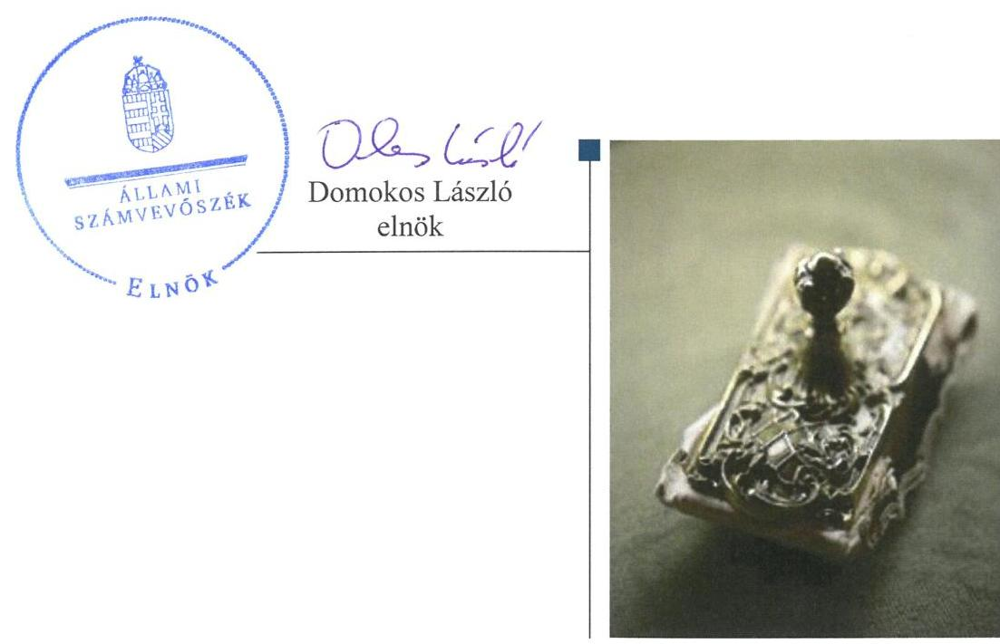

---

# AZ ELLENŐRZÉST FELÜGYELTE:

- RENKŐ ZSUZSANNA felügyeleti vezető

- AZ ELLENŐRZÉST VEZETTE ÉS A VÉGREHAJTÁSÁÉRT FELELŐS:
  - DÉR LÍVIA ellenőrzésvezető
  - A PROGRAM ÖSSZEÁLLÍTÁSÁÉRT FELELŐS:
    - JANIK JÓZSEF osztályvezető

- IKTATÓSZÁM: V-0988-140/2016.
- TÉMASZÁM: 2022
- ELLENŐRZÉS-AZONOSÍTÓ SZÁM: V-07187

Jelentéseink az Országgyűlés számítógépes hálózatán és az Interneta a www.asz.hu címen is olvashatóak.

---

# TARTALOMJEGYZÉK 

■ ÖSSZEGZÉS ..... 5
■ AZ ELLENŐRZÉS CÉLJA ..... 6
■ AZ ELLENŐRZÉS TERÜLETE ..... 7
■ AZ ELLENŐRZÉS HÁTTERE, INDOKOLTSÁGA ..... 9
■ A JELENTÉS LÉNYEGES KÉRDÉSKÖREI ..... 12
■ ELLENŐRZÉS HATÓKÖRE ÉS MÓDSZEREI ..... 13
■ MEGÁLLAPÍTÁSOK ..... 16
■ JAVASLATOK ..... 35
■ MELLÉKLETEK ..... 37
I. Sz. melléklet: Értelmező szótár ..... 37
II. Sz. melléklet: az integritás érvényesítése érdekében kialakított és müködtetett kontrollrendszer ..... 41
■ FÜGGELÉK: ÉSZREVÉTELEK ..... 43
■ RÖVIDÍTÉSEK JEGYZÉKE ..... 67

---

.

---

# ÖSSZEGZÉS 

Budapest Főváros IV. kerület Újpest Önkormányzata belső kontrollrendszere kialakításának és müködtetésének hiányosságai a befektetési tevékenységek szabályszerű végzését, elszámoltathatóságát nem támogatta. A befektetésekkel kapcsolatos döntés-előkészítés nem biztositotta a közvagyon körültekintő, biztonságos befektetését. Az Önkormányzat beszámolója nem a valóságnak megfelelően mutatta be a befektetett közvagyon nagyságát. Az Önkormányzat az integritás szemlélet érvényesülése érdekében nem tett erőfeszitést.

## Az ellenőrzés társadalmi indokoltsága

Magyarország Alaptörvénye az önkormányzatoktól is elvárja a kiegyensúlyozott, átlátható és fenntartható költségvetési gazdálkodás elvének érvényesítését. Az önkormányzatok által betöltött társadalmi szerep, az általuk kezelt közpénz nagysága, a nemzeti vagyon átruházására vagy hasznosítására vonatkozó döntéseik sokrétüsége indokolttá teszik a számvevőszéki ellenőrzéseket. A belső kontrollrendszer kialakítása és müködtetése nélkül nem valósítható meg a közpénzek, a közvagyon szabályos, gazdaságos, hatékony és eredményes felhasználása.

Újpest Önkormányzata 2015. április 30-án 1 781,5 millió Ft névértékű államkötvénnyel és 2300,0 millió Ft lekötött betéttel rendelkezett. Az Önkormányzat egyik pénzügyi szolgáltatójának törvénytelen tevékenysége következtében fennállt a veszélye annak, hogy a befektetett közvagyon egy részét elveszítik. Felmerült, hogy a belső kontrollrendszer kialakítása és múködtetése nem biztosította a közvagyon megóvását, körültekintő, biztonságos befektetését, a befektetési döntések, azok végrehajtása és számviteli elszámolása nem volt szabályszerű.

## Főbb megállapítások, következtetések, javaslatok

A belső kontrollrendszer kialakításában és múködtetésében feltárt hibák következtében az nem segítette elő a szabálykövető működést és gazdálkodást. A kontrolltevékenységek nem megfelelő működtetése akadályozta a hibák megelőzését, feltárását. A kötelezettségvállalási, az ellenjegyzési, a teljesítésigazolási, és az érvényesítési jogkörök szabálytalan gyakorlása növelte a jogosulatlan kifizetések veszélyét.

A befektetési döntések előkészítésekor a kockázatokat nem mérték fel, nem tervezték meg hogy hol és milyen beavatkozások szükségesek a káros következmények elkerülése érdekében. A szolgáltató esetleges nem teljesítése esetére azonban a KELER Zrt.-nél elkülönített értékpapír-alszámla megnyitásáról gondoskodtak. A befektetésekkel kapcsolatos döntéshozatal nem felelt meg a jogszabályi előírásoknak és az önkormányzati szabályozásnak.

Az egyes befektetések számviteli nyilvántartási értékének helytelen megállapítása, a részletező nyilvántartás nem megfelelő vezetése következtében az önkormányzat beszámolója vagyonáról nem a valós összképet mutatta.

Az integritás szemlélet erősítése érdekében - a belső kontrollrendszer kialakításában és müködésében feltárt hiányosságok és hibák megszüntetésével - az Önkormányzatnak még erőfeszítéseket kell tennie.

---

# AZ ELLENŐRZÉS CÉLJA 

Az ellenőrzés célja annak megállapítása volt, hogy az önkormányzat belső kontrollrendszerének kialakítása, továbbá egyes elemeinek működtetése biztosította-e az önkormányzatnál a közpénzfelhasználás szabályosságát. Az erőforrásokkal való szabályszerű és hatékony gazdálkodáshoz szükséges követelmények érvényesítése, számonkérése, ellenőrzése megtörtént-e az önkormányzatnál. A belső kontrollrendszer kialakítása és működtetése támogatta-e az integritás szemlélet érvényesülését. Az ellenőrzés során értékeltük a belső kontrollrendszer kialakításának és működtetésének szabályszerűségét. Bemutatjuk azokat a lényeges szabályozási hiányosságokat, amelyek miatt az ellenőrzött kulcskontrollok nem nyújtottak elegendő védelmet a lehetséges hibákkal szemben. Rámutattunk arra, ha a kulcskontrollok valamely hibát nem előztek meg, nem tártak fel vagy nem javítottak ki, valamint minősítjük működésük megfelelőségét. Ellenőriztük, hogy az önkormányzat egyes befektetési döntései és azok végrehajtása, elszámolása megfelelt-e a vonatkozó jogszabályoknak és belső szabályozásoknak, a kialakított kontrollrendszer támogatta-e a befektetési tevékenység szabályszerűségét.

---

# **A2 ELLENŐRZÉS TERÜLETE**

## **Budapest Főváros IV. kerület Újpest Önkormányzata**

Budapest Főváros IV. kerület Újpest Önkormányzata állandó lakosainak száma 2015. január 1-jén 99 800 fő volt. Az Önkormányzat 21 tagú Képviselő-testületének1 munkáját öt állandó bizottság segítette. Az Önkormányzat a Hivatalon2 kívül 20 intézménnyel, valamint öt többségi tulajdoni részesedésű gazdasági társasággal látta el a feladatait. A nemzetiségi önkormányzati képviselők 2014. évi általános választásáig bolgár, roma, görög, lengyel, német, örmény, román, ruszin, szerb, szlovák, ukrán és horvát, azt követően bolgár, roma, görög, lengyel, német, örmény, román, ruszin, szerb, szlovák és ukrán helyi nemzetiségi önkormányzat működött.

A polgármester3 a 2010. évi önkormányzati választások óta tölti be tisztségét. A jegyző4 2012. év óta látja el feladatait. A Hivatal hat szervezeti egységre tagolódott (Jegyzői Kabinet, Igazgatási, Emberi Erőforrás, Gazdasági, Szociális és Városüzemeltetési főosztályok), elkülönített gazdasági szervezettel rendelkezett. A gazdasági szervezet feladatait négy osztály látta el, a gazdasági szervezet vezetője a Gazdasági Főosztályvezető volt. A Hivatalban foglalkoztatott köztisztviselők száma 2014. év végén 205 fő volt. A Hivatalban szervezeti változás 2014. január 1-je után nem történt.

Az Önkormányzat a 2014. évi költségvetési beszámoló szerint 17 238,3 millió Ft költségvetési bevételt ért el, valamint 20 080,7 millió Ft költségvetési kiadást teljesített. A költségvetés 2 842,4 millió Ft-os hiányát az előző évi 1 454,8 millió Ft maradvány felhasználása, továbbá a finanszírozási bevételek és a finanszírozási kiadások 1 387,6 millió Ft-os egyenlege fedezte.

1. ábra

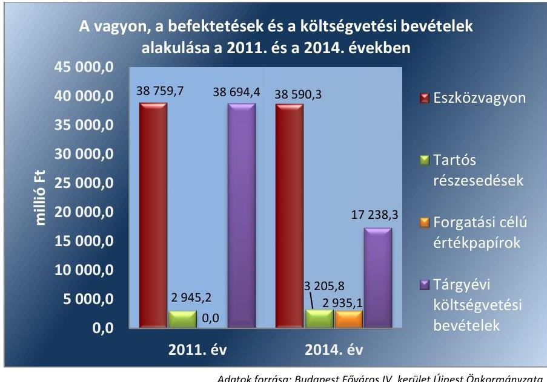

*Adatok forrása: Budapest Főváros IV. kerület Újpest Önkormányzata 2011. és a 2014. évi éves költségvetési beszámolói*

---

A forrásokon belül a költségvetési évben esedékes kötelezettségállomány 333,0 millió Ft, a 2014. évi költségvetési évet követően esedékes kötelezettségállomány 79,9 millió Ft volt, pénzintézettel szembeni kötelezettségük nem volt. A 2013. évben 2076,1 millió Ft, a 2014. évben 3023,9 millió Ft adósságkonszolidációs támogatásban részesültek.

---

# AZ ELLENŐRZÉS HÁTTERE, INDOKOLTSÁGA 

Az ÁSZ tv. ${ }^{5}$ szerint az ÁSZ feladata a jól irányított állam kiépítésének elősegítése. Az ÁSZ Stratégiájában ezért hangsúlyos szerepet szánt annak, hogy szilárd szakmai alapon álló, értékteremtő ellenőrzéseivel előmozdítsa a közpénzügyek átláthatóságát, rendezettségét. A számvevőszéki ellenőrzés nemzetközi alapelvei is rögzítik, hogy a megfelelő belső kontrollrendszer minimálisra csökkenti a hibák és szabálytalanságok kockázatát.

A belső kontrollrendszer azt a célt szolgálja, hogy a költségvetési szervek működésük és gazdálkodásuk során a tevékenységeket szabályszerűen, gazdaságosan, hatékonyan, eredményesen hajtsák végre, teljesítsék elszámolási kötelezettségeiket és megvédjék az erőforrásokat a veszteségektől, a károktól és a nem rendeltetésszerű használattól. A belső kontrollrendszer magában foglalja mindazon szabályokat, eljárásokat, gyakorlati módszereket és szervezeti struktúrákat, kockázatkezelési technikákat, kontrolltevékenységeket, amelyek segítséget nyújtanak a szervezetnek céljai eléréséhez. A belső kontrollrendszer szabályozása háromszintű: a törvényi előírásokat az Áht., ${ }^{6}$ és a Mötv. ${ }^{7}$, a rendeleti szintű szabályozást az Ávr. ${ }^{8}$ és a Bkr. ${ }^{9}$ tartalmazza, amelyeket útmutatói szinten az NGM ${ }^{10}$ által kiadott standardok és kézikönyvek támogatnak.

Az ellenőrzött időszak meghatározása lehetőséget teremt a 2014. október 12-i önkormányzati választásokat megelőző és követő ciklus belső kontrollrendszere működésének elkülönült értékelésére, valamint a változások nyomon követésére.

A BELSŐ KONTROLLRENDSZER kialakításának és működtetésének általános értékelése mellett a teljesítésigazolás és érvényesítés kontrollok kiemelt ellenőrzésének szükségességét alátámasztja, hogy 2012-től a pénzügyi folyamatokban kulcsszerepet betöltő belső kontrollok rendszere módosult és azok működtetésében az önkormányzatoknál hiányosságok mutatkoztak a 2012 óta elvégzett ÁSZ ellenőrzések alapján.

Az önkormányzatok belső kontrollrendszerének ellenőrzése az ÁSZ "jó kormányzással" kapcsolatos stratégiai céljainak megvalósítását is szolgálja. Az ÁSZ célja, hogy javuljon az ellenőrzött önkormányzatok belső kontrollrendszerének szabályozottsága, működésének megfelelősége, hozzájárulva ezzel az egyensúlyi helyzet fenntarthatóságának biztosításához, azaz az adósság újratermelődésének megakadályozásához. Az ÁSZ ellenőrzés tapasztalatai nem csupán a közvetlenül ellenőrzött önkormányzatokat segíthetik, hanem a "jó gyakorlat" elterjesztésével azok az önkormányzatok is átvehetik a pozitív példákat, ahol nem végez ellenőrzést az ÁSZ.

Az $\mathrm{MNB}^{11}$ három befektetési szolgáltató tevékenységi engedélyét 2015. első felében visszavonta és kezdeményezte a vállalkozások felszámolását a működéssel kapcsolatos szabálytalanságok, hiányosságok miatt. A korábbi évek ellenőrzési tapasztalatai alapján fennáll a lehetősége annak, hogy az önkormányzatok befektetési döntései, továbbá a döntések végrehajtása és számviteli elszámolása nem voltak teljes mértékben szabályszerűek, és a kapcsolódó külső ellenőrzések és a belső kontrollrendszer sem működtek minden esetben megfelelően.

---

Magyarország Alaptörvénye ${ }^{12}$ az önkormányzatoktól, mint az államháztartás alanyaitól elvárja a kiegyensúlyozott, átlátható és fenntartható költségvetési gazdálkodás elvének érvényesítését. A nemzeti vagyonról szóló törvény szerint a nemzeti vagyonnal felelős módon, rendeltetésszerűen kell gazdálkodni. A nemzeti vagyongazdálkodás feladata a nemzeti vagyon rendeltetésének megfelelő, átlátható, hatékony és költségtakarékos működtetése, ugyanakkor értékének megőrzését, értéknövelő használatát, hasznosítását, gyarapítását is elvárja.

# AZ ÖNKORMÁNYZATOK ÁTMENETILEG SZABAD PÉNZESZKÖZEINEK BEFEKTETÉSÉT jogszabály nem 

tiltja, a pénzpiaci szolgáltatók közül az önkormányzatok a kínált szolgáltatás és annak költségei alapján, szabadon választhatnak, a veszteséges gazdálkodás kockázatai és következményei azonban az önkormányzatokat terhelik. A szabad pénzeszközök felelős hasznosítása összhangban áll az önkormányzati gazdálkodás alapelveivel.

A közintézmények integritás alapú kultúrájának kialakítása, megerősítése és működése szorosan összefügg a belső kontrollrendszer működésével, ezért az ellenőrzés kiterjed annak értékelésére is, hogy a belső kontrollrendszer kialakítása és működtetése hogyan hatott az integritás szemlélet érvényesülésére.

Az államháztartás önkormányzati alrendszerében a 2014. év elején öszszesen 3177 települési önkormányzat működött: a 23 kerülettel rendelkező főváros, 345 város, 2691 község és 117 nagyközség volt. A belső kontrollrendszer kialakítása és működtetése ellenőrzését az ÁSZ által lefolytatott, kisebb településeket is érintő ellenőrzéseinek tapasztalatai, valamint a közérdekű bejelentések kockázati szempontú értékelése alapozták meg. Ezek a községek, nagyközségek gazdálkodásának, belső kontrollrendszere kialakításának és működésének hiányosságaira mutattak rá. Az ellenőrzések helyszíneinek kiválasztása során az ÁSZ célzott adatfeldolgozáson alapuló kockázatelemző rendszerére támaszkodik. Ez elősegíti, hogy azokon a területeken végezzen ellenőrzéseket, összpontosítva erőforrásait, ahol a valódi kockázatok, az aktuális problémák vannak.

## AZ ELLENŐRZÉS VÁRHATÓ HASZNOSULÁSA NÉGY SZINTEN valósul meg.

A törvényalkotás számára összegzett tapasztalatok állnak rendelkezésre a belső kontrollrendszer önkormányzati területen való kialakításáról, működtetéséről és hatásairól. Az ÁSZ az ellenőrzéseivel hozzájárul ahhoz, hogy az egyes önkormányzati befektetésekkel kapcsolatos kockázatok a szabályozási és kontroll mechanizmusok fejlesztésével mérsékelhetők legyenek.

Az ellenőrzés az ellenőrzött számára visszajelzést ad a belső kontrollrendszer kialakításában és működésében lévő hiányosságokról, javaslataival hozzájárul azok kiküszöböléséhez. Feltárja az önkormányzati befektetési tevékenységet meghatározó szabályozások összhangjának hiányosságait, a szabályozással nem érintett gazdálkodási területeket, valamint az egyes befektetési tevékenységek esetleges szabálytalanságait.

Az ellenőrzés megállapításait és javaslatait más szervezetek is hasznosíthatják a rendezett gazdálkodási keretek kialakításához.

---

A társadalom számára jelzi, hogy közpénz nem maradhat ellenőrizetlenül, az ÁSZ értékteremtő rend kialakításához és megőrzéséhez hozzájáruló tevékenysége így pozitív hatással lesz a szervezetről kialakított összkép formálásában.

---

# A JELENTÉS LÉNYEGES KÉRDÉSKÖREI 

1.     - Az önkormányzat belső kontrollrendszerének kialakítása és müködtetése szabályszerű volt-e 2014. január 1. és 2015. április 30. között, valamint a belső kontrollrendszer egyes pillérei támogat-ták-e a befektetési tevékenység szabályszerű végzését 2011. január 1. és 2015. április 30. között?
2.     - Az egyes befektetésekkel kapcsolatos döntéshozatal és a döntések végrehajtása szabályszerű volt-e?
3.     - Az egyes befektetések számviteli elszámolása, nyilvántartása szabályszerű volt-e?
4.     - Az erőforrásokkal való szabályszerű és hatékony gazdálkodáshoz szükséges követelmények érvényesitése, számonkérése, ellenőrzése megtörtént-e az önkormányzatnál?
5.     - Az önkormányzat belső kontrollrendszerének kialakítása és müködtetése támogatta-e az integritás szemlélet érvényesülését?

---

# ELLENŐRZÉS HATÓKÖRE ÉS MÓDSZEREI 

## Az ellenőrzés típusa

Megfelelőségi ellenőrzés, a befektetési tevékenység esetében szabályszerűségi ellenőrzés.

## Az ellenőrzött időszak

A belső kontrollrendszer kialakításának és működtetésének ellenőrzése a 2014. január 1. és 2015. április 30. közötti időszakra terjedt ki. Ezen belül a belső kontrollrendszer kialakításának és működtetésének megfelelőségét a 2014. január 1. és október 12., valamint a 2014. október 13. és 2015. április 30. közötti időszakra vonatkozóan külön-külön értékeltük. Az önkormányzatok egyes befektetési tevékenységeinek ellenőrzése tekintetében az ellenőrzött időszak a 2011. január 1. - 2015. április 30. közötti időszak. Ezen felül az önkormányzat befektetésekkel kapcsolatos döntés-előkészítésének és döntéshozatalának szabályszerűségét a 2011. január 1. előtti időszakra visszanyúlóan is ellenőriztük, amennyiben a 2014. június 30-án, illetve 2015. április 30-án meglévő befektetéseire 2011. január 1-je előtt került sor. Az integritás szemlélet érvényesülését a 2014. évre vonatkozó adatszolgáltatás alapján értékeltük.

## Az ellenőrzés tárgya

A helyi önkormányzatnak, mint éves költségvetési beszámoló készítésére kötelezett szervezetnek és polgármesteri hivatalának belső kontrollrendszere. Az önkormányzat 2014. június 30-án, illetve 2015. április 30-án meglévő értékpapírokban megtestesülő befektetései, lekötött betétei, valamint az önkormányzat üzleti vagyonába tartozó ingatlanok, kulturális javak (műtárgyak, műalkotások, stb.), illetve a feladatellátást nem szolgáló egyéb értéktárgyak (pl. ékszerek, befektetési nemesfém). Az erőforrásokkal való szabályszerű és hatékony gazdálkodáshoz szükséges követelmények érvényesítése, számonkérése, ellenőrzése. Az integritás szemlélet érvényesülése.

## Az ellenőrzött szervezet

Budapest Főváros IV. kerület Újpest Önkormányzata és a önkormányzati müködéshez kapcsolódó feladatokat ellátó Hivatal.

---

# Az ellenőrzés jogalapja 

Az ÁSZ tv. 1. § (3) bekezdésében foglaltak alapján az ÁSZ általános hatáskörrel végzi a közpénzekkel és az állami és önkormányzati vagyonnal való felelős gazdálkodás ellenőrzését. Az ÁSZ tv. 5. § (2) bekezdése alapján az államháztartás gazdálkodásának ellenőrzése keretében az ÁSZ ellenőrzi a helyi önkormányzatok gazdálkodását, valamint az ÁSZ tv. 5. § (6) bekezdése alapján ellenőrzése során értékeli az államháztartás számviteli rendjének betartását és a belső kontrollrendszer múködését.

## Az ellenőrzés módszerei

Az ellenőrzést a nemzetközi standardokat irányadónak tekintve az ellenőrzési program ellenőrzési kérdései, az ellenőrzött időszakban hatályos jogszabályok, az ellenőrzés szakmai szabályok és módszertanok figyelembe vételével végeztük.

Az ellenőrzés lefolytatásához az Önkormányzat a tanúsítványok kitöltésével, valamint az ÁSZ által kért dokumentumok elektronikus megküldésével szolgáltatott adatokat. A rendelkezésre bocsátott adatok, információk kontrollja és a munkalapok kitöltése az ellenőrzés keretében történt. A jelentésben használt fogalmak magyarázatát az I. számú melléklet, az integritás érvényesítése érdekében kialakított és múködtetett kontrollrendszer minősítését a II. számú melléklet tartalmazza.

A belső kontrollrendszer jogszabályi előírások szerinti kialakításának és múködtetésének szabályszerűségét az erre irányuló ellenőrzési kérdésekre adott válaszok összesítése alapján külön-külön értékeltük a 2014. január 1. és október 12., valamint a 2014. október 13. és 2015. április 30. közötti időszakra. A belső kontrollrendszert egy-egy ellenőrzött időszakra pillérenként (kontrollkörnyezet, kockázatkezelési rendszer, kontrolltevékenységek, információs és kommunikációs rendszer, monitoring rendszer) és öszszesítetten is értékeltük.

## A BELSŐ KONTROLLRENDSZER EGYES PILLÉRE-

INEK KIALAKÍTÁSA ÉS MÚKÖDTETÉSE „szabályszerű volt", amennyiben az értékelt területen az elért és elérhető pontok százalékban kifejezett, egész számra kerekített hányadosa meghaladta a 84\%ot, „részben szabályszerű volt", ha 61-84\% közé esett, „nem szabályszerű volt", ha nem haladta meg a 60\%-ot. A belső kontrollrendszer összesített értékelése megegyezett a pillérenként (kontrollterületenként) alkalmazott százalékos értékelésekkel, a következő eltérésekkel. A kontrollrendszer egésze esetében a „szabályszerű" értékelésnek a százalékos értéken felül további feltétele volt, hogy egyik kontrollterület sem kaphat „nem szabályszerű" értékelést, a „részben szabályszerű" értékelés további feltétele volt, hogy legfeljebb egy ellenőrzött kontrollterület lehet „nem szabályszerű" értékelésú. Az összesített értékelés a százalékos értéktől függetlenül „nem szabályszerű volt", ha az ellenőrzött kontrollterületek közül több mint egynek „nem szabályszerű volt" az értékelése.

---

# A GAZDÁLKODÁS FOLYAMATÁBAN A KÉT 

KULCSKONTROLL - teljesítésigazolás, érvényesítés - múködésének megfelelőségét a személyi juttatásokkal, a dologi kiadásokkal, a beruházási, felújítási kiadásokkal, az ellátottak pénzbeli juttatásaival és az egyéb múködési, felhalmozási célú, valamint a finanszírozási kiadásokkal kapcsolatos kifizetések esetében mintavétellel ellenőriztük. A mintavétel során külön értékeltük a 2014. január 1. és 2014. október 12. közötti időszakban és a 2014. október 13. és 2015. április 30. közötti időszakban teljesített kifizetéseket. „Megfelelőnek" értékeltük a gazdálkodási jogkörök gyakorlását, amennyiben 95\%-os bizonyossággal a teljes sokaságban a hibaarány legfeljebb 10\%, „részben megfelelőnek" értékeltük, ha a hibaarány felső határa 10-30\% között volt, „nem megfelelőnek" pedig akkor, ha a mintavételi eredmények alapján a sokaságbeli hibaarány felső határa meghaladta a $30 \%$-ot.

Az integritás szemlélet érvényesülésének értékelése az önkormányzat által kitöltött tanúsítvány alapján történt.

---

# MEGÁLLAPÍTÁSOK

1. Az önkormányzat belső kontrollrendszerének kialakítása és múködtetése szabályszerű volt-e 2014. január 1. és 2015. április 30. között, valamint a belső kontrollrendszer egyes pillérei támogatták-e a befektetési tevékenység szabályszerű végzését 2011. január 1. és 2015. április 30. között?

|  Összegző megállapítás | A belső kontrollrendszer kialakítása és működtetése az össze-
sített értékelés alapján 2014. január 1. és 2015. április 30. kö-
zött részben szabályszerű volt. A feltárt hiányosságok miatt
azonban a belső kontrollrendszer kialakítása és működtetése
2011. január 1. és 2015. április 30. között nem biztosította az
egyes befektetési tevékenységek szabályszerű, kockázatokat
minimalizáló, elszámoltatható végzését.  |
| --- | --- |
|   | A belső kontrollrendszer kialakításának és működtetésének összesített ér-
tékelését az 1. táblázat mutatja be:  |

1. táblázat

|  A BELSŐ KONTROLLRENDSZER KIALAKÍTÁSÁNAK ÉS MŰKÖDTETÉSÉNEK ÖSSZESÍTETT ÉRTÉKELÉSE |  |  |   |
| --- | --- | --- | --- |
|  Megnevezés | A gazdalkodás egészet erintően: | A befektetési tevékenyseget érintően: |   |
|   | 2014. január 1-tól | 2014. október 13-tól | 2014. január 1-tól  |
|   | 2014. október 12-ig | 2015. április 30-ig | 2015. április 30-ig  |
|  Kontrollkörnyezet | szabályszerű | támogatta |   |
|  Kockázatkezelési rendszer | részben szabályszerű | nem támogatta |   |
|  Kontrolltevékenységek | nem szabályszerű | n.a. | nem támogatta  |
|  Információs és kommunikációs
rendszer | szabályszerű | nem támogatta |   |
|  Monitoring | szabályszerű | nem támogatta |   |
|  BELSŐ KONTROLLRENDSZER | RÉSZBEN SZABÁLYSZERŰ | NEM TÁMOGATTA |   |
|   |  |  | Forrás: $A S Z$  |

1.1. számú megállapítás

A kontrollkörnyezet kialakítása szabályszerű volt. A szervezeti és szabályozási kereteket, a feladat- és hatáskörök rendszerét, a belső szabályzatokat - a feltárt hiányosságok mellett - a jogszabályi előírásokkal összhangban alakították ki, amely támogatta a befektetési tevékenységek szabályszerű végzését.

## A SZERVEZETI ÉS A SZABÁLYOZÁSI KERETEKET

a Képviselő-testület 2011. január 1. és 2015. április 30. között az alábbiak szerint alakította ki: $\qquad$ az önkormányzati SZMSZ ${ }^{13}{ }_{1,2}$-ben meghatározta a szervezeti kereteit, a müködés rendjét, a feladat- és hatásköreit, a polgármesterre és a bizottságokra átruházott egyes jogköröket;

---

- a vagyongazdálkodási rendelet ${ }^{14}{ }_{1,2}$-ben rögzítette a vagyonnal való gazdálkodás részletes szabályait. Rendelkezéseket tartalmazott az értékpapírok elidegenítéséről, értékpapírok tulajdonjogának megszerzéséről. A vagyongazdálkodási rendelet ${ }_{1}$ szerint a hitelviszonyt megtestesítő értékpapírok megszerzésére és elidegenítésére vonatkozó tulajdonosi döntést a Képviselő-testület és a Pénzügyi Bizottság hozhat. A vagyongazdálkodási rendelet ${ }_{2}$ alapján az üzleti vagyon megszerzésére és elidegenítésére vonatkozó döntés meghozatalára a Képviselő-testület, illetve összeghatártól függően átruházott hatáskörben a Pénzügyi Bizottság ${ }^{15}$ és a polgármester jogosult;
a 2011-2015. évi költségvetési rendeleteket a jogszabályi előírásoknak megfelelő részletezettségben hagyta jóvá. A költségvetési rendelet ${ }_{1-2}$-ben ${ }^{16}$ felhatalmazást adott az átmenetileg szabad pénzeszközök befektetésére (államilag garantált értékpapírok vásárlására), illetve betétként történő lekötésére. Az államilag garantált értékpapírokat kizárólag pénzintézeten keresztül engedélyezte vásárolni, a tulajdonosi rendelkezési lehetőség biztosításával. A költségvetési rendelet ${ }_{3-4}$-ben felhatalmazást adott az átmenetileg szabad pénzeszközök államilag garantált értékpapírokba történő befektetésére, illetve betétlekötésére. Államilag garantált értékpapírt kizárólag a(z) PSZÁF/MNB engedéllyel rendelkező pénzügyi szolgáltatón keresztül engedélyezte vásárolni, továbbá 2013. évtől lehetővé tette, hogy a tőkegarantált befektetés kamatait az önkormányzat pénzügyi befektetései során szabadon forgathatja. A költségvetési rendeletek és a vagyongazdálkodási rendeletek előírásai közötti összhang biztosított volt, a költségvetési rendeletek az átmenetileg szabad pénzeszközök befektetésének jogkör gyakorlóját nem nevesítette;
gazdasági program ${ }^{17}{ }_{1,2}$-ot hagyott jóvá, amelyben meghatározták azokat a célkitűzéseket, fejlesztési elképzeléseket, amelyek az Önkormányzat által nyújtandó feladatok biztosítását, színvonalának javítását szolgálták;
elfogadta a Hivatal alapító okiratát ${ }^{18}$, valamint a jegyző által elkészített hivatali SZMSZ ${ }^{19}$-t.

A HIVATAL BELSŐ SZABÁLYOZÁSÁT a jegyző 2011. és 2015. április 30. között kialakította, ezen belül:
a hivatali SZMSZ tartalmazta a nevesített munkakörökhöz tartozó feladat- és hatásköröket, hatáskörök gyakorlásának módját, a helyettesítés rendjét;
$\longrightarrow$ ügyrend ${ }^{20}{ }_{1,2,3,4}$-ban meghatározták a gazdasági szervezet feladatait, a szervezethez tartozó vezetők és más dolgozók gazdálkodással öszszefüggő feladatait, hatásköreit és jogköreit. Az ügyrend ${ }_{4}$ tartalmazta, hogy a Pénzügyi és Számviteli Osztály végzi a Képviselő-testület vagy a polgármester döntése alapján a befektetések pénzügyi technikai lebonyolításával kapcsolatos adminisztratív feladatot. A hivatali SZMSZ-ben rögzítették a gazdasági szervezet vezetőjének, a szervezet egységeinek feladat- és hatáskörét, a helyettesítés rendjét, valamint a gazdasági szervezet belső és külső kapcsolattartásának szabályait;

---

$\longrightarrow$ kötelezettségvállalási szabályzat ${ }^{21}{ }_{1,2,3,4}$-ben rögzítették a Hivatal és az Önkormányzat önálló beszámolójával érintett feladataira vonatkozóan a gazdálkodási jogkörök gyakorlása módjával, eljárási és dokumentációs részletszabályaival, valamint az ezeket végző személyek kijelölésének rendjével kapcsolatos belső előírásokat és feltételeket;
etikai kódex ${ }^{22}{ }_{1,2}$-ben meghatározták a Hivatal köztisztviselői vonatkozásában a hivatásetikai alapelvek részletes tartalmát és az etikai eljárás szabályait, amelyet a testületi döntést követően a munkáltatói jogokat gyakorló jegyző és a polgármester közös utasításban adott ki;
$\longrightarrow$ közszolgálati szabályzat ${ }^{23}{ }_{1,2}$-ben rögzítették a jogszabályban meghatározott, illetve az általános munkáltatói szabályozás hatáskörébe tartozó kérdéseket;
ellenőrzési nyomvonal szabályzat ${ }^{24}{ }_{1,2}$ az értékpapír-vásárlás kivételével tartalmazta a gazdálkodási és beszámolási folyamatokat táblázatos formában;
szabálytalanságkezelési eljárásrend ${ }^{25}{ }_{1,2}$ a helyi sajátosságokat figyelembe véve mutatta be a lehetséges szabálytalanságok eseteit és azok kezelését;
a jegyző kiadta a számviteli politika ${ }^{26}{ }_{1,2}$-t, számlarend ${ }^{27}{ }_{1,2,3}$-at, az eszközök és források leltározási és leltárkészítési szabályzat ${ }^{28}{ }_{1,2,3}$-at, eszközök és források értékelési szabályzat ${ }^{29}{ }_{1,2}$-ot, a bizonylati szabályzat ${ }^{30}{ }_{1,2}$-ot. A szabályzatok 2014. évi számviteli jogszabályi változásokhoz kapcsolódó aktualizálása - a számviteli politika, számlarend és a számlatükör kivételével - nem történt meg;
pénz- és értékkezelési szabályzat ${ }^{31}{ }_{1,2,3}$-ban meghatározták a pénzforgalom lebonyolításának szabályait, a bizonylatolás és a pénzforgalmi nyilvántartások rendjét, valamint rögzítették az értékpapírok, részesedések nyilvántartásának szabályait;
az Önkormányzatnál rendelkeztek munkavédelmi szabályzat ${ }^{32}{ }_{1,2}$-tal, továbbá tűzvédelmi szabályzat ${ }^{33}{ }_{1,2}$-tal.
A kontrollkörnyezet kialakítása az értékelés szempontjából 2014. január 1. és 2014. október 12., valamint 2014. október 13. és 2015. április 30. közötti időszakokban 2. táblázatban részletezett hiányosságok mellett szabályszerű volt.

A kontrollkörnyezet kialakítása a 2011. január 1. és 2013. december 31., valamint 2014. január 1. és 2015. április 30. között támogatta a befektetési tevékenység szabályszerű végzését.
2. táblázat

# A KONTROLLKÖRNYEZET KIALAKÍTÁSÁNAK HIÁNYOSSÁGAI 

## Sorszám

## Részmegállapítás

1. A számlarend ${ }_{2,3}$ az Áhsz. ${ }^{34}$ 51. § (3) bekezdésében foglaltak ellenére nem tartalmazta az összesítő bizonylat tartalmi és formai követelményeit.
2. A jegyző az eszközök és források leltározási és leltárkészítési szabályzat ${ }_{3}$-ot, az eszközök és források értékelési szabályzat ${ }_{2}$-ot, a bizonylati szabályzat ${ }_{2}$-ot az Áhsz. ${ }_{2}$ 50. § (1) bekezdésében, a Számv. tv. ${ }^{35}$ 14. § (11) bekezdésében és 161. § (4)-(5) bekezdésében előírtakat figyelmen kívül hagyva nem aktualizálta a 2014. évi számviteli jogszabályi változásoknak megfelelően.

---

# Sorszám 

## Részmegállapítás

Az ellenőrzési nyomvonal a Bkr. 6. § (3) bekezdésében előírtak ellenére nem tartalmazta az értékpapíradásvételi döntésekkel kapcsolatos felelősségi és információs szinteket és kapcsolatokat, valamint az irányítási és ellenőrzési folyamatokat

Fonás: ÁsZ
1.2. számú megállapítás

A kockázatkezelési rendszer kialakítása és múködtetése részben volt szabályszerű. A gazdálkodásban rejlő kockázatokat - ideértve az egyes befektetési tevékenységekkel és befektetési szolgáltatókkal kapcsolatos kockázatokat - nem mérték fel és értékelték, emiatt 2011. január 1. és 2015. április 30. között a kockázatkezelési rendszer nem támogatta a befektetési tevékenységek szabályszerű végzését, a pénzügyi kockázatok minimalizálását.

## A KOCKÁZATOK AZONOSÍTÁSÁVAL, ELEMZÉSÉ-

VEL, csoportosításával, nyomon követésével, illetve a kockázati kitettség csökkentésével kapcsolatos tevékenységeket a kockázatkezelési szabályzat ${ }^{36}{ }_{1,2}$ általánosságban tartalmazta. A kockázatkezelési szabályzat ${ }_{1,2}$ hatálya nem terjedt ki az Önkormányzat önálló beszámolóval érintett feladataira, így a befektetési tevékenységre sem.

A jegyző az ellenőrzött időszakban a befektetési tevékenységek esetében a Bkr. 7. § (1)-(2) bekezdésében előírtak ellenére dokumentáltan nem végzett kockázatelemzést és nem múködtette a kockázatkezelési rendszert. A gazdálkodásban rejlő kockázatokat nem mérték fel, nem határozták meg a kockázatokkal kapcsolatos intézkedéseket és azok teljesítésének folyamatos nyomon követési módját.

## A VAGYONNYILATKOZAT-TÉTELI KÖTELEZETTSÉGGEL járó munkaköröket a hivatali SZMSZ-ben, valamint a vagyon-nyilatkozat-tételi kötelezettségről szóló utasításban ${ }^{37}{ }_{1,2}$ - határozták meg. Az önkormányzati bizottságok nem képviselő-testületi tagjainak vagyon-nyilatkozat-tételi kötelezettségét a Vnytv. ${ }^{38}$ 4. § d) pont előírása ellenére nem az önkormányzati SZMSZ ${ }_{1,2}$ írta elő, hanem azt a vagyonnyilatkozattételi kötelezettségről szóló polgármesteri és jegyzői közös utasításban szabályozták. Az önkormányzati képviselők és nem képviselő bizottsági tagok, továbbá a Hivatalnál közszolgálatban álló dolgozók vagyonnyilatkozattételi kötelezettségüknek a nyilvántartások alapján határidőben eleget tettek.

A kockázatkezelési rendszer kialakítása és múködtetése a 2014. január 1. és 2014. október 12., valamint a 2014. október 13. és 2015. április 30. közötti időszakokban a 3. táblázatban részletezett hiányosságok mellett szabályszerű volt.

A kockázatkezelési rendszer 2011. január 1. és 2013. december 31., valamint 2014. január 1. és 2015. április 30. közötti időszakokban a kockázatkezelési rendszer múködtetésében tapasztalt hiányosságok miatt a befektetési tevékenységek szabályszerű végzését nem támogatta.

---

# A KOCKÁZATKEZELÉSI RENDSZER MŰKÖDTETÉSÉNEK HIÁNYOSSÁGAI 

## Sorszám

## Részmegállapítás

A jegyző a kockázatkezelési rendszer keretében - a 2011. évben az Áht. ${ }^{39}$ 121. § (2) bekezdés b) pontjában és az Ámr. 157. § (1) - (3) bekezdéseiben, a 2012. évtől a Bkr. 7. § (1)-(2) bekezdésében előírtak ellenére - a gazdálkodásban rejlő, ideértve az egyes befektetési tevékenységekkel kapcsolatos kockázatokat nem mérte fel, továbbá a befektetési kockázatokkal kapcsolatos intézkedéseket és azok teljesítésének folyamatos nyomon követési módját nem határozta meg.
2. Az önkormányzati bizottságok nem képviselő-testületi tagjainak vagyonnyilatkozat-tételi kötelezettségét a Vnytv. 4. § d) pont előírása ellenére nem az önkormányzati SZMSZ1,2-ben írták elő, hanem azt a vagyonnyilatkozat-tételi kötelezettségről szóló polgármesteri és jegyzői közös utasításban szabályozták.

Forrás: ÁSZ
1.3. számú megállapítás

A pénzügyi folyamatokban kulcsszerepet betöltő teljesítésigazolás és érvényesítés kontrollok müködése nem biztosította a személyi juttatásokkal, a dologi kiadásokkal, a beruházási, felújítási kiadásokkal, az ellátottak pénzbeli juttatásaival és az egyéb müködési, felhalmozási célú kiadásokkal, valamint a finanszírozási kiadásokkal kapcsolatos hibák megelőzését és feltárását, a közpénzfelhasználás szabályosságát.

A KONTROLLTEVÉKENYSÉGEK KIALAKÍTÁSA során a jegyző biztosította a pénzügyi döntések dokumentumainak - köztük a költségvetés tervezése, a beszerzések lebonyolítása, a vagyonhasznosítási tevékenység és a támogatásokkal való elszámolás - előkészítése során a folyamatba épített, előzetes, utólagos és vezetői ellenőrzés múködtetésének rendszerét. Az Önkormányzat a kötelezettségvállalási szabály-zat-1,2,3,4-ban, az önkormányzati SZMSZ1,2-ben, az iratkezelési szabályzat ${ }^{40}$ ban, a számviteli politika ${ }_{1,2}$-ben, a közszolgálati szabályzat ${ }_{1,2}$-ban, az informatikai védelmi szabályzat ${ }^{41}$-ban a felelősségi körök meghatározásával rögzítette az engedélyezési, jóváhagyási és kontrolleljárásokat, a dokumentumokhoz, információkhoz való hozzáférést, a beszámolási eljárásokat.

A hivatali SZMSZ, az ügyrend ${ }_{1,2,3,4}$, valamint a munkaköri leírások tartalmazták a beszámolási feladatok teljesítésével kapcsolatos belső előírásokat, feltételeket, a gazdasági feladatot ellátó vezetők és a gazdasági feladatot ellátó alkalmazottak helyettesítésének rendjét.

A GAZDÁLKODÁSI JOGKÖRÖKKEL kapcsolatos írásbeli felhatalmazások, kijelölések - a Hivatal és az Önkormányzat önálló beszámolóval érintett feladatai tekintetében - megtörténtek. A gazdasági szervezet vezetője kijelölte a Hivatal állományába tartozó köztisztviselőket pénzügyi ellenjegyzési feladatra.

Az érvényesítő személyének kijelölése nem volt szabályszerű, mivel az érvényesítésre jogosult személyeket a gazdasági vezetői munkakör feladatait 2013. augusztus 16-tól 2013. szeptember 17-ig átmenetileg ellátó aljegyző adta ki, aki nem rendelkezett az Ávr. 12. § (1) bekezdésében foglalt végzettséggel. A jegyző az Ávr. 11. § (8) bekezdése ellenére úgy jelölte ki az átmeneti időszakra az aljegyzőt a gazdasági vezetői feladatok ellátására, hogy az aljegyző nem rendelkezett az Ávr. 55. § (3) bekezdésében megjelölt képzettséggel.

---

A gazdasági szervezet vezetője, valamint az érvényesítésre kijelölt dolgozók a jogszabályi előírások szerinti végzettséggel és pénzügyi, számviteli képesítéssel rendelkeztek. A polgármester az Önkormányzat kiadási előirányzatai terhére felhatalmazást adott kötelezettségvállalásra és utalványozásra. A teljesítésigazolásra jogosultakat a Hivatal kiadási előirányzatai vonatkozásában a jegyző, az Önkormányzat önálló beszámolóval érintett feladatai kiadási előirányzatának terhére vállalt kötelezettség esetére a polgármester kijelölte.

Az Önkormányzat és a Hivatal a kötelezettségvállalásra, pénzügyi ellenjegyzésre, teljesítés igazolására, érvényesítésre, utalványozásra jogosult személyekről és aláírás-mintájáról naprakész nyilvántartást vezetett.

# A GAZDÁLKODÁSSAL KAPCSOLATOS KULCS- 

KONTROLLOK MŰKÖDÉSE (teljesítésigazolás és érvényesítés) 2014. január 1. és 2014. október 12., illetve 2014. október 13. és 2015. április 30. közötti időszakokban nem felelt meg az Áht. 2-ben, az Ávr.-ben és a kötelezettségvállalási szabályzat ${ }_{4}$-ban foglalt előírásoknak. A teljesítésigazolás és az érvényesítés kontrollok múködését a személyi juttatásokkal, a dologi kiadásokkal, a beruházási és felújítási kiadásokkal, az ellátottak pénzbeli juttatásaival és az egyéb múködési és felhalmozási célú kiadásokkal, valamint a finanszírozási kiadásokkal (értékpapír vásárlással, betétlekötéssel) kapcsolatos kifizetéseknél ellenőriztük.

A teljesítésigazolás és az érvényesítés belső kontrollok múködésének ellenőrzése során feltárt hiányosságok részletesen a következők voltak:

A teljesítésigazolást az Ávr. 57. § (1) és (3) bekezdéseiben, valamint a kötelezettségvállalási szabályzat ${ }_{4}$-ben foglaltak ellenére a személyi juttatások, az egyéb múködési és felhalmozási célú kiadások, valamint a finanszírozási kiadások kifizetései esetében nem végezték el.

Az érvényesítés:
érvényesítésre - az Ávr. 58. § (1) bekezdésében előírtak ellenére - a személyi juttatások, egyéb múködési, felhalmozási célú kiadások, valamint a finanszírozási kiadások esetében nem a teljesítésigazolás alapján került sor;
a dologi, az ellátottak pénzbeli juttatásai és egyéb múködési, felhalmozási célú kiadások, valamint a finanszírozási kiadások esetében az Ávr. 58. § (1) bekezdésében előírtak ellenére - nem jelezték, hogy a kötelezettségvállalásról hiányzott a pénzügyi ellenjegyzésre utalás és a dátum;
az Ávr. 58. § (2) bekezdésében foglaltak ellenére nem jelezték az utalványozónak, hogy az utalványon minden ellenőrzött kiadáscsoportot érintően az Ávr. 59. § (3) bekezdés e)-f) pontjaiban előírtak ellenére nem tüntették fel a terheléssel érintett pénzeszköz a kiadás egységes rovatrend szerinti számát és megnevezését, az Áhsz. ${ }_{2}$ szerinti könyvviteli számlájának megnevezését, valamint a kiadás kormányzati funkció szerinti számát és megnevezését, továbbá nem rögzítették a kötelezettségvállalás nyilvántartási számát. 2015. január 1-étől (a jogszabályi előírások egyszerűsítésével összefüggésben) néhány jogcímmel kapcsolatos kifizetés utalványai nem tartalmazták a kiadás egységes rovatrend szerinti számát, az Áhsz. 2 szerinti könyvviteli számla számát, a kiadás kormányzati funkció szerinti számát, valamint a kötelezettségvállalás nyilvántartási számát.

---

A teljesítésigazolás és az érvényesítés működésének ellenőrzése során feltárt hiányosságokat a 4. táblázat összevontan tartalmazza.
4. táblázat

# A KONTROLLTEVÉKENYSÉG KIALAKÍTÁSÁNAK ÉS MŰKÖDTETÉSÉNEK HIÁNYOSSÁGAI 

## Sorszám

1. 

A teljesítésigazolást az Ávr. 57. § (1) és (3) bekezdéseiben, valamint a kötelezettségvállalási szabályzat ${ }_{4}$ ben foglaltak ellenére a személyi juttatások, az egyéb múködési és felhalmozási célú kiadások, valamint a finanszírozási kiadások kifizetései esetében nem végezték el.
2. Az érvényesítés során az Ávr. 58. § (2) bekezdésében foglaltak ellenére nem jelezték az utalványozónak, hogy az érvényesítésre teljesítésigazolás nélkül és nem szabályszerű pénzügyi ellenjegyzéssel került sor.
3. Az érvényesítés során az Ávr. 58. § (2) bekezdésében előírtak ellenére nem jelezték az utalványozónak, hogy az Ávr. 59. § (3) bekezdés e)- f) pontjaiban előírtak ellenére az utalványokról hiányzott 2014-ben az egységes rovatrend száma és megnevezése, könyvviteli számla megnevezése, a kormányzati funkció (COFOG) szám és megnevezése, a kötelezettségvállalás nyilvántartási száma, 2015-ben pedig az egységes rovatrend, könyvviteli számla, kormányzati funkció szerinti szám és a kötelezettségvállalás nyilvántartási száma.

Forrás: Ász
1.4. számú megállapítás

Az információs és kommunikációs rendszer kialakítása és múködtetése 2014. január 1. és 2015. április 30. között szabályszerű volt. A jegyző 2011. január 1. és 2015. április 30. között a közérdekú adatok hiányos közzététele miatt nem gondoskodott a befektetési tevékenység átláthatóságáról és a nyilvánosság tájékoztatásáról.

## AZ INFORMÁCIÓÁRAMLÁS ÉS ÁTADÁS RENDJÉT

szervezeten belülre és külső felek részére az információs rendszerek keretében kialakították. A beszámolási szinteket, határidőket és módokat, a hivatali SZMSZ tartalmazta. A jegyző kialakította az adatok biztonságának, védelmének érvényre juttatásához szükséges eljárási szabályokat, az adatok biztonsága, védelme érdekében az általános és a szoftverek által kezelt adatok biztonsága érdekében az üzembiztonsági, adatvédelmi és eljárási szabályokat, melyeket a közszolgálati szabályzat ${ }_{1,2}$ mellékleteként az adatvédelmi és adatbiztonsági szabályzatban rögzítettek. A kötelezően közzéteendő adatok nyilvánosságra hozatalának rendjét a közszolgálati szabályzat ${ }_{1,2}$, az informatikai védelmi szabályzat, valamint az elektronikus közzétételi kötelezettségek végrehajtásának rendjéről szóló szabályzat ${ }^{42}{ }_{1,2}$ tartalmazta.

A személyes adatok kezeléséhez való hozzájárulást tartalmazó kérelmek kezelésére vonatkozó előírásokat a közszolgálati szabályzat ${ }_{1,2}$ rögzítette. Az iratkezelési szabályzatot a jegyző az Ltv. ${ }^{43} 10 . \S$ (1) bekezdés c) pontja ellenére a Magyar Nemzeti Levéltár, illetve a Kormányhivatal ${ }^{44}$ egyetértése nélkül adta ki.

A KÖTELEZŐEN KÖZZÉTEENDŐ ADATOK nyilvánosságra hozatalának és a közérdekú adatok megismerésére irányuló igények teljesítésének rendjét az informatikai védelmi szabályzat, és a közszolgálati szabályzat ${ }_{1,2}$ tartalmazta.

Az Önkormányzat a közérdekú adatok elektronikus közzétételi kötelezettségének a 2011. január és 2015. április 30. közötti időszakban a hon-

---

lapján részben tett eleget, mivel az egyes befektetésekkel, pénzügyi szolgáltatások igénybe vételével kapcsolatos szerződések adatait - egy szerződés kivételével -nem tette közzé.

A költségvetésére és zárszámadására vonatkozó adatok kötelező elektronikus közzétételi kötelezettségeinek eleget tettek.

Az információs és kommunikációs rendszer kialakítása 2014. január 1. és 2014. október 12. között, valamint 2014. október 13. és 2015. április 30. közötti időszakban az 5. táblázatban jelzett hiányosság mellett szabályszerű volt, azonban az igénybe vett pénzügyi szolgáltatások közzétételében feltárt szabálytalanság miatt nem támogatta a befektetési tevékenység szabályszerű végzését.
5. táblázat

# AZ INFORMÁCIÓS ÉS KOMMUNIKÁCIÓS RENDSZER KIALAKÍTÁSA ÉS MŰKÖDTETÉSE HIÁNYOSSÁGA 

Sorszám Részmegállapítás

1. A jegyző az Info. tv. ${ }^{45}$ 37. § (1) bekezdésében és az 1. melléklet III/4. pontjában előírtak ellenére nem tette közzé honlapján az államháztartáshoz tartozó vagyonnal történő gazdálkodással összefüggő, ötmillió forintot vagy azt meghaladó értékű pénzügyi szolgáltatásra vonatkozó - egyes befektetései szerződései adatát, azaz a szerződések megnevezését (típusát), tárgyát, a szerződést kötő felek nevét, a szerződés értékét, határozott időre kötött szerződései esetében annak időtartamát, valamint az említett adatok változásait.
2. A Ltv. 9. § (4) bekezdése és a 10. § (1) bekezdés c) pontja előírásai ellenére az Iratkezelési Szabályzat kiadásához nem kérték meg a Magyar Nemzeti Levéltár és a Kormányhivatal egyetértő nyilatkozatait.

A monitoring rendszer kialakítása és múködtetése annak ellenére szabályszerű volt, hogy a belső ellenőrzések nem tárták fel a befektetések kockázatait. A belső ellenőrzések 2013. évtől 2015. április 30-ig nem tárták fel a befektetési tevékenység hibáit, ezért nem járultak hozzá a szabályszerű, átlátható, elszámoltatható befektetési tevékenység végzéséhez.

A MONITORING RENDSZERT a szervezeti tevékenységek és célok elérésének folyamatos és eseti nyomon követésére a jegyző kialakította és múködtette. A belső ellenőrzési stratégiai terv ${ }^{46}$-ek és az integrált minőségirányítási kézikönyv ${ }^{47}$-ek tartalmazták az operatív tevékenységek keretében megvalósuló folyamatos és eseti nyomon követés rendjét. A jegyző az Önkormányzat belső kontrollrendszerének minőségét a 2013. és a 2014. évre vonatkozóan a Bkr. 1. számú melléklete szerinti nyilatkozatban értékelte.

A BELSŐ ELLENŐRZÉSI FELADATOK ellátásáról a jegyző a belső ellenőrzési vezetői feladatokat is ellátó egy fő köztisztviselő belső ellenőr foglalkoztatásával gondoskodott.

Az Önkormányzat rendelkezett jóváhagyott belső ellenőrzési kézikönyv ${ }^{48}{ }_{1,2,3}$-vel és stratégiai ellenőrzési terv ${ }_{1,2}$-vel, melyek tartalmazták a belső kontrollrendszer és a kockázati tényezők értékelését, a belső ellenőrzéssel kapcsolatos stratégiai célokat, prioritásokat, valamint az ennek megvalósításához szükséges erőforrást.

Az ellenőrzési tervek megalapozása érdekében kockázatelemzéseket hajtottak végre, majd ezek figyelembevételével készültek el a Bkr. előírásainak megfelelő éves ellenőrzési tervek. A 2014. évben a jóváhagyott éves

---

ellenőrzési tervben foglalt ellenőrzésen túl két ellenőrzést úgy folytattak le, hogy az ellenőrzés lefolytatását megelőzően a Bkr. 56. § (5) bekezdés előírása ellenére az éves ellenőrzési terv módosítása nem történt meg.

A belső ellenőrzési vezető által jóváhagyott ellenőrzési programok alapján készült jelentések tartalma a Bkr. előírásainak megfelelt. Az ellenőrzések javaslatainak végrehajtása érdekében az ellenőrzött szervezetek intézkedési terveket készítettek. A belső ellenőrzés utóellenőrzések keretében vizsgálta az intézkedési tervben foglaltak végrehajtását. A belső ellenőr a 2014. évi éves ellenőrzési jelentését elkészítette és azt határidőben megküldte a jegyzőnek.

A belső ellenőr az ellenőrzésekről éves bontásban nyilvántartást vezetett, amely alapján a belső ellenőrzési jelentésekben tett megállapításokat, javaslatokat, a vonatkozó intézkedési terveket és azok végrehajtását nyomon tudta követni.

A belső ellenőr az ellenőrzési terv módosításával kapcsolatosan 2011. november 3-án az Önkormányzat tervezett befektetési tevékenységeire vonatkozóan kiegészítő kockázatelemzést hajtott végre. Az Önkormányzat befektetési tevékenysége közepesen kockázatos besorolást kapott, amelyre tekintettel a 2013-2015. évi kockázatelemzés során nem tért ki a befektetési tevékenységre, ezáltal befektetésekkel kapcsolatos ellenőrzést nem terveztek.

Az Önkormányzatnál nem végeztek a befektetési tevékenységre vonatkozóan belső ellenőrzést, ezért nem tárták fel a döntés-előkészítés és döntéshozatal, továbbá a számviteli elszámolások hibáit. A belső ellenőrzés 2011. január 1. és 2015. április 30. között az egyes befektetési tevékenységek szabályszerű végzését nem támogatta.

A KÜLSŐ ELLENŐRZÉSEKRE vonatkozóan a jegyző kialakította és megfelelően működtette az intézkedési terv készítésére, annak végrehajtására, az ellenőrzések nyilvántartására, illetve a megtett intézkedésekről történő beszámolásra vonatkozó eljárásrendet.

A jegyző az ellenőrzött időszakokban végzett külső ellenőrzésekről a Bkr.-ben előírt tartalmú nyilvántartást vezetett. Az Önkormányzatnál a Bkr. szerinti külső és hatósági ellenőrzéseket folytattak le. Az Önkormányzat törvényességi felügyeletét ellátó Kormányhivatal az ellenőrzött időszakban nem élt törvényességi felügyeleti jogkörével. A külső szervezetek ellenőrzéseiről vezetett nyilvántartás szerint a feltárt hiányosságokkal kapcsolatosan intézkedési tervek készültek és a hiányosságok megszűntetésére intézkedéseket tettek.

A törvényességi felügyeletet ellátó Kormányhivatal az Önkormányzat befektetési tevékenysége szabályszerűségét nem vizsgálta.

Az Önkormányzat 2011-2015. évi költségvetésére, illetve beszámolójára vonatkozó könyvvizsgálói jelentések a pénzügyi befektetéseket érintő megállapítást nem tartalmaztak.

Egyéb külső szervek nem végeztek ellenőrzést az Önkormányzat befektetési tevékenysége szabályszerűségével kapcsolatban.

Külső ellenőrzés nem érintette az egyes befektetési tevékenységeket 2011. január 1. és 2015. április 30. között, ezért a külső ellenőrzések az egyes befektetési tevékenységek szabályszerű végzését nem támogatták.

---

2. ábra

A monitoring kialakítása és múködtetése 2014. január 1. és 2014. október 12., valamint 2014. október 13. és 2015. április 30. között a feltárt hiányosságok mellett szabályszerű volt.

Az Önkormányzat befektetési tevékenységével kapcsolatos főbb szabálytalanságokat az 2. ábra foglalja össze.

# A BEFEKTETÉSI TEVÉKENYSÉG KONTROLLRENDSZERÉVEL KAPCSOLATBAN FELTÁRT HIBÁK 

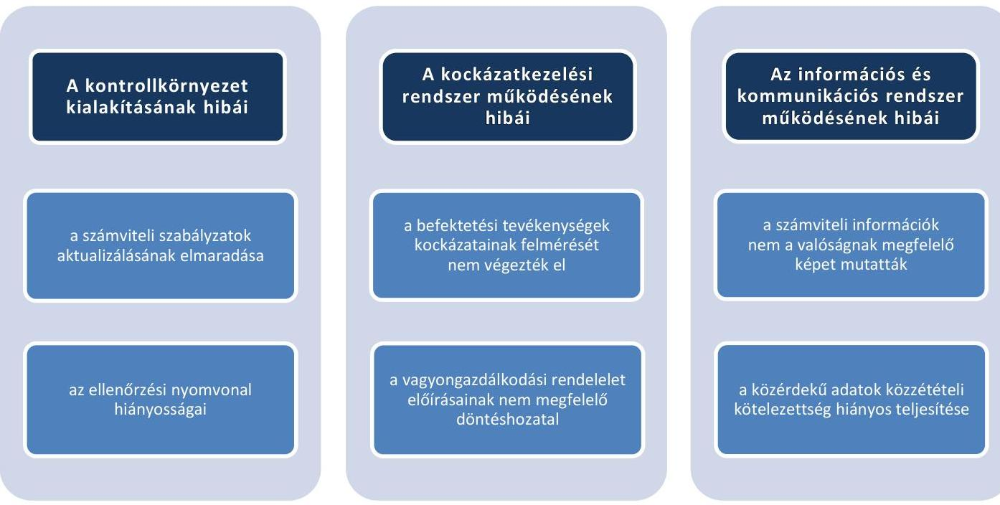

A kulcskontrollok múködtetése, valamint a monitoring rendszer (belső ellenőrzés) nem tárta fel a kockázatokat és a szabálytalanságokat.

A belső kontrollrendszer nem biztosította a szabályszerű, átlátható, elszámoltatható, a kockázatokat minimalizáló vagyongazdálkodást.

---

# 2. Az egyes befektetésekkel kapcsolatos döntéshozatal és a döntések végrehajtása szabályszerű volt-e? 

Összegző megállapítás

Az értékpapír-vásárlás és betétlekötés döntéshozatala és végrehajtása nem volt szabályszerű, mert nem felelt meg az önkormányzati szabályozásnak. A belső kontrollrendszer a befektetési tevékenység szabályszerű végzését nem támogatta.
2.1. számú megállapítás

Az Önkormányzat egyes befektetéseivel kapcsolatos döntés-előkészítés és döntéshozatal nem felelt meg a jogszabályi előírásoknak és a vagyongazdálkodási rendeletben foglaltaknak.

Az Önkormányzatnak a Quaestor Nyrt. ${ }^{49}$-nél 2014. június 30-án hat különböző államkötvényben 5048,8 millió Ft, 2015. április 30-án három különböző államkötvényben 1781,5 millió Ft befektetése volt, továbbá 9,4 millió Ft befektetési jeggyel ${ }^{50}$ rendelkezett 2014. június 30-án, melyet 2015. április 2-án értékesített.

Az Önkormányzat a Raiffeisen Bank Zrt.-nél 2015. április 30-án két rövid lejáratú betétlekötéssel ${ }^{51}$ rendelkezett 2 300,0 millió Ft értékben. 2014. június 30-án lekötött bankbetétje nem volt. Befektetési céllal ingatlanokat, kulturális javakat és értéktárgyakat az ellenőrzött időszakban nem szerzett be, azzal nem rendelkezett.

A Képviselő-testület a 2011-2015. évek költségvetési rendeleteiben előírta, hogy az átmenetileg szabad pénzeszközök államilag garantált értékpapír vásárlására és betét elhelyezésre fordíthatók.

Az egyes befektetések összhangban voltak a vagyongazdálkodási koncepcióval ${ }^{52}$. Az Önkormányzat befektetés stratégiáját a Status Capital Zrt. ${ }^{53}$ tanácsai segítségével alakította ki a mindenkori piaci helyzet függvényében.

Az egyes befektetésekre pályázati kötelezettséget nem írtak elő. A befektetéseket megelőzően a forgatási célú értékpapírok esetében az Önkormányzat a befektetési tanácsadótól, a betétlekötéseket megelőzően a Raiffeisen Bank Zrt.-től, mint számlavezető pénzintézetétől írásos ajánlatot kért.

## AZ ÉRTÉKPAPÍROKKAL ÉS A LEKÖTÖTT BETÉTEKKEL KAPCSOLATOS DÖNTÉSEK MEGHOZATALÁRA a vagyongazdálkodási rendelet ${ }_{1,2}$ alapján a Képviselő-testületnek, a Gazdasági Bizottságnak ${ }^{54}$, illetve a Gazdasági és Pénzügyi Ellenőrző Bizottság ${ }^{55}$-nak, valamint a polgármesternek volt felhatalmazása. A vagyongazdálkodási rendelet ${ }_{1,2}$ szerinti felhatalmazás megfelelt a jogszabály előírásainak, azonban a döntéshozatal során előírásait nem tartották be.

A jegyző a Mötv. 81. § (3) bekezdés e) pontjában foglaltak ellenére nem jelezte a Képviselő-testületnek és a polgármesternek, hogy az értékpapír adásvételekkel és a betétlekötésekkel kapcsolatos döntések nem feleltek meg a jogszabályokban és a vagyongazdálkodási rendeletekben előírtaknak.

A befektetésekkel kapcsolatos döntés-előkészítés és döntéshozatal során felmerült hiányosságokat a 6. táblázat tartalmazza.

---

6. táblázat

# AZ EGYES BEFEKTETÉSEKKEL KAPCSOLATOS DÖNTÉSEK ELŐKÉSZÍTÉSÉNEK HIÁNYOSSÁGA 

Sorszám Részmegállapítás

1. Az Önkormányzat nem tett eleget az Alaptörvény 38. cikk (4) bekezdésében foglaltaknak, mert nem átlátható szervezettel kötött szerződést.

Forrás: ÁSZ
2.2. számú megállapítás

Az egyes befektetésekkel kapcsolatos döntések végrehajtása nem felelt meg a vagyongazdálkodási rendelet előírásainak. A belső kontrollok nem tárták fel a döntéshozatal során történt szabálytalanságokat, a szabálytalanságok kezelésére nem tettek intézkedéseket.

## AZ ÉRTÉKPAPÍRSZÁMLA- ÉS ÜGYFÉLSZÁMLASZERZŐDÉSEK megfeleltek a jogszabályban előírtaknak. A Quaestor Nyrt.-vel és a Solar Capital Zrt.-vel kötött szerződésben a pénzügyi szolgáltató ügyfélszámlát, értékpapírszámlát és értékpapír-nyilvántartási számlát nyitott az Önkormányzat részére. A számlák feletti rendelkezési jogosultság biztosította, hogy az Önkormányzat a befektetéseivel kapcsolatos tevékenységek esetében megfelelő döntési, illetve cselekvési jogkörrel rendelkezett.

Az alpolgármester kötötte meg a Quaestor Nyrt. által a másodlagos állampapírpiacon forgalmazott értékpapírokra vonatkozó repó ügyletek keretében az adásvételi szerződéseket. A Képviselő-testület, a Gazdasági Bizottság, illetve a Gazdasági és Pénzügyi Ellenőrző Bizottság, valamint a polgármester a vagyongazdálkodási rendelet ${ }_{1-2}$ előírásai ellenére az értékpa-pír-befektetésekkel kapcsolatosan döntést nem hozott, ennek hiányában az alpolgármester az adásvételi szerződések aláírására nem volt jogosult.

A 2014. június 30-án és a 2015. április 30-án fennálló államkötvények adásvételéről szóló szerződések pénzügyi ellenjegyzésére az Áht. 2 37. § (1) bekezdésének és az Ávr. 55. § (1) bekezdésének előírásai ellenére nem szabályosan került sor, mivel nem győződtek meg arról, hogy a kötelezettségvállalás nem sérti-e az Önkormányzat gazdálkodásra vonatkozó egyes rendeleteinek előírásait, továbbá hiányzott a pénzügyi ellenjegyzés tényére történő utalás és a dátum.

Az Önkormányzat annak érdekében, hogy a Quaestor Nyrt. esetleges nem teljesítése esetén a tulajdonában lévő értékpapír-állomány feletti rendelkezés biztosítékaként a KELER Zrt. ${ }^{56}$-nél, az Önkormányzat nevére szóló nevesített értékpapír-alszámla megnyitását kezdeményezte, melyen a megvásárolt állampapír-állomány elhelyezésre került.

Az Önkormányzat 1997. december 9-én kötött bankszámlaszerződést a Raiffeisen Bank Zrt.-vel. A bankszámlaszerződés biztosította a számla feletti rendelkezési jogosultságot, az önkormányzat pénzeszközeivel kapcsolatos döntési, illetve cselekvési jogkört, továbbá lehetővé tette az átmenetileg szabad pénzeszközök látra szóló betétszámlán történő elhelyezését.

A rövid lejáratú betétlekötésekre megbízás alapján került sor. A 2015. április 30-án fennálló 2 300,0 millió Ft betétlekötés tételeiről az Áht2. 37. § (1) bekezdésében és az Ávr. 52. § (1) bekezdés c) pontjában előírtakat mellőzve a kötelezettségvállalás dokumentumát nem foglalták írásba.

---

A Képviselő-testület a polgármester részére nem írt elő beszámolási kötelezettséget az Önkormányzat értékpapír ügyleteiről, ezekről a zárszámadás keretében kapott tájékoztatást.

Az egyes befektetésekkel kapcsolatos döntések végrehajtásának hiányosságát a 7. táblázat tartalmazza.
7. táblázat

# AZ EGYES BEFEKTETÉSEKKEL KAPCSOLATOS DÖNTÉSEK VÉGREHAJTÁSÁNAK HIÁNYOSSÁGA 

## Sorszám

## Részmegállapítás

1. Az Áht. 37. § (1) bekezdésében és az Ávr. 52. § (1) bekezdés c) pontjában előírtakat megsértve a 2015. április 30-án meglévő betétlekötések esetében a kötelezettségvállalást nem foglalták írásba.
2. A 2014. június 30-án és a 2015. április 30-án fennálló államkötvények adásvételéről szóló szerződések pénzügyi ellenjegyzésére az Áht. 37. § (1) bekezdésének és az Ávr. 55. § (1) bekezdésének előírásai ellenére nem szabályosan került sor, mivel nem győződtek meg arról, hogy a kötelezettségvállalás nem sérti-e az Önkormányzat gazdálkodásra vonatkozó egyes rendeleteinek előírásait, továbbá hiányzott a pénzügyi ellenjegyzés tényére történő utalás és a dátum.

Forrás: ÁSZ

## 3. Az egyes befektetések számviteli elszámolása, nyilvántartása szabályszerű volt-e?

## Összegző megállapítás

3.1. számú megállapítás
8. táblázat

A BEFEKTETÉSEK ALAKULÁSA (MILLIÓ FT-BAN)

| megnevezés | 2011.   12.31. | 2014.   12.31. |
| :-- | :--: | :--: |
| önkormányzati   cégekben lévő   üzletrész |  |  |
| tartós, nem üzleti   célú részesedések | 34,0 | 32,6 |
| lekötött betét   forgatási célú   állampapír | 6460,0 | 700,0 |
|  | 0 | 2935,1 |

Forrás: Budapest Filváros IV. kerület Újpest Önkormányzata 2011. és a 2014. évi éves költségvetési beszámolái

A forgatási célú értékpapírok analitikus nyilvántartása, számviteli elszámolása nem volt szabályszerű. A szabálytalanságok miatt az éves költségvetési beszámolókban a vagyont nem a valóságnak megfelelően mutatták be.

A forgatási célú, hitelviszonyt megtestesítő értékpapírok analitikus nyilvántartása, és számviteli elszámolása nem felelt meg a jogszabályokban, illetve a belső szabályzatokban foglaltaknak.

## A BEFEKTETETT PÉNZÜGYI ESZKÖZÖK, A LEKÖTÖTT BETÉTEK ÉS A TARTÓS RÉSZESEDÉSEK SZÁMVITELI BESOROLÁSA megfelelA a jogszabályi előírásoknak és a belső szabályozásnak. A rövid lejáratú betéteket a pénzeszközök között mutatták ki.

Az Önkormányzat számviteli nyilvántartásaiban forgóeszközként, azon belül a forgatási célú hitelviszonyt megtestesítő értékpapírok között tartotta nyílván az állampapír és befektetési jegyek állományát, kivéve a 2012. évet, amikor a Számv. tv. 30. § (5) bekezdésében, az Áhsz. ${ }^{57}$; 22. § (4) bekezdésében és a számviteli politika ${ }_{1}$-ben foglaltak ellenére azokat a pénzeszközök mérlegsoron szerepeltették. A tartós részesedéseket a befektetett pénzügyi eszközök közé sorolták be.

A befektetések alakulását 2011. december 31-ei és a 2015. április 30-ai állapotokat összevetve a 8. táblázat mutatja be.

A BEKERÜLÉSI ÉRTÉK a tartós részesedések, befektetési jegyek, tőzsdei ügyletek ${ }^{58}$, továbbá a lekötött betétek esetében megfelelt a jogszabályi előírásoknak és a pénz- és értékelési szabályzatnak ${ }_{1,2}$ A lekö-

---

tött betétek bekerülési értékeként a befizetett, jóváírt forint összeget tartották nyilván. Az államkötvények bekerülési értéke azonban tartalmazta a vételárban/eladási árban felhalmozott kamatot is, megsértve a Számv. tv. 50. § (3) bekezdésének, az Áhsz.1 29. § (2) bekezdésének, az Áhsz. 2 1. § 7. pont és a 16. § (6) bekezdés előírásait, valamint az értékelési szabályzat ${ }_{2}$ ben foglaltakat. Az államkötvények adásvételekor, a megkötött összes adásvételi szerződés vonatkozásában, a bekerülési értékben szereplő felhalmozott kamat értéke a 2012. évben 12,2 millió Ft, a 2013. évben - 118,0 millió Ft, a 2014. évben 195,5 millió Ft és 2015. április 30-ig 7,9 millió Ft volt.

A TARTÓS PÉNZÜGYI BEFEKTETÉSEK esetében gondoskodtak a jogszabályokban előírt bizonylati elvről és bizonylati fegyelemről, mert biztosították a főkönyvi és analitikus nyilvántartás közötti egyeztetési és ellenőrzési lehetőséget, illetve a számviteli elszámolások logikailag zárt rendszerét. A tartós részesedések részletező nyilvántartása azonban 2014. január 1-től a Számv. tv. 161. § (2)-(3) bekezdésének, az Áhsz. 2 39. § (3) bekezdésének, 45. § (3) bekezdésének és a 14. számú melléklet VIII./2. pontjának előírásaival ellentétesen nem tartalmazta:
—_ a gazdasági társaság azonosításához szükséges adatokat,
—_ a részesedés keletkezésének módját, idejét,
—_ a részesedés megszerzésének célját, számviteli besorolását,
—_ a részesedés \%-os arányát, gazdasági társaság esetén annak minősítését,
—_ a kapott (járó) osztalék összegét,
—_ a követelések és a kötelezettségvállalások, más fizetési kötelezettségek nyilvántartásával való kapcsolatok leírását,
—_ gazdasági társaság esetén a társaság piaci megítélésének főbb mutatóit,
—_ a részesedés nemzeti vagyonról szóló törvény szerinti besorolását.
A tartós pénzügyi befektetésekhez kapcsolódó bevételek és kiadások számviteli elszámolása az Áhsz. 2-ben foglaltaknak megfelelően történt. A tartós részesedések után a 2011. január 1. és 2015. április 30. közötti időszakban összesen 39,7 millió Ft értékű osztalékban részesültek.

A FORGATÁSI CÉLÚ ÉRTÉKPAPÍROK részletező nyilvántartása az Áhsz. 2 39. § (3) bekezdésében és az Áhsz. 2 14. melléklet VIII. 1. pontjában foglaltak ellenére nem tartalmazta:
—_ az értékpapír beszerzésének módját, a forgalmazó adatait, az értékpapírszámla számát, megnevezését, a számlavezető nevét,
—_ az értékpapír beszerzésének célját, számviteli besorolását,
—_ az értékpapír kibocsátásának idejét, módját, névértékét, futamidejét, bekerülési érték megállapításának módját,
—_ az értékpapír beváltásának feltételeit, lejárati idejét, módját, a kamat fajtáját, mértékét, a kamatfizetések összegeit és időpontjait,
—_ az értékpapír bekerülési értékének változásait, a változás okait, jellegét, az azokat alátámasztó bizonylatok azonosításához szükséges adatokat,
—_ az értékpapír értékeléséhez szükséges adatokat,

---

$\longrightarrow$ a követelések és a kötelezettségvállalások, más fizetési kötelezettségek nyilvántartásával való kapcsolatok leírását,
$\longrightarrow$ az értékpapír nemzeti vagyonról szóló törvény szerinti besorolását,
$\longrightarrow$ a biztonságos őrzési hely, a letéti hely megnevezését, a letéti szerződés számát.
A betétlekötésről vezetett analitikus nyilvántartás tartalma megfelelő volt, biztosította a főkönyvvel való egyeztetés lehetőségét.

# A BEFEKTETÉSEKHEZ KAPCSOLÓDÓ KIADÁSOK 

ÉS BEVÉTELEK számvitelben való elszámolása a tartós részesdések, a befektetési jegyek és a tőzsdei ügyletek esetében megfelelt a jogszabályi előírásoknak.

Az állampapírok számviteli elszámolása során az alábbi hiányosságok fordultak elő:
$\longrightarrow$ a 2011-2013. évek között az államkötvény vásárlásához és értékesítéséhez kapcsolódó könyvelés során megsértették az Áhsz. 1 29. § (2) bekezdését, a 9. számú melléklet 2. d) pontját, amikor a vételár részét képező felhalmozott kamat értékét nem a kamatbevételek csökkenéseként számolták el, valamint az értékesítés során keletkező kamatbevételt és árfolyam-különbözetet nem mutatták ki.
$\longrightarrow$ a 2014. január 1. - 2015. április 30. közötti időszakban az államkötvény vásárlásához és értékesítéséhez kapcsolódó könyvelés során nem tartották be az Áhsz. 2 27. § (8) bekezdés c, d, e) pontjaiban foglaltakat, mivel az árfolyamveszteséget nem az egyéb pénzügyi műveletek kiadásai között mutatták ki.
$\longrightarrow$ a 2014. évi beszámoló készítésekor figyelmen kívül hagyták az Áhsz. 2 13. § (8) bekezdésében és 53. § (8) bekezdés f) pontjában foglaltakat, amikor az éves könyvviteli zárlat keretében a pénzügyi számvitelben nem végezték el a mérleg fordulónapon meglévő forgatási célú államkötvények után járó, a mérleg fordulónapja után esedékes, de a mérleggel lezárt időszakra elszámolandó kamatbevételek aktív időbeli elhatárolását.
A mérleg fordulónapon meglévő államkötvények bekerülési értékében 2013. december 31-én a felhalmozott kamat értéke 162,4 millió Ft veszteség volt. A felhalmozott kamat, az árfolyam-különbözet és az időbeli elhatárolások között el nem határolt kamatbevétel értéke 2014. december 31én 432,7 millió Ft veszteség volt, mely csökkenti az Önkormányzat saját tőkéjét. A 2014. évi hibahatás az Áhsz. 1. § 3. pontja alapján jelentős öszszegú.

A 2012. évben a forgatási célú értékpapírok értékesítését (beváltását), vásárlását a forgatás célú finanszírozási múveletek bevételei és kiadásai között nem mutatták ki, amely nem felelt meg az Áhsz. 1 9. melléklet 5. pontjában foglaltaknak. 2013. január 1. és 2015. április 30. között azonban a jogszabályi előírásoknak megfelelően számolták el.

Az Önkormányzat az ellenőrzött időszak beszámolóinak felülvizsgálatára könyvvizsgálót alkalmazott, aki az ellenőrzés során feltárt számviteli hiányosságokkal összefüggésben a könyvvizsgálói jelentésben észrevételt nem tett.

---

# A BETÉTELHELYEZÉSEK FINANSZÍROZÁSI KI- 

ADÁSAIT ÉS BEVÉTELEIT - az Áhsz. 15. mellékletének előírása ellenére - 2014. évben 5 370,0 millió Ft összegben a 2014. évi költségvetési beszámoló 03. Finanszírozási kiadások, 04. Finanszírozási bevételek űrlapjain nem mutatta ki. Az Áhsz. 2 40. § (1) bekezdésében foglaltak ellenére a pénzeszközök lekötött bankbetétként történő elhelyezésének rovatrend szerinti nyilvántartása (K916) 2014. évben elmaradt. Ez jelentős összegű hibának minősült - az Áhsz. 1. § (1) bekezdés 3. pontja alapján de hatása a költségvetési kiadásokra, bevételekre, eredményre, vagyonra, finanszírozási bevételek és kiadások különbözetére nem volt. A betétlekötések számviteli elszámolása 2015. január 1-jétől az Áhsz. 2 előírásainak megfelelt.

A lekötött betétek kamatbevételeit a 2014. évben az Áhsz. 15. melléklet I. fejezet B 408. előírásainak megfelelően a múködési bevételek között számolták el, melynek összege az ellenőrzött időszakban összesen 588,7 millió Ft volt.

Az egyes befektetések számviteli elszámolása során feltárt hiányosságokat a 9. táblázat tartalmazza.
9. táblázat

## AZ EGYES BEFEKTETÉSEK SZÁMVITELI ELSZÁMOLÁSÁNAK HIÁNYOSSÁGAI

## Sorszám

1. Az államkötvények bekerülési értéke tartalmazta a vételárban/eladási árban felhalmozott kamatot, megsértve a Számv. tv. 50. § (3) bekezdésének, az Áhsz. 1 29. § (2) bekezdésének, az Áhsz. 1. § 7. pont és a 16. § (6) bekezdés előírásait, valamint az értékelési szabályzatz-ban foglaltakat.
2. A tartós részesedések részletező nyilvántartása a Számv. tv. 161. § (2)-(3) bekezdéseinek, az Áhsz. 2 39. § (3) bekezdésének, 45. § (3) bekezdésének és a 14. számú melléklet VIII. 2. pontjának előírásaival ellentétesen nem tartalmazta az előírt kötelező elemeket.
3. Az értékpapírok részletező nyilvántartása az Áhsz. 2 39. § (3) bekezdésében és az Áhsz. 2 14. melléklet VIII. 1. pontjában foglaltak ellenére nem tartalmazta az értékpapír beszerzésének módját, a forgalmazó adatait, az értékpapírszámla számát, megnevezését, a számlavezető nevét, az értékpapír beszerzésének célját, számviteli besorolását, az értékpapír kibocsátásának idejét, módját, névértékét, futamidejét, bekerülési érték megállapításának módját,az értékpapír beváltásának feltételeit, lejárati idejét, módját, a kamat fajtáját, mértékét, a kamatfizetések összegeit és időpontjait,az értékpapír bekerülési értékének változásait, a változás okait, jellegét, az azokat alátámasztó bizonylatok azonosításához szükséges adatokat, az értékpapír értékeléséhez szükséges adatokat, a követelések és a kötelezettségvállalások, más fizetési kötelezettségek nyilvántartásával való kapcsolatok leírását,az értékpapír nemzeti vagyonról szóló törvény szerinti besorolását,a biztonságos őrzési hely, a letéti hely megnevezését, a letéti szerződés számát.
4. A 2014. január 1. - 2015. április 30. közötti időszakban az államkötvény vásárlásához és értékesítéséhez kapcsolódó könyvelés során nem tartották be az Áhsz. 2 27. § (8) bekezdés c, d, e) pontjában foglaltakat, mivel az árfolyamveszteséget nem az egyéb pénzügyi műveletek kiadásai között mutatták ki.
5. A 2014. évi beszámoló készítésekor figyelmen kívül hagyták az Áhsz. 2 13. § (8) bekezdésében és 53. § (8) bekezdés f) pontjában foglaltakat, mert az éves könyvviteli zárlat keretében a pénzügyi számvitelben nem végezték el a mérleg fordulónapon meglévő, leltárral alátámasztott forgatási célú államkötvények után járó kamatbevételek aktív időbeli elhatárolását.

---

# 3.2. számú megállapítás 

Az egyes befektetések év végi számviteli elszámolási feladatai (leltározás, értékelés) megfelelt a jogszabályi előírásoknak.

AZ ÉRTÉKPAPÍROK ÉS LEKÖTÖTT BETÉTEK LELTÁROZÁSÁT a Számv. tv.-ben, az Áhsz.1,2-ben, valamint az eszközök és források leltározási és leltárkészítési szabályzat ${ }_{1,2,3}$-ban előírtak szerint egyeztetéssel végezték el. A mérlegtételek leltárral való alátámasztása az Áhsz. 1 37. § (2) bekezdésében és az Áhsz. 2 22. § (1) bekezdésében foglaltaknak megfelelt, a tartós részesedések leltárát a Raiffeisen Bank Zrt.-től, a forgatási célú hitelviszonyt megtestesítő értékpapírok leltárát a Quaestor Nyrt.-től és a Solar Capital Zrt.-től kapott december 31-i értékpapírszámlakivonattal támasztották alá.

## AZ ÉRTÉKPAPÍROK ÉV VÉGI ÉRTÉKELÉSÉT MEGFELELŐEN VÉGEZTÉK, a 2011-2014. évben a hitelviszonyt

megtestesítő értékpapírok értékvesztésének elszámolásához szükséges feltételek nem álltak fenn, mert az értékpapírok könyv szerinti értéke és piaci értéke között nem volt veszteség jellegű különbözet.

A tartós részesedések és befektetési jegyek esetében az Önkormányzat 2011. január 1. - 2014. november 30. között értékhelyesbítést számolt el annak ellenére, hogy a jegyző az értékhelyesbítés módszerének alkalmazását a számviteli politika ${ }_{1,2}$-ban nem írta elő. 2014. december 1-jétől módosították a számviteli politika ${ }_{2}$-t, miszerint a piaci értékelés módszerét alkalmazzák. A 2011. évben 675,0 millió Ft-ot, a 2012. évben 26,5 millió Ftot, a 2013. évben -12,0 millió Ft-ot, a 2014. évben -16,1 millió Ft-ot számoltak el értékhelyesbítésként. Az értékhelyesbítés dokumentálása megfelelő volt, elszámolásának alapját a tartós részesedéseknél a Raiffeisen Bank Zrt., míg a befektetési jegyeknél a Solár Capital Zrt. ${ }^{59}$ által mérleg fordulónapra kiadott árfolyamigazolás szolgáltatta. Az értékhelyesbítés főkönyvi könyvelése a Számv. tv. és az Áhsz. 2 előírásainak megfelelően történt.

---

# 4. Az erőforrásokkal való szabályszerű és hatékony gazdálkodáshoz szükséges követelmények érvényesítése, számonkérése, ellenőrzése megtörtént-e az önkormányzatnál? 

Összegző megállapítás

Az erőforrásokkal való szabályszerű és hatékony gazdálkodáshoz szükséges követelmények érvényesítése, számonkérése, ellenőrzése megfelelő volt az Önkormányzatnál.
4.1. számú megállapítás

Az erőforrásokkal való szabályszerű gazdálkodás követelményeit az elszámoltathatóság érdekében meghatározták.

AZ ERÖFORRÁSOKKAL VALÓ GAZDÁLKODÁS szabályai közül a következőket határozták meg:

- az önkormányzati intézmények rendelkeztek szabályosan jóváhagyott alapító okirat ${ }^{60}$-tal, illetve szervezeti és múködési szabályzattal. Az ellenőrzött időszakokban az Önkormányzat intézményeinek vezetöit és a Hivatal gazdasági szervezetének vezetőit a jogszabályi előírásoknak megfelelően nevezték ki;
- a gazdasági program ${ }_{1,2}$ tartalmazta az egyes közszolgáltatások biztosítására, színvonalának javítására vonatkozó fejlesztési elképzeléseket. Az Önkormányzat szociális szolgáltatástervezési koncepcióval ${ }^{61}$ és környezetvédelmi program ${ }^{62}$-mal rendelkezett;
- a Képviselő-testület elfogadta az Önkormányzat közép- és hosszú távra szóló vagyongazdálkodási koncepcióját, mely összhangban állt az egyéb programokban rögzítettekkel;
- a 2014. és 2015. évi költségvetések előterjesztésekor a Képviselőtestületnek bemutatták az Önkormányzat előirányzat-felhasználási tervét.
Az Önkormányzat intézményei részére a Képviselő-testület a 2014. és 2015. évi munkatervében beszámolási kötelezettséget írt elő, melyet az intézmények teljesítettek.
Az erőforrásokkal való hatékony gazdálkodáshoz írtak elő követelményeket, azok számonkérése és ellenőrzése megtörtént.

AZ ERÖFORRÁSOKKAL VALÓ HATÉKONY GAZDÁLKODÁS KÖVETELMÉNYEINEK MEGHATÁROZÁSA, SZÁMONKÉRÉSE ÉS ELLENŐRZÉSE az Önkormányzat fenntartásában lévő költségvetési szervek esetében a következőképpen valósult meg:

- Az Önkormányzatnál és a Hivatalnál hatékonysági, gazdaságossági, eredményességi követelményeket határoztak meg, melyek teljesítéséről, illetve betartásáról ügyfélpanaszok felmérésével, ügyintézés felmérésével, ügyfél-elégedettség mérésével, ügyirathátralék kimutatással, illetve a minőségirányítási rendszer keretében elvégzett belső audittal és annak eredményeként kiadott tanúsítvánnyal tettek eleget.

---

- A Képviselő-testület határozataiban a Hivatal köztisztviselői részére a 2014. és a 2015. évekre teljesítménykövetelményeken alapuló célokat határozott meg. A célok megvalósításáról az éves zárszámadás keretében számoltak be, valamint a köztisztviselőket az egyéni teljesítményértékelések során minősítették.
- A polgármester és a jegyző által közösen kiadott Integrált Minőségirányítási Kézikönyv1,2-ben rögzítették a Hivatal minden múködési folyamatára kiterjedő egységes minőségirányítási követelményeket.
- A hivatali SZMSZ-ben, a teljesítménykövetelményekben, a minőségbiztosítási rendszerben meghatározott hatékonyság, eredményesség, gazdaságossági célokat a belső szabályozásokban, teljesítményértékelésekben, a vezetői áttekintő üléseken, hivatali ügyintézések során alkalmazták. Az előírt hatékonysági, gazdaságossági, eredményességi követelmények érvényesüléséről képzési beszámolók, intézményi beszámolók, ügyfél elégedettségi beszámolók, ügyirat-hátralék kimutatások, vezetői üléseken történt beszámoltatások, teljesítményértékelések készültek.

# A BELSŐ ELLENŐRZÉS KERETÉBEN 

- értékelték a belső kontrollrendszerek kiépítése, múködtetése jogszabályoknak és a belső szabályzatoknak való megfelelését, valamint a Hivatal múködésének gazdaságosságát, hatékonyságát és eredményességét.
- ellenőrizték a vagyonhasznosítás keretében az önkormányzati fenntartású óvodák kihasználtságának hatékonyságát, a telefonhasználat hatékonyságát, a pénzgazdálkodási jogkörök gyakorlásának megfelelőségét, az adóbehajtás hatékonyságát, eredményességét.
A Gazdasági és Pénzügyi Ellenőrző Bizottság az Áht. 2-ben előírtaknak megfelelően véleményezte a 2014. és 2015. évi költségvetési javaslatot és figyelemmel kísérte a költségvetés végrehajtásáról szóló féléves és éves beszámoló-tervezeteket.

## 5. Az önkormányzat belső kontrollrendszerének kialakítása és múködtetése támogatta-e az integritás szemlélet érvényesülését?

Összegző megállapítás Az Önkormányzat belső kontrollrendszerének kialakítása és múködtetése támogatta az integritás szemlélet érvényesítését.

Az ellenőrzés részletes megállapításait a jelentéstervezet II. számú - „Az Integritás érvényesítése érdekében kialakított és múködtetett kontrollrendszer" című - melléklete tartalmazza.

---

# JAVASLATOK 

Az ÁSZ tv. 33. § (1) bekezdésében foglaltak értelmében az ellenőrzött szervezet vezetője köteles a jelentésben foglalt megállapításokhoz kapcsolódó intézkedési tervet összeállítani és azt a jelentés kézhezvételétől számított 30 napon belül az ÁSZ részére megküldeni. Amennyiben az ellenőrzött szervezet vezetője nem küldi meg határidőben az intézkedési tervet, vagy továbbra sem elfogadható intézkedési tervet küld, az Állami Számvevőszék elnöke az ÁSZ tv. 33. § (3) bekezdése a) és b) pontjaiban foglaltakat érvényesítheti.

## a polgármesternek:

1. Intézkedjen a nem önkormányzati képviselő bizottsági tagok vagyonnyilatkozat-tételi kötelezettségét is tartalmazó önkormányzati SZMSZtervezet Képviselő-testület elé terjesztéséről.
(3. táblázat 2. sora alapján)
2. Intézkedjen az Állami Számvevőszék ellenőrzése során feltárt hiányosságok és/vagy szabálytalanságok tekintetében a munkajogi felelősség kivizsgálására irányuló eljárás megindításáról, és ennek eredménye ismeretében tegye meg a szükséges intézkedéseket.
(2. táblázat 1-3. sorai, a 3. táblázat 1. sora alapján)

## a jegyzőnek:

1. Intézkedjen a belső kontrollrendszer egyes elemei jogszabályi előírásoknak megfelelő kialakítására és müködtetésére, valamint a befektetésekkel kapcsolatos döntések előkészítése és végrehajtása, illetve a gazdálkodási jogkörök gyakorlása során a jogszabályi előírások és a belső szabályozás betartására.
(2. táblázat 1-3. sorai, a 3. táblázat 1. sora; a 4. táblázat 1-3. sorai; az 5. táblázat 1-2. sorai; a 7. táblázat 1-2. sorai alapján)
2. Intézkedjen a nem önkormányzati képviselő bizottsági tagok vagyonnyilatkozat-tételi kötelezettségét tartalmazó önkormányzati SZMSZtervezet elkészítéséről.
(3. táblázat 2. sora alapján)

---

3. Intézkedjen a befektetésekkel kapcsolatos gazdasági események jogszabályi előírásoknak megfelelő rögzítéséről és elszámolásáról a számviteli (főkönyvi és részletező) nyilvántartásokban.
(9. táblázat 1-5.sorai alapján)
4. Intézkedjen az Állami Számvevőszék ellenőrzése során feltárt hiányosságok és/vagy szabálytalanságok tekintetében a munkajogi felelősség tisztázására irányuló eljárás megindításáról, és ennek eredménye ismeretében tegye meg a szükséges intézkedéseket.
(4. táblázat 1-3. sorai, 7. táblázat 2. sora, 9. táblázat 1- 5. sorai alapján)

---

# MELLÉKLETEK 

- I. SZ. MELLÉKLET: ÉRTELMEZŐ SZÓTÁR
állampapír
ÁSZ Integritás Projekt
befektetési szolgáltatási tevékenység
befektetési vállalkozás
belső ellenőrzés
belső kontrollrendszer
belső kontrollrendszer pillérei, kontrollterületei
betét
a magyar vagy külföldi állam, az MNB, az Európai Központi Bank vagy az Európai Unió más tagállamának jegybankja által kibocsátott, hitelviszonyt megtestesítő értékpapír (Tpt. 5. § (1) bekezdés 6. pont).
Az Állami Számvevőszék 2009-ben indította el a „Korrupciós kockázatok feltérképezése - Integritás alapú közigazgatási kultúra terjesztése" című, európai uniós forrásból megvalósított kiemelt projektjét (Integritás Projekt). Az Integritás Projekt célja, hogy felmérje a közszféra intézményei korrupciós kockázatoknak való kitettségét, illetőleg az azok mérséklésére hivatott kontrollok szintjét. Az Állami Számvevőszék a projekt révén az integritás szemlélet minél szélesebb körrel történő megismertetését, gyakorlatba ültetését kívánja elérni. Az integritás követelményeinek megfelelő szervezeti működést előnyben részesítő közigazgatási kultúra elterjesztését és a korrupció elleni fellépést az ÁSZ önmagára nézve is stratégiai jelentőségű célként fogalmazta meg. A projekt a felmérésben résztvevő intézmények számára helyzetükről egyfajta „tükörképet" mutat be, ami alapot teremt a jövőbeni pozitív irányú elmozduláshoz.
(Forrás: a http://integritas.asz.hu honlapon közzétett, a 2013. évi Integritás felmérés eredményeiről készült összefoglaló tanulmány)
rendszeres gazdasági tevékenység keretében, pénzügyi eszközre vonatkozóan végzett megbízás felvétele és továbbítása, megbízás végrehajtása az ügyfél javára, sajátszámlás kereskedés, portfólió-kezelés, befektetési tanácsadás, pénzügyi eszköz elhelyezése az eszköz (értékpapír vagy egyéb pénzügyi eszköz) vételére vonatkozó kötelezettségvállalással (jegyzési garanciavállalás), pénzügyi eszköz elhelyezése az eszköz (pénzügyi eszköz) vételére vonatkozó kötelezettségvállalás nélkül, és multilaterális kereskedési rendszer működtetése (Bszt. 5. § (1) bekezdés)
a Bszt. szerinti, tevékenység végzésére jogosító engedély alapján, harmadik személy részére, ellenérték fejében, rendszeres gazdasági tevékenysége keretében befektetési szolgáltatást nyújt vagy befektetési tevékenységet végez, ide nem értve a 3. §-ban meghatározottakat (Bszt. 4. § (2) bekezdés 10. pont)
Független, tárgyilagos bizonyosságot adó és tanácsadó tevékenység, amelynek célja, hogy az ellenőrzött szervezet müködését fejlessze és eredményességét növelje, az ellenőrzött szervezet céljai elérése érdekében rendszerszemléletű megközelítéssel és módszeresen értékeli, illetve fejleszti az ellenőrzött szervezet irányítási és belső kontrollrendszerének hatékonyságát. (Bkr. 2. § b) pontja)
A belső kontrollrendszer a kockázatok kezelése és tárgyilagos bizonyosság megszerzése érdekében kialakított folyamatrendszer, amely azt a célt szolgálja, hogy a müködés és gazdálkodás során a tevékenységeket szabályszerűen, gazdaságosan, hatékonyan, eredményesen hajtsák végre, az elszámolási kötelezettségeket teljesítsék, megvédjék az erőforrásokat a veszteségektől, károktól és nem rendeltetésszerű használattól. (Áht. 2 69. § (1) bekezdése)
A kontrollkörnyezet, a kockázatkezelési rendszer, a kontrolltevékenységek, az információs és kommunikációs rendszer, valamint a nyomon követési (monitoring) rendszer. (Bkr. 3. §-a)
a Ptk. szerinti betétszerződés vagy a takarékbetétről szóló 1989. évi 2. törvényerejű rendelet szerinti takarékbetét-szerződés alapján fennálló tartozás, ideértve a hitelintézetnél a fizetésiszámla-szerződés alapján fennálló pozitív számlaegyenleget is (Hpt. 6. § (1) bekezdés 8. pont).

---

betétszerződés
dematerializált értékpapír
diszkont értékpapír
értékpapírszámla
finanszírozási kiadások és bevételek
fizetésiszámla-szerződés
forgatási célú értékpapír
hitelviszonyt megtestesítő értékpapír
információs és kommunikációs rendszer
integritás
irányító szerv és annak vezetője
betétszerződés alapján a betétes jogosult a bank számára meghatározott pénzösszeget fizetni, a bank köteles a betétes által felajánlott pénzösszeget elfogadni, ugyanakkora pénzösszeget későbbi időpontban visszafizetni, valamint kamatot fizetni (Ptk. 6:390. § (1) bekezdés);
a Tpt.-ben és külön jogszabályban meghatározott módon, elektronikus úton létrehozott, rögzített, továbbított és nyilvántartott, az értékpapír tartalmi kellékeit azonosítható módon tartalmazó adatösszesség (Tpt. 5. § (1) bekezdés 29. pont)
olyan hitelviszonyt megtestesítő, nem kamatozó értékpapír, amelyet névérték alatt bocsátottak ki, és a lejáratkor névértéken váltanak be (Számv. tv. 3. § (6) bekezdés 4. pont)
a dematerializált értékpapírról és a hozzá kapcsolódó jogokról az értékpapír-tulajdonos javára vezetett nyilvántartás (Tpt. 5. § (1) bekezdés 46. pont)
a Magyarország gazdasági stabilitásáról szóló 2011. évi CXCIV. törvény 3. § (1) bekezdés a)-e) pontja szerinti ügyletből származó bevételek és kiadások, továbbá a hitelviszonyt megtestesítő értékpapírok vásárlásából, értékesítéséből, beváltásából származó bevételek és kiadások, a szabad pénzeszközök betétként való elhelyezése és visszavonása, az államháztartás önkormányzati alrendszerében irányító szervi támogatásként folyósított támogatás kiutalása és fizetési számlán történő jóváírása, finanszírozási bevétel a költségvetési maradvány, vállalkozási maradvány. (Áht. 2 6. § (7) bekezdés a) pont)
olyan szerződés, amely alapján a számlavezető a számlatulajdonos számára, pénzforgalmának lebonyolítása érdekében folyószámla nyitására és vezetésére, a számlatulajdonos díj fizetésére köteles (Ptk. 6:394. § (1) bekezdés)
azok az értékpapírok, amelyeket forgatási célból, kamatbevétel, illetve árfolyamnyereség elérése érdekében szereztek be, továbbá azokat, amelyek a tárgyévet követő üzleti évben lejárnak (Számv. tv. 30. § (5) bekezdés)
minden olyan értékpapír, illetve törvény által értékpapírnak minősített, jogot megtestesítő okirat, amelyben a kibocsátó (adós) meghatározott pénzösszeg rendelkezésére bocsátását elismerve arra kötelezi magát, hogy a pénz (kölcsön) összegét, valamint annak meghatározott módon számított kamatát vagy egyéb hozamát, és az általa esetleg vállalt egyéb szolgáltatásokat az értékpapír birtokosának (a hitelezőnek) a megjelölt időben és módon megfizeti, illetve teljesíti. Ide tartozik különösen: a kötvény, a kincstárjegy, a letéti jegy, a pénztárjegy, a célrészjegy, a takaréklevél, a jelzáloglevél, a hajóraklevél, a közraktárjegy, az árujegy, a zálogjegy, a kárpótlási jegy, a határozott idejű befektetési alap által kibocsátott befektetési jegy (Számv. tv. 3. § (6) bekezdés 2. pont)
A költségvetési szerv vezetője által kialakított és működtetett olyan rendszer, mely biztosítja, hogy a megfelelő információk a megfelelő időben eljutnak az illetékes szervezethez, szervezeti egységhez, illetve személyhez. (Bkr. 9. § (1) bekezdés)
Az integritás elvek, értékek, cselekvések, módszerek, intézkedések konzisztenciáját jelenti: olyan magatartásmódot, amely meghatározott értékeknek felel meg. Az integritás a közszféra esetében a társadalom által elvárt nyilvánossági, átláthatósági, illetve jogi/etikai normáknak történő megfelelést jelenti.
(Forrás: a http://integritas.asz.hu honlapon közzétett „A 2012. évi integritás felmérés eredményeinek összefoglalója" című dokumentum 3. oldal 1. bekezdése)
A közös önkormányzati hivatal kivételével a helyi önkormányzat által irányított költségvetési szerv esetén a képviselő-testület, közgyűlés és a polgármester, főpolgármester, megyei közgyűlés elnöke. A közös önkormányzati hivatal esetén a közös önkormányzati hivatal székhelye szerinti helyi önkormányzat képviselő-testülete és annak polgármestere. (Áht. 2. § (1) bekezdés i), ia) és ib) pontja)

---

kamat az adós által a kölcsönnyújtónak (betételhelyezőnek) az elfogadott betét vagy az igénybe vett kölcsön használatáért, kockázatáért fizetendő, a betét- vagy kölcsönöszszeg százalékában meghatározott, időarányosan térítendő (elszámolandó) pénzösszeg vagy egyéb hozadék (Hpt. 6. § (1) bekezdés 52. pont)
kockázat A kockázat annak a valószínűségét jelenti, hogy egy vagy több esemény vagy intézkedés nem kívánt módon befolyásolja a rendszer múködését, céljainak megvalósulását. (Forrás: Javaslatok a korrupciós kockázatok kezelésére - Kockázatkezelési és ellenőrzési módszertan 35. oldal, ÁSZ)
kockázatkezelési rendszer Olyan irányítási eszközök és módszerek összessége, melynek elemei a szervezeti célok elérését veszélyeztető tényezők (kockázatok) azonosítása, elemzése, csoportosítása, nyomon követése, valamint szükség esetén a kockázati kitettség mérséklése. (Bkr. 2. § m) pontja)
kontrollkörnyezet A költségvetési szerv vezetője által kialakított olyan elvek, eljárások, belső szabályzatok összessége, amelyben világos a szervezeti struktúra, egyértelműek a felelősségi, hatásköri viszonyok és feladatok, meghatározottak az etikai elvárások a szervezet minden szintjén, átlátható a humánerőforrás-kezelés. (Bkr. 6. § (1) bekezdés)
kontrolltevékenységek A költségvetési szerv vezetője által a szervezeten belül kialakított (kontroll) tevékenységek, melyek biztosítják a kockázatok kezelését, hozzájárulnak a szervezet céljainak eléréséhez. (Bkr. 8. § (1) bekezdés)
korrupció Azok a cselekmények, amelyek során a köz érdekében való eljárással megbízott és döntéshozatali felelősséggel felruházott személy a köz érdeke helyett önös vagy részérdekeket követve, mástól jogtalan vagy etikátlan előnyt elfogadva és őt jogtalan vagy etikátlan előnyhöz juttatva jár el, illetve amikor valaki a köz érdekében való eljárással megbízott és döntéshozatali felelősséggel felruházott személynek jogtalan vagy etikátlan előnyt nyújtva vagy felajánlva jogtalan vagy etikátlan előnyt kér. (Forrás: A Kormány korrupció megelőzési programja 2012-2014.)
kötvény névre szóló, hitelviszonyt megtestesítő értékpapír, amely lejárat nélküli vagy - jogszabály által megszabott keretek között - lejárattal rendelkezik. A kötvényben a kibocsátó (az adós) arra kötelezi magát, hogy az ott megjelölt pénzösszegnek az előre meghatározott kamatát vagy egyéb jutalékait, valamint az általa vállalt esetleges egyéb szolgáltatásokat (a továbbiakban együtt: kamat), továbbá a pénzösszeget a kötvény mindenkori tulajdonosának, illetve jogosultjának (a hitelezőnek) a megjelölt időben és módon megfizeti és teljesíti (Tpt. 12/B. § (1) bekezdés)
megbízás végrehajtása az
pénzügyi eszköz vételére vagy eladására vonatkozó megállapodás megkötésére irányuló tevékenység végzése az ügyfél javára (Bszt. 4. § (2) bekezdés 46. pont)
ing
pénzügyi eszköz
A monitoring a különböző szintű szervezeti célok megvalósításának folyamatát kíséri figyelemmel, melynek során a releváns eseményekről és tevékenységekről (együtt: folyamatokról) rendszeres jelleggel, strukturált, döntéstámogató információkhoz jutnak a szervezet vezetői. (Forrás: NGM útmutató a költségvetési szervek monitoring rendszeréhez 3. oldal, 2011. november)
az átruházható értékpapír, a kollektív befektetési forma által kibocsátott értékpapír, az értékpapírhoz, devizához, kamatlábhoz vagy hozamhoz kapcsolódó opció, határidős ügylet, csereügylet, határidős kamatláb-megállapodás, valamint bármely más származtatott ügylet, eszköz, pénzügyi index vagy intézkedés, amely fizikai leszállítással teljesíthető vagy pénzben kiegyenlíthető; az áruhoz kapcsolódó opció, határidős ügylet, csereügylet, határidős kamatláb-megállapodás, valamint bármely más származtatott ügylet, eszköz, amelyet pénzben kell kiegyenlíteni vagy az ügyletben résztvevő felek valamelyikének választása szerint pénzben kiegyenlíthető, ide nem értve a teljesítési határidő lejártát vagy más megszúnési okot stb. (Bszt. 6. §)

---

portfólió
részvény
tartós hitelviszonyt megtestesítő értékpapír
ügyfélszámla
vagyongazdálkodás
a portfólió-kezelési tevékenységet végző számára átadott eszközök, illetőleg ezen eszközökből a portfólió-kezelési tevékenységet végző által összeállított, többféle vagyonelemet tartalmazó eszközök összessége (Tpt. 5. § (1) bekezdés 105. pont)
a kibocsátó részvénytársaságban gyakorolható tagsági jogokat megtestesítő, névre szóló, névértékkel rendelkező, forgalomképes értékpapír (Ptk. 3:213. § (1) bekezdés)
tartós hitelviszonyt megtestesítő értékpapírként azokat a befektetési céllal beszerzett értékpapírokat kell kimutatni, amelyek lejárata, beváltása a tárgyévet követő üzleti évben még nem esedékes, és a vállalkozó azokat a tárgyévet követő üzleti évben nem szándékozik értékesíteni (Számv. tv. 27. § (7) bekezdés)
az ügyfél pénzeszközeinek nyilvántartására szolgáló, befektetési vállalkozás, hitelintézet, árutőzsdei szolgáltató, befektetési alapkezelő által vezetett számla (Tpt. 5. § (1) bekezdés 130. pont)
a nemzeti vagyongazdálkodás feladata a nemzeti vagyon rendeltetésének megfelelő, az állam, az önkormányzat mindenkori teherbíró képességéhez igazodó, elsődlegesen a közfeladatok ellátásához és a mindenkori társadalmi szükségletek kielégítéséhez szükséges, egységes elveken alapuló, átlátható, hatékony és költségtakarékos múködtetése, értékének megőrzése, állagának védelme, értéknövelő használata, hasznosítása, gyarapítása, továbbá az állam vagy a helyi önkormányzat feladatának ellátása szempontjából feleslegessé váló vagyontárgyak elidegenítése (Nvtv. 7. § (2) bekezdése)

---

# II. SZ. MELLÉKLET: AZ INTEGRITÁS ÉRVÉNYESÍTÉSE ÉRDEKÉBEN KIALAKÍTOTT ÉS MŰKÖDTETETT KONTROLLRENDSZER 

Az Önkormányzat az ÁSZ integritás felmérésében a 2014. évben nem vett részt. Az integritás szemlélet érvényesülésének értékelése az Önkormányzat által kitöltött tanúsítvány alapján történt, amely alapján három indexérték meghatározására került sor. Ezek a következők:

Az Eredendő Veszélyeztetettségi Tényezők (EVT) index a szervezetek jogállásától és feladatköreitől függő - eredendő - veszélyeztetettség összetevőit teszi mérhetővé. Olyan tényezők határozzák meg, amelyek alakítása az alapító szerv jogalkotási hatáskörébe tartozik, így például a hatósági jogalkalmazás, a (jogi) szabályozás, vagy a különféle (oktatási, egészségügyi, szociális és kulturális) közszolgáltatások nyújtása.
A Korrupciós Veszélyeket Növelő Tényezők (KVNT) index az egyes intézmények napi működésétől függő - az eredendő veszélyeztetettséget növelő - összetevőket jeleníti meg. Leképezi a költségvetési szervek jogi/intézményi környezetének jellemzőit, működésük kiszámíthatóságát, stabilitását, továbbá az intézmények működtetése során jelentkező - alapvetően a mindenkori menedzsment döntéseitől befolyásolt - olyan változó tényezőket, mint a stratégiai célok meghatározása, a szervezeti struktúra és kultúra alakítása, valamint a személyi és költségvetési erőforrásokkal, illetve a közbeszerzésekkel való gazdálkodás.
A Kockázatokat Mérséklő Kontrollok Tényezője (KMKT) index azt tükrözi, hogy az adott szervezetnél léteznek-e intézményesült kontrollok, illetőleg, hogy ezek ténylegesen működnek-e, betöltik-e rendeltetésüket. Ehhez az indexhez olyan faktorok tartoznak, mint a szervezet belső szabályozása, a belső ellenőrzés, valamint az egyéb integritás kontrollok: etikai követelmények meghatározása, összeférhetetlenségi helyzetek kezelése, a bejelentések, panaszok kezelése, rendszeres kockázatelemzés.
Az egyes indexértékek szintjének (alacsony, közepes, magas) meghatározásához viszonyítási pontként a 2014. évi Integritás felmérésben válaszadó helyi önkormányzatokra számított indexértékek számtani átlaga szolgált.
A tanúsítványon szolgáltatott adatok alapján az ellenőrzött szervezetre kiszámolt indexértékek, illetve a 2014. évi Integritás felmérésben a helyi önkormányzatokra kalkulált átlagos mutatószámok összevetése alapján megállapítható, hogy az Önkormányzatnál:

- az eredendő veszélyeztetettségi (EVT) szintje magas,
- a kockázatokat növelő tényező (KVNT) szintje magas, illetve
- a szervezetnél kiépült, kockázatok kezelésére hivatott kontrollok (KMKT) szintje magas.

Az ellenőrzött szervezet indexértékeit, illetve azok szintjét a 2014. évi Integritás felmérésben adatszolgáltató helyi önkormányzatokra számolt átlagos mutatószámainak tükrében az alábbi táblázat szemlélteti.

| Index neve | A 2014. évi Integritás felmérésben válaszadó helyi önkormányzatok átlagos indexértékei | Budapest Főváros IV. kerület Újpest Önkormányzata által kitöltött tanúsítvány alapján számított indexértékek | Budapest Főváros IV. kerület Újpest Önkormányzata indexértékeinek szintje (alacsony, közepes, magas) |
| :--: | :--: | :--: | :--: |
| Eredendő Veszélyeztetettségi Tényezők (EVT) | $53,76 \%$ | $77,86 \%$ | MAGAS |
| Korrupciós Veszélyeket Növelő Tényezők (KVNT) | $25,62 \%$ | $45,95 \%$ | MAGAS |
| Kockázatokat Mérséklő Kontrollok Tényező (KMKT) | $61,15 \%$ | $73,66 \%$ | MAGAS |

---

Az Önkormányzat indexértékei szintjének meghatározását követően külön-külön összevetettük az eredendő veszélyeztetettségi, illetve a korrupciós veszélyeztetettséget növelő tényezők szintjét a kockázatok mérséklő kontrollok szintjével. Megállapítottuk, hogy a szervezetnél jelenlévő korrupciós kockázatok, valamint az azok kezelésére kiépült kontrollok szintje között egyensúly van. Így a kiépült kontrollok kiválóan képesek kezelni a kockázatokat, valamint hatékonyan támogatni a szervezet feladatellátását. A mutatószámok összevetésének eredményét a következő táblázat szemlélteti.

| Összevetett   mutatószámok | A kockázati tényezők és a kiépült kontrollok szintjének együttes értékelése   (fejlesztendő, megfelelő, kiváló) |
| :-- | :-- |
| EVT - KMKT | KIVÁLÓ |
| KVNT - KMKT | KIVÁLÓ |

---

# FÜGGELÉK: ÉSZREVÉTELEK 

A jelentéstervezetet a Számvevőszék 15 napos észrevételezésre megküldte az ellenőrzött szervezet vezetőjének az ÁSZ tv. 29. §* (1) bekezdése előírásának megfelelően.
Az elfogadott észrevételek alapján a Számvevőszék módosította a jelentést.

A függelék tartalmazza az ellenőrzött észrevételeit, illetve az el nem fogadott észrevételek elutasításának indoklását.

[^0]
[^0]:    * 29. § (1) Az Állami Számvevőszék az ellenőrzési megállapításait megküldi az ellenőrzött szervezet vezetőjének vagy az általa megbízott személynek, és annak, akinek személyes felelősségét állapította meg.
    (2) Az ellenőrzött szervezet vezetője és a felelősként megjelölt személy az ellenőrzés megállapításaira tizenöt napon belül írásban észrevételt tehet.
    (3) Az Állami Számvevőszék az észrevételre a beérkezésétől számított harminc napon belül írásban válaszol. A figyelembe nem vett észrevételeket köteles a jelentésben feltüntetni, és megindokolni, hogy azokat miért nem fogadta el.

---

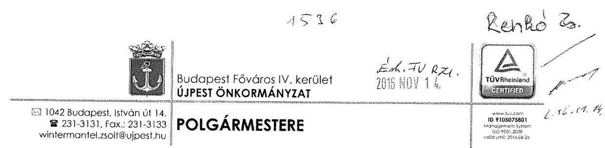

# Állami Számvevőszék 

## Domokos László

elnök részére

## Budapest 4.

Pf.: 54
1364

## Tisztelt Elnök Úr!

Hivatkozással az Állami Számvevőszék V-0988-125/2016. iktatószámú jelentéstervezetére, az abban foglaltakra jelzett pontonként, megállapításonként az alábbi észrevételeket teszem:
2. táblázat 1. pont: „A köztisztviselőkre vonatkozó hivatásetikai alapelvek részletes tartalmát, valamint az etikai eljárás szabályait a Kttv. 231. § (1) bekezdésében foglaltak ellenére nem a Képviselő-testület állapította meg."

A Polgármesteri Hivatal Etikai Kódexe 31/27/2008. számú jegyzői utasítással 2008. évben került kiadásra. A hivatkozott jogszabály 2012. március 1-én lépett hatályba, ezt követően a szabályzatról a Képviselő-testület nem szavazott, az változatlan tartalommal hatályban maradt. E hiányosságra az ÁSZ 2014 novemberében kelt, 14217 számú jelentésében felhívta a figyelmet és a 12. oldal 8. pontjában javaslatot tett ennek korrigálására. Az ennek alapján készített, és az ÁSZ elnökének megküldött intézkedési tervnek és az abban foglalt határidőnek megfelelően a Képviselő-testület a 7/2015. (I.29.) számú határozatával elfogadta (határozat kivonat .... számon mellékelve) a Polgármesteri Hivatal Hivatásetikai Kódexét és a testületi döntést követően a polgármester és a jegyző 2015. február 1-i hatállyal közös utasítással kiadta.

Fentiek alapján kérjük a 18. oldal 2. számú megállapítását a „...amelyet testületi döntést követően a munkáltatói..." szövegrésszel kiegészíteni és a 2.1 megállapítást törölni szíveskedjenek.
2. táblázat 2. pont: „A számlarend az Áhsz. 51. § (3) bekezdésében foglaltak ellenére nem tartalmazta az összesítő bizonylat tartalmi és formai követelményeit."
2014. évtől gyökeresen átalakult az államháztartás számviteli rendje. Az Önkormányzat által korábban használt SALDO Program az előzetes ígéretek ellenére késve és jelentős hibákkal követte a jogszabályváltozásokat. A számlarend nem az összesítő bizonylatok tartalmi és formai követelményeit tartalmazta, hanem előírta azt, hogy a SALDO programot alkalmazzuk, amely program által használt összesítő bizonylat megfelelt valamennyi tartalmi és formai követelménynek, kivéve 2014. év vonatkozásában az ERA-KÖD-ok bemutatását az utalványrendeleten. Azonban megjegyezni kívánjuk, hogy a beszámolót a program ERA-KÓDoknak megfelelően állította elő. Tekintettel arra, hogy a programfejlesztők 2014. évben

[^0]
[^0]:    ÜJPESTI ÖNKORMÁNYZAT POLGÁRMÉSTERE * 501041 BUDAPEST, ISTVÁN ÚT 14. * wintermantel.zsolt@ujpest.hu

---

kéréseinknek ellenére nem javították ki a programot, így rajtunk kívülálló okok miatt csak azokat az összesítő bizonylatokat tudtuk alkalmazni, amelyet a SALDO Program előállított. A jogszabályi környezet gyökeres változását 2014. évben a SALDO program nem követte, ezért döntés született ennek lecseréléséről. Az átállást, a tesztidőszakot követően 2015. január 1-vel tudtuk végrehajtani, a számlarenddel kapcsolatban kiadásra került a 31/20/2013. számú jegyzői utasítás módosítása, „a Hivatal a Kormányrendeletben megadott és a Forrás.Net Integrált Ügyviteli Rendszerben tovább alábontott, az önkormányzatokra kialakított számlatükröt használja könyvei vezetésére, ezért a főbb gazdasági események bemutatása az „összeg fokozatü" számlákon keresztül történik". Ezen szabályzat már rendelkezik arról, hogy 2015. évben a FORRÁS Program kerül alkalmazásra, amely program valamennyi a könyveléshez szükséges bizonylatot és összesítő bizonylatot képes előállítani.

Ügyviteli rendszer nélkül a munka végzése lehetetlen, azt év közben lecserélésére nincs mód. Önkormányzatunk a tőle elvárható gondosság mellett sem tudta a program hibáit kiküszöbölni, amint lehetett új szolgáltatót keresni. Kérjük fentieket a jelentésbe szerepeltetni szíveskedjenek. Álláspontunk szerint munkajogi felelősség kivizsgálására irányuló eljárás megindítására nincs szükség.
2. táblázat 3. pont: „A jegyző a számviteli politikát, a számlarendet, az eszközök és források leltározási és leltárkészítési szabályzatot, az eszközök és források értékelési szabályzatot, a bizonylati szabályzatot az Áhsz. 50. § (1) bekezdésében, a Számv. tv. 14. § (11) bekezdésében és 161. § (4)-(5) bekezdésében előírtakat figyelmen kívül hagyva nem aktualizálta a 2014. évi számviteli jogszabályi változásoknak megfelelően."

Mint az előző pontban is írtuk, 2014. évben az új számviteli szabályok bevezetése során az Önkormányzat és a Hivatal által használt Saldo Integrált Számviteli Információs Rendszer jelentősen megnehezítette a pénzügyi-számviteli feladatok elvégzését, ugyanakkor a program átállási hiányosságai mellett is az Önkormányzat és a Hivatal könyvvezetése a 2014. évi számviteli jogszabályi változások alapján, azok figyelembe vételével történt. A hivatkozott szabályzatok aktualizálására késve, 2015. január 1-jei hatállyal került sor, azaz a mérleg készítés időpontjáig ismertté vált. A jogszabályi előírásoknak megfelelően, a 2014. évi mérleg készítéséhez is felhasználásra került. Azonban jeleznénk, hogy 2014-ben is a 4/2013. Korm. rendeletnek megfelelően könyveltünk, próbáltuk követni a könyvelési programmal is a kormányrendelet előírásait, amellett, hogy a jogszabály módosítására 2014. évben hat alkalommal, 2015. évben pedig öt alkalommal került sor. Emellett az államháztartási törvény végrehajtásáról szóló 368/2011.(XII. 31.) Korm. rendelet változásait is tizenkét alkalommal változott 2014. évben meg.
Fentiek alapján kérjük a részmegállapítás kiegészítését a „...figyelmen kívül hagyva, késve aktualizálta...", s a folyamatosan változó és bizonytalan jogszabályi környezet miatt álláspontunk szerint munkajogi felelősség kivizsgálására irányuló eljárás megindítására nincs szükség.
2. táblázat 4. pont: „Az ellenőrzési nyomvonal a Bkr. 6. § (3) bekezdésében előírtak ellenére nem tartalmazta az értékpapír adásvételi döntésekkel kapcsolatos felelősségi és információs szinteket és kapcsolatokat, valamint az irányítási és ellenőrzési folyamatokat."

A hivatkozott jogszabályhely a müködési folyamatokra vonatkozóan általános elveket határoz meg az ellenőrzési nyomvonal kialakítására, az értékpapír adásvételekkel kapcsolatos konkrét előírásokat nem tartalmaz. Az Önkormányzat átmenetileg szabad pénzeszközeiből vásárolható értékpapírok körét a mindenkori költségvetési rendelet pontosan szabályozta, s csak állampapírok vásárlására korlátozta. Tekintettel az állampapírok alacsony kockázatára e tevékenységre vonatkozóan nem került sor ellenőrzési nyomvonal elkészítésére. Az ÁSZ által ÜJPESTI ÖNKORMÁNYZAT POLGÁRMESTERE * 1042 BUDAPEST, ISTVÁN ÚT 14, * wintermantel.zsolt@ujpest.hu

---

tett javaslatnak eleget téve, a nyomvonalat kiegészitjük az értékpapír adásvételi döntésekkel kapcsolatos felelősségi és információs szintekkel és kapcsolatokkal, valamint az irányítási és ellenőrzési folyamatokkal. Tekintettel a hivatkozott jogszabályhely általános voltára és az állampapírok vásárlásának alacsony kockázatára munkájogi felelősség megállapításának vizsgálatát nem tartjuk indokoltnak.
3. táblázat 1. pont: „A jegyző a kockázatkezelési rendszer keretében - a 2011. évben az Áht. 121. § (2) bekezdés b) pontjában és az Ámr. 157. § (1) - (3) bekezdéseiben, a 2012. évtől a Bkr. 7. § (1)-(2) bekezdésében előírtak ellenére - a gazdálkodásban rejlő, ideértve az egyes befektetési tevékenységekkel kapcsolatos kockázatokat nem mérte fel, továbbá a befektetési kockázatokkal kapcsolatos intézkedéseket és azok teljesítésének folyamatos nyomon követési módját nem határozta meg."

A kockázatok azonosításával, elemzésével, csoportosításával, nyomon követésével, illetve a kockázati kitettség csökkentésével kapcsolatos tevékenységeket a kockázatkezelési szabályzat tartalmazta, ennek alapján a jegyző és az adott gazdálkodási folyamatért felelős munkatársak a kockázatok felmérését folyamatosan elvégezték. A befektetési tevékenységekkel kapcsolatosan az Önkormányzat átmenetileg szabad pénzeszközeinek befektetését a mindenkori költségvetési rendelet pontosan szabályozta, azt lekötött betétekre és állampapírokra korlátozta, így a befektetések tárgyának kockázatát a lehető legalacsonyabbra csökkentette. A szabad pénzeszközök alapesetben a számlavezető banknál elhelyezett folyószámlán vannak, az itt történt betétlekötés kockázata a számlavezető bank kockázatával azonos, a vásárolt állampapírok kockázata még ennél is alacsonyabb. Tekintettel arra, hogy az Önkormányzat által elérhető állampapírok kizárólag dematerializált formában léteztek, azok elhelyezéséhez értékpapírszámlát kellett nyitni. Az ebben rejlő kockázatot az Önkormányzat illetékes tisztségviselője külön vizsgálta és ennek eredményeképpen, a kockázat csökkentése érdekében, a KELER ZRt. üzletszabályzatában foglalt egyetlen lehetőséggel élve az Önkormányzat nevére szóló alszámlát nyíttatunk, mint azt az ÁSZ jelentés 5. oldala is tartalmazza.

Véleményünk szerint a fenti intézkedésekkel a befektetési tevékenységekben rejlő kockázatok felmérése és a lehető legkisebb mértékűre való csökkentése megtörtént, ezért kérjük az 5., 19., és 20. oldalakon a vonatkozó szövegrészek korrigálását, valamint a 25 . oldalon található szövegdoboz 2. sorának 2. oszlopában lévő, a befektetési tevékenységek kockázatának felmérésére vonatkozó szövegrész törlését.
4. táblázat 1. pont: „A teljesítésigazolást az Ávr. 57. § (1) és (3) bekezdéseiben, valamint a kötelezettségvállalási szabályzatban foglaltak ellenére a személyi juttatások, az ellátottak pénzbeli juttatásai és az egyéb müködési és felhalmozási célú kiadások, valamint a finanszírozási kiadások kifizetései esetében nem végezték el."

A személyi juttatások esetében a munkabérek számfejtését a Magyar Államkincstár végzi. A MÁK által megküldött adatok alapján a havi járandóságok egy összegben kerülnek átvezetésre a munkabér számlára. A bérkifizetés a folyamatosan vezetett jelenléti ívek figyelembevételével történik, amelyeken megtörtént a teljesítések igazolása. A MÁK által számfejtett adatokért felelősséget senki nem vállal, azt teljesítés igazolni már nem lehet, a MÁK által kimutatott összegek kerülnek átutalásra. A megbízási szerződések kapcsán minden esetben sor kerül teljesítésigazolásra.

Az ellátottak pénzbeli juttatásaival kapcsolatban tényként megállapítható, hogy az Ávr 57.§ (3) és az Áht. 36. § (1) bekezdése szerint nem szükséges külön teljesítésigazolás a más fizetési kötelezettségnek minősülő, jogszabályon, hatósági döntésen alapuló fizetési kötelezettségek teljesítéséhez.
(1)JFESTI ÖNKORMÁNYZAT POLGÁRMESTERE * 1042 BUDAPEST, ISTVÁN ÚT 14. * wintermantel.zsolt@ujpest.hu

---

Fentiek alapján kérjük a 21. oldalon és a 4. táblázat 1. pontjában a személyi juttatásokra és az ellátottak pénzbeli juttatásaival kapcsolatos megállapítások törlését.
4. táblázat 2. pont: „Az érvényesítés során az Ávr. 58. § (2) bekezdésében foglaltak ellenére nem jelezték az utalványozónak, hogy az érvényesítésre teljesítésigazolás nélkül és nem szabályszerű pénzügyi ellenjegyzéssel került sor."

Az előző pontban írottakra tekintettel kérjük, hogy a 21. oldal, érvényesítésre vonatkozó 1. bekezdésében a személyi juttatásokra és az ellátottak pénzbeli juttatásaira vonatkozó megállapítások törlését.

A második bekezdésben foglaltakat nem értjük, mivel a dologi, és az egyéb működési-, felhalmozási kiadások esetében a 100 eFt feletti kötelezettségek esetében minden esetben írásba foglalt kötelezettségvállalás alapján került sor kifizetésre, melyek szabályszerű ellenjegyzése megtörtént. E kiadás csoportokban a vizsgált időszakban több ezer kifizetésre került sor, az itt írt sommás megállapítás tételesen biztosan nem felel meg a valóságnak. Kérjük ezen megállapítások és a 4. táblázat 2. pontjának törlését.
4. táblázat 3. pont: „Az érvényesítés során az Ávr. 58. § (2) bekezdésében előírtak ellenére nem jelezték az utalványozónak, hogy az Ávr. 59. § (3) bekezdés e)- f) pontjaiban előírtak ellenére az utalványokról hiányzott 2014-ben az egységes rovatrend száma és megnevezése, könyvviteli számla megnevezése, a kormányzati funkció (COFOG) szám és megnevezése, a kötelezettségvállalás nyilvántartási száma, 2015-ben pedig az egységes rovatrend, könyvviteli számla, kormányzati funkció szerinti szám és a kötelezettségvállalás nyilvántartási száma."

Mint korábban több alkalommal jeleztük, 2014. évben a SALDO Integrált Számviteli Információs Rendszert, valamint 2015. január 1-jétől a Forrás.Net Integrált Ügyviteli Rendszert alkalmazza az Önkormányzat, illetve a Hivatal. 2014. évben a Saldo program az új számviteli szabályok életbe lépését követően sok hiányossággal, hibával küzdött, ebből adódóan az Önkormányzat és a Hivatal pénzügyi-számviteli munkája jelentősen megnehezedett. A Saldo program egyik hibája, hogy a törzs rendszerében, azon belül a főkönyvi számlaszámok törzsében az egyes főkönyvi számlaszámokhoz nem volt hozzákapcsolva a bevétel, kiadás egységes rovatrendje, ebből kifolyólag az utalványrendeleten a 4/2013. (I.11.) számú Kormányrendelet szerinti könyvviteli számlájának száma került feltüntetésre. A Forrás program által előállított utalványrendeleten minden esetben feltüntetésre kerül a Kormányrendelet szerinti egységes rovatrend és megnevezése, a könyvvitelei számla száma és megnevezése, valamint a hozzá kapcsolódó kötelezettségvállalás száma. Mind 2014. évben, mind 2015. évben a kormányzati funkció (COFOG) szám és megnevezése minden esetben szerepelt az utalványrendeleteken. A bérjellegủ kifizetések a MÁK által megküldött bérfeladás alapján kerülnek könyvelésre főkönyvi vegyes naplóban, ennek során végleges kötelezettségvállalásként a program által ekkor kerül könyvelésre, így ezekben az esetekben a kötelezettségvállalás nyilvántartási száma az utalványrendeleteken nem szerepelhet. A program okozta káosszal és a hiányosságokkal a munkatársak és a vezetők tisztában voltak, azt folyamatosan jelezték a program fejlesztői felé, a hibák azonban csak késve és sok esetben részlegesen kerültek kijavításra.

Fentiek alapján a 21. oldal, érvényesítésre vonatkozó 3., illetve a 4. táblázat 3. pontjában foglaltakat kérjük felülvizsgálni, a ténylegesen meglévő elemekre (például COFOG szám) való hivatkozást törölni szíveskedjenek. Álláspontunk szerint munkajogi felelősség kivizsgálására irányuló eljárás megindítására nincs szükség, hiszen a munkatársak a problémát észlelték, elhárításáért mindent megtettek, azonban programot írni, javítani nem tudnak.

---

A 4. táblázat 1-3. pontjaihoz füzöttek tekintetében kérjük az 5. oldalon tett föbb megállapításokat korrigálni szíveskedjenek, véleményünk szerint az ott leírtak a tagadhatatlanul meglévő hibák ellenére is túlságosan negatív színben tüntetik fel Önkormányzatunkat.
5. táblázat 2. pont: „Az Ltv. 9. § (4) bekezdése és a 10. § (1) bekezdése c) pontja előírásai ellenére az Iratkezelési Szabályzat kiadásához nem kérték meg a Magyar Nemzeti Levéltár és a Kormányhivatal egyetértő nyilatkozatait."

A hivatkozott jogszabályhely alapján az Iratkezelési Szabályzatot Budapest Főváros Levéltára és Budapest Főváros Kormányhivatala felé kellett benyújtani. E két szervezet munkamegosztása alapján a szabályzatokat a Levéltárhoz nyújtottuk be, aki azt egyetértése esetén továbbította a Kormányhivatalhoz. A részmegállapításból következő értelmezéssel szemben a 31/32/2011. számú Iratkezelési Szabályzatot az Önkormányzat jóváhagyásra a Levéltárhoz benyújtotta és azokat megkapta (1. szám alatt csatolva). Az iktatók személyi változtatása 31/6/2013. számon új Iratkezelési Szabályzat került kiadásra, mely az iktatás szakmai részét nem módosította. Szakmai segítségnyújtás keretében a Levéltár illetékese szóbeli tájékoztatása szerint a csak személyeket érintő változások esetén nem kell megkérni a Levéltár jóváhagyását. A jelenlegi, 2016. január 1.től hatályos 31/17/2015. sz. Iratkezelési Szabályzat tervezetét a hatályba lépést megelőzően, 2015. október 30 -án megküldtük a Levéltárnak (2. szám alatt csatolva), az egyetértő nyilatkozat 2016. november 8 -án érkezett meg (3. szám alatt csatolva).

A fentiek alapján az 5.2. pontban szereplő megállapítást kérjük törölni, hiszen az Önkormányzat megkérte a szükséges jóváhagyásokat.
1.5. megállapítás: „A monitoring rendszer kialakítása és müködtetése annak ellenére szabályszerű volt, hogy a belső ellenőrzések nem tárta fel a befektetések kockázatát. A belső ellenőrzések 2011. évtől 2015. április 30 -ig nem tárták fel a befektetési tevékenység hibáit, ezért nem járultak hozzá az szabályszerű, átlátható, elszámoltatható befektetési tevékenység végzéséhez."

A belső ellenőrzés a befektetési tevékenységek tekintetében, az Önkormányzat 2011. évi kötvénykibocsátásával egyidejűleg (mely kötvénykibocsátást követően állt rendelkezésre nagyobb összegủ átmenetileg szabad pénzeszköz) végzett kockázatelemzést, melynek dokumentumai a vizsgálat során átadásra kerültek ( feltöltve: 9.1. Befektetések Kockázatelemzés 2011.11.03.). A tevékenységet a belső ellenőr közepes kockázatúnak ítélte, emiatt e tárgyban ellenőrzést nem végzett, mivel a Belső Ellenőrzési Kézikönyvben foglaltak szerint a magas kockázatúnak ítélt tevékenységek esetében kötelező vizsgálat végzése.

Fentiek alapján az 1.5. számú megállapítást, az alábbira pontosítani szíveskedjenek: „A monitoring rendszer kialakítása és müködtetése szabályszerű volt. A belső ellenőrzés végzett kockázatelemzést, s közepes kockázatúnak itélte a tevékenységet, emiatt nem történt a befektetésekre vonatkozóan ellenőrzés."
2.1 számú megállapítás: „Az Önkormányzat egyes befektetéseivel kapcsolatos döntés-előkészítés és döntéshozatal nem felelt meg a jogszabályi előírásoknak és a vagyongazdálkodási rendeletben foglaltaknak."

Az átmenetileg szabad pénzeszközök befektetésének a vizsgálat alá vont időszak alatti szabályozásakor a Képviselő-testületnek, mint jogalkotónak az volt a szándéka, hogy az erre vonatkozó szabályozást kivonja az önkormányzati vagyonrendelet hatálya alól és a részletes előírásokat az Önkormányzat mindenkori éves költségvetési rendeletében határozza meg és a döntéseket polgármesteri hatáskörbe utalja. A szándék szerint a befektetett eszközökre vonatkozó szabályokat a

[^0]
[^0]:    ÜJPESTI ÖNKORMÁNYZAT POLGÁRMESTERE * ㄹ 1042 BUDAPEST, ISTVÁN ÚT 14. * winfermonteLzsoh@ujpest.hu

---

vagyonrendelet, míg a pénzeszközökre és a forgóeszközökre vonatkozó szabályokat és a döntéshozatal rendjét az éves költségvetési rendeletek szabályozzák. E tekintetben forgóeszköznek minősül az államháztartás számviteléről szóló 4/2013. (I. 11.) Korm. rendelet 5. számú melléklete szerint a tulajdonosi jogokat nem hordozó államkötvény is.

A vagyonrendeletünk (48/2012. számú önkormányzati rendelet) 3. §-a, - hasonló módon a korábbi rendeleti szabályozással is - úgy rendelkezik hogy „E rendelet szabályait kell alkalmazni minden olyan az önkormányzati vagyont érintő kérdésben, amelyben más önkormányzati rendelet eltérően nem rendelkezik."

A Vagyonrendelet ugyanakkor bizonyos szabályozási körökre egyértelműen kimondja, hogy azokra nem az általános szabályokat, hanem a speciális előírásokat tartalmazó külön rendeleteket kell alkalmazni. A 4. § (1) bekezdés a) pontja alapján az önkormányzat éves költségvetési rendeleteiben szabályozott, az önkormányzat vagyonát érintő kérdések nem tartoznak a Vagyonrendelet hatálya alá.

A vizsgált időszakban az Önkormányzat minden éves költségvetési rendelete külön speciális szabályokat tartalmazott az átmenetileg szabad pénzeszközök befektetésére. Így ebből azt a jogalkalmazói következtetést vontuk le, hogy a döntési jogköröket is a költségvetési rendeletek alapján kell gyakorolni.

Az Állami Számvevőszék tárgyi vizsgálata során felvetődött, hogy a fenti jogalkotói szándék nem egyértelműen került rögzítésre a vonatkozó rendeleteinkben. Ebben a kérdésben az Állami Számvevőszék megkeresésére Budapest Főváros Kormányhivatalának Kormánymegbízottja a 2016. április 25 -én kelt levelében információkéréssel fordult Önkormányzatunkhoz, majd a 2016. június 30 -án kelt $\mathrm{BP} / 1010 / 00264-5 / 2016$. számú szakmai segítségnyújtásában felhívta a figyelmet, hogy a befektetési döntések is a tulajdonosi joggyakorlás körébe tartoznak, így a vagyonrendeletet azokra is alkalmazni kell.
A fentiek alapján, mint arról az Állami Számvevőszék elnökélt az általa küldött figyelemfelhívó levélre adott válaszunkban tájékoztattam, a Képviselő-testület 2016. szeptember 30-i ülésén módosította erre vonatkozó rendeleteit annak érdekében, hogy azok az eredeti jogalkotói szándéknak megfeleljenek. Tekintettel arra, hogy a tárgykörben eljáró tisztségviselők, munkatársak a jogalkotói szándéknak és értelmezésünknek megfelelően végezték feladatukat, ezért e tárgyban a munkajogi felelősség vizsgálatát nem tartom szükségesnek.

Elfogadva az ÁSZ más jogértelmezését, kérjük fentieket a jelentésben is rögzíteni szíveskedjenek.
6. táblázat 1. pont: „Az Önkormányzat nem tett eleget az Alaptörvény 38. cikk (4) bekezdésében foglaltaknak, mert nem átlátható szervezettel kötött szerződést."

E pont azt tartalmazza, hogy az önkormányzat nem átlátható szervezettel kötött szerződést. Bár a szervezet nincs megnevezve a jelentésben, feltételezzük, hogy a Quaestor Nyrt-éről van szó. A Quaestor a pénzügyi felügyelet ellátó szervezetek engedélye alapján, a felügyeleti szervek által kiadott felügyeleti engedélyek birtokában végezte a pénzügyi tevékenységet. Önkormányzatunk e felügyeleti engedélyek ismeretében jóhiszemüen vélelmezte, hogy Magyarországon pénzügyi tevékenységet csak és kizárólag átlátható szervezet végezhet.

Az Alaptörvény 38. cikk (4) bekezdését a nemzeti vagyonról szóló 2011. évi CXCVI. törvény (a továbbiakban: Nvt.) és az Áht. tölti ki tartalommal. Az Nvt. 2. § a) pontja alapján a pénzvagyon nem tartozik a nemzeti vagyon fogalmi körébe, így az Nvt. 10. § (10) bekezdésében rögzített

---

előírást nem kell alkalmazni. Az Áht. ugyanilyen tartamú 41. § (6) bekezdése pedig kizárólag a központi költségvetésre vonatkozik.

Fentiek alapján kérjük a 6. táblázat törlését.
2.2. megállapítás: „Az egyes befektetésekkel kapcsolatos döntések végrehajtása nem felelt meg a vagyongazdálkodási rendelet előírásainak, továbbá a befektetési tanácsadó kiválasztására közbeszerzési eljárás mellózésével került sor. A belső kontrollok nem tárták fel a döntéshozatal során történt szabálytalanságokat, a szabálytalanságok kezelésére nem tettek intézkedéseket."

Kérjük, hogy az első mondat dőlttel jelölt második részét törölni szíveskedjenek, tekintettel a Közbeszerzésekről szóló 2011. évi CVIII. törvény 9. § (5) b pontjában foglaltakra, miszerint e törvényt nem kell alkalmazni. A banki és befektetési szolgáltatásokra vonatkozóan a közbeszerzés hatálya nem terjed ki, így e tárgyban közbeszerzési eljárást lefolytatni nem is lehet.
9. táblázat 1. pont: „Az államkötvények bekerülési értéke tartalmazta a vételárban/eladási árban felhalmozott kamatot, megsértve a Számv. tv. 50. § (3) bekezdésének, az Áhsz. 29. § (2) bekezdésének, az Áhsz. 1. § 7. pont és a 16. § (6) bekezdés előírásait, valamint az értékelési szabályzatban foglaltakat."

A SALDO program nem volt képes kettébontani a könyvelésben azt, hogy egy bizonylaton belül kétféle gazdasági eseményt lehessen könyvelni.
9. táblázat 2. pont: „A tartós részesedések részletező nyilvántartása a Számv. tv. 161. § (2)-(3) bekezdéseinek, az Áhsz. 39. § (3) bekezdésének, 45. § (3) bekezdésének és a 14. számú melléklet VIII. 2. pontjának előírásaival ellentétesen nem tartalmazta az előírt kötelező elemeket."

Valamennyi a jogszabályban meghatározott adat a rendelkezésünkre állt, azonban az ellenőrzés alatt egységes szerkezetben bemutatni nem tudtuk.
9. táblázat 3. pont: „Az értékpapírok részletező nyilvántartása az Áhsz. 39. § (3) bekezdésében és az Áhsz. 14. melléklet VIII. 1. pontjában foglaltak ellenére nem tartalmazta az értékpapír beszerzésének módját, a forgalmazó adatait, az értékpapírszámla számát, megnevezését, a számlavezető nevét, az értékpapír beszerzésének célját, számviteli besorolását, az értékpapír kibocsátásának idejét, módját, névértékét, futamidejét, bekerülési érték megállapításának módját,az értékpapír beváltásának feltételeit, lejárati idejét, módját, a kamat fajtáját, mértékét, a kamatfizetések összegeit és időpontjait,az értékpapír bekerülési értékének változásait, a változás okait, jellegét, az azokat alátámasztó bizonylatok azonosításához szükséges adatokat, az értékpapír értékeléséhez szükséges adatokat, a követelések és a kötelezettségvállalások, más fizetési kötelezettségek nyilvántartásával való kapcsolatok leírását,az értékpapír nemzeti vagyonról szóló törvény szerinti besorolását,a biztonságos örzési hely, a letéti hely megnevezését, a letéti szerződés számát."

Valamennyi a jogszabályban meghatározott adat a rendelkezésünkre állt, azonban az ellenőrzés alatt egységes szerkezetben bemutatni nem tudtuk.
9. táblázat 4. pont: „A 2014. január 1. -2015. április 30. közötti időszakban az államkötvény vásárlásához és értékesítéséhez kapcsolódó könyvelés során nem tartották be az Áhsz. 27. § (1) bekezdésében, (3) bekezdés a) pontjában, (5) bekezdésében, (6) bekezdés a) pontjában foglaltakat, mivel a felhalmozott kamat értékét nem a kamatkiadások és kamatbevételek között szerepeltették, továbbá nem tartották be az Áhsz. 27. § (8) bekezdés c, d, e) pontjában (1)PÉSTI ÖNKORMÁNYZAT POLGÁRMESTERE * 1042 BUDAPEST. ISTVÁN ÚT 14. * wintermantel.zsolt@ujpest.hu

---

foglaltakat, mivel az árfolyamveszteséget nem az egyéb pénzügyi műveletek kiadásai között mutatták ki."

Mind a kamatbevételeket, mind a kamatkiadásokat a megfelelő helyen ERA kódon könyveltük le a kamatbevételek között valamint az egyéb pénzügyi műveletek kiadásai között mutattuk ki.
9. táblázat 5. pont: „A 2014. évi beszámoló készítésekor figyelmen kívül hagyták az Áhsz. 13. § (8) bekezdésében és 53. § (8) bekezdés f) pontjában foglaltakat, mert az éves könyvviteli zárlat keretében a pénzügyi számvitelben nem végezték el a mérleg fordulónapon meglévő, leltárral alátámasztott forgatási célú államkötvények után járó kamatbevételek aktív időbeli elhatárolását."

A beszámolóban szereplő hibák nagysága sem az eredménykimutatást, sem a mérlegfőösszeget nem befolyásolja. Annak vagyonra való hatása és bemutatása nem befolyásolja a mérleg valódiságát. A mérlegben év végén szereplő hitelviszonyt megtestesítő értékpapírokban foglalt kamat nagysága nem haladja meg a hibahatár nagyságát.

A 28. oldal 3. pont összegző megállapítását, valamint az 5. oldal „Főbb megállapítások" rész 3. bekezdésében szereplő megállapítást, miszerint a beszámolóban a vagyont nem a valóságnak megfelelően mutatták be, kérjük módosítani, mivel a feltárt hiányosságok súlyára tekintettel ez túlzó megállapítás.

A fentiekben részletesen leírtak alapján kérem, hogy a jelentésből a Polgármester részére megfogalmazott javaslatok közül szíveskedjenek törölni az 1. és a 3. javaslatot.

A fentiekben részletesen leírtak alapján kérem, hogy a jelentésből a Jegyző részére megfogalmazott javaslatok közül az 1. számú javaslat szövegéből a „...valamint a befektetésekkel kapcsolatos döntések előkészítése és végrehajtása, illetve a gazdálkodási jogkörök gyakorlása során a jogszabályi előírások és a belső szabályozás betartására." szövegrészt, valamint a 4. táblázat 2. pontjára vonatkozó utalást és a 5. táblázat 2. pontjára vonatkozó utalást, továbbá a 2. és az 5. számú javaslatot teljes egészében törölni szíveskedjenek.

Az Önkormányzat felelős gazdálkodását mutatja, hogy a vizsgálat alá vont időszakból a 20122014 terjedő években a betétlekötésekből 542 millió forint kamatbevételt és az állampapírok adásvételéből 620 millió forint hozamot ért el. Ezek a vizsgálat során bemutatásra kerültek, de a jelentéstervezetben nem szerepelnek. Az Önkormányzatot a szabad pénzeszközök befektetése kapesán kár nem érte, minden befektetésen nyereséget realizált. Tekintettel arra, hogy ezek a szabad pénzeszközökkel való hatékony gazdálkodás fontos mutatói, kérem Elnök Urat, hogy ezt az összegző megállapítások között feltüntetni szíveskedjen.

Budapest, 2016. november 9.
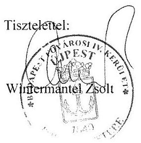

[^0]
[^0]:    ÜJPESTI ÖNKORMÁNYZAT POLGÁRMESTERE * ㄹ 1042 BUDAPEST, ISTVÁN ÚT 14. * wintermantel.zsolt\$ ujpest.hu

---

# Budapest Főváros IV. kerület - Újpest - Önkormányzata Polgármesteri Hivatalának 

$31 / 32 / 2011$. számú
Iratkezelési Szabályzata
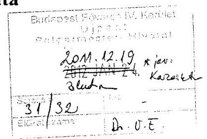
a köziratokról, a közlevéltárakról és a magánlevéltári anyag védelméről szóló 1995. évi LXVI. törvény 10. § (1) c) pontjában előirtak szerint
az egyedi Iratkezelési Szabályzattal egyetértek

Budapest, 2011.
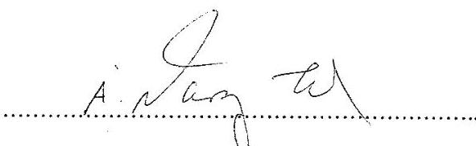

Budapest Fóváros Levéltára
az egyedi Iratkezelési Szabályzattal egyetértek
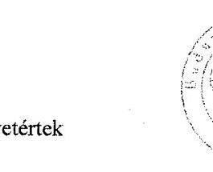

Budapest, 2012. 01:....1.8:.
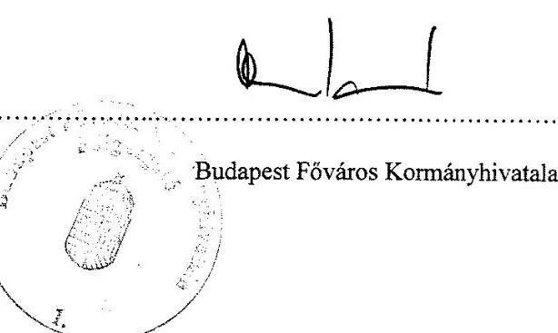

---

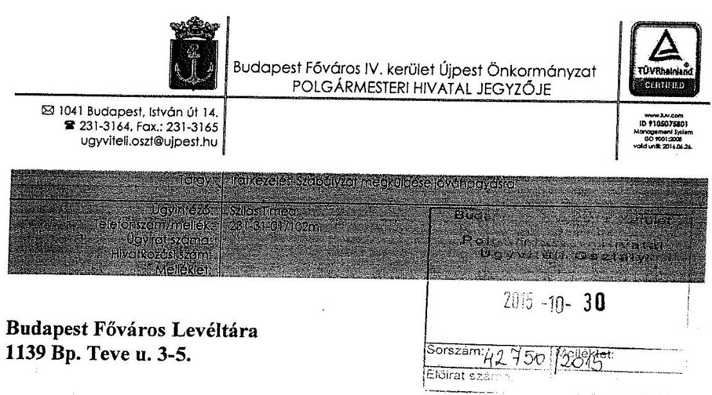

# Budapest Főváros Levéltára 

1139 Bp. Teve u. 3-5.

Szeitz István részére

Tisztelt Osztályvezető Úr!

Mellékelten megküldöm Budapest Főváros IV. kerület Újpest Önkormányzat Polgármesteri Hivatalának 31/17/2015. számú Iratkezelési Szabályzatát a köziratokról, a közlevéltárakról és a magánlevéltári anyag védelméről szóló 1995. évi LXVI. törvény 9. §.(4) bekezdése és a 10. §. (1) bekezdés c.) pontja szerinti egyetértés, jóváhagyás céljából. A szabályzat - a jóváhagyást követően - 2016. január 1-jén lép hatályba.

Budapest, 2015. október 30.
Tisztelettel:
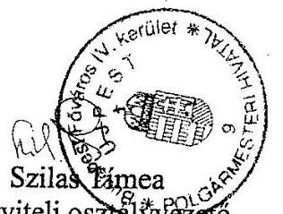

---

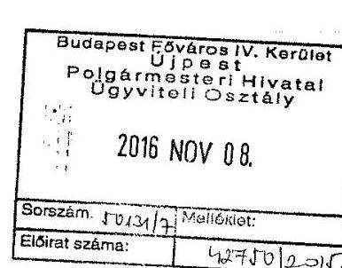

A köziratokról, közlevéltáraktól, és a magánlevéltári anyag védelméről szóló 1995. évi LXVI. törvényben biztosított jogkörömben eljárva

Budapest Főváros IV. Kerületi Önkormányzat Polgármesteri Hivatala Egyedi Iratkezelési Szabályzatával egyetértek.
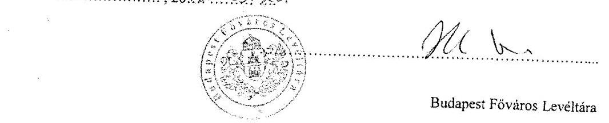

Budapest Főváros Levéltára

A köziratokról, közlevéltáraktól, és a magánlevéltári anyag védelméről szóló 1995. évi LXVI. törvényben biztosított jogkörömben eljárva
Budapest Főváros IV. Kerületi Önkormányzat Polgármesteri Hivatala egyedi iratkezelési szabályzatának bevezetésével egyetértek.

Budapest............, 20.15 ..... 11.... 7.
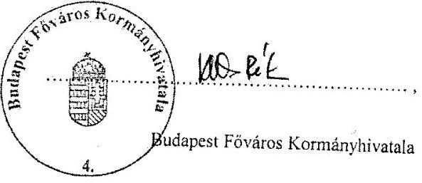

---

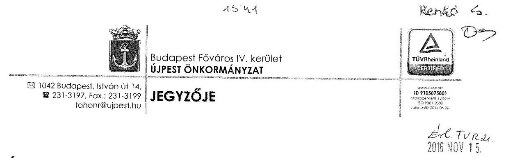

# Állami Számvevőszék 

Hiv. szám: V-0988-125/2016
Ügyiratszám: 38183/2016

## Domokos László

elnök úr részére

## Budapest 4.

Pf.: 54
1364

ÁLLAMI SZÁMVEVÓSZÉK
092518206.
Eikszen: 2016 NOV 15.
Iktariszám: $V-0948-133 / 2016$

## Tisztelt Elnök Úr!

Az Állami Számvevőszék V-0988-125/2016 jelentéstervezetére írt, 2016. november 9-én kelt válaszlevél 1. oldalán említett, a Polgármesteri Hivatal Hivatásetikai Ködexének képviselő-testületi elfogadására vonatkozó 7/2015. (I.29.) önkormányzati határozat nem került a mellékletek közé.

Az önkormányzati határozatot jelen levelem mellékleteként pótlólag megküldöm, az adminisztratív hibáért szíves elnézését kérem!

Budapest, 2016. november 10.
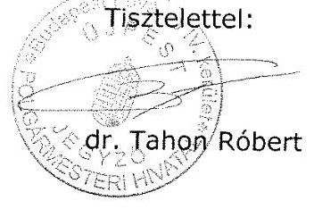

---

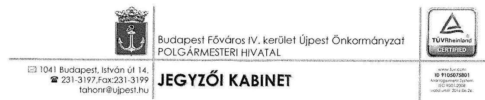

# KIVONAT 

Készült a Budapest Főváros IV. kerület Újpest Önkormányzata Képviselő-testületének 2015. január 29-én (csütörtök) 15,00 órai kezdettel a Polgármesteri Hivatal (Budapest, IV. ker. István út 14. II. em.) dísztermében tartott ülésének jegyzőkönyvéből

## Napirend

10. Javaslat a Budapest Főváros Újpest IV. kerület Polgármesteri Hivatal Hivatásetikai Kódexének az elfogadására
Előterjesztő: Dr. Tahon Róbert jegyző
Budapest Főváros IV. kerület Újpest Önkormányzata Képviselő-testületének 7/2015. (I.29.) határozata a Polgármesteri Hivatal Hivatásetikai Kódexének az elfogadásáról
A Képviselő-testület úgy dönt, hogy jóváhagyja Budapest Főváros Újpest IV. kerület Polgármesteri Hivatal Hivatásetikai Kódexét.
(17 igen)
Felelős: Polgármester
Határidő: azonnal

Kmf.

Dr. Tahon Róbert sk. jegyző

A kivonat hiteles
Budapest, 2016. fövénbor 0.

---

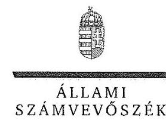

ELKÖK

Ikt. szám: V-0988-134/2016.

# Wintermantel Zsolt úr 

polgármester

Budapest Főváros IV. Kerület Újpest Önkormányzata

## Budapest

## Tisztelt Polgármester Úr!

Köszönettel megkaptam ,,Önkormányzatok belső kontrollrendszere - Az önkormányzatok belső kontrollrendszere kialakításának és müködtetésének ellenörzése - Budapest Főváros IV. Kerület Újpest" címú jelentéstervezet megállapításaira tett észrevételét.

Az ellenőrzési megállapításokra vonatkozó észrevételét az Állami Számvevőszékről szóló 2011. évi LXVI. törvény 29. § (2) bekezdésében meghatározott tizenöt napos határidőn belül küldte meg. Az Állami Számvevőszék észrevétellel kapcsolatos álláspontját a mellékletként csatolt, a felügyeleti vezető által készített indokolás tartalmazza.

Budapest, 2016. 11 hónap 27 nap
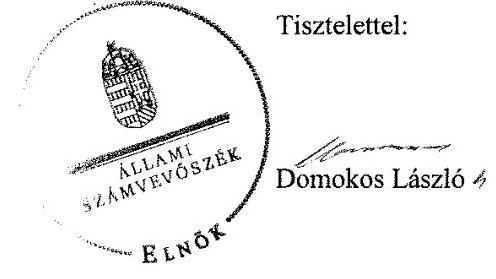

Melléklet: Észrevételre adott válasz

---

„Ónkormányzatok belsö kontrollrendszere - Az önkormányzatok belsö kontrollrendszere kialakitásának és müködtetésének ellenörzése - Budapest Föváros IV. Kerület Újpest" című jelentéstervezetre tett észrevételekre adott válasz

|  | 2. táblázat 1. sora   Megállapítás: A köztisztviselőkre vonatkozó hivatáspolitikai alapelvek részletes tartalmát, valamint az etikai eljárás szabályait nem a Képviselő-testület állapította meg.   Észrevétel: Korábbi ellenőrzés már kifogásolta jelen ellenőrzésben megállapított hiányosságot, amelyhez az intézkedési terv tartalmazta az intézkedési feladatot, amelynek eredményeként a testület - az észrevételhez csatolt - a 7/2015. (1. 29.) számú határozattal elfogadta a Polgármesteri Hivatal Hivatásetikai Kódexét és a testületi döntést követően a polgármester és a jegyző 2015. február 1-i hatállyal közös utasitással kiadta. |
| :--: | :--: |
| Válasz: | Az Állami Számvevőszék az észrevételt elfogadja. |
| Indoklás: | Az észrevétel alapján a megállapítás pontositásra került, a 2. táblázat 1. sora, továbbá az erre vonatkozó, polgármesternek és a jegyzőnek címzett javaslat törlésre került. |
|  | 2. táblázat 2. sora   Megállapítás: A számlarend tartalmára vonatkozó hiányosság.   Észrevétel: Elismerik, hogy a számlarend nem az összesítő bizonylatok tartalmi és formai követelményeit tartalmazta, hanem a SALDO program használatát írta elő, amely program azonban nem felelt meg teljes körűen az új 2014. évi számviteli előírásoknak, ezért lecserélték azt integrált ügyviteli rendszerre. |
| Válasz: | Az Állami Számvevőszék az észrevételt nem fogadja el. |
| Indoklás: | A 2. táblázat 2. sorában szereplő megállapítást nem vitatták. A program használatával kapcsolatos változások szerepeltetése a jelentésben nem változtatja meg a hiányosságra vonatkozó megállapítást tekintettel arra, hogy szabályozási hiányosságot nem helyettesítheti a szabályzatban egy program használatára való utalás. |
|  | 2. táblázat 3. sor   Megállapítás: A 2014. évi változásoknak megfelelően nem aktualizálták a számviteli politikát, számlarendet, az értékelési szabályzatot, a bizonylati szabályzatot és a leltárkészítési szabályzatot.   Észrevétel: A hivatkozott szabályzatok aktualizálására 2015. január 1-jei hatállyal került sor. |
| Válasz: | Az Állami Számvevőszék az észrevételt részben fogadja el. |
| Indoklás: | A 31/15/2015. számú polgármesteri-jegyzői közös utasítással 2015. január 1-jei hatállyal módosításra került a pénzkezelési szabályzat, a számviteli politika és a számlarend, amelynek megfelelően a megállapításban pontosítottuk a számviteli politi- |

---

|  | kára és a számlarendre vonatkozó megállapításokat. A módosítás azonban nem érintette az értékelési, a leltárkészítési és bizonylati szabályzatot, amely miatt a 2. táblázat 2. sorában szerepeltetett hiányosságok ezen szabályzatokra helytállóak. |
| :--: | :--: |
| Észrevétel: | 2. táblázat 4. sora   Megállapítás: Az ellenőrzési nyomvonal nem tartalmazta az értékpapírok adásvételi döntéseivel kapcsolatos folyamatokat.   Észrevétel: A megállapításban hivatkozott jogszabályhely nem ír elő konkrét előírásokat az értékpapír adásvételekkel kapcsolatban. Tekintettel az állampapírok alacsony kockázatára e tevékenységre vonatkozóan nem került sor ellenőrzési nyomvonal elkészítésére, azonban az ÁSZ javaslatára pótolják azt. |
| Válasz: | Az Állami Számvevőszék az észrevételt nem fogadja el. |
| Indoklás: | A megállapítást nem vitatják, az ellenőrzési nyomvonal kiegészítésére intézkednek. |
| Észrevétel: | 3. táblázat 1. sora   Megállapítás: Nem mérték fel a gazdálkodásban rejlő, ideértve befektetési tevékenységgel kapcsolatos kockázatokat.   Észrevétel: A befektetési tevékenységekben rejlő kockázatok felmérése, és a legkisebb mértéküre csökkentése megtörtént. A befektetéseik alacsony kockázatúak voltak, a kockázat csökkentése érdekében intézkedtek, amikor a KELER Zrt.-nél alszámlát nyitottak. |
| Válasz: | Az Állami Számvevőszék az észrevételt nem fogadja el. |
| Indoklás: | Dokumentáltan nem tárták fel, nem elemezték és nem rögzítették a tevékenységekben, így a befektetési tevékenységben rejlő, valamennyi - külső környezeti (stratégiára ható) és belső müködési (pénzügyi, tevékenységi, humánerőforrás) - kockázatot. Nem határozták meg minden kockázati tényezőre a szükséges intézkedést (elfogadás, áthárítás, kezelés), a türéshatár feletti kockázatok esetében a kezelés módját (az alkalmazott kontrolltevékenységet). Nem határozták meg a kockázatkezelés teljes folyamatának nyomon követését a válaszlépések végrehajtásáért felelős személyek rendszeres időszakonkénti beszámolási kötelezettségének előírásával, vagy a kockázatkezelés teljes folyamatának (kockázatazonosítás, értékelés, válaszlépések meghatározása) felülvizsgálatával. |
| Észrevétel: | 4. táblázat 1. sora   Megállapítás: A teljesítésigazolást a személyi juttatások és az ellátottak pénzbeli juttatásai, az egyéb müködési és felhalmozási célú kiadások, valamint a finanszírozási kiadások kifizetései esetében nem végezték el.   Észrevétel: A MÁK által számfejtett adatokért felelősséget senki sem vállal, azt teljesités igazolni már nem lehet, a MÁK által kimutatott összegek kerülnek átutalásra. Az ellátottak pénzbeli juttatásánál nem szükséges külön teljesitésigazolás az Ávr. 57. § (3) és az Áht. 36. § (1) alapján. |
| Válasz: | Az Állami Számvevőszék az észrevételt részben fogadja el. |

---

| Indoklás: | A személyi juttatások teljesítés igazolásánál az észrevételben jelzettek nem felelnek meg az Ávr. előírásainak, mert a jogszabály nem tesz kivételt a MÁK által számfejtett személyi juttatások teljesítés igazolására vonatkozóan, emiatt az észrevételt nem fogadjuk el. Az Ávr. 57. § (3) bekezdése alapján belső szabályzatban nem szükséges külön teljesítés igazolást előírni az Áht. 36. § (2) bekezdése szerinti más fizetési kötelezettségek teljesítéséhez, ezért az ellátottak pénzbeli juttatásaira vonatkozó megállapítást töröltük. |
| :--: | :--: |
| Észrevétel: | 4. táblázat 2. sora   Megállapítás: Az érvényesítés során nem jelezték az utalványozónak, hogy az érvényesítésre teljesítésigazolás nélkül és nem szabályszerű pénzügyi ellenjegyzéssel került sor.   Észrevétel: A 4. táblázat 1. soránál jelzettek alapján a két kiadáscsoportra kérik a megállapítások törlését. A nem szabályszerű pénzügyi ellenjegyzést is vitatják, véleményük szerint valamennyi 100 ezer Ft feletti kiadás szabályszerű ellenjegyzése megtörtént. |
| Válasz: | Az Állami Számvevőszék az észrevételt nem fogadja el. |
| Indoklás: | A 4. táblázat 1. sorához tett észrevétel indoklása alapján a 4. táblázat 2. sorának a teljesítés igazolásra vonatkozó megállapítása helytálló. A pénzügyi ellenjegyzés nem szabályszerű végrehajtása (dátum, szöveg elmaradás) előfordult a mintában. Az ellenőrzési módszertan alapján az ellenőrzött területekre vonatkozóan elvégzett tesztek eredményeinek értékelése, kivetítése $95 \%$-os bizonyossággal biztosította a teljes sokaságra, egy-egy ellenőrzött időszak összes ellenőrzött területére az összevont értékelést. A kulcskontrollok müködése megfelelőségének értékelése tekintetében lényeges minden olyan hiba, amely gátolja, hogy a kontrolltevékenység eredményesen müködjön. A teljesítésigazolás és az érvényesítés során a sokaság számított hiba aránya 2014. január 1. és 2014. október 12., illetve 2014. október 13. és 2015. április 30. között $30 \%$ felett volt, ezért a kulcskontrollok müködletése nem volt megfelelő. |
| Észrevétel: | 4. táblázat 3. sora   Megállapítás: Az utalványon tartalmi hiányosságok fordultak elő, amelyet az érvényesítő nem észrevételezett.   Észrevétel: A korábbi könyvelési rendszer hiányosságai miatt előfordulhattak ezek a hiányosságok. Az új rendszer által előállított utalványrendeleten feltüntetésre kerül az egységes rovatrend és megnevezése, könyvviteli számla száma és megnevezése, a kötelezettségvállalás száma. Ez utóbbi a bérjellegủ kifizetéseknél nem szerepel. Kérik az utalványrendeleten ténylegesen megjelenő COFOG szám hivatkozás törlését. |
| Válasz: | Az Állami Számvevőszék az észrevételt nem fogadja el. |
| Indoklás: | A kiválasztott tételek ellenőrzése során mindkét ellenőrzött időszakban előfordultak a 4. táblázat 3. sorában jelzett, az utalványrendelet tartalmi hiányosságaira vonatkozó megállapítások, így pl. előfordult, hogy a kormányzati funkció (COFOG) száma és megnevezése is hiányzott az utalványokról. A 4. táblázat 2. sorához tett |

---

|  | észrevétel indoklása tartalmazza az ellenőrzési módszertant, amely alapján a hiba-   hatások értékelése történt 2014. január 1. és 2014. október 12., illetve 2014. október   13. és 2015. április 30. között. |
| :--: | :--: |
| Észrevétel: | Föbb megállapítások, következtetések, javaslatok   Megállapítás: A kötelezettségvállalási, az ellenjegyzési, a teljesítésigazolási, és az   érvényesítési jogkörök szabálytalan gyakorlása növelte a jogosulatlan kifizetések   veszélyét.   Észrevétel: A 4. táblázat 1-3. pontjaihoz füzöttek tekintetében kérik a tagadhatatlanul meglévő hibák ellenére is túlságosan negatív megállapítás korrigálását. |
| Válasz: | Az Állami Számvevőszék az észrevételt nem fogadja el. |
| Indoklás: | A 4. táblázat 1-3. pontjainak megállapításai az észrevételekre adott indoklás alapján   helytállóak. |
| Észrevétel: | 5. táblázat 2. sora   Megállapítás: Az Iratkezelési szabályzat kiadásához nem kérték meg a Magyar   Nemzeti Levéltár és a Kormányhivatal egyetértő nyilatkozatát.   Észrevétel: A 31/32/2011. számú Iratkezelési szabályzatot jóváhagyta a két szerve-   zet, a 31/6/2013. számú új szabályzat az iktatás szakmai részét nem módosította,   csak személyeket érintő változás volt benne, amely miatt a Levéltár szóbeli tájékoz-   tatása alapján nem küldték meg jóváhagyásra. Észrevételükhöz csatolták a 2016-tól   hatályos szabályzathoz megkért jóváhagyásokat. |
| Válasz: | Az Állami Számvevőszék az észrevételt nem fogadja el. |
| Indoklás: | A 31/6/2013. számú Iratkezelési Szabályzat új szabályzatként került kiadásra. Az   Ltv. 10. § (1) bekezdés c) pontja ellenére az új szabályzatot a Magyar Nemzeti Le-   véltár, illetve a Kormányhivatal egyetértése nélkül adták ki, amely nem felelt meg a   jogszabályi előírásnak. Az észrevételhez csatolt, 2016-tól hatályos szabályzat ellen-   örzési időszakon kívül készült, ezért a szabályzathoz megkért jóváhagyások felül-   vizsgálatára az utóellenőrzés keretében van lehetőség. |
| Észrevétel: | 1.5 megállapítás   Megállapítás: A belső ellenőrzések nem tárták fel a befektetések kockázatait, 2011.   évtől 2015. április 30-ig nem tárták fel a befektetési tevékenység hibáit, ezért nem   járultak hozzá a szabályszerű, átlátható, elszámoltatható befektetési tevékenység   végzéséhez.   Észrevétel: A belső ellenőrzés végzett kockázatelemzést a kötvénykibocsátással   egyidejűleg, a tevékenységet közepes kockázatúnak ítélte, emiatt nem végzett e   tárgyban ellenőrzést. |
| Válasz: | Az Állami Számvevőszék az észrevételt nem fogadja el. |
| Indoklás: | Az észrevételben hivatkozott dokumentum alapján tett megállapítások szerepelnek   az 1.5. számú megállapítás 7. bekezdésében. A 2013-2015. évi kockázatelemzés so-   rán nem tértek ki a befektetési tevékenységre, ezáltal a befektetésekkel kapcsolatos   belső ellenőrzést nem terveztek. Mindezek alapján a megállapítás helytálló, mivel |

---

|  | nem végeztek a befektetési tevékenységgel kapcsolatos ellenőrzést, ezért nem tárták fel az ÁSZ ellenőrzés során megállapított hibákat. |
| :--: | :--: |
| Észrevétel: | 2.1 megállapítás   Megállapítás: A befektetésekkel kapcsolatos döntés-előkészítés és döntéshozatal nem felelt meg a jogszabályi előírásoknak és a vagyonrendeletben foglaltaknak.   Észrevétel: Úgy értelmezték, hogy az éves költségvetési rendeletek mivel külön speciális szabályokat tartalmaztak az átmenetileg szabad pénzeszközök befektetésére, így ez alapján kell gyakorolni a jogköröket. Az ÁSZ megállapítását elfogadva 2016. szeptember 30 -án módosította rendeleteit. |
| Válasz: | Az Állami Számvevőszék az észrevételt nem fogadja el. |
| Indoklás: | A 2016. évi rendeletmódosítás ellenőrzési időszakon kívül készült, ezért annak felülvizsgálatára utóellenőrzés keretében van lehetőség. |
| Észrevétel: | 6. táblázat 1. sor   Megállapítás: Nem vizsgálták a befektetési szolgáltató átláthatóságát.   Észrevétel: A befektetési szolgáltató felügyeleti engedélyek alapján végezte tevékenységét. Az Nvt. 10. § (10) bekezdését nem kell alkalmazni, az Áht. 41. § (6) bekezdése pedig csak a központi költségvetésre vonatkozik. |
| Válasz: | Az Állami Számvevőszék az észrevételt nem fogadja el. |
| Indoklás: | A megállapításban nem történt hivatkozás az Nvt. 10. § (10) bekezdésére, illetve az Áht. 41. § (6) bekezdésére, ezért az észrevétel erre vonatkozó része nem értelmezhető. Az Alaptörvényben előírt átláthatósági követelményt nem vitatták. |
| Észrevétel: | 2.2 megállapítás   Megállapítás: A befektetési tanácsadó kiválasztására közbeszerzési eljárás mellőzésével került sor.   Észrevétel: A banki és befektetési szolgáltatásokra vonatkozóan a közbeszerzés hatálya nem terjed ki. |
| Válasz: | Az Állami Számvevőszék az észrevételt elfogadja. |
| Indoklás: | A megállapításból törőltük a kifogásolt részt. |
| Észrevétel: | 9. táblázat 1. sora   Megállapítás: Az államkötvények bekerülési értéke tartalmazta a vételárban/eladási árban felhalmozott kamatot.   Észrevétel: A SALDO program nem volt képes kettébontani a könyvelésben azt, hogy egy bizonylaton belül kétféle gazdasági eseményt lehessen könyvelni. |
| Válasz: | Az Állami Számvevőszék az észrevételt nem fogadja el. |
| Indoklás: | A megállapítást nem vitatják, az észrevételben jelzettek a szabálytalan könyvelést támasztják alá. |

---

| Észrevétel: | 9. táblázat 2. sora   Megállapítás: A tartós részesedések részletező nyilvántartása nem tartalmazta az elő-   írt kötelező elemeket.   Észrevétel: Valamennyi a jogszabályban meghatározott adat a rendelkezésükre állt,   azonban az ellenőrzés alatt egységes szerkezetben bemutatni nem tudták. |
| :--: | :--: |
| Válasz: | Az Állami Számvevőszék az észrevételt nem fogadja el. |
| Indoklás: | Dokumentáltan nem támasztották alá, hogy a tartós részesedések részletező nyilvántartása tartalmazta-e a jogszabályban előírt tartalmi elemeket. |
| Észrevétel: | 9. táblázat 3. sora   Megállapítás: Az értékpapírok részletező nyilvántartása nem tartalmazta az előírt   kötelező elemeket.   Észrevétel: Valamennyi a jogszabályban meghatározott adat a rendelkezésükre állt,   azonban az ellenőrzés alatt egységes szerkezetben bemutatni nem tudták. |
| Válasz: | Az Állami Számvevőszék az észrevételt nem fogadja el. |
| Indoklás: | Dokumentáltan nem támasztották alá, hogy az értékpapírok részletező nyilvántartása   tartalmazta-e a jogszabályban előírt tartalmi elemeket. |
| Észrevétel: | 9. táblázat 4. sora   Megállapítás: Az államkötvények könyvelése esetében nem tartották be a jogszabá-   lyi elöírásokat, a felhalmozott kamat értékét nem a kamatkiadások és kamatbevéte-   lek között szerepeltették, továbbá az árfolyamveszteséget nem az egyéb pénzügyi   müveletek kiadásai között mutatták ki.   Észrevétel: Mind a kamatbevételeket, mind a kamatkiadásokat a megfelelő helyen   ERA kódon könyvelték le a kamatbevételek között valamint az egyéb pénzügyi mü-   veletek kiadásai között mutatták ki. |
| Válasz: | Az Állami Számvevőszék az észrevételt részben fogadja el. |
| Indoklás: | Az államkötvények vásárlás/eladás könyvelése során a felhalmozott kamatot kamat-   bevételként vagy kamatkiadásként elszámolták, ezért a megállapítás ezen része tör-   lésre került. Az árfolyamveszteségre vonatkozó megállapítást nem vitatták. |
| Észrevétel: | 9. táblázat 5. sora   Megállapítás: A 2014. év végi könyvviteli zárlat keretében nem végezték el az ál-   lamkötvények után járó kamatbevételek aktív időbeli elhatárolását.   Észrevétel: A beszámolóban szereplő hibák nagysága sem az eredmény kimutatást,   sem a mérlegfőösszeget nem befolyásolja. Annak vagyonra való hatása nem befolyásolja a mérleg valódiságát, a kamat nagysága nem haladja meg a hibahatár nagyságát. |
| Válasz: | Az Állami Számvevőszék az észrevételt nem fogadja el. |

---

| Indoklás: | A megállapítást nem vitatják, az észrevételben jelzettek a hiba beszámolóra vetített nagyságára vonatkoznak. |
| :--: | :--: |
| Észrevétel: | 3. fejezet összegző megállapítás, Főbb megállapítások, következtetések, javaslatok 3. bekezdés   Megállapítás: A forgatási célú értékpapírok analitikus nyilvántartása, számviteli elszámolása nem volt szabályszerű. A szabálytalanságok miatt az éves költségvetési beszámolókban a vagyont nem a valóságnak megfelelően mutatták be. Az egyes befektetések számviteli nyilvántartási értékének helytelen megállapítása, a részletező nyilvántartás nem megfelelő vezetése következtében az önkormányzat beszámolója vagyonáról nem a valós összképet mutatta.   Észrevétel: A feltárt hiányosságok súlyára tekintettel túlzó megállapítás. |
| Válasz: | Az Állami Számvevőszék az észrevételt nem fogadja el. |
| Indoklás: | Az államkötvények bekerülési értékének meghatározása nem volt szabályszerű, mert az felhalmozott kamatot tartalmazott, a jogszabályi előírások szerinti analitikus/észletező nyilvántartásokkal nem rendelkeztek, továbbá az államkötvények könyvelésénél hibák fordultak elő, amely a 2014. évben a számviteli törvényben meghatározott szerint jelentős összegűnek minősült. |
| Észrevétel: | Polgármesternek címzett 1. és 3. számú javaslat   Észrevétel: Álláspontjuk szerint a 2. táblázat 2., 3., 4. sorára tett észrevételeik alapján a munkajogi felelősség kivizsgálására irányuló eljárás megindítására nincs szükség. |
| Válasz: | Az Állami Számvevőszék az észrevételt részben fogadja el. |
| Indoklás: | A polgármesternek címzett 1. számú javaslatot a 2. táblázat 1. sorához tett észrevétel alapján töröltük. A javaslat törlése miatt a polgármesternek címzett 3. számú javaslat hivatkozási részének számozása változott, azonban a munkajogi kivizsgálásra vonatkozó eljárás megindítását előiró javaslat továbbra is indokolt, tekintettel arra, hogy az észrevételek alapján a megállapításokat nem tartottuk indokoltnak módosítani. |
| Észrevétel: | Jegyzőnek címzett 1., 2. és 5. számú javaslat   Észrevétel: az 1. számú javaslat szövegéből a második tagmondattól a szöveg törlését, a hivatkozásból a 4. táblázat 2. és az 5. táblázat 2. sorára vonatkozó utalást, továbbá a 2. és 5. számú javaslatok törlését kérik. Álláspontjuk szerint a 4. táblázat 13. sorai, 2.1 megállapítás, 9. táblázat 1-5 soraira tett észrevételeik alapján a munkajogi felelősség vizsgálatára nincs szükség. |
| Válasz: | Az Állami Számvevőszék az észrevételt részben fogadja el. |
| Indoklás: | A jegyzőnek címzett 2. számú javaslatot a 2. táblázat 1. sorához tett észrevétel alapján töröltük. Az 1. számú javaslat továbbra is indokolt, tekintettel arra, hogy a 4. táblázat 2., 5. táblázat 2. soraihoz, 2.1 megállapításhoz tett észrevételek alapján a megállapításokat nem módosítottuk. A jegyzőnek címzett, a munkajogi felelősség tisztázására vonatkozó eljárás megindítását előiró javaslat továbbra is indokolt, tekintettel arra, hogy az észrevételek alapján a megállapításokat (4. táblázat 2-3. sorai, 7. táblázat 2. sora, 9. táblázat 1-3, 5. sorai) nem tartottuk indokoltnak módosítani, |

---

|  | illetve a 4. táblázat 1. és a 9. táblázat 4. sorainak pontosítása ellenére a szabálytalanságok fennálltak. |
| :--: | :--: |
| Észrevétel: | Az összegző megállapítások kiegészitését kérik a betétlekötések és az állampapírok kamatbevételeinek nagyságával. Továbbá annak rögzitésével, hogy a szabad pénzeszközök befektetése kapcsán kár nem érte az önkormányzatot, minden befektetésen nyereséget realizált. |
| Válasz: | Az Állami Számvevőszék az észrevételt nem fogadja el. |
| Indoklás: | Az ellenőrzés nem irányult a befektetések eredményeinek a bemutatására, a pénzeszközökkel való hatékony gazdálkodás megítélésére. |

Tájékoztatom Polgármester Urat, hogy az Állami Számvevőszékről szóló 2011. évi LXVI. törvény 29. § (3) bekezdése alapján az Állami Számvevőszék a figyelembe nem vett észrevételeket köteles a jelentésben feltüntetni, és megindokolni, hogy azokat miért nem fogadta el.

Budapest, 2016.
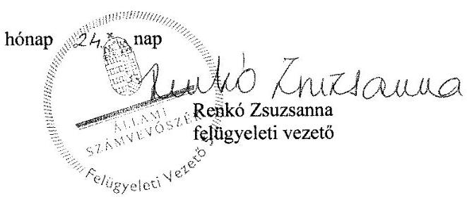

---

.

---

# RÖVIDÍTÉSEK JEGYZÉKE 

${ }^{1}$ Képviselő-testület
${ }^{2}$ Hivatal
${ }^{3}$ polgármester
${ }^{4}$ jegyző
${ }^{5}$ ÁSZ tv.
${ }^{6}$ Áht.
${ }^{7}$ Mótv.
${ }^{8}$ Ávr.
${ }^{9}$ Bkr.
${ }^{10}$ NGM
${ }^{11}$ MNB
${ }^{12}$ Alaptörvény
${ }^{13}$ önkormányzati SZMSZ1,2
${ }^{14}$ vagyongazdálkodási rendelet ${ }_{1,2}$

Budapest Főváros IV. kerület Újpest Önkormányzatának Képviselő-testülete
Budapest Főváros IV. kerület Újpest Polgármesteri Hivatala
Budapest Főváros IV. kerület Újpest polgármestere
Budapest Főváros IV. kerület Újpest jegyzője
2011. évi LXVI. törvény az Állami Számvevőszékről
2011. évi CXCV. törvény az államháztartásról (hatályos 2012. január 1-jétől)
2011. évi CLXXXIX. törvény Magyarország helyi önkormányzatairól (hatályos 2012. január 1-jétől)
368/2011. (XII. 31.) Korm. rendelet az államháztartásról szóló törvény végrehajtásáról (hatályos 2012. január 1-jétől)
370/2011. (XII. 31.) Korm. rendelet a költségvetési szervek belső kontrollrendszeréről és a belső ellenőrzéséről (hatályos: 2012. január 1-jétől)
Nemzetgazdasági Minisztérium
Magyar Nemzeti Bank
Magyarország Alaptörvénye (hatályos 2012. január 1-jétől)

1. 3/2000. (IV. 10.) önkormányzati rendelet Budapest Főváros IV. kerület Újpest Önkormányzata Képviselő-testületének Szervezeti és Müködési Szabályzata és módosításai
2. 60/2012. (XII. 21.) önkormányzati rendelet Budapest Főváros IV. kerület Újpest Önkormányzata Képviselő-testületének Szervezeti és Müködési Szabályzata és módosításai
3. Budapest Főváros IV. kerület Újpest Önkormányzata a vagyonról és a vagyonelemek feletti tulajdonosi jogok gyakorlásáról szóló 22/2006. (XI. 15.) önkormányzati rendelet és módosításai
4. Budapest Főváros IV. kerület Újpest Önkormányzata a vagyonról és a vagyonelemek feletti tulajdonosi jogok gyakorlásáról szóló 48/2012. (XI. 30.) önkormányzati rendelet és módosításai
Budapest Főváros IV. kerület Újpest Önkormányzata Önkormányzat Képviselőtestületének Pénzügyi Bizottsága
Budapest Főváros IV. kerület Újpest Önkormányzata Képviselő-testületének 12/2011. (II. 25.) számú rendelete a 2011. évi költségvetéséről
Budapest Főváros IV. kerület Újpest Önkormányzata Képviselő-testületének 9/2012. (II. 24.) számú rendelete a 2012. évi költségvetéséről
Budapest Főváros IV. kerület Újpest Önkormányzata Képviselő-testületének 6/2013. (II. 28.) számú rendelete a 2013. évi költségvetéséről
Budapest Főváros IV. kerület Újpest Önkormányzata Képviselő-testületének 5/2014. (II. 27.) számú rendelete a 2011. évi költségvetéséről
Budapest Főváros IV. kerület Újpest Önkormányzata Képviselő-testületének 7/2015. (II. 26.) számú rendelete a 2015. évi költségvetéséről
5. Budapest Főváros IV. kerület Újpest Önkormányzat Hajrá Újpest Városfejlesztési Program 2011-2014., 112/2011. (V. 5.) számú Képviselő-testület határozatával elfogadott
6. Budapest Főváros IV. kerület Újpest Önkormányzat Hajrá Újpest Városfejlesztési Program 2015-2019., a 93/2015. (IV. 30.) számú Képviselő-testület határozatával elfogadott

---

${ }^{18}$ alapító okirat
${ }^{19}$ hivatali SZMSZ
${ }^{20}$ ügyrend $_{1,2,3,4}$
${ }^{21}$ kötelezettségvállalási szabályzat $_{1,2,3,4}$
${ }^{22}$ etikai kódex ${ }_{1,2}$
${ }^{23}$ közszolgálati szabályzat ${ }_{1,2}$
${ }^{24}$ ellenőrzési nyomvonal ${ }_{1,2}$
${ }^{25}$ szabálytalanságkezelési eljárásrend ${ }_{1,2}$
${ }^{26}$ számviteli politika $_{1,2}$
${ }^{27}$ számlarend $_{1,2,3}$
${ }^{28}$ eszközök és források leltározási és leltárkészítési szabályzata ${ }_{1,2,3}$

Budapest Főváros IV. kerület Újpest Önkormányzat Polgármesteri Hivatalának alapító okirata, a 45/1990. (XII. 11.) számú Képviselő-testület határozatával elfogadva
444/2010. (XII. 09.) Képviselő-testület határozatával elfogadott többször módosított Budapest Főváros IV. kerület Újpest Önkormányzata Polgármesteri Hivatalának Szervezeti és Múködési Szabályzata és módosításai
Budapest Főváros IV. kerület Újpest Önkormányzata Polgármesteri Hivatal Gazdasági szervezetének ügyrendje, hatályos:

1. 31/22. 2009. III. 31.-től hatályos GSZ Ügyrend
2. 31/17. 2011.IX.01-től hatályos GF Ügyrend
3. 31/12. 2013. IV. 1-től hatályos GSZ Ügyrend
4. 2015. I.1-től hatályos GSZ Ügyrend

Budapest Főváros IV. kerület Újpest Önkormányzata Polgármesteri Hivatal eszközök és források értékelési szabályzata, hatályos:

1. 31/12. 2010. IX.8-tól hatályos polgármester - jegyzői közös utasítás
2. 31/4. 2011. II.15-től hatályos polgármester - jegyzői közös utasítás
3. 31/13/2011. 04. 11-től hatályos polgármester - jegyzői közös utasítás
4. 31/7/2013. (I. 1.) polgármesteri-jegyzői közös utasítás

Budapest Főváros IV. kerület Újpest Önkormányzata Polgármesteri Hivatal etikai kódexe:

1. 31/27/2008. (V. 1.) jegyzői utasítás
2. 31/4/2015. (II. 1.) Hivatásetikai kódex polgármesteri-jegyzői utasítás

Budapest Főváros IV. kerület Újpest Önkormányzata Polgármesteri Hivatal közszolgálati szabályzata:

1. 31/9/2012. (IV. 2.) jegyzői utasítás
2. 31/7/2014. (IV. 10.) jegyzői utasítás

Budapest Főváros IV. kerület Újpest Önkormányzata Polgármesteri Hivatal ellenőrzési nyomvonala:

1. 31/47/2008. (XII. 29.) FEUVE Szabályzat jegyzői utasítás
2. 31/8/2015. (IV. 30.) Ellenőrzési Nyomvonal jegyzői utasítás

Budapest Főváros IV. kerület Újpest Önkormányzata szabálytalanságkezelési eljárásrendje, hatályos:

1. 31/19/2011. (VI. 1.) Szabályzat a szabálytalanságok kapcsolatos eljárás rendjéről szóló jegyzői intézkedés
2. 31/18/2015. (IV. 30.) Szabálytalanságok kezelésének szabályzata jegyzői utasítás
Budapest Főváros IV. kerület Újpest Önkormányzata Számviteli politikája:
3. 31/23/2009. jegyzői utasítás (hatályos: 2009. április 15-től)
4. 31/21/2013. polgármesteri-jegyzői közös utasítás (hatályos: 2013. január 1jétől)
Budapest Főváros IV. kerület Újpest Önkormányzata Számlarendje:
1 Számlarend 2009.
5. 31/22/2013. (I. 1.) polgármesteri-jegyzői közös utasítás
6. 31/1/2014. (I. 1.) jegyzői utasítás

Budapest Főváros IV. kerület Újpest Önkormányzata Polgármesteri Hivatal eszközök és források leltározási és leltárkészítési szabályzata:

1. hatályos: 2007.10.15-től

---

2. 31/35. (hatályos: 2011.09.01-től)
3. $31 / 8 / 2013$. (I.1.) jegyzői utasítás
Budapest Főváros IV. kerület Újpest Önkormányzata Polgármesteri Hivatal eszközök és források értékelési szabályzata:
4. 31/21.(hatályos 2009.02.02-tól)
5. 1/23/2013. (I. 1.) polgármesteri-jegyzői közös utasítás
Budapest Főváros IV. kerület Újpest Önkormányzata Polgármesteri Hivatal bizonylati szabályzata:
6. 31/2/2008. (I. 2.) jegyzői utasítás
7. 2013. 10. 15-től hatályos jegyzői utasítás
Budapest Főváros IV. kerület Újpest Önkormányzata Pénz és Értékkezelési Szabályzata, hatályos:
8. hatályos: 2009. április 15.
9. 31/22/2011. (hatályos 2011.06.01-től)
10. 31/17/2013. (IX. 15.) polgármesteri-jegyzői közös utasítás
Budapest Főváros IV. kerület Újpest Önkormányzata munkavédelmi szabályzata:
11. 31/17/2009. (V. 12.) jegyzői utasítás
12. 31/24/2014. (XI. 25.) jegyzői utasítás
Budapest Főváros IV. kerület Újpest Önkormányzata tűzvédelmi szabályzata:
13. 31/8/2014. (IV. 14.) jegyzői utasítás
14. 31/11/2015. (III. 5.) jegyzői utasítás
4/2013. (I. 11.) Korm. rendelet az államháztartás számviteléről (hatályos 2014. január 1-jétől)
a számvitelről szóló 2000. évi C. törvény
Budapest Főváros IV. kerület Újpest Önkormányzata kockázatkezelési szabályzata:
15. 31/11/2008. (III. 31.) jegyzői utasítás
16. 31/6/2015. (III. 11.) jegyzői utasítás
Budapest Főváros IV. kerület Újpest Önkormányzata Polgármesteri Hivatal vagyonnyilatkozat-tételi kötelezettségről szóló szabályzata:
17. 31/29/2011. (V. 31.) polgármesteri-jegyzői közös utasítás
18. 31/3/2014. (III. 28.) polgármesteri-jegyzői közös utasítás
az egyes vagyonnyilatkozat-tételi kötelezettségről szóló 2007. évi CLII. törvény az államháztartásról szóló 1992. évi XXXVIII. törvény (hatályon kívül helyezve 2012. január 1-jétől)

Budapest Főváros IV. kerület Újpest Önkormányzata Polgármesteri Hivatal iratkezelési szabályzata, a 31/6/2013. (I. 1.) jegyzői utasítás
Budapest Főváros IV. kerület Újpest Önkormányzata Polgármesteri Hivatal informatikai védelmi szabályzata, a 31/5/2013. (V. 15.) jegyzői intézkedés

Budapest Főváros IV. kerület Újpest Önkormányzata elektronikus közzétételi kötelezettség végrehajtásának rendjéről szóló szabályzata:
1. 31/2/2011. (I. 1.) jegyzői utasítás
2. 31/10/2015. (II. 2.) polgármesteri-jegyzői közös utasítás
1995. évi LXVI. törvény a köziratokról, a közlevéltárakról és a magánlevéltári anyag védelméről

---

${ }^{44}$ Kormányhivatal
${ }^{45}$ Info tv.
${ }^{46}$ belső ellenőrzési stratégiai tervek ${ }_{1,2}$
${ }^{47}$ integrált minőségirányítási kézikönyv ${ }_{1,2}$
${ }^{48}$ belső ellenőrzési kézikönyv ${ }_{1,2,3}$
${ }^{49}$ Quaestor Nyrt.
${ }^{50}$ befektetési jegyek
${ }^{51}$ rövid lejáratú betét
${ }^{52}$ vagyongazdálkodási koncepció
${ }^{53}$ Status Capital Zrt.
${ }^{54}$ Gazdasági Bizottság
${ }^{55}$ Gazdasági és Pénzügyi Ellenőrző Bizottság
${ }^{56}$ KELER Zrt.
${ }^{57}$ Áhsz. 1
${ }^{58}$ tőzsdei ügyletek
${ }^{59}$ Solar Capital Zrt.
${ }^{60}$ intézményei alapító okiratai

Budapest Főváros Kormányhivatala
az információs önrendelkezési jogról és az információszabadságról szóló 2011. évi CXII. törvény (hatályos: 2012. január 1-jétől)
Budapest Főváros IV. kerület Újpest Önkormányzata Polgármesteri Hivatal belső ellenőrzési stratégiai tervei:

1. Belső Ellenőrzési Stratégiai Terv 2010-2014.
2. Belső Ellenőrzési Stratégiai Terv 2015-2018.

Budapest Főváros IV. kerület Újpest Önkormányzata integrált minőségirányítási kézikönyvei:

1. Integrált Minőségirányítási Kézikönyv 2013.
2. Integrált Minőségirányítási Kézikönyv 2015.

Budapest Főváros IV. kerület Újpest Önkormányzata belső ellenőrzési kézikönyve:

1. 31/22/2010. (I. 1.) jegyzői utasítás
2. 31/3/2013. (IV. 2.) jegyzői utasítás
3. 31/2/2015. (II. 9.) jegyzői utasítás

QUAESTOR Értékpapír-kereskedelmi és Befektetési Nyilvánosan Müködő Részvénytársaság, 2014.05.08-tól QUAESTOR Értékpapír-kereskedelmi és Befektetési Zártkörűen Müködő Részvénytársaság, 2015.04.22-től QUAESTOR Értékpapír-kereskedelmi és Befektetési Zártkörűen Müködő Részvénytársaság „felszámolás alatt"
OTP tőkegarantált befektetési jegyek
betétlekötés időtartama nem több mint 365 nap
Budapest Főváros IV. kerület Újpest Önkormányzat Képviselő-testületének 64/2013. (IV. 25.) számú határozatával elfogadott vagyongazdálkodási koncepciója
Budapest Főváros IV. kerület Újpest Önkormányzatának befektetési tanácsadója
Budapest Főváros IV. kerület Újpest Önkormányzata Önkormányzat Képviselőtestületének Gazdasági Bizottsága
Budapest Főváros IV. kerület Újpest Önkormányzata Önkormányzat Képviselőtestületének Gazdasági és Pénzügyi Ellenőrző Bizottsága
Központi Elszámolóház és Értéktár Zártkörűen Müködő Részvénytársaság (KELER Zrt.)
az államháztartás számviteléről szóló 249/2000. (XII. 24.) Korm. rendelet (hatálytalan 2014.január 1-jétől)
tőkevédelmet- és részleges (rendszerint a jegybanki alapkamat alatti pozitív) hozamvédelmet biztosító konstrukció. Az ügyleten elérhető maximális veszteség nem haladhatja meg az alapügyleten elért hozam, az Önkormányzat által meghatározott hányadát tőkevédelem mellett. A strukturált betétek csoportján belül a legalacsonyabb kockázati besorolású konstrukciók tartoznak ide. Ebben a konstrukcióban az Önkormányzat a bankbetéteknél, állampapír fedezete mellett nyújtott repó ügyleteknél kissé magasabb kockázatot vállal tőkevédelem mellett, a normál betéti kamatoknál magasabb hozam/ kamat reményében
Solar Capital Markets Értékpapírforgalmazási Zártkörűen Müködő
Részvénytársaság
Gazdasági Intézményei:735672/2015/1, 173/2013. (IX.26.), 92/2014.(V. 29.) Képviselő-testületi határozatokkal elfogadva, Szociális Intézményei:218/2013. (XI.28.) Képviselő-testületi határozattal elfogadva, Újpest Kulturális Központ: 175/2013. (IX.26.) Képviselő-testületi határozattal elfogadva, Szociális Foglalkoztató:196/2012. (VI.28.) Képviselő-testületi határozattal elfogadva

---

${ }^{61}$ szociális szolgáltatástervezési koncepció ${ }_{1,2}$ Budapest Főváros IV. kerület Újpest Önkormányzat szociális szolgáltatástervezési koncepciója:

1. 319/2012. (XI. 29.) számú Képviselő-testületi határozattal elfogadva
2. 101/2015. (IV. 30.) számú Képviselő-testületi határozattal elfogadva
${ }^{62}$ környezetvédelmi program Budapest Főváros IV. kerület Újpest Önkormányzat Környezetvédelmi Programja 2011-2016., 42/2012. (II. 23.) számú Képviselő-testületi határozattal elfogadva

---

ÁLLAMI SZÁMVEVŐSZÉK
1052 Budapest, Apáczai Csere János utca 10.
Levélcím: 1364 Budapest 4. Pf. 54
Telefon: +36 14849100 Telefax: +36 14849200
www.asz.hu