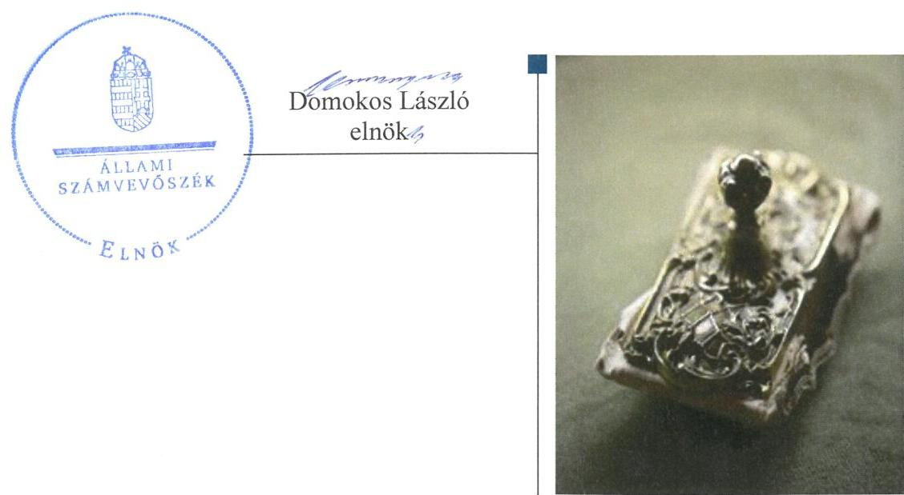
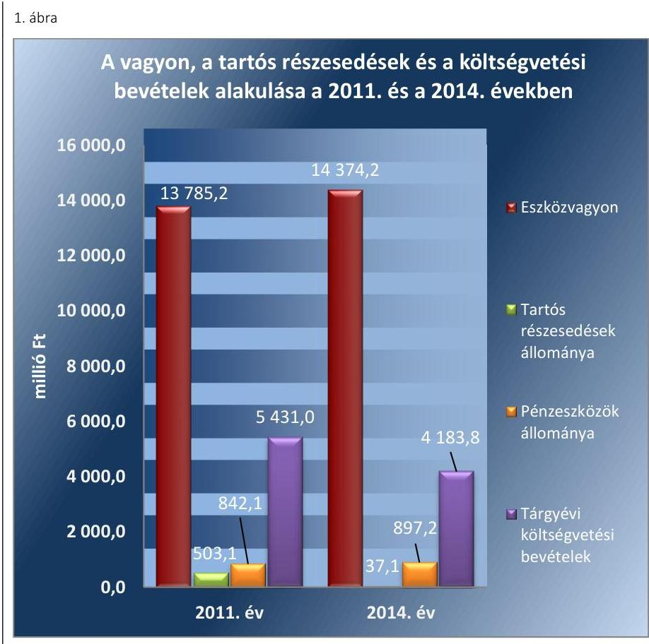
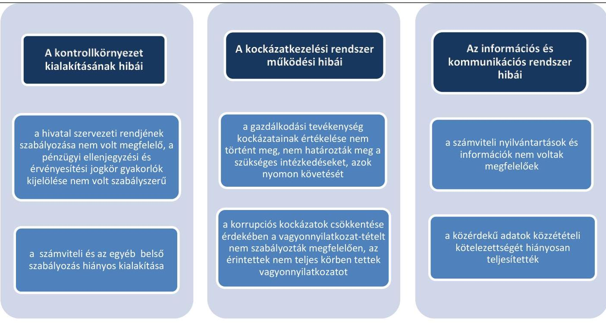
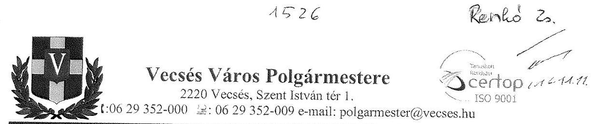
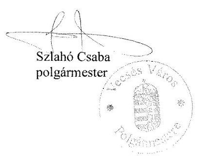
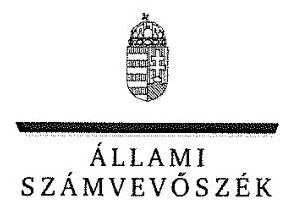
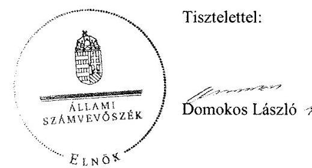
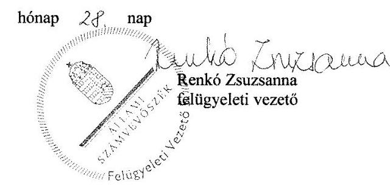

# Jelentés 

## Önkormányzatok belső kontrollrendszere

Az önkormányzatok belső kontrollrendszere kialakításának és működtetésének ellenőrzése - Vecsés 2016.

---

# Jelentés 

## Önkormányzatok belső kontrollrendszere

Az önkormányzatok belső
kontrollrendszere kialakításának és működtetésének ellenőrzése - Vecsés
2016. 12. hó 13. nap

---

# AZ ELLENŐRZÉST FELÜGYELTE:

- RENKŐ ZSUZSANNA felügyeleti vezető
- AZ ELLENŐRZÉST VEZETTE ÉS A VÉGREHAJTÁSÁÉRT FELELŐS:
  - PÁNCSICS JUDIT ellenőrzésvezető
  - A PROGRAM ÖSSZEÁLLÍTÁSÁÉRT FELELŐS:
    - JANIK JÓZSEF osztályvezető

- IKTATÓSZÁM: V-0990-116/2016.
- TÉMASZÁM: 2024
- ELLENŐRZÉS-AZONOSÍTÓ SZÁM: V-071812

Jelentéseink az Országgyűlés számítógépes hálózatán és az Interneten a www.asz.hu címen is olvashatóak.

---

# TARTALOMJEGYZÉK 

■ ÖSSZEGZÉS ..... 5
■ AZ ELLENŐRZÉS CÉLJA ..... 6
■ AZ ELLENŐRZÉS TERÜLETE ..... 7
■ AZ ELLENŐRZÉS HÁTTERE, INDOKOLTSÁGA ..... 9
■ A JELENTÉS LÉNYEGES KÉRDÉSKÖREI ..... 12
■ ELLENŐRZÉS HATÓKÖRE ÉS MÓDSZEREI ..... 13
■ MEGÁLLAPÍTÁSOK ..... 16
■ JAVASLATOK ..... 38
■ MELLÉKLETEK ..... 41
I. Sz. melléklet: Értelmező szótár. ..... 41
II. Sz. melléklet: Az integritás érvényesítése érdekében kialakított és működtetett kontrollrendszer ..... 45
■ FÜGGELÉK: ÉSZREVÉTELEK ..... 47
■ RÖVIDÍTÉSEK JEGYZÉKE ..... 61

---

.

---

# ÖSSZEGZÉS 

Vecsés Város Önkormányzata belső kontrollrendszere kialakításának és működtetésének hiányosságai miatt a befektetési tevékenységek szabályszerű végzését, elszámoltathatóságát nem támogatta. Az Önkormányzat beszámolója nem a valóságnak megfelelően mutatta be a befektetett közvagyon nagyságát. Az Önkormányzatnak az integritás szemlélet érvényesülése érdekében még erőfeszítéseket kell tennie.

## Az ellenőrzés társadalmi indokoltsága

Magyarország Alaptörvénye az önkormányzatoktól is elvárja a kiegyensúlyozott, átlátható és fenntartható költségvetési gazdálkodás elvének érvényesítését. Az önkormányzatok által betöltött társadalmi szerep, az általuk kezelt közpénz nagysága, a nemzeti vagyon átruházására vagy hasznosítására vonatkozó döntéseik sokrétűsége indokolttá teszik a számvevőszéki ellenőrzéseket. A belső kontrollrendszer kialakítása és működtetése nélkül nem valósítható meg a közpénzek, a közvagyon szabályos, gazdaságos, hatékony és eredményes felhasználása.

Vecsés Város Önkormányzata 2015. április 30-án 193,7 millió Ft névértékű államkötvénnyel és 849,6 millió Ft kincstárjeggyel rendelkezett. Az Önkormányzat egyik pénzügyi szolgáltatójának törvénytelen tevékenysége következtében fennállt a veszélye annak, hogy a befektetett közvagyon egy részét elveszítik. Felmerült, hogy a belső kontrollrendszer kialakítása és működtetése nem biztosította a közvagyon megóvását, körültekintő, biztonságos befektetését, a befektetési döntések, azok végrehajtása és számviteli elszámolása nem volt szabályszerű.

## Főbb megállapítások, következtetések, javaslatok

A belső kontrollrendszer kialakítása és működtetése nem volt szabályszerű, így nem segítette elő a szabálykövető működést és gazdálkodást. A befektetésekkel kapcsolatos döntés-előkészítés és döntéshozatal során nem gondoskodtak a kockázatok mérsékléséről. A kontrolltevékenységek nem megfelelő szabályozása és működtetése akadályozta a hibák megelőzését, feltárását. Az ellenjegyzési, a teljesítésigazolási, az érvényesítési jogkörök szabálytalan gyakorlása növelte a jogosulatlan kifizetések veszélyét.

Az egyes befektetések számviteli nyilvántartási értékének helytelen megállapítása, a részletező nyilvántartás nem megfelelő vezetése, valamint a leltározás és értékelés szabálytalan elvégzése következtében az önkormányzat beszámolója vagyonáról nem a valós összképet mutatta.

Az integritás szemlélet erősítése érdekében - a belső kontrollrendszer kialakításában és működésében feltárt hiányosságok és hibák megszüntetésével - az Önkormányzatnak ${ }^{1}$ még erőfeszítéseket kell tennie.

---

# AZ ELLENŐRZÉS CÉLJA 

Az ellenőrzés célja annak megállapítása volt, hogy az önkormányzat belső kontrollrendszerének kialakítása, továbbá egyes elemeinek működtetése biztosította-e az önkormányzatnál a közpénzfelhasználás szabályosságát. Az erőforrásokkal való szabályszerű és hatékony gazdálkodáshoz szükséges követelmények érvényesítése, számonkérése, ellenőrzése megtörtént-e az önkormányzatnál. A belső kontrollrendszer kialakítása és működtetése támogatta-e az integritás szemlélet érvényesülését. Az ellenőrzés során értékeltük a belső kontrollrendszer kialakításának és működtetésének szabályszerűségét. Bemutatjuk azokat a lényeges szabályozási hiányosságokat, amelyek miatt az ellenőrzött kulcskontrollok nem nyújtottak elegendő védelmet a lehetséges hibákkal szemben. Rámutattunk arra, ha a kulcskontrollok valamely hibát nem előztek meg, nem tártak fel vagy nem javítottak ki, valamint minősítjük működésük megfelelőségét.

Ellenőriztük, hogy az önkormányzat egyes befektetési döntései és azok végrehajtása, elszámolása megfelelt-e a vonatkozó jogszabályoknak és belső szabályozásoknak, a kialakított kontrollrendszer támogatta-e a befektetési tevékenység szabályszerűségét.

---

# AZ ELLENŐRZÉS TERÜLETE 

## Vecsés Város Önkormányzata

A Pest megyében fekvő Vecsés város állandó lakosainak száma 2015. január 1-jén 20704 fő volt.

Az Önkormányzat 11 tagú Képviselő-testületének ${ }^{2}$ munkáját hat állandó bizottság segítette.

A településen a helyi nemzetiségi önkormányzati képviselők 2014. évi választásáig német, roma és ruszin, azt követően német és roma helyi nemzetiségi önkormányzat működött.

Az Önkormányzat a Hivatalon ${ }^{3}$ kívül 11 intézménnyel, valamint öt gazdasági társasággal - melyekből három 100%-ban önkormányzati tulajdonban lévő gazdasági társaság - látta el a feladatait.

A polgármester ${ }^{4}$ a 2006. évi helyi önkormányzati képviselők és polgármesterek választása óta tölti be tisztségét. A jegyző ${ }^{5}$ 2009. óta látja el feladatait. A Hivatal nyolc szervezeti egységre, osztályra tagolódott, elkülönült gazdasági szervezettel nem rendelkezett. A Hivatalban foglalkoztatott köztisztviselők száma 2014. év végén 61 fő volt. A Hivatalban 2014. január 1-jétől szervezeti változás nem volt.

Az Önkormányzat a 2014. évi éves költségvetési beszámolója szerint 4 183,8 millió Ft költségvetési bevételt ért el, valamint 3 919,2 millió Ft költségvetési kiadást teljesített. 2014-ben több alkalommal, összesen 932,9 millió Ft névértékben vásároltak, illetve értékesítettek magyar államkötvényt, az év végén forgatási célú értékpapír állománnyal nem rendelkeztek.

Az eszközvagyon értéke 2014. december 31-én 14 374,2 millió Ft volt. A 37,1 millió Ft-os tartós részesedésekből a befektetési célú részesedések könyv szerinti értéke 4,6 millió Ft (névértéke 560 ezer Ft) volt, a közfeladatok ellátásában résztvevő önkormányzati érdekeltségű gazdasági társaságok üzletrészei 32,5 millió Ft-ot tettek ki. Az üzletrészek értéke a gazdasági társaságok átalakulása következtében 2011-ről 2014. év végére 466,5 millió Ft-tal csökkent. Az üzleti vagyonba tartozó ingatlanok értéke 2014-ben 498,8 millió Ft volt. A pénzeszközök értéke 2014. december 31-én 897,2 millió Ft-ot tett ki.

A 2014. évben a forrásokon belül a költségvetési évben esedékes kötelezettségállomány 117,4 millió Ft-ot, a költségvetési évet követően esedékes kötelezettségállomány 15,8 millió Ft-ot tett ki. Pénzintézettel szembeni kötelezettségük nem volt.

A 2013. évben 1 392,3 millió Ft összegű, a 2014. évben 948,1 millió Ft összegű pénzintézettel szembeni adósságot vállalt át az állam az Önkormányzattól.

Az Önkormányzat vagyonának, tartós részesedéseinek és a költségvetési bevételeinek alakulását a 2011. évben és a 2014. évben az 1. ábra mutatja be.

---

Adatok forrása: a 2011. és a 2014. évi éves költségvetési beszámolók

---

# AZ ELLENŐRZÉS HÁTTERE, INDOKOLTSÁGA 

Az ÁSZ tv. ${ }^{6}$ szerint az ÁSZ ${ }^{7}$ feladata a jól irányított állam kiépítésének elősegítése. Az ÁSZ Stratégiájában ezért hangsúlyos szerepet szánt annak, hogy szilárd szakmai alapon álló, értékteremtő ellenőrzéseivel előmozdítsa a közpénzügyek átláthatóságát, rendezettségét. A számvevőszéki ellenőrzés nemzetközi alapelvei is rögzítik, hogy a megfelelő belső kontrollrendszer minimálisra csökkenti a hibák és szabálytalanságok kockázatát.

A belső kontrollrendszer azt a célt szolgálja, hogy a költségvetési szervek működésük és gazdálkodásuk során a tevékenységeket szabályszerűen, gazdaságosan, hatékonyan, eredményesen hajtsák végre, teljesítsék elszámolási kötelezettségeiket és megvédjék az erőforrásokat a veszteségektől, a károktól és a nem rendeltetésszerű használattól. A belső kontrollrendszer magában foglalja mindazon szabályokat, eljárásokat, gyakorlati módszereket és szervezeti struktúrákat, kockázatkezelési technikákat, kontrolltevékenységeket, amelyek segítséget nyújtanak a szervezetnek céljai eléréséhez. A belső kontrollrendszer szabályozása háromszintű, a törvényi előírásokat az Áht. és az Mötv., a rendeleti szintű szabályozást az Ávr. és a Bkr. tartalmazza, amelyeket útmutatói szinten az NGM által kiadott standardok és kézikönyvek támogatnak.

Az ellenőrzött időszak meghatározása lehetőséget teremt a 2014. október 12-i önkormányzati választásokat megelőző és követő ciklus belső kontrollrendszere működésének elkülönült értékelésére, valamint a változások nyomon követésére.

A BELSŐ KONTROLLRENDSZER kialakításának és működtetésének általános értékelése mellett a teljesítésigazolás és érvényesítés kontrollok kiemelt ellenőrzésének szükségességét alátámasztja, hogy 2012-től a pénzügyi folyamatokban kulcsszerepet betöltő belső kontrollok rendszere módosult és azok működtetésében az önkormányzatoknál hiányosságok mutatkoztak a 2012. óta elvégzett ÁSZ ellenőrzések alapján.

Az önkormányzatok belső kontrollrendszerének ellenőrzése az ÁSZ „jó kormányzással" kapcsolatos stratégiai céljainak megvalósítását is szolgálja. Az ÁSZ célja, hogy javuljon az ellenőrzött önkormányzatok belső kontrollrendszerének szabályozottsága, működésének megfelelősége, hozzájárulva ezzel az egyensúlyi helyzet fenntarthatóságának biztosításához, azaz az adósság újratermelődésének megakadályozásához. Az ÁSZ ellenőrzés tapasztalatai nem csupán a közvetlenül ellenőrzött önkormányzatokat segíthetik, hanem a „jó gyakorlat" elterjesztésével azok az önkormányzatok is átvehetik a pozitív példákat, ahol nem végez ellenőrzést az ÁSZ.

Az MNB három befektetési szolgáltató tevékenységi engedélyét 2015. első felében visszavonta és kezdeményezte a vállalkozások felszámolását a működéssel kapcsolatos szabálytalanságok, hiányosságok miatt. A korábbi évek ellenőrzési tapasztalatai alapján fennáll a lehetősége annak, hogy az önkormányzatok befektetési döntései, továbbá a döntések végrehajtása és számviteli elszámolása nem voltak teljes mértékben szabályszerűek, és a kapcsolódó külső ellenőrzések és a belső kontrollrendszer sem működtek minden esetben megfelelően.

---

Magyarország Alaptörvénye az önkormányzatoktól, mint az államháztartás alanyaitól elvárja a kiegyensúlyozott, átlátható és fenntartható költségvetési gazdálkodás elvének érvényesítését. A nemzeti vagyonról szóló törvény szerint a nemzeti vagyonnal felelős módon, rendeltetésszerűen kell gazdálkodni. A nemzeti vagyongazdálkodás feladata a nemzeti vagyon rendeltetésének megfelelő, átlátható, hatékony és költségtakarékos működtetése, ugyanakkor értékének megőrzését, értéknövelő használatát, hasznosítását, gyarapítását is elvárja.

# AZ ÖNKORMÁNYZATOK ÁTMENETILEG SZABAD PÉNZESZKÖZEINEK BEFEKTETÉSÉT jogszabály nem 

tiltja, a pénzpiaci szolgáltatók közül az önkormányzatok a kínált szolgáltatás és annak költségei alapján, szabadon választhatnak, a veszteséges gazdálkodás kockázatai és következményei azonban az önkormányzatokat terhelik. A szabad pénzeszközök felelős hasznosítása összhangban áll az önkormányzati gazdálkodás alapelveivel.

A közintézmények integritás alapú kultúrájának kialakítása, megerősítése és működése szorosan összefügg a belső kontrollrendszer működésével, ezért az ellenőrzés kiterjed annak értékelésére is, hogy a belső kontrollrendszer kialakítása és működtetése hogyan hatott az integritás szemlélet érvényesülésére.

Az államháztartás önkormányzati alrendszerében a 2014. év elején összesen 3177 települési önkormányzat működött: a 23 kerülettel rendelkező főváros, 345 város, 2691 község és 117 nagyközség volt. A belső kontrollrendszer kialakítása és működtetése ellenőrzését az ÁSZ által lefolytatott, kisebb településeket is érintő ellenőrzéseinek tapasztalatai, valamint a közérdekű bejelentések kockázati szempontú értékelése alapozták meg. Ezek a községek, nagyközségek gazdálkodásának, belső kontrollrendszere kialakításának és működésének hiányosságaira mutattak rá. Az ellenőrzések helyszíneinek kiválasztása során az ÁSZ célzott adatfeldolgozáson alapuló kockázatelemző rendszerére támaszkodik. Ez elősegíti, hogy azokon a területeken végezzen ellenőrzéseket, összpontosítva erőforrásait, ahol a valódi kockázatok, az aktuális problémák vannak.

## AZ ELLENŐRZÉS VÁRHATÓ HASZNOSULÁSA NÉGY SZINTEN valósul meg.

A törvényalkotás számára összegzett tapasztalatok állnak rendelkezésre a belső kontrollrendszer önkormányzati területen való kialakításáról, működtetéséről és hatásairól. Az ÁSZ az ellenőrzéseivel hozzájárul ahhoz, hogy az egyes önkormányzati befektetésekkel kapcsolatos kockázatok a szabályozási és kontroll mechanizmusok fejlesztésével mérsékelhetők legyenek.

Az ellenőrzés az ellenőrzött számára visszajelzést ad a belső kontrollrendszer kialakításában és működésében lévő hiányosságokról, javaslataival hozzájárul azok kiküszöböléséhez. Feltárja az önkormányzati befektetési tevékenységet meghatározó szabályozások összhangjának hiányosságait, a szabályozással nem érintett gazdálkodási területeket, valamint az egyes befektetési tevékenységek esetleges szabálytalanságait.

Az ellenőrzés megállapításait és javaslatait más szervezetek is hasznosíthatják a rendezett gazdálkodási keretek kialakításához.

---

A társadalom számára jelzi, hogy közpénz nem maradhat ellenőrizetlenül, az ÁSZ értékteremtő
 rend kialakításához és megőrzéséhez hozzájáruló tevékenysége pozitív hatással lesz a szervezetről kialakított összkép formálásában.

---

# A JELENTÉS LÉNYEGES KÉRDÉSKÖREI 

1.     - Az önkormányzat belső kontrollrendszerének kialakítása és működtetése szabályszerű volt-e 2014. január 1. és 2015. április 30. között, valamint a belső kontrollrendszer egyes pillérei támogatták-e a befektetési tevékenység szabályszerű végzését 2011. január 1. és 2015. április 30. között?
2.     - Az egyes befektetésekkel kapcsolatos döntéshozatal és a döntések végrehajtása szabályszerű volt-e?
3.     - Az egyes befektetések számviteli elszámolása, nyilvántartása szabályszerű volt-e?
4.     - Az erőforrásokkal való szabályszerű és hatékony gazdálkodáshoz szükséges követelmények érvényesítése, számonkérése, ellenőrzése megtörtént-e az önkormányzatnál?
5.     - Az önkormányzat belső kontrollrendszerének kialakítása és működtetése támogatta-e az integritás szemlélet érvényesülését?

---

# ELLENŐRZÉS HATÓKÖRE ÉS MÓDSZEREI 

## Az ellenőrzés típusa

Megfelelőségi ellenőrzés, a befektetési tevékenység esetében szabályszerűségi ellenőrzés.

## Az ellenőrzött időszak

A belső kontrollrendszer kialakításának és működtetésének ellenőrzése a 2014. január 1. és 2015. április 30. közötti időszakra terjedt ki. Ezen belül a belső kontrollrendszer kialakításának és működtetésének megfelelőségét a 2014. január 1. és október 12., valamint a 2014. október 13. és 2015. április 30. közötti időszakra vonatkozóan külön-külön értékeltük. Az önkormányzatok egyes befektetési tevékenységeinek ellenőrzése tekintetében az ellenőrzött időszak a 2011. január 1. - 2015. április 30. közötti időszak. Ezen felül az önkormányzat befektetésekkel kapcsolatos döntés-előkészítésének és döntéshozatalának szabályszerűségét a 2011. január 1. előtti időszakra visszanyúlóan is ellenőriztük, amennyiben a 2014. június 30-án, illetve 2015. április 30-án meglévő értékpapír-befektetéseire 2011. január 1-je előtt került sor. Az integritás szemlélet érvényesülését a 2014. évre vonatkozó adatszolgáltatás alapján értékeltük.

## Az ellenőrzés tárgya

A helyi önkormányzatnak, mint éves költségvetési beszámoló készítésére kötelezett szervezetnek és polgármesteri hivatalának belső kontrollrendszere. Az önkormányzat 2014. június 30-án, illetve 2015. április 30-án meglévő értékpapírokban megtestesülő befektetései, lekötött betétei, valamint az önkormányzat üzleti vagyonába tartozó ingatlanok, kulturális javak (műtárgyak, műalkotások, stb.), illetve a feladatellátást nem szolgáló egyéb értéktárgyak (pl. ékszerek, befektetési nemesfém). Az erőforrásokkal való szabályszerű és hatékony gazdálkodáshoz szükséges követelmények érvényesítése, számonkérése, ellenőrzése. Az integritás szemlélet érvényesülése.

## Az ellenőrzött szervezet

Vecsés Város Önkormányzata és az önkormányzati működéshez kapcsolódó feladatokat ellátó Hivatal.

---

# Az ellenőrzés jogalapja 

Az ÁSZ tv. 1. § (3) bekezdésében foglaltak alapján az ÁSZ általános hatáskörrel végzi a közpénzekkel és az állami és önkormányzati vagyonnal való felelős gazdálkodás ellenőrzését. Az ÁSZ tv. 5. § (2) bekezdése alapján az államháztartás gazdálkodásának ellenőrzése keretében az ÁSZ ellenőrzi a helyi önkormányzatok gazdálkodását, valamint az ÁSZ tv. 5. § (6) bekezdése alapján ellenőrzése során értékeli az államháztartás számviteli rendjének betartását és a belső kontrollrendszer működését.

## Az ellenőrzés módszerei

Az ellenőrzést a nemzetközi standardokat irányadónak tekintve az ellenőrzési program ellenőrzési kérdései, az ellenőrzött időszakban hatályos jogszabályok, az ellenőrzés szakmai szabályok és módszertanok figyelembe vételével végeztük.

Az ellenőrzés lefolytatásához az Önkormányzat a tanúsítványok kitöltésével, valamint az ÁSZ által kért dokumentumok elektronikus megküldésével szolgáltatott adatokat. A rendelkezésre bocsátott adatok, információk kontrollja és a munkalapok kitöltése az ellenőrzés keretében történt. A jelentésben használt fogalmak magyarázatát az I. számú melléklet, az integritás érvényesítése érdekében kialakított és működtetett kontrollrendszer minősítését a II. számú melléklet tartalmazza.

A belső kontrollrendszer jogszabályi előírások szerinti kialakításának és működtetésének szabályszerűségét az erre irányuló ellenőrzési kérdésekre adott válaszok összesítése alapján külön-külön értékeltük a 2014. január 1. és október 12., valamint a 2014. október 13. és 2015. április 30. közötti időszakra. A belső kontrollrendszert egy-egy ellenőrzött időszakra pillérenként (kontrollkörnyezet, kockázatkezelési rendszer, kontrolltevékenységek, információs és kommunikációs rendszer, monitoring rendszer) és összesítetten is értékeltük.

## A BELSŐ KONTROLLRENDSZER EGYES PILLÉRE-

INEK KIALAKÍTÁSA ÉS MŰKÖDTETÉSE „szabályszerű volt", amennyiben az értékelt területen az elért és elérhető pontok százalékban kifejezett, egész számra kerekített hányadosa meghaladta a 84%-ot, „részben szabályszerű volt", ha 61-84% közé esett, „nem szabályszerű volt", ha nem haladta meg a 60%-ot. A belső kontrollrendszer összesített értékelése megegyezett a pillérenként (kontrollterületenként) alkalmazott százalékos értékelésekkel, a következő eltérésekkel. A kontrollrendszer egésze esetében a „szabályszerű" értékelésnek a százalékos értéken felül további feltétele volt, hogy egyik kontrollterület sem kaphat „nem szabályszerű" értékelést, a „részben szabályszerű" értékelés további feltétele volt, hogy legfeljebb egy ellenőrzött kontrollterület lehet „nem szabályszerű" értékelésű. Az összesített értékelés a százalékos értéktől függetlenül „nem szabályszerű volt", ha az ellenőrzött kontrollterületek közül több mint egynek „nem szabályszerű volt" az értékelése.

---

# A GAZDÁLKODÁS FOLYAMATÁBAN A KÉT 

KULCSKONTROLL - teljesítésigazolás, érvényesítés - működésének megfelelőségét a személyi juttatásokkal, a dologi kiadásokkal, a beruházási, felújítási kiadásokkal, az ellátottak pénzbeli juttatásaival és az egyéb működési, felhalmozási célú, valamint a finanszírozási kiadásokkal kapcsolatos kifizetések esetében mintavétellel ellenőriztük. A mintavétel során külön értékeltük a 2014. január 1. és 2014. október 12. közötti időszakban és a 2014. október 13. és 2015. április 30. közötti időszakban teljesített kifizetéseket. „Megfelelőnek" értékeltük a gazdálkodási jogkörök gyakorlását, amennyiben 95%-os bizonyossággal a teljes sokaságban a hibaarány legfeljebb 10%, ,,részben megfelelőnek" értékeltük, ha a hibaarány felső határa 10-30% között volt, ,,nem megfelelőnek" pedig akkor, ha a mintavételi eredmények alapján a sokaságbeli hibaarány felső határa meghaladta a 30%-ot.

Az integritás szemlélet érvényesülésének értékelése az önkormányzat által kitöltött tanúsítvány alapján történt.

---

# MEGÁLLAPÍTÁSOK

## 1. Az önkormányzat belső kontrollrendszerének kialakítása és működtetése szabályszerű volt-e 2014. január 1. és 2015. április 30. között, valamint a belső kontrollrendszer egyes pillérei támogatták-e a befektetési tevékenység szabályszerű végzését 2011. január 1. és 2015. április 30. között?

Összegző megállapítás

A belső kontrollrendszer kialakítása és működtetése az összesített értékelés alapján 2014. január 1. és 2015. április 30. között - a feltárt hiányosságok miatt - nem volt szabályszerű. A belső kontrollrendszer egyes pilléreinek kialakítása és működtetése 2011. január 1. és 2015. április 30. között nem támogatta a befektetési tevékenységek szabályszerű, átlátható, elszámoltatható végzését.

A belső kontrollrendszer kialakításának és működtetésének összesített értékelését az 1. táblázat mutatja be:

1. táblázat

|  A BELSŐ KONTROLLRENDSZER KIALAKÍTÁSÁNAK ÉS MŰKÖDTETÉSÉNEK ÖSSZESÍTETT ÉRTÉKELÉSE |  |  |  |   |
| --- | --- | --- | --- | --- |
|  Megnevezés | A gazdálkodás egészét érintően: |  | A befektetési tevékenységet érintően: |   |
|   | 2014. január 1-től | 2014. október 13-től | 2014. október 13-től | 2014. január 1-től 2015.  |
|   | 2014. október 12-ig | 2015. április 30-ig | 2011. 2013. években | 2014. január 1-től 2015.  |
|  Kontrollkörnyezet | szabályszerű |  |  |   |
|  Kockázatkezelési rendszer | nem szabályszerű |  |  |   |
|  Kontrolltevékenységek | nem szabályszerű |  |  |   |
|  Információs és kommunikációs rendszer | szabályszerű |  |  | nem támogatta  |
|  Monitoring | szabályszerű |  |  |   |
|  BELSŐ KONTROLLRENDSZER | NEM SZABÁLYSZERŰ |  | NEM TÁMOGATTA |   |
|   |  |  |  | Forrás: ÁSZ  |

1.1. számú megállapítás

A kontrollkörnyezet kialakítása 2014. január 1. és 2015. április 30. között a feltárt hiányosságok mellett szabályszerű volt. A Hivatalban a szervezeti kereteket és a feladat- és hatáskörök rendszerét nem a jogszabályi előírásokkal összhangban alakították ki. A belső szabályozások tartalma nem felelt meg teljes körűen a jogszabályi előírásoknak. A kontrollkörnyezet kialakítása 2011. január 1. és 2015. április 30. között az egyes befektetési tevékenységek szabályszerű végzését nem támogatta.

A SZERVEZETI ÉS A SZABÁLYOZÁSI KERETEKET a Képviselő-testület a 2011. január 1. és 2015. április 30. között - néhány

---

hiányosság mellett - szabályszerűen alakította ki. A működését megalapozó dokumentumokat az alábbiak szerint hagyta jóvá:

- Az önkormányzati SZMSZ1-3⁸ az Ötv.⁹, valamint az Mötv.¹⁰ előírásának megfelelően tartalmazta a szervezeti és működési rend részletes szabályait, a feladat- és hatásköröket, a Képviselő-testület által a polgármesterre és a bizottságokra átruházott hatásköröket. Az önkormányzati SZMSZ1 67. § (6) bekezdésében 2011. január 28-ig a Képviselő-testület - beszámolási kötelezettség előírásával - felhatalmazta a polgármestert az átmenetileg szabad pénzeszközök rövid távú lekötésére.
- Az önkormányzati vagyonnal történő gazdálkodás szabályait a Htv.-ben¹¹ előírtaknak megfelelően elfogadta, melyeket a vagyongazdálkodási rendelet₁,₂-ben¹² rögzített. Meghatározta az önkormányzati feladatellátást biztosító törzsvagyon körét, azon belül a forgalomképtelen és a korlátozottan forgalomképes vagyonelemeket. Szabályozta a vagyonnal való rendelkezési és döntési hatásköröket, a követelésekről való lemondás eseteit és módját, a vagyon elidegenítésére, kezelésbe adására vonatkozó szabályokat. A vagyongazdálkodási rendelet₁ 8/A. §-ában 2013. június 27-ig előírták, hogy a polgármester az átmenetileg szabad pénzeszközöket bármely hitelintézetnél betétként elhelyezheti, kincstárjegyet, államkötvényt, államilag garantált egyéb értékpapírt, illetve kereskedelmi kötvényt vásárolhat.
- Elfogadta az Ötv., illetve az Mötv. előírásainak megfelelően az Önkormányzat fejlesztési terveit (gazdasági programot), valamint az Nvtv.-ben¹³ foglaltak szerint a közép- és hosszú távú vagyongazdálkodási tervet.
- A 2011-2015. évi költségvetési rendeleteket¹⁴ az Áht.₁,₂-ben¹⁵ foglalt előírásoknak megfelelő részletezettségben hagyta jóvá. A 2011-2015. évi költségvetési rendeletekben a Képviselő-testület a Hivatal engedélyezett létszámát meghatározta, továbbá a polgármestert felhatalmazta az átmenetileg szabad pénzeszközök feletti rendelkezési joggal.
- Jóváhagyta a Hivatal alapító okiratát és szervezeti és működési szabályzatait. A hivatali SZMSZ₃₋₅¹⁶ tartalmazta a Hivatal szervezeti felépítését, működési rendjét, a szervezeti egységek megnevezését, engedélyezett létszámát, feladatait, valamint a szervezeti ábrát. A Képviselő-testület 2014-ben a hivatali SZMSZ₄,₅ II. szervezeti szabályok fejezetében az Ávr.¹⁷ 13. § (1) bekezdés e) pontjában előírtak ellenére nem határozta meg a Hivatal szervezetén belül a gazdasági szervezetet, az engedélyezett létszámát és a feladatait annak ellenére, hogy az Ávr. 8. § (1) bekezdés c) pontjában foglaltak alapján gazdasági szervezettel kellett volna rendelkeznie, mivel a település lakosságszáma meghaladta az ötezer főt.

A HIVATAL BELSŐ SZABÁLYOZÁSÁT a jegyző 2011. január 1. és 2015. április 30. között az alábbiak szerint alakította ki:

- Rendelkeztek a Számv. tv.¹⁸-ben foglaltaknak megfelelően számviteli politika₁₋₆¹⁹-tal és annak keretében elkészítendő pénzkezelési-, leltározási-, értékelési és önköltség-számítási szabályzattal, amelyeket

---

szükség szerint aktualizáltak. A leltározási szabályzat₁₋₆²⁰-ban szabályozták a befektetett eszközök és értékpapírok leltározását. Az értékelési szabályzat₁₋₆²¹ tartalmazta - az Áhsz.₁,₂-ben²² foglaltaknak megfelelően - a követelések év végi értékelésének elveit. 2011-2013-ban az értékelési
 szabályzat ${ }_{1-3}$-ban rögzítették, hogy az Önkormányzatnál nem kívánnak élni az immateriális javak, a tárgyi eszközök és a befektetett pénzügyi eszközök esetében a piaci értéken történő értékelés lehetőségével. 2014-től az értékelési szabályzat ${ }_{4-6}$ ban az immateriális javak, a tárgyi eszközök és a befektetett pénzügyi eszközök esetében a piaci értéken történő értékelést megalapozó értékhelyesbítés szabályait meghatározták. A jegyző a pénzkezelési szabályzat ${ }_{1-7}$-ben ${ }^{23}$ meghatározta a pénzforgalom – fizetési számlán, illetve pénztárban történő – lebonyolítási módját. Rögzítette a pénzkezeléssel kapcsolatos bizonylati rendet és a pénzforgalommal kapcsolatos nyilvántartási szabályokat. A pénzkezelési szabályzat ${ }_{2-7}$ tartalmazta, hogy az átmenetileg szabad pénzeszközök hasznosításáról – a vagyongazdálkodási rendelet ${ }_{1}$-ben és az éves költségvetési rendeletekben előírtakkal összhangban, a Képviselőtestület felhatalmazása alapján – a polgármester dönt.
A számlarend ${ }_{1-4}{ }^{24}$ tartalmazta a számlatükröt, a gazdasági eseményekkel – köztük a részesedésekkel, értékpapírokkal – kapcsolatos elszámolásokat. Előírásra került az analitikus nyilvántartás és a főkönyvi könyvelés közötti értékadatok számszerű egyeztetési feladata a felelősök kijelölésével.
A gazdálkodási feladatok ügyrendje ${ }_{1-4}$-ben ${ }^{25}$ az Ámr. ${ }^{26}$ 20. § (3) bekezdésében, illetve az Ávr. 9. § (4) bekezdésében és az Ávr. 13. § (5) bekezdésében előírtak ellenére az egyes befektetési tevékenységek kivételével határozta meg a Vagyongazdálkodási-, a Pénzügyi- és az Üzemeltetési osztály gazdálkodással kapcsolatos feladatait.
A gazdálkodási jogkörök gyakorlásának módját, eljárási és dokumentációs részletszabályait, valamint az ezeket végző személyek kijelölésének rendjével kapcsolatos előírásokat a jegyző a gazdálkodási szabályzat ${ }_{1-6}$-ban ${ }^{27}$ rögzítette. A kötelezettségvállalásra, a kötelezettségvállalás pénzügyi ellenjegyzésére, a teljesítésigazolásra, az érvényesítésre, az utalványozásra vonatkozó szabályok a befektetési tevékenységekkel kapcsolatos gazdasági eseményekre is kiterjedtek.
A jegyző kiadta a hivatali és önkormányzati feladatokra is kiterjedő ellenőrzési nyomvonal ${ }_{1-3}$-at ${ }^{28}$ és a szabálytalanságkezelési eljárás-rend ${ }_{1-3}$-at ${ }^{29}$.
A humánerőforrás-gazdálkodás kereteit kialakították, a jegyző a Kttv. ${ }^{30}$ előírása szerint elkészítette a közszolgálati szabályzatot ${ }^{31}$.
A hivatali és az önkormányzati feladatok esetében az Mvtv. ${ }^{32}$ előírásainak megfelelően munkavédelmi szabályzatban rögzítették az egészséget nem veszélyeztető és biztonságos munkavégzés követelményei megvalósításának módját, valamint rendelkeztek tűzvédelmi szabályzattal.

---

# A KONTROLLRENDSZER KIALAKÍTÁSÁNAK HIÁNYOSSÁGAI 2011. január 1. és 2013. december 31. között az alábbiak voltak:

- A hivatali SZMSZ ${ }_{1-3}$ – a jegyző hiányos előterjesztése miatt – az Ámr. 20. § (2) bekezdés h) pontjában, illetve az Ávr. 13. § (1) bekezdés g) pontjában foglaltak ellenére nem tartalmazta a szervezeti és működési szabályzatban nevesített munkakörökhöz tartozó feladat- és hatásköröket, valamint a hatáskörök gyakorlásának módját és az ezekhez kapcsolódó felelősségi szabályokat.
- A jegyző a pénzkezelési szabályzat ${ }_{1-4}$-ben a Számv. tv. 14. § (8) bekezdésében foglaltak ellenére nem rögzítette az Önkormányzatnak az egyes befektetési szolgáltatóknál (OTP Bank ${ }^{33}$, Quaestor Zrt. ${ }^{34}$, Takarékbank Zrt. ${ }^{35}$, Pátria Takarék ${ }^{36}$) vezetett értékpapír- és ügyfélszámláit, valamint azok pénzforgalma lebonyolításának rendjét, továbbá a pénzforgalommal kapcsolatos nyilvántartási szabályokat.
- A jegyző a számlarend ${ }_{1-3}$-ban – az Áhsz. ${ }_{1}$ 49. § (3) bekezdésében előírtak ellenére – saját hatáskörben nem szabályozta a tartós részesedések és a forgatási célú hitelviszonyt megtestesítő értékpapírok esetében az analitikus nyilvántartások tartalmát, a nyilvántartás vezetésének módját, a kapcsolódó főkönyvi nyilvántartásokkal való egyeztetés dokumentálását.
- A gazdálkodási szabályzat ${ }_{2-3}$-ban a kötelezettségvállalás pénzügyi ellenjegyzésére és a kiadások érvényesítésére jogosultakat a gazdasági szervezettel nem rendelkező Hivatalban az Ávr. 55. § (2) bekezdés f) pontjában, valamint az Ávr. 58. § (4) bekezdésében előírtak ellenére a jegyző helyett a pénzügyi osztályvezető ${ }^{37}$ jelölte ki, holott a hivatali SZMSZ ${ }_{1-3}$ az Ámr. 20. § (1) bekezdés e) pontjában, illetve az Ávr. 13. § (1) bekezdés e) pontjában előírtak szerint nem tartalmazta a gazdasági szervezet megnevezését, engedélyezett létszámát és feladatait.
- Az ellenőrzési nyomvonal ${ }_{1,2}$ – az Ámr. 156. § (2) bekezdésében, illetve a Bkr. ${ }^{38}$ 6. § (3) bekezdésében foglaltak ellenére – nem terjedt ki valamennyi működési folyamatra, így az egyes befektetési tevékenységekre sem.
A kontrollkörnyezet kialakítása a szabályozási hiányosságok miatt 2011. január 1. és 2013. december 31., valamint 2014. január 1. és 2015. április 30. közötti időszakokban a befektetési tevékenységek szabályszerű végzését nem támogatta.

A kontrollkörnyezet kialakítása – 2014. január 1. és október 12., valamint 2014. október 13. és 2015. április 30. közötti időszakban külön-külön értékelve – a 2. táblázatban részletezett hiányosságok mellett szabályszerű volt.
2. táblázat

## A KONTROLLKÖRNYEZET KIALAKÍTÁSÁNAK HIÁNYOSSÁGAI

## Sorszám

1. A hivatali SZMSZ ${ }_{4,5}$ – a jegyző hiányos előterjesztése miatt az Ávr. 13. § (1) bekezdés g) pontjában előírtak ellenére – nem tartalmazta a szervezeti és működési szabályzatban nevesített munkakörökhöz tartozó feladat- és hatásköröket, valamint a hatáskörök gyakorlásának módját, és az ezekhez kapcsolódó felelősségi szabályokat.

---

| Sorszám | Részmegállapítás |
| :--: | :--: |
|  | 2014-ben a hivatali SZMSZ4,5 II. szervezeti szabályok fejezetében az Ávr. 13. § (1) bekezdés e) pontjában előírtak ellenére nem határozták meg a Hivatal szervezetén belül a gazdasági szervezetet, az engedélyezett létszámát és a feladatait annak ellenére, hogy az Ávr. 8. § (1) bekezdés c) pontjában foglaltakkal ellentétben gazdasági szervezettel kellett volna rendelkeznie. |
| 2. | A gazdasági szervezettel nem rendelkező Hivatalban a jegyző által kiadott gazdálkodási szabályzat ${ }_{4-6}$-ban az Ávr. 55. § (2) bekezdés f) pontjában, illetve az Ávr. 58. § (4) bekezdésében előírtak ellenére a jegyző helyett a pénzügyi osztályvezető jelölte ki a kötelezettségvállalás pénzügyi ellenjegyzésére és az érvényesítésre jogosultakat. |
| 3. | A jegyző a számlarend ${ }_{4}$-ben nem szabályozta – az Áhsz. 2 51. § (3) bekezdésében előírtak ellenére a részletező nyilvántartások vezetésének módját, az összesítő bizonylatok tartalmi és formai követelményeit. |
| 4. | A jegyző sem a hivatali SZMSZ4,5-ben, sem a gazdálkodási feladatok ügyrendje ${ }_{4}$-ben nem határozta meg – az Ávr. 13. § (5) bekezdésében foglaltak ellenére – a gazdálkodással kapcsolatos tevékenységek közül az egyes befektetési tevékenységekre vonatkozóan az ellátott feladatok munkafolyamatainak leírását, a szervezeti egység vezetője és alkalmazottainak feladat és hatáskörét, a belső és külső kapcsolattartás módját. |
| 5. | A jegyző az ellenőrzési nyomvonal ${ }_{3}$-ban – a Bkr. 6. § (3) bekezdésében foglaltak ellenére – nem határozta meg a Hivatal valamennyi működési folyamatát, így az egyes befektetési tevékenységeket sem. |
| 6. | A jegyző a pénzügyi és számviteli területen foglalkoztatott köztisztviselők munkaköri leírásaiban a Kttv. 75. § (1) bekezdés d) pontjában és a Kttv. 226. § (1) bekezdésében foglaltak ellenére a munkakör betöltésével kapcsolatos követelményeket nem írta elő, csak a köztisztviselő meglévő iskolai végzettségét és szakképzettségét rögzítette. |
| 7. | A Képviselő-testület – a jegyző előterjesztésének hiányában nem határozta meg – a Kttv. 231. § (1) bekezdésében foglaltak ellenére a Hivatal köztisztviselőire vonatkozó hivatásetikai alapelvek részletes tartalmát, valamint az etikai eljárás szabályait. |

Forrás: ÁSZ
1.2. számú megállapítás

A kockázatkezelési rendszer kialakítása és működtetése 2014. január 1. és 2015. április 30. között nem volt szabályszerű. A gazdálkodásban rejlő kockázatokat – ideértve az egyes befektetési tevékenységekkel kapcsolatos kockázatokat – nem mérték fel és nem értékelték, emiatt 2011. január 1. és 2015. április 30. között a kockázatkezelési rendszer nem támogatta a befektetési tevékenységek szabályszerű végzését, a pénzügyi kockázatok minimalizálását.

A KOCKÁZATKEZELÉSI SZABÁLYZAT ${ }_{1-3}{ }^{39}$ általánosságban tartalmazta a kockázatok azonosításával, elemzésével, csoportosításával, illetve a kockázati kitettség csökkentésével kapcsolatos tevékenységeket.

A jegyző 2011. január 1. és 2015. április 30. között az Áht. 1 121. § (2) bekezdés b) pontjában, az Ámr. 157. § (1) bekezdésében, illetve a Bkr. 3. § b) pontjában és a 7. § (1) bekezdésében előírtak ellenére nem működtette a kockázatkezelési rendszert. A tevékenységekben, gazdálkodásban, így a befektetési tevékenységben rejlő kockázatok felmérése, a szükséges intézkedések előírása, illetve azok teljesítésének nyomon követése az ellenőrzött időszakban az Ámr. 157. § (2)-(3) bekezdésében, illetve a Bkr. 7. § (2) bekezdésében előírtak ellenére nem történt meg. Ennek következtében a kockázatkezelési rendszer nem támogatta a befektetési tevékenységek szabályszerű végzését.

A VAGYONNYILATKOZAT-TÉTELI KÖTELEZETTSÉGET és annak eljárási szabályait a köztisztviselők esetében a hivatali

---

SZMSZ3-5-ben és a vagyonnyilatkozatok kezelésének rendjéről szóló szabályzatban rögzítették. A vagyonnyilatkozat-tételi kötelezettségüknek a köztisztviselők eleget tettek.

A Képviselő-testület – az önkormányzati SZMSZ2,3 2. számú mellékletében – a Pénzügyi bizottság ${ }^{40}$ feladataként határozta meg a polgármester és az önkormányzati képviselők vagyonnyilatkozatának nyilvántartását, ellenőrzését. Az önkormányzati képviselőket a jegyző a vagyonnyilatkozat-tételi kötelezettség fennállásáról és esedékességéről a Vnytv. ${ }^{41}$ előírásainak megfelelően tájékoztatta, a képviselők a vagyonnyilatkozataikat határidőben benyújtották.

Az önkormányzati SZMSZ ${ }_{2,3}$ – a Vnytv. 4. § d) pontjában rögzítettek ellenére – nem tartalmazta az önkormányzati bizottságok nem képviselő tagjai vagyonnyilatkozat-tételi kötelezettségét. A bizottságok nem önkormányzati képviselő tagjai javaslattételre, döntésre, ellenőrzésre jogosultak, ami miatt a Vnytv. 3. § (3) bekezdés e) pontjában foglaltak alapján vagyonnyilatkozat-tételre kötelezettek. A bizottságok nem önkormányzati képviselő tagjait a jegyző a Vnytv. 8. § (4) bekezdésében előírtak ellenére nem tájékoztatta a vagyonnyilatkozat-tételi kötelezettség fennállásáról és esedékességéről, a bizottságok nem képviselő tagjai vagyonnyilatkozatot nem adtak le.

A vagyonnyilatkozatok őrzésért felelős a Vnytv. 7. § a) pontja, valamint a Vnytv. 11. § (6) bekezdésében foglaltak ellenére nem állapította meg az önkormányzati bizottságok nem képviselő tagjai esetében a vagyonnyilatkozat átadására, nyilvántartására, a vagyonnyilatkozatban foglalt személyes adatok védelmére vonatkozó további szabályokat.

A kockázatkezelési rendszer a befektetési tevékenységek szabályszerű végzését nem támogatta 2011. január 1. és 2013. december 31., valamint 2014. január 1. és 2015. április 30. közötti időszakokban, mivel a jegyző nem gondoskodott a kockázatok felméréséről, kezeléséről és nem kezdeményezte a Képviselő-testületnél a bizottságok nem képviselő tagjai vagyonnyilatkozat-tételi kötelezettségének az előírását és teljesítését sem.

A kockázatkezelési rendszer kialakítása és működtetése a 2014. január 1. – 2014. október 12. közötti, valamint a 2014. október 13. – 2015. április 30. közötti időszakban nem volt szabályszerű, a hiányosságokat a 3. táblázat részletezi.
3. táblázat

# A KOCKÁZATKEZELÉSI RENDSZER MŰKÖDTETÉSÉNEK HIÁNYOSSÁGAI

## Sorszám

## Részmegállapítás

A jegyző – a Bkr. 3. § b) pontjában és a 7. § (1)-(2) bekezdéseiben előírtak ellenére – nem gondoskodott a kockázatkezelési rendszer működtetéséről. Nem mérték fel és nem állapították meg a Hivatal tevékenységében, gazdálkodásában – azon belül az egyes befektetési tevékenységekben – rejlő kockázatokat, valamint nem határozták meg az egyes kockázatokkal kapcsolatban szükséges intézkedéseket, valamint azok teljesítésének folyamatos nyomon követési módját.
2. A jegyző az Mótv. 81. § (3) bekezdés e) pontjában foglaltakat figyelmen kívül hagyva nem kezdeményezte a Képviselő-testületnél az
 önkormányzati SZMSZ${}_{2,3}$ kiegészítését - a Vnytv. 4. § d) pontjában rögzítettek ellenére - az önkormányzati bizottságok nem képviselő tagjai vagyonnyilatkozat-tételi kötelezettségének előírásával.

---

### 1.3. számú megállapítás

A pénzügyi folyamatokban kulcsszerepet betöltő teljesítésigazolás és érvényesítés kontrollok működtetése nem felelt meg a jogszabályokban és a belső szabályzatokban előírtaknak. A kulcskontrollok - azok közül elsősorban az érvényesítés - nem biztosították a közpénzfelhasználás szabályosságát, nem járultak hozzá a hibák megelőzéséhez és feltárásához.

A kontrolltevékenységek részeként a jegyző az Ámr. 156. § (2) bekezdésében, illetve a Bkr. 6. § (3) bekezdésében előírtaknak megfelelően kialakította és működtette a folyamatba épített, előzetes, utólagos és vezetői ellenőrzés rendszerét a költségvetés tervezése, a beszerzések lebonyolítása, a támogatások elszámolása, valamint - az egyes befektetési tevékenységek kivételével - a vagyonhasznosítási tevékenység tekintetében az ellenőrzési nyomvonal${}_{1-3}$-ban és a gazdálkodási feladatok ügyrendje${}_{1-4}$-ben.

A polgármester és a jegyző a Hivatal engedélyezési és jogosultsági szabályzatában${}^{42}$ a felelősségi körök meghatározásával szabályozta az engedélyezési, jóváhagyási és kontroll eljárásokat, a dokumentumokhoz való hozzáférést és a hozzáférés szintjeit, valamint a beszámolási eljárásokat. A gazdálkodási feladatok ügyrendje${}_{3,4}$ és a gazdálkodási szabályzat${}_{4-6}$ az Ávr. rendelkezéseivel összhangban tartalmazta a beszámolási feladatok teljesítésével kapcsolatos előírásokat, a gazdasági feladatokat ellátók munkaköri leírásaiban rendelkeztek a helyettesítési rendről. A jegyző utasításban szabályozta a munkakör átadás-átvételi rendjét.

A gazdálkodási jogkörökkel kapcsolatos felhatalmazások, kijelölések 2011. január 1-jétől a gazdálkodási szabályzat${}_{1-6}$-ban megtörténtek. A kötelezettségvállalók kijelölték a teljesítésigazolásra jogosult személyeket. A gazdasági szervezettel nem rendelkező Hivatalban az Ávr. 55. § (2) bekezdés f) pontjában, illetve az Ávr. 58. § (4) bekezdésében előírtak ellenére a jegyző helyett 2012. februárjától a pénzügyi osztályvezető jelölte ki a pénzügyi ellenjegyzési és érvényesítési feladatokat ellátó köztisztviselőket a gazdálkodási szabályzat${}_{2-6}$-ban. A kijelölt köztisztviselők rendelkeztek az Ávr.-ben előírt képesítéssel.

A gazdálkodással kapcsolatos kulcskontrollok működtetése (teljesítésigazolás és érvényesítés) - 2014. január 1. és 2014. október 12., illetve 2014. október 13. és 2015. április 30. között - nem volt megfelelő.

A teljesítésigazolás kulcskontroll működtetésében feltárt hiányosságok részletesen a következők voltak:
az ellátottak pénzbeli juttatásai és az egyéb működési és felhalmozási célú kiadások utalványozását megelőzően a 2014. január 1. és 2014. október 12. közötti időszakban az Ávr. 57. § (3) bekezdésében előírtak ellenére a teljesítésigazolást nem végezték, így - az Ávr. 57. § (1) bekezdésében előírtak ellenére - elmaradt a kiadások teljesítése jogosságának és az összegszerűségének ellenőrzése.
a dologi kiadásoknál 2014. október 13. és 2015. április 30. között a teljesítésigazolást - az Ávr. 57. § (4) bekezdésében előírt írásbeli kijelölés hiányában - jogosulatlanul végezték el.

---

Az érvényesítés kulcskontroll működtetésében feltárt hiányosság a következő volt:
$\longrightarrow$ a személyi juttatások, a dologi kiadások, az ellátottak pénzbeli juttatásai és az egyéb működési és felhalmozási célú kiadások, a beruházások és felújítások, valamint a finanszírozási kiadások esetében az érvényesítők kijelölése szabálytalan volt, mert az Ávr. 58. § (4) bekezdésében és az Ávr. 55. § (2) bekezdés f) pontjában előírtak ellenére a kijelölést nem a jegyző végezte.
A kontrolltevékenységek 2011. január 1. és 2015. április 30. közötti időszakban - a vagyonhasznosítási tevékenységek folyamatba épített, előzetes, utólagos és vezetői ellenőrzése rendszerében, valamint 2012. februárjától az érvényesítési kulcskontroll működtetésében feltárt hiba miatt (a finanszírozási kiadások megfelelő teljesítésigazolása ellenére) - nem támogatták a befektetési tevékenység szabályszerű végzését.

A kontrolltevékenységek kialakítása és működtetése 2014. január 1. 2015. április 30. között a 4. táblázatban részletezett hiányosságok miatt nem volt szabályszerű.
4. táblázat

# A TELJESÍTÉSIGAZOLÁS ÉS AZ ÉRVÉNYESÍTÉS MŰKÖDÉSÉNEK HIÁNYOSSÁGAI 

## Sorszám

## 1. Teljesítésigazolás

A teljesítésigazolást az Ávr. 57. § (3) bekezdésében foglaltak ellenére nem végezték el, így - az Ávr. 57. § (1) bekezdésében előírtak ellenére - elmaradt a kiadások teljesítése jogosságának és az összegszerűségének ellenőrzése.
A teljesítésigazolást - az Ávr. 57. § (4) bekezdésében foglaltak ellenére - a kötelezettségvállalók (a polgármester, illetve a jegyző) írásos kijelölése hiányában nem az arra jogosultak végezték el.
2. Érvényesítés

Az érvényesítésre jogosultak kijelölése - az Ávr. 58. § (4) bekezdésében és az Ávr. 55. § (2) bekezdés f) pontjában előírtak ellenére - szabálytalanul, nem a jegyző által történt.

Forrás: ÁSZ

### 1.4. számú megállapítás

Az információs és kommunikációs rendszer kialakítása 2014. január 1. és 2015. április 30. között szabályszerű volt. Az információs és kommunikációs rendszer 2011. január 1. és 2015. április 30. között nem támogatta a befektetési tevékenységek szabályszerű végzését, mivel a közérdekű adatok közzétételét hiányosan teljesítették, a gazdálkodás átláthatóságát nem biztosították.

Az információáramlás rendszerét szervezeten belülre 2011-től, a külső felek részére 2013. decemberétől szabályozták. A szervezeten belüli információáramlás rendszerét a hivatali SZMSZ${}_{1-5}$ és a gazdasági feladatokkal kapcsolatos ügyrend${}_{1-4}$ rögzítette. A jegyző 2013. novemberéig az Ámr. 159. § (1) bekezdésében, illetve a Bkr. 9. § (1) bekezdésében előírtak ellenére nem alakított ki olyan rendszert, amely biztosította, hogy a meghatározott információk a megfelelő időben eljussanak a külső felek részére, az illetékes szervezethez, szervezeti egységhez, illetve személyhez. A szervezeten kívülre történő információáramlás rendszerét a közzétételi szabályzat${}^{43}$ biztosította. A közzétételi szabályzat az Info tv.-ben${}^{44}$ foglalt előírásoknak megfelelően az Önkormányzat feladatellátása során kötött szerződések nyilvánosságra hozatalára is kiterjedt. A jegyző az

---

informatikai biztonsági szabályzatban${}^{45}$, valamint az iratkezelési szabályzatban${}^{46}$ - az Info tv.-ben foglaltak alapján - kialakította az adatok biztonságát, védelmét megalapozó eljárási szabályokat.

A jegyző a közérdekű adatokkal kapcsolatos közzétételi és adatszolgáltatási kötelezettségének csak részben tett eleget, mivel az államháztartás pénzeszközei felhasználásával, az államháztartáshoz tartozó vagyonnal történő gazdálkodással összefüggő, ötmillió forintot elérő vagy azt meghaladó értékű pénzügyi szolgáltatás igénybevételére (pl. értékpapír vásárlásra, eladásra, betétlekötésekre) vonatkozó szerződések adatait az Eisztv.${}^{47}$ 6. § (1) bekezdésében, az Áht.${}_{1}$ 15/B. § (1) bekezdésében, az Eisztv. mellékletének III/4. pontjában, illetve az Info tv. 37. § (1) bekezdésében és az 1. mellékletének III/4. pontjában előírtak ellenére nem tették közzé az önkormányzati honlapon.

Az iratkezelési szabályzatot a jegyző elkészítette, annak hatálya kiterjedt az Önkormányzat önálló beszámolóval érintett feladataival kapcsolatos iratkezelésre. Az lkr.${}^{48}$ 37. §-ában és a 38. §-ában foglaltak ellenére nem szabályozták a küldemény munkahelyről történő kivitelével, munkahelyen kívüli tanulmányozásával, feldolgozásával, tárolásával kapcsolatos előírásokat, valamint a személyes adatok kezeléséhez való hozzájárulást tartalmazó kérelmek kezelésére vonatkozó előírásokat. Az iratkezelés ellenőrzése során az iratok kezelése nyomon követhető volt, az iratok fellelhetőek voltak.

Az információs és kommunikációs rendszer 2011. január 1. és 2013. december 31., valamint 2014. január 1. és 2015. április 30. közötti időszakokban nem támogatta a befektetési tevékenységek szabályszerű végzését, mivel nem biztosította a közérdekű adatok teljes körű közzétételét.

Az információs és kommunikációs rendszer kialakítása és működtetése a 2014. január 1. - 2014. október 12. közötti, valamint a 2014. október 13. - 2015. április 30. közötti időszakban a feltárt hiányosság mellett szabályszerű volt. Az információs és kommunikációs rendszer hiányosságait az 5. táblázat tartalmazza.
5. táblázat

# AZ INFORMÁCIÓS ÉS KOMMUNIKÁCIÓS RENDSZER KIALAKÍTÁSÁNAK ÉS MŰKÖDTETÉSÉNEK HIÁNYOSSÁGAI 

## Sorszám

## Részmegállapítás

1. A jegyző az önkormányzati honlapon - az Info tv. 37. § (1) bekezdésében és az 1. mellékletének III/4. pontjában előírtak ellenére - az államháztartás pénzeszközei felhasználásával, az államháztartáshoz tartozó vagyonnal történő gazdálkodással összefüggő, ötmillió forintot elérő vagy azt meghaladó értékű pénzügyi szolgáltatásra vonatkozó - egyes befektetési - szerződések adatainak, azaz a szerződések megnevezésének (típusának), tárgyának, a szerződést kötő felek nevének, a szerződés értékének, határozott időre kötött szerződés esetében annak időtartamának, valamint az említett adatok változásainak közzétételéről nem gondoskodott.
2. Az iratkezelési szabályzat az lkr. 37. §-ában és a 38. §-ában foglaltak ellenére nem tartalmazta a küldemény munkahelyről történő kivitelével, munkahelyen kívüli tanulmányozásával, feldolgozásával, tárolásával kapcsolatos előírásokat, valamint a személyes adatok kezeléséhez való hozzájárulást tartalmazó kérelmek kezelésére vonatkozó előírásokat.

---

### 1.5. számú megállapítás

A monitoring rendszer kialakítása és működtetése 2014. január 1. és 2015. április 30. között szabályszerű volt. A 2011. évtől 2015. április 30-ig végzett belső és külső ellenőrzések nem támogatták a szabályszerű, átlátható, elszámoltatható befektetési tevékenység végzését, mivel sem a belső ellenőrzés, sem a külső ellenőrzés nem érintette a befektetési tevékenységeket.

A monitoring rendszert a jegyző 2014. január 1. és 2015. április 30. között a Bkr.-ben előírtaknak megfelelően a szervezeti tevékenységek és célok elérésének folyamatos és eseti nyomon követése érdekében kialakította és működtette. A 2013. és a 2014. évekre vonatkozóan tett nyilatkozataiban a jegyző megfelelőnek értékelte a Hivatal belső kontrollrendszerének működését, melyet a jelen ellenőrzés által feltárt hiányosságok nem támasztanak alá.

A Hivatalban 2005. augusztus 1. óta működtetik az MSZ EN ISO 9001:2009 szabványnak megfelelő minőségirányítási rendszert. A minőségirányítási belső auditok, a tanácsadói auditok és a felügyeleti auditok által folyamatosan ellenőrizték a Hivatal működési folyamatait.

A belső ellenőrzés kialakításáról a jegyző 2014. január 1. és 2015. április 30. között megbízási szerződéssel, külső szakértő útján gondoskodott. A jegyző által jóváhagyott belső ellenőrzési kézikönyv${}^{40}$ hatálya kiterjedt az Önkormányzatra és a nemzetiségi önkormányzatokra is.

A jegyző a belső ellenőrzés szabályszerű működtetéséről 2014. január 1. és 2015. április 30. között kisebb hiányosságok mellett gondoskodott. Rendelkeztek a belső ellenőrzési vezető által készített és a jegyző által jóváhagyott stratégiai ellenőrzési tervvel, valamint a Képviselő-testület által jóváhagyott éves ellenőrzési tervekkel. Az éves ellenőrzési tervekben szereplő ellenőrzéseket - a belső ellenőrzési vezető által jóváhagyott ellenőrzési programok alapján - végrehajtották. A belső ellenőrzési vezető nem a Bkr. 50. §-a szerinti tartalmi követelményeknek megfelelően vezette a nyilvántartást a belső ellenőrzésekről. Nem vezetett a Bkr. 47. § (1) bekezdésében foglaltak ellenére éves bontásban nyilvántartást a belső ellenőrzési jelentésekben tett megállapításokról, javaslatokról, a vonatkozó intézkedési tervekről és azok végrehajtásának nyomon követéséről.

A belső ellenőrzési vezető a 2013. és a 2014. évi ellenőrzésekről az éves belső ellenőrzési jelentést elkészítette, amit a Bkr.-ben előírt határidőben átadott a jegyzőnek.

A belső ellenőrzés a 2011-2013. években, illetve 2014. január 1. és 2015. április 30. között nem azonosította be kockázatos területként és ezért nem ellenőrizte az Önkormányzat értékpapír befektetésekkel és betétlekötésekkel kapcsolatos tevékenységét, emiatt a belső ellenőrzés 2011. január 1. és 2015. április 30. között nem támogatta az egyes befektetési tevékenységek szabályszerűségét.

Külső ellenőrzés - az Önkormányzat adatszolgáltatása szerint - 2011. január 1. és 2015. április 30. között a befektetési tevékenységet nem érintette. 2011. január 1. és 2015. április 30. között külső ellenőrzést a Magyar Államkincstár három esetben végzett, egyéb hatósági ellen-

---

őrzésre hét alkalommal került sor. Az ellenőrzött időszakban a Kormányhivatal${}^{50}$ törvényességi felügyeleti eljárást az
 Önkormányzatnál nem kezdeményezett. A külső ellenőrzések ajánlásait, javaslatait a megállapítások hasznosítása érdekében végrehajtották, de intézkedési tervet a Bkr. 13. § (2) bekezdésében előírtak ellenére nem készítettek.

A könyvvizsgáló a költségvetési rendeleteket és azok módosításait, valamint az éves költségvetési beszámolókat az ellenőrzött időszakban véleményezte. Az éves költségvetési beszámolókról a könyvvizsgáló minden évben hitelesítő véleményt adott ki. A könyvvizsgáló a jelen ellenőrzés során az egyes befektetések könyvviteli elszámolásával, értékelésével kapcsolatosan feltárt hibákat nem jelezte.

A belső és a külső ellenőrzések 2011. január 1. és 2015. április 30. között nem járultak hozzá az egyes befektetési tevékenységek szabályszerű végzéséhez, mert az ellenőrzött időszakban végzett belső, illetve külső ellenőrzések az Önkormányzat befektetési tevékenységét nem érintették.

A monitoring rendszer kialakítása és működtetése 2014. január 1. és 2015. április 30. között a 6. táblázatban részletezett hiányosságok mellett szabályszerű volt.
6. táblázat

# A MONITORING-RENDSZER KIALAKÍTÁSA ÉS MŰKÖDTETÉSE HIÁNYOSSÁGAI 

## Sorszám

1. A belső ellenőrzési vezető nem a Bkr. 50. §-ában meghatározottaknak megfelelő tartalommal vezette, az elvégzett belső ellenőrzésekről szóló nyilvántartást.
2. A belső ellenőrzési vezető - a Bkr. 47. § (1) bekezdésében foglaltak ellenére - nem vezetett olyan nyilvántartást, amely éves bontásban biztosította volna a belső ellenőrzési jelentésekben tett megállapítások, javaslatok, valamint a vonatkozó intézkedési tervek és azok végrehajtásának nyomon követését.
3. A jegyző a Bkr. 13. § (2) bekezdésében foglaltak ellenére a külső ellenőrzési jelentések javaslatai alapján nem készített intézkedési tervet.

Forrás: Ász
Az Önkormányzat egyes befektetési tevékenységeivel kapcsolatos főbb szabálytalanságokat a 2. ábra foglalja össze.

---

# A BEFEKTETÉSI TEVÉKENYSÉG KONTROLLRENDSZERÉVEL KAPCSOLATBAN FELTÁRT HIBÁK 

A kulcskontrollok működtetése, valamint a monitoring rendszer (belső ellenőrzés) nem tárta fel a kockázatokat és a szabálytalanságokat.

A belső kontrollrendszer nem biztosította a szabályszerű, átlátható, elszámoltatható, a kockázatokat minimalizáló vagyongazdálkodást.

---

# 2. Az egyes befektetésekkel kapcsolatos döntéshozatal és a döntések végrehajtása szabályszerű volt-e? 

Összegző megállapítás

Az egyes befektetésekkel kapcsolatos döntéshozatal során nem végeztek kockázatelemzést. A döntések pénzügyi ellenjegyzése, a finanszírozási kiadások érvényesítése jogosultság hiányában nem volt szabályos.
2.1. számú megállapítás

Az egyes befektetésekkel kapcsolatos döntés-előkészítés és döntéshozatal során nem mérték fel a kockázatokat, nem gondoskodtak a kockázatok mérsékléséről, a pénzügyi ellenjegyzés kontrollja jogosultság hiányában nem érvényesült.

Az átmenetileg szabad pénzeszközöket az Önkormányzat rövid lejáratú betétlekötéssel, valamint forgatási célú, hitelviszonyt megtestesítő értékpapír vásárlással hasznosította. 2015. április 30-án üzleti vagyoni körbe sorolt, befektetési célú ingatlan vagyonnal, valamint kulturális javakkal és egyéb értéktárgyakkal nem rendelkeztek. Befektetési célú tartós részesedést 2011. január 1. és 2015. április 30. között nem vásároltak.

Az Önkormányzatnak 2014. június 30-án a Quaestor Zrt.-nél 239,3 millió Ft névértékű államkötvénye, a Pátria Takaréknál 251,7 millió Ft összegű lekötött betéte volt. 2015. április 30-án a Quaestor Zrt.-nél 193,7 millió Ft névértékű államkötvényt, az OTP Banknál 599,2 millió Ft, a Takarékbank Zrt.-nél 250,4 millió Ft összegű diszkontkincstárjegyet tartottak.

## ÉRTÉKPAPÍR- ÉS ÜGYFÉLSZÁMLA SZERZŐDÉST -

a Quaestor Zrt. ajánlatát elfogadva - még az ellenőrzött időszakot megelőzően, a 2006. évben kötötték. 2007-ben az OTP Banknál, 2013-ban a Takarékbank Zrt.-nél (a Pátria Takarék vecsési fiókjában) nyitottak értékpapír- és ügyfélszámlát.

Az értékpapír- és ügyfélszámla szerződések az Önkormányzat számára biztosították a számlák feletti rendelkezési jogosultságot, a befektetésekkel kapcsolatos önálló döntési és cselekvési jogkört.

BETÉTELHELYEZÉSI KERETSZERZŐDÉST a polgármester a Pátria Takarékkal 2014. március 3-án kötötte meg a 2014. évi költségvetési rendelet 10. § (1) bekezdés b) pontjában előírtaknak megfelelően.

Az átmenetileg szabad pénzeszközök hasznosítását megelőzően 2014. január 1. és 2015. április 30. között felmérték a következő 1-3 hónapban várható likviditás alakulását, annak ismeretében kértek ajánlatot az OTP Banktól, a Pátria Takaréktól és a Quaestor Zrt.-től. A beérkezett ajánlatokat a várható hozam és a pénzforgalommal járó költségeket figyelembe véve értékelték, melyről a jegyző tájékoztatta a polgármestert. A döntés-előkészítés során a Bkr. 7. § (2) bekezdésében előírtak ellenére az értékpapír vásárlási, illetve betétlekötési tevékenységben rejlő kockázatokat nem mérték fel, nem határozták meg az egyes kockázatokkal kapcsolatban szükséges intézkedéseket, valamint azok teljesítésének folyamatos nyomon követésének módját.

---

ték fel, nem határozták meg az egyes kockázatokkal kapcsolatban szükséges intézkedéseket, valamint azok teljesítésének folyamatos nyomon követésének módját.

A jegyző a Bkr. 8. § (2) bekezdés b) pontjában foglaltak ellenére a kontrolltevékenység részeként nem biztosította a folyamatba épített, előzetes, utólagos és vezetői ellenőrzést az egyes befektetésekkel kapcsolatos döntések célszerűségi, gazdaságossági, hatékonysági és eredményességi szempont szerinti megalapozottságát illetően. Az értékpapír adásvételi, illetve betétlekötési szerződések ellenjegyzése szabálytalan volt, mivel gazdasági szervezet hiányában a pénzügyi ellenjegyzőket - az Ávr. 55. § (2) bekezdés f) pontjában előírtak ellenére - nem a jegyző jelölte ki.

A Hivatal a befektetési szolgáltatóktól a szerződéskötést megelőzően nem kért nyilatkozatot arra vonatkozóan, hogy átlátható szervezetnek minősülnek-e annak ellenére, hogy Magyarország Alaptörvénye 38. cikke (4) bekezdése szerint a nemzeti vagyon átruházására vagy hasznosítására vonatkozó szerződés csak olyan szervezettel köthető, amelynek tulajdonosi szerkezete, felépítése, valamint az átruházott vagy hasznosításra átengedett nemzeti vagyon kezelésére vonatkozó tevékenysége átlátható.

A Pénzügyi bizottság féléves és éves költségvetési beszámolók keretében kapott tájékoztatást a finanszírozási bevételek és kiadások alakulásáról, valamint a vagyon változásáról, de a vagyon változását és a változások (növekedések és csökkenések) okait, azon belül tartós részesedések állományának változását az Ötv. 92. § (13) bekezdés b) pontjában, illetve az Mötv. 120. § (1) bekezdés b) pontjában előírtak ellenére nem értékelte.

Az egyes befektetési tevékenységekkel kapcsolatos döntések előkészítésének hiányosságait a 7. táblázat mutatja be.

# A BEFEKTETÉSEKKEL KAPCSOLATOS DÖNTÉSEK ELŐKÉSZÍTÉSÉNEK HIÁNYOSSÁGAI 

## Sorszám

1. A jegyző 2014. január 1. és 2015. április 30. között a kontrolltevékenység részeként a Bkr. 8. § (2) bekezdés b) pontjában foglaltak ellenére nem biztosította a folyamatba épített, előzetes, utólagos és vezetői ellenőrzést a forgatási célú értékpapír vásárlásokkal és a betétlekötésekkel kapcsolatos döntések célszerűségi, gazdaságossági, hatékonysági és eredményességi szempontú megalapozottsága vonatkozásában.
2. Az értékpapír adásvételi, illetve betétlekötési szerződéseket jogosultság hiányában, szabálytalanul jegyezték ellen, mivel gazdasági szervezet hiányában az Ávr. 55. § (2) bekezdés f) pontjában előírtak ellenére az ellenjegyzőket nem a jegyző jelölte ki.
3. A Pénzügyi bizottság az Ötv. 92. § (13) bekezdés b) pontjában, illetve az Mötv. 120. § (1) bekezdés b) pontjában előírtak ellenére nem értékelte a vagyonnak - azon belül a tartós részesedéseknek - a változását (vagyon növekedést, csökkenést), valamint az azt előidéző okokat.

Forrás: ÁSZ

### 2.2. számú megállapítás

Az egyes befektetésekkel kapcsolatos döntések végrehajtása nem volt szabályszerű, a pénzügyi folyamatban az érvényesítési kontroll jogosultság hiányában nem érvényesült, nem előzte meg és nem tárta fel a hibákat.

Az átmenetileg szabad pénzeszközökből a polgármester az ellenőrzött időszakban 80 alkalommal kötött államilag garantált értékpapírokra adásvételi szerződést befektetési szolgáltatókkal. Ebből 71 szerződés a Quaestor Zrt.-vel jött létre államkötvények vásárlása

---

és eladása céljából, öt esetben az OTP Bankkal, négyszer a Takarék Bankkal kötöttek adásvételi szerződést. 2012-től az értékpapírok adásvételi szerződéseinek pénzügyi ellenjegyzését nem az Ávr. 55. § (2) bekezdés f) pontjában, illetve a kifizetéseket megelőzően az érvényesítést nem az Ávr. 58. § (4) bekezdésében előírtaknak megfelelően, a jogszerűen kijelölt személyek végezték el.

Az értékpapír- és ügyfélszámla szerződések tartalmazták a szolgáltató tájékoztatási kötelezettségét, amelynek a szolgáltatók eleget tettek (értékpapír és ügyfélszámla kivonat, ügyletenkénti visszaigazolás a végrehajtott tranzakciókról és a felszámított költségekről, igazolás az értékpapír állományról). Az Önkormányzat a KELER Zrt.-nél értékpapír letéti számlával nem rendelkezett.

A polgármester az ellenőrzött időszakban 119 alkalommal kötött betételhelyezésre eseti szerződést a fizetési számláját vezető hitelintézetnél, valamint hét alkalommal a Pátria Takaréknál. Ezek közül a tételesen ellenőrzött, a Pátria Takarékkal 2014. június 3-án kötött eseti betétlekötési megbízás, a kötelezettségvállalás megfelelt a 2014. évi költségvetési rendeletben előírtaknak. A betétlekötési kiadások érvényesítését nem az Ávr. 58. § (4) bekezdésében előírtaknak megfelelően jogszerűen kijelölt személy végezte el.

# 3. Az egyes befektetések számviteli elszámolása, nyilvántartása szabályszerű volt-e? 

## Összegző megállapítás

3.1. számú megállapítás

A tartós részesedések és a forgatási célú hitelviszonyt megtestesítő értékpapírok számviteli nyilvántartása és elszámolása nem volt szabályszerű.

A tartós részesedések és a forgatási célú hitelviszonyt megtestesítő értékpapírok analitikus nyilvántartása, valamint a kamatozó értékpapírok számviteli elszámolása nem felelt meg a jogszabályokban, illetve a belső szabályzatokban foglaltaknak.

Az Önkormányzat tartós befektetési céllal az OTP Bankban 2002-től 112 ezer Ft, a FORRÁS Nyrt.-ben 2003-tól 448 ezer Ft névértékű részvénnyel rendelkezett. A részvények névértéke 2011. január 1. és 2015. április 30. között nem változott, a könyvszerinti értékük a 2014. év végén összesen 4,6 millió Ft volt. A 2011-2014. évek végén forgatási célú értékpapír állománnyal nem rendelkeztek.

A tartós részesedések, a forgatási célú hitelviszonyt megtestesítő értékpapírok és a lekötött betétek besorolása megfelelt az Áhsz.1,2-ben, a számviteli politika $_{1-6}$-ban, valamint az értékelési szabályzat $_{1-6}$-ban rögzítetteknek.

## AZ ANALITIKUS NYILVÁNTARTÁSOK HIÁNYOSSÁGAI:

2011-2013-ban a tartós részesedésekről vezetett analitikus nyilvántartásokból értékpapír típusonként nem voltak megállapíthatóak -

---

az Áhsz.1 49. § (1) bekezdésében és 9. számú melléklete 1.h) pontjában, valamint az 1.k) pontjában előírtak ellenére - az egyedi értékeléshez szükséges adatok (értékvesztés, elszámolt értékvesztés visszaírása), az értékpapírok hozamai, továbbá a forgalomképesség szerinti besorolásuk;
A 2014. évtől a tartós részesedések részletező nyilvántartásai nem tartalmazták - az Áhsz. 2 39. § (3) bekezdésében és az Áhsz. 3 14. melléklet VIII.2. pont b)-d) és f) alpontjában előírtak ellenére - a részesedések keletkezési módját, idejét, a részesedés megszerzésének célját, a részesedés értékváltozásának okait, jellegét, az azokat alátámasztó bizonylatok azonosításához szükséges adatokat, a kapott osztalék összegét, az Áhsz. 2 14. melléklet VIII.3. pontjában előírtak ellenére a részvény típusát, a forgalmazó megnevezését, a részvény esetleges tőzsdei kategóriáját, a letéti helyet, a letéti igazolás sorszámát.
A forgatási célú hitelviszonyt megtestesítő értékpapírok analitikus nyilvántartása 2011-2013 között nem megfelelt az Áhsz. 1 9. számú melléklete 2. d) pontjában előírtaknak, mert nem voltak értékpapír típusonként megállapíthatóak az egyedi értékeléshez szükséges adatok (értékvesztés, elszámolt értékvesztés visszaírása), továbbá az értékpapírok hozamai. A kamatozó értékpapír vásárlásakor nem határozták meg a vételár részét képező felhalmozott kamat összegét, illetve a kamatozó értékpapír értékesítésekor (beváltásakor) az eladási ár és a bekerülési (könyv szerinti) érték különbözetét egyrészt kamatbevételként, másrészt realizált árfolyamveszteségként, vagy árfolyamnyereségként.
A 2014. évtől a forgatási célú hitelviszonyt megtestesítő értékpapírok részletező nyilvántartása nem tartalmazta - az Áhsz. 2 14. melléklet VIII.1. pont a)-g) és i)-j) alpontjaiban előírtak ellenére - az értékpapír azonosításához szükséges adatokat, az értékpapír beszerzésének módját, idejét, a forgalmazó adatait, dematerializált értékpapír esetén az értékpapírszámla számát, megnevezését, a számlavezető nevét, az értékpapír beszerzésének célját, számviteli besorolását, az értékpapír kibocsátásának idejét, módját, névértékét, futamidejét, a bekerülési érték megállapításának módját, az értékpapír beváltásának feltételeit, lejárati idejét, módját, a kamat fajtáját, mértékét, a kamatfizetések összegeit és időpontjait, az értékpapír bekerülési értékét, annak változásait, a változás okait, jellegét, az azokat alátámasztó bizonylatok azonosításához szükséges adatokat, értékpapír értékeléséhez szükséges adatokat, az értékpapír nemzeti
 vagyonról szóló törvény szerinti besorolását, és a biztonságos őrzési hely, a letéti hely megnevezését, a letéti szerződés számát.

A BEKERÜLÉSI ÉRTÉK MEGHATÁROZÁSA a tartós részesedések és a lekötött betétek esetében megfelelt az Áhsz. 1.2-ben, a számviteli politika ${ }_{1-6}$-ban, valamint az értékelési szabályzat ${ }_{1-6}$-ban rögzítetteknek. A forgatási célú hitelviszonyt megtestesítő értékpapírok közül a kamatozó értékpapírok (az államkötvények) bekerülési értékét nem a Számv. tv. 50. § (3) bekezdésében, valamint az Áhsz. 1. 29. § (2) bekezdésében és a 9. számú melléklet 2.d) pontjában előírtak, illetve az Áhsz. 2. 1. § (1) bekezdés 7. pontjában, valamint az értékelési szabályzat ${ }_{1-6}$-ban előírtaknak

---

megfelelően állapították meg, mert az tartalmazta a vételár részét képező, felhalmozott kamat összegét.

Az éves költségvetési beszámolókban a kamatozó értékpapírok esetében a kamat- és árfolyam kiadások és bevételek, illetve a finanszírozási kiadások és bevételek nem a jogszabályi előírásoknak megfelelően kerültek bemutatásra. Az államkötvények adásvételének főkönyvi elszámolása nem volt szabályszerű, mert az eladási és a vételi árban felhalmozott kamatok, az árfolyamnyereség, illetve árfolyamveszteség nem került elkülönítetten kimutatásra, a könyvekben azokat az államkötvény vásárlásakor finanszírozási kiadásként, eladásakor a névérték és a vételár közötti különbözetnek megfelelő összegben finanszírozási bevételként számolták el a következők szerint:
— a kamatozó értékpapírok vételárát képező (beszerzéskor fizetett) felhalmozott kamat összegét a 2011. évben 116,6 millió Ft összegben, a 2013. évben 23,1 millió Ft összegben - a Számv. tv. 50. § (3) bekezdésében, az Áhsz. 1. 29. § (2) bekezdésében és 9. számú melléklet 2.d) pontjában előírtak ellenére - nem kamatbevételt csökkentő tételként számolták el;
— az államkötvények értékesítésekor (beváltásakor) - az Áhsz. 1. 9. számú melléklet 2. d) pontjában előírtak ellenére - az eladási ár és a forgalmi számlán lévő bekerülési (könyv szerinti) érték különbözetét 2011-ben 135,2 millió Ft összegben, 2013-ban 32,1 millió Ft összegben nem kamatbevételként, továbbá 2011-ben 2,8 millió Ft realizált árfolyamnyereségként, 2013-ban 6,3 millió Ft realizált árfolyamveszteségként számolták el.
2014-től a vásárolt hitelviszonyt megtestesítő kamatozó értékpapír bekerülési értéke az Áhsz. 2. 1. § (1) bekezdés 7. pontjában, eladási és vételi árában felhalmozott kamat, az árfolyamnyereség, illetve az árfolyamveszteség a Számv. tv. 50. § (3) bekezdésében és az Áhsz. 2. 15. számú mellékletében előírtakkal ellentétben nem került elkülönítetten elszámolásra:
—2014-ben a vételárban lévő 31,2 millió Ft (beszerzéskor fizetett) kamat összegét a Számv. tv. 50. § (3) bekezdésében és az Áhsz. 2. 15. számú mellékletében előírtak ellenére nem a K353 kamatkiadás a) pontja szerinti rovaton számolták el. A névérték és a kamat nélküli vételár 46,8 millió Ft-os különbözetét (az árfolyam veszteség jellegű összegét) nem a K354 egyéb pénzügyi műveletek kiadásai b) pontja rovaton mutatták ki, emiatt a K9121 forgatási célú belföldi értékpapírok vásárlása rovaton a finanszírozási kiadások összegét 78,0 millió Ft-tal magasabb összegben mutatták ki. Ennek következtében a pénzügyi műveletek eredményszemléletű ráfordításait sem az Áhsz. 2. 27. § (5) bekezdésében, a (6) bekezdés a) pontjában és a (8) bekezdés a) pontjában előírtaknak megfelelően mutatták ki.
— Az államkötvények értékesítésekor (beváltásakor) - a Számv. tv. 50. § (3) bekezdésében, valamint az Áhsz. 2. 27. § (1) bekezdésében, a (3) bekezdés a) pontjában és a (4) bekezdés a) pontjában, az Áhsz. 2. 15. számú mellékletében előírtak ellenére - a hitelviszonyt megtestesítő kamatozó értékpapírok után kapott kamat összegét a B408 kamatbevételek rovaton nem megfelelő összegben, 30,9 millió Ft-ban számolták el, valamint a könyv szerinti érték és az eladási ár 59,9 millió Ft-os nyereségjellegű árfolyam különbözetét nem mutatták ki

---

a B409. egyéb pénzügyi műveletek bevételei b) pontja szerinti rovaton. Ennek következtében a pénzügyi műveletek eredményszemléletű bevételeit sem az Áhsz. 2. 27. § (1) bekezdésében, a (3) bekezdés a) pontjában és a (4) bekezdés a) pontjában előírtaknak megfelelően mutatták ki.
A hitelviszonyt megtestesítő kamatozó értékpapírok gazdasági eseményeinek számviteli elszámolási hibái miatt az éves költségvetési beszámolók a költségvetési kiadásokat és bevételeket, valamint a finanszírozási kiadásokat és bevételeket nem a valóságnak megfelelően mutatták be.

A rövidlejáratú betétekkel kapcsolatos finanszírozási kiadások és bevételek, valamint a kamatbevételek elszámolása megfelelt az Áhsz. 1.2 és a számlarend ${ }_{1-4}$ előírásainak.

Az egyes befektetések számviteli elszámolási hiányosságait a 8. táblázat mutatja be.
8. táblázat

# A BEFEKTETÉSEKKEL KAPCSOLATOS SZÁMVITELI ELSZÁMOLÁSI HIÁNYOSSÁGOK 

## Sorszám

## Részmegállapítás

1. A forgatási célú hitelviszonyt megtestesítő kamatozó értékpapírok bekerülési értéke - a Számv. tv. 50. § (3) bekezdésében, valamint az Áhsz. 1. 29. § (2) bekezdésében és a 9. számú melléklet 2.d) pontjában előírtak, illetve az Áhsz. 1. § (1) bekezdés 7. pontjában, valamint az értékelési szabály-zat ${ }_{1-6}$-ban előírtak ellenére - a vételárban felhalmozott kamatot is tartalmazta.
2. A tartós részesedésekről és a forgatási célú hitelviszonyt megtestesítő értékpapírokról vezetett részletező (analitikus) nyilvántartások tartalma:

- 2013. december 31-ig nem felelt meg az Áhsz. 1. 49. § (1) bekezdésében, az Áhsz. 19. számú melléklete 1.h) és 1.k) pontjában, valamint a 2.d) pontjában előírtaknak, mert nem tartalmazták az egyedi értékeléshez szükséges adatokat (értékvesztést, elszámolt értékvesztés visszaírását), az értékpapírok hozamait, továbbá a forgalomképesség szerinti besorolásukat.
- A 2014. évtől nem felelt meg a tartós részesedések esetében - az Áhsz. 2. 39. § (3) bekezdésében és az Áhsz. 2. 14. melléklet VIII.2. pont b)-d) és f) alpontjaiban előírtaknak, mivel nem tartalmazták a részesedések keletkezési módját, idejét, a részesedés megszerzésének célját, a részesedés értékváltozásának okait, jellegét, az azokat alátámasztó bizonylatok azonosításához szükséges adatokat, a kapott osztalék összegét, az Áhsz. 2. 14. melléklet VIII.3. pontjában előírtak ellenére a részvény típusát, a forgalmazó megnevezését, a részvény esetleges tőzsdei kategóriáját, a letéti helyet, a letéti igazolás sorszámát. A forgatási célú hitelviszonyt megtestesítő értékpapírok részletező nyilvántartása nem tartalmazta - az Áhsz. 2. 14. melléklet VIII.1. pont a)g) és i)-j) alpontjaiban előírt követelményeket.

3. A forgatási célú hitelviszonyt megtestesítő kamatozó értékpapírok (államkötvények) eladási és vételi árában felhalmozott kamat, az árfolyamnyereség, illetve az árfolyamveszteség

- 2011. január 1. és 2013. december 31. között a Számv. tv. 50. § (3) bekezdésében, az Áhsz. 1. 29. § (2) bekezdésében, valamint az Áhsz. 1. 9. számú melléklet 2. d) pontjában előírtakkal ellentétben nem került elkülönítetten kimutatásra, a könyvekben azokat a vásárláskor finanszírozási kiadásként, az eladáskor - a névérték és a vételár közötti különbözetnek megfelelő összegben - finanszírozási bevételként számolták el.
- 2014. január 1. és 2015. április 30. között a Számv. tv. 50. § (3) bekezdésében és az Áhsz. 2. 15. számú mellékletében előírtakkal ellentétben nem elkülönítetten került kimutatásra.

1. A könyvekben az államkötvények vásárlásakor a vételárban lévő felhalmozott kamatot nem a K353 kamatkiadás rovaton, a névérték és a kamat nélküli vételár különbözetét (az árfolyamveszteséget) nem a K354 egyéb pénzügyi műveletek kiadásai rovaton számolták el,

---

| Sorszám | Részmegállapítás |
| :--: | :--: |

emiatt a pénzügyi műveletek eredményszemléletű ráfordításait sem az Áhsz. 2. 27. § (5) bekezdésében, a (6) bekezdés a) pontjában és a (8) bekezdés a) pontjában előírtaknak megfelelően mutatták ki.
2. A könyvekben az államkötvények értékesítésekor az eladási árban lévő felhalmozott kamatot nem a B408 kamatbevételek rovaton számolták el, valamint a könyv szerinti érték és az eladási ár nyereségjellegű árfolyam különbözetét nem mutatták ki a B409. egyéb pénzügyi műveletek bevételei rovaton, emiatt a pénzügyi műveletek eredményszemléletű bevételeit sem az Áhsz. 2. 27. § (1) bekezdésében, a (3) bekezdés a) pontjában és a (4) bekezdés a) pontjában előírtaknak megfelelően mutatták ki.

Fonrás: Ász

# 3.2. számú megállapítás 

A tartós részesedések év végi értékelése és leltározása nem felelt meg a jogszabályi előírásoknak.

## AZ ÉRTÉKPAPÍROK ÉV VÉGI ÉRTÉKELÉSÉT ÉS

LELTÁROZÁSÁT nem szabályszerűen végezték el:

- Az OTP Bank Nyrt. és a FORRÁS Nyrt. részvényeket 2011-2013 között piaci értéken értékelték annak ellenére, hogy az értékelési szabály-zat ${ }_{1-3}$-ban az értékelésnek nem ezt a módját választották. Az értékelési dokumentumokból az Áhsz. 1.2-ben előírtak ellenére nem állapítható meg a könyv szerinti értékhez képest az értékvesztés elszámolása, illetve az értékvesztés visszaírása, illetve az elszámolt értékhelyesbítés, az értékhelyesbítés csökkentése összegszerűségének indokoltsága. Az értékelés végrehajtása és dokumentálása 2013. december 31-ig az Áhsz. 1. 32/A. § (4)-(7) bekezdéseiben, 2014-ben a Számv. tv. 54. § (1) és (3) bekezdéseiben és az 57. § (2)-(3) bekezdéseiben előírtaknak nem felelt meg.
- A mérlegben szereplő tartós részesedések (az OTP Bank Nyrt. és a FORRÁS Nyrt. részvényei) értékét egyeztetéssel készült leltárral támasztották alá. A leltározásához az OTP Banktól, illetve a Pátria Takaréktól kapott december 31-i értékpapír- és ügyfélszámla kivonatok szolgáltak alapul. A könyiviteli mérleg alátámasztását szolgáló leltár nem tartalmazta a részvények esetében az Áhsz. 1. 32/A. § (1) bekezdés b) pontja, illetve a Számv. tv. 58. § (1) bekezdés b) pontja szerinti elszámolt értékvesztéssel csökkentett, a visszaírással növelt bekerülési értékét (könyv szerinti nettó értéket), továbbá az Áhsz. 1. 32/A. § (1) bekezdés c) pontjában előírtaknak, illetve a Számv. tv. 58. § (1) bekezdés c) pontjában előírtaknak megfelelően a piaci érték és a könyv szerinti érték különbözetét. Az értékhelyesbítések és értékvesztések szabálytalan elszámolása és visszaírása hibái, hibahatásai együttes (előjeltől független) összege nem minősül az Áhsz. 2. 1. § (1) bekezdés 3. pontja szerinti jelentős összegű hibának.
A forgatási célú hitelviszonyt megtestesítő értékpapíroknak (az államkötvényeknek, valamint a diszkontkincstárjegyeknek) a 2011-2014. években december 31-én nem volt állománya.

AZ ÉV VÉGI LELTÁROZÁST ÉS ÉRTÉKELÉST A BETÉTLEKÖTÉSEK esetében az előírásoknak megfelelően végezték el. A leltározást egyeztetéssel hajtották végre, a leltárakat a december

---

31-i bankszámlakivonatokkal támasztották alá. A lekötött betéteket a mérlegben a bekerülési értéken mutatták ki.

A könyvvizsgáló a kamatozó államkötvények elszámolási hibáit, a részvények nem szabályszerű értékelését és az értékhelyesbítés elszámolási gyakorlatát nem kifogásolta.

Az egyes befektetések év végi értékelési és leltározási hiányosságait a 9. táblázat mutatja be.
9. táblázat

# A BEFEKTETÉSEKKEL KAPCSOLATOS ÉV VÉGI ÉRTÉKELÉSI ÉS LELTÁROZÁSI HIÁNYOSSÁGOK 

## Sorszám

## Részmegállapítás

1. Az OTP Bank Nyrt. és a FORRÁS Nyrt. részvényeket 2011-2013 között piaci értéken értékelték annak ellenére, hogy az értékelési szabályzat 1-3-ban az értékelésnek nem ezt a módját választották. Az értékelést 2013. december 31-ig nem az Áhsz. 1. 32/A. § (4)-(7) bekezdéseiben, 2014-ben nem a Számv. tv. 54. § (1) és (3) bekezdéseiben és az 57. § (2)-(3) bekezdéseiben előírtaknak megfelelően végezték el és dokumentálták, hanem a részvények tőzsdei árfolyam változását könyvelték.
2. A könyvviteli mérleg alátámasztását szolgáló leltár a részvények esetében nem tartalmazta 2011-2013-ban az Áhsz. 1. 32/A. § (1) bekezdés b) pontja, illetve 2014-ben a Számv. tv. 58. § (1) bekezdés b) pontja szerinti elszámolt értékvesztéssel csökkentett, a visszaírással növelt bekerülési
 értéket (könyv szerinti nettó értéket), továbbá 2011-2013-ban az Áhsz. 132/A. § (1) bekezdés c) pontjában előírtaknak, illetve 2014-ben a Számv. tv. 58. § (1) bekezdés c) pontjában előírtaknak megfelelően a piaci érték és a könyvszerinti érték különbözetét.

Forrás: ÁSZ

## 4. Az erőforrásokkal való szabályszerű és hatékony gazdálkodáshoz szükséges követelmények érvényesítése, számonkérése, ellenőrzése megtörtént-e az önkormányzatnál?

Összegző megállapítás

## 4.1. számú megállapítás

Az Önkormányzat irányítása alá tartozó költségvetési szerveknél az erőforrásokkal való szabályszerű és hatékony gazdálkodáshoz szükséges követelmények érvényesítése, számonkérése, ellenőrzése megtörtént.

Az erőforrásokkal való szabályszerű gazdálkodáshoz szükséges követelmények érvényesítése az Önkormányzatnál megtörtént.

Az erőforrásokkal való szabályszerű gazdálkodáshoz szükséges követelmények érvényesítéséhez a Képviselő-testület:
$\longrightarrow$ jóváhagyta a költségvetési szervek alapító okiratát és SZMSZ-ét, kinevezte az intézmények vezetőit;
$\longrightarrow$ elfogadta a 2014-2020. évekre szóló középtávú gazdaságfejlesztési stratégiájában - az Mötv. előírásával, valamint a költségvetési lehetőségekkel összhangban - az egyes közszolgáltatások biztosítására, színvonalának javítására vonatkozó fejlesztési elképzeléseket;
$\longrightarrow$ meghatározta a szociális szolgáltatástervezési koncepcióban a Szoc tv.-ben ${ }^{51}$ előírtaknak megfelelően a szolgáltatások biztosításának ütemtervét és a szolgáltatások működtetési, finanszírozási és fejlesztési feladatait;

---

- elfogadta a település adottságaival, sajátosságaival és gazdasági lehetőségeinek figyelembe vételével kidolgozott környezetvédelmi programot a környezet védelmének általános szabályairól szóló 1995. évi LIII. törvénynek megfelelően;
- jóváhagyta a közép- és hosszú távú vagyongazdálkodási tervet az Nvtv.-ben előírtaknak megfelelően;
- elfogadta a 2014. évi és a 2015. évi előirányzat-felhasználási tervet, amelyet az Áht. 2-ben előírtak szerint az éves költségvetési rendeletek előterjesztésekor mutattak be.
4.2. számú megállapítás

Az erőforrásokkal való hatékony gazdálkodáshoz szükséges követelmények előírása, számonkérése, ellenőrzése megtörtént.

# AZ ERŐFORRÁSOKKAL VALÓ HATÉKONY GAZ-

DÁLKODÁSHOZ a Képviselő-testület a 2014. évi költségvetési koncepció elfogadásakor az előirányzatok takarékos tervezését és a bevételek esetében a kintlévőségek csökkentését tűzték ki célul. Előírta a költségvetési szervek részére a takarékos költségvetési tervezésre vonatkozó elvárásokat. A költségvetési tervezésre vonatkozó elvárások teljesítésének számonkérése a féléves költségvetési beszámoló, illetve a zárszámadási rendelet előterjesztése alkalmával megtörtént. A Képviselő-testület a 2014. évi munkatervében előírta az általa irányított költségvetési szervek beszámolási kötelezettségét a gazdálkodásról és a szakmai feladatellátásról. A költségvetési szervek a beszámolási kötelezettségüknek eleget tettek. A Pénzügyi bizottság a költségvetési javaslatokat és a költségvetés végrehajtásáról szóló féléves és éves beszámoló-tervezeteket mindenkor véleményezte.

A BELSŐ ELLENŐRZÉS KERETÉBEN a jegyző - az Mötv. előírásai alapján - gondoskodott a helyi önkormányzat által felügyelt költségvetési szervek pénzügyi-gazdasági ellenőrzéséről. A belső ellenőrzés ellenőrizte a normatív támogatások igénylésének, tervezésének, illetve elszámolásának szabályszerűségét, a Kulturális Központ kapacitáskihasználtságát. A belső ellenőrzés az ellenőrzött időszakban elemezte, vizsgálta és értékelte a belső kontrollrendszerek kiépítésének, működésének jogszabályoknak és szabályzatoknak való megfelelését.

---

# 5. Az önkormányzat belső kontrollrendszerének kialakítása és működtetése támogatta-e az integritás szemlélet érvényesülését?

Összegző megállapítás

Az Önkormányzat önértékelése szerint a belső kontrollrendszerének kialakítása és működtetése az integritás szemlélet érvényesülését nem támogatta, a kiépült kontrollok nem képesek a kockázatokat megfelelően kezelni, az ellenőrzés során feltárt hibákra tekintettel az eredendő és korrupciós kockázatok kezelésében, a kontrollok működtetésében fejlődést kell elérni.
5.1. számú megállapítás

Az Önkormányzatnál a belső kontrollrendszer kialakítása és működtetése nem támogatta az integritás szemlélet érvényesülését, a kockázatok és az azok kezelésére kiépített kontrollok között nem volt egyensúly, a feltárt hiányosságok és hibák arra utalnak, hogy az Önkormányzatnak további intézkedéseket szükséges tennie az integritás szemlélet érvényesüléséhez.

AZ ÁSZ INTEGRITÁS FELMÉRÉSÉBEN az Önkormányzat 2014-ben nem vett részt.

Az integritás szemlélet érvényesülésének ellenőrzéséhez tanúsítványon szolgáltattak adatokat. Az adatok II. számú melléklet szerinti értékelése alapján - a 2014. évi önkormányzati integritás felmérés átlagos adataihoz képest - az Önkormányzatnál az eredendő veszélyeztetettségi tényező értéke, valamint a korrupciós veszélyeztetettséget növelő tényező értéke is magas volt. Emellett a szervezetnél kiépült, kockázatokat mérséklő kontrollok tényező alacsony értéket mutatott. A szolgáltatott adatok kiértékelése alapján az Önkormányzatnál a kockázatok és kontrollok szintje között nincs egyensúly, a szervezetnél a kiépült kontrollok nem képesek hatékonyan kezelni a kockázatokat és támogatni a szervezet feladatellátását.

AZ INTEGRITÁS SZEMLÉLET ÉRVÉNYESÍTÉSE, tudatosítása fejlesztendő, mivel a kontrollrendszer kialakításában és működtetésében feltárt hiányosságok, a pénzügyi folyamatokban kulcsszerepet betöltő belső kontrollok (teljesítésigazolás és érvényesítés) működtetésében, valamint a számviteli elszámolásokban feltárt hibák arra utalnak, hogy az Önkormányzatnak még fejlődést kell elérnie az integritás szemlélet érvényesülésében.

---

# JAVASLATOK

Az ÁSZ tv. 33. § (1) bekezdésében foglaltak értelmében az ellenőrzött szervezet vezetője köteles a jelentésben foglalt megállapításokhoz kapcsolódó intézkedési tervet összeállítani és azt a jelentés kézhezvételétől számított 30 napon belül az ÁSZ részére megküldeni. Amennyiben az ellenőrzött szervezet vezetője nem küldi meg határidőben az intézkedési tervet, vagy továbbra sem elfogadható intézkedési tervet küld, az Állami Számvevőszék elnöke az ÁSZ tv. 33. § (3) bekezdése a) és b) pontjaiban foglaltakat érvényesítheti.

## a polgármesternek:

1. Intézkedjen a jogszabályi előírásnak megfelelő hivatali SZMSZ-tervezet Képviselő-testület elé terjesztéséről.
(2. táblázat 1. sor 1. mondata alapján)
2. Intézkedjen a köztisztviselőkre vonatkozó hivatásetikai alapelvek részletes tartalmáról, valamint az etikai eljárás szabályairól szóló előterjesztés Képviselő-testület elé terjesztéséről.
(2. táblázat 7. sora alapján)
3. Intézkedjen olyan képviselő-testületi szervezeti és működési szabályzat-tervezet Képviselő-testület elé terjesztéséről, amely tartalmazza az önkormányzati bizottságok nem képviselő tagjainak vagyonnyilatkozat-tételi kötelezettségét.
(3. táblázat 2. sora alapján)
4. Intézkedjen az Állami Számvevőszék ellenőrzése során feltárt hiányosságok tekintetében a munkajogi felelősség tisztázására irányuló eljárás megindításáról, és ennek eredménye ismeretében tegye meg a szükséges intézkedéseket.
(2. táblázat 2-6. sorai, 3. táblázat 1-2. sorai, 5. táblázat 2. sora, 6. táblázat 3. sora, 7. táblázat 1. sora alapján)

---

# a jegyzőnek:

1. Intézkedjen a belső kontrollrendszer egyes elemei jogszabályi előírásoknak megfelelő kialakítására és működtetésére, valamint a befektetésekkel kapcsolatos döntések előkészítése és végrehajtása, illetve a gazdálkodási jogkörök gyakorlása során a jogszabályi előírások és a belső szabályozás betartására.
(2. táblázat 2-6. sorai, 3. táblázat 1-2. sora, 4. táblázat 1-2. sorai, 5. táblázat 1-2. sorai, 6. táblázat 1-3. sorai, 2.1. számú megállapítás 7. bekezdés 4. mondata, 7. táblázat 1-2. sora, 2.2. számú megállapítás 3. bekezdés 3. mondata alapján)
2. Intézkedjen jogszabályi előírásoknak megfelelő hivatali SZMSZ-tervezetet tartalmazó előterjesztés előkészítéséről.
(2. táblázat 1. sor 1. mondata alapján)
3. Intézkedjen a köztisztviselőkre vonatkozó hivatásetikai alapelvek részletes tartalmáról, valamint az etikai eljárás szabályairól szóló előterjesztés előkészítéséről.
(2. táblázat 7. sora alapján)
4. Intézkedjen olyan képviselő-testületi szervezeti és működési szabályzat-tervezet elkészítéséről, amely tartalmazza az önkormányzati bizottságok nem képviselő tagjainak vagyonnyilatkozat-tételi kötelezettségét.
(3. táblázat 2. sora alapján)
5. Intézkedjen a befektetésekkel kapcsolatos gazdasági események jogszabályi előírásoknak megfelelő rögzítéséről és elszámolásáról a számviteli (főkönyvi és részletező) nyilvántartásokban.
(8. táblázat 1-3. sorai alapján)
6. Intézkedjen az éves költségvetési beszámoló mérlegében kimutatott részesedések jogszabályi előírásoknak megfelelő értékeléséről.
(9. táblázat 1. sora alapján)
7. Intézkedjen az éves költségvetési beszámoló mérlegében kimutatott részesedések jogszabályi előírásoknak megfelelő leltározásáról.
(9. táblázat 2. sora alapján)

---

8. Intézkedjen az Állami Számvevőszék ellenőrzése során feltárt hiányosságok és/vagy szabálytalanságok tekintetében a munkajogi felelősség tisztázására irányuló eljárás megindításáról, és ennek eredménye ismeretében tegye meg a szükséges intézkedéseket.
(4. táblázat 2. sora, 5. táblázat 1. sora, 7. táblázat 2. sora, 8. táblázat 1-3. sorai, 9. táblázat 1-2. sorai alapján)

---

# MELLÉKLETEK

- I. SZ. MELLÉKLET: ÉRTELMEZŐ SZÓTÁR
állampapír
ÁSZ Integritás Projekt
befektetési szolgáltatási tevékenység
befektetési vállalkozás
belső ellenőrzés
belső kontrollrendszer
belső kontrollrendszer pillérei, kontrollterületei
betét
a magyar vagy külföldi állam, az MNB, az Európai Központi Bank vagy az Európai Unió más tagállamának jegybankja által kibocsátott, hitelviszonyt megtestesítő értékpapír (Tpt. 5. § (1) bekezdés 6. pont).
Az Állami Számvevőszék 2009-ben indította el a „Korrupciós kockázatok feltérképezése - Integritás alapú közigazgatási kultúra terjesztése" című, európai uniós forrásból megvalósított kiemelt projektjét (Integritás Projekt). Az Integritás Projekt célja, hogy felmérje a közszféra intézményei korrupciós kockázatoknak való kitettségét, illetőleg az azok mérséklésére hivatott kontrollok szintjét. Az Állami Számvevőszék a projekt révén az integritás szemlélet minél szélesebb körrel történő megismertetését, gyakorlatba ültetését kívánja elérni. Az integritás követelményeinek megfelelő szervezeti működést előnyben részesítő közigazgatási kultúra elterjesztését és a korrupció elleni fellépést az ÁSZ önmagára nézve is stratégiai jelentőségű célként fogalmazta meg. A projekt a felmérésben résztvevő intézmények számára helyzetükről egyfajta „tükörképet" mutat be, ami alapot teremt a jövőbeni pozitív irányú elmozduláshoz.
(Forrás: a http://integritas.asz.hu honlapon közzétett, a 2013. évi Integritás felmérés eredményeiről készült összefoglaló tanulmány)
rendszeres gazdasági tevékenység keretében, pénzügyi eszközre vonatkozóan végzett megbízás felvétele és továbbítása, megbízás végrehajtása az ügyfél javára, sajátszámlás kereskedés, portfólió-kezelés, befektetési tanácsadás, pénzügyi eszköz elhelyezése az eszköz (értékpapír vagy egyéb pénzügyi eszköz) vételére vonatkozó kötelezettségvállalással (jegyzési garanciavállalás), pénzügyi eszköz elhelyezése az eszköz (pénzügyi eszköz) vételére vonatkozó kötelezettségvállalás nélkül, és multilaterális kereskedési rendszer működtetése (Bszt. 5. § (1) bekezdés)
a Bszt. szerinti, tevékenység végzésére jogosító engedély alapján, harmadik személy részére, ellenérték fejében, rendszeres gazdasági tevékenysége keretében befektetési szolgáltatást nyújt vagy befektetési tevékenységet végez, ide nem értve a 3. §-ban meghatározottakat (Bszt. 4. § (2) bekezdés 10. pont)
Független, tárgyilagos bizonyosságot adó és tanácsadó tevékenység, amelynek célja, hogy az ellenőrzött szervezet működését fejlessze és eredményességét növelje, az ellenőrzött szervezet céljai elérése érdekében rendszerszemléletű megközelítéssel és módszeresen értékeli, illetve fejleszti az ellenőrzött szervezet irányítási és belső kontrollrendszerének hatékonyságát. (Bkr. 2. § b) pontja)
A belső kontrollrendszer a kockázatok kezelése és tárgyilagos bizonyosság megszerzése érdekében kialakított folyamatrendszer, amely azt a célt szolgálja, hogy a működés és gazdálkodás során a tevékenységeket szabályszerűen, gazdaságosan, hatékonyan, eredményesen hajtsák végre, az elszámolási kötelezettségeket teljesítsék, megvédjék az erőforrásokat a veszteségektől, károktól és nem rendeltetésszerű használattól. (Áht. 69. § (1) bekezdése)
A kontrollkörnyezet, a kockázatkezelési rendszer, a kontrolltevékenységek, az információs és kommunikációs rendszer, valamint a nyomon követési (monitoring) rendszer. (Bkr. 3. §-a)
a Ptk. szerinti betétszerződés vagy a takarékbetétről szóló 1989. évi 2. törvényerejű rendelet szerinti takarékbetét-szerződés alapján fennálló tartozás, ideértve a hitelintézetnél a fizetésiszámla-szerződés alapján fennálló pozitív számlaegyenleget is (Hpt. 6. § (1) bekezdés 8. pont).

---

betétszerződés
dematerializált értékpapír
diszkont értékpapír
értékpapírszámla
finanszírozási kiadások és bevételek
fizetésiszámla-szerződés
forgatási célú értékpapír
hitelviszonyt megtestesítő értékpapír
információs és kommunikációs rendszer
integritás
irányító szerv és annak vezetője
betétszerződés alapján a betétes jogosult a bank számára meghatározott pénzösszeget fizetni, a bank köteles a betétes által felajánlott pénzösszeget elfogadni, ugyanakkora pénzösszeget későbbi időpontban visszafizetni, valamint kamatot fizetni (Ptk. 6:390. § (1) bekezdés);
a Tpt.-ben és külön jogszabályban meghatározott módon, elektronikus úton létrehozott, rögzített, továbbított és nyilvántartott, az értékpapír tartalmi kellékeit azonosítható módon tartalmazó adatösszesség (Tpt. 5. § (1) bekezdés 29. pont)
olyan hitelviszonyt megtestesítő, nem kamatozó értékpapír, amelyet névérték alatt bocsátottak ki, és a lejáratkor névértéken váltanak be (Számv. tv. 3. § (6) bekezdés 4. pont)
a dematerializált értékpapírról és a hozzá kapcsolódó jogokról az értékpapír-tulajdonos javára vezetett nyilvántartás (Tpt. 5. § (1) bekezdés 46. pont)
a Magyarország gazdasági stabilitásáról szóló 2011. évi CXCIV. törvény 3. § (1) bekezdés a)-e) pontja szerinti ügyletből származó bevételek és kiadások, továbbá a hitelviszonyt megtestesítő értékpapírok vásárlásából, értékesítéséből, beváltásából származó
 bevételek és kiadások, a szabad pénzeszközök betétként való elhelyezése és visszavonása, az államháztartás önkormányzati alrendszerében irányító szervi támogatásként folyósított támogatás kiutalása és fizetési számlán történő jóváírása, finanszírozási bevétel a költségvetési maradvány, vállalkozási maradvány. (Áht. 6. § (7) bekezdés a) pont)
olyan szerződés, amely alapján a számlavezető a számlatulajdonos számára, pénzforgalmának lebonyolítása érdekében folyószámla nyitására és vezetésére, a számlatulajdonos díj fizetésére köteles (Ptk. 6:394. § (1) bekezdés)
azok az értékpapírok, amelyeket forgatási célból, kamatbevétel, illetve árfolyamnyereség elérése érdekében szereztek be, továbbá azokat, amelyek a tárgyévet követő üzleti évben lejárnak (Számv. tv. 30. § (5) bekezdés)
minden olyan értékpapír, illetve törvény által értékpapírnak minősített, jogot megtestesítő okirat, amelyben a kibocsátó (adós) meghatározott pénzösszeg rendelkezésére bocsátását elismerve arra kötelezi magát, hogy a pénz (kölcsön) összegét, valamint annak meghatározott módon számított kamatát vagy egyéb hozamát, és az általa esetleg vállalt egyéb szolgáltatásokat az értékpapír birtokosának (a hitelezőnek) a megjelölt időben és módon megfizeti, illetve teljesíti. Ide tartozik különösen: a kötvény, a kincstárjegy, a letéti jegy, a pénztárjegy, a célrészjegy, a takaréklevél, a jelzáloglevél, a hajóraklevél, a közraktárjegy, az árujegy, a zálogjegy, a kárpótlási jegy, a határozott idejű befektetési alap által kibocsátott befektetési jegy (Számv. tv. 3. § (6) bekezdés 2. pont)
A költségvetési szerv vezetője által kialakított és működtetett olyan rendszer, mely biztosítja, hogy a megfelelő információk a megfelelő időben eljutnak az illetékes szervezethez, szervezeti egységhez, illetve személyhez. (Bkr. 9. § (1) bekezdés)
Az integritás elvek, értékek, cselekvések, módszerek, intézkedések konzisztenciáját jelenti: olyan magatartásmódot, amely meghatározott értékeknek felel meg. Az integritás a közszféra esetében a társadalom által elvárt nyilvánossági, átláthatósági, illetve jogi/etikai normáknak történő megfelelést jelenti.
(Forrás: a http://integritas.asz.hu honlapon közzétett „A 2012. évi integritás felmérés eredményeinek összefoglalója" című dokumentum 3. oldal 1. bekezdése)
A közös önkormányzati hivatal kivételével a helyi önkormányzat által irányított költségvetési szerv esetén a képviselő-testület, közgyűlés és a polgármester, főpolgármester, megyei közgyűlés elnöke. A közös önkormányzati hivatal esetén a közös önkormányzati hivatal székhelye szerinti helyi önkormányzat képviselő-testülete és annak polgármestere. (Áht. 2. § (1) bekezdés i), ia) és ib) pontja)

---

kamat az adós által a kölcsönnyújtónak (betételhelyezőnek) az elfogadott betét vagy az igénybe vett kölcsön használatáért, kockázatáért fizetendő, a betét- vagy kölcsönöszszeg százalékában meghatározott, időarányosan térítendő (elszámolandó) pénzösszeg vagy egyéb hozadék (Hpt. 6. § (1) bekezdés 52. pont)
kockázat A kockázat annak a valószínűségét jelenti, hogy egy vagy több esemény vagy intézkedés nem kívánt módon befolyásolja a rendszer működését, céljainak megvalósulását. (Forrás: Javaslatok a korrupciós kockázatok kezelésére - Kockázatkezelési és ellenőrzési módszertan 35. oldal, ÁSZ)
kockázatkezelési rendszer Olyan irányítási eszközök és módszerek összessége, melynek elemei a szervezeti célok elérését veszélyeztető tényezők (kockázatok) azonosítása, elemzése, csoportosítása, nyomon követése, valamint szükség esetén a kockázati kitettség mérséklése. (Bkr. 2. § m) pontja)
kontrollkörnyezet A költségvetési szerv vezetője által kialakított olyan elvek, eljárások, belső szabályzatok összessége, amelyben világos a szervezeti struktúra, egyértelműek a felelősségi, hatásköri viszonyok és feladatok, meghatározottak az etikai elvárások a szervezet minden szintjén, átlátható a humánerőforrás-kezelés. (Bkr. 6. § (1) bekezdés)
kontrolltevékenységek A költségvetési szerv vezetője által a szervezeten belül kialakított (kontroll) tevékenységek, melyek biztosítják a kockázatok kezelését, hozzájárulnak a szervezet céljainak eléréséhez. (Bkr. 8. § (1) bekezdés)
korrupció Azok a cselekmények, amelyek során a köz érdekében való eljárással megbízott és döntéshozatali felelősséggel felruházott személy a köz érdeke helyett önös vagy részérdekeket követve, mástól jogtalan vagy etikátlan előnyt elfogadva és őt jogtalan vagy etikátlan előnyhöz juttatva jár el, illetve amikor valaki a köz érdekében való eljárással megbízott és döntéshozatali felelősséggel felruházott személynek jogtalan vagy etikátlan előnyt nyújtva vagy felajánlva jogtalan vagy etikátlan előnyt kér. (Forrás: A Kormány korrupció megelőzési programja 2012-2014.)
kötvény névre szóló, hitelviszonyt megtestesítő értékpapír, amely lejárat nélküli vagy - jogszabály által megszabott keretek között - lejárattal rendelkezik. A kötvényben a kibocsátó (az adós) arra kötelezi magát, hogy az ott megjelölt pénzösszegnek az előre meghatározott kamatát vagy egyéb jutalékait, valamint az általa vállalt esetleges egyéb szolgáltatásokat (a továbbiakban együtt: kamat), továbbá a pénzösszeget a kötvény mindenkori tulajdonosának, illetve jogosultjának (a hitelezőnek) a megjelölt időben és módon megfizeti és teljesíti (Tpt. 12/B. § (1) bekezdés)
kulturális javak az élettelen és élő természet keletkezésének, fejlődésének, az emberiség, a magyar nemzet, Magyarország történelmének kiemelkedő és jellemző tárgyi, képi, hangrögzített, írásos emlékei és egyéb bizonyítékai - az ingatlanok kivételével -, valamint a művészeti alkotások (a kulturális örökség védelméről szóló 2001. évi LXIV. törvény)
megbízás végrehajtása az
pénzügyi eszköz vételére vagy eladására vonatkozó megállapodás megkötésére irányuló tevékenység végzése az ügyfél javára (Bszt. 4. § (2) bekezdés 46. pont)
monitoring
pénzügyi eszköz vételére vagy eladására vonatkozó megállapodás megkötésére irányuló tevékenység végzése az ügyfél javára (Bszt. 4. § (2) bekezdés 46. pont)
A monitoring a különböző szintű szervezeti célok megvalósításának folyamatát kíséri figyelemmel, melynek során a releváns eseményekről és tevékenységekről (együtt: folyamatokról) rendszeres jelleggel, strukturált, döntéstámogató információkhoz jutnak a szervezet vezetői. (Forrás: NGM útmutató a költségvetési szervek monitoring rendszeréhez 3. oldal, 2011. november)
kulturális javak
az átruházható értékpapír, a kollektív befektetési forma által kibocsátott értékpapír, az értékpapírhoz, devizához, kamatlábhoz vagy hozamhoz kapcsolódó opció, határidős ügylet, csereügylet, határidős kamatláb-megállapodás, valamint bármely más származtatott ügylet, eszköz, pénzügyi index vagy intézkedés, amely fizikai leszállítással teljesíthető vagy pénzben kiegyenlíthető; az áruhoz kapcsolódó opció, határidős ügylet, csereügylet, határidős kamatláb-megállapodás, valamint bármely más szár-

---

| portfólió | a portfólió-kezelési tevékenységet végző számára átadott eszközök, illetőleg ezen eszközökből a portfólió-kezelési tevékenységet végző által összeállított, többféle vagyonelemet tartalmazó eszközök összessége (Tpt. 5. § (1) bekezdés 105. pont) a kibocsátó részvénytársaságban gyakorolható tagsági jogokat megtestesítő, névre szóló, névértékkel rendelkező, forgalomképes értékpapír (Ptk. 3:213. § (1) bekezdés) tartós hitelviszonyt megtestesítő értékpapír |  |
| :--: | :--: | :--: |
| ügyfélszámla | a nemzeti vagyon azon része, amely nem tartozik az önkormányzati vagyon esetén a törzsvagyonba (Nvtv. 3. § (1) bekezdés 18. pontja) |  |
| vagyongazdálkodás | a nemzeti vagyongazdálkodás feladata a nemzeti vagyon rendeltetésének megfelelő, az állam, az önkormányzat mindenkori teherbíró képességéhez igazodó, elsődlegesen a közfeladatok ellátásához és a mindenkori társadalmi szükségletek kielégítéséhez szükséges, egységes elveken alapuló, átlátható, hatékony és költségtakarékos működtetése, értékének megőrzése, állagának védelme, értéknövelő használata, hasznosítása, gyarapítása, továbbá az állam vagy a helyi önkormányzat feladatának ellátása szempontjából feleslegessé váló vagyontárgyak elidegenítése (Nvtv. 7. § (2) bekezdése) |  |

---

# II. SZ. MELLÉKLET: AZ INTEGRITÁS ÉRVÉNYESÍTÉSE ÉRDEKÉBEN KIALAKÍTOTT ÉS MŰKÖDTETETT KONTROLLRENDSZER 

Vecsés Város Önkormányzata által kitöltött tanúsítvány adatai alapján három indexérték meghatározására került sor. Ezek a következők:

Az Eredendő Veszélyeztetettségi Tényezők (EVT) index a szervezetek jogállásától és feladatköreitől függő - eredendő - veszélyeztetettség összetevőit teszi mérhetővé. Olyan tényezők határozzák meg, amelyek alakítása az alapítószerv jogalkotási hatáskörébe tartozik, így például a hatósági jogalkalmazás, a (jogi) szabályozás, vagy a különféle (oktatási, egészségügyi, szociális és kulturális) közszolgáltatások nyújtása.

A Korrupciós Veszélyeket Növelő Tényezők (KVNT) index az egyes intézmények napi működésétől függő - az eredendő veszélyeztetettséget növelő - összetevőket jeleníti meg. Leképezi a költségvetési szervek jogi/intézményi környezetének jellemzőit, működésük kiszámíthatóságát, stabilitását, továbbá az intézmények működtetése során jelentkező - alapvetően a mindenkori menedzsment döntéseitől befolyásolt - olyan változó tényezőket, mint a stratégiai célok meghatározása, a szervezeti struktúra és kultúra alakítása, valamint a személyi és költségvetési erőforrásokkal, illetve a közbeszerzésekkel való gazdálkodás.

A Kockázatokat Mérséklő Kontrollok Tényezője (KMKT) index azt tükrözi, hogy az adott szervezetnél léteznek-e intézményesült kontrollok, illetőleg, hogy ezek ténylegesen működnek-e, betöltik-e rendeltetésüket. Ehhez az indexhez olyan faktorok tartoznak, mint a szervezet belső szabályozása, a belső ellenőrzés, valamint az egyéb integritás kontrollok: etikai követelmények meghatározása, összeférhetetlenségi helyzetek kezelése, a bejelentések, panaszok kezelése, rendszeres kockázatelemzés.

Az egyes indexértékek szintjének (alacsony, közepes, magas) meghatározásához viszonyítási pontként a 2014. évi Integritás felmérésben válaszadó helyi önkormányzatokra számított indexértékek számtani átlaga szolgált.
A tanúsítványon szolgáltatott adatok alapján az ellenőrzött szervezetre kiszámolt indexértékek, illetve a 2014. évi Integritás felmérésben a helyi önkormányzatokra kalkulált átlagos mutatószámok összevetése alapján megállapítható, hogy Vecsés Város Önkormányzatánál:

- az eredendő veszélyeztetettségi (EVT) szintje magas,
- a kockázatokat növelő tényező (KVNT) szintje magas, illetve
- a szervezetnél kiépült, a kockázatok kezelésére hivatott kontrollok (KMKT) szintje alacsony.

Az ellenőrzött szervezet indexértékeit, illetve azok szintjét a 2014. évi Integritás felmérésben adatszolgáltató helyi önkormányzatokra számolt átlagos mutatószámainak tükrében az alábbi táblázat szemlélteti.

| Index neve | A 2014. évi Integritás   felmérésben válasz-   adó helyi önkor-   mányzatok átlagos   indexértékei | Vecsés Város Önkor-   mányzata által kitöltött   tanúsítvány alapján   számított indexértékek | Vecsés Város Ön-   kormányzata index-   értékeinek szintje   (alacsony, közepes,   magas) |
| :-- | :-- | :-- | :-- |
| Eredendő Veszélyeztetet-   ségi Tényezők (EVT) | $53,76 \%$ | $70,00 \%$ | MAGAS |
| Korrupciós Veszélyeket Nö-   velő Tényezők (KVNT) | $25,62 \%$ | $33,78 \%$ | MAGAS |
| Kockázatokat Mérséklő   Kontrollok Tényező (KMKT) | $61,15 \%$ | $55,75 \%$ | ALACSONY |

---

Az Önkormányzat indexértékei szintjének meghatározását követően külön-külön összevetettük az eredendő veszélyeztetettségi, illetve a korrupciós veszélyeztetettséget növelő tényezők szintjét a kockázatok mérséklő kontrollok szintjével. Megállapítottuk, hogy a szervezetnél jelenlévő korrupciós kockázatok, valamint az azok kezelésére kiépült kontrollok szintje között az önértékelés szerint nincs egyensúly. Így a kiépült kontrollok nem képesek kezelni a kockázatokat, valamint hatékonyan támogatni a szervezet feladatellátását.

A mutatószámok összevetésének eredményét az alábbi táblázat szemlélteti.

| Összevetett   mutatószámok | A kockázati tényezők és a kiépült kontrollok szintjének együttes értékelése   (fejlesztendő, megfelelő, kiváló) |
| :-- | :-- |
| EVT - KMKT | FEJLESZTENDŐ |
| KVNT - KMKT | FEJLESZTENDŐ |

Az Önkormányzatnál a belső kontrollrendszer kialakítása és működtetése nem támogatta az integritás szemlélet érvényesülését, a hiányosságok és hibák arra utalnak, hogy az Önkormányzatnak fejlődést kell elérnie az integritás szemlélet érvényesülésében.

---

# FÜGGELÉK: ÉSZREVÉTELEK 

A jelentéstervezetet a Számvevőszék 15 napos észrevételezésre megküldte az ellenőrzött szervezet vezetőjének az ÁSZ tv. 29. § (1) bekezdése előírásának megfelelően.
Az elfogadott észrevételek alapján a Számvevőszék módosította a jelentést.
A függelék tartalmazza az ellenőrzött észrevételeit, illetve az el nem fogadott észrevételek elutasításának indoklását.

* 29. § (1) Az Állami Számvevőszék az ellenőrzési megállapításait megküldi az ellenőrzött szervezet vezetőjének vagy az általa megbízott személynek, és annak, akinek személyes felelősségét állapította meg.
(2) Az ellenőrzött szervezet vezetője és a felelősként megjelölt személy az ellenőrzés megállapításaira tizenöt napon belül írásban észrevételt tehet.
(3) Az Állami Számvevőszék az észrevételre a

 beérkezésétől számított harminc napon belül írásban válaszol. A figyelembe nem vett észrevételeket köteles a jelentésben feltüntetni, és megindokolni, hogy azokat miért nem fogadta el.

---

Szám: T/126-9/2016.

Állami Számvevőszék

Domokos László
elnök részére

Budapest
Apáczai Csere János u. 10.
1052

Tárgy: észrevételek számvevőszéki jelentéstervezetre
Hiv.szám: V-0990-105/2015.

Állami Számvevőszék

Tárgy: észrevételek számvevőszéki jelentéstervezetre
Hiv.szám: V-0990-105/2015.

2016. NOV 11.

ÁLLAMI SZÁMVEVŐSZÉK
081 532/2016.

Érkezés: 2016. NOV 11.

Iktatószám: V-0990-105/

Melléklet:

Tisztelt Elnök Úr!

Vecsés Város Önkormányzata ellenőrzéséről készült számvevőszéki jelentéstervezetet 2016. október 25-én köszönettel megkaptuk, az abban foglalt megállapításokra az alábbi észrevételeket tesszük:

1.1. számú megállapítás:

a.) A Polgármesteri Hivatal 2014. március 26-tól hatályos Szervezeti és Működési Szabályzata 12. pontjában rögzítésre került, hogy: „Pénzügyi-gazdasági feladatait a Vecsési Polgármesteri Hivatal Pénzügyi Osztálya látja el.”

Az SZMSZ 24. pontja tartalmazza a Hivatal engedélyezett létszámát (101 fő); szervezeti egységekre ez a szám nincs lebontva, a feladatok változása miatt így könnyebben (képviselő-testületi döntés nélkül) tudunk munkaerőt átcsoportosítani, ha szükséges.

A Pénzügyi Osztály feladat- és hatásköreit az osztályok közötti felsorolás tartalmazza, az SZMSZ 3. számú mellékletét képező, Képviselő-testület által jóváhagyott, gazdasági szervezettel nem rendelkező költségvetési szervvel kötendő, gazdálkodással kapcsolatos munkamegosztás és felelősségvállalás rendjéről szóló Megállapodás egyértelműen és részletesen rögzíti a Pénzügyi Osztály feladatait.

b.) A 2014. január 31. napjától hatályos Eszközök és források értékelési szabályzatában az 1.2. pontban azt rögzítettük, hogy

„A mérlegben az immateriális javakat, tárgyi eszközöket, stb. bekerülési értéken kell kimutatni…”

A Szabályzat 17. oldalán a 2.4. pontban felüli értékcsökkenés és értékvesztés visszaírásának szabályai és az értékhelyesbítés elszámolásának szabályai egyértelműen szabályozzák a kérdést.

c.) A kontrollrendszer kialakításának hiányosságaival kapcsolatban jelezni szeretnénk, hogy a munkakörökhöz tartozó feladat- és hatásköröket valamint a hatáskörök gyakorlásának módját és az ezekhez kapcsolódó felelősségi szabályokat a munkaköri leírások tartalmazzák részletesen.

---

Nem tudjuk elfogadni a negyedik bekezdésben leírtakat, mivel 2015. december 17-én az Önkormányzat jegyzője írásban nyilatkozott arról, hogy a Polgármesteri Hivatal gazdasági szervezete a Pénzügyi Osztály, a gazdasági szervezet vezetője: Tóth Erika.
d.) A Polgármesteri Hivatalban rendelkezünk ellenőrzési nyomvonallal és minden olyan tevékenységre, amiről rendelkezik, tartalmazza az információs és felelősségi szinteket és kapcsolatokat.
A befektetési tevékenységet nem emeltük ki név szerint, de ez nem jelenti azt, hogy nem tettünk eleget e kötelezettségünknek.
Befektetési tevékenységünket szabályszerűen végeztük, mivel kizárólag 100%-ban garantált állampapírokat vásároltunk.

# 1.2. számú megállapítás: 

Vecsés Város Önkormányzata átmenetileg szabad pénzeszközeit a számlavezető OTP Bank Nyrt.-nél kötötte le, illetve állampapírba fektette, amelynek visszafizetése állam által 100%-ban garantált. „A hitelintézetek, illetve a befektetési szolgáltatók tevékenységéből eredő kockázatokat (pl. fizetésképtelenség vagy felszámolás) valóban nem mértük fel, de úgy gondoljuk, ez nem önkormányzati, hanem a hitelintézetek, befektetési szolgáltatók felügyeleti szervének feladata.
Vecsés Város Önkormányzatának kockázatos befektetései nem voltak.

### 1.3. számú megállapítás:

Nem fogadjuk el, hogy a pénzügyi folyamatokban kulcsszerepet betöltő teljesítésigazolás és érvényesítés kontrollok működtetés nem felelt meg a jogszabályoknak és nem biztosították a közpénzfelhasználás szabályosságát.
A számvevőknek átadott számlák között egy olyat találtunk, ahol az utalványrendeletben (és nem a számlán) az iktatás során tévesen 25% ÁFA került feltüntetésre, melyet később a könyvelésben javítottunk.
A szakmai teljesítést igazoló kolléga helyesen járt el, mert a rendelkezésére álló dokumentumokat - köztük a számlát - megnézte, leigazolta. A számla jó, nem volt számszaki hibás.
Az utalványrendelet előállítása (azaz az iktatás) csak ezt követően történhet, vagyis ha a számlát a szakmai teljesítésre jogosult személy leigazolta.
A teljesítésigazolásra, érvényesítésre a dolgozók kijelölése véleményünk szerint szabályos volt, ugyanúgy, mint az ellenjegyzésnél és érvényesítésnél. A dologi kiadásoknál a teljesítésigazolást a 2014.08.01-én kiadott 1/2014. jegyzői utasításban, 2014.08.01-én kiadott 1/2014. polgármesteri utasításban, valamint a 2015.01.01-én kiadott 1/2015. jegyzői és polgármesteri közös utasításban kijelöltek végezték. Jogosulatlan teljesítésigazolás nem történt.

### 1.4. számú megállapítás:

a.) Vecsés Város Önkormányzatának honlapján (www.vecses.hu) a Polgármesteri Hivatal/Pénzügyi Osztály alatt megtalálhatóak az értékpapírvásárlásra, befektetésre vonatkozó szerződések adatai.
b.) Az Egyedi Iratkezelési Szabályzatot a Magyar Nemzeti Levéltár a Pest Megyei Levéltár vezetőjének egyetértésével és a Pest Megyei Kormányhivatal vezetőjének jóváhagyásával fogadta el. A szabályzat elfogadásakor az Ikt. 37. §-át úgy értelmeztük, hogy csak abban az esetben kell belső szabályzatban rendelkezni, ha előfordul, hogy a küldeményt, ügyiratot a munkahelyről kiviszik, munkahelyen kívül tanulmányozzák, feldolgozzák, tárolják. A Vecsési Polgármesteri Hivatalban sem akkor, sem most nincs ilyen gyakorlat, ezért nem készült belső szabályzat sem.

---

Az Ikt. 30. §-ában rögzített előírásnak véleményünk szerint a hivatalunk megfelel, mert ezt a kérdéskört szabályoztuk két belső szabályzatban is 2013. december 1-jétől:

- Vecsés Város polgármesterének és jegyzőjének 2/2013. számú közös rendelkezése a közérdekű adatok megismerésére irányuló kérelmek intézésének rendjéről és a
- Vecsés Város polgármesterének és jegyzőjének 3/2013. számú közös rendelkezése az adatvédelmi és adatbiztonsági előírásokról.

# 1.5. számú megállapítás: 

a.) A Belső ellenőrzési kézikönyv 6. oldalán található a belső ellenőrzés bizonyosságot adó tevékenysége körében ellátandó feladata, valamint a tanácsadó tevékenység keretében ellátandó feladata. A kézikönyv 12. oldalától (IV. fejezet) pedig az eljárási szabályok találhatóak az NGM útmutatója alapján.
b.) A belső ellenőr által vezetett nyilvántartásokat határidőben feltöltöttük az ellenőrzést támogató online rendszerbe.
c.) A belső ellenőr a Pénzügyi Osztály vezetőjétől folyamatos információkkal rendelkezett az értékpapír befektetési tevékenységről, és a számlavezető OTP Bank Nyrt.-nél lekötött betétekről, és egyiket sem értékelte kockázatos befektetési lehetőségnek.

### 2.1. számú megállapítás:

a.) Nem fogadjuk el azt a megállapítást, hogy az egyes befektetésekkel kapcsolatos döntéselőkészítés és döntéshozatal kapcsán nem mértük fel a kockázatokat, mivel nem kockáztattunk, kizárólag állampapírokat vásároltunk.
A döntéseket írásban dokumentáltuk, érvényesült a pénzügyi ellenjegyzés kontrollja, amely nem volt jogosulatlan.
b.) Az ellenőrzést támogató online rendszerbe feltöltött „FIN” jelű mintavételek mindegyikénél olvasható a tartalomjegyzéket követő oldalon Vecsés Város Polgármesterétől írásos feljegyzés a pénzügyi osztályvezető részére, hogy mely értékpapírvásárlásról, befektetésekről intézkedjen.
c.) Az ellenőrzés során a P1 tanúsítványhoz kértünk átláthatósági nyilatkozatot, melyet az OTP Bank Nyrt.-től megkaptunk és az online rendszerbe feltöltöttük. A Pátria Takarék az átláthatósági nyilatkozatot nem írta alá, jogászuk véleménye szerint „felügyeletüket átláthatóság, összeférhetetlenség szempontjából az MNB gyakorolja”.

### 3.1. számú megállapítás:

a.) Az analitikus nyilvántartások hiányosságainál az első bekezdésben leírtakkal ellentétben úgy gondoljuk, hogy a Hivatalnál vezetett analitikus nyilvántartásokból megállapíthatóak az egyedi értékeléshez szükséges adatok, a forgalomképesség szerinti besorolásuk pedig a számlatükörben szereplő főkönyvi számlák további bontásával került biztosításra.
b.) A bekerülési érték meghatározásánál nem fogadjuk el a felsorolást követő megállapítást (33. oldal 2. bekezdés), véleményünk szerint a hitelviszonyt megtestesítő kamatozó értékpapírok gazdasági eseményeinél számviteli elszámolásbeli eltérések megállapíthatóak voltak, de ezek mindössze strukturális eltéréseket okoztak, ugyanakkor a bevételi és kiadási főösszegeket, így az éves költségvetési beszámoló valóságtartalmát nem befolyásolták.
Ebből következően nem fogadjuk el azon megállapítást, hogy az éves költségvetési beszámolókban a költségvetési kiadásokat és bevételeket, valamint a finanszírozási kiadásokat és bevételeket nem a valóságnak megfelelően mutattuk be.

---

Kérem, hogy a végleges jelentés összeállításánál észrevételeinket szíveskedjen figyelembe venni.

A jelentéstervezet végén a polgármesternek és a jegyzőnek címzett javaslatokkal kapcsolatban jelezni szeretném, hogy a feltárt szabálytalanságokkal kapcsolatban munkajogi felelősség kivizsgálását nem tartjuk szükségesnek.
A számvevők megállapításait részletesen áttanulmányoztuk, a javaslataikat köszönjük és a végleges jelentés alapján az intézkedési tervet jóváhagyásra a Képviselő-testület elé terjesztjük.

Vecsés, 2016. november 9.

Tisztelettel:

---

ELNÖK

Ikt. szám: V-0990-110/2016.

# Szlahó Csaba úr 

polgármester

Vecsés Város Önkormányzata

## Vecsés

## Tisztelt Polgármester Úr!

Köszönettel megkaptam „Önkormányzatok belső kontrollrendszere - Az önkormányzatok belső kontrollrendszere kialakításának és működtetésének ellenőrzése - Vecsés” című jelentéstervezet megállapításaira tett észrevételét.

Az ellenőrzési megállapításokra vonatkozó észrevételét az Állami Számvevőszékről szóló 2011. évi LXVI. törvény 29. § (2) bekezdésében meghatározott tizenöt napos határidőn belül küldte meg. Az Állami Számvevőszék észrevétellel kapcsolatos álláspontját a mellékletként csatolt, a felügyeleti vezető által készített indokolás tartalmazza.

Budapest, 2016. november 22.

Melléklet: Észrevételre adott válasz

---

# „Önkormányzatok belső kontrollrendszere - Az önkormányzatok belső kontrollrendszere kialakításának és működtetésének ellenőrzése - Vecsés” című jelentéstervezetre tett észrevételekre adott válasz 

| Észrevétel: | 1.1.számú megállapítás   Megállapítás: A Hivatal nem rendelkezett gazdasági szervezettel.   Észrevétel (1.1/a): Az SZMSZ-ben meghatározták, hogy a pénzügyi-gazdasági feladatokat a Hivatal Pénzügyi Osztálya látja el, a gazdasági szervezetről, annak vezetőjétől a jegyző a helyszíni ellenőrzés során is nyilatkozott. |
| :--: | :--: |
| Válasz: | Az Állami Számvevőszék az észrevételt nem fogadja el. |
| Indoklás: | A 2014. március 26-tól hatályos hivatali SZMSZ 212. pontjában a Hivatal gazdálkodási jogkörét határozták meg, mint önállóan működő és gazdálkodó költségvetési szerv annak ellenére, hogy az Áht. 10. § (3) bekezdésének és az Ávr. 5. § (1) bekezdés f) pontjának gazdálkodási formával kapcsolatos előírása 2014. január 1-jétől hatályát vesztette. Az észrevételben hivatkozott „A pénzügyi-gazdasági feladatait a Vecsési Polgármesteri Hivatal Pénzügyi Osztálya látja el.” meghatározás nem értelmezhető gazdasági szervezetként, mert az Ávr. 13. § (1) bekezdés e) pontja egyértelműen előírta, hogy a szervezeti és működési szabályzatnak tartalmaznia kell a szervezeti felépítést és a működés rendjét, a szervezeti egységek - ezen belül a gazdasági szervezet - megnevezését, engedélyezett létszámát, feladatait, a költségvetési szerv szervezeti ábráját. |
| Észrevétel: | 1.1.számú megállapítás   Megállapítás: 2014-től az értékelési szabályzat ₄₋₆-ban az immateriális javak, a tárgyi eszközök és a befektetett pénzügyi eszközök esetében a piaci értéken történő értékelést nem szabályozták egyértelműen, mivel azt lehetőségként rögzítették.   Észrevétel (1.1/b): A 2014. január 31. napjától hatályos szabályzatukban a bekerülési értéket, továbbá az értékcsökkenés és értékvesztés visszaírásának szabályait, értékhelyesbítést szabályozták. |
| Válasz: | Az Állami Számvevőszék az észrevételt elfogadja. |
| Indoklás: | A 2014. január 1-jétől hatályos számviteli politika 6.6 pontjában meghatározták a piaci értéken történő értékelés lehetőségét, mert rögzítették, hogy az értékhelyesbítés elszámolásának részletes szabályait az értékelési szabályzat rögzíti. A 2014. január 31-től hatályos értékelési szabályzat 2.4 pontjában részletezték az értékhelyesbítés szabályait. |
| Észrevétel: | 1.1.számú megállapítás   Megállapítás: A szervezeti és működési szabályzatban a munkakörökhöz tartozó feladat- és hatásköröket, valamint a hatáskörök gyakorlásának módját és az ezekhez kapcsolódó felelősségi szabályokat nem rögzítették. |

---

|  | Észrevétel (1.1/c): A hiányoltakat a munkaköri leírások tartalmazzák részletesen. 2015. december 17-én a jegyző nyilatkozott arról, hogy a gazdasági szervezet a Hivatal Pénzügyi Osztálya, és annak vezetőjét is megnevezte. |
| :--: | :--: |
| Válasz: | Az Állami Számvevőszék az észrevételt nem fogadja el. |
| Indoklás: | A munkaköri leírások nem helyettesítik az Ámr. 20. § (2) bekezdés h) pontjában, illetve az Ávr. 13. § (1) bekezdés g) pontjában foglaltak szervezeti és működési szabályzatban történő meghatározását. A Hivatal SZMSZ-e nem tartalmazta a szervezeti és működési szabályzatban nevesített munkakörökhöz tartozó feladat- és hatásköröket, valamint a hatáskörök gyakorlásának módját és az ezekhez kapcsolódó felelősségi szabályokat. A gazdasági szervezetre vonatkozó észrevétel elutasításának indoklását az 1/a észrevételre adott indoklás tartalmazza. |
| Észrevétel: | 1.1 számú megállapítás   Megállapítás: Nem határozták meg az ellenőrzési

 nyomvonalban az információs és felelősségi szinteket és kapcsolatokat, és azok nem terjedtek ki valamennyi működési folyamatra, így az egyes befektetési tevékenységekre sem.   Észrevétel (1.1/d): Az ellenőrzési nyomvonal tartalmazza a megállapításban hiányoltakat, amelyben a befektetési tevékenységeket nem emelték ki. |
| Válasz: | Az Állami Számvevőszék az észrevételt részben fogadja el. |
| Indoklás: | A 2014. január 31-től hatályos ellenőrzési nyomvonalban meghatározták az információs és felelősségi szinteket és kapcsolatokat, amely miatt az erre vonatkozó részt a megállapításból töröltük. A befektetési tevékenységre vonatkozó hiányosságot maguk is elismerik. |
| Észrevétel: | 1.2 számú megállapítás   Megállapítás: A gazdálkodásban rejlő kockázatokat - ideértve az egyes befektetési tevékenységekkel és befektetési szolgáltatókkal kapcsolatos kockázatokat - nem mérték fel és nem értékelték.   Észrevétel: Az átmenetileg szabad pénzeszközöket az OTP Bank NyRt-nél kötötték le, visszafizetése állam által garantált. Kockázatos befektetéseik nem voltak. A befektetési szolgáltatók tevékenységéből eredő kockázatokat (fizetésképtelenség, felszámolás) valóban nem mérték fel, de ez amúgy is a befektetési szolgáltatók feladata. |
| Válasz: | Az Állami Számvevőszék az észrevételt részben fogadja el. |
| Indoklás: | Teljes mértékben kockázatmentes befektetési tevékenység nincs, ezért a döntéseket megelőzően szükséges a kockázatok felmérése és értékelése. A befektetési szolgáltatókkal kapcsolatos kockázatok felmérését a megállapításból töröltük, mert a Bkr. 7. § (2) bekezdése alapján a költségvetési szerv tevékenységében, gazdálkodásában rejlő kockázatokat kell felmérni. |
| Észrevétel: | 1.3. számú megállapítás   Megállapítás: A pénzügyi folyamatokban kulcsszerepet betöltő teljesítésigazolás és érvényesítés kontrollok működtetése nem felelt meg a jogszabályoknak és nem biztosították a közpénzfelhasználás szabályosságát. |

---

|  | Észrevétel: A mintatételek között egy volt olyan, ahol az utalványrendeleten (és nem a számlán) az iktatás során tévesen 25% ÁFA került feltüntetésre, amelyet később javítottak. A szakmai teljesítés igazoló helyesen járt el, a számla jó volt, nem volt számszaki hibás. A gazdálkodási jogköröket ellátók kijelölése szabályos volt. Jogosulatlan teljesítésigazolás nem volt. |
| :--: | :--: |
| Válasz: | Az Állami Számvevőszék az észrevételt részben fogadja el. |
| Indoklás: | Az észrevételben jelzett tétel esetében megállapítást nyert, hogy az elírás az utalványrendeleten történt és nem a számlán, azaz a teljesítésigazoló szabályosan végezte a feladatát, ennek következtében a megállapítást töröltük. A teljesítést igazolók kijelölése szabályos volt (ezzel kapcsolatban negatív megállapítás sem szerepel), azonban előfordult, hogy nem az adott kiadási jogcímre kijelölt dolgozó végezte azt el, amely miatt a teljesítést jogosulatlanul végezte. Az érvényesítés esetében a kijelölés nem volt szabályszerű, mert az Ávr. 58. § (4) bekezdésében és az Ávr. 55. § (2) bekezdés f) pontjában előírtak ellenére a kijelölést nem a jegyző végezte. |
| Észrevétel: | 1.4. számú megállapítás   Megállapítás: Az értékpapír vásárlásra, eladásra, betétlekötésekre vonatkozó szerződések adatait nem tették közzé az önkormányzati honlapon.   Észrevétel (1.4/a): Az értékpapír vásárlásra, befektetésre vonatkozó szerződések adatai a honlapjukon megtalálható. |
| Válasz: | Az Állami Számvevőszék az észrevételt nem fogadja el. |
| Indoklás: | A megállapításban hiányolt szerződések adatai nem találhatóak meg az önkormányzat honlapján a belső szabályozásnak megfelelően kialakított helyen: http://kozzetetel.dokumentumtar.hu/vecsesph/. Az észrevételben megadott helyen, egy excel mappában lévő adatok közzétételi időpontja nem állapítható meg, és azok tartalma sem felel meg az Eisztv. mellékletének III/4. pontjában, illetve az Info tv. 37. § (1) bekezdésében és az 1. mellékletének III/4. pontjában előírt követelményeknek. |
| Észrevétel: | 1.4 számú megállapítás   Megállapítás: Az iratkezelési szabályzat nem tartalmazta a küldemény munkahelyről történő kivitelével, munkahelyen kívüli tanulmányozásával, feldolgozásával, tárolásával kapcsolatos előírásokat, valamint a személyes adatok kezeléséhez való hozzájárulást tartalmazó kérelmek kezelésére vonatkozó előírásokat.   Észrevétel (1.4/b): Csak akkor kell szabályozni a munkahelyről történő irat kivitellel, munkahelyen kívüli tanulmányozással, feldolgozással, tárolással kapcsolatos előírásokat, ha az előfordul. Náluk nincs ilyen gyakorlat, ezért nem készült belső szabályzás sem. Az Ikr. 30. §-ában rögzített előírásokat két belső szabályzatuk tartalmazza. |
| Válasz: | Az Állami Számvevőszék az észrevételt nem fogadja el. |
| Indoklás: | Az Ikr. 37. §-ában és a 38. §-ában foglaltak szerint a kérdéskörről belső szabályzatban kell rendelkezni. A megállapítás nem vonatkozott az Ikr. 30. §-ában rögzítettek megsértésére. |

---

| Észrevétel: | 1.5. számú megállapítás   Megállapítás: A belső ellenőrzési kézikönyv nem tartalmazta a bizonyosságot adó és a tanácsadó tevékenységre vonatkozó eljárási szabályokat.   Észrevétel (1.5/a): A Belső ellenőrzési kézikönyv 6. és 12. oldalán találhatók a kifogásolt részek. |
| :--: | :--: |
| Válasz: | Az Állami Számvevőszék az észrevételt elfogadja. |
| Indoklás: | A Belső ellenőrzési kézikönyv tartalmazza a bizonyosságot adó és a tanácsadó tevékenységre vonatkozó eljárási szabályokat, ezért a megállapítást töröltük. |
| Észrevétel: | 1.5. számú megállapítás   Megállapítás: A belső ellenőrzési vezető nem alakította ki és nem vezette a Bkr. 50. §-a szerinti tartalmi követelményeknek megfelelő nyilvántartást a belső ellenőrzésekről.   Észrevétel (1.5/b): A belső ellenőr által vezetett nyilvántartásokat határidőben feltöltötték. |
| Válasz: | Az Állami Számvevőszék az észrevételt részben fogadja el. |
| Indoklás: | A megállapításból töröltük a nyilvántartás hiányára vonatkozó részt. A nyilvántartás hiányos tartalmára vonatkozó megállapításokat nem vitatták. A belső ellenőr által vezetett nyilvántartás a Bkr. 47. § (1) bekezdésében foglaltaknak nem felelt meg, mert nem tartalmazta éves bontásban a belső ellenőrzési jelentésekben tett megállapításokat, javaslatokat, a vonatkozó intézkedési terveket és azok végrehajtásának nyomon követését. |
| Észrevétel: | 1.5. számú megállapítás   Megállapítás: A belső ellenőrzés a 2011-2013. években, illetve 2014. január 1. és 2015. április 30. között nem azonosította be kockázatos területként és ezért nem ellenőrizte az Önkormányzat értékpapír befektetésekkel és betétlekötésekkel kapcsolatos tevékenységét.   Észrevétel (1.5/c): A belső ellenőr folyamatos információkkal rendelkezett az értékpapír befektetési tevékenységről, és egyiket sem értékelte kockázatos befektetési lehetőségnek. |
| Válasz: | Az Állami Számvevőszék az észrevételt nem fogadja el. |
| Indoklás: | Konkrét dokumentum, bizonyíték nem áll rendelkezésre arról, hogy a belső ellenőr a befektetések kockázatát felmérte, értékelte. |
| Észrevétel: | 2.1. számú megállapítás   Megállapítás: A döntés-előkészítés során a pénzügyi szolgáltatókkal összefüggő, az értékpapír vásárlási, illetve betétlekötési tevékenységben rejlő kockázatokat nem mérték fel, nem határozták meg az egyes kockázatokkal kapcsolatban szükséges intézkedéseket, valamint azok teljesítésének folyamatos nyomon követésének módját. A pénzügyi ellenjegyzés kontrollja jogosultság hiányában nem érvényesült. |

---

|  | Észrevétel (2.1/a): Nem fogadják el a megállapítást, mivel nem kockáztattak, kizárólag állampapírokat vásároltak. Érvényesült a pénzügyi ellenjegyzés kontrollja, amely nem volt jogosulatlan. |
| :--: | :--: |
| Válasz: | Az Állami Számvevőszék az észrevételt részben fogadja el. |
| Indoklás: | Az 1.2. számú megállapításhoz tett észrevétel figyelembe vételével a befektetési szolgáltatókkal kapcsolatos kockázatok felmérését a megállapításból töröltük, azonban a befektetési tevékenységben rejlő kockázatok felmérésének hiánya helytálló. A pénzügyi ellenjegyzés esetében a kijelölés nem volt szabályszerű, mert az Ávr. 58. § (4) bekezdésében és az Ávr. 55. § (2) bekezdés f) pontjában előírtak ellenére a kijelölést nem a jegyző végezte, amely miatt az értékpapír adásvételi, illetve betétlekötési szerződések esetében a pénzügyi ellenjegyzés kontrollja jogosultság hiányában nem érvényesült. |
| Észrevétel: | 2.1 számú megállapítás   Megállapítás: A polgármester betétlekötési, illetve értékpapír vásárlásra vonatkozó döntéseit 2014. január 1. és 2015. április 30. között írásban nem dokumentálták. A döntésekről a befektetési szolgáltatókat telefonon tájékoztatták, kérve az értékpapír adásvételi, illetve betétlekötési szerződések előkészítését.   Észrevétel (2.1/b): A döntéseket írásban dokumentálták, az állításukat az ellenőrzés során átadott dokumentumokra való hivatkozással tették meg. |
| Válasz: | Az Állami Számvevőszék az észrevételt elfogadja. |
| Indoklás: | A dokumentumok áttekintése alapján a megállapítást töröltük, mert megállapítást nyert, hogy a polgármester a betétlekötési, illetve értékpapír vásárlásra vonatkozó döntéseit 2014. január 1. és 2015. április 30. között írásban dokumentálták. |
| Észrevétel: | 2.1. számú megállapítás   Megállapítás: A Hivatal a befektetési szolgáltatóktól nem kért nyilatkozatot arra vonatkozóan, hogy átlátható szervezetnek minősülnek-e annak ellenére, hogy a nemzeti vagyon átruházására vagy hasznosítására vonatkozó szerződés csak olyan szervezettel köthető, amelynek tulajdonosi szerkezete, felépítése, valamint az átruházott vagy hasznosításra átengedett nemzeti vagyon kezelésére vonatkozó tevékenysége átlátható.   Észrevétel (2.1/c): Az ellenőrzés során a tanúsítvány kitöltéséhez kértek átláthatósági nyilatkozatot az OTP Bank NyRt-től, míg a Pátria Takarék az átláthatósági nyilatkozat aláírását megtagadta. |
| Válasz: | Az Állami Számvevőszék az észrevételt részben fogadja el. |
| Indoklás: | Az átláthatósági nyilatkozatot a szerződéskötést megelőzően és nem az ellenőrzés során, utólagosan lett volna szükséges megkérni, azonban a megállapítást „a szerződéskötést megelőzően” résszel kiegészítettük. |
| Észrevétel: | 3.1. számú megállapítás   Megállapítás: 2011-2013-ban a tartós részesedésekről vezetett analitikus nyilvántartásokból értékpapír típusonként nem voltak megállapíthatóak az egyedi értékeléshez |

---

|  | szükséges adatok (értékvesztés, elszámolt értékvesztés visszaírása), az értékpapírok hozamai, továbbá a forgalomképesség szerinti besorolásuk.   Észrevétel (3.1/a): Az analitikus nyilvántartásokból megállapíthatóak az egyedi értékeléshez szükséges adatok, a forgalomképesség szerinti besorolásuk pedig a számlatükörben szereplő főkönyvi számlák további bontásával kerül biztosításra. |
| :--: | :--: |
| Válasz: | Az Állami Számvevőszék az észrevételt nem fogadja el. |
| Indoklás: | A tartós részesedésekkel kapcsolatban az ellenőrzés részére az Áhsz.; 49. § (1) bekezdésében és 9. számú melléklete 1.h) pontjában, valamint az 1.k) pontjában előírtaknak megfelelő, a 2011-2013. évekre vonatkozó analitikus nyilvántartást nem adták át, amelyből értékpapír típusonként megállapíthatóak lettek volna az egyedi értékeléshez szükséges adatok (értékvesztés, elszámolt értékvesztés visszaírása), az értékpapírok hozamai, továbbá a forgalomképesség szerinti besorolásuk. |
| Észrevétel: | 3.1. számú megállapítás   Megállapítás: A hitelviszonyt megtestesítő kamatozó értékpapírok gazdasági eseményeinek számviteli elszámolási hibái miatt az éves költségvetési beszámolók a költségvetési kiadásokat és bevételeket, valamint a finanszírozási kiadásokat és bevételeket nem a valóságnak megfelelően mutatták be.   Észrevétel (3.1/b): A számviteli elszámolás hibái strukturális eltéréseket okoztak, ugyanakkor a bevételi és kiadási főösszegeket, így az éves költségvetési beszámoló valóságtartalmát nem befolyásolták. |
| Válasz: | Az Állami Számvevőszék az észrevételt nem fogadja el. |
| Indoklás: | A számviteli elszámolási hibákra vonatkozó megállapításokat nem vitatják. A kamatozó értékpapírok beszerzésekor és beváltásakor a névérték és a kamat nélküli vételár különbözetét (az árfolyam nyereség, illetve veszteség jellegű összegét) nem a jogszabályi előírások szerint könyvelték, amely miatt nem megengedett a számviteli hiba jelentőségét „strukturális eltérés”-nek minősíteni. |
| Észrevétel: | Javaslatok   Megállapítás: Polgármesternek címzett 4. számú és a jegyzőnek címzett 8. számú javaslat, amely a feltárt szabálytalanságok kivizsgálására, illetve tisztázására irányulnak.   Észrevétel: A munkajogi felelősség kivizsgálását nem tartják szükségesnek. |
| Válasz: | Az Állami Számvevőszék az észrevételt nem fogadja el. |
|

 Indoklás: | A munkajogi kivizsgálásra vonatkozó eljárás megindítását előíró javaslat a polgármester, illetve a munkajogi felelősség tisztázására vonatkozó javaslat a jegyző részére továbbra is indokolt, tekintettel arra, hogy az észrevételek alapján a megállapításokat nem tartottuk indokoltnak módosítani. |

---

Tájékoztatom Polgármester Urat, hogy az Állami Számvevőszékről szóló 2011. évi LXVI. törvény 29. § (3) bekezdése alapján az Állami Számvevőszék a figyelembe nem vett észrevételeket köteles a jelentésben feltüntetni, és megindokolni, hogy azokat miért nem fogadta el.

Budapest, 2016.

---

.

---

# RÖVIDÍTÉSEK JEGYZÉKE 

${ }^{1}$ Önkormányzat
${ }^{2}$ Képviselő-testület
${ }^{3}$ Hivatal
${ }^{4}$ polgármester
${ }^{5}$ jegyző
${ }^{6}$ ÁSZ tv.
${ }^{7}$ ÁSZ
${ }^{8}$ önkormányzati SZMSZ ${ }_{1-3}$

Vecsés Város Önkormányzata
Vecsés Város Önkormányzatának Képviselő-testülete
Vecsési Polgármesteri Hivatal
Vecsés Város Önkormányzatának Polgármestere
Vecsés Város Önkormányzatának Jegyzője
az Állami Számvevőszékről szóló 2011. évi LXVI. törvény
Állami Számvevőszék
Vecsés Város Önkormányzata Képviselő-testületének 20/1999. (VII. 7.) számú
rendelete a Képviselő-testület Szervezeti és Működési Szabályzatáról (hatályos
1999. július 8-tól 2011. január 28-ig)
Vecsés Város Önkormányzata Képviselő-testületének 1/2011. (I.28.) számú
rendelete a Képviselő-testület Szervezeti és Működési Szabályzatáról (hatályos
2011. január 29-től 2014. november 21-ig)
Vecsés Város Önkormányzata Képviselő-testületének 12/2014. (XI.21.) számú
rendelete a Képviselő-testület Szervezeti és Működési Szabályzatáról (hatályos
2014. november 22-től)
a helyi önkormányzatokról szóló 1990. évi LXV. törvény (hatálytalan 2014.
október 12-től)
Magyarország helyi önkormányzatairól szóló 2011. évi CLXXXIX. törvény
a helyi önkormányzatok és szerveik, a köztársasági megbízottak, valamint egyes
centrális alárendeltségű szervek feladat- és hatásköreiről szóló 1991. évi XX.
törvény (hatályos 1991. július 23-tól)
Vecsés Város Önkormányzata Képviselő-testületének 19/1994. (XI. 8.) számú
rendelete az Önkormányzat vagyonáról és vagyongazdálkodási szabályairól
(hatályos 1994. november 9-től 2013. június 27-ig)
Vecsés Város Önkormányzata Képviselő-testületének 13/2013. (VI.27.) számú
rendelete Vecsés Város Önkormányzatának vagyonáról és
vagyongazdálkodásáról (hatályos 2013. június 28-tól)
a nemzeti vagyonról szóló 2011. évi CXCVI. törvény (hatályos
2012. január 1-jétől)
Vecsés Város Önkormányzata Képviselő-testületének 6/2011. (II. 28.) számú
rendelete Vecsés Város Önkormányzatának 2011. évi költségvetéséről
Vecsés Város Önkormányzata Képviselő-testületének 5/2012. (II. 29.) számú
rendelete Vecsés Város Önkormányzatának 2012. évi költségvetéséről
Vecsés Város Önkormányzata Képviselő-testületének 4/2013. (III. 1.) számú
rendelete Vecsés Város Önkormányzatának 2013. évi költségvetéséről
Vecsés Város Önkormányzata Képviselő-testületének 4/2014. (III. 10.) számú
rendelete Vecsés Város Önkormányzatának 2014. évi költségvetéséről
Vecsés Város Önkormányzata Képviselő-testületének 6/2015. (III. 6.) számú
rendelete Vecsés Város Önkormányzatának 2015. évi költségvetéséről
az államháztartásról szóló 1992. évi XXXVIII. törvény (hatályon kívül helyezve
2012. január 1-jétől)
az államháztartásról szóló 2011. évi CXCV. törvény (hatályos 2012. január 1-jétől)

---

${ }^{16}$ hivatali SZMSZ ${ }_{1-5}$

Vecsési Polgármesteri Hivatal Szervezeti és Működési Szabályzata, jóváhagyva a Képviselő-testület 209/2009. (IX. 30.). számú határozatával (hatályos 2009. október 1-jétől 2011. július 31-ig)
Vecsési Polgármesteri Hivatal Szervezeti és Működési Szabályzata, jóváhagyva a Képviselő-testület 194/2011. (VII. 26.) számú határozatával (hatályos 2011. augusztus 1-jétől 2013. június 30-ig)
Vecsési Polgármesteri Hivatal Szervezeti és Működési Szabályzata, jóváhagyva a Képviselő-testület 150/2013. (VI. 25.) számú határozatával (hatályos 2013. július 1-jétől 2014. március 25-ig)
Vecsési Polgármesteri Hivatal Szervezeti és Működési Szabályzata, jóváhagyva a Képviselő-testület 46/2014. (III. 25.) számú határozatával (hatályos 2014. március 26-tól 2014. november 30-ig)
Vecsési Polgármesteri Hivatal Szervezeti és Működési Szabályzata, jóváhagyva a Képviselő-testület 186/2014. (XI. 18.) számú határozatával (hatályos 2014. december 1-jétől)
az államháztartásról szóló törvény végrehajtásáról szóló 368/2011. (XII. 31.) Korm. rendelet (hatályos 2012. január 1-jétől)
a számvitelről szóló 2000. évi C. törvény (hatályos 2001. január 1-jétől)
Vecsés Város Önkormányzata Számviteli politikája (hatályos 2011. január 1-jétől 2012. január 1-jéig, hatályba helyezte a polgármester és jegyző)
Vecsés Város Önkormányzata Számviteli politikája (hatályos 2011. január 1-jétől 2012. január 1-jéig, hatályba helyezte a polgármester és jegyző)
Vecsés Város Önkormányzata és a Vecsési Polgármesteri Hivatal Számviteli politikájáról szóló polgármesteri, jegyzői együttes szabályzat (hatályos 2013. január 31-től 2014. január 31-ig, hatályba helyezte a jegyző)
Vecsés Város Önkormányzata és a Vecsési Polgármesteri Hivatal Számviteli politikájáról szóló polgármesteri, jegyzői együttes szabályzat (hatályos 2014. január 31-től 2014. október 1-ig, hatályba helyezte a jegyző)
Vecsés Város Önkormányzata és a Vecsési Polgármesteri Hivatal Számviteli politikájáról szóló polgármesteri, jegyzői együttes szabályzat (hatályos 2014. október 1-jétől 2015. január 30-ig, hatályba helyezte a jegyző)
Vecsés Város Önkormányzata és a Vecsési Polgármesteri Hivatal Számviteli politikájáról szóló polgármesteri, jegyzői együttes szabályzat (hatályos 2015. január 30-tól, hatályba helyezte a jegyző)
Vecsés Város Önkormányzata Leltárkészítési és leltározási szabályzata (hatályos 2011. március 1-jétől 2012. február 29-ig, hatályba helyezte a polgármester és a jegyző)
Vecsés Város Önkormányzata Leltárkészítési és leltározási szabályzata (hatályos 2012. március 1-jétől 2013. február 29-ig, hatályba helyezte a polgármester és a jegyző)
Vecsés Város Önkormányzata Leltárkészítési és leltározási szabályzata (hatályos 2013. március 1-jétől 2014. január 1-jéig, hatályba helyezte a polgármester és a jegyző)
Vecsés Város Önkormányzata és a Vecsési Polgármesteri Hivatal Leltárkészítési és leltározási szabályzata (hatályos 2014. január 31-től 2014. szeptember 30-ig, hatályba helyezte a jegyző)
Vecsés Város Önkormányzata és a Vecsési Polgármesteri Hivatal Leltárkészítési és leltározási szabályzata (hatályos 2014. október 1-jétől 2015. január 30-ig, hatályba helyezte a jegyző)

---

${ }^{21}$ értékelési szabályzat ${ }_{1-6}$
${ }^{22}$ Áhsz. 1,2
${ }^{23}$ pénzkezelési szabályzat ${ }_{3-7}$
${ }^{24}$ számlarend $_{1-4}$

Vecsés Város Önkormányzata és a Vecsési Polgármesteri Hivatal Leltárkészítési és leltározási szabályzata (hatályos 2015. január 31-től, hatályba helyezte a jegyző)
Vecsés Város Önkormányzata Eszközök és források értékelési szabályzata (hatályos 2011. március 1-jétől 2012. február 29-ig, hatályba helyezte a jegyző) Vecsés Város Önkormányzata Eszközök és források értékelési szabályzata (hatályos 2012. március 1-jétől 2013. február 28-ig, hatályba helyezte a jegyző) Vecsés Város Önkormányzata Eszközök és források értékelési szabályzata (hatályos 2013. március 1-jétől 2014. január 30-ig, hatályba helyezte a jegyző) Vecsés Város Önkormányzata és a Vecsési Polgármesteri Hivatal Eszközök és források értékelési szabályzata (hatályos 2014. január 31-től 2014. szeptember 30-ig, hatályba helyezte a jegyző)
Vecsés Város Önkormányzata és a Vecsési Polgármesteri Hivatal Eszközök és források értékelési szabályzata (hatályos 2014. október 1-jétől 2015. január 30-ig, hatályba helyezte a jegyző)
Vecsés Város Önkormányzata és a Vecsési Polgármesteri Hivatal Eszközök és források értékelési szabályzata (hatályos 2015. január 31-től, hatályba helyezte a jegyző)
az államháztartás szervezetei beszámolási és könyvvezetési kötelezettségének sajátosságairól szóló 249/2000. (XII. 24.) Korm. rendelet (hatálytalan 2013. december 31-től)
az államháztartás számviteléről szóló 4/2013. (I. 11.) Korm. rendelet (hatályos 2014. január 1-jétől)
Vecsés Város Önkormányzata Pénzkezelési szabályzat (hatályos 2011. január 1-jétől 2012. február 29-ig, hatályba helyezte a polgármester és a jegyző)
Vecsés Város Önkormányzata és a Vecsési Polgármesteri Hivatal Pénzkezelési szabályzata (hatályos 2012. március 1-jétől 2013. január 29-ig, hatályba helyezte a jegyző)
Vecsés Város Önkormányzata és a Vecsési Polgármesteri Hivatal Pénzkezelési szabályzata (hatályos 2013. január 30-tól 2013. október 29-ig, hatályba helyezte a jegyző)
Vecsés Város Önkormányzata és a Vecsési Polgármesteri Hivatal Pénzkezelési szabályzata (hatályos 2013. október 30-tól 2014. január 29-ig, hatályba helyezte a jegyző)
Vecsés Város Önkormányzata és a Vecsési Polgármesteri Hivatal Pénzkezelési szabályzata (hatályos 2014. január 30-tól 2014. május 31-ig, hatályba helyezte a jegyző)
Vecsés Város Önkormányzata és a Vecsési Polgármesteri Hivatal Pénzkezelési szabályzata (hatályos 2014. június 1-jétől 2015. január 30-ig, hatályba helyezte a jegyző)
Vecsés Város Önkormányzata és a Vecsési Polgármesteri Hivatal Pénzkezelési szabályzata (hatályos 2015. január 31-től, hatályba helyezte a jegyző)
Vecsés Város Önkormányzata Számlarendje (hatályos 2011. január 1-jétől 2012. január 30-ig, hatályba helyezte a jegyző)
Vecsés Város Önkormányzata és a Vecsési Polgármesteri Hivatal Számlarendje (hatályos 2012. január 31-től 2013. január 30-ig, hatályba helyezte a jegyző) Vecsés Város Önkormányzata és a Vecsési Polgármesteri Hivatal Számlarendje (hatályos 2013. január 31-től 2013. december 31-ig, hatályba helyezte a jegyző) Vecsés Város Önkormányzata és a Vecsési Polgármesteri Hivatal Számlarendje (hatályos 2014. január 1-jétől, hatályba helyezte a jegyző)

---

${ }^{25}$ gazdálkodási feladatok ügyrendje ${ }_{1-4}$
${ }^{26}$ Ámr.
${ }^{27}$ gazdálkodási szabályzat ${ }_{1-6}$

Vecsés Város Polgármesteri Hivatal Vagyongazdálkodási Osztály ügyrendje (hatályos 2009. július 1-jétől 2011. november 30-ig, hatályba helyezte a jegyző)
Vecsés Város Önkormányzata Polgármesteri Hivatalának gazdálkodási feladataival kapcsolatos ügyrendje (hatályos 2011. december 1-jétől 2013. február 28-ig, hatályba helyezte a jegyző)
Vecsési Polgármesteri Hivatal gazdálkodási feladataival kapcsolatos ügyrendje (hatályos 2013. március 1-jétől 2014. február 28-ig, hatályba helyezte a jegyző)
Vecsési Polgármesteri Hivatal gazdálkodási feladataival kapcsolatos ügyrendje (hatályos 2014. március 1-jétől, hatályba helyezte a jegyző)
az államháztartás működési rendjéről szóló 292/2009. (XII.19.) Korm. rendelet (hatálytalan 2012. január 1-jétől)
Vecsés Város Önkormányzata Gazdálkodási szabályzata (hatályos 2011. március 1-jétől 2012. január 30-ig, hatályba helyezte a polgármester és a jegyző) az Önkormányzat és a Hivatal Gazdálkodási szabályzata (hatályos 2012. január 31-től 2013. január 30-ig, kiadta a jegyző)
az Önkormányzat és a Hivatal Gazdálkodási szabályzata (hatályos 2013. január 31-től 2013. január 30-ig, kiadta a jegyző)
Vecsés Város Önkormányzata és a Vecsési Polgármesteri Hivatal Gazdálkodási Szabályzata (hatályos 2014. január 1-jétől 2014. december 31-ig, kiadta a jegyző) Vecsés Város Önkormányzata és a Vecsési Polgármesteri Hivatal Gazdálkodási Szabályzata (hatályos 2015. január 1-jétől 2015. január 30-ig, kiadta a jegyző) Vecsés Város Önkormányzata és a Vecsési Polgármesteri Hivatal Gazdálkodási Szabályzata (hatályos 2015. január 31-től, kiadta a jegyző)
Vecsés Város Önkormányzata Polgármesteri Hivatalának Ellenőrzési nyomvonala (hatályos 2009. március 16-tól 2012. március 15-ig, hatályba helyezte a jegyző) Vecsés Város Önkormányzata Polgármesteri Hivatalának Ellenőrzési nyomvonala (hatályos 2012. március 16-tól 2014. január 30-ig, hatályba helyezte a jegyző) Vecsés Város Önkormányzata és Vecsési Polgármesteri Hivatal Ellenőrzési nyomvonala (hatályos 2014. január 31-től, jóváhagyta a jegyző)
Vecsés Város Polgármesteri Hivatal Szabálytalanságok kezelésének eljárásrendje (hatályos 2009. január 31-től 2012. március 15-ig, jóváhagyta a jegyző) Vecsés Város Önkormányzatának Polgármesteri Hivatala Szabálytalanságok kezelésének eljárásrendje (hatályos 2012. március 16-tól 2014. január 30-ig, jóváhagyta a jegyző)
Vecsés Város Önkormányzata és a Vecsési Polgármesteri Hivatal Szabálytalanságok kezelésének rendje (hatályos 2014. január 31-től, hatályba helyezte polgármester és a jegyző)
a közszolgálati tisztviselőkről szóló 2011. évi CXCIX. törvény (hatályos 2012. március 1-jétől)
Vecsési Polgármesteri Hivatal Közszolgálati szabályzata (hatályos 2013. október 3-ától, kiadta a jegyző)
a munkavédelemről szóló 1993. évi XCIII. törvény
OTP Bank Nyrt.
Quaestor Értékpapír Zrt.
Magyar Takarékszövetkezeti Bank Zrt.
Pátria Takarékszövetkezet
Vecsési Polgármesteri Hivatal Pénzügyi osztályvezetője
a költségvetési szervek belső kontrollrendszeréről és belső ellenőrzéséről szóló 370/2011. (XII. 31.) Korm. rendelet (hatályos 2012. január 1-jétől)

---

${ }^{39}$ kockázatkezelési szabályzat ${ }_{1-3}$
${ }^{40}$ Pénzügyi bizottság
${ }^{41}$ Vnytv.
${ }^{42}$ engedélyezési és jogosultsági szabályzat
${ }^{43}$ közzétételi szabályzat
${ }^{44}$ Info. tv.
${ }^{45}$ informatikai biztonsági szabályzat
${ }^{46}$ iratkezelési szabályzat
${ }^{47}$ Eisztv.
${ }^{48} \mathrm{Ikr}$.
${ }^{49}$ belső ellenőrzési kézikönyv
${ }^{50}$ Kormányhivatal
${ }^{51}$ Szoc. tv.

Vecsés Város Polgármesteri Hivatal Kockázatkezelési szabályzata (hatályos 2009. március 16-tól 2012. március 15-ig, jóváhagyta a jegyző)
Vecsési Önkormányzat Polgármesteri Hivatala Kockázatkezelési szabályzata (hatályos 2012. március 16-tól 2014. január 30-ig, jóváhagyta a jegyző)
Vecsés Város Önkormányzata és a Vecsési Polgármesteri Hivatal Kockázatkezelési szabályzata (hatályos 2014. január 31-től, hatályba helyezte a polgármester és a jegyző)
Vecsés Város Önkormányzatának Pénzügyi Bizottsága
az egyes vagyonnyilatkozat-tételi kötelezettségekről szóló 2007. évi CLII. törvény
Vecsési Polgármesteri Hivatal Engedélyezési és jogosultsági szabályzata (hatályos 2014. február 28-tól, hatályba helyezte a polgármester és a jegyző)
Vecsés Város Polgármesterének és Jegyzőjének a 1/2013. sz. közös rendelkezése a jogszabályon alapuló hirdetmények, határozatok, nyilvántartások, illetve közérdekű adatok, valamint

 szerződések, továbbá másodlagos adatvagyon használatával kapcsolatos közzétételekről (hatályos 2013. december 1-jétől)
az információs önrendelkezési jogról és az információszabadságról szóló 2011. évi CXII. törvény (hatályos 2012. január 1-jétől)
Vecsési Polgármesteri Hivatal Informatikai Biztonsági Szabályzata (hatályos: 2014. február 28-tól, hatályba helyezte a polgármester és a jegyző)
Vecsés Város Önkormányzatának egyedi iratkezelési szabályzata (hatályos 2014. január 1-jétől, jóváhagyta a megyei kormányhivatal vezetője a megyei levéltár vezetőjének egyetértésével)
2005. évi XC. törvény az elektronikus információszabadságról (hatályos 2006. január 1-jétől 2011. december 31-ig)
a közfeladatot ellátó szervek iratkezelésének általános követelményeiről szóló 335/2005. (XII. 29.) Korm. rendelet
Vecsési Polgármesteri Hivatal Belső Ellenőrzési Kézikönyve (hatályos 2014. január 31-től, jóváhagyta a jegyző)
Pest Megyei Kormányhivatal
a szociális igazgatásról és szociális ellátásokról szóló 1993. évi III. törvény

---

# ÁLLAMI SZÁMVEVŐSZÉK 

1052 Budapest, Apáczai Csere János utca 10.
Levélcím: 1364 Budapest Pf. 54
Telefon: +36 1 4849100 Telefax: +36 1 4849200
www.asz.hu
