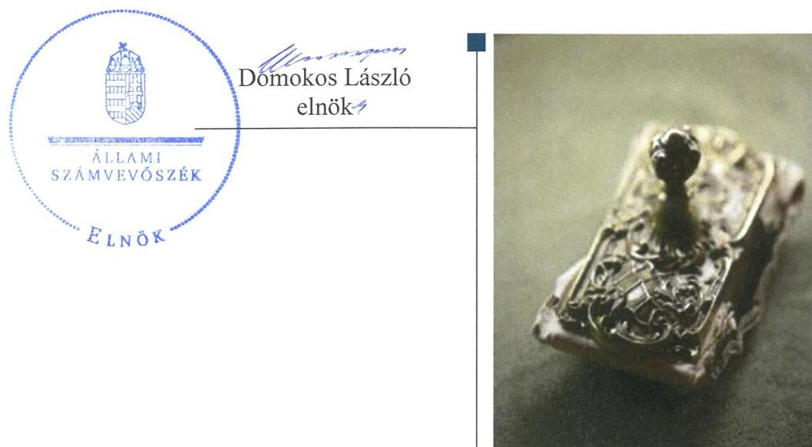
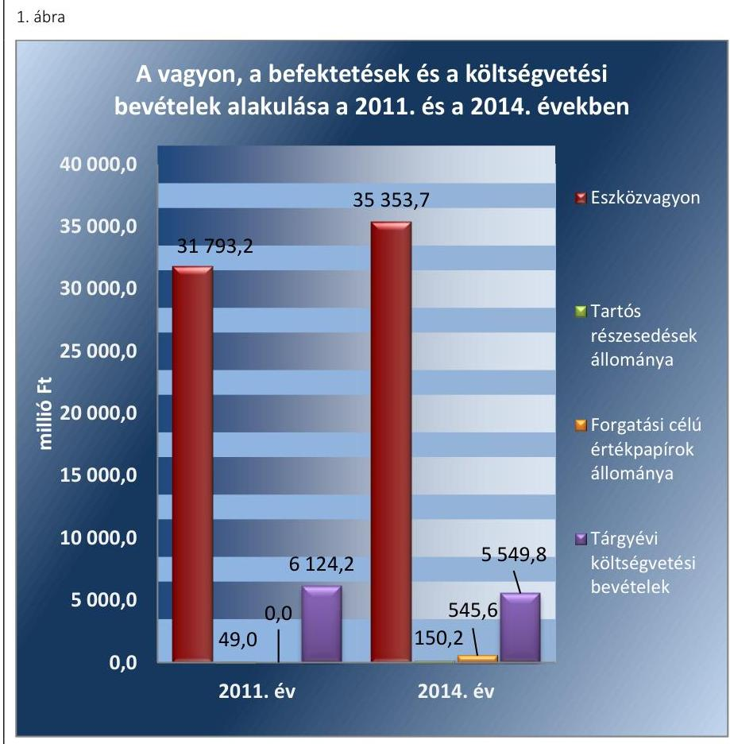
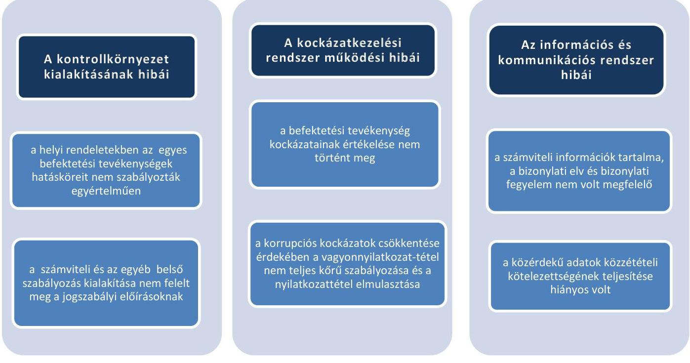
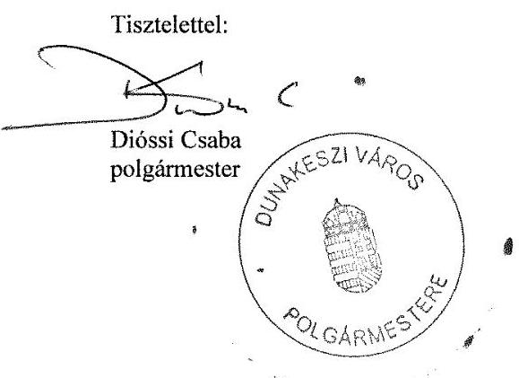
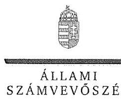
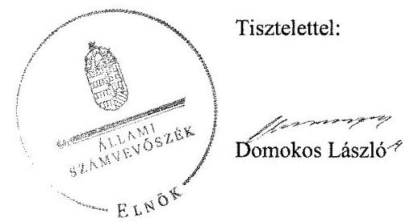
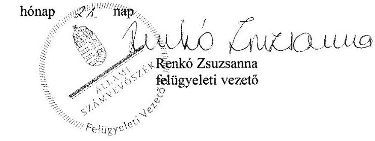

# Jelenetés 

## Önkormányzatok belső kontrollrendszere

Az önkormányzatok belső kontrollrendszere kialakításának és működtetésének ellenőrzése - Dunakeszi
2016. 12. hó 13. nap

---

# AZ ELLENŐRZÉST FELÜGYELTE:

- RENKŐ ZSUZSANNA felügyeleti vezető
- AZ ELLENŐRZÉST VEZETTE ÉS A VÉGREHAJTÁSÁÉRT FELELŐS:
  - PÁNCSICS JUDIT ellenőrzésvezető
  - A PROGRAM ÖSSZEÁLLÍTÁSÁÉRT FELELŐS:
    - JANIK JÓZSEF osztályvezető

**IKTATÓSZÁM:** V-0993-136/2016.

**TÉMASZÁM:** 2027

**ELLENŐRZÉS-AZONOSÍTÓ SZÁM:** V-071811

Jelentéseink az Országgyűlés számítógépes hálózatán és az Interneten a www.asz.hu címen is olvashatóak.

---

# TARTALOMJEGYZÉK 

■ ÖSSZEGZÉS ..... 5
■ AZ ELLENŐRZÉS CÉLJA ..... 6
■ AZ ELLENŐRZÉS TERÜLETE ..... 7
■ AZ ELLENŐRZÉS HÁTTERE, INDOKOLTSÁGA ..... 9
■ A JELENTÉS LÉNYEGES KÉRDÉSKÖREI ..... 12
■ ELLENŐRZÉS HATÓKÖRE ÉS MÓDSZEREI ..... 13
■ MEGÁLLAPÍTÁSOK ..... 16
■ JAVASLATOK ..... 37
■ MELLÉKLETEK ..... 41
I. Sz. melléklet: Értelmező szótár. ..... 41
II. Sz. melléklet: Az integritás érvényesítése érdekében kialakított és működtetett kontrollrendszer ..... 45
■ FÜGGELÉK: ÉSZREVÉTELEK ..... 47
■ RÖVIDÍTÉSEK JEGYZÉKE ..... 67

---

.

---

# ÖSSZEGZÉS 

Dunakeszi Város Önkormányzata belső kontrollrendszere kialakításának és működtetésének hiányosságai a befektetési tevékenységek szabályszerű végzését, elszámoltathatóságát nem támogatta. A befektetésekkel kapcsolatos döntés-előkészítés nem biztosította a közvagyon körültekintő, biztonságos befektetését. Az Önkormányzatnak az integritás szemlélet érvényesülése érdekében még erőfeszítéseket kell tennie.

## Az ellenőrzés társadalmi indokoltsága

Magyarország Alaptörvénye az önkormányzatoktól is elvárja a kiegyensúlyozott, átlátható és fenntartható költségvetési gazdálkodás elvének érvényesítését. Az önkormányzatok által betöltött társadalmi szerep, az általuk kezelt közpénz nagysága, a nemzeti vagyon átruházására vagy hasznosítására vonatkozó döntéseik sokrétűsége indokolttá teszik a számvevőszéki ellenőrzéseket. A belső kontrollrendszer kialakítása és működtetése nélkül nem valósítható meg a közpénzek, a közvagyon szabályos, gazdaságos, hatékony és eredményes felhasználása.

Dunakeszi Város Önkormányzata 2015. április 30-án 545,6 millió Ft névértékű államkötvénnyel, 1500 millió Ft kincstárjeggyel és 690,0 millió Ft lekötött betéttel rendelkezett. Az Önkormányzat egyik pénzügyi szolgáltatójának törvénytelen tevékenysége következtében fennállt a veszélye annak, hogy a befektetett közvagyon egy részét elveszítik. Felmerült, hogy a belső kontrollrendszer kialakítása és működtetése nem biztosította a közvagyon megóvását, körültekintő, biztonságos befektetését, a befektetési döntések, azok végrehajtása és számviteli elszámolása nem volt szabályszerű.

## Főbb megállapítások, következtetések, javaslatok

A belső kontrollrendszer kialakítása és működtetése részben szabályszerű volt, így nem segítette elő a szabálykövető működést és gazdálkodást, a szervezeti célok elérését. A befektetésekkel kapcsolatos hatáskörök ellentmondásos szabályozása miatt nem volt biztosított a döntéshozó elszámoltathatósága. A kontrolltevékenységek nem megfelelő működtetése akadályozta a hibák megelőzését, feltárását. Az ellenjegyzési, a teljesítésigazolási, az érvényesítési és az utalványozási jogkörök szabálytalan gyakorlása növelte a jogosulatlan kifizetések veszélyét.

A befektetési döntések előkészítésekor a pénzügyi szolgáltató átláthatóságát nem vizsgálták, a kockázatokat nem mérték fel, nem tervezték meg, hogy hol és milyen beavatkozások szükségesek a káros következmények elkerülése érdekében, így nem tettek meg mindent a befektetett közvagyon biztonságos megőrzéséért.

Az integritás szemlélet erősítése érdekében - a belső kontrollrendszer kialakításában és működésében feltárt hiányosságok és hibák megszüntetésével - az Önkormányzatnak még erőfeszítéseket kell tennie.

---

# AZ ELLENŐRZÉS CÉLJA 

Az ellenőrzés célja annak megállapítása volt, hogy az önkormányzat belső kontrollrendszerének kialakítása, továbbá egyes elemeinek működtetése biztosította-e az önkormányzatnál a közpénzfelhasználás szabályosságát. Az erőforrásokkal való szabályszerű és hatékony gazdálkodáshoz szükséges követelmények érvényesítése, számonkérése, ellenőrzése megtörtént-e az önkormányzatnál. A belső kontrollrendszer kialakítása és működtetése támogatta-e az integritás szemlélet érvényesülését. Az ellenőrzés során értékeltük a belső kontrollrendszer kialakításának és működtetésének szabályszerűségét. Bemutatjuk azokat a lényeges szabályozási hiányosságokat, amelyek miatt az ellenőrzött kulcskontrollok nem nyújtottak elegendő védelmet a lehetséges hibákkal szemben. Rámutattunk arra, ha a kulcskontrollok valamely hibát nem előztek meg, nem tártak fel vagy nem javítottak ki, valamint minősítjük működésük megfelelőségét.

Ellenőriztük, hogy az önkormányzat egyes befektetési döntései és azok végrehajtása, elszámolása megfelelt-e a vonatkozó jogszabályoknak és belső szabályozásoknak, a kialakított kontrollrendszer támogatta-e a befektetési tevékenység szabályszerűségét.

---

# **AZ ELLENŐRZÉS TERÜLETE**

## **Dunakeszi Város Önkormányzata**

A Pest megyében fekvő Dunakeszi város állandó lakosainak száma 2015. január 1-jén 42 811 fő volt.

Az Önkormányzat 15 tagú Képviselő-testületének 2 munkáját 2014-ben három, 2015-től egy állandó bizottság segítette.

A településen a nemzetiségi önkormányzati képviselők 2014. évi választásáig bolgár, roma, német és örmény, azt követően bolgár, roma és német helyi nemzetiségi önkormányzat működött.

Az Önkormányzat a Hivatalon kívül hét intézménnyel, valamint egy kizárólagos tulajdonában lévő gazdasági társasággal látta el a feladatait.

A polgármester a 2010. évi önkormányzati választások óta tölti be tisztségét. A jegyző 2011. október 1-jétől látja el feladatait. A Hivatal hat szervezeti egységre tagolódott (Önkormányzati és Jogi Osztály, Pénzügyi Osztály, Lakosságszolgálati Osztály, Főépítész, Belső ellenőrzési vezető, Polgármesteri Kabinet), elkülönült gazdasági szervezettel nem rendelkezett. A Hivatalban foglalkoztatott köztisztviselők száma 2014. év végén 64 fő volt. A Hivatalnál 2014. január 1-jét követően szervezeti változás nem történt.

Az Önkormányzatnál a 2014. évi költségvetési beszámoló szerint 5549,8 millió Ft költségvetési bevételt értek el, valamint 5457,5 millió Ft költségvetési kiadást teljesítettek. A költségvetés 92,3 millió Ft-os többlete és 489,8 millió Ft-os előző évi pénzmaradványának igénybevétele mellett 545,6 millió Ft névértékű forgatási célú államkötvényt vásároltak. A pénzeszközök értéke 2014. december 31-én 1686,1 millió Ft-ot tett ki. Az üzleti vagyonba tartozó ingatlanok értéke 1345,3 millió Ft volt.

A tartós befektetési célú részesedések könyv szerinti értéke a 2011. évi 1,1 millió Ft-ról 0,2 millió Ft-ra csökkent, míg a közfeladatot ellátó gazdasági társaságban lévő üzletrész értéke 47,9 millió Ft-ról 150,0 millió Ft-ra emelkedett.

A 2014. évben a forrásokon belül a költségvetési évben esedékes kötelezettségállomány 11,9 millió Ft, a költségvetési évet követően esedékes kötelezettségállomány 100,5 millió Ft volt, pénzintézettel szembeni kötelezettségük nem volt.

Adósságkonszolidáció keretében az állam 2013. évben 1043,4 millió Ft, 2014-ben 536,8 millió Ft pénzintézettel szembeni tőke- és kamattartozást vállalt át.

Az Önkormányzat vagyonának, befektetéseinek és a költségvetési bevételeinek alakulását a 2011. évben és a 2014. évben az 1. ábra mutatja be:

---

Adatok forrása: a 2011. és a 2014. évi éves költségvetési beszámolók

---

# AZ ELLENŐRZÉS HÁTTERE, INDOKOLTSÁGA 

Az ÁSZ tv. ${ }^{6}$ szerint az ÁSZ ${ }^{7}$ feladata a jól irányított állam kiépítésének elősegítése. Az ÁSZ Stratégiájában ezért hangsúlyos szerepet szánt annak, hogy szilárd szakmai alapon álló, értékteremtő ellenőrzéseivel előmozdítsa a közpénzügyek átláthatóságát, rendezettségét. A számvevőszéki ellenőrzés nemzetközi alapelvei is rögzítik, hogy a megfelelő belső kontrollrendszer minimálisra csökkenti a hibák és szabálytalanságok kockázatát.

A belső kontrollrendszer azt a célt szolgálja, hogy a költségvetési szervek működésük és gazdálkodásuk során a tevékenységeket szabályszerűen, gazdaságosan, hatékonyan, eredményesen hajtsák végre, teljesítsék elszámolási kötelezettségeiket és megvédjék az erőforrásokat a veszteségektől, a károktól és a nem rendeltetésszerű használattól. A belső kontrollrendszer magában foglalja mindazon szabályokat, eljárásokat, gyakorlati módszereket és szervezeti struktúrákat, kockázatkezelési technikákat, kontrolltevékenységeket, amelyek segítséget nyújtanak a szervezetnek céljai eléréséhez. A belső kontrollrendszer szabályozása háromszintű, a törvényi előírásokat az Áht. és az Mötv., a rendeleti szintű szabályozást az Ávr. és a Bkr. tartalmazza, amelyeket útmutatói szinten az NGM által kiadott standardok és kézikönyvek támogatnak.

Az ellenőrzött időszak meghatározása lehetőséget teremt a 2014. október 12-i önkormányzati választásokat megelőző és követő ciklus belső kontrollrendszere működésének elkülönült értékelésére, valamint a változások nyomon követésére.

A BELSŐ KONTROLLRENDSZER kialakításának és működtetésének általános értékelése mellett a teljesítésigazolás és érvényesítés kontrollok kiemelt ellenőrzésének szükségességét alátámasztja, hogy 2012-től a pénzügyi folyamatokban kulcsszerepet betöltő belső kontrollok rendszere módosult és azok működtetésében az önkormányzatoknál hiányosságok mutatkoztak a 2012. óta elvégzett ÁSZ ellenőrzések alapján.

Az önkormányzatok belső kontrollrendszerének ellenőrzése az ÁSZ "jó kormányzással" kapcsolatos stratégiai céljainak megvalósítását is szolgálja. Az ÁSZ célja, hogy javuljon az ellenőrzött önkormányzatok belső kontrollrendszerének szabályozottsága, működésének megfelelősége, hozzájárulva ezzel az egyensúlyi helyzet fenntarthatóságának biztosításához, azaz az adósság újratermelődésének megakadályozásához. Az ÁSZ ellenőrzés tapasztalatai nem csupán a közvetlenül ellenőrzött önkormányzatokat segíthetik, hanem a „jó gyakorlat" elterjesztésével azok az önkormányzatok is átvehetik a pozitív példákat, ahol nem végez ellenőrzést az ÁSZ.

Az MNB három befektetési szolgáltató tevékenységi engedélyét 2015. első felében visszavonta és kezdeményezte a vállalkozások felszámolását a működéssel kapcsolatos szabálytalanságok, hiányosságok miatt. A korábbi évek ellenőrzési tapasztalatai alapján fennáll a lehetősége annak, hogy az önkormányzatok befektetési döntései, továbbá a döntések végrehajtása és számviteli elszámolása nem voltak teljes mértékben szabályszerűek, és a kapcsolódó külső ellenőrzések és a belső kontrollrendszer sem működtek minden esetben megfelelően.

---

Magyarország Alaptörvénye az önkormányzatoktól, mint az államháztartás alanyaitól elvárja a kiegyensúlyozott, átlátható és fenntartható költségvetési gazdálkodás elvének érvényesítését. A nemzeti vagyonról szóló törvény szerint a nemzeti vagyonnal felelős módon, rendeltetésszerűen kell gazdálkodni. A nemzeti vagyongazdálkodás feladata a nemzeti vagyon rendeltetésének megfelelő, átlátható, hatékony és költségtakarékos működtetése, ugyanakkor értékének megőrzését, értéknövelő használatát, hasznosítását, gyarapítását is elvárja.

# AZ ÖNKORMÁNYZATOK ÁTMENETILEG SZABAD PÉNZESZKÖZEINEK BEFEKTETÉSÉT jogszabály nem 

tiltja, a pénzpiaci szolgáltatók közül az önkormányzatok a kínált szolgáltatás és annak költségei alapján, szabadon választhatnak, a veszteséges gazdálkodás kockázatai és következményei azonban az önkormányzatokat terhelik. A szabad pénzeszközök felelős hasznosítása összhangban áll az önkormányzati gazdálkodás alapelveivel.

A közintézmények integritás alapú kultúrájának kialakítása, megerősítése és működése szorosan összefügg a belső kontrollrendszer működésével, ezért az ellenőrzés kiterjed annak értékelésére is, hogy a belső kontrollrendszer kialakítása és működtetése hogyan hatott az integritás szemlélet érvényesülésére.

Az államháztartás önkormányzati alrendszerében a 2014. év elején összesen 3177 települési önkormányzat működött: a 23 kerülettel rendelkező főváros, 345 város, 2691 község és 117 nagyközség volt. A belső kontrollrendszer kialakítása és működtetése ellenőrzését az ÁSZ által lefolytatott, kisebb településeket is érintő ellenőrzéseinek tapasztalatai, valamint a közérdekű bejelentések kockázati szempontú értékelése alapozták meg. Ezek a községek, nagyközségek gazdálkodásának, belső kontrollrendszere kialakításának és működésének hiányosságaira mutattak rá. Az ellenőrzések helyszíneinek kiválasztása során az ÁSZ célzott adatfeldolgozáson alapuló kockázatelemző rendszerére támaszkodik. Ez elősegíti, hogy azokon a területeken végezzen ellenőrzéseket, összpontosítva erőforrásait, ahol a valódi kockázatok, az aktuális problémák vannak.

## AZ ELLENŐRZÉS VÁRHATÓ HASZNOSULÁSA NÉGY SZINTEN valósul meg.

A törvényalkotás számára összegzett tapasztalatok állnak rendelkezésre a belső kontrollrendszer önkormányzati területen való kialakításáról, működtetéséről és hatásairól. Az ÁSZ az ellenőrzéseivel hozzájárul ahhoz, hogy az egyes önkormányzati befektetésekkel kapcsolatos kockázatok a szabályozási és kontroll mechanizmusok fejlesztésével mérsékelhetők legyenek.

Az ellenőrzés az ellenőrzött számára visszajelzést ad a belső kontrollrendszer kialakításában és működésében lévő hiányosságokról, javaslataival hozzájárul azok kiküszöböléséhez. Feltárja az önkormányzati befektetési tevékenységet meghatározó szabályozások összhangjának hiányosságait, a szabályozással nem érintett gazdálkodási területeket, valamint az egyes befektetési tevékenységek esetleges szabálytalanságait.

Az ellenőrzés megállapításait és javaslatait más szervezetek is hasznosíthatják a rendezett gazdálkodási keretek kialakításához.

---

A társadalom számára jelzi, hogy közpénz nem maradhat ellenőrizetlenül, az ÁSZ értékteremtő rend kialakításához és megőrzéséhez hozzájáruló tevékenysége pozitív hatással lesz a szervezetről kialakított összkép formálásában.

---

# A JELENTÉS LÉNYEGES KÉRDÉSKÖREI 

1. 
   - Az önkormányzat belső kontrollrendszerének kialakítása és működtetése szabályszerű volt-e 2014. január 1. és 2015. április 30. között, valamint a belső kontrollrendszer egyes pillérei támogatták-e a befektetési tevékenység szabályszerű végzését 2011. január 1. és 2015. április 30. között?
2.     - Az egyes befektetésekkel kapcsolatos döntéshozatal és a döntések végrehajtása szabályszerű volt-e?
3.     - Az egyes befektetések számviteli elszámolása, nyilvántartása szabályszerű volt-e?
4.     - Az erőforrásokkal való szabályszerű és hatékony gazdálkodáshoz szükséges követelmények érvényesítése, számonkérése, ellenőrzése megtörtént-e az önkormányzatnál?
5.     - Az önkormányzat belső kontrollrendszerének kialakítása és működtetése támogatta-e az integritás szemlélet érvényesülését?

---

# ELLENŐRZÉS HATÓKÖRE ÉS MÓDSZEREI 

## Az ellenőrzés típusa

Megfelelőségi ellenőrzés, a befektetési tevékenység esetében szabályszerűségi ellenőrzés.

## Az ellenőrzött időszak

A belső kontrollrendszer kialakításának és működtetésének ellenőrzése a 2014. január 1. és 2015. április 30. közötti időszakra terjedt ki. Ezen belül a belső kontrollrendszer kialakításának és működtetésének megfelelőségét a 2014. január 1. és október 12., valamint a 2014. október 13. és 2015. április 30. közötti időszakra vonatkozóan külön-külön értékeltük. Az önkormányzatok egyes befektetési tevékenységeinek ellenőrzése tekintetében az ellenőrzött időszak a 2011. január 1. - 2015. április 30. közötti időszak. Ezen felül az önkormányzat befektetésekkel kapcsolatos döntés-előkészítésének és döntéshozatalának szabályszerűségét a 2011. január 1. előtti időszakra visszanyúlóan is ellenőriztük, amennyiben a 2014. június 30-án, illetve 2015. április 30-án meglévő értékpapír-befektetéseire 2011. január 1-je előtt került sor. Az integritás szemlélet érvényesülését a 2014. évre vonatkozó adatszolgáltatás alapján értékeltük.

## Az ellenőrzés tárgya

A helyi önkormányzatnak, mint éves költségvetési beszámoló készítésére kötelezett szervezetnek és polgármesteri hivatalának belső kontrollrendszere. Az önkormányzat 2014. június 30-án, illetve 2015. április 30-án meglévő értékpapírokban megtestesülő befektetései, lekötött betétei, valamint az önkormányzat üzleti vagyonába tartozó ingatlanok, kulturális javak (műtárgyak, műalkotások, stb.), illetve a feladatellátást nem szolgáló egyéb értéktárgyak (pl. ékszerek, befektetési nemesfém). Az önkormányzat 2014. június 30-án, illetve 2015. április 30-án meglévő értékpapír-befektetései. Az erőforrásokkal való szabályszerű és hatékony gazdálkodáshoz szükséges követelmények érvényesítése, számonkérése, ellenőrzése. Az integritás szemlélet érvényesülése.

## Az ellenőrzött szervezet

Dunakeszi Város Önkormányzata és az önkormányzati működéshez kapcsolódó feladatokat ellátó Hivatal.

---

# Az ellenőrzés jogalapja 

Az ÁSZ tv. 1. § (3) bekezdésében foglaltak alapján az ÁSZ általános hatáskörrel végzi a közpénzekkel és az állami és önkormányzati vagyonnal való felelős gazdálkodás ellenőrzését. Az ÁSZ tv. 5. § (2) bekezdése alapján az államháztartás gazdálkodásának ellenőrzése keretében az ÁSZ ellenőrzi a helyi önkormányzatok gazdálkodását, valamint az ÁSZ tv. 5. § (6) bekezdése alapján ellenőrzése során értékeli az államháztartás számviteli rendjének betartását és a belső kontrollrendszer működését.

## Az ellenőrzés módszerei

Az ellenőrzést a nemzetközi standardokat irányadónak tekintve az ellenőrzési program ellenőrzési kérdései, az ellenőrzött időszakban hatályos jogszabályok, az ellenőrzés szakmai szabályok és módszertanok figyelembe vételével végeztük.

Az ellenőrzés lefolytatásához az Önkormányzat a tanúsítványok kitöltésével, valamint az ÁSZ által kért dokumentumok elektronikus megküldésével szolgáltatott adatokat. A rendelkezésre bocsátott adatok, információk kontrollja és a munkalapok kitöltése az ellenőrzés keretében történt. A jelentésben használt fogalmak magyarázatát az I. számú melléklet, az integritás érvényesítése érdekében kialakított és működtetett kontrollrendszer minősítését a II. számú melléklet tartalmazza.

A belső kontrollrendszer jogszabályi előírások szerinti kialakításának és működtetésének szabályszerűségét az erre irányuló ellenőrzési kérdésekre adott válaszok összesítése alapján külön-külön értékeltük a 2014. január 1. és október 12., valamint a 2014. október 13. és 2015. április 30. közötti időszakra. A belső kontrollrendszert egy-egy ellenőrzött időszakra pillérenként (kontrollkörnyezet, kockázatkezelési rendszer, kontrolltevékenységek, információs és kommunikációs rendszer, monitoring rendszer) és összesítetten is értékeltük.

## A BELSŐ KONTROLLRENDSZER EGYES PILLÉRE-

INEK KIALAKÍTÁSA ÉS MŰKÖDTETÉSE „szabályszerű volt", amennyiben az értékelt területen az elért és elérhető pontok százalékban kifejezett, egész számra kerekített hányadosa meghaladta a 84%-ot, „részben szabályszerű volt", ha 61-84% közé esett, „nem szabályszerű volt", ha nem haladta meg a 60%-ot. A belső kontrollrendszer összesített értékelése megegyezett a pillérenként (kontrollterületenként) alkalmazott százalékos értékelésekkel, a következő eltérésekkel. A kontrollrendszer egésze esetében a „szabályszerű" értékelésnek a százalékos értéken felül további feltétele volt, hogy egyik kontrollterület sem kaphat „nem szabályszerű" értékelést, a „részben szabályszerű" értékelés további feltétele volt, hogy legfeljebb egy ellenőrzött kontrollterület lehet „nem szabályszerű" értékelésű. Az összesített értékelés a százalékos értéktől függetlenül „nem szabályszerű volt", ha az ellenőrzött kontrollterületek közül több mint egynek „nem szabályszerű volt" az értékelése.

---

# A GAZDÁLKODÁS FOLYAMATÁBAN A KÉT 

KULCSKONTROLL - teljesítésigazolás, érvényesítés - működésének megfelelőségét a személyi juttatásokkal, a dologi kiadásokkal, a beruházási, felújítási kiadásokkal, az ellátottak pénzbeli juttatásaival és az egyéb működési, felhalmozási célú, valamint a finanszírozási kiadásokkal kapcsolatos kifizetések esetében mintavétellel ellenőriztük. A mintavétel során külön értékeltük a 2014. január 1. és 2014. október 12. közötti időszakban és a 2014. október 13. és 2015. április 30. közötti időszakban teljesített kifizetéseket. „Megfelelőnek" értékeltük a gazdálkodási jogkörök gyakorlását, amennyiben 95%-os bizonyossággal a teljes sokaságban a hibaarány legfeljebb 10%, ,,részben megfelelőnek" értékeltük, ha a hibaarány felső határa 10-30% között volt, ,,nem megfelelőnek" pedig akkor, ha a mintavételi eredmények alapján a sokaságbeli hibaarány felső határa meghaladta a 30%-ot.

Az integritás szemlélet érvényesülésének értékelése az önkormányzat által kitöltött tanúsítvány alapján történt.

---

# MEGÁLLAPÍTÁSOK 

## 1. Az önkormányzat belső kontrollrendszerének kialakítása és működtetése szabályszerű volt-e 2014. január 1. és 2015. április 30. között, valamint a belső kontrollrendszer egyes pillérei támogatták-e a befektetési tevékenység szabályszerű végzését 2011. január 1. és 2015. április 30. között?

Összegző megállapítás

A belső kontrollrendszer kialakítása és működtetése az összesített értékelés alapján 2014. január 1. és 2015. április 30. között - a feltárt hiányosságok miatt - részben szabályszerű volt. A belső kontrollrendszer egyes pilléreinek kialakítása és működtetése 2011. január 1. és 2015. április 30. között nem támogatta a befektetési tevékenység szabályszerű, átlátható, elszámoltatható végzését.

A belső kontrollrendszer kialakításának és működtetésének összesített értékelését az 1. táblázat mutatja be:

1. táblázat

| A BELSŐ KONTROLLRENDSZER KIALAKÍTÁSÁNAK ÉS MŰKÖDTETÉSÉNEK ÖSSZESÍTETT ÉRTÉKELÉSE |  |  |  |
| :--: | :--: | :--: | :--: |
| Megnevezés | A gazdálkodás egészet érintően: | A befektetési tevékenységet érintően: |  |
|  | 2014. január 1-től 2014. október 13-től 2014. október 12-ig 2015. április 30-ig | 2011-2013. években 2015. április 30-ig |  |
| Kontrollkörnyezet | szabályszerű | nem támogatta |  |
| Kockázatkezelési rendszer | részben szabályszerű |  |  |
| Kontrolltevékenységek | nem szabályszerű | n. a. | nem támogatta |
| Információs és kommunikációs rendszer | szabályszerű |  | nem támogatta |
| Monitoring | szabályszerű |  |  |
| BELSŐ KONTROLLRENDSZER | részben szabályszerű |  | nem támogatta |

1.1. számú megállapítás

A kontrollkörnyezet kialakítása 2014. január 1. és 2015. április 30. között a feltárt hiányosságok mellett szabályszerű volt. A kontrollkörnyezet 2011. január 1. és 2015. április 30. között a befektetési tevékenység szabályszerű végzését nem támogatta, mert az egyes önkormányzati rendeletek előírásai között nem volt összhang, valamint a belső szabályozások tartalma nem felelt meg teljes körűen a jogszabályi előírásoknak.

A SZERVEZETI ÉS SZABÁLYOZÁSI KERETEKET a Képviselő-testület 2011. január 1. és 2015. április 30. között az alábbiak szerint alakította ki:

---

- 2011-2012-ben az önkormányzati SZMSZ1-ben $^{8}$ - az Ötv. $^{9}$ előírásainak megfelelően - meghatározta a működésének részletes szabályait és szervezeti struktúráját. A feladatai és hatáskörei bizottságokra és polgármesterre történő átruházását hatásköri rendeletben $^{10}$ szabályozta. A hatásköri rendelet 7. § (1) bekezdés 5. pontja szerint a polgármester dönthetett a költségvetési többletből történő értékpapír vásárlásról, illetve pénzintézeti pénzlekötés útján való hasznosításáról. 2013 februárjától az önkormányzati SZMSZ$_{2}$-ben $^{11}$ meghatározta a szervezeti kereteit, a feladat- és hatásköreit, valamint a polgármesterre és a bizottságokra átruházott feladat- és hatásköreit. Az önkormányzati SZMSZ$_{2}$ 89. § (1) bekezdés 5. pontja szerint a polgármester dönthetett a költségvetési többletből történő értékpapír vásárlásról, illetve pénzintézeti pénzlekötés útján való hasznosításáról;
a 2011-2015. évi költségvetési rendeleteket $^{12}$ az Áht. $_{1,2}$-ben $^{13}$ előírt tartalommal fogadta el, a humánerőforrás gazdálkodás érdekében a Hivatal engedélyezett létszámát meghatározta. A 2011-2012. évi költségvetési rendeletek 13. § (3) bekezdésében, a 2013. évi költségvetési rendelet 13. § (2) bekezdésében, a 2014. évi költségvetési rendelet 11. § (2) bekezdésében, valamint a 2015. évi költségvetési rendelet 10. § (2) bekezdésében úgy rendelkezett, hogy az Önkormányzat pénzforgalmi (fizetési) számláján képződő átmenetileg szabad pénzeszközöket a polgármester értékpapír vásárlás, illetve pénzintézeti pénzlekötés útján hasznosíthatja;
a vagyongazdálkodási rendelet$_{1,2}$-ben $^{14}$ határozta meg - az Áht. $_{1,2}$, az Nvtv. $^{15}$, az Ötv., illetve az Mötv. $^{16}$ rendelkezései szerint - a vagyonnal történő gazdálkodás szabályait, valamint a döntési hatásköröket. A vagyongazdálkodási rendelet$_{1}$ 21. § (5) bekezdésében, valamint a vagyongazdálkodási rendelet$_{2}$ 22. § (5) bekezdésében előírta, hogy az Önkormányzat pénzeszközeiből értékpapír, portfólió vásárolható. Az értékpapír, portfólió vásárlásakor értékhatártól függetlenül a Képviselő-testület dönthetett arról, hogy milyen megnevezésű, címletű és lejáratú értékpapír kerüljön megvételre. A vagyongazdálkodási rendelet$_{1,2}$ értékpapír vásárlásra vonatkozó rendelkezése - a Jat. $^{17}$ 2. § (1) bekezdésében előírtak ellenére - nem volt egyértelműen értelmezhető, nem volt összhangban a 2011-2015. évi költségvetési rendeletek, valamint az önkormányzati SZMSZ$_{2}$ értékpapír vásárlásra vonatkozó rendelkezésével. A vagyongazdálkodási rende-let$_{1,2}$-ben előírtak alapján a Képviselő-testületnek volt joga dönteni arról, hogy milyen megnevezésű, címletű és lejáratú értékpapír kerüljön megvásárlásra, míg a 2011-2015. évi költségvetési rendeletekben, valamint a hatásköri rendeletben és az önkormányzati SZMSZ$_{2}$-ben az értékpapír vásárlás jogköre a polgármestert illette meg;
a 2011.-2014. évekre szóló gazdasági programban $^{18}$ az Ötv. előírásainak megfelelően a közszolgáltatások színvonalának javítására vonatkozó célokat meghatározta. A közép- és hosszú távú vagyongazdálkodási tervet 2015 januárjában az Nvtv.-ben előírtaknak megfelelően hagyta jóvá;
jóváhagyta a Hivatal alapító okiratát, a hivatali SZMSZ$_{1-4}$-ben $^{19}$ meghatározta a Hivatal működési rendjét és a szervezeti struktúráját. A

---

hivatali SZMSZ3 8. §-a rögzítette a Hivatal szervezeti egységeit. 2014-ben a Képviselő-testület a hivatali SZMSZ3-ban az Ávr. $^{20}$ 13. § (1) bekezdés e) pontjában előírtak szerint nem határozta meg a Hivatal szervezeti egységein belül a gazdasági szervezetet annak ellenére, hogy a Hivatalnak az Ávr. 8. § (1) bekezdés c) pontjában előírtak alapján gazdasági szervezettel kellett volna rendelkeznie, mivel a település lakosságszáma meghaladta az ötezer főt. A 2015. február 1-jétől hatályos hivatali SZMSZ4 2. §
 (2) bekezdése tartalmazta, hogy a Hivatal saját gazdasági szervezettel rendelkező költségvetési szerv, de 2015. február 1. és 2015. április 30. között a hivatali SZMSZ4-ben sem rögzítették az Ávr. 13. § (1) bekezdés e) pontjában előírtakkal ellentétben a gazdasági szervezet megnevezését és feladatait.

A HIVATAL BELSŐ SZABÁLYOZÁSÁT a jegyző 2011. január 1. és 2015. április 30. között kialakította, ezen belül:
a gazdasági szervezet jogszabályban meghatározott feladatait - az Ámr.-ben ${ }^{21}$, illetve az Ávr.-ben előírtak szerint - a hivatali ügyrend ${ }_{1}$. ${ }_{3}$-ban ${ }^{22}$ szabályozta. A Hivatal gazdálkodásának részletes rendjét - a kötelezettségvállalás, ellenjegyzés, teljesítés igazolása, érvényesítés, utalványozás gyakorlásának módját, eljárási és dokumentációs részletszabályait, valamint az ezeket végző személyek kijelölésének rendjét - a gazdálkodási jogkörök szabályzata ${ }_{1,2}$-ben ${ }^{23}$ az Ámr., illetve az Ávr. előírásai szerint határozta meg. A jegyzőnek és a Hivatal pénzügyi-számviteli területén dolgozó köztisztviselőknek volt munkaköri leírása, a költségvetési beszámoló készítésével megbízott rendelkezett az előírt végzettséggel és képesítéssel;
2011-2013-ban a számviteli politika ${ }_{1,2}{ }^{24}$ részeként hagyta jóvá a számlarend ${ }_{1,2}$-t $^{25}$. 2014-ben a számviteli politika ${ }_{3}$-ban ${ }^{26}$ rögzítette, hogy a számviteli elszámolásoknál nem élnek a piaci értékelés lehetőségével. A számlarend ${ }_{1,2}$-ben, valamint a számlarend ${ }_{3}$-ban ${ }^{27}$ meghatározta az analitikus nyilvántartások vezetésének módját és kapcsolatukat a főkönyvi számlákkal. Jóváhagyta az értékelési szabályzat ${ }_{1-3}$-t $^{28}$, 2011-2013-ban az értékelési szabályzat ${ }_{1,2}$-ben határozta meg, hogy nem élnek a piaci értékeléssel, értékhelyesbítést nem számolnak el. Kiadta a pénzkezelési szabályzat ${ }_{1-3}$-t $^{29}$, a leltározási szabályzat ${ }_{1,2}$-ben $^{30}$ előírta a leltározásban közreműködők feladatait és felelősségét, a leltározás lebonyolításának folyamatát és dokumentálását. A leltározási szabályzat ${ }_{2}$-ben a Számv. tv.-ben ${ }^{31}$ előírtaknak megfelelően a mennyiségben és értékben is nyilvántartott eszközökre 2014-től rögzítette a háromévenkénti mennyiségi felvétellel történő leltározást;
a humánerőforrás gazdálkodás kereteit kialakította, kiadta a közszolgálati szabályzat ${ }_{1,2}$-t $^{32}$, elkészítette a Hivatal köztisztviselőinek teljesítményértékelését;
a szabálytalanságok kezelésére a szabálytalanságkezelési eljárásrend ${ }_{1-4}$-et $^{33}$ kiadta, az ellenőrzési nyomvonal ${ }_{1-4}$-ben ${ }^{34}$ - az Ámr.-ben, illetve a Bkr.-ben ${ }^{35}$ előírtaknak megfelelően - kialakította a felelősségi szinteket, irányítási és ellenőrzési folyamatokat.

---

A kontrollkörnyezet kialakításában - a 2011-2013. években - a következő hiányosságok fordultak elő:
2011-2013-ban a számlarend ${ }_{1,2}$ a Számv. tv. 161. § (2) bekezdés a) pontjában előírtak ellenére nem tartalmazta minden alkalmazásra kijelölt számla számlajelét és megnevezését;
—_2011-2013-ban - az Áhsz. ${ }^{36}$ 37. § (7) bekezdésében előírtakat figyelmen kívül hagyva - a leltározási szabályzat ${ }_{1}$-ben önkormányzati rendeletben kapott felhatalmazás nélkül két évenkénti mennyiségi felvétellel történő leltározást írtak elő;
a köztisztviselőkre vonatkozó hivatásetikai alapelvek részletes tartalmát, az etikai eljárás szabályait a Kttv. ${ }^{37}$ 231. § (1) bekezdésében előírtak ellenére a Képviselő-testület 2015. április 30-ig nem fogadta el, a hiányosságot 2015 májusában pótolták;
2013-ban az ellenőrzési nyomvonal3 a Bkr. 6. § (3) bekezdésének előírása ellenére a működési folyamatok közül nem tartalmazta a gazdálkodási folyamatok ellenőrzési nyomvonalát.
A kontrollkörnyezet kialakítása a 2011. január 1. és 2013. december 31., illetve 2014. január 1. és 2015. április 30 között nem támogatta a befektetési tevékenység szabályszerű végzését, mivel az egyes önkormányzati rendeletek az értékpapír vásárlásra párhuzamos és nem egyértelműen értelmezhető szabályozást tartalmaztak. A 2014-től hatályos értékelési szabályzat-3-ban nem rögzítették a kamatozó hitelviszonyt megtestesítő értékpapírok bekerülési értékének számítási módját.

A kontrollkörnyezet kialakítása az értékelés szempontjából 2014. január 1. és 2014. október 12., valamint 2014. október 13. és 2015. április 30. közötti időszakokban 2. táblázatban részletezett hiányosságok mellett szabályszerű volt.
2. táblázat

# A KONTROLLKÖRNYEZET KIALAKÍTÁSÁNAK HIÁNYOSSÁGAI 

## Sorszám

## Részmegállapítás

1. A Képviselő-testület az önkormányzati SZMSZ ${ }_{2}$ 3. §-ában az Mötv. 41. § (2) bekezdésében előírtak ellenére az önkormányzati tanácsnokokat és azok tanácsadó testületeit képviselő-testületi szervként nevesítette.
2. A Képviselő-testület - az Mötv. 116. § (5) bekezdésében, valamint az önkormányzati SZMSZ ${ }_{2}$ 5. § (3) bekezdésében foglaltak ellenére - a 2014. októberi alakuló ülést követő hat hónapon belül nem fogadta el az Önkormányzat hosszú távú fejlesztési tervét, gazdasági programját.
3. A vagyongazdálkodási rendelet ${ }_{1}$ 21. § (5) bekezdésében, valamint a vagyongazdálkodási rendelet ${ }_{2}$ 22. § (5) bekezdésében előírtak szerint a Képviselő-testületnek volt joga dönteni arról, hogy az Önkormányzat pénzeszközeiből milyen megnevezésű, címletű és lejáratú értékpapír kerüljön megvásárlásra. A vagyongazdálkodási rendelet ${ }_{1,2}$-ben az értékpapír vásárlásra vonatkozó képviselő-testületi hatáskör nem volt összhangban a 2011-2012. évi költségvetési rendeletek 13. § (3) bekezdésével, a 2013. évi költségvetési rendelet 13. § (2) bekezdésével, a 2014. évi költségvetési rendelet 11. § (2) bekezdésével, valamint a 2015. évi költségvetési rendelet 10. § (2) bekezdésével, valamint az önkormányzati SZMSZ ${ }_{2}$ 89. § (1) bekezdés 5. pontjában előírtakkal, amelyek szerint az értékpapír vásárlás jogköre a polgármestert illette meg.
4. 2014-ben a Képviselő-testület a hivatali SZMSZ ${ }_{3}$-ban az Ávr. 13. § (1) bekezdés e) pontjában előírtak szerint nem határozta meg a Hivatal szervezeti egységein belül a gazdasági szervezetet annak ellenére, hogy a Hivatalnak az Ávr. 8. § (1) bekezdés c) pontjában előírtak alapján gazdasági szervezettel kellett volna rendelkeznie. A hivatali SZMSZ ${ }_{4}$ 2. § (2) bekezdése rögzítette, hogy a Hivatal saját gazdasági szervezettel rendelkező költségvetési szerv, de ennek ellenére az 2015. február 1. és 2015. április 30. között

---

|  Sorszám | Részmegállapítás  |
| --- | --- |
|   | az Ávr. 13. § (1) bekezdés e) pontjában előírtak ellenére a gazdasági szervezet megnevezését, feladatait nem tartalmazta.  |
|  5. | A számlarend3-ban az Áhsz. ${ }^{38}$ 51. § (3) bekezdésében előírtak ellenére nem határozták meg az összesítő bizonylatok (feladások) tartalmi és formai követelményeit.  |
|  6. | A számviteli politika ${ }_{3}$ „2.1.10. Az egyedi értékelés elve" pontban előírtak ellenére az értékelési szabályzat ${ }_{3}$ „II. 6. Az eszközök bekerülési értékének meghatározása" pontjában nem szabályozták a hitelviszonyt megtestesítő kamatozó értékpapírok bekerülési értékének, a vételárban felhalmozott kamatnak és az árfolyam különbözeteknek a számítási módját tekintettel a vételár Áhsz. 1. § (1) bekezdés 7. pontjában meghatározott fogalmára, valamint a bekerülési érték Áhsz. 16. § (6) bekezdésében előírt tartalmára.  |

Forrás: Ász 1.2. számú megállapítás

A kockázatkezelési rendszer kialakítása és működtetése 2014. január 1. és 2015. április 30. között részben szabályszerű volt. A kockázatkezelési rendszer működtetése során a gazdálkodásban rejlő kockázatok felmérése és értékelése nem terjedt ki az egyes befektetési tevékenységekre és befektetési szolgáltatókra, emiatt az 2011. január 1. és 2015. április 30. között nem támogatta az egyes befektetési tevékenységek szabályszerű végzését.

A HIVATAL KOCKÁZATKEZELÉSI RENDSZERÉT a jegyző 2011-ben a hivatali SZMSZ ${ }_{1}$ mellékletében, 2012-től 2015. április 30-ig a belső kontroll kézikönyvben ${ }^{39}$ szabályozta, amelyek általánosságban tartalmazták a kockázatok azonosításával, csoportosításával, az intézkedések nyomon követésével, és a kockázati kitettség csökkentésével kapcsolatos tevékenységeket.

A Hivatal tevékenységében és gazdálkodásában rejlő kockázatokat 2014 szeptemberében felmérték. A felmérés kiterjedt az Önkormányzat önálló beszámolóval érintett feladataira is, de a befektetésekkel és a befektetési szolgáltatást nyújtókkal kapcsolatos kockázatokra nem. A felmérésben rögzítették a kockázatokkal kapcsolatos intézkedéseket, de nem határozták meg a Bkr. 7. § (2) bekezdésében előírtak ellenére az egyes kockázatokkal kapcsolatban szükséges intézkedések teljesítésének folyamatos nyomon követési módját.

# A VAGYONNYILATKOZAT-TÉTELRE KÖTELEZET-

TEK körét 2014-2015-ben nem teljes körűen határozták meg. Az önkormányzati SZMSZ ${ }_{2}$ a Vnytv.-ben ${ }^{40}$ 3. § (3) bekezdés e) pontjában, valamint a 4. § d) pontjában előírtak ellenére nem tartalmazta a bizottságok nem önkormányzati képviselő tagjai, valamint az önkormányzati SZMSZ ${ }_{2}$ 59.- 65/B. $\S$-aiban meghatározott főtanácsnokok és a tanácsnokok munkáját segítő tanácsadó testületek tagjai vagyonnyilatkozat-tételi kötelezettségét, akik javaslattevő és döntés-előkészítő funkciót látnak el.

Az önkormányzati képviselők vagyonnyilatkozatait az önkormányzati SZMSZ ${ }_{2}$ 68. §-a alapján a 2014. évben a Szociális és Vagyonnyilatkozatokat Ellenőrző Bizottság, a 2015. évben a Pénzügyi és Jogi Bizottság vette nyilvántartásba. A nyilvántartások szerint a képviselők a vagyonnyilatkozat-tételi kötelezettségüknek az Mötv.-ben előírt határidőre eleget tettek.

A hivatali SZMSZ ${ }_{3,4}$-ben a Vnytv.-ben előírtak szerint meghatározták a vagyonnyilatkozat-tételi kötelezettséggel járó munkaköröket.

---

A vagyonnyilatkozatok őrzéséért felelős a Vnytv. 7. § a) pontja alapján, a Vnytv. 11. § (6) bekezdésében foglaltak ellenére nem állapította meg a Hivatal köztisztviselői, valamint a bizottságok nem önkormányzati képviselő tagjai, a főtanácsnokok és tanácsnokok tanácsadó testülete tagjai esetében a vagyonnyilatkozat átadására, nyilvántartására, a vagyonnyilatkozatban foglalt személyes adatok védelmére vonatkozó további szabályokat. A jegyző, mint az őrzésért felelős a köztisztviselők által benyújtott vagyonnyilatkozatokat nyilvántartásba vette.

A kockázatkezelési rendszer kialakítása és működtetése a 2011. január 1. és 2013. december 31., és 2014. január 1. és 2015. április 30. között nem támogatta a befektetési tevékenységet a befektetési kockázatok felmérésében tapasztalt hiányosságok miatt.

A kockázatkezelési rendszer kialakítása és működtetése a 2014. január 1. és 2014. október 12., valamint a 2014. október 13. és 2015. április 30. közötti időszakokban a 3. táblázatban részletezett hiányosságok miatt részben szabályszerű volt.
3. táblázat

# A KOCKÁZATKEZELÉSI RENDSZER KIALAKÍTÁSÁNAK ÉS MŰKÖDTETÉSÉNEK HIÁNYOSSÁGAI 

## Sorszám

## Részmegállapítás

1. A Bkr. 7. § (2) bekezdésében előírtak ellenére a gazdálkodásban rejlő kockázatokat az egyes befektetési tevékenységekkel és a befektetési szolgáltatókkal kapcsolatban nem mérték fel és nem állapították meg.
Nem határozták meg a Bkr. 7. § (2) bekezdésében előírtak ellenére a gazdálkodásban rejlő, azonosított kockázatokkal kapcsolatban szükséges intézkedések teljesítésének folyamatos nyomon követési módját.
2. A Képviselő-testület az önkormányzati SZMSZ-ben nem szabályozta a Vnytv. 4. § d) pontjában előírtak ellenére az önkormányzati SZMSZ: 59.- 65/B. §-aiban meghatározott bizottságok nem önkormányzati képviselő tagjainak, valamint a főtanácsnokok és a tanácsnokok tanácsadó testületei - javaslattételre, döntésre, illetve ellenőrzésre jogosult - tagjainak a vagyonnyilatkozat-tételi kötelezettségét.
3. A vagyonnyilatkozatok őrzéséért felelős a Vnytv. 7. § a) pontja alapján, a Vnytv. 11. § (6) bekezdésében előírtak ellenére nem állapította meg a Hivatal köztisztviselői, az önkormányzati bizottságok nem önkormányzati képviselő tagjai, illetve a főtanácsnokok és tanácsnokok tanácsadó testülete tagjai esetében a vagyonnyilatkozat átadására, nyilvántartására, a vagyonnyilatkozatban foglalt személyes adatok védelmére vonatkozó további szabályokat.

Forrás: ÁSZ

### 1.3. számú megállapítás

A pénzügyi folyamatokban kulcsszerepet betöltő teljesítésigazolás és érvényesítés kontrollok működtetése nem felelt meg a jogszabályokban és a belső szabályzatokban foglaltaknak, nem biztosították a hibák megelőzését, feltárását.

A KONTROLLTEVÉKENYSÉGEK KERETÉBEN kialakították és működtették a folyamatba épített, előzetes, utólagos és vezetői ellenőrzés rendszerét. A költségvetés tervezése, a vagyonhasznosítási tevékenység, a támogatások elszámolása és a beszerzések lebonyolítása az ellenőrzési nyomvonal4-ben, a gazdasági szervezet ügyrendje ${ }_{1-3}$-ban és a
 számviteli politika3-ban kerültek szabályozásra.

Az iratkezelési szabályzat ${ }_{1,2}$-ben ${ }^{41}$ a Bkr.-ben előírtak alapján alakították ki a dokumentumokhoz való hozzáférés eljárásrendjét. Az informatikai rendszerekhez való hozzáférés jogosultságait és szintjeit az informatikai biztonsági szabályzat ${ }_{1,2}$-ben ${ }^{42}$ rögzítették.

---

A GAZDÁLKODÁSI JOGKÖRÖKKEL kapcsolatos felhatalmazásokat a gazdálkodási jogkörök szabályzat ${ }_{1,2}$ mellékletei tartalmazták. A pénzügyi ellenjegyzőket és az érvényesítőket az Ávr. 55. § (2) bekezdés f) pontjában, illetve az Ávr. 58. § (4) bekezdésében előírtak szerint - gazdasági szervezet hiányában - a jegyző jelölte ki. A pénzügyi ellenjegyzők és az érvényesítők rendelkeztek az Ávr. által előírt végzettséggel és képesítéssel.

A kulcskontrollok működtetése 2014. január 1. és 2014. október 12., illetve 2014. október 13. és 2015. április 30. közötti időszakokban nem volt megfelelő, nem felelt meg a jogszabályoknak és a belső előírásoknak. A teljesítésigazolás és az érvényesítés belső kontrollok működésének ellenőrzése során feltárt hiányosságok részletesen a következők voltak:

A teljesítésigazolás kulcskontroll működtetési hiányosságai:
a személyi juttatások, az ellátottak pénzbeli juttatásai és az egyéb működési, felhalmozási célú kiadások, valamint a finanszírozási kiadások (betétlekötések és diszkontkincstárjegy vásárlás) utalványozását megelőzően nem ellenőrizték és nem igazolták - az Áht. 38. § (1) bekezdésében előírtak ellenére - a kiadások teljesítésének jogosságát, az összegszerűségét és az ellenszolgáltatást is magába foglaló kötelezettségvállalás esetében, annak teljesítését;
az ellátottak pénzbeli juttatásai és az egyéb működési, felhalmozási célú kiadások esetében a teljesítésigazoláson az aláírás nem volt azonosítható, nem egyezett meg az Ávr. 60. § (3) bekezdésében előírtak alapján a gazdálkodási jogkörök szabályzat ${ }_{2}$-ben rögzített aláírásmintákkal;
a személyi juttatások, a dologi kiadások és az ellátottak pénzbeli juttatásai és az egyéb működési, felhalmozási célú kiadások kifizetései esetében a teljesítésigazolást nem szabályszerűen végezték el, mivel az aláírás mellett - az Ávr. 57. § (3) bekezdésében előírtak ellenére - nem tüntették fel a teljesítésigazolás dátumát, emiatt nem igazolt, hogy a teljesítésigazolás az Áht. 2 38. § (1) bekezdésében előírt utalványozást megelőzően történt meg;
az ellátottak pénzbeli juttatásai és az egyéb működési, felhalmozási célú - hivatali és önkormányzati - kiadások kifizetéseinél a teljesítésigazolást az Ávr. 57. § (4) bekezdésében előírt kijelölés hiányában szabálytalanul, - tekintettel az Ávr. 57. § (3) bekezdésében előírtakra - nem az arra jogosult személy végezte el;
a dologi kiadások teljesítésigazolása során - az Ávr. 60. § (2) bekezdésében előírtak ellenére - nem tartották be az összeférhetetlenségi szabályokat.
Az érvényesítés kulcskontroll működtetési hiányosságai:
a személyi juttatások, az ellátottak pénzbeli juttatásai és az egyéb működési, felhalmozási célú kiadások, valamint a finanszírozási kiadások kifizetéseit megelőzően az érvényesítést nem szabályszerűen végezték el, mivel az Ávr. 58. § (1) bekezdésében előírtak ellenére nem teljesítésigazolás, illetve nem az arra jogosult által elvégzett teljesítésigazolás alapján történt;
a személyi juttatások, a dologi kiadások, a beruházási és felújítási kiadások, az ellátottak pénzbeli juttatásai és az egyéb működési, felhalmozási célú kiadások, valamint a finanszírozási kiadások esetében

---

az érvényesítést nem az Áht. 2 38. § (1) bekezdésében előírt utalványozást megelőzően végezték el. Emiatt az Ávr. 58. § (1) bekezdésében foglalt előírás ellenére a kifizetést megelőzően nem ellenőrizték a kiadások összegszerűségét, a fedezet meglétét, valamint azt, hogy a megelőző ügymenetben a jogszabályokban és a belső szabályzatokban foglaltakat megtartották-e;
az érvényesítés során az Ávr. 58. § (2) bekezdésében foglaltak ellenére nem jelezték az utalványozónak, hogy az Ávr. 57. § (1) bekezdésében foglaltak ellenére elmaradt a teljesítésigazolás, illetve az Ávr. 57. § (3) bekezdésében előírtak ellenére a bizonylatokról hiányzott a teljesítésigazolás dátuma, a teljesítésigazolást az Ávr. 57. § (4) bekezdésében előírtak ellenére nem a kötelezettségvállaló által kijelölt személyek végezték el, továbbá a teljesítésigazoláson lévő aláírás nem egyezett meg a gazdálkodási jogkörök szabályzat2-ben rögzített aláírás-mintákkal. Az érvényesítés során nem kifogásolták, hogy az Áht. 2 37. § (1) bekezdésében előírtak ellenére nem történt meg a kötelezettségvállalás pénzügyi ellenjegyzése, nem győződtek meg arról sem, hogy a kötelezettségvállalások megfelelnek-e az önkormányzati szabályozásnak, ugyanis nem jelezték, hogy az államkötvények és diszkontkincstárjegyek vásárlásakor megsértették a vagyongazdálkodási rendelet2 22. § (5) bekezdésében előírtakat. Az érvényesítés során nem jelezték az utalványozónak, hogy az Ávr. 59. § (3) bekezdés e) pontjában előírtak ellenére az utalványról hiányzott a könyvviteli számla száma, valamint a teljesítésigazolás során az Ávr. 60. § (2) bekezdésében előírtak ellenére nem tartották be az összeférhetetlenségi szabályokat.
A kontrolltevékenység kialakítása és működtetése 2014. január 1. és 2015. április 30. között a befektetési tevékenység végzését nem támogatta.

A kontrolltevékenység kialakítása és működtetése 2014. január 1. és 2015. április 30. között a 4. táblázatban részletezett hiányosságok miatt nem volt szabályszerű.
4. táblázat

# A KONTROLLTEVÉKENYSÉG KIALAKÍTÁSÁNAK ÉS MŰKÖDTETÉSÉNEK HIÁNYOSSÁGAI 

## Sorszám

1. Teljesítésigazolás

- A teljesítésigazolást az utalványozást megelőzően - az Áht. 38. § (1) bekezdésében foglaltak ellenére - nem végezték el.
- A teljesítésigazolást a hivatali és az önkormányzati kiadások esetében - az Ávr. 57. § (4) bekezdésében foglalt írásos kijelölés hiányában - az Ávr. 57. § (3) bekezdésében előírtak ellenére szabálytalanul, nem az arra jogosult személy végezte el.
- A teljesítésigazoláson az aláírás nem egyezett meg, nem volt beazonosítható - az Ávr. 60. § (3) bekezdésében foglaltaknak megfelelően vezetett - a teljesítésigazolásra kijelölt személyek aláírás mintájával, amely miatt a teljesítésigazolás megfelelőségét nem lehetett értékelni.
- A teljesítésigazolás során - az Ávr. 60. § (2) bekezdésében előírtak ellenére - nem tartották be az összeférhetetlenségi szabályokat.

2. Érvényesítés

Az érvényesítés során az ellenőrzési feladatot nem az Áht. 2 38. § (1) bekezdésében előírt utalványozást megelőzően, - az Ávr. 58. § (1) bekezdésben foglaltak ellenére - nem a teljesítésigazolás, illetve nem az arra jogosult által elvégzett teljesítésigazolás alapján végezték el, nem ellenőrizték, hogy a megelőző

---

# Sorszám 

## 1.4. számú megállapítás

## Részmegállapítás

ügymenetben az Áht. 2 , az Áhsz. 2 , az Ávr., valamint a vagyongazdálkodási rendelet ${ }_{2}$-ben és a gazdálkodási jogkörök szabályzat ${ }_{2}$-ben foglaltakat megtartották-e.

Forrás: $A S Z$

Az információs és kommunikációs rendszer kialakítása és működtetése 2014. január 1. és 2015. április 30. között szabályszerű volt. A közérdekű adatok közzétételét 2011. január 1. és 2015. április 30. között hiányosan teljesítették, emiatt a befektetési tevékenység átláthatóságát, szabályszerű végzését az információs és kommunikációs rendszer nem támogatta.

AZ INFORMÁCIÓÁRAMLÁS RENDSZERÉT szervezeten belül és a külső felek részére az információs rendszerek keretében kialakították. A szervezeten belüli és kívülre történő információátadás rendszere a hivatali ügyrend ${ }_{1-3}$-ban, az iratkezelési szabályzat ${ }_{1,2}$-ben és a közérdekű adatok szabályzata ${ }_{1,2}$-ben ${ }^{43}$ került meghatározásra. A beszámolási szinteket, határidőket és módokat a hivatali ügyrend ${ }_{1-3}$-ban, valamint a számviteli politika ${ }_{1-3}$-ban rögzítették.

A KÖTELEZŐEN KÖZZÉTEENDŐ ADATOK nyilvánosságra hozatalának és a közérdekű adatok megismerésére irányuló igények teljesítésének rendjét a közérdekű adatok szabályzata ${ }_{1,2}$ tartalmazta. A közérdekű adatok elektronikus közzétételi kötelezettségét - az Eisztv. ${ }^{44}$. 4. § (1) bekezdésében és a 6. § (1) bekezdésében, illetve az Info tv. ${ }^{45}$ 37. § (1) bekezdésében és az Info tv. 1. mellékletének III./4. pontjában előírtak ellenére - az egyes befektetési tevékenységekhez (betét lekötésekhez és értékpapír adásvételekhez) kapcsolódó pénzügyi szolgáltatási szerződések esetében nem teljesítették.
2014. január 1. és 2015. április 30. között az lkr. ${ }^{46}$ előírásai szerint az iratkezelési szabályzat ${ }_{1,2}$-ben meghatározták az iratkezelési szoftver által kezelt adatok biztonságának szabályait. A Hivatalra és az Önkormányzat önálló beszámolóval érintett feladataira kiterjesztett, az Ltv. ${ }^{47}$ alapján elkészített iratkezelési szabályzat ${ }_{1,2}$-ben és a személyes adatok kezelési szabályzatban ${ }^{48}$ meghatározták az iratkezelés minden fázisára kiterjedő belső előírásokat.
2011. január 1. és 2015. április 30. között a jegyző az Avtv.-ben ${ }^{49}$, illetve az Info tv.-ben foglaltak szerint az informatikai biztonsági szabályzat ${ }_{1-4}$ ben $^{50}$ kialakította az adatok biztonságának és védelmének érvényre juttatásához szükséges eljárási szabályokat.

Az információs és kommunikációs rendszer kialakítása és működtetése 2014. január 1. és 2014. október 12. között, valamint 2014. október 13. és 2015. április 30. között szabályszerű volt.

Az információs és kommunikációs rendszer az egyes befektetési tevékenységek szabályszerű végzését 2011. január 1. és 2015. április 30. között nem támogatta, mivel a befektetési tevékenységekhez kapcsolódóan a pénzügyi szolgáltatási szerződések közérdekű adatait az Önkormányzat honlapján nem tették közzé.

Az információs és kommunikációs rendszer kialakításának és működtetésének hiányosságait az 5. táblázat mutatja be.

---

5. táblázat

# AZ INFORMÁCIÓS ÉS KOMMUNIKÁCIÓS RENDSZER KIALAKÍTÁSA ÉS MŰKÖDTETÉSE HIÁNYOSSÁGA 

## Sorszám

## Részmegállapítás

1. Az iratkezelési szabályzat ${ }_{1,2}$-t az Ltv. 10. § (1) bekezdés c) pontjában előírtak ellenére nem a Magyar Nemzeti Levéltárral egyetértésben adták ki, mivel az iratkezelési szabályzat ${ }_{1,2}$-t az egyetértési jog megszerzése érdekében nem küldték meg a Levéltárnak.
2. Az Önkormányzatnál az Eisztv. 4. § (1) és 6. § (1) bekezdéseiben, illetve az Info.tv. 37. § (1) bekezdésében és az Info.tv. 1. mellékletének III./4. pontjában előírtak ellenére nem tették közzé az államháztartáshoz tartozó vagyonnal történő gazdálkodással összefüggő, ötmillió forintot elérő vagy azt meghaladó értékű pénzügyi szolgáltatásra vonatkozó egyes befektetési szerződések adatát, azaz a szerződések megnevezését (típusa), tárgyát, a szerződést kötő felek nevét, a szerződés értékét, határozott időre kötött szerződés esetében annak időtartamát, valamint az említett adatok változásait.

Forrás: ÁSZ

### 1.5. számú megállapítás

A monitoring rendszer kialakítása és működtetése 2014. január 1. és 2015. április 30. között szabályszerű volt. A 2011. évtől 2015. április 30-ig végzett belső és külső ellenőrzések nem támogatták az egyes befektetési tevékenységek szabályszerű végzését, mivel a belső ellenőrzés nem tárta fel a hibákat, a külső ellenőrzés pedig nem érintette a befektetési tevékenységeket.

A MONITORING RENDSZERT a szervezeti tevékenységek és célok elérésének folyamatos és eseti nyomon követésére a jegyző 2014. január 1. és 2015. április 30. között a belső kontroll kézikönyvben alakította ki. A jegyző 2013. és 2014. évekre az Áht.2-ben előírtak alapján a Hivatal belső kontrollrendszerének minőségét a Bkr. 1. sz. melléklete szerinti nyilatkozataiban - a jelen ellenőrzés során feltárt hiányosságok ellenére megfelelőnek értékelte.

## A BELSŐ ELLENŐRZÉS KIALAKÍTÁSÁRÓL ÉS MŰKÖDTETÉSÉRŐL 2014. január 1. és 2015. április 30. között a jegyző gondoskodott. A Hivatalban köztisztviselőként, függetlenített belső ellenőrzési vezetőt foglalkoztattak. A belső ellenőrzési vezető rendelkezett a tevékenység végzéséhez az Áht.2-ben meghatározott engedéllyel, valamint a Bkr. által előírt szakmai gyakorlattal. A jegyző jóváhagyta a Bkr. előírásainak megfelelő tartalommal elkészített belső ellenőrzési kézikönyv ${ }_{1,2}$ - ${ }^{51}$.

A 2014. és 2015. évi ellenőrzési terveket a belső ellenőrzési vezető kockázatelemzés alapján, a Bkr. előírásainak megfelelő tartalommal állította össze, amelyet a Képviselő-testület határozattal elfogadott. A 2014. évi ellenőrzési tervben meghatározott ellenőrzéseket az ellenőrzési programok alapján
 végrehajtották. Az elvégzett ellenőrzésekről éves bontásban a Bkr.-ben előírt nyilvántartást vezették, az intézkedési terveket és azok végrehajtását nyomon követték, valamint a belső ellenőrzési vezető elkészítette a Bkr.-ben meghatározott, 2013. és 2014. évi összefoglaló ellenőrzési jelentést. Az ellenőrzések során nem merült fel büntető-, szabálysértési-, kártérítési-, vagy fegyelmi eljárás megindítására okot adó cselekmény gyanúja.

A belső ellenőrzés a 2014. évi költségvetési beszámoló valódiságának ellenőrzése során megállapította, hogy a szabad pénzeszközöket a jogszabályi előírások betartásával fektették be. A belső ellenőrzés nem tárta fel a jelen ÁSZ ellenőrzés során megállapított hiányosságokat.

---

A befektetési tevékenységet 2011. január 1. és 2015. április 30. között külső ellenőrzés nem ellenőrizte. A Kormányhivatal ${ }^{52}$ törvényességi felügyeleti ellenőrzései nem terjedtek ki a befektetési tevékenységekre.

A könyvvizsgáló a jelentéseiben az Önkormányzat 2011-2012. évi beszámolóit korlátozás nélküli záradékkal látta el, az egyes befektetésekre vonatkozóan nem tett észrevételt.

A 2011. évtől 2015. április 30-ig a belső és külső ellenőrzések nem támogatták a befektetési tevékenységek szabályszerű végzését.

A monitoring rendszer kialakítása és működtetése 2014. január 1. és 2014. október 12., valamint 2014. október 13. és 2015. április 30. közötti időszakokban szabályszerű volt.

Az Önkormányzat befektetési tevékenységével kapcsolatos főbb szabálytalanságokat a 2. számú ábra foglalja össze.
2. ábra

A BEFEKTETÉSI TEVÉKENYSÉG KONTROLLRENDSZERÉVEL KAPCSOLATBAN FELTÁRT HIBÁK

A kulcskontrollok működtetése, valamint a monitoring rendszer (belső ellenőrzés) nem tárta fel a kockázatokat és a szabálytalanságokat.

A belső kontrollrendszer nem biztosította a szabályszerű, átlátható, elszámoltatható vagyongazdálkodást.

---

# 2. Az egyes befektetésekkel kapcsolatos döntéshozatal és a döntések végrehajtása szabályszerű volt-e? 

Összegző megállapítás
2.1. számú megállapítás
6. táblázat

A BEFEKTETÉSEK ALAKULÁSA NÉVÉRTÉKBEN (MILLIÓ FT-BAN)

| megnevezés | 2014 | 2015 |
| :-- | --: | --: |
|  | 06.30 | 04.30 |
| államkötvény   (névértékben) | 481,7 | 545,6 |
| diszkontkincstár-   jegy | 0 | 1500,0 |
| lekötött betét | 1700,0 | 690,0 |
| összesen: | 2181,7 | 2735,6 |

Forrás: Önkormányzat adat szolgáltatása

Az értékpapír vásárlási döntések meghozatala és végrehajtása nem volt szabályszerű, nem felelt meg az önkormányzati szabályozásnak. A belső kontrollok a feltárt szabályozási és működési hiányosságokat nem előzték meg. A belső kontrollrendszer a befektetési tevékenységek szabályszerű végzését nem támogatta.

Az egyes önkormányzati rendeletekben az értékpapír vásárlás hatáskörének nem egyértelmű szabályozása nem biztosította a befektetési tevékenységek szabályszerű végzését. Az értékpapír vásárlások döntés-előkészítése és döntéshozatala nem felelt meg a vagyongazdálkodási rendelet2-ben előírtaknak.

Az Önkormányzatnál az ellenőrzött időszakban az átmenetileg szabad pénzeszközöket betétlekötéssel és forgatási célú értékpapír vásárlással hasznosították, üzleti vagyonba sorolt befektetési célú ingatlant, valamint kulturális javakat és egyéb értéktárgyakat nem vásároltak. Az ellenőrzött időszakban csak a kötelező, illetve az önként vállalt feladatok ellátásához tervezett beruházások megvalósításához vásároltak ingatlanokat.

A Képviselő-testület a 2011-2015. évi költségvetési rendeletekben felhatalmazta a polgármestert az Önkormányzat fizetési számláján képződő, átmenetileg szabad pénzeszközök értékpapír vásárlás, illetve pénzintézeti pénzlekötés útján történő hasznosítására. A Képviselő-testület a 2011-2015. évi költségvetési rendeletekben a polgármesternek külön beszámolási kötelezettséget nem írt elő. Az átmenetileg szabad pénzeszközök lekötéséből elért kamatbevételekről a polgármester az éves és a féléves beszámolókban tájékoztatta a Képviselő-testületet. Az Önkormányzat adatszolgáltatása szerint a 2011-2013. években az átmenetileg szabad pénzeszközökből csak betétlekötésre került sor.

A rövidlejáratú befektetések értékéből az Önkormányzat a fizetési számláját vezető Sberbankban ${ }^{53}$ 2014. június 30-án a négy lekötött betét összesen 1700,0 millió Ft-ot, 2015. április 30-án az öt lekötött betét összesen 690,0 millió Ft-ot tett ki. A Quaestor Zrt.-nél ${ }^{54}$ vezetett értékpapírszámlán 2014. június 30-án egy szerződéssel 500,0 millió Ft-ért, 2015. április 30-án két szerződéssel 579,4 millió Ft vételárért vásárolt államkötvényt tartottak nyilván. 2015 márciusában és áprilisában a Kincstárnál ${ }^{55}$ nyolc különböző lejáratú diszkontkincstárjegyben 1500,0 millió Ft-ot fektetettek be. A befektetések számviteli elszámolás szerinti bekerülési értékét a 6. táblázat összesítve mutatja be.

A pénzügyi befektetések előkészítése során a pénzügyi osztályvezető ${ }^{56}$ az aktuális pénzpiaci helyzetről tájékoztatást adott a polgármester számára. Az elemzés összefoglalta a betétlekötési és egyéb befektetési ajánlatokat, az elérhető referenciahozamok mértékét. A polgármester a befektetési elemzések alapján hozta meg döntését az állampapír vásárlásra, il-

---

letve betétlekötésre vonatkozóan, figyelembe véve az Önkormányzat likviditási helyzetét. Az átmenetileg szabad pénzeszközök hasznosítása előtt 2014. január 1. és 2015. április 30. között a pénzügyi osztályvezető az elemzésében a pénzügyi szolgáltatókkal összefüggő kockázatokat nem értékelte. Az Önkormányzatnál - a Bkr. 7. § (2) bekezdésében foglaltak ellenére - a betétlekötésekkel és értékpapír vásárlásokkal kapcsolatos befektetési kockázatokat nem mérték fel és nem elemezték, valamint a kockázatok kezelésére vonatkozóan nem dolgoztak ki intézkedéseket. A Bkr. 8. § (2) bekezdés b) pontjában foglaltak ellenére a folyamatba épített ellenőrzések a befektetési döntések célszerűségi, gazdaságossági, hatékonysági és eredményességi szempontú megalapozottságát nem érintették.

A döntések meghozatalakor figyelmen kívül hagyták a vagyongazdálkodási rendelet: 22. § (5) bekezdésében előírtakat, mely szerint a vásárolt értékpapír megnevezéséről, címletezéséről és lejáratáról a Képviselő-testület dönt:
$\longrightarrow$ a Quaestor Zrt.-nél 2014. június 17-én 500,0 millió Ft vételáron, 2015. június 17-ei lejárattal 481,7 millió Ft névértékű, valamint 2014. november 28-án 79,4 millió Ft vételáron, 2015. november 27-ei lejárattal 63,9 millió Ft névértékű - magyar államkötvényt vásárolt;
$\longrightarrow$ a Kincstárnál 2015. március 26-án összesen 850,0 millió Ft-ért öt különböző összegben, 2-11 hónap közötti lejárattal, továbbá 2015. április 16-án összesen 650,0 millió Ft-ért három különböző összegben, 3-12 hónap közötti lejárattal diszkontkincstárjegyet vásárolt.
Az egyes értékpapír vásárlásokkal kapcsolatos döntések pénzügyi ellenjegyzésekor az Áht.: 37. § (1) bekezdésében előírtak ellenére nem győződtek meg arról, hogy a kötelezettségvállalás nem sérti-e a gazdálkodásra vonatkozó önkormányzati szabályokat, azaz a vagyongazdálkodási rendelet rendelkezéseit.

Az Önkormányzat egyes befektetéseivel kapcsolatos döntés-előkészítés hiányosságait 2014. január 1. és 2015. április 30. között a 7. táblázat mutatja be.

# EGYES BEFEKTETÉSEKKEL KAPCSOLATOS DÖNTÉSEK ELŐKÉSZÍTÉSÉNEK HIÁNYOSSÁGAI 

## 1. A Bkr. 8. § (2) bekezdés b) pontjában foglaltak ellenére nem biztosították a folyamatba épített, előzetes, utólagos és vezetői ellenőrzést az egyes befektetésekkel kapcsolatos döntések célszerűségi, gazdaságossági, hatékonysági és eredményességi szempontú megalapozottsága vonatkozásában.
2. Az értékpapír vásárlásról szóló döntések meghozatalakor figyelmen kívül hagyták a vagyongazdálkodási rendelet: 22. § (5) bekezdésében előírtakat, mely szerint az értékpapír vásárlása esetében azok megnevezéséről, címletezéséről és lejáratáról a Képviselő-testület dönt.
3. Az egyes értékpapír vásárlásokkal kapcsolatos döntések pénzügyi ellenjegyzésekor az Áht.: 37. § (1) bekezdésében előírtak ellenére nem győződtek meg arról, hogy a kötelezettségvállalás nem sérti-e a gazdálkodásra vonatkozó önkormányzati szabályokat, azaz a vagyongazdálkodási rendelet rendelkezéseit.

---

### 2.2. számú megállapítás

Az egyes befektetésekkel kapcsolatos döntések végrehajtása nem felelt meg a vagyongazdálkodási rendelet ${ }_{2}$ előírásainak. A belső kontrollok nem tárták fel a döntéshozatal során történt szabálytalanságokat, a szabálytalanságok kezelésére nem tettek intézkedéseket.

## AZ ÁTMENETILEG SZABAD PÉNZESZKÖZÖK BEFEKTETÉSE céljából a polgármester:

2014. március 25-én a Quaestor Zrt.-vel számlaszerződést kötött ügyfélszámla, értékpapírszámla és értékpapír-nyilvántartási számla vezetésére. A szerződéskötést megelőzően nem vizsgálták, hogy a szolgáltató átlátható szervezetnek minősül-e annak ellenére, hogy az Alaptörvény ${ }^{57}$ 38. cikk (4) bekezdése alapján a nemzeti vagyon átruházására vagy hasznosítására vonatkozó szerződés csak olyan szervezettel köthető, amely tulajdonosi szerkezete, felépítése, valamint az átruházott vagy hasznosításra átengedett nemzeti vagyon kezelésére vonatkozó tevékenysége átlátható;
2015. március 16-án a Kincstárral - dematerializált értékpapírnak minősülő állampapírok és ezekkel végzett ügyletek megbízására, nyilvántartására és elszámolására - értékpapír-nyilvántartási számlaszerződést kötött.
Az Önkormányzat a bankszámlaszerződés részeként 2006-ban - a számlavezető pénzintézetével - betéti keretszerződést kötött betétszámlák nyitására. A keretszerződésben rögzítésre került az Önkormányzat betétszámlák feletti rendelkezési jogosultsága, a pénzeszközeivel kapcsolatos döntési, illetve cselekvési jogköre. A betétszámlákat a bank egyedi betétlekötési megbízások alapján vezette. A számla- és értékpapír-nyilvántartási számlaszerződéseket 2014-ben, illetve 2015-ben a pénzügyi osztályvezető jegyezte ellen az Ávr.-ben előírtak szerint.

Az értékpapírok adásvételéről szóló egyedi szerződések tartalma 2014-ben megegyezett a döntések tartalmával. Az Önkormányzat az államkötvények vásárlásával kapcsolatos pénzátutalásokat a Quaestor Zrt.-nek a KELER Zrt.-nél ${ }^{58}$ vezetett számlájára teljesítette.

A lekötött betétekhez, valamint az államkötvények és a diszkontkincstárjegyek vásárlásához kapcsolódó bizonylatokon vagy kifizetési utalványokon 2014. január 1. és 2015. április 30. között a teljesítésigazolást az Áht. 2 38. § (1) bekezdésében és az Ávr. 57. § (1) bekezdésében előírtak ellenére nem végezték el. Az érvényesítés során az Ávr. 58. § (1) bekezdésében előírtak ellenére az utalványozást megelőzően az összegszerűséget és a fedezet meglétét nem a teljesítésigazolás alapján ellenőrizték. Az érvényesítés során az értékpapír vásárlások esetében nem ellenőrizték, hogy a megelőző ügymenetben az Áht.2-ben, az Áhsz.2-ben, az Ávr.-ben és a belső szabályzatokban foglaltakat megtartották-e, nem jelezték az utalványozónak, hogy a szerződések tartalmáról (a vásárolt értékpapír megnevezéséről, címletezéséről és lejáratáról) a vagyongazdálkodási rendelet ${ }_{2}$-ben előírtak ellenére nem a Képviselő-testület döntött. A 2014. november 28-i államkötvény vásárlásról - az Áht. 2 38. § (1) bekezdésében foglaltak ellenére - utólag, 2014. december 17-én állították ki a kifizetési utalványokat.

Az Önkormányzat a Quaestor Zrt.-vel kötött számlaszerződés 10.10.2. pontjában foglalt kérése ellenére nem kapott havonta értékpapír- és ügyfélszámla-kivonatot. A Quaestor Zrt. a szerződésben rögzített

---

rendszerességű tájékoztatást nem teljesítette, melyet az Önkormányzat nem kifogásolt. A Quaestor Zrt. 2014. június 17. és a 2014. december 17. közötti időszak tranzakcióiról összevont kivonatot adott.

A befektetésekkel kapcsolatos döntések végrehajtásának hiányosságait 2014. január 1. és 2015. április 30. között a 8. táblázat tartalmazza:
8. táblázat

# EGYES BEFEKTETÉSEKKEL KAPCSOLATOS DÖNTÉSEK VÉGREHAJTÁSÁNAK HIÁNYOSSÁGAI 

## Sorszám

## Részmegállapítás

1. A teljesítésigazolás a lekötött betétek, az államkötvények és a diszkontkincstárjegyek vásárlásához kapcsolódó bizonylatokon vagy kifizetési utalványokon az Áht. 2 38. § (1) bekezdésében és az Ávr. 57. § (1) bekezdésében előírtak ellenére nem történt meg.
2. Az érvényesítés során az Ávr. 58. § (1) bekezdésében előírtak ellenére az utalványozást megelőzően az összegszerűségét és a fedezet meglétét nem a teljesítésigazolás alapján ellenőrizték.
Az érvényesítés során - az Ávr. 58. § (1) bekezdésében előírtak ellenére - nem ellenőrizték, hogy a megelőző ügymenetben az Áht. 2-ben, az Áhsz. 2-ben, az Ávr.-ben és a belső szabályozásban foglaltakat megtartották-e, továbbá - az Ávr. 58. § (2) bekezdésében előírtak ellenére - nem jelezték az utalványozónak, hogy az értékpapír vásárlási szerződések tartalmáról (értékpapír megnevezéséről, címletezéséről és lejáratáról) a vagyongazdálkodási rendelet ${ }_{2}$-ben előírtak ellenére nem a Képviselő-testület döntött.

Forrás: ÁSZ

## 3. Az egyes befektetések számviteli elszámolása, nyilvántartása szabályszerű volt-e?

Összegző megállapítás

Az államkötvények és a tartós részesedések számviteli elszámolása, nyilvántartása a valóságnak megfelelő dokumentálás hiányában nem volt szabályszerű.
3.1. számú megállapítás

A tartós részesedések és a forgatási célú hitelviszonyt megtestesítő értékpapírok analitikus (részletező) nyilvántartása nem felelt meg a jogszabályoknak és a belső szabályozásnak. Az államkötvények bekerülési értékét nem szabályszerűen határozták meg, az államkötvények bevételeit és kiadásait nem a jogszabályi előírásnak megfelelően számolták el.

## A
 TARTÓS RÉSZESEDÉSEK, A FORGATÁSI CÉLÚ ÉRTÉKPAPIROK ÉS A LEKÖTÖTT BETÉTEK BESOROLÁSA megfelelt a jogszabályoknak és a belső szabályozásnak.

Az Önkormányzatnak az ellenőrzött időszakban a saját alapítású gazdasági társaságán kívül 1993. óta volt tartós részesedése a Mátra Cukor Zrt.-ben ${ }^{59}$. A 2,0 millió Ft névértékú részvény - a jegyzett tőke tőkekivonással történt többszöri leszállítását követően - az ellenőrzött időszak végére 24,7 ezer Ft-ra csökkent. A jegyzett tőke, illetve ezzel arányosan a tőketartalék leszállításából származó, részvényeseket megillető tőkekivonás összege az Önkormányzat pénzforgalmi számláján jóváírásra került. A Mátra Cukor Zrt.-ben lévő részesedés a 2014. évi mérlegben ennek ellenére 190 ezer Ft-os értéken szerepelt, amely nem felelt meg a Számv. tv. 15. § (3) bekezdésében foglalt mérleg valódiság elvének. A hibát 2015-ben kijavították.

A 2014-2015. években beszerzett forgatási célú hitelviszonyt megtestesítő értékpapírokat és lekötött betéteket - az Áhsz. 2-ben, valamint az értékelési szabályzat ${ }_{3}$-ban foglaltaknak megfelelően - beszerzési értéken mutatták ki.

A Quaestor Zrt.-től 2014. június 17-én 500,0 millió Ft-ért vásárolt államkötvény kifizetési utalványán - az Ávr. 59. § (3) bekezdés e) pontjában előírtak ellenére - a könyvviteli számlák kijelölése nem felelt meg az Áhsz. 2 15. mellékletében előírtaknak, tévesen a „Betét elhelyezés” számla számát és megnevezését tartalmazta. Az államkötvény vásárlásról 2014. december 17-én helyesbítő utalványt állítottak ki, amelyen a könyvviteli számlák kijelölése továbbra sem felelt meg az Áhsz. 2-ben és a számlarend ${ }_{3}$-ban foglaltaknak, mivel nem tartalmazta a hitelviszonyt megtestesítő értékpapírok árfolyam különbözete elszámolására szolgáló számlát, csak a forgatási célú belföldi államkötvény vásárlás és a vásárolt értékpapírok kamata főkönyvi számlákat alkalmazták. A helyesbítő utalványon meghatározott 18,3 millió Ft kamat összege az Áhsz. 2 15. számú mellékletében foglaltak ellenére 15,5 millió Ft összegben tartalmazta a névérték és a kamat nélküli vételár különbözetét (az árfolyam összegét), melyet a K353 kamatkiadás rovat a) pontja helyett a K354 egyéb pénzügyi műveletek kiadásai rovat b) pontja szerint kellett volna elszámolni.

A 2014. november 28-i államkötvény vásárlás kifizetési utalványán meghatározott 15,5 millió Ft kamat összege az Áhsz. 2 15. számú mellékletében foglaltak ellenére 15,3 millió Ft összegben tartalmazta a névérték és a kamat nélküli vételár különbözetét (az árfolyam összegét), melyet a K353 kamatkiadás rovat a) pontja helyett a K354 egyéb pénzügyi műveletek kiadásai rovat b) pontja szerint kellett volna elszámolni. A fentiekre tekintettel a pénzügyi műveletek eredményszemléletű bevételeinek és ráfordításainak elszámolása 2014. január 1. és 2015. április 30. között nem volt szabályszerű, mivel a forgatási célú hitelviszonyt megtestesítő értékpapírokhoz kapcsolódó kamat és árfolyam bevételek számviteli elszámolása nem felelt meg az Áhsz. 2 27. § (3) bekezdés a) pontjában és a (4) bekezdés a) pontjában előírtaknak, illetve a kamat és árfolyam kiadások elszámolása nem felelt meg az Áhsz. 2 27. § (6) bekezdés a) pontjában és a (8) bekezdés a) pontjában előírtaknak, valamint az Áhsz. 2 15. számú mellékletében foglaltaknak. A kamat és az árfolyam kiadások szabálytalan elszámolása a hibák, hibahatások együttes (előjeltől független) összege nem minősül az Áhsz. 2 1. § (1) bekezdés 3. pontja szerinti jelentős összegű hibának, mivel azok értéke nem haladja meg a százmillió forintot.

# A TARTÓS RÉSZESEDÉSEKRŐL VEZETETT ANALITIKUS NYILVÁNTARTÁS 2011-2013-ban nem felelt meg az Áhsz. 1 49. § (3) bekezdésében és az Áhsz. 1 9. számú melléklete 1.h) pontjában előírt követelményeknek, mivel nem tartalmazta az egyedi értékeléshez szükséges adatokat (az értékvesztést, az elszámolt értékvesztés visszairását), illetve 2014-től az Áhsz. 2 51. § (3) bekezdésében és a 14. számú melléklet VIII./2. pontjában, valamint a számlarend ${ }_{3}$-ban előírt, a részletező nyilvántartás vezetésére vonatkozó követelményeknek. A 2014. évtől vezetett részletező nyilvántartás nem tartalmazta az Áhsz. 2 14. számú melléklet VIII./2. pontja b)-e) és h)-i) pontjaiban előírtak ellenére a részesedés keletkezésének módját, idejét, a részesedés megszerzésének célját, számviteli besorolását, a részesedés bekerülési értékét, annak változásait, a változás okait, az azokat alátámasztó bizonylatok azonosításához szükséges adatokat, a részesedés %-os arányát, minősítését, a társaság piaci megítélésének főbb mutatóit, a részesedés Nvtv. szerinti besorolását, a részvény típusát, a jegyzési adatokat, valamint a VIII./3. pontjában előírtak ellenére a részvénykönyvet vezető megnevezését.

Az Önkormányzatnál a forgatási célú hitelviszonyt megtestesítő értékpapírokról vezetett részletező nyilvántartás tartalma nem felelt meg az Áhsz. 2 51. § (3) bekezdésében és 14. melléklet VIII.1. pontjában, illetve a számlarend3-ban előírtaknak. A részletező nyilvántartás az Áhsz. 2 14. melléklet VIII.1. pontja c)-f) és i) pontjában előírtak ellenére nem tartalmazta az értékpapír beszerzésének célját, számviteli besorolását, kibocsátásának idejét, futamidejét, az értékpapír beváltásának feltételeit, lejárati idejét, módját, a kamat fajtáját, mértékét, a kamatfizetések összegeit és időpontjait, a bekerülési értéket alátámasztó bizonylatok azonosításához szükséges adatokat, az értékpapír Nvtv. szerinti besorolását.

A befektetések számviteli elszámolásának hiányosságait a 9. táblázat mutatja be.
9. táblázat

# EGYES BEFEKTETÉSEK SZÁMVITELI ELSZÁMOLÁSI HIÁNYOSSÁGAI 

## Sorszám

## Részmegállapítás

1. A tartós részesedésekről vezetett analitikus nyilvántartás 2011-2013-ban nem felelt meg az Áhsz. 1 9. számú melléklete 1.h) pontjában előírt követelményeknek, illetve 2014-től az Áhsz. 2 14. számú melléklet VIII./2. pont b)-e) és h)-i) pontjaiban, valamint a számlarend3-ban - a részletező nyilvántartás tartalmára vonatkozó - előírásoknak.

A forgatási célú hitelviszonyt megtestesítő értékpapírokról vezetett részletező nyilvántartás tartalma nem felelt meg az Áhsz. 2 14. melléklet VIII.1. pontja c)-f) és i) pontjában, valamint a számlarend3-ban részletező nyilvántartás tartalmára vonatkozó - előírásoknak.
2. A pénzügyi műveletek eredményszemléletű bevételeinek és ráfordításainak elszámolása 2014. január 1. és 2015. április 30. között nem volt szabályszerű, mivel a forgatási célú hitelviszonyt megtestesítő kamatozó értékpapírok adásvételével kapcsolatos kamat- és árfolyam bevételek számviteli elszámolása nem felelt meg az Áhsz. 2 27. § (3) bekezdés a) pontjában és a (4) bekezdés a) pontjában előírtaknak, illetve kamat- és árfolyam kiadások elszámolása nem felelt meg az Áhsz. 2 27. § (6) bekezdés a) pontjában és a (8) bekezdés a) pontjában előírtaknak, valamint az Áhsz. 2 15. számú mellékletében foglaltaknak.

Forrás: $A SZ$
3.2. számú megállapítás

Az egyes befektetések év végi számviteli elszámolási feladatai során a tartós részesedéseket nem leltározták, a jegyzett tőke tőkekivonással történt leszállítását helytelenül, értékvesztésként számolták el.

A TARTÓS RÉSZESEDÉSEK LELTÁROZÁSÁT a Számv. tv. 69. § (1) bekezdésében, az Áhsz. 1 37. § (3)-(4) és (7) bekezdéseiben, illetve az Áhsz. 2 22. § (1)-(2) bekezdéseiben, valamint a leltározási szabályzat 1,2 V.2. pontjában foglaltak ellenére a 2011-2014. években nem végezték el teljes körűen. A tartós részesedések között nyilvántartott Mátra Cukor Zrt.-ben lévő materializált részesedéseket mennyiségi felvétellel nem leltározták. A forgatási célú államkötvényeket és a lekötött betéteket az előírásnak megfelelően egyeztetéssel leltározták. Az üzleti vagyonba tartozó ingatlanok év végi leltárazását a leltározási szabályzat ${ }_{1,2}$ ben foglaltak szerint végrehajtották.

A forgatási célú hitelviszonyt megtestesítő értékpapírok leltárát az értékpapírok adásvételi szerződéseivel, valamint a Quaestor Zrt. 2014. december 17-i számlakivonatával támasztották alá. A Quaestor Zrt.-től kapott számlakivonat alapján az államkötvény könyv szerinti értéke, az eladási árfolyam (az Önkormányzat által megfizetett vételi árfolyam) és az értékpapír mennyisége megegyezett az adásvételi szerződésekben meghatározottakkal. A 2014. évi mérlegben a forgatási célú kamatozó államkötvényeket az előírásoknak megfelelően névértéken mutatták ki.

# A BETÉTLEKÖTÉSEK ÉV VÉGI LELTÁROZÁSÁT ÉS ÉRTÉKELÉSÉT a jogszabályoknak és a belső szabályozásnak (leltározási szabályzat ${ }_{1,2}$, értékelési szabályzat ${ }_{1,2,3}$ ) megfelelően elvégezték. Az év végi leltározás egyeztetéssel történt, amit a december 31-i bankszámlakivonattal is alátámasztottak. A rövidtávú betétlekötéseket a lekötéskori összegben tartották nyilván és a mérlegben is azzal egyezően mutatták ki.

A forgatási célú értékpapírok 2014. év végi értékelése során értékvesztés elszámolásának feltételei nem álltak fenn. A tartós részesedések esetében az értékvesztés elszámolásának feltételeit vizsgálták, és Mátra Cukor Zrt.-ben meglévő részesedések esetében 2014-ben a jegyzett tőke tőkekivonással történt leszállítását helytelenül, értékvesztésként számolták el és nem követelésként az Áhsz. 15. mellékletében a "B55. Részesedések megszűnéséhez kapcsolódó bevételek" rovat tartalma ellenére.

A 2014. év végén az éves könyvviteli zárlat keretében az Áhsz. 13. § (8) bekezdésében és 53. § (8) bekezdés f) pontjában foglaltak ellenére a pénzügyi számvitelben nem végezték el a mérleg fordulónapján meglévő, leltárral alátámasztott forgatási célú államkötvények után járó, a mérleg fordulónapja után esedékes, de a mérleggel lezárt időszakra elszámolandó 10989 ezer Ft kamatbevétel aktív időbeli elhatárolását. A szabálytalan elszámolások miatti hibák, hibahatások együttes (előjeltől független) összege 3.1 pontban jelzett hibákkal együtt sem minősül az Áhsz. 1. § (1) bekezdés 3. pontja szerinti jelentős összegű hibának, mivel azok értéke nem haladja meg a százmillió forintot.

A befektetések év végi számviteli elszámolásának hiányosságait a 10. táblázat mutatja be:
10. táblázat

## EGYES BEFEKTETÉSEK ÉV VÉGI SZÁMVITELI ELSZÁMOLÁSI HIÁNYOSSÁGAI

Sorszám
1. Az Önkormányzatnál - a Számv. tv. 69. § (1) bekezdésében, az Áhsz. 1 37. § (3)-(4) és (7) bekezdéseiben, illetve az Áhsz. 2 22. § (1)-(2) bekezdéseiben, valamint a leltározási szabályzat ${ }_{1-2}$ V.2. pontjában foglaltak ellenére - az ellenőrzött időszakban a tartós részesedések között nyilvántartott Mátra Cukor Zrt.-ben lévő materializált részesedést mennyiségi felvétellel nem leltározták.
2. Mátra Cukor Zrt.-ben meglévő részesedések esetében 2014-ben a jegyzett tőke tőkekivonással történt leszállítását az Áhsz. 15. mellékletében a "B55. Részesedések megszűnéséhez kapcsolódó bevételek" rovat tartalma ellenére nem követelésként, hanem helytelenül, értékvesztésként számolták el.

# 4. Az erőforrásokkal való szabályszerű és hatékony gazdálkodáshoz szükséges követelmények érvényesítése, számonkérése, ellenőrzése megtörtént-e az önkormányzatnál? 

Összegző megállapítás

Az Önkormányzat irányítása alá tartozó költségvetési szerveknél az erőforrásokkal való szabályszerű és hatékony gazdálkodáshoz szükséges követelmények érvényesítése megvalósult, a számonkérése és ellenőrzése megtörtént.
4.1. számú megállapítás

Az Önkormányzatnál az erőforrásokkal való szabályszerű gazdálkodáshoz szükséges követelmények érvényesítése a 2015-2019. évekre szóló gazdasági program jóváhagyásának kivételével megvalósult.

Az erőforrásokkal való szabályszerű gazdálkodáshoz szükséges követelmények érvényesítéséhez a Képviselő-testület:
— jóváhagyta a költségvetési szervek alapító okiratát és SZMSZ-ét, továbbá kinevezte az intézmények vezetőit;
— elfogadta a 2011-2014. évekre szóló gazdasági programot, melyben a költségvetési lehetőségekkel összhangban meghatározta a közszolgáltatások biztosítására, színvonalának javítására vonatkozó fejlesztési elképzeléseket;
— felülvizsgálta a környezetvédelmi programot, amelyben értékelték a 2007-2009. évek adatait, valamint részletesen meghatározták az egyes környezeti elemek problémáit, megfogalmazták az elérendő célokat és azokat a feladatokat, amelyek megvalósításával a kitűzött célokat el kívánják érni;
— 2011 decemberében jóváhagyta a szociális szolgáltatástervezési koncepciót, amely tartalmazta a szolgáltatások biztosítására készített ütemtervet. A koncepció kétévenkénti felülvizsgálatáról a szociális igazgatásról és szociális ellátásokról szóló 1993. évi III. törvény 92. § (3) bekezdésében előírtak ellenére nem gondoskodtak. A koncepció felülvizsgálatát 2015 decemberében végezték el;
— elfogadta a 2014. és 2015. évi költségvetési rendeletek mellékleteiként az előirányzat felhasználási terveket.
Az Önkormányzat gazdasági szervezettel
 rendelkező intézményeinek volt kinevezett gazdasági vezetője.

A Képviselő-testület a 2014. októberi alakuló ülését követő hat hónapon belül az MÖtv. 116. § (5) bekezdésében előírtak ellenére a 2015-2019.

---

# 4.2. számú megállapítás 

évi gazdasági programját nem hagyta jóvá, illetve az Nvtv. 9. § (1) bekezdésében 2012-től előírt közép- és hosszú távú vagyongazdálkodási tervet csak 2015 januárjában fogadta el.

Az Önkormányzatnál az erőforrásokkal való hatékony gazdálkodáshoz szükséges követelmények előírása, a számonkérése és ellenőrzése megtörtént.

Az Önkormányzat fenntartásában lévő költségvetési szervek esetében az erőforrásokkal való hatékony gazdálkodás követelményeit a Képviselő-testület a költségvetési, illetve az ágazati rendeletek végrehajtási szabályai között határozta meg, a követelmények számonkérése és ellenőrzése a következőképpen valósult meg:
$\longrightarrow$ a 2014. és a 2015. évi munkaterveiben előírta a fenntartásában lévő intézmények szakmai tevékenységéről szóló, valamint
$\longrightarrow$ a költségvetési rendeletek módosításaihoz és a 2014. évi zárszámadás elfogadásához a gazdálkodásra vonatkozó beszámolási kötelezettséget.
A költségvetési szervek a beszámolási kötelezettségüket teljesítették, a beszámolókat elkészítették.

A Képviselő-testület a költségvetési szerveket soron kívüli jelentésre vagy beszámolóra nem kötelezte.

A BELSŐ ELLENŐRZÉS a költségvetési szervek pénzügyi-gazdasági ellenőrzése keretében ellenőrizte a belső kontrollrendszer kialakítását, az előirányzatokkal - azon belül az engedélyezett létszámmal - való gazdálkodást, költségvetési beszámolók valódiságát. Vizsgálta a bölcsődei, óvodai és iskolai étkeztetés normatív állami hozzájárulásának igénylését, a mutatószámok tervezésének megalapozottságát. Az Önkormányzatnál a belső ellenőrzés elemezte, vizsgálta és értékelte a belső kontrollrendszer kiépítésének, működésének jogszabályoknak és a belső szabályzatoknak való megfelelését, valamint javasolta a kontrollrendszer további fejlesztését.

---

# 5. Az önkormányzat belső kontrollrendszerének kialakítása és működtetése támogatta-e az integritás szemlélet érvényesülését? 

Összegző megállapítás

Az Önkormányzat önértékelése szerint a belső kontrollrendszerének kialakítása és működtetése a 2014. évben támogatta az integritás szemlélet érvényesülését, de az ellenőrzés során feltárt hibákra tekintettel a kockázatok kezelésében és a kontrollok működtetésében további intézkedések szükségesek.
5.1. számú megállapítás

Az Önkormányzat önértékelése szerint a kockázatok és az azok kezelésére kiépített kontrollok között egyensúly volt, de belső kontrollrendszer kialakításában és működtetésében feltárt hiányosságok miatt az integritási szemlélet fejlesztendő.

AZ ÁSZ INTEGRITÁS Projektjében az Önkormányzat a 2014. évben önként vett részt. Jelen ellenőrzésben az integritás értékeléséhez a II. számú mellékletben bemutatott szempontoknak megfelelően szolgáltattak adatokat. Az adatok kiértékelése alapján a kockázatok és a kontrollok szintje között egyensúly van, a szervezetnél kiépült kontrollok összességében képesek hatékonyan kezelni a kockázatokat és támogatni a szervezet feladatellátását.
$\longrightarrow$ Az összeférhetetlenség és az etikai elvárások rendje támogatta az integritás szemlélet erősítését, az összeférhetetlenség követelményeit szabályozták.
$\longrightarrow$ A humánerőforrás-gazdálkodás megfelelő és szabályozott volt, a Hivatal minden alkalmazottja rendelkezett munkaköri leírással, de az új munkatársak kiválasztásakor nem minden esetben írtak ki pályázatot.
$\longrightarrow$ A vagyon védelmére tett intézkedések megfelelőek voltak, rögzítették a Hivatal tulajdonában lévő eszközök használatára vonatkozó szabályokat. A készpénz tárolására szolgáló páncélszekrények kulcsainak tárolása, a pénztár védelme megfelelő volt. Az adatokhoz való hozzáférést szabályozták.
$\longrightarrow$ A nemkívánatos dolgozói magatartással szembeni intézkedések és azok érvényesülése kiváló volt. Szabályozták a nemkívánatos magatartás kezelése, a szervezeten belülről érkező közérdekű bejelentések eljárásrendjét, és működtettek kívülről érkező panaszok és közérdekű bejelentések kezelését szolgáló rendszert.
Az integritás erősítése, annak tudatosítása, valamint a kockázatelemzések alkalmazása annak ellenére megfelelő volt, hogy nem végeztek rendszeres korrupciós kockázatelemzést.

Az Önkormányzatnál a belső kontrollrendszer kialakítása és működtetése támogatta az integritás szemlélet érvényesülését, azonban jelen ellenőrzés keretében feltárt hiányosságok és hibák arra utalnak, hogy az Önkormányzatnak még további fejlődést kell elérni az integritás szemlélet érvényesülésében.

---

# JAVASLATOK 

Az ÁSZ tv. 33. § (1) bekezdésében foglaltak értelmében az ellenőrzött szervezet vezetője köteles a jelentésben foglalt megállapításokhoz kapcsolódó intézkedési tervet összeállítani és azt a jelentés kézhezvételétől számított 30 napon belül az ÁSZ részére megküldeni. Amennyiben az ellenőrzött szervezet vezetője nem küldi meg határidőben az intézkedési tervet, vagy továbbra sem elfogadható intézkedési tervet küld, az Állami Számvevőszék elnöke az ÁSZ tv. 33. § (3) bekezdése a) és b) pontjaiban foglaltakat érvényesítheti.

## a polgármesternek:

1. Intézkedjen a Képviselő-testület tanácsnokai és azok tanácsadó testületei képviselő-testületi szervként való nevesítésének megszüntetését, továbbá a nem önkormányzati képviselő bizottsági tagok, főtanácsnokok és tanácsnokok tanácsadó testülete tagjainak vagyonnyilatkozattételi kötelezettségét is tartalmazó képviselő-testületi szervezeti és működési szabályzat-tervezet Képviselő-testület elé terjesztéséről.
(2. táblázat 1. sora, 3. táblázat 2. sora alapján)
2. Intézkedjen a hosszú távú fejlesztési elképzeléseket tartalmazó gazdasági programról szóló előterjesztés Képviselő-testület elé terjesztéséről.
(2. táblázat 2. sora alapján)
3. Intézkedjen az értékpapír vásárlására meghatározott hatásköri szabályokkal kapcsolatosan az önkormányzati rendeletek előírásai közötti ellentmondás megszüntetéséről szóló előterjesztés Képviselő-testület elé terjesztéséről.
(2. táblázat 3. sora alapján)
4. Kezdeményezze a Képviselő-testületnél a Hivatal gazdasági szervezetének megnevezését és feladatait is tartalmazó szervezeti és működési szabályzata jóváhagyását.
(2. táblázat 4. sora alapján)
5. Intézkedjen az Állami Számvevőszék ellenőrzése során feltárt hiányosságok és/vagy szabálytalanságok tekintetében a munkajogi felelősség kivizsgálására irányuló eljárás megindításáról, és ennek eredménye ismeretében tegye meg a szükséges intézkedéseket.
(2. táblázat 5-6. sorai, 3. táblázat 1. és 3. sorai, 5. táblázat 1. sora,
6. táblázat 1. sora alapján)

---

# a jegyzőnek: 

1. Intézkedjen a belső kontrollrendszer egyes elemei jogszabályi előírásoknak megfelelő kialakítására és működtetésére, valamint a befektetésekkel kapcsolatos döntések előkészítése és végrehajtása, illetve a gazdálkodási jogkörök gyakorlása során a jogszabályi előírások és a belső szabályozás betartására.
(2. táblázat 5-6. sorai, 3. táblázat 1. és 3. sorai, 4. táblázat 1-2. sorai, 5. táblázat 1-2. sorai, 7. táblázat 1. és 3. sorai, 8. táblázat 1-2.
sorai alapján)
2. Intézkedjen az önkormányzati tanácsnokok és azok tanácsadó testületei képviselő-testületi szervként való nevesítésének megszüntetését, továbbá a nem önkormányzati képviselő bizottsági tagok, főtanácsnokok és tanácsnokok tanácsadó testülete tagjainak vagyonnyilatkozat-tételi kötelezettségét is tartalmazó képviselő-testületi szervezeti és működési szabályzat-tervezet elkészítéséről.
(2. táblázat 1. sora, 3. táblázat 2. sora alapján)
3. Intézkedjen a hosszú távú fejlesztési elképzeléseket tartalmazó gazdasági programról szóló előterjesztés elkészítéséről.
(2. táblázat 2. sora alapján)
4. Intézkedjen az értékpapírok vásárlására meghatározott hatásköri szabályokkal kapcsolatosan az önkormányzati rendeletek előírásai közötti ellentmondás megszüntetéséről szóló előterjesztés elkészítéséről
(2. táblázat 3. sora alapján)
5. Intézkedjen a Hivatal gazdasági szervezetének megnevezését és feladatait is tartalmazó hivatali szervezeti és működési szabályzat tervezet elkészítéséről.
(2. táblázat 4. sora alapján)
6. Intézkedjen a befektetésekkel kapcsolatos gazdasági események jogszabályi előírásoknak megfelelő rögzítéséről és elszámolásáról a számviteli (főkönyvi és részletező) nyilvántartásokban.
(9. táblázat 1-2. sorai, 10. táblázat 2. sora alapján)

---

7. Intézkedjen az éves költségvetési beszámoló mérlegében kimutatott eszközök (tartós részesedés) jogszabályi előírásoknak és a belső szabályozásnak megfelelő leltárral történő alátámasztásáról.
(10. táblázat 1. sora alapján)
8. Intézkedjen az Állami Számvevőszék ellenőrzése során feltárt hiányosságok és/vagy szabálytalanságok tekintetében a munkajogi felelősség tisztázására irányuló eljárás megindításáról, és ennek eredménye ismeretében tegye meg a szükséges intézkedéseket.
(4. táblázat 1-2.sorai, 5. táblázat 2. sora, 8. táblázat 1-2. sorai, 9. táblázat 1-2. sorai, 10. táblázat 1-2. sorai alapján)

---

.

---

# MELLÉKLETEK 

- I. SZ. MELLÉKLET: ÉRTELMEZŐ SZÓTÁR
állampapír
ÁSZ Integritás Projekt
befektetési szolgáltatási tevékenység
befektetési vállalkozás
belső ellenőrzés
belső kontrollrendszer
belső kontrollrendszer pillérei, kontrollterületei
betét
betétszerződés
a magyar vagy külföldi állam, az MNB, az Európai Központi Bank vagy az Európai Unió más tagállamának jegybankja által kibocsátott, hitelviszonyt megtestesítő értékpapír (Tpt. 5. § (1) bekezdés 6. pont).
Az Állami Számvevőszék 2009-ben indította el a „Korrupciós kockázatok feltérképezése - Integritás alapú közigazgatási kultúra terjesztése" című, európai uniós forrásból megvalósított kiemelt projektjét (Integritás Projekt). Az Integritás Projekt célja, hogy felmérje a közszféra intézményei korrupciós kockázatoknak való kitettségét, illetőleg az azok mérséklésére hivatott kontrollok szintjét. Az Állami Számvevőszék a projekt révén az integritás szemlélet minél szélesebb körrel történő megismertetését, gyakorlatba ültetését kívánja elérni. Az integritás követelményeinek megfelelő szervezeti működést előnyben részesítő közigazgatási kultúra elterjesztését és a korrupció elleni fellépést az ÁSZ önmagára nézve is stratégiai jelentőségű célként fogalmazta meg. A projekt a felmérésben résztvevő intézmények számára helyzetükről egyfajta „tükörképet" mutat be, ami alapot teremt a jövőbeni pozitív irányú elmozduláshoz. (Forrás: a http://integritas.asz.hu honlapon közzétett, a 2013. évi Integritás felmérés eredményeiről készült összefoglaló tanulmány)
rendszeres gazdasági tevékenység keretében, pénzügyi eszközre vonatkozóan végzett megbízás felvétele és továbbítása, megbízás végrehajtása az ügyfél javára, sajátszámlás kereskedés, portfólió-kezelés, befektetési tanácsadás, pénzügyi eszköz elhelyezése az eszköz (értékpapír vagy egyéb pénzügyi eszköz) vételére vonatkozó kötelezettségvállalással (jegyzési garanciavállalás), pénzügyi eszköz elhelyezése az eszköz (pénzügyi eszköz) vételére vonatkozó kötelezettségvállalás nélkül, és multilaterális kereskedési rendszer működtetése (Bszt. 5. § (1) bekezdés)
a Bszt. szerinti, tevékenység végzésére jogosító engedély alapján, harmadik személy részére, ellenérték fejében, rendszeres gazdasági tevékenysége keretében befektetési szolgáltatást nyújt vagy befektetési tevékenységet végez, ide nem értve a 3. §-ban meghatározottakat (Bszt. 4. § (2) bekezdés 10. pont)
Független, tárgyilagos bizonyosságot adó és tanácsadó tevékenység, amelynek célja, hogy az ellenőrzött szervezet működését fejlessze és eredményességét növelje, az ellenőrzött szervezet céljai elérése érdekében rendszerszemléletű megközelítéssel és módszeresen értékeli, illetve fejleszti az ellenőrzött szervezet irányítási és belső kontrollrendszerének hatékonyságát. (Bkr. 2. § b) pontja)
A belső kontrollrendszer a kockázatok kezelése és tárgyilagos bizonyosság megszerzése érdekében kialakított folyamatrendszer, amely azt a célt szolgálja, hogy a működés és gazdálkodás során a tevékenységeket szabályszerűen, gazdaságosan, hatékonyan, eredményesen hajtsák végre, az elszámolási kötelezettségeket teljesítsék, megvédjék az erőforrásokat a veszteségektől, károktól és nem rendeltetésszerű használattól. (Áht. 69. § (1) bekezdése)
A kontrollkörnyezet, a kockázatkezelési rendszer, a kontrolltevékenységek, az információs és kommunikációs rendszer, valamint a nyomon követési (monitoring) rendszer. (Bkr. 3. §-a)
a Ptk. szerinti betétszerződés vagy a takarékbetétről szóló 1989. évi 2. törvényerejű rendelet szerinti takarékbetét-szerződés alapján fennálló tartozás, ideértve a hitelintézetnél a fizetésiszámla-szerződés alapján fennálló pozitív számlaegyenleget is (Hpt. 6. § (1) bekezdés 8. pont).
betétszerződés alapján a betétes jogosult a bank számára meghatározott pénzösszeget fizetni, a bank köteles a betétes által felajánlott pénzösszeget elfogadni, ugyanakkora

---

dematerializált értékpapír
diszkont értékpapír
értékpapírszámla
finanszírozási kiadások és bevételek
fizetésiszámla-szerződés
forgatási célú értékpapír
hitelviszonyt megtestesítő értékpapír
információs és kommunikációs rendszer
integritás
irányító szerv és annak vezetője
kamat
pénzösszeget későbbi időpontban visszafizetni, valamint kamatot fizetni (Ptk. 6:390. § (1) bekezdés);
a Tpt.-ben és külön jogszabályban meghatározott módon, elektronikus úton létrehozott, rögzített, továbbított és nyilvántartott, az értékpapír tartalmi kellékeit azonosítható módon tartalmazó adatösszesség (Tpt. 5. § (1) bekezdés 29. pont)
olyan hitelviszonyt megtestesítő, nem kamatozó értékpapír, amelyet névérték alatt bocsátottak ki, és a lejáratkor névértéken váltanak be (Számv. tv. 3. § (6) bekezdés 4. pont) a dematerializált értékpapírról és a hozzá kapcsolódó jogokról az értékpapír-tulajdonos javára vezetett nyilvántartás (Tpt. 5. § (1) bekezdés 46. pont)
a Magyarország gazdasági stabilitásáról szóló 2011. évi CXCIV. törvény 3. § (1) bekezdés a)-e) pontja szerinti ügyletből származó bevételek és kiadások, továbbá a hitelviszonyt megtestesítő értékpapírok vásárlásából, értékesítéséből, beváltásából származó bevételek és kiadások, a szabad pénzeszközök betétként való elhelyezése és visszavonása, az államháztartás önkormányzati alrendszerében irányító szervi támogatásként folyósított támogatás kiutalása és fizetési számlán történő jóváírása, finanszírozási bevétel a költségvetési maradvány, vállalkozási maradvány. (Áht. 6. § (7) bekezdés a) pont)
olyan
 szerződés, amely alapján a számlavezető a számlatulajdonos számára, pénzforgalmának lebonyolítása érdekében folyószámla nyitására és vezetésére, a számlatulajdonos díj fizetésére köteles (Ptk. 6:394. § (1) bekezdés)
azok az értékpapírok, amelyeket forgatási célból, kamatbevétel, illetve árfolyamnyereség elérése érdekében szereztek be, továbbá azokat, amelyek a tárgyévet követő üzleti évben lejárnak (Számv. tv. 30. § (5) bekezdés)
minden olyan értékpapír, illetve törvény által értékpapírnak minősített, jogot megtestesítő okirat, amelyben a kibocsátó (adós) meghatározott pénzösszeg rendelkezésére bocsátását elismerve arra kötelezi magát, hogy a pénz (kölcsön) összegét, valamint annak meghatározott módon számított kamatát vagy egyéb hozamát, és az általa esetleg vállalt egyéb szolgáltatásokat az értékpapír birtokosának (a hitelezőnek) a megjelölt időben és módon megfizeti, illetve teljesíti. Ide tartozik különösen: a kötvény, a kincstárjegy, a letéti jegy, a pénztárjegy, a célrészjegy, a takaréklevél, a jelzáloglevél, a hajóraklevél, a közraktárjegy, az árujegy, a zálogjegy, a kárpótlási jegy, a határozott idejű befektetési alap által kibocsátott befektetési jegy (Számv. tv. 3. § (6) bekezdés 2. pont)
A költségvetési szerv vezetője által kialakított és működtetett olyan rendszer, mely biztosítja, hogy a megfelelő információk a megfelelő időben eljutnak az illetékes szervezethez, szervezeti egységhez, illetve személyhez. (Bkr. 9. § (1) bekezdés)
Az integritás elvek, értékek, cselekvések, módszerek, intézkedések konzisztenciáját jelenti: olyan magatartásmódot, amely meghatározott értékeknek felel meg. Az integritás a közszféra esetében a társadalom által elvárt nyilvánossági, átláthatósági, illetve jogi/etikai normáknak történő megfelelést jelenti.
(Forrás: a http://integritas.asz.hu honlapon közzétett „A 2012. évi integritás felmérés eredményeinek összefoglalója" című dokumentum 3. oldal 1. bekezdése)
A közös önkormányzati hivatal kivételével a helyi önkormányzat által irányított költségvetési szerv esetén a képviselő-testület, közgyűlés és a polgármester, főpolgármester, megyei közgyűlés elnöke. A közös önkormányzati hivatal esetén a közös önkormányzati hivatal székhelye szerinti helyi önkormányzat képviselő-testülete és annak polgármestere. (Áht. 2. § (1) bekezdés i), ia) és ib) pontja)
az adós által a kölcsönnyújtónak (betételhelyezőnek) az elfogadott betét vagy az igénybe vett kölcsön használatáért, kockázatáért fizetendő, a betét- vagy kölcsönösszeg százalékában meghatározott, időarányosan térítendő (elszámolandó) pénzösszeg vagy egyéb hozadék (Hpt. 6. § (1) bekezdés 52. pont)

---

kockázat

kockázatkezelési rendszer
kontrollkörnyezet
kontrolltevékenységek
korrupció
kötvény
kulturális javak
megbízás végrehajtása az ügyfél javára
monitoring
pénzügyi eszköz

A kockázat annak a valószínűségét jelenti, hogy egy vagy több esemény vagy intézkedés nem kívánt módon befolyásolja a rendszer működését, céljainak megvalósulását. (Forrás: Javaslatok a korrupciós kockázatok kezelésére - Kockázatkezelési és ellenőrzési módszertan 35. oldal, ÁSZ)
Olyan irányítási eszközök és módszerek összessége, melynek elemei a szervezeti célok elérését veszélyeztető tényezők (kockázatok) azonosítása, elemzése, csoportosítása, nyomon követése, valamint szükség esetén a kockázati kitettség mérséklése. (Bkr. 2. § m) pontja)

A költségvetési szerv vezetője által kialakított olyan elvek, eljárások, belső szabályzatok összessége, amelyben világos a szervezeti struktúra, egyértelműek a felelősségi, hatásköri viszonyok és feladatok, meghatározottak az etikai elvárások a szervezet minden szintjén, átlátható a humánerőforrás-kezelés. (Bkr. 6. § (1) bekezdés)
A költségvetési szerv vezetője által a szervezeten belül kialakított (kontroll) tevékenységek, melyek biztosítják a kockázatok kezelését, hozzájárulnak a szervezet céljainak eléréséhez. (Bkr. 8. § (1) bekezdés)
Azok a cselekmények, amelyek során a köz érdekében való eljárással megbízott és döntéshozatali felelősséggel felruházott személy a köz érdeke helyett önös vagy részérdekeket követve, mástól jogtalan vagy etikátlan előnyt elfogadva és őt jogtalan vagy etikátlan előnyhöz juttatva jár el, illetve amikor valaki a köz érdekében való eljárással megbízott és döntéshozatali felelősséggel felruházott személynek jogtalan vagy etikátlan előnyt nyújtva vagy felajánlva jogtalan vagy etikátlan előnyt kér. (Forrás: A Kormány korrupció megelőzési programja 2012-2014.)
névre szóló, hitelviszonyt megtestesítő értékpapír, amely lejárat nélküli vagy - jogszabály által megszabott keretek között - lejárattal rendelkezik. A kötvényben a kibocsátó (az adós) arra kötelezi magát, hogy az ott megjelölt pénzösszegnek az előre meghatározott kamatát vagy egyéb jutalékait, valamint az általa vállalt esetleges egyéb szolgáltatásokat (a továbbiakban együtt: kamat), továbbá a pénzösszeget a kötvény mindenkori tulajdonosának, illetve jogosultjának (a hitelezőnek) a megjelölt időben és módon megfizeti és teljesíti (Tpt. 12/B. § (1) bekezdés)
az élettelen és élő természet keletkezésének, fejlődésének, az emberiség, a magyar nemzet, Magyarország történelmének kiemelkedő és jellemző tárgyi, képi, hangrögzített, írásos emlékei és egyéb bizonyítékai - az ingatlanok kivételével -, valamint a művészeti alkotások (a kulturális örökség védelméről szóló 2001. évi LXIV. törvény)
pénzügyi eszköz vételére vagy eladására vonatkozó megállapodás megkötésére irányuló tevékenység végzése az ügyfél javára (Bszt. 4. § (2) bekezdés 46. pont)
A monitoring a különböző szintű szervezeti célok megvalósításának folyamatát kíséri figyelemmel, melynek során a releváns eseményekről és tevékenységekről (együtt: folyamatokról) rendszeres jelleggel, strukturált, döntéstámogató információkhoz jutnak a szervezet vezetői. (Forrás: NGM útmutató a költségvetési szervek monitoring rendszeréhez 3. oldal, 2011. november)
az átruházható értékpapír, a kollektív befektetési forma által kibocsátott értékpapír, az értékpapírhoz, devizához, kamatlábhoz vagy hozamhoz kapcsolódó opció, határidős ügylet, csereügylet, határidős kamatláb-megállapodás, valamint bármely más származtatott ügylet, eszköz, pénzügyi index vagy intézkedés, amely fizikai leszállítással teljesíthető vagy pénzben kiegyenlíthető; az áruhoz kapcsolódó opció, határidős ügylet, csereügylet, határidős kamatláb-megállapodás, valamint bármely más származtatott ügylet, eszköz, amelyet pénzben kell kiegyenlíteni vagy az ügyletben résztvevő felek valamelyikének választása szerint pénzben kiegyenlíthető, ide nem értve a teljesítési határidő lejártát vagy más megszűnési okot stb. (Bszt. 6. §)

---

portfólió
részvény
tartós hitelviszonyt megtestesítő értékpapír
ügyfélszámla
üzleti vagyon
vagyongazdálkodás
a portfólió-kezelési tevékenységet végző számára átadott eszközök, illetőleg ezen eszközökből a portfólió-kezelési tevékenységet végző által összeállított, többféle vagyonelemet tartalmazó eszközök összessége (Tpt. 5. § (1) bekezdés 105. pont)
a kibocsátó részvénytársaságban gyakorolható tagsági jogokat megtestesítő, névre szóló, névértékkel rendelkező, forgalomképes értékpapír (Ptk. 3:213. § (1) bekezdés)
tartós hitelviszonyt megtestesítő értékpapírként azokat a befektetési céllal beszerzett értékpapírokat kell kimutatni, amelyek lejárata, beváltása a tárgyévet követő üzleti évben még nem esedékes, és a vállalkozó azokat a tárgyévet követő üzleti évben nem szándékozik értékesíteni (Számv. tv. 27. § (7) bekezdés)
az ügyfél pénzeszközeinek nyilvántartására szolgáló, befektetési vállalkozás, hitelintézet, árutőzsdei szolgáltató, befektetési alapkezelő által vezetett számla (Tpt. 5. § (1) bekezdés 130. pont)
a nemzeti vagyon azon része, amely nem tartozik az önkormányzati vagyon esetén a törzsvagyonba (Nvtv. 3. § (1) bekezdés 18. pontja)
a nemzeti vagyongazdálkodás feladata a nemzeti vagyon rendeltetésének megfelelő, az állam, az önkormányzat mindenkori teherbíró képességéhez igazodó, elsődlegesen a közfeladatok ellátásához és a mindenkori társadalmi szükségletek kielégítéséhez szükséges, egységes elveken alapuló, átlátható, hatékony és költségtakarékos működtetése, értékének megőrzése, állagának védelme, értéknövelő használata, hasznosítása, gyarapítása, továbbá az állam vagy a helyi önkormányzat feladatának ellátása szempontjából feleslegessé váló vagyontárgyak elidegenítése (Nvtv. 7. § (2) bekezdése)

---

# - II. SZ. MELLÉKLET: AZ INTEGRITÁS ÉRVÉNYESÍTÉSE ÉRDEKÉBEN KIALAKÍTOTT ÉS MŰKÖDTETETT KONTROLLRENDSZER 

Dunakeszi Város Önkormányzata 2014. évre vonatkozó önkéntes adatszolgáltatása alapján az integritási szemlélet érvényesülésének értékeléséhez öt értékelési szempont meghatározására került sor. Ezek a következők voltak:

Az Összeférhetetlenség és etikai elvárások értékelése, amely az összeférhetetlenség és annak fennállása esetén a követendő eljárás szabályozására, a munkavégzésre vonatkozó etikai elvárások meghatározására, kötelezettségszegés esetén etikai eljárás megindítására, valamint a különféle ajándékok, meghívások, utaztatás elfogadása feltételeinek szabályozására kérdezett rá.

A Humánerőforrás-gazdálkodás értékelése, amely a humánpolitikai tevékenység szabályozására, a munkaköri leírások meglétére, valamint az új munkatársak kiválasztásának objektív megítélését lehetővé tevő, általánosan elfogadott módszerek alkalmazására kérdezett rá.

A Szervezet vagyonának megvédésére tett intézkedések értékelése, amely egyes eszközök használatának szabályozására, dokumentumok, pénzeszközök, kulcsok biztonságos tárolására, az információ biztonsága érdekében tett intézkedésekre, a külső személyekkel való kapcsolattartás szabályozására, valamint a „négy szem elvének" alkalmazására kérdezett rá.

A nemkívánatos dolgozói magatartással szembeni intézkedések és azok érvényesülésének értékelése, amely a nemkívánatos magatartás kezelésére, fegyelmi vagy büntető ügy indítására, a közérdekű bejelentések eljárásrendjének meghatározására, a bejelentést tevők megfelelő védelmének biztosítására, valamint a szervezeten kívülről érkező panaszok és közérdekű bejelentések kezelését ellátó rendszer működtetésére kérdezett rá.

Az integritás erősítésének, annak tudatosításának, valamint a kockázatelemzések alkalmazásának értékelése, amely az integritással kapcsolatos intézkedésekre, a mindennapi tevékenység során az integritás fontosságának hangsúlyozására, a korrupciós szempontból veszélyeztetett beosztásokban dolgozók figyelmének felhívására, a belső ellenőrzési tervek megalapozásához a kockázatelemzések elvégzésére, valamint a rendszeres korrupciós kockázatelemzés végrehajtására kérdezett rá.

Az Önkormányzatnál a korrupciós kockázatok és azok kezelésére kiépült kontrollok szintje között egyensúly volt. A kiépült kontrollok képesek hatékonyan kezelni a kockázatokat és támogatni a szervezet feladatellátását.

---

.

---

# FÜGGELÉK: ÉSZREVÉTELEK 

A jelentéstervezetet a Számvevőszék 15 napos észrevételezésre megküldte az ellenőrzött szervezet vezetőjének az ÁSZ tv. 29. § (1) bekezdése előírásának megfelelően.
A függelék tartalmazza az ellenőrzött észrevételeit, illetve az el nem fogadott észrevételek elutasításának indoklását.

[^0]
[^0]:    * 29. § (1) Az Állami Számvevőszék az ellenőrzési megállapításait megküldi az ellenőrzött szervezet vezetőjének vagy az általa megbízott személynek, és annak, akinek személyes felelősségét állapította meg.
    (2) Az ellenőrzött szervezet vezetője és a felelősként megjelölt személy az ellenőrzés megállapításaira tizenöt napon belül írásban észrevételt tehet.
    (3) Az Állami Számvevőszék az észrevételre a beérkezésétől számított harminc napon belül írásban válaszol. A figyelembe nem vett észrevételeket köteles a jelentésben feltüntetni, és megindokolni, hogy azokat miért nem fogadta el.

---

# DUNAKESZI VÁROS 

## 2120 Dunakeszi, Fő út 25. - Tel.:06-27/341-303 Fax: 06-27/341-208

Állami Számvevőszék Domokos László Elnök úr részére

Budapest 4. Pf. 54. 1364

## Tisztelt Elnök Úr!

Hivatkozással a V - 071811 azonosító számú és a V - 0993 - 125/2016. iktató számú, „Az önkormányzatok belső kontrollrendszere kialakításának és működtetésének ellenőrzése Dunakeszi" tárgyában készült számvevőszéki jelentéstervezetre, előzetesen szeretném megköszönni az Állami Számvevőszék munkatársai által elvégzett munkát. Mielőtt azonban a jelentéstervezettel kapcsolatban a konkrét észrevételeimet megtenném szeretném tájékoztatni, hogy megdöbbenve olvastam az Ön által megküldött dokumentum „Főbb megállapítások, észrevételek, javaslatok" pontját, hiszen a leírtak szöges ellentétben álltak azokkal a megállapításokkal, amelyekről a helyszíni ellenőrzést végrehajtó kollégái részünkre szóban tájékoztatást adtak. A jelentéstervezet azt a látszatot kelti, hogy az önkormányzatnál a belső kontroll tevékenység hiányosan működik (pl."A kontrolltevékenységek nem megfelelő működése akadályozta a hibák megelőzését, feltárását. Az ellenjegyzési, a teljesítésigazolási, az érvényesítési és utalványozási jogkörök szabálytalan gyakorlása növelte a jogosulatlan kifizetések veszélyét").Ez egy sommás megállapítás, amely nem fedi a tényleges állapotot.

A fentiek alapján Dunakeszi város polgármestereként a jelentéstervezetben foglaltakkal kapcsolatos álláspontunkat az alábbiak szerint, részletezve ismertetem:
1.) Amire már az előzőekben is utaltam, összességében az egész jelentéstervezetre az jellemző, hogy általánosságban, általánosítva tartalmaz megállapításokat. Természetesen számomra is ismeretes, hogy az ellenőrzés a belső kontrollrendszer minősítése során a konkrét minták értékeléséből von le következtetést, százalékosan kerülnek meghatározásra a hibák, amelyek alapján a teljes sokaságra vonatkoztatva, kivetítve kerül megállapításra a rendszer megfelelősége. A jelentéstervezet azonban általánosítva tartalmaz egy megállapítást, amelyből nem derül ki, hogy mekkora volt a vett minta nagysága, ebből hány százalék volt a hiba, és ez a teljes sokaságra
 kivetítve mit jelent.
A számítások ismerete nélkül a jelentéstervezet ezen állítását nem tudom elfogadni. Azért is nehéz számomra fenntartás nélkül elhinni, hogy a jelentéstervezet e megállapítása helytálló, mivel önmagam is tapasztalom a napi ügymenet kapcsán, hogy milyen jelentős súlyt fektetnek arra a kollégáim, hogy a kötelezettségvállalások (szerződések, egyéb kötelezettségvállalások)

---

ellenjegyzése minden esetben megtörténjen, a dokumentumokon ennek írásos nyoma legyen a jogszabályi követelmények szerint, de ugyanez vonatkozik az érvényesítésre az utalványozás során és a teljesítésigazolásra is.
Emiatt teljesen érthetetlen, hogy milyen dokumentumok alapján került ez a megállapítás a jelentés tervezetbe. Kérem, hogy ezt az általánosító megállapítást korrigálni szíveskedjenek!
2.) A jelentéstervezet 2. táblázat 3. pontjában a következőket tartalmazza: „A vagyongazdálkodási rendelet(1, 2) - ben az értékpapír vásárlásra vonatkozó képviselő testületi hatáskör nem volt összhangban a 2011 - 2012. évi költségvetési rendeletek 13.§ (3) bekezdésével, a 2013. évi költségvetési rendelet 13.§ (2) bekezdésével, a 2014. évi költségvetési rendelet 11.§ (2) bekezdésével, valamint a 2015. évi költségvetési rendelet 10.§ (2) bekezdésével, valamint az önkormányzati SZMSZ 89.§ (1) bekezdés 5. pontjában előírtakkal, amelyek szerint az értékpapír vásárlás jogköre a polgármestert illette meg."

Álláspontom szerint ez a megállapítás megalapozatlan, ugyanis a kiemelt jogszabályi rendelkezések közötti összhang teljes.

A vagyongazdálkodási rendelet 22.§ (5) bekezdésében megfogalmazott rendelkezés általános tartalmú rendelkezés, főszabály, azaz „lex generalis". Ennek megfelelően főszabály szerint a Képviselő-testület volt jogosult értékpapír, portfolió vásárláskor értéktől függetlenül dönteni arról, hogy milyen megnevezésű, címletezésű és lejáratú értékpapír kerüljön megvásárlásra.

E főszabály alóli első kivételt, azaz „lex specialis" szabályt a mindenkori költségvetési rendelet tartalmazta, a 2015. évi költségvetés esetén pedig a 8.§. (2) bekezdése, amely szerint a gazdálkodás során az év közben Dunakeszi Város Önkormányzata pénzforgalmi számláján képződő átmenetileg szabad pénzeszközeit értékpapír vásárlás, illetve pénzintézeti pénzlekötés útján hasznosíthatja. A pénzügyi műveletek lebonyolítását a Polgármester hatáskörébe utalja.

A főszabály alóli második kivételt, azaz „lex specialis" szabályt az akkor hatályos SZMSZ rendelet 89. § (1) bekezdés 5) pontja tartalmazza, amely szerint a polgármester dönt: az önkormányzati gazdálkodás során az év közben létrejött költségvetési többlet értékpapír vásárlásáról, illetve pénzintézeti pénzlekötés útján történő hasznosításáról.

Fentiek alapján teljesen egyértelmű, hogy semmilyen aggály nem merülhet fel a jogszabályi rendelkezések közötti összhanggal kapcsolatban. A rendelkezések a jogszabályi hierarchia egy szintjén elhelyezkedő önkormányzati rendeletekben szerepelnek. A hatályos jog alkalmazása során a lex specialis (tehát kifejezetten a tárgyra vonatkozó jogszabály) megelőzi a szintén a tárgyra vonatkozó de általános szabályt (lex generalis). A „lex specialis derogat legi generali" elvében a jogszabályok ún. tárgyi hierarchiája jelenik meg.

A jogalkotásról szóló 2010. évi CXXX. törvény 3. § is csak annyit mond ki, hogy az azonos vagy hasonló életviszonyokat azonos vagy hasonló módon, szabályozási szintenként lehetőleg ugyanabban a jogszabályban kell szabályozni. Tehát „lehetőleg" ugyanabban a jogszabálynak kell szabályozni, de ezt nem teszi kötelezővé. Bár atipikus jellegű, mert a főszabály és a főszabály alóli kivételek a szokásostól eltérően nem egy jogszabályban kerültek elhelyezésre, a Dunakeszi Város Önkormányzata által választott és alkalmazott jogalkotási technika teljesen megfelel a jogszabályokkal szemben támasztott követelményeknek, értelmezése csak és kizárólag egyféleképpen lehetséges. Ez az értelmezés pedig az, hogy a polgármester teljes jogszabályi felhatalmazással rendelkezett a vizsgálattal érintett időszakban a megvásárolt

---

értékpapírokkal kapcsolatos döntéshozatalra. Ezt támasztja alá a gyakorlat is, hiszen mindkét esetben a „lex specialis" szabályoknak megfelelően történtek meg a befektetési célú magyar állampapír vásárlások.

A leírtakra tekintettel javasoljuk a jelentéstervezet e tárgyban tett nem kellőképpen megalapozott megállapításának törlését, valamint a „Főbb megállapítások, következtetések, javaslatok (összegző megállapítások)" következő mondatát: „A befektetésekkel kapcsolatos hatáskörök ellentmondásos szabályozása miatt nem volt biztosított a döntéshozó elszámoltathatósága." Tekintettel arra, hogy egyébként sincs összefüggés az elszámoltathatóság és az említett szabályozottság között, mind a 17. oldal 3. bekezdéséből, mind a 2. táblázat 3. pontjából is kérem törölni ezt a megállapítást. Az összefoglaló megállapítások második mondatát javaslom módosítani: „A befektetésekkel kapcsolatos hatáskörök megengedő szabályozása nem befolyásolta a döntéshozó elszámoltathatóságát."
3.) A jelentéstervezet 2. táblázat 4. pontja a következőket tartalmazza: „2014. - ben a Képviselő - testület a hivatali SZMSZ (3) - ban az Ávr. 13.§ (1) bekezdés e) pontjában előírtak szerint nem határozta meg a Hivatal szervezeti egységein belül a gazdasági szervezetet annak ellenére, hogy a Hivatalnak az Ávr.8.§ (1) bekezdés c) pontjában előírtak alapján gazdasági szervezettel kellett volna rendelkeznie. A hivatali SZMSZ (4) 2.§ (2) bekezdése rögzítette, hogy a Hivatal saját gazdasági szervezettel rendelkező költségvetési szerv, de ennek ellenére az 2015. február 1. és 2015. április 30. között az Ávr. 13.§(1) bekezdés e) pontjában előírtak ellenére a gazdasági szervezet megnevezését, feladatait nem tartalmazta."

A jelentéstervezetben szereplő megállapítással ellentétben a valós tények a következők:
A Polgármesteri Hivatal az ellenőrzéssel érintett időszak teljes tartamában rendelkezett az Önkormányzat által elfogadott Szervezeti és Működési Szabályzattal (továbbiakban: hivatali SZMSZ). A hivatali SZMSZ tartalmazta azokat a rendelkezéseket, amelyek a Polgármesteri Hivatal belső tagozódását rögzítik. Az ellenőrzött időszakban hatályos valamennyi hivatali SZMSZ a III. fejezetben konstituálja a Pénzügyi osztályt. A 2014. december 31-én módosított Ávr. 13.§ (1) bekezdés e) pontjában rögzített rendelkezésnek megfelelt a Dunakeszi Polgármesteri Hivatal SZMSZ-e - ellentétben a jelentéstervezet állításával - mivel az akkor hatályos hivatali SZMSZ 20.§-ában a Pénzügyi Osztály cím alatt rögzíti azokat a feladatokat, amelyeket ez az osztály ellát és azok kétséget kizáróan azt igazolják, hogy a Polgármesteri Hivatal rendelkezik elkülönült gazdasági szervezettel.
Ugyancsak az elkülönült gazdasági szervezet meglétét támasztja alá, hogy elkészült és hatályban volt a „gazdasági szervezet ügyrendje" című szabályzat is. Bár a Polgármesteri Hivatal e szervezeti egysége nem a Gazdasági Osztály, hanem a Pénzügyi Osztály nevet kapta, mégis megfelel az Ávr. 13.§ (1) bekezdés e) pontjába foglalt rendelkezésnek. (Megjegyezni kívánom, hogy a polgármesteri hivatalok zöménél ma is ugyanígy nevezik a gazdálkodási feladatokat ellátó szervezeti egységeket.

A leírtak tükrében javasolom módosítani a jelentéstervezet 18. oldal első bekezdését a következőképpen: „2014. - ben a Képviselő - testület a hivatali SZMSZ - ben az Ávr. 13.§ (1) bekezdése e) pontjában előírtak szerint meghatározta a gazdasági szervezet megnevezését és feladatait".

---

A többi ezzel kapcsolatos megállapítást pedig javasoljuk törölni, ugyanis az Ávr. Hivatkozott szakasza nem azt határozza meg, hogy gazdasági szervezetnek kell nevezni a gazdasági feladatokat ellátó szervezeti egységet, hanem azt, hogy legyen neve és a gazdálkodással kapcsolatos feladatok e szervezeti egységhez kerüljenek telepítésre. Ezek a kritériumok pedig teljesültek, a Pénzügyi Osztály funkcióját tekintve is gazdasági szervezet. Javaslom az előzőekben leírtak miatt a 2. táblázat 4. pontját is törölni, vagy a leírtaknak megfelelően módosítani.
4.) A jelentéstervezet 1. 2. számú megállapítása a következőket tartalmazza: „A kockázatkezelési rendszer működtetése során a gazdálkodásban rejlő kockázatok felmérése és értékelése nem terjedt ki az egyes befektetési tevékenységekre és befektetési szolgáltatókra, emiatt az 2011. január 1. és 2015. április 30. között nem támogatta az egyes befektetési tevékenységek szabályszerű végzését."

Ez a megállapítás azért kifogásolható, mert általánosít, miközben összesen kettő esetben került sor befektetési célú értékpapír vásárlásra. Az általános megállapítás így nem fedi teljes mértékben a valóságot, a tények csúsztatását tartalmazza.
Mindkét, az előbbiekben említett esetben állampapír vásárlás történt (2014. március 25-én a Quaestor Zrt-től, 2015. március 16-án a Magyar Államkincstártól).
Álláspontom szerint ezek a befektetési célú vásárlások nem sértették a hatályos jogi szabályozást, mert a jogszabályok lehetővé tették azt.
A kockázatok felmérése és értékelése azért nem terjedt ki az egyes befektetési tevékenységekre és befektetési szolgáltatókra, mert azt a Bkr. 7.§ (2) bekezdése nem is tette, teszi kötelezővé. ,,(2) Az (1) bekezdésben előírt tevékenység során fel kell mérni és meg kell állapítani a költségvetési szerv tevékenységében, gazdálkodásában rejlő kockázatokat, valamint meg kell határozni az egyes kockázatokkal kapcsolatban szükséges intézkedéseket, valamint azok teljesítésének folyamatos nyomon követésének módját."
A költségvetési szerv nem minden tevékenysége, gazdálkodásnak nem minden mozzanata tekinthető kockázatnak. Az a költségvetési szerv vezetésének megítélésétől függ, hogy mit tart kockázatos tevékenységnek.

Az Önkormányzat vezetése mindkét esetben úgy ítélte meg, hogy nem szükséges a kockázatelemzés, értékelés és kezelés, mert magyar állampapírok vásárlásáról van szó.
Úgy gondolom, hogy a magyar állampapírok megbízhatóságát kétségbe vonni nem indokolt, a megbízhatóságban való kételkedés akadályát jelentené a magyar állampapír piac működésének, amely a magyar nemzetgazdaság számára lenne negatív hatású.

A jelentéstervezetben ezzel kapcsolatban leírt megállapítás azt is jelenti, hogy az Állami Számvevőszék úgy ítéli meg, hogy magyar állampapírokba történő befektetés kockázatos tevékenység.

Ennek értelmezése azt is jelenti, hogy nem ösztönzik magyar állampapírba történő befektetésekre az önkormányzatokat, hiába van szabad olyan pénzeszköz, ami befektethető volna, következésképpen ezzel veszteséget szenvedhet el az önkormányzat, hiszen az állampapír hozamától elesne. A szabad pénzeszközök magyar állampapírba fektetését a magasabb kamaton túl épp a kockázatok elkerülése indokolta, hogy a számlavezető bank csődbemenetelére nagyobb esélyt látok mint a Magyar Állam esetében.

---

Megjegyezni kívánom, hogy a hatályos jogi szabályozás azt is lehetővé teszi, hogy ne csupán állampapírba történhessen meg a szabad pénzeszközök befektetése. Ezekben az esetekben természetszerű, hogy a kockázatkezelési rendszer működtetése eredményeképpen születhet meg olyan döntés, amely a befektetés ellen szól.

Dunakeszi Önkormányzatának magyar állampapírba történő befektetése - az eredmények ismeretében - azt mutatta, hogy jó döntés volt, mert az állampapír állami garanciával rendelkezik és a megvásárolt államkötvények és kincstárjegyek jelentős összegű kamattal növelték az önkormányzat bevételeit. Ezt egyébiránt a helyszíni ellenőrzést végzők is tudták már.

A leírtakra figyelemmel javasoljuk a megállapítás ezen részét törölni az összefoglaló megállapításokból, a részletes megállapításokból, valamint a 3. táblázat 1. pontjából. Javasoljuk továbbá az ezzel összefüggő többi megállapítás törlését is (az 1.5. számú megállapítás összegző részéből, mert abban utalnak a befektetésekre is; a 25. oldal utolsó bekezdéséből; a 27. oldal összegző megállapításából; a 2.1. számú megállapításból; a 2.2. számú megállapításból, annak teljes részletezéséből; a 2. ábrából, amely így teljesen hibás, annak ellenére, hogy látványos, hiszen ugyanazt a két vélelmezett hibát használja fel és von le következtetést, ami nem is volt tényleges hiba - ezért javasoljuk az ábra törlését. A vélt hibák alapján összeállított 2. számú ábra félrevezető a jelentést olvasó számára, olyan nem létező szabálytalanságok létét sugallja, ami a valóságban nem is létezik.

A vélelmezett két hibára többször is hivatkozik a jelentéstervezet, a vélt hibákra való utalás ismétlődik, azt a látszatot keltve, mintha számos hibáról lenne szó. Ez az objektív, százalékosan kifejezhető értékelést is zavarja.
5.) A jelentéstervezetben leírt 1. 3. számú megállapítás az egyik fontos kulcskérdése a belső kontrolltevékenység megítélésének. A tevékenységek alfája és ómegája. Az általánosításokon alapuló megállapítás azt sugallja, hogy
 a Dunakeszi Polgármesteri Hivatal gazdasági szervezete több ízben megszegte a teljesítésigazolásra és érvényesítésre vonatkozó jogszabályi előírásokat, belső kontrolltevékenységét hiányosnak tünteti fel, ad absurdum mintha egyáltalán nem lenne teljesítés igazolás, érvényesítés.

Ez a megállapítás nem felel meg a valóságnak, saját tapasztalatommal is alá tudom támasztani a megállapítás megalapozatlanságát, hiszen napi rendszerességgel írok alá teljesítésigazolásokat, valamint tapasztalom, hogy az érvényesítés is rendben folyik.

A Polgármesteri Hivatal belső ellenőrzési vezetője által készített belső ellenőrzési jelentésekben pedig a teljes sokaságra kivetített hiba nagyság nem érte el a 10%-ot sem a mintavételes eljárás során. Miután a jelentéstervezetből nem állapítható meg, hogy a megállapításukat milyen tényekre alapozták, ezért azt javaslom, hogy ezt a megállapítást töröljék mind az összegző részből, mind a részletező megállapításokból, mind pedig a 4. számú táblázatból.

Javaslatom indokai a következők: a módszerekben említették a mintavételes eljárást és a hibák teljes sokaságra való kivetítését. Ennek azonban nyomát sem találni a jelentéstervezetben. Nem állapítható meg a jelentéstervezetből, hogy hány darab mintát vettek (mennyi tranzakciót ellenőriztek), és abban milyen százalékos arányt képviseltek a hibák, és az milyen százalékos arányt képvisel a teljes sokaságra kivetítve.

---

A helyszíni ellenőrzés során valamennyi mintavétel vizsgálatra került, és megállapításra került az is, hogy minden gazdasági eseményre vonatkozó bizonylat, számla esetében a vonatkozó szabályzatban rögzítetteknek megfelelően kerültek utalványozásra, ellenjegyzésre, érvényesítésre, továbbá teljesítés igazolásra valamennyi aláírás beazonosításra és elfogadásra került.
6.) A 4. számú táblázat 3. bekezdésében olyan megállapítás található, amely álláspontom szerint csak írásszakértői szakvélemény ismeretében tehető meg megalapozottan. Önmagában az a tény, hogy a különböző időpontokban történő aláírások nem hajszálpontosan egyeznek meg a vonatkozó szabályzatban szereplő aláírás mintában, még nem jelenti azt, hogy azok az aláírások nem attól származnak, akinek a dokumentum alapján tulajdonítjuk. A jelentéstervezet nem jelöli meg, hogy mely aláírások esetében merült fel a kétség. Amennyiben ezt megteszik, úgy az érintett személyt megnyilatkoztatjuk, hogy az aláírás tőle származik-e, így eloszlatható az a feltételezés, amire a jelentéstervezet utal.

A jelentéstervezetben azt sugallni, hogy a vizsgált aláírások nem attól származnak, akinek tulajdonítják, egyszerű felelőtlenség.

Amennyiben egy aláírás nem beazonosítható, az még nem jelenti azt, hogy nem megfelelő. Az ellenőrzés során bekért bizonylatok, az ÁSZ eljárási rendjének megfelelően szkennelés útján kerültek feltöltésre a rendszerbe, amely valóban megnehezítette a vizsgálatban résztvevő számvevők részére az aláírások beazonosítását, azonban ismételten megjegyezni kívánom, hogy a helyszíni ellenőrzést végrehajtók rendben találták az aláírásokat, azokkal kapcsolatban nem tettek észrevételt.

Egyebekben itt is kérjük tényszerűen megjelölni, hogy konkrétan mely esetekben állapították meg az aláírásokkal kapcsolatos problémákat.
7.) A 23. oldalon tett megállapításukban az Ávr. 60.§ (2) bekezdésének megsértésére hivatkoznak, amely a következő rendelkezést tartalmazza: „Kötelezettségvállalási, pénzügyi ellenjegyzési, érvényesítési, utalványozási és teljesítésigazolásra irányuló feladatot nem végezheti az a személy, aki ezt a tevékenységét a Polgári Törvénykönyv szerinti közeli hozzátartozója, vagy maga javára látná el."

Határozottan kijelentem, hogy nincs tudomásom arról, hogy a Polgármesteri Hivatalban ilyen összeférhetetlenségi ok áll fenn! Ha lett volna ilyen, az már rég megszüntetésre került volna! Miután a jelentéstervezet ezt a megállapítását ismételten - immár sokadik alkalommal - az azt alátámasztó tények megjelölése hiányában teszi, ezért ezt elfogadni nem tudom, így kérem, hogy ezt törölni szíveskedjenek.

Az érvényesítéssel kapcsolatosan leírt megállapításokkal kapcsolatban is ugyanazok az észrevételeim, mint amit már korábban is leírtam: általánosítás, hogy az érvényesítés az utalványozás előtt történt, hiszen az azonos napi dátum nem jelenti azt, hogy nem a megelőző órákban történtek az események, az ide vonatkozó jogszabályi rendelkezések nem írják elő, hogy az érvényesítést külön dátumozni kell. Ugyanez vonatkozik a teljesítésigazolásra is. Az érvényesítés pedig az idézett jogszabályi pont alapján önálló kontroll tevékenység, önálló funkcióval, nem lehet összemosni a teljesítésigazolással vagy annak hiányával!

---

8.) Az 1.4. számú megállapításnál szintén visszatérő elem a befektetési tevékenység, amihez nem sorolható a betétlekötés, mert az nem befektetési tevékenység, ennek ellenére mégis említik a közzéteendő adatok között (24. oldal). Ezt a megállapítást javasoljuk törölni.
9.) A jelentéstervezet 5. számú táblázatának első pontjában leírtak nem felelnek meg a valóságnak, ugyanis az iratkezelési szabályzatot a jogszabályi előírások szerint megküldtük minden olyan társszervnek, amely szervekhez a hatályos szabályozás alapján azt meg kellett küldenünk. Nem lehet a Polgármesteri Hivatalnak felróni, hogy a társszervek - pl. Pest megyei Kormányhivatal - ügymenete akadozik, hosszú hónapokon keresztül nem kaptunk visszajelzést a megküldött iratkezelési szabályzattal kapcsolatban. Javasoljuk a megállapítást ennek figyelembe vételével módosítani!
10.) Az 1.5. számú megállapítás összegző részéből javasoljuk a következő részt: „A 2011. évtől 2015. április 30. -ig végzett belső és külső ellenőrzések nem támogatták az egyes befektetési tevékenységek szabályszerű végzését, mivel a belső ellenőrzés nem tárta fel a hibákat, a külső ellenőrzés pedig nem érintette a befektetési tevékenységet." Már részletesen észrevételeztem korábban ezzel kapcsolatos álláspontomat. A belső ellenőrzésnek nem kell olyan körülményeket kifogásolnia, amelyek nem sértik a hatályos jogi szabályozást. Emiatt javasoljuk, hogy a 25. oldal utolsó bekezdéséből ez a megállapítás törlésre kerüljön.
11.) Korábban már jeleztem, hogy a jelentéstervezetben található 2. számú ábra hibás, hiányos, emiatt javasoljuk a teljes ábra törlését.
12.) „Az egyes befektetésekkel kapcsolatos döntéshozatal és a döntések végrehajtása szabályszerű volt-e?" cím összegző megállapítása, valamint a 2.1. számú megállapítás.

Jelen levelemben korábban részletesen kifejtettem már az észrevételeimet, ezért javaslom az elmarasztaló megállapítások törlését ebben a pontban is. A 7. számú táblázat 1. pontjában leírtak sem fedik a valóságot, nem megalapozottak a már korábban is leírtak alapján, ezért annak törlését javasoljuk.
13.) A jelentéstervezet 2.2. számú megállapítása szintén ismétlés, javasoljuk a megállapítások törlését.
14.) A jelentéstervezet 3. táblázat 2. pontjában foglalt megállapítással kapcsolatban tájékoztatom, hogy Dunakeszi Város Önkormányzata nem képviselő - ún. „külsős" bizottsági tagok munkáját nem veszi igénybe. A főtanácsnokok, tanácsnokok mellett működő „tanácsadó testületek" tagjai önmagukban nem jogosultak sem javaslattételre, sem döntésre, sem pedig ellenőrzésre. A fenti jogosultságok kizárólag a főtanácsnokokat, illetve tanácsnokokat illetik meg, a tanácsadó testületek csupán konzultációs szerepet töltenek be. Ezt támasztja alá, hogy a tanácsadó testületeknek meghatározott ügyrendje sincs. Fentiek miatt nem a Vnytv. 4.§ d) pontjában foglaltakra tekintettel került meghatározásra a vagyonnyilatkozat tételre kötelezettek köre, hanem a Vnytv. 3.§ (1) bekezdésében foglaltakra. E jogszabályhelynek megfelelően teljes körűen meghatározásra került az a személyi kör, amely vagyonnyilatkozat-tételére kötelezett. Fenti okból javaslom a 3. táblázat 2. megállapítását törölni.
15.) A jelentéstervezet 1.3. számú megállapítása a következőképpen szól: „A pénzügyi folyamatokban kulcsszerepet betöltő teljesítésigazolás és érvényesítés kontrollok működtetése

---

nem felelt meg a jogszabályokban és a belső szabályzatokban foglaltaknak, nem biztosították a hibák megelőzését, feltárását."

Ez az állítás egy teljesen általánosított, összefoglaló megállapítás, amely nem helytálló, ugyanis nem határozták meg a teljes sokaságra kivetített hibaszázalékokat. A helyszíni vizsgálat során vett mintából -általunk ismert - kimutatott hiba mértéke ugyanis nem érte el azt a százalékos mértéket a teljes sokaságra kivetítve, amelyet a jelentéstervezetben ugyan pontos értékkel nem határozták meg, de ennek ellenére mégis sokkal nagyobb mértékűnek jelölnek meg a megállapításban, mint az a valóságban volt. Javaslom, hogy a fenti megállapítást oly módon módosítsák, hogy a „nem megfelelt" minősítés helyett a „megfelelt" minősítés kerüljön rögzítésre.
16.) A 22. oldalon a második bekezdésben sem a valós tényeken alapuló, konkrét megállapítást írták le. A megállapítás a következőképpen szól: „A kulcskontrollok működtetése 2014. január 1. és 2014. október 12., illetve 2014. október 13. és 2015. április 30. közötti időszakokban nem volt megfelelő, nem felelt meg a jogszabályoknak és a belső előírásoknak."
Ez a mondat a jelentéstervezet korábban már észrevételezett részeihez hasonlóan szintén egy általánosított megállapítás. A kulcskontrollok körébe egyaránt beletartozik az ellenjegyzés, utalványozás és a kötelezettségvállalás is, amelyek az idézett megállapítás szerint szintén szabálytalanok voltak. Ezt azonban konkrét tényekkel nem támasztottak alá. Ennek megfelelően javaslom a megállapítást pontosítani!
17.) A 22. oldal negyedik bekezdése a következőket tartalmazza: „ - a személyi juttatások, az ellátottak pénzbeli juttatásai és az egyéb működési, felhalmozási célú kiadások, valamint a finanszírozási kiadások (betétlekötések és diszkontkincstárjegy vásárlás) utalványozását megelőzően nem ellenőrizték és nem igazolták - az Áht. 38.§ (1) bekezdésében előírtak ellenére - a kiadások teljesítésének jogosságát, az összegszerűségét és az ellenszolgáltatást is magába foglaló kötelezettségvállalás esetében, annak teljesítését;"

Ez a megállapítás szintén teljesen általános és azt állapítja meg, hogy nincs teljesítés igazolás ezeken a területeken. Ez az állítás téves, mert igazolt tény, hogy a személyi juttatások esetében (nettó finanszírozás), ahol azt a jogszabály előírja, igazoltan van teljesítésigazolás (az utalások megtörténtek, banki tranzakciók stb.).
A folyamat ezt megelőző szakaszaiban a Magyar Államkincstár részéről, az ellátottak pénzbeli juttatásainál, és az egyéb működési, felhalmozási célú kiadásoknál, ahol azt szintén jogszabály rögzíti, szintén igazoltan van teljesítésigazolás (az utalások megtörténtek, banki tranzakciók stb.), mint ahogyan a számlavezető bank részéről is. Ezért javaslom a negatív minősítés („... nem ellenőrizték és nem igazolták.. ") törlését.
18.) A teljesítésigazolás dátumára a fentiekben már kitértem. Abban az esetben, ha az eredeti bizonylaton van a teljesítésigazolás, akkor valóban nincs külön dátum, de a bizonylat dátuma ott van. A teljesítésigazolás pedig azon a napon, de a teljesítést megelőző órában történt. A jogszabály nem határozza meg, hogy azt megelőző napon kell az igazolást teljesíteni, csak azt teszi kötelezővé, hogy az utalványozás, érvényesítést követően lehet.
19.) A 22. oldal hetedik bekezdése a következő megállapítást tartalmazza: „ - az ellátottak pénzbeli juttatásai és az egyéb működési, felhalmozási célú - hivatali és önkormányzati kiadások kifizetéseinél a teljesítésigazolást az Ávr. 57. § (4) bekezdésében előírt kijelölés

---

hiányában szabálytalanul, - tekintettel az Ávr. 57.§ (3) bekezdésében előírtakra - nem az arra jogosult személy végezte."

Ez a megállapítás - a vett minták számának ismeretében - csak úgy helyes, hogy néhány esetben (3-4%) a vett mintához viszonyítva - amely mérték, ha ezt a teljes sokaságra vetítjük ki az 1%-ot sem éri el a hibaszázalékban, tehát elhanyagolható mértékben - fordult elő. Javasoljuk a megállapítást törölni, vagy ennek megfelelően módosítani, pontosítani.
20.) A 22. oldal nyolcadik bekezdése a következőképpen szól „ - a dologi kiadások teljesítésigazolása során - az Ávr. 60.§ (2) bekezdésében előírtak ellenére - nem tartották be az összeférhetetlenségi szabályokat."

Hivatkozva az előző észrevételemre, szintén csak néhány esetről volt szó. A mintában 2-3% hiba mutatkozott, ami a teljes sokaságra kivetítve nem éri el az 1%-ot sem. Javaslom emiatt az általánosító megállapítást törölni vagy pontosítani.
21.) A 22. oldal kilencedik bekezdésében foglaltakra az előzőekben leírtak vonatkoznak az érvényesítésre és a teljesítés igazolásra is. Az összeférhetetlenségi szabályok megsértése szintén a vett
 mintából csak néhány esetre vonatkozik, a százalékos arány hasonló mint a 19.) és 20.) pontokban. Emiatt kérem ezt a bekezdést is ennek megfelelően módosítani.
22.) A jelentéstervezet 4. táblázat 1. és 2. pontjai is a korábban leírtakhoz hasonló problémával terheltek. Módosítások nélkül nem tényszerűek a korábban leírt okok miatt. Szükségesnek tartom a 4. táblázatot is ennek megfelelően módosítani.
23.) A gazdasági jogkörökkel kapcsolatos módosítási javaslataimra figyelemmel nem felel meg a tényeknek a jelentéstervezet 5. oldalán található „Összegzés” (dőlt betűs rész) valamint a szintén ezen az oldalon található „Főbb megállapítások, következtetések és javaslatok” rész sem. Ezeket kérem, hogy az általam tett észrevételek fényében módosítani szíveskedjék!
24.) A jelentéstervezet 33. oldal negyedik bekezdése a következőket tartalmazza: "A forgatási célú értékpapírok 2014. év végi értékelése során az értékvesztés elszámolásának feltételei nem álltak fenn. A tartós részesedések esetében az értékvesztés elszámolásának feltételeit vizsgálták, és Mátra Cukor Zrt.-ben meglevő részesedések esetében 2014-ben a jegyzett tőke tőkelekvonással történt leszállítását helytelenül, értékvesztésként számolták el és nem követelésként az Áhsz.15. mellékletében a „B55 Részesedések megszünéséhez kapcsolódó bevételek” rovat tartalma ellenére"

A megállapítással ellentétben főkönyvi kivonat és utalvány is a rendelkezésünkre áll, amely alátámasztja, hogy a megfelelő helyre lett könyvelve. Ennek megfelelően kérem módosítani ezt a megállapítást is.

# Tisztelt Elnök úr! 

A leírt észrevételeim álláspontom szerint megfelelőek ahhoz, hogy a jelentéstervezet hibás, kifogásolható megállapításai a tényeknek megfelelően törlésre, illetve módosításra, javításra kerüljenek. Miután az Állami Számvevőszék ellenőrzéséről készült jelentések nagy érdeklődésre tartanak számot, ezért nem szeretnénk, ha az ellenőrzési jelentésben

---

általánosságok, tényekkel nem megfelelően alátámasztott megállapítások kerülnének véglegesítésre. Az Önkormányzat gazdálkodása során betartja a jogszabályi előírásokat, felelős gazdálkodását bizonyítja, hogy hitelekkel nem, de kizárólag megtakarításokkal rendelkezik. Ennek tükrében tettem meg a törvényes határidőn belül észrevételeimet. Kérem az észrevételeimet elfogadni, és a jelentéstervezetet az észrevételeimben javasolt módosításokkal véglegesíttetni szíveskedjen.

Dunakeszi, 2016. október 28.

---

ELNÖK

# Dióssi Csaba úr 

polgármester

Dunakeszi Város Önkormányzata

## Dunakeszi

## Tisztelt Polgármester Úr!

Köszönettel megkaptam „Önkormányzatok belső kontrollrendszere - Az önkormányzatok belső kontrollrendszere kialakításának és működtetésének ellenőrzése - Dunakeszi” címû jelentéstervezet megállapításaira tett észrevételét.

Az ellenőrzési megállapításokra vonatkozó észrevételét az Állami Számvevőszékről szóló 2011. évi LXVI. törvény 29. § (2) bekezdésében meghatározott tizenöt napos határidőn belül küldte meg. Az Állami Számvevőszék észrevétellel kapcsolatos álláspontját a mellékletként csatolt, a felügyeleti vezető által készített indokolás tartalmazza.

Budapest, 2016.
$\square$ hónap $\square$ nap

Melléklet: Észrevételre adott válasz

Tisztelettel:

Domokos László

[^0]
[^0]:    1052 BUDAPEST, APÁCZAI CSERE JÁNOS UTCA 10. 1364 Budapest 4. Pf. 54 telefon: 4849181 fax: 4849201

---

„Önkormányzatok belső kontrollrendszere - Az önkormányzatok belső kontrollrendszere kialakításának és működtetésének ellenőrzése - Dunakeszi” címû jelentéstervezetre tett észrevételekre adott válasz

| Észrevétel: | Főbb megállapítások, következtetések, javaslatok   Megállapítás: A kontrolltevékenységek nem megfelelő működtése akadályozta a hibák megelőzését, feltárását. Az ellenjegyzési, a teljesítésigazolási, az érvényesítési és az utalványozási jogkörök szabálytalan gyakorlása növelte a jogosulatlan kifizetések veszélyét.   Észrevétel (1): A jelentéstervezet általánosan, általánosítva tartalmaz megállapításokat, nem derül ki a vett minta nagysága, a hibás tételek aránya, valamint az utóbbiak teljes sokaságra történt kivetítése mit jelentett. |
| :--: | :--: |
| Válasz: | Az Állami Számvevőszék az észrevételt nem fogadja. |
| Indoklás: | Az ellenőrzési módszertan alapján az ellenőrzött területekre vonatkozóan elvégzett tesztek eredményeinek értékelése, kivetítése 95%-os bizonyossággal biztosította a teljes sokaságra, egy-egy ellenőrzött időszak összes ellenőrzött területére az összevont értékelést. A kulcskontrollok működése megfelelőségének értékelése tekintetében lényeges minden olyan hiba, amely gátolja, hogy a kontrolltevékenység eredményesen működjön. |
| Észrevétel: | 2. táblázat 3. sor   Megállapítás: A vagyongazdálkodási rendeletekben az értékpapír vásárlásra vonatkozó képviselő-testületi hatáskör nem volt összhangban a 2011-2015. évi költségvetési rendeletekben, valamint az önkormányzati SZMSZ-ben előírtakkal, amelyek szerint az értékpapír vásárlás jogköre a polgármestert illette meg.   Főbb megállapítások, következtetések, javaslatok   Megállapítás: A befektetésekkel kapcsolatos hatáskörök ellentmondásos szabályozása miatt nem volt biztosított a döntéshozó elszámoltathatósága.   Észrevétel (2): Véleményük szerint a kiemelt jogszabályi rendelkezések közötti összhang teljes. Kifogásolták továbbá, hogy a befektetésekkel kapcsolatos hatáskörök ellentmondásos szabályozása miatt a döntéshozó elszámoltathatósága nem volt biztosított. Véleményük szerint nincs összefüggés a szabályozás és az elszámoltathatóság között. |
| Válasz: | Az Állami Számvevőszék az észrevételt nem fogadja el. |
| Indoklás: | Az önkormányzatnál az értékpapír vásárlására vonatkozó felhatalmazást a polgármesterre ruházták át mind az SZMSZ-ben, mind a költségvetési rendeletekben, míg a vagyongazdálkodási rendeletekben ez a képviselő-testület joga maradt. Az önkormányzat rendeleteinek egyes rendelkezései között nem lehet ellentét, nem lehet szubjektív módon - utólag - meghatározni, hogy az önkormányzati rendeletek közül melyik tartalmazza a főszabályt és melyik a főszabálytól való eltérést, mivel az jogbizonytalanságot eredményez, a kötelezettségek teljesítését kiszámíthatatlanná, félreérthetővé és bizonytalanná teszi. |

---

|  | A döntéshozók elszámoltatása különösen fontos a korrupciós kockázatok csökkentése érdekében, ezért mind a feladatkitűzésnél, mind az eljárásokban folyamatosan beazonosíthatóvá kell tenni a személyi felelősséget. |
| :--: | :--: |
| Észrevétel: | 2. táblázat 4. sor   Megállapítás: A 2014-ben a Képviselő-testület nem határozta meg a Hivatal szervezeti egységein belül a gazdasági szervezetet.   Észrevétel (3): Álláspontjuk szerint a Hivatal rendelkezett gazdasági szervezettel, mert a hivatali SZMSZ 20. §-ában a Pénzügyi Osztály cím alatt rögzítették azokat a feladatokat, amelyeket ez az osztály ellát. Indoklásuk szerint a gazdasági szervezet meglétét igazolja a gazdasági szervezet ügyrendje szabályzat is. |
| Válasz: | Az Állami Számvevőszék az észrevételt nem fogadja el. |
| Indoklás: | A hivatali SZMSZ-ben a gazdasági szervezet Ávr.-ben meghatározott feladatai a Pénzügyi Osztálynál, a Lakossági Osztálynál és az Önkormányzati és Jogi Osztálynál azonosíthatóak. A gazdasági szervezet ügyrendjeként kiadott 2014-ben hatályos szabályzatban is mind a három osztályt megjelölik a gazdasági szervezet által ellátandó egyes tevékenységek felelőseként. A gazdasági szervezet vezetőjét sem a hivatali SZMSZ-ben, sem az ügyrendben nem határozták meg. A pénzügyi ellenjegyzésre és az érvényesítésre jogosultakat a gazdálkodási szabályzataikban a jegyző jelölte ki, ezt jogszerűen csak akkor tehette meg az Ávr. 55. § (2) bekezdés f) pontja alapján, ha nem volt a Hivatalnak gazdasági szervezete és kijelölt gazdasági vezetője. A jegyző kijelöléseit jogszerűtlennek, az elvégzett ellenjegyzési és érvényesítési feladatokat pedig minden esetben szabálytalannak kellett volna minősíteni, ha a Hivatal a 2014. évben rendelkezett volna gazdasági szervezettel. |
| Észrevétel: | 1.2 számú megállapítás   Megállapítás: A kockázatkezelési rendszer működtése során a gazdálkodásban rejlő kockázatok felmérése és értékelése nem terjedt ki az egyes befektetési tevékenységekre és befektetési szolgáltatókra, emiatt az 2011. január 1. és 2015. április 30. között nem támogatta az egyes befektetési tevékenységek szabályszerű végzését.   Észrevétel (4): Véleményük szerint két esetben vásároltak állampapírt, amelyet a jogszabályok lehetővé tettek, továbbá a Bkr. nem is írta elő a befektetési tevékenységekre és befektetési szolgáltatókra vonatkozó kockázatok felmérését és értékelését. A vezetés megítélésétől függ, hogy mit tekintenek kockázatosnak, illetve nem indokolt a magyar állampapírok megbízhatóságát kétségbe vonni. |
| Válasz: | Az Állami Számvevőszék az észrevételt nem fogadja el. |
| Indoklás: | A Bkr. általánosan, nem taxatíve, felsorolás szerűen határozza meg azt, hogy költségvetési szerv tevékenységében, gazdálkodásában rejlő kockázatokat a kockázatkezelési tevékenység keretében fel kell mérni és meg kell állapítani, valamint meg kell határozni az egyes kockázatokkal kapcsolatban szükséges intézkedéseket, valamint azok teljesítésének folyamatos nyomon követésének módját. Az állampapír vásárlás sem jelent teljes kockázatmentességet, ha a befektetési szolgáltató kiválasztásánál a kockázatok azonosítása, értékelése nem, vagy nem objektíven történik. A tételes ellenőrzés alá vont értékpapír vásárlásokra két befektetési szolgáltatónál, négy alkalommal került sor, amely keretében összesen tíz különböző értékű és lejáratú állampapír vásárlása történt. |

---

| Észrevétel: | 1.3 számú megállapítás   Megállapítás: A pénzügyi folyamatokban kulcsszerepet betöltő teljesítésigazolás és érvényesítés kontrollok működtése nem felelt meg a jogszabályokban és a belső szabályzatokban foglaltaknak, nem biztosították a hibák megelőzését, feltárását.   Észrevétel (5): A megállapítás a kontrolltevékenységet hiányosan tünteti fel, ad absurdum mintha egyáltalán nem is lenne teljesítés igazolás, érvényesítés. Nem állapítható meg hány darab mintát vettek, abban milyen százalékos arányt képviselnek a hibák, az milyen arányt képvisel a teljes sokaságra nézve. |
| :--: | :--: |
| Válasz: | Az Állami Számvevőszék az észrevételt nem fogadja el. |
| Indoklás: | Az 1. számú észrevételre adott módszertani indoklás figyelembe vétele mellett a mintatételek kiértékelése alapján a teljesítésigazolás és az érvényesítés során a sokaság számított hibaaránya 2014. január 1. és 2014. október 12., illetve 2014. október 13. és 2015. április 30. között meghaladta a 30%-ot, ezért a kulcskontrollok működtése nem volt megfelelő. |
| Észrevétel: | 4. táblázat 3. sor   Megállapítás: A teljesítésigazoláson az aláírás nem egyezett meg, nem volt beazonosítható.   Észrevétel (6): Véleményüket arra alapozzák, hogy a hibát a számvevők a helyszíni ellenőrzés során nem jelezték. Kérik tényszerűen megjelölni, hogy konkrétan mely esetekben állapították meg az aláírásokkal kapcsolatos problémákat. |
| Válasz: | Az Állami Számvevőszék az észrevételt nem fogadja el. |
| Indoklás: | A kontrolltevékenységek elvégzését igazoló aláírásnak utólag is ellenőrizhetőnek, beazonosíthatónak kell lennie a kívülállók számára. A számvevők a helyszíni ellenőrzés során megállapításokat nem közölnek, a helyszíni ellenőrzés során készült jegyzőkönyvben ellenőrzési megállapítással kapcsolatos tartalmat nem rögzítenek. A nem beazonosítható aláírással kapcsolatos 7 esetben a teljesítésigazolás megfelelőségét nem lehetett értékelni. |
| Észrevétel: | 23. oldal   Megállapítás: a teljesítésigazolás során az Ávr. 60. § (2) bekezdésében előírtak ellenére nem tartották be az összeférhetetlenségi szabályokat.   Észrevétel (7): Nincs tudomásuk összeférhetetlenségi ok fennállásáról. Általánosítás, hogy az érvényesítés az utalványozás előtt történt, nem írják elő, hogy az érvényesítést külön dátumozni kell. Ugyanez vonatkozik a teljesítés igazolására is. |
| Válasz: | Az Állami Számvevőszék az észrevételt nem fogadja el. |
| Indoklás: | A dologi kiadások esetében fordult elő olyan hiba, hogy a teljesítésigazolás során a kiadás jogosságát, összegszerűségét, a teljesítés megtörténtét a teljesítésigazoló a saját maga javára igazolta.   Az Ávr. 57. § (3) és az 58. § (3) bekezdései alapján mind a teljesítésigazolónak, mind az érvényesítőnek aláírása mellett a dátumot is fel kell tüntetnie, ezért az erre vonatkozó észrevétel nem helytálló. |

---

| Észrevétel: | 1.4 számú megállapítás   Megállapítás: A közérdekű adatok elektronikus közzétételi kötelezettségét az egyes befektetési tevékenységekhez (betét lekötésekhez és értékpapír adásvételekhez) kapcsolódó pénzügyi szolgáltatási szerződések esetében nem teljesítették.   Észrevétel (8): A véleményük szerint a betétlekötés nem minősül befektetési tevékenységnek, ezért javasolják a megállapítás törlését. |
| :--: | :--: |
| Válasz: | Az Állami Számvevőszék az észrevételt nem fogadja

 el. |
| Indoklás: | Az 5. táblázat 2. sora megfelelően állapítja meg, hogy a lekötött betétek befektetési tevékenységnek minősülnek, amelyet alátámaszt az Ásztv. 4. § (1) és 6. § (1) bekezdéseiben, illetve az Infotv. 37. § (1) bekezdésében és az Info.tv. 1. mellékletének III./4. pontjában előírtak is. A jogszabályi előírás ellenére nem tették közzé az államháztartáshoz tartozó vagyonnal történő gazdálkodással összefüggő, ötmillió forintot elérő vagy azt meghaladó értékű pénzügyi szolgáltatásra vonatkozó egyes befektetési szerződések adatát, azaz a szerződések megnevezését (típusa), tárgyát, a szerződést kötő felek nevét, a szerződés értékét, határozott időre kötött szerződés esetében annak időtartamát, valamint az említett adatok változásait. |
| Észrevétel: | 5. táblázat 1. sora   Megállapítás: Az iratkezelési szabályzatot az egyetértési jog megszerzése érdekében nem küldték meg a Levéltárnak.   Észrevétel (9): Megküldték a jogszabályban meghatározott szervezeteknek az iratkezelési szabályzatot, arról viszont nem tehetnek, ha nem kapnak visszajelzést a Pest megyei Kormányhivataltól. |
| Válasz: | Az Állami Számvevőszék az észrevételt nem fogadja el. |
| Indoklás: | A megállapítás a Magyar Nemzeti Levéltárral volt összefüggésben és nem a kormányhivatallal. Az ellenőrzött szervezet nem tett eleget az Ltv. 10. § (1) bekezdés c) pontjában előírtaknak, mivel az iratkezelési szabályzat¹⁻² nem a Magyar Nemzeti Levéltárral egyetértésben adták ki, az egyetértési jog megszerzése érdekében nem küldték meg annak. |
| Észrevétel: | 1.5. számú megállapítás és a 25. oldal utolsó bekezdése:   Megállapítás: belső ellenőrzések nem támogatták az egyes befektetési tevékenységek szabályszerű végzését. Nem tárta fel a jelen ÁSZ ellenőrzés során megállapított hiányosságokat.   Észrevétel (10): A belső ellenőrnek nem kell olyan körülményeket kifogásolnia, amelyek nem sértik a hatályos jogi szabályozást. |
| Válasz: | Az Állami Számvevőszék az észrevételt nem fogadja el. |
| Indoklás: | A belső ellenőrzés által szabályszerűnek minősített befektetési tevékenységet az ÁSZ ellenőrzés - a feltárt hiányosságok miatt - ezzel ellentétesen ítélte meg, ezért a megállapítások helytállóak. |
| Észrevétel: | 2. ábra |

---

|  | Észrevétel (11): az ábra hibás, hiányos, javasolják a törlését |
| :--: | :--: |
| Válasz: | Az Állami Számvevőszék az észrevételt nem fogadja el. |
| Indoklás: | A 2. ábra összefoglalja a befektetési tevékenység kontrollrendszerével kapcsolatban feltárt hiányosságokat, amelyek - tekintettel az el nem fogadott észrevételekre - továbbra is fennállnak. |
| Észrevétel: | 2. számú és 2.1 számú összegző megállapítás, 7. táblázat 1. sor   Megállapítás: Az egyes befektetésekkel kapcsolatos döntéshozatal és a döntések végrehajtása nem volt szabályszerű. Nem biztosították a folyamatba épített, előzetes, utólagos és vezetői ellenőrzést az egyes befektetésekkel kapcsolatos döntések célszerűségi, gazdaságossági, hatékonysági és eredményességi szempontú megalapozottsága vonatkozásában.   Észrevétel (12): A korábbi pontoknál jelzett észrevételeik alapján kérik az elmarasztaló megállapítások törlését. |
| Válasz: | Az Állami Számvevőszék az észrevételt nem fogadja el. |
| Indoklás: | Az indoklás a 2. táblázat 3. sorához tett észrevételnél kifejtésre került. A 7. táblázat 1. sorához konkrét észrevételt nem tettek. |
| Észrevétel: | 2.2 számú megállapítás   Megállapítás: Az egyes befektetésekkel kapcsolatos döntések végrehajtása nem felelt meg vagyongazdálkodási rendelet előírásainak. A belső kontrollok nem tárták fel a döntéshozatal során történt szabálytalanságokat, a szabálytalanságok kezelésére nem tettek intézkedéseket.   Észrevétel (13): Véleményük szerint a megállapítás ismétlés, javasolják a törlését. |
| Válasz: | Az Állami Számvevőszék az észrevételt nem fogadja el. |
| Indoklás: | A megállapítás tényszerűségét nem vitatják. |
| Észrevétel: | 3. táblázat 2. sora   Megállapítás: nem szabályozták a bizottságok nem önkormányzati képviselő tagjainak, valamint a főtanácsnokok és a tanácsnokok tanácsadó testületei - javaslattételre, döntésre, illetve ellenőrzésre jogosult - tagjainak a vagyonnyilatkozat-tételi kötelezettségét.   Észrevétel (14): „külsős" bizottsági tagot nem vesznek igénybe, a főtanácsnokok és tanácsnokok mellett működő tanácsadó testületek tagjai önmagukban nem jogosultak sem javaslattételre, sem döntéshozatalra, sem pedig ellenőrzésre. Javasolják a megállapítás törlését, mivel véleményük szerint nem a Vnytv. 4. § d) pontjában foglaltakat kellett alkalmazniuk a vagyonnyilatkozat tételre kötelezettek megállapításakor. |
| Válasz: | Az Állami Számvevőszék az észrevételt nem fogadja el. |
| Indoklás: | Az önkormányzati SZMSZ 59. § (6) bekezdése rögzíti, hogy „A tanácsadó testületek döntéseiket javaslat formájában hozzák meg. A javaslat valamely a tanácsadó testü- |

---

|  | let és az azt irányító főtanácsnok vagy tanácsnok feladatkörébe tartozó kérdés megoldására irányuló, konkrét lépéseket, feladatokat meghatározó döntés előkészítő ajánlás."A fentiekre tekintettel a Vnytv. 3. § (3) bekezdés e) pontja szerint az a közszolgálatban nem álló személy, aki - önállóan vagy testület tagjaként - javaslattételre, döntésre, illetve ellenőrzésre jogosult köteles vagyonnyilatkozatot tenni. |
| :--: | :--: |
| Észrevétel: | 1.3 számú megállapítás   Megállapítás: A pénzügyi folyamatokban kulcsszerepet betöltő teljesítésigazolás és érvényesítés kontrollok működtetése nem felelt meg a jogszabályokban és a belső szabályzatokban foglaltaknak, nem biztosították a hibák megelőzését, feltárását.   Észrevétel (15): Véleményük szerint általánosított, összefoglaló megállapítás, amely nem helytálló, kérik, hogy „megfelelt" minősítés kerüljön rögzítésre. A 15. sorszámú észrevétel hivatkozik az 5. számúnál részletezett észrevételekre, azokat ismétli. |
| Válasz: | Az Állami Számvevőszék az észrevételt nem fogadja el. |
| Indoklás: | Az észrevétel elutasításának indoklása az 5. számú észrevételnél adott válasznál olvasható. |
| Észrevétel: | 22. oldal második bekezdése   Megállapítás: A kulcskontrollok működtetése 2014. január 1. és 2014. október 12., illetve 2014. október 13. és 2015. április 30. közötti időszakokban nem volt megfelelő, nem felelt meg a jogszabályoknak és a belső előírásoknak.   Észrevétel (16): Véleményük szerint általánosított megállapítás, a kulcskontrollok körébe beletartozik az ellenjegyzés, utalványozás és a kötelezettségvállalás is, amelyek a megállapítás szerint szintén szabálytalanok voltak. Kérik a megállapítás pontosítását. |
| Válasz: | Az Állami Számvevőszék az észrevételt nem fogadja el. |
| Indoklás: | „Az ellenőrzés módszerei" rész (15. oldal első bekezdés) tartalmazza, hogy a gazdálkodás folyamatában a két kulcskontroll (teljesítés igazolás és érvényesítés) működésének megfelelőségét ellenőriztük. Az észrevételben hivatkozott bekezdés második mondatától kezdődően a két kulcskontroll működése során tapasztalt szabálytalanságokat soroljuk fel. |
| Észrevétel: | 22. oldal negyedik bekezdése   Megállapítás: a személyi juttatások, az ellátottak pénzbeli juttatásai és az egyéb működési, felhalmozási célú kiadások, valamint a finanszírozási kiadások (betétlekötések és diszkontkincstárjegy vásárlás) utalványozását megelőzően nem ellenőrizték és nem igazolták a kiadások teljesítésének jogosságát, az összegszerűségét és az ellenszolgáltatást is magába foglaló kötelezettségvállalás esetében, annak teljesítését.   Észrevétel (17): Véleményük szerint az állítás téves, a személyi juttatások esetében (nettó finanszírozás), ahol azt a jogszabály előírja, igazoltan van teljesítésigazolás. A folyamat ezt megelőző szakaszaiban a Magyar Államkincstár részéről, az ellátottak pénzbeli juttatásainál, és az egyéb működési felhalmozási célú kiadásoknál, ahol szintén jogszabály rögzíti, szintén van teljesítésigazolás, mint ahogyan a számlavezető bank részéről is. |

---

| Válasz: | Az Állami Számvevőszék az észrevételt nem fogadja el. |
| :--: | :--: |
| Indoklás: | Az észrevételben leírtak ellentétesek az Ávr. 57. § (1)-(4) bekezdéseiben foglaltakkal. Az Ávr. előírásaira nem értelmezhetőek az észrevételben jelzettek, az észrevételben viszont nem jelölték meg, hogy melyik jogszabályra gondolnak, amely alapján ,,igazoltan van teljesítésigazolás" a személyi juttatásoknál, az ellátottak pénzbeli juttatásainál, és az egyéb működési felhalmozási célú kiadásoknál. |
| Észrevétel: | Megállapítás: a személyi juttatások, a dologi kiadások és az ellátottak pénzbeli juttatásai és az egyéb működési, felhalmozási célú kiadások kifizetései esetében az aláírás mellett nem tüntették fel a teljesítésigazolás dátumát.   Észrevétel (18): Véleményük szerint, ha az eredeti bizonylaton van a teljesítésigazolás, akkor valóban nincs külön dátum, de a bizonylat dátuma ott van. Szerintük a jogszabály nem határozza meg, hogy azt megelőző napon kell az igazolást teljesíteni, csak azt teszi kötelezővé, hogy az utalványozás, érvényesítést követően lehet. |
| Válasz: | Az Állami Számvevőszék az észrevételt nem fogadja el. |
| Indoklás: | Az eredeti bizonylat dátuma nem fogadható el a teljesítésigazolás dátumaként, mert az Ávr. 57. § (3) bekezdése szerint a teljesítésigazolás megtörténtét a teljesítésigazoló aláírásával az igazolás dátumának és a teljesítés tényére történő utalás megjelölésével kell igazolni. |
| Észrevétel: | 22. oldal hetedik bekezdése   Megállapítás: az ellátottak pénzbeli juttatásai és az egyéb működési, felhalmozási célú - hivatali és önkormányzati - kiadások kifizetéseinél a teljesítésigazolást nem az arra jogosult személy végezte el.   Észrevétel (19): Véleményük szerint a hiba teljes sokaságra kivetítése az 1%-ot sem éri el, tehát elhanyagolható, emiatt kérik a megállapítás törlését, vagy pontosítását. |
| Válasz: | Az Állami Számvevőszék az észrevételt nem fogadja el. |
| Indoklás: | A megállapítás tényszerűségét nem vitatják. A mintatételek értékelésével, a hibaarányok figyelembevételével kapcsolatos indoklást az 1. és 5. sorszámú észrevételek indoklásánál megtettük. |
| Észrevétel: | 22. oldal nyolcadik, kilencedik bekezdései   Megállapítás: a dologi kiadások teljesítésigazolása során nem tartották be az összeférhetetlenségi szabályokat. Az érvényesítés során nem jelezték az utalványozónak, hogy a teljesítésigazolás során nem tartották be az összeférhetetlenségi szabályokat.   Észrevétel (20, 21): Véleményük szerint a hiba teljes sokaságra kivetítése az 1%-ot sem éri el, emiatt kérik a megállapítás törlését, vagy pontosítását. |
| Válasz: | Az Állami Számvevőszék az észrevételt nem fogadja el. |
| Indoklás: | A megállapítás tényszerűségét nem vitatják. A mintatételek értékelésével, a hibaarányok figyelembevételével kapcsolatos indoklást az 1. és 5. sorszámú észrevételek indoklásánál megtettük. |

---

| Észrevétel: | 4. táblázat 1. és 2. sorai   Megállapítás: A táblázat összefoglalja a teljesítésigazolás és érvényesítés során tapasztalt szabálytalanságokat.   Észrevétel: A korábban leírt okok miatt kérik a 4. táblázat módosítását. |
| :--: | :--: |
| Válasz: | Az Állami Számvevőszék az észrevételt nem fogadja el. |
| Indoklás: | A teljesítésigazolás és érvényesítés kontrollok működésével kapcsolatban feltárt szabálytalanságok, amelyek - tekintettel az ehhez kapcsolódó el nem fogadott észrevételekre - továbbra is fennállnak. A mintatételek értékelésével, a hibaarányok figyelembevételével kapcsolatos indoklást az 1. és 5. sorszámú észrevételek indoklásánál megtettük. |
| Észrevétel: | 33. oldal negyedik bekezdés   Megállapítás: Mátra Cukor Zrt. tőkekivonását helytelenül számolták el.   Észrevétel: Véleményük szerint a rendelkezésükre álló főkönyvi kivonat és az utalvány alapján a megfelelő helyre lett könyvelve a gazdasági esemény. |
| Válasz: | Az Állami Számvevőszék az észrevételt nem fogadja el. |
| Indoklás: | Az ellenőrzés során átadott, a részesedések december 31-i állományi adatait részletező kimutatás és a hozzá tartozó főkönyvi karton (1682212) alapján egyértelműen megállapítható, hogy az értékpapír-állomány tőkekivonás miatti változását helytelenül, értékvesztésként mutatták ki a könyvekben. |

Tájékoztatom Polgármester Urat, hogy az Állami Számvevőszékről szóló 2011. évi
 LXVI. törvény 29. § (3) bekezdése alapján az Állami Számvevőszék a figyelembe nem vett észrevételeket köteles a jelentésben feltüntetni, és megindokolni, hogy azokat miért nem fogadta el.

Budapest, 2016.

---

# RÖVIDÍTÉSEK JEGYZÉKE 

${ }^{1}$ Önkormányzat
${ }^{2}$ Képviselő-testület
${ }^{3}$ Hivatal
${ }^{4}$ polgármester
${ }^{5}$ jegyző
${ }^{6}$ ÁSZ tv.
${ }^{7}$ ÁSZ
${ }^{8}$ önkormányzati SZMSZ ${ }_{1}$
${ }^{9}$ Ötv.
${ }^{10}$ hatásköri rendelet
${ }^{11}$ önkormányzati SZMSZ ${ }_{2}$
${ }^{12}$ 2011-2015. évi költségvetési rendeletek 2011. évi költségvetési rendelet

2012. évi költségvetési rendelet

2013. évi költségvetési rendelet

2014. évi költségvetési rendelet

2015. évi költségvetési rendelet
${ }^{13}$ Áht. ${ }_{1,2}$
${ }^{14}$ vagyongazdálkodási rendelet ${ }_{1-2}$
${ }^{15}$ Nvtv.
${ }^{16}$ Mötv.
${ }^{17}$ Jat.

Dunakeszi Város Önkormányzata
Dunakeszi Város Önkormányzatának Képviselő-testülete
Dunakeszi Polgármesteri Hivatal
Dunakeszi Város Önkormányzatának Polgármestere
Dunakeszi Város Önkormányzatának Jegyzője
az Állami Számvevőszékről szóló 2011. évi LXVI. törvény
Állami Számvevőszék
Dunakeszi Város Önkormányzata Képviselő-testületének 15/2007. (VII. 29.) számú rendelete a Képviselő-testület és szervei Szervezeti és Működési Szabályzatáról (hatályos 2007. augusztus 29. és 2013. február 6. között)
a helyi önkormányzatokról szóló 1990. évi LXV. törvény (hatálytalan 2014. október 12-től)
a Képviselő-testület egyes hatásköreinek átruházásáról szóló 34/2010. (XI. 22.) sz. Képviselő-testületi rendelet (hatályos 2010. november 22. és 2013. február 6. között)
Dunakeszi Város Önkormányzata Képviselő-testületének 1/2013. (II. 6.) számú rendelete a Képviselő-testület és szervei Szervezeti és Működési Szabályzatáról (hatályos 2013. február 7-től)

Dunakeszi Város Önkormányzata Képviselő-testületének 1/2011. (I. 28.) számú rendelete a város 2011. évi költségvetéséről
Dunakeszi Város Önkormányzata Képviselő-testületének 5/2012. (II. 28.) sz. rendelete a város 2012. évi költségvetéséről
Dunakeszi Város Önkormányzata Képviselő-testületének 5/2013. (III. 06.) sz. rendelete a város 2013. évi költségvetéséről
Dunakeszi Város Önkormányzata Képviselő-testületének 2/2014. (III. 05.) sz. rendelete a város 2014. évi költségvetéséről
Dunakeszi Város Önkormányzata Képviselő-testületének 3/2015. (II. 27.) sz. önkormányzati rendelete Dunakeszi Város Önkormányzata 2015. évi költségvetéséről
az államháztartásról szóló 1992. évi XXXVIII. törvény (hatálytalan 2012. január 1-től)
az államháztartásról szóló 2011. évi CXCV. törvény (hatályos 2012. január 1-jétől)
Dunakeszi Város Önkormányzata Képviselő-testületének az önkormányzati vagyon hasznosításának, használatának és forgalmának rendjéről szóló 25/2010. (VIII. 02.) számú rendelete (hatályos 2010. augusztus 2-től 2012. február 27-ig)

Dunakeszi Város Önkormányzata Képviselő-testületének az önkormányzati vagyon hasznosításának, használatának és forgalmának rendjéről szóló 7/2012. (II. 28.) számú rendelete (hatályos 2012. február 28-tól)
a nemzeti vagyonról szóló 2011. évi CXCVI. törvény (hatályos 2012. január 1-jétől)
Magyarország helyi önkormányzatairól szóló 2011. évi CLXXXIX. törvény (hatályos 2012. január 1-jétől)
a jogalkotásról szóló 2010. évi CXXX. törvény (hatályos 2011. január 1-jétől)

---

${ }^{18}$ gazdasági program
${ }^{19}$ hivatali SZMSZ1-4
${ }^{20}$ Ávr.
${ }^{21}$ Ámr.
${ }^{22}$ hivatali ügyrend ${ }_{1-3}$
${ }^{23}$ gazdálkodási jogkörök szabályzata ${ }_{1-2}$
${ }^{24}$ számviteli politika $_{1,2}$
${ }^{25}$ számlarend $_{1,2}$
${ }^{26}$ számviteli politika3
${ }^{27}$ számlarend $_{3}$
${ }^{28}$ értékelési szabályzat ${ }_{1-3}$
${ }^{29}$ pénzkezelési szabályzat ${ }_{1-3}$

a Képviselő-testület 62/2011. (IV. 28.) számú határozatával elfogadott Dunakeszi Város Önkormányzat Képviselő-testületének Gazdasági programja a 2011-2014. évre
a 101/2008. (VII. 3.) számú képviselő-testületi határozattal elfogadott Dunakeszi Polgármesteri Hivatal Szervezeti és Működési Szabályzata (hatályos 2008. július 3-tól 2012. április 1-jéig)
a 46/2012. (III. 29.) számú képviselő-testületi határozattal elfogadott Dunakeszi Polgármesteri Hivatal Szervezeti és Működési Szabályzata (hatályos 2012. április 2-től 2013. január 31-ig)
az 51/2013. (I. 31.) számú képviselő-testületi határozattal elfogadott Dunakeszi Polgármesteri Hivatal Szervezeti és Működési Szabályzata (hatályos 2013. február 1. és 2015. január 31. között)
a 14/2015. (I. 29.) számú képviselő-testületi határozattal elfogadott Dunakeszi Polgármesteri Hivatal Szervezeti és Működési Szabályzata (hatályos 2015. február 1-jétől)
az államháztartásról szóló törvény végrehajtásáról szóló 368/2011. (XII.31.) Korm. rendelet (hatályos 2012. január 1-jétől)
az államháztartás működési rendjéről szóló 292/2009. (XII. 19.) Korm. rendelet (hatálytalan 2012. január 1-jétől)
Dunakeszi Polgármesteri Hivatal gazdasági szervezetének ügyrendje (hatályos 2009. október 15. és 2012. december 31. között)

Dunakeszi Polgármesteri Hivatal gazdasági szervezetének ügyrendje (hatályos 2013. január 1. és 2014. augusztus 31. között)

Dunakeszi Polgármesteri Hivatal gazdasági szervezetének ügyrendje (hatályos 2014. szeptember 1-jétől)

Dunakeszi Város Polgármesteri Hivatal kötelezettségvállalás, utalványozás, ellenjegyzés, érvényesítés rendjének szabályzata (hatályos 2009. február 15. és 2014. szeptember 24. között)

Dunakeszi Város Polgármesteri Hivatal kötelezettségvállalás, utalványozás, pénzügyi ellenjegyzés, érvényesítés rendjének szabályzata (hatályos 2014. szeptember 25-től)
Dunakeszi Város Polgármesteri Hivatal Számviteli politikája és számlarendje (hatályos 2009. november 1-jétől és 2011. december 31-ig)
Dunakeszi Polgármesteri Hivatal Számviteli politikája és számlarendje (hatályos 2012. január 1. és 2013. december 31. között)

Dunakeszi Város Polgármesteri Hivatal Számviteli politikája és számlarendje (2009. november 1-től és 2011. december 31. között hatályos)
Dunakeszi Polgármesteri Hivatal Számviteli politikája és számlarendje (hatályos 2012. január 1. és 2013. december 31. között)

Dunakeszi Város Önkormányzata Számviteli Politikája (hatályos 2014. január 2-től)

Dunakeszi Város Önkormányzata Számlarendje (hatályos 2014. január 2-től)
Dunakeszi Város Önkormányzata Eszközök és források értékelési szabályzata (hatályos 2009. október 1. és 2011. október 14. között)
Dunakeszi Polgármesteri Hivatal Eszközök és források értékelési szabályzata (hatályos 2011. október 15. és 2014. január 1. között)
Dunakeszi Város Önkormányzata Eszközök és források értékelési szabályzata (hatályos 2014. január 2-től)
Dunakeszi Város Önkormányzata Polgármesteri Hivatal Pénzkezelési szabályzata (hatályos 2008. november 1. és 2013. január 1. között)

---

30 leltározási szabályzat ${ }_{1,2}$

31 Számv. tv.
32 közszolgálati szabályzat ${ }_{1,2}$

33 szabálytalanságkezelési eljárásrend ${ }_{1-4}$

34 ellenőrzési nyomvonal ${ }_{1-4}$

35 Bkr.
${ }^{36}$ Áhsz. 1
${ }^{37}$ Kttv.
${ }^{38}$ Áhsz. 2
${ }^{39}$ belső kontroll kézikönyv
${ }^{40}$ Vnytv.
${ }^{41}$ iratkezelési szabályzat ${ }_{1,2}$

Dunakeszi Város Önkormányzata Pénzkezelési szabályzata (hatályos 2013. január 2-től 2014. szeptember 29-ig)
Dunakeszi Város Önkormányzata Pénzkezelési szabályzata (hatályos 2014. szeptember 30-tól)
Dunakeszi Város Önkormányzata Eszközök és források leltározási és leltárkészítési valamint a felesleges vagyontárgyak hasznosítási és selejtezési szabályzata (hatályos 2008. szeptember 1. és 2014. január 1. között)
Dunakeszi Város Önkormányzata Eszközök és források leltározási és leltárkészítési valamint a felesleges vagyontárgyak hasznosítási és selejtezési szabályzata (hatályos 2014. január 2-től)
2000. évi C. törvény a számvitelről
a 4/2010. számú jegyzői utasítás az Egységes Közszolgálati szabályzatról (hatályos 2010. február 10. és 2015. február 26. között)
a 2/2015. számú jegyzői utasítás az Egységes Közszolgálati szabályzatról (hatályos 2015. február 27-től)
182/2009. (VII. 3.) számú képviselő-testületi határozattal elfogadott Dunakeszi Polgármesteri Hivatal Szervezeti és Működési Szabályzat IV. fejezete 46/2012. (III. 29.) számú képviselő-testületi határozattal elfogadott Dunakeszi Polgármesteri Hivatal Szervezeti és Működési Szabályzat IV. fejezete 51/2013. (I. 31.) számú Képviselő-testületi határozattal elfogadott Dunakeszi Polgármesteri Hivatal Szervezeti és Működési Szabályzat 4. számú melléklete 14/2015. (I. 29.) számú Képviselő-testületi határozattal elfogadott Dunakeszi Polgármesteri Hivatal Szervezeti és Működési Szabályzat 4. számú melléklete hivatali SZMSZ1 5. számú melléklete Dunakeszi Város Polgármesteri Hivatalának ellenőrzési nyomvonalai (hatályos 2008. július 3-tól 2012. április 1-jéig)
hivatali SZMSZ2 4. számú melléklete Dunakeszi Város Polgármesteri Hivatalának ellenőrzési nyomvonalai (hatályos 2012. április 2-től 2013. január 31-ig)
tevékenységek ellenőrzési nyomvonalai (kereskedelmi és ipari tárgyú eljárások ellenőrzési nyomvonala, Lakosságszolgálati osztály tevékenységének ellenőrzési nyomvonala, Önkormányzati és jogi osztály tevékenységének ellenőrzési nyomvonala) (hatályos 2013. november 30-tól)
tevékenységek ellenőrzési nyomvonalai (kereskedelmi és ipari tárgyú eljárások ellenőrzési nyomvonala, Lakosságszolgálati osztály tevékenységének ellenőrzési nyomvonala, Önkormányzati és jogi osztály tevékenységének ellenőrzési nyomvonala) (hatályos 2013. november 30-tól) és gazdálkodási ellenőrzési nyomvonal (hatályos 2014. január 2-től)
a költségvetési szervek belső kontrollrendszeréről és belső ellenőrzéséről szóló 370/2011. (XII. 31.) Korm. rendelet (hatályos 2012. január 1-jétől)
az államháztartás szervezetei beszámolási és könyvvezetési kötelezettségének sajátosságairól szóló 249/2000. (XII. 24.) Korm. rendelet (hatálytalan 2014. január 1-jétől)
a közszolgálati tisztviselőkről szóló 2011. évi CXCIX. törvény (hatályos 2012. március 1-jétől)
az államháztartás számviteléről szóló 4/2013. (I. 11.) Korm. rendelet (hatályos 2014. január 1-jétől)

Dunakeszi Város Polgármesteri Hivatal Belső Kontroll Kézikönyve (hatályos 2012. április 21-től)
az egyes vagyonnyilatkozat-tételi kötelezettségekről szóló 2007. évi CLII. törvény
Dunakeszi Polgármesteri Hivatal Egyedi iratkezelési szabályzata (hatályos 2013. október 7. és 2014. március 23. között)

---

| 42 informatikai biztonsági szabályzat ${ }_{1,2}$ | Dunakeszi Polgármesteri Hivatal Egyedi iratkezelési szabályzata (hatályos 2014. március 24-től) |
| :--: | :--: |
| ${ }^{43}$ közérdekű adatok szabályzata ${ }_{1,2}$ | Dunakeszi Polgármesteri Hivatal Informatikai Biztonsági szabályzata (hatályos 2013. április 5. és 2014. szeptember 29. között), |
|  | Informatikai Biztonsági Szabályzat (hatályos 2014. szeptember 30-tól) |
| ${ }^{44}$ Eisztv. | 2012. október 14. között) |
| ${ }^{45}$ Info tv. | Dunakeszi Város Önkormányzatának a közérdekű adatok megismerésére irányuló igények teljesítésének rendjét tartalmazó szabályzata (hatályos 2009. április 8. és 2012. október 14. között) |
| ${ }^{46}$ lkr. | Dunakeszi Város Önkormányzatának a közérdekű adatok megismerésére irányuló igények teljesítésének rendjét tartalmazó szabályzata (hatályos 2012. október 15-től) |
| ${ }^{47}$ Ltv. | 2005. évi XC. törvény az elektronikus információszabadságról (hatályos 2006. január 1-jétől 2011. december 31-ig) |
| ${ }^{48}$ személyes adatok kezelési szabályzata | az információs önrendelkezési jogról és az információszabadságról szóló 2011. évi CXII. törvény (hatályos 2012. január 1-jétől) |
| ${ }^{49}$ Avtv. | a közfeladatot ellátó szervek iratkezelésének általános követelményeiről szóló 335/2005. (XII. 29.) Korm. rendelet |
| ${ }^{50}$ informatikai biztonsági szabályzat ${ }_{1-4}$ | a köziratokról, a közlevéltárakról és a magánlevéltári anyag védelméről szóló 1995. évi LXVI. törvény |
|  | Dunakeszi Polgármesteri Hivatal Személyes adatok kezeléséről szóló szabályzata (hatályos 2012. december 1-jétől) |
| ${ }^{51}$ belső ellenőrzési kézikönyv ${ }_{1,2}$ | a személyes adatok védelméről és a közérdekű adatok nyilvánosságáról szóló 1992. évi LXIII. törvény (hatálytalan 2012. január 1-től) |
|  | Dunakeszi Polgármesteri Hivatal Informatikai Biztonsági szabályzata (hatályos 2009. április 1. és 2011. április 18. között) |
|  | Dunakeszi Polgármesteri Hivatal Informatikai Biztonsági szabályzata (hatályos 2011. április 19. és 2013. április 4. között) |
|  | Dunakeszi Polgármesteri Hivatal Informatikai Biztonsági szabályzata (hatályos 2013. április 5. és 2014. szeptember 29. között) |
|  | Dunakeszi Polgármesteri Hivatal Informatikai Biztonsági szabályzata (hatályos 2014. szeptember 30-tól) |
| ${ }^{52}$ Kormányhivatal | Dunakeszi Város Polgármesteri Hivatal Belső Ellenőrzési Kézikönyve (hatályos 2012. április 21. és 2014. július 9. között) |
| ${ }^{53}$ Sberbank | Dunakeszi Polgármesteri Hivatal Belső Ellenőrzési Kézikönyve (hatályos 2014. július 10-től) |
| ${ }^{54}$ Quaestor Zrt. | Pest Megyei Kormányhivatal |
|  | Sberbank Magyarország Zrt. |
| ${ }^{55}$ Kincstár | Quaestor Értékpapírkereskedelmi és Befektetési Nyilvánosan Működő Részvénytársaság (hatályos 2014. május 8-ig), Quaestor Értékpapírkereskedelmi és Befektetési Zártkörűen Működő Részvénytársaság (hatályos 2014. május 8. és 2015. április 22. között) |
| ${ }^{56}$ pénzügyi osztályvezető | Magyar Államkincstár |
| ${ }^{57}$ Alaptörvény | Dunakeszi Polgármesteri Hivatal Pénzügyi Osztály vezetője |
| ${ }^{58}$ KELER Zrt. | Magyarország Alaptörvénye, kihirdetve 2011. április 25-én |
| ${ }^{59}$ Mátra Cukor Zrt. | KELER Központi Értéktár Zrt. |
|  | Mátra Cukor Mátravidéki Cukorgyárak Zrt., 2014. június 20-tól HZN Solutions Zrt., 2014. szeptember 1-jétől HZN Solutions Zrt. „va” |

---

# ÁLLAMI SZÁMVEVŐSZÉK 

1052 Budapest, Apáczai Csere János utca 10.
Levélcím: 1364 Budapest 4. Pf. 54
Telefon: +36 14849100 Telefax: +36 14849200
www.asz.hu
