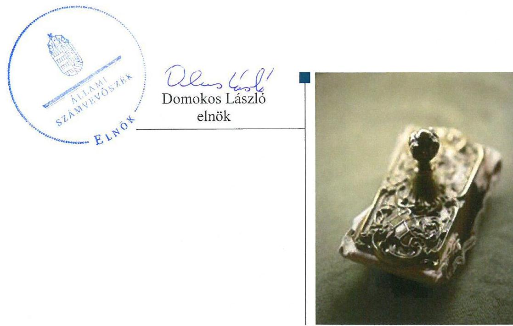
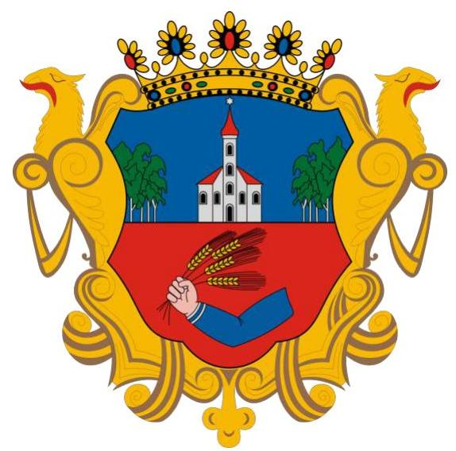
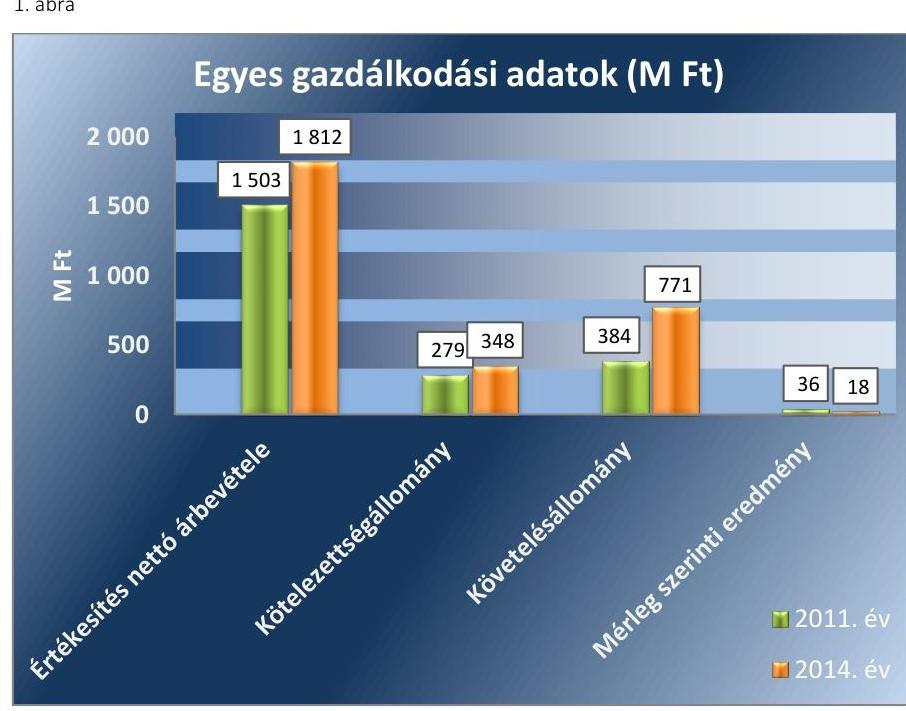
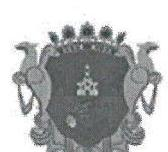
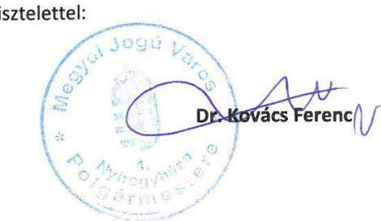
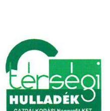
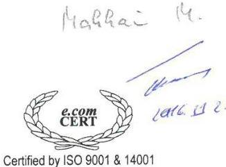
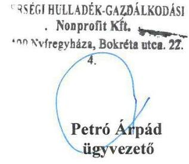

# Jelentés 

## Az önkormányzatok gazdasági társaságai

Az önkormányzatok többségi tulajdonában lévő gazdasági társaságok gazdálkodásának ellenőrzése - Térségi Hulladék-Gazdálkodási Kft. 2016.

---

# Jelentés 

## Az önkormányzatok gazdasági társaságai

Az önkormányzatok többségi tulajdonában lévő gazdasági társaságok gazdálkodásának ellenőrzése - Térségi Hulladék-Gazdálkodási Kft. 2016. 12. hó 20. nap

---

# AZ ELLENŐRZÉST FELÜGYELTE:

## MAKKAI MÁRIA felügyeleti vezető

## AZ ELLENŐRZÉST VEZETTE ÉS A VÉGREHAJTÁSÁÉRT FELELŐS:

### SALAMIN VIKTOR ellenőrzésvezető

### A PROGRAM ÖSSZEÁLLÍTÁSÁÉRT FELELŐS:

### JANIK JÓZSEF osztályvezető

---

**IKTATÓSZÁM:** V-1122-093/2016.

**TÉMASZÁM:** 2156

**ELLENŐRZÉS-AZONOSÍTÓ SZÁM:** V070787

---

Jelentéseink az Országgyűlés számítógépes hálózatán és az Interneta a www.asz.hu címen is olvashatóak.

---

# TARTALOMJEGYZÉK 

■ ÖSSZEGZÉS ..... 5
■ AZ ELLENŐRZÉS CÉLJA ..... 6
■ AZ ELLENŐRZÉS TERÜLETE ..... 7
■ AZ ELLENŐRZÉS HÁTTERE, INDOKOLTSÁGA ..... 8
■ A JELENTÉS LÉNYEGES KÉRDÉSKÖREI ..... 9
■ ELLENŐRZÉS HATÓKÖRE ÉS MÓDSZEREI ..... 10
■ MEGÁLLAPÍTÁSOK ..... 12
■ JAVASLATOK ..... 21
■ MELLÉKLETEK ..... 23
I. sz. melléklet: Értelmező szótár ..... 23
II. sz. melléklet: Múködési adatok ..... 25
III. sz. melléklet: Eredménykimutatás ..... 26
■ FÜGGELÉK: ÉSZREVÉTELEK ..... 27
■ RÖVIDÍTÉSEK JEGYZÉKE ..... 31

---

.

---

# ÖSSZEGZÉS 

A 2011-2014 közötti időszakban a hulladékgazdálkodás közfeladat ellátását Nyíregyháza Megyei Jogú Város Önkormányzata szabályszerűen szervezte meg, a tulajdonosi joggyakorlás megfelelt a jogszabályi előírásoknak. A Térségi Hulladék-Gazdálkodási Kft. vagyongazdálkodása összességében szabályszerű volt. A közzétételi kötelezettség teljesitése nem felelt meg teljes körűen a jogszabályok előírásainak, így nem volt biztositott teljes körűen a Társaság müködésének jogszabályoknak megfelelő átláthatósága. Az ellátott közfeladat bevételeinek, ráfordításainak és az értékcsökkenés elszámolása, valamint az önköltségszámitás és árképzés szabályszerű volt.

## Az ellenőrzés társadalmi indokoltsága

Az Állami Számvevőszék kiemelt célja, hogy a helyi önkormányzatok gazdálkodásában rejlő pénzügyi kockázatok feltárásával, az államháztartáson kívülre nyújtott költségvetési támogatások és ingyenes vagyonjuttatások, valamint az államháztartáson kívül múködő feladat-ellátó rendszerek ellenőrzéseivel hozzájáruljon ahhoz, hogy a közpénzeket az államháztartáson kívül múködő szervezetek is átlátható, rendezett módon használják fel.

Magyarországon az intézmény-centrikus közfeladat-ellátás jellemző, de egyre jelentősebb a költségvetésen kívüli feladatellátás térnyerése. Ennek legfontosabb szereplői - a nonprofit szervezetek mellett - az önkormányzati tulajdonú gazdasági társaságok. Az önkormányzatok szervezetalakítási szabadságának következménye, hogy a korábban is vállalati formában múködő közszolgáltatások mellett, mind a kötelező, mind az önként vállalt feladatok ellátásában a gazdasági társaságok kiemelt fontosságú szerephez jutottak.

## Főbb megállapítások, következtetések, javaslatok

Az Önkormányzat a hulladékgazdálkodás közfeladatának ellátását a jogszabályi előírásoknak megfelelően, többségi tulajdonában lévő gazdasági társaság útján biztosította. A közszolgáltatási szerződéseket a Társasággal a jogszabályi előírásnak megfelelően megkötötte, rendeletalkotási kötelezettségének eleget tett. Az Önkormányzat a közfeladatellátás felügyelete és a tulajdonosi jogok gyakorlása során szabályszerűen járt el.

A Társaság vagyongazdálkodása összességében szabályszerű volt, a beszámolók mérlegét alátámasztó leltárt elkészítették. Egyes tárgyi eszközök leltározásának gyakorlata nem felelt meg a jogszabály előírásainak. Egyes tárgyi eszközök esetében a jogszabály szerint háromévente esedékes mennyiségi felvétellel történő leltározás elmaradt. A számviteli szabályzatok előírásainak jogszabályi megfelelése, illetve egymás közötti összhangja teljes körűen nem volt biztosított.

A Társaság kötelezettségei 2011-2014. években növekedtek, ezeket azonban összességében határidőben teljesítette. A kötelezettségek állománya és szerkezete nem veszélyeztette a közfeladat ellátását, a Társaság múködését.

A Társaság az előírt beszámolási és közzétételi kötelezettségét hiányosan teljesítette. A 2011-2014. évi beszámolók kiegészítő mellékletei nem tartalmazták teljes körűen a jogszabály által meghatározott tartalmat. A Társaság honlapján nem szerepeltek teljes körűen a jogszabály által előírt, kötelező elektronikus közzététel alá eső adatok.

A közfeladat bevételeinek, ráfordításainak, valamint az értékcsökkenés elszámolása szabályos volt. Az önköltségszámítás Társaság által kialakított rendje és gyakorlata, valamint az árképzés megfelelt a jogszabályi előírásoknak.

---

# AZ ELLENŐRZÉS CÉLJA 

pozottsága szabályszerű önköltségszámítással.

Az ellenőrzés célja annak értékelése volt, hogy az Önkormányzat vagyongazdálkodási tevékenysége során szabályszerűen gyakorolta-e tulajdonosi jogait.

Ellenőriztük, hogy a gazdasági társaság szabályozottsága, gazdálkodása és vagyongazdálkodási tevékenysége, bevételeinek és ráfordításainak elszámolása megfelelt-e a jogszabályi és tulajdonosi előírásoknak.

Értékeltük továbbá, hogy a gazdasági társaság kötelezettségállománya jelentett-e kockázatot a múködésre, valamint a gazdálkodás átláthatósága és elszámoltathatósága érdekében biztosítva volt-e a szolgáltatás dijának megala-

---

# **AZ ELLENŐRZÉS TERÜLETE**

## **Nyíregyháza Megyei Jogú Város Önkormányzata és többségi tulajdonában lévő Térségi Hulladék - Gazdálkodási Kft.**

Nyíregyháza az ország hetedik legnagyobb városa, 118 125 lakossal a 2015. évi KSH1 adatok szerint. Az Önkormányzat2 2007. október 8-án döntött a Térségi Hulladék- Gazdálkodási Kft. 100%-os üzletrészének megvásárlásáról. A 2012. április 16-án a THG Kft.3 tulajdonosi szerkezete megváltozott, az ÉAK Kft.4 szerzett 1%-os tulajdoni részesedést, az Önkormányzat tulajdonosi részesedése 99%-ra csökkent. A Társaság5 az Önkormányzat illetékességi területén a hulladékgazdálkodás közfeladatát 2012. december 31-ig közszolgáltatóként, azt követően az ÉAK Kft. alvállalkozójaként végezte. Feladatát saját eszközeivel, illetve bérelt eszközökkel látta el.

A 2014. évben 54 település 89,5 ezer ingatlanánál látta el hulladékgyűjtési feladatot.

A THG Kft. gazdálkodásának egyes adatait a 2011., 2014. évek vonatkozásában az 1. ábra szemlélteti.

*Forrás: A Társaság 2011., 2014. évi beszámolói*

Az ellenőrzött időszakban a polgármester, a jegyző, valamint az ügyvezető személye nem változott.

---

# **AZ ELLENŐRZÉS HÁTTERE, INDOKOLTSÁGA**

*Az önkormányzatok közfeladat-ellátásában egyre jelentősebb a gazdasági társaságok útján történő feladatellátás térnyerése.*

**AZ ÖNKORMÁNYZATI TULAJDONÚ GAZDASÁGI TÁRSASÁGOK** teljes körű ellenőrzésének lehetőségét az Állami Számvevőszékről szóló 1989. évi XXXVIII. törvény 2011. január 1-jétől hatályos módosítása teremtette meg. Az önkormányzati tulajdonú gazdasági társaságok ellenőrzése kiemelten fontos a vagyon megőrzése, megóvása érdekében, valamint a kormányzati szektor elszámolásaiban megjelenő önkormányzati tulajdonú gazdálkodó szervezetek esetében, amelyekkel szemben alapvető követelmény, hogy gazdálkodásuk, működésük szabályszerű, az általuk szolgáltatott adatok minél megbízhatóbbak legyenek. A feladat/közfeladat ellátás költségeinek, ráfordításainak alakulása, színvonala hatással van a lakosság elégedettségére.

**AZ ELLENŐRZÉS VÁRHATÓ HASZNOSULÁSA-KÉNT** az ÁSZ6 a megállapításaival segítséget nyújthat az államháztartáson kívüli közfeladat-ellátás értékeléséhez, jogszabályi keretei pontosításához, átláthatóságot biztosító szabályozásához. Meghatározhatóvá válnak az önkormányzati feladatellátásban részt vevő államháztartáson kívüli szervezeteknek – az önkormányzat költségvetését, pénzügyi helyzetét is befolyásoló – kockázatai, lehetővé válik ezen kockázatok csökkentése. Ellenőrzéseink feltárhatják, hogy az önkormányzat feladat-ellátási kötelezettségének szabályszerűen tett-e eleget, a feladatellátáshoz rendelt vagyonkezelésbe vett és saját vagyon működtetését az elvárható gondossággal, szabályszerűen szervezte-e meg és a tulajdonosi felügyelete hozzájárult-e a feladatellátásához. Értékelhetővé válik, hogy a gazdasági társaság a feladat-ellátási, közszolgáltatási szerződésben foglaltak betartásával, a vagyon használatával biztosította-e a szolgáltatás folytatásának feltételeit. Ezzel az ellenőrzöttek és a helyi döntéshozók számára az ÁSZ visszajelzést ad feladatszervezési, feladat-ellátási kockázataikról, alapot ad a meglévő hibák megszüntetéséhez, a jobb feladat-ellátás biztosításához. Mindezeken keresztül az ÁSZ hozzájárul Magyarország közpénzügyi helyzetének javításához, a közpénzek mérhető módon történő, a döntéshozók által meghatározott célok szerinti felhasználásához.

---

# A JELENTÉS LÉNYEGES KÉRDÉSKÖREI 

1. Az önkormányzat feladat/közfeladat megszervezéséről szóló döntése, valamint tulajdonosi joggyakorlása szabályszerű volt-e?
2. A gazdasági társaság vagyongazdálkodása szabályszerű volt-e, kötelezettségállománya jelentett-e kockázatot a müködésre, illetve a feladat/közfeladat ellátásra?
3. A gazdasági társaságnál az ellátott feladat/közfeladat bevételei és ráfordításai elszámolása, valamint az önköltségszámitás és árképzés szabályszerű volt-e?

---

# ELLENŐRZÉS HATÓKÖRE ÉS MÓDSZEREI 

## Az ellenőrzés típusa

Megfelelőségi ellenőrzés.

## Az ellenőrzött időszak

2011. január 1-jétől 2014. december 31-ig tart.

## Az ellenőrzés tárgya

A gazdasági társaság feletti tulajdonosi joggyakorlás, valamint a gazdasági társaság gazdálkodásának szabályozottsága és szabályszerűsége.

Az ellenőrzés kiterjed minden olyan körülményre és adatra, amely az ÁSZ jogszabályban meghatározott feladatainak teljesítéséhez, valamint a program végrehajtása folyamán felmerült újabb összefüggések feltárásához szükséges.

## Az ellenőrzött szervezet

Nyíregyháza Megyei Jogú Város Önkormányzata és a többségi tulajdonában lévő Térségi Hulladék-Gazdálkodási Kft.

## Az ellenőrzés jogalapja

Az ellenőrzés jogszabályi alapját az ÁSZ tv. 1. § (3) bekezdése és 5. § (3)-(4)-(5) bekezdései képezték.

## Az ellenőrzés módszerei

Az ellenőrzést a nemzetközi standardokat irányadónak tekintve az ellenőrzési program ellenőrzési kérdései, az ellenőrzött időszakban hatályos jogszabályok, az ellenőrzés szakmai szabályok és módszertanok figyelembe vételével végeztük.

Az ellenőrzés ideje alatt az ellenőrzött szervezettel történő kapcsolattartást az ÁSZ Szervezeti és Múködési Szabályzatának vonatkozó előírásai alapján biztosítottuk.

Az ellenőrzés a kiválasztott, tulajdonosi jogokat gyakorló önkormányzatra, illetve az ellenőrzésre kijelölt gazdasági társaságra terjedt ki.

Az ellenőrzési kérdések megválaszolásához szükséges bizonyítékok megszerzése a következő ellenőrzési eljárások alkalmazásával történt: megfigyelés, kérdésfeltevés (információkérés), összehasonlítás, valamint

---

elemző eljárás. Az ellenőrzési bizonyítékként felhasználható adatforrások közé tartoztak egyrészt a szakmai programban felsorolt adatforrások, másrészt adatforrás lehetett még minden - az ellenőrzés folyamán - feltárt, az ellenőrzés szempontjából információkat tartalmazó dokumentum.

Az ellenőrzést a kérdésekre adott válaszok kiértékelésével, valamint a megjelölt adatforrások, a csatolt tanúsítványok felhasználásával, továbbá az adott időszakban hatályos jogszabályok figyelembe vételével folytattuk le.

A bevételek és ráfordítások elszámolása, valamint a vagyonnyilvántartás terén a szabályszerű múködést véletlen mintavétellel ellenőriztük. A mintavétellel ellenőrzött területek esetében minden egyes tétel vonatkozásában a szabályszerűségre vonatkozó kérdéseket tettünk fel, amelyek eredménye összesítésre került. Megfelelőnek értékeltünk egy ellenőrzött területet, amennyiben 95\%-os bizonyossággal a teljes sokaságban a hibaarány legfeljebb 10\%, nem megfelelőnek, amennyiben 10\%-nál magasabb arányt képviselt. Abban az esetben, ha a teljes sokaság tekintetében a 10\%os hibaarányhoz való viszony megítélésnek megbízhatósága nem érte el a 95\%-ot, annak elérése érdekében értékelésünket további szempontokkal egészítettük ki, és figyelembe vettük a feltárt hibák típusát és súlyát. A ráfordítások elszámolására és a vagyonnyilvántartásra vonatkozó véletlen mintavételt kockázati alapú kiválasztással egészítettük ki, amelynek során évente a három legnagyobb összegű tételt választottuk ki.

---

# 1. Az önkormányzat feladat/közfeladat megszervezéséről szóló döntése, valamint tulajdonosi joggyakorlása szabályszerű volt-e? 

Összegző megállapítás

Az Önkormányzat a hulladékgazdálkodás közfeladatának ellátását szabályszerűen biztosította, a tulajdonosi jogok gyakorlása megfelelt a jogszabályi előírásoknak.

### 1.1. számú megállapítás

A közfeladat-ellátást az Önkormányzat szabályszerűen biztosította, a hulladékgazdálkodási közfeladatra vonatkozó rendeletalkotási kötelezettségének eleget tett.

GAZDASÁGI PROGRAMBAN szükséges az önkormányzatoknak az Ötv7. 91. § (6) bekezdése, 2013. január 1-jétől az Mötv8. 116. § (3)(4) bekezdései szerint meghatározni azokat a célkitűzéseket, amelyek az általa ellátott feladatok biztosítását, fejlesztését szolgálják. Az Önkormányzat gazdasági programja tartalmazta a Társasággal kapcsolatos fejlesztési elképzeléseket, terveket a 2011-2014. évekre vonatkozóan. Célul tűzték ki - többek között - a környezetbarát technológiai eljárások alkalmazását, valamint a költséghatékony, környezetkímélő hulladékkezelést.

Az Önkormányzat a 2009-2014. évekre vonatkozóan a Hgt. ${ }^{9} 35$. § (1) bekezdésben előírtak szerint, a Hgt. 37. § (4) bekezdésben meghatározott tartalommal elkészítette a hulladékgazdálkodási tervét. A hulladékgazdálkodási tervhez szorosan kapcsolódott az 1995. évi LIII. tv. ${ }^{10} 46$. § (1) bekezdés b) pontjában előírtak szerint elkészített, 2008-2014. évekre vonatkozó környezetvédelmi program.

A köztisztaság és a településtisztaság biztosítása az Ötv. 8. § (1) bekezdése, valamint az Mötv. 13. § (1) bekezdésének 5. pontja alapján az önkormányzat törvényi kötelezettsége. Az Önkormányzat a szilárd hulladékkal kapcsolatos helyi közszolgáltatási feladatainak ellátására 2011-2012. évekre a Társasággal (közszolgáltatási szerződés ${ }_{1}{ }^{11}$ ), 2013-2014. évekre az ÉAK Kft.-vel (közszolgáltatási szerződés ${ }_{2}{ }^{12}$ ) kötött közszolgáltatási szerződést. A közszolgáltatási szerződés; hiányossága volt, hogy a 224/2004. (VII. 22.) Korm. rendelet ${ }^{13} 12 . \S$ (1) bekezdés d) pontjában rögzítettek ellenére nem tartalmazta a közszolgáltatás folyamatos, biztonságos és bővíthető teljesítéséhez szükséges fejlesztések és karbantartások közszolgáltató általi elvégzésének kötelezettségét. A közszolgáltatási szerződés2 tartalma megfelelt a 224/2004. (VII. 22.) Korm. rendelet 11-14. § előírásainak. A közszolgáltatási szerződés ${ }_{2}$ tartalmazta az ÉAK Kft. arra vonatkozó nyilatkozatát, hogy a hulladékgazdálkodási közszolgáltatást a THG. Kft. alvállalkozóként történő bevonásával végzi. A közfeladat-ellátás megszervezése megfelelt az Ötv. 9. § (4) bekezdés, illetve az Mötv. 41. § (6) bekezdés előírásának.

---

AZ ALAPÍTÓ OKIRAT ${ }^{14}$-ban az Önkormányzat határozott az ügyvezető személyéről, valamint az $\mathrm{FB}^{15}$ tagok és a könyvvizsgáló kijelöléséről. A taggyűlés kizárólagos hatáskörébe rendelte azokat a jogokat, melyeket a Gt. ${ }^{16}$ 141. § (2), illetve 2014. március 15-től a Ptk. ${ }^{17}$ 3:372. § (1) bekezdés előírásai kizárólag a taggyűlés hatáskörébe helyeztek. Az ügyvezető feladatai között rögzítette a számviteli beszámoló elkészítését, továbbá meghatározta benne az alapító felé fennálló információadási kötelezettségét, a THG Kft. képviseletét.

Az Önkormányzat a Hgt. 23. §-ban előírt kötelezettségének eleget tett, a hulladékkezelési rendeletben ${ }^{18}$ állapította meg a közfeladat-ellátással összefüggő szabályokat és a szolgáltatás igénybevételének rendjét. Az Önkormányzat ármegállapítási jogköre 2013. január 1-jétől megszűnt. A Ht. ${ }^{19}$ 47. § (4) bekezdése alapján - ettől az időponttól - a hulladékgazdálkodási közszolgáltatási díjat a Magyar Energia Hivatal javaslatára a hulladékgazdálkodási közszolgáltatási díj megállapításáért felelős miniszter rendeletben állapította meg.

# 1.2. számú megállapítás 

Az Önkormányzat a tulajdonosi jog gyakorlása során szabályszerűen járt el.

A TULAJDONOSI JOG GYAKORLÁSÁNAK rendjét az Önkormányzat a vagyongazdálkodási rendelet ${ }_{1}{ }^{20}{ }_{2}{ }^{21}$-ben határozta meg. A tulajdonosi jogokat az Önkormányzat 2012. április 15-ig, a THG Kft. kizárólagos önkormányzati tulajdonlásáig a vagyongazdálkodási rendeletben ${ }_{1,2}$ foglaltak szerint gyakorolta.
2012. április 16-tól a Taggyűlés ${ }^{22}$ gyakorolta a tulajdonosi jogokat. A taggyűlési szavazatok 99\%-át - a törzsbetétek arányában - az Önkormányzat, 1\%-át az ÉAK Kft. birtokolta. A Taggyűlésben az Önkormányzatot a polgármester képviselte.

ÜZLETI TERV készítési kötelezettséget a tulajdonosi joggyakorló nem írt elő, azonban a THG Kft. az ellenőrzött években elkészítette azt. Az üzleti tervben megjelölt hulladékgazdálkodási feladatok, célok összhangban álltak az Önkormányzat által készített közfeladatok ellátásához kapcsolódó tervekben megjelölt célokkal. Az üzleti terv elfogadásáról a tulajdonosi joggyakorló - 2011. évi üzleti terv esetében a polgármester, 20122014. évi üzleti tervek vonatkozásában a Taggyűlés - az FB véleményének birtokában döntött.

AZ FB öt taggal működött, mely megfelelt a Taktv. ${ }^{23}$ 4. § (2) bekezdésében meghatározott létszámnak. Az FB ügyrendjét elkészítette, azt a tulajdonosi joggyakorló határozattal jóváhagyta, ezzel eleget tettek a Gt. 34. § (4), illetve a Ptk. 3:122. § (3) bekezdés előírásának.

A tulajdonosi joggyakorló negyedéves beszámolási kötelezettséget írt elő, melyet a THG Kft. teljesített. Az Önkormányzat rendeletben határozta meg a Közgyűlés bizottságainak feladatait, hatásköreit. Ennek alapján a Gazdasági és Tulajdonosi Bizottságnak, valamint a Városstratégiai és Környezetvédelmi Bizottságnak a THG Kft. éves beszámolóit véleményezniük kellett, ezt a kötelezettséget a bizottságok az ellenőrzött években teljesítették. A polgármester a bizottsági határozatok birtokában szavazott az éves beszámolók elfogadásáról a Taggyűlés tagjaként.

---

A Társaság 2011-2014. üzleti éveiről készített éves beszámolóit a Taggyűlés megtárgyalta és elfogadta. A Taggyűlés a beszámolók elfogadásáról a Gt. 35. § (3) bekezdésének és a Ptk. 3:120. § (2) bekezdésének előírásait betartva az FB írásos jelentésének birtokában döntött.

A THG Kft. a közszolgáltatási szerződés ${ }_{1}$-ben előírt, Önkormányzat felé teljesítendő adatszolgáltatást az alkalmazott közszolgáltatási díj mértékéről és annak alkalmazási tapasztalatairól a 2011. és 2012. évi éves beszámolóinak és üzleti jelentéseinek megküldésével teljesítette.

OSZTALÉK KIFIZETÉSRE nem került sor, a mérleg szerinti eredményt - amely minden évben pozitív volt - a Taggyűlés döntése alapján eredménytartalékba helyezték. Az eredményes gazdálkodás miatt a Gt. 51. § (1) és a 2014. március 15-től hatályos Ptk. 3:133. § (2) bekezdés előírása szerinti tőkemegfelelés biztosított volt.

KEZESSÉGVÁLLALÁSRA az Önkormányzat részéről nem került sor, a Társaság feladatellátásához múködési és fejlesztési támogatást nem nyújtott. Az Önkormányzat 2014. május 5-én 100,0 M Ft tagi kölcsönt nyújtott a Társaságnak 3,5\% éves kamattal, melyet a THG Kft. 2014. december 30-án kamattal növelt összegben visszafizetett. A tagi kölcsön nyújtásáról a Közgyűlés hozott döntést az Mötv. 42. § 4. pont előírásával összhangban.

# 2. A gazdasági társaság vagyongazdálkodása szabályszerű volt-e, kötelezettségállománya jelentett-e kockázatot a múködésre, illetve a feladat/közfeladat ellátásra? 

Összegző megállapítás

A Társaság vagyongazdálkodása összességében szabályszerű volt, egyes tárgyi eszközök leltározásának gyakorlata azonban nem felelt meg a jogszabályi előírásoknak. A kötelezettségállomány a közfeladat ellátást nem veszélyeztette. A Társaság a beszámolási és adatszolgáltatási kötelezettségeit hiányosan teljesítette.

A számviteli szabályzatok előírásainak jogszabályi megfelelése, illetve egymás közötti összhangja teljes körűen nem volt biztosított.

A Társaság rendelkezett a Számv. tv ${ }^{24}$. 14. § (3) bekezdésben előírt számviteli politikával, valamint a Számv. tv. 14. § (5) bekezdés a), b), d) pontjaiban előírtaknak megfelelően eszközök és források leltárkészítési és leltározási, illetve értékelési szabályzatával, valamint pénzkezelési szabályzattal. Elkészítették továbbá a Számv. tv. 161. § (1) bekezdésben előírt számlarendet.

A SZÁMVITELI POLITIKA a Számv. tv. 14. § (4) bekezdése, valamint a 161/A. § előírásainak megfelelt. Az eszközök és források leltárkészítési és leltározási szabályzata a - mennyiségben is nyilvántartott - ingatlanok, gépek, berendezések és felszerelések 5 évenkénti mennyiségi felvétellel történő leltározási kötelezettségét írta elő. A szabályozás 2012. január 1-jétől nem felelt meg a Számv. tv. 69. § (3) bekezdésében foglalt elő-

---

írásoknak, mely szerint a leltárba bekerülő adatok valódiságáról a mennyiségben nyilvántartott eszközök esetében legalább 3 évente mennyiségi felvétellel kell meggyőződni.

# AZ ESZKÖZÖK ÉS FORRÁSOK ÉRTÉKELÉSI SZABÁLYZATA és a számviteli politika előírásai közötti összhang nem volt biztosított a járművek maradványértékének, a hulladékhasznosító létesítmények, és a bérbe adott tárgyi eszközök értékcsökkenési leírása elszámolásának tekintetében. 

A PÉNZKEZELÉSI SZABÁLYZATBAN a Számv. tv. 14. § (8) bekezdésében előírtak közül nem határozták meg a pénztár ellenőrzésének gyakoriságát.

### 2.2. számú megállapítás

A Társaság a tulajdonában lévő vagyonával összességében szabályszerűen gazdálkodott, egyes tárgyi eszközök esetében azonban a jogszabály szerint háromévente esedékes mennyiségi felvétellel történő leltározás elmaradt.

Az analitikus és főkönyvi nyilvántartási rendszer biztosította a Társaság saját vagyonának Számv. tv. és belső szabályozás szerinti nyilvántartását, a változások folyamatos nyomon követését. Az ellenőrzött évek beszámolóinak mérlegét alátámasztó, Számv. tv. 69. § (1) bekezdése szerinti leltárakat elkészítették. A főkönyvi könyvelés és analitikus nyilvántartások közötti egyezőséget biztosították.

A THG Kft. a hulladékgazdálkodási közfeladat ellátásához az Önkormányzattól vagyonkezelésbe nem vett át vagyont, a feladatot saját, illetve bérelt eszközökkel látta el. Az eszközök és források értékelési szabályzata előírta a bérelt eszközök nullás számlaosztályban, a tulajdonos által közölt bruttó értéken történő nyilvántartásba vételét. Ennek a kötelezettségének a Társaság az Önkormányzattól - bérleti szerződés keretében - bérelt eszközök vonatkozásában nem tett eleget. A Társaság a 2011-2014. években a bérelt eszközök leltározását az Önkormányzat által megküldött leltáríveken, a fellelt mennyiség feltüntetésével végezte el, és a leltár dokumentációt megküldte az Önkormányzatnak.

A mennyiségben nyilvántartott tárgyi eszközök mennyiségi felvétellel történő leltározását 2011-ben végezték el. A 2012-2014. években a számítástechnikai eszközök kivételével (ezen eszközök mennyiségi felvétellel történő leltározása 2012-ben is megtörtént) a tárgyi eszközök mennyiségi felvétellel történő leltározása nem történt meg. Ezzel megsértették a 2012. január 1-jétől hatályos Számv. tv. 69. § (3) bekezdésének előírásait, amely legalább 3 évenkénti mennyiségi leltározási kötelezettséget írt elő azon eszközök vonatkozásában, amelyekről folyamatos mennyiségi nyilvántartást vezetnek.

---

1. táblázat

THG KFT. MÉRLEGÉNEK KIEMELT ADATAI 2011-2014. (M FT)

| Megnevezés | 2011- | 2011- | 2012- | 2013- | 2014- |
| :-- | --: | --: | --: | --: | --: |
|  | 01.01 | 12.31 | 12.31 | 12.31 | 12.31 |
| I. Befektetett eszközök | 1067,8 | 985,6 | 944,6 | 905,9 | 849,9 |
| - ebből: Tárgyi eszközök | 1064,0 | 979,7 | 937,8 | 899,2 | 848,2 |
| II. Forgóeszközök | 340,3 | 489,2 | 566,3 | 723,2 | 835,0 |
| - ebből: Követelések | 285,8 | 383,9 | 423,5 | 657,4 | 770,8 |
| III. Aktív időbeli elhatárolások | 1,0 | 2,8 | 21,2 | 22,3 | 8,1 |
| Eszközök összesen | 1409,1 | 1477,6 | 1532,1 | 1651,4 | 1693,0 |
| IV. Saját tőke | 1095,4 | 1131,5 | 1168,1 | 1184,6 | 1199,2 |
| - ebből: Jegyzett tőke | 1012,0 | 1012,0 | 1022,2 | 1022,2 | 1022,2 |
| - ebből: Mérleg szerinti eredmény | 54,7 | 36,0 | 26,5 | 16,5 | 17,9 |
| V. Céltartalékok | 40,0 | 60,0 | 65,0 | 75,0 | 70,0 |
| VI. Kötelezettségek | 262,6 | 279,0 | 293,5 | 386,3 | 348,3 |
| VII. Passzív időbeli elhatárolások | 11,1 | 7,1 | 5,5 | 5,5 | 75,5 |
| Források összesen | 1409,1 | 1477,6 | 1532,1 | 1651,4 | 1693,0 |

A THG Kft. eszközállományának 2011. január 1. és 2014. december 31e közötti 283,9 M Ft-os (20,1\%-os) növekedését a forgóeszközök állományának növekedése okozta. A forgóeszközökön belül a követelések 485 M Ft-os (169,7\%-os) emelkedése volt kiemelt jelentőségű. A befektetett eszközök 217,9 M Ft-os (20,4\%-os) csökkenését alapvetően az eredményezte, hogy a saját vagyon pótlására végzett beruházások, felújítások értéke elmaradt az ellenőrzött években elszámolt amortizáció összegétől. A tárgyi eszközök elhasználódási szintje az ellenőrzött időszakban folyamatosan nőtt, mellyel párhuzamosan a használhatósági fok romlott.

A forrásokon belül a saját tőke, a céltartalékok és a kötelezettségek is növekvő trendet mutattak. A saját tőke értékének alakulására alapvetően a mérleg szerinti eredmény elszámolása volt hatással. A 2014. évi mérlegben kimutatott kötelezettségek egésze rövid lejáratú kötelezettség volt, melynek több mint felét az egyéb rövid lejáratú kötelezettségek (adó-, és munkabér tartozások, pénzügyi lízing következő évi törlesztő részlete) tették ki.
2.3. számú megállapítás

A THG Kft. kötelezettségeinek mértéke és szerkezete nem veszélyeztette a közfeladat ellátását, a Társaság múködését.

A KÖTELEZETTSÉGEK növekvő szintje ellenére Társaságnál a saját tőke forrásokon belüli aránya meghaladta a 70\%-ot az ellenőrzött években. A saját tőke nagysága, továbbá az eredményes múködés miatt az eladósodottság mértéke, szerkezete a 2011-2014. években nem jelentett veszélyt a múködésre és a feladat ellátására, amelyet az eladósodottság szerkezetét jellemző mutatószámok értékei is alátámasztottak.

A THG Kft. a 2011-2014. években összességében határidőben teljesítette kötelezettségeit. Az eladósodottságot jelző mutatók értékeinek alakulását a 2011-2014. években a 2. táblázat mutatja be.

---

| A THG KFT. PÉNZÜGYI MUTATÓSZÁMAI |  |  |  |  |
| :-- | --: | --: | --: | --: |
| Megnevezés | 2011 | 2012 | 2013 | 2014 |
| adósságfedezeti mutató | 5,28 | 5,15 | 4,22 | 4,84 |
| nettó eladósodottsági mutató | $-0,09$ | $-0,11$ | $-0,23$ | $-0,35$ |
| eladósodottság mértéke | 0,25 | 0,25 | 0,33 | 0,29 |
| eladósodottsági mutató | 0,19 | 0,19 | 0,23 | 0,21 |

A Z ELADÓSODOTTSÁGI MUTATÓ az ellenőrzött időszakban kedvező ( 0,6 érték alatti) volt, a külső finanszírozás nem jelentett kockázatot. Az adósságfedezeti mutató az ellenőrzött időszakban 4,2-5,3 közötti értéken alakult, a THG Kft. eszközeinek együttes értéke 4-5-szeresen meghaladta az adósság mértékét. A nettó eladósodottsági mutató az ellenőrzött időszakban kedvező, negatív mértékű volt és csökkenő tendenciát mutatott, melyet a kötelezettségek összegét meghaladó mértékű követelések összege magyarázott. A THG Kft. kötelezettségeit saját tőke forrás bevonása nélkül is a fedezték a kintlévőségek. Az eladósodottság mértéke az ellenőrzött időszakban 0,2-0,3 érték között alakult, amely kedvező (1 alatti érték) volt. A kötelezettség 25-33\%-a volt a saját tőke értékének.

# 2.4. számú megállapítás 

A THG Kft. az előírt beszámolási és közzétételi kötelezettségét hiányosan teljesítette.

A THG Kft. beszámolási, adatszolgáltatási kötelezettségét Alapító Okirata, közszolgáltatási szerződése, valamint alvállalkozói szerződése szabályozta, mely adatszolgáltatási, beszámolási kötelezettségeknek eleget tettek.

ÉVES BESZÁMOLÓJÁT a THG Kft. a Számv. tv. 19. § (1) bekezdés előírásának megfelelően elkészítette. Az éves beszámolók letétbe helyezése a Számv. tv. 153. § (1) bekezdése, közzététele a Számv. tv. 154. § (1) bekezdésben előírtak szerint megtörtént.

A 2011-2014. évi beszámolók kiegészítő mellékleteinek hiányossága volt, hogy nem tartalmazták a Számv. tv. 88. § (8) bekezdés b) pontjában előírtak ellenére a könyvvizsgáló által felszámított díjat, valamint a Számv. tv. 89. § (2) bekezdés a) pontja szerint bemutatandó, a Társaságban többségi befolyással rendelkező tag székhelyét, szavazati arányát.

A 2011-2013. évi beszámolók kiegészítő mellékleteiben nem mutatták be a Számv. tv. 89. § (4) bekezdés a) pontjában előírt, a vezető tisztségviselők üzleti évi járandóságának összegét, csoportonként összevontan.

A 2011. évi beszámoló kiegészítő melléklete nem mutatta be a Számv. tv. 89. § (5) bekezdés előírásai ellenére a THG Kft. honlapjának címét, és mivel az egyes tevékenységek, szolgáltatások jelentősen különböztek egymástól, a Számv. tv. 93. § (1) bekezdés b) pont rendelkezései ellenére az értékesítés nettó árbevételét főbb tevékenységenkénti megbontásban.

A könyvvizsgáló az ellenőrzött években hitelesítő záradékkal látta el a Társaság éves beszámolóját.

A belső adatvédelmi felelőst az Avtv. ${ }^{25}$ 31/A. § (1) bekezdés c) pontja és az Info tv. ${ }^{26}$ 2012. január 1-jétől hatályos 24. § (1) bekezdés c) pontja előírásainak megfelelően kijelöltek. Az adatvédelmi felelős az Avtv. 31/A. § (1) bekezdés d) pontjában előírt Adatvédelmi szabályzat ${ }_{1}{ }^{27} \cdot{ }_{2}{ }^{28}$-t készített.

---

A KÖZÉRDEKŰ ADATOK megismerésére irányuló igények teljesítésének rendjét rögzítő szabályzattal az Avtv. 20. § (8) bekezdése, illetve az Info tv. 2012. január 1-jétől hatályos 30. § (6) bekezdés előírásainak ellenére 2011. január 1. és 2013. november 30. között nem rendelkeztek. A 2013. december 1-jétől hatályos Adatvédelmi szabályzat; tartalmazta a közérdekű adatok megismerésére irányuló igények teljesítésének rendjét is.

A THG Kft. honlapján nem szerepeltek teljeskörűen az Info. tv. 33. §-ban előírt kötelező elektronikus közzététel alá eső, az Info. tv. 37. § (1) bekezdés szerinti, az Info. tv. 1. mellékletében részletezett közzétételi listán szereplő, a THG Kft. szervezetére, tevékenységre, múködésre és gazdálkodására vonatkozó adatok.

Nem tette közzé a Társaság az Info tv. 1. melléklet
—_ a II. 1. pontja szerint az SZMSZ-t, az Adatvédelmi szabályzatot;

- a II.13. pont szerint a közérdekú adatok megismerésére irányuló intézkedések rendjét;
- a III.2. pont szerint a foglalkoztatottak létszámára, személyi juttatásra vonatkozó összesített negyedéves adatokat.

# 3. A gazdasági társaságnál az ellátott feladat/közfeladat bevételei és ráfordításai elszámolása, valamint az önköltségszámítás és árképzés szabályszerű volt-e? 

Összegző megállapítás

A bevételek és a ráfordítások, valamint az értékcsökkenés elszámolása szabályszerű volt. Az árképzés megfelelt az előírásoknak, az önköltségszámítást szabályosan végezték.
3.1. számú megállapítás

A közfeladat bevételeinek, ráfordításainak, valamint az értékcsökkenés elszámolása szabályos volt.

A THG KFT. a hulladékgazdálkodási közfeladat mellett egyéb feladatokat is ellátott így a Hgt. 29. § (3) bekezdése alapján a 2011-2012. években fennállt a bevételeinek, költségeinek és ráfordításainak elkülönített nyilvántartási kötelezettsége. A THG. Kft. 2013. január 1-jétől alvállalkozóként végezte a hulladékkezelési tevékenységet, nem minősült közszolgáltatónak, ezért az elkülönített nyilvántartásra vonatkozó kötelezettsége megszűnt. A bevételek tevékenységenkénti elkülönítését az alkalmazott főkönyvi számok biztosították. A költségnemenként könyvelt ráfordításokat munkaszámok alkalmazásával különítették el tevékenységenként, a belső szabályozásban előírtak szerint.

AZ ÉRTÉKESÍTÉS NETTÓ ÁRBEVÉTELÉNEK ELSZÁMOLÁSA megfelelő volt. A bevételek előírása és kiszámlázása a belső szabályozás szerint történt. A bevételeket a megfelelő számlacsoportban számolták el.

---

# AZ ANYAGJELLEGŰ RÁFORDÍTÁSOK ELSZÁMOLÁSA 

megfelelő volt. A közfeladattal kapcsolatban elszámolt költségeket és ráfordításokat a megfelelő közfeladatra és költségnemre számolták el. A számviteli elszámolás bizonylatai a Számv. tv. 165-167. §-aiban rögzített alaki és tartalmi követelményeknek megfeleltek.

AZ ÉRTÉKCSÖKKENÉS ELSZÁMOLÁSA megfelelt a Számv. tv. 52. §-ában foglaltaknak, illetve a számviteli politikában meghatározottaknak. A THG Kft. a Számv. tv. 92. § (1) bekezdésben foglaltaknak megfelelően az éves beszámolók kiegészítő mellékleteiben bemutatta az elszámolt értékcsökkenési leírást mérlegtételek szerinti bontásban.

A követelések kezelésének módját a THG Kft a követeléskezelési szabályzatában rögzítette. A szabályzatban rögzített eljárásrend és az annak megfelelő alkalmazása összhangban állt a Hgt. 26. § (1)-(3) bekezdésében, illetve a Ht. 52. § (1)-(3) bekezdésében előírtakkal. A Társaság a határidőre nem fizető ügyfeleknek fizetési felszólítást küldött, majd a 90 napos (2014. január 1-től 45 nap) elteltével kezdeményezte az adók módjára történő behajtást 2011-2012-ben az illetékes önkormányzatoknál, 2013. január 1jétől a NAV-nál.

A közfeladat lejárt határidejű követelésállományának alakulását az 3. táblázat mutatja be.
3. táblázat

A THG KFT. VEVŐ-KÖVETELÉSÁLLOMÁNYÁNAK VÁLTOZÁSA (M FT)

| Megnevezés | 2011. | 2012. | 2013. | 2014. |
| :-- | --: | --: | --: | --: |
| Vevökövetelés | 357,4 | 393,1 | 585,8 | 699,3 |
| Lejárt vevökövetelés | 242,1 | 254,7 | 472,7 | 315,0 |
| Nettó árbevétel | 1502,8 | 1470,3 | 1490,0 | 1812,2 |
| Árbevétel arányos vevőkövetelés | $23,8 \%$ | $26,7 \%$ | $39,3 \%$ | $38,6 \%$ |
| Lejárt vevőkövetelések aránya a | $67,1 \%$ | $64,8 \%$ | $80,7 \%$ | $45,1 \%$ |
| követelésekhez viszonyítva |  |  |  |  |

A vevői követelésállomány értéke a 2014. év végére 95,7\%-kal emelkedett a 2011. év végi értékhez viszonyítva, de a lejárt követelések aránya lecsökkent 67,1\%-ról 45,1\%-ra, mely a követeléskezelés eredményességét mutatta.

### 3.2. számú megállapítás

Az önköltségszámítás kialakított rendje és gyakorlata, valamint az árképzés megfelelt a jogszabályi előírásoknak.

A THG Kft. a Számv. tv. 14. § (5) bekezdés c) pontjában előírtaknak megfelelően rendelkezett önköltségszámítási szabályzattal. A Társaság a hulladékkezelésen kívül egyéb feladatokat is ellátott, ezért az egyes tevékenységek közvetlen költségeinek elkülönítésére kalkulációs egységek alkalmazását írták elő, illetve meghatározták a közvetett költségek felosztásának szabályait. A közszolgáltatás díját az Önkormányzat 2011. január 1-je és 2012. december 31. között rendeletben határozta meg, a Társaság által elkészített díjavaslat alapján. A javaslatot alátámasztó díjkalkuláció az önköltségszámítási szabályzat szerinti, utókalkulációval számított önköltséget tartalmazta. A 2013-2014. években a végzett szolgáltatások önköltségét a Számv. tv. 14. § (7) bekezdésében előírtaknak megfelelően utókalkulációval meghatározták.

---

A THG Kft. által 2011. és 2012. években alkalmazott hulladékkezelési díjak megfeleltek a hulladékkezelési rendeletben előírt díjtételeknek.

---

# JAVASLATOK 

Az ÁSZ tv. 33. § (1) bekezdésében foglaltak értelmében az ellenőrzött szervezet vezetője köteles a jelentésben foglalt megállapításokhoz kapcsolódó intézkedési tervet összeállítani és azt a jelentés kézhezvételétől számított 30 napon belül az ÁSZ részére megküldeni. Amennyiben az ellenőrzött szervezet vezetője nem küldi meg határidőben az intézkedési tervet, vagy továbbra sem elfogadható intézkedési tervet küld, az Állami Számvevőszék elnöke az ÁSZ tv. 33. § (3) bekezdése a) és b) pontjaiban foglaltakat érvényesítheti.
A javaslatok megfogalmazása során az Állami Számvevőszék figyelembe vette az ellenőrzött időszakot követő változásokat és intézkedéseket.

## A Térségi Hulladék - Gazdálkodási Kft. ügyvezetőjének

1. Intézkedjen annak érdekében, hogy az eszközök és a források leltárkészittési és leltározási szabályzata, valamint a leltározási tevékenység teljes körüen feleljen meg a Számv. tv. elöírásainak.
(2.1. sz. megállapítás 2. bekezdése és a 2.2. sz. megállapítás 3. bekezdése alapján)
2. Intézkedjen annak érdekében, hogy az éves beszámoló kiegészítő melléklete teljes körüen feleljen meg a Számv. tv. elöírásainak.
(2.4. sz. megállapítás 3-5. bekezdései alapján)
3. Intézkedjen az Info tv.-ben elöírtaknak megfelelően a kötelező elektronikus közzététel alá eső adatok teljes körü közzétételéről.
(2.4. sz. megállapítás 9-10. bekezdései alapján)

---

.

---

# MELLÉKLETEK 

- I. SZ. MELLÉKLET: ÉRTELMEZŐ SZÓTÁR
adósságfedezeti mutató
eladósodottság mértéke
eladósodottsági mutató (tőkeáttétel)
garancia
gazdasági társaság
gazdálkodó szervezet
kezesség
(befektetett eszközök + forgó eszközök) / idegen forrás
Azt mutatja, hogy 1 Ft adósságra hány Ft vagyon jut. Általánosságban véve kedvező, ha értéke 2 körül van, de nagy eszközberuházás-igényű iparágakban értéke kisebb is lehet.
Kötelezettségek / saját tőke
Fontos szerepet játszik ez a mutató egy vállalat megítélésében. Azt mutatja, hogy a saját források a kötelezettségek hány százalékát fedezik. Törekedni kell, hogy a mutató tartósan (jelentősen) 1 alatti értéket érjen el.
idegen tőke / összes forrás
Egészségesnek mondható egy olyan mértékű áttétel, amelyet az üzleti tervek szerint és az elmúlt időszak tapasztalatai alapján a társaság megfelelő biztonsággal ki tud termelni. Nagy eszközberuházás-igényű iparágakban értéke magasabb, azaz magasabb eladósodottság is elfogadható, de 75-85\%-ot meghaladó értéknél már itt is erős, sőt túlzott külső finanszírozottságról beszélhetünk. Általánosságban véve kedvező, ha értéke kisebb, mint 0.
A garancia olyan önálló, az önkormányzat nevében vállalt kötelezettség, amely alapján az önkormányzat az önkormányzati költségvetés terhére szerződésben meghatározott feltételek szerint, a kötelezett nem teljesítése esetén a jogosultnak fizetést teljesít az előzetesen rögzített összeghatárig.
Ptk. 3:88. § (1) A gazdasági társaságok üzletszerű közös gazdasági tevékenység folytatására, a tagok vagyoni hozzájárulásával létrehozott, jogi személyiséggel rendelkező vállalkozások, amelyekben a tagok a nyereségből közösen részesednek, és a veszteséget közösen viselik.
A Ptk. 685. § c) pontja szerint gazdálkodó szervezet:„az állami vállalat, az egyéb állami gazdálkodó szerv, a szövetkezet, a lakásszövetkezet, az európai szövetkezet, a gazdasági társaság, az európai részvénytársaság, az egyesülés, az európai gazdasági egyesülés, az európai területi együttműködési csoportosulás, az egyes jogi személyek vállalata, a leányvállalat, a vízgazdálkodási társulat, az erdő birtokossági társulat, a végrehajtói iroda, az egyéni cég, továbbá az egyéni vállalkozó."
A kezességre vonatkozó előírásokat a Ptk. 6:416-430. §-ai tartalmazzák. Kezességi szerződéssel a kezes kötelezettséget vállal a jogosulttal szemben, hogyha a kötelezett nem teljesít, maga fog helyette a jogosultnak teljesíteni. Kezesség egy vagy több, fennálló vagy jövőbeli, feltétlen vagy feltételes, meghatározott vagy meghatározható összegű pénzkövetelés vagy pénzben kifejezhető értékkel rendelkező egyéb kötelezettség biztosítására vállalható. A Ptk. szerint kezességet csak írásban lehet vállalni. A kezes kötelezettsége ahhoz a kötelezettséghez igazodik, amelyért kezességet vállalt. A kezes kötelezettsége nem válhat terhesebbé, mint amilyen elvállalásakor volt, kiterjed azonban a kötelezett szerződésszegésének jogkövetkezményeire és a kezesség elvállalása után esedékessé váló mellékkövetelésekre is.

---

közfeladat
közszolgáltatás
közvetett tulajdon, illetve közvetett befolyás
nemzeti vagyon
nettó eladósodottság
tulajdonosi joggyakorló

Jogszabályban meghatározott állami vagy önkormányzati feladat, amit az arra kötelezett közérdekből, jogszabályban meghatározott követelményeknek és feltételeknek megfelelve végez, ideértve a lakosság közszolgáltatásokkal való ellátását, továbbá az állam nemzetközi szerződésekben vállalt kötelezettségeiből adódó közérdekű feladatokat, valamint e feladatok ellátásához szükséges infrastruktúra biztosítását is (Nvtv. 3. § (1) bekezdés 7. pont).
A közszolgáltatás: „közcélú, illetőleg közérdekú szolgáltatást jelent, amely egy nagyobb közösség (állam, település) minden tagjára nézve megközelítőleg azonos feltételek mellett vehető igénybe, ezért valamilyen mértékig közösségi megszervezést, illetve szabályozást, ellenőrzést igényel." Az Ebktv. ${ }^{29}$ 3. § d) pontja a következőképpen határozza meg a közszolgáltatást: „szerződéskötési kötelezettség alapján a lakosság alapvető szükségleteinek ellátására irányuló szolgáltatás, így különösen a villamos energia-, gáz-, hő-, víz-, szennyvíz- és hulladékkezelési, köztisztasági, postai és távközlési szolgáltatás, továbbá a menetrend alapján közlekedő jármúvekkel végzett közforgalmú személyszállítás"
Egy vállalkozás tulajdoni hányadának, illetőleg szavazati jogának a vállalkozásban tulajdoni részesedéssel, illetőleg szavazati joggal rendelkező más vállalkozás (köztes vállalkozás) tulajdoni hányadán, szavazati jogán keresztül történő gyakorlása. A közvetett tulajdon, a közvetett befolyás arányának megállapításához a közvetett tulajdonnal, közvetett befolyással rendelkezőnek a köztes vállalkozásban fennálló szavazati jogát vagy tulajdoni hányadát meg kell szorozni a köztes vállalkozásnak a vállalkozásban fennálló szavazati vagy tulajdoni hányada közül azzal, amelyik a nagyobb. Ha a köztes vállalkozásban fennálló szavazati vagy tulajdoni hányad az ötven százalékot meghaladja, akkor azt egy egészként kell figyelembe venni (a tőkepiacról szóló 2001. évi CXX. törvény 5. § (1) bekezdés 84. pont).

Az Nvtv. 1. § (2) bekezdés c) pontja szerint „az állam vagy a helyi önkormányzatot tulajdonában lévő pénzügyi eszközök, továbbá az államot vagy a helyi önkormányzatot megillető társasági részesedések"
(kötelezettségek - követelések) / saját tőke
Azt mutatja, hogy a kintlévőségekkel csökkentett kötelezettségeket milyen mértékben fedezi saját forrás. Ez feltételezi, hogy a követelések pénzügyileg előbb realizálódnak, mint ahogy a kötelezettségeket teljesíteni kell. A mutató minél kisebb, csökkenő értéke kedvező.
Aki a nemzeti vagyon felett az államot vagy a helyi önkormányzatot megillető tulajdonosi jogok és kötelezettségek összességének gyakorlására jogosult (Vagyon tv. 3. § (1) bekezdés 17. pont).

---

II. SZ. MELLÉKLET: MŰKÖDÉSI ADATOK

| A THG KFT. MŰKÖDÉSÉNEK FŐBB JELLEMZŐI |  |  |  |  |  |  |
| :--: | :--: | :--: | :--: | :--: | :--: | :--: |
| Sorszám | Megnevezés |  | 2011. év | 2012. év | 2013. év | 2014. év |
| 1. | A gazdasági társaság tulajdonosi összetétele |  |  |  |  |  |
| 2. | Önkormányzat megnevezése |  | Nyíregyháza Megyei Jogú Város Önkormányzata |  |  |  |
| 3. | Önkormányzat tulajdoni részesedésének aránya | $\%$ | 100 | 99 | 99 | 99 |
| 4. | Önkormányzat tulajdoni részesedésének összege | ezer Ft | 1012000 | 1012000 | 1012000 | 1012000 |
| 5. | Gazdasági társaság megnevezése |  | Észak-Alföldi Környezetgazdálkodási Kft. |  |  |  |
| 6. | Gazdasági társaság tulajdoni részesedés aránya | $\%$ | 0 | 1 | 1 | 1 |
| 7. | Gazdasági társaság tulajdoni részesedés összege | e3er Ft | 0 | 10220 | 10220 | 10220 |
| 8. | A gazdasági társaság múködése a vizsgált évek során meg-szűnt-e? (IGEN/NEM) |  | NEM |  |  |  |
| 9. | A tárgyévben a gazdasági társaság saját vagyona után elszámolt értékcsökkenés összege | e3er Ft | 89312 | 97118 | 76927 | 76368 |
| 10. | A tárgyévben a saját tulajdonú eszközök pótlására (karbantartására) elszámolt költség | e3er Ft | 19374 | 62058 | 46492 | 58239 |
| 11. | Értékesítés nettó árbevétele | e3er Ft | 1502824 | 1470284 | 1490048 | 1812198 |
| 12. | Kifizetett osztalék | e3er Ft | 0 | 0 | 0 | 0 |

---

| Tétel megnevezése | 2011. | 2012. | 2013. | 2014. |
| :--: | :--: | :--: | :--: | :--: |
| I. Értékesítés nettó árbevétele | 1502,8 | 1470,3 | 1490,0 | 1812,2 |
| II. Aktivált saját teljesítmények értéke | 9,4 | 36,0 | $-30,1$ | $-10,6$ |
| III. Egyéb bevételek | 21,0 | 24,3 | 34,8 | 90,6 |
| IV. Anyagjellegú ráfordítások | 740,4 | 737,7 | 656,1 | 899,8 |
| V. Személyi jellegú ráfordítások | 590,3 | 598,7 | 664,1 | 769,2 |
| VI. Értékcsökkenési leírás | 89,3 | 97,1 | 76,9 | 76,4 |
| VII. Egyéb ráfordítások | 64,6 | 63,2 | 67,8 | 117,6 |
| A. Üzemi (üzleti) tevékenység eredménye | 48,6 | 33,9 | 29,8 | 29,2 |
| VIII. Pénzügyi műveletek bevételei | 1,5 | 1,0 | 0,1 | 1,4 |
| IX. Pénzügyi műveletek ráfordításai | 7,8 | 7,2 | 8,1 | 7,5 |
| B. Pénzügyi műveletek eredménye | $-6,3$ | $-6,2$ | $-8,0$ | $-6,1$ |
| C. Szokásos vállalkozási eredmény | 42,3 | 27,7 | 21,8 | 23,1 |
| X. Rendkívüli bevételek | 0,6 | 2,2 | 0,2 | 0,3 |
| XI. Rendkívüli ráfordítások | 3,5 | 1,4 | 2,5 | 3,8 |
| D. Rendkívüli eredmény | $-2,9$ | 0,8 | $-2,3$ | $-3,5$ |
| E. Adózás előtti eredmény | 39,4 | 28,5 | 19,5 | 19,6 |
| XII. Adófizetési kötelezettség | 3,4 | 2,0 | 3,0 | 1,7 |
| F. Adózott eredmény | 36,0 | 26,5 | 16,5 | 17,9 |
| G. Mérleg szerinti eredmény | 36,0 | 26,5 | 16,5 | 17,9 |

Forrás: A THG Kft. éves beszámolói

---

# FÜGGELÉK: ÉSZREVÉTELEK 

A jelentéstervezetet a Számvevőszék 15 napos észrevételezésre megküldte az ellenőrzött szervezet vezetőjének az ÁSZ tv. 29. §* (1) bekezdése előírásának megfelelően.

Az ÁSZ a jelentéstervezetet észrevételezésre megküldte Nyíregyháza Megyei Jogú Város polgármesterének és a Térségi Hulladék-Gazdálkodási Nonprofit Kft. ügyvezetőjének.

Nyíregyháza Megyei Jogú Város polgármesterének és a Térségi Hulladék-Gazdálkodási Nonprofit Kft. ügyvezetőjének nemleges észrevételét a függelék alább tartalmazza.

[^0]
[^0]:    * 29. § (1) Az Állami Számvevőszék az ellenőrzési megállapításait megküldi az ellenőrzött szervezet vezetőjének vagy az általa megbízott személynek, és annak, akinek személyes felelősségét állapította meg.
    (2) Az ellenőrzött szervezet vezetője és a felelősként megjelölt személy az ellenőrzés megállapításaira tizenöt napon belül írásban észrevételt tehet.
    (3) Az Állami Számvevőszék az észrevételre a beérkezésétől számított harminc napon belül írásban válaszol. A figyelembe nem vett észrevételeket köteles a jelentésben feltüntetni, és megindokolni, hogy azokat miért nem fogadta el.

---

NYÍREGYHÁZA
MEGYEI JOGÚ VÁROS POLGÁRMESTERE

4401 NYÍREGYHÁZA, KOSSUTH TÉR 1. PF.: 83.
TELEFON: +36 42 524-500
FAX: +36 42 524-501
E-MAIL: POLGARMESTER@NYIREGYHAZA.HU

Tárgy: Észrevétel

# ÁLLAMI SZÁMVEVŐSZÉK 

Domokos László Elnök Úr részére

## Budapest

Apáczai Csere János utca 10. 1052

## Tisztelt Elnök Úrl

Az „Önkormányzatok gazdasági társaságai - az önkormányzatok többségi tulajdonában lévő gazdasági társaságok gazdálkodásának ellenőrzése - Térségi Hulladék-Gazdálkodási Kft." címmel készült, V-1122-090/2016 iktatószámú jelentéstervezetüket megkaptuk.

A jelentés tervezet Nyíregyháza MJV Önkormányzata számára intézkedést igénylő megállapítást nem tartalmaz, a jelentéstervezettel egyetértünk, észrevételt nem kívánunk tenni.

Nyíregyháza, 2016. november 9.

---

TÉRSÉGI HULLADÉK-GAZDÁLKODÁSI Nonprofit Kft. 4400 Nyíregyháza, Bokréta u. 22.
Levelezési cím: 4401 Nyíregyháza, Pf.: 154.
Tel.: 42/594-500; Fax: 42/594-501
E-mail: thg@thgkft.hu

Certified by ISO 9001 & 14001
www.scomcert.org

Ikt. szám: 463/53/2016.

ÁLLAMI SZÁMVEVŐSZÉK

Domokos László elnök úr részére

SZÉKHELYÉN

NYILATKOZAT

az Állami Számvevőszék által V-1122-001/2016 számon
„az önkormányzat többségi tulajdonában lévő gazdasági társaságok közfeladat ellátását
érintő gazdálkodási tevékenység szabályszerűségi ellenőrzése" tárgyában indított eljárásában

Alulírott, Petró Árpád a TÉRSÉGI HULLADÉK-GAZDÁLKODÁSI Nonprofit Kft.
(székhely: 4400 Nyíregyháza, Bokréta u. 22., cégjegyzékszám: Cg.: 15-09-071642)
képviselőjeként nyilatkozom, hogy az ÁSZ által fenti tárgyú ellenőrzés eredményeként közölt
jelentés-tervezetben foglaltakat köszönettel elfogadjuk, észrevételt nem kívánunk tenni.

Nyíregyháza, 2016. november 16.

Tisztelettel:

---

.

---

# RÖVIDÍTÉSEK JEGYZÉKE 

${ }^{1}$ KSH
${ }^{2}$ Önkormányzat
${ }^{3}$ THG Kft.
${ }^{4}$ ÉAK Kft.
${ }^{5}$ Társaság
${ }^{6}$ ÁSZ
${ }^{7}$ Ötv.
${ }^{8}$ Mötv.
${ }^{9}$ Hgt.
${ }^{10}$ 1995. évi LIII. tv.
${ }^{11}$ közszolgáltatási szerződés
${ }^{12}$ közszolgáltatási szerződés
${ }^{13}$ 224/2004. (VII. 22.) Korm. rendelet
${ }^{14}$ Alapító Okirat
${ }^{15} \mathrm{FB}$
${ }^{16} \mathrm{Gt}$.
${ }^{17}$ Ptk.
${ }^{18}$ hulladékkezelési rendelet
${ }^{19} \mathrm{Ht}$.
${ }^{20}$ vagyongazdálkodási rendelet
${ }^{21}$ vagyongazdálkodási rendelet
${ }^{22}$ Taggyűlés
${ }^{23}$ Taktv.
${ }^{24}$ Számv. tv.
${ }^{25}$ Avtv.

Központi Statisztikai Hivatal
Nyíregyháza Megyei Jogú Város Önkormányzata
Térségi Hulladék-Gazdálkodási Korlátolt Felelősségű Társaság
Észak-Alföldi Környezetgazdálkodási Korlátolt Felelősségű Társaság
Térségi Hulladék-Gazdálkodási Korlátolt Felelősségű Társaság
Állami Számvevőszék
a helyi önkormányzatokról szóló 1990. évi LXV. törvény (hatálytalan: 2014. október 12-től)
Magyarország helyi önkormányzatairól szóló 2011. évi CLXXXIX. törvény (hatályos: 2012. január 1-jétől)
2000. évi XLIII. törvény a hulladékgazdálkodásról
1995. évi LIII. törvény a környezet védelmének általános szabályairól

Nyíregyháza Megyei Jogú Város Önkormányzata és a Térségi HulladékGazdálkodási Korlátolt felelősségű Társaság között 2003. január 1-jén létrejött, többször módosított közszolgáltatási szerződés (hatályos: 2012. december 31-ig)
Nyíregyháza Megyei Jogú Város Önkormányzata és az Észak-Alföldi Környezetgazdálkodási Korlátolt Felelősségű Társaság között 2012. december 14én létrejött közszolgáltatási szerződés (hatályos: 2013. január 1-jétől)
224/2004. (VII. 22.) Korm. rendelet a hulladékkezelési közszolgáltató kiválasztásáról és a közszolgáltatási szerződésről
Térségi Hulladék-Gazdálkodási Korlátolt Felelősségű Társaság Alapító Okirata, (hatályos 2010. november 11-től, 2011. június 30-tól, 2012. április 16-tól)
Térségi Hulladék-Gazdálkodási Korlátolt Felelősségű Társaság Felügyelő Bizottsága
2006. évi IV. törvény a gazdasági társaságokról
2013. évi V. törvény a Polgári Törvénykönyvről
Nyíregyháza Megyei Jogú Város Önkormányzata Közgyűlésének 36/2002. (2003.I. 01.) számú, többször módosított rendelete a települési szilárd hulladékkal kapcsolatos kötelező helyi közszolgáltatásról
2012. évi CLXXX. törvény a hulladékról

Nyíregyháza Megyei Jogú Város Önkormányzata Közgyűlésének 21/2004. (VI. 24.) számú rendelete Nyíregyháza Megyei Jogú Város Önkormányzata vagyonának meghatározásáról, a vagyon feletti tulajdonjog gyakorlásának szabályozásáról, hatályos 2012. december 16-ig
Nyíregyháza Megyei Jogú Város Közgyűlésének 48/2012. (XII. 14.) számú rendelete Nyíregyháza Megyei Jogú Város Önkormányzata vagyonának meghatározásáról, a vagyon feletti tulajdonjog gyakorlásának szabályozásáról, hatályos 2012. december 17-től
a Térségi Hulladék-Gazdálkodási Korlátolt Felelősségű Társaság legfőbb szerve 2012. április 16-tól.
2009. évi CXXII. törvény a köztulajdonban álló gazdasági társaságok takarékosabb müködéséről
2000.évi C. törvény a számvitelről
1992. évi LXIII. törvény a személyes adatok védelméről és a közérdekű adatok nyilvánosságáról

---

${ }^{26}$ Info tv.
${ }^{27}$ Adatvédelmi szabályzat ${ }_{1}$
${ }^{28}$ Adatvédelmi szabályzat ${ }_{2}$
${ }^{29}$ Ebktv.
2011. évi CXII. törvény az információs önrendelkezési jogról és az információszabadságról
a Térségi Hulladék-Gazdálkodási Korlátolt Felelősségű Társaság adatvédelmi szabályzata (hatályos: 2013. november 30-ig)
a Térségi Hulladék-Gazdálkodási Korlátolt Felelősségű Társaság adatvédelmi szabályzata (hatályos: 2013. december 1-jétől)
2003.évi CXXV. törvény az egyenlő bánásmódról és az esélyegyenlőség előmozdításáról (hatályos: 2004. január 27-től)

---

# ÁLLAMI SZÁMVEVŐSZÉK 

1052 Budapest, Apáczai Csere János utca 10.
Levélcím: 1364 Budapest 4. Pf. 54
Telefon: +36 14849100 Telefax: +36 14849200
www.asz.hu