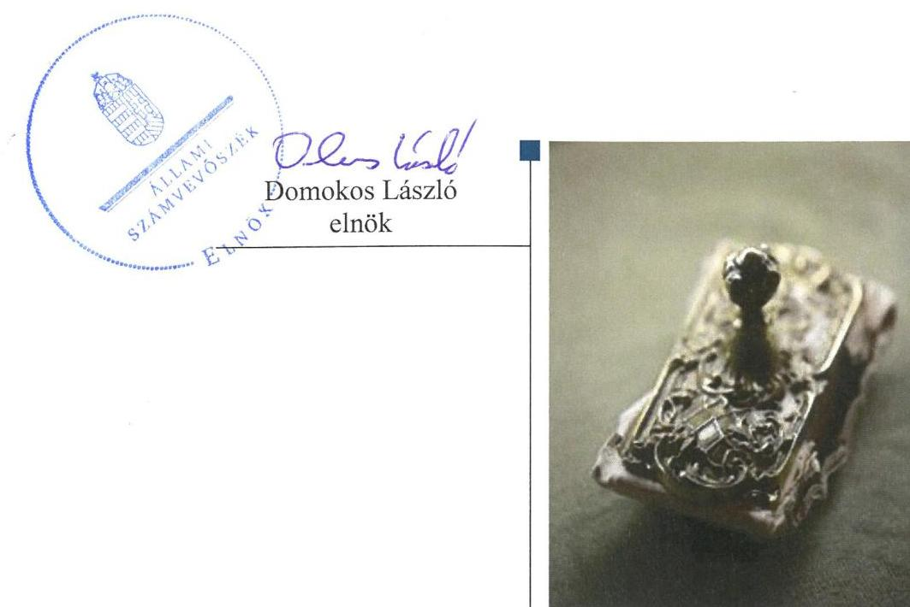
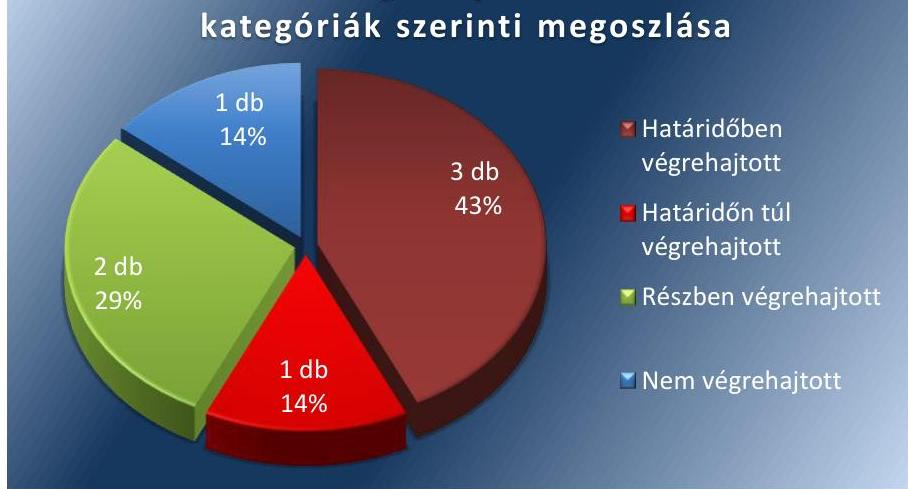
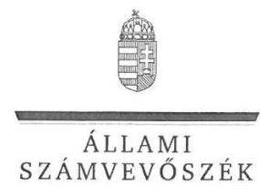
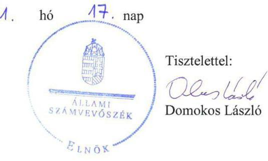

# Jelentés 

## Utóellenőrzések

Az állami felsőoktatási intézmények gazdálkodásának, működésének ellenőrzéséről készült jelentések utóellenőrzése - Szent István Egyetem 2016.

---

# J elentés 

## Utóellenőrzések

Az állami felsőoktatási intézmények gazdálkodásának, múködésének ellenőrzéséről készült jelentések utóellenőrzése - Szent István Egyetem 2016. 11. hó 19. nap

---

# AZ ELLENŐRZÉST FELÜGYELTE: 

DR. PULAY GYULA ZOLTÁN felügyeleti vezető

## AZ ELLENŐRZÉST VEZETTE ÉS A VÉGREHAJTÁSÁÉRT FELELŐS:

RÁCZKEVI KATALIN ellenőrzésvezető

## A PROGRAM ÖSSZEÁLLÍTÁSÁÉRT FELELŐS:

JANIK JÓZSEF osztályvezető

## A TÉMÁHOZ KAPCSOLÓDÓ KORÁBBI SZÁMVEVŐSZÉKI JELENTÉSEK:

- címe: Jelentés a Szent István Egyetem ellenőrzéséről Az állami felsőoktatási intézmények gazdálkodásának, működésének ellenőrzése
- sorszáma: 15039

IKTATÓSZÁM: V-1154-091/2016.
TÉMASZÁM: 2188
ELLENŐRZÉS-AZONOSÍTÓ SZÁM: V075506

---

# TARTALOMJEGYZÉK 

■ ÖSSZEGZÉS ..... 5
■ AZ ELLENŐRZÉS CÉLJA ..... 6
■ AZ ELLENŐRZÉS TERÜLETE ..... 7
■ AZ ELLENŐRZÉS HÁTTERE, INDOKOLTSÁGA ..... 8
■ A JELENTÉS LÉNYEGES KÉRDÉSKÖREI ..... 9
■ ELLENŐRZÉS HATÓKÖRE ÉS MÓDSZEREI ..... 10
■ MEGÁLLAPÍTÁSOK ..... 13
■ MELLÉKLETEK ..... 17
I. Sz. melléklet: Az ÁSZ 15039 számú jelentéséhez kapcsolódó Egyetem intézkedési terv végrehajtása ..... 17
II. Sz. melléklet: Az ÁSZ 15039 számú jelentéséhez kapcsolódó EMMI intézkedési terv végrehajtása ..... 21
■ FÜGGELÉK: ÉSZREVÉTELEK ..... 23
■ RÖVIDÍTÉSEK JEGYZÉKE ..... 29

---

.

---

# ÖSSZEGZÉS 

Az Állami Számvevőszék a Szent István Egyetem utóellenőrzését 2015. március 12. és 2016. július 12. közötti időszakra végezte el. Az utóellenőrzés megállapította, hogy a korábbi számvevőszéki jelentés javaslatai alapján az Egyetem rektora és kancellárja által meghatározott intézkedési tervben szereplő hét feladatból három feladatot határidőben, egyet határidőn túl, kettő feladatot részben, továbbá egy feladatot nem hajtottak végre. Az intézményi térítési díjak önköltségszámítással történő alátámasztása, valamint a követelések jogszabályoknak megfelelő értékelése területén az ÁSZ által korábban azonositott hiányosságok egy része továbbra is fennáll. Az Emberi Erőforrások Minisztériuma - mint a fenntartói jogkör gyakorlója - az intézkedési tervében foglalt feladatot végrehajtotta.

## Az ellenőrzés társadalmi indokoltsága

Az ÁSZ ${ }^{1}$ stratégiájában célul tűzte ki a számvevőszéki munka hasznosulásának javítását. Ezzel összhangban ellenőrzi, hogy az ellenőrzött szervezetek megvalósították-e a korábbi ellenőrzései által feltárt hibák, hiányosságok és szabálytalanságok megszüntetése céljából elkészített intézkedési terveikben foglaltakat. A rendszeres utóellenőrzések hozzájárulnak a szükséges intézkedések tényleges végrehajtáshoz, ezáltal a közpénzügyek rendezettségének javulásához.

## Főbb megállapítások, következtetések, javaslatok

Az Egyetem² az intézkedési tervben rögzített feladatok végrehajtásáról a $\mathrm{Bkr}^{3}$. előírásainak megfelelő nyilvántartást vezetett.

Az Egyetem az intézkedési tervében meghatározott hét feladatból három feladatot határidőben, egy feladatot határidőn túl, kettő feladatot részben, továbbá egy feladat nem hajtott végre. Elmaradt az önköltség-számítási szabályzat aktualizálása, valamint az intézményi térítési díjak és költségtérítés önköltségszámítással való megalapozottságának kidolgozása. A vagyongazdálkodási terv elfogadásáról a fenntartó egyetértése hiányában döntöttek. A követelések jogszabályoknak megfelelő értékelését egyes esetekben nem dokumentálták.

Az EMMI ${ }^{4}$ az intézkedési tervében meghatározott feladatot végrehajtotta.

---

# AZ ELLENŐRZÉS CÉLJA 

Az ellenőrzés célja annak értékelése volt, hogy a számvevőszéki jelentésben ${ }^{5}$ foglalt intézkedést igénylő megállapításokkal és javaslatokkal összhangban készített intézkedési tervben meghatározott feladatokat az ellenőrzött szervezetek végrehajtották-e.

---

# AZ ELLENŐRZÉS TERÜLETE 

## Szent István Egyetem

A Szent István Egyetem a felsőoktatási intézmények integrációs programjának részeként a Gödöllői Agrártudományi Egyetem, az Állatorvos-tudományi Egyetem, a Kertészeti és Élelmiszeripari Egyetem, a Jászberényi Tanítóképző Főiskola, valamint az Ybl Miklós Múszaki Főiskola szervezeti integrációjával 2000. január 1-jén jött létre. Az Egyetem tíz karán folyik képzés: agrár, bölcsészettudományi, gazdaságtudományi, múszaki, orvos- és egészségtudományi, pedagógusképzés, társadalomtudományi és természettudományi képzési területen. A rektor ${ }^{6}$ 2013. november 1-je óta tölti be tisztségét, a kancellár ${ }^{7}$ 2014. november 15-étől látja el feladatait.

Az Egyetem 2015. évi költségvetési beszámolója szerint 10 960,6 millió Ft költségvetési bevételt, 11 224,3 millió Ft finanszírozási bevételt ért el, valamint 18 460,1 millió Ft költségvetési kiadást teljesített. A 2015. december 31-i könyvviteli mérleg szerint az Egyetem eszközei 18 182,2 millió Ft-ot tettek ki.

Az Egyetem gazdálkodásának és múködésének ellenőrzését az ÁSZ a 2009-2013. közötti időszakra végezte el, az erről szóló 15039. számú jelentést 2015. március 12-én tette közzé. Az ellenőrzés célja annak értékelése volt, hogy szabályos volt-e az Egyetem pénzügyi és vagyongazdálkodása, biztosított volt-e a vagyonnal való gazdálkodás követelményének érvényesülése, a jogszabályi előírásoknak megfelelően múködött-e a belső kontrollrendszer, az irányító szerv tevékenysége a jogszabályoknak megfelelő volt-e.

Az Emberi Erőforrások Minisztériuma az állami felsőoktatási intézmények, így az Egyetem fenntartói jogkörének gyakorlója.

Az utóellenőrzés az ÁSZ jelentésben a rektor és a miniszter ${ }^{8}$ részére megfogalmazott intézkedést igénylő megállapításokra és javaslatokra készített, az ÁSZ részére megküldött intézkedési tervben foglalt feladatok megvalósításának ellenőrzésére, illetve értékelésére fókuszált.

---

# AZ ELLENŐRZÉS HÁTTERE, INDOKOLTSÁGA 

Az ÁSZ tv9. 33. § (1) bekezdése értelmében a számvevőszéki jelentések intézkedést igénylő megállapításaihoz és javaslataihoz kapcsolódóan az ellenőrzött szervezet vezetője intézkedési tervet köteles összeállítani, és az ÁSZ részére megküldeni. Az intézkedési tervben foglaltak megvalósítását az ÁSZ tv. 33. § (7) bekezdésében foglaltak alapján - az ÁSZ utóellenőrzés keretében ellenőrizheti. Az intézkedések megvalósulásának értékelése során az ÁSZ figyelembe veszi az ellenőrzött szervezetek működési feltételeiben, valamint a jogszabályi előírásokban bekövetkezett változásokat.

Az intézkedési tervekben foglalt feladatok hiányos, illetve késedelmes végrehajtása, valamint megvalósításának elmaradása azt mutatja, hogy az ellenőrzések során feltárt hibák, hiányosságok és szabálytalanságok megszüntetése nem kapott kellő hangsúlyt. Ez a szabályszerű működés és a felelős vezetői magatartás vonatkozásában kockázatot hordoz. E kockázatok feltárásával az ÁSZ utóellenőrzési rendszere fokozza a fegyelmet, és igazolja, hogy a közpénzzel való szabályos gazdálkodás felelőssége elől nem lehet kitérni.

## AZ UTÓELLENŐRZÉS VÁRHATÓ HASZNOSULÁSA

Az utóellenőrzés négy szinten hasznosulhat:
$\longrightarrow$ A társadalom szintjén az utóellenőrzés jelzi, hogy a számvevőszéki ellenőrzés megállapításainak van következménye: a hiányosságok megszüntetésére az ellenőrzött szervezet által meghatározott intézkedések végrehajtását is számon kéri az ÁSZ.
$\longrightarrow$ Az ellenőrzött terület szintjén az utóellenőrzés tájékoztatást nyújt a terület döntéshozóinak a hiányosságok kiküszöbölésének jó gyakorlatairól, ezzel lehetőséget biztosítva arra, hogy az ÁSZ ellenőrzési megállapításai, javaslatai a terület nem ellenőrzött szervezeteinek a működése során is hasznosuljanak.
$\longrightarrow$ Az ellenőrzött szervezet szintjén az utóellenőrzés feltárja, hogy a szervezet az intézkedések végrehajtásával hasznosította-e a korábbi ellenőrzési jelentésben a hiányosságok megszüntetése, illetve a kockázatok kezelése érdekében megfogalmazott javaslatokat.
$\longrightarrow$ Az ÁSZ szintjén az utóellenőrzés visszacsatolást ad az ellenőrzési jelentések hasznosulásáról, az intézkedések elmaradása vagy részleges megvalósulása a további ellenőrzésekhez kockázati jelzésként szolgál.

---

# A JELENTÉS LÉNYEGES KÉRDÉSKÖREI 

1. Az ellenőrzött szervezetek az intézkedési tervben foglaltakat az elöirt határidőben végrehajtották-e?

---

# ELLENŐRZÉS HATÓKÖRE ÉS MÓDSZEREI 

## Az ellenőrzés típusa

Megfelelőségi ellenőrzés

## Az ellenőrzött időszak

Az utóellenőrzés alapját képező ÁSZ jelentés közzétételének napjától (2015. március 12.) az ellenőrzésről szóló kiértesítő levél keltének napjáig (2016. július 12.) tartó időszak.

## Az ellenőrzés tárgya

A számvevőszéki jelentésben foglalt intézkedést igénylő megállapításokkal és javaslatokkal összhangban - az Egyetem és az EMMI által - készített intézkedési tervben foglaltak végrehajtásának ellenőrzése.

Az ellenőrzés kiterjed minden olyan körülményre és adatra, amely az ÁSZ jogszabályban meghatározott feladatainak teljesítéséhez, valamint a program végrehajtása folyamán felmerült újabb összefüggések feltárásához szükséges.

## Az ellenőrzött szervezet

Szent István Egyetem és az Emberi Erőforrások Minisztériuma

## Az ellenőrzés jogalapja

Az ÁSZ az Országgyűlés pénzügyi és gazdasági ellenőrző szerve. Az ÁSZ törvényben meghatározott feladatkörében ellenőrzi a központi költségvetés végrehajtását, az államháztartás gazdálkodását, az államháztartásból származó források felhasználását és a nemzeti vagyon kezelését.

Az ÁSZ tv. 1. § (3) bekezdése szerint az ÁSZ általános hatáskörrel végzi a közpénzekkel és az állami és önkormányzati vagyonnal való felelős gazdálkodás ellenőrzését.

Az ÁSZ tv. 33. § (7) bekezdése alapján az ÁSZ tv. 33. § (1)-(2) bekezdése szerinti intézkedési tervben foglaltak megvalósítását az ÁSZ utóellenőrzés keretében ellenőrizheti.

---

# Az ellenőrzés módszerei 

Az ÁSZ az ellenőrzést a nemzetközi standardokat irányadónak tekintve az ellenőrzési program ellenőrzési kérdései, az ellenőrzött időszakban hatályos jogszabályok, az ellenőrzés szakmai szabályok és módszertanok figyelembevételével, önállóan végezte.

Az ÁSZ az ellenőrzés ideje alatt az Egyetemmel és az EMMI-vel történő kapcsolattartást az ÁSZ SZMSZ ${ }^{10}$-ének vonatkozó előírásai alapján biztosította.

Az utóellenőrzés megállapításait elsősorban az ÁSZ rendelkezésére álló, valamint az ellenőrzött szervezetektől elektronikusan bekért dokumentumok alapozták meg.

Az ellenőrzési bizonyítékként felhasználható adatforrások közé tartoznak egyrészt a szakmai programban felsorolt adatforrások, másrészt minden - az ellenőrzés folyamán feltárt, az ellenőrzés szempontjából információt tartalmazó - dokumentum.

A pénzügyi folyamatokban kulcsszerepet betöltő kontrollokra vonatkozóan az intézkedési tervben foglalt feladatok végrehajtását a dologi kiadások állományából és a személyi jellegű kifizetésekből, valamint a követelések állományából 10-10 véletlen mintavétellel kiválasztott tétel alapján értékelte az ÁSZ. A kiválasztott tételek esetében azt ellenőrizte, hogy az Egyetem az intézkedési tervben meghatározott feladatok végrehajtása során biztosította-e a jogszabályok és a belső szabályzatok előírásainak megfelelő működtetést.

Az intézkedési tervekben előírt feladatokat, azok végrehajthatósága, illetve végrehajtása szempontjából az alábbiak szerint értékelte az ÁSZ:
"határidőben végrehajtott" a feladat, ha a teljesítés dokumentáltan, az intézkedési tervben előírt határidőben és tartalommal megtörtént;
"határidőn túl végrehajtott" a feladat, ha annak teljesítése az intézkedési tervben meghatározott módon, de az előírt határidőn túl történt meg;
"részben végrehajtott" a feladat, ha végrehajtása teljes körűen az intézkedési tervben előírt módon nem történt meg;
"nem végrehajtott" a feladat, ha a végrehajtás nem történt meg, vagy amennyiben a teljesítést nem dokumentálták;
"okafogyottá vált" a feladat, ha végrehajtására - meghatározott esemény bekövetkezése, továbbá külső körülmény, a működést érintő feltétel változása miatt - már nincs szükség, illetve lehetőség, és egyértelműen megállapítható, hogy az intézkedést szükségessé tevő körülmény a jövőben nem fordulhat elő;
"nem időszerű" az a feladat, amelynek ellenőrzési időszakon belüli végrehajtására azért nem került (kerülhetett) sor, mert az intézkedés alapjául szolgáló esemény nem következett be, de annak jövőbeni előfordulása lehetséges, a végrehajtása nem volt esedékes, vagy a végrehajtás határideje még nem járt le.
Az ellenőrzés lefolytatásához az ellenőrzött szervezetek a tanúsítványok elektronikus kitöltésével, valamint az ÁSZ által kért dokumentumok elektronikus megküldésével szolgáltattak adatokat, amelyek valódiságát és

---

teljes körűségét az ellenőrzött szervezet vezetője által tett teljességi és hitelességi nyilatkozat igazolta. Az így rendelkezésre bocsátott adatok, információk kontrollja az ellenőrzés keretében történt.

---

# MEGÁLLAPÍTÁSOK 

## 1. Az ellenőrzött szervezetek az intézkedési tervben foglaltakat az előírt határidőben végrehajtották-e?

Összegző megállapítás

Az Egyetem az intézkedési tervben meghatározott hét feladatból három feladatot határidőben, egy feladatot határidőn túl, kettő feladatot részben, továbbá egy feladatot nem hajtott végre. Az intézkedési tervben rögzített feladatok végrehajtásáról a Bkr. előírásainak megfelelő nyilvántartást vezették. Az EMMI az intézkedési tervben meghatározott egy feladatot határidőben végrehajtotta.

Az ÁSZ a jelentésében a rektor részére négy, a miniszter részére egy javaslatot fogalmazott meg.

Az Egyetem által összeállított és az ÁSZ részére megküldött intézkedési terv a hiányosságok, szabálytalanságok megszüntetésére hét feladatot határozott meg. A feladatok elvégzésének felelőseit megjelölték.

Az ÁSZ javaslatai alapján készített intézkedési tervben rögzített feladatok végrehajtásáról az Egyetem a Bkr. előírásainak megfelelő nyilvántartást vezette.

Az Egyetem intézkedési tervében meghatározott feladatokat, határidőket, a feladatok végrehajtásáért felelős személyt és a feladatok végrehajtását az I. számú melléklet, az EMMI intézkedési tervében meghatározott feladat végrehajtását a II. számú melléklet mutatja be.

Az Egyetem intézkedési tervében tervezett feladatok végrehajtásának értékelési kategóriák szerinti megoszlását az 1. ábra szemlélteti.
1. ábra

A feladatok végrehajtásának értékelési kategóriák szerinti megoszlása

---

# HATÁRIDŐBEN VÉGREHAJTOTT feladatok: 

- A gazdálkodási szabályzat aktualizálásáról intézkedtek, mert a Szenátus ${ }^{11}$ 166/2014/2015. SZT. határozatával 2015. június 17-én fogadta el a Gazdálkodási Szabályzat ${ }_{1}{ }^{12}$-et. A közalkalmazottak figyelemfelhívása érdekében a kancellár 2016. január 8-án elektronikus levélben tájékoztatta az Egyetem vezetőségét a 2016. január 1-től hatályos, a 2015. december 16-i Szenátusi ülésen elfogadott szabályzatok - ezen belül a Gazdálkodási Szabályzat ${ }_{2}{ }^{13}$ - alkalmazásáról. A gazdálkodási jogkörök szabályszerű gyakorlásáról intézkedtek.
- A kancellár intézkedett az Egyetem költségvetési beszámolójában szereplő adatok analitikus nyilvántartásokkal való egyezőségének biztosításáról.
- A Humánpolitikai Főosztály ${ }^{14}$ 2015. június 30-án kelt intézkedési tervben felhívta a szervezeti egységek vezetőinek figyelmét az alkalmazottak munkaidő-nyilvántartásának egységes vezetésére és annak folyamatos ellenőrzésére.

## HATÁRIDŐN TÚL VÉGREHAJTOTT feladat:

- A kancellár az intézkedési tervben vállalt 2015. június 30-i határidőn túl intézkedett a Beszerzési és Közbeszerzési Szabályzat ${ }_{1}{ }^{15}$ aktualizálásáról, mert a Szenátus 2015. december 16-án, 57/2015/2016. SZT. számú határozatával hagyta jóvá a Beszerzési és Közbeszerzési Szabályzat ${ }_{2}{ }^{16}$-t. A kancellár 2016. január 8-án elektronikus levélben felhívta a szervezeti egységek vezetőinek figyelmét a 2016. január 1jétől hatályos szabályzatokban foglaltak - ezen belül a Beszerzési és Közbeszerzési Szabályzat2-ban - előírásainak betartására.

## RÉSZBEN VÉGREHAJTOTT feladatok:

- Az intézkedési tervben vállalt 2015. szeptember 15-i határidőn túl intézkedtek az egyetem vagyongazdálkodási tervének elkészítéséről, mivel a Szenátus 2015. október 7-én a 16/2015/2016. SZT. számú határozatával fogadta el a 2015. évi Vagyongazdálkodási tervet. A vagyongazdálkodási tervhez a fenntartó egyetértését az Nftv. ${ }^{17} 12$. §. (3) bekezdésének gb) pontjában foglaltak ellenére nem szerezték be.
- Az Eszközök és források értékelési Szabályzatát ${ }^{18}$ a Szenátus az intézkedési tervben foglalt határidőt - a költségvetési év beszámolójának elkészítését - megelőzően 2015. október 7-én, a 20/2015/2016 SZT. számú határozatával fogadta el. A költségvetési év december 31-én fennálló és a mérlegkészítés időpontjáig pénzügyileg nem teljesített követelések értékelése kapcsán bemutatott dokumentumok ellenőrzése alapján megállapítottuk, hogy több esetben a lejárt követelés értékelését az Eszközök és források értékelési Szabályzat 30. § (13) és (14) bekezdésében foglaltak ellenére nem végezték el.

## NEM VÉGREHAJTOTT feladat:

- A kancellár nem gondoskodott az Önköltség-számítási Szabályzat felülvizsgálatáról, valamint az intézményi díjak és költségtérítések önköltségszámítással történő megalapozásáról.

---

HATÁRIDŐBEN VÉGREHAJTOTT feladat:
Az EMMI minisztere intézkedett a közbeszerzési szabálytalanságok tekintetében a munkajogi felelősség kivizsgálásának megindításáról, amely során a munkajogi felelősség körülményeit belső ellenőrzés során kivizsgáltatta. A felelős Belső Ellenőrzési Főosztály a vizsgálat eredményeként nem tartotta indokoltnak intézkedés kezdeményezését.

---

.

---

# MELLÉKLETEK

- I. SZ. MELLÉKLET: AZ ÁSZ 15039 SZÁMÚ JELENTÉSÉHEZ KAPCSOLÓDÓ EGYETEM INTÉZKEDÉSI TERV VÉGREHAJTÁSA

|  Sorszám | Az intézkedési tervben rögzített feladat | Az intézkedési tervben meghatározott határidő | A feladatok elvégzésének felelőse | A feladat végrehajtása  |
| --- | --- | --- | --- | --- |
|   | 1. | 2. | 3. | 4.  |
|   |  | **Határidőben végrehajtott feladatok** |  |   |
|  1. | "A Gazdálkodási szabályzat aktualizálása. Külön felhívjuk az érintett közalkalmazottak figyelmét a gazdálkodási jogkörök gyakorlásának érvényesítésére és betartására." | szabályzat aktualizálása: 2015. június 15. | kancellár, gazdálkodási igazgató, stratégiai és koordinációs főigazgató | A kancellár intézkedett a Gazdálkodási Szabályzat, valamint az együttesen alkalmazandó Kötelezettségvállalási és Utalványozási Szabályzat^{19} aktualizálásáról. A Gazdálkodási Szabályzat1-et 2015. június 17-én készítették el, amelyet a Szenátus a készítés napján 166/2014/2015. SZT. számú határozatával elfogadott. A közalkalmazottak figyelemfelhívása érdekében a kancellár 2016. január 8-án elektronikus levélben tájékoztatta az Egyetem vezetőségét a 2016. január 1-től hatályos, a 2015. december 16 - i Szenátusi ülésen elfogadott szabályzatok alkalmazásáról. Az elektronikus levél mellékletében a Gazdálkodási Szabályzat1, a Pénzkezelési Szabályzat20, a Beszerzési és Közbeszerzési Szabályzat, a Szerződéskötési szabályzat21, Pályázatkezelési szabályzat22 valamint a Szellemi tulajdon kezelési szabályzat23 2016. január 1-től, valamint a Kötelezettségvállalási és Utalványozási Szabályzat 2016. február 1-től történő alkalmazásáról intézkedtek. A gazdálkodási jogkörök gyakorlása szabályszerű volt.  |
|  2. | "A beszámolóban szereplő adatok analitikus nyilvántartásokkal való egyezőségének biztosítása." | folyamatos | gazdasági vezetők, számviteli főosztályvezető, pénzügyi főosztályvezető | A kancellár intézkedett a 2015. évi költségvetési beszámolóban szereplő adatok analitikus nyilvántartásokkal való egyezőségének biztosításáról. A 2015. évi jóváhagyott beszámolóban a kötelezettségvállalással terhelt előirányzat-maradvány, a költségvetési bevételek és kiadások összegei megegyeztek az alátámasztó analitikus nyilvántartásokkal.  |
|  3. | "Felhívjuk a szervezeti egységek vezetőinek az alkalmazottak munkaidő nyilvántartás egységes vezetésére és annak folyamatos ellenőrzésére." | folyamatos | humánpolitikai főosztályvezető, szervezeti egység vezető | A Humánpolitikai Főosztály Bér Osztály vezetője és a Humánpolitikai Főosztály vezetője 2015. június 30-án intézkedési tervet adott ki. Az intézkedési tervben – 2015. júl. 15-i határidővel – a külső karokon is elrendelték a "jelenlét – távol"  |

---

|  Az intézkedési tervben rögzített feladat | Az intézkedési tervben meghatározott határidő | Az intézkedési tervben meghatározott határidő | A feladatok elvégzésének felelőse | A feladat végrehajtása  |
| --- | --- | --- | --- | --- |
|  1. | 2. | 3. | 4. |   |
|   |  |  |  | lét-jelentés" elnevezésű egységes iratminta alkalmazását.2015. júliustól valamennyi szervezeti egység vezetőjének meghatározták a munkaidő-nyilvántartásával kapcsolatos kötelezettségeit, a távollétek rögzítési kötelezettségét a KIR24-ben, továbbá előírták a folyamatosan vezetett nyilvántartások folyamatba épített, illetve esetenkénti ellenőrzését.  |
|  Határidőn túl végrehajtott feladat |  |  |  |   |
|  4. | „Beszerzési és a közbeszerzési szabályzat aktualizálása. Külön felhívjuk a szervezeti egységek vezetőinek figyelmét a Kbt. előírásainak betartására/betartatására." | szabályzat aktualizálása 2015. június 30. | beszerzési és közbeszerzési főosztályvezető, stratégiai és koordinációs főigazgató | A Beszerzési és Közbeszerzési Szabályzat aktualizálására az intézkedési tervben vállalt 2015. június 30-i határidőn túl került sor, mivel a Szenátus 2016. december 16-án, az 57/2015/2016. SZT. számú határozatával hagyta jóvá az új Beszerzési és Közbeszerzési Szabályzatot.
A kancellár 2016. január 8-án elektronikus levélben felhívta a szervezeti egységek vezetőinek figyelmét a 2016. január 1-jétől hatályos szabályzatok előírásainak betartására, ezen belül a Beszerzési és Közbeszerzési Szabályzatban foglaltakra.  |

---

|  5. | Az intézkedési tervben rögzített feladat | Az intézkedési tervben meghatározott határidő | A feladatok elvégzésének felelőse | A feladat végrehajtása  |
| --- | --- | --- | --- | --- |
|   | 1. | 2. | 3. | 4.  |
|  Részben végrehajtott feladatok |  |  |  |   |
|  5. | „Az egyetem vagyongazdálkodási tervének elkészítése és arról az Nftv. 12. § 3. pont alapján a szenátus döntése a fenntartó egyetértésével." | 2015. szeptember 15. | ingatlangazdálkodási és épület beruházási főosztályvezető | Határidőn túl végrehajtott feladat:
A vagyongazdálkodási terv elkészítéséről az intézkedési tervben vállalt 2015. szeptember 15-i határidőn túl intézkedtek, mert a Szenátus 2015. október 7én, 16/2015/2016. SZT. számú határozatával fogadta el a 2015. évi Vagyongazdálkodási Tervet.
Nem végrehajtott feladat:
Az Egyetem a vagyongazdálkodási tervhez a fenntartó egyetértését az Nftv. 12. §. (3) bekezdésének gb) pontjában foglaltak ellenére nem szerezte be.  |
|  6. | „Az Eszközök és források értékelési szabályzat aktualizálása. A szabályzatnak megfelelően a költségvetési év december 31én fennálló és a mérlegkészítés meghatározott időpontjáig pénzügyileg nem teljesített követelések értékelése." | költségvetési év beszámolójának elkészítési időpontja | stratégiai és koordinációs főigazgató, számviteli főosztályvezető, gazdasági vezetők, pénzügyi főosztályvezető | Határidőben végrehajtott feladat
Az Eszközök és források értékelési szabályzatát a Szenátus - a költségvetési év beszámolójának elkészítését megelőzően - 2015. október 7-én, a 20/2015/2016 SZT. számú határozatával fogadta el. A költségvetési év beszámolóját 2016. február 25-én készítették el.
Nem végrehajtott feladat:
A költségvetési év december 31-én fennálló és a mérlegkészítés időpontjáig pénzügyileg nem teljesített követelések értékelése kapcsán bemutatott dokumentumok ellenőrzése alapján megállapítottuk, hogy több esetben a lejárt követelés értékelését az Eszközök és források értékelési Szabályzat 30. § (13) és (14) bekezdésében foglaltak alapján nem végezték el.  |

---

|  7. | „Az Önköltségszámítási szabályzat felülvizsgálata. Az intézményi térítési díjak és költségtérítés önköltségszámítással való megalapozásának kidolgozása folyamatban van." | 2015. szeptember 1. |  |   |
| --- | --- | --- | --- | --- |
|   |  |  |  | 2016. december 31-ig készül el.  |

Forrás: ÁSZ által készített táblázat

---

# Mellékletek

II. SZ. MELLÉKLET: AZ ÁSZ 15039 SZÁMÚ JELENTÉSÉHEZ KAPCSOLÓDÓ EMMI INTÉZKEDÉSI TERV VÉGREHAJTÁSA

|  Sorszám | Az intézkedési tervben rögzített feladat | Az intézkedési tervben meghatározott határidő | A feladatok elvégzésének felelőse | A feladat végrehajtása  |
| --- | --- | --- | --- | --- |
|   | 1. | 2.
Határidőben végrehajtott feladat | 3. | 4.  |
|  1. | „A közbeszerzési szabálytalanságok tekintetében a munka-
jogi felelősség kivizsgálása, a szükséges intézkedések kezdeményezése." | 2015. december 31. | Belső Ellenőrzési
Főosztály | Az EMMI intézkedett a közbeszerzési szabálytalanságok tekintetében a munka-
jogi felelősség kivizsgálásának eldöntéséről, amely során a munkajogi felelősség körülményeinek kivizsgálására belső ellenőrzési vizsgálatot rendelt el. A Belső Ellenőrzési Főosztály a vizsgálat eredményeként nem tartotta indokoltnak intézkedés kezdeményezését.  |

Forrás: ÁSZ által készített táblázat

---

.

---

# FÜGGELÉK: ÉSZREVÉTELEK 

A jelentéstervezetet a Számvevőszék 15 napos észrevételezésre megküldte az ellenőrzött szervezetek vezetőinek az ÁSZ tv. 29. §* (1) bekezdése előírásának megfelelően.
A beérkezett észrevételek alapján a Számvevőszék nem módosította a jelentést.

A függelék tartalmazza a Szent István Egyetem kancellárja által megküldött észrevételeket, az azokra adott választ, illetve az el nem fogadott észrevételek elutasításának indoklását.

[^0]
[^0]:    * 29. § (1) Az Állami Számvevőszék az ellenőrzési megállapításait megküldi az ellenőrzött szervezet vezetőjének vagy az általa megbízott személynek, és annak, akinek személyes felelősségét állapította meg.
    (2) Az ellenőrzött szervezet vezetője és a felelősként megjelölt személy az ellenőrzés megállapításaira tizenöt napon belül írásban észrevételt tehet.
    (3) Az Állami Számvevőszék az észrevételre a beérkezésétől számított harminc napon belül írásban válaszol. A figyelembe nem vett észrevételeket köteles a jelentésben feltüntetni, és megindokolni, hogy azokat miért nem fogadta el.

---

# 1477 

## 1477

## SZENT ISTVÁN EGYETEM

## 1477

## 1477

## Comokos László úr

elnök részére

## Állami Számvevőszék

Apáczai Csere János utca 10.

## Budapest

1364

## Tisztelt Elnök Úr!

A V-1154-073/2016. iktatószámú Jelentés a Szent István Egyetem ellenőrzéséről - Az állami felsőoktatási intézmények gazdálkodásának, müködésének ellenőrzéséről készített számvevőszéki jelentéstervezetet köszönettel megkaptuk.

A jelentéstervezetben szereplő a költségvetési év december 31-én fennálló és a mérlegkészítés időpontjáig pénzügyileg nem teljesített követelések értékelése kapcsán az alábbiakról tájékoztatom: az ellenőrzés által kifogásolt lejárt követelések értékelése jellemzően egy szervezeti egységet érintettek, azaz az egyetemből kiváló Állatorvos-tudományi Kart. A kar jelentős előnyt élvezett, mivel ott a gazdasági területet gazdasági igazgató felügyelte és ebből adódóan nagyobb volt az önállóságuk is. Az ellenőrzés megállapításait tudomásul vettük, azonban már a felelősségre vonásra nincs lehetőség, mivel a kar 2016. július 1-től önálló egyetemként folytatja tevékenységét.
2016. január 1-től bevezetett gazdálkodási rendszer (Neptun SAP alapú gazdálkodási modul) szükségessé tette a karok gazdálkodásának központosítását is, ami azt jelenti, hogy a jövőben az ilyen jellegű feladatok elvégzése is központilag kerül megvalósításra.
2016.05. 12-i nyilatkozatban arról nyilatkoztunk, hogy az Önkolttségszámítási szabályzat elkészítése csak 2016. december 31-i határidőre valósul meg. A szabályzat elkészítését befolyásolta, hogy az egyetem 2015 szeptemberében felkérést kapott az ELTE kancellárjától, hogy az EMMI által támogatott Egységes Intézmény Irányítási Projekt keretében vegyen részt egy ágazati pilot projektben, melynek keretében áttértünk a Neptun SAP alapú gazdálkodási moduljára, ahol a kontrolling részmodulban került leképezésre az önköltségszámítás. Mivel az egyetemnek egy ilyen jelentős program bevezetése és müködtetése jelentős többletfeladattal járt, valamint a program bevezetésével azok a munkatársak voltak megbízva, akik a szabályzatot is el kellett volna készítsék, így ebből adódóan csak 2016. december 31-re tudtuk a szabályzat elkészítését vállalni.

---

A jelentéstervezetben leírt észrevételek mellett megköszönjük a megfogalmazott észrevételeket, melyek segítséget nyújtanak az egyetem hatékonyabb müködéséhez, az esetleges szabálytalanságok feltárásához és a szükséges intézkedések megtételéhez.
A jelentéstervezetben rögzített hiányosságok és elmarasztaló jellegủ megállapítások ellenére a gazdálkodás minden területére kiterjedő vizsgálat egyetlen olyan konkrét esetet sem tárt fel, amely az egyetem valamely szervezeti egységének, vagy az alkalmazottak esetleges gazdálkodásukkal történő visszaélésre utalt volna, vagy egyetemi vagyonvesztést eredményezett volna.

Gödöllő, 2016. november 2.

Tisztelettel:

Figler Kálmán

---

ELNÖK

Ikt. szám: V-1154-087/2016.

# Figler Kálmán úr 

kancellár

Szent István Egyetem

## Gödölló

## Tisztelt Kancellár Úr!

Köszönettel megkaptam ,,Az állami felsőoktatási intézmények gazdálkodásának, müködésének ellenörzéséről készült jelentések utóellenörzése - Szent István Egyetem" címủ jelentéstervezet megállapításaira tett, az R/1027/5/2016. iktatószámú levelében küldött észrevételét.

Az Állami Számvevőszék észrevétellel kapcsolatos álláspontját a mellékletként csatolt, a felügyeleti vezető által készített indokolás tartalmazza.

Budapest, 2016.

Melléklet: Észrevételre adott válasz

---

# Függelék: Észrevételek

1. számú melléklet a V-1154-087/2016. számú levélhez

"Az állami felsőoktatási intézmények gazdálkodásának, működésének ellenőrzéséről készült jelentések utóellenőrzése - Szent István Egyetem" című jelentéstervezetre tett észrevételre adott válasz

|   | SZIE észrevétel | Észrevétel elfogadása | Észrevételre adott válasz, indoklás | A jelentés módosított szövegrésze  |
| --- | --- | --- | --- | --- |
|  1. | A jelentéstervezetben szereplő a költségvetési év december 31-én fennálló és a mérlegkészítés időpontjáig pénzügyileg nem teljesített követelések értékelése kapcsán az alábbiakról tájékoztatani: az ellenőrzés által kifogásolt lejárt követelések értékelése jellemzően egy szervezeti egységet érintettek, azaz az egyetemből kiváló Állatorvos-tudományi Kart. A kar jelentős előnyt élvezett, mivel ott a gazdasági területet gazdasági igazgató felügyelte és ebből adódóan nagyobb volt az önállóságuk is. Az ellenőrzés megállapításait tudomásul vettük, azonban már a felelősségre vonásra nincs lehetőség, mivel a kar 2016. július 1-től önálló egyetemként folytatja tevékenységét.
2016. január 1-től bevezetett gazdálkodási rendszer (Neprun SAP alapú gazdálkodási modul) szükségessé tette a kerek gazdálkodásának központosítását is, ami azt jelenti, hogy a jövőben az ilyen jellegű feladatok elvégzése is központilag kerül megvalósításra. | Nem | Tájékoztatását köszönjük, ez alapján a jelentéstervezetet nem módosítjuk, mivel a tájékoztatás az ellenőrzési időszakon kívüli eseményekre vonatkozik. | -  |

---

# Függelék: Észrevételek

|  2016.05. 12-i nyilatkozatban arról nyilatkoztunk, hogy az Önköltségszámítási szabályzat elkészítése csak 2016. december 31-i határidőre valósul meg. A szabályzat elkészítését befolyásolta, hogy az egyetem 2015 szeptemberében felkérést kapott az ELTE kancellárjától, hogy az EMMI által támogatott Egységes Intézmény Irányítási Projekt keretében vegyen részt egy ágazati pilot projekttben, melynek keretében áttértünk a Neptun SAP alapú gazdálkodási moduljára, ahol a kontrolling részmodulban került leképezésre az önköltségszámítás. Mivel az egyetemnek egy ilyen jelentős program bevezetése és működtetése jelentős többletfeladattal járt, valamint a program bevezetésével azok a munkatársak voltak megbízva, akik a szabályzatot is el kellett volna készítsék, így ebből sódódan csak 2016. december 31-re tudtak a szabályzat elkészítését vállalni. | Nem | Tájékoztatását köszönjük, ez alapján a jelentéstervezetet nem módosítjuk, mivel az Önköltségszámítási szabályzat felülvizsgálata a vállalt határidőben nem történt meg, annak elkészítésére az ellenőrzési időszakon túl kerül majd sor. |   |
| --- | --- | --- | --- |
|  |   |   |   |

Tájékoztatom Kancellár urat, hogy az Állami Számvevőszékről szóló 2011. évi LXVI. törvény 29. § (3) bekezdése alapján az Állami Számvevőszék a figyelembe nem vett észrevételeket köteles a jelentésben feltüntetni, és megindokolni, hogy azokat miért nem fogadta el.

Budapest, 2016. 11. hónap 17. nap

Dr. Pulay Gyula felügyeleti vezető

---

# RÖVIDÍTÉSEK JEGYZÉKE 

${ }^{1}$ ÁSZ
${ }^{2}$ Egyetem
${ }^{3}$ Bkr.
${ }^{4}$ EMMI
${ }^{5}$ számvevőszéki jelentés
${ }^{6}$ rektor
${ }^{7}$ kancellár
${ }^{8}$ miniszter
${ }^{9}$ ÁSZ tv.
${ }^{10}$ ÁSZ SZMSZ
${ }^{11}$ Szenátus
${ }^{12}$ Gazdálkodási Szabályzat ${ }_{1}$
${ }^{13}$ Gazdálkodási Szabályzat ${ }_{2}$
${ }^{14}$ Humánpolitikai Főosztály
${ }^{15}$ Beszerzési és Közbeszerzési Szabályzat ${ }_{1}$
${ }^{16}$ Beszerzési és Közbeszerzési Szabályzat ${ }_{2}$
${ }^{17}$ Nftv.
${ }^{18}$ Eszközök és források értékelési Szabályzata
${ }^{19}$ Kötelezettségvállalási és Utalványozási Szabályzat
${ }^{20}$ Pénzkezelési Szabályzat
${ }^{21}$ Szerződéskötési Szabályzat
${ }^{22}$ Pályázatkezelési Szabályzat
${ }^{23}$ Szellemi tulajdon kezelési Szabályzat
${ }^{24}$ KIR

Állami Számvevőszék
Szent István Egyetem
a költségvetési szervek belső kontrollrendszeréről és belső ellenőrzéséről szóló 370/2011. (XII. 31.) Korm. rendelet
Emberi Erőforrások Minisztériuma
a 15039. számú jelentés a Szent István Egyetem ellenőrzéséről - Az állami felsőoktatási intézmények gazdálkodásának, múködésének ellenőrzése
a Szent István Egyetem rektora
a Szent István Egyetem kancellárja
az Emberi Erőforrások Minisztériumának minisztere
2011. évi LXVI. törvény az Állami Számvevőszékről (hatályos 2011. július 1jétől)
az Állami Számvevőszék Szervezeti és Működési Szabályzata
a Szent István Egyetem Szenátusa
az Egyetem Gazdálkodási Szabályzata (a Szenátus 166/2014/2015. SZT. határozattal fogadta el, hatályos 2015. július 1-től 2015. december 31-ig)
az Egyetem Gazdálkodási Szabályzata (a Szenátus 54/2015/2016. SZT. határozattal fogadta el, hatályos 2016. január 1-jétől)
a Szent István Egyetem Humánpolitikai Főosztálya
a Szent István Egyetem Beszerzési és Közbeszerzési Szabályzata 184/2013/2014. számú Szenátusi határozat alapján elfogadott (hatályos 2015. december 31-ig)
a Szent István Egyetem Beszerzési és Közbeszerzési Szabályzata 57/2015/2016. számú Szenátusi határozattal elfogadott (hatályos 2016. január 1-től)
2011. évi CCIV. törvény a nemzeti felsőoktatásról
a Szent István Egyetem Eszközök és források értékelési Szabályzata (hatályos 2015. október 7-től)
a Szent István Egyetem Gazdálkodási és utalványozási Szabályzata
a Szent István Egyetem Pénzkezelési Szabályzata
a Szent István Egyetem Szerződéskötési Szabályzata
a Szent István Egyetem Pályázatkezelési Szabályzata
a Szent István Egyetem Szellemi tulajdon kezelési Szabályzata
Kincstári Információs Rendszer

---

# ÁLLAMI SZÁMVEVŐSZÉK 

1052 Budapest, Apáczai Csere János utca 10.
Levélcím: 1364 Budapest 4. Pf. 54
Telefon: +36 14849100 Telefax: +36 14849200
www.asz.hu