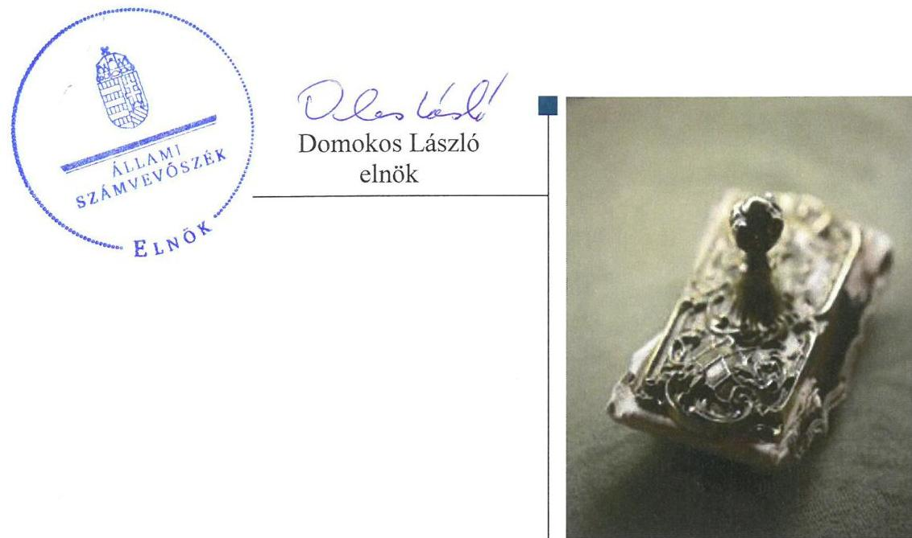
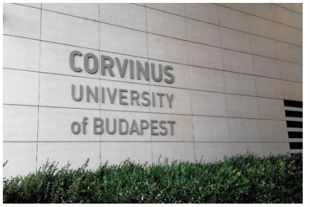
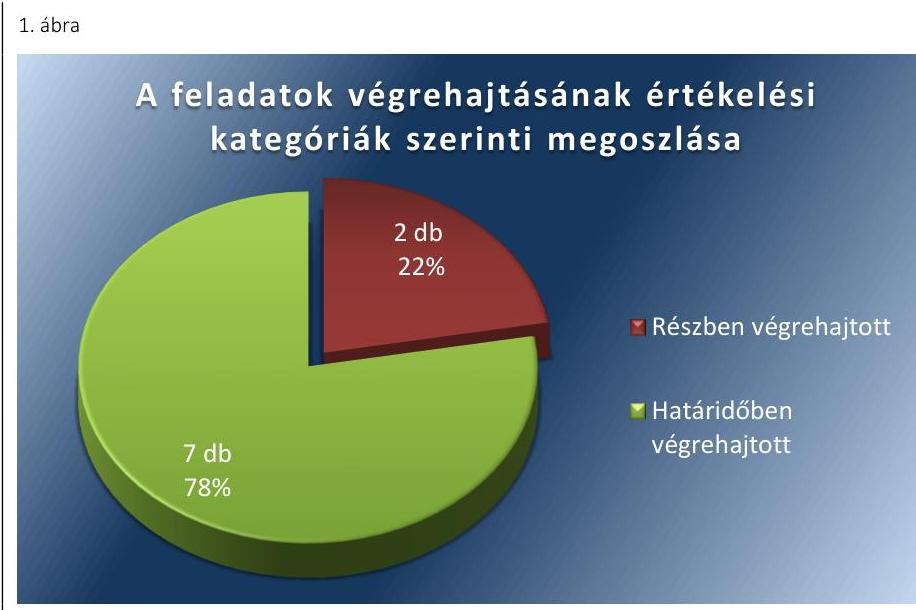
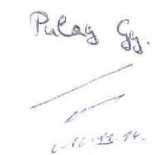
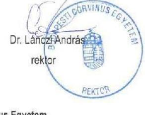
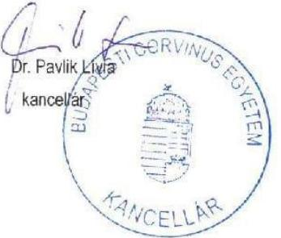
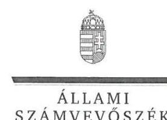
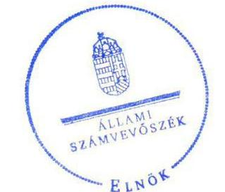
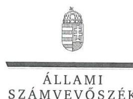
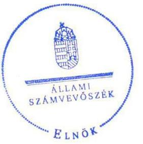

# Jelentés 

## Utóellenőrzések

Az állami felsőoktatási intézmények gazdálkodásának, működésének ellenőrzéséről készült jelentések utóellenőrzése - Budapesti Corvinus Egyetem
2016. 12. hó 19. nap

---

# AZ ELLENŐRZÉST FELÜGYELTE: 

DR. PULAY GYULA ZOLTÁN felügyeleti vezető

## AZ ELLENŐRZÉST VEZETTE ÉS A VÉGREHAJTÁSÁÉRT FELELŐS:

RÁCZKEVI KATALIN ellenőrzésvezető

## A PROGRAM ÖSSZEÁLLÍTÁSÁÉRT FELELŐS:

JANIK JÓZSEF osztályvezető

## A TÉMÁHOZ KAPCSOLÓDÓ KORÁBBI SZÁMVEVŐSZÉKI JELENTÉSEK:

- címe: Jelentés a Budapest Corvinus Egyetem ellenőrzéséről - Az állami felsőoktatási intézmények gazdálkodásának, működésének ellenőrzése
- sorszáma: 15032

IKTATÓSZÁM: V-1144-088/2016.
TÉMASZÁM: 2178
ELLENŐRZÉS-AZONOSÍTÓ SZÁM: V075503

---

# TARTALOMJEGYZÉK 

■ ÖSSZEGZÉS ..... 5
■ AZ ELLENŐRZÉS CÉLJA ..... 6
■ AZ ELLENŐRZÉS TERÜLETE ..... 7
■ AZ ELLENŐRZÉS HÁTTERE, INDOKOLTSÁGA ..... 8
■ A JELENTÉS LÉNYEGES KÉRDÉSKÖREI ..... 9
■ ELLENŐRZÉS HATÓKÖRE ÉS MÓDSZEREI ..... 10
■ MEGÁLLAPÍTÁSOK ..... 12
■ MELLÉKLETEK ..... 15
I. Sz. melléklet: Az ÁSZ 15032. számú jelentéséhez kapcsolódó Egyetem intézkedési terv végrehajtása ..... 15
II. Sz. melléklet: Az ÁSZ 15032 számú jelentéséhez kapcsolódó EMMI intézkedési terv végrehajtása ..... 19
■ FÜGGELÉK: ÉSZREVÉTELEK ..... 21
■ RÖVIDÍTÉSEK JEGYZÉKE ..... 27

---

.

---

# ÖSSZEGZÉS 

Az utóellenőrzés megállapította, hogy a korábbi számvevőszéki jelentés javaslatai alapján az Egyetem rektora és kancellárja által meghatározott módosított intézkedési tervben szereplő kilenc feladat jelentős részének végrehajtása javította az Egyetem működésének szabályozottságát, de a belső kontrollrendszer jogszabályoknak megfelelő működtetése területén az ÁSZ által korábban azonosított hiányosságok egy része továbbra is fennáll. Az intézkedési tervben foglalt feladatok végrehajtására vállalt határidő módosítása veszélyt jelentett az Egyetem szabályos működésében, azonban ezt a veszélyt mérsékelte, hogy a határidőben végrehajtott feladatokat - egy kivételével - jóval a módosított határidő lejárta előtt teljesítették. Az Emberi Erőforrások Minisztériuma - mint a fenntartói jogkör gyakorlója az intézkedési tervében foglalt feladatot határidőben végrehajtotta.

## Az ellenőrzés társadalmi indokoltsága

Az ÁSZ ${ }^{1}$ stratégiájában célul tűzte ki a számvevőszéki munka hasznosulásának javítását. Ezzel összhangban ellenőrzi, hogy az ellenőrzött szervezetek megvalósították-e a korábbi ellenőrzései által feltárt hibák, hiányosságok és szabálytalanságok megszüntetése céljából elkészített intézkedési terveikben foglaltakat. A rendszeres utóellenőrzések hozzájárulnak a szükséges intézkedések tényleges végrehajtásához, ezáltal a közpénzügyek rendezettségének javulásához.

## Főbb megállapítások, következtetések, javaslatok

Az Egyetem ${ }^{2}$ az intézkedési tervben rögzített feladatok végrehajtásáról nem a Bkr³ ${ }^{3}$ által előírt részletezettséggel vezetett nyilvántartást.

Az Egyetem intézkedési tervében meghatározott kilenc feladatból hét feladatot határidőben, továbbá kettő feladatot részben hajtott végre. Elmaradt a kockázatkezelési rendszer intézményi szintű felülvizsgálata, valamint az ellenőrzési nyomvonalak intézményi szintű elkészítése nem volt teljeskörű. Az Egyetem az intézkedési tervben vállalt feladatok közül hat esetben a feladat végrehajtásának határidejét 2015. október 31-ről 2016. március 31-re módosította. A feladat végrehajtására vállalt határidő módosítása az intézmény szabályos működését veszélyeztető kockázatot jelentett a kontrolltevékenységek, valamint az infokommunikációs rendszer működtetése területén, mivel így a szabályozási hiányosságok megszüntetésére az eredeti tervhez képest csak később került sor. A kockázatot mérsékelte ugyanakkor az, hogy az Egyetem a hat feladatból két feladatot jóval a módosított határidő előtt, egy feladatot még az eredeti határidő előtt végrehajtott, további egy feladatot a módosított határidő előtt két nappal hajtott végre. A módosított határidővel érintett feladatok közül két feladat végrehajtása azonban csak részben valósult meg.

Az EMMI ${ }^{4}$ az intézkedési tervében meghatározott feladatot végrehajtotta.

---

# AZ ELLENŐRZÉS CÉLJA 

Az ellenőrzés célja annak értékelése volt, hogy a számvevőszéki jelentésben ${ }^{5}$ foglalt intézkedést igénylő megállapításokkal és javaslatokkal összhangban készített intézkedési tervben meghatározott feladatokat az ellenőrzött szervezetek végrehajtották-e.

---

# AZ ELLENŐRZÉS TERÜLETE

## Budapesti Corvinus Egyetem

Az 1948. évi LVII. törvénnyel hozták létre a Magyar Közgazdaságtudományi Egyetemet, amely 1953. évben Marx Károly nevét vette fel, majd 1990. évtől a Budapesti Közgazdaságtudományi Egyetem nevet viselte. A felsőoktatási integráció során 2000. évben egybeolvadt az Államigazgatási Főiskolával, a neve Budapesti Közgazdaságtudományi és Államigazgatási Egyetem lett. A 2003. évben a korábban a gödöllői Szent István Egyetem részét képező budai karok (a korábbi Kertészeti és Élelmiszeripari Egyetem) is csatlakoztak az egyetemhez, s ezt követően 2004. év szeptember 1-jétől kapta a Budapesti Corvinus Egyetem nevet. A 2012. január 1-jével az Államigazgatási Főiskola átkerült az újonnan megalapított Nemzeti Közszolgálati Egyetemhez, így a Budapesti Corvinus Egyetemnek két campusa és hat kara maradt. A rektor6 2016. július 1-jétől tölti be tisztségét, a kancellár7 2014. november 15-étől látja el feladatait.

Az Egyetem 2015. évi költségvetési beszámolója szerint 6 760,1 millió Ft költségvetési bevételt, 9 750,0 millió Ft finanszírozási bevételt ért el, valamint 13.011,3 millió Ft költségvetési kiadást teljesített. A 2015. december 31-i könyvviteli mérleg szerint az Egyetem eszközei 16.778,4 millió Ft-ot tettek ki.

Az Egyetem gazdálkodásának és működésének ellenőrzését az ÁSZ a 2009-2013. közötti időszakra végezte el, az erről szóló 15032. számú jelentést 2015. február 24-én tette közzé. Az ellenőrzés célja annak értékelése volt, hogy szabályos volt-e az Egyetem pénzügyi és vagyongazdálkodása, biztosított volt-e a vagyonnal való gazdálkodás követelményének érvényesülése, a jogszabályi előírásoknak megfelelően működött-e a belső kontrollrendszer, az irányító szerv tevékenysége a jogszabályoknak megfelelő volt-e.

Az Emberi Erőforrások Minisztériuma az állami felsőoktatási intézmények, így az Egyetem fenntartói jogkörének gyakorlója.

Az utóellenőrzés az ÁSZ jelentésben a rektor és a miniszter8 részére megfogalmazott intézkedést igénylő megállapításokra és javaslatokra készített, az ÁSZ részére megküldött intézkedési tervben foglalt feladatok megvalósításának ellenőrzésére, illetve értékelésére fókuszált.

---

# AZ ELLENŐRZÉS HÁTTERE, INDOKOLTSÁGA 

Az ÁSZ tv. 33. § (1) bekezdése értelmében a számvevőszéki jelentések intézkedést igénylő megállapításaihoz és javaslataihoz kapcsolódóan az ellenőrzött szervezet vezetője intézkedési tervet köteles összeállítani, és az ÁSZ részére megküldeni. Az intézkedési tervben foglaltak megvalósítását az ÁSZ tv. 33. § (7) bekezdésében foglaltak alapján - az ÁSZ utóellenőrzés keretében - ellenőrizheti. Az intézkedések megvalósulásának értékelése során az ÁSZ figyelembe veszi az ellenőrzött szervezetek működési feltételeiben, valamint a jogszabályi előírásokban bekövetkezett változásokat.

Az intézkedési tervekben foglalt feladatok hiányos, illetve késedelmes végrehajtása, valamint megvalósításának elmaradása azt mutatja, hogy az ellenőrzések során feltárt hibák, hiányosságok és szabálytalanságok megszüntetése nem kapott kellő hangsúlyt. Ez a szabályszerű működés és a felelős vezetői magatartás vonatkozásában kockázatot hordoz. E kockázatok feltárásával az ÁSZ utóellenőrzési rendszere fokozza a fegyelmet, és igazolja, hogy a közpénzzel való szabályos gazdálkodás felelőssége elől nem lehet kitérni.

## AZ UTÓELLENŐRZÉS VÁRHATÓ HASZNOSULÁSA

Az utóellenőrzés négy szinten hasznosulhat:
$\longrightarrow$ A társadalom szintjén az utóellenőrzés jelzi, hogy a számvevőszéki ellenőrzés megállapításainak van következménye: a hiányosságok megszüntetésére az ellenőrzött szervezet által meghatározott intézkedések végrehajtását is számon kéri az ÁSZ.
$\longrightarrow$ Az ellenőrzött terület szintjén az utóellenőrzés tájékoztatást nyújt a terület döntéshozóinak a hiányosságok kiküszöbölésének jó gyakorlatairól, ezzel lehetőséget biztosítva arra, hogy az ÁSZ ellenőrzési megállapításai, javaslatai a terület nem ellenőrzött szervezeteinek a működése során is hasznosuljanak.
$\longrightarrow$ Az ellenőrzött szervezet szintjén az utóellenőrzés feltárja, hogy a szervezet az intézkedések végrehajtásával hasznosította-e a korábbi ellenőrzési jelentésben a hiányosságok megszüntetése, illetve a kockázatok kezelése érdekében megfogalmazott javaslatokat.
$\longrightarrow$ Az ÁSZ szintjén az utóellenőrzés visszacsatolást ad az ellenőrzési jelentések hasznosulásáról, az intézkedések elmaradása vagy részleges megvalósulása a további ellenőrzésekhez kockázati jelzésként szolgál.

---

# A JELENTÉS LÉNYEGES KÉRDÉSKÖREI 

1. Az ellenőrzött szervezetek az intézkedési tervben foglaltakat az előírt határidőben végrehajtották-e?

---

# ELLENŐRZÉS HATÓKÖRE ÉS MÓDSZEREI 

## Az ellenőrzés típusa

Megfelelőségi ellenőrzés

## Az ellenőrzött időszak

Az utóellenőrzés alapját képező ÁSZ jelentés közzétételének napjától (2015. február 24.) az ellenőrzésről szóló kiértesítő levél keltének napjáig (2016. július 12.) tartó időszak.

## Az ellenőrzés tárgya

A számvevőszéki jelentésben foglalt intézkedést igénylő megállapításokkal és javaslatokkal összhangban - az Egyetem és az EMMI által - készített intézkedési tervben foglaltak végrehajtásának ellenőrzése.

Az ellenőrzés kiterjed minden olyan körülményre és adatra, amely az ÁSZ jogszabályban meghatározott feladatainak teljesítéséhez, valamint a program végrehajtása folyamán felmerült újabb összefüggések feltárásához szükséges.

## Az ellenőrzött szervezet

Budapesti Corvinus Egyetem és az Emberi Erőforrások Minisztériuma

## Az ellenőrzés jogalapja

Az ÁSZ tv. 1. § (3) bekezdése szerint az ÁSZ általános hatáskörrel végzi a közpénzekkel és az állami és önkormányzati vagyonnal való felelős gazdálkodás ellenőrzését.

Az ÁSZ tv. 33. § (7) bekezdése alapján az ÁSZ tv. 33. § (1)-(2) bekezdése szerinti intézkedési tervben foglaltak megvalósítását az ÁSZ utóellenőrzés keretében ellenőrizheti.

## Az ellenőrzés módszerei

Az ÁSZ az utóellenőrzést a nemzetközi standardokat irányadónak tekintve az ellenőrzési program ellenőrzési kérdései, az ellenőrzött időszakban hatályos jogszabályok, az ellenőrzés szakmai szabályok és módszertanok figyelembevételével, önállóan végezte.

---

Az ÁSZ az ellenőrzés ideje alatt az Egyetemmel és az EMMI-vel történő kapcsolattartást az ÁSZ SZMSZ ${ }^{10}$-ének vonatkozó előírásai alapján biztosította.

Az utóellenőrzés megállapításait elsősorban az ÁSZ rendelkezésére álló, valamint az ellenőrzött szervezetektől elektronikusan bekért dokumentumok alapozták meg.

Az ellenőrzési bizonyítékként felhasználható adatforrások közé tartoznak egyrészt a szakmai programban felsorolt adatforrások, másrészt minden - az ellenőrzés folyamán feltárt, az ellenőrzés szempontjából információt tartalmazó - dokumentum.

A pénzügyi folyamatokban kulcsszerepet betöltő kontrollokra vonatkozóan az intézkedési tervben foglalt feladatok végrehajtását a dologi kiadások állományából és a személyi jellegű kifizetésekből, valamint az intézményi térítési díjak és költségtérítések állományából 10-10 véletlen mintavétellel kiválasztott tétel alapján értékelte az ÁSZ. A kiválasztott tételek esetében azt ellenőrizte, hogy az Egyetem az intézkedési tervben meghatározott feladatok végrehajtása során biztosította-e a jogszabályok és a belső szabályzatok előírásainak megfelelő működtetést.

Az intézkedési tervekben előírt feladatokat, azok végrehajthatósága, illetve végrehajtása szempontjából az alábbiak szerint értékelte az ÁSZ:
"határidőben végrehajtott" a feladat, ha a teljesítés dokumentáltan, az intézkedési tervben előírt határidőben és tartalommal megtörtént;
"határidőn túl végrehajtott" a feladat, ha annak teljesítése az intézkedési tervben meghatározott módon, de az előírt határidőn túl történt meg;
"részben végrehajtott" a feladat, ha végrehajtása teljes körűen az intézkedési tervben előírt módon nem történt meg;
"nem végrehajtott" a feladat, ha a végrehajtás nem történt meg, vagy amennyiben a teljesítést nem dokumentálták;
"okafogyottá vált" a feladat, ha végrehajtására - meghatározott esemény bekövetkezése, továbbá külső körülmény, a működést érintő feltétel változása miatt - már nincs szükség, illetve lehetőség, és egyértelműen megállapítható, hogy az intézkedést szükségessé tevő körülmény a jövőben nem fordulhat elő;
"nem időszerű" az a feladat, amelynek ellenőrzési időszakon belüli végrehajtására azért nem került (kerülhetett) sor, mert az intézkedés alapjául szolgáló esemény nem következett be, de annak jövőbeni előfordulása lehetséges, a végrehajtása nem volt esedékes, vagy a végrehajtás határideje még nem járt le.
Az ellenőrzés lefolytatásához az ellenőrzött szervezetek a tanúsítványok elektronikus kitöltésével, valamint az ÁSZ által kért dokumentumok elektronikus megküldésével szolgáltattak adatokat, amelyek valódiságát és teljes körűségét az ellenőrzött szervezet vezetője által tett teljességi és hitelességi nyilatkozat igazolta. Az így rendelkezésre bocsátott adatok, információk kontrollja az ellenőrzés keretében történt.

---

# 1. Az ellenőrzött szervezetek az intézkedési tervben foglaltakat az előírt határidőben végrehajtották-e? 

Összegző megállapítás

Az Egyetem az intézkedési tervben meghatározott kilenc
 feladatból hét feladatot határidőben, továbbá kettő feladatot részben hajtott végre. Az intézkedési tervben rögzített feladatok végrehajtásáról nem a Bkr. előírásainak megfelelő részletezettséggel vezették nyilvántartást. Az EMMI az intézkedési tervben meghatározott egy feladatot határidőben végrehajtotta.

Az ÁSZ a jelentésében a rektor részére három, a miniszter részére egy javaslatot fogalmazott meg.

Az Egyetem által összeállított és az ÁSZ részére megküldött intézkedési terv a hiányosságok, szabálytalanságok megszüntetésére kilenc feladatot határozott meg. A feladatok elvégzésének felelőse öt feladat esetében a rektor és a kancellár együttesen, míg négy feladat felelőse a kancellár volt. Az Egyetem az intézkedési tervben vállalt feladatok közül hat esetben a feladat végrehajtásának határidejét 2015. október 31-ről 2016. március 31-re módosította. A feladat végrehajtására vállalt határidő módosítása az intézmény szabályos működését veszélyeztető kockázatot jelentett a kontrolltevékenységek, valamint az infokommunikációs rendszer működtetésének területén, mivel így a szabályozási hiányosságok megszüntetésére az eredeti tervhez képest csak később került sor.

Az ÁSZ javaslatai alapján készített intézkedési tervben rögzített feladatok végrehajtásáról az Egyetem nem a Bkr. előírásainak megfelelő részletezettséggel vezetett nyilvántartást, mivel a nyilvántartásban nem rögzítették - a Bkr. 47. § (2) bekezdésében foglaltak ellenére - a végre nem hajtott intézkedés okát.

Az Egyetem intézkedési tervében meghatározott feladatokat, határidőket, a feladatok végrehajtásáért felelős személyt és a feladatok végrehajtását az I. számú melléklet, az EMMI intézkedési tervében meghatározott feladat végrehajtását a II. számú melléklet mutatja be.

Az Egyetem intézkedési tervében tervezett feladatok végrehajtásának értékelési kategóriák szerinti megoszlását az 1. ábra szemlélteti.

---

Fornós: ÁSZ

# HATÁRIDŐBEN VÉGREHAJTOTT feladatok: 

- A rektor és a kancellár az intézkedési tervben meghatározott határidőn belül 2016. március 29-én intézkedett a gazdálkodás területén a folyamatba épített előzetes, utólagos és vezetői ellenőrzés kialakításáról, mivel a Szenátus SZ-127/2015/2016. (2016. III. 29.) számú határozatával fogadta el a Belső Kontroll Szabályzatot, mely a FEUVE $^{11}$ leírását tartalmazta. A FEUVE kialakítását az Egyetem gazdálkodási szabályzatai, a már elkészült ellenőrzési nyomvonalak, a rektori-kancellári együttes utasítások, továbbá kancellári utasítások együttesen biztosították.
- A rektor és a kancellár az intézkedési tervben megjelölt határidőn belül, 2015. december 14-én intézkedett a közérdekű adatok megismerésére irányuló kérelmek intézésének rendjéről szóló szabályzat elkészítéséről, mivel a Szenátus SZ-71/2015/2016. (2015.XII. 14.) számú határozatával fogadta el az Adatkezelési Szabályzatot. Az Egyetem a jogszabályok által előírt közzétételi kötelezettségét teljesítette. A szabályzat rögzítette a közérdekű adatok közzétételét, és a közérdekű adatok megismerésére irányuló kérelmek intézését az Info tv. $^{12}$, és az Ávr. $^{13}$ előírásainak megfelelően. Az Egyetem az Info tv. által előírt közzétételi kötelezettségét teljesítette.
- A kancellár intézkedett az Nftv. $^{14}$ előírásaival összhangban az Egyetem gazdálkodási szabályzatának az Áht. $^{15}$-ban, az Ávr.-ben, valamint a kötelezettségvállalási szabályzatának Számv. $^{16}$-ben foglaltaknak megfelelő elkészítéséről, mert a Szenátus 2015. június 15-én elfogadta a Gazdálkodási szabályzatot $^{17}$ és a Kötelezettségvállalási szabályzatot $^{18}$. A személyi és dologi kiadások terén a mintatételek dokumentumai alapján megállapítottuk, hogy a gazdálkodási jogkörök gyakorlása az Ávr.-ben és a belső szabályzatokban előírtaknak megfelelően történt.
- A kancellár intézkedett az Önköltség-számítási Szabályzat $^{19}$ elkészítéséről, melyet a Szenátus 2015. június 15-én hagyott jóvá. A kancellár gondoskodott az intézményi térítési díjak és költségtérítések önköltségszámítással történő megalapozásáról az Áhsz. $^{20}$, az Nftv.

---

előírásainak megfelelően, az 50/2008.(III.14.) Korm. rendeletben $^{21}$ foglaltakat is figyelembe véve.
A kancellár az intézkedési tervben vállalt határidőn belül, 2015. december 14-én intézkedett az Iratkezelési Szabályzat Ltv. $^{22}$-ben foglaltaknak megfelelő elkészítéséről, melyet a Szenátus további felülvizsgálat igényével fogadott el. A további felülvizsgálat határideje a Szenátus határozata alapján 2016. március 31-e volt.
A rektor az Nftv.-ben meghatározott munkáltatói jogkörében eljárva belső vizsgálat lefolytatását rendelte el, melynek eredményeként 2015. augusztus 31-én a Kancellária Jogi Iroda jelentést készített. A jogvesztő határidőkre hivatkozással munkajogi felelősségre vonásra nem került sor.
A kancellár intézkedett a gépjármű-használatra vonatkozó szabályzat elkészítéséről, és hatályba léptetéséről, mivel a Szenátus 2015. március 16-án elfogadta és hatályba léptette a Gépjármű-használati Szabályzat $^{23}$-et, melyben a személyes használatú gépjárművek igénybevételére vonatkozó szabályokat rögzítették.

# RÉSZBEN VÉGREHAJTOTT feladatok: 

A kancellár intézkedett az Egyetem tevékenységében és gazdálkodásában felmerülő kockázatok kezelése érdekében, mert a havi kancellári jelentések kivonatai alapján a tevékenységi körével kapcsolatos kockázatokat meghatározta, felmérte, elemezte és kezelte. A kockázatkezelési rendszer felülvizsgálata elmaradt.
A rektor és a kancellár az intézkedési tervben megjelölt határidőn belül elkészítette az Ellenőrzési nyomvonal $^{24}$-et, mely a költségvetés készítésének ellenőrzési nyomvonalát tartalmazta. Az intézkedési tervben megjelölt határidőn belül elkészített Ellenőrzési nyom-vonal $^{25}$ a Bkr. előírásai ellenére az ellenőrzési folyamatokat nem rögzítette. Az Egyetem ellenőrzési nyomvonalainak teljes körű felülvizsgálatát az intézkedési tervben megjelölt határidőig nem készítették el.

## HATÁRIDŐBEN VÉGREHAJTOTT feladat:

Az EMMI minisztere intézkedett a belső kontrollrendszer kialakításával és működtetésével, valamint a pénzügyi és vagyongazdálkodással, vagyonkimutatással összefüggésben feltárt szabálytalanságok tekintetében a munkajogi felelősség kivizsgálásának megindításáról, amely során a munkajogi felelősség körülményeit belső ellenőrzés során kivizsgáltatta.

---

# MELLÉKLETEK

- I. SZ. MELLÉKLET: AZ ÁSZ 15032. SZÁMÚ JELENTÉSÉHEZ KAPCSOLÓDÓ EGYETEM INTÉZKEDÉSI TERV VÉGREHAJTÁSA

|  1. | Az intézkedési tervben rögzített feladat
1. | Az intézkedési tervben meghatározott határidő
2. | A feladatok elvégzésének felelőse
3. | A feladat végrehajtása  |
| --- | --- | --- | --- | --- |
|   |  |  |  | 4.  |
|   |  |  | Határidőben végrehajtott feladatok |   |
|  1. | „A folyamatba épített, előzetes, utólagos és vezetői ellenőrzések kialakítása a gazdálkodás területén." | 2015. október 30. (módosított 2016. március 31.) | rektor és kancellár | A rektor és a kancellár az intézkedési tervben meghatározott határidőn belül, 2016. március 29-én intézkedett a gazdálkodás területén a folyamatba épített előzetes, utólagos és vezetői ellenőrzés kialakításáról. A Szenátus SZ-127/2015/2016. (2016. III. 29.) számú határozatával fogadta el a Belső Kontroll Szabályzatot, mely a FEUVE leírását tartalmazta. A FEUVE kialakítását a Belső Kontroll Szabályzat, a Gazdálkodási Szabályzat, a Kötelezettségvállalási Szabályzat, a már elkészült ellenőrzési nyomvonalak, valamint rektori-kancellári együttes utasítások, kancellári utasítások együttesen biztosították.  |
|  2. | „A közérdekű adatok megismerésére irányuló kérelmek intézésének rendjéről szóló szabályzat elkészítése, valamint a jogszabályok által előírt közzétételi kötelezettség teljesítése." | 2015. október 30. (módosított 2016. március 31.) | rektor és kancellár | A rektor és a kancellár az intézkedési tervben megjelölt határidőn belül, 2015. december 14-én intézkedett a közérdekű adatok megismerésére irányuló kérelmek intézésének rendjéről szóló szabályzat elkészítéséről, mert a Szenátus SZ-71/2015/2016. (2015.XII. 14.) számú határozatával fogadta el az Adatkezelési Szabályzatot. A szabályzat rögzítette a közérdekű adatok közzétételét, és a közérdekű adatok megismerésére irányuló kérelmek intézését az Info tv., és az Ávr. előírásainak megfelelően. Az Egyetem a jogszabályok által előírt közzétételi kötelezettségét az Info tv. 26. § (1) bekezdése értelmében, az ellenőrzés során bemutatott archív dokumentumok alapján teljesítette, valamint lehetővé tette, hogy a kezelésében lévő közérdekű adatot és közérdekből nyilvános adatot - az e törvényben meghatározott kivételekkel - az erre irányuló igény alapján bárki megismerhesse.  |
|  3. | „A gazdálkodási szabályzatok (gazdálkodási szabályzat, kötelezettségvállalási szabályzat) megújítása, a jogszabályoknak megfelelő, szabályozott környezet kialakítása a gazdálkodási folyamatokban." | 2015. június 30. | kancellár | A kancellár intézkedett az Nftv. 86. § (1) és (2) bekezdésével összhangban az Egyetem gazdálkodási szabályzatának az Áht.-ban, az Ávr.-ben,, valamint a kötelezettségvállalási szabályzatának Számv.-ben foglaltakra figyelemmel való elkészítéséről. A Szenátus 2015. június 15-én SZ-101/2014/2015. számú határozatával a Gazdálkodási szabályzatot, az SZ-102/2014/2015. számú határozatával a Kötelezettségvállalási szabályzatot elfogadta. A szabályzatokat 2016. február 15-én módosították, amelyeket a Szenátus szintén jóváhagyott. A belső szabályozás keretében további gazdálkodási szabályzatok - Számviteli Politika, Számlarend - is elkészültek, illetve aktualizálásra kerültek. A belső szabályozás emellett kancellári, illetve rektori-kancellári együttes utasításokkal is kiegészült.  |

---

|  4. | "A hatályos Önköltség-számítási Szabályzat alapján az előírt tevékenységek megfelelően szabályozott formában történő megvalósulása." | 2015. június 30. | kancellár | A kiadások terület mintatételeinek dokumentumai alapján megállapítottuk, hogy a gazdálkodási jogkörök gyakorlása az Ávr.-ben és a belső szabályzatokban előírtaknak megfelelően történt.  |
| --- | --- | --- | --- | --- |
|   |  |  |  | A kancellár intézkedett az Önköltség-számítási Szabályzat elkészítéséről, melyet a Szenátus SZ-103/2014/2015. számú határozatával 2015. június 15-én hagyott jóvá.  |
|   |  |  |  | A rektor és a kancellár a szervezeti változásokkal összhangban elkészítette továbbá az Önköltség-számítási Szabályzatot.  |
|   |  |  |  | Az intézményi térítési díjak és költségtérítések mintatételeinek dokumentumai alapján megállapítottuk, hogy az Önköltség-számítási Szabályzatban foglaltakat betartották, a kancellár gondoskodott az intézményi térítési díjak önköltségszámítással történő megalapozásáról az Áhsz., az Nftv. előírásainak megfelelően, az 50/2008.(III.14.) Korm. rendeletben foglaltakat figyelembe véve.  |
|  5. | "Iratkezelési Szabályzat felülvizsgálata és megújítása." | 2015. október 30. (módosított 2016. március 31.) | kancellár | Az Ltv.-ben foglaltakkal összefüggésben az Egyetem az intézkedési tervben meghatározott határidőn belül, 2015. december 14-én elkészítette a megújított szabályzatát, melyet a Szenátus SZ-72/2015/2016.(2015. XII. 14.) számú határozatával fogadott el.  |
|   |  |  |  | A szabályzatban foglaltak alapján biztosítható a Számv. 169. §-ában – a bizonylatok megőrzésére vonatkozó – előírtak betartása. A szabályzat elfogadását a Szenátus támogatta, azzal, hogy 2016. március 31-ig áttekintésre kerül és az egyeztetett álláspontot tartalmazó javaslatot az adminisztratív igazgató ismét a Szenátus elé terjeszti.  |
|   |  |  |  | A Szenátus SZ-72.b/2015/2016. számú határozatában foglaltak szerint az Iratkezelési Szabályzat módosítása érdekében az egyeztetett álláspont alapján készített javaslat 2016. március 31-ig Szenátus elé történő előterjesztése nem valósult meg. A kancellár 2016. augusztus 22-i nyilatkozata szerint a szenátusi határozat alapján az Adminisztratív Igazgatóság áttekintette az írásban hozzá eljuttatott kari kifogásokat, amelyek egy része jogszabályi rendelkezésre, másik része bizonyos iratcsoportok őrzési idejére vonatkozott. A szabályzat módosítására az észrevételek alapján nem került sor. A nyilatkozat szerint az utóellenőrzés időszakában folyamatban volt az iratkezelési szoftver teljes körű intézményi bevezetése.  |
|  6. | "Belső vizsgálat elrendelése, majd a vizsgálat eredményének alapján a szükséges intézkedések megtétele." | 2015. október 30. (módosított 2016. március 31.) | rektor és kancellár | A rektor az Nftv. 13. § (2) bekezdésének e) pontjában meghatározott munkáltatói jogkörében eljárva belső vizsgálat lefolytatását rendelte el, melynek

 eredményeként "Jelentés az Állami Számvevőszék 2015. februári, 15032 sz. ellenőrzési jelentésében található kereset-kiegészítésekkel, folyamatos munkavégzéshez kapcsolódó szerződésekkel, valamint a közbeszerzési hiányosságokkal kapcsolatban elvégzett vizsgálat eredményéről" címmel 2015. augusztus 31-én a Kancellária Jogi Iroda jelentést készített. A jelentés tartalmazta, hogy a jogvesztő határidőkre tekintettel nem volt lehetőség munkajogi felelősségre vonásra, így arra nem került sor. Tartalmazta továbbá, hogy munkajogi felelősségre vonásra a  |

---

|  1. | 2. | 3. | 4.  |
| --- | --- | --- | --- |
|   |  |  | KEHÍ^{28} által tett feljelentést követő – még folyamatban lévő –rendőrségi nyomozás végeredménye alapján van lehetőség. Bűncselekmény megállapítása esetén, ha még az intézmény alkalmazásában állnak az érintett személyek, megindítható a munkajogi felelősségre vonási eljárás. A jelentés tartalmazta továbbá, hogy a rendszer szintű hibák javítása folyamatban volt a jelentés készítésének időszakában, illetve a vizsgált esetekben az eljáró személyek, kötelezettségvállalók, ellenjegyző személyek beazonosítása, szabálytalanságról való tájékoztatása megtörtént. Az ÁSZ által kezdeményezett jogorvoslati eljárás alapján a Közbeszerzési Hatóság Közbeszerzési Döntőbizottsága 200 000 Ft pénzbírság megfizetésére kötelezte az Egyetemet. A rektor és a kancellár a 2015. szeptember 9-én, a jelentést készítő Kancellária Jogi Iroda vezetője részére küldött közös levelükben további két feladatot határoztak meg. A folyamatos munkavégzéshez kapcsolódó szerződésekkel összefüggő szabálytalanságok, illetve a kötelezettségvállalások utólagos ellenjegyzése ismétlődésének elkerülése érdekében az ellenőrzési nyomvonal elkészítését és a folyamatok módosítását rendelték el. Felelősként a gazdasági igazgatót jelölték meg. Egy szoftver beszerzés esetében közbeszerzési szakértő bevonását rendelték el a szabálytalanság ismétlődésének megelőzése érdekében. Felelősként a műszaki igazgatót nevezték meg. A feladatok elvégzésének a határideje (2016. december 31.) mindkét intézkedés esetében túlmutat az utóellenőrzés keretében ellenőrzött időszakon.  |
|  7. | "A gépjármű-használatra vonatkozó szabályzat elkészítése, hatályba léptetése." | 2015. június 30. | kancellár  |
|  |   |   |   |

---

|  8. | „Az Egyetem által működtetett kockázatkezelési rendszer felülvizsgálata, majd ezt követően az Egyetem tevékenységében, gazdálkodásában rejlő kockázatok kivizsgálása és az esetlegesen felmerülő kockázatok kezelése." | 2015. október 30. (módosított 2016. március 31.) | rektor és kancellár | Hátáridőben végrehajtott feladat:
A kancellár intézkedett az Egyetem tevékenységében és gazdálkodásában felmerülő kockázatok kezelése érdekében, mert a havi kancellári jelentések kivonatai alapján a tevékenységi körével kapcsolatos kockázatokat meghatározta, felmérte, elemezte és kezelte.  |
| --- | --- | --- | --- | --- |
|   |  |  |  | Nem végrehajtott feladat:
A kockázatkezelési rendszer felülvizsgálata elmaradt. A 2006. szeptember 18-tól hatályos Kockázatkezelési Szabályzat nem tartalmazza a jogszabályváltozások miatt szükséges átvezetéseket.
A kancellár nyilatkozata alapján a kockázatkezelési rendszer felülvizsgálatát a Belső Kontroll Szabályzat elfogadását követően elkezdték, a 2006. év szeptember 18-án jóváhagyott szabályzat újragondolása, módosítása napirendre került. A szabályzat határidőben történő módosítása elmaradt a 370/2011.(XII.31.) Korm. rendelet várható módosítása, valamint az egyetem belső szabályozási rendszerében várható kockázatkezelési koordinátor szerepkör megjelenésére hivatkozással.  |
|  9. | „Belső ellenőrzési nyomvonal felülvizsgálata és elkészítése a teljes Egyetemre vonatkozóan." | 2015. október 30. (módosított 2016. március 31.) | rektor és kancellár | Hátáridőben végrehajtott feladat:
A rektor és a kancellár az intézkedési tervben megjelölt határidőn belül elkészítette az Ellenőrzési nyomvonal $_{1}$-et, mely a költségvetés készítésének nyomvonalát tartalmazta. Az intézkedési tervben megjelölt határidőn belül elkészített Ellenőrzési nyomvonal $_{1,2}$ a Bkr. előírásai ellenére az ellenőrzési folyamatokat nem rögzítette. A gazdálkodási területet érintő Ellenőrzési nyomvonal $_{2}$-t az intézkedési tervben meghatározott határidőn belül a 2015. november 26-án kiadott, 31/2015. (XI.26.) számú kancellári utasítás tartalmazta, előtte ilyen szabályozás nem volt. A gazdálkodási területen kívül a HR területet érintően és az egyéb területeket - web shop folyamat, védőszemüveg igénylése, informatikai eszközbeszerzés, közérdekű adatigénylés, belső ellenőrzés - érintően készültek el ellenőrzési nyomvonalak.  |
|   |  |  |  | Nem végrehajtott feladat:
Az intézkedési terv alapján vállalt, a teljes Egyetemre vonatkozóan az ellenőrzési nyomvonal felülvizsgálata és elkészítése a Bkr. 6. § (3) bekezdésében előírtaknak megfelelően nem valósult meg, egyebek mellett hiányzott a gazdálkodási területet érintően a közbeszerzési eljárásokhoz kapcsolódó ellenőrzési nyomvonal.  |

Forrás: ÁSZ által készített táblázat

---

# *Mellékletek*

## II. SZ. MELLÉKLET: AZ ÁSZ 15032 SZÁMÚ JELENTÉSÉHEZ KAPCSOLÓDÓ EMMI INTÉZKEDÉSI TERV VÉGREHAJTÁSA

|  Az intézkedési tervben rögzített feladat: | Az intézkedési tervben meghatározott határidő | A feladatok elvégzésének felelőse | A feladat végrehajtása  |
| --- | --- | --- | --- |
|  1. | 2. | 3. | 4.  |
|  **Határidőben végrehajtott feladatok** |  |  |   |
|  1. „A belső kontrollrendszer kialakításával és működtetésével, valamint a pénzügyi és vagyongazdálkodással, vagyonkimutatással összefüggésben feltárt szabálytalanságokhoz kapcsolódó munkajogi felelősség kivizsgálása, a szükséges intézkedések kezdeményezése.” | 2015. december 31. | Belső Ellenőrzési Főosztály | Az emberi erőforrások minisztere az Nftv. 73. § (3) bekezdésének e) pontja által meghatározott munkáltatói jogkörében eljárva intézkedést tett az ÁSZ javaslatával összefüggésben. Ellenőrzést folytattak le, amely eredményeként 2015. június 05-én ellenőrzési jelentést készített az EMMI Belső Ellenőrzési Főosztálya. Az ellenőrzés célja az ÁSZ által feltárt szabálytalanságok tekintetében a munkajogi felelősséggel kapcsolatos körülmények kivizsgálása, szükség esetén intézkedés kezdeményezése volt. A jelentés tartalmazza, hogy az ÁSZ által feltárt szabálytalanságok tekintetében kik voltak a felelősök. Munkajogi felelősségre vonásra nem került sor. A követelés elengedés tekintetében a KEHI által tett feljelentés alapján megindult nyomozásra hivatkozott a jelentés és a KEHI feljelentésére megindított nyomozás eredményétől tette függővé a munkajogi felelősségre vonást.  |

*Forrás: ÁSZ által készített táblázat*

---

.

---

# FÜGGELÉK: ÉSZREVÉTELEK 

A jelentéstervezetet a Számvevőszék 15 napos észrevételezésre megküldte az ellenőrzött szervezetek vezetőinek az ÁSZ tv. 29. § (1) bekezdése előírásának megfelelően.
A beérkezett észrevétel alapján a Számvevőszék

módosította a jelentést.
A függelék tartalmazza a Budapesti Corvinus Egyetem kancellárja és rektora által együttesen megküldött észrevételt illetve az arra adott választ.

[^0]
[^0]:    * 29. § (1) Az Állami Számvevőszék az ellenőrzési megállapításait megküldi az ellenőrzött szervezet vezetőjének vagy az általa megbízott személynek, és annak, akinek személyes felelősségét állapította meg.
    (2) Az ellenőrzött szervezet vezetője és a felelősként megjelölt személy az ellenőrzés megállapításaira tizenöt napon belül írásban észrevételt tehet.
    (3) Az Állami Számvevőszék az észrevételre a beérkezésétől számított harminc napon belül írásban válaszol. A figyelembe nem vett észrevételeket köteles a jelentésben feltüntetni, és megindokolni, hogy azokat miért nem fogadta el.

---

1531

12.12.15.14

Domokos László részére
Elnök

Állami Számvevőszék
1364 Budapest 4. Pf. 54

Tárgy: Észrevételek a V-1144-075/2016. számú jelentéstervezethez

Tisztelt Elnök Úr!

A V-1144-075/2016. számú, a „Budapesti Corvinus Egyetem – Az állami felsőoktatási intézmények gazdálkodásának, működésének ellenőrzéséről" szóló 15032. számú jelentés utóellenőrzéséről készített jelentéstervezethez az alábbi észrevételt tesszük.

A jelentéstervezet Megállapítások fejezetpontjában leírtakkal egyetértünk, azonban az Összegzésben a jelentéstervezet kiemeli, hogy az intézkedési tervben vállalt határidők módosítása veszélyt jelentett az Egyetem működésében. Úgy ítéljük meg, hogy az Összegzésben tett ezen súlyos megállapítás nincs arányban a tervezet megállapításaival, amelyek kiemelik, hogy az intézkedési terv 9 pontjából 7-et határidőben, 2-öt részben végrehajtott az Egyetem. Kérjük az Összegzésből ezen mondat törlését, mivel az Egyetem a működésének területein a szükséges átvilágításokat elvégezte, a működési folyamatokat az Egyetem a Szenátus által elfogadott szabályzatokon, kiadott rektori, kancellári és együttes utasításokon, valamint egyéb útmutatókon, tájékoztatókon keresztül leszabályozta, ahogy ezt a jelentéstervezet megerősítette. Az elkészült anyagokat az Egyetem folyamatosan aktualizálta, átdolgozta, mely során a kockázatokat folyamatosan vizsgálta, és ahol szükséges volt, ott közbelépett.

Budapest, 2016. november 08.

1053 Budapest, Póvám tér 8.
Telefon: 482-5124 Fax: 06 1 217 8883
www.uni-corvinus.hu

---

ELNÖK

Ikt. szám: V-1144-083/2016.

# Dr. Pavlik Lívia úrhölgy 

kancellár

Budapesti Corvinus Egyetem

## Budapest

## Tisztelt Kancellár Úrhölgy!

Köszönettel megkaptam „Az állami felsőoktatási intézmények gazdálkodásának, müködésének ellenőrzéséről készült jelentések utóellenőrzése - Budapesti Corvinus Egyetem" címủ jelentéstervezet megállapításaira tett, a K-295-10/2016. iktatószámú levelében küldött észrevételét.

Az Állami Számvevőszék észrevétellel kapcsolatos álláspontját a mellékletként csatolt, a felügyeleti vezető által készített indokolás tartalmazza.

Budapest, 2016. 11 hó 22 nap

Tisztelettel:

## Dömokos László

Melléklet: Észrevételre adott válasz

---

# Függelék: Észrevételek

1. számú melléklet a V-1144-083/2016. számú levélhez

„Az állami felsőoktatási intézmények gazdálkodásának, működésének ellenőrzéséről készült jelentések utóellenőrzése – Budapesti Corvinus Egyetem” című jelentéstervezetre tett észrevételre adott válasz

|   | BCE észrevétel | Észrevétel elfogadása | Észrevételre adott válasz, indoklás | A jelentés módosított szövegrésze  |
| --- | --- | --- | --- | --- |
|  1. | A V-1144-078/2016. számú, a „Budapesti Corvinus Egyetem – Az állami felsőoktatási intézmények gazdálkodásának, működésének ellenőrzéséről szóló 15232. számú jelentés utóellenőrzéséről készült jelentéstervezethez az aláíró észrevételt tesznek. A jelentéstervezet Megállapítások fejezetpontjában leírtakkal egyetértünk, azonban az Összegzésben a jelentéstervezet kiemeli, hogy az intézkedési tervben vállalt határidők módosítása veszélyt jelentett az Egyetem működésében. Úgy ítéljük meg, hogy az Összegzésben tett ezen súlyos megállapítás nincs arányban a tervezet megállapításaival, amelyek kiemelik, hogy az intézkedési terv 9 pontjából 7-et határidőben, 2-öt részben végrehajtott az Egyetem. Kérjük az Összegzésből ezen mondat törlését, mivel az Egyetem a módosítások területein a szükséges átvilágításokat elvégezte, a működési folyamatokat az Egyetem a Szenátus által elfogadott szabályzatokon, kiadott rektori, kancellári és együttes utasításokon, valamint egyéb útmutatókon, tájékoztatókon keresztül leszabályozta, ahogy ezt a jelentéstervezet megerősítette. Az elkészült anyagokat az Egyetem folyamatosan aktualizálta, átdolgozta, mely során a kockázatokat folyamatosan vizsgálta, és ahol szükséges volt, ott közbelépett. | Részben | Észrevételét köszönjük, a jelentéstervezet 5. oldal „Összegzés” részét kiegészítjük figyelemmel arra, hogy a feladatok végrehajtása több esetben jóval a módosított határidő lejárta előtt már megtörtént. Ezzel összhangban szintén az 5. oldalon a „Főbb megállapítások következtetések, javaslatok” részt is kiegészítjük. Megjegyezzük azonban, hogy az intézkedési tervben meghatározott feladatok határidőben történő teljesülését éppen az tette lehetővé, hogy a határidőket meghosszabbították. A határidő meghosszabbítása azonban azzal járt együtt, hogy az Állami Számvevőszék által feltárt hiányosságok kijavítására több esetben – csak később került sor az eredeti határidőhöz képest. Megítélésünk szerint a hiányos vagy hibás szabályozás hosszabb időn keresztül fennmaradása egyértelműen veszélyt jelent a szabályozatlan, vagy hibásan szabályozott terület működésére nézve. | "Az intézkedési tervben foglalt feladatok végrehajtására vállalt határidő módosítása veszélyt jelentett az Egyetem szabályos működésében, azonban ezt a veszélyt mérsékelte, hogy a határidőben végrehajtott feladatokat – egy kivételével – jóval a módosított határidő lejárta előtt teljesítették." „Az Egyetem az intézkedési tervben vállalt feladatok közül hat esetben a feladat végrehajtásának határidejét 2015. október 31-ről 2016. március 31-re módosította. A feladat végrehajtására vállalt
 határidő módosítása az intézmény szabályos működését veszélyeztető kockázatot jelentett a kontrolltevékenységek, valamint az infokommunikációs rendszer működtetés területén, mivel így a szabályozási hiányosságok megszüntetésére az eredeti tervhez képest csak később került sor. A kockázatot mérsékelte ugyanakkor az, hogy az Egyetem a hat feladatból két feladatot jóval a módosított határidő előtt, egy feladatot még az eredeti határidő előtt végrehajtott, és további egy feladatot a módosított határidő előtt két nappal hajtott végre. A módosított határidővel érintett feladatok közül két feladat végrehajtása azonban csak részben valósult meg.  |

Tájékoztatom Kancellár úrhölgyet, hogy az Állami Számvevőszékről szóló 2011. évi LXVI. törvény 29. § (3) bekezdése alapján az Állami Számvevőszék a figyelembe nem vett észrevételeket köteles a jelentésben feltüntetni, és megindokolni, hogy azokat miért nem fogadta el.

Budapest, 2016. 11. hónap 28. nap

Dr. Pulay Gyula felügyeleti vezető

---

ELNÖK

Ikt.szám: V-1144-084/2016.

Dr. Lánczi András úr
rektor
Budapesti Corvinus Egyetem

Budapest

# Tisztelt Rektor Úr! 

Köszönettel megkaptam a „Az állami felsőoktatási intézmények gazdálkodásának, működésének ellenőrzéséről készült jelentések utóellenőrzése - Budapesti Corvinus Egyetem" című jelentéstervezet megállapításaira tett, az R-1732-12/2016. iktatószámú levelében küldött észrevételét.

Az Állami Számvevőszék észrevétellel kapcsolatos álláspontját a mellékletként csatolt felügyeleti vezető által készített indokolás tartalmazza.

Budapest, 2016. 11. hó 16. nap

Tisztelettel:

Melléklet: Észrevételre adott válasz

Dömokos László

---

# Függelék: Észrevételek 

1. számú melléklet
a V-1144-084/2016. számú levélhez
„Az állami felsőoktatási intézmények gazdálkodásának, működésének ellenőrzéséről készült jelentések utóellenőrzése - Budapesti Corvinus Egyetem" című jelentéstervezetre tett észrevételre adott válasz

|  | BCE észrevétel | Észrevétel elfogadása | Észrevételre adott válasz, indoklás | A jelentés módosított szövegrésze |
| :--: | :--: | :--: | :--: | :--: |
| 1. | A V-1144-078/2016. számú, a „Budapesti Corvinus Egyetem - Az állami felsőoktatási intézmények gazdálkodásának, működésének ellenőrzéséről" szóló 15032. számú jelentés utóellenőrzéséről készített jelentéstervezethez az alábbi észrevételt tesszük.   A jelentéstervezet Megállapítások fejezetpontjában feltártak egyetértünk, azonban az Összegzésben a jelentéstervezet kiemeli, hogy az intézkedési tervben vállalt határidő módosítása veszélyt jelentett az Egyetem működésében. Úgy véljük, hogy az Összegzésben tett ezen súlyos megállapítás nincs arányban a tervezet megállapításaival, amelyek kiemelik, hogy az intézkedési terv 9 pontjából 7-et határidőben, 2-őt részben végrehajtott az Egyetem. Kérjük az Összegzésből ezen mondat törlését, mivel az Egyetem a működésének területén a szükséges szabályozásokat (méghozzá a működési folyamatosságát az Egyetem a Corvinus által elfogadott szabályozásokon, kiadott verziók, kamerák és együttes utasításokon, valamint egyéb útmutatókon, tájékoztatókon keresztül) szabályozta, ahogy ezt a jelentéstervezet megerősítette. Az elveszett anyagokat az Egyetem folyamatosan elcsatolta, átdolgozta, mely során a kockázatokat folyamatosan vizsgálta, és ahol szükséges volt, ott közbelépett. | Részben | Észrevételét köszönjük, a jelentéstervezet 5. oldal „Összegzés" részét kiegészítjük figyelemmel arra, hogy a feladatok végrehajtása több esetben jóval a módosított határidő lejárta előtt már megtörtént. Ezzel összhangban szintén az 5. oldalon a „Főbb megállapítások, következtetések, javaslatok" részt is kiegészítjük.   Megjegyezzük azonban, hogy az intézkedési tervben meghatározott feladatok nagyarányú határidőben történő teljesülését éppen az tette lehetővé, hogy a határidőket meghosszabbították. A határidő meghosszabbítása azonban azzal járt együtt, hogy az Állami Számvevőszék által feltárt hiányosságok kijavítására több esetben - csak később került sor az eredeti határidőhöz képest. Megítélésünk szerint a hiányos vagy hibás szabályozás hosszabb időn keresztül fennmaradása egyértelműen veszélyt jelent a szabályozatlan, vagy hibásan szabályozott terület működésére nézve. | "Az intézkedési tervben foglalt feladatok végrehajtására vállalt határidő módosítása veszélyt jelentett az Egyetem szabályos működésében, azonban ezt a veszélyt mérsékelte, hogy a határidőben végrehajtott feladatokat - egy kivételével - jóval a módosított határidő lejárta előtt teljesítették."   „Az Egyetem az intézkedési tervben vállalt feladatok közül hat esetben a feladat végrehajtásának határidejét 2015. október 31-ről 2016. március 31-re módosította. A feladat végrehajtására vállalt határidő módosítása az intézmény szabályos működését veszélyeztető kockázatot jelentett a kontrolltevékenységek, valamint az infokommunikációs rendszer működtetés területén, mivel így a szabályozási hiányosságok megszüntetésére az eredeti tervhez képest csak később került sor. A kockázatot mérsékelte ugyanakkor az, hogy az Egyetem a hat feladatból két feladatot jóval a módosított határidő előtt, egy feladatot még az eredeti határidő előtt végrehajtott, és további egy feladatot a módosított határidő előtt két nappal hajtott végre. A módosított határidővel érintett feladatok közül két feladat végrehajtása azonban csak részben valósult meg." |

Tájékoztatom Rektor urat, hogy az Állami Számvevőszékről szóló 2011. évi LXVI. törvény 29. § (3) bekezdése alapján az Állami Számvevőszék a figyelembe nem vett észrevételeket köteles a jelentésben feltüntetni, és megindokolni, hogy azokat miért nem fogadta el.

Budapest, 2016. 11. hónap 28. nap

Dr. Pulay Gyula felügyeleti vezető

---

# RÖVIDÍTÉSEK JEGYZÉKE 

${ }^{1}$ ÁSZ
${ }^{2}$ Egyetem
${ }^{3}$ Bkr.
${ }^{4}$ EMMI
${ }^{5}$ számvevőszéki jelentés
${ }^{6}$ rektor
${ }^{7}$ kancellár
${ }^{8}$ miniszter
${ }^{9}$ ÁSZ tv.
${ }^{10}$ ÁSZ SZMSZ
${ }^{11}$ FEUVE
${ }^{12}$ Info tv.
${ }^{13}$ Ávr.
${ }^{14}$ Nftv.
${ }^{15}$ Áht.
${ }^{16}$ Számv.
${ }^{17}$ Gazdálkodási Szabályzat
${ }^{18}$ Kötelezettségvállalási Szabályzat
${ }^{19}$ Önköltségszámítási Szabályzat ${ }_{1}$
${ }^{20}$ Áhsz.
${ }^{21}$ 50/2008.(III.14.) Korm. rendelet
${ }^{22}$ Ltv.
${ }^{23}$ Gépjármű-használati Szabályzat ${ }_{1}$
${ }^{24}$ Ellenőrzési nyomvonal ${ }_{1}$
${ }^{25}$ Ellenőrzési Nyomvonal ${ }_{2}$
${ }^{26}$ Önköltségszámítási Szabályzat ${ }_{2}$
${ }^{27}$ Önköltség számítási Szabályzat ${ }_{3}$
${ }^{28} \mathrm{KEHI}$

Állami Számvevőszék
Budapesti Corvinus Egyetem
a költségvetési szervek belső kontrollrendszeréről és belső ellenőrzéséről szóló 370/2011. (XII. 31.) Korm. rendelet

Emberi Erőforrások Minisztériuma
a 15032. számú jelentés a Budapest Corvinus Egyetem ellenőrzéséről - Az állami felsőoktatási intézmények gazdálkodásának, működésének ellenőrzése
a Budapesti Corvinus Egyetem rektora
a Budapesti Corvinus Egyetem kancellárja
az Emberi Erőforrások Minisztériumának minisztere
2011. évi LXVI. törvény az Állami Számvevőszékről (hatályos 2011. július 1-jétől)
az Állami Számvevőszék Szervezeti és Működési Szabályzata
folyamatban épített, előzetes, utólagos és vezetői ellenőrzés
2011. évi CXII. az információs önrendelkezési jogról és az információszabadságról 368/2011.(XII.31.) Korm. rendelet az államháztartásról szóló törvény végrehajtásáról (hatályos 2012. január 1-jétől)
a nemzeti felsőoktatásról szóló 2011. évi CCVI. törvény
az államháztartásról szóló 2011. évi CXCV. törvény (hatályos 2012. január 1-től)
a számvitelről szóló 2000. évi C törvény
a Budapesti Corvinus Egyetem Gazdálkodási Szabályzata (SZ-101/2014/2015. számú szenátusi határozattal elfogadott, 2015. június 16-tól hatályos)
a Budapesti Corvinus Egyetem Kötelezettségvállalási Szabályzata (SZ102/2014/2015. számú szenátusi határozattal elfogadott, 2015. június 16-tól hatályos)
a Budapesti Corvinus Egyetem Önköltségszámítási Szabályzata (hatályos 2015. június 16-tól 2015. július 13-ig)
4/2013. (I.11.) Korm.rendelet az államháztartás számviteléről szóló 50/2008. (III.14.) Korm. rendelet a felsőoktatási intézmények képzési, tudományos célú és fenntartói normatíva alapján történő finanszírozásáról 1995. évi LXVI. törvény a közokiratokról, a közlevéltárakról és a magán levéltári anyag védelméről
a Budapesti Corvinus Egyetem Gépjármű-használati Szabályzata (hatályos 2015. március 17-től 2016. február 16-ig.)
a 26/2015.(X.16.) számú kancellári utasításban kiadott Ellenőrzési nyomvonal a 31/2015.(XI.26.) számú kancellári utasításban kiadott Ellenőrzési nyomvonal a Budapesti Corvinus Egyetem Önköltségszámítási Szabályzata (hatályos 2015. július 14-től 2016. február 15-ig)
a Budapesti Corvinus Egyetem Önköltségszámítási Szabályzata (hatályos 2016. február 16-tól)
Kormányzati Ellenőrzési Hivatal

---

# ÁLLAMI SZÁMVEVŐSZÉK 

1052 Budapest, Apáczai Csere János utca 10.
Levélcím: 1364 Budapest 4. Pf. 54
Telefon: +36 14849100 Telefax: +36 14849200
www.asz.hu
