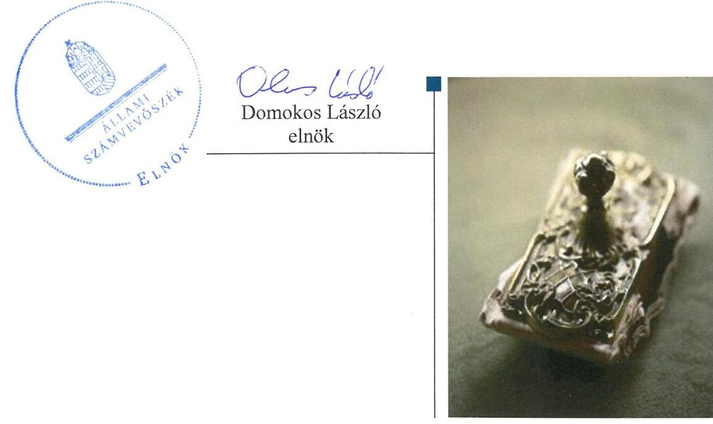
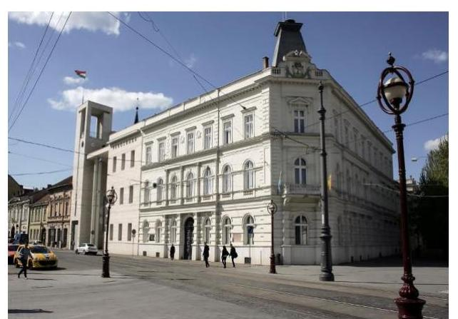
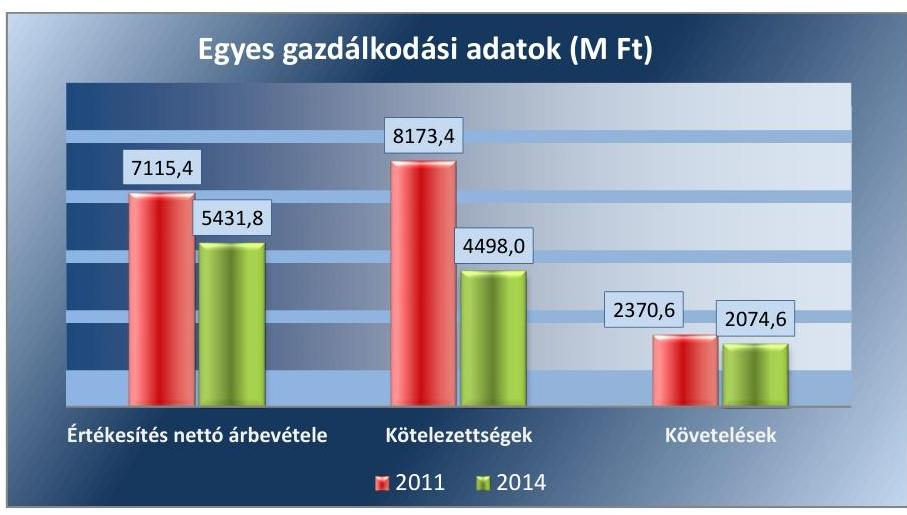
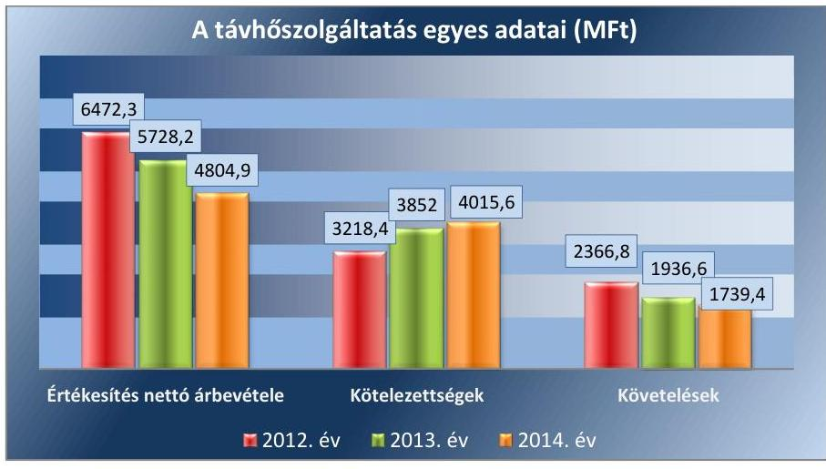
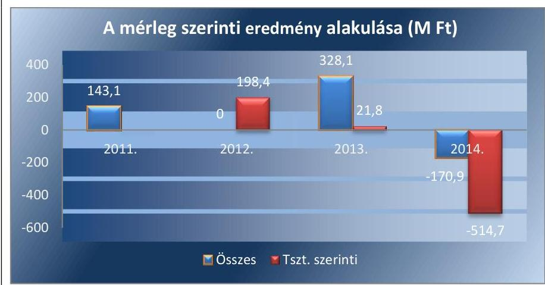
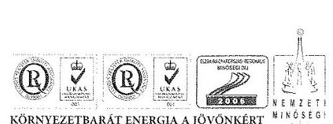
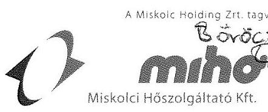
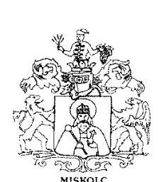
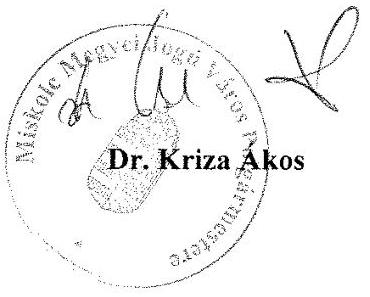

# Jelentés 

## Az önkormányzatok gazdasági társaságai

Az önkormányzatok többségi tulajdonában lévő gazdasági társaságok gazdálkodásának ellenőrzése - MIHŐ Miskolci Hőszolgáltató Kft. 2016.

---

# Jelenetés 

## Az önkormányzatok gazdasági társaságai

Az önkormányzatok többségi tulajdonában lévő gazdasági társaságok gazdálkodásának ellenőrzése - MIHŐ Miskolci Hőszolgáltató Kft. 2016. december hó 22. nap

---

# AZ ELLENŐRZÉST FELÜGYELTE: 

BÖRÖCZ IMRE felügyeleti vezető

## AZ ELLENŐRZÉST VEZETTE ÉS A VÉGREHAJTÁSÁÉRT FELELŐS:

GÁCSER JÓZSEF ellenőrzésvezető

## A PROGRAM ÖSSZEÁLLÍTÁSÁÉRT FELELŐS:

JANIK JÓZSEF LÁSZLÓ osztályvezető

IKTATÓSZÁM: V-1083-140/2016.
TÉMASZÁM: 2117.
ELLENŐRZÉS-AZONOSÍTÓ SZÁM: V070747

---

# TARTALOMJEGYZÉK 

■ ÖSSZEGZÉS ..... 5
■ AZ ELLENŐRZÉS CÉLJA ..... 7
■ AZ ELLENŐRZÉS TERÜLETE ..... 8
■ AZ ELLENŐRZÉS HÁTTERE, INDOKOLTSÁGA ..... 10
■ A JELENTÉS LÉNYEGES KÉRDÉSKÖREI ..... 11
■ ELLENŐRZÉS HATÓKÖRE ÉS MÓDSZEREI ..... 12
■ MEGÁLLAPÍTÁSOK ..... 14
■ JAVASLATOK ..... 28
■ MELLÉKLETEK ..... 29
I. Sz. melléklet: Értelmező szótár ..... 29
II. Sz. melléklet: A Társaság főbb mérleg adatai (MFT) ..... 31
■ FÜGGELÉK: ÉSZREVÉTELEK ..... 33
■ RÖVIDÍTÉSEK JEGYZÉKE ..... 37

---

.

---

# ÖSSZEGZÉS 

Miskolc Megyei Jogú Város Önkormányzata 2011-2014. között a közfeladat-ellátás kereteit alapvetően az előírásoknak megfelelően biztosította. A Miskolc Holding Önkormányzati Vagyonkezelő Zrt. a MIHŐ Miskolci Hőszolgáltató Kft. feletti tulajdonosi jogait szabályszerűen gyakorolta. A Társaság vagyongazdálkodása szabályszerű volt, a beszámolási, nyilvántartási és adatszolgáltatási kötelezettségét az előírásoknak megfelelően teljesítette. Az adatok védelmét és átláthatóságát biztosították. A kötelezettségek állománya ugyanakkor a Társaság müködését, illetve a közfeladat ellátását veszélyeztette. A távhőszolgáltatási közfeladat bevételei és ráfordításai elszámolása, elkülönítése szabályszerű volt. Az önköltségszámítás és árképzés az előírásoknak megfelelt.

## Az ellenőrzés társadalmi indokoltsága

Magyarországon egyre jelentősebb a költségvetésen kívüli feladatellátás térnyerése. Ennek fontos szereplői az önkormányzati tulajdonú gazdasági társaságok. Az önkormányzatok szervezetalakítási szabadságának következménye, hogy a korábban is vállalati formában működő közszolgáltatások mellett, mind a kötelező, mind az önként vállalt feladatok ellátásában a gazdasági társaságok kiemelt fontosságú szerephez jutottak.

Az önkormányzati tulajdonú gazdasági társaságok ellenőrzése kiemelten fontos a vagyon megőrzése és megóvása érdekében, a társaságokkal szemben alapvető követelmény, hogy gazdálkodásuk, működésük szabályszerű, az általuk szolgáltatott adatok minél megbízhatóbbak legyenek. A közfeladat-ellátás költségeinek, ráfordításainak alakulása, színvonala hatással van a lakosság elégedettségére.

Az ÁSZ értékteremtő rend kialakításához és megőrzéséhez hozzájáruló tevékenysége pozitív hatással van a szervezetről kialakított összkép formálására.

## Főbb megállapítások, következtetések, javaslatok

A közfeladat-ellátás megszervezésére vonatkozó önkormányzati döntések és azok előkészítése az ellenőrzött időszak előtt történt. Az ellenőrzött időszakban az Önkormányzat tervezési és rendeletalkotási kötelezettségének eleget tett, azonban a távhőszolgáltatás csatlakozási diját rendeletben nem határozta meg.

A Társaság feletti tulajdonosi jogait a Holding szabályszerűen gyakorolta, ennek keretében eleget tett a beszámolási, felügyeleti rendszer müködtetési kötelezettségeinek.

A Társaság a kötelezően előírt szabályzatokkal rendelkezett, melyek összességében megfeleltek a jogszabályi előírásoknak. Az egyes tevékenységek átláthatóságát biztosító szétválasztási szabályokat meghatározták, hiányosság a számviteli politika és a leltározási szabályzat esetében volt tapasztalható.

A Társaság a vagyon elkülönített nyilvántartását biztosította, a mérlegadatokat leltárral alátámasztotta, a vagyonkezelt eszközökre vonatkozó visszapótlási kötelezettségét ugyanakkor nem teljesítette. A Társaság az előírt beszámolási és adatszolgáltatási kötelezettségét az előírásoknak és a tulajdonosi elvárásoknak megfelelően teljesítette. Az adatok védelmét és átláthatóságát a Társaságnál biztosították. A kötelezettségek állománya a Társaság közfeladat ellátását veszélyeztette, mivel a szállítói kötelezettségek határidőben történő teljesítése nem volt biztosított.

A bevételek és ráfordítások tevékenységenkénti elkülönítése és szabályszerű elszámolása megvalósult. A lakossági vevőkövetelés állománya az ellenőrzött időszak alatt növekedett. A Társaság önköltségszámítása és árképzése szabályszerű volt, a rezsicsökkentési intézkedéseket végrehajtották.

---

Az ÁSZ a Társaság ügyvezetőjének, a polgármesternek és a jegyzőnek fogalmazott meg javaslatokat, amelyek alapján kötelesek intézkedési tervet összeállítani és azt a jelentés kézhezvételétől számított 30 napon belül az ÁSZ részére megküldeni.

---

# AZ ELLENŐRZÉS CÉLJA 

Az ellenőrzés célja annak értékelése volt, hogy az önkormányzat vagyongazdálkodási tevékenysége során szabályszerűen gyakorolta-e tulajdonosi jogait; a gazdasági társaság szabályozottsága, gazdálkodása és vagyongazdálkodási tevékenysége, bevételeinek és ráfordításainak elszámolása megfelel-e a jogszabályi és tulajdonosi előírásoknak; a gazdasági társaság kötelezettségállománya jelentett-e kockázatot a múködésre, valamint a gazdálkodás átláthatósága és elszámoltathatósága érdekében biztosítva volt-e a szolgáltatás dijának megalapozottsága szabályszerű önköltségszámítással.

---

# AZ ELLENŐRZÉS TERÜLETE 

## Miskolc Megyei Jogú Város Önkormányzata, Miskolc Holding Önkormányzati Vagyonkezelő Zrt. és a MIHÓ Miskolci Hőszolgáltató Kft.

## A MIHŐ MISKOLCI HŐSZOLGÁLTATÓ

KFT. jogelődje a Miskolci Hőszolgáltató Vállalat 1992. október 1-jével alakult az állami távhővagyon önkormányzati tulajdonba adásakor. Az alapításkori törzstőke 1406,6 M Ft - ebből pénzbeli betét 80 M Ft - volt. Az Önkormányzat ${ }^{1}$, mint tulajdonos a Miskolci Hőszolgáltató Vállalatot 1996. január 1-jén korlátolt felelősségű gazdasági társasággá alakította, a vagyont átértékelte és $89,8 \mathrm{MFt}$ apportálást hajtott végre, a jegyzett tőke ekkor 2500 M Ft volt. A Miskolci Fűtőmű Kft. általános jogutódlással 1999. december 20-ával beolvadt a Társaság²-ba. Az egyesített Társaság jegyzett tőkéjét leszállították, 2200 M Ft-ban állapították meg, amely azóta változatlan.

A Társaság alapításának célja a távhőszolgáltatás megvalósítsa, közüzemi szerződések alapján szolgáltatás nyújtása volt.

## A MISKOLC HOLDING ÖNKORMÁNYZATI VAGYONKEZELŐ ZRT.-T az Önkormányzat 2006. július 6-án létrehozta, majd apportként átruházta rá az egyszemélyes tulajdonában álló Társaságra vonatkozó üzletrész tulajdonjogát. A Társaság feletti tulajdonosi jogokat a Holding ${ }^{3}$ az ellenőrzött időszakban kizárólagosan gyakorolta. A Holding ügyvezető személye, valamint az igazgatósági tagok az ellenőrzött időszakban változtak.

Miskolc lakónépesség száma 2015. január 1-jén 159554 fő volt*. A Társaság hőtermelési és hőszolgáltatási tevékenysége Miskolc város közigazgatási területére terjedt ki, 2011-ben 31593 lakossági-, és 936 egyéb felhasználó, 2014-ben 31627 lakossági-, és 947 egyéb felhasználó részére nyújtott távhőszolgáltatást. A távhőszolgáltatás üzemeltetési rendszere $52,26 \mathrm{~km}$ primer és $38,56 \mathrm{~km}$ szekunder nyomvonal hosszúságú távvezeték hálózatból, 8 db kazánházból, valamint 241 db hőközpontból, hőfogadó állomásból állt.

Az ügyvezető 2011. június 16-ától tölti be tisztségét. A foglalkoztatottak átlagos statisztika létszáma a 2011. évben 189 fő, a 2014. évben 192 fő volt.

[^0]
[^0]:    * Központi Statisztikai Hivatal, Magyarország Közigazgatási helynév könyve, Miskolc 2015. január 1-jei adata.

---

A Társaság gazdálkodásának egyes adatait a 2011., 2014. évek vonatkozásában az 1. ábra szemlélteti.
1. ábra

Forrás: A 2011. és a 2014. évek beszámolói
Az összes nettó árbevétel a távhőszolgáltatási bevételek visszaesésével párhuzamosan csökkent az ellenőrzött időszakban. A kötelezettségállomány alakulását alapvetően a 2010. évben 4200,0 M Ft összegben felvett és 2011. évben visszafizetett hitel határozta meg. Az összes követelés a távhőszolgáltatáshoz kapcsolódó követelésállomány mérséklődésével összhangban csökkent.

A 2012-2014. években a szétválasztási kötelezettség teljesítése alapján a távhőszolgáltatás egyes adatainak alakulását a 2. ábra mutatja be.
2. ábra

Forrás: A 2012-2014. éves beszámolók kiegészítő mellékletei
A Társaság több társaságban rendelkezett részesedéssel: a Bioenergy Miskolc Kft.-ben 25\% (1,2 M Ft), a Miskolci Geotermia Kft.-ben 10\% (0,5 M Ft), a MIFÜ Kft. ${ }^{4}$-ben 0,4\% (20,1 M Ft), az Enim Környezetipari Klaszter Kft.-ben a 2011. évben 6,7\% (0,5 M Ft) a 2012. évtől 2,7\% (0,2 M Ft) és a Kuala Kft.-ben a 2014. évtől 10,0\% (5,2 M Ft) részesedéssel.

Az ellenőrzött időszakban a polgármester ${ }^{5}$ személye nem változott, a 2010. évi önkormányzati választások óta tölti be tisztségét, a jegyző ${ }^{6}$ 2011. május 1-jétől látja el feladatait.

---

# AZ ELLENŐRZÉS HÁTTERE, INDOKOLTSÁGA

## AZ ÁLLAMI SZÁMVEVŐSZÉK STRATÉGIÁJÁBAN

megfogalmazta, hogy a helyi önkormányzatok gazdálkodásában rejlő pénzügyi kockázatok feltárásával, az államháztartáson kívülre nyújtott költségvetési támogatások és ingyenes vagyonjuttatások, valamint az államháztartáson kívül működő közfeladat-ellátó rendszerek ellenőrzéseivel hozzájárul ahhoz, hogy a közpénzeket az államháztartáson kívül működő szervezetek is átlátható, rendezett módon használják fel a közfeladatok szerződésben vállalt ellátása érdekében. Az önkormányzati tulajdonú gazdasági társaságok teljes körű ellenőrzésének lehetőségét az Állami Számvevőszékről szóló 1989. évi XXXVIII. törvény 2011. január 1-jétől hatályos módosítása teremtette meg. A gazdasági társaságok közfeladat ellátását érintő gazdálkodási tevékenysége szabályszerűségére irányuló ellenőrzéseket erre tekintettel az ÁSZ7 2011. évtől végzi.

## AZ ELLENŐRZÉS VÁRHATÓ HASZNOSULÁSA-KÉNT

az ÁSZ a megállapításaival segítséget nyújthat az államháztartáson kívüli közfeladat-ellátás értékeléséhez, jogszabályi keretei pontosításához, átláthatóságot biztosító szabályozásához. Meghatározhatóvá válnak a közfeladat ellátásban részt vevő államháztartáson kívüli szervezeteknek – az önkormányzat költségvetését, pénzügyi helyzetét is befolyásoló – kockázatai, lehetővé válik ezen kockázatok csökkentése. Értékelhetővé válik, hogy a feladatot ellátó gazdasági társaság a közszolgáltatási szerződésben foglaltak betartásával, a közvagyon használatával biztosította-e a szolgáltatás folytatásának feltételeit. Ezzel az ellenőrzöttek és a helyi döntéshozók számára az ÁSZ visszajelzést ad feladatszervezési, feladat-ellátási kockázataikról, alapot ad a meglévő hibák megszüntetéséhez, a jobb közfeladat-ellátás biztosításához.

---

# A JELENTÉS LÉNYEGES KÉRDÉSKÖREI 

1. Az Önkormányzat közfeladat megszervezéséről szóló döntése, valamint a Holding tulajdonosi joggyakorlása szabályszerű volt-e?
2. A gazdasági társaság vagyongazdálkodása szabályszerű volt-e, kötelezettségállománya jelent-e kockázatot a müködésre, illetve a közfeladat ellátására?
3. A gazdasági társaságnál az ellátott közfeladat bevételei és ráfordításai elszámolása, valamint az önköltségszámitás és árképzés szabályszerű volt-e?

---

# ELLENŐRZÉS HATÓKÖRE ÉS MÓDSZEREI 

## Az ellenőrzés típusa

Megfelelőségi ellenőrzés

## Az ellenőrzött időszak

Az ellenőrzött időszak 2011. január 1-jétől 2014. december 31-ig tart.

## Az ellenőrzés tárgya

A MIHŐ Miskolci Hőszolgáltató Kft. feletti tulajdonosi joggyakorlás, valamint a gazdasági társaság gazdálkodásának szabályozottsága és szabályszerűsége.

Az ellenőrzés kiterjed minden olyan körülményre és adatra, amely az ÁSZ jogszabályban meghatározott feladatainak teljesítéséhez, valamint a program végrehajtása folyamán felmerült újabb összefüggések feltárásához szükséges.

## Az ellenőrzött szervezet

Miskolc Megyei Jogú Város Önkormányzata, Miskolc Holding Önkormányzati Vagyonkezelő Zrt. és a MIHŐ Miskolci Hőszolgáltató Kft.

## Az ellenőrzés jogalapja

Az ellenőrzés jogszabályi alapját az ÁSZ tv. ${ }^{8}$ 1. § (3) bekezdése és 5. § (3)(4)-(5) bekezdései képezik.

## Az ellenőrzés módszerei

Az ellenőrzést a nemzetközi standardokat irányadónak tekintve az ellenőrzési program ellenőrzési kérdései, az ellenőrzött időszakban hatályos jogszabályok, az ellenőrzés szakmai szabályok és módszertanok figyelembe vételével végeztük.

Az ellenőrzés ideje alatt az ellenőrzött szervezettel történő kapcsolattartást az ÁSZ Szervezeti és Múködési Szabályzatának vonatkozó előírásai alapján biztosítottuk.

Az ellenőrzési kérdések megválaszolásához szükséges bizonyítékok megszerzése a következő ellenőrzési eljárások alkalmazásával történt:

---

megfigyelés, kérdésfeltevés (információkérés), összehasonlítás, valamint elemző eljárás. Az ellenőrzési bizonyítékként felhasználható adatforrások közé tartoztak egyrészt a szakmai programban felsorolt adatforrások, másrészt adatforrás még minden - az ellenőrzés folyamán - feltárt, az ellenőrzés szempontjából információkat tartalmazó dokumentum.

Az ellenőrzést a kérdésekre adott válaszok kiértékelésével, valamint a megjelölt adatforrások, a csatolt tanúsítványok felhasználásával, továbbá az adott időszakban hatályos jogszabályok figyelembe vételével folytattuk le.

A bevételek és ráfordítások elszámolása, valamint a vagyonnyilvántartás terén a szabályszerű múködést véletlen mintavétellel ellenőriztük. A mintavétellel ellenőrzött területek esetében minden egyes tétel vonatkozásában a szabályszerűségre vonatkozó kérdéseket tettünk fel, amelyek eredménye összesítésre került. Megfelelőnek értékeltünk egy ellenőrzött területet, amennyiben 95\%-os bizonyossággal a teljes sokaságban a hibaarány legfeljebb 10\%, nem megfelelőnek, amennyiben 10\%-nál magasabb arányt képviselt. Abban az esetben, ha a teljes sokaság tekintetében a 10\%-os hibaarányhoz való viszony megítélésnek megbízhatósága nem érte el a 95\%-ot, annak elérése érdekében értékelésünket további szempontokkal egészítettük ki, és figyelembe vettük a feltárt hibák típusát és súlyát. A ráfordítások elszámolására és a vagyonnyilvántartásra vonatkozó véletlen mintavételt kockázati alapú kiválasztással egészítettük ki, amelynek során évente a három legnagyobb összegű tételt választottuk ki.

---

# 1. Az Önkormányzat közfeladat megszervezéséről szóló döntése, valamint a Holding tulajdonosi joggyakorlása szabályszerű volt-e? 

Összegző megállapítás

Az Önkormányzat az ellenőrzött időszakban a közfeladat-ellátás kereteit alapvetően az előírásoknak megfelelően biztosította. A Holding tulajdonosi joggyakorlása szabályszerű volt.
1.1. számú megállapítás

Az Önkormányzat rendeletalkotási kötelezettségének eleget tett, azonban a távhőszolgáltatás csatlakozási diját rendeletben nem határozta meg.

AZ ÖNKORMÁNYZAT GAZDASÁGI PROGRAMJÁT ${ }^{9}$ a Közgyűlés ${ }^{10}$ - az Ötv. 91. § (7) bekezdésében meghatározott határidőn belül - 2011. március 10-én elfogadta. A 2011-2014. időszakra vonatkozó program - az Ötv. 91. § (6) bekezdésével összhangban - tartalmazta a távhőszolgáltatásra vonatkozó célkitűzéseket.

A Közgyűlés 2014. szeptember 18-án elfogadta a 2014-2020 közötti időszak integrált településfejlesztési stratégiáját. A stratégiában megjelölt célfeladatok a 314/2012. (XI. 8.) Korm. rendelet ${ }^{11} 5$. és 6 . §-aival összhangban rögzítik a távhőszolgáltatás infrastrukturális fejlesztését.

Az Önkormányzat az Nvtv. ${ }^{12}$ 9. § (1) bekezdésben foglaltak szerint, 2012. június 21-én jóváhagyta vagyongazdálkodási tervét ${ }^{13}$. Ebben rögzítették, hogy a Bogáncs úti hulladéklerakó telepen képződő hulladéklerakó gáz hasznosítása folyamatos, a területen további fejlesztést nem terveznek.

A KÖZFELADAT MEGSZERVEZÉSÉRŐL az Önkormányzat az ellenőrzött időszak előtt döntött. A távhőszolgáltatás biztosításának szabályait Távhő rendelet ${ }^{14}$, a távhő díjakat és a díjalkalmazás feltételeit Díjrendelet ${ }^{15}$ tartalmazta, a feladatellátás kereteit az Alapító okirat ${ }^{16}$ határozta meg.

A feladatellátás jogalapját a Távhő rendelet a Társaság nevesítésével biztosította. A Tszt. ${ }^{17}$ a feladatellátással összefüggésben szerződéskötési kötelezettséget nem írt elő az Önkormányzat részére, ugyanakkor a Társaságnak a KEOP pályázati ${ }^{18}$ forrás igénybevételéhez közszolgáltatási szerződést kellett kötnie. Az Önkormányzat és a Társaság 2014. február 25-én közszolgáltatási szerződést kötött a távhőszolgáltatás ellátására.

Az Önkormányzat 2010. május 31-én - az Ötv. 80/A. § (5) bekezdésének megfelelően - vagyonkezelési szerződést ${ }^{19}$ kötött a Társasággal hulladékkezelési feladat (hulladéklerakó utógondozás) ellátására és a feladathoz rendelt vagyon kezelésére. A szerződés keretében az Önkormányzat a Társaságnak olyan ingatlanokra vonatkozóan biztosított vagyonkezelői jogot

---

ingyenesen, ahol a Bogács úti hulladéklerakóban képződő biogázt távhőszolgáltatásban hasznosították. A vagyonkezelési szerződés tartalmazta az Áht., ${ }^{20}$ 105/B. § (1) bekezdésében előírt követelményeket.

A Közgyűlés 2013. szeptember 26-i ülésén határozattal döntött vagyonkezelői jog alapításáról a belvárosi rehabilitáció keretében megvalósult közműkiváltásokkal, közműfejlesztésekkel létrejött távhő-vezetékszakaszokra vonatkozóan. A vagyonrendelet ${ }^{21}$ hatályos előírásai alapján a vagyonkezelési szerződés előkészítése az ellenőrzött időszakban folyamatban volt.

A TÁVHŐ- ÉS A DÍJRENDELET megalkotásával az Önkormányzat a Tszt. 6. § (2) bekezdésében előírt rendeletalkotási kötelezettségének eleget tett. A Távhő rendeletben ${ }^{22}$ a Tszt. 6. § (2) bekezdés alapján meghatározták a távhőszolgáltató és a felhasználó közötti jogviszony részletes szabályait, valamint a szolgáltatás felmondása előírásait, továbbá a távhőszolgáltatás vételezése, szüneteltetése, korlátozása szabályait, a hőmennyiség mérés helyét.

A Díjrendeletben ${ }^{23}$ a Tszt. 6. § (2) bekezdés b) pontjában előírtakkal összhangban meghatározták a távhőszolgáltatási díjak (alapdíj, hődíj, vízfelmelegítési díj, melegvíz díj) alkalmazásának és fizetésének szabályait, a díjak képzésének előírásait és mértékét. A Díjrendelet 1-4. számú mellékletei rögzítették a díjak egységárai meghatározásának módját, mértékeit, a kalkuláció sablonját. A távhőszolgáltatás alapdíját, és a mért hő díját tartalmazó mellékleteit utolsó alkalommal 2011. február 15-i hatállyal módosították. A Tszt. 57/D. §-ának 2011. április 15-i módosításával az Önkormányzat ár megállapítási jogköre - a csatlakozási díj kivételével - megszűnt, ennek megfelelően a Díjrendelet alapdíj és hődíj megállapítással kapcsolatos előírásait az Önkormányzat hatályon kívül helyezte.

Az Ámt. ${ }^{24}$ 7. § (5) bekezdésében, továbbá a Tszt. 6. § (2) bekezdés b) pontjában foglaltak ellenére az Önkormányzat az ellenőrzött időszakban távhőszolgáltatás csatlakozási díjat rendeletben nem határozott meg.
1.2. számú megállapítás

A Társaság feletti tulajdonosi jogait a Holding szabályszerűen gyakorolta, ennek keretében eleget tett a beszámoltatási- és felügyeleti rendszer múködtetési kötelezettségeinek.

A TULAJDONOSI JOGOK GYAKORLÁSÁNAK rendjét a Társaság Alapító okirata, a menedzsment-szerződés ${ }^{25}$ és a tulajdonosi joggyakorló - Holding - szabályzatai rögzítették.

Az Alapító okirat előírásai szerint, a Gt. ${ }^{26}$ 19. § (5) bekezdésében, valamint a Ptk. ${ }^{27}$ 3:109. § (4) bekezdésében előírtakkal összhangban a Társaság egyszemélyes társaságként jött létre, így a legfőbb szerv hatáskörében az egyedüli tag határozott.

A Holding a 2007. február 22-i előterjesztési szabályzatban, illetve a 2013. március 20-i igazgatóság üléseinek és a cégvezető-menedzsment fórum üléseinek előkészítéséről és a határozatok végrehajtásának ellenőrzéséről szóló szabályzatban előírta, hogy a vagyongazdálkodási döntések megalapozására előterjesztést a Holding Igazgatósága részére kell készíteni, amelynek formai és tartalmi követelményeit, illetve felelőseit is rögzítette.

---

Az ügyvezető számára - az Alapító okiratban meghatározottakon túl -, a Holding menedzsment szerződés alapján előírta üzleti terv készítését, az azzal kapcsolatos monitoring tevékenység elvégzésének kötelezettségét.

A Holding Igazgatósága döntött az üzleti tervek jóváhagyásáról, a számviteli beszámoló elfogadásáról, és az adózott eredmény felhasználásáról, valamint a könyvvizsgáló és az FB tagok megválasztásáról. A Holding konszolidált beszámolói elfogadásáról a Közgyűlés határozattal döntött.

A TÁRSASÁG FELŰGYELŐ BIZOTTSÁGA az Alapító okiratban előírtak alapján - a Gt. 34. § (1) bekezdésével, valamint a Ptk. 3:121. § (1) bekezdésével összhangban - három tagból állt. Az FB ${ }^{28}$ egyharmada a munkavállalók képviselőiből állt a Gt. 38. § (1) bekezdésben, valamint a Ptk. 3:124. § (1) bekezdésben előírtak szerint.

Az FB eleget tett a Gt. 34. § (4) bekezdése előírásainak, elkészítette ügyrendjét, melyet a Holding határozatával ${ }^{\dagger}$ jóváhagyott. Az FB hatáskörébe tartozott az ügyvezetés ellenőrzése, az éves beszámoló véleményezése, üzletpolitikai döntésekhez kapcsolódóan javaslatok készítése.

AZ ANYAGI ÉRDEKELTSÉGI RENDSZER elemeit a Taktv ${ }^{29}$. 5. § (3) bekezdésében foglaltaknak megfelelően a Holding Igazgatósága által elfogadott javadalmazási szabályzat ${ }^{30}$-ban rögzítették. A javadalmazási szabályzat kiterjedt az ügyvezető és a tisztségviselők vonatkozó javadalmazási elveire és szabályaira, a prémium fizetés feltételeire és mértékére, a költségtérítés szabályozására. A szabályzat szerint a prémium feltételeket az üzleti tervek elfogadásával kellett meghatározni.

Az üzleti tervekben rögzített célkitűzések (pl.: kintlévőségek csökkentése, piacfejlesztés) teljesüléséről az éves beszámolók keretében számolt be a Társaság. Ennek alapján a Holding Igazgatósága a 2013. évi beszámoló elfogadásakor 29,2 M Ft, a 2014. évi beszámoló elfogadáskor pedig 28,6 M Ft prémium kifizetésről döntött.

A BESZÁMOLTATÁSI RENDSZERT a Holding múködtette, az ügyvezetőt a Társaság vagyoni helyzetéről és üzletpolitikájáról negyedévente beszámoltatta. A Társaság 2011-2014. üzleti éveiről készített éves beszámolóit a Holding Igazgatósága megtárgyalta és elfogadta. A számviteli beszámolók elfogadásáról a Gt. 35. § (3) bekezdésének és a Ptk. 3:120. § (2) bekezdésének előírásait betartva az FB és a könyvvizsgáló írásos jelentésének birtokában döntöttek.

A mérleg szerinti eredmény változóan alakult, a 2011.,2013. években nyereségesen, a 2014. évben veszteségesen gazdálkodott a Társaság. 2012. évben, az osztalékfizetés következtében nem volt mérleg szerinti eredmény.

A 2014. évi veszteséget egyrészt a csökkenő hőmennyiség értékesítés okozta, valamint az, hogy a fix teljesítménydíj költséget nem tudták megfelelő mértékben érvényesíteni a közszolgáltatási díjakban. Az ügyvezető a 2014. évi veszteségről és annak okairól a Holding felé - az Alapító okiratban előírtak szerint fennálló - tájékoztatási kötelezettségét teljesítette.

[^0]
[^0]:    ${ }^{\dagger}$ 289-1/2011.(XII. 14.) számú Igazgatósági határozat

---

Az összes és a Tszt. szerinti tevékenység mérleg szerinti eredményének ellenőrzött időszakon belüli alakulását a 3. ábra mutatja be.
3. ábra

Forrás: A Társaság 2011-2014. évi beszámolói
A Holding Igazgatósága a 2011., 2013. évi eredménytartalékba helyezéséről, az éves beszámolók elfogadásával egyidejűleg döntött. A 2014. évi veszteség a 2013. évi felhalmozott nyereségből került finanszírozásra.

Osztalék kifizetésére 2013-ban került sor a Társaság 2012. évi szabad eredménytartalékkal ( $338,2 \mathrm{M} \mathrm{Ft}$ ) kiegészített 2012. évi adózott eredménye (228,6M Ft) terhére, 566,8 M Ft értékben. Az Alapító okirat előírása alapján a kifizetésről a Holding határozott ${ }^{5}$. A Társaság ügyvezetője 2013. május 10-én a Gt. 131. § (3) bekezdésében előírtak alapján nyilatkozatot tett, mely szerint az osztalék kifizetése a társaság fizetőképességét, illetve a hitelezők érdekeinek érvényesülését nem veszélyezteti.

BELSŐ ELLENŐRZÉSI RENDSZERT a Holding működtetett, melynek keretében a Társaságnál három ellenőrzés végzett. 2012-ben a transzferár képzés, illetve a belső kontrollrendszer, a 2013-ban egy fuvarszerződés, illetve a földmunka-teljesítés igazolások, a 2014-ben pedig az értékvesztés ellenőrzését végezték el. Az ellenőrzési jelentésekkel öszszefüggésben intézkedési tervek nem készültek, annak ellenére, hogy az jelentések intézkedési terv készítési kötelezettséget írtak elő.

[^0]
[^0]:    ${ }^{5}$ a 155/2013. (V. 8.) számú és a 185/2013. (V. 15.) számú igazgatósági határozatok

---

# 2. A gazdasági társaság vagyongazdálkodása szabályszerű volt-e, kötelezettségállománya jelent-e kockázatot a múködésre, illetve a közfeladat ellátására? 

Összegző megállapítás

2.1. számú megállapítás

A Társaság vagyongazdálkodása szabályszerű volt, kötelezettségállománya azonban a közfeladat ellátását veszélyeztette.

A gazdálkodási szabályzatok a jogszabályi előírásoknak összességében megfeleltek, az egyes tevékenységek átláthatóságát biztosító szétválasztási szabályokat meghatározták.

Az üzleti tervek készítésének kötelezettsége a Társaság SZMSZ-e szerint az ügyvezető felelőssége volt, a Holding kizárólagos hatáskörébe tartozott az üzleti terv jóváhagyása. A Holding menedzsment szerződés alapján előírta éves üzleti tervek készítését, amelyek összeállítására 2012. évtől tervezési irányelveket bocsátott rendelkezésre.

A Társaság a tulajdonosi joggyakorló előírásainak megfelelően elkészítette az üzleti terveit, melyek összhangban voltak a távhőszolgáltatás fejlesztésére vonatkozóan meghatározott önkormányzati célokkal.

A vagyonkezelési szerződésben előírtak ellenére az üzleti tervek nem tartalmazták, hogy a társaság milyen ráfordításokat és bevételeket tervez a vagyonkezelésbe vett eszközökkel összefüggésben.

Az üzleti terveket a Holding minden évben a számviteli beszámoló jóváhagyásával egyidejűleg, igazgatósági határozattal ${ }^{5}$ elfogadta. Az elfogadott üzleti terveket a Társaság a vagyonkezelői szerződésben foglalt kötelezettsége alapján továbbította az Önkormányzat részére. Az üzleti tervek hiányosságait sem Holding, sem az Önkormányzat nem észrevételezte.

A SZÁMVITELI POLITIKÁT és annak részeként a Számv. tv. ${ }^{31}$ 14. § (5) bekezdésében előírt eszközök és források leltárkészítési és leltározási, illetve értékelési szabályzatát, önköltségszámítás rendjére vonatkozó szabályzatot, valamint pénzkezelési szabályzatot Számv. tv. 14. § (12) bekezdésében foglaltaknak megfelelően az ügyvezető készítette el és hagyta jóvá. A számviteli politika a Számv. tv. 14. § (4) bekezdése előírásainak a 2011-2012. években megfelelt.

2013-2014. években a számviteli politika ${ }^{32}$ nem felelt meg a Számv. tv. 14. § (4) bekezdésében foglaltaknak, mivel a Számv. tv. 3. § (3) bekezdésének 3-4. pontjai alapján a jelentős és nem jelentős összegű hibák értékhatárait nem tartalmazta.

A leírási kulcsokat a TAO tv. ${ }^{33}$ 2. számú mellékletében foglalt értékekben az amortizációs politika részeként határozták meg, mely megfelelt a Számv. tv. 52.-53. § előírásainak.

Az eszközök és források leltárkészítési és leltározási szabályzata az ingatlanok, a gépek, berendezések és felszerelések 3 évenkénti, a vásárolt készletek évenkénti mennyiségi felvétellel történő leltározási kötelezettsé-

[^0]
[^0]:    ${ }^{5}$ 149/2011. (VI.22.) sz., 128/2012. (V.16.) sz., 88/2013. (III.20.)sz., 64/2014. (III.5.) sz. Igazgatósági Hat.

---

gét írta elő, amely szabályozás megfelelt a Számv. tv. 69. § (3) bekezdésében foglalt előírásnak, mivel a Társaság év közben az eszközeiről folyamatos mennyiségi nyilvántartást vezetett.

Az eszközök és források leltárkészítési és leltározási szabályzata ugyanakkor belső ellentmondást tartalmazott, mert a szabályzat szerint csak értékben nyilvántartandó immateriális javak leltározására vonatkozóan hol mennyiségi felvétellel, hol egyeztetéssel történő leltározást írt elő annak ellenére, hogy azt a Számv. tv. 69. § (3) bekezdésében foglaltak szerint a csak értékben kimutatott eszközöknél egyeztetéssel kell elvégezni.

Az eszközök és források értékelési szabályzata a Számv. tv. 14. § (4) bekezdésével összhangban tartalmazta, hogy a törvényben biztosított választási lehetőségek közül miket, milyen feltételek fennállása esetén alkalmaznak. Ennek keretében meghatározták az eszközök és források értékelésének szabályait, a vevőkövetelésekre elszámolt értékvesztés megállapításának kritériumait.

A pénzkezelési szabályzat megfelelt a Számv. tv. 14. § (8) bekezdésében előírtaknak.

Az önköltségszámítási szabályzatot a Számv. tv. 14. § (5) bekezdés c) pontja, valamint a Számv. tv. 14. § (7) bekezdés előírása alapján szabályszerűen elkészítették.

A számlarendet a Társaság a Számv. tv. 161. § (1) bekezdésében előírtak alapján készítette el. A számlarend a Számv. tv. 161. § (2) bekezdésében előírtaknak megfelelő volt, a számlatükörben meghatározták a vagyonkezelt eszközök önálló főkönyvi számláit, valamint a távhőszolgáltatás bevételeinek elkülönítésére szolgáló főkönyvi számlákat.

AZ ELKÜLÖNÍTÉSI KÖTELEZETTSÉGEK teljesítéséről a Társaság a szabályozás szintjén gondoskodott. A számviteli szétválasztási szabályzat elkészítésével a Társaság a Tszt. 18/A. § (2) bekezdésében előírt szabályozási kötelezettségének eleget tett. Ezzel biztosította az egyes tevékenységek átláthatóságának, illetve a keresztfinanszírozás kizárásának szabályozási feltételeit. A szétválasztási szabályok a Tszt. 18/A. § (3) bekezdés c) pontjával összhangban lehetőséget adtak a távhőszolgáltatási tevékenység kiegészítő mellékletében történő bemutatására oly módon, mintha azt a Társaság önálló vállalkozás keretében végezte volna.

A Társaság üzletszabályzatát ${ }^{34}$ a Tszt. 3. § v) pontja szerinti tartalommal elkészítették, az ellenőrzött időszakban két alkalommal módosították a Tszt. és az ármegállapítás jogszabályi változásai miatt. Az üzletszabályzat elfogadásáról a Holding Igazgatósága határozattal döntött és a Tszt. 7.§ (1) bekezdésének b) pontja alapján a jegyző hagyta jóvá. A Társaság üzletszabályzatát a Tszt. 57/C. § (4) bekezdésének a) pontja alapján közzétette.
2.2. számú megállapítás

A Társaság a vagyon elkülönített nyilvántartását biztosította, a mérlegadatokat leltárral alátámasztotta. A vagyonkezelt eszközökre vonatkozó visszapótlási kötelezettségét ugyanakkor nem teljesítette.

A Társaság a távhőszolgáltatási közfeladatot saját eszközeivel látta el, vagyonkezelt eszközökkel a távhő- és villamosenergia termelő tevékenység-

---

gel összefüggésben rendelkezett. Az Önkormányzat tulajdonában álló bezárt szemétlerakó telep, melyet a Társaság biogáz-termeléshez használt a vagyonkezelési szerződésnek megfelelően került nyilvántartásba.

# AZ ANALITIKUS ÉS FŐKÖNYVI NYILVÁNTARTÁSI 

RENDSZERE megfelelő volt. Az Áht.; 105/A. § (13) bekezdésének, valamint az Mötv. 109. § (7) bekezdésének megfelelően vagyonkezelésbe vett vagyon nyilvántartását elvégezték. A vagyonkezelésbe vett ingatlanokat a Társaság önálló főkönyvi számlán tartotta nyilván, az eszközökről részletes analitikus nyilvántartást vezetett. A saját vagyon nyilvántartása átlátható és naprakész volt, a Társaság vagyonának változásait főkönyvi és analitikus nyilvántartásban folyamatosan rögzítették.

Az éves beszámolók alátámasztására a leltározást a Számv. tv. 69. § (1) bekezdésnek megfelelően elvégezték, a vagyonkezelt eszközöket külön leltározták.

A vagyonkezelésbe vett eszközök értékcsökkenéséből képződött forrásoknak megfelelő mértékű eszközpótlás 2012. évtől nem valósult meg, az értékcsökkenésnek megfelelő mértékben tartalékot nem képeztek, megsértve ezzel az Mötv. 109.§ (6) bekezdésében előírtakat.

A vagyonkezelésbe vett eszközökre elszámolt értékcsökkenés az ellenőrzött időszak alatt 11,0 M Ft volt, így a vagyonkezelt eszközök nettó értéke 2014. év végére 915,1 M Ft-ra csökkent.

A Társaság főbb mérleg adatait a II. számú melléklet szemlélteti.
AZ ESZKÖZÉRTÉK az ellenőrzött időszakban csökkent, amely az alacsony beruházási aktivitásnak és a forgóeszközök csökkenésének köszönhető. A korábban beszerzett eszközök után elszámolt értékcsökkenés részben került fejlesztési forrásként felhasználásra.

A forgóeszközök állománya a 2011. január 1-jei nyitó értéke a 2014. év végére, a pénzeszközök csökkenése miatt több mint felére csökkent. A nagyarányú csökkenés jellemzően egy gazdasági esemény bekövetkezéséhez kapcsolódott. Ez az esemény a 2010. évben a hőtermelő bázis szélesítése érdekében felvett, a MIFÜ Kft hőtermelő cég üzletrészének megvásárlásához fel nem használt 4,2 milliárd Ft összegű hitelnek a 2011. üzleti évben megtörtént teljes egészében visszafizetett összege volt. Ez a tétel mind a pénzeszközök, mind a kötelezettségek állományát csökkentette.

A követelések állománya az ellenőrzött időszakban csökkent. Az eredményt növelő elhatárolások között jellemzően a Társaságnak a tárgyév fel-adat-ellátása után járó, a mérlegkészítés időszakában megítélt, államháztartási forrásokból - pályázatokhoz kapcsolódóan - származó támogatások kerültek elszámolásra.

A FORRÁSOLDALON megállapítható az idegen források, a kötelezettségek túlsúlya, ezzel párhuzamosan a saját tőke elemeinek alacsonyabb állománya és aránya. A saját tőke állományának változásában egyrészről megjelenik a mérleg szerinti eredmény hatása, másrészről a tulajdonos 2012. évi 566,8 M Ft osztalék kivonása.

A tartós kötelezettségek jelentős része a vagyonkezelt eszközök bekerülési értékéből ( 923,3 M Ft), valamint a miskolctapolcai strandfürdő

---

távhőhálózatba történő bekötésének megvalósítása érdekében történt 2014. évi hitelfelvételből (205,3 M Ft) származott.

A Társaság jövedelmezősége a 2014. év végére romlott, a 2014. évben mérleg szerinti veszteséget értek el, amelyet az előző évi nyereségből finanszíroztak.

# 2.3. számú megállapítás 

A kötelezettségek állománya a Társaság a közfeladat ellátását veszélyeztette. A szerződésen alapuló rövid lejáratú kötelezettségek határidőben történő teljesítése nem volt biztosított.

A Társaság kötelezettségeinek 75,6-80,3\%-át a rövid lejáratú kötelezettségek alkották, amely állomány a 2013. évig csökkenő, 2014. évben növekvő tendenciát mutatott az előző évekhez viszonyítva. Az ellenőrzött időszakban a lejárt határidejű szállítói tartozások folyamatosan növekedtek, az üzleti partnerek a késedelmes teljesítések után összesen 335,2 M Ft késedelmi kamatot számoltak fel.

Az ellenőrzött időszakban a kötelezettségek állománya minden évben meghaladta a pénzeszközök értékét. A Társaság folyószámlahitelt 2011. és 2012. években vett fel. A nettó forgótőke folyamatosan negatív volt, így a Társaság finanszírozási kockázata fenn állt. A kötelezettségek állománya a Társaság múködésére és a közfeladat ellátására kockázatot jelentett, továbbá a szerződésen alapuló rövid lejáratú kötelezettségek határidőben történő teljesítése az ellenőrzött időszakban nem volt biztosított. A Társaság szállítói tartozásainak lejárat szerinti alakulását a 2011-2014. években a 1. táblázat szemlélteti.

1. táblázat

## SZÁLLÍTÓI ÁLLOMÁNY ÖSSZETÉTELE (MFT)

|  | Mennyezés | 2011. | 2012. | 2013. | 2014. |
| :--: | :--: | :--: | :--: | :--: | :--: |
| Rövid lejáratú kötelezettségek | 3768,9 | 3513,4 | 3227,9 | 3399,6 |  |
| ebből szállítói kötelezettségek | 2659,8 | 2765,5 | 3093,6 | 3174,7 |  |
| - | nem lejárt kötelezettségek | 2652,5 | 1305,0 | 1474,4 | 1271,3 |
| - | lejárt kötelezettségek | 7,3 | 1460,5 | 1619,2 | 1903,4 |

A Társaság három hosszú lejáratú kötelezettséggel rendelkezett. A 2010. május 31-én átvett eszközök vagyonkezelési szerződés szerinti értékét a Számv. tv. 42. § (5) bekezdése alapján a hosszú lejáratú kötelezettségek között tartották nyilván, mely tényleges pénzügyi kötelezettséget nem jelentett. További 0,5 M Ft-ot a Társaság részesedés szerzéséhez egyéb vállalkozótól kapott összegként mutatott ki a hosszú lejáratú kötelezettségek között, ennek a tartozásnak sem keletkezett az ellenőrzött időszakban törlesztő részlete. A 2014. évben a Társaság egy strandfürdő hálózatba történő bekötésének megvalósítása érdekében 205,3 M Ft hitelt vett fel, amely növelte a hosszú lejáratú kötelezettségek állományát. A hitel első törlesztő részlete az ellenőrzött időszakot követően vált esedékessé. Az eladósodottságot jelző mutatók értékei a 2. táblázatban foglaltak szerint alakult a 2011-2014. években.

---

2. táblázat

# A TÁRSASÁG PÉNZÜGYI MUTATÓSZÁMAI 

| Megnevezés | Referencia | 2011 | 2012 | 2013 | 2014 |
| :-- | :--: | :--: | :--: | :--: | :--: |
| Eladósodottsági mutató (tőkeáttétel) | $<0,6$ | 0,57 | 0,57 | 0,52 | 0,57 |
| Eladósodottság mértéke | $<1$ | 1,67 | 1,79 | 1,48 | 1,71 |
| Nettó eladósodottság | $<0$ | 0,74 | 0,68 | 0,71 | 0,92 |
| Adósságfedezeti mutató | 2,0 | 1,51 | 1,53 | 1,60 | 1,49 |

Forrás: A Társaság adatszolgáltatása

Az eladósodottsági mutató esetében kedvezőnek mondható, hogy folyamatosan 0,6-hoz közeli érték alatt teljesült. A Társaságnál a szállítók és egyéb kötelezettségek értéke tartósan és lényegesen nagyobb volt a saját forrásokénál, az eladósodottság mértéke a kritikus érték több mint másfélszerese volt. A nettó eladósodottsági mutató értékei pozitívak voltak, 2014. év végére növekedett, amely kedvezőtlen tendenciát jelzett. Az adósságfedezeti mutató értéke az optimálisnak mondható 2 körüli értéktől folyamatosan elmaradt.

## 2.4. számú megállapítás

A Társaság az előírt beszámolási és adatszolgáltatási kötelezettségét az előírásoknak és a tulajdonosi elvárásoknak megfelelően teljesítette. Az adatok védelmét és átláthatóságát a Társaságnál biztosították.

AZ ÉVES BESZÁMOLÓKAT a Társaság a Számv. tv. 19. § (1) bekezdésében előírt tartalommal elkészítette, azokat az ügyvezető a Holding Igazgatósága elé terjesztette. A beszámolók a Tszt. 18/A. § (3) bekezdésében előírt mérlegeket és eredmény-kimutatásokat a 2012-2014. években tartalmazták. Az éves beszámolók letétbe helyezése és közzététele a Számv. tv. 153. § (1) bekezdésnek és a 154. § (1) bekezdésének megfelelően megtörtént.

Az éves beszámolók elfogadásáról, az éves eredményfelosztásáról a Holding minden évben az FB határozatának és a könyvvizsgáló írásos jelentésének birtokában döntött. Az FB az éves beszámolókról a Gt. 35. § (3) bekezdése, valamint a Ptk. 3:120. § (2) bekezdése előírásának megfelelően elkészítette írásos jelentését. A Holding Igazgatóságának ülésein a könyvvizsgáló jelen volt.

A 2010. május 31-én megkötött vagyonkezelési szerződés alapján a Társaságot a vagyonkezelt eszközök után elszámolt éves értékcsökkenésének összegéről és annak felhasználásáról az Önkormányzat felé tájékoztatási kötelezettség terhelte, amelynek eleget tettek. A Társaság a vagyonkezelői szerződésben előírt, éves üzleti terv készítési és elszámolási nyilatkozat tételi kötelezettségének eleget tett.

A 2014. február 25-én megkötött közszolgáltatási szerződés alapján a Társaságnak évente beszámolót kellett készítenie, amelyben közszolgáltatási tevékenységét elkülönítetten mutatta be. A 2014. évi beszámolóját és a KEOP pályázati elszámolásról szóló tájékoztatót elkészítették.

A Holding által előírt eseti adatszolgáltatási kötelezettségét a Társaság teljesítette.

A KÖNYVVIZSGÁLÓ a Tszt. 18/B. § (1) bekezdésében rögzített kötelezettségének eleget tett, a 2012-2014. évek éves beszámolóiihoz kiadott könyvvizsgálói jelentésében igazolta, hogy a szétválasztási szabályok,

---

valamint az egyes tranzakciók árazása biztosítja a vállalkozás tevékenységei közötti keresztfinanszírozás-mentességet. A könyvvizsgáló hitelesítő záradékkal látta el az éves beszámolókat.

AZ ADATOK VÉDELMÉRE, KÖZZÉTÉTELÉRE vonatkozó feladatokat a Társaság teljesítette. A Társaság rendelkezett adatvédelmi és adatbiztonsági szabályzattal, 2013. szeptember 16-ától a közérdekú adatok közzétételének szabályait közzétételi szabályzatában is meghatározta. A Társaság - közüzemi szolgáltatóként - az Avtv. ${ }^{35}$. 31/A. § (1) bekezdése, illetve az Info tv. ${ }^{36} 24 . \S$ (1) bekezdés c) pontja alapján belső adatvédelmi felelőst jelölt ki, aki a belső adatvédelmi nyilvántartást vezette.

A Társaság az Eisztv. ${ }^{37}$ 6. § (1) bekezdésében, valamint az Info tv. 37. § (1) bekezdésében előírt közérdekú adat közzétételi kötelezettségének eleget tett, ezáltal biztosította átláthatóságot. A Társaság saját honlappal rendelkezett, közérdekú adatait saját honlapján tette közzé, a közzétett adatokat aktualizálta és archiválta.

# 3. A gazdasági társaságnál az ellátott közfeladat bevételei és ráfordításai elszámolása, valamint az önköltségszámítás és árképzés szabályszerű volt-e? 

Összegző megállapítás

A távhőszolgáltatási közfeladat bevételei és ráfordításai elszámolása, elkülönítése szabályszerű volt. Az önköltségszámítás és árképzés a jogszabályi és a belső szabályzat előírásainak megfelelt.

### 3.1. számú megállapítás

A bevételek, valamint a költségek és ráfordítások tevékenységenkénti elkülönítése és szabályszerű elszámolása megvalósult. A magas lakossági vevőkövetelés állomány a rezsicsökkentési intézkedések ellenére sem csökkent.

A közfeladat átláthatósága és a keresztfinanszírozás elkerülése érdekében fenn állt a Tszt. 2012. január 1-jétől hatályos 18/A. § (3) bekezdés c) pontjában foglalt előírás szerint a bevételek és ráfordítások elkülönítésének kötelezettsége, - mivel a távhőszolgáltatás mellett a távhőtermelés feladatát és egyéb feladatokat is ellátott - amelynek a Társaság eleget tett.

A Társaság a távhőszolgáltató tevékenységét csak Miskolcon végezte, ezért a Tszt. 18/A. § (3) bekezdés b) pontja szerinti, településenkénti szétválasztási kötelezettsége nem állt fenn.

AZ ÉRTÉKESÍTÉS NETTÓ ÁRBEVÉTELÉNEK ELSZÁMOLÁSA megfelelő volt. A bevételek elszámolása a Számv. tv. 72. § és a 167. § előírásainak, valamint a minőségügyi eljárási szabályozás ${ }^{38}$-nak megfelelően történt. A 91. számlacsoport részletes alábontásával biztosították a távhőszolgáltatás közfeladat bevételeinek elkülönítését, a Tszt. 18/A. § (2) bekezdésében foglaltaknak megfelelően. A Díjrendeletben rögzített önkormányzati követelményeknek és a hatósági árképzésnek megfelelő árat alkalmaztak.

---

# AZ ANYAGJELLEGŰ RÁFORDÍTÁSOK ELSZÁMOLÁSA 

megfelelő volt. A költségelszámolást megalapozó kötelezettségvállalás minden esetben szabályos volt, a Számv. tv. 165-167. §-aiban előírt alaki és tartalmi követelményeknek megfelelt. A költségelszámolást megalapozó dokumentumok rendelkezésre álltak.

A főkönyvi könyvelés a szerződés szerinti összeget tartalmazta, az anyagjellegú ráfordítások elszámolása és azok közfeladat-ellátás alapján történő elkülönítése szabályszerűen történt, ezzel eleget tettek a Számv. tv. 78. §-ában és a Tszt. 18/A.§-ában, valamint a belső szabályzatokban foglaltaknak.

## A BERUHÁZÁSOK, FELÚJÍTÁSOK KIADÁSAI ÉS AZ ÉRTÉKCSÖKKENÉSI LEÍRÁS ELSZÁMOLÁSA

megfelelő volt. A költségelszámolást megalapozó dokumentumok rendelkezésre álltak. A kontírozás, a számviteli besorolás a Számv. tv. 24. § és 26. § előírásainak megfelelő volt, az állományba vétel, az üzembe helyezés megtörtént, az eszközök a tárgyévi leltárban megtalálhatóak voltak.

A tárgyi eszközök értékcsökkenésének elszámolása és könyvelése a számviteli politikában előírtaknak megfelelően történt.

A 2011-2014. évek éves beszámolóinak kiegészítő mellékletében a Számv. tv. 92. § (1) bekezdésében előírt részletezettséggel bemutatták eszközcsoportonként a bruttó értéket, az elszámolt értékcsökkenés és a nettó érték alakulását.

A kiemelt eszköz mutatók alakulását a 3. táblázat mutatja be.
3. táblázat

KIEMELT ESZKÖZÖK MUTATÓI

| Megnevezés | 2011. év | 2012. év | 2013. év | 2014. év |
| :--: | :--: | :--: | :--: | :--: |
| Használhatósági fok \% |  |  |  |  |
| 1141 Szellemi termék | 7,0 | 1,5 | 1,5 | 13,8 |
| 12411 Távhő vezetékek | 50,0 | 40,4 | 31,0 | 30,0 |
| 1243 Vagyonkezelt egyéb építmény | 95,2 | 92,2 | 89,2 | 86,2 |
| Elhasználódási szint \% |  |  |  |  |
| 1141 Szellemi termék | 93,0 | 98,5 | 98,5 | 86,2 |
| 12411 Távhő vezetékek | 50,0 | 59,6 | 69,0 | 70,0 |
| 1243 Vagyonkezelt egyéb építmény | 4,8 | 7,8 | 10,8 | 13,8 |
| Átlagos életkor év |  |  |  |  |
| 1141 Szellemi termék | 2,8 | 2,9 | 2,9 | 2,6 |
| 12411 Távhő vezetékek | 12,5 | 5,9 | 6,9 | 7,0 |
| 1243 Vagyonkezelt egyéb építmény | 1,6 | 2,6 | 3,6 | 4,6 |

A kiemelt eszközök vonatkozásában az ellenőrzött időszakban az eszközök elhasználódási szintje magas volt. A vagyonkezelt eszközök esetében a használhatósági fok megfelelő volt, mivel az ellenőrzött időszakot megelőzően egy új beruházást, a Bogáncs utcai hulladék hasznosítót helyeztek üzembe. Az eszközök elhasználódásának növekedését jelentős összegű beruházás - 2014. évben KEOP pályázat - megvalósításával javították, a távhő hálózat bővítése során 385,4 M Ft-os beruházást aktiváltak.

---

A KÖVETELÉSÁLLOMÁNY csökkentése érdekében a követelések beszedését és behajtását, annak feladatait a minőségügyi eljárási szabályozásban rögzítették 2011-2012. években, majd 2013. január 28-ától önálló követeléskezelési szabályzatot ${ }^{39}$ készítettek. Meghatározták a fizetési megállapodások feltételeit, szabályozták a követelések beszedésének folyamatát és a követelések leírásának módját.

Az ellenőrzött időszak alatt a Számv. tv. 65. §-ában és a számviteli politikában előírtaknak megfelelően számolták el az értékvesztést. Az elszámolt értékvesztés folyamatos növekedését az éven túli lejárt tartozások növekedése, illetve a régóta fennálló tartozások átsorolása - a nagyobb mértékű értékvesztési kategóriába - okozta.

A távhőszolgáltatás követeléseinek alakulását a 4. táblázat mutatja be. 4. táblázat

VEVŐKÖVETELÉSEK ALAKULÁSA (M FT)

|  | Megnevezés | 2011. év | 2012. év | 2013. év | 2014. év |
| :--: | :--: | :--: | :--: | :--: | :--: |
| Követelések |  | 2611,9 | 2797,7 | 2170,4 | 2074,6 |
| Vevő követelés |  | 1954,1 | 2024,9 | 1493,2 | 1280,9 |
| Elszámolt értékvesztés |  | 1050,1 | 1388,3 | 1589,3 | 1605,5 |
| Összes vevőkövetelés (értékvesztés nélkül) |  | 3004,2 | 3413,2 | 3082,5 | 2886,4 |
| Összes vevőkövetelésből lejárt |  | 2809,2 | 3215,8 | 2865,1 | 2695,4 |
| ebből lakossági lejárt követelés |  | 1852,4 | 2386,1 | 2431,4 | 2338,9 |
|  |  |  |  | Forrás: Eves beszámolók |  |

A vevőkövetelések állománya a 2011. évről 2014. évre 4\%-kal csökkent. Ugyanakkor a lakossági vevőkövetelések állománya a rezsicsökkentés végrehajtása és a Társaság behajtási intézkedései ellenére nem csökkent. A Társaság fizetési felszólításokat és meghagyásokat küldött ki az adósok részére, indokolt esetben végrehajtási eljárást kezdeményezett. A 2013. évben - az adós tartozásának rendezése érdekében - bevezetett személyes felkeresési rendszer az addigi követeléskezelési folyamatokat egészítette ki. Az új módszer lényege az volt, hogy a hátralékkal rendelkező lakossági felhasználókat személyes megkeresés útján tájékoztatták a tartozásukról, illetve rendezésének lehetőségéről, amelynek alapján fizetési megállapodásokat kötöttek.

Az 51/2011. (IX. 30.) NFM rendelet ${ }^{40}$ előírása alapján, a 2011. október 1-jén életbe lépett támogatási rendszer alapján a Társaság az ellenőrzött időszak alatt 10608 M Ft távhőszolgáltatási támogatásban részesült. A támogatást a Társaság a Számv. tv. előírásainak és a belső szabályzatainak megfelelően, szabályszerűen az egyéb bevételek között számolta el.

Az 50/2011. (IX. 30.) NFM rendelet 5. § (2) bekezdés c) pontja szerint a könyv szerinti bruttó eszközérték 2\%-a jelentette a nyereségkorlátot. A nyereségkorlát ellenőrzését első alkalommal a MEH ${ }^{41}$ a 2012. éves beszámoló tekintetében folytatta le. A Társaság a távhőszolgáltatási üzemegységnél, a MEH által a TAFO-126/1/2013. számú határozatban megküldött bruttó eszközérték - 6091,7 M Ft - ismeretében elvégezte az 50/2011. (IX. 30.) NFM rendelet 5. § szerinti nyereségkorlát számítását az éves beszámolók elkészítése során.

A NYERESÉGKORLÁTRA vonatkozó szabályokat a Társaság betartotta. A távhőszolgáltatási tevékenység nyereségkorlátja a 2012-2014. években 121,8 M Ft volt. A Tszt. hatálya alá tartozó adózás

---

# 3.2. számú megállapítás 

előtti eredménye a 2012. évben 28,4 M Ft, a 2013. évben 21,8 M Ft nyereség, a 2014. évben 514,7 M Ft veszteség volt, így befizetési kötelezettsége nem keletkezett a Társaságnak.

## A Társaság önköltségszámítása szabályszerű volt, utókalkulációval határozta meg a közfeladat-ellátás és az egyéb tevékenységek önköltségét. Az árképzésre vonatkozó szabályokat betartották, az előírt díjcsökkentést végrehajtották.

Az önköltségszámítási szabályzatban rendelkeztek az árképzési iránylevekről, arról, hogy milyen kalkulációs módszerrel határozzák meg az egyes tevékenységek önköltségét, továbbá megfogalmazásra kerültek a közös költségek felosztásának szabályai és a vetítési alapok.

A TÁRSASÁG ÖNKÖLTSÉGSZÁMÍTÁSA szabályszerű volt. Az önköltségszámítási szabályzatban, valamint a 2012. évtől - Tszt. 18/A. § (2) bekezdése alapján - a szétválasztási szabályzatban előírtak szerint, az azokban előírt határidőben határozták meg az egyes közfeladatok utókalkulált önköltségét.

A MEH az 1/2011. számú határozatában helyt adott a lakossági fútési alapdíj 4,02\%-kal, és a használati melegvíz vízfelmelegítési díjának 0,89\%-kal történő emelésére irányuló kérelemnek 2011. március 1-jétől. A Díjrendeletet a Közgyűlés, a lakossági távhőszolgáltatási díjak tekintetében 2011. március 31-i hatállyal módosította utoljára, a MEH engedélye alapján, a Városgazdálkodási és -üzemeltetési Bizottság véleményezését követően.

A kalkulációs séma adattartalma megfelelt a KHEM rendelet ${ }^{42}$ 4. § (3) bekezdésében előírtaknak, miszerint a lakossági távhőszolgáltatás díjába kizárólag a tevékenységhez kapcsolódóan ténylegesen felmerülő és a távhőszolgáltatás folytatásához szükséges költségek, valamint a hatékony vállalkozás múködéséhez szükséges nyereség vehető figyelembe. Az alapdíj, valamint a hődíj kalkulációs sémák adat tartalma, megfelelt a KHEM rendelet 2. számú melléklet 2. pontjában előírtaknak, a költségek figyelembevételének általános elveit alkalmazták, a tárgyévet megelőző évben ténylegesen felmerült és a tárgyévben is felmerülő költségek ráfordítások figyelembevételével.

A Társaság 2011. október 1-jétől a Tszt. által előírt, 2011. március 31-i maximális elszámoló árban állapította meg az alkalmazott árat. A Társaság figyelembe véve a 2011. évre elvégzett utókalkulációt, a távhőszolgáltató tevékenység nyereségét, a 2012. január 1-jétől alkalmazható 4,2\%-os díjemelést érvényesítette. A Tszt. 57/E. § (2) bekezdése szerint szabályosan, előzetesen nyilvánosságra hozta.

A 2013. évben két lépcsőben - 2013. január 1-jével az előző évihez képest 10,0\%-os, majd 2013. november 1-jétől további 11,1\%-os mértékben - csökkentették a Rezsi tv. ${ }^{43}$ 3. § (1) bekezdésének, valamint az 50/2011. (IX. 30.) NFM rendelet 3. § (2) bekezdésének megfelelően. A Rezsi tv. 3. § (1) bekezdése a távhőszolgáltatás díjának további 3,3\%-kal történő csökkentését írta elő 2014. október 1-jétől. A Társaság végrehajtotta a 2013. január 1-jétől a 10,0\%-os, a 2013. november 1-jétől előírt 11,1 \%-os, majd a 2014. október 1-jétől további 3,3\%-os díjcsökkenést a lakossági felhasználók körében.

---

A lakossági távhőszolgáltatás, mint ellenőrzött közfeladat tekintetében fontos tényező volt a rezsicsökkentés. A csökkenő bevétel eredményre gyakorolt hatásait a Társaság úgy kezelte, hogy a költségeket, ráfordításokat racionalizálta. A kapcsolódó intézkedések közül a legfontosabb a központosított árubeszerzési rendszer bevezetése volt.

---

# JAVASLATOK 

Az ÁSZ tv. 33. § (1) bekezdésében foglaltak értelmében az ellenőrzött szervezet vezetője köteles a jelentésben foglalt megállapításokhoz kapcsolódó intézkedési tervet összeállítani, és azt a jelentés kézhezvételétől számított 30 napon belül az ÁSZ részére megküldeni. Amennyiben az ellenőrzött szervezet vezetője nem küldi meg határidőben az intézkedési tervet, vagy továbbra sem elfogadható intézkedési tervet küld, az Állami Számvevőszék elnöke az ÁSZ tv. 33. § (3) bekezdése a) és b) pontjaiban foglaltakat érvényesítheti.

## a MIHŐ Kft. ügyvezetőjének

1. Intézkedjen arról, hogy a számviteli politika keretében a jogszabályi rendelkezésben elöirtak rögzitésre kerüljenek.
(2.1. sz. megállapítás 6. bekezdése alapján)
2. Intézkedjen arról, hogy az eszközök és források leltárkészitési és leltározási szabályzata a jogszabályi elöirásnak megfelelően tartalmazza az immateriális javak leltározási módját.
(2.1. sz. megállapítás 9. bekezdése alapján)
3. Képezzen tartalékot vagyonkezelői minőségében - a jogszabályi elöirásnak megfelelően - a vagyoni eszközök elszámolt értékcsökkenésének megfelelő mértékben.
(2.2. sz. megállapítás 4. bekezdése alapján)

## Miskolc Megyei Jogú Város Önkormányzata polgármesterének

1. Terjessze a Képviselő-testület elé döntéshozatalra a jogszabályi elöírások betartása érdekében a távhőszolgáltatási csatlakozási dij önkormányzati rendeletben történő szabályozását.
(1.1. sz. megállapítás 10. bekezdése alapján)

## Miskolc Megyei Jogú Város jegyzőjének

1. Készítse elő a jogszabályi elöírások betartása érdekében a távhőszolgáltatási csatlakozási dij önkormányzati rendeletben történő szabályozását.
(1.1. sz. megállapítás 10. bekezdése alapján)

---

# MELLÉKLETEK 

- I. SZ. MELLÉKLET: ÉRTELMEZŐ SZÓTÁR
adósságfedezeti mutató
eladósodottság mértéke
eladósodottsági mutató (tőkeáttétel)
gazdasági társaság
kezesség
közfeladat
közszolgáltatás
(befektetett eszközök+forgó eszközök)/idegen forrás
Azt mutatja, hogy 1 Ft adósságra hány Ft vagyon jut. Általánosságban véve kedvező, ha értéke 2 körül van, de nagy eszközberuházás-igényű iparágakban értéke kisebb is lehet.
kötelezettségek / saját tőke
Fontos szerepet játszik ez a mutató egy vállalat megítélésében. Azt mutatja, hogy a saját források a kötelezettségek hány százalékát fedezik. Törekedni kell, hogy a mutató tartósan (jelentősen) 1 alatti értéket érjen el.
idegen tőke / összes forrás
Egészségesnek mondható egy olyan mértékű áttétel, amelyet az üzleti tervek szerint és az elmúlt időszak tapasztalatai alapján a társaság megfelelő biztonsággal ki tud termelni. Nagy eszközberuházás-igényű iparágakban értéke magasabb, azaz magasabb eladósodottság is elfogadható, de 75-85 \%-ot meghaladó értéknél már itt is erős, sőt túlzott külső finanszírozottságról beszélhetünk. Általánosságban véve kedvező, ha értéke kisebb, mint 0.
A gazdasági társaságok üzletszerű közös gazdasági tevékenység folytatására, a tagok vagyoni hozzájárulásával létrehozott, jogi személyiséggel rendelkező vállalkozások, amelyekben a tagok a nyereségből közösen részesednek, és a veszteséget közösen viselik (Ptk. 3:88. § (1) bekezdése).
A kezességre vonatkozó előírásokat a Ptk. 6:416-430. §-ai tartalmazzák. Kezességi szerződéssel a kezes kötelezettséget vállal a jogosulttal szemben, hogyha a kötelezett nem teljesít, maga fog helyette a jogosultnak teljesíteni. Kezesség egy vagy több, fennálló vagy jövőbeli, feltétlen vagy feltételes, meghatározott vagy meghatározható összegű pénzkövetelés vagy pénzben kifejezhető értékkel rendelkező egyéb kötelezettség biztosítására vállalható. A Ptk. szerint kezességet csak írásban lehet vállalni. A kezes kötelezettsége ahhoz a kötelezettséghez igazodik, amelyért kezességet vállalt. A kezes kötelezettsége nem válhat terhesebbé, mint amilyen elvállalásakor volt, kiterjed azonban a kötelezett szerződésszegésének jogkövetkezményeire és a kezesség elvállalása után esedékessé váló mellékkövetelésekre is.
Jogszabályban meghatározott állami vagy önkormányzati feladat, amit az arra kötelezett közérdekből, jogszabályban meghatározott követelményeknek és feltételeknek megfelelve végez, ideértve a lakosság közszolgáltatásokkal való ellátását, továbbá az állam nemzetközi szerződésekben vállalt kötelezettségeiből adódó közérdekű feladatokat, valamint e feladatok ellátásához szükséges infrastruktúra biztosítását is (Nvtv. 3. § (1) bekezdés 7. pont).
A közszolgáltatás: „közcélú, illetőleg közérdekú szolgáltatást jelent, amely egy nagyobb közösség (állam, település) minden tagjára nézve megközelítőleg azonos feltételek mellett vehető igénybe, ezért valamilyen mértékig közösségi megszervezést, illetve szabályozást, ellenőrzést igényel." Az Ebktv. 3. § d) pontja a következőképpen határozza meg a közszolgáltatást: „szerződéskötési kötelezettség alapján a lakosság alapvető szükségleteinek ellátására irányuló szolgáltatás, így különösen a villamos energia-, gáz-, hő-, víz-, szennyvíz- és hulladékkezelési, köztisztasági, postai és távközlési szolgáltatás, továbbá a menetrend alapján közlekedő járművekkel végzett közforgalmú személyszállitás"

---

meghatározó befolyás
nemzeti vagyon
nettó eladósodottság
többségi befolyás
tulajdonosi joggyakorló

A Ptk. 8:2. § (2) bekezdése szerint „A befolyással rendelkező akkor rendelkezik egy jogi személyben meghatározó befolyással, ha annak tagja vagy részvényese, és
a) jogosult e jogi személy vezető tisztségviselői vagy felügyelőbizottsága tagjai többségének megválasztására, illetve visszahívásra; vagy
b) a jogi személy más tagjai, illetve részvényesei a befolyással rendelkezővel kötött megállapodás alapján a befolyással rendelkezővel azonos tartalommal szavaznak, vagy a befolyással rendelkezőn keresztül gyakorolják szavazati jogukat, feltéve, hogy együtt a szavazatok több mint felével rendelkeznek."
Az Nvtv. 1. § (2) bekezdés c) pontja szerint „az állam vagy a helyi önkormányzatot tulajdonában lévő pénzügyi eszközök, továbbá az államot vagy a helyi önkormányzatot megillető társasági részesedések"
(kötelezettségek-követelések)/saját tőke
Azt mutatja, hogy a kintlévőségekkel csökkentett kötelezettségeket milyen mértékben fedezi a saját forrás. Ez feltételezi, hogy a követelések pénzügyileg előbb realizálódnak, mint ahogy a kötelezettségeket teljesíteni kell. A mutató minél kisebb, csökkenő értéke a kedvező.
A Ptk. 8:2. § (1) bekezdése szerint „többségi befolyás az olyan kapcsolat, amelynek révén természetes személy vagy jogi személy (befolyással rendelkező) egy jogi személyben a szavazatok több mint felével vagy meghatározó befolyással rendelkezik."
Aki a nemzeti vagyon felett az államot vagy a helyi önkormányzatot megillető tulajdonosi jogok és kötelezettségek összességének gyakorlására jogosult (Nvtv. 3. § (1) bekezdés 17. pont).

---

II. SZ. MELLÉKLET: A TÁRSASÁG FŐBB MÉRLEG ADATAI (MFT)

|  Megnevezés | 2011.01.01. | 2011.12.31. | 2012.12.31. | 2013.12.31. | 2014.12.31.  |
| --- | --- | --- | --- | --- | --- |
|  I. Befektetett eszközök | 4737,8 | 4450,0 | 3992,3 | 3577,0 | 3669,9  |
|  - ebből: Tárgyi eszközök | 4631,5 | 4361,5 | 3919,5 | 3505,1 | 3608,1  |
|  II. Forgóeszközök | 6813,9 | 2641,4 | 2797,7 | 3047,2 | 3026,7  |
|  - ebből: Követelések | 2370,6 | 2611,9 | 2759,9 | 2170,4 | 2074,6  |
|  III. Aktív időbeli elhatárolások | 332,6 | 1208,3 | 1015,9 | 1417,7 | 1209,9  |
|  Eszközök összesen | 11684,3 | 8299,7 | 7805,9 | 8041,9 | 7906,5  |
|  IV. Saját tőke | 2673,0 | 2816,1 | 2477,8 | 2805,9 | 2635,0  |
|  - ebből: Jegyzett tőke | 2200,0 | 2200,0 | 2200,0 | 2200,0 | 2200,0  |
|  - ebből Mérleg szerinti eredmény | 68,2 | 143,1 | 0 | 328,1 | $-170,9$  |
|  V. Céltartalékok | 740,9 | 519,9 | 332,6 | 114,2 | 4,6  |
|  VI. Kötelezettségek | 8173,5 | 4692,7 | 4437,3 | 4151,8 | 4498,0  |
|  VII. Passzív időbeli elhatárolások | 296,9 | 271,0 | 558,2 | 970,0 | 768,9  |
|  Források összesen | 11684,3 | 8299,7 | 7805,9 | 8041,9 | 7906,5  |

Forrás: a Társaság adatszolgáltatása

---

.

---

# FÜGGELÉK: ÉSZREVÉTELEK 

A jelentéstervezetet a Számvevőszék 15 napos észrevételezésre megküldte az ellenőrzött szervezetek vezetőinek az ÁSZ tv. 29. $\int^{* *}$ (1) bekezdése előírásának megfelelően.
A Holding vezérigazgatója nem tett észrevételt. A Társaság ügyvezetője tájékoztatást küldött arról, hogy a jelentéstervezetben foglaltakkal egyetért, a polgármester pedig arról, hogy észrevételt tenni nem kíván.

- MIHŐ Miskolci Hőszolgáltató Kft. tájékoztatása
- Miskolc Megyei Jogú Város Önkormányzata polgármesterének tájékoztatása

[^0]
[^0]:    ${ }^{* *}$ 29. § (1) Az Állami Számvevőszék az ellenőrzési megállapításait megküldi az ellenőrzött szervezet vezetőjének vagy az általa megbízott személynek, és annak, akinek személyes felelősségét állapította meg.
    (2) Az ellenőrzött szervezet vezetője és a felelősként megjelölt személy az ellenőrzés megállapításaira tizenöt napon belül írásban észrevételt tehet.
    (3) Az Állami Számvevőszék az észrevételre a beérkezésétől számított harminc napon belül írásban válaszol. A figyelembe nem vett észrevételeket köteles a jelentésben feltüntetni, és megindokolni, hogy azokat miért nem fogadta el.

---

Állami Számvevőszék
Budapest
Apáczai Csere János utca 10.
1052

Tisztelt Domokos László Úr!

Köszönettel megkaptuk a 2016. október 21-én kelt V-1083-132/2016. iktatószámú levelüket.
A levél mellékleteként megküldték „Az önkormányzatok gazdasági társaságai - Az önkormányzatok többségi tulajdonában lévő gazdasági társaságok gazdálkodásának ellenőrzése - MIHÓ Miskolci Hőszolgáltató Kft" címmel készített számvevőszéki jelentéstervezetet.

A MIHÓ Kft. a jelentéstervezetet áttanulmányozta, az abban foglaltakkal egyetért.

A jelentéstervezetben szereplő megállapítások vonatkozásában a szükséges javításokat és intézkedéseket soron kívül elvégezzük.

Köszönjük az együttműködésüket és a korrekt tájékoztatást.

Miskolc, 2016. november 02.

Miskolc Hőszolgáltató K
3534 Miskolc, Gagarin u. 51
Csp.az.: 05-06-2016.0

Nyiri László
ügyvezető igazgató

---

MISKOLC MEGYEI JOGÚ VÁROS POLGÁRMESTERE

VA: 320545 - /2016
Ül: Bertáné

Tárgy: jelentéstervezettel kapcsolatos észrevétel

# Állami Számvevőszék 

## Domokos László

## Elnök

Budapest
Pf. 54.
1364

## Tisztelt Elnök Úr!

Köszönettel megkaptuk „Az önkormányzatok gazdasági társaságai - Az önkormányzatok többségi tulajdonában lévő gazdasági társaságok gazdálkodásának ellenőrzése - MIHÓ Miskolci Hőszolgáltató Kft." címmel készített számvevőszéki jelentéstervezetüket.
A jelentéstervezettel kapcsolatosan észrevételt tenni nem kívánok.
Kérem a fentiek szíves tudomásulvételét.

Miskolc, 2016. november 07.

---

.

---

# RÖVIDÍTÉSEK JEGYZÉKE 

${ }^{1}$ Önkormányzat
${ }^{2}$ Társaság
${ }^{3}$ Holding
${ }^{4}$ MIFÜ Kft.
${ }^{5}$ polgármester
${ }^{6}$ jegyző
${ }^{7}$ ÁSZ
${ }^{8}$ ÁSZ tv.
${ }^{9}$ gazdasági program
${ }^{10}$ Közgyűlés
${ }^{11}$ 314/2012. (XI. 8.) Korm. rendelet
${ }^{12}$ Nvtv.
${ }^{13}$ vagyongazdálkodási terv
${ }^{14}$ Távhő rendelet
${ }^{15}$ Díjrendelet
${ }^{16}$ Alapító okirat
${ }^{17}$ Tszt.
${ }^{18}$ KEOP pályázat
${ }^{19}$ vagyonkezelési szerződés

Miskolc Megyei Jogú Város Önkormányzata
MIHŐ Miskolci Hőszolgáltató Korlátolt Felelősségű Társaság
Miskolc Holding Önkormányzati Vagyonkezelő Zártkörűen működő
Részvénytársaság
Miskolci Fűtőmű Korlátolt Felelősségű Társaság
Miskolc Megyei Jogú Város Önkormányzatának polgármestere
Miskolc Megyei Jogú Város jegyzője
Állami Számvevőszék
az Állami Számvevőszékről szóló 2011. évi LXVI. törvény
A Közgyűlés II-24/22.308/2011. számú határozatával elfogadott Miskolc Megyei Jogú Város Önkormányzatának 2011-2014. közötti gazdasági programja
Miskolc Megyei Jogú Város Önkormányzatának Közgyűlése
a településfejlesztési koncepcióról, az integrált településfejlesztési stratégiáról és a településrendezési eszközökről, valamint egyes településrendezési sajátos jogintézményekről szóló 314/2012. (XI. 8.) Korm. rendelet (hatályos: 2012. november 9-étől)
a nemzeti vagyonról szóló 2011. évi CXCVI. törvény (hatályos: 2011. december 31-től)
A Közgyűlés VI-156/3019/2012. számú határozatával jóváhagyott Miskolc Megyei Jogú Város Önkormányzata vagyongazdálkodási koncepciója, közép- és hosszú távú terve, 2012-2022.
a távhőszolgáltatásról szóló 2005. évi XVIII. törvény egyes rendelkezéseinek Miskolc város területén történő végrehajtásáról szóló 41/2008. (XII. 22.) sz. rendelet (hatályos: 2009. január 1-jétől). A rendelet módosították a 15/2009. (V. 20.) számú, az 5/2012. (II. 29.) számú, valamint az 55/2013. (XII. 12.) számú rendeletekkel.
a távhőszolgáltatás dijáról és a dijalkalmazás feltételeiről szóló 40/2006.
(XII. 6.) számú rendelete (hatályos: 2006. december 6-ától). A rendeletet a 4/2007.(I. 31.) számú, a 60/2007.(XII. 20.) számú, a 21/2008.(VII. 01.) számú, a 27/2008.(IX. 24.) számú, a 30/2009.(IX. 30.) számú, a 20/2010. (VI. 30.) számú, a 6/2011. (III. 16.) számú, a 4/2012. (II. 29.) számú, valamint az 54/2013. (XII. 12.) számú rendeletekkel.
A MIHŐ Miskolci Hőszolgáltató Korlátolt Felelősségű Társaság Alapító Okirata, 1995. december 17. napján kelt. Az ellenőrzött időszak elején a 2010. november 29-i napon kelt módosítás volt hatályban. A 2011-2014. években hét alkalommal módosították, amelyek a 2011. június 16., 2011. november 23., 2012. február 17., 2012. június 1., 2013. június 1., 2014. június 1. és 2014. szeptember 24. napokon kelt módosítások voltak.
a távhőszolgáltatásról szóló 2005. évi XVIII. törvény
KEOP-2012-5.4.0. számú „Távhő-szektor energetikai korszerűsítése, megújuló energiaforrások felhasználásával" tárgyú felhívás alapján nyert pályázat, a Környezet és Energia Operatív Program (KEOP) keretében.
Vagyonkezelési és közfeladat átadási szerződés az Önkormányzat és a MIHŐ Kft. között, amelyet 2010. május 31-én írtak alá, időtartama pedig 2040. december 31-éig tart.

---

${ }^{20}$ Áht. 1
${ }^{21}$ vagyonrendelet
${ }^{22}$ Távhő rendelet
${ }^{23}$ Díjrendelet
${ }^{24}$ Ámt.
${ }^{25}$ menedzsment szerződés
${ }^{26} \mathrm{Gt}$.
${ }^{27}$ Ptk.
${ }^{28} \mathrm{FB}$
${ }^{29}$ Taktv.
${ }^{30}$ javadalmazási szabályzat
${ }^{31}$ Számv. tv.
${ }^{32}$ számviteli politika
${ }^{33}$ TAO tv.
${ }^{34}$ üzletszabályzat
${ }^{35}$ Avtv.
${ }^{36}$ Info tv.
${ }^{37}$ Eisztv.
${ }^{38}$ minőségügyi eljárási szabályozás
${ }^{39}$ követeléskezelési szabályzat
az államháztartásról szóló 1992. évi XXXVIII. törvény (hatálytalan: 2012. január 1-jétől)
Miskolc Megyei Jogú Város Önkormányzatának 1/2005. (II. 10.) számú rendelete az Önkormányzat vagyonának meghatározásáról, a vagyon feletti rendelkezései és tulajdonosi jogok gyakorlásának szabályairól, a vagyongazdálkodás rendjéről, valamint a vagyonkimutatási rendszer kialakításáról szóló többször módosított (hatályos: 2005. szeptember 1-jétől 2012. december 15-éig)
Miskolc Megyei Jogú Város Közgyűlésének 40/2012. (XII. 15.) számú rendelete az Önkormányzat vagyonáról és a vagyongazdálkodásáról (hatályos: 2012. december 15-étől)
Miskolc Megyei Jogú Város Önkormányzatának 41/2008. (XII. 22.) számú rendelete a távhőszolgáltatásról szóló 2005. évi XVIII. törvény egyes rendelkezéseinek Miskolc város területén történő végrehajtásáról (hatályos: 2009. január 1-jétől)

Miskolc Megyei Jogú Város Önkormányzatának 40/2006. (XII. 06.) önkormányzati rendelete a távhőszolgáltatás díjáról és a díjalkalmazás feltételeiről (hatályos: 2006. december 6-ától)
az árak megállapításáról szóló 1990. évi LXXXVII. törvény (hatályos: 1991. január 1-jétől)
2007. január 10-én aláírt menedzsment szerződés, amelyet az alapító okiratokban foglaltak alapján kötött a Holding és a MIHŐ Kft. Az ellenőrzött időszakban a szerződés 3. és 4. számú módosítása volt érvényben.
a gazdasági társaságokról szóló 2006. évi IV. törvény (hatályos: 2014. március 14ig)
a Polgári Törvénykönyvről szóló 2013. évi V. törvény (hatályos: 2014. március 15től)
a MIHŐ Kft. felügyelő bizottsága
a köztulajdonban álló gazdasági társaságok takarékosabb múködéséről szóló 2009. évi CXXII. törvény (hatályos: 2009. december 4-étől)

Az ellenőrzött időszakban hatályos MIHŐ Kft. javadalmazási szabályzata, amelyet a Holding igazgatóság 2/4/2010. (I. 28.) számú, 168/2011. (VII. 07.) számú és 90/2014. (III. 27.) számú határozataival fogadott el.
a számvitelről szóló 2000. évi C. törvény (hatályos: 2001. január 1-jétől)
a MIHŐ Kft. 2011. január 1-től hatályos számviteli politikája, melyet az ellenőrzött időszakban 2012. január 1-jével, 2013. január 1-jével módosítottak a társasági adóról és az osztalékadóról szóló 1996. évi LXXXI. törvény (hatályos: 1997. január 1-jétől)
a MIHŐ Kft. üzletszabályzata. Az ellenőrzött időszakra vonatkozóan 2009. november 19-én, 2012. március 13-án és 2014. október 20-án kerültek jóváhagyásra az üzletszabályzatok, az előzőeket hatályon kívül helyezve.
a személyes adatok védelméről és a közérdekű adatok nyilvánosságáról szóló 1992. évi LXIII. törvény (hatálytalan 2012. január 1-jétől)
az információs önrendelkezési jogról és az információszabadságról szóló 2011. évi CXII. törvény (hatályos: 2011. július 27-től)
2005. évi XC. törvény az elektronikus információszabadságról, hatályos 2011. december 31-ig;
Minőségügyi eljárás szabályozás 2002. július 1-jén került kiadásra, amelyet folyamatosan aktualizálnak. A módosításokat nyomon követési lapokon dokumentálták.
MIHŐ Kft. Követeléskezelési szabályzata (hatályos: 2013. január 28-ától)

---

${ }^{40}$ 51/2011. (IX. 30.) NFM rendelet
${ }^{41} \mathrm{MEH}$
${ }^{42}$ KHEM rendelet
${ }^{43}$ Rezsi tv.
a távhőszolgáltatói támogatásról szóló 51/2011. (IX. 30.) NFM rendelet (hatályos: 2011. október 1-jétől)

Magyar Energetikai Hivatal
a távhőszolgáltatás csatlakozási díjának és a lakossági távhőszolgáltatás díjának, valamint a hőenergia távhőtermelő és a távhőszolgáltató közötti szerződésben alkalmazott árának meghatározása során figyelembe veendő szempontokról, és a Magyar Energia Hivatal által lefolytatott eljárásban kötelezően benyújtandó adatok köréről szóló 36/2009. (VII. 22.) KHEM rendelet
a rezsicsökkentések végrehajtásáról szóló 2013. évi LIV. törvény (hatályos: 2013. május 10-étől)

---

ÁLLAMI SZÁMVEVŐSZÉK
1052 Budapest, Apáczai Csere János utca 10.
Levélcím: 1364 Budapest 4. Pf. 54
Telefon: +36 14849100 Telefax: +36 14849200
www.asz.hu