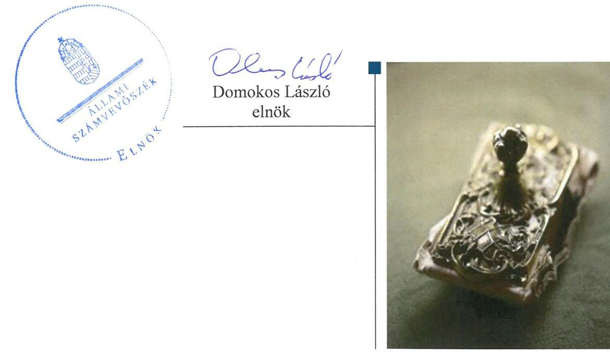
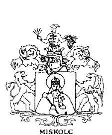
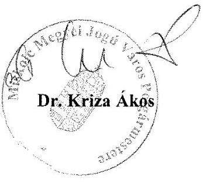

# Jelentés 

## Az önkormányzatok gazdasági társaságai

Az önkormányzatok többségi tulajdonában lévő gazdasági társaságok gazdálkodásának ellenőrzése - MIVÍZ Miskolci Vízmű Kft. 2016.

---

# Jelentés 

## Az önkormányzatok gazdasági társaságai

Az önkormányzatok többségi tulajdonában lévő gazdasági társaságok gazdálkodásának ellenőrzése - MIVÍZ Miskolci Vízmű Kft.
2016. december hó 22. nap

---

# AZ ELLENŐRZÉST FELÜGYELTE:

- BÖRÖCZ IMRE felügyeleti vezető

- AZ ELLENŐRZÉST VEZETTE ÉS A VÉGREHAJTÁSÁÉRT FELELŐS:
  - GÁCSER JÓZSEF ellenőrzésvezető
  - A PROGRAM ÖSSZEÁLLÍTÁSÁÉRT FELELŐS:
    - JANIK JÓZSEF LÁSZLÓ osztályvezető

- IKTATÓSZÁM: V-1086-121/2016.
- TÉMASZÁM: 2120.
- ELLENŐRZÉS-AZONOSÍTÓ SZÁM: V070750

Jelentéseink az Országgyűlés számítógépes hálózatán és az Interneten a www.asz.hu címen is olvashatóak.

---

# TARTALOMJEGYZÉK 

■ ÖSSZEGZÉS ..... 5
■ AZ ELLENŐRZÉS CÉLJA ..... 6
■ AZ ELLENŐRZÉS TERÜLETE ..... 7
■ AZ ELLENŐRZÉS HÁTTERE, INDOKOLTSÁGA ..... 9
■ A JELENTÉS LÉNYEGES KÉRDÉSKÖREI ..... 10
■ ELLENŐRZÉS HATÓKÖRE ÉS MÓDSZEREI ..... 11
■ MEGÁLLAPÍTÁSOK ..... 13
■ JAVASLATOK ..... 26
■ MELLÉKLETEK ..... 27
I. Sz. melléklet: Értelmező szótár ..... 27
■ FÜGGELÉK: ÉSZREVÉTELEK ..... 29
■ RÖVIDÍTÉSEK JEGYZÉKE ..... 31

---

.

---

# ÖSSZEGZÉS 

Miskolc Megyei Jogú Város Önkormányzata 2011-2014. között szabályszerűen biztosította a közfeladat-ellátás kereteit. A Miskolc Holding Önkormányzati Vagyonkezelő Zrt. a MIVÍZ Miskolci Vízmű Kft. feletti tulajdonosi jogait szabályszerűen gyakorolta. A Társaság vagyongazdálkodása szabályszerű volt, a beszámolási, nyilvántartási és adatszolgáltatási kötelezettségét az előírásoknak megfelelően teljesítette. Az adatok védelmét és átláthatóságát biztosították. A Társaság kötelezettségeinek állománya nem veszélyeztette a működést. A Társaságnál az ellátott közfeladat bevételei és ráfordításai főkönyvi elszámolása, valamint az önköltségszámítás szabályszerű volt. Az árképzés alapvetően megfelelt az előírásoknak.

## Az ellenőrzés társadalmi indokoltsága

Magyarországon egyre jelentősebb a költségvetésen kívüli feladatellátás térnyerése. Ennek fontos szereplői az önkormányzati tulajdonú gazdasági társaságok. Az önkormányzatok szervezetalakítási szabadságának következménye, hogy a korábban is vállalati formában működő közszolgáltatások mellett, mind a kötelező, mind az önként vállalt feladatok ellátásában a gazdasági társaságok kiemelt fontosságú szerephez jutottak.

Az önkormányzati tulajdonú gazdasági társaságok ellenőrzése kiemelten fontos a vagyon megőrzése és megóvása érdekében, a társaságokkal szemben alapvető követelmény, hogy gazdálkodásuk, működésük szabályszerű, az általuk szolgáltatott adatok minél megbízhatóbbak legyenek. A közfeladat-ellátás költségeinek, ráfordításainak alakulása, színvonala hatással van a lakosság elégedettségére.

Az ÁSZ értékteremtő rend kialakításához és megőrzéséhez hozzájáruló tevékenysége pozitív hatással van a szervezetről kialakított összkép formálására.

## Főbb megállapítások, következtetések, javaslatok

A közfeladat-ellátás megszervezésére vonatkozó önkormányzati döntések és azok előkészítése az ellenőrzött időszak előtt történt. Az ellenőrzött időszakban az Önkormányzat a közfeladat-ellátás kereteit az előírásoknak megfelelően biztosította. Ennek keretében rendeletalkotási kötelezettségét teljesítette, a kötelezően előírt tervezési dokumentumokat elkészítette. A Társaság feletti tulajdonosi jogait a Holding szabályszerűen gyakorolta, eleget tett a beszámolási, felügyeleti rendszer működtetési kötelezettségeinek.

A Társaság az előírt szabályzatokat elkészítette, a számviteli politika, számlarend jogszabályi változásokhoz igazodó aktualizálását azonban nem végezte el teljes körűen. A Társaság a közfeladat-ellátást szolgáló vagyon elkülönített nyilvántartását biztosította, a mérlegadatokat leltárral alátámasztotta. A vagyon hasznosítása, elidegenítése, megterhelése során a Társaságnál a jogszabályi és a tulajdonosi előírásokat betartották. A Társaság a beszámolási és adatszolgáltatási kötelezettségét a jogszabályi előírásoknak és a tulajdonosi elvárásoknak megfelelően teljesítette. Az adatok védelmét és átláthatóságát biztosították azzal, hogy a szabályozási, közzétételi kötelezettségeiket teljesítették, belső adatvédelmi felelőst neveztek ki. A kötelezettségállomány nem veszélyeztette a közfeladatok ellátását.

Az ellátott közfeladat bevételeinek és ráfordításainak főkönyvi elszámolása szabályszerű volt. Az önköltségszámítás megfelelt a jogszabályoknak és belső előírásoknak. Felsőzsolca településen a közfeladathoz kapcsolódó díj megállapítása és alkalmazása nem volt összhangban a jogszabályi előírásokkal, melyet a MEKH által végrehajtott ellenőrzés tárt fel. A 2013-2014. évi díjkülönbözetek rendezésére a MEKH határozatnak megfelelően került sor 2014. évben.

Az ÁSZ a Társaság ügyvezetőjének fogalmazott meg javaslatot, amely alapján köteles intézkedési tervet összeállítani és azt a jelentés kézhezvételétől számított 30 napon belül az ÁSZ részére megküldeni.

---

# AZ ELLENŐRZÉS CÉLJA 

Az ellenőrzés célja annak értékelése volt, hogy az önkormányzat vagyongazdálkodási tevékenysége során szabályszerűen gyakorolta-e tulajdonosi jogait; a gazdasági társaság szabályozottsága, gazdálkodása és vagyongazdálkodási tevékenysége, bevételeinek és ráfordításainak elszámolása megfelelt-e a jogszabályi és tulajdonosi előírásoknak; a gazdasági társaság kötelezettségállománya jelentett-e kockázatot a működésre, valamint a gazdálkodás átláthatósága és elszámoltathatósága érdekében biztosítva volt-e a szolgáltatás díjának megalapozottsága szabályszerű önköltségszámítással.

---

# AZ ELLENŐRZÉS TERÜLETE 

## Miskolci Megyei Jogú Város Önkormányzata, Miskolc Holding Önkormányzati Vagyonkezelő Zrt., a MIVÍZ Miskolci Vízmű Kft.

A MIVÍZ MISKOLCI VÍZMŰ KFT.-t az Önkormányzat ${ }^{1}$ az Ötv. ${ }^{2} 8. §$ és a Vt. ${ }^{3} 4. §$ (2) bekezdésében meghatározott víziközmű-szolgáltatási kötelezettségének kizárólagos ellátására 2005-ben, határozatlan időre hozta létre, amelynek alapfeladata volt az ivóvíz- és szennyvíz víziközművek üzemeltetése Miskolc és Felsőzsolca területén.

A Társaság ${ }^{4}$ az ellenőrzött időszakban a víziközmű-szolgáltatás ellátásán belül víz- és szennyvízszolgáltatás közfeladatot egyaránt ellátott, továbbá közszolgáltatáson kívüli feladatokat (pl.: alaptevékenységen felüli laborvizsgálat, idegen megrendelésre végzett ipari termelés, térképi adatszolgáltatás, szálláshely szolgáltatás) is végzett.

## A MISKOLC HOLDING ÖNKORMÁNYZATI VAGYONKEZELŐ ZRT.-t az Önkormányzat 2006. július 6-án létrehozta, majd apportként átruházta rá az egyszemélyes tulajdonában álló Társaságra vonatkozó üzletrész tulajdonjogát. A Társaság feletti tulajdonosi jogokat a Holding ${ }^{5}$ az ellenőrzött időszakban kizárólagosan gyakorolta. A Holding ügyvezető személye, valamint az igazgatósági tagok az ellenőrzött időszakban változtak.

A Társaságba 2008. június 30-val beolvadt a VFV Miskolc Városi Fürdőüzemeltető, Vagyongazdálkodó és Szolgáltató Zrt., amely a közművagyonnal kapcsolatos gazdálkodási feladatokat látta el és üzemeltette a Barlang- és Gyógyfürdőt. A jogutódlással a Társaság jegyzett tőkéje a korábbi 600,0 M Ft-ról 8784,0 M Ft-ra növekedett.

A Társaságnak az Észak-Magyarországi Környezetvédelmi Egyesülésben 45 E Ft értékben volt érdekeltsége. A Társaság 2011. évben 20%-os tulajdoni hányaddal (1 M Ft) rendelkezett a Biogas-Miskolc Kft.-ben ${ }^{6}$. A BiogasMiskolc Kft.-ben való részesedést vásárlás útján 80%-ra (4 M Ft-ra) növelte 2012. évben. Ugyanekkor a Holding lett a Biogas-Miskolc Kft. 20%-os tulajdonosa.

A VÍZIKÖZMŰ VAGYON egy része a Társaság, egy része az Önkormányzat tulajdonában volt 2013. december 31-ig. Ezt megelőzően az Önkormányzat tulajdonában lévő víziközmű vagyont a Társaság díj ellenében használta.

A Vksztv. ${ }^{7} 79. §$ (2) bekezdésére hivatkozással a Társaság, 2013. december 31-én térítésmentesen átruházta a víziközmű vagyont az Önkormányzat részére. A Vksztv. 15. § (2) bekezdésben előírt vagyonkezelési szerződés ${ }^{8}$-t 2013. év végén kötötték meg, amelyet a MEKH határozattal jóváhagyott.

---

A Társaság főbb mérleg és eredmény adatait mutatja be az 1. táblázat.

1. táblázat

| FŐBB MÉRLEG ÉS EREDMÉNY ADATOK (MFT) |  |  |  |  |
| :--: | :--: | :--: | :--: | :--: |
| Megnevezés | 2011. | 2012. | 2013. | 2014. |
| Jegyzett tőke | 8784,0 | 8784,0 | 8784,0 | 2667,0 |
| Saját tőke | 10757,6 | 9708,4 | 3590,8 | 3601,1 |
| Mérlegfőösszeg | 12781,9 | 12870,5 | 5277,2 | 13974,9 |
| Mérleg szerinti eredmény | 177,4 | 0 | $-6117,6$ | 50,3 |
| Éves nettó árbevétel | 4466,5 | 4529,5 | 4354,1 | 4272,9 |
| ebből: - ivóvíz szolgáltatás | 2296,8 | 2263,7 | 2223,1 | 2102,8 |
| - szennyvízelvezetés és -tisztítás | 1865,4 | 1838,3 | 1740,4 | 1614,0 |
| Követelések | 1247,8 | 1330,4 | 1161,8 | 1294,1 |
| ebből lakossági | 971,1 | 1123,3 | 1145,0 | 1104,7 |
| Kötelezettségek | 1413,7 | 2396,0 | 1167,2 | 8805,8 |
| Átlagos állományi létszám | 321 | 315 | 320 | 344 |

A saját tőke összege 2012. évben osztalék-kifizetés, 2013. évben a közművagyon átadás miatt csökkent, melyhez kapcsolódóan 2014. évben a jegyzett tőke leszállítására került sor. Az ellenőrzött időszakban a követelések állománya jelentős volt, folyamatosan meghaladta az éves nettó árbevétel 25%-át.

Miskolc lakosságának száma 2015. január 1-jén 159554 fő volt*. A Társaság ügyvezetőjének személye 2011. szeptember 5-től változott. Az ellenőrzött időszakban a polgármester ${ }^{9}$ személye nem változott, a 2010. évi önkormányzati választások óta tölti be tisztségét, a jegyző ${ }^{10}$ 2011. május 1-jétől látja el feladatait.

[^0]
[^0]:    * Központi Statisztikai Hivatal, Magyarország Közigazgatási Helységnévkönyve, Miskolc 2015. január 1-jei adatai

---

# AZ ELLENŐRZÉS HÁTTERE, INDOKOLTSÁGA 

## AZ ÁLLAMI SZÁMVEVŐSZÉK STRATÉGIÁJÁBAN

megfogalmazta, hogy a helyi önkormányzatok gazdálkodásában rejlő pénzügyi kockázatok feltárásával, az államháztartáson kívülre nyújtott költségvetési támogatások és ingyenes vagyonjuttatások, valamint az államháztartáson kívül működő közfeladat-ellátó rendszerek ellenőrzéseivel hozzájárul ahhoz, hogy a közpénzeket az államháztartáson kívül működő szervezetek is átlátható, rendezett módon használják fel a közfeladatok szerződésben vállalt ellátása érdekében. Az önkormányzati tulajdonú gazdasági társaságok teljes körű ellenőrzésének lehetőségét az Állami Számvevőszékről szóló 1989. évi XXXVIII. törvény 2011. január 1-jétől hatályos módosítása teremtette meg. A gazdasági társaságok közfeladat ellátását érintő gazdálkodási tevékenysége szabályszerűségére irányuló ellenőrzéseket erre tekintettel az ÁSZ ${ }^{11}$ 2011. évtől végzi.

## AZ ELLENŐRZÉS VÁRHATÓ HASZNOSULÁSA KÉNT

az ÁSZ a megállapításaival segítséget nyújthat az államháztartáson kívüli közfeladat-ellátás értékeléséhez, jogszabályi keretei pontosításához, átláthatóságot biztosító szabályozásához. Meghatározhatóvá válnak a közfeladat ellátásban részt vevő államháztartáson kívüli szervezeteknek az önkormányzat költségvetését, pénzügyi helyzetét is befolyásoló kockázatai, lehetővé válik ezen kockázatok csökkentése. Értékelhetővé válik, hogy a feladatot ellátó gazdasági társaság a közszolgáltatási szerződésben foglaltak betartásával, a közvagyon használatával biztosította-e a szolgáltatás folytatásának feltételeit. Ezzel az ellenőrzöttek és a helyi döntéshozók számára az ÁSZ visszajelzést ad feladatszervezési, feladat-ellátási kockázataikról, alapot ad a meglévő hibák megszüntetéséhez, a jobb közfeladat-ellátás biztosításához.

---

# A JELENTÉS LÉNYEGES KÉRDÉSKÖREI 

1. Az Önkormányzat közfeladat megszervezéséről szóló döntése, valamint a Holding tulajdonosi joggyakorlása szabályszerű volt-e?
2. A gazdasági társaság vagyongazdálkodása szabályszerű volt-e, kötelezettségállománya jelent-e kockázatot a működésre, illetve a közfeladat ellátására?
3. A gazdasági társaságnál az ellátott közfeladat bevételei és ráfordításai elszámolása, valamint az önköltségszámítás és árképzés szabályszerű volt-e?

---

# ELLENŐRZÉS HATÓKÖRE ÉS MÓDSZEREI 

## Az ellenőrzés típusa

Megfelelőségi ellenőrzés

## Az ellenőrzött időszak

Az ellenőrzött időszak 2011. január 1-jétől 2014. december 31-ig tart.

## Az ellenőrzés tárgya

A MIVÍZ Miskolci Vízmű Kft. feletti tulajdonosi joggyakorlás, valamint a gazdasági társaság gazdálkodásának szabályozottsága és szabályszerűsége.

Az ellenőrzés kiterjed minden olyan körülményre és adatra, amely az ÁSZ jogszabályban meghatározott feladatainak teljesítéséhez, valamint a program végrehajtása folyamán felmerült újabb összefüggések feltárásához szükséges.

## Az ellenőrzött szervezet

Miskolc Megyei Jogú Város Önkormányzata, Miskolc Holding Önkormányzati Vagyonkezelő Zrt. és a MIVÍZ Miskolci Vízmű Kft.

## Az ellenőrzés jogalapja

Az ellenőrzés jogszabályi alapját az ÁSZ tv. ${ }^{12} 1. §$ (3) bekezdése és 5. § (3)-(4)-(5) bekezdései képezik.

## Az ellenőrzés módszerei

Az ellenőrzést a nemzetközi standardokat irányadónak tekintve az ellenőrzési program ellenőrzési kérdései, az ellenőrzött időszakban hatályos jogszabályok, az ellenőrzés szakmai szabályok és módszertanok figyelembe vételével végeztük.

Az ellenőrzés ideje alatt az ellenőrzött szervezettel történő kapcsolattartást az ÁSZ Szervezeti és Működési Szabályzatának vonatkozó előírásai alapján
 biztosítottuk.

Az ellenőrzési kérdések megválaszolásához szükséges bizonyítékok megszerzése a következő ellenőrzési eljárások alkalmazásával történt: megfigyelés, kérdésfeltevés (információkérés), összehasonlítás, valamint

---

elemző eljárás. Az ellenőrzési bizonyítékként felhasználható adatforrások közé tartoztak egyrészt a szakmai programban felsorolt adatforrások, másrészt minden – az ellenőrzés folyamán – feltárt, az ellenőrzés szempontjából információkat tartalmazó dokumentum is adatforrásként szolgált.

Az ellenőrzést a kérdésekre adott válaszok kiértékelésével, valamint a megjelölt adatforrások, a csatolt tanúsítványok felhasználásával, továbbá az adott időszakban hatályos jogszabályok figyelembe vételével folytattuk le.

A bevételek és ráfordítások elszámolása, valamint a vagyonnyilvántartás terén a szabályszerű működést véletlen mintavétellel ellenőriztük. A mintavétellel ellenőrzött területek esetében minden egyes tétel vonatkozásában a szabályszerűségre vonatkozó kérdéseket tettünk fel, amelyek eredménye összesítésre került. Megfelelőnek értékeltünk egy ellenőrzött területet, amennyiben 95%-os bizonyossággal a teljes sokaságban a hibaarány legfeljebb 10%, nem megfelelőnek, amennyiben 10%-nál magasabb arányt képviselt. Abban az esetben, ha a teljes sokaság tekintetében a 10%-os hibaarányhoz való viszony megítélésének megbízhatósága nem érte el a 95%-ot, annak elérése érdekében értékelésünket további szempontokkal egészítettük ki, és figyelembe vettük a feltárt hibák típusát és súlyát. A ráfordítások elszámolására és a vagyonnyilvántartásra vonatkozó véletlen mintavételt kockázati alapú kiválasztással egészítettük ki, amelynek során évente a három legnagyobb összegű tételt választottuk ki.

---

# 1. Az Önkormányzat közfeladat megszervezéséről szóló döntése, valamint a Holding tulajdonosi joggyakorlása szabályszerű volt-e? 

Összegző megállapítás

Az Önkormányzat a jogszabályi előírásoknak megfelelően biztosította a közfeladat-ellátás kereteit. A Holding a Társaság feletti tulajdonosi jogait szabályszerűen gyakorolta.
1.1. számú megállapítás

Az ellenőrzött időszakban az Önkormányzat a közfeladat-ellátás kereteit az előírásoknak megfelelően biztosította.

Az Önkormányzat gazdasági programját a Közgyűlés 2011. március 10-én fogadta el, mely az Ötv. 91. § (6) bekezdésével összhangban 2011-2014. évekre vonatkozott. A program célkitűzésként rögzítette, hogy a városi (közmű) cégek eredményének növelésével hosszú távon stabilizálódnak a víz- és más közműszolgáltatások díjai.

A Közgyűlés 2012. június 12-én elfogadott 2012-2022 közötti időszakra szóló vagyongazdálkodási koncepciója, közép- és hosszú távú terve megfelelő az Nvtv. ${ }^{13}$ 9. § (1) bekezdésben előírtaknak.

A város 2030-ig szóló fejlesztési koncepcióját és a 2014-2020 közötti időszak integrált településfejlesztési stratégiáját 2014. évben fogadta el a Közgyűlés ${ }^{14}$ a 314/2012. (XI. 8.) Korm. rendelet 5-6. § szerint, kitérve a víziközmű infrastrukturális fejlesztésére.

A közfeladat megszervezéséről az Önkormányzat az ellenőrzött időszak előtt döntött. A víziközmű szolgáltatás biztosításának szabályait a víziközmű rendelet ${ }^{15}$, a víziközmű díjakat és a díjalkalmazás feltételeit a díjrendelet ${ }^{16}$ tartalmazta. A rendeleteket az Önkormányzat a Vt. 4. § (1) - (3) bekezdéseiben, valamint az Ártörvény ${ }^{17}$ 7.§ (1) bekezdésében foglalt felhatalmazás alapján, az Ötv. 8.§ (1) bekezdésében rögzített feladatkörében eljárva alkotta meg.

A feladatellátás kereteit az alapító okirat ${ }^{18}$ és a közfeladatok ellátására kötött szerződés határozták meg. Az ellenőrzött időszakban hatályban lévő üzemeltetési szerződés ${ }^{19}$ rögzítette az ellátandó közműves ivóvízellátás és - szennyvízelvezetés feladatokat.
1.2. számú megállapítás

A Társaság feletti tulajdonosi jogait a Holding szabályszerűen gyakorolta, ennek keretében eleget tett a beszámoltatási és felügyeleti rendszer működtetési kötelezettségeinek.

A tulajdonosi jogok gyakorlásának rendjét a Társaság Alapító okirata, a menedzsment-szerződés ${ }^{20}$ és a tulajdonosi joggyakorló szabályzatai rögzítették.

---

Az Alapító Okirat előírásai szerint, a Gt. 19. § (5) bekezdésében, valamint a Ptk. 3:109. § (4) bekezdésében előírtakkal összhangban a Társaság egyszemélyes társaságként jött létre, így a legfőbb szerv hatáskörében az egyedüli tag határozott. Az ellenőrzött időszakban a Társaság feletti tulajdonosi jogokat az Önkormányzat 100%-os tulajdonában lévő Holding gyakorolta.

A Holding a 2007. február 22-i előterjesztési szabályzatban, illetve a 2013. március 20-i igazgatóság üléseinek és a cégvezető-menedzsment fórum üléseinek előkészítéséről és a határozatok végrehajtásának ellenőrzéséről szóló szabályzatban előírta, hogy a vagyongazdálkodási döntések megalapozására előterjesztést a Holding Igazgatósága részére kell készíteni, amelynek formai és tartalmi követelményeit, illetve felelőseit is rögzítette.

Az ügyvezető számára – az alapító okiratban meghatározottakon túl – a Holding menedzsment szerződés alapján előírta üzleti terv készítését, az azzal kapcsolatos monitoring tevékenység elvégzésének kötelezettségét.

A Holding Igazgatósága döntött az üzleti tervek jóváhagyásáról, a számviteli beszámoló elfogadásáról, és az adózott eredmény felhasználásáról, a könyvvizsgáló és az FB tagok megválasztásáról.

A Társaság Felügyelő Bizottsága az ellenőrzött időszakban az Alapító Okiratban előírtak alapján – a Gt. 34. § (1) bekezdésével, valamint a Ptk. 3:121. § (1) bekezdésével összhangban – három tagból állt. Az FB${ }^{21}$ egyharmada a munkavállalók képviselőiből állt a Gt. 38. § (1) bekezdésben, valamint a Ptk. 3:124. § (1) bekezdésben előírtak szerint.

Az FB eleget tett a Gt. 34. § (4) bekezdése előírásainak, elkészítette ügyrendjét, melyet a Holding Igazgatósága jóváhagyott.

Az anyagi érdekeltégi rendszer elemeit a Taktv². 5. § (3) bekezdésében foglaltaknak megfelelően a Holding Igazgatósága által elfogadott javadalmazási szabályzat ${ }^{23}$-ban rögzítették.

A javadalmazási szabályzat kiterjedt az ügyvezető és a tisztségviselők (FB) vonatkozó javadalmazási elveire és szabályaira, a prémium fizetés feltételeire és mértékére, a költségtérítés szabályozására.

Tulajdonosi ellenőrzést az FB és a Holding központi belső ellenőrzési egysége végzett a Társaságnál.

Az FB tevékenységét az általa elfogadott éves munkatervek alapján végezte. Folyamatosan figyelemmel kísérte a Társaság belső ellenőrzését is; 2012. februártól állandó napirendi pontként szerepelt ülésein a beszámoló a belső ellenőrzés által végzett vizsgálatokról.

A Holding központi belső ellenőrzési egysége által 2012. és 2013. években elvégzett három ellenőrzés a transzfer ár képzésének szabályossága, nyilvántartása, a Társaság belső ellenőrzési rendszere, illetve külső vállalkozás által végzett munkák elszámolása szabályosságának ellenőrzésére terjedt ki. A megállapításokkal kapcsolatban tett javaslatok megvalósulását a Holding az FB közreműködésével követte nyomon.

A beszámoltatási rendszert a Holding működtette, az ügyvezetőt a Társaság vagyoni helyzetéről és üzletpolitikájáról negyedévente beszámoltatta.

---

A Társaság 2011-2014. üzleti éveiről készített éves beszámolóit a Holding megtárgyalta és elfogadta. A számviteli beszámolók elfogadásáról a Gt. 35. § (3) bekezdésének és a Ptk. 3:120. § (2) bekezdésének előírásait betartva az FB és a könyvvizsgáló írásos jelentésének birtokában döntött.

A mérleg szerinti eredmény alakulását az osztalékfizetés és jogszabályi változások befolyásolták. 2011. évben 177,4 M Ft, 2014. évben 50,3 M Ft nyereség, 2013. évben a 2013. évi víziközmű vagyont érintő változások miatt 6.117,6 M Ft veszteség keletkezett.

Osztalék kifizetésére 2013-ban került sor a Társaság 2012. évi szabad eredménytartalékkal kiegészített 2012. évi adózott eredménye terhére. Erre vonatkozóan – összhangban a Társaság alapító okiratával – a Holding igazgatósági határozatokat hozott. 2012. évben mérleg szerinti eredmény nem volt.

A Társaság ügyvezetője 2013-ban tette meg a Gt. 131. § (3) bekezdés szerinti nyilatkozatát a Holdingnak, amely szerint az osztalék kifizetése a társaság fizetőképességét, illetve a hitelezők érdekeinek érvényesülését nem veszélyezteti.

A saját tőke összege a Társaság esetében a víziközmű vagyon tulajdonjogával kapcsolatos jogszabályi előírások – Vksztv. 79. § (1)-(2) bekezdései – következményeként keletkezett veszteség miatt 2013-ban a jegyzett tőke 50%-a alá csökkent. A Gt. 143. § (2) bekezdés a) pontjában foglaltaknak megfelelően az ügyvezető a szükséges intézkedések megtétele céljából a Holdingot értesítette. Az ügyvezetői tájékoztatást követően – a Társaság alapító okiratával összhangban – a Holding döntött a Társaság jegyzett tőkéjének leszállításáról, amelyhez a MEKH ${ }^{24}$ 2014. július 31-én adta meg a hozzájárulását.

# 2. A gazdasági társaság vagyongazdálkodása szabályszerű volt-e, kötelezettségállománya jelent-e kockázatot a működésre, illetve a közfeladat ellátására? 

Összegző megállapítás

## 2.1. számú megállapítás

A Társaság vagyongazdálkodása szabályszerű volt. A Társaság kötelezettségeinek állománya nem veszélyeztette a közfeladat ellátását.

A Társaság az előírt szabályzatokat elkészítette, azok összességében megfeleltek a jogszabályi előírásoknak.

Üzleti terveit a Társaság minden évben elkészítette a Holding által kiadott tervezési premisszák figyelembevételével. Az üzleti tervek összhangban voltak az Önkormányzat közfeladatot érintő tervezési dokumentumaiban foglaltakkal.

A számviteli politika ${ }^{25}$ keretében elkészítendő szabályzatokkal a Társaság, a Számv. tv. ${ }^{26}$ 14.§ (5) bekezdésnek megfelelően rendelkezett.

A leltározási szabályzat megfelelt a Számv. tv. 69. §-ban előírtaknak.

---

A Társaság rendelkezett selejtezési szabályzattal. A selejtezési szabályzat teljes körűen szabályozta a Társaság tulajdonában lévő és feleslegessé vált vagyontárgyak feltárásával, leértékelésével, selejtezésével, hasznosításával, megsemmisítésével kapcsolatos előírásokat.

Az eszközök és források értékelési szabályzata a Számv. tv. 15. § (3) bekezdésében megfogalmazott valódiság elvére alapozottan szabályozta a mérlegtételek értékelésére, a bekerülési érték meghatározására, az értékcsökkenésre, értékvesztésre vonatkozó szabályokat.

Az önköltségszámítási szabályzatot a Számv. tv. 14. § (5) bekezdés c) pontjának megfelelően elkészítette a Társaság. A szabályzat meghatározta az önköltség számítás tárgyát, a kalkulációs egységet, a kalkulációs formákat, a számviteli nyilvántartások és az önköltségszámítás kapcsolatát, valamint a közvetlen, szűkített és a teljes önköltség tartalmát.

A pénzkezelési szabályzat tartalma megfelelt a Számv. tv. 14.§ (8) bekezdésében előírt követelményeknek.

A Társaság számlarendje 2014. január 1-ig megfelelt a Számv. tv. követelményeinek. A számlarend 2014. január 1-től ugyanakkor már nem tartalmazta a vagyonkezelésbe vett eszközökre vonatkozó – az operatív könyvelésben 2014. évben az elkülönítéséhez használt – főkönyvi számlák megnevezését, tartalmát, a számlát érintő gazdasági események magyarázatát. Ezért a Társaság számlarendje 2014. január 1-jétől nem felelt meg a Számv. tv. 161.§ (2) bekezdés a), b) pontjainak.

Az elkülönítési kötelezettségek teljesítéséről a társaság a szabályozás szintjén gondoskodott.

A Társaság számviteli szétválasztási szabályzatot készített a közfeladat ráfordításaira és bevételeire vonatkozó – a Vksztv. 49-50.§-ban előírt – elkülönítési kötelezettség teljesítése érdekében. A szabályzat – Vksztv. 85.§ szerint először a 2013. évi beszámolóval összefüggésben – a Társaság számviteli politikájának részeként, az önköltségszámítási szabályzattal összhangban szabályozta az alkalmazott szétválasztási módszereket és a vetítési alapok meghatározását.

A víziközmű vagyon elkülönítéséről a Társaság, 2013. december 31-ig a számviteli politika keretében – a Számv.tv. 160.§ (5) bekezdésében előírtakkal összhangban, a nullás számlaosztály használatának előírásával – rendelkezett.

A Társaság és az Önkormányzat között köttetett vagyonkezelési szerződés XI. pontja szabályozta az átadott közművekkel kapcsolatos nyilvántartási és adatszolgáltatási feladatokat, összhangban a Vksztv. 49. §-ban rögzítettekkel.

A beszerzések jóváhagyásának rendjéről a Társaság a Vksztv. 46. §-nak megfelelően, a MEKH határozattal¹ jóváhagyott beszerzési szabályzatban rendelkezett. A működési engedély feltételeként a Vksztv. 47.§ (1) bekezdésében, valamint a Vksztv. vhr. ${ }^{27}$ 20. § (3) bekezdés a) pontjában – előírt üzletszabályzatot a Társaság készített.

[^0]
[^0]:    ${ }^{1}$ 1833/2013. sz. határozattal, valamint a 2311/2014 sz. határozattal

---

A közbeszerzési tevékenységet a Holding végezte. A Társaság feladata volt annak megállapítása, hogy a fejlesztési tervben tervezett, vagy a tervben nem szereplő beszerzés Kbt. hatálya alá tartozott-e. A közbeszerzési eljárás lebonyolítása az eredményhirdetésig már a Holding feladata volt. A Társaság a Kbt. 22. § (1) bekezdésében foglaltak ellenére csak 2013. május 28-tól rendelkezett jóváhagyott, a Kbt. 22. § (1) bekezdésében foglaltaknak megfelelő közbeszerzési szabályzattal.

A Társaság rendelkezett az 1995. évi LXVI. tv. ${ }^{28}$ 9.§ (4) bekezdésében előírt iratkezelési szabályzattal.
2.2. számú megállapítás

A Társaság a vagyon elkülönített nyilvántartását biztosította, a mérlegadatokat leltárral alátámasztotta. A
 vagyon hasznosítása, elidegenítése, megterhelése során a Társaságnál a jogszabályi és a tulajdonosi előírásokat betartották.

A vagyonnyilvántartás vezetéséről a Társaságnál folyamatosan és naprakészen gondoskodtak.

A Társaság 2011-2013. években, ameddig az eszközök tulajdonjoga megoszlott az Önkormányzat és a Társaság között, a közfeladat ellátást biztosító üzemeltetési szerződés, illetve az ahhoz kapcsolódó megállapodás alapján, a belső szabályozásnak megfelelően elkülönítetten tartotta nyilván a saját és az üzemeltetésre átvett vagyontárgyakat.

A Társaság által vagyonkezelésbe vett vagyon nyilvántartásba vétele biztosította a Vksztv.vhr. 1. számú melléklet 13. a) alpontjában előírt követelmények teljesülését. A vagyonkezelésbe vett vagyont a Társaság számviteli nyilvántartásaiban a vagyonkezelési szerződés szerint, a 2014. évi saját mérlegében, eszközként mutatta ki a hosszúlejáratú kötelezettségekkel szemben, a Számv. tv. 42. §. (5) bekezdésében előírtaknak megfelelően.

A Társaság leltárral támasztotta alá éves beszámolóit az ellenőrzött időszakban, ami megfelelt a Számv. tv. 69.§ (1) bekezdésében előírtaknak, valamint a Társaság leltározási szabályzataiban rögzítetteknek.

Leltározást minden évben mennyiségi felvétellel és egyeztetéssel végezték el, a leltározási utasításban meghatározott körben.

A Társaság a közfeladat ellátása során a saját tulajdonában és 2011-2013-ig az Önkormányzat által használatra átadott, illetve 2014-től vagyonkezelésbe átvett vagyont a közfeladat ellátásának biztosítása érdekében használta, az Nvtv. 7. § (1) bekezdésében előírtak szerint.

A Társaság által 2011-2013-ban használatba vett eszközök vonatkozásában a pótlással, felújítással kapcsolatos költségek a tulajdonos Önkormányzatot terhelték az üzemeltetési szerződés szerint.

A Társaság 2014-től a vagyonkezelésbe vett vagyon tekintetében vagyonkezelési szerződés alapján - az Nvtv. 11. § (8) bekezdésével összhangban - korlátozott tulajdonosi jogokkal rendelkezett (birtoklás, használat, hasznok szedése) és a vagyon felújításáról, pótlásáról legalább a vagyonkezelt eszközök elszámolt értékcsökkenésének megfelelő mértékben kellett gondoskodnia. A Társaság nem volt jogosult az eszközök elidegenítésére, megterhelésére, biztosítékba adására. A Társaság 2014. évben az Mötv.

---

109.§ (6) bekezdésében, valamint az Áht. 105/A. § (6) bekezdésében foglalt visszapótlási kötelezettségének eleget tett.

# A Társaság saját vagyonának elidegenítése

tekintetében az alapító okirat rendelkezett a Holding kizárólagos hatásköréről, amelybe tartozott minden olyan ügylet vagy kötelezettségvállalás jóváhagyásáról szóló döntés, melynek értéke az 5 M Ft-ot meghaladta. A Társaságnál 2013-2014 években az 5 M Ft feletti tárgyi eszközök értékesítései a Holding jóváhagyásával történtek.

A Társaság 2012. évben a tulajdonában lévő Biogas-Miskolc Kft. részére KEOP pályázat keretében nyújtott 1 milliárd forint összegű támogatás biztosítékaként a Társaság tulajdonában lévő ingatlant terhelő jelzálogot alapított. A Holding a 342/2012. (XI.7) számú határozatával járult hozzá a jelzálog fedezet biztosításához. A jelzálogjog 2013. december 2-án törlésre került.

Tulajdonosi hozzájárulásáról a Társaság alapító okirata rendelkezett meghatározott értékhatárhoz kötött ügyletek tekintetében, beleértve a vagyont érintő fejlesztéseket is. A Társaság az üzleti terv részeként a beruházási tervét is elkészítette és azt a Holding elfogadta. A Társaság az alapító okirat rendelkezéseinek megfelelően járt el a kötelezettségek vállalása során, a saját vagyont és a kezelésbe vett vagyont érintő fejlesztések esetében rendelkeztek az előírt tulajdonosi hozzájárulással.

A Társaság az ellenőrzött időszakban, a végrehajtott tőkeleszállítás következtében rendelkezett a számára - a Gt. 114.§ (1) bekezdésében, illetve a Ptk. ${ }^{29} 3: 161 . \S$ (4) bekezdésében - előírt jegyzett tőkével, ezért a Gt. 51. $\S$-ban, illetve a Ptk. ${ }_{2}$ 3:133. § (2) bekezdése szerinti tőke biztosítása érdekében nem kellett intézkedéseket tenni, pótbefizetést teljesíteni.

## A Társaság belső ellenőrzést működtetett, annak ellenére, hogy arra vonatkozó jogszabályi kötelezettség nem volt. A vagyongazdálkodás terén 2011-2014. évek között ellenőrizték a Társaság ingatlanjainak hasznosításának a formáit, felújítási, karbantartási munkák indokoltságát (2012-ben), selejtezési eljárások lebonyolítását (2011-ben), a leltározási folyamatokat szúrópróbaszerűen (2012-ben), kintlévőség kezelés folyamatát (2011-ben), a beszerzési folyamatát (2014-ben).

Az ellenőrzések kapcsán intézkedési tervek készültek, az intézkedések végrehajtását ellenőrizték. A Társaság belső ellenőrzése 2012. évben ellenőrizte a közzétételi kötelezettség teljesítésére vonatkozó jogszabályok betartását is, amely során szabályozási és végrehajtási hiányosságokat állapított meg. A belső ellenőri javaslatokat a Társaság figyelembe vette és a hiányosságokat megszüntette.

---

### 2.3. számú megállapítás

A kötelezettségek állománya nem veszélyeztette a közfeladatok ellátását, az eladósodottsági mutatók kedvezőtlen alakulása a víziközmű vagyon kötelező átadásából és vagyonkezelésbe vételéből eredt. A lejárt szállítói tartozások nagyságrendje azonban felhívja a figyelmet a működés felülvizsgálatának szükségességére.

A kötelezettségek állománya a 2011-2013. években csak rövid lejáratú kötelezettségekből állt, 2011. év eleji 1008,2 M Ftról 2012. év végére 2396,0 M Ft-ra növekedett, majd fokozatosan csökkent 2013. évben 1167,2 M Ft-ra. 2014. év végén a vagyonkezelésbe vett önkormányzati vagyon miatti hosszúlejáratú kötelezettség miatt a kötelezettségek állománya 8805,8 M Ft-ra növekedett (ebből a rövid lejáratú 1154,5 M Ft).

A Társaságnál az ellenőrzött időszakban az eladósodottsági mutatók alakulására és szerkezetére a víziközmű vagyon tulajdonjogának jogszabályban előírt változása jelentős hatással volt. A különböző eladósodottsági mutatók alakulását a 2. táblázat mutatja be.
2. táblázat

Az eladósodottsági mutatók alakulása 2011-2014. években

| Megnevezés | Referencia | 2011. | 2012. | 2013. | 2014. |
| :-- | :--: | :--: | :--: | :--: | :--: |
| eladósodottsági mutató | $<0,6$ | 0,11 | 0,19 | 0,22 | 0,68 |
| eladósodottság mértéke | $<1$ | 0,13 | 0,25 | 0,33 | 2,45 |
| nettó eladósodottság | $<0$ | 0,02 | 0,11 | 0,00 | 2,09 |
| adósságfedezeti mutató | 2,0 | 8,79 | 5,21 | 4,26 | 1,44 |
| árbevételre vetített eladósodottság | $<0$ | $-0,33$ | $-0,14$ | $-0,34$ | 1,48 |

2013. évben az Önkormányzat részére térítésmenetesen átadott vagyont a Számv. tv. 86.§ (7) bekezdés a) pontja szerint rendkívüli ráfordításként számolták el, amely az eredményt negatívan befolyásolta. A Társaságnál veszteség keletkezett, ezáltal csökkent a saját tőke összege, és az összes forrása. A mutatók kedvezőtlen alakulását az is befolyásolta, hogy az Önkormányzattól vagyonkezelésbe visszavett víziközmű vagyontárgyak értékét hosszú lejáratú kötelezettségként nyilvántartásba vették. A kötelezettségként történő nyilvántartásba vétel megfelelt a Számv. tv.42.§ (5) bekezdésének. Ezáltal megnövekedett a Társaság összes forrása is.

A Társaság eladósodásának a mértéke és szerkezete nem jelentett kockázatot a Társaság közfeladat ellátására, illetve a működésére, mivel azok nem gazdálkodási, hanem számviteli elszámolások miatt mutattak kedvezőtlen tendenciát.

Hosszú lejáratú kötelezettsége a Társaságnak csak 2014. évben keletkezett a vagyonkezelésbe vett eszközökhöz kapcsolódóan. Ezért törlesztési kötelezettsége az Önkormányzat felé az ellenőrzött időszakban nem volt. A Társaság hosszú lejáratú kötelezettségeinek mérleg szerinti értéke 2014. évben az egyéb hosszú lejáratú kötelezettségek között 7651,3 M Ft volt.

A Társaság rövid lejáratú kötelezettségei az ellenőrzött időszakban csökkentek. A szállítói kötelezettségei között minden évben voltak lejárt határidejű tételek, melyek összességében az ellenőrzött időszakban csök-

---

kentek. A Társaság éven túl lejárt kötelezettséggel nem rendelkezett, a lejárt szállítói állomány jelentős része kapcsolt vállalkozáshoz kötődött. A szállítói állomány összetételét a 3. táblázat mutatja be.
3. táblázat

Szállítói állomány összetétele (M Ft)

| Megnevezés | 2011. | 2012. | 2013. | 2014. |
| :-- | --: | --: | --: | --: |
| Rövid lejáratú kötelezettségek | 1.413,7 | 2.396,0 | 1.167,2 | 1.154,4 |
| ebből szállítói kötelezettségek | 931,3 | 522,3 | 658,4 | 713,2 |
| - nem lejárt | 449,7 | 302,5 | 455,2 | 344,5 |
| - 0-90 nap között lejárt | 418,9 | 207,6 | 168,5 | 359,5 |
| - 91-180 nap között lejárt | 62,7 | 9,7 | 32,5 | 6,7 |
| - 181-360 nap között lejárt | - | 2,5 | 2,2 | 2,5 |

A Társaság az előírt beszámolási és adatszolgáltatási kötelezettségét az előírásoknak és a tulajdonosi elvárásoknak megfelelően teljesítette. Az adatok védelmét és átláthatóságát a Társaságnál biztosították.

Adatszolgáltatási kötelezettségről az alapító okirat határozott az éves beszámolóhoz kapcsolódóan. Az alapító okirat az FB feladataként meghatározta, hogy értékelje az ügyvezetőnek a Társaság vagyoni helyzetéről háromhavonta elkészítendő jelentéseit. A Társaság részére a Holding további adatszolgáltatási kötelezettséget határozott meg, amelyeket a Holding gazdasági vezetője által meghatározott formában és adattartalommal kellett teljesíteni.

A vagyonkezelt vagyon tekintetében a vagyonkezelési szerződés határozta meg a Társaság tájékoztatási kötelezettségeit. Első alkalommal a 2014. évi vagyonkezelésről kellett beszámolni. A Társaság a beszámolási kötelezettségének eleget tett.

A Társaság eleget tett a Holding felé fennálló adatszolgáltatási kötelezettségének. Minden évben rendelkezésre bocsátotta a Holding által előírt formában és tartalommal kért adatokat, valamint az éves számviteli beszámolókat. A Társaság negyedévente beszámolt a pénzügyi, vagyoni helyzetéről az FB-nek. Az FB a beszámolókat megtárgyalta és határozattal elfogadta.

A Holding által meghatározott egyéb adatszolgáltatásként a Társaság heti gyakorisággal likviditási helyzetéről, szállítói kötelezettségeinek alakulásáról, havi gyakorisággal a bevételeinek, költségeinek, ráfordításainak alakulásáról és létszámában bekövetkezett változásokról szolgáltatott adatokat.

Az éves beszámolókat a Társaság a Számv. tv. 4.§ (1) bekezdésében előírtaknak eleget téve elkészítette. Az éves beszámolók a Számv. tv. 19.§ (1) bekezdésének megfelelő tartalommal készültek, melyeket a Holding határozattal fogadott el. A Társaság az éves beszámolókat a Számv. tv. 153.§ (1) bekezdése, és a 154.§ (1) bekezdése előírásainak megfelelve, határidőben letétbe helyezte és közzétette.

Az FB minden évben az éves beszámolóról írásbeli jelentést készített a Társaság alapító okirata, valamint a Gt. 35.§ (3), a Ptk. 3:120. § (2) bekezdésének az előírásának teljesítése érdekében. Az FB a Társaság 2013. évi

---

beszámolójáról szóló határozatában felhívta a Holding figyelmét arra, hogy a saját tőke a jegyzett tőke 50\%-a alá csökkent. A Társaság a 2013. évről az éves beszámolójának részeként a Számv. tv. 88. § (1) bekezdése szerinti kiegészítő mellékletében a Számv. tv. 91.§ d) pontja szerint előírásának megfelelően bemutatta a veszteség okát, az Önkormányzatnak térítésmenetesen átadott vagyon rendkívüli ráfordításként elszámolt értékét, a társasági adóra gyakorolt hatását.

A Társaság választott könyvvizsgálója a Gt. 40.§ (1) bekezdése, a Ptk. 3:129. § szerint az éves beszámolókat hitelesítő záradékkal látta el. A könyvvizsgáló 2013. évi és a 2014. évi éves beszámolóról készített jelentésében nyilatkozott a Vksztv. 49.§ szerinti szétválasztási kötelezettség biztosításáról. A Vksztv. 85. § szerint a szétválasztásra vonatkozó előírásokat a 2013. évi beszámoló elkészítésekor kellett először alkalmazni. A 2013. évi beszámolóról készített jelentésében a könyvvizsgáló figyelemfelhívással élt, melyben jelezte, hogy a saját tőke a törzstőke alá csökkent, ezért a Társaság tulajdonosának döntenie kell a törzstőke rendezéséről.

A Társaság 2014. évben eleget tett a Vksztv. 42.§ (1) bekezdésben és a Vksztv.vhr. 41-42. §-ban előírtaknak, mivel a törzstőke leszállításához a MEKH hozzájárulását beszerezte. A törzstőke leszállítását a jóváhagyó határozatban ${ }^{1}$ foglaltak szerint hajtották végre.

A Holding az éves beszámolók elfogadásáról a Számv. tv. 158. § (6) bekezdése alapján a könyvvizsgálói jelentés, valamint a Gt. 35. § (3) bekezdése, a Ptk. 3:120. § (2) bekezdése előírásának megfelelve az FB írásos jelentésének a birtokában döntött.

Adatvédelmi és adatbiztonsági szabályzattal a Társaság az Avtv. ${ }^{30}$ 31/A. §.
 (3) bekezdése, az Infotv. ${ }^{31}$ 24.§ (3) bekezdése előírása alapján rendelkezett. A szabályzatban a közérdekű adatok megismerésére irányuló igények teljesítésének rendjét - 2012. szeptember 24-i hatállyal - szabályozták, megfelelve ezáltal az Infotv. 30.§ (6) bekezdésében előírt szabályozási kötelezettségnek. Az Avtv. 31/A. §. (1) bekezdés c) pontja, az Infotv. 24.§ (1) bekezdés c) pontja szerint megnevezték az adatvédelmi felelőst.

Az ellenőrzött időszakban eleget tettek az Infotv. 37. § (1) és (2) bekezdésben foglaltaknak és közzétették az Infotv. 1. számú mellékletében, valamint a Vksztv. 48.§ (1) bekezdésében, 24/2013. (V. 29.) NFM rendelet 7. §-ában, és a Taktv. 2. §-ában meghatározott adatokat, információkat.

[^0]
[^0]:    ${ }^{1} 2467 / 2014$. számú MEKH határozat

---

# 3. A gazdasági társaságnál az ellátott közfeladat bevételei és ráfordításai elszámolása, valamint az önköltségszámítás és árképzés szabályszerű volt-e? 

Összegző megállapítás

A Társaságnál az ellátott közfeladat bevételei és ráfordításai főkönyvi elszámolása, valamint az önköltségszámítás szabályszerű volt. Az árképzés Felsőzsolca szolgáltatási terület kivételével megfelelt az előírásoknak.
3.1. számú megállapítás

Az ellátott közfeladat bevételeinek és ráfordításainak főkönyvi elszámolása szabályszerű volt.

A Társaság 2011-2014. években a víziközmű-szolgáltatás ellátásán belül víz-szolgáltatás és szennyvíz-szolgáltatás közfeladatot egyaránt ellátott, továbbá egyéb, víziközmű-szolgáltatás tevékenységen kívüli feladatokat is végzett. Vagyonkezelésbe vett vagyonnal kapcsolatos főkönyvi elszámolási feladatai 2014. január 1-jétől voltak a Társaságnak.

## A TÁRSASÁG A BEVÉTELEK ÉS RÁFORDÍTÁSOK

elszámolásának és közfeladatok, valamint egyéb tevékenységek szerinti elkülönítését biztosította. A kialakított nyilvántartás megfelelt a Vksztv. 49. § bekezdésében előírt, az átláthatóság biztosítására és a keresztfinanszírozás kizárására vonatkozó követelményeknek.

A vagyonkezelt vagyon használatából, működtetéséből származó bevételeinek, illetve közvetlen költségeinek és ráfordításainak elkülönítését a 2014. évi szabályozási hiányosság ellenére biztosították. Ezért a gyakorlatban alkalmazott elkülönített nyilvántartás megfelelt az Mötv. 109. § (7) bekezdésének, és a vagyonkezelési szerződés V. fejezet 6. f. pontjának.

## A BEVÉTELEK ÉS RÁFORDÍTÁSOK ELSZÁMOLÁSA megfelelő volt. Az értékesítés nettó árbevételének elszámolása megfelelő volt. A bevételek elszámolása a Számv. tv. 72-74. § előírásainak és a belső előírásoknak megfelelően elkülönített főkönyvi számlákra, illetve tevékenység szerint elkülönítetten közfeladatra és nem közfeladatra történt.

Az anyagjellegű ráfordítások elszámolása megfelelő volt. A ráfordítások elszámolása a Számv. tv. 78. § előírásainak és a belső előírásoknak megfelelő főkönyvi számlákra, illetve tevékenység szerint elkülönítetten közfeladatra és nem közfeladatra történt. A költségelszámolást megalapozó kötelezettségvállalás minden esetben szabályszerű volt.

## AZ ÉRTÉKCSÖKKENÉSI LEÍRÁS ELSZÁMOLÁSA

megfelelt a Számv. tv. 52. § előírásainak. Az értékcsökkenést a Számlarend alapján havonta számolták el.

A Társaság az éves beszámolói kiegészítő mellékletében a Számv. tv. 92. § (1)-(2) bekezdéseinek megfelelően mutatta be az értékcsökkenéssel kapcsolatos adatokat, a terv szerinti, illetve a terven felüli értékcsökkenést.

---

AZ ESZKÖZÖK PÓTLÁSA, FELÚJÍTÁSA a vagyonkezelésbe vett eszközhöz kapcsolódóan, 2014. évben volt kötelezettsége a Társaságnak.

A Társaságnál a vagyonkezelésbe vett eszközök elszámolt értékcsökkenéséből képzett forrásoknál magasabb mértékű volt az eszközök pótlása, felújítása, megfelelve a Mötv. 109. § (6) bekezdésének, illetve a vagyonkezelési szerződésnek. Az adatokat a 4. táblázat részletezi.
4. táblázat

AZ ELSZÁMOLT ÉRTÉKCSÖKKENÉS ÉS AZ ESZKÖZÖK PÓTLÁSA (M FT-BAN)

| Megnevezés | 2011. | 2012. | 2013. | 2014. |
| :-- | :--: | :--: | :--: | :--: |
| Sajátvagyon után elszámolt értékcsökkenés | 568,5 | 558,4 | 520,1 | 221,5 |
| Sajáttulajdonú eszközök pótlása (beruházás) | 417,4 | 222,2 | 263,3 | 748,3 |
| Vagyonkezelt vagyon értékcsökkenése | - | - | - | 237,2 |
| Vagyonkezelésbe vett vagyon pótlása | - | - | - | 559,8 |

A Társaság saját tulajdonát képező eszközcsoportoknál romlott az elhasználódási szint és az eszközök átlagos életkora, mivel az ellenőrzött időszakban az elszámolt értékcsökkenés meghaladta a visszapótlás mértékét.

A KÖVETELÉSÁLLOMÁNY csökkentése érdekében a Társaság behajtási szabályzatban határozta meg a kintlévőségek kezelésének eljárásrendjét. A szabályzatban foglaltaknak megfelelően a Társaság intézkedett lejárt tartozásai behajtására. A kibocsátott fizetési felszólítások száma 2011-2014. között 275%-kal nőtt, az ellenőrzött időszak végére elérte az 55812 db-ot. A Társaság követelésének alakulását az 5. táblázat mutatja be.
5. táblázat

# A KÖVETELÉSEK, AZON BELÜL A VEVŐKÖVETELÉSEK ALAKULÁSA (M FT-BAN) 

| Megnevezés | 2011. | 2012. | 2013. | 2014. |
| :-- | :--: | :--: | :--: | :--: |
| Követelések | 1247,8 | 1330,4 | 1161,8 | 1294,1 |
| Vevő követelés | 1055,9 | 1019,5 | 931,7 | 991,2 |
| Elszámolt értékvesztés | 624,1 | 784,9 | 746,8 | 776,3 |
| Összes vevő követelés (értékvesztés elsz.nélkül) | 1680,0 | 1804,4 | 1678,5 | 1767,5 |
| ebből lakossági összes követelés | 971,1 | 1123,3 | 1145,0 | 1145,3 |
| Összes vevő követelésből lejárt | 1246,4 | 1307,6 | 1157,8 | 1258,9 |
| ebből: lakossági lejárt követelés | 783,4 | 908,3 | 916,6 | 921,1 |

Az összes vevő követelése értéke 2011. december 31-ről 2014. december 31-ére 5,2%-kal növekedett. Az összes lejárt vevőkövetelés állománya a behajtási intézkedések ellenére növekedett. Az ellenőrzött időszakban jelentős nagyságrendű értékvesztés elszámolására került sor.

A lakossággal szembeni követelések állománya a rezsicsökkentési előírások végrehajtása következtében sem csökkent. A lakossági vevőkövetelések és a lejárt lakossági vevő követelések év végi állománya az előző évhez viszonyítva minden évben növekedett. Az összes lakossági vevőkövetelés 2014. évi végi értéke 17,9%-kal magasabb a 2011. év végi értéknél. A lejárt lakossági követelések 2014. év végi értéke is hasonló mértékben, 17,6%-kal haladja meg a 2011. év végi értéket.

---

A kintlévőség csökkentése, behajtása érdekében fizetési felszólítással, késedelmi kamat felszámolásával, fizetési meghagyás, végrehajtási lap kibocsátásával, tényleges vízelzárással és fizetési átütemezési megállapodással is éltek.

# 3.2. számú megállapítás 

Az önköltségszámítás megfelelt a jogszabályoknak és belső előírásoknak. Az árképzés és díjalkalmazás Felsőzsolca szolgáltatási terület kivételével volt szabályszerű.

A Társaság önköltségszámítási szabályzata a Számv. tv. 14. § (7) bekezdés, 51. §, 160. § (4) bekezdésének, a Vksztv 49. §-ának megfelelően részletes előírásokat tartalmazott az utókalkuláció egyértelmű elvégzéséhez. A szabályzat nem tartalmazott általános leírásokat, kiterjedt minden felosztandó költségre, elkülönítette a közvetlen és közvetett költségeket, tartalmazta a kalkulációs módszerek leírását, a felosztandó költségek vetítési alapjait.

A KÖZFELADATOK ÖNKÖLTSÉGÉT a Társaság az önköltségszámítási szabályzatban, valamint a 2012-től a számviteli szétválasztási szabályok előírására kiadott szétválasztási szabályzatban előírtak szerint határozta meg. Az utókalkuláció minden évben a szabályzat szerint és határidőben elkészült. Az ellátott közszolgáltatás meghatározott önköltsége el nem számolható költségelemet nem tartalmazott.

A MISKOLC VÁROS területén a közszolgáltatási díjak megállapítása díjrendeletben foglaltak alapján történt. A 2011. december 15-ig alkalmazott díjak 5,2%-os díjemelésről az Önkormányzat Képviselő-testülete döntött. A Társaság által benyújtott díjmódosítási előterjesztések részletes költség és eredmény kalkulációt tartalmaztak. A díjakat 2012. december 20-tól az Önkormányzat Képviselő-testülete szintén a díjrendelet módosításával a Vksztv. 76. §-ban megengedett maximális 4,2%-kal megemelte.

A Társaság Miskolc város területén a díjrendeletben meghatározott díjakat alkalmazta, valamint betartotta a Rezsi tv. 4. § előírását és 2013. július 1-jétől 10%-kal csökkentette a víz- és csatornadíakat, a nem közművel összegyűjtött szennyvíz díját lakossági felhasználók, társasházak, lakásszövetkezetek lakossági felhasználói esetében.

A FELSŐZSOLCA VÁROS területén ellátott víziközmű szolgáltatás díjának alkalmazása 2011. évben nem felelt meg a Város ${ }^{32}$ által meghatározott díj, valamint 2013. február 1-től a Vksztv. 76. § (1) bekezdésében foglaltaknak. Mindezek következtében:
$\longrightarrow$ a lakossági felhasználók vonatkozásában 2013. február 1. és 2013. június 30. között, a nem lakossági felhasználók vonatkozásában 2013. február 1. és 2013. május 10. közötti időszakban a Vksztv. 76. § (1) bekezdésének előírásait nem tartották be;
$\longrightarrow$ a lakossági felhasználók vonatkozásában 2013. július 1-től 2014. februárig a Rezsi tv. 4. § (1) bekezdésének rendelkezéseit a korábbi időszak nem megfelelő árait alapul véve kalkulálták.
A Társaság a Várossal 2009. december 22-én megkötött megállapodás alapján, a Város 21/2008. (XII. 19.) számú rendelete szerinti, 2010. január 1-től érvényes díjakat alkalmazta 2011. évben. A Város azonban a 26/2010.

---

(XII. 17.) számú rendeletével a díjakat 2011. január 1-től csökkentette. A Társaság a módosítást nem vette figyelembe a szolgáltatási díjak alkalmazásánál.
2012. évtől megszűnt a Város díjmegállapítási joga, és Vksztv. 76. § (1) bekezdése alapján a víziközmű szolgáltató a 2011. december 31-én alkalmazott bruttó díjhoz képest legfeljebb 4,2 százalékkal megemelt mértékű díjat alkalmazhatott. A Társaság 2012. évben és 2013. évben nem módosította a 2011-ben alkalmazott díjat, ami nem haladta meg 2013. februárig a Vksztv. 76. § (1) bekezdése alapján megállapítható díjemelést.

A Társaság 2013. február 1-től a törvényi maximális mértékű díjnövelési lehetősséggel élt (lakossági és nem lakossági felhasználók vonatkozásában), ugyanakkor az általa 2011-től alkalmazott díjat vette alapul, ezáltal a szennyvíz szolgáltatás díja magasabb lett a Vksztv. 76. § (1) bekezdésében megengedettnél. A Vksztv. ezen előírása 2013. május 10-ig volt hatályban. Ezért a Társaság által 2013. február 1. és május 10. között alkalmazott díjak összege nem felelt meg a törvényi előírásnak.

A Társaság 2013. május 10-től eltérő szolgáltatási díjakat alkalmazott a lakossági és a nem lakossági felhasználókra vonatkozóan. A lakossági felhasználók esetében nem változtatta a díjat (megsértve ezzel a Vksztv. 76. § (1) bekezdését), a nem lakossági felhasználók esetében a Vksztv. 76. § (1) bekezdése szerint előírásnak megfelelve a 2013. január 31-én jogszerűen alkalmazható díjat alkalmazta.
2013. május 10-től hatályba lépett a Rezsi tv., amely rendelkezése szerint a lakossági felhasználók tekintetében 2013. július 1-től a 2013. január 31-i díj 90%-át lehetett alkalmazni. A MIVÍZ nem a 2013. január 31-i díjjal számolt, hanem február 1-jei emelt díjjal, ezért megsértette a Rezsi tv. 4. § (1) bekezdésének előírásait.

A HIBÁKAT ÉS KÖVETKEZMÉNYEIT a MEKH 2014. év júniusában lefolytatott ellenőrzése tárta fel a díjalkalmazás vonatkozásában és határozatban írta elő a 2013. február 1. - június 30. között alkalmazott díjak rendezését.

A Társaság a MEKH határozatában előírt díjrendezéseket 2014. évben végrehajtotta a teljes felsőzsolcai felhasználói körre vonatkozóan. Ezzel párhuzamosan a Társaságnál gondoskodtak a MEKH által feltárt hibából adódóan, 2013. július 1-től képződött díjeltérések rendezéséről is, ugyanakkor a 2011. évi díjak díjkorrekcióját nem végezték el.

---

# JAVASLATOK 

Az ÁSZ tv. 33. § (1) bekezdésében foglaltak értelmében az ellenőrzött szervezet vezetője köteles a jelentésben foglalt megállapításokhoz kapcsolódó intézkedési tervet összeállítani és azt a jelentés kézhezvételétől számított 30 napon belül az ÁSZ részére megküldeni. Amennyiben az ellenőrzött szervezet vezetője nem küldi meg határidőben az intézkedési tervet, vagy továbbra sem elfogadható intézkedési tervet küld, az Állami Számvevőszék elnöke az ÁSZ tv. 33. § (3) bekezdés a) és b) pontjaiban foglaltakat érvényesítheti.

## a MIVÍZ Kft. ügyvezetőjének

1. Intézkedjen arról, hogy a számlarend tartalma megfeleljen a jogszabályi előírásoknak.
(2.1. sz. megállapítás 8. bekezdése alapján)

---

# MELLÉKLETEK 

- I. SZ. MELLÉKLET: ÉRTELMEZŐ SZÓTÁR
adósságfedezeti mutató
eladósodottság mértéke
eladósodottsági mutató (tőkeáttétel)
gazdasági
 társaság
kezesség
közfeladat
közszolgáltatás
(befektetett eszközök+forgó eszközök)/idegen forrás
Azt mutatja, hogy 1 Ft adósságra hány Ft vagyon jut. Általánosságban véve kedvező, ha értéke 2 körül van, de nagy eszközberuházás-igényű iparágakban értéke kisebb is lehet.
kötelezettségek / saját tőke
Fontos szerepet játszik ez a mutató egy vállalat megítélésében. Azt mutatja, hogy a saját források a kötelezettségek hány százalékát fedezik. Törekedni kell, hogy a mutató tartósan (jelentősen) 1 alatti értéket érjen el.
idegen tőke / összes forrás
Egészségesnek mondható egy olyan mértékű áttétel, amelyet az üzleti tervek szerint és az elmúlt időszak tapasztalatai alapján a társaság megfelelő biztonsággal ki tud termelni. Nagy eszközberuházás-igényű iparágakban értéke magasabb, azaz magasabb eladósodottság is elfogadható, de 75-85%-ot meghaladó értéknél már itt is erős, sőt túlzott külső finanszírozottságról beszélhetünk. Általánosságban véve kedvező, ha értéke kisebb, mint 0.
A gazdasági társaságok üzletszerű közös gazdasági tevékenység folytatására, a tagok vagyoni hozzájárulásával létrehozott, jogi személyiséggel rendelkező vállalkozások, amelyekben a tagok a nyereségből közösen részesednek, és a veszteséget közösen viselik (Ptk. 3:88. § (1) bekezdése).
A kezességre vonatkozó előírásokat a Ptk. 6:416-430. §-ai tartalmazzák. Kezességi szerződéssel a kezes kötelezettséget vállal a jogosulttal szemben, hogyha a kötelezett nem teljesít, maga fog helyette a jogosultnak teljesíteni. Kezesség egy vagy több, fennálló vagy jövőbeli, feltétlen vagy feltételes, meghatározott vagy meghatározható összegű pénzkövetelés vagy pénzben kifejezhető értékkel rendelkező egyéb kötelezettség biztosítására vállalható. A Ptk. szerint kezességet csak írásban lehet vállalni. A kezes kötelezettsége ahhoz a kötelezettséghez igazodik, amelyért kezességet vállalt. A kezes kötelezettsége nem válhat terhesebbé, mint amilyen elvállalásakor volt, kiterjed azonban a kötelezett szerződésszegésének jogkövetkezményeire és a kezesség elvállalása után esedékessé váló mellékkövetelésekre is.
Jogszabályban meghatározott állami vagy önkormányzati feladat, amit az arra kötelezett közérdekből, jogszabályban meghatározott követelményeknek és feltételeknek megfelelve végez, ideértve a lakosság közszolgáltatásokkal való ellátását, továbbá az állam nemzetközi szerződésekben vállalt kötelezettségeiből adódó közérdekű feladatokat, valamint e feladatok ellátásához szükséges infrastruktúra biztosítását is (Nvtv. 3. § (1) bekezdés 7. pont).
A közszolgáltatás: „közcélú, illetőleg közérdekű szolgáltatást jelent, amely egy nagyobb közösség (állam, település) minden tagjára nézve megközelítőleg azonos feltételek mellett vehető igénybe, ezért valamilyen mértékig közösségi megszervezést, illetve szabályozást, ellenőrzést igényel." Az Ebktv. 3. § d) pontja a következőképpen határozza meg a közszolgáltatást: „szerződéskötési kötelezettség alapján a lakosság alapvető szükségleteinek ellátására irányuló szolgáltatás, így különösen a villamos energia-, gáz-, hő-, víz-, szennyvíz- és hulladékkezelési, köztisztasági, postai és távközlési szolgáltatás, továbbá a menetrend alapján közlekedő járművekkel végzett közforgalmú személyszállítás"

---

meghatározó befolyás
nemzeti vagyon
nettó eladósodottság
többségi befolyás
tulajdonosi joggyakorló

A Ptk. 8:2. § (2) bekezdése szerint „A befolyással rendelkező akkor rendelkezik egy jogi személyben meghatározó befolyással, ha annak tagja vagy részvényese, és
a) jogosult e jogi személy vezető tisztségviselői vagy felügyelőbizottsága tagjainak többségének megválasztására, illetve visszahívásra; vagy
b) a jogi személy más tagjai, illetve részvényesei a befolyással rendelkezővel kötött megállapodás alapján a befolyással rendelkezővel azonos tartalommal szavaznak, vagy a befolyással rendelkezőn keresztül gyakorolják szavazati jogukat, feltéve, hogy együtt a szavazatok több mint felével rendelkeznek."
Az Nvtv. 1. § (2) bekezdés c) pontja szerint „az állam vagy a helyi önkormányzat tulajdonában lévő pénzügyi eszközök, továbbá az államot vagy a helyi önkormányzatot megillető társasági részesedések"
(kötelezettségek-követelések)/saját tőke
Azt mutatja, hogy a kintlévőségekkel csökkentett kötelezettségeket milyen mértékben fedezi a saját forrás. Ez feltételezi, hogy a követelések pénzügyileg előbb realizálódnak, mint ahogy a kötelezettségeket teljesíteni kell. A mutató minél kisebb, csökkenő értéke a kedvező.
A Ptk. 8:2. § (1) bekezdése szerint „többségi befolyás az olyan kapcsolat, amelynek révén természetes személy vagy jogi személy (befolyással rendelkező) egy jogi személyben a szavazatok több mint felével vagy meghatározó befolyással rendelkezik."
Aki a nemzeti vagyon felett az államot vagy a helyi önkormányzatot megillető tulajdonosi jogok és kötelezettségek összességének gyakorlására jogosult (Nvtv. 3. § (1) bekezdés 17. pont).

---

# FÜGGELÉK: ÉSZREVÉTELEK 

A jelentéstervezetet a Számvevőszék 15 napos észrevételezésre megküldte az ellenőrzött szervezetek vezetőinek az ÁSZ tv. 29. § (1) bekezdése előírásának megfelelően.
A Holding vezérigazgatója és a Társaság ügyvezetője nem tett észrevételt. A polgármester tájékoztatást küldött arról, hogy észrevételt tenni nem kíván.

Miskolc Megyei Jogú Város Önkormányzata polgármesterének tájékoztatása

[^0]
[^0]:    § 29. § (1) Az Állami Számvevőszék az ellenőrzési megállapításait megküldi az ellenőrzött szervezet vezetőjének vagy az általa megbízott személynek, és annak, akinek személyes felelősségét állapította meg.
    (2) Az ellenőrzött szervezet vezetője és a felelősként megjelölt személy az ellenőrzés megállapításaira tizenöt napon belül írásban észrevételt tehet.
    (3) Az Állami Számvevőszék az észrevételre a beérkezésétől számított harminc napon belül írásban válaszol. A figyelembe nem vett észrevételeket köteles a jelentésben feltüntetni, és megindokolni, hogy azokat miért nem fogadta el.

---

MISKOLC MEGYEI JOGÚ VÁROS POLGÁRMESTERE

VA: 320545 - /2016
Úi: Bertáné

Tárgy: jelentéstervezettel kapcsolatos észrevétel

# Állami Számvevőszék 

## Domokos László

## Elnök

Budapest
Pf. 54.
1364

## Tisztelt Elnök Úr!

Köszönettel megkaptuk „Az önkormányzatok gazdasági társaságai - Az önkormányzatok többségi tulajdonában lévő gazdasági társaságok gazdálkodásának ellenőrzése - MIVÍZ Miskolci Vízmű Kft." címmel készített számvevőszéki jelentéstervezetüket.
A jelentéstervezettel kapcsolatosan észrevételt tenni nem kívánok.
Kérem a fentiek szíves tudomásulvételét.

Miskolc, 2016. november 07.

---

# RÖVIDÍTÉSEK JEGYZÉKE 

${ }^{1}$ Önkormányzat
${ }^{2}$ Ötv.
${ }^{3} \mathrm{Vt}$.
${ }^{4}$ Társaság
${ }^{5}$ Holding
${ }^{6}$ Biogas-Miskolc Kft
${ }^{7}$ Vksztv.
${ }^{8}$ vagyonkezelési szerződés
${ }^{9}$ polgármester
${ }^{10}$ jegyző
${ }^{11}$ ÁSZ
${ }^{12}$ ÁSZ tv.
${ }^{13} \mathrm{Nvtv}$.
${ }^{14}$ Közgyűlés
${ }^{15}$ víziközmű rendelet
${ }^{16}$ díjrendelet
${ }^{17}$ Ártörvény
${ }^{18}$ alapító okirat
${ }^{19}$ üzemeltetési szerződés
${ }^{20}$ menedzsment szerződés
${ }^{21} \mathrm{FB}$
${ }^{22}$ Taktv.
${ }^{23}$ javadalmazási szabályzat
${ }^{24}$ MEKH

Miskolc Megyei Jogú Város Önkormányzata
a helyi önkormányzatokról szóló 1990. évi LXV. törvény (hatálytalan 2014. október 12-től)
a vízgazdálkodásról szóló 1995. évi LVII. törvény
MIVÍZ Miskolci Vízmű Korlátolt Felelősségű Társaság
Miskolc Holding Önkormányzati Vagyonkezelő Zártkörűen működő
Részvénytársaság
Biogas-Miskolc Szolgáltató Korlátolt Felelősségű Társaság
a víziközmű-szolgáltatásról szóló 2011. évi CCIX. törvény
Miskolc Megyei Jogú Város Önkormányzata és a MIVÍZ Miskolci Vízmű Kft. között 2013. október 29-én kötött vagyonkezelési szerződés, melyet a MEKH 2013. december 12-én hagyott jóvá
Miskolc Megyei Jogú Város Önkormányzatának polgármestere
Miskolc Megyei Jogú Város jegyzője
Állami Számvevőszék
az Állami Számvevőszékről szóló 2011. évi LXVI. törvény
a nemzeti vagyonról szóló 2011. évi CXCVI. törvény (hatályos: 2011. december 31-étől, kivéve a 20. § (2) bekezdésben meghatározott paragrafusok, amelyek 2012. január 1-jétől, a (3) bekezdésben meghatározott paragrafusok 2013. január 1-jétől, a (4) bekezdésben meghatározott paragrafus 2012. március 2-ától léptek hatályba)
Miskolc Megyei Jogú Város Önkormányzatának Közgyűlése
a közműves ivóvízellátásról és a közműves szennyvízelvezetésről szóló 11/2004. (III.10.) számú, 40/2011. (XII.22) számú, valamint a víziközmű-szolgáltatásról szóló 57/2013. (XII.12.) számú önkormányzati rendelet
ivóvízellátásért és a közműves szennyvízelvezetési szolgáltatásért fizetendő díjakról és díjalkalmazási feltételekről szóló 44/2008. (XII.22.) számú rendelete (módosította a 48/2009. (XII. 23.) számú, 39/2011.(XII.15.) számú önkormányzati rendelet, hatályon kívül helyezte az 57/2013. (XII.12.) számú önkormányzati rendelet)
az árak megállapításáról szóló 1990. évi LXXXVII. tv.
a MIVÍZ Miskolci Vízmű Kft. alapító okirata
a közműves ivóvízellátásra, a közműves szennyvízelvezetésre, 2011. december 16-án, határozatlan időre kötött üzemeltetési szerződés
2007. január 10-én aláírt menedzsment szerződés, amelyet az alapító okiratokban foglaltak alapján kötött a Miskolc Holding Zrt. és a MIVÍZ Kft. Az ellenőrzött időszakban a szerződés 3. és 4. számú módosítása volt érvényben.
a MIVÍZ Kft. felügyelő bizottsága
a köztulajdonban álló gazdasági társaságok takarékosabb működéséről szóló 2009. évi CXXII. törvény

Az ellenőrzött időszakban hatályos MIVÍZ Kft. javadalmazási szabályzata, amelyet a Miskolc Holding Zrt. igazgatósága 104/2010. (X.11.) számú, 168-1/2011. (VII. 07.) számú és 92/2014. (III. 27.) számú határozataival fogadott el.

Magyar Energetikai és Közmű-szabályozási Hivatal

---

${ }^{25}$ számviteli politika
${ }^{26}$ Számv. tv.
${ }^{27}$ Vksztv.vhr.
${ }^{28} 1995$. évi LXVI. törvény
${ }^{29}$ Ptk. 2
${ }^{30}$ Avtv.
${ }^{31}$ Infotv.
${ }^{32}$ Város

A MIVÍZ Miskolci Vízmű Kft. Számviteli Politikája (módosult 2010. október 1-jén, 2011. október 1-jén, 2012. február 28-án, 2013. február 28-án)
a számvitelről szóló 2000. évi C. törvény
a víziközmű-szolgáltatásról szóló 2011. évi CCIX. törvény egyes rendelkezéseinek végrehajtásáról szóló 58/2013. (II.27.) számú Korm. rendelet
a köziratokról, a közlevéltárakról és a magánlevéltári anyag védelméről szóló 1995. évi LXVI. törvény
a Polgári Törvénykönyvről szóló 2013. évi V. törvény
a személyes adatok védelméről és a közérdekű adatok nyilvánosságáról szóló 1992. évi LXIII. törvény (hatálytalan: 2012. január 1-től)
az információs önrendelkezési jogról és az információszabadságról szóló 2011. évi CXII. törvény
Felsőzsolca Város Önkormányzata

---

# ÁLLAMI SZÁMVEVŐSZÉK 

1052 Budapest, Apáczai Csere János utca 10.
Levélcím: 1364 Budapest 4. Pf. 54
Telefon: +36 14849100 Telefax: +36 14849200
www.asz.hu

