# Jelentés 

## Megyei hatókörű városi múzeumok ellenőrzése

Janus Pannonius Múzeum, Pécs 2016.

---

# Jelentés 

## Megyei hatókörű városi múzeumok ellenőrzése

Janus Pannonius Múzeum, Pécs
2016. december hó 21. nap
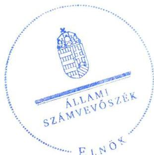

16239
www.asz.hu

---

# AZ ELLENŐRZÉST FELÜGYELTE: 

PETŐ KRISZTINA felügyeleti vezető

## AZ ELLENŐRZÉST VEZETTE ÉS A VÉGREHAJTÁSÁÉRT FELELŐS:

DR. GYŐRI GABRIELLA ellenőrzésvezető

## A PROGRAM ÖSSZEÁLLÍTÁSÁÉRT FELELŐS:

JANIK JÓZSEF LÁSZLÓ osztályvezető

IKTATÓSZÁM: V-0952-156/2016
TÉMASZÁM: 1986
ELLENŐRZÉS-AZONOSÍTÓ SZÁM: V073707

---

# TARTALOMJEGYZÉK 

■ ÖSSZEGZÉS ..... 5
■ AZ ELLENŐRZÉS CÉLJA ..... 7
■ AZ ELLENŐRZÉS TERÜLETE ..... 8
■ AZ ELLENŐRZÉS HÁTTERE, INDOKOLTSÁGA ..... 11
■ A JELENTÉS LÉNYEGES KÉRDÉSKÖREI ..... 13
■ ELLENŐRZÉS HATÓKÖRE ÉS MÓDSZEREI ..... 14
■ MEGÁLLAPÍTÁSOK ..... 17
■ JAVASLATOK ..... 32
■ MELLÉKLETEK ..... 37
I. sz. melléklet: Értelmező szótár ..... 37
II. sz. melléklet: Az Integritás érvényesítése érdekében kialakított és működtetett kontrollrendszer ..... 40
■ FÜGGELÉK: ÉSZREVÉTELEK ..... 43
■ RÖVIDÍTÉSEK JEGYZÉKE ..... 67

---

.

---

# **ÖSSZEGZÉS**

*A pécsi Janus Pannonius Múzeumra vonatkozó irányító szervi feladatellátás összességében nem volt szabályszerű. A Múzeumnál kialakított irányítási rendszer nem támogatta az átlátható, elszámoltatható és ellenőrizhető közpénzfelhasználást. A Múzeum pénzügyi- és vagyongazdálkodása nem volt szabályszerű. A Múzeum alaptevékenységének részét képező kulturális javak nyilvántartásáról nem szabályszerűen gondoskodtak, mivel a kulturális javak állományvédelme és vagyonbiztonsága a kölcsönzéseknél nem volt biztosított.*

## **Az ellenőrzés társadalmi indokoltsága**

Az Állami Számvevőszék Stratégiájának alapértéke, hogy ellenőrzései segítik az integritás alapú, átlátható és elszámoltatható közpénzfelhasználás megteremtését. Az ellenőrzés jogszabályban, vagy alapító okiratban meghatározott közfeladat ellátására létrejött, a megyei hatókörű városi muzeális intézmények gazdálkodási tevékenységére terjedt ki. E szervezetek pénzügyi és vagyongazdálkodásának alapvető rendeltetése a közfeladatok (a kulturális örökséghez tartozó javak védelme, őrzése és a nyilvánosság számára történő hozzáférhetővé tétele) ellátásának biztosítása.

A megyei hatókörű városi múzeumként működő szervezetek 2011. évtől több alkalommal jelentős szervezeti és gazdálkodási átalakuláson mentek keresztül. A tulajdonosi, a vagyonkezelői és a fenntartói szerepekben, szerkezetben történt változások előkészítése, végrehajtása, illetve a múzeumi rendszer által kezelt közvagyonnal való gazdálkodás szabályszerűségének bemutatásával az ellenőrzés hozzájárul a múzeumok fenntartási és működtetési feladatainak ellátására vonatkozó megfelelő jogszabályi környezet kialakításához, a gazdálkodási gyakorlatuk javításához.

## **Főbb megállapítások, következtetések**

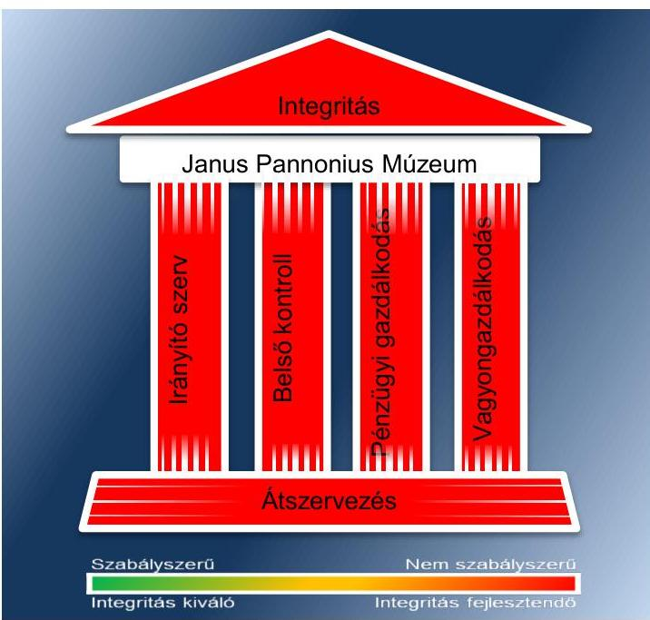

Az irányító szervek az ellenőrzött időszakban összességében nem szabályszerűen látták el az irányító szervi feladatokat. A munkáltatói jogosultságok gyakorlása a 2012–2014. években nem volt szabályszerű, mert a Múzeum igazgatójának a képzettsége nem felelt meg a jogszabályi előírásoknak és a Múzeum gazdasági vezetőjének 2013. évi kinevezése során nem érvényesítették a jogszabályban előírt ötéves költségvetési gyakorlat követelményét. Hiányosságok voltak az egyéb irányítási, felügyeleti és ellenőrzési jogosultságok területén is, 2012-ben a középirányító szerv nem határozta meg a Múzeum gazdálkodásának részletes rendjét, 2013–2014-ben a Múzeum küldetésnyilatkozatát a fenntartó Pécs Megyei Jogú Város Önkormányzatának Közgyűlése nem hagyta jóvá.

A Múzeumnál kialakított irányítási rendszer nem támogatta az átlátható, elszámoltatható és ellenőrizhető közpénzfelhasználást. A kontrollkörnyezet kialakítása a 2011–2012. években nem volt szabályszerű, mert a Múzeum gazdálkodását meghatározó szabályzatok tartalma nem felelt meg a jogszabályok előírásainak. A Múzeum a 2011–2012. években a kulturális javakkal kapcsolatos külön nyilvántartások kezelésére vonatkozó szabályokat nem határozta meg. A kontrollkörnyezet kialakítása a 2013–2014. években részben szabályszerű volt, a 2011–2012. évinél kedvezőbb minősítés oka az volt, hogy a Múzeum működését és gazdálkodását meghatározó szervezeti és működési

---

szabályzat és az egyes pénzügyi-számviteli szabályzatok kiegészítésre, pontosításra kerültek, azonban a jogszabályi előírásoknak még így sem feleltek meg teljes körűen. A kockázatkezelési rendszert a 2011-2012. években kialakítás hiányában nem működtették, a 2013-2014. években ugyan kialakították, azonban annak működtetése nem volt szabályszerű. A Múzeumnál a vagyonnyilatkozat-tételi kötelezettség feltüntetésének elmulasztásával nem intézkedtek a közélet tisztaságának biztosítása és a korrupció megelőzése érdekében. A kontrolltevékenység kialakítása és működtetése a 2011-2012. években nem volt szabályszerű, a 2013-2014. években részben szabályszerű volt. A kontrolltevékenység kialakítása során az engedélyezési, jóváhagyási és kontroll eljárásokat meghatározták. Hiányosság volt azonban, hogy a gazdálkodási jogkörök gyakorlására jogosultak kijelölése az ellenőrzött időszakban összességében nem volt szabályszerű. Az információs és kommunikációs folyamatok kialakítása során meghatározták a beszámolási szinteket és módokat, azonban a 2011-2014. közötti időszakban nem szabályozták a kötelezően közzéteendő adatok nyilvánosságra hozatalának rendjét. A Múzeum a jogszabályban előírt közzétételi kötelezettségének a 2011-2014. közötti időszakban nem tett eleget. A monitoring rendszer részeként a belső ellenőrzés kialakításáról és működtetéséről a Múzeumnál a 2011-2014. években nem gondoskodtak, ezáltal nem biztosították a gazdálkodás szabályszerűségének, a közpénzek felhasználásának elszámoltathatóságát.

A Múzeum pénzügyi- és vagyongazdálkodása nem volt szabályszerű. A bevételi előirányzatok teljesítése, a kiadási előirányzatok felhasználása a 2011-2014. években nem felelt meg a jogszabályi előírásoknak. A gazdálkodási jogköröket összességében nem szabályszerűen gyakorolták, mert szabályszerű kijelöléssel nem rendelkezők végezték a feladatot. A Múzeum a 2012. évi beszámolójában a feladat ellátását szolgáló vagyont szabálytalanul mutatta ki. A 2013-2014. években a beszámolóban kimutatott vagyon értékét vagyonkezelési szerződés teljes körűen nem támasztotta alá, mert csak a 2014. évben és kizárólag egyes vagyonelemekre rendelkezett vagyonkezelési szerződéssel a Múzeum. A kulturális javak kölcsönzésére 2011-2014. között kötött szerződések nem tartalmazták a jogszabályban rögzített kötelező tartalmi elemeket, emiatt a kölcsönzött kulturális javak állományvédelme nem volt megfelelően biztosított.

A 2011/2012. évi átszervezés nem volt szabályszerű, emiatt az átláthatóság sérült. A vagyon tényleges átadására szolgáló jegyzőkönyv felvételére nem került sor. Az átadás-átvétel alapjául szolgáló dokumentáció nem tartalmazta az ingóvagyon tekintetében az alapleltárakban és a külön nyilvántartásokban nyilvántartott kulturális javak felsorolását. A 2012/2013. évi központi alrendszerből önkormányzati alrendszerbe történő átszervezés során az átláthatóság sérült, mert a vagyonleltárnak nem képezte részét a kulturális javak felsorolása, továbbá annak tagintézményenkénti meghatározása.

A Múzeum nem intézkedett az integritás szemlélet érvényesítése érdekében.

---

# AZ ELLENŐRZÉS CÉLJA 

vényesülését a gazdálkodási folyamatokban.

Az ellenőrzés célja annak megállapítása volt, hogy a megyei múzeumi rendszer átalakítása, az intézményfenntartói rendszerben végbement változások előkészítése és végrehajtása megalapozottan, szabályszerűen történt-e; a megyei hatókörű városi múzeumok és jogelődjeik pénzügyi- és vagyongazdálkodása, a belső kontrollrendszer kialakítása és működtetése, valamint az intézményfenntartói feladatok ellátása szabályszerűen történt-e.

A Múzeum ${ }^{1}$ korrupcióval szembeni veszélyeztetettségének csökkentése érdekében kért tanúsítványi adatszolgáltatás alapján az ÁSZ² értékelte az integritási szemlélet ér-

---

# **AZ ELLENŐRZÉS TERÜLETE**

### **Janus Pannonius Múzeum**

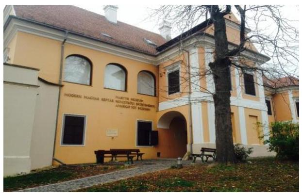

A Múzeum Pécsett található, feladatkörében az Mtv.^{3} alapján gondoskodik a kulturális javak meghatározott anyagának folyamatos gyűjtéséről, nyilvántartásáról, megőrzéséről és restaurálásáról; tudományos feldolgozásáról, publikálásáról; valamint kiállításokon és más módon történő bemutatásáról; a közművelődési és közgyűjteményi feladatok ellátásáról. A Kötv.^{4} 20. § (2) bekezdése alapján területileg illetékes múzeumként régészeti feltárást végzett az ellenőrzött időszakban.

A Múzeum csak a működési engedélyében meghatározott gyűjtőkörben és gyűjtőterületen folytathatja tevékenységét. A szakmai besorolást, a rendszert megalapozó szaktörvényi kereteket az Mtv. biztosítja. Az Mtv. hatálya kiterjed a Múzeum fenntartóira, a Múzeumban foglalkoztatottakra, a kulturális örökség Múzeumban őrzött elemeire, a szolgáltatások igénybe vevőire és a kulturális örökséggel foglalkozó egyéb szervezetekre.

A Múzeum 2011. évi költségvetési engedélyezett létszáma 99 fő volt, ami 2012. évben 81 főre, 2013. évre 76 főre csökkent, ez a 2014. évben nem változott. A Múzeum alkalmazottainak foglalkoztatására a Kjt.^{5} alapján került sor. Az ellenőrzött időszakban a múzeumigazgató^{6} és a gazdasági vezető személye változott.

A Möktv.^{7} és annak végrehajtásáról szóló 258/2011. (XII. 7.) Korm. rendelet^{8} alapján 2012. január 1-jétől a megyei múzeumok központi költségvetési szervekké váltak. 2013. január 1-jétől a 2012. évi CLII. törvény^{9} és az 1311/2012. (VIII. 23.) Korm. határozat^{10} alapján az állami tulajdonba és fenntartásba került megyei múzeumi szervezetek a megyeszékhely megyei jogú városok fenntartásában működtek tovább. A 2011–2014. évek között a fenntartói, irányítói, középirányítói jogkörgyakorlók változását, valamint a Múzeum gazdálkodási feladatát ellátó szervezetét az 1. táblázat mutatja be:

^{1. táblázat}

|  Időszak | Fenntartó | Irányító szerv | Középirányító szerv | Gazdasági szervezet  |
| --- | --- | --- | --- | --- |
|  2011. | Baranya Megyei Önkormányzat | Baranya Megyei Önkormányzat Közgyűlése | - | Baranya Megyei Önkormányzati Hivatal  |
|  2012. | Baranya Megyei Intézményfenntartó Központ | KIM^{11} | Baranya Megyei Intézményfenntartó Központ | Baranya Megyei Intézményfenntartó Központ  |
|  2013–2014. | Pécs Megyei Jogú Város Önkormányzata | Pécs Megyei Jogú Város Közgyűlése | - | Múzeum  |

*Fenntartó Kormányzati Hivatal*

*Forrás: A Múzeum alapító okiratai*

---

A Múzeum jogelődjének, a Baranya Megyei Múzeumok Igazgatóságának a jogállása 2011. évben önállóan működő és gazdálkodó költségvetési szerv volt, gazdasági feladatait megállapodás alapján a Baranya Megyei Önkormányzati Hivatal látta el. 2012. január 1-jétől a Múzeum önállóan működő és gazdálkodó költségvetési szerv volt, a gazdasági feladatait a középirányító szerv végezte. 2013. január 1-jétől a Múzeum önállóan működő és gazdálkodó költségvetési szerv volt, gazdálkodási feladatait saját gazdasági szervezete látta el. 2014. január 1-jétől a Múzeum önálló jogi személyiséggel rendelkező, saját gazdasági szervezettel működő megyei hatókörű városi múzeum volt, vállalkozási tevékenységet az ellenőrzött időszakban végzett.

A Múzeum gazdálkodási feladatait 2016. január 1-jétől Pécs Város Költségvetési Központi Elszámoló Szervezete végzi.

A Múzeum teljesített költségvetési bevételeinek és kiadásainak alakulását az 1. ábra mutatja be. Az ábra a 2011-2012. években a Múzeum és tagintézményeinek együttes adatai, a 2013-2014. években a tagintézmények átadását követően a múzeumi adatok alapján készült.
1. ábra
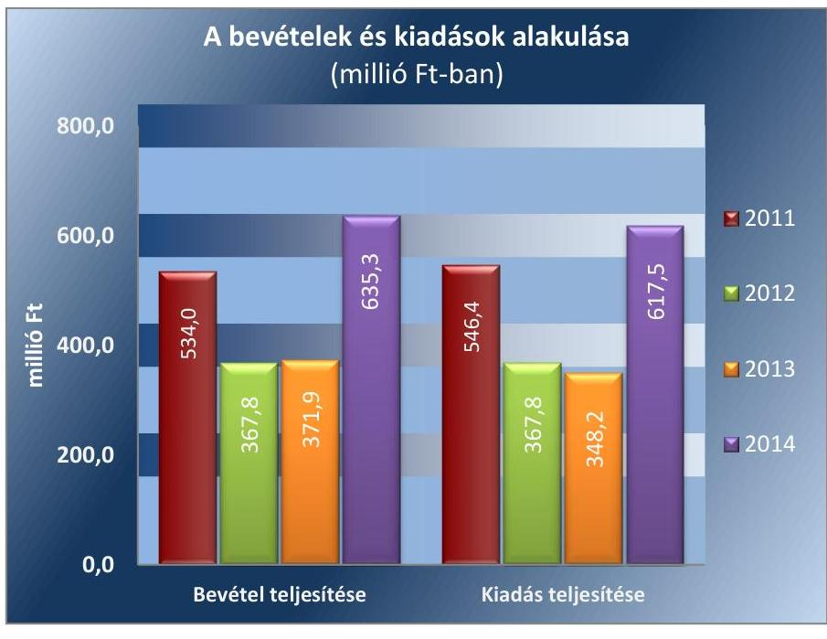

Forrás: Múzeumi beszámolók a 2011-2014. évekre
A 2015. évi LXXV. tv. ${ }^{12}$ 1. § (1) bekezdése alapján az Nvtv. ${ }^{13}$ 13. § (3) bekezdésében és 14. § (1) bekezdésében foglaltak alapján és az abban meghatározott feltételekkel a 2012. évi CLII. törvény 30. § (1) és (2) bekezdésében meghatározott, a megyei hatókörű városi múzeumok feladatának ellátását szolgáló egyes állami tulajdonban lévő ingatlanok a törvény hatálybalépésének napjával, a törvény erejénél fogva a kötelező közfeladatként a megyei hatókörű városi múzeumot fenntartó önkormányzatok tulajdonába kerültek. A 2015. évi LXXV. tv. 4. § (1) bekezdése alapján a kulturális örökség helyi védelme érdekében a megyei hatókörű városi múzeumok alapleltárában és jogszabály szerinti külön nyilvántartásában szereplő állami tulajdonú kulturális javak ingyenesen a megyei hatókörű városi múzeumok vagyonkezelésébe kerültek. A vagyonkezelők vagyonkezelői joga tekintetében vagyonkezelési szerződés megkötése nem szükséges. A

---

2015. évi LXXV. tv. 4. § (2) bekezdése szerint továbbá a kulturális örökség helyi védelme érdekében a megyei hatókörű városi múzeumok feladatának ellátását szolgáló állami tulajdonban álló ingatlanok - a törvény mellékletében meghatározott ingatlanok kivételével - ingyenesen a fenntartó önkormányzatok vagyonkezelésébe kerültek.

---

# AZ ELLENŐRZÉS HÁTTERE, INDOKOLTSÁGA

Az Alaptörvény^{14} rendelkezése szerint a nemzeti vagyon megőrzésének, védelmének és a nemzeti vagyonnal való felelős gazdálkodásnak a követelményeit sarkalatos törvény, az Nvtv. rögzíti. A tulajdonosi joggyakorlás és vagyonkezelés általános és speciális szabályait, az állami vagyon nyilvántartására és elszámolására vonatkozó eljárásokat, a vagyonkezelési szerződés feltételrendszerét, valamint az éves beszámoló készítési és könyvvezetési kötelezettségeket kormányrendelet írja elő.

A megyei hatókörű városi múzeumok közfeladat-ellátásának változásait, (beleértve az
 állami tulajdonosi joggyakorló, intézményi vagyonkezelő és önkormányzati fenntartó szervezeteket is) a közfeladatok átadásából és átvételéből adódó módosításait, előirányzat-gazdálkodására ható tényezőit az Áht.,^{15}, az Ávr.^{16}, a Möktv., valamint az Mtv. írja elő. A múzeumi intézményrendszer rendszerátalakulásából, megszűnéséből, intézmény-átszervezéséből, belső szerkezeti korszerűsítéséből, vagy más hasonló okból adódó módosításai miatt szerepeltetendő szerkezeti változásokat, valamint a szerkezeti változásként beépült közfeladatok szint-hozóként történő számításba vételét az Ávr. határozza meg.

A megyei hatókörű városi múzeumok kulturális szempontból meghatározó jelentőségűek mind földrajzi elhelyezkedésüket, mind az ellátott feladatokat, valamint a látogatottságukat tekintve. Tevékenységüket törvényi szinten (Mtv.) szabályozták a jogalkotók. A megyei hatókörű városi múzeumok jelenlegi körének kialakításában, tulajdonosi és fenntartói szerkezetében rövid idő alatt több jelentős változás történt, amelyeket jogszabályi változások indukáltak. Ezen intézmények szakmai besorolásukat tekintve a 2011. évben megyei múzeumként, a 2012. évben megyei múzeumi központi költségvetési szervezetként, a 2013. évtől kezdődően megyei hatókörű városi múzeumként működtek. A szakmai besorolások változásait párhuzamosan követték a tulajdonosi, vagyonkezelői, fenntartói szerepekben történt változások.

A 2011–2014. évek között bekövetkezett fenntartói változások a vagyontárgyak és a kulturális javak tulajdonosi, vagyonkezelői és használói körében is változást indukáltak, amelyet a 2. táblázat szemléltet.

1. táblázat

|  A VAGYON TULAJDONOSI, VAGYONKEZELŐI ÉS HASZNÁLÓI KÖRÉNEK VÁLTOZÁSA 2011–2014. ÉVEKBEN |  |  |  |  |  |  |  |  |   |
| --- | --- | --- | --- | --- | --- | --- | --- | --- | --- |
|  Vagyon-
tárgy | 2011. év
vagyon-
kezelő |  |  | 2012. év
vagyon-
kezelők |  |  | 2013–2014. évek |  |   |
|   |  |  |  |  |  |  | tulajdonos | vagyon-
kezelő | használó  |
|  Ingatlan | Baranya Megyei
Önkormányzat | - | Múzeum | Állam | BMIK^{17} | Múzeum | Állam | Múzeum | Múzeum  |
|  Egyéb
tárgyi
eszközök | Baranya Megyei
Önkormányzat | - | Múzeum | Állam | BMIK | Múzeum | Állam | Múzeum | Múzeum  |
|  Kulturális
javak | Baranya Megyei
Önkormányzat | - | Múzeum | Állam | BMIK | Múzeum | Állam | Múzeum | Múzeum  |

*Forrás: A Múzeum alapító okiratai, a 2012. évi CLII. tv, a 258/2011. (XII. 7) Korm. rendelet, az 1311/2012. (VIII. 23.) Korm. határozat*

---

Az ellenőrzés - tekintettel a megyei hatókörű városi múzeumokat (és jogelődjeit) rövid időn belül, gyors ütemben ért környezeti (tulajdonosi, fenntartói szerkezetet érintő) változásokra - javaslatok megfogalmazásával hozzájárul a fenntartás és működtetés feladatainak ellátására vonatkozó megfelelő jogszabályi környezet - jogalkotók által történő - kialakításához. Az ÁSZ ellenőrzés a gazdálkodási gyakorlat javítását eredményezheti, több intézmény bevonásával átfogó képet ad a megyei hatókörű városi múzeumokat (és jogelődjeiket) jellemző sajátosságokról, jó gyakorlatokról.

AZ ELLENŐRZÉS EREDMÉNYEKÉPPEN nemcsak az ellenőrzött intézmények gazdálkodása javul, hanem átfogó képet kapunk a múzeumok gazdálkodásának hiányosságairól, de a jó gyakorlatokról is. Ellenőrzéseivel, javaslataival és megállapításaival az ÁSZ elősegíti a költségvetési szervek pénzügyi és vagyongazdálkodása szabályozásának javítását és hozzájárulhat a jó kormányzáshoz.

---

# A JELENTÉS LÉNYEGES KÉRDÉSKÖREI 

1. Az irányító szerv ellenőrzött Múzeumra vonatkozó feladatellátása szabályszerű volt-e?
2. Szabályszerűen hajtották-e végre a Múzeumot érintő szervezeti, szerkezeti átszervezéseket?
3. A belső kontrollrendszer kialakítása és működtetése megfelelt-e a jogszabályi előírásoknak?
4. A Múzeum pénzügyi gazdálkodása szabályszerű volt-e?
5. A Múzeum vagyongazdálkodása szabályszerű volt-e?
6. A Múzeum intézkedett-e az integritás szemlélet érvényesítése érdekében?

---

# ELLENŐRZÉS HATÓKÖRE ÉS MÓDSZEREI 

## Az ellenőrzés típusa

Megfelelőségi ellenőrzés.

## Az ellenőrzött időszak

Az ellenőrzött időszak 2011. január 1-jétől 2014. december 31-ig tart.

## Az ellenőrzés tárgya

A megyei hatókörű városi múzeumok átszervezése, átalakítása előkészítése és lebonyolítása megalapozottsága, szabályszerűsége, a pénzügyi és vagyongazdálkodási tevékenység, a belső kontrollrendszer kialakítása, működtetése szabályszerűsége, valamint az irányító szervi feladatok ellátása szabályszerűsége. E tevékenységek és a kapcsolódó adatok és információk összessége, amelyeket a vonatkozó kritériumok alapján kell értékelni.

Az ellenőrzés kiterjed minden olyan körülményre és adatra, amely az ÁSZ jogszabályban meghatározott feladatainak teljesítéséhez, valamint a program végrehajtása folyamán felmerült újabb összefüggések feltárásához szükséges.

## Az ellenőrzött szervezet

Janus Pannonius Múzeum, a gazdálkodási feladatok ellátásában érintett Baranya Megyei Önkormányzati Hivatal, a fenntartói feladatokban érintett Baranya Megyei Önkormányzat, valamint Pécs Megyei Jogú Város Önkormányzata, a Baranya Megyei Intézményfenntartó Központ jogutódja a Szociális és Gyermekvédelmi Főigazgatóság.

Az ellenőrzésre a költségvetési szerv ellenőrzött intézményének és irányító szervének, illetve középirányító szervének székhelyén és a gazdálkodási feladatait ellátó szervezetének székhelyén került sor.

## Az ellenőrzés jogalapja

Az ellenőrzés jogszabályi alapját az ÁSZ tv. ${ }^{18} 1$. § (3) bekezdés, 5. § (2)-(6) bekezdései, valamint az Áht. 2 61. § (2) bekezdésének előírásai képezik.

---

# Az ellenőrzés módszerei 

Az ellenőrzést az ellenőrzési program szempontjai, az ellenőrzött időszakban hatályos jogszabályok, az ellenőrzés szakmai szabályai, az egyes ellenőrzési típusokhoz kapcsolódó ÁSZ módszertanok és nemzetközi standardok figyelembe vételével végeztük. A gazdálkodás hibáinak kijavítására, a közpénzekkel való felelős gazdálkodás segítésére irányuló javaslatok kidolgozásakor a hatályos jogszabályok az irányadóak.

Az ellenőrzési kérdések megválaszolásához szükséges bizonyítékok megszerzése a következő ellenőrzési eljárások alkalmazásával történt: kérdésfeltevés (információkérés), mintavételezés, valamint elemző eljárás. A minták kiválasztása során véletlen mintavételi eljárást alkalmaztunk.

Mintavétellel ellenőriztük a bevételek, a személyi juttatások, a dologi és felhalmozási kiadások, a régészeti bevételek és kiadások elszámolásának, valamint a kulturális javak kölcsönzésének szabályszerűségét. A minta alapján a sokaságban előforduló hibaarányt becsültük. „Megfelelőnek" értékeltük az ellenőrzött területet, amennyiben 95%-os bizonyossággal a teljes sokaságban a hibaarány legfeljebb 10%, „részben megfelelőnek" értékeltük, ha a hibaarány felső határa 10-30% között volt, „nem megfelelőnek" pedig akkor, ha a mintavételi eredmények alapján a sokaságbeli hibaarány felső határa meghaladta a 30%-ot.

Az ellenőrzési bizonyítékként felhasználható adatforrások közé tartoznak egyrészt a szakmai program részletes szempontjainál felsorolt adatforrások, másrészt adatforrás lehet minden egyéb - az ellenőrzés folyamán feltárt, az ellenőrzés szempontjából releváns információt tartalmazó - dokumentum. Az ellenőrzés lefolytatásához a Múzeum a tanúsítványok elektronikus kitöltésével, valamint az ÁSZ által kért dokumentumok elektronikus megküldésével szolgáltatott adatokat. A rendelkezésre bocsátott adatok, információk kontrollja az ellenőrzés keretében történt. Az ellenőrzési kérdésekre adott válaszok alapján értékeltük, hogy az ellenőrzött időszakban az irányító szerv az ellenőrzött Múzeumra vonatkozó feladatainak szabályszerűen eleget tett-e, a Múzeum pénzügyi- és vagyongazdálkodása megfelelt-e az előírásoknak, a Múzeum átalakításának vagy átszervezésének végrehajtása szabályszerű volt-e.

A Múzeum belső kontrollrendszere jogszabályi előírások szerinti kialakításának és működtetésének szabályszerűségét az erre irányuló ellenőrzési kérdésekre adott válaszok összesítése alapján, évente pillérenként (kontrollkörnyezet, kockázatkezelési rendszer, kontrolltevékenységek, információs és kommunikációs rendszer, monitoring rendszer) és összesítetten is minősítjük. A Múzeum belső kontrollrendszere egyes pilléreinek kialakítása és működtetése „szabályszerű", amennyiben az értékelt területen az elért és elérhető pontok százalékban kifejezett, egész számra kerekített hányadosa meghaladja a 84%-ot, „részben szabályszerű", ha a 84%-ot nem haladja meg, de 60%-nál nagyobb, „nem szabályszerű", ha nem haladja meg a 60%-ot. A Múzeum belső kontrollrendszerének összesített értékelése megegyezik a pillérenként (kontrollterületenként) alkalmazott %-os értékelésekkel, a következő eltérésekkel. A kontrollrendszer egésze esetében a „szabályszerű" értékelésnek a %-os értéken felül további feltétele, hogy egyik kontrollterület sem kaphat „nem szabályszerű" értékelést, a „részben szabályszerű" értékelés további feltétele, hogy legfeljebb egy el-

---

lenőrzött kontrollterület lehet „nem szabályszerű" értékelésű. Az összesített értékelés a %-os értéktől függetlenül „nem szabályszerű", ha az ellenőrzött kontrollterületek közül több mint egynek „nem szabályszerű" az értékelése.

Az integritás szemlélet érvényesülésének értékelése a Múzeum által szolgáltatott adatok alapján történt.

---

# 1. Az irányító szerv ellenőrzött Múzeumra vonatkozó feladatellátása szabályszerű volt-e? 

Összegző megállapítás

Az irányító szervek ellenőrzött Múzeumra vonatkozó feladatellátása a 2011-2014. években összességében nem volt szabályszerű.

AZ ALAPÍTÓI JOGOSULTSÁGOK GYAKORLÁSA az ellenőrzött időszakban részben felelt meg a jogszabályi előírásoknak. A Múzeum rendelkezett alapító okirattal ${ }_{1-8}{ }^{19}$. A 2012. évet érintő hiányosság volt, hogy a középirányító szerv ${ }^{20}$ az alapító okirat ${ }_{3}$ esetében nem tartotta be a 258/2011. (XII. 7.) Korm. rendelet 21. § (6) bekezdésének előírását, mert az alapító okirat módosítását nem nyújtotta be 2012. január 30-ig a Kincstárhoz ${ }^{21}$, mivel azt az irányító szerv ${ }_{2}{ }^{22}$ 2012. július 12-én adta ki.

A MUNKÁLTATÓI JOGOSULTSÁG gyakorlása - a 2011. év kivételével - nem volt szabályszerű.

2012-ben pályázaton ismét az addigi múzeumigazgató nyerte el a megbízatást, a kinevezés dokumentumai nem feleltek meg az Mtv. 95/B. § (7)(8) bekezdésének, mert a múzeumigazgató nem rendelkezett akkreditált vezetői tanfolyami képesítéssel. A középirányító szerv, illetve az irányító szerv ${ }_{3}$ 2012-2013-ban nem érvényesítette az Mtv. 95/B. § (8) bekezdésének - a megbízás megszűnésére vonatkozó - rendelkezését, továbbá nem tartotta be az Áht.2. 9. § (1) bekezdés h) pontját, mert nem adott egyedi utasítást a Múzeum igazgatójának a mulasztás pótlására (a tanfolyam elvégzésére).

2013-ban a kinevezett gazdasági vezető a Számv. tv. 150. § (1)-(2) bekezdésében és az Ávr. 12. § (1) bekezdés b) pontjában és (2) bekezdésében előírt ötéves költségvetési gyakorlattal nem rendelkezett, ezért az éves beszámoló aláírására nem volt jogosult.

AZ EGYÉB IRÁNYÍTÁSI, FELÜGYELETI ÉS ELLENŐRZÉSI jogosultságok gyakorlása az ellenőrzött időszakban összességében nem volt szabályszerű.

A középirányító szerv a 258/2011. (XII. 7.) Korm. rendelet 11. § (1) bekezdés b)-c) pontjaiban foglaltak ellenére 2012-ben nem határozta meg az irányítása alá tartozó Múzeum gazdálkodásának részletes rendjét, az előirányzatok felhasználására vonatkozó irányelveket.

A Múzeum az Mtv. előírásainak megfelelően elkészítette küldetésnyilatkozatát és megküldte az irányító szerv ${ }_{3}$ (mint fenntartó) részére, mely az Mtv. 42. § (4) bekezdés b) pontjában foglaltak ellenére annak jóváhagyását a 2013-2014. években elmulasztotta.

---

A 2013-2014. években az irányító szerv ${ }_{3}$, mint fenntartó az Mtv. 50. § (2) bekezdés a) pontjában foglaltak ellenére nem határozta meg és nem hagyta jóvá a Múzeum stratégiai tervét, fejlesztési és beruházási feladatait.

# 2. Szabályszerűen hajtották-e végre a Múzeumot érintő szervezeti, szerkezeti átszervezéseket? 

## Összegző megállapítás

2.1. számú megállapítás

A Múzeumot érintő szervezeti, szerkezeti átszervezések nem voltak szabályszerűek.

A Múzeumot érintő - önkormányzati alrendszerből a központi alrendszerbe történő - 2012. január 1-jétől hatályos irányító szervi (fenntartói) váltás lebonyolítását nem szabályszerűen hajtották végre.

Az átadás-átvételi megállapodás ${ }_{1}^{23}$-et az irányító szerv ${ }_{1}$ és a középirányító szerv a Möktv.-vel összhangban, határidőben megkötötte. Az átadás-átvételi megállapodás ${ }_{1}$ tartalma a 258/2011. (XII. 7.) Korm. rendelet 1. mellékletében foglaltaknak nem felelt meg, mivel a megállapodás nem tartalmazta:
$\longrightarrow$ a Múzeum költségvetésének várható teljesüléséről szóló, a 2011. december 31-ei fordulónappal elkészített adatszolgáltatást;
$\longrightarrow$ az átadott ingatlanok műszaki állapotát bemutató műszaki katasztert;
$\longrightarrow$ a betöltetlenül átadott státuszok számát;
$\longrightarrow$ a külön nyilvántartásokban nyilvántartott kulturális javak felsorolását.

A VAGYON TÉNYLEGES ÁTADÁSÁRA
 - a 258/2011. (XII. 7.) Korm. rendelet 12. § (3) bekezdésében foglaltak ellenére - jegyzőkönyv felvételével nem került sor.

Az Áhsz. ${ }^{24}$-nek megfelelően leltárt készítettek és elvégezték a mérleg eszköz és forrás oldalának év végi értékelését. A mérleg sorait záró főkönyvi kivonattal és analitikával alátámasztották, a pénzforgalmi számlákat év végével lezárták. A 2011. évi NGM módszertani útmutató25 43. oldal 2/ba. pontjában előírtakat figyelmen kívül hagyva az átadáshoz kapcsolódó vagyonátadási jelentést és vagyonátadás-átvételi jegyzőkönyvet nem készítettek. Az eszközök és források 2012. évi nyitását szabályszerűen nem tudták végrehajtani, mivel a nyitás alapját képező vagyonátadási jelentést nem készítettek. Az állami tulajdonba került vagyonelemek számviteli nyilvántartásokból történő kivezetését az NGM módszertani útmutató 2/ba. pontjában rögzítettek ellenére nem végezték el.

---

### 2.2. számú megállapítás

A 2013. január 1-jével végrehajtott - központi alrendszerből önkormányzati alrendszerbe történő - irányítószervi (fenntartói) váltás lebonyolítása és a szervezetrendszer átalakítása nem volt szabályszerű.

A központi alrendszerből az önkormányzati alrendszerbe történő átadáshoz kapcsolódó feladatok tekintetében a 1311/2012. (VIII. 23.) Korm. határozat adott iránymutatást.

A középirányító szerv az irányító szerv $_{3}$-mal az átadási-átvételi megállapodás ${ }_{2}{ }^{26}$-t a Möktv.-ben megadott határidőn belül, 2012. december 14-én megkötötte. Az átadás-átvételi megállapodás ${ }_{2}$ IV. szakaszában megfogalmazott, a fenntartói jog gyakorlásához kapcsolódó dokumentumok közül az átadás-átvételi megállapodás ${ }_{2}$-höz nem csatolták:

- a 2012. évi elemi költségvetésére vonatkozó adatok összegszerű részletezését;
- a betöltetlenül átadott státuszok számát;
- a fenntartásra átadott ingatlanok műszaki állapotát bemutató műszaki katasztert, külön kitérve az aktuális állapotfelmérésre és problémafeltárásra.
A középirányító szerv és az irányító szerv ${ }_{3}$ az átadás-átvételi dokumentumok kezelése, tárolása során nem tett eleget az Ltv. ${ }^{27}$ 9. § (1) bekezdés e) pontjában és (3) bekezdésében, valamint az lkr. ${ }^{28}$ 59. §-ában foglaltaknak, mert az iratok visszakereshetőségét nem biztosították.

VAGYONLELTÁRT a Múzeum az Áhsz. ${ }_{1}$ 13/A. § (5) bekezdésében foglaltak ellenére nem készített. A 1311/2012. (VIII. 23.) Korm. határozat 1.8. pontja és az átadás-átvételi megállapodás ${ }_{2}$ 1.2.11.2.1. pontja szerinti kulturális javak felsorolása nem készült el. A középirányító szerv 2012. december 31. napra vonatkozó vagyonátadási jelentést („0-ás beszámoló") az Áhsz. ${ }_{1}$ 13/A. § (1) bekezdésében foglaltak ellenére nem készített, ennek hiányában a 2013. évi nyitás nem az NGM 2012. évi módszertani útmutatójának 2/ab. pontjában foglaltaknak megfelelően történt. A hiányzó dokumentumok akadályozták az irányító szervi váltás lebonyolításának teljes körű átláthatóságát.

# A TAGINTÉZMÉNY 2013. ÉVI ÁTADÁSÁT RÖG-

ZÍTŐ MEGÁLLAPODÁST a középirányító szerv és Mohács Város Önkormányzata a 2012. évi CLII. törvény 30. § (5) bekezdésében meghatározott (2012. december 15-ei) határidőt követően kötötte meg. A mohácsi Kanizsai Dorottya Múzeum 2013. január 1-jétől Mohács Város Önkormányzatának fenntartásába került. Az átszervezés eredményeként a változás a törzskönyvi nyilvántartásba bejegyzésre került. Az átadás-átvételi megállapodás ${ }_{2}{ }^{29}$ mellékleteiben közölt adatok az éves beszámolóban és a leltárban foglaltakkal összhangban voltak, azonban a kulturális javak jegyzékét a megállapodáshoz - az 1311/2012. (VIII. 23.) Korm. határozat 1.8 pontjában és az átadás-átvételi megállapodás ${ }_{3}$ 1.2.11.2.1. pontjában foglaltak ellenére - nem csatolták.

---

# 3. A belső kontrollrendszer kialakítása és működtetése megfelel-te a jogszabályi előírásoknak?

## Összegző megállapítás

A belső kontrollrendszer kialakítása és működtetése a 2011-2014. években nem volt szabályszerű.

A belső kontrollrendszer kialakításának és működtetésének értékelését a 3. táblázat mutatja be.
3. táblázat

## A BELSŐ KONTROLLRENDSZER KIALAKÍTÁSÁNAK ÉS MŰKÖDTETÉSÉNEK ÉRTÉKELÉSE A 2011-2014. ÉVEKBEN

| Megnevezés | Kontroll-   környezet | Kockázatkezelés | Kontroll-   tevékenységek | Információ és   kommunikáció | Monitoring | Összesen |
| :--: | :--: | :--: | :--: | :--: | :--: | :--: |
| 2011. | nem szabályszerű | nem szabályszerű | nem szabályszerű | részben szabály-   szerű | nem szabályszerű | nem szabályszerű |
| 2012. | nem szabályszerű | nem szabályszerű | nem szabályszerű | részben szabály-   szerű | nem szabályszerű | nem szabályszerű |
| 2013. | részben szabály-   szerű | nem szabályszerű | részben szabály-   szerű | részben szabály-   szerű | nem szabályszerű | nem szabályszerű |
| 2014. | részben szabály-   szerű | nem szabályszerű | részben szabály-   szerű | részben szabály-   szerű | nem szabályszerű | nem szabályszerű |

A kontrollkörnyezet kialakítása a 2011-2012. években nem volt szabályszerű, a 2013-2014. években részben volt szabályszerű.
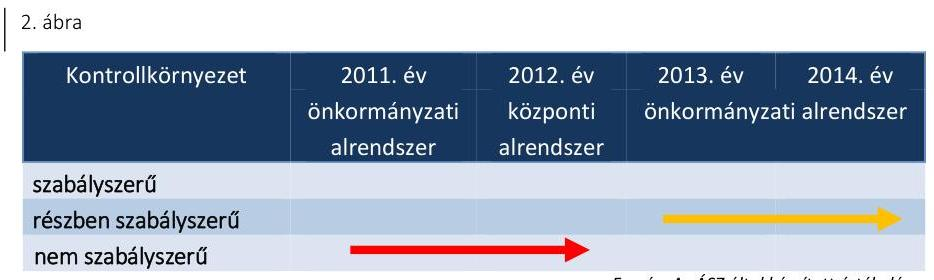

A Múzeum gazdálkodási feladatait 2011-ben munkamegosztási megállapodás ${ }^{30}$ alapján a gazdasági szervezet ${ }_{1}{ }^{31}$ látta el. A munkamegosztási megállapodás alapján a gazdálkodási tárgyú szabályzatok elkészítése a Múzeum feladata volt. A 2011-2012. éveket érintő hiányosságok voltak:
$\longrightarrow$ a múzeumigazgató az SZMSZ ${ }_{1,2}{ }^{32}$-ben nem határozta meg a szervezeti egységek engedélyezett létszámát 2011-ben az Ámr. ${ }^{33}$ 20. § (2) bekezdés e) pontja, illetve 2012-ben az Ávr. 13. § (1) bekezdés e) pontjában foglaltak ellenére;
$\longrightarrow$ a múzeumigazgató által kiadott számviteli politika ${ }_{3}{ }^{34}$ a Számv. tv. 14. § (4) bekezdésében foglaltak ellenére nem tartalmazta, hogy mit tekint a számviteli elszámolás, értékelés szempontjából lényegesnek, nem lényegesnek;

---

- a számlarend ${ }^{35}$ az Áhsz. ${ }_{1} 49. § (1) és (3) bekezdésében foglaltak ellenére nem tartalmazta az analitikus nyilvántartások kapcsolódó főkönyvi nyilvántartásokkal való egyeztetését;
- az eszközök és források értékelési szabályzat ${ }^{36}$ nem tartalmazta követelés típusonként a kis összegű követelések év végi meghatározásának elveit, dokumentálásának szabályait az Áhsz. ${ }_{1} 8. § (17) bekezdés d) pontjában foglaltak ellenére;
- a múzeumigazgató az ellenőrzési nyomvonal elkészítéséről 2011-ben az Ámr. 156. § (2) bekezdésének, illetve 2012-ben a Bkr. ${ }^{37}$ 6. § (3) bekezdésének rendelkezése ellenére nem gondoskodott, valamint nem határozta meg a szabálytalanságok kezelésének eljárásrendjét az Ámr. 156. § (3) bekezdésében, illetve a Bkr. 6. § (4) bekezdésében foglaltak ellenére.
A 2013-2014. években a Múzeum kontrollkörnyezetének kialakítása részben volt szabályszerű. Az SZMSZ ${ }_{3-5}{ }^{38}$-ben a szervezeti egységek engedélyezett létszámát a múzeumigazgató - az Ávr. 13. § (1) bekezdés e) pontjának előírásától eltérően - nem rögzítette.

Az ellenőrzött időszak egészében, a múzeumigazgató felelősségi körébe tartozóan fennálló hiányosság volt:
belső szabályozásban (SZMSZ-ben, ügyrendben vagy más szabályozásban) a múzeumigazgató nem határozta meg a gazdálkodási feladatokat ellátók helyettesítésének rendjét, valamint a belső-külső kapcsolattartás módját 2011-ben az Ámr. 20. § (7) bekezdésében, illetve 2012-2014. között az Ávr. 13. § (5) bekezdésében foglaltak ellenére;
—_ a múzeumigazgató nem határozta meg - az Ámr. 156. § (1) bekezdés c) pontjában, illetve a Bkr. 6. § (1) bekezdés c) pontjában foglaltak ellenére - az etikai elvárásokat a Múzeum minden szintjén;
—_ a rendszeresen végzett termékértékesítés, illetve szolgáltatásnyújtás ellenére nem készült önköltség számítási szabályzat a Számv. tv. 14. § (5) bekezdés c) pontjának, az Áhsz. ${ }_{1} 8. § (4) bekezdés c) pontjának és az Áhsz. ${ }^{39}$ 50. § (3) bekezdésének előírása ellenére.
3.2. számú megállapítás

A kockázatkezelési rendszer kialakítása és működtetése a 2011-2014. években nem volt szabályszerű.

| 3. ábra |  |  |  |  |
| :--: | :--: | :--: | :--: | :--: |
| Kockázatkezelési rendszer | 2011. év önkormányzati alrendszer | 2012. év központi alrendszer | 2013. év önkormányzati alrendszer | 2014. év alrendszer |
| szabályszerű |  |  |  |  |
| részben szabályszerű   nem szabályszerű |  |  |  |  |

A múzeumigazgató 2011-2012-ben nem alakította ki és ennek hiányában nem működtette a kockázatkezelési rendszert, nem gondoskodott a kockázatok azonosításáról, nem alakította ki a kockázati kitettség csökkentésével kapcsolatos szabályokat 2011-ben az Ámr. 157. § (2) bekezdése, 2012-ben a Bkr. 3. § b) pontja és 7. § (2) bekezdése ellenére.

---

A 2013. évben hatályba lépett FEUVE szabályzatban ${ }^{40}$ azonosították a kockázatokat, de a szabályzat nem tartalmazta az egyes kockázatokkal kapcsolatban szükséges intézkedéseket a Bkr. 7. § (2) bekezdése ellenére.

2014-ben a belső kontrollrendszer szabályzatban ${ }^{41}$ a tevékenységben, gazdálkodásban rejlő kockázatok felmérésére és megállapítására sor került, valamint meghatározták az egyes kockázatokkal kapcsolatban szükséges intézkedéseket, a Bkr. előírásainak megfelelően.

A 2011-2014. években a vagyonnyilatkozat tételi kötelezettség a Vnytv. ${ }^{42}$ 4. § a) pontjában foglaltak ellenére az SZMSZ1-5-ben nem került feltüntetésre.

# 3.3. számú megállapítás

A kontrolltevékenység kialakítása és működtetése a 2011-2012. években nem volt szabályszerű, a 2013-2014. években részben szabályszerű volt.

| 4. ábra |  |  |  |
| :--: | :--: | :--: | :--: |
| Kontrolltevékenységek | 2011. év önkormányzati alrendszer | 2012. év   központi alrendszer | 2013. év önkormányzati alrendszer |
| szabályszerű részben szabályszerű nem szabályszerű |  |  |  |

Forrás: Az ÁSZ által készített értékelés
A Múzeumnál a 2011-2014. években szabályozták az engedélyezési, jóváhagyási és kontrolleljárásokat, a beszámolási eljárásokat az SZMSZ1-5-ben, illetve a munkamegosztási megállapodásban.

Hiányosság volt, hogy 2011-ben az Ámr. 158. § (2) bekezdés b-c) pontjaiban, illetve 2012-ben a Bkr. 8. § (4) bekezdés b) pontjában előírtak ellenére az információkhoz való hozzáférést, továbbá 2011-ben az Ámr. 159. § (2) bekezdésében, illetve 2012-ben a Bkr. 9. § (2) bekezdésében foglaltak ellenére a beszámolási határidőket a múzeumigazgató nem határozta meg. Nem gondoskodott továbbá az adatok biztonságáról, az adatok védelmének érvényre juttatásához szükséges eljárási szabályok kialakításáról 2011-ben az Avtv. ${ }^{43}$ 10. § (1) bekezdésének és a 2012-2014. években az Info. tv. ${ }^{44}$ 7. § (2)-(3) bekezdéseinek rendelkezése ellenére.

A kötelezettségvállalásra, (pénzügyi) ellenjegyzésre, érvényesítésre, utalványozásra jogosult személyek kijelölése a 2011-2014. években, a szakmai teljesítés igazolására jogosult személyek kijelölése 2011. évben nem volt szabályszerű, mert a kijelölések az Ámr. 72. § (1) bekezdésében, a 74. § (2) bekezdés a) pontjában, a 76. § (5) bekezdésében, a 77. § (4) bekezdésében, a 78. § (1) bekezdésében, az Ávr. 52. § (1) bekezdésében, az 55. § (2) bekezdés a) pontjában, az 58. § (4) bekezdésében és az 59. § (1) bekezdésében foglaltak ellenére belső szabályozásban, munkakörökhöz kapcsolva történtek. A teljesítés igazolására jogosultak kijelölése a 2012-2014. években szabályszerű volt.
2011. évben az Ámr. 80. § (3) bekezdésében, 2012-2014-ben az Ávr. 60. § (3) bekezdésében foglaltak ellenére a gazdálkodási jogkört ellátó személyekről (a kötelezettségvállalást, (pénzügyi)ellenjegyzést, szakmai teljesítésigazolást, érvényesítést, utalványozást végző személyekről) és aláírásmintájukról 2011-ben a gazdasági szervezet; vezetője, 2012-ben a gazdasági szervezet ${ }_{2}$, 2013-2014-ben a múzeumigazgató nem vezetett teljes

---

körű, naprakész nyilvántartást. A teljesítés igazolására jogosultak nyilvántartása a 2012-2014. években megfelelt az Ávr. előírásainak.

A kontrolltevékenység működtetése során feltárt hiányosságokat részletesen a 4.3. pont tartalmazza.

# 3.4. számú megállapítás

Az információs
 és kommunikációs folyamatok kialakítása a 2011–2014. években részben volt szabályszerű.
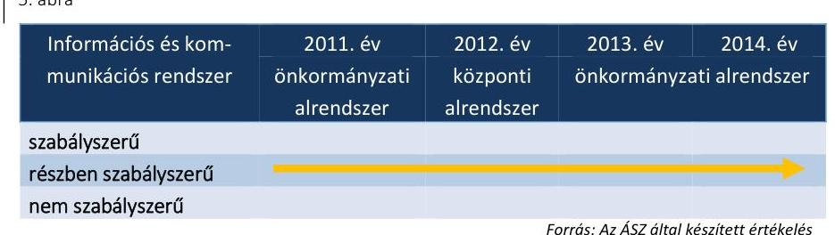

A múzeumigazgató kialakította az információs és kommunikációs rendszert, amely biztosította, hogy a megfelelő információk eljussanak az illetékes szervezethez, meghatározta a beszámolási szinteket, módokat, de a határidőket nem határozta meg 2011-ben az Ámr. 159. § (2) bekezdésének, a 2012–2014. években a Bkr. 9. § (2) bekezdésének előírása ellenére.

Hiányosság volt, hogy a múzeumigazgató a kötelezően közzéteendő adatok nyilvánosságra hozatalának rendjét nem szabályozta 2011-ben az Ámr. 20. § (3) bekezdés i) pontjában foglaltak ellenére, a 2012–2014. években az Info tv. 35. § (3) bekezdésében és az Ávr. 13. § (2) bekezdés h) pontjában foglaltak ellenére. Az elektronikus közzétételi kötelezettségnek a Múzeum nem tett eleget 2011-ben az Eitv. ${ }^{45}$ 3. § (2) bekezdésének és a 2012–2014. években az Info. tv. 33. § (1) és (3) bekezdéseinek rendelkezése ellenére.

A Múzeum honlapján nem volt fellelhető a 2011. évi költségvetési beszámoló az Eitv. melléklet III/1. pontjában, a 2012–2014. évi költségvetési beszámoló az Info. tv. 1. sz. melléklet III/1. pontjában meghatározott őrzési időtartam ellenére.

## 3.5. számú megállapítás

A monitoring rendszer kialakítása és működtetése a 2011–2014. években nem volt szabályszerű.
6. ábra

| Monitoring rendszer | 2011. év   önkormányzati   alrendszer | 2012. év   központi   alrendszer | 2013. év   önkormányzati alrendszer |
| :-- | :-- | :-- | :-- |

szabályszerű
részben szabályszerű
nem szabályszerű
Forrás: Az ÁSZ által készített értékelés
A Múzeumnál a monitoring rendszer részeként az operatív tevékenységek folyamatos és eseti nyomon követése a 2011. évben nem felelt meg az Ámr. 160. § (1)–(2) bekezdésében, a 2012–2014. években a Bkr. 10. §-ában foglaltaknak. A múzeumigazgató - a 2011. évben az Áht. ${ }^{46}$ 94. § (1) bekezdés b) pontjában és a 121/A. § (1) bekezdésében, a 2012–2014. években az Bkr. 6. § (2) bekezdésében foglaltak ellenére - nem alakított ki olyan

---

szabályozást, mely biztosította a rendelkezésre álló források gazdaságos, hatékony és eredményes felhasználását.

A múzeumigazgató a 2011–2014. években az Áht. 1 121/B. § (4) bekezdésében illetve az Áht. 2 70. § (1) bekezdésében foglaltak ellenére nem gondoskodott a belső ellenőrzés kialakításáról.

A Múzeumnál a 2011–2014. években az Ötv. ${ }^{47}$, 258/2011. (XII. 7.) Korm. rendelet, valamint a Mötv. rendelkezései alapján az irányító szerv 1, 3 és a középirányító szerv gondoskodott a Múzeum, mint felügyelt költségvetési szerv belső ellenőrzéséről. Az ellenőrzési javaslatok végrehajtása érdekében a múzeumigazgató a Ber. ${ }^{48}$ és a Bkr. előírásainak megfelelő tartalmú intézkedési tervet készített.

# 4. A Múzeum pénzügyi gazdálkodása szabályszerű volt-e? 

## Összegző megállapítás

### 4.1. számú megállapítás

A Múzeum pénzügyi gazdálkodása az ellenőrzött időszakban nem volt szabályszerű.

Az ellenőrzött időszakban a költségvetési tervezés, a bevételi és kiadási előirányzatok megállapítása szabályszerű volt. A Múzeum a bevételi és kiadási előirányzatok módosítását összességében szabályszerűen, a maradvány megállapítását nem szabályszerűen hajtotta végre.

A Múzeum a költségvetés tervezéshez, az előirányzatok megállapításához kapcsolódó eljárásrendet rögzítő belső szabályozásokkal (munkamegosztási megállapodás, SZMSZ1–5, gazdasági szervezet ügyrend ${ }_{1,2}$ ) a 2011–2014. években rendelkezett.

A Múzeum az éves költségvetéseit a költségvetési évre engedélyezett létszám, személyi, dologi és felhalmozási kiadások, valamint bevételek alapján tervezte meg.

A Múzeum előirányzat módosításai a 2011–2014. években összességében megfeleltek a jogszabályi előírásokban foglaltaknak.

A 2011. évben a gazdasági szervezet 1 az Áht. 1 103. § (1)–(2) bekezdésében foglaltak ellenére az előirányzat-módosításokról nem vezetett folyamatosan nyilvántartást, a 2012. évben az Ávr. 165. § (2) bekezdésében előírt nyilvántartási kötelezettségének a gazdasági szervezet ${ }_{2}$ nem tett eleget, a 2013–2014. évi előirányzatok nyilvántartásba vétele és elszámolása az Áht. 2-ben és az Ávr.-ben előírtaknak megfelelően történt. Az ellenőrzött időszakban országgyűlési hatáskörbe tartozó előirányzat módosításra nem került sor. Kormányzati hatáskörű előirányzat módosítást 2012. évben végeztek 42,3 M Ft összegben. Irányító szervi módosításra 2011–2014. években került sor, összesen 374,9 M Ft nagyságrendben. Saját hatáskörben a 2011–2014. években került sor előirányzat módosításra, összesen 445,5 M Ft összegben.

A maradvány megállapítása a 2011–2014. években az irányító szerv ${ }_{1–3}$ felé teljesített adatszolgáltatás késedelme miatt nem

---

#### Abstract

felelt meg a jogszabályi előírásoknak. A Múzeum költségvetési maradványáról az adatszolgáltatási kötelezettséget az irányító szerv ${ }_{1–3}$ felé az éves beszámoló megküldésével egyidejűleg teljesítette. A 2011–2012. évi beszámolási időszakra a gazdasági szervezet ${ }_{1–2}$, illetve a 2013. évi beszámolási időszakra a Múzeum az Áhsz. 1 10. § (1) bekezdésében, a 2014. évi beszámolási időszakra vonatkozóan a Múzeum az Áhsz. 2 32.§ (1) bekezdésében előírt - a költségvetési évet követő február 28-ai - határidőn túl teljesítette adatszolgáltatási kötelezettségét. Az éves beszámolókban és a kapcsolódó főkönyvi számlákon kimutatott 2011., 2013–2014. évi pénzmaradvány és a 2012. évi előirányzat-maradvány összege megegyezett. Az ellenőrzött időszakban a Múzeumot meg nem illető maradvány befizetési kötelezettség nem keletkezett.

A Múzeum maradványa 2011. évben 1,2 M Ft, a 2012. évben 0,2 M Ft, a 2013. évben 23,9 M Ft, a 2014. évben 17,8 M Ft volt, azok teljes összegét kötelezettségvállalás terhelte.

4.2. számú megállapítás

Az éves költségvetési beszámoló elkészítése - az irányító szervek részére történő megküldés késedelme, a leltározás hiányosságai, továbbá a gazdasági vezető 2014. évet érintő aláírási jogosultságának hiánya miatt - nem volt szabályszerű.

Az éves költségvetési beszámolókat az elfogadott költségvetéssel összehasonlítható módon, az év utolsó napján érvényes szervezeti és besorolási rendnek megfelelően készítették el, azokat az irányító szerv ${ }_{1–3}$ felülvizsgálta.

A 2011–2014. években a mérlegben a követeléseket a vevők általi elismerés hiányában mutatták ki, a Számv. tv. 65. § (1) bekezdésének és a leltározási szabályzat ${ }_{1–3}{ }^{49}$ 2.8.b) pontjának előírása ellenére. (A vevőkövetelések szabálytalan elszámolása az ellenőrzött időszakban nem érte el a jelentős hiba összegét.)

A 2014. évi beszámoló aláírása szabálytalan volt, mert a gazdasági vezető az Ávr. 12. § (2) bekezdésében foglalt előírásoknak nem felelt meg, nem rendelkezett a számviteli szolgáltatás nyújtására jogosultságot biztosító engedéllyel, emiatt az Áhsz. 2 31. § (1) és (3) bekezdésében foglalt előírások nem érvényesültek. A 2014. évi beszámoló a gazdasági vezető aláírási jogának jogosulatlan gyakorlása miatt nem volt érvényes (a gazdasági vezető jogviszonya időközben megszűnt).

A 2011–2013. évi beszámolót az Áhsz. 1 10. § (1) bekezdésében rögzített határidőn túl, a 2014. évi beszámolót pedig az Áhsz. 2 32. § (1) bekezdésében rögzített határidőn túl küldte meg a gazdasági szervezet ${ }_{1–2}$, illetve a Múzeum jóváhagyásra a Kincstár elektronikus adatszolgáltató rendszerén keresztül az irányító szerv ${ }_{1–3}$ részére. Az adatszolgáltatást legkésőbb a következő költségvetési év február 28-áig kellett az irányító szervnek megküldeni. A jogszabályi rendelkezés ellenére a 2011. évről 2012. március 27-én, a 2012. évről 2013. május 3-án, a 2013. évről 2014. március 11-én, a 2014. évről 2015. március 12-én, teljesítette az adatszolgáltatást a gazdasági szervezet ${ }_{1–2}$, illetve a Múzeum.

---

### 4.3. számú megállapítás

A bevételek elszámolása, a kiadási előirányzatok felhasználása a 2011–2014. években nem felelt meg a jogszabályokban és a belső szabályzatokban foglaltaknak.

A bevételi előirányzatot a 2011., 2013. években teljesítették, a 2012., 2014. évben alulteljesítették.

A módosított előirányzatot a 2011. évben 117,7%-ra, a 2012. évben 70,6%-ra, a 2013. évben 104,9%-ra, a 2014. évben 97,2%-ra teljesítették. A Múzeum működési bevételei régészeti feltárásokból, múzeumi belépőjegyek értékesítésből, kiállítások bevételeiből és pályázati támogatásokból származtak.

A bevételek elszámolása a 2011–2014. években nem felelt meg a jogszabályok és a belső szabályzatok előírásainak.

A 2011. évben a gazdasági szervezet: pénzkezelési szabályzatában ${ }^{50}$, a 2012. évben a pénzkezelési szabályzat ${ }_{2}$-ben és a 2013–2014. években a Múzeum gazdasági szervezet ügyrend ${ }_{1,2}$-ben a bevételek teljes körére előírták a teljesítésigazolást, azonban a belső szabályozásban, továbbá az Ámr. 76. § (2) bekezdésében és az Ávr. 57. § (2) bekezdésben foglaltak ellenére erre a gyakorlatban nem került sor.

A kiadási előirányzatok teljesítésével összefüggő kifizetések során a gazdálkodási jogköröket a 2011–2014. években nem szabályszerűen gyakorolták.

Az alábbi hibák, szabálytalanságok fordultak elő:
$\longrightarrow$ a 3.3 pontban részletezett nyilvántartási hiányosság miatt a gazdálkodási jogkört ellátó személyek aláírása a 2011–2014. években nem volt beazonosítható;
$\longrightarrow$ a szakmai teljesítésigazoló személyét a 2011. évben a kötelezettségvállaló múzeumigazgató az Ámr. 76. § (5) bekezdésének előírása ellenére írásban nem jelölte ki, az Ámr. 80. § (3) bekezdésének előírása ellenére az aláírás-minta nyilvántartásának hiánya miatt a szakmai teljesítést igazoló személyek nem voltak beazonosíthatóak;
$\longrightarrow$ 2011-ben az Áht. 1 100/C. § (3) bekezdésében foglaltak ellenére elmaradt az előzetes írásbeli kötelezettségvállalás, a 2013–2014. években az előzetes írásbeli kötelezettségvállalás dokumentuma nem készült el annak ellenére, hogy a kötelezettségvállalás összege az Ávr. 53. § (1) bekezdés a) pontjában megjelölt értékhatárt meghaladta;
$\longrightarrow$ az összeférhetetlenség követelménye a 2011. évben nem érvényesült teljes körűen, mert az Ámr. 80. § (1) bekezdés c) pontjában foglaltak ellenére előfordult, hogy a kötelezettségvállaló és az ellenjegyzést végző azonos volt;
$\longrightarrow$ a 2012–2014. években az Ávr. 60. § (1) bekezdése szerinti összeférhetetlenségi szabály nem érvényesült maradéktalanul, mert a kötelezettségvállaló és a pénzügyi ellenjegyzést végző azonos volt;
$\longrightarrow$ a 2014. évben a kiadások teljesítése során az Ávr. 60. § (2) bekezdésének előírása ellenére a kötelezettségvállaló a Ptk. ${ }^{51}$ 685. § b) pontja, illetve - 2014. március 15-től - a Ptk. ${ }^{52}$ 8:1. § (1) bekezdés

---

1. pontja szerinti közeli hozzátartozója javára, illetve a pénzügyi ellenjegyzést végző a saját maga javára rendelt el kifizetést.
A kiadások számviteli elszámolását alátámasztó dokumentumok összességükben megfeleltek a jogszabályi előírásoknak, a számviteli elszámolás a megfelelő költséghelyre történt.

A bekerülési érték meghatározása, a beruházások állományba vétele az ellenőrzött időszakban az Áhsz. 1, 2 előírásainak összességében megfelelt. Az üzembe helyezés a 2012. évben tapasztalt hiányosság kivételével a Számv. tv. 165. § (2) bekezdésének megfelelően, okmányokkal alátámasztva történt. A beszerzett tárgyi eszközök a tárgyévi leltárfelvételi íveken fellelhetőek voltak.

A 2011–2012. években beszerzett tárgyi eszközök után az értékcsökkenési leírási kulcs meghatározása az Áhsz. 1 és a számviteli politika ${ }_{1,2}{ }^{53}$ alapján történt.

A Múzeum 2013-ban a számviteli politika ${ }^{54}$-ben az Áhsz. ${ }_{1}$ 17. § (3) bekezdésében foglaltak ellenére a vagyoni értékű jogok esetében, az egyösszegű dologi kiadásként való elszámolás összegét a jogszabályban rögzítettnél magasabb összegben határozta meg. A 2014. évben a számviteli politika ${ }^{55}$-ben - a Számv. tv. 14. § (11) bekezdésében foglalt aktualizálási előírás figyelmen kívül hagyása miatt - az alkalmazandó leírási kulcsot nem a hatályos Áhsz. 17. § (2a) bekezdés a) pontjában foglaltak alapján határozta meg a múzeumigazgató, hanem az időközben hatályát vesztett Áhsz. 1 alapján. A számviteli politika ${ }_{3}$ II/3.1. pontjában előírt egyösszegű leírás kötelezettsége ellenére a Múzeum a 2013. évben - valamint a számviteli politika
 ${ }_{4}$ erre irányuló szabályszerű előírásának hiányában a 2014. évben - a lineáris leírási kulcsot alkalmazta.

A Bányászati Múzeum 2014. évi felújítása nem érte el a közbeszerzési értékhatárt, azonban annak megkezdése előtt a múzeumigazgató a beszerzési szabályzat ${ }^{56} \mathrm{I} / 2$. és a II/3. pontjának előírása ellenére a minimum három árajánlat kérését elmulasztotta.
4.4. számú megállapítás

A régészeti feltárási tevékenység bevételeinek elszámolását a 2011-2012. években a jogszabályban előírt tartalmú szerződések támasztották alá, a 2013-2014. években nem a jogszabályban előírt tartalmú szerződéseket kötöttek. A 2011-2014. években a régészeti tevékenység érdekében teljesített kiadások elszámolása nem felelt meg a jogszabályi előírásoknak.

A Múzeum régészeti feltárásokból származó bevételei a 2011-2012. években a Kötv.-nek megfelelően írásban megkötött szerződések teljesítéséből származtak. A szerződések tartalmazták az igényelt régészeti tevékenységet, a helyszínt, az elszámolás/díjazás módját, és amennyiben ismert volt, az időtartamot is. A szerződések tartalmazták, hogy amennyiben a megfigyelés eredményeként leletanyag kerül elő, annak feldolgozási, elhelyezési, konzerválási további költségeit tényleges elszámolás mellett biztosítja a megbízó/beruházó.

A 2013-2014. években kötött szerződésekhez nem készült a régészeti szaktevékenységek költségtételeit tartalmazó ajánlattétel, a 393/2012. (XII. 20.) Korm. rendelet ${ }^{57}$ 32. § (1) bekezdésének előírása és a 80/2012.

---

(XII. 28.) BM rendelet ${ }^{58}$ 11. § rendelkezése ellenére. A megkötött szerződések nem tartalmazták teljes körűen a Kötv. 22. § (4) bekezdésének és a 393/2012. (XII. 20.) Korm. rendelet 32. § (3) bekezdésének kötelező tartalmi elemeit, leggyakoribb az f) pontban írt különleges munkavégzési körülmények esetére vonatkozó rendelkezések hiánya volt.

A bevételek teljesítésével és a kiadások felhasználásával összefüggésben a gazdálkodási jogkörök gyakorlására vonatkozóan a 4.3 pontban feltárt hiányosságok a régészeti kiadások értékelésénél is megjelentek.

A Múzeum az 5/2010. (VIII. 18.) NEFMI rendelet ${ }^{59}$ 20. § (3) bekezdésének - 2011. szeptember 2-a és 2012. december 31. között hatályos előírása ellenére - a pénzeszközök felhasználásáról analitikus nyilvántartást nem vezetett. A Múzeum az ellenőrzött időszakban rendelkezett a régészeti célú pénzeszközök elkülönített kezelésére az 5/2010. (VIII. 18.) NEFMI rendelet által megkövetelt alszámlával. Az 5/2010. (VIII. 18.) NEFMI rendelet 20. § (3) bekezdésének - 2011. szeptember 2. és 2012. szeptember 14. között hatályos előírása - ellenére nem minden esetben erre a számlára érkeztek a régészeti tevékenységből eredő bevételek. A befolyt bevétel nyilvántartásba vétele, főkönyvi elszámolása az Áhsz. 1-2 alapján szabályszerűen történt.
4.5. számú megállapítás

A pénzügyi egyensúly biztosított volt, a Múzeum zavartalan feladatellátása és a fizetőképesség folyamatos fenntartása 2012. évben intézkedést igényelt. A likviditás javítása érdekében 2012. évben keret előrehozást kezdeményeztek.

A Múzeum igazgatója a 2011. évben a munkamegosztási megállapodás 4/a) pontjában foglalt feladata ellenére előirányzat-felhasználási tervet, a 2012-2014. években az Áht. 2 78. § (2) bekezdésében foglaltak ellenére likviditási tervet nem készített. A 2012. évben a Múzeum a likviditási problémája miatt keret-előrehozást kezdeményezett, mely javította a Múzeum likviditását. Az irányító szerv 3 a 2013-2014. években heti finanszírozási terv alapján biztosította a Múzeum részére a költségvetési támogatást.

A lejárt szállítói állomány a 2011. év végi 5,0 M Ft-ról a 2012. évre 0,1 M Ft-ra csökkent, 2013. évben nem volt, 2014. év végére viszont 17,7 M Ft-ra emelkedett.

A Múzeum mérlegében kimutatott vevőkövetelések összege 2011. évben 6,7 M Ft, 2012. évben 6,5 M Ft, 2013. évben 2,9 M Ft, a 2014. évben 16,1 M Ft volt.

Az ellenőrzött időszakban az Áht. 1, 2 előírásaival összhangban követelés elengedésére nem került sor.

---

# 5. A Múzeum vagyongazdálkodása szabályszerű volt-e? 

## Összegző megállapítás

### 5.1. számú megállapítás

## A Múzeum vagyongazdálkodása a 2011-2014. években nem volt szabályszerű.

Az eszközök és források nyilvántartása a 2011. évben megfelelt, a 2012-2014. közötti időszakban nem felelt meg a jogszabályi előírásoknak.

A 2011. évben a Múzeum által használt vagyon a Számv. tv. előírásainak megfelelően, szabályszerűen került nyilvántartásra.

A 2012. január 1-jei önkormányzati konszolidációt követően a tulajdonosi jogokat az állami tulajdon felett az MNV Zrt. ${ }^{60}$ gyakorolta, míg a fenntartói jogok és kötelezettségek a középirányító szervhez kerültek. A Múzeum a feladat ellátását szolgáló vagyont továbbra is használta, azonban erre vonatkozó szerződéssel a Vtv. 25. § (4) bekezdésében foglaltak ellenére nem rendelkezett. A Számv. tv. 23. § (2) bekezdése, az Nvtv. 11. § (8) bekezdése, valamint az Áhsz. ${ }_{1}$ 15. § (1) bekezdésében foglaltak ellenére a kezelt vagyon kimutatására szabálytalanul a Múzeumnál került sor. A Múzeum 2012. évi beszámolójának mérlegében kimutatott állami vagyon értéke teljes egészében az Áhsz. ${ }_{1}$ 5. § 8. pontja szerinti jelentős összegű hibát eredményezett és az, az Áhsz. ${ }_{1}$ 5. § 10. pontjában meghatározott megbízható és valós képet lényegesen befolyásoló hiba volt.

Az Mtv. 2013. január 1-jétől hatályos 45/A. § (2) bekezdés a) pontja szerint a megyei hatókörű városi múzeum lett a vagyonkezelője a tevékenységéhez szükséges állami vagyonnak. A 2013. évben a Múzeum egyáltalán nem rendelkezett vagyonkezelési szerződéssel, a 2014. évben nem a teljes általa használt vagyoni körre rendelkezett vagyonkezelési szerződéssel, ezzel az Nvtv. 11. § (1) és (7) bekezdésének előírása nem érvényesült. A 2013. évben a Múzeum beszámolójában kimutatott vagyon értékét vagyonkezelési szerződés nem támasztotta alá. A 2014. évben a Múzeum beszámolójában kimutatott vagyon értékét vagyonkezelési szerződés nem teljes körűen támasztotta alá.

Az MNV Zrt. 2014. évben a Múzeummal vagyonkezelési szerződés ${ }^{61}$-t kötött, a Múzeum használatában lévő Bányászati múzeumra. A megállapodás részletesen szabályozta a felek kötelezettségeit és jogait. A vagyonkezelő Múzeumnak a kezelt vagyon karbantartásáért és felújításáért kizárólagos felelőssége volt. A Múzeum igazgatója 2014. évben nem tett eleget a Vtvr. ${ }^{62}$ 14. § (1) bekezdésében foglalt adatszolgáltatási kötelezettségének.

Az irányító szerv ${ }_{3}$ 2014. évben a Múzeum részére 169/2013. (V. 16.) számú határozatával térítésmentesen átadta a Vasvári-ház megnevezésű 35,4 M Ft könyvszerinti érékű ingatlant.

A kezelt vagyon köre és nagysága a 2013. évben vagyonkezelési szerződés hiányában nem volt megállapítható, a 2014. évben nem teljes körűen volt megállapítható. Kiegészítő mellékletben a Múzeum a Számv. tv. 23. § (2) bekezdésében előírtak ellenére nem mutatta be mérlegtételek szerinti megbontásban a kezelésbe vett állami eszközöket, és az Áhsz. 2 29. § (2) bekezdés c) pontjában előírtak ellenére nem jelezte, hogy a vagyonkezelési

---

szerződés nem a teljes vagyoni körre terjedt ki, emiatt nem érvényesült a Számv. tv. 16. § (4) bekezdésében meghatározott „lényegesség elve".

A Múzeum a vagyonkezelésében lévő Bányászati múzeum ingatlanon 2014. évben felújítást végzett, de a múzeumigazgató elmulasztotta a felújításhoz a tulajdonosi joggyakorló jóváhagyását kérni, ezzel a Múzeum nem tett eleget a vagyonkezelési szerződés 7.5. pontjában foglaltaknak.

A KULTURÁLIS JAVAK NYILVÁNTARTÁSA megfelelt a 20/2002. (X. 4.) NKÖM rendelet ${ }^{63}$ előírásainak az alapleltárak, a szak- és egyéb leltárkönyvek tekintetében. A 2011-2012. években a 20/2002. (X. 4.) NKÖM rendelet 19. § (2) bekezdésében foglaltak ellenére a múzeumigazgató nem gondoskodott a kulturális javak külön nyilvántartása, kezelése szabályozásáról. A 2013-2014. években ügyrend ${ }_{1,2}$ ${ }^{64}$-ben a jogszabályban foglalt előírásoknak megfelelően - szabályozta a kulturális javak nyilvántartását.

# 5.2. számú megállapítás 

A költségvetési beszámoló mérlegének leltárral való alátámasztottsága, a mérlegtételek értékelése a 2011-2014. közötti időszakban nem felelt meg a jogszabályi előírásoknak.

A Múzeum az ellenőrzött évek mindegyikében rendelkezett leltározási ütemtervvel. A költségvetési beszámolót évente leltárral alátámasztották. Az ellenőrzött időszak éves könyvviteli mérlegeiben kimutatott eszközök és források valódiságának leltárral alátámasztása az Áhsz. 1 37. § (2)-(4) bekezdésében és az Áhsz. 2 22. § (1)-(2) bekezdésében foglaltaknak nem felelt meg.

A MÉRLEGET ALÁTÁMASZTÓ LELTÁR a 2012. évben nem felelt meg az Áhsz. 1 37. § (2) és (4) bekezdésében és a Számv. tv. 69. § (1) bekezdésében foglaltaknak, mert a Múzeum az általa használt és felleltározott vagyonnak nem volt vagyonkezelője és a leltározást a vagyonkezelést végzőnek kellett elvégezni.

A mérleget alátámasztó leltár a 2013-2014. években nem felelt meg az Áhsz. 1 37. § (2) bekezdésében, az Áhsz. 2 22. § (2) bekezdés a) pontjában és a Számv. tv. 69. § (1) bekezdésében foglaltaknak. Az Áhsz. 1 29/A. § (1) bekezdésében foglaltak értelmében, a vagyonkezelésbe vett eszköz bekerülési értékének a vagyonkezelési szerződésben szereplő érték minősül, mely információ 2013. évben szerződés hiányában nem állt rendelkezésre. Az Áhsz. 2 15. § (2) bekezdésében foglaltak alapján a bekerülési érték az átadónál kimutatott bruttó érték, melyről - vagyonkezelési szerződés hiányában, a 2014. évben a Bányászati Múzeum és az irányító szerv ${ }_{3}$-tól átvett Vasvári ház kivételével - nem volt információ. A hiányosság miatt a leltárak értékadatai dokumentummal nem voltak megfelelően alátámasztva.

A MÉRLEGTÉTELEK ÉRTÉKELÉSE a 2011-2014. években nem felelt meg a jogszabályi előírásoknak és a belső szabályozásnak. A követelések kötelezettek általi elismerését a leltározási szabályzat ${ }_{1-3}$ 2.8. b) pontja előírta, azonban 2011-2012-ben a gazdasági szervezet ${ }_{1-2}$, 2013-2014-ben a múzeumigazgató nem intézkedett az egyeztetés lefolytatása érdekében. A leltározási szabályzat ${ }_{1-3}$ és a Számv. tv. 65. § (1) bekezdésének előírása ellenére, a követeléseket - azok elfogadásának hiánya ellenére - a mérlegben kimutatták.

---

5.3. számú megállapítás

A Múzeum az eredményszemléletű számvitelre történő áttérés feladatait a 36/2013. (IX.13.) NGM rendelet ${ }^{65}$ előírásai szerint végrehajtotta, azonban a rendező mérleg - a leltározás előzőekben kifejtett hiányosságai miatt - nem volt szabályszerű.

A kulturális javak hasznosítása és kölcsönzése az ellenőrzött időszakban nem felelt meg a jogszabályi előírásoknak. A kulturális javak vagyonbiztonságára és állományvédelmére vonatkozó előírásokat nem érvényesítették megfelelően.

A KULTURÁLIS JAVAK KÖLCSÖNZÉSE során a Múzeum a 2011-2014. években rendelkezett az Mtv.-ben előírt határozott idejű írásbeli kölcsönzési szerződéssel.

A 2011-2014. között megkötött kölcsönzési szerződésekben az Mtv. 38. § (8) bekezdés a) pontjában, illetve a 2013. október 25-től hatályos 38/A. § (2) bekezdés a) pontjában foglaltak ellenére a múzeumigazgató nem gondoskodott arról, hogy a kölcsönvevő által a kölcsönzött kulturális javaknak biztosítandó állományvédelmi követelményeket, beleértve a klimatikus viszonyokat, továbbá a csomagolási-, szállítási feltételeket rögzítsék. A 2011-2012. között megkötött szerződésekben az Mtv. 38. § (8) bekezdés b) pontjában foglaltak ellenére nem írták elő a kölcsönzött kulturális javak sérülése esetén követendő eljárást, valamint 2011-2014. között az Mtv. 2013. október 25-től hatályos 38/A. § (2) bekezdés c) pontjában foglaltak ellenére - a kölcsönvevő által nyújtandó vagyonbiztonsági feltételeket.

A nem muzeális intézmény részére történt 2011-2014. évi kölcsönzések során Mtv. 38. § (9) bekezdése és - a 2013. október 25-től hatályos 38./A § (5) bekezdése előírásai ellenére a múzeumigazgató nem intézkedett a miniszteri hozzájárulás beszerzése érdekében. A kulturális javak külföldre történő kölcsönzése során rendelkeztek az Mtv.-nek megfelelő miniszteri hozzájárulással.

A KULTURÁLIS JAVAK ÖRZÉSE ÉS ÁLLOMÁNYVÉDELME a kölcsönzési szerződések állományvédelemmel kapcsolatos - előzőekben
 felsorolt hiányosságai miatt nem volt megfelelően biztosított. A Múzeum a használatában álló épületeket, az állandó és időszakos kiállítások bemutatására alkalmas helyiségeket, gyűjteményi raktárakat elektronikus és mechanikus, továbbá élőerős védelemmel látta el a 2/2010. (I. 14.) OKM rendeletben ${ }^{66}$ foglaltaknak megfelelően.

# 6. A Múzeum intézkedett-e az integritás szemlélet érvényesítése érdekében? 

Összegző megállapítás

## A Múzeum nem intézkedett az integritás szemlélet érvényesítése érdekében.

Az ellenőrzés részletes megállapításait a jelentéstervezet II. számú - „Az Integritás érvényesítése érdekében kialakított és működtetett kontrollrendszer" című - melléklete tartalmazza.

---

# JAVASLATOK 

Az ÁSZ tv. 33. § (1) bekezdésében foglaltak értelmében az ellenőrzött szervezet vezetője köteles a jelentésben foglalt megállapításokhoz kapcsolódó intézkedési tervet összeállítani és azt a jelentés kézhezvételétől számított 30 napon belül az ÁSZ részére megküldeni. Amennyiben az ellenőrzött szervezet vezetője nem küldi meg határidőben az intézkedési tervet, vagy továbbra sem elfogadható intézkedési tervet küld, az Állami Számvevőszék elnöke az ÁSZ tv. 33. § (3) bekezdése a) és b) pontjaiban foglaltakat érvényesítheti.

## Pécs Megyei Jogú Város Önkormányzata polgármesterének

1. Intézkedjen a Múzeum küldetésnyilatkozata jóváhagyása érdekében.
(1. sz. megállapítás 7. bekezdése alapján)
2. Intézkedjen a Múzeum stratégiai terve, fejlesztési és beruházási feladatai meghatározása és jóváhagyása érdekében.
(1. sz. megállapítás 8. bekezdése alapján)
3. Intézkedjen a Múzeum szervezeti és működési szabályzata módosítása jóváhagyása érdekében.
(3.2. sz. megállapítás 4. bekezdése alapján)
4. Intézkedjen a Múzeum gazdálkodási feladatait ellátó költségvetési szerv felé:
a) a pénzügyi ellenjegyzésre és érvényesítésre jogosult személyek szabályszerű kijelölése érdekében;
(3.3. sz. megállapítás 3. bekezdésének 1. mondata alapján)
b) a jogszabályi előírásoknak megfelelő naprakész nyilvántartás vezetése érdekében a kötelezettségvállalásra, pénzügyi ellenjegyzésre, teljesítés igazolására, érvényesítésre, utalványozásra jogosult személyekről és aláírás-mintájukról;
(3.3. sz. megállapítás 4. bekezdésének 1. mondata, 4.3. sz. megállapítás 6. bekezdésének 1. francia bekezdése alapján)
c) az adatszolgáltatási kötelezettség jogszabályi előírásoknak megfelelő határidőben történő teljesítésére;
(4.1. sz. megállapítás 5. bekezdésének 3. mondata, 4.2. sz. megállapítás 4. bekezdésének 1. mondata alapján)

---

d) a követelések jogszabályi előírásoknak megfelelő kimutatására a mérlegben;
(4.2. sz. megállapítás 2. bekezdésének 1. mondata alapján)
e) a jogszabályi előírásoknak megfelelő éves költségvetési beszámoló készítésére;
(4.2. sz. megállapítás 3. bekezdése, 5.1. sz. megállapítás 6. bekezdése, 5.2. sz. megállapítás 4. bekezdésének utolsó mondata alapján)
f) az összeférhetetlenségre vonatkozó jogszabályi előírások érvényesülése érdekében;
(4.3. sz. megállapítás 6. bekezdésének 5., 6. francia bekezdése alapján)
g) a számviteli politika jogszabályi előírásnak megfelelő elkészítésére;
(4.3. sz. megállapítás 10. bekezdésének 2. mondata alapján)
h) a jogszabályi előírásoknak megfelelő leltár összeállítására.
(5.2. sz. megállapítás 3. bekezdésének 1. mondata alapján)
5. Tegyen intézkedéseket a feltárt szabálytalanságok tekintetében a felelősség tisztázása érdekében, és szükség szerint intézkedjen a felelősség érvényesítéséről.
(4.3. sz. megállapítás 6. bekezdésének 3., 5-6. francia bekezdése, 4.4. sz. megállapítás 2. bekezdése, 5.1. sz. megállapítás 6. bekezdése, 5.2. sz. megállapítás 4. bekezdésének utolsó mondata, 5.3. sz. megállapítás 2-3. bekezdése, 5.3. sz. megállapítás 4. bekezdésének 1. mondata alapján)

---

# a Janus Pannonius Múzeum igazgatójának 

1. A belső kontrollrendszer szabályszerű kialakítása és működtetése érdekében intézkedjen:
a) a helyettesítési rend, valamint a belső és külső kapcsolattartás módja jogszabályi előírásoknak megfelelő szabályozása érdekében;
(3.1. sz. megállapítás 3. bekezdésének 1. francia bekezdése alapján)
b) az etikai elvárások jogszabályi előírásnak megfelelő meghatározására, ismertetésére, elfogadására;
(3.1. sz. megállapítás 3. bekezdésének 2. francia bekezdése alapján)
c) az önköltségszámítás rendjére vonatkozó szabályzat elkészítésére;
(3.1. sz. megállapítás 3. bekezdésének 3. francia bekezdése alapján)
d) a szervezeti és működési szabályzat jogszabályi előírásoknak megfelelő tartalmú módosítása érdekében és kezdeményezze annak jóváhagyását;
(3.2. sz. megállapítás 4. bekezdése alapján)
e) az adatok biztonságának, védelmének érvényre juttatásához szükséges, jogszabályi előírásoknak megfelelő eljárási szabályok kialakítására;
(3.3. sz. megállapítás 2. bekezdésének 2. mondata alapján)
f) a kötelezettségvállalásra és utalványozásra jogosult személyek szabályszerű kijelölése érdekében;
(3.3. sz. megállapítás 3. bekezdésének 1. mondata alapján)
g) az információs rendszerek keretében a határidők meghatározására;
(3.4. sz. megállapítás 1. bekezdése alapján)
h) a kötelezően közzéteendő adatok nyilvánosságra hozatalának rendje jogszabályi előírásoknak megfelelő szabályozására;
(3.4. sz. megállapítás 2. bekezdésének 1. mondata alapján)

---

i) az elektronikus közzétételi kötelezettség jogszabályi előírásoknak megfelelő teljesítésére;
(3.4. sz. megállapítás 2. bekezdésének 2. mondata, 3.4. sz. megállapítás 3. bekezdése alapján)
j) a szervezet tevékenységének, a célok megvalósításának nyomon követését biztosító rendszer teljes körű, a jogszabályi előírásoknak megfelelő kialakítására;
(3.5. sz. megállapítás 1. bekezdése alapján)
k) a belső ellenőrzés jogszabályi előírásoknak megfelelő kialakítása és működtetése érdekében.
(3.5. sz. megállapítás 2. bekezdése alapján)
2. A szabályszerű pénzügyi gazdálkodás érdekében intézkedjen:
a) a teljesítés igazolás előírásoknak megfelelő gyakorlására;
(4.3. sz. megállapítás 4. bekezdése alapján)
b) a kötelezettségvállalások során a jogszabályi előírások érvényesülése érdekében;
(4.3. sz. megállapítás 6. bekezdésének 3. francia bekezdése alapján)
c) az összeférhetetlenségre vonatkozó jogszabályi előírások érvényesülése érdekében;
(4.3. sz. megállapítás 6. bekezdésének 5., 6. francia bekezdése alapján)
d) a beszerzések során a belső szabályozás előírásainak megfelelő árajánlat kérésére;
(4.3. sz. megállapítás utolsó bekezdése alapján)
e) a jogszabályi előírásoknak megfelelő tartalmú régészeti feladatellátásra irányuló szerződések megkötésére;
(4.4. sz. megállapítás 2. bekezdése alapján)
f) a jogszabályi előírásoknak megfelelő likviditási terv készítésére.
(4.5. sz. megállapítás 1. bekezdésének 1. mondata alapján)

---

3. A szabályszerű vagyongazdálkodás érdekében intézkedjen:
a) a vagyonkezelőt terhelő adatszolgáltatási kötelezettség jogszabályi előírásoknak megfelelő teljesítése érdekében;
(5.1. sz. megállapítás 4. bekezdésének utolsó mondata alapján)
b) a felújítási munkákhoz kapcsolódóan a tulajdonosi joggyakorló jóváhagyása érdekében;
(5.1. sz. megállapítás 7. bekezdése alapján)
c) a kulturális javak jogszabályi előírásnak megfelelő kölcsönzése, őrzése és állományvédelme érdekében.
(5.3. sz. megállapítás 2-3. bekezdése, 5.3. sz. megállapítás 4. bekezdésének 1. mondata alapján)
4. Tegyen intézkedéseket a feltárt szabálytalanságok tekintetében a felelősség tisztázása érdekében, és szükség szerint intézkedjen a felelősség érvényesítéséről.
(4.3. sz. megállapítás 4. bekezdése, 4.3. sz. megállapítás 6. bekezdésének 3., 5-6. francia bekezdése, 4.3. sz. megállapítás utolsó bekezdése alapján)

---

# MELLÉKLETEK 

- I. SZ. MELLÉKLET: ÉRTELMEZŐ SZÓTÁR
állami vagyon kezelője /vagyonkezelő

ÁSZ Integritás Projekt
belső ellenőrzés
belső kontrollrendszer
belső kontrollrendszer területei
fenntartó

Az állami vagyont az MNV Zrt. maga kezeli, vagy szerződés - így különösen bérlet, haszonbérlet, szerződésen alapuló haszonélvezet, vagyonkezelés, megbízás - alapján központi költségvetési szervnek, természetes vagy jogi személynek, illetőleg jogi személyiséggel nem rendelkező gazdasági társaságnak hasznosításra átengedi (Forrás: Vtv. 23. § (1) bekezdése, hatályos 2010. január 01 - 2011. december 31-ig).
Az állami vagyont az MNV Zrt. maga kezeli, vagy szerződés - így különösen bérlet, haszonbérlet, megbízás - alapján központi költségvetési szervnek, természetes vagy jogi személynek, vagy jogi személyiséggel nem rendelkező gazdálkodó szervezetnek hasznosításra átengedi." Az állami vagyonra vonatkozóan az MNV Zrt. kizárólag az Nvtv-ben meghatározott személyekkel köthet vagyonkezelési szerződést.
(Forrás: Vtv. 27. § (1) bekezdése, hatályos 2012. január 1-jétől)
Az Állami Számvevőszék 2009-ben indította el a „Korrupciós kockázatok feltérképezése - Integritás alapú közigazgatási kultúra terjesztése" című, európai uniós forrásból megvalósított kiemelt projektjét (Integritás Projekt). Az Integritás Projekt célja, hogy felmérje a közszféra intézményei korrupciós kockázatoknak való kitettségét, illetőleg az azok mérséklésére hivatott kontrollok szintjét. Az Állami Számvevőszék a projekt révén az integritás szemlélet minél szélesebb körrel történő megismertetését, gyakorlatba ültetését kívánja elérni. Az integritás követelményeinek megfelelő szervezeti működést előnyben részesítő közigazgatási kultúra elterjesztését és a korrupció elleni fellépést az ÁSZ önmagára nézve is stratégiai jelentőségű célként fogalmazta meg. A projekt a felmérésben résztvevő intézmények számára helyzetükről egyfajta „tükörképet" mutat be, ami alapot teremt a jövőbeni pozitív irányú elmozduláshoz. (Forrás: a http://integritas.asz.hu honlapon közzétett, a 2013. évi Integritás felmérés eredményeiről készült összefoglaló tanulmány)
Független, tárgyilagos bizonyosságot adó és tanácsadó tevékenység, amelynek célja, hogy az ellenőrzött szervezet működését fejlessze és eredményességét növelje, az ellenőrzött szervezet céljai elérése érdekében rendszerszemléletű megközelítéssel és módszeresen értékeli, illetve fejleszti az ellenőrzött szervezet irányítási és belső kontrollrendszerének hatékonyságát. (Forrás: Bkr. 2. § b) pontja)
A belső kontrollrendszer a kockázatok kezelése és tárgyilagos bizonyosság megszerzése érdekében kialakított folyamatrendszer, amely azt a célt szolgálja, hogy a működés és gazdálkodás során a tevékenységeket szabályszerűen, gazdaságosan, hatékonyan, eredményesen hajtsák végre, az elszámolási kötelezettségeket teljesítsék, megvédjék az erőforrásokat a veszteségektől, károktól és nem rendeltetésszerű használattól. (Forrás: Áht. 2 69. § (1) bekezdése)
A kontrollkörnyezet, a kockázatkezelési rendszer, a kontrolltevékenységek, az információs és kommunikációs rendszer, valamint a nyomon követési (monitoring) rendszer. (Forrás: Bkr. 3. §-a)
A muzeális intézmény fenntartója az a természetes személy, jogi személy, jogi személyiség nélküli gazdasági társaság, amely biztosítja a muzeális intézmény folyamatos és rendeltetésszerű működéséhez szükséges feltételeket (1997. évi CXL. tv. 50. § (1) bek.)

---

FEUVE

Információs és kommunikációs rendszer
integritás
irányító szerv/felügyeleti szerv
kockázat
kockázatkezelési rendszer
kontrollkörnyezet
kontrolltevékenységek
kötelezettségvállalás
középirányító szerv

A kontrolltevékenység részeként minden tevékenységre vonatkozóan biztosítani kell a folyamatba épített, előzetes, utólagos és vezetői ellenőrzést (FEUVE), különösen az alábbiak vonatkozásában:
a) a pénzügyi döntések dokumentumainak elkészítése (ideértve a költségvetési tervezés, a kötelezettségvállalások, a szerződések, a kifizetések, a támogatásokkal való elszámolás, a szabálytalanság miatti visszafizettetések dokumentumait is),
b) a pénzügyi kihatású döntések célszerűségi, gazdaságossági, hatékonysági és eredményességi szempontú megalapozottsága,
c) a költségvetési gazdálkodás során az előzetes és utólagos pénzügyi ellenőrzés, a pénzügyi döntések szabályszerűségi szempontból történő jóváhagyása, illetve ellenjegyzése,
d) a gazdasági események elszámolása (a hatályos jogszabályoknak megfelelő könyvvezetés és beszámolás) kontrollja. (Forrás: Bkr. 8. § (2) bekezdése)
A költségvetési szerv vezetője által kialakított és működtetett olyan rendszer, mely biztosítja, hogy a megfelelő információk a megfelelő időben eljutnak az illetékes szervezethez, szervezeti egységhez, illetve személyhez. (Forrás: Bkr. 9. § (1) bekezdés)
Az integritás az elvek, értékek, cselekvések, módszerek, intézkedések konzisztenciáját jelenti, vagyis olyan magatartásmódot, amely meghatározott értékeknek megfelel.
(Forrás: Nemzetgazdasági Minisztérium: Magyarországi államháztartási belső kontroll standardok Útmutató 1.6.1. pontja, 2012. december)
A költségvetési szerv tekintetében az e törvényben meghatározott irányítási hatáskört gyakorló szerv. (Forrás: Áht. 1 1. § 9. pontja)
A kockázat annak a valószínűségét jelenti, hogy egy vagy több esemény vagy intézkedés nem kívánt módon befolyásolja a rendszer működését, céljainak megvalósulását. (Forrás: Javaslatok a korrupciós kockázatok kezelésére - Kockázatkezelési és ellenőrzési módszertan 35. oldal, ÁSZ)
Olyan irányítási eszközök és módszerek összessége, melynek elemei a szervezeti célok elérését veszélyeztető tényezők (kockázatok) azonosítása, elemzése, csoportosítása, nyomon követése, valamint szükség esetén a kockázati kitettség mérséklése. (Forrás: Bkr. 2. § m) pontja)
A költségvetési szerv vezetője által kialakított olyan elvek, eljárások, belső szabályzatok összessége, amelyben világos a szervezeti struktúra, egyértelműek a felelősségi, hatásköri viszonyok és feladatok, meghatározottak az etikai elvárások a szervezet minden szintjén, átlátható a humánerőforrás-kezelés. (Forrás: Bkr. 6. § (1) bekezdés)
A költségvetési szerv vezetője által a szervezeten belül kialakított (kontroll) tevékenységek, melyek biztosítják a kockázatok kezelését, hozzájárulnak a szervezet céljainak eléréséhez. (Forrás: Bkr. 8. § (1) bekezdés)
A kiadási előirányzatok terhére fizetési kötelezettség vállalásáról szóló - így különösen a foglalkoztatásra irányuló jogviszony létesítésére, szerződés megkötésére, költségvetési támogatás biztosítására irányuló - szabályszerűen megtett jognyilatkozat. (Forrás: Áht. 2. § o) pont)
A költségvetési szerv tekintetében törvény vagy kormányrendelet alapján meghatározott, átruházott irányítási hatásköröket gyakorló szerv. (Forrás: Áht. 9 9. § (4) bekezdés)

---

megyei hatókörű városi múzeum
megyei Intézményfenntartó Központ
monitoring rendszer
tagintézmény
vagyongazdálkodás
zárolás

A megyei hatókörű városi múzeum feladata a kulturális javak helyi védelmének települési
 szintet meghaladó, egy megye közigazgatási területére kiterjedő biztosítása. (1997. évi CXL. tv. 45. § (1) bek.)
A megyei intézményfenntartó központ önállóan működő és gazdálkodó központi költségvetési szerv. Székhelye a megyeszékhely városban, a Pest Megyei Intézményfenntartó Központ székhelye Budapesten van. A Kormány az átvett intézmények tekintetében - a közoktatási intézmények kivételével - a megyei intézményfenntartó központot jelöli ki a 2011. évi CLIV. tv. 3. § (1) bek. és a 9. § (1) bek. szerinti feladat ellátására. (258/2011. (XII.7.) Korm. rendelet 2. § (1), (2) bek., 4. §)
A költségvetési szerv vezetője köteles olyan monitoring rendszert működtetni, mely lehetővé teszi a szervezet tevékenységének, a célok megvalósításának nyomon követését. A költségvetési szerv monitoring rendszere az operatív tevékenységek keretében megvalósuló folyamatos és eseti nyomon követésből, valamint az operatív tevékenységektől függetlenül működő belső ellenőrzésből áll. (Forrás: Ámr. 160. §, Bkr. 10. §)
A muzeális intézmény szervezeti egységeként működő, önálló működési engedéllyel rendelkező muzeális intézmény (Forrás: Mtv. 1. számú melléklet y) pontja)
A nemzeti vagyongazdálkodás feladata a nemzeti vagyon rendeltetésének megfelelő, az állam, az önkormányzat mindenkori teherbíró képességéhez igazodó, elsődlegesen a közfeladatok ellátásához és a mindenkori társadalmi szükségletek kielégítéséhez szükséges, egységes elveken alapuló, átlátható, hatékony és költségtakarékos működtetése, értékének megőrzése, állagának védelme, értéknövelő használata, hasznosítása, gyarapítása, továbbá az állam vagy a helyi önkormányzat feladatának ellátása szempontjából feleslegessé váló vagyontárgyak elidegenítése. (Forrás: Nvtv. 7. § (2) bekezdése)
A költségvetési kiadási előirányzatok felhasználásának időlegesen, feltételhez kötötten történő korlátozása, felfüggesztése. (Forrás: Áht. 22. § s) pont)

---

# II. SZ. MELLÉKLET: AZ INTEGRITÁS ÉRVÉNYESÍTÉSE ÉRDEKÉBEN KIALAKÍTOTT ÉS MŰKÖDTETETT KONTROLLRENDSZER 

A közintézmények korrupciós kockázatoknak való kitettségét, valamint az azzal szembeni ellenálló képességüket az ÁSZ az integritás projekt keretében feltérképezi és értékeli. A Múzeum az ÁSZ integritás projektjéhez a 2011-2014. években nem csatlakozott, kérdőívet nem töltött ki. A Múzeum az ellenőrzés során töltött ki integritás tanúsítványt. Az integritás szemlélet érvényesülésének értékelése a Múzeum által szolgáltatott adatok alapján történt.
A Múzeum által kitöltött tanúsítvány alapján három indexérték meghatározására került sor. Ezek a következők:
Az Eredendő Veszélyeztetettségi Tényezők (EVT) index a szervezetek jogállásától és feladatköreitől függő - eredendő - veszélyeztetettség összetevőit teszi mérhetővé. Olyan tényezők határozzák meg, amelyek alakítása az alapítószerv jogalkotási hatáskörébe tartozik, így például a hatósági jogalkalmazás, a (jogi) szabályozás, vagy a különféle (oktatási, egészségügyi, szociális és kulturális) közszolgáltatások nyújtása.

A Korrupciós Veszélyeket Növelő Tényezők (KVNT) index az egyes intézmények napi működésétől függő - az eredendő veszélyeztetettséget növelő - összetevőket jeleníti meg. Leképezi a költségvetési szervek jogi/intézményi környezetének jellemzőit, működésük kiszámíthatóságát, stabilitását, továbbá az intézmények működtetése során jelentkező - alapvetően a mindenkori menedzsment döntéseitől befolyásolt - olyan változó tényezőket, mint a stratégiai célok meghatározása, a szervezeti struktúra és kultúra alakítása, valamint a személyi és költségvetési erőforrásokkal, illetve a közbeszerzésekkel való gazdálkodás.

A Kockázatokat Mérséklő Kontrollok Tényezője (KMKT) index azt tükrözi, hogy az adott szervezetnél léteznek-e intézményesült kontrollok, illetőleg, hogy ezek ténylegesen működnek-e, betöltik-e rendeltetésüket. Ehhez az indexhez olyan faktorok tartoznak, mint a szervezet belső szabályozása, a belső ellenőrzés, valamint az egyéb integritás kontrollok: etikai követelmények meghatározása, összeférhetetlenségi helyzetek kezelése, a bejelentések, panaszok kezelése, rendszeres kockázatelemzés.

Az egyes indexértékek szintjének (alacsony, közepes, magas) meghatározásához viszonyítási pontként a 2014. évi Integritás felmérésben válaszadó Kulturális intézményekre számított indexértékek számtani átlaga szolgált.
A szolgáltatott adatok alapján az ellenőrzött szervezetre kiszámolt indexértékek, illetve a 2014. évi Integritás felmérésben a Kulturális intézményekre kalkulált átlagos mutatószámok összevetése alapján megállapítható, hogy a Múzeum:

- eredendő veszélyeztetettségi (EVT) szintje közepes, amelyet többek között az eredményezett, hogy a Múzeum EU-s támogatásban részesült, közbeszerzés alá eső beszerzésük is volt, valamint, hogy egyedi hatósági jogkörrel nem rendelkezett;
- kockázatokat növelő tényező (KVNT) szintje alacsony, amely a külső szabályozási környezet, a szervezeti struktúra és felső vezetést érintő szervezeti változásokból adódott, illetve
- a szervezetnél kiépült, kockázatok kezelésére hivatott kontrollok (KMKT) szintje alacsony, amely főként a belső szabályozás és a korrupció ellenes rendszerek és eljárások hiányosságaival függött össze.

Az ellenőrzött szervezet indexértékeit, illetve azok szintjét a 2014. évi Integritás felmérésben adatot szolgáltató Kulturális intézmények átlagos mutatószámainak tükrében az alábbi táblázat szemlélteti.

| Index neve | A 2014. évi Integritás   felmérésben válaszadó   Kulturális Intézmények   átlagos indexértékei | Múzeum által kitöltött   tanúsítvány alapján   számított indexérté-   kek | Múzeum indexértéke-   inek szintje (alacsony,   közepes, magas) |
| :-- | :--: | :--: | :--: |
| Eredendő Veszélyeztetettségi Té-   nyezők (EVT) | $16,01 \%$ | $12,14 \%$ | Közepes |
| Korrupciós Veszélyeket Növelő Té-   nyezők (KVNT) | $21,43 \%$ | $14,75 \%$ | Alacsony |
| Kockázatokat Mérséklő Kontrollok   Tényező (KMKT) | $59,54 \%$ | $40,63 \%$ | Alacsony |

---

A Múzeum intézkedései fejlesztendőek voltak az integritás szemlélet szervezeten belüli érvényesítése érdekében, mivel:

- a Múzeum jogállásához és feladatköreihez kapcsolódó eredendő kockázatok közepes szintje, valamint az azok kezelésére kiépített kontrollok alacsony szintje összességében „fejlesztendő",
- a Múzeum működésében rejlő korrupciós veszélyeztetettséget növelő tényezők alacsony szintje és a kontrollok alacsony kiépítettségének együttes értékelése „megfelelő" minősítést kapott a tanúsítványban szolgáltatott adatok alapján. A mutatószámok összevetésének eredményét az alábbi ábra szemlélteti.

| Összevetett   mutatószámok | A kockázati tényezők és a kiépült kontrollok szintjének együttes értékelése   (fejlesztendő, megfelelő, kiváló) |
| :-- | :--: |
| EVT - KMKT | Fejlesztendő |
| KVNT - KMKT | Megfelelő |

Az integritás szemlélet megfelelő szintű érvényesítését segítené a humánpolitikai tevékenység teljes körű szabályozása, a belső ellenőrzési tevékenység megfelelő működtetése, valamint a korrupciós kockázatelemzés elvégzése.

---

.

---

# FÜGGELÉK: ÉSZREVÉTELEK 

A jelentéstervezetet a Számvevőszék 15 napos észrevételezésre megküldte az ellenőrzött szervezetek vezetőinek az ÁSZ tv. 29. § (1) bekezdése előírásának megfelelően.

A Janus Pannonius Múzeum igazgatója és Pécs Megyei Jogú Város Önkormányzatának polgármestere az ellenőrzés megállapításaira írásban észrevételt tett. A Baranya Megyei Önkormányzat elnöke, a Baranya Megyei Önkormányzati Hivatal főjegyzője és a Szociális és Gyermekvédelmi Főigazgatóság főigazgatója az ÁSZ. tv. 29. § (2) bekezdésében foglalt észrevételezési jogával nem élt, a törvényes határidőn belül észrevételt nem tett.
A függelék tartalmazza az ellenőrzött szervezetek vezetőinek észrevételeit, illetve az el nem fogadott észrevételek indoklását.

[^0]
[^0]:    * 29. § (1) Az Állami Számvevőszék az ellenőrzési megállapításait megküldi az ellenőrzött szervezet vezetőjének vagy az általa megbízott személynek, és annak, akinek személyes felelősségét állapította meg.
    (2) Az ellenőrzött szervezet vezetője és a felelősként megjelölt személy az ellenőrzés megállapításaira tizenöt napon belül írásban észrevételt tehet.
    (3) Az Állami Számvevőszék az észrevételre a beérkezésétől számított harminc napon belül írásban válaszol. A figyelembe nem vett észrevételeket köteles a jelentésben feltüntetni, és megindokolni, hogy azokat miért nem fogadta el.

---

# TÁRGY: 

Észrevételek az Állami Számvevőszék a Megyei hatókörű városi múzeumok ellenőrzése - Janus Pannonius Múzeum, Pécs című ellenőrzésről készült jelentéstervezetéről

Tisztelt Elnök Úr!

Az ÁSZ V-0952-138/2016-os iktatószámú ellenőrzésük jelentéstervezetére szeretnénk néhány gondolattal reagálni, kitérve azokra a Múzeumot, mint kulturális közintézményt minősítő megállapításokra, amelyek számos területen az Önök alapos és tényfeltáró vizsgálata nyomán működésében és szabályozottságában elmarasztalja a szervezetet és annak a vizsgált időszakban többször változó fenntartóit és felügyelő szervét.

Fontos és kiemelendő alapvetésünk, hogy a vizsgálat alapjául szolgáló 2011-14-es időszak a Janus Pannonius Múzeum működése tekintetében egy olyan időszakot képezett, amikor többszörös tulajdonosváltás és ezzel részben egyidejűleg vezetőváltás is történt az Intézmény élén.

Természetesen egy átállási időszak és az ezzel kapcsolatos szükségszerű szervezeti valamint vagyonkezelési és operatív működési folyamatok átmenetisége nem adhatnak felmentést az érvényben lévő jogszabályok és rendeletek alkalmazása és betartása alól, ugyanakkor a vizsgálatban feltárt és a jelentésben megfogalmazott megállapítások nem tükrözik a Múzeum normál ügyrendjét és valós teljesítményét.

Az azóta eltelt időszakban az új fenntartó, Pécs MJV Önkormányzata, az Intézmény gazdasági működésére, valamint vezetői kinevezésére nézve megtette azokat a szükséges intézkedéseket és szervezeti átalakításokat, amelyek hiányában a mostani jelentéstervezet elmarasztaló megállapításokat tett, és a vizsgálati időszak 2014-es lezárásának okán már nem találkozhatott.

## SZAKMAI ÉSZREVÉTELEINK A JELENTÉSTERVEZETTEL KAPCSOLATBAN

A jelentéstervezet megállapításai az alábbi területeket érintik, illetve témakörökbe csoportosíthatók:

1. AZ IRÁNYÍTÓ SZERV ELLENŐRZÖTT MÚZEUMRA VONATKOZÓ FELADATELLÁTÁSA SZABÁLYSZERŰ VOLT-E?
2. SZABÁLYSZERŰEN HAJTOTTÁK-E VÉGRE A MÚZEUMOT ÉRINTŐ SZERVEZETI, SZERKEZETI ÁTSZERVEZÉSEKET?
3. A BELSŐ KONTROLLRENDSZER KIALAKÍTÁSA ÉS MŰKÖDTETÉSE MEGFELELT-E A JOGSZABÁLYI ELŐÍRÁSOKNAK?
4. A MÚZEUM PÉNZÜGYI GAZDÁLKODÁSA SZABÁLYSZERŰ VOLT-E?

---

# 5. A MÚZEUM VAGYONGAZDÁLKODÁSA SZABÁLYSZERŰ VOLT-E? 

## 6. A MÚZEUM INTÉZKEDETT-E AZ INTEGRITÁS SZEMLÉLET ÉRVÉNYESÍTÉSE ÉRDEKÉBEN?

Az alábbiakban ennek a tematikának a mentén tesszük megállapításainkat.

## 1. Az IRÁNYÍTÓ SZERV ELLENŐRZÖTT MÚZEUMRA VONATKOZÓ FELADATELLÁTÁSA SZABÁLYSZERŰ VOLT-E?

A jelentés a feladatellátás értékelésében 3 területre fókuszált, amelynek során a jelentés mindháromban kisebb hibákat állapított meg, amelyek okán kérjük, hogy a vizsgált időszak feladatellátásának minősítését részben szabályszerűre szíveskedjenek módosítani.
1.1. Az alapítói jogosultságok gyakorlásában a Múzeum a 2011-14. években mindösszesen 5 hónapon keresztül nem rendelkezett az alapítói okirat adta jogosultságokkal, ez az átmeneti időszak is csak egy okirat késedelmes benyújtásának következményeként alakult ki.
1.2. A munkáltatói jogosultságok gyakorlását 2012-től a korábbi múzeumigazgató látta el, akinek eredményes vezetői munkáját, az akkreditált vezetői tanfolyamra történő beiratkozás és annak elvégzésének hiánya semmiképpen nem annullálhatja.
A 2013-tól a fenntartó által kinevezett gazdasági vezető kinevezése ugyan ellentmondott a költségvetési gyakorlatnak, ugyanakkor, mint a közgyűlés által jóváhagyott gazdasági vezető a reá ruházott jogköréből adódóan aláírásával kellett, hogy ellássa az éves beszámolókat, így azok érvényesek.
A beszámolók elkészítését és ellenőrzését az előírásoknak megfelelő szakember készítette és látta el kézjegyével, a gazdasági vezető aláírása, mint vezetői kézjegy szerepelt a dokumentumokon.
1.3. A Múzeum küldetésnyilatkozata, stratégiai, fejlesztési és beruházási tervek irányítószeri elfogadásának hiánya nyilvánvalóan hiba, de rendelkezésre állásuk és következetes végrehajtásuk biztosította a Múzeum szabályos működését.

Mindezek együttesen úgy véljük, hogy nem érhetik el a teljesen szabályszerűtlen értékelést, ezért kérjük annak visszavonását és részben szabályszerűre történő módosítását.

## 2. SZABÁLYSZERŰEN HAJTOTTÁK-E VÉGRE A MÚZEUMOT ÉRINTŐ SZERVEZETI, SZERKEZETI ÁTSZERVEZÉSEKET?

A Múzeumot érintő szervezeti, szerkezeti átszervezések egyes részletei objektív okok miatt nem teljesülhettek, ezért kérjük az értékelő megállapítások részben szabályszerűre történő módosítását.
2.1. A múzeum költségvetésének várható teljesülését célzó beszámoló elkészítését a fenntartóváltás 2011. december 28-i megkötésére vonatkozóan a rendelkezésre álló elégtelen idő, információ és emberi erőforrás akadályozta. (A fenntartóváltás december 28-ra esett, és december 31-i fordulónapra, amely egyébként hétvégére esett, adatszolgáltatást vártak el)
A várható költségvetési eredmény megállapításához hasonlóan az ingatlanok műszaki katasztere, valamint a kulturális javak nyilvántartásban történő felsorolása sem volt teljesíthető a határidők rövidsége és a rendelkezésre állások (emberi és információs) alacsony szintjének okán.

---

A vagyon tényleges átadását a 258/2011. (XII.7.)
 Korm. rendelet 12.§ (3) bekezdése szerint jegyzőkönyv kellett volna, hogy kísérje, amelynek felvételére nem került sor, de ahogyan azt a jelen jelentéstervezet 5.1-es pontja megállapítja a vagyon nem is került át az MNV Zrt-hez. Tekintettel arra, hogy a vagyonátadást segítő valamennyi egyéb számviteli feladatot ellátták:

- leltár
- mérleg eszköz és forrás év végi értékelése
- pénzforgalmi számlák lezárása
kérjük, hogy a jegyzőkönyv hiányából fakadóan ne értékeljék teljesen szabályszerűtlennek az átszervezési folyamat ezen részét.
2.2. Nem értünk egyet a megállapító értékelés azon pontjával, hogy a középirányító szerv és az irányító szerv az átadás-átvétel dokumentumok kezelése és tárolása során nem tett eleget az iratok visszakereshetőségére vonatkozóan.
Kérjük, hogy ezt a megállapításukat pontosítsák, illetve a hiányzó vagy nem kereshető dokumentumok listáját szíveskedjenek csatolni.

A 1311/2012. (VIII. 23.) Korm. határozat 1.8 és az átadás-átvételi megállapodás 1.2.11.2.1 pontja szerinti kulturális javak felsorolása előírásának az ugyancsak ebben a rendeletben meghatározott "az átadáshoz szükséges személyi és szervezeti intézkedések" hiányában nem tudtunk eleget tenni. A darabszámát tekintve milliós nagyságrendű műtárgyállomány, és a több évtizedre visszamenőleg vezetett leltárkönyvek teljes áttekintése, azaz revíziója, az emberi erőforrások hiányában nem volt teljesíthető.

A fentiek figyelembe vételével kérjük ezen pontnak az értékelésének az átminősítését, illetve pontosítását.

# 3. A BELSŐ KONTROLLRENDSZER KIALAKÍTÁSA ÉS MŰKÖDTETÉSE MEGFELELT-E A JOGSZABÁLYI ELŐÍRÁSOKNAK? 

3.1. A megállapítással kapcsolatban, miszerint az SZMSZ nem tartalmazta a szervezeti egységek engedélyezett létszámát, szeretnénk megjegyezni, hogy a szervezeti, szerkezeti átszervezések kapcsán megállapítást nyert, hogy az intézményben nem volt ismert a betöltetlenül átadott státuszok száma.
3.3. A kontrolltevékenységek kialakítása és működtetése során megállapítást nyert, hogy a Múzeum nem gondoskodott az adatok biztonságának és az adatok védelmének érvényre juttatásához szükséges eljárási szabályokról, de 2011-14 között az Intézmény mindvégig rendelkezett Adatvédelmi szabályzattal, amely ezekben a kérdésekben rendelkezett. Kérjük ennek a hiányosságnak figyelmen kívül hagyását.

A 3.4. számú megállapítás kapcsán megjegyezni kívánjuk, hogy a Múzeum honlapján a vizsgált időszakban végig megtalálható és elérhető volt az Intézmény éves értékelését magában foglaló részletes munkajelentése, amely tartalmaz költségvetési beszámolót is.

Az információs és kommunikációs folyamatok kapcsán a közzétételi kötelezettségének elmarasztalásával kapcsolatban az a véleményünk, hogy mind a számviteli (mérleg közzététel) mind a működéssel kapcsolatos beszámolók közzétételi kötelezettségének eleget tett az Intézmény. (honlap, és IM közzétett beszámolók)

---

A 3.5. számú megállapítás kapcsán az értékelést kérjük részben szabályszerűre módosítani, mivel a jelentés megállapítása szerint a Múzeumnál a 2011-14. években az Ötv. 258/2011. (XII. 7.) Korm. rendelet, valamint a Mötv. rendelkezései alapján az irányító szerv és a középirányító szerv gondoskodott a Múzeum, mint felügyelt költségvetési szerv belső ellenőrzéséről. Az ellenőrzési javaslatok végrehajtása érdekében a múzeumigazgató a Ber. és Bkr. előírásainak megfelelő tartalmú intézkedési tervet készített.

# 4. A MÚZEUM PÉNZÜGYI GAZDÁLKODÁSA SZABÁLYSZERŰ VOLT-E? 

A Múzeum pénzügyi gazdálkodásával kapcsolatos szabályszerűségekre vonatkozó megállapítás felülbírálását kérjük.
4.1. A maradvány megállapítása 2011-14 között ismereteink szerint időben és rendben megtörtént, ennek köszönhető, hogy az ellenőrzött időszakban a Múzeumot meg nem illető maradvány befizetési kötelezettség nem keletkezett.
Tekintettel arra, hogy a költségvetés tervezésével, előirányzat módosítással kapcsolatos szabálytalanság nem történt és a fent jelzettek okán maradvány befizetési kötelezettség sem terhelte a Múzeumot, kérjük a 4.1-es megállapítást szabályszerűre módosítani.
4.2. számú megállapítás kapcsán szeretnénk leszögezni, hogy a gazdasági vezető érvényes, a közgyűlés által elfogadott vezetői megbízással rendelkezett, ezért a Múzeum valamennyi vezetői aláírást igénylő dokumentumát aláírhatta, vezetői jogkörét érvényes meghatalmazása alapján gyakorolta.
4.3. A bevételi előirányzatok alul teljesítése az EKF kulcsévet követő kulturális érdeklődés általános hanyatlása okozta, amely Pécs valamennyi kulturális intézményét érintette. A bázisul szolgáló évek (EKF és Leonardo kiállítás) és az azokból kiinduló tervezés nehezen prognosztizálhatóvá tette a bevételeket.

A megállapítás során említésre került teljesítésigazolások hiányára nézve kérjük dokumentumok pontos megnevezését, mert szúrópróbaszerűen történt ellenőrzéseink során nem találtunk ilyen jellegű hiányosságot.
Ugyancsak konkrét példákat szeretnénk kérni a teljesítési igazolások azonosíthatósága, összeférhetetlenség követelményének vétségére és a kötelezettségvállaló, illetve pénzügyi ellenjegyzést végző személyek azonosíthatósága érdekében, mert véleményünk szerint ilyen szabálytalanságok nem történhettek, vélhetően az aláírások hasonlósága vagy a kézjegyek azonosítása okozhatott problémát.
4.4. számú megállapítás a vizsgált időszak első felére szabályszerűnek, míg második felére nem szabályszerűnek ítélte meg a régészeti szerződéseket.
Kérnénk nem szabályszerű szerződések megjelölését, mert szúrópróbaszerűen végzett ellenőrzéseink során nem találtunk szabálytalan szerződést.
A megállapítás minősítését nem tudjuk elfogadni.

## 5. A MÚZEUM VAGYONGAZDÁLKODÁSA SZABÁLYSZERŰ VOLT-E?

Véleményünk szerint a Múzeum vagyongazdálkodása nem abban az értelemben volt szabálytalan, hogy megtévesztő módon próbálta 2012-es beszámolójának mérlegében feltüntetni az állami vagyont, hanem tükrözte a folyamatok aktuális állapotát, aminek eredményeképpen a beszámoló

---

benyújtásának időpontjában az átruházás meg nem történte okán a vagyont még nem lehetett máshol feltüntetni.
Ezzel párhozamosan a Múzeum a vagyonkezeléssel kapcsolatos feladatait végig ellátta. A kulturális javak nyilvántartására vonatkozó megállapításukat kérjük részben szabályszerűre módosítani.

Az 5.3. értékelő megállapítással, amely a kulturális javak hasznosításának és kölcsönzésének jogszabályi megfelelőségét vizsgálja nem értünk egyet. A kölcsönszerződések, valamint az állományvédelemre és biztosításra vonatkozó szerződéses megállapítások megegyeznek a hazai és nemzetközi szokásjoggal és elvárásokkal, illetve a hazai szabályozással.
Kérjük, hogy jelöljék meg a hibásnak vélt megállapodásokat, hogy megvizsgálhassuk azok tartalmát.

# 6. A MÚZEUM INTÉZKEDETT-E AZ INTEGRITÁS SZEMLÉLET ÉRVÉNYESÍTÉSE ÉRDEKÉBEN? 

A II. számú melléklet összefoglaló megállapítása fejlesztendő és megfelelő jelzőkkel látta el a kockázati tényezők és a kiépült kontrollok szintjének együttes értékelését.
Mindezek alapján nem értünk egyet az összegző megállapítással, kérjük annak módosítását.

A fentiek szíves figyelembe vétele mellett, kérjük, hogy jelentéstervezetük megfogalmazásában vegyék figyelembe, hogy a Múzeum, mint kulturális közintézmény a vagyonátadások során nem mint operatív szerv, hanem az egymást szoros egymásutániságban követő tulajdonosváltásokra aktívan reagáló közintézményként, de sokszor csak szemlélőként kapott szerepet a folyamatokban.
A rendkívül gyorsan változó jogszabályok és rendeletek ellenére is végig igyekezett a lehetőségeihez mérten biztosítani a megfelelőséget, miközben ellátta az alaptevékenységeként meghatározott fő funkcióit.

Bízunk benne, hogy észrevételeink helyet kapnak a vizsgálatot lezáró, módosított jelentésben, amelynek eredményeit és megállapításait beépítjük jövőbeni intézményi munkánk szabályozásába.

Pécs, 2016. november 21.

A közös munka reményében, üdvözlettel:
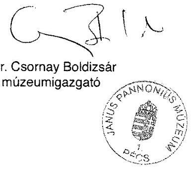

---

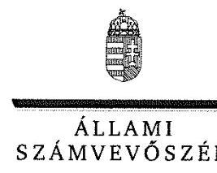

ELNÖK

Ikt.szám: V-0952-141/2016.

# Dr. Csornay Boldizsár úr 

igazgató
Janus Pannonius Múzeum

## Pécs

## Tisztelt Igazgató Úr!

A ,,Megyei hatókörű városi múzeumok ellenőrzése - Janus Pannonius Múzeum, Pécs" címmel készített számvevőszéki jelentéstervezetre tett észrevételét köszönettel megkaptam.
Az Állami Számvevőszék észrevételre vonatkozó álláspontjáról a felügyeleti vezető által készített részletes tájékoztatást csatoltan megküldöm.
Tájékoztatom Igazgató urat, hogy a számvevőszéki jelentésben - az Állami Számvevőszékről szóló 2011. évi LXVI. törvény 29. § (3) bekezdése alapján - a figyelembe nem vett észrevételeket szerepeltetjük az elutasítás indokának feltüntetésével.

Budapest, 2016. 11 hó 20. nap
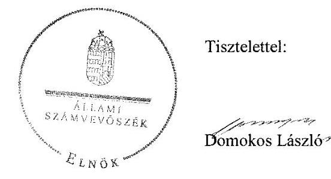

Melléklet: Tájékoztatás az el nem fogadott észrevételekről

---

# Tájékoztatás az el nem fogadott észrevételekről 

A „Megyei hatókörű városi múzeumok ellenőrzése - Janus Pannonius Múzeum, Pécs"című jelentéstervezetre tett és 2016. november 21 -én aláírt I-110-07/2016/508-1. iktatószámú levelével megküldött észrevételeit áttekintettük, annak kezeléséről az alábbi tájékoztatást adom.

## 1. Észrevétel a jelentéstervezet 1. kérdésköréhez kapcsolódóan:

Köszönettel vettük a jelentéstervezet 17. oldalán az 1. összegző megállapításhoz tett szövegjavaslatát, hogy ,, a vizsgált időszak feladatellátásának minősítését részben szabályszerűre szíveskedjenek módosítani". Az ellenőrzést az ellenőrzési program szempontjai, az ellenőrzött időszakban hatályos jogszabályok, az ellenőrzés szakmai szabályai, a jelen ellenőrzésre irányadó Állami Számvevőszék (továbbiakban: ÁSZ) módszertan és a nemzetközi standardok figyelembevételével végeztük. Az 1. fejezet részterületeinél - a feltárt hiányosságok következtében megfogalmazott megállapítások következtében a szövegjavaslatát nem fogadtuk el.

- Az 1.1. ponthoz kapcsolódó, az alapítói jogosultságok gyakorlása esetében az alapító okirat 2012. évi hiányosságával kapcsolatos észrevétele a megállapítást nem cáfolta, ezért azt nem módosítja.
- Az 1.2. ponthoz kapcsolódó, a munkáltatói jogosultságok gyakorlásához tett észrevétele nem cáfolta egyrészt azt, hogy a korábbi múzeumigazgató kinevezésével kapcsolatban az irányító szerv a muzeális intézményekről, a nyilvános könyvtári ellátásról és a közművelődésről szóló 1997. évi CXL. törvény 95/B. § (7)-(8) bekezdésekben előírtakat nem tartotta be. Továbbá nem cáfolta, hogy a Közgyűlés a gazdasági vezetőt úgy nevezte ki, hogy a gazdasági vezető szakképesítése nem felelt meg a számvitelről szóló 2000. évi C. törvény 150. § (1)-(2) bekezdésében és az államháztartásról szóló törvény végrehajtásáról szóló 368/2011. (XII. 31.) Korm. rendelet (továbbiakban: Ávr.) 12. § (1) bekezdés b) pontjában és (2) bekezdésében előírtaknak.
- Az egyéb irányítási, felügyeleti és ellenőrzési jogosultságok gyakorlásának hiányosságait az 1.3. ponthoz kapcsolódóan tett észrevétele nem cáfolta, így a megállapításokat nem módosítja.

## 2. Észrevétel a jelentéstervezet 2. kérdésköréhez kapcsolódóan:

Köszönettel vettük a jelentéstervezet 18. oldalán a 2. összegző megállapításhoz tett észrevételét és szövegjavaslatát, hogy ,, A Múzeumot érintő szervezeti, szerkezeti átszervezések egyes részletei objektív okok miatt nem teljesülhettek, ezért kérjük az értékelő megállapítások részben szabályszerűre történő módosítását. ". Észrevételét a részterületeknél - a feltárt hiányosságok következtében - megfogalmazott megállapítások alapján nem fogadtuk el.

---

- A 2.1. ponthoz kapcsolódó, az átadás-átvételi megállapodáshoz adott tájékoztatását köszönettel vettük. Tájékoztatása nem cáfolta, hogy az átadás-átvételi megállapodás tartalma nem felelt meg a megyei intézményfenntartó központokról, valamint a megyei önkormányzatok konszolidációjával, a megyei önkormányzati intézmények és a Fővárosi Önkormányzat egészségügyi intézményeinek átvételével összefüggő egyes kormányrendeletek módosításáról szóló 258/2011. (XII. 7.) Korm. rendelet 1. mellékletében foglaltaknak, valamint azt sem, hogy nem állt rendelkezésre a vagyon átadás-átvételi jegyzőkönyv. Mindezek alapján észrevétele a megállapítást nem módosítja.
- A 2.2. ponthoz tett észrevételét, mely szerint „Nem értünk egyet a megállapító értékelés azon pontjával, hogy a középirányító szerv és az irányító szerv az átadás-átvétel dokumentumok kezelése és tárolása során nem tett eleget az iratok visszakereshetőségére vonatkozóan. " nem fogadtuk el, mert az átadás-átvételi megállapodásban foglaltak végrehajtását a Baranya Megyei Intézményfenntartó Központ és a Pécs Megyei Jogú Város Önkormányzata nem dokumentálta, azokról jegyzőkönyvet nem készítettek, valamint a hiányzó dokumentumok akadályozták az irányító szervi váltás lebonyolításának teljes körű átláthatóságát. A 2.2. ponthoz tett további észrevétele nem cáfolta azt a tényt, hogy a kulturális javak felsorolása nem készült el, így észrevétele a megállapítást nem módosítja.

# 3. Észrevétel a jelentéstervezet 3. kérdésköréhez kapcsolódóan: 

- A 3.1. ponthoz adott tájékoztatását köszönettel vettük. Tájékoztatása a 3.1. számú megállapítás 1. bekezdésének 1. francia bekezdésében foglalt megállapítást (, a múzeumigazgató az SZMSZ-ben nem határozta meg a szervezeti egységek engedélyezett létszámát 2011-ben az Ámr. 20. § (2) bekezdés e) pontja, illetve 2012-ben az Ávr. 13. § (1) bekezdés e) pontjában foglaltak ellenére") nem cáfolja, ezért azt nem módosítja.
- A 3.3. ponthoz tett észrevételét nem fogadtuk el, mert az adatvédelmi szabályzatok ismételt felülvizsgálata alapján megalapozott a megállapítás, hogy a Múzeum nem gondoskodott továbbá az adatok biztonságáról, az adatok védelmének érvényre juttatásához szükséges eljárási szabályok kialakításáról 2011-ben az Avtv. 10. § (1) bekezdésének és a 2012-2014.
 években az Info. tv. 7. § (2)–(3) bekezdéseinek rendelkezése ellenére. A 2011–2014. évek között hatályos adatvédelmi szabályzatok 9.1. pontjában előírták, hogy az adatok biztonságának, védelmének érvényre juttatásához szükséges eljárási szabályokat szükséges kialakítani, azonban az ellenőrzés részére nem bocsátottak rendelkezésre olyan dokumentumot, amely az adatvédelmi szabályzat 9.1. pontjában előírtaknak megfelelt volna. Ezért észrevétele a megállapítást nem módosítja.
- A 3.4. ponthoz kapcsolódó, a Múzeum közzétételi kötelezettségének hiányával kapcsolatos észrevételét nem fogadtuk el. A beküldött dokumentumok ismételt felülvizsgálata és a helyszíni ellenőrzés ideje alatt készített honlap fotói alapján megállapítható, hogy az elektronikus közzétételi kötelezettség nem felelt meg az ellenőrzés éveiben, mert a 2011. december 31-ig hatályos, az elektronikus információszabadságról szóló 2005. évi XC. törvény 3. § (1) bekezdése és a 2012. január 1-jétől hatályos, az információs önrendelkezési jogról és az információszabadságról szóló 2011. évi CXII. törvény (továbbiakban: Info tv.) 33. § (1) és (3) bekezdései ellenére nem volt megtalálható az elemi költségvetés, költségvetési beszámoló és szervezeti ábra. Hiányosság volt, hogy a honlapon feltüntetett Múzeum részlegeinek neve nem egyezett meg az alapító okiratban foglalt megnevezésekkel, a közérdekű adatok megismerésének lehetőségét nem ismertették annak ellenére, hogy a közérdekű adatok megismerésére irányuló igények teljesítését az adatvédelmi szabályzatukban szabályozták. A Múzeum honlapján, az ,,Archivumban" sem volt fellelhető a 2011. évi költségvetési beszámoló az Info tv.-ben meghatározott őrzési időtartam ellenére. Ezek alapján észrevétele a megállapítást nem módosítja.

- A 3.5. számú megállapítás kapcsán tett észrevételét - ,,az értékelést kérjük részben szabályszerűre módosítani, mivel a jelentés megállapítása szerint a Múzeumnál a 2011-14. években az Ötv. 258/2011. (XII. 7.) Korm. rendelet, valamint a Mötv. rendelkezései alapján az irányító szerv és a középirányító szerv gondoskodott a Múzeum, mint felügyelt költségvetési szerv belső ellenőrzéséről. Az ellenőrzési javaslatok végrehajtása érdekében a múzeumigazgató a Ber. és Bkr. előírásainak megfelelő tartalmú intézkedési tervet készített." - nem fogadtuk el. Az ellenőrzést az ellenőrzési program szempontjai, az ellenőrzött időszakban hatályos jogszabályok, az ellenőrzés szakmai szabályai, az egyes ellenőrzési típusokhoz kapcsolódó ÁSZ módszertanok és nemzetközi standardok figyelembe vételével végeztük. A Múzeum belső kontrollrendszere jogszabályi előírások szerinti kialakításának és működtetésének szabályszerűségét az erre irányuló ellenőrzési kérdésekre adott válaszok összesítése alapján, évente pillérenként (kontrollkörnyezet, kockázatkezelési rendszer, kontrolltevékenységek, információs és kommunikációs rendszer, monitoring rendszer) és összesítetten is minősítettük. Ezek alapján az értékelést nem áll módunkban megváltoztatni. A számvevőszéki ellenőrzés által feltárt hiányosság volt egyrészt, hogy az irányító szerv 2011–2012-ben nem tartotta be a Munkamegosztási megállapodás belső ellenőrzési feladatok elvégzésére vonatkozó vállalt feladatot, ezzel nem gondoskodott a belső ellenőrzés működéséről a költségvetési szervek belső ellenőrzéséről szóló 193/2003. (XI. 26.) számú Korm. rendelet 4. § (1) és a költségvetési szervek belső kontrollrendszeréről és belső ellenőrzéséről szóló 370/2011. (XII. 31.) Korm. rendelet (továbbiakban: Bkr.) 15. § (6) bekezdésben foglaltak ellenére. Továbbá a 2013. és 2014. években az irányító szerv a fenntartói kötelezettségének megfelelően végzett ugyan belső ellenőrzéseket a Janus Pannonius Múzeumnál a jogszabályoknak megfelelően, de nem bocsátottak a számvevőszéki ellenőrzés rendelkezésére a belső ellenőrzési tevékenység megszervezésére olyan megállapodást, amely a Janus Pannonius Múzeum és az irányító szerv között a belső ellenőrzési feladatok ellátására vonatkozna, így nem tettek eleget az államháztartásról szóló 2011. évi CXCV. törvény 70. § (1) bekezdése és a Bkr. 15. § (1) bekezdés és a (5) előírásának, nem gondoskodtak a belső ellenőrzés kialakításáról.

# 4. Észrevétel a jelentéstervezet 4. kérdésköréhez kapcsolódóan: 

- A 4.1. számú - a 2011–2014. évek közötti maradvány - megállapítás kapcsán tett észrevételét nem fogadtuk el. A Janus Pannonius Múzeum a költségvetési maradványáról az adatszolgáltatási kötelezettséget az irányító szerv felé az éves beszámoló megküldésével egyidejűleg teljesítette. A Janus Pannonius Múzeum a 2011–2013. évi beszámolási időszakra az államháztartás szervezetei beszámolás és könyvvezetési kötelezettségének sajátosságairól szóló 249/2000. (XII. 24.) Korm. rendelet 10. § (1) bekezdésében, a 2014. évi beszámolási időszakra vonatkozóan az államháztartás számviteléről szóló 4/2013. (I. 11.) Korm. rendelet 32. § (1) bekezdésében előírt - a költségvetési évet követő február 28-ai - határidőn túl teljesítette adatszolgáltatási kötelezettségét. Így az észrevétele nem módosítja a megállapítást, amely szerint „A maradvány megállapítása a 2011–2014. években az irányító szerv1–3 felé teljesített adatszolgáltatás késedelme miatt nem felelt meg a jogszabályi előírásoknak.".
- A 4.2. számú megállapításhoz adott észrevételét nem fogadtuk el, mert a gazdasági vezető nem rendelkezett a számviteli szolgáltatás nyújtására jogosultságot biztosító engedéllyel, amely az Ávr. 12. § (2) bekezdésében foglalt előírásoknak nem felelt meg, így a 2014. évi beszámoló aláírására sem volt jogosult. Ezért észrevétele a megállapítást nem módosítja.
- A 4.3. számú megállapításhoz kapcsolódó bevételi előirányzatok alakulására adott tájékoztatását köszönettel vettük. A tájékoztatása a megállapítást nem cáfolta, így azt nem módosítja. A 4.3. számú megállapításhoz tett további észrevételét nem fogadtuk el. A kiadási előirányzat teljesítését mintavétellel kiválasztott mintatételek alapján értékeltük, amelynek sokaságra történő kivetítését a jelentéstervezetben „Az ellenőrzés módszerei" című fejezet részletesen tartalmazza. A dokumentumok ismételt felülvizsgálatát követően a kiemelt kiadási előirányzat teljesítése ellenőrzésénél a 2011. évben a szakmai teljesítésigazoló személyét a kötelezettségvállaló múzeumigazgató az államháztartás működési rendjéről szóló 292/2009. (XI. 19.) Korm. rendelet 76. § (5) bekezdésének előírása ellenére írásban nem jelölte ki. A 2012–2014. években több esetben előfordult, az Ávr. 57. § (3) bekezdésének előírása ellenére a kifizetés teljesítésigazolás nélkül történt. A 2013. évben az összeférhetetlenségi szabály az Ávr. 60. § (1) bekezdése előírásai alapján a működési kiadásoknál nem érvényesült, mert a kötelezettségvállaló és a pénzügyi ellenjegyző személye azonos volt. Az észrevétele a fentiek alapján a megállapításokat nem módosítja.
- A 4.4. számú megállapításhoz tett észrevételét nem fogadtuk el, mert a jelentéstervezet részletesen tartalmazza a feltárt hiányosságokat. A régészeti bevételek és kiadások elszámolásának ellenőrzése mintavétellel kiválasztott mintatételek alapján értékeltük, amelynek sokaságra történő kivetítését a jelentéstervezetben „Az ellenőrzés módszerei" című fejezet részletesen tartalmazza. A dokumentumok ismételt felülvizsgálatát követően megállapítható továbbra is, hogy a mintatételek esetében a 2013–2014. években kötött szerződésekhez nem készült a régészeti szaktevékenységek költségtételeit tartalmazó ajánlattétel, a megkötött szerződések nem tartalmazták különleges munkavégzési körülmények esetére vonatkozó rendelkezéseket. Ezért észrevétele a megállapítást nem módosítja.

# 5. Észrevétel a jelentéstervezet 5. számú kérdésköréhez kapcsolódóan: 

A Janus Pannonius Múzeum vagyongazdálkodásának összegző megállapításához adott értelmező véleményét köszönettel vettük. A vagyonkezelői szerződés hiánya miatt a számvevőszéki ellenőrzés megállapításait ez nem módosítja.

- Az 5.3. számú megállapításhoz tett észrevételéhez kapcsolódóan ezúton tájékoztatjuk, hogy a mintavétellel kiválasztott mintatételek alapján értékeltük a kulturális javak kölcsönzésének szabályszerűségét, amelynek sokaságra történő kivetítését a jelentéstervezetben „Az ellenőrzés módszerei" című fejezet részletesen tartalmazza. A dokumentumok ismételt felülvizsgálatát követően megállapítható, hogy a megkötött kölcsönzési szerződések több esetben nem tartalmazták a kölcsönvevő által a kölcsönzött kulturális javaknak biztosítandó állományvédelmi követelményeket, beleértve a klimatikus viszonyokat, továbbá a csomagolási-, szállítási feltételeket, valamint a kölcsönvevő által nyújtandó vagyonbiztonsági feltételeket. Ezek alapján észrevételét nem fogadtuk el, az a megállapítást nem módosítja.

# 6. Észrevétel az 6. számú feladathoz kapcsolódóan: 

Köszönettel vettük a 6. számú feladathoz kapcsolódó észrevételét, amelyben az értékelés módosítását kérte, de azt nem indokolta. A Janus Pannonius Múzeum az ÁSZ integritás projektjéhez a 2011–2014. években nem csatlakozott, kérdőívet nem töltött ki, az ellenőrzés során töltötte ki integritás tanúsítványt. Az integritás szemlélet érvényesülésének értékelése a Janus Pannonius Múzeum által szolgáltatott adatok alapján történt, ezért a megállapításokat észrevétele nem módosítja.

Budapest, 2016.
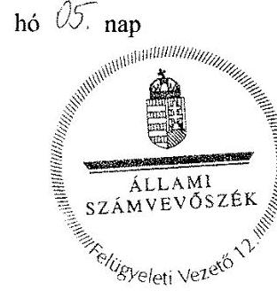

Pétő Krisztina felügyeleti vezető

---

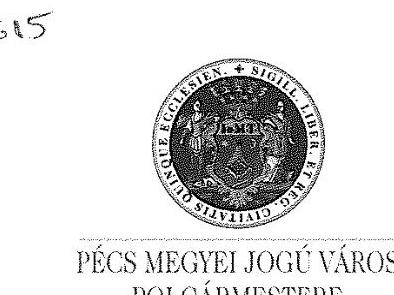

Ügyiratszám: 07-7/196-42/2016.
Állami Számvevőszék
Domokos László elnök részére

Tárgy: Jelentéstervezet megállapításaira vonatkozó észrevétel
Mell.: 2 db

# Budapest 

4. Pf. 54

1364

## Tisztelt Elnök Úr!

Köszönettel megkaptam a „Megyei hatókörű városi múzeumok ellenőrzése - Janus Pannonius Múzeum, Pécs" tárgyú ellenőrzéséről készült, V-0952-132/2016. iktatószámú, 2016. november 4. napján kelt, hivatalunkhoz 2016. november 8-án érkezett számvevőszéki jelentéstervezetet, mely megállapításaira vonatkozóan az Állami Számvevőszékről szóló 2011. évi LXVI. törvény 29. § (2) bekezdése alapján az alábbi észrevételt teszem.

A jelentéstervezet összegző megállapítását, miszerint a Janus Pannonius Múzeumra vonatkozó irányító szervi feladatellátás, a Múzeum pénzügyi- és vagyongazdálkodása nem volt szabályszerű, a kulturális javak nyilvántartásáról nem szabályszerűen gondoskodtak túlzónak és szigorúnak, esetenként általánosnak ítélem.

A jelentés áttanulmányozását követően azt állapítottam meg, hogy az elemzés több esetben nem hivatkozik arra, hogy mely dokumentumot vizsgáltak, mi alapján állapították meg a szabálytalanságot. A feltárt hibák, melyeket köszönettel fogadtunk, az intézmény működésére és törvényességre gyakorolt hatása véleményem szerint nem indokolja az összegzésben megfogalmazott mindenre kiterjedő teljes szabálytalanság megállapítását.
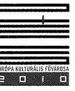

H-7621 PÉCS = Széchenyi tér 1. = Postacím: H-7602 Pécs = Pf. 58.
Telefon: +36 (72) 533-800, 533-807 Fax: +36 (72)212-049

---

# Az észrevételeimet az alábbiakban részletezem: 

1.) A jelentéstervezet 1. pontjában az irányító szerv ellenőrzött múzeumra vonatkozó feladatellátás szabályszerűségét érintő összegző megállapítás szerint:

## „Az irányító szerv ellenőrzött Múzeumra vonatkozó feladatellátása a 2011–2014. években összességében nem volt szabályszerű."

A megállapításban foglaltakat túlzónak vélem, és az alábbi észrevételekkel kívánok élni:

- A megyei hatókörű városi múzeumként működő Janus Pannonius Múzeum 2011. évtől több alkalommal jelentős szervezeti és gazdálkodási átalakuláson ment keresztül. A jelentéstervezetben az alapítói jogosultságok gyakorlására vonatkozó megállapítások kizárólag a 2011–2012. évre vonatkoznak, amely időpontban a múzeum a Baranya Megyei Önkormányzat, ezt követően a Baranya Megyei Intézményfenntartó Központ fenntartásában működött. 2013. évben - a központi alrendszerből önkormányzati alrendszerbe történő átszervezés során - került Pécs Megyei Jogú Város fenntartói irányítása alá.
A jelentéstervezet nem veszi figyelembe az ellenőrzést végzőknek átadott azon dokumentumokat, melyek a jogszabályi előírások szerint, az eljárási szabályok megtartásával készültek Pécs Megyei Jogú Város fenntartói irányítása alatt a 2013–2014. évben.
Az alapítói jogosultságok gyakorlásával kapcsolatosan vizsgálták a múzeum 2013–2014. évben készült alapító okiratait, levelünk 1. számú mellékletében felsorolt 15. dokumentumot, mellyel kapcsolatos megállapítás nem szerepel a jelentés tervezetében.
Véleményem szerint, ezen okiratok az Államháztartásról szóló 2011. évi CXCV. törvény előírásaihoz igazodóan szabályszerűek, a muzeális intézményekről, a nyilvános könyvtári ellátásról és a közművelődésről szóló 1997. évi CXL. törvény 45. § (5) bekezdése alapján a miniszter előzetesen véleményezése megtörtént, azokat a Magyar Államkincstár törzskönyvi nyilvántartásába vette.

Tisztelettel kérem, hogy szíveskedjenek az 1. számú mellékletben felsorolt dokumentumokat érintően az észrevételeiket megtenni, vagy a jelentésben rögzíteni azt, hogy Pécs Megyei Jogú Város Önkormányzata fenntartása idején, 2013–2014. évben az alapító okiratok és az alapító okiratokat módosító okiratok szakszerűek, és megfelelnek a vonatkozó jogszabályi előírásoknak.

A munkáltatói jogosultság gyakorlásával kapcsolatosan a jelentéstervezet kifogásolta, hogy az igazgató nem rendelkezett akkreditált vezetői képesítéssel. Megjegyezni kívánjuk, hogy a múzeum igazgatóját a Baranya Megyei Intézményfenntartó Központ bízta meg a vezetői feladatokkal 2012-ben. A volt igazgató doktori fokozattal rendelkező, több nyelven beszélő nemzetközileg elismert szaktekintély.
 Az igazgató megbízását a fenntartóváltás nem érintette, az folyamatos volt a múzeum Pécs Megyei Jogú Város fenntartásába kerülésekor is. A vezetői tanfolyam elvégzését az Önkormányzat valóban nem írta elő, ugyanis az igazgató bejelentette

---

jogviszonya megszüntetésének szándékát, mely 2013. május 31. napján ténylegesen meg is szűnt.

A jelentéstervezetben foglaltak szerint a 2013-ban kinevezett gazdasági vezető nem rendelkezett költségvetési gyakorlattal, „ezért az éves beszámoló aláírására nem volt jogosult". Az észrevételt köszönettel fogadtuk, azonban megjegyezni kívánjuk, hogy a gazdasági vezető költségvetési gyakorlatának hiánya nem eredményezi az éves beszámoló aláírásának jogszerűtlenségét. Meglátásunk szerint a gazdasági vezető a vezetői megbízása alapján jogosult volt a beszámoló aláírására, hiszen ezen kompetencia a kinevezéséből adódik, nem pedig a költségvetési gyakorlatához kötött.

- Az egyéb irányítási, felügyeleti és ellenőrzési jogok gyakorlása az ellenőrzött időszakban összességében a - jelentéstervezet szerint - nem volt szabályszerű. Az ellenőrzésről készült jelentés szerint, a fenntartó elmulasztotta a múzeum küldetésnyilatkozatának, stratégiai tervének, fejlesztési és beruházási feladatainak jóváhagyását, amelyet természetesen pótolni fogunk, illetve részben már pótoltunk. A múzeum 2016. évi munkaterve tartalmazza az intézmény stratégiai és fejlesztési tervét, melyet a Közgyűlés átruházott jogkörében Pécs Megyei Jogú Város Önkormányzata Közgyűlése Kulturális és Köznevelési Bizottsága 92/2016. (05. 25.) számú határozatával elfogadott.
A jelentéstervezet nem veszi figyelembe az ellenőrzést végzőknek átadott, levelünk 2. számú mellékletében felsorolt 8 dokumentumot, így a múzeum 2013-2014. évi munkatervét és annak jóváhagyását, valamint a 2013-2014. évi beszámolókat, és annak fenntartói jóváhagyását. A munkaterveket és beszámolókat érintően - a muzeális intézményekről, a nyilvános könyvtári ellátásról és a közművelődésről szóló 1997. évi CXL. törvény előírásaira figyelemmel - a fenntartó jóváhagyta, a miniszteri vélemény beszerzése megtörtént. Ebből adódóan a munkatervek, és beszámolók jóváhagyását érintően a fenntartói irányítási joggyakorlás meglátásunk szerint a 2013-2014. évben szabályszerű volt.

Tisztelettel kérem Elnök Urat, hogy szíveskedjen tájékoztatni arról, hogy a munkaterveket és beszámolókat érintően mely dokumentumokban milyen szabálytalanságokat észrevételeztek. Amennyiben a múzeum munkatervei és beszámolói az Önök megítélése szerint is jogszerűek és szakszerűek kérem, szíveskedjenek a jelentésben rögzíteni azt, hogy Pécs Megyei Jogú Város Önkormányzata fenntartása idején, 2013-2014. évben a Janus Pannonius Múzeum munkaterve és beszámolója, annak fenntartói jóváhagyása szabályszerű.

# 2.) A fentiekben foglaltakat erősíti meg a jelentéstervezetben megfogalmazott 4 javaslat, melyet köszönettel fogadunk. 

A javaslatok 1. pontjában meghatározottak szerint a múzeum küldetésnyilatkozatának jóváhagyását mielőbb, a 2017. januári közgyűlés napirendjére tüzzük.

---

A jelentéstervezet 2. pontjában javasoltak szerint a múzeum stratégiai tervének, fejlesztési és beruházási feladatainak meghatározása és jóváhagyása szükséges, melyet részben már pótoltunk. A múzeum 2016. évre szóló munkatervének már része a stratégiai terv is, melyet a közgyűlés átruházott jogkörében 92/2016.(05. 25.) számú határozatával, 2016. május 25. napján jóváhagyott.

A javaslatok 3. pontjában meghatározottakat érintően a múzeum Szervezeti és Működési Szabályzatának módosítása szükséges, melynek érdekében már intézkedtem. A múzeum Szervezeti és Működési Szabályzatát a közgyűlés átruházott jogkörében 107/2016. (06. 20.) számú határozatában, 2016. június 20. napján jóváhagyta.

A javaslatok 4. pontjában megfogalmazott intézkedéseket, az Állami Számvevőszéki Jelentés végleges kiadását követően, azonnali hatállyal, maradéktalanul megteszem.

A fentiekben foglaltakra tekintettel a jelentéstervezetben tett megállapítások véleményünk szerint nem támasztják alá teljes mértékben az irányító szervek feladatellátásának szabályszerűtlenségét, ezért kérjük, szíveskedjenek az összegző megállapításban a „nem volt szabályszerű" minősítést, „részben szabályszerű" minősítésre módosítani.
3.) A jelentéstervezet 2-6. pontja a múzeum szervezeti, szerkezeti átszervezését a belső kontrollrendszer kialakítását a pénzügyi gazdálkodását és vagyongazdálkodását, valamint az integritás szemlélet érvényesítését érintette, mely a jelentéstervezet összegző megállapítása szerint nem volt szabályszerű.

A jelentéstervezet több esetben szabálytalanságot állapít meg, illetve téves következtetést von le a gazdasági vezető képesítésének, költségvetési gyakorlatának hiányossága okán. A jelentéstervezet 1. pontjában valamint a 4.2. pontjában megállapítják, hogy az intézmény éves költségvetési beszámolója szabálytalan, „a 2014. évi beszámoló a gazdasági vezető aláírási jogának jogosulatlan gyakorlása miatt nem volt érvényes". Ismételten megjegyezzük, hogy a gazdasági vezető határozatlan időre szóló közalkalmazotti kinevezéssel és gazdasági vezetői megbízással rendelkezett, ebből adódóan jogszerűen írta alá a hivatkozott dokumentumokat.

A jelentéstervezet 4.3. pontjában megállapítják, hogy a kiadási előirányzatok teljesítésével összefüggő kifizetések során „az összeférhetetlenségi szabály nem érvényesült maradéktalanul, mert a kötelezettségvállaló és a pénzügyi ellenjegyző azonos volt", valamint a „pénzügyi ellenjegyzést végző saját maga javára rendelt el kifizetést". Kérjük, szíveskedjenek megjelölni konkrétan, hogy mely dokumentumok esetében tapasztalták a szabályszerűtlenséget, valamint az összeférhetetlenségi szabály megsértését.

A jelentéstervezet 5.3. pontjában megállapítják, hogy a kulturális javak hasznosítása és kölcsönzése az ellenőrzött időszakban nem felelt meg a jogszabályi előírásoknak, azonban a jelentéstervezet nem tér ki arra, hogy mely konkrét kölcsönzési szerződés kapcsán jutottak a fenti megállapításra.

---

A jelentéstervezet szerint a kulturális javak vagyonbiztonságára és állományvédelmére vonatkozó előírásokat nem érvényesítették megfelelően, azonban e megállapítást nem támasztja alá konkrét dokumentumra hivatkozás.

A fentiekben foglaltakra tekintettel kérjük, hogy azon összegző megállapítást, mely szerint a múzeum pénzügyi- és vagyongazdálkodása nem volt szabályszerű, a kulturális javak nyilvántartásáról nem szabályszerűen gondoskodtak szíveskedjenek módosítani, részben szabályszerű minősítésre változtatni.

# Tisztelt Elnök Úr! 

A Janus Pannonius Múzeum (JPM) 15 telephelyen működő, országosan elismert, a vidék egyik legnagyobb gyűjteményével rendelkező megyei hatókörű városi múzeuma. Pécsett, a kultúra városában kiemelkedő az intézmény tudományos, közművelődési, közösségformáló szerepe, akárcsak a történelmi belváros arculatát meghatározó jelenléte.
A JPM intenzív tudományos, közművelődési, ismeretterjesztő, múzeumpedagógiai foglalkozásai révén segíti a város és a megye valamennyi korosztályának tartalmas, kulturált időtöltését, az élethosszig tartó tanulás folyamatába való bekapcsolódását, a Múzeum társadalmi felelősségvállalásának erősítését. Országhatáron átívelő kutatásokat, kiállításokat szervez, mely nemzetközileg is elismertté tette az intézményt. Kiadványai több nyelven megjelenő, Európában is elismert kiadványok.

A múzeum jogszerű működése érdekében több intézkedést tettünk, így az államháztartásról szóló 2011. évi CXCV. törvény előírásaihoz igazodóan, a Közgyűlés 367/2015. (11. 19.) számú határozata alapján 2016. január 1-jétől megszűnt a múzeum önálló gazdálkodási jogköre. Az intézmény az előirányzatok felett részleges jogkörrel rendelkező költségvetési szervként működik, a gazdálkodási feladatokat a Pécs Városi Költségvetési Központi Elszámoló Szervezet látja el.
A gazdasági-műszaki vezető kérelmére a közalkalmazotti jogviszonya 2015. szeptember 20-án - közös megegyezéssel - megszűnt.
Az igazgatói feladatok ellátásában is változás következett be, a Közgyűlés 391/2015. (12. 10.) számú határozata alapján magasabb vezetői megbízást Dr. Csornay Boldizsár kapott 2016. február 1. napjától 2021. január 30. napjáig terjedő határozott időre.

Az intézmény vezetésében és működésében bekövetkezett változások garanciát jelentenek a Janus Pannonius Múzeum szakszerű és jogszerű működésére.

## Tisztelt Elnök Úr!

A fentiekben foglaltakra tekintettel úgy véljük, hogy a jelentéstervezetben tett megállapítások nem támasztják alá teljes mértékben az irányító szervek feladatellátásának szabályszerűtlenségét.

Nem tartjuk indokoltnak a Janus Pannonius Múzeum szervezeti, szerkezeti átszervezésére, a belső kontrollrendszerének kialakítására, a pénzügyi gazdálkodására és vagyongazdálkodására, valamint az integritás szemlélet érvényesítésére vonatkozó teljes szabályszerűtlenség megállapítását.

---

Tisztelettel kérjük Elnök urat, szíveskedjenek a „Megyei hatókörű városi múzeumok ellenőrzése" tárgyú Számvevőszéki jelentés összegző megállapításában a „nem volt szabályszerű" minősítést, „részben szabályszerű" minősítésre módosítani, mind az irányító szervek, mind a múzeum gazdálkodását érintően.

Köszönettel és tisztelettel:

Pécs, 2016. november 22.
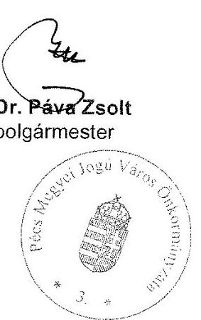

---

# 1. számú melléklet

|  Dokumentum megnevezése | Ügyiratszám | Az ügyirat készítésének időpontja  |
| --- | --- | --- |
|  Alapító okirat megküldése véleményezésre EMMI-nek 08-8-141-54-2013 | 08-8-141-54-2013 | 2013.05.13.  |
|  Alapító okirat EMMI véleményezése 30587 1 KOZGYUJT | 30587 1 KOZGYUJT | 2013.06.10.  |
|  Alapító okirat módosítása KGY hat. 169/2013 05 16 | KGY hat. 169/2013 05 16 | 2013.05.16.  |
|  Alapító okirat 20130715 | 20130715 | 2013.07.15.  |
|  Módosító okirat 20130715 | 20130715 | 2013.07.15.  |
|  EMMI vélemény kérése alapító okiratról 08-8-247-2-2014 | 08-8-247-2-2014 | 2014.01.10.  |
|  EMMI véleményezés alapító okiratról 7650-1-2014-KOZGYUJT | 7650-1-2014-KOZGYUJT | 2014.01.29.  |
|  KGY határozat alapító okirat módosításáról 10-20140206 | 10-20140206 | 2014.02.06.  |
|  Alapító okirat 20140213 | 20140213 | 2014.02.13.  |
|  Törzskönyvi nyilvántartás adatmódosítása, Törzskönyvi kivonat 02 TNY 732 4-2012330266 | 02 TNY 732 4-2012330266 | 2013.01.15.  |
|  Véleménykérés EMMI-től alapító okiratról 08-8-247-19-2014 | 08-8-247-19-2014 | 2014.06.03.  |
|  EMMI válasz alapító okiratról 7650-3-2014-KOZGYUJT | 7650-3-2014-KOZGYUJT | 2014.07.04.  |
|  KGY határozat alapító okirat módosításról 224-20140619 | 224-20140619 | 2014.06.19.  |
|  Módosító okirat 20140624 | 20140624 | 2014.06.24.  |
|  Alapító okirat 20140624 | 20140624 | 2014.06.24.  |

---

# 2. számú melléklet

|  Dokumentum megnevezése | Ügyiratszám | Az ügyirat készítésének időpontja  |
| --- | --- | --- |
|  2013. évi munkaterv 08-8/141-30/2013 | 08-8/141-30/2013 | 2012. 03. 14.  |
|  2012. évi beszámoló és 2013. évi munkaterv megküldése EMMI-nek 08-8/141-31/2013 | 08-8/141-31/2013 | 2013. 03. 18.  |
|  2012. évi beszámoló és 2013. évi munkaterv jóváhagyása 58/2013 04:10 | 58/2013 04:10 | 2013. 04. 10.  |
|  2014. évi munkaterv | 2014 munkaterv | 2013. 11. 10.  |
|  2013. évi beszámoló | 2014. 04. 04. | 2014. 04. 04.  |
|  2014. évi beszámoló | 2015. 03. 12. | 2015. 03. 12.  |
|  2014. évi munkaterv EMMI értékelése | 2014 Munkaterv EMMI értékelése | 2014.  |
|  2014. évi teljesítményértékelés | 2014 Teljesítményértékelés | 2014. 11. 11.  |

---

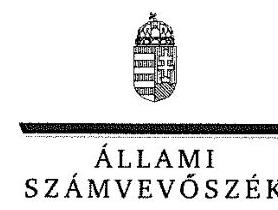

ELNÖK

Ikt.szám: V-0952-143/2016.

# Dr. Páva Zsolt úr 

polgármester
Pécs Megyei Jogú Város Önkormányzata

## Pécs

## Tisztelt Polgármester Úr!

A „Megyei hatókörű városi múzeumok ellenőrzése - Janus Pannonius Múzeum, Pécs" címmel készített számvevőszéki jelentéstervezetre tett észrevételét köszönettel megkaptam.
Az Állami Számvevőszék észrevételre vonatkozó álláspontjáról a felügyeleti vezető által készített részletes tájékoztatást csatoltan megküldöm.
Tájékoztatom Polgármester urat, hogy a számvevőszéki jelentésben - az Állami Számvevőszékről szóló 2011. évi LXVI. törvény 29. § (3) bekezdése alapján - a figyelembe nem vett észrevételeket indoklással szerepeltetjük.

Budapest, 2016. 12. hó 0. nap
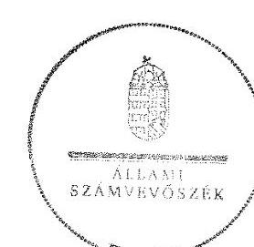

Tisztelettel:

## Domokos László

Melléklet: Tájékoztatás az el nem fogadott észrevételekről

---

# Tájékoztatás az el nem fogadott észrevételekről 

A „Megyei hatókörű városi múzeumok ellenőrzése - Janus Pannonius Múzeum, Pécs"című jelentéstervezetre tett és 2016. november 22-én aláírt 07-7/196-42/2016. iktatószámú levelével megküldött észrevételeit áttekintettük, annak kezeléséről az alábbi tájékoztatást adom.

## Észrevétel a jelentéstervezet „Összegzö" fejezetének megállapításaihoz kapcsolódóan:

Köszönettel vettük a jelentéstervezet összegző megállapításaihoz adott véleményét. Tájékoztatjuk, hogy az ellenőrzést az ellenőrzési program szempontjai, az ellenőrzött időszakban hatályos jogszabályok, az ellenőrzés szakmai szabályai, a jelen ellenőrzésre irányadó Állami Számvevőszék (továbbiakban: ÁSZ) módszertan és a nemzetközi standardok figyelembevételével végeztük.

## 1. Észrevétel a Jelentéstervezet 1. fejezetének megállapításához kapcsolódóan:

Az 1. fejezet összegző megállapításához kapcsolódóan adott észrevételét nem fogadjuk el, mert az az alapítói, a munkáltatói és
 az egyéb irányítási, felügyeleti és ellenőrzési jogosultságok gyakorlásának összevont megállapítását tartalmazza.

- Az 1. pont első francia bekezdésében tett észrevételéhez tájékoztatjuk, hogy a jelentéstervezet az alapítói jogosultságok gyakorlása esetében az alapító okirat 2012. évi hiányosságával kapcsolatban tartalmaz megállapítást, a 2013-2014. évre nem. Észrevétele a megállapítást nem cáfolja, ezért azt nem módosítja.
- Az 1. pont második francia bekezdésében a munkáltatói jogosultságok gyakorlásához tett észrevétele nem cáfolja a korábbi múzeumigazgató kinevezésével kapcsolatos hiányosságokat, azaz az irányító szerv a muzeális intézményekről, a nyilvános könyvtári ellátásról és a közművelődésről szóló 1997. évi CXL. törvény 95/B. § (7)-(8) bekezdésekben előírtakat nem tartotta be. Továbbá azt sem cáfolja, hogy a Közgyűlés a gazdasági vezetőt úgy nevezte ki, hogy az nem felelt meg a számvitelről szóló 2000. évi C. törvény (továbbiakban: Számv. tv.) 150. § (1)-(2) bekezdésében és az államháztartásról szóló törvény végrehajtásáról szóló 368/2011. (XII. 31.) Korm. rendelet (továbbiakban: Ávr.) 12. § (1) bekezdés b) pontjában és (2) bekezdésében előírtaknak. A gazdasági vezető a 2014. évi beszámoló aláírására nem volt jogosult, mert az államháztartás számviteléről szóló 4/2013. (I. 11.) Korm. rendelet (továbbiakban: Áhsz.) 31. § (3) bekezdése alapján, ha a beszámolási feladatok ellátására az Ávr. 12. § (2) bekezdésének alkalmazásával került sor, a beszámolót a gazdasági vezető helyett a gazdasági vezető irányítása alá tartozó személynek kellett volna aláírni. Észrevételei így a megállapításokat nem módosítják.

---

- Az 1. pont ötödik francia bekezdésében az egyéb irányítási, felügyeleti és ellenőrzési jogosultságok gyakorlásának megállapításaira tett észrevételét nem fogadtuk el. Köszönettel vettük tájékoztatását a Múzeum 2016. évben elfogadott stratégiai és fejlesztési tervével kapcsolatban, az az ellenőrzött időszakon túlmutat. Tájékoztatjuk, hogy a számvevőszéki ellenőrzés során minden, az ÁSZ részére átadott dokumentumot figyelembe vettünk, ezért a Múzeum 2013-2014. évi munkatervének, valamint a 2013-2014. évi beszámolóinak és azok fenntartói jóváhagyása dokumentumainak hiányát a jelentéstervezet nem kifogásolta, azonban ezen túlmenően a számvevőszéki ellenőrzés tárt fel hiányosságokat az ellenőrzött időszakban. A középirányító szerv a megyei intézményfenntartó központokról, valamint a megyei önkormányzatok konszolidációjával, a megyei önkormányzati intézmények és a Fővárosi Önkormányzat egészségügyi intézményeinek átvételével összefüggő egyes kormányrendeletek módosításáról szóló 258/2011. (XII. 7.) Korm. rendelet 11. § (1) bekezdés b)-c) pontjaiban foglaltak ellenére 2012-ben nem határozta meg az irányítása alá tartozó Múzeum gazdálkodásának részletes rendjét, az előirányzatok felhasználására vonatkozó irányelveket. A 2013-2014. években a muzeális intézményekről, a nyilvános könyvtári ellátásról és a közművelődésről szóló 1997. évi CXL. törvény előírásai ellenére nem határozták meg és nem hagyták jóvá a Múzeum stratégiai tervét, fejlesztési és beruházási feladatait, továbbá elmulasztották a küldetésnyilatkozat jóváhagyását is. Az ellenőrzést a jelen ellenőrzésre irányadó ÁSZ módszertan figyelembevételével végeztük és a jelentéstervezet 1. fejezete esetében a 2011-2014. évek vonatkozásában összességében értékeltük az ellenőrzési kérdésekre adott válaszokat. Ezek alapján az értékelés módosítására tett javaslatát, az előzőekben bemutatott szabálytalanságok miatt nem fogadtuk el.

# 2. A 2. pontban tett észrevételeihez kapcsolódóan: 

Köszönettel vettük a 2. pontban adott tájékoztatását, hogy a feltárt szabálytalanságok, hiányosságok vonatkozásában milyen intézkedéseket tett, illetve kíván tenni. Észrevétele megállapítást nem cáfol, az az ellenőrzött időszakon túlmutat. Az értékelés módosítására tett javaslatát nem áll módunkban figyelembe venni, mert az ellenőrzést a jelen ellenőrzésre irányadó ÁSZ módszertana figyelembevételével végeztük. A rendelkezésre bocsátott adatok, információk kontrollja az ellenőrzés keretében történt. Az ellenőrzési kérdésekre adott válaszok alapján értékeltük, hogy az irányító szerv az ellenőrzött Múzeumra vonatkozóan az ellenőrzött időszakban feladatellátását szabályszerűen végezte-e.

## 3. A 3. pontban tett észrevételeihez kapcsolódóan:

- A 4.2. számú megállapításhoz adott észrevételét, mely szerint „a gazdasági vezető határozatlan időre szóló közalkalmazotti kinevezéssel és gazdasági vezetői megbízással rendelkezett, ebből adódóan jogszerűen írta alá a hivatkozott dokumentumokat" nem fogadtuk el, mert a gazdasági vezető kinevezése az Ávr. 12. § (1) bekezdés b) pontjában és (2) bekezdésében foglalt előírásoknak nem felelt meg, nem rendelkezett a számviteli szolgáltatás nyújtására jogosultságot biztosító engedéllyel, továbbá nem rendelkezett a Számv. tv. 150. § (1) és (2) bekezdése szerinti feladatok ellátásában költségvetési szervnél legalább öt éves igazolt szakmai gyakorlattal. Mindezek és az Áhsz. 31. § (3) bekezdése alapján a gazdasági vezető a 2014. évi beszámoló aláírására nem volt jogosult. Ezért észrevétele a megállapítást nem módosítja.

- A 4.3. számú megállapításhoz tett észrevételét nem fogadtuk el. A kiadási előirányzat teljesítését mintavétellel kiválasztott mintatételek alapján értékeltük, amelynek sokaságra történő kivetítését a jelentéstervezetben az ,,Az ellenőrzés módszerei" című fejezet részletesen tartalmazza. A kiemelt kiadási előirányzat teljesítése ellenőrzésénél megállapításra került, hogy 2013. évben az összeférhetetlenségi szabály az Ávr. 60. § (1) bekezdése előírásai alapján a működési kiadásoknál nem érvényesült, mert a kötelezettségvállaló és a pénzügyi ellenjegyző személye azonos volt.
- Az 5.3. számú megállapításhoz tett észrevételéhez tájékoztatjuk, hogy mintavétellel kiválasztott mintatételek alapján értékeltük a kölcsönzési tevékenységet. A dokumentumok ismételt felülvizsgálata megalapozza a feltárt hiányosságokat, többek között, hogy a megkötött kölcsönzési szerződések több esetben nem tartalmazták a kölcsönvevő által a kölcsönzött kulturális javaknak biztosítandó állományvédelmi követelményeket, beleértve a klimatikus viszonyokat, továbbá a csomagolási-, szállítási feltételeket, valamint a kölcsönvevő által nyújtandó vagyonbiztonsági feltételeket. Észrevétele megállapítást nem módosít.

Budapest, 2016.
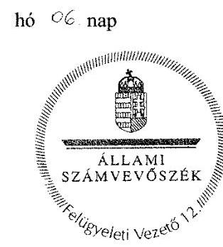
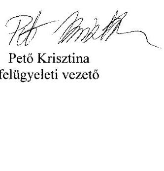

---

# RÖVIDÍTÉSEK JEGYZÉKE 

${ }^{1}$ Múzeum

${ }^{2}$ ÁSZ
${ }^{3} \mathrm{Mtv}$.
${ }^{4}$ Kötv.
${ }^{5} \mathrm{Kjt}$.
${ }^{6}$ múzeumigazgató
${ }^{7}$ Möktv.
${ }^{8}$ 258/2011. (XII. 7.) Korm. rendelet
${ }^{9}$ 2012. évi CLII. törvény
${ }^{10}$ 1311/2012. (VIII.23.) Korm. határozat
${ }^{11}$ KIM
${ }^{12}$ 2015. évi LXXV. tv.
${ }^{13}$ Nvtv.
${ }^{14}$ Alaptörvény
${ }^{15}$ Áht. 3
${ }^{16}$ Ávr.
${ }^{17}$ BMIK
${ }^{18}$ ÁSZ tv.
${ }^{19}$ alapító okirat
alapító okirat

Baranya Megyei Múzeumok Igazgatósága (2011. január 1-jétől 2012. december 31-ig)
Janus Pannonius Múzeum (2013. január 1-jétől)
Állami Számvevőszék
1997. évi CXL. törvény a muzeális intézményekről, a nyilvános könyvtári ellátásról és a közművelődésről (hatályos: 1998. január 1-jétől)
2001. évi LXIV. törvény a kulturális örökség védelméről (hatályos: 2001. július 10-től)
1992. évi XXXIII. törvény a közalkalmazottak jogállásáról (hatályos: 1992. július 1-jétől)
Janus Pannonius Múzeum (valamint jogelődje a Baranya Megyei Múzeumok Igazgatósága) igazgatója
2011. évi CLIV. törvény a megyei önkormányzatok konszolidációjáról, a megyei önkormányzati intézmények és a Fővárosi Önkormányzat egyes egészségügyi intézményeinek átvételéről (hatályos: 2012. január 1-jétől)
258/2011. (XII. 7.) Korm. rendelet a megyei intézményfenntartó központokról, valamint a megyei önkormányzatok konszolidációjával, a megyei önkormányzati intézmények és a Fővárosi Önkormányzat egészségügyi intézményeinek átvételével összefüggő egyes kormányrendeletek módosításáról (hatályos: 2011. december 8-tól)
2012. évi CLII. törvény a muzeális intézményekről, a nyilvános könyvtári ellátásról és a közművelődésről szóló 1997. évi CXL. törvény módosításáról (hatályos: 2012. november 2-től)
1311/2012. (VIII. 23.) Korm. határozat a megyei múzeumok, könyvtárak és közművelődési intézmények fenntartásáról
Közigazgatási és Igazságügyi Minisztérium
a megyei könyvtárak és a megyei hatókörű városi múzeumok feladatának ellátását szolgáló egyes állami tulajdonú vagyontárgyak ingyenes önkormányzati tulajdonba adásáról szóló 2015. évi LXXV. törvény (hatályos 2015. július 18-tól)
2011. évi CXCVI. törvény a nemzeti vagyonról (hatályos 2011. december 31-től)
Magyarország Alaptörvénye
2011. évi CXCV. törvény az államháztartásról (hatályos: 2012. január 1-jétől) az államháztartásról szóló törvény végrehajtásáról szóló 368/2011. (XII. 31.) Korm. rendelet (hatályos: 2012. január 1-jétől)
Baranya Megyei Intézményfenntartó Központ
Az Állami Számvevőszékről szóló 2011. évi LVI. törvény (hatályos: 2011. július 1-jétől)
Baranya Megyei Múzeumok Igazgatósága Alapító Okirata (hatályos: 2011. január 1-től-február 21-ig) jóváhagyó határozat: 113/2010. (XII. 2.) Kgy. határozat
Baranya Megyei Múzeumok Igazgatósága Alapító Okirata (hatályos: 2011. február 22-től-2011. december 31-ig) jóváhagyó határozat: 19/2011. (II. 22.) Kgy. határozat

---

alapító okirat
alapító okirat
alapító okirat
alapító okirat
alapító okirat
alapító okirat
${ }^{20}$ középirányító szerv
${ }^{21}$ Kincstár
${ }^{22}$ irányító szerv
irányító szerv
irányító szerv
${ }^{23}$ átadás-átvételi megállapodás
${ }^{24}$ Áhsz.
${ }^{25}$ NGM módszertani útmutató
${ }^{26}$ átadás-átvételi megállapodás
${ }^{27}$ Ltv.
${ }^{28} \mathrm{Ikr}$.
${ }^{29}$ átadás-átvételi megállapodás
${ }^{30}$ munkamegosztási megállapodás
${ }^{31}$ gazdasági szervezet
gazdasági szervezet
${ }^{32} \mathrm{SZMSZ}$

Baranya Megyei Múzeumok Igazgatósága Alapító Okirata (hatályos: 2012. január 1-től-2012. december 31-ig) jóváhagyó okirat: IX-09/30/300/2012. Janus Pannonius Múzeum Alapító Okirata (hatályos: 2013. január 1-től-július 14-ig) jóváhagyó határozat: 413/2012. (XII. 13.) Kgy. határozat
Janus Pannonius Múzeum Alapító Okirata (hatályos: 2013. július 15-től-2013. december 31-ig) jóváhagyó határozat: 169/2013. (V. 16.) Kgy. határozat
Janus Pannonius Múzeum Alapító Okirat kiegészítése (hatályos: 2014. január 1-től-február 10-ig) jóváhagyó okirat: 08-8/247-5/2014.
Janus Pannonius Múzeum Alapító Okirata (hatályos: 2014. február 11-től-2014. június 30-ig) jóváhagyó határozat: 10/2014. (II. 6.) Kgy. határozat
Janus Pannonius Múzeum Alapító Okirata (hatályos: 2014. július 1-jétől) jóváhagyó határozat:224/2014. (VI. 19.) Kgy. határozat
Baranya Megyei Intézményfenntartó Központ (2012. január 1-jétől 2012. december 31-ig)
Magyar Államkincstár
Baranya Megyei Önkormányzat Közgyűlése (2011. január 1-től-2011. december 31-ig)
Közigazgatási és Igazságügyi Minisztérium az illetékes Kormányhivatal útján (2012. január 1-től-2012. december 31-ig)

Pécs Megyei Jogú Város Önkormányzatának Közgyűlése (2013. január 1-jétől)
a Baranya Megyei Önkormányzat, a Baranya Megyei Intézményfenntartó Központ és az MNV Zrt. között a megyei intézmények állami fenntartásba vétele tárgyában 2011. december 28-án megkötött megállapodás 249/2000. (XII. 24.) Korm. rendelet az államháztartás szervezetei beszámolás és könyvvezetési kötelezettségének sajátosságairól (hatályos: 2001. január 1-jétől 2013. december 31-ig)

Nemzetgazdasági Minisztérium módszertani útmutató beszámoló garnitúrák összeállításához
a Baranya Megyei Intézményfenntartó Központ és Pécs Megyei Jogú Város Önkormányzata között a megyei múzeum átadás-átvétele tárgyában 2012. december 14-én kötött megállapodás
1995. évi LXVI. törvény a közokiratokról, a közlevéltárakról és a magánlevéltári anyag védelméről (hatályos: 1996. január 1-jétől) 335/2005. (XII. 29.) Korm. rendelet a közfeladatot ellátó szervek iratkezelésének általános követelményeiről (hatályos: 2006. január 1-jétől)
Megállapodás fenntartói jog, illetve kötelezettség átadás-átvételéről kelt 2012. december 29-én

A Baranya Megyei Önkormányzati Hivatal és a Baranya Megyei Múzeumok Igazgatósága között a pénzügyi-gazdasági feladatok ellátására kötött munkamegosztási megállapodás (hatályos: 2011. január 1-jétől 2011. december 31-ig)
Baranya Megyei Önkormányzati Hivatal 2011. január 1-jétől 2011. december 31-ig
Baranya Megyei Intézményfenntartó Központ (2012. január 1-jétől 2012. december 31-ig)
7/2008. (VI. 18.) OKB számú határozattal jóváhagyott Baranya Megyei Múzeumok Igazgatósága Szervezeti és Működési Szabályzata (hatályos: 2008. június 18-tól 2011. április 19-ig)

---

SZMSZ
${ }^{33}$ Ámr.
${ }^{34}$ számviteli politika
${ }^{35}$ számlarend
${ }^{36}$ eszközök és források értékelési szabályzat
${ }^{37}$ Bkr.
${ }^{38} \mathrm{SZMSZ}$
SZMSZ
SZMSZ
${ }^{39}$ Áhsz.
${ }^{40}$ FEUVE szabályzat
${ }^{41}$ belső kontrollrendszer szabályzat
${ }^{42}$ Vnytv.
${ }^{43}$ Avtv.
${ }^{44}$ Info. tv.
${ }^{45}$ Eitv.
${ }^{46}$ Áht.
${ }^{47}$ Ötv.
${ }^{48}$ Ber.
${ }^{49}$ leltározási szabályzat
leltározási szabályzat
leltározási szabályzat
${ }^{50}$ gazdasági szervezet pénzkezelési szabályzata
${ }^{51}$ Ptk.

16/2011. (IV. 20.) Kult. Biz. határozattal jóváhagyott Baranya Megyei Múzeumok Igazgatósága Szervezeti és Működési Szabályzata (hatályos: 2011. április 20-tól 2013. február 26-ig)
az államháztartás működési rendjéről szóló 292/2009. (XI.19.) Korm. rendelet (hatályos: 2011. december 31-ig)
Baranya Megyei Múzeumok Igazgatósága Számviteli Politika (hatályos: 2008. január 1-től 2011. december 31-ig)

Baranya Megyei Múzeumok Igazgatósága Számlarend (hatályos: 2008. január 1-jétől 2013. október 31-ig)
Baranya Megyei Múzeumok Igazgatósága Eszközök és Források Értékelési
 Szabályzata (hatályos: 2008. január 1-jétől 2013. október 31-ig)
370/2011. (XII. 31.) Korm. rendelet a költségvetési szervek belső kontrollrendszeréről és a belső ellenőrzésről (hatályos: 2012. január 1-jétől) Janus Pannonius Múzeum Szervezeti és Működési Szabályzata (hatályos: 2013. február 27-től 2013. május 14-ig)

69/2013. (V. 15.) OKB számú határozattal jóváhagyott Janus Pannonius Múzeum Szervezeti és Működési Szabályzata (hatályos: 2013. május 15-től 2014. június 25-ig)

111/2014. (VI. 26.) OKB számú határozattal jóváhagyott Janus Pannonius Múzeum Szervezeti és Működési szabályzata (hatályos: 2014. június 26-tól) 4/2013. (I. 11.) Korm. rendelet az államháztartás számviteléről (hatályos: 2014. január 1-jétől)

Janus Pannonius Múzeum Folyamatba Épített Előzetes és Utólagos Vezetői Ellenőrzés Rendszere (hatályos: 2013. január 1-jétől)
Janus Pannonius Múzeum Belső Kontrollrendszer Szabályzat (hatályos: 2014. július 1-jétől)

2007. évi CLII. törvény az egyes vagyonnyilatkozat-tételi kötelezettségekről (hatályos: 2007. december 7-től)
1992. évi LXIII. törvény a személyes adatok védelméről és a közérdekű adatok nyilvánosságáról (hatályos: 2011. december 31-ig)
2011. évi CXII. törvény az információs önrendelkezési jogról és az információszabadságról (hatályos: 2011. július 27-től)
2005. évi XC. törvény az elektronikus információszabadságról (hatályos: 2011. december 31-ig)
1992. évi XXXVIII. törvény az államháztartásról (hatályos: 2011. december 31-ig)
1990. évi LXV. tv. a helyi önkormányzatokról (hatályos: a 2014. évi általános önkormányzati választások napjáig)
193/2003. (XI. 26.) Korm. rendelet a költségvetési szervek belső ellenőrzéséről (hatályos: 2011. december 31-ig)
Baranya Megyei Múzeumok Igazgatósága Leltározási és Leltárkészítési Szabályzat (hatályos: 2008. január 1-jétől 2013. augusztus 31-ig)
Janus Pannonius Múzeum Leltározási és Leltárkészítési Szabályzat (hatályos: 2013. szeptember 1-jétől 2014. augusztus 31-ig)

Janus Pannonius Múzeum Leltározási és Leltárkészítési Szabályzat (hatályos: 2014. szeptember 1-jétől)

Baranya Megyei Önkormányzati Hivatal pénzkezelési szabályzata (hatályos: 2011. január 1-jétől 2011. december 31-ig)
1959. évi IV. törvény a Polgári Törvénykönyvről (hatályos: 1960. május 1-jétől 2014. március 14-ig)

---

${ }^{52}$ Ptk. 2
${ }^{53}$ számviteli politika $_{1}$
számviteli politika $_{2}$
${ }^{54}$ számviteli politika $_{3}$
${ }^{55}$ számviteli politika $_{4}$
${ }^{56}$ beszerzési szabályzat
${ }^{57}$ 393/2012. (XII. 20.) Korm. rend.
${ }^{58}$ 80/2012. (XII. 28.) BM rendelet
${ }^{59}$ 5/2010. (VIII. 18.) NEFMI rendelet
${ }^{60}$ MNV Zrt.
${ }^{61}$ vagyonkezelési szerződés
${ }^{62}$ Vtvr.
${ }^{63}$ 20/2002. (X. 4.) NKÖM rendelet
${ }^{64}$ ügyrend $_{1}$
ügyrend $_{2}$
${ }^{65}$ 36/2013. (IX. 13.) NGM rendelet
${ }^{66}$ 2/2010. (I. 14.) OKM rendelet
2013. évi V. törvény a Polgári Törvénykönyvről (hatályos: 2014. március 15-től)
Baranya Megyei Múzeumok Igazgatósága Számviteli Politika (hatályos: 2008. január 1-jétől 2011. december 31-ig)
Baranya Megyei Intézményfenntartó Központ kiterjesztett hatályú számviteli politika (hatályos: 2012. január 1-jétől 2012. december 31-ig)
Janus Pannonius Múzeum Számviteli Politika (hatályos: 2013. január 1-jétől 2013. december 31-ig)

Janus Pannonius Múzeum Számviteli Politika (hatályos: 2014. január 1-jétől)
Janus Pannonius Múzeum beszerzési szabályzat (hatályos: 2014. január 1-jétől)
a régészeti örökség és a műemléki érték védelmével kapcsolatos szabályokról szóló 393/2012. (XII. 20.) Korm. rendelet (hatályos: 2013. január 1-jétől 2015. március 11-ig)
80/2012. (XII. 28.) BM rendelet a régészeti lelőhely és a műemléki érték védetté nyilvánításáról, nyilvántartásáról és a régészeti feltárás részletes szabályairól (hatályos: 2013. január 1-jétől 2015. március 12-ig)
5/2010. (VIII. 18.) NEFMI rendelet a régészeti lelőhelyek feltárásának, illetve a régészeti lelőhely, lelet megtalálója anyagi elismerésének részletes szabályairól (hatályos: 2012. december 31-ig)
Magyar Nemzeti Vagyonkezelő Zártkörűen működő részvénytársaság
az MNV Zrt., a Janus Pannonius Múzeum, PMJV Önkormányzata és a Központi Bányászati Múzeum Alapítvány között 08-8/488/2014. számon 2014. március 10-én kelt vagyonkezelési szerződés

254/2007. (X. 4.) Kormányrendelet az állami vagyonnal való gazdálkodásról (hatályos: 2007. október 4-től)
20/2002. (X. 4.) NKÖM rendelet a muzeális intézmények nyilvántartási szabályzatáról (hatályos: 2003. január 1-jétől)
Janus Pannonius Múzeum Ügyrendi Szabályzata (hatályos: 2013. szeptember 30-tól 2013. december 31-ig)
Janus Pannonius Múzeum Ügyrendi Szabályzata (hatályos: 2014. január 1-jétől)
36/2013. (IX. 13.) NGM rendelet az államháztartás számvitelének 2014. évi megváltozásával kapcsolatos feladatokról (hatályos: 2013. szeptember 14-től 2014. december 31-ig)
2/2010. (I. 14.) OKM rendelet a muzeális intézmények működési engedélyéről (hatályos: 2010. január 22-től)

---

# ÁLLAMI SZÁMVEVŐSZÉK 

1052 Budapest, Apáczai Csere János utca 10.
Levélcím: 1364 Budapest 4. Pf. 54
Telefon: +36 14849100 Telefax: +36 14849200
www.asz.hu
