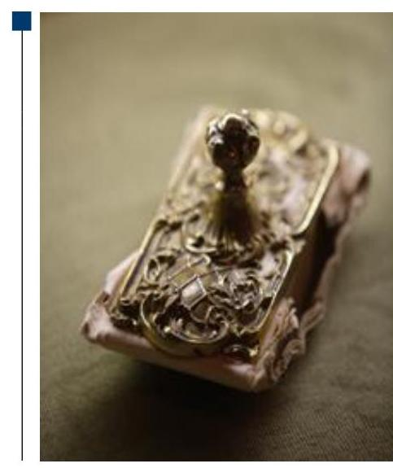
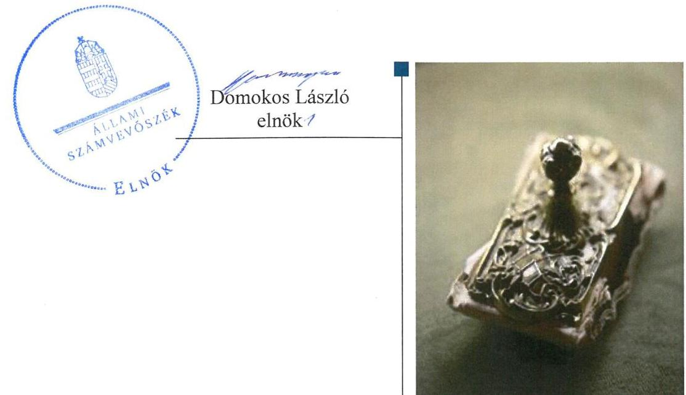
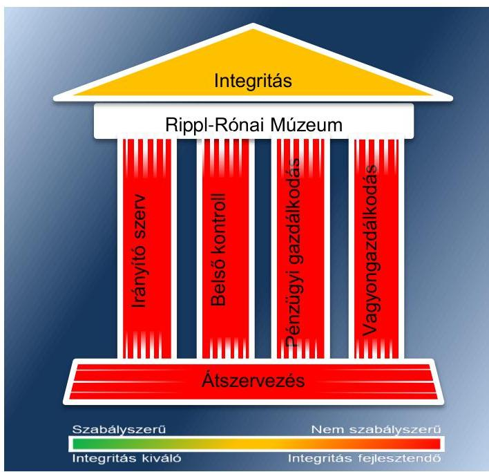
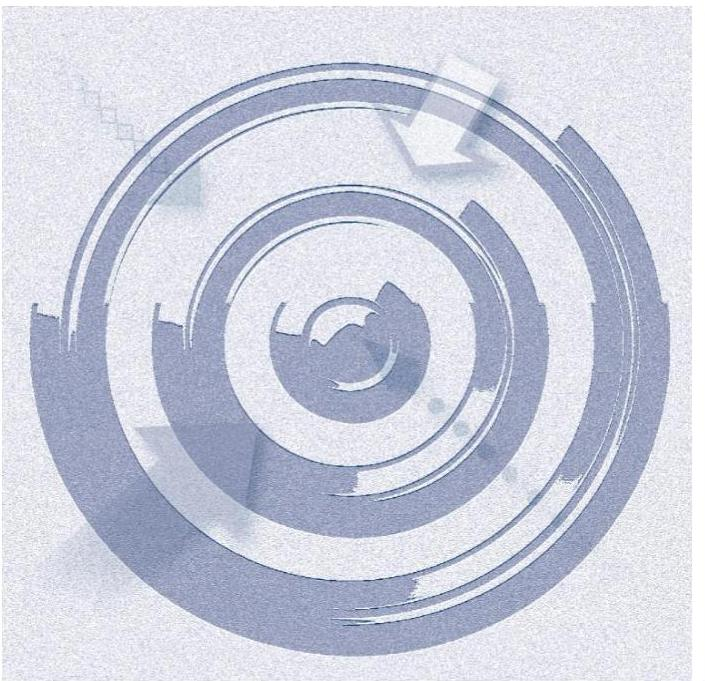
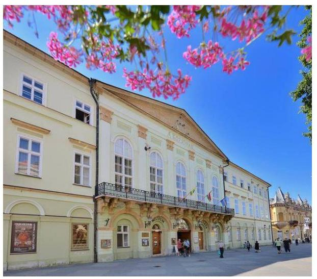
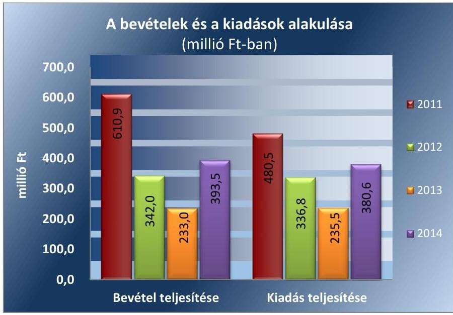
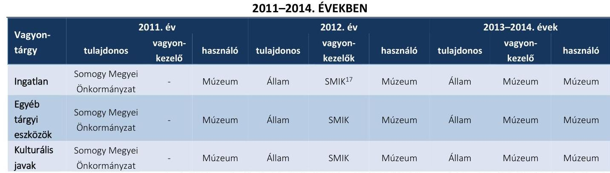
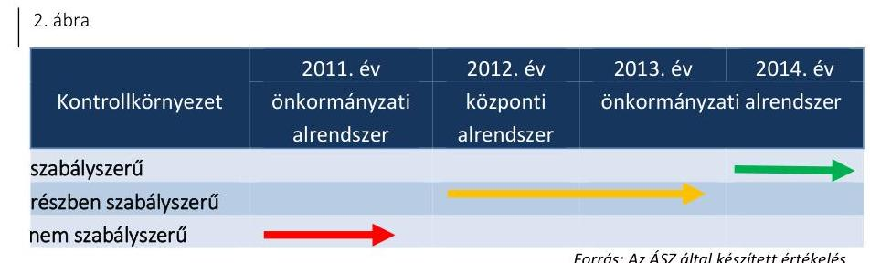
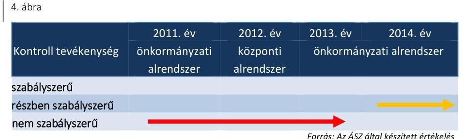
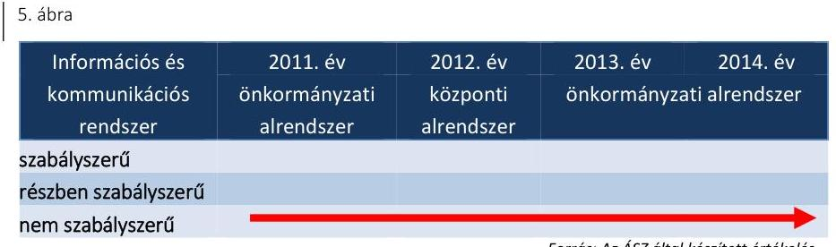

# Jelentés 

## Megyei hatókörű városi múzeumok ellenőrzése

Rippl-Rónai Megyei Hatókörű Városi
Múzeum, Kaposvár
2016.

---

# Jelentés 

## Megyei hatókörű városi múzeumok ellenőrzése

Rippl-Rónai Megyei Hatókörű Városi
Múzeum, Kaposvár
2016. december 2. nap

---

# AZ ELLENŐRZÉST FELÜGYELTE: 

PETŐ KRISZTINA felügyeleti vezető

## AZ ELLENŐRZÉST VEZETTE ÉS A VÉGREHAJTÁSÁÉRT FELELŐS:

DR. GYŐRI GABRIELLA ellenőrzésvezető

## A PROGRAM ÖSSZEÁLLÍTÁSÁÉRT FELELŐS:

JANIK JÓZSEF LÁSZLÓ osztályvezető

IKTATÓSZÁM: V-1005-186/2016
TÉMASZÁM: 2039
ELLENŐRZÉS-AZONOSÍTÓ SZÁM: V073714

Jelentéseink az Országgyűlés számítógépes hálózatán és az Interneten a www.asz.hu címen is olvashatóak.

---

# TARTALOMJEGYZÉK 

■ ÖSSZEGZÉS ..... 5
■ AZ ELLENŐRZÉS CÉLJA ..... 7
■ AZ ELLENŐRZÉS TERÜLETE ..... 8
■ AZ ELLENŐRZÉS HÁTTERE, INDOKOLTSÁGA ..... 10
■ A JELENTÉS LÉNYEGES KÉRDÉSKÖREI ..... 12
■ ELLENŐRZÉS HATÓKÖRE ÉS MÓDSZEREI ..... 13
■ MEGÁLLAPÍTÁSOK ..... 16
■ JAVASLATOK ..... 32
■ MELLÉKLETEK ..... 37
I. sz. melléklet: Értelmező szótár ..... 37
II. sz. melléklet: Az Integritás érvényesítése érdekében kialakított és működtetett kontrollrendszer ..... 40
■ FÜGGELÉK: ÉSZREVÉTELEK ..... 43
■ RÖVIDÍTÉSEK JEGYZÉKE ..... 57

---

.

---

# ÖSSZEGZÉS 

A kaposvári székhelyű Rippl-Rónai Megyei Hatókörű Városi Múzeumra vonatkozó irányító szervi feladatellátás összességében nem volt szabályszerű. A Múzeumnál kialakított irányítási rendszer nem támogatta az átlátható, elszámoltatható és ellenőrizhető közpénzfelhasználást. A Múzeum pénzügyi- és vagyongazdálkodása nem volt szabályszerű, a Múzeum alaptevékenységének részét képező kulturális javak nyilvántartásáról nem gondoskodtak teljes körűen, ezért a kulturális javak állományvédelme és vagyonbiztonsága a kölcsönzéseknél nem volt biztosított.

## Az ellenőrzés társadalmi indokoltsága

Az Állami Számvevőszék Stratégiájának alapértéke, hogy ellenőrzései segítik az integritás alapú, átlátható és elszámoltatható közpénzfelhasználás megteremtését. Az ellenőrzés jogszabályban, vagy alapító okiratban meghatározott közfeladat ellátására létrejött, a megyei hatókörű városi muzeális intézmények gazdálkodási tevékenységére terjedt ki. E szervezetek pénzügyi és vagyongazdálkodásának alapvető rendeltetése a közfeladatok (a kulturális örökséghez tartozó javak védelme, őrzése és a nyilvánosság számára történő hozzáférhetővé tétele) ellátásának biztosítása.

A megyei hatókörű városi múzeumként működő szervezetek 2011. évtől több alkalommal jelentős szervezeti és gazdálkodási átalakuláson mentek keresztül. A tulajdonosi, a vagyonkezelői és a fenntartói szerepekben, szerkezetben történt változások előkészítése, végrehajtása, illetve a múzeumi rendszer által kezelt közvagyonnal való gazdálkodás szabályszerűségének bemutatásával az ellenőrzés hozzájárul a múzeumok fenntartási és működtetési feladatainak ellátására vonatkozó megfelelő jogszabályi környezet kialakításához, a gazdálkodási gyakorlatuk javításához.

## Főbb megállapítások, következtetések

Az irányító szervek az ellenőrzött időszakban összességében nem szabályszerűen gyakorolták a feladataikat. Az alapítói jogok gyakorlása részben szabályszerű volt. Az egyéb irányítási jogkörök gyakorlása nem volt szabályszerű, mert a gazdálkodási feladatok ellátására vonatkozó munkamegosztási megállapodást a 2011. évben a Somogy Megyei Önkormányzati Hivatal és a Múzeum nem kötötte meg, 2012-ben a középirányító szerv nem határozta meg az előirányzat felhasználására vonatkozó irányelveket. A 2013-2014. években Kaposvár Megyei Jogú Város Közgyűlése, mint fenntartó nem határozta meg és nem hagyta jóvá a Múzeum stratégiai tervét, fejlesztési és beruházási feladatait, továbbá a múzeumigazgató által elkészített küldetésnyilatkozatot sem hagyta jóvá.

A Múzeumnál kialakított irányítási rendszer nem támogatta az átlátható, elszámoltatható és ellenőrizhető közpénzfelhasználást. A kontrollkörnyezet kialakítása a 2011. évben nem volt szabályszerű, mert a Múzeum nem rendelkezett a gazdálkodását meghatározó szabályzatokkal. A belső szabályozási környezet kialakításában az ellenőrzött időszakban számottevő javulás történt, a kontrollkörnyezet kialakítása a 2014. évben már szabályszerű volt, mert a Múzeum gazdálkodását meghatározó szabályozások többségében elkészültek. A 2011-2014. éveket jellemző hiányosság volt, hogy nem gondoskodtak a gyűjteményekből ideiglenesen kikerült kulturális javak nyilvántartásának vezetéséről. A kockázatkezelési rendszert a 2011-2014. években részben szabályszerűen alakították ki és működtették. A kockázatkezelési rendszer működtetésében hiányosság volt, hogy a 2011-2013. közötti időszakban nem mérték fel a Múzeum tevékenységében, gazdálkodásában rejlő kockázatokat. A vagyonnyilatkozat-tételi kötelezettség feltüntetésének elmulasztásával nem intézkedtek a közélet tisztaságának biztosítása és a korrupció megelőzése érdekében. A kontrolltevékenység kialakítása és működtetése a 2011-2013. években nem volt szabályszerű, a 2014. évben részben szabályszerű volt. A 2011. évben az ellenjegyző, 2011-2012. években a (szakmai) teljesítésigazoló, valamint az érvényesítő kijelölésére nem került sor. A 2013-2014. években kötelezettségvállalásra pénzügyi ellenjegyzés hiányában került sor, továbbá nem került sor a teljesítés igazolására, illetve az érvényesítést szabályszerű kijelöléssel nem rendelkező személy végezte. Az ellenőrzött időszak döntő részében nem biztosították a folyamatba épített előzetes, utólagos és vezetői ellenőrzést. Az információs és kommunikációs folyamatok kialakítása a 2011-2014. években nem volt szabályszerű. Hiányosság volt, hogy a 2011-2014. években a Múzeum tevékenységére, működésére vonatkozó adatok közzétételét hiányosan teljesítették, valamint 2011-2013. között nem szabályozták a kötelezően közzéteendő adatok nyilvánosságra hozatalának rendjét, ezáltal nem biztosították a Múzeum működésének átláthatóságát. A monitoring rendszer kialakítása és működtetése a 2011-2014. években nem volt szabályszerű, mert nem gondoskodtak teljes körűen a belső ellenőrzés kialakításáról, ezáltal nem biztosították a gazdálkodás szabályszerűségének, a közpénzek felhasználásának elszámoltathatóságát, átláthatóságát. Az irányító szervek gondoskodtak a Múzeum, mint felügyelt költségvetési szerv belső ellenőrzéséről.

A Múzeum pénzügyi- és vagyongazdálkodása nem volt szabályszerű. Az ellenőrzött időszak éves elemi költségvetéseit az előírt határidőben és szerkezetben készítették el. A költségvetési beszámolók elkészítése nem a jogszabályban meghatározott határidőre történt, továbbá a beszámolók tartalma 2011-ben, 2013-ban a szöveges indoklások hiánya miatt sem felelt meg a jogszabályok előírásainak. A bevételek elszámolása nem volt jogszabályszerű, mert a vagyon hasznosítása az erre felhatalmazást adó szerződés hiányában történt, valamint nem gondoskodtak a bizonylatok jogszabályban előírt megőrzéséről. A kiadási előirányzatok felhasználása a 2011-2014. években nem felelt meg a jogszabályi előírásoknak, az operatív gazdálkodási jogköröket szabályszerű kijelölés hiányában gyakorolták, több esetben előfordult, hogy kötelezettségvállalásra pénzügyi ellenjegyzés hiányában került sor. A Múzeum a 2012. évi beszámolójában a feladat ellátását szolgáló vagyont szabálytalanul mutatta ki. A 2013-2014. évi beszámolóban a kimutatott vagyon értékét vagyonkezelési szerződés nem támasztotta alá. A kulturális javak kölcsönzése során a Múzeum a 2011-2014. években nem minden esetben rendelkezett határozott idejű, írásbeli kölcsönzési szerződéssel. A kölcsönzési szerződések nem tartalmazták a jogszabályban rögzített kötelező tartalmi elemeket, emiatt a kölcsönadott kulturális javak állományvédelme nem volt megfelelően biztosított.

A Múzeumot érintő szervezeti, szerkezeti átszervezések nem voltak szabályszerűek. A 2012. január 1-jétől hatályos irányító szervi váltás során a vagyon tényleges átadására szolgáló jegyzőkönyv felvételére nem került sor. Az átadás-átvétel alapjául szolgáló dokumentáció nem tartalmazta az ingóvagyon tekintetében az alapleltárakban és a külön nyilvántartásokban nyilvántartott kulturális javak felsorolását. A 2012/2013. évi központi alrendszerből önkormányzati alrendszerbe történő átszervezés során az átláthatóság sérült, mert a kulturális javak felsorolása és annak tagintézményenkénti meghatározása nem készült el.

A Múzeum az integritás szemlélet érvényesítése érdekében nem intézkedett.

---

# AZ ELLENŐRZÉS CÉLJA 

vényesülését a gazdálkodási folyamatokban.

Az ellenőrzés célja annak megállapítása volt, hogy a megyei múzeumi rendszer átalakítása, az intézményfenntartói rendszerben végbement változások előkészítése és végrehajtása megalapozottan, szabályszerűen történt-e; a megyei hatókörű városi múzeumok és jogelődjeik pénzügyi- és vagyongazdálkodása, a belső kontrollrendszer kialakítása és működtetése, valamint az intézményfenntartói feladatok ellátása szabályszerűen történt-e.

A Múzeum ${ }^{1}$ korrupcióval szembeni veszélyeztetettségének csökkentése érdekében kért tanúsítványi adatszolgáltatás alapján az ÁSZ² értékelte az integritási szemlélet ér-

---

# **Rippl-Rónai Megyei Hatókörű Városi Múzeum**

A Múzeum Kaposváron található, feladatkörében az Mtv.^{3} alapján gondoskodik a kulturális javak meghatározott anyagának folyamatos gyűjtéséről, nyilvántartásáról, megőrzéséről és restaurálásáról; tudományos feldolgozásáról, publikálásáról; valamint kiállításokon és más módon történő bemutatásáról; a közművelődési és közgyűjteményi feladatok ellátásáról. A Kötv.^{4} 20. § (2) bekezdése alapján területileg illetékes múzeumként régészeti feltárást végzett az ellenőrzött időszakban.

A Múzeum csak a működési engedélyében meghatározott gyűjtőkörben és gyűjtőterületen folytathatja tevékenységét. A szakmai besorolást, a rendszert megalapozó szaktörvényi kereteket az Mtv. biztosítja. Az Mtv. hatálya kiterjed a Múzeum fenntartóira, a Múzeumban foglalkoztatottakra, a kulturális örökség Múzeumban őrzött elemeire, a szolgáltatások igénybe vevőire és a kulturális örökséggel foglalkozó egyéb szervezetekre.

A Múzeum 2011. évi költségvetési engedélyezett létszáma 63 fő volt, ami 2012. évben 65 főre, majd 2013. évre 62 főre változott, 2014-re 73 főre nőtt. A Múzeum alkalmazottainak foglalkoztatására a Kjt.^{5} alapján került sor. Az ellenőrzött időszakban a múzeumigazgató^{6} és a gazdasági vezető személye változott.

A Möktv.^{7} és annak végrehajtásáról szóló 258/2011. (XII. 7.) Korm. rendelet^{8} alapján 2012. január 1-jétől a megyei múzeumok központi költségvetési szervekké váltak. 2013. január 1-jétől a 2012. évi CLII. törvény^{9} és az 1311/2012. (VIII. 23.) Korm. határozat^{10} alapján az állami tulajdonba és fenntartásba került megyei múzeumi szervezetek a megyeszékhely megyei jogú városok fenntartásában működtek tovább. A 2011–2014. évek között a fenntartói, irányítói, középirányítói jogkörgyakorlók változását, valamint a Múzeum gazdálkodási feladatát ellátó szervezetét az 1. táblázat mutatja be:

^{1} táblázat

|  Hőszak | Fenntartó | Irányító szerv | Középirányító szerv | Gazdasági szervezet  |
| --- | --- | --- | --- | --- |
|  2011. | Somogy Megyei Önkormányzat | Somogy Megyei Önkormányzat Közgyűlése | - | Somogy Megyei Önkormányzati Hivatal  |
|  2012. | Somogy Megyei Intézményfenntartó Központ | KIM^{11} | Somogy Megyei Intézményfenntartó Központ | Somogy Megyei Intézményfenntartó Központ  |
|  2013–2014. | Kaposvár Megyei Jogú Város Önkormányzata | Kaposvár Megyei Jogú Város Közgyűlése | - | Együd Árpád Kulturális Központ  |

*Fonrás: A Múzeum alapító okiratai*

---

A Múzeum gazdálkodási feladatait 2015. április 1-jétől a Kaposvári Humánszolgáltatási Gondnokság látja el.

A Múzeum jogelődjének, a Somogy Megyei Múzeumok Igazgatóságának a jogállása 2011-2012-ben önállóan működő költségvetési szerv volt, mely gazdasági szervezettel nem rendelkezett. 2013. január 1-jétől a Múzeum önállóan működő és gazdálkodó költségvetési szerv, mely saját gazdasági szervezettel nem rendelkezett. 2014. január 1-jétől önálló jogi személyiségű, saját gazdasági szervezettel nem rendelkező megyei hatókörű városi múzeum. Az ellenőrzött időszakban vállalkozási tevékenységet nem végzett.

A Múzeum teljesített költségvetési bevételeinek és kiadásainak alakulását az 1. ábra mutatja be. Az ábra a 2011-2012. években a Múzeum és tagintézményeinek együttes adatai, a 2013-2014. években a tagintézmények átadását követően a múzeumi adatok alapján készült.
1. ábra

Forrás: Múzeumi beszámolók a 2011-2014. évekre
A 2015. évi LXXV. tv. ${ }^{12}$ 1. § (1) bekezdése alapján az Nvtv. ${ }^{13}$ 13. § (3) bekezdésében és 14. § (1) bekezdésében foglaltak alapján és az abban meghatározott feltételekkel a 2012. évi CLII. törvény 30. § (1) és (2) bekezdésében meghatározott, a megyei hatókörű városi múzeumok feladatának ellátását szolgáló egyes állami tulajdonban lévő ingatlanok a törvény hatálybalépésének napjával, a törvény erejénél fogva a kötelező közfeladatként a megyei hatókörű városi múzeumot fenntartó önkormányzatok tulajdonába kerültek. A 2015. évi LXXV. tv. 4. § (1) bekezdése alapján a kulturális örökség helyi védelme érdekében a megyei hatókörű városi múzeumok alapleltárában és jogszabály szerinti külön nyilvántartásában szereplő állami tulajdonú kulturális javak ingyenesen a megyei hatókörű városi múzeumok vagyonkezelésébe kerültek. A vagyonkezelők vagyonkezelői joga tekintetében vagyonkezelési szerződés megkötése nem szükséges. A 2015. évi LXXV. tv. 4. § (2) bekezdése szerint továbbá a kulturális örökség helyi védelme érdekében

 a megyei hatókörű városi múzeumok feladatának ellátását szolgáló állami tulajdonban álló ingatlanok - a törvény mellékletében meghatározott ingatlanok kivételével - ingyenesen a fenntartó önkormányzatok vagyonkezelésébe kerültek.

---

# AZ ELLENŐRZÉS HÁTTERE, INDOKOLTSÁGA 

Az Alaptörvény ${ }^{14}$ rendelkezése szerint a nemzeti vagyon megőrzésének, védelmének és a nemzeti vagyonnal való felelős gazdálkodásnak a követelményeit sarkalatos törvény, az Nvtv. rögzíti. A tulajdonosi joggyakorlás és vagyonkezelés általános és speciális szabályait, az állami vagyon nyilvántartására és elszámolására vonatkozó eljárásokat, a vagyonkezelési szerződés feltételrendszerét, valamint az éves beszámoló készítési és könyvvezetési kötelezettségeket kormányrendelet írja elő.

A megyei hatókörű városi múzeumok közfeladat-ellátásának változásait, (beleértve az állami tulajdonosi joggyakorló, intézményi vagyonkezelő és önkormányzati fenntartó szervezeteket is) a közfeladatok átadásából és átvételéből adódó módosításait, előirányzat-gazdálkodására ható tényezőit az Áht. ${ }^{15}$, az Ávr. ${ }^{16}$, a Möktv., valamint a Mtv. írja elő. A múzeumi intézményrendszer rendszerátalakulásából, megszűnéséből, intézmény-átszervezéséből, belső szerkezeti korszerűsítéséből, vagy más hasonló okból adódó módosításai miatt szerepeltetendő szerkezeti változásokat, valamint a szerkezeti változásként beépült közfeladatok szintre hozásként történő számításba vételét az Ávr. határozza meg.

A megyei hatókörű városi múzeumok kulturális szempontból meghatározó jelentőségűek mind földrajzi elhelyezkedésüket, mind az ellátott feladatokat, valamint a látogatottságukat tekintve. Tevékenységüket törvényi szinten (Mtv.) szabályozták a jogalkotók. A megyei hatókörű városi múzeumok jelenlegi körének kialakításában, tulajdonosi és fenntartói szerkezetében rövid idő alatt több jelentős változás történt, amelyeket jogszabályi változások indukáltak. Ezen intézmények szakmai besorolásukat tekintve a 2011. évben megyei múzeumként, a 2012. évben megyei múzeumi központi költségvetési szervezetként, a 2013. évtől kezdődően megyei hatókörű városi múzeumként működtek. A szakmai besorolások változásait párhuzamosan követték a tulajdonosi, vagyonkezelői, fenntartói szerepekben történt változások. A megyei könyvtárak és a megyei hatókörű városi múzeumok feladatának ellátását szolgáló egyes állami tulajdonú vagyontárgyak ingyenes önkormányzati tulajdonba adásáról szóló 2015. évi LXXV. törvény hatályba lépésétől (2015. július 1-jétől) megváltoztak a vagyonkezeléssel kapcsolatos jogviszonyok, így a vagyonkezelési szerződés megkötése már nem indokolt.

A 2011-2014. évek között bekövetkezett fenntartói változások a vagyontárgyak és a kulturális javak tulajdonosi, vagyonkezelői és használói körében is változást indukáltak, amelyet a 2. táblázat szemléltet.

---

| A VAGYON TULAJDONOSI, VAGYONKEZELŐI ÉS HASZNÁLÓI KÖRÉNEK VÁLTOZÁSA 2011-2014. ÉVEKBEN |  |  |  |  |  |  |  |  |  |
| :--: | :--: | :--: | :--: | :--: | :--: | :--: | :--: | :--: | :--: |
| Vagyon-   tárgy | 2011. év   vagyon-   kezelő |  | használó | tulajdonos | 2012. év   vagyon-   kezelői | használó | tulajdonos | 2013-2014. év   vagyon-   kezelő | használó |
| Ingatlan | Somogy Megyei   Önkormányzat | - | Múzeum | Állam | SMIK ${ }^{17}$ | Múzeum | Állam | Múzeum | Múzeum |
| Egyéb   tárgyi   eszközök | Somogy Megyei   Önkormányzat | - | Múzeum | Állam | SMIK | Múzeum | Állam | Múzeum | Múzeum |
| Kulturális   javak | Somogy Megyei   Önkormányzat | - | Múzeum | Állam | SMIK | Múzeum | Állam | Múzeum | Múzeum |

A VAGYON TULAJDONOSI, VAGYONKEZELŐI ÉS HASZNÁLÓI KÖRÉNEK VÁLTOZÁSA 2011-2014. ÉVEKBEN

Forrás: A Múzeum alapító okiratai, a 2012. évi CLII. tv, a 258/2011. (XII. 7) Korm. rendelet, az 1311/2012. (VIII. 23.) Korm. határozat

Az ellenőrzés - tekintettel a megyei hatókörű városi múzeumokat (és jogelődjeit) rövid időn belül, gyors ütemben ért környezeti (tulajdonosi, fenntartói-szerkezetet érintő) változásokra - javaslatok megfogalmazásával hozzájárul a fenntartás és működtetés feladatainak ellátására vonatkozó megfelelő jogszabályi környezet - jogalkotók által történő - kialakításához. Az ÁSZ ellenőrzés a gazdálkodási gyakorlat javítását eredményezheti, több intézmény bevonásával átfogó képet ad a megyei hatókörű városi múzeumokat (és jogelődjeiket) jellemző sajátosságokról, jó gyakorlatokról.

AZ ELLENŐRZÉS EREDMÉNYEKÉPPEN nemcsak az ellenőrzött intézmények gazdálkodása javul, hanem átfogó képet kapunk a múzeumok gazdálkodásának hiányosságairól, de a jó gyakorlatokról is. Ellenőrzéseivel, javaslataival és megállapításaival az ÁSZ elősegíti a költségvetési szervek pénzügyi és vagyongazdálkodása szabályozásának javítását és hozzájárulhat a jó kormányzáshoz.

---

# A JELENTÉS LÉNYEGES KÉRDÉSKÖREI 

1.     - Az irányító szerv ellenőrzött Múzeumra vonatkozó feladatellátása szabályszerű volt-e?
2.     - Szabályszerűen hajtották-e végre a Múzeumot érintő szervezeti, szerkezeti átszervezéseket?
3.     - A belső kontrollrendszer kialakítása és működtetése megfelelt-e a jogszabályi előírásoknak?
4.     - A Múzeum pénzügyi gazdálkodása szabályszerű volt-e?
5.     - A Múzeum vagyongazdálkodása szabályszerű volt-e?
6.     - A Múzeum intézkedett-e az integritás szemlélet érvényesítése érdekében?

---

# ELLENŐRZÉS HATÓKÖRE ÉS MÓDSZEREI 

## Az ellenőrzés típusa

Megfelelőségi ellenőrzés.

## Az ellenőrzött időszak

Az ellenőrzött időszak 2011. január 1-jétől 2014. december 31-ig tart.

## Az ellenőrzés tárgya

A megyei hatókörű városi múzeumok átszervezése, átalakítása előkészítése és lebonyolítása megalapozottsága, szabályszerűsége, a pénzügyi és vagyongazdálkodási tevékenység, a belső kontrollrendszer kialakítása, működtetése szabályszerűsége, valamint az irányító szervi feladatok ellátása szabályszerűsége. E tevékenységek és a kapcsolódó adatok és információk összessége, amelyeket a vonatkozó kritériumok alapján kell értékelni.

Az ellenőrzés kiterjed minden olyan körülményre és adatra, amely az ÁSZ jogszabályban meghatározott feladatainak teljesítéséhez, valamint a program végrehajtása folyamán felmerült újabb összefüggések feltárásához szükséges.

## Az ellenőrzött szervezet

Rippl-Rónai Megyei Hatókörű Városi Múzeum, a fenntartói feladatokban érintett Somogy Megyei Önkormányzat, valamint Kaposvár Megyei Jogú Város Önkormányzata, a Somogy Megyei Intézményfenntartó Központ jogutódja a Szociális és Gyermekvédelmi Főigazgatóság, továbbá a gazdálkodási feladatok ellátásában érintett Somogy Megyei Önkormányzati Hivatal, illetve az Együd Árpád Kulturális Központ.

Az ellenőrzésre a költségvetési szerv ellenőrzött intézményének és irányító szervének, illetve középirányító szervének székhelyén és a gazdálkodási feladatait ellátó szervezetének székhelyén került sor.

## Az ellenőrzés jogalapja

Az ellenőrzés jogszabályi alapját az ÁSZ tv. ${ }^{18}$ 1. § (3) bekezdés, 5. § (2)-(6) bekezdései, valamint az Áht. 2 61. § (2) bekezdésének előírásai képezik.

---

# Az ellenőrzés módszerei 

Az ellenőrzést az ellenőrzési program szempontjai, az ellenőrzött időszakban hatályos jogszabályok, az ellenőrzés szakmai szabályai, az egyes ellenőrzési típusokhoz kapcsolódó ÁSZ módszertanok és nemzetközi standardok figyelembe vételével végeztük. A gazdálkodás hibáinak kijavítására, a közpénzekkel való felelős gazdálkodás segítésére irányuló javaslatok kidolgozásakor a hatályos jogszabályok az irányadóak.

Az ellenőrzési kérdések megválaszolásához szükséges bizonyítékok megszerzése a következő ellenőrzési eljárások alkalmazásával történt: kérdésfeltevés (információkérés), mintavételezés, valamint elemző eljárás. A minták kiválasztása során véletlen mintavételi eljárást alkalmaztunk.

Mintavétellel ellenőriztük a bevételek, a személyi juttatások, a dologi és felhalmozási kiadások, a régészeti bevételek és kiadások elszámolásának, valamint a kulturális javak kölcsönzésének szabályszerűségét. A minta alapján a sokaságban előforduló hibaarányt becsültük. „Megfelelőnek" értékeltük az ellenőrzött területet, amennyiben 95\%-os bizonyossággal a teljes sokaságban a hibaarány legfeljebb 10\%, „részben megfelelőnek" értékeltük, ha a hibaarány felső határa 10-30\% között volt, „nem megfelelőnek" pedig akkor, ha a mintavételi eredmények alapján a sokaságbeli hibaarány felső határa meghaladta a 30\%-ot.

Az ellenőrzési bizonyítékként felhasználható adatforrások közé tartoznak egyrészt a szakmai program részletes szempontjainál felsorolt adatforrások, másrészt adatforrás lehet minden egyéb - az ellenőrzés folyamán feltárt, az ellenőrzés szempontjából releváns információt tartalmazó - dokumentum. Az ellenőrzés lefolytatásához a Múzeum a tanúsítványok elektronikus kitöltésével, valamint az ÁSZ által kért dokumentumok elektronikus megküldésével szolgáltatott adatokat. A rendelkezésre bocsátott adatok, információk kontrollja az ellenőrzés keretében történt. Az ellenőrzési kérdésekre adott válaszok alapján értékeltük, hogy az ellenőrzött időszakban az irányító szerv az ellenőrzött Múzeumra vonatkozó feladatainak szabályszerűen eleget tett-e, a Múzeum pénzügyi- és vagyongazdálkodása megfelelt-e az előírásoknak, a Múzeum átalakításának vagy átszervezésének végrehajtása szabályszerű volt-e.

A Múzeum belső kontrollrendszere jogszabályi előírások szerinti kialakításának és működtetésének szabályszerűségét az erre irányuló ellenőrzési kérdésekre adott válaszok összesítése alapján, évente pillérenként (kontrollkörnyezet, kockázatkezelési rendszer, kontrolltevékenységek, információs és kommunikációs rendszer, monitoring rendszer) és összesítetten is minősítjük. A Múzeum belső kontrollrendszere egyes pilléreinek kialakítása és működtetése „szabályszerű", amennyiben az értékelt területen az elért és elérhető pontok százalékban kifejezett, egész számra kerekített hányadosa meghaladja a 84\%-ot, „részben szabályszerű", ha a 84\%-ot nem haladja meg, de 60\%-nál nagyobb, „nem szabályszerű", ha nem haladja meg a 60\%-ot. A Múzeum belső kontrollrendszerének összesített értékelése megegyezik a pillérenként (kontrollterületenként) alkalmazott %-os értékelésekkel, a következő eltérésekkel. A kontrollrendszer egésze esetében a „szabályszerű" értékelésnek a %-os értéken felül további feltétele, hogy egyik kontrollterület sem kaphat „nem szabályszerű" értékelést, a „részben szabályszerű" értékelés további feltétele, hogy legfeljebb egy ellenőrzött kontrollterület lehet „nem szabályszerű" értékelésű. Az összesített értékelés a %-os értéktől függetlenül „nem szabályszerű", ha az ellenőrzött kontrollterületek közül több mint egynek „nem szabályszerű" az értékelése.

Az integritás szemlélet érvényesülésének értékelése a Múzeum által tanúsítványon szolgáltatott adatok alapján történt.

---

# 1. Az irányító szerv ellenőrzött Múzeumra vonatkozó feladatellátása szabályszerű volt-e? 

Összegző megállapítás

Az irányító szervek ellenőrzött Múzeumra vonatkozó feladatellátása a 2011-2014. években összességében nem volt szabályszerű.

AZ ALAPÍTÓI JOGOSULTSÁGOK GYAKORLÁSA az ellenőrzött időszakban részben felelt meg a jogszabályi előírásoknak. A Múzeum rendelkezett alapító okirat${ }_{1-4}$-gyel ${ }^{19}$, amelyek módosítása - a jogszabályi és feladatváltozások alapján - a 2012. év kivételével szabályszerűen történt. A középirányító szerv ${ }^{20}$ a 258/2011. (XII. 7.) Korm. rendelet 21. § (6) bekezdésében rögzítetteket figyelmen kívül hagyva az alapító okirat ${ }_{2}$ módosítását 2012. január 30-ig nem nyújtotta be a Kincstár ${ }^{21}$ által vezetett törzskönyvi nyilvántartáshoz, mivel az alapító okirat ${ }_{2}$ irányító szerv $_{2}{ }^{22}$ általi kiadására 2012. július 12-én került sor.

A MUNKÁLTATÓI JOGOSULTSÁGOT az irányító szerv ${ }_{1-3}$ a 2011-2014. években szabályszerűen gyakorolta.

## AZ EGYÉB IRÁNYÍTÁSI, FELÜGYELETI ÉS ELLENŐRZÉSI jogosultságok gyakorlása nem volt szabályszerű.

A Múzeum 2011. évben hatályos alapító okirat ${ }_{1}$-ében az irányító szerv ${ }_{1}$ a gazdasági szervezet ${ }_{1}{ }^{23}$-et jelölte ki a Múzeum pénzügyi, gazdálkodási és számviteli feladatainak ellátására, azonban az Ámr. ${ }^{24}$ 16. § (4) bekezdésének előírása ellenére a munkamegosztási megállapodás megkötésére nem került sor.

A középirányító szerv a 2012. évben a 258/2011. (XII. 7.) Korm. rendelet 11. § (1) bekezdés c) pontjában előírtakat figyelmen kívül hagyva nem határozta meg az előirányzat felhasználására vonatkozó irányelveket. A 258/2011. (XII. 7.) Korm. rendelet 11. § (2) bekezdés c) pontjának előírása ellenére nem került sor az államháztartással összefüggő közérdekű és közérdekből nyilvános adatok kötelező közzétételének, illetve igényre történő szolgáltatása végrehajtásának ellenőrzésére.

A 2013-2014. években az Mtv. 50. § (2) bekezdés a) pontja előírásától eltérően az irányító szerv ${ }_{3}$, mint fenntartó nem határozta meg és nem hagyta jóvá a Múzeum stratégiai tervét, valamint fejlesztési és beruházási feladatait. A múzeumigazgató a szakmai tevékenység
 folytatásának alapjául szolgáló küldetésnyilatkozatot elkészítette, azonban a 2013-2014. években az Mtv. 42. § (4) bekezdés b) pontjának előírásától eltérően azt az irányító szerv $_{3}$, mint fenntartó nem hagyta jóvá. A Múzeum 2014. évi feladatalapú költségvetését és a teljesítményértékelését - felterjesztés hiányában - az Mtv. 45. § (5) bekezdés e)-f) pontjaiban foglaltak ellenére a Miniszter ${ }^{25}$ előzetesen nem véleményezte.

---

# 2. Szabályszerűen hajtották-e végre a Múzeumot érintő szervezeti, szerkezeti átszervezéseket? 

Összegző megállapítás

2.1. számú megállapítás

A Múzeumot érintő szervezeti, szerkezeti átszervezések nem voltak szabályszerűek.

A Múzeumot érintő - önkormányzati alrendszerből a központi alrendszerbe történő 2012. január 1-jétől hatályos - irányító szervi (fenntartói) váltás lebonyolítása nem volt szabályszerű.

Az átadás-átvételi megállapodás ${ }_{1}{ }^{26}$-et az irányító szerv ${ }_{1}$ és a középirányító szerv a Möktv.-vel összhangban, határidőben megkötötte. A 258/2011. (XII. 7.) Korm. rendelet 12. § (1) bekezdésében előírt, az átadás-átvétel alapját képező hitelesített vagyonleltárt nem készítették el.

A vagyon tényleges átadása során - a 258/2011. (XII. 7.) Korm. rendelet 12. § (3) bekezdésében foglaltak ellenére - jegyzőkönyv felvételére nem került sor.

Az átadás-átvételi megállapodás ${ }_{1}$-et a 258/2011. (XII. 7.) Korm. rendelet 1. számú melléklete szerinti megállapodás-minta alapján kötötték meg, azonban - a jogszabályi előírás ellenére - a mellékletek teljes körűségét nem biztosították, mert nem rögzítették:
$\longrightarrow$ az ingó vagyon tekintetében, az alapleltárakban és külön nyilvántartásokban nyilvántartott kulturális javak felsorolását;
$\longrightarrow$ az informatikai eszközállomány tételes átadás-átvételét;
$\longrightarrow$ a betöltetlenül átadott státuszok számát.
A 2011. évi NGM módszertani útmutató ${ }^{27}$ 43. oldal 2/ba. pontjában előírtakat figyelmen kívül hagyva az átadáshoz kapcsolódó vagyonátadási jelentést és vagyonátadás-átvételi jegyzőkönyvet nem készítettek. Az Áhsz. ${ }_{1}{ }^{28}$ 13/A. § (1) és (5) bekezdésében foglaltak ellenére 2011. évben leltárt nem készítettek és így az Áhsz. ${ }_{1}$ 13/A. § (4) bekezdésében előírt eszközök és források értékének meghatározását sem végezték el. Az eszközök és források 2012. évi nyitását szabályszerűen nem tudták végrehajtani, mivel a nyitás alapját képező vagyonátadási jelentést nem készítettek. Az állami tulajdonba került vagyonelemek számviteli nyilvántartásokból történő kivezetését az NGM módszertani útmutató 2/ba. pontjában rögzítettek ellenére nem végezték el.
2.2. számú megállapítás

A 2013. január 1-jével végrehajtott - központi alrendszerből önkormányzati alrendszerbe történő - irányító szervi (fenntartói) váltás lebonyolítása és a szervezetrendszer átalakítása nem volt szabályszerű.

Az 1311/2012. (VIII. 23.) Korm. határozatban rögzített előírással összhangban a Múzeum átadás-átvételének lebonyolításához szükséges háromoldalú tárgyalásokat határidőben lefolytatták, amelyről az írásos dokumentum rendelkezésre állt.

Az átadás-átvételi megállapodás ${ }_{2}{ }^{29}$ megkötésére az 1311/2012. (VIII. 23.) Korm. határozatban foglalt határidőben került sor. Az átadás-átvételi megállapodás ${ }_{2}$ IV.4., valamint IV. 1.2.11.2.1 pontjában

---

és az 1311/2012. (VIII. 23.) Korm. határozat 1.8. pontjában foglaltak ellenére a Múzeum alapleltárában és a külön nyilvántartásaiban szereplő kulturális javak gyűjteményi állományát tartalmazó melléklet nem készült el. Az átadás-átvételi megállapodás ${ }_{2}$ IV.1.2.8. pontjában meghatározottak ellenére nem készítették el a betöltetlenül átadott álláshelyek számát tartalmazó dokumentumokat.

A középirányító szerv a 2012. évi NGM módszertani útmutató 44. oldal 2/ba. pontjában előírtakat figyelmen kívül hagyva az átadáshoz kapcsolódó vagyonátadási jelentést nem készített. Az eszközök és források 2013. évi nyitását vagyonátadási jelentés hiányában szabályszerűen nem tudták végrehajtani.

# A tagintézmények 2013. évi átadását rögzítő megállapodásokat a 2012. évi CLII. törvényben 

foglaltaknak megfelelően a középirányító szerv és az átvevő települési önkormányzatok határidőben megkötötték.

Az 1311/2012. (VIII. 23.) Korm. határozat 1.8. pontjában foglaltak ellenére a Múzeum nyilvántartásaiban szereplő kulturális javak tagintézményenkénti meghatározását nem készítették el. A Múzeum a kulturális javakat a volt tagintézmények számára a fenntartó önkormányzatokkal kötött letéti illetve kölcsönszerződés keretében adta át, de ehhez a megoldáshoz az Mtv. 38. § (9) bekezdésében foglaltak ellenére nem kérte a kultúráért felelős miniszter hozzájárulását. A középirányító szerv a 2012. évi NGM módszertani útmutató 44. oldal 2/ba. pontjában foglaltakat nem tartotta be, az átadáshoz kapcsolódó vagyonátadási jelentést és vagyonátadás-átvételi jegyzőkönyvet nem készített, ezért a gazdasági szervezet 3 2013. január 2-án vezette ki a tagintézmények vagyonát a Múzeum számviteli nyilvántartásából.

Az 1543/2012. (XII. 4.) Korm. határozat ${ }^{30}$ alapján a Zichy Mihály Emlékház a Szépművészeti Múzeum, a Szabadtéri Néprajzi Gyűjtemény a Szabadtéri Néprajzi Múzeum szervezetében működött tovább, melyre vonatkozó megállapodást határidőben megkötötték.

## 3. A belső kontrollrendszer kialakítása és működtetése megfelel-e a jogszabályi előírásoknak?

Összegző megállapítás
A belső kontrollrendszer kialakítása és működtetése a 2011-2014. években nem volt szabályszerű.

A belső kontrollrendszer kialakításának és működtetésének értékelését az 3. táblázat mutatja be.

---

| A BELSŐ KONTROLLRENDSZER KIALAKÍTÁSÁNAK ÉS MŰKÖDTETÉSÉNEK ÉRTÉKELÉSE A 2011-2014. ÉVEKBEN |  |  |  |  |  |  |
| :--: | :--: | :--: | :--: | :--: | :--: | :--: |
| Megnevezés | Kontroll-   környezet | Kockázatkezelés | Kontroll-   tevékenységek | Információ és   kommunikáció | Monitoring | Összesen |
| 2011. | nem szabályszerű | részben szabály-   szerű | nem szabályszerű | nem szabályszerű | nem szabályszerű | nem szabályszerű |
| 2012. | részben szabály-   szerű | részben szabály-   szerű | nem szabályszerű | nem szabályszerű | nem szabályszerű | nem szabályszerű |
| 2013. | részben szabály-   szerű | részben szabály-   szerű | nem szabályszerű | nem szabályszerű | nem szabályszerű | nem szabályszerű |
| 2014. | szabályszerű | részben szabály-   szerű | részben szabály-   szerű | nem szabályszerű | nem szabályszerű | nem szabályszerű |

3.1. számú megállapítás

A kontrollkörnyezet kialakítása a 2011. évben nem volt szabályszerű, a 2012-2013. években részben szabályszerű volt, a 2014. évben szabályszerű volt.

A kontrollkörnyezet 2011. évi kialakításának nem szabályszerű értékelésére hatással volt az a körülmény, hogy az irányító szerv ${ }_{1}$ erre irányuló döntése ellenére a pénzügyi-számviteli feladatok ellátására vonatkozó munkamegosztási megállapodást a Múzeum és a gazdasági szervezet ${ }_{1}$ nem kötötte meg. A munkamegosztási megállapodás hiányában a feladat- és felelősségi körök az Ámr. 16. § (4) bekezdésében foglaltak ellenére nem voltak tisztázottak. A kontrollkörnyezet 2011. évi kialakításában a következő hiányosságok fordultak elő:
$\longrightarrow$ a múzeumigazgató nem gondoskodott arról, hogy az SZMSZ ${ }_{1}{ }^{31}$ az Ámr. 20. § (2) bekezdés e) pontjában foglaltaknak megfelelően a szervezeti egységek engedélyezett létszámát tartalmazza;
$\longrightarrow$ a gazdasági szervezet ${ }_{1}$ nem gondoskodott a Számv. tv. ${ }^{32}$ 14. § (3) bekezdésében foglaltak ellenére a számviteli politika, valamint a Számv. tv. 161. § (1) bekezdésében előírt számlarend elkészítéséről;
$\longrightarrow$ a gazdasági szervezet ${ }_{1}$ nem gondoskodott a Számv. tv. 14. § (5) bekezdésében előírt leltárkészítési és leltározási szabályzat, eszközök és források értékelési szabályzat, pénzkezelési szabályzat és önköltségszámítás rendjére vonatkozó szabályzat elkészítéséről;
$\longrightarrow$ a gazdasági szervezet ${ }_{1}$ mulasztása miatt a Múzeum nem rendelkezett az Áht. ${ }^{33}$ 91. § (2) bekezdésében előírt gazdálkodás részletes rendjét meghatározó belső szabályzattal.

---

A kontrollkörnyezet 2012. évi kialakítása részben volt szabályszerű. A kontrollkörnyezet 2012. évi kialakításában az alábbi hiányosságok fordultak elő:
$\longrightarrow$ a gazdasági szervezet 2 a Számv. tv. 161. § (1) bekezdésében előírt számlarend elkészítéséről nem gondoskodott;
$\longrightarrow$ a Múzeum nem rendelkezett a Számv. tv. 14. § (5) bekezdés b)-c) pontjában előírt eszközök és források értékelési szabályzattal, valamint az önköltségszámítás rendjére vonatkozó szabályzattal, mivel azokat a gazdasági szervezet 2 nem készítette el.
A kontrollkörnyezet 2013. évi kialakítása részben volt szabályszerű. A múzeumigazgató felelősségi körébe tartozóan a kontrollkörnyezet 2013. évi kialakításában az alábbi hiányosságok fordultak elő:
$\longrightarrow$ a Múzeum nem rendelkezett a Számv. tv. 14. § (5) bekezdés d) pontjában előírt pénzkezelési szabályzattal, mert annak elkészítéséről a múzeumigazgató a munkamegosztási megállapodás ${ }^{34}$ „Intézmény feladatai" 7.2. pontjában foglaltak ellenére nem gondoskodott;
$\longrightarrow$ az Ávr. 13. § (2) bekezdés a) pontjának előírása ellenére a gazdálkodás részletes rendjét meghatározó szabályozás elkészítéséről a múzeumigazgató nem gondoskodott.
A kontrollkörnyezet 2014. évi kialakításában - a szabályszerű értékelés mellett - az alábbi hiányosság fordult elő:
$\longrightarrow$ a Múzeum nem rendelkezett a Számv. tv. 14. § (5) bekezdés c) pontjában és az Áhsz. ${ }^{35}$ 50. § (3) bekezdésében meghatározott önköltségszámítás rendjére vonatkozó szabályzattal, mert annak elkészítéséről a munkamegosztási megállapodás „Központ feladatai" 7.2. pont 4. francia bekezdésében előírtak ellenére a gazdasági szervezet 3 nem gondoskodott.
A 2011-2012. években a Számv. tv. 161. § (2) bekezdés d) pontjában előírt bizonylati rend elkészítéséről a gazdasági szervezet ${ }_{1-2}$ nem gondoskodott, a 2013-2014. években a munkamegosztási megállapodás „Központ feladatai" 7.2. pont 6. francia bekezdésében előírtak ellenére a Múzeumra vonatkozó bizonylati rendet a gazdasági szervezet ${ }_{3}$ nem készítette el.

A 2012-2014. években a múzeumigazgató az SZMSZ ${ }_{2,3}{ }^{36}$-ban az Ávr. 13. § (1) bekezdés e) pontjának előírása ellenére a szervezeti egységek engedélyezett létszámának rögzítéséről nem gondoskodott.

# 3.2. számú megállapítás 

A kockázatkezelési rendszert a 2011-2014. években részben szabályszerűen alakították ki és működtették.
3. ábra

| Kockázatkezelési rendszer | 2011. év   önkormányzati elrendszer | 2012. év   központi elrendszer | 2013. év   önkormányzati elrendszer |
| :--: | :--: | :--: | :--: |
| szabályszerű   részben szabályszerű   nem szabályszerű |  |  |  |

---

Az ellenőrzött időszakban az Ámr.-ben és a Bkr. ${ }^{37}$-ben foglaltaknak megfelelően belső szabályzatban a múzeumigazgató kialakította az egyes kockázatokkal kapcsolatban szükséges intézkedésekkel és azok folyamatos nyomon követésének módjával kapcsolatos szabályokat. A kockázatkezelési rendszer működtetése során 2011-ben az Ámr. 157. § (2) bekezdésében és 2012-2013. években a Bkr. 7. § (2) bekezdésében foglaltak ellenére a múzeumigazgató nem gondoskodott a Múzeum tevékenységében, gazdálkodásában rejlő kockázatok felméréséről.

A Vnytv. ${ }^{38}$ 4. § a) pontjának előírásától eltérően a Múzeum SZMSZ ${ }_{2,3}$ -ban nem határozták meg a vagyonnyilatkozat-tételi kötelezettséget. A múzeumigazgató vagyonnyilatkozat-tételi kötelezettségét 2013-tól az irányító szerv ${ }_{3}$ 85/2012. (XII. 17.) önkormányzati rendeletében ${ }^{39}$ szabályozták.

# 3.3. számú megállapítás 

A kontrolltevékenység kialakítása és működtetése a 2011-2013. években nem volt szabályszerű, a 2014. évben részben szabályszerű volt.

A kontrolltevékenység kialakítása során a 2011-2014. februárja közötti időszakban az Áht. ${ }_{1}$ 121/A. § (4) bekezdésben, a Bkr. 8. § (2) bekezdés a)-d) pontjaiban foglaltak ellenére a múzeumigazgató nem biztosította a folyamatba épített, előzetes, utólagos és vezetői ellenőrzést:
$\longrightarrow$ a pénzügyi döntések dokumentumainak elkészítése, azok célszerűségi, gazdaságossági, hatékonysági és eredményességi szempontú megalapozottsága vonatkozásában;
$\longrightarrow$ a költségvetési gazdálkodás során az előzetes és utólagos pénzügyi ellenőrzés, a pénzügyi döntések szabályszerűségi szempontból történő jóváhagyása, illetve ellenjegyzése vonatkozásában;
$\longrightarrow$ a gazdasági események elszámolása kontrollja vonatkozásában.
A Múzeum igazgatója 2011. évben az Ámr. 158. § (2) bekezdés a) és c) pontjaiban foglaltak, továbbá 2012-2014. években a Bkr. 8. § (4) bekezdés a) pontjában

 és 2014. februárjától a belső kontroll szabályzat ${ }^{40}$ III./1. pont 2. bekezdésében foglaltak ellenére a Múzeum belső szabályzataiban - a felelősségi körök meghatározásával - nem szabályozta az engedélyezési, jóváhagyási és kontroll eljárásokat.

A 2011-2014. években az Avtv. ${ }^{41}$ 10. § (1) bekezdésében és az Info tv. ${ }^{42}$ 7. § (2) bekezdésében foglaltak ellenére a múzeumigazgató nem alakította ki azokat az eljárási szabályokat, melyek az adat- és titokvédelmi szabályok érvényre juttatásához szükségesek.

A múzeumigazgató az lkr. ${ }^{43}$ 8. § (2) bekezdésében foglaltak ellenére a 2011-2014. évek során nem szabályozta az üzemeltetés, adatbiztonság szabályait.

---

A kontrolltevékenység működtetés során feltárt hiányosságokat részletesen a 4.3. pont tartalmazza.

# 3.4. számú megállapítás 

Az információs és kommunikációs folyamatok kialakítása a 2011-2014. években nem volt szabályszerű.

A múzeumigazgató belső szabályzatban nem szabályozta 2011-ben az Ámr. 20. § (3) bekezdés i) pontja, 2012-2013-ban az Ávr. 13. § (2) bekezdés h) pontja előírásától eltérően a kötelezően közzéteendő adatok nyilvánosságra hozatalának rendjét, valamint a közérdekű adatok megismerésére irányuló kérelmek intézésének rendjét.

A múzeumigazgató 2011-ben az Eitv. ${ }^{44}$ 3. § (2) bekezdés és 6. § (1) bekezdés, továbbá 2012-2014. években az Info tv. 33. § (3) bekezdés és a 37. § (1) bekezdés előírásától eltérően a saját, illetve a felügyeletet ellátó szerv által fenntartott honlapon a Múzeum tevékenységére, működésére, gazdálkodására vonatkozó adatok közzétételének nem teljes körűen tett eleget. A tevékenységre, működésre vonatkozó adatok között nem tüntették fel az Eitv. melléklet II/1. pontjában és az Info tv. 1. melléklet II/1. pontjában meghatározott, a Múzeum alaptevékenységét meghatározó jogszabályokat, az Eitv. melléklet II/13. pontjában és az Info tv. 1. melléklet II/13. pontjában előírt közérdekű adatok megismerésére irányuló igények intézésének rendjét. A múzeumigazgató nem gondoskodott az Eitv. melléklet III/1. pontjában és az Info tv. 1. melléklet III/1. pontjában előírt éves költségvetés és beszámoló, az Eitv. melléklet III/2. pontjában és az Info tv. 1. melléklet III/2. pontjában előírt, a Múzeumnál foglalkoztatottak létszámára vonatkozó összesített adatok közzétételéről. Továbbá az Eitv. melléklet III/4. pontjában előírt külön jogszabályban meghatározott értékű-, illetve az Info tv. 1. melléklet III/4. pontjában meghatározott 5 M Ft-ot elérő vagy azt meghaladó összegű árubeszerzésre, szolgáltatás megrendelésre vagy építési beruházásra vonatkozó szerződések adatait, valamint az Info tv. 1. melléklet III/8. pontjában előírt közbeszerzési információkat sem tették közzé.

A Múzeum 2011-2014. közötti időszakban hatályos iratkezelési szabályzata ${ }_{1,2}{ }^{45}$ nem felelt meg a jogszabályi előírásnak, mert azt a múzeumigazgató az Ltv. ${ }^{46}$ 10. § (1) bekezdés a) pontjának előírásától eltérően nem az illetékes közlevéltárral egyetértésben adta ki.

---

# 3.5. számú megállapítás 

## A monitoring rendszer kialakítása és működtetése a 2011-2014. években nem volt szabályszerű.

| 6. ábra |  |  |  |  |
| :--: | :--: | :--: | :--: | :--: |
| Monitoring rendszer | 2011. év önkormányzati alrendszer | 2012. év központi alrendszer | 2013. év önkormányzati alrendszer | 2014. év alrendszer |
| szabályszerű   részben szabályszerű   nem szabályszerű |  |  |  |  |

Forrás: Az ÁSZ által készített értékelés
A 2011. évben az Ámr. 160. § (1)-(2) bekezdésében előírtak ellenére a múzeumigazgató nem működtetett, illetve a 2012-2014. években a Bkr. 10. §-ában előírtak ellenére a múzeumigazgató nem alakított ki a szervezet tevékenységének, a célok megvalósításának nyomon követését biztosító olyan rendszert, mely az operatív tevékenységek keretében megvalósuló folyamatos és eseti nyomon követést is tartalmazta.

A múzeumigazgató 2011-ben az Áht. 1 121. § (3) bekezdésében, 2012-2014-ben a Bkr. 11. § (1) bekezdésében foglaltak ellenére nem értékelte nyilatkozatban a Múzeum belső kontrollrendszerének minőségét.

A múzeumigazgató a 2011. évben az Áht. 1 121/A. § (1) bekezdésében foglaltak ellenére nem adott ki olyan szabályzatot, mely biztosította a rendelkezésre álló források gazdaságos, hatékony és eredményes felhasználását.

A múzeumigazgató 2011. évben az Áht. 1 121/B. § (4) bekezdésében és 2012. évben az Áht. 2 70. § (1) bekezdésében foglaltak ellenére nem gondoskodott a belső ellenőrzés kialakításáról.

A múzeumigazgató a 2011-2014. években a Múzeum SZMSZ $_{1-3}$-ban nem határozta meg - 2011. december 31-ig - a Ber. 4. § (2) bekezdésében foglaltak ellenére a belső ellenőrzést végző személy, egység vagy szervezet, valamint - 2012. január 1-jétől - a Bkr. 15. § (2) bekezdésében foglaltak ellenére a belső ellenőrzést végző személy vagy szervezet, illetve szervezeti egység jogállását, feladatait. A Múzeum a 2011. évben a Ber. 5. § (1) és (3) bekezdésében foglaltak ellenére nem rendelkezett belső ellenőrzési kézikönyvvel.

A Múzeumnál a 2011-2014. években az Ötv. ${ }^{47}$ és a Mötv. ${ }^{48}$ rendelkezései alapján a fenntartók gondoskodtak a Múzeum, mint felügyelt költségvetési szerv belső ellenőrzéséről. Az ellenőrzési javaslatok végrehajtása érdekében a múzeumigazgató a Ber. és a Bkr. előírásainak megfelelő tartalmú intézkedési tervet készített.

---

# 4. A Múzeum pénzügyi gazdálkodása szabályszerű volt-e? 

## Összegző megállapítás

### 4.1. számú megállapítás

## A Múzeum pénzügyi gazdálkodása nem volt szabályszerű.

Az ellenőrzött időszakban a költségvetési tervezés, a bevételi és kiadási előirányzatok megállapítása megfelelt az előírásoknak. A bevételi és kiadási előirányzatok módosítása és nyilvántartása a 2011. év kivételével megfelelt a jogszabályokban és belső szabályzatokban foglaltaknak. Az előirányzat maradvány megállapítása és számviteli nyilvántartása nem volt szabályszerű.

A KÖLTSÉGVETÉSI TERVEZÉSSEL kapcsolatos belső előírásokat, feltételeket a Múzeum igazgatója a 2012-2014. években az Ávr. 13. § (2) bekezdés a) pontjában foglaltak ellenére belső szabályzatban nem rendezte, azonban a Múzeum gazdasági alkalmazottainak munkaköri leírásában rögzítették az ezzel kapcsolatos feladatokat.

A Múzeum az éves költségvetéseit a költségvetési évre engedélyezett létszám, személyi, dologi és felhalmozási kiadások, valamint bevételek alapján tervezte meg. Az ellenőrzött időszak elemi költségvetéseit az előírt határidőben és szerkezetben, a 2011. év kivételével a fenntartó ${ }_{3}$-mal egyeztetve készítették el.

## A BEVÉTELI ÉS KIADÁSI ELŐIRÁNYZATOK MÓ-

DOSÍTÁSA és nyilvántartása a 2011. év kivételével szabályszerű volt. Az ellenőrzött időszakban országgyűlési hatáskörbe tartozó előirányzat módosításra nem került sor. Kormányzati hatáskörű előirányzat módosítást 2012. évben -17,4 M Ft összegben végeztek. Irányító szervi módosításra minden ellenőrzött évben sor került, összesen 316,3 M Ft összegben. Saját hatáskörben 2012-2014. években került sor előirányzat módosításra, összesen 191,9 M Ft összegben.

A bevételi és kiadási előirányzatok, előirányzat-módosítások könyvviteli elszámolását belső szabályzatban az Áhsz.: 49. § (3) bekezdésében foglaltak ellenére a 2011-2012. években nem határozták meg. A 2011. évi utolsó előirányzat módosítás (100,8 M Ft) főkönyvi könyvelésére az Áhsz.: 8. § (1) bekezdésében, 49. § (6) bekezdésében és az 51. § (1) bekezdés b) pontjában foglaltak ellenére nem került sor.

A MARADVÁNY MEGÁLLAPÍTÁSA, a jóváhagyott maradvány nyilvántartása nem volt szabályszerű. A Múzeum igazgatója a 2012. évben a költségvetési maradvány megállapítására vonatkozó adatszolgáltatási kötelezettségét az Áhsz.: 11. § (1) bekezdés c) pontjában és a 10. § (1) bekezdésében meghatározottak ellenére dokumentált módon nem teljesítette. A 2011. évi maradvány megállapítása és irányító szervi jóváhagyása az Áht.: 100/8. § (1) bekezdésében, a 2012. évi maradvány jóváhagyása a 258/2011. (XII. 7.) Korm. rendelet 11. § (2) bekezdés i) pontjában foglalt előírás ellenére nem történt meg. A 2013-2014. évi előirányzat-maradvány összegét az irányító szerv3 az Ávr.-nek megfelelően jóváhagyta. A Múzeum maradványa 2011-ben 95,0 M Ft, 2012-ben 8,5 M Ft, 2013-ban 3,5 M Ft, 2014-ben 12,9 M Ft volt, azok teljes összegét kötelezettségvállalás terhelte.

---

# 4.2. számú megállapítás 

Az éves költségvetési beszámolók elkészítése nem felelt meg a jogszabályok előírásainak.

Az Áhsz. ${ }_{1}$ 11. § (1) bekezdés d) pontjának és a 40. § (1) bekezdésének előírása ellenére a beszámoló kiegészítő mellékletének szöveges indoklását 2011. évben a gazdasági szervezet ${ }_{1}$, 2013. évben a gazdasági szervezet ${ }_{3}$ nem készítette el.

A 2011. évi beszámolót a gazdasági szervezet ${ }_{1}$, a 2012. évi beszámolót a gazdasági szervezet ${ }_{2}$, a 2013. évi beszámolót a gazdasági szervezet ${ }_{3}$ az Áhsz. ${ }_{1}$ 10. § (1) bekezdésében rögzített határidőn túl küldte meg az irányító szerv $_{1-3}$ részére, a 2014. évi beszámolót a gazdasági szervezet ${ }_{3}$ az Áhsz. ${ }_{2}$ 32. § (1) bekezdésében rögzített határidőn túl küldte meg az irányító szerv $_{3}$ vezetőjének jóváhagyásra. Az adatszolgáltatást legkésőbb a költségvetési évet követő február 28-áig kellett az irányító szervnek megküldeni. A jogszabályi rendelkezés ellenére a 2011. évről 2012. március 30-án, a 2012. évről 2013. április 12-én, a 2013. évről 2014. március 10-én, a 2014. évről 2015. március 9-én teljesítették az adatszolgáltatást.

A 2011-2013. éves elemi beszámolót az Áhsz. ${ }_{1}$, a 2014. évi beszámolót az Áhsz. ${ }_{2}$ előírása szerinti bontásban állították össze. Az éves költségvetési beszámolókat az elfogadott költségvetéssel összehasonlítható módon, az év utolsó napján érvényes szervezeti besorolásnak megfelelően készítették el, azokat az irányító szervek felülvizsgálták és a Kincstár elfogadta azokat.

## 4.3. számú megállapítás

A bevételi előirányzatok teljesítése során nem tartották be a jogszabályi előírásokat. A kiadási előirányzatok felhasználása a 2011-2014. években nem felelt meg a jogszabályi előírásoknak.

Az ellenőrzött időszakban a Múzeum bevételi előirányzatainak teljesítése és elszámolása nem felelt meg a jogszabályok és belső szabályzatok előírásainak.

A BEVÉTELI ELŐIRÁNYZATOT a Múzeum az ellenőrzött években a költségvetési beszámolói szerint az alábbi összegekkel tervezte: 2011-ben 198,6 M Ft, 2012-ben 263,1 M Ft, 2013-ban 203,4 M Ft, 2014-ben 198,5 M Ft. A bevételi előirányzatok a négy év vonatkozásában a tervezett értékek felett teljesültek: 2011-ben 610,9 M Ft, 2012-ben 342,0 M Ft, 2013-ban 233,0 M Ft, 2014-ben 393,5 M Ft. A módosított bevételi előirányzatok 2011-ben 247,6%-ra, 2012-ben 100%-ra; 2013-ban 67,3%-ra, 2014-ben 93,8%-ra teljesültek.

A BEVÉTELEK ELSZÁMOLÁSA során az ellenőrzés a következő hiányosságokat, szabálytalanságokat tárta fel:
$\longrightarrow$ a bevételek beszedését alátámasztó dokumentum megőrzéséről a Számv. tv. 169. § (2) bekezdésében előírt kötelezettség ellenére a 2011-2014. években a gazdasági szervezet ${ }_{1-3}$, illetve a múzeumigazgató több esetben nem gondoskodott;
$\longrightarrow$ a befolyt bevételek nyilvántartásba vétele érdekében az Áhsz. ${ }_{1}$ 51. § (1) bekezdésében és az Áhsz. ${ }_{2}$ 53. § (2) bekezdésében foglaltak ellenére a 2011-2014. években a gazdasági szervezet ${ }_{1-3}$ több esetben nem intézkedett;

---

$\longrightarrow$ a 2011-2012. években a gazdálkodási jogkörök gyakorlására jogosult személyekről és aláírás mintájukról az Ámr. 80. § (3) bekezdésében és az Ávr. 60. § (3) bekezdésében foglaltak ellenére nem vezettek naprakész nyilvántartást;
a 2011. évben az utalványozásra szolgáló külön írásbeli rendelkezés nem tartalmazta az Ámr. 78. § (2) bekezdés a) és g) pontjaiban foglaltak ellenére a keltezést és a kötelezettségvállalás nyilvántartási számát;
a 2012-2014. között utalványozásra szolgáló írásbeli rendelkezést
 az Ávr. 59. § (3) bekezdés g) pontjában foglaltak ellenére az utalványozó (múzeumigazgató, illetve az általa kijelölt személy) több esetben nem látta el keltezéssel;
2012. évben az Ávr. 59. § (3) bekezdés h) pontjában foglaltak ellenére az írásbeli rendelkezés nem tartalmazta az érvényesítő keltezéssel ellátott aláírását, továbbá 2014. évben az aláírásához kapcsolódó keltezést.
A múzeumi bevételek régészeti munkákhoz, múzeumi jegy- és kiadványértékesítéshez, múzeumpedagógiai, rendezvényszervezési tevékenységhez, pályázati támogatásokhoz és vagyonhasznosításhoz kötődtek. A nem normatív jelleggel nyújtott pályázati támogatások $\mathrm{EU}^{49}$-s forrásokból (TÁMOP ${ }^{50}$, TIOP ${ }^{51}$ ), a Nemzeti Kulturális Alaptól származtak - a 2011-2014. közötti időszakban - a kimutatások szerint 101,5 M Ft összegben. A folyósított támogatás jogosulatlan igénybevétel miatti visszakövetelésére nem került sor.

A vagyonhasznosításból (bérbeadásból) származó bevételek a 2012–2013. években eseti jellegű helyiség- és területbérbeadásból származtak. A 2012–2013. évi bérbeadási (vagyonhasznosítási) tevékenység a Vtv. ${ }^{52}$ 23. § (1)–(2) bekezdésében és 25. § (4) bekezdésében foglaltak ellenére a vagyon hasznosítására felhatalmazást adó szerződés hiányában, szabálytalanul történt.

A KIADÁSI ELŐIRÁNYZATOK felhasználása során az ellenőrzés a következő hiányosságokat, szabálytalanságokat tárta fel:
a 2011–2014. közötti időszakban a kiadások teljesítését alátámasztó dokumentumok megőrzéséről a gazdasági szervezet ${ }_{1-3}$, illetve a múzeumigazgató a Számv. tv. 169. § (2) bekezdésében foglaltak ellenére több esetben nem gondoskodott;
a gazdasági szervezet ${ }_{1}$ 2011-ben az Ámr. 80. § (3) bekezdésében, 2012-ben a gazdasági szervezet ${ }_{2}$ az Ávr. 60. § (3) bekezdésében előírt nyilvántartás-vezetési kötelezettség teljesítéséről nem gondoskodott, emiatt a kiadások teljesítésével összefüggésben a kötelezettségvállalást, (pénzügyi) ellenjegyzést, (szakmai) teljesítésigazolást, érvényesítést és az utalványozást ellátó személyek aláírása nem volt beazonosítható;
2011-ben az Ámr. 74. § (2) bekezdés b) pontjában, 76. § (5) bekezdésében, 79. § (1) bekezdésében, 2012-ben az Ávr. 55. § (2) bekezdés c) pontjában, 57. § (4) bekezdésében és 58. § (4) bekezdésében foglaltak ellenére 2011. évben az ellenjegyző, a 2011–2012. években a (szakmai) teljesítésigazoló valamint az érvényesítő kijelölésére nem került sor;

---

- a 2013–2014. években néhány esetben a kötelezettségvállalás pénzügyi ellenjegyzés hiányában szabálytalanul történt, ami nem felelt meg az Áht. 2 37. § (1) bekezdésében foglaltaknak;
az érvényesítést 2014. évben az Ávr. 58. § (4) bekezdésében meghatározott szabályszerű kijelölés hiányában gyakorolták, mert az érvényesítőt - a gazdasági vezető helyett - jogosulatlanul a múzeumigazgató jelölte ki;
a 2013–2014. években előfordult, hogy a kiadások teljesítése során az Ávr. 57. § (1) bekezdésében foglaltak ellenére nem került sor a teljesítésigazolásra, illetve azt az Ávr. 57.§ (4) bekezdésében foglalt kijelöléssel nem rendelkező személy végezte.
4.4. számú megállapítás

A 2011–2014. években a régészeti feltárási tevékenység bevételeinek elszámolását megrendelések, valamint a jogszabályban előírt tartalmú szerződések támasztották alá. A régészeti tevékenységgel összefüggésben teljesített kiadások elszámolása nem felelt meg a jogszabályi előírásoknak.

A régészeti tevékenység bevételeit a régészeti felügyelet ellátására vonatkozó megrendelésekkel, valamint régészeti feltárásra vonatkozó szerződésekkel támasztották alá a 2011–2014. években. A szerződések megfeleltek a Kötv., illetve a 393/2012. (XII. 20.) Korm. rend. ${ }^{53}$ rendelkezéseinek.

A szerződésekben egységárakat, valamint keretösszeget határoztak meg, azok alapján történt az elszámolás a beruházóval. Az egységárakat a régészeti feladatellátás költségeire vonatkozó, ajánlás jellegű díjtételek alapján szabályszerűen állapították meg.

A 2011. és a 2013. évben a bevételt megalapozó szerződés, illetve megrendelés dokumentummal nem volt alátámasztva az lkr. 5. §-ában, 6. § a) pontjában, 14. § (4) bekezdésében foglaltak ellenére, emiatt a Számv. tv. 169. § (2) bekezdésében előírt bizonylat-megőrzési kötelezettség nem érvényesült.

A bevételek teljesítésével és a kiadások felhasználásával összefüggésben a gazdálkodási jogkörök gyakorlására vonatkozóan a 4.3 pontban feltárt hiányosságok a régészeti kiadások értékelésénél is megjelentek.

A Múzeum a régészeti célú pénzeszközök elkülönített kezelésére pénzforgalmi számlájához alszámlát vezetett az 5/2010. (VIII. 18.) NEFMI rendelet ${ }^{54}$ által megkövetelt - a 2011. szeptember 2. és 2012. szeptember 14. közötti - időtartamban. A Múzeum az analitikus nyilvántartás-vezetési kötelezettségét az 5/2010. (VIII. 18.) NEFMI rendelet 20. § (3) bekezdésében foglalt - 2011. szeptember 2. és 2012. december 31. között hatályos előírása ellenére - nem teljesítette.
4.5. számú megállapítás

Az ellenőrzött időszakban a Múzeum pénzügyi egyensúlya biztosított volt.

A Múzeum pénzügyi egyensúlya annak ellenére biztosított volt, hogy a folyamatos fizetőképesség biztosítása érdekében az Áht. 2 78. § (2) bekezdésének előírásával ellentétben a gazdasági szervezet ${ }_{2-3}$ nem készített a 2012–2014. években likviditási tervet.

A likviditás javítása érdekében az ellenőrzött időszakban a követelések behajtása érdekében intézkedés megtétele nem volt indokolt. A 2011. és

---

a 2014. évben határidőn túli vevőkövetelés nem volt. A 2012. évben 1,9 M Ft, a 2013. évben 8,1 M Ft volt a határidőn túli vevőkövetelés, melyek teljesültek.

A Múzeum fizetési kötelezettségeinek nem minden esetben tudott határidőben eleget tenni. A Múzeum lejárt szállítói állománya 2012. évben 20,4 M Ft, a 2013. évben 0,3 M Ft összegű és 30 napnál nem régebbi volt. A 2011. és a 2014. évben lejárt szállítói állomány nem volt.

Az ellenőrzött időszakban az Áht. 1.2 előírásaival összhangban követelés-elengedésre nem került sor.

# 5. A Múzeum vagyongazdálkodása szabályszerű volt-e? 

## Összegző megállapítás

### 5.1. számú megállapítás

A Múzeum vagyongazdálkodása a 2011–2014. években nem volt szabályszerű.

Az eszközök és források nyilvántartása 2011-ben megfelelt, 2012–2014. közötti időszakban nem felelt meg a jogszabályi előírásoknak.

A 2011. évben a közfeladat ellátását szolgáló vagyon az irányító szerv ${ }_{1}$ tulajdonában és a Múzeum használatában volt. A használat szabályait vagyongazdálkodási rendelet ${ }^{55}$ határozta meg.

A 2012. január 1-jei önkormányzati konszolidációt követően a tulajdonosi jogokat az állami tulajdon felett az MNV Zrt. ${ }^{56}$ gyakorolta, míg a fenntartói jogok és kötelezettségek a középirányító szervhez kerültek. A Múzeum a feladat ellátását szolgáló vagyont továbbra is használta, azonban erre vonatkozó szerződéssel a Vtv. 25. § (4) bekezdésében foglaltak ellenére nem rendelkezett. A Számv. tv. 23. § (2) bekezdése, az Nvtv. 11. § (8) bekezdése, valamint az Áhsz. 1 15. § (1) bekezdésében foglaltak ellenére a kezelt vagyon kimutatására szabálytalanul a Múzeumnál került sor. A Múzeum 2012. évi beszámolójának mérlegében kimutatott állami vagyon értéke teljes egészében az Áhsz. 1 5. § 8. pontja szerinti jelentős összegű hibát eredményezett és az az Áhsz. 1 5. § 10. pontjában meghatározott megbízható és valós képet lényegesen befolyásoló hiba volt.

Az Mtv. 2013. január 1-jétől hatályos 45/A. § (2) bekezdés a) pontja szerint a megyei hatókörű városi múzeum lett a vagyonkezelője a tevékenységéhez szükséges állami vagyonnak. A 2013–2014. években a Múzeum az Nvtv. 11. § (1) és (7) bekezdésének és a Vtvr. ${ }^{57}$ 8. § (6) bekezdésének előírása ellenére nem rendelkezett vagyonkezelési szerződéssel. A 2013–2014. években a Múzeum beszámolójában kimutatott vagyon értéket vagyonkezelési szerződés nem támasztotta alá.

A kezelt vagyon köre és nagysága a 2013–2014. években vagyonkezelési szerződés hiányában nem volt megállapítható. Kiegészítő mellékletben a Múzeum a Számv. tv. 23. § (2) bekezdésében előírtak ellenére nem mutatta be mérlegtételek szerinti megbontásban a kezelésbe vett állami eszközöket, és az Áhsz. 2 29. § (2) bekezdés c) pontjában előírtak ellenére nem jelezte a vagyonkezelési szerződés hiányát, emiatt nem érvényesült a Számv. tv. 16. § (4) bekezdésében meghatározott „lényegesség elve”.

---

# A NEMZETI VAGYONBA TARTOZÓ KULTURÁLIS 

JAVAK NYILVÁNTARTÁSA nem felelt meg teljes körűen a jogszabályban rögzített előírásoknak. A Múzeum az ellenőrzött időszakban a jogszabályi előírásoknak megfelelően gyarapodási naplót és szakleltárkönyveket vezetett.

A 2011–2014. években, a 20/2002. (X. 4.) NKÖM rendelet ${ }^{58}$ 19. § (1) bekezdés ab) pontjában foglaltaktól eltérően a múzeumigazgató nem gondoskodott a kölcsönvett tárgyak naplójának vezetéséről. A múzeumigazgató az ellenőrzött időszakban a 20/2002. (X. 4.) NKÖM rendelet 19. § (1) bekezdés b) pontjában foglalt előírás ellenére nem gondoskodott a kölcsönadott tárgyak naplójának vezetéséről a gyűjteményeiből ideiglenesen kikerült kulturális javak tekintetében sem.

A használaton kívül helyezett szakmai nyilvántartásokról a 20/2002. (X. 4.) NKÖM rendelet 20. § (3) bekezdésében foglaltak ellenére a 2011–2014. években nem készült - a múzeumigazgató aláírásával és a Múzeum körbélyegzőjével hitelesített - kimutatás.

Az ellenőrzött időszakban törlés a kulturális javak közül nem történt. A Múzeum a kulturális javakat hagyományos módon (papír alapon) tartotta nyilván.
5.2. számú megállapítás

A költségvetési beszámoló mérlegének leltárral való alátámasztottsága, a mérlegtételek értékelése a 2011–2014. közötti időszakban nem felelt meg a jogszabályi előírásoknak és a belső szabályozásnak.

A Múzeum 2011. évi beszámolóját leltárral - a Számv. tv. 69. § (1) bekezdésében, az Áhsz. ${ }_{1}$ 13/A. § (1) bekezdésében és 37. § (1)–(2) bekezdésében foglaltak ellenére - nem támasztották alá.

A Múzeum a leltározás szabályszerű végrehajtásához a 2012–2014. években leltározási és leltárkészítési tárgyú belső szabályozással rendelkezett, azonban a leltározás végrehajtása ennek ellenére nem volt szabályszerű. A követelések mérlegben történő 2012–2014. évi kimutatása során nem készült a követelések vevő általi elismeréséről dokumentum, ezzel nem érvényesült a Számv. tv. 65. § (1) bekezdésének előírása, mely alapján a követelést a mérlegben az elismert összegben kell kimutatni.

A MÉRLEGET ALÁTÁMASZTÓ LELTÁR a 2012. évben nem felelt meg az Áhsz. 1 37. § (2) és (4) bekezdésében és a Számv. tv. 69. § (1) bekezdésében foglaltaknak, mert a Múzeum az általa használt és felleltározott vagyonnak nem volt vagyonkezelője és a leltározást a vagyonkezelést végzőnek kellett elvégezni.

A mérleget alátámasztó leltár a 2013–2014. években nem felelt meg az Áhsz. 1 37. § (2) bekezdésében, az Áhsz. 2 22. § (2) bekezdés a) pontjában és a Számv. tv. 69. § (1) bekezdésében foglaltaknak. Az Áhsz. 1 29/A. § (1) bekezdésében foglaltak értelmében, a vagyonkezelésbe vett eszköz bekerülési értékének a vagyonkezelési szerződésben szereplő érték minősül, mely információ 2013. évben szerződés hiányában nem állt rendelkezésre. Az Áhsz. 2 15. § (2) bekezdésében foglaltak alapján a bekerülési érték az átadónál kimutatott bruttó érték, melyről - vagyonkezelési szerződés hiányában - nem volt információ. A hiányosság miatt a leltárak értékadatai dokumentummal nem voltak megfelelően alátámasztva.

---

Eszközök selejtezésére 2014. évben került sor. A selejtezés végrehajtása szabályszerűen történt.

A BEKERÜLÉSI ÉRTÉK MEGHATÁROZÁSA és az állományba vétel a 2011–2014. években nem volt szabályszerű.

Az Áhsz. 1 30. § (1) bekezdésében, a Számv. tv. 52. § (2) bekezdésében foglaltak ellenére a 2011–2014. években a gazdasági szervezet ${ }_{1-3}$ az üzembe helyezés hitelt érdemlő dokumentálásáról nem gondoskodott. Az értékcsökkenés szabályszerű elszámolását alátámasztó dokumentumok elkészítéséről a Számv. tv. 165. § (1) bekezdésében foglaltak ellenére 2011–2014. években a gazdasági szervezet ${ }_{1-3}$ nem gondoskodott.

A Múzeum az eredményszemléletű számvitelre történő áttérés feladatait a 36/2013. (IX. 13.) NGM rendelet ${ }^{59}$ előírásai szerint végrehajtotta, azonban a rendező mérleg - a leltározás előzőekben
 kifejtett hiányosságai miatt – nem volt szabályszerű.
5.3. számú megállapítás

A kulturális javak hasznosítása és kölcsönzése az ellenőrzött időszakban nem felelt meg a jogszabályi előírásoknak. A kulturális javak vagyonbiztonságára és állományvédelmére vonatkozó előírásokat nem tartották be maradéktalanul.

A Múzeum a 2011–2014. években a kulturális javak kölcsönzése egyes eseteiben nem rendelkezett az Mtv. 38. §, illetve a 2013. október 25-től hatályos 38/A. §-ában előírt határozott idejű írásbeli kölcsönzési szerződéssel.

A KULTURÁLIS JAVAK KÖLCSÖNZÉSÉRE kötött szerződések a 2011–2014. közötti időszakban nem tartalmazták az Mtv. 38. § (8) bekezdésében és a 2013. október 25-től hatályos 38/A. § (2) bekezdésében rögzített kötelező tartalmi elemeket. Így a kulturális javak kölcsönzéséről szóló szerződések nem tartalmazták – az Mtv. 38. § (8) bekezdés a) pontjában és a 2013. október 25-től hatályos 38/A. § (2) bekezdés a) pontjában foglaltak ellenére – a kölcsönvevő által a kölcsönzött kulturális javaknak biztosítandó állományvédelmi követelményeket, beleértve a klimatikus viszonyokat. A kölcsönzési szerződések többsége nem tartalmazta a kölcsönvevő által nyújtandó vagyonbiztonsági feltételeket – beleértve az esetlegesen szükséges muzeológusi, rendőrségi vagy egyéb fegyveres kíséretet is – az Mtv. 38. § (8) bekezdés c) pontjában és a 2013. október 25-től hatályos 38/A. § (2) bekezdés c) pontjában foglaltak ellenére. Az ellenőrzött időszakban nem írták elő a szerződésekben az Mtv. 38. § (8) bekezdés b) pontjában és a 2013. október 25-től hatályos 38/A. § (2) bekezdés b) pontjában foglaltak ellenére a kölcsönadott kulturális javak sérülése esetén követendő eljárás rendjét.

A kulturális javak nem muzeális intézmény számára történő kölcsönadásához a 2011–2014. években az Mtv. 38. § (9) bekezdésében, a 2013. október 25-től hatályos 38/A. § (5) bekezdésében foglaltak ellenére nem rendelkeztek a miniszter hozzájárulásával.

## A KULTURÁLIS JAVAK ÖRZÉSE ÉS ÁLLOMÁNY-

VÉDELME a kölcsönzési szerződések állományvédelemmel kapcsolatos – előzőekben felsorolt – hiányosságai miatt nem volt megfelelő. A Múzeum a 2/2010. (I. 14.) OKM rendelet ${ }^{60}$-ben foglaltaknak megfelelően a

---

használatában álló épületben állandó és időszakos kiállítás bemutatására alkalmas kiállító helyiségeket, gyűjteményi raktárakat, előkészítő raktárt, felszerelt restaurátor műhelyeket, vegyszerraktárt, szakkönyvtárat, múzeumpedagógiai foglalkoztató teret és a közönség fogadását szolgáló helyiségeket alakított ki. Az épületet elektronikus és mechanikus, továbbá élőerős védelemmel látta el.

# 6. A Múzeum intézkedett-e az integritás szemlélet érvényesítése érdekében? 

Összegző megállapítás A Múzeum nem intézkedett az integritás szemlélet érvényesítése érdekében.

Az ellenőrzés részletes megállapításait a jelentéstervezet II. számú – „Az Integritás érvényesítése érdekében kialakított és működtetett kontrollrendszer” című – melléklete tartalmazza.

---

# JAVASLATOK 

Az ÁSZ tv. 33. § (1) bekezdésében foglaltak értelmében az ellenőrzött szervezet vezetője köteles a jelentésben foglalt megállapításokhoz kapcsolódó intézkedési tervet összeállítani és azt a jelentés kézhezvételétől számított 30 napon belül az ÁSZ részére megküldeni. Amennyiben az ellenőrzött szervezet vezetője nem küldi meg határidőben az intézkedési tervet, vagy továbbra sem elfogadható intézkedési tervet küld, az Állami Számvevőszék elnöke az ÁSZ tv. 33. § (3) bekezdése a) és b) pontjaiban foglaltakat érvényesítheti.

## Kaposvár Megyei Jogú Város Önkormányzata polgármesterének

1. Intézkedjen a Múzeum stratégiai terve, fejlesztési és beruházási feladatai meghatározása és jóváhagyása érdekében.
(1. sz. megállapítás 6. bekezdésének 1. mondata alapján)
2. Intézkedjen a Múzeum küldetésnyilatkozata jóváhagyása érdekében.
(1. sz. megállapítás 6. bekezdésének 2. mondata alapján)
3. Intézkedjen a Múzeum feladatalapú költségvetése, valamint teljesítményértékelése megküldésére a miniszter részére, azok előzetes véleményezése érdekében.
(1. sz. megállapítás 6. bekezdésének 3. mondata alapján)
4. Intézkedjen a Múzeum szervezeti és működési szabályzata módosításának jóváhagyása érdekében.
(3.2. sz. megállapítás 2. bekezdésének 1. mondata, 3.5. sz. megállapítás 5. bekezdésének 1. mondata alapján)
5. Intézkedjen a Múzeum gazdálkodási feladatait ellátó költségvetési szerv felé:
a) a Múzeum éves költségvetési beszámolója adatainak a költségvetési évet követő év február 28-áig történő feltöltésére a Kincstár által működtetett elektronikus adatszolgáltató rendszerbe az irányító szervi jóváhagyás érdekében;
(4.2. sz. megállapítás 2. bekezdése alapján)

---

b) a teljesített bevételekkel kapcsolatos bizonylatok adatainak jogszabályi előírásnak megfelelő nyilvántartásba vételére;
(4.3. sz. megállapítás 3. bekezdésének 2. francia bekezdése alapján)
c) az érvényesítés jogszabályi előírásnak megfelelő gyakorlására;
(4.3. sz. megállapítás 6. bekezdésének 5. francia bekezdése alapján)
d) likviditási terv készítésére;
(4.5. sz. megállapítás 1. bekezdése alapján)
e) a jogszabályi előírásoknak megfelelő éves költségvetési beszámoló készítésére;
(5.1. sz. megállapítás 4. bekezdésének 2. mondata, 5.2. sz. megállapítás 2. bekezdésének 2. mondata alapján)
f) a jogszabályi előírásoknak megfelelő leltár összeállítására;
(5.2. sz. megállapítás 4. bekezdése alapján)
g) az üzembe helyezés hitelt érdemlő módon történő dokumentálására;
(5.2. sz. megállapítás 7. bekezdésének 1. mondata alapján)
h) az értékcsökkenés szabályszerű elszámolását alátámasztó bizonylatok készítésére.
(5.2. sz. megállapítás 7. bekezdésének 2. mondata alapján)
6. Tegyen intézkedéseket a feltárt szabálytalanságok tekintetében a felelősség tisztázása érdekében, és szükség szerint intézkedjen a felelősség érvényesítéséről.
(4.3. sz. megállapítás 6. bekezdésének 4., 6. francia bekezdése, 5.1. sz. megállapítás 4. bekezdésének 2. mondata, 5.2. sz. megállapítás 2. bekezdésének 2. mondata, 5.1. sz. megállapítás 6. bekezdése, 5.3. sz. megállapítás 1., 2., 3. bekezdése alapján)

---

# az Együd Árpád Kulturális Központ igazgatójának 

1. Tegyen intézkedéseket a feltárt szabálytalanságok tekintetében a felelősség tisztázása érdekében, és szükség szerint intézkedjen a felelősség érvényesítéséről.
(5.1. sz. megállapítás 4. bekezdésének 2. mondata, 5.2. sz. megállapítás 2. bekezdésének 2. mondata, 4.3. sz. megállapítás 3. bekezdésének 2. francia bekezdése alapján)

## a Rippl-Rónai Megyei Hatókörű Városi Múzeum igazgatójának

1. A belső kontrollrendszer szabályszerű kialakítása és működtetése érdekében intézkedjen:
a) a szervezeti és működési szabályzat jogszabályi előírásoknak megfelelő tartalmú módosítására és kezdeményezze annak jóváhagyását;
(3.2. sz. megállapítás 2. bekezdésének 1. mondata, 3.5. sz. megállapítás 5. bekezdésének 1. mondata alapján)
b) a felelőségi körök meghatározásával az engedélyezési, jóváhagyási és kontroll eljárások jogszabályi előírásnak megfelelő szabályozására;
(3.3. sz. megállapítás 2. bekezdése alapján)
c) az Info. tv., valamint az egyéb adat- és titokvédelmi szabályok érvényre juttatásához szükséges eljárási szabályok kialakítására;
(3.3. sz. megállapítás 3. bekezdése alapján)
d) az üzemeltetés és adatbiztonság jogszabályi előírásnak megfelelő szabályozására;
(3.3. sz. megállapítás 4. bekezdése alapján)
e) az elektronikus közzétételi kötelezettség jogszabályi előírásnak megfelelő teljesítésére;
(3.4. sz. megállapítás 2. bekezdése alapján)

---

f) az iratkezelési szabályzat jogszabályi előírásnak megfelelő kiadására;
(3.4. sz. megállapítás 3. bekezdése alapján)
g) az operatív tevékenységek keretében megvalósuló folyamatos és eseti nyomon követést is tartalmazó a szervezet tevékenységének, a célok megvalósításának nyomon követését biztosító rendszer szabályszerű kialakítására;
(3.5. sz. megállapítás 1. bekezdése alapján)
h) a Múzeum belső kontrollrendszerének minősége jogszabályban előírtak szerinti értékelésére;
(3.5. sz. megállapítás 2. bekezdése alapján)
2. A szabályszerű pénzügyi gazdálkodás érdekében intézkedjen:
a) a költségvetési tervezéssel kapcsolatos belső előírások, feltételek belső szabályzatban történő rendezésére;
(4.1. sz. megállapítás 1. bekezdése alapján)
b) a könyvviteli elszámolást közvetlenül és közvetetten alátámasztó számviteli bizonylatok jogszabályi előírásnak megfelelő megőrzésére;
(4.3. sz. megállapítás 3. bekezdésének 1. francia bekezdése, 4.3. sz. megállapítás 6. bekezdésének 1. francia bekezdése)
c) az utalványozás, a kötelezettségvállalás, a teljesítésigazolás jogszabályi előírásnak megfelelő gyakorlására.
(4.3. sz. megállapítás 3. bekezdésének 5. francia bekezdése, 4.3. sz. megállapítás 6. bekezdésének 4., 6. francia bekezdése alapján)
3. A szabályszerű vagyongazdálkodás érdekében intézkedjen:
a) a kölcsönvett tárgyak naplója és a kölcsönadott tárgyak naplója jogszabályi előírásnak megfelelő nyilvántartására;
(5.1. sz. megállapítás 6. bekezdése alapján)
b) a használaton kívül helyezett szakmai nyilvántartásokról kimutatás készítésére;
(5.1. sz. megállapítás 7. bekezdése alapján)

---

c) a kulturális javak kölcsönzése esetén a jogszabályban előírtak teljes körű betartására.
(5.3. sz. megállapítás 1., 2., 3. bekezdése alapján)
4. Tegyen intézkedéseket a feltárt szabálytalanságok tekintetében a felelősség tisztázása érdekében, és szükség szerint intézkedjen a felelősség érvényesítéséről.
(4.3. sz. megállapítás 6. bekezdésének 4., 6. francia bekezdése,
5.1. sz. megállapítás 6., 7. bekezdése, 5.3. sz. megállapítás 1., 2.,
3. bekezdése alapján)

---

# MELLÉKLETEK 

- I. SZ. MELLÉKLET: ÉRTELMEZŐ SZÓTÁR
állami vagyon kezelője /vagyonkezelő

ÁSZ Integritás Projekt
belső ellenőrzés
belső kontrollrendszer
belső kontrollrendszer területei
fenntartó

Az állami vagyont az MNV Zrt. maga kezeli, vagy szerződés – így különösen bérlet, haszonbérlet, szerződésen alapuló haszonélvezet, vagyonkezelés, megbízás – alapján központi költségvetési szervnek, természetes vagy jogi személynek, illetőleg jogi személyiséggel nem rendelkező gazdasági társaságnak hasznosításra átengedi (Forrás: Vtv. 23. § (1) bekezdése, hatályos 2010. január 01–2011. december 31-ig).
Az állami vagyont az MNV Zrt. maga kezeli, vagy szerződés – így különösen bérlet, haszonbérlet, megbízás – alapján központi költségvetési szervnek, természetes vagy jogi személynek, vagy jogi személyiséggel nem rendelkező gazdálkodó szervezetnek hasznosításra átengedi.” Az állami vagyonra vonatkozóan az MNV Zrt. kizárólag az Nvtv-ben meghatározott személyekkel köthet vagyonkezelési szerződést.
(Forrás: Vtv. 27. § (1) bekezdése, hatályos 2012. január 1-jétől)
Az Állami Számvevőszék 2009-ben indította el a „Korrupciós kockázatok feltérképezése – Integritás alapú közigazgatási kultúra terjesztése” című, európai uniós forrásból megvalósított kiemelt projektjét (Integritás Projekt). Az Integritás Projekt célja, hogy felmérje a közszféra intézményei korrupciós kockázatoknak való kitettségét, illetőleg az azok mérséklésére hivatott kontrollok szintjét. Az Állami Számvevőszék a projekt révén az integritás szemlélet minél szélesebb körrel történő megismertetését, gyakorlatba ültetését kívánja elérni. Az integritás követelményeinek megfelelő szervezeti működést előnyben részesítő közigazgatási kultúra elterjesztését és a korrupció elleni fellépést az ÁSZ önmagára nézve is stratégiai jelentőségű célként fogalmazta meg. A projekt a felmérésben résztvevő intézmények számára helyzetükről egyfajta „tükörképet” mutat be, ami alapot teremt a jövőbeni pozitív irányú elmozduláshoz. (Forrás: a http://integritas.asz.hu honlapon közzétett, a 2013. évi Integritás felmérés eredményeiről készült összefoglaló tanulmány)
Független, tárgyilagos bizonyosságot adó és tanácsadó tevékenység, amelynek célja, hogy az ellenőrzött szervezet működését fejlessze és eredményességét növelje, az ellenőrzött szervezet céljai elérése érdekében rendszerszemléletű megközelítéssel és módszeresen értékeli, illetve fejleszti az ellenőrzött szervezet irányítási és belső kontrollrendszerének hatékonyságát. (Forrás: Bkr. 2. § b) pontja)
A belső kontrollrendszer a kockázatok kezelése és tárgyilagos bizonyosság megszerzése érdekében kialakított folyamatrendszer, amely azt a célt szolgálja, hogy a működés és gazdálkodás során a tevékenységeket szabályszerűen, gazdaságosan, hatékonyan, eredményesen hajtsák végre, az elszámolási kötelezettségeket teljesítsék, megvédjék az erőforrásokat a veszteségektől, károktól és nem rendeltetésszerű használattól. (Forrás: Áht. 2 69. § (1) bekezdése)
A kontrollkörnyezet, a kockázatkezelési rendszer, a kontrolltevékenységek, az információs és kommunikációs rendszer, valamint a nyomon követési (monitoring) rendszer. (Forrás: Bkr. 3. §-a)
A muzeális intézmény fenntartója az a természetes személy, jogi személy, jogi személyiséggel nem rendelkező gazdasági társaság, amely biztosítja a muzeális intézmény folyamatos és rendeltetésszerű működéséhez szükséges feltételeket (1997. évi CXL. tv. 50. § (1) bek.)

---

FEUVE

Információs és kommunikációs rendszer
integritás
irányító szerv/felügyeleti szerv
kockázat
kockázatkezelési rendszer
kontrollkörnyezet
kontrolltevékenységek
kötelezettségvállalás
középirányító szerv

A kontrolltevékenység részeként minden tevékenységre vonatkozóan biztosítani kell a folyamatba épített, előzetes, utólagos és vezetői ellenőrzést (FEUVE), különösen az alábbiak vonatkozásában:
a) a pénzügyi döntések dokumentumainak elkészítése (ideértve a költségvetési tervezés, a kötelezettségvállalások, a szerződések, a kifizetések, a támogatásokkal való elszámolás, a szabálytalanság miatti visszafizettetések dokumentumait is),
b) a pénzügyi kihatású döntések célszerűségi, gazdaságossági, hatékonysági és eredményességi szempontú megalapozottsága,
c) a költségvetési gazdálkodás során az előzetes és utólagos pénzügyi ellenőrzés, a pénzügyi döntések szabályszerűségi szempontból történő jóváhagyása, illetve ellenjegyzése,
d) a gazdasági események elszámolása (a hatályos jogszabályoknak megfelelő könyvvezetés és beszámolás)
 kontrollja. (Forrás: Bkr. 8. § (2) bekezdése)
A költségvetési szerv vezetője által kialakított és működtetett olyan rendszer, mely biztosítja, hogy a megfelelő információk a megfelelő időben eljutnak az illetékes szervezethez, szervezeti egységhez, illetve személyhez. (Forrás: Bkr. 9. § (1) bekezdés)
Az integritás az elvek, értékek, cselekvések, módszerek, intézkedések konzisztenciáját jelenti, vagyis olyan magatartásmódot, amely meghatározott értékeknek megfelel.
(Forrás: Nemzetgazdasági Minisztérium: Magyarországi államháztartási belső kontroll standardok Útmutató 1.6.1. pontja, 2012. december)
A költségvetési szerv tekintetében az e törvényben meghatározott irányítási hatáskört gyakorló szerv. (Forrás: Áht. 11. § 9. pontja)
A kockázat annak a valószínűségét jelenti, hogy egy vagy több esemény vagy intézkedés nem kívánt módon befolyásolja a rendszer működését, céljainak megvalósulását. (Forrás: Javaslatok a korrupciós kockázatok kezelésére - Kockázatkezelési és ellenőrzési módszertan 35. oldal, ÁSZ)
Olyan irányítási eszközök és módszerek összessége, melynek elemei a szervezeti célok elérését veszélyeztető tényezők (kockázatok) azonosítása, elemzése, csoportosítása, nyomon követése, valamint szükség esetén a kockázati kitettség mérséklése. (Forrás: Bkr. 2. § m) pontja)
A költségvetési szerv vezetője által kialakított olyan elvek, eljárások, belső szabályzatok összessége, amelyben világos a szervezeti struktúra, egyértelműek a felelősségi, hatásköri viszonyok és feladatok, meghatározottak az etikai elvárások a szervezet minden szintjén, átlátható a humánerőforrás-kezelés. (Forrás: Bkr. 6. § (1) bekezdés)
A költségvetési szerv vezetője által a szervezeten belül kialakított (kontroll) tevékenységek, melyek biztosítják a kockázatok kezelését, hozzájárulnak a szervezet céljainak eléréséhez. (Forrás: Bkr. 8. § (1) bekezdés)
A kiadási előirányzatok terhére fizetési kötelezettség vállalásáról szóló - így különösen a foglalkoztatásra irányuló jogviszony létesítésére, szerződés megkötésére, költségvetési támogatás biztosítására irányuló - szabályszerűen megtett jognyilatkozat. (Forrás: Áht. 2. § o) pont)
A költségvetési szerv tekintetében törvény vagy kormányrendelet alapján meghatározott, átruházott irányítási hatásköröket gyakorló szerv. (Forrás: Áht. 29. § (4) bekezdés)

---

megyei hatókörű városi múzeum
megyei Intézményfenntartó Központ
monitoring rendszer
tagintézmény
vagyongazdálkodás
zárolás

A megyei hatókörű városi múzeum feladata a kulturális javak helyi védelmének települési szintet meghaladó, egy megye közigazgatási területére kiterjedő biztosítása. (1997. évi CXL. tv. 45. § (1) bek.)
A megyei intézményfenntartó központ önállóan működő és gazdálkodó központi költségvetési szerv. Székhelye a megyeszékhely városban, a Pest Megyei Intézményfenntartó Központ székhelye Budapesten van. A Kormány az átvett intézmények tekintetében - a közoktatási intézmények kivételével - a megyei intézményfenntartó központot jelöli ki a 2011. évi CLIV. tv. 3. § (1) bek. és a 9. § (1) bek. szerinti feladat ellátására. (258/2011. (XII.7.) Korm. rendelet 2. § (1), (2) bek., 4. §)
A költségvetési szerv vezetője köteles olyan monitoring rendszert működtetni, mely lehetővé teszi a szervezet tevékenységének, a célok megvalósításának nyomon követését. A költségvetési szerv monitoring rendszere az operatív tevékenységek keretében megvalósuló folyamatos és eseti nyomon követésből, valamint az operatív tevékenységektől függetlenül működő belső ellenőrzésből áll. (Forrás: Ámr. 160. §, Bkr. 10. §)
A muzeális intézmény szervezeti egységeként működő, önálló működési engedéllyel rendelkező muzeális intézmény (Forrás: Mtv. 1. számú melléklet y) pontja)
A nemzeti vagyongazdálkodás feladata a nemzeti vagyon rendeltetésének megfelelő, az állam, az önkormányzat mindenkori teherbíró képességéhez igazodó, elsődlegesen a közfeladatok ellátásához és a mindenkori társadalmi szükségletek kielégítéséhez szükséges, egységes elveken alapuló, átlátható, hatékony és költségtakarékos működtetése, értékének megőrzése, állagának védelme, értéknövelő használata, hasznosítása, gyarapítása, továbbá az állam vagy a helyi önkormányzat feladatának ellátása szempontjából feleslegessé váló vagyontárgyak elidegenítése. (Forrás: Nvtv. 7. § (2) bekezdése)
A költségvetési kiadási előirányzatok felhasználásának időlegesen, feltételhez kötötten történő korlátozása, felfüggesztése. (Forrás: Áht. 22. § s) pont)

---

# II. SZ. MELLÉKLET: AZ INTEGRITÁS ÉRVÉNYESÍTÉSE ÉRDEKÉBEN KIALAKÍTOTT ÉS MŰKÖDTETETT KONTROLLRENDSZER 

A közintézmények korrupciós kockázatoknak való kitettségét, valamint az azzal szembeni ellenálló képességüket az ÁSZ az integritás projekt keretében feltérképezi és értékeli. A Múzeum az ÁSZ integritás projektjéhez a 2011-2014. években nem csatlakozott, kérdőívet nem töltött ki. A Múzeum az ellenőrzés során töltött ki integritás tanúsítványt. Az integritás szemlélet érvényesülésének értékelése a Múzeum által szolgáltatott adatok alapján történt.
A Múzeum által kitöltött tanúsítvány alapján három indexérték meghatározására került sor. Ezek a következők:
Az Eredendő Veszélyeztetettségi Tényezők (EVT) index a szervezetek jogállásától és feladatköreitől függő - eredendő - veszélyeztetettség összetevőit teszi mérhetővé. Olyan tényezők határozzák meg, amelyek alakítása az alapítószerv jogalkotási hatáskörébe tartozik, így például a hatósági jogalkalmazás, a (jogi) szabályozás, vagy a különféle (oktatási, egészségügyi, szociális és kulturális) közszolgáltatások nyújtása.

A Korrupciós Veszélyeket Növelő Tényezők (KVNT) index az egyes intézmények napi működésétől függő - az eredendő veszélyeztetettséget növelő - összetevőket jeleníti meg. Leképezi a költségvetési szervek jogi/intézményi környezetének jellemzőit, működésük kiszámíthatóságát, stabilitását, továbbá az intézmények működtetése során jelentkező - alapvetően a mindenkori menedzsment döntéseitől befolyásolt - olyan változó tényezőket, mint a stratégiai célok meghatározása, a szervezeti struktúra és kultúra alakítása, valamint a személyi és költségvetési erőforrásokkal, illetve a közbeszerzésekkel való gazdálkodás.

A Kockázatokat Mérséklő Kontrollok Tényezője (KMKT) index azt tükrözi, hogy az adott szervezetnél léteznek-e intézményesült kontrollok, illetőleg, hogy ezek ténylegesen működnek-e, betöltik-e rendeltetésüket. Ehhez az indexhez olyan faktorok tartoznak, mint a szervezet belső szabályozása, a belső ellenőrzés, valamint az egyéb integritás kontrollok: etikai követelmények meghatározása, összeférhetetlenségi helyzetek kezelése, a bejelentések, panaszok kezelése, rendszeres kockázatelemzés.

Az egyes indexértékek szintjének (alacsony, közepes, magas) meghatározásához viszonyítási pontként a 2014. évi Integritás felmérésben válaszadó Kulturális intézményekre számított indexértékek számtani átlaga szolgált.
A tanúsítványon szolgáltatott adatok alapján az ellenőrzött szervezetre kiszámolt indexértékek, illetve a 2014. évi Integritás felmérésben a Kulturális intézményekre kalkulált átlagos mutatószámok összevetése alapján megállapítható, hogy a Múzeum:

- eredendő veszélyeztetettségi (EVT) szintje alacsony, amelyet többek között az eredményezett, hogy a Múzeum EU-s támogatásban részesült, közbeszerzés alá eső beszerzésük is volt, valamint, hogy egyedi hatósági jogkörrel nem rendelkezett;
- kockázatokat növelő tényező (KVNT) szintje alacsony, amely a külső szabályozási környezet és a szervezeti struktúra változásaiból adódott, illetve
- a szervezetnél kiépült, kockázatok kezelésére hivatott kontrollok (KMKT) szintje alacsony, amely főként a belső szabályozás és a korrupció ellenes rendszerek és eljárások hiányosságaival függött össze.
Az ellenőrzött szervezet indexértékeit, illetve azok szintjét a 2014. évi Integritás felmérésben adatot szolgáltató Kulturális intézmények átlagos mutatószámainak tükrében az alábbi táblázat szemlélteti.

| Index neve | A 2014. évi Integritás   felmérésben válaszadó   Kulturális Intézmények   átlagos indexértékei | Múzeum által kitöltött   tanúsítvány alapján   számított indexérté-   kek | Múzeum indexértéke-   inek szintje (alacsony,   közepes, magas) |
| :-- | :--: | :--: | :--: |
| Eredendő Veszélyeztetettségi Té-   nyezők (EVT) | $16,01 \%$ | $10,00 \%$ | Alacsony |
| Korrupciós Veszélyeket Növelő Té-   nyezők (KVNT) | $21,43 \%$ | $9,66 \%$ | Alacsony |
| Kockázatokat Mérséklő Kontrollok   Tényező (KMKT) | $59,54 \%$ | $32,30 \%$ | Alacsony |

---

A Múzeum intézkedései megfelelőek voltak az integritás szemlélet szervezeten belüli érvényesítése érdekében, mivel:

- a Múzeum jogállásához és feladatköreihez kapcsolódó eredendő kockázatok, valamint az azok kezelésre kiépített kontrollok egyaránt alacsony szintje összességében „megfelelő",
- a Múzeum működésében rejlő korrupciós veszélyeztetettséget növelő tényezők alacsony szintje és a kontrollok alacsony kiépítettségének együttes értékelése „megfelelő" minősítést kapott a szolgáltatott adatok alapján. A mutatószámok összevetésének eredményét az alábbi ábra szemlélteti.

| Összevetett   mutatószámok | A kockázati tényezők és a kiépült kontrollok szintjének együttes értékelése   (fejlesztendő, megfelelő, kiváló) |
| :-- | :--: |
| EVT - KMKT | Megfelelő |
| KVNT - KMKT | Megfelelő |

Az integritás szemlélet érvényesítését tovább segítené a rendszerszerű és korrupciós kockázatelemzés elvégzése, az összeférhetetlenség kérdéskörének leszabályozása, a Múzeum munkatársai számára korrupció ellenes képzések bevezetése.

---

.

---

# FÜGGELÉK: ÉSZREVÉTELEK 

A jelentéstervezetet a Számvevőszék 15 napos észrevételezésre megküldte az ellenőrzött szervezetek vezetőinek az ÁSZ tv. 29. § (1) bekezdése előírásának megfelelően.
A Rippl-Rónai Megyei Hatókörű Városi Múzeum igazgatója, a Kaposvár Megyei Jogú Város Önkormányzata polgármestere az ellenőrzés megállapításaira írásban észrevételt tett.
A Szociális és Gyermekvédelmi Főigazgatóság főigazgatója, a Somogy Megyei Önkormányzat elnöke, a Somogy Megyei Önkormányzati Hivatal jegyzője és az Együd Árpád Kulturális Központ igazgatója az ÁSZ. tv. 29. § (2) bekezdésében foglalt észrevételezési jogával nem élt, a törvényes határidőn belül észrevételt nem tett.
Az elfogadott észrevétel alapján az Állami Számvevőszék módosította a jelentést.
A függelék tartalmazza mellékletek nélkül az ellenőrzött Rippl-Rónai Megyei Hatókörű Városi Múzeum igazgatójának és a Kaposvár Megyei Jogú Város Önkormányzata polgármesterének az észrevételeit és az el nem fogadott észrevételek indoklását.

[^0]
[^0]:    * 29. § (1) Az Állami Számvevőszék az ellenőrzési megállapításait megküldi az ellenőrzött szervezet vezetőjének vagy az általa megbízott személynek, és annak, akinek személyes felelősségét állapította meg.
    (2) Az ellenőrzött szervezet vezetője és a felelősként megjelölt személy az ellenőrzés megállapításaira tizenöt napon belül írásban észrevételt tehet.
    (3) Az Állami Számvevőszék az észrevételre a beérkezésétől számított harminc napon belül írásban válaszol. A figyelembe nem vett észrevételeket köteles a jelentésben feltüntetni, és megindokolni, hogy azokat miért nem fogadta el.

---

# 1. RIPPL-RÓNAI MEGYEI HATÓKÖRŰ VÁROSI MÚZEUM 

## Észrevétel

„3. sz. megállapítás 2. bekezdés 1. mondata: „A Vnytv. 4. § a) pontjának előírásától eltérően a Múzeum SZMSZ-ében nem határozták meg a vagyonnyilatkozat-tételi kötelezettséget. "
Észrevétel: Köszönjük az észrevételt. Intézkedünk arról, hogy a következő SZMSZ módosításban ez szerepeljen. Ettől függetlenül az igazgató a vagyonnyilatkozat-tételi kötelezettségének a fenntartó felé 2 évente eleget tett."

## El nem fogadott észrevétel indoklása

Köszönettel vettem az 1. a) pontban adott tájékoztatását, hogy a 3.2. számú megállapítás 2. bekezdés 1. mondatában - „A Vnytv. 4. § a) pontjának előírásától eltérően a Múzeum SZMSZ$_{2.3}$-ban nem határozták meg a vagyonnyilatkozattételi kötelezettséget." - leírt szabálytalansághoz kapcsolódóan intézkedik. Tájékoztatása a megállapítást nem cáfolja, ezért azt nem módosítja.

## Észrevétel

„3.5. sz. megállapítás 5. bekezdés 1. mondata: „A múzeumigazgató a 2011-2014. években a Múzeum SZMSZ-ében nem határozta meg - 2011. december 31-ig - a Ber. 4. § (2) bekezdésében foglaltak ellenére a belső ellenőrzést végző személy, egység vagy szervezet, valamint - 2012. január 1-jétől - a Bkr. 15. § (2) bekezdésben foglaltak ellenére a belső ellenőrzést végző személy vagy szervezet, illetve szervezeti egység jogállását, feladatait. "
Észrevétel: A Múzeum szervezeti és működési szabályzata 2016. évben módosult. A módosított SZMSZ-t Kaposvár Megyei Jogú Város Önkormányzatának polgármestere 2016. április 1-jén jóváhagyta. (Kaposvár Megyei Jogú Város Önkormányzatának 85/2012. (XII. 17.) önkormányzati rendelete a Közgyűlés és Szervei Szervezeti és Működési Szabályzatáról alapján az önkormányzati intézmények szervezeti és működési szabályzatát - a köznevelési intézmények kivételével - a polgármester hagyja jóvá.)
A Múzeum 2016. évben jóváhagyott SZMSZ-e tartalmazza, hogy az intézmény belső ellenőrzését Kaposvár Megyei Jogú Város Polgármesteri Hivatalának Ellenőrzési Irodája látja el. Az SZMSZ az Ellenőrzési Iroda feladatait is részletezi."

##
 El nem fogadott észrevétel indoklása

Köszönettel vettem az 1. a) pontban adott tájékoztatását a 3.5. számú megállapítás 5. bekezdéshez kapcsolódóan, hogy a Múzeum 2016. évben jóváhagyott szervezeti és működési szabályzata (a továbbiakban: SZMSZ) már tartalmazza a belső ellenőrzés feladatait, és azt, hogy az intézmény belső ellenőrzését Kaposvár Megyei Jogú Város Polgármesteri Hivatalának Ellenőrzési Irodája látja el. Tájékoztatása az ellenőrzött időszakon túlmutat, ezért a jelentéstervezet megállapítását - „A múzeumigazgató a 2011-2014. években a Múzeum SZMSZ ${ }_{1.3}$-ban nem határozta meg 2011. december 31-ig - a Ber. 4. § (2) bekezdésében foglaltak ellenére a belső ellenőrzést végző személy, egység vagy szervezet, valamint - 2012. január 1-jétől - a Bkr. 15. § (2) bekezdésében foglaltak ellenére a belső ellenőrzést végző személy vagy szervezet, illetve szervezeti egység jogállását, feladatait." - nem módosítja.

---

# Észrevétel 

„3.5. sz. megállapítás 4. bekezdése alapján: A múzeumigazgató 2011. évben az Áht. 121/b. § (4) bekezdésében és 2012-2014. években az Áht. 70. § (1) bekezdésében foglaltak ellenére nem gondoskodott a belső ellenőrzés kialakításáról."
Észrevétel: A Múzeum felügyeleti jellegű belső ellenőrzését is Kaposvár Megyei Jogú Város Polgármesteri Hivatalának Ellenőrzési Irodája látja el
Az Ellenőrzési Iroda a 2013. és 2014. évben a Múzeum belső ellenőrzését - a 147/2004. (VI. 3.) önkormányzati határozat alapján az Együd Árpád Kulturális Központtal kötött Megállapodás szerint - elvégezte. Az erről szóló Nyilatkozat (ikt. szám: ELL/7-2/2016.) az ellenőrzés lefolytatásakor feltöltésre került.
Az Ellenőrzési Iroda által lefolytatott ellenőrzések:
2013. év:

- felügyeleti jellegű ellenőrzés: minimálbér, garantált bérminimum vizsgálata (jelentés iktatószáma: T/23319/2013.)
- belső ellenőrzés: szabályozottság vizsgálata (jelentés iktatószáma: T/372-5/2013.)

2014. év:

- felügyeleti jellegű ellenőrzés: a 2013. évi pénzmaradvány vizsgálata (jelentés iktatószáma: T/149-8/2014.)
- belső ellenőrzés: a 2013. évi leltár és selejtezés vizsgálata (jelentés iktatószáma: T/274-4/2014.)
A belső ellenőrzésekről szóló jelentéseket az Ellenőrzési Iroda közvetlenül a Múzeum igazgatójának küldte meg.

## Elfogadott és el nem fogadott észrevételek indoklása

Az 1.i) pontban a 3.5. számú megállapítás 4. bekezdéshez - „A múzeumigazgató 2011. évben az Áht. 121/b. § (4) bekezdésében és 2012-2014. években az Áht. 70. § (1) bekezdésében foglaltak ellenére nem gondoskodott a belső ellenőrzés kialakításáról." - tett észrevételét részben fogadtuk el. A múzeumigazgató a 2011-2014. években a Múzeum szervezeti és működési szabályzataiban nem határozta meg - 2011. december 31-ig - a költségvetési szervek belső ellenőrzéséről szóló 193/2003. (XI. 26.) számú Korm. rendelet 4. § (2) bekezdésében foglaltak ellenére a belső ellenőrzést végző személy, egység vagy szervezet, valamint - 2012. január 1-jétől - a költségvetési szervek belső kontrollrendszeréről és belső ellenőrzéséről szóló 370/2011. (XII. 31.) Korm. rendelet (továbbiakban: Bkr.) 15. § (2) bekezdésében foglaltak ellenére a belső ellenőrzést végző személy vagy szervezet, illetve szervezeti egység jogállását, feladatait. Az észrevételében hivatkozott, 2004. június 15-én az Együd Árpád Általános Művelődési Központ és a Kaposvár Megyei Jogú Város Önkormányzat Polgármesteri Hivatala között a belső ellenőrzési tevékenységről megkötött megállapodást és az ELL/7-2/2016. számú nyilatkozatát felülvizsgáltuk és a 2013-2014. évek belső ellenőrzésére vonatkozó észrevételét elfogadtuk, a megállapítást pontosítjuk és a számvevőszéki jelentés készítésénél figyelembe vesszük.

## Észrevétel

„4.1. sz. megállapítás 1. bekezdése alapján: „A költségvetési tervezéssel kapcsolatos belső előírásokat, feltételeket a Múzeum igazgatója a 2012-2014. években az Ávr. 13. § (2) bekezdés a) pontjában foglaltak ellenére belső szabályzatban nem rendezte, azonban a Múzeum gazdasági alkalmazottainak munkaköri leírásában rögzítették az ezzel kapcsolatos feladatokat. "
Észrevétel: A 2011-2014. évi időszakban a fenntartóváltás miatt bekövetkezett változások érintették a gazdálkodási feladatok ellátását is. 2015. április 1-től a múzeumnak gazdasági alkalmazottja nincs. Ezeket a feladatokat időközben a Kaposvári Humánszolgáltatási Gondnokság a törvényben foglaltaknak megfelelően végzi.

## El nem fogadott észrevétel indoklása

A 2. a) pontban tett, a 4.1. számú megállapítás 1. bekezdéséhez kapcsolódó észrevétele az ellenőrzött időszakon túlmutat, a jelentéstervezet megállapítását nem cáfolja, ezért azt nem módosítja.

---

# Észrevételek 

„4.3. sz. megállapítás 3. bekezdésének 1. francia bekezdése: „a bevételek beszedését alátámasztó dokumentum megőrzéséről a Számv. tv. 169. § (2) bekezdésében előírt kötelezettség ellenére a 2011-2014. években a gazdasági szervezet, illetve a múzeumigazgató több esetben nem gondoskodott"
Észrevétel: A kifogásolt dokumentum megőrzési gyakorlatában valóban voltak hiányosságok, de ezeket az időközben a gazdálkodási feladatokat 2015. április 1-től ellátó Kaposvári Humánszolgáltatási Gondnokság a törvényben foglaltaknak megfelelően végzi.
4.3. sz. megállapítás 6. bekezdésének 1. francia bekezdése: „a 2011-2014. közötti időszakban a kiadások teljesítését alátámasztó dokumentumok megőrzéséről a gazdasági szervezet, illetve a múzeumigazgató a Számv. tv. 169. § (2) bekezdésében foglaltak ellenére több esetben nem gondoskodott"
Észrevétel: A kifogásolt dokumentum megőrzési gyakorlatában valóban voltak hiányosságok, de ezeket az időközben a gazdálkodási feladatokat 2015. április 1-től ellátó Kaposvári Humánszolgáltatási Gondnokság a törvényben foglaltaknak megfelelően végzi.
4.3. sz. megállapítás 3. bekezdésének 5. francia bekezdése: „a 2012-2014. között utalványozásra szolgáló írásbeli rendelkezést az Ávr. 59. § (3) bekezdés g) pontjában foglaltak ellenére az utalványozó (múzeumigazgató, illetve az általa kijelölt személy) több esetben nem látta el keltezéssel"
Észrevétel: Az utalványozási gyakorlatában valóban voltak hiányosságok, de ezeket az időközben a gazdálkodási feladatokat 2015. április 1-től ellátó Kaposvári Humánszolgáltatási Gondnokság a törvényben foglaltaknak megfelelően végzi.
4.3. sz. megállapítás 6. bekezdésének 4. bekezdése: „a 2013-2014. években néhány esetben a kötelezettségvállalás pénzügyi ellenjegyzés hiányában, szabálytalanul történt, ami nem felelt meg az Áht. 37. § (1) bekezdésben foglaltaknak"
Észrevétel: A pénzügyi ellenjegyzési gyakorlatában valóban voltak hiányosságok, de ezeket az időközben a gazdálkodási feladatokat 2015. április 1-től ellátó Kaposvári Humánszolgáltatási Gondnokság a törvényben foglaltaknak megfelelően végzi.
4.3. sz. megállapítás 6. bekezdésének 6. francia bekezdése: „a 2013-2014. években előfordult, hogy a kiadások teljesítése során az Ávr. 57. § (1) bekezdésben foglaltak ellenére nem került sor a teljesítésigazolásra, illetve azt az Ávr. 57. § (4) bekezdésében foglalt kijelöléssel nem rendelkező személy végezte. "
Észrevétel: A teljesítésigazolási gyakorlatában valóban voltak hiányosságok, de ezeket az időközben a gazdálkodási feladatokat 2015. április 1-től ellátó Kaposvári Humánszolgáltatási Gondnokság a törvényben foglaltaknak megfelelően végzi.
4.3. sz. megállapítás 6. bekezdésének 4. bekezdése: „a 2013-2014. években néhány esetben a kötelezettségvállalás pénzügyi ellenjegyzés hiányában, szabálytalanul történt, ami nem felelt meg az Áht. 37. § (1) bekezdésben foglaltaknak"
Észrevétel: A kifogásolt ellenjegyzés, teljesítésigazolási gyakorlatában valóban voltak hiányosságok, de ezeket az időközben a gazdálkodási feladatokat 2015. április 1-től ellátó Kaposvári Humánszolgáltatási Gondnokság a törvényben foglaltaknak megfelelően végzi.
4.3. sz. megállapítás 6. bekezdésének 6. francia bekezdése: „a 2013-2014. években előfordult, hogy a kiadások teljesítése során az Ávr. 57. § (1) bekezdésben foglaltak ellenére nem került sor a teljesítésigazolásra, illetve azt az Ávr. 57. § (4) bekezdésében foglalt kijelöléssel nem rendelkező személy végezte. "
Észrevétel: A kifogásolt ellenjegyzés, teljesítésigazolási gyakorlatában valóban voltak hiányosságok, de ezeket az időközben a gazdálkodási feladatokat 2015. április 1-től ellátó Kaposvári Humánszolgáltatási Gondnokság a törvényben foglaltaknak megfelelően végzi.

---

# El nem fogadott észrevételek indoklása 

A 2. b) - c) és a 4. pontokban tett - a 4.3. számú megállapítás 3., és 6. bekezdéséhez kapcsolódó - észrevételei a jelentéstervezetben részletezett, a bevételek beszedését, a kiadások teljesítését alátámasztó dokumentumok hiányosságára vonatkozó, az utalványozás, a pénzügyi ellenjegyzés és a teljesítésigazolás gyakorlatában való hiányosságokra vonatkozó megállapításokat nem cáfolják, ezért a jelentéstervezet megállapításait nem módosítják.

## Észrevétel

„5.1. sz. megállapítás 6. bekezdése alapján: „2011-2014. években, a 20/2002. (X.4.) NKÖM rendelet 19. § (1) bekezdés ab) pontjában foglaltaktól eltérően a múzeumigazgató nem gondoskodott a kölcsönvett tárgyak naplójának vezetéséről. A múzeumigazgató az ellenőrzött időszakban a 20/2002. (X. 4.) NKÖM rendelet 19. § (1) bekezdés b) pontjában foglalt előírás ellenére nem gondoskodott a kölcsönadott tárgyak naplójának vezetéséről a gyűjteményből ideiglenesen kikerült kulturális javak tekintetében sem."
Észrevétel: az észrevételt köszönjük, a jövőben gondoskodunk a kölcsönvett és kölcsönadott tárgyak naplójának használatáról. Az iratkezelésünk akkreditált szoftverben történik, a kölcsönzési szerződéseink iktatásra kerültek.
5.1. sz. megállapítás 6. bekezdés: 2011-2014. években, a 20/2002. (X.4.) NKÖM rendelet 19. § (1) bekezdés ab) pontjában foglaltaktól eltérően a múzeumigazgató nem gondoskodott a kölcsönvett tárgyak naplójának vezetéséről. A múzeumigazgató az ellenőrzött időszakban a 20/2002. (X.4.) NKÖM rendelet 19. § (1) bekezdés b) pontjában foglalt előírás ellenére nem gondoskodott a kölcsönadott tárgyak naplójának vezetéséről a gyűjteményből ideiglenesen kikerült kulturális javak tekintetében sem."
Észrevétel: az észrevételt köszönjük, a jövőben gondoskodunk a kölcsönvett és kölcsönadott tárgyak naplójának használatáról, a következő SZMSZ módosításkor pontosítani fogjuk a feladatokat és felelősségi köröket, minthogy az iratkezelésünk akkreditált szoftverben történik, a kölcsönzési szerződéseink iktatásra kerültek.

## El nem fogadott észrevétel indoklása

Köszönettel vettem a 3. a) és a 4. pontokban az 5.1. számú megállapítás 6. bekezdéséhez adott tájékoztatását arra vonatkozóan, hogy jövőben gondoskodni fognak a kölcsönvett és kölcsönadott tárgyak naplójának használatáról és a következő szervezeti és működési szabályzat módosításkor pontosítani fogják a feladatokat és felelősségi köröket. Tájékoztatása a jelentéstervezetben tett megállapítást - „2011-2014. években, a 20/2002. (X. 4.) NKÖM rendelet 19. § (1) bekezdés ab) pontjában foglaltaktól eltérően a múzeumigazgató nem gondoskodott a kölcsönvett tárgyak naplójának vezetéséről. A múzeumigazgató az ellenőrzött időszakban a 20/2002. (X.4.) NKÖM rendelet 19. § (1) bekezdés b) pontjában foglalt előírás ellenére nem gondoskodott a kölcsönadott tárgyak naplójának vezetéséről a gyűjteményből ideiglenesen kikerült kulturális javak tekintetében sem." - nem cáfolja, ezért azt nem módosítja.

---

# 2. KAPOSVÁR MEGYEI JOGÚ VÁROS ÖNKORMÁNYZATA 

## Észrevétel

„Kísérőlevél 5. bekezdéséhez: A múzeum gazdálkodási feladatait 2015. április 1-től az Együd Árpád Kulturális Központtól a Kaposvári Humánszolgáltatási Gondnokság vette át."
Elfogadott és el nem fogadott észrevételek indoklása
Köszönettel vettem tájékoztatását, hogy a Múzeum gazdálkodási feladatait 2015. április 1-jétől már nem az Együd Árpád Kulturális Központ, hanem a Kaposvári Humánszolgáltatási Gondnokság (továbbiakban: Gondnokság) látja el. Tájékoztatását a számvevőszéki jelentés összeállítása során figyelembe vesszük. A megállapítások hasznosulását az Állami Számvevőszék (a továbbiakban: ÁSZ) kiemelt stratégiai céljának tekinti. Tekintettel arra, hogy a Múzeum gazdasági, pénzügyi-számviteli feladatait a Gondnokság végzi ezért a gazdálkodási tevékenységgel összefüggő javaslatok tekintetében a Polgármester úr kerül címzettként megjelölésre a számvevőszéki ellenőrzés során feltárt hiányosságok megszüntetése érdekében.
Kísérőlevele 2. számú mellékletét képező - „Javaslatok a Rippl-Rónai Megyei Hatókörű Városi Múzeum igazgatójának" - észrevételeivel kapcsolatban tájékoztatom, hogy a múzeumigazgató által megküldött, 17-13/2016. iktatószámú észrevételek kezelése megtörtént, amelyről az ÁSZ a V-1005-168/2016. iktatószámú válaszlevelében a múzeumigazgatót tájékoztatta.
Kísérőlevél 1. számú mellékletéhez:

## Észrevétel

„1. sz. megállapítás 6. bekezdés 1. mondata: „A 2013-2014. években a Mtv. 50. § (2) bekezdés a) pontja előírásától eltérően az irányító szerv, mint fenntartó nem határozta meg és nem hagyta jóvá a Múzeum stratégiai tervét, valamint fejlesztési és beruházási feladatait. "
Észrevétel: A fenntartó a megállapításban foglaltak alapján meghatározza és jóváhagyja a Múzeum stratégiai tervét,
 valamint fejlesztési és beruházási feladatait.

1. sz. megállapítás 6. bekezdés 3. mondata: „A múzeumigazgató a szakmai tevékenység folytatásának alapjául szolgáló küldetésnyilatkozatot elkészítette, azonban a 2013-2014. években az Mtv. 42. § (4) bekezdés b) pontjának előírásától eltérően azt az irányító szerv, mint fenntartó nem hagyta jóvá."
Észrevétel: Az irányító szerv, fenntartóként haladéktalanul jóváhagyja az intézmény küldetésnyilatkozatát."
El nem fogadott észrevétel indoklása
Köszönettel vettük észrevétele 1. és 2. pontjaiban adott tájékoztatását arra vonatkozóan, hogy a jövőben fenntartóként meghatározza és jóváhagyja a Múzeum stratégiai tervét és az intézmény küldetésnyilatkozatát. Tájékoztatásában a jelentéstervezet megállapításait nem cáfolja, azokat nem módosítja.

## Észrevétel

„1. sz. megállapítás 6. bekezdés 3. mondata: "A Múzeum 2014. évi feladatalapú költségvetését és a teljesítményértékelését - felterjesztés hiányában - az Mtv. 45. § (5) bekezdés e)-f) pontjaiban foglaltak ellenére a Miniszter előzetesen nem véleményezte. "
Észrevétel: A 2013. évi feladat alapú költségvetést 2013. március 21-én, a 2014. évit 2016. február 16-án, a 2015. évit 2015. május 8-án, a 2016. évit február 29-én) küldtük meg az EMMI-nek előzetes egyeztetésre. A feladat alapú költségvetés előzetes egyeztetési kötelezettségét 2016. március 6-tól munkaköri leírásban szabályoztuk."

---

# El nem fogadott észrevétel indoklása 

A 3. pontban megfogalmazott észrevételét, amely az 1. számú megállapítás 6. bekezdésének 3. mondatához kapcsolódik - „A Múzeum 2014. évi feladatalapú költségvetését és a teljesítményértékelését - felterjesztés hiányában - az Mtv. 45. § (5) bekezdés e)-f) pontjaiban foglaltak ellenére a Miniszter előzetesen nem véleményezte." - nem fogadtuk el. A számvevőszéki ellenőrzés részére nem került olyan dokumentum átadásra, amely alátámasztaná, hogy a 2014. évi feladatalapú költségvetést és a teljesítményértékelést a Miniszter felé beterjesztették volna, továbbá az Ön által kiállított teljességi és hitelességi nyilatkozatok sem tartalmaznak ilyen tartalmú dokumentumokat. Észrevétele a megállapítást nem módosítja.

## Észrevétel

„2. sz. megállapítás 2. bekezdés 1. mondata: "A Vnytv. 4. § a) pontjának előírásától eltérően a Múzeum SZMSZ-ben nem határozták meg a vagyonnyilatkozat-tételi kötelezettséget."
Észrevétel: Intézkedünk arról, hogy a következő SZMSZ módosításban ez szerepeljen. Az igazgató a vagyonnyilatkozattételi kötelezettségének a fenntartó felé 2 évente eleget tett. A Múzeum szervezeti és működési szabályzata 2016. évben módosult. A módosított SZMSZ-t Kaposvár Megyei Jogú Város Önkormányzatának polgármestere 2016. április 1-jén jóváhagyta. (Kaposvár Megyei Jogú Város Önkormányzatának 85/2012. (XII. 17.) önkormányzati rendelete a Közgyűlés és Szervei Szervezeti és Működési Szabályzatáról alapján az önkormányzati intézmények szervezeti és működési szabályzatát - a köznevelési intézmények kivételével - a polgármester hagyja jóvá.)"

## El nem fogadott észrevétel indoklása

Köszönettel vettük észrevétele 4. pontjában adott tájékoztatását a 3.2. számú megállapítás 2. bekezdésének 1. mondatához - „A Vnytv. 4. § a) pontjának előírásától eltérően a Múzeum SZMSZ${ }_{2,3}$-ban nem határozták meg a vagyonnyilatkozat-tételi kötelezettséget." - kapcsolódóan. Tájékoztatása a megállapítást nem cáfolja, az az ellenőrzött időszakon túlmutat, ezért azt nem módosítja.

## Észrevétel

„5. sz. megállapítás 5. bekezdés 1. mondata: „A Múzeumnál a 2011-2014. években az Ötv. és a Mötv. rendelkezései alapján a fenntartók gondoskodtak a Múzeum, mint a felügyelt költségvetési szerv belső ellenőrzéséről. "
Észrevétel:-A Múzeum szervezeti és működési szabályzata 2016. évben módosult. A módosított SZMSZ-t Kaposvár Megyei Jogú Város Önkormányzatának polgármestere 2016. április 1-jén jóváhagyta. (Kaposvár Megyei Jogú Város Önkormányzatának 85/2012. (XII. 17.) önkormányzati rendelete a rendelete a Közgyűlés és Szervei Szervezeti és Működési Szabályzatáról alapján az önkormányzati intézmények szervezeti és működési szabályzatát - a köznevelési intézmények kivételével - a polgármester hagyja jóvá.) A Múzeum 2016. évben jóváhagyott SZMSZ-e tartalmazza, hogy az intézmény belső ellenőrzését Kaposvár Megyei Jogú Város Polgármesteri Hivatalának Ellenőrzési Irodája látja el. Az SZMSZ az Ellenőrzési Iroda feladatait is részletezi."

## El nem fogadott észrevétel indoklása

Köszönettel vettük észrevétele 4. pontjában adott tájékoztatását a 3.5. számú megállapítás 5. bekezdésének 1. mondatához kapcsolódóan. Tájékoztatása a megállapítást nem cáfolja, az az ellenőrzött időszakon túlmutat, ezért azt nem módosítja.

## Észrevétel

„4.2. sz. megállapítás 1. bekezdése: „Az Áhsz. 11. § (1) bekezdés d) pontjának és a 40. § (1) bekezdésének előírása ellenére a beszámoló kiegészítő mellékletének szöveges indoklását 2011. évben a gazdasági szervezet, 2013. évben a gazdasági szervezet nem készítette el, 2014. évben az Áhsz. 6. § (2) bekezdés bd) pontjában foglaltak ellenére annak elkészítéséről a gazdasági szervezet nem gondoskodott."
Észrevétel: 2014. évtől a költségvetési beszámolóhoz nem szükséges szöveges mellékletet készíteni, mivel a hivatkozott Áhsz. 6. § (2) bekezdés bd) pontjában szereplő kiegészítő mellékletek felsorolását ugyanezen kormányrendelet

---

29. § (2) bekezdés tartalmazza, amely szöveges melléklet készítését nem írja elő, mint korábban a 249/2000. Korm. rendelet 40. § (1) bekezdése. Ettől függetlenül a hivatkozott években készültek szöveges beszámolók (melyeket mellékletként jelen feljegyzéshez csatolunk), ezeket az Önkormányzati adatszolgáltatás során nem kérték. Javasoljuk a szöveges beszámolók az észrevétel keretében történő pótlólagos megküldését a Számvevőszéknek, a megállapítás visszavonásának kezdeményezésével."

# Elfogadott és el nem fogadott észrevételek indoklása 

Észrevétele 5. pontjában a 4.2. számú megállapítás 1. bekezdéshez kapcsolódóan tett észrevételét („2014. évtől a költségvetési beszámolóhoz nem szükséges szöveges mellékletet készíteni, mivel a hivatkozott Áhsz. 6. § (2) bekezdés bd) pontjában szereplő kiegészítő mellékletek felsorolását ugyanezen kormányrendelet 29. § (2) bekezdés tartalmazza, amely szöveges melléklet készítését nem írja elő, mint korábban a 249/2000. Korm. rendelet 40. § (1) bekezdése. Ettől függetlenül a hivatkozott években készültek szöveges beszámolók, ezeket az Önkormányzati adatszolgáltatás során nem kérték. Javasoljuk a szöveges beszámolók az észrevétel keretében történő pótlólagos megküldését a Számvevőszéknek, a megállapítás visszavonásának kezdeményezésével.") elfogadtuk a tekintetében, hogy „2014. évtől a költségvetési beszámolóhoz nem szükséges szöveges mellékletet készíteni, mivel a hivatkozott Áhsz. 6. § (2) bekezdés bd) pontjában szereplő kiegészítő mellékletek felsorolását ugyanezen kormányrendelet 29. § (2) bekezdés tartalmazza, amely szöveges melléklet készítését nem írja elő". Ezen tény alapján a megállapítást pontosítjuk és a számvevőszéki jelentés készítésénél figyelembe vesszük. Nem fogadtuk el azt az észrevételt, hogy „a hivatkozott években készültek szöveges beszámolók, ezeket az Önkormányzati adatszolgáltatás során nem kérték". Az Állami Számvevőszék 2015. november 20-án aláírt V-1005-005/2015. iktatószámú adatbekérő levél 3. számú mellékletében a gazdálkodással kapcsolatos dokumentumok között bekérte az éves költségvetési beszámolókat és az azokat alátámasztó dokumentumokat, köztük a szöveges beszámolót is. Ezúton tájékoztatom, hogy az Állami Számvevőszékhez beérkezett észrevételéhez csatolt 2 db dokumentumot a számvevőszéki jelentés készítésekor már nem tudjuk figyelembe venni, tekintettel arra, hogy az adatszolgáltatás 2016. március 18-án lezárult, továbbá a beküldött dokumentumok hitelességéről nem áll módunkban meggyőződni.

## Észrevétel

„5.1. sz. megállapítás 4. bekezdésének 2. mondata: „Kiegészítő mellékletben a Múzeum a Számv. tv. 23. § (2) bekezdésében előírtak ellenére nem mutat be mérlegtételek szerinti megbontásban a kezelésbe vett állami eszközöket, és az Áhsz. 29 (2) bekezdés c) pontjában előírtak ellenére nem jelezte a vagyonkezelési szerződés hiányát, emiatt nem érvényesült a Számv. tv. 16. § (4) bekezdésében meghatározott „lényegesség elve",
Észrevétel: a vagyonkezelésbe adónak kellett volna gondoskodni a vagyonkezelési szerződés létrehozásáról. Az át-adás-átvételről szóló egyeztető dokumentumokat, a vizsgálat keretében az Ász-nak átadtuk."

## El nem fogadott észrevétel indoklása

Észrevétele 5. pontjában az 5.1. számú megállapítás 4. bekezdésének 2. mondatához kapcsolódóan tett észrevételét nem fogadtuk el. Észrevételében a vagyonkezelői szerződés hiányát nem vitatja, így az a megállapítást nem módosítja.

## Észrevétel

„5.2. sz. megállapítás 2. bekezdésének 2. mondata: „A követelések mérlegben történő 2012-2014. évi kimutatása során nem készült a követelések vevő általi elismeréséről dokumentum, ezzel nem érvényesült a Számv. tv. 65. § (1) bekezdésének előírása, mely alapján a követelést a mérlegben az elismert összegben kell kimutatni. "
Észrevétel: Az 5.2 számú megállapítás második bekezdése szerint a Múzeum leltározási tevékenysége nem felel meg a szabályozásnak, jogszabályoknak. A leltározás hiányosságait a belső ellenőrzés is feltárta, mely alapján az intézmény intézkedési tervet készített. Az intézkedésekről beszámolt a mellékelt dokumentumok szerint. A követelések mérlegben történő alátámasztásával kapcsolatban szabályzatainkat és az intézmények erre vonatkozó szabályzatait módosítani kell, és az elkövetkező évek költségvetési beszámolói során ennek megfelelően kell eljárni."

---

# El nem fogadott észrevétel indoklása 

Köszönettel vettük az 5. pontban adott tájékoztatását az 5.2. számú megállapítás 2. bekezdésének 2. mondatához kapcsolódóan. Tájékoztatása a megállapítást nem cáfolja, az az ellenőrzött időszakon túlmutat, ezért azt nem módosítja.

## Észrevétel

„4.3. sz. megállapítás 6. bekezdésének 4. francia bekezdése: „a 2013-2014. években néhány esetben a kötelezettségvállalás pénzügyi ellenjegyzés hiányában szabálytalanul történt, ami nem felelt meg az Áht. 37. § (1) bekezdésében foglaltaknak"
Észrevétel: A kifogásolt ellenjegyzés, teljesítésigazolás gyakorlatában valóban voltak hiányosságok, de ezeket az időközben a gazdálkodási feladatokat 2015. április 1-től ellátó Kaposvári Humánszolgáltatási Gondnokság a törvényben foglaltaknak megfelelően végzi.
4.3. sz. megállapítás 6. bekezdésének 6. francia bekezdése: „a 2013-2014. években előfordult, hogy a kiadások teljesítése során az Ávr. 57. § (1) bekezdésében foglaltak ellenére nem került sor a teljesítésigazolásokra, illetve azt az Ávr. 57. § (4) bekezdésében foglalt kijelöléssel nem rendelkező személy végezte."
Észrevétel: A kifogásolt ellenjegyzés, teljesítésigazolás gyakorlatában voltak hiányosságok, de ezeket az időközben a gazdálkodási feladatokat 2015. április 1-től ellátó Kaposvári Humánszolgáltatási Gondnokság a törvényben foglaltaknak megfelelően végzi."

## El nem fogadott észrevétel indoklása

A 4.3. számú megállapítás 6. bekezdésének 4. és 6. francia bekezdéseihez kapcsolódó tájékoztatását köszönettel vettük. Tájékoztatása a megállapításokat nem cáfolja, az az ellenőrzött időszakon túlmutat, ezért azt nem módosítja.

## Észrevétel

„5.1. sz. megállapítás 6. bekezdése: „A 2011-2014. években, a 20/2002. (X.4.) NKÖM rendelet 19. § (1) bekezdés ab) pontjában foglaltaktól eltérően a múzeumigazgató nem gondoskodott a kölcsönvett tárgyak naplójának vezetéséről. A múzeumigazgató az ellenőrzött időszakban a 20/2002. (X.4.) NKÖM rendelet 19. § (1) bekezdés b) pontjában foglalt előírás ellenére nem gondoskodott a kölcsönadott tárgyak naplójának vezetéséről a gyűjteményeiből ideiglenesen kikerült kulturális javak tekintetében sem. "
Észrevétel: A jövőben gondoskodunk arról, hogy az intézményben a kölcsönvett és a kölcsönadott tárgyak naplójának használata szabályszerűen történjen. Az intézmény iratkezelése akkreditált szoftverben történik, a kölcsönzési szerződések iktatásra kerültek."

## El nem fogadott észrevétel indoklása

Az 5.1. számú megállapítás 6. bekezdéséhez kapcsolódó tájékoztatását köszönettel vettük, amely szerint „A jövőben gondoskodunk arról, hogy az intézményben a kölcsönvett és a kölcsönadott tárgyak naplójának használata szabályszerűen történjen. Az intézmény iratkezelése akkreditált szoftverben történik, a kölcsönzési szerződések iktatásra kerültek.". A tájékoztatás a megállapítást nem vitatja, ezért azt nem módosítja.

## Észrevétel

„5.3. sz. megállapítás 1. bekezdése: „A Múzeum a 2011-2014. években a kulturális javak kölcsönzése egyes eseteiben nem rendelkezett az Mtv. 38. §, illetve a 2013. október 25-től hatályos 38/A. §-ában előírt határozott idejű írásbeli kölcsönzési szerződéssel "
Észrevétel: Fenntartóként figyelemmel kísérjük, hogy a jövőben minden esetben készüljön a Mtv. 38. §, illetve a 2013. október 25-től hatályos 38/A. §-ában előírt szabályozásnak megfelelő
 határozott idejű írásbeli kölcsönzési szerződés.

---

5.3. sz. megállapítás 2. bekezdése: „A kulturális javak kölcsönzésére kötött szerződések a 2011-2014. közötti időszakban nem tartalmazták az Mtv. 38. § (8) bekezdésében és a 2013. október 25-től hatályos 38/A. § (2) bekezdésében rögzített kötelező tartalmi elemeket. Így a kulturális javak kölcsönzéséről szóló szerződések nem tartalmazták - az Mtv. 38. § (8) bekezdés a) pontjában és a 2013. október 25-től hatályos 38/A. § (2) bekezdés a) pontjában foglaltak ellenére - a kölcsönvevő által a kölcsönzött kulturális javaknak biztosítandó állományvédelmi követelményeket, beleértve klimatikus viszonyokat. A kölcsönzési szerződések többsége nem tartalmazta a kölcsönvevő által nyújtandó vagyonbiztosítási feltételeket - beleértve az esetlegesen szükséges muzeológusi, rendőrségi vagy egyéb fegyveres kíséretet is - az Mtv. 38. § (8) bekezdés c) pontjában és a 2013. október 25-től hatályos 38/A. § (2) bekezdés c) pontjában foglaltak ellenére. Az ellenőrzött időszakban nem írták elő a szerződésekben a Mtv. 38. § (8) bekezdés b) pontjában és a 2013. október 25-től hatályos 38/A. § (2) bekezdés b) pontjában foglaltak ellenére a kölcsönadott kulturális javak sérülése esetén követendő eljárásrendet.
Észrevétel: Fenntartóként figyelemmel kísérjük, hogy a kulturális javak kölcsönzéséről kötött szerződések a jövőben minden - a megállapításban jelzett — jogszabályi feltételnek megfelelnek.
5.3. sz. megállapítás 3. bekezdése: „A kulturális javak nem muzeális intézmény számára történő kölcsönadásához a 2011-2014. években az Mtv. 38. § (9) bekezdésében, a 2013. október 25-től hatályos 38/A. § (5) bekezdésében foglaltak ellenére nem rendelkeztek a miniszter hozzájárulásával.
Észrevétel: Fenntartóként figyelemmel kísérjük, hogy a kulturális javak nem muzeális intézmény számára történő kölcsönadásához - a Mtv. 38. § (9) bekezdésében, és a 2013. október 25-től hatályos 38/A. § (5) bekezdésében foglaltak szerint - a miniszter hozzájárulását a jövőben minden esetben megkérjék."

# El nem fogadott észrevétel indoklása 

Köszönettel vettük az 5.3. számú megállapítás 1-3. bekezdéséhez kapcsolódó tájékoztatását, amely szerint a jövőben fenntartóként figyelemmel kísérik a Múzeum kölcsönzési tevékenységét. Tájékoztatása a megállapításokat nem vitatja, ezért azokat nem módosítja.
Kísérőlevél 3. számú mellékletéhez:

## Észrevétel

„4.2. sz. megállapítás 1. bekezdése: „Az Áhsz 11.§ (1) bekezdés d) pontjának és a 40.§ (1) bekezdésének előírása ellenére a beszámoló kiegészítő mellékletének szöveges indoklását 2011. évben a gazdasági szervezet, 2013. évben a gazdasági szervezet nem készítette el, 2014. évben az Áhsz. 6.§ (2) bekezdés bd) pontjában foglaltak ellenére annak elkészítéséről a gazdasági szervezet nem gondoskodott."
Észrevétel: A 2013. és a 2014. években a gazdasági szervezet (Együd Árpád Kulturális Központ) a szöveges beszámolót elkészítette."

## Elfogadott és el nem fogadott észrevételek indoklása

A 4.2. számú megállapítás 1. bekezdéshez kapcsolódóan tett észrevételét („A 2013. és a 2014. években a gazdasági szervezet (Együd Árpád Kulturális Központ) a szöveges beszámolót elkészítette.") a 2014. év tekintetében elfogadtuk, a megállapítást pontosítjuk és a számvevőszéki jelentés készítésénél figyelembe vesszük. Észrevételét a 2013. év tekintetében nem tudtuk elfogadni, tekintettel arra, hogy a számvevőszéki ellenőrzés részére az adatszolgáltatás során nem adtak át olyan dokumentumot, amely alátámasztotta volna, hogy a gazdasági szervezet a beszámoló kiegészítő mellékletének szöveges indokolását elkészítette volna.

## Észrevétel

„5.1. sz. megállapítás 4. bekezdésének 2. mondata: „Kiegészítő mellékletben a Múzeum a Számv. tv. 23.§ (2) bekezdésében előírtak ellenére nem mutatta be mérlegtételek szerinti megbontásban a kezelésbe vett állami eszközöket, és az Áhsz. 29.§ (2) bekezdés c) pontjában előírtak ellenére nem jelezte a vagyonkezelési szerződés hiányát, emiatt nem érvényesült a Számv. tv. 16.§ (4) bekezdésében meghatározott „lényegesség elve"".

---

Észrevétel: A kezelt vagyon köre és nagysága a 2013-2014. években vagyonkezelési szerződés hiányában nem volt megállapítható. A vagyonkezelési szerződés megkötése nem a gazdasági szervezet feladata volt, a vagyonkezelésbe adónak kellett volna gondoskodni a vagyonkezelési szerződés létrehozásáról. Az átadás-átvételről szóló egyeztető dokumentumokat, a vizsgálat keretében Kaposvár Megyei Jogú Város az Ász-nak átadta.
A 2013. évi beszámoló kiegészítő mellékletében a 2012. évi beszámoló záró adatai kerültek a 2013. évi beszámolóba nyitó adatként.

# El nem fogadott észrevétel indoklása 

Az 5.1. számú megállapítás 4. bekezdésének 2. mondatához kapcsolódó észrevételét nem fogadtuk el. Észrevétele („A kezelt vagyon köre és nagysága a 2013-2014. években vagyonkezelési szerződés hiányában nem volt megállapítható. A vagyonkezelési szerződés megkötése nem a gazdasági szervezet feladata volt, a vagyonkezelésbe adónak kellett volna gondoskodni a vagyonkezelési szerződés létrehozásáról. Az átadás-átvételről szóló egyeztető dokumentumokat, a vizsgálat keretében Kaposvár Megyei Jogú Város az Ász-nak átadta. A 2013. évi beszámoló kiegészítő mellékletében a 2012. évi beszámoló záró adatai kerültek a 2013. évi beszámolóba nyitó adatként.") a vagyonkezelői szerződés hiányát nem vitatja, ezért az a megállapítást nem módosítja.

## Észrevétel

„5.2. sz. megállapítás 2. bekezdésének 2. mondata: „A követelések mérlegben történő 2012-2014. évi kimutatása során nem készült a követelések vevő általi elismeréséről dokumentum, ezzel nem érvényesült a Számv. tv. 65.§. (1) bekezdésének előírása, mely alapján a követelést a mérlegben az elismert összegben ki kell mutatni."

Észrevétel: Az 5.2 számú megállapítás második bekezdése szerint a Múzeum leltározási tevékenysége nem felel meg a szabályozásnak, jogszabályoknak. A leltározás hiányosságait a belső ellenőrzés is feltárta, mely alapján az intézmény intézkedési tervet készített. Az intézkedésekről beszámolt. A követelések mérlegben történő alátámasztásával kapcsolatban szabályzatainkat és az intézmények erre vonatkozó szabályzatait módosítani kell, és az elkövetkező évek költségvetési beszámolói során ennek megfelelően kell eljárni.

## El nem fogadott észrevétel indoklása

Köszönettel vettük az 5.2. számú megállapítás 2. bekezdésének 2. mondatához tett tájékoztatását arra vonatkozóan, hogy a leltározás hiányosságait a belső ellenőrzés is feltárta és az intézmény a feltárt hiányosságok alapján intézkedési tervet készített, és a megtett intézkedésekről beszámolt. Köszönettel vettük azon tájékoztatásukat is, hogy a megállapításunk alapján a számviteli politika keretében lévő szabályzataikat felül fogják vizsgálni. Észrevétele a jelentéstervezet megállapítását - „A követelések mérlegben történő 2012-2014. évi kimutatása során nem készült a követelések vevő általi elismeréséről dokumentum, ezzel nem érvényesült a Számv. tv. 65.§. (1) bekezdésének előírása, mely alapján a követelést a mérlegben az elismert összegben ki kell mutatni." - nem vitatja, ezért azt nem módosítja.

## Észrevétel

„4.2. sz. megállapítás 2. bekezdése: "A 2011. évi beszámolót a gazdasági szervezet, a 2012. évi beszámolót a gazdasági szervezet, a 2013. évi beszámolót a gazdasági szervezet az Áhsz. 10.§ (1) bekezdésében rögzített határidőn túl küldte meg az irányító szerv részére, a 2014. évi beszámolót a gazdasági szervezet az Áhsz. 32.§ (1) bekezdésében rögzített határidőn túl küldte meg az irányító szerv vezetőjének jóváhagyására. Az adatszolgáltatást legkésőbb a költségvetési évet követő év február 28-áig kellett az irányító szervnek megküldeni. A jogszabályi rendelkezés ellenére a 2011. évről 2012. március 30-án, a 2012. évről 2013. április 12-én, a 2013. évről 2014. március 10-én, a 2014. évről 2015. március 9-én teljesítették az adatszolgáltatást."
Észrevétel: A 2013. és 2014. évi beszámoló határidőn túli jóváhagyását az irányító szerv részéről a Kincstár KGR rendszerének technikai problémái okozták."

---

# El nem fogadott észrevétel indoklása 

A 4.2. számú megállapítás 2. bekezdéséhez kapcsolódó tájékoztatását „A 2013. és 2014. évi beszámoló határidőn túli jóváhagyását az irányító szerv részéről a Kincstár KGR rendszerének technikai problémái okozták." köszönettel vettük. Észrevétele a jelentéstervezet megállapítását nem cáfolja, ezért azt nem módosítja.

## Észrevétel

„4.2. sz. megállapítás 1. bekezdése: „Az Áhsz 11.§ (1) bekezdés d) pontjának és a 40.§ (1) bekezdésének előírása ellenére a beszámoló kiegészítő mellékletének szöveges indoklását 2011. évben a gazdasági szervezet, 2013. évben a gazdasági szervezet nem készítette el, 2014. évben az Áhsz. 6.§ (2) bekezdés bd) pontjában foglaltak ellenére annak elkészítéséről a gazdasági szervezet nem gondoskodott."
Észrevétel: 2014. évtől a költségvetési beszámolóhoz nem szükséges szöveges mellékletet készíteni, mivel a hivatkozott Áhsz. 6. § (2) bekezdés bd) pontjában szereplő kiegészítő mellékletek felsorolását ugyanezen kormányrendelet 29. § (2) bekezdése tartalmazza, amely szöveges melléklet készítését nem írja elő, mint korábban a 249/2000. Korm. rendelet 40. § (1) bekezdése. Ettől függetlenül a hivatkozott években készültek szöveges beszámolók, ezeket az Önkormányzati adatszolgáltatás során nem kérték. Javasoljuk a szöveges beszámolók az észrevétel keretében történő pótlólagos megküldését a Számvevőszéknek, a megállapítás visszavonásának kezdeményezésével.

## Elfogadott és el nem fogadott észrevételek indoklása

A 4.2. számú megállapítás 1. bekezdéshez kapcsolódóan tett észrevételét („2014. évtől a költségvetési beszámolóhoz nem szükséges szöveges mellékletet készíteni, mivel a hivatkozott Áhsz. 6. § (2) bekezdés bd) pontjában szereplő kiegészítő mellékletek felsorolását ugyanezen kormányrendelet 29. § (2) bekezdése tartalmazza, amely szöveges melléklet készítését nem írja elő, mint korábban a 249/2000. Korm. rendelet 40. § (1) bekezdése. Ettől függetlenül a hivatkozott években készültek szöveges beszámolók, ezeket az Önkormányzati adatszolgáltatás során nem kérték. Javasoljuk a szöveges beszámolók az észrevétel keretében történő pótlólagos megküldését a Számvevőszéknek, a megállapítás visszavonásának kezdeményezésével.") részben fogadtuk el. Elfogadtuk azon észrevételét, hogy „2014. évtől a költségvetési beszámolóhoz nem szükséges szöveges mellékletet készíteni, mivel a hivatkozott Áhsz. 6. § (2) bekezdés bd) pontjában szereplő kiegészítő mellékletek felsorolását ugyanezen kormányrendelet 29. § (2) bekezdése tartalmazza, amely szöveges melléklet készítését nem írja elő". Ezen tény alapján a megállapítást pontosítjuk és a számvevőszéki jelentés készítésénél figyelembe vesszük. Nem fogadtuk el azt az észrevételt, hogy „a hivatkozott években készültek szöveges beszámolók, ezeket az Önkormányzati adatszolgáltatás során nem kérték". Az Állami Számvevőszék 2015. november 20-án aláírt V-1005-005/2015. iktatószámú adatbekérő levél 3. számú mellékletében a gazdálkodással kapcsolatos dokumentumok között bekérte az éves költségvetési beszámolókat és az azokat alátámasztó dokumentumokat, köztük a szöveges beszámolót is. Ezúton tájékoztatom, hogy az Állami Számvevőszékhez beérkezett észrevételéhez csatolt 2 db dokumentumot a számvevőszéki jelentés készítésekor már nem tudjuk figyelembe venni, tekintettel arra, hogy az adatszolgáltatás 2016. március 18-án lezárult, továbbá a beküldött dokumentumok hitelességéről nem áll módunkban meggyőződni.

## Észrevétel

„5.1. sz. megállapítás 4. bekezdésének 2. mondata: „Kiegészítő mellékletben a Múzeum a Számv. tv. 23.§ (2) bekezdésében előírtak ellenére nem mutatta be mérlegtételek szerinti megbontásban a kezelésbe vett állami eszközöket, és az Áhsz. 29.§ (2) bekezdés c) pontjában előírtak ellenére nem jelezte a vagyonkezelési szerződés hiányát, emiatt nem érvényesült a Számv. tv. 16.§ (4) bekezdésében meghatározott „lényegesség elve"".
Észrevétel: a vagyonkezelésbe adónak kellett volna gondoskodni a vagyonkezelési szerződés létrehozásáról. Az átadás-átvételről szóló egyeztető dokumentumokat, a vizsgálat keretében a Kaposvár Megyei Jogú Város Önkormányzata az Ász-nak átadta.
A 2013. évi beszámoló kiegészítő mellékletébe a 2012. évi beszámoló záró adatai kerültek a 2013. évi beszámolóba nyitó adatként.

---

# El nem fogadott észrevétel indoklása 

Az 5.1. számú megállapítás 4. bekezdésének 2. mondatához kapcsolódóan tett észrevételét nem fogadtuk el. Észrevételében a vagyonkezelői szerződés hiányát nem vitatja, így az a megállapítást nem módosítja.

## Észrevétel

„5.2.
 sz. megállapítás 2. bekezdésének 2. mondata: „A követelések mérlegben történő 2012-2014. évi kimutatása során nem készült a követelések vevő általi elismeréséről dokumentum, ezzel nem érvényesült a Számv. tv. 65.§ (1) bekezdésének előírása, mely alapján a követelést a mérlegben az elismert összegben ki kell mutatni.”
Észrevétel: Az 5.2. számú megállapítás második bekezdése szerint a Múzeum leltározási tevékenysége nem felel meg a szabályozásnak, jogszabályoknak. A leltározás hiányosságait a belső ellenőrzés is feltárta, mely alapján az intézmény intézkedési tervet készített, és az intézkedésekről beszámolt a mellékelt dokumentumok szerint. A követelések mérlegben történő alátámasztásával kapcsolatban szabályzatainkat és az intézmények erre vonatkozó szabályzatait módosítani kell, és az elkövetkező évek költségvetési beszámolói során ennek megfelelően kell eljárni.

## El nem fogadott észrevétel indoklása

Köszönettel vettük tájékoztatását az 5.2. számú megállapítás 2. bekezdésének 2. mondatához kapcsolódóan. Tájékoztatása a megállapítást nem cáfolja, az az ellenőrzött időszakon túlmutat, ezért azt nem módosítja.

---

.

---

# RÖVIDÍTÉSEK JEGYZÉKE 

${ }^{1}$ Múzeum

${ }^{2}$ ÁSZ
${ }^{3} \mathrm{Mtv}$.
${ }^{4}$ Kötv.
${ }^{5} \mathrm{Kjt}$.
${ }^{6}$ múzeumigazgató
${ }^{7}$ Möktv.
${ }^{8}$ 258/2011. (XII. 7.) Korm. rendelet
${ }^{9}$ 2012. évi CLII. törvény
${ }^{10}$ 1311/2012. (VIII.23.) Korm. határozat
${ }^{11}$ KIM
${ }^{12}$ 2015. évi LXXV. tv.
${ }^{13}$ Nvtv.
${ }^{14}$ Alaptörvény
${ }^{15}$ Áht. 2
${ }^{16}$ Ávr.
${ }^{17}$ SMIK
${ }^{18}$ ÁSZ tv.
${ }^{19}$ alapító okirat 1
alapító okirat 2

Somogy Megyei Múzeumok Igazgatósága (2011. január 1-jétől 2012. december 31-ig)
Rippl-Rónai Megyei Hatókörű Városi Múzeum (2013. január 1-jétől)
Állami Számvevőszék
1997. évi CXL. törvény a muzeális intézményekről, a nyilvános könyvtári ellátásról és a közművelődésről (hatályos: 1998. január 1-jétől)
2001. évi LXIV. törvény a kulturális örökség védelméről (hatályos: 2001. július 10-től)
1992. évi XXXIII. törvény a közalkalmazottak jogállásáról (hatályos: 1992. július 1-jétől)
Rippl-Rónai Megyei Hatókörű Városi Múzeum, valamint a Somogy Megyei Múzeumok Igazgatósága igazgatója
2011. évi CLIV. törvény a megyei önkormányzatok konszolidációjáról, a megyei önkormányzati intézmények és a Fővárosi Önkormányzat egyes egészségügyi intézményeinek átvételéről (hatályos: 2012. január 1-jétől)
258/2011. (XII. 7.) Korm. rendelet a megyei intézményfenntartó központokról, valamint a megyei önkormányzatok konszolidációjával, a megyei önkormányzati intézmények és a Fővárosi Önkormányzat egészségügyi intézményeinek átvételével összefüggő egyes kormányrendeletek módosításáról (hatályos: 2011. december 8-tól)
2012. évi CLII. törvény a muzeális intézményekről, a nyilvános könyvtári ellátásról és a közművelődésről szóló 1997. évi CXL. törvény módosításáról (hatályos: 2012. november 2-től)

1311/2012. (VIII. 23.) Korm. határozat a megyei múzeumok, könyvtárak és közművelődési intézmények fenntartásáról
Közigazgatási és Igazságügyi Minisztérium
a megyei könyvtárak és a megyei hatókörű városi múzeumok feladatának ellátását szolgáló egyes állami tulajdonú vagyontárgyak ingyenes önkormányzati tulajdonba adásáról szóló 2015. évi LXXV. törvény (hatályos 2015. július 18-tól)
2011. évi CXCVI. törvény a nemzeti vagyonról (hatályos 2011. december 31-étől)
Magyarország Alaptörvénye
2011. évi CXCV. törvény az államháztartásról (hatályos: 2012. január 1-jétől)
az államháztartásról szóló törvény végrehajtásáról szóló 368/2011. (XII. 31.) Korm. rendelet (hatályos: 2012. január 1-jétől)
Somogy Megyei Intézményfenntartó Központ
Az Állami Számvevőszékről szóló 2011. évi LXVI. törvény (hatályos: 2011. július 1-jétől)
Somogy Megyei Múzeumok Igazgatósága egységes szerkezetű alapító okirata (Jóváhagyta: Somogy Megyei Önkormányzat Közgyűlése 79/2011. (IX. 28.) számú határozattal)
Somogy Megyei Múzeumok Igazgatósága egységes szerkezetű alapító okirata (Jóváhagyta: Közigazgatási és Igazságügyi Miniszter IX-09/30/324/2012. számú határozattal)

---

alapító okirat3
alapító okirat4
${ }^{20}$ középirányító szerv
${ }^{21}$ Kincstár
${ }^{22}$ irányító szerv ${ }_{1}$
irányító szerv ${ }_{2}$
irányító szerv ${ }_{3}$
${ }^{23}$ gazdasági szervezet ${ }_{1}$
gazdasági szervezet ${ }_{2}$
gazdasági szervezet ${ }_{3}$
${ }^{24}$ Ámr.
${ }^{25}$ Miniszter
${ }^{26}$ átadás-átvételi megállapodás ${ }_{1}$
${ }^{27}$ NGM módszertani útmutató
${ }^{28}$ Áhsz. 1
${ }^{29}$ átadás-átvételi megállapodás ${ }_{2}$
${ }^{30}$ 1543/2012. (XII. 4.) Korm. határozat
${ }^{31}$ SZMSZ ${ }_{1}$
${ }^{32}$ Számv. tv.
${ }^{33}$ Áht. 1
${ }^{34}$ munkamegosztási megállapodás
${ }^{35}$ Áhsz. 2
${ }^{36}$ SZMSZ2

Rippl-Rónai Megyei Hatókörű Városi Múzeum egységes szerkezetű alapító okirata (Jóváhagyta: Kaposvár Megyei Jogú Város Önkormányzatának Közgyűlése 47/2013. (II. 28.) számú határozattal)
Rippl-Rónai Megyei Hatókörű Városi Múzeum egységes szerkezetű alapító okirata (Jóváhagyta: Kaposvár Megyei Jogú Város Önkormányzatának Közgyűlése 40/2004. (II. 27.) számú határozattal)
Somogy Megyei Intézményfenntartó Központ (2012. január 1-jétől 2012. december 31-ig)
Magyar Államkincstár
Somogy Megyei Önkormányzat Közgyűlése (2011. január 1-jétől 2011. december 31-ig)
Közigazgatási és Igazságügyi Minisztérium az illetékes kormányhivatal útján (2012. január 1-jétől 2012. december 31-ig)

Kaposvár Megyei Jogú Város Önkormányzatának Közgyűlése (2013. január 1-jétől)
Somogy Megyei Önkormányzati Hivatal (2011. január 1-jétől 2011. december 31-ig)
Somogy Megyei Intézményfenntartó Központ (2012. január 1-jétől 2012. december 31-ig)
Együd Árpád Kulturális Központ (2013. január 1-jétől)
az államháztartás működési rendjéről szóló 292/2009. (XII.19.) Korm. rendelet (hatályos: 2011. december 31-ig)
Emberi Erőforrások Minisztere
Somogy Megyei Önkormányzat nem egészségügyi intézményeinek átadás-átvétele tárgyában 2011. december 15-én kelt megállapodás
Nemzetgazdasági Minisztérium módszertani útmutató beszámoló garnitúrák összeállításához
249/2000. (XII. 24.) Korm. rendelet az államháztartás szervezetei beszámolási és könyvvezetési kötelezettségének sajátosságairól (hatályos: 2013. december 31-ig)
Somogy Megyei Múzeumok Igazgatósága átadás-átvételi megállapodása, mely létrejött a SMIK és KMJV Önkormányzata között, kelt 2012. december 13-án
1543/2012. (XII. 4.) Korm. határozat a megyei múzeumi szervezetek állami fenntartásban maradó tagintézményeiről
Somogy Megyei Múzeumok Igazgatósága Szervezeti és Működési Szabályzata (jóváhagyta: Somogy Megyei Közgyűlés Oktatási, Közművelődési és Tudományos Bizottsága a 38/2009. (IX. 10.) számú határozatával, hatályos: 2009. szeptember 11-től 2012. szeptember 24-ig)
2000. évi C. törvény a számvitelről (hatályos: 2001. január 1-jétől)
az államháztartásról szóló 1992. évi XXXVIII. törvény (hatályos: 1992. június 18-tól-2011. december 31-ig)
Az Együd Árpád Kulturális Központ és a Rippl-Rónai Megyei Hatókörű Városi Múzeum között munkamegosztás tárgyában 2013. január 1-jétől hatályos megállapodás
4/2013. (I. 11.) Korm. rendelet az államháztartás számviteléről (hatályos: 2014. január 1-jétől)

A Somogy Megyei Múzeumok Igazgatósága Szervezeti és Működési Szabályzata (jóváhagyta: Somogy Megyei Intézményfenntartó Központ vezetője 2012. szeptember 24-én, hatályos: 2012. szeptember 25-től 2013. június 6-ig)

---

SZMSZ $_{3}$

37 Bkr.
${ }^{38}$ Vnytv.
${ }^{39}$ 85/2012. (XII. 17.) önkormányzati rendelet
${ }^{40}$ belső kontroll szabályzat
${ }^{41}$ Avtv.
${ }^{42}$ Info tv.
${ }^{43} \mathrm{Ikr}$.
${ }^{44}$ Eitv.
${ }^{45}$ iratkezelési szabályzat ${ }_{1}$
iratkezelési szabályzat ${ }_{2}$
${ }^{46}$ Ltv.
${ }^{47}$ Ötv.
${ }^{48}$ Mötv.
${ }^{49}$ EU
${ }^{50}$ TÁMOP
${ }^{51}$ TIOP
${ }^{52}$ Vtv.
${ }^{53}$ 393/2012. (XII. 20.) Korm. rend.
${ }^{54}$ 5/2010. (VIII. 18.) NEFMI rendelet
${ }^{55}$ vagyongazdálkodási rendelet
${ }^{56}$ MNV Zrt.
${ }^{57}$ Vtvr.
${ }^{58}$ 20/2002. (X. 4.) NKÖM rendelet
${ }^{59}$ 36/2013. (IX. 13.) NGM rendelet

A Rippl-Rónai Megyei Hatókörű Városi Múzeum Szervezeti és Működési Szabályzata (jóváhagyta: Kaposvár Megyei Jogú Város Polgármestere 2013. június 6-án, hatályos: 2013. június 7-től)
a költségvetési szervek belső kontrollrendszeréről és a belső ellenőrzésről szóló 370/2011. (XII. 31.) Korm. rendelet (hatályos: 2012. január 1-jétől)
2007. évi CLII. törvény az egyes vagyonnyilatkozat-tételi kötelezettségekről (hatályos: 2007. december 7-től)
Kaposvár Megyei Jogú Város Önkormányzatának 85/2012. (XII. 17.) önkormányzati rendelete a Közgyűlés és Szervei Szervezeti és Működési Szabályzatáról (hatályos: 2013. január 1-jétől)
Rippl-Rónai Megyei Hatókörű Városi Múzeum Belső kontrollrendszer szabályzat (hatályos: 2014. február 10-től)
1992. évi LXIII. törvény a személyes adatok védelméről és a közérdekű adatok nyilvánosságáról (hatályos: 1993. május 1-től-2011. december 31-ig)
2011. évi CXII. törvény az információs önrendelkezési jogról és az információszabadságról (hatályos: 2011. július 27-től)
335/2005. (XII. 29.) Korm. rendelet a közfeladatot ellátó szervek iratkezelésének általános követelményeiről (hatályos: 2006. január 1-jétől)
2005. évi XC. törvény az elektronikus információszabadságról (hatályos: 2006. január 1-től-2011. december 31-ig)
Somogy Megyei Múzeumok Igazgatósága Iratkezelési Szabályzat (hatályos: 2008. augusztus 19-től 2014. február 27-ig)
Rippl-Rónai Múzeum Iratkezelési Szabályzat (hatályos: 2014. február 28-ától)
1995. évi LXVI. törvény a közokiratokról, a közlevéltárakról és a magánlevéltári anyag védelméről (hatályos: 1996. január 1-jétől)
1990. évi LXV. tv. a helyi önkormányzatokról (hatályos: a 2014. évi általános önkormányzati választások napjáig)
2011. évi CLXXXIX. törvény Magyarország helyi önkormányzatairól (hatályos: 2012. január 1-jétől)

Európai Unió
Társadalmi Megújulás Operatív Program
Társadalmi Infrastruktúra Operatív Program
2007. évi CVI. törvény az állami vagyonról (hatályos: 2007. szeptember 25-től)
a régészeti örökség és a műemléki érték védelmével kapcsolatos szabályokról szóló 393/2012. (XII. 20.) Korm. rendelet (hatályos: 2013. január 1-től-2015. március 11-ig)
5/2010. (VIII. 18.) NEFMI rendelet a régészeti lelőhelyek feltárásának, illetve a régészeti lelőhely, lelet megtalálója anyagi elismerésének részletes szabályairól (hatályos: 2012. december 31-ig)
Somogy Megye Közgyűlésének a megyei önkormányzati tulajdon- és vagyongazdálkodás szabályairól szóló 16/2005. (XII. 26.) számú önkormányzati rendelete (hatályos: 2006. január 1-től 2012. március 5-ig)
Magyar Nemzeti Vagyonkezelő Zártkörűen Működő Részvénytársaság
254/2007. (X. 4.) Korm. rendelet az állami vagyonnal való gazdálkodásról (hatályos: 2007. október 4-től)
20/2002. (X. 4.) NKÖM rendelet a muzeális intézmények nyilvántartási szabályzatáról (hatályos: 2003. január 1-jétől)
36/2013. (IX. 13.) NGM rendelet az államháztartás számvitelének 2014. évi megváltozásával kapcsolatos feladatokról (hatályos: 2013. szeptember 14-től 2014. december 31-ig)

---

${ }^{60}$ 2/2010. (I. 14.) OKM rendelet
2/2010. (I. 14.) OKM rendelet a muzeális intézmények működési engedélyéről (hatályos: 2010. január 22-től)

---

# ÁLLAMI SZÁMVEVŐSZÉK 

1052 Budapest, Apáczai Csere János utca 10.
Levélcím: 1364 Budapest 4. Pf. 54
Telefon: +36 14849100 Telefax: +36 14849200
www.asz.hu
