# Jelentés 

## Megyei hatókörú városi múzeumok ellenőrzése

Dobó István Vármúzeum, Eger 2016.

---

# Jellentés 

## Megyei hatókörü városi múzeumok ellenőrzése

Dobó István Vármúzeum, Eger
2016. deamber hó 24. nap
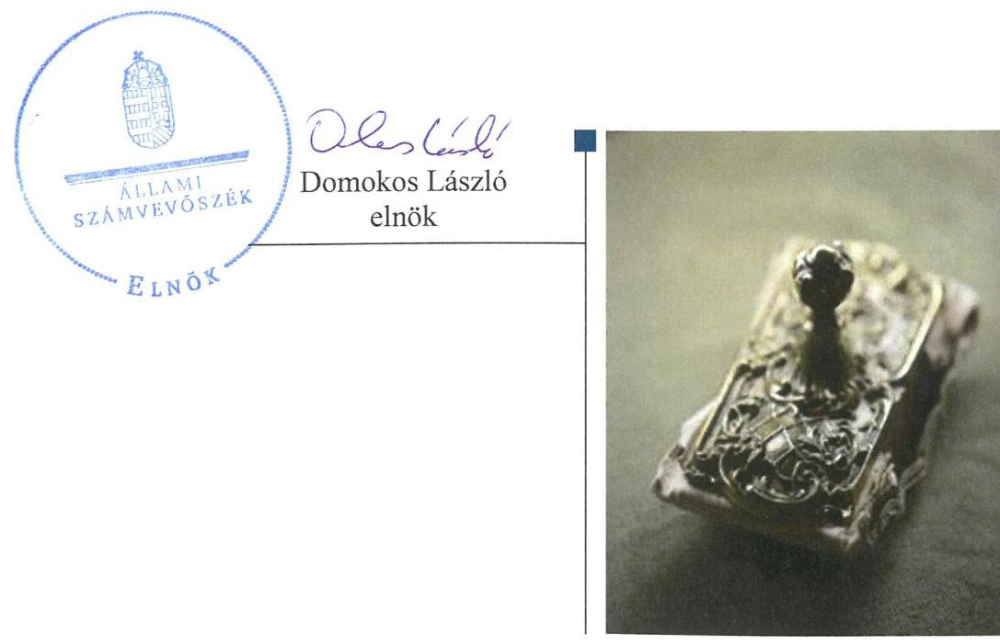

---

# AZ ELLENŐRZÉST FELÜGYELTE: 

PETŐ KRISZTINA felügyeleti vezető

## AZ ELLENŐRZÉST VEZETTE ÉS A VÉGREHAJTÁSÁÉRT FELELŐS:

BÍRÓ ZSOLT ellenőrzésvezető

## A PROGRAM ÖSSZEÁLLÍTÁSÁÉRT FELELŐS:

JANIK JÓZSEF LÁSZLÓ osztályvezető

IKTATÓSZÁM: V-0948-170/2016
TÉMASZÁM: 1982
ELLENŐRZÉS-AZONOSÍTÓ SZÁM: V073703

Jelentéseink az Országgyúlés számítógépes hálózatán és az Interneten a www.asz.hu címen is olvashatóak.

---

# TARTALOMJEGYZÉK 

■ ÖSSZEGZÉS ..... 5
■ AZ ELLENŐRZÉS CÉLJA ..... 7
■ AZ ELLENŐRZÉS TERÜLETE ..... 8
■ AZ ELLENŐRZÉS HÁTTERE, INDOKOLTSÁGA ..... 10
■ A JELENTÉS LÉNYEGES KÉRDÉSKÖREI ..... 12
■ ELLENŐRZÉS HATÓKÖRE ÉS MÓDSZEREI ..... 13
■ MEGÁLLAPÍTÁSOK ..... 16
■ JAVASLATOK ..... 32
■ MELLÉKLETEK ..... 37
I. sz. melléklet: Értelmező szótár ..... 37
II. sz. melléklet: Az integritás érvényesítése érdekében kialakított és múködtetett kontrollrendszer ..... 40
■ FÜGGELÉK: ÉSZREVÉTELEK ..... 43
■ RÖVIDÍTÉSEK JEGYZÉKE ..... 67

---

.

---

# ÖSSZEGZÉS 

Az egri Dobó István Vármúzeumra vonatkozó irányító szervi feladatellátás összességében szabályszerű volt. A Múzeumnál kialakított irányítási rendszer az ellenőrzött időszakban nem biztosította az átlátható, áttekinthető és ellenőrizhető közpénzfelhasználást. A Múzeum pénzügyi és vagyongazdálkodása nem volt szabályszerű. A Múzeum közfeladatának részét képező kulturális javak állományvédelme a kölcsönzéseknél nem volt biztosított.

## Az ellenőrzés társadalmi indokoltsága

Az Állami Számvevőszék Stratégiájának alapértéke, hogy ellenőrzései segítik az integritás alapú, átlátható és elszámoltatható közpénzfelhasználás megteremtését. Az ellenőrzés jogszabályban meghatározott közfeladat ellátására létrejött, a megyei hatókörű városi muzeális intézmények gazdálkodási tevékenységére terjedt ki. E szervezetek pénzügyi és vagyongazdálkodásának alapvető rendeltetése a múzeumi közfeladatok ellátásának biztosítása.

A megyei hatókörű városi múzeumként működő szervezetek 2011. évtől több alkalommal jelentős szervezeti és gazdálkodási átalakuláson mentek keresztül. A tulajdonosi, a vagyonkezelői és a fenntartói szerepekben, szerkezetben történt változások előkészítése, végrehajtása, illetve a múzeumi rendszer által kezelt közvagyonnal való gazdálkodás szabályszerűségének bemutatásával az ellenőrzés hozzájárulhat a múzeumok fenntartási és működtetési feladatainak ellátására vonatkozó megfelelő jogszabályi környezet kialakításához, a gazdálkodási gyakorlatuk javításához.

## Főbb megállapítások, következtetések

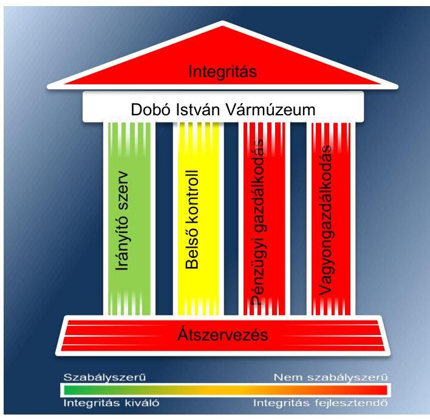

A Múzeumra vonatkozó irányító szervi feladatellátás összességében szabályszerű volt. A Múzeum rendelkezett a jogszabályi előírásoknak megfelelő tartalmú alapító okiratokkal. A fenntartó a 2014. évben nem gondoskodott a Múzeum ellenőrzéséről. További hiányosság volt, hogy a fenntartó a 2013-2014. években nem határozta meg a Múzeum stratégiai tervét.

A Múzeum belső kontrollrendszer kialakítása és múködtetése az ellenőrzött időszakban ugyan javuló tendenciát mutatott, azonban ennek ellenére a továbbra sem biztosították az átlátható, áttekinthető és az ellenőrizhető közpénzfelhasználást. A 2011-2012. években nem volt szabályszerű, 2013-2014. években már részben szabályszerű volt. A kontrollkörnyezet kialakítása során hiányosság volt, hogy a számviteli politika nem felelt meg a jogszabályi előírásoknak és a Múzeum az ellenőrzött időszakban nem rendelkezett számlarenddel.

A kockázatkezelési rendszer keretében a Múzeumnál a 2011-2012. években nem mérték fel és nem állapították meg a tevékenységében, gazdálkodásában rejlő kockázatokat, nem határozták meg az egyes kockázatokkal kapcsolatban a szükséges intézkedéseket, míg a 2013-2014. években kialakították és működtették a kockázat kezelési rendszert. A kontrolltevékenység hiányossága volt, hogy a 2011-2014. években a FEUVE érvényesülését a pénzügyi kihatású döntések célszerűségi, gazdaságossági, hatékonysági és eredményességi szempontú megalapozottsága eseté-

---

ben nem biztosították, a Múzeum 2011-2012. években nem rendelkezett adatvédelmi és adatbiztonsági szabályzattal. Az információs és kommunikációs folyamatok kialakítása során a szervezeten belüli és szervezeten kívülre történő információ-áramlás rendszerét 2011-2012 években nem alakították ki. A Múzeumnál a 2011-2012. években az elektronikus közzétételi kötelezettségnek nem tettek eleget, mivel a gazdálkodására vonatkozó közérdekű adatokat nem tették közzé. A monitoring rendszer hiányossága volt, hogy nem gondoskodtak 2011. évben olyan nyilvántartás vezetéséről, amelyben a külső ellenőrzési jelentésekben tett megállapítások, javaslatok hasznosulása és végrehajtása nyomon követhető, valamint a 2012-2013. években a külső ellenőrzések javaslatai alapján készült intézkedési tervek végrehajtásának nyilvántartásáról. A 2011-2014. években nem adtak ki olyan szabályzatokat, nem alakítottak ki és működtettek olyan folyamatokat a szervezeten belül, amelyek biztosítják a rendelkezésre álló források gazdaságos, hatékony és eredményes felhasználását.

A Múzeum vagyongazdálkodása és a pénzügyi gazdálkodása nem volt szabályszerű. A bevételek elszámolása részben volt szabályszerű, mert a vagyon hasznosítása a 2013-2014. években vagyonkezelési/hasznosítási szerződés hiányában történt. A bevételek elszámolása során 2012. évben előfordult, hogy a számlát megalapozó bérbeadási szerződést nem őrizték meg, így nem lehetett beazonosítani a szerződés tárgyát, időtartamát, összegét. A Múzeum kiadási előirányzatai felhasználása a 2011-2012. évben nem volt megfelelő, a 2013-2014. évben részben megfelelően történt. A Múzeum kiadásainál a 2011-2012. években a teljesítésigazolást nem végezték el, a 2011-2014. években a kötelezettségvállalás ellenjegyzés nélkül történt, a 2011-2012. években és a 2014. évben az érvényesítés nem volt szabályszerű. A Múzeum a folyamatos fizetőképességének biztosítása érdekében a jogszabályi előírások ellenére 2012. és 2014. évek között likviditási tervvel nem rendelkezett. A Múzeum pénzügyi egyensúlya a 2011-2012. években nem volt biztosított, a likviditás javítására 2013. évtől intézkedéseket tett. A 2012-2014. években a Múzeum vagyonnyilvántartása nem felelt meg a jogszabályi előírásoknak. A Múzeum a 2012. évben jogalap nélkül, a 20132014. években vagyonkezelési szerződés hiányában tartotta nyilván könyveiben a vagyontárgyakat. A költségvetési beszámoló mérlegtételeit a 2011. évben nem támasztották alá leltárral, 2012-2014. közötti időszakban a leltárral való alátámasztottsága, a mérlegtételek értékelése összességében nem felelt meg a jogszabályi előírásoknak. A Múzeum közfeladatának részét képező kulturális javak nyilvántartásáról részben gondoskodtak, így a Múzeum által őrzött kulturális javak számbavétele, vagyon- és tulajdonvédelme nem volt biztosított. A Múzeum közfeladatának részét képező kulturális javak állományvédelme és vagyonbiztonsága a kölcsönzéseknél nem volt biztosított.

A Múzeumot érintő szervezeti, szerkezeti átszervezések végrehajtása nem volt szabályszerű, nem volt biztosított az átláthatóság. A vagyon tényleges átadásához jegyzőkönyv felvételére - a régi és az új fenntartó között - a Megállapodás megkötését követő egy héten belül nem került sor. A vagyon átadásához készített 2011. évi könyvviteli mérleget leltár nem támasztotta alá. A 2012/2013. évi központi alrendszerből önkormányzati alrendszerbe történő átszervezést szabályszerűen, az átláthatóság biztosításával hajtották végre.

A Múzeum nem intézkedett az integritás szemlélet érvényesülése érdekében.

---

# AZ ELLENŐRZÉS CÉLJA 

vényesülését a gazdálkodási folyamatokban.

Az ellenőrzés célja annak megállapítása volt, hogy a megyei múzeumi rendszer átalakítása, az intézményfenntartói rendszerben végbement változások előkészítése és végrehajtása megalapozottan, szabályszerűen történt-e; a megyei hatókörű városi múzeumok és jogelődjeik pénz-ügyi- és vagyongazdálkodása, a belső kontrollrendszer kialakítása és működtetése, valamint az intézményfenntartói feladatok ellátása szabályszerűen történt-e.

A Múzeum ${ }^{1}$ korrupcióval szembeni veszélyeztetettségének csökkentése érdekében kért tanúsítványi adatszolgáltatás alapján az ÁSZ² értékelte az integritási szemlélet érvényesülését a gazdálkodási folyamatokban.

---

# **Dobó István Vármúzeum**

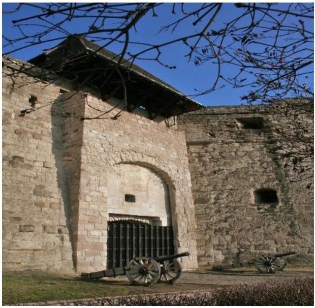

A Múzeum Egerben található, feladatkörében az Mtv.^{3} alapján gondoskodik a kulturális javak meghatározott anyagának folyamatos gyűjtéséről, nyilvántartásáról, megőrzéséről és restaurálásáról; tudományos feldolgozásáról és publikálásáról; valamint kiállításokon és más módon történő bemutatásáról; a közművelődési és közgyűjteményi feladatok ellátásáról. A Kötv.^{4} 20. § (2) bekezdése alapján területileg illetékes múzeumként régészeti feltárást végzett az ellenőrzött időszakban.

A Múzeum csak a működési engedélyében meghatározott gyűjtőkörben és gyűjtőterületen folytathatja tevékenységét. A szakmai besorolást, a rendszert megalapozó szaktörvényi kereteket az Mtv. biztosítja. Az Mtv. hatálya kiterjed a Múzeum fenntartóira, a Múzeumban foglalkoztatottakra, a kulturális örökség Múzeumban őrzött elemeire, a szolgáltatások igénybe vevőire és a kulturális örökséggel foglalkozó egyéb szervezetekre.

A Múzeum 2011. évi költségvetési engedélyezett létszáma 109 fő volt, ami 2012. évre 83 főre csökkent, majd 2013. évre 58 főre csökkent, amely a 2014. évre 88 főre emelkedett. A Múzeum alkalmazottainak foglalkoztatására a Kjt.^{5} alapján került sor. Az ellenőrzött időszakban a múzeumigazgató^{6} és a gazdasági vezető^{7} személye is változott.

A Möktv.^{8} és annak végrehajtásáról szóló 258/2011. (XII. 7.) Korm. rendelet^{9} alapján 2012. január 1-jétől a megyei múzeumok központi költségvetési szervekké váltak. 2013. január 1-jétől az 1311/2012. (VIII. 23.) Korm. határozat^{10} és a 2012. évi CLII. törvény^{11} alapján az állami tulajdonba és fenntartásba került megyei múzeumi szervezetek a megyeszékhely megyei jogú városok – Pest megyében Szentendre Város Önkormányzata, Komárom-Esztergom megyében Tata Város Önkormányzata – fenntartásában működnek tovább.

A 2011–2014. évek között a fenntartói, irányítói, középirányítói jogkörgyakorlók változását, valamint a Múzeum gazdálkodási feladatát ellátó szervezetét az 1. táblázat mutatja be:

^{1. táblázat}

|  Időszak | Fenntartó | Irányító szerv | Középirányító szerv | Gazdasági szervezet  |
| --- | --- | --- | --- | --- |
|  2011. | Megyei Önkormányzat^{12} | Megyei Közgyűlés^{13} | - | Múzeum  |
|  2012. | HMIK^{14} | KIM^{15} | HMIK | Múzeum  |
|  2013–2014. | Önkormányzat^{16} | Közgyűlés^{17} | - | Könyvtár  |

*Forrás: A Múzeum alapító okiratai*

---

A Múzeum jogelődjének, a Heves Megyei Múzeumok Igazgatóságának a jogállása 2011-2012. években önállóan működő és gazdálkodó költségvetési intézmény volt, saját gazdasági szervezettel rendelkezett. 2013. január 1-jétől a Múzeum önállóan működő és gazdálkodó költségvetési intézmény volt, az Önkormányzat a Könyvtárat ${ }^{18}$ jelölte ki a Múzeum pénzügyi és gazdasági feladatainak ellátására. 2014. január 1-jétől a Múzeum önálló jogi személyiséggel rendelkező, költségvetési szervként működött, pénzügyi és gazdasági feladatait továbbra is a Könyvtár látta el, vállalkozási tevékenységet nem végzett.

A Múzeum teljesített költségvetési bevételeinek és kiadásainak alakulását az 1. ábra mutatja be. Az ábra a 2011-2012. években a Múzeum és tagintézményeinek együttes adatai, a 2013-2014. években a tagintézmények átadását követően a múzeumi adatok alapján készült.
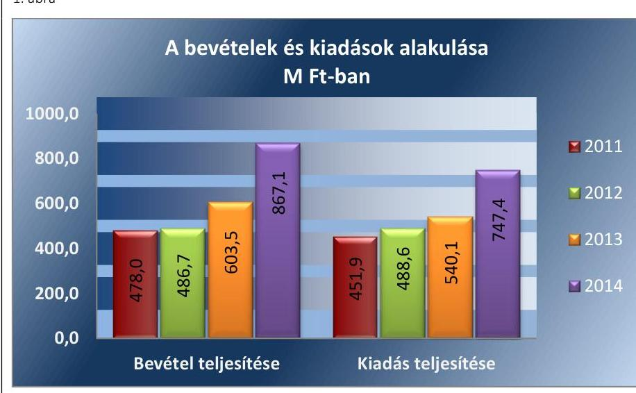

Forrás: A Múzeum 2011-2014. évi beszámolói

A 2015. évi LXXV. tv. ${ }^{19}$ 1. § (1) bekezdése alapján az Nvtv. ${ }^{20}$ 13. § (3) bekezdésében és 14. § (1) bekezdésében foglaltak alapján és az abban meghatározott feltételekkel a 2012. évi CLII. törvény 30. § (1) és (2) bekezdésében meghatározott, a megyei hatókörű városi múzeumok feladatának ellátását szolgáló egyes állami tulajdonban lévő ingatlanok a törvény hatálybalépésének napjával, a törvény erejénél fogva a kötelező közfeladatként a megyei hatókörű városi múzeumot fenntartó önkormányzatok tulajdonába kerültek. A 2015. évi LXXV. tv. 4. § (1) bekezdése alapján a kulturális örökség helyi védelme érdekében a megyei hatókörű városi múzeumok alapleltárában és jogszabály szerinti külön nyilvántartásában szereplő állami tulajdonú kulturális javak ingyenesen a megyei hatókörű városi múzeumok vagyonkezelésébe kerültek. A vagyonkezelők vagyonkezelői joga tekintetében vagyonkezelési szerződés megkötése nem szükséges. A 2015. évi LXXV. tv. 4. § (2) bekezdése szerint továbbá a kulturális örökség helyi védelme érdekében a megyei hatókörű városi múzeumok feladatának ellátását szolgáló állami tulajdonban álló ingatlanok - a törvény mellékletében meghatározott ingatlanok kivételével - ingyenesen a fenntartó önkormányzatok vagyonkezelésébe kerültek.

---

# **AZ ELLENŐRZÉS HÁTTERE, INDOKOLTSÁGA**

Az Alaptörvény^{21} rendelkezése szerint a nemzeti vagyon megőrzésének, védelmének és a nemzeti vagyonnal való felelős gazdálkodásnak a követelményeit sarkalatos törvény, az Nvtv. rögzíti. A tulajdonosi joggyakorlás és vagyonkezelés általános és speciális szabályait, az állami vagyon nyilvántartására és elszámolására vonatkozó eljárásokat, a vagyonkezelési szerződés feltételrendszerét, valamint az éves beszámoló készítési és könyvvezetési kötelezettségeket kormányrendelet írja elő.

A megyei hatókörű városi múzeumok közfeladat-ellátásának változásait, (beleértve az állami tulajdonosi joggyakorló, intézményi vagyonkezelő és önkormányzati fenntartó szervezeteket is) a közfeladatok átadásából és átvételéből adódó módosításait, előirányzat gazdálkodására ható tényezőit az Áht-2^{22}, az Ávr.^{23}, a Möktv., valamint a Mtv. írja elő. A múzeumi intézményrendszer rendszerátalakulásából, megszűnéséből, intézmény átszervezéséből, belső szerkezeti korszerűsítéséből, vagy más hasonló okból adódó módosításai miatt szerepeltetendő szerkezeti változásokat, valamint a szerkezeti változásként beépült közfeladatok szintre hozásként történő számításba vételét az Ávr. határozza meg.

A megyei hatókörű városi múzeumok kulturális szempontból meghatározó jelentőségűek mind földrajzi elhelyezkedésüket, mind az ellátott feladatokat, valamint a látogatottságukat tekintve. Tevékenységüket törvényi szinten (Mtv.) szabályozták a jogalkotók. A megyei hatókörű városi múzeumok jelenlegi körének kialakításában, tulajdonosi és fenntartói szerkezetében rövid idő alatt több jelentős változás történt, amelyeket jogszabályi változások indukáltak. Ezen intézmények szakmai besorolásukat tekintve a 2011. évben megyei múzeumként, a 2012. évben megyei múzeumi központi költségvetési szervezetként, a 2013. évtől kezdődően megyei hatókörű városi múzeumként működtek. A szakmai besorolások változásait párhuzamosan követték a tulajdonosi, vagyonkezelői, fenntartói szerepekben történt változások.

A 2011–2014. évek között bekövetkezett fenntartói változás a vagyontárgyak és a kulturális javak tulajdonosi, vagyonkezelői és használói körében is változást indukáltak, amelyet a 2. táblázat szemlélet.

1. táblázat

|  A VAGYON TULAJDONOSI, VAGYONKEZELŐI ÉS HASZNÁLÓI KÖRÉNEK VÁLTOZÁSA
2011–2014. ÉVEKBEN |  |  |  |  |  |  |  |  |  |  |  |  |  |  |   |
| --- | --- | --- | --- | --- | --- | --- | --- | --- | --- | --- | --- | --- | --- | --- | --- |
|  Vagyon-
tárgy |  | 2011. év
vagyon-
kezelő |  | használó |  | tulajdonos |  | 2012. év
vagyon-
kezelők |  | használó |  | tulajdonos |  | 2013–2014. évek
vagyon-
kezelő |  | használó  |
|  Ingatlan | Megyei Önkormányzat | - |  | Múzeum |  | Állam |  | HMIK |  | Múzeum |  | Állam |  | Múzeum |  | Múzeum  |
|  Egyéb
tárgyi eszközök | Megyei Önkormányzat | - |  | Múzeum |  | Állam |  | HMIK |  | Múzeum |  | Állam |  | Múzeum |  | Múzeum  |
|  Kulturális
javak | Megyei Önkormányzat | - |  | Múzeum |  | Állam |  | HMIK |  | Múzeum |  | Állam |  | Múzeum |  | Múzeum  |

*2. táblázat*

*Forrás: A Múzeum alapító okiratai, a 2012. évi CLII. tv, a 258/2011. (XII. 7) Korm. rendelet, az 1311/2012. (VIII. 23.) Korm. határozat*

---

Az ellenőrzés - tekintettel a megyei hatókörű városi múzeumokat (és jogelődjeit) rövid időn belül, gyors ütemben ért környezeti (tulajdonosi, fenntartói-szerkezetet érintő) változásokra - javaslatok megfogalmazásával hozzájárul a fenntartás és működtetés feladatainak ellátására vonatkozó megfelelő jogszabályi környezet - jogalkotók által történő - kialakításához. Az ÁSZ ellenőrzésével átfogó képet ad a megyei hatókörű városi múzeumok (és jogelődjeik) jellemző sajátosságairól, jó gyakorlatokról.

AZ ELLENŐRZÉS EREDMÉNYEKÉPPEN nemcsak az ellenőrzött intézmények gazdálkodása javulhat, hanem átfogó képet kaphatunk a múzeumok gazdálkodásának hiányosságairól, de a jó gyakorlatokról is. Ellenőrzéseivel, javaslataival és megállapításaival az ÁSZ elősegíti a költségvetési szervek pénzügyi és vagyongazdálkodása szabályozásának javítását és hozzájárul a jó kormányzáshoz.

---

# A JELENTÉS LÉNYEGES KÉRDÉSKÖREI 

1.     - Az irányító szerv ellenőrzött Múzeumra vonatkozó feladatellátása szabályszerű volt-e?
2.     - Szabályszerűen hajtották-e végre a Múzeumot érintő szervezeti, szerkezeti átszervezéseket?
3.     - A belső kontrollrendszer kialakítása és müködtetése megfelelt-e a jogszabályi előírásoknak?
4.     - A Múzeum pénzügyi gazdálkodása szabályszerű volt-e?
5.     - A Múzeum vagyongazdálkodása szabályszerű volt-e?
6.     - A Múzeum intézkedett-e az integritás szemlélet érvényesítése érdekében?

---

# ELLENŐRZÉS HATÓKÖRE ÉS MÓDSZEREI 

## Az ellenőrzés típusa

Megfelelőségi ellenőrzés.

## Az ellenőrzött időszak

Az ellenőrzött időszak 2011. január 1-jétől 2014. december 31-ig tart.

## Az ellenőrzés tárgya

A megyei hatókörű városi múzeumok átszervezése, átalakítása előkészítése és lebonyolítása megalapozottsága, szabályszerűsége, a pénzügyi és vagyongazdálkodási tevékenység, a belső kontroll rendszer kialakítása, működtetése szabályszerűsége, valamint az irányító szervi feladatok ellátása szabályszerűsége. E tevékenységek és a kapcsolódó adatok és információk összessége, amelyeket a vonatkozó kritériumok alapján kell értékelni.

Az ellenőrzés kiterjedt minden olyan körülményre és adatra, amely az ÁSZ jogszabályban meghatározott feladatainak teljesítéséhez, valamint a program végrehajtása folyamán felmerült újabb összefüggések feltárásához szükséges.

## Az ellenőrzött szervezet

Dobó István Vármúzeum, a fenntartói feladatokban érintett Heves Megyei Önkormányzat, valamint Eger Megyei Jogú Város Önkormányzata, a Heves Megyei Intézményfenntartói Központ (HMIK) jogutódja a Szociális és Gyermekvédelmi Főigazgatóság. Bródy Sándor Megyei és Városi Könyvtár 2013-2014. években, mint a gazdálkodási feladatokat ellátó szervezet.

Az ellenőrzésre a költségvetési szerv ellenőrzött intézményének és irányító/felügyeleti szervének, illetve középirányító szervének székhelyén, a gazdálkodási feladatait ellátó szervezetének székhelyén került sor.

## Az ellenőrzés jogalapja

Az ellenőrzés jogszabályi alapját az ÁSZ tv. ${ }^{24}$ 1. § (3) bekezdés, 5. § (2)-(6) bekezdései, valamint az Áht. 2 61. § (2) bekezdésének előírásai képezik.

---

# Az ellenőrzés módszerei 

Az ellenőrzést az ellenőrzési program szempontjai, az ellenőrzött időszakban hatályos jogszabályok, az ellenőrzés szakmai szabályai, az egyes ellenőrzési típusokhoz kapcsolódó ÁSZ módszertanok és nemzetközi standardok figyelembe vételével végeztük. A gazdálkodás hibáinak kijavítására, a közpénzekkel való felelős gazdálkodás segítésére irányuló javaslatok kidolgozásakor a hatályos jogszabályok az irányadóak.

Az ellenőrzési kérdések megválaszolásához szükséges bizonyítékok megszerzése a következő ellenőrzési eljárások alkalmazásával történik: kérdésfeltevés (információkérés), mintavételezés, valamint elemző eljárás. A minták kiválasztása során véletlen mintavételi eljárást alkalmazunk.

Mintavétellel ellenőriztük a bevételek, a személyi juttatások, a külső személyi juttatások, a dologi és felhalmozási kiadások, a régészeti kiadások és a kulturális javak kölcsönzésének szabályszerűségét. A minta alapján a sokaságban előforduló hibaarányt becsültük. „Megfelelőnek" értékeltük az ellenőrzött területet, amennyiben 95\%-os bizonyossággal a teljes sokaságban a hibaarány legfeljebb 10\%, ,, részben megfelelőnek" értékeltük, ha a hibaarány felső határa 10-30\% között volt, ,,nem megfelelőnek" pedig akkor, ha a mintavételi eredmények alapján a sokaságbeli hibaarány felső határa meghaladta a 30\%-ot.

Az ellenőrzési bizonyítékként felhasználható adatforrások közé tartoznak egyrészt a szakmai program részletes szempontjainál felsorolt adatforrások, másrészt adatforrás lehet minden egyéb - az ellenőrzés folyamán feltárt, az ellenőrzés szempontjából releváns információt tartalmazó - dokumentum.

Az ellenőrzés lefolytatásához az intézmény a tanúsítványok elektronikus kitöltésével, valamint az ÁSZ által kért dokumentumok elektronikus megküldésével szolgáltatott adatokat. A rendelkezésre bocsátott adatok, információk kontrollja az ellenőrzés keretében történt.

Az ellenőrzési kérdésekre adott válaszok alapján értékeltük, hogy az ellenőrzött időszakban az irányító szerv az ellenőrzött intézményre vonatkozó feladatainak szabályszerűen eleget tett-e, az intézmény pénzügyi és vagyongazdálkodása megfelelt-e az előírásoknak, az intézmény átalakításának vagy átszervezésének végrehajtása szabályszerű volt-e.

Az intézmény belső kontrollrendszere jogszabályi előírások szerinti kialakításának és működtetésének szabályszerűségét az erre irányuló ellenőrzési kérdésekre adott válaszok összesítése alapján, évente pillérenként (kontrollkörnyezet, kockázatkezelési rendszer, kontrolltevékenységek, információs és kommunikációs rendszer, monitoring rendszer) és összesítetten is minősítjük. Az intézmény belső kontrollrendszere egyes pilléreinek kialakítása és működtetése „szabályszerü", amennyiben az értékelt területen az elért és elérhető pontok százalékban kifejezett, egész számra kerekített hányadosa meghaladja a 84\%-ot, „részben szabályszerű", ha a 84\%ot nem haladja meg, de 60\%-nál nagyobb, „nem szabályszerű", ha nem haladja meg a 60\%-ot. Az intézmény belső kontrollrendszerének összesített értékelése megegyezik a pillérenként (kontrollterületenként) alkalmazott \%-os értékelésekkel, a következő eltérésekkel. A kontrollrendszer egésze esetében a „szabályszerű" értékelésnek a \%-os értéken felül további feltétele, hogy egyik kontrollterület sem kaphat „nem szabályszerű" értékelést,

---

a „részben szabályszerű" értékelés további feltétele, hogy legfeljebb egy ellenőrzött kontrollterület lehet „nem szabályszerű" értékelésű. Az összesített értékelés a \%-os értéktől függetlenül „nem szabályszerű", ha az ellenőrzött kontrollterületek közül több mint egynek „nem szabályszerű" az értékelése.

Az integritás szemlélet érvényesülésének értékelése a Múzeum által szolgáltatott adatok alapján történt.

---

# 1. Az irányító szerv ellenőrzött Múzeumra vonatkozó feladatellátása szabályszerű volt-e? 

Összegző megállapítás

Az irányító szervek Múzeumra vonatkozó feladatellátása 2011-2014. években összességében szabályszerű volt.

AZ ALAPÍTÓI JOGOSULTSÁGOK gyakorlása a Múzeumnál 2011-2014. években megfelelt a jogszabályi előírásoknak.

A Múzeum a 2011-2014. években rendelkezett az irányító szerv ${ }_{1-3}{ }^{25}$ által jóváhagyott az Áht. ${ }_{1,2}$ az Ámr. ${ }^{26}$, illetve az Ávr. által előírtaknak megfelelő alapító okirat ${ }_{1-6}{ }^{27}$-tal, amelyek módosítása a jogszabályi és feladatváltozások alapján megtörtént, a módosításhoz az irányító szerv ${ }_{3}$ az EMMI ${ }^{28}$ előzetes véleményét beszerezte. A 2011-2013. években az egységes szerkezetbe foglalt alapító okiratot is elkészítették. Tartalmuk megfelelt az Áht. ${ }_{1}{ }^{29}$-ben és az Ávr.-ben foglalt előírásoknak.

A MUNKÁLTATÓI JOGOSULTSÁGAIT az irányító szerv ${ }_{1-3}$ a 2011-2014. években összességében szabályszerűen gyakorolta.

A 2011-ben lemondott múzeumigazgató helyére az irányító szerv ${ }_{1}$ elnöke az SZMSZ ${ }_{1}{ }^{30}$ előírásainak betartása mellett, a Múzeum igazgatóhelyettesét megbízta a múzeumigazgatói feladatok ellátásával. A megbízott múzeumigazgató lemondását követően 2011. december 1-jétől az SZMSZ ${ }_{1}$-nek megfelelően a szakmai igazgató helyettes látta el a múzeumigazgatói feladatokat.

A 2012. évben a múzeumigazgató középirányító szerv általi kinevezése és magasabb vezetői megbízásának visszavonása az Áht. ${ }_{2}$ és az Mtv. előírásainak megfelelően történt. A múzeumigazgató kinevezéséhez és felmentéséhez a középirányító szerv beszerezte az EMMI-től az Mtv. 45/B. § (2) bekezdésében előírt egyetértési dokumentumot.

Az új múzeumigazgatót a középirányító szerv az EMMI egyetértésével 2012. november 27-től bízta meg, akit a 2013-ban lefolytatott pályázati eljárás végén 2014. január 1-jétől öt évre megbízott az irányító szerv3.

A 2011. évben a gazdasági vezető megbízásakor nem tartották be az Áht. ${ }_{1} 93 . \S$ (1) bekezdés c) pontjában előírtakat, mivel a gazdaságvezetői megbízást a múzeumigazgató adta az irányító szerv ${ }_{1}$ helyett. A megbízás során nem tartották be az Ámr. 18. § (1)-(3) bekezdéseiben foglalt előírásokat sem, mert a megbízott személy nem rendelkezett az előírt végzettséggel, szakképesítéssel és a könyvviteli szolgáltatás körébe tartozó tevékenység ellátására jogosító engedéllyel.

AZ EGYÉB IRÁNYÍTÁSI, FELÜGYELETI ÉS ELLENÖRZÉSI JOGOSULTSÁGOK gyakorlása az ellenőrzött időszakban összességében szabályszerű volt.

---

Az ellenőrzött időszakban az irányító szerv $_{1-3}$ az egyéb irányítási, felügyeleti és ellenőrzési jogosultságait - az Áht.1,2, az Mtv., az Ötv. ${ }^{31}$, a 258/2011. (XII. 7.) Korm. rendelet előírásainak, valamint a KIM Utasításban ${ }^{32}$ foglaltaknak - összességében megfelelően gyakorolta. A fenntartó ${ }_{1}$ ${ }_{3}^{33}$ 2011-2013. években gondoskodott a Múzeum ellenőrzéséről. A 20132014. években a fenntartó ${ }_{3}$ jóváhagyta a Múzeum munkatervét, meghatározta a beruházási fejlesztési feladatait, továbbá a 2014. évben jóváhagyta a Múzeum küldetésnyilatkozatát.

Jóváhagyta az irányító szerv ${ }_{1}$ az SZMSZ ${ }_{1,2}{ }^{34}$-t, 2013-ben az irányító szerv ${ }_{3}$ az SZMSZ ${ }_{3}{ }^{35}$-t. A 2012. évben azonban az Áht. 2 9. § (1) bekezdés e) pontjában foglalt előírás nem érvényesült, mert a Múzeum az aktualizált SZMSZét nem készítette el, így azt az irányító szerv ${ }_{2}$ nem tudta jóváhagyni.

A 2014. évben a Mötv. ${ }^{36}$ 119. § (4) bekezdésének ellenére a jegyző nem gondoskodott a Múzeum ellenőrzéséről.

Az irányító szerv ${ }_{3}$ 2013. január 1-jétől a Múzeum gazdálkodási feladatainak ellátására a Könyvtár gazdasági szervezetét jelölte ki, a munkamegosztási megállapodás ${ }^{37}$-t az Ávr. előírásainak megfelelően jóváhagyta.

A fenntartó ${ }_{3}$ 2013-2014 között nem határozta meg és nem hagyta jóvá az Mtv. 50. § (2) bekezdés a) pontja ellenére a Múzeum stratégiai tervét.

# 2. Szabályszerúen hajtották-e végre a Múzeumot érintő szervezeti, szerkezeti átszervezéseket? 

Összegző megállapítás

## 2.1. számú megállapítás

A Múzeumot érintő szervezeti, szerkezeti átszervezéseket nem szabályszerűen hajtották végre.

A Múzeumot érintő önkormányzati alrendszerből a központi alrendszerbe történő 2012. január 1-jétől hatályos irányító szervi (fenntartói) váltás lebonyolítása nem volt szabályszerű, az átláthatóság nem volt biztosított.

A fenntartói és irányító szervi váltást az irányító szerv $_{1}$ 223/2011. (XII. 20.) számú határozatával elfogadta.

A MEGÁLLAPODÁS ${ }_{1}^{38}$ megkötésére a 258/2011. (XII. 7.) Korm. rendelet 1. számú melléklete szerinti minta alapján 2011. december 21-én került sor a Megyei Önkormányzat, a Kormánymegbízott ${ }^{39}$ aláírásával. A Megállapodás ${ }_{1}$-et - a Möktv. 6. § (3) bekezdésben előírtak ellenére - 2011. december 31-ig az MNV Zrt. ${ }^{40}$ és az NFA ${ }^{41}$ nem írta alá, az aláírásra 2012. július 4-én került sor.

Az MNV Zrt. és a középirányító szerv a 258/2011. (XII. 7.) Korm. rendelet 1. számú melléklet V. részben előírtakat nem tartotta be, mert a vagyonkezelési szerződést ${ }^{42}$ a Megállapodás ${ }_{1}$ aláírásától, de legkorábban 2012. január 1-jétől számított 30 napon belül nem kötötte meg. A vagyonkezelési szerződést határidőn túl az MNV Zrt. 2012 szeptemberében, a középirányító szerv 2012. október 16-án írta alá, az irányító szerv2 2012. november 20-án záradékolta.

---

A Megállapodás ${ }_{1}$ a 258/2011. (XII. 7.) Korm. rendelet 1. számú mellékletének megfelelő tartalommal készült, azonban nem teljes körűen tartalmazta a 258/2011. (XII. 7.) Korm. rendeletben foglalt átadási dokumentumokat. A mellékletek ${ }^{43}$ közül a 2-5. és 15., az adatszolgáltatások ${ }^{44}$ közül az 5., a 7-10. számút nem csatolták.

Figyelmen kívül hagyva a 258/2011. (XII. 7.) Korm. rendelet 12. § (3) és (4) bekezdésében előírtakat, a vagyon tényleges átadásához jegyzőkönyv felvételére - a fenntartó; és a fenntartó; között - a Megállapodás ${ }_{1}$ megkötését követő egy héten belül nem került sor.

A Múzeum a vagyonátadási megállapodást megelőzően az Áhsz. ${ }^{45}$ 13/A. § (1) bekezdésével ellentétben, 2011. évben leltárt nem készített, a vagyontárgyak teljes körű felmérését nem végezte el.

A 258/2011. (XII. 7.) Korm. rendelet 1. számú mellékletének IV/11. pont ba) alpontjában foglaltak ellenére a 20/2002. (X. 4.) NKÖM rendelet ${ }^{46}$ 3. § (2) bekezdésében előírt alapleltárakban és a külön nyilvántartásokban szereplő kulturális javak átadása nem történt meg

A mérlegsorokat záró főkönyvi kivonattal és analitikával támasztották alá, a pénzforgalmi számlákat pedig év végével lezárták. A Múzeum a központi alrendszerben szabályszerűen végezte el az eszközök és források, valamint a kiadási és bevételi előirányzatok nyitását.

# 2.2. számú megállapítás 

A 2013. január 1-jével végrehajtott, a központi alrendszerből önkormányzati alrendszerbe történő irányítószervi (fenntartói) váltás lebonyolítását és a szervezetrendszer átalakítását szabályszerűen, az átláthatóság biztosításával hajtották végre.

A Kormány a 1094/2012. (IV. 3.) Korm. határozatával ${ }^{47}$ elvi döntést hozott arról, hogy a Möktv. alapján állami tulajdonba és fenntartásba került megyei múzeumok a megyeszékhely megyei jogú városok, illetve helyi önkormányzatok fenntartásába kerüljenek. A központi alrendszerből az önkormányzati alrendszerbe történő átadáshoz kapcsolódó feladatok tekintetében az 1311/2012. (VIII. 23.) Korm. határozat adott iránymutatást.

Az átadás-átvételi eljárást 2012. október 1-jén a fenntartó; kezdeményezte, és a Megállapodás ${ }_{2}^{48}$ megkötésére 2012. december 14-én került sor a fenntartó ${ }_{2}$, mint átadó és a fenntartó ${ }_{3}$, mint átvevő aláírásával, valamint a Kormánymegbízott és az EMMI képviselőjének egyetértésével. A Megállapodás ${ }_{2}$-ben hivatkozott mellékletek dokumentumai aláírásra és átadásra kerültek.

A Múzeum a vagyonátadást megelőzően az Áhsz. ${ }_{1}$ előírásainak megfelelően elvégezte az éves beszámoló elkészítéséhez a mérlegben szereplő eszközök és források év végi értékelését. Minden egyes mérlegsorhoz tételes kimutatást készített az eszközökről és forrásokról. A befektetett eszközök és a készletek mennyiségi felvétellel történő leltározását elvégezte. Továbbá a mérlegsorokat záró főkönyvi kivonattal, analitikus nyilvántartással, leltárral szabályszerűen alátámasztotta. Az átszervezés előtti feladatok keretében lezárta az átszervezés napjára a bevételi és kiadási forgalmi számlákat, a közgazdasági és a funkcionális osztályozás szerint.

Az elkészített beszámoló az éves elemi költségvetési beszámolónak megfelelő adattartalmú volt, a vagyonátadásra a mérlegben szereplő adatokat alátámasztó leltár alapján került sor. A Múzeum az átszervezés fordulónapjára kivezette a költségvetési pénzeszközöket.

---

A fenntartó ${ }_{3}$ polgármestere a muzeális intézmények múködési engedélyéről szóló 2/2010. (I. 14.) OKM rendelet 17. § (5) bekezdésében rögzített 20 napos határidő ellenére, 2013. június 6-án kezdeményezte a Múzeum múködési engedélyének - fenntartó váltás miatt szükségessé vált - módosítását.

A TAGINTÉZMÉNYEK 2013. évben történő átszervezésével kapcsolatos szakmai és számviteli, továbbá vagyonátadási feladatok keretében, a fenntartó ${ }_{2}$ közvetlenül a települési önkormányzatoknak adta át a tagintézményeket.

A 1311/2012. (VIII. 23.) Korm. határozatot betartva a tagintézmények átadását rögzítő megállapodások mellékleteiben meghatározták az egyes tagintézményekhez rendelt létszámot, a leltárában szereplő kulturális javakat és az egyéb vagyonelemeket. A megállapodások aláírására 2012. december 12-e és 14-e között került sor.

A fenntartói változások a Múzeum mellett, annak négy intézményét érintették: a Mátra Múzeum a Természettudományi Múzeumhoz; a Hatvany Lajos Közérdekú Muzeális Gyűjtemény Hatvan város önkormányzatához; a Hevesi Helytörténeti Gyűjtemény Heves város önkormányzatához; a Palóc Ház Parád község önkormányzatához került.

# 3. A belső kontrollrendszer kialakítása és múködtetése megfelel-te a jogszabályi előírásoknak? 

## Összegző megállapítás

A Múzeum belső kontrollrendszerének kialakítása és múködtetése a 2011-2012. években nem volt szabályszerű, a 20132014. években részben szabályszerű volt.

A belső kontrollrendszer kialakítása és múködtetése részletes értékelését a 2011-2014. évekre vonatkozóan a 3. táblázat mutatja be.
3. táblázat

## A BELSŐ KONTROLLRENDSZER KIALAKÍTÁSÁNAK ÉS MÚKÖDTETÉSÉNEK ÉRTÉKELÉSE A 2011-2014. ÉVEKBEN

| Megnevezés | Kontroll-   környezet | Kockázatkezelés | Kontroll-   tevékenységek | Információ és   kommunikáció | Monitoring | Összesen |
| :--: | :--: | :--: | :--: | :--: | :--: | :--: |
| 2011. | részben szabály-   szerú | nem szabályszerű | nem szabályszerű | nem szabályszerű | nem szabályszerű | nem szabályszerű |
| 2012. | részben szabály-   szerú | nem szabályszerű | nem szabályszerű | nem szabályszerű | nem szabályszerű | nem szabályszerű |
| 2013. | részben szabály-   szerú | szabályszerű | részben szabály-   szerú | részben szabály-   szerú | nem szabályszerű | részben szabály-   szerú |
| 2014. | részben szabály-   szerú | szabályszerű | részben szabály-   szerú | részben szabály-   szerú | nem szabályszerű | részben szabály-   szerú |

Forrás: Az ÁSZ által készített értékelés

---

# 3.1. számú megállapítás 

A kontrollkörnyezet kialakítása 2011-2014. években részben volt szabályszerű.
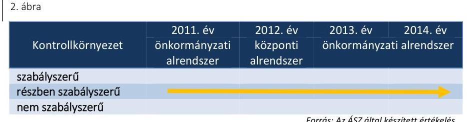

A 2011-2014. években az SZMSZ ${ }_{1-3}$ volt hatályban, amelyek közül az SZMSZ ${ }_{1,3}$ megfelelt az Ámr. és az Ávr. előírásainak. Az SZMSZ ${ }_{2}$ a 2011. évi jóváhagyásakor nem tartalmazta az Ámr. 20. § (2) bekezdés c) és e) pontjai ellenére az alaptevékenységek szakfeladatrend szerinti besorolását és az alaptevékenységet szabályozó jogszabályok megjelölését, valamint az engedélyezett létszámot. 2012-2013-ban - az SZMSZ ${ }_{2}$ aktualizálás elmaradása miatt - az Ávr. 13. § (1) bekezdés b), c), e) pontjai ellenére nem tartalmazta a Múzeum módosított alapító okiratának keltét, számát, az alapítás időpontját, nem tartalmazta továbbá az alaptevékenységek szakfeladatrend szerinti besorolását és az alaptevékenységet szabályozó jogszabályok megjelölését, valamint engedélyezett létszámot.

A Múzeum a 2011-2012. években rendelkezett gazdasági szervezettel, 2013. január 1-jétől az irányító szerv ${ }_{3}$ a gazdasági feladatok ellátására a Könyvtár gazdasági szervezetét jelölte ki. Az ügyrendje ${ }_{1}{ }^{49}$ 2012. december 31-ig volt hatályban, 2013. január 1-jétől az ügyrend ${ }_{2}{ }^{50}$-őt terjesztették ki a Múzeumra is. Az ügyrendje ${ }_{1,2}$ megfelelt az Ámr. és az Ávr. előírásainak.

Az ellenőrzött időszakban az etikai elvárásokat a múzeumigazgató a Magyar Múzeumi Egyesület Alapszabálya 1. sz. mellékletében meghatározott etikai szabályok elfogadásával alakította ki, amelyben nem határozott meg a Múzeum minden szintjére etikai elvárásokat az Ámr. 156. § (1) bekezdés c) pontjában és a Bkr. ${ }^{51}$ 6. § (1) bekezdés c) pontjában foglaltak ellenére.

A gazdasági vezetői munkakörök átadás-átvétele során nem tartották be az lkr. ${ }^{52}$ 15. § és az SZMSZ ${ }_{1}$ 24. és az SZMSZ ${ }_{2}$ 25. pontjának előírásait, mert 2011-ben és 2012-ben történt gazdasági vezető váltás alkalmával az átadás-átvételi eljárásról nem készült jegyzőkönyv. 2013. január 15-én a gazdasági vezetői feladatok átadás-átvételéről készült jegyzőkönyv nem felelt meg az SZMSZ ${ }_{2}$ 25. pontjának, mivel hiányzott az átadó aláírása.

A Múzeum az ellenőrzött időszakban rendelkezett számviteli politika ${ }_{1-3}{ }^{53}$-mal. A számviteli politika ${ }_{1}$ és a gazdasági vezető által készített 2014. január 1-jétől hatályos számviteli politika ${ }_{3}$ nem tartalmazta, hogy mit tekint a Múzeum a számviteli elszámolás, az értékelés szempontjából jelentősnek, nem jelentősnek a Számv. tv. ${ }^{54}$ 14. § (4) bekezdésében előírtak ellenére.

A Múzeum a 2011-2014. években nem rendelkezett a Számv. tv. 161. § (1) bekezdésében előírt számlarenddel.

A 2011-2012. években a Számv. tv. 14. § (5) bekezdés c) pontjában és az Áhsz. ${ }_{1}$ 8. § (4) bekezdés c) pontjában előírtak ellenére önköltségszámítás rendjére vonatkozó szabályzattal nem rendelkezett a Múzeum. A 2013. január 1-jével hatályba léptetett önköltségszámítási szabályzat ${ }^{55}$ megfelelt a Számv. tv. előírásainak.

---

A Múzeum elkészítette pénzkezelési szabályzat ${ }_{1-3}{ }^{56}$-át. A pénzkezelési szabályzat ${ }_{2}$-ben nem rendelkeztek a Múzeum készpénzállományát érintő pénzmozgások jogcímeiről és eljárási rendjéről a Számv. tv. 14. § (8) bekezdésében előírtak ellenére. A pénzkezelési szabályzat ${ }_{1}$ és a 2014-től hatályos pénzkezelési szabályzat ${ }_{3}$ megfelelte a Számv. tv. előírásainak.

A Múzeum a 2011-2013. években az Ámr. 156. § (3) bekezdésében és a Bkr. 6. § (4) bekezdésében foglaltak ellenére nem rendelkezett szabálytalanság kezelési eljárásrenddel ${ }^{57}$, amelyet 2014-ben a jogszabályi előírásoknak megfelelően a múzeumigazgató elkészített.
3.2. számú megállapítás

A kockázatkezelési rendszer kialakítása és múködtetése a 2011-2012. években nem volt szabályszerű, 2013-2014-ben szabályszerű volt.
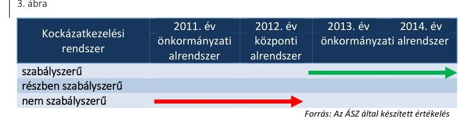

Az ellenőrzött időszakban kialakították a kockázatkezelési rendszert, amely tartalmazta a kockázatok azonosításával, elemzésével, csoportosításával, illetve a kockázati kitettség csökkentésével kapcsolatos szabályokat.

A Múzeumnál a 2011. évben az Ámr. 157. § (2)-(3) bekezdésében, illetve a 2012. évben a Bkr. 7. § (2) bekezdésében foglaltak ellenére nem mérték fel és nem állapították meg a tevékenységében, gazdálkodásában rejlő kockázatokat, nem határozták meg az egyes kockázatokkal kapcsolatban a szükséges intézkedéseket, továbbá a 2012. évben a Bkr. 7. § (2) bekezdésében foglaltak ellenére, nem határozták meg a kockázatok kezelése érdekében szükséges intézkedések teljesítésének folyamatos nyomon követési módját.

A 2013-2014. években a Bkr. előírásainak megfelelően felmérték és megállapították a Múzeum tevékenységében, gazdálkodásában rejlő kockázatokat, a szükséges intézkedéseket, valamint az intézkedések teljesítésének folyamatos nyomon követési módját.

# 3.3. számú megállapítás 

A kontrolltevékenység kialakítása és múködtetése 2011-2012-ben nem volt szabályszerű, a 2013-2014 években részben szabályszerű volt.
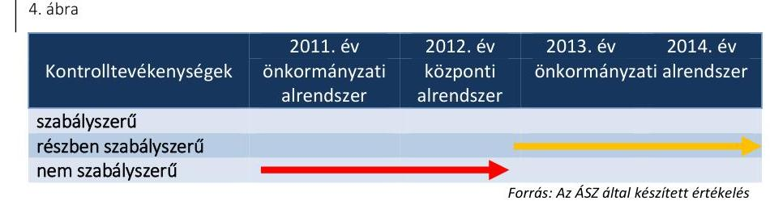

A múzeumigazgató a Múzeumnál a kontrolltevékenység részeként a folyamatba épített előzetes, utólagos és vezetői ellenőrzést 2011. évben az Áht. ${ }_{1} 121 /$ A. § (4) bekezdés b) pontja, 2012-2014. években a Bkr. 8. §

---

(2) bekezdés b) pontja ellenére a pénzügyi kihatású döntések célszerűségi, gazdaságossági, hatékonysági és eredményességi szempontú megalapozottsága esetében nem biztosította.

A múzeumigazgató a 2011. évben az Ámr. 158. § (2) bekezdés b) pontjában foglaltak ellenére az információkhoz való hozzáférést, illetve a 2012. évben a Bkr. 8. § (4) bekezdés b) pontjában előírtak ellenére a dokumentumokhoz és információkhoz való hozzáférés jogosultságait nem szabályozta. A 2013-2014. évben a Bkr. 8. § (4) bekezdés b) pontja ellenére a múzeumigazgató a felelőségi körök meghatározásával nem szabályozta a dokumentumokhoz való hozzáférést.

A Múzeum a 2011-2012. években az Ikr. 8. § (1) bekezdésében foglaltak ellenére nem, 2013. évtől kezdődően rendelkezett adatvédelmi és adatbiztonsági szabályzattal, amelyben gondoskodott az elektronikus rendszerek által kezelt adatok biztonságáról, azonban a múzeumigazgató a 2013. évtől sem gondoskodott az lkr. 8. § (2) bekezdésében foglaltak ellenére az üzemeltetés és az adatbiztonság olyan szabályozásáról, amely alapján a feladatok, hatáskörök pontosan meghatározásra kerülnek és végrehajthatók.

A közalkalmazotti jogviszony megszűnése vagy a munkakör változása esetén a munkakör átadásának rendjét 2011-2012-ben az SZMSZ ${ }_{1,2}$-ben, 2013-tól 2013. április 5-én kiadott igazgatói utasításban szabályozták.

A kontrolltevékenység működtetése során feltárt hiányosságokat részletesen a 4.3. pont tartalmazza.
3.4. számú megállapítás

Az információs és kommunikációs folyamatok kialakítása a 20112012. években nem volt szabályszerű, a 2013-2014. években részben szabályszerű volt.
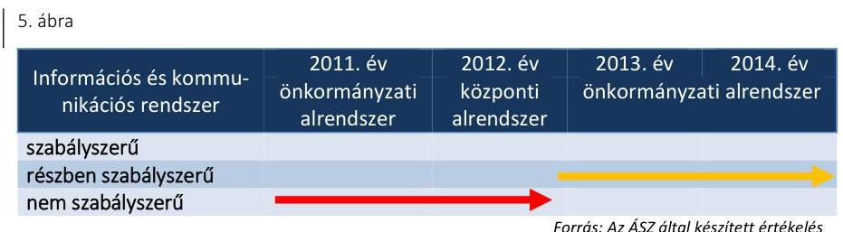

A múzeumigazgató a szervezeten belüli és szervezeten kívülre történő információ-áramlás rendszerét, valamint a beszámolási szinteket, határidőket, módokat a 2011. évben az Ámr. 159. § (1)-(2) bekezdéseiben a 2012. évben a Bkr. 9. § (1)-(2) bekezdéseiben foglaltak ellenére nem alakította ki, a múzeumigazgató a 2013-2014. években a Bkr. 9. § (1)-(2) bekezdéseiben előírtaknak megfelelően már kialakította.
2011. évben az Ámr. 20. § (3) bekezdés i) pontjában, 2012-ben az Info tv. ${ }^{58}$ 35. § (3) bekezdésében és az Ávr. 13. § (2) bekezdés h) pontjában előírtak ellenére a múzeumigazgató nem szabályozta a kötelezően közzéteendő adatok nyilvánosságra hozatalának rendjét. A kötelezően közzéteendő adatok nyilvánosságra hozatalának rendjét a múzeumigazgató Közzétételi szabályzatában a 2013. évtől szabályozta.

A múzeumigazgató az iratkezelési szabályzatot az lkr. 69. § (2) bekezdés - 2013. június 20-ig hatályos szövegének - előírása ellenére nem módosította, valamint 2013. június 21-től az lkr. 7. § a) pontja ellenére nem gondoskodott évenkénti felülvizsgálatáról.

---

# 3.5. számú megállapítás 

A múzeumigazgató a 2011. évben az Eitv. ${ }^{59}$ 6. § (1) bekezdése, a 2012. évben az Info tv. ${ }^{60}$ 33. § (1) és (3) bekezdései ellenére elektronikus közzétételi kötelezettségének nem tett eleget, mivel a gazdálkodására vonatkozó közérdekű adatokat nem tette közzé.

## A monitoring rendszer kialakítása és múködtetése az ellenőrzött időszakban nem volt szabályszerű

6. ábra

| Monitoring rendszer | 2011. év   önkormányzati   alrendszer | 2012. év   központi   alrendszer | 2013. év   önkormányzati   alrendszer |
| :-- | :--: | :--: | :--: |

szabályszerú
részben szabályszerű
nem szabályszerű

Forrás: Az ÁSZ által készített értékelés
A múzeumigazgató a 2011. évben az Áht. ${ }_{1}$ 121/A. § (1) bekezdésében, a 2012-2014. években a Bkr. 6. § (2) bekezdésében előírtak ellenére nem adott ki olyan szabályzatokat nem alakított ki és múködtetett olyan folyamatokat a szervezeten belül, amelyek biztosítják a rendelkezésre álló források gazdaságos, hatékony és eredményes felhasználását.

A múzeumigazgató a 2011-2014. években az Áht. ${ }_{1}$ és az Áht. ${ }_{2}$ elöírásainak megfelelően gondoskodott a belső ellenőrzés kialakításáról. A 20112013. években az SZMSZ ${ }_{1,2}$-ben, a 2014. évben a munkamegosztási megállapodásban rögzítették a belső ellenőrzési feladatellátást. Az SZMSZ ${ }_{1,2}$-ben rögzítettek szerint a Múzeum belső ellenőrzési feladatait az irányító szerv $_{1,3}$ belső ellenőrzési szervezete látta el. 2013. június 11-től hatályos SZMSZ3-ban a Bkr. 15. § (2) bekezdése ellenére nem írták elő a belső ellenőrzést végző személy vagy szervezet, vagy szervezeti egység jogállását, feladatait.

A Múzeum a 2011-2013. évi külső ellenőrzések javaslatai végrehajtására a Bkr. előírásainak megfelelően határidőre intézkedési tervet készített. A 2014. évben a Múzeumnál külső ellenőrzést nem végeztek.

A múzeumigazgató nem gondoskodott a 2011. évben a Ber. ${ }^{61}$ 29/A. § (1) bekezdésében foglalt előírás ellenére olyan nyilvántartás vezetéséről, amellyel a külső ellenőrzési jelentésekben tett megállapítások, javaslatok hasznosulása és végrehajtása nyomon követhető, továbbá a 2012-2013. években a Bkr. 14. § (1) bekezdésében foglalt előírás ellenére a külső ellenőrzések javaslatai alapján készült intézkedési tervek végrehajtásának nyilvántartásáról.

---

# 4. A Múzeum pénzügyi gazdálkodása szabályszerű volt-e? 

## Összegző megállapítás

### 4.1. számú megállapítás

## A Múzeum pénzügyi gazdálkodása nem volt szabályszerű.

A költségvetési tervezés, a bevételi és kiadási előirányzatok és a maradvány megállapítása nem felelt meg az előírásoknak. A bevételi és kiadási előirányzatok módosítását a jogszabályi előírásoknak és a belső szabályzatokban foglaltaknak megfelelően hajtották végre, azok számviteli nyilvántartása megfelelt a jogszabályi előírásoknak.

Az ellenőrzött időszakban a Múzeumnál szabályozták a költségvetés tervezésével, a gazdálkodással, az ellenőrzési adatszolgáltatási és beszámolási feladatok teljesítésével kapcsolatos belső előírásokat, feltételeket. Az ellenőrzési nyomvonal ${ }_{1,2}{ }^{62}$ a költségvetési tervezés folyamatát tartalmazta, a tervezéssel kapcsolatos feladatokat munkaköri leírásban rögzítették.

A Múzeumnál a 2011. évi költségvetés készítéshez az irányító szerv ${ }_{1}$ által kiadott határozatok, utasítások és a pénzügyi bizottság ${ }^{63}$ véleményezéséről szóló dokumentumok nem álltak rendelkezésre, amellyel a múzeumigazgató nem tett eleget az Ltv. ${ }^{64} 9 . \S$ (1) és (3) bekezdéseiben foglaltaknak.

Az elemi költségvetéseket az irányító szerv ${ }_{1,3}$ által megjelölt határidőben elkészítették és az irányító szerv részére megküldték. A költségvetési javaslatokat az Áht. ${ }_{1,2}$-ben foglalt előírások szerint állították össze. Az irányító szerv ${ }_{3}$ a 2013-2014. évi költségvetéséről, módosításáról és végrehajtásáról önkormányzati rendeletben döntött.

A Múzeum tagintézményei 2013-ban a helyi önkormányzatokhoz vagy egyéb szervezetekhez kerültek, a költségvetési javaslatok elkészítése során az előirányzatok megállapításakor figyelembe vették a Múzeumot érintő szervezeti átalakításból, átszervezésből adódó szerkezeti változások hatásait. Az ellenőrzött időszakban évközi feladatváltozásból adódó szintre hozás nem történt.

## A BEVÉTELI ÉS KIADÁSI ELŐIRÁNYZATOK MÓ-

DOSÍTÁSA megfelelt a 2011. évben az Áht. 1 és az Ámr., továbbá a 2013-2014. években az Áht. 2 és az Ávr. előírásainak és a belső szabályzatokban foglaltaknak.

A Múzeumnál a 2012. évre vonatkozó előirányzat módosítások tekintetében nem tartották be a Számv. tv. 169. § (2) bekezdésében foglalt bizonylat megőrzési kötelezettséget, mert hiányoztak az előirányzat módosítás dokumentumai.

Az ellenőrzött időszakban a Múzeumnál 2012. december 31-ig az ügy-rend-ben, majd 2013. január 1-jétől az ügyrend ${ }_{2}$-ben szabályozták az előirányzatok könyvelésének rendjét. Az előirányzatok könyvelésének ellenőrzési nyomvonalát kialakították, karbantartották, az előirányzat könyvelési feladatokat a munkaköri leírásokban rögzítették.

A 2013-2014. években a Múzeum bevételi-kiadási előirányzatonként, hatáskörönként vezette az előirányzat nyilvántartást, az analitika adatai megfeleltek az adott évi költségvetési beszámolók megfelelő űrlapjain rögzített adatoknak. A 2012. évben az Áhsz. 1 49. § (1) bekezdés ellenére az

---

előirányzat nyilvántartást nem vezették. A 2011., 2013-2014. évben a költségvetési előirányzatok egyeztetése megfelelt az Áhsz.1,2 előírásainak.

A 2011. ÉVBEN A PÉNZMARADVÁNY elszámolását és felhasználását az irányító szerv ${ }_{1}$ rendeletével jóváhagyta az Ámr.-nek megfelelően. A 2012. évben a maradvány megállapítására vonatkozóan a Múzeum nem tartotta be a Számv. tv. 169. § (2) bekezdésében foglaltakat, mivel az azzal kapcsolatos számviteli bizonylatokat és a jóváhagyás dokumentumait nem őrizte meg. A 2013. és a 2014. évben a pénzmaradvány megállapítása és jóváhagyása az Ávr. alapján történt, ezeket az irányító szerv ${ }_{3}$ közgyűlési határozattal fogadta el és erről levélben tájékoztatta a Múzeumot. A 2013-2014. évi költségvetési beszámoló vonatkozó űrlapján kimutatott előirányzat-maradvány megegyezett a kapcsolódó főkönyvi számlákon és a maradvány analitikában kimutatott előirányzat-maradvánnyal.

Az Múzeumnak a 2011. évben 26,0 M Ft, a 2013. évben 69,3 M Ft, a 2014. évben 119,7 M Ft pénzmaradványa és 2012. évben 0,7 M Ft előirányzat maradványa keletkezett. Az ellenőrzött időszakban az Múzeumot meg nem illető maradvány befizetési kötelezettség nem keletkezett.

# 4.2. számú megállapítás 

A Múzeum az ellenőrzött időszakban az éves költségvetési beszámolóit a jogszabályban meghatározott határidőre és tartalommal elkészítette.

Az irányító szerv ${ }_{3}$ az Ávr.-ben meghatározottak szerint az irányítása alá tartozó költségvetési szerveket köriratban tájékoztatta a beszámoló elkészítéséről.

A Múzeum a 2011., a 2012., a 2013. évi elemi beszámolóját az Áhsz.1, a 2014. évi beszámolóját az Áhsz. ${ }_{2}{ }^{65}$ előírása szerinti bontásban állította öszsze. A 2013-2014. években a beszámoló alátámasztása az Áhsz.1,2-nek megfelelően megtörtént főkönyvi kivonattal, leltárral és analitikus nyilvántartásokkal. A 2013. és 2014. évekre a költségvetési beszámoló összehasonlítása az elemi költségvetéssel és pénzforgalmi jelentéssel biztosított volt. A 2011-2014. évi beszámolókat az Áhsz.1,2-nek megfelelően a Múzeum vezetője és a gazdasági vezető is aláírta.

Az ellenőrzés az alábbi hiányosságokat állapította meg:
$\longrightarrow$ a 2011. évben az éves költségvetési beszámolót leltárral - az Áhsz. ${ }_{1}$ 37. § (2) bekezdésével ellentétben - nem támasztották alá;
$\longrightarrow$ a Múzeum 2011. évi és 2013. évi költségvetési beszámolójának irányítószerv ${ }_{2,3}$ általi jóváhagyása az Áhsz ${ }_{1} 13 . \S$ (8) bekezdésében, a 2014. évi beszámoló irányítószerv ${ }_{3}$ általi jóváhagyása az Áhsz ${ }_{2} 32 . \S$ (1) bekezdésében előírtak ellenére nem történt meg, mivel a beszámoló felülvizsgálatának elvégzését igazoló személy aláírását nem tartalmazta a beszámoló;
$\longrightarrow$ a 2011. és 2012. években a Múzeumnál nem volt biztosított a költségvetési beszámoló - az Áhsz. ${ }_{1} 11 . \S$ (11) bekezdésében foglaltak ellenére - az azonos időszakok elemi költségvetésének és pénzforgalmi jelentéseinek, illetve pénzforgalmi kimutatásainak összehasonlíthatósága, a pénzforgalmi kimutatások és a pénzforgalmi jelentések hiánya miatt.

---

### 4.3. számú megállapítás

A bevételi előirányzatok teljesítése a 2011-2014. években részben felelt meg a jogszabályokban és a belső szabályzatokban foglaltaknak. A kiadási előirányzatok felhasználása a 2011-2012. években nem felelt meg, a 2013-2014. években részben felelt meg a jogszabályi előírásoknak.

## A MÚZEUM TERVEZETT BEVÉTELI ELŐIRÁNYZATÁT az ellenőrzött időszakban teljesítette. 2011. év kivételével, a módosított előirányzatokhoz viszonyítva többletbevétele volt a Múzeumnak. A 2011. évben az eredeti előirányzat 452,5 M Ft, a módosított előirányzat 517,6 M Ft, a teljesítés 478,0 M Ft volt. 2012. évben 324,5 M Ft eredeti előirányzatot 450,3 M Ft-ra módosították, ez 108\%-ra, 486,7 M Ft-ra teljesült év végére. A 2013. évben az eredeti előirányzat 321,7 M Ft, a módosított előirányzat 571,6 M Ft, a teljesítés 603,5 M Ft volt. A 2014. évben 396,3 M Ft-os eredeti előirányzatot 849,5 M Ft-ra módosították, a teljesítés 867,1 M Ft lett. A 2013-2014. években a Múzeum régészeti tevékenységéből származó bevétele folyamatosan nőtt és emiatt bevétel emelkedést értek el.

A BEVÉTELEK ELSZÁMOLÁSA a 2011-2014. években részben felelt meg a jogszabályok és a belső szabályzatok előírásainak.

A belépőjegyek, a foglalkozások és a bérbeadások árait 2013. január 1jétől az önköltség számítási szabályzat mellékletében szereplő kalkuláció alapján határozták meg. Az ingatlan terület bérbeadások során a Múzeum 2012. évben - a kezelt állami vagyon tekintetében - a Vtv. 25. § (4) bekezdés szerinti, a vagyon hasznosítására irányuló szerződéssel nem rendelkezett, a vagyon hasznosítására a 2013-2014. években az Nvtv. 11. § (7) bekezdés szerinti vagyonkezelői szerződés nélkül került sor.

A Múzeumnál a 2011-2012. években nem tartották be a Számv. tv. 169. § (2) bekezdésében foglalt bizonylat megőrzési kötelezettséget, mert nem őrizték meg a pénztárgép napi bevételét tartalmazó záró szalagot.

A bevételek elszámolásával kapcsolatban az alábbi hiba fordult elő:
2012. évben előfordult, hogy a számlát megalapozó bérbeadási szerződést a Számv tv. 169. § (2) bekezdésében foglaltak ellenére legalább 8 évig nem őrizték meg, így nem lehetett beazonosítani a szerződés tárgyát, időtartamát, összegét.

A MÚZEUM KIADÁSI ELŐIRÁNYZATAI felhasználása a 2011-2012. években nem volt megfelelő, a 2013-2014. években részben megfelelő volt, mert
—_ a 2011-2012. években a személyi juttatások, megbízási szerződések, működési kiadások teljesítésigazolását az Ámr. 76. § (3) bekezdése, illetve az Ávr. 57. § (3) bekezdése és a kötelezettségvállalási szabályozat ${ }_{1}^{66}$ előírásai ellenére nem végezték el;
a 2011-2012. években a személyi juttatások esetében a kinevezések és a megbízási szerződések, a 2013-2014. években a működési kiadások esetében a kötelezettségvállalások a 2011. évben az Ámr. 74. § (1) bekezdése, 2012-2014. években az Áht. 37. § (1) bekezdése ellenére pénzügyi ellenjegyzés nélkül történtek;

---

- a 2014. évben a megbízási szerződéseknél - az Ávr. 59. § (3) bekezdés e) pontjában előírtak ellenére - a gazdasági feladatokat ellátó szervezet ${ }^{67}$ az utalványon nem tüntette fel a kiadás egységes rovatrend és kormányzati funkció szerinti számát és megnevezését, a terheléssel (kifizetéssel) érintett pénzeszköz államháztartási számviteli kormányrendelet szerinti könyvviteli számlájának számát és megnevezését;
- a 2011-2012. években és a 2014. évben a múködési kiadásoknál az érvényesítés - az Ámr. 77. § (3) bekezdése, illetve az Ávr. 58. § (3) bekezdés ellenére - nem volt szabályszerű, mert nem tartalmazta az érvényesítésre utaló megjelölést;
- a 2012. évben a felhalmozási kiadás dokumentumait - a Számv. tv. 169. § (2) bekezdését megsértve - nem őrizték meg;
- a 2014. évben a beruházás dokumentumához a gazdasági feladatokat ellátó szervezet nem állította ki az üzembe helyezési okmányt a Számv. tv. 52. § (2) bekezdése és a 165. § (2) bekezdése ellenére így az aktiválás nem volt szabályszerű.
A 2011-2012. években a múzeumigazgató az ötmillió Ft-ot elérő építési beruházás közzétételi kötelezettségének - az Eitv. 6. § (1) bekezdése és a melléklet III. 4. pontja, az Áht. 1 15/8. § (1) bekezdése, az Info tv. 1. sz. melléklet III/4. pontja ellenére - nem tett eleget.

A 2013-2014. években a bekerülési érték meghatározása szabályszerűen történt, besorolása megfelelt a jogszabályoknak. Az értékcsökkenés elszámolása szabályos, a tárgyévi leltárban megtalálható volt.
4.4. számú megállapítás

A régészeti feltárási tevékenység bevételi előirányzatok teljesítése során a jogszabályi előírásokat nem tartották be, a régészeti tevékenység teljesített kiadásainak elszámolása a 2011-2012. években nem volt megfelelő, 2013-2014. években részben felelt meg a jogszabályi előírásoknak.

A Múzeum adatszolgáltatása alapján 2013-ban 58,2 M Ft, 2014-ben 295,9 M Ft bevétel származott a régészeti tevékenységből, amely a 2013. évi 603,5 M Ft-os bevételnek a 9,6\%-át, illetve a 2014. évi 867,1 M Ft-os bevételnek a $34,1 \%$-át jelentették. A régészeti kiadásokra 2013-ban 54,9 M Ft-ot, 2014-ben 219,2 M Ft-ot fordítottak, amelyek a 2013. évi 540,1 M Ft-os kiadások 10\%-át, illetve a 2014. évi 747,4 M Ft 29\%-át tették ki. A régészeti bevételek közel ötszörösére emelkedését 2014-ben az előző évhez viszonyítva az időszakban indult megyei útépítések, valamint az Egerben végzett feltárások miatti megrendelések növekedése okozta. A Múzeum régészeti bevételeiről és kiadásairól a 2011-2012. évekre vonatkozóan nem tudott adatot szolgáltatni.

A Múzeumnál a 2013. évben a pénzügyi és gazdasági feladatok átadása során a számviteli bizonylatokhoz főkönyvi kartonok, analitikus nyilvántartások nem álltak rendelkezésre. A Múzeum ezzel megsértette a Számv. tv. 169. § (2) bekezdésében előírt, visszakereshető módon történő bizonylatmegőrzési kötelezettséget. A Múzeum 2011-2012. időszakra vonatkozó régészeti tevékenységhez kapcsolódó bizonylatokat (számlák, utalványrendeletek, bankkivonatok) analitikus nyilvántartás hányában nem tudta a rendelkezésre álló régészeti szerződésekhez rendelni.

---

A Múzeum a régészeti feltárásokra vonatkozó szerződéseket szabályszerűen, a Kötv. és a 393/2012. (XII. 20.) Korm. rendelet ${ }^{68}$ előírásaival összhangban kötötte meg a beruházást végző megbízókkal. A 2013-2014. években minden szerződéshez készült a kötelezettségvállalást megelőző ajánlattétel, a költségszámítás alapja a Múzeum Régészeti szabályzatában ${ }^{69}$ szereplő normatíva volt.

A Múzeum az 5/2010. (VIII. 18.) NEFMI ${ }^{70}$ rendelet 20. § (3) bekezdésében 2011. szeptember 2-a és 2012. december 31-e között előírt analitikus nyilvántartást a pénzeszközök felhasználásáról nem vezetett, a régészeti célú pénzeszközök elkülönítésére szolgáló alszámlája 2012. január-március közötti időszakban, valamint a 2013. évtől volt. A Múzeum 2013-tól a régészeti tevékenység bevételeit és kiadásait elkülönítetten tartotta nyilván.

A Múzeum a 2013-2014. években a megelőző feltárási tevékenység teljesítése érdekében az Ávr. 50. § (1) és az 51. § (2) bekezdésében foglaltaknak megfelelően, szabályszerűen kötötte meg a szerződéseket. A szolgáltatások teljesítését az Ávr.-nek megfelelő teljesítésigazolások támasztották alá.

A régészeti tevékenység elszámolásának ellenőrzése során a következő hiányosságok fordultak elő:
$\longrightarrow$ a 2013-2014. években a megelőző régészeti szolgáltatásokra kötött szerződések alapján konzulensi munka, ásatási dokumentáció elkésztése, fémdetektoros kutatás tevékenységekre teljesített kifizetések nem feleltek meg a 393/2012. (XII. 20.) Korm. rend. 31. § (1) bekezdésében meghatározott megelőző feltárás régészeti szolgáltatási tevékenységeknek;
2014. években az utalványozás nem az érvényesített okmány alapján történt, ellentétben az Ávr. 59. § (1) bekezdésében foglaltakkal.

# 4.5. számú megállapítás 

A 2011-2012. évben a Múzeum pénzügyi egyensúlya nem volt biztosított. A Múzeum a zavartalan feladatellátás és a fizetőképesség fenntartása, a likviditás javítása érdekében 2013. évtől intézkedett.

A Múzeum a folyamatos fizetőképességének biztosítása érdekében a jogszabályi előírások ellenére 2012. és 2014. évek között az Áht. 78. § (2) bekezdését megsértve likviditási tervet nem készített.

A 2011-2012. években a Múzeum forgóeszközei nem fedezték a rövid lejáratú kötelezettségeit, a likviditása nem volt biztosított. A 2013. évtől a pénzügyi egyensúly biztosított volt, a likviditás javult, amelyet a múködési támogatások és a régészeti bevételek növekedése eredményezett. A Múzeumnak 2014. évben lejárt szállítói tartozása nem volt.

A Múzeum mérlegében kimutatott követelések összege a 2011. évről a 2012. évre csökkent, ezt követően növekvő tendenciát mutatott. A 2013. és 2014. évben a követelések növekedését a régészeti tevékenységből származó, évközben kiszámlázott, de az év végéig be nem érkezett bevételek okozták. A Múzeum a 2013. és 2014. évben a követelések behajtásáról intézkedett, felszólító leveleket küldtek ki. A Múzeum követeléseiből a 2013. évben 6,3 M Ft irányító szerv3 jóváhagyásával leírásra került, behajthatatlan követelés címén.

---

# 5. A Múzeum vagyongazdálkodása szabályszerű volt-e? 

## Összegző megállapítás

5.1. számú megállapítás

A Múzeum vagyongazdálkodása 2011-2014. években nem volt szabályszerű.

Az eszközök és források nyilvántartása a 2011. évben megfelelt 2012-2014. években nem felelt meg a jogszabályok és a belső szabályzatok előírásainak.

A MÚZEUM A VAGYONGAZDÁLKODÁS szabályait kialakította. Az ellenőrzött időszakban a Múzeum rendelkezett az eszközök és források gazdálkodásával összefüggő számviteli politika ${ }_{1-3}$-mal, leltározási szabályzat ${ }_{1,2}$-vel ${ }^{71}$, valamint eszközök és források értékelési szabályzat ${ }_{1-3}$ mal $^{72}$.

A 2011. évben a Múzeum által használt vagyon a Számv. tv. előírásainak megfelelően, szabályszerűen került nyilvántartásra.

A 2012. január 1-jei önkormányzati konszolidációt követően a tulajdonosi jogokat az állami tulajdon felett az MNV Zrt. gyakorolta, míg a fenntartói jogok és kötelezettségek a fenntartó ${ }_{2}$-höz kerültek. A Múzeum a feladat ellátását szolgáló vagyont továbbra is használta, azonban erre vonatkozó szerződéssel a Vtv. 25. § (4) bekezdésében foglaltak ellenére nem rendelkezett. A Számv. tv. 23. § (2) bekezdése, az Nvtv. 11. § (8) bekezdése, valamint az Áhsz. ${ }_{1} 15 . \S$ (1) bekezdésében foglaltak ellenére a kezelt vagyon kimutatására szabálytalanul a Múzeumnál került sor. A Múzeum 2012. évi beszámolójának mérlegében kimutatott állami vagyon értéke teljes egészében az Áhsz ${ }_{1}$ 5. § 10. pontja szerinti jelentős összegű hibát eredményezett, és a beszámoló mérlege a vagyon és annak összetétele vonatkozásában a megbízható és valós összképet nem mutatta be.

Az Mtv. 2013. január 1-jétől hatályos 45/A. § (2) bekezdés a) pontja szerint a megyei hatókörű városi múzeum lett a vagyonkezelője a tevékenységéhez szükséges állami vagyonnak. A 2013-2014. években a Múzeum nem rendelkezett vagyonkezelési szerződéssel, ezzel az Nvtv. 11. § (1) és (7) bekezdésének és a Vtvr. ${ }^{73}$ 8. § (6) bekezdésének előírása nem érvényesült.

A kezelt vagyon köre és nagysága a 2013-2014. években vagyonkezelési szerződés hiányában nem volt megállapítható. Kiegészítő mellékletben a Múzeum a Számv. tv. 23. § (2) bekezdésében előírtak ellenére nem mutatta be mérlegtételek szerinti bontásban a kezelésébe vett állami eszközöket és az Áhsz. ${ }_{1} 40 . \S$ (2) bekezdés b) pontjában, valamint - 2014. január 1-jétől - az Áhsz. ${ }_{2}$ 29. § (2) bekezdés a) és c) pontjaiban előírtak ellenére nem jelezte a vagyonkezelésbe vett eszközök állományának alakulását és a vagyonkezelési szerződés hiányát, emiatt nem érvényesült a Számv. tv. 16. § (4) bekezdésében meghatározott „lényegesség elve".

## A NEMZETI VAGYONBA TARTOZÓ KULTURÁLIS

JAVAK NYILVÁNTARTÁSÁT a Múzeum az ellenőrzött időszak alatt a 20/2002. (X. 4.) NKÖM rendeletben foglalt szabályok szerint, hagyományos módon, papír alapon vezette. Az irányító szerv ${ }_{1-3}$-t a Múzeum az éves szakmai beszámolójában tájékoztatta a gyűjteményekben bekövetkezett változásokról.

---

A 20/2002. (X. 4.) NKÖM rendelet szerint szakterületenként a szakleltári könyveket vezették. Szekrénykataszteri nyilvántartást a régészeti ágazatnál vezették, a többi területen egyedi nyilvántartás készült.

A Múzeum a 2011-2014. években nem vezette az egyéb nyilvántartások közül a 20/2002. (X. 4.) NKÖM rendelet 19. § (1) bekezdés ab) alpontja szerinti kölcsönvett tárgyak naplóját. Nem vezette a 19. § (1) bekezdés b) pontjában előírt a gyűjteményeiből, illetve a birtokában lévő egyéb anyagból ideiglenesen kikerült (kiállításra vagy más célra kölcsönadott, vizsgálatra, restaurálásra átadott stb.) kulturális javakról intézményen belül: mozgatási naplót; intézményen kívülre: kölcsönadott tárgyak naplóját.
2014. január 1-jétől az Áhsz. 2 előírásainak megfelelően azoknak a kulturális javaknak az esetében, amelyek értéke ismert, főkönyvi számlák alábontásával biztosították az elkülönített nyilvántartást.
5.2. számú megállapítás

A költségvetési beszámoló mérlegét 2011. évben nem támasztották alá leltárral, a 2012-2014. közötti időszakban költségvetési beszámoló mérlegének leltárral való alátámasztottsága, a mérlegtételek értékelése összességében nem felelt meg a jogszabályi előírásoknak.

A Múzeum a 2011. évi könyvviteli mérlegében kimutatott eszközöket és forrásokat az Áhsz. 1 37. § (1) bekezdésében foglaltak ellenére nem leltározta.

A MÉRLEGET ALÁTÁMASZTÓ LELTÁR a 2012. évben nem felelt meg az Áhsz. 1 37. § (2) bekezdésében foglaltaknak, mert a Múzeum az általa használt és felleltározott vagyonnak nem volt vagyonkezelője.

A gazdasági feladatokat ellátó szervezet által készített mérleget alátámasztó leltár a 2013-2014. években nem felelt meg az Áhsz. 1 37. § (2) bekezdésében és a Számv. tv. 69. § (1) bekezdésében foglaltaknak, mert az Áhsz. 1 29/A. § (1) bekezdésében foglaltak értelmében, a vagyonkezelésbe vett eszköz bekerülési értékének, a vagyonkezelési szerződésben szereplő érték minősül, mely információ a szerződés hiányában nem állt rendelkezésre, az Áhsz. 2 15. § (2) bekezdésében foglaltak alapján a bekerülési érték az átadónál kimutatott bruttó érték, melyről szintén nem volt információ. A hiányosság miatt a leltárak értékadatai dokumentummal nem voltak megfelelően alátámasztva.

Értékvesztés elszámolására 2013-ban került sor, a behajthatatlan követeléseknél a fenntartó3 engedélyével.

A rendezőmérleg előkészítéséhez 2013. december 31-ig a Múzeum azonosította azokat a függő és átfutó kiadásokat és bevételeket, amelyek keletkezésük pillanatában végleges kiadási vagy bevételi tételként nem kerülhettek elszámolásra. Az eredményszemléletű számvitel bevezetésével kapcsolatos 2013. év végi feladatok keretében a Múzeumnál mennyiségben és értékben nyilvántartott eszközöket tényleges mennyiségi felvétellel nem leltározták a 36/2013. (IX. 13.) NGM rendelet ${ }^{74}$ 2. § (1) bekezdésében foglaltak ellenére.

A 2014. évi nyitómérleg megfelelt a rendező mérlegnek. A rendező mérleget a költségvetési szerv vezetője és az elkészítéséért felelős személy

---

aláirta. A rendező mérlegen feltüntették az elkészítéséért felelős személy mérlegképes regisztrációs számát és az aláírások keltezését.

A rendező mérleget a 36/2013. (IX. 13.) NGM rendeletben előírt határidőre és az ott meghatározott formátumban, tartalommal készítették el. Idegen pénzeszközeik, nem könyvelt kötelezettségeik és követelésállományuk a rendezőleltár készítésének időpontjában nem voltak.
5.3. számú megállapítás

A kulturális javak hasznosítása és kölcsönzése nem felelt meg a jogszabályi előírásoknak, a Múzeum nem tartotta be a kölcsönzött kulturális javak vagyonbiztonságára és állományvédelmére vonatkozó előírásokat.

Az ellenőrzött időszakban a Múzeum kölcsönzött kulturális javakat más muzeális intézménynek, egyéb szervezetnek és külföldi múzeum számára kiállítás céljaira. A kölcsönszerződések tartalmilag részben feleltek meg az Mtv. jogszabályi előírásainak.

A 2011-2012. években megkötött nem muzeális intézmény részére történő kulturális javak kölcsönzési szerződéseinél esetenként az Mtv. 38. § (9) bekezdésében foglaltak ellenére nem rendelkeztek miniszteri hozzájárulással.

A 2014. évben megkötött kölcsönzési szerződéseknél az Mtv. 38/A. § (3) bekezdésében foglaltak ellenére nem mellékelték a kölcsönbe adás időpontjában fennálló fizikai állapotot dokumentáló szakleírást és vele együtt a képi ábrázolást.

A 2011-2014. években a kölcsönzési szerződések nem tartalmazták a 2013. október 24-éig hatályos Mtv. 38. § (8) bekezdése a) és b) pontjaiban, illetve a 2013. október 25-étől hatályos 38/A. § (2) bekezdése a) és b) pontjaiban meghatározott feltételek közül az állományvédelmi követelményeket, beleértve a klimatikus viszonyokat, csomagolás feltételeit, szállítás feltételeit, valamint a kölcsönzött kulturális javak sérülése esetén a követendő eljárást.

A Múzeumban a kulturális javak vagyonbiztonságát 24 órás portai ügyelet, füst- és mozgásérzékelő riasztó rendszer, mechanikus védelem, kiállítások esetében teremőrzés biztosította. A vagyonbiztonság érdekében a gyűjteményi raktárakba csak az adott gyűjteményi osztály munkatársainak volt belépési lehetősége, ezt a munkaköri leírásokban szabályozták.

# 6. A Múzeum intézkedett-e az integritás szemlélet érvényesítése érdekében? 

## Összegző megállapítás

## A Múzeum nem intézkedett az integritás szemlélet érvényesítése érdekében.

A Múzeum nem vett részt az ÁSZ 2014. évi integritás projektjében, ezért a helyszíni ellenőrzés keretében került sor egy tanúsítvány (kérdőív) kitöltésére. Ennek kiértékelését a II. számú melléklet tartalmazza.

---

# JAVASLATOK 

Az ÁSZ tv. 33. § (1) bekezdésében foglaltak értelmében az ellenőrzött szervezet vezetője köteles a jelentésben foglalt megállapításokhoz kapcsolódó intézkedési tervet összeállítani és azt a jelentés kézhezvételétől számított 30 napon belül az ÁSZ részére megküldeni. Amennyiben az ellenőrzött szervezet vezetője nem küldi meg határidőben az intézkedési tervet, vagy továbbra sem elfogadható intézkedési tervet küld, az Állami Számvevőszék elnöke az ÁSZ tv. 33. § (3) bekezdése a) és b) pontjaiban foglaltakat érvényesítheti.

## Eger Megyei Jogú Város Önkormányzata polgármesterének

1. Intézkedjen a Múzeum stratégiai terve meghatározása és jóváhagyása érdekében.
(1. sz. megállapítás 13. bekezdése alapján)
2. Intézkedjen a Múzeum szervezeti és müködési szabályzata módosításának jóváhagyása érdekében.
(3.5. sz. megállapítás 2. bekezdésének 4. mondata alapján)
3. Intézkedjen a Múzeum éves költségvetési beszámoló jogszabályi előírásoknak megfelelő jóváhagyására és a felülvizsgálat elvégzését igazoló személy aláírásával ellátott éves költségvetési beszámoló Múzeum részére történő visszaküldése érdekében.
(4.2. sz. megállapítás 3. bekezdésének 2. francia bekezdése alapján)
4. Tegyen intézkedéseket a feltárt hiányosságok és/vagy szabálytalanságok tekintetében a felelősség tisztázása érdekében, és szükség szerint intézkedjen a felelősség érvényesítéséről.
(3.1. sz. megállapítás 4. bekezdésének 2. mondata, 4.3. sz. megállapítás 3. bekezdésének 2. mondata, 4.4. sz. megállapítás 6. bekezdésének 2. francia bekezdése, 5.1. sz. megállapítás 8. bekezdése, 5.3. sz. megállapítás 3., 4. bekezdése alapján)

## Eger Megyei Jogú Város Önkormányzata jegyzőjének

1. Intézkedjen a Múzeum jogszabályi előírásoknak megfelelő ellenőrzésére.
(1. sz. megállapítás 11. bekezdése alapján)

---

# a Bródy Sándor Megyei és Városi Könyvtár igazgatójának 

1. Intézkedjen a számviteli politika jogszabályi előirásoknak megfelelő tartalmú módosítása érdekében.
(3.1. sz. megállapítás 5. bekezdésének 2. mondata alapján)
2. Intézkedjen a számlarend elkészitésére.
(3.1. sz. megállapítás 6. bekezdésének 2. mondata alapján)
3. Intézkedjen a pénzügyi ellenjegyzés és az érvényesités gazdálkodási jogkörök jogszabályi előirásoknak megfelelő gyakorlására.
(4.3. sz. megállapítás 6. bekezdésének 2., 4. francia bekezdése alapján)
4. Intézkedjen a külön írásbeli rendelkezésen a jogszabályi előírások érvényesülésére.
(4.3. sz. megállapítás 6. bekezdésének 3. francia bekezdése alapján)
5. Intézkedjen az üzembe helyezés hitelt érdemlő módon történő dokumentálására.
(4.3. sz. megállapítás 6. bekezdésének 6. francia bekezdése alapján)
6. Intézkedjen a jogszabályi előírásnak megfelelő éves költségvetési beszámoló készitésére.
(5.1. sz. megállapítás 5. bekezdése alapján)
7. Intézkedjen a jogszabályi előírásoknak megfelelő leltár összeállítására.
(5.2. sz. megállapítás 3. bekezdése alapján)
8. Tegyen intézkedéseket a feltárt szabálytalanságok tekintetében a felelősség tisztázása érdekében, és szükség szerint intézkedjen a felelősség érvényesitéséről.
(4.3. sz. megállapítás 6. bekezdésének 2., 4. francia bekezdése, 5.1. sz. megállapítás 5. bekezdése, 5.2. sz. megállapítás 3. bekezdése)

---

# a Dobó István Vármúzeum igazgatójának 

1. A belső kontrollrendszer szabályszerű kialakítása és müködtetése érdekében intézkedjen:
a) ismert és elfogadott etikai elvárások meghatározására a szervezet minden szintjére;
(3.1. sz. megállapítás 3. bekezdése alapján)
b) belső szabályozási előírásoknak megfelelő feladat átadás-átvételére;
(3.1. sz. megállapítás 4. bekezdésének 2. mondata alapján)
c) a számlarendben foglaltak szabályszerű végrehajtására;
(3.1. sz. megállapítás 6. bekezdésének 2. mondata alapján)
d) a kontrolltevékenység részeként a szervezeti célok elérését veszélyeztető kockázatok csökkentésére irányuló kontrollok minden tevékenységre vonatkozó kiépítésére;
(3.3. sz. megállapítás 1. bekezdése alapján)
e) a felelősségi körök meghatározásával a dokumentumokhoz való hozzáférés szabályozására;
(3.3. sz. megállapítás 2. bekezdésének 2. mondata alapján)
f) az üzemeltetés és az adatbiztonság jogszabályban előírt szabályozására;
(3.3. sz. megállapítás 3. bekezdés alapján)
g) olyan szabályzatok kiadására, folyamatok kialakítására és müködtetésére a szervezeten belül, amelyek biztositják a rendelkezésre álló források átlátható, szabályszerű, szabályozott, gazdaságos, hatékony és eredményes felhasználását;
(3.5. sz. megállapítás 1. bekezdése alapján)
h) a szervezeti és müködési szabályzat jogszabályi előírásoknak megfelelő tartalmú módosítására és kezdeményezze annak jóváhagyását;
(3.5. sz. megállapítás 2. bekezdésének 4. mondata alapján)

---

i) jogszabályban előírt tartalmú nyilvántartás vezetésére a külső ellenőrzések javaslatai alapján készült intézkedési tervek végrehajtásáról éves bontásban.
(3.5. sz. megállapítás 4. bekezdése alapján)
2. A szabályszerű pénzügyi gazdálkodás érdekében intézkedjen:
a) a szabályszerű vagyonhasznosításra;
(4.3. sz. megállapítás 3. bekezdésének 2. mondata alapján)
b) a régészeti szolgáltatásokkal kapcsolatos szerződések jogszabályban meghatározott feladatokra történő kötésére;
(4.4. sz. megállapítás 6. bekezdésének 1. francia bekezdése alapján)
c) az utalványozás gazdálkodási jogkörök jogszabályi előírásoknak megfelelő gyakorlására;
(4.4. sz. megállapítás 6. bekezdésének 2. francia bekezdése alapján)
d) likviditási terv készitésére.
(4.5. sz. megállapítás 1. bekezdése alapján)
3. A szabályszerű vagyongazdálkodás érdekében intézkedjen:
a) a kölcsönvett tárgyak naplója, a mozgatási napló és a kölcsönadott tárgyak naplója vezetésére;
(5.1. sz. megállapítás 8. bekezdése alapján)
b) a kulturális javak hasznosítása és kölcsönzése esetén a jogszabályban előírtak betartására, a Múzeum érdekeit védő garanciális elemek kikötésére.
(5.3. sz. megállapítás 3., 4. bekezdése alapján)
4. Tegyen intézkedéseket a feltárt hiányosságok és/vagy szabálytalanságok tekintetében a felelősség tisztázása érdekében, és szükség szerint intézkedjen a felelősség érvényesítéséről.
(5.1. sz. megállapítás 8. bekezdése, 5.3. sz. megállapítás 3., 4. bekezdése alapján)

---

.

---

# MELLÉKLETEK 

- I. SZ. MELLÉKLET: ÉRTELMEZŐ SZÓTÁR
alapleltár
állami vagyon
ÁSZ Integritás Projekt
belső ellenőrzés
belső kontrollrendszer
belső kontrollrendszer területei
muzeális intézmény kulturális javakról vezetett nyilvántartása, melyek őrzésében, kezelésében, illetve birtokában vannak. (Forrás: 20/2002. (X. 4) NKÖM rendelet 1.§, 3. §)

Állami vagyonnak minősül:
a) az állam tulajdonában lévő dolog, valamint a dolog módjára hasznosítható természeti erő,
b) az a) pont hatálya alá nem tartozó mindazon vagyon, amely vonatkozásában törvény az állam kizárólagos tulajdonjogát nevesíti,
c) az állam tulajdonában lévő tagsági jogviszonyt megtestesítő értékpapír, illetve az államot megillető egyéb társasági részesedés,
d) az államot megillető olyan immateriális, vagyoni értékkel rendelkező jogosultság, amelyet jogszabály vagyoni értékű jogként nevesít
(Forrás: Vtv. 1. § (2) bekezdése)
Az Állami Számvevőszék 2009-ben indította el a „Korrupciós kockázatok feltérképezése - Integritás alapú közigazgatási kultúra terjesztése" című, európai uniós forrásból megvalósított kiemelt projektjét (Integritás Projekt). Az Integritás Projekt célja, hogy felmérje a közszféra intézményei korrupciós kockázatoknak való kitettségét, illetőleg az azok mérséklésére hivatott kontrollok szintjét. Az Állami Számvevőszék a projekt révén az integritás szemlélet minél szélesebb körrel történő megismertetését, gyakorlatba ültetését kívánja elérni. Az integritás követelményeinek megfelelő szervezeti működést előnyben részesítő közigazgatási kultúra elterjesztését és a korrupció elleni fellépést az ÁSZ önmagára nézve is stratégiai jelentőségű célként fogalmazta meg. A projekt a felmérésben résztvevő intézmények számára helyzetükről egyfajta „tükörképet" mutat be, ami alapot teremt a jövőbeni pozitív irányú elmozduláshoz. (Forrás: a http://integritas.asz.hu honlapon közzétett, a 2013. évi Integritás felmérés eredményeiről készült összefoglaló tanulmány)
Független, tárgyilagos bizonyosságot adó és tanácsadó tevékenység, amelynek célja, hogy az ellenőrzött szervezet működését fejlessze és eredményességét növelje, az ellenőrzött szervezet céljai elérése érdekében rendszerszemléletű megközelítéssel és módszeresen értékeli, illetve fejleszti az ellenőrzött szervezet irányítási és belső kontrollrendszerének hatékonyságát. (Forrás: Bkr. 2. § b) pontja)
A belső kontrollrendszer a kockázatok kezelése és tárgyilagos bizonyosság megszerzése érdekében kialakított folyamatrendszer, amely azt a célt szolgálja, hogy a működés és gazdálkodás során a tevékenységeket szabályszerűen, gazdaságosan, hatékonyan, eredményesen hajtsák végre, az elszámolási kötelezettségeket teljesítsék, megvédjék az erőforrásokat a veszteségektől, károktól és nem rendeltetésszerű használattól. (Forrás: Áht. 2 69. § (1) bekezdése)
A kontrollkörnyezet, a kockázatkezelési rendszer, a kontrolltevékenységek, az információs és kommunikációs rendszer, valamint a nyomon követési (monitoring) rendszer. (Forrás: Bkr. 3. §-a)

---

fenntartó
információs és kommunikációs rendszer
integritás
irányító szerv/felügyeleti szerv
kockázat
kockázatkezelési rendszer
kontrollkörnyezet
kontrolltevékenységek
kötelezettségvállalás
középirányító szerv
likviditási mutató
közfeladat
megyei hatókörű városi múzeum

A muzeális intézmény fenntartója az a természetes személy, jogi személy, jogi személyiség nélküli gazdasági társaság, amely biztosítja a muzeális intézmény folyamatos és rendeltetésszerű működéséhez szükséges feltételeket (1997. évi CXL. tv. 50. § (1) bek.)
A költségvetési szerv vezetője által kialakított és működtetett olyan rendszer, mely biztosítja, hogy a megfelelő információk a megfelelő időben eljutnak az illetékes szervezethez, szervezeti egységhez, illetve személyhez. (Forrás: Bkr. 9. § (1) bekezdés)
Az integritás az elvek, értékek, cselekvések, módszerek, intézkedések konzisztenciáját jelenti, vagyis olyan magatartásmódot, amely meghatározott értékeknek megfelel.
(Forrás: Nemzetgazdasági Minisztérium: Magyarországi államháztartási belső kontroll standardok Útmutató 1.6.1. pontja, 2012. december)
A költségvetési szerv tekintetében az e törvényben meghatározott irányítási hatáskört gyakorló szerv. (Forrás: Áht. 2 1. § 9. pontja)
A kockázat annak a valószínűségét jelenti, hogy egy vagy több esemény vagy intézkedés nem kívánt módon befolyásolja a rendszer működését, céljainak megvalósulását. (Forrás: Javaslatok a korrupciós kockázatok kezelésére - Kockázatkezelési és ellenőrzési módszertan 35. oldal, ÁSZ)
Olyan irányítási eszközök és módszerek összessége, melynek elemei a szervezeti célok elérését veszélyeztető tényezők (kockázatok) azonosítása, elemzése, csoportosítása, nyomon követése, valamint szükség esetén a kockázati kitettség mérséklése. (Forrás: Bkr. 2. § m) pontja)
A költségvetési szerv vezetője által kialakított olyan elvek, eljárások, belső szabályzatok összessége, amelyben világos a szervezeti struktúra, egyértelműek a felelősségi, hatásköri viszonyok és feladatok, meghatározottak az etikai elvárások a szervezet minden szintjén, átlátható a hu-mánerőforrás-kezelés. (Forrás: Bkr. 6. § (1) bekezdés)
A költségvetési szerv vezetője által a szervezeten belül kialakított (kontroll) tevékenységek, melyek biztosítják a kockázatok kezelését, hozzájárulnak a szervezet céljainak eléréséhez. (Forrás: Bkr. 8. § (1) bekezdés)
A kiadási előirányzatok terhére fizetési kötelezettség vállalásáról szóló - így különösen a foglalkoztatásra irányuló jogviszony létesítésére, szerződés megkötésére, költségvetési támogatás biztosítására irányuló szabályszerűen megtett jognyilatkozat. (Forrás: Áht.; 2. § o) pont)
A költségvetési szerv tekintetében törvény vagy kormányrendelet alapján meghatározott, átruházott irányítási hatásköröket gyakorló szerv. (Forrás: Áht. 2 9. § (4) bekezdés)
Forgóeszközök összesen/Rövid lejáratú kötelezettségek összesen
Jogszabályban meghatározott állami vagy önkormányzati feladat, amit az arra kötelezett közérdekből, a jogszabályban meghatározott követelményeknek és feltételeknek megfelelve végez, ideértve a lakosság közszolgáltatásokkal való ellátását, továbbá az állam nemzetközi szerződésekben vállalt kötelezettségeiből adódó közérdekű feladatokat, valamint e feladatok ellátásakor szükséges infrastruktúra biztosítását is. (Forrás: Nvtv. 3. § (1) bekezdés 7. pontja)
A megyei hatókörű városi múzeum feladata a kulturális javak helyi védelmének települési szintet meghaladó, egy megye közigazgatási területére kiterjedő biztosítása. (1997. évi CXL. tv. 45. § (1) bek.)

---

Megyei Intézmény
fenntartó Központ
maradvány
monitoring-rendszer
pénzeszköz likviditási mutató
tulajdonosi joggyakorló
tagintézmény
vagyongazdálkodás
zárolás

A megyei intézményfenntartó központ önállóan múködő és gazdálkodó központi költségvetési szerv. Székhelye a megyeszékhely városban, a Pest Megyei Intézményfenntartó Központ székhelye Budapesten van. A Kormány az átvett intézmények tekintetében - a közoktatási intézmények kivételével - a megyei intézményfenntartó központot jelöli ki a 2011. évi CLIV. tv. 3. § (1) bek. és a 9. § (1) bek. szerinti feladat ellátására. (258/2011. (XII.7.) Korm. rendelet 2. § (1), (2) bek., 4. §)
A költségvetési év során a bevételek és kiadások különbözete, amely az alaptevékenység bevételei és kiadásai tekintetében a költségvetési maradvány, a vállalkozási tevékenység bevételei és kiadásai tekintetében a vállalkozási maradvány. (Forrás: Áht. 2 2. § m) pont)
A költségvetési szerv vezetője köteles olyan monitoring rendszert müködtetni, mely lehetővé teszi a szervezet tevékenységének, a célok megvalósításának nyomon követését. A költségvetési szerv monitoring rendszere az operatív tevékenységek keretében megvalósuló folyamatos és eseti nyomon követésből, valamint az operatív tevékenységektől függetlenül múködő belső ellenőrzésből áll. (Forrás: Ámr. 2 160. §, Bkr. 10. §)

Pénzeszközök összesen/Rövid lejáratú kötelezettségek összesen
Aki a nemzeti vagyon felett az államot vagy a helyi önkormányzatot megillető tulajdonosi jogok és kötelezettségek összességének gyakorlására jogosult. (Forrás: Nvtv. 3. § (1) bekezdés 17. pontja)
A muzeális intézmény szervezeti egységeként múködő, önálló múködési engedéllyel rendelkező muzeális intézmény 8Forrás.Mtv. 1. számú melléklet y) pontja)
A nemzeti vagyongazdálkodás feladata a nemzeti vagyon rendeltetésének megfelelő, az állam, az önkormányzat mindenkori teherbíró képességéhez igazodó, elsődlegesen a közfeladatok ellátásához és a mindenkori társadalmi szükségletek kielégítéséhez szükséges, egységes elveken alapuló, átlátható, hatékony és költségtakarékos múködtetése, értékének megőrzése, állagának védelme, értéknövelő használata, hasznosítása, gyarapítása, továbbá az állam vagy a helyi önkormányzat feladatának ellátása szempontjából feleslegessé váló vagyontárgyak elidegenítése. (Forrás: Nvtv. 7. § (2) bekezdése)
A költségvetési kiadási előirányzatok felhasználásának időlegesen, feltételhez kötötten történő korlátozása, felfüggesztése. (Forrás: Áht. 2 2. § s) pont

---

# II. SZ. MELLÉKLET: AZ INTEGRITÁS ÉRVÉNYESÍTÉSE ÉRDEKÉBEN KIALAKÍTOTT ÉS MŰKÖDTETETT KONTROLLRENDSZER 

A közintézmények korrupciós kockázatoknak való kitettségét, valamint az azzal szembeni ellenálló képességüket az ÁSZ az integritás projekt keretében feltérképezi és értékeli. A Múzeum az integritás projekthez a 2011-2014. években nem csatlakozott, kérdőívet nem töltött ki. A Múzeum az ellenőrzés során töltött ki integritás tanúsítványt. Az integritás szemlélet érvényesülésének értékelése a Múzeum által kitöltött tanúsítványa alapján történt.

A Múzeum által kitöltött tanúsítvány alapján három indexérték meghatározására került sor. Ezek a következők:
Az Eredendő Veszélyeztetettségi Tényezők (EVT) index a szervezetek jogállásától és feladatköreitől függő - eredendő - veszélyeztetettség összetevőit teszi mérhetővé. Olyan tényezők határozzák meg, amelyek alakítása az alapítószerv jogalkotási hatáskörébe tartozik, így például a hatósági jogalkalmazás, a (jogi) szabályozás, vagy a különféle (oktatási, egészségügyi, szociális és kulturális) közszolgáltatások nyújtása.

A Korrupciós Veszélyeket Növelő Tényezők (KVNT) index az egyes intézmények napi működésétől függő - az eredendő veszélyeztetettséget növelő - összetevőket jeleníti meg. Leképezi a költségvetési szervek jogi/intézményi környezetének jellemzőit, működésük kiszámíthatóságát, stabilitását, továbbá az intézmények működtetése során jelentkező - alapvetően a mindenkori menedzsment döntéseitől befolyásolt - olyan változó tényezőket, mint a stratégiai célok meghatározása, a szervezeti struktúra és kultúra alakítása, valamint a személyi és költségvetési erőforrásokkal, illetve a közbeszerzésekkel való gazdálkodás.

A Kockázatokat Mérséklő Kontrollok Tényezője (KMKT) index azt tükrözi, hogy az adott szervezetnél léteznek-e intézményesült kontrollok, illetőleg, hogy ezek ténylegesen működnek-e, betöltik-e rendeltetésüket. Ehhez az indexhez olyan faktorok tartoznak, mint a szervezet belső szabályozása, a belső ellenőrzés, valamint az egyéb integritás kontrollok: etikai követelmények meghatározása, összeférhetetlenségi helyzetek kezelése, a bejelentések, panaszok kezelése, rendszeres kockázatelemzés.

Az egyes indexértékek szintjének (alacsony, közepes, magas) meghatározásához viszonyítási pontként a 2014. évi Integritás felmérésben válaszadó Kulturális intézményekre számított indexértékek számtani átlaga szolgált.

A tanúsítványon szolgáltatott adatok alapján a Múzeumra kiszámolt indexértékek, illetve a 2014. évi Integritás felmérésben a Kulturális intézményekre kalkulált átlagos mutatószámok összevetése alapján megállapítható, hogy a Múzeum:

- az eredendő veszélyeztetettségi (EVT) szintje alacsony, amelyet többek között az eredményezett, hogy a Múzeum uniós támogatásban részesült, közbeszerzés alá eső beszerzésük is volt, valamint, hogy egyedi hatósági jogkörrel nem rendelkezett,
- a kockázatokat növelő tényező (KVNT) szintje közepes, amely a külső szabályozási környezet és a szervezeti struktúra változásaiból, a felső vezetést érintő személyi változásokból adódott, illetve
- a szervezetnél kiépült, kockázatok kezelésére hivatott kontrollok (KMKT) szintje alacsony, amely főként a belső szabályozás és a korrupció ellenes rendszerek és eljárások hiányosságaival függött össze.

A Múzeum indexértékeit, illetve azok szintjét a 2014. évi Integritás felmérésben adatszolgáltató Kulturális intézmények átlagos mutatószámainak tükrében az alábbi táblázat szemlélteti.

| Index neve | A 2014. évi Integritás   felmérésben válaszadó   Kulturális Intézmények   átlagos indexértékei | Múzeum által kitöltött   tanúsítvány alapján   számított indexérté-   kek | Múzeum indexértéke-   inek szintje (alacsony,   közepes, magas) |
| :-- | :--: | :--: | :--: |
| Eredendő Veszélyeztetettségi Té-   nyezők (EVT) | $16,01 \%$ | $6,43 \%$ | Alacsony |
| Korrupciós Veszélyeket Növelő Té-   nyezők (KVNT) | $21,43 \%$ | $17,71 \%$ | Közepes |
| Kockázatokat Mérséklő Kontrollok   Tényező (KMKT) | $59,54 \%$ | $51,80 \%$ | Alacsony |

---

A Múzeum indexértékei szintjének meghatározását követően külön-külön összevetettük azokat és megállapítottuk, hogy:

- a Múzeum jogállásához és feladatköreihez kapcsolódó eredendő kockázatok, valamint az azok kezelésre kiépített kontrollok egyaránt alacsony szintje összességében „megfelelő", ezzel szemben,
- a Múzeum működésében rejlő korrupciós veszélyeztetettséget növelő tényezők közepes szintje és a kontrollok alacsony kiépítettségének együttes értékelése „fejlesztendő" minősítést kapott a tanúsítványban szolgáltatott adatok alapján. A mutatószámok összevetésének eredményét a következő ábra szemlélteti.

| Összevetett   mutatószámok | A kockázati tényezők és a kiépült kontrollok szintjének együttes értékelése   (fejlesztendő, megfelelő, kiváló) |
| :-- | :--: |
| EVT - KMKT | Megfelelő |
| KVNT - KMKT | Fejlesztendő |

---

.

---

# FÜGGELÉK: ÉSZREVÉTELEK 

A jelentéstervezetet a Számvevőszék 15 napos észrevételezésre megküldte az ellenőrzött szervezetek vezetőinek az ÁSZ tv. 29. §* (1) bekezdése előírásának megfelelően.

Az Eger Megyei Jogú Város Önkormányzatának polgármestere és a Heves Megyei Önkormányzat elnöke az ellenőrzés megállapításaira írásban észrevételt tett. A Dobó István Vármúzeum igazgatója és a Bródy Sándor Megyei és Városi Könyvtár igazgatója, valamint a Szociális és Gyermekvédelmi Főigazgatóság föigazgatója az ÁSZ. tv. 29. § (2) bekezdésében foglalt észrevételezési jogával nem élt, a törvényes határidőn belül észrevételt nem tett.

Az elfogadott észrevételek alapján a Számvevőszék módosította a jelentést.
A függelék tartalmazza az ellenőrzött szervezetek vezetőinek észrevételeit, illetve az el nem fogadott észrevételek elutasításának indoklását.

[^0]
[^0]:    * 29. § (1) Az Állami Számvevőszék az ellenőrzési megállapításait megküldi az ellenőrzött szervezet vezetőjének vagy az általa megbízott személynek, és annak, akinek személyes felelősségét állapította meg.
    (2) Az ellenőrzött szervezet vezetője és a felelősként megjelölt személy az ellenőrzés megállapításaira tizenöt napon belül írásban észrevételt tehet.
    (3) Az Állami Számvevőszék az észrevételre a beérkezésétől számított harminc napon belül írásban válaszol. A figyelembe nem vett észrevételeket köteles a jelentésben feltüntetni, és megindokolni, hogy azokat miért nem fogadta el.

---

# 1553 

## 16

## 0

HABIS LÁSZLÓ POLGÁRMESTER
3300 EGER, DOBÓ TÉR 2. TEL: +36 36523701
FAX: +36 36523 777, HABIS.LASZLO@PH.EGER.HU
ikt.sz.: 18804-2/2016.

## Állami Számvevőszék

## Domokos László Elnök Úr részére

## B U D A P E S T

## Tisztel Elnök Úr!

Hivatkozással a V-0948-152/2016. számú ügyiratukra a Dobó István Vármúzeum ellenőrzési jelentéstervezetére az alábbi észrevételeket tesszük.

A Dobó István Vármúzeumnak 2013. január 1-től irányító szerve Eger Megyei Jogú Város Önkormányzata, ezért a 2013-2014. évekre vonatkozó megállapításokra térünk ki.

A megyei múzeumokat a Megyei Önkormányzatok 2011. december 31-vel adták át a Megyei Intézményfenntartó Központoknak. Ezt követően 2013. január 1-vel vették át az intézményeket a megyei jogú városok. Egyik átadás során sem valósult meg a feladat ellátását szolgáló ingatlan- és ingó vagyonnak a tételes és jogszabályszerú átadása. Az ingatlanokat önkormányzati tulajdonba adó törvény megjelenése előtt nem tudtunk vagyonkezelési szerződést kötni az MNV Zrt-vel, ami nehezítette a vagyongazdálkodási feladataink szabályszerű teljesítését. A mai napig nem állnak rendelkezésre adatok a törvényileg önkormányzati tulajdonba került vagyontárgyak értékéről, így az önkormányzat könyveiben nem, csak a földhivatali ingatlan-nyilvántartásban szerepelnek.

1. megállapítás

Az EMMI állásfoglalása alapján az EMMI Közgyűjteményi Főosztálya által jóváhagyott éves beszámoló és munkaterv megfelel az Mtv. 50.§ (2) bek. a) pontja szerinti rövidtávú stratégiának. A hosszútávú stratégiai fejlesztési és beruházási terv kidolgozása folyamatban van, tartalma jelentősen függ a Várban folyó uniós és hazai finanszírozású beruházások tartalmától és irányától (ÉMOP, MVP, GINOP, EFOP).

Az önkormányzat belső ellenőrzési ütemtervében 2014. évben nem szerepelt a Dobó István Vármúzeum ellenőrzése, mivel a belső ellenőri kapacitások erre nem adtak lehetőséget.

---

3.1. 2013. évtől az intézmény átvette a gazdasági feladatokat ellátó Bródy Sándor Megyei és Városi Könyvtár Számviteli politikáját és számlarendjét, melyet a vizsgálatot végzők részére rendelkezésre bocsájtottunk.
3.4. 2015-ben elkészült és a könyvtár által elfogadott új szabályzat 2016. január 1-vel bevezetésre került. Az évenkénti felülvizsgálat megvalósult, az irattári tételek felülvizsgálata folyamatos.

Az intézmény gazdálkodására vonatkozó közérdekủ adatok 2013. évtől folyamatosan elérhetőek az intézmény honlapján. Az önkormányzat honlapján szintén megtalálhatók az intézményi gazdálkodás adatai.
4.3 2013-2014. évben minden kifizetéshez (személyi és működési) kapcsolódó kötelezettségvállalási dokumentum ellenjegyzése megtörtént.
4-4. A hivatkozott kormányrendelet 31. paragrafusában a régészeti szolgáltatás címszó alatt valóban nem szerepelnek a konzulensi, dokumentációkészítési és fémdetektoros kutatási feladatok, azonban egy-egy régészeti terepmunkához kapcsolódóan ezeket a feladatokat is el kellett végeznünk valahogyan. Ha rendelkeztünk saját munkaerővel a felmerülő feladatok ellátására, akkor mindenképpen velük végeztettük el ezeket, ha azonban kapacitás hiányában saját dolgozókat nem tudtunk ilyen munkákra biztosítani, akkor külsősök (nem közalkalmazottak) igénybe vételével kellett megoldásokat találni. A külsősökkel szerződéseket kellett kötnünk.
5.1 Letéti naplót letét hiányában nem vezetett az intézmény. A kölcsönvett tárgyakat elkülönítetten nyilvántartva, iktatva kezelték, annak ellenére, hogy azokról naplót nem vezettek.
5.3 2013-tól a kölcsönadás időpontjában fennálló fizikai állapotot dokumentáló szakleírás nem minden esetben készült a kulturális javakról, de képi ábrázolás igen. A kölcsön szerződéseinkben 2015-től szerepel a tárgyak állapotleírása is, valamint az előkészítési szakaszban restaurátoraink a kiállítási helyszíneken műszeres vizsgálatokat szoktak végezni arra vonatkozóan, hogy megfelelő-e a kiállítási tér arra, hogy mútárgyaink ott kiállításon szerepelhessenek. Folyamatban van a mútárgyakra vonatkozó Állapot felmérési /utazási dokumentáció (Condition report) elkészítése, mely anyag-nemenkénti (szilikát, textil, képzőművészeti alkotások, fém, papír, fa) dokumentáció elvégzésére alkalmas. Ez tartalmazza mind a csomagolásra, szállításra, valamint a kiállítási környezet kialakítására vonatkozó feltételeket.

Észrevételeiket, javaslataikat munkánk során hasznosítani fogjuk.
Eger, 2016. november 10.
Üdvözlettel:
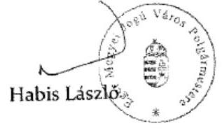

---

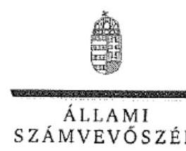

ELNÖK

# Habis László úr 

polgármester
Eger Megyei Jogú Város Önkormányzata

## Eger

## Tisztelt Polgármester Úr!

A ,,Megyei hatókörü városi múzeumok ellenörzése - Dobó István Vármúzeum, Eger" címmel készített számvevőszéki jelentéstervezetre tett észrevételét köszönettel megkaptam.
Az Állami Számvevőszék észrevételre vonatkozó álláspontjáról a felügyeleti vezető által készített részletes tájékoztatást csatoltan megküldőm.
Tájékoztatom Polgármester urat, hogy a számvevőszéki jelentésben - az Állami Számvevőszékről szóló 2011. évi LXVI. törvény 29. § (3) bekezdése alapján - a figyelembe nem vett észrevételeket szerepeltetjük az elutasítás indokának feltüntetésével.

Budapest, 2016. 17 hó 25 nap
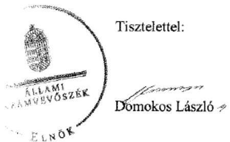

Melléklet: Tájékoztatás az elfogadott és az el nem fogadott észrevételekről

---

# Tájékoztatás az elfogadott és az el nem fogadott észrevételekröl 

A „Megyei hatókörü városi müzeumok ellenörzése - Dobó István Vármúzeum, Eger"címủ jelentéstervezetre tett és 2016. november 10 -én aláirt 18804-2/2016. iktatószámú levelével megküldött észrevételeit áttekintettük, annak kezeléséről az alábbi tájékoztatást adom.

## 1. Észrevétel az 1. megállapításhoz kapcsolódóan:

Az 1. megállapításhoz tett első észrevételét a Múzeum 2013-2014. évi stratégiai tervével kapcsolatban nem fogadtuk el. A helyszíni ellenőrzés során 2015. november 25 -én felvett jegyzőkönyv szerint a Dobó István Vármúzeum stratégiai terve nem készült el. A 2015. december 2-án tett nyilatkozatában Ön a jegyzőkönyvet kiegészítette ezzel kapcsolatban úgy, hogy a Múzuem a stratégia tervét elkészítette, de annak elfogadásáról az Eger Megyei Jogú Város Közgyülése nem döntött. A most megküldött észrevétele szerint „a hosszútávú stratégiai fejlesztési és beruházási terv kidolgozása folyamatban van, tartalma jelentősen függ a Várban folyó uniós és hazai finanszirozású beruházások tartalmától és irányától (EMOP, MVP, GINOP, EFOP)". Tájékoztatását az EMMI állásfoglalásával kapcsolatban köszönettel vettem, de a muzeális intézményekről, a nyilvános könyvtári ellátásról és a közmúvelődésről szóló 1997. évi CXL. törvény (a továbbiakban: Mtv.) 50. § (2) bekezdés a) pontja alapján „A fenntartó az e törvényben foglaltak alapján meghatározza és jóváhagyja a muzeális intézmény éves és középtávú feladatait, igy különösen stratégiai tervét, munkatervét és beszámolóját, fejlesztési és beruházási feladatait." Így észrevétele a jelentéstervezetben megfogalmazott megállapítást - amely szerint „A fenntartós 2013-2014. évek között nem határozta meg és nem hagyta jóvá az Mtv. 50. § (2) bekezdés a) pontja ellenére a Múzeum stratégiai tervét." nem módosítja.

Az 1. számú megállapításhoz tett tájékoztatását, amely szerint „Az önkormányzat belső ellenőrzési ütemtervében 2014. évben nem szerepelt a Dobó István Vármúzeum ellenőrzése, mivel a belső ellenöri kapacitások erre nem adtak lehetőséget." köszönettel tudomásul vettem, ez a jelentéstervezet megállapítását, miszerint „A 2014. évben a Mötv. 119. § (4) bekezdésének ellenére a jegyző nem gondoskodott a Múzeum ellenőrzéséről." nem módosítja.

## 2. Észrevétel a 3.1. megállapításhoz kapcsolódóan:

Köszönettel vettük tájékoztatását arra vonatkozóan, hogy ,2013. évtől az intézmény átvette a gazdasági feladatokat ellátó Bródy Sándor Megyei és Városi Könyvtár Számviteli politikáját és számlarendjét, melyet a vizsgálatot végzők részére rendelkezésre bocsájtottunk." A beküldött dokumentumokat felülvizsgáltuk és megállapítottuk, hogy bizonylati szabályzat és a bizonylati album rendelkezésre állt, a számlarend azonban nem. A számvitelről szóló 2000. évi C. törvény (a továbbiakban: Számv. tv.) 161. § (1) bekezdésében előirtak szerinti

---

számlarendnek kell tartalmaznia a Számv. tv. 161. § (2) bekezdés d) pontja szerint a számlarendben foglaltakat alátámasztó bizonylati rendet. A jelentéstervezet azon megállapítását, amely szerint „A Múzeum a 2011-2014. években nem rendelkezett a Számv. tv. 161. § (1) bekezdésében elöirt számlarenddel. ", észrevétele nem módosítja.

# 3. Az észrevétel a 3.4. megállapításhoz kapcsolódóan: 

Köszönettel vettük a tájékoztatását, hogy 2016. január 1-jétől bevezetésre került az iratkezelési szabályzat, az évenkénti felülvizsgálat megvalósult, továbbá az irattári tételek felülvizsgálata folyamatos. Észrevétele az ellenőrzött időszakon túlmutat, ezért a jelentéstervezet megállapítását - „A múzeumigazgató az iratkezelési szabályzatot az lkr. 69. § (2) bekezdés 2013. június 20-ig hatályos szövegének - elöirása ellenére nem módositotta, valamint 2013. június 21 -tól az lkr. 7. § a) pontja ellenére nem gondoskodott évenkénti felülvizsgálatáról." - nem módosítja.

Észrevételét arra vonatkozóan, hogy az intézmény gazdálkodására vonatkozó közérdekủ adatok 2013. évtől folyamatosan elérhetőek az intézmény honlapján, továbbá az önkormányzat honlapján szintén megtalálhatók az intézményi gazdálkodás adatai, a dokumentumok ismételt felülvizsgálatát követően elfogadtuk, így a számvevőszéki jelentésben a megállapítást a következők szerint módosítjuk: „A múzeumigazgató a 2011. évben az Eitv. 6. § (1) bekezdése, a 2012. évben az Info tv. 33. § (1) és (3) bekezdései ellenére elektronikus közzétételi kötelezettségének nem tett eleget, mivel a gazdálkodására vonatkozó közérdekü adatokat nem tette közzé."

## 4. Az észrevétel a 4.3. megállapításhoz kapcsolódóan:

Észrevételét arra vonatkozóan, hogy a „2013-2014. évben minden kifizetéshez (személyi és müködési) kapcsolódó kötelezettségvállalási dokumentum ellenjegyzése megtörtént.", nem fogadtuk el, mert az elszámolás szabályszerűségét mintavétellel kiválasztott mintatételek alapján értékeltük, amelynek sokaságra történő kivetítését a számvevőszéki jelentéstervezet „Az ellenörzés módszerei" című fejezet részletesen tartalmazza. A megállapításokat az Önök által az Állami Számvevőszék részére rendelkezésre bocsátott dokumentumok alapján ellenőriztük és ezen dokumentumokra alapozva állapítottuk meg, hogy 2013-2014. években a működési kiadások esetében a kötelezettségvállalás dokumentumain - az államháztartásról szóló 2011. évi CXCV. törvény 37. § (1) bekezdése ellenére - hiányzott a pénzügyi ellenjegyzés. Így a jelentéstervezet megállapítását észrevétele nem módosítja.

## 5. Az észrevétel a 4.4. megállapításhoz kapcsolódóan:

Észrevételében, miszerint „A hivatkozott kormányrendelet 31. paragrafusában a régészeti szolgáltatás cimszó alatt valóban nem szerepelnek a konzulensi, dokumentációkészitési és fémdetektoros kutatási feladatok, azonban egy-egy régészeti terepmunkához kapcsolódóan ezeket a feladatokat is el kellett végeznünk valahogyan. Ha rendelkeztünk saját munkaerővel a felmerülö feladatok ellátására, akkor mindenképpen velük végeztettük el ezeket, ha azonban kapacitás hiányában saját dolgozókat nem tudtunk ilyen munkákra biztositani, akkor külsösök

---

(nem közalkalmazottak) igénybe vételével kellett megoldásokat találni. A külsősökkel szerzödéseket kellett kötnünk. " a jelentéstervezet megállapítását - „a 2013-2014, években a megelöző régészeti szolgáltatásokra kötött szerződések alapján a konzulensi munka, ásatási dokumentáció elkésztése, fémdetektoros kutatás tevékenységekre teljesitett kifizetések nem feleltek meg a 393/2012. (XII. 20.) Korm. rend. 31. § (1) bekezdésében meghatározott megelöző feltárás régészeti szolgáltatási tevékenységeknek" - nem cáfolja, ezért azt nem módosítja.

# 6. Az észrevétel 5.1. megállapításhoz kapcsolódóan: 

Észrevételét arra vonatkozóan, hogy ,,Letéti naplót letét hiányában nem vezetett az intézmény. A kölcsönvett tárgyakat elkülönitetten nyilvántartva, iktatva kezelték, annak ellenére, hogy azokról naplót nem vezettek." részben fogadtuk el. A letéti napló hiányának megállapítását elfogadtuk, a számvevőszéki jelentésben a megállapítást ennek megfelelően módosítani fogjuk.

## 7. Az észrevétel 5.3. megállapításhoz kapcsolódóan:

Észrevételét arra vonatkozóan, hogy ,,2013-tól a kölcsönadás idöpontjában fennálló fizikai állapotot dokumentáló szakleirás nem minden esetben készült a kulturális javakról, de képi ábrázolás igen." nem fogadtuk el. A beküldött dokumentumok ismételt felülvizsgálatát követően megállapítottuk, hogy a képi ábrázolás dokumentumai sem álltak rendelkezésre. A tájékoztatását köszönettel fogadtuk arra vonatkozóan, hogy - „A kölcsön szerzödéseinkben 2015-töl szerepel a tárgyak állapotleirása is, valamint az elökészittési szakaszban restaurátoraink a kiállitási helyszíneken müszeres vizsgálatokat szoktak végezni arra vonatkozóan, hogy megfelelö-e a kiállitási tér arra, hogy mütárgyaink ott kiállitáson szerepelhessenek. Folyamaiban van a mütárgyakra vonatkozó Allapot felmérési intazási dokumentáció (Condition report) elkészitése, mely anyag-nemenkénti (szilikát, textil, képzömüvészeti alkotások, fém, papir, fa) dokumentáció elvégzésére alkalmas. Ez tartalmazza mind a csomagolásra, szállitásra, valamint a kiállitási környezet kialakítására vonatkozó feltételeket." - az ellenőrzött időszakon túlmutatóan hogyan tettek eleget a jogszabályi kötelezettségnek.

Budapest, 2016.
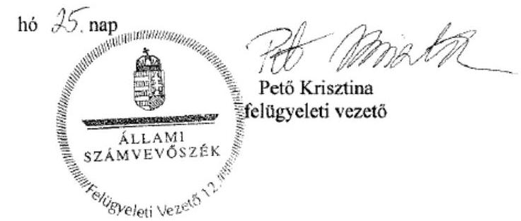

---

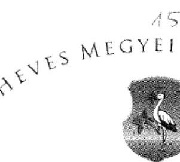

Állami Számvevőszék
Domokos László Elnők részére
1364 Budapest 4.
Pf: 54.

Ikt.sz: 29-2/2016/221
Úi: Bocsi Mónika
Hiv.szám: V-0948-154/2016.
Tárgy: írásbeli észrevétel
számvevőszéki jelentéstervezethez

# Tisztelt Elnők Úr! 

A Heves Megyei Önkormányzat képviseletében tájékoztatom arról, hogy a V-0948-154/2016. iktatószámú levelével megküldött, a „Megyei hatókörü városi múzeumok ellenörzése - Dobó István Vármúzeum" címü ellenőrzésről elkészült számvevőszéki jelentéstervezetüket megkaptuk és annak kapcsán törvényi határidőn belül az alábbi észrevételt tesszük:

1. A megküldött jelentéstervezetben több helyen is említésre került, hogy a „vagyon tényleges átadásához jegyzökönyv felvételére - a fenntartól (Heves Megyei Önkormányzat) és a fenntartó2 (Heves Megyei Intézményfenntartó Központ) között - a Megállapodás1 megkötését követö egy héten belül, sem azt követöen nem került sor".
A jelentéstervezet ezen megállapítása téves, tekintettel arra, hogy a hiányolt jegyzőkönyv valamennyi korábban megyei fenntartású intézmény, köztük a Heves Megyei Múzeumi Szervezet vonatkozásában is felvételre került. A folyamatot a Heves Megyei Intézményfenntartó Központ koordinálta, a Heves Megyei Múzeumi Szervezet intézmény vonatkozásában annak felvételére 2012. január 19-én került sor. A jegyzőkönyv egy másolati példányát (1. melléklet) jelen észrevételhez mellékelten megküldjük. A jegyzőkönyv 2. pontjában hivatkozott, 2011. december 31-i fordulónappal elkészített, a Heves Megyei Közgyülés elnöke és Heves Megyei Múzeumi Szervezet intézmény vezetője által hitelesítési záradékkal (2. melléklet) ellátott, az átadott eszközökre vonatkozó vagyonleltárat több száz oldalas terjedelménél fogva jelen észrevételünkhoz ugyan nem csatoljuk, de azt arra vonatkozó igény esetén készséggel rendelkezésre bocsátjuk.
A 258/2011. (XII.7.) Korm. rendelet vonatkozó, 12. § (3) bekezdésében írt határidőn belül az átadás-átvétellet érintett valamennyi volt megyei fenntartású intézmény vonatkozásában elindult a vagyonátadás jegyzőkönyvi dokumentálása, amely az intézmények számára és az átadással érintett vagyon nagyságára nézve több hetet vett igénybe.
2. A jelentéstervezetben rögzítésre került, hogy az 1. pontban is hivatkozott átadás-átvételi megállapodás mellékletei közül „, a 2-5. és 15., az adatszolgáltatások közül az 5., a 7-10. számút nem csatolták", továbbá, hogy a „mellékletek - az átadásra kerülő ingatlanok adatait tartalmazó 11/a melléklet kivételével - nem kerültek aláírásra."
Előadni kívánjuk, hogy a jelentéstervezetben állítottakkal ellentétben az átadás-átvételi megállapodás teljes körüen tartalmazza a 258/2011. (XII.7.) Korm. rendeletben foglalt valamennyi mellékletet. Ezek közül az ellenőrzés céljára terjedelmüknél fogva csak azok kerültek feltöltésre, melyeknek a Múzeumi Szervezet (köztük a Dobó István Vármúzeum) vonatkozásában relevanciája van. Az átadás -átvételi megállapodás 7-8.oldalai (3. melléklet) tételesen felsorolják valamennyi

---

mellékletet és adatszolgáltatást; mivel ezekkel jelenleg is rendelkezik a Heves Megyei Önkormányzat, erre vonatkozó igényük esetén azokat rendelkezésre tudjuk bocsátani, hangsúlyozva viszont, hogy azok a Vármúzeumra nézve releváns adatokat nem tartalmaznak, kivéve az 1. pontban is hivatkozott (a megállapodás 5. számú adatszolgáltatásaként megjelölt) vagyonleltárat. Az adatszolgáltatások kapcsán megjegyezni kívánjuk, hogy azok szükségessége a megállapodást kötő felek részéről arra tekintettel merült fel, hogy számos olyan a vagyonátszálláshoz kapcsolódó információt tartalmaznak, melyeket a 258/2011. (XII.7.) Korm. rendeletben foglalt mellékletek nem tartalmaznak, viszont a felek nélkülözhetetlennek tartottak az átadás-átvétel során rögzíteni.

Az átadás-átvételi megállapodás aláírásra történő előkészítése Heves megyében is egy erre a célra életre hívott átadás-átvételi bizottság hatáskörébe tartozott, melynek vezetője a megyei kormányhivatal kormánymegbízottja, tagjai a megyei kormányhivatal föigazgatója, a megyei közgyülés elnöke, a megyei önkormányzat főjegyzője, a Magyar Államkincstár területi szervének vezetője, illetve - kinevezését követően - az intézményi biztos voltak. A bizottság tevékenységét a gyakorlatban a Heves Megyei Önkormányzati Hivatal és a Heves Megyei Kormányhivatal szakembereiből álló munkacsoport segítette, amely munkáját a Közigazgatási és Igazságügyi Minisztérium Területi Közigazgatásért és Választásokért Felelős Államtitkárságának szakmai koordinálásával végezte.

Az átadás-átvételi megállapodás szövegének kötelező tartalmát a 258/2011. (XII.7.) Korm. rendelet 1. melléklete tartalmazta, azon semmilyen szövegszerü módosítást nem engedélyezett az illetékes államtitkárság, és ugyanezen szigorú elv érvényesült annak mellékletei vonatkozásában is. A fenti jogszabály alapján alkalmazandó minta kizárólag a megállapodás tekintetében tartalmazott aláírásra kijelölt rovatot. Megjegyezni kívánjuk továbbá, hogy azon túl, hogy az aláírást, mint formai kelléket a mellékletek esetében a jogszabály nem tartalmazta, azok elmaradása önmagában véve is, semmilyen joghatással nincsenek az azokban foglalt adattartalom hitelességére, már csak azért sem, mert azokra nézve a Heves Megyei Közgyülés elnöke a 2011. évi CLIV. törvény 2. melléklete szerinti teljességi nyilatkozatot tett (4. melléklet). A jelentéstervezetben - az „aláiráshiány" tekintetében - kivételként hivatkozott, az átadott ingatlanokra vonatkozó 11/a számú mellékletnek viszont, az ingatlan-nyilvántartásról szóló 1997. évi CXLI. törvényben meghatározott alakí és tartalmi kellékekkel kellett rendelkeznie ahhoz, hogy annak alapján a tulajdonváltozás az ingatlan-nyilvántartásban átvezethető legyen.
3. A jelentéstervezet azon megállapítása kapcsán, mely szerint a „Megállapodás-t-a Möktv. 6. § (3) bekezdésében elöirtak ellenére - 2011. december 31-ig az MNV Zrt. és az NFA nem irta alá, az aláírásra 2012. július 4-én került sor", az alábbiakat kívánjuk előadni.
Az átadás-átvételi megállapodást a Heves Megyei Kormánymegbízott és a Heves Megyei Közgyülés elnöke Egerben látta el aláírásával, majd ezt követően azt a Magyar Nemzeti Vagyonkezelő Zrt. és a Nemzeti Földalapkezelő Szervezet képviselője általi aláírás céljából a Közigazgatási és Igazságügyi Minisztériumba a Heves Megyei Kormányhivatal továbbította közvetlenül. Annak megküldése tehát nem a Heves Megyei Önkormányzat részéről történt, mintahogyan annak valamennyi érintett általi aláírását követően szintén a Kormányhivatal útján jutott vissza annak tőpéldánya a megyei önkormányzathoz. Mindezek kapcsán megjegyezni kívánjuk, hogy a jogszabályi minta által adott megállapodást ugyan aláírásával látta el a Nemzeti Földalapkezelő Szervezet is, de annak relevanciája a Múzeumi Szervezet vonatkozásában nem volt, hiszen termőföldként nyilvántartott ingatlant az azokat részletező melléklet az intézmény vonatkozásában nem tartalmazott.
A megállapodás MNV Zrt. és az NFA által történő aláírásának időpontja felveti annak kérdését, hogy a jogszabály szerinti megállapodás mely időponttal jött létre érvényesen, amely időpont a Möktv. szerinti határidők kezdő időpontja is egyben. Mindez annak tükrében is érdekes felvetés lehet, hogy az intézmények (köztük a Megyei Múzeumi Szervezet is) és az általuk kezelt, birtokolt eszközök akkorra a jogszabály erejénél fogva már fél éve más fenntartó fenntartásában álltak.

---

Kérem Tisztelt Elnők Urat, hogy a fenti észrevételeinkben foglaltakat tudomásul véve, azokat a jelentéstervezet véglegesitése során figyelembe venni szíveskedjenek!

Eger, 2016. november 8.
Tisztelettel:
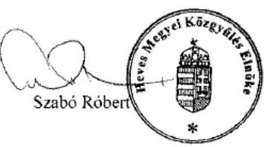

---

# ÁTADÁS-ÁTVÉTELI JEGYZÖKÖNYV 

Készült: 2012. január .....-án .....-óra .....-perckor az Heves Megyei Múzeumi Szervezet intézmény (3300 Eger, Vár u. 1. ) hivatali helyiségében.

Jelen vannak:

## Átadó részéről: Dr. Kovács Csaba Heves Megyei Önkormányzat (meghatalmazott)

## Átvevő részéről: Benedek István Heves Megyei Intézményfenntartó Központ(meghatalmazott) Nemesné Kis Timea intézményvezető

Tárgy: A megyei intézményfenntartó központokról, valamint a megyei önkormányzatok konszolidációjával, a megyei önkormányzati intézmények és a Fövárosi Önkormányzat egészségügyi intézményeinek átvételével összefüggő egyes kormányrendeletek módosításáról szóló 258/2011. (XII. 7.) Korm. rendelet (a továbbiakban: Rendelet) 12. § (3) bekezdés szerinti birtokbaadási eljárás lefolytatása

A megyei önkormányzatok konszolidációjáról, a megyei önkormányzati intézmények és a Fövárosi Önkormányzat egyes egészségügyi intézményeinek átvételéről szóló 2011. évi CLIV. törvény alapján 2012. január 1-jével a megyei önkormányzati intézmények állami fenntartásba kerültek, a megyei önkormányzati tulajdonban lévő ingó és ingatlan vagyon állami tulajdonba került. Átadó és Átvevő 2011. december 21-én a tulajdonosi és fenntartói jogutódláshoz kapcsolódó feladatok végrehajtásának részletkérdéseiről a Rendelet 1. számú mellékletében meghatározott tartalmú „ÁTADÁS-ÁTVÉTELI MEGÁLLAPODÁS"-t kötöttek.

Tekintettel arra, hogy a Rendelet 12. § (3) bekezdése szerint a 2011. december 21-én aláírt „ÁTADÁS-ÁTVÉTELI MEGÁLLAPODÁS" alapján Átvevő tulajdonába kerülő vagyon tényleges átadása jegyzőkönyv felvételével történik, ezért Átadó és Átvevő a birtokbaadási eljárásukat az alábbiak szerint rögzítik:

## 1. Ingatlan(ok) birtokbaadása

## Ingatlan 1

Eger település 5472, 5488, 5489 helyrajzi szám alatt felvett, természetben Eger, Vár u. 1. cím alatt található ingatlant, az alábbiakban rögzített közüzemi mérőóra állással

| közüzemi   mérőóra | közüzemi mérőóra   gyártási száma | közüzemi mérőóra   állása |
| :-- | :--: | :--: |
| Viz | 990386 | $3970 \mathrm{~m}^{2}$ |
| Áram | 9940006649 | $2677594 \mathrm{kWh}^{2}$ |
| Gáz | 041745 | $15690 \mathrm{~m}^{2}$ |

---

# Ingatlan 2 

Eger település 5491 helyrajzi szám alatt felvett természetben Eger, Gárdonyi u.28. cim alatt található ingatlant, az alábbiakban rögzített közüzemi méröóra állással

| közüzemi   méröóra | közüzemi méröóra   gyártási száma | közüzemi méröóra   állása |
| :-- | :--: | :--: |
| Viz | - | $-m^{3}$ |
| Áram 1. | 15711 | 13241 kWh |
| Áram 2. | 9930228150 | 81248 kWh |
| Gáz | - | $-m^{3}$ |

## Ingatlan 3

Eger település 5481 helyrajzi szám alatt felvett természetben Dabó u.12. cim alatt található ingatlant, az alábbiakban rögzített közüzemi méröóra állással

| közüzemi   méröóra | közüzemi méröóra   gyártási száma | közüzemi méröóra   állása |
| :-- | :--: | :--: |
| Viz | 1161898 | $88 \mathrm{~m}^{3}$ |
| Áram 1. | 73515 | 1298 kWh |
| Áram 2. | 73505 | 801 kWh |
| Gáz | - | $m^{3}$ |

## Ingatlan 4

Eger település 4882 helyrajzi szám alatt felvett természetben Széchenyi u. 14. cím alatt található ingatlant,

| közüzemi   méröóra | közüzemi méröóra   gyártási száma | közüzemi méröóra   állása |
| :-- | :--: | :--: |
| Viz | - | - |
| Áram | - | - |
| Gáz | - | - |

## Ingatlan 5

Eger település 5477/1 helyrajzi szám alatt felvett természetben Dabó u. 20. cím alatt található ingatlant.

## Ingatlan 6

Eger település 10013 helyrajzi szám alatt felvett természetben Tinódi u. 28. cím alatt található ingatlant, az alábbiakban rögzített közüzemi méröóra állással

| közüzemi   méröóra | közüzemi méröóra   gyártási száma | közüzemi méröóra   állása |
| :-- | :--: | :--: |
| Viz | 491098 | $6 \mathrm{~m}^{3}$ |
| Áram | 50309944 | 15711 kWh |
| Gáz | 49007 | $24196 \mathrm{~m}^{3}$ |

---

# Ingatlan 7 

Eger település 2879/4 helyrajzi szám alatt felvett természetben Baktai u. 38. cím alatt található ingatlant, az alábbiakban rögzített közüzemi méröóra állással

| közüzemi   méröóra | közüzemi méröóra   gyártási száma | közüzemi méröóra   állása |
| :-- | :--: | :--: |
| Viz 1. | 39172647 | $1353 \mathrm{~m}^{3}$ |
| Viz 2. | 090134252 | $57 \mathrm{~m}^{3}$ |
| Áram | - | - kWh |
| Gáz | - | $40619 \mathrm{~m}^{3}$ |

## Ingatlan 8

Hatvan település 5231/2 helyrajzi szám alatt felvett természetben Kossuth tér 11. cím alatt található ingatlant, az alábbiakban rögzített közüzemi méröóra állással

| közüzemi   méröóra | közüzemi méröóra   gyártási száma | közüzemi méröóra   állása |
| :-- | :--: | :--: |
| Viz | - | $-\mathrm{m}^{3}$ |
| Áram | 9930114342 | - kWh |
| Gáz | 849865 | $5658 \mathrm{~m}^{3}$ |

## Ingatlan 9

Parád település 123 helyrajzi szám alatt felvett természetben Sziget u. 8. cím alatt található ingatlant.

| közüzemi   méröóra | közüzemi méröóra   gyártási száma | közüzemi méröóra   állása |
| :-- | :--: | :--: |
| Viz |  |  |
| Áram |  |  |
| Gáz |  |  |

## Ingatlan 10

Heves település 1319/1 helyrajzi szám alatt felvett természetben Hösök tere 12. cím alatt található ingatlant.

| közüzemi   méröóra | közüzemi méröóra   gyártási száma | közüzemi méröóra   állása |
| :-- | :--: | :--: |
| Viz |  |  |
| Áram |  |  |
| Gáz |  |  |

---

# Ingatlan 11 

Gyöngyös település 5775 helyrajzi szám alatt felvett természetben Petőfi u. 30. cim alatt található ingatlant, az alábbiakban rögzített közüzemi méröóra állással

| közüzemi   méröóra | közüzemi méröóra   gyártási száma | közüzemi méröóra   állása |
| :-- | :--: | :--: |
| Viz | 22314 | $15 \mathrm{~m}^{2}$ |
| Aram | 9940007553 | 19008 kWh |
| Gáz | 5121310 | $9082 \mathrm{~m}^{2}$ |

## Ingatlan 12

Hatvan település 2995 helyrajzi szám alatt felvett természetben Kossuth tér 2. cim alatt található ingatlant, az alábbiakban rögzített közüzemi méröóra állással

| közüzemi   méröóra | közüzemi méröóra   gyártási száma | közüzemi méröóra   állása |
| :-- | :--: | :--: |
| Viz | 401595 | $93 \mathrm{~m}^{3}$ |
| Aram | 9930114341 | - kWh |
| Gáz | 615993 | $2229 \mathrm{~m}^{3}$ |

## Ingatlan 13

Heves település 826/2 helyrajzi szám alatt felvett természetben Szerelem u. 20. cim alatt található ingatlant, az alábbiakban rögzített közüzemi méröóra állással

| közüzemi   méröóra | közüzemi méröóra   gyártási száma | közüzemi méröóra   állása |
| :-- | :--: | :--: |
| Viz | - | $m^{3}$ |
| Aram | 447334 | 66915 kWh |
| Gáz | 773956 | $16650 \mathrm{~m}^{3}$ |

## Ingatlan 14

Eger település 5440 helyrajzi szám alatt felvett természetben Servita u. 2. cim alatt található ingatlant, az alábbiakban rögzített közüzemi méröóra állással

## Ingatlan 15

Gyöngyös település 1629/2 helyrajzi szám alatt felvett természetben Kossuth u. 40. cim alatt található ingatlant, az alábbiakban rögzített közüzemi méröóra állással

| közüzemi   méröóra | közüzemi méröóra   gyártási száma | közüzemi méröóra   állása |
| :-- | :--: | :--: |
| Viz | 90021701 | $3725 \mathrm{~m}^{3}$ |
| Aram | 9940007539 | 763929 kWh |
| Gáz | 2073364 | $115512 \mathrm{~m}^{3}$ |

---

Kijelentem, hogy az Átvevő által birtokba vett ingó vagyonelemek a Heves Megyei Önkormányzat Közgyülésének Elnöke által hitelesitett, 2011. december 31-i fordulónappal elkészitett átadott vagyonra vonatkozó teljes vagyonleltár szerint hiánytalanul átadásra kerültek.

# 6 

Nemesné Kis Timea intézmény vezetője

Az intézmény feladatellátását biztosító és jelen eljárásban birtokba adott gépjárművek kilométerórájának állását Átadó és Átvevő az alábbiak szerint rögziti:

| Sorszám | Gépjármú   forgalmi   rendszáma | Gépjármú gyártmánya | Gépjármú   típusa | Kilométeróra   állása |
| :--: | :--: | :--: | :--: | :--: |
| 1 | KDR-675 | Volkswagen | transporter | 247.345 |
| 2 | XVJ-318 | Hegedüs (kereskedelmi   leírás; Mátra utánfutó) | $400-7225$ | - |

## vagy

Átadó és Átvevő kijelentik, hogy az 1. pontban megjelölt ingatlan(ok)hoz a Heves Megyei Önkormányzat Közgyűlésének Elnöke által hitelesitett, 2011. december 31-i fordulónappal elkészített, átadott vagyonra vonatkozó teljes vagyonleltár alapján nem tartozik ingó vagyonelem.

## 3. Egyéb feljegyzések, illetve megjegyzések:

Jelenlévők kijelentik, hogy jelen birtokbaadásl eljárás lefolytatásakor a vonatkozó jogszabályi rendelkezéseket figyelembe véve, az eljárási cselekmények során jóniszemúen, együttmüködve járnak el.

Jelenlévők e jegyzökönyvben foglalt feltételekkel egyetértenek, azokat elfogadják, és azt. mint akaratukkal mindenben megegyezöl, jóváhagyólag írják alá.

---

Jelen jegyzökönyv 4 (négy) eredeti példányban készült és 7 (hét) számozott oldalból áll, amelyböl 1 (egy) példány az Átadót, 2 (két) példány az Átvevőt, 1 (egy) példány a MNV Zrt.-I 1 (egy) illet meg.

# Kmf. 

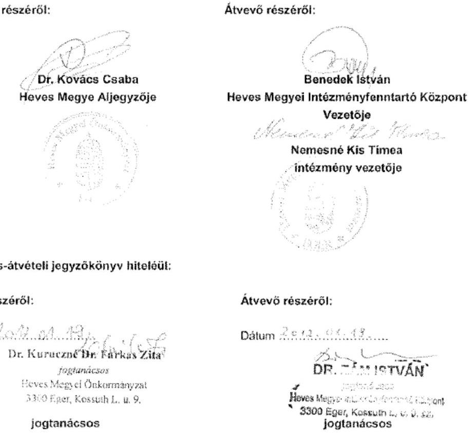

Melléklet: Meghatalmazások

Jóváhagyom:

Eger, 2012. január ,, " "

---

# 2. me 

## HITELESITESI ZÁRADÉK

Atuliratt, mint a Heves Megyei Müzeumi Szervezet képviseletében eljáró igazgató tanúsítom, hogy jelen, a Heves Megyei Intézményfenntartó Központ részére átadott, 2011. december 31. fordulónappal felvett teljes ingó vagyonlettárban foglalt adatok, információk, tények a valóságnak teljes körüen megfelelnek.

Eger, 2011. december 31

Nemesné Kis Tímea
szakmai igazgatóhelyettes

## HITELESITESI ZÁRADÉK

Atuliratt Szabó Róbert, mint a Heves Megyei Önkormányzat képviseletében eljáró megyei közgyülesi elnök tanúsitom, hogy jelen, a Heves Megyei Intézményfenntartó Központ részére átadott, 2011. december 31. fordulónappal felvett teljes ingó vagyonlettárban foglalt adatok, információk, tények a valóságnak teljes körüen megfelelnek.

Eger, 2011. december 31

Szabó Róbert
Heves Megyei Közgyülés elnökje

---

# NYILATKOZAT 

Leltározott eszközök összesttô lapjához

Nemesné Kis Tïmea a Heves Megyei Mózeumi Szervezet vezetője a következö nyilatkozatot teszem:

A 2011. 12. 31. fordulónappal készitett leltározás során a lehető legnagyobb gondossággal jártunk el. A leltározásról készitett összesttő tartalmazza az Intézménynél fellelhető összes eszközt. A leltározáskor az eszközök egvectetésze keröhek nyilvintartásainkkal és azokkal teljes egyezőséget mutatnak.
2011. december 31.

---

# 3. melléklet 

MELLÉKLETEK

| 1. számú melléklet: | Átadó önállóan fenntartott költségvetési szerveinek felsorolása |
| :--: | :--: |
| 2. számú melléklet: | Átadó közösen fenntartott költségvetési szerveinek felsorolása |
| 3. számú melléklet: | Átadó társulásban müködtetett költségvetési szerveinek felsorolása |
| 4. számú melléklet: | Átadó egyéb, vegyes finanszirozású költségvetési szerveinek felsorolása |
| 5. számú melléklet: | Az átadott intézmény szervezeti formája (gazdasági társaságok, non-profit gazdasági társaságok, alapitványok, közalapítványok) |
| 6. számú melléklet: | Intézményi érvényes szerződésállomány |
| 7. számú melléklet: | Az intézmények Európai Unió által, illetőleg egyéb nemzetközi forrásból finanszirozott pályázataihoz kapcsolódó folyamatban lévő vagy már teljesített, de fenntartási kötelezettséggel rendelkező szerződésállománya |
| 8. számú melléklet | Intézményi követelésállomány |
| 9. számú melléklet: | Intézményeknél folyamatban lévő peres eljárások |
| 10. számú melléklet: | Átadott intézményi létszám |
| 11. számú melléklet: | Átadásra kerülő gépjárművek felsorolása |
| 12. számú melléklet: | Intézmények közbeszerzéseinek felsorolása |
| 13. számú melléklet: | Pénzforgalmi számlaszámok megnevezése és az ahhoz tartozó pénzmaradványok összege |
| 14. számú melléklet: | Szállitól tartozások és egyéb kötelezettségek |
| 15. számú melléklet: | Az átadás-átvételi eljárás alól kivételt képező intézmények, vagyonelemek köre |

Adatszolgáltatások

| 1. számú adatszolgáltatás: | Az átadás-átvétel napján hatályos, illetve később hatályba lépő, harmadik személlyel szemben fennálló, adott esetben nem jogszabályi rendelkezésen alapuló, de érvényesíthető bármilyen jogosultságról, igényről, a vitatott, adott esetben per vagy más vitarendezési eljárás tárgyává tett kérdések, az azzal kapcsolatos álláspontok és azok indokairól szóló dokumentumok, külön kiemelve az európai uniós programokkal kapcsolatos vitás kérdéseket |
| :--: | :--: |
| 2. számú adatszolgáltatás: | Az intézményi feladatellátás helye, az intézmény elhelyezésére szolgáló ingatlan (ingatlanok) tulajdonosának megjelölése (saját tulajdonú, idegen vagy más önkormányzat tulajdona, állami tulajdon), az ingatlanon (ingatlanokon) fennálló jogok és kötelezettségek feltüntetése (használati kötelmek, perfeljegyzések, fenntartási kötelezettségek), az intézmény finanszirozási formája és az átadott ingatlanok műszaki állapotát bemutató műszaki kataszter |
| 3. számú adatszolgáltatás | Az intézmény 2011. évi normatív támogatás igénylésére, módosítására, lemondására vonatkozó adatok, összegszerűen részletezve |
| 4. számú adatszolgáltatás | Az intézményi rövid és hosszú lejáratú kötelezettségállományának kimutatása |
| 5. számú adatszolgáltatás | Az intézmény Átadó által felvett és Átadó közgyűlésének elnöke által |

---

|  | hitelesitett teljes vagyonleltára |
| :--: | :--: |
| 6. számú adatszolgáltatás | Az intézményre vonatkozó intézményi költségvetés várható teljesüléséröl szóló, 2011. december 31-ei fordulónappal elkészitett adatszolgáltatás |
| 7. számú adatszolgáltatás | Átadó tájékoztatása az átvett intézmények müködőképességének fenntartása érdekében szükséges azonnali teendőkröl |
| 8. számú adatszolgáltatás | Az informatikai hálózatok zavartalan müködésének biztosítása céljából szükséges soron kivüli intézkedések |
| 9. számú adatszolgáltatás | Átadó tájékoztatása minden olyan körülményröl, veszélyröl, illetve lehetőség számbavételéröl, amely az adott nem egészségügyi intézmény müködését érdemben befolyásolhatja, valamint az eredményes feladatellátáshoz szükséges továbbí tényekröl, körülményekröl |
| 10. számú adatszolgáltatás | 2012. január 20. napjáig külön megállapodásban rendezendő szerződések felsorolása |

---

# TELEVÉGI NYILATKOZAT   (2. melléklet a 2011. évi CLIV. törvényhez) 

Alulirott Szabó Róbert mint a .Heves Megyei Önkormányzat képviseletében eljáró vezető (a továbbiakban: átadó) kijelentem, hogy a mai napon a Horváth László, Kormánymegbízott - az átvevő részére (a továbbiakban: átvevő) a jegyzőkönyvben átadottakon túlmenően nem áll rendelkezésemre a megyei önkormányzatok konszolidációjáról, a megyei önkormányzati intézmények, valamint a Fövárosi Önkormányzat egyes egészségügyi intézményelnek és átvételéről szóló 2011. évi CLIV. törvényben meghatározott intézményi kör (átvott intézmények) müködése körébe esö adat, információ, tény, okirat, dokumentum, valamint kijelentem, hogy az általam tett nyilatkozatok és az átadott, ismertetett adatok, információk, tények, okiratok, dokumentumok valóságtartalmáért, teljes körűségéért, és az érdemi vizsgálatra alkalmas voltáért teljes felelősséget vállalok.

Jelen nyilatkozat elválaszthatatlan részét képezi az átadás-átvételi megállapodásnak.

E g e r, 2011. év december hó 21. nap
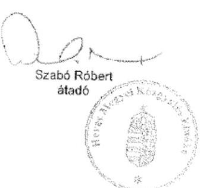

---

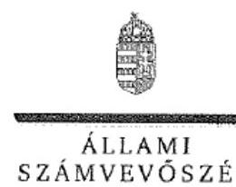

ELNÖK

Ikt.szám: V-0948-162/2016.

# Szabó Róbert úr 

elnök
Heves Megyei Önkormányzat

## Eger

## Tisztelt Elnök Úr!

A ,,Megyei hatókörü városi múzeumok ellenörzése - Dobó István Vármúzeum, Eger" címmel készített számvevőszéki jelentéstervezetre tett észrevételét köszönettel megkaptam.
Az Állami Számvevőszék észrevételre vonatkozó álláspontjáról a felügyeleti vezető által készített részletes tájékoztatást csatoltan megküldőm.
Tájékoztatom Elnök urat, hogy a számvevőszéki jelentésben - az Állami Számvevőszékről szóló 2011. évi LXVI. törvény 29. § (3) bekezdése alapján - a figyelembe nem vett észrevételeket szerepeltetjük az elutasítás indokának feltüntetésével.

Budapest, 2016. 14 hó 24 nap
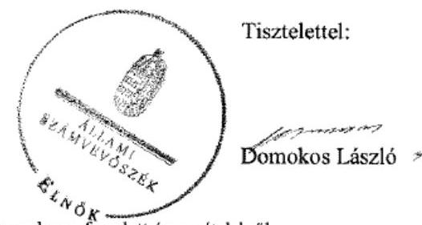

Melléklet: Tájékoztatás az elfogadott és az el nem fogadott észrevételekröl

---

# Tájékoztatás az elfogadott és az el nem fogadott észrevételekröl 

A „Megyei hatókörü városi múzeumok ellenörzése - Dobó István Vármúzeum, Eger"címủ jelentéstervezetre tett és 2016. november 8-án aláirt 29-2/2016/221 iktatószámú levelével megküldött észrevételeit áttekintettük, annak kezeléséről az alábbi tájékoztatást adom.

## 1. Az észrevétel I. pontjához kapcsolódóan:

Észrevételét arra vonatkozóan, hogy téves a jelentéstervezet azon megállapítása, hogy a ,, vagyon tényleges átadásához jegyzőkönyv felvételére - a fenntartó, (Heves Megyei Önkormányzat) és a fenntartó, (Heves Megyei Intézményfenntartó Központ) között - a Megállapodás, megkötését követö egy héten belül, sem azt követöen nem került sor." részben fogadtuk el. Elfogadtuk azon észrevételét, hogy a megyei intézményfenntartó központokról, valamint a megyei önkormányzatok konszolidációjával, a megyei önkormányzati intézmények és a Fóvárosi Önkormányzat egészségügyi intézményeinek átvételével összefüggő egyes kormányrendeletek módosításáról szóló 258/2011. (XII. 7.) Korm. rendelet (továbbiakban: 258/2011. (XII. 7.) Korm. rendelet) 12. § (3) és (4) bekezdésében elöírtaknak megfelelően a vagyon tényleges átadásához jegyzőkönyv felvételére - a fenntartóı és a fenntartó; között - sor került. Ezen tény alapján a megállapítást pontositjuk és a számvevöszéki jelentés készitésénél figyelembe vesszük.

Észrevételében arról tájékoztatott, hogy az átadott eszközökre vonatkozó vagyonleltárral rendelkeztek. A dokumentumok ismételt felülvizsgálatát követően a 2011. évre vonatkozó megállapítás, amely szerint ,, A Múzeum a vagyonátadási megállapodást megelözöen az Áhsz. 13/A. § (1) bekezdésével ellentétben, 2011. évben leltárt nem készitett, a vagyontárgyak teljes körü felmérését nem végezte el." megalapozott. A helyszíni ellenőrzés során 2015. november 25 -én felvett jegyzőkönyvében rögzitésre került, hogy a 2011. év tekintetében leltározási és leltárkiértékelési dokumentumok nem álltak rendelkezésre. Észrevétele a megállapítást nem módosítja.

Észrevételében arról tájékoztatott, hogy a 258/2011. (XII. 7.) Korm. rendelet 12. § (3) bekezdésében irt határidőn belül az átadás-átvétellel érintett valamennyi volt megyei fenntartású intézmény vonatkozásában elindult a vagyonátadás jegyzőkönyvi dokumentálása, amely az intézmények számára és az átadással érintett vagyon nagyságára nézve több hetet vett igénybe. Észrevétele megerősíti, hogy a vagyon tényleges átadásához a jegyzőkönyv felvételére határidőn túl került sor, ezért a megállapítást nem módosítja.

## 2. Az észrevétel 2. pontjához kapcsolódóan:

Észrevételét, amelyben arról tájékoztatott, hogy az átadás-átvételi megállapodás teljes körűen tartalmazza a 258/2011. (XII. 7.) Korm. rendeletben foglalt valamennyi mellékletet nem fogadtuk el. Az Állami Számvevőszék 2015. november 10 -én aláirt adatbekérő levél 3. számú mellékletében az intézményi átszervezés, átalakítások ellenőrzéséhez szükséges dokumentumok között

---

bekérte a tulajdonosi és fenntartói jogutódláshoz kapcsolódó feladat és vagyon átadási megállapodást valamennyi mellékletével együtt. Az észrevételében megerósíti, hogy nem bocsátotta a számvevőszéki ellenőrzés rendelkezésére a dokumentumokat. Észrevétele ezért a megállapítást nem módosítja.

Észrevételét, amely a jelentéstervezet 2.1. számú megállapítás 5. bekezdésére vonatkozott, amely szerint a ,,mellékletek - az átadásra kerülő ingatlanok adatait tartalmazó 11/a melléklet kivételével - nem kerültek aláirásra" elfogadtuk és a számvevőszéki jelentés készítésénél figyelembe vesszük.

# 3. Az észrevétel 3. pontjához kapcsolódóan: 

Észrevételében arról tájékoztatott, hogy az átadás-átvételi megállapodást további ügyintézés céljából a Közigazgatási és Igazságügyi Minisztériumba a Heves Megyei Kormányhivatal továbbította közvetlenül, valamint valamennyi érintett általi aláírását követően szintén a Kormányhivatal útján jutott vissza annak tőpéldánya a Heves Megyei Önkormányzathoz. Észrevétele a jelentéstervezet 2.1. számú megállapítás 2. bekezdésének 2. megállapításában („ megállapodást - a Möktv. 6. § (3) bekezdésében elölrtak ellenére - 2011. december 31-ig az MNV Zrt. és az NFA nem irta alá, az aláírásra 2012. július 4-én került sor") foglaltakat nem cáfolja, ezért azt nem módosítja.

Budapest, 2016.
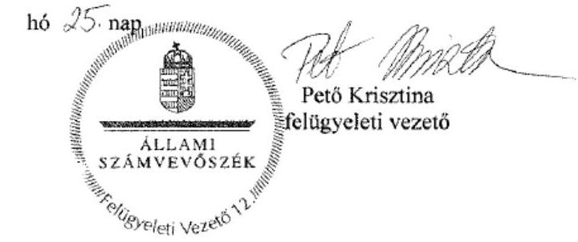

---

# RÖVIDÍTÉSEK JEGYZÉKE 

${ }^{1}$ Múzeum
${ }^{2}$ ÁSZ
${ }^{3}$ Mtv.
${ }^{4}$ Kötv.
${ }^{5}$ Kjt.
${ }^{6}$ múzeumigazgató
${ }^{7}$ gazdasági vezető
${ }^{8}$ Möktv.
${ }^{9}$ 258/2011. (XII. 7.) Korm. rendelet
${ }^{10}$ 1311/2012. (VIII.23.) Korm. határozat
${ }^{11}$ 2012. évi CLII. tv.
${ }^{12}$ Megyei Önkormányzat
${ }^{13}$ Megyei Közgyűlés
${ }^{14}$ HMIK
${ }^{15}$ KIM
${ }^{16}$ Önkormányzat
${ }^{17}$ Közgyűlés
${ }^{18}$ Könyvtár
${ }^{19}$ 2015. évi LXXV. tv.
${ }^{20}$ Nvtv.
${ }^{21}$ Alaptörvény
${ }^{22}$ Áht. 2
${ }^{23}$ Ávr.
${ }^{24}$ ÁSZ tv.

Heves Megyei Múzeumi Szervezet (2011. január 1-jétől 2012. december 31-ig) Dobó István Vármúzeum (2013. január 1-jétől 2014. december 31-ig)
Állami Számvevőszék
1997. évi CXL. törvény a muzeális intézményekről, a nyilvános könyvtári ellátásról és a közművelődésről (hatályos: 1998. január 1-jétől)
2001. évi LXIV. törvény a kulturális örökség védelméről
1992. évi XXXIII. törvény a közalkalmazottak jogállásáról (hatályos: 1992. július 1jétől)
Dobó István Vármúzeum (valamint a jogelőd Heves Megyei Múzeumi Szervezet) igazgatója
Heves Megyei Múzeumi Szervezet gazdasági vezetője (2011. január 1-jétől-2012. december 31-ig)
Dobó István Vármúzeum gazdálkodási feladatait együttműködési megállapodás alapján ellátó Bródy Sándor Megyei és Városi Könyvtár gazdasági vezetője (2013. január 1-jétől-2014. december 31-ig)
2011. évi CLIV. törvény a megyei önkormányzatok konszolidációjáról, a megyei önkormányzati intézmények és a Fővárosi Önkormányzat egyes egészségügyi intézményeinek átvételéről (hatályos: 2012. január 1-jétől)
258/2011. (XII. 7.) Korm. rendelet a megyei intézményfenntartó központokról, valamint a megyei önkormányzatok konszolidációjával, a megyei önkormányzati intézmények és a Fővárosi Önkormányzat egészségügyi intézményeinek átvételével összefüggő egyes kormányrendeletek módosításáról (hatályos: 2011. december 8-tól)
1311/2012. (VIII. 23.) Korm. határozat a megyei múzeumok, könyvtárak és közművelődési intézmények fenntartásáról
2012. évi CLII. törvény a muzeális intézményekről, a nyilvános könyvtári ellátásról és a közművelődésről szóló 1997. évi CXL. törvény módosításáról
Heves Megyei Önkormányzat
Heves Megyei Önkormányzat Közgyűlése
Heves Megyei Intézményfenntartó Központ
Közigazgatási és Igazságügyi Minisztérium
Eger Megyei Jogú Város Önkormányzata
Eger Megyei Jogú Város Közgyűlése
Bródy Sándor Megyei és Városi Könyvtár
a megyei könyvtárak és a megyei hatókörű városi múzeumok feladatának ellátását szolgáló egyes állami tulajdonú vagyontárgyak ingyenes önkormányzati tulajdonba adásáról szóló 2015. évi LXXV. törvény (hatályos 2015. július 18-tól) 2011. évi CXCVI. törvény a nemzeti vagyonról (hatályos 2011. december 31-étől) Magyarország Alaptörvénye
2011. évi CXCV. törvény az államháztartásról (hatályos 2012. január 1-jétől) az államháztartásról szóló törvény végrehajtásáról szóló 368/2011. (XII. 31.) Korm. rendelet (hatályos 2012. január 1-jétől)
2011. évi LXVI. törvény az Állami Számvevőszékről

---

${ }^{25}$ irányító szerv $_{1-3}$
irányító szerv $_{1}$
irányító szer $_{2}$

## irányító szerv $_{3}$

${ }^{26}$ Ámr.
${ }^{27}$ alapító okirat ${ }_{1}$
alapító okirat2
alapító okirat3
alapító okirat4
alapító okirat5
alapító okirat6
${ }^{28}$ EMMI
${ }^{29}$ Áht. $1_{1}$
${ }^{30} \mathrm{SZMSZ}_{1}$
${ }^{31}$ Ötv.
${ }^{32}$ KIM Utasítás
${ }^{33}$ fenntartó $_{1-3}$
fenntartó $_{1}$
fenntartó $_{2}$
fenntartó $_{3}$
${ }^{34} \mathrm{SZMSZ}_{2}$
${ }^{35} \mathrm{SZMSZ}_{3}$
${ }^{36}$ Mötv.
${ }^{37}$ munkamegosztási megállapodás
${ }^{38}$ Megállapodás $_{1}$
${ }^{39}$ Kormánymegbízott
${ }^{40}$ MNV Zrt.
${ }^{41}$ NFA
${ }^{42}$ vagyonkezelési szerződés
${ }^{43}$ 2-5., 15. számú mellékletek:

Heves Megye Közgyűlése 2011. január 1-jétől 2011. december 31-ig
Közigazgatási és Igazságügyi Minisztérium 2012. január 1-jétől 2012. december 31-ig
Eger Megyei Jogú Város Közgyűlése 2013. január 1-jétől 2014. december 31-ig 292/2009. (XI. 19.) Korm. rendelet az államháztartás működési rendjéről (hatálytalan: 2012. január 1-jétől)
alapító okirat (hatályos: 2011. március 25-től 2011. november 22-ig)
alapító okirat (hatályos: 2011. november 23-től 2012. július 11-ig)
alapító okirat (hatályos: 2012. július 12-től 2012. december 16-ig)
alapító okirat (hatályos: 2012. december 17-től 2013. február 27-ig)
alapító okirat (hatályos: a 2013. február 28-tól 2013. november 12-ig)
alapító okirat (hatályos: a 2013. november 13-tól
Emberi Erőforrások Minisztériuma
1992. évi XXXVIII. törvény az államháztartásról (hatálytalan: 2012. január 1-jétől)

Heves Megyei Múzeumi Szervezet Szervezeti és Működési Szabályzata (hatályos: 2008. június 11-jétől 2011. november 30-ig)
1990. évi LXV. törvény a helyi önkormányzatokról (hatálytalan: 2014. október 12-től)
78/2011. (XII. 30.) KIM utasítás a Megyei Intézményfenntartó Központok ideiglenes Szervezeti és Müködési Szabályzatáról
a 2011. évben Heves Megye Önkormányzata
a 2012. évben Heves Megyei Intézményfenntartó Központ
a 2013-2014. évben Eger Megyei Jogú Város Önkormányzata
Heves Megyei Múzeumi Szervezet Szervezeti és Müködési Szabályzata (hatályos: 2011. december 1-jétől 2013. június 10-ig)

Dobó István Vármúzeum Szervezeti és Müködési Szabályzata (hatályos: 2013. június 11-ől)
2011. évi CLXXXIX. törvény Magyarország helyi önkormányzatairól

Bródy Sándor Megyei és Város Könyvtár és Dobó István Vármúzeum pénzügyigazdasági feladatok ellátását és felelősségvállalás rendjét szabályozó megállapodás (hatályos: 2013. március 31-től)
Heves Megyei Önkormányzat, a Kormánymegbízott, mint 2012. január 1-jével létrehozásra kerülő Heves Megyei Intézményfenntartó Központ képviselője által 2011. december 21-én megkötött Átadás-átvételi megállapodás, amelyet aláírt 2012. július 4-én az MNV Zrt. vezérigazgatója, valamint az NFA szervezet elnöke Heves Megyei Kormánymegbízott
Magyar Nemzeti Vagyonkezelő Zártkörűen Müködő Részvénytársaság (a Vtv. 23. § (1) bekezdése alapján az állami vagyonnal tulajdonosi joggyakorlöként maga gazdálkodik)
Nemzeti Földalapkezelő Szervezet
az SZT-38592 számú, az MNV Zrt. részéről 2012. szeptemberben, a Heves Megyei Intézményfenntartó Központ által október 16-án, a kormánymegbízott által október 17-én aláírt, valamint a KIM részéről 2012. november 20-án záradékolt Vagyonkezelési szerződés
2. számú: Átadó közösen fenntartott költségvetési szerveinek felsorolása.
3. számú: Átadó társulásban müködtetett költségvetési szerveinek felsorolása
4. számú: Átadó vegyes finanszírozású költségvetési szerveinek felsorolása

---

| 44 5., 7-10. számú adatszolgáltatások | 5. számú: Átadott intézmény szervezeti formája   15. számú: Az átadás-átvételi eljárás alól kivételt képző intézmények, vagyonelemek köre |
| :--: | :--: |
|  | 5. számú: Az intézmény átadó által felvett és átadó közgyűlésének elnöke által hitelesített teljes vagyonleltára. |
|  | 7. számú: Átadó tájékoztatása az átvett intézmények működőképességének fenntartása érdekében szükséges teendőkről |
|  | 8. számú: Az informatikai hálózatok zavartalan működésének biztosítása céljából szükséges soron kívüli intézkedések |
|  | 9. számú: Átadó tájékoztatása minden olyan körülményről, veszélyről illetve lehetőség számbavételéről, amely az adott nem egészségügyi intézmény működését érdemben befolyásolhatja |
|  | 10. számú: 2012. január 20. napjáig külön megállapodásban rendezendő szerződések felsorolása |
| ${ }^{45}$ Áhsz. 1 | 249/2000. (XII. 24.) Korm. rendelet az államháztartás szervezetei beszámolási és könyvvezetési kötelezettségének sajátosságairól (hatálytalan: 2014. január 1jétől) |
| ${ }^{46} 20 / 2002$. (X.4.) NKÖM rendelet | 20/2002. (X. 4.) NKÖM rendelet a muzeális intézmények nyilvántartási szabályairól |
| ${ }^{47} 1094 / 2012$. (IV.3.) Korm. határozat | 1094/2012. (IV. 3.) Korm. határozat a megyei múzeumok, könyvtárak és közművelődési intézmények további fenntartásáról, valamint a települési önkormányzatok kötelező kulturális feladatairól |
| ${ }^{48}$ Megállapodás ${ }_{2}$ | Eger Megyei Jogú Város Önkormányzata a Heves Megyei Intézményfenntartó Központ, valamint az Emberi Erőforrások Minisztériuma által 2012. december 14-én aláírt átadás-átvételi megállapodás |
| ${ }^{49}$ ügyrend ${ }_{1}$ | Heves Megyei Múzeumi Szervezet Gazdasági Osztályának Ügyrendje (hatályos: 2012. december 31-ig), |
| ${ }^{50}$ ügyrend $_{2}$ | Bródy Sándor Megyei és Városi Könyvtár Gazdasági Osztályának Ügyrendje (Együttműködési megállapodás alapján vonatkozik a Dobó István Vármúzeum gazdálkodási teendőire) (hatályos: 2013. január 1-jétől) |
| ${ }^{51}$ Bkr. | 370/2011. (XII. 31.) Korm. rendelet a költségvetési szervek belső kontrollrendszeréről és a belső ellenőrzésről (hatályos: 2012. január 1-jétől) |
| ${ }^{52}$ Ikr. | 335/2005. (XII. 29.) Korm. rendelet - a közfeladatot ellátó szervek iratkezelésének általános követelményeiről |
| ${ }^{53}$ számviteli politika ${ }_{1}$ | Múzeumi Szervezet számviteli politikája (hatályos 2011. január 1-jétől 2013. január 09-ig) |
| számviteli politika ${ }_{2}$ | Dobó István Vármúzeum számviteli politikája (hatályos 2013. január 10-jétől 2013. december 31-ig) |
| számviteli politika ${ }_{3}$ | Dobó István Vármúzeum számviteli politikája (hatályos 2014. január 1-től) |
| ${ }^{54}$ Számv. tv | 2000. évi C. törvény a számvitelről |
| ${ }^{55}$ önköltségszámítási szabályzat | Dobó István Vármúzeum önköltségszámítási szabályzata (hatályos: 2013. január 1-jétől) |
| ${ }^{56}$ pénzkezelési szabályzat ${ }_{1,2,3}$ pénzkezelési szabályzat ${ }_{1}$ | Heves Megyei Múzeumi Szervezet és a Heves Megyei Levéltár Pénzkezelési szabályzata (hatályos: 2010. október 1-jétől 2013. január 9-ig) |
| pénzkezelési szabályzat ${ }_{2}$ | A Bródy Sándor Megyei és Városi Könyvtár Pénzkezelési szabályzata (hatályos: 2013. január 10-től 2013. december 31-ig) |
| pénzkezelési szabályzat ${ }_{3}$ | A Dobó István Vármúzeum Pénzkezelési Szabályzata (hatályos: 2014. január 1jétől) |

---

${ }^{57}$ szabálytalanságkezelési eljárásrend
${ }^{58}$ Info tv.
${ }^{59}$ Eitv.
${ }^{60}$ Info tv.
${ }^{61}$ Ber.
${ }^{62}$ ellenőrzési nyomvonal ${ }_{1,2}$ ellenőrzési nyomvonal ${ }_{1}$
ellenőrzési nyomvonal ${ }_{2}$
${ }^{63}$ pénzügyi bizottság
${ }^{64}$ Ltv.
${ }^{65}$ Áhsz. 2
${ }^{66}$ kötelezettségvállalási szabályzat ${ }_{1,2}$ kötelezettségvállalási szabályzat ${ }_{1}$
kötelezettségvállalási szabályzat ${ }_{2}$
${ }^{67}$ gazdasági feladatokat ellátó szervezet
${ }^{68}$ 393/2012. (XII. 20.) Korm. rendelet
${ }^{69}$ Régészeti szabályzat
${ }^{70}$ 5/2010. (VIII. 18.) NEFMI rendelet
${ }^{71}$ leltározási szabályzat ${ }_{1,2}$ leltározási szabályzat ${ }_{1}$
leltározási szabályzat ${ }_{2}$
${ }^{72}$ eszközök, források értékelési szabályzata ${ }_{1,2,3}$
eszközök, források értékelési szabályzata ${ }_{1}$
eszközök, források értékelési szabályzata ${ }_{3}$
eszközök, források értékelési szabályzata ${ }_{3}$
${ }^{73}$ Vtvr.
${ }^{74}$ 36/2013. (IX. 13.) NGM rendelet

Dobó István Vármúzeum Szabálytalanságkezelési eljárásrendje (hatályos: 2014. szeptember 22-től)
az információs önrendelkezési jogról és az információszabadságról szóló 2011. évi CXII. törvény (hatályos: 2012. január 1-jétől)
2005. évi XC. törvény az elektronikus információszabadságról
2011. évi CXII. törvény az információs önrendelkezési jogról és az információszabadságról
193/2003. (XI. 26.) Korm. rendelet a költségvetési szervek belső ellenőrzéséről (hatálytalan 2012. január 1-jétől)

Heves Megyei Múzeumi Szervezet Ellenőrzési Nyomvonal és Kockázatkezelési Szabályzat (FEUVE) (hatályos: 2005. április 30-tól 2014. augusztus 31-ig)
Dobó István Vármúzeum Ellenőrzési Nyomvonala (hatályos: 2014. szeptember 1-jétől)
Heves Megyei Közgyűlés Pénzügyi és Ellenőrző Bizottsága
1995. évi LXVI. törvény a közokiratokról, közlevéltárakról és a magánlevéltári anyag védelméről
4/2013. (I. 11.) Korm. rendelet az államháztartás számviteléről (hatályos: 2014. január 1-jétől)

Heves Megyei Múzeum Szervezet és a Heves Megyei Levéltár Kötelezettségvállalás, utalványozás, ellenjegyzés, érvényesítés szabályzata (hatályos: 2011. március 1-jétől)
Kötelezettségvállalás, utalványozás, ellenjegyzés, érvényesítés szabályzat (hatályos: 2014. január 1-jétől)
Dobó István vármúzeum gazdálkodási feladatait 2013-2014. években ellátó Bródy Sándor Megyei és Városi Könyvtár gazdasági szervezete
a régészeti örökség és a műemléki érték védelmével kapcsolatos szabályokról
a Dobó István Vármúzeum régészeti szabályzata (hatályos: 2013. szeptember 16-tól)
a régészeti lelőhelyek feltárásának, illetve a régészeti lelőhely, lelet megtalálója anyagi elismerésének részletes szabályairól szóló NEFMI rendelet (hatályos: 2012. december 31-éig

Heves Megyei Múzeumi Szervezet Leltározási szabályzata (hatályos: 2013. december 31-ig)
Dobó István Vármúzeum Leltározási szabályzata (hatályos: 2014. január 1-jétől)
Heves Megyei Múzeumi Szervezet Eszközök források értékelési szabályzata (hatályos: 2013. december 31-ig)
Bródy Sándor Megyei és Városi Könyvtár Eszközök források értékelési szabályzata kiterjesztve a Dobó István Vármúzeumra (hatályos: 2013. január 10-től 2014. január 29-ig)
Dobó István Vármúzeum Eszközök források értékelési szabályzata (hatályos: 2014. január 30-tól)
254/2007. (X. 4.) Korm. rendelet az állami vagyonnal való gazdálkodásról (hatályos: 2007. október 4-től)
36/2013. (IX. 13.) NGM rendelet az államháztartás számvitelének 2014. évi megváltozásával kapcsolatos feladatokról (hatályos 2013. szeptember 14-től 2014. december 31-ig)

---

# ÁLLAMI SZÁMVEVŐSZÉK 

1052 Budapest, Apáczai Csere János utca 10.
Levélcím: 1364 Budapest 4. Pf. 54
Telefon: +36 14849100 Telefax: +36 14849200
www.asz.hu