# Jelenetés 

## Megyei hatókörú városi múzeumok ellenőrzése

Dornyay Béla Múzeum, Salgótarján 2016.

---

# Jelientés 

## Megyei hatókörú városi múzeumok ellenőrzése

Dornyay Béla Múzeum, Salgótarján 2016. decembor hó 21. nap
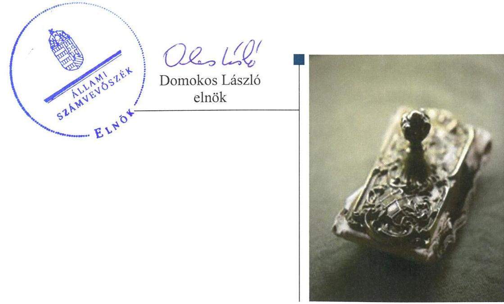

---

# AZ ELLENŐRZÉST FELÜGYELTE: 

PETŐ KRISZTINA felügyeleti vezető

## AZ ELLENŐRZÉST VEZETTE ÉS A VÉGREHAJTÁSÁÉRT FELELŐS:

BREBÁN ANDREA ellenőrzésvezető
KAKAS SÁNDOR ellenőrzésvezető

A PROGRAM ÖSSZEÁLLÍTÁSÁÉRT FELELŐS:
JANIK JÓZSEF LÁSZLÓ osztályvezető

IKTATÓSZÁM: V-1066-152/2016.
TÉMASZÁM: 2100
ELLENŐRZÉS-AZONOSÍTÓ SZÁM: V073717

---

# TARTALOMJEGYZÉK 

■ ÖSSZEGZÉS ..... 5
■ AZ ELLENŐRZÉS CÉLJA ..... 7
■ AZ ELLENŐRZÉS TERÜLETE ..... 8
■ AZ ELLENŐRZÉS HÁTTERE, INDOKOLTSÁGA ..... 11
■ A JELENTÉS LÉNYEGES KÉRDÉSKÖREI ..... 13
■ ELLENŐRZÉS HATÓKÖRE ÉS MÓDSZEREI ..... 14
■ MEGÁLLAPÍTÁSOK ..... 17
■ JAVASLATOK ..... 31
■ MELLÉKLETEK ..... 35
I. sz. melléklet: Értelmező szótár ..... 35
II. sz. melléklet: Az Integritás érvényesítése érdekében kialakított és múködtetett kontrollrendszer ..... 38
■ FÜGGELÉK: ÉSZREVÉTELEK ..... 41
■ RÖVIDÍTÉSEK JEGYZÉKE ..... 53

---

.

---

# ÖSSZEGZÉS 

A salgótarjáni székhelyű Dornyay Béla Múzeumra vonatkozó irányító szervi feladatellátás összességében szabályszerű volt. A Múzeumnál kialakított irányítási rendszer nem biztosította az átlátható, elszámoltatható és ellenőrizhető közpénzfelhasználást. A Múzeum pénzügyi és vagyongazdálkodása nem volt szabályszerű. A Múzeum alaptevékenységének részét képező kulturális javak nyilvántartásáról nem teljes körűen gondoskodtak, a kulturális javak állományvédelme és vagyonbiztonsága a kölcsönzéseknél nem volt biztosított.

## Az ellenőrzés társadalmi indokoltsága

Az Állami Számvevőszék stratégiájának alapértéke, hogy ellenőrzései segítik az integritás alapú, átlátható és elszámoltatható közpénzfelhasználás megteremtését. Az ellenőrzés jogszabályban, vagy alapító okiratban meghatározott közfeladat ellátására létrejött, a megyei hatókörű városi muzeális intézmények gazdálkodási tevékenységére terjedt ki. E szervezetek pénzügyi és vagyongazdálkodásának alapvető rendeltetése a közfeladatok (a kulturális örökséghez tartozó javak védelme, őrzése és a nyilvánosság számára történő hozzáférhetővé tétele) ellátásának biztosítása.

A megyei hatókörű városi múzeumként működő szervezetek 2011. évtől több alkalommal jelentős szervezeti és gazdálkodási átalakuláson mentek keresztül. A tulajdonosi, a vagyonkezelői és a fenntartói szerepekben, szerkezetben történt változások előkészítése, végrehajtása, illetve a múzeumi rendszer által kezelt közvagyonnal való gazdálkodás szabályszerűségének bemutatásával az ellenőrzés hozzájárul a múzeumok fenntartási és működtetési feladatainak ellátására vonatkozó megfelelő jogszabályi környezet kialakításához, a gazdálkodási gyakorlatuk javításához.

## Főbb megállapítások, következtetések, javaslatok

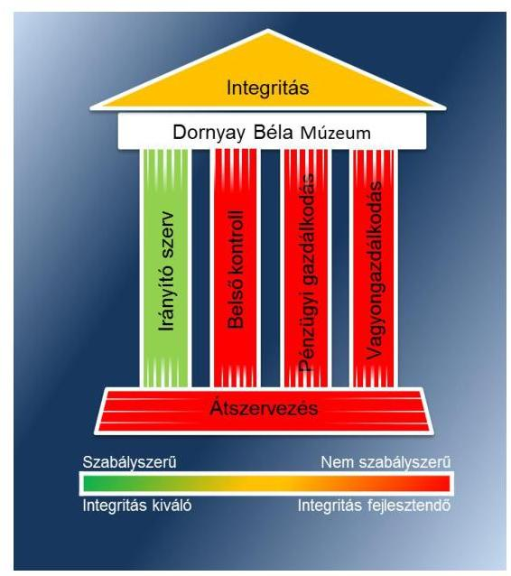

Az irányító szervek a Múzeumra vonatkozóan az ellenőrzött időszakban összességében szabályszerűen gyakorolták jogosultságaikat.

A Múzeumnál kialakított irányítási rendszer nem biztosította az átlátható, elszámoltatható és ellenőrizhető közpénzfelhasználást. A Múzeum belső kontrollrendszerének kialakítása és múködtetése nem felelt meg a jogszabályi előírásoknak. A kockázatkezelési rendszert nem múködtették a 2011-2014. években. A kontrolltevékenység kialakítása és múködtetése az ellenőrzött időszakban nem volt szabályszerű. Az információs és kommunikációs folyamatok kialakítása során nem készítették el az adatvédelmi és adatbiztonsági szabályzatot, továbbá belső szabályzatban nem rendezte a közérdekű adatok megismerésére irányuló kérelmek intézésének, továbbá a kötelezően közzéteendő adatok nyilvánosságra hozatalának rendjét. A monitoring rendszer kialakítása és múködtetése a 2011-2014. években nem volt szabályszerű.

A Múzeum pénzügyi és vagyongazdálkodása nem volt szabályszerű. A beszámolók irányító szerv részére történő elkészítése és megküldése a jogszabályban előírt határidőre nem történt meg. A bevételi előirányzatok teljesítése és a kiadási előirányzatok felhasználása során a jogszabályi előírásokat nem tartották be teljes körűen. A 2012. évben a vagyontárgyak hasznosítására jogalap nélkül vagyonhasznosításra feljogosító szerződés nélkül került sor. A Múzeum 2012. évi a beszámolójának mérlege a vagyon és annak összetétele kapcsán a megbízható és valós összképet nem mutatta be. A 2013-2014. évi beszámolókban sérült a lényegesség számviteli alapelv. A pénzügyileg nem rendezett követelések értékelését a könyvviteli zárlathoz kapcsolódó feladatok keretében a Múzeumnál nem végezték el, ezzel sérült az

---

egyedi értékelés számviteli alapelv. A Múzeum a nemzeti vagyonba tartozó kulturális javakról nem teljes körűen vezette a jogszabályban előírt nyilvántartásokat, azok kölcsönzéséről szóló szerződései nem voltak szabályszerűek. A nem muzeális intézmény számára történő kölcsönadáshoz a Múzeum nem rendelkezett a miniszter hozzájárulásával.

A Múzeumot érintő önkormányzati alrendszerből a központi alrendszerbe történő 2012. január 1-jétől hatályos irányító szervi (fenntartói) váltás lebonyolítását nem szabályszerűen hajtották végre, mert a vagyon tényleges átadásához jegyzőkönyvet nem készítettek, így a vagyon tényleges átadására nem került sor. A 2013. január 1-jétől hatályos, a központi alrendszerből önkormányzati alrendszerbe történő irányító szervi (fenntartói) váltás lebonyolítása és a szervezetrendszer átalakítása a vagyonátadási jelentés elkészítésének elmaradása miatt nem volt szabályszerű.

A Múzeum az integritás szemlélet érvényesítése érdekében nem intézkedett. A Múzeum által, az integritás szemlélet érvényesítéséről kitöltött integritás tanúsítvány értékelése megfelelő volt. Az ellenőrzés által feltárt hiányosságok miatt a Múzeum integritás kontroll rendszerének fejlesztéséhez további erőfeszítések szükségesek.

---

# AZ ELLENŐRZÉS CÉLJA 

vényesülését a gazdálkodási folyamatokban.

Az ellenőrzés célja annak megállapítása volt, hogy a megyei múzeumi rendszer átalakítása, az intézményfenntartói rendszerben végbement változások előkészítése és végrehajtása megalapozottan, szabályszerűen történt-e; a megyei hatókörű városi múzeumok és jogelődjeik pénz-ügyi- és vagyongazdálkodása, a belső kontrollrendszer kialakítása és működtetése, valamint az intézményfenntartói feladatok ellátása szabályszerűen történt-e.

A Múzeum ${ }^{1}$ korrupcióval szembeni veszélyeztetettségének csökkentése érdekében kért tanúsítványi adatszolgáltatás alapján az ÁSZ² értékelte az integritási szemlélet ér-

---

# **AZ ELLENŐRZÉS TERÜLETE**

### **Dornyay Béla Múzeum**

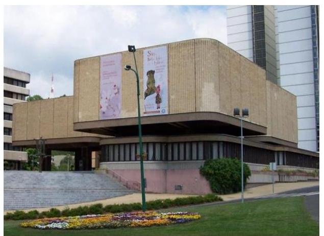

A Múzeum Salgótarjánban található, feladatkörében az Mtv.^{3} alapján gondoskodik a kulturális javak meghatározott anyagának folyamatos gyűjtéséről, nyilvántartásáról, megőrzéséről és restaurálásáról; tudományos feldolgozásáról, publikálásáról; valamint kiállításokon és más módon történő bemutatásáról; a közművelődési és közgyűjteményi feladatok ellátásáról. A Kötv.^{4} 20. § (2) bekezdése alapján területileg illetékes múzeumként régészeti feltárást végzett az ellenőrzött időszakban.

A Múzeum csak a működési engedélyében meghatározott gyűjtőkörben és gyűjtőterületen folytathatja tevékenységét. A szakmai besorolást, a rendszert megalapozó szaktörvényi kereteket az Mtv. biztosítja. Az Mtv. hatálya kiterjed a Múzeum fenntartóira, a Múzeumban foglalkoztatottakra, a kulturális örökség Múzeumban őrzött elemeire, a szolgáltatások igénybe vevőire és a kulturális örökséggel foglalkozó egyéb szervezetekre.

A Múzeum engedélyezett létszáma a 2011–2012. években 50 fő volt, amely az átszervezések eredményeként 2013–2014. években 26 főre csökkent. A Múzeum alkalmazottainak foglalkoztatására a Kjt.^{5} alapján került sor. Az ellenőrzött időszakban a múzeumigazgató^{6} és a gazdasági vezető személye többször is változott.

A Möktv.^{7} és annak végrehajtásáról szóló 258/2011. (XII. 7.) Korm. rendelet^{8} alapján 2012. január 1-jétől a megyei múzeumok központi költségvetési szervekké váltak. 2013. január 1-jétől a 2012. évi CLII. törvény^{9}, valamint a 1311/2012. (VIII. 23.) Korm. határozat^{10} alapján az állami tulajdonba és fenntartásba került megyei múzeumi szervezetek a megyeszékhely megyei jogú városok fenntartásában működnek tovább. A 2011–2014. évek között a fenntartói, irányítói, középirányítói jogkörgyakorlók változását, valamint a Múzeum gazdálkodási feladatát ellátó szervezetét az 1. táblázat mutatja be:

^{1} táblázat

|  Időszak | Fenntartó | Irányító szerv | Középirányító szerv | Gazdasági szervezet  |
| --- | --- | --- | --- | --- |
|  2011. | NMÖ^{11} | NMÖ Közgyűlése | - | MGYK^{12} (I. félévben)
NMÖKH^{13} (II. félévben)  |
|  2012. | NMIK^{14} | KIM^{15} | NMIK | NMIK  |
|  2013–2014. | SMJVÖ^{16} | SMJVÖ Közgyűlése | - | KIGSZ^{17} (2013.05.31-ig)
SKIGSZ^{18} (2013.06.01-tól)  |

*Forrás: A Múzeum alapító okiratai*

---

A Múzeum jogállása a 2011. I. félévben önállóan működő költségvetési szerv volt, pénzügyi-gazdasági feladatait együttműködési megállapodás ${ }^{19}$ alapján a Megyei Gyermekvédelmi Központ látta el. 2011. II. félévben a Múzeum jogállása önállóan működő és gazdálkodó költségvetési szerv volt, pénzügyi-gazdasági feladatait együttműködési megállapodás ${ }^{20}$ alapján a Nógrád Megyei Önkormányzat Közgyűlésének Hivatala látta el. 2012. évben a Múzeum jogállása önállóan működő és gazdálkodó költségvetési szerv volt, pénzügyi-gazdasági feladatait együttműködési megállapodás ${ }^{21}$ alapján a Nógrád Megyei Intézményfenntartó Központ látta el. 2013. évtől a Múzeum jogállása önállóan működő és gazdálkodó költségvetési szerv, 2014. január 1-jétől önálló jogi személyiséggel rendelkező költségvetési szerv, pénzügyi-gazdasági feladatait együttműködési megállapodás ${ }^{22}$ alapján 2013. május 31-ig a Közoktatási Intézmények Gazdasági Szolgálata, ezt követően névváltozás következtében a Salgótarjáni Költségvetési Intézmények Gazdasági Szolgálata látja el.

A Múzeum teljesített költségvetési bevételeinek és kiadásaink alakulását az 1. ábra mutatja be. Az ábra a 2011-2012. években a Múzeum és tagintézményeinek együttes adatai, a 2013-2014. években a tagintézmények átadását követően a múzeumi adatok alapján készült.
1. ábra
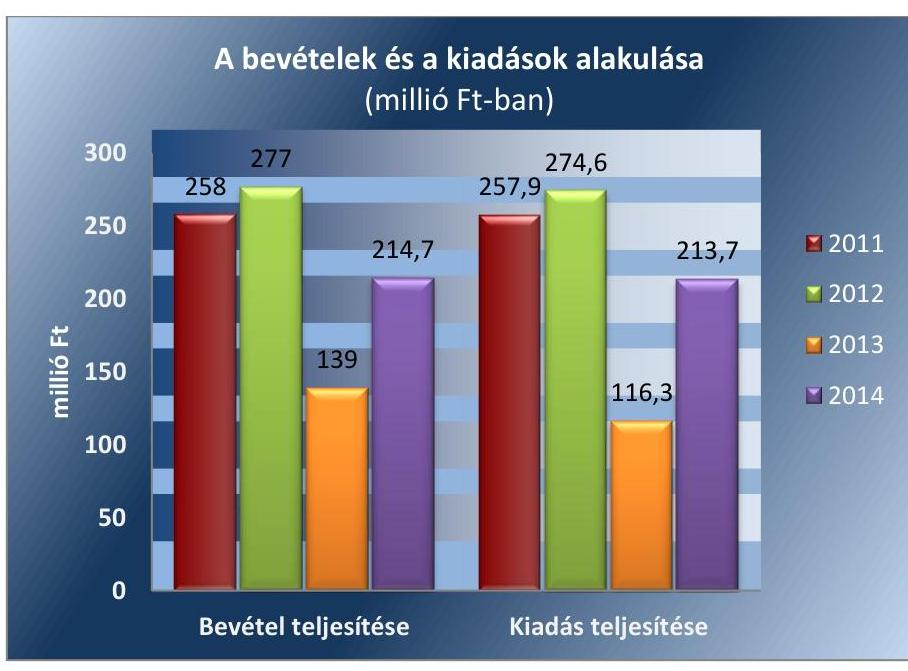

A 2015. évi LXXV. tv. ${ }^{23}$ 1. § (1) bekezdése alapján az Nvtv. ${ }^{24}$ 13. § (3) bekezdésében és 14. § (1) bekezdésében foglaltak alapján és az abban meghatározott feltételekkel a 2012. évi CLII. törvény 30. § (1) és (2) bekezdésében meghatározott, a megyei hatókörű városi múzeumok feladatának ellátását szolgáló egyes állami tulajdonban lévő ingatlanok a törvény hatálybalépésének napjával, a törvény erejénél fogva a kötelező közfeladatként a megyei hatókörű városi múzeumot fenntartó önkormányzatok tulajdonába kerültek. A 2015. évi LXXV. tv. 4. § (1) bekezdése alapján a kulturális örökség helyi védelme érdekében a megyei hatókörű városi múzeumok alapleltárában és jogszabály szerinti külön nyilvántartásában szereplő állami tulajdonú kulturális javak ingyenesen a megyei hatókörű városi múzeumok vagyonkezelésébe kerültek. A vagyonkezelők vagyonkezelői

---

joga tekintetében vagyonkezelési szerződés megkötése nem szükséges. A 2015. évi LXXV. tv. 4. § (2) bekezdése szerint továbbá a kulturális örökség helyi védelme érdekében a megyei hatókörű városi múzeumok feladatának ellátását szolgáló állami tulajdonban álló ingatlanok - a törvény mellékletében meghatározott ingatlanok kivételével - ingyenesen a fenntartó önkormányzatok vagyonkezelésébe kerültek.

---

# AZ ELLENŐRZÉS HÁTTERE, INDOKOLTSÁGA

Az Alaptörvény25 rendelkezése szerint a nemzeti vagyon megőrzésének, védelmének és a nemzeti vagyonnal való felelős gazdálkodásnak a követelményeit sarkalatos törvény, az Nvtv. rögzíti. A tulajdonosi joggyakorlás és vagyonkezelés általános és speciális szabályait, az állami vagyon nyilvántartására és elszámolására vonatkozó eljárásokat, a vagyonkezelési szerződés feltételrendszerét, valamint az éves beszámoló készítési és könyvvezetési kötelezettségeket kormányrendelet írja elő.

A megyei hatókörű városi múzeumok közfeladat-ellátásának változásait, (beleértve az állami tulajdonosi joggyakorló, intézményi vagyonkezelő és önkormányzati fenntartó szervezeteket is) a közfeladatok átadásából és átvételéből adódó módosításait, előirányzat gazdálkodására ható tényezőit az Áht.226, az Ávr.27, a Möktv., valamint az Mtv. írja elő. A múzeumi intézményrendszer rendszerátalakulásából, megszűnéséből, intézmény átszervezéséből, belső szerkezeti korszerűsítéséből, vagy más hasonló okból adódó módosításai miatt szerepeltetendő szerkezeti változásokat, valamint a szerkezeti változásként beépült közfeladatok szintre hozásként történő számításba vételét az Ávr. határozza meg.

A megyei hatókörű városi múzeumok kulturális szempontból meghatározó jelentőségűek mind földrajzi elhelyezkedésüket, mind az ellátott feladatokat, valamint a látogatottságukat tekintve. Tevékenységüket törvényi szinten (Mtv.) szabályozták a jogalkotók. A megyei hatókörű városi múzeumok jelenlegi körének kialakításában, tulajdonosi és fenntartói szerkezetében rövid idő alatt több jelentős változás történt, amelyeket jogszabályi változások indukáltak. Ezen intézmények szakmai besorolásukat tekintve a 2011. évben megyei múzeumként, a 2012. évben megyei múzeumi központi költségvetési szervezetként, a 2013. évtől kezdődően megyei hatókörű városi múzeumként működtek. A szakmai besorolások változásait párhuzamosan követték a tulajdonosi, vagyonkezelői, fenntartói szerepekben történt változások.

A 2011–2014. évek között bekövetkezett fenntartói változások a vagyontárgyak és a kulturális javak tulajdonosi, vagyonkezelői és használói körében is változást indukáltak, amelyet a 2. táblázat szemlélet.

1. táblázat

|  A VAGYON TULAJDONOSI, VAGYONKEZELŐI ÉS HASZNÁLÓI KÖRÉNEK VÁLTOZÁSA 2011–2014. ÉVEKBEN |  |  |  |  |  |  |  |  |   |
| --- | --- | --- | --- | --- | --- | --- | --- | --- | --- |
|  Vagyontárgy |  | 2011. év |  |  | 2012. év |  |  | 2013–2014. évek |   |
|   |  | vagyonkezelő | használó | tulajdonos | vagyonkezelő | használó | tulajdonos | vagyonkezelő | használó  |
|  Ingatlan | NMÖ | - | Múzeum | Állam | NMIK | Múzeum | Állam | Múzeum | Múzeum  |
|  Egyéb tárgyi eszközök | NMÖ | - | Múzeum | Állam | NMIK | Múzeum | Állam | Múzeum | Múzeum  |
|  Kulturális javak | NMÖ | - | Múzeum | Állam | NMIK | Múzeum | Állam | Múzeum | Múzeum  |

*2. táblázat*

*Forrás: A Múzeum alapító okiratai, a 2012. évi CLII. tv, a 258/2011. (XII. 7) Korm. rendelet, az 1311/2012. (VIII. 23.) Korm. határozat*

---

Az ellenőrzés - tekintettel a megyei hatókörű városi múzeumokat (és jogelődjeit) rövid időn belül, gyors ütemben ért környezeti (tulajdonosi, fenntartói-szerkezetet érintő) változásokra - javaslatok megfogalmazásával hozzájárul a fenntartás és működtetés feladatainak ellátására vonatkozó megfelelő jogszabályi környezet - jogalkotók által történő - kialakításához. Az ÁSZ ellenőrzés a gazdálkodási gyakorlat javítását eredményezheti, több intézmény bevonásával átfogó képet ad a megyei hatókörű városi múzeumokat (és jogelődjeiket) jellemző sajátosságokról, jó gyakorlatokról.

AZ ELLENŐRZÉS EREDMÉNYEKÉPPEN nemcsak az ellenőrzött intézmények gazdálkodása javul, hanem átfogó képet kapunk a múzeumok gazdálkodásának hiányosságairól, de a jó gyakorlatokról is. Ellenőrzéseivel, javaslataival és megállapításaival az ÁSZ elősegíti a költségvetési szervek pénzügyi és vagyongazdálkodása szabályozásának javítását és hozzájárulhat a jó kormányzáshoz.

---

# A JELENTÉS LÉNYEGES KÉRDÉSKÖREI 

1. Az irányító szerv Múzeumra vonatkozó feladatellátása szabályszerű volt-e?
2. Szabályszerüen hajtották-e végre a Múzeumot érintő szervezeti, szerkezeti átszervezéseket?
3. A belső kontrollrendszer kialakítása és müködtetése megfelelt-e a jogszabályi előírásoknak?
4. A Múzeum pénzügyi gazdálkodása szabályszerű volt-e?
5. A Múzeum vagyongazdálkodása szabályszerű volt-e?
6. A Múzeum intézkedett-e az integritás szemlélet érvényesitése érdekében?

---

# ELLENŐRZÉS HATÓKÖRE ÉS MÓDSZEREI 

## Az ellenőrzés típusa

Megfelelőségi ellenőrzés.

## Az ellenőrzött időszak

Az ellenőrzött időszak 2011. január 1-jétől 2014. december 31-ig tart.

## Az ellenőrzés tárgya

A megyei hatókörű városi múzeumok átszervezése, átalakítása előkészítése és lebonyolítása megalapozottsága, szabályszerűsége, a pénzügyi és vagyongazdálkodási tevékenység, a belső kontrollrendszer kialakítása, működtetése szabályszerűsége, valamint az irányító szervi feladatok ellátása szabályszerűsége. E tevékenységek és a kapcsolódó adatok és információk összessége, amelyeket a vonatkozó kritériumok alapján kell értékelni.

Az ellenőrzés kiterjed minden olyan körülményre és adatra, amely az ÁSZ jogszabályban meghatározott feladatainak teljesítéséhez, valamint a program végrehajtása folyamán felmerült újabb összefüggések feltárásához szükséges.

## Az ellenőrzött szervezet

A Dornyay Béla Múzeum (valamint jogelődje a Nógrád Megyei Múzeumi Szervezet), a fenntartói feladatokban érintett Nógrád Megye Önkormányzata, valamint Salgótarján Megyei Jogú Város Önkormányzata, a Nógrád Megyei Intézményfenntartó Központ jogutódja a Szociális és Gyermekvédelmi Főigazgatóság, a gazdasági feladatok ellátásában érintett Megyei Gyermekvédelmi Központ jogutódja a Nógrád Megyei Gyermekvédelmi Központ és Területi Gyermekvédelmi Szakszolgálat, a Nógrád Megyei Önkormányzati Hivatal (névváltozást megelőzően Nógrád Megyei Önkormányzat Közgyűlésének Hivatala), valamint a Salgótarjáni Költségvetési Intézmények Gazdasági Szolgálata (névváltozást megelőzően Közoktatási Intézmények Gazdasági Szolgálata).

Az ellenőrzésre a költségvetési szerv ellenőrzött intézményének és irányító/felügyeleti szervének, illetve középirányító szervének székhelyén és a gazdálkodási feladatait ellátó szervezetének székhelyén került sor.

---

# Az ellenőrzés jogalapja 

Az ellenőrzés jogszabályi alapját az ÁSZ tv. ${ }^{28}$ 1. § (3) bekezdés, 5. § (2)-(6) bekezdései, valamint az Áht. 2 61. § (2) bekezdésének előírásai képezik.

## Az ellenőrzés módszerei

Az ellenőrzést az ellenőrzési program szempontjai, az ellenőrzött időszakban hatályos jogszabályok, az ellenőrzés szakmai szabályai, az egyes ellenőrzési típusokhoz kapcsolódó ÁSZ módszertanok és nemzetközi standardok figyelembevételével végeztük. A gazdálkodás hibáinak kijavítására, a közpénzekkel való felelős gazdálkodás segítésére irányuló javaslatok kidolgozásakor a hatályos jogszabályok az irányadóak.

Az ellenőrzési kérdések megválaszolásához szükséges bizonyítékok megszerzése a következő ellenőrzési eljárások alkalmazásával történt: kérdésfeltevés (információkérés), mintavételezés, valamint elemző eljárás. A minták kiválasztása során véletlen mintavételi eljárást alkalmaztunk.

Mintavétellel ellenőriztük a bevételek, a személyi juttatások, a dologi és felhalmozási kiadások, a régészeti bevételek és kiadások elszámolása-, valamint a kulturális javak kölcsönzésének szabályszerűségét. A minta alapján a sokaságban előforduló hibaarányt becsültük. „Megfelelőnek" értékeltük az ellenőrzött területet, amennyiben 95\%-os bizonyossággal a teljes sokaságban a hibaarány legfeljebb 10\%, „részben megfelelőnek" értékeltük, ha a hibaarány felső határa 10-30\% között volt, „nem megfelelőnek" pedig akkor, ha a mintavételi eredmények alapján a sokaságbeli hibaarány felső határa meghaladta a $30 \%$-ot.

Az ellenőrzési bizonyítékként felhasználható adatforrások közé tartoznak egyrészt a szakmai program részletes szempontjainál felsorolt adatforrások, másrészt adatforrás lehet minden egyéb - az ellenőrzés folyamán feltárt, az ellenőrzés szempontjából releváns információt tartalmazó - dokumentum. Az ellenőrzés lefolytatásához a Múzeum a tanúsítványok elektronikus kitöltésével, valamint az ÁSZ által kért dokumentumok elektronikus megküldésével szolgáltatott adatokat. A rendelkezésre bocsátott adatok, információk kontrollja az ellenőrzés keretében történt. Az ellenőrzési kérdésekre adott válaszok alapján értékeltük, hogy az ellenőrzött időszakban az irányító szerv az ellenőrzött Múzeumra vonatkozó feladatainak szabályszerűen eleget tett-e, a Múzeum pénzügyi- és vagyongazdálkodása megfelel-t-e az előírásoknak, a Múzeum átalakításának vagy átszervezésének végrehajtása szabályszerű volt-e.

A Múzeum belső kontrollrendszere jogszabályi előírások szerinti kialakításának és működtetésének szabályszerűségét az erre irányuló ellenőrzési kérdésekre adott válaszok összesítése alapján, évente pillérenként (kontrollkörnyezet, kockázatkezelési rendszer, kontrolltevékenységek, információs és kommunikációs rendszer, monitoring rendszer) és összesítetten is minősítjük. A Múzeum belső kontrollrendszere egyes pilléreinek kialakítása és működtetése „szabályszerü", amennyiben az értékelt területen az elért és elérhető pontok százalékban kifejezett, egész számra kerekített hányadosa meghaladja a 84\%-ot, „részben szabályszerű", ha a 84\%-

---

ot nem haladja meg, de 60\%-nál nagyobb, „nem szabályszerű", ha nem haladja meg a 60\%-ot. A Múzeum belső kontrollrendszerének összesített értékelése megegyezik a pillérenként (kontrollterületenként) alkalmazott \%os értékelésekkel, a következő eltérésekkel. A kontrollrendszer egésze esetében a „szabályszerű" értékelésnek a \%-os értéken felül további feltétele, hogy egyik kontrollterület sem kaphat „nem szabályszerű" értékelést, a „részben szabályszerű" értékelés további feltétele, hogy legfeljebb egy ellenőrzött kontrollterület lehet „nem szabályszerű" értékelésű. Az összesített értékelés a \%-os értéktől függetlenül „nem szabályszerű", ha az ellenőrzött kontrollterületek közül több mint egynek „nem szabályszerű" az értékelése.

Az integritás szemlélet érvényesülésének értékelése a Múzeum tanúsítványi adatszolgáltatása alapján történt.

---

# 1. Az irányító szerv Múzeumra vonatkozó feladatellátása szabályszerű volt-e? 

Összegző megállapítás

Az irányító szerv ${ }_{1-3}{ }^{29}$ Múzeumra vonatkozó feladatellátása összességében szabályszerű volt.

AZ ALAPÍTÓI JOGOSULTSÁGOK gyakorlása során a Múzeum a 2011-2014. években rendelkezett az Áht. ${ }_{1,2}{ }^{30}$-ben előírtak szerint alapító okiratokkal. Az alapító okiratokat annak módosításakor az Ámr. ${ }^{31}$ és az Ávr. előírásainak megfelelően minden esetben egységes szerkezetbe foglalták. Az alapító okiratok módosításai során - a 2012. január 1-jétől hatályos előírásnak megfelelően - a módosításához a kultúráért felelős miniszter előzetes véleményét megkérték. Hiányosság volt, hogy 2012-ben az alapítói okirat kiadására és kincstári ${ }^{32}$ nyilvántartásba vételére a 258/2011. (XII. 7.) Korm. rendelet 21. § (6) bekezdése szerinti 2012. január 30-ai határidőn túl 2012. július 12-én került sor.

A MUNKÁLTATÓI JOGOSULTSÁGOK gyakorlásra során a 2013. évben a múzeumigazgatót és a 2012. és 2014. évben a gazdasági vezetőt ${ }^{33}$ a jogszabályi előírások betartásával nevezték ki. A kinevezett múzeumigazgató rendelkezett az Mtv.-ben meghatározott szakmai képesítéssel, a megbízáshoz rendelkeztek a miniszter ${ }^{34}$ írásbeli egyetértésével. A gazdasági vezetőt az irányító szerv ${ }_{2,3}$ vezetője az Áht. ${ }_{2}$ előírásainak figyelembevételével nevezte ki.

AZ EGYÉB IRÁNYÍTÁSI, FELÜGYELETI ÉS ELLENÖRZÉSI jogosultságok gyakorlása során az SZMSZ ${ }_{1-3}{ }^{35}$-at az irányító szerv $1-3$ az Áht. ${ }_{1,2}$ előírásainak megfelelően jóváhagyta. A jogosultságok gyakorlása során hiányosság volt, hogy a 2012. évben a középirányító szerv ${ }^{36}$ a 258/2011. Korm. rendelet 11. § (2) bekezdés c) pontja ellenére nem ellenőrizte az államháztartással összefüggő közérdekű és közérdekből nyilvános adatok kötelező közzétételének, illetve igényre történő szolgáltatásának végrehajtását, valamint a 11. § (1) bekezdés f) pontja ellenére nem hagyta jóvá a Múzeum engedélyezett létszámát.

---

# 2. Szabályszerüen hajtották-e végre a Múzeumot érintő szervezeti, szerkezeti átszervezéseket? 

Összegző megállapítás

2.1. számú megállapítás

## A Múzeumot érintő szervezeti, szerkezeti átszervezés nem volt szabályszerű.

A Múzeumot érintő önkormányzati alrendszerből a központi alrendszerbe történő 2012. január 1-jétől hatályos irányító szervi (fenntartói) váltás lebonyolítását nem szabályszerűen hajtották végre.

AZ ÁTADÁS-ÁTVÉTELI MEGÁLLAPODÁS ${ }^{37}$ megkötésére a 258/2011. (XII. 7.) Korm. rendelet 1. számú melléklete szerinti minta alapján határidőben került sor a Möktv.-ben meghatározott intézmények képviselőinek aláírásával.

A vagyon tényleges átadásához a 258/2011. (XII. 7.) Korm. rendelet 12. § (3) bekezdésében foglaltak ellenére jegyzőkönyvet nem készítettek, így a vagyon tényleges átadására nem került sor. Az átadás-átvételi megállapodás ${ }_{1}$-et a 258/2011. (XII. 7.) Korm. rendelet 1. számú melléklet III. és IV. rész előírásai szerinti tartalomra figyelemmel, de hiányosan készítették el. A 258/2011. (XII.7.) Korm. rendelet 1. mellékletének előírása ellenére nem kerültek átadásra többek között:
— az eszköz és vagyonleltárról szóló dokumentumok az ingatlanok és jármúvek kivételével a III. rész e) pontja;
— az átadott intézmény költségvetési helyzetéről szóló dokumentumok a III. rész f) pontja;
— a 2011. évi költségvetés végrehajtásáról szóló dokumentumok a III. rész f) pontja;
— az átadott ingatlanok múszaki állapotát bemutató műszaki kataszter a IV. rész 1/10. pontja;
— az intézményi költségvetés várható teljesüléséről szóló, 2011. december 31-i fordulónappal készített adatszolgáltatás a IV. rész 1/14. pontja ellenére.
A Múzeum az éves elemi költségvetési beszámolónak megfelelő adattartalmú 2011. évi beszámolóját elkészítette, azt leltárral alátámasztották.

Vagyonkezelési szerződést az MNV Zrt. ${ }^{38}$ és a fenntartó 2012. október 18-án írta alá, túllépve a 258/2011. (XII. 7.) Korm. rendelet 1. melléklet V. részében meghatározott, a megállapodás aláírásától, de legkorábban 2012. január 1-jétől számított 30 napos határidőt, ennek következtében a 2012. január 1. és 2012. október 17. közötti időszakban a vagyon törvényes kezelése nem volt biztosított.
A 2013. január 1-jével végrehajtott, a központi alrendszerből önkormányzati alrendszerbe történő irányító szervi (fenntartói) váltás lebonyolítása és a szervezetrendszer átalakítása nem volt szabályszerű.

AZ ÁTADÁS-ÁTVÉTELI MEGÁLLAPODÁS ${ }^{39}$ előkészítése során az átadás-átvétel lebonyolításához a szükséges tárgyalást a

---

1311/2012. (VIII. 23.) Korm. határozat szerint lefolytatták. A megyei hatókörű városi múzeum átadásáról a megállapodást a 2012. évi CLII. törvény 30. § (5) bekezdésében megjelölt határidőn túl, 2013. február 5-én kötötték meg. Az átadás-átvételi megállapodás-2-t a 1311/2012. (VIII. 23.) Korm. határozatban foglaltak szerint a fenntartó ${ }^{40}$ képviselője és a fenntartó ${ }_{2}$ vezetője írták alá, a kormánymegbízott ${ }^{41}$ és az EMMI ${ }^{42}$ megbízott képviselője egyetértésével. Az átadás-átvételi megállapodás-2-vel a jogutód fenntartó részére a fenntartói jogok gyakorlásához és az irányító szervi feladatok ellátásához szükséges adatok hiányosan kerültek átadásra-átvételre, mert az átadás-átvételi megállapodás ${ }_{2}$

- III/2.5. pontjában, valamint az 1.2.11. és 1.2.12. pontjaiban rendelkeztek az eszköz és vagyonleltár átadásáról, ennek ellenére a vagyonleltár nem képezte az átadás-átvételi megállapodás ${ }_{2}$ mellékletét;
—_IV/1.2.14. pontjában előírták a 2012. évi költségvetés várható teljesüléséről szóló adatszolgáltatási kötelezettséget, azonban az nem képezte a megállapodás részét.
Az Áhsz. ${ }^{43}$ 13/A. § (1) bekezdésében foglalt előírást figyelmen kívül hagyva vagyonátadási jelentést ${ }^{44}$ nem készítettek.

A MÚZEUM TAGINTÉZMÉNYEI 2013. január 1-jei hatállyal a feladat ellátásához rendelkezésre álló személyi, tárgyi és pénzügyi feltételek egyidejű átadásával a működési engedélyében meghatározott székhely szerint illetékes települési önkormányzat fenntartásába kerültek a 1311/2012. (VIII. 23.) Korm. határozat 1.4 pontja előírása alapján. Az átszervezés lebonyolításához - a 1311/2012. (VIII. 23.) Korm. határozat 1.8. pontjában foglalt előírás ellenére - nem rendelkeztek a Múzeum nyilvántartásaiban szereplő kulturális javak tagintézményi meghatározásával. Az átadás-átvételi megállapodásokat a 2013. január 1-jével a megyei múzeumi intézményből kikerült tagintézmények vonatkozásában 2012. december 28 -ig megkötötték.

# 3. A belső kontrollrendszer kialakítása és múködtetése megfelel-te a jogszabályi elöírásoknak? 

Összegző megállapítás A belső kontrollrendszer kialakítása és múködtetése a 20112014. években nem volt szabályszerű.

A belső kontrollrendszer kialakítása és múködtetése részletes értékelését a 2011-2014. évekre vonatkozóan a 3. táblázat mutatja be.

---

# A BELSŐ KONTROLLRENDSZER KIALAKÍTÁSÁNAK ÉS MŰKÖDTETÉSÉNEK ÉRTÉKELÉSE A 2011-2014. ÉVEKBEN 

| Megnevezés | Kontroll-   környezet | Kockázatkezelés | Kontrol-   tevékenységek | Információ és   kommunikáció | Monitoring | Összesen |
| :--: | :--: | :--: | :--: | :--: | :--: | :--: |
| 2011. | részben   szabályszerű | nem szabályszerű | nem szabályszerű | nem szabályszerű | nem szabályszerű | nem szabályszerű |
| 2012. | részben   szabályszerű | részben   szabályszerű | nem szabályszerű | nem szabályszerű | nem szabályszerű | nem szabályszerű |
| 2013. | részben   szabályszerű | részben   szabályszerű | nem szabályszerű | részben   szabályszerű | nem szabályszerű | nem szabályszerű |
| 2014. | részben   szabályszerű | részben   szabályszerű | nem szabályszerű | részben   szabályszerű | nem szabályszerű | nem szabályszerű |

A kontrollkörnyezet kialakítása a 2011-2014. években részben szabályszerű volt.

A kontrollkörnyezet kialakításának évenkénti értékelését a 2. ábra mutatja be:
2. ábra

| Kontrollkörnyezet | 2011. év   önkormányzati   alrendszer | 2012. év   központi   alrendszer | 2013. év   önkormányzati   alrendszer |
| :--: | :--: | :--: | :--: |
| szabályszerű |  |  |  |
| részben szabályszerű   nem szabályszerű |  |  |  |

A 2011-2014. ÉVEKBEN

A kockázatkezelés megállapításai

Az SZMSZ ${ }_{1-3}$-at az Áht. ${ }_{1,2}$ előírásai alapján elkészítették. A 2011-2014. években hatályos SZMSZ $_{1-3}$-ban a múzeumigazgató nem rögzítette az Ámr. 20. § (2) bekezdés e) és h) pontjainak, valamint az Ávr. 13. § (1) bekezdés e) és g) pontjainak előírása ellenére a szervezeti egységek engedélyezett létszámát, valamint a nevesített munkakörökhöz tartozó hatáskörök gyakorlásának módját. A 2011-2012. években az SZMSZ ${ }_{1}$ nem tartalmazta az Ámr. 20. § (2) bekezdés h) pontjának, valamint az Ávr. 13. § (1) bekezdés g) pontjának előírása ellenére a helyettesítés rendjét és az ehhez kapcsolódó felelősségi szabályokat.

A Múzeum a 2011-2012. években rendelkezett számviteli politika ${ }_{1-3}$ mal $^{45}$ a Számv. tv. ${ }^{46}$ előírása szerint. A 2013. január 1. és 2014. március 31. közötti időszakban a Múzeum nem rendelkezett számviteli politikával a Számv. tv. 14. § (3) bekezdés előírása ellenére, mert a gazdasági szervezet ${ }_{4,5}{ }^{47}$ a számviteli politikáját a Múzeumra nem terjesztette ki. 2014. április 1-jétől a Múzeum rendelkezett a Számv. tv. előírása szerint számviteli politika $_{4}$-el.

A Múzeum a 2011-2012. években rendelkezett számlarend ${ }_{1-3}$-mal ${ }^{48}$ a Számv. tv. előírásának megfelelően. A számlarend ${ }_{1-3}$-at a Számv. tv. és az Áhsz. ${ }_{1}$ előírásai szerinti tartalommal készítették el. A 2013. január 1. és 2014. március 31. közötti időszakban a Múzeum nem rendelkezett számlarenddel a Számv. tv. 161. § (1) bekezdés előírása ellenére, mert a gazdasági szervezet ${ }_{4,5}$ a számlarendjét a Múzeumra nem terjesztette ki. 2014.

---

április 1-jétől a Múzeum rendelkezett a Számv. tv. előírása szerint számlarend $_{4}$-el.

A Múzeum a Számv. tv.-ben és az Áhsz.1,2 ${ }^{49}$-ben előírtaknak megfelelően leltározási szabályzat ${ }_{1-4}$-gyel ${ }^{50}$ rendelkezett a 2011-2014. években.

A Múzeum 2011. II. félévtől az ellenőrzött időszak végéig rendelkezett az eszközök és források értékelési szabályzatával. 2011. I. félévben a gazdasági szervezet ${ }_{1}$ a Számv. tv. 14. § (5) bekezdés b) pontjában előírtak ellenére nem készítette el a Múzeumra vonatkozó eszközök és források értékelési szabályzatát. A 2014. évben az eszközök és források értékelési szabályzat ${ }_{3}$-ban ${ }^{51}$ az Áhsz. ${ }_{2}$ 50. § (2) bekezdés c) pontja előírása ellenére a gazdasági szervezet ${ }_{4,5}$ nem rögzítette az egyszerűsített értékelési eljárás alá vont követelések besorolásának elveit, dokumentálásának szabályait. Az eszközök és források értékelési szabályzat ${ }_{1,2}$-ben a 2011-2012. években az Áhsz. ${ }_{1}$ 8. § (17) bekezdés d) pontjának előírása ellenére a gazdasági szervezet ${ }_{2,3}$ nem rögzítette követeléstípusonként a kis összegű követelések év végi meghatározásának elveit, dokumentálásának szabályait.

A pénzkezelési szabályzat ${ }_{1-4}$-et $^{52}$ a 2011-2014. évekre vonatkozóan a Számv. tv.-ben és az Áhsz.1,2-ben előírtaknak megfelelően elkészítették.

A gazdasági szervezet 1 2011. I. félévben nem készítette el a Számv. tv. 14. § (5) bekezdés c) pontjában foglaltak ellenére a Múzeumra vonatkozó önköltségszámítási szabályzatot. A Múzeum 2011. II. félévtől az ellenőrzött időszak végéig rendelkezett a Számv. tv. előírásának megfelelően önköltségszámítási szabályzat ${ }_{1-3}$-mal ${ }^{53}$.

A 2013. január 1. és 2014. március 31. közötti időszakban a Múzeum nem rendelkezett bizonylati renddel a Számv. tv. 161. § (2) bekezdés d) pontja előírása ellenére, mert a gazdasági szervezet ${ }_{4,5}$ a bizonylati rendet a Múzeumra nem terjesztette ki. A Múzeum a jogszabályi előírásoknak megfelelően 2014. április 1-jétől rendelkezett bizonylati renddel.

A múzeumigazgató az ellenőrzött időszakban az etikai elvárásokat a szervezet minden szintjén az Ámr. 156. § (1) bekezdés c) pontja, illetve a Bkr. ${ }^{54}$ 6. § (1) bekezdés c) pontja előírásai ellenére nem határozta meg.

Közbeszerzési szabályzat ${ }_{1,2}$-vel ${ }^{55}$ a Múzeum az ellenőrzött időszakban a Kbt. ${ }^{56}$ és a Kbt. ${ }^{57}$ előírásai szerint rendelkezett. A múzeumigazgató a beszerzések lebonyolításával kapcsolatos eljárásrendet a 2011-2013. években az Ámr. 20. § (3) bekezdés b) pontja, illetve az Ávr. 13. § (2) bekezdés b) pontja előírása ellenére belső szabályzatban nem rendezte. A 2014. évben a múzeumigazgató a beszerzési szabályzatban ${ }^{58}$ rendezte az Ávr. előírásainak megfelelően a Kbt. ${ }_{2}$ hatálya alá nem tartozó beszerzések lebonyolításával kapcsolatos eljárásrendet.

Az ellenőrzési nyomvonalat a múzeumigazgató a 2011. évben elkészítette, azonban a 2012-2014. években az intézményi átszervezések során bekövetkezett változások ellenére a Bkr. 6. § (3) bekezdése előírása ellenére nem aktualizálta.

A Múzeum az ellenőrzött időszakban rendelkezett a szabálytalanságok kezelésének eljárásrendjével az Ámr. és a Bkr. előírásainak megfelelően.

---

# 3.2. számú megállapítás 

A kockázatkezelési rendszer kialakítása és múködtetése a 2011. évben nem volt szabályszerű, a 2012-2014. években részben szabályszerű volt.

A kockázatkezelési rendszer kialakításának és működtetésének évenkénti értékelését a 3. ábra mutatja be:
3. ábra

| Kockázatkezelési rendszer | 2011. év önkormányzati alrendszer | 2012. év központi alrendszer | 2013. év   önkormányzati alrendszer |
| :--: | :--: | :--: | :--: |
| szabályszerű |  |  |  |
| részben szabályszerű nem szabályszerű |  |  |  |

A KOCKÁZATKEZELÉSI RENDSZERT a múzeumigazgató a 2011. évben nem alakította ki és az Ámr. 157. § (1) bekezdése ellenére nem működtette. A 2011. évben nem mérték fel és állapították meg az Ámr. 157. § (2) bekezdés előirása ellenére a Múzeum tevékenységében, gazdálkodásában rejlő kockázatokat. A 2012-2014. években a Bkr. 3. § b) pontjának megfelelően a kockázatkezelési rendszert a múzeumigazgató kialakította, azonban a Bkr. 7. § (1) bekezdésének előírása ellenére nem működtette.

A vagyonnyilatkozat-tételi kötelezettséget a Vnytv. ${ }^{59}$-ben előírtak szerint az SZMSZ ${ }_{1-3}$-ban rögzítették.

## 3.3. számú megállapítás

A kontrolltevékenység kialakítása és működtetése a 2011-2014. években nem volt szabályszerű.

A kontrolltevékenységek évenkénti értékelését a 4. ábra mutatja be:
4. ábra

| Kontrolltevékenységek | 2011. év   önkormányzati   alrendszer | 2012. év   központi   alrendszer | 2013. év   önkormányzati   alrendszer |
| :--: | :--: | :--: | :--: |
| szabályszerű |  |  |  |
| részben szabályszerű nem szabályszerű |  |  |  |

A KONTROLLTEVÉKENYSÉGEK keretében a Múzeum belső szabályzataiban a múzeumigazgató a 2011. évben az Ámr. 158. § (2) bekezdés b) pontjának ellenére nem szabályozta az információkhoz való hozzáférést, valamint a 2012-2014. években a Bkr. 8. § (4) bekezdés b) pontjának előírásai ellenére a felelősségi körök meghatározásával a dokumentumokhoz és információkhoz való hozzáférést.

A gazdálkodási jogkörök gyakorlásán keresztül végzett kontrolltevékenység nem volt megfelelő, mivel a kiadási előirányzatok felhasználása során kötelezettségvállalásra a 2013-2014. években az Áht. 2 37. § (1) bekezdésében foglaltak ellenére pénzügyi ellenjegyzés hiányában került sor (részletesen a 4.3. fejezet mutatja be).

---

A múzeumigazgató a 2012-2014. években a Bkr. 8. § (2) bekezdés b) pontjának előírása ellenére a kontrolltevékenység részeként nem biztosította a folyamatba épített, előzetes, utólagos és vezetői ellenőrzést a pénzügyi kihatású döntések célszerűségi, gazdaságossági, hatékonysági és eredményességi szempontú megalapozottsága vonatkozásában.

A múzeumigazgató az lkr. ${ }^{60}$ 8. § (1)-(2) bekezdéseinek előírása ellenére a 2011-2014. években nem szabályozta az üzemeltetési és adatbiztonsági feladatokat és hatásköröket. A 2012-2014. években az Info tv. ${ }^{61}$ 7. § (2)(3) bekezdéseinek előírása ellenére a múzeumigazgató nem alakította ki az adatok biztonságának, védelmének érvényre juttatásához szükséges eljárási szabályokat.

# 3.4. számú megállapítás 

Az információs és kommunikációs folyamatok kialakítása a 20112012. években nem volt szabályszerű, a 2013-2014. években részben szabályszerű volt.

Az információs és kommunikációs rendszer évenkénti értékelését az 5. ábra mutatja be:
5. ábra

| Információs és kommunikációs rendszer | 2011. év önkormányzati alrendszer | 2012. év központi alrendszer | 2013. év   önkormányzati alrendszer |
| :--: | :--: | :--: | :--: |
| szabályszerű |  |  |  |
| részben szabályszerű nem szabályszerű |  |  |  |

Forrás: ÁSZ ellenőrzés megállapításai

AZ INFORMÁGIÓKKAL KAPCSOLATOS szervezeten belüli információáramlás rendszerét a 2011-2014. években kialakították. A 2011-2012. években a múzeumigazgató a szervezeten kívülre történő in-formáció-áramlás rendszerét az Ámr. 159. § (1) bekezdésében, valamint a Bkr. 9. § (1) bekezdésében foglaltak ellenére nem alakította ki, a 20132014. években kialakította.

A múzeumigazgató az ellenőrzött időszakban az Avtv. ${ }^{62}$ 31/A. § (3) bekezdés, illetve az Info tv. 24. § (3) bekezdés előírása ellenére az adatvédelmi és adatbiztonsági szabályzatot nem készítette el, valamint belső szabályzatban nem rendezte a közérdekú adatok megismerésére irányuló kérelmek intézésének, továbbá a kötelezően közzéteendő adatok nyilvánosságra hozatalának rendjét az Ámr. 20. § (3) bekezdés i) pontja, illetve az Ávr. 13. § (2) bekezdés h) pontja ellenére.

A Múzeum a 2011-2014. években rendelkezett iratkezelési szabályzattal, azonban a szabályzathoz a múzeumigazgató nem rendelkezett az Ltv. ${ }^{63}$ 10. § (1) bekezdés a) pontjának előírása ellenére az illetékes közlevéltár egyetértésével.

---

# 3.5. számú megállapítás 

A monitoring rendszer kialakítása és múködtetése a 2011-2014. években nem volt szabályszerű.

A monitoring rendszer évenkénti értékelését a 6. ábra mutatja be:
6. ábra

| Monitoring rendszer | 2011. év | 2012. év | 2013. év | 2014. év |
| :--: | :--: | :--: | :--: | :--: |
|  | önkormányzati   alrendszer | központi   alrendszer | önkormányzati alrendszer |  |
| szabályszerű |  |  |  |  |
| részben szabályszerű   nem szabályszerű |  |  |  |  |

A Múzeum tevékenységének, a célok megvalósításának nyomon követését biztosító rendszert a múzeumigazgató a 2011. évben az Ámr. 160. § előírása ellenére nem működtette, valamint a 2012-2014. években a Bkr. 10. § bekezdésében foglaltak ellenére nem alakította ki és a 3. § e) pontjának előírása ellenére nem működtette.

A múzeumigazgató az ellenőrzött időszakban az Áht. 1,2 szerint gondoskodott a belső ellenőrzés kialakításáról, azonban a belső ellenőrzés működtetéséről a 2011. és 2013. években az Áht. 1 121/B § (4) bekezdése, valamint az Áht. 2 70. § (1) bekezdésének előírása ellenére nem, mert a Múzeumnál belső ellenőrzést ezen időszakokban nem végeztek. A belső ellenőrzési vezető a 2012. és 2014. években a Bkr. előírásai figyelembevételével éves bontásban nyilvántartást vezetett a belső ellenőrzésekről, amellyel nyomon követte a belső ellenőrzési jelentések alapján megtett intézkedéseket.

## 4. A Múzeum pénzügyi gazdálkodása szabályszerű volt-e?

## Összegző megállapítás

### 4.1. számú megállapítás

## A Múzeum pénzügyi gazdálkodása nem volt szabályszerű.

A költségvetés tervezése szabályszerűen történt, a bevételi és kiadási előirányzatok megállapítása, módosítása, a maradvány megállapítása és azok számviteli nyilvántartása megfelel a jogszabályi előírásoknak.

A KÖLTSÉGVETÉS TEREVZÉSSEL kapcsolatos feladatokat a feladattal megbízottak munkaköri leírásaiban határozták meg. A költségvetés tervezése, az előirányzatok meghatározása során a tervezést elvégző gazdasági szervezet ${ }_{1,2,4,5}$ a 2011. és 2013-2014. években az irányító szerv ${ }_{1,3}$ által kiadott körleveleket és a tervezési útmutatókat figyelembe vette. A tervezést elvégző gazdasági szervezet ${ }_{1,2,4,5}$ a Múzeum vonatkozásában a költségvetési javaslat elkészítése során az előirányzatok megállapításakor a szervezeti átalakításból, átszervezésből adódó szerkezeti változások és szintre hozások hatásait figyelembe vette. A fenntartó ${ }_{2}$ a 2012. évi tervezést a Kincstár iránymutatásait figyelembe véve végezte el.

A költségvetésben rögzített előirányzatokat a 2011. évben az Ámr.-ben előírtaknak megfelelően részletes számításokkal, a 2012-2014. években az Ávr.-ben előírtak alapján a szintre hozást részletes számításokkal támasz-

---

tották alá. Az ellenőrzött időszakban az éves elemi költségvetéseket a vonatkozó jogszabályok szerinti tartalommal és szerkezetben az irányító szerv $1-3$-mal egyeztetve készítették el.

AZ ELŐIRÁNYZAT-MÓDOSÍTÁSOKAT szabályszerűen végezték el, az előirányzatok átcsoportosítására vonatkozó döntéseket az arra jogosultak hozták meg. Az előirányzatok nyilvántartásba vétele és elszámolása megfelelit a jogszabályi előírásoknak.

A MARADVÁNY megállapítása, és a jóváhagyott maradvány számviteli nyilvántartása szabályszerű volt. A kötelezettségvállalással terhelt maradvány megállapítása megfelelit az előírásoknak. A Múzeum az előírt adatszolgáltatási kötelezettségét a maradványáról az éves beszámoló megküldésével egyidejűleg, a 2011-2014. évben az Áhsz. 1 10. § (1) bekezdésben, illetve az Áhsz. 2 32. § (1) bekezdésben rögzített határidőn túl teljesítette.
4.2. számú megállapítás

A Múzeum az ellenőrzött időszakban az éves költségvetési beszámolóit az előírt határidőn túl készítette el.

AZ ÉVES KÖLTSÉGVETÉSI BESZÁMOLÓK összeállítása a 2011-2014. években az Áhsz.1,2 szerinti szerkezetben történt. A beszámolókat részletező nyilvántartásokkal és a könyvviteli zárlat során készített főkönyvi kivonattal támasztották alá. A költségvetési beszámolókat alátámasztó leltár a 2012-2014. években nem felelt meg a jogszabályi előírásoknak (részletezés a jelentéstervezet 5.2. pontjában).

A Múzeum 2011-2014. évi költségvetési beszámolóját az Áhsz. 1 10. § (1) bekezdésében, illetve az Áhsz. 2 32. § (1) bekezdésében foglalt határidőn túl készítette el és nyújtotta be az irányító szerv $1-3$-nak. A 2011. évi beszámolót 2012. március 12-én, a 2012. évi beszámolót 2013. március 4-én, a 2013. évi beszámolót 2014. március 3-án, a 2014. évi beszámolót 2015. márciusban készítették el.

A 2011., a 2013. és a 2014. évi költségvetési beszámolókat a múzeumigazgató és a beszámoló elkészítéséért felelős gazdasági vezető az Áhsz. 1 13. § (1) és Áhsz. 2 31. § (1) bekezdésében foglaltak szerint, valamint a 2012. évi költségvetési beszámolót az irányító szerv ${ }_{2}$ vezetője és a beszámoló elkészítéséért felelős gazdasági vezető az Áhsz. 1 13. § (2) bekezdésben foglaltak szerint írta alá.

---

### 4.3. számú megállapítás

A bevételi előirányzatok teljesítése és a kiadási előirányzatok felhasználása során a jogszabályi előírásokat nem tartották be teljes körűen.

| 4. táblázat |   |
| --- | --- |
|  A BEVÉTELEK ÉS KIADÁSOK ÉRTÉKELÉSE |   |
|  Mintaszkaság | Minibiltés  |
|  Bevételek 2011- | részben megfelelő  |
|  2014. évek |   |
|  Kiadások 2011. év | részben megfelelő  |
|  Kiadások 2012. év | részben megfelelő  |
|  Kiadások 2013. év | részben megfelelő  |
|  Kiadások 2014. év | nem megfelelő  |
|  Forrás: $A \Delta 2$ ellenőrzés megállapítása |   |

A BEVÉTELI ELŐIRÁNYZAT a módosított bevételi előirányzathoz viszonyítva 2011-ben 99,6\%-ban, 2012-ben 100\%-ban, 2013-ban 100 \%-ban, 2014-ben 99,2\%-ban teljesült. A Múzeumnál a kiemelt bevételi előirányzatok a múködési költségvetés bevételeit, irányító szervi támogatást, a saját alaptevékenység bevételeit tartalmazták. A Múzeum bevételei alapvetően a régészeti feltárásokból, a múzeumi belépő jegyértékesítéséből, valamint kiadvány értékesítésekből származtak.

A BEVÉTELEK ELSZÁMOLÁSA részben felelt meg a jogszabályok előírásainak. Az állami tulajdonú vagyontárgyak hasznosítására a 2012. évben a Vtv. ${ }^{64}$ 25. § (4) bekezdés szerinti vagyonhasznosításra feljogosító szerződés nélkül került sor. A bevételek nyilvántartásba vétele megfelelt az Áhsz.1,2 előírásainak. A bevételek az Áfa tv. ${ }^{65}$ 159. § (1) bekezdésében és a 166. § (1) bekezdésében foglaltak szerint kibocsátott számla, vagy nyugta alapján, az abban meghatározott értékben teljesültek és kerültek elszámolásra.

A KÖLTSÉGVETÉSI KIADÁSAIT a Múzeum a 2011-2014. években a jóváhagyott módosított előirányzaton belül teljesítette.

A KIADÁSI ELŐIRÁNYZATOK felhasználása során a következő hiányosságok, szabálytalanságok fordultak elő:
$\longrightarrow$ a 2013-2014. években a múzeumigazgató által kötelezettségvállalásra az Áht.: 37. § (1) bekezdésében foglaltak ellenére pénzügyi ellenjegyzés nélkül került sor, illetve az Ávr. 55. § (2) bekezdés c) pontjában foglaltak ellenére a pénzügyi ellenjegyzést nem az arra jogosult személy végezte;
$\longrightarrow$ az érvényesítési feladatokat ellátó személyek a 2011. évben az Ámr. 19. § (1) bekezdése, illetve a 2012. évben az Ávr. 55. § (3) bekezdése szerinti végzettséggel nem rendelkeztek;
$\longrightarrow$ a 2014. évben a múzeumigazgató a Múzeum állományába tartozó személy részére megbízási szerződés alapján fizetett megbízási díj esetében a megbízási szerződésben az Ávr. 51. § (2) bekezdésben foglaltak ellenére nem rögzítette, hogy a díj kizárólag abban az esetben illeti meg a költségvetési szerv állományába tartozó személyt, ha a szerződésben rögzített feladat mellett a munkakörébe tartozó feladatainak is maradéktalanul eleget tett;
$\longrightarrow$ a 2014. évben a Számv. tv. 52. § (2) bekezdése ellenére a tárgyi eszközök üzembe helyezését a Múzeum nem dokumentálta hitelt érdemlő módon. Az ellenőrzött időszakban teljesített beruházások összhangban voltak a Múzeum feladatellátásával, azonban a beruházások során teljesített kifizetések esetében a gazdálkodási jogköröket nem szabályszerűen gyakorolták. A 2013-2014. években a kötelezettségvállalás pénzügyi ellenjegyzését az Ávr. 55. § (2) bekezdés c) pontjában foglaltak ellenére nem az arra jogosult - a gazdasági szervezet 4,5 vezetője, vagy az általa írásban kijelölt sze-

---

# Megállapítások 

4.4. számú megállapítás
mély - végezte. A közbeszerzési értékhatárt elérő beruházásoknál lefolytatták a közbeszerzési eljárásokat. Az eljárásokat megfelelően dokumentálták, a szerződést a közbeszerzési eljárás nyertesével kötötték meg. Az értékcsökkenés elszámolása összességében megfelelte a jogszabályoknak.

## A régészeti feltárási tevékenység bevételeinek elszámolását a jog-

szabályban előírt tartalmú szerződések támasztották alá a 20112014. években. A régészeti tevékenység teljesített kiadásainak elszámolása 2011-2012. években részben felelt meg, a 2013-2014. években megfelelt a jogszabályi előírásoknak.

## A RÉGÉSZETI FELTÁRÁSI TEVÉKENYSÉG BEVÉ-

TELEINEK elszámolását a 2011-2012. években a Kötv., a 2013-2014. években a Kötv., valamint a 393/2012. (XII. 20.) Korm. rendelet ${ }^{66}$ rendelkezéseinek megfelelő tartalmú szerződések alátámasztották. A szerződésekben vállalt feladatok végrehajtását a szakfelügyeleti tevékenységnél az építési napló megrendelő által igazolt bejegyzései, az egyéb tevékenységeknél a megrendelő által kiállított teljesítésigazolás bizonyította. A számlát a teljesítést igazoló dokumentum és az utalvány alapján szabályszerűen állították ki, az utalványon feltüntették a bevételi főkönyvi számla számát. A számviteli elszámolás az Áhsz. 1,2 szerint a megfelelő bevételi számlára történt. A gazdasági eseményt alátámasztó számviteli bizonylat adatai alakilag és tartalmilag megfeleltek az Számv. tv. 166. § (1)-(2) bekezdés előírásainak.

A Múzeum a 2011. szeptember 2. és 2012. szeptember 14. közötti időszakban az 5/2010. (VIII. 18.) NEFMI rendelet ${ }^{67}$ 20. § (3) bekezdésében foglaltak ellenére a régészeti célú pénzeszközök elkülönített kezelésére pénzforgalmi számlájához alszámlát nem nyitott, továbbá a pénzeszközök felhasználásáról analitikus nyilvántartást nem vezetett.

A RÉGÉSZETI KIADÁSOK nyilvántartása az ellenőrzött időszakban külön főkönyvi számlán, havi könyveléssel történt. A régészeti kiadások felhasználása során a 4.3. fejezetben ismertetett hibák fordultak elő.
4.5. számú megállapítás

Az ellenőrzött időszakban a 2011. év kivételével a pénzügyi egyensúly biztosított volt. A Múzeum a fizetőképességének fenntartása érdekében a lejárt határidejű követelések behajtására intézkedett.

A múzeumigazgató a folyamatos fizetőképesség biztosítása érdekében a 2012. évben az Áht. 2 78. § (2) bekezdésében előírtak ellenére likviditási terv készítéséről nem gondoskodott. A 2013-2014. években a jogszabályi előírásoknak megfelelően a likviditási tervet elkészítették.

A 2011-2014. években a Múzeum határidőn túli vevőköveteléseinek év végi állománya a 2011. évi 10,2 M Ft-ról 2014. év végére 2,6 M Ft-ra csökkent. A múzeumigazgató a fizetőképesség fenntartása érdekében a 2011. évben a lejárt határidejű követelések behajtására intézkedett, aminek következtében 2012. év végén a vevőkövetelés összege 1 M Ft-ra csökkent. A lejárt határidejű szállítói tartozások összege a 2011. év végén 26,2 M Ftról 2012. év végére 3,4 M Ft-ra csökkent. A 2013-2014. években a Múzeumnak 30 napon túli lejárt szállítói tartozása nem volt.

---

# 5. A Múzeum vagyongazdálkodása szabályszerű volt-e? 

## Összegző megállapítás

### 5.1. számú megállapítás

## A Múzeum vagyongazdálkodása nem volt szabályszerű.

Az eszközök és források nyilvántartása az ellenőrzött időszakban nem felelt meg a jogszabályi előírásoknak.

A Múzeum által használt vagyon használati jogát a 2011. évben az irányító szerv ${ }_{1}$ biztosította.

A 2012. január 1-jei önkormányzati konszolidációt követően a tulajdonosi jogokat az állami tulajdon felett az MNV Zrt. gyakorolta, míg a fenntartói jogok és kötelezettségek a NMIK-hoz kerültek. A Múzeum a feladat ellátását szolgáló vagyont továbbra is használta, azonban erre vonatkozó szerződéssel a Vtv. 25. § (4) bekezdésében foglaltak ellenére nem rendelkezett. A Számv. tv. 23. § (2) bekezdésében, az Nvtv. 11. § (8) bekezdésében, valamint az Áhsz. ${ }_{1} 15 . \S$ (1) bekezdésében foglaltak ellenére a kezelt vagyon kimutatására szabálytalanul a Múzeumnál került sor. A Múzeum 2012. évi beszámolójának mérlegében kimutatott állami vagyon értéke teljes egészében az Áhsz. ${ }_{1} 5 . \S 10$. pontja szerinti jelentős összegű hibát eredményezett, és a beszámoló mérlege a vagyon és annak összetétele vonatkozásában a megbízható és valós összképet nem mutatta be.

Az Mtv. 2013. január 1-jétől hatályos 45/A. § (2) bekezdés a) pontja szerint a megyei hatókörű városi múzeum lett a vagyonkezelője a tevékenységéhez szükséges állami vagyonnak. A 2013-2014. években a Múzeum nem rendelkezett vagyonkezelési szerződéssel, ezzel az Nvtv. 11. § (1) és (7) bekezdésének és a Vtvr. ${ }^{68}$ 8. § (6) bekezdésének előírása nem érvényesült.

A kezelt vagyon köre és nagysága a 2013-2014. években vagyonkezelési szerződés hiányában nem volt megállapítható. Kiegészítő mellékletben a Múzeum a Számv. tv 23. § (2) bekezdésében előírtak ellenére nem mutatta be mérlegtételek szerinti megbontásban a kezelésbe vett állami eszközöket, és az Áhsz. ${ }_{2}$ 29. § (2) bekezdés c) pontjában előírtak ellenére nem jelezte a vagyonkezelési szerződés hiányát, emiatt nem érvényesült a Számv. tv. 16. § (4) bekezdésében meghatározott „lényegesség elve".

A KULTURÁLIS JAVAK NYILVÁNTARTÁSÁT a Múzeum a 20/2002. (X.4.) NKÖM rendelet alapján hagyományos módon vezette. A nemzeti vagyonba tartozó kulturális javakat folyamatosan vezetett szakleltárkönyvben, leltárkönyvben, gyarapodási naplóban tartották nyilván a 20/2002. (X.4.) NKÖM rendeletnek megfelelően.

Hiányosság volt, hogy a Múzeum a gyűjteményeiből ideiglenesen kikerült kulturális javak intézményen kívülre történő kölcsönadása esetén a kölcsönadott tárgyak naplóját, valamint a szakmai véleményezésre, vizsgálatra, illetve bírálatra átvett kulturális javakról a bírálati naplót a 20/2002. (X. 4.) NKÖM rendelet 19. § (1) bekezdésének ac) és b) pontjaiban foglaltak ellenére az ellenőrzött időszakban nem vezették.

---

### 5.2. számú megállapítás

A költségvetési beszámoló mérlegének leltárral való alátámasztottsága, a mérlegtételek értékelése a 2011-2014. közötti időszakban összességében nem felelt meg a jogszabályi előírásoknak.

LELTÁRRAL a könyvviteli mérlegben kimutatott eszközök és források valódiságát a 2011. évben az Áhsz. 1 és a Számv. tv. előírásai alapján alátámasztották.

A mérleget alátámasztó leltár a 2012. évben nem felelt meg az Áhsz. 1 37. § (2) bekezdésében foglaltaknak, mert a Múzeum az általa használt és felleltározott vagyonnak nem volt vagyonkezelője, vagyonkezelési szerződéssel a fenntartó ${ }_{2}$ rendelkezett.

A mérleget alátámasztó leltár a 2013-2014. években nem felelt meg az Áhsz. 1 37. § (2) bekezdésében és a Számv. tv. 69. § (1) bekezdésében foglaltaknak, mert az Áhsz. 1 29/A. § (1) bekezdésében foglaltak értelmében, a vagyonkezelésbe vett eszköz bekerülési értékének, a vagyonkezelési szerződésben szereplő érték minősül, mely információ a szerződés hiányában nem állt rendelkezésre, az Áhsz. 2 15. § (2) bekezdésében foglaltak alapján a bekerülési érték az átadónál kimutatott bruttó érték, melyről szintén nem volt információ. A hiányosság miatt a leltárak értékadatai dokumentummal nem voltak megfelelően alátámasztva.

Selejtezésre a 2014. évben szabályszerűen került sor.
A 2011-2014. években a Számv. tv. 55. § (1), az Áhsz. 1 31. § (2) és az Áhsz. 2 18. § (1) bekezdésében foglalt előírások ellenére év végén a pénzügyileg nem rendezett követeléseket nem minősítették, az értékvesztés elszámolásának feltételeit nem vizsgálták, ezért annak elszámolására sem került sor. Így nem volt biztosított a Számv. tv. 16. § (1) bekezdésében meghatározott egyedi értékelés elvének az érvényesülése.

AZ EREDMÉNY SZEMLÉLETŰ SZÁMVITELRE történő áttérés feladatait a 36/2013. (IX. 13.) NGM rendelet ${ }^{69}$ előírásai szerint végrehajtotta, azonban a rendező mérleg - a leltározás előzőekben kifejtett hiányosságai miatt - nem volt szabályszerű.
5.3. számú megállapítás

A kulturális javak hasznosítása és kölcsönzése nem felelt meg a jogszabályi előírásoknak. A Múzeum a kulturális javak vagyonbiztonságára és állományvédelmére vonatkozó előírásokat nem tartotta be.

KÖLCSÖNZÉSI TEVÉKENYSÉGET a Múzeum az ellenőrzött években végzett, amelynek során hazai és külföldi muzeális intézménynek, nem muzeális tevékenységet végző szervezetnek, önkormányzatoknak adott át kiállításra műtárgyakat. A kölcsönzési tevékenység a 2011-2014. években nem megfelelő minősítésű.

KÖLCSÖNZÉSI SZERZŐDÉST az ellenőrzött időszakban a múzeumigazgató több esetben az Mtv. 38. § (6) bekezdésében és 2013. október 25-től az Mtv. 38/A. § (1) bekezdésében foglaltak ellenére határozatlan időre kötött.

---

A kölcsönzési szerződésekkel kapcsolatban az alábbi hiányosságok kerültek megállapításra:
$\longrightarrow$ az ellenőrzött időszakban a Múzeum által nem muzeális intézmények részére történő kölcsönadáshoz az Mtv. 38. § (9) bekezdése, illetve 2013. október 25-től Mtv. 38/A. § (5) bekezdése ellenére a miniszter nem járult hozzá, a hozzájárulást dokumentum nem igazolja;
$\longrightarrow$ a Múzeum által kölcsönzött kulturális javak esetében az Mtv. 2013. október 25 -től hatályba lépett 38/A. § (3) bekezdésében előírtak ellenére - a jogszabályi rendelkezés hatályba lépésének időpontjától az ellenőrzött időszak végéig - a kölcsönbe adás időpontjában fennálló fizikai állapotot dokumentáló szakleírást a képi ábrázolással együtt a megkötött kölcsönzési szerződésekhez nem mellékelték;
$\longrightarrow$ az ellenőrzött időszakban a szerződésekben a kölcsönvevő által a kölcsönzött kulturális javaknak biztosítandó állományvédelmi követelményeket, a csomagolás és a szállítás feltételeit, valamint a kölcsönvevő által nyújtandó vagyonbiztonsági feltételeket az Mtv. 38. § (8) bekezdés a) és c) pontjaiban, 2013. október 25 -től az Mtv. 38/A. § (2) bekezdés a) és c) pontjaiban előírtak ellenére a múzeumigazgató nem rögzítette.
A kölcsönzési tevékenységhez kapcsolódó szerződések hiányosságai miatt a kulturális javak állományának fizikai védelme a kölcsönzéseknél nem volt biztosított.

A KULTURÁLIS JAVAK FIZIKAI ÖRZÉSE biztosított volt. A Múzeum a kulturális javak vagyonbiztonságát portai ügyelettel, füst- és mozgásérzékelős riasztó rendszerrel biztosította. A kiállítások esetében a vagyon felügyeletét teremőr látta el. A különleges elhelyezést igénylő kulturális javak esetében a 2/2010. (I. 14.) OKM rendelet ${ }^{70}$ 8. § b) pontjában meghatározott követelményeknek megfelelően a kiállításuk speciális kiállító vitrinek alkalmazásával, a fényviszonyok és levegő páratartalmának folyamatos figyelemmel kísérésével történt.

# 6. A Múzeum intézkedett-e az integritás szemlélet érvényesítése érdekében? 

## Összegző megállapítás

A Múzeum nem intézkedett az integritás szemlélet érvényesítése érdekében.

Az ellenőrzés részletes megállapításait a jelentéstervezet II. számú - „Az Integritás érvényesítése érdekében kialakított és müködtetett kontrollrendszer" című - melléklete tartalmazza.

---

# JAVASLATOK 

Az ÁSZ tv. 33. § (1) bekezdésében foglaltak értelmében az ellenőrzött szervezet vezetője köteles a jelentésben foglalt megállapításokhoz kapcsolódó intézkedési tervet összeállítani és azt a jelentés kézhezvételétől számított 30 napon belül az ÁSZ részére megküldeni. Amennyiben az ellenőrzött szervezet vezetője nem küldi meg határidőben az intézkedési tervet, vagy továbbra sem elfogadható intézkedési tervet küld, az Állami Számvevőszék elnöke az ÁSZ tv. 33. § (3) bekezdése a) és b) pontjaiban foglaltakat érvényesítheti.

## Salgótarján Megyei Jogú Város Önkormányzata polgármesterének

1. Intézkedjen a Múzeum szervezeti és müködési szabályzata módosításának jóváhagyása érdekében
(3.1. sz. megállapítás 2. bekezdésének 2. mondata alapján)
2. Tegyen intézkedéseket a feltárt szabálytalanságok tekintetében a felelősség tisztázása érdekében, és szükség szerint intézkedjen a felelősség érvényesítéséről.
(4.3. sz. megállapítás 4. bekezdésének 1. francia bekezdése, 5.1. sz. megállapítás 4. bekezdésének 2. mondata, 5.1. sz. megállapítás 6. bekezdése, 5.3. sz. megállapítás 2. bekezdése, 5.3. sz. megállapítás 3. bekezdésének 1-3. francia bekezdése alapján)

## Salgótarjáni Költségvetési Intézmények Gazdasági Szolgálata igazgatójának

1. Intézkedjen a Múzeum éves költségvetési beszámolója adatainak a költségvetési évet követő év február 28-áig történő feltöltésére a Kincstár által müködtetett elektronikus adatszolgáltató rendszerbe az irányító szervi felülvizsgálat és jóváhagyás érdekében;
(4.1. sz. megállapítás 4. bekezdésének 3. mondata, 4.2. sz. megállapítás 2. bekezdése alapján)
2. Intézkedjen a pénzügyi ellenjegyzés jogszabályi előírásnak megfelelő gyakorlására.
(4.3. sz. megállapítás 4. bekezdésének 1. francia bekezdése, 4.3. sz. megállapítás 5. bekezdésének 2. mondata alapján)

---

3. Intézkedjen a jogszabályi előírásoknak megfelelő éves költségvetési beszámoló készitésére.
(5.1. sz. megállapítás 4. bekezdésének 2. mondata alapján)
4. Intézkedjen a jogszabályi előírásoknak megfelelő leltár összeállitására.
(5.2. sz. megállapítás 3. bekezdése alapján)
5. Intézkedjen az értékvesztés jogszabályi elöírások szerinti elszámolására a pénzügyileg nem rendezett követelések esetében.
(5.2. sz. megállapítás 5. bekezdése alapján)
6. Tegyen intézkedéseket a feltárt szabálytalanságok tekintetében a felelősség tisztázása érdekében, és szükség szerint intézkedjen a felelősség érvényesitéséről.
(5.1. sz. megállapítás 4. bekezdésének 2. mondata, 5.2. sz. megállapítás 3. bekezdése alapján)

# a Dornyay Béla Múzeum igazgatójának 

1. A belső kontrollrendszer szabályszerű kialakítása és müködtetése érdekében intézkedjen:
a) a szervezeti és müködési szabályzat jogszabályi előírásnak megfelelő tartalmú módosítására és kezdeményezze annak jóváhagyását;
(3.1. sz. megállapítás 2. bekezdésének 2. mondata alapján)
b) az egyszerüsített értékelési eljárás alá vont követelések besorolásának elvei, dokumentálásának szabályai rögzitésére az eszközök és források értékelési szabályzatában;
(3.1. sz. megállapítás 6. bekezdésének 3. mondata alapján)
c) az etikai elvárások meghatározására, ismertetésére, elfogadására a jogszabályi előírás betartása érdekében;
(3.1. sz. megállapítás 10. bekezdése alapján)
d) az ellenőrzési nyomvonal aktualizálására;
(3.1. sz. megállapítás 12. bekezdése alapján)

---

e) az integrált kockázatkezelési rendszer jogszabályban elöirt müködtetésére;
(3.2. sz. megállapítás 2. bekezdésének 3. mondata alapján)
f) a felelősségi körök meghatározásával a dokumentumokhoz és információkhoz való hozzáférés szabályozására;
(3.3. sz. megállapítás 2. bekezdése alapján)
g) a döntések célszerüségi, gazdaságossági, hatékonysági és eredményességi szempontú megalapozottsága vonatkozásában a szervezeti célok elérését veszélyeztető kockázatok csökkentésére irányuló kontrollok kiépítése biztositására;
(3.3. sz. megállapítás 4. bekezdése alapján)
h) az üzemeltetési és adatbiztonsági feladatok, hatáskörök szabályozására;
(3.3. sz. megállapítás 5. bekezdésének 1. mondata alapján)
i) az adatok biztonságának, védelmének érvényre juttatásához szükséges eljárási szabályok kialakítására;
(3.3. sz. megállapítás 5. bekezdésének 2. mondata alapján)
j) az adatvédelmi és adatbiztonsági szabályzat készitésére;
(3.4. sz. megállapítás 3. bekezdése alapján)
k) a közérdekü adatok megismerésére irányuló kérelmek intézésének és a kötelezően közzéteendő adatok nyilvánosságra hozatalának rendje szabályozására;
(3.4. sz. megállapítás 3. bekezdése alapján)
l) a jogszabályi elöírásnak megfelelő iratkezelési szabályzat kiadására;
(3.4. sz. megállapítás 4. bekezdése alapján)
m) a Múzeum tevékenységének, a célok megvalósitásának nyomon követését biztositó rendszer kialakítására és müködtetésére.
(3.5. sz. megállapítás 2. bekezdése alapján)

---

2. A szabályszerű pénzügyi gazdálkodás érdekében intézkedjen:
a) a kötelezettségvállalás jogszabályi előírásnak megfelelő gyakorlására;
(4.3. sz. megállapítás 4. bekezdésének 1. francia bekezdése alapján)
b) a Múzeum állományába tartozó személlyel a jövőben megkötendő megbizási szerződésben annak kikötésére, hogy a díj kizárólag abban az esetben illeti meg, ha a szerződésben rögzített feladat mellett a munkakörébe tartozó feladatainak is maradéktalanul eleget tett;
(4.3. sz. megállapítás 4. bekezdésének 3. francia bekezdése alapján)
c) üzembe helyezés hitelt érdemlő módon történő dokumentálására.
(4.3. sz. megállapítás 4. bekezdésének 4. francia bekezdése alapján)
3. A szabályszerű vagyongazdálkodás érdekében intézkedjen:
a) a bírálati napló és a kölcsönadott tárgyak naplója vezetésére a jogszabályban előirtak betartása érdekében;
(5.1. sz. megállapítás 6. bekezdése alapján)
b) a kulturális javak kölcsönzése esetén a jogszabályban előirtak betartására.
(5.3. sz. megállapítás 2. bekezdése, 5.3. sz. megállapítás 3. bekezdésének 1-3. francia bekezdése alapján)
4. Tegyen intézkedéseket a feltárt szabálytalanságok tekintetében a felelősség tisztázása érdekében, és szükség szerint intézkedjen a felelősség érvényesítéséről.
(5.1. sz. megállapítás 6. bekezdése, 5.3. sz. megállapítás 2. bekezdése, 5.3. sz. megállapítás 3. bekezdésének 1-3. francia bekezdése alapján)

---

# MELLÉKLETEK 

- I. SZ. MELLÉKLET: ÉRTELMEZŐ SZÓTÁR
állami vagyon kezelője /vagyonkezelő

ÁSZ Integritás Projekt
belső ellenőrzés
belső kontrollrendszer
belső kontrollrendszer területei
fenntartó

Az állami vagyont az MNV Zrt. maga kezeli, vagy szerződés - így különösen bérlet, haszonbérlet, szerződésen alapuló haszonélvezet, vagyonkezelés, megbízás - alapján központi költségvetési szervnek, természetes vagy jogi személynek, illetőleg jogi személyiséggel nem rendelkező gazdasági társaságnak hasznosításra átengedi (Forrás: Vtv. 23. § (1) bekezdése, hatályos 2010. január 01 - 2011. december 31-ig).
Az állami vagyont az MNV Zrt. maga kezeli, vagy szerződés - így különösen bérlet, haszonbérlet, megbízás - alapján központi költségvetési szervnek, természetes vagy jogi személynek, vagy jogi személyiséggel nem rendelkező gazdálkodó szervezetnek hasznosításra átengedi." Az állami vagyonra vonatkozóan az MNV Zrt. kizárólag az Nvtv-ben meghatározott személyekkel köthet vagyonkezelési szerződést.
(Forrás: Vtv. 27. § (1) bekezdése, hatályos 2012. január 1-jétől)
Az Állami Számvevőszék 2009-ben indította el a „Korrupciós kockázatok feltérképezése - Integritás alapú közigazgatási kultúra terjesztése" című, európai uniós forrásból megvalósított kiemelt projektjét (Integritás Projekt). Az Integritás Projekt célja, hogy felmérje a közszféra intézményei korrupciós kockázatoknak való kitettségét, illetőleg az azok mérséklésére hivatott kontrollok szintjét. Az Állami Számvevőszék a projekt révén az integritás szemlélet minél szélesebb körrel történő megismertetését, gyakorlatba ültetését kívánja elérni. Az integritás követelményeinek megfelelő szervezeti működést előnyben részesítő közigazgatási kultúra elterjesztését és a korrupció elleni fellépést az ÁSZ önmagára nézve is stratégiai jelentőségű célként fogalmazta meg. A projekt a felmérésben résztvevő intézmények számára helyzetükről egyfajta „tükörképet" mutat be, ami alapot teremt a jövőbeni pozitív irányú elmozduláshoz. (Forrás: a http://integritas.asz.hu honlapon közzétett, a 2013. évi Integritás felmérés eredményeiről készült összefoglaló tanulmány)
Független, tárgyilagos bizonyosságot adó és tanácsadó tevékenység, amelynek célja, hogy az ellenőrzött szervezet múködését fejlessze és eredményességét növelje, az ellenőrzött szervezet céljai elérése érdekében rendszerszemléletű megközelítéssel és módszeresen értékeli, illetve fejleszti az ellenőrzött szervezet irányítási és belső kontrollrendszerének hatékonyságát. (Forrás: Bkr. 2. § b) pontja)
A belső kontrollrendszer a kockázatok kezelése és tárgyilagos bizonyosság megszerzése érdekében kialakított folyamatrendszer, amely azt a célt szolgálja, hogy a múködés és gazdálkodás során a tevékenységeket szabályszerűen, gazdaságosan, hatékonyan, eredményesen hajtsák végre, az elszámolási kötelezettségeket teljesítsék, megvédjék az erőforrásokat a veszteségektől, károktól és nem rendeltetésszerű használattól. (Forrás: Áht. 2 69. § (1) bekezdése)
A kontrollkörnyezet, a kockázatkezelési rendszer, a kontrolltevékenységek, az információs és kommunikációs rendszer, valamint a nyomon követési (monitoring) rendszer. (Forrás: Bkr. 3. §-a)
A muzeális intézmény fenntartója az a természetes személy, jogi személy, jogi személyiség nélküli gazdasági társaság, amely biztosítja a muzeális intézmény folyamatos és rendeltetésszerű működéséhez szükséges feltételeket (1997. évi CXL. tv. 50. § (1) bek.)

---

információs és kommunikációs rendszer
integritás
irányító szerv/felügyeleti szerv
kockázat
kockázatkezelési rendszer
kontrollkörnyezet
kontrolltevékenységek
kötelezettségvállalás
középirányító szerv
megyei hatókörű városi múzeum
megyei Intézményfenntartó Központ
monitoring rendszer

A költségvetési szerv vezetője által kialakított és múködtetett olyan rendszer, mely biztosítja, hogy a megfelelő információk a megfelelő időben eljutnak az illetékes szervezethez, szervezeti egységhez, illetve személyhez. (Forrás: Bkr. 9. § (1) bekezdés)
Az integritás az elvek, értékek, cselekvések, módszerek, intézkedések konzisztenciáját jelenti, vagyis olyan magatartásmódot, amely meghatározott értékeknek megfelel.
(Forrás: Nemzetgazdasági Minisztérium: Magyarországi államháztartási belső kontroll standardok Útmutató 1.6.1. pontja, 2012. december)
A költségvetési szerv tekintetében az e törvényben meghatározott irányítási hatáskört gyakorló szerv. (Forrás: Áht. 1 1. § 9. pontja)
A kockázat annak a valószínűségét jelenti, hogy egy vagy több esemény vagy intézkedés nem kívánt módon befolyásolja a rendszer múködését, céljainak megvalósulását. (Forrás: Javaslatok a korrupciós kockázatok kezelésére - Kockázatkezelési és ellenőrzési módszertan 35. oldal, ÁSZ)
Olyan irányítási eszközök és módszerek összessége, melynek elemei a szervezeti célok elérését veszélyeztető tényezők (kockázatok) azonosítása, elemzése, csoportosítása, nyomon követése, valamint szükség esetén a kockázati kitettség mérséklése. (Forrás: Bkr. 2. § m) pontja)
A költségvetési szerv vezetője által kialakított olyan elvek, eljárások, belső szabályzatok összessége, amelyben világos a szervezeti struktúra, egyértelműek a felelősségi, hatásköri viszonyok és feladatok, meghatározottak az etikai elvárások a szervezet minden szintjén, átlátható a humánerőforrás-kezelés. (Forrás: Bkr. 6. § (1) bekezdés)
A költségvetési szerv vezetője által a szervezeten belül kialakított (kontroll) tevékenységek, melyek biztosítják a kockázatok kezelését, hozzájárulnak a szervezet céljainak eléréséhez. (Forrás: Bkr. 8. § (1) bekezdés)
A kiadási előirányzatok terhére fizetési kötelezettség vállalásáról szóló - így különösen a foglalkoztatásra irányuló jogviszony létesítésére, szerződés megkötésére, költségvetési támogatás biztosítására irányuló - szabályszerűen megtett jognyilatkozat. (Forrás: Áht. 2 2. § o) pont)
A költségvetési szerv tekintetében törvény vagy kormányrendelet alapján meghatározott, átruházott irányítási hatásköröket gyakorló szerv. (Forrás: Áht. 2 9. § (4) bekezdés)

A megyei hatókörű városi múzeum feladata a kulturális javak helyi védelmének települési szintet meghaladó, egy megye közigazgatási területére kiterjedő biztosítása. (1997. évi CXL. tv. 45. § (1) bek.)
A megyei intézményfenntartó központ önállóan működő és gazdálkodó központi költségvetési szerv. Székhelye a megyeszékhely városban, a Pest Megyei Intézményfenntartó Központ székhelye Budapesten van. A Kormány az átvett intézmények tekintetében - a közoktatási intézmények kivételével - a megyei intézményfenntartó központot jelöli ki a 2011. évi CLIV. tv. 3. § (1) bek. és a 9. § (1) bek. szerinti feladat ellátására. (258/2011. (XII.7.) Korm. rendelet 2. § (1), (2) bek., 4. §)
A költségvetési szerv vezetője köteles olyan monitoring rendszert müködtetni, mely lehetővé teszi a szervezet tevékenységének, a célok megvalósításának nyomon követését. A költségvetési szerv monitoring rendszere az operatív tevékenységek keretében megvalósuló folyamatos és eseti nyomon követésből, valamint az operatív tevékenységektől függetlenül múködő belső ellenőrzésből áll. (Forrás: Ámr. 160. §, Bkr. 10. §)

---

tagintézmény

vagyongazdálkodás

A muzeális intézmény szervezeti egységeként múködő, önálló múködési engedéllyel rendelkező muzeális intézmény (Forrás: Mtv. 1. számú melléklet y) pontja)
A nemzeti vagyongazdálkodás feladata a nemzeti vagyon rendeltetésének megfelelő, az állam, az önkormányzat mindenkori teherbíró képességéhez igazodó, elsődlegesen a közfeladatok ellátásához és a mindenkori társadalmi szükségletek kielégítéséhez szükséges, egységes elveken alapuló, átlátható, hatékony és költségtakarékos múködtetése, értékének megőrzése, állagának védelme, értéknövelő használata, hasznosítása, gyarapítása, továbbá az állam vagy a helyi önkormányzat feladatának ellátása szempontjából feleslegessé váló vagyontárgyak elidegenítése. (Forrás: Nvtv. 7. § (2) bekezdése)

---

# II. SZ. MELLÉKLET: AZ INTEGRITÁS ÉRVÉNYESÍTÉSE ÉRDEKÉBEN KIALAKÍTOTT ÉS MŰKÖDTETETT KONTROLLRENDSZER 

Az ÁSZ 2009-ben indította el azóta bővülő Integritás Projektjét, amelynek célja az integritás szemlélet erősítése. A Múzeum az integritás értékeléshez a 2011-2014. években nem csatlakozott, kérdőívet nem töltött ki, hanem az ellenőrzés során töltött ki integritás tanúsítványt. A Múzeumnál az integritás szemlélet érvényesítéséről kitöltött integritás tanúsítvány értékelése - az intézménycsoporti átlag figyelembevételével - megfelelő volt. Az Integritás értékelés három indexérték meghatározásával történt, amelyek a következők:

Az Eredendő Veszélyeztetettségi Tényezők (EVT) index a szervezetek jogállásától és feladatköreitől függő - eredendő - veszélyeztetettség összetevőit teszi mérhetővé. Olyan tényezők határozzák meg, amelyek alakítása az alapítószerv jogalkotási hatáskörébe tartozik, így például a hatósági jogalkalmazás, a (jogi) szabályozás, vagy a különféle (oktatási, egészségügyi, szociális és kulturális) közszolgáltatások nyújtása.

A Korrupciós Veszélyeket Növelő Tényezők (KVNT) index az egyes intézmények napi működésétől függő - az eredendő veszélyeztetettséget növelő - összetevőket jeleníti meg. Leképezi a költségvetési szervek jogi/intézményi környezetének jellemzőit, működésük kiszámíthatóságát, stabilitását, továbbá az intézmények működtetése során jelentkező - alapvetően a mindenkori menedzsment döntéseitől befolyásolt - olyan változó tényezőket, mint a stratégiai célok meghatározása, a szervezeti struktúra és kultúra alakítása, valamint a személyi és költségvetési erőforrásokkal, illetve a közbeszerzésekkel való gazdálkodás.

A Kockázatokat Mérséklő Kontrollok Tényezője (KMKT) index azt tükrözi, hogy az adott szervezetnél léteznek-e intézményesült kontrollok, illetőleg, hogy ezek ténylegesen működnek-e, betöltik-e rendeltetésüket. Ehhez az indexhez olyan faktorok tartoznak, mint a szervezet belső szabályozása, a belső ellenőrzés, valamint az egyéb integritás kontrollok: etikai követelmények meghatározása, összeférhetetlenségi helyzetek kezelése, a bejelentések, panaszok kezelése, rendszeres kockázatelemzés.

Az egyes indexértékek szintjének (alacsony, közepes, magas) meghatározásához viszonyítási pontként a 2014. évi Integritás felmérésben válaszadó kulturális intézmények számított indexértékeinek számtani átlaga szolgált. Az ellenőrzött szervezet indexértékeit, illetve azok szintjét a 2014. évi Integritás felmérésben adatszolgáltató kulturális intézményekre számolt átlagos mutatószámainak tükrében az alábbi táblázat szemlélteti:

| Index neve | A 2014. évi Integritás   felmérésben válaszadó   Kulturális Intézmények   átlagos indexértékei | Múzeum által kitöltött   tanúsítvány alapján   számított indexérté-   kek | Múzeum indexértéke-   inek szintje (alacsony,   közepes, magas) |
| :-- | :--: | :--: | :--: |
| Eredendő Veszélyeztetettségi Té-   nyezők (EVT) | $16,01 \%$ | $6,43 \%$ | Alacsony |
| Korrupciós Veszélyeket Növelő Té-   nyezők (KVNT) | $21,43 \%$ | $16,55 \%$ | Közepes |
| Kockázatokat Mérséklő Kontrollok   Tényező (KMKT) | $59,54 \%$ | $58,41 \%$ | Közepes |

Az ellenőrzött szervezet indexértékei szintjének meghatározását követően külön-külön összevetésre került az eredendő veszélyeztetettségi, illetve a korrupciós veszélyeztetettséget növelő tényezők szintje a kockázatokat mérséklő kontrollok szintjével. Megállapítottuk, hogy a szervezetnél jelenlévő veszélyeztetettségi tényezők, valamint az azok kezelésére kiépült kontrollok szintje között egyensúly van. A kiépült kontrollok képesek megfelelően kezelni a kockázatokat, valamint hatékonyan támogatni a szervezet feladatellátását.

---

A mutatószámok összevetésének eredményét az alábbi ábra szemlélteti:

| Összevetett   mutatószámok | A kockázati tényezők és a kiépült kontrollok szintjének együttes értékelése   (fejlesztendő, megfelelő, kiváló) |
| :-- | :--: |
| EVT - KMKT | Kiváló |
| KVNT - KMKT | Megfelelő |

Az ellenőrzés által feltárt hiányosságok miatt a Múzeum integritás kontroll rendszerének fejlesztéséhez további erőfeszítések szükségesek.

---

.

---

# FÜGGELÉK: ÉSZREVÉTELEK 

A jelentéstervezetet a Számvevőszék 15 napos észrevételezésre megküldte az ellenőrzött szervezet vezetőjének az ÁSZ tv. 29. §* (1) bekezdése előírásának megfelelően.
A Dornyay Béla Múzeum részéről az ellenőrzött szervezet vezetője és a Salgótarjáni Költségvetési Intézmények Gazdasági Szolgálata igazgatója az ellenőrzés megállapításaira írásban észrevételt tett.
A Nógrád Megye Önkormányzatának elnöke és a Nógrád Megyei Önkormányzati Hivatal jegyzője érdemi észrevételt nem tett, a Salgótarján Megyei Jogú Város Önkormányzatának polgármestere, a Szociális és Gyermekvédelmi Főigazgatóság föigazgatója és a Nógrád Megyei Gyermekvédelmi Központ és Területi Gyermekvédelmi Szakszolgálat megbízott igazgatója az ÁSZ. tv. 29. § (2) bekezdésében foglalt észrevételezési jogával nem élt, a törvényes határidőn belül észrevételt nem tett.
Az elfogadott észrevétel alapján az Állami Számvevőszék módosította a jelentést.
A függelék tartalmazza az ellenőrzött Dornyay Béla Múzeum vezetőjének és a Salgótarjáni Költségvetési Intézmények Gazdasági Szolgálata igazgatójának észrevételeit, illetve az el nem fogadott észrevételek indoklását.

[^0]
[^0]:    * 29. § (1) Az Állami Számvevőszék az ellenőrzési megállapításait megküldi az ellenőrzött szervezet vezetőjének vagy az általa megbízott személynek, és annak, akinek személyes felelősségét állapította meg.
    (2) Az ellenőrzött szervezet vezetője és a felelősként megjelölt személy az ellenőrzés megállapításaira tizenöt napon belül írásban észrevételt tehet.
    (3) Az Állami Számvevőszék az észrevételre a beérkezésétől számított harminc napon belül írásban válaszol. A figyelembe nem vett észrevételeket köteles a jelentésben feltüntetni, és megindokolni, hogy azokat miért nem fogadta el.

---

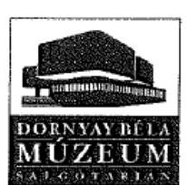

DORNYAY BÉLA MÚZEUM
3100 Salgótarján Pf: 3 Múzeum tér 2. 32/520-700
Titkárság: 32/520-705
Igazgató: 32/520-707
Fax: 32/314-169

Állami Számvevőszék
1052 Budapest,
Apáczai Csere János utca 10.
Domokos László elnök

## 1633

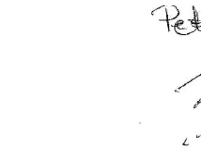

Salgótarján, 2016.11.22.
Ügyintéző: Peczéné
Iktatószám: 3-25/2016
Melléklet: -

TÁRGY: észrevétel tétel
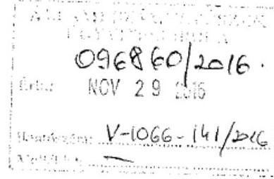

Tisztelt Elnök Úr!
A 2016. november 7 -én érkezett, V-1066-120/2016 iktatószámú számvevőszéki jelentéstervezetükre az alábbi észrevételeket kívánja tenni a Múzeum:

# 4.3 sz. megállapítás 4. bekezdésének 1. francia bekezdéséhez: 

A Salgótarjáni Költségvetési Intézmények Gazdasági Szolgálatával (továbbiakban KIGSZ) történt együttműködési megállapodás alapján:
A költségvetés kiadási előirányzatait terhelő fizetési kötelezettség vállalására vagy követelés előírására a Múzeum vezetője, ill. az általa írásban megbízott a Múzeum állományába tartozó személy írásban jogosult. Kötelezettséget vállalni csak pénzügyi ellenjegyzés után, a pénzügyi teljesítés esedékességét megelőzően, írásban lehet. A Múzeum kötelezettségvállalásának feladatait 2013 óta a KIGSZ látja el, a szakmai megfeleltetés is a KIGSZ vezetőjének feladata. Kiadások teljesítésénél vagy a Múzeum kifizetési kérelmén vagy a KIGSZ saját könyvelő programja által kinyomtatott utalványon történt meg a pénzügyi ellenjegyzés.

## 4.3 sz. megállapítás 4. bekezdésének 3. francia bekezdéséhez

A Múzeumigazgató külön feladatot a dolgozó munkaidején túl adhat és adott. Abban az esetben, ha a Múzeum megbízási szerződést köt az állományába tartozó személlyel, akkor minden esetben a munkaidején kívül végzi el a plusz feladatot. Az érintett kolléga munkakörébe tartozó, a munkaköri leírásában lefektetett feladatait munkaidejében maradéktalanul elvégezte.

## 4.3 sz. megállapítás 4. bekezdésének 4. francia bekezdése

Az ellenőrzés során nem került bemutatásra az állománybavételi bizonylat (B.11-46/V/Új), amely egyértelműen választ adott volna az üzembe helyezés kérdésére. Minden vásárolt eszköznek az állománybavételi bizonylatán az üzembe helyezés dátuma is kiállításra került. A Múzeum kialakított gyakorlata, hogy a beszerzésével egy időben üzembe is helyezi azt az eszközt.

---

# 5.1 sz. megállapítás 6. bekezdése 

Az Intézményen belüli mütárgyak mozgatásakor a mozgatási naplót a kollégák folyamatosan vezették. A restaurálásra átvett anyagok naplóját a restaurátor vezette, azon tárgyakról, amelyeket restaurálásra vett át és adott vissza a szakmai kollégáknak, ennek feltöltése megtörtént az adatszolgáltatás utolsó alkalmával. A külső mozgatásokat az átvételi elismervényekkel valósította meg a Múzeum.
A bírálati napló egy esetben került kiállításra, - ugyanesak feltöltésre került az adatszolgáltatások alkalmával - amikor 2014-ben behoztak hozzánk kulturális javakat.

Tisztelettel:
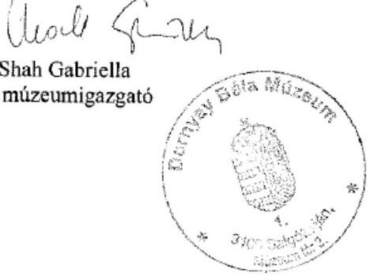

---

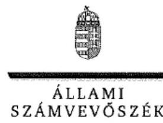

ELNÖK

# Shah Gabriella úrhölgy 

igazgató
Dornysy Béla Múzeum

## Salgótarján

## Tisztelt Igazgató Úrhölgy!

A , Megyei hatókörü városi múzeumok ellenörzése - Dornyay Béla Múzeum, Salgótarján" cimmel készített számvevőszéki jelentéstervezetre tett észrevételét köszönettel megkaptam.
Az Állami Számvevőszék észrevételre vonatkozó álláspontjáról a felügyeleti vezető által készített részletes tájékoztatást csatoltan megküldöm.
Tájékoztatom Igazgató úrhölgyet, hogy a számvevőszéki jelentésben - az Állami Számvevőszékről szóló 2011. évi LXVI. törvény 29. § (3) bekezdése alapján - a figyelembe nem vett észrevételeket szerepeltetjük az elutasítás indokának feltüntetésével.

Budapest, 2016.
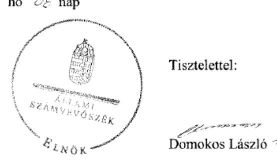

Melléklet: Tájékoztatás az elfogadott és az el nem fogadott észrevételekről

---

# Tájékoztatás az elfogadott és az el nem fogadott észrevételekröl 

A , Megyei hatókörü városi múzeumok ellenörzése - Dornyay Béla Múzeum, Salgótarján" címủ jelentéstervezetre az 9-26/2016. iktatószámủ levelében tett észrevételeit áttekintettük, annak kezeléséről az alábbi tájékoztatást adom.

## 1. A jelentéstervezet 25 . oldal 4.3 . számú megállapítás 4 . bekezdés 1 . francia bekezdésének megállapítására tett észrevétele kapcsán

Észrevételében arról tájékoztat, hogy a kiadások teljesítésénél vagy a Dornyay Béla Múzeum (továbbiakban: Múzeum) kifizetési kérelmén vagy a Salgótarjáni Költségvetési Intézmények Gazdasági Szolgálat (továbbiakban KIGSZ) saját könyvelő programja által kinyomtatott utalványon történt meg a pénzügyi ellenjegyzés.

Észrevételében bemutatott pénzügyi ellenjegyzés gyakorlata a 2013-2014. években nem felelt meg az államháztartásról szóló 2011 . évi CXCV. törvény 37. § (1) bekezdésében foglaltaknak. Észrevétele megerősíti a jelentéstervezet 25 . oldal 4.3 . számú megállapítás 4 . bekezdés 1 . francia bekezdésének - „a 2013-2014. években a múzeumigazgató által kötelezettségvállalásra az Aht.: 37. § (1) bekezdésében foglaltak ellenére pénzügyi ellenjegyzés nélkül került sor, illetve az Avr. 55. § (2) bekezdés e) pontjában foglaltak ellenére a pénzügyi ellenjegyzést nem az arra jogosult személy végezte" - megállapítását, ezért az a megállapítást nem módosítja.

## 2. A jelentéstervezet 25. oldal 4.3. számú megállapítás 4. bekezdés 3. francia bekezdésének megállapítására tett észrevétele kapcsán

Köszönettel vettem tájékoztatását, hogy amennyiben a Múzeum megbizási szerződést köt az állományába tartozó személlyel, akkor az, minden esetben a munkaidején kívül végzi el a plusz feladatot, továbbá az érintett kolléga munkakörébe tartozó, a munkaköri leírásában lefektetett feladatait munkaidejében maradéktalanul elvégezte.

Észrevétele nem cáfolja a jelentéstervezet 25 . oldal 4.3 . számú megállapítás 4 . bekezdés 3 . francia bekezdésének - „a 2014. évben a múzeumigazgató a Múzeum állományába tartozó személy részére megbizási szerzödés alapján fizetett megbizási dij esetében a megbizási szerzödésben az Avr. 51. § (2) bekezdésben foglaltak ellenére nem rögzitette, hogy a dij kizárólag abban az esetben illeti meg a költségvetési szerv állományába tartozó személyt, ha a szerzödésben rögzitett feladat mellett a munkakörébe tartozó feladatainak is maradéktalanul eleget tett" - megállapítását, ezért az a megállapítást nem módosítja.

---

# 3. A jelentéstervezet 25. oldal 4.3. számú megállapítás 4. bekezdés 4. francia bekezdésének megállapítására tett észrevétele kapcsán 

Észrevételét, amelyben jelzi, hogy nem került bemutatásra a számvevőszéki ellenőrzés részére az állományba vételi bizonylatot (B.1 1-46/V/Új), amely egyértelmúen választ adott volna az üzembe helyezés kérdésére, nem fogadtuk el. A megállapítást az Állami Számvevőszék (továbbiakban: ÁSZ) részére rendelkezésre bocsátott dokumentumok - ezen belül az állományba vételi bizonylatok - alapján ellenőriztük és ezen dokumentumokra alapozva állapítottuk meg, hogy „a 2014. évben a Számv. tv. 52. § (2) bekezdése ellenére a tárgyi eszközök üzembe helyezését a Múzeum nem dokumentálta hitelt érdemlő módon". Észrevétele a megállapítást nem módosítja.

## 4. A jelentéstervezet 27. oldal 5.1. számú megállapítás 6. bekezdésének megállapításaira tett észrevétele kapcsán

Észrevételében arról tájékoztatott, hogy a Múzeumon belüli mútárgyak mozgatásakor a mozgatási naplót folyamatosan vezették, a restaurálásra átvett anyagok naplóját a restaurátor vezette, amelynek feltöltése megtörtént az adatszolgáltatás utolsó alkalmával. A külső mozgatásokat az átvételi elismervényekkel valósította meg a Múzeum. A bírálati napló egy esetben került kiállításra, amely ugyancsak feltöltésre került az adatszolgáltatások alkalmával. Észrevételét a bírálati napló alkalmazásával összefüggésben nem fogadtuk el, mert a 2016. augusztus 11 -én aláirt 9-21/2016. iktatószámú „Teljességi és hitelességi nyilatkozat" nem tartalmazza a bírálati napló számvevőszéki ellenőrzés részére történő átadását. Észrevételét a dokumentumok ismételt felülvizsgálatát követően a mozgatási napló vezetésével kapcsolatban elfogadtuk és azt a számvevőszéki jelentés összeállításánál figyelembe vesszük.

Budapest, 2016.
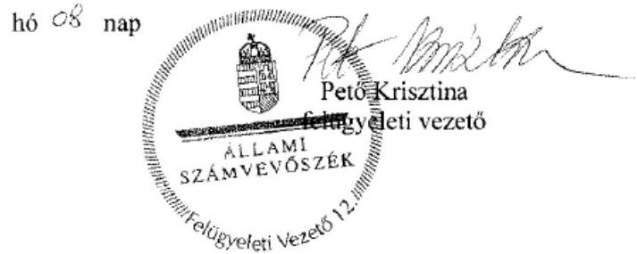

---

# 1611 

## Salgótarjáni Költségvetési Intézmények Gazdasági Szolgálata

KIGSZ

Állami Számvevőszék
1052 Budapest
Apáczai Csere János utca 10.

Domokos László

Tárgy: V-1066-124/2016. iktatószámmal megküldött jelentéstervezetük

Tisztelt Uram!
A 2016. november 7 -én érkeztetett jelentéstervezetükre a következô észrevételt teszem:

- 4.1. sz. megállapítás 4. bekezdésének 3. mondata, 4.2. sz. megállapítás 2. bekezdése

A KIGSZ a beszámolási kötelezettségét mind a 2013. évi, mind pedig a 2014. évi beszámolási időszakra vonatkozóan a jogszabályban rögzített határidőre elkészítette és az a Magyar Államkincstár elektronikus rendszerébe rögzítésre került. A késedelmes adatszolgáltatást a Magyar Államkincstár pénzbüntetéssel szankcionálja és erre a KIGSZ esetében eddig még nem került sor.
Kinyomtatásra és a fenntartó számára aláírásra megküldésre csak a véglegesített változat kerül, melynek dátuma eltérhet az eredeti adatszolgáltatás időpontjától, ugyanis a Magyar Államkincstár a KGR-K11 program verzióváltásai esetén újra megnyitja elektronikus adatszolgáltatási rendszerét és kisebb korrekciók után fogadja azt el.

- 4.3. sz. megállapítás 4. bekezdésének 1. francia bekezdése, 4.3. sz. megállapítás 5 . bekezdésének 2 . mondata

A pénzügyi ellenjegyzést a 2013-2014-es időszakra vonatkozóan minden esetben a gazdasági vezető (Budainé Földi Mária, Máténé Galovics Katalin) vagy a KIGSZ vezetője (Maruzs Viktória Martina) végezte el.
Megállapításuk szerint nem az arra jogosult személy látta el a pénzügyi ellenjegyzői jogkört. Mindhárom személy rendelkezik a 368/2011. (XII.31.) Korm. rendelet 55. § (3) bekezdésében foglalt képzettségi előírásokkal.
Hiányosság abból adódhat, hogy jogszabály értelmezési problémát vetett fel a gazdasági szervezet vezetője személyének megállapítása, miszerint maga a KIGSZ a gazdasági szervezet vagy a KIGSZ-en belül létezik gazdasági szervezet. Így a pénzügyi ellenjegyzésre

---

# Salgótarjáni Költségvetési Intézmények Gazdasági Szolgálata 

KIGSz
Salgótarján, Kussai sor 2.
Telefon: 32/423-228 Fax: 32/423-239
E-mail: kigse@kigsz-st.hu
való jogosultságra történő kijelölés fordítva történt. Ezt az anomáliát 2015-ben egy új együttmüködési megállapodás megkötésével rendeztük.

- 5.1. sz. megállapítás 4. bekezdésének 2. mondata, 5.2. sz. megállapítás 3. bekezdése

A 2013. január 1-jétől érvényes vagyonkezelési szerződés nem került megküldésre az MNV Zrt. Észak Magyarországi Regionális Területi Iroda Salgótarjáni Irodája által, így a szerződés meglétéről sem volt tudomásunk. Információ hiányában a mérlegben adatot szerepeltetni ennek megfelelően nem tudtunk.

Kérem észrevételeim alapján a jelentéstervezet megállapításainak korrekcióját!

Salgótarján, 2016. november 18.

Tisztelettel:
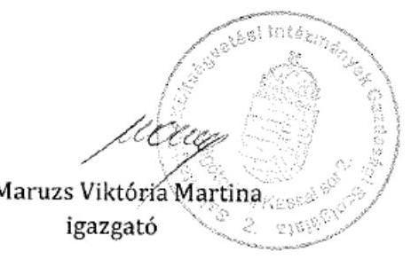

---

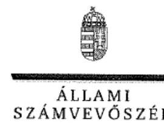

ELNÖK

# Maruzs Viktória Martina úrhölgy 

igazgató
Salgótarjáni Költségvetési Intézmények Gazdasági Szolgálata

## Salgótarján

## Tisztelt Igazgató Úrhölgy!

A , Megyei hatókörü városi múzeumok ellenörzése - Dornyay Béla Múzeum, Salgótarján" címmel készített számvevőszéki jelentéstervezetre tett észrevételét köszönettel megkaptam.
Az Állami Számvevőszék észrevételre vonatkozó álláspontjáról a felügyeleti vezető által készített részletes tájékoztatást csatoltan megküldöm.
Tájékoztatom Igazgató úrhölgyet, hogy a számvevőszéki jelentésben - az Állami Számvevőszékről szóló 2011. évi LXVI. törvény 29. § (3) bekezdése alapján - a figyelembe nem vett észrevételeket szerepeltetjük az elutasítás indokának feltüntetésével.

Budapest, 2016.
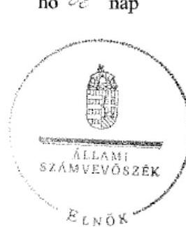

Tisztelettel:

## Domokos László

Melléklet: Tájékoztatás az el nem fogadott észrevételekról

---

# Tájékoztatás az el nem fogadott észrevételekröl 

A „Megyei hatókörü városi múzeumok ellenörzése - Dornyay Béla Múzeum, Salgótarján" címủ jelentéstervezetre a 2016. november 18-án kelt levelében tett észrevételeit áttekintettük, annak kezeléséről az alábbi tájékoztatást adom.

1. A jelentéstervezet 23. oldal 4.1. számú megállapítás 4. bekezdésének 3. megállapítására és a jelentéstervezet 24. oldal 4.2. számú megállapítás 2. bekezdésének megállapításaira tett észrevétele kapcsán

Észrevételében arról tájékoztat, hogy a Salgótarjáni Költségvetési Intézmények Gazdasági Szolgálata (továbbiakban: KIGSZ) a beszámolót mind a 2013. évi, mind pedig a 2014. évi beszámolási időszakra vonatkozóan a jogszabályban rögzített határidőre elkészítette, és azt a Magyar Államkincstár (továbbiakban: Kincstár) elektronikus rendszerébe rögzítette, továbbá a fenntartó számára aláírásra megküldött beszámoló dátuma eltérhet az eredeti adatszolgáltatás időpontjától, ugyanis a Kincstár a KGR-K11 program verzióváltásai esetén újra megnyitja elektronikus adatszolgáltatási rendszerét és kisebb korrekciók után fogadja azt el.

Észrevételét nem fogadtuk el, mert a beszámoló határidőre történő elkészítése és a Kincstár elektronikus rendszerébe történő feltöltése önmagában nem felel meg az államháztartás szervezetei beszámolási és könyvvezetési kötelezettségének sajátosságairól szóló 249/2000. (XII. 24.) Korm. rendelet 10. § (1) bekezdése, továbbá az államháztartás számviteléröl szóló 4/2013. (I. 11.) Korm. rendelet 32. § (1) bekezdése előírásának. Észrevétele a jelentéstervezet 23. oldal 4.1. számú megállapítás 4. bekezdésének 3. megállapítását és a jelentéstervezet 24. oldal 4.2. számú megállapítás 2 . bekezdésének megállapítását - „A Múzeum az elöirt adatszolgáltatási kötelezettségét a maradványáról az éves beszámoló megküldésével egyidejüleg, a 2011-2014. évben az Ahsz. 1 10. § (1) bekezdésben, illetve az Ahsz. 2 32. § (1) bekezdésben rögzitett határidőn túl teljesitette.", továbbá „A Múzeum 2011-2014. évi költségvetési beszámolóját az Ahsz. 1 10. § (1) bekezdésében, illetve az Ahsz. 2 32. § (1) bekezdésében foglalt határidőn túl készítette el és nyújtotta be az irányitó szerv1,1-nak. A 2011. évi beszámolót 2012. március 12-én, a 2012. évi beszámolót 2013. március 4-én, a 2013. évi beszámolót 2014. március 3-án, a 2014. évi beszámolót 2015. márciusban készítették el." - nem módosítja.
2. A jelentéstervezet 25. oldal 4.3. számú megállapítás 4. bekezdés 1. francia bekezdésének megállapítására és a jelentéstervezet 25 . oldal 4.3. számú megállapítás 5 . bekezdésének 2 . megállapításaira tett észrevétele kapcsán

Köszönettel vettem tájékoztatását, hogy a pénzügyi ellenjegyzésre történő kijelölés szabályozását a jogszabályi előírások betartása érdekében 2015-ben egy új együttmüködési megállapodás megkötésével rendezték. Észrevétele a hivatkozott megállapításokat - „a 2013-2014. években a múzeumigazgató által kötelezettségvállalásra az Aht. 2 37. § (1) bekezdésében foglaltak ellenére

---

pénzügyi ellenjegyzés nélkül került sor, illetve az Av̌r. 55. § (2) bekezdés c) pontjában foglaltak ellenére a pénzügyi ellenjegyzést nem az arra jogosult személy végezte;", továbbá „A 2013-2014. években a kötelezettségvállalás pénzügyi ellenjegyzését az Av̌r. 55. § (2) bekezdés c) pontjában foglaltak ellenére nem az arra jogosult - a gazdasági szervezets, vezetöje, vagy az általa írásban kijelölt személy - végezte." - nem cáfolja, azokat nem módosítja.
3. A jelentéstervezet 27. oldal 5.1. számú megállapítás 4. bekezdés 2. megállapítására és a jelentéstervezet 28. oldal 5.2. számú megállapítás 3. bekezdésének megállapításaira tett észrevétele kapcsán

Észrevételében arról tájékoztat, hogy érvényes vagyonkezelési szerződés nem került megküldésre a Magyar Nemzeti Vagyonkezelő Zrt. Észak Magyarországi Regionális Területi Iroda Salgótarjáni Irodája által, ezért információ hiányában a mérlegben adatot szerepeltetni ennek megfelelően nem tudtak.

Észrevétele a hivatkozott megállapításokat - „Kiegészitő mellékletben a Múzeum a Számv. tv 23. § (2) bekezdésében elöirtak ellenére nem mutatta be mérlegtételek szerinti megbontásban a kezelésbe vett állami eszközöket, és az Ahsz.; 29. § (2) bekezdés c) pontjában elöirtak ellenére nem jelezte a vagyonkezelési szerzödés hiányát, emiatt nem érvényesült a Számv. tv. 16. § (4) bekezdésében meghatározott ,,lényegesség elve" ", továbbá „A mérleget alátámasztó leltár a 2013-2014. években nem felelt meg az Ahsz.; 37. § (2) bekezdésében és a Számv. tv. 69. § (1) bekezdésében foglaltaknak, mert az Ahsz.; 29/A. § (1) bekezdésében foglaltak értelmében, a vagyonkezelésbe vett eszköz bekerülési értékének, a vagyonkezelési szerzödésben szereplő érték minősül, mely információ a szerzödés hiányában nem állt rendelkezésre, az Ahsz.; 15. § (2) bekezdésében foglaltak alapján a bekerülési érték az átadónál kimutatott bruttó érték, melyröl szintén nem volt információ. A hiányosság miatt a leltárak értékadatai dokumentummal nem voltak megfelelöen alátámasztva." - nem cáfolja, azokat nem módosítja.

Budapest, 2016.
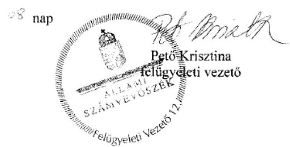

---

.

---

# RÖVIDÍTÉSEK JEGYZÉKE 

${ }^{1}$ Múzeum
${ }^{2}$ ÁSZ
${ }^{3}$ Mtv.
${ }^{4}$ Kötv.
${ }^{5}$ Kjt.
${ }^{6}$ múzeumigazgató
${ }^{7}$ Möktv.
${ }^{8}$ 258/2011. (XII. 7.) Korm. rendelet
${ }^{9}$ 2012. évi CLII. tv.
${ }^{10}$ 1311/2012. (VIII.23.) Korm. határozat
${ }^{11}$ NMÖ
${ }^{12}$ MGYK
${ }^{13}$ NMÖKH
${ }^{14}$ NMIK
${ }^{15}$ KIM
${ }^{16}$ SMJVÖ
${ }^{17}$ KIGSZ
${ }^{18}$ SKIGSZ
${ }^{19}$ együttműködési megállapodás
${ }^{20}$ együttműködési megállapodás
${ }^{21}$ együttműködési megállapodás
${ }^{22}$ együttműködési megállapodás
${ }^{23}$ 2015. évi LXXV. tv.

Nógrád Megyei Múzeumi Szervezet 2012. december 31-ig
Dornyay Béla Múzeum 2013. január 1-jétől
Állami Számvevőszék
1997. évi CXL. törvény a muzeális intézményekről, a nyilvános könyvtári ellátásról és a közművelődésről (hatályos: 1998. január 1-jétől)
2001. évi LXIV. törvény a kulturális örökség védelméről (hatályos: 2001. július 1től)
1992. évi XXXIII. törvény a közalkalmazottak jogállásáról (hatályos: 1992. július 1jétől)
Dornyay Béla Múzeum (valamint a jogelőd Nógrád Megyei Múzeumi Szervezet) igazgatója
2011. évi CLIV. törvény a megyei önkormányzatok konszolidációjáról, a megyei önkormányzati intézmények és a Fővárosi Önkormányzat egyes egészségügyi intézményeinek átvételéről (hatályos: 2012. január 1-jétől)
258/2011. (XII. 7.) Korm. rendelet a megyei intézményfenntartó központokról, valamint a megyei önkormányzatok konszolidációjával, a megyei önkormányzati intézmények és a Fővárosi Önkormányzat egészségügyi intézményeinek átvételével összefüggő egyes kormányrendeletek módosításáról (hatályos: 2011. december 8-tól)
2012. évi CLII. törvény a muzeális intézményekről, a nyilvános könyvtári ellátásról és a közművelődésről szóló 1997. évi CXL. törvény módosításáról (hatályos: 2012. november 3-tól)

1311/2012. (VIII. 23.) Korm. határozat a megyei múzeumok, könyvtárak és közművelődési intézmények fenntartásáról
Nógrád Megye Önkormányzata
Megyei Gyermekvédelmi Központ
Nógrád Megyei Önkormányzat Közgyűlésének Hivatala
Nógrád Megyei Intézményfenntartó Központ
Közigazgatási és Igazságügyi Minisztérium
Salgótarján Megyei Jogú Város Önkormányzata
Közoktatási Intézmények Gazdasági Szolgálata
Salgótarjáni Költségvetési Intézmények Gazdasági Szolgálata
A Nógrád Megyei Múzeumi Szervezet és a Megyei Gyermekvédelmi Központ által 2010. szeptember 6-án megkötött együttműködési megállapodás.

A Nógrád Megyei Múzeumi Szervezet és a Nógrád Megyei Önkormányzat Közgyűlésének Hivatala által 2011. május 30-án megkötött együttműködési megállapodás.
A Nógrád Megyei Múzeumi Szervezet és a Nógrád Megyei Intézményfenntartó Központ által 2012. március 29-én megkötött együttműködési megállapodás.
A Dornyay Béla Múzeum és a Közoktatási Intézmények Gazdálkodási Szolgálata (névváltozást követően 2013. június 1-jétől Költségvetési Intézmények Gazdálkodási Szolgálata) közötti munkamegosztási megállapodás
a megyei könyvtárak és a megyei hatókörű városi múzeumok feladatának ellátását szolgáló egyes állami tulajdonú vagyontárgyak ingyenes önkormányzati tulajdonba adásáról szóló 2015. évi LXXV. törvény (hatályos 2015. július 18-tól)

---

${ }^{24}$ Nvtv.
${ }^{25}$ Alaptörvény
${ }^{26}$ Áht. 2
${ }^{27}$ Ávr.
${ }^{28}$ ÁSZ tv.
${ }^{29}$ irányító szerv ${ }_{1}$
irányító szerv ${ }_{2}$
irányító szerv ${ }_{3}$
${ }^{30}$ Áht. $1_{1}$
${ }^{31}$ Ámr.
${ }^{32}$ Kincstár
${ }^{33}$ gazdasági vezető
${ }^{34}$ miniszter
${ }^{35}$ SZMSZ $_{1}$

SZMSZ $_{2}$
SZMSZ $_{3}$
${ }^{36}$ középirányító szerv
${ }^{37}$ átadás-átvételi megállapodás ${ }_{1}$
${ }^{38}$ MNV Zrt.
${ }^{39}$ átadás-átvételi megállapodás ${ }_{2}$
${ }^{40}$ fenntartó ${ }_{1}$
fenntartó $_{2}$
fenntartó $_{3}$
${ }^{41}$ kormánymegbízott
${ }^{42}$ EMMI
${ }^{43}$ Áhsz. 1
2011. évi CXCVI. törvény a nemzeti vagyonról (hatályos 2011. december 31-étől) Magyarország Alaptörvénye
2011. évi CXCV. törvény az államháztartásról (hatályos: 2012. január 1-jétől)
368/2011. (XII. 31.) Korm. rendelet az államháztartásról szóló törvény végrehajtásáról (hatályos: 2012. január 1-jétől)
2011. évi LXVI. törvény az Állami Számvevőszékről (hatályos: 2011. július 1-jétől) Nógrád Megyei Önkormányzat Közgyűlése (2011. január 1-jétől 2011. december 31-ig)
Közigazgatási és Igazságügyi Minisztérium (2012. január 1-jétől 2012. december 31-ig)
Salgótarján Megyei Jogú Város Önkormányzatának Közgyűlése (2013. január 1jétől 2014. december 31-ig)
1992. évi XXXVIII. törvény az államháztartásról (hatályos: 2011. december 31-ig) 292/2009. (XII. 19.) Korm. rendelet az államháztartás működési rendjéről (hatályos: 2011. december 31-ig)
Magyar Államkincstár
Megyei Gyermekvédelmi Központ gazdasági vezetője 2011. június 30-ig
Nógrád Megyei Önkormányzat Közgyűlésének Hivatala gazdasági vezetője 2011. július 1-jétől 2011. december 31-ig
Nógrád Megyei Intézményfenntartó Központ gazdasági vezetője 2012. január 1-jétől 2012. december 31-ig
Közoktatási Intézmények Gazdasági Szolgálata gazdasági vezetője 2013. január 1-jétől 2013. május 31-ig, majd névváltozást követően a Költségvetési Intézmények Gazdasági Szolgálata gazdasági vezetője 2013. június 1-jétől
Emberi Erőforrások Minisztere
Nógrád Megyei Múzeumi Szervezet Szervezeti és Működési Szabályzata (hatályos: 2013. június 21-ig)
Dornyay Béla Múzeum Szervezeti és Működési Szabályzata (hatályos: 2013. június 22-től)
Dornyay Béla Múzeum Szervezeti és Működési Szabályzata (hatályos: 2014. április 23-tól)
Nógrád Megyei Intézményfenntartó Központ 2012. január 1-jétől 2012. december 31-ig
Nógrád Megyei Önkormányzat képviselője, a Nógrád Megyei Kormányhivatal Kormánymegbízottja, az MNV Zrt., valamint a Nemzeti Földalapkezelő Szervezet képviselője által 2011. decemberében aláírt átadás-átvételi megállapodás
Magyar Nemzeti Vagyonkezelő Zártkörűen Müködő Részvénytársaság
Nógrád Megyei Intézményfenntartó Központ és Salgótarján Megyei Jogú Város Önkormányzata által 2013. február 5-én aláírt megállapodás
Nógrád Megyei Önkormányzat (2011. január 1-jétől 2011. december 31-ig)
Nógrád Megyei Intézményfenntartó Központ (2012. január 1-jétől 2012. december 31-ig)
Salgótarján Megyei Jogú Város Önkormányzata (2013. január 1-jétől 2014. december 31-ig)

Nógrád Megyei kormánymegbízott
Emberi Erőforrások Minisztériuma
249/2000. (XII.24.) Korm. rendelet az államháztartás szervezetei beszámolási és könyvvezetési kötelezettségének sajátosságairól (hatályos: 2013. december 31-ig)

---

${ }^{44}$ vagyonátadási jelentés
${ }^{45}$ számviteli politika $_{1}$
számviteli politika $_{2}$
számviteli politika $_{3}$
számvitel politika $_{4}$
${ }^{46}$ Számv. tv.
${ }^{47}$ gazdasági szervezet ${ }_{1}$
gazdasági szervezet ${ }_{2}$
gazdasági szervezet ${ }_{3}$
gazdasági szervezet ${ }_{4}$
gazdasági szervezet ${ }_{5}$
${ }^{48}$ számlarend $_{1}$
számlarend $_{2}$
számlarend $_{3}$
számlarend $_{4}$
${ }^{49}$ Áhsz. 2
${ }^{50}$ leltározási szabályzat ${ }_{1}$
leltározási szabályzat ${ }_{2}$
leltározási szabályzat ${ }_{3}$
leltározási szabályzat ${ }_{4}$
${ }^{51}$ eszközök és források értékelési szabályzat ${ }_{1}$
eszközök és források értékelési szabályzat ${ }_{2}$
eszközök és források értékelési szabályzat ${ }_{3}$
eszközök és források értékelési szabályzat ${ }_{3}$

Az átszervezéssel, illetve jogutód nélkül véglegesen megszűnő államháztartási szervezet által - a megszüntető szervezet által meghatározott fordulónapra vonatkozóan - elkészített az éves elemi költségvetési beszámolónak megfelelő adattartalmú - leltárral és záró főkönyvi kivonattal alátámasztott - beszámoló (Áhsz. 1 13/A. § (1). bekezdés), a 2013. január 1-jétől hatályos átszervezéshez készített
Megyei Gyermekvédelmi Központ és Nógrád Megyei Múzeumi Szervezet közös belső Számviteli Politikája (hatályos: 2011. június 30-ig)
Nógrád Megyei Önkormányzat Közgyűlésének Hivatala Számviteli
Politikája(hatályos: 2011. július 1-jétől 2011. december 31-ig)
Nógrád Megyei Intézményfenntartó Központ Számviteli Politika Szabályzata (hatályos: 2012. január 1-jétől 2012. december 31-ig)
Költségvetési Intézmények Gazdasági Szolgálata Számviteli Politika Szabályzat (hatályos: 2014. április 1-jétől)
2000. évi C. törvény a számvitelről (hatályos: 2001. január 1-jétől)

Megyei Gyermekvédelmi Központ 2011. június 30-ig
Nógrád Megyei Önkormányzat Közgyűlésének Hivatala 2011. július 1-jétől 2011. december 31-ig
Nógrád Megyei Intézményfenntartó Központ 2012. január 1-jétől 2012. december 31-ig
Közoktatási Intézmények Gazdasági Szolgálata 2013. január 1-jétől 2013. május 31-ig
Költségvetési Intézmények Gazdasági Szolgálata 2013. június 1-jétől
Megyei Gyermekvédelmi Központ és Nógrád Megyei Múzeumi Szervezet közös belső Számlarendje (hatályos: 2011. június 30-ig)
Nógrád Megyei Önkormányzat Közgyűlésének Hivatala Számlarendje (hatályos: 2011. július 1-jétől 2011. december 31-ig)
Nógrád Megyei Intézményfenntartó Központ Számlarendje (hatályos: 2012. január 1-jétől 2012. december 31-ig)
Költségvetési Intézmények Gazdasági Szolgálata Számlarendje (hatályos: 2014. április 1-jétől)
4/2013. (I.11.) Korm. rendelet az államháztartás számviteléről (hatályos: 2014. január 1-jétől)
Megyei Gyermekvédelmi Központ Leltárkészítési és Leltározási Szabályzata (hatályos: 2011. június 30-ig)
Nógrád Megyei Önkormányzat Közgyűlésének Hivatala Leltározási Szabályzat (hatályos: 2011. július 1-jétől 2011. december 31-ig)
Nógrád Megyei Intézményfenntartó Központ Leltározási Szabályzat (hatályos: 2012. január 1-jétől 2012. december 31-ig)
Közoktatási Intézmények Gazdasági Szolgálata Leltárkészítési és Leltározási Szabályzata (hatályos: 2013. március 1-jétől)
Nógrád Megyei Önkormányzat Közgyűlésének Hivatala Eszközök és Források Értékelési Szabályzat (hatályos: 2011. július 1-jétől 2011. december 31-ig)
Nógrád Megyei Intézményfenntartó Központ Eszközök és Források Értékelési Szabályzat (hatályos: 2012. január 1-jétől 2012. december 31-ig)
Közoktatási Intézmények Gazdasági Szolgálata Eszközök és Források Értékelési Szabályzata (hatályos: 2013. március 1-jétől)
Megyei Gyermekvédelmi Központ Pénzkezelési Szabályzata (hatályos: 2011. június 30-ig)

---

pénzkelési szabályzat ${ }_{2}$
pénzkelési szabályzat ${ }_{3}$
pénzkezelési szabályzat ${ }_{4}$
${ }^{53}$ önköltségszámítási szabályzat ${ }_{1}$
önköltségszámítási szabályzat ${ }_{2}$
önköltségszámítási szabályzat ${ }_{3}$
${ }^{54}$ Bkr.
${ }^{55}$ közbeszerzési szabályzat ${ }_{1}$
közbeszerzési szabályzat ${ }_{2}$
${ }^{56} \mathrm{Kbt} .1$
${ }^{57} \mathrm{Kbt} .2$
${ }^{58}$ beszerzési szabályzat
${ }^{59}$ Vnytv.
${ }^{60}$ lkr.
${ }^{61}$ Info tv.
${ }^{62}$ Avtv.
${ }^{63}$ Ltv.
${ }^{64}$ Vtv.
${ }^{65}$ Áfa tv.
${ }^{66}$ 393/2012. (XII. 20.) Korm. rendelet
${ }^{67}$ 5/2010. (VIII. 18.) NEFMI rendelet
${ }^{68}$ Vtvr.
${ }^{69}$ 36/2013. (IX. 13.) NGM rendelet
${ }^{70}$ 2/2010. (I.14.) OKM rendelet

Nógrád Megyei Önkormányzat Közgyűlésének Hivatala Pénzkezelési Szabályzata (hatályos: 2011. július 1-jétől 2011. december 31-ig)
Nógrád Megyei Intézményfenntartó Központ Pénzkezelési Szabályzata (hatályos: 2012. január 1-jétől 2012. december 31-ig)
Közoktatási Intézmények Gazdasági Szolgálata Pénzkezelési Szabályzata (hatályos: 2013. március 1-jétől)
Nógrád Megyei Önkormányzat Közgyűlésének Hivatala Önköltségszámítási Szabályzata (hatályos: 2011. július 1-jétől 2011. december 31-ig)
Nógrád Megyei Intézményfenntartó Központ Önköltségszámítási Szabályzata (hatályos: 2012. január 1-jétől 2012. december 31-ig)
Közoktatási Intézmények Gazdasági Szolgálatának Önköltségszámítási Szabályzata (hatályos: 2013. március 1-jétől)
370/2011. (XII. 31.) Korm. rendelet a költségvetési szervek belső
kontrollrendszeréről és belső ellenőrzéséről (hatályos: 2012. január 1-jétől)
Nógrád Megyei Múzeumi Szervezet Közbeszerzési Szabályzata (hatályos: 2014. január 1-jéig)
Dornyay Béla Múzeum Közbeszerzési Szabályzata (hatályos: 2014. január 2-től) 2003. évi CXXIX. törvény a közbeszerzésekről (hatályos: 2011. december 31-ig) 2011. évi CVIII. törvény a közbeszerzésekről (hatályos: 2011. augusztus 21-től)

Dornyay Béla Múzeum Beszerzésre vonatkozó Szabályzata (hatályos: 2014. szeptember 1-jétől)
2007. évi CLII. törvény az egyes vagyonnyilatkozat-tételi kötelezettségekről (hatályos: 2007. december 7-től)
335/2005. (XII. 29.) Korm. rendelet a közfeladatot ellátó szervek iratkezelésének általános követelményeiről (hatályos: 2006. január 1-jétől)
2011. évi CXII. törvény az információs önrendelkezési jogról és az információszabadságról (hatályos: 2012. január 1-jétől)
1992. évi LXIII. törvény a személyes adatok védelméről és a közérdekú adatok nyilvánosságáról (hatályos: 2011. december 31-ig)
1995. évi LXVI. törvény a köziratokról, a közlevéltárakról és a magánlevéltári anyag védelméről
2007. évi CVI. törvény az állami vagyonról (hatályos: 2007. szeptember 25-től) 2007. évi CXXVII. törvény az általános forgalmi adóról (hatályos: 2008. január 1jétől)
393/2012. (XII. 20.) Korm. rendelet a régészeti örökség és a múemléki érték védelmével kapcsolatos szabályokról (hatályos: 2013. január 1-jétől)
5/2010. (VIII. 18.) NEFMI rendelet a régészeti lelőhelyek feltárásának, illetve a régészeti lelőhely, lelet megtalálója anyagi elismerésének részletes szabályairól (hatályos: 2012. december 31-ig)
254/2007. (X. 4.) Korm. rendelet az állami vagyonnal való gazdálkodásról (hatályos: 2007. október 4-től)
36/2013. (IX. 13.) NGM rendelet az államháztartás számvitelének 2014. évi megváltozásával kapcsolatos feladatokról (hatályos: 2013. szeptember 14-től)
2/2010. (I.14.) OKM rendelet a muzeális intézmények müködési engedélyéről

---

# ÁLLAMI SZÁMVEVŐSZÉK 

1052 Budapest, Apáczai Csere János utca 10.
Levélcím: 1364 Budapest 4. Pf. 54
Telefon: +36 14849100 Telefax: +36 14849200
www.asz.hu