# Jelentés 

## Megyei hatókörű városi múzeumok ellenőrzése

Munkácsy Mihály Múzeum, Békéscsaba 2016.

16243
www.asz.hu

---

# Jelentés 

## Megyei hatókörű városi múzeumok ellenőrzése

Munkácsy Mihály Múzeum, Békéscsaba 2016. december 21. nap
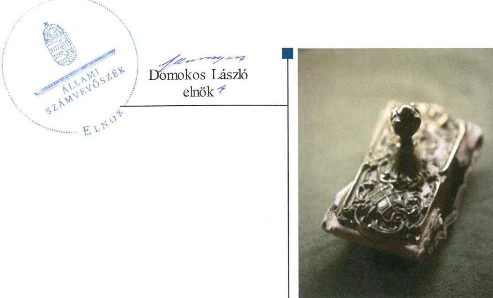

---

# AZ ELLENŐRZÉST FELÜGYELTE:

## PETŐ KRISZTINA felügyeleti vezető

## AZ ELLENŐRZÉST VEZETTE ÉS A VÉGREHAJTÁSÁÉRT FELELŐS:

### BREBÁN ANDREA ellenőrzésvezető

### KAKAS SÁNDOR ellenőrzésvezető

## A PROGRAM ÖSSZEÁLLÍTÁSÁÉRT FELELŐS:

### JANIK JÓZSEF LÁSZLÓ osztályvezető

---

**IKTATÓSZÁM:** V-0958-244/2016.

**TÉMASZÁM:** 1992

**ELLENŐRZÉS-AZONOSÍTÓ SZÁM:** V073713

---

Jelentéseink az Országgyűlés számítógépes hálózatán és az Interneten a www.asz.hu címen is olvashatóak.

---

# TARTALOMJEGYZÉK 

■ ÖSSZEGZÉS ..... 5
■ AZ ELLENŐRZÉS CÉLJA ..... 7
■ AZ ELLENŐRZÉS TERÜLETE ..... 8
■ AZ ELLENŐRZÉS HÁTTERE, INDOKOLTSÁGA ..... 10
■ A JELENTÉS LÉNYEGES KÉRDÉSKÖREI ..... 12
■ ELLENŐRZÉS HATÓKÖRE ÉS MÓDSZEREI ..... 13
■ MEGÁLLAPÍTÁSOK. ..... 16
■ JAVASLATOK ..... 31
■ MELLÉKLETEK ..... 37
I. sz. melléklet: Értelmező szótár ..... 37
II. sz. melléklet: Az integritás érvényesítése érdekében kialakított és működtetett kontrollrendszer ..... 40
■ FÜGGELÉK: ÉSZREVÉTELEK. ..... 41
■ RÖVIDÍTÉSEK JEGYZÉKE ..... 67

---

.

---

# ÖSSZEGZÉS 

A békéscsabai Munkácsy Mihály Múzeumra vonatkozó irányító szervi feladatellátás összességében szabályszerű volt. A Múzeumnál kialakított irányítási rendszer nem biztosította az átlátható, elszámoltatható és ellenőrizhető közpénzfelhasználást. A pénzügyi és vagyongazdálkodása nem volt szabályszerű. A Múzeum közfeladatát képező kulturális javak szabályszerű nyilvántartásáról nem gondoskodtak, a kulturális javak vagyonbiztonsága és állományvédelme a kölcsönzéseknél nem volt biztosított.

## Az ellenőrzés társadalmi indokoltsága

Az Állami Számvevőszék stratégiájának alapértéke, hogy ellenőrzései segítik az integritás alapú, átlátható és elszámoltatható közpénzfelhasználás megteremtését. Az ellenőrzés jogszabályban, vagy alapító okiratban meghatározott közfeladat ellátására létrejött, a megyei hatókörű városi muzeális intézmények gazdálkodási tevékenységére terjed ki. E szervezetek pénzügyi és vagyongazdálkodásának alapvető rendeltetése a közfeladatok (a kulturális örökséghez tartozó javak védelme, őrzése és a nyilvánosság számára történő hozzáférhetővé tétele) ellátásának biztosítása.

A megyei hatókörű városi múzeumként működő szervezetek 2011. évtől több alkalommal jelentős szervezeti és gazdálkodási átalakuláson mentek keresztül. A tulajdonosi, a vagyonkezelői és a fenntartói szerepekben, szerkezetben történt változások előkészítése, végrehajtása, illetve a múzeumi rendszer által kezelt közvagyonnal való gazdálkodás szabályszerűségének bemutatásával az ellenőrzés hozzájárul a múzeumok fenntartási és működtetési feladatainak ellátására vonatkozó megfelelő jogszabályi környezet kialakításához, a gazdálkodási gyakorlatuk javításához.

## Főbb megállapítások, következtetések

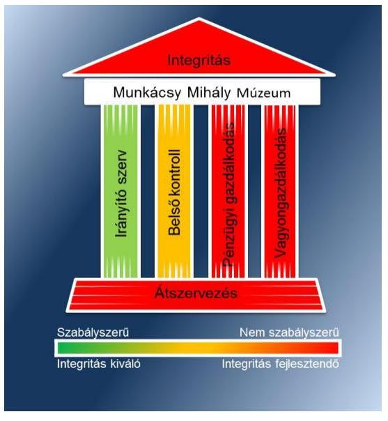

A Múzeumra vonatkozó irányító szervi feladatellátás összességében szabályszerű volt.

A Múzeum belső kontrollrendszerének kialakítása és működtetése részben felelt meg a jogszabályi előírásoknak. Az ellenőrzött időszakban a kontrollkörnyezet kialakítása részben szabályszerű, az információs és kommunikációs folyamatok kialakítása szabályszerű volt. A Múzeumnál a kockázatkezelési rendszert nem működtették a 2011-2014. években. A kontrolltevékenység kialakítása és működtetése részben volt szabályszerű. A Múzeum tevékenységének, a célok megvalósításának nyomon követését biztosító rendszert az ellenőrzött időszakban nem működtették.

A Múzeum pénzügyi és vagyongazdálkodása nem volt szabályszerű. A beszámolók irányító szerv részére történő elkészítése és megküldése a jogszabályban előírt határidőre nem történt meg. A bevételi előirányzatok teljesítése nem szabályszerűen történt, mert a 2012. évben a vagyontárgyak hasznosítására a vagyonhasznosításra feljogosító szerződés, a 2013-2014. években vagyonkezelési szerződés nélkül került sor. A kiadási előirányzatok felhasználása során a gazdálkodási jogkörök gyakorlása szabálytalan volt. A Múzeum 2012. évi beszámolójának mérlege a vagyon és annak összetétele kapcsán a megbízható és valós összképet nem mutatta be. A 2013-2014. évi beszámolókban sérült a lényegesség számviteli alapelv. A Múzeum a nemzeti vagyonba tartozó kulturális javakról nem a jogszabályi előírásoknak megfelelően vezette az előírt nyilvántartásokat, azok kölcsönzéséről szóló szerződései nem voltak szabályszerűek. A nem muzeális intézmény számára történő kölcsönadáshoz a Múzeum több esetben nem rendelkezett a miniszter hozzájárulásával.

---

A Múzeumot érintő önkormányzati alrendszerből a központi alrendszerbe történő 2012. január 1-jétől hatályos irányító szervi (fenntartói) váltás lebonyolítása nem volt szabályszerű. A 2013. január 1-jével végrehajtott, a központi alrendszerből önkormányzati alrendszerbe történő irányító szervi (fenntartói) váltás lebonyolítása és a szervezetrendszer átalakítása szabályszerű volt.

A Múzeum ugyan intézkedett az integritás szemlélet érvényesítése érdekében, azonban további intézkedések szükségesek az integritás kontrollrendszer fejlesztése érdekében.

---

# AZ ELLENŐRZÉS CÉLJA 

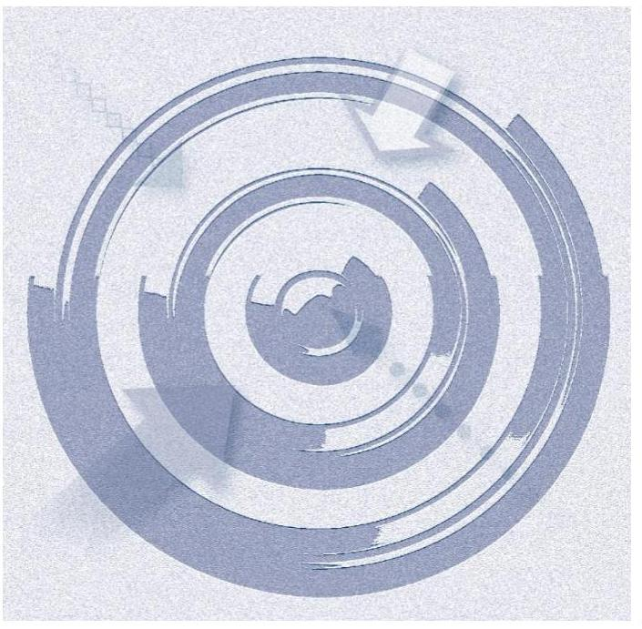
vényesülését a gazdálkodási folyamatokban.

Az ellenőrzés célja annak megállapítása volt, hogy a megyei múzeumi rendszer átalakítása, az intézményfenntartói rendszerben végbement változások előkészítése és végrehajtása megalapozottan, szabályszerűen történt-e; a megyei hatókörű városi múzeumok és jogelődjeik pénzügyi és vagyongazdálkodása, a belső kontrollrendszer kialakítása és működtetése, valamint az intézményfenntartói feladatok ellátása szabályszerűen történt-e.

A Múzeum ¹ korrupcióval szembeni veszélyeztetettségének csökkentése érdekében kért tanúsítványi adatszolgáltatás alapján az ÁSZ² értékelte az integritási szemlélet érvényesülését a gazdálkodási folyamatokban.

---

# **AZ ELLENŐRZÉS TERÜLETE**

### **Munkácsy Mihály Múzeum**

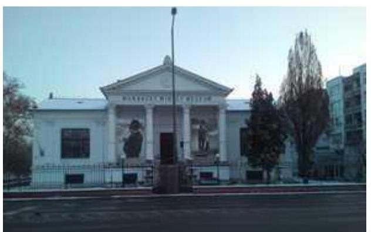

A Múzeum Békéscsabán található, feladatkörében az Mtv.³ alapján gondoskodik a kulturális javak meghatározott anyagának folyamatos gyűjtéséről, nyilvántartásáról, megőrzéséről és restaurálásáról; tudományos feldolgozásáról, publikálásáról; valamint kiállításokon és más módon történő bemutatásáról; a közművelődési és közgyűjteményi feladatok ellátásáról. A Kötv.⁴ 20. § (2) bekezdése alapján területileg illetékes múzeumként régészeti feltárást végzett az ellenőrzött időszakban.

A Múzeum csak a működési engedélyében meghatározott gyűjtőkörben és gyűjtőterületen folytathatja tevékenységét. A szakmai besorolást, a rendszert megalapozó szaktörvényi kereteket az Mtv. biztosítja. Az Mtv. hatálya kiterjed a Múzeum fenntartóira, a Múzeumban foglalkoztatottakra, a kulturális örökség Múzeumban őrzött elemeire, a szolgáltatások igénybevevőire és a kulturális örökséggel foglalkozó egyéb szervezetekre.

A Múzeum 2011. évi költségvetési engedélyezett létszáma 44 fő volt, ami 2012. évre 41 főre, 2013. évre 40 főre, 2014. évre 38 főre csökkent. A Múzeum alkalmazottainak foglalkoztatására a Kjt.⁵ alapján került sor. Az ellenőrzött időszakban a múzeumigazgató⁶ és a gazdasági vezető személye is változott.

A Möktv.⁷ és annak végrehajtásáról szóló 258/2011. (XII. 7.) Korm. rendelet⁸ alapján 2012. január 1-jétől a megyei múzeumok központi költségvetési szervekké váltak. 2013. január 1-jétől a 2012. évi CLII. törvény⁹, valamint az 1311/2012. (VIII. 23.) Korm. határozat¹⁰ alapján az állami tulajdonba és fenntartásba került megyei múzeumi szervezetek a megyeszékhely megyei jogú városok fenntartásában működnek tovább. A 2011–2014. évek között a fenntartói, irányítói, középirányítói jogkörgyakorlók változását, valamint a Múzeum gazdálkodási feladatát ellátó szervezetét az 1. táblázat mutatja be:

¹ táblázat

|  Időszak | Fenntartó | Irányító szerv | Közép-
irányító
szerv | Gazdasági
szervezet  |
| --- | --- | --- | --- | --- |
|  2011. | BMÖ¹¹ | BMÖ Közgyűlése | - | Múzeum (2011. I. félév)
BMTK¹² (2011. II. félév)  |
|  2012. | BMIK¹³ | KIM¹⁴ | BMIK | BMIK  |
|  2013–2014. | BMJVÖ¹⁵ | BMJVÖ Közgyűlése | - | BMJVÖ Polgármesteri Hivatala  |

*Forrás: A Múzeum alapító okiratai*

---

A Múzeum jogállása a 2011. év I. félévében önállóan működő és gazdálkodó költségvetési szerv, 2011. július 1-jétől 2012. december 31-ig önállóan működő költségvetési szerv volt, gazdálkodási feladatait a 2011. év II. félévében a Békés Megyei Tudásház és Könyvtár, a 2012. évben a Békés Megyei Intézményfenntartó Központ látta el. A Múzeum jogállása 2013. január 1-jétől önállóan működő és gazdálkodó költségvetési szerv volt, pénzügyi-gazdasági feladatait Békéscsaba Megyei Jogú Város Polgármesteri Hivatala látta el. A Múzeum jogállása 2014. január 1-jétől önálló jogi személyiséggel rendelkező költségvetési intézmény, pénzügyi-gazdasági feladatait Békéscsaba Megyei Jogú Város Polgármesteri Hivatala látja el. A Múzeum vállalkozási tevékenységet nem végzett.

A Múzeum teljesített költségvetési bevételeinek és kiadásainak alakulását az 1. ábra mutatja be. Az ábra a 2011-2012. években a Múzeum és tagintézményeinek együttes adatai, a 2013-2014. években a tagintézmények átadását követően a múzeumi adatok alapján készült.
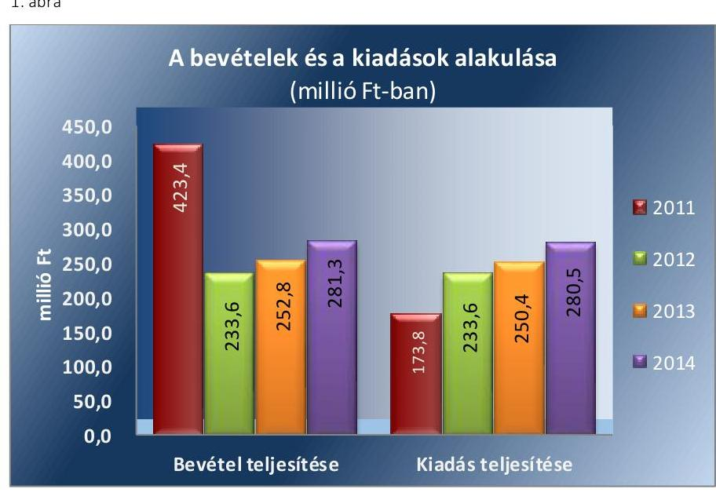

A 2015. évi LXXV. tv. ¹⁶ 1. § (1) bekezdése alapján az Nvtv. ¹⁷ 13. § (3) bekezdésében és 14. § (1) bekezdésében foglaltak alapján és az abban meghatározott feltételekkel a 2012. évi CLII. törvény 30. § (1) és (2) bekezdésében meghatározott, a megyei hatókörű városi múzeumok feladatának ellátását szolgáló egyes állami tulajdonban lévő ingatlanok a törvény hatálybalépésének napjával, a törvény erejénél fogva a kötelező közfeladatként a megyei hatókörű városi múzeumot fenntartó önkormányzatok tulajdonába kerültek. A 2015. évi LXXV. tv. 4. § (1) bekezdése alapján a kulturális örökség helyi védelme érdekében a megyei hatókörű városi múzeumok alapleltárában és jogszabály szerinti külön nyilvántartásában szereplő állami tulajdonú kulturális javak ingyenesen a megyei hatókörű városi múzeumok vagyonkezelésébe kerültek. A vagyonkezelők vagyonkezelői joga tekintetében vagyonkezelési szerződés megkötése nem szükséges. A 2015. évi LXXV. tv. 4. § (2) bekezdése szerint továbbá a kulturális örökség helyi védelme érdekében a megyei hatókörű városi múzeumok feladatának ellátását szolgáló állami tulajdonban álló ingatlanok - a törvény mellékletében meghatározott ingatlanok kivételével - ingyenesen a fenntartó önkormányzatok vagyonkezelésébe kerültek.

---

# AZ ELLENŐRZÉS HÁTTERE, INDOKOLTSÁGA

Az Alaptörvény¹⁸ rendelkezése szerint a nemzeti vagyon megőrzésének, védelmének és a nemzeti vagyonnal való felelős gazdálkodásnak a követelményeit sarkalatos törvény, az Nvtv. rögzíti. A tulajdonosi joggyakorlás és vagyonkezelés általános és speciális szabályait, az állami vagyon nyilvántartására és elszámolására vonatkozó eljárásokat, a vagyonkezelési szerződés feltételrendszerét, valamint az éves beszámoló készítési és könyvvezetési kötelezettségeket kormányrendelet írja elő.

A megyei hatókörű városi múzeumok közfeladat-ellátásának változásait, (beleértve az állami tulajdonosi joggyakorló, intézményi vagyonkezelő és önkormányzati fenntartó szervezeteket is) a közfeladatok átadásából és átvételéből adódó módosításait, előirányzat-gazdálkodására ható tényezőit az Áht.¹⁹, az Ávr.²⁰, a Möktv., valamint az Mtv. írja elő. A múzeumi intézményrendszer rendszerátalakulásából, megszűnéséből, intézményátszervezéséből, belső szerkezeti korszerűsítéséből, vagy más hasonló okból adódó módosításai miatt szerepeltetendő szerkezeti változásokat, valamint a szerkezeti változásként beépült közfeladatok szintre hozásként történő számításba vételét az Ávr. határozza meg.

A megyei hatókörű városi múzeumok kulturális szempontból meghatározó jelentőségűek mind földrajzi elhelyezkedésüket, mind az ellátott feladatokat, valamint a látogatottságukat tekintve. Tevékenységüket törvényi szinten (Mtv.) szabályozták a jogalkotók. A megyei hatókörű városi múzeumok jelenlegi körének kialakításában, tulajdonosi és fenntartói szerkezetében rövid idő alatt több jelentős változás történt, amelyeket jogszabályi változások indukáltak. Ezen intézmények szakmai besorolást tekintve a 2011. évben megyei múzeumként, a 2012. évben megyei múzeumi központi költségvetési szervezetként, a 2013. évtől kezdődően megyei hatókörű városi múzeumként működtek. A szakmai besorolások változásait párhuzamosan követték a tulajdonosi, vagyonkezelői, fenntartói szerepekben történt változások.

A 2011–2014. évek között bekövetkezett fenntartói változások a vagyontárgyak és a kulturális javak tulajdonosi, vagyonkezelői és használói körében is változást indukáltak, amelyet a 2. táblázat szemléltet.

1. táblázat

 | - | Múzeum | Állam | BMIK | Múzeum | Állam | Múzeum | Múzeum  |
|  Egyéb tárgyi eszközök | BMO | - | Múzeum | Állam | BMIK | Múzeum | Állam | Múzeum | Múzeum  |
|  Kulturális javak | BMO | - | Múzeum | Állam | BMIK | Múzeum | Állam | Múzeum | Múzeum  |

*Forrás: A Múzeum alapító okiratai, a 2012. évi CLII. tv, a 258/2011. (XII. 7) Korm. rendelet, az 1311/2012. (VIII. 23.) Korm. határozat*

---

Az ellenőrzés - tekintettel a megyei hatókörű városi múzeumokat (és jogelődjeit) rövid időn belül, gyors ütemben ért környezeti (tulajdonosi, fenntartói-szerkezetet érintő) változásokra - javaslatok megfogalmazásával hozzájárul a fenntartás és működtetés feladatainak ellátására vonatkozó megfelelő jogszabályi környezet kialakításához. Az ÁSZ ellenőrzés a gazdálkodási gyakorlat javítását eredményezheti, több intézmény bevonásával átfogó képet ad a megyei hatókörű városi múzeumokat (és jogelődjeiket) jellemző sajátosságokról, jó gyakorlatokról.

AZ ELLENŐRZÉS EREDMÉNYEKÉPPEN nemcsak az ellenőrzött intézmények gazdálkodása javul, hanem átfogó képet kapunk a múzeumok gazdálkodásának hiányosságairól, de a jó gyakorlatokról is. Ellenőrzéseivel, javaslataival és megállapításaival az ÁSZ elősegíti a költségvetési szervek pénzügyi és vagyongazdálkodása szabályozásának javítását és hozzájárulhat a jó kormányzáshoz.

---

# A JELENTÉS LÉNYEGES KÉRDÉSKÖREI 

1.- Az irányító szerv Múzeumra vonatkozó feladatellátása szabályszerű volt-e?
2.- Szabályszerűen hajtották-e végre a Múzeumot érintő szervezeti, szerkezeti átszervezéseket?
3.- A belső kontrollrendszer kialakítása és működtetése megfelelt-e a jogszabályi előírásoknak?
4.- A Múzeum pénzügyi gazdálkodása szabályszerű volt-e?
5.- A Múzeum vagyongazdálkodása szabályszerű volt-e?
6.- A Múzeum intézkedett-e az integritás szemlélet érvényesítése érdekében?

---

# ELLENŐRZÉS HATÓKÖRE ÉS MÓDSZEREI 

## Az ellenőrzés típusa

| Megfelelőségi ellenőrzés.

## Az ellenőrzött időszak

Az ellenőrzött időszak 2011. január 1-jétől 2014. december 31-ig tart.

## Az ellenőrzés tárgya

A megyei hatókörű városi múzeumok átszervezése, átalakítása előkészítése és lebonyolítása megalapozottsága, szabályszerűsége, a pénzügyi és vagyongazdálkodási tevékenység, a belső kontrollrendszer kialakítása, működtetése szabályszerűsége, valamint az irányító szervi feladatok ellátása szabályszerűsége. E tevékenységek és a kapcsolódó adatok és információk összessége, amelyeket a vonatkozó kritériumok alapján kell értékelni.

Az ellenőrzés kiterjed minden olyan körülményre és adatra, amely az ÁSZ jogszabályban meghatározott feladatainak teljesítéséhez, valamint a program végrehajtása folyamán felmerült újabb összefüggések feltárásához szükséges.

## Az ellenőrzött szervezet

A Munkácsy Mihály Múzeum (és jogelődje a Békés Megyei Múzeumok Igazgatósága), a gazdálkodási feladatok ellátásában érintett Békés Megyei Könyvtár (és jogelődje a Békés Megyei Tudásház és Könyvtár), Békéscsaba Megyei Jogú Város Polgármesteri Hivatala, a fenntartói feladatokban érintett Békés Megyei Önkormányzat, valamint Békéscsaba Megyei Jogú Város Önkormányzata, a Békés Megyei Intézményfenntartói Központ általános és egyetemleges jogutóda a Szociális és Gyermekvédelmi Főigazgatóság.

Az ellenőrzésre Múzeum és irányító/felügyeleti szervének, illetve középirányító szervének székhelyén került sor.

## Az ellenőrzés jogalapja

Az ellenőrzés jogszabályi alapját az ÁSZ tv. ${ }^{21}$ 1. § (3) bekezdés, 5. § (2)-(6) bekezdései, valamint az Áht. 2 61. § (2) bekezdésének előírásai képezik.

---

# Az ellenőrzés módszerei 

Az ellenőrzést az ellenőrzési program szempontjai, az ellenőrzött időszakban hatályos jogszabályok, az ellenőrzés szakmai szabályai, az egyes ellenőrzési típusokhoz kapcsolódó ÁSZ módszertanok és nemzetközi standardok figyelembe vételével végeztük. A gazdálkodás hibáinak kijavítására, a közpénzekkel való felelős gazdálkodás segítésére irányuló javaslatok kidolgozásakor a hatályos jogszabályok az irányadóak.

Az ellenőrzési kérdések megválaszolásához szükséges bizonyítékok megszerzése a következő ellenőrzési eljárások alkalmazásával történt: kérdésfeltevés (információkérés), mintavételezés, valamint elemző eljárás. A minták kiválasztása során véletlen mintavételi eljárást alkalmaztunk.

Mintavétellel ellenőriztük a bevételek, a személyi juttatások, a dologi és felhalmozási kiadások, a régészeti bevételek és kiadások elszámolását, valamint a kulturális javak kölcsönzésének szabályszerűségét. A minta alapján a sokaságban előforduló hibaarányt becsültük. „Megfelelőnek" értékeltük az ellenőrzött területet, amennyiben 95%-os bizonyossággal a teljes sokaságban a hibaarány legfeljebb 10%, „részben megfelelőnek" értékeltük, ha a hibaarány felső határa 10-30% között volt, „nem megfelelőnek" pedig akkor, ha a mintavételi eredmények alapján a sokaságbeli hibaarány felső határa meghaladta a 30%-ot.

Az ellenőrzési bizonyítékként felhasználható adatforrások közé tartoznak egyrészt a szakmai program részletes szempontjainál felsorolt adatforrások, másrészt adatforrás lehet minden egyéb - az ellenőrzés folyamán feltárt, az ellenőrzés szempontjából releváns információt tartalmazó - dokumentum. Az ellenőrzés lefolytatásához a Múzeum a tanúsítványok elektronikus kitöltésével, valamint az ÁSZ által kért dokumentumok elektronikus megküldésével szolgáltatott adatokat. A rendelkezésre bocsátott adatok, információk kontrollja az ellenőrzés keretében történt. Az ellenőrzési kérdésekre adott válaszok alapján értékeltük, hogy az ellenőrzött időszakban az irányító szerv az ellenőrzött Múzeumra vonatkozó feladatainak szabályszerűen eleget tett-e, a Múzeum pénzügyi- és vagyongazdálkodása megfelelt-e az előírásoknak, a Múzeum átalakításának vagy átszervezésének végrehajtása szabályszerű volt-e.

A Múzeum belső kontrollrendszere jogszabályi előírások szerinti kialakításának és működtetésének szabályszerűségét az erre irányuló ellenőrzési kérdésekre adott válaszok összesítése alapján, évente pillérenként (kontrollkörnyezet, kockázatkezelési rendszer, kontrolltevékenységek, információs és kommunikációs rendszer, monitoring rendszer) és összesítetten is minősítjük. A Múzeum belső kontrollrendszere egyes pilléreinek kialakítása és működtetése „szabályszerű", amennyiben az értékelt területen az elért és elérhető pontok százalékban kifejezett, egész számra kerekített hányadosa meghaladja a 84%-ot, „részben szabályszerű", ha a 84%-ot nem haladja meg, de 60%-nál nagyobb, „nem szabályszerű", ha nem haladja meg a 60%-ot. A Múzeum belső kontrollrendszerének összesített értékelése megegyezik a pillérenként (kontrollterületenként) alkalmazott %-os értékelésekkel, a következő eltérésekkel. A kontrollrendszer egésze esetében a „szabályszerű" értékelésnek a %-os értéken felül további feltétele, hogy egyik kontrollterület sem kaphat „nem szabályszerű" értékelést, a „részben szabályszerű" értékelés további feltétele, hogy legfeljebb egy ellenőrzött kontrollterület lehet „nem szabályszerű" értékelésű. Az összesített értékelés a %-os értéktől függetlenül „nem szabályszerű", ha az ellenőrzött kontrollterületek közül több mint egynek „nem szabályszerű" az értékelése.

Az integritás szemlélet érvényesülésének értékelése a Múzeum tanúsítványi adatszolgáltatása alapján történt.

---

# 1. Az irányító szerv Múzeumra vonatkozó feladatellátása szabályszerű volt-e? 

Összegző megállapítás

Az irányító szervek Múzeumra vonatkozó feladatellátása összeségében szabályszerű volt.

AZ ALAPÍTÓI JOGOSULTSÁGOK gyakorlása szabályszerű volt. A Múzeum a teljes időszakra rendelkezett alapító okirattal ${ }^{22}$. A Múzeum alapító okiratai ${ }_{1-6}$ tartalma a 2011-2014. években megfelelt az Áht. ${ }_{1}{ }^{23}$-ben, valamint az Ámr. ${ }^{24}$-ben és az Ávr.-ben előírt tartalmi követelményeknek. Az alapító okiratot, annak módosításakor az Ámr. és az Ávr. előírásainak megfelelően minden esetben egységes szerkezetbe foglalták. A kultúráért felelős miniszter előzetes véleményét megadta az alapító okirat ${ }_{4,5,6}$ módosításaihoz az Mtv. előírásainak megfelelően.

A MUNKÁLTATÓI JOGOSULTSÁGOK gyakorlása során az Mtv. 46. §(3) bekezdésével ellentétesen a 2011. évben a múzeumigazgató megbízásához a kultúráért felelős miniszter véleményét nem kérték ki. A kinevezés során betartották az Mtv.-ben meghatározott szakmai képesítési követelményeket. A gazdasági vezető megbízása és megbízásának visszavonása 2011. január 1. és június 30. között az irányító szerv ${ }_{1}{ }^{25}$ vezetője által az Áht. ${ }_{1}$ előírásainak figyelembevételével történt, a gazdasági vezető rendelkezett a jogszabályban előírt végzettséggel és jogosító engedéllyel.

## AZ EGYÉB IRÁNYÍTÁSI, FELÜGYELETI ÉS ELLENŐRZÉSI jogosultságok gyakorlása során hiányosság volt, hogy
$\longrightarrow$ az irányító szerv ${ }_{3}$ a Múzeum kezelésében lévő közérdekű adatokat és közérdekből nyilvános adatokat, valamint Áht. ${ }_{2} 9 . \S$ (1) bekezdés b), c) és f)-i) pont szerinti az irányítási jogkörök gyakorlásához szükséges, törvényben meghatározott személyes adatokat a 2013-2014. években az Áht. ${ }_{2} 9 . \S$ (1) bekezdés j) pontjában előírtak ellenére nem kezelte;
$\longrightarrow$ az irányító szerv ${ }_{1-3}$ az ellenőrzött időszakban nem érvényesítette a Múzeum közfeladat ellátására, az erőforrásokkal való szabályszerű és hatékony gazdálkodáshoz szükséges követelményeket az Áht. ${ }_{1}$ 49. § (5) bekezdés f) pont, illetve az Áht. ${ }_{2} 9 . \S$ (1) bekezdés f) pontjában foglaltak ellenére;
$\longrightarrow$ a 2013-2014. években az Ávr. 10. § (1) bekezdés a) pontja alapján az irányító szerv ${ }_{3}$ Békéscsaba Megyei Jogú Város Polgármesteri Hivatalát jelölte ki a Múzeum pénzügyi és gazdálkodási feladatainak ellátására, de az Ávr. 10. § (4) bekezdésével ellentétesen a Múzeum és a kijelölt költségvetési szerv a munkamegosztás és felelősségvállalás rendjét megállapodásban nem rögzítette.

---

# 2. Szabályszerűen hajtották-e végre a Múzeumot érintő szervezeti, szerkezeti átszervezéseket? 

Összegző megállapítás

2.1. számú megállapítás

A Múzeumot és tagintézményeit érintő szervezeti, szerkezeti átszervezések végrehajtása nem volt szabályszerű.

A Múzeumot érintő önkormányzati alrendszerből a központi alrendszerbe történő 2012. január 1-jétől hatályos irányítószervi (fenntartói) váltás lebonyolítását szabálytalanul, az átláthatóság sérülésével hajtották végre.

AZ ÁTADÁS-ÁTVÉTEL ELŐKÉSZÍTÉSÉRE a Möktv.6. § (1), (2) bekezdés alapján megjelölt átadás-átvételi bizottság működése eredményeként az átadás-átvételi megállapodást megkötötték a Möktv. 2. § (4) bekezdésében meghatározott személyek. A megállapodás megkötésére az átadó és átvevő között a Möktv. 6. § (3) bekezdésének előírása szerinti határidőig sor került.

AZ ÁTADÁS-ÁTVÉTELI MEGÁLLAPODÁS ${ }_{1}$ - ET${ }^{26}$ a jogutódláshoz kapcsolódó feladat és vagyon átadás-átvételéhez a 258/2011. (XII. 7.) Korm. rendelet 12. § (1) bekezdés szerint készítette el a fenntartó ${ }_{1}{ }^{27}$, a fenntartó ${ }_{2}$ a megállapodást nem kifogásolva írta alá. A 258/2011. (XII.7.) Korm. rendelet 1. melléklet előírása ellenére nem kerültek átadásra - az átadás-átvétel napján hatályos kötelezettségvállalásokról és az egyéb kötelezettséget alapító intézkedésekről szóló iratok és a szükséges magyarázatokkal ellátott kimutatások (III. rész b) pont);
$\longrightarrow$ a vagyoni értékű jogról szóló dokumentumok (III. e) pont);
$\longrightarrow$ a Múzeum költségvetési helyzetéről szóló dokumentumok, a 2011. évi költségvetés végrehajtásáról szóló dokumentumok (III. rész f) pont);
$\longrightarrow$ a Múzeum feladatellátása helyének rögzítése (IV. rész 1/2. pont);
$\longrightarrow$ a Múzeum 2011. évi normatív támogatás igénylésére, módosítására, lemondására vonatkozó összegszerűen részletezett adatok (IV. rész 1/3. pont);
$\longrightarrow$ a betöltetlenül átadott státuszok száma (IV. 1/9. pont);
$\longrightarrow$ a Múzeum vagyonleltára az ingatlanvagyon tekintetében az ingatlanok adatainak, továbbá könyv szerinti értékének és az utolsó vagyonértékelésének bemutatása, az eszközkarton csatolása (IV. rész $1 / 11 /a)$ pont);
$\longrightarrow$ a Múzeum vagyonleltára az ingó vagyon tekintetében az alapleltárakban és külön nyilvántartásokban nyilvántartott kulturális javak felsorolása (IV. rész 1/11/ba) pont);
$\longrightarrow$ a vagyoni értékű jogok dokumentumai (IV. 1/11/d) pont);
$\longrightarrow$ a Múzeum vagyonleltára a szellemi termékek tekintetében (IV. rész $1 / 11 /$ e) pont);
$\longrightarrow$ a 2011. december 31-én fenntartott pénzforgalmi számlaszámokhoz tartozó pénzmaradványok összege intézményenként (IV. 1/13 pont);

---

- a Múzeum költségvetése várható teljesüléséről szóló, 2011. december 31-ei fordulónappal elkészített adatszolgáltatás (IV. rész 1/14. pont).
A BMIK a Múzeum alapító okirat ${ }_{3}$-ának módosítását 2012. január 30-ig nem nyújtotta be a Kincstár ${ }^{28}$ által vezetett törzskönyvinyilvántartáshoz a 258/2011. (XII.7.) Korm. rendelet 21. § (6) bekezdésben előírtak ellenére. Jegyzőkönyv felvételére az átadás-átvételről, a feladatok és vagyon tényleges átadásáról - a 258/2011. (XII.7.) Korm. rendelet 12. § (3) bekezdésében meghatározott, a megállapodás megkötését követő egy héten belüli határidőn túl - 2012. január 16-án került sor.

A vagyonátadási jelentést ${ }^{29}$ a Múzeum 2011. december 31-ei fordulónappal az éves elemi költségvetési beszámolóval azonos tartalommal
 készítette el, melyet záró főkönyvi kivonattal alátámasztott. Az átszervezés napjára a bevételi és kiadási forgalmi számlákat lezárták.

Vagyonkezelési szerződést az MNV Zrt. ${ }^{30}$ és a fenntartó ${ }_{2}$ 2013. március 28-án írta alá, túllépve a 258/2011. (XII. 7.) Korm. rendelet 1. melléklet V. részében meghatározott, a megállapodás aláírásától, de legkorábban 2012. január 1-jétől számított 30 napos határidőt. A Múzeummal, mint a vagyont közfeladat ellátására hasznosítóval a Vtv. ${ }^{31}$ 25. § (4) bekezdésében foglaltak ellenére vagyonhasznosítási szerződést nem kötöttek.

# 2.2. számú megállapítás 

A 2013. január 1-jével végrehajtott a központi alrendszerből önkormányzati alrendszerbe történő irányítószervi (fenntartói) váltás végrehajtása és a szervezetrendszer átalakítása szabályszerű volt, az átláthatóságot biztosították.

## AZ ÁTADÁS-ÁTVÉTELI MEGÁLLAPODÁS ${ }_{2}{ }^{32}$ ELŐ-

KÉSZÍTÉSE során a BMIK koordinálta az átadáshoz szükséges feladatokat. A megállapodást a 1311/2012. (VIII.23.) Korm. határozatban foglaltak alapján Békéscsaba Megyei Jogú Város polgármestere és a BMIK vezetője írták alá. Az aláírás dátumaként „2012. december” került feltüntetésre, így nem állapítható meg, hogy betartották-e a 2012. évi CLII. törvény 30. § (5) bekezdésében megjelölt 2012. december 15-i határidőt. Az át-adás-átvételi megállapodással a jogutód fenntartó részére a fenntartói jogok gyakorlásához és az irányító szervi feladatok ellátásához szükséges adatok, dokumentumok - a betöltetlenül átadott státuszok és a 2012. december 31-én fenntartott pénzforgalmi számlaszámokhoz tartozó előirányzat-maradványok összegének kivételével - átadásra kerültek.

## A NEM MEGYESZÉKHELY SZERINTI TAGINTÉZ-

MÉNYEK 2013. január 1-jei hatállyal a feladat ellátásához rendelkezésre álló személyi, tárgyi és pénzügyi feltételek egyidejű átadásával a működési engedélyükben meghatározott székhely szerint illetékes települési önkormányzatok, illetve a Magyar Nemzeti Múzeum fenntartásába kerültek a 1311/2012. (VIII. 23) Korm. határozat 1.4 pontja előírása alapján. Az átadás-átvétel érdekében a BMIK, az új fenntartók és a kormánymegbízott az emberi erőforrások miniszterének iránymutatása alapján egyeztető tárgyalásokat folytattak a tagintézmények átadás-átvétele érdekében. Az átszervezés lebonyolításához a BMIK - a 1311/2012. (VIII. 23.) Korm. határozat 1.8. pontjában foglalt előírás szerint - rendelkezett a muzeális intézmé-

---

nyek létszámának, a leltárban szereplő kulturális javaknak és egyéb vagyonelemeknek az emberi erőforrások miniszterének egyetértésével történő tagintézményenkénti meghatározásával. Az átadás-átvételi megállapodást a BMIK 2013. január 1-jével a megyei múzeumi intézményből kikerült három tagintézmény vonatkozásában 2012. decemberében az érintett települések önkormányzataival az 1311/2012. (VIII.23.) Korm. határozat 1.9. pontjában meghatározott határidőn belül, a Magyar Nemzeti Múzeummal a határidőn túl megkötötte. A megállapodások alapján a muzeális intézmények létszámát, a leltárban szereplő kulturális javakat és egyéb vagyonelemeket a BMIK az átvevő intézményeknek átadta.

A vagyonátadási jelentést a Múzeum az Áhsz. 1 13/A. § (4) bekezdésében foglalt előírást figyelembe vételével a 2012. december 31-ei fordulónapra vonatkozóan elkészítette. A jelentésben szereplő adatokat leltárral, analitikus nyilvántartásokkal és kimutatásokkal támasztották alá.

# 3. A belső kontrollrendszer kialakítása és működtetése megfelel-te a jogszabályi előírásoknak? 

Összegző megállapítás
A belső kontrollrendszer kialakítása és működtetése a 2011-2014. években részben szabályszerű volt.

A belső kontrollrendszer kialakítása és működtetése részletes értékelését a 2011-2014. évekre vonatkozóan a 4. táblázat mutatja be.
4. táblázat

## A BELSŐ KONTROLLRENDSZER KIALAKÍTÁSÁNAK ÉS MŰKÖDTETÉSÉNEK ÉRTÉKELÉSE A 2011-2014. ÉVEKBEN

| Megnevezés | Kontroll-   környezet | Kockázatkezelés | Kontroll-   tevékenységek | Információ és   kommunikáció | Monitoring | Összesen |
| :--: | :--: | :--: | :--: | :--: | :--: | :--: |
| 2011. | részben szabály-   szerű | nem szabály-   szerű | részben szabály-   szerű | szabályszerű | részben szabály-   szerű | részben szabályszerű |
| 2012. | részben szabály-   szerű | nem szabály-   szerű | részben szabály-   szerű | szabályszerű | szabályszerű | részben szabályszerű |
| 2013. | részben szabály-   szerű | nem szabály-   szerű | részben szabály-   szerű | szabályszerű | részben szabály-   szerű | részben szabályszerű |
| 2014. | részben szabály-   szerű | nem szabály-   szerű | részben szabály-   szerű | szabályszerű | részben szabály-   szerű | részben szabályszerű |

Forrás: ÁSZ ellenőrzés megállapításai

---

# 3.1. számú megállapítás 

A kontrollkörnyezet kialakítása a 2011-2014. években részben szabályszerű volt.

A kontrollkörnyezet kialakításának évenkénti értékelését a 2. ábra mutatja be:
2. ábra

| Kontrollkörnyezet | 2011. év önkormányzati alrendszer | 2012. év központi alrendszer | 2013. év önkormányzati alrendszer | 2014. év   önkormányzati alrendszer |
| :--: | :--: | :--: | :--: | :--: |
| szabályszerű |  |  |  |  |
| részben szabályszerű nem szabályszerű |  |  |  |  |

Forrás: ÁSZ ellenőrzés megállapításai
Az SZMSZ 1-3${ }^{33}$-at az Áht. 1,2${ }^{34}$ alapján elkészítették. Az SZMSZ 1-3 tartalma megfelelt az Ámr. és az Ávr. előírásainak.

A múzeumigazgató az etikai elvárásokat nem határozta meg a szervezet minden szintjén az Ámr. 156. § (1) bekezdés c) pontja, illetve a Bkr. ${ }^{35}$ 6. § (1) bekezdés c) pontja előírása ellenére az ellenőrzött időszakban.

Számviteli politika 1-3${ }^{36}$-mal a Múzeum a 2011-2014. években rendelkezett a Számv. tv. ${ }^{37}$ 14. § (3)-(4) bekezdésének megfelelően. A 2014. évben a számviteli politika 3-ban a Számv. tv. 14. § (11) pontjában foglaltak ellenére nem vezették keresztül a kulturális javak mérlegben való kimutatásával kapcsolatos szabályokat az Áhsz. ${ }^{38}$ 10. §(1) bekezdés szerinti előírásra tekintettel.

Számlarenddel ${ }^{39}$ a Múzeum csak a 2012. évben rendelkezett, a gazdasági feladatait ellátó BMIK számlarendjének hatályát kiterjesztette a Múzeumra is. A számlarendet az Áhsz. ${ }_{1}$ szerint készítették el. A Számv. tv. 161. § (1) bekezdésében foglaltak ellenére a 2011. évben és a 2013-2014. években nem gondoskodtak a számlarend elkészítéséről.

Az eszközök és források értékelési szabályzat elkészítéséről nem gondoskodtak a 2011. év első három negyedévében és a 2013. évben a Számv. tv. 14. § (5) bekezdés b) pontjában foglaltak ellenére. Értékelési szabályzat 1,2,3-mal ${ }^{40}$ a 2011. év negyedik negyedévében, a 2012. évben és a 2014. évben rendelkezett a Múzeum. Az értékelési szabályzat 3-ban a 2014. évben az Áhsz. ${ }_{2}$ 50. § (2) bekezdés b) és c) pontjának előírása ellenére nem rögzítették követeléstípusonként a kis összegű követelések év végi meghatározásának elveit, dokumentálásának szabályait és az egyszerűsített értékelési eljárás alá vont követelések besorolásának elveit, dokumentálásának szabályait.

A leltározási szabályzat 1,2-t ${ }^{41}$ a Számv. tv.-ben, az Áhsz. ${ }_{1}$-ben, valamint az Áhsz. ${ }_{2}$-ben foglaltak alapján elkészítették.

A pénzkezelési szabályzat 1-3${ }^{42}$-at a 2012. II. negyedévre és a 2013-2014. évekre vonatkozóan a Számv. tv. előírásának megfelelően elkészítették. A 2011. évben és 2012. I. negyedévében a pénzkezelési szabályzatot a Számv. tv. 14. § (5) bekezdés d) pontjának előírása ellenére nem készítették el.

Az önköltségszámítási szabályzat 1,2${ }^{43}$ a 2011. évben és a 2013-2014. években a Számv. tv. és az Áhsz. ${ }_{1}$-ben, valamint az Áhsz. ${ }_{2}$-ben előírt tartalommal a termékértékesítés és szolgáltatásnyújtás önköltségszámítás rendjére vonatkozó általános belső szabályzást tartalmazta. A 2012. évben

---

az önköltségszámítás rendjére vonatkozó szabályzat elkészítéséről a gazdasági szervezet ${ }_{2}{ }^{44}$ nem gondoskodott a Számv. tv. 14. § (5) bekezdés c) pontja előírása ellenére.

A szabálytalanságok kezelésének eljárásrendjét a múzeumigazgató nem szabályozta az Ámr. 156. §(3) bekezdése és a Bkr. 6. § (4) bekezdésében foglaltak ellenére a 2011-2012. években. A 2013-2014. években hatályos szabályzat a Bkr.-ben előírt tartalommal készült el.

Az ellenőrzési nyomvonalat a múzeumigazgató az Ámr.-ben és a Bkr.-ben foglaltaknak megfelelően az ellenőrzött időszakban elkészítette.

Egyebekben a kötelezettségvállalás szabályozása a jogszabályi előírásoknak megfelelő tartalommal került elkészítésre. A gazdálkodás részletes rendjét az ügyrend 1-4${ }^{45}$-ben, valamint a 2011. július 1-től 2011. december 31-ig terjedő időszakban a Békés Megyei Tudásház és Könyvtárral, 2012. január 1-jétől 2012. december 31-ig a középirányító szervezettel kötött munkamegosztási megállapodásban határozták meg. A 2013-2014. években az Ávr. 10. § (1) bekezdés a) pontja alapján az irányító szerv ${ }_{3}$ Békéscsaba Megyei Jogú Város Polgármesteri Hivatalát jelölte ki a Múzeum pénzügyi és gazdálkodási feladatainak ellátására, de az Ávr. 10. § (4) bekezdésével ellentétesen a Múzeum és a kijelölt költségvetésiszerv a munkamegosztás és felelősségvállalás rendjét megállapodásban nem rögzítette. A közbeszerzési szabályzat 1-5${ }^{46}$-öt a 2011-2014. években a Kbt${ }_{12}$${ }^{47}$ előírásainak megfelelő tartalommal elkészítették.

# 3.2. számú megállapítás 

A kockázatkezelési rendszer kialakítása és működtetése összességében nem volt szabályszerű a 2011-2014. években.

A kockázatkezelési rendszer évenkénti értékelését a 3. ábra mutatja be:
3. ábra

| Kockázatkezelési rendszer | 2011. év önkormányzati alrendszer | 2012. év központi alrendszer | 2013. év önkormányzati alrendszer | 2014. év önkormányzati alrendszer |
| :--: | :--: | :--: | :--: | :--: |
| szabályszerű |  |  |  |  |
| részben szabályszerű   nem szabályszerű |  |  |  |  |

Forrás: ÁSZ ellenőrzés megállapításai
A múzeumigazgató az ellenőrzött időszakban a kockázatkezelési rendszert kialakította. A belső kontrollrendszer szabályzatban ${ }^{48}$ rögzítette az Ámr. és a Bkr. alapján a kockázatok fogalmát, a kockázatok azonosításával, elemzésével, csoportosításával, besorolásával, kezelésével, nyomon követésével, a kockázati kitettség csökkentésével kapcsolatos szabályokat.

A múzeumigazgató az ellenőrzött időszakban a kockázatkezelési rendszert nem működtette az Ámr. 157. § (1) bekezdés és a Bkr. 3. § b) pontja és a Bkr. 7. § (1) bekezdés előírása ellenére.

---

# 3.3. számú megállapítás 

A kontrolltevékenység kialakítása és működtetése a 2011-2014. években részben szabályszerű volt.

A kontrolltevékenység évenkénti értékelését a 4. ábra mutatja be:
4. ábra

| Kontrolltevékenységek | 2011. év önkormányzati alrendszer | 2012. év központi alrendszer | 2013. év önkormányzati alrendszer | 2014. év alrendszer |
| :--: | :--: | :--: | :--: | :--: |
| szabályszerű |  |  |  |  |
| részben szabályszerű nem szabályszerű |  |  |  |  |

Forrás: ÁSZ ellenőrzés megállapításai
A kontrolltevékenység kialakítása keretében meghatározták a gazdálkodási jogkörök gyakorlásának módjával, eljárási és dokumentációs részletszabályaival, valamint az ezeket végző személyek kijelölésének rendjével kapcsolatos belső előírásokat. Az operatív gazdálkodási jogkörökre - kivéve a teljesítés-igazolások vonatkozásában - a kijelöléseket, felhatalmazásokat az arra jogosultak írásban adták ki, biztosították a folyamatba épített előzetes, utólagos és vezetői ellenőrzést, valamint az ezeket végző személyek kijelölésének rendjével kapcsolatos előírásokat. A gazdálkodási jogkörök gyakorlásán keresztül végzett kontroll tevékenység nem volt maradéktalanul szabályszerű (részletesen a 4.3. fejezetben).

A múzeumigazgató 2011-2014. években a pénzügyi kihatású döntések célszerűségi, gazdaságossági, hatékonysági és eredményességi szempontú megalapozottságát nem biztosította az Áht. ${ }_{1}$ 121/A. § (4) bekezdés b) pontjának és a 8 kr. 8. § (2) bekezdés b) pontjának előírásai ellenére.

Az adatok biztonságának, védelmének érvényre juttatásához szükséges adatvédelmi és adatbiztonsági szabályzatot
 az Avtv. ${ }^{49} 31 /$A. § (3) bekezdés ellenére a 2011. évben a múzeumigazgató nem készítette el. A szabályzatot a 2012-2014. években az Info tv. ${ }^{50}$ alapján elkészítették.

A múzeumigazgató az Info. tv. 7. § (2) bekezdésében foglaltak ellenére nem alakította ki az Info. tv., valamint az egyéb adat- és titokvédelmi szabályok érvényre juttatásához szükséges eljárási szabályokat a 2012-2014. években.

### 3.4. számú megállapítás

Az információs és kommunikációs folyamatok kialakítása szabályszerű volt a 2011-2014. években.

Az információs és kommunikációs rendszer évenkénti értékelését az 5. ábra mutatja be:
5. ábra

| Információs és kommunikációs rendszer | 2011. év önkormányzati alrendszer | 2012. év központi alrendszer | 2013. év önkormányzati alrendszer | 2014. év alrendszer |
| :--: | :--: | :--: | :--: | :--: |
| szabályszerű |  |  |  |  |
| részben szabályszerű nem szabályszerű |  |  |  |  |

Forrás: ÁSZ ellenőrzés megállapításai
Az információs és kommunikációs rendszer kialakítása megfelelt a jogszabályi előírásoknak. A Múzeum a 2011. II. negyedévétől rendelkezett az

---

# Megállapítások 

Eüstv. ${ }^{51}$ 4. § (3) bekezdésében előírt közzétételi szabályzattal, közérdekű adatok megismerésére irányuló igények teljesítésének rendjéről szóló szabályzattal. A Múzeum rendelkezett az Avtv.-ben és az Info tv.-ben foglaltaknak megfelelő informatikai feladat átadás-átvételre és informatikai működtetésre vonatkozó koncepcióval. A közzétételi kötelezettséget az ellenőrzött időszakban teljesítették.

## 3.5. számú megállapítás

A monitoring rendszer kialakítása és működtetése a 2011. és a 2013-2014. években részben szabályszerű, a 2012. évben szabályszerű volt.

A monitoring rendszer évenkénti értékelését a 6. ábra mutatja be:
6. ábra

| Monitoring rendszer | 2011. év önkormányzati alrendszer | 2012. év központi Alrendszer | 2013. év   önkormányzati alrendszer |
| :--: | :--: | :--: | :--: |
| szabályszerű |  |  |  |  |
| részben szabályszerű nem szabályszerű |  |  |  |  |

Forrás: ÁSZ ellenőrzés megállapításai
A Múzeum tevékenységének, a célok megvalósításának nyomon követését biztosító rendszert a múzeumigazgató a 2011. évben az Ámr. 160. § (1) bekezdése előírása ellenére nem működtette, a 2012-2014. években a Bkr. 10. § előírásának ellenére nem alakította ki. A múzeumigazgató a 2011. évben az Áht. 1121/A. § (1) bekezdése, a 2012-2014. években a Bkr. 6. § (2) bekezdés előírása ellenére nem adott ki olyan szabályzatokat, nem alakított ki és működtetett olyan folyamatokat a szervezeten belül, amelyek biztosították a rendelkezésre álló források gazdaságos, hatékony és eredményes felhasználását.

A Múzeum belső ellenőrzési feladatait a 2011. évben a BMÖ Hivatal belső ellenőrzési csoportja, a 2012. évben a BMIK, a 2013-2014. években a BMJVÖ belső ellenőrzési osztálya látta el. A Múzeum a 2011-2014. években rendelkezett a fenntartó ${ }_{1-3}$ által készített és a Múzeumra is kiterjesztett rendszeresen felülvizsgált belső ellenőrzési kézikönyvvel a Ber. ${ }^{52}$ és a Bkr. előírásainak megfelelően. A 2011-2014. években a belső ellenőrzést végző szervezet jogállását, feladatait a Ber. 4. § (2) bekezdés és a Bkr. 15. § (2) bekezdésében foglaltak alapján az SZMSZ ${ }_{1-3}$ tartalmazta. A múzeumigazgató a Ber. 29. § (1) bekezdés előírása ellenére nem készített minden ellenőrzés megállapításaival kapcsolatosan intézkedési tervet a 2011. évben. A 2012. évben lefolytatott szabályszerűségi ellenőrzésekhez a múzeumigazgató az intézkedési terveket elkészítette szabályszerűen, a 2013. évi célvizsgálatok intézkedést nem igényeltek.

A belső ellenőrzésekről a Ber. és a Bkr. előírásai figyelembevételével éves bontásban nyilvántartást vezettek, amellyel nyomon követték a belső ellenőrzési jelentések alapján megtett intézkedéseket. A külső szervek által végzett ellenőrzésekről a Ber.-ben, valamint a Bkr.-ben előírtak alapján éves bontásban nyilvántartást vezettek.

---

# 4. A Múzeum pénzügyi gazdálkodása szabályszerű volt-e? 

## Összegző megállapítás

### 4.1. számú megállapítás

## A Múzeum pénzügyi gazdálkodása nem volt szabályszerű.

A költségvetés tervezése során a bevételi és kiadási előirányzatok megállapítása szabályszerű volt. A maradvány megállapítása és számviteli nyilvántartása megfelelt, az előirányzat módosítások nyilvántartása nem felelt meg a jogszabályi előírásoknak.

A TERVEZÉS FELADATAIT a Ber.-ben, Bkr.-ben foglaltak alapján ellenőrzési nyomvonalban rögzítették. A költségvetés tervezése során az irányítószerv ${ }_{1,3}$ az előirányzatok meghatározásához a 2011. és 2013-2014. években iránymutatásokat adott, amelyeket a Múzeum figyelembe vett. A Múzeum a költségvetési javaslat elkészítése során az előirányzatok megállapításakor az intézményt érintő szervezeti átalakításból, átszervezésből adódó szerkezeti változások és szintre hozások hatásait figyelembe vette az irányítószerv által kiadott útmutatásokban foglaltaknak megfelelően. A költségvetési javaslat az Áht ${ }_{1,2}$ szerinti szerkezetben és bontásban tartalmazta a Múzeum költségvetési bevételeit és költségvetési kiadásait. Az elemi költségvetésekről az Áht. ${ }_{1,2}$-ben foglaltak alapján az államháztartás információs rendszere keretében az adatszolgáltatásokat teljesítették.

ELŐIRÁNYZAT-MÓDOSÍTÁSOK a 2011-2014. években kormány, irányítószervi és saját hatáskörben történtek. Az ellenőrzött időszakban az előirányzat módosításokról a múzeumigazgató az Áhsz. ${ }_{1} 49. § (1) bekezdésének, illetve az Áhsz. ${ }_{2} 14$. számú melléklet I. pontja által előírt analitikus nyilvántartást nem vezetett. A főkönyvi nyilvántartásban az előirányzatok adatai alátámasztották a beszámoló előirányzat adatokat.

A MARADVÁNY megállapítása az éves beszámoló keretében szabályosan történt. A Múzeum az előírt adatszolgáltatási kötelezettségét a maradványáról az éves beszámoló megküldésével egyidejűleg, az Áhsz. ${ }_{1} 10. § (1) bekezdésében és az Áhsz. ${ }_{2} 32. § (1) bekezdésében foglalt - tárgyévet követő február 28. -át követően - határidőn túl teljesítette (2012. március 9-én, 2013. március 11-én, 2014. március 4-én, 2015. március 3-án).
Az éves költségvetési beszámolót a jogszabályban meghatározott szerkezetben készítették el, az irányító szervek részére határidőn túl küldték meg.

Az éves költségvetési beszámolókat ${ }^{53}$ az előírásoknak megfelelő szerkezetben és bontásban állították össze. A beszámolók adatait főkönyvi kivonatok, továbbá a könyvviteli számlákhoz kapcsolódó folyamatosan vezetett részletező nyilvántartásokkal alátámasztották. A 2012. évi beszámolót az Áhsz. ${ }_{1} 13. § (1) bekezdésében foglaltakkal ellentétben a múzeumigazgató nem írta alá.

A 2011-2014. években az elemi költségvetési beszámolókat az Áhsz. ${ }_{1} 10. § (1) bekezdésében, az Áhsz. ${ }_{2} 32. § (1) bekezdésében foglalt tárgyévet követő február 28. -át követően - határidőn túl (2012. március 9., 2013. március 11., 2014. március 4., 2015. március 3.) küldték meg az irányító szerv $_{1-3}$ részére.

---

### 4.3. számú megállapítás

4. táblázat

## A BEVÉTELEK ÉS KIADÁSOK ÉRTÉKELÉSE

| Mintszokszág | Minősítés |
| :--: | :--: |
| Bevételek 2011- | nem megfelelő |
| 2014. évek |  |
| Kiadások 2011. év | nem megfelelő |
| Kiadások 2012. év | nem megfelelő |
| Kiadások 2013. év | részben megfelelő |
| Kiadások 2014. év | részben megfelelő |

A pénzgazdálkodás, a bevételi előirányzatok teljesítése és a kiadási előirányzatok felhasználása során a jogszabályi és belső szabályozási előírásokat összességében nem tartották be.

A MÚZEUM BEVÉTELEI intézményi működési, felhalmozási bevételekből, irányító szervi támogatásból, működési célú államháztartáson kívüli pénzeszközátvételekből, működési célú támogatások és támogatásértékű bevételekből álltak. A működési bevételek többek között belépőjegyekből, kiadványok értékesítéséből, régészeti megfigyelésből, régészeti feltárási bevételekből és bérbeadási bevételekből származtak. A Múzeum immateriális javak és tárgyi eszközök értékesítéséből felhalmozási bevételt 2014. évben realizált. A módosított bevételi előirányzathoz viszonyítva 2011-ben 100%-ban, 2012-ben 84,1%-ban, 2013-ban 101,3%-ban, 2014-ben 98,5%-ban realizálódtak.

Az ellenőrzött időszakban a Múzeum a kötelezettségvállalás rendjében ${ }_{1-6}{ }^{54}$ az Ámr. 76. § (2) bekezdés és az Ávr. 57. § (2) bekezdésben foglaltak alapján előírta a bevételek teljesítésének igazolását. A kötelezettségvállalás rendje ${ }_{1-6}$-ban foglaltakkal ellentétben a bevételek esetében teljesítésigazolások nem történtek.

A Múzeumi bevételek elszámolása során több esetben hiányzott az Áfa. tv. ${ }^{55}$ 159. §(1) bekezdésében, illetve az Áfa. tv. 166. § (1) bekezdésében foglaltak szerint kibocsátott számla, vagy nyugta, ennek következtében sérült a Számv. tv. 169. §(2) bekezdésének előírása. A bevételek számviteli nyilvántartása megfelelt az Áhsz. ${ }_{1,2}$ előírásainak.

Vagyontárgyak hasznosítására ingatlan terület bérbeadásával és immateriális javak, tárgyi eszközök értékesítésével került sor. A 2012. évben vagyonkezelési szerződéssel a fenntartó ${ }_{2}$ rendelkezett. A Múzeumnál 2012. évben az állami tulajdonú vagyontárgyak hasznosítására, jogalap nélkül, a Vtv. 25. § (4) bekezdés szerinti vagyonhasznosításra feljogosító, a 2013-2014. években az Nvtv. 11. § (7) bekezdés szerinti vagyonkezelési szerződés nélkül került sor.

Az értékesített eszközöket a számviteli nyilvántartásokból szabályszerűen kivezették.

A MÚZEUM TELJESÍTETT KIADÁSAIT a módosított előirányzatokon belül teljesítette minden ellenőrzött évben. A személyi juttatások elszámolását dokumentumokkal alátámasztották.

Az ellenőrzött időszakban a dologi kiadások és a külső személyi juttatások esetében a számviteli elszámolás nem volt szabályszerű, mert több tétel elszámolása nem az Áhsz. ${ }_{1} 9$. számú melléklet 9. a), c) pontjában előírtak figyelembevételével, illetve az Áhsz. ${ }_{2} 16$. számú melléklet 5. számú pontjához tartozó alpontok szerinti elszámolásnak megfelelően történt, a hiba nem volt jelentős összegű.

A felhalmozási kiadások előirányzat felhasználása során az eszközöket, azok tartalmának megfelelően az Áhsz. ${ }_{1,2}$ előírása szerint vették nyilvántartásba, az üzembe-helyezés okmányokkal alátámasztva megtörtént. A beszerzett eszközök terv szerinti értékcsökkenését az üzembe helyezés napjától az Áhsz. ${ }_{1} 30. §$-ában, illetve az Áhsz. ${ }_{2} 17. §$-ában foglaltak betartásával, az ott meghatározott mértékű lineáris leírási kulcsok alkalmazásával számolták el szabályosan. A beszerzett kulturális javak nyilvántartásba vétele az előírásoknak megfelelően történt.

---

A kiadási előirányzatok felhasználása során szabálytalan volt, hogy
$\longrightarrow$ a kötelezettségvállalásra a 2011. évben az Ámr. 74. § (1) bekezdésében foglaltak ellenére ellenjegyzés nélkül, a 2012-2014. években az Áht. 237. § (1) bekezdésében foglaltak ellenére pénzügyi ellenjegyzés nélkül került sor;
$\longrightarrow$ a 2012. évben az Ávr. 58. § (1) bekezdésében foglalt érvényesítői feladatokat nem az Ávr. 58. § (4) bekezdése alapján kijelöléssel rendelkező személyek látták el;
$\longrightarrow$ a 2011-2012. években az Ámr. 77. § (3) bekezdés és az Ávr. 58. § (3) bekezdés előírása ellenére az érvényesítést a keltezés feltüntetése nélkül végezték el;
$\longrightarrow$ a 2011-2014. években a teljesítés igazolását végzők az Ámr. 76. § (5) bekezdés és az Ávr. 57. § (4) bekezdés előírása ellenére a kötelezettségvállaló írásbeli kijelölésével nem rendelkeztek;
$\longrightarrow$ a 2011-2012. években az Ámr. 80. § (3) bekezdés által előírt nyilvántartást a múzeumigazgató, valamint a gazdasági szervezet ${ }_{1-2}$ nem vezette naprakészen, mivel a kötelezettségvállalásra, ellenjegyzésre, szakmai teljesítés igazolására, érvényesítésre jogosult személyek aláírás mintáját nem minden esetben rögzítették benne.
4.4. számú megállapítás

A régészeti feltárási tevékenység bevételeinek elszámolását a jogszabályban előírt tartalmú szerződések támasztották alá a 2011-2014. években. A régészeti tevékenység teljesített kiadásainak elszámolása nem felelt meg a jogszabályi előírásoknak a 2011-2014. években.

# A RÉGÉSZETI FELTÁRÁSI TEVÉKENYSÉG BEVÉ-

TELEINEK elszámolását a 2011-2012. években a Kötv. 22. § (3) bekezdése, a 2013-2014. években a Kötv. 22. § (4) bekezdése, valamint a 393/2012. (XII. 20.) Korm. rendelet ${ }^{56}$ 32. § (3) bekezdése
 rendelkezéseinek megfelelő tartalmú szerződések alátámasztották. A Múzeum a régészeti feltárási tevékenységéhez elkészítette a költségterveket, amely kötelező melléklete volt a feltárási kérelmeknek, illetve az ásatási dokumentációknak. A Múzeum régészeti célú elszámolási forint számlát az 5/2010. (VIII.18.) NEFMI rendelet 20. § (3) bekezdése szerint megnyitotta 2011. szeptember 2. - 2012. április 30. között. A Kötv. 23. § (2) bekezdésének előírása alapján a régészeti feltárásra felhasznált forrásokkal éves beszámolójában a bevételek között elszámolt.

A régészeti tevékenység érdekében teljesített kiadások elszámolása nem felelt meg a jogszabályi előírásoknak. A kiadások elszámolását megalapozó dokumentumok rendelkezésre álltak, a régészeti szolgáltatásokra kötött szerződések alapján teljesített kifizetések megfeleltek a 393/2012. (XII. 20.) Korm. rend. 31. § (1) bekezdésben meghatározott tevékenységeknek. A Múzeum 2011. szeptember 2. - 2012. december 31. között az 5/2010. (VIII. 18.) NEFMI rendelet 20. § (3) bekezdésében foglaltak ellenére a pénzeszközök felhasználásáról analitikus nyilvántartást nem vezetett. A régészeti kiadások felhasználása során a 4.3. fejezetben már ismertetett hibák fordultak elő.

---

# 4.5. számú megállapítás 

A pénzügyi egyensúly a 2012. év kivételével biztosított volt, a zavartalan feladatellátás biztosítása érdekében intézkedtek a fizetőképesség folyamatos fenntartása, a likviditás javítása érdekében.

A múzeumigazgató a folyamatos fizetőképesség biztosítása érdekében a 2013-2014. években az Áht. 2 78. § (2) bekezdésében előírtak ellenére likviditási terv készítéséről nem gondoskodott. A 2012. évben a likviditási tervet elkészítették.

A 2012. év kivételével biztosított volt a pénzügyi egyensúly, a szállítói számlák, egyéb kötelezettségek határidőben történő kiegyenlítése.

A Múzeum az ellenőrzött időszakban a likviditás javítása érdekében intézkedéseket tett, keret előrehozást nem kért. A likviditás javítása érdekében a lejárt határidejű, fennálló követeléseinek behajtására fizetési felszólításokat küldött ki.

## 5. A Múzeum vagyongazdálkodása szabályszerű volt-e?

## Összegző megállapítás

### 5.1. számú megállapítás

A Múzeum vagyongazdálkodása nem volt szabályszerű.

## Az eszközök és források nyilvántartása nem felelt meg a jogszabályi előírásoknak.

A Múzeum által használt vagyon használati jogát a 2011. évben a fenntartó ${ }_{1}$ rendeletben biztosította.

A 2012. január 1-jei önkormányzati konszolidációt követően a tulajdonosi jogokat az állami tulajdon felett az MNV Zrt. gyakorolta, míg a fenntartói jogok és kötelezettségek a fenntartó ${ }_{2}$-höz kerültek. A Múzeum a feladat ellátását szolgáló vagyont továbbra is használta, azonban erre vonatkozó szerződéssel a Vtv. 25. § (4) bekezdésében foglaltak ellenére nem rendelkezett. A Számv. tv. 23. § (2) bekezdésében, az Nvtv. 11. § (8) bekezdésében, valamint az Áhsz. ${ }_{1} 15 . \S$ (1) bekezdésében foglaltak ellenére a kezelt vagyon kimutatására szabálytalanul a Múzeumnál került sor. A Múzeum 2012. évi beszámolójának mérlegében kimutatott állami vagyon értéke teljes egészében az Áhsz. ${ }_{1} 5 . \S 10$. pontja szerinti jelentős összegű hibát eredményezett, és a beszámoló mérlege a vagyon és annak összetétele vonatkozásában a megbízható és valós összképet nem mutatta be.

Az Mtv. 2013. január 1-jétől hatályos 45/A. § (2) bekezdés a) pontja szerint a megyei hatókörű városi múzeum lett a vagyonkezelője a tevékenységéhez szükséges állami vagyonnak. A 2013-2014. években a Múzeum nem rendelkezett vagyonkezelési szerződéssel, ezzel az Nvtv. 11. § (1) és (7) bekezdésének és a Vtvr. 8. § (6) bekezdésének előírása nem érvényesült.

A kezelt vagyon köre és nagysága a 2013-2014. években vagyonkezelési szerződés hiányában nem volt megállapítható. Kiegészítő mellékletben a Múzeum a 2013-2014. években a Számv. tv 23. § (2) bekezdésében előírtak ellenére nem mutatta be mérlegtételek szerinti megbontásban a kezelésbe vett állami eszközöket, és a 2014. évben az Áhsz. 2 29. § (2) bekezdés c) pontjában előírtak ellenére nem jelezte a vagyonkezelési szerződés hiányát, emiatt nem érvényesült a Számv. tv. 16. § (4) bekezdésében meghatározott „lényegesség elve".

---

A nemzeti vagyonba tartozó kulturális javak nyilvántartása az előírásoknak részben felelt meg. A Múzeum az alapnyilvántartások közül a 20/2002. (X. 4.) NKÖM rendelet ${ }^{57} 7$. § előírása alapján duplum naplóval nem rendelkezett. A Múzeum a 20/2002. (X. 4.) NKÖM rendelet jogszabály előírása alapján az alapnyilvántartások közül gyarapodási naplót, gyűjteményenként szakleltárakat és szekrénykatasztert vezetett. A 20/2002. (X. 4.) NKÖM rendelet alapján vezetett alapnyilvántartások nem feleltek meg maradéktalanul az előírásainak, mert az ellenőrzött időszakban
$\longrightarrow$ a gyarapodási napló év végi záradéka nem tartalmazta az éves vásárlások összértékét a 20/2002. (X. 4.) NKÖM rendelet 1. számú mellékletének 2. pontja előírása ellenére, valamint a záró adatok helyességét a naplót kezelő muzeológus aláírásával nem igazolta, azokon csak az intézményvezető aláírása és a körbélyegző volt megtalálható. Ezért az egyes évek összege a záradékból nem állapítható meg, valamint a nyilvántartásért felelős muzeológus megjelölésének hiánya miatt nem biztosított a személyi felelősség megállapíthatósága;
$\longrightarrow$ a saját gyűjteményében őrzött tudományosan meghatározott kulturális javak szakleltárkönyvi nyilvántartásainál a leltárkönyvben *-gal jelölt rovatokat sorozatos ismétlődés esetén is teljes szöveggel kell bejegyezni, melynek nem minden esetben tettek eleget, így nem tartották be a 20/2002. (X. 4.) NKÖM rendelet 1. számú melléklet 7. pontja előírásait. A leltárkönyvek év végi lezárása részben felelt meg a 20/2002. (X. 4.) NKÖM rendelet 1. számú melléklet 9. pontja előírásainak, mert a naptári év végén a záró adatok helyességét a gyűjteményért felelős muzeológus aláírásával nem igazolta, azokon csak az intézményvezető aláírása és a körbélyegző volt megtalálható;
$\longrightarrow$ a szekrénykataszteri nyilvántartás részben felelt meg, mert a nyilvántartó lapot a nyilvántartásért felelős muzeológus év végén nem látta el aláírásával, így nem tartották be a 20/2002. (X. 4.) NKÖM rendelet 1. számú melléklet 13. pontjában előírtakat.
A kulturális javak intézményen belüli és intézményen kívüli mozgatásáról a 20/2002. (X. 4.) NKÖM rendelet 19. § (1) bekezdés b) pontja alapján minden gyűjtemény esetében szabályosan külön mozgatási naplót (intézményen belül) és a kölcsönadott tárgyak naplóját (intézményen kívülre) vezették. A Múzeum alkalmazásában lévő restaurátorok az általuk elvégzett restaurálási munkákról, műtárgyvédelmi beavatkozásokról a 20/2002. (X. 4.) NKÖM rendelet 19. § (1) bekezdés c) pontjában előírt restaurálási naplót szabályosan vezették. Az ellenőrzött időszakban a Múzeum gyűjtőkörébe tartozóan nem vett át letétbe kulturális javakat és nem történt törlés a kulturális javak közül.

# 5.2. számú megállapítás 

A költségvetési beszámoló mérlegének leltárral való alátámasztottsága, a mérlegtételek értékelése összességében nem felelt meg a jogszabályi előírásoknak.

A 2011. évben a mérlegtételek leltárral történő alátámasztása érdekében fordulónapra vonatkozóan a Számv. tv. 69. § (2) bekezdésében foglaltak ellenére a főkönyvi könyvelés és az analitikus nyilvántartások adatai közötti egyeztetést nem végezték el.

---

A mérleget alátámasztó leltár a 2012. évben nem felelt meg az Áhsz. 37. § (2) bekezdésében foglaltaknak, mert a Múzeum az általa használt és felleltározott vagyonnak nem volt vagyonkezelője.

A mérleget alátámasztó leltár a 2013-2014. években nem felelt meg az Áhsz. 3 37. § (2) bekezdésében és a Számv. tv. 69. § (1) bekezdésében foglaltaknak, mert az Áhsz. 1 29/A. § (1) bekezdésében foglaltak értelmében, a vagyonkezelésbe vett eszköz bekerülési értékének, a vagyonkezelési szerződésben szereplő érték minősül, mely információ a szerződés hiányában nem állt rendelkezésre, az Áhsz. 2 15. § (2) bekezdésében foglaltak alapján a bekerülési érték az átadónál kimutatott bruttó érték, melyről szintén nem volt információ. A hiányosság miatt a leltárak értékadatai dokumentummal nem voltak megfelelően alátámasztva.

Selejtezésre a 2011. évben került sor. A Számv. tv. 165. § (1) bekezdés bizonylatielv és fegyelemre vonatkozó előírását megsértették, mert a leírt eszközök selejtezési dokumentumait teljes körűen nem őrizték meg.

A 2013-2014. években a követeléseket a Számv. tv. 55. §(1) bekezdésében, az Áhsz. 1 31. § (2) bekezdésében és az Áhsz. 2 18. § (1) bekezdésében foglalt előírások ellenére nem minősítették. A minősítés hiányában nem állapították meg a követelések könyv szerinti értéke és a várhatóan megtérülő összege közötti különbözetet, valamint a veszteségjellegű különbözet esetében annak tartósságát, illetve, hogy a különbözet jelentős összegű volt-e. Ennek következtében nem volt biztosított a Számv. tv. 16. § (1) bekezdésében meghatározott egyedi értékelés elvének az érvényesülése.

Az eredményszemléletű számvitel bevezetésével kapcsolatos 2013. év végi feladatok keretében a rendezőmérleget a jogszabályban előírt formátumban és tartalommal, az előírt átrendezéseknek megfelelően készítették el, azonban a rendezőmérleg - a leltárazás előzőekben kifejtett hiányosságai miatt - nem volt szabályszerű.

# 5.3. számú megállapítás 

A kulturális javak hasznosítása és kölcsönzése az ellenőrzött időszakban részben felelt meg a jogszabályi előírásoknak. A kulturális javak állományvédelmére és vagyonbiztonságára vonatkozó előírásokat a kölcsönzéseknél nem tartották be.

Kölcsönzési tevékenységet a Múzeum rendszeresen, az összes ellenőrzött évben végzett, amelynek során hazai állami és nem állami muzeális intézménynek, önkormányzatoknak adott át kiállításra műtárgyakat.

Kölcsönzési szerződés megkötésére az ellenőrzött időszakban nem minden esetben került sor 2013. október 24-éig az Mtv. 38. § (6) bekezdésének, 2013. október 25-től az Mtv. 38/A. § (1) bekezdések előírásának ellenére a kölcsön adott kulturális javak esetében. Az ellenőrzött időszakban a Múzeum által nem muzeális intézmény számára történő kölcsönzéshez az Mtv. 38. § (9) bekezdése, illetve az Mtv. 38/A. § (5) bekezdésében foglaltak ellenére a miniszteri hozzájárulással nem minden esetben rendelkeztek.

A kölcsönzési szerződésekben a jogszabályi előírások - 2013. október 24-ig az Mtv. 38. §(8) bekezdése, 2013. október 25-től az Mtv. 38/A. § (2) bekezdése - ellenére nem rögzítették minden esetben a

---

kölcsönadott kulturális javakat biztosítandó állományvédelmi követelményeket, a klimatikus viszonyokat, a csomagolás és szállítás feltételeit, a kölcsönzött kulturális javak sérülése esetén követendő eljárást, valamint a kölcsönvevő által nyújtandó vagyonbiztonsági feltételeket. A kölcsönzött kulturális javak leltári jegyzékét - a szerződésben vagy mellékletként - 2013. október 24-ig az Mtv. 38. § (7) bekezdése, 2013. október 25-től az Mtv. 38/A. § (3) bekezdése előírásának megfelelően - egy eset kivételével - mellékelték, feltüntették. Az Mtv. 2013. október 25-én hatályba lépett 38/A. § (3) bekezdésében foglaltak ellenére nem történt meg maradéktalanul a kölcsönzött kulturális javak kölcsönadás időpontjában fennálló fizikai állapotát dokumentáló szakleírás és képi ábrázolás csatolása a szerződéshez.

A kölcsönzési tevékenységhez kapcsolódó szerződések hiányosságai miatt a kulturális javak állományának fizikai védelme a kölcsönzéseknél nem volt biztosított.

Kölcsönzési díjat a jogszabályban lehetőségként megjelölt esetekben állapítottak meg szabályszerűen.

A kulturális javak fizikai őrzését a Múzeum szervezett formában valósította meg (restaurálás, 24 órás portaszolgálat, rendvédelmi szervekhez bekötött füst- és mozgásérzékelős riasztórendszer). A 2/2010. (I. 14.) OKM rendelet ${ }^{58}$ 8. § b) pontjában meghatározott követelményeknek megfelelően a Múzeum biztosította a kiállítás bemutatására alkalmas kiállító helyiségekben, gyűjteményi raktárakban az épületek elektronikus és mechanikus, továbbá élőerős védelmét.

# 6. A Múzeum intézkedett-e az integritás szemlélet érvényesítése érdekében? 

## Összegző megállapítás

A Múzeum intézkedett az integritás szemlélet érvényesítése érdekében.

Az ellenőrzés részletes megállapításait, az értékelést a jelentéstervezet II. számú - „Az integritás érvényesítése érdekében kialakított és működtetett kontrollrendszer" című - melléklete tartalmazza.

---

# JAVASLATOK 

Az ÁSZ tv. 33.
 § (1) bekezdésében foglaltak értelmében az ellenőrzött szervezet vezetője köteles a jelentésben foglalt megállapításokhoz kapcsolódó intézkedési tervet összeállítani és azt a jelentés kézhezvételétől számított 30 napon belül az ÁSZ részére megküldeni. Amennyiben az ellenőrzött szervezet vezetője nem küldi meg határidőben az intézkedési tervet, vagy továbbra sem elfogadható intézkedési tervet küld, az Állami Számvevőszék elnöke az ÁSZ tv. 33. § (3) bekezdése a) és b) pontjaiban foglaltakat érvényesítheti.

## Békéscsaba Megyei Jogú Város Önkormányzata polgármesterének

1. Intézkedjen a Múzeum kezelésében lévő közérdekű és közérdekből nyilvános adatok, valamint a jogszabályban előírtak szerinti irányítási hatáskörök gyakorlásához szükséges, törvényben meghatározott személyes adatok kezelése érdekében.
(1. sz. megállapítás 3. bekezdésének 1. francia bekezdése alapján)
2. Tegyen intézkedéseket a feltárt szabálytalanságok tekintetében a felelősség tisztázása érdekében, és szükség szerint intézkedjen a felelősség érvényesítéséről.
(1. sz. megállapítás 3. bekezdésének 3. francia bekezdése, 3.1. sz. megállapítás 12. bekezdésének 3. mondata, 4.2. sz. megállapítás 2. bekezdése, 4.3. sz. megállapítás 2. bekezdése, 4.3. sz. megállapítás 9. bekezdésének 4. francia bekezdése, 4.3. sz. megállapítás 4. bekezdésének 2. mondata, 5.1. sz. megállapítás 5. bekezdésének 2. mondata, 5.1. sz. megállapítás 5. bekezdésének 1-3. francia bekezdése, 5.3. sz. megállapítás 2. bekezdése, 5.3. sz. megállapítás 3. bekezdése alapján)

## Békéscsaba Megyei Jogú Város Polgármesteri Hivatala jegyzőjének

1. Intézkedjen a munkamegosztás és felelősségvállalás rendjét tartalmazó megállapodás megkötésére a Múzeummal.
(1. sz. megállapítás 3. bekezdésének 3. francia bekezdése, 3.1. sz. megállapítás 12. bekezdésének 3. mondata alapján)

---

2. Intézkedjen a számviteli politika kiegészítésére a kulturális javak mérlegben való kimutatásával kapcsolatos szabályaival.
(3.1. sz. megállapítás 4. bekezdése alapján)
3. Intézkedjen a Múzeum számlarendjének elkészítésére a jogszabályi előírások betartása érdekében.
(3.1. sz. megállapítás 5. bekezdésének 3. mondata alapján)
4. Intézkedjen követeléstipusonként a kis összegű követelések év végi meghatározásának elvei, dokumentálásának szabályai, az egyszerűsített értékelési eljárás alá vont követelések besorolásának elvei, dokumentálásának szabályai rögzítésére az eszközök és források értékelési szabályzatában.
(3.1. sz. megállapítás 6. bekezdésének 3. mondata alapján)
5. Intézkedjen az előirányzatok nyilvántartása jogszabályi előírásoknak megfelelő vezetésére.
(4.1. sz. megállapítás 2. bekezdésének 2. mondata alapján)
6. Intézkedjen a Múzeum éves költségvetési beszámolója adatainak a költségvetési évet követő év február 28-áig történő feltöltésére a Kincstár által működtetett elektronikus adatszolgáltató rendszerbe az irányító szervi felülvizsgálat és jóváhagyás érdekében.
(4.1. sz. megállapítás 3. bekezdésének 2. mondata, 4.2. sz. megállapítás 2. bekezdése alapján)
7. Intézkedjen a számla vagy a nyugta megőrzésére.
(4.3. sz. megállapítás 3. bekezdésének 1. mondata alapján)
8. Intézkedjen a dologi kiadások és a külső személyi juttatások jogszabályi előírásoknak megfelelő nyilvántartásba vételére a könyvekben.
(4.3. sz. megállapítás 7. bekezdése alapján)
9. Intézkedjen a pénzügyi ellenjegyzés gazdálkodási jogkör jogszabályi előírásoknak megfelelő gyakorlására.
(4.3. sz. megállapítás 9. bekezdésének 1. francia bekezdése alapján)

---

10. 

Intézkedjen a jogszabályi előírásoknak megfelelő éves költségvetési beszámoló készítésére.
(5.1. sz. megállapítás 4. bekezdésének 2. mondata alapján)
11. Intézkedjen a jogszabályi előírásoknak megfelelő leltár összeállítására.
(5.2. sz. megállapítás 3. bekezdése alapján)
12. Intézkedjen a követelések minősítésére a jogszabályi előírások betartása érdekében.
(5.2. sz. megállapítás 5. bekezdése alapján)
13. Tegyen intézkedéseket a feltárt szabálytalanságok tekintetében a felelősség tisztázása érdekében, és szükség szerint intézkedjen a felelősség érvényesítéséről.
(4.3. sz. megállapítás 9. bekezdésének 1. francia bekezdése, 5.2. sz.
megállapítás 3. bekezdése alapján)

# a Munkácsy Mihály Múzeum igazgatójának 

1. Intézkedjen a gazdasági feladatait ellátó szervezettel a munkamegosztás és felelősségvállalás rendjét tartalmazó megállapodás megkötésére.
(1. sz. megállapítás 3. bekezdésének 3. francia bekezdése, 3.1. sz. megállapítás 12. bekezdésének 3. mondata alapján)
2. A belső kontrollrendszer szabályszerű kialakítása és működtetése érdekében intézkedjen:
a) az etikai elvárások jogszabályi előírásnak megfelelő meghatározására, ismertetésére, elfogadására;
(3.1. sz. megállapítás 3. bekezdése alapján)
b) a számviteli politika kiegészítésére a kulturális javak mérlegben való kimutatásával kapcsolatos szabályaival;
(3.1. sz. megállapítás 4. bekezdése alapján)
c) a Múzeum számlarendjének elkészítésére a jogszabályi előírások betartása érdekében;
(3.1. sz. megállapítás 5. bekezdésének 3. mondata alapján)

---

d) követeléstipusonként a kis összegű követelések év végi meghatározásának elvei, dokumentálásának szabályai, az egyszerűsített értékelési eljárás alá vont követelések besorolásának elvei, dokumentálásának szabályai rögzítésére az eszközök és források értékelési szabályzatában;
(3.1. sz. megállapítás 6. bekezdésének 3. mondata alapján)
e) az integrált kockázatkezelési rendszer jogszabályban előírt működtetésére;
(3.2. sz. megállapítás 3. bekezdésének 1. mondata alapján)
f) a döntések célszerűségi, gazdaságossági, hatékonysági és eredményességi szempontú megalapozottsága vonatkozásában a szervezeti célok elérését veszélyeztető kockázatok csökkentésére irányuló kontrollok kiépítése biztosítására;
(3.3. sz. megállapítás 3. bekezdése alapján)
g) az Info. tv., valamint az egyéb adat- és titokvédelmi szabályok érvényre juttatásához szükséges eljárási szabályok kialakítására;
(3.3. sz. megállapítás 5. bekezdése alapján)
h) a szervezet tevékenységének, a célok megvalósításának nyomonkövetését biztosító rendszer kialakítására;
(3.5. sz. megállapítás 2. bekezdésének 1. mondata alapján)
i) olyan szabályzatok kiadására, folyamatok kialakítására és működtetésére a szervezeten belül, amelyek biztosítják a rendelkezésre álló források gazdaságos, hatékony és eredményes felhasználását.
(3.5. sz. megállapítás 2. bekezdésének 2. mondata alapján)
3. A szabályszerű pénzügyi gazdálkodás érdekében intézkedjen:
a) az előirányzatok nyilvántartása jogszabályi előírásoknak megfelelő vezetésére;
(4.1. sz. megállapítás 2. bekezdésének 2. mondata alapján)
b) a Múzeum éves költségvetési beszámolója adatainak a költségvetési évet követő év február 28-áig történő feltöltésére a Kincstár által működtetett elektronikus adatszolgáltató rendszerbe az irányító szervi felülvizsgálat és jóváhagyás érdekében;
(4.1. sz. megállapítás 3. bekezdésének 2. mondata, 4.2. sz. megállapítás 2. bekezdése alapján)

---

c) a teljesítésigazolás jogszabályi és belső szabályozási előírásoknak megfelelő gyakorlására;
(4.3. sz. megállapítás 2. bekezdése. 4.3. sz. megállapítás 9. bekezdésének 4. francia bekezdése alapján)
d) a számla vagy a nyugta megőrzésére;
(4.3. sz. megállapítás 3. bekezdésének 1. mondata alapján)
e) a szabályszerű vagyonhasznosításra;
(4.3. sz. megállapítás 4. bekezdésének 2. mondata alapján)
f) a dologi kiadások és a külső személyi juttatások jogszabályi előírásoknak megfelelő nyilvántartásba vételére a könyvekben;
(4.3. sz. megállapítás 7. bekezdése alapján)
g) likviditási terv készítésére a jogszabályi előírás betartása érdekében.
(4.5. sz. megállapítás 1. bekezdése alapján)
4. A szabályszerű vagyongazdálkodás érdekében intézkedjen:
a) a jogszabályi előírásoknak megfelelő éves költségvetési beszámoló készítésére;
(5.1. sz. megállapítás 4. bekezdésének 2. mondata alapján)
b) a kulturális javak jogszabályi előírásnak megfelelő nyilvántartására;
(5.1. sz. megállapítás 5. bekezdésének 2. mondata, 5.1. sz. megállapítás 5. bekezdésének 1-3. francia bekezdése alapján)
c) a jogszabályi előírásoknak megfelelő leltár összeállítására;
(5.2. sz. megállapítás 3. bekezdése alapján)
d) a követelések minősítésére a jogszabályi előírások betartása érdekében;
(5.2. sz. megállapítás 5. bekezdése alapján)

---

e) a kulturális javak kölcsönzése esetén a jogszabályban előírtak betartására.
(5.3. sz. megállapítás 2. bekezdése, 5.3. sz. megállapítás 3. bekezdése alapján)
5. Tegyen intézkedéseket a feltárt szabálytalanságok tekintetében a felelősség tisztázása érdekében, és szükség szerint intézkedjen a felelősség érvényesítéséről.
(5.1. sz. megállapítás 5. bekezdésének 2. mondata, 5.1. sz. megállapítás 5. bekezdésének 1-3. francia bekezdése alapján)

---

# MELLÉKLETEK 

- I. SZ. MELLÉKLET: ÉRTELMEZŐ SZÓTÁR

ÁSZ Integritás Projekt
átalakítás
belső ellenőrzés
belső kontrollrendszer
belső kontrollrendszer területei
fenntartó
felújítás
hasznosítás
információs és kommunikációs rendszer

Az ÁSZ 2009-ben indította el a „Korrupciós kockázatok feltérképezése - Integritás alapú közigazgatási kultúra terjesztése" című, európai uniós forrásból megvalósított kiemelt projektjét (Integritás Projekt). Az Integritás Projekt célja, hogy felmérje a közszféra intézményei korrupciós kockázatoknak való kitettségét, illetőleg az azok mérséklésére hivatott kontrollok szintjét. Az Állami Számvevőszék a projekt révén az integritás szemlélet minél szélesebb körrel történő megismertetését, gyakorlatba ültetését kívánja elérni. Az integritás követelményeinek megfelelő szervezeti működést előnyben részesítő közigazgatási kultúra elterjesztését és a korrupció elleni fellépést az ÁSZ önmagára nézve is stratégiai jelentőségű célként fogalmazta meg. A projekt a felmérésben résztvevő intézmények számára helyzetükről egyfajta „tükörképet" mutat be, ami alapot teremt a jövőbeni pozitív irányú elmozduláshoz. (Forrás: a http://integritas.asz.hu honlapon közzétett, a 2014. évi Integritás felmérés eredményeiről készült összefoglaló tanulmány)
Az általános jogutódlással történő megszüntetés átalakítással történhet. Az átalakítás lehet egyesítés vagy különválás. Az egyesítés lehet beolvadás vagy összeolvadás. (Forrás: Áht. 1 95. §-a, Áht. 2 11. §-a)
Független, tárgyilagos bizonyosságotadó és tanácsadó tevékenység, amelynek célja, hogy az ellenőrzött szervezet működését fejlessze és eredményességét növelje, az ellenőrzött szervezet céljai elérése érdekében rendszerszemléletű megközelítéssel és módszeresen értékeli, illetve fejleszti az ellenőrzött szervezet irányítási és belső kontrollrendszerének hatékonyságát. (Forrás: Bkr. 2. § b) pontja)
A belső kontrollrendszer a kockázatok kezelése és tárgyilagos bizonyosság megszerzése érdekében kialakított folyamatrendszer, amely azt a célt szolgálja, hogy a működés és gazdálkodás során a tevékenységeket szabályszerűen, gazdaságosan, hatékonyan, eredményesen hajtsák végre, az elszámolási kötelezettségeket teljesítsék, megvédjék az erőforrásokat a veszteségektől, károktól és nem rendeltetésszerű használattól. (Forrás: Áht. 2 69. § (1) bekezdése)
A kontrollkörnyezet, a kockázatkezelési rendszer, a kontrolltevékenységek, az információs és kommunikációs rendszer, valamint a nyomon követési (monitoring) rendszer. (Forrás: Bkr. 3. §-a)
A muzeális intézmény fenntartója az a természetes személy, jogi személy, jogi személyiség nélküli gazdasági társaság, amely biztosítja a muzeális intézmény folyamatos és rendeltetésszerű működéséhez szükséges feltételeket (Mtv. 50. § (1) bekezdése)
Az elhasználódott tárgyi eszköz eredeti állaga (kapacitása, pontossága) helyreállítását szolgáló időszakonként visszatérő olyan tevékenység, amelynek során az eszköz élettartama megnövekszik, minősége, használata jelentősen javul, így a pótlólagos ráfordításból a jövőben gazdasági előnyök származnak. (Forrás: Számv. tv. 3. § (4) bekezdés 8. pontja)
A nemzeti vagyon birtoklásának, használatának, hasznosításának jogának bármely a tulajdonjog átruházását nem eredményező jogcímen történő átengedése, ide nem értve a vagyonkezelésbe adást, valamint a haszonélvezeti jog alapítását. (Forrás: Nvtv. 3. § (1) bekezdés 4. pontja)
A költségvetési szerv vezetője által kialakított és működtetett olyan rendszer, amely biztosítja, hogy a megfelelő információk a megfelelő időben eljutnak az illetékes szervezethez, szervezeti egységhez, illetve személyhez. (Forrás: Bkr. 9. § (1) bekezdés)

---

integritás

integritás értékelésére szolgáló indexértékek
irányító szerv/felügyeleti szerv
kincstári költségvetés
kockázat
kockázatkezelési rendszer
kontrollkörnyezet
kontrolltevékenységek

Az integritás az elvek, értékek, cselekvések, módszerek, intézkedések konzisztenciáját jelenti, vagyis olyan magatartásmódot, amely meghatározott értékeknek megfelel.
(Forrás: Nemzetgazdasági Minisztérium: Magyarországi államháztartási belső kontroll standardok Útmutató 1.6.1. pontja, 2012. december)
Az Eredendő Veszélyeztetettségi Tényezők (EVT) index a szervezetek jogállásától és feladatköreitől függő - eredendő - veszélyeztetettség összetevőit teszi mérhetővé. Olyan tényezők határozzák meg, amelyek alakítása az alapítószerv jogalkotási hatáskörébe tartozik, így például a hatósági jogalkalmazás, a (jogi) szabályozás, vagy a különféle (oktatási, egészségügyi, szociális és kulturális) közszolgáltatások nyújtása. A Korrupciós Veszélyeket Növelő Tényezők (KVNT) index az egyes intézmények napi működésétől függő - az eredendő veszélyeztetettséget növelő - összetevőket jeleníti meg. Leképezi a költségvetési szervek jogi/intézményi környezetének jellemzőit, működésük kiszámíthatóságát, stabilitását, továbbá az intézmények működtetése során jelentkező - alapvetően a mindenkori menedzsment döntéseitől befolyásolt olyan változó tényezőket, mint a stratégiai célok meghatározása, a szervezeti struktúra és kultúra alakítása, valamint a személyi és költségvetési erőforrásokkal, illetve a közbeszerzésekkel való gazdálkodás.
A Kockázatokat Mérséklő Kontrollok Tényezője (KMKT) index azt tükrözi, hogy az adott szervezetnél léteznek-e intézményesült kontrollok, illetőleg, hogy ezek ténylegesen működnek-e, betöltik-e rendeltetésüket. Ehhez az indexhez olyan faktorok tartoznak, mint a szervezet belső szabályozása, a belső ellenőrzés, valamint az egyéb integritás kontrollok: etikai követelmények meghatározása, összeférhetetlenségi helyzetek kezelése, a bejelentések, panaszok kezelése, rendszeres kockázatelemzés. (Forrás: http://integritas.asz.hu/uploads/files/elemzes-a-2014-evi-integritas-felmeres-kulturalis-intezmenyek-intezmenycsoportban-mert-eredmenyeirol.pdf) A költségvetési
 szerv tekintetében az e törvényben meghatározott irányítási hatáskört gyakorló szerv. (Forrás: Áht. 2 1. § 9. pontja)
A központi költségvetésről szóló törvény elfogadását követően a fejezetet irányító szerv az államháztartás központi alrendszerébe tartozó költségvetési szerv és a fejezeti kezelésű előirányzat kiemelt előirányzatait, valamint az elkülönített állami pénzalapok és a társadalombiztosítás pénzügyi alapjai jogszabályi előírás szerinti bevételeit és kiadásait kincstári költségvetés kiadásával állapítja meg. (Forrás: Áht. 1 24. § (3) bekezdés, Áht. 2 28. § (2) bekezdés)
A kockázat annak a valószínűségét jelenti, hogy egy vagy több esemény vagy intézkedés nem kívánt módon befolyásolja a rendszer működését, céljainak megvalósulását. (Forrás: Javaslatok a korrupciós kockázatok kezelésére - Kockázatkezelési és ellenőrzési módszertan 35. oldal, ÁSZ)
Olyan irányítási eszközök és módszerek összessége, amelynek elemei a szervezeti célok elérését veszélyeztető tényezők (kockázatok) azonosítása, elemzése, csoportosítása, nyomon követése, valamint szükség esetén a kockázati kitettség mérséklése. (Forrás: Bkr. 2. § m) pontja)
A költségvetési szerv vezetője által kialakított olyan elvek, eljárások, belső szabályzatok összessége, amelyben világos a szervezeti struktúra, egyértelműek a felelősségi, hatásköri viszonyok és feladatok, meghatározottak az etikai elvárások a szervezet minden szintjén, átlátható a humánerőforrás-kezelés. (Forrás: Bkr. 6. § (1) bekezdés) A költségvetési szerv vezetője által a szervezeten belül kialakított (kontroll) tevékenységek, amelyek biztosítják a kockázatok kezelését, hozzájárulnak a szervezet céljainak eléréséhez. (Forrás: Bkr. 8. § (1) bekezdés)

---

| kommunikáció | Az a tevékenység, amelynek során információ továbbítása valósul meg. A kommunikációs folyamat résztvevői között tájékoztatás történik, amely során tényeket, ezek magyarázatát közlik. |
| :--: | :--: |
| középirányító szerv | A költségvetési szerv tekintetében törvény vagy kormányrendelet alapján meghatározott, átruházott irányítási hatásköröket gyakorló szerv. (Forrás: Áht. 2 9. § (4) bekezdés) |
| közfeladat | Jogszabályban meghatározott állami vagy önkormányzati feladat, amit az arra kötelezett közérdekből, a jogszabályban meghatározott követelményeknek és feltételeknek megfelelve végez, ideértve a lakosság közszolgáltatásokkal való ellátását, továbbá az állam nemzetközi szerződésekben vállalt kötelezettségeiből adódó közérdekű feladatokat, valamint e feladatok ellátásakor szükséges infrastruktúra biztosítását is.   (Forrás: Nvtv. 3. § (1) bekezdés 7. pontja) |
| likviditási mutató, pénzeszköz likviditási mutató | A pénzügyi helyzet elemzésének mutatói, likviditási mutató = Forgóeszközök összesen/Rövid lejáratú kötelezettségek összesen;   pénzeszköz likviditási mutató = Pénzeszközök összesen/Rövid lejáratú kötelezettségek összesen,   A mutatók azt fejezik ki, hogy a Múzeum forgóeszközei, illetve pénzeszközei milyen mértékben képesek fedezni a rövid távú kötelezettségeket.   A mutatók értéke akkor jó, ha 1-nél nagyobb értékűek, és akkor fejeznek ki pozitív tendenciát, ha az értékük évről-évre növekszik. |
| megyei hatókörű városi múzeum | A megyei hatókörű városi múzeum feladata a kulturális javak helyi védelmének települési szintet meghaladó, egy megye közigazgatási területére kiterjedő biztosítása. (Mtv. 45. § (1) bekezdés) |
| Megyei Intézmény fenntartó Központ | A megyei intézményfenntartó központ önállóan működő és gazdálkodó központi költségvetési szerv. Székhelye a megyeszékhely városban, a Pest Megyei Intézményfenntartó Központ székhelye Budapesten van. A Kormány az átvett intézmények tekintetében - a közoktatási intézmények kivételével - a megyei intézményfenntartó központot jelöli ki a Möktv. 3. § (1) bekezdése és a 9. § (1) bekezdése szerinti feladat ellátására. (258/2011. (XII.7.) Korm. rendelet 2. § (1), (2) bekezdés, 4. §) |
| monitoring-rendszer | A költségvetési szerv vezetője köteles olyan monitoring rendszert működtetni, amely lehetővé teszi a szervezet tevékenységének, a célok megvalósításának nyomon követését. A költségvetési szerv monitoring rendszere az operatív tevékenységek keretében megvalósuló folyamatos és eseti nyomon követésből, valamint az operatív tevékenységektől függetlenül működő belső ellenőrzésből áll. (Forrás: Ámr. 2 160. §, Bkr. 10. §) |
| tagintézmény | muzeális intézmény szervezeti egységeként működő, önálló működési engedéllyel rendelkező muzeális intézmény (Forrás: Mtv. 1. számú melléklet y) pontja) |
| vagyongazdálkodás | A nemzeti vagyongazdálkodás feladata a nemzeti vagyon rendeltetésének megfelelő, az állam, az önkormányzat mindenkori teherbíró képességéhez igazodó, elsődlegesen a közfeladatok ellátásához és a mindenkori társadalmi szükségletek kielégítéséhez szükséges, egységes elveken alapuló, átlátható, hatékony és költségtakarékos működtetése, értékének megőrzése, állagának védelme, értéknövelő használata, hasznosítása, gyarapítása, továbbá az állam vagy a helyi önkormányzat feladatának ellátása szempontjából feleslegessé váló vagyontárgyak elidegenítése. (Forrás: Nvtv. 7. § (2) bekezdése) |

---

II. SZ. MELLÉKLET: AZ INTEGRITÁS ÉRVÉNYESÍTÉSE ÉRDEKÉBEN KIALAKÍTOTT ÉS MŰKÖDTETETT KONTROLLRENDSZER

Az ÁSZ 2009-ben indította el azóta bővülő Integritás Projektjét, amelynek célja az integritás szemlélet erősítése. A Múzeum az integritás értékeléshez a 2011-2014. években csatlakozott, kérdőívet töltött ki. A Múzeumnál az integritás szemlélet érvényesítéséről kitöltött integritás tanúsítvány értékelése - az intézménycsoporti átlag figyelembevételével - a következő területeken tapasztaltak és az észlelt hiányosságok miatt fejlesztendő volt. Az eredmény azt mutatja, hogy a Múzeum ugyan intézkedett az integritás szemlélet érvényesítése érdekében, azonban további intézkedések szükségesek az integritás kontrollrendszer fejlesztése érdekében.

A Múzeum által kitöltött integritás kérdőív adatai alapján az integritás kontrollrendszer értékelését a következő táblázat tartalmazza:

|  A MÚZEUM INTEGRITÁS KONTROLLRENDSZERÉNEK ÉRTÉKELÉSE |  |   |
| --- | --- | --- |
|  Sorszám | Megnevezés | Értékelés: fejlesztendő, megfelelő, kiváló  |
|  1. | Összeférhetetlenség és etikai elvárások | fejlesztendő  |
|  2. | Humánerőforrás-gazdálkodás | fejlesztendő  |
|  3. | Szervezet vagyonának megvédésére tett intézkedések | megfelelő  |
|  4. | A nemkívánatos dolgozói magatartással szembeni intézkedések és azok érvényesülése | fejlesztendő  |
|  5. | Az integritás erősítése, annak tudatosítása, valamint a kockázatelemzések alkalmazása | fejlesztendő  |
|   | ÖSSZESÍTŐ ÉRTÉKELÉS | FEJLESZTENDŐ  |

---

# FÜGGELÉK: ÉSZREVÉTELEK 

A jelentéstervezetet a Számvevőszék 15 napos észrevételezésre megküldte az ellenőrzött szervezetek vezetőinek az ÁSZ tv. 29. § (1) bekezdése előírásának megfelelően.

A Munkácsy Mihály Múzeum igazgatója, a Békéscsaba Megyei Jogú Város Polgármesteri Hivatalának jegyzője és a Szociális és Gyermekvédelmi Főigazgatóság az ellenőrzés megállapításaira írásban észrevételt tett. A Békés Megyei Önkormányzat elnöke nemleges észrevételt tett, a Békéscsaba Megyei Jogú Város Önkormányzatának polgármestere és a Békés Megyei Könyvtár igazgatója az ÁSZ. tv. 29. § (2) bekezdésében foglalt észrevételezési jogával nem élt, a törvényes határidőn belül észrevételt nem tett.
Az elfogadott észrevétel alapján az Állami Számvevőszék módosította a jelentést.
A függelék tartalmazza az ellenőrzött Munkácsy Mihály Múzeum igazgatójának, a Békéscsaba Megyei Jogú Város Polgármesteri Hivatala jegyzőjének és a Szociális és Gyermekvédelmi Főigazgatóságnak az észrevételeit és az el nem fogadott észrevételek indoklását.

[^0]
[^0]:    * 29. § (1) Az Állami Számvevőszék az ellenőrzési megállapításait megküldi az ellenőrzött szervezet vezetőjének vagy az általa megbízott személynek, és annak, akinek személyes felelősségét állapította meg.
    (2) Az ellenőrzött szervezet vezetője és a felelősként megjelölt személy az ellenőrzés megállapításaira tizenöt napon belül írásban észrevételt tehet.
    (3) Az Állami Számvevőszék az észrevételre a beérkezésétől számított harminc napon belül írásban válaszol. A figyelembe nem vett észrevételeket köteles a jelentésben feltüntetni, és megindokolni, hogy azokat miért nem fogadta el.

---

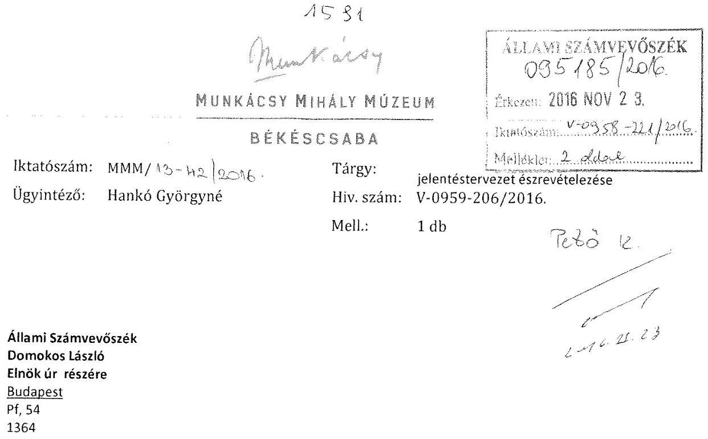

# Tisztelt Elnök Úr! 

Az Állami Számvevők intézményünknek eljuttatott V-0958-206/2016. ikt.sz. jelentéstervezetéről az észrevételezést megtette, melyet mellékelten megküldünk.

Békéscsaba, 2016. november 21.

Tisztelettel:
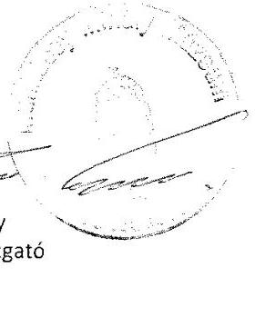

---

# BÉKÉSCSABA 

## Észrevétel

a

## „Megyei hatókörű városi múzeumok ellenőrzése - Munkácsy Mihály Múzeum" című számvevőszéki jelentéstervezethez

Az Állami Számvevőszék „Megyei hatókörű Városi Múzeumok ellenőrzése - Munkácsy Mihály Múzeum" című ellenőrzésről készített számvevőszéki jelentéstervezettel kapcsolatosan az Állami Számvevőszékről szóló 2011. évi LXVI. törvény 29. § (2) bekezdése szerint észrevételt kívánok tenni.

Az ellenőrzött időszak 2011. január 1-jétől 2014. december 31-ig tartott.
A Munkácsy Mihály Múzeumnál (a továbbiakban: Múzeum) a vizsgált időszakban három esetben történt fenntartóváltás:

- 2011. évben a fenntartó a Békés Megyei Önkormányzat,
- 2012. évben a fenntartó a Békés Megyei Intézményfenntartó Központ,
- 2013. januártól Békéscsaba Megyei Jogú Város Önkormányzatának Közgyűlése látja el a fenntartói, irányítói feladatokat.

A Munkácsy Mihály Múzeum gazdálkodási feladatait a 2011. év II. félévében a Békés Megyei Tudásház és Könyvtár, a 2012. évben a Békés Megyei Intézményfenntartó központ, 2013. január 1-jétől Békéscsaba Megyei Jogú Város Polgármesteri Hivatala látta el.

Az Állami Számvevőszék a jelentéstervezetben a múzeum pénzügyi gazdálkodására vonatkozóan számos hibát, hiányosságot, szabálytalanságot több esetben összevontan állapított meg, így nehezen értelmezhető, hogy az adott hibák, hiányosságok melyik időszakot érintik. Megítélésem szerint célszerű lenne az összegző megállapításokat fenntartói időszakonként külön választani.

A jelentés tervezetben a 2011-2014. évek között bekövetkezett fenntartói változások a vagyontárgyak és a kulturális javak tulajdonosi, vagyonkezelői és használói körében bekövetkezett változásokból adódó hibák, hiányosságok nem az intézmény hibájának róható fel. 2013. január 1-jét követően Békéscsaba Megyei Jogú Város Önkormányzata többször kezdeményezte a Magyar Nemzeti Vagyonkezelő Zrt. Költségvetési Szervek Vagyongazdálkodási és Elhelyezési Igazgatóságánál tárgyalás lefolytatását az átvett, illetve a

---

használt vagyon tekintetében kötendő megállapodás érdekében. Az MNV Zrt. Vagyonkezelők Vagyongazdálkodási Igazgatósága és az önkormányzat között többször készült vagyonkezelési szerződés tervezet, melyben a Múzeum is részt vett, de a szerződés megkötése nem valósult meg.

A Munkácsy Mihály Múzeumban a múzeumigazgatói megbízásomat 2013. február 1-jétől, kinevezésemet 2013. április 1-jétől kaptam, a munkáltatói jogosultságomat ezen időszaktól gyakorlom.

Békéscsaba Megyei Jogú Város Polgármesteri Hivatala 2013. január 1-jétől látja el a Múzeum pénzügyi, gazdasági feladatait ezért az Állami Számvevőszék által készített jelentéstervezetben feltárt hibákat, hiányosságokat, szabálytalanságokat egyeztettük.

Békéscsaba Megyei Jogú Város Polgármesteri Hivatala jegyzője által készített észrevételekkel a „Megyei hatókörű városi múzeumok ellenőrzése - Munkácsy Mihály Múzeum" című számvevőszéki jelentéstervezettel egyetértek, azt további észrevétellel kiegészíteni nem kívánom.
A végleges számvevőszéki jelentés elkészítése során kérem észrevételeink elfogadását és figyelembe vételét.

Köszönetemet fejezem ki az Állami Számvevőszék ellenőrzéséért. A Munkácsy Mihály Múzeum gazdálkodási hiányosságairól átfogó képet kaptam. Javaslataikkal és megállapításaikkal segítséget nyújtanak a pénzügyi és vagyongazdálkodási szabályozások javításához.

Természetesen mindent megteszek annak érdekében, hogy a feltárt hibák, hiányosságok és szabálytalanságok mielőbb megszüntetésre kerüljenek.

Békéscsaba, 2016. november 18.
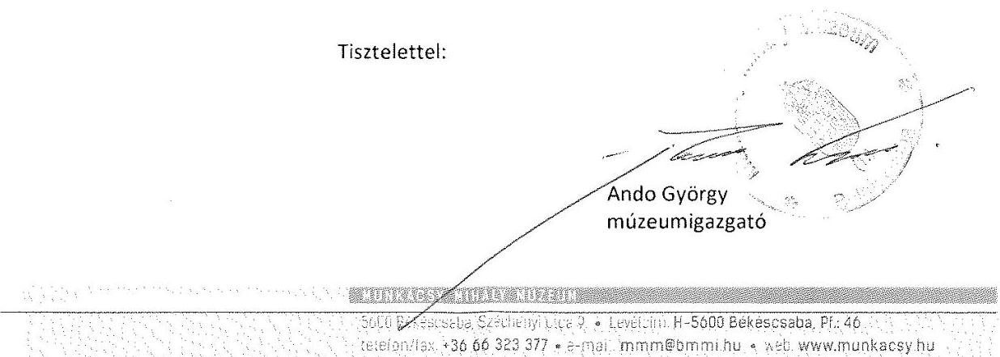

---

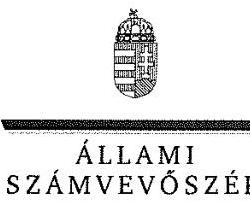

ELNÖK

# Ando György úr 

igazgató
Munkácsy Mihály Múzeum

## Békéscsaba

## Tisztelt Igazgató Úr!

A „Megyei hatókörű városi múzeumok ellenőrzése - Munkácsy Mihály Múzeum, Békéscsaba" címmel készített számvevőszéki jelentéstervezetre tett észrevételét köszönettel megkaptam.
Az Állami Számvevőszék észrevételre vonatkozó álláspontjáról a felügyeleti vezető által készített részletes tájékoztatást csatoltan megküldöm.
Tájékoztatom Igazgató urat, hogy a számvevőszéki jelentésben - az Állami Számvevőszékről szóló 2011. évi LXVI. törvény 29. § (3) bekezdése alapján - a figyelembe nem vett észrevételeket szerepeltetjük az elutasítás indokának feltüntetésével.

Budapest, 2016. 1) hó ơ nap
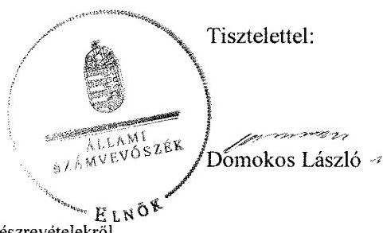

Melléklet: Tájékoztatás az el nem fogadott észrevételekről

---

# Tájékoztatás az el nem fogadott észrevételekról 

A „Megyei hatókörű városi múzeumok ellenőrzése - Munkácsy Mihály Múzeum, Békéscsaba" című jelentéstervezetre az MMM/13-42/2016. iktatószámú levelével megküldött észrevételeit áttekintettük, annak kezeléséről az alábbi tájékoztatást adom.

## 1. A jelentéstervezetre tett általános észrevétele kapcsán

Észrevételében az ellenőrzött időszak fenntartóinak és a Munkácsy Mihály Múzeum (továbbiakban: Múzeum) gazdasági
 feladatait ellátó szervezetek nevesítését követően javasolja, hogy célszerű lenne az összegző megállapításokat fenntartói időszakonként külön választani, mivel az Állami Számvevőszék (továbbiakban: ÁSZ) a jelentéstervezetben a Múzeum pénzügyi gazdálkodására vonatkozóan számos hibát, hiányosságot, szabálytalanságot több esetben összevontan állapított meg, így nehezen értelmezhető, hogy az adott hibák, hiányosságok melyik időszakot érintik. Észrevételét nem fogadtuk el, mert a számvevőszéki ellenőrzést a „Megyei hatókörű városi múzeumok ellenőrzése" című ellenőrzési program alapján végeztük és az ellenőrzött témaköröket az ellenőrzési kérdésekre adott válaszok alapján értékeltük, amelyet a jelentéstervezetben „Az ellenőrzés módszerei" című fejezet részletesen tartalmaz. Észrevétele a megállapításokat nem cáfolja, ezért azokat nem módosítja.

## 2. A jelentéstervezet 27. oldal 5.1. számú megállapítás 3-4. bekezdéseinek megállapításaira tett észrevétele kapcsán

Köszönettel vettem tájékoztatását, hogy 2013. január 1-jét követően Békéscsaba Megyei Jogú Város Önkormányzata többször kezdeményezte a Magyar Nemzeti Vagyonkezelő Zrt.-nél tárgyalás lefolytatását az átvett, illetve a használt vagyon tekintetében kötendő megállapodás érdekében, de vagyonkezelési szerződés megkötésére nem került sor. Észrevétele a megállapításokat nem vitatja, ezért azokat nem módosítja.

## 3. Békéscsaba Megyei Jogú Város Polgármesteri Hivatala jegyzője által készített észrevételekkel összefüggésben tett észrevétele kapcsán

Köszönettel vettem tájékoztatását, hogy Békéscsaba Megyei Jogú Város Polgármesteri Hivatala jegyzője által készített észrevételekkel, a „Megyei hatókörű városi múzeumok ellenőrzése Munkácsy Mihály Múzeum" című számvevőszéki jelentéstervezettel egyetért, azt további észrevétellel kiegészíteni nem kívánja. Észrevétele megállapítást nem módosít.

Budapest, 2016.
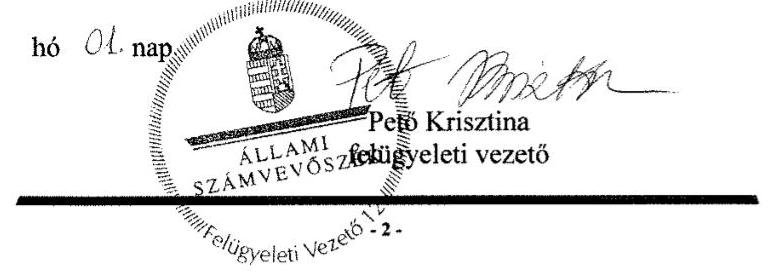

---

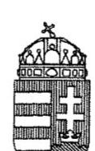

BÉKÉSCSABA MEGYEI JOGÚ VÁROS JEGYZŐJE

Ikt. sz.: VIII. 186/2016.
Ügyintéző: Tarné Stuber Éva,
Veresné Hoffmann Anikó
Mell.: 1 db
Hiv. sz: V-0958-207/2016.
Békéscsaba, Szent István tér 7.

Postacím: 5601 Pf. 112.
Telefon: (66) 523-802
Telefax: (66) 523-804
E-mail: jegyzo@bekescsaba.hu

Tárgy: Számvevőszéki jelentéstervezetre észrevétel

# Domokos László úr 

elnök

Állami Számvevőszék
Budapest

Tisztelt Elnök Úr!

Az Állami Számvevőszék „Megyei hatókörű Városi Múzeumok ellenőrzése - Munkácsy Mihály Múzeum" című ellenőrzésről készített számvevőszéki jelentéstervezettel kapcsolatosan az Állami Számvevőszékről szóló 2011. évi LXVI. törvény 29. § (2) bekezdése szerint észrevételt kívánunk tenni, amelyet ezúton megküldök Önnek.
Kérem az észrevételek elfogadását és figyelembe vételét a végleges számvevőszéki jelentés elkészítése során.
Egyidejűleg köszönetemet fejezem ki Önnek az ellenőrzésben résztvevő számvevők korrekt, segítőkész és konstruktív hozzáállásáért.

Békéscsaba, 2016. november 18.

Tisztelettel:
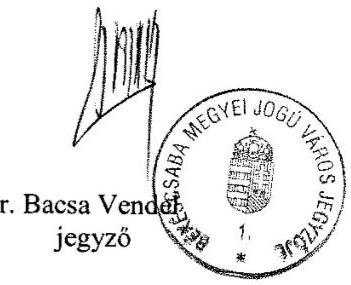

---

# Észrevétel 

a

## „Megyei hatókörű városi múzeumok ellenőrzése - Munkácsy Mihály Múzeum" című számvevőszéki jelentéstervezethez

Az Állami Számvevőszék „Megyei hatókörű Városi Múzeumok ellenőrzése - Munkácsy Mihály Múzeum" című ellenőrzésről készített számvevőszéki jelentéstervezettel kapcsolatosan az Állami Számvevőszékről szóló 2011. évi LXVI. törvény 29. § (2) bekezdése szerint észrevételt kívánunk tenni.

Az ellenőrzött időszak 2011. január 1-jétől 2014. december 31-ig tartott. A vizsgált időszakban három esetben történt fenntartóváltás. Békéscsaba Megyei Jogú Város Önkormányzatának Közgyűlése 2013. januárjától látja el a Munkácsy Mihály Múzeum (a továbbiakban: Múzeum) fenntartói, irányítói feladatait. A jelentéstervezetben a megfogalmazott hiányosságok több esetben összevontan szerepelnek, így nehezen értelmezhető, hogy adott hiányosság melyik időszakban történt (4.3 megállapítás 3. bekezdés első mondat, 4.3 megállapítás 7. bekezdés).

Békéscsaba Megyei Jogú Város Polgármesteri Hivatala 2013. január 1-jétől látja el a Múzeum pénzügyi, gazdasági feladatait. Az Állami Számvevőszék számos hibát tárt fel, amelyek megszüntetése esetén a pénzügyi és vagyongazdálkodási szabályoknak megfelelő működés biztosítottá válik. A megállapítások helytállóak, korrektek, néhány esetben pontosítás szükséges.

Észrevételeinket a jelentéstervezet felépítésével megegyezően tesszük.

1. Az irányító szerv Múzeumra vonatkozó feladatellátása szabályszerű volt-e? „Az irányító szervek Múzeumra vonatkozó feladatellátása összességében megfelelő volt."

A megállapításokat elfogadjuk. Észrevételt ehhez a ponthoz nem kívánunk tenni.
2. Szabályszerűen hajtották-e végre a Múzeumot érintő szervezeti, szerkezeti átszervezéseket?
Békéscsaba Megyei Jogú Város Önkormányzatát érintő megállapítás a 2.2 pontban szerepel: „A 2013. január 1-jével végrehajtott a központi alrendszerből önkormányzati alrendszerbe történő irányítószervi (fenntartói) váltás végrehajtása és a szervezetrendszer átalakítása szabályszerű volt, az átláthatóságot biztosították."

A megállapításokat elfogadjuk. Észrevételt ehhez a ponthoz nem kívánunk tenni.
3. A belső kontrollrendszer kialakítása és működtetése megfelelt-e a jogszabályi előírásoknak?
„A belső kontrollrendszer kialakítása és működtetése 2011-2014. években részben szabályszerű volt".

A megállapításokat elfogadjuk, azonban a 3.1 ponthoz megjegyezni kívánjuk, hogy az értékelési szabályzat felülvizsgálatánál a hiányosságot észleltük, a jelenleg hatályos értékelési szabályzat már tartalmazza követeléstípusonként a kis összegű követelések év végi meghatározásának elveit, dokumentálásának szabályait és az

---

egyszerűsített értékelési eljárás alá vont követelések elveit, dokumentálás szabályait az Áhsz. 50. § (2) bekezdése szerint.

# 4. A múzeum pénzügyi gazdálkodása szabályszerű volt-e? 

„A múzeum pénzügyi gazdálkodása nem volt szabályszerű."
Az összegző megállapítás összevontan kezeli a három fenntartó időszakában bekövetkezett hiányosságokat. Mintavétellel került ellenőrzésre a bevételek, személyi juttatások, dologi és felhalmozási kiadások elszámolása. A minta alapján a sokaságbeli hibaarány felső határa meghaladta a 30%-ot. Megítélésünk szerint célszerű lenne az összegző megállapításokat fenntartói időszakonként elkülöníteni.

A 4.1. és a 4.2. számú megállapításokat elfogadjuk, észrevételt nem teszünk.
A 4.3. számú megállapítás 3. bekezdés 1. mondat: „A Múzeumi bevételek elszámolása során több esetben hiányzott az Áfa tv. 159. § (1) bekezdésében, illetve az Áfa tv. 166. § (1) bekezdésében foglaltak szerint kibocsátott számla; vagy nyugta, ennek következtében sérült a Számv. tv. 169. § (2) bekezdésének előírása".

A megállapítás súlya indokolja a szöveg pontosítását, hogy melyik időszakban és milyen gazdasági esemény során észlelték ezt a hiányosságot. A 2012. évi számlák a Szociális és Gyermekvédelmi Főigazgatóság Békés Megyei Kirendeltségén lelhetők fel, azok átadása a Munkácsy Mihály Múzeum részére többszöri kérés ellenére sem történt meg. Amennyiben a hiányosság 2013-2014. években következett be, az észrevételt vitatjuk, tekintettel arra, hogy a helyszíni ellenőrzések során ez a probléma nem vetődött fel, a helyszíni ellenőrzésekről készített jegyzőkönyvekben erre történő utalás nincs. Tájékoztatást kívánunk adni arra vonatkozóan, hogy a Nemzeti Adó- és Vámhivatal Békés Megyei Adó- és Vámigazgatósága a 2011. január 1-jétől 2016. május 31. közötti időszakra vonatkozóan 2016. évben ellenőrzést végzett a Múzeumnál. A 2016. november 14-én kelt határozatban nem került megállapításra számla illetve nyugtaadási kötelezettség elmulasztása.
4.3. számú megállapítás 6. bekezdés 2. mondat: „A dologi kiadások esetében a közbeszerzési eljárás alapján lebonyolított beszerzések közül egy esetben 2013. évben a múzeumigazgató nem tartotta be a Kbt. 34. § (2) bekezdésében a dokumentumok megőrzésére előírt öt éves megőrzési kötelezettségét."

A Múzeumnál 2013. évben nem történt közbeszerzés. 2012. évben a Múzeum gazdálkodási feladatait a Békés Megyei Intézményfenntartó Központ látta el. Tudomásunk van arról, hogy a dologi kiadások beszerzését közbeszerzési eljárás keretében bonyolították le. Az ezzel kapcsolatos dokumentumokat a BMIK nem bocsátotta a Múzeum rendelkezésére. Megítélésünk szerint a megállapítást pontosítani szükséges, tekintettel arra, hogy ezt a tényt a 2016. január kelt helyszíni ellenőrzésről készült jegyzőkönyvben is lenyilatkoztuk.
4.3. számú megállapítás 7. bekezdés 1. mondat: „Az ellenőrzött időszakban a dologi kiadások és személyi juttatások esetében a számviteli elszámolás nem volt szabályszerű, mert több tétel elszámolása nem az Áhsz. 9. számú melléklet 9a, e, pontjában előírtak figyelembevételével, illetve az Áhsz 16. számú melléklet 5.

[^0]
[^0]:    Észrevétel a „Megyei hatókörű városi múzeumok ellenőrzése - Munkácsy Mihály Múzeum" című számvevőszéki jelentéstervezethez

---

számú pontjához tartozó alpontok szerinti elszámolásnak megfelelően történt, a hiba nem volt jelentős összegű."

A megállapítás pontosítása szükséges, mert így nem beazonosítható, hogy melyik tételeknél történt a szabálytalan könyvelés. A helyszíni ellenőrzésekről készített jegyzőkönyvekben erre történő utalás nincs.
4.3. számú megállapítás 8. bekezdés 5. alpont: „A 2011-2014. években az Ámr. 80. § (3) bekezdés és az Ávr. 60. § (3) bekezdés által előírt nyilvántartást a múzeumigazgató és a gazdasági szervezet nem vezette naprakészen, mivel a kötelezettségvállalásra, ellenjegyzésre, szakmai teljesítés igazolására, érvényesítésre jogosult személyek aláírás mintáját nem minden esetben rögzítették benne."

A megállapítással nem értünk egyet. Véleményünk szerint a Munkácsy Mihály Múzeum Kötelezettségvállalás és utalványozás rendjéről szóló szabályzatának mellékletét képezte az aláírási minta 2013-2014. években. Ebben az időszakban kettő szabályzat volt érvényben, amelyek az Állami Számvevőszék elektronikus adatszolgáltató rendszerébe feltöltésre kerültek a kotval_szabalyzat_MMM_2013, és a kotval_szabalyzat_MMM_2014_06 elnevezéssel. A 2016. február 24-én és a 2016. március 1-jén kelt helyszíni ellenőrzésekről készített jegyzőkönyvben csak a 2011. január 1-jétől 2011. július 31. közötti időszakra történt megállapítás, 2013-2014. évekre vonatkozó megállapítás nem volt aláírás mintára vonatkozóan.
4.4. számú megállapítás 2. mondat: „A régészeti tevékenység teljesített kiadásainak az elszámolása nem felelt meg a jogszabályi előírásoknak 2011-2014. években.
4.4. számú megállapítás 2. bekezdés 1. mondat: „A régészeti tevékenység érdekében teljesített kiadások elszámolása nem felelt meg a jogszabályi előírásoknak."

Megítélésünk szerint 2013-2014. évekre vonatkozó hiányosság nem került megállapításra, helyszíni ellenőrzés során erre utalás nem történt. Kérjük a megállapítás pontosítását.
4.5. számú megállapítás 1. bekezdés 1. mondat: „A múzeumigazgató a folyamatos fizetőképesség biztosítása érdekében a 2013-2014. években az Áht. 78. § (2) bekezdésében előírtak ellenére likviditási terv elkészítéséről nem gondoskodott."

Véleményünk szerint a jogszabályok nem adnak útmutatást arra vonatkozóan, hogy a likviditási terv milyen formátumú és tartalmú legyen. Békéscsaba Megyei Jogú Város Önkormányzatánál sok évvel ezelőtt bevezetésre került az ún. „kiskincstári rendszer". Ennek következtében az intézmények és az önkormányzat is havonta előre megtervezik a várható bevételeiket, ill. kiadásaikat. Tehát a likviditás tervezése folyamatosan történik. Ezek a tervek a rendszerből kinyomtathatóak. Megjegyezni kívánjuk továbbá, hogy az önkormányzat a kiskincstáron keresztül az intézményei részére a rugalmas pénzellátást és a fizetőképességet folyamatosan megteremti. Sajnálatos, hogy az ellenőrzést végzőknek nem került bemutatásra a rendszer. Megítélésünk szerint a megállapítást pontosítani szükséges.

Észrevétel a „Megyei hatókörű városi múzeumok ellenőrzése - Munkácsy Mihály Múzeum" című számvevőszéki jelentéstervezethez

---

# 5. A múzeum vagyongazdálkodása szabályszerű volt-e? 

„A Múzeum vagyongazdálkodása nem volt szabályszerű".

Az 5.1. számú megállapítás 2. bekezdés 2. mondat: „2013-2014. években a Múzeum nem rendelkezett vagyonkezelési szerződéssel, ezzel az Nvtv. 11. § (1) és (7) bekezdésének és a Vtvr. 8. § (6) bekezdésének előírása nem érvényesült."

Megítélésünk szerint az önkormányzat jóhiszeműen járt el, mert többször is kezdeményezte a szerződés megkötését és ennek meghiúsulása nem az önkormányzat hibájából következett be, amelyet az alábbi tények igazolnak.

Békéscsaba Megyei Jogú Város Önkormányzata először 2012. december 19-én a IV. 922/2012. ikt. számú levelében kezdeményezte a Magyar Nemzeti Vagyonkezelő Zrt. Költségvetési Szervek Vagyongazdálkodási és Elhelyezési Igazgatóságánál tárgyalás lefolytatását az átvett, illetve a használt vagyon tekintetében kötendő megállapodás érdekében. Tekintettel arra, hogy a megkeresésre válasz nem érkezett, az önkormányzat 2013. március 11-én a IV. 3223/2013. ikt. számú levélben ismételten kezdeményezte a tárgyalás megindítását. Válasz erre a megkeresésünkre sem érkezett, az önkormányzat harmadszor is megkereste az MNV Zrt-t 2013. június 6-án, ekkor már e-mailben, hogy tájékoztatást vár arra vonatkozóan, várhatóan mikor kerül megküldésre a megállapodás-tervezet.
Az MNV Zrt. Vagyonkezelők Vagyongazdálkodási Igazgatósága az MNV/01/35796/4/2013. (2013. aug. 27-én érkezett) tájékoztatta az önkormányzatot, hogy elkészült a vagyonkezelési szerződés tervezete, amelyet a megküldött mellékletekkel kiegészítve rövidesen döntésre tudnak előkészíteni és az EMMI hozzájárulását is megkérik. 2013. december 7-én érkezett meg a vagyonkezelési szerződés tervezete véleményezésre.
 2013. december 17-én telefonon történt megkeresésre az MNV Zrt.-től azt a tájékoztatást kapta az önkormányzat, nem várnak válaszlevelet arra vonatkozóan, hogy a véleményezés folyamatban van és jelzésre került, hogy 2014. január végére elkészül a véleményezés.
2014. január 21-én újabb levél érkezett az MNV Zrt.-től, amelyben tájékoztatást nyújtottak arról, hogy a jogszabályi változások miatt átdolgozzák a vagyonkezelési szerződés tervezetét, amely megtörtént és az önkormányzat részére 2014. április 23-án megérkezett. Az önkormányzat 2014. június 30-án, elektronikus úton visszaküldte a véleményezett, kiegészített szerződéstervezetet.
Az MNV Zrt. 2014. szeptember 4-én kelt levelében ismertette, hogy a Megyei Jogú Városok Szövetségének kezdeményezésére törvényjavaslat készül a múzeumi és könyvtári vagyonelemek tulajdonjogi és vagyonkezelői helyzetének rendezése érdekében. Az említett levél kitért arra is, hogy a vagyonkezelési szerződések véglegesítését célszerű lenne a törvényjavaslattal kapcsolatos döntést követően, annak függvényében elvégezni.
A megyei könyvtárak és megyei hatáskörű városi múzeumok feladatellátását szolgáló vagyontárgyak helyzetének rendezésével kapcsolatosan 2015. július 1-jén hatályba lépett a megyei könyvtárak, megyei hatáskörű városi múzeumok feladatellátását szolgáló egyes állami tulajdonú vagyontárgyak ingyenes önkormányzati tulajdonba adásáról szóló 2015. évi LXXV. törvény. A törvény hatályba lépésének napjával a törvény mellékletében felsorolt állami tulajdonban

[^0]
[^0]:    Észrevétel a „Megyei hatókörű városi múzeumok ellenőrzése - Munkácsy Mihály Múzeum" című számvevőszéki jelentéstervezethez

---

levő vagyontárgyak az önkormányzat tulajdonába kerültek. Ez okból a vagyonkezelési szerződés megkötésére utólagosan már nem került sor.
5.2. számú megállapítás 3. bekezdés: „A mérleget alátámasztó leltár a 2013-2014. években nem felelt meg az Áhsz. 37. § (2) bekezdésében és a Számv. tv. 69. § (1) bekezdésében foglaltaknak, mert az Áhsz. 29/A. § (1) bekezdésében foglaltak értelmében a vagyonkezelésbe vett eszköz bekerülési értékének, a vagyonkezelési szerződésben szereplő érték minősül, mely információ a szerződés hiányában nem állt rendelkezésre, az Áhsz. 15.§ (2) bekezdésében foglaltak alapján a bekerülési érték az átadónál kimutatott bruttó érték, melyről szintén nem volt információ. A hiányosság miatt a leltárak értékadatai dokumentummal nem voltak megfelelően alátámasztva."

Véleményünk szerint a vagyonkezelési szerződés nélküli időszakban, 2013-2014. években a bevételezett eszközök értéke megegyezett a szerződéstervezethez csatolt eszközlisták értékével, amelyek természetesen megegyeztek a MIK által készített 2012. december 31-re vonatkozó beszámoló mérlegében szerepeltetett értékkel is. Megítélésünk szerint az erre az időszakra készített leltár és beszámoló megalapozott volt.

# 6. A Múzeum intézkedett-e az integritás szemlélet érvényesítése érdekében? 

„A múzeum intézkedett az integritás szemlélet érvényesítése érdekében."
A megállapításokat elfogadjuk. Észrevételt ehhez a ponthoz nem kívánunk tenni.

Kérjük észrevételeink elfogadását és figyelembe vételét a végleges számvevőszéki jelentés elkészítése során, egyidejűleg az összegzés és javaslatok pontosítását is.
Köszönetünket fejezzük ki az Állami Számvevőszék ellenőrzéséért. Átfogó képet kaptunk a gazdálkodás hiányosságairól és a jó gyakorlatokról is. A megállapításokkal és javaslatokkal segítséget nyújtottak a Munkácsy Mihály Múzeum pénzügyi és vagyongazdálkodási szabályozásának javításához.
Egyidejűleg köszönetünket fejezzük ki az ellenőrzésben résztvevő számvevőknek a korrekt, segítőkész és konstruktív hozzáállásáért.
Természetesen mindent megteszünk annak érdekében, hogy a feltárt hiányosságok mielőbb megszüntetésre kerüljenek. Az általunk is jogosnak vélt hiányosságok megszüntetéséhez a végleges jelentés megérkezése előtt hozzákezdünk.

Békéscsaba, 2016. november 18.

Tisztelettel:
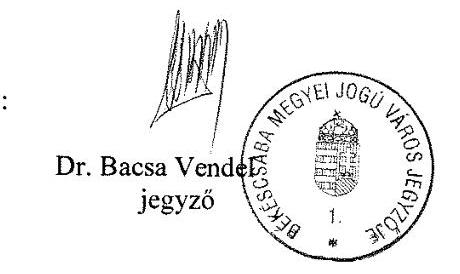

Észrevétel a „Megyei hatáskörű városi múzeumok ellenőrzése - Munkácsy Mihály Múzeum" című számvevőszéki jelentéstervezethez

---

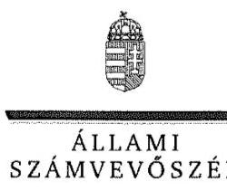

ELNÖK

# Dr. Bacsa Vendel úr 

jegyző
Békéscsaba Megyei Jogú Város Polgármesteri Hivatala

## Békéscsaba

## Tisztelt Jegyző Úr!

A „Megyei hatáskörű városi múzeumok ellenőrzése - Munkácsy Mihály Múzeum, Békéscsaba" címmel készített számvevőszéki jelentéstervezetre tett észrevételét köszönettel megkaptam.
Az Állami Számvevőszék észrevételre vonatkozó álláspontjáról a felügyeleti vezető által készített részletes tájékoztatást csatoltan megküldöm.
Tájékoztatom Jegyző urat, hogy a számvevőszéki jelentésben - az Állami Számvevőszékről szóló 2011. évi LXVI. törvény 29. § (3) bekezdése alapján - a figyelembe nem vett észrevételeket szerepeltetjük az elutasítás indokának feltüntetésével.

Budapest, 2016. hó $<7$ nap
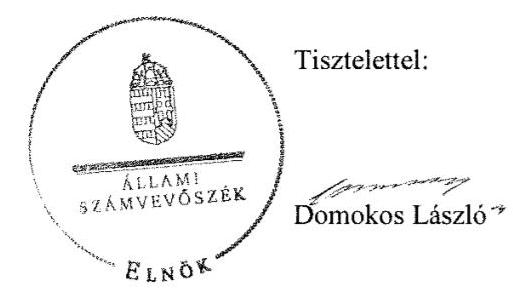

Melléklet: Tájékoztatás az elfogadott és az el nem fogadott észrevételekről

---

# Tájékoztatás az elfogadott és az el nem fogadott észrevételekról 

A „Megyei hatáskörű városi múzeumok ellenőrzése - Munkácsy Mihály Múzeum, Békéscsaba" című jelentéstervezetre a VIII. 186/2016. iktatószámú levelével megküldött észrevételeit áttekintettük, annak kezeléséről az alábbi tájékoztatást adom.

## I. A jelentéstervezetre tett általános észrevétele kapcsán

Észrevételében arról tájékoztat, hogy a jelentéstervezetben a megfogalmazott hiányosságok több esetben összevontan szerepelnek, így nehezen értelmezhető, hogy az adott hiányosság melyik időszakban történt. A megállapítások helytállóak, néhány esetben pontosítás szükséges. Észrevétele a jelentéstervezet megállapításait nem cáfolja, így azokat nem módosítja.

## II. A jelentéstervezet felépítésével összhangban megtett észrevételei kapcsán

1. A jelentéstervezet 20. oldal 3.1. számú megállapítás 6. bekezdésének 3. megállapítására tett észrevétele kapcsán

Köszönettel vettem tájékoztatását, hogy az eszközök és források értékelési szabályzatát módosították a jogszabályi előírások betartása érdekében. Észrevétele nem vitatja a jelentéstervezet 20. oldal 3.1. számú megállapítás 6. bekezdésének 3. megállapítását - „Az értékelési szabályzatban a 2014. évben az Áhsz. 50. § (2) bekezdés b) és c) pontjának előírása ellenére nem rögzítették követeléstipusonként a kis összegű követelések év végi meghatározásának elveit, dokumentálásának szabályait és az egyszerűsített értékelési eljárás alá vont követelések besorolásának elveit, dokumentálásának szabályait." - ezért azt nem módosítja.

## 2. A jelentéstervezet 24. oldal 4. számú megállapítására tett észrevétele kapcsán

Észrevételében javasolta, hogy célszerű lenne az összegző megállapításokat fenntartói időszakonként elkülöníteni. Észrevételét nem fogadtuk el, mert a számvevőszéki ellenőrzést a „Megyei hatáskörű városi múzeumok ellenőrzése" című ellenőrzési program alapján végeztük és az ellenőrzött témaköröket az ellenőrzési kérdésekre adott válaszok alapján értékeltük, amelyet a jelentéstervezet „Az ellenőrzés módszerei" című fejezete részletesen tartalmaz. Észrevétele a megállapításokat nem cáfolja, ezért azokat nem módosítja.

## 3. A jelentéstervezet 25. oldal 4.3. számú megállapítás 3. bekezdésének 1. megállapítására tett észrevétele kapcsán

A jelentéstervezet 25. oldal 4.3. számú megállapítás 3. bekezdésének 1. megállapítására tett észrevételében a megállapítás pontosítását kérte, hogy melyik időszakban és milyen gazdasági esemény során tárta fel a számvevőszéki ellenőrzés a hiányosságot. Észrevételében hangsúlyozta, hogy amennyiben a hiányosság 2013-2014. években következett be, a megállapítást vitatják, figyelemmel arra, hogy 2011. január 1-jétől 2016. május 31. közötti időszakra vonatkozóan 2016. évben a Munkácsy Mihály Múzeumnál (továbbiakban: Múzeum) ellenőrzést végzett a

---

Nemzeti Adó- és Vámhivatal Békés Megyei Adó- és Vámigazgatósága, amelynek 2016. november 14-én kelt határozatban nem került megállapításra számla, illetve nyugtaadási kötelezettség elmulasztása.
Észrevételét, amely a jelentéstervezet - 25. oldal 4.3. számú megállapítás 3. bekezdésének 1. megállapítására vonatkozik, nem fogadtuk el, a dokumentumok ismételt felülvizsgálatát követően megállapítható, hogy a megállapítás megalapozott. A bevételek elszámolása szabályszerűségét mintavétellel kiválasztott mintatételek alapján értékeltük, amelynek sokaságra történő kivetítését a számvevőszéki jelentéstervezet „Az ellenőrzés módszerei" című fejezet részletesen tartalmazza. A megállapítást az Állami Számvevőszék (továbbiakban: ÁSZ) részére rendelkezésre bocsátott dokumentumok alapján ellenőriztük és ezen dokumentumokra alapozva állapítottuk meg, hogy a „bevételek elszámolása során több esetben hiányzott az Áfa. tv. 159. § (1) bekezdésében, illetve az Áfa. tv. 166. § (1) bekezdésében foglaltak szerint kibocsátott számla, vagy nyugta, ennek következtében sérült a Számv. tv. 169. § (2) bekezdésének előírása". Észrevétele ezért a megállapítást nem módosítja.

# 4. A jelentéstervezet 25. oldal 4.3. számú megállapítás 6. bekezdésének 2. megállapítására tett észrevétele kapcsán 

Észrevételében arról tájékoztatott, hogy a Múzeumnál 2013. évben nem történt közbeszerzés, továbbá 2012. évben a Múzeum gazdálkodási feladatait a Békés Megyei Intézményfenntartó Központ látta el és közbeszerzési eljárással kapcsolatos dokumentumokat nem adott át a Múzeum részére. A dokumentumok ismételt felülvizsgálatát követően észrevételét elfogadtuk és azt a számvevőszéki jelentés összeállításánál figyelembe vesszük.

## 5. A jelentéstervezet 25. oldal 4.3. számú megállapítás 7. bekezdésének megállapítására tett észrevétele kapcsán

Észrevételében javasolta a megállapítás pontosítását, mert nem beazonosítható, hogy melyik tételeknél történt a szabálytalan könyvelés. Észrevételét a jelentéstervezet hivatkozott - 25. oldal 4.3. számú megállapítás 7. bekezdésének - megállapítására nem fogadtuk el. A kiadások teljesítése szabályszerűségét mintavétellel kiválasztott mintatételek alapján értékeltük, amelynek sokaságra történő kivetítését a számvevőszéki jelentéstervezet „Az ellenőrzés módszerei" című fejezet részletesen tartalmazza. A megállapítást az ÁSZ részére rendelkezésre bocsátott dokumentumok alapján ellenőriztük és ezen dokumentumokra alapozva állapítottuk meg, hogy az „ellenőrzött időszakban a dologi kiadások és a külső személyi juttatások esetében a számviteli elszámolás nem volt szabályszerű, mert több tétel elszámolása nem az Áhsz. 19. számú melléklet 9. a), c) pontjában előírtak figyelembevételével, illetve az Áhsz. 216. számú melléklet 5. számú pontjához tartozó alpontok szerinti elszámolásnak megfelelően történt, a hiba nem volt jelentős összegű". Észrevétele ezért a megállapítást nem módosítja.

---

# 6. A jelentéstervezet 25. oldal 4.3. számú megállapítás 9. bekezdés 5. francia bekezdésének megállapítására tett észrevétele kapcsán 

Észrevételében jelezte, hogy a jelentéstervezet 25. oldal 4.3. számú megállapítás 8. bekezdés 5. francia bekezdésének megállapításával - a 2011-2014. években az Ámr. 80. § (3) bekezdés és az Ávr. 60. § (3) bekezdés által előírt nyilvántartást a múzeumigazgató, valamint a gazdasági szervezet ${ }_{1-3}$ nem vezette naprakészen, mivel a kötelezettségvállalásra, ellenjegyzésre, szakmai teljesítés igazolására, érvényesítésre jogosult személyek aláírás mintáját nem minden esetben rögzítették benne" - nem ért egyet, mivel kettő szabályzatot is átadott a számvevőszéki ellenőrzés részére. A dokumentumok ismételt felülvizsgálatát követően észrevételét a 2013-2014. évekre elfogadtuk és azt a számvevőszéki jelentés összeállításánál figyelembe vesszük.

## 7. A jelentéstervezet 26. oldal 4.4. számú megállapítás 2. megállapítására és a 4.4. számú megállapítás 2. bekezdésének 1. megállapítására tett észrevétele kapcsán

Észrevételében kérte a hivatkozott megállapítások pontosítását, mert megítélése szerint 2013-2014. évekre vonatkozó hiányosság nem került megállapításra, a helyszíni ellenőrzés során erre utalás nem történt. Jelzem, hogy a számvevőszéki ellenőrzés során a számvevők az Állami Számvevőszékről szóló 2011. évi LXVI. törvény és a belső irányítási eszközök előírásai szerint járnak el, és ezen előírásoknak nem része az ellenőrzött szervezet részére történő utalás a feltárt hiányosságokról. A régészeti kiadások teljesítése szabályszerűségét mintavétellel kiválasztott mintatételek alapján értékeltük, amelynek sokaságra történő kivetítését a számvevőszéki jelentéstervezet „Az ellenőrzés módszerei" című fejezet részletesen tartalmazza. A megállapítást az ÁSZ részére rendelkezésre bocsátott dokumentumok alapján ellenőriztük és ezen dokumentumok alapján a jelentéstervezet 26. oldal 4.4. számú megállapítás 2. megállapítása és a 4.4. számú megállapítás 2. bekezdésének 1. megállapítása - „A régészeti tevékenység teljesített kiadásainak elszámolása nem felelt meg a jogszabályi előírásoknak a 2011-2014. években.", valamint „A RÉGÉSZETI TEVÉKENYSÉG érdekében teljesített kiadások elszámolása nem felelt meg a jogszabályi előírásoknak." - megalapozott. Észrevétele ezért a megállapításokat nem módosítja.

## 8. A jelentéstervezet 27. oldal 4.5. számú megállapítás 1. bekezdésének 1. megállapítására tett észrevétele kapcsán

Észrevételében arról tájékoztatott, hogy a jogszabályok nem adnak útmutatást arra vonatkozóan, hogy a likviditási terv milyen formátumú és tartalmú legyen. Békéscsaba Megyei Jogú Város Önkormányzatánál sok évvel ezelőtt bevezetésre került az ún. „kiskincstári rendszer". Ennek következtében az intézmények és
 az önkormányzat is havonta előre megtervezi a várható bevételeiket, kiadásaikat, tehát a likviditás tervezése folyamatosan történik, a tervek a rendszerből kinyomtathatóak, de a rendszert nem mutatták be az ellenőrzést végző számvevőknek. Megítélése szerint a megállapítást pontosítani szükséges. Észrevételét a jelentéstervezet 27. oldal 4.5. számú megállapítás 1. bekezdésének 1. megállapítására - „A múzeumigazgató a folyamatos fizetőképesség biztosítása érdekében a 2013-2014. években az Áht. 78. § (2) bekezdésében előírtak ellenére likviditási terv készítéséről nem gondoskodott." - nem fogadtuk el. A likviditási terv tartalmára vonatkozó követelményeket a 2012. január 1-jétől az államháztartásról szóló tör-

---

vény végrehajtásáról szóló 368/2011. (XII. 31.) Korm. rendelet 122. § (1), (2) bekezdése szabályozza. A jogszabályi előírásnak megfelelő tartalmú dokumentumot nem bocsátottak a számvevőszéki ellenőrzés rendelkezésére. Észrevétele ezért a megállapításokat nem módosítja.

# 9. A jelentéstervezet 27. oldal 5.1. számú megállapítás 3. bekezdésének 2. megállapítására tett észrevétele kapcsán 

Észrevétele a jelentéstervezet 27. oldal 5.1. számú megállapítás 3. bekezdésének 2. megállapítását - „A 2013-2014. években a Múzeum nem rendelkezett vagyonkezelési szerződéssel, ezzel az Nvtv. 11. § (1) és (7) bekezdésének és a Vtvr. 8. § (6) bekezdésének előírása nem érvényesült." - nem cáfolja. Észrevételében arról tájékoztat, hogy megítélése szerint az önkormányzat jóhiszeműen járt el, mert többször is kezdeményezte a szerződés megkötését és ennek meghiúsulása nem az önkormányzat hibájából következett be. Részletesen ismertette a vagyonkezelési szerződés egyeztetésének folyamatát, amely során szerződés megkötésére nem került sor. Észrevétele a megállapítást nem cáfolja.

## 10. A jelentéstervezet 29. oldal 5.2. számú megállapítás 3. bekezdésének megállapításaira tett észrevétele kapcsán

Észrevételét a jelentéstervezet 29. oldal 5.2. számú megállapítás 3. bekezdésének megállapításaira - „A mérleget alátámasztó leltár a 2013-2014. években nem felelt meg az Áhsz. 37. § (2) bekezdésében és a Számv. tv. 69. § (1) bekezdésében foglaltaknak, mert az Áhsz. 29/A. § (1) bekezdésében foglaltak értelmében, a vagyonkezelésbe vett eszköz bekerülési értékének, a vagyonkezelési szerződésben szereplő érték minősül, mely információ a szerződés hiányában nem állt rendelkezésre, az Áhsz. 15. § (2) bekezdésében foglaltak alapján a bekerülési érték az átadónál kimutatott bruttó érték, melyről szintén nem volt információ. A hiányosság miatt a leltárak értékadatai dokumentummal nem voltak megfelelően alátámasztva." - nem fogadtuk el. Észrevételében jelezte, hogy 2013-2014. években a bevételezett eszközök értéke megegyezett a szerződéstervezethez csatolt eszközlisták értékével, amelyek megegyeztek a MIK által készített 2012. december 31-re vonatkozó beszámoló mérlegében szerepeltetett értékkel is. Tekintettel arra, hogy észrevétele a vagyonkezelési szerződés hiányát nem cáfolja, ezért a megállapítást nem módosítja, mivel a leltárban szerepeltetett értékadatokat a vagyonkezelési szerződésben rögzített adatok (vagy azzal egyenértékű hivatalos dokumentumokban foglalt adatok) alapozzák meg.

Budapest, 2016.
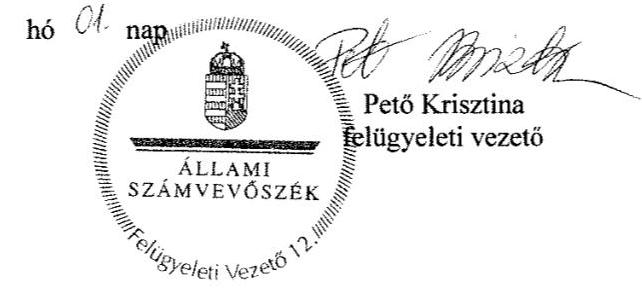

---

# Szociális és Gyermekvédelmi Főigazgatóság 

Békés Megyei Kirendeltsége
5600 Békéscsaba, Kétegyházi út 2.
Telefon: 06-66/441-536, e-mail cím: bekes@szgyf.gov.hu

Iktatószám: BEMK-GO-40-23/2016.
Tárgy: Munkácsy Mihály Múzeum
ÁSZ ellenőrzése
Ügyintéző: Pinti Beáta
Hivatkozási szám: V-0958-211/2016
Telefon: 06-66/441-536
Melléklet: 1 db

## Domokos László

## Elnök Úr részére

## Állami Számvevőszék

Budapest 4.
Pf. 54.
1364

## Tisztelt Elnök Úr!

A „Megyei hatókörű városi múzeumok ellenőrzése - Munkácsy Mihály Múzeum" című ellenőrzésről készült számvevőszéki jelentéstervezetükre az alábbi észrevételeket teszem:

- 2.1. sz. megállapítás:
„Az átadás-átvételi megállapodást a jogutódláshoz kapcsolódó feladat és vagyon átadás-átvételéhez a 258/2011. (XII.7.) Korm. rendelet 12. § (1) bekezdés szerint, de a Korm. rendelet 1. számú melléklet III. és IV. rész előírásaitól eltérően, hiányosan készítette el a fenntartó, a fenntartó a megállapodás hiányosságait nem kifogásolva írta alá."

- Az átadás-átvételi megállapodás a 258/2011. (XII.7.) Kormányrendelet által előírt formában és mellékletekkel került aláírásra.
- A jelentéstervezetükben az átadás-átvételi megállapodással kapcsolatban hiányolt, átadásra nem került dokumentumok nem képezték részét a megállapodás mellékleteinek, azok azonban az Intézményfenntartó Központ rendelkezésére álltak, az átvett könyvelési, analitikus nyilvántartó rendszerből kinyerhetőek voltak.

---

- A Múzeum vonatkozásában betöltetlenül átadott státusz nem volt.
„A Múzeummal, mint a vagyont közfeladat ellátására hasznosítóval a Vtv. 25. § (4) bekezdésében foglaltak ellenére vagyonhasznosítási szerződést nem kötöttek."
- A Nemzeti Vagyonkezelő Zrt. és a Békés Megyei Intézményfenntartó Központ közötti vagyonkezelői szerződés 2013. március 28-án került aláírásra. Annak hiányában az Intézményfenntartó Központ 2012-ben nem volt jogosult a vagyontárgyak hasznosítására feljogosító szerződést kötni a Múzeummal.
- 3.1. sz. megállapítás:
„Az eszközök és források értékelési szabályzat elkészítéséről nem gondoskodtak a 2011. év első három negyedévében és a 2012-2013. években a Számv. tv. 14. § (5) bekezdés b) pontjában foglaltak ellenére."
- A mérlegben szereplő eszközök és források értékelésének szabályai a Békés Megyei Intézményfenntartó Központ és a fenntartása alá tartozó önállóan működő költségvetési szervek, 2012. április 1-vel hatályos Számviteli Politikájának részét képezik, melyet a vizsgálat során rendelkezésre bocsátottunk.
- 4.2. sz. megállapítás:
„A 2011-2014. években az elemi költségvetési beszámolókat az Áhsz. 10. § (1) bekezdésében, az Áhsz. 32. § (1) bekezdésben foglalt - tárgyévet követő február 28-át követően - határidőn túl (2012. március 9., 2013. március 11., 2014. március 4., 2015. március 3.) küldték meg az irányító szerv részére."
- A Békés Megyei Intézményfenntartó Központ a Múzeum 2012. évi beszámolóját a Magyar Államkincstár által meghatározott határidőn belül adta fel a KGR elektronikus adatszolgáltató rendszerben.
- 4.3. sz. megállapítás:
„A kiadási előirányzatok felhasználása során szabálytalan volt, hogy a kötelezettségvállalásra a 2011. évben az Ámr. 74. § (1) bekezdésében foglaltak ellenére ellenjegyzés nélkül, a 2012-2014. években az Áht. 37. § (1) bekezdésében foglaltak ellenére pénzügyi ellenjegyzés nélkül került sor."
- 2012. évben a kötelezettségvállalást keletkeztető dokumentumok pénzügyi ellenjegyzéssel kerültek aláírásra.
- 4.5. sz. megállapítás:
„A 2012. év végén a Múzeum pénzügyi likviditási helyzete kedvezőtlen volt, mert a mérlegben kimutatott pénzeszköze nem volt, ugyanakkor 4,4 M Ft összegű rövid lejáratú kötelezettséggel rendelkezett."
- 2012. év végén a Múzeum kincstári számláinak egyenlegét a Magyar Államkincstár által kiadott, FF-3597/2012. sz. „Útmutató a 2012. január 1-jével az önkormányzati körből a központi költségvetési körbe átvett szociális, köznevelési és közművelődési intézmények 2013. január 1-jei fenntartó változásának, valamint az önkormányzati körből 2013. január 1-jével a központi költségvetési körbe átkerülő intézmények kincstári nyilvántartásba vételének kincstári teendőihez" levelében meghatározottak

---

szerint utaltuk át a Közigazgatási és Igazságügyi Minisztérium előirányzat felhasználási keretszámlájára. (lásd. melléklet) A maradvány 2013-ban történő visszautalása érdekében szükséges teendőket az Intézményfenntartó Központ elvégezte.

Békéscsaba, 2016. november 23.

Tisztelettel:
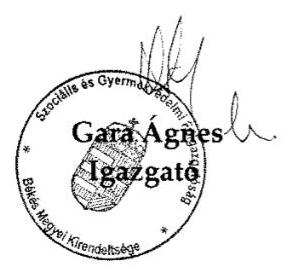

---

# Szociális És Gyermekvédelmi Főigazgatóság   BÉKÉS MEGYEI KIRENDELTSÉGE   5600 Békéscsaba, Kétegyházi út 2.   Telefon: 06-66/441-536, e-mail cím: bekes@szgyf.gov.hu 

Iktatószám: BEMK-GO-40-24/2016.
Tárgy: Munkácsy Mihály Múzeum
Ügyintéző: Pinti Beáta
ÁSZ ellenőrzése
Telefon: 06-66/441-536
Hivatkozási szám: V-0958-211/2016
Melléklet: 1 db meghatalmazás

## Domokos László   Elnök Úr részére

## Állami Számvevőszék

Budapest 4.
Pf. 54.
1364

## Tisztelt Elnök Úr!

Hivatkozva Brebán Andrea kollégájával folytatott telefonbeszélgetésre, mellékelten megküldöm Bátori Zsolt főigazgató által a nevemre kiadott meghatalmazást.
A fenti meghatalmazást az SZGYF Főigazgatóság készítette, a „Megyei hatáskörű városi múzeumok ellenőrzése" vizsgálatuk lezárultáig, mely mindenre kiterjedő, teljes körű, a jelentéstervezetük tekintetében tett észrevételek megtételére is vonatkozik.

Kérem meghatalmazásom szíves elfogadását!

Békéscsaba, 2016. december 1.

Tisztelettel:
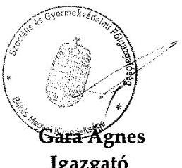

---

# Szociális és Gyermekvédelmi Főigazgatóság Főigazgató 

1132 Budapest, Visegrádi u. 49.
Telefon: (06 1) 769-1704, e-mail cím: titkarsag@szgyf.gov.hu

## MEGHATALMAZÁS

A megyei intézményfenntartó központokról, valamint a megyei önkormányzatok konszolidációjával, a megyei önkormányzati intézmények és a Fővárosi Önkormányzat egészségügyi intézményeinek átvételével összefüggő egyes kormányrendeletek módosításáról szóló 258/2011. (XII.7.) Korm. rendelet 18. § (2) bekezdése szerint a megyei intézményfenntartó központok 2013. március 31. napján a Szociális és Gyermekvédelmi Főigazgatóságba történt beolvadással megszűntek. A Szociális és Gyermekvédelmi Főigazgatóság ugyanezen jogszabályhely szerint a megyei intézményfenntartó központok általános és egyetemleges jogutódja.

Alulírott Bátori Zsolt, a Szociális és Gyermekvédelmi Főigazgatóság (1132 Budapest, Visegrádi út 49., adószáma: 15802107-2-41, statisztikai számjele: 15802107-8412-312-01) főigazgatója a Szociális és Gyermekvédelmi Főigazgatóság nevében és képviseletében eljárva
meghatalmazom
Gara Ágnes Mónikát, a Szociális és Gyermekvédelmi Főigazgatóság Békés Megyei Kirendeltségének (cím: 5600 Békéscsaba, Kétegyházi utca 2.) igazgatóját, hogy az Állami Számvevőszék „Megyei hatáskörű városi múzeumok ellenőrzése" vizsgálatában a Munkácsy Mihály Múzeum vonatkozásában helyettem és nevemben eljárjon. A meghatalmazás a vizsgálathoz kapcsolódó adatszolgáltatásra és a szükséges nyilatkozatok aláírására terjed ki, és a vizsgálat lezárultáig tart.

Budapest, 2016. március „5”.
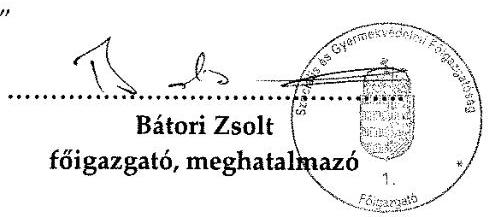

A meghatalmazást elfogadom:
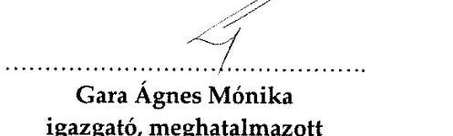

---

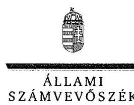

ELNÖK

Ikt.szám: V-0958-240/2016.

# Bátori Zsolt úr 

főigazgató
Szociális és Gyermekvédelmi Főigazgatóság

## Budapest

## Tisztelt Főigazgató Úr!

A „Megyei hatókörű városi múzeumok ellenőrzése - Munkácsy Mihály Múzeum, Békéscsaba" címmel készített számvevőszéki jelentéstervezetre tett észrevételét köszönettel megkaptam.
Az Állami Számvevőszék észrevételre vonatkozó álláspontjáról a felügyeleti vezető által készített részletes tájékoztatást csatoltan megküldöm.
Tájékoztatom Főigazgató urat, hogy a számvevőszéki jelentésben - az Állami Számvevőszékről szóló 2011. évi LXVI. törvény 29. § (3) bekezdése alapján - a figyelembe nem vett észrevételeket indoklás feltüntetésével szerepeltetjük.

Budapest, 2016. 11. hó 11. nap
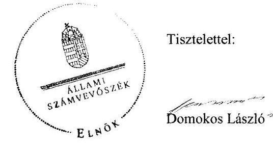

Melléklet: Tájékoztatás az elfogadott és az el nem fogadott észrevételekről

---

# Tájékoztatás az elfogadott és az el nem fogadott észrevételekról 

A „Megyei hatókörű városi múzeumok ellenőrzése - Munkácsy Mihály Múzeum, Békéscsaba" című jelentéstervezetre BEMK-GO-410-23/2016. iktatószámú levelével megküldött észrevételeit áttekintettük, annak kezeléséről az alábbi tájékoztatást adom.

1. A jelentéstervezet 17. oldal 2.1. számú megállapítás 2. bekezdésének 1. megállapítására, valamint a 2.1. számú megállapítás 2. bekezdésének 1-12. francia megállapításaira tett észrevétele kapcsán

Észrevételében arról tájékoztat, hogy az átadás-átvételi megállapodás a megyei intézményfenntartó központokról, valamint a megyei önkormányzatok konszolidációjával, a megyei önkormányzati intézmények és a Fővárosi Önkormányzat egészségügyi intézményeinek átvételével összefüggő egyes kormányrendeletek módosításáról 258/2011. (XII.7.) Kormányrendelet által előírt formában és mellékletekkel került aláírásra. A jelentéstervezetben az átadás-átvételi megállapodással kapcsolatban hiányolt, átadásra nem került dokumentumok nem képezték részét a megállapodás mellékleteinek, azok azonban az Intézményfenntartó Központ rendelkezésére álltak, az átvett könyvelési, analitikus nyilvántartó rendszerből kinyerhetőek voltak, Múzeum vonatkozásában betöltetlenül átadott státusz nem volt.

Észrevételét a jelentéstervezet 2.1. számú megállapítás 2. bekezdésének 1-12. francia megállapításaira nem fogadtuk el. A V-0958-062/2026. iktatószámú, 2016. január 28-án aláírt adatbekérő levélben az Állami Számvevőszék (továbbiakban: ÁSZ) ismételten kérte az adatbekérő 1. számú mellékletében a 2011-2012. évi átadás-átvétel dokumentumait, amelyeken belül a hivatkozott 1-12. francia bekezdésekben nevesített dokumentumokat nem bocsátották a számvevőszéki ellenőrzés rendelkezésére. A 2015. október 22-én, a 2016. február 5-én, február 12-én és február 18-án aláírt teljességi és hitelességi nyilatkozatok nem tartalmazzák a hivatkozott 1-12. francia bekezdésekben nevesített dokumentumokat. Észrevétele a jelentéstervezet 2.1. számú megállapítás 2. bekezdésének 1-12. francia megállapításait nem módosítja.

Észrevételét a jelentéstervezet 17. oldal 2.1. számú megállapítás 2. bekezdésének 1. megállapítására, hogy az átadás-átvételi megállapodással kapcsolatban hiányolt, átadásra nem került dokumentumok nem képezték részét a megállapodás mellékleteinek elfogadtuk és azt a számvevőszéki jelentés összeállításánál figyelembe vesszük.

# 2. A jelentéstervezet 17. oldal 2.1. számú megállapítás 5. bekezdésének 2. megállapítására tett észrevétele kapcsán 

Észrevétele megerősíti a jelentéstervezet 17. oldal 2.1. számú megállapítás 5. bekezdésének 2. megállapításában foglaltakat- „A Múzeummal, mint a vagyont közfeladat ellátására hasznosítóval a Vtr. 25. § (4) bekezdésében foglaltak ellenére vagyonhasznosítási szerződést
 nem kötöttek." -, ezért a megállapítást nem módosítja.

## 3. A jelentéstervezet 20. oldal 3.1. számú megállapítás 6. bekezdésének 1., 2. megállapítására tett észrevétele kapcsán

Észrevételében jelzi, hogy mérlegben szereplő eszközök és források értékelésének szabályai a Békés Megyei Intézményfenntartó Központ és a fenntartása alá tartozó önállóan működő költségvetési szervek, 2012. április 1-jével hatályos Számviteli Politikájának részét képezik és ezt a számvevőszéki ellenőrzés rendelkezésére bocsátották. A dokumentumok ismételt felülvizsgálatát követően észrevételét elfogadtuk és azt a számvevőszéki jelentés összeállításánál figyelembe vesszük.

## 4. A jelentéstervezet 24. oldal 4.2. számú megállapítás 2. bekezdésének megállapítására tett észrevétele kapcsán

Észrevételében arról tájékoztat, hogy Munkácsy Mihály Múzeum (továbbiakban: Múzeum) 2012. évi beszámolóját a Magyar Államkincstár (továbbiakban: Kincstár) által meghatározott határidőn belül adták fel a Kincstár által működtetett KGR elektronikus adatszolgáltató rendszerben. Észrevételét nem fogadtuk el, mert a 2012. évi beszámoló feladása a Kincstár által üzemeltetett KGR elektronikus rendszerbe önmagában nem felel meg az államháztartás szervezetei beszámolási és könyvvezetési kötelezettségének sajátosságairól szóló 249/2000. (XII. 24.) Korm. rendelet 10. § (1) bekezdése előírásának. Észrevétele a jelentéstervezet 24. oldal 4.2. számú megállapítás 2. bekezdésének megállapítását - „A 2011-2014. években az elemi költségvetési beszámolókat az Áhsz. 1 10. § (1) bekezdésében, az Ahsz. 2 32. § (1) bekezdésében foglalt tárgyévet követő február 28-át követően - határidőn túl (2012. március 9., 2013. március 11., 2014. március 4., 2015. március 3.) küldték meg az irányító szerv részére." - nem módosítja.

## 5. A jelentéstervezet 25. oldal 4.3. számú megállapítás 9. bekezdés 1. francia bekezdésének megállapítására tett észrevétele kapcsán

Észrevételében foglaltak alapján a „2012. évben a kötelezettségvállalást keletkeztető dokumentumok pénzügyi ellenjegyzéssel kerültek aláírásra". Észrevételét nem fogadtuk el, mert a kiadások dokumentálása és elszámolása szabályszerűségét mintavétellel kiválasztott mintatételek alapján értékeltük, amelynek sokaságra történő kivetítését a számvevőszéki jelentéstervezet „Az ellenőrzés módszerei" című fejezet részletesen tartalmazza. A megállapításokat az ÁSZ részére

---

rendelkezésre bocsátott dokumentumok alapján ellenőriztük és ezen dokumentumokra alapozva állapítottuk meg, hogy „a kötelezettségvállalásra a 2011. évben az Ámr. 74. § (1) bekezdésében foglaltak ellenére ellenjegyzés nélkül, a 2012-2014. években az Áht. 37. § (1) bekezdésében foglaltak ellenére pénzügyi ellenjegyzés nélkül került sor". Észrevétele a megállapítást nem módosítja.

# 6. A jelentéstervezet 27. oldal 4.5. számú megállapítás 2. bekezdésének 2. megállapítására tett észrevétele kapcsán 

Észrevételében arról tájékoztat, hogy 2012. év végén a Múzeum kincstári számláinak egyenlegét a Kincstár által kiadott, FF-3597/2012. sz. „Útmutató a 2012. január 1-jével az önkormányzati körből a központi költségvetési körbe átvett szociális, köznevelési és közművelődési intézmények 2013. január 1-jei fenntartó változásának, valamint az önkormányzati körből 2013. január 1-jével a központi költségvetési körbe átkerülő intézmények kincstári nyilvántartásba vételének kincstári teendőihez" levelében meghatározottak szerint utalták át a Közigazgatási és Igazságügyi Minisztérium előirányzat felhasználási keretszámlájára. A maradvány 2013-ban történő visszautalása érdekében szükséges teendőket az Intézményfenntartó Központ elvégezte. Észrevételét elfogadtuk és a számvevőszéki jelentés összeállításánál figyelembe vesszük.

Budapest, 2016.
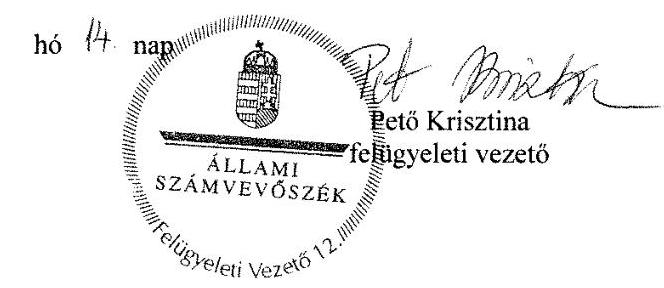

---

# RÖVIDÍTÉSEK JEGYZÉKE 

${ }^{1}$ Múzeum
${ }^{2}$ ÁSZ
${ }^{3}$ Mtv.
${ }^{4}$ Kötv.
${ }^{5} \mathrm{Kjt}$.
${ }^{6}$ múzeumigazgató
${ }^{7}$ Möktv.
${ }^{8}$ 258/2011. (XII. 7.) Korm. rendelet
${ }^{9}$ 2012. évi CLII. tv.
${ }^{10}$ 1311/2012. (VIII.23.) Korm. határozat
${ }^{11}$ BMÖ
${ }^{12}$ BMTK
${ }^{13}$ BMIK
${ }^{14}$ KIM
${ }^{15}$ BMJVÖ
${ }^{16}$ 2015. évi LXXV. tv.
${ }^{17}$ Nvtv.
${ }^{18}$ Alaptörvény
${ }^{19}$ Áht. 2
${ }^{20}$ Ávr.
${ }^{21}$ ÁSZ tv.
${ }^{22}$ alapító okirat ${ }_{1}$
alapító okirat2
alapító okirat3

Békés Megyei Múzeumok Igazgatósága (2011. január 1-je és a 2012. december 31. közötti időszakban) Munkácsy Mihály Múzeum (2013. január 1-jétől)
Állami Számvevőszék
1997. évi CXL. törvény a muzeális intézményekről, a nyilvános könyvtári ellátásról és a közművelődésről (hatályos: 1998. január 1-jétől)
2001. évi LXIV. törvény a kulturális örökség védelméről (hatályos: 2001. július 1-től)
1992. évi XXXIII. törvény a közalkalmazottak jogállásáról (hatályos: 1992. július 1-jétől)
Munkácsy Mihály Múzeum (valamint jogelődje a Békés Megyei Múzeumok Igazgatósága) igazgatója
2011. évi CLIV. törvény a megyei önkormányzatok konszolidációjáról, a megyei önkormányzati intézmények és a Fővárosi Önkormányzat egyes egészségügyi intézményeinek átvételéről (hatályos: 2012. január 1-jétől)
258/2011. (XII. 7.) Korm. rendelet a megyei intézményfenntartó központokról, valamint a megyei önkormányzatok konszolidációjával, a megyei önkormányzati intézmények és a Fővárosi Önkormányzat egészségügyi intézményeinek átvételével összefüggő egyes kormányrendeletek módosításáról (hatályos: 2011. december 8-tól)
2012. évi CLII. törvény a muzeális intézményekről, a nyilvános könyvtári ellátásról és a közművelődésről szóló 1997. évi CXL. törvény módosításáról (hatályos: 2012. november 3-tól)

1311/2012. (VIII. 23.) Korm. határozat a megyei múzeumok, könyvtárak és közművelődési intézmények fenntartásáról (hatályos: 2012. augusztus 24-től) Békés Megyei Önkormányzat
Békés Megyei Tudásház és Könyvtár
Békés Megyei Intézményfenntartó Központ
Közigazgatási és Igazságügyi Minisztérium
Békéscsaba Megyei Jogú Város Önkormányzata
a megyei könyvtárak és a megyei hatókörű városi múzeumok feladatának ellátását szolgáló egyes állami tulajdonú vagyontárgyak ingyenes önkormányzati tulajdonba adásáról szóló 2015. évi LXXV. törvény (hatályos 2015. július 18-tól) 2011. évi CXCVI. törvény a nemzeti vagyonról (hatályos 2011. december 31-étől) Magyarország Alaptörvénye (hatályos: 2012. január 1-jétől)
2011. évi CXCV. törvény az államháztartásról (hatályos: 2012. január 1-jétől) 368/2011. (XII. 31.) Korm. rendelet az államháztartásról szóló törvény végrehajtásáról (hatályos: 2012. január 1-jétől)
2011. évi LXVI. törvény az Állami Számvevőszékről (hatályos: 2011. július 1-jétől) Békés Megyei Múzeumok Igazgatósága alapító okirata (hatályos: 2011. május 15-ig)
Békés Megyei Múzeumok Igazgatósága alapító okirata (hatályos: 2011. május 16-2011. október 15-ig)

Békés Megyei Múzeumok Igazgatósága alapító okirata (hatályos: 2011. október 16-tól 2011. december 31-ig)

---

alapító okirat4
alapító okirat5
alapító okirat ${ }_{6}$
${ }^{23}$ Áht. $1 \quad$ 24 Ámr.
${ }^{25}$ irányító szerv ${ }_{1}$
irányító szerv $2$
irányító szerv $3$
${ }^{26}$ átadás-átvételi megállapodás ${ }_{1}$
${ }^{27}$ fenntartó ${ }_{1}$
fenntartó ${ }_{2}$
fenntartó ${ }_{3}$
${ }^{28}$ Kincstár
${ }^{29}$ vagyonátadási jelentés
${ }^{30}$ MNV Zrt.
${ }^{31}$ Vtv.
${ }^{32}$ átadás-átvételi megállapodás ${ }_{2}$
${ }^{33}$ SZMSZ $1_{1}$
SZMSZ $2_{2}$
SZMSZ $_{3}$
${ }^{34}$ Áht. $1_{1}$
${ }^{35} \mathrm{Bkr}$.
${ }^{36}$ számviteli politika 1
számviteli politika 2
számviteli politika ${ }_{3}$
${ }^{37}$ Számv. tv.
${ }^{38}$ Áhsz. 2
${ }^{39}$ számlarend
${ }^{40}$ értékelési szabályzat ${ }_{1}$
értékelési szabályzat2

Békés Megyei Múzeumok Igazgatósága alapító okirata (hatályos: 2012. január 1-től 2012. december 31-ig)
Munkácsy Mihály Múzeum alapító okirata (hatályos: 2013. január 1-től 2013. október 15-ig)
Munkácsy Mihály Múzeum alapító okirata (hatályos: 2013. október 16-tól)
1992. évi XXXVIII. törvény az államháztartásról (hatályos: 2011. december 31-ig) 292/2009. (XII. 19.) Korm. rendelet az államháztartás működési rendjéről (hatályos: 2011. december 31-ig)
Békés Megyei Önkormányzat Közgyűlése 2011. évben
Közigazgatási és Igazságügyi Minisztérium 2012. évben
Békéscsaba Megyei Jogú Város Közgyűlése 2013-2014. években
Békés Megyei Önkormányzat, Békés megyei kormánymegbízott, Magyar Nemzeti Vagyonkezelő Zrt. és Nemzeti Földalapkezelő Szervezet által 2011. december 16-án aláírt átadás-átvételi megállapodás
Békés Megyei Önkormányzat 2011. évben
Békés Megyei Intézményfenntartó Központ 2012. évben
Békéscsaba Megyei Jogú Város Önkormányzata 2013-2014. években
Magyar Államkincstár
Az átszervezéssel, illetve jogutód nélkül véglegesen megszűnő államháztartási szervezet által - a megszüntető szervezet által meghatározott fordulónapra vonatkozóan - elkészített az éves elemi költségvetési beszámolónak megfelelő adattartalmú - leltárral és záró főkönyvi kivonattal alátámasztott - beszámoló (Áhsz. 1 13/A. § (1). bekezdés).
Magyar Nemzeti Vagyonkezelő Zártkörűen Működő Részvénytársaság
2007. évi CVI. törvény az állami vagyonról (hatályos: 2007. szeptember 25-től)

Békés Megyei Intézményfenntartó Központ és Békéscsaba Megyei Jogú Város Önkormányzata által 2012. december 17-én aláírt átadás-átvételi megállapodás
Szervezeti és Működési Szabályzat (hatályos: 2011. június 30-ig)
Szervezeti és Működési Szabályzat (hatályos: 2011. július 1-jétől 2013. április 23-ig)
Szervezeti és Működési Szabályzat (hatályos: 2013. április 24-étől)
1992. évi XXXVIII. törvény az államháztartásról (hatályos: 2011. december 31-ig)

370/2011. (XII. 31.) Korm. rendelet a költségvetési szervek belső
kontrollrendszeréről és belső ellenőrzésről (hatályos: 2012. január 1-jétől)
Békés Megyei Múzeumok Igazgatóságának Számviteli Politikája (hatályos: 2011. február 8-tól)
BMIK Vezetői Utasítás a Számviteli politikáról (hatályos: 2012. április 1-jétől)
Munkácsy Mihály Múzeum Számviteli Politikája (hatályos: 2013. évtől)
2000. évi C. törvény a számvitelről (hatályos: 2001. január 1-jétől)

4/2013. (I. 11.) Korm. rendelet az államháztartás számviteléről (hatályos: 2014. január 1-jétől)
Békés Megyei Intézményfenntartó Központ Számlarendje (hatályos: 2012. április 1-jétől 2012. december 31-ig)
Békés Megyei Tudásház és Könyvtár Eszközök és Források Értékelési Szabályzata (hatályos 2011. október 1-jétől)
Békés Megyei Intézményfenntartó Központ Számviteli politikájának IV. fejezete (hatályos 2012. április 1-jétől 2012. december 31-ig)

---

értékelési szabályzat ${ }_{3}$

41 leltározási szabályzat ${ }_{1}$
leltározási szabályzat ${ }_{2}$

42 pénzkezelési szabályzat ${ }_{1}$
pénzkezelési szabályzat ${ }_{2}$
pénzkezelési szabályzat ${ }_{3}$
${ }^{43}$ önköltség számítási szabályzat ${ }_{1}$
önköltség számítási szabályzat ${ }_{2}$
${ }^{44}$ gazdasági szervezet ${ }_{1}$
gazdasági szervezet ${ }_{2}$
gazdasági szervezet ${ }_{3}$
${ }^{45}$ ügyrend $_{1}$
ügyrend $_{2}$
ügyrend $_{3}$
ügyrend $_{4}$
${ }^{46}$ közbeszerzési szabályzat ${ }_{1}$
közbeszerzési szabályzat ${ }_{2}$
közbeszerzési szabályzat ${ }_{3}$
közbeszerzési szabályzat ${ }_{4}$
közbeszerzési szabályzat ${ }_{5}$
${ }^{47} \mathrm{Kbt}_{.1}$
Kbt. $_{2}$
${ }^{48}$ belső kontrollrendszer szabályzat
${ }^{49}$ Avtv.
${ }^{50}$ Info tv.
${ }^{51}$ Eisztv.

Munkácsy Mihály Múzeum Eszközök és Források Értékelési Szabályzata (hatályos 2014. évtől)

Békés Megyei Múzeumok Igazgatósága Eszközök és Források Leltározási és Leltárkészítési Szabályzata (hatályos: 2011. január 1-jétől)
Békés Megyei Intézményfenntartó Központ Eszközeinek és Forrásainak Leltározási és Leltárkészítési Szabályzata (hatályos: 2012. április 1-jétől 2012. december 31-ig)
MIK Vezetői Utasítás a Békés Megyei Intézményfenntartó Központ Pénzkezelési Szabályzatáról (hatályos 2012. április 1-jétől)
Munkácsy Mihály Múzeum Pénzkezelési Szabályzata (hatályos: 2013. évtől 2014. május 31-ig)
Munkácsy Mihály Múzeum Pénzkezelési Szabályzata (hatályos: 2014. június 1-jétől)
Békés Megyei Múzeumok Igazgatósága Önköltség számítási Szabályzata (hatályos: 2011. február 1-jétől)
Munkácsy Mihály Múzeum Önköltség számítási Szabályzata (hatályos: 2013. évtől)
Békés Megyei Tudásház és Könyvtár 2011. július 1. 2011. december 31. között
Békés megyei Intézményfenntartó Központ 2012. január 1. 2012. december 31. között
Békéscsaba Megyei Jogú Város Polgármesteri Hivatala 2013. január 1-jétől
Békés Megyei Múzeumok Igazgatósága Gazdasági Szervezet Ügyrendje (hatályos: 2011. január 1-jétől 2012. március 31-ig)

MIK Ügyrendje (hatályos: 2012. április 1-től 2012. december 31-ig)
Munkácsy Mihály Múzeum Gazdasági Ügyrendje (hatályos: 2013. január 1-jétől 2013. december 31-ig)

Békéscsaba Megyei Jogú Város Polgármesteri Hivatala Gazdasági Szervezetének Ügyrendje (hatályos: 2014. évtől)
Munkácsy Mihály Múzeum Közbeszerzési szabályzata (hatályos: 2011. január 1-jétől)
Békés Megyei Intézményfenntartó Központ és Irányítása Alatt Álló Intézmények Beszerzési és Közbeszerzési Szabályzata (hatályos: 2012. október 1-jétől 2012. november 1-jéig)
Békés Megyei Intézményfenntartó Központ és Irányítása Alatt Álló Intézmények Beszerzési és Közbeszerzési Szabályzata (hatályos 2012. november 2-től)
Békéscsaba Megyei Jogú Város Önkormányzatának Közbeszerzési Szabályzata (hatályos: 2014. május 30-ig)
Békéscsaba Megyei Jogú Város Önkormányzatának Közbeszerzési Szabályzata (hatályos: 2014. május 31-től)
2003. évi CXXIX. törvény a közbeszerzésekről (hatályos: 2011. december 31-ig) 2011. évi CVIII. törvény a közbeszerzésekről (hatályos: 2011. augusztus 21-től) Békés Megyei Múzeumok Igazgatósága Belső Kontrollrendszer Szabályzata (hatályos: 2010. április 1-jétől)
1992. évi LXIII. törvény a személyes adatok védelméről és a közérdekű adatok nyilvánosságáról (hatályos: 2011. december 31-ig)
2011. évi CXII. törvény az információs önrendelkezési jogról és az információszabadságról (hatályos: 2011. július 27-től)
2005. évi XC. törvény az elektronikus információszabadságról (hatályos: 2012. december 31-ig)

---

52 Ber.
${ }^{53}$ éves költségvetési beszámoló
${ }^{54}$ kötelezettségvállalás rendje ${ }_{1}$
kötelezettségvállalás rendje ${ }_{2}$
kötelezettségvállalás rendje ${ }_{3}$
kötelezettségvállalás rendje4
kötelezettségvállalás rendje5
kötelezettségvállalás rendje6
${ }^{55}$ Áfa tv.
${ }^{56}$ 393/2012. (XII. 20.) Korm. rendelet
${ }^{57}$ 20/2002. (X. 4.) NKÖM rendelet
${ }^{58}$ 2/2010.
 (I. 14.) OKM rendelet

193/2003. (XI. 26.) Korm. rendelet a költségvetési szervek belső ellenőrzéséről (hatályos: 2011. december 31-ig)
elemi költségvetési beszámoló
Békés Megyei Múzeumok Igazgatósága Kötelezettségvállalás és utalványozás rendje (hatályos 2011. június 30-ig)
Békés Megyei Múzeumok Igazgatósága Kötelezettségvállalás és utalványozás rendje (hatályos 2011. július 1-jétől 2011. július 30-ig)
Békés Megyei Múzeumok Igazgatósága Kötelezettségvállalás és utalványozás rendje (hatályos 2011. augusztus 1-jétől 2012. március 31-ig)
Békés Megyei Intézményfenntartó Központ Kötelezettségvállalási, ellenjegyzési, érvényesítési, utalványozási, valamint a szerződéskötés rendjéről szóló szabályzata (hatályos 2012. április 1-jétől 2012. december 31-ig)
Munkácsy Mihály Múzeum Kötelezettségvállalás és utalványozás rendje (hatályos 2013. január 1-jétől 2014. május 31-ig)

Munkácsy Mihály Múzeum Kötelezettségvállalás és utalványozás rendje (hatályos 2014. június 1-jétől)
2007. évi CXXVII. törvény az általános forgalmi adóról (hatályos 2008. január 1-jétől)
393/2012. (XII. 20.) Korm. rendelet a régészeti örökség és a műemléki érték védelmével kapcsolatos szabályokról (hatályos: 2013. január 1-jétől)
20/2002. (X. 4.) NKÖM rendelet a muzeális intézmények nyilvántartási szabályzatáról (hatályos: 2003. január 1-jétől)
2/2010. (I. 14.) OKM rendelet a muzeális intézmények működési engedélyéről (hatályos: 2010. január 22-től)

---

ÁLLAMI SZÁMVEVŐSZÉK
1052 Budapest, Apáczai Csere János utca 10.
Levélcím: 1364 Budapest 4. Pf. 54
Telefon: +36 14849100 Telefax: +36 14849200
www.asz.hu
