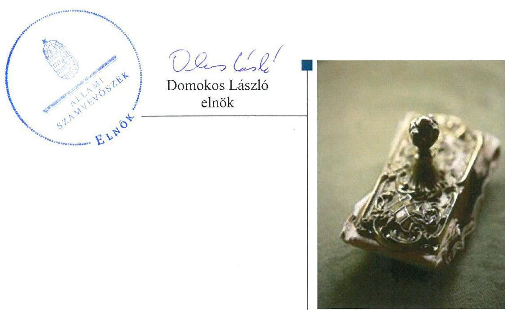
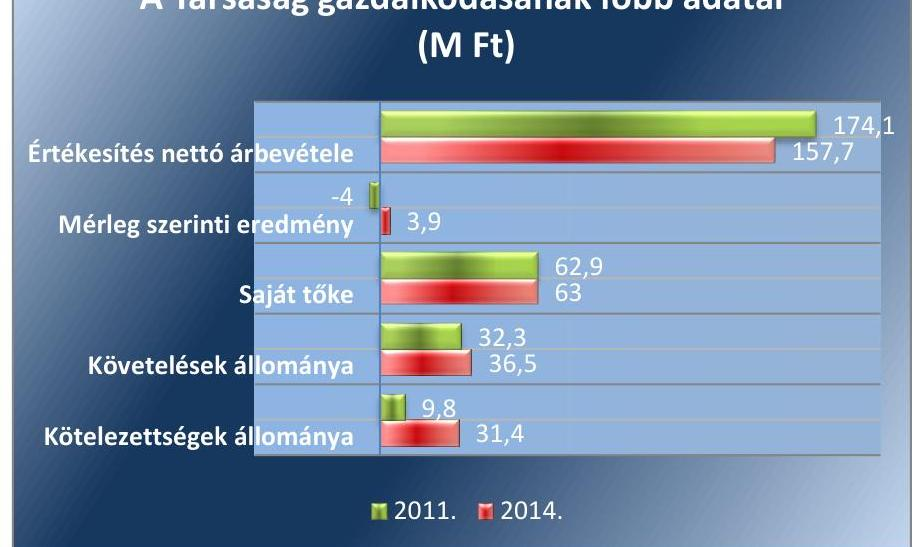
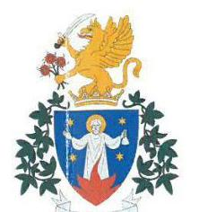
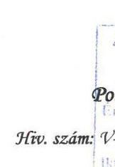
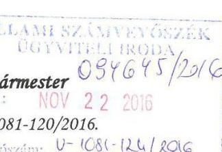
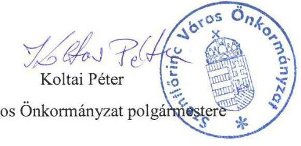

# Jelentés 

## Az önkormányzatok gazdasági társaságai

Az önkormányzatok többségi tulajdonában lévő gazdasági társaságok gazdálkodásának ellenőrzése - Szentlőrinci Közüzemi Nonprofit Kft.
2016.

---

# J elentés 

## Az önkormányzatok gazdasági társaságai

Az önkormányzatok többségi tulajdonában lévő gazdasági társaságok gazdálkodásának ellenőrzése - Szentlőrinci Közüzemi Nonprofit Kft.
2016. 12. hó 20. nap

---

Jelentéseink az Országgyúlés számítógépes hálózatán és az Interneten a www.asz.hu címen is olvashatóak.

## AZ ELLENŐRZÉST FELÜGYELTE:

MAKKAI MÁRIA felügyeleti vezető

## AZ ELLENŐRZÉST VEZETTE ÉS A VÉGREHAJTÁSÁÉRT FELELŐS:

VALASTYÁNNÉ DR. VÍZHÁNYÓ JÚLIA ellenőrzésvezető

## A PROGRAM ÖSSZEÁLLÍTÁSÁÉRT FELELŐS:

JANIK JÓZSEF osztályvezető

## A TÉMÁHOZ KAPCSOLÓDÓ KORÁBBI SZÁMVEVŐSZÉKI JELENTÉSEK:

- címe:

Jelentés Az önkormányzatok gazdasági társaságai Az önkormányzatok többségi tulajdonában lévő gazdasági társaságok közfeladat ellátását érintő gazdálkodási tevékenysége szabályszerűségének ellenőrzése - PÉTÁV Pécsi Távfütő Korlátolt Felelősségű Társaság

- sorszáma: $\quad 15058$
- címe: $\quad$ Jelentés Az önkormányzatok gazdasági társaságai Az önkormányzatok többségi tulajdonában lévő gazdasági társaságok közfeladat ellátását érintő gazdálkodási tevékenysége szabályszerűségének ellenőrzése - BIOKOM Pécsi Városüzemeltetési és Környezetgazdálkodási Kft.
- sorszáma: $\quad 15020$

IKTATÓSZÁM: V-1081-125/2016.
TÉMASZÁM: 2115
ELLENŐRZÉS-AZONOSÍTÓ SZÁM: V070745

---

# TARTALOMJEGYZÉK 

■ ÖSSZEGZÉS ..... 5
■ AZ ELLENŐRZÉS CÉLJA ..... 6
■ AZ ELLENŐRZÉS TERÜLETE ..... 7
■ AZ ELLENŐRZÉS HÁTTERE, INDOKOLTSÁGA ..... 9
■ FÓKUSZKÉRDÉSEK ..... 10
■ ELLENŐRZÉS HATÓKÖRE ÉS MÓDSZEREI ..... 11
■ MEGÁLLAPÍTÁSOK ..... 13
■ JAVASLATOK ..... 20
■ MELLÉKLETEK ..... 21
I. sz. melléklet: Értelmező szótár ..... 21
II. sz. melléklet: Eredménykimutatás Pénzügyi mutatószámok alakulása 2011-2014. között. ..... 24
■ FÜGGELÉK: ÉSZREVÉTELEK ..... 27
■ RÖVIDÍTÉSEK JEGYZÉKE ..... 29

---

.

---

# ÖSSZEGZÉS 

Az Állami Számvevőszék a kizárólagos önkormányzati tulajdonú Szentlőrinci Közüzemi Nonprofit Kft. gazdálkodásának ellenőrzése során megállapította, hogy Szentlőrinc Város Önkormányzata a közfeladat ellátását szabályszerűen szervezte meg, tulajdonosi jogait szabályszerűen gyakorolta. A Társaság vagyongazdálkodása szabályszerű volt. A közfeladat bevételei elszámolása megfelelő, a ráfordításai elszámolása összességében megfelelő volt, az árképzés megfelelő volt.

## Az ellenőrzés társadalmi indokoltsága

Az Állami Számvevőszék kiemelt célja, hogy a helyi önkormányzatok gazdálkodásában rejlő pénzügyi kockázatok feltárásával, az államháztartáson kívülre nyújtott költségvetési támogatások és ingyenes vagyonjuttatások, valamint az államháztartáson kívül múködő feladat-ellátó rendszerek ellenőrzéseivel hozzájáruljon ahhoz, hogy a közpénzeket az államháztartáson kívül múködő szervezetek is átlátható, rendezett módon használják fel.

Magyarországon az intézmény-centrikus közfeladat-ellátás jellemző, de egyre jelentősebb a költségvetésen kívüli feladatellátás térnyerése. Ennek legfontosabb szereplői - a nonprofit szervezetek mellett - az önkormányzati tulajdonú gazdasági társaságok. Az önkormányzatok szervezetalakítási szabadságának következménye, hogy a korábban is vállalati formában múködő közszolgáltatások mellett, mind a kötelező, mind az önként vállalt feladatok ellátásában a gazdasági társaságok kiemelt fontosságú szerephez jutottak.

## Főbb megállapítások, következtetések, javaslatok

A közfeladat ellátást az Önkormányzat szabályszerűen szervezte meg. Az Önkormányzat a tulajdonosi jogokat szabályszerűen gyakorolta. Az Önkormányzat a távhőszolgáltatásra vonatkozó rendeletalkotási kötelezettségének eleget tett. A Távhő rendeletet az ellenőrzött időszakban a Tszt. változása ellenére nem módosították, az üzletszabályzatot nem aktualizálták. A jegyző az ellenőrzött időszakban az üzletszabályzatban foglaltak betartása érdekében a Társaság távhőszolgáltató tevékenységét nem ellenőrizte. Javadalmazási és juttatási szabályzattal a Társaság a Taktv.-ben foglaltakkal ellentétben nem rendelkezett.

A Társaság rendelkezett a Számv. tv.-ben előírt számviteli szabályzatokkal. A Tszt. szerinti szétválasztási szabályokat a számviteli politikában és a számlarendben meghatározták. A Társaság eleget tett az éves beszámolási kötelezettségeinek.

A Szentlőrinci Közüzemi Nonprofit Kft. vagyongazdálkodása szabályszerű volt. A kötelezettségállomány mértéke nem veszélyeztette a közfeladat ellátást és a Társaság múködését. A Társaság által ellátott közfeladat bevételei elszámolása megfelelő volt. Ráfordításai elszámolása összességében megfelelő volt. A beruházások és felújítások elszámolása összességében megfelelő volt, az értékcsökkenés elszámolása nem volt megfelelő. A Társaságnál az anyagjellegú ráfordítások, a beruházások, felújítások és az értékcsökkenés elszámolásához a költségelszámolást megalapozó eredeti számlák nem álltak teljes körűen rendelkezésre. Az árképzés a jogszabályi előírásoknak megfelelően történt.

---

# AZ ELLENŐRZÉS CÉLJA 

## Az önkormányzatok gazdasági társaságai - Az önkormányzatok tulajdonában lévő gazdasági társaságok gazdálkodásának ellenőrzése - Szentlőrinci Közüzemi Nonprofit Kft.

Az ellenőrzés célja annak értékelése volt, hogy az önkormányzat vagyongazdálkodási tevékenysége során szabályszerűen gyakorolta-e tulajdonosi jogait; a gazdasági társaság szabályozottsága, gazdálkodása és vagyongazdálkodási tevékenysége, bevételeinek és ráfordításainak elszámolása megfelelt-e a jogszabályi és tulajdonosi előírásoknak; a gazdasági társaság kötelezettségállománya jelent-e kockázatot a múködésre, valamint a gazdálkodás átláthatósága és elszámoltathatósága érdekében biztosítva volt-e a szolgáltatás dijának megalapozottsága szabályszerű önköltségszámítással.

---

# AZ ELLENŐRZÉS TERÜLETE 

## Szentlőrinc Város Önkormányzata és a kizárólagos tulajdonában lévő Szentlőrinci Közüzemi Nonprofit Kft.

SZENTLŐRINC VÁROS ÖNKORMÁNY-
ZATA egyedüli tagként az ellenőrzött időszakot megelőzően, 2008. december 18-án alapította a Szentlőrinci Közüzemi Nonprofit Kft.-t. Jogelődje a Szentlőrinci Közüzemi Vállalat. A Társaság ${ }^{1}$ tulajdonosi szerkezete az ellenőrzött időszakban nem változott.

A Társaság alapításkori jegyzett tőkéje 14 M Ft volt, amely az ellenőrzött időszakban nem változott.

A TÁRSASÁG FŐ TEVÉKENYSÉGE gőzellátás, légkondicionálás Szentlőrinc város közigazgatási területén. A Társaság a távhőszolgáltatás közfeladat ellátáshoz szükséges vagyonelemeket az Önkormányzat²- tól üzemeltetésre kapta. A közfeladat ellátására az Önkormányzat üzemeltetési szerződést 2013. május 10-én kötött a Társasággal.

A Társaság az ellenőrzött időszakban egyéb városgazdálkodási - település tisztasági feladatok, ingatlankezelés, üzemeltetés, zöldterület fenntartás - tevékenységeket is végzett. A városgazdálkodással összefüggő egyéb feladatokat saját eszközeivel végezte. A Társaság vagyonkezelt vagyonnal nem rendelkezett.

A Társaság gazdálkodásának főbb adatait a 2011. és 2014. évek vonatkozásában az 1. ábra mutatja be.
1. ábra

A Társaság gazdálkodásának főbb adatai (M Ft)

Forrás: A Társaság 2011. és 2014. évi beszámolói

---

A Társaság mérlegfőösszege 2011. évben 82,5 M Ft, 2014. évben 95,6 M Ft volt. Az értékesítés nettó árbevétele az ellenőrzött időszakban 9,4\%-kal csökkent. A saját tőke összege 2011. évről a 2014. év végére csekély mértékben növekedett.

Az ellenőrzött időszakban a polgármester ${ }^{3}$ személye egy alkalommal változott, a hivatalban lévő polgármester a 2014. évi önkormányzati választások óta tölti be tisztségét. A jegyző ${ }^{4}$ személye egy alkalommal változott az ellenőrzött időszakban. Az ellenőrzött időszakban az ügyvezető személye két alkalommal változott. Az ellenőrzött időszak végén a feladatot ellátó ügyvezető 2012. január 1-je óta tölti be tisztségét.

A Társaság az ellenőrzött időszakban nem minősült a 479/2009/EK rendeletben valamint az Áht. ${ }^{5} 2$. § (1) bekezdés I) pontjában nevesített kormányzati szektorba sorolt egyéb szervezetnek.

---

# AZ ELLENŐRZÉS HÁTTERE, INDOKOLTSÁGA 

## Az önkormányzatok közfeladat-ellátásában egyre jelentősebb a gazdasági társaságok útján történő feladatellátás térnyerése

## AZ ÖNKORMÁNYZATI TULAJDONÚ GAZDASÁGI

TÁRSASÁGOK ellenőrzése kiemelten fontos a vagyon megőrzése, megóvása érdekében, valamint a kormányzati szektor elszámolásaiban megjelenő önkormányzati tulajdonú gazdálkodó szervezetek esetében, amelyekkel szemben alapvető követelmény, hogy gazdálkodásuk, müködésük szabályszerű, az általuk szolgáltatott adatok minél megbízhatóbbak legyenek. A feladat/közfeladat-ellátás költségeinek, ráfordításainak alakulása, színvonala hatással van a lakosság elégedettségére.

A TÖRVÉNYALKOTÁS SZÁMÁRA - az észlelt problémák, szabálytalanságok, vagy egyéb nem kívánatos jelenségek felszínre kerülésével - az ellenőrzés megállapításai segítséget nyújthatnak az államháztartáson kívüli feladat/közfeladat-ellátás értékeléséhez, jogszabályi keretei pontosításához, átláthatóságot biztosító szabályozásához. Meghatározhatóvá válnak az önkormányzati feladatellátásban részt vevő államháztartáson kívüli szervezeteknek - az önkormányzat költségvetését, pénzügyi helyzetét is befolyásoló - kockázatai, lehetővé válik ezen kockázatok csökkentése. Ellenőrzéseink feltárhatják, hogy az önkormányzat feladat-ellátási kötelezettségének szabályszerűen tett-e eleget, a feladatellátáshoz rendelt vagyonkezelésbe vett és saját vagyon müködtetését az elvárható gondossággal, szabályszerűen szervezte-e meg és a tulajdonosi felügyelete hozzájárult-e a feladatellátásához. Az ellenőrzés rávilágíthat arra, hogy a gazdasági társaság a feladat-ellátási, közszolgáltatási szerződésben foglaltak betartásával, a vagyon használatával biztosította-e a szolgáltatás folytatásának feltételeit, a feladat ellátását. Ezzel az ellenőrzöttek és a helyi döntéshozók számára visszajelzést ad feladatszervezési, feladat-ellátási kockázataikról, alapot ad a meglévő hibák megszüntetéséhez, a jobb feladatellátás biztosításához. Fokozza a fegyelmet, igazolja, hogy lejárt a következmények nélküli ellenőrzések időszaka. Az ÁSZ értékteremtő rend kialakításához és megőrzéséhez hozzájáruló tevékenysége pozitív hatással van a szervezetről kialakított összkép formálására.

---

# FÓKUSZKÉRDÉSEK 

1.     - Az Önkormányzat közfeladat ellátásának megszervezése, valamint a tulajdonosi joggyakorlás szabályszerű volt-e?
2.     - A gazdasági társaság vagyongazdálkodása szabályszerű volt-e, kötelezettségállománya jelent-e kockázatot a müködésre, illetve a közfeladat ellátására?
3.     - A gazdasági társaságnál az ellátott közfeladat bevételei és ráfordításai elszámolása, valamint az önköltségszámitás és árképzés szabályszerű volt-e?

---

# ELLENŐRZÉS HATÓKÖRE ÉS MÓDSZEREI 

## Az ellenőrzés típusa

Megfelelőségi ellenőrzés

## Az ellenőrzött időszak

2011. január 1-jétől 2014. december 31-ig.

## Az ellenőrzés tárgya

A gazdasági társaság feletti tulajdonosi joggyakorlás, valamint a gazdasági társaság gazdálkodásának szabályozottsága és szabályszerűsége.

Az ellenőrzés kiterjed minden olyan körülményre és adatra, amely az ÁSZ jogszabályban meghatározott feladatainak teljesítéséhez, valamint a program végrehajtása folyamán felmerült újabb összefüggések feltárásához szükséges.

## Az ellenőrzött szervezet

Az ellenőrzött szervezetek:
$\longrightarrow$ Szentlőrinc Város Önkormányzata
$\longrightarrow$ Szentlőrinci Közüzemi Nonprofit Kft.

## Az ellenőrzés jogalapja

Az ellenőrzés jogszabályi alapját az ÁSZ tv. 1. § (3) bekezdése és 5. § (3)-(4)-(5) bekezdései képezik.

## Az ellenőrzés módszerei

Az ellenőrzést a nemzetközi standardokat irányadónak tekintve az ellenőrzési program ellenőrzési kérdései, az ellenőrzött időszakban hatályos jogszabályok, az ellenőrzés szakmai szabályok és módszertanok figyelembevételével végeztük.

Az ellenőrzés ideje alatt az ellenőrzött szervezettel történő kapcsolattartást az ÁSZ Szervezeti és Múködési Szabályzatának vonatkozó előírásai alapján biztosítottuk.

---

Az ellenőrzés a tulajdonosi jogokat gyakorló Szentlőrinc Város Önkormányzatára, és a közfeladatot ellátó Szentlőrinci Közüzemi Nonprofit Kft.re terjedt ki.

Az ellenőrzési kérdések megválaszolásához szükséges bizonyítékok megszerzése a következő ellenőrzési eljárások alkalmazásával történt: megfigyelés, kérdésfeltevés (információkérés), összehasonlítás, valamint elemző eljárás. Az ellenőrzési bizonyítékként felhasználható adatforrások közé tartoznak egyrészt a szakmai programban felsorolt adatforrások, másrészt adatforrás lehet még minden - az ellenőrzés folyamán - feltárt, az ellenőrzés szempontjából információkat tartalmazó dokumentum.

Az ellenőrzést a kérdésekre adott válaszok kiértékelésével, valamint a megjelölt adatforrások, a csatolt tanúsítványok felhasználásával, továbbá az adott időszakban hatályos jogszabályok figyelembe vételével folytattuk le.

A bevételek és ráfordítások elszámolása, valamint a vagyonnyilvántartás terén a szabályszerű múködést véletlen mintavétellel ellenőriztük. A mintavétellel ellenőrzött területek esetében minden egyes tétel vonatkozásában a szabályszerűségre vonatkozó kérdéseket tettünk fel, amelyek eredménye összesítésre került. A jogszabályoknak és a belső előírásoknak megfelelőnek tekintettük az adott területet, amennyiben a minta ellenőrzésének eredménye alapján 95\%-os bizonyossággal a teljes sokaságban a hibaarány kisebb volt, mint 10\%, nem megfelelőnek, ha a hibaarány a 10\%ot meghaladta. „Részben megfelelő" minősítést adtunk, amennyiben egy adott terület vonatkozásában a minta alapján a teljes sokaságban nem volt egyértelmúen biztosított a jogszabályoknak és a belső szabályzatoknak megfelelő múködés.

A ráfordítások elszámolására és a vagyonnyilvántartásra vonatkozó véletlen mintavételt kockázati alapú kiválasztással egészítettük ki, amelynek során évente a három legnagyobb összegű tételt választottuk ki.

---

# 1. Az Önkormányzat közfeladat ellátásának megszervezése, valamint a tulajdonosi joggyakorlás szabályszerű volt-e? 

Összegző megállapítás

Az Önkormányzat a jogszabályi előírásoknak megfelelően biztosította a távhőszolgáltatást, a tulajdonosi jogokat a jogszabályi előírásoknak megfelelően gyakorolták.
1.1. számú megállapítás

A közfeladat ellátást az Önkormányzat megfelelően biztosította.
A GAZDASÁGI PROGRAMOT ${ }^{6}$ az Önkormányzat az Ötv. ${ }^{7}$ 91. § (6) bekezdés szerint szabályszerűen elkészítette. A Képviselő-testület ${ }^{8}$ által elfogadott 2010 - 2014. évekre vonatkozó gazdasági program a közszolgáltatások rendszerének ésszerűsítését és bevételek realizálását helyezte a középpontba. A távhőszolgáltatásra vonatkozó elképzelésekről az Önkormányzat az ellenőrzési időszakot megelőzően döntött.

KÖZÉP- ÉS HOSSZÚ TÁVÚ VAGYONGAZDÁLKODÁSI TERVET ${ }^{9}$ az Önkormányzat 2011. január 1. és 2013. október 10. között nem készített, amivel megsértette az Nvtv. ${ }^{10}$ 9. § (1) bekezdésben előírtakat. Az Önkormányzat az Nvtv. 7. § (2) bekezdésének megfelelően elkészítette a közép- és hosszú távú vagyongazdálkodási tervét, amelyet a Képviselő-testület 2013. október 10-én határozatában szabályszerűen elfogadott.

A TÁVHŐSZOLGÁLTATÁS közfeladatát az Önkormányzat a tulajdonában lévő Szentlőrinci Közüzemi Nonprofit Kft.-n keresztül látta el. A távhő vagyon az Önkormányzat tulajdonában állt, melyet az Önkormányzat üzemeltetésre adott át a Társaság részére.

AZ ALAPÍTÓ OKIRAT ${ }^{11}$ a Gt. ${ }^{12}$ és a Ptk. ${ }^{13}$ előírásainak megfelelő tartalommal készült. Az Alapító okiratot négy alkalommal módosították az ellenőrzött időszakban. A módosítások nem érintették a feladatellátást, és a tulajdonosi jogok gyakorlását. Az Alapító okirat szerint a legfőbb szerv hatáskörét az Önkormányzat Képviselő-testülete gyakorolta.

A TÁVHŐ RENDELET ${ }^{14}$ megalkotásával az Önkormányzat eleget tett a Tszt. ${ }^{15}$-ben előírt rendeletalkotási kötelezettségének. A Távhő rendeletben meghatározták a felhasználói közösségek működésének szabályait, az alkalmazott távhőszolgáltatási díjakat, az alapdíj, hődíj és csatlakozási díj alkalmazásának és fizetésének szabályait, az alapdíjban felszámítható nyereség mértékét, a szolgáltatási feltételeket. A Távhő rendelet mellékleteiben meghatározták az alapdíj számításának módját, az alapdíj, hődíj és csatlakozási díj mértékét, a korlátozási és szüneteltetési sorrendet, valamint a területfejlesztési, környezetvédelmi és levegő-tisztaságvédelmi

---

szempontok alapján távhőszolgáltatás megtartására és fejlesztésére kijelölt területeket. A Tszt. 57/D. § 2011. április 15-ei hatályba lépésével az Önkormányzat ármegállapítási jogköre megszűnt, azonban a Távhő rendeletet a jogszabály-változás ellenére az ellenőrzött időszakban nem módosították.

A VAGYONRENDELET $1,2,3^{16}$-ET az Önkormányzat az Ötv.ben, a Mötv. ${ }^{17}$-ben és az Nvtv. -ben előírtaknak megfelelően megalkotta. A Vagyonrendelet ${ }_{2}$ módosítására az ellenőrzött időszakban egy alkalommal, a korlátozottan forgalomképes vagyontárgyak jegyzékének módosítása miatt került sor.

A TÁRSASÁG ÜZLETSZABÁLYZATÁT ${ }^{18}$ a Tszt. alapján a jegyző 2009. június 22-én jóváhagyta. Az üzletszabályzatot a Tszt. 2011. április 15-ei módosítását követően az ellenőrzött időszakban nem aktualizálták. A jegyző, a 2011. április 15. napján hatályba lépő Tszt. 7. § (1) bekezdés c) pont előírása ellenére az ellenőrzött időszakban az üzletszabályzatban foglaltak betartása szempontjából a Társaság távhőszolgáltató tevékenységét nem ellenőrizte.

ÜZEMELTETÉSI SZERZŐDÉS ${ }^{19}$ - t az Önkormányzat a Tszt. ben foglalt előírásoknak megfelelően a közfeladatának ellátása érdekében a Társasággal 2013. május 10-én kötött, határozatlan időre. Távhőszolgáltatási közfeladatát 2011. január 1. és 2013. május 9. között a jogelőd szervezettel létrejött átadás-átvételi jegyzőkönyv ${ }^{20}$-ben lévő eszközökkel - az Alapító okirat alapján látta el, egyéb szerződéssel nem rendelkezett. Az üzemeltetési szerződést az ellenőrzött időszak végéig nem módosították.

# 1.2. számú megállapítás Az Önkormányzat a tulajdonosi jogokat szabályszerűen gyakorolta. 

A TULAJDONOSI JOGOK gyakorlásának rendjét a Képviselőtestület az Ötv. 80. § (1) bekezdésében és az Mötv. 107. § -ában kapott felhatalmazás alapján a Vagyonrendelet ${ }_{1,2,3}$-ben szabályozta. A tulajdonosi joggyakorlás az ellenőrzött időszakban szabályszerűen történt.

AZ FB a Gt., valamint a Ptk. ${ }_{2}$-ben foglaltakkal összhangban három tagból állt. Ügyrendjét a Gt. 34. § (4) bekezdés és a Ptk. ${ }_{2}$ 3:122. § (3) bekezdésében foglaltaknak megfelelően állapította meg, melyet a Képviselő-testület jóváhagyott. Az FB az ellenőrzött időszak minden évében jelentést készített a Társaság éves beszámolóiról, a Gt. 35. § (3) bekezdése és a Ptk. ${ }_{2}$ 3:120. § (2) bekezdésének megfelelően.

JAVADALMAZÁSI ILLETVE JUTTATÁSI SZABÁLYZATTAL a Társaság a Taktv. ${ }^{21}$ 5. § (3) bekezdésében foglaltakkal ellentétben nem rendelkezett.

ELLENŐRZÉS a 2011-2014. években a Társaságnál hat alkalommal történt - az egyes adókötelezettségek teljesítése tárgyában - a NAV részéről. Az ellenőrzések tárgya nem kapcsolódott a közfeladat-ellátáshoz.

---

A TÁRSASÁG BESZÁMOLTATÁSI RENDJÉT az Önkormányzat külön belső szabályzatban nem szabályozta. A Képviselő-testület a Vagyonrendelet ${ }_{1,2,3}$ előírásai alapján megtárgyalta és elfogadta a 20112014. években előterjesztett számviteli beszámolókat. A Képviselő-testület a beszámolókat a Gt. 141. § (2) bekezdés a) pontjában, valamint a $\mathrm{Ptk}_{2}$ 3:109. § (2) bekezdésében foglaltak alapján hagyta jóvá, az FB írásos jelentése alapján.

# 2. A gazdasági társaság vagyongazdálkodása szabályszerű volt-e, kötelezettségállománya jelent-e kockázatot a múködésre, illetve a közfeladat ellátására? 

Összegző megállapítás

A Szentlőrinci Közüzemi Nonprofit Kft. vagyongazdálkodása megfelel a jogszabályi előírásoknak. A kötelezettségállomány mértéke nem veszélyeztette a közfeladat ellátását és a Társaság múködését.
2.1. számú megállapítás

A Társaság rendelkezett a múködéshez szükséges, a jogszabályi és tulajdonosi előírásoknak megfelelő szabályzatokkal.

SZÁMVITELI POLITIKÁVAL ${ }^{22}$ a Társaság a Számv. tv. ${ }^{23}$-nek megfelelően rendelkezett az ellenőrzött időszakban. A Társaság a számviteli politikájában a költségnemek szerinti kimutatást határozta meg. A 2012. január 1-jétől hatályos és alkalmazott szétválasztási arányok, a tételesen nem elkülöníthető bevételek, ráfordítások, tárgyi eszközök és vevők tevékenységhez történő hozzárendelése a Tszt. -ben foglaltakkal összhangban történt.

A Társaság a számviteli politika keretében a Számv. tv. 14. § (5) bekezdésének megfelelően elkészítette leltározási szabályzatát ${ }^{24}$, az eszközök és források értékelési szabályzatát ${ }^{25}$, és a pénzkezelési szabályzatát ${ }^{26}$. A Társaság az ellenőrzött időszakban rendelkezett felesleges vagyontárgy hasznosítási és selejtezési szabályzattal ${ }^{27}$ is.

A LELTÁROZÁSI SZABÁLYZAT megfelelt a Számv. tv. előírásainak. A leltározási szabályzatban a Számv. tv. előírásaival összhangban meghatározták a leltározási, egyeztetési kötelezettséget az eszközök és források vonatkozásában. Azon eszközöknél, ahol a folyamatos mennyiségi nyilvántartást vezettek legalább három évenkénti mennyiségi leltározást írt elő a Társaság a Számv. tv. 69. § (3) bekezdésében foglaltaknak megfelelően.

AZ ESZKÖZÖK ÉS FORRÁSOK ÉRTÉKELÉSI SZABÁLYZATA a Számv. tv.-vel összhangban tartalmazta az eszközök és források bekerülési értékének, valamint értékelésének szabályait.

A PÉNZKEZELÉSI SZABÁLYZAT megfelelt a Számv. tv. előírásainak.

---

SZÁMLARENDJÉT ${ }^{28}$ a Társaság a Számv. tv. előírásainak figyelembevételével elkészítette. A Társaság a Számv. tv., és 2012. január 1-jétől a Tszt. 18/A. § (2)-(3) bekezdéseiben foglaltakkal összhangban a közfeladat ellátással kapcsolatos elszámolásokat, valamint a közfeladatok-ellátását szolgáló vagyonelemeket elkülönítetten tartotta nyilván.

ADATVÉDELMI SZABÁLYZATTAL ${ }^{29}$ a Társaság 2011. január 1. és 2011. december 31. közötti időszakban az Avtv. ${ }^{30}$ 31/A. § (2) bekezdés d) pontja valamint a (3) bekezdése, 2012. január 1. és 2012. augusztus 31. között az Info tv. ${ }^{31}$ 24. § (2) bekezdés d) pontja valamint a (3) bekezdése ellenére nem rendelkezett. A jogszabályoknak megfelelő adatvédelmi szabályzat 2012. szeptember 1-jén lépett hatályba.

# 2.2. számú megállapítás 

A Szentlőrinci Közüzemi Nonprofit Kft. vagyongazdálkodása szabályszerű volt.

## A TÁRSASÁG A SZÁMVITELI NYILVÁNTARTÁSAIT

a Számv. tv. 161/A. § (2) bekezdésében és a számlarend előírásaival összhangban vezette. A Társaság az eszközök tekintetében a közszolgáltatással kapcsolatos szétválasztási kötelezettségének eleget tett, az eszközök bekerülési értékét a Számv. tv. 47 - 51. § valamint a számviteli politika előírásainak megfelelően állapította meg.

A Társaság saját vagyonának elkülönített nyilvántartása megfelelt a Számv. tv. 161/A. § (2) bekezdésének, valamint a Tszt. 18/A. § (2) bekezdésben foglaltaknak. Mérlegeit a Számv. tv. 69. § (1) bekezdése szerint minden ellenőrzött évben leltárral támasztotta alá.

A Társaság éves beszámolóinak főbb mérlegadatait az 1. táblázat mutatja be.

## A TÁRSASÁG MÉRLEGÉNEK FŐBB ADATAI (M FT)

| Megnevezés | 2011.01.01. | 2011.12.31. | 2012.12.31. | 2013.12.31. | 2014.12.31. |
| :--: | :--: | :--: | :--: | :--: | :--: |
| I. Befektetett eszközök | 23,0 | 34,9 | 30,0 | 30,3 | 27,7 |
| - ebből: Tárgyi eszközök | 22,8 | 34,6 | 29,8 | 29,0 | 27,0 |
| II. Forgó eszközök | 78,1 | 43,1 | 73,5 | 58,6 | 56,2 |
| - ebből: Követelések | 37,4 | 32,3 | 43,7 | 38,7 | 36,5 |
| III. Aktív időbeli elhatárolások | 5,4 | 4,5 | 6,8 | 7,0 | 11,7 |
| Eszközök összesen | 106,5 | 82,5 | 110,3 | 95,9 | 95,6 |
| IV. Saját tőke | 66,9 | 62,9 | 66,5 | 59,2 | 63,0 |
| - ebből: Jegyzett tőke | 14,0 | 14,0 | 14,0 | 14,0 | 14,0 |
| - ebből Mérleg szerinti eredmény | 15,4 | $-4,0$ | 3,5 | $-7,3$ | 3,9 |
| V. Céltartalékok | 0,0 | 0,0 | 2,2 | 0,0 | 0,7 |
| VI. Kötelezettségek | 16,1 | 9,8 | 39,7 | 33,6 | 31,4 |
| VII. Passzív időbeli elhatárolások | 23,5 | 9,8 | 1,9 | 3,1 | 0,5 |
| Források összesen | 106,5 | 82,5 | 110,3 | 95,9 | 95,6 |

Forrás: A Társaság 2011-2014. évi beszámolói alapján

AZ ÜZEMELTETÉSRE átvett eszközök megőrzésére, hasznosítására, megterhelésére vonatkozó, az üzemeltetési szerződésben rögzített megőrzési szabályokat a Társaság az ellenőrzött időszak egészében betartotta.

---

A TÁRSASÁG a 2011. és 2013. években veszteségesen, a 2012. és 2014. években nyereségesen gazdálkodott, a saját tőkéjének összege minden évben meghaladta a jegyzett tőke összegét.
2.3. számú megállapítás

A kötelezettségállomány mértéke nem veszélyeztette a közfeladat ellátást és a Társaság múködését.

## A RÖVID LEJÁRATÚ KÖTELEZETTSÉGEK ÁL-

LOMÁNYA a 2011. év végi 9,8 M Ft - ról a 2014. év végére 31,4 M Ftra növekedett. A növekedés oka a szállítók felé fennálló kötelezettségek összegének a 2011. évi 0,4 M Ft-ról a 2014. évre 20,8 M Ft-ra történt emelkedése, amit a nem lejárt fizetési határidejú 2014. december havi geotermikus energia díjszámlák okoztak. Az ellenőrzött időszakban a Társaságnak hosszú lejáratú kötelezettsége nem volt.

A 2011-2014. években az eladósodottsági mutatók értéke kedvező volt. A Társaság követelései valamennyi évben meghaladták a kötelezettségek összegét.

A Társaság a 2012. évben 6,1 M Ft, a 2013. évben 14,6 M Ft, a 2014. évben 34,2 M Ft, összesen 54,9 M Ft összegú távhőszolgáltatói támogatást kapott a Magyar Energetikai és Közmú-szabályozási Hivataltól. A Társaság az Önkormányzattól az ellenőrzött időszakban nem kapott támogatást.

A kötelezettségállomány mértéke nem veszélyeztette a közfeladat ellátást és a Társaság múködését.
2.4. számú megállapítás

A Társaság beszámolási kötelezettségének a jogszabályi előírásoknak megfelelően eleget tett.

BESZÁMOLÁSI ÉS ADATSZOLGÁLTATÁSI kötelezettségének a Társaság az ellenőrzött időszakban a Számv. tv.-ben, a számviteli politikában foglaltaknak valamint közérdekú adatok közzétételére vonatkozó szabályzatában előírtaknak megfelelően eleget tett.

A Társaság a Számv. tv. előírásainak megfelelően, a 2011 - 2014. évekre vonatkozóan elkészítette éves számviteli beszámolóit, amelyeket a Képvi-selő-testület a Számv. tv. előírásai szerint határidőben elfogadott. A Társaság gondoskodott a beszámolók Számv. tv.-ben meghatározott letétbe helyezéséről, illetve elektronikus közzétételéről.

A Képviselő-testület az FB írásos jelentése alapján fogadta el minden alkalommal a Társaság éves beszámolóit. A könyvvizsgáló az ellenőrzött időszak minden évében hitelesítő záradékkal látta el a Társaság beszámolóit.

A Társaság a kötelezően közzéteendő közérdekú adatokat az Info tv. 33. § (1) bekezdésében, valamint az 1. számú mellékletében foglaltaknak megfelelően tette közzé.

---

# 3. A gazdasági társaságnál az ellátott közfeladat bevételei és ráfordításai elszámolása, valamint az önköltségszámítás és árképzés szabályszerű volt-e? 

Összegző megállapítás

### 3.1. számú megállapítás

3. ábra

Az ellenőrzés megállapítása
A gazdasági társaság ráfordításainak szabályszerű elszámolása területén
2. anyagjellegú ráfordítások
3. forultázások, felújítások
4. forultázások, felújítások
5. Értékcsökkenés
6. gazdasági társaság bevetésének szabályszerű elszámolása területén
7. Értékcsök a nétsi árbevetés
A Társaság által ellátott közfeladat bevételeinek elszámolása megfelelő volt, ráfordításainak elszámolása összességében megfelelő volt. Az árképzés a jogszabályi előírásoknak megfelelően történt.

Az értékesítés nettó árbevételének elszámolása megfelelő volt. Az anyagjellegú ráfordítások, a beruházások és felújítások elszámolása összességében megfelelő volt. Az értékcsökkenés elszámolása nem felelt meg a jogszabályi rendelkezéseknek.

AZ ÉRTÉKESÍTÉS NETTÓ ÁRBEVÉTELEINEK ELSZÁMOLÁSA megfelelő volt. A bevételek előírása és kiszámlázása a Távhő rendelet, valamint a számviteli politikának és a számlarendnek megfelelően történt, a bevételeket a megfelelő számlacsoportban, közfeladatonként elkülönítve számolták el. Az alkalmazott árak megfeleltek a belső szabályozásnak és a tulajdonosi követelményeknek.

AZ ANYAGJELLEGÚ RÁFORDÍTÁSOK ELSZÁMOLÁSA részben volt megfelelő. A költségelszámolást megalapozó eredeti számlák nem álltak teljes körűen rendelkezésre, amivel a Társaság nem tett eleget a Számv. tv. 169. § (2) bekezdésében előírt bizonylat megőrzési kötelezettségének. A hiányzó eredeti bizonylatok másolati példányai rendelkezésre álltak.

A BERUHÁZÁSOK, FELÚJÍTÁSOK ELSZÁMOLÁSA részben volt megfelelő. A költségelszámolást megalapozó eredeti számlák nem álltak teljes körűen rendelkezésre, amivel a Társaság nem tett eleget a Számv. tv. 169. § (2) bekezdésében előírt bizonylat megőrzési kötelezettségének. A hiányzó eredeti bizonylatok másolati példányai rendelkezésre álltak.

AZ ÉRTÉKCSÖKKENÉS ELSZÁMOLÁSA nem felelt meg a jogszabályi rendelkezéseknek. A költségelszámolást megalapozó eredeti számlák nem álltak teljes körűen rendelkezésre, amivel a Társaság nem tett eleget a Számv. tv. 169. § (2) bekezdésében előírt bizonylat megőrzési kötelezettségének. A hiányzó eredeti bizonylatok másolati példányai rendelkezésre álltak.

Az ellenőrzött időszakban a Társaság saját eszközei után elszámolt értékcsökkenése a 2011. évi 5,5 M Ft-ról a 2014. évre 3,7 M Ft-ra változott.

A LAKOSSÁGGAL SZEMBENI KÖVETELÉSEK ÉRTÉKÉT a Társaság a Számv. tv. 29. § (1)-(2) bekezdés és a Számv. tv. 65. § (6)-(7) bekezdései szerint mutatta ki az ellenőrzött időszakban. 2014. december 31-én a lakossággal szembeni követelés összege 24,7 M Ft volt.

---

A lejárt kintlévőségek annak ellenére emelkedtek, hogy a Társaság intézkedéseket tett a kintlévőségek behajtására. Az ellenőrzött időszakban rendszeresen értékvesztést számoltak el a vevőkövetelések után. A Társaság a követelések behajtására vonatkozóan szabályzattal nem rendelkezett. A Társaság a nem fizető adósok ellen fizetési felszólítást, majd fizetési meghagyás kibocsátását kezdeményezte.

A lakossággal szembeni követelések állománya a rezsicsökkentési előírások végrehajtása következtében nem változott. A Társaságot az 50/2011.(IX.30.) NFM rendelet ${ }^{32}$ 5. § (2) bekezdés 2. pontja szerinti nyereségkorlát túllépése miatt visszafizetési kötelezettség terhelte a 2012. évben 2,28 M Ft, a 2014. évben 0,71 M Ft volt, melyre a céltartalék képzése megtörtént. A Társaság a nyereségkorlát feletti nyereség visszafizetése alóli mentességre kérelmet nyújtott be a MEKH ${ }^{33}$ - hez, amelyet meg is kapott.
3.2. számú megállapítás

Az árképzés a jogszabályi előírásoknak megfelelően történt.

ÖNKÖLTSÉGSZÁMÍTÁSI SZABÁLYZAT KÉSZÍTÉ-
SÉRE a Társaság az ellenőrzött időszakban a Számv. tv. 14. § (6) és (7) bekezdései alapján nem volt kötelezett.

# A TÁVHŐSZOLGÁLTATÁSÉRT FIZETENDŐ DÍJAKAT az Önkormányzat a Távhő rendeletben határozta meg. 

A 2011. január 1-jétől hatályos díjakat a Távhő rendelet 2011. január 1jétől hatályos módosítása tartalmazta. Az alkalmazott díjak a Távhő rendeletben foglaltaknak megfeleltek.

A távhőszolgáltatás díját 2011. április 15-től a Tszt. 57/D. § (1) bekezdése alapján, mint legmagasabb hatósági árat, azok szerkezetét és alkalmazási feltételeit a nemzeti fejlesztési miniszter rendeletben állapította meg. A Társaság a jogszabályi rendelkezéseknek megfelelően a díjak 2012. évi 4,2\%-os emelését, és a 2013. évi két ütemben történő, valamint 2014. évre előírt mértékű csökkentését végrehajtotta. A Társaság a központi intézkedéseket (árcsökkentés) a Rezsi tv. ${ }^{34}$ 4. § (1) bekezdése alapján végrehajtotta.

---

# JAVASLATOK 

Az ÁSZ tv. 33. § (1) bekezdésében foglaltak értelmében az ellenőrzött szervezet vezetője köteles a jelentésben foglalt megállapításokhoz kapcsolódó intézkedési tervet összeállítani és azt a jelentés kézhezvételétől számított 30 napon belül az ÁSZ részére megküldeni. Amennyiben az ellenőrzött szervezet vezetője nem küldi meg határidőben az intézkedési tervet, vagy továbbra sem elfogadható intézkedési tervet küld, az Állami Számvevőszék elnöke az ÁSZ tv. 33. § (3) bekezdése a) és b) pontjaiban foglaltakat érvényesítheti.

## Szentlőrinc Város Önkormányzata polgármesterének

1. Intézkedjen a vezető tisztségviselők, felügyelőbizottsági tagok, valamint az Mt. ${ }^{35}$ 208. §-ának hatálya alá eső munkavállalók javadalmazása, valamint a jogviszony megszünése esetére biztosított juttatások módjának, mértékének elveire, annak rendszerére vonatkozó szabályzat elkészitéséről.
(1.2. sz. megállapítás 3. bekezdése alapján)

## A Szentlőrinci Közös Önkormányzati Hivatal jegyzőjének

1. Intézkedjen a távhőszolgáltató tevékenységének az üzletszabályzatban foglaltak betartása szempontjából történő ellenőrzéséről.
(1.1. sz. megállapítás 7. bekezdése alapján)

## A Szentlőrinci Közüzemi Nonprofit Kft. ügyvezetőjének

1. Intézkedjen annak érdekében, hogy az üzletszabályzat megfeleljen a jogszabályi előírásoknak és a módosított üzletszabályzatot küldje meg a jegyzőnek jóváhagyás céljából.
(1.1. sz. megállapítás 7. bekezdése alapján)
2. Intézkedjen a bizonylatok jogszabályi előírásoknak megfelelő megőrzése érdekében.
(3.1. sz. megállapítás 2-4. bekezdései alapján)

---

# MELLÉKLETEK 

## I. SZ. MELLÉKLET: ÉRTELMEZŐ SZÓTÁR

adósságfedezeti mutató I.
adósságfedezeti mutató II.

Adósságot keletkeztető ügylet
árbevételre vetített eladósodottság
eladósodottság mértéke
(befektetett eszközök + forgó eszközök) / idegen forrás
Azt mutatja, hogy 1 Ft adósságra hány Ft vagyon jut. Általánosságban véve kedvező, ha értéke 2 körül van, de nagy eszközberuházás-igényű iparágakban értéke kisebb is lehet.
működési cash flow / hosszú lejáratú kötelezettségek
A mutató azt jelzi, hogy az adott gazdálkodási időszak működési pénzáramainak eredményeként realizált cash flow révén a vállalkozás mennyiben lenne képes valamennyi hosszú lejáratú kötelezettségének eleget tenni. Ennek vizsgálatára viszonylag ritkán kerül sor, az elsősorban a veszélyhelyzetbe került vállalkozások esetében lehet érdekes. Általánosságban véve kedvező, ha a működési cash flow minél nagyobb arányban nyújt fedezetet a hosszú lejáratú kötelezettségre (értéke nagyobb, mint 1, nő az ellenőrzött időszakban).
Adósságot keletkeztető ügylet és annak értéke:
a) hitel, kölcsön felvétele, átvállalása a folyósítás, átvállalás napjától a végtörlesztés napjáig, és annak aktuális tőketartozása,
b) a Számv. tv. szerinti hitelviszonyt megtestesítő értékpapír forgalomba hozatala a forgalomba hozatal napjától a beváltás napjáig, kamatozó értékpapír esetén annak névértéke, egyéb értékpapír esetén annak vételára,
c) váltó kibocsátása a kibocsátás napjától a beváltás napjáig, és annak a váltóval kiváltott kötelezettséggel megegyező, kamatot nem tartalmazó értéke, d) a Számv. tv. szerint pénzügyi lízing lízingbevevői félként történő megkötése a lízing futamideje alatt, és a lízingszerződésben kikötött tőkerész hátralévő összege,
e) a visszavásárlási kötelezettség kikötésével megkötött adásvételi szerződés eladói félként történő megkötése - ideértve a Számv. tv. szerinti valódi penziós és óvadéki repóügyleteket is - a visszavásárlásig, és a kikötött visszavásárlási ár,
f) a szerződésben kapott, legalább háromszázhatvanöt nap időtartamú halasztott fizetés, részletfizetés, és a még ki nem fizetett ellenérték,
g) hitelintézetek által, származékos műveletek különbözeteként az Államadósság Kezelő Központ Zrt. -nél elhelyezett fedezeti betétek, és azok öszszege.
Forrás: Stabilitási tv. ${ }^{36}$ 3. § (1) bekezdése
(kötelezettségek - forgóeszközök) / értékesítés nettó árbevétele
Az árbevételre vetített eladósodottság azt mutatja, hogy az árbevétel mekkora fedezet nyújt a kötelezettségeknek a forgóeszközökkel csökkentett részére. Általánosságban véve kedvező, ha az árbevétel minél nagyobb arányban nyújt fedezetet a forgóeszközökkel csökkentett kötelezettségekre (értéke kisebb, mint 1, csökken az ellenőrzött időszakban).
Kötelezettségek / saját tőke
Fontos szerepet játszik ez a mutató egy vállalat megítélésében. Azt mutatja, hogy a saját források a kötelezettségek hány százalékát fedezik. Törekedni kell, hogy a mutató tartósan (jelentősen) 1 alatti értéket érjen el.

---

eladósodottsági mutató (tőkeáttétel)
garancia
gazdasági társaság
gazdálkodó szervezet
kezesség

Kormányzati szektorba sorolt egyéb szervezet
közfeladat
idegen tőke / összes forrás
Egészségesnek mondható egy olyan mértékű áttétel, amelyet az üzleti tervek szerint és az elmúlt időszak tapasztalatai alapján a társaság megfelelő biztonsággal ki tud termelni. Nagy eszközberuházás-igényű iparágakban értéke magasabb, azaz magasabb eladósodottság is elfogadható, de 75-85 \%-ot meghaladó értéknél már itt is erős, sőt túlzott külső finanszírozottságról beszélhetünk. Általánosságban véve kedvező, ha értéke kisebb, mint 0.
A garancia olyan önálló, az önkormányzat nevében vállalt kötelezettség, amely alapján az önkormányzat az önkormányzati költségvetés terhére szerződésben meghatározott feltételek szerint, a kötelezett nem teljesítése esetén a jogosultnak fizetést teljesít az előzetesen rögzített összeghatárig.
Ptk. 2 3:88. § (1) A gazdasági társaságok üzletszerű közös gazdasági tevékenység folytatására, a tagok vagyoni hozzájárulásával létrehozott, jogi személyiséggel rendelkező vállalkozások, amelyekben a tagok a nyereségből közösen részesednek, és a veszteséget közösen viselik.
A Ptk. 685. § c) pontja szerint gazdálkodó szervezet:„az állami vállalat, az egyéb állami gazdálkodó szerv, a szövetkezet, a lakásszövetkezet, az európai szövetkezet, a gazdasági társaság, az európai részvénytársaság, az egyesülés, az európai gazdasági egyesülés, az európai területi együttműködési csoportosulás, az egyes jogi személyek vállalata, a leányvállalat, a vízgazdálkodási társulat, az erdő birtokossági társulat, a végrehajtói iroda, az egyéni cég, továbbá az egyéni vállalkozó."
A kezességre vonatkozó előírásokat a Ptk. 6:416-430. §-ai tartalmazzák. Kezességi szerződéssel a kezes kötelezettséget vállal a jogosulttal szemben, hogyha a kötelezett nem teljesít, maga fog helyette a jogosultnak teljesíteni. Kezesség egy vagy több, fennálló vagy jövőbeli, feltétlen vagy feltételes, meghatározott vagy meghatározható összegű pénzkövetelés vagy pénzben kifejezhető értékkel rendelkező egyéb kötelezettség biztosítására vállalható. A Ptk. szerint kezességet csak írásban lehet vállalni. A kezes kötelezettsége ahhoz a kötelezettséghez igazodik, amelyért kezességet vállalt. A kezes kötelezettsége nem válhat terhesebbé, mint amilyen elvállalásakor volt, kiterjed azonban a kötelezett szerződésszegésének jogkövetkezményeire és a kezesség elvállalása után esedékessé váló mellékkövetelésekre is.
Az a szervezet, amely az Áht. 2 alapján nem része az államháztartásnak, azonban az Európai Közösséget létrehozó szerződéshez csatolt, a túlzott hiány esetén követendő eljárásról szóló jegyzőkönyv alkalmazásáról szóló 2009. május 25-i 479/2009/EK rendelet szerint a kormányzati szektorba tartozik. A nemzetgazdasági miniszter 2013. június 26-án megjelent Közleményben tette közé ezen szervezetek listáját.
Jogszabályban meghatározott állami vagy önkormányzati feladat, amit az arra kötelezett közérdekből, jogszabályban meghatározott követelményeknek és feltételeknek megfelelve végez, ideértve a lakosság közszolgáltatásokkal való ellátását, továbbá az állam nemzetközi szerződésekben vállalt kötelezettségeiből adódó közérdekű feladatokat, valamint e feladatok ellátásához szükséges infrastruktúra biztosítását is (Nvtv. 3. § (1) bekezdés 7. pont).

---

közszolgáltatás

Közvetett tulajdon, illetve közvetett befolyás
nemzeti vagyon
nettó eladósodottság

Nonprofit gazdasági társaság

Tulajdonosi joggyakorló

A közszolgáltatás: „közcélú, illetőleg közérdekü szolgáltatást jelent, amely egy nagyobb közösség (állam, település) minden tagjára nézve megközelítőleg azonos feltételek mellett vehető igénybe, ezért valamilyen mértékig közösségi megszervezést, illetve szabályozást, ellenőrzést igényel." Az Ebktv. 3. § d) pontja a következőképpen határozza meg a közszolgáltatást: „szerződéskötési kötelezettség alapján a lakosság alapvető szükségleteinek ellátására irányuló szolgáltatás, így különösen a villamos energia-, gáz-, hő-, víz-, szennyvíz- és hulladékkezelési, köztisztasági, postai és távközlési szolgáltatás, továbbá a menetrend alapján közlekedő jármúvekkel végzett közforgalmú személyszállitás"
Egy vállalkozás tulajdoni hányadának, illetőleg szavazati jogának a vállalkozásban tulajdoni részesedéssel, illetőleg szavazati joggal rendelkező más vállalkozás (köztes vállalkozás) tulajdoni hányadán, szavazati jogán keresztül történő gyakorlása. A közvetett tulajdon, a közvetett befolyás arányának megállapításához a közvetett tulajdonnal, közvetett befolyással rendelkezőnek a köztes vállalkozásban fennálló szavazati jogát vagy tulajdoni hányadát meg kell szorozni a köztes vállalkozásnak a vállalkozásban fennálló szavazati vagy tulajdoni hányada közül azzal, amelyik a nagyobb. Ha a köztes vállalkozásban fennálló szavazati vagy tulajdoni hányad az ötven százalékot meghaladja, akkor azt egy egészként kell figyelembe venni (a tőkepiacról szóló 2001. évi CXX. törvény 5. § (1) bekezdés 84. pont).
Az Nvtv. 1. § (2) bekezdés c) pontja szerint „az állam vagy a helyi önkormányzatot tulajdonában lévő pénzügyi eszközök, továbbá az államot vagy a helyi önkormányzatot megillető társasági részesedések"
(kötelezettségek - követelések) / saját tőke
Azt mutatja, hogy a kintlévőségekkel csökkentett kötelezettségeket milyen mértékben fedezi saját forrás. Ez feltételezi, hogy a követelések pénzügyileg előbb realizálódnak, mint ahogy a kötelezettségeket teljesíteni kell. A mutató minél kisebb, csökkenő értéke kedvező.
Gt. 4. § (1) bekezdése szerint „gazdasági társaság nem jövedelemszerzésre irányuló közös gazdasági tevékenység folytatására is alapítható (nonprofit gazdasági társaság). Nonprofit gazdasági társaság bármely társasági formában alapítható és múködtethető. A gazdasági társaság nonprofit jellegét a gazdasági társaság cégnevében a társasági forma megjelölésénél fel kell tüntetni."
Aki a nemzeti vagyon felett az államot vagy a helyi önkormányzatot megillető tulajdonosi jogok és kötelezettségek összességének gyakorlására jogosult (Nvtv. 3. § (1) bekezdés 17. pont).

---

II. SZ. MELLÉKLET: EREDMÉNYKIMUTATÁS PÉNZÜGYI MUTATÓSZÁMOK ALAKULÁSA 2011-2014. KÖZÖTT

|  SZENTLŐRINCI KÖZÜZEMI NONPROFIT KFT. EREDMÉNYKIMUTATÁSAI (M FT ) |  |  |  |   |
| --- | --- | --- | --- | --- |
|  Tétel megnevezése | 2011. | 2012. | 2013. | 2014.  |
|  I. Értékesítés nettó árbevétele | 174,1 | 179,3 | 170,9 | 157,7  |
|  II. Aktivált saját teljesítmények értéke | 0,0 | 0,0 | 0,0 | 0,0  |
|  III. Egyéb bevételek | 2,7 | 8,8 | 21,3 | 38,6  |
|  ebből visszaírt értékvesztés | 0,6 | 0,5 | 1,5 | 0,6  |
|  IV. Anyagjellegú ráfordítások | 103,8 | 105,8 | 120,8 | 112,7  |
|  V. Személyi jellegú ráfordítások | 63,5 | 64,8 | 64,3 | 66,1  |
|  VI. Értékcsökkenési leírás | 5,3 | 6,1 | 5,3 | 3,7  |
|  VII. Egyéb ráfordítások | 8,6 | 9,6 | 9,1 | 9,3  |
|  ebből értékvesztés | 4,4 | 3,7 | 2,6 | 2,9  |
|  A. Üzemi (üzleti) tevékenység eredménye | $-4,4$ | 1,8 | $-7,3$ | 4,5  |
|  VIII. Pénzügyi műveletek bevételei | 0,4 | 0,0 | 0,0 | 0,0  |
|  IX. Pénzügyi műveletek ráfordításai | 0,0 | 0,0 | 0,0 | 0,0  |
|  B. Pénzügyi műveletek eredménye | 0,4 | 0,0 | 0,0 | 0,0  |
|  C. Szokásos Vállalkozási eredmény | $-4,0$ | 1,8 | $-7,3$ | 4,5  |
|  X. Rendkívüli bevételek | 0,0 | 2,8 | 0,0 | 0,2  |
|  XI. Rendkívüli ráfordítások | 0,0 | 0,0 | 0,0 | 0,0  |
|  D. Rendkívüli eredmény | 0,0 | 2,8 | 0,0 | 0,2  |
|  E. Adózás előtti eredmény | $-4,0$ | 4,6 | $-7,3$ | 4,7  |
|  XII. Adófizetési kötelezettség | 0,0 | 1,0 | 0,0 | 0,8  |
|  F. Adózott eredmény | $-4,0$ | 3,6 | $-7,3$ | 3,9  |
|  G. Mérleg szerinti eredmény | $-4,0$ | 3,6 | $-7,3$ | 3,9  |

Forrás: A Társaság 2011-2014. évi beszámolói

---

| PÉNZÜGYI MUTATÓSZÁMOK ALAKULÁSA 2011-2014. KÖZÖTT |  |  |  |  |
| :--: | :--: | :--: | :--: | :--: |
|  | 2011 | 2012 | 2013 | 2014 |
| Eladósodottság mértéke kötelezettségek**/saját tőke | 0,16 | 0,60 | 0,57 | 0,50 |
| Nettó eladósodottság   (kötelezettségek** követelések)/saját tőke | $-0,36$ | $-0,06$ | $-0,09$ | $-0,08$ |
| Adósságfedezeti mutató I.   (befektetett eszközök+forgóeszközök)/idegen forrás | 7,93 | 2,61 | 2,64 | 2,67 |
| Árbevételre vetített eladósodottság   (kötelezettségek**- forgóeszközök)/értékesítés nettó árbevétele | $-0,19$ | $-0,19$ | $-0,15$ | $-0,16$ |

---

.

---

# FÜGGELÉK: ÉSZREVÉTELEK 

A jelentéstervezetet a Számvevőszék 15 napos észrevételezésre megküldte az ellenőrzött szervezetek vezetőinek az ÁSZ tv. 29. §* (1) bekezdése előírásának megfelelően.

Az ÁSZ a jelentéstervezetet észrevételezésre megküldte Szentlőrinc Város Önkormányzat polgármesterének és a Szentlőrinci Közüzemi Nonprofit Kft. ügyvezetőjének.
Szentlőrinc Város Önkormányzat polgármesterének nemleges észrevételét a függelék alább tartalmazza. A Szentlőrinci Közüzemi Nonprofit Kft. ügyvezetője az ÁSZ tv. 29. § (2) bekezdésében foglalt észrevételezési jogával nem élt, a törvényes határidőn belül észrevételt nem tett.

[^0]
[^0]:    * 29. § (1) Az Állami Számvevőszék az ellenőrzési megállapításait megküldi az ellenőrzött szervezet vezetőjének vagy az általa megbízott személynek, és annak, akinek személyes felelősségét állapította meg.
    (2) Az ellenőrzött szervezet vezetője és a felelősként megjelölt személy az ellenőrzés megállapításaira tizenöt napon belül írásban észrevételt tehet.
    (3) Az Állami Számvevőszék az észrevételre a beérkezésétől számított harminc napon belül írásban válaszol. A figyelembe nem vett észrevételeket köteles a jelentésben feltüntetni, és megindokolni, hogy azokat miért nem fogadta el.

---

# ÁLLAMI SZÁMVEVŐSZÉK 

## BUDAPEST

Apáczai Csere János u. 10.
1052

## Tisztelt Cím!

Szentlőrinc Város Önkormányzat (képviselő: Koltai Péter polgármester, PIR: 332545, adószám: 15332549-2-02, 7940 Szentlőrinc, Templom tér 8.) nevében az Állami Számvevőszék „Az önkormányzatok gazdasági társaságai- Az Önkormányzatok többségi tulajdonában lévő gazdasági társaságok gazdálkodásának ellenőrzése" megnevezésű ellenőrzési program keretében a Szentlőrinci Közüzemi Nonprofit Kft. (képviseli: Tönkö Péter ügyvezető, 7940 Szentlőrinc, Pécsi u. 10.) 2011-2014. éveket átfogó ellenőrzés kapcsán elkészült Számvevőszéki jelentéstervezetre nem kívánok észrevételt tenni.

Szentlőrinc, 2016. november 14.

---

# RÖVIDÍTÉSEK JEGYZÉKE 

${ }^{1}$ Társaság
${ }^{2}$ Önkormányzat
${ }^{3}$ polgármester
${ }^{4}$ jegyző
${ }^{5}$ Áht. 2
${ }^{6}$ Gazdasági program
${ }^{7}$ Ötv.
${ }^{8}$ Képviselő-testület
${ }^{9}$ Közép- és hosszú távú vagyongazdálkodási terve
${ }^{10}$ Nvtv.
${ }^{11}$ Alapító okirat ${ }_{1,2,3,4,5}$
${ }^{12}$ Gt.
${ }^{13}$ Ptk. 2
${ }^{14}$ Távhő rendelet
${ }^{15}$ Tszt.
${ }^{16}$ Vagyonrendelet ${ }_{1,2,3}$

[^0]Szentlőrinci Közüzemi Nonprofit Kft.
Szentlőrinc Város Önkormányzata
Szentlőrinc Város Önkormányzatának Polgármestere
Szentlőrinc Város Önkormányzatának Jegyzője
az államháztartásról szóló 2011. évi CXCV. törvény (hatályos: 2011. december 31-től)
Szentlőrinc Város Önkormányzatának gazdasági programja (178/2010. (X.18.) KT határozat, hatályos 2010-2014. évekre)
a helyi önkormányzatokról szóló 1990. évi LXV. törvény (hatályos 2011. december 31-ig)
Szentlőrinc Város Önkormányzatának Képviselő-testülete

Szentlőrinc Város Önkormányzatának Közép- és hosszú távú vagyongazdálkodási terve (182/2013. (X.10.) KT határozat)
a nemzeti vagyonról szóló 2011. évi CXCVI. törvény (hatályos 2012. január 1-től) Szentlőrinci Közüzemi Nonprofit Kft. 2011. február 12-én kelt, és az ellenőrzött időszakban négy alkalommal módosított (2012.01.01-én, 2012.08.03-án, 2012.12.20-án, 2014.03.14-én) Alapító okirata
a gazdasági társaságokról szóló 2006. évi IV. törvény (hatályos 2014. március 14ig)
a Polgári Törvénykönyvről szóló 2013. évi V. törvény (hatályos 2014. március 15től)
a távhőszolgáltatásról szóló többször módosított 22/2007. (XII.21.) önkormányzati rendelet
a távhőszolgáltatásról szóló 2005. évi XVIII. törvény
Szentlőrinc Város Önkormányzat Képviselő-testületének 13/2004. (VI. 25.) rendelete az önkormányzat vagyonáról és a vagyongazdálkodás szabályairól
Szentlőrinc Város Önkormányzat Képviselő-testületének 6/2012. (III.02.) rendelete az önkormányzat vagyonáról és a vagyongazdálkodás szabályairól
Szentlőrinc Város Önkormányzat Képviselő-testületének 21/2012. (X.26.) rendelete az önkormányzat vagyonáról és a vagyongazdálkodás szabályairól
Magyarország helyi önkormányzatairól szóló 2011. évi CLXXXIX. törvény (hatályos 2012. január 1-től)

Szentlőrinci Közüzemi Nonprofit Kft. üzletszabályzata (hatályos 2009. június 22től jelenleg is)
Szentlőrinci Közüzemi Nonprofit Kft és Szentlőrinc Város Önkormányzata között létrejött üzemeltetési szerződés távhőszolgáltatásra (hatályos 2013. május 9-től jelenleg is)
a Pécsi Távfűtő Vállalat, a Szentlőrinc Nagyközség Önkormányzata és a Szentlőrinci Közüzemi Vállalat között 1992. december 15-én létrejött vagyonátadási jegyzőkönyv
a köztulajdonban álló gazdasági társaságok takarékosabb müködéséről szóló 2009. évi CXXII. törvény (hatályos: 2009. december 4-től)

[^0]:    ${ }^{17}$ Mötv.
    ${ }^{18}$ Üzletszabályzat
    ${ }^{19}$ Üzemeltetési szerződés
    ${ }^{20}$ átadás-átvételi jegyzőkönyv
    ${ }^{21}$ Taktv.

---

${ }^{22}$ számviteli politika
${ }^{23}$ Számv. tv.
${ }^{24}$ leltározási szabályzat
${ }^{25}$ eszközök és források értékelési szabályzata
${ }^{26}$ pénzkezelési szabályzat
${ }^{27}$ felesleges vagyontárgy hasznosítási és selejtezési szabályzat
${ }^{28}$ számlarend
${ }^{29}$ adatvédelmi szabályzat
${ }^{30}$ Avtv.
${ }^{31}$ Info tv.
${ }^{32}$ 50/2011.(IX.30.) NFM rendelet
${ }^{33}$ MEKH
${ }^{34}$ Rezsi tv.
${ }^{35} \mathrm{Mt}$.
${ }^{36}$ Stabilitási tv.

Szentlőrinci Közüzemi Nonprofit Kft. 2004. január 1-jén kelt, és az ellenőrzött időszakban hat alkalommal módosított (2011.06.01-én, 2012.01.01-én, 2012.08.03-án, 2013.01.01-én, 2014.01.01-én, 2014.10.10-én) számviteli politikája
a számvitelről szóló 2000. évi C. tv.
Szentlőrinci Közüzemi Nonprofit Kft. 1997. május 1-jén kelt, és az ellenőrzött időszakban három alkalommal módosított (2011.06.01-én, 2012.01.01-én, 2012.08.03-án) leltározási szabályzata

Szentlőrinci Közüzemi Nonprofit Kft. 2012. január 1-jén kelt, és az ellenőrzött időszakban két alkalommal módosított (2012.08.03-án, 2013.01.01-én) eszközök és források értékelési szabályzata
Szentlőrinci Közüzemi Nonprofit Kft. 2011. június 1-jén kelt, és az ellenőrzött időszakban hat alkalommal módosított (2012.01.01-én,2012.08.03-án, 2012.12.01-én, 2013.01.01-én, 2013.04.01-én, 2014.10.10-én) pénzkezelési szabályzata

Szentlőrinci Közüzemi Nonprofit Kft. 2011. június 1-jén kelt, és az ellenőrzött időszakban két alkalommal módosított (2012.08.03-án, 2013.01.01-én) felesleges vagyontárgy hasznosítási és selejtezési szabályzata
Szentlőrinci Közüzemi Nonprofit Kft. 2004. január 5-én kelt és a 2011. június 1jén módosított Számlarendje
Szentlőrinci Közüzemi Nonprofit Kft adatvédelmi szabályzata (hatályos 2012. szeptember 1-től)
a személyes adatok védelméről és a közérdekú adatok nyilvánosságáról szóló 1992. évi LXIII. törvény (hatályos 2011. december 31-éig)
az információs önrendelkezési jogról és az információszabadságról szóló 2011. évi CXII. törvény (hatályos 2012. január 1-től)
távhőszolgáltatónak értékesített távhő árának, valamint a lakossági felhasználónak és a külön kezelt intézménynek nyújtott távhőszolgáltatás dijának megállapításáról szóló 50/2011.(IX.30.) NFM rendelet
Magyar Energetikai és Közmú-szabályozási Hivatal
a rezsicsökkentések végrehajtásáról szóló 2013. évi LIV. törvény
2012. évi I. törvény a munka törvénykönyvéről

Magyarország gazdasági stabilitásáról szóló 2011. évi CXCIV. törvény

---

# ÁLLAMI SZÁMVEVŐSZÉK 

1052 Budapest, Apáczai Csere János utca 10.
Levélcím: 1364 Budapest 4. Pf. 54
Telefon: +36 14849100 Telefax: +36 14849200
www.asz.hu